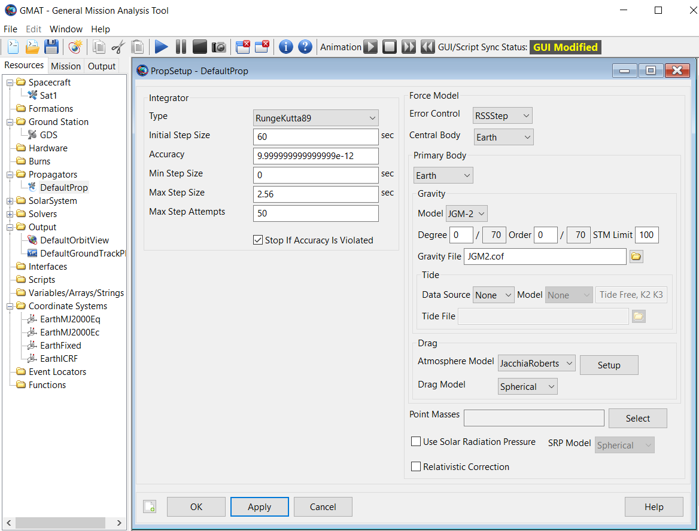

6.2D Transmitter power for UL MIMO
----------------------------------

### 6.2D.1 UE maximum output power for UL MIMO

Editor's Note:

\- No test points are defined for 2-layer UL MIMO since there is no
CP-OFDM configuration satisfying MPR=0dB requirements in TS 38.101-1.
Testing with minimum MPR has been covered in 6.2D.2.

\- No test points are defined for Power Class 1.5 non-FWA UEs supporting
UFPTx since there is no configuration satisfying MPR=0dB requirements in
TS 38.101-1. Testing with minimum MPR has been covered in 6.2D.2.

\- TP analysis needs to be updated regarding Note 3 in Table
6.2D.1.4.1-2

##### 6.2D.1.1 Test purpose {#d.1.1-test-purpose .H6}

To verify that the error of the UE maximum output power for UL MIMO does
not exceed the range prescribed by the specified nominal maximum output
power and tolerance.

An excess maximum output power has the possibility to interfere to other
channels or other systems. A small maximum output power decreases the
coverage area.

##### 6.2D.1.2 Test applicability {#d.1.2-test-applicability .H6}

This test case applies to all types of NR Power Class 1.5 FWA UEs, Power
Class 2 and Power Class 3 UE release 16 and forward that support UL full
power transmission (ULFPTx).

##### 6.2D.1.3 Minimum conformance requirements {#d.1.3-minimum-conformance-requirements .H6}

For UE with two transmit antenna connectors in closed-loop spatial
multiplexing scheme, the maximum output power for any transmission
bandwidth within the channel bandwidth is specified in Table 6.2D.1.3-1.
The requirements shall be met with the UL MIMO configurations specified
in Table 6.2D.1.3-2. For UE supporting UL MIMO, the maximum output power
is defined as the sum of the maximum output power from both UE antenna
connectors. The period of measurement shall be at least one sub frame
(1ms).

The requirements shall be met with the UL MIMO configurations of using
2-layer UL MIMO transmission with codebook
of{width="0.6770833333333334in"
height="0.4270833333333333in"}. DCI Format for UE configured in PUSCH
transmission mode for uplink single-user MIMO shall be used.

Table 6.2D.1.3-1: UE Power Class for UL MIMO in closed loop spatial
multiplexing scheme

<table>
<thead>
<tr class="header">
<th>NR band</th>
<th>Class 1 (dBm)</th>
<th>Tolerance (dB)</th>
<th>
Class 1.5

(dBm)
</th>
<th>
Tolerance

(dB)
</th>
<th>Class 2 (dBm)</th>
<th>Tolerance (dB)</th>
<th>Class 3 (dBm)</th>
<th>Tolerance (dB)</th>
<th>Class 4 (dBm)</th>
<th>Tolerance (dB)</th>
</tr>
</thead>
<tbody>
<tr class="odd">
<td>n1</td>
<td></td>
<td></td>
<td></td>
<td></td>
<td>26</td>
<td>+2/-31</td>
<td>23</td>
<td>+2/-3</td>
<td></td>
<td></td>
</tr>
<tr class="even">
<td>n2</td>
<td></td>
<td></td>
<td></td>
<td></td>
<td></td>
<td></td>
<td>23</td>
<td>+2/-31</td>
<td></td>
<td></td>
</tr>
<tr class="odd">
<td>n3</td>
<td></td>
<td></td>
<td></td>
<td></td>
<td>26</td>
<td>+2/-31</td>
<td>23</td>
<td>+2/-31</td>
<td></td>
<td></td>
</tr>
<tr class="even">
<td>n5</td>
<td></td>
<td></td>
<td></td>
<td></td>
<td></td>
<td></td>
<td>23</td>
<td>+2/-31</td>
<td></td>
<td></td>
</tr>
<tr class="odd">
<td>n7</td>
<td></td>
<td></td>
<td></td>
<td></td>
<td></td>
<td></td>
<td>23</td>
<td>+2/-31</td>
<td></td>
<td></td>
</tr>
<tr class="even">
<td>n8</td>
<td></td>
<td></td>
<td></td>
<td></td>
<td>26</td>
<td>+2/-31</td>
<td>23</td>
<td>+2/-31</td>
<td></td>
<td></td>
</tr>
<tr class="odd">
<td>n13</td>
<td></td>
<td></td>
<td></td>
<td></td>
<td></td>
<td></td>
<td>23</td>
<td>+2/-3</td>
<td></td>
<td></td>
</tr>
<tr class="even">
<td>n24</td>
<td></td>
<td></td>
<td></td>
<td></td>
<td></td>
<td></td>
<td>23</td>
<td>+2/-41</td>
<td></td>
<td></td>
</tr>
<tr class="odd">
<td>n25</td>
<td></td>
<td></td>
<td></td>
<td></td>
<td></td>
<td></td>
<td>23</td>
<td>+2/-31</td>
<td></td>
<td></td>
</tr>
<tr class="even">
<td>n26</td>
<td></td>
<td></td>
<td></td>
<td></td>
<td></td>
<td></td>
<td>23</td>
<td>+2/-31</td>
<td></td>
<td></td>
</tr>
<tr class="odd">
<td>n28</td>
<td></td>
<td></td>
<td></td>
<td></td>
<td></td>
<td></td>
<td>23</td>
<td>+2/-31</td>
<td></td>
<td></td>
</tr>
<tr class="even">
<td>n30</td>
<td></td>
<td></td>
<td></td>
<td></td>
<td></td>
<td></td>
<td>23</td>
<td>+2/-3</td>
<td></td>
<td></td>
</tr>
<tr class="odd">
<td>n34</td>
<td></td>
<td></td>
<td></td>
<td></td>
<td>26</td>
<td>+2/-3</td>
<td>23</td>
<td>+2/-3</td>
<td></td>
<td></td>
</tr>
<tr class="even">
<td>n38</td>
<td></td>
<td></td>
<td></td>
<td></td>
<td></td>
<td></td>
<td>23</td>
<td>+2/-3</td>
<td></td>
<td></td>
</tr>
<tr class="odd">
<td>n39</td>
<td></td>
<td></td>
<td></td>
<td></td>
<td>26</td>
<td>+2/-3</td>
<td>23</td>
<td>+2/-3</td>
<td></td>
<td></td>
</tr>
<tr class="even">
<td>n40</td>
<td></td>
<td></td>
<td></td>
<td></td>
<td>26</td>
<td>+2/-3</td>
<td>23</td>
<td>+2/-3</td>
<td></td>
<td></td>
</tr>
<tr class="odd">
<td>n41</td>
<td></td>
<td></td>
<td>29</td>
<td>+2/-31</td>
<td>26</td>
<td>+2/-31</td>
<td>23</td>
<td>+2/-31</td>
<td></td>
<td></td>
</tr>
<tr class="even">
<td>n48</td>
<td></td>
<td></td>
<td></td>
<td></td>
<td></td>
<td></td>
<td>23</td>
<td>+2/-3</td>
<td></td>
<td></td>
</tr>
<tr class="odd">
<td>n66</td>
<td></td>
<td></td>
<td></td>
<td></td>
<td>26</td>
<td>+2/-3</td>
<td>23</td>
<td>+2/-3</td>
<td></td>
<td></td>
</tr>
<tr class="even">
<td>n70</td>
<td></td>
<td></td>
<td></td>
<td></td>
<td>26</td>
<td>+2/-3</td>
<td>23</td>
<td>+2/-3</td>
<td></td>
<td></td>
</tr>
<tr class="odd">
<td>n71</td>
<td></td>
<td></td>
<td></td>
<td></td>
<td></td>
<td></td>
<td>23</td>
<td>+2/-3</td>
<td></td>
<td></td>
</tr>
<tr class="even">
<td>n77</td>
<td></td>
<td></td>
<td>29</td>
<td>+2/-3</td>
<td>26</td>
<td>+2/-3</td>
<td>23</td>
<td>+2/-3</td>
<td></td>
<td></td>
</tr>
<tr class="odd">
<td>n78</td>
<td></td>
<td></td>
<td>29</td>
<td>+2/-3</td>
<td>26</td>
<td>+2/-3</td>
<td>23</td>
<td>+2/-3</td>
<td></td>
<td></td>
</tr>
<tr class="even">
<td>n79</td>
<td></td>
<td></td>
<td>29</td>
<td>+2/-3</td>
<td>26</td>
<td>+2/-3</td>
<td>23</td>
<td>+2/-3</td>
<td></td>
<td></td>
</tr>
<tr class="odd">
<td>n85</td>
<td></td>
<td></td>
<td></td>
<td></td>
<td></td>
<td></td>
<td>23</td>
<td>+2/-31</td>
<td></td>
<td></td>
</tr>
<tr class="even">
<td>n97</td>
<td></td>
<td></td>
<td></td>
<td></td>
<td></td>
<td></td>
<td>23</td>
<td>+2/-3</td>
<td></td>
<td></td>
</tr>
<tr class="odd">
<td>n104</td>
<td></td>
<td></td>
<td></td>
<td></td>
<td></td>
<td></td>
<td>23</td>
<td>+2/-3</td>
<td></td>
<td></td>
</tr>
<tr class="even">
<td>n105</td>
<td></td>
<td></td>
<td></td>
<td></td>
<td></td>
<td></td>
<td>23</td>
<td>+2/-3</td>
<td></td>
<td></td>
</tr>
<tr class="odd">
<td>
NOTE 1: The transmission bandwidths confined within FUL_low and FUL_low + 4 MHz or FUL_high – 4 MHz and FUL_high, the maximum output power requirement is relaxed by reducing the lower tolerance limit by 1.5 dB.

NOTE 2: Power class 3 is the default power class unless otherwise stated.
</td>
<td></td>
<td></td>
<td></td>
<td></td>
<td></td>
<td></td>
<td></td>
<td></td>
<td></td>
<td></td>
</tr>
</tbody>
</table>

Table 6.2D.1.3-2: UL MIMO configuration in closed-loop spatial
multiplexing scheme

  Transmission scheme                                                                               DCI format        Number of layers   TPMI index
  ------------------------------------------------------------------------------------------------- ----------------- ------------------ ------------
  Codebook based uplink                                                                             DCI format 0\_1   2                  0
  NOTE 1: The UE is configured with one SRS resource with the parameter *nrofSRS-Ports* set to 2.                                        

For UEs supporting uplink full power transmission (ULFPTx) for UL MIMO,
the maximum output power requirements specified in Table 6.2D.1.3-1
shall be met with the PUSCH configurations specified in Table
6.2D.1.3-3, based upon UE's support of uplink full power transmission
mode.

Table 6.2D.1.3-3: PUSCH Configuration for uplink full power transmission
(ULFPTx)

+---------+---------+---------+---------+---------+---------+---------+
| ULFPTx  | Trans   | DCI     | Mod     | Number  | Number  | TPMI    |
| Mode    | mission | format  | ulation | of      | of Tx   | index   |
|         | scheme  |         |         | layers  | Port    |         |
+=========+=========+=========+=========+=========+=========+=========+
| Mode-1  | C       | DCI     | DFT-    | 1       | 2       | 2       |
|         | odebook | format  | s-OFDM, |         |         |         |
|         | based   | 0\_1    | CP-OFDM |         |         |         |
|         | uplink  |         | ^NOTE3^ |         |         |         |
+---------+---------+---------+---------+---------+---------+---------+
| Mode-2  | C       | DCI     | DFT-    | 1       | 2       | 0 or    |
|         | odebook | format  | s-OFDM, |         |         | 1       |
|         | based   | 0\_1    | CP-OFDM |         |         | ^NOTE2^ |
|         | uplink  |         |         |         |         |         |
+---------+---------+---------+---------+---------+---------+---------+
| Mo      | C       | DCI     | DFT-    | 1       | 2       | 0,1     |
| de-full | odebook | format  | s-OFDM, |         |         |         |
| power   | based   | 0\_1    | CP-OFDM |         |         |         |
|         | uplink  |         |         |         |         |         |
+---------+---------+---------+---------+---------+---------+---------+
| NOTE 1: |         |         |         |         |         |         |
| The UE  |         |         |         |         |         |         |
| is      |         |         |         |         |         |         |
| con     |         |         |         |         |         |         |
| figured |         |         |         |         |         |         |
| with    |         |         |         |         |         |         |
| one SRS |         |         |         |         |         |         |
| r       |         |         |         |         |         |         |
| esource |         |         |         |         |         |         |
| with    |         |         |         |         |         |         |
| the     |         |         |         |         |         |         |
| pa      |         |         |         |         |         |         |
| rameter |         |         |         |         |         |         |
| *       |         |         |         |         |         |         |
| nrofSRS |         |         |         |         |         |         |
| -Ports* |         |         |         |         |         |         |
| set to  |         |         |         |         |         |         |
| 2.      |         |         |         |         |         |         |
|         |         |         |         |         |         |         |
| NOTE 2: |         |         |         |         |         |         |
| TPMI    |         |         |         |         |         |         |
| index   |         |         |         |         |         |         |
| s       |         |         |         |         |         |         |
| elected |         |         |         |         |         |         |
| shall   |         |         |         |         |         |         |
| be      |         |         |         |         |         |         |
| based   |         |         |         |         |         |         |
| upon    |         |         |         |         |         |         |
| the     |         |         |         |         |         |         |
| full    |         |         |         |         |         |         |
| power   |         |         |         |         |         |         |
| TPMI    |         |         |         |         |         |         |
| r       |         |         |         |         |         |         |
| eported |         |         |         |         |         |         |
| by the  |         |         |         |         |         |         |
| UE      |         |         |         |         |         |         |
| \[9\].  |         |         |         |         |         |         |
|         |         |         |         |         |         |         |
| NOTE 3: |         |         |         |         |         |         |
| For     |         |         |         |         |         |         |
| PUSCH   |         |         |         |         |         |         |
| con     |         |         |         |         |         |         |
| figured |         |         |         |         |         |         |
| with    |         |         |         |         |         |         |
| ULFPTx  |         |         |         |         |         |         |
| Mode    |         |         |         |         |         |         |
| set to  |         |         |         |         |         |         |
| Mode-1, |         |         |         |         |         |         |
| all the |         |         |         |         |         |         |
| tran    |         |         |         |         |         |         |
| smitter |         |         |         |         |         |         |
| requ    |         |         |         |         |         |         |
| irement |         |         |         |         |         |         |
| for     |         |         |         |         |         |         |
| CP-OFDM |         |         |         |         |         |         |
| based   |         |         |         |         |         |         |
| mod     |         |         |         |         |         |         |
| ulation |         |         |         |         |         |         |
| is not  |         |         |         |         |         |         |
| needed  |         |         |         |         |         |         |
| to be   |         |         |         |         |         |         |
| v       |         |         |         |         |         |         |
| erified |         |         |         |         |         |         |
| if the  |         |         |         |         |         |         |
| requ    |         |         |         |         |         |         |
| irement |         |         |         |         |         |         |
| for UL  |         |         |         |         |         |         |
| MIMO    |         |         |         |         |         |         |
| has     |         |         |         |         |         |         |
| been    |         |         |         |         |         |         |
| val     |         |         |         |         |         |         |
| idated. |         |         |         |         |         |         |
+---------+---------+---------+---------+---------+---------+---------+

If the UE is scheduled for single antenna-port PUSCH transmission by DCI
format 0\_0 or by DCI format 0\_1 for single antenna port codebook based
transmission, the requirements in clause 6.2 apply for at least one
antenna connector for the power class as indicated by the
*ue-PowerClass* field in capability signalling with the following
exception: for UEs indicating *txDiversity-r16*, the requirements in
clause 6.2G for the power class indicated by the *ue-PowerClass*.

A UE indicating the feature *ul-FullPwrMode-r16* or
*ul-FullPwrMode2-TPMIGroup-r16* for a band shall meet the requirement in
clause 6.2 for at least one antenna connector when scheduled for single
antenna-port transmission by DCI format 0\_0 or by DCI format 0\_1 for
codebook-based transmission on a single antenna port.

The normative reference for this requirement is TS 38.101-1 \[2\] clause
6.2D.1.

##### 6.2D.1.4 Test description {#d.1.4-test-description .H6}

##### 6.2D.1.4.1 Initial conditions {#d.1.4.1-initial-conditions .H6}

Initial conditions are a set of test configurations the UE needs to be
tested in and the steps for the SS to take with the UE to reach the
correct measurement state.

The initial test configurations consist of environmental conditions,
test frequencies, test channel bandwidths and sub-carrier spacing based
on NR operating bands specified in table 5.3.5-1. All of these
configurations shall be tested with applicable test parameters for each
combination of test channel bandwidth and sub-carrier spacing, and are
shown in Table 6.2D.1.4.1-1 and Table 6.2D.1.4.1-2. The details of the
uplink reference measurement channels (RMCs) are specified in Annexes
A.2. Configurations of PDSCH and PDCCH before measurement are specified
in Annex C.2.

Table 6.2D.1.4.1-1: Test Configuration Table for 2-layer UL MIMO

NOTE: No test points are defined since there is no CP-OFDM configuration
satisfying MPR=0dB requirements in TS 38.101-1.

Table 6.2D.1.4.1-2: Test Configuration Table for uplink full power
transmission (ULFPTx) for Power Class 3, Power Class 2 and Power Class
1.5 FWA UEs

+----------------+----------------+----------------+----------------+
| Initial        |                |                |                |
| Conditions     |                |                |                |
+================+================+================+================+
| Test           | Normal, TL/VL, |                |                |
| Environment as | TL/VH, TH/VL,  |                |                |
| specified in   | TH/VH          |                |                |
| TS 38.508-1    |                |                |                |
| \[5\]          |                |                |                |
| subclause 4.1  |                |                |                |
+----------------+----------------+----------------+----------------+
| Test           | Low range, Mid |                |                |
| Frequencies as | range, High    |                |                |
| specified in   | range          |                |                |
| TS 38.508-1    |                |                |                |
| \[5\]          |                |                |                |
| subclause      |                |                |                |
| 4.3.1          |                |                |                |
+----------------+----------------+----------------+----------------+
| Test Channel   | Lowest, Mid,   |                |                |
| Bandwidths as  | Highest        |                |                |
| specified in   |                |                |                |
| TS 38.508-1    |                |                |                |
| \[5\]          |                |                |                |
| subclause      |                |                |                |
| 4.3.1          |                |                |                |
+----------------+----------------+----------------+----------------+
| Test SCS as    | Lowest,        |                |                |
| specified in   | Highest        |                |                |
| Table 5.3.5-1  |                |                |                |
+----------------+----------------+----------------+----------------+
| Test           |                |                |                |
| Parameters     |                |                |                |
+----------------+----------------+----------------+----------------+
| Test ID        | Downlink       | Uplink         |                |
|                | Configuration  | Configuration  |                |
+----------------+----------------+----------------+----------------+
|                | N/A for        | Modulation     | RB allocation  |
|                | maximum output | (NOTE 2)       | (NOTE 1)       |
+----------------+----------------+----------------+----------------+
| 1              | power test     | DFT-s-OFDM     | Inner Full     |
|                | case           | PI/2 BPSK      |                |
+----------------+----------------+----------------+----------------+
| 2              |                | DFT-s-OFDM     | Inner 1RB Left |
|                |                | PI/2 BPSK      |                |
+----------------+----------------+----------------+----------------+
| 3              |                | DFT-s-OFDM     | Inner 1RB      |
|                |                | PI/2 BPSK      | Right          |
+----------------+----------------+----------------+----------------+
| 4              |                | DFT-s-OFDM     | Inner Full     |
|                |                | QPSK           |                |
+----------------+----------------+----------------+----------------+
| 5              |                | DFT-s-OFDM     | Inner 1RB Left |
|                |                | QPSK           |                |
+----------------+----------------+----------------+----------------+
| 6              |                | DFT-s-OFDM     | Inner 1RB      |
|                |                | QPSK           | Right          |
+----------------+----------------+----------------+----------------+
| NOTE 1: The    |                |                |                |
| specific       |                |                |                |
| configuration  |                |                |                |
| of each RB     |                |                |                |
| allocation is  |                |                |                |
| defined in     |                |                |                |
| Table 6.1-1.   |                |                |                |
|                |                |                |                |
| NOTE 2:        |                |                |                |
| DFT-s-OFDM     |                |                |                |
| PI/2 BPSK test |                |                |                |
| applies only   |                |                |                |
| for UEs which  |                |                |                |
| supports half  |                |                |                |
| Pi BPSK in     |                |                |                |
| FR1.           |                |                |                |
|                |                |                |                |
| NOTE 3: Only   |                |                |                |
| Test IDs 1, 2  |                |                |                |
| and 3 apply to |                |                |                |
| Power Class 2  |                |                |                |
| UEs if TxD is  |                |                |                |
| indicated.     |                |                |                |
+----------------+----------------+----------------+----------------+

1\. Connect the SS to the UE antenna connectors as shown in TS 38.508-1
\[5\] Annex A, Figure A.3.1.1.2 for TE diagram and section A.3.2 for UE
diagram.

2\. The parameter settings for the cell are set up according to TS
38.508-1 \[5\] subclause 4.4.3.

3\. Downlink signals are initially set up according to Annex C.0, C.1,
C.2, and uplink signals according to Annex G.0, G.1, G.2, G.3.0.

4\. The UL Reference Measurement Channel is set according to Table
6.2D.1.4.1-1 and Table 6.2D.1.4.1-2.

5\. Propagation conditions are set according to Annex B.0.

6\. Ensure the UE is in state RRC\_CONNECTED with generic procedure
parameters Connectivity *NR,* Connected without release *On,* Test Mode
*On* and Test Loop Function *On* according to TS 38.508-1 \[5\] clause
4.5. Message contents are defined in clause 6.2D.1.4.3.

##### 6.2D.1.4.2 Test procedure {#d.1.4.2-test-procedure .H6}

Sub-test for 2-Layer codebook based UL-MIMO:

1\. SS sends uplink scheduling information for each UL HARQ process via
PDCCH DCI format 0\_1 for C\_RNTI to schedule the UL RMC according to
Table 6.2D.1.4.1-1. Since the UE has no payload and no loopback data to
send the UE sends uplink MAC padding bits on the UL RMC. The PDCCH DCI
format 0\_1 is specified with the condition 2TX\_UL\_MIMO in 38.508-1
\[5\] subclause 4.3.6.1.1.2.

2\. Send continuously uplink power control \"up\" commands in every
uplink scheduling information to the UE; allow at least 200ms starting
from the first TPC command in this step for the UE to reach P~UMAX~
level.

3\. Measure the sum of the mean power of the UE at each transmit antenna
connector in the channel bandwidth of the radio access mode. The period
of measurement shall be at least the continuous duration of 1ms over all
active uplink slots and in the uplink symbols. For TDD slots only slots
consisting of only UL symbols are under.

Sub-test for ULFPTx

4\. If the UE supports ULFPTx, repeat test steps 1\~3 with UL RMC
according to Table 6.2D.1.4.1-2. The PDCCH DCI format 0\_1 is specified
with the condition ULFPTx\_Mode1, ULFPTx\_Mode2 or ULFPTx\_ModeFull in
38.508-1 \[5\] subclause 4.3.6.1.1.2 depending on the UE supported
capability. Message contents are according to TS 38.508-1 \[5\] clause
4.6.3 Table 4.6.3-118 with condition TRANSFORM\_PRECODER\_ENABLED.

##### 6.2D.1.4.3 Message contents {#d.1.4.3-message-contents .H6}

Message contents are according to TS 38.508-1 \[5\] subclause 4.6 and
5.4 ensuring Table 4.6.3-182 with the condition 2TX\_UL\_MIMO.

##### 6.2D.1.5 Test requirement {#d.1.5-test-requirement .H6}

The maximum output power, derived in step 3 or step 4 shall be within
the range prescribed by the nominal maximum output power and tolerance
in Table 6.2D.1.5-1.

Table 6.2D.1.5-1: UE Power Class

<table>
<thead>
<tr class="header">
<th>NR band</th>
<th>Class 1 (dBm)</th>
<th>Tolerance (dB)</th>
<th>Class 1.5 (dBm)</th>
<th>Tolerance (dB)</th>
<th>Class 2 (dBm)</th>
<th>Tolerance (dB)</th>
<th>Class 3 (dBm)</th>
<th>Tolerance (dB)</th>
<th>Class 4 (dBm)</th>
<th>Tolerance (dB)</th>
</tr>
</thead>
<tbody>
<tr class="odd">
<td>n1</td>
<td></td>
<td></td>
<td></td>
<td></td>
<td>26</td>
<td>+2+TT/-31-TT</td>
<td>23</td>
<td>+2+TT/-3-TT</td>
<td></td>
<td></td>
</tr>
<tr class="even">
<td>n2</td>
<td></td>
<td></td>
<td></td>
<td></td>
<td></td>
<td></td>
<td>23</td>
<td>+2+TT/-31-TT</td>
<td></td>
<td></td>
</tr>
<tr class="odd">
<td>n3</td>
<td></td>
<td></td>
<td></td>
<td></td>
<td>26</td>
<td>+2+TT/-31-TT</td>
<td>23</td>
<td>+2+TT/-31-TT</td>
<td></td>
<td></td>
</tr>
<tr class="even">
<td>n5</td>
<td></td>
<td></td>
<td></td>
<td></td>
<td></td>
<td></td>
<td>23</td>
<td>+2+TT/-31-TT</td>
<td></td>
<td></td>
</tr>
<tr class="odd">
<td>n7</td>
<td></td>
<td></td>
<td></td>
<td></td>
<td></td>
<td></td>
<td>23</td>
<td>+2+TT/-31-TT</td>
<td></td>
<td></td>
</tr>
<tr class="even">
<td>n8</td>
<td></td>
<td></td>
<td></td>
<td></td>
<td>26</td>
<td>+2+TT/-31-TT</td>
<td>23</td>
<td>+2+TT/-31-TT</td>
<td></td>
<td></td>
</tr>
<tr class="odd">
<td>n13</td>
<td></td>
<td></td>
<td></td>
<td></td>
<td></td>
<td></td>
<td></td>
<td>+2+TT/-3-TT</td>
<td></td>
<td></td>
</tr>
<tr class="even">
<td>n24</td>
<td></td>
<td></td>
<td></td>
<td></td>
<td></td>
<td></td>
<td>23</td>
<td>+2+TT/-41-TT</td>
<td></td>
<td></td>
</tr>
<tr class="odd">
<td>n25</td>
<td></td>
<td></td>
<td></td>
<td></td>
<td></td>
<td></td>
<td>23</td>
<td>+2+TT/-31-TT</td>
<td></td>
<td></td>
</tr>
<tr class="even">
<td>n26</td>
<td></td>
<td></td>
<td></td>
<td></td>
<td></td>
<td></td>
<td></td>
<td>+2+TT/-31-TT</td>
<td></td>
<td></td>
</tr>
<tr class="odd">
<td>n28</td>
<td></td>
<td></td>
<td></td>
<td></td>
<td></td>
<td></td>
<td>23</td>
<td>+2+TT/-31-TT</td>
<td></td>
<td></td>
</tr>
<tr class="even">
<td>n30</td>
<td></td>
<td></td>
<td></td>
<td></td>
<td></td>
<td></td>
<td>23</td>
<td>+2+TT/-3-TT</td>
<td></td>
<td></td>
</tr>
<tr class="odd">
<td>n34</td>
<td></td>
<td></td>
<td></td>
<td></td>
<td>26</td>
<td>+2+TT/-3-TT</td>
<td>23</td>
<td>+2+TT/-3-TT</td>
<td></td>
<td></td>
</tr>
<tr class="even">
<td>n38</td>
<td></td>
<td></td>
<td></td>
<td></td>
<td></td>
<td></td>
<td>23</td>
<td>+2+TT/-3-TT</td>
<td></td>
<td></td>
</tr>
<tr class="odd">
<td>n39</td>
<td></td>
<td></td>
<td></td>
<td></td>
<td>26</td>
<td>+2+TT/-3-TT</td>
<td>23</td>
<td>+2+TT/-3-TT</td>
<td></td>
<td></td>
</tr>
<tr class="even">
<td>n40</td>
<td></td>
<td></td>
<td></td>
<td></td>
<td>26</td>
<td>+2+TT/-3-TT</td>
<td>23</td>
<td>+2+TT/-3-TT</td>
<td></td>
<td></td>
</tr>
<tr class="odd">
<td>n41</td>
<td></td>
<td></td>
<td>29</td>
<td>_+2+TT/-31-TT</td>
<td>26</td>
<td>+2+TT/-31-TT</td>
<td>23</td>
<td>+2+TT/-31-TT</td>
<td></td>
<td></td>
</tr>
<tr class="even">
<td>n48</td>
<td></td>
<td></td>
<td></td>
<td></td>
<td></td>
<td></td>
<td>23</td>
<td>+2+TT/-3-TT</td>
<td></td>
<td></td>
</tr>
<tr class="odd">
<td>n66</td>
<td></td>
<td></td>
<td></td>
<td></td>
<td>26</td>
<td>+2+TT/-3-TT</td>
<td>23</td>
<td>+2+TT/-3-TT</td>
<td></td>
<td></td>
</tr>
<tr class="even">
<td>n70</td>
<td></td>
<td></td>
<td></td>
<td></td>
<td>26</td>
<td>+2+TT/-3-TT</td>
<td>23</td>
<td>+2+TT/-3-TT</td>
<td></td>
<td></td>
</tr>
<tr class="odd">
<td>n71</td>
<td></td>
<td></td>
<td></td>
<td></td>
<td></td>
<td></td>
<td>23</td>
<td>+2+TT/-3-TT</td>
<td></td>
<td></td>
</tr>
<tr class="even">
<td>n77</td>
<td></td>
<td></td>
<td>29</td>
<td>+2+TT/-3-TT</td>
<td>26</td>
<td>+2+TT/-3-TT</td>
<td>23</td>
<td>+2+TT/-3-TT</td>
<td></td>
<td></td>
</tr>
<tr class="odd">
<td>n78</td>
<td></td>
<td></td>
<td>29</td>
<td>+2+TT/-3-TT</td>
<td>26</td>
<td>+2+TT/-3-TT</td>
<td>23</td>
<td>+2+TT/-3-TT</td>
<td></td>
<td></td>
</tr>
<tr class="even">
<td>n79</td>
<td></td>
<td></td>
<td>29</td>
<td>+2+TT/-3-TT</td>
<td>26</td>
<td>+2+TT/-3-TT</td>
<td>23</td>
<td>+2+TT/-3-TT</td>
<td></td>
<td></td>
</tr>
<tr class="odd">
<td>n85</td>
<td></td>
<td></td>
<td></td>
<td></td>
<td></td>
<td></td>
<td></td>
<td>+2+TT/-31-TT</td>
<td></td>
<td></td>
</tr>
<tr class="even">
<td>n97</td>
<td></td>
<td></td>
<td></td>
<td></td>
<td></td>
<td></td>
<td>23</td>
<td>+2+TT/-3-TT</td>
<td></td>
<td></td>
</tr>
<tr class="odd">
<td>n104</td>
<td></td>
<td></td>
<td></td>
<td></td>
<td></td>
<td></td>
<td>23</td>
<td>+2+TT/-3-TT</td>
<td></td>
<td></td>
</tr>
<tr class="even">
<td>n105</td>
<td></td>
<td></td>
<td></td>
<td></td>
<td></td>
<td></td>
<td>23</td>
<td>+2+TT/-3-TT</td>
<td></td>
<td></td>
</tr>
<tr class="odd">
<td>
NOTE 1: The transmission bandwidths confined within FUL_low and FUL_low + 4 MHz or FUL_high – 4 MHz and FUL_high, the maximum output power requirement is relaxed by reducing the lower tolerance limit by 1.5 dB

NOTE 2: TT for each frequency and channel bandwidth is specified in Table 6.2D.1.5-2

NOTE 3: Power class 3 is the default power class unless otherwise stated
</td>
<td></td>
<td></td>
<td></td>
<td></td>
<td></td>
<td></td>
<td></td>
<td></td>
<td></td>
<td></td>
</tr>
</tbody>
</table>

Table 6.2D.1.5-2: Test Tolerance (UE maximum output power)

                         f ≤ 3.0GHz   3.0GHz \< f ≤ 6.0GHz
  ---------------------- ------------ ----------------------
  BW ≤ 40MHz             0.7 dB       1.0 dB
  40MHz \< BW ≤ 100MHz   1.0 dB       1.0 dB

The test requirements is adapted by ΔT~IB,c~ as specified in clause 6.0.

### 6.2D.1\_1 UE maximum output power for SUL with UL MIMO

##### 6.2D.1\_1.1 Test purpose {#d.1_1.1-test-purpose .H6}

Same test purpose as in clause 6.2D.1.1.

##### 6.2D.1\_1.2 Test applicability {#d.1_1.2-test-applicability .H6}

This test applies to all types of NR UE release 17 and forward that
support SUL and UL full power transmission (ULFPTx) operating on the SUL
bands.

##### 6.2D.1\_1.3 Minimum conformance requirements {#d.1_1.3-minimum-conformance-requirements .H6}

For UE with two transmit antenna connectors in closed-loop spatial
multiplexing scheme, the maximum output power for any transmission
bandwidth within the channel bandwidth is specified in Table
6.2D.1\_1.3-1. The requirements shall be met with the UL MIMO
configurations specified in Table 6.2D.1\_1.3-2. For UE supporting UL
MIMO, the maximum output power is defined as the sum of the maximum
output power from both UE antenna connectors. The period of measurement
shall be at least one sub frame (1 ms).

The requirements shall be met with the UL MIMO configurations of using
2-layer UL MIMO transmission with codebook
of{width="0.6666666666666666in"
height="0.4270833333333333in"}. DCI Format for UE configured in PUSCH
transmission mode for uplink single-user MIMO shall be used.

Table 6.2D.1\_1.3-1: UE Power Class for UL MIMO in closed loop spatial
multiplexing scheme

+-------+-------+-------+-------+-------+-------+-------+-------+-------+
| NR    | Class | Tole  | Class | Tole  | Class | Tole  | Class | Tole  |
| band  | 1.5   | rance | 2     | rance | 3     | rance | 4     | rance |
|       | (dBm) | (dB)  | (dBm) | (dB)  | (dBm) | (dB)  | (dBm) | (dB)  |
+=======+=======+=======+=======+=======+=======+=======+=======+=======+
| n80   |       |       | 26    | +2/   | 23    | +2/   |       |       |
|       |       |       |       | -3^1^ |       | -3^1^ |       |       |
+-------+-------+-------+-------+-------+-------+-------+-------+-------+
| n81   |       |       |       |       | 23    | +2    |       |       |
|       |       |       |       |       |       | /     |       |       |
|       |       |       |       |       |       | -3^1^ |       |       |
+-------+-------+-------+-------+-------+-------+-------+-------+-------+
| n84   |       |       | 26    | +2/   | 23    | +2/-3 |       |       |
|       |       |       |       | -3^1^ |       |       |       |       |
+-------+-------+-------+-------+-------+-------+-------+-------+-------+
| n95   |       |       | 26    | +2/-3 | 23    | +2/-3 |       |       |
+-------+-------+-------+-------+-------+-------+-------+-------+-------+
| n97   |       |       | 26    | +2/-3 | 23    | +2/-3 |       |       |
+-------+-------+-------+-------+-------+-------+-------+-------+-------+
| n98   |       |       | 26    | +2/-3 | 23    | +2/-3 |       |       |
+-------+-------+-------+-------+-------+-------+-------+-------+-------+
| n99   |       |       |       |       | 23    | +2/   |       |       |
|       |       |       |       |       |       | -4^1^ |       |       |
+-------+-------+-------+-------+-------+-------+-------+-------+-------+
| NOTE  |       |       |       |       |       |       |       |       |
| 1:    |       |       |       |       |       |       |       |       |
| The   |       |       |       |       |       |       |       |       |
| tr    |       |       |       |       |       |       |       |       |
| ansmi |       |       |       |       |       |       |       |       |
| ssion |       |       |       |       |       |       |       |       |
| bandw |       |       |       |       |       |       |       |       |
| idths |       |       |       |       |       |       |       |       |
| con   |       |       |       |       |       |       |       |       |
| fined |       |       |       |       |       |       |       |       |
| w     |       |       |       |       |       |       |       |       |
| ithin |       |       |       |       |       |       |       |       |
| F~UL\ |       |       |       |       |       |       |       |       |
| _low~ |       |       |       |       |       |       |       |       |
| and   |       |       |       |       |       |       |       |       |
| F~UL\ |       |       |       |       |       |       |       |       |
| _low~ |       |       |       |       |       |       |       |       |
| + 4   |       |       |       |       |       |       |       |       |
| MHz   |       |       |       |       |       |       |       |       |
| or    |       |       |       |       |       |       |       |       |
| F     |       |       |       |       |       |       |       |       |
| ~UL\_ |       |       |       |       |       |       |       |       |
| high~ |       |       |       |       |       |       |       |       |
| -- 4  |       |       |       |       |       |       |       |       |
| MHz   |       |       |       |       |       |       |       |       |
| and   |       |       |       |       |       |       |       |       |
| F~    |       |       |       |       |       |       |       |       |
| UL\_h |       |       |       |       |       |       |       |       |
| igh~, |       |       |       |       |       |       |       |       |
| the   |       |       |       |       |       |       |       |       |
| ma    |       |       |       |       |       |       |       |       |
| ximum |       |       |       |       |       |       |       |       |
| o     |       |       |       |       |       |       |       |       |
| utput |       |       |       |       |       |       |       |       |
| power |       |       |       |       |       |       |       |       |
| r     |       |       |       |       |       |       |       |       |
| equir |       |       |       |       |       |       |       |       |
| ement |       |       |       |       |       |       |       |       |
| is    |       |       |       |       |       |       |       |       |
| re    |       |       |       |       |       |       |       |       |
| laxed |       |       |       |       |       |       |       |       |
| by    |       |       |       |       |       |       |       |       |
| red   |       |       |       |       |       |       |       |       |
| ucing |       |       |       |       |       |       |       |       |
| the   |       |       |       |       |       |       |       |       |
| lower |       |       |       |       |       |       |       |       |
| tole  |       |       |       |       |       |       |       |       |
| rance |       |       |       |       |       |       |       |       |
| limit |       |       |       |       |       |       |       |       |
| by    |       |       |       |       |       |       |       |       |
| 1.5   |       |       |       |       |       |       |       |       |
| dB    |       |       |       |       |       |       |       |       |
|       |       |       |       |       |       |       |       |       |
| NOTE  |       |       |       |       |       |       |       |       |
| 2:    |       |       |       |       |       |       |       |       |
| Power |       |       |       |       |       |       |       |       |
| class |       |       |       |       |       |       |       |       |
| 3 is  |       |       |       |       |       |       |       |       |
| the   |       |       |       |       |       |       |       |       |
| de    |       |       |       |       |       |       |       |       |
| fault |       |       |       |       |       |       |       |       |
| power |       |       |       |       |       |       |       |       |
| class |       |       |       |       |       |       |       |       |
| u     |       |       |       |       |       |       |       |       |
| nless |       |       |       |       |       |       |       |       |
| othe  |       |       |       |       |       |       |       |       |
| rwise |       |       |       |       |       |       |       |       |
| s     |       |       |       |       |       |       |       |       |
| tated |       |       |       |       |       |       |       |       |
+-------+-------+-------+-------+-------+-------+-------+-------+-------+

Table 6.2D.1\_1.3-2: UL MIMO configuration in closed-loop spatial
multiplexing scheme

  Transmission scheme                                                                               DCI format        Number of layers   TPMI index
  ------------------------------------------------------------------------------------------------- ----------------- ------------------ ------------
  Codebook based uplink                                                                             DCI format 0\_1   2                  0
  NOTE 1: The UE is configured with one SRS resource with the parameter *nrofSRS-Ports* set to 2.                                        

For UE support uplink full power transmission (ULFPTx) for UL MIMO, the
maximum output power requirements specified in Table 6.2D.1\_1.3-1 shall
be met with the PUSCH configurations specified in Table 6.2D.1\_1.3-3,
based upon UE's support of uplink full power transmission mode.

Table 6.2D.1\_1.3-3: PUSCH Configuration for uplink full power
transmission (ULFPTx)

+---------+---------+---------+---------+---------+---------+---------+
| ULFPTx  | Trans   | DCI     | Mod     | Number  | Number  | TPMI    |
| Mode    | mission | format  | ulation | of      | of Tx   | index   |
|         | scheme  |         |         | layers  | Port    |         |
+=========+=========+=========+=========+=========+=========+=========+
| Mode-1  | C       | DCI     | DFT-    | 1       | 2       | 2       |
|         | odebook | format  | s-OFDM, |         |         |         |
|         | based   | 0\_1    | CP-OFDM |         |         |         |
|         | uplink  |         | ^NOTE3^ |         |         |         |
+---------+---------+---------+---------+---------+---------+---------+
| Mode-2  | C       | DCI     | DFT-    | 1       | 2       | 0 or    |
|         | odebook | format  | s-OFDM, |         |         | 1       |
|         | based   | 0\_1    | CP-OFDM |         |         | ^NOTE2^ |
|         | uplink  |         |         |         |         |         |
+---------+---------+---------+---------+---------+---------+---------+
| Mo      | C       | DCI     | DFT-    | 1       | 2       | 0,1     |
| de-full | odebook | format  | s-OFDM, |         |         |         |
| power   | based   | 0\_1    | CP-OFDM |         |         |         |
|         | uplink  |         |         |         |         |         |
+---------+---------+---------+---------+---------+---------+---------+
| NOTE 1: |         |         |         |         |         |         |
| The UE  |         |         |         |         |         |         |
| is      |         |         |         |         |         |         |
| con     |         |         |         |         |         |         |
| figured |         |         |         |         |         |         |
| with    |         |         |         |         |         |         |
| one SRS |         |         |         |         |         |         |
| r       |         |         |         |         |         |         |
| esource |         |         |         |         |         |         |
| with    |         |         |         |         |         |         |
| the     |         |         |         |         |         |         |
| pa      |         |         |         |         |         |         |
| rameter |         |         |         |         |         |         |
| *       |         |         |         |         |         |         |
| nrofSRS |         |         |         |         |         |         |
| -Ports* |         |         |         |         |         |         |
| set to  |         |         |         |         |         |         |
| 2.      |         |         |         |         |         |         |
|         |         |         |         |         |         |         |
| NOTE 2: |         |         |         |         |         |         |
| TPMI    |         |         |         |         |         |         |
| index   |         |         |         |         |         |         |
| s       |         |         |         |         |         |         |
| elected |         |         |         |         |         |         |
| shall   |         |         |         |         |         |         |
| be      |         |         |         |         |         |         |
| based   |         |         |         |         |         |         |
| upon    |         |         |         |         |         |         |
| the     |         |         |         |         |         |         |
| full    |         |         |         |         |         |         |
| power   |         |         |         |         |         |         |
| TPMI    |         |         |         |         |         |         |
| r       |         |         |         |         |         |         |
| eported |         |         |         |         |         |         |
| by the  |         |         |         |         |         |         |
| UE \[8, |         |         |         |         |         |         |
| TS      |         |         |         |         |         |         |
| 38      |         |         |         |         |         |         |
| .213\]. |         |         |         |         |         |         |
|         |         |         |         |         |         |         |
| NOTE 3: |         |         |         |         |         |         |
| For     |         |         |         |         |         |         |
| PUSCH   |         |         |         |         |         |         |
| con     |         |         |         |         |         |         |
| figured |         |         |         |         |         |         |
| with    |         |         |         |         |         |         |
| ULFP    |         |         |         |         |         |         |
| TxModes |         |         |         |         |         |         |
| set to  |         |         |         |         |         |         |
| Mode-1, |         |         |         |         |         |         |
| all the |         |         |         |         |         |         |
| tran    |         |         |         |         |         |         |
| smitter |         |         |         |         |         |         |
| requ    |         |         |         |         |         |         |
| irement |         |         |         |         |         |         |
| for     |         |         |         |         |         |         |
| CP-OFDM |         |         |         |         |         |         |
| based   |         |         |         |         |         |         |
| mod     |         |         |         |         |         |         |
| ulation |         |         |         |         |         |         |
| is not  |         |         |         |         |         |         |
| needed  |         |         |         |         |         |         |
| to be   |         |         |         |         |         |         |
| v       |         |         |         |         |         |         |
| erified |         |         |         |         |         |         |
| if the  |         |         |         |         |         |         |
| requ    |         |         |         |         |         |         |
| irement |         |         |         |         |         |         |
| for UL  |         |         |         |         |         |         |
| MIMO    |         |         |         |         |         |         |
| has     |         |         |         |         |         |         |
| been    |         |         |         |         |         |         |
| val     |         |         |         |         |         |         |
| idated. |         |         |         |         |         |         |
+---------+---------+---------+---------+---------+---------+---------+

If the UE is scheduled for single antenna-port PUSCH transmission by DCI
format 0\_0 or by DCI format 0\_1 for single antenna port codebook based
transmission, the requirements in clause 6.2 apply for at least one
antenna connector for the power class as indicated by the
*ue-PowerClass* field in capability signalling with the following
exception: for UEs indicating *txDiversity-r16*, the requirements in
clause 6.2G for the power class indicated by the *ue-PowerClass*.

A UE indicating the feature *ul-FullPwrMode-r16* or
*ul-FullPwrMode2-TPMIGroup-r16* for a band shall meet the requirement in
clause 6.2 for at least one antenna connector when scheduled for single
antenna-port transmission by DCI format 0\_0 or by DCI format 0\_1 for
codebook-based transmission on a single antenna port.

The normative reference for this requirement is TS 38.101-1 \[2\]
clauses 4.3 and 6.2D.1.

##### 6.2D.1\_1.4 Test description {#d.1_1.4-test-description .H6}

##### 6.2D.1\_1.4.1 Initial conditions {#d.1_1.4.1-initial-conditions .H6}

Initial conditions are a set of test configurations the UE needs to be
tested in and the steps for the SS to take with the UE to reach the
correct measurement state.

The initial test configurations consist of environmental conditions,
test frequencies, test channel bandwidths and sub-carrier spacing based
on NR operating bands specified in table 5.3.5-1. All of these
configurations shall be tested with applicable test parameters for each
combination of test channel bandwidth and sub-carrier spacing, and are
shown in Table 6.2D.1\_1.4.1-1 and Table 6.2D.1\_1.4.1-2. The details of
the uplink reference measurement channels (RMCs) are specified in
Annexes A.2. Configurations of PDSCH and PDCCH before measurement are
specified in Annex C.2.

Table 6.2D.1\_1.4.1-1: Test Configuration Table for 2-layer UL MIMO on
SUL

NOTE: No test points are defined since there is no configuration
satisfying MPR=0dB requirements in TS 38.101-1.

Table 6.2D.1\_1.4.1-2: Test Configuration Table for uplink full power
transmission on SUL(ULFPTx)

+-------------+-------------+-----------+-------------+-------------+
| Initial     |             |           |             |             |
| Conditions  |             |           |             |             |
+=============+=============+===========+=============+=============+
| Test        | Normal,     |           |             |             |
| Environment | TL/VL,      |           |             |             |
| as          | TL/VH,      |           |             |             |
| specified   | TH/VL,      |           |             |             |
| in TS       | TH/VH       |           |             |             |
| 38.508-1    |             |           |             |             |
| \[5\]       |             |           |             |             |
| subclause   |             |           |             |             |
| 4.1         |             |           |             |             |
+-------------+-------------+-----------+-------------+-------------+
| Test        | Low range,  |           |             |             |
| Frequencies | Mid range,  |           |             |             |
| as          | High range  |           |             |             |
| specified   | for SUL     |           |             |             |
| in TS       | carrier     |           |             |             |
| 38.508-1    |             |           |             |             |
| \[5\]       | Mid range   |           |             |             |
| subclause   | for NUL     |           |             |             |
| 4.3.1       | carrier     |           |             |             |
+-------------+-------------+-----------+-------------+-------------+
| Test        | Lowest,     |           |             |             |
| Channel     | Mid,        |           |             |             |
| Bandwidths  | Highest for |           |             |             |
| as          | SUL carrier |           |             |             |
| specified   |             |           |             |             |
| in TS       | Lowest for  |           |             |             |
| 38.508-1    | NUL carrier |           |             |             |
| \[5\]       |             |           |             |             |
| subclause   |             |           |             |             |
| 4.3.1       |             |           |             |             |
+-------------+-------------+-----------+-------------+-------------+
| Test SCS as | Lowest      |           |             |             |
| specified   | supported   |           |             |             |
| in Table    | SCS for NUL |           |             |             |
| 5.5C-1      | carrier     |           |             |             |
|             |             |           |             |             |
|             | 15kHz for   |           |             |             |
|             | SUL carrier |           |             |             |
+-------------+-------------+-----------+-------------+-------------+
| Test        |             |           |             |             |
| Parameters  |             |           |             |             |
+-------------+-------------+-----------+-------------+-------------+
| Test ID     | DL config   | UL config | SUL         |             |
|             |             |           | Co          |             |
|             |             |           | nfiguration |             |
+-------------+-------------+-----------+-------------+-------------+
|             |             |           | Modulation  | RB          |
|             |             |           | (NOTE 2)    | allocation  |
|             |             |           |             | (NOTE 1)    |
+-------------+-------------+-----------+-------------+-------------+
| 1           | N/A         | N/A       | DFT-s-OFDM  | Inner Full  |
|             |             |           | PI/2 BPSK   |             |
+-------------+-------------+-----------+-------------+-------------+
| 2           |             |           | DFT-s-OFDM  | Inner 1RB   |
|             |             |           | PI/2 BPSK   | Left        |
+-------------+-------------+-----------+-------------+-------------+
| 3           |             |           | DFT-s-OFDM  | Inner 1RB   |
|             |             |           | PI/2 BPSK   | Right       |
+-------------+-------------+-----------+-------------+-------------+
| 4           |             |           | DFT-s-OFDM  | Inner Full  |
|             |             |           | QPSK        |             |
+-------------+-------------+-----------+-------------+-------------+
| 5           |             |           | DFT-s-OFDM  | Inner 1RB   |
|             |             |           | QPSK        | Left        |
+-------------+-------------+-----------+-------------+-------------+
| 6           |             |           | DFT-s-OFDM  | Inner 1RB   |
|             |             |           | QPSK        | Right       |
+-------------+-------------+-----------+-------------+-------------+
| NOTE 1: The |             |           |             |             |
| specific    |             |           |             |             |
| co          |             |           |             |             |
| nfiguration |             |           |             |             |
| of each RB  |             |           |             |             |
| allocation  |             |           |             |             |
| is defined  |             |           |             |             |
| in Table    |             |           |             |             |
| 6.1-1.      |             |           |             |             |
|             |             |           |             |             |
| NOTE 2:     |             |           |             |             |
| DFT-s-OFDM  |             |           |             |             |
| PI/2 BPSK   |             |           |             |             |
| test        |             |           |             |             |
| applies     |             |           |             |             |
| only for    |             |           |             |             |
| UEs which   |             |           |             |             |
| supports    |             |           |             |             |
| half Pi     |             |           |             |             |
| BPSK in     |             |           |             |             |
| FR1.        |             |           |             |             |
+-------------+-------------+-----------+-------------+-------------+

1\. Connect the SS to the UE antenna connectors as shown in TS 38.508-1
\[5\] Annex A, Figure 3.1.1.5 for TE diagram and section A.3.2 for UE
diagram.

2\. The parameter settings for the cell are set up according to TS
38.508-1 \[5\] subclause 4.4.3.

3\. Downlink signals are initially set up according to Annex C.0, C.1,
C.2, and uplink signals according to Annex G.0, G.1, G.2 and G.3.0 with
consideration of supplementary uplink physical channels.

4\. The UL Reference Measurement Channel is set according to Table
6.2D.1\_1.4.1-1 and Table 6.2D.1\_1.4.1-2.

5\. Propagation conditions are set according to Annex B.0.

6\. Ensure the UE is in state RRC\_CONNECTED with generic procedure
parameters Connectivity *NR,* Connected without release *On,* Test Mode
*On* and Test Loop Function *On* according to TS 38.508-1 \[5\] clause
4.5. Message contents are defined in clause 6.2D.1\_1.4.3.

##### 6.2D.1\_1.4.2 Test procedure {#d.1_1.4.2-test-procedure .H6}

1\. SS sends uplink scheduling information for each UL HARQ process via
PDCCH DCI format 0\_1 for C\_RNTI to schedule the UL RMC according to
Table 6.2D.1\_1.4.1-1. Since the UE has no payload and no loopback data
to send the UE sends uplink MAC padding bits on the UL RMC. The PDCCH
DCI format 0\_1 is specified with the condition 2TX\_UL\_MIMO in
38.508-1 \[5\] subclause 4.3.6.1.1.2.

2\. Send continuously uplink power control \"up\" commands in every
uplink scheduling information to the UE; allow at least 200ms starting
from the first TPC command in this step for the UE to reach P~UMAX~
level.

3\. Measure the sum of the mean power of the UE at each transmit antenna
connector in the channel bandwidth of the radio access mode. The period
of measurement shall be at least the continuous duration of 1ms over all
active uplink slots and in the uplink symbols. For TDD slots only slots
consisting of only UL symbols are under.

4\. If UE supports ULFPTx, repeat test steps 1\~3 with UL RMC according
to Table 6.2D.1\_1.4.1-2. The PDCCH DCI format 0\_1 is specified with
the condition ULFPTx\_Mode1, ULFPTx\_Mode2 or ULFPTx\_ModeFull in
38.508-1 \[5\] subclause 4.3.6.1.1.2 depending on UE reported
capability. Message contents are according to TS 38.508-1 \[5\] clause
4.6.3 Table 4.6.3-118 with condition TRANSFORM\_PRECODER\_ENABLED.

##### 6.2D.1\_1.4.3 Message contents {#d.1_1.4.3-message-contents .H6}

Message contents are according to TS 38.508-1 \[5\] subclause
4.3.6.1.1.2 ensuring UL/SUL indicator in Table 4.3.6.1.1.2-1 with
condition SUL, subclause 4.6 ensuring Table 4.6.1-28 with condition SUL
AND (RF OR RRM), Tables 4.6.3-14 with condition SUL\_SUL for SUL
carrier, Table 4.6.3-167 with condition PUSCH\_PUCCH\_ON\_SUL, and Table
4.6.3-182 with the condition 2TX\_UL\_MIMO.

##### 6.2D.1\_1.5 Test requirement {#d.1_1.5-test-requirement .H6}

The maximum output power, derived in step 3 or step 4 shall be within
the range prescribed by the nominal maximum output power and tolerance
in Table 6.2D.1\_1.5-1.

Table 6.2D.1\_1.5-1: UE Power Class

+-------+-------+-------+-------+-------+-------+-------+-------+-------+
| NR    | Class | Tole  | Class | Tole  | Class | Tole  | Class | Tole  |
| band  | 1.5   | rance | 2     | rance | 3     | rance | 4     | rance |
|       | (dBm) | (dB)  | (dBm) | (dB)  | (dBm) | (dB)  | (dBm) | (dB)  |
+=======+=======+=======+=======+=======+=======+=======+=======+=======+
| n80   |       |       | 26    | +2+T  | 23    | +2+T  |       |       |
|       |       |       |       | T/-3^ |       | T/-3^ |       |       |
|       |       |       |       | 1^-TT |       | 1^-TT |       |       |
+-------+-------+-------+-------+-------+-------+-------+-------+-------+
| n81   |       |       |       |       | 23    | +     |       |       |
|       |       |       |       |       |       | 2+TT/ |       |       |
|       |       |       |       |       |       | -3^1^ |       |       |
|       |       |       |       |       |       | -TT   |       |       |
+-------+-------+-------+-------+-------+-------+-------+-------+-------+
| n84   |       |       | 26    | +2+T  | 23    | +     |       |       |
|       |       |       |       | T/-3^ |       | 2+TT/ |       |       |
|       |       |       |       | 1^-TT |       | -3-TT |       |       |
+-------+-------+-------+-------+-------+-------+-------+-------+-------+
| n95   |       |       | 26    | +     | 23    | +     |       |       |
|       |       |       |       | 2+TT/ |       | 2+TT/ |       |       |
|       |       |       |       | -3-TT |       | -3-TT |       |       |
+-------+-------+-------+-------+-------+-------+-------+-------+-------+
| n97   |       |       | 26    | +     | 23    | +     |       |       |
|       |       |       |       | 2+TT/ |       | 2+TT/ |       |       |
|       |       |       |       | -3-TT |       | -3-TT |       |       |
+-------+-------+-------+-------+-------+-------+-------+-------+-------+
| n98   |       |       | 26    | +     | 23    | +     |       |       |
|       |       |       |       | 2+TT/ |       | 2+TT/ |       |       |
|       |       |       |       | -3-TT |       | -3-TT |       |       |
+-------+-------+-------+-------+-------+-------+-------+-------+-------+
| n99   |       |       |       |       | 23    | +2+T  |       |       |
|       |       |       |       |       |       | T/-4^ |       |       |
|       |       |       |       |       |       | 1^-TT |       |       |
+-------+-------+-------+-------+-------+-------+-------+-------+-------+
| NOTE  |       |       |       |       |       |       |       |       |
| 1:    |       |       |       |       |       |       |       |       |
| The   |       |       |       |       |       |       |       |       |
| tr    |       |       |       |       |       |       |       |       |
| ansmi |       |       |       |       |       |       |       |       |
| ssion |       |       |       |       |       |       |       |       |
| bandw |       |       |       |       |       |       |       |       |
| idths |       |       |       |       |       |       |       |       |
| con   |       |       |       |       |       |       |       |       |
| fined |       |       |       |       |       |       |       |       |
| w     |       |       |       |       |       |       |       |       |
| ithin |       |       |       |       |       |       |       |       |
| F~UL\ |       |       |       |       |       |       |       |       |
| _low~ |       |       |       |       |       |       |       |       |
| and   |       |       |       |       |       |       |       |       |
| F~UL\ |       |       |       |       |       |       |       |       |
| _low~ |       |       |       |       |       |       |       |       |
| + 4   |       |       |       |       |       |       |       |       |
| MHz   |       |       |       |       |       |       |       |       |
| or    |       |       |       |       |       |       |       |       |
| F     |       |       |       |       |       |       |       |       |
| ~UL\_ |       |       |       |       |       |       |       |       |
| high~ |       |       |       |       |       |       |       |       |
| -- 4  |       |       |       |       |       |       |       |       |
| MHz   |       |       |       |       |       |       |       |       |
| and   |       |       |       |       |       |       |       |       |
| F~    |       |       |       |       |       |       |       |       |
| UL\_h |       |       |       |       |       |       |       |       |
| igh~, |       |       |       |       |       |       |       |       |
| the   |       |       |       |       |       |       |       |       |
| ma    |       |       |       |       |       |       |       |       |
| ximum |       |       |       |       |       |       |       |       |
| o     |       |       |       |       |       |       |       |       |
| utput |       |       |       |       |       |       |       |       |
| power |       |       |       |       |       |       |       |       |
| r     |       |       |       |       |       |       |       |       |
| equir |       |       |       |       |       |       |       |       |
| ement |       |       |       |       |       |       |       |       |
| is    |       |       |       |       |       |       |       |       |
| re    |       |       |       |       |       |       |       |       |
| laxed |       |       |       |       |       |       |       |       |
| by    |       |       |       |       |       |       |       |       |
| red   |       |       |       |       |       |       |       |       |
| ucing |       |       |       |       |       |       |       |       |
| the   |       |       |       |       |       |       |       |       |
| lower |       |       |       |       |       |       |       |       |
| tole  |       |       |       |       |       |       |       |       |
| rance |       |       |       |       |       |       |       |       |
| limit |       |       |       |       |       |       |       |       |
| by    |       |       |       |       |       |       |       |       |
| 1.5   |       |       |       |       |       |       |       |       |
| dB    |       |       |       |       |       |       |       |       |
|       |       |       |       |       |       |       |       |       |
| NOTE  |       |       |       |       |       |       |       |       |
| 2:    |       |       |       |       |       |       |       |       |
| Power |       |       |       |       |       |       |       |       |
| class |       |       |       |       |       |       |       |       |
| 3 is  |       |       |       |       |       |       |       |       |
| the   |       |       |       |       |       |       |       |       |
| de    |       |       |       |       |       |       |       |       |
| fault |       |       |       |       |       |       |       |       |
| power |       |       |       |       |       |       |       |       |
| class |       |       |       |       |       |       |       |       |
| u     |       |       |       |       |       |       |       |       |
| nless |       |       |       |       |       |       |       |       |
| othe  |       |       |       |       |       |       |       |       |
| rwise |       |       |       |       |       |       |       |       |
| s     |       |       |       |       |       |       |       |       |
| tated |       |       |       |       |       |       |       |       |
+-------+-------+-------+-------+-------+-------+-------+-------+-------+

Table 6.2D.1\_1.5-2: Test Tolerance (UE maximum output power)

                         f ≤ 3.0GHz   3.0GHz \< f ≤ 6.0GHz
  ---------------------- ------------ ----------------------
  BW ≤ 40MHz             0.7 dB       1.0 dB
  40MHz \< BW ≤ 100MHz   1.0 dB       1.0 dB

The test requirements is adapted by ΔT~IB,c~ as specified in clause 6.0.

### 6.2D.2 UE maximum output power reduction for UL MIMO

##### 6.2D.2.1 Test purpose {#d.2.1-test-purpose .H6}

To verify that the power reduction of UE due to higher order modulations
and transmit bandwidth configuration does not exceed the specified
maximum power reduction.

##### 6.2D.2.2 Test applicability {#d.2.2-test-applicability .H6}

This test case applies to all types of NR Power Class 1.5, Power Class 2
and Power Class 3 UE release 15 and forward that support 2-layer
codebook based UL MIMO.

This test case applies to all types of NR Power Class 1.5, Power Class 2
and Power Class 3 UE release 16 and forward that support UL full power
transmission (ULFPTx).

NOTE: Test execution is not necessary if TS 38.521-1 6.5D.2.4.1 is
executed.

##### 6.2D.2.3 Minimum conformance requirements {#d.2.3-minimum-conformance-requirements .H6}

For UE with two transmit antenna connectors in closed-loop spatial
multiplexing scheme, the allowed Maximum Power Reduction (MPR) for the
maximum output power in Table 6.2D.1.3-1 is specified in Table 6.2.2.3-1
for PC3, Table 6.2D.2.3-1 for 2Tx PC2 when the UE does not indicate
ul-FullPwrMode-r16 or ul-FullPwrMode2-TPMIGroup-r16 for the band and
Table 6.2.2.3-2 for 2Tx PC2 when the UE indicates ul-FullPwrMode-r16 or
ul-FullPwrMode2-TPMIGroup-r16 for the band, Table 6.2D.2.3-2 and Table
6.2D.2.3-3 for PC1.5 respectively. For UE power class 1.5, the allowed
maximum power reduction (MPR) defined in Table 6.2D.2.3-3 is in
accordance with the indicated *modifiedMPR-Behaviour* specified in Table
L.1-1 for channel bandwidths ≤ 100 MHz. The requirements shall be met
with UL MIMO configurations defined in Table 6.2D.1.3-2. For UE
supporting UL MIMO, the maximum output power is defined as the sum of
the maximum output power from both antenna connectors.

For UE support uplink full power transmission (ULFPTx) for UL MIMO
except the feature *ul-FullPwrMode-r16* or
*ul-FullPwrMode2-TPMIGroup-r16*, the allowed MPR for the maximum output
power in Table 6.2D.1.3-1 is specified in Table 6.2.2.3-1 for PC3, Table
6.2D.2.3-1 when *TxD* is indicated and Table 6.2.2.3-2 when *TxD* is not
indicated for PC2 , Table 6.2D.2.3-2 and Table 6.2D.2.3-3 for PC1.5
respectively, and the requirements shall be met with the PUSCH
configurations specified in Table 6.2D.1.3-3, based upon UE's support of
uplink full power transmission mode. A UE indicating the feature
*ul-FullPwrMode-r16* or *ul-FullPwrMode2-TPMIGroup-r16* for a band shall
meet the maximum output power requirement with MPR according to clause
6.2.2.3. When a UE that indicates PC1.5 for a given band is limited to
PC2 by the rules in clause 6.2.1, the MPR requirements in Table 6.2.2-2
apply.

The same MPR requirements shall be applicable to UE with 1-layer UL MIMO
transmission (either with or without ULPFTx) as with the UL MIMO
configurations of using 2-layer UL MIMO transmission with codebook of
{width="0.6666666666666666in"
height="0.4270833333333333in"}.

For the UE maximum output power modified by MPR, the power limits
specified in subclause 6.2D.4.3 apply.

If UE is scheduled for single antenna-port PUSCH transmission by DCI
format 0\_0 or by DCI format 0\_1 for single antenna port codebook based
transmission, the corresponding requirements in clause 6.2D.1.3 apply
for the power class as indicated by the *ue-PowerClass* field in
capability signalling. A UE indicating the feature *ul-FullPwrMode-r16*
or *ul-FullPwrMode2-TPMIGroup-r16* for a band shall meet the requirement
in clause 6.2 with MPR according to clause 6.2.2.3 for at least one
antenna connector when scheduled for single antenna-port transmission by
DCI format 0\_0 or by DCI format 0\_1 for codebook-based transmission on
a single antenna port.

Table 6.2D.2.3-1: Maximum power reduction (MPR) for power class 2 with
dual Tx

  Modulation   MPR (dB)                                                            
  ------------ --------------------- ---------------------- ---------------------- -------
               Edge RB allocations   Outer RB allocations   Inner RB allocations   
  DFT-s-OFDM   Pi/2 BPSK             ≤ 3.5                  ≤ 1                    0
               QPSK                  ≤ 3.5                  ≤ 2                    0.5
               16 QAM                ≤ 3.5                  ≤ 2.5                  ≤ 1.5
               64 QAM                ≤ 3.5                  ≤ 3                    
               256 QAM               ≤ 5.5                                         
  CP-OFDM      QPSK                  ≤ 4.0                  ≤ 3.5                  ≤ 2
               16 QAM                ≤ 4.0                  ≤ 3.5                  ≤ 2.5
               64 QAM                ≤ 4.5                                         
               256 QAM               ≤ 8.0                                         

Table 6.2D.2.3-2: Maximum power reduction (MPR) for power class 1.5 with
dual Tx

  Modulation   MPR (dB)                                                            
  ------------ --------------------- ---------------------- ---------------------- -----------
               Edge RB allocations   Outer RB allocations   Inner RB allocations   
  DFT-s-OFDM   Pi/2 BPSK             ≤ 6                    ≤ \[2\]                ≤ 0.5
               QPSK                  ≤ 6.5                  ≤ \[2.5\]              ≤ 0.5
               16 QAM                ≤ 6.5                  ≤ \[3.5\]              ≤ 1.5
               64 QAM                ≤ 6.5                  ≤ \[4\]                ≤ 3.5
               256 QAM               ≤ 6.5                  ≤ 6.5                  ≤ \[6.5\]
  CP-OFDM      QPSK                  ≤ 6.5                  ≤ \[4.5\]              ≤ 2
               16 QAM                ≤ 6.5                  ≤ \[4.5\]              ≤ 2.5
               64 QAM                ≤ 6.5                  ≤ \[5\]                ≤ 4.5
               256 QAM               ≤ 8.5                  ≤ 8.5                  ≤ \[8.5\]

Table 6.2D.2.3-3: Maximum power reduction (MPR) for power class 1.5 FWA
with dual Tx

  Modulation                                                                                       MPR (dB)                                                            
  ------------------------------------------------------------------------------------------------ --------------------- ---------------------- ---------------------- -------
                                                                                                   Edge RB allocations   Outer RB allocations   Inner RB allocations   
  DFT-s-OFDM                                                                                       Pi/2 BPSK             ≤ 6                    ≤ 1.5                  ≤ 0
                                                                                                   QPSK                  ≤ 6.5                  ≤ 2                    ≤ 0
                                                                                                   16 QAM                ≤ 6.5                  ≤ 3                    ≤ 1
                                                                                                   64 QAM                ≤ 6.5                  ≤ 3.5                  ≤ 3
                                                                                                   256 QAM               ≤ 6.5                  ≤ 5.5                  ≤ 5.5
  CP-OFDM                                                                                          QPSK                  ≤ 6.5                  ≤ 4                    ≤ 1.5
                                                                                                   16 QAM                ≤ 6.5                  ≤ 4                    ≤ 2
                                                                                                   64 QAM                ≤ 6.5                  ≤ 4.5                  ≤ 4
                                                                                                   256 QAM               ≤ 7.5                  ≤ 7.5                  ≤ 7.5
  NOTE 1: This table is targeted to large FWA form factor with 20 dB or above antenna isolation.                                                                       

Inner, outer and edge allocations are as defined in section 6.2.2 except
for PC1.5 edge allocations which is for L~CRB~ ≤ 4 RBs instead of L~CRB~
≤ 2 RBs for other power classes. The normative reference for this
requirement is TS 38.101-1 \[2\] clause 6.2D.2.

##### 6.2D.2.4 Test description {#d.2.4-test-description .H6}

##### 6.2D.2.4.1 Initial conditions {#d.2.4.1-initial-conditions .H6}

Initial conditions are a set of test configurations the UE needs to be
tested in and the steps for the SS to take with the UE to reach the
correct measurement state.

The initial test configurations consist of environmental conditions,
test frequencies, test channel bandwidths and sub-carrier spacing based
on NR operating bands specified in table 5.3.5-1. All of these
configurations shall be tested with applicable test parameters for each
combination of test channel bandwidth and sub-carrier spacing, and are
shown in table 6.2D.2.4.1-1, Table 6.2D.2.4.1-1a, Table 6.2D.2.4.1-2,
Table 6.2D.2.4.1-2a, Table 6.2D.2.4.1-3 and Table 6.2D.2.4.1-3a. The
details of the uplink reference measurement channels (RMCs) are
specified in Annexes A.2. Configurations of PDSCH and PDCCH before
measurement are specified in Annex C.2.

Table 6.2D.2.4.1-1: Test Configuration Table for Power Class 3 UEs
supporting 2-layer codebook based UL MIMO

+-------------+-------------+-------------+-------------+-------------+
| Initial     |             |             |             |             |
| Conditions  |             |             |             |             |
+=============+=============+=============+=============+=============+
| Test        | Normal,     |             |             |             |
| Environment | TL/VL,      |             |             |             |
| as          | TL/VH,      |             |             |             |
| specified   | TH/VL,      |             |             |             |
| in TS       | TH/VH       |             |             |             |
| 38.508-1    |             |             |             |             |
| \[5\]       |             |             |             |             |
| subclause   |             |             |             |             |
| 4.1         |             |             |             |             |
+-------------+-------------+-------------+-------------+-------------+
| Test        | Low range,  |             |             |             |
| Frequencies | High range  |             |             |             |
| as          |             |             |             |             |
| specified   |             |             |             |             |
| in TS       |             |             |             |             |
| 38.508-1    |             |             |             |             |
| \[5\]       |             |             |             |             |
| subclause   |             |             |             |             |
| 4.3.1       |             |             |             |             |
+-------------+-------------+-------------+-------------+-------------+
| Test        | Lowest,     |             |             |             |
| Channel     | Highest     |             |             |             |
| Bandwidths  |             |             |             |             |
| as          |             |             |             |             |
| specified   |             |             |             |             |
| in TS       |             |             |             |             |
| 38.508-1    |             |             |             |             |
| \[5\]       |             |             |             |             |
| subclause   |             |             |             |             |
| 4.3.1       |             |             |             |             |
+-------------+-------------+-------------+-------------+-------------+
| Test SCS as | Lowest and  |             |             |             |
| specified   | Highest     |             |             |             |
| in Table    |             |             |             |             |
| 5.3.5-1     |             |             |             |             |
+-------------+-------------+-------------+-------------+-------------+
| Test        |             |             |             |             |
| Parameters  |             |             |             |             |
| for Channel |             |             |             |             |
| Bandwidths  |             |             |             |             |
+-------------+-------------+-------------+-------------+-------------+
| Test ID     | Freq        | Downlink    | Uplink      |             |
|             |             | Co          | Co          |             |
|             |             | nfiguration | nfiguration |             |
+-------------+-------------+-------------+-------------+-------------+
|             |             | N/A         | Modulation  | RB          |
|             |             |             |             | allocation  |
|             |             |             |             | (NOTE 1)    |
+-------------+-------------+-------------+-------------+-------------+
| 1           | Default     |             | CP-OFDM     | Inner Full  |
|             |             |             | QPSK        |             |
+-------------+-------------+-------------+-------------+-------------+
| 2           | Low         |             | CP-OFDM     | Edge        |
|             |             |             | QPSK        | \_1RB\_Left |
+-------------+-------------+-------------+-------------+-------------+
| 3           | High        |             | CP-OFDM     | Edge\       |
|             |             |             | QPSK        | _1RB\_Right |
+-------------+-------------+-------------+-------------+-------------+
| 4           | Default     |             | CP-OFDM     | Outer Full  |
|             |             |             | QPSK        |             |
+-------------+-------------+-------------+-------------+-------------+
| 5           | Default     |             | CP-OFDM 16  | Inner Full  |
|             |             |             | QAM         |             |
+-------------+-------------+-------------+-------------+-------------+
| 6           | Low         |             | CP-OFDM 16  | Edge        |
|             |             |             | QAM         | \_1RB\_Left |
+-------------+-------------+-------------+-------------+-------------+
| 7           | High        |             | CP-OFDM 16  | Edge\       |
|             |             |             | QAM         | _1RB\_Right |
+-------------+-------------+-------------+-------------+-------------+
| 8           | Default     |             | CP-OFDM 16  | Outer Full  |
|             |             |             | QAM         |             |
+-------------+-------------+-------------+-------------+-------------+
| 9           | Low         |             | CP-OFDM 64  | Edge        |
|             |             |             | QAM         | \_1RB\_Left |
+-------------+-------------+-------------+-------------+-------------+
| 10          | High        |             | CP-OFDM 64  | Edge\       |
|             |             |             | QAM         | _1RB\_Right |
+-------------+-------------+-------------+-------------+-------------+
| 11          | Default     |             | CP-OFDM 64  | Outer Full  |
|             |             |             | QAM         |             |
+-------------+-------------+-------------+-------------+-------------+
| 12          | Low         |             | CP-OFDM 256 | Edge        |
|             |             |             | QAM         | \_1RB\_Left |
+-------------+-------------+-------------+-------------+-------------+
| 13          | High        |             | CP-OFDM 256 | Edge\       |
|             |             |             | QAM         | _1RB\_Right |
+-------------+-------------+-------------+-------------+-------------+
| 14          | Default     |             | CP-OFDM 256 | Outer Full  |
|             |             |             | QAM         |             |
+-------------+-------------+-------------+-------------+-------------+
| NOTE 1: The |             |             |             |             |
| specific    |             |             |             |             |
| co          |             |             |             |             |
| nfiguration |             |             |             |             |
| of each RB  |             |             |             |             |
| allocation  |             |             |             |             |
| is defined  |             |             |             |             |
| in Table    |             |             |             |             |
| 6.1-1.      |             |             |             |             |
|             |             |             |             |             |
| NOTE 2:     |             |             |             |             |
| CP-OFDM 256 |             |             |             |             |
| QAM test    |             |             |             |             |
| applies     |             |             |             |             |
| only for    |             |             |             |             |
| UEs which   |             |             |             |             |
| supports    |             |             |             |             |
| 256QAM in   |             |             |             |             |
| FR1.        |             |             |             |             |
+-------------+-------------+-------------+-------------+-------------+

Table 6.2D.2.4.1-1a: Test Configuration Table for power class 3 UEs
supporting ULFPTx

+-------------+-------------+-------------+-------------+-------------+
| Initial     |             |             |             |             |
| Conditions  |             |             |             |             |
+=============+=============+=============+=============+=============+
| Test        | Normal,     |             |             |             |
| Environment | TL/VL,      |             |             |             |
| as          | TL/VH,      |             |             |             |
| specified   | TH/VL,      |             |             |             |
| in TS       | TH/VH       |             |             |             |
| 38.508-1    |             |             |             |             |
| \[5\]       |             |             |             |             |
| subclause   |             |             |             |             |
| 4.1         |             |             |             |             |
+-------------+-------------+-------------+-------------+-------------+
| Test        | Low range,  |             |             |             |
| Frequencies | High range  |             |             |             |
| as          |             |             |             |             |
| specified   |             |             |             |             |
| in TS       |             |             |             |             |
| 38.508-1    |             |             |             |             |
| \[5\]       |             |             |             |             |
| subclause   |             |             |             |             |
| 4.3.1       |             |             |             |             |
+-------------+-------------+-------------+-------------+-------------+
| Test        | Lowest,     |             |             |             |
| Channel     | Highest     |             |             |             |
| Bandwidths  |             |             |             |             |
| as          |             |             |             |             |
| specified   |             |             |             |             |
| in TS       |             |             |             |             |
| 38.508-1    |             |             |             |             |
| \[5\]       |             |             |             |             |
| subclause   |             |             |             |             |
| 4.3.1       |             |             |             |             |
+-------------+-------------+-------------+-------------+-------------+
| Test SCS as | Lowest,     |             |             |             |
| specified   | Highest     |             |             |             |
| in Table    |             |             |             |             |
| 5.3.5-1     |             |             |             |             |
+-------------+-------------+-------------+-------------+-------------+
| Test        |             |             |             |             |
| Parameters  |             |             |             |             |
| for Channel |             |             |             |             |
| Bandwidths  |             |             |             |             |
+-------------+-------------+-------------+-------------+-------------+
| Test ID     | Freq        | Downlink    | Uplink      |             |
|             |             | Co          | Co          |             |
|             |             | nfiguration | nfiguration |             |
+-------------+-------------+-------------+-------------+-------------+
|             |             | N/A for     | Modulation  | RB          |
|             |             | Maximum     | (NOTE 2)    | allocation  |
|             |             | Power       |             | (NOTE 1)    |
|             |             | Reduction   |             |             |
|             |             | (MPR) test  |             |             |
|             |             | case        |             |             |
+-------------+-------------+-------------+-------------+-------------+
| 1^4^        | Default     |             | DFT-s-OFDM  | Inner Full  |
|             |             |             | Pi/2 BPSK   |             |
+-------------+-------------+-------------+-------------+-------------+
| 2^4^        | Low         |             | DFT-s-OFDM  | Edge        |
|             |             |             | Pi/2 BPSK   | \_1RB\_Left |
+-------------+-------------+-------------+-------------+-------------+
| 3^4^        | High        |             | DFT-s-OFDM  | Edge\       |
|             |             |             | Pi/2 BPSK   | _1RB\_Right |
+-------------+-------------+-------------+-------------+-------------+
| 4^4^        | Default     |             | DFT-s-OFDM  | Outer Full  |
|             |             |             | Pi/2 BPSK   |             |
+-------------+-------------+-------------+-------------+-------------+
| 5           | Default     |             | DFT-s-OFDM  | Inner Full  |
|             |             |             | QPSK        |             |
+-------------+-------------+-------------+-------------+-------------+
| 6           | Low         |             | DFT-s-OFDM  | Edge        |
|             |             |             | QPSK        | \_1RB\_Left |
+-------------+-------------+-------------+-------------+-------------+
| 7           | High        |             | DFT-s-OFDM  | Edge\       |
|             |             |             | QPSK        | _1RB\_Right |
+-------------+-------------+-------------+-------------+-------------+
| 8           | Default     |             | DFT-s-OFDM  | Outer Full  |
|             |             |             | QPSK        |             |
+-------------+-------------+-------------+-------------+-------------+
| 9           | Default     |             | DFT-s-OFDM  | Inner Full  |
|             |             |             | 16 QAM      |             |
+-------------+-------------+-------------+-------------+-------------+
| 10          | Low         |             | DFT-s-OFDM  | Edge        |
|             |             |             | 16 QAM      | \_1RB\_Left |
+-------------+-------------+-------------+-------------+-------------+
| 11          | High        |             | DFT-s-OFDM  | Edge\       |
|             |             |             | 16 QAM      | _1RB\_Right |
+-------------+-------------+-------------+-------------+-------------+
| 12          | Default     |             | DFT-s-OFDM  | Outer Full  |
|             |             |             | 16 QAM      |             |
+-------------+-------------+-------------+-------------+-------------+
| 13          | Low         |             | DFT-s-OFDM  | Edge        |
|             |             |             | 64 QAM      | \_1RB\_Left |
+-------------+-------------+-------------+-------------+-------------+
| 14          | High        |             | DFT-s-OFDM  | Edge\       |
|             |             |             | 64 QAM      | _1RB\_Right |
+-------------+-------------+-------------+-------------+-------------+
| 15          | Default     |             | DFT-s-OFDM  | Outer Full  |
|             |             |             | 64 QAM      |             |
+-------------+-------------+-------------+-------------+-------------+
| 16          | Low         |             | DFT-s-OFDM  | Edge        |
|             |             |             | 256 QAM     | \_1RB\_Left |
+-------------+-------------+-------------+-------------+-------------+
| 17          | High        |             | DFT-s-OFDM  | Edge\       |
|             |             |             | 256 QAM     | _1RB\_Right |
+-------------+-------------+-------------+-------------+-------------+
| 18          | Default     |             | DFT-s-OFDM  | Outer Full  |
|             |             |             | 256 QAM     |             |
+-------------+-------------+-------------+-------------+-------------+
| 19          | Default     |             | CP-OFDM     | Inner Full  |
|             |             |             | QPSK        |             |
+-------------+-------------+-------------+-------------+-------------+
| 20          | Low         |             | CP-OFDM     | Edge        |
|             |             |             | QPSK        | \_1RB\_Left |
+-------------+-------------+-------------+-------------+-------------+
| 21          | High        |             | CP-OFDM     | Edge\       |
|             |             |             | QPSK        | _1RB\_Right |
+-------------+-------------+-------------+-------------+-------------+
| 22          | Default     |             | CP-OFDM     | Outer Full  |
|             |             |             | QPSK        |             |
+-------------+-------------+-------------+-------------+-------------+
| 23          | Default     |             | CP-OFDM 16  | Inner Full  |
|             |             |             | QAM         |             |
+-------------+-------------+-------------+-------------+-------------+
| 24          | Low         |             | CP-OFDM 16  | Edge        |
|             |             |             | QAM         | \_1RB\_Left |
+-------------+-------------+-------------+-------------+-------------+
| 25          | High        |             | CP-OFDM 16  | Edge\       |
|             |             |             | QAM         | _1RB\_Right |
+-------------+-------------+-------------+-------------+-------------+
| 26          | Default     |             | CP-OFDM 16  | Outer Full  |
|             |             |             | QAM         |             |
+-------------+-------------+-------------+-------------+-------------+
| 27          | Low         |             | CP-OFDM 64  | Edge        |
|             |             |             | QAM         | \_1RB\_Left |
+-------------+-------------+-------------+-------------+-------------+
| 28          | High        |             | CP-OFDM 64  | Edge\       |
|             |             |             | QAM         | _1RB\_Right |
+-------------+-------------+-------------+-------------+-------------+
| 29          | Default     |             | CP-OFDM 64  | Outer Full  |
|             |             |             | QAM         |             |
+-------------+-------------+-------------+-------------+-------------+
| 30          | Low         |             | CP-OFDM 256 | Edge        |
|             |             |             | QAM         | \_1RB\_Left |
+-------------+-------------+-------------+-------------+-------------+
| 31          | High        |             | CP-OFDM 256 | Edge\       |
|             |             |             | QAM         | _1RB\_Right |
+-------------+-------------+-------------+-------------+-------------+
| 32          | Default     |             | CP-OFDM 256 | Outer Full  |
|             |             |             | QAM         |             |
+-------------+-------------+-------------+-------------+-------------+
| NOTE 1: The |             |             |             |             |
| specific    |             |             |             |             |
| co          |             |             |             |             |
| nfiguration |             |             |             |             |
| of each RB  |             |             |             |             |
| allocation  |             |             |             |             |
| is defined  |             |             |             |             |
| in Table    |             |             |             |             |
| 6.1-1.      |             |             |             |             |
|             |             |             |             |             |
| NOTE 2:     |             |             |             |             |
| DFT-s-OFDM  |             |             |             |             |
| Pi/2 BPSK   |             |             |             |             |
| test        |             |             |             |             |
| applies     |             |             |             |             |
| only for    |             |             |             |             |
| UEs which   |             |             |             |             |
| supports    |             |             |             |             |
| half Pi     |             |             |             |             |
| BPSK in     |             |             |             |             |
| FR1.        |             |             |             |             |
|             |             |             |             |             |
| NOTE 3:     |             |             |             |             |
| Test ID 19  |             |             |             |             |
| \~ 32 with  |             |             |             |             |
| CP-OFDM     |             |             |             |             |
| modulation  |             |             |             |             |
| are not     |             |             |             |             |
| needed if   |             |             |             |             |
| PDCCH DCI   |             |             |             |             |
| format 0\_1 |             |             |             |             |
| indicates   |             |             |             |             |
| ULF         |             |             |             |             |
| PTx\_Mode1. |             |             |             |             |
|             |             |             |             |             |
| NOTE 4: UE  |             |             |             |             |
| operating   |             |             |             |             |
| in FDD      |             |             |             |             |
| mode, or in |             |             |             |             |
| TDD mode in |             |             |             |             |
| bands other |             |             |             |             |
| than n40,   |             |             |             |             |
| n41, n77,   |             |             |             |             |
| n78 and     |             |             |             |             |
| n79, or in  |             |             |             |             |
| TDD mode    |             |             |             |             |
| the IE      |             |             |             |             |
| *powerBo    |             |             |             |             |
| ostPi2BPSK* |             |             |             |             |
| is set to 0 |             |             |             |             |
| for bands   |             |             |             |             |
| n40, n41,   |             |             |             |             |
| n77, n78    |             |             |             |             |
| and n79.    |             |             |             |             |
+-------------+-------------+-------------+-------------+-------------+

Table 6.2D.2.4.1-2: Test Configuration Table for Power Class 2 UEs
supporting 2-layer codebook based UL MIMO

+-------------+-------------+-------------+-------------+-------------+
| Initial     |             |             |             |             |
| Conditions  |             |             |             |             |
+=============+=============+=============+=============+=============+
| Test        | Normal,     |             |             |             |
| Environment | TL/VL,      |             |             |             |
| as          | TL/VH,      |             |             |             |
| specified   | TH/VL,      |             |             |             |
| in TS       | TH/VH       |             |             |             |
| 38.508-1    |             |             |             |             |
| \[5\]       |             |             |             |             |
| subclause   |             |             |             |             |
| 4.1         |             |             |             |             |
+-------------+-------------+-------------+-------------+-------------+
| Test        | Low range,  |             |             |             |
| Frequencies | High range  |             |             |             |
| as          |             |             |             |             |
| specified   |             |             |             |             |
| in TS       |             |             |             |             |
| 38.508-1    |             |             |             |             |
| \[5\]       |             |             |             |             |
| subclause   |             |             |             |             |
| 4.3.1       |             |             |             |             |
+-------------+-------------+-------------+-------------+-------------+
| Test        | Lowest,     |             |             |             |
| Channel     | Highest     |             |             |             |
| Bandwidths  |             |             |             |             |
| as          |             |             |             |             |
| specified   |             |             |             |             |
| in TS       |             |             |             |             |
| 38.508-1    |             |             |             |             |
| \[5\]       |             |             |             |             |
| subclause   |             |             |             |             |
| 4.3.1       |             |             |             |             |
+-------------+-------------+-------------+-------------+-------------+
| Test SCS as | Lowest and  |             |             |             |
| specified   | Highest     |             |             |             |
| in Table    |             |             |             |             |
| 5.3.5-1     |             |             |             |             |
+-------------+-------------+-------------+-------------+-------------+
| Test        |             |             |             |             |
| Parameters  |             |             |             |             |
| for Channel |             |             |             |             |
| Bandwidths  |             |             |             |             |
+-------------+-------------+-------------+-------------+-------------+
| Test ID     | Freq        | Downlink    | Uplink      |             |
|             |             | Co          | Co          |             |
|             |             | nfiguration | nfiguration |             |
+-------------+-------------+-------------+-------------+-------------+
|             |             | N/A         | Modulation  | RB          |
|             |             |             |             | allocation  |
|             |             |             |             | (NOTE 1)    |
+-------------+-------------+-------------+-------------+-------------+
| 1           | Default     |             | CP-OFDM     | Inner Full  |
|             |             |             | QPSK        |             |
+-------------+-------------+-------------+-------------+-------------+
| 2           | Low         |             | CP-OFDM     | Edge        |
|             |             |             | QPSK        | \_1RB\_Left |
+-------------+-------------+-------------+-------------+-------------+
| 3           | High        |             | CP-OFDM     | Edge\       |
|             |             |             | QPSK        | _1RB\_Right |
+-------------+-------------+-------------+-------------+-------------+
| 4           | Default     |             | CP-OFDM     | Outer Full  |
|             |             |             | QPSK        |             |
+-------------+-------------+-------------+-------------+-------------+
| 5           | Default     |             | CP-OFDM 16  | Inner Full  |
|             |             |             | QAM         |             |
+-------------+-------------+-------------+-------------+-------------+
| 6           | Low         |             | CP-OFDM 16  | Edge        |
|             |             |             | QAM         | \_1RB\_Left |
+-------------+-------------+-------------+-------------+-------------+
| 7           | High        |             | CP-OFDM 16  | Edge\       |
|             |             |             | QAM         | _1RB\_Right |
+-------------+-------------+-------------+-------------+-------------+
| 8           | Default     |             | CP-OFDM 16  | Outer Full  |
|             |             |             | QAM         |             |
+-------------+-------------+-------------+-------------+-------------+
| 9           | Low         |             | CP-OFDM 64  | Edge        |
|             |             |             | QAM         | \_1RB\_Left |
+-------------+-------------+-------------+-------------+-------------+
| 10          | High        |             | CP-OFDM 64  | Edge\       |
|             |             |             | QAM         | _1RB\_Right |
+-------------+-------------+-------------+-------------+-------------+
| 11          | Default     |             | CP-OFDM 64  | Outer Full  |
|             |             |             | QAM         |             |
+-------------+-------------+-------------+-------------+-------------+
| 12          | Low         |             | CP-OFDM 256 | Edge        |
|             |             |             | QAM         | \_1RB\_Left |
+-------------+-------------+-------------+-------------+-------------+
| 13          | High        |             | CP-OFDM 256 | Edge\       |
|             |             |             | QAM         | _1RB\_Right |
+-------------+-------------+-------------+-------------+-------------+
| 14          | Default     |             | CP-OFDM 256 | Outer Full  |
|             |             |             | QAM         |             |
+-------------+-------------+-------------+-------------+-------------+
| NOTE 1: The |             |             |             |             |
| specific    |             |             |             |             |
| co          |             |             |             |             |
| nfiguration |             |             |             |             |
| of each RB  |             |             |             |             |
| allocation  |             |             |             |             |
| is defined  |             |             |             |             |
| in Table    |             |             |             |             |
| 6.1-1.      |             |             |             |             |
|             |             |             |             |             |
| NOTE 2:     |             |             |             |             |
| CP-OFDM 256 |             |             |             |             |
| QAM test    |             |             |             |             |
| applies     |             |             |             |             |
| only for    |             |             |             |             |
| UEs which   |             |             |             |             |
| supports    |             |             |             |             |
| 256QAM in   |             |             |             |             |
| FR1.        |             |             |             |             |
+-------------+-------------+-------------+-------------+-------------+

Table 6.2D.2.4.1-2a: Test Configuration Table for power class 2 UEs
supporting ULFPTx

+-------------+-------------+-------------+-------------+-------------+
| Initial     |             |             |             |             |
| Conditions  |             |             |             |             |
+=============+=============+=============+=============+=============+
| Test        | Normal,     |             |             |             |
| Environment | TL/VL,      |             |             |             |
| as          | TL/VH,      |             |             |             |
| specified   | TH/VL,      |             |             |             |
| in TS       | TH/VH       |             |             |             |
| 38.508-1    |             |             |             |             |
| \[5\]       |             |             |             |             |
| subclause   |             |             |             |             |
| 4.1         |             |             |             |             |
+-------------+-------------+-------------+-------------+-------------+
| Test        | Low range,  |             |             |             |
| Frequencies | High range  |             |             |             |
| as          |             |             |             |             |
| specified   |             |             |             |             |
| in TS       |             |             |             |             |
| 38.508-1    |             |             |             |             |
| \[5\]       |             |             |             |             |
| subclause   |             |             |             |             |
| 4.3.1       |             |             |             |             |
+-------------+-------------+-------------+-------------+-------------+
| Test        | Lowest,     |             |             |             |
| Channel     | Highest     |             |             |             |
| Bandwidths  |             |             |             |             |
| as          |             |             |             |             |
| specified   |             |             |             |             |
| in TS       |             |             |             |             |
| 38.508-1    |             |             |             |             |
| \[5\]       |             |             |             |             |
| subclause   |             |             |             |             |
| 4.3.1       |             |             |             |             |
+-------------+-------------+-------------+-------------+-------------+
| Test SCS as | Lowest,     |             |             |             |
| specified   | Highest     |             |             |             |
| in Table    |             |             |             |             |
| 5.3.5-1     |             |             |             |             |
+-------------+-------------+-------------+-------------+-------------+
| Test        |             |             |             |             |
| Parameters  |             |             |             |             |
| for Channel |             |             |             |             |
| Bandwidths  |             |             |             |             |
+-------------+-------------+-------------+-------------+-------------+
| Test ID     | Freq        | Downlink    | Uplink      |             |
|             |             | Co          | Co          |             |
|             |             | nfiguration | nfiguration |             |
+-------------+-------------+-------------+-------------+-------------+
|             |             | N/A for     | Modulation  | RB          |
|             |             | Maximum     | (NOTE 2)    | allocation  |
|             |             | Power       |             | (NOTE 1)    |
+-------------+-------------+-------------+-------------+-------------+
| 1           | Default     | Reduction   | DFT-s-OFDM  | Inner Full  |
|             |             | (MPR) test  | Pi/2 BPSK   |             |
|             |             | case        |             |             |
+-------------+-------------+-------------+-------------+-------------+
| 2           | Low         |             | DFT-s-OFDM  | Edge        |
|             |             |             | Pi/2 BPSK   | \_1RB\_Left |
+-------------+-------------+-------------+-------------+-------------+
| 3           | High        |             | DFT-s-OFDM  | Edge\       |
|             |             |             | Pi/2 BPSK   | _1RB\_Right |
+-------------+-------------+-------------+-------------+-------------+
| 4           | Default     |             | DFT-s-OFDM  | Outer Full  |
|             |             |             | Pi/2 BPSK   |             |
+-------------+-------------+-------------+-------------+-------------+
| 5           | Default     |             | DFT-s-OFDM  | Inner Full  |
|             |             |             | QPSK        |             |
+-------------+-------------+-------------+-------------+-------------+
| 6           | Low         |             | DFT-s-OFDM  | Edge        |
|             |             |             | QPSK        | \_1RB\_Left |
+-------------+-------------+-------------+-------------+-------------+
| 7           | High        |             | DFT-s-OFDM  | Edge\       |
|             |             |             | QPSK        | _1RB\_Right |
+-------------+-------------+-------------+-------------+-------------+
| 8           | Default     |             | DFT-s-OFDM  | Outer Full  |
|             |             |             | QPSK        |             |
+-------------+-------------+-------------+-------------+-------------+
| 9           | Default     |             | DFT-s-OFDM  | Inner Full  |
|             |             |             | 16 QAM      |             |
+-------------+-------------+-------------+-------------+-------------+
| 10          | Low         |             | DFT-s-OFDM  | Edge        |
|             |             |             | 16 QAM      | \_1RB\_Left |
+-------------+-------------+-------------+-------------+-------------+
| 11          | High        |             | DFT-s-OFDM  | Edge\       |
|             |             |             | 16 QAM      | _1RB\_Right |
+-------------+-------------+-------------+-------------+-------------+
| 12          | Default     |             | DFT-s-OFDM  | Outer Full  |
|             |             |             | 16 QAM      |             |
+-------------+-------------+-------------+-------------+-------------+
| 13          | Low         |             | DFT-s-OFDM  | Edge        |
|             |             |             | 64 QAM      | \_1RB\_Left |
+-------------+-------------+-------------+-------------+-------------+
| 14          | High        |             | DFT-s-OFDM  | Edge\       |
|             |             |             | 64 QAM      | _1RB\_Right |
+-------------+-------------+-------------+-------------+-------------+
| 15          | Default     |             | DFT-s-OFDM  | Outer Full  |
|             |             |             | 64 QAM      |             |
+-------------+-------------+-------------+-------------+-------------+
| 16          | Low         |             | DFT-s-OFDM  | Edge        |
|             |             |             | 256 QAM     | \_1RB\_Left |
+-------------+-------------+-------------+-------------+-------------+
| 17          | High        |             | DFT-s-OFDM  | Edge\       |
|             |             |             | 256 QAM     | _1RB\_Right |
+-------------+-------------+-------------+-------------+-------------+
| 18          | Default     |             | DFT-s-OFDM  | Outer Full  |
|             |             |             | 256 QAM     |             |
+-------------+-------------+-------------+-------------+-------------+
| 19          | Default     |             | CP-OFDM     | Inner Full  |
|             |             |             | QPSK        |             |
+-------------+-------------+-------------+-------------+-------------+
| 20          | Low         |             | CP-OFDM     | Edge        |
|             |             |             | QPSK        | \_1RB\_Left |
+-------------+-------------+-------------+-------------+-------------+
| 21          | High        |             | CP-OFDM     | Edge\       |
|             |             |             | QPSK        | _1RB\_Right |
+-------------+-------------+-------------+-------------+-------------+
| 22          | Default     |             | CP-OFDM     | Outer Full  |
|             |             |             | QPSK        |             |
+-------------+-------------+-------------+-------------+-------------+
| 23          | Default     |             | CP-OFDM 16  | Inner Full  |
|             |             |             | QAM         |             |
+-------------+-------------+-------------+-------------+-------------+
| 24          | Low         |             | CP-OFDM 16  | Edge        |
|             |             |             | QAM         | \_1RB\_Left |
+-------------+-------------+-------------+-------------+-------------+
| 25          | High        |             | CP-OFDM 16  | Edge\       |
|             |             |             | QAM         | _1RB\_Right |
+-------------+-------------+-------------+-------------+-------------+
| 26          | Default     |             | CP-OFDM 16  | Outer Full  |
|             |             |             | QAM         |             |
+-------------+-------------+-------------+-------------+-------------+
| 27          | Low         |             | CP-OFDM 64  | Edge        |
|             |             |             | QAM         | \_1RB\_Left |
+-------------+-------------+-------------+-------------+-------------+
| 28          | High        |             | CP-OFDM 64  | Edge\       |
|             |             |             | QAM         | _1RB\_Right |
+-------------+-------------+-------------+-------------+-------------+
| 29          | Default     |             | CP-OFDM 64  | Outer Full  |
|             |             |             | QAM         |             |
+-------------+-------------+-------------+-------------+-------------+
| 30          | Low         |             | CP-OFDM 256 | Edge        |
|             |             |             | QAM         | \_1RB\_Left |
+-------------+-------------+-------------+-------------+-------------+
| 31          | High        |             | CP-OFDM 256 | Edge\       |
|             |             |             | QAM         | _1RB\_Right |
+-------------+-------------+-------------+-------------+-------------+
| 32          | Default     |             | CP-OFDM 256 | Outer Full  |
|             |             |             | QAM         |             |
+-------------+-------------+-------------+-------------+-------------+
| NOTE 1: The |             |             |             |             |
| specific    |             |             |             |             |
| co          |             |             |             |             |
| nfiguration |             |             |             |             |
| of each RB  |             |             |             |             |
| allocation  |             |             |             |             |
| is defined  |             |             |             |             |
| in Table    |             |             |             |             |
| 6.1-1.      |             |             |             |             |
|             |             |             |             |             |
| NOTE 2:     |             |             |             |             |
| DFT-s-OFDM  |             |             |             |             |
| Pi/2 BPSK   |             |             |             |             |
| test        |             |             |             |             |
| applies     |             |             |             |             |
| only for    |             |             |             |             |
| UEs which   |             |             |             |             |
| supports    |             |             |             |             |
| half Pi     |             |             |             |             |
| BPSK in     |             |             |             |             |
| FR1.        |             |             |             |             |
|             |             |             |             |             |
| NOTE 3:     |             |             |             |             |
| Test ID 19  |             |             |             |             |
| \~ 32 with  |             |             |             |             |
| CP-OFDM     |             |             |             |             |
| modulation  |             |             |             |             |
| are not     |             |             |             |             |
| needed if   |             |             |             |             |
| PDCCH DCI   |             |             |             |             |
| format 0\_1 |             |             |             |             |
| indicates   |             |             |             |             |
| ULF         |             |             |             |             |
| PTx\_Mode1. |             |             |             |             |
+-------------+-------------+-------------+-------------+-------------+

Table 6.2D.2.4.1-3: Test Configuration Table for Power Class 1.5 UEs
supporting 2-layer codebook based UL MIMO

+-------------+-------------+-------------+-------------+-------------+
| Initial     |             |             |             |             |
| Conditions  |             |             |             |             |
+=============+=============+=============+=============+=============+
| Test        | Normal,     |             |             |             |
| Environment | TL/VL,      |             |             |             |
| as          | TL/VH,      |             |             |             |
| specified   | TH/VL,      |             |             |             |
| in TS       | TH/VH       |             |             |             |
| 38.508-1    |             |             |             |             |
| \[5\]       |             |             |             |             |
| subclause   |             |             |             |             |
| 4.1         |             |             |             |             |
+-------------+-------------+-------------+-------------+-------------+
| Test        | Low range,  |             |             |             |
| Frequencies | High range  |             |             |             |
| as          |             |             |             |             |
| specified   |             |             |             |             |
| in TS       |             |             |             |             |
| 38.508-1    |             |             |             |             |
| \[5\]       |             |             |             |             |
| subclause   |             |             |             |             |
| 4.3.1       |             |             |             |             |
+-------------+-------------+-------------+-------------+-------------+
| Test        | Lowest,     |             |             |             |
| Channel     | Highest     |             |             |             |
| Bandwidths  |             |             |             |             |
| as          |             |             |             |             |
| specified   |             |             |             |             |
| in TS       |             |             |             |             |
| 38.508-1    |             |             |             |             |
| \[5\]       |             |             |             |             |
| subclause   |             |             |             |             |
| 4.3.1       |             |             |             |             |
+-------------+-------------+-------------+-------------+-------------+
| Test SCS as | Lowest and  |             |             |             |
| specified   | Highest     |             |             |             |
| in Table    |             |             |             |             |
| 5.3.5-1     |             |             |             |             |
+-------------+-------------+-------------+-------------+-------------+
| Test        |             |             |             |             |
| Parameters  |             |             |             |             |
| for Channel |             |             |             |             |
| Bandwidths  |             |             |             |             |
+-------------+-------------+-------------+-------------+-------------+
| Test ID     | Freq        | Downlink    | Uplink      |             |
|             |             | Co          | Co          |             |
|             |             | nfiguration | nfiguration |             |
+-------------+-------------+-------------+-------------+-------------+
|             |             | N/A         | Modulation  | RB          |
|             |             |             |             | allocation  |
|             |             |             |             | (NOTE 1)    |
+-------------+-------------+-------------+-------------+-------------+
| 1           | Default     |             | CP-OFDM     | Inner Full  |
|             |             |             | QPSK        |             |
+-------------+-------------+-------------+-------------+-------------+
| 2           | Low         |             | CP-OFDM     | Edge        |
|             |             |             | QPSK        | \_1RB\_Left |
+-------------+-------------+-------------+-------------+-------------+
| 3           | High        |             | CP-OFDM     | Edge\       |
|             |             |             | QPSK        | _1RB\_Right |
+-------------+-------------+-------------+-------------+-------------+
| 4           | Default     |             | CP-OFDM     | Outer Full  |
|             |             |             | QPSK        |             |
+-------------+-------------+-------------+-------------+-------------+
| 5           | Default     |             | CP-OFDM 16  | Inner Full  |
|             |             |             | QAM         |             |
+-------------+-------------+-------------+-------------+-------------+
| 6           | Low         |             | CP-OFDM 16  | Edge        |
|             |             |             | QAM         | \_1RB\_Left |
+-------------+-------------+-------------+-------------+-------------+
| 7           | High        |             | CP-OFDM 16  | Edge\       |
|             |             |             | QAM         | _1RB\_Right |
+-------------+-------------+-------------+-------------+-------------+
| 8           | Default     |             | CP-OFDM 16  | Outer Full  |
|             |             |             | QAM         |             |
+-------------+-------------+-------------+-------------+-------------+
| 9           | Low         |             | CP-OFDM 64  | Edge        |
|             |             |             | QAM         | \_1RB\_Left |
+-------------+-------------+-------------+-------------+-------------+
| 10          | High        |             | CP-OFDM 64  | Edge\       |
|             |             |             | QAM         | _1RB\_Right |
+-------------+-------------+-------------+-------------+-------------+
| 11          | Default     |             | CP-OFDM 64  | Outer Full  |
|             |             |             | QAM         |             |
+-------------+-------------+-------------+-------------+-------------+
| 12          | Low         |             | CP-OFDM 256 | Edge        |
|             |             |             | QAM         | \_1RB\_Left |
+-------------+-------------+-------------+-------------+-------------+
| 13          | High        |             | CP-OFDM 256 | Edge\       |
|             |             |             | QAM         | _1RB\_Right |
+-------------+-------------+-------------+-------------+-------------+
| 14          | Default     |             | CP-OFDM 256 | Outer Full  |
|             |             |             | QAM         |             |
+-------------+-------------+-------------+-------------+-------------+
| NOTE 1: The |             |             |             |             |
| specific    |             |             |             |             |
| co          |             |             |             |             |
| nfiguration |             |             |             |             |
| of each RB  |             |             |             |             |
| allocation  |             |             |             |             |
| is defined  |             |             |             |             |
| in Table    |             |             |             |             |
| 6.1-1.      |             |             |             |             |
|             |             |             |             |             |
| NOTE 2:     |             |             |             |             |
| CP-OFDM 256 |             |             |             |             |
| QAM test    |             |             |             |             |
| applies     |             |             |             |             |
| only for    |             |             |             |             |
| UEs which   |             |             |             |             |
| supports    |             |             |             |             |
| 256QAM in   |             |             |             |             |
| FR1.        |             |             |             |             |
+-------------+-------------+-------------+-------------+-------------+

Table 6.2D.2.4.1-3a: Test Configuration Table for power class 1.5 UEs
supporting ULFPTx except the feature *ul-FullPwrMode-r16* or
*ul-FullPwrMode2-TPMIGroup-r16*

+-------------+-------------+-------------+-------------+-------------+
| Initial     |             |             |             |             |
| Conditions  |             |             |             |             |
+=============+=============+=============+=============+=============+
| Test        | Normal,     |             |             |             |
| Environment | TL/VL,      |             |             |             |
| as          | TL/VH,      |             |             |             |
| specified   | TH/VL,      |             |             |             |
| in TS       | TH/VH       |             |             |             |
| 38.508-1    |             |             |             |             |
| \[5\]       |             |             |             |             |
| subclause   |             |             |             |             |
| 4.1         |             |             |             |             |
+-------------+-------------+-------------+-------------+-------------+
| Test        | Low range,  |             |             |             |
| Frequencies | High range  |             |             |             |
| as          |             |             |             |             |
| specified   |             |             |             |             |
| in TS       |             |             |             |             |
| 38.508-1    |             |             |             |             |
| \[5\]       |             |             |             |             |
| subclause   |             |             |             |             |
| 4.3.1       |             |             |             |             |
+-------------+-------------+-------------+-------------+-------------+
| Test        | Lowest,     |             |             |             |
| Channel     | Highest     |             |             |             |
| Bandwidths  |             |             |             |             |
| as          |             |             |             |             |
| specified   |             |             |             |             |
| in TS       |             |             |             |             |
| 38.508-1    |             |             |             |             |
| \[5\]       |             |             |             |             |
| subclause   |             |             |             |             |
| 4.3.1       |             |             |             |             |
+-------------+-------------+-------------+-------------+-------------+
| Test SCS as | Lowest,     |             |             |             |
| specified   | Highest     |             |             |             |
| in Table    |             |             |             |             |
| 5.3.5-1     |             |             |             |             |
+-------------+-------------+-------------+-------------+-------------+
| Test        |             |             |             |             |
| Parameters  |             |             |             |             |
| for Channel |             |             |             |             |
| Bandwidths  |             |             |             |             |
+-------------+-------------+-------------+-------------+-------------+
| Test ID     | Freq        | Downlink    | Uplink      |             |
|             |             | Co          | Co          |             |
|             |             | nfiguration | nfiguration |             |
+-------------+-------------+-------------+-------------+-------------+
|             |             | N/A for     | Modulation  | RB          |
|             |             | Maximum     | (NOTE 2)    | allocation  |
|             |             | Power       |             | (NOTE 1)    |
+-------------+-------------+-------------+-------------+-------------+
| 1           | Default     | Reduction   | DFT-s-OFDM  | Inner Full  |
|             |             | (MPR) test  | Pi/2 BPSK   |             |
|             |             | case        |             |             |
+-------------+-------------+-------------+-------------+-------------+
| 2           | Low         |             | DFT-s-OFDM  | Edge        |
|             |             |             | Pi/2 BPSK   | \_1RB\_Left |
+-------------+-------------+-------------+-------------+-------------+
| 3           | High        |             | DFT-s-OFDM  | Edge\       |
|             |             |             | Pi/2 BPSK   | _1RB\_Right |
+-------------+-------------+-------------+-------------+-------------+
| 4           | Default     |             | DFT-s-OFDM  | Outer Full  |
|             |             |             | Pi/2 BPSK   |             |
+-------------+-------------+-------------+-------------+-------------+
| 5           | Default     |             | DFT-s-OFDM  | Inner Full  |
|             |             |             | QPSK        |             |
+-------------+-------------+-------------+-------------+-------------+
| 6           | Low         |             | DFT-s-OFDM  | Edge        |
|             |             |             | QPSK        | \_1RB\_Left |
+-------------+-------------+-------------+-------------+-------------+
| 7           | High        |             | DFT-s-OFDM  | Edge\       |
|             |             |             | QPSK        | _1RB\_Right |
+-------------+-------------+-------------+-------------+-------------+
| 8           | Default     |             | DFT-s-OFDM  | Outer Full  |
|             |             |             | QPSK        |             |
+-------------+-------------+-------------+-------------+-------------+
| 9           | Default     |             | DFT-s-OFDM  | Inner Full  |
|             |             |             | 16 QAM      |             |
+-------------+-------------+-------------+-------------+-------------+
| 10          | Low         |             | DFT-s-OFDM  | Edge        |
|             |             |             | 16 QAM      | \_1RB\_Left |
+-------------+-------------+-------------+-------------+-------------+
| 11          | High        |             | DFT-s-OFDM  | Edge\       |
|             |             |             | 16 QAM      | _1RB\_Right |
+-------------+-------------+-------------+-------------+-------------+
| 12          | Default     |             | DFT-s-OFDM  | Outer Full  |
|             |             |             | 16 QAM      |             |
+-------------+-------------+-------------+-------------+-------------+
| 13          | Low         |             | DFT-s-OFDM  | Edge        |
|             |             |             | 64 QAM      | \_1RB\_Left |
+-------------+-------------+-------------+-------------+-------------+
| 14          | High        |             | DFT-s-OFDM  | Edge\       |
|             |             |             | 64 QAM      | _1RB\_Right |
+-------------+-------------+-------------+-------------+-------------+
| 15          | Default     |             | DFT-s-OFDM  | Outer Full  |
|             |             |             | 64 QAM      |             |
+-------------+-------------+-------------+-------------+-------------+
| 16          | Low         |             | DFT-s-OFDM  | Edge        |
|             |             |             | 256 QAM     | \_1RB\_Left |
+-------------+-------------+-------------+-------------+-------------+
| 17          | High        |             | DFT-s-OFDM  | Edge\       |
|             |             |             | 256 QAM     | _1RB\_Right |
+-------------+-------------+-------------+-------------+-------------+
| 18          | Default     |             | DFT-s-OFDM  | Outer Full  |
|             |             |             | 256 QAM     |             |
+-------------+-------------+-------------+-------------+-------------+
| NOTE 1: The |             |             |             |             |
| specific    |             |             |             |             |
| co          |             |             |             |             |
| nfiguration |             |             |             |             |
| of each RB  |             |             |             |             |
| allocation  |             |             |             |             |
| is defined  |             |             |             |             |
| in Table    |             |             |             |             |
| 6.1-1.      |             |             |             |             |
|             |             |             |             |             |
| NOTE 2:     |             |             |             |             |
| DFT-s-OFDM  |             |             |             |             |
| Pi/2 BPSK   |             |             |             |             |
| test        |             |             |             |             |
| applies     |             |             |             |             |
| only for    |             |             |             |             |
| UEs which   |             |             |             |             |
| supports    |             |             |             |             |
| half Pi     |             |             |             |             |
| BPSK in     |             |             |             |             |
| FR1.        |             |             |             |             |
|             |             |             |             |             |
| NOTE 3:     |             |             |             |             |
| Void        |             |             |             |             |
+-------------+-------------+-------------+-------------+-------------+

1\. Connect the SS to the UE antenna connectors as shown in TS 38.508-1
\[5\] Annex A, Figure A.3.1.1.2 for TE diagram and section A.3.2 for UE
diagram.

2\. The parameter settings for the cell are set up according to TS
38.508-1 \[5\] subclause 4.4.3.

3\. Downlink signals are initially set up according to Annex C.0, C.1,
C.2, and uplink signals according to Annex G.0, G.1, G.2, G.3.0.

4\. The UL Reference Measurement Channel is set according to Table
6.2D.2.4.1-1, Table 6.2D.2.4.1-2 or Table 6.2D.2.4.1-3.

5\. Propagation conditions are set according to Annex B.0.

6\. Ensure the UE is in state RRC\_CONNECTED with generic procedure
parameters Connectivity *NR,* Connected without release *On,* Test Mode
*On* and Test Loop Function *On* according to TS 38.508-1 \[5\] clause
4.5. Message contents are defined in clause 6.2D.2.4.3.

##### 6.2D.2.4.2 Test procedure {#d.2.4.2-test-procedure .H6}

Sub-test for 2-Layer codebook based UL-MIMO

1\. SS sends uplink scheduling information for each UL HARQ process via
PDCCH DCI format 0\_1 for C\_RNTI to schedule the UL RMC according to
Table 6.2D.2.4.1-1. Since the UE has no payload and no loopback data to
send the UE sends uplink MAC padding bits on the UL RMC. The PDCCH DCI
format 0\_1 is specified with the condition 2TX\_UL\_MIMO in 38.508-1
\[5\] subclause 4.3.6.1.1.2.

2\. Send continuously uplink power control \"up\" commands in every
uplink scheduling information to the UE; allow at least 200ms starting
from the first TPC command in this step for the UE to reach P~UMAX~
level.

3\. Measure the sum of the mean power of the UE from both transmit
antenna connectors in the channel bandwidth of the radio access mode.
The period of measurement shall be at least the continuous duration of
one active sub-frame (1ms) and in the uplink symbols. For TDD symbol
with transient periods are not under test.

Sub-test for ULFPTx

4\. If UE supports ULFPTx, repeat test steps 1\~3 with UL RMC according
to Table 6.2D.2.4.1-1a, Table 6.2D.2.4.1-2a or Table 6.2D.2.4.1-3a. The
PDCCH DCI format 0\_1 is specified with the condition ULFPTx\_Mode1,
ULFPTx\_Mode2 or ULFPTx\_ModeFull in 38.508-1 \[5\] subclause
4.3.6.1.1.2 depending on UE reported capability. Message contents are
according to TS 38.508-1 \[5\] clause 4.6.3 Table 4.6.3-118 with
condition TRANSFORM\_PRECODER\_ENABLED.

NOTE 1: When switching to DFT-s-OFDM waveform, as specified in the test
configuration Table 6.2D.2.4.1-1a, Table 6.2D.2.4.1-2a or Table
6.2D.2.4.1-3a, send an NR RRCReconfiguration message according to TS
38.508-1 \[5\] clause 4.6.3 Table 4.6.3-118 PUSCH-Config with
TRANSFORM\_PRECODER\_ENABLED condition.

##### 6.2D.2.4.3 Message contents {#d.2.4.3-message-contents .H6}

Message contents are according to TS 38.508-1 \[5\] subclause 4.6 and
5.4 ensuring Table 4.6.3-182 with the condition 2TX\_UL\_MIMO.

##### 6.2D.2.5 Test requirement {#d.2.5-test-requirement .H6}

The maximum output power, derived in step 3 shall be within the range
prescribed by the nominal maximum output power and tolerance in Table
6.2D.2.5-1, Table 6.2D.2.5-2, Table 6.2D.2.5-2a, Table 6.2D.2.5-3, or
Table 6.2D.2.5-4. The maximum output power, derived in step 4 shall be
within the range prescribed by the nominal maximum output power and
tolerance in Table 6.2D.2.5-1a, Table 6.2D.2.5-2b, Table 6.2D2.5-2c,
Table 6.2D.2.5-3a, or Table 6.2D.2.5-4a.

Table 6.2D.2.5-1: UE Power Class test requirements (for Band n1, n2, n3,
n5, n7, n8, n13, n24, n25, n26, n28, n30, n34, n38, n39, n40, n41, n48,
n66, n70, n71, n77, n78, n79, n85, n97, n104, n105) for Power Class 3
UEs supporting 2-layer codebook based UL MIMO

<table>
<thead>
<tr class="header">
<th>Test ID</th>
<th>
PPowerClass

(dBm)
</th>
<th>
ΔPPowerClass

(dB)
</th>
<th>MPR (dB)</th>
<th>ΔTC,c (dB)</th>
<th>PCMAX_L,f,c (dBm)</th>
<th>T(PCMAX_L,f,c) (dB)</th>
<th>TL,c</th>
<th>Upper limit (dBm)</th>
<th>Lower limit (dBm)</th>
<th></th>
<th></th>
<th></th>
<th></th>
</tr>
</thead>
<tbody>
<tr class="odd">
<td>1</td>
<td>23</td>
<td>0</td>
<td>1.5</td>
<td>0</td>
<td>（1.52）</td>
<td>21.5</td>
<td>（20.02）</td>
<td>5.0</td>
<td></td>
<td>3 (44)</td>
<td>25.0 + TT</td>
<td>16.5 - TT</td>
<td>（15.02 - TT）</td>
</tr>
<tr class="even">
<td>2</td>
<td>23</td>
<td>0</td>
<td>3</td>
<td>0</td>
<td>（1.52）</td>
<td>20.0</td>
<td>（18.52）</td>
<td>5.0</td>
<td></td>
<td>3 (44)</td>
<td>25.0 + TT</td>
<td>15.0 - TT</td>
<td>（13.52 - TT）</td>
</tr>
<tr class="odd">
<td>3</td>
<td>23</td>
<td>0</td>
<td>3</td>
<td>0</td>
<td>（1.52）</td>
<td>20.0</td>
<td>（18.52）</td>
<td>5.0</td>
<td></td>
<td>3 (44)</td>
<td>25.0 + TT</td>
<td>15.0 - TT</td>
<td>（13.52 - TT）</td>
</tr>
<tr class="even">
<td>4</td>
<td>23</td>
<td>0</td>
<td>3</td>
<td>0</td>
<td>（1.52）</td>
<td>20.0</td>
<td>（18.52）</td>
<td>5.0</td>
<td></td>
<td>3 (44)</td>
<td>25.0 + TT</td>
<td>15.0 - TT</td>
<td>（13.52 - TT）</td>
</tr>
<tr class="odd">
<td>5</td>
<td>23</td>
<td>0</td>
<td>2</td>
<td>0</td>
<td>（1.52）</td>
<td>21.0</td>
<td>（19.52）</td>
<td>5.0</td>
<td></td>
<td>3 (44)</td>
<td>25.0 + TT</td>
<td>16.0 - TT</td>
<td>（14.52 - TT）</td>
</tr>
<tr class="even">
<td>6</td>
<td>23</td>
<td>0</td>
<td>3</td>
<td>0</td>
<td>（1.52）</td>
<td>20.0</td>
<td>（18.52）</td>
<td>5.0</td>
<td></td>
<td>3 (44)</td>
<td>25.0 + TT</td>
<td>15.0 - TT</td>
<td>（13.52 - TT）</td>
</tr>
<tr class="odd">
<td>7</td>
<td>23</td>
<td>0</td>
<td>3</td>
<td>0</td>
<td>（1.52）</td>
<td>20.0</td>
<td>（18.52）</td>
<td>5.0</td>
<td></td>
<td>3 (44)</td>
<td>25.0 + TT</td>
<td>15.0 - TT</td>
<td>（13.52 - TT）</td>
</tr>
<tr class="even">
<td>8</td>
<td>23</td>
<td>0</td>
<td>3</td>
<td>0</td>
<td>（1.52）</td>
<td>20.0</td>
<td>（18.52）</td>
<td>5.0</td>
<td></td>
<td>3 (44)</td>
<td>25.0 + TT</td>
<td>15.0 - TT</td>
<td>（13.52 - TT）</td>
</tr>
<tr class="odd">
<td>9</td>
<td>23</td>
<td>0</td>
<td>3.5</td>
<td>0</td>
<td>（1.52）</td>
<td>19.5</td>
<td>（18.02）</td>
<td>5.0</td>
<td></td>
<td>3 (44)</td>
<td>25.0 + TT</td>
<td>14.5 - TT</td>
<td>（13.02 - TT）</td>
</tr>
<tr class="even">
<td>10</td>
<td>23</td>
<td>0</td>
<td>3.5</td>
<td>0</td>
<td>（1.52）</td>
<td>19.5</td>
<td>（18.02）</td>
<td>5.0</td>
<td></td>
<td>3 (44)</td>
<td>25.0 + TT</td>
<td>14.5 - TT</td>
<td>（13.02 - TT）</td>
</tr>
<tr class="odd">
<td>11</td>
<td>23</td>
<td>0</td>
<td>3.5</td>
<td>0</td>
<td>（1.52）</td>
<td>19.5</td>
<td>（18.02）</td>
<td>5.0</td>
<td></td>
<td>3 (44)</td>
<td>25.0 + TT</td>
<td>14.5 - TT</td>
<td>（13.02 - TT）</td>
</tr>
<tr class="even">
<td>12</td>
<td>23</td>
<td>0</td>
<td>6.5</td>
<td>0</td>
<td>（1.52）</td>
<td>16.5</td>
<td>（15.02）</td>
<td>5.0</td>
<td>（6.02）</td>
<td>3 (44)</td>
<td>25.0 + TT</td>
<td>11.5 - TT</td>
<td>（9.02 - TT）</td>
</tr>
<tr class="odd">
<td>13</td>
<td>23</td>
<td>0</td>
<td>6.5</td>
<td>0</td>
<td>（1.52）</td>
<td>16.5</td>
<td>（15.02）</td>
<td>5.0</td>
<td>（6.02）</td>
<td>3 (44)</td>
<td>25.0 + TT</td>
<td>11.5 - TT</td>
<td>（9.02 - TT）</td>
</tr>
<tr class="even">
<td>14</td>
<td>23</td>
<td>0</td>
<td>6.5</td>
<td>0</td>
<td>（1.52）</td>
<td>16.5</td>
<td>（15.02）</td>
<td>5.0</td>
<td>（6.02）</td>
<td>3 (44)</td>
<td>25.0 + TT</td>
<td>11.5 - TT</td>
<td>（9.02 - TT）</td>
</tr>
<tr class="odd">
<td>
NOTE 1: PPowerClass is the maximum UE power specified without taking into account the tolerance.

NOTE 2: For Band n2, n3, n7, n8, n25, n41, transmission bandwidths confined within FUL_low and FUL_low + 4 MHz or FUL_high – 4 MHz and FUL_high.

NOTE 3: TT for each frequency and channel bandwidth is specified in Table 6.2D.2.5-5.

NOTE 4: Applicable for band n24.
</td>
<td></td>
<td></td>
<td></td>
<td></td>
<td></td>
<td></td>
<td></td>
<td></td>
<td></td>
<td></td>
<td></td>
<td></td>
<td></td>
</tr>
</tbody>
</table>

Table 6.2D.2.5-1a: UE Power Class test requirements (for Band n1, n2,
n3, n5, n7, n8, n13, n24, n25, n26, n28, n30, n34, n38, n41, n48, n66,
n70, n71, n77, n78, n79, n85, n104, n105) for Power Class 3 supporting
ULFPTx

<table>
<thead>
<tr class="header">
<th>Test ID</th>
<th>
PPowerClass

(dBm)
</th>
<th>
ΔPPowerClass

(dB)
</th>
<th>MPR (dB)</th>
<th>ΔTC,c (dB)</th>
<th>PCMAX_L,f,c (dBm)</th>
<th>T(PCMAX_L,f,c) (dB)</th>
<th>
TL,c

(dB)
</th>
<th>Upper limit (dBm)</th>
<th>Lower limit (dBm)</th>
<th></th>
<th></th>
<th></th>
<th></th>
</tr>
</thead>
<tbody>
<tr class="odd">
<td>1</td>
<td>23</td>
<td>0</td>
<td>0</td>
<td>0</td>
<td>（1.52）</td>
<td>23.0</td>
<td>（21.52）</td>
<td>3.0</td>
<td>(5.02)</td>
<td>3 (44)</td>
<td>25.0 + TT</td>
<td>
20.0 - TT

(19.0 – TT5)
</td>
<td>（16.52 - TT）</td>
</tr>
<tr class="even">
<td>2</td>
<td>23</td>
<td>0</td>
<td>0.5</td>
<td>0</td>
<td>（1.52）</td>
<td>22.5</td>
<td>（21.02）</td>
<td>5.0</td>
<td></td>
<td>3 (44)</td>
<td>25.0 + TT</td>
<td>17.5 - TT</td>
<td>（16.02 - TT）</td>
</tr>
<tr class="odd">
<td>3</td>
<td>23</td>
<td>0</td>
<td>0.5</td>
<td>0</td>
<td>（1.52）</td>
<td>22.5</td>
<td>（21.02）</td>
<td>5.0</td>
<td></td>
<td>3 (44)</td>
<td>25.0 + TT</td>
<td>17.5 - TT</td>
<td>（16.02 - TT）</td>
</tr>
<tr class="even">
<td>4</td>
<td>23</td>
<td>0</td>
<td>0.5</td>
<td>0</td>
<td>（1.52）</td>
<td>22.5</td>
<td>（21.02）</td>
<td>5.0</td>
<td></td>
<td>3 (44)</td>
<td>25.0 + TT</td>
<td>17.5 - TT</td>
<td>（16.02 - TT）</td>
</tr>
<tr class="odd">
<td>5</td>
<td>23</td>
<td>0</td>
<td>0</td>
<td>0</td>
<td>（1.52）</td>
<td>23.0</td>
<td>（21.52）</td>
<td>3.0</td>
<td>(5.02)</td>
<td>3 (44)</td>
<td>25.0 + TT</td>
<td>
20.0 - TT

(19.0 – TT5)
</td>
<td>（16.52 - TT）</td>
</tr>
<tr class="even">
<td>6</td>
<td>23</td>
<td>0</td>
<td>1</td>
<td>0</td>
<td>（1.52）</td>
<td>22.0</td>
<td>（20.52）</td>
<td>5.0</td>
<td></td>
<td>3 (44)</td>
<td>25.0 + TT</td>
<td>17.0 - TT</td>
<td>（15.52 - TT）</td>
</tr>
<tr class="odd">
<td>7</td>
<td>23</td>
<td>0</td>
<td>1</td>
<td>0</td>
<td>（1.52）</td>
<td>22.0</td>
<td>（20.52）</td>
<td>5.0</td>
<td></td>
<td>3 (44)</td>
<td>25.0 + TT</td>
<td>17.0 - TT</td>
<td>（15.52 - TT）</td>
</tr>
<tr class="even">
<td>8</td>
<td>23</td>
<td>0</td>
<td>1</td>
<td>0</td>
<td>（1.52）</td>
<td>22.0</td>
<td>（20.52）</td>
<td>5.0</td>
<td></td>
<td>3 (44)</td>
<td>25.0 + TT</td>
<td>17.0 - TT</td>
<td>（15.52 - TT）</td>
</tr>
<tr class="odd">
<td>9</td>
<td>23</td>
<td>0</td>
<td>1</td>
<td>0</td>
<td>（1.52）</td>
<td>22.0</td>
<td>（20.52）</td>
<td>5.0</td>
<td></td>
<td>3 (44)</td>
<td>25.0 + TT</td>
<td>17.0 - TT</td>
<td>（15.52 - TT）</td>
</tr>
<tr class="even">
<td>10</td>
<td>23</td>
<td>0</td>
<td>2</td>
<td>0</td>
<td>（1.52）</td>
<td>21.0</td>
<td>（19.52）</td>
<td>5.0</td>
<td></td>
<td>3 (44)</td>
<td>25.0 + TT</td>
<td>16.0 - TT</td>
<td>（14.52 - TT）</td>
</tr>
<tr class="odd">
<td>11</td>
<td>23</td>
<td>0</td>
<td>2</td>
<td>0</td>
<td>（1.52）</td>
<td>21.0</td>
<td>（19.52）</td>
<td>5.0</td>
<td></td>
<td>3 (44)</td>
<td>25.0 + TT</td>
<td>16.0 - TT</td>
<td>（14.52 - TT）</td>
</tr>
<tr class="even">
<td>12</td>
<td>23</td>
<td>0</td>
<td>2</td>
<td>0</td>
<td>（1.52）</td>
<td>21.0</td>
<td>（19.52）</td>
<td>5.0</td>
<td></td>
<td>3 (44)</td>
<td>25.0 + TT</td>
<td>16.0 - TT</td>
<td>（14.52 - TT）</td>
</tr>
<tr class="odd">
<td>13</td>
<td>23</td>
<td>0</td>
<td>2.5</td>
<td>0</td>
<td>（1.52）</td>
<td>20.5</td>
<td>（19.02）</td>
<td>5.0</td>
<td></td>
<td>3 (44)</td>
<td>25.0 + TT</td>
<td>15.5 - TT</td>
<td>（14.02 - TT）</td>
</tr>
<tr class="even">
<td>14</td>
<td>23</td>
<td>0</td>
<td>2.5</td>
<td>0</td>
<td>（1.52）</td>
<td>20.5</td>
<td>（19.02）</td>
<td>5.0</td>
<td></td>
<td>3 (44)</td>
<td>25.0 + TT</td>
<td>15.5 - TT</td>
<td>（14.02 - TT）</td>
</tr>
<tr class="odd">
<td>15</td>
<td>23</td>
<td>0</td>
<td>2.5</td>
<td>0</td>
<td>（1.52）</td>
<td>20.5</td>
<td>（19.02）</td>
<td>5.0</td>
<td></td>
<td>3 (44)</td>
<td>25.0 + TT</td>
<td>14.5 - TT</td>
<td>（14.02 - TT）</td>
</tr>
<tr class="even">
<td>16</td>
<td>23</td>
<td>0</td>
<td>4.5</td>
<td>0</td>
<td>（1.52）</td>
<td>18.5</td>
<td>（17.02）</td>
<td>5.0</td>
<td></td>
<td>3 (44)</td>
<td>25.0 + TT</td>
<td>13.5 - TT</td>
<td>（12.02 - TT）</td>
</tr>
<tr class="odd">
<td>17</td>
<td>23</td>
<td>0</td>
<td>4.5</td>
<td>0</td>
<td>（1.52）</td>
<td>18.5</td>
<td>（17.02）</td>
<td>5.0</td>
<td></td>
<td>3 (44)</td>
<td>25.0 + TT</td>
<td>13.5 - TT</td>
<td>（12.02 - TT）</td>
</tr>
<tr class="even">
<td>18</td>
<td>23</td>
<td>0</td>
<td>4.5</td>
<td>0</td>
<td>（1.52）</td>
<td>18.5</td>
<td>（17.02）</td>
<td>5.0</td>
<td></td>
<td>3 (44)</td>
<td>25.0 + TT</td>
<td>13.5 - TT</td>
<td>（12.02 - TT）</td>
</tr>
<tr class="odd">
<td>19</td>
<td>23</td>
<td>0</td>
<td>1.5</td>
<td>0</td>
<td>（1.52）</td>
<td>21.5</td>
<td>（20.02）</td>
<td>5.0</td>
<td></td>
<td>3 (44)</td>
<td>25.0 + TT</td>
<td>16.5 - TT</td>
<td>（15.02 - TT）</td>
</tr>
<tr class="even">
<td>20</td>
<td>23</td>
<td>0</td>
<td>3</td>
<td>0</td>
<td>（1.52）</td>
<td>20.0</td>
<td>（18.52）</td>
<td>5.0</td>
<td></td>
<td>3 (44)</td>
<td>25.0 + TT</td>
<td>15.0 - TT</td>
<td>（13.52 - TT）</td>
</tr>
<tr class="odd">
<td>21</td>
<td>23</td>
<td>0</td>
<td>3</td>
<td>0</td>
<td>（1.52）</td>
<td>20.0</td>
<td>（18.52）</td>
<td>5.0</td>
<td></td>
<td>3 (44)</td>
<td>25.0 + TT</td>
<td>15.0 - TT</td>
<td>（13.52 - TT）</td>
</tr>
<tr class="even">
<td>22</td>
<td>23</td>
<td>0</td>
<td>3</td>
<td>0</td>
<td>（1.52）</td>
<td>20.0</td>
<td>（18.52）</td>
<td>5.0</td>
<td></td>
<td>3 (44)</td>
<td>25.0 + TT</td>
<td>15.0 - TT</td>
<td>（13.52 - TT）</td>
</tr>
<tr class="odd">
<td>23</td>
<td>23</td>
<td>0</td>
<td>2</td>
<td>0</td>
<td>（1.52）</td>
<td>21.0</td>
<td>（19.52）</td>
<td>5.0</td>
<td></td>
<td>3 (44)</td>
<td>25.0 + TT</td>
<td>16.0 - TT</td>
<td>（14.52 - TT）</td>
</tr>
<tr class="even">
<td>24</td>
<td>23</td>
<td>0</td>
<td>3</td>
<td>0</td>
<td>（1.52）</td>
<td>20.0</td>
<td>（18.52）</td>
<td>5.0</td>
<td></td>
<td>3 (44)</td>
<td>25.0 + TT</td>
<td>15.0 - TT</td>
<td>（13.52 - TT）</td>
</tr>
<tr class="odd">
<td>25</td>
<td>23</td>
<td>0</td>
<td>3</td>
<td>0</td>
<td>（1.52）</td>
<td>20.0</td>
<td>（18.52）</td>
<td>5.0</td>
<td></td>
<td>3 (44)</td>
<td>25.0 + TT</td>
<td>15.0 - TT</td>
<td>（13.52 - TT）</td>
</tr>
<tr class="even">
<td>26</td>
<td>23</td>
<td>0</td>
<td>3</td>
<td>0</td>
<td>（1.52）</td>
<td>20.0</td>
<td>（18.52）</td>
<td>5.0</td>
<td></td>
<td>3 (44)</td>
<td>25.0 + TT</td>
<td>15.0 - TT</td>
<td>（13.52 - TT）</td>
</tr>
<tr class="odd">
<td>27</td>
<td>23</td>
<td>0</td>
<td>3.5</td>
<td>0</td>
<td>（1.52）</td>
<td>19.5</td>
<td>（18.02）</td>
<td>5.0</td>
<td></td>
<td>3 (44)</td>
<td>25.0 + TT</td>
<td>14.5 - TT</td>
<td>（13.02 - TT）</td>
</tr>
<tr class="even">
<td>28</td>
<td>23</td>
<td>0</td>
<td>3.5</td>
<td>0</td>
<td>（1.52）</td>
<td>19.5</td>
<td>（18.02）</td>
<td>5.0</td>
<td></td>
<td>3 (44)</td>
<td>25.0 + TT</td>
<td>14.5 - TT</td>
<td>（13.02 - TT）</td>
</tr>
<tr class="odd">
<td>29</td>
<td>23</td>
<td>0</td>
<td>3.5</td>
<td>0</td>
<td>（1.52）</td>
<td>19.5</td>
<td>（18.02）</td>
<td>5.0</td>
<td></td>
<td>3 (44)</td>
<td>25.0 + TT</td>
<td>14.5 - TT</td>
<td>（13.02 - TT）</td>
</tr>
<tr class="even">
<td>30</td>
<td>23</td>
<td>0</td>
<td>6.5</td>
<td>0</td>
<td>（1.52）</td>
<td>16.5</td>
<td>（15.02）</td>
<td>5.0</td>
<td>(6.02)</td>
<td>3 (44)</td>
<td>25.0 + TT</td>
<td>11.5 - TT</td>
<td>（9.02 - TT）</td>
</tr>
<tr class="odd">
<td>31</td>
<td>23</td>
<td>0</td>
<td>6.5</td>
<td>0</td>
<td>（1.52）</td>
<td>16.5</td>
<td>（15.02）</td>
<td>5.0</td>
<td>(6.02)</td>
<td>3 (44)</td>
<td>25.0 + TT</td>
<td>11.5 - TT</td>
<td>（9.02 - TT）</td>
</tr>
<tr class="even">
<td>32</td>
<td>23</td>
<td>0</td>
<td>6.5</td>
<td>0</td>
<td>（1.52）</td>
<td>16.5</td>
<td>（15.02）</td>
<td>5.0</td>
<td>(6.02)</td>
<td>3 (44)</td>
<td>25.0 + TT</td>
<td>11.5 - TT</td>
<td>（9.02 - TT）</td>
</tr>
<tr class="odd">
<td>
NOTE 1: PPowerClass is the maximum UE power specified without taking into account the tolerance.

NOTE 2: For Band n2, n3, n7, n8, n25 and n41, transmission bandwidths confined within FUL_low and FUL_low + 4 MHz or FUL_high – 4 MHz and FUL_high.

NOTE 3: TT for each frequency and channel bandwidth is specified in Table 6.2D.2.5-3.

NOTE 4: Only applicable for band n24.

NOTE 5: For band n24 when transmission bandwidths <strong>are not</strong> confined within FUL_low and FUL_low + 4 MHz or FUL_high – 4 MHz and FUL_high.
</td>
<td></td>
<td></td>
<td></td>
<td></td>
<td></td>
<td></td>
<td></td>
<td></td>
<td></td>
<td></td>
<td></td>
<td></td>
<td></td>
</tr>
</tbody>
</table>

Table 6.2D.2.5-2: UE Power Class test requirements (for Bands n1, n3,
n8, n40, n41, n66, n70, n77, n78, n79) for Power Class 2 UEs supporting
2-layer codebook based UL MIMO without indicating ul-FullPwrMode-r16 or
ul-FullPwrMode2-TPMIGroup-r16

<table>
<thead>
<tr class="header">
<th>Test ID</th>
<th>
PPowerClass

(dBm)
</th>
<th>
ΔPPowerClass

(dB)
</th>
<th>MPR (dB)</th>
<th>ΔTC,c (dB)</th>
<th>PCMAX_L,f,c (dBm)</th>
<th>T(PCMAX_L,f,c) (dB)</th>
<th>TL,c (dB)</th>
<th>Upper limit (dBm)</th>
<th>Lower limit (dBm)</th>
<th></th>
<th></th>
<th></th>
<th></th>
</tr>
</thead>
<tbody>
<tr class="odd">
<td>1</td>
<td>26</td>
<td>0</td>
<td>2</td>
<td>0</td>
<td>（1.52）</td>
<td>24.0</td>
<td>（22.52）</td>
<td>3.0</td>
<td>（5.02）</td>
<td>3</td>
<td>28.0 + TT</td>
<td>21.0 - TT</td>
<td>（17.52 - TT）</td>
</tr>
<tr class="even">
<td>2</td>
<td>26</td>
<td>0</td>
<td>4.0</td>
<td>0</td>
<td>（1.52）</td>
<td>22.0</td>
<td>（20.52）</td>
<td>5.0</td>
<td></td>
<td>3</td>
<td>28.0 + TT</td>
<td>17.0 - TT</td>
<td>（15.52 - TT）</td>
</tr>
<tr class="odd">
<td>3</td>
<td>26</td>
<td>0</td>
<td>4.0</td>
<td>0</td>
<td>（1.52）</td>
<td>22.0</td>
<td>（20.52）</td>
<td>5.0</td>
<td></td>
<td>3</td>
<td>28.0 + TT</td>
<td>17.0 - TT</td>
<td>（15.52 - TT）</td>
</tr>
<tr class="even">
<td>4</td>
<td>26</td>
<td>0</td>
<td>3.5</td>
<td>0</td>
<td>（1.52）</td>
<td>22.5</td>
<td>（21.02）</td>
<td>5.0</td>
<td></td>
<td>3</td>
<td>28.0 + TT</td>
<td>17.5 - TT</td>
<td>（16.02 - TT）</td>
</tr>
<tr class="odd">
<td>5</td>
<td>26</td>
<td>0</td>
<td>2.5</td>
<td>0</td>
<td>（1.52）</td>
<td>23.5</td>
<td>（22.02）</td>
<td>3.0</td>
<td>（5.02）</td>
<td>3</td>
<td>28.0 + TT</td>
<td>20.5 - TT</td>
<td>（17.02 - TT）</td>
</tr>
<tr class="even">
<td>6</td>
<td>26</td>
<td>0</td>
<td>4.0</td>
<td>0</td>
<td>（1.52）</td>
<td>22.0</td>
<td>（20.52）</td>
<td>5.0</td>
<td></td>
<td>3</td>
<td>28.0 + TT</td>
<td>17.0 - TT</td>
<td>（15.52 - TT）</td>
</tr>
<tr class="odd">
<td>7</td>
<td>26</td>
<td>0</td>
<td>4.0</td>
<td>0</td>
<td>（1.52）</td>
<td>22.0</td>
<td>（20.52）</td>
<td>5.0</td>
<td></td>
<td>3</td>
<td>28.0 + TT</td>
<td>17.0 - TT</td>
<td>（15.52 - TT）</td>
</tr>
<tr class="even">
<td>8</td>
<td>26</td>
<td>0</td>
<td>3.5</td>
<td>0</td>
<td>（1.52）</td>
<td>22.5</td>
<td>（21.02）</td>
<td>5.0</td>
<td></td>
<td>3</td>
<td>28.0 + TT</td>
<td>17.5 - TT</td>
<td>（16.02 - TT）</td>
</tr>
<tr class="odd">
<td>9</td>
<td>26</td>
<td>0</td>
<td>4.5</td>
<td>0</td>
<td>（1.52）</td>
<td>21.5</td>
<td>（20.02）</td>
<td>5.0</td>
<td></td>
<td>3</td>
<td>28.0 + TT</td>
<td>16.5 - TT</td>
<td>（15.02 - TT）</td>
</tr>
<tr class="even">
<td>10</td>
<td>26</td>
<td>0</td>
<td>4.5</td>
<td>0</td>
<td>（1.52）</td>
<td>21.5</td>
<td>（20.02）</td>
<td>5.0</td>
<td></td>
<td>3</td>
<td>28.0 + TT</td>
<td>16.5 - TT</td>
<td>（15.02 - TT）</td>
</tr>
<tr class="odd">
<td>11</td>
<td>26</td>
<td>0</td>
<td>4.5</td>
<td>0</td>
<td>（1.52）</td>
<td>21.5</td>
<td>（20.02）</td>
<td>5.0</td>
<td></td>
<td>3</td>
<td>28.0 + TT</td>
<td>16.5 - TT</td>
<td>（15.02 - TT）</td>
</tr>
<tr class="even">
<td>12</td>
<td>26</td>
<td>0</td>
<td>8.0</td>
<td>0</td>
<td>（1.52）</td>
<td>18.0</td>
<td>（16.52）</td>
<td>5.0</td>
<td></td>
<td>3</td>
<td>28.0 + TT</td>
<td>13.0 - TT</td>
<td>（11.52 - TT）</td>
</tr>
<tr class="odd">
<td>13</td>
<td>26</td>
<td>0</td>
<td>8.0</td>
<td>0</td>
<td>（1.52）</td>
<td>18.0</td>
<td>（16.52）</td>
<td>5.0</td>
<td></td>
<td>3</td>
<td>28.0 + TT</td>
<td>13.0 - TT</td>
<td>（11.52 - TT）</td>
</tr>
<tr class="even">
<td>14</td>
<td>26</td>
<td>0</td>
<td>8.0</td>
<td>0</td>
<td>（1.52）</td>
<td>18.0</td>
<td>（16.52）</td>
<td>5.0</td>
<td></td>
<td>3</td>
<td>28.0 + TT</td>
<td>13.0 - TT</td>
<td>（11.52 - TT）</td>
</tr>
<tr class="odd">
<td>
NOTE 1: PPowerClass is the maximum UE power specified without taking into account the tolerance.

NOTE 2: For n1, n3, and Band n41, transmission bandwidths confined within FUL_low and FUL_low + 4 MHz or FUL_high – 4 MHz and FUL_high.

NOTE 3: TT for each frequency and channel bandwidth is specified in Table 6.2D.2.5-5.
</td>
<td></td>
<td></td>
<td></td>
<td></td>
<td></td>
<td></td>
<td></td>
<td></td>
<td></td>
<td></td>
<td></td>
<td></td>
<td></td>
</tr>
</tbody>
</table>

Table 6.2D.2.5-2a: UE Power Class test requirements (for Bands n8, n40,
n41, n77, n78, n79) for Power Class 2 UEs supporting 2-layer codebook
based UL MIMO and indicating ul-FullPwrMode-r16 or
ul-FullPwrMode2-TPMIGroup-r16

<table>
<thead>
<tr class="header">
<th>Test ID</th>
<th>
PPowerClass

(dBm)
</th>
<th>
ΔPPowerClass

(dB)
</th>
<th>MPR (dB)</th>
<th>ΔTC,c (dB)</th>
<th>PCMAX_L,f,c (dBm)</th>
<th>T(PCMAX_L,f,c) (dB)</th>
<th>TL,c (dB)</th>
<th>Upper limit (dBm)</th>
<th>Lower limit (dBm)</th>
<th></th>
<th></th>
<th></th>
<th></th>
</tr>
</thead>
<tbody>
<tr class="odd">
<td>1</td>
<td>26</td>
<td>0</td>
<td>1.5</td>
<td>0</td>
<td>（1.52）</td>
<td>24.5</td>
<td>（23.02）</td>
<td>3.0</td>
<td></td>
<td>3</td>
<td>28.0 + TT</td>
<td>21.5 - TT</td>
<td>（20.02 - TT）</td>
</tr>
<tr class="even">
<td>2</td>
<td>26</td>
<td>0</td>
<td>3.5</td>
<td>0</td>
<td>（1.52）</td>
<td>22.5</td>
<td>（21.02）</td>
<td>5.0</td>
<td></td>
<td>3</td>
<td>28.0 + TT</td>
<td>17.5 - TT</td>
<td>（16.02 - TT）</td>
</tr>
<tr class="odd">
<td>3</td>
<td>26</td>
<td>0</td>
<td>3.5</td>
<td>0</td>
<td>（1.52）</td>
<td>22.5</td>
<td>（21.02）</td>
<td>5.0</td>
<td></td>
<td>3</td>
<td>28.0 + TT</td>
<td>17.5 - TT</td>
<td>（16.02 - TT）</td>
</tr>
<tr class="even">
<td>4</td>
<td>26</td>
<td>0</td>
<td>3</td>
<td>0</td>
<td>（1.52）</td>
<td>23.0</td>
<td>（21.52）</td>
<td>3.0</td>
<td>（5.02）</td>
<td>3</td>
<td>28.0 + TT</td>
<td>20.0 - TT</td>
<td>（16.52 - TT）</td>
</tr>
<tr class="odd">
<td>5</td>
<td>26</td>
<td>0</td>
<td>2</td>
<td>0</td>
<td>（1.52）</td>
<td>24.0</td>
<td>（22.52）</td>
<td>3.0</td>
<td>（5.02）</td>
<td>3</td>
<td>28.0 + TT</td>
<td>21.0 - TT</td>
<td>（17.52 - TT）</td>
</tr>
<tr class="even">
<td>6</td>
<td>26</td>
<td>0</td>
<td>3.5</td>
<td>0</td>
<td>（1.52）</td>
<td>22.5</td>
<td>（21.02）</td>
<td>5.0</td>
<td></td>
<td>3</td>
<td>28.0 + TT</td>
<td>17.5 - TT</td>
<td>（16.02 - TT）</td>
</tr>
<tr class="odd">
<td>7</td>
<td>26</td>
<td>0</td>
<td>3.5</td>
<td>0</td>
<td>（1.52）</td>
<td>22.5</td>
<td>（21.02）</td>
<td>5.0</td>
<td></td>
<td>3</td>
<td>28.0 + TT</td>
<td>17.5 - TT</td>
<td>（16.02 - TT）</td>
</tr>
<tr class="even">
<td>8</td>
<td>26</td>
<td>0</td>
<td>3</td>
<td>0</td>
<td>（1.52）</td>
<td>23.0</td>
<td>（21.52）</td>
<td>3.0</td>
<td>（5.02）</td>
<td>3</td>
<td>28.0 + TT</td>
<td>20.0 - TT</td>
<td>（16.52 - TT）</td>
</tr>
<tr class="odd">
<td>9</td>
<td>26</td>
<td>0</td>
<td>3.5</td>
<td>0</td>
<td>（1.52）</td>
<td>22.5</td>
<td>（21.02）</td>
<td>5.0</td>
<td></td>
<td>3</td>
<td>28.0 + TT</td>
<td>17.5 - TT</td>
<td>（16.02 - TT）</td>
</tr>
<tr class="even">
<td>10</td>
<td>26</td>
<td>0</td>
<td>3.5</td>
<td>0</td>
<td>（1.52）</td>
<td>22.5</td>
<td>（21.02）</td>
<td>5.0</td>
<td></td>
<td>3</td>
<td>28.0 + TT</td>
<td>17.5 - TT</td>
<td>（16.02 - TT）</td>
</tr>
<tr class="odd">
<td>11</td>
<td>26</td>
<td>0</td>
<td>3.5</td>
<td>0</td>
<td>（1.52）</td>
<td>22.5</td>
<td>（21.02）</td>
<td>5.0</td>
<td></td>
<td>3</td>
<td>28.0 + TT</td>
<td>17.5 - TT</td>
<td>（16.02 - TT）</td>
</tr>
<tr class="even">
<td>12</td>
<td>26</td>
<td>0</td>
<td>6.5</td>
<td>0</td>
<td>（1.52）</td>
<td>19.5</td>
<td>（18.02）</td>
<td>5.0</td>
<td></td>
<td>3</td>
<td>28.0 + TT</td>
<td>14.5 - TT</td>
<td>（13.02 - TT）</td>
</tr>
<tr class="odd">
<td>13</td>
<td>26</td>
<td>0</td>
<td>6.5</td>
<td>0</td>
<td>（1.52）</td>
<td>19.5</td>
<td>（18.02）</td>
<td>5.0</td>
<td></td>
<td>3</td>
<td>28.0 + TT</td>
<td>14.5 - TT</td>
<td>（13.02 - TT）</td>
</tr>
<tr class="even">
<td>14</td>
<td>26</td>
<td>0</td>
<td>6.5</td>
<td>0</td>
<td>（1.52）</td>
<td>19.5</td>
<td>（18.02）</td>
<td>5.0</td>
<td></td>
<td>3</td>
<td>28.0 + TT</td>
<td>14.5 - TT</td>
<td>（13.02 - TT）</td>
</tr>
<tr class="odd">
<td>
NOTE 1: PPowerClass is the maximum UE power specified without taking into account the tolerance.

NOTE 2: For Band n41, transmission bandwidths confined within FUL_low and FUL_low + 4 MHz or FUL_high – 4 MHz and FUL_high.

NOTE 3: TT for each frequency and channel bandwidth is specified in Table 6.2D.2.5-5.
</td>
<td></td>
<td></td>
<td></td>
<td></td>
<td></td>
<td></td>
<td></td>
<td></td>
<td></td>
<td></td>
<td></td>
<td></td>
<td></td>
</tr>
</tbody>
</table>

Table 6.2D.2.5-2b: UE Power Class test requirements (for Bands n1, n3,
n8, n40, n41, n66, n70, n77, n78, n79) for Power Class 2 UEs supporting
ULFPTx and *ul-FullPwrMode1-TPMIGroup-r1* and indicating TxD

<table>
<thead>
<tr class="header">
<th>Test ID</th>
<th>
PPowerClass

(dBm)
</th>
<th>
ΔPPowerClass

(dB)
</th>
<th>MPR (dB)</th>
<th>ΔTC,c (dB)</th>
<th>PCMAX_L,f,c (dBm)</th>
<th>T(PCMAX_L,f,c) (dB)</th>
<th>TL,c (dB)</th>
<th>Upper limit (dBm)</th>
<th>Lower limit (dBm)</th>
<th></th>
<th></th>
<th></th>
<th></th>
</tr>
</thead>
<tbody>
<tr class="odd">
<td>1</td>
<td>26</td>
<td>0</td>
<td>0</td>
<td>0</td>
<td>（1.52）</td>
<td>26.0</td>
<td>（24.52）</td>
<td>3.0</td>
<td></td>
<td>3</td>
<td>28.0 + TT</td>
<td>23.0 - TT</td>
<td>（21.52- TT）</td>
</tr>
<tr class="even">
<td>2</td>
<td>26</td>
<td>0</td>
<td>3.5</td>
<td>0</td>
<td>（1.52）</td>
<td>22.5</td>
<td>（21.02）</td>
<td>5.0</td>
<td></td>
<td>3</td>
<td>28.0 + TT</td>
<td>17.5 - TT</td>
<td>（16.02 - TT）</td>
</tr>
<tr class="odd">
<td>3</td>
<td>26</td>
<td>0</td>
<td>3.5</td>
<td>0</td>
<td>（1.52）</td>
<td>22.5</td>
<td>（21.02）</td>
<td>5.0</td>
<td></td>
<td>3</td>
<td>28.0 + TT</td>
<td>17.5 - TT</td>
<td>（16.02- TT）</td>
</tr>
<tr class="even">
<td>4</td>
<td>26</td>
<td>0</td>
<td>1.0</td>
<td>0</td>
<td>（1.52）</td>
<td>25.0</td>
<td>（23.52）</td>
<td>3.0</td>
<td></td>
<td>3</td>
<td>28.0 + TT</td>
<td>22.0 - TT</td>
<td>（20.52 - TT）</td>
</tr>
<tr class="odd">
<td>5</td>
<td>26</td>
<td>0</td>
<td>0.5</td>
<td>0</td>
<td>（1.52）</td>
<td>25.5</td>
<td>（24.02）</td>
<td>3.0</td>
<td></td>
<td>3</td>
<td>28.0 + TT</td>
<td>22.5 - TT</td>
<td>（21.02 - TT）</td>
</tr>
<tr class="even">
<td>6</td>
<td>26</td>
<td>0</td>
<td>3.5</td>
<td>0</td>
<td>（1.52）</td>
<td>22.5</td>
<td>（21.02）</td>
<td>5.0</td>
<td></td>
<td>3</td>
<td>28.0 + TT</td>
<td>17.5 - TT</td>
<td>（16.02 - TT）</td>
</tr>
<tr class="odd">
<td>7</td>
<td>26</td>
<td>0</td>
<td>3.5</td>
<td>0</td>
<td>（1.52）</td>
<td>22.5</td>
<td>（21.02）</td>
<td>5.0</td>
<td></td>
<td>3</td>
<td>28.0 + TT</td>
<td>17.5 - TT</td>
<td>（16.02 - TT）</td>
</tr>
<tr class="even">
<td>8</td>
<td>26</td>
<td>0</td>
<td>2</td>
<td>0</td>
<td>（1.52）</td>
<td>24.0</td>
<td>（22.52）</td>
<td>3.0</td>
<td>（5.02）</td>
<td>3</td>
<td>28.0 + TT</td>
<td>21.0 - TT</td>
<td>（17.52 - TT）</td>
</tr>
<tr class="odd">
<td>9</td>
<td>26</td>
<td>0</td>
<td>1.5</td>
<td>0</td>
<td>（1.52）</td>
<td>24.5</td>
<td>（23.02）</td>
<td>3.0</td>
<td></td>
<td>3</td>
<td>28.0 + TT</td>
<td>21.5 - TT</td>
<td>（20.02 - TT）</td>
</tr>
<tr class="even">
<td>10</td>
<td>26</td>
<td>0</td>
<td>3.5</td>
<td>0</td>
<td>（1.52）</td>
<td>22.5</td>
<td>（21.02）</td>
<td>5.0</td>
<td></td>
<td>3</td>
<td>28.0 + TT</td>
<td>17.5 - TT</td>
<td>（16.02 - TT）</td>
</tr>
<tr class="odd">
<td>11</td>
<td>26</td>
<td>0</td>
<td>3.5</td>
<td>0</td>
<td>（1.52）</td>
<td>22.5</td>
<td>（21.02）</td>
<td>5.0</td>
<td></td>
<td>3</td>
<td>28.0 + TT</td>
<td>17.5 - TT</td>
<td>（16.02 - TT）</td>
</tr>
<tr class="even">
<td>12</td>
<td>26</td>
<td>0</td>
<td>2.5</td>
<td>0</td>
<td>（1.52）</td>
<td>23.5</td>
<td>（22.02）</td>
<td>3.0</td>
<td>（5.02）</td>
<td>3</td>
<td>28.0 + TT</td>
<td>20.5 - TT</td>
<td>（17.02 - TT）</td>
</tr>
<tr class="odd">
<td>13</td>
<td>26</td>
<td>0</td>
<td>3.5</td>
<td>0</td>
<td>（1.52）</td>
<td>22.5</td>
<td>（21.02）</td>
<td>5.0</td>
<td></td>
<td>3</td>
<td>28.0 + TT</td>
<td>17.5 - TT</td>
<td>（16.02 - TT）</td>
</tr>
<tr class="even">
<td>14</td>
<td>26</td>
<td>0</td>
<td>3.5</td>
<td>0</td>
<td>（1.52）</td>
<td>22.5</td>
<td>（21.02）</td>
<td>5.0</td>
<td></td>
<td>3</td>
<td>28.0 + TT</td>
<td>17.5 - TT</td>
<td>（16.02 - TT）</td>
</tr>
<tr class="odd">
<td>15</td>
<td>26</td>
<td>0</td>
<td>3</td>
<td>0</td>
<td>（1.52）</td>
<td>23.0</td>
<td>（21.52）</td>
<td>3.0</td>
<td>（5.02）</td>
<td>3</td>
<td>28.0 + TT</td>
<td>20.0 - TT</td>
<td>（16.52 - TT）</td>
</tr>
<tr class="even">
<td>16</td>
<td>26</td>
<td>0</td>
<td>5.5</td>
<td>0</td>
<td>（1.52）</td>
<td>20.5</td>
<td>（19.02）</td>
<td>5.0</td>
<td></td>
<td>3</td>
<td>28.0 + TT</td>
<td>14.5 - TT</td>
<td>（14.02 - TT）</td>
</tr>
<tr class="odd">
<td>17</td>
<td>26</td>
<td>0</td>
<td>5.5</td>
<td>0</td>
<td>（1.52）</td>
<td>20.5</td>
<td>（19.02）</td>
<td>5.0</td>
<td></td>
<td>3</td>
<td>28.0 + TT</td>
<td>14.5 - TT</td>
<td>（14.02 - TT）</td>
</tr>
<tr class="even">
<td>18</td>
<td>26</td>
<td>0</td>
<td>5.5</td>
<td>0</td>
<td>（1.52）</td>
<td>20.5</td>
<td>（19.02）</td>
<td>5.0</td>
<td></td>
<td>3</td>
<td>28.0 + TT</td>
<td>14.5 - TT</td>
<td>（14.02 - TT）</td>
</tr>
<tr class="odd">
<td>19</td>
<td>26</td>
<td>0</td>
<td>2</td>
<td>0</td>
<td>（1.52）</td>
<td>24.0</td>
<td>（22.52）</td>
<td>3.0</td>
<td>（5.02）</td>
<td>3</td>
<td>28.0 + TT</td>
<td>21.0 - TT</td>
<td>（17.52 - TT）</td>
</tr>
<tr class="even">
<td>20</td>
<td>26</td>
<td>0</td>
<td>4.0</td>
<td>0</td>
<td>（1.52）</td>
<td>22.0</td>
<td>（20.52）</td>
<td>5.0</td>
<td></td>
<td>3</td>
<td>28.0 + TT</td>
<td>17.0 - TT</td>
<td>（15.52 - TT）</td>
</tr>
<tr class="odd">
<td>21</td>
<td>26</td>
<td>0</td>
<td>4.0</td>
<td>0</td>
<td>（1.52）</td>
<td>22.0</td>
<td>（20.52）</td>
<td>5.0</td>
<td></td>
<td>3</td>
<td>28.0 + TT</td>
<td>17.0 - TT</td>
<td>（15.52 - TT）</td>
</tr>
<tr class="even">
<td>22</td>
<td>26</td>
<td>0</td>
<td>3.5</td>
<td>0</td>
<td>（1.52）</td>
<td>22.5</td>
<td>（21.02）</td>
<td>5.0</td>
<td></td>
<td>3</td>
<td>28.0 + TT</td>
<td>17.5 - TT</td>
<td>（16.02 - TT）</td>
</tr>
<tr class="odd">
<td>23</td>
<td>26</td>
<td>0</td>
<td>2.5</td>
<td>0</td>
<td>（1.52）</td>
<td>23.5</td>
<td>（22.02）</td>
<td>3.0</td>
<td>（5.02）</td>
<td>3</td>
<td>28.0 + TT</td>
<td>20.5 - TT</td>
<td>（17.02 - TT）</td>
</tr>
<tr class="even">
<td>24</td>
<td>26</td>
<td>0</td>
<td>4.0</td>
<td>0</td>
<td>（1.52）</td>
<td>22.0</td>
<td>（20.52）</td>
<td>5.0</td>
<td></td>
<td>3</td>
<td>28.0 + TT</td>
<td>17.0 - TT</td>
<td>（15.52 - TT）</td>
</tr>
<tr class="odd">
<td>25</td>
<td>26</td>
<td>0</td>
<td>4.0</td>
<td>0</td>
<td>（1.52）</td>
<td>22.0</td>
<td>（20.52）</td>
<td>5.0</td>
<td></td>
<td>3</td>
<td>28.0 + TT</td>
<td>17.0 - TT</td>
<td>（15.52 - TT）</td>
</tr>
<tr class="even">
<td>26</td>
<td>26</td>
<td>0</td>
<td>3.5</td>
<td>0</td>
<td>（1.52）</td>
<td>22.5</td>
<td>（21.02）</td>
<td>5.0</td>
<td></td>
<td>3</td>
<td>28.0 + TT</td>
<td>17.5 - TT</td>
<td>（16.02 - TT）</td>
</tr>
<tr class="odd">
<td>27</td>
<td>26</td>
<td>0</td>
<td>4.5</td>
<td>0</td>
<td>（1.52）</td>
<td>21.5</td>
<td>（20.02）</td>
<td>5.0</td>
<td></td>
<td>3</td>
<td>28.0 + TT</td>
<td>16.5 - TT</td>
<td>（15.02 - TT）</td>
</tr>
<tr class="even">
<td>28</td>
<td>26</td>
<td>0</td>
<td>4.5</td>
<td>0</td>
<td>（1.52）</td>
<td>21.5</td>
<td>（20.02）</td>
<td>5.0</td>
<td></td>
<td>3</td>
<td>28.0 + TT</td>
<td>16.5 - TT</td>
<td>（15.02 - TT）</td>
</tr>
<tr class="odd">
<td>29</td>
<td>26</td>
<td>0</td>
<td>4.5</td>
<td>0</td>
<td>（1.52）</td>
<td>21.5</td>
<td>（20.02）</td>
<td>5.0</td>
<td></td>
<td>3</td>
<td>28.0 + TT</td>
<td>16.5 - TT</td>
<td>（15.02 - TT）</td>
</tr>
<tr class="even">
<td>30</td>
<td>26</td>
<td>0</td>
<td>8.0</td>
<td>0</td>
<td>（1.52）</td>
<td>18.0</td>
<td>（16.52）</td>
<td>5.0</td>
<td></td>
<td>3</td>
<td>28.0 + TT</td>
<td>13.0 - TT</td>
<td>（11.52 - TT）</td>
</tr>
<tr class="odd">
<td>31</td>
<td>26</td>
<td>0</td>
<td>8.0</td>
<td>0</td>
<td>（1.52）</td>
<td>18.0</td>
<td>（16.52）</td>
<td>5.0</td>
<td></td>
<td>3</td>
<td>28.0 + TT</td>
<td>13.0 - TT</td>
<td>（11.52 - TT）</td>
</tr>
<tr class="even">
<td>32</td>
<td>26</td>
<td>0</td>
<td>8.0</td>
<td>0</td>
<td>（1.52）</td>
<td>18.0</td>
<td>（16.52）</td>
<td>5.0</td>
<td></td>
<td>3</td>
<td>28.0 + TT</td>
<td>13.0 - TT</td>
<td>（11.52 - TT）</td>
</tr>
<tr class="odd">
<td>
NOTE 1: PPowerClass is the maximum UE power specified without taking into account the tolerance.

NOTE 2: For Band n1, n3, and n41, transmission bandwidths confined within FUL_low and FUL_low + 4 MHz or FUL_high – 4 MHz and FUL_high.

NOTE 3: TT for each frequency and channel bandwidth is specified in Table 6.2.2.5-5.
</td>
<td></td>
<td></td>
<td></td>
<td></td>
<td></td>
<td></td>
<td></td>
<td></td>
<td></td>
<td></td>
<td></td>
<td></td>
<td></td>
</tr>
</tbody>
</table>

Table 6.2D.2.5-2c: UE Power Class test requirements (for Bands n1, n3,
n8, n40, n41, n66, n70, n77, n78, n79) for Power Class 2 UEs supporting
ULFPTx and, (supporting *ul-FullPwrMode1-TPMIGroup-r1* without
indicating TxD) or (supporting *ul-FullPwrMode-r16* or
*ul-FullPwrMode2-TPMIGroup-r16)*

<table>
<thead>
<tr class="header">
<th>Test ID</th>
<th>
PPowerClass

(dBm)
</th>
<th>
ΔPPowerClass

(dB)
</th>
<th>MPR (dB)</th>
<th>ΔTC,c (dB)</th>
<th>PCMAX_L,f,c (dBm)</th>
<th>T(PCMAX_L,f,c) (dB)</th>
<th>TL,c (dB)</th>
<th>Upper limit (dBm)</th>
<th>Lower limit (dBm)</th>
<th></th>
<th></th>
<th></th>
<th></th>
</tr>
</thead>
<tbody>
<tr class="odd">
<td>1</td>
<td>26</td>
<td>0</td>
<td>0</td>
<td>0</td>
<td>（1.52）</td>
<td>26.0</td>
<td>（24.52）</td>
<td>3.0</td>
<td></td>
<td>3</td>
<td>28.0 + TT</td>
<td>23.0 - TT</td>
<td>（21.52 - TT）</td>
</tr>
<tr class="even">
<td>2</td>
<td>26</td>
<td>0</td>
<td>3.5</td>
<td>0</td>
<td>（1.52）</td>
<td>22.5</td>
<td>（21.02）</td>
<td>5.0</td>
<td></td>
<td>3</td>
<td>28.0 + TT</td>
<td>17.5 - TT</td>
<td>（16.02 - TT）</td>
</tr>
<tr class="odd">
<td>3</td>
<td>26</td>
<td>0</td>
<td>3.5</td>
<td>0</td>
<td>（1.52）</td>
<td>22.5</td>
<td>（21.02）</td>
<td>5.0</td>
<td></td>
<td>3</td>
<td>28.0 + TT</td>
<td>17.5 - TT</td>
<td>（16.02- TT）</td>
</tr>
<tr class="even">
<td>4</td>
<td>26</td>
<td>0</td>
<td>0.5</td>
<td>0</td>
<td>（1.52）</td>
<td>25.5</td>
<td>（24.02）</td>
<td>3.0</td>
<td></td>
<td>3</td>
<td>28.0 + TT</td>
<td>22.5 - TT</td>
<td>（21.02 - TT）</td>
</tr>
<tr class="odd">
<td>5</td>
<td>26</td>
<td>0</td>
<td>0</td>
<td>0</td>
<td>（1.52）</td>
<td>26.0</td>
<td>（24.52）</td>
<td>3.0</td>
<td></td>
<td>3</td>
<td>28.0 + TT</td>
<td>23.0 - TT</td>
<td>（21.52 - TT）</td>
</tr>
<tr class="even">
<td>6</td>
<td>26</td>
<td>0</td>
<td>3.5</td>
<td>0</td>
<td>（1.52）</td>
<td>22.5</td>
<td>（21.02）</td>
<td>5.0</td>
<td></td>
<td>3</td>
<td>28.0 + TT</td>
<td>17.5 - TT</td>
<td>（16.02 - TT）</td>
</tr>
<tr class="odd">
<td>7</td>
<td>26</td>
<td>0</td>
<td>3.5</td>
<td>0</td>
<td>（1.52）</td>
<td>22.5</td>
<td>（21.02）</td>
<td>5.0</td>
<td></td>
<td>3</td>
<td>28.0 + TT</td>
<td>17.5 - TT</td>
<td>（16.02 - TT）</td>
</tr>
<tr class="even">
<td>8</td>
<td>26</td>
<td>0</td>
<td>1</td>
<td>0</td>
<td>（1.52）</td>
<td>25.0</td>
<td>（23.52）</td>
<td>3.0</td>
<td></td>
<td>3</td>
<td>28.0 + TT</td>
<td>22.0 - TT</td>
<td>（20.52 - TT）</td>
</tr>
<tr class="odd">
<td>9</td>
<td>26</td>
<td>0</td>
<td>1</td>
<td>0</td>
<td>（1.52）</td>
<td>25.0</td>
<td>（23.52）</td>
<td>3.0</td>
<td></td>
<td>3</td>
<td>28.0 + TT</td>
<td>22.0 - TT</td>
<td>（20.52 - TT）</td>
</tr>
<tr class="even">
<td>10</td>
<td>26</td>
<td>0</td>
<td>3.5</td>
<td>0</td>
<td>（1.52）</td>
<td>22.5</td>
<td>（21.02）</td>
<td>5.0</td>
<td></td>
<td>3</td>
<td>28.0 + TT</td>
<td>17.5 - TT</td>
<td>（16.02 - TT）</td>
</tr>
<tr class="odd">
<td>11</td>
<td>26</td>
<td>0</td>
<td>3.5</td>
<td>0</td>
<td>（1.52）</td>
<td>22.5</td>
<td>（21.02）</td>
<td>5.0</td>
<td></td>
<td>3</td>
<td>28.0 + TT</td>
<td>17.5 - TT</td>
<td>（16.02 - TT）</td>
</tr>
<tr class="even">
<td>12</td>
<td>26</td>
<td>0</td>
<td>2</td>
<td>0</td>
<td>（1.52）</td>
<td>24.0</td>
<td>（22.52）</td>
<td>3.0</td>
<td>（5.02）</td>
<td>3</td>
<td>28.0 + TT</td>
<td>21.0 - TT</td>
<td>（17.52 - TT）</td>
</tr>
<tr class="odd">
<td>13</td>
<td>26</td>
<td>0</td>
<td>3.5</td>
<td>0</td>
<td>（1.52）</td>
<td>22.5</td>
<td>（21.02）</td>
<td>5.0</td>
<td></td>
<td>3</td>
<td>28.0 + TT</td>
<td>17.5 - TT</td>
<td>（16.02 - TT）</td>
</tr>
<tr class="even">
<td>14</td>
<td>26</td>
<td>0</td>
<td>3.5</td>
<td>0</td>
<td>（1.52）</td>
<td>22.5</td>
<td>（21.02）</td>
<td>5.0</td>
<td></td>
<td>3</td>
<td>28.0 + TT</td>
<td>17.5 - TT</td>
<td>（16.02- TT）</td>
</tr>
<tr class="odd">
<td>15</td>
<td>26</td>
<td>0</td>
<td>2.5</td>
<td>0</td>
<td>（1.52）</td>
<td>23.5</td>
<td>（22.02）</td>
<td>3.0</td>
<td>（5.02）</td>
<td>3</td>
<td>28.0 + TT</td>
<td>20.5 - TT</td>
<td>（17.02 - TT）</td>
</tr>
<tr class="even">
<td>16</td>
<td>26</td>
<td>0</td>
<td>4.5</td>
<td>0</td>
<td>（1.52）</td>
<td>21.5</td>
<td>（20.02）</td>
<td>5.0</td>
<td></td>
<td>3</td>
<td>28.0 + TT</td>
<td>16.5 - TT</td>
<td>（15.02 - TT）</td>
</tr>
<tr class="odd">
<td>17</td>
<td>26</td>
<td>0</td>
<td>4.5</td>
<td>0</td>
<td>（1.52）</td>
<td>21.5</td>
<td>（20.02）</td>
<td>5.0</td>
<td></td>
<td>3</td>
<td>28.0 + TT</td>
<td>16.5 - TT</td>
<td>（15.02 - TT）</td>
</tr>
<tr class="even">
<td>18</td>
<td>26</td>
<td>0</td>
<td>4.5</td>
<td>0</td>
<td>（1.52）</td>
<td>21.5</td>
<td>（20.02）</td>
<td>5.0</td>
<td></td>
<td>3</td>
<td>28.0 + TT</td>
<td>16.5 - TT</td>
<td>（15.02 - TT）</td>
</tr>
<tr class="odd">
<td>19</td>
<td>26</td>
<td>0</td>
<td>1.5</td>
<td>0</td>
<td>（1.52）</td>
<td>24.5</td>
<td>（23.02）</td>
<td>3.0</td>
<td></td>
<td>3</td>
<td>28.0 + TT</td>
<td>21.5 - TT</td>
<td>（20.02 - TT）</td>
</tr>
<tr class="even">
<td>20</td>
<td>26</td>
<td>0</td>
<td>3.5</td>
<td>0</td>
<td>（1.52）</td>
<td>22.5</td>
<td>（21.02）</td>
<td>5.0</td>
<td></td>
<td>3</td>
<td>28.0 + TT</td>
<td>17.5 - TT</td>
<td>（16.02 - TT）</td>
</tr>
<tr class="odd">
<td>21</td>
<td>26</td>
<td>0</td>
<td>3.5</td>
<td>0</td>
<td>（1.52）</td>
<td>22.5</td>
<td>（21.02）</td>
<td>5.0</td>
<td></td>
<td>3</td>
<td>28.0 + TT</td>
<td>17.5 - TT</td>
<td>（16.02 - TT）</td>
</tr>
<tr class="even">
<td>22</td>
<td>26</td>
<td>0</td>
<td>3</td>
<td>0</td>
<td>（1.52）</td>
<td>23.0</td>
<td>（21.52）</td>
<td>3.0</td>
<td>（5.02）</td>
<td>3</td>
<td>28.0 + TT</td>
<td>20.0 - TT</td>
<td>（16.52 - TT）</td>
</tr>
<tr class="odd">
<td>23</td>
<td>26</td>
<td>0</td>
<td>2</td>
<td>0</td>
<td>（1.52）</td>
<td>24.0</td>
<td>（22.52）</td>
<td>3.0</td>
<td>（5.02）</td>
<td>3</td>
<td>28.0 + TT</td>
<td>21.0 - TT</td>
<td>（17.52 - TT）</td>
</tr>
<tr class="even">
<td>24</td>
<td>26</td>
<td>0</td>
<td>3.5</td>
<td>0</td>
<td>（1.52）</td>
<td>22.5</td>
<td>（21.02）</td>
<td>5.0</td>
<td></td>
<td>3</td>
<td>28.0 + TT</td>
<td>17.5 - TT</td>
<td>（16.02 - TT）</td>
</tr>
<tr class="odd">
<td>25</td>
<td>26</td>
<td>0</td>
<td>3.5</td>
<td>0</td>
<td>（1.52）</td>
<td>22.5</td>
<td>（21.02）</td>
<td>5.0</td>
<td></td>
<td>3</td>
<td>28.0 + TT</td>
<td>17.5 - TT</td>
<td>（16.02 - TT）</td>
</tr>
<tr class="even">
<td>26</td>
<td>26</td>
<td>0</td>
<td>3</td>
<td>0</td>
<td>（1.52）</td>
<td>23.0</td>
<td>（21.52）</td>
<td>3.0</td>
<td>（5.02）</td>
<td>3</td>
<td>28.0 + TT</td>
<td>20.0 - TT</td>
<td>（16.52 - TT）</td>
</tr>
<tr class="odd">
<td>27</td>
<td>26</td>
<td>0</td>
<td>3.5</td>
<td>0</td>
<td>（1.52）</td>
<td>22.5</td>
<td>（21.02）</td>
<td>5.0</td>
<td></td>
<td>3</td>
<td>28.0 + TT</td>
<td>17.5 - TT</td>
<td>（16.02 - TT）</td>
</tr>
<tr class="even">
<td>28</td>
<td>26</td>
<td>0</td>
<td>3.5</td>
<td>0</td>
<td>（1.52）</td>
<td>22.5</td>
<td>（21.02）</td>
<td>5.0</td>
<td></td>
<td>3</td>
<td>28.0 + TT</td>
<td>17.5 - TT</td>
<td>（16.02 - TT）</td>
</tr>
<tr class="odd">
<td>29</td>
<td>26</td>
<td>0</td>
<td>3.5</td>
<td>0</td>
<td>（1.52）</td>
<td>22.5</td>
<td>（21.02）</td>
<td>5.0</td>
<td></td>
<td>3</td>
<td>28.0 + TT</td>
<td>17.5 - TT</td>
<td>（16.02 - TT）</td>
</tr>
<tr class="even">
<td>30</td>
<td>26</td>
<td>0</td>
<td>6.5</td>
<td>0</td>
<td>（1.52）</td>
<td>19.5</td>
<td>（18.02）</td>
<td>5.0</td>
<td></td>
<td>3</td>
<td>28.0 + TT</td>
<td>14.5 - TT</td>
<td>（13.02 - TT）</td>
</tr>
<tr class="odd">
<td>31</td>
<td>26</td>
<td>0</td>
<td>6.5</td>
<td>0</td>
<td>（1.52）</td>
<td>19.5</td>
<td>（18.02）</td>
<td>5.0</td>
<td></td>
<td>3</td>
<td>28.0 + TT</td>
<td>14.5 - TT</td>
<td>（13.02 - TT）</td>
</tr>
<tr class="even">
<td>32</td>
<td>26</td>
<td>0</td>
<td>6.5</td>
<td>0</td>
<td>（1.52）</td>
<td>19.5</td>
<td>（18.02）</td>
<td>5.0</td>
<td></td>
<td>3</td>
<td>28.0 + TT</td>
<td>14.5 - TT</td>
<td>（13.02 - TT）</td>
</tr>
<tr class="odd">
<td>
NOTE 1: PPowerClass is the maximum UE power specified without taking into account the tolerance.

NOTE 2: For Band n41, transmission bandwidths confined within FUL_low and FUL_low + 4 MHz or FUL_high – 4 MHz and FUL_high.

NOTE 3: TT for each frequency and channel bandwidth is specified in Table 6.2.2.5-5.
</td>
<td></td>
<td></td>
<td></td>
<td></td>
<td></td>
<td></td>
<td></td>
<td></td>
<td></td>
<td></td>
<td></td>
<td></td>
<td></td>
</tr>
</tbody>
</table>

Table 6.2D.2.5-3: UL MIMO MPR test requirements (for Band n41, n77, n78,
n79) for Power Class 1.5 UEs

<table>
<thead>
<tr class="header">
<th>Test ID</th>
<th>
PPowerClass

(dBm)
</th>
<th>
ΔPPowerClass

(dB)
</th>
<th>MPR (dB)</th>
<th>ΔTC,c (dB)</th>
<th>PCMAX_L,f,c (dBm)</th>
<th>T(PCMAX_L,f,c) (dB)</th>
<th>TL,c</th>
<th>Upper limit (dBm)</th>
<th>Lower limit (dBm)</th>
<th></th>
<th></th>
<th></th>
<th></th>
</tr>
</thead>
<tbody>
<tr class="odd">
<td>1</td>
<td>29</td>
<td>0</td>
<td>2</td>
<td>0</td>
<td>（1.52）</td>
<td>27.0</td>
<td>（25.52）</td>
<td>3.0</td>
<td></td>
<td>3</td>
<td>31.0 + TT</td>
<td>24.0 - TT</td>
<td>（22.52 - TT）</td>
</tr>
<tr class="even">
<td>2</td>
<td>29</td>
<td>0</td>
<td>6.5</td>
<td>0</td>
<td>（1.52）</td>
<td>22.5</td>
<td>（21.02）</td>
<td>5.0</td>
<td></td>
<td>3</td>
<td>31.0 + TT</td>
<td>17.5 - TT</td>
<td>（16.02 - TT）</td>
</tr>
<tr class="odd">
<td>3</td>
<td>29</td>
<td>0</td>
<td>6.5</td>
<td>0</td>
<td>（1.52）</td>
<td>22.5</td>
<td>（21.02）</td>
<td>5.0</td>
<td></td>
<td>3</td>
<td>31.0 + TT</td>
<td>17.5 - TT</td>
<td>（16.02 - TT）</td>
</tr>
<tr class="even">
<td>4</td>
<td>29</td>
<td>0</td>
<td>4.5</td>
<td>0</td>
<td>（1.52）</td>
<td>24.5</td>
<td>（23.02）</td>
<td>3.0</td>
<td></td>
<td>3</td>
<td>31.0 + TT</td>
<td>21.5 - TT</td>
<td>（20.02 - TT）</td>
</tr>
<tr class="odd">
<td>5</td>
<td>29</td>
<td>0</td>
<td>2.5</td>
<td>0</td>
<td>（1.52）</td>
<td>26.5</td>
<td>（25.02）</td>
<td>3.0</td>
<td></td>
<td>3</td>
<td>31.0 + TT</td>
<td>23.5 - TT</td>
<td>（22.02 - TT）</td>
</tr>
<tr class="even">
<td>6</td>
<td>29</td>
<td>0</td>
<td>6.5</td>
<td>0</td>
<td>（1.52）</td>
<td>22.5</td>
<td>（21.02）</td>
<td>5.0</td>
<td></td>
<td>3</td>
<td>31.0 + TT</td>
<td>17.5 - TT</td>
<td>（16.02 - TT）</td>
</tr>
<tr class="odd">
<td>7</td>
<td>29</td>
<td>0</td>
<td>6.5</td>
<td>0</td>
<td>（1.52）</td>
<td>22.5</td>
<td>（21.02）</td>
<td>5.0</td>
<td></td>
<td>3</td>
<td>31.0 + TT</td>
<td>17.5 - TT</td>
<td>（16.02 - TT）</td>
</tr>
<tr class="even">
<td>8</td>
<td>29</td>
<td>0</td>
<td>4.5</td>
<td>0</td>
<td>（1.52）</td>
<td>24.5</td>
<td>（23.02）</td>
<td>3.0</td>
<td></td>
<td>3</td>
<td>31.0 + TT</td>
<td>21.5 - TT</td>
<td>（20.02 - TT）</td>
</tr>
<tr class="odd">
<td>9</td>
<td>29</td>
<td>0</td>
<td>6.5</td>
<td>0</td>
<td>（1.52）</td>
<td>22.5</td>
<td>（21.02）</td>
<td>5.0</td>
<td></td>
<td>3</td>
<td>31.0 + TT</td>
<td>17.5 - TT</td>
<td>（16.02 - TT）</td>
</tr>
<tr class="even">
<td>10</td>
<td>29</td>
<td>0</td>
<td>6.5</td>
<td>0</td>
<td>（1.52）</td>
<td>22.5</td>
<td>（21.02）</td>
<td>5.0</td>
<td></td>
<td>3</td>
<td>31.0 + TT</td>
<td>17.5 - TT</td>
<td>（16.02 - TT）</td>
</tr>
<tr class="odd">
<td>11</td>
<td>29</td>
<td>0</td>
<td>5</td>
<td>0</td>
<td>（1.52）</td>
<td>24.0</td>
<td>（22.52）</td>
<td>3.0</td>
<td>（5.02）</td>
<td>3</td>
<td>31.0 + TT</td>
<td>21.0 - TT</td>
<td>（17.52 - TT）</td>
</tr>
<tr class="even">
<td>12</td>
<td>29</td>
<td>0</td>
<td>8.5</td>
<td>0</td>
<td>（1.52）</td>
<td>20.5</td>
<td>（19.02）</td>
<td>5.0</td>
<td></td>
<td>3</td>
<td>31.0 + TT</td>
<td>15.5 - TT</td>
<td>（14.02 - TT）</td>
</tr>
<tr class="odd">
<td>13</td>
<td>29</td>
<td>0</td>
<td>8.5</td>
<td>0</td>
<td>（1.52）</td>
<td>20.5</td>
<td>（19.02）</td>
<td>5.0</td>
<td></td>
<td>3</td>
<td>31.0 + TT</td>
<td>15.5 - TT</td>
<td>（14.02 - TT）</td>
</tr>
<tr class="even">
<td>14</td>
<td>29</td>
<td>0</td>
<td>8.5</td>
<td>0</td>
<td>（1.52）</td>
<td>20.5</td>
<td>（19.02）</td>
<td>5.0</td>
<td></td>
<td>3</td>
<td>31.0 + TT</td>
<td>15.5 - TT</td>
<td>（14.02 - TT）</td>
</tr>
<tr class="odd">
<td>
NOTE 1: PPowerClass is the maximum UE power specified without taking into account the tolerance.

NOTE 2: For Band n1, n3, and n41, transmission bandwidths confined within FUL_low and FUL_low + 4 MHz or FUL_high – 4 MHz and FUL_high.

NOTE 3: TT for each frequency and channel bandwidth is specified in Table 6.2D.2.5-5.
</td>
<td></td>
<td></td>
<td></td>
<td></td>
<td></td>
<td></td>
<td></td>
<td></td>
<td></td>
<td></td>
<td></td>
<td></td>
<td></td>
</tr>
</tbody>
</table>

Table 6.2D.2.5-3a: UL MIMO MPR test requirements (for Band n41, n77,
n78, n79) for Power Class 1.5 UEs supporting ULFPTx except the feature
*ul-FullPwrMode-r16* or *ul-FullPwrMode2-TPMIGroup-r16*

<table>
<thead>
<tr class="header">
<th>Test ID</th>
<th>
PPowerClass

(dBm)
</th>
<th>
ΔPPowerClass

(dB)
</th>
<th>MPR (dB)</th>
<th>ΔTC,c (dB)</th>
<th>PCMAX_L,f,c (dBm)</th>
<th>T(PCMAX_L,f,c) (dB)</th>
<th>
TL,c

(dB)
</th>
<th>Upper limit (dBm)</th>
<th>Lower limit (dBm)</th>
<th></th>
<th></th>
<th></th>
<th></th>
</tr>
</thead>
<tbody>
<tr class="odd">
<td>1</td>
<td>29</td>
<td>0</td>
<td>0.5</td>
<td>0</td>
<td>（1.52）</td>
<td>28.5</td>
<td>（27.02）</td>
<td>3.0</td>
<td></td>
<td>3</td>
<td>31.0 + TT</td>
<td>25.5 – TT</td>
<td>（24.02 - TT）</td>
</tr>
<tr class="even">
<td>2</td>
<td>29</td>
<td>0</td>
<td>6</td>
<td>0</td>
<td>（1.52）</td>
<td>23.0</td>
<td>（21.52）</td>
<td>3.0</td>
<td>(5.02)</td>
<td>3</td>
<td>31.0 + TT</td>
<td>20.0 – TT</td>
<td>（18.52 - TT）</td>
</tr>
<tr class="odd">
<td>3</td>
<td>29</td>
<td>0</td>
<td>6</td>
<td>0</td>
<td>（1.52）</td>
<td>23.0</td>
<td>（21.52）</td>
<td>3.0</td>
<td>(5.02)</td>
<td>3</td>
<td>31.0 + TT</td>
<td>20.0 – TT</td>
<td>（18.52 - TT）</td>
</tr>
<tr class="even">
<td>4</td>
<td>29</td>
<td>0</td>
<td>2</td>
<td>0</td>
<td>（1.52）</td>
<td>27.0</td>
<td>（25.52）</td>
<td>3.0</td>
<td></td>
<td>3</td>
<td>31.0 + TT</td>
<td>24.0 – TT</td>
<td>（22.52 - TT）</td>
</tr>
<tr class="odd">
<td>5</td>
<td>29</td>
<td>0</td>
<td>0.5</td>
<td>0</td>
<td>（1.52）</td>
<td>28.5</td>
<td>（27.02）</td>
<td>3.0</td>
<td></td>
<td>3</td>
<td>31.0 + TT</td>
<td>25.5 – TT</td>
<td>（24.02 - TT）</td>
</tr>
<tr class="even">
<td>6</td>
<td>29</td>
<td>0</td>
<td>6.5</td>
<td>0</td>
<td>（1.52）</td>
<td>22.5</td>
<td>（21.02）</td>
<td>5.0</td>
<td></td>
<td>3</td>
<td>31.0 + TT</td>
<td>17.5 – TT</td>
<td>（16.02 - TT）</td>
</tr>
<tr class="odd">
<td>7</td>
<td>29</td>
<td>0</td>
<td>6.5</td>
<td>0</td>
<td>（1.52）</td>
<td>22.5</td>
<td>（21.02）</td>
<td>5.0</td>
<td></td>
<td>3</td>
<td>31.0 + TT</td>
<td>17.5 – TT</td>
<td>（16.02 - TT）</td>
</tr>
<tr class="even">
<td>8</td>
<td>29</td>
<td>0</td>
<td>2.5</td>
<td>0</td>
<td>（1.52）</td>
<td>26.5</td>
<td>（25.02）</td>
<td>3.0</td>
<td></td>
<td>3</td>
<td>31.0 + TT</td>
<td>23.5 - TT</td>
<td>（22.02 - TT）</td>
</tr>
<tr class="odd">
<td>9</td>
<td>29</td>
<td>0</td>
<td>1.5</td>
<td>0</td>
<td>（1.52）</td>
<td>27.5</td>
<td>（26.02）</td>
<td>3.0</td>
<td></td>
<td>3</td>
<td>31.0 + TT</td>
<td>24.5 - TT</td>
<td>（23.02 - TT）</td>
</tr>
<tr class="even">
<td>10</td>
<td>29</td>
<td>0</td>
<td>6.5</td>
<td>0</td>
<td>（1.52）</td>
<td>22.5</td>
<td>（21.02）</td>
<td>5.0</td>
<td></td>
<td>3</td>
<td>31.0 + TT</td>
<td>17.5 - TT</td>
<td>（16.02 - TT）</td>
</tr>
<tr class="odd">
<td>11</td>
<td>29</td>
<td>0</td>
<td>6.5</td>
<td>0</td>
<td>（1.52）</td>
<td>22.5</td>
<td>（21.02）</td>
<td>5.0</td>
<td></td>
<td>3</td>
<td>31.0 + TT</td>
<td>17.5 - TT</td>
<td>（16.02 - TT）</td>
</tr>
<tr class="even">
<td>12</td>
<td>29</td>
<td>0</td>
<td>3.5</td>
<td>0</td>
<td>（1.52）</td>
<td>25.5</td>
<td>（24.02）</td>
<td>3.0</td>
<td></td>
<td>3</td>
<td>31.0 + TT</td>
<td>22.5 - TT</td>
<td>（21.02 - TT）</td>
</tr>
<tr class="odd">
<td>13</td>
<td>29</td>
<td>0</td>
<td>6.5</td>
<td>0</td>
<td>（1.52）</td>
<td>22.5</td>
<td>（21.02）</td>
<td>5.0</td>
<td></td>
<td>3</td>
<td>31.0 + TT</td>
<td>17.5 - TT</td>
<td>（16.02 - TT）</td>
</tr>
<tr class="even">
<td>14</td>
<td>29</td>
<td>0</td>
<td>6.5</td>
<td>0</td>
<td>（1.52）</td>
<td>22.5</td>
<td>（21.02）</td>
<td>5.0</td>
<td></td>
<td>3</td>
<td>31.0 + TT</td>
<td>17.5 - TT</td>
<td>（16.02 - TT）</td>
</tr>
<tr class="odd">
<td>15</td>
<td>29</td>
<td>0</td>
<td>4</td>
<td>0</td>
<td>（1.52）</td>
<td>25.0</td>
<td>（23.52）</td>
<td>3.0</td>
<td></td>
<td>3</td>
<td>31.0 + TT</td>
<td>22.0 - TT</td>
<td>（20.52 - TT）</td>
</tr>
<tr class="even">
<td>16</td>
<td>29</td>
<td>0</td>
<td>6.5</td>
<td>0</td>
<td>（1.52）</td>
<td>22.5</td>
<td>（21.02）</td>
<td>5.0</td>
<td></td>
<td>3</td>
<td>31.0 + TT</td>
<td>17.5 - TT</td>
<td>（16.02 - TT）</td>
</tr>
<tr class="odd">
<td>17</td>
<td>29</td>
<td>0</td>
<td>6.5</td>
<td>0</td>
<td>（1.52）</td>
<td>22.5</td>
<td>（21.02）</td>
<td>5.0</td>
<td></td>
<td>3</td>
<td>31.0 + TT</td>
<td>17.5 - TT</td>
<td>（16.02 - TT）</td>
</tr>
<tr class="even">
<td>18</td>
<td>29</td>
<td>0</td>
<td>6.5</td>
<td>0</td>
<td>（1.52）</td>
<td>22.5</td>
<td>（21.02）</td>
<td>5.0</td>
<td></td>
<td>3</td>
<td>31.0 + TT</td>
<td>17.5 - TT</td>
<td>（16.02 - TT）</td>
</tr>
<tr class="odd">
<td>
NOTE 1: PPowerClass is the maximum UE power specified without taking into account the tolerance.

NOTE 2: For Band n41, transmission bandwidths confined within FUL_low and FUL_low + 4 MHz or FUL_high – 4 MHz and FUL_high.

NOTE 3: TT for each frequency and channel bandwidth is specified in Table 6.2D.2.5-5.
</td>
<td></td>
<td></td>
<td></td>
<td></td>
<td></td>
<td></td>
<td></td>
<td></td>
<td></td>
<td></td>
<td></td>
<td></td>
<td></td>
</tr>
</tbody>
</table>

Table 6.2D.2.5-4: UL MIMO MPR test requirements (for Band n41, n77, n78,
n79) for Power Class 1.5 FWA UEs

<table>
<thead>
<tr class="header">
<th>Test ID</th>
<th>
PPowerClass

(dBm)
</th>
<th>
ΔPPowerClass

(dB)
</th>
<th>MPR (dB)</th>
<th>ΔTC,c (dB)</th>
<th>PCMAX_L,f,c (dBm)</th>
<th>T(PCMAX_L,f,c) (dB)</th>
<th>TL,c</th>
<th>Upper limit (dBm)</th>
<th>Lower limit (dBm)</th>
<th></th>
<th></th>
<th></th>
<th></th>
</tr>
</thead>
<tbody>
<tr class="odd">
<td>1</td>
<td>29</td>
<td>0</td>
<td>1.5</td>
<td>0</td>
<td>（1.53）</td>
<td>27.5</td>
<td>（26.03）</td>
<td>3.0</td>
<td></td>
<td>3</td>
<td>31.0 + TT</td>
<td>24.5 - TT</td>
<td>（23.03 - TT）</td>
</tr>
<tr class="even">
<td>2</td>
<td>29</td>
<td>0</td>
<td>6.5</td>
<td>0</td>
<td>（1.53）</td>
<td>22.5</td>
<td>（21.03）</td>
<td>5.0</td>
<td></td>
<td>3</td>
<td>31.0 + TT</td>
<td>17.5 – TT</td>
<td>（16.03 - TT）</td>
</tr>
<tr class="odd">
<td>3</td>
<td>29</td>
<td>0</td>
<td>6.5</td>
<td>0</td>
<td>（1.53）</td>
<td>22.5</td>
<td>（21.03）</td>
<td>5.0</td>
<td></td>
<td>3</td>
<td>31.0 + TT</td>
<td>17.5 – TT</td>
<td>（16.03 - TT）</td>
</tr>
<tr class="even">
<td>4</td>
<td>29</td>
<td>0</td>
<td>4</td>
<td>0</td>
<td>（1.53）</td>
<td>25.0</td>
<td>（23.53）</td>
<td>3.0</td>
<td></td>
<td>3</td>
<td>31.0 + TT</td>
<td>22.0 – TT</td>
<td>（20.53 - TT）</td>
</tr>
<tr class="odd">
<td>5</td>
<td>29</td>
<td>0</td>
<td>2</td>
<td>0</td>
<td>（1.53）</td>
<td>27.0</td>
<td>（25.53）</td>
<td>3.0</td>
<td></td>
<td>3</td>
<td>31.0 + TT</td>
<td>24.0 – TT</td>
<td>（22.53 - TT）</td>
</tr>
<tr class="even">
<td>6</td>
<td>29</td>
<td>0</td>
<td>6.5</td>
<td>0</td>
<td>（1.53）</td>
<td>22.5</td>
<td>（21.03）</td>
<td>5.0</td>
<td></td>
<td>3</td>
<td>31.0 + TT</td>
<td>17.5 - TT</td>
<td>（16.03 - TT）</td>
</tr>
<tr class="odd">
<td>7</td>
<td>29</td>
<td>0</td>
<td>6.5</td>
<td>0</td>
<td>（1.53）</td>
<td>22.5</td>
<td>（21.03）</td>
<td>5.0</td>
<td></td>
<td>3</td>
<td>31.0 + TT</td>
<td>17.5 - TT</td>
<td>（16.03 - TT）</td>
</tr>
<tr class="even">
<td>8</td>
<td>29</td>
<td>0</td>
<td>4</td>
<td>0</td>
<td>（1.53）</td>
<td>25.0</td>
<td>（23.53）</td>
<td>3.0</td>
<td></td>
<td>3</td>
<td>31.0 + TT</td>
<td>22.0 - TT</td>
<td>（20.53 - TT）</td>
</tr>
<tr class="odd">
<td>9</td>
<td>29</td>
<td>0</td>
<td>6.5</td>
<td>0</td>
<td>（1.53）</td>
<td>22.5</td>
<td>（21.03）</td>
<td>5.0</td>
<td></td>
<td>3</td>
<td>31.0 + TT</td>
<td>17.5 - TT</td>
<td>（16.03 - TT）</td>
</tr>
<tr class="even">
<td>10</td>
<td>29</td>
<td>0</td>
<td>6.5</td>
<td>0</td>
<td>（1.53）</td>
<td>22.5</td>
<td>（21.03）</td>
<td>5.0</td>
<td></td>
<td>3</td>
<td>31.0 + TT</td>
<td>17.5 - TT</td>
<td>（16.03 - TT）</td>
</tr>
<tr class="odd">
<td>11</td>
<td>29</td>
<td>0</td>
<td>4.5</td>
<td>0</td>
<td>（1.53）</td>
<td>24.5</td>
<td>（23.03）</td>
<td>3.0</td>
<td></td>
<td>3</td>
<td>31.0 + TT</td>
<td>21.5 - TT</td>
<td>（20.03 - TT）</td>
</tr>
<tr class="even">
<td>12</td>
<td>29</td>
<td>0</td>
<td>7.5</td>
<td>0</td>
<td>（1.53）</td>
<td>21.5</td>
<td>（20.03）</td>
<td>5.0</td>
<td></td>
<td>3</td>
<td>31.0 + TT</td>
<td>16.5 - TT</td>
<td>（15.03 - TT）</td>
</tr>
<tr class="odd">
<td>13</td>
<td>29</td>
<td>0</td>
<td>7.5</td>
<td>0</td>
<td>（1.53）</td>
<td>21.5</td>
<td>（20.03）</td>
<td>5.0</td>
<td></td>
<td>3</td>
<td>31.0 + TT</td>
<td>16.5 - TT</td>
<td>（15.03 - TT）</td>
</tr>
<tr class="even">
<td>14</td>
<td>29</td>
<td>0</td>
<td>7.5</td>
<td>0</td>
<td>（1.53）</td>
<td>21.5</td>
<td>（20.03）</td>
<td>5.0</td>
<td></td>
<td>3</td>
<td>31.0 + TT</td>
<td>16.5 - TT</td>
<td>（15.03 - TT）</td>
</tr>
<tr class="odd">
<td>
NOTE 1: This table is targeted to large FWA form factor with 20 dB or above antenna isolation.

NOTE 2: PPowerClass is the maximum UE power specified without taking into account the tolerance.

NOTE 3: For Band n41, transmission bandwidths confined within FUL_low and FUL_low + 4 MHz or FUL_high – 4 MHz and FUL_high.

NOTE 4: TT for each frequency and channel bandwidth is specified in Table 6.2D.2.5-5.
</td>
<td></td>
<td></td>
<td></td>
<td></td>
<td></td>
<td></td>
<td></td>
<td></td>
<td></td>
<td></td>
<td></td>
<td></td>
<td></td>
</tr>
</tbody>
</table>

Table 6.2D.2.5-4a: UL MIMO MPR test requirements (for Band n41, n77,
n78, n79) for Power Class 1.5 FWA UEs supporting ULFPTx except the
feature *ul-FullPwrMode-r16* or *ul-FullPwrMode2-TPMIGroup-r16*

<table>
<thead>
<tr class="header">
<th>Test ID</th>
<th>
PPowerClass

(dBm)
</th>
<th>
ΔPPowerClass

(dB)
</th>
<th>MPR (dB)</th>
<th>ΔTC,c (dB)</th>
<th>PCMAX_L,f,c (dBm)</th>
<th>T(PCMAX_L,f,c) (dB)</th>
<th>
TL,c

(dB)
</th>
<th>Upper limit (dBm)</th>
<th>Lower limit (dBm)</th>
<th></th>
<th></th>
<th></th>
<th></th>
</tr>
</thead>
<tbody>
<tr class="odd">
<td>1</td>
<td>29</td>
<td>0</td>
<td>0</td>
<td>0</td>
<td>（1.53）</td>
<td>29.0</td>
<td>（27.53）</td>
<td>3.0</td>
<td></td>
<td>3</td>
<td>31.0 + TT</td>
<td>26.0 – TT</td>
<td>（24.53 - TT）</td>
</tr>
<tr class="even">
<td>2</td>
<td>29</td>
<td>0</td>
<td>6</td>
<td>0</td>
<td>（1.53）</td>
<td>23.0</td>
<td>（21.53）</td>
<td>3.0</td>
<td>(5.03)</td>
<td>3</td>
<td>31.0 + TT</td>
<td>20.0 – TT</td>
<td>（18.53 - TT）</td>
</tr>
<tr class="odd">
<td>3</td>
<td>29</td>
<td>0</td>
<td>6</td>
<td>0</td>
<td>（1.53）</td>
<td>23.0</td>
<td>（21.53）</td>
<td>3.0</td>
<td>(5.03)</td>
<td>3</td>
<td>31.0 + TT</td>
<td>20.0 – TT</td>
<td>（18.53 - TT）</td>
</tr>
<tr class="even">
<td>4</td>
<td>29</td>
<td>0</td>
<td>1.5</td>
<td>0</td>
<td>（1.53）</td>
<td>27.5</td>
<td>（26.03）</td>
<td>3.0</td>
<td></td>
<td>3</td>
<td>31.0 + TT</td>
<td>24.5 – TT</td>
<td>（23.03 - TT）</td>
</tr>
<tr class="odd">
<td>5</td>
<td>29</td>
<td>0</td>
<td>0</td>
<td>0</td>
<td>（1.53）</td>
<td>29.0</td>
<td>（27.53）</td>
<td>3.0</td>
<td></td>
<td>3</td>
<td>31.0 + TT</td>
<td>26.0 – TT</td>
<td>（24.53 - TT）</td>
</tr>
<tr class="even">
<td>6</td>
<td>29</td>
<td>0</td>
<td>6.5</td>
<td>0</td>
<td>（1.53）</td>
<td>22.5</td>
<td>（21.03）</td>
<td>5.0</td>
<td></td>
<td>3</td>
<td>31.0 + TT</td>
<td>17.5 – TT</td>
<td>（16.03 - TT）</td>
</tr>
<tr class="odd">
<td>7</td>
<td>29</td>
<td>0</td>
<td>6.5</td>
<td>0</td>
<td>（1.53）</td>
<td>22.5</td>
<td>（21.03）</td>
<td>5.0</td>
<td></td>
<td>3</td>
<td>31.0 + TT</td>
<td>17.5 – TT</td>
<td>（16.03 - TT）</td>
</tr>
<tr class="even">
<td>8</td>
<td>29</td>
<td>0</td>
<td>2</td>
<td>0</td>
<td>（1.53）</td>
<td>27.0</td>
<td>（25.53）</td>
<td>3.0</td>
<td></td>
<td>3</td>
<td>31.0 + TT</td>
<td>24.0 - TT</td>
<td>（22.53 - TT）</td>
</tr>
<tr class="odd">
<td>9</td>
<td>29</td>
<td>0</td>
<td>1</td>
<td>0</td>
<td>（1.53）</td>
<td>28.0</td>
<td>（26.53）</td>
<td>3.0</td>
<td></td>
<td>3</td>
<td>31.0 + TT</td>
<td>25.0 - TT</td>
<td>（23.53 - TT）</td>
</tr>
<tr class="even">
<td>10</td>
<td>29</td>
<td>0</td>
<td>6.5</td>
<td>0</td>
<td>（1.53）</td>
<td>22.5</td>
<td>（21.03）</td>
<td>5.0</td>
<td></td>
<td>3</td>
<td>31.0 + TT</td>
<td>17.5 - TT</td>
<td>（16.03 - TT）</td>
</tr>
<tr class="odd">
<td>11</td>
<td>29</td>
<td>0</td>
<td>6.5</td>
<td>0</td>
<td>（1.53）</td>
<td>22.5</td>
<td>（21.03）</td>
<td>5.0</td>
<td></td>
<td>3</td>
<td>31.0 + TT</td>
<td>17.5 - TT</td>
<td>（16.03 - TT）</td>
</tr>
<tr class="even">
<td>12</td>
<td>29</td>
<td>0</td>
<td>3</td>
<td>0</td>
<td>（1.53）</td>
<td>26.0</td>
<td>（24.53）</td>
<td>3.0</td>
<td></td>
<td>3</td>
<td>31.0 + TT</td>
<td>23.0 - TT</td>
<td>（21.53 - TT）</td>
</tr>
<tr class="odd">
<td>13</td>
<td>29</td>
<td>0</td>
<td>6.5</td>
<td>0</td>
<td>（1.53）</td>
<td>22.5</td>
<td>（21.03）</td>
<td>5.0</td>
<td></td>
<td>3</td>
<td>31.0 + TT</td>
<td>17.5 - TT</td>
<td>（16.03 - TT）</td>
</tr>
<tr class="even">
<td>14</td>
<td>29</td>
<td>0</td>
<td>6.5</td>
<td>0</td>
<td>（1.53）</td>
<td>22.5</td>
<td>（21.03）</td>
<td>5.0</td>
<td></td>
<td>3</td>
<td>31.0 + TT</td>
<td>17.5 – TT</td>
<td>（16.03 - TT）</td>
</tr>
<tr class="odd">
<td>15</td>
<td>29</td>
<td>0</td>
<td>3.5</td>
<td>0</td>
<td>（1.53）</td>
<td>25.5</td>
<td>（24.03）</td>
<td>3.0</td>
<td></td>
<td>3</td>
<td>31.0 + TT</td>
<td>22.5 - TT</td>
<td>（21.03 - TT）</td>
</tr>
<tr class="even">
<td>16</td>
<td>29</td>
<td>0</td>
<td>6.5</td>
<td>0</td>
<td>（1.53）</td>
<td>22.5</td>
<td>（21.03）</td>
<td>5.0</td>
<td></td>
<td>3</td>
<td>31.0 + TT</td>
<td>17.5 - TT</td>
<td>（16.03 - TT）</td>
</tr>
<tr class="odd">
<td>17</td>
<td>29</td>
<td>0</td>
<td>6.5</td>
<td>0</td>
<td>（1.53）</td>
<td>22.5</td>
<td>（21.03）</td>
<td>5.0</td>
<td></td>
<td>3</td>
<td>31.0 + TT</td>
<td>17.5 - TT</td>
<td>（16.03 - TT）</td>
</tr>
<tr class="even">
<td>18</td>
<td>29</td>
<td>0</td>
<td>5.5</td>
<td>0</td>
<td>（1.53）</td>
<td>23.5</td>
<td>（22.03）</td>
<td>3.0</td>
<td>(5.03)</td>
<td>3</td>
<td>31.0 + TT</td>
<td>20.5 - TT</td>
<td>（17.03 - TT）</td>
</tr>
<tr class="odd">
<td>
NOTE 1: This table is targeted to large FWA form factor with 20 dB or above antenna isolation.

NOTE 2: PPowerClass is the maximum UE power specified without taking into account the tolerance.

NOTE 3: For Band n41, transmission bandwidths confined within FUL_low and FUL_low + 4 MHz or FUL_high – 4 MHz and FUL_high.

NOTE 4: TT for each frequency and channel bandwidth is specified in Table 6.2D.2.5-5.
</td>
<td></td>
<td></td>
<td></td>
<td></td>
<td></td>
<td></td>
<td></td>
<td></td>
<td></td>
<td></td>
<td></td>
<td></td>
<td></td>
</tr>
</tbody>
</table>

Table 6.2D.2.5-5: Test Tolerance (Maximum Power Reduction (MPR))

                         f ≤ 3.0GHz   3.0GHz \< f ≤ 6.0GHz
  ---------------------- ------------ ----------------------
  BW ≤ 40MHz             0.7          1.0
  40MHz \< BW ≤ 100MHz   1.0          1.0

The test requirements is adapted by ΔT~IB,c~ as specified in clause 6.0.

### 6.2D.2\_1 UE maximum output power reduction for SUL with UL MIMO

##### 6.2D.2\_1.1 Test purpose {#d.2_1.1-test-purpose .H6}

Same test purpose as in clause 6.2D.2.1

##### 6.2D.2\_1.2 Test applicability {#d.2_1.2-test-applicability .H6}

This test case applies to all types of NR UE release 17 and forward that
support SUL and UL MIMO operating on the SUL bands.

NOTE: Test execution is not necessary if TS 38.521-1 6.5D.2.4.1\_1 is
executed.

##### 6.2D.2\_1.3 Minimum conformance requirements {#d.2_1.3-minimum-conformance-requirements .H6}

For a terminal that supports SUL for the band combination specified in
Table 5.2C-1, the current version of the specification assumes the
terminal is configured with active transmission either on UL carrier or
SUL carrier at any time in one serving cell and the UE requirements for
single carrier shall apply for the active UL or SUL carrier accordingly.

The minimum requirements are same as in 6.2D.1.3 with following
exceptions:

Instead of Table 6.2D.1.3-1 use Table 6.2D.1\_1.3-1

##### 6.2D.2\_1.4 Test description {#d.2_1.4-test-description .H6}

##### 6.2D.2\_1.4.1 Initial conditions {#d.2_1.4.1-initial-conditions .H6}

Initial conditions are a set of test configurations the UE needs to be
tested in and the steps for the SS to take with the UE to reach the
correct measurement state.

The initial test configurations consist of environmental conditions,
test frequencies, test channel bandwidths and sub-carrier spacing based
on NR operating bands specified in Table 5.5C-1. All of these
configurations shall be tested with applicable test parameters for each
combination of channel bandwidth and sub-carrier spacing, are shown in
Table 6.2D.2\_1.4.1-1 \~ 6.2D.2\_1.4.1-2. The details of the uplink
reference measurement channels (RMCs) are specified in Annexes A.2.
Configurations of PDSCH and PDCCH before measurement are specified in
Annex C.2.

Table 6.2D.2\_1.4-1: Test Configuration Table for Power Class 3

+----------+----------+----------+----------+----------+----------+
| Initial  |          |          |          |          |          |
| Co       |          |          |          |          |          |
| nditions |          |          |          |          |          |
+----------+----------+----------+----------+----------+----------+
| Test     | Normal,  |          |          |          |          |
| Env      | TL/VL,   |          |          |          |          |
| ironment | TL/VH,   |          |          |          |          |
| as       | TH/VL,   |          |          |          |          |
| s        | TH/VH    |          |          |          |          |
| pecified |          |          |          |          |          |
| in TS    |          |          |          |          |          |
| 38.508-1 |          |          |          |          |          |
| \[5\]    |          |          |          |          |          |
| s        |          |          |          |          |          |
| ubclause |          |          |          |          |          |
| 4.1      |          |          |          |          |          |
+----------+----------+----------+----------+----------+----------+
| Test     | Low      |          |          |          |          |
| Fre      | range    |          |          |          |          |
| quencies | and high |          |          |          |          |
| as       | range    |          |          |          |          |
| s        | for SUL  |          |          |          |          |
| pecified | carrier  |          |          |          |          |
| in TS    |          |          |          |          |          |
| 38.508-1 | Mid      |          |          |          |          |
| \[5\]    | range    |          |          |          |          |
| s        | for      |          |          |          |          |
| ubclause | Non-SUL  |          |          |          |          |
| 4.3.1    | carrier. |          |          |          |          |
+----------+----------+----------+----------+----------+----------+
| Test     | Lowest,  |          |          |          |          |
| Channel  | Highest  |          |          |          |          |
| Ba       | for SUL  |          |          |          |          |
| ndwidths | carrier  |          |          |          |          |
| as       |          |          |          |          |          |
| s        | Lowest   |          |          |          |          |
| pecified | for      |          |          |          |          |
| in TS    | Non-SUL  |          |          |          |          |
| 38.508-1 | carrier  |          |          |          |          |
| \[5\]    |          |          |          |          |          |
| s        |          |          |          |          |          |
| ubclause |          |          |          |          |          |
| 4.3.1    |          |          |          |          |          |
+----------+----------+----------+----------+----------+----------+
| Test SCS | 15kHz    |          |          |          |          |
| as       | for SUL  |          |          |          |          |
| s        | carrier  |          |          |          |          |
| pecified | and      |          |          |          |          |
| in Table | Lowest   |          |          |          |          |
| 5.3.5-1  | s        |          |          |          |          |
|          | upported |          |          |          |          |
|          | SCS for  |          |          |          |          |
|          | Non-SUL  |          |          |          |          |
|          | carrier  |          |          |          |          |
+----------+----------+----------+----------+----------+----------+
| Test     |          |          |          |          |          |
| Pa       |          |          |          |          |          |
| rameters |          |          |          |          |          |
| for      |          |          |          |          |          |
| Channel  |          |          |          |          |          |
| Ba       |          |          |          |          |          |
| ndwidths |          |          |          |          |          |
+----------+----------+----------+----------+----------+----------+
| Test ID  | Freq     | Downlink | UL       | SUL      |          |
|          |          | Confi    | Confi    | Confi    |          |
|          |          | guration | guration | guration |          |
+----------+----------+----------+----------+----------+----------+
|          |          | N/A      | N/A      | Mo       | RB       |
|          |          |          |          | dulation | al       |
|          |          |          |          |          | location |
|          |          |          |          |          | (NOTE 2) |
+----------+----------+----------+----------+----------+----------+
| 1        | Default  |          |          | CP-OFDM  | Inner    |
|          |          |          |          | QPSK     | Full     |
+----------+----------+----------+----------+----------+----------+
| 2        | Low      |          |          | CP-OFDM  | Edge\_1  |
|          |          |          |          | QPSK     | RB\_Left |
+----------+----------+----------+----------+----------+----------+
| 3        | High     |          |          | CP-OFDM  | Edge\_1R |
|          |          |          |          | QPSK     | B\_Right |
+----------+----------+----------+----------+----------+----------+
| 4        | Default  |          |          | CP-OFDM  | Outer    |
|          |          |          |          | QPSK     | Full     |
+----------+----------+----------+----------+----------+----------+
| 5        | Default  |          |          | CP-OFDM  | Inner    |
|          |          |          |          | 16 QAM   | Full     |
+----------+----------+----------+----------+----------+----------+
| 6        | Low      |          |          | CP-OFDM  | Edge\_1  |
|          |          |          |          | 16 QAM   | RB\_Left |
+----------+----------+----------+----------+----------+----------+
| 7        | High     |          |          | CP-OFDM  | Edge\_1R |
|          |          |          |          | 16 QAM   | B\_Right |
+----------+----------+----------+----------+----------+----------+
| 8        | Default  |          |          | CP-OFDM  | Outer    |
|          |          |          |          | 16 QAM   | Full     |
+----------+----------+----------+----------+----------+----------+
| 9        | Low      |          |          | CP-OFDM  | Edge\_1  |
|          |          |          |          | 64 QAM   | RB\_Left |
+----------+----------+----------+----------+----------+----------+
| 10       | High     |          |          | CP-OFDM  | Edge\_1R |
|          |          |          |          | 64 QAM   | B\_Right |
+----------+----------+----------+----------+----------+----------+
| 11       | Default  |          |          | CP-OFDM  | Outer    |
|          |          |          |          | 64 QAM   | Full     |
+----------+----------+----------+----------+----------+----------+
| 12       | Low      |          |          | CP-OFDM  | Edge\_1  |
|          |          |          |          | 256 QAM  | RB\_Left |
+----------+----------+----------+----------+----------+----------+
| 13       | High     |          |          | CP-OFDM  | Edge\_1R |
|          |          |          |          | 256 QAM  | B\_Right |
+----------+----------+----------+----------+----------+----------+
| 14       | Default  |          |          | CP-OFDM  | Outer    |
|          |          |          |          | 256 QAM  | Full     |
+----------+----------+----------+----------+----------+----------+
| NOTE 1:  |          |          |          |          |          |
| Test     |          |          |          |          |          |
| Channel  |          |          |          |          |          |
| Ba       |          |          |          |          |          |
| ndwidths |          |          |          |          |          |
| are      |          |          |          |          |          |
| checked  |          |          |          |          |          |
| se       |          |          |          |          |          |
| parately |          |          |          |          |          |
| for each |          |          |          |          |          |
| SUL band |          |          |          |          |          |
| comb     |          |          |          |          |          |
| ination, |          |          |          |          |          |
| the      |          |          |          |          |          |
| ap       |          |          |          |          |          |
| plicable |          |          |          |          |          |
| channel  |          |          |          |          |          |
| ba       |          |          |          |          |          |
| ndwidths |          |          |          |          |          |
| are      |          |          |          |          |          |
| s        |          |          |          |          |          |
| pecified |          |          |          |          |          |
| in Table |          |          |          |          |          |
| 5.5C-1.  |          |          |          |          |          |
|          |          |          |          |          |          |
| NOTE 2:  |          |          |          |          |          |
| The      |          |          |          |          |          |
| specific |          |          |          |          |          |
| confi    |          |          |          |          |          |
| guration |          |          |          |          |          |
| of each  |          |          |          |          |          |
| RB       |          |          |          |          |          |
| al       |          |          |          |          |          |
| location |          |          |          |          |          |
| is       |          |          |          |          |          |
| defined  |          |          |          |          |          |
| in Table |          |          |          |          |          |
| 6.1-1.   |          |          |          |          |          |
+----------+----------+----------+----------+----------+----------+

Table 6.2D.2\_1.4.1-2: Test Configuration Table for Power Class 2

+----------+----------+----------+----------+----------+----------+
| Initial  |          |          |          |          |          |
| Co       |          |          |          |          |          |
| nditions |          |          |          |          |          |
+----------+----------+----------+----------+----------+----------+
| Test     | Normal,  |          |          |          |          |
| Env      | TL/VL,   |          |          |          |          |
| ironment | TL/VH,   |          |          |          |          |
| as       | TH/VL,   |          |          |          |          |
| s        | TH/VH    |          |          |          |          |
| pecified |          |          |          |          |          |
| in TS    |          |          |          |          |          |
| 38.508-1 |          |          |          |          |          |
| \[5\]    |          |          |          |          |          |
| s        |          |          |          |          |          |
| ubclause |          |          |          |          |          |
| 4.1      |          |          |          |          |          |
+----------+----------+----------+----------+----------+----------+
| Test     | Low      |          |          |          |          |
| Fre      | range    |          |          |          |          |
| quencies | and high |          |          |          |          |
| as       | range    |          |          |          |          |
| s        | for SUL  |          |          |          |          |
| pecified | carrier  |          |          |          |          |
| in TS    |          |          |          |          |          |
| 38.508-1 | Mid      |          |          |          |          |
| \[5\]    | range    |          |          |          |          |
| s        | for      |          |          |          |          |
| ubclause | Non-SUL  |          |          |          |          |
| 4.3.1    | carrier. |          |          |          |          |
+----------+----------+----------+----------+----------+----------+
| Test     | Lowest,  |          |          |          |          |
| Channel  | Highest  |          |          |          |          |
| Ba       | for SUL  |          |          |          |          |
| ndwidths | carrier  |          |          |          |          |
| as       |          |          |          |          |          |
| s        | Lowest   |          |          |          |          |
| pecified | for      |          |          |          |          |
| in TS    | Non-SUL  |          |          |          |          |
| 38.508-1 | carrier  |          |          |          |          |
| \[5\]    |          |          |          |          |          |
| s        |          |          |          |          |          |
| ubclause |          |          |          |          |          |
| 4.3.1    |          |          |          |          |          |
+----------+----------+----------+----------+----------+----------+
| Test SCS | 15kHz    |          |          |          |          |
| as       | for SUL  |          |          |          |          |
| s        | carrier  |          |          |          |          |
| pecified | and      |          |          |          |          |
| in Table | Lowest   |          |          |          |          |
| 5.5C-1   | s        |          |          |          |          |
|          | upported |          |          |          |          |
|          | SCS for  |          |          |          |          |
|          | Non-SUL  |          |          |          |          |
|          | carrier  |          |          |          |          |
+----------+----------+----------+----------+----------+----------+
| Test     |          |          |          |          |          |
| Pa       |          |          |          |          |          |
| rameters |          |          |          |          |          |
| for      |          |          |          |          |          |
| Channel  |          |          |          |          |          |
| Ba       |          |          |          |          |          |
| ndwidths |          |          |          |          |          |
+----------+----------+----------+----------+----------+----------+
| Test ID  | Freq     | Downlink | UL       | SUL      |          |
|          |          | Confi    | Confi    | Confi    |          |
|          |          | guration | guration | guration |          |
+----------+----------+----------+----------+----------+----------+
|          |          | N/A      | N/A      | Mo       | RB       |
|          |          |          |          | dulation | al       |
|          |          |          |          |          | location |
|          |          |          |          |          | (NOTE 2) |
+----------+----------+----------+----------+----------+----------+
| 1        | Default  |          |          | CP-OFDM  | Inner    |
|          |          |          |          | QPSK     | Full     |
+----------+----------+----------+----------+----------+----------+
| 2        | Low      |          |          | CP-OFDM  | Edge\_1  |
|          |          |          |          | QPSK     | RB\_Left |
+----------+----------+----------+----------+----------+----------+
| 3        | High     |          |          | CP-OFDM  | Edge\_1R |
|          |          |          |          | QPSK     | B\_Right |
+----------+----------+----------+----------+----------+----------+
| 4        | Default  |          |          | CP-OFDM  | Outer    |
|          |          |          |          | QPSK     | Full     |
+----------+----------+----------+----------+----------+----------+
| 5        | Default  |          |          | CP-OFDM  | Inner    |
|          |          |          |          | 16 QAM   | Full     |
+----------+----------+----------+----------+----------+----------+
| 6        | Low      |          |          | CP-OFDM  | Edge\_1  |
|          |          |          |          | 16 QAM   | RB\_Left |
+----------+----------+----------+----------+----------+----------+
| 7        | High     |          |          | CP-OFDM  | Edge\_1R |
|          |          |          |          | 16 QAM   | B\_Right |
+----------+----------+----------+----------+----------+----------+
| 8        | Default  |          |          | CP-OFDM  | Outer    |
|          |          |          |          | 16 QAM   | Full     |
+----------+----------+----------+----------+----------+----------+
| 9        | Low      |          |          | CP-OFDM  | Edge\_1  |
|          |          |          |          | 64 QAM   | RB\_Left |
+----------+----------+----------+----------+----------+----------+
| 10       | High     |          |          | CP-OFDM  | Edge\_1R |
|          |          |          |          | 64 QAM   | B\_Right |
+----------+----------+----------+----------+----------+----------+
| 11       | Default  |          |          | CP-OFDM  | Outer    |
|          |          |          |          | 64 QAM   | Full     |
+----------+----------+----------+----------+----------+----------+
| 12       | Low      |          |          | CP-OFDM  | Edge\_1  |
|          |          |          |          | 256 QAM  | RB\_Left |
+----------+----------+----------+----------+----------+----------+
| 13       | High     |          |          | CP-OFDM  | Edge\_1R |
|          |          |          |          | 256 QAM  | B\_Right |
+----------+----------+----------+----------+----------+----------+
| 14       | Default  |          |          | CP-OFDM  | Outer    |
|          |          |          |          | 256 QAM  | Full     |
+----------+----------+----------+----------+----------+----------+
| NOTE 1:  |          |          |          |          |          |
| Test     |          |          |          |          |          |
| Channel  |          |          |          |          |          |
| Ba       |          |          |          |          |          |
| ndwidths |          |          |          |          |          |
| are      |          |          |          |          |          |
| checked  |          |          |          |          |          |
| se       |          |          |          |          |          |
| parately |          |          |          |          |          |
| for each |          |          |          |          |          |
| SUL band |          |          |          |          |          |
| comb     |          |          |          |          |          |
| ination, |          |          |          |          |          |
| the      |          |          |          |          |          |
| ap       |          |          |          |          |          |
| plicable |          |          |          |          |          |
| channel  |          |          |          |          |          |
| ba       |          |          |          |          |          |
| ndwidths |          |          |          |          |          |
| are      |          |          |          |          |          |
| s        |          |          |          |          |          |
| pecified |          |          |          |          |          |
| in Table |          |          |          |          |          |
| 5.5C-1.  |          |          |          |          |          |
|          |          |          |          |          |          |
| NOTE 2:  |          |          |          |          |          |
| The      |          |          |          |          |          |
| specific |          |          |          |          |          |
| confi    |          |          |          |          |          |
| guration |          |          |          |          |          |
| of each  |          |          |          |          |          |
| RB       |          |          |          |          |          |
| al       |          |          |          |          |          |
| location |          |          |          |          |          |
| is       |          |          |          |          |          |
| defined  |          |          |          |          |          |
| in Table |          |          |          |          |          |
| 6.1-1.   |          |          |          |          |          |
+----------+----------+----------+----------+----------+----------+

1\. Connect the SS to the UE antenna connectors as shown in TS 38.508-1
\[5\] Annex A, Figure A.3.1.1.5 for TE diagram and section A.3.2 for UE
diagram.

2\. The parameter settings for the cell are set up according to TS
38.508-1 \[5\] subclause 4.4.3.

3\. Downlink signals are initially set up according to Annex C.0, C.1,
C.2, and uplink signals according to Annex G.0, G.1, G.2, G.3.0 with
consideration of supplementary uplink physical channels.

4\. The UL Reference Measurement Channel is set according to Table
6.2D.2\_1.4.1-1 \~ Table 6.2D.2\_1.4.1-2.

5\. Propagation conditions are set according to Annex B.0.

6\. Ensure the UE is in state RRC\_CONNECTED with generic procedure
parameters Connectivity *NR,* Connected without release *On,* Test Mode
*On* and Test Loop Function *On* according to TS 38.508-1 \[5\] clause
4.5. Message contents are defined in clause 6.2D.2\_1.4.3.

##### 6.2D.2\_1.4.2 Test procedure {#d.2_1.4.2-test-procedure .H6}

1\. SS sends uplink scheduling information for each UL HARQ process via
PDCCH DCI format 0\_1 for C\_RNTI to schedule the UL RMC according to
Table 6.2D.2\_1.4.1-1 and Table 6.2D.2\_1.4.1-2. Since the UE has no
payload and no loopback data to send the UE sends uplink MAC padding
bits on the UL RMC. The PDCCH DCI format 0\_1 is specified with the
condition 2TX\_UL\_MIMO in 38.508-1 \[5\] subclause 4.3.6.1.1.2.

2\. Send continuously uplink power control \"up\" commands in every
uplink scheduling information to the UE; allow at least 200ms starting
from the first TPC command in this step for the UE to reach P~UMAX~
level.

3\. Measure the sum of the mean power of the UE from both transmit
antenna connectors in the channel bandwidth of the radio access mode.
The period of measurement shall be at least the continuous duration of
one active sub-frame (1ms) and in the uplink symbols. For TDD symbol
with transient periods are not under test.

##### 6.2D.2\_1.4.3 Message contents {#d.2_1.4.3-message-contents .H6}

Message contents in initial conditions are according to TS 38.508-1
\[5\] subclause 4.3.6.1.1.2 ensuring UL/SUL indicator in Table
4.3.6.1.1.2-1 with condition SUL, subclause 4.6 ensuring Table 4.6.1-28
with condition SUL AND (RF OR RRM), Table 4.6.3-14 with condition
SUL\_SUL for SUL carrier, and Table 4.6.3-167 with condition
PUSCH\_PUCCH\_ON\_SUL.

Message contents are according to TS 38.508-1 \[5\] subclause 4.6
ensuring Table 4.6.3-182 with the condition 2TX\_UL\_MIMO.

##### 6.2D.2\_1.5 Test requirement {#d.2_1.5-test-requirement .H6}

The maximum output power, derived in step 3 shall be within the range
prescribed by the nominal maximum output power and tolerance in Table
6.2D.2\_1.5-1\~6.2D.2\_1.5-2.

Table 6.2D.2\_1.5-1: UE Power Class test requirements (for Band n80,
n81, n84, n95, n97) for Power Class 3

<table>
<thead>
<tr class="header">
<th>Test ID</th>
<th>
PPowerClass

(dBm)
</th>
<th>
ΔPPowerClass

(dB)
</th>
<th>MPR (dB)</th>
<th>ΔTC,c (dB)</th>
<th>PCMAX_L,f,c (dBm)</th>
<th>T(PCMAX_L,f,c) (dB)</th>
<th>TL,c</th>
<th>Upper limit (dBm)</th>
<th>Lower limit (dBm)</th>
<th></th>
<th></th>
<th></th>
<th></th>
</tr>
</thead>
<tbody>
<tr class="odd">
<td>1</td>
<td>23</td>
<td>0</td>
<td>1.5</td>
<td>0</td>
<td>（1.52）</td>
<td>21.5</td>
<td>（20.02）</td>
<td>5.0</td>
<td></td>
<td>3</td>
<td>25.0 + TT</td>
<td>16.5 - TT</td>
<td>（14.02 - TT）</td>
</tr>
<tr class="even">
<td>2</td>
<td>23</td>
<td>0</td>
<td>3</td>
<td>0</td>
<td>（1.52）</td>
<td>20.0</td>
<td>（18.52）</td>
<td>5.0</td>
<td></td>
<td>3</td>
<td>25.0 + TT</td>
<td>15.0 - TT</td>
<td>（13.52 - TT）</td>
</tr>
<tr class="odd">
<td>3</td>
<td>23</td>
<td>0</td>
<td>3</td>
<td>0</td>
<td>（1.52）</td>
<td>20.0</td>
<td>（18.52）</td>
<td>5.0</td>
<td></td>
<td>3</td>
<td>25.0 + TT</td>
<td>15.0 - TT</td>
<td>（13.52 - TT）</td>
</tr>
<tr class="even">
<td>4</td>
<td>23</td>
<td>0</td>
<td>3</td>
<td>0</td>
<td>（1.52）</td>
<td>20.0</td>
<td>（18.52）</td>
<td>5.0</td>
<td></td>
<td>3</td>
<td>25.0 + TT</td>
<td>15.0 - TT</td>
<td>（13.52 - TT）</td>
</tr>
<tr class="odd">
<td>5</td>
<td>23</td>
<td>0</td>
<td>2</td>
<td>0</td>
<td>（1.52）</td>
<td>21.0</td>
<td>（19.52）</td>
<td>5.0</td>
<td></td>
<td>3</td>
<td>25.0 + TT</td>
<td>16.0 - TT</td>
<td>（14.52 - TT）</td>
</tr>
<tr class="even">
<td>6</td>
<td>23</td>
<td>0</td>
<td>3</td>
<td>0</td>
<td>（1.52）</td>
<td>20.0</td>
<td>（18.52）</td>
<td>5.0</td>
<td></td>
<td>3</td>
<td>25.0 + TT</td>
<td>15.0 - TT</td>
<td>（13.52 - TT）</td>
</tr>
<tr class="odd">
<td>7</td>
<td>23</td>
<td>0</td>
<td>3</td>
<td>0</td>
<td>（1.52）</td>
<td>20.0</td>
<td>（18.52）</td>
<td>5.0</td>
<td></td>
<td>3</td>
<td>25.0 + TT</td>
<td>15.0 - TT</td>
<td>（13.52 - TT）</td>
</tr>
<tr class="even">
<td>8</td>
<td>23</td>
<td>0</td>
<td>3</td>
<td>0</td>
<td>（1.52）</td>
<td>20.0</td>
<td>（18.52）</td>
<td>5.0</td>
<td></td>
<td>3</td>
<td>25.0 + TT</td>
<td>15.0 - TT</td>
<td>（13.52 - TT）</td>
</tr>
<tr class="odd">
<td>9</td>
<td>23</td>
<td>0</td>
<td>3.5</td>
<td>0</td>
<td>（1.52）</td>
<td>19.5</td>
<td>（18.02）</td>
<td>5.0</td>
<td></td>
<td>3</td>
<td>25.0 + TT</td>
<td>14.5 - TT</td>
<td>（13.02 - TT）</td>
</tr>
<tr class="even">
<td>10</td>
<td>23</td>
<td>0</td>
<td>3.5</td>
<td>0</td>
<td>（1.52）</td>
<td>19.5</td>
<td>（18.02）</td>
<td>5.0</td>
<td></td>
<td>3</td>
<td>25.0 + TT</td>
<td>14.5 - TT</td>
<td>（13.02 - TT）</td>
</tr>
<tr class="odd">
<td>11</td>
<td>23</td>
<td>0</td>
<td>3.5</td>
<td>0</td>
<td>（1.52）</td>
<td>19.5</td>
<td>（18.02）</td>
<td>5.0</td>
<td></td>
<td>3</td>
<td>25.0 + TT</td>
<td>14.5 - TT</td>
<td>（13.02 - TT）</td>
</tr>
<tr class="even">
<td>12</td>
<td>23</td>
<td>0</td>
<td>6.5</td>
<td>0</td>
<td>（1.52）</td>
<td>16.5</td>
<td>（15.02）</td>
<td>5.0</td>
<td>（6.02）</td>
<td>3</td>
<td>25.0 + TT</td>
<td>11.5 - TT</td>
<td>（9.02 - TT）</td>
</tr>
<tr class="odd">
<td>13</td>
<td>23</td>
<td>0</td>
<td>6.5</td>
<td>0</td>
<td>（1.52）</td>
<td>16.5</td>
<td>（15.02）</td>
<td>5.0</td>
<td>（6.02）</td>
<td>3</td>
<td>25.0 + TT</td>
<td>11.5 - TT</td>
<td>（9.02 - TT）</td>
</tr>
<tr class="even">
<td>14</td>
<td>23</td>
<td>0</td>
<td>6.5</td>
<td>0</td>
<td>（1.52）</td>
<td>16.5</td>
<td>（15.02）</td>
<td>5.0</td>
<td>（6.02）</td>
<td>3</td>
<td>25.0 + TT</td>
<td>11.5 - TT</td>
<td>（9.02 - TT）</td>
</tr>
<tr class="odd">
<td>
NOTE 1: PPowerClass is the maximum UE power specified without taking into account the tolerance.

NOTE 2: For Band n80, transmission bandwidths confined within FUL_low and FUL_low + 4 MHz or FUL_high – 4 MHz and FUL_high.

NOTE 3: TT for each frequency and channel bandwidth is specified in Table 6.2D.2_1.5-3.
</td>
<td></td>
<td></td>
<td></td>
<td></td>
<td></td>
<td></td>
<td></td>
<td></td>
<td></td>
<td></td>
<td></td>
<td></td>
<td></td>
</tr>
</tbody>
</table>

6.2D.2\_1.5-1a: UE Power Class test requirements for Band n99 for Power
Class 3

<table>
<thead>
<tr class="header">
<th>Test ID</th>
<th>
PPowerClass

(dBm)
</th>
<th>
ΔPPowerClass

(dB)
</th>
<th>MPR (dB)</th>
<th>ΔTC,c (dB)</th>
<th>PCMAX_L,f,c (dBm)</th>
<th>T(PCMAX_L,f,c) (dB)</th>
<th>
TL,c

(dB)
</th>
<th>Upper limit (dBm)</th>
<th>Lower limit (dBm)</th>
<th></th>
<th></th>
<th></th>
<th></th>
</tr>
</thead>
<tbody>
<tr class="odd">
<td>1</td>
<td>23</td>
<td>0</td>
<td>1.5</td>
<td>0</td>
<td>（1.52）</td>
<td>21.5</td>
<td>（20.02）</td>
<td>5.0</td>
<td></td>
<td>4</td>
<td>25.0 + TT</td>
<td>16.5 - TT</td>
<td>（15.02 - TT）</td>
</tr>
<tr class="even">
<td>2</td>
<td>23</td>
<td>0</td>
<td>3</td>
<td>0</td>
<td>（1.52）</td>
<td>20.0</td>
<td>（18.52）</td>
<td>5.0</td>
<td></td>
<td>4</td>
<td>25.0 + TT</td>
<td>15.0 - TT</td>
<td>（13.52 - TT）</td>
</tr>
<tr class="odd">
<td>3</td>
<td>23</td>
<td>0</td>
<td>3</td>
<td>0</td>
<td>（1.52）</td>
<td>20.0</td>
<td>（18.52）</td>
<td>5.0</td>
<td></td>
<td>4</td>
<td>25.0 + TT</td>
<td>15.0 - TT</td>
<td>（13.52 - TT）</td>
</tr>
<tr class="even">
<td>4</td>
<td>23</td>
<td>0</td>
<td>3</td>
<td>0</td>
<td>（1.52）</td>
<td>20.0</td>
<td>（18.52）</td>
<td>5.0</td>
<td></td>
<td>4</td>
<td>25.0 + TT</td>
<td>15.0 - TT</td>
<td>（13.52 - TT）</td>
</tr>
<tr class="odd">
<td>5</td>
<td>23</td>
<td>0</td>
<td>2</td>
<td>0</td>
<td>（1.52）</td>
<td>21.0</td>
<td>（19.52）</td>
<td>5.0</td>
<td></td>
<td>4</td>
<td>25.0 + TT</td>
<td>16.0 - TT</td>
<td>（14.52 - TT）</td>
</tr>
<tr class="even">
<td>6</td>
<td>23</td>
<td>0</td>
<td>3</td>
<td>0</td>
<td>（1.52）</td>
<td>20.0</td>
<td>（18.52）</td>
<td>5.0</td>
<td></td>
<td>4</td>
<td>25.0 + TT</td>
<td>15.0 - TT</td>
<td>（13.52 - TT）</td>
</tr>
<tr class="odd">
<td>7</td>
<td>23</td>
<td>0</td>
<td>3</td>
<td>0</td>
<td>（1.52）</td>
<td>20.0</td>
<td>（18.52）</td>
<td>5.0</td>
<td></td>
<td>4</td>
<td>25.0 + TT</td>
<td>15.0 - TT</td>
<td>（13.52 - TT）</td>
</tr>
<tr class="even">
<td>8</td>
<td>23</td>
<td>0</td>
<td>3</td>
<td>0</td>
<td>（1.52）</td>
<td>20.0</td>
<td>（18.52）</td>
<td>5.0</td>
<td></td>
<td>4</td>
<td>25.0 + TT</td>
<td>15.0 - TT</td>
<td>（13.52 - TT）</td>
</tr>
<tr class="odd">
<td>9</td>
<td>23</td>
<td>0</td>
<td>3.5</td>
<td>0</td>
<td>（1.52）</td>
<td>19.5</td>
<td>（18.02）</td>
<td>5.0</td>
<td></td>
<td>4</td>
<td>25.0 + TT</td>
<td>14.5 - TT</td>
<td>（13.02 - TT）</td>
</tr>
<tr class="even">
<td>10</td>
<td>23</td>
<td>0</td>
<td>3.5</td>
<td>0</td>
<td>（1.52）</td>
<td>19.5</td>
<td>（18.02）</td>
<td>5.0</td>
<td></td>
<td>4</td>
<td>25.0 + TT</td>
<td>14.5 - TT</td>
<td>（13.02 - TT）</td>
</tr>
<tr class="odd">
<td>11</td>
<td>23</td>
<td>0</td>
<td>3.5</td>
<td>0</td>
<td>（1.52）</td>
<td>19.5</td>
<td>（18.02）</td>
<td>5.0</td>
<td></td>
<td>4</td>
<td>25.0 + TT</td>
<td>14.5 - TT</td>
<td>（13.02 - TT）</td>
</tr>
<tr class="even">
<td>12</td>
<td>23</td>
<td>0</td>
<td>6.5</td>
<td>0</td>
<td>（1.52）</td>
<td>16.5</td>
<td>（15.02）</td>
<td>5.0</td>
<td>（6.02）</td>
<td>4</td>
<td>25.0 + TT</td>
<td>11.5 - TT</td>
<td>（9.02 - TT）</td>
</tr>
<tr class="odd">
<td>13</td>
<td>23</td>
<td>0</td>
<td>6.5</td>
<td>0</td>
<td>（1.52）</td>
<td>16.5</td>
<td>（15.02）</td>
<td>5.0</td>
<td>（6.02）</td>
<td>4</td>
<td>25.0 + TT</td>
<td>11.5 - TT</td>
<td>（9.02 - TT）</td>
</tr>
<tr class="even">
<td>14</td>
<td>23</td>
<td>0</td>
<td>6.5</td>
<td>0</td>
<td>（1.52）</td>
<td>16.5</td>
<td>（15.02）</td>
<td>5.0</td>
<td>（6.02）</td>
<td>4</td>
<td>25.0 + TT</td>
<td>11.5 - TT</td>
<td>（9.02 - TT）</td>
</tr>
<tr class="odd">
<td>
NOTE 1: PPowerClass is the maximum UE power specified without taking into account the tolerance.

NOTE 2: For Band n80, transmission bandwidths confined within FUL_low and FUL_low + 4 MHz or FUL_high – 4 MHz and FUL_high.

NOTE 3: TT for each frequency and channel bandwidth is specified in Table 6.2D.2_1.5-3.
</td>
<td></td>
<td></td>
<td></td>
<td></td>
<td></td>
<td></td>
<td></td>
<td></td>
<td></td>
<td></td>
<td></td>
<td></td>
<td></td>
</tr>
</tbody>
</table>

Table 6.2D.2\_1.5-2: UE Power Class test requirements (for Band n80,
n84, n95, n97) for Power Class 2

<table>
<thead>
<tr class="header">
<th>Test ID</th>
<th>
PPowerClass

(dBm)
</th>
<th>
ΔPPowerClass

(dB)
</th>
<th>MPR (dB)</th>
<th>ΔTC,c (dB)</th>
<th>PCMAX_L,f,c (dBm)</th>
<th>T(PCMAX_L,f,c) (dB)</th>
<th>
TL,c

(dB)
</th>
<th>Upper limit (dBm)</th>
<th>Lower limit (dBm)</th>
<th></th>
<th></th>
<th></th>
<th></th>
</tr>
</thead>
<tbody>
<tr class="odd">
<td>1</td>
<td>26</td>
<td>0</td>
<td>2</td>
<td>0</td>
<td>（1.52）</td>
<td>24.0</td>
<td>（22.52）</td>
<td>3.0</td>
<td>（5.02）</td>
<td>3</td>
<td>28.0 + TT</td>
<td>21.0 - TT</td>
<td>（17.52 - TT）</td>
</tr>
<tr class="even">
<td>2</td>
<td>26</td>
<td>0</td>
<td>4.0</td>
<td>0</td>
<td>（1.52）</td>
<td>22.0</td>
<td>（20.52）</td>
<td>5.0</td>
<td></td>
<td>3</td>
<td>28.0 + TT</td>
<td>17.0 - TT</td>
<td>（15.52 - TT）</td>
</tr>
<tr class="odd">
<td>3</td>
<td>26</td>
<td>0</td>
<td>4.0</td>
<td>0</td>
<td>（1.52）</td>
<td>22.0</td>
<td>（20.52）</td>
<td>5.0</td>
<td></td>
<td>3</td>
<td>28.0 + TT</td>
<td>17.0 - TT</td>
<td>（15.52 - TT）</td>
</tr>
<tr class="even">
<td>4</td>
<td>26</td>
<td>0</td>
<td>3.5</td>
<td>0</td>
<td>（1.52）</td>
<td>22.5</td>
<td>（212）</td>
<td>5.0</td>
<td></td>
<td>3</td>
<td>28.0 + TT</td>
<td>17.5 - TT</td>
<td>（162 - TT）</td>
</tr>
<tr class="odd">
<td>5</td>
<td>26</td>
<td>0</td>
<td>2.5</td>
<td>0</td>
<td>（1.52）</td>
<td>23.5</td>
<td>（222）</td>
<td>3.0</td>
<td>（5.02）</td>
<td>3</td>
<td>28.0 + TT</td>
<td>20.5 - TT</td>
<td>（172 - TT）</td>
</tr>
<tr class="even">
<td>6</td>
<td>26</td>
<td>0</td>
<td>4.0</td>
<td>0</td>
<td>（1.52）</td>
<td>22.0</td>
<td>（20.52）</td>
<td>5.0</td>
<td></td>
<td>3</td>
<td>28.0 + TT</td>
<td>17.0 - TT</td>
<td>（15.52 - TT）</td>
</tr>
<tr class="odd">
<td>7</td>
<td>26</td>
<td>0</td>
<td>4.0</td>
<td>0</td>
<td>（1.52）</td>
<td>22.0</td>
<td>（20.52）</td>
<td>5.0</td>
<td></td>
<td>3</td>
<td>28.0 + TT</td>
<td>17.0 - TT</td>
<td>（15.52 - TT）</td>
</tr>
<tr class="even">
<td>8</td>
<td>26</td>
<td>0</td>
<td>3.5</td>
<td>0</td>
<td>（1.52）</td>
<td>22.5</td>
<td>（212）</td>
<td>5.0</td>
<td></td>
<td>3</td>
<td>28.0 + TT</td>
<td>17.5 - TT</td>
<td>（162 - TT）</td>
</tr>
<tr class="odd">
<td>9</td>
<td>26</td>
<td>0</td>
<td>4.5</td>
<td>0</td>
<td>（1.52）</td>
<td>21.5</td>
<td>（202）</td>
<td>5.0</td>
<td></td>
<td>3</td>
<td>28.0 + TT</td>
<td>16.5 - TT</td>
<td>（152 - TT）</td>
</tr>
<tr class="even">
<td>10</td>
<td>26</td>
<td>0</td>
<td>4.5</td>
<td>0</td>
<td>（1.52）</td>
<td>21.5</td>
<td>（202）</td>
<td>5.0</td>
<td></td>
<td>3</td>
<td>28.0 + TT</td>
<td>16.5 - TT</td>
<td>（152 - TT）</td>
</tr>
<tr class="odd">
<td>11</td>
<td>26</td>
<td>0</td>
<td>4.5</td>
<td>0</td>
<td>（1.52）</td>
<td>21.5</td>
<td>（202）</td>
<td>5.0</td>
<td></td>
<td>3</td>
<td>28.0 + TT</td>
<td>16.5 - TT</td>
<td>（152 - TT）</td>
</tr>
<tr class="even">
<td>12</td>
<td>26</td>
<td>0</td>
<td>8.0</td>
<td>0</td>
<td>（1.52）</td>
<td>18.0</td>
<td>（16.52）</td>
<td>5.0</td>
<td></td>
<td>3</td>
<td>28.0 + TT</td>
<td>13.0 - TT</td>
<td>（11.52 - TT）</td>
</tr>
<tr class="odd">
<td>13</td>
<td>26</td>
<td>0</td>
<td>8.0</td>
<td>0</td>
<td>（1.52）</td>
<td>18.0</td>
<td>（16.52）</td>
<td>5.0</td>
<td></td>
<td>3</td>
<td>28.0 + TT</td>
<td>13.0 - TT</td>
<td>（11.52 - TT）</td>
</tr>
<tr class="even">
<td>14</td>
<td>26</td>
<td>0</td>
<td>8.0</td>
<td>0</td>
<td>（1.52）</td>
<td>18.0</td>
<td>（16.52）</td>
<td>5.0</td>
<td></td>
<td>3</td>
<td>28.0 + TT</td>
<td>13.0 - TT</td>
<td>（11.52 - TT）</td>
</tr>
<tr class="odd">
<td>
NOTE 1: PPowerClass is the maximum UE power specified without taking into account the tolerance.

NOTE 2: For Band n80 and n84, transmission bandwidths confined within FUL_low and FUL_low + 4 MHz or FUL_high – 4 MHz and FUL_high.

NOTE 3: TT for each frequency and channel bandwidth is specified in Table 6.2D.2_1.5-3.
</td>
<td></td>
<td></td>
<td></td>
<td></td>
<td></td>
<td></td>
<td></td>
<td></td>
<td></td>
<td></td>
<td></td>
<td></td>
<td></td>
</tr>
</tbody>
</table>

Table 6.2D.2\_1.5-3: Test Tolerance (Maximum Power Reduction (MPR))

                         f ≤ 3.0GHz   3.0GHz \< f ≤ 6.0GHz
  ---------------------- ------------ ----------------------
  BW ≤ 40MHz             0.7          1.0
  40MHz \< BW ≤ 100MHz   1.0          1.0

The test requirements is adapted by ΔT~IB,c~ as specified in clause 6.0.

### 6.2D.3 UE additional maximum output power reduction for UL MIMO

Editor's Note:

\- Supporting of ULFPTx is only completed for NS\_04, NS\_03, NS\_03U.

##### 6.2D.3.1 Test purpose {#d.3.1-test-purpose .H6}

Additional emission requirements can be signalled by the network. Each
additional emission requirement is associated a unique with network
signalling (NS) value indicated in RRC signalling by an NR frequency
band number of the applicable operating band and an associated value in
the field *additionalSpectrumEmission.* Throughout this specification,
the notion of indication or signalling of an NS value refers to the
corresponding indication of an NR frequency band number of the
applicable operating band (the IE *freqBandIndicatorNR*) and an
associated value of *additionalSpectrumEmission* in the relevant RRC
information elements \[6\]*.*

To meet the additional requirements, additional maximum power reduction
(A-MPR) is allowed for the maximum output power as specified in Table
6.2D.1.3-1. Unless stated otherwise, an A-MPR of 0 dB shall be used.

##### 6.2D.3.2 Test applicability {#d.3.2-test-applicability .H6}

The requirements of this test apply in test case 6.5D.2.3 Additional
Spectrum Emission mask for UL MIMO for network signalling value NS\_03,
NS\_03U, NS\_04, NS\_06, NS\_07 to all types of NR UE release 15 and
forward that support UL MIMO.

The requirements of this test apply in test case 6.5D.2.3 Additional
Spectrum Emission mask for UL MIMO for network signalling value NS\_03,
NS\_03U, NS\_04 to all types of NR UE release 16 and forward that
support UL full power transmission (ULFPTx).

The requirements of this test apply in test case 6.5D.2.4.2 Adjacent
channel leakage ratio for network signalling values NS\_03U, NS\_05U,
and NS\_100 to all types of NR Power Class 1.5, Power Class 2 and 3 UE
release 15 and forward that support 2-layer codebook based UL MIMO.

The requirements of this test apply in test case 6.5D.2.4.2 Adjacent
channel leakage ratio for network signalling values NS\_03U to all types
of NR Power Class 2 and 3 UE release 16 and forward that support UL full
power transmission (ULFPTx).

The requirements of this test apply in test case 6.5D.3.3 Additional
Spurious Emissions for network signalling value NS\_04, NS\_07, NS\_12,
NS\_13, NS\_14\_NS\_15, NS\_47, NS\_21, NS\_43, NS\_43U, NS\_56, NS\_50
to all types of NR UE release 15 and forward that support UL-MIMO.

The requirements of this test apply in test case 6.5D.3\_1.3 Additional
Spurious Emissions for network signalling value NS\_04 to all types of
NR UE release 16 and forward that support UL full power transmission
(ULFPTx).

NOTE: Test execution is not necessary if 6.5D.2.3, 6.5D.2.4.2 and
6.5D.3.3 are executed.

##### 6.2D.3.3 Minimum conformance requirements {#d.3.3-minimum-conformance-requirements .H6}

For UE with two transmit antenna connectors in closed-loop spatial
multiplexing scheme, the A-MPR values specified in subclause 6.2.3.3
shall apply to the maximum output power specified in Table 6.2D.1.3-1.
The requirements shall be met with the UL MIMO configurations specified
in Table 6.2D.1.3-2. For UE supporting UL MIMO, the maximum output power
is defined as the sum of the maximum output power from both UE antenna
connector. Unless stated otherwise, an A-MPR of 0 dB shall be used.

For UE support uplink full power transmission (ULFPTx) for UL MIMO, the
A-MPR values specified in clause 6.2.3.3 shall apply to the maximum
output power specified in Table 6.2D.1.3-1. The requirements shall be
met with the PUSCH configurations specified in Table 6.2D.1.3-3, based
upon UE's support of uplink full power transmission mode.

For the UE maximum output power modified by A-MPR, the power limits
specified in subclause 6.2D.4.3 apply.

If UE is configured for transmission on single-antenna port, the
requirements in subclause 6.2.3.3 apply.

The normative reference for this requirement is TS 38.101-1 \[2\] clause
6.2D.3.

##### 6.2D.3.4 Test description {#d.3.4-test-description .H6}

##### 6.2D.3.4.1 Initial conditions {#d.3.4.1-initial-conditions .H6}

Initial conditions are a set of test configurations the UE needs to be
tested in and the steps for the SS to take with the UE to reach the
correct measurement state.

The initial test configurations consist of environmental conditions,
test frequencies, test channel bandwidths and sub-carrier spacing based
on NR operating bands specified in table 5.3.5-1. All of these
configurations shall be tested with applicable test parameters for each
combination of test channel bandwidth and sub-carrier spacing, and are
shown in tables 6.2D.3.4.1-1 to 6.2D.3.4.1-11. The details of the uplink
reference measurement channels (RMCs) are specified in Annex A.2.
Configurations of PDSCH and PDCCH before measurement are specified in
Annex C.2

Table 6.2D.3.4.1-1: Test Configuration table for NS\_04

+-----------+-----------+-----+-----------+-----------+-----------+
| Initial   |           |     |           |           |           |
| C         |           |     |           |           |           |
| onditions |           |     |           |           |           |
+===========+===========+=====+===========+===========+===========+
| Test      | Normal    |     |           |           |           |
| En        |           |     |           |           |           |
| vironment |           |     |           |           |           |
| as        |           |     |           |           |           |
| specified |           |     |           |           |           |
| in TS     |           |     |           |           |           |
| 38.508-1  |           |     |           |           |           |
| \[5\]     |           |     |           |           |           |
| subclause |           |     |           |           |           |
| 4.1       |           |     |           |           |           |
+-----------+-----------+-----+-----------+-----------+-----------+
| Test      | (See Freq |     |           |           |           |
| Fr        | column)   |     |           |           |           |
| equencies |           |     |           |           |           |
| as        |           |     |           |           |           |
| specified |           |     |           |           |           |
| in TS     |           |     |           |           |           |
| 38.508-1  |           |     |           |           |           |
| \[5\]     |           |     |           |           |           |
| subclause |           |     |           |           |           |
| 4.3.1     |           |     |           |           |           |
+-----------+-----------+-----+-----------+-----------+-----------+
| Test      | Lowest,   |     |           |           |           |
| Channel   | Highest   |     |           |           |           |
| B         |           |     |           |           |           |
| andwidths |           |     |           |           |           |
| as        |           |     |           |           |           |
| specified |           |     |           |           |           |
| in TS     |           |     |           |           |           |
| 38.508-1  |           |     |           |           |           |
| \[5\]     |           |     |           |           |           |
| subclause |           |     |           |           |           |
| 4.3.1     |           |     |           |           |           |
+-----------+-----------+-----+-----------+-----------+-----------+
| Test SCS  | Lowest,   |     |           |           |           |
| as        | Highest   |     |           |           |           |
| specified |           |     |           |           |           |
| in Table  |           |     |           |           |           |
| 5.3.5-1   |           |     |           |           |           |
+-----------+-----------+-----+-----------+-----------+-----------+
| A-MPR     |           |     |           |           |           |
| test      |           |     |           |           |           |
| p         |           |     |           |           |           |
| arameters |           |     |           |           |           |
| for       |           |     |           |           |           |
| NS\_04    |           |     |           |           |           |
+-----------+-----------+-----+-----------+-----------+-----------+
|           |           |     |           | Downlink  | Uplink    |
|           |           |     |           | Conf      | Conf      |
|           |           |     |           | iguration | iguration |
+-----------+-----------+-----+-----------+-----------+-----------+
| Test ID   | Freq      | N/A | M         | RB        |           |
|           |           |     | odulation | a         |           |
|           |           |     |           | llocation |           |
|           |           |     | (NOTE 2)  | (NOTE 1)  |           |
+-----------+-----------+-----+-----------+-----------+-----------+
| 1         | Low       |     | CP-OFDM   | Edge\_    |           |
|           |           |     | QPSK      | 1RB\_Left |           |
+-----------+-----------+-----+-----------+-----------+-----------+
| 2         | Table     |     | CP-OFDM   | Edge\_    |           |
|           | 6.2       |     | QPSK      | 1RB\_Left |           |
|           | .3.4.1-2a |     |           |           |           |
|           | - Table   |     |           |           |           |
|           | 6.2       |     |           |           |           |
|           | .3.4.1-2c |     |           |           |           |
+-----------+-----------+-----+-----------+-----------+-----------+
| 3         | Table     |     | CP-OFDM   | Edge\_    |           |
|           | 6.2       |     | QPSK      | 1RB\_Left |           |
|           | .3.4.1-2d |     |           |           |           |
|           | - Table   |     |           |           |           |
|           | 6.2       |     |           |           |           |
|           | .3.4.1-2f |     |           |           |           |
+-----------+-----------+-----+-----------+-----------+-----------+
| 4         | Low       |     | CP-OFDM   | Outer     |           |
|           |           |     | QPSK      | Full      |           |
+-----------+-----------+-----+-----------+-----------+-----------+
| 5         | High      |     | CP-OFDM   | Edge\_1   |           |
|           |           |     | QPSK      | RB\_Right |           |
+-----------+-----------+-----+-----------+-----------+-----------+
| 6         | High      |     | CP-OFDM   | Outer     |           |
|           |           |     | QPSK      | Full      |           |
+-----------+-----------+-----+-----------+-----------+-----------+
| 7         | Low       |     | CP-OFDM   | Edge\_    |           |
|           |           |     | 16 QAM    | 1RB\_Left |           |
+-----------+-----------+-----+-----------+-----------+-----------+
| 8         | Table     |     | CP-OFDM   | Edge\_    |           |
|           | 6.2       |     | 16 QAM    | 1RB\_Left |           |
|           | .3.4.1-2a |     |           |           |           |
|           | - Table   |     |           |           |           |
|           | 6.2       |     |           |           |           |
|           | .3.4.1-2c |     |           |           |           |
+-----------+-----------+-----+-----------+-----------+-----------+
| 9         | Table     |     | CP-OFDM   | Edge\_    |           |
|           | 6.2       |     | 16 QAM    | 1RB\_Left |           |
|           | .3.4.1-2d |     |           |           |           |
|           | - Table   |     |           |           |           |
|           | 6.2       |     |           |           |           |
|           | .3.4.1-2f |     |           |           |           |
+-----------+-----------+-----+-----------+-----------+-----------+
| 10        | Low       |     | CP-OFDM   | Outer     |           |
|           |           |     | 16 QAM    | Full      |           |
+-----------+-----------+-----+-----------+-----------+-----------+
| 11        | High      |     | CP-OFDM   | Edge\_1   |           |
|           |           |     | 16 QAM    | RB\_Right |           |
+-----------+-----------+-----+-----------+-----------+-----------+
| 12        | High      |     | CP-OFDM   | Outer     |           |
|           |           |     | 16 QAM    | Full      |           |
+-----------+-----------+-----+-----------+-----------+-----------+
| 13        | Low       |     | CP-OFDM   | Edge\_    |           |
|           |           |     | 64 QAM    | 1RB\_Left |           |
+-----------+-----------+-----+-----------+-----------+-----------+
| 14        | Table     |     | CP-OFDM   | Edge\_    |           |
|           | 6.2       |     | 64 QAM    | 1RB\_Left |           |
|           | .3.4.1-2a |     |           |           |           |
|           | - Table   |     |           |           |           |
|           | 6.2       |     |           |           |           |
|           | .3.4.1-2c |     |           |           |           |
+-----------+-----------+-----+-----------+-----------+-----------+
| 15        | Table     |     | CP-OFDM   | Edge\_    |           |
|           | 6.2       |     | 64 QAM    | 1RB\_Left |           |
|           | .3.4.1-2d |     |           |           |           |
|           | - Table   |     |           |           |           |
|           | 6.2       |     |           |           |           |
|           | .3.4.1-2f |     |           |           |           |
+-----------+-----------+-----+-----------+-----------+-----------+
| 16        | Low       |     | CP-OFDM   | Outer     |           |
|           |           |     | 64 QAM    | Full      |           |
+-----------+-----------+-----+-----------+-----------+-----------+
| 17        | High      |     | CP-OFDM   | Edge\_1   |           |
|           |           |     | 64 QAM    | RB\_Right |           |
+-----------+-----------+-----+-----------+-----------+-----------+
| 18        | High      |     | CP-OFDM   | Outer     |           |
|           |           |     | 64 QAM    | Full      |           |
+-----------+-----------+-----+-----------+-----------+-----------+
| 19        | Low       |     | CP-OFDM   | Edge\_    |           |
|           |           |     | 256 QAM   | 1RB\_Left |           |
+-----------+-----------+-----+-----------+-----------+-----------+
| 20        | Table     |     | CP-OFDM   | Edge\_    |           |
|           | 6.2       |     | 256 QAM   | 1RB\_Left |           |
|           | .3.4.1-2a |     |           |           |           |
|           | - Table   |     |           |           |           |
|           | 6.2       |     |           |           |           |
|           | .3.4.1-2c |     |           |           |           |
+-----------+-----------+-----+-----------+-----------+-----------+
| 21        | Table     |     | CP-OFDM   | Edge\_    |           |
|           | 6.2       |     | 256 QAM   | 1RB\_Left |           |
|           | .3.4.1-2d |     |           |           |           |
|           | - Table   |     |           |           |           |
|           | 6.2       |     |           |           |           |
|           | .3.4.1-2f |     |           |           |           |
+-----------+-----------+-----+-----------+-----------+-----------+
| 22        | Low       |     | CP-OFDM   | Outer     |           |
|           |           |     | 256 QAM   | Full      |           |
+-----------+-----------+-----+-----------+-----------+-----------+
| 23        | High      |     | CP-OFDM   | Edge\_1   |           |
|           |           |     | 256 QAM   | RB\_Right |           |
+-----------+-----------+-----+-----------+-----------+-----------+
| 24        | High      |     | CP-OFDM   | Outer     |           |
|           |           |     | 256 QAM   | Full      |           |
+-----------+-----------+-----+-----------+-----------+-----------+
| NOTE 1:   |           |     |           |           |           |
| The       |           |     |           |           |           |
| specific  |           |     |           |           |           |
| conf      |           |     |           |           |           |
| iguration |           |     |           |           |           |
| of each   |           |     |           |           |           |
| RB        |           |     |           |           |           |
| a         |           |     |           |           |           |
| llocation |           |     |           |           |           |
| is        |           |     |           |           |           |
| defined   |           |     |           |           |           |
| in Table  |           |     |           |           |           |
| 6.1-1.    |           |     |           |           |           |
+-----------+-----------+-----+-----------+-----------+-----------+

Table 6.2D.3.4.1-1a: Test Configuration table for NS\_04 with supporting
ULFPTx

+----------+----------+----------+----------+----------+----------+
| Initial  |          |          |          |          |          |
| Co       |          |          |          |          |          |
| nditions |          |          |          |          |          |
+==========+==========+==========+==========+==========+==========+
| Test     | Normal   |          |          |          |          |
| Env      |          |          |          |          |          |
| ironment |          |          |          |          |          |
| as       |          |          |          |          |          |
| s        |          |          |          |          |          |
| pecified |          |          |          |          |          |
| in TS    |          |          |          |          |          |
| 38.508-1 |          |          |          |          |          |
| \[5\]    |          |          |          |          |          |
| s        |          |          |          |          |          |
| ubclause |          |          |          |          |          |
| 4.1      |          |          |          |          |          |
+----------+----------+----------+----------+----------+----------+
| Test     | (See     |          |          |          |          |
| Fre      | Freq     |          |          |          |          |
| quencies | column)  |          |          |          |          |
| as       |          |          |          |          |          |
| s        |          |          |          |          |          |
| pecified |          |          |          |          |          |
| in TS    |          |          |          |          |          |
| 38.508-1 |          |          |          |          |          |
| \[5\]    |          |          |          |          |          |
| s        |          |          |          |          |          |
| ubclause |          |          |          |          |          |
| 4.3.1    |          |          |          |          |          |
+----------+----------+----------+----------+----------+----------+
| Test     | Lowest,  |          |          |          |          |
| Channel  | Highest  |          |          |          |          |
| Ba       |          |          |          |          |          |
| ndwidths |          |          |          |          |          |
| as       |          |          |          |          |          |
| s        |          |          |          |          |          |
| pecified |          |          |          |          |          |
| in TS    |          |          |          |          |          |
| 38.508-1 |          |          |          |          |          |
| \[5\]    |          |          |          |          |          |
| s        |          |          |          |          |          |
| ubclause |          |          |          |          |          |
| 4.3.1    |          |          |          |          |          |
+----------+----------+----------+----------+----------+----------+
| Test SCS | Lowest,  |          |          |          |          |
| as       | Highest  |          |          |          |          |
| s        |          |          |          |          |          |
| pecified |          |          |          |          |          |
| in Table |          |          |          |          |          |
| 5.3.5-1  |          |          |          |          |          |
+----------+----------+----------+----------+----------+----------+
| A-MPR    |          |          |          |          |          |
| test     |          |          |          |          |          |
| pa       |          |          |          |          |          |
| rameters |          |          |          |          |          |
| for      |          |          |          |          |          |
| NS\_04   |          |          |          |          |          |
+----------+----------+----------+----------+----------+----------+
|          |          |          |          | Downlink | Uplink   |
|          |          |          |          | Confi    | Confi    |
|          |          |          |          | guration | guration |
+----------+----------+----------+----------+----------+----------+
| Test ID  | Freq     | N/A for  | Mo       | RB       |          |
|          |          | A-MPR    | dulation | al       |          |
|          |          | testing  |          | location |          |
|          |          |          | (NOTE 2) | (NOTE 1) |          |
+----------+----------+----------+----------+----------+----------+
| 1 (Note  | Low      |          | DF       | Edge\_1  |          |
| 3)       |          |          | T-s-OFDM | RB\_Left |          |
|          |          |          | PI/2     |          |          |
|          |          |          | BPSK     |          |          |
+----------+----------+----------+----------+----------+----------+
| 2 (Note  | Table    |          | DF       | Edge\_1  |          |
| 3, 5)    | 6.2.     |          | T-s-OFDM | RB\_Left |          |
|          | 3.4.1-2a |          | PI/2     |          |          |
|          | - Table  |          | BPSK     |          |          |
|          | 6.2.     |          |          |          |          |
|          | 3.4.1-2c |          |          |          |          |
+----------+----------+----------+----------+----------+----------+
| 3 (Note  | Table    |          | DF       | Edge\_1  |          |
| 3)       | 6.2.     |          | T-s-OFDM | RB\_Left |          |
|          | 3.4.1-2d |          | PI/2     |          |          |
|          | - Table  |          | BPSK     |          |          |
|          | 6.2.     |          |          |          |          |
|          | 3.4.1-2f |          |          |          |          |
+----------+----------+----------+----------+----------+----------+
| 4 (Note  | Low      |          | DF       | Outer    |          |
| 3)       |          |          | T-s-OFDM | Full     |          |
|          |          |          | PI/2     |          |          |
|          |          |          | BPSK     |          |          |
+----------+----------+----------+----------+----------+----------+
| 5 (Note  | High     |          | DF       | Edge\_1R |          |
| 3)       |          |          | T-s-OFDM | B\_Right |          |
|          |          |          | PI/2     |          |          |
|          |          |          | BPSK     |          |          |
+----------+----------+----------+----------+----------+----------+
| 6 (Note  | High     |          | DF       | Outer    |          |
| 3)       |          |          | T-s-OFDM | Full     |          |
|          |          |          | PI/2     |          |          |
|          |          |          | BPSK     |          |          |
+----------+----------+----------+----------+----------+----------+
| 7 (Note  | Low      |          | DF       | Edge\_1  |          |
| 4)       |          |          | T-s-OFDM | RB\_Left |          |
|          |          |          | PI/2     |          |          |
|          |          |          | BPSK     |          |          |
+----------+----------+----------+----------+----------+----------+
| 8 (Note  | Table    |          | DF       | Edge\_1  |          |
| 4, 5)    | 6.2.     |          | T-s-OFDM | RB\_Left |          |
|          | 3.4.1-2a |          | PI/2     |          |          |
|          | - Table  |          | BPSK     |          |          |
|          | 6.2.     |          |          |          |          |
|          | 3.4.1-2c |          |          |          |          |
+----------+----------+----------+----------+----------+----------+
| 9 (Note  | Table    |          | DF       | Edge\_1  |          |
| 4)       | 6.2.     |          | T-s-OFDM | RB\_Left |          |
|          | 3.4.1-2d |          | PI/2     |          |          |
|          | - Table  |          | BPSK     |          |          |
|          | 6.2.     |          |          |          |          |
|          | 3.4.1-2f |          |          |          |          |
+----------+----------+----------+----------+----------+----------+
| 10 (Note | Low      |          | DF       | Outer    |          |
| 4)       |          |          | T-s-OFDM | Full     |          |
|          |          |          | PI/2     |          |          |
|          |          |          | BPSK     |          |          |
+----------+----------+----------+----------+----------+----------+
| 11 (Note | High     |          | DF       | Edge\_1R |          |
| 4)       |          |          | T-s-OFDM | B\_Right |          |
|          |          |          | PI/2     |          |          |
|          |          |          | BPSK     |          |          |
+----------+----------+----------+----------+----------+----------+
| 12 (Note | High     |          | DF       | Outer    |          |
| 4)       |          |          | T-s-OFDM | Full     |          |
|          |          |          | PI/2     |          |          |
|          |          |          | BPSK     |          |          |
+----------+----------+----------+----------+----------+----------+
| 13       | Low      |          | DF       | Edge\_1  |          |
|          |          |          | T-s-OFDM | RB\_Left |          |
|          |          |          | QPSK     |          |          |
+----------+----------+----------+----------+----------+----------+
| 14 (Note | Table    |          | DF       | Edge\_1  |          |
| 5)       | 6.2.     |          | T-s-OFDM | RB\_Left |          |
|          | 3.4.1-2a |          | QPSK     |          |          |
|          | - Table  |          |          |          |          |
|          | 6.2.     |          |          |          |          |
|          | 3.4.1-2c |          |          |          |          |
+----------+----------+----------+----------+----------+----------+
| 15       | Table    |          | DF       | Edge\_1  |          |
|          | 6.2.     |          | T-s-OFDM | RB\_Left |          |
|          | 3.4.1-2d |          | QPSK     |          |          |
|          | - Table  |          |          |          |          |
|          | 6.2.     |          |          |          |          |
|          | 3.4.1-2f |          |          |          |          |
+----------+----------+----------+----------+----------+----------+
| 16       | Low      |          | DF       | Outer    |          |
|          |          |          | T-s-OFDM | Full     |          |
|          |          |          | QPSK     |          |          |
+----------+----------+----------+----------+----------+----------+
| 17       | High     |          | DF       | Edge\_1R |          |
|          |          |          | T-s-OFDM | B\_Right |          |
|          |          |          | QPSK     |          |          |
+----------+----------+----------+----------+----------+----------+
| 18       | High     |          | DF       | Outer    |          |
|          |          |          | T-s-OFDM | Full     |          |
|          |          |          | QPSK     |          |          |
+----------+----------+----------+----------+----------+----------+
| 19       | Low      |          | DF       | Edge\_1  |          |
|          |          |          | T-s-OFDM | RB\_Left |          |
|          |          |          | 16 QAM   |          |          |
+----------+----------+----------+----------+----------+----------+
| 20 (Note | Table    |          | DF       | Edge\_1  |          |
| 5)       | 6.2.     |          | T-s-OFDM | RB\_Left |          |
|          | 3.4.1-2a |          | 16 QAM   |          |          |
|          | - Table  |          |          |          |          |
|          | 6.2.     |          |          |          |          |
|          | 3.4.1-2c |          |          |          |          |
+----------+----------+----------+----------+----------+----------+
| 21       | Table    |          | DF       | Edge\_1  |          |
|          | 6.2.     |          | T-s-OFDM | RB\_Left |          |
|          | 3.4.1-2d |          | 16 QAM   |          |          |
|          | - Table  |          |          |          |          |
|          | 6.2.     |          |          |          |          |
|          | 3.4.1-2f |          |          |          |          |
+----------+----------+----------+----------+----------+----------+
| 22       | Low      |          | DF       | Outer    |          |
|          |          |          | T-s-OFDM | Full     |          |
|          |          |          | 16 QAM   |          |          |
+----------+----------+----------+----------+----------+----------+
| 23       | High     |          | DF       | Edge\_1R |          |
|          |          |          | T-s-OFDM | B\_Right |          |
|          |          |          | 16 QAM   |          |          |
+----------+----------+----------+----------+----------+----------+
| 24       | High     |          | DF       | Outer    |          |
|          |          |          | T-s-OFDM | Full     |          |
|          |          |          | 16 QAM   |          |          |
+----------+----------+----------+----------+----------+----------+
| 25       | Low      |          | DF       | Edge\_1  |          |
|          |          |          | T-s-OFDM | RB\_Left |          |
|          |          |          | 64 QAM   |          |          |
+----------+----------+----------+----------+----------+----------+
| 26 (Note | Table    |          | DF       | Edge\_1  |          |
| 5)       | 6.2.     |          | T-s-OFDM | RB\_Left |          |
|          | 3.4.1-2a |          | 64 QAM   |          |          |
|          | - Table  |          |          |          |          |
|          | 6.2.     |          |          |          |          |
|          | 3.4.1-2c |          |          |          |          |
+----------+----------+----------+----------+----------+----------+
| 27       | Table    |          | DF       | Edge\_1  |          |
|          | 6.2.     |          | T-s-OFDM | RB\_Left |          |
|          | 3.4.1-2d |          | 64 QAM   |          |          |
|          | - Table  |          |          |          |          |
|          | 6.2.     |          |          |          |          |
|          | 3.4.1-2f |          |          |          |          |
+----------+----------+----------+----------+----------+----------+
| 28       | Low      |          | DF       | Outer    |          |
|          |          |          | T-s-OFDM | Full     |          |
|          |          |          | 64 QAM   |          |          |
+----------+----------+----------+----------+----------+----------+
| 29       | High     |          | DF       | Edge\_1R |          |
|          |          |          | T-s-OFDM | B\_Right |          |
|          |          |          | 64 QAM   |          |          |
+----------+----------+----------+----------+----------+----------+
| 30       | High     |          | DF       | Outer    |          |
|          |          |          | T-s-OFDM | Full     |          |
|          |          |          | 64 QAM   |          |          |
+----------+----------+----------+----------+----------+----------+
| 31       | Low      |          | DF       | Edge\_1  |          |
|          |          |          | T-s-OFDM | RB\_Left |          |
|          |          |          | 256 QAM  |          |          |
+----------+----------+----------+----------+----------+----------+
| 32 (Note | Table    |          | DF       | Edge\_1  |          |
| 5)       | 6.2.     |          | T-s-OFDM | RB\_Left |          |
|          | 3.4.1-2a |          | 256 QAM  |          |          |
|          | - Table  |          |          |          |          |
|          | 6.2.     |          |          |          |          |
|          | 3.4.1-2c |          |          |          |          |
+----------+----------+----------+----------+----------+----------+
| 33       | Table    |          | DF       | Edge\_1  |          |
|          | 6.2.     |          | T-s-OFDM | RB\_Left |          |
|          | 3.4.1-2d |          | 256 QAM  |          |          |
|          | - Table  |          |          |          |          |
|          | 6.2.     |          |          |          |          |
|          | 3.4.1-2f |          |          |          |          |
+----------+----------+----------+----------+----------+----------+
| 34       | Low      |          | DF       | Outer    |          |
|          |          |          | T-s-OFDM | Full     |          |
|          |          |          | 256 QAM  |          |          |
+----------+----------+----------+----------+----------+----------+
| 35       | High     |          | DF       | Edge\_1R |          |
|          |          |          | T-s-OFDM | B\_Right |          |
|          |          |          | 256 QAM  |          |          |
+----------+----------+----------+----------+----------+----------+
| 36       | High     |          | DF       | Outer    |          |
|          |          |          | T-s-OFDM | Full     |          |
|          |          |          | 256 QAM  |          |          |
+----------+----------+----------+----------+----------+----------+
| 37       | Low      |          | CP-OFDM  | Edge\_1  |          |
|          |          |          | QPSK     | RB\_Left |          |
+----------+----------+----------+----------+----------+----------+
| 38 (Note | Table    |          | CP-OFDM  | Edge\_1  |          |
| 5)       | 6.2.     |          | QPSK     | RB\_Left |          |
|          | 3.4.1-2a |          |          |          |          |
|          | - Table  |          |          |          |          |
|          | 6.2.     |          |          |          |          |
|          | 3.4.1-2c |          |          |          |          |
+----------+----------+----------+----------+----------+----------+
| 39       | Table    |          | CP-OFDM  | Edge\_1  |          |
|          | 6.2.     |          | QPSK     | RB\_Left |          |
|          | 3.4.1-2d |          |          |          |          |
|          | - Table  |          |          |          |          |
|          | 6.2.     |          |          |          |          |
|          | 3.4.1-2f |          |          |          |          |
+----------+----------+----------+----------+----------+----------+
| 40       | Low      |          | CP-OFDM  | Outer    |          |
|          |          |          | QPSK     | Full     |          |
+----------+----------+----------+----------+----------+----------+
| 41       | High     |          | CP-OFDM  | Edge\_1R |          |
|          |          |          | QPSK     | B\_Right |          |
+----------+----------+----------+----------+----------+----------+
| 42       | High     |          | CP-OFDM  | Outer    |          |
|          |          |          | QPSK     | Full     |          |
+----------+----------+----------+----------+----------+----------+
| 43       | Low      |          | CP-OFDM  | Edge\_1  |          |
|          |          |          | 16 QAM   | RB\_Left |          |
+----------+----------+----------+----------+----------+----------+
| 44 (Note | Table    |          | CP-OFDM  | Edge\_1  |          |
| 5)       | 6.2.     |          | 16 QAM   | RB\_Left |          |
|          | 3.4.1-2a |          |          |          |          |
|          | - Table  |          |          |          |          |
|          | 6.2.     |          |          |          |          |
|          | 3.4.1-2c |          |          |          |          |
+----------+----------+----------+----------+----------+----------+
| 45       | Table    |          | CP-OFDM  | Edge\_1  |          |
|          | 6.2.     |          | 16 QAM   | RB\_Left |          |
|          | 3.4.1-2d |          |          |          |          |
|          | - Table  |          |          |          |          |
|          | 6.2.     |          |          |          |          |
|          | 3.4.1-2f |          |          |          |          |
+----------+----------+----------+----------+----------+----------+
| 46       | Low      |          | CP-OFDM  | Outer    |          |
|          |          |          | 16 QAM   | Full     |          |
+----------+----------+----------+----------+----------+----------+
| 47       | High     |          | CP-OFDM  | Edge\_1R |          |
|          |          |          | 16 QAM   | B\_Right |          |
+----------+----------+----------+----------+----------+----------+
| 48       | High     |          | CP-OFDM  | Outer    |          |
|          |          |          | 16 QAM   | Full     |          |
+----------+----------+----------+----------+----------+----------+
| 49       | Low      |          | CP-OFDM  | Edge\_1  |          |
|          |          |          | 64 QAM   | RB\_Left |          |
+----------+----------+----------+----------+----------+----------+
| 50 (Note | Table    |          | CP-OFDM  | Edge\_1  |          |
| 5)       | 6.2.     |          | 64 QAM   | RB\_Left |          |
|          | 3.4.1-2a |          |          |          |          |
|          | - Table  |          |          |          |          |
|          | 6.2.     |          |          |          |          |
|          | 3.4.1-2c |          |          |          |          |
+----------+----------+----------+----------+----------+----------+
| 51       | Table    |          | CP-OFDM  | Edge\_1  |          |
|          | 6.2.     |          | 64 QAM   | RB\_Left |          |
|          | 3.4.1-2d |          |          |          |          |
|          | - Table  |          |          |          |          |
|          | 6.2.     |          |          |          |          |
|          | 3.4.1-2f |          |          |          |          |
+----------+----------+----------+----------+----------+----------+
| 52       | Low      |          | CP-OFDM  | Outer    |          |
|          |          |          | 64 QAM   | Full     |          |
+----------+----------+----------+----------+----------+----------+
| 53       | High     |          | CP-OFDM  | Edge\_1R |          |
|          |          |          | 64 QAM   | B\_Right |          |
+----------+----------+----------+----------+----------+----------+
| 54       | High     |          | CP-OFDM  | Outer    |          |
|          |          |          | 64 QAM   | Full     |          |
+----------+----------+----------+----------+----------+----------+
| 55       | Low      |          | CP-OFDM  | Edge\_1  |          |
|          |          |          | 256 QAM  | RB\_Left |          |
+----------+----------+----------+----------+----------+----------+
| 56 (Note | Table    |          | CP-OFDM  | Edge\_1  |          |
| 5)       | 6.2.     |          | 256 QAM  | RB\_Left |          |
|          | 3.4.1-2a |          |          |          |          |
|          | - Table  |          |          |          |          |
|          | 6.2.     |          |          |          |          |
|          | 3.4.1-2c |          |          |          |          |
+----------+----------+----------+----------+----------+----------+
| 57       | Table    |          | CP-OFDM  | Edge\_1  |          |
|          | 6.2.     |          | 256 QAM  | RB\_Left |          |
|          | 3.4.1-2d |          |          |          |          |
|          | - Table  |          |          |          |          |
|          | 6.2.     |          |          |          |          |
|          | 3.4.1-2f |          |          |          |          |
+----------+----------+----------+----------+----------+----------+
| 58       | Low      |          | CP-OFDM  | Outer    |          |
|          |          |          | 256 QAM  | Full     |          |
+----------+----------+----------+----------+----------+----------+
| 59       | High     |          | CP-OFDM  | Edge\_1R |          |
|          |          |          | 256 QAM  | B\_Right |          |
+----------+----------+----------+----------+----------+----------+
| 60       | High     |          | CP-OFDM  | Outer    |          |
|          |          |          | 256 QAM  | Full     |          |
+----------+----------+----------+----------+----------+----------+
| NOTE 1:  |          |          |          |          |          |
| The      |          |          |          |          |          |
| specific |          |          |          |          |          |
| confi    |          |          |          |          |          |
| guration |          |          |          |          |          |
| of each  |          |          |          |          |          |
| RB       |          |          |          |          |          |
| al       |          |          |          |          |          |
| location |          |          |          |          |          |
| is       |          |          |          |          |          |
| defined  |          |          |          |          |          |
| in Table |          |          |          |          |          |
| 6.1-1.   |          |          |          |          |          |
|          |          |          |          |          |          |
| NOTE 2:  |          |          |          |          |          |
| DF       |          |          |          |          |          |
| T-s-OFDM |          |          |          |          |          |
| PI/2     |          |          |          |          |          |
| BPSK     |          |          |          |          |          |
| test     |          |          |          |          |          |
| applies  |          |          |          |          |          |
| only for |          |          |          |          |          |
| UEs      |          |          |          |          |          |
| which    |          |          |          |          |          |
| supports |          |          |          |          |          |
| half Pi  |          |          |          |          |          |
| BPSK in  |          |          |          |          |          |
| FR1.     |          |          |          |          |          |
|          |          |          |          |          |          |
| NOTE 3:  |          |          |          |          |          |
| UE       |          |          |          |          |          |
| o        |          |          |          |          |          |
| perating |          |          |          |          |          |
| in TDD   |          |          |          |          |          |
| mode     |          |          |          |          |          |
| with     |          |          |          |          |          |
| Pi/2     |          |          |          |          |          |
| BPSK     |          |          |          |          |          |
| mo       |          |          |          |          |          |
| dulation |          |          |          |          |          |
| and UE   |          |          |          |          |          |
| i        |          |          |          |          |          |
| ndicates |          |          |          |          |          |
| support  |          |          |          |          |          |
| for UE   |          |          |          |          |          |
| ca       |          |          |          |          |          |
| pability |          |          |          |          |          |
| *powerB  |          |          |          |          |          |
| oosting- |          |          |          |          |          |
| pi2BPSK* |          |          |          |          |          |
| and the  |          |          |          |          |          |
| IE       |          |          |          |          |          |
| *po      |          |          |          |          |          |
| werBoost |          |          |          |          |          |
| Pi2BPSK* |          |          |          |          |          |
| is set   |          |          |          |          |          |
| to 1 for |          |          |          |          |          |
| band     |          |          |          |          |          |
| n41.     |          |          |          |          |          |
|          |          |          |          |          |          |
| NOTE 4:  |          |          |          |          |          |
| UE       |          |          |          |          |          |
| o        |          |          |          |          |          |
| perating |          |          |          |          |          |
| in FDD   |          |          |          |          |          |
| mode, or |          |          |          |          |          |
| in TDD   |          |          |          |          |          |
| mode in  |          |          |          |          |          |
| bands    |          |          |          |          |          |
| other    |          |          |          |          |          |
| than     |          |          |          |          |          |
| n41, or  |          |          |          |          |          |
| in TDD   |          |          |          |          |          |
| mode the |          |          |          |          |          |
| IE       |          |          |          |          |          |
| *po      |          |          |          |          |          |
| werBoost |          |          |          |          |          |
| Pi2BPSK* |          |          |          |          |          |
| is set   |          |          |          |          |          |
| to 0 for |          |          |          |          |          |
| bands    |          |          |          |          |          |
| n41.     |          |          |          |          |          |
|          |          |          |          |          |          |
| NOTE 5:  |          |          |          |          |          |
| Only     |          |          |          |          |          |
| ap       |          |          |          |          |          |
| plicable |          |          |          |          |          |
| for 10   |          |          |          |          |          |
| MHz and  |          |          |          |          |          |
| 15 MHz   |          |          |          |          |          |
| channel  |          |          |          |          |          |
| b        |          |          |          |          |          |
| andwidth |          |          |          |          |          |
|          |          |          |          |          |          |
| NOTE 6:  |          |          |          |          |          |
| Test ID  |          |          |          |          |          |
| 37 \~ 60 |          |          |          |          |          |
| with     |          |          |          |          |          |
| CP-OFDM  |          |          |          |          |          |
| mo       |          |          |          |          |          |
| dulation |          |          |          |          |          |
| are not  |          |          |          |          |          |
| needed   |          |          |          |          |          |
| if PDCCH |          |          |          |          |          |
| DCI      |          |          |          |          |          |
| format   |          |          |          |          |          |
| 0\_1     |          |          |          |          |          |
| i        |          |          |          |          |          |
| ndicates |          |          |          |          |          |
| ULFPTx   |          |          |          |          |          |
| \_Mode1. |          |          |          |          |          |
+----------+----------+----------+----------+----------+----------+

Table 6.2D.3.4.1-2: Test Configuration table for NS\_06 and NS\_35

  Initial Conditions                                                                                                                                            
  ------------------------------------------------------------------------------------- ----------------------- ------------------------ ---------------------- ------------------------
  Test Environment as specified in TS 38.508-1 \[5\] subclause 4.1                      Normal                                                                  
  Test Frequencies as specified in TS 38.508-1 \[5\] subclause 4.3.1                    Low range, High range                                                   
  Test Channel Bandwidths as specified in TS 38.508-1 \[5\] subclause 4.3.1             Lowest, Highest                                                         
  Test SCS as specified in Table 5.3.5-1                                                Lowest, Highest                                                         
  A-MPR test parameters for NS\_35                                                                                                                              
  Test ID                                                                               Freq                    Downlink Configuration   Uplink Configuration   
                                                                                                                                         Modulation             RB allocation (NOTE 1)
  1                                                                                     Low                                              CP-OFDM QPSK           Edge\_1RB\_Left
  2                                                                                     High                                             CP-OFDM QPSK           Edge\_1RB\_Right
  3                                                                                     Default                 N/A                      CP-OFDM QPSK           Outer Full
  4                                                                                     Low                                              CP-OFDM 16 QAM         Edge\_1RB\_Left
  5                                                                                     High                                             CP-OFDM 16 QAM         Edge\_1RB\_Right
  6                                                                                     Default                                          CP-OFDM 16 QAM         Outer Full
  7                                                                                     Low                                              CP-OFDM 64 QAM         Edge\_1RB\_Left
  8                                                                                     High                                             CP-OFDM 64 QAM         Edge\_1RB\_Right
  9                                                                                     Default                                          CP-OFDM 64 QAM         Outer Full
  10                                                                                    Low                                              CP-OFDM 256 QAM        Edge\_1RB\_Left
  11                                                                                    High                                             CP-OFDM 256 QAM        Edge\_1RB\_Right
  12                                                                                    Default                                          CP-OFDM 256 QAM        Outer Full
  NOTE 1: The specific configuration of each RB allocation is defined in Table 6.1-1.                                                                           

Table 6.2D.3.4.1-3: Test Configuration table for NS\_05

<table>
<thead>
<tr class="header">
<th>Initial Conditions</th>
<th></th>
<th></th>
<th></th>
<th></th>
<th></th>
<th></th>
<th></th>
<th></th>
<th></th>
<th></th>
</tr>
</thead>
<tbody>
<tr class="odd">
<td>Test Environment as specified in TS 38.508-1 [5] subclause 4.1</td>
<td>Normal</td>
<td></td>
<td></td>
<td></td>
<td></td>
<td></td>
<td></td>
<td></td>
<td></td>
<td></td>
</tr>
<tr class="even">
<td>Test Frequencies as specified in TS 38.508-1 [5] subclause 4.3.1</td>
<td>Use uplink carrier centre frequency (Fc) as specified in test parameters</td>
<td></td>
<td></td>
<td></td>
<td></td>
<td></td>
<td></td>
<td></td>
<td></td>
<td></td>
</tr>
<tr class="odd">
<td>Test Channel Bandwidths as specified in TS 38.508-1 [5] subclause 4.3.1</td>
<td>5 MHz, 10 MHz, 15 MHz, 20 MHz</td>
<td></td>
<td></td>
<td></td>
<td></td>
<td></td>
<td></td>
<td></td>
<td></td>
<td></td>
</tr>
<tr class="even">
<td>Test SCS as specified in Table 5.3.5-1</td>
<td>Lowest, Highest unless otherwise specified in test parameters.</td>
<td></td>
<td></td>
<td></td>
<td></td>
<td></td>
<td></td>
<td></td>
<td></td>
<td></td>
</tr>
<tr class="odd">
<td>A-MPR test parameters for NS_05</td>
<td></td>
<td></td>
<td></td>
<td></td>
<td></td>
<td></td>
<td></td>
<td></td>
<td></td>
<td></td>
</tr>
<tr class="even">
<td>Test ID</td>
<td>Fc 
(MHz)</td>
<td>ChBw 
(MHz)</td>
<td>SCS 
(kHz)</td>
<td>Downlink Config.</td>
<td>A-MPR</td>
<td>Uplink Configuration</td>
<td></td>
<td></td>
<td></td>
<td></td>
</tr>
<tr class="odd">
<td></td>
<td></td>
<td></td>
<td></td>
<td></td>
<td></td>
<td>
Modulation

(NOTE 2)
</td>
<td>RB allocation (Note 1)</td>
<td></td>
<td></td>
<td></td>
</tr>
<tr class="even">
<td></td>
<td></td>
<td></td>
<td></td>
<td></td>
<td></td>
<td></td>
<td>SCS 
15 kHz</td>
<td>SCS 
30 kHz</td>
<td>SCS 
60 kHz</td>
<td></td>
</tr>
<tr class="odd">
<td>1</td>
<td>1922.5</td>
<td>5</td>
<td>15</td>
<td></td>
<td>A3</td>
<td>CP-OFDM</td>
<td>QPSK</td>
<td>Outer_Full</td>
<td></td>
<td></td>
</tr>
<tr class="even">
<td>2</td>
<td>1925</td>
<td>10</td>
<td>Default</td>
<td></td>
<td>A1</td>
<td></td>
<td>QPSK</td>
<td>Outer_Full</td>
<td></td>
<td></td>
</tr>
<tr class="odd">
<td>3</td>
<td>1925</td>
<td>10</td>
<td>Default</td>
<td></td>
<td>A7</td>
<td></td>
<td>QPSK</td>
<td>42@10</td>
<td>18@5</td>
<td>8@3</td>
</tr>
<tr class="even">
<td>4</td>
<td>1925</td>
<td>10</td>
<td>Default</td>
<td></td>
<td>A2</td>
<td></td>
<td>QPSK</td>
<td>6@40</td>
<td>3@20</td>
<td>1@10</td>
</tr>
<tr class="odd">
<td>5</td>
<td>1935</td>
<td>10</td>
<td>Default</td>
<td></td>
<td>A4</td>
<td></td>
<td>QPSK</td>
<td>Outer_Full</td>
<td></td>
<td></td>
</tr>
<tr class="even">
<td>6</td>
<td>1927.5</td>
<td>15</td>
<td>Default</td>
<td></td>
<td>A1</td>
<td></td>
<td>QPSK</td>
<td>Outer_Full</td>
<td></td>
<td></td>
</tr>
<tr class="odd">
<td>7</td>
<td>1927.5</td>
<td>15</td>
<td>Default</td>
<td></td>
<td>A7</td>
<td></td>
<td>QPSK</td>
<td>60@19</td>
<td>28@10</td>
<td>12@5</td>
</tr>
<tr class="even">
<td>8</td>
<td>1927.5</td>
<td>15</td>
<td>Default</td>
<td></td>
<td>A2</td>
<td></td>
<td>QPSK</td>
<td>6@56</td>
<td>3@28</td>
<td>1@14</td>
</tr>
<tr class="odd">
<td>9</td>
<td>1932.5</td>
<td>15</td>
<td>Default</td>
<td></td>
<td>A1</td>
<td></td>
<td>QPSK</td>
<td>Outer_Full</td>
<td></td>
<td></td>
</tr>
<tr class="even">
<td>10</td>
<td>1932.5</td>
<td>15</td>
<td>Default</td>
<td></td>
<td>A2</td>
<td></td>
<td>QPSK</td>
<td>6@68</td>
<td>3@34</td>
<td>1@17</td>
</tr>
<tr class="odd">
<td>11</td>
<td>1942.5</td>
<td>15</td>
<td>Default</td>
<td></td>
<td>A5</td>
<td></td>
<td>QPSK</td>
<td>Outer_Full</td>
<td></td>
<td></td>
</tr>
<tr class="even">
<td>12</td>
<td>1930</td>
<td>20</td>
<td>Default</td>
<td></td>
<td>A1</td>
<td></td>
<td>QPSK</td>
<td>Outer_Full</td>
<td></td>
<td></td>
</tr>
<tr class="odd">
<td>13</td>
<td>1930</td>
<td>20</td>
<td>Default</td>
<td></td>
<td>A7</td>
<td></td>
<td>QPSK</td>
<td>78@28</td>
<td>37@14</td>
<td>17@7</td>
</tr>
<tr class="even">
<td>14</td>
<td>1930</td>
<td>20</td>
<td>Default</td>
<td></td>
<td>A2</td>
<td></td>
<td>QPSK</td>
<td>6@76</td>
<td>3@38</td>
<td>1@19</td>
</tr>
<tr class="odd">
<td>15</td>
<td>1950</td>
<td>20</td>
<td>Default</td>
<td></td>
<td>A6</td>
<td></td>
<td>QPSK</td>
<td>Outer_Full</td>
<td></td>
<td></td>
</tr>
<tr class="even">
<td>16</td>
<td>1922.5</td>
<td>5</td>
<td>15</td>
<td></td>
<td>A3</td>
<td></td>
<td>16 QAM</td>
<td>Outer_Full</td>
<td></td>
<td></td>
</tr>
<tr class="odd">
<td>17</td>
<td>1925</td>
<td>10</td>
<td>Default</td>
<td></td>
<td>A1</td>
<td></td>
<td>16 QAM</td>
<td>Outer_Full</td>
<td></td>
<td></td>
</tr>
<tr class="even">
<td>18</td>
<td>1925</td>
<td>10</td>
<td>Default</td>
<td></td>
<td>A7</td>
<td></td>
<td>16 QAM</td>
<td>42@10</td>
<td>18@5</td>
<td>8@3</td>
</tr>
<tr class="odd">
<td>19</td>
<td>1925</td>
<td>10</td>
<td>Default</td>
<td></td>
<td>A2</td>
<td></td>
<td>16 QAM</td>
<td>6@40</td>
<td>3@20</td>
<td>1@10</td>
</tr>
<tr class="even">
<td>20</td>
<td>1935</td>
<td>10</td>
<td>Default</td>
<td></td>
<td>A4</td>
<td></td>
<td>16 QAM</td>
<td>Outer_Full</td>
<td></td>
<td></td>
</tr>
<tr class="odd">
<td>21</td>
<td>1927.5</td>
<td>15</td>
<td>Default</td>
<td></td>
<td>A1</td>
<td></td>
<td>16 QAM</td>
<td>Outer_Full</td>
<td></td>
<td></td>
</tr>
<tr class="even">
<td>22</td>
<td>1927.5</td>
<td>15</td>
<td>Default</td>
<td></td>
<td>A7</td>
<td></td>
<td>16 QAM</td>
<td>60@19</td>
<td>28@10</td>
<td>12@5</td>
</tr>
<tr class="odd">
<td>23</td>
<td>1927.5</td>
<td>15</td>
<td>Default</td>
<td></td>
<td>A2</td>
<td></td>
<td>16 QAM</td>
<td>6@56</td>
<td>3@28</td>
<td>1@14</td>
</tr>
<tr class="even">
<td>24</td>
<td>1932.5</td>
<td>15</td>
<td>Default</td>
<td></td>
<td>A1</td>
<td></td>
<td>16 QAM</td>
<td>Outer_Full</td>
<td></td>
<td></td>
</tr>
<tr class="odd">
<td>25</td>
<td>1932.5</td>
<td>15</td>
<td>Default</td>
<td></td>
<td>A2</td>
<td></td>
<td>16 QAM</td>
<td>6@68</td>
<td>3@34</td>
<td>1@17</td>
</tr>
<tr class="even">
<td>26</td>
<td>1942.5</td>
<td>15</td>
<td>Default</td>
<td></td>
<td>A5</td>
<td></td>
<td>16 QAM</td>
<td>Outer_Full</td>
<td></td>
<td></td>
</tr>
<tr class="odd">
<td>27</td>
<td>1930</td>
<td>20</td>
<td>Default</td>
<td></td>
<td>A1</td>
<td></td>
<td>16 QAM</td>
<td>Outer_Full</td>
<td></td>
<td></td>
</tr>
<tr class="even">
<td>28</td>
<td>1930</td>
<td>20</td>
<td>Default</td>
<td></td>
<td>A7</td>
<td></td>
<td>16 QAM</td>
<td>78@28</td>
<td>37@14</td>
<td>17@7</td>
</tr>
<tr class="odd">
<td>29</td>
<td>1930</td>
<td>20</td>
<td>Default</td>
<td></td>
<td>A2</td>
<td></td>
<td>16 QAM</td>
<td>6@76</td>
<td>3@38</td>
<td>1@19</td>
</tr>
<tr class="even">
<td>30</td>
<td>1950</td>
<td>20</td>
<td>Default</td>
<td></td>
<td>A6</td>
<td></td>
<td>16 QAM</td>
<td>Outer_Full</td>
<td></td>
<td></td>
</tr>
<tr class="odd">
<td>31</td>
<td>1922.5</td>
<td>5</td>
<td>15</td>
<td></td>
<td>A3</td>
<td></td>
<td>64 QAM</td>
<td>Outer_Full</td>
<td></td>
<td></td>
</tr>
<tr class="even">
<td>32</td>
<td>1925</td>
<td>10</td>
<td>Default</td>
<td></td>
<td>A1</td>
<td></td>
<td>64 QAM</td>
<td>Outer_Full</td>
<td></td>
<td></td>
</tr>
<tr class="odd">
<td>33</td>
<td>1925</td>
<td>10</td>
<td>Default</td>
<td></td>
<td>A7</td>
<td></td>
<td>64 QAM</td>
<td>42@10</td>
<td>18@5</td>
<td>8@3</td>
</tr>
<tr class="even">
<td>34</td>
<td>1925</td>
<td>10</td>
<td>Default</td>
<td></td>
<td>A2</td>
<td></td>
<td>64 QAM</td>
<td>6@40</td>
<td>3@20</td>
<td>1@10</td>
</tr>
<tr class="odd">
<td>35</td>
<td>1927.5</td>
<td>15</td>
<td>Default</td>
<td></td>
<td>A1</td>
<td></td>
<td>64 QAM</td>
<td>Outer_Full</td>
<td></td>
<td></td>
</tr>
<tr class="even">
<td>36</td>
<td>1927.5</td>
<td>15</td>
<td>Default</td>
<td></td>
<td>A7</td>
<td></td>
<td>64 QAM</td>
<td>60@19</td>
<td>28@10</td>
<td>12@5</td>
</tr>
<tr class="odd">
<td>37</td>
<td>1927.5</td>
<td>15</td>
<td>Default</td>
<td></td>
<td>A2</td>
<td></td>
<td>64 QAM</td>
<td>6@56</td>
<td>3@28</td>
<td>1@14</td>
</tr>
<tr class="even">
<td>38</td>
<td>1932.5</td>
<td>15</td>
<td>Default</td>
<td></td>
<td>A1</td>
<td></td>
<td>64 QAM</td>
<td>Outer_Full</td>
<td></td>
<td></td>
</tr>
<tr class="odd">
<td>39</td>
<td>1932.5</td>
<td>15</td>
<td>Default</td>
<td></td>
<td>A2</td>
<td></td>
<td>64 QAM</td>
<td>6@68</td>
<td>3@34</td>
<td>1@17</td>
</tr>
<tr class="even">
<td>40</td>
<td>1930</td>
<td>20</td>
<td>Default</td>
<td></td>
<td>A1</td>
<td></td>
<td>64 QAM</td>
<td>Outer_Full</td>
<td></td>
<td></td>
</tr>
<tr class="odd">
<td>41</td>
<td>1930</td>
<td>20</td>
<td>Default</td>
<td></td>
<td>A7</td>
<td></td>
<td>64 QAM</td>
<td>78@28</td>
<td>37@14</td>
<td>17@7</td>
</tr>
<tr class="even">
<td>42</td>
<td>1930</td>
<td>20</td>
<td>Default</td>
<td></td>
<td>A2</td>
<td></td>
<td>64 QAM</td>
<td>6@76</td>
<td>3@38</td>
<td>1@19</td>
</tr>
<tr class="odd">
<td>43</td>
<td>1922.5</td>
<td>5</td>
<td>15</td>
<td></td>
<td>A3</td>
<td></td>
<td>256 QAM</td>
<td>Outer_Full</td>
<td></td>
<td></td>
</tr>
<tr class="even">
<td>44</td>
<td>1925</td>
<td>10</td>
<td>Default</td>
<td></td>
<td>A1</td>
<td></td>
<td>256 QAM</td>
<td>Outer_Full</td>
<td></td>
<td></td>
</tr>
<tr class="odd">
<td>45</td>
<td>1925</td>
<td>10</td>
<td>Default</td>
<td></td>
<td>A7</td>
<td></td>
<td>256 QAM</td>
<td>42@10</td>
<td>18@5</td>
<td>8@3</td>
</tr>
<tr class="even">
<td>46</td>
<td>1927.5</td>
<td>15</td>
<td>Default</td>
<td></td>
<td>A1</td>
<td></td>
<td>256 QAM</td>
<td>Outer_Full</td>
<td></td>
<td></td>
</tr>
<tr class="odd">
<td>47</td>
<td>1927.5</td>
<td>15</td>
<td>Default</td>
<td></td>
<td>A7</td>
<td></td>
<td>256 QAM</td>
<td>60@19</td>
<td>28@10</td>
<td>12@5</td>
</tr>
<tr class="even">
<td>48</td>
<td>1932.5</td>
<td>15</td>
<td>Default</td>
<td></td>
<td>A1</td>
<td></td>
<td>256 QAM</td>
<td>Outer_Full</td>
<td></td>
<td></td>
</tr>
<tr class="odd">
<td>49</td>
<td>1930</td>
<td>20</td>
<td>Default</td>
<td></td>
<td>A1</td>
<td></td>
<td>256 QAM</td>
<td>Outer_Full</td>
<td></td>
<td></td>
</tr>
<tr class="even">
<td>50</td>
<td>1930</td>
<td>20</td>
<td>Default</td>
<td></td>
<td>A7</td>
<td></td>
<td>256 QAM</td>
<td>78@28</td>
<td>37@14</td>
<td>17@7</td>
</tr>
<tr class="odd">
<td>
NOTE 1: The specific configuration of each RB allocation is defined in Table 6.1-1 unless otherwise stated in this table.

NOTE 2: DFT-s-OFDM PI/2 BPSK test applies only for UEs which supports half Pi BPSK in FR1.
</td>
<td></td>
<td></td>
<td></td>
<td></td>
<td></td>
<td></td>
<td></td>
<td></td>
<td></td>
<td></td>
</tr>
</tbody>
</table>

Table 6.2D.3.4.1-4: Test Configuration table for NS\_05U

<table>
<thead>
<tr class="header">
<th><strong>Initial Conditions</strong></th>
<th></th>
<th></th>
<th></th>
<th></th>
<th></th>
<th></th>
<th></th>
<th></th>
<th></th>
<th></th>
</tr>
</thead>
<tbody>
<tr class="odd">
<td>Test Environment as specified in TS 38.508-1 [5] subclause 4.1</td>
<td>Normal</td>
<td></td>
<td></td>
<td></td>
<td></td>
<td></td>
<td></td>
<td></td>
<td></td>
<td></td>
</tr>
<tr class="even">
<td>Test Frequencies as specified in TS 38.508-1 [5] subclause 4.3.1</td>
<td>Use uplink carrier centre frequency (Fc) as specified in test parameters</td>
<td></td>
<td></td>
<td></td>
<td></td>
<td></td>
<td></td>
<td></td>
<td></td>
<td></td>
</tr>
<tr class="odd">
<td>Test Channel Bandwidths as specified in TS 38.508-1 [5] subclause 4.3.1</td>
<td>5 MHz, 10 MHz, 15 MHz, 20 MHz</td>
<td></td>
<td></td>
<td></td>
<td></td>
<td></td>
<td></td>
<td></td>
<td></td>
<td></td>
</tr>
<tr class="even">
<td>Test SCS as specified in Table 5.3.5-1</td>
<td>Lowest, Highest unless otherwise specified in test parameters.</td>
<td></td>
<td></td>
<td></td>
<td></td>
<td></td>
<td></td>
<td></td>
<td></td>
<td></td>
</tr>
<tr class="odd">
<td>A-MPR test parameters for NS_05U</td>
<td></td>
<td></td>
<td></td>
<td></td>
<td></td>
<td></td>
<td></td>
<td></td>
<td></td>
<td></td>
</tr>
<tr class="even">
<td>Test ID</td>
<td>Fc 
(MHz)</td>
<td>ChBw 
(MHz)</td>
<td>SCS 
(kHz)</td>
<td>Downlink Config.</td>
<td><blockquote>

A-MPR

</blockquote></td>
<td>Uplink Configuration</td>
<td></td>
<td></td>
<td></td>
<td></td>
</tr>
<tr class="odd">
<td></td>
<td></td>
<td></td>
<td></td>
<td></td>
<td></td>
<td>
Modulation

(NOTE 2)
</td>
<td>RB allocation (Note 1)</td>
<td></td>
<td></td>
<td></td>
</tr>
<tr class="even">
<td></td>
<td></td>
<td></td>
<td></td>
<td></td>
<td></td>
<td></td>
<td>SCS 
15 kHz</td>
<td>SCS 
30 kHz</td>
<td>SCS 
60 kHz</td>
<td></td>
</tr>
<tr class="odd">
<td>1</td>
<td>1922.5</td>
<td>5</td>
<td>15</td>
<td></td>
<td>A3</td>
<td>CP-OFDM</td>
<td>QPSK</td>
<td>Outer_Full</td>
<td></td>
<td></td>
</tr>
<tr class="even">
<td>2</td>
<td>1925</td>
<td>10</td>
<td>Default</td>
<td></td>
<td>A1</td>
<td></td>
<td>QPSK</td>
<td>Outer_Full</td>
<td></td>
<td></td>
</tr>
<tr class="odd">
<td>3</td>
<td>1925</td>
<td>10</td>
<td>Default</td>
<td></td>
<td>A7</td>
<td></td>
<td>QPSK</td>
<td>42@10</td>
<td>18@5</td>
<td>8@3</td>
</tr>
<tr class="even">
<td>4</td>
<td>1925</td>
<td>10</td>
<td>Default</td>
<td></td>
<td>A2</td>
<td></td>
<td>QPSK</td>
<td>6@40</td>
<td>3@20</td>
<td>1@10</td>
</tr>
<tr class="odd">
<td>5</td>
<td>1935</td>
<td>10</td>
<td>Default</td>
<td></td>
<td>A4</td>
<td></td>
<td>QPSK</td>
<td>Outer_Full</td>
<td></td>
<td></td>
</tr>
<tr class="even">
<td>6</td>
<td>1927.5</td>
<td>15</td>
<td>Default</td>
<td></td>
<td>A1</td>
<td></td>
<td>QPSK</td>
<td>Outer_Full</td>
<td></td>
<td></td>
</tr>
<tr class="odd">
<td>7</td>
<td>1927.5</td>
<td>15</td>
<td>Default</td>
<td></td>
<td>A7</td>
<td></td>
<td>QPSK</td>
<td>60@19</td>
<td>28@10</td>
<td>12@5</td>
</tr>
<tr class="even">
<td>8</td>
<td>1927.5</td>
<td>15</td>
<td>Default</td>
<td></td>
<td>A2</td>
<td></td>
<td>QPSK</td>
<td>6@56</td>
<td>3@28</td>
<td>1@14</td>
</tr>
<tr class="odd">
<td>9</td>
<td>1932.5</td>
<td>15</td>
<td>Default</td>
<td></td>
<td>A1</td>
<td></td>
<td>QPSK</td>
<td>Outer_Full</td>
<td></td>
<td></td>
</tr>
<tr class="even">
<td>10</td>
<td>1932.5</td>
<td>15</td>
<td>Default</td>
<td></td>
<td>A2</td>
<td></td>
<td>QPSK</td>
<td>6@68</td>
<td>3@34</td>
<td>1@17</td>
</tr>
<tr class="odd">
<td>11</td>
<td>1942.5</td>
<td>15</td>
<td>Default</td>
<td></td>
<td>A5</td>
<td></td>
<td>QPSK</td>
<td>Outer_Full</td>
<td></td>
<td></td>
</tr>
<tr class="even">
<td>12</td>
<td>1930</td>
<td>20</td>
<td>Default</td>
<td></td>
<td>A1</td>
<td></td>
<td>QPSK</td>
<td>Outer_Full</td>
<td></td>
<td></td>
</tr>
<tr class="odd">
<td>13</td>
<td>1930</td>
<td>20</td>
<td>Default</td>
<td></td>
<td>A7</td>
<td></td>
<td>QPSK</td>
<td>78@28</td>
<td>37@14</td>
<td>17@7</td>
</tr>
<tr class="even">
<td>14</td>
<td>1930</td>
<td>20</td>
<td>Default</td>
<td></td>
<td>A2</td>
<td></td>
<td>QPSK</td>
<td>6@76</td>
<td>3@38</td>
<td>1@19</td>
</tr>
<tr class="odd">
<td>15</td>
<td>1950</td>
<td>20</td>
<td>Default</td>
<td></td>
<td>A6</td>
<td></td>
<td>QPSK</td>
<td>Outer_Full</td>
<td></td>
<td></td>
</tr>
<tr class="even">
<td>16</td>
<td>1922.5</td>
<td>5</td>
<td>15</td>
<td></td>
<td>A3</td>
<td></td>
<td>16 QAM</td>
<td>Outer_Full</td>
<td></td>
<td></td>
</tr>
<tr class="odd">
<td>17</td>
<td>1925</td>
<td>10</td>
<td>Default</td>
<td></td>
<td>A1</td>
<td></td>
<td>16 QAM</td>
<td>Outer_Full</td>
<td></td>
<td></td>
</tr>
<tr class="even">
<td>18</td>
<td>1925</td>
<td>10</td>
<td>Default</td>
<td></td>
<td>A7</td>
<td></td>
<td>16 QAM</td>
<td>42@10</td>
<td>18@5</td>
<td>8@3</td>
</tr>
<tr class="odd">
<td>19</td>
<td>1925</td>
<td>10</td>
<td>Default</td>
<td></td>
<td>A2</td>
<td></td>
<td>16 QAM</td>
<td>6@40</td>
<td>3@20</td>
<td>1@10</td>
</tr>
<tr class="even">
<td>20</td>
<td>1935</td>
<td>10</td>
<td>Default</td>
<td></td>
<td>A4</td>
<td></td>
<td>16 QAM</td>
<td>Outer_Full</td>
<td></td>
<td></td>
</tr>
<tr class="odd">
<td>21</td>
<td>1927.5</td>
<td>15</td>
<td>Default</td>
<td></td>
<td>A1</td>
<td></td>
<td>16 QAM</td>
<td>Outer_Full</td>
<td></td>
<td></td>
</tr>
<tr class="even">
<td>22</td>
<td>1927.5</td>
<td>15</td>
<td>Default</td>
<td></td>
<td>A7</td>
<td></td>
<td>16 QAM</td>
<td>60@19</td>
<td>28@10</td>
<td>12@5</td>
</tr>
<tr class="odd">
<td>23</td>
<td>1927.5</td>
<td>15</td>
<td>Default</td>
<td></td>
<td>A2</td>
<td></td>
<td>16 QAM</td>
<td>6@56</td>
<td>3@28</td>
<td>1@14</td>
</tr>
<tr class="even">
<td>24</td>
<td>1932.5</td>
<td>15</td>
<td>Default</td>
<td></td>
<td>A1</td>
<td></td>
<td>16 QAM</td>
<td>Outer_Full</td>
<td></td>
<td></td>
</tr>
<tr class="odd">
<td>25</td>
<td>1932.5</td>
<td>15</td>
<td>Default</td>
<td></td>
<td>A2</td>
<td></td>
<td>16 QAM</td>
<td>6@68</td>
<td>3@34</td>
<td>1@17</td>
</tr>
<tr class="even">
<td>26</td>
<td>1942.5</td>
<td>15</td>
<td>Default</td>
<td></td>
<td>A5</td>
<td></td>
<td>16 QAM</td>
<td>Outer_Full</td>
<td></td>
<td></td>
</tr>
<tr class="odd">
<td>27</td>
<td>1930</td>
<td>20</td>
<td>Default</td>
<td></td>
<td>A1</td>
<td></td>
<td>16 QAM</td>
<td>Outer_Full</td>
<td></td>
<td></td>
</tr>
<tr class="even">
<td>28</td>
<td>1930</td>
<td>20</td>
<td>Default</td>
<td></td>
<td>A7</td>
<td></td>
<td>16 QAM</td>
<td>78@28</td>
<td>37@14</td>
<td>17@7</td>
</tr>
<tr class="odd">
<td>29</td>
<td>1930</td>
<td>20</td>
<td>Default</td>
<td></td>
<td>A2</td>
<td></td>
<td>16 QAM</td>
<td>6@76</td>
<td>3@38</td>
<td>1@19</td>
</tr>
<tr class="even">
<td>30</td>
<td>1950</td>
<td>20</td>
<td>Default</td>
<td></td>
<td>A6</td>
<td></td>
<td>16 QAM</td>
<td>Outer_Full</td>
<td></td>
<td></td>
</tr>
<tr class="odd">
<td>31</td>
<td>1922.5</td>
<td>5</td>
<td>15</td>
<td></td>
<td>A3</td>
<td></td>
<td>64 QAM</td>
<td>Outer_Full</td>
<td></td>
<td></td>
</tr>
<tr class="even">
<td>32</td>
<td>1925</td>
<td>10</td>
<td>Default</td>
<td></td>
<td>A1</td>
<td></td>
<td>64 QAM</td>
<td>Outer_Full</td>
<td></td>
<td></td>
</tr>
<tr class="odd">
<td>33</td>
<td>1925</td>
<td>10</td>
<td>Default</td>
<td></td>
<td>A7</td>
<td></td>
<td>64 QAM</td>
<td>42@10</td>
<td>18@5</td>
<td>8@3</td>
</tr>
<tr class="even">
<td>34</td>
<td>1925</td>
<td>10</td>
<td>Default</td>
<td></td>
<td>A2</td>
<td></td>
<td>64 QAM</td>
<td>6@40</td>
<td>3@20</td>
<td>1@10</td>
</tr>
<tr class="odd">
<td>35</td>
<td>1935</td>
<td>10</td>
<td>Default</td>
<td></td>
<td>A4</td>
<td></td>
<td>64 QAM</td>
<td>Outer_Full</td>
<td></td>
<td></td>
</tr>
<tr class="even">
<td>36</td>
<td>1927.5</td>
<td>15</td>
<td>Default</td>
<td></td>
<td>A1</td>
<td></td>
<td>64 QAM</td>
<td>Outer_Full</td>
<td></td>
<td></td>
</tr>
<tr class="odd">
<td>37</td>
<td>1927.5</td>
<td>15</td>
<td>Default</td>
<td></td>
<td>A7</td>
<td></td>
<td>64 QAM</td>
<td>60@19</td>
<td>28@10</td>
<td>12@5</td>
</tr>
<tr class="even">
<td>38</td>
<td>1927.5</td>
<td>15</td>
<td>Default</td>
<td></td>
<td>A2</td>
<td></td>
<td>64 QAM</td>
<td>6@56</td>
<td>3@28</td>
<td>1@14</td>
</tr>
<tr class="odd">
<td>39</td>
<td>1932.5</td>
<td>15</td>
<td>Default</td>
<td></td>
<td>A1</td>
<td></td>
<td>64 QAM</td>
<td>Outer_Full</td>
<td></td>
<td></td>
</tr>
<tr class="even">
<td>40</td>
<td>1932.5</td>
<td>15</td>
<td>Default</td>
<td></td>
<td>A2</td>
<td></td>
<td>64 QAM</td>
<td>6@68</td>
<td>3@34</td>
<td>1@17</td>
</tr>
<tr class="odd">
<td>41</td>
<td>1942.5</td>
<td>15</td>
<td>Default</td>
<td></td>
<td>A5</td>
<td></td>
<td>64 QAM</td>
<td>Outer_Full</td>
<td></td>
<td></td>
</tr>
<tr class="even">
<td>42</td>
<td>1930</td>
<td>20</td>
<td>Default</td>
<td></td>
<td>A1</td>
<td></td>
<td>64 QAM</td>
<td>Outer_Full</td>
<td></td>
<td></td>
</tr>
<tr class="odd">
<td>43</td>
<td>1930</td>
<td>20</td>
<td>Default</td>
<td></td>
<td>A7</td>
<td></td>
<td>64 QAM</td>
<td>78@28</td>
<td>37@14</td>
<td>17@7</td>
</tr>
<tr class="even">
<td>44</td>
<td>1930</td>
<td>20</td>
<td>Default</td>
<td></td>
<td>A2</td>
<td></td>
<td>64 QAM</td>
<td>6@76</td>
<td>3@38</td>
<td>1@19</td>
</tr>
<tr class="odd">
<td>45</td>
<td>1950</td>
<td>20</td>
<td>Default</td>
<td></td>
<td>A6</td>
<td></td>
<td>64 QAM</td>
<td>Outer_Full</td>
<td></td>
<td></td>
</tr>
<tr class="even">
<td>46</td>
<td>1922.5</td>
<td>5</td>
<td>15</td>
<td></td>
<td>A3</td>
<td></td>
<td>256 QAM</td>
<td>Outer_Full</td>
<td></td>
<td></td>
</tr>
<tr class="odd">
<td>47</td>
<td>1925</td>
<td>10</td>
<td>Default</td>
<td></td>
<td>A1</td>
<td></td>
<td>256 QAM</td>
<td>Outer_Full</td>
<td></td>
<td></td>
</tr>
<tr class="even">
<td>48</td>
<td>1925</td>
<td>10</td>
<td>Default</td>
<td></td>
<td>A7</td>
<td></td>
<td>256 QAM</td>
<td>42@10</td>
<td>18@5</td>
<td>8@3</td>
</tr>
<tr class="odd">
<td>49</td>
<td>1935</td>
<td>10</td>
<td>Default</td>
<td></td>
<td>A4</td>
<td></td>
<td>256 QAM</td>
<td>Outer_Full</td>
<td></td>
<td></td>
</tr>
<tr class="even">
<td>50</td>
<td>1927.5</td>
<td>15</td>
<td>Default</td>
<td></td>
<td>A1</td>
<td></td>
<td>256 QAM</td>
<td>Outer_Full</td>
<td></td>
<td></td>
</tr>
<tr class="odd">
<td>51</td>
<td>1927.5</td>
<td>15</td>
<td>Default</td>
<td></td>
<td>A7</td>
<td></td>
<td>256 QAM</td>
<td>60@19</td>
<td>28@10</td>
<td>12@5</td>
</tr>
<tr class="even">
<td>52</td>
<td>1932.5</td>
<td>15</td>
<td>Default</td>
<td></td>
<td>A1</td>
<td></td>
<td>256 QAM</td>
<td>Outer_Full</td>
<td></td>
<td></td>
</tr>
<tr class="odd">
<td>53</td>
<td>1942.5</td>
<td>15</td>
<td>Default</td>
<td></td>
<td>A5</td>
<td></td>
<td>256 QAM</td>
<td>Outer_Full</td>
<td></td>
<td></td>
</tr>
<tr class="even">
<td>54</td>
<td>1930</td>
<td>20</td>
<td>Default</td>
<td></td>
<td>A1</td>
<td></td>
<td>256 QAM</td>
<td>Outer_Full</td>
<td></td>
<td></td>
</tr>
<tr class="odd">
<td>55</td>
<td>1930</td>
<td>20</td>
<td>Default</td>
<td></td>
<td>A7</td>
<td></td>
<td>256 QAM</td>
<td>78@28</td>
<td>37@14</td>
<td>17@7</td>
</tr>
<tr class="even">
<td>56</td>
<td>1950</td>
<td>20</td>
<td>Default</td>
<td></td>
<td>A6</td>
<td></td>
<td>256 QAM</td>
<td>Outer_Full</td>
<td></td>
<td></td>
</tr>
<tr class="odd">
<td>
NOTE 1: The specific configuration of each RB allocation is defined in Table 6.1-1 unless otherwise stated in this table.

NOTE 2: DFT-s-OFDM PI/2 BPSK test applies only for UEs which supports half Pi BPSK in FR1.
</td>
<td></td>
<td></td>
<td></td>
<td></td>
<td></td>
<td></td>
<td></td>
<td></td>
<td></td>
<td></td>
</tr>
</tbody>
</table>

Table 6.2D.3.4.1-5: Test Configuration table for NS\_48

<table>
<thead>
<tr class="header">
<th>Initial Conditions</th>
<th></th>
<th></th>
<th></th>
<th></th>
<th></th>
<th></th>
<th></th>
<th></th>
<th></th>
</tr>
</thead>
<tbody>
<tr class="odd">
<td>Test Environment as specified in TS 38.508-1 [5] subclause 4.1</td>
<td>Normal</td>
<td></td>
<td></td>
<td></td>
<td></td>
<td></td>
<td></td>
<td></td>
<td></td>
</tr>
<tr class="even">
<td>Test Frequencies as specified in TS 38.508-1 [5] subclause 4.3.1</td>
<td>Low range, High range</td>
<td></td>
<td></td>
<td></td>
<td></td>
<td></td>
<td></td>
<td></td>
<td></td>
</tr>
<tr class="odd">
<td>Test Channel Bandwidths as specified in TS 38.508-1 [5] subclause 4.3.1</td>
<td>25 MHz, 30MHz, 40MHz, 50MHz</td>
<td></td>
<td></td>
<td></td>
<td></td>
<td></td>
<td></td>
<td></td>
<td></td>
</tr>
<tr class="even">
<td>Test SCS as specified in Table 5.3.5-1</td>
<td>Lowest, Highest</td>
<td></td>
<td></td>
<td></td>
<td></td>
<td></td>
<td></td>
<td></td>
<td></td>
</tr>
<tr class="odd">
<td><strong>A-MPR test parameters for NS_48</strong></td>
<td></td>
<td></td>
<td></td>
<td></td>
<td></td>
<td></td>
<td></td>
<td></td>
<td></td>
</tr>
<tr class="even">
<td>Test ID</td>
<td>Fc 
(MHz)</td>
<td>Ch BW 
(MHz)</td>
<td>SCS 
(kHz)</td>
<td>Downlink Configuration</td>
<td>Uplink Configuration</td>
<td></td>
<td></td>
<td></td>
<td></td>
</tr>
<tr class="odd">
<td></td>
<td></td>
<td></td>
<td></td>
<td></td>
<td>
Modulation

(Note 2)
</td>
<td>RB allocation (Note 1)</td>
<td></td>
<td></td>
<td></td>
</tr>
<tr class="even">
<td></td>
<td></td>
<td></td>
<td></td>
<td></td>
<td></td>
<td>SCS 15 kHz</td>
<td>SCS 30 kHz</td>
<td>SCS 60 kHz</td>
<td></td>
</tr>
<tr class="odd">
<td>1</td>
<td>Default</td>
<td>25</td>
<td>Default</td>
<td></td>
<td>CP-OFDM</td>
<td>QPSK</td>
<td>Outer_Full (A3)</td>
<td></td>
<td></td>
</tr>
<tr class="even">
<td>2</td>
<td>Default</td>
<td>25</td>
<td>Default</td>
<td></td>
<td></td>
<td>QPSK</td>
<td>Edge_1RB_Right (A3)</td>
<td></td>
<td></td>
</tr>
<tr class="odd">
<td>3</td>
<td>Default</td>
<td>30</td>
<td>Default</td>
<td></td>
<td></td>
<td>QPSK</td>
<td>Outer_Full (A3)</td>
<td></td>
<td></td>
</tr>
<tr class="even">
<td>4</td>
<td>Default</td>
<td>30</td>
<td>Default</td>
<td></td>
<td></td>
<td>QPSK</td>
<td>Edge_1RB_Right (A5)</td>
<td></td>
<td></td>
</tr>
<tr class="odd">
<td>5</td>
<td>Default</td>
<td>40</td>
<td>Default</td>
<td></td>
<td></td>
<td>QPSK</td>
<td>16@0 (A2)</td>
<td>8@0 (A2)</td>
<td>4@0 (A2)</td>
</tr>
<tr class="even">
<td>6</td>
<td>Default</td>
<td>40</td>
<td>Default</td>
<td></td>
<td></td>
<td>QPSK</td>
<td>95@0 (A3)</td>
<td>48@0 (A3)</td>
<td>24@0 (A3)</td>
</tr>
<tr class="odd">
<td>7</td>
<td>Default</td>
<td>40</td>
<td>Default</td>
<td></td>
<td></td>
<td>QPSK</td>
<td>152@0 (A4)</td>
<td>76@0 (A4)</td>
<td>38@0 (A4)</td>
</tr>
<tr class="even">
<td>8</td>
<td>Default</td>
<td>40</td>
<td>Default</td>
<td></td>
<td></td>
<td>QPSK</td>
<td>192@0 (A2)</td>
<td>96@0 (A2)</td>
<td>48@0 (A2)</td>
</tr>
<tr class="odd">
<td>9</td>
<td>Default</td>
<td>40</td>
<td>Default</td>
<td></td>
<td></td>
<td>QPSK</td>
<td>5@187 (A3)</td>
<td>2@94 (A3)</td>
<td>1@47 (A3)</td>
</tr>
<tr class="even">
<td>10</td>
<td>Default</td>
<td>40</td>
<td>Default</td>
<td></td>
<td></td>
<td>QPSK</td>
<td>Outer_Full (A1)</td>
<td></td>
<td></td>
</tr>
<tr class="odd">
<td>11</td>
<td>Default</td>
<td>45</td>
<td>Default</td>
<td></td>
<td></td>
<td>QPSK</td>
<td>27@0 (A2)</td>
<td>13@0 (A2)</td>
<td>6@0 (A2)</td>
</tr>
<tr class="even">
<td>12</td>
<td>Default</td>
<td>45</td>
<td>Default</td>
<td></td>
<td></td>
<td>QPSK</td>
<td>106@0 (A4)</td>
<td>53@0 (A4)</td>
<td>27@0 (A4)</td>
</tr>
<tr class="odd">
<td>13</td>
<td>Default</td>
<td>45</td>
<td>Default</td>
<td></td>
<td></td>
<td>QPSK</td>
<td>208@0 (A2)</td>
<td>104@0 (A2)</td>
<td>52@0 (A2)</td>
</tr>
<tr class="even">
<td>14</td>
<td>Default</td>
<td>45</td>
<td>Default</td>
<td></td>
<td></td>
<td>QPSK</td>
<td>5@203 (A5)</td>
<td>2@102 (A5)</td>
<td>1@51 (A5)</td>
</tr>
<tr class="odd">
<td>15</td>
<td>Default</td>
<td>45</td>
<td>Default</td>
<td></td>
<td></td>
<td>QPSK</td>
<td></td>
<td></td>
<td></td>
</tr>
<tr class="even">
<td>16</td>
<td>Default</td>
<td>50</td>
<td>Default</td>
<td></td>
<td></td>
<td>QPSK</td>
<td>34@0 (A2)</td>
<td>18@0 (A2)</td>
<td>9@0 (A2)</td>
</tr>
<tr class="odd">
<td>17</td>
<td>Default</td>
<td>50</td>
<td>Default</td>
<td></td>
<td></td>
<td>QPSK</td>
<td>115@0 (A4)</td>
<td>58@0 (A4)</td>
<td>29@0 (A4)</td>
</tr>
<tr class="even">
<td>18</td>
<td>Default</td>
<td>50</td>
<td>Default</td>
<td></td>
<td></td>
<td>QPSK</td>
<td>228@0 (A2)</td>
<td>114@0 (A2)</td>
<td>57@0 (A2)</td>
</tr>
<tr class="odd">
<td>19</td>
<td>Default</td>
<td>50</td>
<td>Default</td>
<td></td>
<td></td>
<td>QPSK</td>
<td>5@223 (A5)</td>
<td>2@112 (A5)</td>
<td>1@56 (A5)</td>
</tr>
<tr class="even">
<td>20</td>
<td>Default</td>
<td>50</td>
<td>Default</td>
<td></td>
<td></td>
<td>QPSK</td>
<td>Outer_Full (A1)</td>
<td></td>
<td></td>
</tr>
<tr class="odd">
<td>21</td>
<td>Default</td>
<td>25</td>
<td>Default</td>
<td></td>
<td></td>
<td>256 QAM</td>
<td>Outer_Full (A3)</td>
<td></td>
<td></td>
</tr>
<tr class="even">
<td>22</td>
<td>Default</td>
<td>25</td>
<td>Default</td>
<td></td>
<td></td>
<td>256 QAM</td>
<td>Edge_1RB_Right (A3)</td>
<td></td>
<td></td>
</tr>
<tr class="odd">
<td>23</td>
<td>Default</td>
<td>30</td>
<td>Default</td>
<td></td>
<td></td>
<td>256 QAM</td>
<td>Outer_Full (A3)</td>
<td></td>
<td></td>
</tr>
<tr class="even">
<td>24</td>
<td>Default</td>
<td>30</td>
<td>Default</td>
<td></td>
<td></td>
<td>256 QAM</td>
<td>Edge_1RB_Right (A5)</td>
<td></td>
<td></td>
</tr>
<tr class="odd">
<td>25</td>
<td>Default</td>
<td>40</td>
<td>Default</td>
<td></td>
<td></td>
<td>256 QAM</td>
<td>16@0 (A2)</td>
<td>8@0 (A2)</td>
<td>4@0 (A2)</td>
</tr>
<tr class="even">
<td>26</td>
<td>Default</td>
<td>40</td>
<td>Default</td>
<td></td>
<td></td>
<td>256 QAM</td>
<td>95@0 (A3)</td>
<td>48@0 (A3)</td>
<td>24@0 (A3)</td>
</tr>
<tr class="odd">
<td>27</td>
<td>Default</td>
<td>40</td>
<td>Default</td>
<td></td>
<td></td>
<td>256 QAM</td>
<td>152@0 (A4)</td>
<td>76@0 (A4)</td>
<td>38@0 (A4)</td>
</tr>
<tr class="even">
<td>28</td>
<td>Default</td>
<td>40</td>
<td>Default</td>
<td></td>
<td></td>
<td>256 QAM</td>
<td>192@0 (A2)</td>
<td>96@0 (A2)</td>
<td>48@0 (A2)</td>
</tr>
<tr class="odd">
<td>29</td>
<td>Default</td>
<td>40</td>
<td>Default</td>
<td></td>
<td></td>
<td>256 QAM</td>
<td>5@187 (A3)</td>
<td>2@94 (A3)</td>
<td>1@47 (A3)</td>
</tr>
<tr class="even">
<td>30</td>
<td>Default</td>
<td>40</td>
<td>Default</td>
<td></td>
<td></td>
<td>256 QAM</td>
<td>Outer_Full (A1)</td>
<td></td>
<td></td>
</tr>
<tr class="odd">
<td>31</td>
<td>Default</td>
<td>45</td>
<td>Default</td>
<td></td>
<td></td>
<td>256 QAM</td>
<td>27@0 (A2)</td>
<td>13@0 (A2)</td>
<td>6@0 (A2)</td>
</tr>
<tr class="even">
<td>32</td>
<td>Default</td>
<td>45</td>
<td>Default</td>
<td></td>
<td></td>
<td>256 QAM</td>
<td>106@0 (A4)</td>
<td>53@0 (A4)</td>
<td>27@0 (A4)</td>
</tr>
<tr class="odd">
<td>33</td>
<td>Default</td>
<td>45</td>
<td>Default</td>
<td></td>
<td></td>
<td>256 QAM</td>
<td>208@0 (A2)</td>
<td>104@0 (A2)</td>
<td>52@0 (A2)</td>
</tr>
<tr class="even">
<td>34</td>
<td>Default</td>
<td>45</td>
<td>Default</td>
<td></td>
<td></td>
<td>256 QAM</td>
<td>5@203 (A5)</td>
<td>2@102 (A5)</td>
<td>1@51 (A5)</td>
</tr>
<tr class="odd">
<td>35</td>
<td>Default</td>
<td>45</td>
<td>Default</td>
<td></td>
<td></td>
<td>256 QAM</td>
<td>Outer_Full (A1)</td>
<td></td>
<td></td>
</tr>
<tr class="even">
<td>36</td>
<td>Default</td>
<td>50</td>
<td>Default</td>
<td></td>
<td></td>
<td>256 QAM</td>
<td>34@0 (A2)</td>
<td>18@0 (A2)</td>
<td>9@0 (A2)</td>
</tr>
<tr class="odd">
<td>37</td>
<td>Default</td>
<td>50</td>
<td>Default</td>
<td></td>
<td></td>
<td>256 QAM</td>
<td>115@0 (A4)</td>
<td>58@0 (A4)</td>
<td>29@0 (A4)</td>
</tr>
<tr class="even">
<td>38</td>
<td>Default</td>
<td>50</td>
<td>Default</td>
<td></td>
<td></td>
<td>256 QAM</td>
<td>228@0 (A2)</td>
<td>114@0 (A2)</td>
<td>57@0 (A2)</td>
</tr>
<tr class="odd">
<td>39</td>
<td>Default</td>
<td>50</td>
<td>Default</td>
<td></td>
<td></td>
<td>256 QAM</td>
<td>5@223 (A5)</td>
<td>2@112 (A5)</td>
<td>1@56 (A5)</td>
</tr>
<tr class="even">
<td>40</td>
<td>Default</td>
<td>50</td>
<td>Default</td>
<td></td>
<td></td>
<td>256 QAM</td>
<td>Outer_Full (A1)</td>
<td></td>
<td></td>
</tr>
<tr class="odd">
<td>NOTE 1: The specific configuration of each RB allocation is defined in Table 6.1-1 unless otherwise stated in this table.</td>
<td></td>
<td></td>
<td></td>
<td></td>
<td></td>
<td></td>
<td></td>
<td></td>
<td></td>
</tr>
</tbody>
</table>

Table 6.2D.3.4.1-6: Test Configuration table for NS\_49

<table>
<thead>
<tr class="header">
<th>Initial Conditions</th>
<th></th>
<th></th>
<th></th>
<th></th>
<th></th>
<th></th>
<th></th>
<th></th>
<th></th>
</tr>
</thead>
<tbody>
<tr class="odd">
<td>Test Environment as specified in TS 38.508-1 [5] subclause 4.1</td>
<td>Normal</td>
<td></td>
<td></td>
<td></td>
<td></td>
<td></td>
<td></td>
<td></td>
<td></td>
</tr>
<tr class="even">
<td>Test Frequencies as specified in TS 38.508-1 [5] subclause 4.3.1</td>
<td>Low range, High range</td>
<td></td>
<td></td>
<td></td>
<td></td>
<td></td>
<td></td>
<td></td>
<td></td>
</tr>
<tr class="odd">
<td>Test Channel Bandwidths as specified in TS 38.508-1 [5] subclause 4.3.1</td>
<td>25 MHz, 30MHz, 40MHz, 50MHz</td>
<td></td>
<td></td>
<td></td>
<td></td>
<td></td>
<td></td>
<td></td>
<td></td>
</tr>
<tr class="even">
<td>Test SCS as specified in Table 5.3.5-1</td>
<td>Lowest, Highest</td>
<td></td>
<td></td>
<td></td>
<td></td>
<td></td>
<td></td>
<td></td>
<td></td>
</tr>
<tr class="odd">
<td><strong>A-MPR test parameters for NS_49</strong></td>
<td></td>
<td></td>
<td></td>
<td></td>
<td></td>
<td></td>
<td></td>
<td></td>
<td></td>
</tr>
<tr class="even">
<td>Test ID</td>
<td>Fc 
(MHz)</td>
<td>Ch BW 
(MHz)</td>
<td>SCS 
(kHz)</td>
<td>Downlink Configuration</td>
<td>Uplink Configuration</td>
<td></td>
<td></td>
<td></td>
<td></td>
</tr>
<tr class="odd">
<td></td>
<td></td>
<td></td>
<td></td>
<td></td>
<td>
Modulation

(Note 2)
</td>
<td>RB allocation (Note 1)</td>
<td></td>
<td></td>
<td></td>
</tr>
<tr class="even">
<td></td>
<td></td>
<td></td>
<td></td>
<td></td>
<td></td>
<td>SCS 15 kHz</td>
<td>SCS 30 kHz</td>
<td>SCS 60 kHz</td>
<td></td>
</tr>
<tr class="odd">
<td>1</td>
<td>Default</td>
<td>25</td>
<td>Default</td>
<td></td>
<td>CP-OFDM</td>
<td>QPSK</td>
<td>Outer_Full (A3)</td>
<td></td>
<td></td>
</tr>
<tr class="even">
<td>2</td>
<td>Default</td>
<td>25</td>
<td>Default</td>
<td></td>
<td></td>
<td>QPSK</td>
<td>Edge_1RB_Right (A3)</td>
<td></td>
<td></td>
</tr>
<tr class="odd">
<td>3</td>
<td>Default</td>
<td>25</td>
<td>Default</td>
<td></td>
<td></td>
<td>QPSK</td>
<td>Edge_1RB_Left (A3)</td>
<td></td>
<td></td>
</tr>
<tr class="even">
<td>4</td>
<td>Default</td>
<td>30</td>
<td>Default</td>
<td></td>
<td></td>
<td>QPSK</td>
<td>20@0 (A1)</td>
<td>10@0 (A1)</td>
<td>5@0 (A1)</td>
</tr>
<tr class="odd">
<td>5</td>
<td>Default</td>
<td>30</td>
<td>Default</td>
<td></td>
<td></td>
<td>QPSK</td>
<td>36@0 (A5)</td>
<td>18@0 (A5)</td>
<td>9@0 (A5)</td>
</tr>
<tr class="even">
<td>6</td>
<td>Default</td>
<td>30</td>
<td>Default</td>
<td></td>
<td></td>
<td>QPSK</td>
<td>80@0 (A3)</td>
<td>40@0 (A3)</td>
<td>20@0 (A3)</td>
</tr>
<tr class="odd">
<td>7</td>
<td>Default</td>
<td>30</td>
<td>Default</td>
<td></td>
<td></td>
<td>QPSK</td>
<td>120@0 (A4)</td>
<td>60@0 (A4)</td>
<td>30@0 (A4)</td>
</tr>
<tr class="even">
<td>8</td>
<td>Default</td>
<td>30</td>
<td>Default</td>
<td></td>
<td></td>
<td>QPSK</td>
<td>Outer_Full (A2)</td>
<td></td>
<td></td>
</tr>
<tr class="odd">
<td>9</td>
<td>Default</td>
<td>30</td>
<td>Default</td>
<td></td>
<td></td>
<td>QPSK</td>
<td>Edge_1RB_Right (A5)</td>
<td></td>
<td></td>
</tr>
<tr class="even">
<td>10</td>
<td>Default</td>
<td>40</td>
<td>Default</td>
<td></td>
<td></td>
<td>QPSK</td>
<td>40@0 (A1)</td>
<td>20@0 (A1)</td>
<td>10@0 (A1)</td>
</tr>
<tr class="odd">
<td>11</td>
<td>Default</td>
<td>40</td>
<td>Default</td>
<td></td>
<td></td>
<td>QPSK</td>
<td>5@53 (A5)</td>
<td>2@27 (A5)</td>
<td>1@14 (A5)</td>
</tr>
<tr class="even">
<td>12</td>
<td>Default</td>
<td>40</td>
<td>Default</td>
<td></td>
<td></td>
<td>QPSK</td>
<td>100@0 (A4)</td>
<td>50@0 (A4)</td>
<td>25@0 (A4)</td>
</tr>
<tr class="odd">
<td>13</td>
<td>Default</td>
<td>40</td>
<td>Default</td>
<td></td>
<td></td>
<td>QPSK</td>
<td>159@33 (A2)</td>
<td>79@17 (A2)</td>
<td>39@9 (A2)</td>
</tr>
<tr class="even">
<td>14</td>
<td>Default</td>
<td>40</td>
<td>Default</td>
<td></td>
<td></td>
<td>QPSK</td>
<td>5@187 (A5)</td>
<td>2@94 (A5)</td>
<td>1@47 (A5)</td>
</tr>
<tr class="odd">
<td>15</td>
<td>Default</td>
<td>40</td>
<td>Default</td>
<td></td>
<td></td>
<td>QPSK</td>
<td>192@0 (A1)</td>
<td>96@0 (A1)</td>
<td>48@0 (A1)</td>
</tr>
<tr class="even">
<td>16</td>
<td>Default</td>
<td>40</td>
<td>Default</td>
<td></td>
<td></td>
<td>QPSK</td>
<td>Outer_Full (A1)</td>
<td></td>
<td></td>
</tr>
<tr class="odd">
<td>17</td>
<td>Default</td>
<td>45</td>
<td>Default</td>
<td></td>
<td></td>
<td>QPSK</td>
<td>5@64 (A5)</td>
<td>2@32 (A5)</td>
<td>1@16 (A5)</td>
</tr>
<tr class="even">
<td>18</td>
<td>Default</td>
<td>45</td>
<td>Default</td>
<td></td>
<td></td>
<td>QPSK</td>
<td>5@199 (A5)</td>
<td>2@100 (A5)</td>
<td>1@50 (A5)</td>
</tr>
<tr class="odd">
<td>19</td>
<td>Default</td>
<td>45</td>
<td>Default</td>
<td></td>
<td></td>
<td>QPSK</td>
<td>168@36 (A2)</td>
<td>83@19 (A2)</td>
<td>40@10 (A2)</td>
</tr>
<tr class="even">
<td>20</td>
<td>Default</td>
<td>45</td>
<td>Default</td>
<td></td>
<td></td>
<td>QPSK</td>
<td>204@0 (A1)</td>
<td>102@0 (A1)</td>
<td>51@0 (A1)</td>
</tr>
<tr class="odd">
<td>21</td>
<td>Default</td>
<td>45</td>
<td>Default</td>
<td></td>
<td></td>
<td>QPSK</td>
<td>Outer_Full (A1)</td>
<td></td>
<td></td>
</tr>
<tr class="even">
<td>22</td>
<td>Default</td>
<td>50</td>
<td>Default</td>
<td></td>
<td></td>
<td>QPSK</td>
<td>5@75 (A5)</td>
<td>2@38 (A5)</td>
<td>1@19 (A5)</td>
</tr>
<tr class="odd">
<td>23</td>
<td>Default</td>
<td>50</td>
<td>Default</td>
<td></td>
<td></td>
<td>QPSK</td>
<td>5@215 (A5)</td>
<td>2@108 (A5)</td>
<td>1@54 (A5)</td>
</tr>
<tr class="even">
<td>24</td>
<td>Default</td>
<td>50</td>
<td>Default</td>
<td></td>
<td></td>
<td>QPSK</td>
<td>175@45 (A2)</td>
<td>87@23 (A2)</td>
<td>43@12 (A2)</td>
</tr>
<tr class="odd">
<td>25</td>
<td>Default</td>
<td>50</td>
<td>Default</td>
<td></td>
<td></td>
<td>QPSK</td>
<td>220@0 (A1)</td>
<td>110@0 (A1)</td>
<td>55@0 (A1)</td>
</tr>
<tr class="even">
<td>26</td>
<td>Default</td>
<td>50</td>
<td>Default</td>
<td></td>
<td></td>
<td>QPSK</td>
<td>Outer_Full (A1)</td>
<td></td>
<td></td>
</tr>
<tr class="odd">
<td>27</td>
<td>Default</td>
<td>25</td>
<td>Default</td>
<td></td>
<td></td>
<td>256 QAM</td>
<td>Outer_Full (A3)</td>
<td></td>
<td></td>
</tr>
<tr class="even">
<td>28</td>
<td>Default</td>
<td>25</td>
<td>Default</td>
<td></td>
<td></td>
<td>256 QAM</td>
<td>Edge_1RB_Right (A3)</td>
<td></td>
<td></td>
</tr>
<tr class="odd">
<td>29</td>
<td>Default</td>
<td>25</td>
<td>Default</td>
<td></td>
<td></td>
<td>256 QAM</td>
<td>Edge_1RB_Left (A3)</td>
<td></td>
<td></td>
</tr>
<tr class="even">
<td>30</td>
<td>Default</td>
<td>30</td>
<td>Default</td>
<td></td>
<td></td>
<td>256 QAM</td>
<td>20@0 (A1)</td>
<td>10@0 (A1)</td>
<td>5@0 (A1)</td>
</tr>
<tr class="odd">
<td>31</td>
<td>Default</td>
<td>30</td>
<td>Default</td>
<td></td>
<td></td>
<td>256 QAM</td>
<td>36@0 (A5)</td>
<td>18@0 (A5)</td>
<td>9@0 (A5)</td>
</tr>
<tr class="even">
<td>32</td>
<td>Default</td>
<td>30</td>
<td>Default</td>
<td></td>
<td></td>
<td>256 QAM</td>
<td>80@0 (A3)</td>
<td>40@0 (A3)</td>
<td>20@0 (A3)</td>
</tr>
<tr class="odd">
<td>33</td>
<td>Default</td>
<td>30</td>
<td>Default</td>
<td></td>
<td></td>
<td>256 QAM</td>
<td>120@0 (A4)</td>
<td>60@0 (A4)</td>
<td>30@0 (A4)</td>
</tr>
<tr class="even">
<td>34</td>
<td>Default</td>
<td>30</td>
<td>Default</td>
<td></td>
<td></td>
<td>256 QAM</td>
<td>Outer_Full (A2)</td>
<td></td>
<td></td>
</tr>
<tr class="odd">
<td>35</td>
<td>Default</td>
<td>30</td>
<td>Default</td>
<td></td>
<td></td>
<td>256 QAM</td>
<td>Edge_1RB_Right (A5)</td>
<td></td>
<td></td>
</tr>
<tr class="even">
<td>36</td>
<td>Default</td>
<td>40</td>
<td>Default</td>
<td></td>
<td></td>
<td>256 QAM</td>
<td>40@0 (A1)</td>
<td>20@0 (A1)</td>
<td>10@0 (A1)</td>
</tr>
<tr class="odd">
<td>37</td>
<td>Default</td>
<td>40</td>
<td>Default</td>
<td></td>
<td></td>
<td>256 QAM</td>
<td>5@53 (A5)</td>
<td>2@27 (A5)</td>
<td>1@14 (A5)</td>
</tr>
<tr class="even">
<td>38</td>
<td>Default</td>
<td>40</td>
<td>Default</td>
<td></td>
<td></td>
<td>256 QAM</td>
<td>100@0 (A4)</td>
<td>50@0 (A4)</td>
<td>25@0 (A4)</td>
</tr>
<tr class="odd">
<td>39</td>
<td>Default</td>
<td>40</td>
<td>Default</td>
<td></td>
<td></td>
<td>256 QAM</td>
<td>159@33 (A2)</td>
<td>79@17 (A2)</td>
<td>39@9 (A2)</td>
</tr>
<tr class="even">
<td>40</td>
<td>Default</td>
<td>40</td>
<td>Default</td>
<td></td>
<td></td>
<td>256 QAM</td>
<td>5@187 (A5)</td>
<td>2@94 (A5)</td>
<td>1@47 (A5)</td>
</tr>
<tr class="odd">
<td>41</td>
<td>Default</td>
<td>40</td>
<td>Default</td>
<td></td>
<td></td>
<td>256 QAM</td>
<td>192@0 (A1)</td>
<td>96@0 (A1)</td>
<td>48@0 (A1)</td>
</tr>
<tr class="even">
<td>42</td>
<td>Default</td>
<td>40</td>
<td>Default</td>
<td></td>
<td></td>
<td>256 QAM</td>
<td>Outer_Full (A1)</td>
<td></td>
<td></td>
</tr>
<tr class="odd">
<td>43</td>
<td>Default</td>
<td>45</td>
<td>Default</td>
<td></td>
<td></td>
<td>256 QAM</td>
<td>5@64 (A5)</td>
<td>2@32 (A5)</td>
<td>1@16 (A5)</td>
</tr>
<tr class="even">
<td>44</td>
<td>Default</td>
<td>45</td>
<td>Default</td>
<td></td>
<td></td>
<td>256 QAM</td>
<td>5@199 (A5)</td>
<td>2@100 (A5)</td>
<td>1@50 (A5)</td>
</tr>
<tr class="odd">
<td>45</td>
<td>Default</td>
<td>45</td>
<td>Default</td>
<td></td>
<td></td>
<td>256 QAM</td>
<td>168@36 (A2)</td>
<td>83@19 (A2)</td>
<td>40@10 (A2)</td>
</tr>
<tr class="even">
<td>46</td>
<td>Default</td>
<td>45</td>
<td>Default</td>
<td></td>
<td></td>
<td>256 QAM</td>
<td>204@0 (A1)</td>
<td>102@0 (A1)</td>
<td>51@0 (A1)</td>
</tr>
<tr class="odd">
<td>47</td>
<td>Default</td>
<td>45</td>
<td>Default</td>
<td></td>
<td></td>
<td>256 QAM</td>
<td>Outer_Full (A1)</td>
<td></td>
<td></td>
</tr>
<tr class="even">
<td>48</td>
<td>Default</td>
<td>50</td>
<td>Default</td>
<td></td>
<td></td>
<td>256 QAM</td>
<td>5@75 (A5)</td>
<td>2@38 (A5)</td>
<td>1@19 (A5)</td>
</tr>
<tr class="odd">
<td>49</td>
<td>Default</td>
<td>50</td>
<td>Default</td>
<td></td>
<td></td>
<td>256 QAM</td>
<td>5@215 (A5)</td>
<td>2@108 (A5)</td>
<td>1@54 (A5)</td>
</tr>
<tr class="even">
<td>50</td>
<td>Default</td>
<td>50</td>
<td>Default</td>
<td></td>
<td></td>
<td>256 QAM</td>
<td>175@45 (A2)</td>
<td>87@23 (A2)</td>
<td>43@12 (A2)</td>
</tr>
<tr class="odd">
<td>51</td>
<td>Default</td>
<td>50</td>
<td>Default</td>
<td></td>
<td></td>
<td>256 QAM</td>
<td>220@0 (A1)</td>
<td>110@0 (A1)</td>
<td>55@0 (A1)</td>
</tr>
<tr class="even">
<td>52</td>
<td>Default</td>
<td>50</td>
<td>Default</td>
<td></td>
<td></td>
<td>256 QAM</td>
<td>Outer_Full (A1)</td>
<td></td>
<td></td>
</tr>
<tr class="odd">
<td>NOTE 1: The specific configuration of each RB allocation is defined in Table 6.1-1 unless otherwise stated in this table.</td>
<td></td>
<td></td>
<td></td>
<td></td>
<td></td>
<td></td>
<td></td>
<td></td>
<td></td>
</tr>
</tbody>
</table>

Table 6.2D.3.4.1-7: Test Configuration table for NS\_03, NS\_03U and
NS\_100

  Initial Conditions                                                                                                                                                                                                                                  
  --------------------------------------------------------------------------------------------------------------------------- ----------------------- ---------- --------- -------------------------- ---------------------- ------------------------ ------------------
  Test Environment as specified in TS 38.508-1 \[5\] subclause 4.1                                                            Normal                                                                                                                  
  Test Frequencies as specified in TS 38.508-1 \[5\] subclause 4.3.1                                                          Low range, High range                                                                                                   
  Test Channel Bandwidths as specified in TS 38.508-1 \[5\] subclause 4.3.1                                                   Lowest, Highest                                                                                                         
  Test SCS as specified in Table 5.3.5-1                                                                                      Lowest, Highest                                                                                                         
  A-MPR test parameters for NS\_03, NS\_03U and NS\_100                                                                                                                                                                                               
  Test ID                                                                                                                     Freq                    **ChBw**   **SCS**   Downlink Configuration     Uplink Configuration                            
                                                                                                                                                                                                      Modulation             RB allocation (Note 1)   
  1                                                                                                                           Low                     Default    Default   N/A for A-MPR test cases   CP- OFDM               QPSK                     Edge\_1RB\_Left
  2                                                                                                                           High                    Default    Default                                                     QPSK                     Edge\_1RB\_Right
  3                                                                                                                           Default                 Default    Default                                                     QPSK                     Outer\_Full
  4                                                                                                                           Low                     Default    Default                                                     16 QAM                   Edge\_1RB\_Left
  5                                                                                                                           High                    Default    Default                                                     16 QAM                   Edge\_1RB\_Right
  6                                                                                                                           Default                 Default    Default                                                     16 QAM                   Outer\_Full
  7                                                                                                                           Low                     Default    Default                                                     64 QAM                   Edge\_1RB\_Left
  8                                                                                                                           High                    Default    Default                                                     64 QAM                   Edge\_1RB\_Right
  9                                                                                                                           Default                 Default    Default                                                     64 QAM                   Outer\_Full
  10                                                                                                                          Low                     Default    Default                                                     256 QAM                  Edge\_1RB\_Left
  11                                                                                                                          High                    Default    Default                                                     256 QAM                  Edge\_1RB\_Right
  12                                                                                                                          Default                 Default    Default                                                     256 QAM                  Outer\_Full
  NOTE 1: The specific configuration of each RB allocation is defined in Table 6.1-1 unless otherwise stated in this table.                                                                                                                           

Table 6.2D.3.4.1-7a: Test Configuration Table for NS\_03, NS\_03U and
NS\_100 for UEs supporting ULFPTx

+-------+-------+-------+-------+-------+-------+-------+-------+
| In    |       |       |       |       |       |       |       |
| itial |       |       |       |       |       |       |       |
| Condi |       |       |       |       |       |       |       |
| tions |       |       |       |       |       |       |       |
+=======+=======+=======+=======+=======+=======+=======+=======+
| Test  | N     |       |       |       |       |       |       |
| E     | ormal |       |       |       |       |       |       |
| nviro |       |       |       |       |       |       |       |
| nment |       |       |       |       |       |       |       |
| as    |       |       |       |       |       |       |       |
| spec  |       |       |       |       |       |       |       |
| ified |       |       |       |       |       |       |       |
| in TS |       |       |       |       |       |       |       |
| 38.   |       |       |       |       |       |       |       |
| 508-1 |       |       |       |       |       |       |       |
| \[5\] |       |       |       |       |       |       |       |
| subc  |       |       |       |       |       |       |       |
| lause |       |       |       |       |       |       |       |
| 4.1   |       |       |       |       |       |       |       |
+-------+-------+-------+-------+-------+-------+-------+-------+
| Test  | Low   |       |       |       |       |       |       |
| F     | r     |       |       |       |       |       |       |
| reque | ange, |       |       |       |       |       |       |
| ncies | High  |       |       |       |       |       |       |
| as    | range |       |       |       |       |       |       |
| spec  |       |       |       |       |       |       |       |
| ified |       |       |       |       |       |       |       |
| in TS |       |       |       |       |       |       |       |
| 38.   |       |       |       |       |       |       |       |
| 508-1 |       |       |       |       |       |       |       |
| \[5\] |       |       |       |       |       |       |       |
| subc  |       |       |       |       |       |       |       |
| lause |       |       |       |       |       |       |       |
| 4.3.1 |       |       |       |       |       |       |       |
+-------+-------+-------+-------+-------+-------+-------+-------+
| Test  | Lo    |       |       |       |       |       |       |
| Ch    | west, |       |       |       |       |       |       |
| annel | Hi    |       |       |       |       |       |       |
| Bandw | ghest |       |       |       |       |       |       |
| idths |       |       |       |       |       |       |       |
| as    |       |       |       |       |       |       |       |
| spec  |       |       |       |       |       |       |       |
| ified |       |       |       |       |       |       |       |
| in TS |       |       |       |       |       |       |       |
| 38.   |       |       |       |       |       |       |       |
| 508-1 |       |       |       |       |       |       |       |
| \[5\] |       |       |       |       |       |       |       |
| subc  |       |       |       |       |       |       |       |
| lause |       |       |       |       |       |       |       |
| 4.3.1 |       |       |       |       |       |       |       |
+-------+-------+-------+-------+-------+-------+-------+-------+
| Test  | Lo    |       |       |       |       |       |       |
| SCS   | west, |       |       |       |       |       |       |
| as    | Hi    |       |       |       |       |       |       |
| spec  | ghest |       |       |       |       |       |       |
| ified |       |       |       |       |       |       |       |
| in    |       |       |       |       |       |       |       |
| Table |       |       |       |       |       |       |       |
| 5.    |       |       |       |       |       |       |       |
| 3.5-1 |       |       |       |       |       |       |       |
+-------+-------+-------+-------+-------+-------+-------+-------+
| Test  |       |       |       |       |       |       |       |
| param |       |       |       |       |       |       |       |
| eters |       |       |       |       |       |       |       |
| for   |       |       |       |       |       |       |       |
| NS    |       |       |       |       |       |       |       |
| \_03U |       |       |       |       |       |       |       |
+-------+-------+-------+-------+-------+-------+-------+-------+
| Test  | Freq  | ChBw  | SCS   | Dow   | U     |       |       |
| ID    |       |       |       | nlink | plink |       |       |
|       |       |       |       | Con   | Con   |       |       |
|       |       |       |       | figur | figur |       |       |
|       |       |       |       | ation | ation |       |       |
+-------+-------+-------+-------+-------+-------+-------+-------+
|       |       |       |       |       | Modul | RB    |       |
|       |       |       |       |       | ation | alloc |       |
|       |       |       |       |       |       | ation |       |
|       |       |       |       |       | (Note | (Note |       |
|       |       |       |       |       | 2)    | 1)    |       |
+-------+-------+-------+-------+-------+-------+-------+-------+
| 1     | Low   | De    | De    | N/A   | DFT-s | PI/2  | Edge\ |
|       |       | fault | fault |       | OFDM  | BPSK  | _1RB\ |
|       |       |       |       |       |       |       | _Left |
+-------+-------+-------+-------+-------+-------+-------+-------+
| 2     | High  | De    | De    |       |       | PI/2  | E     |
|       |       | fault | fault |       |       | BPSK  | dge\_ |
|       |       |       |       |       |       |       | 1RB\_ |
|       |       |       |       |       |       |       | Right |
+-------+-------+-------+-------+-------+-------+-------+-------+
| 3     | De    | De    | De    |       |       | PI/2  | O     |
|       | fault | fault | fault |       |       | BPSK  | uter\ |
|       |       |       |       |       |       |       | _Full |
+-------+-------+-------+-------+-------+-------+-------+-------+
| 4     | Low   | De    | De    |       |       | QPSK  | Edge\ |
|       |       | fault | fault |       |       |       | _1RB\ |
|       |       |       |       |       |       |       | _Left |
+-------+-------+-------+-------+-------+-------+-------+-------+
| 5     | High  | De    | De    |       |       | QPSK  | E     |
|       |       | fault | fault |       |       |       | dge\_ |
|       |       |       |       |       |       |       | 1RB\_ |
|       |       |       |       |       |       |       | Right |
+-------+-------+-------+-------+-------+-------+-------+-------+
| 6     | De    | De    | De    |       |       | QPSK  | O     |
|       | fault | fault | fault |       |       |       | uter\ |
|       |       |       |       |       |       |       | _Full |
+-------+-------+-------+-------+-------+-------+-------+-------+
| 7     | Low   | De    | De    |       |       | 16    | Edge\ |
|       |       | fault | fault |       |       | QAM   | _1RB\ |
|       |       |       |       |       |       |       | _Left |
+-------+-------+-------+-------+-------+-------+-------+-------+
| 8     | High  | De    | De    |       |       | 16    | E     |
|       |       | fault | fault |       |       | QAM   | dge\_ |
|       |       |       |       |       |       |       | 1RB\_ |
|       |       |       |       |       |       |       | Right |
+-------+-------+-------+-------+-------+-------+-------+-------+
| 9     | De    | De    | De    |       |       | 16    | O     |
|       | fault | fault | fault |       |       | QAM   | uter\ |
|       |       |       |       |       |       |       | _Full |
+-------+-------+-------+-------+-------+-------+-------+-------+
| 10    | Low   | De    | De    |       |       | 64    | Edge\ |
|       |       | fault | fault |       |       | QAM   | _1RB\ |
|       |       |       |       |       |       |       | _Left |
+-------+-------+-------+-------+-------+-------+-------+-------+
| 11    | High  | De    | De    |       |       | 64    | E     |
|       |       | fault | fault |       |       | QAM   | dge\_ |
|       |       |       |       |       |       |       | 1RB\_ |
|       |       |       |       |       |       |       | Right |
+-------+-------+-------+-------+-------+-------+-------+-------+
| 12    | De    | De    | De    |       |       | 64    | O     |
|       | fault | fault | fault |       |       | QAM   | uter\ |
|       |       |       |       |       |       |       | _Full |
+-------+-------+-------+-------+-------+-------+-------+-------+
| 13    | Low   | De    | De    |       |       | 256   | Edge\ |
|       |       | fault | fault |       |       | QAM   | _1RB\ |
|       |       |       |       |       |       |       | _Left |
+-------+-------+-------+-------+-------+-------+-------+-------+
| 14    | High  | De    | De    |       |       | 256   | E     |
|       |       | fault | fault |       |       | QAM   | dge\_ |
|       |       |       |       |       |       |       | 1RB\_ |
|       |       |       |       |       |       |       | Right |
+-------+-------+-------+-------+-------+-------+-------+-------+
| 15    | De    | De    | De    |       |       | 256   | O     |
|       | fault | fault | fault |       |       | QAM   | uter\ |
|       |       |       |       |       |       |       | _Full |
+-------+-------+-------+-------+-------+-------+-------+-------+
| 16    | Low   | De    | De    |       | CP-s  | QPSK  | Edge\ |
|       |       | fault | fault |       | OFDM  |       | _1RB\ |
|       |       |       |       |       |       |       | _Left |
+-------+-------+-------+-------+-------+-------+-------+-------+
| 17    | High  | De    | De    |       |       | QPSK  | E     |
|       |       | fault | fault |       |       |       | dge\_ |
|       |       |       |       |       |       |       | 1RB\_ |
|       |       |       |       |       |       |       | Right |
+-------+-------+-------+-------+-------+-------+-------+-------+
| 18    | De    | De    | De    |       |       | QPSK  | O     |
|       | fault | fault | fault |       |       |       | uter\ |
|       |       |       |       |       |       |       | _Full |
+-------+-------+-------+-------+-------+-------+-------+-------+
| 19    | Low   | De    | De    |       |       | 16    | Edge\ |
|       |       | fault | fault |       |       | QAM   | _1RB\ |
|       |       |       |       |       |       |       | _Left |
+-------+-------+-------+-------+-------+-------+-------+-------+
| 20    | High  | De    | De    |       |       | 16    | E     |
|       |       | fault | fault |       |       | QAM   | dge\_ |
|       |       |       |       |       |       |       | 1RB\_ |
|       |       |       |       |       |       |       | Right |
+-------+-------+-------+-------+-------+-------+-------+-------+
| 21    | De    | De    | De    |       |       | 16    | O     |
|       | fault | fault | fault |       |       | QAM   | uter\ |
|       |       |       |       |       |       |       | _Full |
+-------+-------+-------+-------+-------+-------+-------+-------+
| 22    | Low   | De    | De    |       |       | 64    | Edge\ |
|       |       | fault | fault |       |       | QAM   | _1RB\ |
|       |       |       |       |       |       |       | _Left |
+-------+-------+-------+-------+-------+-------+-------+-------+
| 23    | High  | De    | De    |       |       | 64    | E     |
|       |       | fault | fault |       |       | QAM   | dge\_ |
|       |       |       |       |       |       |       | 1RB\_ |
|       |       |       |       |       |       |       | Right |
+-------+-------+-------+-------+-------+-------+-------+-------+
| 24    | De    | De    | De    |       |       | 64    | O     |
|       | fault | fault | fault |       |       | QAM   | uter\ |
|       |       |       |       |       |       |       | _Full |
+-------+-------+-------+-------+-------+-------+-------+-------+
| 25    | Low   | De    | De    |       |       | 256   | Edge\ |
|       |       | fault | fault |       |       | QAM   | _1RB\ |
|       |       |       |       |       |       |       | _Left |
+-------+-------+-------+-------+-------+-------+-------+-------+
| 26    | High  | De    | De    |       |       | 256   | E     |
|       |       | fault | fault |       |       | QAM   | dge\_ |
|       |       |       |       |       |       |       | 1RB\_ |
|       |       |       |       |       |       |       | Right |
+-------+-------+-------+-------+-------+-------+-------+-------+
| 27    | De    | De    | De    |       |       | 256   | O     |
|       | fault | fault | fault |       |       | QAM   | uter\ |
|       |       |       |       |       |       |       | _Full |
+-------+-------+-------+-------+-------+-------+-------+-------+
| NOTE  |       |       |       |       |       |       |       |
| 1:    |       |       |       |       |       |       |       |
| The   |       |       |       |       |       |       |       |
| spe   |       |       |       |       |       |       |       |
| cific |       |       |       |       |       |       |       |
| con   |       |       |       |       |       |       |       |
| figur |       |       |       |       |       |       |       |
| ation |       |       |       |       |       |       |       |
| of    |       |       |       |       |       |       |       |
| each  |       |       |       |       |       |       |       |
| RB    |       |       |       |       |       |       |       |
| alloc |       |       |       |       |       |       |       |
| ation |       |       |       |       |       |       |       |
| is    |       |       |       |       |       |       |       |
| de    |       |       |       |       |       |       |       |
| fined |       |       |       |       |       |       |       |
| in    |       |       |       |       |       |       |       |
| Table |       |       |       |       |       |       |       |
| 6.1-1 |       |       |       |       |       |       |       |
| u     |       |       |       |       |       |       |       |
| nless |       |       |       |       |       |       |       |
| othe  |       |       |       |       |       |       |       |
| rwise |       |       |       |       |       |       |       |
| s     |       |       |       |       |       |       |       |
| tated |       |       |       |       |       |       |       |
| in    |       |       |       |       |       |       |       |
| this  |       |       |       |       |       |       |       |
| t     |       |       |       |       |       |       |       |
| able. |       |       |       |       |       |       |       |
|       |       |       |       |       |       |       |       |
| NOTE  |       |       |       |       |       |       |       |
| 2:    |       |       |       |       |       |       |       |
| DFT-s |       |       |       |       |       |       |       |
| -OFDM |       |       |       |       |       |       |       |
| PI/2  |       |       |       |       |       |       |       |
| BPSK  |       |       |       |       |       |       |       |
| test  |       |       |       |       |       |       |       |
| ap    |       |       |       |       |       |       |       |
| plies |       |       |       |       |       |       |       |
| only  |       |       |       |       |       |       |       |
| for   |       |       |       |       |       |       |       |
| UEs   |       |       |       |       |       |       |       |
| which |       |       |       |       |       |       |       |
| sup   |       |       |       |       |       |       |       |
| ports |       |       |       |       |       |       |       |
| half  |       |       |       |       |       |       |       |
| Pi    |       |       |       |       |       |       |       |
| BPSK  |       |       |       |       |       |       |       |
| in    |       |       |       |       |       |       |       |
| FR1.  |       |       |       |       |       |       |       |
|       |       |       |       |       |       |       |       |
| NOTE  |       |       |       |       |       |       |       |
| 3:    |       |       |       |       |       |       |       |
| Test  |       |       |       |       |       |       |       |
| ID 16 |       |       |       |       |       |       |       |
| \~ 27 |       |       |       |       |       |       |       |
| with  |       |       |       |       |       |       |       |
| CP    |       |       |       |       |       |       |       |
| -OFDM |       |       |       |       |       |       |       |
| modul |       |       |       |       |       |       |       |
| ation |       |       |       |       |       |       |       |
| are   |       |       |       |       |       |       |       |
| not   |       |       |       |       |       |       |       |
| n     |       |       |       |       |       |       |       |
| eeded |       |       |       |       |       |       |       |
| if    |       |       |       |       |       |       |       |
| PDCCH |       |       |       |       |       |       |       |
| DCI   |       |       |       |       |       |       |       |
| f     |       |       |       |       |       |       |       |
| ormat |       |       |       |       |       |       |       |
| 0\_1  |       |       |       |       |       |       |       |
| indi  |       |       |       |       |       |       |       |
| cates |       |       |       |       |       |       |       |
| ULFP  |       |       |       |       |       |       |       |
| Tx\_M |       |       |       |       |       |       |       |
| ode1. |       |       |       |       |       |       |       |
+-------+-------+-------+-------+-------+-------+-------+-------+

Table 6.2D.3.4.1-8: Test Configuration table for NS\_46

  Initial Conditions                                                                                                                                                                                                                                                                        
  --------------------------------------------------------------------------------------------------------------------------- ----------------------------- ------- --------- ------------------------ ---------------------- ------------------------ ---------------------- ------------- ------------
  Test Environment as specified in TS 38.508-1 \[5\] subclause 4.1                                                            Normal                                                                                                                                                        
  Test Frequencies as specified in TS 38.508-1 \[5\] subclause 4.3.1                                                          High range                                                                                                                                                    
  Test Channel Bandwidths as specified in TS 38.508-1 \[5\] subclause 4.3.1                                                   15MHz, 20MHz, 25 MHz, 50MHz                                                                                                                                   
  Test SCS as specified in Table 5.3.5-1                                                                                      Lowest, Highest                                                                                                                                               
  **A-MPR test parameters for NS\_46**                                                                                                                                                                                                                                                      
  Test ID                                                                                                                     F~c~                          Ch BW   SCS                                Uplink Configuration                                                                 
                                                                                                                              (MHz)                         (MHz)   (kHz)                              Modulation             RB allocation (Note 1)                                        
                                                                                                                                                                                                       (Note 2)               SCS 15 kHz               SCS 30 kHz             SCS 60 kHz    
  1                                                                                                                           Default                       25      Default                                                   QPSK                     90\@43 (A3)            45\@20 (A3)   23\@8 (A3)
  2                                                                                                                           Default                       25      Default                                                   256QAM                   90\@43 (A3)            45\@20 (A3)   23\@8 (A3)
  3                                                                                                                           Default                       50      Default                                                   QPSK                     Edge\_1RB\_Left (A4)                 
  4                                                                                                                           Default                       50      Default                                                   64QAM                    Edge\_1RB\_Left (A4)                 
  5                                                                                                                           Default                       50      Default   Downlink Configuration   CP-OFDM                QPSK                     120\@0 (A5)            60\@0 (A5)    30\@0 (A5)
  6                                                                                                                           Default                       50      Default                                                   64QAM                    120\@0 (A5)            60\@0 (A5)    30\@0 (A5)
  7                                                                                                                           Default                       50      Default                                                   QPSK                     175\@0 (A6)            88\@0 (A6)    44\@0 (A6)
  8                                                                                                                           Default                       50      Default                                                   64QAM                    175\@0 (A6)            88\@0 (A6)    44\@0 (A6)
  9                                                                                                                           Default                       50      Default                                                   QPSK                     220\@0 (A7)            110\@0 (A7)   55\@0 (A7)
  10                                                                                                                          Default                       50      Default                                                   256QAM                   220\@0 (A7)            110\@0 (A7)   55\@0 (A7)
  11                                                                                                                          Default                       50      Default                                                   QPSK                     Outer\_Full (A8)                     
  12                                                                                                                          Default                       50      Default                                                   256QAM                   Outer\_Full (A8)                     
  NOTE 1: The specific configuration of each RB allocation is defined in Table 6.1-1 unless otherwise stated in this table.                                                                                                                                                                 

Table 6.2D.3.4.1-9: Test Configuration table for NS\_21

+-------+-------+-------+-------+-------+-------+-------+-------+-------+
| In    |       |       |       |       |       |       |       |       |
| itial |       |       |       |       |       |       |       |       |
| Condi |       |       |       |       |       |       |       |       |
| tions |       |       |       |       |       |       |       |       |
+=======+=======+=======+=======+=======+=======+=======+=======+=======+
| Test  | N     |       |       |       |       |       |       |       |
| E     | ormal |       |       |       |       |       |       |       |
| nviro |       |       |       |       |       |       |       |       |
| nment |       |       |       |       |       |       |       |       |
| as    |       |       |       |       |       |       |       |       |
| spec  |       |       |       |       |       |       |       |       |
| ified |       |       |       |       |       |       |       |       |
| in TS |       |       |       |       |       |       |       |       |
| 38.   |       |       |       |       |       |       |       |       |
| 508-1 |       |       |       |       |       |       |       |       |
| \[5\] |       |       |       |       |       |       |       |       |
| subc  |       |       |       |       |       |       |       |       |
| lause |       |       |       |       |       |       |       |       |
| 4.1   |       |       |       |       |       |       |       |       |
+-------+-------+-------+-------+-------+-------+-------+-------+-------+
| Test  | Low   |       |       |       |       |       |       |       |
| F     | r     |       |       |       |       |       |       |       |
| reque | ange, |       |       |       |       |       |       |       |
| ncies | High  |       |       |       |       |       |       |       |
| as    | range |       |       |       |       |       |       |       |
| spec  |       |       |       |       |       |       |       |       |
| ified |       |       |       |       |       |       |       |       |
| in TS |       |       |       |       |       |       |       |       |
| 38.   |       |       |       |       |       |       |       |       |
| 508-1 |       |       |       |       |       |       |       |       |
| \[5\] |       |       |       |       |       |       |       |       |
| subc  |       |       |       |       |       |       |       |       |
| lause |       |       |       |       |       |       |       |       |
| 4.3.1 |       |       |       |       |       |       |       |       |
+-------+-------+-------+-------+-------+-------+-------+-------+-------+
| Test  | Lo    |       |       |       |       |       |       |       |
| Ch    | west, |       |       |       |       |       |       |       |
| annel | Hi    |       |       |       |       |       |       |       |
| Bandw | ghest |       |       |       |       |       |       |       |
| idths |       |       |       |       |       |       |       |       |
| as    |       |       |       |       |       |       |       |       |
| spec  |       |       |       |       |       |       |       |       |
| ified |       |       |       |       |       |       |       |       |
| in TS |       |       |       |       |       |       |       |       |
| 38.   |       |       |       |       |       |       |       |       |
| 508-1 |       |       |       |       |       |       |       |       |
| \[5\] |       |       |       |       |       |       |       |       |
| subc  |       |       |       |       |       |       |       |       |
| lause |       |       |       |       |       |       |       |       |
| 4.3.1 |       |       |       |       |       |       |       |       |
+-------+-------+-------+-------+-------+-------+-------+-------+-------+
| Test  | Lo    |       |       |       |       |       |       |       |
| SCS   | west, |       |       |       |       |       |       |       |
| as    | Hi    |       |       |       |       |       |       |       |
| spec  | ghest |       |       |       |       |       |       |       |
| ified |       |       |       |       |       |       |       |       |
| in    |       |       |       |       |       |       |       |       |
| Table |       |       |       |       |       |       |       |       |
| 5.    |       |       |       |       |       |       |       |       |
| 3.5-1 |       |       |       |       |       |       |       |       |
+-------+-------+-------+-------+-------+-------+-------+-------+-------+
| A-MPR |       |       |       |       |       |       |       |       |
| test  |       |       |       |       |       |       |       |       |
| param |       |       |       |       |       |       |       |       |
| eters |       |       |       |       |       |       |       |       |
| for   |       |       |       |       |       |       |       |       |
| N     |       |       |       |       |       |       |       |       |
| S\_21 |       |       |       |       |       |       |       |       |
+-------+-------+-------+-------+-------+-------+-------+-------+-------+
| Test  | Freq  | ChBw  | SCS   | Dow   | U     |       |       |       |
| ID    |       |       |       | nlink | plink |       |       |       |
|       |       |       |       |       | Con   |       |       |       |
|       |       |       |       |       | figur |       |       |       |
|       |       |       |       |       | ation |       |       |       |
+-------+-------+-------+-------+-------+-------+-------+-------+-------+
|       |       |       |       | Con   | Modul | RB    |       |       |
|       |       |       |       | figur | ation | alloc |       |       |
|       |       |       |       | ation |       | ation |       |       |
|       |       |       |       |       |       | (Note |       |       |
|       |       |       |       |       |       | 1)    |       |       |
+-------+-------+-------+-------+-------+-------+-------+-------+-------+
|       |       |       |       |       | (Note | SCS\  | SCS\  |       |
|       |       |       |       |       | 2)    | 15    | 30    |       |
|       |       |       |       |       |       | kHz   | kHz   |       |
+-------+-------+-------+-------+-------+-------+-------+-------+-------+
| 1     | Low   | De    | De    |       |       | QPSK  | Edge\ |       |
|       |       | fault | fault |       |       |       | _1RB\ |       |
|       |       |       |       |       |       |       | _Left |       |
+-------+-------+-------+-------+-------+-------+-------+-------+-------+
| 2     | High  | De    | De    |       |       | QPSK  | E     |       |
|       |       | fault | fault |       |       |       | dge\_ |       |
|       |       |       |       |       |       |       | 1RB\_ |       |
|       |       |       |       |       |       |       | Right |       |
+-------+-------+-------+-------+-------+-------+-------+-------+-------+
| 3     | De    | De    | De    |       |       | QPSK  | O     |       |
|       | fault | fault | fault |       |       |       | uter\ |       |
|       |       |       |       |       |       |       | _Full |       |
+-------+-------+-------+-------+-------+-------+-------+-------+-------+
| 4     | De    | De    | De    |       |       | QPSK  | 4\@0  | 2\@0  |
|       | fault | fault | fault |       |       |       |       |       |
+-------+-------+-------+-------+-------+-------+-------+-------+-------+
| 5a    | De    | 5 MHz | De    |       |       | QPSK  | 4\@21 | 2\@7  |
|       | fault |       | fault |       |       |       |       |       |
+-------+-------+-------+-------+-------+-------+-------+-------+-------+
| 5b    | De    | 10    | De    |       |       | QPSK  | 4\@48 | 2\@22 |
|       | fault | MHz   | fault |       |       |       |       |       |
+-------+-------+-------+-------+-------+-------+-------+-------+-------+
| 6     | Low   | De    | De    |       |       | 16    | Edge\ |       |
|       |       | fault | fault |       |       | QAM   | _1RB\ |       |
|       |       |       |       |       |       |       | _Left |       |
+-------+-------+-------+-------+-------+-------+-------+-------+-------+
| 7     | High  | De    | De    |       |       | 16    | E     |       |
|       |       | fault | fault |       |       | QAM   | dge\_ |       |
|       |       |       |       |       |       |       | 1RB\_ |       |
|       |       |       |       |       |       |       | Right |       |
+-------+-------+-------+-------+-------+-------+-------+-------+-------+
| 8     | De    | De    | De    | N/A   | CP    | 16    | O     |       |
|       | fault | fault | fault |       | -OFDM | QAM   | uter\ |       |
|       |       |       |       |       |       |       | _Full |       |
+-------+-------+-------+-------+-------+-------+-------+-------+-------+
| 9     | De    | De    | De    |       |       | 16    | 4\@0  | 2\@0  |
|       | fault | fault | fault |       |       | QAM   |       |       |
+-------+-------+-------+-------+-------+-------+-------+-------+-------+
| 10a   | De    | 5 MHz | De    |       |       | 16    | 4\@21 | 2\@7  |
|       | fault |       | fault |       |       | QAM   |       |       |
+-------+-------+-------+-------+-------+-------+-------+-------+-------+
| 10b   | De    | 10    | De    |       |       | 16    | 4\@48 | 2\@22 |
|       | fault | MHz   | fault |       |       | QAM   |       |       |
+-------+-------+-------+-------+-------+-------+-------+-------+-------+
| 11    | Low   | De    | De    |       |       | 64    | Edge\ |       |
|       |       | fault | fault |       |       | QAM   | _1RB\ |       |
|       |       |       |       |       |       |       | _Left |       |
+-------+-------+-------+-------+-------+-------+-------+-------+-------+
| 12    | High  | De    | De    |       |       | 64    | E     |       |
|       |       | fault | fault |       |       | QAM   | dge\_ |       |
|       |       |       |       |       |       |       | 1RB\_ |       |
|       |       |       |       |       |       |       | Right |       |
+-------+-------+-------+-------+-------+-------+-------+-------+-------+
| 13    | De    | De    | De    |       |       | 64    | O     |       |
|       | fault | fault | fault |       |       | QAM   | uter\ |       |
|       |       |       |       |       |       |       | _Full |       |
+-------+-------+-------+-------+-------+-------+-------+-------+-------+
| 14    | De    | De    | De    |       |       | 64    | 4\@0  | 2\@0  |
|       | fault | fault | fault |       |       | QAM   |       |       |
+-------+-------+-------+-------+-------+-------+-------+-------+-------+
| 15a   | De    | 5 MHz | De    |       |       | 64    | 4\@21 | 2\@7  |
|       | fault |       | fault |       |       | QAM   |       |       |
+-------+-------+-------+-------+-------+-------+-------+-------+-------+
| 15b   | De    | 10    | De    |       |       | 64    | 4\@48 | 2\@22 |
|       | fault | MHz   | fault |       |       | QAM   |       |       |
+-------+-------+-------+-------+-------+-------+-------+-------+-------+
| 16    | Low   | De    | De    |       |       | 256   | Edge\ |       |
|       |       | fault | fault |       |       | QAM   | _1RB\ |       |
|       |       |       |       |       |       |       | _Left |       |
+-------+-------+-------+-------+-------+-------+-------+-------+-------+
| 17    | High  | De    | De    |       |       | 256   | E     |       |
|       |       | fault | fault |       |       | QAM   | dge\_ |       |
|       |       |       |       |       |       |       | 1RB\_ |       |
|       |       |       |       |       |       |       | Right |       |
+-------+-------+-------+-------+-------+-------+-------+-------+-------+
| 18    | De    | De    | De    |       |       | 256   | O     |       |
|       | fault | fault | fault |       |       | QAM   | uter\ |       |
|       |       |       |       |       |       |       | _Full |       |
+-------+-------+-------+-------+-------+-------+-------+-------+-------+
| 19    | De    | De    | De    |       |       | 256   | 4\@0  | 2\@0  |
|       | fault | fault | fault |       |       | QAM   |       |       |
+-------+-------+-------+-------+-------+-------+-------+-------+-------+
| 20a   | De    | 5 MHz | De    |       |       | 256   | 4\@21 | 2\@7  |
|       | fault |       | fault |       |       | QAM   |       |       |
+-------+-------+-------+-------+-------+-------+-------+-------+-------+
| 20b   | De    | 10    | De    |       |       | 256   | 4\@48 | 2\@22 |
|       | fault | MHz   | fault |       |       | QAM   |       |       |
+-------+-------+-------+-------+-------+-------+-------+-------+-------+
| NOTE  |       |       |       |       |       |       |       |       |
| 1:    |       |       |       |       |       |       |       |       |
| The   |       |       |       |       |       |       |       |       |
| spe   |       |       |       |       |       |       |       |       |
| cific |       |       |       |       |       |       |       |       |
| con   |       |       |       |       |       |       |       |       |
| figur |       |       |       |       |       |       |       |       |
| ation |       |       |       |       |       |       |       |       |
| of    |       |       |       |       |       |       |       |       |
| each  |       |       |       |       |       |       |       |       |
| RB    |       |       |       |       |       |       |       |       |
| alloc |       |       |       |       |       |       |       |       |
| ation |       |       |       |       |       |       |       |       |
| is    |       |       |       |       |       |       |       |       |
| de    |       |       |       |       |       |       |       |       |
| fined |       |       |       |       |       |       |       |       |
| in    |       |       |       |       |       |       |       |       |
| Table |       |       |       |       |       |       |       |       |
| 6.1-1 |       |       |       |       |       |       |       |       |
| u     |       |       |       |       |       |       |       |       |
| nless |       |       |       |       |       |       |       |       |
| othe  |       |       |       |       |       |       |       |       |
| rwise |       |       |       |       |       |       |       |       |
| s     |       |       |       |       |       |       |       |       |
| tated |       |       |       |       |       |       |       |       |
| in    |       |       |       |       |       |       |       |       |
| this  |       |       |       |       |       |       |       |       |
| t     |       |       |       |       |       |       |       |       |
| able. |       |       |       |       |       |       |       |       |
|       |       |       |       |       |       |       |       |       |
| NOTE  |       |       |       |       |       |       |       |       |
| 2:    |       |       |       |       |       |       |       |       |
| DFT-s |       |       |       |       |       |       |       |       |
| -OFDM |       |       |       |       |       |       |       |       |
| PI/2  |       |       |       |       |       |       |       |       |
| BPSK  |       |       |       |       |       |       |       |       |
| test  |       |       |       |       |       |       |       |       |
| ap    |       |       |       |       |       |       |       |       |
| plies |       |       |       |       |       |       |       |       |
| only  |       |       |       |       |       |       |       |       |
| for   |       |       |       |       |       |       |       |       |
| UEs   |       |       |       |       |       |       |       |       |
| which |       |       |       |       |       |       |       |       |
| sup   |       |       |       |       |       |       |       |       |
| ports |       |       |       |       |       |       |       |       |
| half  |       |       |       |       |       |       |       |       |
| Pi    |       |       |       |       |       |       |       |       |
| BPSK  |       |       |       |       |       |       |       |       |
| in    |       |       |       |       |       |       |       |       |
| FR1.  |       |       |       |       |       |       |       |       |
+-------+-------+-------+-------+-------+-------+-------+-------+-------+

Table 6.2D.3.4.1-10: Test Configuration table for NS\_44

  Initial Conditions                                                                                                                                                                                                                                                                 
  --------------------------------------------------------------------------------------------------------------------------- -------------------------- ------- --------- ------------------------ ---------------------- ------------------------ ------------------ ------------- -------------
  Test Environment as specified in TS 38.508-1 \[5\] subclause 4.1                                                            Normal                                                                                                                                                 
  Test Frequencies as specified in TS 38.508-1 \[5\] subclause 4.3.1                                                          Defined for each test ID                                                                                                                               
  Test Channel Bandwidths as specified in TS 38.508-1 \[5\] subclause 4.3.1                                                   Defined for each test ID                                                                                                                               
  Test SCS as specified in Table 5.3.5-1                                                                                      Lowest, Highest                                                                                                                                        
  A-MPR test parameters for NS\_44                                                                                                                                                                                                                                                   
  Test ID                                                                                                                     F~c~                       Ch BW   SCS       Downlink Configuration   Uplink Configuration                                                             
                                                                                                                              (MHz)                      (MHz)   (kHz)                              Modulation             RB allocation (Note 1)                                    
                                                                                                                                                                                                    (Note 2)               SCS 15 kHz               SCS 30 kHz         SCS 60 kHz    
  1                                                                                                                           2602.5                     25      Default                            CP-OFDM                64 QAM                   100\@0 (A3)        50\@0 (A3)    25\@0 (A3)
  2                                                                                                                           2602.5                     25      Default                                                   64 QAM                   39\@94 (A3)        19\@46 (A3)   9\@22 (A3)
  3                                                                                                                           2602.5                     25      Default                                                   64 QAM                   Outer\_Full (A6)                 
  4                                                                                                                           2602.5                     25      Default                                                   256 QAM                  100\@0 (A3)        50\@0 (A3)    25\@0 (A3)
  5                                                                                                                           2602.5                     25      Default   N/A                                             256 QAM                  39\@94 (A3)        19\@46 (A3)   9\@22 (A3)
  6                                                                                                                           2602.5                     25      Default                                                   256 QAM                  Outer\_Full (A6)                 
  7                                                                                                                           2600                       30      Default                                                   64 QAM                   120\@0 (A3)        60\@0 (A3)    30\@0 (A3)
  8                                                                                                                           2600                       30      Default                                                   64 QAM                   69\@91 (A3)        34\@44 (A3)   17\@21 (A3)
  9                                                                                                                           2600                       30      Default                                                   64 QAM                   Outer\_Full (A6)                 
  10                                                                                                                          2600                       30      Default                                                   256 QAM                  120\@0 (A3)        60\@0 (A3)    30\@0 (A3)
  11                                                                                                                          2600                       30      Default                                                   256 QAM                  69\@91 (A3)        34\@44 (A3)   17\@21 (A3)
  12                                                                                                                          2600                       30      Default                                                   256 QAM                  Outer\_Full (A6)                 
  13                                                                                                                          2595                       40      Default                                                   64 QAM                   16\@0 (A1)         8\@0 (A1)     4\@0 (A1)
  14                                                                                                                          2595                       40      Default                                                   64 QAM                   80\@0 (A2)         40\@0 (A2)    20\@0 (A2)
  15                                                                                                                          2595                       40      Default                                                   64 QAM                   130\@0 (A3)        65\@0 (A3)    33\@0 (A3)
  16                                                                                                                          2595                       40      Default                                                   64 QAM                   180\@0 (A4)        90\@0 (A4)    45\@0 (A4)
  17                                                                                                                          2595                       40      Default                                                   64 QAM                   Outer\_Full (A5)                 
  18                                                                                                                          2595                       40      Default                                                   256 QAM                  16\@0 (A1)         8\@0 (A1)     4\@0 (A1)
  19                                                                                                                          2595                       40      Default                                                   256 QAM                  80\@0 (A2)         40\@0 (A2)    20\@0 (A2)
  20                                                                                                                          2595                       40      Default                                                   256 QAM                  130\@0 (A3)        65\@0 (A3)    33\@0 (A3)
  21                                                                                                                          2595                       40      Default                                                   256 QAM                  180\@0 (A4)        90\@0 (A4)    45\@0 (A4)
  22                                                                                                                          2595                       40      Default                                                   256 QAM                  Outer\_Full (A5)                 
  NOTE 1: The specific configuration of each RB allocation is defined in Table 6.1-1 unless otherwise stated in this table.                                                                                                                                                          

Table 6.2D.3.4.1-11: Test Configuration table for NS\_27

<table>
<thead>
<tr class="header">
<th>Initial Conditions</th>
<th></th>
<th></th>
<th></th>
<th></th>
<th></th>
<th></th>
<th></th>
<th></th>
<th></th>
</tr>
</thead>
<tbody>
<tr class="odd">
<td>Test Environment as specified in TS 38.508-1 [5] subclause 4.1</td>
<td>Normal</td>
<td></td>
<td></td>
<td></td>
<td></td>
<td></td>
<td></td>
<td></td>
<td></td>
</tr>
<tr class="even">
<td>Test Frequencies</td>
<td>
Refer to uplink carrier centre frequency (Fc) in test parameters.

Associated parameters defined in Table 6.2D.3.4.1-9a and 6.2D.3.4.1-9b.
</td>
<td></td>
<td></td>
<td></td>
<td></td>
<td></td>
<td></td>
<td></td>
<td></td>
</tr>
<tr class="odd">
<td>Test Channel Bandwidths as specified in TS 38.508-1 [5] subclause 4.3.1</td>
<td>Refer to test parameters (15, 20, 40 MHz)</td>
<td></td>
<td></td>
<td></td>
<td></td>
<td></td>
<td></td>
<td></td>
<td></td>
</tr>
<tr class="even">
<td>Test SCS as specified in Table 5.3.5-1</td>
<td>Lowest, Highest (Note 3)</td>
<td></td>
<td></td>
<td></td>
<td></td>
<td></td>
<td></td>
<td></td>
<td></td>
</tr>
<tr class="odd">
<td>A-MPR test parameters for NS_27</td>
<td></td>
<td></td>
<td></td>
<td></td>
<td></td>
<td></td>
<td></td>
<td></td>
<td></td>
</tr>
<tr class="even">
<td>Test ID</td>
<td>Fc</td>
<td>Ch BW</td>
<td>SCS</td>
<td>Downlink</td>
<td>Uplink Configuration</td>
<td></td>
<td></td>
<td></td>
<td></td>
</tr>
<tr class="odd">
<td></td>
<td>(MHz)</td>
<td>(MHz)</td>
<td>(kHz)</td>
<td>Configuration</td>
<td>Modulation</td>
<td>RB allocation (Note 1)</td>
<td></td>
<td></td>
<td></td>
</tr>
<tr class="even">
<td></td>
<td></td>
<td></td>
<td></td>
<td></td>
<td>(Note 2)</td>
<td>SCS 15 kHz</td>
<td>SCS 30 kHz</td>
<td>SCS 60 kHz</td>
<td></td>
</tr>
<tr class="odd">
<td>1</td>
<td>3557.52</td>
<td>15</td>
<td>Default</td>
<td></td>
<td></td>
<td>QPSK</td>
<td>Edge_1RB_Left (A3)</td>
<td></td>
<td></td>
</tr>
<tr class="even">
<td>2</td>
<td>3557.52</td>
<td>15</td>
<td>Default</td>
<td></td>
<td></td>
<td>QPSK</td>
<td>Outer_Full (A3)</td>
<td></td>
<td></td>
</tr>
<tr class="odd">
<td>3</td>
<td>3692.49</td>
<td>15</td>
<td>Default</td>
<td></td>
<td></td>
<td>QPSK</td>
<td>Edge_1RB_Right (A3)</td>
<td></td>
<td></td>
</tr>
<tr class="even">
<td>4</td>
<td>3692.49</td>
<td>15</td>
<td>Default</td>
<td></td>
<td></td>
<td>QPSK</td>
<td>Outer_Full (A3)</td>
<td></td>
<td></td>
</tr>
<tr class="odd">
<td>5</td>
<td>3562.5</td>
<td>15</td>
<td>Default</td>
<td></td>
<td></td>
<td>QPSK</td>
<td>Edge_1RB_Left (A4)</td>
<td></td>
<td></td>
</tr>
<tr class="even">
<td>6</td>
<td>3562.5</td>
<td>15</td>
<td>Default</td>
<td></td>
<td></td>
<td>QPSK</td>
<td>Outer_Full (2)</td>
<td></td>
<td></td>
</tr>
<tr class="odd">
<td>7</td>
<td>3687.48</td>
<td>15</td>
<td>Default</td>
<td></td>
<td></td>
<td>QPSK</td>
<td>Edge_1RB_Right (A4)</td>
<td></td>
<td></td>
</tr>
<tr class="even">
<td>8</td>
<td>3687.48</td>
<td>15</td>
<td>Default</td>
<td></td>
<td></td>
<td>QPSK</td>
<td>Outer_Full (2)</td>
<td></td>
<td></td>
</tr>
<tr class="odd">
<td>9</td>
<td>3560.01</td>
<td>20</td>
<td>Default</td>
<td></td>
<td></td>
<td>QPSK</td>
<td>Edge_1RB_Left (A5)</td>
<td></td>
<td></td>
</tr>
<tr class="even">
<td>10</td>
<td>3560.01</td>
<td>20</td>
<td>Default</td>
<td></td>
<td></td>
<td>QPSK</td>
<td>Outer_Full (A5)</td>
<td></td>
<td></td>
</tr>
<tr class="odd">
<td>11</td>
<td>3690</td>
<td>20</td>
<td>Default</td>
<td></td>
<td></td>
<td>QPSK</td>
<td>Edge_1RB_Right (A5)</td>
<td></td>
<td></td>
</tr>
<tr class="even">
<td>12</td>
<td>3690</td>
<td>20</td>
<td>Default</td>
<td></td>
<td></td>
<td>QPSK</td>
<td>Outer_Full (A5)</td>
<td></td>
<td></td>
</tr>
<tr class="odd">
<td>13</td>
<td>3570</td>
<td>20</td>
<td>Default</td>
<td></td>
<td></td>
<td>QPSK</td>
<td>Edge_1RB_Left (A6)</td>
<td></td>
<td></td>
</tr>
<tr class="even">
<td>14</td>
<td>3570</td>
<td>20</td>
<td>Default</td>
<td></td>
<td></td>
<td>QPSK</td>
<td>Outer_Full (2)</td>
<td></td>
<td></td>
</tr>
<tr class="odd">
<td>15</td>
<td>3679.98</td>
<td>20</td>
<td>Default</td>
<td></td>
<td></td>
<td>QPSK</td>
<td>Edge_1RB_Right (A6)</td>
<td></td>
<td></td>
</tr>
<tr class="even">
<td>16</td>
<td>3679.98</td>
<td>20</td>
<td>Default</td>
<td></td>
<td></td>
<td>QPSK</td>
<td>Outer_Full (2)</td>
<td></td>
<td></td>
</tr>
<tr class="odd">
<td>17</td>
<td>3565.02</td>
<td>30</td>
<td>Default</td>
<td></td>
<td></td>
<td>QPSK</td>
<td>Edge_1RB_Left (A7)</td>
<td></td>
<td></td>
</tr>
<tr class="even">
<td>18</td>
<td>3565.02</td>
<td>30</td>
<td>Default</td>
<td></td>
<td></td>
<td>QPSK</td>
<td>108@41 (A2)</td>
<td>54@21 (A2)</td>
<td>25@11 (A2)</td>
</tr>
<tr class="odd">
<td>19</td>
<td>3565.02</td>
<td>30</td>
<td>Default</td>
<td></td>
<td></td>
<td>QPSK</td>
<td>74@41 (A1)</td>
<td>24@54 (A1)</td>
<td>11@27 (A1)</td>
</tr>
<tr class="even">
<td>20</td>
<td>3565.02</td>
<td>30</td>
<td>Default</td>
<td></td>
<td></td>
<td>QPSK</td>
<td>Edge_1RB_Left (A7)</td>
<td></td>
<td></td>
</tr>
<tr class="odd">
<td>21</td>
<td>3684.99</td>
<td>30</td>
<td>Default</td>
<td></td>
<td></td>
<td>QPSK</td>
<td>Edge_1RB_Left (A7)</td>
<td></td>
<td></td>
</tr>
<tr class="even">
<td>22</td>
<td>3684.99</td>
<td>30</td>
<td>Default</td>
<td></td>
<td></td>
<td>QPSK</td>
<td>108@0 (A2)</td>
<td>54@0 (A2)</td>
<td>27@0 (A2)</td>
</tr>
<tr class="odd">
<td>23</td>
<td>3684.99</td>
<td>30</td>
<td>Default</td>
<td></td>
<td></td>
<td>QPSK</td>
<td>81@0 (A1)</td>
<td>40@0 (A1)</td>
<td>20@0 (A1)</td>
</tr>
<tr class="even">
<td>24</td>
<td>3684.99</td>
<td>30</td>
<td>Default</td>
<td></td>
<td></td>
<td>QPSK</td>
<td>Edge_1RB_Left (A7)</td>
<td></td>
<td></td>
</tr>
<tr class="odd">
<td>25</td>
<td>3585</td>
<td>30</td>
<td>Default</td>
<td></td>
<td></td>
<td>QPSK</td>
<td>Edge_1RB_Left (A8)</td>
<td></td>
<td></td>
</tr>
<tr class="even">
<td>26</td>
<td>3585</td>
<td>30</td>
<td>Default</td>
<td></td>
<td></td>
<td>QPSK</td>
<td>Outer_Full (4)</td>
<td></td>
<td></td>
</tr>
<tr class="odd">
<td>27</td>
<td>3664.98</td>
<td>30</td>
<td>Default</td>
<td></td>
<td></td>
<td>QPSK</td>
<td>Edge_1RB_Right (A8)</td>
<td></td>
<td></td>
</tr>
<tr class="even">
<td>28</td>
<td>3664.98</td>
<td>30</td>
<td>Default</td>
<td></td>
<td></td>
<td>QPSK</td>
<td>Outer_Full (4)</td>
<td></td>
<td></td>
</tr>
<tr class="odd">
<td>29</td>
<td>3570</td>
<td>40</td>
<td>Default</td>
<td>N/A</td>
<td></td>
<td>QPSK</td>
<td>Edge_1RB_Left (A7)</td>
<td></td>
<td></td>
</tr>
<tr class="even">
<td>30</td>
<td>3570</td>
<td>40</td>
<td>Default</td>
<td></td>
<td></td>
<td>QPSK</td>
<td>153@63 (A2)</td>
<td>72@32 (A2)</td>
<td>32@16 (A2)</td>
</tr>
<tr class="odd">
<td>31</td>
<td>3570</td>
<td>40</td>
<td>Default</td>
<td></td>
<td></td>
<td>QPSK</td>
<td>99@69 (A1)</td>
<td>49@34 (A1)</td>
<td>24@16 (A1)</td>
</tr>
<tr class="even">
<td>32</td>
<td>3570</td>
<td>40</td>
<td>Default</td>
<td></td>
<td></td>
<td>QPSK</td>
<td>Edge_1RB_Right (A7)</td>
<td></td>
<td></td>
</tr>
<tr class="odd">
<td>33</td>
<td>3679.98</td>
<td>40</td>
<td>Default</td>
<td></td>
<td></td>
<td>QPSK</td>
<td>Edge_1RB_Right (A7)</td>
<td></td>
<td></td>
</tr>
<tr class="even">
<td>34</td>
<td>3679.98</td>
<td>40</td>
<td>Default</td>
<td></td>
<td></td>
<td>QPSK</td>
<td>137@0 (A2)</td>
<td>68@0 (A2)</td>
<td>35@0 (A2)</td>
</tr>
<tr class="odd">
<td>35</td>
<td>3679.98</td>
<td>40</td>
<td>Default</td>
<td></td>
<td></td>
<td>QPSK</td>
<td>99@38 (A1)</td>
<td>49@18 (A1)</td>
<td>24@9 (A1)</td>
</tr>
<tr class="even">
<td>36</td>
<td>3679.98</td>
<td>40</td>
<td>Default</td>
<td></td>
<td></td>
<td>QPSK</td>
<td>Edge_1RB_Left (A7)</td>
<td></td>
<td></td>
</tr>
<tr class="odd">
<td>37</td>
<td>3600</td>
<td>40</td>
<td>Default</td>
<td></td>
<td></td>
<td>QPSK</td>
<td>Edge_1RB_Left (A8)</td>
<td></td>
<td></td>
</tr>
<tr class="even">
<td>38</td>
<td>3600</td>
<td>40</td>
<td>Default</td>
<td></td>
<td></td>
<td>QPSK</td>
<td>Outer_Full (4.5)</td>
<td></td>
<td></td>
</tr>
<tr class="odd">
<td>39</td>
<td>3649.98</td>
<td>40</td>
<td>Default</td>
<td></td>
<td></td>
<td>QPSK</td>
<td>Edge_1RB_Right (A8)</td>
<td></td>
<td></td>
</tr>
<tr class="even">
<td>40</td>
<td>3649.98</td>
<td>40</td>
<td>Default</td>
<td></td>
<td></td>
<td>QPSK</td>
<td>Outer_Full (4.5)</td>
<td></td>
<td></td>
</tr>
<tr class="odd">
<td>41</td>
<td>3557.52</td>
<td>15</td>
<td>Default</td>
<td></td>
<td></td>
<td>16 QAM</td>
<td>Edge_1RB_Left (A3)</td>
<td></td>
<td></td>
</tr>
<tr class="even">
<td>42</td>
<td>3557.52</td>
<td>15</td>
<td>Default</td>
<td></td>
<td></td>
<td>16 QAM</td>
<td>Outer_Full (A3)</td>
<td></td>
<td></td>
</tr>
<tr class="odd">
<td>43</td>
<td>3692.49</td>
<td>15</td>
<td>Default</td>
<td></td>
<td></td>
<td>16 QAM</td>
<td>Edge_1RB_Right (A3)</td>
<td></td>
<td></td>
</tr>
<tr class="even">
<td>44</td>
<td>3692.49</td>
<td>15</td>
<td>Default</td>
<td></td>
<td></td>
<td>16 QAM</td>
<td>Outer_Full (A3)</td>
<td></td>
<td></td>
</tr>
<tr class="odd">
<td>45</td>
<td>3562.5</td>
<td>15</td>
<td>Default</td>
<td></td>
<td></td>
<td>16 QAM</td>
<td>Edge_1RB_Left (A4)</td>
<td></td>
<td></td>
</tr>
<tr class="even">
<td>46</td>
<td>3562.5</td>
<td>15</td>
<td>Default</td>
<td></td>
<td></td>
<td>16 QAM</td>
<td>Outer_Full (2)</td>
<td></td>
<td></td>
</tr>
<tr class="odd">
<td>47</td>
<td>3687.48</td>
<td>15</td>
<td>Default</td>
<td></td>
<td></td>
<td>16 QAM</td>
<td>Edge_1RB_Right (A4)</td>
<td></td>
<td></td>
</tr>
<tr class="even">
<td>48</td>
<td>3687.48</td>
<td>15</td>
<td>Default</td>
<td></td>
<td></td>
<td>16 QAM</td>
<td>Outer_Full (2)</td>
<td></td>
<td></td>
</tr>
<tr class="odd">
<td>49</td>
<td>3560.01</td>
<td>20</td>
<td>Default</td>
<td></td>
<td></td>
<td>16 QAM</td>
<td>Edge_1RB_Left (A5)</td>
<td></td>
<td></td>
</tr>
<tr class="even">
<td>50</td>
<td>3560.01</td>
<td>20</td>
<td>Default</td>
<td></td>
<td></td>
<td>16 QAM</td>
<td>Outer_Full (A5)</td>
<td></td>
<td></td>
</tr>
<tr class="odd">
<td>51</td>
<td>3690</td>
<td>20</td>
<td>Default</td>
<td></td>
<td></td>
<td>16 QAM</td>
<td>Edge_1RB_Right (A5)</td>
<td></td>
<td></td>
</tr>
<tr class="even">
<td>52</td>
<td>3690</td>
<td>20</td>
<td>Default</td>
<td></td>
<td></td>
<td>16 QAM</td>
<td>Outer_Full (A5)</td>
<td></td>
<td></td>
</tr>
<tr class="odd">
<td>53</td>
<td>3570</td>
<td>20</td>
<td>Default</td>
<td></td>
<td></td>
<td>16 QAM</td>
<td>Edge_1RB_Left (A6)</td>
<td></td>
<td></td>
</tr>
<tr class="even">
<td>54</td>
<td>3570</td>
<td>20</td>
<td>Default</td>
<td></td>
<td></td>
<td>16 QAM</td>
<td>Outer_Full (2)</td>
<td></td>
<td></td>
</tr>
<tr class="odd">
<td>55</td>
<td>3679.98</td>
<td>20</td>
<td>Default</td>
<td></td>
<td></td>
<td>16 QAM</td>
<td>Edge_1RB_Right (A6)</td>
<td></td>
<td></td>
</tr>
<tr class="even">
<td>56</td>
<td>3679.98</td>
<td>20</td>
<td>Default</td>
<td></td>
<td></td>
<td>16 QAM</td>
<td>Outer_Full (2)</td>
<td></td>
<td></td>
</tr>
<tr class="odd">
<td>57</td>
<td>3565.02</td>
<td>30</td>
<td>Default</td>
<td></td>
<td></td>
<td></td>
<td>Edge_1RB_Left (A7)</td>
<td></td>
<td></td>
</tr>
<tr class="even">
<td>58</td>
<td>3565.02</td>
<td>30</td>
<td>Default</td>
<td></td>
<td></td>
<td></td>
<td>108@41 (A2)</td>
<td>54@21 (A2)</td>
<td>25@11 (A2)</td>
</tr>
<tr class="odd">
<td>59</td>
<td>3565.02</td>
<td>30</td>
<td>Default</td>
<td></td>
<td></td>
<td></td>
<td>74@41 (A1)</td>
<td>24@54 (A1)</td>
<td>11@27 (A1)</td>
</tr>
<tr class="even">
<td>60</td>
<td>3565.02</td>
<td>30</td>
<td>Default</td>
<td></td>
<td></td>
<td></td>
<td>Edge_1RB_Left (A7)</td>
<td></td>
<td></td>
</tr>
<tr class="odd">
<td>61</td>
<td>3684.99</td>
<td>30</td>
<td>Default</td>
<td></td>
<td></td>
<td></td>
<td>Edge_1RB_Left (A7)</td>
<td></td>
<td></td>
</tr>
<tr class="even">
<td>62</td>
<td>3684.99</td>
<td>30</td>
<td>Default</td>
<td></td>
<td></td>
<td></td>
<td>108@0 (A2)</td>
<td>54@0 (A2)</td>
<td>27@0 (A2)</td>
</tr>
<tr class="odd">
<td>63</td>
<td>3684.99</td>
<td>30</td>
<td>Default</td>
<td></td>
<td></td>
<td></td>
<td>81@0 (A1)</td>
<td>40@0 (A1)</td>
<td>20@0 (A1)</td>
</tr>
<tr class="even">
<td>64</td>
<td>3684.99</td>
<td>30</td>
<td>Default</td>
<td></td>
<td></td>
<td></td>
<td>Edge_1RB_Left (A7)</td>
<td></td>
<td></td>
</tr>
<tr class="odd">
<td>65</td>
<td>3585</td>
<td>30</td>
<td>Default</td>
<td></td>
<td></td>
<td></td>
<td>Edge_1RB_Left (A8)</td>
<td></td>
<td></td>
</tr>
<tr class="even">
<td>66</td>
<td>3585</td>
<td>30</td>
<td>Default</td>
<td></td>
<td></td>
<td></td>
<td>Outer_Full (4)</td>
<td></td>
<td></td>
</tr>
<tr class="odd">
<td>67</td>
<td>3664.98</td>
<td>30</td>
<td>Default</td>
<td></td>
<td></td>
<td></td>
<td>Edge_1RB_Right (A8)</td>
<td></td>
<td></td>
</tr>
<tr class="even">
<td>68</td>
<td>3664.98</td>
<td>30</td>
<td>Default</td>
<td></td>
<td></td>
<td></td>
<td>Outer_Full (4)</td>
<td></td>
<td></td>
</tr>
<tr class="odd">
<td>69</td>
<td>3570</td>
<td>40</td>
<td>Default</td>
<td></td>
<td></td>
<td>16 QAM</td>
<td>Edge_1RB_Left (A7)</td>
<td></td>
<td></td>
</tr>
<tr class="even">
<td>70</td>
<td>3570</td>
<td>40</td>
<td>Default</td>
<td></td>
<td></td>
<td>16 QAM</td>
<td>153@63 (A2)</td>
<td>72@32 (A2)</td>
<td>32@16 (A2)</td>
</tr>
<tr class="odd">
<td>71</td>
<td>3570</td>
<td>40</td>
<td>Default</td>
<td></td>
<td></td>
<td>16 QAM</td>
<td>99@69 (A1)</td>
<td>49@34 (A1)</td>
<td>24@16 (A1)</td>
</tr>
<tr class="even">
<td>72</td>
<td>3570</td>
<td>40</td>
<td>Default</td>
<td></td>
<td></td>
<td>16 QAM</td>
<td>Edge_1RB_Right (A7)</td>
<td></td>
<td></td>
</tr>
<tr class="odd">
<td>73</td>
<td>3679.98</td>
<td>40</td>
<td>Default</td>
<td></td>
<td></td>
<td>16 QAM</td>
<td>Edge_1RB_Right (A7)</td>
<td></td>
<td></td>
</tr>
<tr class="even">
<td>74</td>
<td>3679.98</td>
<td>40</td>
<td>Default</td>
<td></td>
<td></td>
<td>16 QAM</td>
<td>137@0 (A2)</td>
<td>68@0 (A2)</td>
<td>35@0 (A2)</td>
</tr>
<tr class="odd">
<td>75</td>
<td>3679.98</td>
<td>40</td>
<td>Default</td>
<td></td>
<td></td>
<td>16 QAM</td>
<td>99@38 (A1)</td>
<td>49@18 (A1)</td>
<td>24@9 (A1)</td>
</tr>
<tr class="even">
<td>76</td>
<td>3679.98</td>
<td>40</td>
<td>Default</td>
<td></td>
<td></td>
<td>16 QAM</td>
<td>Edge_1RB_Left (A7)</td>
<td></td>
<td></td>
</tr>
<tr class="odd">
<td>77</td>
<td>3600</td>
<td>40</td>
<td>Default</td>
<td></td>
<td></td>
<td>16 QAM</td>
<td>Edge_1RB_Left (A8)</td>
<td></td>
<td></td>
</tr>
<tr class="even">
<td>78</td>
<td>3600</td>
<td>40</td>
<td>Default</td>
<td></td>
<td>CP-OFDM</td>
<td>16 QAM</td>
<td>Outer_Full (4.5)</td>
<td></td>
<td></td>
</tr>
<tr class="odd">
<td>79</td>
<td>3649.98</td>
<td>40</td>
<td>Default</td>
<td></td>
<td></td>
<td>16 QAM</td>
<td>Edge_1RB_Right (A8)</td>
<td></td>
<td></td>
</tr>
<tr class="even">
<td>80</td>
<td>3649.98</td>
<td>40</td>
<td>Default</td>
<td></td>
<td></td>
<td>16 QAM</td>
<td>Outer_Full (4.5)</td>
<td></td>
<td></td>
</tr>
<tr class="odd">
<td>81</td>
<td>3557.52</td>
<td>15</td>
<td>Default</td>
<td></td>
<td></td>
<td>64 QAM</td>
<td>Edge_1RB_Left (A3)</td>
<td></td>
<td></td>
</tr>
<tr class="even">
<td>82</td>
<td>3557.52</td>
<td>15</td>
<td>Default</td>
<td></td>
<td></td>
<td>64 QAM</td>
<td>Outer_Full (A3)</td>
<td></td>
<td></td>
</tr>
<tr class="odd">
<td>83</td>
<td>3692.49</td>
<td>15</td>
<td>Default</td>
<td></td>
<td></td>
<td>64 QAM</td>
<td>Edge_1RB_Right (A3)</td>
<td></td>
<td></td>
</tr>
<tr class="even">
<td>84</td>
<td>3692.49</td>
<td>15</td>
<td>Default</td>
<td></td>
<td></td>
<td>64 QAM</td>
<td>Outer_Full (A3)</td>
<td></td>
<td></td>
</tr>
<tr class="odd">
<td>85</td>
<td>3562.5</td>
<td>15</td>
<td>Default</td>
<td></td>
<td></td>
<td>64 QAM</td>
<td>Edge_1RB_Left (A4)</td>
<td></td>
<td></td>
</tr>
<tr class="even">
<td>86</td>
<td>3562.5</td>
<td>15</td>
<td>Default</td>
<td></td>
<td></td>
<td>64 QAM</td>
<td>Outer_Full (2)</td>
<td></td>
<td></td>
</tr>
<tr class="odd">
<td>87</td>
<td>3687.48</td>
<td>15</td>
<td>Default</td>
<td></td>
<td></td>
<td>64 QAM</td>
<td>Edge_1RB_Right (A4)</td>
<td></td>
<td></td>
</tr>
<tr class="even">
<td>88</td>
<td>3687.48</td>
<td>15</td>
<td>Default</td>
<td></td>
<td></td>
<td>64 QAM</td>
<td>Outer_Full (2)</td>
<td></td>
<td></td>
</tr>
<tr class="odd">
<td>89</td>
<td>3560.01</td>
<td>20</td>
<td>Default</td>
<td></td>
<td></td>
<td>64 QAM</td>
<td>Edge_1RB_Left (A5)</td>
<td></td>
<td></td>
</tr>
<tr class="even">
<td>90</td>
<td>3560.01</td>
<td>20</td>
<td>Default</td>
<td></td>
<td></td>
<td>64 QAM</td>
<td>Outer_Full (A5)</td>
<td></td>
<td></td>
</tr>
<tr class="odd">
<td>91</td>
<td>3690</td>
<td>20</td>
<td>Default</td>
<td></td>
<td></td>
<td>64 QAM</td>
<td>Edge_1RB_Right (A5)</td>
<td></td>
<td></td>
</tr>
<tr class="even">
<td>92</td>
<td>3690</td>
<td>20</td>
<td>Default</td>
<td></td>
<td></td>
<td>64 QAM</td>
<td>Outer_Full (A5)</td>
<td></td>
<td></td>
</tr>
<tr class="odd">
<td>93</td>
<td>3570</td>
<td>20</td>
<td>Default</td>
<td></td>
<td></td>
<td>64 QAM</td>
<td>Edge_1RB_Left (A6)</td>
<td></td>
<td></td>
</tr>
<tr class="even">
<td>94</td>
<td>3570</td>
<td>20</td>
<td>Default</td>
<td></td>
<td></td>
<td>64 QAM</td>
<td>Outer_Full (2)</td>
<td></td>
<td></td>
</tr>
<tr class="odd">
<td>95</td>
<td>3679.98</td>
<td>20</td>
<td>Default</td>
<td></td>
<td></td>
<td>64 QAM</td>
<td>Edge_1RB_Right (A6)</td>
<td></td>
<td></td>
</tr>
<tr class="even">
<td>96</td>
<td>3679.98</td>
<td>20</td>
<td>Default</td>
<td></td>
<td></td>
<td>64 QAM</td>
<td>Outer_Full (2)</td>
<td></td>
<td></td>
</tr>
<tr class="odd">
<td>97</td>
<td>3565.02</td>
<td>30</td>
<td>Default</td>
<td></td>
<td></td>
<td></td>
<td>Edge_1RB_Left (A7)</td>
<td></td>
<td></td>
</tr>
<tr class="even">
<td>98</td>
<td>3565.02</td>
<td>30</td>
<td>Default</td>
<td></td>
<td></td>
<td></td>
<td>108@41 (A2)</td>
<td>54@21 (A2)</td>
<td>25@11 (A2)</td>
</tr>
<tr class="odd">
<td>99</td>
<td>3565.02</td>
<td>30</td>
<td>Default</td>
<td></td>
<td></td>
<td></td>
<td>74@41 (A1)</td>
<td>24@54 (A1)</td>
<td>11@27 (A1)</td>
</tr>
<tr class="even">
<td>100</td>
<td>3565.02</td>
<td>30</td>
<td>Default</td>
<td></td>
<td></td>
<td></td>
<td>Edge_1RB_Left (A7)</td>
<td></td>
<td></td>
</tr>
<tr class="odd">
<td>101</td>
<td>3684.99</td>
<td>30</td>
<td>Default</td>
<td></td>
<td></td>
<td></td>
<td>Edge_1RB_Left (A7)</td>
<td></td>
<td></td>
</tr>
<tr class="even">
<td>102</td>
<td>3684.99</td>
<td>30</td>
<td>Default</td>
<td></td>
<td></td>
<td></td>
<td>108@0 (A2)</td>
<td>54@0 (A2)</td>
<td>27@0 (A2)</td>
</tr>
<tr class="odd">
<td>103</td>
<td>3684.99</td>
<td>30</td>
<td>Default</td>
<td></td>
<td></td>
<td></td>
<td>81@0 (A1)</td>
<td>40@0 (A1)</td>
<td>20@0 (A1)</td>
</tr>
<tr class="even">
<td>104</td>
<td>3684.99</td>
<td>30</td>
<td>Default</td>
<td></td>
<td></td>
<td></td>
<td>Edge_1RB_Left (A7)</td>
<td></td>
<td></td>
</tr>
<tr class="odd">
<td>105</td>
<td>3585</td>
<td>30</td>
<td>Default</td>
<td></td>
<td></td>
<td></td>
<td>Edge_1RB_Left (A8)</td>
<td></td>
<td></td>
</tr>
<tr class="even">
<td>106</td>
<td>3585</td>
<td>30</td>
<td>Default</td>
<td></td>
<td></td>
<td></td>
<td>Outer_Full (4)</td>
<td></td>
<td></td>
</tr>
<tr class="odd">
<td>107</td>
<td>3664.98</td>
<td>30</td>
<td>Default</td>
<td></td>
<td></td>
<td></td>
<td>Edge_1RB_Right (A8)</td>
<td></td>
<td></td>
</tr>
<tr class="even">
<td>108</td>
<td>3664.98</td>
<td>30</td>
<td>Default</td>
<td></td>
<td></td>
<td></td>
<td>Outer_Full (4)</td>
<td></td>
<td></td>
</tr>
<tr class="odd">
<td>109</td>
<td>3570</td>
<td>40</td>
<td>Default</td>
<td></td>
<td></td>
<td>64 QAM</td>
<td>Edge_1RB_Left (A7)</td>
<td></td>
<td></td>
</tr>
<tr class="even">
<td>110</td>
<td>3570</td>
<td>40</td>
<td>Default</td>
<td></td>
<td></td>
<td>64 QAM</td>
<td>153@63 (A2)</td>
<td>72@32 (A2)</td>
<td>32@16 (A2)</td>
</tr>
<tr class="odd">
<td>111</td>
<td>3570</td>
<td>40</td>
<td>Default</td>
<td></td>
<td></td>
<td>64 QAM</td>
<td>99@69 (A1)</td>
<td>49@34 (A1)</td>
<td>24@16 (A1)</td>
</tr>
<tr class="even">
<td>112</td>
<td>3570</td>
<td>40</td>
<td>Default</td>
<td></td>
<td></td>
<td>64 QAM</td>
<td>Edge_1RB_Right (A7)</td>
<td></td>
<td></td>
</tr>
<tr class="odd">
<td>113</td>
<td>3679.98</td>
<td>40</td>
<td>Default</td>
<td></td>
<td></td>
<td>64 QAM</td>
<td>Edge_1RB_Right (A7)</td>
<td></td>
<td></td>
</tr>
<tr class="even">
<td>114</td>
<td>3679.98</td>
<td>40</td>
<td>Default</td>
<td></td>
<td></td>
<td>64 QAM</td>
<td>137@0 (A2)</td>
<td>68@0 (A2)</td>
<td>35@0 (A2)</td>
</tr>
<tr class="odd">
<td>115</td>
<td>3679.98</td>
<td>40</td>
<td>Default</td>
<td></td>
<td></td>
<td>64 QAM</td>
<td>99@38 (A1)</td>
<td>49@18 (A1)</td>
<td>24@9 (A1)</td>
</tr>
<tr class="even">
<td>116</td>
<td>3679.98</td>
<td>40</td>
<td>Default</td>
<td></td>
<td></td>
<td>64 QAM</td>
<td>Edge_1RB_Left (A7)</td>
<td></td>
<td></td>
</tr>
<tr class="odd">
<td>117</td>
<td>3600</td>
<td>40</td>
<td>Default</td>
<td></td>
<td></td>
<td>64 QAM</td>
<td>Edge_1RB_Left (A8)</td>
<td></td>
<td></td>
</tr>
<tr class="even">
<td>118</td>
<td>3600</td>
<td>40</td>
<td>Default</td>
<td></td>
<td></td>
<td>64 QAM</td>
<td>Outer_Full (4.5)</td>
<td></td>
<td></td>
</tr>
<tr class="odd">
<td>119</td>
<td>3649.98</td>
<td>40</td>
<td>Default</td>
<td></td>
<td></td>
<td>64 QAM</td>
<td>Edge_1RB_Right (A8)</td>
<td></td>
<td></td>
</tr>
<tr class="even">
<td>120</td>
<td>3649.98</td>
<td>40</td>
<td>Default</td>
<td></td>
<td></td>
<td>64 QAM</td>
<td>Outer_Full (4.5)</td>
<td></td>
<td></td>
</tr>
<tr class="odd">
<td>121</td>
<td>3557.52</td>
<td>15</td>
<td>Default</td>
<td></td>
<td></td>
<td>256 QAM</td>
<td>Edge_1RB_Left (A3)</td>
<td></td>
<td></td>
</tr>
<tr class="even">
<td>122</td>
<td>3557.52</td>
<td>15</td>
<td>Default</td>
<td></td>
<td></td>
<td>256 QAM</td>
<td>Outer_Full (A3)</td>
<td></td>
<td></td>
</tr>
<tr class="odd">
<td>123</td>
<td>3692.49</td>
<td>15</td>
<td>Default</td>
<td></td>
<td></td>
<td>256 QAM</td>
<td>Edge_1RB_Right (A3)</td>
<td></td>
<td></td>
</tr>
<tr class="even">
<td>124</td>
<td>3692.49</td>
<td>15</td>
<td>Default</td>
<td></td>
<td></td>
<td>256 QAM</td>
<td>Outer_Full (A3)</td>
<td></td>
<td></td>
</tr>
<tr class="odd">
<td>125</td>
<td>3562.5</td>
<td>15</td>
<td>Default</td>
<td></td>
<td></td>
<td>256 QAM</td>
<td>Edge_1RB_Left (A4)</td>
<td></td>
<td></td>
</tr>
<tr class="even">
<td>126</td>
<td>3562.5</td>
<td>15</td>
<td>Default</td>
<td></td>
<td></td>
<td>256 QAM</td>
<td>Outer_Full (2)</td>
<td></td>
<td></td>
</tr>
<tr class="odd">
<td>127</td>
<td>3687.48</td>
<td>15</td>
<td>Default</td>
<td></td>
<td></td>
<td>256 QAM</td>
<td>Edge_1RB_Right (A4)</td>
<td></td>
<td></td>
</tr>
<tr class="even">
<td>128</td>
<td>3687.48</td>
<td>15</td>
<td>Default</td>
<td></td>
<td></td>
<td>256 QAM</td>
<td>Outer_Full (2)</td>
<td></td>
<td></td>
</tr>
<tr class="odd">
<td>129</td>
<td>3560.01</td>
<td>20</td>
<td>Default</td>
<td></td>
<td></td>
<td>256 QAM</td>
<td>Edge_1RB_Left (A5)</td>
<td></td>
<td></td>
</tr>
<tr class="even">
<td>130</td>
<td>3560.01</td>
<td>20</td>
<td>Default</td>
<td></td>
<td></td>
<td>256 QAM</td>
<td>Outer_Full (A5)</td>
<td></td>
<td></td>
</tr>
<tr class="odd">
<td>131</td>
<td>3690</td>
<td>20</td>
<td>Default</td>
<td></td>
<td></td>
<td>256 QAM</td>
<td>Edge_1RB_Right (A5)</td>
<td></td>
<td></td>
</tr>
<tr class="even">
<td>132</td>
<td>3690</td>
<td>20</td>
<td>Default</td>
<td></td>
<td></td>
<td>256 QAM</td>
<td>Outer_Full (A5)</td>
<td></td>
<td></td>
</tr>
<tr class="odd">
<td>133</td>
<td>3570</td>
<td>20</td>
<td>Default</td>
<td></td>
<td></td>
<td>256 QAM</td>
<td>Edge_1RB_Left (A6)</td>
<td></td>
<td></td>
</tr>
<tr class="even">
<td>134</td>
<td>3570</td>
<td>20</td>
<td>Default</td>
<td></td>
<td></td>
<td>256 QAM</td>
<td>Outer_Full (2)</td>
<td></td>
<td></td>
</tr>
<tr class="odd">
<td>135</td>
<td>3679.98</td>
<td>20</td>
<td>Default</td>
<td></td>
<td></td>
<td>256 QAM</td>
<td>Edge_1RB_Right (A6)</td>
<td></td>
<td></td>
</tr>
<tr class="even">
<td>136</td>
<td>3679.98</td>
<td>20</td>
<td>Default</td>
<td></td>
<td></td>
<td>256 QAM</td>
<td>Outer_Full (2)</td>
<td></td>
<td></td>
</tr>
<tr class="odd">
<td>137</td>
<td>3565.02</td>
<td>30</td>
<td>Default</td>
<td></td>
<td></td>
<td>256 QAM</td>
<td>Edge_1RB_Left (A7)</td>
<td></td>
<td></td>
</tr>
<tr class="even">
<td>138</td>
<td>3565.02</td>
<td>30</td>
<td>Default</td>
<td></td>
<td></td>
<td>256 QAM</td>
<td>108@41 (A2)</td>
<td>54@21 (A2)</td>
<td>25@11 (A2)</td>
</tr>
<tr class="odd">
<td>139</td>
<td>3565.02</td>
<td>30</td>
<td>Default</td>
<td></td>
<td></td>
<td>256 QAM</td>
<td>74@41 (A1)</td>
<td>24@54 (A1)</td>
<td>11@27 (A1)</td>
</tr>
<tr class="even">
<td>140</td>
<td>3565.02</td>
<td>30</td>
<td>Default</td>
<td></td>
<td></td>
<td>256 QAM</td>
<td>Edge_1RB_Left (A7)</td>
<td></td>
<td></td>
</tr>
<tr class="odd">
<td>141</td>
<td>3684.99</td>
<td>30</td>
<td>Default</td>
<td></td>
<td></td>
<td>256 QAM</td>
<td>Edge_1RB_Left (A7)</td>
<td></td>
<td></td>
</tr>
<tr class="even">
<td>142</td>
<td>3684.99</td>
<td>30</td>
<td>Default</td>
<td></td>
<td></td>
<td>256 QAM</td>
<td>108@0 (A2)</td>
<td>54@0 (A2)</td>
<td>27@0 (A2)</td>
</tr>
<tr class="odd">
<td>143</td>
<td>3684.99</td>
<td>30</td>
<td>Default</td>
<td></td>
<td></td>
<td>256 QAM</td>
<td>81@0 (A1)</td>
<td>40@0 (A1)</td>
<td>20@0 (A1)</td>
</tr>
<tr class="even">
<td>144</td>
<td>3684.99</td>
<td>30</td>
<td>Default</td>
<td></td>
<td></td>
<td>256 QAM</td>
<td>Edge_1RB_Left (A7)</td>
<td></td>
<td></td>
</tr>
<tr class="odd">
<td>145</td>
<td>3585</td>
<td>30</td>
<td>Default</td>
<td></td>
<td></td>
<td>256 QAM</td>
<td>Edge_1RB_Left (A8)</td>
<td></td>
<td></td>
</tr>
<tr class="even">
<td>146</td>
<td>3585</td>
<td>30</td>
<td>Default</td>
<td></td>
<td></td>
<td>256 QAM</td>
<td>Outer_Full (4)</td>
<td></td>
<td></td>
</tr>
<tr class="odd">
<td>147</td>
<td>3664.98</td>
<td>30</td>
<td>Default</td>
<td></td>
<td></td>
<td>256 QAM</td>
<td>Edge_1RB_Right (A8)</td>
<td></td>
<td></td>
</tr>
<tr class="even">
<td>148</td>
<td>3664.98</td>
<td>30</td>
<td>Default</td>
<td></td>
<td></td>
<td>256 QAM</td>
<td>Outer_Full (4)</td>
<td></td>
<td></td>
</tr>
<tr class="odd">
<td>149</td>
<td>3570</td>
<td>40</td>
<td>Default</td>
<td></td>
<td></td>
<td>256 QAM</td>
<td>Edge_1RB_Left (A7)</td>
<td></td>
<td></td>
</tr>
<tr class="even">
<td>150</td>
<td>3570</td>
<td>40</td>
<td>Default</td>
<td></td>
<td></td>
<td>256 QAM</td>
<td>153@63 (A2)</td>
<td>72@32 (A2)</td>
<td>32@16 (A2)</td>
</tr>
<tr class="odd">
<td>151</td>
<td>3570</td>
<td>40</td>
<td>Default</td>
<td></td>
<td></td>
<td>256 QAM</td>
<td>99@69 (A1)</td>
<td>49@34 (A1)</td>
<td>24@16 (A1)</td>
</tr>
<tr class="even">
<td>152</td>
<td>3570</td>
<td>40</td>
<td>Default</td>
<td></td>
<td></td>
<td>256 QAM</td>
<td>Edge_1RB_Right (A7)</td>
<td></td>
<td></td>
</tr>
<tr class="odd">
<td>153</td>
<td>3679.98</td>
<td>40</td>
<td>Default</td>
<td></td>
<td></td>
<td>256 QAM</td>
<td>Edge_1RB_Right (A7)</td>
<td></td>
<td></td>
</tr>
<tr class="even">
<td>154</td>
<td>3679.98</td>
<td>40</td>
<td>Default</td>
<td></td>
<td></td>
<td>256 QAM</td>
<td>137@0 (A2)</td>
<td>68@0 (A2)</td>
<td>35@0 (A2)</td>
</tr>
<tr class="odd">
<td>155</td>
<td>3679.98</td>
<td>40</td>
<td>Default</td>
<td></td>
<td></td>
<td>256 QAM</td>
<td>99@38 (A1)</td>
<td>49@18 (A1)</td>
<td>24@9 (A1)</td>
</tr>
<tr class="even">
<td>156</td>
<td>3679.98</td>
<td>40</td>
<td>Default</td>
<td></td>
<td></td>
<td>256 QAM</td>
<td>Edge_1RB_Left (A7)</td>
<td></td>
<td></td>
</tr>
<tr class="odd">
<td>157</td>
<td>3600</td>
<td>40</td>
<td>Default</td>
<td></td>
<td></td>
<td>256 QAM</td>
<td>Edge_1RB_Left (A8)</td>
<td></td>
<td></td>
</tr>
<tr class="even">
<td>158</td>
<td>3600</td>
<td>40</td>
<td>Default</td>
<td></td>
<td></td>
<td>256 QAM</td>
<td>Outer_Full (4.5)</td>
<td></td>
<td></td>
</tr>
<tr class="odd">
<td>159</td>
<td>3649.98</td>
<td>40</td>
<td>Default</td>
<td></td>
<td></td>
<td>256 QAM</td>
<td>Edge_1RB_Right (A8)</td>
<td></td>
<td></td>
</tr>
<tr class="even">
<td>160</td>
<td>3649.98</td>
<td>40</td>
<td>Default</td>
<td></td>
<td></td>
<td>256 QAM</td>
<td>Outer_Full (4.5)</td>
<td></td>
<td></td>
</tr>
<tr class="odd">
<td>
NOTE 1: The specific configuration of each RB allocation is defined in Table 6.1-1 unless otherwise stated in this table.

NOTE 2: DFT-s-OFDM PI/2 BPSK test applies only for UEs which supports half Pi BPSK in FR1.

NOTE 3: For FR1 bands where highest supported SCS is 60 kHz the highest tested SCS is limited to 30 kHz as carrier with SCS=60 kHz cannot be used as PCell.
</td>
<td></td>
<td></td>
<td></td>
<td></td>
<td></td>
<td></td>
<td></td>
<td></td>
<td></td>
</tr>
</tbody>
</table>

Table 6.2D.3.4.1-11a: Test frequencies for NS\_27 (SCS=15 kHz, ΔFRaster
= 15kHz)

<table>
<thead>
<tr class="header">
<th>CBW [MHz]</th>
<th>
<em>carrierBandwidth</em>

[PRBs]
</th>
<th>
Carrier centre

[MHz]
</th>
<th>
Carrier centre

[ARFCN]
</th>
<th>point A 
[MHz]</th>
<th><em>absoluteFrequencyPointA</em>[ARFCN]</th>
<th><em>offsetToCarrier</em> [Carrier PRBs]</th>
<th>
SS block SCS

[kHz]
</th>
<th>GSCN</th>
<th>
<em><strong>absoluteFrequencySSB</strong></em>

<strong>[ARFCN]</strong>
</th>
<th><em>k</em>SSB</th>
<th>
<strong>Offset Carrier CORESET#0</strong>

<strong>[RBs]</strong>

Note 2
</th>
<th>
<strong>CORESET#0 Index</strong> (Offset

<strong>[RBs])</strong>

<strong>Note 1</strong>
</th>
<th>
<strong>offsetToPointA(SIB1)</strong>

<strong>[PRBs]</strong>

<strong>Note 1</strong>
</th>
</tr>
</thead>
<tbody>
<tr class="odd">
<td>15</td>
<td>79</td>
<td>3557.52</td>
<td>637168</td>
<td>3550.41</td>
<td>636694</td>
<td>0</td>
<td>30</td>
<td>7884</td>
<td>636960</td>
<td>2</td>
<td>0</td>
<td>0 (2)</td>
<td>2</td>
</tr>
<tr class="even">
<td></td>
<td></td>
<td>3562.5</td>
<td>637500</td>
<td>3555.39</td>
<td>637026</td>
<td></td>
<td></td>
<td>7888</td>
<td>637344</td>
<td>6</td>
<td>0</td>
<td>1 (6)</td>
<td>6</td>
</tr>
<tr class="odd">
<td></td>
<td></td>
<td>3687.48</td>
<td>645832</td>
<td>3680.37</td>
<td>645358</td>
<td></td>
<td></td>
<td>7975</td>
<td>645696</td>
<td>2</td>
<td>2</td>
<td>1 (6)</td>
<td>8</td>
</tr>
<tr class="even">
<td></td>
<td></td>
<td>3692.49</td>
<td>646166</td>
<td>3685.38</td>
<td>645692</td>
<td></td>
<td></td>
<td>7978</td>
<td>645984</td>
<td>4</td>
<td>2</td>
<td>0 (2)</td>
<td>4</td>
</tr>
<tr class="odd">
<td>20</td>
<td>106</td>
<td>3560.01</td>
<td>637334</td>
<td>3550.47</td>
<td>636698</td>
<td></td>
<td></td>
<td>7885</td>
<td>637056</td>
<td>10</td>
<td>3</td>
<td>1 (6)</td>
<td>9</td>
</tr>
<tr class="even">
<td></td>
<td></td>
<td>3570</td>
<td>638000</td>
<td>3560.46</td>
<td>637364</td>
<td></td>
<td></td>
<td>7891</td>
<td>637632</td>
<td>4</td>
<td>0</td>
<td>0 (2)</td>
<td>2</td>
</tr>
<tr class="odd">
<td></td>
<td></td>
<td>3679.98</td>
<td>645332</td>
<td>3670.44</td>
<td>644696</td>
<td></td>
<td></td>
<td>7968</td>
<td>645024</td>
<td>4</td>
<td>1</td>
<td>1 (6)</td>
<td>7</td>
</tr>
<tr class="even">
<td></td>
<td></td>
<td>3690</td>
<td>646000</td>
<td>3680.46</td>
<td>645364</td>
<td></td>
<td></td>
<td>7975</td>
<td>645696</td>
<td>8</td>
<td>1</td>
<td>1 (6)</td>
<td>7</td>
</tr>
<tr class="odd">
<td>30</td>
<td>160</td>
<td>3565.02</td>
<td>637668</td>
<td>3550.62</td>
<td>636708</td>
<td></td>
<td></td>
<td>7885</td>
<td>637056</td>
<td>0</td>
<td>3</td>
<td>1 (6)</td>
<td>9</td>
</tr>
<tr class="even">
<td></td>
<td></td>
<td>3585</td>
<td>639000</td>
<td>3570.6</td>
<td>638040</td>
<td></td>
<td></td>
<td>7898</td>
<td>638304</td>
<td>0</td>
<td>0</td>
<td>0 (2)</td>
<td>2</td>
</tr>
<tr class="odd">
<td></td>
<td></td>
<td>3664.98</td>
<td>644332</td>
<td>3650.58</td>
<td>643372</td>
<td></td>
<td></td>
<td>7954</td>
<td>643680</td>
<td>8</td>
<td>3</td>
<td>0 (2)</td>
<td>5</td>
</tr>
<tr class="even">
<td></td>
<td></td>
<td>3684.99</td>
<td>645666</td>
<td>3670.59</td>
<td>644706</td>
<td></td>
<td></td>
<td>7968</td>
<td>645024</td>
<td>6</td>
<td>0</td>
<td>1 (6)</td>
<td>6</td>
</tr>
<tr class="odd">
<td>40</td>
<td>216</td>
<td>3570</td>
<td>638000</td>
<td>3550.56</td>
<td>636704</td>
<td></td>
<td></td>
<td>7885</td>
<td>637056</td>
<td>4</td>
<td>3</td>
<td>1 (6)</td>
<td>9</td>
</tr>
<tr class="even">
<td></td>
<td></td>
<td>3600</td>
<td>640000</td>
<td>3580.56</td>
<td>638704</td>
<td></td>
<td></td>
<td>7905</td>
<td>638976</td>
<td>8</td>
<td>0</td>
<td>0 (2)</td>
<td>2</td>
</tr>
<tr class="odd">
<td></td>
<td></td>
<td>3649.98</td>
<td>643332</td>
<td>3630.54</td>
<td>642036</td>
<td></td>
<td></td>
<td>7940</td>
<td>642336</td>
<td>0</td>
<td>3</td>
<td>0 (2)</td>
<td>5</td>
</tr>
<tr class="even">
<td></td>
<td></td>
<td>3679.98</td>
<td>645332</td>
<td>3660.54</td>
<td>644036</td>
<td></td>
<td></td>
<td>7961</td>
<td>644352</td>
<td>4</td>
<td>0</td>
<td>1 (6)</td>
<td>6</td>
</tr>
<tr class="odd">
<td>
NOTE 1: The CORESET#0 Index and the associated CORESET#0 Offset refers to Table 13-1 in TS 38.213 [22]. The value of CORESET#0 Index is signalled in controlResourceSetZero (pdcch-ConfigSIB1) in the MIB. The offsetToPointA IE is expressed in units of resource blocks assuming 15 kHz subcarrier spacing for FR1 and 60 kHz subcarrier spacing for FR2.

NOTE 2: The parameter Offset Carrier CORESET#0 specifies the offset from the lowest subcarrier of the carrier and the lowest subcarrier of CORESET#0. It corresponds to the parameter ΔFOffsetCORESET-0-Carrier in Annex C expressed in number of common RBs.
</td>
<td></td>
<td></td>
<td></td>
<td></td>
<td></td>
<td></td>
<td></td>
<td></td>
<td></td>
<td></td>
<td></td>
<td></td>
<td></td>
</tr>
</tbody>
</table>

Table 6.2D.3.4.1-11b: Test frequencies for NS\_27 (SCS=30 kHz, ΔFRaster
= 30 kHz)

<table>
<thead>
<tr class="header">
<th>CBW [MHz]</th>
<th>
<em>carrierBandwidth</em>

[PRBs]
</th>
<th>
Carrier centre

[MHz]
</th>
<th>
Carrier centre

[ARFCN]
</th>
<th>point A 
[MHz]</th>
<th><em>absoluteFrequencyPointA</em>[ARFCN]</th>
<th><em>offsetToCarrier</em> [Carrier PRBs]</th>
<th>
SS block SCS

[kHz]
</th>
<th>GSCN</th>
<th>
<em><strong>absoluteFrequencySSB</strong></em>

<strong>[ARFCN]</strong>
</th>
<th><em>k</em>SSB</th>
<th>
<strong>Offset Carrier CORESET#0</strong>

<strong>[RBs]</strong>

Note 2
</th>
<th>
<strong>CORESET#0 Index</strong> (Offset

<strong>[RBs])</strong>

<strong>Note 1</strong>
</th>
<th>
<strong>offsetToPointA(SIB1)</strong>

<strong>[PRBs]</strong>

<strong>Note 1</strong>
</th>
</tr>
</thead>
<tbody>
<tr class="odd">
<td>15</td>
<td>38</td>
<td>3557.52</td>
<td>637168</td>
<td>3550.68</td>
<td>636712</td>
<td>0</td>
<td>30</td>
<td>7884</td>
<td>636960</td>
<td>8</td>
<td>0</td>
<td>0 (0)</td>
<td>0</td>
</tr>
<tr class="even">
<td></td>
<td></td>
<td>3562.5</td>
<td>637500</td>
<td>3555.66</td>
<td>637044</td>
<td></td>
<td></td>
<td>7888</td>
<td>637344</td>
<td>12</td>
<td>0</td>
<td>2 (2)</td>
<td>4</td>
</tr>
<tr class="odd">
<td></td>
<td></td>
<td>3687.48</td>
<td>645832</td>
<td>3680.64</td>
<td>645376</td>
<td></td>
<td></td>
<td>7975</td>
<td>645696</td>
<td>8</td>
<td>0</td>
<td>3 (3)</td>
<td>6</td>
</tr>
<tr class="even">
<td></td>
<td></td>
<td>3692.49</td>
<td>646166</td>
<td>3685.65</td>
<td>645710</td>
<td></td>
<td></td>
<td>7978</td>
<td>645984</td>
<td>10</td>
<td>0</td>
<td>1 (1)</td>
<td>2</td>
</tr>
<tr class="odd">
<td>20</td>
<td>51</td>
<td>3560.01</td>
<td>637334</td>
<td>3550.83</td>
<td>636722</td>
<td></td>
<td></td>
<td>7885</td>
<td>637056</td>
<td>22</td>
<td>0</td>
<td>3 (3)</td>
<td>6</td>
</tr>
<tr class="even">
<td></td>
<td></td>
<td>3570</td>
<td>638000</td>
<td>3560.82</td>
<td>637388</td>
<td></td>
<td></td>
<td>7891</td>
<td>637632</td>
<td>4</td>
<td>0</td>
<td>0 (0)</td>
<td>0</td>
</tr>
<tr class="odd">
<td></td>
<td></td>
<td>3679.98</td>
<td>645332</td>
<td>3670.8</td>
<td>644720</td>
<td></td>
<td></td>
<td>7968</td>
<td>645024</td>
<td>16</td>
<td>0</td>
<td>2 (2)</td>
<td>4</td>
</tr>
<tr class="even">
<td></td>
<td></td>
<td>3690</td>
<td>646000</td>
<td>3680.82</td>
<td>645388</td>
<td></td>
<td></td>
<td>7975</td>
<td>645696</td>
<td>20</td>
<td>0</td>
<td>2 (2)</td>
<td>4</td>
</tr>
<tr class="odd">
<td>30</td>
<td>78</td>
<td>3565.02</td>
<td>637668</td>
<td>3550.98</td>
<td>636732</td>
<td></td>
<td></td>
<td>7885</td>
<td>637056</td>
<td>12</td>
<td>0</td>
<td>3 (3)</td>
<td>6</td>
</tr>
<tr class="even">
<td></td>
<td></td>
<td>3585</td>
<td>639000</td>
<td>3570.96</td>
<td>638064</td>
<td></td>
<td></td>
<td>7898</td>
<td>638304</td>
<td>0</td>
<td>0</td>
<td>0 (0)</td>
<td>0</td>
</tr>
<tr class="odd">
<td></td>
<td></td>
<td>3664.98</td>
<td>644332</td>
<td>3650.94</td>
<td>643396</td>
<td></td>
<td></td>
<td>7954</td>
<td>643680</td>
<td>20</td>
<td>0</td>
<td>1 (1)</td>
<td>2</td>
</tr>
<tr class="even">
<td></td>
<td></td>
<td>3684.99</td>
<td>645666</td>
<td>3670.95</td>
<td>644730</td>
<td></td>
<td></td>
<td>7968</td>
<td>645024</td>
<td>6</td>
<td>0</td>
<td>2 (2)</td>
<td>4</td>
</tr>
<tr class="odd">
<td>40</td>
<td>106</td>
<td>3570</td>
<td>638000</td>
<td>3550.92</td>
<td>636728</td>
<td></td>
<td></td>
<td>7885</td>
<td>637056</td>
<td>16</td>
<td>0</td>
<td>3 (3)</td>
<td>6</td>
</tr>
<tr class="even">
<td></td>
<td></td>
<td>3600</td>
<td>640000</td>
<td>3580.92</td>
<td>638728</td>
<td></td>
<td></td>
<td>7905</td>
<td>638976</td>
<td>8</td>
<td>0</td>
<td>0 (0)</td>
<td>0</td>
</tr>
<tr class="odd">
<td></td>
<td></td>
<td>3649.98</td>
<td>643332</td>
<td>3630.9</td>
<td>642060</td>
<td></td>
<td></td>
<td>7940</td>
<td>642336</td>
<td>12</td>
<td>0</td>
<td>1 (1)</td>
<td>2</td>
</tr>
<tr class="even">
<td></td>
<td></td>
<td>3679.98</td>
<td>645332</td>
<td>3660.9</td>
<td>644060</td>
<td></td>
<td></td>
<td>7961</td>
<td>644352</td>
<td>4</td>
<td>0</td>
<td>2 (2)</td>
<td>4</td>
</tr>
<tr class="odd">
<td>
NOTE 1: The CORESET#0 Index and the associated CORESET#0 Offset refers to Table 13-1 in TS 38.213 [22]. The value of CORESET#0 Index is signalled in controlResourceSetZero (pdcch-ConfigSIB1) in the MIB. The offsetToPointA IE is expressed in units of resource blocks assuming 15 kHz subcarrier spacing for FR1 and 60 kHz subcarrier spacing for FR2.

NOTE 2: The parameter Offset Carrier CORESET#0 specifies the offset from the lowest subcarrier of the carrier and the lowest subcarrier of CORESET#0. It corresponds to the parameter ΔFOffsetCORESET-0-Carrier in Annex C expressed in number of common RBs.
</td>
<td></td>
<td></td>
<td></td>
<td></td>
<td></td>
<td></td>
<td></td>
<td></td>
<td></td>
<td></td>
<td></td>
<td></td>
<td></td>
</tr>
</tbody>
</table>

Table 6.2D.3.4.1-12: Test Configuration table for NS\_56

<table>
<thead>
<tr class="header">
<th>Initial Conditions</th>
<th></th>
<th></th>
<th></th>
<th></th>
<th></th>
<th></th>
<th></th>
<th></th>
<th></th>
<th></th>
</tr>
</thead>
<tbody>
<tr class="odd">
<td>Test Environment as specified in TS 38.508-1 [5] subclause 4.1</td>
<td>Normal</td>
<td></td>
<td></td>
<td></td>
<td></td>
<td></td>
<td></td>
<td></td>
<td></td>
<td></td>
</tr>
<tr class="even">
<td>Test Frequencies as specified in TS 38.508-1 [5] subclause 4.3.1</td>
<td>Use uplink carrier center frequency (Fc) as specified in test parameters</td>
<td></td>
<td></td>
<td></td>
<td></td>
<td></td>
<td></td>
<td></td>
<td></td>
<td></td>
</tr>
<tr class="odd">
<td>Test Channel Bandwidths as specified in TS 38.508-1 [5] subclause 4.3.1</td>
<td>5 MHz, 10 MHz as specified in test parameters</td>
<td></td>
<td></td>
<td></td>
<td></td>
<td></td>
<td></td>
<td></td>
<td></td>
<td></td>
</tr>
<tr class="even">
<td>Test SCS as specified in Table 5.3.5-1</td>
<td>Lowest, Highest unless otherwise specified in test parameters.</td>
<td></td>
<td></td>
<td></td>
<td></td>
<td></td>
<td></td>
<td></td>
<td></td>
<td></td>
</tr>
<tr class="odd">
<td>A-MPR test parameters for NS_56</td>
<td></td>
<td></td>
<td></td>
<td></td>
<td></td>
<td></td>
<td></td>
<td></td>
<td></td>
<td></td>
</tr>
<tr class="even">
<td>Test ID</td>
<td>Fc 
(MHz)</td>
<td>ChBw 
(MHz)</td>
<td>SCS 
(kHz)</td>
<td>Downlink Config.</td>
<td>A-MPR</td>
<td>Uplink Configuration</td>
<td></td>
<td></td>
<td></td>
<td></td>
</tr>
<tr class="odd">
<td></td>
<td></td>
<td></td>
<td></td>
<td></td>
<td></td>
<td>
Modulation

(NOTE 2)
</td>
<td>RB allocation (Note 1)</td>
<td></td>
<td></td>
<td></td>
</tr>
<tr class="even">
<td></td>
<td></td>
<td></td>
<td></td>
<td></td>
<td></td>
<td></td>
<td>SCS 
15 kHz</td>
<td>SCS 
30 kHz</td>
<td>SCS 
60 kHz</td>
<td></td>
</tr>
<tr class="odd">
<td>1</td>
<td>Low</td>
<td>5</td>
<td>15</td>
<td>N/A for A-MPR testing</td>
<td>14</td>
<td>CP-OFDM</td>
<td>QPSK</td>
<td>Edge_1RB_Left</td>
<td>N/A</td>
<td>N/A</td>
</tr>
<tr class="even">
<td>2</td>
<td>Low</td>
<td>5</td>
<td>30</td>
<td></td>
<td>8</td>
<td></td>
<td>QPSK</td>
<td>N/A</td>
<td>Edge_1RB_Left</td>
<td>N/A</td>
</tr>
<tr class="odd">
<td>3</td>
<td>Low</td>
<td>5</td>
<td>Default</td>
<td></td>
<td>6</td>
<td></td>
<td>QPSK</td>
<td>Outer_Full</td>
<td>Outer_Full</td>
<td>N/A</td>
</tr>
<tr class="even">
<td>4</td>
<td>Low</td>
<td>5</td>
<td>Default</td>
<td></td>
<td>4</td>
<td></td>
<td>QPSK</td>
<td>21@4</td>
<td>8@3</td>
<td>N/A</td>
</tr>
<tr class="odd">
<td>5</td>
<td>Low</td>
<td>5</td>
<td>Default</td>
<td></td>
<td>4</td>
<td></td>
<td>QPSK</td>
<td>1@4</td>
<td>1@3</td>
<td>N/A</td>
</tr>
<tr class="even">
<td>6</td>
<td>Low</td>
<td>5</td>
<td>15</td>
<td></td>
<td>14</td>
<td></td>
<td>16 QAM</td>
<td>Edge_1RB_Left</td>
<td>N/A</td>
<td>N/A</td>
</tr>
<tr class="odd">
<td>7</td>
<td>Low</td>
<td>5</td>
<td>30</td>
<td></td>
<td>8</td>
<td></td>
<td>16 QAM</td>
<td>N/A</td>
<td>Edge_1RB_Left</td>
<td>N/A</td>
</tr>
<tr class="even">
<td>8</td>
<td>Low</td>
<td>5</td>
<td>Default</td>
<td></td>
<td>6</td>
<td></td>
<td>16 QAM</td>
<td>Outer_Full</td>
<td>Outer_Full</td>
<td>N/A</td>
</tr>
<tr class="odd">
<td>9</td>
<td>Low</td>
<td>5</td>
<td>Default</td>
<td></td>
<td>4</td>
<td></td>
<td>16 QAM</td>
<td>21@4</td>
<td>8@3</td>
<td>N/A</td>
</tr>
<tr class="even">
<td>10</td>
<td>Low</td>
<td>5</td>
<td>Default</td>
<td></td>
<td>4</td>
<td></td>
<td>16 QAM</td>
<td>1@4</td>
<td>1@3</td>
<td>N/A</td>
</tr>
<tr class="odd">
<td>11</td>
<td>Low</td>
<td>5</td>
<td>15</td>
<td></td>
<td>14</td>
<td></td>
<td>64 QAM</td>
<td>Edge_1RB_Left</td>
<td>N/A</td>
<td>N/A</td>
</tr>
<tr class="even">
<td>12</td>
<td>Low</td>
<td>5</td>
<td>30</td>
<td></td>
<td>8</td>
<td></td>
<td>64 QAM</td>
<td>N/A</td>
<td>Edge_1RB_Left</td>
<td>N/A</td>
</tr>
<tr class="odd">
<td>13</td>
<td>Low</td>
<td>5</td>
<td>Default</td>
<td></td>
<td>6</td>
<td></td>
<td>64 QAM</td>
<td>Outer_Full</td>
<td>Outer_Full</td>
<td>N/A</td>
</tr>
<tr class="even">
<td>14</td>
<td>Low</td>
<td>5</td>
<td>Default</td>
<td></td>
<td>4</td>
<td></td>
<td>64 QAM</td>
<td>21@4</td>
<td>8@3</td>
<td>N/A</td>
</tr>
<tr class="odd">
<td>15</td>
<td>Low</td>
<td>5</td>
<td>Default</td>
<td></td>
<td>4</td>
<td></td>
<td>64 QAM</td>
<td>1@4</td>
<td>1@3</td>
<td>N/A</td>
</tr>
<tr class="even">
<td>16</td>
<td>Low</td>
<td>5</td>
<td>15</td>
<td></td>
<td>14</td>
<td></td>
<td>256 QAM</td>
<td>Edge_1RB_Left</td>
<td>N/A</td>
<td>N/A</td>
</tr>
<tr class="odd">
<td>17</td>
<td>Low</td>
<td>5</td>
<td>30</td>
<td></td>
<td>8</td>
<td></td>
<td>256 QAM</td>
<td>N/A</td>
<td>Edge_1RB_Left</td>
<td>N/A</td>
</tr>
<tr class="even">
<td>18</td>
<td>Low</td>
<td>5</td>
<td>Default</td>
<td></td>
<td>6</td>
<td></td>
<td>256 QAM</td>
<td>Outer_Full</td>
<td>Outer_Full</td>
<td>N/A</td>
</tr>
<tr class="odd">
<td>19</td>
<td>Low</td>
<td>5</td>
<td>Default</td>
<td></td>
<td>4</td>
<td></td>
<td>256 QAM</td>
<td>21@4</td>
<td>8@3</td>
<td>N/A</td>
</tr>
<tr class="even">
<td>20</td>
<td>Low</td>
<td>5</td>
<td>Default</td>
<td></td>
<td>4</td>
<td></td>
<td>256 QAM</td>
<td>1@4</td>
<td>1@3</td>
<td>N/A</td>
</tr>
<tr class="odd">
<td>21</td>
<td>Low</td>
<td>10</td>
<td>15</td>
<td></td>
<td>12</td>
<td></td>
<td>QPSK</td>
<td>Edge_1RB_Left</td>
<td>N/A</td>
<td>N/A</td>
</tr>
<tr class="even">
<td>22</td>
<td>Low</td>
<td>10</td>
<td>Highest</td>
<td></td>
<td>8</td>
<td></td>
<td>QPSK</td>
<td>N/A</td>
<td>Edge_1RB_Left</td>
<td>Edge_1RB_Left</td>
</tr>
<tr class="odd">
<td>23</td>
<td>Low</td>
<td>10</td>
<td>Default</td>
<td></td>
<td>8</td>
<td></td>
<td>QPSK</td>
<td>Outer_Full</td>
<td>Outer_Full</td>
<td>Outer_Full</td>
</tr>
<tr class="even">
<td>24</td>
<td>Low</td>
<td>10</td>
<td>Default</td>
<td></td>
<td>6</td>
<td></td>
<td>QPSK</td>
<td>1@3</td>
<td>1@2</td>
<td>1@1</td>
</tr>
<tr class="odd">
<td>25</td>
<td>Low</td>
<td>10</td>
<td>Default</td>
<td></td>
<td>6</td>
<td></td>
<td>QPSK</td>
<td>43@9</td>
<td>19@5</td>
<td>8@2</td>
</tr>
<tr class="even">
<td>26</td>
<td>Low</td>
<td>10</td>
<td>Default</td>
<td></td>
<td>4</td>
<td></td>
<td>QPSK</td>
<td>1@35</td>
<td>1@17</td>
<td>1@8</td>
</tr>
<tr class="odd">
<td>27</td>
<td>Low</td>
<td>10</td>
<td>Default</td>
<td></td>
<td>2</td>
<td></td>
<td>QPSK</td>
<td>17@35</td>
<td>5@19</td>
<td>3@8</td>
</tr>
<tr class="even">
<td>28</td>
<td>Low</td>
<td>10</td>
<td>Default</td>
<td></td>
<td>5</td>
<td></td>
<td>QPSK</td>
<td>Edge_1RB_Right</td>
<td>Edge_1RB_Right</td>
<td>Edge_1RB_Right</td>
</tr>
<tr class="odd">
<td>29</td>
<td>Low</td>
<td>10</td>
<td>15</td>
<td></td>
<td>5</td>
<td></td>
<td>QPSK</td>
<td>1@40</td>
<td>N/A</td>
<td>N/A</td>
</tr>
<tr class="even">
<td>30</td>
<td>Low</td>
<td>10</td>
<td>30</td>
<td></td>
<td>5</td>
<td></td>
<td>QPSK</td>
<td>N/A</td>
<td>1@20</td>
<td>N/A</td>
</tr>
<tr class="odd">
<td>31</td>
<td>Low</td>
<td>10</td>
<td>15</td>
<td></td>
<td>3</td>
<td></td>
<td>QPSK</td>
<td>8@44</td>
<td>N/A</td>
<td>N/A</td>
</tr>
<tr class="even">
<td>32</td>
<td>Low</td>
<td>10</td>
<td>15</td>
<td></td>
<td>12</td>
<td></td>
<td>16 QAM</td>
<td>Edge_1RB_Left</td>
<td>N/A</td>
<td>N/A</td>
</tr>
<tr class="odd">
<td>33</td>
<td>Low</td>
<td>10</td>
<td>Highest</td>
<td></td>
<td>8</td>
<td></td>
<td>16 QAM</td>
<td>N/A</td>
<td>Edge_1RB_Left</td>
<td>Edge_1RB_Left</td>
</tr>
<tr class="even">
<td>34</td>
<td>Low</td>
<td>10</td>
<td>Default</td>
<td></td>
<td>8</td>
<td></td>
<td>16 QAM</td>
<td>Outer_Full</td>
<td>Outer_Full</td>
<td>Outer_Full</td>
</tr>
<tr class="odd">
<td>35</td>
<td>Low</td>
<td>10</td>
<td>Default</td>
<td></td>
<td>6</td>
<td></td>
<td>16 QAM</td>
<td>1@3</td>
<td>1@2</td>
<td>1@1</td>
</tr>
<tr class="even">
<td>36</td>
<td>Low</td>
<td>10</td>
<td>Default</td>
<td></td>
<td>6</td>
<td></td>
<td>16 QAM</td>
<td>43@9</td>
<td>19@5</td>
<td>8@2</td>
</tr>
<tr class="odd">
<td>37</td>
<td>Low</td>
<td>10</td>
<td>Default</td>
<td></td>
<td>4</td>
<td></td>
<td>16 QAM</td>
<td>1@35</td>
<td>1@17</td>
<td>1@8</td>
</tr>
<tr class="even">
<td>38</td>
<td>Low</td>
<td>10</td>
<td>Default</td>
<td></td>
<td>2</td>
<td></td>
<td>16 QAM</td>
<td>17@35</td>
<td>5@19</td>
<td>3@8</td>
</tr>
<tr class="odd">
<td>39</td>
<td>Low</td>
<td>10</td>
<td>Default</td>
<td></td>
<td>5</td>
<td></td>
<td>16 QAM</td>
<td>Edge_1RB_Right</td>
<td>Edge_1RB_Right</td>
<td>Edge_1RB_Right</td>
</tr>
<tr class="even">
<td>40</td>
<td>Low</td>
<td>10</td>
<td>15</td>
<td></td>
<td>5</td>
<td></td>
<td>16 QAM</td>
<td>1@40</td>
<td>N/A</td>
<td>N/A</td>
</tr>
<tr class="odd">
<td>41</td>
<td>Low</td>
<td>10</td>
<td>30</td>
<td></td>
<td>5</td>
<td></td>
<td>16 QAM</td>
<td>N/A</td>
<td>1@20</td>
<td>N/A</td>
</tr>
<tr class="even">
<td>42</td>
<td>Low</td>
<td>10</td>
<td>15</td>
<td></td>
<td>3</td>
<td></td>
<td>16 QAM</td>
<td>8@44</td>
<td>N/A</td>
<td>N/A</td>
</tr>
<tr class="odd">
<td>43</td>
<td>Low</td>
<td>10</td>
<td>15</td>
<td></td>
<td>12</td>
<td></td>
<td>64 QAM</td>
<td>Edge_1RB_Left</td>
<td>N/A</td>
<td>N/A</td>
</tr>
<tr class="even">
<td>44</td>
<td>Low</td>
<td>10</td>
<td>Highest</td>
<td></td>
<td>8</td>
<td></td>
<td>64 QAM</td>
<td>N/A</td>
<td>Edge_1RB_Left</td>
<td>Edge_1RB_Left</td>
</tr>
<tr class="odd">
<td>45</td>
<td>Low</td>
<td>10</td>
<td>Default</td>
<td></td>
<td>8</td>
<td></td>
<td>64 QAM</td>
<td>Outer_Full</td>
<td>Outer_Full</td>
<td>Outer_Full</td>
</tr>
<tr class="even">
<td>46</td>
<td>Low</td>
<td>10</td>
<td>Default</td>
<td></td>
<td>6</td>
<td></td>
<td>64 QAM</td>
<td>1@3</td>
<td>1@2</td>
<td>1@1</td>
</tr>
<tr class="odd">
<td>47</td>
<td>Low</td>
<td>10</td>
<td>Default</td>
<td></td>
<td>6</td>
<td></td>
<td>64 QAM</td>
<td>43@9</td>
<td>19@5</td>
<td>8@2</td>
</tr>
<tr class="even">
<td>48</td>
<td>Low</td>
<td>10</td>
<td>Default</td>
<td></td>
<td>4</td>
<td></td>
<td>64 QAM</td>
<td>1@35</td>
<td>1@17</td>
<td>1@8</td>
</tr>
<tr class="odd">
<td>49</td>
<td>Low</td>
<td>10</td>
<td>Default</td>
<td></td>
<td>2</td>
<td></td>
<td>64 QAM</td>
<td>17@35</td>
<td>5@19</td>
<td>3@8</td>
</tr>
<tr class="even">
<td>50</td>
<td>Low</td>
<td>10</td>
<td>Default</td>
<td></td>
<td>5</td>
<td></td>
<td>64 QAM</td>
<td>Edge_1RB_Right</td>
<td>Edge_1RB_Right</td>
<td>Edge_1RB_Right</td>
</tr>
<tr class="odd">
<td>51</td>
<td>Low</td>
<td>10</td>
<td>15</td>
<td></td>
<td>5</td>
<td></td>
<td>64 QAM</td>
<td>1@40</td>
<td>N/A</td>
<td>N/A</td>
</tr>
<tr class="even">
<td>52</td>
<td>Low</td>
<td>10</td>
<td>30</td>
<td></td>
<td>5</td>
<td></td>
<td>64 QAM</td>
<td>N/A</td>
<td>1@20</td>
<td>N/A</td>
</tr>
<tr class="odd">
<td>53</td>
<td>Low</td>
<td>10</td>
<td>15</td>
<td></td>
<td>3</td>
<td></td>
<td>64 QAM</td>
<td>8@44</td>
<td>N/A</td>
<td>N/A</td>
</tr>
<tr class="even">
<td>54</td>
<td>Low</td>
<td>10</td>
<td>15</td>
<td></td>
<td>12</td>
<td></td>
<td>256 QAM</td>
<td>Edge_1RB_Left</td>
<td>N/A</td>
<td>N/A</td>
</tr>
<tr class="odd">
<td>55</td>
<td>Low</td>
<td>10</td>
<td>Highest</td>
<td></td>
<td>8</td>
<td></td>
<td>256 QAM</td>
<td>N/A</td>
<td>Edge_1RB_Left</td>
<td>Edge_1RB_Left</td>
</tr>
<tr class="even">
<td>56</td>
<td>Low</td>
<td>10</td>
<td>Default</td>
<td></td>
<td>8</td>
<td></td>
<td>256 QAM</td>
<td>Outer_Full</td>
<td>Outer_Full</td>
<td>Outer_Full</td>
</tr>
<tr class="odd">
<td>57</td>
<td>Low</td>
<td>10</td>
<td>Default</td>
<td></td>
<td>6</td>
<td></td>
<td>256 QAM</td>
<td>1@3</td>
<td>1@2</td>
<td>1@1</td>
</tr>
<tr class="even">
<td>58</td>
<td>Low</td>
<td>10</td>
<td>Default</td>
<td></td>
<td>6</td>
<td></td>
<td>256 QAM</td>
<td>43@9</td>
<td>19@5</td>
<td>8@2</td>
</tr>
<tr class="odd">
<td>59</td>
<td>Low</td>
<td>10</td>
<td>Default</td>
<td></td>
<td>4</td>
<td></td>
<td>256 QAM</td>
<td>1@35</td>
<td>1@17</td>
<td>1@8</td>
</tr>
<tr class="even">
<td>60</td>
<td>Low</td>
<td>10</td>
<td>Default</td>
<td></td>
<td>2</td>
<td></td>
<td>256 QAM</td>
<td>17@35</td>
<td>5@19</td>
<td>3@8</td>
</tr>
<tr class="odd">
<td>61</td>
<td>Low</td>
<td>10</td>
<td>Default</td>
<td></td>
<td>5</td>
<td></td>
<td>256 QAM</td>
<td>Edge_1RB_Right</td>
<td>Edge_1RB_Right</td>
<td>Edge_1RB_Right</td>
</tr>
<tr class="even">
<td>62</td>
<td>Low</td>
<td>10</td>
<td>15</td>
<td></td>
<td>5</td>
<td></td>
<td>256 QAM</td>
<td>1@40</td>
<td>N/A</td>
<td>N/A</td>
</tr>
<tr class="odd">
<td>63</td>
<td>Low</td>
<td>10</td>
<td>30</td>
<td></td>
<td>5</td>
<td></td>
<td>256 QAM</td>
<td>N/A</td>
<td>1@20</td>
<td>N/A</td>
</tr>
<tr class="even">
<td>64</td>
<td>Low</td>
<td>10</td>
<td>15</td>
<td></td>
<td>3</td>
<td></td>
<td>256 QAM</td>
<td>8@44</td>
<td>N/A</td>
<td>N/A</td>
</tr>
<tr class="odd">
<td>NOTE 1: The specific configuration of each RB allocation is defined in Table 6.1-1 unless otherwise stated in this table.</td>
<td></td>
<td></td>
<td></td>
<td></td>
<td></td>
<td></td>
<td></td>
<td></td>
<td></td>
<td></td>
</tr>
</tbody>
</table>

Table 6.2D.3.4.1-13: Test Configuration table for NS\_07 and NS\_50

<table>
<thead>
<tr class="header">
<th>Initial Conditions</th>
<th></th>
<th></th>
<th></th>
<th></th>
<th></th>
<th></th>
<th></th>
<th></th>
<th></th>
</tr>
</thead>
<tbody>
<tr class="odd">
<td>Test Environment as specified in TS 38.508-1 [5] subclause 4.1</td>
<td>Normal</td>
<td></td>
<td></td>
<td></td>
<td></td>
<td></td>
<td></td>
<td></td>
<td></td>
</tr>
<tr class="even">
<td>Test Frequencies as specified in TS 38.508-1 [5] subclause 4.3.1</td>
<td>(See Freq column for test frequency, and configuration detail specified in Table 6.2.3.4.1-32a, Table 6.2.3.4.1-32a and Table 6.2.3.4.1-32c)</td>
<td></td>
<td></td>
<td></td>
<td></td>
<td></td>
<td></td>
<td></td>
<td></td>
</tr>
<tr class="odd">
<td>Test Channel Bandwidths as specified in TS 38.508-1 [5] subclause 4.3.1</td>
<td>25 MHz, 30MHz, 35MHz, 40MHz</td>
<td></td>
<td></td>
<td></td>
<td></td>
<td></td>
<td></td>
<td></td>
<td></td>
</tr>
<tr class="even">
<td>Test SCS as specified in Table 5.3.5-1</td>
<td>Lowest, Highest</td>
<td></td>
<td></td>
<td></td>
<td></td>
<td></td>
<td></td>
<td></td>
<td></td>
</tr>
<tr class="odd">
<td>A-MPR test parameters for NS_50 (Power Class 3)</td>
<td></td>
<td></td>
<td></td>
<td></td>
<td></td>
<td></td>
<td></td>
<td></td>
<td></td>
</tr>
<tr class="even">
<td>Test ID</td>
<td>Fc 
(MHz)</td>
<td>Ch BW 
(MHz)</td>
<td>SCS 
(kHz)</td>
<td>Downlink Configuration</td>
<td>Uplink Configuration</td>
<td></td>
<td></td>
<td></td>
<td></td>
</tr>
<tr class="odd">
<td></td>
<td></td>
<td></td>
<td></td>
<td></td>
<td>
Modulation

(Note 2)
</td>
<td>RB allocation (Note 1)</td>
<td></td>
<td></td>
<td></td>
</tr>
<tr class="even">
<td></td>
<td></td>
<td></td>
<td></td>
<td></td>
<td></td>
<td>SCS 15 kHz</td>
<td>SCS 30 kHz</td>
<td>SCS 60 kHz</td>
<td></td>
</tr>
<tr class="odd">
<td>1</td>
<td>1897.5</td>
<td>25</td>
<td>Default</td>
<td>N/A</td>
<td>CP-OFDM</td>
<td>QPSK</td>
<td>Outer_Full (A7)</td>
<td></td>
<td></td>
</tr>
<tr class="even">
<td>2</td>
<td>1897.5</td>
<td>25</td>
<td>Default</td>
<td></td>
<td></td>
<td>QPSK</td>
<td><a href="mailto:1@0">Edge_1RB_left</a> (A8)</td>
<td></td>
<td></td>
</tr>
<tr class="odd">
<td>3</td>
<td>1897.5</td>
<td>25</td>
<td>Default</td>
<td></td>
<td></td>
<td>QPSK</td>
<td>20@0 (A9)</td>
<td>10@0 (A9)</td>
<td>5@0 (A9)</td>
</tr>
<tr class="even">
<td>4</td>
<td>1900</td>
<td>30</td>
<td>Default</td>
<td></td>
<td></td>
<td>QPSK</td>
<td>Outer_Full (A7)</td>
<td></td>
<td></td>
</tr>
<tr class="odd">
<td>5</td>
<td>1900</td>
<td>30</td>
<td>Default</td>
<td></td>
<td></td>
<td>QPSK</td>
<td><a href="mailto:1@0">Edge_1RB_left</a> (A8)</td>
<td></td>
<td></td>
</tr>
<tr class="even">
<td>6</td>
<td>1900</td>
<td>30</td>
<td>Default</td>
<td></td>
<td></td>
<td>QPSK</td>
<td>20@0 (A9)</td>
<td>10@0 (A9)</td>
<td>5@0 (A9)</td>
</tr>
<tr class="odd">
<td>7</td>
<td>1900</td>
<td>35</td>
<td>Default</td>
<td></td>
<td></td>
<td>QPSK</td>
<td>Outer_Full (A1)</td>
<td></td>
<td></td>
</tr>
<tr class="even">
<td>8</td>
<td>1900</td>
<td>35</td>
<td>Default</td>
<td></td>
<td></td>
<td>QPSK</td>
<td>50@10 (A3)</td>
<td>25@5 (A3)</td>
<td>12@3 (A3)</td>
</tr>
<tr class="odd">
<td>9</td>
<td>1900</td>
<td>35</td>
<td>Default</td>
<td></td>
<td></td>
<td>QPSK</td>
<td>178@10 (A2)</td>
<td>87@5 (A2)</td>
<td>41@3 (A2)</td>
</tr>
<tr class="even">
<td>10</td>
<td>1900</td>
<td>35</td>
<td>Default</td>
<td></td>
<td></td>
<td>QPSK</td>
<td>111@77 (A6)</td>
<td>53@39 (A6)</td>
<td>24@20 (A6)</td>
</tr>
<tr class="odd">
<td>11</td>
<td>1900</td>
<td>35</td>
<td>Default</td>
<td></td>
<td></td>
<td>QPSK</td>
<td>Edge_1RB_Right (A5)</td>
<td></td>
<td></td>
</tr>
<tr class="even">
<td>12</td>
<td>1900</td>
<td>40</td>
<td>Default</td>
<td></td>
<td></td>
<td>QPSK</td>
<td>Outer_Full (A1)</td>
<td></td>
<td></td>
</tr>
<tr class="odd">
<td>13</td>
<td>1900</td>
<td>40</td>
<td>Default</td>
<td></td>
<td></td>
<td>QPSK</td>
<td>60@25 (A3)</td>
<td>30@13 (A3)</td>
<td>15@7 (A3)</td>
</tr>
<tr class="even">
<td>14</td>
<td>1900</td>
<td>40</td>
<td>Default</td>
<td></td>
<td></td>
<td>QPSK</td>
<td>191@25 (A2)</td>
<td>93@13 (A2)</td>
<td>44@7 (A2)</td>
</tr>
<tr class="odd">
<td>15</td>
<td>1900</td>
<td>40</td>
<td>Default</td>
<td></td>
<td></td>
<td>QPSK</td>
<td>115@101 (A6)</td>
<td>55@51 (A6)</td>
<td>25@26 (A6)</td>
</tr>
<tr class="even">
<td>16</td>
<td>1900</td>
<td>40</td>
<td>Default</td>
<td></td>
<td></td>
<td>QPSK</td>
<td>39@177 (A5)</td>
<td>17@89 (A5)</td>
<td>6@45 (A5)</td>
</tr>
<tr class="odd">
<td>17</td>
<td>1897.5</td>
<td>25</td>
<td>Default</td>
<td></td>
<td></td>
<td>256 QAM</td>
<td>Outer_Full (A7)</td>
<td></td>
<td></td>
</tr>
<tr class="even">
<td>18</td>
<td>1897.5</td>
<td>25</td>
<td>Default</td>
<td></td>
<td></td>
<td>256 QAM</td>
<td><a href="mailto:1@0">Edge_1RB_left</a> (A8)</td>
<td></td>
<td></td>
</tr>
<tr class="odd">
<td>19</td>
<td>1897.5</td>
<td>25</td>
<td>Default</td>
<td></td>
<td></td>
<td>256 QAM</td>
<td>20@0 (A9)</td>
<td>10@0 (A9)</td>
<td>5@0 (A9)</td>
</tr>
<tr class="even">
<td>20</td>
<td>1900</td>
<td>30</td>
<td>Default</td>
<td></td>
<td></td>
<td>256 QAM</td>
<td>Outer_Full (A7)</td>
<td></td>
<td></td>
</tr>
<tr class="odd">
<td>21</td>
<td>1900</td>
<td>30</td>
<td>Default</td>
<td></td>
<td></td>
<td>256 QAM</td>
<td><a href="mailto:1@0">Edge_1RB_left</a> (A8)</td>
<td></td>
<td></td>
</tr>
<tr class="even">
<td>22</td>
<td>1900</td>
<td>30</td>
<td>Default</td>
<td></td>
<td></td>
<td>256 QAM</td>
<td>20@0 (A9)</td>
<td>10@0 (A9)</td>
<td>5@0 (A9)</td>
</tr>
<tr class="odd">
<td>23</td>
<td>1900</td>
<td>35</td>
<td>Default</td>
<td></td>
<td></td>
<td>256 QAM</td>
<td>Outer_Full (A1)</td>
<td></td>
<td></td>
</tr>
<tr class="even">
<td>24</td>
<td>1900</td>
<td>35</td>
<td>Default</td>
<td></td>
<td></td>
<td>256 QAM</td>
<td>50@10 (A3)</td>
<td>25@5 (A3)</td>
<td>12@3 (A3)</td>
</tr>
<tr class="odd">
<td>25</td>
<td>1900</td>
<td>35</td>
<td>Default</td>
<td></td>
<td></td>
<td>256 QAM</td>
<td>178@10 (A2)</td>
<td>87@5 (A2)</td>
<td>41@3 (A2)</td>
</tr>
<tr class="even">
<td>26</td>
<td>1900</td>
<td>35</td>
<td>Default</td>
<td></td>
<td></td>
<td>256 QAM</td>
<td>111@77 (A6)</td>
<td>53@39 (A6)</td>
<td>24@20 (A6)</td>
</tr>
<tr class="odd">
<td>27</td>
<td>1900</td>
<td>35</td>
<td>Default</td>
<td></td>
<td></td>
<td>256 QAM</td>
<td>Edge_1RB_Right (A5)</td>
<td></td>
<td></td>
</tr>
<tr class="even">
<td>28</td>
<td>Low</td>
<td>40</td>
<td>Default</td>
<td></td>
<td></td>
<td>256 QAM</td>
<td>Outer_Full (A1)</td>
<td></td>
<td></td>
</tr>
<tr class="odd">
<td>29</td>
<td>Low</td>
<td>40</td>
<td>Default</td>
<td></td>
<td></td>
<td>256 QAM</td>
<td>60@25 (A3)</td>
<td>30@13 (A3)</td>
<td>15@7 (A3)</td>
</tr>
<tr class="even">
<td>30</td>
<td>Low</td>
<td>40</td>
<td>Default</td>
<td></td>
<td></td>
<td>256 QAM</td>
<td>191@25 (A2)</td>
<td>93@13 (A2)</td>
<td>44@7 (A2)</td>
</tr>
<tr class="odd">
<td>31</td>
<td>Low</td>
<td>40</td>
<td>Default</td>
<td></td>
<td></td>
<td>256 QAM</td>
<td>115@101 (A6)</td>
<td>55@51 (A6)</td>
<td>25@26 (A6)</td>
</tr>
<tr class="even">
<td>32</td>
<td>Low</td>
<td>40</td>
<td>Default</td>
<td></td>
<td></td>
<td>256 QAM</td>
<td>39@177 (A5)</td>
<td>17@89 (A5)</td>
<td>6@45 (A5)</td>
</tr>
<tr class="odd">
<td>NOTE 1: The specific configuration of each RB allocation is defined in Table 6.1-1 unless otherwise stated in this table.</td>
<td></td>
<td></td>
<td></td>
<td></td>
<td></td>
<td></td>
<td></td>
<td></td>
<td></td>
</tr>
</tbody>
</table>

Table 6.2D.3.4.1-14: Test Configuration table for NS\_43 for PC3 UE

+-------+-------+-------+-------+-------+-------+-------+-------+
| In    |       |       |       |       |       |       |       |
| itial |       |       |       |       |       |       |       |
| Condi |       |       |       |       |       |       |       |
| tions |       |       |       |       |       |       |       |
+=======+=======+=======+=======+=======+=======+=======+=======+
| Test  | N     |       |       |       |       |       |       |
| E     | ormal |       |       |       |       |       |       |
| nviro |       |       |       |       |       |       |       |
| nment |       |       |       |       |       |       |       |
| as    |       |       |       |       |       |       |       |
| spec  |       |       |       |       |       |       |       |
| ified |       |       |       |       |       |       |       |
| in TS |       |       |       |       |       |       |       |
| 38.   |       |       |       |       |       |       |       |
| 508-1 |       |       |       |       |       |       |       |
| \[5\] |       |       |       |       |       |       |       |
| subc  |       |       |       |       |       |       |       |
| lause |       |       |       |       |       |       |       |
| 4.1   |       |       |       |       |       |       |       |
+-------+-------+-------+-------+-------+-------+-------+-------+
| Test  | Use   |       |       |       |       |       |       |
| F     | u     |       |       |       |       |       |       |
| reque | plink |       |       |       |       |       |       |
| ncies | ca    |       |       |       |       |       |       |
| as    | rrier |       |       |       |       |       |       |
| spec  | c     |       |       |       |       |       |       |
| ified | entre |       |       |       |       |       |       |
| in TS | freq  |       |       |       |       |       |       |
| 38.   | uency |       |       |       |       |       |       |
| 508-1 | (     |       |       |       |       |       |       |
| \[5\] | F~c~) |       |       |       |       |       |       |
| subc  | as    |       |       |       |       |       |       |
| lause | spec  |       |       |       |       |       |       |
| 4.3.1 | ified |       |       |       |       |       |       |
|       | in    |       |       |       |       |       |       |
|       | test  |       |       |       |       |       |       |
|       | param |       |       |       |       |       |       |
|       | eters |       |       |       |       |       |       |
+-------+-------+-------+-------+-------+-------+-------+-------+
| Test  | use   |       |       |       |       |       |       |
| Ch    | ch    |       |       |       |       |       |       |
| annel | annel |       |       |       |       |       |       |
| Bandw | band  |       |       |       |       |       |       |
| idths | width |       |       |       |       |       |       |
| as    | (Ch   |       |       |       |       |       |       |
| spec  | BW)   |       |       |       |       |       |       |
| ified | as    |       |       |       |       |       |       |
| in TS | spec  |       |       |       |       |       |       |
| 38.   | ified |       |       |       |       |       |       |
| 508-1 | in    |       |       |       |       |       |       |
| \[5\] | test  |       |       |       |       |       |       |
| subc  | param |       |       |       |       |       |       |
| lause | eters |       |       |       |       |       |       |
| 4.3.1 |       |       |       |       |       |       |       |
+-------+-------+-------+-------+-------+-------+-------+-------+
| Test  | L     |       |       |       |       |       |       |
| SCS   | owest |       |       |       |       |       |       |
| as    |       |       |       |       |       |       |       |
| spec  |       |       |       |       |       |       |       |
| ified |       |       |       |       |       |       |       |
| in    |       |       |       |       |       |       |       |
| Table |       |       |       |       |       |       |       |
| 5.    |       |       |       |       |       |       |       |
| 3.5-1 |       |       |       |       |       |       |       |
+-------+-------+-------+-------+-------+-------+-------+-------+
| A-MPR |       |       |       |       |       |       |       |
| test  |       |       |       |       |       |       |       |
| param |       |       |       |       |       |       |       |
| eters |       |       |       |       |       |       |       |
| for   |       |       |       |       |       |       |       |
| N     |       |       |       |       |       |       |       |
| S\_43 |       |       |       |       |       |       |       |
| (     |       |       |       |       |       |       |       |
| Power |       |       |       |       |       |       |       |
| Class |       |       |       |       |       |       |       |
| 3)    |       |       |       |       |       |       |       |
+-------+-------+-------+-------+-------+-------+-------+-------+
| Test  | F~c~\ | Ch    | SCS\  | Dow   | U     |       |       |
| ID    | (MHz) | BW\   | (kHz) | nlink | plink |       |       |
|       |       | (MHz) |       | Con   | Con   |       |       |
|       |       |       |       | figur | figur |       |       |
|       |       |       |       | ation | ation |       |       |
+-------+-------+-------+-------+-------+-------+-------+-------+
|       |       |       |       |       | Modul | RB    |       |
|       |       |       |       |       | ation | alloc |       |
|       |       |       |       |       |       | ation |       |
|       |       |       |       |       | (Note | (Note |       |
|       |       |       |       |       | 2)    | 1)    |       |
+-------+-------+-------+-------+-------+-------+-------+-------+
| 1     | 902.5 | 5     | De    | N/A   | CP    | QPSK  | O     |
|       |       |       | fault |       | -OFDM |       | uter\ |
|       |       |       |       |       |       |       | _Full |
|       |       |       |       |       |       |       | (A1)  |
+-------+-------+-------+-------+-------+-------+-------+-------+
| 2     | 910   | 10    | De    |       |       | QPSK  | O     |
|       |       |       | fault |       |       |       | uter\ |
|       |       |       |       |       |       |       | _Full |
|       |       |       |       |       |       |       | (A5)  |
+-------+-------+-------+-------+-------+-------+-------+-------+
| 3     | 907.5 | 15    | De    |       |       | QPSK  | Edge\ |
|       |       |       | fault |       |       |       | _1RB\ |
|       |       |       |       |       |       |       | _Left |
|       |       |       |       |       |       |       | (A6)  |
+-------+-------+-------+-------+-------+-------+-------+-------+
| 4     | 907.5 | 15    | De    |       |       | QPSK  | O     |
|       |       |       | fault |       |       |       | uter\ |
|       |       |       |       |       |       |       | _Full |
|       |       |       |       |       |       |       | (A6)  |
+-------+-------+-------+-------+-------+-------+-------+-------+
| 5     | 902.5 | 5     | De    |       |       | 16    | O     |
|       |       |       | fault |       |       | QAM   | uter\ |
|       |       |       |       |       |       |       | _Full |
|       |       |       |       |       |       |       | (A1)  |
+-------+-------+-------+-------+-------+-------+-------+-------+
| 6     | 910   | 10    | De    |       |       | 16    | O     |
|       |       |       | fault |       |       | QAM   | uter\ |
|       |       |       |       |       |       |       | _Full |
|       |       |       |       |       |       |       | (A5)  |
+-------+-------+-------+-------+-------+-------+-------+-------+
| 7     | 907.5 | 15    | De    |       |       | 16    | Edge\ |
|       |       |       | fault |       |       | QAM   | _1RB\ |
|       |       |       |       |       |       |       | _Left |
|       |       |       |       |       |       |       | (A6)  |
+-------+-------+-------+-------+-------+-------+-------+-------+
| 8     | 907.5 | 15    | De    |       |       | 16    | O     |
|       |       |       | fault |       |       | QAM   | uter\ |
|       |       |       |       |       |       |       | _Full |
|       |       |       |       |       |       |       | (A6)  |
+-------+-------+-------+-------+-------+-------+-------+-------+
| 9     | 910   | 10    | De    |       |       | 64    | O     |
|       |       |       | fault |       |       | QAM   | uter\ |
|       |       |       |       |       |       |       | _Full |
|       |       |       |       |       |       |       | (A3)  |
+-------+-------+-------+-------+-------+-------+-------+-------+
| 10    | 907.5 | 15    | De    |       |       | 64    | Edge\ |
|       |       |       | fault |       |       | QAM   | _1RB\ |
|       |       |       |       |       |       |       | _Left |
|       |       |       |       |       |       |       | (A6)  |
+-------+-------+-------+-------+-------+-------+-------+-------+
| 11    | 907.5 | 15    | De    |       |       | 64    | O     |
|       |       |       | fault |       |       | QAM   | uter\ |
|       |       |       |       |       |       |       | _Full |
|       |       |       |       |       |       |       | (A6)  |
+-------+-------+-------+-------+-------+-------+-------+-------+
| 12    | 907.5 | 15    | De    |       |       | 256   | Edge\ |
|       |       |       | fault |       |       | QAM   | _1RB\ |
|       |       |       |       |       |       |       | _Left |
|       |       |       |       |       |       |       | (A6)  |
+-------+-------+-------+-------+-------+-------+-------+-------+
| 13    | 907.5 | 15    | De    |       |       | 256   | O     |
|       |       |       | fault |       |       | QAM   | uter\ |
|       |       |       |       |       |       |       | _Full |
|       |       |       |       |       |       |       | (A6)  |
+-------+-------+-------+-------+-------+-------+-------+-------+
| NOTE  |       |       |       |       |       |       |       |
| 1:    |       |       |       |       |       |       |       |
| The   |       |       |       |       |       |       |       |
| spe   |       |       |       |       |       |       |       |
| cific |       |       |       |       |       |       |       |
| con   |       |       |       |       |       |       |       |
| figur |       |       |       |       |       |       |       |
| ation |       |       |       |       |       |       |       |
| of    |       |       |       |       |       |       |       |
| each  |       |       |       |       |       |       |       |
| RB    |       |       |       |       |       |       |       |
| alloc |       |       |       |       |       |       |       |
| ation |       |       |       |       |       |       |       |
| is    |       |       |       |       |       |       |       |
| de    |       |       |       |       |       |       |       |
| fined |       |       |       |       |       |       |       |
| in    |       |       |       |       |       |       |       |
| Table |       |       |       |       |       |       |       |
| 6.1-1 |       |       |       |       |       |       |       |
| u     |       |       |       |       |       |       |       |
| nless |       |       |       |       |       |       |       |
| othe  |       |       |       |       |       |       |       |
| rwise |       |       |       |       |       |       |       |
| s     |       |       |       |       |       |       |       |
| tated |       |       |       |       |       |       |       |
| in    |       |       |       |       |       |       |       |
| this  |       |       |       |       |       |       |       |
| t     |       |       |       |       |       |       |       |
| able. |       |       |       |       |       |       |       |
|       |       |       |       |       |       |       |       |
| NOTE  |       |       |       |       |       |       |       |
| 2:    |       |       |       |       |       |       |       |
| FFS   |       |       |       |       |       |       |       |
|       |       |       |       |       |       |       |       |
| NOTE  |       |       |       |       |       |       |       |
| 3:    |       |       |       |       |       |       |       |
| Not   |       |       |       |       |       |       |       |
| appli |       |       |       |       |       |       |       |
| cable |       |       |       |       |       |       |       |
| when  |       |       |       |       |       |       |       |
| SCS=6 |       |       |       |       |       |       |       |
| 0kHz. |       |       |       |       |       |       |       |
+-------+-------+-------+-------+-------+-------+-------+-------+

Table 6.2D.3.4.1-14a: Test Configuration table for NS\_43 for PC2 UE

+-------+-------+-------+-------+-------+-------+-------+-------+
| In    |       |       |       |       |       |       |       |
| itial |       |       |       |       |       |       |       |
| Condi |       |       |       |       |       |       |       |
| tions |       |       |       |       |       |       |       |
+=======+=======+=======+=======+=======+=======+=======+=======+
| Test  | N     |       |       |       |       |       |       |
| E     | ormal |       |       |       |       |       |       |
| nviro |       |       |       |       |       |       |       |
| nment |       |       |       |       |       |       |       |
| as    |       |       |       |       |       |       |       |
| spec  |       |       |       |       |       |       |       |
| ified |       |       |       |       |       |       |       |
| in TS |       |       |       |       |       |       |       |
| 38.   |       |       |       |       |       |       |       |
| 508-1 |       |       |       |       |       |       |       |
| \[5\] |       |       |       |       |       |       |       |
| subc  |       |       |       |       |       |       |       |
| lause |       |       |       |       |       |       |       |
| 4.1   |       |       |       |       |       |       |       |
+-------+-------+-------+-------+-------+-------+-------+-------+
| Test  | Use   |       |       |       |       |       |       |
| F     | u     |       |       |       |       |       |       |
| reque | plink |       |       |       |       |       |       |
| ncies | ca    |       |       |       |       |       |       |
| as    | rrier |       |       |       |       |       |       |
| spec  | c     |       |       |       |       |       |       |
| ified | entre |       |       |       |       |       |       |
| in TS | freq  |       |       |       |       |       |       |
| 38.   | uency |       |       |       |       |       |       |
| 508-1 | (     |       |       |       |       |       |       |
| \[5\] | F~c~) |       |       |       |       |       |       |
| subc  | as    |       |       |       |       |       |       |
| lause | spec  |       |       |       |       |       |       |
| 4.3.1 | ified |       |       |       |       |       |       |
|       | in    |       |       |       |       |       |       |
|       | test  |       |       |       |       |       |       |
|       | param |       |       |       |       |       |       |
|       | eters |       |       |       |       |       |       |
+-------+-------+-------+-------+-------+-------+-------+-------+
| Test  | Use   |       |       |       |       |       |       |
| Ch    | ch    |       |       |       |       |       |       |
| annel | annel |       |       |       |       |       |       |
| Bandw | band  |       |       |       |       |       |       |
| idths | width |       |       |       |       |       |       |
| as    | (Ch   |       |       |       |       |       |       |
| spec  | BW)   |       |       |       |       |       |       |
| ified | as    |       |       |       |       |       |       |
| in TS | spec  |       |       |       |       |       |       |
| 38.   | ified |       |       |       |       |       |       |
| 508-1 | in    |       |       |       |       |       |       |
| \[5\] | test  |       |       |       |       |       |       |
| subc  | param |       |       |       |       |       |       |
| lause | eters |       |       |       |       |       |       |
| 4.3.1 |       |       |       |       |       |       |       |
+-------+-------+-------+-------+-------+-------+-------+-------+
| Test  | L     |       |       |       |       |       |       |
| SCS   | owest |       |       |       |       |       |       |
| as    |       |       |       |       |       |       |       |
| spec  |       |       |       |       |       |       |       |
| ified |       |       |       |       |       |       |       |
| in    |       |       |       |       |       |       |       |
| Table |       |       |       |       |       |       |       |
| 5.    |       |       |       |       |       |       |       |
| 3.5-1 |       |       |       |       |       |       |       |
+-------+-------+-------+-------+-------+-------+-------+-------+
| A-MPR |       |       |       |       |       |       |       |
| test  |       |       |       |       |       |       |       |
| param |       |       |       |       |       |       |       |
| eters |       |       |       |       |       |       |       |
| for   |       |       |       |       |       |       |       |
| N     |       |       |       |       |       |       |       |
| S\_43 |       |       |       |       |       |       |       |
+-------+-------+-------+-------+-------+-------+-------+-------+
| Test\ | F~c~\ | Ch    | SCS   | Dow   | U     |       |       |
| ID    | (MHz) | BW\   |       | nlink | plink |       |       |
|       |       | (MHz) |       | Con   | Con   |       |       |
|       |       |       |       | figur | figur |       |       |
|       |       |       |       | ation | ation |       |       |
+-------+-------+-------+-------+-------+-------+-------+-------+
|       |       |       |       |       | Modul | RB    |       |
|       |       |       |       |       | ation | alloc |       |
|       |       |       |       |       |       | ation |       |
|       |       |       |       |       | (Note | (Note |       |
|       |       |       |       |       | 2)    | 1)    |       |
+-------+-------+-------+-------+-------+-------+-------+-------+
| 1^2^  | 902.5 | 5     | De    | N/A   | CP    | QPSK  | O     |
|       |       |       | fault | for   | -OFDM |       | uter\ |
|       |       |       |       | A-MPR |       |       | _Full |
+-------+-------+-------+-------+-------+-------+-------+-------+
| 2     | 910   | 10    |       |       |       | QPSK  | O     |
|       |       |       |       |       |       |       | uter\ |
|       |       |       |       |       |       |       | _Full |
+-------+-------+-------+-------+-------+-------+-------+-------+
| 3     | 907.5 | 15    |       |       |       | QPSK  | O     |
|       |       |       |       |       |       |       | uter\ |
|       |       |       |       |       |       |       | _Full |
+-------+-------+-------+-------+-------+-------+-------+-------+
| 4     | 907.5 | 15    |       |       |       | QPSK  | Edge\ |
|       |       |       |       |       |       |       | _1RB\ |
|       |       |       |       |       |       |       | _Left |
+-------+-------+-------+-------+-------+-------+-------+-------+
| 5^2^  | 902.5 | 5     |       |       |       | 16QAM | O     |
|       |       |       |       |       |       |       | uter\ |
|       |       |       |       |       |       |       | _Full |
+-------+-------+-------+-------+-------+-------+-------+-------+
| 6     | 910   | 10    |       |       |       | 16QAM | O     |
|       |       |       |       |       |       |       | uter\ |
|       |       |       |       |       |       |       | _Full |
+-------+-------+-------+-------+-------+-------+-------+-------+
| 7     | 907.5 | 15    |       |       |       | 16QAM | O     |
|       |       |       |       |       |       |       | uter\ |
|       |       |       |       |       |       |       | _Full |
+-------+-------+-------+-------+-------+-------+-------+-------+
| 8     | 907.5 | 15    |       |       |       | 16QAM | Edge\ |
|       |       |       |       |       |       |       | _1RB\ |
|       |       |       |       |       |       |       | _Left |
+-------+-------+-------+-------+-------+-------+-------+-------+
| 9^2^  | 902.5 | 5     |       |       |       | 64QAM | O     |
|       |       |       |       |       |       |       | uter\ |
|       |       |       |       |       |       |       | _Full |
+-------+-------+-------+-------+-------+-------+-------+-------+
| 10^2^ | 910   | 10    |       |       |       | 64QAM | O     |
|       |       |       |       |       |       |       | uter\ |
|       |       |       |       |       |       |       | _Full |
+-------+-------+-------+-------+-------+-------+-------+-------+
| 11    | 907.5 | 15    |       |       |       | 64QAM | O     |
|       |       |       |       |       |       |       | uter\ |
|       |       |       |       |       |       |       | _Full |
+-------+-------+-------+-------+-------+-------+-------+-------+
| 12    | 907.5 | 15    |       |       |       | 64QAM | Edge\ |
|       |       |       |       |       |       |       | _1RB\ |
|       |       |       |       |       |       |       | _Left |
+-------+-------+-------+-------+-------+-------+-------+-------+
| 13    | 907.5 | 15    |       |       |       | 2     | O     |
|       |       |       |       |       |       | 56QAM | uter\ |
|       |       |       |       |       |       |       | _Full |
+-------+-------+-------+-------+-------+-------+-------+-------+
| 14    | 907.5 | 15    |       |       |       | 2     | Edge\ |
|       |       |       |       |       |       | 56QAM | _1RB\ |
|       |       |       |       |       |       |       | _Left |
+-------+-------+-------+-------+-------+-------+-------+-------+
| NOTE  |       |       |       |       |       |       |       |
| 1:    |       |       |       |       |       |       |       |
| The   |       |       |       |       |       |       |       |
| spe   |       |       |       |       |       |       |       |
| cific |       |       |       |       |       |       |       |
| con   |       |       |       |       |       |       |       |
| figur |       |       |       |       |       |       |       |
| ation |       |       |       |       |       |       |       |
| of    |       |       |       |       |       |       |       |
| each  |       |       |       |       |       |       |       |
| RB    |       |       |       |       |       |       |       |
| alloc |       |       |       |       |       |       |       |
| ation |       |       |       |       |       |       |       |
| is    |       |       |       |       |       |       |       |
| de    |       |       |       |       |       |       |       |
| fined |       |       |       |       |       |       |       |
| in    |       |       |       |       |       |       |       |
| Table |       |       |       |       |       |       |       |
| 6.1-1 |       |       |       |       |       |       |       |
| u     |       |       |       |       |       |       |       |
| nless |       |       |       |       |       |       |       |
| othe  |       |       |       |       |       |       |       |
| rwise |       |       |       |       |       |       |       |
| s     |       |       |       |       |       |       |       |
| tated |       |       |       |       |       |       |       |
| in    |       |       |       |       |       |       |       |
| this  |       |       |       |       |       |       |       |
| t     |       |       |       |       |       |       |       |
| able. |       |       |       |       |       |       |       |
|       |       |       |       |       |       |       |       |
| NOTE  |       |       |       |       |       |       |       |
| 2:    |       |       |       |       |       |       |       |
| Not   |       |       |       |       |       |       |       |
| appli |       |       |       |       |       |       |       |
| cable |       |       |       |       |       |       |       |
| when  |       |       |       |       |       |       |       |
| SCS=  |       |       |       |       |       |       |       |
| 60kHz |       |       |       |       |       |       |       |
+-------+-------+-------+-------+-------+-------+-------+-------+

Table 6.2D.3.4.1-15: Test Configuration table for NS\_43U for PC3 UE

+-------+-------+-------+-------+-------+-------+-------+-------+
| In    |       |       |       |       |       |       |       |
| itial |       |       |       |       |       |       |       |
| Condi |       |       |       |       |       |       |       |
| tions |       |       |       |       |       |       |       |
+=======+=======+=======+=======+=======+=======+=======+=======+
| Test  | N     |       |       |       |       |       |       |
| E     | ormal |       |       |       |       |       |       |
| nviro |       |       |       |       |       |       |       |
| nment |       |       |       |       |       |       |       |
| as    |       |       |       |       |       |       |       |
| spec  |       |       |       |       |       |       |       |
| ified |       |       |       |       |       |       |       |
| in TS |       |       |       |       |       |       |       |
| 38.   |       |       |       |       |       |       |       |
| 508-1 |       |       |       |       |       |       |       |
| \[5\] |       |       |       |       |       |       |       |
| subc  |       |       |       |       |       |       |       |
| lause |       |       |       |       |       |       |       |
| 4.1   |       |       |       |       |       |       |       |
+-------+-------+-------+-------+-------+-------+-------+-------+
| Test  | Use   |       |       |       |       |       |       |
| F     | u     |       |       |       |       |       |       |
| reque | plink |       |       |       |       |       |       |
| ncies | ca    |       |       |       |       |       |       |
| as    | rrier |       |       |       |       |       |       |
| spec  | c     |       |       |       |       |       |       |
| ified | entre |       |       |       |       |       |       |
| in TS | freq  |       |       |       |       |       |       |
| 38.   | uency |       |       |       |       |       |       |
| 508-1 | (     |       |       |       |       |       |       |
| \[5\] | F~c~) |       |       |       |       |       |       |
| subc  | as    |       |       |       |       |       |       |
| lause | spec  |       |       |       |       |       |       |
| 4.3.1 | ified |       |       |       |       |       |       |
|       | in    |       |       |       |       |       |       |
|       | test  |       |       |       |       |       |       |
|       | param |       |       |       |       |       |       |
|       | eters |       |       |       |       |       |       |
+-------+-------+-------+-------+-------+-------+-------+-------+
| Test  | Use   |       |       |       |       |       |       |
| Ch    | ch    |       |       |       |       |       |       |
| annel | annel |       |       |       |       |       |       |
| Bandw | band  |       |       |       |       |       |       |
| idths | width |       |       |       |       |       |       |
| as    | (Ch   |       |       |       |       |       |       |
| spec  | BW)   |       |       |       |       |       |       |
| ified | as    |       |       |       |       |       |       |
| in TS | spec  |       |       |       |       |       |       |
| 38.   | ified |       |       |       |       |       |       |
| 508-1 | in    |       |       |       |       |       |       |
| \[5\] | test  |       |       |       |       |       |       |
| subc  | param |       |       |       |       |       |       |
| lause | eters |       |       |       |       |       |       |
| 4.3.1 |       |       |       |       |       |       |       |
+-------+-------+-------+-------+-------+-------+-------+-------+
| Test  | 15    |       |       |       |       |       |       |
| SCS   | kHz   |       |       |       |       |       |       |
| as    |       |       |       |       |       |       |       |
| spec  |       |       |       |       |       |       |       |
| ified |       |       |       |       |       |       |       |
| in    |       |       |       |       |       |       |       |
| Table |       |       |       |       |       |       |       |
| 5.    |       |       |       |       |       |       |       |
| 3.5-1 |       |       |       |       |       |       |       |
+-------+-------+-------+-------+-------+-------+-------+-------+
| A-MPR |       |       |       |       |       |       |       |
| test  |       |       |       |       |       |       |       |
| param |       |       |       |       |       |       |       |
| eters |       |       |       |       |       |       |       |
| for   |       |       |       |       |       |       |       |
| NS    |       |       |       |       |       |       |       |
| \_43U |       |       |       |       |       |       |       |
| (     |       |       |       |       |       |       |       |
| Power |       |       |       |       |       |       |       |
| Class |       |       |       |       |       |       |       |
| 3)    |       |       |       |       |       |       |       |
+-------+-------+-------+-------+-------+-------+-------+-------+
| Test  | F~c~\ | Ch    | SCS\  | Dow   | U     |       |       |
| ID    | (MHz) | BW\   | (kHz) | nlink | plink |       |       |
|       |       | (MHz) |       | Con   | Con   |       |       |
|       |       |       |       | figur | figur |       |       |
|       |       |       |       | ation | ation |       |       |
+-------+-------+-------+-------+-------+-------+-------+-------+
|       |       |       |       |       | Modul | RB    |       |
|       |       |       |       |       | ation | alloc |       |
|       |       |       |       |       |       | ation |       |
|       |       |       |       |       | (Note | (Note |       |
|       |       |       |       |       | 2)    | 1)    |       |
+-------+-------+-------+-------+-------+-------+-------+-------+
| 1     | 902.5 | 5     | 15    | N/A   | CP    | QPSK  | O     |
|       |       |       |       |       | -OFDM |       | uter\ |
|       |       |       |       |       |       |       | _Full |
+-------+-------+-------+-------+-------+-------+-------+-------+
| 2     | 910   | 10    | 15    |       |       | QPSK  | O     |
|       |       |       |       |       |       |       | uter\ |
|       |       |       |       |       |       |       | _Full |
+-------+-------+-------+-------+-------+-------+-------+-------+
| 3     | 907.5 | 15    | 15    |       |       | QPSK  | Edge\ |
|       |       |       |       |       |       |       | _1RB\ |
|       |       |       |       |       |       |       | _Left |
+-------+-------+-------+-------+-------+-------+-------+-------+
| 4     | 907.5 | 15    | 15    |       |       | QPSK  | O     |
|       |       |       |       |       |       |       | uter\ |
|       |       |       |       |       |       |       | _Full |
+-------+-------+-------+-------+-------+-------+-------+-------+
| 5     | 902.5 | 5     | 15    |       |       | 16    | O     |
|       |       |       |       |       |       | QAM   | uter\ |
|       |       |       |       |       |       |       | _Full |
+-------+-------+-------+-------+-------+-------+-------+-------+
| 6     | 910   | 10    | 15    |       |       | 16    | O     |
|       |       |       |       |       |       | QAM   | uter\ |
|       |       |       |       |       |       |       | _Full |
+-------+-------+-------+-------+-------+-------+-------+-------+
| 7     | 907.5 | 15    | 15    |       |       | 16    | Edge\ |
|       |       |       |       |       |       | QAM   | _1RB\ |
|       |       |       |       |       |       |       | _Left |
+-------+-------+-------+-------+-------+-------+-------+-------+
| 8     | 907.5 | 15    | 15    |       |       | 16    | O     |
|       |       |       |       |       |       | QAM   | uter\ |
|       |       |       |       |       |       |       | _Full |
+-------+-------+-------+-------+-------+-------+-------+-------+
| 9     | 902.5 | 5     | 15    |       |       | 64    | O     |
|       |       |       |       |       |       | QAM   | uter\ |
|       |       |       |       |       |       |       | _Full |
+-------+-------+-------+-------+-------+-------+-------+-------+
| 10    | 910   | 10    | 15    |       |       | 64    | O     |
|       |       |       |       |       |       | QAM   | uter\ |
|       |       |       |       |       |       |       | _Full |
+-------+-------+-------+-------+-------+-------+-------+-------+
| 11    | 907.5 | 15    | 15    |       |       | 64    | Edge\ |
|       |       |       |       |       |       | QAM   | _1RB\ |
|       |       |       |       |       |       |       | _Left |
+-------+-------+-------+-------+-------+-------+-------+-------+
| 12    | 907.5 | 15    | 15    |       |       | 64    | O     |
|       |       |       |       |       |       | QAM   | uter\ |
|       |       |       |       |       |       |       | _Full |
+-------+-------+-------+-------+-------+-------+-------+-------+
| 13    | 902.5 | 5     | 15    |       |       | 256   | O     |
|       |       |       |       |       |       | QAM   | uter\ |
|       |       |       |       |       |       |       | _Full |
+-------+-------+-------+-------+-------+-------+-------+-------+
| 14    | 910   | 10    | 15    |       |       | 256   | O     |
|       |       |       |       |       |       | QAM   | uter\ |
|       |       |       |       |       |       |       | _Full |
+-------+-------+-------+-------+-------+-------+-------+-------+
| 15    | 907.5 | 15    | 15    |       |       | 256   | Edge\ |
|       |       |       |       |       |       | QAM   | _1RB\ |
|       |       |       |       |       |       |       | _Left |
+-------+-------+-------+-------+-------+-------+-------+-------+
| 16    | 907.5 | 15    | 15    |       |       | 256   | O     |
|       |       |       |       |       |       | QAM   | uter\ |
|       |       |       |       |       |       |       | _Full |
+-------+-------+-------+-------+-------+-------+-------+-------+
| NOTE  |       |       |       |       |       |       |       |
| 1:    |       |       |       |       |       |       |       |
| The   |       |       |       |       |       |       |       |
| spe   |       |       |       |       |       |       |       |
| cific |       |       |       |       |       |       |       |
| con   |       |       |       |       |       |       |       |
| figur |       |       |       |       |       |       |       |
| ation |       |       |       |       |       |       |       |
| of    |       |       |       |       |       |       |       |
| each  |       |       |       |       |       |       |       |
| RB    |       |       |       |       |       |       |       |
| alloc |       |       |       |       |       |       |       |
| ation |       |       |       |       |       |       |       |
| is    |       |       |       |       |       |       |       |
| de    |       |       |       |       |       |       |       |
| fined |       |       |       |       |       |       |       |
| in    |       |       |       |       |       |       |       |
| Table |       |       |       |       |       |       |       |
| 6.1-1 |       |       |       |       |       |       |       |
| u     |       |       |       |       |       |       |       |
| nless |       |       |       |       |       |       |       |
| othe  |       |       |       |       |       |       |       |
| rwise |       |       |       |       |       |       |       |
| s     |       |       |       |       |       |       |       |
| tated |       |       |       |       |       |       |       |
| in    |       |       |       |       |       |       |       |
| this  |       |       |       |       |       |       |       |
| t     |       |       |       |       |       |       |       |
| able. |       |       |       |       |       |       |       |
+-------+-------+-------+-------+-------+-------+-------+-------+

Table 6.2D.3.4.1-15a: Test Configuration table for NS\_43U for PC2 UE

+-------+-------+-------+-------+-------+-------+-------+-------+
| In    |       |       |       |       |       |       |       |
| itial |       |       |       |       |       |       |       |
| Condi |       |       |       |       |       |       |       |
| tions |       |       |       |       |       |       |       |
+=======+=======+=======+=======+=======+=======+=======+=======+
| Test  | N     |       |       |       |       |       |       |
| E     | ormal |       |       |       |       |       |       |
| nviro |       |       |       |       |       |       |       |
| nment |       |       |       |       |       |       |       |
| as    |       |       |       |       |       |       |       |
| spec  |       |       |       |       |       |       |       |
| ified |       |       |       |       |       |       |       |
| in TS |       |       |       |       |       |       |       |
| 38.   |       |       |       |       |       |       |       |
| 508-1 |       |       |       |       |       |       |       |
| \[5\] |       |       |       |       |       |       |       |
| subc  |       |       |       |       |       |       |       |
| lause |       |       |       |       |       |       |       |
| 4.1   |       |       |       |       |       |       |       |
+-------+-------+-------+-------+-------+-------+-------+-------+
| Test  | Use   |       |       |       |       |       |       |
| F     | u     |       |       |       |       |       |       |
| reque | plink |       |       |       |       |       |       |
| ncies | ca    |       |       |       |       |       |       |
| as    | rrier |       |       |       |       |       |       |
| spec  | c     |       |       |       |       |       |       |
| ified | entre |       |       |       |       |       |       |
| in TS | freq  |       |       |       |       |       |       |
| 38.   | uency |       |       |       |       |       |       |
| 508-1 | (     |       |       |       |       |       |       |
| \[5\] | F~c~) |       |       |       |       |       |       |
| subc  | as    |       |       |       |       |       |       |
| lause | spec  |       |       |       |       |       |       |
| 4.3.1 | ified |       |       |       |       |       |       |
|       | in    |       |       |       |       |       |       |
|       | test  |       |       |       |       |       |       |
|       | param |       |       |       |       |       |       |
|       | eters |       |       |       |       |       |       |
+-------+-------+-------+-------+-------+-------+-------+-------+
| Test  | Use   |       |       |       |       |       |       |
| Ch    | ch    |       |       |       |       |       |       |
| annel | annel |       |       |       |       |       |       |
| Bandw | band  |       |       |       |       |       |       |
| idths | width |       |       |       |       |       |       |
| as    | (Ch   |       |       |       |       |       |       |
| spec  | BW)   |       |       |       |       |       |       |
| ified | as    |       |       |       |       |       |       |
| in TS | spec  |       |       |       |       |       |       |
| 38.   | ified |       |       |       |       |       |       |
| 508-1 | in    |       |       |       |       |       |       |
| \[5\] | test  |       |       |       |       |       |       |
| subc  | param |       |       |       |       |       |       |
| lause | eters |       |       |       |       |       |       |
| 4.3.1 |       |       |       |       |       |       |       |
+-------+-------+-------+-------+-------+-------+-------+-------+
| Test  | L     |       |       |       |       |       |       |
| SCS   | owest |       |       |       |       |       |       |
| as    |       |       |       |       |       |       |       |
| spec  |       |       |       |       |       |       |       |
| ified |       |       |       |       |       |       |       |
| in    |       |       |       |       |       |       |       |
| Table |       |       |       |       |       |       |       |
| 5.    |       |       |       |       |       |       |       |
| 3.5-1 |       |       |       |       |       |       |       |
+-------+-------+-------+-------+-------+-------+-------+-------+
| A-MPR |       |       |       |       |       |       |       |
| test  |       |       |       |       |       |       |       |
| param |       |       |       |       |       |       |       |
| eters |       |       |       |       |       |       |       |
| for   |       |       |       |       |       |       |       |
| N     |       |       |       |       |       |       |       |
| S\_43 |       |       |       |       |       |       |       |
+-------+-------+-------+-------+-------+-------+-------+-------+
| Test\ | F~c~\ | Ch    | SCS   | Dow   | U     |       |       |
| ID    | (MHz) | BW\   |       | nlink | plink |       |       |
|       |       | (MHz) |       | Con   | Con   |       |       |
|       |       |       |       | figur | figur |       |       |
|       |       |       |       | ation | ation |       |       |
+-------+-------+-------+-------+-------+-------+-------+-------+
|       |       |       |       |       | Modul | RB    |       |
|       |       |       |       |       | ation | alloc |       |
|       |       |       |       |       |       | ation |       |
|       |       |       |       |       | (Note | (Note |       |
|       |       |       |       |       | 2)    | 1)    |       |
+-------+-------+-------+-------+-------+-------+-------+-------+
| 1^2^  | 902.5 | 5     | De    | N/A   | CP    | QPSK  | O     |
|       |       |       | fault | for   | -OFDM |       | uter\ |
|       |       |       |       | A-MPR |       |       | _Full |
+-------+-------+-------+-------+-------+-------+-------+-------+
| 2     | 910   | 10    |       |       |       | QPSK  | O     |
|       |       |       |       |       |       |       | uter\ |
|       |       |       |       |       |       |       | _Full |
+-------+-------+-------+-------+-------+-------+-------+-------+
| 3     | 907.5 | 15    |       |       |       | QPSK  | O     |
|       |       |       |       |       |       |       | uter\ |
|       |       |       |       |       |       |       | _Full |
+-------+-------+-------+-------+-------+-------+-------+-------+
| 4     | 907.5 | 15    |       |       |       | QPSK  | Edge\ |
|       |       |       |       |       |       |       | _1RB\ |
|       |       |       |       |       |       |       | _Left |
+-------+-------+-------+-------+-------+-------+-------+-------+
| 5^2^  | 902.5 | 5     |       |       |       | 16QAM | O     |
|       |       |       |       |       |       |       | uter\ |
|       |       |       |       |       |       |       | _Full |
+-------+-------+-------+-------+-------+-------+-------+-------+
| 6     | 910   | 10    |       |       |       | 16QAM | O     |
|       |       |       |       |       |       |       | uter\ |
|       |       |       |       |       |       |       | _Full |
+-------+-------+-------+-------+-------+-------+-------+-------+
| 7     | 907.5 | 15    |       |       |       | 16QAM | O     |
|       |       |       |       |       |       |       | uter\ |
|       |       |       |       |       |       |       | _Full |
+-------+-------+-------+-------+-------+-------+-------+-------+
| 8     | 907.5 | 15    |       |       |       | 16QAM | Edge\ |
|       |       |       |       |       |       |       | _1RB\ |
|       |       |       |       |       |       |       | _Left |
+-------+-------+-------+-------+-------+-------+-------+-------+
| 9^2^  | 902.5 | 5     |       |       |       | 64QAM | O     |
|       |       |       |       |       |       |       | uter\ |
|       |       |       |       |       |       |       | _Full |
+-------+-------+-------+-------+-------+-------+-------+-------+
| 10^2^ | 910   | 10    |       |       |       | 64QAM | O     |
|       |       |       |       |       |       |       | uter\ |
|       |       |       |       |       |       |       | _Full |
+-------+-------+-------+-------+-------+-------+-------+-------+
| 11    | 907.5 | 15    |       |       |       | 64QAM | O     |
|       |       |       |       |       |       |       | uter\ |
|       |       |       |       |       |       |       | _Full |
+-------+-------+-------+-------+-------+-------+-------+-------+
| 12    | 907.5 | 15    |       |       |       | 64QAM | Edge\ |
|       |       |       |       |       |       |       | _1RB\ |
|       |       |       |       |       |       |       | _Left |
+-------+-------+-------+-------+-------+-------+-------+-------+
| 13    | 907.5 | 15    |       |       |       | 2     | O     |
|       |       |       |       |       |       | 56QAM | uter\ |
|       |       |       |       |       |       |       | _Full |
+-------+-------+-------+-------+-------+-------+-------+-------+
| 14    | 907.5 | 15    |       |       |       | 2     | Edge\ |
|       |       |       |       |       |       | 56QAM | _1RB\ |
|       |       |       |       |       |       |       | _Left |
+-------+-------+-------+-------+-------+-------+-------+-------+
| NOTE  |       |       |       |       |       |       |       |
| 1:    |       |       |       |       |       |       |       |
| The   |       |       |       |       |       |       |       |
| spe   |       |       |       |       |       |       |       |
| cific |       |       |       |       |       |       |       |
| con   |       |       |       |       |       |       |       |
| figur |       |       |       |       |       |       |       |
| ation |       |       |       |       |       |       |       |
| of    |       |       |       |       |       |       |       |
| each  |       |       |       |       |       |       |       |
| RB    |       |       |       |       |       |       |       |
| alloc |       |       |       |       |       |       |       |
| ation |       |       |       |       |       |       |       |
| is    |       |       |       |       |       |       |       |
| de    |       |       |       |       |       |       |       |
| fined |       |       |       |       |       |       |       |
| in    |       |       |       |       |       |       |       |
| Table |       |       |       |       |       |       |       |
| 6.1-1 |       |       |       |       |       |       |       |
| u     |       |       |       |       |       |       |       |
| nless |       |       |       |       |       |       |       |
| othe  |       |       |       |       |       |       |       |
| rwise |       |       |       |       |       |       |       |
| s     |       |       |       |       |       |       |       |
| tated |       |       |       |       |       |       |       |
| in    |       |       |       |       |       |       |       |
| this  |       |       |       |       |       |       |       |
| t     |       |       |       |       |       |       |       |
| able. |       |       |       |       |       |       |       |
|       |       |       |       |       |       |       |       |
| NOTE  |       |       |       |       |       |       |       |
| 2:    |       |       |       |       |       |       |       |
| Not   |       |       |       |       |       |       |       |
| appli |       |       |       |       |       |       |       |
| cable |       |       |       |       |       |       |       |
| when  |       |       |       |       |       |       |       |
| SCS=  |       |       |       |       |       |       |       |
| 60kHz |       |       |       |       |       |       |       |
+-------+-------+-------+-------+-------+-------+-------+-------+

Table 6.2D.3.4.1-18: Test Configuration table for NS\_12

+-------+-------+-------+-------+-------+-------+-------+-------+---+
| **In  |       |       |       |       |       |       |       |   |
| itial |       |       |       |       |       |       |       |   |
| Co    |       |       |       |       |       |       |       |   |
| nditi |       |       |       |       |       |       |       |   |
| ons** |       |       |       |       |       |       |       |   |
+=======+=======+=======+=======+=======+=======+=======+=======+===+
| Test  | N     |       |       |       |       |       |       |   |
| E     | ormal |       |       |       |       |       |       |   |
| nviro |       |       |       |       |       |       |       |   |
| nment |       |       |       |       |       |       |       |   |
| as    |       |       |       |       |       |       |       |   |
| spec  |       |       |       |       |       |       |       |   |
| ified |       |       |       |       |       |       |       |   |
| in TS |       |       |       |       |       |       |       |   |
| 38.   |       |       |       |       |       |       |       |   |
| 508-1 |       |       |       |       |       |       |       |   |
| \[5\] |       |       |       |       |       |       |       |   |
| subc  |       |       |       |       |       |       |       |   |
| lause |       |       |       |       |       |       |       |   |
| 4.1   |       |       |       |       |       |       |       |   |
+-------+-------+-------+-------+-------+-------+-------+-------+---+
| Test  | Low   |       |       |       |       |       |       |   |
| F     | r     |       |       |       |       |       |       |   |
| reque | ange, |       |       |       |       |       |       |   |
| ncies | High  |       |       |       |       |       |       |   |
| as    | range |       |       |       |       |       |       |   |
| spec  |       |       |       |       |       |       |       |   |
| ified |       |       |       |       |       |       |       |   |
| in TS |       |       |       |       |       |       |       |   |
| 38.   |       |       |       |       |       |       |       |   |
| 508-1 |       |       |       |       |       |       |       |   |
| \[5\] |       |       |       |       |       |       |       |   |
| subc  |       |       |       |       |       |       |       |   |
| lause |       |       |       |       |       |       |       |   |
| 4.3.1 |       |       |       |       |       |       |       |   |
+-------+-------+-------+-------+-------+-------+-------+-------+---+
| Test  | Refer |       |       |       |       |       |       |   |
| Ch    | to    |       |       |       |       |       |       |   |
| annel | test  |       |       |       |       |       |       |   |
| Bandw | param |       |       |       |       |       |       |   |
| idths | eters |       |       |       |       |       |       |   |
| as    | (3,   |       |       |       |       |       |       |   |
| spec  | 5, 10 |       |       |       |       |       |       |   |
| ified | MHz)  |       |       |       |       |       |       |   |
| in TS |       |       |       |       |       |       |       |   |
| 38.   |       |       |       |       |       |       |       |   |
| 508-1 |       |       |       |       |       |       |       |   |
| \[5\] |       |       |       |       |       |       |       |   |
| subc  |       |       |       |       |       |       |       |   |
| lause |       |       |       |       |       |       |       |   |
| 4.3.1 |       |       |       |       |       |       |       |   |
+-------+-------+-------+-------+-------+-------+-------+-------+---+
| Test  | L     |       |       |       |       |       |       |   |
| SCS   | owest |       |       |       |       |       |       |   |
| as    |       |       |       |       |       |       |       |   |
| spec  |       |       |       |       |       |       |       |   |
| ified |       |       |       |       |       |       |       |   |
| in    |       |       |       |       |       |       |       |   |
| Table |       |       |       |       |       |       |       |   |
| 5.    |       |       |       |       |       |       |       |   |
| 3.5-1 |       |       |       |       |       |       |       |   |
+-------+-------+-------+-------+-------+-------+-------+-------+---+
| **    |       |       |       |       |       |       |       |   |
| A-MPR |       |       |       |       |       |       |       |   |
| test  |       |       |       |       |       |       |       |   |
| param |       |       |       |       |       |       |       |   |
| eters |       |       |       |       |       |       |       |   |
| for   |       |       |       |       |       |       |       |   |
| NS\   |       |       |       |       |       |       |       |   |
| _12** |       |       |       |       |       |       |       |   |
+-------+-------+-------+-------+-------+-------+-------+-------+---+
| *     | **    | **    | **    | **Dow | **U   |       |       |   |
| *Test | F~c~\ | ChBw\ | SCS** | nlink | plink |       |       |   |
| ID**  | (M    | (M    |       | Confi | Confi |       |       |   |
|       | Hz)** | Hz)** |       | gurat | gurat |       |       |   |
|       |       |       |       | ion** | ion** |       |       |   |
+-------+-------+-------+-------+-------+-------+-------+-------+---+
|       |       |       |       |       | **Mo  | **RB  |       |   |
|       |       |       |       |       | dulat | alloc |       |   |
|       |       |       |       |       | ion** | ation |       |   |
|       |       |       |       |       |       | (Note |       |   |
|       |       |       |       |       | **    | 1)**  |       |   |
|       |       |       |       |       | (NOTE |       |       |   |
|       |       |       |       |       | 2,    |       |       |   |
|       |       |       |       |       | 3)**  |       |       |   |
+-------+-------+-------+-------+-------+-------+-------+-------+---+
|       |       |       |       |       |       |       |       |   |
+-------+-------+-------+-------+-------+-------+-------+-------+---+
| 1     | De    | 5     | De    |       | CP    | 64    | Edge\ |   |
|       | fault |       | fault |       | -OFDM | QAM   | _1RB\ |   |
|       |       |       |       |       |       |       | _Left |   |
+-------+-------+-------+-------+-------+-------+-------+-------+---+
| 2     | De    | 5     | De    |       |       | 256   | Edge\ |   |
|       | fault |       | fault |       |       | QAM   | _1RB\ |   |
|       |       |       |       |       |       |       | _Left |   |
+-------+-------+-------+-------+-------+-------+-------+-------+---+
| 3     | De    | 5     | De    |       |       | 64    | O     |   |
|       | fault |       | fault |       |       | QAM   | uter\ |   |
|       |       |       |       |       |       |       | _Full |   |
+-------+-------+-------+-------+-------+-------+-------+-------+---+
| 4     | De    | 5     | De    |       |       | 256   | O     |   |
|       | fault |       | fault |       |       | QAM   | uter\ |   |
|       |       |       |       |       |       |       | _Full |   |
+-------+-------+-------+-------+-------+-------+-------+-------+---+
| 5     | De    | 10    | De    |       |       | 64    | Edge\ |   |
|       | fault |       | fault |       |       | QAM   | _1RB\ |   |
|       |       |       |       |       |       |       | _Left |   |
+-------+-------+-------+-------+-------+-------+-------+-------+---+
| 6     | De    | 10    | De    |       |       | 256   | Edge\ |   |
|       | fault |       | fault |       |       | QAM   | _1RB\ |   |
|       |       |       |       |       |       |       | _Left |   |
+-------+-------+-------+-------+-------+-------+-------+-------+---+
| 7     | De    | 10    | De    |       |       | 64    | O     |   |
|       | fault |       | fault |       |       | QAM   | uter\ |   |
|       |       |       |       |       |       |       | _Full |   |
+-------+-------+-------+-------+-------+-------+-------+-------+---+
| 8     | De    | 10    | De    |       |       | 256   | O     |   |
|       | fault |       | fault |       |       | QAM   | uter\ |   |
|       |       |       |       |       |       |       | _Full |   |
+-------+-------+-------+-------+-------+-------+-------+-------+---+
| 9     | De    | 5     | De    |       |       | QPSK  | 1     |   |
|       | fault |       | fault |       |       |       | 2\@11 |   |
+-------+-------+-------+-------+-------+-------+-------+-------+---+
| 10    | De    | 10    | De    |       |       | QPSK  | 3     |   |
|       | fault |       | fault |       |       |       | 0\@21 |   |
+-------+-------+-------+-------+-------+-------+-------+-------+---+
| 11    | De    | 3     | De    |       |       | 64    | Edge\ |   |
|       | fault |       | fault |       |       | QAM   | _1RB\ |   |
|       |       |       |       |       |       |       | _Left |   |
+-------+-------+-------+-------+-------+-------+-------+-------+---+
| 12    | De    | 3     | De    |       |       | 64    | O     |   |
|       | fault |       | fault |       |       | QAM   | uter\ |   |
|       |       |       |       |       |       |       | _Full |   |
+-------+-------+-------+-------+-------+-------+-------+-------+---+
| 13    | De    | 3     | De    |       |       | QPSK  | 8\@6  |   |
|       | fault |       | fault |       |       |       |       |   |
+-------+-------+-------+-------+-------+-------+-------+-------+---+
| NOTE  |       |       |       |       |       |       |       |   |
| 1:    |       |       |       |       |       |       |       |   |
| The   |       |       |       |       |       |       |       |   |
| spe   |       |       |       |       |       |       |       |   |
| cific |       |       |       |       |       |       |       |   |
| con   |       |       |       |       |       |       |       |   |
| figur |       |       |       |       |       |       |       |   |
| ation |       |       |       |       |       |       |       |   |
| of    |       |       |       |       |       |       |       |   |
| each  |       |       |       |       |       |       |       |   |
| RB    |       |       |       |       |       |       |       |   |
| alloc |       |       |       |       |       |       |       |   |
| ation |       |       |       |       |       |       |       |   |
| is    |       |       |       |       |       |       |       |   |
| de    |       |       |       |       |       |       |       |   |
| fined |       |       |       |       |       |       |       |   |
| in    |       |       |       |       |       |       |       |   |
| Table |       |       |       |       |       |       |       |   |
| 6.1-1 |       |       |       |       |       |       |       |   |
| u     |       |       |       |       |       |       |       |   |
| nless |       |       |       |       |       |       |       |   |
| othe  |       |       |       |       |       |       |       |   |
| rwise |       |       |       |       |       |       |       |   |
| s     |       |       |       |       |       |       |       |   |
| tated |       |       |       |       |       |       |       |   |
| in    |       |       |       |       |       |       |       |   |
| this  |       |       |       |       |       |       |       |   |
| t     |       |       |       |       |       |       |       |   |
| able. |       |       |       |       |       |       |       |   |
|       |       |       |       |       |       |       |       |   |
| NOTE  |       |       |       |       |       |       |       |   |
| 2: In |       |       |       |       |       |       |       |   |
| test  |       |       |       |       |       |       |       |   |
| IDs   |       |       |       |       |       |       |       |   |
| with  |       |       |       |       |       |       |       |   |
| mul   |       |       |       |       |       |       |       |   |
| tiple |       |       |       |       |       |       |       |   |
| mo    |       |       |       |       |       |       |       |   |
| dulat |       |       |       |       |       |       |       |   |
| ions, |       |       |       |       |       |       |       |   |
| each  |       |       |       |       |       |       |       |   |
| UL    |       |       |       |       |       |       |       |   |
| Modul |       |       |       |       |       |       |       |   |
| ation |       |       |       |       |       |       |       |   |
| shall |       |       |       |       |       |       |       |   |
| be    |       |       |       |       |       |       |       |   |
| t     |       |       |       |       |       |       |       |   |
| ested |       |       |       |       |       |       |       |   |
| separ |       |       |       |       |       |       |       |   |
| ately |       |       |       |       |       |       |       |   |
| ag    |       |       |       |       |       |       |       |   |
| ainst |       |       |       |       |       |       |       |   |
| RB    |       |       |       |       |       |       |       |   |
| a     |       |       |       |       |       |       |       |   |
| lloca |       |       |       |       |       |       |       |   |
| tion. |       |       |       |       |       |       |       |   |
+-------+-------+-------+-------+-------+-------+-------+-------+---+

Table 6.2D.3.4.1-19: Test Configuration table for NS\_13

+-------+-------+-------+-------+-------+-------+-------+-------+---+
| **In  |       |       |       |       |       |       |       |   |
| itial |       |       |       |       |       |       |       |   |
| Co    |       |       |       |       |       |       |       |   |
| nditi |       |       |       |       |       |       |       |   |
| ons** |       |       |       |       |       |       |       |   |
+=======+=======+=======+=======+=======+=======+=======+=======+===+
| Test  | N     |       |       |       |       |       |       |   |
| E     | ormal |       |       |       |       |       |       |   |
| nviro |       |       |       |       |       |       |       |   |
| nment |       |       |       |       |       |       |       |   |
| as    |       |       |       |       |       |       |       |   |
| spec  |       |       |       |       |       |       |       |   |
| ified |       |       |       |       |       |       |       |   |
| in TS |       |       |       |       |       |       |       |   |
| 38.   |       |       |       |       |       |       |       |   |
| 508-1 |       |       |       |       |       |       |       |   |
| \[5\] |       |       |       |       |       |       |       |   |
| subc  |       |       |       |       |       |       |       |   |
| lause |       |       |       |       |       |       |       |   |
| 4.1   |       |       |       |       |       |       |       |   |
+-------+-------+-------+-------+-------+-------+-------+-------+---+
| Test  | Refer |       |       |       |       |       |       |   |
| F     | to    |       |       |       |       |       |       |   |
| reque | u     |       |       |       |       |       |       |   |
| ncies | plink |       |       |       |       |       |       |   |
| as    | ca    |       |       |       |       |       |       |   |
| spec  | rrier |       |       |       |       |       |       |   |
| ified | c     |       |       |       |       |       |       |   |
| in TS | enter |       |       |       |       |       |       |   |
| 38.   | freq  |       |       |       |       |       |       |   |
| 508-1 | uency |       |       |       |       |       |       |   |
| \[5\] | (     |       |       |       |       |       |       |   |
| subc  | F~c~) |       |       |       |       |       |       |   |
| lause | in    |       |       |       |       |       |       |   |
| 4.3.1 | test  |       |       |       |       |       |       |   |
|       | param |       |       |       |       |       |       |   |
|       | eters |       |       |       |       |       |       |   |
+-------+-------+-------+-------+-------+-------+-------+-------+---+
| Test  | Refer |       |       |       |       |       |       |   |
| Ch    | to    |       |       |       |       |       |       |   |
| annel | test  |       |       |       |       |       |       |   |
| Bandw | param |       |       |       |       |       |       |   |
| idths | eters |       |       |       |       |       |       |   |
| as    | (3, 5 |       |       |       |       |       |       |   |
| spec  | MHz)  |       |       |       |       |       |       |   |
| ified |       |       |       |       |       |       |       |   |
| in TS |       |       |       |       |       |       |       |   |
| 38.   |       |       |       |       |       |       |       |   |
| 508-1 |       |       |       |       |       |       |       |   |
| \[5\] |       |       |       |       |       |       |       |   |
| subc  |       |       |       |       |       |       |       |   |
| lause |       |       |       |       |       |       |       |   |
| 4.3.1 |       |       |       |       |       |       |       |   |
+-------+-------+-------+-------+-------+-------+-------+-------+---+
| Test  | L     |       |       |       |       |       |       |   |
| SCS   | owest |       |       |       |       |       |       |   |
| as    |       |       |       |       |       |       |       |   |
| spec  |       |       |       |       |       |       |       |   |
| ified |       |       |       |       |       |       |       |   |
| in    |       |       |       |       |       |       |       |   |
| Table |       |       |       |       |       |       |       |   |
| 5.    |       |       |       |       |       |       |       |   |
| 3.5-1 |       |       |       |       |       |       |       |   |
+-------+-------+-------+-------+-------+-------+-------+-------+---+
| **    |       |       |       |       |       |       |       |   |
| A-MPR |       |       |       |       |       |       |       |   |
| test  |       |       |       |       |       |       |       |   |
| param |       |       |       |       |       |       |       |   |
| eters |       |       |       |       |       |       |       |   |
| for   |       |       |       |       |       |       |       |   |
| NS\   |       |       |       |       |       |       |       |   |
| _13** |       |       |       |       |       |       |       |   |
+-------+-------+-------+-------+-------+-------+-------+-------+---+
| Test  | F~c~\ | ChBw\ | SCS   | Dow   | U     |       |       |   |
| ID    | (MHz) | (MHz) |       | nlink | plink |       |       |   |
|       |       |       |       | Con   | Con   |       |       |   |
|       |       |       |       | figur | figur |       |       |   |
|       |       |       |       | ation | ation |       |       |   |
+-------+-------+-------+-------+-------+-------+-------+-------+---+
|       |       |       |       |       | Modul | RB    |       |   |
|       |       |       |       |       | ation | alloc |       |   |
|       |       |       |       |       |       | ation |       |   |
|       |       |       |       |       | (NOTE | (Note |       |   |
|       |       |       |       |       | 2, 3) | 1)    |       |   |
+-------+-------+-------+-------+-------+-------+-------+-------+---+
|       |       |       |       |       |       |       |       |   |
+-------+-------+-------+-------+-------+-------+-------+-------+---+
| 1     | 819.5 | 5     | De    |       | CP    | 16    | Edge\ |   |
|       |       |       | fault |       | -OFDM | QAM   | _1RB\ |   |
|       |       |       |       |       |       |       | _Left |   |
+-------+-------+-------+-------+-------+-------+-------+-------+---+
| 2     | 819.5 | 5     | De    |       |       | 64    | Edge\ |   |
|       |       |       | fault |       |       | QAM   | _1RB\ |   |
|       |       |       |       |       |       |       | _Left |   |
+-------+-------+-------+-------+-------+-------+-------+-------+---+
| 3     | 819.5 | 5     | De    |       |       | 2     | Edge\ |   |
|       |       |       | fault |       |       | 56QAM | _1RB\ |   |
|       |       |       |       |       |       |       | _Left |   |
+-------+-------+-------+-------+-------+-------+-------+-------+---+
| 4     | 819.5 | 5     | De    |       |       | 64    | O     |   |
|       |       |       | fault |       |       | QAM   | uter\ |   |
|       |       |       |       |       |       |       | _Full |   |
+-------+-------+-------+-------+-------+-------+-------+-------+---+
| 5     | 819.5 | 5     | De    |       |       | 2     | O     |   |
|       |       |       | fault |       |       | 56QAM | uter\ |   |
|       |       |       |       |       |       |       | _Full |   |
+-------+-------+-------+-------+-------+-------+-------+-------+---+
| 6     | 821.5 | 5     | De    |       |       | 16    | Edge\ |   |
|       |       |       | fault |       |       | QAM   | _1RB\ |   |
|       |       |       |       |       |       |       | _Left |   |
+-------+-------+-------+-------+-------+-------+-------+-------+---+
| 7     | 821.5 | 5     | De    |       |       | 64    | Edge\ |   |
|       |       |       | fault |       |       | QAM   | _1RB\ |   |
|       |       |       |       |       |       |       | _Left |   |
+-------+-------+-------+-------+-------+-------+-------+-------+---+
| 8     | 821.5 | 5     | De    |       |       | 2     | Edge\ |   |
|       |       |       | fault |       |       | 56QAM | _1RB\ |   |
|       |       |       |       |       |       |       | _Left |   |
+-------+-------+-------+-------+-------+-------+-------+-------+---+
| 9     | High  | 5     | De    |       |       | 64    | O     |   |
|       |       |       | fault |       |       | QAM   | uter\ |   |
|       |       |       |       |       |       |       | _Full |   |
+-------+-------+-------+-------+-------+-------+-------+-------+---+
| 10    | 818.5 | 3     | De    |       |       | 16    | Edge\ |   |
|       |       |       | fault |       |       | QAM   | _1RB\ |   |
|       |       |       |       |       |       |       | _Left |   |
+-------+-------+-------+-------+-------+-------+-------+-------+---+
| 11    | 818.5 | 3     | De    |       |       | 64    | Edge\ |   |
|       |       |       | fault |       |       | QAM   | _1RB\ |   |
|       |       |       |       |       |       |       | _Left |   |
+-------+-------+-------+-------+-------+-------+-------+-------+---+
| 12    | 818.5 | 3     | De    |       |       | 64    | O     |   |
|       |       |       | fault |       |       | QAM   | uter\ |   |
|       |       |       |       |       |       |       | _Full |   |
+-------+-------+-------+-------+-------+-------+-------+-------+---+
| 13    | 818.5 | 3     | De    |       |       | 16    | Edge\ |   |
|       |       |       | fault |       |       | QAM   | _1RB\ |   |
|       |       |       |       |       |       |       | _Left |   |
+-------+-------+-------+-------+-------+-------+-------+-------+---+
| 14    | 820   | 3     | De    |       |       | 64    | Edge\ |   |
|       |       |       | fault |       |       | QAM   | _1RB\ |   |
|       |       |       |       |       |       |       | _Left |   |
+-------+-------+-------+-------+-------+-------+-------+-------+---+
| NOTE  |       |       |       |       |       |       |       |   |
| 1:    |       |       |       |       |       |       |       |   |
| The   |       |       |       |       |       |       |       |   |
| spe   |       |       |       |       |       |       |       |   |
| cific |       |       |       |       |       |       |       |   |
| con   |       |       |       |       |       |       |       |   |
| figur |       |       |       |       |       |       |       |   |
| ation |       |       |       |       |       |       |       |   |
| of    |       |       |       |       |       |       |       |   |
| each  |       |       |       |       |       |       |       |   |
| RB    |       |       |       |       |       |       |       |   |
| alloc |       |       |       |       |       |       |       |   |
| ation |       |       |       |       |       |       |       |   |
| is    |       |       |       |       |       |       |       |   |
| de    |       |       |       |       |       |       |       |   |
| fined |       |       |       |       |       |       |       |   |
| in    |       |       |       |       |       |       |       |   |
| Table |       |       |       |       |       |       |       |   |
| 6.1-1 |       |       |       |       |       |       |       |   |
| u     |       |       |       |       |       |       |       |   |
| nless |       |       |       |       |       |       |       |   |
| othe  |       |       |       |       |       |       |       |   |
| rwise |       |       |       |       |       |       |       |   |
| s     |       |       |       |       |       |       |       |   |
| tated |       |       |       |       |       |       |       |   |
| in    |       |       |       |       |       |       |       |   |
| this  |       |       |       |       |       |       |       |   |
| t     |       |       |       |       |       |       |       |   |
| able. |       |       |       |       |       |       |       |   |
|       |       |       |       |       |       |       |       |   |
| NOTE  |       |       |       |       |       |       |       |   |
| 2: In |       |       |       |       |       |       |       |   |
| test  |       |       |       |       |       |       |       |   |
| IDs   |       |       |       |       |       |       |       |   |
| with  |       |       |       |       |       |       |       |   |
| mul   |       |       |       |       |       |       |       |   |
| tiple |       |       |       |       |       |       |       |   |
| mo    |       |       |       |       |       |       |       |   |
| dulat |       |       |       |       |       |       |       |   |
| ions, |       |       |       |       |       |       |       |   |
| each  |       |       |       |       |       |       |       |   |
| UL    |       |       |       |       |       |       |       |   |
| Modul |       |       |       |       |       |       |       |   |
| ation |       |       |       |       |       |       |       |   |
| shall |       |       |       |       |       |       |       |   |
| be    |       |       |       |       |       |       |       |   |
| t     |       |       |       |       |       |       |       |   |
| ested |       |       |       |       |       |       |       |   |
| separ |       |       |       |       |       |       |       |   |
| ately |       |       |       |       |       |       |       |   |
| ag    |       |       |       |       |       |       |       |   |
| ainst |       |       |       |       |       |       |       |   |
| RB    |       |       |       |       |       |       |       |   |
| a     |       |       |       |       |       |       |       |   |
| lloca |       |       |       |       |       |       |       |   |
| tion. |       |       |       |       |       |       |       |   |
+-------+-------+-------+-------+-------+-------+-------+-------+---+

Table 6.2D.3.4.1.20: Test Configuration table for NS\_14

+-------+-------+-------+-------+-------+-------+-------+-------+---+
| **In  |       |       |       |       |       |       |       |   |
| itial |       |       |       |       |       |       |       |   |
| Co    |       |       |       |       |       |       |       |   |
| nditi |       |       |       |       |       |       |       |   |
| ons** |       |       |       |       |       |       |       |   |
+=======+=======+=======+=======+=======+=======+=======+=======+===+
| Test  | N     |       |       |       |       |       |       |   |
| E     | ormal |       |       |       |       |       |       |   |
| nviro |       |       |       |       |       |       |       |   |
| nment |       |       |       |       |       |       |       |   |
| as    |       |       |       |       |       |       |       |   |
| spec  |       |       |       |       |       |       |       |   |
| ified |       |       |       |       |       |       |       |   |
| in TS |       |       |       |       |       |       |       |   |
| 38.   |       |       |       |       |       |       |       |   |
| 508-1 |       |       |       |       |       |       |       |   |
| \[5\] |       |       |       |       |       |       |       |   |
| subc  |       |       |       |       |       |       |       |   |
| lause |       |       |       |       |       |       |       |   |
| 4.1   |       |       |       |       |       |       |       |   |
+-------+-------+-------+-------+-------+-------+-------+-------+---+
| Test  | Low   |       |       |       |       |       |       |   |
| F     | r     |       |       |       |       |       |       |   |
| reque | ange, |       |       |       |       |       |       |   |
| ncies | High  |       |       |       |       |       |       |   |
| as    | range |       |       |       |       |       |       |   |
| spec  |       |       |       |       |       |       |       |   |
| ified |       |       |       |       |       |       |       |   |
| in TS |       |       |       |       |       |       |       |   |
| 38.   |       |       |       |       |       |       |       |   |
| 508-1 |       |       |       |       |       |       |       |   |
| \[5\] |       |       |       |       |       |       |       |   |
| subc  |       |       |       |       |       |       |       |   |
| lause |       |       |       |       |       |       |       |   |
| 4.3.1 |       |       |       |       |       |       |       |   |
+-------+-------+-------+-------+-------+-------+-------+-------+---+
| Test  | Refer |       |       |       |       |       |       |   |
| Ch    | to    |       |       |       |       |       |       |   |
| annel | test  |       |       |       |       |       |       |   |
| Bandw | param |       |       |       |       |       |       |   |
| idths | eters |       |       |       |       |       |       |   |
| as    | (10,  |       |       |       |       |       |       |   |
| spec  | 15,   |       |       |       |       |       |       |   |
| ified | 20    |       |       |       |       |       |       |   |
| in TS | MHz)  |       |       |       |       |       |       |   |
| 38.   |       |       |       |       |       |       |       |   |
| 508-1 |       |       |       |       |       |       |       |   |
| \[5\] |       |       |       |       |       |       |       |   |
| subc  |       |       |       |       |       |       |       |   |
| lause |       |       |       |       |       |       |       |   |
| 4.3.1 |       |       |       |       |       |       |       |   |
+-------+-------+-------+-------+-------+-------+-------+-------+---+
| Test  | L     |       |       |       |       |       |       |   |
| SCS   | owest |       |       |       |       |       |       |   |
| as    |       |       |       |       |       |       |       |   |
| spec  |       |       |       |       |       |       |       |   |
| ified |       |       |       |       |       |       |       |   |
| in    |       |       |       |       |       |       |       |   |
| Table |       |       |       |       |       |       |       |   |
| 5.    |       |       |       |       |       |       |       |   |
| 3.5-1 |       |       |       |       |       |       |       |   |
+-------+-------+-------+-------+-------+-------+-------+-------+---+
| **    |       |       |       |       |       |       |       |   |
| A-MPR |       |       |       |       |       |       |       |   |
| test  |       |       |       |       |       |       |       |   |
| param |       |       |       |       |       |       |       |   |
| eters |       |       |       |       |       |       |       |   |
| for   |       |       |       |       |       |       |       |   |
| NS\   |       |       |       |       |       |       |       |   |
| _14** |       |       |       |       |       |       |       |   |
+-------+-------+-------+-------+-------+-------+-------+-------+---+
| *     | **    | **    | **    | **Dow | **U   |       |       |   |
| *Test | F~c~\ | ChBw\ | SCS** | nlink | plink |       |       |   |
| ID**  | (M    | (M    |       | Confi | Confi |       |       |   |
|       | Hz)** | Hz)** |       | gurat | gurat |       |       |   |
|       |       |       |       | ion** | ion** |       |       |   |
+-------+-------+-------+-------+-------+-------+-------+-------+---+
|       |       |       |       |       | **Mo  | **RB  |       |   |
|       |       |       |       |       | dulat | alloc |       |   |
|       |       |       |       |       | ion** | ation |       |   |
|       |       |       |       |       |       | (Note |       |   |
|       |       |       |       |       | **    | 1)**  |       |   |
|       |       |       |       |       | (NOTE |       |       |   |
|       |       |       |       |       | 2,    |       |       |   |
|       |       |       |       |       | 3)**  |       |       |   |
+-------+-------+-------+-------+-------+-------+-------+-------+---+
|       |       |       |       |       |       |       |       |   |
+-------+-------+-------+-------+-------+-------+-------+-------+---+
| 1     | De    | 10    | De    |       | CP    | 16    | Edge\ |   |
|       | fault |       | fault |       | -OFDM | QAM   | _1RB\ |   |
|       |       |       |       |       |       |       | _Left |   |
+-------+-------+-------+-------+-------+-------+-------+-------+---+
| 2     | De    | 10    | De    |       |       | 64    | Edge\ |   |
|       | fault |       | fault |       |       | QAM   | _1RB\ |   |
|       |       |       |       |       |       |       | _Left |   |
+-------+-------+-------+-------+-------+-------+-------+-------+---+
| 3     | De    | 10    | De    |       |       | 2     | Edge\ |   |
|       | fault |       | fault |       |       | 56QAM | _1RB\ |   |
|       |       |       |       |       |       |       | _Left |   |
+-------+-------+-------+-------+-------+-------+-------+-------+---+
| 4     | De    | 10    | De    |       |       | 16    | O     |   |
|       | fault |       | fault |       |       | QAM   | uter\ |   |
|       |       |       |       |       |       |       | _Full |   |
+-------+-------+-------+-------+-------+-------+-------+-------+---+
| 5     | De    | 15    | De    |       |       | 16    | Edge\ |   |
|       | fault |       | fault |       |       | QAM   | _1RB\ |   |
|       |       |       |       |       |       |       | _Left |   |
+-------+-------+-------+-------+-------+-------+-------+-------+---+
| 6     | De    | 15    | De    |       |       | 64    | Edge\ |   |
|       | fault |       | fault |       |       | QAM   | _1RB\ |   |
|       |       |       |       |       |       |       | _Left |   |
+-------+-------+-------+-------+-------+-------+-------+-------+---+
| 7     | De    | 15    | De    |       |       | 2     | Edge\ |   |
|       | fault |       | fault |       |       | 56QAM | _1RB\ |   |
|       |       |       |       |       |       |       | _Left |   |
+-------+-------+-------+-------+-------+-------+-------+-------+---+
| 8     | De    | 15    | De    |       |       | 16    | O     |   |
|       | fault |       | fault |       |       | QAM   | uter\ |   |
|       |       |       |       |       |       |       | _Full |   |
+-------+-------+-------+-------+-------+-------+-------+-------+---+
| 9     | De    | 20    | De    |       |       | 16    | Edge\ |   |
|       | fault |       | fault |       |       | QAM   | _1RB\ |   |
|       |       |       |       |       |       |       | _Left |   |
+-------+-------+-------+-------+-------+-------+-------+-------+---+
| 10    | De    | 20    | De    |       |       | 64    | Edge\ |   |
|       | fault |       | fault |       |       | QAM   | _1RB\ |   |
|       |       |       |       |       |       |       | _Left |   |
+-------+-------+-------+-------+-------+-------+-------+-------+---+
| 11    | De    | 20    | De    |       |       | 2     | Edge\ |   |
|       | fault |       | fault |       |       | 56QAM | _1RB\ |   |
|       |       |       |       |       |       |       | _Left |   |
+-------+-------+-------+-------+-------+-------+-------+-------+---+
| 12    | De    | 20    | De    |       |       | 16    | O     |   |
|       | fault |       | fault |       |       | QAM   | uter\ |   |
|       |       |       |       |       |       |       | _Full |   |
+-------+-------+-------+-------+-------+-------+-------+-------+---+
| 13    | De    | 10    | De    |       |       | QPSK  | 8\@2  |   |
|       | fault |       | fault |       |       |       |       |   |
+-------+-------+-------+-------+-------+-------+-------+-------+---+
| 14    | De    | 15    | De    |       |       | QPSK  | 8\@11 |   |
|       | fault |       | fault |       |       |       |       |   |
+-------+-------+-------+-------+-------+-------+-------+-------+---+
| 15    | De    | 20    | De    |       |       | QPSK  | 8\@20 |   |
|       | fault |       | fault |       |       |       |       |   |
+-------+-------+-------+-------+-------+-------+-------+-------+---+
| NOTE  |       |       |       |       |       |       |       |   |
| 1:    |       |       |       |       |       |       |       |   |
| The   |       |       |       |       |       |       |       |   |
| spe   |       |       |       |       |       |       |       |   |
| cific |       |       |       |       |       |       |       |   |
| con   |       |       |       |       |       |       |       |   |
| figur |       |       |       |       |       |       |       |   |
| ation |       |       |       |       |       |       |       |   |
| of    |       |       |       |       |       |       |       |   |
| each  |       |       |       |       |       |       |       |   |
| RB    |       |       |       |       |       |       |       |   |
| alloc |       |       |       |       |       |       |       |   |
| ation |       |       |       |       |       |       |       |   |
| is    |       |       |       |       |       |       |       |   |
| de    |       |       |       |       |       |       |       |   |
| fined |       |       |       |       |       |       |       |   |
| in    |       |       |       |       |       |       |       |   |
| Table |       |       |       |       |       |       |       |   |
| 6.1-1 |       |       |       |       |       |       |       |   |
| u     |       |       |       |       |       |       |       |   |
| nless |       |       |       |       |       |       |       |   |
| othe  |       |       |       |       |       |       |       |   |
| rwise |       |       |       |       |       |       |       |   |
| s     |       |       |       |       |       |       |       |   |
| tated |       |       |       |       |       |       |       |   |
| in    |       |       |       |       |       |       |       |   |
| this  |       |       |       |       |       |       |       |   |
| t     |       |       |       |       |       |       |       |   |
| able. |       |       |       |       |       |       |       |   |
|       |       |       |       |       |       |       |       |   |
| NOTE  |       |       |       |       |       |       |       |   |
| 2: In |       |       |       |       |       |       |       |   |
| test  |       |       |       |       |       |       |       |   |
| IDs   |       |       |       |       |       |       |       |   |
| with  |       |       |       |       |       |       |       |   |
| mul   |       |       |       |       |       |       |       |   |
| tiple |       |       |       |       |       |       |       |   |
| mo    |       |       |       |       |       |       |       |   |
| dulat |       |       |       |       |       |       |       |   |
| ions, |       |       |       |       |       |       |       |   |
| each  |       |       |       |       |       |       |       |   |
| UL    |       |       |       |       |       |       |       |   |
| Modul |       |       |       |       |       |       |       |   |
| ation |       |       |       |       |       |       |       |   |
| shall |       |       |       |       |       |       |       |   |
| be    |       |       |       |       |       |       |       |   |
| t     |       |       |       |       |       |       |       |   |
| ested |       |       |       |       |       |       |       |   |
| separ |       |       |       |       |       |       |       |   |
| ately |       |       |       |       |       |       |       |   |
| ag    |       |       |       |       |       |       |       |   |
| ainst |       |       |       |       |       |       |       |   |
| RB    |       |       |       |       |       |       |       |   |
| a     |       |       |       |       |       |       |       |   |
| lloca |       |       |       |       |       |       |       |   |
| tion. |       |       |       |       |       |       |       |   |
+-------+-------+-------+-------+-------+-------+-------+-------+---+

Table 6.2D.3.4.1-21: Test Configuration table for NS\_15

+-------+-------+-------+-------+-------+-------+-------+-------+---+
| **In  |       |       |       |       |       |       |       |   |
| itial |       |       |       |       |       |       |       |   |
| Co    |       |       |       |       |       |       |       |   |
| nditi |       |       |       |       |       |       |       |   |
| ons** |       |       |       |       |       |       |       |   |
+=======+=======+=======+=======+=======+=======+=======+=======+===+
| Test  | N     |       |       |       |       |       |       |   |
| E     | ormal |       |       |       |       |       |       |   |
| nviro |       |       |       |       |       |       |       |   |
| nment |       |       |       |       |       |       |       |   |
| as    |       |       |       |       |       |       |       |   |
| spec  |       |       |       |       |       |       |       |   |
| ified |       |       |       |       |       |       |       |   |
| in TS |       |       |       |       |       |       |       |   |
| 38.   |       |       |       |       |       |       |       |   |
| 508-1 |       |       |       |       |       |       |       |   |
| \[5\] |       |       |       |       |       |       |       |   |
| subc  |       |       |       |       |       |       |       |   |
| lause |       |       |       |       |       |       |       |   |
| 4.1   |       |       |       |       |       |       |       |   |
+-------+-------+-------+-------+-------+-------+-------+-------+---+
| Test  | Refer |       |       |       |       |       |       |   |
| F     | to    |       |       |       |       |       |       |   |
| reque | u     |       |       |       |       |       |       |   |
| ncies | plink |       |       |       |       |       |       |   |
| as    | ca    |       |       |       |       |       |       |   |
| spec  | rrier |       |       |       |       |       |       |   |
| ified | c     |       |       |       |       |       |       |   |
| in TS | enter |       |       |       |       |       |       |   |
| 38.   | freq  |       |       |       |       |       |       |   |
| 508-1 | uency |       |       |       |       |       |       |   |
| \[5\] | (     |       |       |       |       |       |       |   |
| subc  | F~c~) |       |       |       |       |       |       |   |
| lause | in    |       |       |       |       |       |       |   |
| 4.3.1 | test  |       |       |       |       |       |       |   |
|       | param |       |       |       |       |       |       |   |
|       | eters |       |       |       |       |       |       |   |
+-------+-------+-------+-------+-------+-------+-------+-------+---+
| Test  | Refer |       |       |       |       |       |       |   |
| Ch    | to    |       |       |       |       |       |       |   |
| annel | test  |       |       |       |       |       |       |   |
| Bandw | param |       |       |       |       |       |       |   |
| idths | eters |       |       |       |       |       |       |   |
| as    | (3,   |       |       |       |       |       |       |   |
| spec  | 5,    |       |       |       |       |       |       |   |
| ified | 10,   |       |       |       |       |       |       |   |
| in TS | 15,   |       |       |       |       |       |       |   |
| 38.   | 20    |       |       |       |       |       |       |   |
| 508-1 | MHz)  |       |       |       |       |       |       |   |
| \[5\] |       |       |       |       |       |       |       |   |
| subc  |       |       |       |       |       |       |       |   |
| lause |       |       |       |       |       |       |       |   |
| 4.3.1 |       |       |       |       |       |       |       |   |
+-------+-------+-------+-------+-------+-------+-------+-------+---+
| Test  | L     |       |       |       |       |       |       |   |
| SCS   | owest |       |       |       |       |       |       |   |
| as    |       |       |       |       |       |       |       |   |
| spec  |       |       |       |       |       |       |       |   |
| ified |       |       |       |       |       |       |       |   |
| in    |       |       |       |       |       |       |       |   |
| Table |       |       |       |       |       |       |       |   |
| 5.    |       |       |       |       |       |       |       |   |
| 3.5-1 |       |       |       |       |       |       |       |   |
+-------+-------+-------+-------+-------+-------+-------+-------+---+
| **    |       |       |       |       |       |       |       |   |
| A-MPR |       |       |       |       |       |       |       |   |
| test  |       |       |       |       |       |       |       |   |
| param |       |       |       |       |       |       |       |   |
| eters |       |       |       |       |       |       |       |   |
| for   |       |       |       |       |       |       |       |   |
| NS\   |       |       |       |       |       |       |       |   |
| _15** |       |       |       |       |       |       |       |   |
+-------+-------+-------+-------+-------+-------+-------+-------+---+
| *     | **    | **    | **    | **Dow | **U   |       |       |   |
| *Test | F~c~\ | ChBw\ | SCS** | nlink | plink |       |       |   |
| ID**  | (M    | (M    |       | Confi | Confi |       |       |   |
|       | Hz)** | Hz)** |       | gurat | gurat |       |       |   |
|       |       |       |       | ion** | ion** |       |       |   |
+-------+-------+-------+-------+-------+-------+-------+-------+---+
|       |       |       |       |       | **Mo  | **RB  |       |   |
|       |       |       |       |       | dulat | alloc |       |   |
|       |       |       |       |       | ion** | ation |       |   |
|       |       |       |       |       |       | (Note |       |   |
|       |       |       |       |       | **    | 1)**  |       |   |
|       |       |       |       |       | (NOTE |       |       |   |
|       |       |       |       |       | 2,    |       |       |   |
|       |       |       |       |       | 3)**  |       |       |   |
+-------+-------+-------+-------+-------+-------+-------+-------+---+
|       |       |       |       |       |       |       |       |   |
+-------+-------+-------+-------+-------+-------+-------+-------+---+
| 1     | 846.5 | 5     | De    |       | CP    | 64    | E     |   |
|       |       |       | fault |       | -OFDM | QAM   | dge\_ |   |
|       |       |       |       |       |       |       | 1RB\_ |   |
|       |       |       |       |       |       |       | Right |   |
+-------+-------+-------+-------+-------+-------+-------+-------+---+
| 2     | 846.5 | 5     | De    |       |       | 64    | O     |   |
|       |       |       | fault |       |       | QAM   | uter\ |   |
|       |       |       |       |       |       |       | _Full |   |
+-------+-------+-------+-------+-------+-------+-------+-------+---+
| 3     | 846.5 | 5     | De    |       |       | 64    | 8\@9  |   |
|       |       |       | fault |       |       | QAM   |       |   |
+-------+-------+-------+-------+-------+-------+-------+-------+---+
| 4     | 846.5 | 5     | De    |       |       | 64    | Edge\ |   |
|       |       |       | fault |       |       | QAM   | _1RB\ |   |
|       |       |       |       |       |       |       | _Left |   |
+-------+-------+-------+-------+-------+-------+-------+-------+---+
| 5     | 846.5 | 5     | De    |       |       | 256   | Edge\ |   |
|       |       |       | fault |       |       | QAM   | _1RB\ |   |
|       |       |       |       |       |       |       | _Left |   |
+-------+-------+-------+-------+-------+-------+-------+-------+---+
| 6     | 844   | 10    | De    |       |       | 64    | E     |   |
|       |       |       | fault |       |       | QAM   | dge\_ |   |
|       |       |       |       |       |       |       | 1RB\_ |   |
|       |       |       |       |       |       |       | Right |   |
+-------+-------+-------+-------+-------+-------+-------+-------+---+
| 7     | 844   | 10    | De    |       |       | 256   | E     |   |
|       |       |       | fault |       |       | QAM   | dge\_ |   |
|       |       |       |       |       |       |       | 1RB\_ |   |
|       |       |       |       |       |       |       | Right |   |
+-------+-------+-------+-------+-------+-------+-------+-------+---+
| 8     | 844   | 10    | De    |       |       | 64    | O     |   |
|       |       |       | fault |       |       | QAM   | uter\ |   |
|       |       |       |       |       |       |       | _Full |   |
+-------+-------+-------+-------+-------+-------+-------+-------+---+
| 9     | 844   | 10    | De    |       |       | 64    | 1     |   |
|       |       |       | fault |       |       | QAM   | 5\@16 |   |
+-------+-------+-------+-------+-------+-------+-------+-------+---+
| 10    | 844   | 10    | De    |       |       | 64    | Edge\ |   |
|       |       |       | fault |       |       | QAM   | _1RB\ |   |
|       |       |       |       |       |       |       | _Left |   |
+-------+-------+-------+-------+-------+-------+-------+-------+---+
| 11    | 844   | 10    | De    |       |       | 256   | Edge\ |   |
|       |       |       | fault |       |       | QAM   | _1RB\ |   |
|       |       |       |       |       |       |       | _Left |   |
+-------+-------+-------+-------+-------+-------+-------+-------+---+
| 12    | 840   | 10    | De    |       |       | 64    | E     |   |
|       |       |       | fault |       |       | QAM   | dge\_ |   |
|       |       |       |       |       |       |       | 1RB\_ |   |
|       |       |       |       |       |       |       | Right |   |
+-------+-------+-------+-------+-------+-------+-------+-------+---+
| 13    | 840   | 10    | De    |       |       | 256   | E     |   |
|       |       |       | fault |       |       | QAM   | dge\_ |   |
|       |       |       |       |       |       |       | 1RB\_ |   |
|       |       |       |       |       |       |       | Right |   |
+-------+-------+-------+-------+-------+-------+-------+-------+---+
| 14    | 840   | 10    | De    |       |       | 64    | O     |   |
|       |       |       | fault |       |       | QAM   | uter\ |   |
|       |       |       |       |       |       |       | _Full |   |
+-------+-------+-------+-------+-------+-------+-------+-------+---+
| 15    | 840   | 10    | De    |       |       | 64    | 2     |   |
|       |       |       | fault |       |       | QAM   | 4\@15 |   |
+-------+-------+-------+-------+-------+-------+-------+-------+---+
| 16    | 840   | 10    | De    |       |       | 64    | Edge\ |   |
|       |       |       | fault |       |       | QAM   | _1RB\ |   |
|       |       |       |       |       |       |       | _Left |   |
+-------+-------+-------+-------+-------+-------+-------+-------+---+
| 17    | 840   | 10    | De    |       |       | 256   | Edge\ |   |
|       |       |       | fault |       |       | QAM   | _1RB\ |   |
|       |       |       |       |       |       |       | _Left |   |
+-------+-------+-------+-------+-------+-------+-------+-------+---+
| 18    | 841.5 | 15    | De    |       |       | 64    | E     |   |
|       |       |       | fault |       |       | QAM   | dge\_ |   |
|       |       |       |       |       |       |       | 1RB\_ |   |
|       |       |       |       |       |       |       | Right |   |
+-------+-------+-------+-------+-------+-------+-------+-------+---+
| 19    | 841.5 | 15    | De    |       |       | 256   | E     |   |
|       |       |       | fault |       |       | QAM   | dge\_ |   |
|       |       |       |       |       |       |       | 1RB\_ |   |
|       |       |       |       |       |       |       | Right |   |
+-------+-------+-------+-------+-------+-------+-------+-------+---+
| 20    | 841.5 | 15    | De    |       |       | 64    | O     |   |
|       |       |       | fault |       |       | QAM   | uter\ |   |
|       |       |       |       |       |       |       | _Full |   |
+-------+-------+-------+-------+-------+-------+-------+-------+---+
| 21    | 841.5 | 15    | De    |       |       | 64    | 2     |   |
|       |       |       | fault |       |       | QAM   | 0\@31 |   |
+-------+-------+-------+-------+-------+-------+-------+-------+---+
| 22    | 841.5 | 15    | De    |       |       | 64    | Edge\ |   |
|       |       |       | fault |       |       | QAM   | _1RB\ |   |
|       |       |       |       |       |       |       | _Left |   |
+-------+-------+-------+-------+-------+-------+-------+-------+---+
| 23    | 841.5 | 15    | De    |       |       | 256   | Edge\ |   |
|       |       |       | fault |       |       | QAM   | _1RB\ |   |
|       |       |       |       |       |       |       | _Left |   |
+-------+-------+-------+-------+-------+-------+-------+-------+---+
| 24    | 837.5 | 15    | De    |       |       | 64    | E     |   |
|       |       |       | fault |       |       | QAM   | dge\_ |   |
|       |       |       |       |       |       |       | 1RB\_ |   |
|       |       |       |       |       |       |       | Right |   |
+-------+-------+-------+-------+-------+-------+-------+-------+---+
| 25    | 837.5 | 15    | De    |       |       | 256   | E     |   |
|       |       |       | fault |       |       | QAM   | dge\_ |   |
|       |       |       |       |       |       |       | 1RB\_ |   |
|       |       |       |       |       |       |       | Right |   |
+-------+-------+-------+-------+-------+-------+-------+-------+---+
| 26    | 837.5 | 15    | De    |       |       | 64    | O     |   |
|       |       |       | fault |       |       | QAM   | uter\ |   |
|       |       |       |       |       |       |       | _Full |   |
+-------+-------+-------+-------+-------+-------+-------+-------+---+
| 27    | 837.5 | 15    | De    |       |       | 64    | 2     |   |
|       |       |       | fault |       |       | QAM   | 0\@39 |   |
+-------+-------+-------+-------+-------+-------+-------+-------+---+
| 28    | 837.5 | 15    | De    |       |       | 64    | Edge\ |   |
|       |       |       | fault |       |       | QAM   | _1RB\ |   |
|       |       |       |       |       |       |       | _Left |   |
+-------+-------+-------+-------+-------+-------+-------+-------+---+
| 29    | 837.5 | 15    | De    |       |       | 256   | Edge\ |   |
|       |       |       | fault |       |       | QAM   | _1RB\ |   |
|       |       |       |       |       |       |       | _Left |   |
+-------+-------+-------+-------+-------+-------+-------+-------+---+
| 30    | 831.5 | 15    | De    |       |       | 64    | E     |   |
|       |       |       | fault |       |       | QAM   | dge\_ |   |
|       |       |       |       |       |       |       | 1RB\_ |   |
|       |       |       |       |       |       |       | Right |   |
+-------+-------+-------+-------+-------+-------+-------+-------+---+
| 31    | 831.5 | 15    | De    |       |       | 256   | E     |   |
|       |       |       | fault |       |       | QAM   | dge\_ |   |
|       |       |       |       |       |       |       | 1RB\_ |   |
|       |       |       |       |       |       |       | Right |   |
+-------+-------+-------+-------+-------+-------+-------+-------+---+
| 32    | 831.5 | 15    | De    |       |       | 64    | O     |   |
|       |       |       | fault |       |       | QAM   | uter\ |   |
|       |       |       |       |       |       |       | _Full |   |
+-------+-------+-------+-------+-------+-------+-------+-------+---+
| 33    | 831.5 | 15    | De    |       |       | 64    | 2     |   |
|       |       |       | fault |       |       | QAM   | 0\@52 |   |
+-------+-------+-------+-------+-------+-------+-------+-------+---+
| 34    | 831.5 | 15    | De    |       |       | 64    | Edge\ |   |
|       |       |       | fault |       |       | QAM   | _1RB\ |   |
|       |       |       |       |       |       |       | _Left |   |
+-------+-------+-------+-------+-------+-------+-------+-------+---+
| 35    | 831.5 | 15    | De    |       |       | 256   | Edge\ |   |
|       |       |       | fault |       |       | QAM   | _1RB\ |   |
|       |       |       |       |       |       |       | _Left |   |
+-------+-------+-------+-------+-------+-------+-------+-------+---+
| 36    | 839   | 20    | De    |       |       | 64    | E     |   |
|       |       |       | fault |       |       | QAM   | dge\_ |   |
|       |       |       |       |       |       |       | 1RB\_ |   |
|       |       |       |       |       |       |       | Right |   |
+-------+-------+-------+-------+-------+-------+-------+-------+---+
| 37    | 839   | 20    | De    |       |       | 256   | E     |   |
|       |       |       | fault |       |       | QAM   | dge\_ |   |
|       |       |       |       |       |       |       | 1RB\_ |   |
|       |       |       |       |       |       |       | Right |   |
+-------+-------+-------+-------+-------+-------+-------+-------+---+
| 38    | 839   | 20    | De    |       |       | 64    | O     |   |
|       |       |       | fault |       |       | QAM   | uter\ |   |
|       |       |       |       |       |       |       | _Full |   |
+-------+-------+-------+-------+-------+-------+-------+-------+---+
| 39    | 839   | 20    | De    |       |       | 64    | 3     |   |
|       |       |       | fault |       |       | QAM   | 0\@37 |   |
+-------+-------+-------+-------+-------+-------+-------+-------+---+
| 40    | 839   | 20    | De    |       |       | 64    | Edge\ |   |
|       |       |       | fault |       |       | QAM   | _1RB\ |   |
|       |       |       |       |       |       |       | _Left |   |
+-------+-------+-------+-------+-------+-------+-------+-------+---+
| 41    | 839   | 20    | De    |       |       | 256   | Edge\ |   |
|       |       |       | fault |       |       | QAM   | _1RB\ |   |
|       |       |       |       |       |       |       | _Left |   |
+-------+-------+-------+-------+-------+-------+-------+-------+---+
| 42    | 835   | 20    | De    |       |       | 64    | E     |   |
|       |       |       | fault |       |       | QAM   | dge\_ |   |
|       |       |       |       |       |       |       | 1RB\_ |   |
|       |       |       |       |       |       |       | Right |   |
+-------+-------+-------+-------+-------+-------+-------+-------+---+
| 43    | 835   | 20    | De    |       |       | 256   | E     |   |
|       |       |       | fault |       |       | QAM   | dge\_ |   |
|       |       |       |       |       |       |       | 1RB\_ |   |
|       |       |       |       |       |       |       | Right |   |
+-------+-------+-------+-------+-------+-------+-------+-------+---+
| 44    | 835   | 20    | De    |       |       | 64    | O     |   |
|       |       |       | fault |       |       | QAM   | uter\ |   |
|       |       |       |       |       |       |       | _Full |   |
+-------+-------+-------+-------+-------+-------+-------+-------+---+
| 45    | 835   | 20    | De    |       |       | 64    | 3     |   |
|       |       |       | fault |       |       | QAM   | 0\@45 |   |
+-------+-------+-------+-------+-------+-------+-------+-------+---+
| 46    | 835   | 20    | De    |       |       | 64    | Edge\ |   |
|       |       |       | fault |       |       | QAM   | _1RB\ |   |
|       |       |       |       |       |       |       | _Left |   |
+-------+-------+-------+-------+-------+-------+-------+-------+---+
| 47    | 835   | 20    | De    |       |       | 256   | Edge\ |   |
|       |       |       | fault |       |       | QAM   | _1RB\ |   |
|       |       |       |       |       |       |       | _Left |   |
+-------+-------+-------+-------+-------+-------+-------+-------+---+
| 48    | 840.5 | 5     | De    |       |       | QPSK  | O     |   |
|       |       |       | fault |       |       |       | uter\ |   |
|       |       |       |       |       |       |       | _Full |   |
+-------+-------+-------+-------+-------+-------+-------+-------+---+
| 49    | 835   | 10    | De    |       |       | QPSK  | O     |   |
|       |       |       | fault |       |       |       | uter\ |   |
|       |       |       |       |       |       |       | _Full |   |
+-------+-------+-------+-------+-------+-------+-------+-------+---+
| 50    | 831.5 | 15    | De    |       |       | QPSK  | 2     |   |
|       |       |       | fault |       |       |       | 0\@23 |   |
+-------+-------+-------+-------+-------+-------+-------+-------+---+
| 51    | 835   | 20    | De    |       |       | QPSK  | 3     |   |
|       |       |       | fault |       |       |       | 0\@16 |   |
+-------+-------+-------+-------+-------+-------+-------+-------+---+
| 52    | 847.5 | 3     | De    |       |       | 64    | E     |   |
|       |       |       | fault |       |       | QAM   | dge\_ |   |
|       |       |       |       |       |       |       | 1RB\_ |   |
|       |       |       |       |       |       |       | Right |   |
+-------+-------+-------+-------+-------+-------+-------+-------+---+
| 53    | 847.5 | 3     | De    |       |       | 64    | O     |   |
|       |       |       | fault |       |       | QAM   | uter\ |   |
|       |       |       |       |       |       |       | _Full |   |
+-------+-------+-------+-------+-------+-------+-------+-------+---+
| 54    | 847.5 | 3     | De    |       |       | 16    | Edge\ |   |
|       |       |       | fault |       |       | QAM   | _1RB\ |   |
|       |       |       |       |       |       |       | _Left |   |
+-------+-------+-------+-------+-------+-------+-------+-------+---+
| 55    | 844.5 | 3     | De    |       |       | QPSK  | O     |   |
|       |       |       | fault |       |       |       | uter\ |   |
|       |       |       |       |       |       |       | _Full |   |
+-------+-------+-------+-------+-------+-------+-------+-------+---+
| NOTE  |       |       |       |       |       |       |       |   |
| 1:    |       |       |       |       |       |       |       |   |
| The   |       |       |       |       |       |       |       |   |
| spe   |       |       |       |       |       |       |       |   |
| cific |       |       |       |       |       |       |       |   |
| con   |       |       |       |       |       |       |       |   |
| figur |       |       |       |       |       |       |       |   |
| ation |       |       |       |       |       |       |       |   |
| of    |       |       |       |       |       |       |       |   |
| each  |       |       |       |       |       |       |       |   |
| RB    |       |       |       |       |       |       |       |   |
| alloc |       |       |       |       |       |       |       |   |
| ation |       |       |       |       |       |       |       |   |
| is    |       |       |       |       |       |       |       |   |
| de    |       |       |       |       |       |       |       |   |
| fined |       |       |       |       |       |       |       |   |
| in    |       |       |       |       |       |       |       |   |
| Table |       |       |       |       |       |       |       |   |
| 6.1-1 |       |       |       |       |       |       |       |   |
| u     |       |       |       |       |       |       |       |   |
| nless |       |       |       |       |       |       |       |   |
| othe  |       |       |       |       |       |       |       |   |
| rwise |       |       |       |       |       |       |       |   |
| s     |       |       |       |       |       |       |       |   |
| tated |       |       |       |       |       |       |       |   |
| in    |       |       |       |       |       |       |       |   |
| this  |       |       |       |       |       |       |       |   |
| t     |       |       |       |       |       |       |       |   |
| able. |       |       |       |       |       |       |       |   |
|       |       |       |       |       |       |       |       |   |
| NOTE  |       |       |       |       |       |       |       |   |
| 2: In |       |       |       |       |       |       |       |   |
| test  |       |       |       |       |       |       |       |   |
| IDs   |       |       |       |       |       |       |       |   |
| with  |       |       |       |       |       |       |       |   |
| mul   |       |       |       |       |       |       |       |   |
| tiple |       |       |       |       |       |       |       |   |
| mo    |       |       |       |       |       |       |       |   |
| dulat |       |       |       |       |       |       |       |   |
| ions, |       |       |       |       |       |       |       |   |
| each  |       |       |       |       |       |       |       |   |
| UL    |       |       |       |       |       |       |       |   |
| Modul |       |       |       |       |       |       |       |   |
| ation |       |       |       |       |       |       |       |   |
| shall |       |       |       |       |       |       |       |   |
| be    |       |       |       |       |       |       |       |   |
| t     |       |       |       |       |       |       |       |   |
| ested |       |       |       |       |       |       |       |   |
| separ |       |       |       |       |       |       |       |   |
| ately |       |       |       |       |       |       |       |   |
| ag    |       |       |       |       |       |       |       |   |
| ainst |       |       |       |       |       |       |       |   |
| RB    |       |       |       |       |       |       |       |   |
| a     |       |       |       |       |       |       |       |   |
| lloca |       |       |       |       |       |       |       |   |
| tion. |       |       |       |       |       |       |       |   |
+-------+-------+-------+-------+-------+-------+-------+-------+---+

Editor's note: The following lines belong at the end of subclause
6.2D.3.4.1. As new tables are added to this section, these lines should
always follow the tables

1\. Connect the SS to the UE antenna connectors as shown in TS 38.508-1
\[5\] Annex A, Figure A.3.1.1.2 for TE diagram and section A.3.2 for UE
diagram.

2\. The parameter settings for the cell are set up according to
TS 38.508-1 \[5\] subclause 4.4.3.

3\. Downlink signals are initially set up according to Annex C.0, C.1,
C.2 and uplink signals according Annex G.0, G.1, G.2 and G.3.0.

4\. The UL Reference Measurement channels are set according to the
applicable Table in clause 6.2D.3.4.1.

5\. Propagation conditions are set according to Annex B.0.

6\. Ensure the UE is in state RRC\_CONNECTED with generic procedure
parameters Connectivity *NR*, Connected without release *On,* Test Mode
*On* and Test Loop Function *On* according to TS 38.508-1 \[5\] clause
4.5. Message contents are defined in clause 6.2D.3.4.3.

##### 6.2D.3.4.2 Test procedure {#d.3.4.2-test-procedure .H6}

1\. SS sends uplink scheduling information for each UL HARQ process via
PDCCH DCI format 0\_1 for C\_RNTI to schedule the UL RMC according to
applicable table in clause 6.2D.3.4.1. Since the UE has no payload data
to send, the UE transmits uplink MAC padding bits on the UL RMC. The
PDCCH DCI format 0\_1 is specified with the condition 2TX\_UL\_MIMO in
38.508-1 \[5\] subclause 4.3.6.1.1.2.

2\. Send continuously uplink power control \"up\" commands in every
uplink scheduling information to the UE. Allow at least 200ms starting
from the first TPC command in this step for the UE to reach P~UMAX~
level.

3\. Measure the sum of the mean power of the UE at each transmit antenna
connector in the channel bandwidth of the radio access mode. The period
of measurement shall be at least the continuous duration of 1ms over all
active uplink slots and in the uplink symbols. For TDD slots only slots
consisting of only UL symbols are under.

4\. If UE supports ULFPTx, repeat test steps 1\~3 with UL RMC according
to relevant configuration tables. The PDCCH DCI format 0\_1 is specified
with the condition ULFPTx\_Mode1, ULFPTx\_Mode2 or ULFPTx\_ModeFull in
38.508-1 \[5\] subclause 4.3.6.1.1.2 depending on UE reported
capability.

NOTE 1: When switching to DFT-s-OFDM waveform, as specified in
applicable table in clause 6.2D.3.4.1, send an NR RRCReconfiguration
message according to TS 38.508-1 \[5\] clause 4.6.3 Table 4.6.3-118
PUSCH-Config with TRANSFORM\_PRECODER\_ENABLED condition.

##### 6.2D.3.4.3 Message contents {#d.3.4.3-message-contents .H6}

Message contents are according to TS 38.508-1 \[5\] subclause 4.6.1
ensuring Table 4.6.3-182 with the condition 2TX\_UL\_MIMO, with the
following exceptions for each network signalling value.

##### 6.2D.3.4.3.1 Message contents exceptions for network signalling value \"NS\_04\" {#d.3.4.3.1-message-contents-exceptions-for-network-signalling-value-ns_04 .H6}

1\. Information element additionalSpectrumEmission is set to NS\_04.
This can be set in the *SIB1* as part of the cell broadcast message.
This exception indicates that the UE shall meet the additional spurious
emission requirement for a specific deployment scenario.

Table 6.2D.3.4.3.1-1: *AdditionalSpectrumEmission*: Additional spurious
emissions test requirement for \"NS\_04\"

  Derivation Path: TS 38.508-1 \[5\], Table 4.6.3-1                            
  --------------------------------------------------- -------------- --------- -----------
  Information Element                                 Value/remark   Comment   Condition
  additionalSpectrumEmission                          1 (NS\_04)               

##### 6.2D.3.4.3.2 Message contents exceptions for network signalling value \"NS\_35\" {#d.3.4.3.2-message-contents-exceptions-for-network-signalling-value-ns_35 .H6}

1\. Information element additionalSpectrumEmission is set to NS\_35.
This can be set in the *SIB1* as part of the cell broadcast message.
This exception indicates that the UE shall meet the additional spurious
emission requirement for a specific deployment scenario.

Table 6.2D.3.4.3.2-1: *AdditionalSpectrumEmission*: Additional spurious
emissions test requirement for \"NS\_35\" and NR band n71

  --------------------------------------------------- -------------- --------- -----------
  Derivation Path: TS 38.508-1 \[5\], Table 4.6.3-1                            
  Information Element                                 Value/remark   Comment   Condition
  additionalSpectrumEmission                          1 (NS\_35)               
  --------------------------------------------------- -------------- --------- -----------

##### 6.2D.3.4.3.3 Message contents exceptions for network signalling value \"NS\_05\" {#d.3.4.3.3-message-contents-exceptions-for-network-signalling-value-ns_05 .H6}

1\. Information element additionalSpectrumEmission is set to NS\_05.
This can be set in the *SIB1* as part of the cell broadcast message.
This exception indicates that the UE shall meet the additional spurious
emission requirement for a specific deployment scenario.

Table 6.2D.3.4.3.3-1: *AdditionalSpectrumEmission*: Additional spurious
emissions test requirement for \"NS\_05\"

  --------------------------------------------------- -------------- --------- -----------
  Derivation Path: TS 38.508-1 \[5\], Table 4.6.3-1                            
  Information Element                                 Value/remark   Comment   Condition
  additionalSpectrumEmission                          2 (NS\_05)               
  --------------------------------------------------- -------------- --------- -----------

##### 6.2D.3.4.3.4 Message contents exceptions for network signalling value \"NS\_05U\" {#d.3.4.3.4-message-contents-exceptions-for-network-signalling-value-ns_05u .H6}

1\. Information element additionalSpectrumEmission is set to NS\_05U.
This can be set in the *SIB1* as part of the cell broadcast message.
This exception indicates that the UE shall meet the additional spurious
emission requirement for a specific deployment scenario.

Table 6.2D.3.4.3.4-1: *AdditionalSpectrumEmission*: Additional spurious
emissions test requirement for \"NS\_05U\"

  --------------------------------------------------- -------------- --------- -----------
  Derivation Path: TS 38.508-1 \[5\], Table 4.6.3-1                            
  Information Element                                 Value/remark   Comment   Condition
  additionalSpectrumEmission                          3 (NS\_05U)              
  --------------------------------------------------- -------------- --------- -----------

##### 6.2D.3.4.3.5 Message contents exceptions for network signalling value \"NS\_48\" {#d.3.4.3.5-message-contents-exceptions-for-network-signalling-value-ns_48 .H6}

1\. Information element additionalSpectrumEmission is set to NS\_48.
This can be set in the *SIB1* as part of the cell broadcast message.
This exception indicates that the UE shall meet the additional spurious
emission requirement for a specific deployment scenario.

Table 6.2D.3.4.3.5-1: *AdditionalSpectrumEmission*: Additional spurious
emissions test requirement for \"NS\_48\"

  --------------------------------------------------- -------------- --------- -----------
  Derivation Path: TS 38.508-1 \[5\], Table 4.6.3-1                            
  Information Element                                 Value/remark   Comment   Condition
  additionalSpectrumEmission                          4 (NS\_48)               
  --------------------------------------------------- -------------- --------- -----------

##### 6.2D.3.4.3.6 Message contents exceptions for network signalling value \"NS\_49\" {#d.3.4.3.6-message-contents-exceptions-for-network-signalling-value-ns_49 .H6}

1\. Information element additionalSpectrumEmission is set to NS\_49.
This can be set in the *SIB1* as part of the cell broadcast message.
This exception indicates that the UE shall meet the additional spurious
emission requirement for a specific deployment scenario.

Table 6.2D.3.4.3.6-1: *AdditionalSpectrumEmission*: Additional spurious
emissions test requirement for \"NS\_49\"

  --------------------------------------------------- -------------- --------- -----------
  Derivation Path: TS 38.508-1 \[5\], Table 4.6.3-1                            
  Information Element                                 Value/remark   Comment   Condition
  additionalSpectrumEmission                          5 (NS\_49)               
  --------------------------------------------------- -------------- --------- -----------

##### 6.2D.3.4.3.7 Message contents exceptions for network signalling value \"NS\_100\" {#d.3.4.3.7-message-contents-exceptions-for-network-signalling-value-ns_100 .H6}

1\. Information element additionalSpectrumEmission is set to NS\_100.
This can be set in the *SIB1* as part of the cell broadcast message.
This exception indicates that the UE shall meet the additional spurious
emission requirement for a specific deployment scenario.

Table 6.2D.3.4.3.7-1: *AdditionalSpectrumEmission*: Additional spurious
emissions test requirement for \"NS\_100\"

  --------------------------------------------------- -------------- --------- ------------------
  Derivation Path: TS 38.508-1 \[5\], Table 4.6.3-1                            
  Information Element                                 Value/remark   Comment   Condition
  additionalSpectrumEmission                          1 (NS\_100)              not for band n65
                                                      2 (NS\_100)              for band n65
  --------------------------------------------------- -------------- --------- ------------------

##### 6.2D.3.4.3.8 Message contents exceptions for network signalling value "NS\_03" {#d.3.4.3.8-message-contents-exceptions-for-network-signalling-value-ns_03 .H6}

1\. Information element additionalSpectrumEmission is set to NS\_03.
This can be set in the *SIB1* as part of the cell broadcast message.
This exception indicates that the UE shall meet the additional spurious
emission requirement for a specific deployment scenario.

Table 6.2D.3.4.3.8-1: *AdditionalSpectrumEmission*: Additional spurious
emissions test requirement for \"NS\_03\" and NR band n2, n25 and n66

  --------------------------------------------------- -------------- --------- -----------
  Derivation Path: TS 38.508-1 \[5\], Table 4.6.3-1                            
  Information Element                                 Value/remark   Comment   Condition
  additionalSpectrumEmission                          2 (NS\_03)               
  --------------------------------------------------- -------------- --------- -----------

Table 6.2D.3.4.3.8-2: *AdditionalSpectrumEmission*: Additional spurious
emissions test requirement for \"NS\_03\" and NR band n70

  --------------------------------------------------- -------------- --------- -----------
  Derivation Path: TS 38.508-1 \[5\], Table 4.6.3-1                            
  Information Element                                 Value/remark   Comment   Condition
  additionalSpectrumEmission                          1 (NS\_03)               
  --------------------------------------------------- -------------- --------- -----------

##### 6.2D.3.4.3.9 Message contents exceptions for network signalling value \"NS\_03U\" {#d.3.4.3.9-message-contents-exceptions-for-network-signalling-value-ns_03u .H6}

1\. Information element additionalSpectrumEmission is set to NS\_03U.
This can be set in the *SIB1* as part of the cell broadcast message.
This exception indicates that the UE shall meet the additional spurious
emission requirement for a specific deployment scenario.

Table 6.2D.3.4.3.9-1: *AdditionalSpectrumEmission*: Additional spurious
emissions test requirement for \"NS\_03U\"

  --------------------------------------------------- -------------- --------- -----------------------
  Derivation Path: TS 38.508-1 \[5\], Table 4.6.3-1                            
  Information Element                                 Value/remark   Comment   Condition
  additionalSpectrumEmission                          3 (NS\_03U)              for band n2, n25, n66
  --------------------------------------------------- -------------- --------- -----------------------

##### 6.2D.3.4.3.10 Message contents exceptions for network signalling value \"NS\_46\"  {#d.3.4.3.10-message-contents-exceptions-for-network-signalling-value-ns_46 .H6}

1\. Information element additionalSpectrumEmission is set to NS\_46.
This can be set in the *SIB1* as part of the cell broadcast message.
This exception indicates that the UE shall meet the additional spurious
emission requirement for a specific deployment scenario.

Table 6.2D.3.4.3.10-1: *AdditionalSpectrumEmission*: Additional spurious
emissions test requirement for \"NS\_46\"

  --------------------------------------------------- -------------- --------- -------------
  Derivation Path: TS 38.508-1 \[5\], Table 4.6.3-1                            
  Information Element                                 Value/remark   Comment   Condition
  additionalSpectrumEmission                          1 (NS\_46)               for band n7
  --------------------------------------------------- -------------- --------- -------------

##### 6.2D.3.4.3.11 Message contents exceptions for network signalling value \"NS\_21\"  {#d.3.4.3.11-message-contents-exceptions-for-network-signalling-value-ns_21 .H6}

1\. Information element additionalSpectrumEmission is set to NS\_21.
This can be set in the *SIB1* as part of the cell broadcast message.
This exception indicates that the UE shall meet the additional spurious
emission requirement for a specific deployment scenario.

Table 6.2D.3.4.3.11-1: *AdditionalSpectrumEmission*: Additional spurious
emissions test requirement for \"NS\_21\"

  --------------------------------------------------- -------------- --------- -----------
  Derivation Path: TS 38.508-1 \[5\], Table 4.6.3-1                            
  Information Element                                 Value/remark   Comment   Condition
  additionalSpectrumEmission                          1 (NS\_21)               
  --------------------------------------------------- -------------- --------- -----------

##### 6.2D.3.4.3.12 Message contents exceptions for network signalling value \"NS\_44\"  {#d.3.4.3.12-message-contents-exceptions-for-network-signalling-value-ns_44 .H6}

1\. Information element additionalSpectrumEmission is set to NS\_44.
This can be set in the *SIB1* as part of the cell broadcast message.
This exception indicates that the UE shall meet the additional spurious
emission requirement for a specific deployment scenario.

Table 6.2D.3.4.3.12-1: *AdditionalSpectrumEmission*: Additional spurious
emissions test requirement for \"NS\_44\"

  --------------------------------------------------- -------------- --------- -----------
  Derivation Path: TS 38.508-1 \[5\], Table 4.6.3-1                            
  Information Element                                 Value/remark   Comment   Condition
  additionalSpectrumEmission                          1 (NS\_44)               
  --------------------------------------------------- -------------- --------- -----------

##### 6.2D.3.4.3.13 Message contents exceptions for network signalling value \"NS\_27\"  {#d.3.4.3.13-message-contents-exceptions-for-network-signalling-value-ns_27 .H6}

1\. Information element additionalSpectrumEmission is set to NS\_27.
This can be set in the *SIB1* as part of the cell broadcast message.
This exception indicates that the UE shall meet the additional spurious
emission requirement for a specific deployment scenario.

Table 6.2D.3.4.3.13-1: *AdditionalSpectrumEmission*: Additional spurious
emissions test requirement for \"NS\_27\"

  --------------------------------------------------- -------------- --------- -----------
  Derivation Path: TS 38.508-1 \[5\], Table 4.6.3-1                            
  Information Element                                 Value/remark   Comment   Condition
  additionalSpectrumEmission                          1 (NS\_27)               
  --------------------------------------------------- -------------- --------- -----------

##### 6.2D.3.4.3.14 Message contents exceptions for network signalling value \"NS\_56\" {#d.3.4.3.14-message-contents-exceptions-for-network-signalling-value-ns_56 .H6}

1\. Information element additionalSpectrumEmission is set to NS\_56.
This can be set in the *SIB1* as part of the cell broadcast message.
This exception indicates that the UE shall meet the additional spurious
emission requirement for a specific deployment scenario.

Table 6.2D.3.4.3.14-1: *AdditionalSpectrumEmission*: Additional spurious
emissions test requirement for \"NS\_56\"

  --------------------------------------------------- -------------- --------- -----------
  Derivation Path: TS 38.508-1 \[5\], Table 4.6.3-1                            
  Information Element                                 Value/remark   Comment   Condition
  additionalSpectrumEmission                          1 (NS\_56)               
  --------------------------------------------------- -------------- --------- -----------

##### 6.2D.3.4.3.15 Message contents exceptions for network signalling value \"NS\_50\" {#d.3.4.3.15-message-contents-exceptions-for-network-signalling-value-ns_50 .H6}

1\. Information element additionalSpectrumEmission is set to NS\_50.
This can be set in the *SIB1* as part of the cell broadcast message.
This exception indicates that the UE shall meet the additional spurious
emission requirement for a specific deployment scenario.

Table 6.2D.3.4.3.15-1: *AdditionalSpectrumEmission*: Additional spurious
emissions test requirement for \"NS\_50\"

  --------------------------------------------------- -------------- --------- -----------
  Derivation Path: TS 38.508-1 \[5\], Table 4.6.3-1                            
  Information Element                                 Value/remark   Comment   Condition
  additionalSpectrumEmission                          1 (NS\_50)               
  --------------------------------------------------- -------------- --------- -----------

##### 6.2D.3.4.3.16 Message contents exceptions for network signalling value \"NS\_43\" {#d.3.4.3.16-message-contents-exceptions-for-network-signalling-value-ns_43 .H6}

1\. Information element additionalSpectrumEmission is set to NS\_43.
This can be set in the *SIB1* as part of the cell broadcast message.
This exception indicates that the UE shall meet the additional spurious
emission requirement for a specific deployment scenario.

Table 6.2D.3.4.3.16-1: *AdditionalSpectrumEmission*: Additional spurious
emissions test requirement for \"NS\_43\"

  --------------------------------------------------- -------------- --------- -----------
  Derivation Path: TS 38.508-1 \[5\], Table 4.6.3-1                            
  Information Element                                 Value/remark   Comment   Condition
  additionalSpectrumEmission                          2( NS\_43)               
  --------------------------------------------------- -------------- --------- -----------

##### 6.2D.3.4.3.17 Message contents exceptions for network signalling value \"NS\_43U\" {#d.3.4.3.17-message-contents-exceptions-for-network-signalling-value-ns_43u .H6}

1\. Information element additionalSpectrumEmission is set to NS\_43U.
This can be set in the *SIB1* as part of the cell broadcast message.
This exception indicates that the UE shall meet the additional spurious
emission requirement for a specific deployment scenario.

Table 6.2D.3.4.3.17-1: *AdditionalSpectrumEmission*: Additional spurious
emissions test requirement for \"NS\_43U\"

  --------------------------------------------------- -------------- --------- -----------
  Derivation Path: TS 38.508-1 \[5\], Table 4.6.3-1                            
  Information Element                                 Value/remark   Comment   Condition
  additionalSpectrumEmission                          3 (NS\_43U)              
  --------------------------------------------------- -------------- --------- -----------

##### 6.2D.3.4.3.18 Message contents exceptions for network signalling value \"NS\_06\" {#d.3.4.3.18-message-contents-exceptions-for-network-signalling-value-ns_06 .H6}

1\. Information element additionalSpectrumEmission is set to NS\_06.
This can be set in the *SIB1* as part of the cell broadcast message.
This exception indicates that the UE shall meet the additional spurious
emission requirement for a specific deployment scenario.

Table 6.2D.3.4.3.18-1: *AdditionalSpectrumEmission*: Additional spurious
emissions test requirement for \"NS\_06\" and NR band n13

  --------------------------------------------------- -------------- --------- -----------
  Derivation Path: TS 38.508-1 \[5\], Table 4.6.3-1                            
  Information Element                                 Value/remark   Comment   Condition
  additionalSpectrumEmission                          1 (NS\_06)               
  --------------------------------------------------- -------------- --------- -----------

##### 6.2D.3.4.3.19 Message contents exceptions for network signalling value \"NS\_07\" {#d.3.4.3.19-message-contents-exceptions-for-network-signalling-value-ns_07 .H6}

1\. Information element additionalSpectrumEmission is set to NS\_07.
This can be set in the *SIB1* as part of the cell broadcast message.
This exception indicates that the UE shall meet the additional spurious
emission requirement for a specific deployment scenario.

Table 6.2D.3.4.3.19-1: *AdditionalSpectrumEmission*: Additional spurious
emissions test requirement for \"NS\_07\"

  --------------------------------------------------- -------------- --------- -----------
  Derivation Path: TS 38.508-1 \[5\], Table 4.6.3-1                            
  Information Element                                 Value/remark   Comment   Condition
  additionalSpectrumEmission                          2 (NS\_07)               
  --------------------------------------------------- -------------- --------- -----------

##### 6.2D.3.4.3.20 Message contents exceptions for network signalling value \"NS\_12\" {#d.3.4.3.20-message-contents-exceptions-for-network-signalling-value-ns_12 .H6}

1\. Information element additionalSpectrumEmission is set to NS\_12.
This can be set in the *SIB1* as part of the cell broadcast message.
This exception indicates that the UE shall meet the additional spurious
emission requirement for a specific deployment scenario.

Table 6.2D.3.4.3.20-1: *AdditionalSpectrumEmission*: Additional spurious
emissions test requirement for \"NS\_12\"

  --------------------------------------------------- -------------- --------- -----------
  Derivation Path: TS 38.508-1 \[5\], Table 4.6.3-1                            
  Information Element                                 Value/remark   Comment   Condition
  additionalSpectrumEmission                          2 (NS\_12)               
  --------------------------------------------------- -------------- --------- -----------

##### 6.2D.3.4.3.21 Message contents exceptions for network signalling value \"NS\_13\" {#d.3.4.3.21-message-contents-exceptions-for-network-signalling-value-ns_13 .H6}

1\. Information element additionalSpectrumEmission is set to NS\_13.
This can be set in the *SIB1* as part of the cell broadcast message.
This exception indicates that the UE shall meet the additional spurious
emission requirement for a specific deployment scenario.

Table 6.2D.3.4.3.21-1: *AdditionalSpectrumEmission*: Additional spurious
emissions test requirement for \"NS\_13\"

  --------------------------------------------------- -------------- --------- -----------
  Derivation Path: TS 38.508-1 \[5\], Table 4.6.3-1                            
  Information Element                                 Value/remark   Comment   Condition
  additionalSpectrumEmission                          3 (NS\_13)               
  --------------------------------------------------- -------------- --------- -----------

##### 6.2D.3.4.3.22 Message contents exceptions for network signalling value \"NS\_14\" {#d.3.4.3.22-message-contents-exceptions-for-network-signalling-value-ns_14 .H6}

1\. Information element additionalSpectrumEmission is set to NS\_14.
This can be set in the *SIB1* as part of the cell broadcast message.
This exception indicates that the UE shall meet the additional spurious
emission requirement for a specific deployment scenario.

Table 6.2D.3.4.3.22-1: *AdditionalSpectrumEmission*: Additional spurious
emissions test requirement for \"NS\_14\"

  --------------------------------------------------- -------------- --------- -----------
  Derivation Path: TS 38.508-1 \[5\], Table 4.6.3-1                            
  Information Element                                 Value/remark   Comment   Condition
  additionalSpectrumEmission                          4 (NS\_14)               
  --------------------------------------------------- -------------- --------- -----------

##### 6.2D.3.4.3.23 Message contents exceptions for network signalling value \"NS\_15\" {#d.3.4.3.23-message-contents-exceptions-for-network-signalling-value-ns_15 .H6}

1\. Information element additionalSpectrumEmission is set to NS\_15.
This can be set in the *SIB1* as part of the cell broadcast message.
This exception indicates that the UE shall meet the additional spurious
emission requirement for a specific deployment scenario.

Table 6.2D.3.4.3.23-1: *AdditionalSpectrumEmission*: Additional spurious
emissions test requirement for \"NS\_15\"

  --------------------------------------------------- -------------- --------- -----------
  Derivation Path: TS 38.508-1 \[5\], Table 4.6.3-1                            
  Information Element                                 Value/remark   Comment   Condition
  additionalSpectrumEmission                          5 (NS\_15)               
  --------------------------------------------------- -------------- --------- -----------

##### 6.2D.3.5 Test requirement {#d.3.5-test-requirement .H6}

The maximum output power, derived in step 3 shall be within the range
prescribed by the nominal maximum output power and tolerance in the
applicable table from table 6.2D.3.5-1 to table 6.2D.3.5-19. The allowed
A-MPR values specified in table 6.2.3.3.1-1 are in addition to the
allowed MPR requirements specified in clause 6.2.2.3. For the UE maximum
output power modified by MPR and/or A-MPR, the power limits specified in
table 6.2D.1.3-1 apply.

Table 6.2D.3.5-0: Test Tolerance (UE additional maximum output power
reduction)

                         f ≤ 3.0GHz   3.0GHz \< f ≤ 6.0GHz
  ---------------------- ------------ ----------------------
  BW ≤ 40MHz             0.7          1.0
  40MHz \< BW ≤ 100MHz   1.0          1.0

Table 6.2D.3.5-1: UE Power Class 2 test requirements (NS\_04) for band
n41

<table>
<thead>
<tr class="header">
<th>Test ID</th>
<th>PPowerClass (dBm)</th>
<th>MPR (dB)</th>
<th>A-MPR (dB)</th>
<th>ΔTC,c (dB)</th>
<th>PCMAX,c (dBm)</th>
<th>T(PCMAX_L,c) (dB)</th>
<th>TL,c (dB)</th>
<th>Upper limit (dBm)</th>
<th>Lower limit (Note 2) (dBm)</th>
</tr>
</thead>
<tbody>
<tr class="odd">
<td>1</td>
<td>26</td>
<td>4</td>
<td>7.5</td>
<td>1.52</td>
<td>17</td>
<td>5</td>
<td>3</td>
<td>28+TT</td>
<td>12.0-TT</td>
</tr>
<tr class="even">
<td>2</td>
<td>26</td>
<td>4</td>
<td>6.5</td>
<td>0</td>
<td>19.5</td>
<td>5</td>
<td>3</td>
<td>28+TT</td>
<td>14.5-TT</td>
</tr>
<tr class="odd">
<td>3</td>
<td>26</td>
<td>4</td>
<td>0</td>
<td>0</td>
<td>22</td>
<td>5</td>
<td>3</td>
<td>28+TT</td>
<td>17.0-TT</td>
</tr>
<tr class="even">
<td>4</td>
<td>26</td>
<td>3.5</td>
<td>6.5</td>
<td>0</td>
<td>19.5</td>
<td>5</td>
<td>3</td>
<td>28+TT</td>
<td>14.5-TT</td>
</tr>
<tr class="odd">
<td>5</td>
<td>26</td>
<td>4</td>
<td>0</td>
<td>1.52</td>
<td>20.5</td>
<td>5</td>
<td>3</td>
<td>28+TT</td>
<td>15.5-TT</td>
</tr>
<tr class="even">
<td>6</td>
<td>26</td>
<td>3.5</td>
<td>0</td>
<td>0</td>
<td>22.5</td>
<td>5</td>
<td>3</td>
<td>28+TT</td>
<td>17.5-TT</td>
</tr>
<tr class="odd">
<td>7</td>
<td>26</td>
<td>4</td>
<td>7.5</td>
<td>1.52</td>
<td>17</td>
<td>5</td>
<td>3</td>
<td>28+TT</td>
<td>12.0-TT</td>
</tr>
<tr class="even">
<td>8</td>
<td>26</td>
<td>4</td>
<td>6.5</td>
<td>0</td>
<td>19.5</td>
<td>5</td>
<td>3</td>
<td>28+TT</td>
<td>14.5-TT</td>
</tr>
<tr class="odd">
<td>9</td>
<td>26</td>
<td>4</td>
<td>0</td>
<td>0</td>
<td>22</td>
<td>5</td>
<td>3</td>
<td>28+TT</td>
<td>17.0-TT</td>
</tr>
<tr class="even">
<td>10</td>
<td>26</td>
<td>3.5</td>
<td>6.5</td>
<td>0</td>
<td>19.5</td>
<td>5</td>
<td>3</td>
<td>28+TT</td>
<td>14.5-TT</td>
</tr>
<tr class="odd">
<td>11</td>
<td>26</td>
<td>4</td>
<td>0</td>
<td>1.52</td>
<td>20.5</td>
<td>5</td>
<td>3</td>
<td>28+TT</td>
<td>15.5-TT</td>
</tr>
<tr class="even">
<td>12</td>
<td>26</td>
<td>3.5</td>
<td>0</td>
<td>0</td>
<td>22.5</td>
<td>5</td>
<td>3</td>
<td>28+TT</td>
<td>17.5-TT</td>
</tr>
<tr class="odd">
<td>13</td>
<td>26</td>
<td>4.5</td>
<td>7.5</td>
<td>1.52</td>
<td>17</td>
<td>5</td>
<td>3</td>
<td>28+TT</td>
<td>12.0-TT</td>
</tr>
<tr class="even">
<td>14</td>
<td>26</td>
<td>4.5</td>
<td>6.5</td>
<td>0</td>
<td>19.5</td>
<td>5</td>
<td>3</td>
<td>28+TT</td>
<td>14.5-TT</td>
</tr>
<tr class="odd">
<td>15</td>
<td>26</td>
<td>4.5</td>
<td>0</td>
<td>0</td>
<td>21.5</td>
<td>5</td>
<td>3</td>
<td>28+TT</td>
<td>16.5-TT</td>
</tr>
<tr class="even">
<td>16</td>
<td>26</td>
<td>4.5</td>
<td>6.5</td>
<td>0</td>
<td>19.5</td>
<td>5</td>
<td>3</td>
<td>28+TT</td>
<td>14.5-TT</td>
</tr>
<tr class="odd">
<td>17</td>
<td>26</td>
<td>4.5</td>
<td>0</td>
<td>1.52</td>
<td>20</td>
<td>5</td>
<td>3</td>
<td>28+TT</td>
<td>15.0-TT</td>
</tr>
<tr class="even">
<td>18</td>
<td>26</td>
<td>4.5</td>
<td>0</td>
<td>0</td>
<td>21.5</td>
<td>5</td>
<td>3</td>
<td>28+TT</td>
<td>16.5-TT</td>
</tr>
<tr class="odd">
<td>19</td>
<td>26</td>
<td>8</td>
<td>10</td>
<td>1.52</td>
<td>14.5</td>
<td>6</td>
<td>3</td>
<td>28+TT</td>
<td>8.5-TT</td>
</tr>
<tr class="even">
<td>20</td>
<td>26</td>
<td>8</td>
<td>7.5</td>
<td>0</td>
<td>18</td>
<td>5</td>
<td>3</td>
<td>28+TT</td>
<td>13.0-TT</td>
</tr>
<tr class="odd">
<td>21</td>
<td>26</td>
<td>8</td>
<td>0</td>
<td>0</td>
<td>18</td>
<td>5</td>
<td>3</td>
<td>28+TT</td>
<td>13.0-TT</td>
</tr>
<tr class="even">
<td>22</td>
<td>26</td>
<td>8</td>
<td>7.5</td>
<td>0</td>
<td>18</td>
<td>5</td>
<td>3</td>
<td>28+TT</td>
<td>13.0-TT</td>
</tr>
<tr class="odd">
<td>23</td>
<td>26</td>
<td>8</td>
<td>0</td>
<td>1.52</td>
<td>16.5</td>
<td>5</td>
<td>3</td>
<td>28+TT</td>
<td>11.5-TT</td>
</tr>
<tr class="even">
<td>24</td>
<td>26</td>
<td>8</td>
<td>0</td>
<td>0</td>
<td>18</td>
<td>5</td>
<td>3</td>
<td>28+TT</td>
<td>13.0-TT</td>
</tr>
<tr class="odd">
<td>
NOTE 1: PPowerClass is the maximum UE power specified without taking into account the tolerance.

NOTE 2: For Band n41, refers to the transmission bandwidths confined within FUL_low and FUL_low + 4 MHz or FUL_high – 4 MHz and FUL_high, the lower limit shall be decreased by 1.5 dB.

NOTE 3: TT=0.7 for BWchannel ≤ 40 MHz; TT=1.0 for 40 MHz &lt; BWchannel ≤ 100 MHz.
</td>
<td></td>
<td></td>
<td></td>
<td></td>
<td></td>
<td></td>
<td></td>
<td></td>
<td></td>
</tr>
</tbody>
</table>

Table 6.2D.3.5-1a: UE Power Class 2 test requirements (NS\_04) for band
n41 with supporting ULFPTx

<table>
<thead>
<tr class="header">
<th>Test ID</th>
<th>PPowerClass (dBm)</th>
<th>MPR (dB)</th>
<th>A-MPR (dB)</th>
<th>ΔTC,c (dB)</th>
<th>PCMAX,c (dBm)</th>
<th>T(PCMAX_L,c) (dB)</th>
<th>TL,c (dB)</th>
<th>Upper limit (dBm)</th>
<th>Lower limit (Note 2) (dBm)</th>
</tr>
</thead>
<tbody>
<tr class="odd">
<td>7</td>
<td>26</td>
<td>3.5</td>
<td>5.5</td>
<td>1.52</td>
<td>19</td>
<td>5</td>
<td>3</td>
<td>28+TT</td>
<td>14.-TT</td>
</tr>
<tr class="even">
<td>8</td>
<td>26</td>
<td>3.5</td>
<td>3.5</td>
<td>0</td>
<td>22.5</td>
<td>5</td>
<td>3</td>
<td>28+TT</td>
<td>17.5-TT</td>
</tr>
<tr class="odd">
<td>9</td>
<td>26</td>
<td>3.5</td>
<td>0</td>
<td>0</td>
<td>22.5</td>
<td>5</td>
<td>3</td>
<td>28+TT</td>
<td>17.5-TT</td>
</tr>
<tr class="even">
<td>10</td>
<td>26</td>
<td>1</td>
<td>3.5</td>
<td>0</td>
<td>22.5</td>
<td>5</td>
<td>3</td>
<td>28+TT</td>
<td>17.5-TT</td>
</tr>
<tr class="odd">
<td>11</td>
<td>26</td>
<td>3.5</td>
<td>0</td>
<td>1.52</td>
<td>21</td>
<td>5</td>
<td>3</td>
<td>28+TT</td>
<td>16.-TT</td>
</tr>
<tr class="even">
<td>12</td>
<td>26</td>
<td>1</td>
<td>0</td>
<td>0</td>
<td>25</td>
<td>3</td>
<td>3</td>
<td>28+TT</td>
<td>22.-TT</td>
</tr>
<tr class="odd">
<td>13</td>
<td>26</td>
<td>3.5</td>
<td>6</td>
<td>1.52</td>
<td>18.5</td>
<td>5</td>
<td>3</td>
<td>28+TT</td>
<td>13.5-TT</td>
</tr>
<tr class="even">
<td>14</td>
<td>26</td>
<td>3.5</td>
<td>4.5</td>
<td>0</td>
<td>21.5</td>
<td>5</td>
<td>3</td>
<td>28+TT</td>
<td>16.5-TT</td>
</tr>
<tr class="odd">
<td>15</td>
<td>26</td>
<td>3.5</td>
<td>0</td>
<td>0</td>
<td>22.5</td>
<td>5</td>
<td>3</td>
<td>28+TT</td>
<td>17.5-TT</td>
</tr>
<tr class="even">
<td>16</td>
<td>26</td>
<td>2</td>
<td>4.5</td>
<td>0</td>
<td>21.5</td>
<td>5</td>
<td>3</td>
<td>28+TT</td>
<td>16.5-TT</td>
</tr>
<tr class="odd">
<td>17</td>
<td>26</td>
<td>3.5</td>
<td>0</td>
<td>1.52</td>
<td>21</td>
<td>5</td>
<td>3</td>
<td>28+TT</td>
<td>16.-TT</td>
</tr>
<tr class="even">
<td>18</td>
<td>26</td>
<td>2</td>
<td>0</td>
<td>0</td>
<td>24</td>
<td>3</td>
<td>3</td>
<td>28+TT</td>
<td>21.-TT</td>
</tr>
<tr class="odd">
<td>19</td>
<td>26</td>
<td>3.5</td>
<td>6</td>
<td>1.52</td>
<td>18.5</td>
<td>5</td>
<td>3</td>
<td>28+TT</td>
<td>13.5-TT</td>
</tr>
<tr class="even">
<td>20</td>
<td>26</td>
<td>3.5</td>
<td>5</td>
<td>0</td>
<td>21</td>
<td>5</td>
<td>3</td>
<td>28+TT</td>
<td>16.-TT</td>
</tr>
<tr class="odd">
<td>21</td>
<td>26</td>
<td>3.5</td>
<td>0</td>
<td>0</td>
<td>22.5</td>
<td>5</td>
<td>3</td>
<td>28+TT</td>
<td>17.5-TT</td>
</tr>
<tr class="even">
<td>22</td>
<td>26</td>
<td>2.5</td>
<td>5</td>
<td>0</td>
<td>21</td>
<td>5</td>
<td>3</td>
<td>28+TT</td>
<td>16.-TT</td>
</tr>
<tr class="odd">
<td>23</td>
<td>26</td>
<td>3.5</td>
<td>0</td>
<td>1.52</td>
<td>21</td>
<td>5</td>
<td>3</td>
<td>28+TT</td>
<td>16.-TT</td>
</tr>
<tr class="even">
<td>24</td>
<td>26</td>
<td>2.5</td>
<td>0</td>
<td>0</td>
<td>23.5</td>
<td>3</td>
<td>3</td>
<td>28+TT</td>
<td>20.5-TT</td>
</tr>
<tr class="odd">
<td>25</td>
<td>26</td>
<td>3.5</td>
<td>6.5</td>
<td>1.52</td>
<td>18</td>
<td>5</td>
<td>3</td>
<td>28+TT</td>
<td>13.-TT</td>
</tr>
<tr class="even">
<td>26</td>
<td>26</td>
<td>3.5</td>
<td>5</td>
<td>0</td>
<td>21</td>
<td>5</td>
<td>3</td>
<td>28+TT</td>
<td>16.-TT</td>
</tr>
<tr class="odd">
<td>27</td>
<td>26</td>
<td>3.5</td>
<td>0</td>
<td>0</td>
<td>22.5</td>
<td>5</td>
<td>3</td>
<td>28+TT</td>
<td>17.5-TT</td>
</tr>
<tr class="even">
<td>28</td>
<td>26</td>
<td>3</td>
<td>5</td>
<td>0</td>
<td>21</td>
<td>5</td>
<td>3</td>
<td>28+TT</td>
<td>16.-TT</td>
</tr>
<tr class="odd">
<td>29</td>
<td>26</td>
<td>3.5</td>
<td>0</td>
<td>1.52</td>
<td>21</td>
<td>5</td>
<td>3</td>
<td>28+TT</td>
<td>16.-TT</td>
</tr>
<tr class="even">
<td>30</td>
<td>26</td>
<td>3</td>
<td>0</td>
<td>0</td>
<td>23</td>
<td>3</td>
<td>3</td>
<td>28+TT</td>
<td>20.-TT</td>
</tr>
<tr class="odd">
<td>31</td>
<td>26</td>
<td>5.5</td>
<td>8</td>
<td>1.52</td>
<td>16.5</td>
<td>5</td>
<td>3</td>
<td>28+TT</td>
<td>11.5-TT</td>
</tr>
<tr class="even">
<td>32</td>
<td>26</td>
<td>5.5</td>
<td>6.5</td>
<td>0</td>
<td>19.5</td>
<td>5</td>
<td>3</td>
<td>28+TT</td>
<td>14.5-TT</td>
</tr>
<tr class="odd">
<td>33</td>
<td>26</td>
<td>5.5</td>
<td>0</td>
<td>0</td>
<td>20.5</td>
<td>5</td>
<td>3</td>
<td>28+TT</td>
<td>15.5-TT</td>
</tr>
<tr class="even">
<td>34</td>
<td>26</td>
<td>5.5</td>
<td>6.5</td>
<td>0</td>
<td>19.5</td>
<td>5</td>
<td>3</td>
<td>28+TT</td>
<td>14.5-TT</td>
</tr>
<tr class="odd">
<td>35</td>
<td>26</td>
<td>5.5</td>
<td>0</td>
<td>1.52</td>
<td>19</td>
<td>5</td>
<td>3</td>
<td>28+TT</td>
<td>14.-TT</td>
</tr>
<tr class="even">
<td>36</td>
<td>26</td>
<td>5.5</td>
<td>0</td>
<td>0</td>
<td>20.5</td>
<td>5</td>
<td>3</td>
<td>28+TT</td>
<td>15.5-TT</td>
</tr>
<tr class="odd">
<td>37</td>
<td>26</td>
<td>4</td>
<td>7.5</td>
<td>1.52</td>
<td>17</td>
<td>5</td>
<td>3</td>
<td>28+TT</td>
<td>12.-TT</td>
</tr>
<tr class="even">
<td>38</td>
<td>26</td>
<td>4</td>
<td>6.5</td>
<td>0</td>
<td>19.5</td>
<td>5</td>
<td>3</td>
<td>28+TT</td>
<td>14.5-TT</td>
</tr>
<tr class="odd">
<td>39</td>
<td>26</td>
<td>4</td>
<td>0</td>
<td>0</td>
<td>22</td>
<td>5</td>
<td>3</td>
<td>28+TT</td>
<td>17.-TT</td>
</tr>
<tr class="even">
<td>40</td>
<td>26</td>
<td>3.5</td>
<td>6.5</td>
<td>0</td>
<td>19.5</td>
<td>5</td>
<td>3</td>
<td>28+TT</td>
<td>14.5-TT</td>
</tr>
<tr class="odd">
<td>41</td>
<td>26</td>
<td>4</td>
<td>0</td>
<td>1.52</td>
<td>20.5</td>
<td>5</td>
<td>3</td>
<td>28+TT</td>
<td>15.5-TT</td>
</tr>
<tr class="even">
<td>42</td>
<td>26</td>
<td>3.5</td>
<td>0</td>
<td>0</td>
<td>22.5</td>
<td>5</td>
<td>3</td>
<td>28+TT</td>
<td>17.5-TT</td>
</tr>
<tr class="odd">
<td>43</td>
<td>26</td>
<td>4</td>
<td>7.5</td>
<td>1.52</td>
<td>17</td>
<td>5</td>
<td>3</td>
<td>28+TT</td>
<td>12.-TT</td>
</tr>
<tr class="even">
<td>44</td>
<td>26</td>
<td>4</td>
<td>6.5</td>
<td>0</td>
<td>19.5</td>
<td>5</td>
<td>3</td>
<td>28+TT</td>
<td>14.5-TT</td>
</tr>
<tr class="odd">
<td>45</td>
<td>26</td>
<td>4</td>
<td>0</td>
<td>0</td>
<td>22</td>
<td>5</td>
<td>3</td>
<td>28+TT</td>
<td>17.-TT</td>
</tr>
<tr class="even">
<td>46</td>
<td>26</td>
<td>3.5</td>
<td>6.5</td>
<td>0</td>
<td>19.5</td>
<td>5</td>
<td>3</td>
<td>28+TT</td>
<td>14.5-TT</td>
</tr>
<tr class="odd">
<td>47</td>
<td>26</td>
<td>4</td>
<td>0</td>
<td>1.52</td>
<td>20.5</td>
<td>5</td>
<td>3</td>
<td>28+TT</td>
<td>15.5-TT</td>
</tr>
<tr class="even">
<td>48</td>
<td>26</td>
<td>3.5</td>
<td>0</td>
<td>0</td>
<td>22.5</td>
<td>5</td>
<td>3</td>
<td>28+TT</td>
<td>17.5-TT</td>
</tr>
<tr class="odd">
<td>49</td>
<td>26</td>
<td>4.5</td>
<td>7.5</td>
<td>1.52</td>
<td>17</td>
<td>5</td>
<td>3</td>
<td>28+TT</td>
<td>12.-TT</td>
</tr>
<tr class="even">
<td>50</td>
<td>26</td>
<td>4.5</td>
<td>6.5</td>
<td>0</td>
<td>19.5</td>
<td>5</td>
<td>3</td>
<td>28+TT</td>
<td>14.5-TT</td>
</tr>
<tr class="odd">
<td>51</td>
<td>26</td>
<td>4.5</td>
<td>0</td>
<td>0</td>
<td>21.5</td>
<td>5</td>
<td>3</td>
<td>28+TT</td>
<td>16.5-TT</td>
</tr>
<tr class="even">
<td>52</td>
<td>26</td>
<td>4.5</td>
<td>6.5</td>
<td>0</td>
<td>19.5</td>
<td>5</td>
<td>3</td>
<td>28+TT</td>
<td>14.5-TT</td>
</tr>
<tr class="odd">
<td>53</td>
<td>26</td>
<td>4.5</td>
<td>0</td>
<td>1.52</td>
<td>20</td>
<td>5</td>
<td>3</td>
<td>28+TT</td>
<td>15.-TT</td>
</tr>
<tr class="even">
<td>54</td>
<td>26</td>
<td>4.5</td>
<td>0</td>
<td>0</td>
<td>21.5</td>
<td>5</td>
<td>3</td>
<td>28+TT</td>
<td>16.5-TT</td>
</tr>
<tr class="odd">
<td>55</td>
<td>26</td>
<td>8</td>
<td>10</td>
<td>1.52</td>
<td>14.5</td>
<td>6</td>
<td>3</td>
<td>28+TT</td>
<td>8.5-TT</td>
</tr>
<tr class="even">
<td>56</td>
<td>26</td>
<td>8</td>
<td>7.5</td>
<td>0</td>
<td>18</td>
<td>5</td>
<td>3</td>
<td>28+TT</td>
<td>13.-TT</td>
</tr>
<tr class="odd">
<td>57</td>
<td>26</td>
<td>8</td>
<td>0</td>
<td>0</td>
<td>18</td>
<td>5</td>
<td>3</td>
<td>28+TT</td>
<td>13.-TT</td>
</tr>
<tr class="even">
<td>58</td>
<td>26</td>
<td>8</td>
<td>7.5</td>
<td>0</td>
<td>18</td>
<td>5</td>
<td>3</td>
<td>28+TT</td>
<td>13.-TT</td>
</tr>
<tr class="odd">
<td>59</td>
<td>26</td>
<td>8</td>
<td>0</td>
<td>1.52</td>
<td>16.5</td>
<td>5</td>
<td>3</td>
<td>28+TT</td>
<td>11.5-TT</td>
</tr>
<tr class="even">
<td>60</td>
<td>26</td>
<td>8</td>
<td>0</td>
<td>0</td>
<td>18</td>
<td>5</td>
<td>3</td>
<td>28+TT</td>
<td>13.-TT</td>
</tr>
<tr class="odd">
<td>
NOTE 1: PPowerClass is the maximum UE power specified without taking into account the tolerance.

NOTE 2: For Band n41, refers to the transmission bandwidths confined within FUL_low and FUL_low + 4 MHz or FUL_high – 4 MHz and FUL_high, the lower limit shall be decreased by 1.5 dB.

NOTE 3: TT=0.7 for BWchannel ≤ 40 MHz; TT=1.0 for 40 MHz &lt; BWchannel ≤ 100 MHz.
</td>
<td></td>
<td></td>
<td></td>
<td></td>
<td></td>
<td></td>
<td></td>
<td></td>
<td></td>
</tr>
</tbody>
</table>

Table 6.2D.3.5-2: UE Power Class 3 test requirements (NS\_04) for band
n41

<table>
<thead>
<tr class="header">
<th>Test ID</th>
<th>PPowerClass (dBm)</th>
<th>MPR (dB)</th>
<th>A-MPR (dB)</th>
<th>ΔTC,c (dB)</th>
<th>PCMAX,c (dBm)</th>
<th>T(PCMAX_L,c) (dB)</th>
<th>TL,c (dB)</th>
<th>Upper limit (dBm)</th>
<th>Lower limit (Note 2) (dBm)</th>
</tr>
</thead>
<tbody>
<tr class="odd">
<td>1</td>
<td>23</td>
<td>3</td>
<td>5.5</td>
<td>1.52</td>
<td>16</td>
<td>5</td>
<td>3</td>
<td>25+TT</td>
<td>11.0-TT</td>
</tr>
<tr class="even">
<td>2</td>
<td>23</td>
<td>3</td>
<td>5.5</td>
<td>0</td>
<td>17.5</td>
<td>5</td>
<td>3</td>
<td>25+TT</td>
<td>12.5-TT</td>
</tr>
<tr class="odd">
<td>3</td>
<td>23</td>
<td>3</td>
<td>0</td>
<td>0</td>
<td>20</td>
<td>5</td>
<td>3</td>
<td>25+TT</td>
<td>15.0-TT</td>
</tr>
<tr class="even">
<td>4</td>
<td>23</td>
<td>3</td>
<td>5.5</td>
<td>0</td>
<td>17.5</td>
<td>5</td>
<td>3</td>
<td>25+TT</td>
<td>12.5-TT</td>
</tr>
<tr class="odd">
<td>5</td>
<td>23</td>
<td>3</td>
<td>0</td>
<td>1.52</td>
<td>18.5</td>
<td>5</td>
<td>3</td>
<td>25+TT</td>
<td>13.5-TT</td>
</tr>
<tr class="even">
<td>6</td>
<td>23</td>
<td>3</td>
<td>0</td>
<td>0</td>
<td>20</td>
<td>5</td>
<td>3</td>
<td>25+TT</td>
<td>15.0-TT</td>
</tr>
<tr class="odd">
<td>7</td>
<td>23</td>
<td>3</td>
<td>5.5</td>
<td>1.52</td>
<td>16</td>
<td>5</td>
<td>3</td>
<td>25+TT</td>
<td>11.0-TT</td>
</tr>
<tr class="even">
<td>8</td>
<td>23</td>
<td>3</td>
<td>5.5</td>
<td>0</td>
<td>17.5</td>
<td>5</td>
<td>3</td>
<td>25+TT</td>
<td>12.5-TT</td>
</tr>
<tr class="odd">
<td>9</td>
<td>23</td>
<td>3</td>
<td>0</td>
<td>0</td>
<td>20</td>
<td>5</td>
<td>3</td>
<td>25+TT</td>
<td>15.0-TT</td>
</tr>
<tr class="even">
<td>10</td>
<td>23</td>
<td>3</td>
<td>5.5</td>
<td>0</td>
<td>17.5</td>
<td>5</td>
<td>3</td>
<td>25+TT</td>
<td>12.5-TT</td>
</tr>
<tr class="odd">
<td>11</td>
<td>23</td>
<td>3</td>
<td>0</td>
<td>1.52</td>
<td>18.5</td>
<td>5</td>
<td>3</td>
<td>25+TT</td>
<td>13.5-TT</td>
</tr>
<tr class="even">
<td>12</td>
<td>23</td>
<td>3</td>
<td>0</td>
<td>0</td>
<td>20</td>
<td>5</td>
<td>3</td>
<td>25+TT</td>
<td>15.0-TT</td>
</tr>
<tr class="odd">
<td>13</td>
<td>23</td>
<td>3.5</td>
<td>5.5</td>
<td>1.52</td>
<td>16</td>
<td>5</td>
<td>3</td>
<td>25+TT</td>
<td>11.0-TT</td>
</tr>
<tr class="even">
<td>14</td>
<td>23</td>
<td>3.5</td>
<td>5.5</td>
<td>0</td>
<td>17.5</td>
<td>5</td>
<td>3</td>
<td>25+TT</td>
<td>12.5-TT</td>
</tr>
<tr class="odd">
<td>15</td>
<td>23</td>
<td>3.5</td>
<td>0</td>
<td>0</td>
<td>19.5</td>
<td>5</td>
<td>3</td>
<td>25+TT</td>
<td>14.5-TT</td>
</tr>
<tr class="even">
<td>16</td>
<td>23</td>
<td>3.5</td>
<td>5.5</td>
<td>0</td>
<td>17.5</td>
<td>5</td>
<td>3</td>
<td>25+TT</td>
<td>12.5-TT</td>
</tr>
<tr class="odd">
<td>17</td>
<td>23</td>
<td>3.5</td>
<td>0</td>
<td>1.52</td>
<td>18</td>
<td>5</td>
<td>3</td>
<td>25+TT</td>
<td>13.0-TT</td>
</tr>
<tr class="even">
<td>18</td>
<td>23</td>
<td>3.5</td>
<td>0</td>
<td>0</td>
<td>19.5</td>
<td>5</td>
<td>3</td>
<td>25+TT</td>
<td>14.5-TT</td>
</tr>
<tr class="odd">
<td>19</td>
<td>23</td>
<td>6.5</td>
<td>8</td>
<td>1.52</td>
<td>13.5</td>
<td>6</td>
<td>3</td>
<td>25+TT</td>
<td>7.5-TT</td>
</tr>
<tr class="even">
<td>20</td>
<td>23</td>
<td>6.5</td>
<td>6.5</td>
<td>0</td>
<td>16.5</td>
<td>5</td>
<td>3</td>
<td>25+TT</td>
<td>11.5-TT</td>
</tr>
<tr class="odd">
<td>21</td>
<td>23</td>
<td>6.5</td>
<td>0</td>
<td>0</td>
<td>16.5</td>
<td>5</td>
<td>3</td>
<td>25+TT</td>
<td>11.5-TT</td>
</tr>
<tr class="even">
<td>22</td>
<td>23</td>
<td>6.5</td>
<td>6.5</td>
<td>0</td>
<td>16.5</td>
<td>5</td>
<td>3</td>
<td>25+TT</td>
<td>11.5-TT</td>
</tr>
<tr class="odd">
<td>23</td>
<td>23</td>
<td>6.5</td>
<td>0</td>
<td>1.52</td>
<td>15</td>
<td>6</td>
<td>3</td>
<td>25+TT</td>
<td>9.0-TT</td>
</tr>
<tr class="even">
<td>24</td>
<td>23</td>
<td>6.5</td>
<td>0</td>
<td>0</td>
<td>16.5</td>
<td>5</td>
<td>3</td>
<td>25+TT</td>
<td>11.5-TT</td>
</tr>
<tr class="odd">
<td>
NOTE 1: PPowerClass is the maximum UE power specified without taking into account the tolerance.

NOTE 2: For Band n41, refers to the transmission bandwidths confined within FUL_low and FUL_low + 4 MHz or FUL_high – 4 MHz and FUL_high, the lower limit shall be decreased by 1.5 dB.

NOTE 3: TT=0.7 for BWchannel ≤ 40 MHz; TT=1.0 for 40 MHz &lt; BWchannel ≤ 100 MHz.
</td>
<td></td>
<td></td>
<td></td>
<td></td>
<td></td>
<td></td>
<td></td>
<td></td>
<td></td>
</tr>
</tbody>
</table>

Table 6.2D.3.5-2a: UE Power Class 3 test requirements (NS\_04) for band
n41 with supporting ULFPTx

<table>
<thead>
<tr class="header">
<th>Test ID</th>
<th>PPowerClass (dBm)</th>
<th>
ΔPPowerClass

(dB)
</th>
<th>MPR (dB)</th>
<th>A-MPR (dB)</th>
<th>ΔTC,c (dB)</th>
<th>PCMAX,c (dBm)</th>
<th>T(PCMAX_L,c) (dB)</th>
<th>TL,c (dB)</th>
<th>Upper limit (dBm)</th>
<th>Lower limit (Note 2) (dBm)</th>
</tr>
</thead>
<tbody>
<tr class="odd">
<td>1</td>
<td>23</td>
<td>-3</td>
<td>3.5</td>
<td>5.5</td>
<td>1.52</td>
<td>19</td>
<td>5</td>
<td>3</td>
<td>28+TT</td>
<td>14-TT</td>
</tr>
<tr class="even">
<td>2</td>
<td>23</td>
<td>-3</td>
<td>3.5</td>
<td>3.5</td>
<td>0</td>
<td>22.5</td>
<td>5</td>
<td>3</td>
<td>28+TT</td>
<td>17.5-TT</td>
</tr>
<tr class="odd">
<td>3</td>
<td>23</td>
<td>-3</td>
<td>3.5</td>
<td>0</td>
<td>0</td>
<td>22.5</td>
<td>5</td>
<td>3</td>
<td>28+TT</td>
<td>17.5-TT</td>
</tr>
<tr class="even">
<td>4</td>
<td>23</td>
<td>-3</td>
<td>1.2</td>
<td>3.5</td>
<td>0</td>
<td>22.5</td>
<td>5</td>
<td>3</td>
<td>28+TT</td>
<td>17.5-TT</td>
</tr>
<tr class="odd">
<td>5</td>
<td>23</td>
<td>-3</td>
<td>3.5</td>
<td>0</td>
<td>1.52</td>
<td>21</td>
<td>5</td>
<td>3</td>
<td>28+TT</td>
<td>16.-TT</td>
</tr>
<tr class="even">
<td>6</td>
<td>23</td>
<td>-3</td>
<td>1.2</td>
<td>0</td>
<td>0</td>
<td>24.8</td>
<td>3</td>
<td>3</td>
<td>28+TT</td>
<td>21.8-TT</td>
</tr>
<tr class="odd">
<td>7</td>
<td>23</td>
<td>0</td>
<td>0.5</td>
<td>3.5</td>
<td>1.52</td>
<td>18</td>
<td>5</td>
<td>3</td>
<td>25+TT</td>
<td>13.-TT</td>
</tr>
<tr class="even">
<td>8</td>
<td>23</td>
<td>0</td>
<td>0.5</td>
<td>3.5</td>
<td>0</td>
<td>19.5</td>
<td>5</td>
<td>3</td>
<td>25+TT</td>
<td>14.5-TT</td>
</tr>
<tr class="odd">
<td>9</td>
<td>23</td>
<td>0</td>
<td>0.5</td>
<td>0</td>
<td>0</td>
<td>22.5</td>
<td>5</td>
<td>3</td>
<td>25+TT</td>
<td>17.5-TT</td>
</tr>
<tr class="even">
<td>10</td>
<td>23</td>
<td>0</td>
<td>0.5</td>
<td>3.5</td>
<td>0</td>
<td>19.5</td>
<td>5</td>
<td>3</td>
<td>25+TT</td>
<td>14.5-TT</td>
</tr>
<tr class="odd">
<td>11</td>
<td>23</td>
<td>0</td>
<td>0.5</td>
<td>0</td>
<td>1.52</td>
<td>21</td>
<td>5</td>
<td>3</td>
<td>25+TT</td>
<td>16.-TT</td>
</tr>
<tr class="even">
<td>12</td>
<td>23</td>
<td>0</td>
<td>0.5</td>
<td>0</td>
<td>0</td>
<td>22.5</td>
<td>5</td>
<td>3</td>
<td>25+TT</td>
<td>17.5-TT</td>
</tr>
<tr class="odd">
<td>13</td>
<td>23</td>
<td>0</td>
<td>1</td>
<td>4</td>
<td>1.52</td>
<td>17.5</td>
<td>5</td>
<td>3</td>
<td>25+TT</td>
<td>12.5-TT</td>
</tr>
<tr class="even">
<td>14</td>
<td>23</td>
<td>0</td>
<td>1</td>
<td>4</td>
<td>0</td>
<td>19</td>
<td>5</td>
<td>3</td>
<td>25+TT</td>
<td>14.-TT</td>
</tr>
<tr class="odd">
<td>15</td>
<td>23</td>
<td>0</td>
<td>1</td>
<td>0</td>
<td>0</td>
<td>22</td>
<td>5</td>
<td>3</td>
<td>25+TT</td>
<td>17.-TT</td>
</tr>
<tr class="even">
<td>16</td>
<td>23</td>
<td>0</td>
<td>1</td>
<td>4</td>
<td>0</td>
<td>19</td>
<td>5</td>
<td>3</td>
<td>25+TT</td>
<td>14.-TT</td>
</tr>
<tr class="odd">
<td>17</td>
<td>23</td>
<td>0</td>
<td>1</td>
<td>0</td>
<td>1.52</td>
<td>20.5</td>
<td>5</td>
<td>3</td>
<td>25+TT</td>
<td>15.5-TT</td>
</tr>
<tr class="even">
<td>18</td>
<td>23</td>
<td>0</td>
<td>1</td>
<td>0</td>
<td>0</td>
<td>22</td>
<td>5</td>
<td>3</td>
<td>25+TT</td>
<td>17.-TT</td>
</tr>
<tr class="odd">
<td>19</td>
<td>23</td>
<td>0</td>
<td>2</td>
<td>4</td>
<td>1.52</td>
<td>17.5</td>
<td>5</td>
<td>3</td>
<td>25+TT</td>
<td>12.5-TT</td>
</tr>
<tr class="even">
<td>20</td>
<td>23</td>
<td>0</td>
<td>2</td>
<td>4</td>
<td>0</td>
<td>19</td>
<td>5</td>
<td>3</td>
<td>25+TT</td>
<td>14.-TT</td>
</tr>
<tr class="odd">
<td>21</td>
<td>23</td>
<td>0</td>
<td>2</td>
<td>0</td>
<td>0</td>
<td>21</td>
<td>5</td>
<td>3</td>
<td>25+TT</td>
<td>16.-TT</td>
</tr>
<tr class="even">
<td>22</td>
<td>23</td>
<td>0</td>
<td>2</td>
<td>4</td>
<td>0</td>
<td>19</td>
<td>5</td>
<td>3</td>
<td>25+TT</td>
<td>14.-TT</td>
</tr>
<tr class="odd">
<td>23</td>
<td>23</td>
<td>0</td>
<td>2</td>
<td>0</td>
<td>1.52</td>
<td>19.5</td>
<td>5</td>
<td>3</td>
<td>25+TT</td>
<td>14.5-TT</td>
</tr>
<tr class="even">
<td>24</td>
<td>23</td>
<td>0</td>
<td>2</td>
<td>0</td>
<td>0</td>
<td>21</td>
<td>5</td>
<td>3</td>
<td>25+TT</td>
<td>16.-TT</td>
</tr>
<tr class="odd">
<td>25</td>
<td>23</td>
<td>0</td>
<td>2.5</td>
<td>4.5</td>
<td>1.52</td>
<td>17</td>
<td>5</td>
<td>3</td>
<td>25+TT</td>
<td>12.-TT</td>
</tr>
<tr class="even">
<td>26</td>
<td>23</td>
<td>0</td>
<td>2.5</td>
<td>4</td>
<td>0</td>
<td>19</td>
<td>5</td>
<td>3</td>
<td>25+TT</td>
<td>14.-TT</td>
</tr>
<tr class="odd">
<td>27</td>
<td>23</td>
<td>0</td>
<td>2.5</td>
<td>0</td>
<td>0</td>
<td>20.5</td>
<td>5</td>
<td>3</td>
<td>25+TT</td>
<td>15.5-TT</td>
</tr>
<tr class="even">
<td>28</td>
<td>23</td>
<td>0</td>
<td>2.5</td>
<td>4</td>
<td>0</td>
<td>19</td>
<td>5</td>
<td>3</td>
<td>25+TT</td>
<td>14.-TT</td>
</tr>
<tr class="odd">
<td>29</td>
<td>23</td>
<td>0</td>
<td>2.5</td>
<td>0</td>
<td>1.52</td>
<td>19</td>
<td>5</td>
<td>3</td>
<td>25+TT</td>
<td>14.-TT</td>
</tr>
<tr class="even">
<td>30</td>
<td>23</td>
<td>0</td>
<td>2.5</td>
<td>0</td>
<td>0</td>
<td>20.5</td>
<td>5</td>
<td>3</td>
<td>25+TT</td>
<td>15.5-TT</td>
</tr>
<tr class="odd">
<td>31</td>
<td>23</td>
<td>0</td>
<td>4.5</td>
<td>6</td>
<td>1.52</td>
<td>15.5</td>
<td>6</td>
<td>3</td>
<td>25+TT</td>
<td>9.5-TT</td>
</tr>
<tr class="even">
<td>32</td>
<td>23</td>
<td>0</td>
<td>4.5</td>
<td>4.5</td>
<td>0</td>
<td>18.5</td>
<td>5</td>
<td>3</td>
<td>25+TT</td>
<td>13.5-TT</td>
</tr>
<tr class="odd">
<td>33</td>
<td>23</td>
<td>0</td>
<td>4.5</td>
<td>0</td>
<td>0</td>
<td>18.5</td>
<td>5</td>
<td>3</td>
<td>25+TT</td>
<td>13.5-TT</td>
</tr>
<tr class="even">
<td>34</td>
<td>23</td>
<td>0</td>
<td>4.5</td>
<td>4.5</td>
<td>0</td>
<td>18.5</td>
<td>5</td>
<td>3</td>
<td>25+TT</td>
<td>13.5-TT</td>
</tr>
<tr class="odd">
<td>35</td>
<td>23</td>
<td>0</td>
<td>4.5</td>
<td>0</td>
<td>1.52</td>
<td>17</td>
<td>5</td>
<td>3</td>
<td>25+TT</td>
<td>12.-TT</td>
</tr>
<tr class="even">
<td>36</td>
<td>23</td>
<td>0</td>
<td>4.5</td>
<td>0</td>
<td>0</td>
<td>18.5</td>
<td>5</td>
<td>3</td>
<td>25+TT</td>
<td>13.5-TT</td>
</tr>
<tr class="odd">
<td>37</td>
<td>23</td>
<td>0</td>
<td>3</td>
<td>5.5</td>
<td>1.52</td>
<td>16</td>
<td>5</td>
<td>3</td>
<td>25+TT</td>
<td>11.-TT</td>
</tr>
<tr class="even">
<td>38</td>
<td>23</td>
<td>0</td>
<td>3</td>
<td>5.5</td>
<td>0</td>
<td>17.5</td>
<td>5</td>
<td>3</td>
<td>25+TT</td>
<td>12.5-TT</td>
</tr>
<tr class="odd">
<td>39</td>
<td>23</td>
<td>0</td>
<td>3</td>
<td>0</td>
<td>0</td>
<td>20</td>
<td>5</td>
<td>3</td>
<td>25+TT</td>
<td>15.-TT</td>
</tr>
<tr class="even">
<td>40</td>
<td>23</td>
<td>0</td>
<td>3</td>
<td>5.5</td>
<td>0</td>
<td>17.5</td>
<td>5</td>
<td>3</td>
<td>25+TT</td>
<td>12.5-TT</td>
</tr>
<tr class="odd">
<td>41</td>
<td>23</td>
<td>0</td>
<td>3</td>
<td>0</td>
<td>1.52</td>
<td>18.5</td>
<td>5</td>
<td>3</td>
<td>25+TT</td>
<td>13.5-TT</td>
</tr>
<tr class="even">
<td>42</td>
<td>23</td>
<td>0</td>
<td>3</td>
<td>0</td>
<td>0</td>
<td>20</td>
<td>5</td>
<td>3</td>
<td>25+TT</td>
<td>15.-TT</td>
</tr>
<tr class="odd">
<td>43</td>
<td>23</td>
<td>0</td>
<td>3</td>
<td>5.5</td>
<td>1.52</td>
<td>16</td>
<td>5</td>
<td>3</td>
<td>25+TT</td>
<td>11.-TT</td>
</tr>
<tr class="even">
<td>44</td>
<td>23</td>
<td>0</td>
<td>3</td>
<td>5.5</td>
<td>0</td>
<td>17.5</td>
<td>5</td>
<td>3</td>
<td>25+TT</td>
<td>12.5-TT</td>
</tr>
<tr class="odd">
<td>45</td>
<td>23</td>
<td>0</td>
<td>3</td>
<td>0</td>
<td>0</td>
<td>20</td>
<td>5</td>
<td>3</td>
<td>25+TT</td>
<td>15.-TT</td>
</tr>
<tr class="even">
<td>46</td>
<td>23</td>
<td>0</td>
<td>3</td>
<td>5.5</td>
<td>0</td>
<td>17.5</td>
<td>5</td>
<td>3</td>
<td>25+TT</td>
<td>12.5-TT</td>
</tr>
<tr class="odd">
<td>47</td>
<td>23</td>
<td>0</td>
<td>3</td>
<td>0</td>
<td>1.52</td>
<td>18.5</td>
<td>5</td>
<td>3</td>
<td>25+TT</td>
<td>13.5-TT</td>
</tr>
<tr class="even">
<td>48</td>
<td>23</td>
<td>0</td>
<td>3</td>
<td>0</td>
<td>0</td>
<td>20</td>
<td>5</td>
<td>3</td>
<td>25+TT</td>
<td>15.-TT</td>
</tr>
<tr class="odd">
<td>49</td>
<td>23</td>
<td>0</td>
<td>3.5</td>
<td>5.5</td>
<td>1.52</td>
<td>16</td>
<td>5</td>
<td>3</td>
<td>25+TT</td>
<td>11.-TT</td>
</tr>
<tr class="even">
<td>50</td>
<td>23</td>
<td>0</td>
<td>3.5</td>
<td>5.5</td>
<td>0</td>
<td>17.5</td>
<td>5</td>
<td>3</td>
<td>25+TT</td>
<td>12.5-TT</td>
</tr>
<tr class="odd">
<td>51</td>
<td>23</td>
<td>0</td>
<td>3.5</td>
<td>0</td>
<td>0</td>
<td>19.5</td>
<td>5</td>
<td>3</td>
<td>25+TT</td>
<td>14.5-TT</td>
</tr>
<tr class="even">
<td>52</td>
<td>23</td>
<td>0</td>
<td>3.5</td>
<td>5.5</td>
<td>0</td>
<td>17.5</td>
<td>5</td>
<td>3</td>
<td>25+TT</td>
<td>12.5-TT</td>
</tr>
<tr class="odd">
<td>53</td>
<td>23</td>
<td>0</td>
<td>3.5</td>
<td>0</td>
<td>1.52</td>
<td>18</td>
<td>5</td>
<td>3</td>
<td>25+TT</td>
<td>13.-TT</td>
</tr>
<tr class="even">
<td>54</td>
<td>23</td>
<td>0</td>
<td>3.5</td>
<td>0</td>
<td>0</td>
<td>19.5</td>
<td>5</td>
<td>3</td>
<td>25+TT</td>
<td>14.5-TT</td>
</tr>
<tr class="odd">
<td>55</td>
<td>23</td>
<td>0</td>
<td>6.5</td>
<td>8</td>
<td>1.52</td>
<td>13.5</td>
<td>6</td>
<td>3</td>
<td>25+TT</td>
<td>7.5-TT</td>
</tr>
<tr class="even">
<td>56</td>
<td>23</td>
<td>0</td>
<td>6.5</td>
<td>6.5</td>
<td>0</td>
<td>16.5</td>
<td>5</td>
<td>3</td>
<td>25+TT</td>
<td>11.5-TT</td>
</tr>
<tr class="odd">
<td>57</td>
<td>23</td>
<td>0</td>
<td>6.5</td>
<td>0</td>
<td>0</td>
<td>16.5</td>
<td>5</td>
<td>3</td>
<td>25+TT</td>
<td>11.5-TT</td>
</tr>
<tr class="even">
<td>58</td>
<td>23</td>
<td>0</td>
<td>6.5</td>
<td>6.5</td>
<td>0</td>
<td>16.5</td>
<td>5</td>
<td>3</td>
<td>25+TT</td>
<td>11.5-TT</td>
</tr>
<tr class="odd">
<td>59</td>
<td>23</td>
<td>0</td>
<td>6.5</td>
<td>0</td>
<td>1.52</td>
<td>15</td>
<td>6</td>
<td>3</td>
<td>25+TT</td>
<td>9.-TT</td>
</tr>
<tr class="even">
<td>60</td>
<td>23</td>
<td>0</td>
<td>6.5</td>
<td>0</td>
<td>0</td>
<td>16.5</td>
<td>5</td>
<td>3</td>
<td>25+TT</td>
<td>11.5-TT</td>
</tr>
<tr class="odd">
<td>
NOTE 1: PPowerClass is the maximum UE power specified without taking into account the tolerance.

NOTE 2: For Band n41, refers to the transmission bandwidths confined within FUL_low and FUL_low + 4 MHz or FUL_high – 4 MHz and FUL_high, the lower limit shall be decreased by 1.5 dB.

NOTE 3: TT=0.7 dB for BWchannel ≤ 40 MHz; TT=1.0 dB for 40 MHz &lt; BWchannel ≤ 100 MHz.
</td>
<td></td>
<td></td>
<td></td>
<td></td>
<td></td>
<td></td>
<td></td>
<td></td>
<td></td>
<td></td>
</tr>
</tbody>
</table>

Table 6.2D.3.5-2b: UE Power Class 1.5 test requirements (NS\_04) for
band n41

<table>
<thead>
<tr class="header">
<th>Test ID</th>
<th>PPowerClass (dBm)</th>
<th>MPR (dB)</th>
<th>A-MPR’ (dB)</th>
<th>ΔTC,c (dB)</th>
<th>PCMAX,c (dBm)</th>
<th>T(PCMAX_L,c) (dB)</th>
<th>TL,c (dB)</th>
<th>Upper limit (dBm)</th>
<th>Lower limit (dBm)</th>
</tr>
</thead>
<tbody>
<tr class="odd">
<td>1</td>
<td>29</td>
<td>6.5</td>
<td>9</td>
<td>1.5</td>
<td>18.5</td>
<td>4.0</td>
<td>3</td>
<td>31+TT</td>
<td>14.5-TT</td>
</tr>
<tr class="even">
<td>2</td>
<td>29</td>
<td>6.5</td>
<td>8</td>
<td>0</td>
<td>21</td>
<td>2.0</td>
<td>3</td>
<td>31+TT</td>
<td>18-TT</td>
</tr>
<tr class="odd">
<td>3</td>
<td>29</td>
<td>6.5</td>
<td>0</td>
<td>0</td>
<td>22.5</td>
<td>2.0</td>
<td>3</td>
<td>31+TT</td>
<td>19.5-TT</td>
</tr>
<tr class="even">
<td>4</td>
<td>29</td>
<td>4.5</td>
<td>8</td>
<td>0</td>
<td>21</td>
<td>2.0</td>
<td>3</td>
<td>31+TT</td>
<td>18-TT</td>
</tr>
<tr class="odd">
<td>5</td>
<td>29</td>
<td>6.5</td>
<td>0</td>
<td>1.5</td>
<td>21</td>
<td>2.0</td>
<td>3</td>
<td>31+TT</td>
<td>18-TT</td>
</tr>
<tr class="even">
<td>6</td>
<td>29</td>
<td>4.5</td>
<td>0</td>
<td>0</td>
<td>24.5</td>
<td>2.0</td>
<td>3</td>
<td>31+TT</td>
<td>21.5-TT</td>
</tr>
<tr class="odd">
<td>7</td>
<td>29</td>
<td>6.5</td>
<td>9</td>
<td>1.5</td>
<td>18.5</td>
<td>4.0</td>
<td>3</td>
<td>31+TT</td>
<td>14.5-TT</td>
</tr>
<tr class="even">
<td>8</td>
<td>29</td>
<td>6.5</td>
<td>8</td>
<td>0</td>
<td>21</td>
<td>2.0</td>
<td>3</td>
<td>31+TT</td>
<td>18-TT</td>
</tr>
<tr class="odd">
<td>9</td>
<td>29</td>
<td>6.5</td>
<td>0</td>
<td>0</td>
<td>22.5</td>
<td>2.0</td>
<td>3</td>
<td>31+TT</td>
<td>19.5-TT</td>
</tr>
<tr class="even">
<td>10</td>
<td>29</td>
<td>4.5</td>
<td>8</td>
<td>0</td>
<td>21</td>
<td>2.0</td>
<td>3</td>
<td>31+TT</td>
<td>18-TT</td>
</tr>
<tr class="odd">
<td>11</td>
<td>29</td>
<td>6.5</td>
<td>0</td>
<td>1.5</td>
<td>21</td>
<td>2.0</td>
<td>3</td>
<td>31+TT</td>
<td>18-TT</td>
</tr>
<tr class="even">
<td>12</td>
<td>29</td>
<td>4.5</td>
<td>0</td>
<td>0</td>
<td>24.5</td>
<td>2.0</td>
<td>3</td>
<td>31+TT</td>
<td>21.5-TT</td>
</tr>
<tr class="odd">
<td>13</td>
<td>29</td>
<td>6.5</td>
<td>9</td>
<td>1.5</td>
<td>18.5</td>
<td>4.0</td>
<td>3</td>
<td>31+TT</td>
<td>14.5-TT</td>
</tr>
<tr class="even">
<td>14</td>
<td>29</td>
<td>6.5</td>
<td>8</td>
<td>0</td>
<td>21</td>
<td>2.0</td>
<td>3</td>
<td>31+TT</td>
<td>18-TT</td>
</tr>
<tr class="odd">
<td>15</td>
<td>29</td>
<td>6.5</td>
<td>0</td>
<td>0</td>
<td>22.5</td>
<td>2.0</td>
<td>3</td>
<td>31+TT</td>
<td>19.5-TT</td>
</tr>
<tr class="even">
<td>16</td>
<td>29</td>
<td>5</td>
<td>8</td>
<td>0</td>
<td>21</td>
<td>2.0</td>
<td>3</td>
<td>31+TT</td>
<td>18-TT</td>
</tr>
<tr class="odd">
<td>17</td>
<td>29</td>
<td>6.5</td>
<td>0</td>
<td>1.5</td>
<td>21</td>
<td>2.0</td>
<td>3</td>
<td>31+TT</td>
<td>18-TT</td>
</tr>
<tr class="even">
<td>18</td>
<td>29</td>
<td>5</td>
<td>0</td>
<td>0</td>
<td>24</td>
<td>2.0</td>
<td>3</td>
<td>31+TT</td>
<td>21-TT</td>
</tr>
<tr class="odd">
<td>19</td>
<td>29</td>
<td>8.5</td>
<td>11.5</td>
<td>1.5</td>
<td>16</td>
<td>5.0</td>
<td>3</td>
<td>31+TT</td>
<td>11-TT</td>
</tr>
<tr class="even">
<td>20</td>
<td>29</td>
<td>8.5</td>
<td>9</td>
<td>0</td>
<td>20</td>
<td>2.5</td>
<td>3</td>
<td>31+TT</td>
<td>17-TT</td>
</tr>
<tr class="odd">
<td>21</td>
<td>29</td>
<td>8.5</td>
<td>0</td>
<td>0</td>
<td>20.5</td>
<td>2.5</td>
<td>3</td>
<td>31+TT</td>
<td>17.5-TT</td>
</tr>
<tr class="even">
<td>22</td>
<td>29</td>
<td>8.5</td>
<td>9</td>
<td>0</td>
<td>20</td>
<td>2.5</td>
<td>3</td>
<td>31+TT</td>
<td>17-TT</td>
</tr>
<tr class="odd">
<td>23</td>
<td>29</td>
<td>8.5</td>
<td>0</td>
<td>1.5</td>
<td>19</td>
<td>3.5</td>
<td>3</td>
<td>31+TT</td>
<td>15.5-TT</td>
</tr>
<tr class="even">
<td>24</td>
<td>29</td>
<td>8.5</td>
<td>0</td>
<td>0</td>
<td>20.5</td>
<td>2.5</td>
<td>3</td>
<td>31+TT</td>
<td>17.5-TT</td>
</tr>
<tr class="odd">
<td>
NOTE 1: PPowerClass is the maximum UE power specified without taking into account the tolerance.

NOTE 2: TT=0.7 dB for BWchannel ≤ 40 MHz; TT=1.0 dB for 40 MHz &lt; BWchannel ≤ 100 MHz.
</td>
<td></td>
<td></td>
<td></td>
<td></td>
<td></td>
<td></td>
<td></td>
<td></td>
<td></td>
</tr>
</tbody>
</table>

Table 6.2D.3.5-2c: UE Power Class 1.5 test requirements (NS\_04) for
band n41 with supporting ULFPTx

<table>
<thead>
<tr class="header">
<th>Test ID</th>
<th>PPowerClass (dBm)</th>
<th>MPR (dB)</th>
<th>A-MPR’ (dB)</th>
<th>ΔTC,c (dB)</th>
<th>PCMAX,c (dBm)</th>
<th>T(PCMAX_L,c) (dB)</th>
<th>TL,c (dB)</th>
<th>Upper limit (dBm)</th>
<th>Lower limit (dBm)</th>
</tr>
</thead>
<tbody>
<tr class="odd">
<td>1</td>
<td>29</td>
<td>6</td>
<td>7</td>
<td>1.5</td>
<td>20.5</td>
<td>5</td>
<td>3</td>
<td>31+TT</td>
<td>15.5-TT</td>
</tr>
<tr class="even">
<td>2</td>
<td>29</td>
<td>6</td>
<td>6</td>
<td>0</td>
<td>23</td>
<td>3</td>
<td>3</td>
<td>31+TT</td>
<td>20-TT</td>
</tr>
<tr class="odd">
<td>3</td>
<td>29</td>
<td>6</td>
<td>6</td>
<td>0</td>
<td>23</td>
<td>3</td>
<td>3</td>
<td>31+TT</td>
<td>20-TT</td>
</tr>
<tr class="even">
<td>4</td>
<td>29</td>
<td>2</td>
<td>5</td>
<td>0</td>
<td>24</td>
<td>3</td>
<td>3</td>
<td>31+TT</td>
<td>21-TT</td>
</tr>
<tr class="odd">
<td>5</td>
<td>29</td>
<td>6</td>
<td>6</td>
<td>1.5</td>
<td>21.5</td>
<td>5</td>
<td>3</td>
<td>31+TT</td>
<td>16.5-TT</td>
</tr>
<tr class="even">
<td>6</td>
<td>29</td>
<td>2</td>
<td>2</td>
<td>0</td>
<td>27</td>
<td>3</td>
<td>3</td>
<td>31+TT</td>
<td>24-TT</td>
</tr>
<tr class="odd">
<td>7</td>
<td>29</td>
<td>6</td>
<td>7</td>
<td>1.5</td>
<td>20.5</td>
<td>5</td>
<td>3</td>
<td>31+TT</td>
<td>15.5-TT</td>
</tr>
<tr class="even">
<td>8</td>
<td>29</td>
<td>6</td>
<td>6</td>
<td>0</td>
<td>23</td>
<td>3</td>
<td>3</td>
<td>31+TT</td>
<td>20-TT</td>
</tr>
<tr class="odd">
<td>9</td>
<td>29</td>
<td>6</td>
<td>6</td>
<td>0</td>
<td>23</td>
<td>3</td>
<td>3</td>
<td>31+TT</td>
<td>20-TT</td>
</tr>
<tr class="even">
<td>10</td>
<td>29</td>
<td>6</td>
<td>5</td>
<td>0</td>
<td>23</td>
<td>3</td>
<td>3</td>
<td>31+TT</td>
<td>20-TT</td>
</tr>
<tr class="odd">
<td>11</td>
<td>29</td>
<td>6</td>
<td>6</td>
<td>1.5</td>
<td>21.5</td>
<td>5</td>
<td>3</td>
<td>31+TT</td>
<td>16.5-TT</td>
</tr>
<tr class="even">
<td>12</td>
<td>29</td>
<td>2</td>
<td>2</td>
<td>0</td>
<td>27</td>
<td>3</td>
<td>3</td>
<td>31+TT</td>
<td>24-TT</td>
</tr>
<tr class="odd">
<td>13</td>
<td>29</td>
<td>6.5</td>
<td>7.5</td>
<td>1.5</td>
<td>20</td>
<td>5</td>
<td>3</td>
<td>31+TT</td>
<td>15-TT</td>
</tr>
<tr class="even">
<td>14</td>
<td>29</td>
<td>6.5</td>
<td>6.5</td>
<td>0</td>
<td>22.5</td>
<td>5</td>
<td>3</td>
<td>31+TT</td>
<td>17.5-TT</td>
</tr>
<tr class="odd">
<td>15</td>
<td>29</td>
<td>6.5</td>
<td>6.5</td>
<td>0</td>
<td>22.5</td>
<td>5</td>
<td>3</td>
<td>31+TT</td>
<td>17.5-TT</td>
</tr>
<tr class="even">
<td>16</td>
<td>29</td>
<td>2.5</td>
<td>6</td>
<td>0</td>
<td>23</td>
<td>3</td>
<td>3</td>
<td>31+TT</td>
<td>20-TT</td>
</tr>
<tr class="odd">
<td>17</td>
<td>29</td>
<td>6.5</td>
<td>6.5</td>
<td>1.5</td>
<td>21</td>
<td>5</td>
<td>3</td>
<td>31+TT</td>
<td>16-TT</td>
</tr>
<tr class="even">
<td>18</td>
<td>29</td>
<td>2.5</td>
<td>2.5</td>
<td>0</td>
<td>26.5</td>
<td>3</td>
<td>3</td>
<td>31+TT</td>
<td>23.5-TT</td>
</tr>
<tr class="odd">
<td>19</td>
<td>29</td>
<td>6.5</td>
<td>7.5</td>
<td>1.5</td>
<td>20</td>
<td>5</td>
<td>3</td>
<td>31+TT</td>
<td>15-TT</td>
</tr>
<tr class="even">
<td>20</td>
<td>29</td>
<td>6.5</td>
<td>6.5</td>
<td>0</td>
<td>22.5</td>
<td>5</td>
<td>3</td>
<td>31+TT</td>
<td>17.5-TT</td>
</tr>
<tr class="odd">
<td>21</td>
<td>29</td>
<td>6.5</td>
<td>6.5</td>
<td>0</td>
<td>22.5</td>
<td>5</td>
<td>3</td>
<td>31+TT</td>
<td>17.5-TT</td>
</tr>
<tr class="even">
<td>22</td>
<td>29</td>
<td>3.5</td>
<td>6.5</td>
<td>0</td>
<td>22.5</td>
<td>5</td>
<td>3</td>
<td>31+TT</td>
<td>17.5-TT</td>
</tr>
<tr class="odd">
<td>23</td>
<td>29</td>
<td>6.5</td>
<td>6.5</td>
<td>1.5</td>
<td>21</td>
<td>5</td>
<td>3</td>
<td>31+TT</td>
<td>16-TT</td>
</tr>
<tr class="even">
<td>24</td>
<td>29</td>
<td>3.5</td>
<td>3.5</td>
<td>0</td>
<td>25.5</td>
<td>3</td>
<td>3</td>
<td>31+TT</td>
<td>22.5-TT</td>
</tr>
<tr class="odd">
<td>25</td>
<td>29</td>
<td>6.5</td>
<td>8</td>
<td>1.5</td>
<td>19.5</td>
<td>5</td>
<td>3</td>
<td>31+TT</td>
<td>14.5-TT</td>
</tr>
<tr class="even">
<td>26</td>
<td>29</td>
<td>6.5</td>
<td>6.5</td>
<td>0</td>
<td>22.5</td>
<td>5</td>
<td>3</td>
<td>31+TT</td>
<td>17.5-TT</td>
</tr>
<tr class="odd">
<td>27</td>
<td>29</td>
<td>6.5</td>
<td>6.5</td>
<td>0</td>
<td>22.5</td>
<td>5</td>
<td>3</td>
<td>31+TT</td>
<td>17.5-TT</td>
</tr>
<tr class="even">
<td>28</td>
<td>29</td>
<td>4</td>
<td>6.5</td>
<td>0</td>
<td>22.5</td>
<td>5</td>
<td>3</td>
<td>31+TT</td>
<td>17.5-TT</td>
</tr>
<tr class="odd">
<td>29</td>
<td>29</td>
<td>6.5</td>
<td>6.5</td>
<td>1.5</td>
<td>21</td>
<td>5</td>
<td>3</td>
<td>31+TT</td>
<td>16-TT</td>
</tr>
<tr class="even">
<td>30</td>
<td>29</td>
<td>4</td>
<td>4</td>
<td>0</td>
<td>25</td>
<td>3</td>
<td>3</td>
<td>31+TT</td>
<td>22-TT</td>
</tr>
<tr class="odd">
<td>31</td>
<td>29</td>
<td>6.5</td>
<td>9.5</td>
<td>1.5</td>
<td>18</td>
<td>5</td>
<td>3</td>
<td>31+TT</td>
<td>13-TT</td>
</tr>
<tr class="even">
<td>32</td>
<td>29</td>
<td>6.5</td>
<td>8</td>
<td>0</td>
<td>21</td>
<td>5</td>
<td>3</td>
<td>31+TT</td>
<td>16-TT</td>
</tr>
<tr class="odd">
<td>33</td>
<td>29</td>
<td>6.5</td>
<td>6.5</td>
<td>0</td>
<td>22.5</td>
<td>5</td>
<td>3</td>
<td>31+TT</td>
<td>17.5-TT</td>
</tr>
<tr class="even">
<td>34</td>
<td>29</td>
<td>6.5</td>
<td>8</td>
<td>0</td>
<td>21</td>
<td>5</td>
<td>3</td>
<td>31+TT</td>
<td>16-TT</td>
</tr>
<tr class="odd">
<td>35</td>
<td>29</td>
<td>6.5</td>
<td>6.5</td>
<td>1.5</td>
<td>21</td>
<td>5</td>
<td>3</td>
<td>31+TT</td>
<td>16-TT</td>
</tr>
<tr class="even">
<td>36</td>
<td>29</td>
<td>6.5</td>
<td>6.5</td>
<td>0</td>
<td>22.5</td>
<td>5</td>
<td>3</td>
<td>31+TT</td>
<td>17.5-TT</td>
</tr>
<tr class="odd">
<td>37</td>
<td>29</td>
<td>6.5</td>
<td>9</td>
<td>1.5</td>
<td>18.5</td>
<td>5</td>
<td>3</td>
<td>31+TT</td>
<td>13.5-TT</td>
</tr>
<tr class="even">
<td>38</td>
<td>29</td>
<td>6.5</td>
<td>8</td>
<td>0</td>
<td>21</td>
<td>5</td>
<td>3</td>
<td>31+TT</td>
<td>16-TT</td>
</tr>
<tr class="odd">
<td>39</td>
<td>29</td>
<td>6.5</td>
<td>6.5</td>
<td>0</td>
<td>22.5</td>
<td>5</td>
<td>3</td>
<td>31+TT</td>
<td>17.5-TT</td>
</tr>
<tr class="even">
<td>40</td>
<td>29</td>
<td>4.5</td>
<td>8</td>
<td>0</td>
<td>21</td>
<td>5</td>
<td>3</td>
<td>31+TT</td>
<td>16-TT</td>
</tr>
<tr class="odd">
<td>41</td>
<td>29</td>
<td>6.5</td>
<td>6.5</td>
<td>1.5</td>
<td>21</td>
<td>5</td>
<td>3</td>
<td>31+TT</td>
<td>16-TT</td>
</tr>
<tr class="even">
<td>42</td>
<td>29</td>
<td>4.5</td>
<td>4.5</td>
<td>0</td>
<td>24.5</td>
<td>3</td>
<td>3</td>
<td>31+TT</td>
<td>21.5-TT</td>
</tr>
<tr class="odd">
<td>43</td>
<td>29</td>
<td>6.5</td>
<td>9</td>
<td>1.5</td>
<td>18.5</td>
<td>5</td>
<td>3</td>
<td>31+TT</td>
<td>13.5-TT</td>
</tr>
<tr class="even">
<td>44</td>
<td>29</td>
<td>6.5</td>
<td>8</td>
<td>0</td>
<td>21</td>
<td>5</td>
<td>3</td>
<td>31+TT</td>
<td>16-TT</td>
</tr>
<tr class="odd">
<td>45</td>
<td>29</td>
<td>6.5</td>
<td>6.5</td>
<td>0</td>
<td>22.5</td>
<td>5</td>
<td>3</td>
<td>31+TT</td>
<td>17.5-TT</td>
</tr>
<tr class="even">
<td>46</td>
<td>29</td>
<td>4.5</td>
<td>8</td>
<td>0</td>
<td>21</td>
<td>5</td>
<td>3</td>
<td>31+TT</td>
<td>16-TT</td>
</tr>
<tr class="odd">
<td>47</td>
<td>29</td>
<td>6.5</td>
<td>6.5</td>
<td>1.5</td>
<td>21</td>
<td>5</td>
<td>3</td>
<td>31+TT</td>
<td>16-TT</td>
</tr>
<tr class="even">
<td>48</td>
<td>29</td>
<td>4.5</td>
<td>4.5</td>
<td>0</td>
<td>24.5</td>
<td>3</td>
<td>3</td>
<td>31+TT</td>
<td>21.5-TT</td>
</tr>
<tr class="odd">
<td>49</td>
<td>29</td>
<td>6.5</td>
<td>9</td>
<td>1.5</td>
<td>18.5</td>
<td>5</td>
<td>3</td>
<td>31+TT</td>
<td>13.5-TT</td>
</tr>
<tr class="even">
<td>50</td>
<td>29</td>
<td>6.5</td>
<td>8</td>
<td>0</td>
<td>21</td>
<td>5</td>
<td>3</td>
<td>31+TT</td>
<td>16-TT</td>
</tr>
<tr class="odd">
<td>51</td>
<td>29</td>
<td>6.5</td>
<td>6.5</td>
<td>0</td>
<td>22.5</td>
<td>5</td>
<td>3</td>
<td>31+TT</td>
<td>17.5-TT</td>
</tr>
<tr class="even">
<td>52</td>
<td>29</td>
<td>5</td>
<td>8</td>
<td>0</td>
<td>21</td>
<td>5</td>
<td>3</td>
<td>31+TT</td>
<td>16-TT</td>
</tr>
<tr class="odd">
<td>53</td>
<td>29</td>
<td>6.5</td>
<td>6.5</td>
<td>1.5</td>
<td>21</td>
<td>5</td>
<td>3</td>
<td>31+TT</td>
<td>16-TT</td>
</tr>
<tr class="even">
<td>54</td>
<td>29</td>
<td>5</td>
<td>5</td>
<td>0</td>
<td>24</td>
<td>3</td>
<td>3</td>
<td>31+TT</td>
<td>21-TT</td>
</tr>
<tr class="odd">
<td>55</td>
<td>29</td>
<td>8.5</td>
<td>11.5</td>
<td>1.5</td>
<td>16</td>
<td>5</td>
<td>3</td>
<td>31+TT</td>
<td>11-TT</td>
</tr>
<tr class="even">
<td>56</td>
<td>29</td>
<td>8.5</td>
<td>9</td>
<td>0</td>
<td>20</td>
<td>5</td>
<td>3</td>
<td>31+TT</td>
<td>15-TT</td>
</tr>
<tr class="odd">
<td>57</td>
<td>29</td>
<td>8.5</td>
<td>8.5</td>
<td>0</td>
<td>20.5</td>
<td>5</td>
<td>3</td>
<td>31+TT</td>
<td>15.5-TT</td>
</tr>
<tr class="even">
<td>58</td>
<td>29</td>
<td>8.5</td>
<td>9</td>
<td>0</td>
<td>20</td>
<td>5</td>
<td>3</td>
<td>31+TT</td>
<td>15-TT</td>
</tr>
<tr class="odd">
<td>59</td>
<td>29</td>
<td>8.5</td>
<td>8.5</td>
<td>1.5</td>
<td>19</td>
<td>5</td>
<td>3</td>
<td>31+TT</td>
<td>14-TT</td>
</tr>
<tr class="even">
<td>60</td>
<td>29</td>
<td>8.5</td>
<td>8.5</td>
<td>0</td>
<td>20.5</td>
<td>5</td>
<td>3</td>
<td>31+TT</td>
<td>15.5-TT</td>
</tr>
<tr class="odd">
<td>
NOTE 1: PPowerClass is the maximum UE power specified without taking into account the tolerance.

NOTE 2: TT=0.7 dB for BWchannel ≤ 40 MHz; TT=1.0 dB for 40 MHz &lt; BWchannel ≤ 100 MHz.
</td>
<td></td>
<td></td>
<td></td>
<td></td>
<td></td>
<td></td>
<td></td>
<td></td>
<td></td>
</tr>
</tbody>
</table>

Table 6.2D.3.5-3: UE Power Class 3 test requirements (NS\_35) for band
n71

<table>
<thead>
<tr class="header">
<th>Test ID</th>
<th>PPowerClass (dBm)</th>
<th>MPR (dB)</th>
<th>A-MPR (dB)</th>
<th>ΔTC,c (dB)</th>
<th>PCMAX,c (dBm)</th>
<th>T(PCMAX_L,c) (dB)</th>
<th>TL,c (dB)</th>
<th>Upper limit (dBm)</th>
<th>Lower limit (dBm)</th>
</tr>
</thead>
<tbody>
<tr class="odd">
<td>1</td>
<td>23</td>
<td>3</td>
<td>0</td>
<td>0</td>
<td>20</td>
<td>5</td>
<td>3</td>
<td>25+TT</td>
<td>15.0 - TT</td>
</tr>
<tr class="even">
<td>2</td>
<td>23</td>
<td>3</td>
<td>0</td>
<td>0</td>
<td>20</td>
<td>5</td>
<td>3</td>
<td>25+TT</td>
<td>15.0 - TT</td>
</tr>
<tr class="odd">
<td>3</td>
<td>23</td>
<td>3</td>
<td>0</td>
<td>0</td>
<td>20</td>
<td>5</td>
<td>3</td>
<td>25+TT</td>
<td>15.0 - TT</td>
</tr>
<tr class="even">
<td>4</td>
<td>23</td>
<td>3</td>
<td>0</td>
<td>0</td>
<td>20</td>
<td>5</td>
<td>3</td>
<td>25+TT</td>
<td>15.0 - TT</td>
</tr>
<tr class="odd">
<td>5</td>
<td>23</td>
<td>3</td>
<td>0</td>
<td>0</td>
<td>20</td>
<td>5</td>
<td>3</td>
<td>25+TT</td>
<td>15.0 - TT</td>
</tr>
<tr class="even">
<td>6</td>
<td>23</td>
<td>3</td>
<td>0</td>
<td>0</td>
<td>20</td>
<td>5</td>
<td>3</td>
<td>25+TT</td>
<td>15.0 - TT</td>
</tr>
<tr class="odd">
<td>7</td>
<td>23</td>
<td>3.5</td>
<td>0</td>
<td>0</td>
<td>19.5</td>
<td>5</td>
<td>3</td>
<td>25+TT</td>
<td>14.5 - TT</td>
</tr>
<tr class="even">
<td>8</td>
<td>23</td>
<td>3.5</td>
<td>0</td>
<td>0</td>
<td>19.5</td>
<td>5</td>
<td>3</td>
<td>25+TT</td>
<td>14.5 - TT</td>
</tr>
<tr class="odd">
<td>9</td>
<td>23</td>
<td>3.5</td>
<td>0</td>
<td>0</td>
<td>19.5</td>
<td>5</td>
<td>3</td>
<td>25+TT</td>
<td>14.5 - TT</td>
</tr>
<tr class="even">
<td>10</td>
<td>23</td>
<td>6.5</td>
<td>0</td>
<td>0</td>
<td>16.5</td>
<td>5</td>
<td>3</td>
<td>25+TT</td>
<td>11.5 - TT</td>
</tr>
<tr class="odd">
<td>11</td>
<td>23</td>
<td>6.5</td>
<td>0</td>
<td>0</td>
<td>16.5</td>
<td>5</td>
<td>3</td>
<td>25+TT</td>
<td>11.5 - TT</td>
</tr>
<tr class="even">
<td>12</td>
<td>23</td>
<td>6.5</td>
<td>0</td>
<td>0</td>
<td>16.5</td>
<td>5</td>
<td>3</td>
<td>25+TT</td>
<td>11.5 - TT</td>
</tr>
<tr class="odd">
<td>
NOTE 1: PPowerClass is the maximum UE power specified without taking into account the tolerance.

NOTE 2: TT for each frequency and channel bandwidth is specified in Table 6.2D.3.5-0.
</td>
<td></td>
<td></td>
<td></td>
<td></td>
<td></td>
<td></td>
<td></td>
<td></td>
<td></td>
</tr>
</tbody>
</table>

Table 6.2D.3.5-4: UE Power Class 3 test requirements (NS\_05) for band
n1

<table>
<thead>
<tr class="header">
<th>Test ID</th>
<th>PPowerClass (dBm)</th>
<th>∆PPowerClass (dB)</th>
<th>MPR (dB)</th>
<th>A-MPR (dB)</th>
<th>ΔTC,c (dB)</th>
<th>PCMAX_L,c (dBm)</th>
<th>T(PCMAX_L,c) (dB)</th>
<th>TL,c (dB)</th>
<th>Upper limit (dBm)</th>
<th>Lower limit (dBm)</th>
</tr>
</thead>
<tbody>
<tr class="odd">
<td>1</td>
<td>23</td>
<td>0</td>
<td>3.0</td>
<td>7.5</td>
<td>0</td>
<td>15.5</td>
<td>6</td>
<td>3</td>
<td>25+TT</td>
<td>9.5-TT</td>
</tr>
<tr class="even">
<td>2</td>
<td>23</td>
<td>0</td>
<td>3.0</td>
<td>10</td>
<td>0</td>
<td>13</td>
<td>6</td>
<td>3</td>
<td>25+TT</td>
<td>7-TT</td>
</tr>
<tr class="odd">
<td>3</td>
<td>23</td>
<td>0</td>
<td>3.0</td>
<td>6</td>
<td>0</td>
<td>17</td>
<td>5</td>
<td>3</td>
<td>25+TT</td>
<td>12-TT</td>
</tr>
<tr class="even">
<td>4</td>
<td>23</td>
<td>0</td>
<td>3.0</td>
<td>5</td>
<td>0</td>
<td>18</td>
<td>5</td>
<td>3</td>
<td>25+TT</td>
<td>13-TT</td>
</tr>
<tr class="odd">
<td>5</td>
<td>23</td>
<td>0</td>
<td>3.0</td>
<td>3.5</td>
<td>0</td>
<td>19.5</td>
<td>5</td>
<td>3</td>
<td>25+TT</td>
<td>14.5-TT</td>
</tr>
<tr class="even">
<td>6</td>
<td>23</td>
<td>0</td>
<td>3.0</td>
<td>10</td>
<td>0</td>
<td>13</td>
<td>6</td>
<td>3</td>
<td>25+TT</td>
<td>7-TT</td>
</tr>
<tr class="odd">
<td>7</td>
<td>23</td>
<td>0</td>
<td>3.0</td>
<td>6</td>
<td>0</td>
<td>17</td>
<td>5</td>
<td>3</td>
<td>25+TT</td>
<td>12-TT</td>
</tr>
<tr class="even">
<td>8</td>
<td>23</td>
<td>0</td>
<td>3.0</td>
<td>5</td>
<td>0</td>
<td>18</td>
<td>5</td>
<td>3</td>
<td>25+TT</td>
<td>13-TT</td>
</tr>
<tr class="odd">
<td>9</td>
<td>23</td>
<td>0</td>
<td>3.0</td>
<td>10</td>
<td>0</td>
<td>13</td>
<td>6</td>
<td>3</td>
<td>25+TT</td>
<td>7-TT</td>
</tr>
<tr class="even">
<td>10</td>
<td>23</td>
<td>0</td>
<td>3.0</td>
<td>5</td>
<td>0</td>
<td>18</td>
<td>5</td>
<td>3</td>
<td>25+TT</td>
<td>13-TT</td>
</tr>
<tr class="odd">
<td>11</td>
<td>23</td>
<td>0</td>
<td>3.0</td>
<td>3.5</td>
<td>0</td>
<td>19.5</td>
<td>5</td>
<td>3</td>
<td>25+TT</td>
<td>14.5-TT</td>
</tr>
<tr class="even">
<td>12</td>
<td>23</td>
<td>0</td>
<td>3.0</td>
<td>10</td>
<td>0</td>
<td>13</td>
<td>6</td>
<td>3</td>
<td>25+TT</td>
<td>7-TT</td>
</tr>
<tr class="odd">
<td>13</td>
<td>23</td>
<td>0</td>
<td>3.0</td>
<td>6</td>
<td>0</td>
<td>17</td>
<td>5</td>
<td>3</td>
<td>25+TT</td>
<td>12-TT</td>
</tr>
<tr class="even">
<td>14</td>
<td>23</td>
<td>0</td>
<td>3.0</td>
<td>5</td>
<td>0</td>
<td>18</td>
<td>5</td>
<td>3</td>
<td>25+TT</td>
<td>13-TT</td>
</tr>
<tr class="odd">
<td>15</td>
<td>23</td>
<td>0</td>
<td>3.0</td>
<td>3.5</td>
<td>0</td>
<td>19.5</td>
<td>5</td>
<td>3</td>
<td>25+TT</td>
<td>14.5-TT</td>
</tr>
<tr class="even">
<td>16</td>
<td>23</td>
<td>0</td>
<td>3.0</td>
<td>7.5</td>
<td>0</td>
<td>15.5</td>
<td>6</td>
<td>3</td>
<td>25+TT</td>
<td>9.5-TT</td>
</tr>
<tr class="odd">
<td>17</td>
<td>23</td>
<td>0</td>
<td>3.0</td>
<td>10</td>
<td>0</td>
<td>13</td>
<td>6</td>
<td>3</td>
<td>25+TT</td>
<td>7-TT</td>
</tr>
<tr class="even">
<td>18</td>
<td>23</td>
<td>0</td>
<td>3.0</td>
<td>6</td>
<td>0</td>
<td>17</td>
<td>5</td>
<td>3</td>
<td>25+TT</td>
<td>12-TT</td>
</tr>
<tr class="odd">
<td>19</td>
<td>23</td>
<td>0</td>
<td>3.0</td>
<td>5</td>
<td>0</td>
<td>18</td>
<td>5</td>
<td>3</td>
<td>25+TT</td>
<td>13-TT</td>
</tr>
<tr class="even">
<td>20</td>
<td>23</td>
<td>0</td>
<td>3.0</td>
<td>3.5</td>
<td>0</td>
<td>19.5</td>
<td>5</td>
<td>3</td>
<td>25+TT</td>
<td>14.5-TT</td>
</tr>
<tr class="odd">
<td>21</td>
<td>23</td>
<td>0</td>
<td>3.0</td>
<td>10</td>
<td>0</td>
<td>13</td>
<td>6</td>
<td>3</td>
<td>25+TT</td>
<td>7-TT</td>
</tr>
<tr class="even">
<td>22</td>
<td>23</td>
<td>0</td>
<td>3.0</td>
<td>6</td>
<td>0</td>
<td>17</td>
<td>5</td>
<td>3</td>
<td>25+TT</td>
<td>12-TT</td>
</tr>
<tr class="odd">
<td>23</td>
<td>23</td>
<td>0</td>
<td>3.0</td>
<td>5</td>
<td>0</td>
<td>18</td>
<td>5</td>
<td>3</td>
<td>25+TT</td>
<td>13-TT</td>
</tr>
<tr class="even">
<td>24</td>
<td>23</td>
<td>0</td>
<td>3.0</td>
<td>10</td>
<td>0</td>
<td>13</td>
<td>6</td>
<td>3</td>
<td>25+TT</td>
<td>7-TT</td>
</tr>
<tr class="odd">
<td>25</td>
<td>23</td>
<td>0</td>
<td>3.0</td>
<td>5</td>
<td>0</td>
<td>18</td>
<td>5</td>
<td>3</td>
<td>25+TT</td>
<td>13-TT</td>
</tr>
<tr class="even">
<td>26</td>
<td>23</td>
<td>0</td>
<td>3.0</td>
<td>3.5</td>
<td>0</td>
<td>19.5</td>
<td>5</td>
<td>3</td>
<td>25+TT</td>
<td>14.5-TT</td>
</tr>
<tr class="odd">
<td>27</td>
<td>23</td>
<td>0</td>
<td>3.0</td>
<td>10</td>
<td>0</td>
<td>13</td>
<td>6</td>
<td>3</td>
<td>25+TT</td>
<td>7-TT</td>
</tr>
<tr class="even">
<td>28</td>
<td>23</td>
<td>0</td>
<td>3.0</td>
<td>6</td>
<td>0</td>
<td>17</td>
<td>5</td>
<td>3</td>
<td>25+TT</td>
<td>12-TT</td>
</tr>
<tr class="odd">
<td>29</td>
<td>23</td>
<td>0</td>
<td>3.0</td>
<td>5</td>
<td>0</td>
<td>18</td>
<td>5</td>
<td>3</td>
<td>25+TT</td>
<td>13-TT</td>
</tr>
<tr class="even">
<td>30</td>
<td>23</td>
<td>0</td>
<td>3.0</td>
<td>3.5</td>
<td>0</td>
<td>19.5</td>
<td>5</td>
<td>3</td>
<td>25+TT</td>
<td>14.5-TT</td>
</tr>
<tr class="odd">
<td>31</td>
<td>23</td>
<td>0</td>
<td>3.5</td>
<td>8</td>
<td>0</td>
<td>15</td>
<td>6</td>
<td>3</td>
<td>25+TT</td>
<td>9-TT</td>
</tr>
<tr class="even">
<td>32</td>
<td>23</td>
<td>0</td>
<td>3.5</td>
<td>11</td>
<td>0</td>
<td>12</td>
<td>6</td>
<td>3</td>
<td>25+TT</td>
<td>6-TT</td>
</tr>
<tr class="odd">
<td>33</td>
<td>23</td>
<td>0</td>
<td>3.5</td>
<td>6</td>
<td>0</td>
<td>17</td>
<td>5</td>
<td>3</td>
<td>25+TT</td>
<td>12-TT</td>
</tr>
<tr class="even">
<td>34</td>
<td>23</td>
<td>0</td>
<td>3.5</td>
<td>5</td>
<td>0</td>
<td>18</td>
<td>5</td>
<td>3</td>
<td>25+TT</td>
<td>13-TT</td>
</tr>
<tr class="odd">
<td>35</td>
<td>23</td>
<td>0</td>
<td>3.5</td>
<td>11</td>
<td>0</td>
<td>12</td>
<td>6</td>
<td>3</td>
<td>25+TT</td>
<td>6-TT</td>
</tr>
<tr class="even">
<td>36</td>
<td>23</td>
<td>0</td>
<td>3.5</td>
<td>6</td>
<td>0</td>
<td>17</td>
<td>5</td>
<td>3</td>
<td>25+TT</td>
<td>12-TT</td>
</tr>
<tr class="odd">
<td>37</td>
<td>23</td>
<td>0</td>
<td>3.5</td>
<td>5</td>
<td>0</td>
<td>18</td>
<td>5</td>
<td>3</td>
<td>25+TT</td>
<td>13-TT</td>
</tr>
<tr class="even">
<td>38</td>
<td>23</td>
<td>0</td>
<td>3.5</td>
<td>11</td>
<td>0</td>
<td>12</td>
<td>6</td>
<td>3</td>
<td>25+TT</td>
<td>6-TT</td>
</tr>
<tr class="odd">
<td>39</td>
<td>23</td>
<td>0</td>
<td>3.5</td>
<td>5</td>
<td>0</td>
<td>18</td>
<td>5</td>
<td>3</td>
<td>25+TT</td>
<td>13-TT</td>
</tr>
<tr class="even">
<td>40</td>
<td>23</td>
<td>0</td>
<td>3.5</td>
<td>11</td>
<td>0</td>
<td>12</td>
<td>6</td>
<td>3</td>
<td>25+TT</td>
<td>6-TT</td>
</tr>
<tr class="odd">
<td>41</td>
<td>23</td>
<td>0</td>
<td>3.5</td>
<td>6</td>
<td>0</td>
<td>17</td>
<td>5</td>
<td>3</td>
<td>25+TT</td>
<td>12-TT</td>
</tr>
<tr class="even">
<td>42</td>
<td>23</td>
<td>0</td>
<td>3.5</td>
<td>5</td>
<td>0</td>
<td>18</td>
<td>5</td>
<td>3</td>
<td>25+TT</td>
<td>13-TT</td>
</tr>
<tr class="odd">
<td>43</td>
<td>23</td>
<td>0</td>
<td>6.5</td>
<td>10</td>
<td>0</td>
<td>13</td>
<td>6</td>
<td>3</td>
<td>25+TT</td>
<td>7-TT</td>
</tr>
<tr class="even">
<td>44</td>
<td>23</td>
<td>0</td>
<td>6.5</td>
<td>13</td>
<td>0</td>
<td>10</td>
<td>7</td>
<td>3</td>
<td>25+TT</td>
<td>3-TT</td>
</tr>
<tr class="odd">
<td>45</td>
<td>23</td>
<td>0</td>
<td>6.5</td>
<td>6</td>
<td>0</td>
<td>16.5</td>
<td>5</td>
<td>3</td>
<td>25+TT</td>
<td>11.5-TT</td>
</tr>
<tr class="even">
<td>46</td>
<td>23</td>
<td>0</td>
<td>6.5</td>
<td>13</td>
<td>0</td>
<td>10</td>
<td>7</td>
<td>3</td>
<td>25+TT</td>
<td>3-TT</td>
</tr>
<tr class="odd">
<td>47</td>
<td>23</td>
<td>0</td>
<td>6.5</td>
<td>6</td>
<td>0</td>
<td>16.5</td>
<td>5</td>
<td>3</td>
<td>25+TT</td>
<td>11.5-TT</td>
</tr>
<tr class="even">
<td>48</td>
<td>23</td>
<td>0</td>
<td>6.5</td>
<td>13</td>
<td>0</td>
<td>10</td>
<td>7</td>
<td>3</td>
<td>25+TT</td>
<td>3-TT</td>
</tr>
<tr class="odd">
<td>49</td>
<td>23</td>
<td>0</td>
<td>6.5</td>
<td>13</td>
<td>0</td>
<td>10</td>
<td>7</td>
<td>3</td>
<td>25+TT</td>
<td>3-TT</td>
</tr>
<tr class="even">
<td>50</td>
<td>23</td>
<td>0</td>
<td>6.5</td>
<td>6</td>
<td>0</td>
<td>16.5</td>
<td>5</td>
<td>3</td>
<td>25+TT</td>
<td>11.5-TT</td>
</tr>
<tr class="odd">
<td>
NOTE 1: PPowerClass is the maximum UE power specified without taking into account the tolerance.

NOTE 2: TT for each frequency and channel bandwidth is specified in Table 6.2D.3.5-0.
</td>
<td></td>
<td></td>
<td></td>
<td></td>
<td></td>
<td></td>
<td></td>
<td></td>
<td></td>
<td></td>
</tr>
</tbody>
</table>

Table 6.2D.3.5-5: UE Power Class 3 test requirements (NS\_05U) for band
n1

<table>
<thead>
<tr class="header">
<th>Test ID</th>
<th>PPowerClass (dBm)</th>
<th>∆PPowerClass (dB)</th>
<th>MPR (dB)</th>
<th>A-MPR (dB)</th>
<th>ΔTC,c (dB)</th>
<th>PCMAX_L,c (dBm)</th>
<th>T(PCMAX_L,c) (dB)</th>
<th>TL,c (dB)</th>
<th>Upper limit (dBm)</th>
<th>Lower limit (dBm)</th>
</tr>
</thead>
<tbody>
<tr class="odd">
<td>1</td>
<td>23</td>
<td>0</td>
<td>3.0</td>
<td>7.5</td>
<td>0</td>
<td>15.5</td>
<td>6</td>
<td>3</td>
<td>25+TT</td>
<td>9.5-TT</td>
</tr>
<tr class="even">
<td>2</td>
<td>23</td>
<td>0</td>
<td>3.0</td>
<td>10</td>
<td>0</td>
<td>13</td>
<td>6</td>
<td>3</td>
<td>25+TT</td>
<td>7-TT</td>
</tr>
<tr class="odd">
<td>3</td>
<td>23</td>
<td>0</td>
<td>3.0</td>
<td>6</td>
<td>0</td>
<td>17</td>
<td>5</td>
<td>3</td>
<td>25+TT</td>
<td>12-TT</td>
</tr>
<tr class="even">
<td>4</td>
<td>23</td>
<td>0</td>
<td>3.0</td>
<td>5</td>
<td>0</td>
<td>18</td>
<td>5</td>
<td>3</td>
<td>25+TT</td>
<td>13-TT</td>
</tr>
<tr class="odd">
<td>5</td>
<td>23</td>
<td>0</td>
<td>3.0</td>
<td>4</td>
<td>0</td>
<td>19</td>
<td>5</td>
<td>3</td>
<td>25+TT</td>
<td>14-TT</td>
</tr>
<tr class="even">
<td>6</td>
<td>23</td>
<td>0</td>
<td>3.0</td>
<td>10</td>
<td>0</td>
<td>13</td>
<td>6</td>
<td>3</td>
<td>25+TT</td>
<td>7-TT</td>
</tr>
<tr class="odd">
<td>7</td>
<td>23</td>
<td>0</td>
<td>3.0</td>
<td>6</td>
<td>0</td>
<td>17</td>
<td>5</td>
<td>3</td>
<td>25+TT</td>
<td>12-TT</td>
</tr>
<tr class="even">
<td>8</td>
<td>23</td>
<td>0</td>
<td>3.0</td>
<td>5</td>
<td>0</td>
<td>18</td>
<td>5</td>
<td>3</td>
<td>25+TT</td>
<td>13-TT</td>
</tr>
<tr class="odd">
<td>9</td>
<td>23</td>
<td>0</td>
<td>3.0</td>
<td>10</td>
<td>0</td>
<td>13</td>
<td>6</td>
<td>3</td>
<td>25+TT</td>
<td>7-TT</td>
</tr>
<tr class="even">
<td>10</td>
<td>23</td>
<td>0</td>
<td>3.0</td>
<td>5</td>
<td>0</td>
<td>18</td>
<td>5</td>
<td>3</td>
<td>25+TT</td>
<td>13-TT</td>
</tr>
<tr class="odd">
<td>11</td>
<td>23</td>
<td>0</td>
<td>3.0</td>
<td>4</td>
<td>0</td>
<td>19</td>
<td>5</td>
<td>3</td>
<td>25+TT</td>
<td>14-TT</td>
</tr>
<tr class="even">
<td>12</td>
<td>23</td>
<td>0</td>
<td>3.0</td>
<td>10</td>
<td>0</td>
<td>13</td>
<td>6</td>
<td>3</td>
<td>25+TT</td>
<td>7-TT</td>
</tr>
<tr class="odd">
<td>13</td>
<td>23</td>
<td>0</td>
<td>3.0</td>
<td>6</td>
<td>0</td>
<td>17</td>
<td>5</td>
<td>3</td>
<td>25+TT</td>
<td>12-TT</td>
</tr>
<tr class="even">
<td>14</td>
<td>23</td>
<td>0</td>
<td>3.0</td>
<td>5</td>
<td>0</td>
<td>18</td>
<td>5</td>
<td>3</td>
<td>25+TT</td>
<td>13-TT</td>
</tr>
<tr class="odd">
<td>15</td>
<td>23</td>
<td>0</td>
<td>3.0</td>
<td>4</td>
<td>0</td>
<td>19</td>
<td>5</td>
<td>3</td>
<td>25+TT</td>
<td>14-TT</td>
</tr>
<tr class="even">
<td>16</td>
<td>23</td>
<td>0</td>
<td>3.0</td>
<td>7.5</td>
<td>0</td>
<td>15.5</td>
<td>6</td>
<td>3</td>
<td>25+TT</td>
<td>9.5-TT</td>
</tr>
<tr class="odd">
<td>17</td>
<td>23</td>
<td>0</td>
<td>3.0</td>
<td>10</td>
<td>0</td>
<td>13</td>
<td>6</td>
<td>3</td>
<td>25+TT</td>
<td>7-TT</td>
</tr>
<tr class="even">
<td>18</td>
<td>23</td>
<td>0</td>
<td>3.0</td>
<td>6</td>
<td>0</td>
<td>17</td>
<td>5</td>
<td>3</td>
<td>25+TT</td>
<td>12-TT</td>
</tr>
<tr class="odd">
<td>19</td>
<td>23</td>
<td>0</td>
<td>3.0</td>
<td>5</td>
<td>0</td>
<td>18</td>
<td>5</td>
<td>3</td>
<td>25+TT</td>
<td>13-TT</td>
</tr>
<tr class="even">
<td>20</td>
<td>23</td>
<td>0</td>
<td>3.0</td>
<td>4</td>
<td>0</td>
<td>19</td>
<td>5</td>
<td>3</td>
<td>25+TT</td>
<td>14-TT</td>
</tr>
<tr class="odd">
<td>21</td>
<td>23</td>
<td>0</td>
<td>3.0</td>
<td>10</td>
<td>0</td>
<td>13</td>
<td>6</td>
<td>3</td>
<td>25+TT</td>
<td>7-TT</td>
</tr>
<tr class="even">
<td>22</td>
<td>23</td>
<td>0</td>
<td>3.0</td>
<td>6</td>
<td>0</td>
<td>17</td>
<td>5</td>
<td>3</td>
<td>25+TT</td>
<td>12-TT</td>
</tr>
<tr class="odd">
<td>23</td>
<td>23</td>
<td>0</td>
<td>3.0</td>
<td>5</td>
<td>0</td>
<td>18</td>
<td>5</td>
<td>3</td>
<td>25+TT</td>
<td>13-TT</td>
</tr>
<tr class="even">
<td>24</td>
<td>23</td>
<td>0</td>
<td>3.0</td>
<td>10</td>
<td>0</td>
<td>13</td>
<td>6</td>
<td>3</td>
<td>25+TT</td>
<td>7-TT</td>
</tr>
<tr class="odd">
<td>25</td>
<td>23</td>
<td>0</td>
<td>3.0</td>
<td>5</td>
<td>0</td>
<td>18</td>
<td>5</td>
<td>3</td>
<td>25+TT</td>
<td>13-TT</td>
</tr>
<tr class="even">
<td>26</td>
<td>23</td>
<td>0</td>
<td>3.0</td>
<td>4</td>
<td>0</td>
<td>19</td>
<td>5</td>
<td>3</td>
<td>25+TT</td>
<td>14-TT</td>
</tr>
<tr class="odd">
<td>27</td>
<td>23</td>
<td>0</td>
<td>3.0</td>
<td>10</td>
<td>0</td>
<td>13</td>
<td>6</td>
<td>3</td>
<td>25+TT</td>
<td>7-TT</td>
</tr>
<tr class="even">
<td>28</td>
<td>23</td>
<td>0</td>
<td>3.0</td>
<td>6</td>
<td>0</td>
<td>17</td>
<td>5</td>
<td>3</td>
<td>25+TT</td>
<td>12-TT</td>
</tr>
<tr class="odd">
<td>29</td>
<td>23</td>
<td>0</td>
<td>3.0</td>
<td>5</td>
<td>0</td>
<td>18</td>
<td>5</td>
<td>3</td>
<td>25+TT</td>
<td>13-TT</td>
</tr>
<tr class="even">
<td>30</td>
<td>23</td>
<td>0</td>
<td>3.0</td>
<td>4</td>
<td>0</td>
<td>19</td>
<td>5</td>
<td>3</td>
<td>25+TT</td>
<td>14-TT</td>
</tr>
<tr class="odd">
<td>31</td>
<td>23</td>
<td>0</td>
<td>3.5</td>
<td>8</td>
<td>0</td>
<td>15</td>
<td>6</td>
<td>3</td>
<td>25+TT</td>
<td>9-TT</td>
</tr>
<tr class="even">
<td>32</td>
<td>23</td>
<td>0</td>
<td>3.5</td>
<td>11</td>
<td>0</td>
<td>12</td>
<td>6</td>
<td>3</td>
<td>25+TT</td>
<td>6-TT</td>
</tr>
<tr class="odd">
<td>33</td>
<td>23</td>
<td>0</td>
<td>3.5</td>
<td>6</td>
<td>0</td>
<td>17</td>
<td>5</td>
<td>3</td>
<td>25+TT</td>
<td>12-TT</td>
</tr>
<tr class="even">
<td>34</td>
<td>23</td>
<td>0</td>
<td>3.5</td>
<td>5</td>
<td>0</td>
<td>18</td>
<td>5</td>
<td>3</td>
<td>25+TT</td>
<td>13-TT</td>
</tr>
<tr class="odd">
<td>35</td>
<td>23</td>
<td>0</td>
<td>3.5</td>
<td>4</td>
<td>0</td>
<td>19</td>
<td>5</td>
<td>3</td>
<td>25+TT</td>
<td>14-TT</td>
</tr>
<tr class="even">
<td>36</td>
<td>23</td>
<td>0</td>
<td>3.5</td>
<td>11</td>
<td>0</td>
<td>12</td>
<td>6</td>
<td>3</td>
<td>25+TT</td>
<td>6-TT</td>
</tr>
<tr class="odd">
<td>37</td>
<td>23</td>
<td>0</td>
<td>3.5</td>
<td>6</td>
<td>0</td>
<td>17</td>
<td>5</td>
<td>3</td>
<td>25+TT</td>
<td>12-TT</td>
</tr>
<tr class="even">
<td>38</td>
<td>23</td>
<td>0</td>
<td>3.5</td>
<td>5</td>
<td>0</td>
<td>18</td>
<td>5</td>
<td>3</td>
<td>25+TT</td>
<td>13-TT</td>
</tr>
<tr class="odd">
<td>39</td>
<td>23</td>
<td>0</td>
<td>3.5</td>
<td>11</td>
<td>0</td>
<td>12</td>
<td>6</td>
<td>3</td>
<td>25+TT</td>
<td>6-TT</td>
</tr>
<tr class="even">
<td>40</td>
<td>23</td>
<td>0</td>
<td>3.5</td>
<td>5</td>
<td>0</td>
<td>18</td>
<td>5</td>
<td>3</td>
<td>25+TT</td>
<td>13-TT</td>
</tr>
<tr class="odd">
<td>41</td>
<td>23</td>
<td>0</td>
<td>3.5</td>
<td>4</td>
<td>0</td>
<td>19</td>
<td>5</td>
<td>3</td>
<td>25+TT</td>
<td>14-TT</td>
</tr>
<tr class="even">
<td>42</td>
<td>23</td>
<td>0</td>
<td>3.5</td>
<td>11</td>
<td>0</td>
<td>12</td>
<td>6</td>
<td>3</td>
<td>25+TT</td>
<td>6-TT</td>
</tr>
<tr class="odd">
<td>43</td>
<td>23</td>
<td>0</td>
<td>3.5</td>
<td>6</td>
<td>0</td>
<td>17</td>
<td>5</td>
<td>3</td>
<td>25+TT</td>
<td>12-TT</td>
</tr>
<tr class="even">
<td>44</td>
<td>23</td>
<td>0</td>
<td>3.5</td>
<td>5</td>
<td>0</td>
<td>18</td>
<td>5</td>
<td>3</td>
<td>25+TT</td>
<td>13-TT</td>
</tr>
<tr class="odd">
<td>45</td>
<td>23</td>
<td>0</td>
<td>3.5</td>
<td>4</td>
<td>0</td>
<td>19</td>
<td>5</td>
<td>3</td>
<td>25+TT</td>
<td>14-TT</td>
</tr>
<tr class="even">
<td>46</td>
<td>23</td>
<td>0</td>
<td>6.5</td>
<td>10</td>
<td>0</td>
<td>13</td>
<td>6</td>
<td>3</td>
<td>25+TT</td>
<td>7-TT</td>
</tr>
<tr class="odd">
<td>47</td>
<td>23</td>
<td>0</td>
<td>6.5</td>
<td>13</td>
<td>0</td>
<td>10</td>
<td>7</td>
<td>3</td>
<td>25+TT</td>
<td>3-TT</td>
</tr>
<tr class="even">
<td>48</td>
<td>23</td>
<td>0</td>
<td>6.5</td>
<td>6.5</td>
<td>0</td>
<td>16.5</td>
<td>5</td>
<td>3</td>
<td>25+TT</td>
<td>11.5-TT</td>
</tr>
<tr class="odd">
<td>49</td>
<td>23</td>
<td>0</td>
<td>6.5</td>
<td>6.5</td>
<td>0</td>
<td>16.5</td>
<td>5</td>
<td>3</td>
<td>25+TT</td>
<td>11.5-TT</td>
</tr>
<tr class="even">
<td>50</td>
<td>23</td>
<td>0</td>
<td>6.5</td>
<td>13</td>
<td>0</td>
<td>10</td>
<td>7</td>
<td>3</td>
<td>25+TT</td>
<td>3-TT</td>
</tr>
<tr class="odd">
<td>51</td>
<td>23</td>
<td>0</td>
<td>6.5</td>
<td>6.5</td>
<td>0</td>
<td>16.5</td>
<td>5</td>
<td>3</td>
<td>25+TT</td>
<td>11.5-TT</td>
</tr>
<tr class="even">
<td>52</td>
<td>23</td>
<td>0</td>
<td>6.5</td>
<td>13</td>
<td>0</td>
<td>10</td>
<td>7</td>
<td>3</td>
<td>25+TT</td>
<td>3-TT</td>
</tr>
<tr class="odd">
<td>53</td>
<td>23</td>
<td>0</td>
<td>6.5</td>
<td>6.5</td>
<td>0</td>
<td>16.5</td>
<td>5</td>
<td>3</td>
<td>25+TT</td>
<td>11.5-TT</td>
</tr>
<tr class="even">
<td>54</td>
<td>23</td>
<td>0</td>
<td>6.5</td>
<td>13</td>
<td>0</td>
<td>10</td>
<td>7</td>
<td>3</td>
<td>25+TT</td>
<td>3-TT</td>
</tr>
<tr class="odd">
<td>55</td>
<td>23</td>
<td>0</td>
<td>6.5</td>
<td>6.5</td>
<td>0</td>
<td>16.5</td>
<td>5</td>
<td>3</td>
<td>25+TT</td>
<td>11.5-TT</td>
</tr>
<tr class="even">
<td>56</td>
<td>23</td>
<td>0</td>
<td>6.5</td>
<td>6.5</td>
<td>0</td>
<td>16.5</td>
<td>5</td>
<td>3</td>
<td>25+TT</td>
<td>11.5-TT</td>
</tr>
<tr class="odd">
<td>
NOTE 1: PPowerClass is the maximum UE power specified without taking into account the tolerance.

NOTE 2: TT for each frequency and channel bandwidth is specified in Table 6.2D.3.5-0.
</td>
<td></td>
<td></td>
<td></td>
<td></td>
<td></td>
<td></td>
<td></td>
<td></td>
<td></td>
<td></td>
</tr>
</tbody>
</table>

Table 6.2D.3.5-6: UE Power Class 3 test requirements (NS\_48) for band
n1

<table>
<thead>
<tr class="header">
<th>Test ID</th>
<th>PPowerClass (dBm)</th>
<th>∆PPowerClass (dB)</th>
<th>MPR (dB)</th>
<th>A-MPR (dB)</th>
<th>ΔTC,c (dB)</th>
<th>PCMAX_L,c (dBm)</th>
<th>T(PCMAX_L,c) (dB)</th>
<th>TL,c (dB)</th>
<th>Upper limit (dBm)</th>
<th>Lower limit (dBm)</th>
</tr>
</thead>
<tbody>
<tr class="odd">
<td>1</td>
<td>23</td>
<td>0</td>
<td>3</td>
<td>4.5</td>
<td>0</td>
<td>18.5</td>
<td>5</td>
<td>3</td>
<td>25+TT</td>
<td>13.5-TT</td>
</tr>
<tr class="even">
<td>2</td>
<td>23</td>
<td>0</td>
<td>3</td>
<td>4.5</td>
<td>0</td>
<td>18.5</td>
<td>5</td>
<td>3</td>
<td>25+TT</td>
<td>13.5-TT</td>
</tr>
<tr class="odd">
<td>3</td>
<td>23</td>
<td>0</td>
<td>3</td>
<td>4.5</td>
<td>0</td>
<td>18.5</td>
<td>5</td>
<td>3</td>
<td>25+TT</td>
<td>13.5-TT</td>
</tr>
<tr class="even">
<td>4</td>
<td>23</td>
<td>0</td>
<td>3</td>
<td>5</td>
<td>0</td>
<td>18</td>
<td>5</td>
<td>3</td>
<td>25+TT</td>
<td>13-TT</td>
</tr>
<tr class="odd">
<td>5</td>
<td>23</td>
<td>0</td>
<td>3</td>
<td>7</td>
<td>0</td>
<td>16</td>
<td>5</td>
<td>3</td>
<td>25+TT</td>
<td>11-TT</td>
</tr>
<tr class="even">
<td>6</td>
<td>23</td>
<td>0</td>
<td>3</td>
<td>4.5</td>
<td>0</td>
<td>18.5</td>
<td>5</td>
<td>3</td>
<td>25+TT</td>
<td>13.5-TT</td>
</tr>
<tr class="odd">
<td>7</td>
<td>23</td>
<td>0</td>
<td>3</td>
<td>5.5</td>
<td>0</td>
<td>17.5</td>
<td>5</td>
<td>3</td>
<td>25+TT</td>
<td>12.5-TT</td>
</tr>
<tr class="even">
<td>8</td>
<td>23</td>
<td>0</td>
<td>3</td>
<td>7</td>
<td>0</td>
<td>16</td>
<td>5</td>
<td>3</td>
<td>25+TT</td>
<td>11-TT</td>
</tr>
<tr class="odd">
<td>9</td>
<td>23</td>
<td>0</td>
<td>1.5</td>
<td>4.5</td>
<td>0</td>
<td>18.5</td>
<td>5</td>
<td>3</td>
<td>25+TT</td>
<td>13.5-TT</td>
</tr>
<tr class="even">
<td>10</td>
<td>23</td>
<td>0</td>
<td>3</td>
<td>11</td>
<td>0</td>
<td>12</td>
<td>6</td>
<td>3</td>
<td>25+TT</td>
<td>6-TT</td>
</tr>
<tr class="odd">
<td>11</td>
<td>23</td>
<td>0</td>
<td>3</td>
<td>7</td>
<td>0</td>
<td>16</td>
<td>5</td>
<td>3</td>
<td>25+TT</td>
<td>11-TT</td>
</tr>
<tr class="even">
<td>12</td>
<td>23</td>
<td>0</td>
<td>3</td>
<td>5.5</td>
<td>0</td>
<td>17.5</td>
<td>5</td>
<td>3</td>
<td>25+TT</td>
<td>12.5-TT</td>
</tr>
<tr class="odd">
<td>13</td>
<td>23</td>
<td>0</td>
<td>3</td>
<td>7</td>
<td>0</td>
<td>16</td>
<td>5</td>
<td>3</td>
<td>25+TT</td>
<td>11-TT</td>
</tr>
<tr class="even">
<td>14</td>
<td>23</td>
<td>0</td>
<td>1.5</td>
<td>5</td>
<td>0</td>
<td>18</td>
<td>5</td>
<td>3</td>
<td>25+TT</td>
<td>13-TT</td>
</tr>
<tr class="odd">
<td>15</td>
<td>23</td>
<td>0</td>
<td>3</td>
<td>11</td>
<td>0</td>
<td>12</td>
<td>6</td>
<td>3</td>
<td>25+TT</td>
<td>6-TT</td>
</tr>
<tr class="even">
<td>16</td>
<td>23</td>
<td>0</td>
<td>3</td>
<td>7</td>
<td>0</td>
<td>16</td>
<td>5</td>
<td>3</td>
<td>25+TT</td>
<td>11-TT</td>
</tr>
<tr class="odd">
<td>17</td>
<td>23</td>
<td>0</td>
<td>3</td>
<td>5.5</td>
<td>0</td>
<td>17.5</td>
<td>5</td>
<td>3</td>
<td>25+TT</td>
<td>12.5-TT</td>
</tr>
<tr class="even">
<td>18</td>
<td>23</td>
<td>0</td>
<td>3</td>
<td>7</td>
<td>0</td>
<td>16</td>
<td>5</td>
<td>3</td>
<td>25+TT</td>
<td>11-TT</td>
</tr>
<tr class="odd">
<td>19</td>
<td>23</td>
<td>0</td>
<td>1.5</td>
<td>5</td>
<td>0</td>
<td>18</td>
<td>5</td>
<td>3</td>
<td>25+TT</td>
<td>13-TT</td>
</tr>
<tr class="even">
<td>20</td>
<td>23</td>
<td>0</td>
<td>3</td>
<td>11</td>
<td>0</td>
<td>12</td>
<td>6</td>
<td>3</td>
<td>25+TT</td>
<td>6-TT</td>
</tr>
<tr class="odd">
<td>21</td>
<td>23</td>
<td>0</td>
<td>6.5</td>
<td>4.5</td>
<td>0</td>
<td>16.5</td>
<td>5</td>
<td>3</td>
<td>25+TT</td>
<td>11.5-TT</td>
</tr>
<tr class="even">
<td>22</td>
<td>23</td>
<td>0</td>
<td>6.5</td>
<td>4.5</td>
<td>0</td>
<td>16.5</td>
<td>5</td>
<td>3</td>
<td>25+TT</td>
<td>11.5-TT</td>
</tr>
<tr class="odd">
<td>23</td>
<td>23</td>
<td>0</td>
<td>6.5</td>
<td>4.5</td>
<td>0</td>
<td>16.5</td>
<td>5</td>
<td>3</td>
<td>25+TT</td>
<td>11.5-TT</td>
</tr>
<tr class="even">
<td>24</td>
<td>23</td>
<td>0</td>
<td>6.5</td>
<td>5</td>
<td>0</td>
<td>16.5</td>
<td>5</td>
<td>3</td>
<td>25+TT</td>
<td>11.5-TT</td>
</tr>
<tr class="odd">
<td>25</td>
<td>23</td>
<td>0</td>
<td>6.5</td>
<td>7</td>
<td>0</td>
<td>16</td>
<td>5</td>
<td>3</td>
<td>25+TT</td>
<td>11-TT</td>
</tr>
<tr class="even">
<td>26</td>
<td>23</td>
<td>0</td>
<td>6.5</td>
<td>4.5</td>
<td>0</td>
<td>16.5</td>
<td>5</td>
<td>3</td>
<td>25+TT</td>
<td>11.5-TT</td>
</tr>
<tr class="odd">
<td>27</td>
<td>23</td>
<td>0</td>
<td>6.5</td>
<td>5.5</td>
<td>0</td>
<td>16.5</td>
<td>5</td>
<td>3</td>
<td>25+TT</td>
<td>11.5-TT</td>
</tr>
<tr class="even">
<td>28</td>
<td>23</td>
<td>0</td>
<td>6.5</td>
<td>7</td>
<td>0</td>
<td>16</td>
<td>5</td>
<td>3</td>
<td>25+TT</td>
<td>11-TT</td>
</tr>
<tr class="odd">
<td>29</td>
<td>23</td>
<td>0</td>
<td>6.5</td>
<td>4.5</td>
<td>0</td>
<td>16.5</td>
<td>5</td>
<td>3</td>
<td>25+TT</td>
<td>11.5-TT</td>
</tr>
<tr class="even">
<td>30</td>
<td>23</td>
<td>0</td>
<td>6.5</td>
<td>11</td>
<td>0</td>
<td>12</td>
<td>6</td>
<td>3</td>
<td>25+TT</td>
<td>6-TT</td>
</tr>
<tr class="odd">
<td>31</td>
<td>23</td>
<td>0</td>
<td>6.5</td>
<td>7</td>
<td>0</td>
<td>16</td>
<td>5</td>
<td>3</td>
<td>25+TT</td>
<td>11-TT</td>
</tr>
<tr class="even">
<td>32</td>
<td>23</td>
<td>0</td>
<td>6.5</td>
<td>5.5</td>
<td>0</td>
<td>16.5</td>
<td>5</td>
<td>3</td>
<td>25+TT</td>
<td>11.5-TT</td>
</tr>
<tr class="odd">
<td>33</td>
<td>23</td>
<td>0</td>
<td>6.5</td>
<td>7</td>
<td>0</td>
<td>16</td>
<td>5</td>
<td>3</td>
<td>25+TT</td>
<td>11-TT</td>
</tr>
<tr class="even">
<td>34</td>
<td>23</td>
<td>0</td>
<td>6.5</td>
<td>5</td>
<td>0</td>
<td>16.5</td>
<td>5</td>
<td>3</td>
<td>25+TT</td>
<td>11.5-TT</td>
</tr>
<tr class="odd">
<td>35</td>
<td>23</td>
<td>0</td>
<td>6.5</td>
<td>11</td>
<td>0</td>
<td>12</td>
<td>6</td>
<td>3</td>
<td>25+TT</td>
<td>6-TT</td>
</tr>
<tr class="even">
<td>36</td>
<td>23</td>
<td>0</td>
<td>6.5</td>
<td>7</td>
<td>0</td>
<td>16</td>
<td>5</td>
<td>3</td>
<td>25+TT</td>
<td>11-TT</td>
</tr>
<tr class="odd">
<td>37</td>
<td>23</td>
<td>0</td>
<td>6.5</td>
<td>5.5</td>
<td>0</td>
<td>16.5</td>
<td>5</td>
<td>3</td>
<td>25+TT</td>
<td>11.5-TT</td>
</tr>
<tr class="even">
<td>38</td>
<td>23</td>
<td>0</td>
<td>6.5</td>
<td>7</td>
<td>0</td>
<td>16</td>
<td>5</td>
<td>3</td>
<td>25+TT</td>
<td>11-TT</td>
</tr>
<tr class="odd">
<td>39</td>
<td>23</td>
<td>0</td>
<td>6.5</td>
<td>5</td>
<td>0</td>
<td>16.5</td>
<td>5</td>
<td>3</td>
<td>25+TT</td>
<td>11.5-TT</td>
</tr>
<tr class="even">
<td>40</td>
<td>23</td>
<td>0</td>
<td>6.5</td>
<td>11</td>
<td>0</td>
<td>12</td>
<td>6</td>
<td>3</td>
<td>25+TT</td>
<td>6-TT</td>
</tr>
<tr class="odd">
<td>
NOTE 1: PPowerClass is the maximum UE power specified without taking into account the tolerance.

NOTE 2: TT for each frequency and channel bandwidth is specified in Table 6.2D.3.5-0.
</td>
<td></td>
<td></td>
<td></td>
<td></td>
<td></td>
<td></td>
<td></td>
<td></td>
<td></td>
<td></td>
</tr>
</tbody>
</table>

Table 6.2D.3.5-7: UE Power Class 3 test requirements (NS\_49) for band
n1

<table>
<thead>
<tr class="header">
<th>Test ID</th>
<th>PPowerClass (dBm)</th>
<th>∆PPowerClass (dB)</th>
<th>MPR (dB)</th>
<th>A-MPR (dB)</th>
<th>ΔTC,c (dB)</th>
<th>PCMAX_L,c (dBm)</th>
<th>T(PCMAX_L,c) (dB)</th>
<th>TL,c (dB)</th>
<th>Upper limit (dBm)</th>
<th>Lower limit (dBm)</th>
</tr>
</thead>
<tbody>
<tr class="odd">
<td>1</td>
<td>23</td>
<td>0</td>
<td>3</td>
<td>4.5</td>
<td>0</td>
<td>18.5</td>
<td>5</td>
<td>3</td>
<td>25+TT</td>
<td>13.5-TT</td>
</tr>
<tr class="even">
<td>2</td>
<td>23</td>
<td>0</td>
<td>3</td>
<td>4.5</td>
<td>0</td>
<td>18.5</td>
<td>5</td>
<td>3</td>
<td>25+TT</td>
<td>13.5-TT</td>
</tr>
<tr class="odd">
<td>3</td>
<td>23</td>
<td>0</td>
<td>3</td>
<td>4.5</td>
<td>0</td>
<td>18.5</td>
<td>5</td>
<td>3</td>
<td>25+TT</td>
<td>13.5-TT</td>
</tr>
<tr class="even">
<td>4</td>
<td>23</td>
<td>0</td>
<td>3</td>
<td>11</td>
<td>0</td>
<td>12</td>
<td>6</td>
<td>3</td>
<td>25+TT</td>
<td>6-TT</td>
</tr>
<tr class="odd">
<td>5</td>
<td>23</td>
<td>0</td>
<td>3</td>
<td>5</td>
<td>0</td>
<td>18</td>
<td>5</td>
<td>3</td>
<td>25+TT</td>
<td>13-TT</td>
</tr>
<tr class="even">
<td>6</td>
<td>23</td>
<td>0</td>
<td>3</td>
<td>4.5</td>
<td>0</td>
<td>18.5</td>
<td>5</td>
<td>3</td>
<td>25+TT</td>
<td>13.5-TT</td>
</tr>
<tr class="odd">
<td>7</td>
<td>23</td>
<td>0</td>
<td>3</td>
<td>5.5</td>
<td>0</td>
<td>17.5</td>
<td>5</td>
<td>3</td>
<td>25+TT</td>
<td>12.5-TT</td>
</tr>
<tr class="even">
<td>8</td>
<td>23</td>
<td>0</td>
<td>3</td>
<td>7</td>
<td>0</td>
<td>16</td>
<td>5</td>
<td>3</td>
<td>25+TT</td>
<td>11-TT</td>
</tr>
<tr class="odd">
<td>9</td>
<td>23</td>
<td>0</td>
<td>3</td>
<td>5</td>
<td>0</td>
<td>18</td>
<td>5</td>
<td>3</td>
<td>25+TT</td>
<td>13-TT</td>
</tr>
<tr class="even">
<td>10</td>
<td>23</td>
<td>0</td>
<td>3</td>
<td>11</td>
<td>0</td>
<td>12</td>
<td>6</td>
<td>3</td>
<td>25+TT</td>
<td>6-TT</td>
</tr>
<tr class="odd">
<td>11</td>
<td>23</td>
<td>0</td>
<td>1.5</td>
<td>5</td>
<td>0</td>
<td>18</td>
<td>5</td>
<td>3</td>
<td>25+TT</td>
<td>13-TT</td>
</tr>
<tr class="even">
<td>12</td>
<td>23</td>
<td>0</td>
<td>3</td>
<td>5.5</td>
<td>0</td>
<td>17.5</td>
<td>5</td>
<td>3</td>
<td>25+TT</td>
<td>12.5-TT</td>
</tr>
<tr class="odd">
<td>13</td>
<td>23</td>
<td>0</td>
<td>3</td>
<td>7</td>
<td>0</td>
<td>16</td>
<td>5</td>
<td>3</td>
<td>25+TT</td>
<td>11-TT</td>
</tr>
<tr class="even">
<td>14</td>
<td>23</td>
<td>0</td>
<td>1.5</td>
<td>5</td>
<td>0</td>
<td>18</td>
<td>5</td>
<td>3</td>
<td>25+TT</td>
<td>13-TT</td>
</tr>
<tr class="odd">
<td>15</td>
<td>23</td>
<td>0</td>
<td>3</td>
<td>11</td>
<td>0</td>
<td>12</td>
<td>6</td>
<td>3</td>
<td>25+TT</td>
<td>6-TT</td>
</tr>
<tr class="even">
<td>16</td>
<td>23</td>
<td>0</td>
<td>3</td>
<td>11</td>
<td>0</td>
<td>12</td>
<td>6</td>
<td>3</td>
<td>25+TT</td>
<td>6-TT</td>
</tr>
<tr class="odd">
<td>17</td>
<td>23</td>
<td>0</td>
<td>1.5</td>
<td>5</td>
<td>0</td>
<td>18</td>
<td>5</td>
<td>3</td>
<td>25+TT</td>
<td>13-TT</td>
</tr>
<tr class="even">
<td>18</td>
<td>23</td>
<td>0</td>
<td>1.5</td>
<td>5</td>
<td>0</td>
<td>18</td>
<td>5</td>
<td>3</td>
<td>25+TT</td>
<td>13-TT</td>
</tr>
<tr class="odd">
<td>19</td>
<td>23</td>
<td>0</td>
<td>3</td>
<td>7</td>
<td>0</td>
<td>16</td>
<td>5</td>
<td>3</td>
<td>25+TT</td>
<td>11-TT</td>
</tr>
<tr class="even">
<td>20</td>
<td>23</td>
<td>0</td>
<td>3</td>
<td>11</td>
<td>0</td>
<td>12</td>
<td>6</td>
<td>3</td>
<td>25+TT</td>
<td>6-TT</td>
</tr>
<tr class="odd">
<td>21</td>
<td>23</td>
<td>0</td>
<td>3</td>
<td>11</td>
<td>0</td>
<td>12</td>
<td>6</td>
<td>3</td>
<td>25+TT</td>
<td>6-TT</td>
</tr>
<tr class="even">
<td>22</td>
<td>23</td>
<td>0</td>
<td>1.5</td>
<td>5</td>
<td>0</td>
<td>18</td>
<td>5</td>
<td>3</td>
<td>25+TT</td>
<td>13-TT</td>
</tr>
<tr class="odd">
<td>23</td>
<td>23</td>
<td>0</td>
<td>1.5</td>
<td>5</td>
<td>0</td>
<td>18</td>
<td>5</td>
<td>3</td>
<td>25+TT</td>
<td>13-TT</td>
</tr>
<tr class="even">
<td>24</td>
<td>23</td>
<td>0</td>
<td>3</td>
<td>7</td>
<td>0</td>
<td>16</td>
<td>5</td>
<td>3</td>
<td>25+TT</td>
<td>11-TT</td>
</tr>
<tr class="odd">
<td>25</td>
<td>23</td>
<td>0</td>
<td>3</td>
<td>11</td>
<td>0</td>
<td>12</td>
<td>6</td>
<td>3</td>
<td>25+TT</td>
<td>6-TT</td>
</tr>
<tr class="even">
<td>26</td>
<td>23</td>
<td>0</td>
<td>3</td>
<td>11</td>
<td>0</td>
<td>12</td>
<td>6</td>
<td>3</td>
<td>25+TT</td>
<td>6-TT</td>
</tr>
<tr class="odd">
<td>27</td>
<td>23</td>
<td>0</td>
<td>6.5</td>
<td>4.5</td>
<td>0</td>
<td>16.5</td>
<td>5</td>
<td>3</td>
<td>25+TT</td>
<td>11.5-TT</td>
</tr>
<tr class="even">
<td>28</td>
<td>23</td>
<td>0</td>
<td>6.5</td>
<td>4.5</td>
<td>0</td>
<td>16.5</td>
<td>5</td>
<td>3</td>
<td>25+TT</td>
<td>11.5-TT</td>
</tr>
<tr class="odd">
<td>29</td>
<td>23</td>
<td>0</td>
<td>6.5</td>
<td>4.5</td>
<td>0</td>
<td>16.5</td>
<td>5</td>
<td>3</td>
<td>25+TT</td>
<td>11.5-TT</td>
</tr>
<tr class="even">
<td>30</td>
<td>23</td>
<td>0</td>
<td>6.5</td>
<td>11</td>
<td>0</td>
<td>12</td>
<td>6</td>
<td>3</td>
<td>25+TT</td>
<td>6-TT</td>
</tr>
<tr class="odd">
<td>31</td>
<td>23</td>
<td>0</td>
<td>6.5</td>
<td>5</td>
<td>0</td>
<td>16.5</td>
<td>5</td>
<td>3</td>
<td>25+TT</td>
<td>11.5-TT</td>
</tr>
<tr class="even">
<td>32</td>
<td>23</td>
<td>0</td>
<td>6.5</td>
<td>4.5</td>
<td>0</td>
<td>16.5</td>
<td>5</td>
<td>3</td>
<td>25+TT</td>
<td>11.5-TT</td>
</tr>
<tr class="odd">
<td>33</td>
<td>23</td>
<td>0</td>
<td>6.5</td>
<td>5.5</td>
<td>0</td>
<td>16.5</td>
<td>5</td>
<td>3</td>
<td>25+TT</td>
<td>11.5-TT</td>
</tr>
<tr class="even">
<td>34</td>
<td>23</td>
<td>0</td>
<td>6.5</td>
<td>7</td>
<td>0</td>
<td>16</td>
<td>5</td>
<td>3</td>
<td>25+TT</td>
<td>11-TT</td>
</tr>
<tr class="odd">
<td>35</td>
<td>23</td>
<td>0</td>
<td>6.5</td>
<td>5</td>
<td>0</td>
<td>16.5</td>
<td>5</td>
<td>3</td>
<td>25+TT</td>
<td>11.5-TT</td>
</tr>
<tr class="even">
<td>36</td>
<td>23</td>
<td>0</td>
<td>6.5</td>
<td>11</td>
<td>0</td>
<td>12</td>
<td>6</td>
<td>3</td>
<td>25+TT</td>
<td>6-TT</td>
</tr>
<tr class="odd">
<td>37</td>
<td>23</td>
<td>0</td>
<td>6.5</td>
<td>5</td>
<td>0</td>
<td>16.5</td>
<td>5</td>
<td>3</td>
<td>25+TT</td>
<td>11.5-TT</td>
</tr>
<tr class="even">
<td>38</td>
<td>23</td>
<td>0</td>
<td>6.5</td>
<td>5.5</td>
<td>0</td>
<td>16.5</td>
<td>5</td>
<td>3</td>
<td>25+TT</td>
<td>11.5-TT</td>
</tr>
<tr class="odd">
<td>39</td>
<td>23</td>
<td>0</td>
<td>6.5</td>
<td>7</td>
<td>0</td>
<td>16</td>
<td>5</td>
<td>3</td>
<td>25+TT</td>
<td>11-TT</td>
</tr>
<tr class="even">
<td>40</td>
<td>23</td>
<td>0</td>
<td>6.5</td>
<td>5</td>
<td>0</td>
<td>16.5</td>
<td>5</td>
<td>3</td>
<td>25+TT</td>
<td>11.5-TT</td>
</tr>
<tr class="odd">
<td>41</td>
<td>23</td>
<td>0</td>
<td>6.5</td>
<td>11</td>
<td>0</td>
<td>12</td>
<td>6</td>
<td>3</td>
<td>25+TT</td>
<td>6-TT</td>
</tr>
<tr class="even">
<td>42</td>
<td>23</td>
<td>0</td>
<td>6.5</td>
<td>11</td>
<td>0</td>
<td>12</td>
<td>6</td>
<td>3</td>
<td>25+TT</td>
<td>6-TT</td>
</tr>
<tr class="odd">
<td>43</td>
<td>23</td>
<td>0</td>
<td>6.5</td>
<td>5</td>
<td>0</td>
<td>16.5</td>
<td>5</td>
<td>3</td>
<td>25+TT</td>
<td>11.5-TT</td>
</tr>
<tr class="even">
<td>44</td>
<td>23</td>
<td>0</td>
<td>6.5</td>
<td>5</td>
<td>0</td>
<td>16.5</td>
<td>5</td>
<td>3</td>
<td>25+TT</td>
<td>11.5-TT</td>
</tr>
<tr class="odd">
<td>45</td>
<td>23</td>
<td>0</td>
<td>6.5</td>
<td>7</td>
<td>0</td>
<td>16</td>
<td>5</td>
<td>3</td>
<td>25+TT</td>
<td>11-TT</td>
</tr>
<tr class="even">
<td>46</td>
<td>23</td>
<td>0</td>
<td>6.5</td>
<td>11</td>
<td>0</td>
<td>12</td>
<td>6</td>
<td>3</td>
<td>25+TT</td>
<td>6-TT</td>
</tr>
<tr class="odd">
<td>47</td>
<td>23</td>
<td>0</td>
<td>6.5</td>
<td>11</td>
<td>0</td>
<td>12</td>
<td>6</td>
<td>3</td>
<td>25+TT</td>
<td>6-TT</td>
</tr>
<tr class="even">
<td>48</td>
<td>23</td>
<td>0</td>
<td>6.5</td>
<td>5</td>
<td>0</td>
<td>16.5</td>
<td>5</td>
<td>3</td>
<td>25+TT</td>
<td>11.5-TT</td>
</tr>
<tr class="odd">
<td>49</td>
<td>23</td>
<td>0</td>
<td>6.5</td>
<td>5</td>
<td>0</td>
<td>16.5</td>
<td>5</td>
<td>3</td>
<td>25+TT</td>
<td>11.5-TT</td>
</tr>
<tr class="even">
<td>50</td>
<td>23</td>
<td>0</td>
<td>6.5</td>
<td>7</td>
<td>0</td>
<td>16</td>
<td>5</td>
<td>3</td>
<td>25+TT</td>
<td>11-TT</td>
</tr>
<tr class="odd">
<td>51</td>
<td>23</td>
<td>0</td>
<td>6.5</td>
<td>11</td>
<td>0</td>
<td>12</td>
<td>6</td>
<td>3</td>
<td>25+TT</td>
<td>6-TT</td>
</tr>
<tr class="even">
<td>52</td>
<td>23</td>
<td>0</td>
<td>6.5</td>
<td>11</td>
<td>0</td>
<td>12</td>
<td>6</td>
<td>3</td>
<td>25+TT</td>
<td>6-TT</td>
</tr>
<tr class="odd">
<td>
NOTE 1: PPowerClass is the maximum UE power specified without taking into account the tolerance.

NOTE 2: TT for each frequency and channel bandwidth is specified in Table 6.2D.3.5-0.
</td>
<td></td>
<td></td>
<td></td>
<td></td>
<td></td>
<td></td>
<td></td>
<td></td>
<td></td>
<td></td>
</tr>
</tbody>
</table>

Table 6.2D.3.5-8: UE Power Class 3 test requirements (NS\_100) for band
n1

<table>
<thead>
<tr class="header">
<th>Test ID</th>
<th>PPowerClass (dBm)</th>
<th>MPR (dB)</th>
<th>A-MPR (dB)</th>
<th>ΔTC,c (dB)</th>
<th>PCMAX_L,c (dBm)</th>
<th>T(PCMAX_L,c) (dB)</th>
<th>TL,c (dB)</th>
<th>Upper limit (dBm)</th>
<th>Lower limit (dBm)</th>
</tr>
</thead>
<tbody>
<tr class="odd">
<td>1, 2</td>
<td>23</td>
<td>3</td>
<td>4</td>
<td>0</td>
<td>19</td>
<td>5</td>
<td>3</td>
<td>25+TT</td>
<td>14-TT</td>
</tr>
<tr class="even">
<td>3</td>
<td>23</td>
<td>3</td>
<td>4</td>
<td>0</td>
<td>19</td>
<td>5</td>
<td>3</td>
<td>25+TT</td>
<td>14-TT</td>
</tr>
<tr class="odd">
<td>4, 5</td>
<td>23</td>
<td>3</td>
<td>4</td>
<td>0</td>
<td>19</td>
<td>5</td>
<td>3</td>
<td>25+TT</td>
<td>14-TT</td>
</tr>
<tr class="even">
<td>6</td>
<td>23</td>
<td>3</td>
<td>4</td>
<td>0</td>
<td>19</td>
<td>5</td>
<td>3</td>
<td>25+TT</td>
<td>14-TT</td>
</tr>
<tr class="odd">
<td>7, 8</td>
<td>23</td>
<td>3.5</td>
<td>4</td>
<td>0</td>
<td>19</td>
<td>5</td>
<td>3</td>
<td>25+TT</td>
<td>14-TT</td>
</tr>
<tr class="even">
<td>9</td>
<td>23</td>
<td>3.5</td>
<td>4</td>
<td>0</td>
<td>19</td>
<td>5</td>
<td>3</td>
<td>25+TT</td>
<td>14-TT</td>
</tr>
<tr class="odd">
<td>10, 11</td>
<td>23</td>
<td>6.5</td>
<td>6.5</td>
<td>0</td>
<td>16.5</td>
<td>5</td>
<td>3</td>
<td>25+TT</td>
<td>11.5-TT</td>
</tr>
<tr class="even">
<td>12</td>
<td>23</td>
<td>6.5</td>
<td>6.5</td>
<td>0</td>
<td>16.5</td>
<td>5</td>
<td>3</td>
<td>25+TT</td>
<td>11.5-TT</td>
</tr>
<tr class="odd">
<td>
NOTE 1: PPowerClass is the maximum UE power specified without taking into account the tolerance.

NOTE 2: TT for each frequency and channel bandwidth is specified in Table 6.2D.3.5-0.
</td>
<td></td>
<td></td>
<td></td>
<td></td>
<td></td>
<td></td>
<td></td>
<td></td>
<td></td>
</tr>
</tbody>
</table>

Table 6.2D.3.5-9: UE Power Class 3 test requirements (NS\_100) for band
n2, n3, n8, n25

<table>
<thead>
<tr class="header">
<th><strong>Test ID</strong></th>
<th><strong>PPowerClass (dBm)</strong></th>
<th><strong>MPR (dB)</strong></th>
<th><strong>A-MPR (dB)</strong></th>
<th><strong>ΔTC,c (dB)</strong></th>
<th><strong>PCMAX_L,c (dBm)</strong></th>
<th><strong>T(PCMAX_L,c) (dB)</strong></th>
<th><strong>TL,c (dB)</strong></th>
<th><strong>Upper limit (dBm)</strong></th>
<th><strong>Lower limit (dBm)</strong></th>
</tr>
</thead>
<tbody>
<tr class="odd">
<td>1, 2</td>
<td>23</td>
<td>3</td>
<td>4</td>
<td>1.5</td>
<td>17.5</td>
<td>5</td>
<td>3</td>
<td>25+TT</td>
<td>12.5-TT</td>
</tr>
<tr class="even">
<td>3</td>
<td>23</td>
<td>3</td>
<td>4</td>
<td>0</td>
<td>19</td>
<td>5</td>
<td>3</td>
<td>25+TT</td>
<td>14-TT</td>
</tr>
<tr class="odd">
<td>4, 5</td>
<td>23</td>
<td>3</td>
<td>4</td>
<td>1.5</td>
<td>17.5</td>
<td>5</td>
<td>3</td>
<td>25+TT</td>
<td>12.5-TT</td>
</tr>
<tr class="even">
<td>6</td>
<td>23</td>
<td>3</td>
<td>4</td>
<td>0</td>
<td>19</td>
<td>5</td>
<td>3</td>
<td>25+TT</td>
<td>14-TT</td>
</tr>
<tr class="odd">
<td>7, 8</td>
<td>23</td>
<td>3.5</td>
<td>4</td>
<td>1.5</td>
<td>17.5</td>
<td>5</td>
<td>3</td>
<td>25+TT</td>
<td>12.5-TT</td>
</tr>
<tr class="even">
<td>9</td>
<td>23</td>
<td>3.5</td>
<td>4</td>
<td>0</td>
<td>19</td>
<td>5</td>
<td>3</td>
<td>25+TT</td>
<td>14-TT</td>
</tr>
<tr class="odd">
<td>10, 11</td>
<td>23</td>
<td>6.5</td>
<td>6.5</td>
<td>1.5</td>
<td>15</td>
<td>6</td>
<td>3</td>
<td>25+TT</td>
<td>9-TT</td>
</tr>
<tr class="even">
<td>12</td>
<td>23</td>
<td>6.5</td>
<td>6.5</td>
<td>0</td>
<td>16.5</td>
<td>5</td>
<td>3</td>
<td>25+TT</td>
<td>11.5-TT</td>
</tr>
<tr class="odd">
<td>
NOTE 1: PPowerClass is the maximum UE power specified without taking into account the tolerance.

NOTE 2: TT for each frequency and channel bandwidth is specified in Table 6.2D.3.5-0.
</td>
<td></td>
<td></td>
<td></td>
<td></td>
<td></td>
<td></td>
<td></td>
<td></td>
<td></td>
</tr>
</tbody>
</table>

Table 6.2D.3.5-9a: UE Power Class 3 test requirements (NS\_100) for band
n2, n3, n8, n25 supporting ULFPTx

<table>
<thead>
<tr class="header">
<th>Test ID</th>
<th>Network signalling label</th>
<th>PPowerClass (dBm)</th>
<th>MPR (dB)</th>
<th>A-MPR (dB)</th>
<th>ΔTC,c (dB)</th>
<th>PCMAX_L,c (dBm)</th>
<th>T(PCMAX_L,c) (dB)</th>
<th>TL,c (dB)</th>
<th>Upper limit (dBm)</th>
<th>Lower limit (dBm)</th>
</tr>
</thead>
<tbody>
<tr class="odd">
<td>1, 2</td>
<td>NS_100</td>
<td>23</td>
<td>0.5</td>
<td>2</td>
<td>1.5</td>
<td>19.5</td>
<td>5</td>
<td>3</td>
<td>25+TT</td>
<td>14.5-TT</td>
</tr>
<tr class="even">
<td>3</td>
<td>NS_100</td>
<td>23</td>
<td>0.5</td>
<td>2</td>
<td>0</td>
<td>21</td>
<td>5</td>
<td>3</td>
<td>25+TT</td>
<td>16-TT</td>
</tr>
<tr class="odd">
<td>4, 5</td>
<td>NS_100</td>
<td>23</td>
<td>1</td>
<td>2</td>
<td>1.5</td>
<td>19.5</td>
<td>5</td>
<td>3</td>
<td>25+TT</td>
<td>14.5-TT</td>
</tr>
<tr class="even">
<td>6</td>
<td>NS_100</td>
<td>23</td>
<td>1</td>
<td>2</td>
<td>0</td>
<td>21</td>
<td>5</td>
<td>3</td>
<td>25+TT</td>
<td>16-TT</td>
</tr>
<tr class="odd">
<td>7, 8</td>
<td>NS_100</td>
<td>23</td>
<td>2</td>
<td>2.5</td>
<td>1.5</td>
<td>19</td>
<td>5</td>
<td>3</td>
<td>25+TT</td>
<td>14-TT</td>
</tr>
<tr class="even">
<td>9</td>
<td>NS_100</td>
<td>23</td>
<td>2</td>
<td>2.5</td>
<td>0</td>
<td>20.5</td>
<td>5</td>
<td>3</td>
<td>25+TT</td>
<td>15.5-TT</td>
</tr>
<tr class="odd">
<td>10, 11</td>
<td>NS_100</td>
<td>23</td>
<td>2.5</td>
<td>3</td>
<td>1.5</td>
<td>18.5</td>
<td>5</td>
<td>3</td>
<td>25+TT</td>
<td>13.5-TT</td>
</tr>
<tr class="even">
<td>12</td>
<td>NS_100</td>
<td>23</td>
<td>2.5</td>
<td>3</td>
<td>0</td>
<td>20</td>
<td>5</td>
<td>3</td>
<td>25+TT</td>
<td>15-TT</td>
</tr>
<tr class="odd">
<td>13, 14</td>
<td>NS_100</td>
<td>23</td>
<td>4.5</td>
<td>4.5</td>
<td>1.5</td>
<td>17</td>
<td>5</td>
<td>3</td>
<td>25+TT</td>
<td>12-TT</td>
</tr>
<tr class="even">
<td>15</td>
<td>NS_100</td>
<td>23</td>
<td>4.5</td>
<td>4.5</td>
<td>0</td>
<td>18.5</td>
<td>5</td>
<td>3</td>
<td>25+TT</td>
<td>13.5-TT</td>
</tr>
<tr class="odd">
<td>16, 17</td>
<td>NS_100</td>
<td>23</td>
<td>3</td>
<td>4</td>
<td>1.5</td>
<td>17.5</td>
<td>5</td>
<td>3</td>
<td>25+TT</td>
<td>12.5-TT</td>
</tr>
<tr class="even">
<td>18</td>
<td>NS_100</td>
<td>23</td>
<td>3</td>
<td>4</td>
<td>0</td>
<td>19</td>
<td>5</td>
<td>3</td>
<td>25+TT</td>
<td>14-TT</td>
</tr>
<tr class="odd">
<td>19, 20</td>
<td>NS_100</td>
<td>23</td>
<td>3</td>
<td>4</td>
<td>1.5</td>
<td>17.5</td>
<td>5</td>
<td>3</td>
<td>25+TT</td>
<td>12.5-TT</td>
</tr>
<tr class="even">
<td>21</td>
<td>NS_100</td>
<td>23</td>
<td>3</td>
<td>4</td>
<td>0</td>
<td>19</td>
<td>5</td>
<td>3</td>
<td>25+TT</td>
<td>14-TT</td>
</tr>
<tr class="odd">
<td>22, 23</td>
<td>NS_100</td>
<td>23</td>
<td>3.5</td>
<td>4</td>
<td>1.5</td>
<td>17.5</td>
<td>5</td>
<td>3</td>
<td>25+TT</td>
<td>12.5-TT</td>
</tr>
<tr class="even">
<td>24</td>
<td>NS_100</td>
<td>23</td>
<td>3.5</td>
<td>4</td>
<td>0</td>
<td>19</td>
<td>5</td>
<td>3</td>
<td>25+TT</td>
<td>14-TT</td>
</tr>
<tr class="odd">
<td>25, 26</td>
<td>NS_100</td>
<td>23</td>
<td>6.5</td>
<td>6.5</td>
<td>1.5</td>
<td>15</td>
<td>6</td>
<td>3</td>
<td>25+TT</td>
<td>9-TT</td>
</tr>
<tr class="even">
<td>27</td>
<td>NS_100</td>
<td>23</td>
<td>6.5</td>
<td>6.5</td>
<td>0</td>
<td>16.5</td>
<td>5</td>
<td>3</td>
<td>25+TT</td>
<td>11.5-TT</td>
</tr>
<tr class="odd">
<td>
NOTE 1: PPowerClass is the maximum UE power specified without taking into account the tolerance.

NOTE 2: TT for each frequency and channel bandwidth is specified in Table 6.2D.3.5-0.
</td>
<td></td>
<td></td>
<td></td>
<td></td>
<td></td>
<td></td>
<td></td>
<td></td>
<td></td>
<td></td>
</tr>
</tbody>
</table>

Table 6.2D.3.5-9b: UE Power Class 2 test requirements (NS\_100) for band
n8

<table>
<thead>
<tr class="header">
<th>Test ID</th>
<th>PPowerClass (dBm)</th>
<th>MPR (dB)</th>
<th>A-MPR (dB)</th>
<th>ΔTC,c (dB)</th>
<th>PCMAX_L,c (dBm)</th>
<th>T(PCMAX_L,c) (dB)</th>
<th>TL,c (dB)</th>
<th>Upper limit (dBm)</th>
<th>Lower limit (dBm)</th>
</tr>
</thead>
<tbody>
<tr class="odd">
<td>1, 2</td>
<td>26</td>
<td>3.5</td>
<td>4</td>
<td>1.5</td>
<td>20.5</td>
<td>2.5</td>
<td>3</td>
<td>28+TT</td>
<td>17.5</td>
</tr>
<tr class="even">
<td>3</td>
<td>26</td>
<td>1</td>
<td>4</td>
<td>0</td>
<td>22</td>
<td>2</td>
<td>3</td>
<td>28+TT</td>
<td>19</td>
</tr>
<tr class="odd">
<td>4, 5</td>
<td>26</td>
<td>3.5</td>
<td>4</td>
<td>1.5</td>
<td>20.5</td>
<td>2.5</td>
<td>3</td>
<td>28+TT</td>
<td>17.5</td>
</tr>
<tr class="even">
<td>6</td>
<td>26</td>
<td>3</td>
<td>4</td>
<td>0</td>
<td>22</td>
<td>2</td>
<td>3</td>
<td>28+TT</td>
<td>19</td>
</tr>
<tr class="odd">
<td>7, 8</td>
<td>26</td>
<td>3.5</td>
<td>4</td>
<td>1.5</td>
<td>20.5</td>
<td>2.5</td>
<td>3</td>
<td>28+TT</td>
<td>17.5</td>
</tr>
<tr class="even">
<td>9</td>
<td>26</td>
<td>3.5</td>
<td>4</td>
<td>0</td>
<td>22</td>
<td>2</td>
<td>3</td>
<td>28+TT</td>
<td>19</td>
</tr>
<tr class="odd">
<td>10, 11</td>
<td>26</td>
<td>6.5</td>
<td>6.5</td>
<td>1.5</td>
<td>18</td>
<td>4</td>
<td>3</td>
<td>28+TT</td>
<td>14</td>
</tr>
<tr class="even">
<td>12</td>
<td>26</td>
<td>6.5</td>
<td>6.5</td>
<td>0</td>
<td>19.5</td>
<td>3.5</td>
<td>3</td>
<td>28+TT</td>
<td>16</td>
</tr>
<tr class="odd">
<td>
NOTE 1: PPowerClass is the maximum UE power specified without taking into account the tolerance.

NOTE 2: TT for each frequency and channel bandwidth is specified in Table 6.2.3.5-0.
</td>
<td></td>
<td></td>
<td></td>
<td></td>
<td></td>
<td></td>
<td></td>
<td></td>
<td></td>
</tr>
</tbody>
</table>

Table 6.2D.3.5-10: UE Power Class 3 test requirements (NS\_03/NS\_03U)
for band n66, n70

<table>
<thead>
<tr class="header">
<th>Test ID</th>
<th>Network signalling label</th>
<th>PPowerClass (dBm)</th>
<th>MPR (dB)</th>
<th>A-MPR (dB)</th>
<th>ΔTC,c (dB)</th>
<th>PCMAX_L,c (dBm)</th>
<th>T(PCMAX_L,c) (dB)</th>
<th>TL,c (dB)</th>
<th>Upper limit (dBm)</th>
<th>Lower limit (dBm)</th>
</tr>
</thead>
<tbody>
<tr class="odd">
<td>1,2</td>
<td>NS_03, NS_03U</td>
<td>23</td>
<td>3</td>
<td>4</td>
<td>0</td>
<td>19</td>
<td>5</td>
<td>3</td>
<td>25+TT</td>
<td>14-TT</td>
</tr>
<tr class="even">
<td>3</td>
<td>NS_03, NS_03U</td>
<td>23</td>
<td>3</td>
<td>4</td>
<td>0</td>
<td>19</td>
<td>5</td>
<td>3</td>
<td>25+TT</td>
<td>14-TT</td>
</tr>
<tr class="odd">
<td>4,5</td>
<td>NS_03, NS_03U</td>
<td>23</td>
<td>3</td>
<td>4</td>
<td>0</td>
<td>19</td>
<td>5</td>
<td>3</td>
<td>25+TT</td>
<td>14-TT</td>
</tr>
<tr class="even">
<td>6</td>
<td>NS_03, NS_03U</td>
<td>23</td>
<td>3</td>
<td>4</td>
<td>0</td>
<td>19</td>
<td>5</td>
<td>3</td>
<td>25+TT</td>
<td>14-TT</td>
</tr>
<tr class="odd">
<td>7,8</td>
<td>NS_03, NS_03U</td>
<td>23</td>
<td>3.5</td>
<td>4.5</td>
<td>0</td>
<td>18.5</td>
<td>5</td>
<td>3</td>
<td>25+TT</td>
<td>13.5-TT</td>
</tr>
<tr class="even">
<td>9</td>
<td>NS_03, NS_03U</td>
<td>23</td>
<td>3.5</td>
<td>4.5</td>
<td>0</td>
<td>18.5</td>
<td>5</td>
<td>3</td>
<td>25+TT</td>
<td>13.5-TT</td>
</tr>
<tr class="odd">
<td>10,11</td>
<td>NS_03, NS_03U</td>
<td>23</td>
<td>6.5</td>
<td>7.5</td>
<td>0</td>
<td>15.5</td>
<td>6</td>
<td>3</td>
<td>25+TT</td>
<td>9.5-TT</td>
</tr>
<tr class="even">
<td>12</td>
<td>NS_03, NS_03U</td>
<td>23</td>
<td>6.5</td>
<td>7.5</td>
<td>0</td>
<td>15.5</td>
<td>6</td>
<td>3</td>
<td>25+TT</td>
<td>9.5-TT</td>
</tr>
<tr class="odd">
<td>
NOTE 1: PPowerClass is the maximum UE power specified without taking into account the tolerance.

NOTE 2: TT for each frequency and channel bandwidth is specified in Table 6.2D.3.5-0.
</td>
<td></td>
<td></td>
<td></td>
<td></td>
<td></td>
<td></td>
<td></td>
<td></td>
<td></td>
<td></td>
</tr>
</tbody>
</table>

Table 6.2D.3.5-10a: UE Power Class 3 test requirements (NS\_03/NS\_03U)
for band n66, n70 supporting ULFPTx

<table>
<thead>
<tr class="header">
<th>Test ID</th>
<th>Network signalling label</th>
<th>PPowerClass (dBm)</th>
<th>MPR (dB)</th>
<th>A-MPR (dB)</th>
<th>ΔTC,c (dB)</th>
<th>PCMAX_L,c (dBm)</th>
<th>T(PCMAX_L,c) (dB)</th>
<th>TL,c (dB)</th>
<th>Upper limit (dBm)</th>
<th>Lower limit (dBm)</th>
</tr>
</thead>
<tbody>
<tr class="odd">
<td>1, 2</td>
<td>NS_03</td>
<td>23</td>
<td>0.5</td>
<td>1.5</td>
<td>0</td>
<td>21.5</td>
<td>5</td>
<td>3</td>
<td>25+TT</td>
<td>16.5-TT</td>
</tr>
<tr class="even">
<td></td>
<td>NS_03U</td>
<td>23</td>
<td>0.5</td>
<td>2</td>
<td>0</td>
<td>21</td>
<td>5</td>
<td>3</td>
<td>25+TT</td>
<td>16-TT</td>
</tr>
<tr class="odd">
<td>3</td>
<td>NS_03</td>
<td>23</td>
<td>0.5</td>
<td>1.5</td>
<td>0</td>
<td>21.5</td>
<td>5</td>
<td>3</td>
<td>25+TT</td>
<td>16.5-TT</td>
</tr>
<tr class="even">
<td></td>
<td>NS_03U</td>
<td>23</td>
<td>0.5</td>
<td>2</td>
<td>0</td>
<td>21</td>
<td>5</td>
<td>3</td>
<td>25+TT</td>
<td>16-TT</td>
</tr>
<tr class="odd">
<td>4, 5</td>
<td>NS_03, NS_03U</td>
<td>23</td>
<td>1</td>
<td>2</td>
<td>0</td>
<td>21</td>
<td>5</td>
<td>3</td>
<td>25+TT</td>
<td>16-TT</td>
</tr>
<tr class="even">
<td>6</td>
<td>NS_03, NS_03U</td>
<td>23</td>
<td>1</td>
<td>2</td>
<td>0</td>
<td>21</td>
<td>5</td>
<td>3</td>
<td>25+TT</td>
<td>16-TT</td>
</tr>
<tr class="odd">
<td>7, 8</td>
<td>NS_03, NS_03U</td>
<td>23</td>
<td>2</td>
<td>3</td>
<td>0</td>
<td>20</td>
<td>5</td>
<td>3</td>
<td>25+TT</td>
<td>15-TT</td>
</tr>
<tr class="even">
<td>9</td>
<td>NS_03, NS_03U</td>
<td>23</td>
<td>2</td>
<td>3</td>
<td>0</td>
<td>20</td>
<td>5</td>
<td>3</td>
<td>25+TT</td>
<td>15-TT</td>
</tr>
<tr class="odd">
<td>10, 11</td>
<td>NS_03, NS_03U</td>
<td>23</td>
<td>2.5</td>
<td>3.5</td>
<td>0</td>
<td>19.5</td>
<td>5</td>
<td>3</td>
<td>25+TT</td>
<td>14.5-TT</td>
</tr>
<tr class="even">
<td>12</td>
<td>NS_03, NS_03U</td>
<td>23</td>
<td>2.5</td>
<td>3.5</td>
<td>0</td>
<td>19.5</td>
<td>5</td>
<td>3</td>
<td>25+TT</td>
<td>14.5-TT</td>
</tr>
<tr class="odd">
<td>13, 14</td>
<td>NS_03, NS_03U</td>
<td>23</td>
<td>4.5</td>
<td>5.5</td>
<td>0</td>
<td>17.5</td>
<td>5</td>
<td>3</td>
<td>25+TT</td>
<td>12.5-TT</td>
</tr>
<tr class="even">
<td>15</td>
<td>NS_03, NS_03U</td>
<td>23</td>
<td>4.5</td>
<td>5.5</td>
<td>0</td>
<td>17.5</td>
<td>5</td>
<td>3</td>
<td>25+TT</td>
<td>12.5-TT</td>
</tr>
<tr class="odd">
<td>16, 17</td>
<td>NS_03, NS_03U</td>
<td>23</td>
<td>3</td>
<td>4</td>
<td>0</td>
<td>19</td>
<td>5</td>
<td>3</td>
<td>25+TT</td>
<td>14-TT</td>
</tr>
<tr class="even">
<td>18</td>
<td>NS_03, NS_03U</td>
<td>23</td>
<td>3</td>
<td>4</td>
<td>0</td>
<td>19</td>
<td>5</td>
<td>3</td>
<td>25+TT</td>
<td>14-TT</td>
</tr>
<tr class="odd">
<td>19, 20</td>
<td>NS_03, NS_03U</td>
<td>23</td>
<td>3</td>
<td>4</td>
<td>0</td>
<td>19</td>
<td>5</td>
<td>3</td>
<td>25+TT</td>
<td>14-TT</td>
</tr>
<tr class="even">
<td>21</td>
<td>NS_03, NS_03U</td>
<td>23</td>
<td>3</td>
<td>4</td>
<td>0</td>
<td>19</td>
<td>5</td>
<td>3</td>
<td>25+TT</td>
<td>14-TT</td>
</tr>
<tr class="odd">
<td>22, 23</td>
<td>NS_03, NS_03U</td>
<td>23</td>
<td>3.5</td>
<td>4.5</td>
<td>0</td>
<td>18.5</td>
<td>5</td>
<td>3</td>
<td>25+TT</td>
<td>13.5-TT</td>
</tr>
<tr class="even">
<td>24</td>
<td>NS_03, NS_03U</td>
<td>23</td>
<td>3.5</td>
<td>4.5</td>
<td>0</td>
<td>18.5</td>
<td>5</td>
<td>3</td>
<td>25+TT</td>
<td>13.5-TT</td>
</tr>
<tr class="odd">
<td>25, 26</td>
<td>NS_03, NS_03U</td>
<td>23</td>
<td>6.5</td>
<td>7.5</td>
<td>0</td>
<td>15.5</td>
<td>6</td>
<td>3</td>
<td>25+TT</td>
<td>9.5-TT</td>
</tr>
<tr class="even">
<td>27</td>
<td>NS_03, NS_03U</td>
<td>23</td>
<td>6.5</td>
<td>7.5</td>
<td>0</td>
<td>15.5</td>
<td>6</td>
<td>3</td>
<td>25+TT</td>
<td>9.5-TT</td>
</tr>
<tr class="odd">
<td>
NOTE 1: PPowerClass is the maximum UE power specified without taking into account the tolerance.

NOTE 2: TT for each frequency and channel bandwidth is specified in Table 6.2D.3.5-0.
</td>
<td></td>
<td></td>
<td></td>
<td></td>
<td></td>
<td></td>
<td></td>
<td></td>
<td></td>
<td></td>
</tr>
</tbody>
</table>

Table 6.2D.3.5-11: UE Power Class 3 test requirements (NS\_03/NS\_03U)
for band n2, n25

<table>
<thead>
<tr class="header">
<th>Test ID</th>
<th>Network signalling label</th>
<th>PPowerClass (dBm)</th>
<th>MPR (dB)</th>
<th>A-MPR (dB)</th>
<th>ΔTC,c (dB)</th>
<th>PCMAX_L,c (dBm)</th>
<th>T(PCMAX_L,c) (dB)</th>
<th>TL,c (dB)</th>
<th>Upper limit (dBm)</th>
<th>Lower limit (dBm)</th>
</tr>
</thead>
<tbody>
<tr class="odd">
<td>1,2</td>
<td>NS_03, NS_03U</td>
<td>23</td>
<td>3</td>
<td>4</td>
<td>1.5</td>
<td>17.5</td>
<td>5</td>
<td>3</td>
<td>25+TT</td>
<td>12.5-TT</td>
</tr>
<tr class="even">
<td>3</td>
<td>NS_03, NS_03U</td>
<td>23</td>
<td>3</td>
<td>4</td>
<td>0</td>
<td>19</td>
<td>5</td>
<td>3</td>
<td>25+TT</td>
<td>14-TT</td>
</tr>
<tr class="odd">
<td>4,5</td>
<td>NS_03, NS_03U</td>
<td>23</td>
<td>3</td>
<td>4</td>
<td>1.5</td>
<td>17.5</td>
<td>5</td>
<td>3</td>
<td>25+TT</td>
<td>12.5-TT</td>
</tr>
<tr class="even">
<td>6</td>
<td>NS_03, NS_03U</td>
<td>23</td>
<td>3</td>
<td>4</td>
<td>0</td>
<td>19</td>
<td>5</td>
<td>3</td>
<td>25+TT</td>
<td>14-TT</td>
</tr>
<tr class="odd">
<td>7,8</td>
<td>NS_03, NS_03U</td>
<td>23</td>
<td>3.5</td>
<td>4.5</td>
<td>1.5</td>
<td>17</td>
<td>5</td>
<td>3</td>
<td>25+TT</td>
<td>12-TT</td>
</tr>
<tr class="even">
<td>9</td>
<td>NS_03, NS_03U</td>
<td>23</td>
<td>3.5</td>
<td>4.5</td>
<td>0</td>
<td>18.5</td>
<td>5</td>
<td>3</td>
<td>25+TT</td>
<td>13.5-TT</td>
</tr>
<tr class="odd">
<td>10,11</td>
<td>NS_03, NS_03U</td>
<td>23</td>
<td>6.5</td>
<td>7.5</td>
<td>1.5</td>
<td>14</td>
<td>6</td>
<td>3</td>
<td>25+TT</td>
<td>8-TT</td>
</tr>
<tr class="even">
<td>12</td>
<td>NS_03, NS_03U</td>
<td>23</td>
<td>6.5</td>
<td>7.5</td>
<td>0</td>
<td>15.5</td>
<td>6</td>
<td>3</td>
<td>25+TT</td>
<td>9.5-TT</td>
</tr>
<tr class="odd">
<td>
NOTE 1: PPowerClass is the maximum UE power specified without taking into account the tolerance.

NOTE 2: TT for each frequency and channel bandwidth is specified in Table 6.2D.3.5-0.
</td>
<td></td>
<td></td>
<td></td>
<td></td>
<td></td>
<td></td>
<td></td>
<td></td>
<td></td>
<td></td>
</tr>
</tbody>
</table>

Table 6.2D.3.5-11a: UE Power Class 3 test requirements (NS\_03/NS\_03U)
for band n2, n25 supporting ULFPTx

<table>
<thead>
<tr class="header">
<th>Test ID</th>
<th>Network signalling label</th>
<th>PPowerClass (dBm)</th>
<th>MPR (dB)</th>
<th>A-MPR (dB)</th>
<th>ΔTC,c (dB)</th>
<th>PCMAX_L,c (dBm)</th>
<th>T(PCMAX_L,c) (dB)</th>
<th>TL,c (dB)</th>
<th>Upper limit (dBm)</th>
<th>Lower limit (dBm)</th>
</tr>
</thead>
<tbody>
<tr class="odd">
<td>1, 2</td>
<td>NS_03</td>
<td>23</td>
<td>0.5</td>
<td>1.5</td>
<td>1.5</td>
<td>20</td>
<td>5</td>
<td>3</td>
<td>25+TT</td>
<td>15-TT</td>
</tr>
<tr class="even">
<td></td>
<td>NS_03U</td>
<td>23</td>
<td>0.5</td>
<td>2</td>
<td>1.5</td>
<td>19.5</td>
<td>5</td>
<td>3</td>
<td>25+TT</td>
<td>14.5-TT</td>
</tr>
<tr class="odd">
<td>3</td>
<td>NS_03</td>
<td>23</td>
<td>0.5</td>
<td>1.5</td>
<td>0</td>
<td>21.5</td>
<td>5</td>
<td>3</td>
<td>25+TT</td>
<td>16.5-TT</td>
</tr>
<tr class="even">
<td></td>
<td>NS_03U</td>
<td>23</td>
<td>0.5</td>
<td>2</td>
<td>0</td>
<td>21</td>
<td>5</td>
<td>3</td>
<td>25+TT</td>
<td>16-TT</td>
</tr>
<tr class="odd">
<td>4, 5</td>
<td>NS_03; NS_03U</td>
<td>23</td>
<td>1</td>
<td>2</td>
<td>1.5</td>
<td>19.5</td>
<td>5</td>
<td>3</td>
<td>25+TT</td>
<td>14.5-TT</td>
</tr>
<tr class="even">
<td>6</td>
<td>NS_03; NS_03U</td>
<td>23</td>
<td>1</td>
<td>2</td>
<td>0</td>
<td>21</td>
<td>5</td>
<td>3</td>
<td>25+TT</td>
<td>16-TT</td>
</tr>
<tr class="odd">
<td>7, 8</td>
<td>NS_03; NS_03U</td>
<td>23</td>
<td>2</td>
<td>3</td>
<td>1.5</td>
<td>18.5</td>
<td>5</td>
<td>3</td>
<td>25+TT</td>
<td>13.5-TT</td>
</tr>
<tr class="even">
<td>9</td>
<td>NS_03; NS_03U</td>
<td>23</td>
<td>2</td>
<td>3</td>
<td>0</td>
<td>20</td>
<td>5</td>
<td>3</td>
<td>25+TT</td>
<td>15-TT</td>
</tr>
<tr class="odd">
<td>10, 11</td>
<td>NS_03; NS_03U</td>
<td>23</td>
<td>2.5</td>
<td>3.5</td>
<td>1.5</td>
<td>18</td>
<td>5</td>
<td>3</td>
<td>25+TT</td>
<td>13-TT</td>
</tr>
<tr class="even">
<td>12</td>
<td>NS_03; NS_03U</td>
<td>23</td>
<td>2.5</td>
<td>3.5</td>
<td>0</td>
<td>19.5</td>
<td>5</td>
<td>3</td>
<td>25+TT</td>
<td>14.5-TT</td>
</tr>
<tr class="odd">
<td>13, 14</td>
<td>NS_03; NS_03U</td>
<td>23</td>
<td>4.5</td>
<td>5.5</td>
<td>1.5</td>
<td>16</td>
<td>5</td>
<td>3</td>
<td>25+TT</td>
<td>11-TT</td>
</tr>
<tr class="even">
<td>15</td>
<td>NS_03; NS_03U</td>
<td>23</td>
<td>4.5</td>
<td>5.5</td>
<td>0</td>
<td>17.5</td>
<td>5</td>
<td>3</td>
<td>25+TT</td>
<td>12.5-TT</td>
</tr>
<tr class="odd">
<td>16, 17</td>
<td>NS_03; NS_03U</td>
<td>23</td>
<td>3</td>
<td>4</td>
<td>1.5</td>
<td>17.5</td>
<td>5</td>
<td>3</td>
<td>25+TT</td>
<td>12.5-TT</td>
</tr>
<tr class="even">
<td>18</td>
<td>NS_03; NS_03U</td>
<td>23</td>
<td>3</td>
<td>4</td>
<td>0</td>
<td>19</td>
<td>5</td>
<td>3</td>
<td>25+TT</td>
<td>14-TT</td>
</tr>
<tr class="odd">
<td>19, 20</td>
<td>NS_03; NS_03U</td>
<td>23</td>
<td>3</td>
<td>4</td>
<td>1.5</td>
<td>17.5</td>
<td>5</td>
<td>3</td>
<td>25+TT</td>
<td>12.5-TT</td>
</tr>
<tr class="even">
<td>21</td>
<td>NS_03; NS_03U</td>
<td>23</td>
<td>3</td>
<td>4</td>
<td>0</td>
<td>19</td>
<td>5</td>
<td>3</td>
<td>25+TT</td>
<td>14-TT</td>
</tr>
<tr class="odd">
<td>22, 23</td>
<td>NS_03; NS_03U</td>
<td>23</td>
<td>3.5</td>
<td>4.5</td>
<td>1.5</td>
<td>17</td>
<td>5</td>
<td>3</td>
<td>25+TT</td>
<td>12-TT</td>
</tr>
<tr class="even">
<td>24</td>
<td>NS_03; NS_03U</td>
<td>23</td>
<td>3.5</td>
<td>4.5</td>
<td>0</td>
<td>18.5</td>
<td>5</td>
<td>3</td>
<td>25+TT</td>
<td>13.5-TT</td>
</tr>
<tr class="odd">
<td>25, 26</td>
<td>NS_03; NS_03U</td>
<td>23</td>
<td>6.5</td>
<td>7.5</td>
<td>1.5</td>
<td>14</td>
<td>6</td>
<td>3</td>
<td>25+TT</td>
<td>8-TT</td>
</tr>
<tr class="even">
<td>27</td>
<td>NS_03; NS_03U</td>
<td>23</td>
<td>6.5</td>
<td>7.5</td>
<td>0</td>
<td>15.5</td>
<td>6</td>
<td>3</td>
<td>25+TT</td>
<td>9.5-TT</td>
</tr>
<tr class="odd">
<td>
NOTE 1: PPowerClass is the maximum UE power specified without taking into account the tolerance.

NOTE 2: TT for each frequency and channel bandwidth is specified in Table 6.2D.3.5-0.
</td>
<td></td>
<td></td>
<td></td>
<td></td>
<td></td>
<td></td>
<td></td>
<td></td>
<td></td>
<td></td>
</tr>
</tbody>
</table>

Table 6.2D.3.5-12: UE Power Class 3 test requirements (NS\_46) for band
n7

<table>
<thead>
<tr class="header">
<th>Test ID</th>
<th>PPowerClass (dBm)</th>
<th>∆PPowerClass (dB)</th>
<th>MPR (dB)</th>
<th>A-MPR (dB)</th>
<th>ΔTC,c (dB)</th>
<th>PCMAX_L,c (dBm)</th>
<th>T(PCMAX_L,c) (dB)</th>
<th>TL,c (dB)</th>
<th>Upper limit (dBm)</th>
<th>Lower limit (dBm)</th>
</tr>
</thead>
<tbody>
<tr class="odd">
<td>1</td>
<td>23</td>
<td>0</td>
<td>3</td>
<td>6</td>
<td>0</td>
<td>17</td>
<td>5</td>
<td>3</td>
<td>25+TT</td>
<td>12-TT</td>
</tr>
<tr class="even">
<td>2</td>
<td>23</td>
<td>0</td>
<td>6.5</td>
<td>6</td>
<td>0</td>
<td>16.5</td>
<td>5</td>
<td>3</td>
<td>25+TT</td>
<td>11.5-TT</td>
</tr>
<tr class="odd">
<td>3</td>
<td>23</td>
<td>0</td>
<td>3</td>
<td>5</td>
<td>0</td>
<td>18</td>
<td>5</td>
<td>3</td>
<td>25+TT</td>
<td>13-TT</td>
</tr>
<tr class="even">
<td>4</td>
<td>23</td>
<td>0</td>
<td>3.5</td>
<td>5</td>
<td>0</td>
<td>18</td>
<td>5</td>
<td>3</td>
<td>25+TT</td>
<td>13-TT</td>
</tr>
<tr class="odd">
<td>5</td>
<td>23</td>
<td>0</td>
<td>3</td>
<td>3.5</td>
<td>0</td>
<td>19.5</td>
<td>5</td>
<td>3</td>
<td>25+TT</td>
<td>14.5-TT</td>
</tr>
<tr class="even">
<td>6</td>
<td>23</td>
<td>0</td>
<td>3.5</td>
<td>3.5</td>
<td>0</td>
<td>19.5</td>
<td>5</td>
<td>3</td>
<td>25+TT</td>
<td>14.5-TT</td>
</tr>
<tr class="odd">
<td>7</td>
<td>23</td>
<td>0</td>
<td>3</td>
<td>5.5</td>
<td>0</td>
<td>17.5</td>
<td>5</td>
<td>3</td>
<td>25+TT</td>
<td>12.5-TT</td>
</tr>
<tr class="even">
<td>8</td>
<td>23</td>
<td>0</td>
<td>3.5</td>
<td>5.5</td>
<td>0</td>
<td>17.5</td>
<td>5</td>
<td>3</td>
<td>25+TT</td>
<td>12.5-TT</td>
</tr>
<tr class="odd">
<td>9</td>
<td>23</td>
<td>0</td>
<td>3</td>
<td>7</td>
<td>0</td>
<td>16</td>
<td>5</td>
<td>3</td>
<td>25+TT</td>
<td>11-TT</td>
</tr>
<tr class="even">
<td>10</td>
<td>23</td>
<td>0</td>
<td>6.5</td>
<td>7</td>
<td>0</td>
<td>16</td>
<td>5</td>
<td>3</td>
<td>25+TT</td>
<td>11-TT</td>
</tr>
<tr class="odd">
<td>11</td>
<td>23</td>
<td>0</td>
<td>3</td>
<td>11</td>
<td>0</td>
<td>12</td>
<td>6</td>
<td>3</td>
<td>25+TT</td>
<td>6-TT</td>
</tr>
<tr class="even">
<td>12</td>
<td>23</td>
<td>0</td>
<td>6.5</td>
<td>11</td>
<td>0</td>
<td>12</td>
<td>6</td>
<td>3</td>
<td>25+TT</td>
<td>6-TT</td>
</tr>
<tr class="odd">
<td>
NOTE 1: PPowerClass is the maximum UE power specified without taking into account the tolerance.

NOTE 2: TT for each frequency and channel bandwidth is specified in Table 6.2D.3.5-0.
</td>
<td></td>
<td></td>
<td></td>
<td></td>
<td></td>
<td></td>
<td></td>
<td></td>
<td></td>
<td></td>
</tr>
</tbody>
</table>

Table 6.2D.3.5-13: UE Power Class 3 test requirements (NS\_21) for band
n30

<table>
<thead>
<tr class="header">
<th><strong>Test ID</strong></th>
<th><strong>PPowerClass (dBm)</strong></th>
<th><strong>∆PPowerClass (dB)</strong></th>
<th><strong>MPR (dB)</strong></th>
<th><strong>A-MPR (dB)</strong></th>
<th><strong>ΔTC,c (dB)</strong></th>
<th><strong>PCMAX_L,c (dBm)</strong></th>
<th><strong>T(PCMAX_L,c) (dB)</strong></th>
<th><strong>TL,c (dB)</strong></th>
<th><strong>Upper limit (dBm)</strong></th>
<th><strong>Lower limit (dBm)</strong></th>
</tr>
</thead>
<tbody>
<tr class="odd">
<td>1, 2</td>
<td>5</td>
<td>23</td>
<td>3</td>
<td>4.5</td>
<td>0</td>
<td>18.5</td>
<td>5</td>
<td>3</td>
<td>25+TT</td>
<td>13.5 -TT</td>
</tr>
<tr class="even">
<td></td>
<td>10</td>
<td>23</td>
<td>3</td>
<td>6</td>
<td>0</td>
<td>17</td>
<td>5</td>
<td>3</td>
<td>25+TT</td>
<td>12-TT</td>
</tr>
<tr class="odd">
<td>3</td>
<td>5</td>
<td>23</td>
<td>3</td>
<td>4</td>
<td>0</td>
<td>19</td>
<td>5</td>
<td>3</td>
<td>25+TT</td>
<td>14 -TT</td>
</tr>
<tr class="even">
<td></td>
<td>10</td>
<td>23</td>
<td>3</td>
<td>5.5</td>
<td>0</td>
<td>17.5</td>
<td>5</td>
<td>3</td>
<td>25+TT</td>
<td>12.5-TT</td>
</tr>
<tr class="odd">
<td>4</td>
<td>5</td>
<td>23</td>
<td>3</td>
<td>4</td>
<td>0</td>
<td>19</td>
<td>5</td>
<td>3</td>
<td>25+TT</td>
<td>14-TT</td>
</tr>
<tr class="even">
<td></td>
<td>10</td>
<td>23</td>
<td>3</td>
<td>4</td>
<td>0</td>
<td>19</td>
<td>5</td>
<td>3</td>
<td>25+TT</td>
<td>14-TT</td>
</tr>
<tr class="odd">
<td>5a</td>
<td>5</td>
<td>23</td>
<td>3</td>
<td>4</td>
<td>0</td>
<td>19</td>
<td>5</td>
<td>3</td>
<td>25+TT</td>
<td>14-TT</td>
</tr>
<tr class="even">
<td>5b</td>
<td>10</td>
<td>23</td>
<td>3</td>
<td>4</td>
<td>0</td>
<td>19</td>
<td>5</td>
<td>3</td>
<td>25+TT</td>
<td>14-TT</td>
</tr>
<tr class="odd">
<td>6, 7</td>
<td>5</td>
<td>23</td>
<td>3</td>
<td>4.5</td>
<td>0</td>
<td>18.5</td>
<td>5</td>
<td>3</td>
<td>25+TT</td>
<td>13.5 -TT</td>
</tr>
<tr class="even">
<td></td>
<td>10</td>
<td>23</td>
<td>3</td>
<td>6</td>
<td>0</td>
<td>17</td>
<td>5</td>
<td>3</td>
<td>25+TT</td>
<td>12-TT</td>
</tr>
<tr class="odd">
<td>8</td>
<td>5</td>
<td>23</td>
<td>3</td>
<td>4</td>
<td>0</td>
<td>19</td>
<td>5</td>
<td>3</td>
<td>25+TT</td>
<td>14-TT</td>
</tr>
<tr class="even">
<td></td>
<td>10</td>
<td>23</td>
<td>3</td>
<td>5.5</td>
<td>0</td>
<td>17.5</td>
<td>5</td>
<td>3</td>
<td>25+TT</td>
<td>12.5-TT</td>
</tr>
<tr class="odd">
<td>9</td>
<td>5</td>
<td>23</td>
<td>3</td>
<td>4</td>
<td>0</td>
<td>19</td>
<td>5</td>
<td>3</td>
<td>25+TT</td>
<td>14-TT</td>
</tr>
<tr class="even">
<td></td>
<td>10</td>
<td>23</td>
<td>3</td>
<td>4</td>
<td>0</td>
<td>19</td>
<td>5</td>
<td>3</td>
<td>25+TT</td>
<td>14-TT</td>
</tr>
<tr class="odd">
<td>10a</td>
<td>5</td>
<td>23</td>
<td>3</td>
<td>4</td>
<td>0</td>
<td>19</td>
<td>5</td>
<td>3</td>
<td>25+TT</td>
<td>14-TT</td>
</tr>
<tr class="even">
<td>10b</td>
<td>10</td>
<td>23</td>
<td>3</td>
<td>4</td>
<td>0</td>
<td>19</td>
<td>5</td>
<td>3</td>
<td>25+TT</td>
<td>14-TT</td>
</tr>
<tr class="odd">
<td>11, 12</td>
<td>5</td>
<td>23</td>
<td>3.5</td>
<td>4.5</td>
<td>0</td>
<td>18.5</td>
<td>5</td>
<td>3</td>
<td>25+TT</td>
<td>13.5-TT</td>
</tr>
<tr class="even">
<td></td>
<td>10</td>
<td>23</td>
<td>3.5</td>
<td>6</td>
<td>0</td>
<td>17</td>
<td>5</td>
<td>3</td>
<td>25+TT</td>
<td>12-TT</td>
</tr>
<tr class="odd">
<td>13</td>
<td>5</td>
<td>23</td>
<td>3.5</td>
<td>4</td>
<td>0</td>
<td>19</td>
<td>5</td>
<td>3</td>
<td>25+TT</td>
<td>14-TT</td>
</tr>
<tr class="even">
<td></td>
<td>10</td>
<td>23</td>
<td>3.5</td>
<td>5.5</td>
<td>0</td>
<td>17.5</td>
<td>5</td>
<td>3</td>
<td>25+TT</td>
<td>12.5-TT</td>
</tr>
<tr class="odd">
<td>14</td>
<td>5</td>
<td>23</td>
<td>3.5</td>
<td>4</td>
<td>0</td>
<td>19</td>
<td>5</td>
<td>3</td>
<td>25+TT</td>
<td>14-TT</td>
</tr>
<tr class="even">
<td></td>
<td>10</td>
<td>23</td>
<td>3.5</td>
<td>4</td>
<td>0</td>
<td>19</td>
<td>5</td>
<td>3</td>
<td>25+TT</td>
<td>14-TT</td>
</tr>
<tr class="odd">
<td>15a</td>
<td>5</td>
<td>23</td>
<td>3.5</td>
<td>4</td>
<td>0</td>
<td>19</td>
<td>5</td>
<td>3</td>
<td>25+TT</td>
<td>14-TT</td>
</tr>
<tr class="even">
<td>15b</td>
<td>10</td>
<td>23</td>
<td>3.5</td>
<td>4</td>
<td>0</td>
<td>19</td>
<td>5</td>
<td>3</td>
<td>25+TT</td>
<td>14-TT</td>
</tr>
<tr class="odd">
<td>16, 17</td>
<td>5</td>
<td>23</td>
<td>6.5</td>
<td>6.5</td>
<td>0</td>
<td>16.5</td>
<td>5</td>
<td>3</td>
<td>25+TT</td>
<td>11.5-TT</td>
</tr>
<tr class="even">
<td></td>
<td>10</td>
<td>23</td>
<td>6.5</td>
<td>6</td>
<td>0</td>
<td>16.5</td>
<td>5</td>
<td>3</td>
<td>25+TT</td>
<td>11.5-TT</td>
</tr>
<tr class="odd">
<td>18</td>
<td>5</td>
<td>23</td>
<td>6.5</td>
<td>6.5</td>
<td>0</td>
<td>16.5</td>
<td>5</td>
<td>3</td>
<td>25+TT</td>
<td>11.5-TT</td>
</tr>
<tr class="even">
<td></td>
<td>10</td>
<td>23</td>
<td>6.5</td>
<td>5.5</td>
<td>0</td>
<td>16.5</td>
<td>5</td>
<td>3</td>
<td>25+TT</td>
<td>11.5-TT</td>
</tr>
<tr class="odd">
<td>19</td>
<td>5</td>
<td>23</td>
<td>6.5</td>
<td>6.5</td>
<td>0</td>
<td>16.5</td>
<td>5</td>
<td>3</td>
<td>25+TT</td>
<td>11.5-TT</td>
</tr>
<tr class="even">
<td></td>
<td>10</td>
<td>23</td>
<td>6.5</td>
<td>5.5</td>
<td>0</td>
<td>16.5</td>
<td>5</td>
<td>3</td>
<td>25+TT</td>
<td>11.5-TT</td>
</tr>
<tr class="odd">
<td>20a</td>
<td>5</td>
<td>23</td>
<td>6.5</td>
<td>4</td>
<td>0</td>
<td>16.5</td>
<td>5</td>
<td>3</td>
<td>25+TT</td>
<td>11.5-TT</td>
</tr>
<tr class="even">
<td>20b</td>
<td>10</td>
<td>23</td>
<td>6.5</td>
<td>4</td>
<td>0</td>
<td>16.5</td>
<td>5</td>
<td>3</td>
<td>25+TT</td>
<td>11.5-TT</td>
</tr>
<tr class="odd">
<td>
NOTE 1: PPowerClass is the maximum UE power specified without taking into account the tolerance.

NOTE 2: TT for each frequency and channel bandwidth is specified in Table 6.2D.3.5-0.
</td>
<td></td>
<td></td>
<td></td>
<td></td>
<td></td>
<td></td>
<td></td>
<td></td>
<td></td>
<td></td>
</tr>
</tbody>
</table>

Table 6.2D.3.5-14: UE Power Class 3 test requirements (NS\_44) for band
n38

<table>
<thead>
<tr class="header">
<th>Test ID</th>
<th>PPowerClass (dBm)</th>
<th>∆PPowerClass (dB)</th>
<th>MPR (dB)</th>
<th>A-MPR (dB)</th>
<th>ΔTC,c (dB)</th>
<th>PCMAX_L,c (dBm)</th>
<th>T(PCMAX_L,c) (dB)</th>
<th>TL,c (dB)</th>
<th>Upper limit (dBm)</th>
<th>Lower limit (dBm)</th>
</tr>
</thead>
<tbody>
<tr class="odd">
<td>1</td>
<td>23</td>
<td>0</td>
<td>3.5</td>
<td>5</td>
<td>0</td>
<td>18</td>
<td>5</td>
<td>3</td>
<td>25+TT</td>
<td>13-TT</td>
</tr>
<tr class="even">
<td>2</td>
<td>23</td>
<td>0</td>
<td>3.5</td>
<td>5</td>
<td>0</td>
<td>18</td>
<td>5</td>
<td>3</td>
<td>25+TT</td>
<td>13-TT</td>
</tr>
<tr class="odd">
<td>3</td>
<td>23</td>
<td>0</td>
<td>3.5</td>
<td>6</td>
<td>0</td>
<td>17</td>
<td>5</td>
<td>3</td>
<td>25+TT</td>
<td>12-TT</td>
</tr>
<tr class="even">
<td>4</td>
<td>23</td>
<td>0</td>
<td>6.5</td>
<td>0</td>
<td>0</td>
<td>16.5</td>
<td>5</td>
<td>3</td>
<td>25+TT</td>
<td>11.5-TT</td>
</tr>
<tr class="odd">
<td>5</td>
<td>23</td>
<td>0</td>
<td>6.5</td>
<td>0</td>
<td>0</td>
<td>16.5</td>
<td>5</td>
<td>3</td>
<td>25+TT</td>
<td>11.5-TT</td>
</tr>
<tr class="even">
<td>6</td>
<td>23</td>
<td>0</td>
<td>6.5</td>
<td>0</td>
<td>0</td>
<td>16.5</td>
<td>5</td>
<td>3</td>
<td>25+TT</td>
<td>11.5-TT</td>
</tr>
<tr class="odd">
<td>7</td>
<td>23</td>
<td>0</td>
<td>3.5</td>
<td>5</td>
<td>0</td>
<td>18</td>
<td>5</td>
<td>3</td>
<td>25+TT</td>
<td>13-TT</td>
</tr>
<tr class="even">
<td>8</td>
<td>23</td>
<td>0</td>
<td>3.5</td>
<td>5</td>
<td>0</td>
<td>18</td>
<td>5</td>
<td>3</td>
<td>25+TT</td>
<td>13-TT</td>
</tr>
<tr class="odd">
<td>9</td>
<td>23</td>
<td>0</td>
<td>3.5</td>
<td>6</td>
<td>0</td>
<td>17</td>
<td>5</td>
<td>3</td>
<td>25+TT</td>
<td>12-TT</td>
</tr>
<tr class="even">
<td>10</td>
<td>23</td>
<td>0</td>
<td>6.5</td>
<td>0</td>
<td>0</td>
<td>16.5</td>
<td>5</td>
<td>3</td>
<td>25+TT</td>
<td>11.5-TT</td>
</tr>
<tr class="odd">
<td>11</td>
<td>23</td>
<td>0</td>
<td>6.5</td>
<td>0</td>
<td>0</td>
<td>16.5</td>
<td>5</td>
<td>3</td>
<td>25+TT</td>
<td>11.5-TT</td>
</tr>
<tr class="even">
<td>12</td>
<td>23</td>
<td>0</td>
<td>6.5</td>
<td>0</td>
<td>0</td>
<td>16.5</td>
<td>5</td>
<td>3</td>
<td>25+TT</td>
<td>11.5-TT</td>
</tr>
<tr class="odd">
<td>13</td>
<td>23</td>
<td>0</td>
<td>3.5</td>
<td>5</td>
<td>0</td>
<td>18</td>
<td>5</td>
<td>3</td>
<td>25+TT</td>
<td>13-TT</td>
</tr>
<tr class="even">
<td>14</td>
<td>23</td>
<td>0</td>
<td>3.5</td>
<td>4</td>
<td>0</td>
<td>19</td>
<td>5</td>
<td>3</td>
<td>25+TT</td>
<td>14-TT</td>
</tr>
<tr class="odd">
<td>15</td>
<td>23</td>
<td>0</td>
<td>3.5</td>
<td>5</td>
<td>0</td>
<td>18</td>
<td>5</td>
<td>3</td>
<td>25+TT</td>
<td>13-TT</td>
</tr>
<tr class="even">
<td>16</td>
<td>23</td>
<td>0</td>
<td>3.5</td>
<td>8</td>
<td>0</td>
<td>15</td>
<td>6</td>
<td>3</td>
<td>25+TT</td>
<td>9-TT</td>
</tr>
<tr class="odd">
<td>17</td>
<td>23</td>
<td>0</td>
<td>3.5</td>
<td>12</td>
<td>0</td>
<td>11</td>
<td>6</td>
<td>3</td>
<td>25+TT</td>
<td>5-TT</td>
</tr>
<tr class="even">
<td>18</td>
<td>23</td>
<td>0</td>
<td>6.5</td>
<td>0</td>
<td>0</td>
<td>16.5</td>
<td>5</td>
<td>3</td>
<td>25+TT</td>
<td>11.5-TT</td>
</tr>
<tr class="odd">
<td>19</td>
<td>23</td>
<td>0</td>
<td>6.5</td>
<td>0</td>
<td>0</td>
<td>16.5</td>
<td>5</td>
<td>3</td>
<td>25+TT</td>
<td>11.5-TT</td>
</tr>
<tr class="even">
<td>20</td>
<td>23</td>
<td>0</td>
<td>6.5</td>
<td>0</td>
<td>0</td>
<td>16.5</td>
<td>5</td>
<td>3</td>
<td>25+TT</td>
<td>11.5-TT</td>
</tr>
<tr class="odd">
<td>21</td>
<td>23</td>
<td>0</td>
<td>6.5</td>
<td>8</td>
<td>0</td>
<td>15</td>
<td>6</td>
<td>3</td>
<td>25+TT</td>
<td>9-TT</td>
</tr>
<tr class="even">
<td>22</td>
<td>23</td>
<td>0</td>
<td>6.5</td>
<td>12</td>
<td>0</td>
<td>11</td>
<td>6</td>
<td>3</td>
<td>25+TT</td>
<td>5-TT</td>
</tr>
<tr class="odd">
<td>
NOTE 1: PPowerClass is the maximum UE power specified without taking into account the tolerance.

NOTE 2: TT for each frequency and channel bandwidth is specified in Table 6.2D.3.5-0.
</td>
<td></td>
<td></td>
<td></td>
<td></td>
<td></td>
<td></td>
<td></td>
<td></td>
<td></td>
<td></td>
</tr>
</tbody>
</table>

Table 6.2D.3.5-15: UE Power Class 3 test requirements (NS\_27) for band
n48

<table>
<thead>
<tr class="header">
<th>Test ID</th>
<th>PPowerClass (dBm)</th>
<th>∆PPowerClass (dB)</th>
<th>MPR (dB)</th>
<th>A-MPR (dB)</th>
<th>ΔTC,c (dB)</th>
<th>PCMAX_L,c (dBm)</th>
<th>T(PCMAX_L,c) (dB)</th>
<th>TL,c (dB)</th>
<th>Upper limit (dBm)</th>
<th>Lower limit (dBm)</th>
</tr>
</thead>
<tbody>
<tr class="odd">
<td>1</td>
<td>23</td>
<td>0</td>
<td>3</td>
<td>6</td>
<td>0</td>
<td>17</td>
<td>5</td>
<td>3</td>
<td>25+TT</td>
<td>12-TT</td>
</tr>
<tr class="even">
<td>2</td>
<td>23</td>
<td>0</td>
<td>3</td>
<td>6</td>
<td>0</td>
<td>17</td>
<td>5</td>
<td>3</td>
<td>25+TT</td>
<td>12-TT</td>
</tr>
<tr class="odd">
<td>3</td>
<td>23</td>
<td>0</td>
<td>3</td>
<td>6</td>
<td>0</td>
<td>17</td>
<td>5</td>
<td>3</td>
<td>25+TT</td>
<td>12-TT</td>
</tr>
<tr class="even">
<td>4</td>
<td>23</td>
<td>0</td>
<td>3</td>
<td>6</td>
<td>0</td>
<td>17</td>
<td>5</td>
<td>3</td>
<td>25+TT</td>
<td>12-TT</td>
</tr>
<tr class="odd">
<td>5</td>
<td>23</td>
<td>0</td>
<td>3</td>
<td>4</td>
<td>0</td>
<td>19</td>
<td>5</td>
<td>3</td>
<td>25+TT</td>
<td>14-TT</td>
</tr>
<tr class="even">
<td>6</td>
<td>23</td>
<td>0</td>
<td>3</td>
<td>2</td>
<td>0</td>
<td>20</td>
<td>5</td>
<td>3</td>
<td>25+TT</td>
<td>15-TT</td>
</tr>
<tr class="odd">
<td>7</td>
<td>23</td>
<td>0</td>
<td>3</td>
<td>4</td>
<td>0</td>
<td>19</td>
<td>5</td>
<td>3</td>
<td>25+TT</td>
<td>14-TT</td>
</tr>
<tr class="even">
<td>8</td>
<td>23</td>
<td>0</td>
<td>3</td>
<td>2</td>
<td>0</td>
<td>20</td>
<td>5</td>
<td>3</td>
<td>25+TT</td>
<td>15-TT</td>
</tr>
<tr class="odd">
<td>9</td>
<td>23</td>
<td>0</td>
<td>3</td>
<td>6</td>
<td>0</td>
<td>17</td>
<td>5</td>
<td>3</td>
<td>25+TT</td>
<td>12-TT</td>
</tr>
<tr class="even">
<td>10</td>
<td>23</td>
<td>0</td>
<td>3</td>
<td>6</td>
<td>0</td>
<td>17</td>
<td>5</td>
<td>3</td>
<td>25+TT</td>
<td>12-TT</td>
</tr>
<tr class="odd">
<td>11</td>
<td>23</td>
<td>0</td>
<td>3</td>
<td>6</td>
<td>0</td>
<td>17</td>
<td>5</td>
<td>3</td>
<td>25+TT</td>
<td>12-TT</td>
</tr>
<tr class="even">
<td>12</td>
<td>23</td>
<td>0</td>
<td>3</td>
<td>6</td>
<td>0</td>
<td>17</td>
<td>5</td>
<td>3</td>
<td>25+TT</td>
<td>12-TT</td>
</tr>
<tr class="odd">
<td>13</td>
<td>23</td>
<td>0</td>
<td>3</td>
<td>4</td>
<td>0</td>
<td>19</td>
<td>5</td>
<td>3</td>
<td>25+TT</td>
<td>14-TT</td>
</tr>
<tr class="even">
<td>14</td>
<td>23</td>
<td>0</td>
<td>3</td>
<td>2</td>
<td>0</td>
<td>20</td>
<td>5</td>
<td>3</td>
<td>25+TT</td>
<td>15-TT</td>
</tr>
<tr class="odd">
<td>15</td>
<td>23</td>
<td>0</td>
<td>3</td>
<td>4</td>
<td>0</td>
<td>19</td>
<td>5</td>
<td>3</td>
<td>25+TT</td>
<td>14-TT</td>
</tr>
<tr class="even">
<td>16</td>
<td>23</td>
<td>0</td>
<td>3</td>
<td>2</td>
<td>0</td>
<td>20</td>
<td>5</td>
<td>3</td>
<td>25+TT</td>
<td>15-TT</td>
</tr>
<tr class="odd">
<td>17</td>
<td>23</td>
<td>0</td>
<td>3</td>
<td>11.5</td>
<td>0</td>
<td>11.5</td>
<td>6</td>
<td>3</td>
<td>25+TT</td>
<td>5.5-TT</td>
</tr>
<tr class="even">
<td>18</td>
<td>23</td>
<td>0</td>
<td>3</td>
<td>7</td>
<td>0</td>
<td>16</td>
<td>5</td>
<td>3</td>
<td>25+TT</td>
<td>11-TT</td>
</tr>
<tr class="odd">
<td>19</td>
<td>23</td>
<td>0</td>
<td>3</td>
<td>5.5</td>
<td>0</td>
<td>17.5</td>
<td>5</td>
<td>3</td>
<td>25+TT</td>
<td>12.5-TT</td>
</tr>
<tr class="even">
<td>20</td>
<td>23</td>
<td>0</td>
<td>3</td>
<td>11.5</td>
<td>0</td>
<td>11.5</td>
<td>6</td>
<td>3</td>
<td>25+TT</td>
<td>5.5-TT</td>
</tr>
<tr class="odd">
<td>21</td>
<td>23</td>
<td>0</td>
<td>3</td>
<td>11.5</td>
<td>0</td>
<td>11.5</td>
<td>6</td>
<td>3</td>
<td>25+TT</td>
<td>5.5-TT</td>
</tr>
<tr class="even">
<td>22</td>
<td>23</td>
<td>0</td>
<td>3</td>
<td>7</td>
<td>0</td>
<td>16</td>
<td>5</td>
<td>3</td>
<td>25+TT</td>
<td>11-TT</td>
</tr>
<tr class="odd">
<td>23</td>
<td>23</td>
<td>0</td>
<td>3</td>
<td>5.5</td>
<td>0</td>
<td>17.5</td>
<td>5</td>
<td>3</td>
<td>25+TT</td>
<td>12.5-TT</td>
</tr>
<tr class="even">
<td>24</td>
<td>23</td>
<td>0</td>
<td>3</td>
<td>11.5</td>
<td>0</td>
<td>11.5</td>
<td>6</td>
<td>3</td>
<td>25+TT</td>
<td>5.5-TT</td>
</tr>
<tr class="odd">
<td>25</td>
<td>23</td>
<td>0</td>
<td>3</td>
<td>4</td>
<td>0</td>
<td>19</td>
<td>5</td>
<td>3</td>
<td>25+TT</td>
<td>14-TT</td>
</tr>
<tr class="even">
<td>26</td>
<td>23</td>
<td>0</td>
<td>3</td>
<td>4</td>
<td>0</td>
<td>19</td>
<td>5</td>
<td>3</td>
<td>25+TT</td>
<td>14-TT</td>
</tr>
<tr class="odd">
<td>27</td>
<td>23</td>
<td>0</td>
<td>3</td>
<td>4</td>
<td>0</td>
<td>19</td>
<td>5</td>
<td>3</td>
<td>25+TT</td>
<td>14-TT</td>
</tr>
<tr class="even">
<td>28</td>
<td>23</td>
<td>0</td>
<td>3</td>
<td>4</td>
<td>0</td>
<td>19</td>
<td>5</td>
<td>3</td>
<td>25+TT</td>
<td>14-TT</td>
</tr>
<tr class="odd">
<td>29</td>
<td>23</td>
<td>0</td>
<td>3</td>
<td>11.5</td>
<td>0</td>
<td>11.5</td>
<td>6</td>
<td>3</td>
<td>25+TT</td>
<td>5.5-TT</td>
</tr>
<tr class="even">
<td>30</td>
<td>23</td>
<td>0</td>
<td>3</td>
<td>7</td>
<td>0</td>
<td>16</td>
<td>5</td>
<td>3</td>
<td>25+TT</td>
<td>11-TT</td>
</tr>
<tr class="odd">
<td>31</td>
<td>23</td>
<td>0</td>
<td>3</td>
<td>5.5</td>
<td>0</td>
<td>17.5</td>
<td>5</td>
<td>3</td>
<td>25+TT</td>
<td>12.5-TT</td>
</tr>
<tr class="even">
<td>32</td>
<td>23</td>
<td>0</td>
<td>3</td>
<td>11.5</td>
<td>0</td>
<td>11.5</td>
<td>6</td>
<td>3</td>
<td>25+TT</td>
<td>5.5-TT</td>
</tr>
<tr class="odd">
<td>33</td>
<td>23</td>
<td>0</td>
<td>3</td>
<td>11.5</td>
<td>0</td>
<td>11.5</td>
<td>6</td>
<td>3</td>
<td>25+TT</td>
<td>5.5-TT</td>
</tr>
<tr class="even">
<td>34</td>
<td>23</td>
<td>0</td>
<td>3</td>
<td>7</td>
<td>0</td>
<td>16</td>
<td>5</td>
<td>3</td>
<td>25+TT</td>
<td>11-TT</td>
</tr>
<tr class="odd">
<td>35</td>
<td>23</td>
<td>0</td>
<td>3</td>
<td>5.5</td>
<td>0</td>
<td>17.5</td>
<td>5</td>
<td>3</td>
<td>25+TT</td>
<td>12.5-TT</td>
</tr>
<tr class="even">
<td>36</td>
<td>23</td>
<td>0</td>
<td>3</td>
<td>11.5</td>
<td>0</td>
<td>11.5</td>
<td>6</td>
<td>3</td>
<td>25+TT</td>
<td>5.5-TT</td>
</tr>
<tr class="odd">
<td>37</td>
<td>23</td>
<td>0</td>
<td>3</td>
<td>4</td>
<td>0</td>
<td>19</td>
<td>5</td>
<td>3</td>
<td>25+TT</td>
<td>14-TT</td>
</tr>
<tr class="even">
<td>38</td>
<td>23</td>
<td>0</td>
<td>3</td>
<td>4.5</td>
<td>0</td>
<td>18.5</td>
<td>5</td>
<td>3</td>
<td>25+TT</td>
<td>13.5-TT</td>
</tr>
<tr class="odd">
<td>39</td>
<td>23</td>
<td>0</td>
<td>3</td>
<td>4</td>
<td>0</td>
<td>19</td>
<td>5</td>
<td>3</td>
<td>25+TT</td>
<td>14-TT</td>
</tr>
<tr class="even">
<td>40</td>
<td>23</td>
<td>0</td>
<td>3</td>
<td>4.5</td>
<td>0</td>
<td>18.5</td>
<td>5</td>
<td>3</td>
<td>25+TT</td>
<td>13.5-TT</td>
</tr>
<tr class="odd">
<td>41</td>
<td>23</td>
<td>0</td>
<td>3</td>
<td>6</td>
<td>0</td>
<td>17</td>
<td>5</td>
<td>3</td>
<td>25+TT</td>
<td>12-TT</td>
</tr>
<tr class="even">
<td>42</td>
<td>23</td>
<td>0</td>
<td>3</td>
<td>6</td>
<td>0</td>
<td>17</td>
<td>5</td>
<td>3</td>
<td>25+TT</td>
<td>12-TT</td>
</tr>
<tr class="odd">
<td>43</td>
<td>23</td>
<td>0</td>
<td>3</td>
<td>6</td>
<td>0</td>
<td>17</td>
<td>5</td>
<td>3</td>
<td>25+TT</td>
<td>12-TT</td>
</tr>
<tr class="even">
<td>44</td>
<td>23</td>
<td>0</td>
<td>3</td>
<td>6</td>
<td>0</td>
<td>17</td>
<td>5</td>
<td>3</td>
<td>25+TT</td>
<td>12-TT</td>
</tr>
<tr class="odd">
<td>45</td>
<td>23</td>
<td>0</td>
<td>3</td>
<td>4</td>
<td>0</td>
<td>19</td>
<td>5</td>
<td>3</td>
<td>25+TT</td>
<td>14-TT</td>
</tr>
<tr class="even">
<td>46</td>
<td>23</td>
<td>0</td>
<td>3</td>
<td>2</td>
<td>0</td>
<td>20</td>
<td>5</td>
<td>3</td>
<td>25+TT</td>
<td>15-TT</td>
</tr>
<tr class="odd">
<td>47</td>
<td>23</td>
<td>0</td>
<td>3</td>
<td>4</td>
<td>0</td>
<td>19</td>
<td>5</td>
<td>3</td>
<td>25+TT</td>
<td>14-TT</td>
</tr>
<tr class="even">
<td>48</td>
<td>23</td>
<td>0</td>
<td>3</td>
<td>2</td>
<td>0</td>
<td>20</td>
<td>5</td>
<td>3</td>
<td>25+TT</td>
<td>15-TT</td>
</tr>
<tr class="odd">
<td>49</td>
<td>23</td>
<td>0</td>
<td>3</td>
<td>6</td>
<td>0</td>
<td>17</td>
<td>5</td>
<td>3</td>
<td>25+TT</td>
<td>12-TT</td>
</tr>
<tr class="even">
<td>50</td>
<td>23</td>
<td>0</td>
<td>3</td>
<td>6</td>
<td>0</td>
<td>17</td>
<td>5</td>
<td>3</td>
<td>25+TT</td>
<td>12-TT</td>
</tr>
<tr class="odd">
<td>51</td>
<td>23</td>
<td>0</td>
<td>3</td>
<td>6</td>
<td>0</td>
<td>17</td>
<td>5</td>
<td>3</td>
<td>25+TT</td>
<td>12-TT</td>
</tr>
<tr class="even">
<td>52</td>
<td>23</td>
<td>0</td>
<td>3</td>
<td>6</td>
<td>0</td>
<td>17</td>
<td>5</td>
<td>3</td>
<td>25+TT</td>
<td>12-TT</td>
</tr>
<tr class="odd">
<td>53</td>
<td>23</td>
<td>0</td>
<td>3</td>
<td>4</td>
<td>0</td>
<td>19</td>
<td>5</td>
<td>3</td>
<td>25+TT</td>
<td>14-TT</td>
</tr>
<tr class="even">
<td>54</td>
<td>23</td>
<td>0</td>
<td>3</td>
<td>2</td>
<td>0</td>
<td>20</td>
<td>5</td>
<td>3</td>
<td>25+TT</td>
<td>15-TT</td>
</tr>
<tr class="odd">
<td>55</td>
<td>23</td>
<td>0</td>
<td>3</td>
<td>4</td>
<td>0</td>
<td>19</td>
<td>5</td>
<td>3</td>
<td>25+TT</td>
<td>14-TT</td>
</tr>
<tr class="even">
<td>56</td>
<td>23</td>
<td>0</td>
<td>3</td>
<td>2</td>
<td>0</td>
<td>20</td>
<td>5</td>
<td>3</td>
<td>25+TT</td>
<td>15-TT</td>
</tr>
<tr class="odd">
<td>57</td>
<td>23</td>
<td>0</td>
<td>3</td>
<td>11.5</td>
<td>0</td>
<td>11.5</td>
<td>6</td>
<td>3</td>
<td>25+TT</td>
<td>5.5-TT</td>
</tr>
<tr class="even">
<td>58</td>
<td>23</td>
<td>0</td>
<td>3</td>
<td>7</td>
<td>0</td>
<td>16</td>
<td>5</td>
<td>3</td>
<td>25+TT</td>
<td>11-TT</td>
</tr>
<tr class="odd">
<td>59</td>
<td>23</td>
<td>0</td>
<td>3</td>
<td>5.5</td>
<td>0</td>
<td>17.5</td>
<td>5</td>
<td>3</td>
<td>25+TT</td>
<td>12.5-TT</td>
</tr>
<tr class="even">
<td>60</td>
<td>23</td>
<td>0</td>
<td>3</td>
<td>11.5</td>
<td>0</td>
<td>11.5</td>
<td>6</td>
<td>3</td>
<td>25+TT</td>
<td>5.5-TT</td>
</tr>
<tr class="odd">
<td>61</td>
<td>23</td>
<td>0</td>
<td>3</td>
<td>11.5</td>
<td>0</td>
<td>11.5</td>
<td>6</td>
<td>3</td>
<td>25+TT</td>
<td>5.5-TT</td>
</tr>
<tr class="even">
<td>62</td>
<td>23</td>
<td>0</td>
<td>3</td>
<td>7</td>
<td>0</td>
<td>16</td>
<td>5</td>
<td>3</td>
<td>25+TT</td>
<td>11-TT</td>
</tr>
<tr class="odd">
<td>63</td>
<td>23</td>
<td>0</td>
<td>3</td>
<td>5.5</td>
<td>0</td>
<td>17.5</td>
<td>5</td>
<td>3</td>
<td>25+TT</td>
<td>12.5-TT</td>
</tr>
<tr class="even">
<td>64</td>
<td>23</td>
<td>0</td>
<td>3</td>
<td>11.5</td>
<td>0</td>
<td>11.5</td>
<td>6</td>
<td>3</td>
<td>25+TT</td>
<td>5.5-TT</td>
</tr>
<tr class="odd">
<td>65</td>
<td>23</td>
<td>0</td>
<td>3</td>
<td>4</td>
<td>0</td>
<td>19</td>
<td>5</td>
<td>3</td>
<td>25+TT</td>
<td>14-TT</td>
</tr>
<tr class="even">
<td>66</td>
<td>23</td>
<td>0</td>
<td>3</td>
<td>4</td>
<td>0</td>
<td>19</td>
<td>5</td>
<td>3</td>
<td>25+TT</td>
<td>14-TT</td>
</tr>
<tr class="odd">
<td>67</td>
<td>23</td>
<td>0</td>
<td>3</td>
<td>4</td>
<td>0</td>
<td>19</td>
<td>5</td>
<td>3</td>
<td>25+TT</td>
<td>14-TT</td>
</tr>
<tr class="even">
<td>68</td>
<td>23</td>
<td>0</td>
<td>3</td>
<td>4</td>
<td>0</td>
<td>19</td>
<td>5</td>
<td>3</td>
<td>25+TT</td>
<td>14-TT</td>
</tr>
<tr class="odd">
<td>69</td>
<td>23</td>
<td>0</td>
<td>3</td>
<td>11.5</td>
<td>0</td>
<td>11.5</td>
<td>6</td>
<td>3</td>
<td>25+TT</td>
<td>5.5-TT</td>
</tr>
<tr class="even">
<td>70</td>
<td>23</td>
<td>0</td>
<td>3</td>
<td>7</td>
<td>0</td>
<td>16</td>
<td>5</td>
<td>3</td>
<td>25+TT</td>
<td>11-TT</td>
</tr>
<tr class="odd">
<td>71</td>
<td>23</td>
<td>0</td>
<td>3</td>
<td>5.5</td>
<td>0</td>
<td>17.5</td>
<td>5</td>
<td>3</td>
<td>25+TT</td>
<td>12.5-TT</td>
</tr>
<tr class="even">
<td>72</td>
<td>23</td>
<td>0</td>
<td>3</td>
<td>11.5</td>
<td>0</td>
<td>11.5</td>
<td>6</td>
<td>3</td>
<td>25+TT</td>
<td>5.5-TT</td>
</tr>
<tr class="odd">
<td>73</td>
<td>23</td>
<td>0</td>
<td>3</td>
<td>11.5</td>
<td>0</td>
<td>11.5</td>
<td>6</td>
<td>3</td>
<td>25+TT</td>
<td>5.5-TT</td>
</tr>
<tr class="even">
<td>74</td>
<td>23</td>
<td>0</td>
<td>3</td>
<td>7</td>
<td>0</td>
<td>16</td>
<td>5</td>
<td>3</td>
<td>25+TT</td>
<td>11-TT</td>
</tr>
<tr class="odd">
<td>75</td>
<td>23</td>
<td>0</td>
<td>3</td>
<td>5.5</td>
<td>0</td>
<td>17.5</td>
<td>5</td>
<td>3</td>
<td>25+TT</td>
<td>12.5-TT</td>
</tr>
<tr class="even">
<td>76</td>
<td>23</td>
<td>0</td>
<td>3</td>
<td>11.5</td>
<td>0</td>
<td>11.5</td>
<td>6</td>
<td>3</td>
<td>25+TT</td>
<td>5.5-TT</td>
</tr>
<tr class="odd">
<td>77</td>
<td>23</td>
<td>0</td>
<td>3</td>
<td>4</td>
<td>0</td>
<td>19</td>
<td>5</td>
<td>3</td>
<td>25+TT</td>
<td>14-TT</td>
</tr>
<tr class="even">
<td>78</td>
<td>23</td>
<td>0</td>
<td>3</td>
<td>4.5</td>
<td>0</td>
<td>18.5</td>
<td>5</td>
<td>3</td>
<td>25+TT</td>
<td>13.5-TT</td>
</tr>
<tr class="odd">
<td>79</td>
<td>23</td>
<td>0</td>
<td>3</td>
<td>4</td>
<td>0</td>
<td>19</td>
<td>5</td>
<td>3</td>
<td>25+TT</td>
<td>14-TT</td>
</tr>
<tr class="even">
<td>80</td>
<td>23</td>
<td>0</td>
<td>3</td>
<td>4.5</td>
<td>0</td>
<td>18.5</td>
<td>5</td>
<td>3</td>
<td>25+TT</td>
<td>13.5-TT</td>
</tr>
<tr class="odd">
<td>81</td>
<td>23</td>
<td>0</td>
<td>3.5</td>
<td>6</td>
<td>0</td>
<td>17</td>
<td>5</td>
<td>3</td>
<td>25+TT</td>
<td>12-TT</td>
</tr>
<tr class="even">
<td>82</td>
<td>23</td>
<td>0</td>
<td>3.5</td>
<td>6</td>
<td>0</td>
<td>17</td>
<td>5</td>
<td>3</td>
<td>25+TT</td>
<td>12-TT</td>
</tr>
<tr class="odd">
<td>83</td>
<td>23</td>
<td>0</td>
<td>3.5</td>
<td>6</td>
<td>0</td>
<td>17</td>
<td>5</td>
<td>3</td>
<td>25+TT</td>
<td>12-TT</td>
</tr>
<tr class="even">
<td>84</td>
<td>23</td>
<td>0</td>
<td>3.5</td>
<td>6</td>
<td>0</td>
<td>17</td>
<td>5</td>
<td>3</td>
<td>25+TT</td>
<td>12-TT</td>
</tr>
<tr class="odd">
<td>85</td>
<td>23</td>
<td>0</td>
<td>3.5</td>
<td>4</td>
<td>0</td>
<td>19</td>
<td>5</td>
<td>3</td>
<td>25+TT</td>
<td>14-TT</td>
</tr>
<tr class="even">
<td>86</td>
<td>23</td>
<td>0</td>
<td>3.5</td>
<td>2</td>
<td>0</td>
<td>19.5</td>
<td>5</td>
<td>3</td>
<td>25+TT</td>
<td>14.5-TT</td>
</tr>
<tr class="odd">
<td>87</td>
<td>23</td>
<td>0</td>
<td>3.5</td>
<td>4</td>
<td>0</td>
<td>19</td>
<td>5</td>
<td>3</td>
<td>25+TT</td>
<td>14-TT</td>
</tr>
<tr class="even">
<td>88</td>
<td>23</td>
<td>0</td>
<td>3.5</td>
<td>2</td>
<td>0</td>
<td>19.5</td>
<td>5</td>
<td>3</td>
<td>25+TT</td>
<td>14.5-TT</td>
</tr>
<tr class="odd">
<td>89</td>
<td>23</td>
<td>0</td>
<td>3.5</td>
<td>6</td>
<td>0</td>
<td>17</td>
<td>5</td>
<td>3</td>
<td>25+TT</td>
<td>12-TT</td>
</tr>
<tr class="even">
<td>90</td>
<td>23</td>
<td>0</td>
<td>3.5</td>
<td>6</td>
<td>0</td>
<td>17</td>
<td>5</td>
<td>3</td>
<td>25+TT</td>
<td>12-TT</td>
</tr>
<tr class="odd">
<td>91</td>
<td>23</td>
<td>0</td>
<td>3.5</td>
<td>6</td>
<td>0</td>
<td>17</td>
<td>5</td>
<td>3</td>
<td>25+TT</td>
<td>12-TT</td>
</tr>
<tr class="even">
<td>92</td>
<td>23</td>
<td>0</td>
<td>3.5</td>
<td>6</td>
<td>0</td>
<td>17</td>
<td>5</td>
<td>3</td>
<td>25+TT</td>
<td>12-TT</td>
</tr>
<tr class="odd">
<td>93</td>
<td>23</td>
<td>0</td>
<td>3.5</td>
<td>4</td>
<td>0</td>
<td>19</td>
<td>5</td>
<td>3</td>
<td>25+TT</td>
<td>14-TT</td>
</tr>
<tr class="even">
<td>94</td>
<td>23</td>
<td>0</td>
<td>3.5</td>
<td>2</td>
<td>0</td>
<td>19.5</td>
<td>5</td>
<td>3</td>
<td>25+TT</td>
<td>14.5-TT</td>
</tr>
<tr class="odd">
<td>95</td>
<td>23</td>
<td>0</td>
<td>3.5</td>
<td>4</td>
<td>0</td>
<td>19</td>
<td>5</td>
<td>3</td>
<td>25+TT</td>
<td>14-TT</td>
</tr>
<tr class="even">
<td>96</td>
<td>23</td>
<td>0</td>
<td>3.5</td>
<td>2</td>
<td>0</td>
<td>19.5</td>
<td>5</td>
<td>3</td>
<td>25+TT</td>
<td>14.5-TT</td>
</tr>
<tr class="odd">
<td>97</td>
<td>23</td>
<td>0</td>
<td>3.5</td>
<td>11.5</td>
<td>0</td>
<td>11.5</td>
<td>6</td>
<td>3</td>
<td>25+TT</td>
<td>5.5-TT</td>
</tr>
<tr class="even">
<td>98</td>
<td>23</td>
<td>0</td>
<td>3.5</td>
<td>7</td>
<td>0</td>
<td>16</td>
<td>5</td>
<td>3</td>
<td>25+TT</td>
<td>11-TT</td>
</tr>
<tr class="odd">
<td>99</td>
<td>23</td>
<td>0</td>
<td>3.5</td>
<td>5.5</td>
<td>0</td>
<td>17.5</td>
<td>5</td>
<td>3</td>
<td>25+TT</td>
<td>12.5-TT</td>
</tr>
<tr class="even">
<td>100</td>
<td>23</td>
<td>0</td>
<td>3.5</td>
<td>11.5</td>
<td>0</td>
<td>11.5</td>
<td>6</td>
<td>3</td>
<td>25+TT</td>
<td>5.5-TT</td>
</tr>
<tr class="odd">
<td>101</td>
<td>23</td>
<td>0</td>
<td>3.5</td>
<td>11.5</td>
<td>0</td>
<td>11.5</td>
<td>6</td>
<td>3</td>
<td>25+TT</td>
<td>5.5-TT</td>
</tr>
<tr class="even">
<td>102</td>
<td>23</td>
<td>0</td>
<td>3.5</td>
<td>7</td>
<td>0</td>
<td>16</td>
<td>5</td>
<td>3</td>
<td>25+TT</td>
<td>11-TT</td>
</tr>
<tr class="odd">
<td>103</td>
<td>23</td>
<td>0</td>
<td>3.5</td>
<td>5.5</td>
<td>0</td>
<td>17.5</td>
<td>5</td>
<td>3</td>
<td>25+TT</td>
<td>12.5-TT</td>
</tr>
<tr class="even">
<td>104</td>
<td>23</td>
<td>0</td>
<td>3.5</td>
<td>11.5</td>
<td>0</td>
<td>11.5</td>
<td>6</td>
<td>3</td>
<td>25+TT</td>
<td>5.5-TT</td>
</tr>
<tr class="odd">
<td>105</td>
<td>23</td>
<td>0</td>
<td>3.5</td>
<td>4</td>
<td>0</td>
<td>19</td>
<td>5</td>
<td>3</td>
<td>25+TT</td>
<td>14-TT</td>
</tr>
<tr class="even">
<td>106</td>
<td>23</td>
<td>0</td>
<td>3.5</td>
<td>4</td>
<td>0</td>
<td>19</td>
<td>5</td>
<td>3</td>
<td>25+TT</td>
<td>14-TT</td>
</tr>
<tr class="odd">
<td>107</td>
<td>23</td>
<td>0</td>
<td>3.5</td>
<td>4</td>
<td>0</td>
<td>19</td>
<td>5</td>
<td>3</td>
<td>25+TT</td>
<td>14-TT</td>
</tr>
<tr class="even">
<td>108</td>
<td>23</td>
<td>0</td>
<td>3.5</td>
<td>4</td>
<td>0</td>
<td>19</td>
<td>5</td>
<td>3</td>
<td>25+TT</td>
<td>14-TT</td>
</tr>
<tr class="odd">
<td>109</td>
<td>23</td>
<td>0</td>
<td>3.5</td>
<td>11.5</td>
<td>0</td>
<td>11.5</td>
<td>6</td>
<td>3</td>
<td>25+TT</td>
<td>5.5-TT</td>
</tr>
<tr class="even">
<td>110</td>
<td>23</td>
<td>0</td>
<td>3.5</td>
<td>7</td>
<td>0</td>
<td>16</td>
<td>5</td>
<td>3</td>
<td>25+TT</td>
<td>11-TT</td>
</tr>
<tr class="odd">
<td>111</td>
<td>23</td>
<td>0</td>
<td>3.5</td>
<td>5.5</td>
<td>0</td>
<td>17.5</td>
<td>5</td>
<td>3</td>
<td>25+TT</td>
<td>12.5-TT</td>
</tr>
<tr class="even">
<td>112</td>
<td>23</td>
<td>0</td>
<td>3.5</td>
<td>11.5</td>
<td>0</td>
<td>11.5</td>
<td>6</td>
<td>3</td>
<td>25+TT</td>
<td>5.5-TT</td>
</tr>
<tr class="odd">
<td>113</td>
<td>23</td>
<td>0</td>
<td>3.5</td>
<td>11.5</td>
<td>0</td>
<td>11.5</td>
<td>6</td>
<td>3</td>
<td>25+TT</td>
<td>5.5-TT</td>
</tr>
<tr class="even">
<td>114</td>
<td>23</td>
<td>0</td>
<td>3.5</td>
<td>7</td>
<td>0</td>
<td>16</td>
<td>5</td>
<td>3</td>
<td>25+TT</td>
<td>11-TT</td>
</tr>
<tr class="odd">
<td>115</td>
<td>23</td>
<td>0</td>
<td>3.5</td>
<td>5.5</td>
<td>0</td>
<td>17.5</td>
<td>5</td>
<td>3</td>
<td>25+TT</td>
<td>12.5-TT</td>
</tr>
<tr class="even">
<td>116</td>
<td>23</td>
<td>0</td>
<td>3.5</td>
<td>11.5</td>
<td>0</td>
<td>11.5</td>
<td>6</td>
<td>3</td>
<td>25+TT</td>
<td>5.5-TT</td>
</tr>
<tr class="odd">
<td>117</td>
<td>23</td>
<td>0</td>
<td>3.5</td>
<td>4</td>
<td>0</td>
<td>19</td>
<td>5</td>
<td>3</td>
<td>25+TT</td>
<td>14-TT</td>
</tr>
<tr class="even">
<td>118</td>
<td>23</td>
<td>0</td>
<td>3.5</td>
<td>4.5</td>
<td>0</td>
<td>18.5</td>
<td>5</td>
<td>3</td>
<td>25+TT</td>
<td>13.5-TT</td>
</tr>
<tr class="odd">
<td>119</td>
<td>23</td>
<td>0</td>
<td>3.5</td>
<td>4</td>
<td>0</td>
<td>19</td>
<td>5</td>
<td>3</td>
<td>25+TT</td>
<td>14-TT</td>
</tr>
<tr class="even">
<td>120</td>
<td>23</td>
<td>0</td>
<td>3.5</td>
<td>4.5</td>
<td>0</td>
<td>18.5</td>
<td>5</td>
<td>3</td>
<td>25+TT</td>
<td>13.5-TT</td>
</tr>
<tr class="odd">
<td>121</td>
<td>23</td>
<td>0</td>
<td>6.5</td>
<td>0</td>
<td>0</td>
<td>16.5</td>
<td>5</td>
<td>3</td>
<td>25+TT</td>
<td>11.5-TT</td>
</tr>
<tr class="even">
<td>122</td>
<td>23</td>
<td>0</td>
<td>6.5</td>
<td>0</td>
<td>0</td>
<td>16.5</td>
<td>5</td>
<td>3</td>
<td>25+TT</td>
<td>11.5-TT</td>
</tr>
<tr class="odd">
<td>123</td>
<td>23</td>
<td>0</td>
<td>6.5</td>
<td>0</td>
<td>0</td>
<td>16.5</td>
<td>5</td>
<td>3</td>
<td>25+TT</td>
<td>11.5-TT</td>
</tr>
<tr class="even">
<td>124</td>
<td>23</td>
<td>0</td>
<td>6.5</td>
<td>0</td>
<td>0</td>
<td>16.5</td>
<td>5</td>
<td>3</td>
<td>25+TT</td>
<td>11.5-TT</td>
</tr>
<tr class="odd">
<td>125</td>
<td>23</td>
<td>0</td>
<td>6.5</td>
<td>0</td>
<td>0</td>
<td>16.5</td>
<td>5</td>
<td>3</td>
<td>25+TT</td>
<td>11.5-TT</td>
</tr>
<tr class="even">
<td>126</td>
<td>23</td>
<td>0</td>
<td>6.5</td>
<td>2</td>
<td>0</td>
<td>16.5</td>
<td>5</td>
<td>3</td>
<td>25+TT</td>
<td>11.5-TT</td>
</tr>
<tr class="odd">
<td>127</td>
<td>23</td>
<td>0</td>
<td>6.5</td>
<td>0</td>
<td>0</td>
<td>16.5</td>
<td>5</td>
<td>3</td>
<td>25+TT</td>
<td>11.5-TT</td>
</tr>
<tr class="even">
<td>128</td>
<td>23</td>
<td>0</td>
<td>6.5</td>
<td>2</td>
<td>0</td>
<td>16.5</td>
<td>5</td>
<td>3</td>
<td>25+TT</td>
<td>11.5-TT</td>
</tr>
<tr class="odd">
<td>129</td>
<td>23</td>
<td>0</td>
<td>6.5</td>
<td>0</td>
<td>0</td>
<td>16.5</td>
<td>5</td>
<td>3</td>
<td>25+TT</td>
<td>11.5-TT</td>
</tr>
<tr class="even">
<td>130</td>
<td>23</td>
<td>0</td>
<td>6.5</td>
<td>0</td>
<td>0</td>
<td>16.5</td>
<td>5</td>
<td>3</td>
<td>25+TT</td>
<td>11.5-TT</td>
</tr>
<tr class="odd">
<td>131</td>
<td>23</td>
<td>0</td>
<td>6.5</td>
<td>0</td>
<td>0</td>
<td>16.5</td>
<td>5</td>
<td>3</td>
<td>25+TT</td>
<td>11.5-TT</td>
</tr>
<tr class="even">
<td>132</td>
<td>23</td>
<td>0</td>
<td>6.5</td>
<td>0</td>
<td>0</td>
<td>16.5</td>
<td>5</td>
<td>3</td>
<td>25+TT</td>
<td>11.5-TT</td>
</tr>
<tr class="odd">
<td>133</td>
<td>23</td>
<td>0</td>
<td>6.5</td>
<td>0</td>
<td>0</td>
<td>16.5</td>
<td>5</td>
<td>3</td>
<td>25+TT</td>
<td>11.5-TT</td>
</tr>
<tr class="even">
<td>134</td>
<td>23</td>
<td>0</td>
<td>6.5</td>
<td>2</td>
<td>0</td>
<td>16.5</td>
<td>5</td>
<td>3</td>
<td>25+TT</td>
<td>11.5-TT</td>
</tr>
<tr class="odd">
<td>135</td>
<td>23</td>
<td>0</td>
<td>6.5</td>
<td>0</td>
<td>0</td>
<td>16.5</td>
<td>5</td>
<td>3</td>
<td>25+TT</td>
<td>11.5-TT</td>
</tr>
<tr class="even">
<td>136</td>
<td>23</td>
<td>0</td>
<td>6.5</td>
<td>2</td>
<td>0</td>
<td>16.5</td>
<td>5</td>
<td>3</td>
<td>25+TT</td>
<td>11.5-TT</td>
</tr>
<tr class="odd">
<td>137</td>
<td>23</td>
<td>0</td>
<td>6.5</td>
<td>11.5</td>
<td>0</td>
<td>11.5</td>
<td>6</td>
<td>3</td>
<td>25+TT</td>
<td>5.5-TT</td>
</tr>
<tr class="even">
<td>138</td>
<td>23</td>
<td>0</td>
<td>6.5</td>
<td>7</td>
<td>0</td>
<td>16</td>
<td>5</td>
<td>3</td>
<td>25+TT</td>
<td>11-TT</td>
</tr>
<tr class="odd">
<td>139</td>
<td>23</td>
<td>0</td>
<td>6.5</td>
<td>0</td>
<td>0</td>
<td>16.5</td>
<td>5</td>
<td>3</td>
<td>25+TT</td>
<td>11.5-TT</td>
</tr>
<tr class="even">
<td>140</td>
<td>23</td>
<td>0</td>
<td>6.5</td>
<td>11.5</td>
<td>0</td>
<td>11.5</td>
<td>6</td>
<td>3</td>
<td>25+TT</td>
<td>5.5-TT</td>
</tr>
<tr class="odd">
<td>141</td>
<td>23</td>
<td>0</td>
<td>6.5</td>
<td>11.5</td>
<td>0</td>
<td>11.5</td>
<td>6</td>
<td>3</td>
<td>25+TT</td>
<td>5.5-TT</td>
</tr>
<tr class="even">
<td>142</td>
<td>23</td>
<td>0</td>
<td>6.5</td>
<td>7</td>
<td>0</td>
<td>16</td>
<td>5</td>
<td>3</td>
<td>25+TT</td>
<td>11-TT</td>
</tr>
<tr class="odd">
<td>143</td>
<td>23</td>
<td>0</td>
<td>6.5</td>
<td>0</td>
<td>0</td>
<td>16.5</td>
<td>5</td>
<td>3</td>
<td>25+TT</td>
<td>11.5-TT</td>
</tr>
<tr class="even">
<td>144</td>
<td>23</td>
<td>0</td>
<td>6.5</td>
<td>11.5</td>
<td>0</td>
<td>11.5</td>
<td>6</td>
<td>3</td>
<td>25+TT</td>
<td>5.5-TT</td>
</tr>
<tr class="odd">
<td>145</td>
<td>23</td>
<td>0</td>
<td>6.5</td>
<td>0</td>
<td>0</td>
<td>16.5</td>
<td>5</td>
<td>3</td>
<td>25+TT</td>
<td>11.5-TT</td>
</tr>
<tr class="even">
<td>146</td>
<td>23</td>
<td>0</td>
<td>6.5</td>
<td>4</td>
<td>0</td>
<td>16.5</td>
<td>5</td>
<td>3</td>
<td>25+TT</td>
<td>11.5-TT</td>
</tr>
<tr class="odd">
<td>147</td>
<td>23</td>
<td>0</td>
<td>6.5</td>
<td>0</td>
<td>0</td>
<td>16.5</td>
<td>5</td>
<td>3</td>
<td>25+TT</td>
<td>11.5-TT</td>
</tr>
<tr class="even">
<td>148</td>
<td>23</td>
<td>0</td>
<td>6.5</td>
<td>4</td>
<td>0</td>
<td>16.5</td>
<td>5</td>
<td>3</td>
<td>25+TT</td>
<td>11.5-TT</td>
</tr>
<tr class="odd">
<td>149</td>
<td>23</td>
<td>0</td>
<td>6.5</td>
<td>11.5</td>
<td>0</td>
<td>11.5</td>
<td>6</td>
<td>3</td>
<td>25+TT</td>
<td>5.5-TT</td>
</tr>
<tr class="even">
<td>150</td>
<td>23</td>
<td>0</td>
<td>6.5</td>
<td>7</td>
<td>0</td>
<td>16</td>
<td>5</td>
<td>3</td>
<td>25+TT</td>
<td>11-TT</td>
</tr>
<tr class="odd">
<td>151</td>
<td>23</td>
<td>0</td>
<td>6.5</td>
<td>0</td>
<td>0</td>
<td>16.5</td>
<td>5</td>
<td>3</td>
<td>25+TT</td>
<td>11.5-TT</td>
</tr>
<tr class="even">
<td>152</td>
<td>23</td>
<td>0</td>
<td>6.5</td>
<td>11.5</td>
<td>0</td>
<td>11.5</td>
<td>6</td>
<td>3</td>
<td>25+TT</td>
<td>5.5-TT</td>
</tr>
<tr class="odd">
<td>153</td>
<td>23</td>
<td>0</td>
<td>6.5</td>
<td>11.5</td>
<td>0</td>
<td>11.5</td>
<td>6</td>
<td>3</td>
<td>25+TT</td>
<td>5.5-TT</td>
</tr>
<tr class="even">
<td>154</td>
<td>23</td>
<td>0</td>
<td>6.5</td>
<td>7</td>
<td>0</td>
<td>16</td>
<td>5</td>
<td>3</td>
<td>25+TT</td>
<td>11-TT</td>
</tr>
<tr class="odd">
<td>155</td>
<td>23</td>
<td>0</td>
<td>6.5</td>
<td>0</td>
<td>0</td>
<td>16.5</td>
<td>5</td>
<td>3</td>
<td>25+TT</td>
<td>11.5-TT</td>
</tr>
<tr class="even">
<td>156</td>
<td>23</td>
<td>0</td>
<td>6.5</td>
<td>11.5</td>
<td>0</td>
<td>11.5</td>
<td>6</td>
<td>3</td>
<td>25+TT</td>
<td>5.5-TT</td>
</tr>
<tr class="odd">
<td>157</td>
<td>23</td>
<td>0</td>
<td>6.5</td>
<td>0</td>
<td>0</td>
<td>16.5</td>
<td>5</td>
<td>3</td>
<td>25+TT</td>
<td>11.5-TT</td>
</tr>
<tr class="even">
<td>158</td>
<td>23</td>
<td>0</td>
<td>6.5</td>
<td>4.5</td>
<td>0</td>
<td>16.5</td>
<td>5</td>
<td>3</td>
<td>25+TT</td>
<td>11.5-TT</td>
</tr>
<tr class="odd">
<td>159</td>
<td>23</td>
<td>0</td>
<td>6.5</td>
<td>0</td>
<td>0</td>
<td>16.5</td>
<td>5</td>
<td>3</td>
<td>25+TT</td>
<td>11.5-TT</td>
</tr>
<tr class="even">
<td>160</td>
<td>23</td>
<td>0</td>
<td>6.5</td>
<td>4.5</td>
<td>0</td>
<td>16.5</td>
<td>5</td>
<td>3</td>
<td>25+TT</td>
<td>11.5-TT</td>
</tr>
<tr class="odd">
<td>
NOTE 1: PPowerClass is the maximum UE power specified without taking into account the tolerance.

NOTE 2: TT for each frequency and channel bandwidth is specified in Table 6.2D.3.5-0.
</td>
<td></td>
<td></td>
<td></td>
<td></td>
<td></td>
<td></td>
<td></td>
<td></td>
<td></td>
<td></td>
</tr>
</tbody>
</table>

The test requirements is adapted by ΔT~IB,c~ as specified in clause 6.0.

Table 6.2D.3.5-16: UE Power Class 3 test requirements (NS\_56) for band
n24

<table>
<thead>
<tr class="header">
<th>Test ID</th>
<th>PPowerClass (dBm)</th>
<th>MPR (dB)</th>
<th>A-MPR (dB)</th>
<th>ΔTC,c (dB)</th>
<th>PCMAX,c (dBm)</th>
<th>T(PCMAX_L,c) (dB)</th>
<th>TL,c (dB)</th>
<th>Upper limit (dBm)</th>
<th>Lower limit (dBm)</th>
</tr>
</thead>
<tbody>
<tr class="odd">
<td>1</td>
<td>23</td>
<td>3</td>
<td>14</td>
<td>0</td>
<td>9</td>
<td>7</td>
<td>4</td>
<td>25+TT</td>
<td>2-TT</td>
</tr>
<tr class="even">
<td>2</td>
<td>23</td>
<td>3</td>
<td>8</td>
<td>0</td>
<td>15</td>
<td>6</td>
<td>4</td>
<td>25+TT</td>
<td>9-TT</td>
</tr>
<tr class="odd">
<td>3</td>
<td>23</td>
<td>3</td>
<td>6</td>
<td>0</td>
<td>17</td>
<td>5</td>
<td>4</td>
<td>25+TT</td>
<td>12-TT</td>
</tr>
<tr class="even">
<td>4</td>
<td>23</td>
<td>3</td>
<td>4</td>
<td>0</td>
<td>19</td>
<td>5</td>
<td>4</td>
<td>25+TT</td>
<td>14-TT</td>
</tr>
<tr class="odd">
<td>5</td>
<td>23</td>
<td>1.5</td>
<td>4</td>
<td>0</td>
<td>19</td>
<td>5</td>
<td>4</td>
<td>25+TT</td>
<td>14-TT</td>
</tr>
<tr class="even">
<td>6</td>
<td>23</td>
<td>3</td>
<td>14</td>
<td>0</td>
<td>9</td>
<td>7</td>
<td>4</td>
<td>25+TT</td>
<td>2-TT</td>
</tr>
<tr class="odd">
<td>7</td>
<td>23</td>
<td>3</td>
<td>8</td>
<td>0</td>
<td>15</td>
<td>6</td>
<td>4</td>
<td>25+TT</td>
<td>9-TT</td>
</tr>
<tr class="even">
<td>8</td>
<td>23</td>
<td>3</td>
<td>6</td>
<td>0</td>
<td>17</td>
<td>5</td>
<td>4</td>
<td>25+TT</td>
<td>12-TT</td>
</tr>
<tr class="odd">
<td>9</td>
<td>23</td>
<td>3</td>
<td>4</td>
<td>0</td>
<td>19</td>
<td>5</td>
<td>4</td>
<td>25+TT</td>
<td>14 -TT</td>
</tr>
<tr class="even">
<td>10</td>
<td>23</td>
<td>2</td>
<td>4</td>
<td>0</td>
<td>19</td>
<td>5</td>
<td>4</td>
<td>25+TT</td>
<td>14-TT</td>
</tr>
<tr class="odd">
<td>11</td>
<td>23</td>
<td>3.5</td>
<td>14</td>
<td>0</td>
<td>9</td>
<td>7</td>
<td>4</td>
<td>25+TT</td>
<td>2-TT</td>
</tr>
<tr class="even">
<td>12</td>
<td>23</td>
<td>3.5</td>
<td>8</td>
<td>0</td>
<td>15</td>
<td>6</td>
<td>4</td>
<td>25+TT</td>
<td>9-TT</td>
</tr>
<tr class="odd">
<td>13</td>
<td>23</td>
<td>3.5</td>
<td>6</td>
<td>0</td>
<td>17</td>
<td>5</td>
<td>4</td>
<td>25+TT</td>
<td>12-TT</td>
</tr>
<tr class="even">
<td>14</td>
<td>23</td>
<td>3.5</td>
<td>4</td>
<td>0</td>
<td>19</td>
<td>5</td>
<td>4</td>
<td>25+TT</td>
<td>14-TT</td>
</tr>
<tr class="odd">
<td>15</td>
<td>23</td>
<td>3.5</td>
<td>4</td>
<td>0</td>
<td>19</td>
<td>5</td>
<td>4</td>
<td>25+TT</td>
<td>14-TT</td>
</tr>
<tr class="even">
<td>16</td>
<td>23</td>
<td>6.5</td>
<td>14</td>
<td>0</td>
<td>9</td>
<td>7</td>
<td>4</td>
<td>25+TT</td>
<td>2-TT</td>
</tr>
<tr class="odd">
<td>17</td>
<td>23</td>
<td>6.5</td>
<td>8</td>
<td>0</td>
<td>15</td>
<td>6</td>
<td>4</td>
<td>25+TT</td>
<td>9-TT</td>
</tr>
<tr class="even">
<td>18</td>
<td>23</td>
<td>6.5</td>
<td>6</td>
<td>0</td>
<td>16.5</td>
<td>5</td>
<td>4</td>
<td>25+TT</td>
<td>11.5-TT</td>
</tr>
<tr class="odd">
<td>19</td>
<td>23</td>
<td>6.5</td>
<td>4</td>
<td>0</td>
<td>16.5</td>
<td>5</td>
<td>4</td>
<td>25+TT</td>
<td>11.5-TT</td>
</tr>
<tr class="even">
<td>20</td>
<td>23</td>
<td>6.5</td>
<td>4</td>
<td>0</td>
<td>16.5</td>
<td>5</td>
<td>4</td>
<td>25+TT</td>
<td>11.5-TT</td>
</tr>
<tr class="odd">
<td>21</td>
<td>23</td>
<td>3</td>
<td>12</td>
<td>0</td>
<td>9</td>
<td>7</td>
<td>4</td>
<td>25+TT</td>
<td>2-TT</td>
</tr>
<tr class="even">
<td>22</td>
<td>23</td>
<td>3</td>
<td>8</td>
<td>0</td>
<td>11</td>
<td>6</td>
<td>4</td>
<td>25+TT</td>
<td>5-TT</td>
</tr>
<tr class="odd">
<td>23</td>
<td>23</td>
<td>3</td>
<td>8</td>
<td>0</td>
<td>15</td>
<td>6</td>
<td>4</td>
<td>25+TT</td>
<td>9-TT</td>
</tr>
<tr class="even">
<td>24</td>
<td>23</td>
<td>1.5</td>
<td>6</td>
<td>0</td>
<td>17</td>
<td>5</td>
<td>4</td>
<td>25+TT</td>
<td>12-TT</td>
</tr>
<tr class="odd">
<td>25</td>
<td>23</td>
<td>3</td>
<td>6</td>
<td>0</td>
<td>17</td>
<td>5</td>
<td>4</td>
<td>25+TT</td>
<td>12-TT</td>
</tr>
<tr class="even">
<td>26</td>
<td>23</td>
<td>1.5</td>
<td>4</td>
<td>0</td>
<td>19</td>
<td>5</td>
<td>4</td>
<td>25+TT</td>
<td>14-TT</td>
</tr>
<tr class="odd">
<td>27</td>
<td>23</td>
<td>3</td>
<td>2</td>
<td>0</td>
<td>20</td>
<td>5</td>
<td>4</td>
<td>25+TT</td>
<td>15-TT</td>
</tr>
<tr class="even">
<td>28</td>
<td>23</td>
<td>3</td>
<td>5</td>
<td>0</td>
<td>18</td>
<td>5</td>
<td>4</td>
<td>25+TT</td>
<td>13-TT</td>
</tr>
<tr class="odd">
<td>29</td>
<td>23</td>
<td>1.5</td>
<td>5</td>
<td>0</td>
<td>18</td>
<td>5</td>
<td>4</td>
<td>25+TT</td>
<td>13-TT</td>
</tr>
<tr class="even">
<td>30</td>
<td>23</td>
<td>1.5</td>
<td>5</td>
<td>0</td>
<td>18</td>
<td>5</td>
<td>4</td>
<td>25+TT</td>
<td>13-TT</td>
</tr>
<tr class="odd">
<td>31</td>
<td>23</td>
<td>3</td>
<td>3</td>
<td>0</td>
<td>20</td>
<td>5</td>
<td>4</td>
<td>25+TT</td>
<td>15-TT</td>
</tr>
<tr class="even">
<td>32</td>
<td>23</td>
<td>3</td>
<td>12</td>
<td>0</td>
<td>11</td>
<td>6</td>
<td>4</td>
<td>25+TT</td>
<td>5-TT</td>
</tr>
<tr class="odd">
<td>33</td>
<td>23</td>
<td>3</td>
<td>8</td>
<td>0</td>
<td>15</td>
<td>6</td>
<td>4</td>
<td>25+TT</td>
<td>9-TT</td>
</tr>
<tr class="even">
<td>34</td>
<td>23</td>
<td>3</td>
<td>8</td>
<td>0</td>
<td>15</td>
<td>6</td>
<td>4</td>
<td>25+TT</td>
<td>9-TT</td>
</tr>
<tr class="odd">
<td>35</td>
<td>23</td>
<td>2</td>
<td>6</td>
<td>0</td>
<td>17</td>
<td>5</td>
<td>4</td>
<td>25+TT</td>
<td>12-TT</td>
</tr>
<tr class="even">
<td>36</td>
<td>23</td>
<td>3</td>
<td>6</td>
<td>0</td>
<td>17</td>
<td>5</td>
<td>4</td>
<td>25+TT</td>
<td>12-TT</td>
</tr>
<tr class="odd">
<td>37</td>
<td>23</td>
<td>2</td>
<td>4</td>
<td>0</td>
<td>19</td>
<td>5</td>
<td>4</td>
<td>25+TT</td>
<td>14-TT</td>
</tr>
<tr class="even">
<td>38</td>
<td>23</td>
<td>3</td>
<td>2</td>
<td>0</td>
<td>20</td>
<td>5</td>
<td>4</td>
<td>25+TT</td>
<td>15-TT</td>
</tr>
<tr class="odd">
<td>39</td>
<td>23</td>
<td>3</td>
<td>5</td>
<td>0</td>
<td>18</td>
<td>5</td>
<td>4</td>
<td>25+TT</td>
<td>13-TT</td>
</tr>
<tr class="even">
<td>40</td>
<td>23</td>
<td>2</td>
<td>5</td>
<td>0</td>
<td>18</td>
<td>5</td>
<td>4</td>
<td>25+TT</td>
<td>13-TT</td>
</tr>
<tr class="odd">
<td>41</td>
<td>23</td>
<td>2</td>
<td>5</td>
<td>0</td>
<td>18</td>
<td>5</td>
<td>4</td>
<td>25+TT</td>
<td>13-TT</td>
</tr>
<tr class="even">
<td>42</td>
<td>23</td>
<td>3</td>
<td>3</td>
<td>0</td>
<td>20</td>
<td>5</td>
<td>4</td>
<td>25+TT</td>
<td>15-TT</td>
</tr>
<tr class="odd">
<td>43</td>
<td>23</td>
<td>3.5</td>
<td>12</td>
<td>0</td>
<td>11</td>
<td>6</td>
<td>4</td>
<td>25+TT</td>
<td>5-TT</td>
</tr>
<tr class="even">
<td>44</td>
<td>23</td>
<td>3.5</td>
<td>8</td>
<td>0</td>
<td>15</td>
<td>6</td>
<td>4</td>
<td>25+TT</td>
<td>9-TT</td>
</tr>
<tr class="odd">
<td>45</td>
<td>23</td>
<td>3.5</td>
<td>8</td>
<td>0</td>
<td>15</td>
<td>6</td>
<td>4</td>
<td>25+TT</td>
<td>9-TT</td>
</tr>
<tr class="even">
<td>46</td>
<td>23</td>
<td>3.5</td>
<td>6</td>
<td>0</td>
<td>17</td>
<td>5</td>
<td>4</td>
<td>25+TT</td>
<td>12-TT</td>
</tr>
<tr class="odd">
<td>47</td>
<td>23</td>
<td>3.5</td>
<td>6</td>
<td>0</td>
<td>17</td>
<td>5</td>
<td>4</td>
<td>25+TT</td>
<td>12-TT</td>
</tr>
<tr class="even">
<td>48</td>
<td>23</td>
<td>3.5</td>
<td>4</td>
<td>0</td>
<td>19</td>
<td>5</td>
<td>4</td>
<td>25+TT</td>
<td>14-TT</td>
</tr>
<tr class="odd">
<td>49</td>
<td>23</td>
<td>3.5</td>
<td>2</td>
<td>0</td>
<td>19.5</td>
<td>5</td>
<td>4</td>
<td>25+TT</td>
<td>14.5-TT</td>
</tr>
<tr class="even">
<td>50</td>
<td>23</td>
<td>3.5</td>
<td>5</td>
<td>0</td>
<td>18</td>
<td>5</td>
<td>4</td>
<td>25+TT</td>
<td>13-TT</td>
</tr>
<tr class="odd">
<td>51</td>
<td>23</td>
<td>3.5</td>
<td>5</td>
<td>0</td>
<td>18</td>
<td>5</td>
<td>4</td>
<td>25+TT</td>
<td>13-TT</td>
</tr>
<tr class="even">
<td>52</td>
<td>23</td>
<td>3.5</td>
<td>5</td>
<td>0</td>
<td>18</td>
<td>5</td>
<td>4</td>
<td>25+TT</td>
<td>13-TT</td>
</tr>
<tr class="odd">
<td>53</td>
<td>23</td>
<td>3.5</td>
<td>3</td>
<td>0</td>
<td>19.5</td>
<td>5</td>
<td>4</td>
<td>25+TT</td>
<td>14.5-TT</td>
</tr>
<tr class="even">
<td>54</td>
<td>23</td>
<td>6.5</td>
<td>12</td>
<td>0</td>
<td>11</td>
<td>6</td>
<td>4</td>
<td>25+TT</td>
<td>5-TT</td>
</tr>
<tr class="odd">
<td>55</td>
<td>23</td>
<td>6.5</td>
<td>8</td>
<td>0</td>
<td>15</td>
<td>6</td>
<td>4</td>
<td>25+TT</td>
<td>9-TT</td>
</tr>
<tr class="even">
<td>56</td>
<td>23</td>
<td>6.5</td>
<td>8</td>
<td>0</td>
<td>15</td>
<td>6</td>
<td>4</td>
<td>25+TT</td>
<td>9-TT</td>
</tr>
<tr class="odd">
<td>57</td>
<td>23</td>
<td>6.5</td>
<td>6</td>
<td>0</td>
<td>16.5</td>
<td>5</td>
<td>4</td>
<td>25+TT</td>
<td>11.5-TT</td>
</tr>
<tr class="even">
<td>58</td>
<td>23</td>
<td>6.5</td>
<td>6</td>
<td>0</td>
<td>16.5</td>
<td>5</td>
<td>4</td>
<td>25+TT</td>
<td>11.5-TT</td>
</tr>
<tr class="odd">
<td>59</td>
<td>23</td>
<td>6.5</td>
<td>4</td>
<td>0</td>
<td>16.5</td>
<td>5</td>
<td>4</td>
<td>25+TT</td>
<td>11.5-TT</td>
</tr>
<tr class="even">
<td>60</td>
<td>23</td>
<td>6.5</td>
<td>2</td>
<td>0</td>
<td>16.5</td>
<td>5</td>
<td>4</td>
<td>25+TT</td>
<td>11.5-TT</td>
</tr>
<tr class="odd">
<td>61</td>
<td>23</td>
<td>6.5</td>
<td>5</td>
<td>0</td>
<td>16.5</td>
<td>5</td>
<td>4</td>
<td>25+TT</td>
<td>11.5-TT</td>
</tr>
<tr class="even">
<td>62</td>
<td>23</td>
<td>6.5</td>
<td>5</td>
<td>0</td>
<td>16.5</td>
<td>5</td>
<td>4</td>
<td>25+TT</td>
<td>11.5-TT</td>
</tr>
<tr class="odd">
<td>63</td>
<td>23</td>
<td>6.5</td>
<td>5</td>
<td>0</td>
<td>16.5</td>
<td>5</td>
<td>4</td>
<td>25+TT</td>
<td>11.5-TT</td>
</tr>
<tr class="even">
<td>64</td>
<td>23</td>
<td>6.5</td>
<td>3</td>
<td>0</td>
<td>16.5</td>
<td>5</td>
<td>4</td>
<td>25+TT</td>
<td>11.5-TT</td>
</tr>
<tr class="odd">
<td>
NOTE 1: PPowerClass is the maximum UE power specified without taking into account the tolerance.

NOTE 2: TT for each frequency and channel bandwidth is specified in Table 6.2D.3.5-0.
</td>
<td></td>
<td></td>
<td></td>
<td></td>
<td></td>
<td></td>
<td></td>
<td></td>
<td></td>
</tr>
</tbody>
</table>

Table 6.2D.3.5-17: UE Power Class 3 test requirements (NS\_50) for band
n39

<table>
<thead>
<tr class="header">
<th>Test ID</th>
<th>PPowerClass (dBm)</th>
<th>ΔPPowerClass (dB)</th>
<th>MPR (dB)</th>
<th>A-MPR (dB)</th>
<th>ΔTC,c (dB)</th>
<th>PCMAX_L,f,c (dBm)</th>
<th>T(PCMAX_L,f,c) (dB)</th>
<th>TL,c (dB)</th>
<th>Upper limit (dBm)</th>
<th>Lower limit (dBm)</th>
</tr>
</thead>
<tbody>
<tr class="odd">
<td>1</td>
<td>23</td>
<td>0</td>
<td>3</td>
<td>6.5</td>
<td>0</td>
<td>16.5</td>
<td>5</td>
<td>3</td>
<td>25.0 + TT</td>
<td>11.5 - TT</td>
</tr>
<tr class="even">
<td>2</td>
<td>23</td>
<td>0</td>
<td>3</td>
<td>0</td>
<td>0</td>
<td>20</td>
<td>5</td>
<td>3</td>
<td>25.0 + TT</td>
<td>15.0 - TT</td>
</tr>
<tr class="odd">
<td>3</td>
<td>23</td>
<td>0</td>
<td>3</td>
<td>0</td>
<td>0</td>
<td>20</td>
<td>5</td>
<td>3</td>
<td>25.0 + TT</td>
<td>15.0 - TT</td>
</tr>
<tr class="even">
<td>4</td>
<td>23</td>
<td>0</td>
<td>3</td>
<td>6.5</td>
<td>0</td>
<td>16.5</td>
<td>5</td>
<td>3</td>
<td>25.0 + TT</td>
<td>11.5 - TT</td>
</tr>
<tr class="odd">
<td>5</td>
<td>23</td>
<td>0</td>
<td>3</td>
<td>0</td>
<td>0</td>
<td>20</td>
<td>5</td>
<td>3</td>
<td>25.0 + TT</td>
<td>15.0 - TT</td>
</tr>
<tr class="even">
<td>6</td>
<td>23</td>
<td>0</td>
<td>3</td>
<td>0</td>
<td>0</td>
<td>20</td>
<td>5</td>
<td>3</td>
<td>25.0 + TT</td>
<td>15.0 - TT</td>
</tr>
<tr class="odd">
<td>7</td>
<td>23</td>
<td>0</td>
<td>3</td>
<td>12</td>
<td>0</td>
<td>11</td>
<td>6</td>
<td>3</td>
<td>25.0 + TT</td>
<td>5.0 - TT</td>
</tr>
<tr class="even">
<td>8</td>
<td>23</td>
<td>0</td>
<td>3</td>
<td>4.5</td>
<td>0</td>
<td>18.5</td>
<td>5</td>
<td>3</td>
<td>25.0 + TT</td>
<td>13.5 - TT</td>
</tr>
<tr class="odd">
<td>9</td>
<td>23</td>
<td>0</td>
<td>3</td>
<td>8</td>
<td>0</td>
<td>15</td>
<td>6</td>
<td>3</td>
<td>25.0 + TT</td>
<td>9.0 - TT</td>
</tr>
<tr class="even">
<td>10</td>
<td>23</td>
<td>0</td>
<td>3</td>
<td>3.5</td>
<td>0</td>
<td>19.5</td>
<td>5</td>
<td>3</td>
<td>25.0 + TT</td>
<td>14.5 - TT</td>
</tr>
<tr class="odd">
<td>11</td>
<td>23</td>
<td>0</td>
<td>3</td>
<td>5</td>
<td>0</td>
<td>18</td>
<td>5</td>
<td>3</td>
<td>25.0 + TT</td>
<td>13.0 - TT</td>
</tr>
<tr class="even">
<td>12</td>
<td>23</td>
<td>0</td>
<td>3</td>
<td>12</td>
<td>0</td>
<td>11</td>
<td>6</td>
<td>3</td>
<td>25.0 + TT</td>
<td>5.0 - TT</td>
</tr>
<tr class="odd">
<td>13</td>
<td>23</td>
<td>0</td>
<td>3</td>
<td>4.5</td>
<td>0</td>
<td>18.5</td>
<td>5</td>
<td>3</td>
<td>25.0 + TT</td>
<td>13.5 - TT</td>
</tr>
<tr class="even">
<td>14</td>
<td>23</td>
<td>0</td>
<td>3</td>
<td>8</td>
<td>0</td>
<td>15</td>
<td>6</td>
<td>3</td>
<td>25.0 + TT</td>
<td>9.0 - TT</td>
</tr>
<tr class="odd">
<td>15</td>
<td>23</td>
<td>0</td>
<td>3</td>
<td>3.5</td>
<td>0</td>
<td>19.5</td>
<td>5</td>
<td>3</td>
<td>25.0 + TT</td>
<td>14.5 - TT</td>
</tr>
<tr class="even">
<td>16</td>
<td>23</td>
<td>0</td>
<td>3</td>
<td>5</td>
<td>0</td>
<td>18</td>
<td>5</td>
<td>3</td>
<td>25.0 + TT</td>
<td>13.0 - TT</td>
</tr>
<tr class="odd">
<td>17</td>
<td>23</td>
<td>0</td>
<td>6.5</td>
<td>6.5</td>
<td>0</td>
<td>16.5</td>
<td>5</td>
<td>3</td>
<td>25.0 + TT</td>
<td>11.5 - TT</td>
</tr>
<tr class="even">
<td>18</td>
<td>23</td>
<td>0</td>
<td>6.5</td>
<td>0</td>
<td>0</td>
<td>16.5</td>
<td>5</td>
<td>3</td>
<td>25.0 + TT</td>
<td>11.5 - TT</td>
</tr>
<tr class="odd">
<td>19</td>
<td>23</td>
<td>0</td>
<td>6.5</td>
<td>0</td>
<td>0</td>
<td>16.5</td>
<td>5</td>
<td>3</td>
<td>25.0 + TT</td>
<td>11.5 - TT</td>
</tr>
<tr class="even">
<td>20</td>
<td>23</td>
<td>0</td>
<td>6.5</td>
<td>6.5</td>
<td>0</td>
<td>16.5</td>
<td>5</td>
<td>3</td>
<td>25.0 + TT</td>
<td>11.5 - TT</td>
</tr>
<tr class="odd">
<td>21</td>
<td>23</td>
<td>0</td>
<td>6.5</td>
<td>0</td>
<td>0</td>
<td>16.5</td>
<td>5</td>
<td>3</td>
<td>25.0 + TT</td>
<td>11.5 - TT</td>
</tr>
<tr class="even">
<td>22</td>
<td>23</td>
<td>0</td>
<td>6.5</td>
<td>0</td>
<td>0</td>
<td>16.5</td>
<td>5</td>
<td>3</td>
<td>25.0 + TT</td>
<td>11.5 - TT</td>
</tr>
<tr class="odd">
<td>23</td>
<td>23</td>
<td>0</td>
<td>6.5</td>
<td>12</td>
<td>0</td>
<td>11</td>
<td>6</td>
<td>3</td>
<td>25.0 + TT</td>
<td>5.0 - TT</td>
</tr>
<tr class="even">
<td>24</td>
<td>23</td>
<td>0</td>
<td>6.5</td>
<td>0</td>
<td>0</td>
<td>16.5</td>
<td>5</td>
<td>3</td>
<td>25.0 + TT</td>
<td>11.5 - TT</td>
</tr>
<tr class="odd">
<td>25</td>
<td>23</td>
<td>0</td>
<td>6.5</td>
<td>8</td>
<td>0</td>
<td>15</td>
<td>6</td>
<td>3</td>
<td>25.0 + TT</td>
<td>9.0 - TT</td>
</tr>
<tr class="even">
<td>26</td>
<td>23</td>
<td>0</td>
<td>6.5</td>
<td>0</td>
<td>0</td>
<td>16.5</td>
<td>5</td>
<td>3</td>
<td>25.0 + TT</td>
<td>11.5 - TT</td>
</tr>
<tr class="odd">
<td>27</td>
<td>23</td>
<td>0</td>
<td>6.5</td>
<td>0</td>
<td>0</td>
<td>16.5</td>
<td>5</td>
<td>3</td>
<td>25.0 + TT</td>
<td>11.5 - TT</td>
</tr>
<tr class="even">
<td>28</td>
<td>23</td>
<td>0</td>
<td>6.5</td>
<td>12</td>
<td>0</td>
<td>11</td>
<td>6</td>
<td>3</td>
<td>25.0 + TT</td>
<td>5.0 - TT</td>
</tr>
<tr class="odd">
<td>29</td>
<td>23</td>
<td>0</td>
<td>6.5</td>
<td>0</td>
<td>0</td>
<td>16.5</td>
<td>5</td>
<td>3</td>
<td>25.0 + TT</td>
<td>11.5 - TT</td>
</tr>
<tr class="even">
<td>30</td>
<td>23</td>
<td>0</td>
<td>6.5</td>
<td>8</td>
<td>0</td>
<td>15</td>
<td>6</td>
<td>3</td>
<td>25.0 + TT</td>
<td>9.0 - TT</td>
</tr>
<tr class="odd">
<td>31</td>
<td>23</td>
<td>0</td>
<td>6.5</td>
<td>0</td>
<td>0</td>
<td>16.5</td>
<td>5</td>
<td>3</td>
<td>25.0 + TT</td>
<td>11.5 - TT</td>
</tr>
<tr class="even">
<td>32</td>
<td>23</td>
<td>0</td>
<td>6.5</td>
<td>0</td>
<td>0</td>
<td>16.5</td>
<td>5</td>
<td>3</td>
<td>25.0 + TT</td>
<td>11.5 - TT</td>
</tr>
<tr class="odd">
<td>
NOTE 1: PPowerClass is the maximum UE power specified without taking into account the tolerance.

NOTE 2: TT for each frequency and channel bandwidth is specified in Table 6.2D.3.5-0.
</td>
<td></td>
<td></td>
<td></td>
<td></td>
<td></td>
<td></td>
<td></td>
<td></td>
<td></td>
<td></td>
</tr>
</tbody>
</table>

Table 6.2D.3.5-18: UE Power Class 3 test requirements (NS\_43) for band
n8

<table>
<thead>
<tr class="header">
<th>Test ID</th>
<th>
PPowerClass

(dBm)
</th>
<th>
ΔPPowerClass

(dB)
</th>
<th>MPR (dB)</th>
<th>A-MPR (dB)</th>
<th>ΔTC,c (dB)</th>
<th>PCMAX_L,f,c (dBm)</th>
<th>T(PCMAX_L,f,c) (dB)</th>
<th>
TL,c

(dB)
</th>
<th>Upper limit (dBm)</th>
<th>Lower limit (dBm)</th>
<th></th>
<th></th>
<th></th>
<th></th>
</tr>
</thead>
<tbody>
<tr class="odd">
<td>1</td>
<td>23</td>
<td>0</td>
<td>3.0</td>
<td>3.5</td>
<td>0</td>
<td></td>
<td>19.5</td>
<td></td>
<td>5.0</td>
<td></td>
<td>3</td>
<td>25+TT</td>
<td>14.5-TT</td>
<td></td>
</tr>
<tr class="even">
<td>2</td>
<td>23</td>
<td>0</td>
<td>3.0</td>
<td>4</td>
<td>0</td>
<td></td>
<td>19</td>
<td></td>
<td>5.0</td>
<td></td>
<td>3</td>
<td>25+TT</td>
<td>14.0-TT</td>
<td></td>
</tr>
<tr class="odd">
<td>3</td>
<td>23</td>
<td>0</td>
<td>3.0</td>
<td>9</td>
<td>0</td>
<td></td>
<td>14</td>
<td></td>
<td>6.0</td>
<td></td>
<td>3</td>
<td>25+TT</td>
<td>8-TT</td>
<td></td>
</tr>
<tr class="even">
<td>4</td>
<td>23</td>
<td>0</td>
<td>3.0</td>
<td>9</td>
<td>0</td>
<td></td>
<td>14</td>
<td></td>
<td>6.0</td>
<td></td>
<td>3</td>
<td>25+TT</td>
<td>8-TT</td>
<td></td>
</tr>
<tr class="odd">
<td>5</td>
<td>23</td>
<td>0</td>
<td>3.0</td>
<td>3.5</td>
<td>0</td>
<td></td>
<td>19.5</td>
<td></td>
<td>5.0</td>
<td></td>
<td>3</td>
<td>25+TT</td>
<td>14.5-TT</td>
<td></td>
</tr>
<tr class="even">
<td>6</td>
<td>23</td>
<td>0</td>
<td>3.0</td>
<td>4</td>
<td>0</td>
<td></td>
<td>19</td>
<td></td>
<td>5.0</td>
<td></td>
<td>3</td>
<td>25+TT</td>
<td>14.0-TT</td>
<td></td>
</tr>
<tr class="odd">
<td>7</td>
<td>23</td>
<td>0</td>
<td>3.0</td>
<td>9</td>
<td>0</td>
<td></td>
<td>14</td>
<td></td>
<td>6.0</td>
<td></td>
<td>3</td>
<td>25+TT</td>
<td>8-TT</td>
<td></td>
</tr>
<tr class="even">
<td>8</td>
<td>23</td>
<td>0</td>
<td>3.0</td>
<td>9</td>
<td>0</td>
<td></td>
<td>14</td>
<td></td>
<td>6.0</td>
<td></td>
<td>3</td>
<td>25+TT</td>
<td>8-TT</td>
<td></td>
</tr>
<tr class="odd">
<td>9</td>
<td>23</td>
<td>0</td>
<td>3.5</td>
<td>4</td>
<td>0</td>
<td></td>
<td>19</td>
<td></td>
<td>5.0</td>
<td></td>
<td>3</td>
<td>25+TT</td>
<td>14.0-TT</td>
<td></td>
</tr>
<tr class="even">
<td>10</td>
<td>23</td>
<td>0</td>
<td>3.5</td>
<td>9</td>
<td>0</td>
<td></td>
<td>14</td>
<td></td>
<td>6.0</td>
<td></td>
<td>3</td>
<td>25+TT</td>
<td>8-TT</td>
<td></td>
</tr>
<tr class="odd">
<td>11</td>
<td>23</td>
<td>0</td>
<td>3.5</td>
<td>9</td>
<td>0</td>
<td></td>
<td>14</td>
<td></td>
<td>6.0</td>
<td></td>
<td>3</td>
<td>25+TT</td>
<td>8-TT</td>
<td></td>
</tr>
<tr class="even">
<td>12</td>
<td>23</td>
<td>0</td>
<td>6.5</td>
<td>9</td>
<td>0</td>
<td></td>
<td>14</td>
<td></td>
<td>6.0</td>
<td></td>
<td>3</td>
<td>25+TT</td>
<td>8-TT</td>
<td></td>
</tr>
<tr class="odd">
<td>13</td>
<td>23</td>
<td>0</td>
<td>6.5</td>
<td>9</td>
<td>0</td>
<td></td>
<td>14</td>
<td></td>
<td>6.0</td>
<td></td>
<td>3</td>
<td>25+TT</td>
<td>8-TT</td>
<td></td>
</tr>
<tr class="even">
<td>
NOTE 1: PPowerClass is the maximum UE power specified without taking into account the tolerance.

NOTE 2: TT for each frequency and channel bandwidth is specified in Table 6.2D.3.5-0.
</td>
<td></td>
<td></td>
<td></td>
<td></td>
<td></td>
<td></td>
<td></td>
<td></td>
<td></td>
<td></td>
<td></td>
<td></td>
<td></td>
<td></td>
</tr>
</tbody>
</table>

Table 6.2D.3.5-19: UE Power Class 3 test requirements (NS\_43U) for band
n8

<table>
<thead>
<tr class="header">
<th>Test ID</th>
<th>
PPowerClass

(dBm)
</th>
<th>
ΔPPowerClass

(dB)
</th>
<th>MPR (dB)</th>
<th>A-MPR (dB)</th>
<th>ΔTC,c (dB)</th>
<th>PCMAX_L,f,c (dBm)</th>
<th>T(PCMAX_L,f,c) (dB)</th>
<th>
TL,c

(dB)
</th>
<th>Upper limit (dBm)</th>
<th>Lower limit (dBm)</th>
<th></th>
<th></th>
<th></th>
<th></th>
</tr>
</thead>
<tbody>
<tr class="odd">
<td>1</td>
<td>23</td>
<td>0</td>
<td>3.0</td>
<td>4</td>
<td>0</td>
<td></td>
<td>19</td>
<td></td>
<td>5.0</td>
<td></td>
<td>3</td>
<td>25+TT</td>
<td>14.0-TT</td>
<td></td>
</tr>
<tr class="even">
<td>2</td>
<td>23</td>
<td>0</td>
<td>3.0</td>
<td>4</td>
<td>0</td>
<td></td>
<td>19</td>
<td></td>
<td>5.0</td>
<td></td>
<td>3</td>
<td>25+TT</td>
<td>14.0-TT</td>
<td></td>
</tr>
<tr class="odd">
<td>3</td>
<td>23</td>
<td>0</td>
<td>3.0</td>
<td>9</td>
<td>0</td>
<td></td>
<td>14</td>
<td></td>
<td>6.0</td>
<td></td>
<td>3</td>
<td>25+TT</td>
<td>8-TT</td>
<td></td>
</tr>
<tr class="even">
<td>4</td>
<td>23</td>
<td>0</td>
<td>3.0</td>
<td>9</td>
<td>0</td>
<td></td>
<td>14</td>
<td></td>
<td>6.0</td>
<td></td>
<td>3</td>
<td>25+TT</td>
<td>8-TT</td>
<td></td>
</tr>
<tr class="odd">
<td>5</td>
<td>23</td>
<td>0</td>
<td>3.0</td>
<td>4</td>
<td>0</td>
<td></td>
<td>19</td>
<td></td>
<td>5.0</td>
<td></td>
<td>3</td>
<td>25+TT</td>
<td>14.0-TT</td>
<td></td>
</tr>
<tr class="even">
<td>6</td>
<td>23</td>
<td>0</td>
<td>3.0</td>
<td>4</td>
<td>0</td>
<td></td>
<td>19</td>
<td></td>
<td>5.0</td>
<td></td>
<td>3</td>
<td>25+TT</td>
<td>14.0-TT</td>
<td></td>
</tr>
<tr class="odd">
<td>7</td>
<td>23</td>
<td>0</td>
<td>3.0</td>
<td>9</td>
<td>0</td>
<td></td>
<td>14</td>
<td></td>
<td>6.0</td>
<td></td>
<td>3</td>
<td>25+TT</td>
<td>8-TT</td>
<td></td>
</tr>
<tr class="even">
<td>8</td>
<td>23</td>
<td>0</td>
<td>3.0</td>
<td>9</td>
<td>0</td>
<td></td>
<td>14</td>
<td></td>
<td>6.0</td>
<td></td>
<td>3</td>
<td>25+TT</td>
<td>8-TT</td>
<td></td>
</tr>
<tr class="odd">
<td>9</td>
<td>23</td>
<td>0</td>
<td>3.5</td>
<td>4</td>
<td>0</td>
<td></td>
<td>19</td>
<td></td>
<td>5.0</td>
<td></td>
<td>3</td>
<td>25+TT</td>
<td>14.0-TT</td>
<td></td>
</tr>
<tr class="even">
<td>10</td>
<td>23</td>
<td>0</td>
<td>3.5</td>
<td>4</td>
<td>0</td>
<td></td>
<td>19</td>
<td></td>
<td>5.0</td>
<td></td>
<td>3</td>
<td>25+TT</td>
<td>14.0-TT</td>
<td></td>
</tr>
<tr class="odd">
<td>11</td>
<td>23</td>
<td>0</td>
<td>3.5</td>
<td>9</td>
<td>0</td>
<td></td>
<td>14</td>
<td></td>
<td>6.0</td>
<td></td>
<td>3</td>
<td>25+TT</td>
<td>8-TT</td>
<td></td>
</tr>
<tr class="even">
<td>12</td>
<td>23</td>
<td>0</td>
<td>3.5</td>
<td>9</td>
<td>0</td>
<td></td>
<td>14</td>
<td></td>
<td>6.0</td>
<td></td>
<td>3</td>
<td>25+TT</td>
<td>8-TT</td>
<td></td>
</tr>
<tr class="odd">
<td>13</td>
<td>23</td>
<td>0</td>
<td>6.5</td>
<td>6.5</td>
<td>0</td>
<td></td>
<td>16.5</td>
<td></td>
<td>5.0</td>
<td></td>
<td>3</td>
<td>25+TT</td>
<td>11.5-TT</td>
<td></td>
</tr>
<tr class="even">
<td>14</td>
<td>23</td>
<td>0</td>
<td>6.5</td>
<td>6.5</td>
<td>0</td>
<td></td>
<td>16.5</td>
<td></td>
<td>5.0</td>
<td></td>
<td>3</td>
<td>25+TT</td>
<td>11.5-TT</td>
<td></td>
</tr>
<tr class="odd">
<td>15</td>
<td>23</td>
<td>0</td>
<td>6.5</td>
<td>9</td>
<td>0</td>
<td></td>
<td>14</td>
<td></td>
<td>6.0</td>
<td></td>
<td>3</td>
<td>25+TT</td>
<td>8-TT</td>
<td></td>
</tr>
<tr class="even">
<td>16</td>
<td>23</td>
<td>0</td>
<td>6.5</td>
<td>9</td>
<td>0</td>
<td></td>
<td>14</td>
<td></td>
<td>6.0</td>
<td></td>
<td>3</td>
<td>25+TT</td>
<td>8-TT</td>
<td></td>
</tr>
<tr class="odd">
<td>
NOTE 1: PPowerClass is the maximum UE power specified without taking into account the tolerance.

NOTE 2: TT for each frequency and channel bandwidth is specified in Table 6.2D.3.5-0.
</td>
<td></td>
<td></td>
<td></td>
<td></td>
<td></td>
<td></td>
<td></td>
<td></td>
<td></td>
<td></td>
<td></td>
<td></td>
<td></td>
<td></td>
</tr>
</tbody>
</table>

Table 6.2D.3.5-19a: UE Power Class 2 test requirements (NS\_43, NS\_43U)
for band n8

<table>
<thead>
<tr class="header">
<th>Test 
ID</th>
<th>
PPowerClass

(dBm)
</th>
<th>
MPR

(dB)
</th>
<th>
A-MPR

(dB)
</th>
<th>
ΔTC,c

(dB)
</th>
<th>
PCMAX_L,c

(dBm)
</th>
<th>
T(PCMAX_L,c)

(dB)
</th>
<th>
TL,c

(dB)
</th>
<th>
Upper limit

(dBm)
</th>
<th>
Lower limit

(dBm)
</th>
</tr>
</thead>
<tbody>
<tr class="odd">
<td>1</td>
<td>26</td>
<td>3</td>
<td>4</td>
<td>0</td>
<td>22</td>
<td>2</td>
<td>3</td>
<td>28+TT</td>
<td>19-TT</td>
</tr>
<tr class="even">
<td>2</td>
<td>26</td>
<td>3</td>
<td>6</td>
<td>0</td>
<td>20</td>
<td>2.5</td>
<td>3</td>
<td>28+TT</td>
<td>17-TT</td>
</tr>
<tr class="odd">
<td>3</td>
<td>26</td>
<td>3</td>
<td>12</td>
<td>0</td>
<td>14</td>
<td>5</td>
<td>3</td>
<td>28+TT</td>
<td>9-TT</td>
</tr>
<tr class="even">
<td>4</td>
<td>26</td>
<td>3.5</td>
<td>12</td>
<td>0</td>
<td>14</td>
<td>5</td>
<td>3</td>
<td>28+TT</td>
<td>9-TT</td>
</tr>
<tr class="odd">
<td>5</td>
<td>26</td>
<td>3</td>
<td>4</td>
<td>0</td>
<td>22</td>
<td>2</td>
<td>3</td>
<td>28+TT</td>
<td>19-TT</td>
</tr>
<tr class="even">
<td>6</td>
<td>26</td>
<td>3</td>
<td>6</td>
<td>0</td>
<td>20</td>
<td>2.5</td>
<td>3</td>
<td>28+TT</td>
<td>17-TT</td>
</tr>
<tr class="odd">
<td>7</td>
<td>26</td>
<td>3</td>
<td>12</td>
<td>0</td>
<td>14</td>
<td>5</td>
<td>3</td>
<td>28+TT</td>
<td>9-TT</td>
</tr>
<tr class="even">
<td>8</td>
<td>26</td>
<td>3.5</td>
<td>12</td>
<td>0</td>
<td>14</td>
<td>5</td>
<td>3</td>
<td>28+TT</td>
<td>9-TT</td>
</tr>
<tr class="odd">
<td>9</td>
<td>26</td>
<td>3.5</td>
<td>4</td>
<td>0</td>
<td>22</td>
<td>2</td>
<td>3</td>
<td>28+TT</td>
<td>19-TT</td>
</tr>
<tr class="even">
<td>10</td>
<td>26</td>
<td>3.5</td>
<td>6.5</td>
<td>0</td>
<td>19.5</td>
<td>3.5</td>
<td>3</td>
<td>28+TT</td>
<td>16-TT</td>
</tr>
<tr class="odd">
<td>11</td>
<td>26</td>
<td>3.5</td>
<td>12</td>
<td>0</td>
<td>14</td>
<td>5</td>
<td>3</td>
<td>28+TT</td>
<td>9-TT</td>
</tr>
<tr class="even">
<td>12</td>
<td>26</td>
<td>3.5</td>
<td>12</td>
<td>0</td>
<td>14</td>
<td>5</td>
<td>3</td>
<td>28+TT</td>
<td>9-TT</td>
</tr>
<tr class="odd">
<td>13</td>
<td>26</td>
<td>6.5</td>
<td>12</td>
<td>0</td>
<td>14</td>
<td>5</td>
<td>3</td>
<td>28+TT</td>
<td>9-TT</td>
</tr>
<tr class="even">
<td>14</td>
<td>26</td>
<td>6.5</td>
<td>12</td>
<td>0</td>
<td>14</td>
<td>5</td>
<td>3</td>
<td>28+TT</td>
<td>9-TT</td>
</tr>
<tr class="odd">
<td>
NOTE 1: PPowerClass is the maximum UE power specified without taking into account the tolerance.

NOTE 2: TT for each frequency and channel bandwidth is specified in Table 6.2.3.5-0.
</td>
<td></td>
<td></td>
<td></td>
<td></td>
<td></td>
<td></td>
<td></td>
<td></td>
<td></td>
</tr>
</tbody>
</table>

Table 6.2D.3.5-20: UE Power Class 3 test requirements (NS\_06) for band
n13

<table>
<thead>
<tr class="header">
<th>Test ID</th>
<th>PPowerClass (dBm)</th>
<th>MPR (dB)</th>
<th>A-MPR (dB)</th>
<th>ΔTC,c (dB)</th>
<th>PCMAX,c (dBm)</th>
<th>T(PCMAX_L,c) (dB)</th>
<th>TL,c (dB)</th>
<th>Upper limit (dBm)</th>
<th>Lower limit (dBm)</th>
</tr>
</thead>
<tbody>
<tr class="odd">
<td>1</td>
<td>23</td>
<td>3</td>
<td>0</td>
<td>0</td>
<td>20</td>
<td>5</td>
<td>3</td>
<td>25+TT</td>
<td>15.0 - TT</td>
</tr>
<tr class="even">
<td>2</td>
<td>23</td>
<td>3</td>
<td>0</td>
<td>0</td>
<td>20</td>
<td>5</td>
<td>3</td>
<td>25+TT</td>
<td>15.0 - TT</td>
</tr>
<tr class="odd">
<td>3</td>
<td>23</td>
<td>3</td>
<td>0</td>
<td>0</td>
<td>20</td>
<td>5</td>
<td>3</td>
<td>25+TT</td>
<td>15.0 - TT</td>
</tr>
<tr class="even">
<td>4</td>
<td>23</td>
<td>3</td>
<td>0</td>
<td>0</td>
<td>20</td>
<td>5</td>
<td>3</td>
<td>25+TT</td>
<td>15.0 - TT</td>
</tr>
<tr class="odd">
<td>5</td>
<td>23</td>
<td>3</td>
<td>0</td>
<td>0</td>
<td>20</td>
<td>5</td>
<td>3</td>
<td>25+TT</td>
<td>15.0 - TT</td>
</tr>
<tr class="even">
<td>6</td>
<td>23</td>
<td>3</td>
<td>0</td>
<td>0</td>
<td>20</td>
<td>5</td>
<td>3</td>
<td>25+TT</td>
<td>15.0 - TT</td>
</tr>
<tr class="odd">
<td>7</td>
<td>23</td>
<td>3.5</td>
<td>0</td>
<td>0</td>
<td>19.5</td>
<td>5</td>
<td>3</td>
<td>25+TT</td>
<td>14.5 - TT</td>
</tr>
<tr class="even">
<td>8</td>
<td>23</td>
<td>3.5</td>
<td>0</td>
<td>0</td>
<td>19.5</td>
<td>5</td>
<td>3</td>
<td>25+TT</td>
<td>14.5 - TT</td>
</tr>
<tr class="odd">
<td>9</td>
<td>23</td>
<td>3.5</td>
<td>0</td>
<td>0</td>
<td>19.5</td>
<td>5</td>
<td>3</td>
<td>25+TT</td>
<td>14.5 - TT</td>
</tr>
<tr class="even">
<td>10</td>
<td>23</td>
<td>6.5</td>
<td>0</td>
<td>0</td>
<td>16.5</td>
<td>5</td>
<td>3</td>
<td>25+TT</td>
<td>11.5 - TT</td>
</tr>
<tr class="odd">
<td>11</td>
<td>23</td>
<td>6.5</td>
<td>0</td>
<td>0</td>
<td>16.5</td>
<td>5</td>
<td>3</td>
<td>25+TT</td>
<td>11.5 - TT</td>
</tr>
<tr class="even">
<td>12</td>
<td>23</td>
<td>6.5</td>
<td>0</td>
<td>0</td>
<td>16.5</td>
<td>5</td>
<td>3</td>
<td>25+TT</td>
<td>11.5 - TT</td>
</tr>
<tr class="odd">
<td>
NOTE 1: PPowerClass is the maximum UE power specified without taking into account the tolerance.

NOTE 2: TT for each frequency and channel bandwidth is specified in Table 6.2D.3.5-0.
</td>
<td></td>
<td></td>
<td></td>
<td></td>
<td></td>
<td></td>
<td></td>
<td></td>
<td></td>
</tr>
</tbody>
</table>

Table 6.2D.3.5-21: UE Power Class 3 test requirements (NS\_07)

<table>
<thead>
<tr class="header">
<th>Test ID</th>
<th>
PPowerClass

(dBm)
</th>
<th>
ΔPPowerClass

(dB)
</th>
<th>MPR (dB)</th>
<th>A-MPR (dB)</th>
<th>ΔTC,c (dB)</th>
<th>PCMAX_L,f,c (dBm)</th>
<th>T(PCMAX_L,f,c) (dB)</th>
<th>
TL,c

(dB)
</th>
<th>Upper limit (dBm)</th>
<th>Lower limit (dBm)</th>
<th></th>
<th></th>
<th></th>
<th></th>
</tr>
</thead>
<tbody>
<tr class="odd">
<td>1</td>
<td>23</td>
<td>0</td>
<td>3</td>
<td>5</td>
<td>0</td>
<td></td>
<td>18</td>
<td></td>
<td>5.0</td>
<td></td>
<td>3</td>
<td>25.0 + TT</td>
<td>13.0 - TT</td>
<td></td>
</tr>
<tr class="even">
<td>2</td>
<td>23</td>
<td>0</td>
<td>3</td>
<td>6.5</td>
<td>0</td>
<td></td>
<td>16.5</td>
<td></td>
<td>5.0</td>
<td></td>
<td>3</td>
<td>25.0 + TT</td>
<td>11.5 - TT</td>
<td></td>
</tr>
<tr class="odd">
<td>3</td>
<td>23</td>
<td>0</td>
<td>3</td>
<td>0</td>
<td>0</td>
<td></td>
<td>20</td>
<td></td>
<td>5.0</td>
<td></td>
<td>3</td>
<td>25.0 + TT</td>
<td>15 - TT</td>
<td></td>
</tr>
<tr class="even">
<td>4</td>
<td>23</td>
<td>0</td>
<td>3</td>
<td>0</td>
<td>0</td>
<td></td>
<td>20.0</td>
<td></td>
<td>5.0</td>
<td></td>
<td>3</td>
<td>25.0 + TT</td>
<td>15 - TT</td>
<td></td>
</tr>
<tr class="odd">
<td>5</td>
<td>23</td>
<td>0</td>
<td>3</td>
<td>6.5</td>
<td>0</td>
<td></td>
<td>16.5</td>
<td></td>
<td>5.0</td>
<td></td>
<td>3</td>
<td>25.0 + TT</td>
<td>11.5 - TT</td>
<td></td>
</tr>
<tr class="even">
<td>6</td>
<td>23</td>
<td>0</td>
<td>3</td>
<td>0</td>
<td>0</td>
<td></td>
<td>20</td>
<td></td>
<td>5.0</td>
<td></td>
<td>3</td>
<td>25.0 + TT</td>
<td>15 - TT</td>
<td></td>
</tr>
<tr class="odd">
<td>7</td>
<td>23</td>
<td>0</td>
<td>3</td>
<td>12</td>
<td>0</td>
<td></td>
<td>11</td>
<td></td>
<td>6.0</td>
<td></td>
<td>3</td>
<td>25.0 + TT</td>
<td>5.0 - TT</td>
<td></td>
</tr>
<tr class="even">
<td>8</td>
<td>23</td>
<td>0</td>
<td>3</td>
<td>4.5</td>
<td>0</td>
<td></td>
<td>18.5</td>
<td></td>
<td>4.0</td>
<td></td>
<td>3</td>
<td>25.0 + TT</td>
<td>14.5 - TT</td>
<td></td>
</tr>
<tr class="odd">
<td>9</td>
<td>23</td>
<td>0</td>
<td>3</td>
<td>8</td>
<td>0</td>
<td></td>
<td>15</td>
<td></td>
<td>5.0</td>
<td></td>
<td>3</td>
<td>25.0 + TT</td>
<td>10.0 - TT</td>
<td></td>
</tr>
<tr class="even">
<td>10</td>
<td>23</td>
<td>0</td>
<td>3</td>
<td>3.5</td>
<td>0</td>
<td></td>
<td>19.5</td>
<td></td>
<td>3.5</td>
<td></td>
<td>3</td>
<td>25.0 + TT</td>
<td>16.0 - TT</td>
<td></td>
</tr>
<tr class="odd">
<td>11</td>
<td>23</td>
<td>0</td>
<td>3</td>
<td>5</td>
<td>0</td>
<td></td>
<td>18</td>
<td></td>
<td>4.0</td>
<td></td>
<td>3</td>
<td>25.0 + TT</td>
<td>14.0 - TT</td>
<td></td>
</tr>
<tr class="even">
<td>12</td>
<td>23</td>
<td>0</td>
<td>3</td>
<td>0</td>
<td>0</td>
<td></td>
<td>20.0</td>
<td></td>
<td>5.0</td>
<td></td>
<td>3</td>
<td>25.0 + TT</td>
<td>15 – TT</td>
<td></td>
</tr>
<tr class="odd">
<td>13</td>
<td>23</td>
<td>0</td>
<td>3</td>
<td>12</td>
<td>0</td>
<td></td>
<td>11</td>
<td></td>
<td>6.0</td>
<td></td>
<td>3</td>
<td>25.0 + TT</td>
<td>5.0 - TT</td>
<td></td>
</tr>
<tr class="even">
<td>14</td>
<td>23</td>
<td>0</td>
<td>3</td>
<td>4.5</td>
<td>0</td>
<td></td>
<td>18.5</td>
<td></td>
<td>5.0</td>
<td></td>
<td>3</td>
<td>25.0 + TT</td>
<td>13.5 - TT</td>
<td></td>
</tr>
<tr class="odd">
<td>15</td>
<td>23</td>
<td>0</td>
<td>3</td>
<td>3.5</td>
<td>0</td>
<td></td>
<td>19.5</td>
<td></td>
<td>5.0</td>
<td></td>
<td>3</td>
<td>25.0 + TT</td>
<td>14.5 - TT</td>
<td></td>
</tr>
<tr class="even">
<td>16</td>
<td>23</td>
<td>0</td>
<td>3</td>
<td>5</td>
<td>0</td>
<td></td>
<td>18</td>
<td></td>
<td>5.0</td>
<td></td>
<td>3</td>
<td>25.0 + TT</td>
<td>13.0 - TT</td>
<td></td>
</tr>
<tr class="odd">
<td>17</td>
<td>23</td>
<td>0</td>
<td>6.5</td>
<td>6.5</td>
<td>0</td>
<td></td>
<td>16.5</td>
<td></td>
<td>5.0</td>
<td></td>
<td>3</td>
<td>25.0 + TT</td>
<td>11.5 - TT</td>
<td></td>
</tr>
<tr class="even">
<td>18</td>
<td>23</td>
<td>0</td>
<td>6.5</td>
<td>0</td>
<td>0</td>
<td></td>
<td>16.5</td>
<td></td>
<td>5.0</td>
<td></td>
<td>3</td>
<td>25.0 + TT</td>
<td>11.5 - TT</td>
<td></td>
</tr>
<tr class="odd">
<td>19</td>
<td>23</td>
<td>0</td>
<td>6.5</td>
<td>6</td>
<td>0</td>
<td></td>
<td>16.5</td>
<td></td>
<td>5.0</td>
<td></td>
<td>3</td>
<td>25.0 + TT</td>
<td>11.5 - TT</td>
<td></td>
</tr>
<tr class="even">
<td>20</td>
<td>23</td>
<td>0</td>
<td>6.5</td>
<td>6.5</td>
<td>0</td>
<td></td>
<td>16.5</td>
<td></td>
<td>5.0</td>
<td></td>
<td>3</td>
<td>25.0 + TT</td>
<td>11.5 - TT</td>
<td></td>
</tr>
<tr class="odd">
<td>21</td>
<td>23</td>
<td>0</td>
<td>6.5</td>
<td>0</td>
<td>0</td>
<td></td>
<td>16.5</td>
<td></td>
<td>5.0</td>
<td></td>
<td>3</td>
<td>25.0 + TT</td>
<td>11.5 - TT</td>
<td></td>
</tr>
<tr class="even">
<td>22</td>
<td>23</td>
<td>0</td>
<td>6.5</td>
<td>0</td>
<td>0</td>
<td></td>
<td>16.5</td>
<td></td>
<td>5.0</td>
<td></td>
<td>3</td>
<td>25.0 + TT</td>
<td>11.5 - TT</td>
<td></td>
</tr>
<tr class="odd">
<td>23</td>
<td>23</td>
<td>0</td>
<td>6.5</td>
<td>12</td>
<td>0</td>
<td></td>
<td>11</td>
<td></td>
<td>6.0</td>
<td></td>
<td>3</td>
<td>25.0 + TT</td>
<td>5.0 - TT</td>
<td></td>
</tr>
<tr class="even">
<td>24</td>
<td>23</td>
<td>0</td>
<td>6.5</td>
<td>0</td>
<td>0</td>
<td></td>
<td>16.5</td>
<td></td>
<td>5.0</td>
<td></td>
<td>3</td>
<td>25.0 + TT</td>
<td>11.5 - TT</td>
<td></td>
</tr>
<tr class="odd">
<td>25</td>
<td>23</td>
<td>0</td>
<td>6.5</td>
<td>8</td>
<td>0</td>
<td></td>
<td>15</td>
<td></td>
<td>5.0</td>
<td></td>
<td>3</td>
<td>25.0 + TT</td>
<td>10.0 - TT</td>
<td></td>
</tr>
<tr class="even">
<td>26</td>
<td>23</td>
<td>0</td>
<td>6.5</td>
<td>0</td>
<td>0</td>
<td></td>
<td>16.5</td>
<td></td>
<td>5.0</td>
<td></td>
<td>3</td>
<td>25.0 + TT</td>
<td>11.5 - TT</td>
<td></td>
</tr>
<tr class="odd">
<td>27</td>
<td>23</td>
<td>0</td>
<td>6.5</td>
<td>0</td>
<td>0</td>
<td></td>
<td>16.5</td>
<td></td>
<td>5.0</td>
<td></td>
<td>3</td>
<td>25.0 + TT</td>
<td>11.5 - TT</td>
<td></td>
</tr>
<tr class="even">
<td>28</td>
<td>23</td>
<td>0</td>
<td>6.5</td>
<td>12</td>
<td>0</td>
<td></td>
<td>11</td>
<td></td>
<td>6.0</td>
<td></td>
<td>3</td>
<td>25.0 + TT</td>
<td>5.0 - TT</td>
<td></td>
</tr>
<tr class="odd">
<td>29</td>
<td>23</td>
<td>0</td>
<td>6.5</td>
<td>4..5</td>
<td>0</td>
<td></td>
<td>16.5</td>
<td></td>
<td>5.0</td>
<td></td>
<td>3</td>
<td>25.0 + TT</td>
<td>11.5 - TT</td>
<td></td>
</tr>
<tr class="even">
<td>30</td>
<td>23</td>
<td>0</td>
<td>6.5</td>
<td>8</td>
<td>0</td>
<td></td>
<td>15</td>
<td></td>
<td>6.0</td>
<td></td>
<td>3</td>
<td>25.0 + TT</td>
<td>9.0 - TT</td>
<td></td>
</tr>
<tr class="odd">
<td>31</td>
<td>23</td>
<td>0</td>
<td>6.5</td>
<td>3.5</td>
<td>0</td>
<td></td>
<td>16.5</td>
<td></td>
<td>5.0</td>
<td></td>
<td>3</td>
<td>25.0 + TT</td>
<td>11.5 - TT</td>
<td></td>
</tr>
<tr class="even">
<td>32</td>
<td>23</td>
<td>0</td>
<td>6.5</td>
<td>5</td>
<td>0</td>
<td></td>
<td>16.5</td>
<td></td>
<td>5.0</td>
<td></td>
<td>3</td>
<td>25.0 + TT</td>
<td>11.5 - TT</td>
<td></td>
</tr>
<tr class="odd">
<td>
NOTE 1: PPowerClass is the maximum UE power specified without taking into account the tolerance.

NOTE 2: TT for each frequency and channel bandwidth is specified in Table 6.2D.3.5-0.
</td>
<td></td>
<td></td>
<td></td>
<td></td>
<td></td>
<td></td>
<td></td>
<td></td>
<td></td>
<td></td>
<td></td>
<td></td>
<td></td>
<td></td>
</tr>
</tbody>
</table>

Table 6.2D.3.5-22a: UE Power Class 3 test requirements (NS\_12) for n26
low range

<table>
<thead>
<tr class="header">
<th>Test 
ID</th>
<th>
PPowerClass

(dBm)
</th>
<th>
MPR

(dB)
</th>
<th>
A-MPR

(dB)
</th>
<th>
ΔTC,c

(dB)
</th>
<th>
PCMAX_L,c

(dBm)
</th>
<th>
T(PCMAX_L,c)

(dB)
</th>
<th>
TL,c

(dB)
</th>
<th>
Upper limit

(dBm)
</th>
<th>
Lower limit

(dBm)
</th>
</tr>
</thead>
<tbody>
<tr class="odd">
<td>1</td>
<td>23</td>
<td>N/A</td>
<td>7</td>
<td>1.5</td>
<td>14.5</td>
<td>5</td>
<td>2</td>
<td>25+TT</td>
<td>9.5-TT</td>
</tr>
<tr class="even">
<td>2</td>
<td>23</td>
<td>N/A</td>
<td>9.5</td>
<td>1.5</td>
<td>12</td>
<td>6</td>
<td>2</td>
<td>25+TT</td>
<td>6-TT</td>
</tr>
<tr class="odd">
<td>3</td>
<td>23</td>
<td>N/A</td>
<td>7</td>
<td>0</td>
<td>16</td>
<td>5</td>
<td>2</td>
<td>25+TT</td>
<td>11-TT</td>
</tr>
<tr class="even">
<td>4</td>
<td>23</td>
<td>N/A</td>
<td>9.5</td>
<td>0</td>
<td>13.5</td>
<td>5</td>
<td>2</td>
<td>25+TT</td>
<td>8.5-TT</td>
</tr>
<tr class="odd">
<td>5</td>
<td>23</td>
<td>N/A</td>
<td>7</td>
<td>1.5</td>
<td>14.5</td>
<td>5</td>
<td>2</td>
<td>25+TT</td>
<td>9.5-TT</td>
</tr>
<tr class="even">
<td>6</td>
<td>23</td>
<td>N/A</td>
<td>9.5</td>
<td>1.5</td>
<td>12</td>
<td>6</td>
<td>2</td>
<td>25+TT</td>
<td>6-TT</td>
</tr>
<tr class="odd">
<td>7</td>
<td>23</td>
<td>N/A</td>
<td>7</td>
<td>0</td>
<td>16</td>
<td>5</td>
<td>2</td>
<td>25+TT</td>
<td>11-TT</td>
</tr>
<tr class="even">
<td>8</td>
<td>23</td>
<td>N/A</td>
<td>9.5</td>
<td>0</td>
<td>13.5</td>
<td>5</td>
<td>2</td>
<td>25+TT</td>
<td>8.5-TT</td>
</tr>
<tr class="odd">
<td>9</td>
<td>23</td>
<td>3</td>
<td>0</td>
<td>0</td>
<td>20</td>
<td>2.5</td>
<td>2</td>
<td>25+TT</td>
<td>17.5-TT</td>
</tr>
<tr class="even">
<td>10</td>
<td>23</td>
<td>3</td>
<td>0</td>
<td>0</td>
<td>20</td>
<td>2.5</td>
<td>2</td>
<td>25+TT</td>
<td>17.5-TT</td>
</tr>
<tr class="odd">
<td>11</td>
<td>23</td>
<td>N/A</td>
<td>6</td>
<td>1.5</td>
<td>15.5</td>
<td>5</td>
<td>2</td>
<td>25+TT</td>
<td>10.5-TT</td>
</tr>
<tr class="even">
<td>12</td>
<td>23</td>
<td>N/A</td>
<td>6</td>
<td>0</td>
<td>17</td>
<td>5</td>
<td>2</td>
<td>25+TT</td>
<td>12-TT</td>
</tr>
<tr class="odd">
<td>13</td>
<td>23</td>
<td>3</td>
<td>0</td>
<td>0</td>
<td>20</td>
<td>2.5</td>
<td>2</td>
<td>25+TT</td>
<td>17.5-TT</td>
</tr>
<tr class="even">
<td>
NOTE 1: PPowerClass is the maximum UE power specified without taking into account the tolerance.

NOTE 2: TT for each frequency and channel bandwidth is specified in Table 6.2D.3.5-0.
</td>
<td></td>
<td></td>
<td></td>
<td></td>
<td></td>
<td></td>
<td></td>
<td></td>
<td></td>
</tr>
</tbody>
</table>

**Table 6.2D.3.5-22b: UE Power Class 3 test requirements (NS\_12) for
n26 high range**

<table>
<thead>
<tr class="header">
<th><strong>Test 
ID</strong></th>
<th>
<strong>PPowerClass</strong>

<strong>(dBm)</strong>
</th>
<th>
<strong>MPR</strong>

<strong>(dB)</strong>
</th>
<th>
<strong>A-MPR</strong>

<strong>(dB)</strong>
</th>
<th>
<strong>ΔTC,c</strong>

<strong>(dB)</strong>
</th>
<th>
<strong>PCMAX_L,c</strong>

<strong>(dBm)</strong>
</th>
<th>
<strong>T(PCMAX_L,c)</strong>

<strong>(dB)</strong>
</th>
<th>
<strong>TL,c </strong>

<strong>(dB)</strong>
</th>
<th>
<strong>Upper limit</strong>

<strong>(dBm)</strong>
</th>
<th>
<strong>Lower limit</strong>

<strong>(dBm)</strong>
</th>
</tr>
</thead>
<tbody>
<tr class="odd">
<td>1</td>
<td>23</td>
<td>N/A</td>
<td>7</td>
<td>0</td>
<td>16</td>
<td>5</td>
<td>2</td>
<td>25+TT</td>
<td>11-TT</td>
</tr>
<tr class="even">
<td>2</td>
<td>23</td>
<td>N/A</td>
<td>9.5</td>
<td>0</td>
<td>13.5</td>
<td>5</td>
<td>2</td>
<td>25+TT</td>
<td>8.5-TT</td>
</tr>
<tr class="odd">
<td>3</td>
<td>23</td>
<td>N/A</td>
<td>7</td>
<td>0</td>
<td>16</td>
<td>5</td>
<td>2</td>
<td>25+TT</td>
<td>11-TT</td>
</tr>
<tr class="even">
<td>4</td>
<td>23</td>
<td>N/A</td>
<td>9.5</td>
<td>0</td>
<td>13.5</td>
<td>5</td>
<td>2</td>
<td>25+TT</td>
<td>8.5-TT</td>
</tr>
<tr class="odd">
<td>5</td>
<td>23</td>
<td>N/A</td>
<td>7</td>
<td>0</td>
<td>16</td>
<td>5</td>
<td>2</td>
<td>25+TT</td>
<td>11-TT</td>
</tr>
<tr class="even">
<td>6</td>
<td>23</td>
<td>N/A</td>
<td>9.5</td>
<td>0</td>
<td>13.5</td>
<td>5</td>
<td>2</td>
<td>25+TT</td>
<td>8.5-TT</td>
</tr>
<tr class="odd">
<td>7</td>
<td>23</td>
<td>N/A</td>
<td>7</td>
<td>0</td>
<td>16</td>
<td>5</td>
<td>2</td>
<td>25+TT</td>
<td>11-TT</td>
</tr>
<tr class="even">
<td>8</td>
<td>23</td>
<td>N/A</td>
<td>9.5</td>
<td>0</td>
<td>13.5</td>
<td>5</td>
<td>2</td>
<td>25+TT</td>
<td>8.5-TT</td>
</tr>
<tr class="odd">
<td>9</td>
<td>23</td>
<td>3</td>
<td>0</td>
<td>1.5</td>
<td>18.5</td>
<td>4</td>
<td>2</td>
<td>25+TT</td>
<td>14.5-TT</td>
</tr>
<tr class="even">
<td>10</td>
<td>23</td>
<td>3</td>
<td>0</td>
<td>0</td>
<td>20</td>
<td>2.5</td>
<td>2</td>
<td>25+TT</td>
<td>17.5-TT</td>
</tr>
<tr class="odd">
<td>11</td>
<td>23</td>
<td>N/A</td>
<td>6</td>
<td>0</td>
<td>17</td>
<td>5</td>
<td>2</td>
<td>25+TT</td>
<td>12-TT</td>
</tr>
<tr class="even">
<td>12</td>
<td>23</td>
<td>N/A</td>
<td>6</td>
<td>0</td>
<td>17</td>
<td>5</td>
<td>2</td>
<td>25+TT</td>
<td>12-TT</td>
</tr>
<tr class="odd">
<td>13</td>
<td>23</td>
<td>3</td>
<td>0</td>
<td>1.5</td>
<td>18.5</td>
<td>4</td>
<td>2</td>
<td>25+TT</td>
<td>14.5-TT</td>
</tr>
<tr class="even">
<td>
NOTE 1: PPowerClass is the maximum UE power specified without taking into account the tolerance.

NOTE 2: TT for each frequency and channel bandwidth is specified in Table 6.2D.3.5-0.
</td>
<td></td>
<td></td>
<td></td>
<td></td>
<td></td>
<td></td>
<td></td>
<td></td>
<td></td>
</tr>
</tbody>
</table>

Table 6.2D.3.5-23: UE Power Class 3 test requirements (NS\_13) for n26

<table>
<thead>
<tr class="header">
<th>Test 
ID</th>
<th>
PPowerClass

(dBm)
</th>
<th>
MPR

(dB)
</th>
<th>
A-MPR

(dB)
</th>
<th>
ΔTC,c

(dB)
</th>
<th>
PCMAX_L,c

(dBm)
</th>
<th>
T(PCMAX_L,c)

(dB)
</th>
<th>
TL,c

(dB)
</th>
<th>
Upper limit

(dBm)
</th>
<th>
Lower limit

(dBm)
</th>
</tr>
</thead>
<tbody>
<tr class="odd">
<td>1</td>
<td>23</td>
<td>N/A</td>
<td>5</td>
<td>1.5</td>
<td>16.5</td>
<td>5</td>
<td>2</td>
<td>25+TT</td>
<td>11.5-TT</td>
</tr>
<tr class="even">
<td>2</td>
<td>23</td>
<td>N/A</td>
<td>6</td>
<td>1.5</td>
<td>15.5</td>
<td>5</td>
<td>2</td>
<td>25+TT</td>
<td>10.5-TT</td>
</tr>
<tr class="odd">
<td>3</td>
<td>23</td>
<td>N/A</td>
<td>8</td>
<td>1.5</td>
<td>13.5</td>
<td>5</td>
<td>2</td>
<td>25+TT</td>
<td>8.5-TT</td>
</tr>
<tr class="even">
<td>4</td>
<td>23</td>
<td>N/A</td>
<td>6.5</td>
<td>0</td>
<td>16.5</td>
<td>5</td>
<td>2</td>
<td>25+TT</td>
<td>11.5-TT</td>
</tr>
<tr class="odd">
<td>5</td>
<td>23</td>
<td>N/A</td>
<td>8</td>
<td>0</td>
<td>15</td>
<td>5</td>
<td>2</td>
<td>25+TT</td>
<td>10-TT</td>
</tr>
<tr class="even">
<td>6</td>
<td>23</td>
<td>N/A</td>
<td>5</td>
<td>0</td>
<td>18</td>
<td>4</td>
<td>2</td>
<td>25+TT</td>
<td>14-TT</td>
</tr>
<tr class="odd">
<td>7</td>
<td>23</td>
<td>N/A</td>
<td>6</td>
<td>0</td>
<td>17</td>
<td>5</td>
<td>2</td>
<td>25+TT</td>
<td>12-TT</td>
</tr>
<tr class="even">
<td>8</td>
<td>23</td>
<td>N/A</td>
<td>8</td>
<td>0</td>
<td>15</td>
<td>5</td>
<td>2</td>
<td>25+TT</td>
<td>10-TT</td>
</tr>
<tr class="odd">
<td>9</td>
<td>23</td>
<td>N/A</td>
<td>4.5</td>
<td>0</td>
<td>18.5</td>
<td>4</td>
<td>2</td>
<td>25+TT</td>
<td>14.5-TT</td>
</tr>
<tr class="even">
<td>10</td>
<td>23</td>
<td>N/A</td>
<td>5.5</td>
<td>1.5</td>
<td>16</td>
<td>5</td>
<td>2</td>
<td>25+TT</td>
<td>11-TT</td>
</tr>
<tr class="odd">
<td>11</td>
<td>23</td>
<td>N/A</td>
<td>5.5</td>
<td>1.5</td>
<td>16</td>
<td>5</td>
<td>2</td>
<td>25+TT</td>
<td>11-TT</td>
</tr>
<tr class="even">
<td>12</td>
<td>23</td>
<td>N/A</td>
<td>5.5</td>
<td>0</td>
<td>17.5</td>
<td>5</td>
<td>2</td>
<td>25+TT</td>
<td>12.5-TT</td>
</tr>
<tr class="odd">
<td>13</td>
<td>23</td>
<td>N/A</td>
<td>5.5</td>
<td>0</td>
<td>17.5</td>
<td>4</td>
<td>2</td>
<td>25+TT</td>
<td>13.5-TT</td>
</tr>
<tr class="even">
<td>14</td>
<td>23</td>
<td>N/A</td>
<td>5.5</td>
<td>0</td>
<td>17.5</td>
<td>5</td>
<td>2</td>
<td>25+TT</td>
<td>12.5-TT</td>
</tr>
<tr class="odd">
<td>
NOTE 1: PPowerClass is the maximum UE power specified without taking into account the tolerance.

NOTE 2: TT for each frequency and channel bandwidth is specified in Table 6.2D.3.5-0.
</td>
<td></td>
<td></td>
<td></td>
<td></td>
<td></td>
<td></td>
<td></td>
<td></td>
<td></td>
</tr>
</tbody>
</table>

Table 6.2D.3.5-24a: UE Power Class 3 test requirements (NS\_14) for n26
low range

<table>
<thead>
<tr class="header">
<th>Test 
ID</th>
<th>
PPowerClass

(dBm)
</th>
<th>
MPR

(dB)
</th>
<th>
A-MPR

(dB)
</th>
<th>
ΔTC,c

(dB)
</th>
<th>
PCMAX_L,c

(dBm)
</th>
<th>
T(PCMAX_L,c)

(dB)
</th>
<th>
TL,c

(dB)
</th>
<th>
Upper limit

(dBm)
</th>
<th>
Lower limit

(dBm)
</th>
</tr>
</thead>
<tbody>
<tr class="odd">
<td>1</td>
<td>23</td>
<td>N/A</td>
<td>5</td>
<td>1.5</td>
<td>16.5</td>
<td>5</td>
<td>2</td>
<td>25+TT</td>
<td>11.5-TT</td>
</tr>
<tr class="even">
<td>2</td>
<td>23</td>
<td>N/A</td>
<td>6</td>
<td>1.5</td>
<td>15.5</td>
<td>5</td>
<td>2</td>
<td>25+TT</td>
<td>10.5-TT</td>
</tr>
<tr class="odd">
<td>3</td>
<td>23</td>
<td>N/A</td>
<td>8</td>
<td>1.5</td>
<td>13.5</td>
<td>5</td>
<td>2</td>
<td>25+TT</td>
<td>8.5-TT</td>
</tr>
<tr class="even">
<td>4</td>
<td>23</td>
<td>N/A</td>
<td>4</td>
<td>0</td>
<td>19</td>
<td>3.5</td>
<td>2</td>
<td>25+TT</td>
<td>15.5-TT</td>
</tr>
<tr class="odd">
<td>5</td>
<td>23</td>
<td>N/A</td>
<td>5</td>
<td>1.5</td>
<td>16.5</td>
<td>5</td>
<td>2</td>
<td>25+TT</td>
<td>11.5-TT</td>
</tr>
<tr class="even">
<td>6</td>
<td>23</td>
<td>N/A</td>
<td>6</td>
<td>1.5</td>
<td>15.5</td>
<td>5</td>
<td>2</td>
<td>25+TT</td>
<td>10.5-TT</td>
</tr>
<tr class="odd">
<td>7</td>
<td>23</td>
<td>N/A</td>
<td>8</td>
<td>1.5</td>
<td>13.5</td>
<td>5</td>
<td>2</td>
<td>25+TT</td>
<td>8.5-TT</td>
</tr>
<tr class="even">
<td>8</td>
<td>23</td>
<td>N/A</td>
<td>4</td>
<td>0</td>
<td>19</td>
<td>3.5</td>
<td>2</td>
<td>25+TT</td>
<td>15.5-TT</td>
</tr>
<tr class="odd">
<td>9</td>
<td>23</td>
<td>N/A</td>
<td>5</td>
<td>1.5</td>
<td>16.5</td>
<td>5</td>
<td>2</td>
<td>25+TT</td>
<td>11.5-TT</td>
</tr>
<tr class="even">
<td>10</td>
<td>23</td>
<td>N/A</td>
<td>6</td>
<td>1.5</td>
<td>15.5</td>
<td>5</td>
<td>2</td>
<td>25+TT</td>
<td>10.5-TT</td>
</tr>
<tr class="odd">
<td>11</td>
<td>23</td>
<td>N/A</td>
<td>8</td>
<td>1.5</td>
<td>13.5</td>
<td>5</td>
<td>2</td>
<td>25+TT</td>
<td>8.5-TT</td>
</tr>
<tr class="even">
<td>12</td>
<td>23</td>
<td>N/A</td>
<td>4</td>
<td>0</td>
<td>19</td>
<td>3.5</td>
<td>2</td>
<td>25+TT</td>
<td>15.5-TT</td>
</tr>
<tr class="odd">
<td>13</td>
<td>23</td>
<td>3</td>
<td>N/A</td>
<td>1.5</td>
<td>18.5</td>
<td>4</td>
<td>2</td>
<td>25+TT</td>
<td>14.5-TT</td>
</tr>
<tr class="even">
<td>14</td>
<td>23</td>
<td>1.5</td>
<td>N/A</td>
<td>1.5</td>
<td>20</td>
<td>2.5</td>
<td>2</td>
<td>25+TT</td>
<td>17.5-TT</td>
</tr>
<tr class="odd">
<td>15</td>
<td>23</td>
<td>1.5</td>
<td>N/A</td>
<td>0</td>
<td>21.5</td>
<td>2</td>
<td>2</td>
<td>25+TT</td>
<td>19.5-TT</td>
</tr>
<tr class="even">
<td>
NOTE 1: PPowerClass is the maximum UE power specified without taking into account the tolerance.

NOTE 2: TT for each frequency and channel bandwidth is specified in Table 6.2D.3.5-0.
</td>
<td></td>
<td></td>
<td></td>
<td></td>
<td></td>
<td></td>
<td></td>
<td></td>
<td></td>
</tr>
</tbody>
</table>

Table 6.2D.3.5-24b: UE Power Class 3 test requirements (NS\_14) for n26
high range

<table>
<thead>
<tr class="header">
<th>Test 
ID</th>
<th>
PPowerClass

(dBm)
</th>
<th>
MPR

(dB)
</th>
<th>
A-MPR

(dB)
</th>
<th>
ΔTC,c

(dB)
</th>
<th>
PCMAX_L,c

(dBm)
</th>
<th>
T(PCMAX_L,c)

(dB)
</th>
<th>
TL,c

(dB)
</th>
<th>
Upper limit

(dBm)
</th>
<th>
Lower limit

(dBm)
</th>
</tr>
</thead>
<tbody>
<tr class="odd">
<td>1</td>
<td>23</td>
<td>N/A</td>
<td>5</td>
<td>0</td>
<td>18</td>
<td>4</td>
<td>2</td>
<td>25+TT</td>
<td>14-TT</td>
</tr>
<tr class="even">
<td>2</td>
<td>23</td>
<td>N/A</td>
<td>6</td>
<td>0</td>
<td>17</td>
<td>5</td>
<td>2</td>
<td>25+TT</td>
<td>12-TT</td>
</tr>
<tr class="odd">
<td>3</td>
<td>23</td>
<td>N/A</td>
<td>8</td>
<td>0</td>
<td>15</td>
<td>5</td>
<td>2</td>
<td>25+TT</td>
<td>10-TT</td>
</tr>
<tr class="even">
<td>4</td>
<td>23</td>
<td>N/A</td>
<td>4</td>
<td>0</td>
<td>19</td>
<td>3.5</td>
<td>2</td>
<td>25+TT</td>
<td>15.5-TT</td>
</tr>
<tr class="odd">
<td>5</td>
<td>23</td>
<td>N/A</td>
<td>5</td>
<td>0</td>
<td>18</td>
<td>4</td>
<td>2</td>
<td>25+TT</td>
<td>14-TT</td>
</tr>
<tr class="even">
<td>6</td>
<td>23</td>
<td>N/A</td>
<td>6</td>
<td>0</td>
<td>17</td>
<td>5</td>
<td>2</td>
<td>25+TT</td>
<td>12-TT</td>
</tr>
<tr class="odd">
<td>7</td>
<td>23</td>
<td>N/A</td>
<td>8</td>
<td>0</td>
<td>15</td>
<td>5</td>
<td>2</td>
<td>25+TT</td>
<td>10-TT</td>
</tr>
<tr class="even">
<td>8</td>
<td>23</td>
<td>N/A</td>
<td>4</td>
<td>0</td>
<td>19</td>
<td>3.5</td>
<td>2</td>
<td>25+TT</td>
<td>15.5-TT</td>
</tr>
<tr class="odd">
<td>9</td>
<td>23</td>
<td>N/A</td>
<td>5</td>
<td>0</td>
<td>18</td>
<td>4</td>
<td>2</td>
<td>25+TT</td>
<td>14-TT</td>
</tr>
<tr class="even">
<td>10</td>
<td>23</td>
<td>N/A</td>
<td>6</td>
<td>0</td>
<td>17</td>
<td>5</td>
<td>2</td>
<td>25+TT</td>
<td>12-TT</td>
</tr>
<tr class="odd">
<td>11</td>
<td>23</td>
<td>N/A</td>
<td>8</td>
<td>0</td>
<td>15</td>
<td>5</td>
<td>2</td>
<td>25+TT</td>
<td>10-TT</td>
</tr>
<tr class="even">
<td>12</td>
<td>23</td>
<td>N/A</td>
<td>4</td>
<td>0</td>
<td>19</td>
<td>3.5</td>
<td>2</td>
<td>25+TT</td>
<td>15.5-TT</td>
</tr>
<tr class="odd">
<td>13</td>
<td>23</td>
<td>3</td>
<td>N/A</td>
<td>0</td>
<td>20</td>
<td>2.5</td>
<td>2</td>
<td>25+TT</td>
<td>17.5-TT</td>
</tr>
<tr class="even">
<td>14</td>
<td>23</td>
<td>1.5</td>
<td>N/A</td>
<td>0</td>
<td>21.5</td>
<td>2</td>
<td>2</td>
<td>25+TT</td>
<td>19.5-TT</td>
</tr>
<tr class="odd">
<td>15</td>
<td>23</td>
<td>1.5</td>
<td>N/A</td>
<td>0</td>
<td>21.5</td>
<td>2</td>
<td>2</td>
<td>25+TT</td>
<td>19.5-TT</td>
</tr>
<tr class="even">
<td>
NOTE 1: PPowerClass is the maximum UE power specified without taking into account the tolerance.

NOTE 2: TT for each frequency and channel bandwidth is specified in Table 6.2D.3.5-0.
</td>
<td></td>
<td></td>
<td></td>
<td></td>
<td></td>
<td></td>
<td></td>
<td></td>
<td></td>
</tr>
</tbody>
</table>

Table 6.2D.3.5-25: UE Power Class 3 test requirements (NS\_15) for n26

<table>
<thead>
<tr class="header">
<th>Test 
ID</th>
<th>
PPowerClass

(dBm)
</th>
<th>
MPR

(dB)
</th>
<th>
A-MPR

(dB)
</th>
<th>
ΔTC,c

(dB)
</th>
<th>
PCMAX_L,c

(dBm)
</th>
<th>
T(PCMAX_L,c)

(dB)
</th>
<th>
TL,c

(dB)
</th>
<th>
Upper limit

(dBm)
</th>
<th>
Lower limit

(dBm)
</th>
</tr>
</thead>
<tbody>
<tr class="odd">
<td>1</td>
<td>23</td>
<td>N/A</td>
<td>10.5</td>
<td>1.5</td>
<td>11</td>
<td>6</td>
<td>2</td>
<td>25+TT</td>
<td>5-TT</td>
</tr>
<tr class="even">
<td>2</td>
<td>23</td>
<td>N/A</td>
<td>10.5</td>
<td>0</td>
<td>12.5</td>
<td>6</td>
<td>2</td>
<td>25+TT</td>
<td>6.5-TT</td>
</tr>
<tr class="odd">
<td>3</td>
<td>23</td>
<td>N/A</td>
<td>6.5</td>
<td>1.5</td>
<td>15.5</td>
<td>5</td>
<td>2</td>
<td>25+TT</td>
<td>10.5-TT</td>
</tr>
<tr class="even">
<td>4</td>
<td>23</td>
<td>N/A</td>
<td>4</td>
<td>0</td>
<td>19</td>
<td>3.5</td>
<td>2</td>
<td>25+TT</td>
<td>15.5-TT</td>
</tr>
<tr class="odd">
<td>5</td>
<td>23</td>
<td>N/A</td>
<td>9</td>
<td>0</td>
<td>14</td>
<td>5</td>
<td>2</td>
<td>25+TT</td>
<td>9-TT</td>
</tr>
<tr class="even">
<td>6</td>
<td>23</td>
<td>N/A</td>
<td>10.5</td>
<td>1.5</td>
<td>11</td>
<td>6</td>
<td>2</td>
<td>25+TT</td>
<td>5-TT</td>
</tr>
<tr class="odd">
<td>7</td>
<td>23</td>
<td>N/A</td>
<td>13.5</td>
<td>1.5</td>
<td>8</td>
<td>6</td>
<td>2</td>
<td>25+TT</td>
<td>2-TT</td>
</tr>
<tr class="even">
<td>8</td>
<td>23</td>
<td>N/A</td>
<td>10.5</td>
<td>0</td>
<td>12.5</td>
<td>6</td>
<td>2</td>
<td>25+TT</td>
<td>6.5-TT</td>
</tr>
<tr class="odd">
<td>9</td>
<td>23</td>
<td>N/A</td>
<td>6.5</td>
<td>0</td>
<td>16.5</td>
<td>5</td>
<td>2</td>
<td>25+TT</td>
<td>11.5-TT</td>
</tr>
<tr class="even">
<td>10</td>
<td>23</td>
<td>N/A</td>
<td>4</td>
<td>0</td>
<td>19</td>
<td>3.5</td>
<td>2</td>
<td>25+TT</td>
<td>15.5-TT</td>
</tr>
<tr class="odd">
<td>11</td>
<td>23</td>
<td>N/A</td>
<td>9</td>
<td>0</td>
<td>14</td>
<td>5</td>
<td>2</td>
<td>25+TT</td>
<td>9-TT</td>
</tr>
<tr class="even">
<td>12</td>
<td>23</td>
<td>N/A</td>
<td>10.5</td>
<td>0</td>
<td>12.5</td>
<td>6</td>
<td>2</td>
<td>25+TT</td>
<td>6.5-TT</td>
</tr>
<tr class="odd">
<td>13</td>
<td>23</td>
<td>N/A</td>
<td>10.5</td>
<td>0</td>
<td>12.5</td>
<td>6</td>
<td>2</td>
<td>25+TT</td>
<td>6.5-TT</td>
</tr>
<tr class="even">
<td>14</td>
<td>23</td>
<td>N/A</td>
<td>10.5</td>
<td>0</td>
<td>12.5</td>
<td>6</td>
<td>2</td>
<td>25+TT</td>
<td>6.5-TT</td>
</tr>
<tr class="odd">
<td>15</td>
<td>23</td>
<td>N/A</td>
<td>6.5</td>
<td>0</td>
<td>16.5</td>
<td>5</td>
<td>2</td>
<td>25+TT</td>
<td>11.5-TT</td>
</tr>
<tr class="even">
<td>16</td>
<td>23</td>
<td>N/A</td>
<td>4</td>
<td>0</td>
<td>19</td>
<td>3.5</td>
<td>2</td>
<td>25+TT</td>
<td>15.5-TT</td>
</tr>
<tr class="odd">
<td>17</td>
<td>23</td>
<td>N/A</td>
<td>9</td>
<td>0</td>
<td>14</td>
<td>5</td>
<td>2</td>
<td>25+TT</td>
<td>9-TT</td>
</tr>
<tr class="even">
<td>18</td>
<td>23</td>
<td>N/A</td>
<td>10.5</td>
<td>1.5</td>
<td>11</td>
<td>6</td>
<td>2</td>
<td>25+TT</td>
<td>5-TT</td>
</tr>
<tr class="odd">
<td>19</td>
<td>23</td>
<td>N/A</td>
<td>13.5</td>
<td>1.5</td>
<td>8</td>
<td>6</td>
<td>2</td>
<td>25+TT</td>
<td>2-TT</td>
</tr>
<tr class="even">
<td>20</td>
<td>23</td>
<td>N/A</td>
<td>10.5</td>
<td>0</td>
<td>12.5</td>
<td>6</td>
<td>2</td>
<td>25+TT</td>
<td>6.5-TT</td>
</tr>
<tr class="odd">
<td>21</td>
<td>23</td>
<td>N/A</td>
<td>6.5</td>
<td>0</td>
<td>16.5</td>
<td>5</td>
<td>2</td>
<td>25+TT</td>
<td>11.5-TT</td>
</tr>
<tr class="even">
<td>22</td>
<td>23</td>
<td>N/A</td>
<td>4</td>
<td>0</td>
<td>19</td>
<td>3.5</td>
<td>2</td>
<td>25+TT</td>
<td>15.5-TT</td>
</tr>
<tr class="odd">
<td>23</td>
<td>23</td>
<td>N/A</td>
<td>9</td>
<td>0</td>
<td>14</td>
<td>5</td>
<td>2</td>
<td>25+TT</td>
<td>9-TT</td>
</tr>
<tr class="even">
<td>24</td>
<td>23</td>
<td>N/A</td>
<td>10.5</td>
<td>0</td>
<td>12.5</td>
<td>6</td>
<td>2</td>
<td>25+TT</td>
<td>6.5-TT</td>
</tr>
<tr class="odd">
<td>25</td>
<td>23</td>
<td>N/A</td>
<td>13.5</td>
<td>0</td>
<td>9.5</td>
<td>6</td>
<td>2</td>
<td>25+TT</td>
<td>3.5-TT</td>
</tr>
<tr class="even">
<td>26</td>
<td>23</td>
<td>N/A</td>
<td>10.5</td>
<td>0</td>
<td>12.5</td>
<td>6</td>
<td>2</td>
<td>25+TT</td>
<td>6.5-TT</td>
</tr>
<tr class="odd">
<td>27</td>
<td>23</td>
<td>N/A</td>
<td>6.5</td>
<td>0</td>
<td>16.5</td>
<td>5</td>
<td>2</td>
<td>25+TT</td>
<td>11.5-TT</td>
</tr>
<tr class="even">
<td>28</td>
<td>23</td>
<td>N/A</td>
<td>4</td>
<td>0</td>
<td>19</td>
<td>3.5</td>
<td>2</td>
<td>25+TT</td>
<td>15.5-TT</td>
</tr>
<tr class="odd">
<td>29</td>
<td>23</td>
<td>N/A</td>
<td>9</td>
<td>0</td>
<td>14</td>
<td>5</td>
<td>2</td>
<td>25+TT</td>
<td>9-TT</td>
</tr>
<tr class="even">
<td>30</td>
<td>23</td>
<td>N/A</td>
<td>10.5</td>
<td>0</td>
<td>12.5</td>
<td>6</td>
<td>2</td>
<td>25+TT</td>
<td>6.5-TT</td>
</tr>
<tr class="odd">
<td>31</td>
<td>23</td>
<td>N/A</td>
<td>10.5</td>
<td>0</td>
<td>12.5</td>
<td>6</td>
<td>2</td>
<td>25+TT</td>
<td>6.5-TT</td>
</tr>
<tr class="even">
<td>32</td>
<td>23</td>
<td>N/A</td>
<td>10.5</td>
<td>0</td>
<td>12.5</td>
<td>6</td>
<td>2</td>
<td>25+TT</td>
<td>6.5-TT</td>
</tr>
<tr class="odd">
<td>33</td>
<td>23</td>
<td>N/A</td>
<td>6.5</td>
<td>0</td>
<td>16.5</td>
<td>5</td>
<td>2</td>
<td>25+TT</td>
<td>11.5-TT</td>
</tr>
<tr class="even">
<td>34</td>
<td>23</td>
<td>N/A</td>
<td>4</td>
<td>0</td>
<td>19</td>
<td>3.5</td>
<td>2</td>
<td>25+TT</td>
<td>15.5-TT</td>
</tr>
<tr class="odd">
<td>35</td>
<td>23</td>
<td>N/A</td>
<td>9</td>
<td>0</td>
<td>14</td>
<td>5</td>
<td>2</td>
<td>25+TT</td>
<td>9-TT</td>
</tr>
<tr class="even">
<td>36</td>
<td>23</td>
<td>N/A</td>
<td>10.5</td>
<td>1.5</td>
<td>11</td>
<td>6</td>
<td>2</td>
<td>25+TT</td>
<td>5-TT</td>
</tr>
<tr class="odd">
<td>37</td>
<td>23</td>
<td>N/A</td>
<td>13.5</td>
<td>1.5</td>
<td>8</td>
<td>6</td>
<td>2</td>
<td>25+TT</td>
<td>2-TT</td>
</tr>
<tr class="even">
<td>38</td>
<td>23</td>
<td>N/A</td>
<td>10.5</td>
<td>0</td>
<td>12.5</td>
<td>6</td>
<td>2</td>
<td>25+TT</td>
<td>6.5-TT</td>
</tr>
</tbody>
</table>

<table>
<thead>
<tr class="header">
<th>Test 
ID</th>
<th>
PPowerClass

(dBm)
</th>
<th>
MPR

(dB)
</th>
<th>
A-MPR

(dB)
</th>
<th>
ΔTC,c

(dB)
</th>
<th>
PCMAX_L,c

(dBm)
</th>
<th>
T(PCMAX_L,c)

(dB)
</th>
<th>
TL,c

(dB)
</th>
<th>
Upper limit

(dBm)
</th>
<th>
Lower limit

(dBm)
</th>
</tr>
</thead>
<tbody>
<tr class="odd">
<td>39</td>
<td>23</td>
<td>N/A</td>
<td>6.5</td>
<td>0</td>
<td>16.5</td>
<td>5</td>
<td>2</td>
<td>25+TT</td>
<td>11.5-TT</td>
</tr>
<tr class="even">
<td>40</td>
<td>23</td>
<td>N/A</td>
<td>4</td>
<td>0</td>
<td>19</td>
<td>3.5</td>
<td>2</td>
<td>25+TT</td>
<td>15.5-TT</td>
</tr>
<tr class="odd">
<td>41</td>
<td>23</td>
<td>N/A</td>
<td>9</td>
<td>0</td>
<td>14</td>
<td>5</td>
<td>2</td>
<td>25+TT</td>
<td>9-TT</td>
</tr>
<tr class="even">
<td>42</td>
<td>23</td>
<td>N/A</td>
<td>10.5</td>
<td>0</td>
<td>12.5</td>
<td>6</td>
<td>2</td>
<td>25+TT</td>
<td>6.5-TT</td>
</tr>
<tr class="odd">
<td>43</td>
<td>23</td>
<td>N/A</td>
<td>13.5</td>
<td>0</td>
<td>9.5</td>
<td>6</td>
<td>2</td>
<td>25+TT</td>
<td>3.5-TT</td>
</tr>
<tr class="even">
<td>44</td>
<td>23</td>
<td>N/A</td>
<td>10.5</td>
<td>0</td>
<td>12.5</td>
<td>6</td>
<td>2</td>
<td>25+TT</td>
<td>6.5-TT</td>
</tr>
<tr class="odd">
<td>45</td>
<td>23</td>
<td>N/A</td>
<td>6.5</td>
<td>0</td>
<td>16.5</td>
<td>5</td>
<td>2</td>
<td>25+TT</td>
<td>11.5-TT</td>
</tr>
<tr class="even">
<td>46</td>
<td>23</td>
<td>N/A</td>
<td>4</td>
<td>0</td>
<td>19</td>
<td>3.5</td>
<td>2</td>
<td>25+TT</td>
<td>15.5-TT</td>
</tr>
<tr class="odd">
<td>47</td>
<td>23</td>
<td>N/A</td>
<td>9</td>
<td>0</td>
<td>14</td>
<td>5</td>
<td>2</td>
<td>25+TT</td>
<td>9-TT</td>
</tr>
<tr class="even">
<td>48</td>
<td>23</td>
<td>3</td>
<td>N/A</td>
<td>0</td>
<td>20</td>
<td>2.5</td>
<td>2</td>
<td>25+TT</td>
<td>17.5-TT</td>
</tr>
<tr class="odd">
<td>49</td>
<td>23</td>
<td>3</td>
<td>N/A</td>
<td>0</td>
<td>20</td>
<td>2.5</td>
<td>2</td>
<td>25+TT</td>
<td>17.5-TT</td>
</tr>
<tr class="even">
<td>50</td>
<td>23</td>
<td>1.5</td>
<td>N/A</td>
<td>0</td>
<td>21.5</td>
<td>2</td>
<td>2</td>
<td>25+TT</td>
<td>19.5-TT</td>
</tr>
<tr class="odd">
<td>51</td>
<td>23</td>
<td>1.5</td>
<td>N/A</td>
<td>0</td>
<td>21.5</td>
<td>2</td>
<td>2</td>
<td>25+TT</td>
<td>19.5-TT</td>
</tr>
<tr class="even">
<td>52</td>
<td>23</td>
<td>N/A</td>
<td>7</td>
<td>1.5</td>
<td>14.5</td>
<td>6</td>
<td>2</td>
<td>25+TT</td>
<td>8.5-TT</td>
</tr>
<tr class="odd">
<td>53</td>
<td>23</td>
<td>N/A</td>
<td>7</td>
<td>0</td>
<td>16</td>
<td>6</td>
<td>2</td>
<td>25+TT</td>
<td>10-TT</td>
</tr>
<tr class="even">
<td>54</td>
<td>23</td>
<td>N/A</td>
<td>3</td>
<td>0</td>
<td>19</td>
<td>3.5</td>
<td>2</td>
<td>25+TT</td>
<td>15.5-TT</td>
</tr>
<tr class="odd">
<td>55</td>
<td>23</td>
<td>3</td>
<td>N/A</td>
<td>0</td>
<td>20</td>
<td>2.5</td>
<td>2</td>
<td>25+TT</td>
<td>17.5-TT</td>
</tr>
<tr class="even">
<td>
NOTE 1: PPowerClass is the maximum UE power specified without taking into account the tolerance.

NOTE 2: TT for each frequency and channel bandwidth is specified in Table 6.2D.3.5-0.
</td>
<td></td>
<td></td>
<td></td>
<td></td>
<td></td>
<td></td>
<td></td>
<td></td>
<td></td>
</tr>
</tbody>
</table>

### 6.2D.3\_1 UE additional maximum output power reduction for SUL with UL MIMO

##### 6.2D.3\_1.1 Test purpose {#d.3_1.1-test-purpose .H6}

Additional emission requirements can be signalled by the network. Each
additional emission requirement is associated a unique with network
signalling (NS) value indicated in RRC signalling by an NR frequency
band number of the applicable operating band and an associated value in
the field *additionalSpectrumEmission.* Throughout this specification,
the notion of indication or signalling of an NS value refers to the
corresponding indication of an NR frequency band number of the
applicable operating band (the IE *freqBandIndicatorNR*) and an
associated value of *additionalSpectrumEmission* in the relevant RRC
information elements \[6\]*.*

To meet the additional requirements, additional maximum power reduction
(A-MPR) is allowed for the maximum output power as specified in Table
6.2D.1\_1.3-1. Unless stated otherwise, an A-MPR of 0 dB shall be used.

##### 6.2D.3\_1.2 Test applicability {#d.3_1.2-test-applicability .H6}

The requirements of this test apply in test case 6.5D.2.4.2\_1 UTRA
Adjacent channel leakage ratio for network signalling values NS\_05U to
all types of NR UE release 17 and forward that support SUL and UL-MIMO.

The requirements of this test apply in test case 6.5D.3\_2.3 Additional
Spurious Emissions for network signalling value NS\_05, NS\_05U, NS\_43,
NS\_43U, and NS\_56 to all types of NR UE release 17 and forward that
support SUL and UL-MIMO.

NOTE: Test execution is not necessary if 6.5D.2.4.2\_1 and 6.5D.3\_2.3
are executed.

##### 6.2D.3\_1.3 Minimum conformance requirements {#d.3_1.3-minimum-conformance-requirements .H6}

For a terminal that supports SUL for the band combination specified in
Table 5.2C-1, the current version of the specification assumes the
terminal is configured with active transmission either on UL carrier or
SUL carrier at any time in one serving cell and the UE requirements for
single carrier shall apply for the active UL or SUL carrier accordingly.

For UE with two transmit antenna connectors in closed-loop spatial
multiplexing scheme, the A-MPR values specified in subclause 6.2.3.3
shall apply to the maximum output power specified in Table
6.2D.1\_1.3-1. The requirements shall be met with the UL MIMO
configurations specified in Table 6.2D.1\_1.3-2. For UE supporting UL
MIMO, the maximum output power is defined as the sum of the maximum
output power from both UE antenna connector. Unless stated otherwise, an
A-MPR of 0 dB shall be used.

For the UE maximum output power modified by A-MPR, the power limits
specified in subclause 6.2D.4\_1.3 apply.

If UE is configured for transmission on single-antenna port, the
requirements in subclause 6.2.3.3 apply.

The normative reference for this requirement is TS 38.101-1 \[2\] clause
6.2D.3.1.

##### 6.2D.3\_1.4 Test description {#d.3_1.4-test-description .H6}

##### 6.2D.3\_1.4.1 Test procedure {#d.3_1.4.1-test-procedure .H6}

Initial conditions are a set of test configurations the UE needs to be
tested in and the steps for the SS to take with the UE to reach the
correct measurement state.

The initial test configurations consist of environmental conditions,
test frequencies, test channel bandwidths and sub-carrier spacing based
on NR operating bands specified in Table 5.5C-1. All of these
configurations shall be tested with applicable test parameters for each
combination of test channel bandwidth and sub-carrier spacing and are
shown in Table 6.2D.3\_1.4.1-1 to Table 6.2D.3\_1.4.1-5. The details of
the uplink reference measurement channels (RMCs) are specified in Annex
A.2. Configurations of PDSCH and PDCCH before measurement are specified
in Annex C.2.

Table 6.2D.3\_1.4.1-1: Test Configuration Table for NS\_05

+-------+-------+-------+-------+-------+-------+-------+-------+-------+
| In    |       |       |       |       |       |       |       |       |
| itial |       |       |       |       |       |       |       |       |
| Condi |       |       |       |       |       |       |       |       |
| tions |       |       |       |       |       |       |       |       |
+=======+=======+=======+=======+=======+=======+=======+=======+=======+
| Test  | N     |       |       |       |       |       |       |       |
| E     | ormal |       |       |       |       |       |       |       |
| nviro |       |       |       |       |       |       |       |       |
| nment |       |       |       |       |       |       |       |       |
| as    |       |       |       |       |       |       |       |       |
| spec  |       |       |       |       |       |       |       |       |
| ified |       |       |       |       |       |       |       |       |
| in TS |       |       |       |       |       |       |       |       |
| 38.   |       |       |       |       |       |       |       |       |
| 508-1 |       |       |       |       |       |       |       |       |
| \[5\] |       |       |       |       |       |       |       |       |
| subc  |       |       |       |       |       |       |       |       |
| lause |       |       |       |       |       |       |       |       |
| 4.1   |       |       |       |       |       |       |       |       |
+-------+-------+-------+-------+-------+-------+-------+-------+-------+
| Test  | SUL   |       |       |       |       |       |       |       |
| F     | car   |       |       |       |       |       |       |       |
| reque | rier: |       |       |       |       |       |       |       |
| ncies | use   |       |       |       |       |       |       |       |
| as    | Fc as |       |       |       |       |       |       |       |
| spec  | spec  |       |       |       |       |       |       |       |
| ified | ified |       |       |       |       |       |       |       |
| in TS | in    |       |       |       |       |       |       |       |
| 38.   | test  |       |       |       |       |       |       |       |
| 508-1 | param |       |       |       |       |       |       |       |
| \[5\] | eters |       |       |       |       |       |       |       |
| subc  |       |       |       |       |       |       |       |       |
| lause | NUL   |       |       |       |       |       |       |       |
| 4.3.1 | car   |       |       |       |       |       |       |       |
|       | rier: |       |       |       |       |       |       |       |
|       | Mid   |       |       |       |       |       |       |       |
|       | range |       |       |       |       |       |       |       |
+-------+-------+-------+-------+-------+-------+-------+-------+-------+
| Test  | SUL   |       |       |       |       |       |       |       |
| Ch    | car   |       |       |       |       |       |       |       |
| annel | rier: |       |       |       |       |       |       |       |
| Bandw | 5     |       |       |       |       |       |       |       |
| idths | MHz,  |       |       |       |       |       |       |       |
| as    | 10    |       |       |       |       |       |       |       |
| spec  | MHz,  |       |       |       |       |       |       |       |
| ified | 15    |       |       |       |       |       |       |       |
| in TS | MHz,  |       |       |       |       |       |       |       |
| 38.   | 20    |       |       |       |       |       |       |       |
| 508-1 | MHz   |       |       |       |       |       |       |       |
| \[5\] |       |       |       |       |       |       |       |       |
| subc  | NUL   |       |       |       |       |       |       |       |
| lause | car   |       |       |       |       |       |       |       |
| 4.3.1 | rier: |       |       |       |       |       |       |       |
|       | Hi    |       |       |       |       |       |       |       |
|       | ghest |       |       |       |       |       |       |       |
+-------+-------+-------+-------+-------+-------+-------+-------+-------+
| Test  | 15kHz |       |       |       |       |       |       |       |
| SCS   | for   |       |       |       |       |       |       |       |
| as    | SUL   |       |       |       |       |       |       |       |
| spec  | ca    |       |       |       |       |       |       |       |
| ified | rrier |       |       |       |       |       |       |       |
| in    | and   |       |       |       |       |       |       |       |
| Table | L     |       |       |       |       |       |       |       |
| 5.    | owest |       |       |       |       |       |       |       |
| 3.5-1 | supp  |       |       |       |       |       |       |       |
|       | orted |       |       |       |       |       |       |       |
|       | SCS   |       |       |       |       |       |       |       |
|       | for   |       |       |       |       |       |       |       |
|       | NUL   |       |       |       |       |       |       |       |
|       | ca    |       |       |       |       |       |       |       |
|       | rrier |       |       |       |       |       |       |       |
+-------+-------+-------+-------+-------+-------+-------+-------+-------+
| A-MPR |       |       |       |       |       |       |       |       |
| test  |       |       |       |       |       |       |       |       |
| param |       |       |       |       |       |       |       |       |
| eters |       |       |       |       |       |       |       |       |
| for   |       |       |       |       |       |       |       |       |
| N     |       |       |       |       |       |       |       |       |
| S\_05 |       |       |       |       |       |       |       |       |
+-------+-------+-------+-------+-------+-------+-------+-------+-------+
| Test  | Fc\   | ChBw\ | Dow   | U     | A-MPR | SUL   |       |       |
| ID    | (MHz) | (MHz) | nlink | plink |       | Con   |       |       |
|       |       |       | Co    | C     |       | figur |       |       |
|       |       |       | nfig. | onfig |       | ation |       |       |
+-------+-------+-------+-------+-------+-------+-------+-------+-------+
|       |       |       |       |       |       | Modul | RB    |       |
|       |       |       |       |       |       | ation | alloc |       |
|       |       |       |       |       |       |       | ation |       |
|       |       |       |       |       |       | (NOTE | (Note |       |
|       |       |       |       |       |       | 2)    | 1)    |       |
+-------+-------+-------+-------+-------+-------+-------+-------+-------+
| 1     | 1     | 5     |       |       | A3    | CP    | QPSK  | O     |
|       | 922.5 |       |       |       |       | -OFDM |       | uter\ |
|       |       |       |       |       |       |       |       | _Full |
+-------+-------+-------+-------+-------+-------+-------+-------+-------+
| 2     | 1925  | 10    |       |       | A1    |       | QPSK  | O     |
|       |       |       |       |       |       |       |       | uter\ |
|       |       |       |       |       |       |       |       | _Full |
+-------+-------+-------+-------+-------+-------+-------+-------+-------+
| 3     | 1925  | 10    |       |       | A7    |       | QPSK  | 4     |
|       |       |       |       |       |       |       |       | 2\@10 |
+-------+-------+-------+-------+-------+-------+-------+-------+-------+
| 4     | 1925  | 10    |       |       | A2    |       | QPSK  | 6\@40 |
+-------+-------+-------+-------+-------+-------+-------+-------+-------+
| 5     | 1935  | 10    |       |       | A4    |       | QPSK  | O     |
|       |       |       |       |       |       |       |       | uter\ |
|       |       |       |       |       |       |       |       | _Full |
+-------+-------+-------+-------+-------+-------+-------+-------+-------+
| 6     | 1     | 15    |       |       | A1    |       | QPSK  | O     |
|       | 927.5 |       |       |       |       |       |       | uter\ |
|       |       |       |       |       |       |       |       | _Full |
+-------+-------+-------+-------+-------+-------+-------+-------+-------+
| 7     | 1     | 15    |       |       | A7    |       | QPSK  | 6     |
|       | 927.5 |       |       |       |       |       |       | 0\@19 |
+-------+-------+-------+-------+-------+-------+-------+-------+-------+
| 8     | 1     | 15    |       |       | A2    |       | QPSK  | 6\@56 |
|       | 927.5 |       |       |       |       |       |       |       |
+-------+-------+-------+-------+-------+-------+-------+-------+-------+
| 9     | 1     | 15    |       |       | A1    |       | QPSK  | O     |
|       | 932.5 |       |       |       |       |       |       | uter\ |
|       |       |       |       |       |       |       |       | _Full |
+-------+-------+-------+-------+-------+-------+-------+-------+-------+
| 10    | 1     | 15    |       |       | A2    |       | QPSK  | 6\@68 |
|       | 932.5 |       |       |       |       |       |       |       |
+-------+-------+-------+-------+-------+-------+-------+-------+-------+
| 11    | 1     | 15    |       |       | A5    |       | QPSK  | O     |
|       | 942.5 |       |       |       |       |       |       | uter\ |
|       |       |       |       |       |       |       |       | _Full |
+-------+-------+-------+-------+-------+-------+-------+-------+-------+
| 12    | 1930  | 20    |       |       | A1    |       | QPSK  | O     |
|       |       |       |       |       |       |       |       | uter\ |
|       |       |       |       |       |       |       |       | _Full |
+-------+-------+-------+-------+-------+-------+-------+-------+-------+
| 13    | 1930  | 20    |       |       | A7    |       | QPSK  | 7     |
|       |       |       |       |       |       |       |       | 8\@28 |
+-------+-------+-------+-------+-------+-------+-------+-------+-------+
| 14    | 1930  | 20    |       |       | A2    |       | QPSK  | 6\@76 |
+-------+-------+-------+-------+-------+-------+-------+-------+-------+
| 15    | 1950  | 20    |       |       | A6    |       | QPSK  | O     |
|       |       |       |       |       |       |       |       | uter\ |
|       |       |       |       |       |       |       |       | _Full |
+-------+-------+-------+-------+-------+-------+-------+-------+-------+
| 16    | 1     | 5     |       |       | A3    |       | 16    | O     |
|       | 922.5 |       |       |       |       |       | QAM   | uter\ |
|       |       |       |       |       |       |       |       | _Full |
+-------+-------+-------+-------+-------+-------+-------+-------+-------+
| 17    | 1925  | 10    |       |       | A1    |       | 16    | O     |
|       |       |       |       |       |       |       | QAM   | uter\ |
|       |       |       |       |       |       |       |       | _Full |
+-------+-------+-------+-------+-------+-------+-------+-------+-------+
| 18    | 1925  | 10    |       |       | A7    |       | 16    | 4     |
|       |       |       |       |       |       |       | QAM   | 2\@10 |
+-------+-------+-------+-------+-------+-------+-------+-------+-------+
| 19    | 1925  | 10    |       |       | A2    |       | 16    | 6\@40 |
|       |       |       |       |       |       |       | QAM   |       |
+-------+-------+-------+-------+-------+-------+-------+-------+-------+
| 20    | 1935  | 10    |       |       | A4    |       | 16    | O     |
|       |       |       |       |       |       |       | QAM   | uter\ |
|       |       |       |       |       |       |       |       | _Full |
+-------+-------+-------+-------+-------+-------+-------+-------+-------+
| 21    | 1     | 15    |       |       | A1    |       | 16    | O     |
|       | 927.5 |       |       |       |       |       | QAM   | uter\ |
|       |       |       |       |       |       |       |       | _Full |
+-------+-------+-------+-------+-------+-------+-------+-------+-------+
| 22    | 1     | 15    |       |       | A7    |       | 16    | 6     |
|       | 927.5 |       |       |       |       |       | QAM   | 0\@19 |
+-------+-------+-------+-------+-------+-------+-------+-------+-------+
| 23    | 1     | 15    |       |       | A2    |       | 16    | 6\@56 |
|       | 927.5 |       |       |       |       |       | QAM   |       |
+-------+-------+-------+-------+-------+-------+-------+-------+-------+
| 24    | 1     | 15    |       |       | A1    |       | 16    | O     |
|       | 932.5 |       |       |       |       |       | QAM   | uter\ |
|       |       |       |       |       |       |       |       | _Full |
+-------+-------+-------+-------+-------+-------+-------+-------+-------+
| 25    | 1     | 15    |       |       | A2    |       | 16    | 6\@68 |
|       | 932.5 |       |       |       |       |       | QAM   |       |
+-------+-------+-------+-------+-------+-------+-------+-------+-------+
| 26    | 1     | 15    |       |       | A5    |       | 16    | O     |
|       | 942.5 |       |       |       |       |       | QAM   | uter\ |
|       |       |       |       |       |       |       |       | _Full |
+-------+-------+-------+-------+-------+-------+-------+-------+-------+
| 27    | 1930  | 20    |       |       | A1    |       | 16    | O     |
|       |       |       |       |       |       |       | QAM   | uter\ |
|       |       |       |       |       |       |       |       | _Full |
+-------+-------+-------+-------+-------+-------+-------+-------+-------+
| 28    | 1930  | 20    |       |       | A7    |       | 16    | 7     |
|       |       |       |       |       |       |       | QAM   | 8\@28 |
+-------+-------+-------+-------+-------+-------+-------+-------+-------+
| 29    | 1930  | 20    |       |       | A2    |       | 16    | 6\@76 |
|       |       |       |       |       |       |       | QAM   |       |
+-------+-------+-------+-------+-------+-------+-------+-------+-------+
| 30    | 1950  | 20    |       |       | A6    |       | 16    | O     |
|       |       |       |       |       |       |       | QAM   | uter\ |
|       |       |       |       |       |       |       |       | _Full |
+-------+-------+-------+-------+-------+-------+-------+-------+-------+
| 31    | 1     | 5     |       |       | A3    |       | 64    | O     |
|       | 922.5 |       |       |       |       |       | QAM   | uter\ |
|       |       |       |       |       |       |       |       | _Full |
+-------+-------+-------+-------+-------+-------+-------+-------+-------+
| 32    | 1925  | 10    |       |       | A1    |       | 64    | O     |
|       |       |       |       |       |       |       | QAM   | uter\ |
|       |       |       |       |       |       |       |       | _Full |
+-------+-------+-------+-------+-------+-------+-------+-------+-------+
| 33    | 1925  | 10    |       |       | A7    |       | 64    | 4     |
|       |       |       |       |       |       |       | QAM   | 2\@10 |
+-------+-------+-------+-------+-------+-------+-------+-------+-------+
| 34    | 1925  | 10    |       |       | A2    |       | 64    | 6\@40 |
|       |       |       |       |       |       |       | QAM   |       |
+-------+-------+-------+-------+-------+-------+-------+-------+-------+
| 35    | 1     | 15    |       |       | A1    |       | 64    | O     |
|       | 927.5 |       |       |       |       |       | QAM   | uter\ |
|       |       |       |       |       |       |       |       | _Full |
+-------+-------+-------+-------+-------+-------+-------+-------+-------+
| 36    | 1     | 15    |       |       | A7    |       | 64    | 6     |
|       | 927.5 |       |       |       |       |       | QAM   | 0\@19 |
+-------+-------+-------+-------+-------+-------+-------+-------+-------+
| 37    | 1     | 15    |       |       | A2    |       | 64    | 6\@56 |
|       | 927.5 |       |       |       |       |       | QAM   |       |
+-------+-------+-------+-------+-------+-------+-------+-------+-------+
| 38    | 1     | 15    |       |       | A1    |       | 64    | O     |
|       | 932.5 |       |       |       |       |       | QAM   | uter\ |
|       |       |       |       |       |       |       |       | _Full |
+-------+-------+-------+-------+-------+-------+-------+-------+-------+
| 39    | 1     | 15    |       |       | A2    |       | 64    | 6\@68 |
|       | 932.5 |       |       |       |       |       | QAM   |       |
+-------+-------+-------+-------+-------+-------+-------+-------+-------+
| 40    | 1930  | 20    |       |       | A1    |       | 64    | O     |
|       |       |       |       |       |       |       | QAM   | uter\ |
|       |       |       |       |       |       |       |       | _Full |
+-------+-------+-------+-------+-------+-------+-------+-------+-------+
| 41    | 1930  | 20    |       |       | A7    |       | 64    | 7     |
|       |       |       |       |       |       |       | QAM   | 8\@28 |
+-------+-------+-------+-------+-------+-------+-------+-------+-------+
| 42    | 1930  | 20    |       |       | A2    |       | 64    | 6\@76 |
|       |       |       |       |       |       |       | QAM   |       |
+-------+-------+-------+-------+-------+-------+-------+-------+-------+
| 43    | 1     | 5     |       |       | A3    |       | 256   | O     |
|       | 922.5 |       |       |       |       |       | QAM   | uter\ |
|       |       |       |       |       |       |       |       | _Full |
+-------+-------+-------+-------+-------+-------+-------+-------+-------+
| 44    | 1925  | 10    |       |       | A1    |       | 256   | O     |
|       |       |       |       |       |       |       | QAM   | uter\ |
|       |       |       |       |       |       |       |       | _Full |
+-------+-------+-------+-------+-------+-------+-------+-------+-------+
| 45    | 1925  | 10    |       |       | A7    |       | 256   | 4     |
|       |       |       |       |       |       |       | QAM   | 2\@10 |
+-------+-------+-------+-------+-------+-------+-------+-------+-------+
| 46    | 1     | 15    |       |       | A1    |       | 256   | O     |
|       | 927.5 |       |       |       |       |       | QAM   | uter\ |
|       |       |       |       |       |       |       |       | _Full |
+-------+-------+-------+-------+-------+-------+-------+-------+-------+
| 47    | 1     | 15    |       |       | A7    |       | 256   | 6     |
|       | 927.5 |       |       |       |       |       | QAM   | 0\@19 |
+-------+-------+-------+-------+-------+-------+-------+-------+-------+
| 48    | 1     | 15    |       |       | A1    |       | 256   | O     |
|       | 932.5 |       |       |       |       |       | QAM   | uter\ |
|       |       |       |       |       |       |       |       | _Full |
+-------+-------+-------+-------+-------+-------+-------+-------+-------+
| 49    | 1930  | 20    |       |       | A1    |       | 256   | O     |
|       |       |       |       |       |       |       | QAM   | uter\ |
|       |       |       |       |       |       |       |       | _Full |
+-------+-------+-------+-------+-------+-------+-------+-------+-------+
| 50    | 1930  | 20    |       |       | A7    |       | 256   | 7     |
|       |       |       |       |       |       |       | QAM   | 8\@28 |
+-------+-------+-------+-------+-------+-------+-------+-------+-------+
| NOTE  |       |       |       |       |       |       |       |       |
| 1:    |       |       |       |       |       |       |       |       |
| The   |       |       |       |       |       |       |       |       |
| spe   |       |       |       |       |       |       |       |       |
| cific |       |       |       |       |       |       |       |       |
| con   |       |       |       |       |       |       |       |       |
| figur |       |       |       |       |       |       |       |       |
| ation |       |       |       |       |       |       |       |       |
| of    |       |       |       |       |       |       |       |       |
| each  |       |       |       |       |       |       |       |       |
| RB    |       |       |       |       |       |       |       |       |
| alloc |       |       |       |       |       |       |       |       |
| ation |       |       |       |       |       |       |       |       |
| is    |       |       |       |       |       |       |       |       |
| de    |       |       |       |       |       |       |       |       |
| fined |       |       |       |       |       |       |       |       |
| in    |       |       |       |       |       |       |       |       |
| Table |       |       |       |       |       |       |       |       |
| 6.1-1 |       |       |       |       |       |       |       |       |
| u     |       |       |       |       |       |       |       |       |
| nless |       |       |       |       |       |       |       |       |
| othe  |       |       |       |       |       |       |       |       |
| rwise |       |       |       |       |       |       |       |       |
| s     |       |       |       |       |       |       |       |       |
| tated |       |       |       |       |       |       |       |       |
| in    |       |       |       |       |       |       |       |       |
| this  |       |       |       |       |       |       |       |       |
| t     |       |       |       |       |       |       |       |       |
| able. |       |       |       |       |       |       |       |       |
+-------+-------+-------+-------+-------+-------+-------+-------+-------+

Table 6.2D.3\_1.4.1-2: Test Configuration Table for NS\_05U

+-------+-------+-------+-------+-------+-------+-------+-------+-------+
| In    |       |       |       |       |       |       |       |       |
| itial |       |       |       |       |       |       |       |       |
| Condi |       |       |       |       |       |       |       |       |
| tions |       |       |       |       |       |       |       |       |
+=======+=======+=======+=======+=======+=======+=======+=======+=======+
| Test  | N     |       |       |       |       |       |       |       |
| E     | ormal |       |       |       |       |       |       |       |
| nviro |       |       |       |       |       |       |       |       |
| nment |       |       |       |       |       |       |       |       |
| as    |       |       |       |       |       |       |       |       |
| spec  |       |       |       |       |       |       |       |       |
| ified |       |       |       |       |       |       |       |       |
| in TS |       |       |       |       |       |       |       |       |
| 38.   |       |       |       |       |       |       |       |       |
| 508-1 |       |       |       |       |       |       |       |       |
| \[5\] |       |       |       |       |       |       |       |       |
| subc  |       |       |       |       |       |       |       |       |
| lause |       |       |       |       |       |       |       |       |
| 4.1   |       |       |       |       |       |       |       |       |
+-------+-------+-------+-------+-------+-------+-------+-------+-------+
| Test  | SUL   |       |       |       |       |       |       |       |
| F     | car   |       |       |       |       |       |       |       |
| reque | rier: |       |       |       |       |       |       |       |
| ncies | Use   |       |       |       |       |       |       |       |
| as    | Fc as |       |       |       |       |       |       |       |
| spec  | spec  |       |       |       |       |       |       |       |
| ified | ified |       |       |       |       |       |       |       |
| in TS | in    |       |       |       |       |       |       |       |
| 38.   | test  |       |       |       |       |       |       |       |
| 508-1 | param |       |       |       |       |       |       |       |
| \[5\] | eters |       |       |       |       |       |       |       |
| subc  |       |       |       |       |       |       |       |       |
| lause | NUL   |       |       |       |       |       |       |       |
| 4.3.1 | car   |       |       |       |       |       |       |       |
|       | rier: |       |       |       |       |       |       |       |
|       | Mid   |       |       |       |       |       |       |       |
|       | range |       |       |       |       |       |       |       |
+-------+-------+-------+-------+-------+-------+-------+-------+-------+
| Test  | SUL   |       |       |       |       |       |       |       |
| Ch    | car   |       |       |       |       |       |       |       |
| annel | rier: |       |       |       |       |       |       |       |
| Bandw | 5     |       |       |       |       |       |       |       |
| idths | MHz,  |       |       |       |       |       |       |       |
| as    | 10    |       |       |       |       |       |       |       |
| spec  | MHz,  |       |       |       |       |       |       |       |
| ified | 15    |       |       |       |       |       |       |       |
| in TS | MHz,  |       |       |       |       |       |       |       |
| 38.   | 20    |       |       |       |       |       |       |       |
| 508-1 | MHz   |       |       |       |       |       |       |       |
| \[5\] |       |       |       |       |       |       |       |       |
| subc  | NUL   |       |       |       |       |       |       |       |
| lause | car   |       |       |       |       |       |       |       |
| 4.3.1 | rier: |       |       |       |       |       |       |       |
|       | Hi    |       |       |       |       |       |       |       |
|       | ghest |       |       |       |       |       |       |       |
+-------+-------+-------+-------+-------+-------+-------+-------+-------+
| Test  | 15kHz |       |       |       |       |       |       |       |
| SCS   | for   |       |       |       |       |       |       |       |
| as    | SUL   |       |       |       |       |       |       |       |
| spec  | and   |       |       |       |       |       |       |       |
| ified | L     |       |       |       |       |       |       |       |
| in    | owest |       |       |       |       |       |       |       |
| Table | supp  |       |       |       |       |       |       |       |
| 5.    | orted |       |       |       |       |       |       |       |
| 3.5-1 | SCS   |       |       |       |       |       |       |       |
|       | for   |       |       |       |       |       |       |       |
|       | NUL   |       |       |       |       |       |       |       |
|       | ca    |       |       |       |       |       |       |       |
|       | rrier |       |       |       |       |       |       |       |
+-------+-------+-------+-------+-------+-------+-------+-------+-------+
| AMPR  |       |       |       |       |       |       |       |       |
| Test  |       |       |       |       |       |       |       |       |
| param |       |       |       |       |       |       |       |       |
| eters |       |       |       |       |       |       |       |       |
| for   |       |       |       |       |       |       |       |       |
| NS    |       |       |       |       |       |       |       |       |
| \_05U |       |       |       |       |       |       |       |       |
+-------+-------+-------+-------+-------+-------+-------+-------+-------+
| Test  | Fc\   | ChBw\ | Dow   | U     | A-MPR | SUL   |       |       |
| ID    | (MHz) | (MHz) | nlink | plink |       | Con   |       |       |
|       |       |       | Co    | c     |       | figur |       |       |
|       |       |       | nfig. | onfig |       | ation |       |       |
+-------+-------+-------+-------+-------+-------+-------+-------+-------+
|       |       |       |       |       |       | Modul | RB    |       |
|       |       |       |       |       |       | ation | alloc |       |
|       |       |       |       |       |       |       | ation |       |
|       |       |       |       |       |       | (NOTE | (Note |       |
|       |       |       |       |       |       | 2)    | 1)    |       |
+-------+-------+-------+-------+-------+-------+-------+-------+-------+
| 1     | 1     | 5     |       |       | A3    | CP    | QPSK  | O     |
|       | 922.5 |       |       |       |       | -OFDM |       | uter\ |
|       |       |       |       |       |       |       |       | _Full |
+-------+-------+-------+-------+-------+-------+-------+-------+-------+
| 2     | 1925  | 10    |       |       | A1    |       | QPSK  | O     |
|       |       |       |       |       |       |       |       | uter\ |
|       |       |       |       |       |       |       |       | _Full |
+-------+-------+-------+-------+-------+-------+-------+-------+-------+
| 3     | 1925  | 10    |       |       | A7    |       | QPSK  | 4     |
|       |       |       |       |       |       |       |       | 2\@10 |
+-------+-------+-------+-------+-------+-------+-------+-------+-------+
| 4     | 1925  | 10    |       |       | A2    |       | QPSK  | 6\@40 |
+-------+-------+-------+-------+-------+-------+-------+-------+-------+
| 5     | 1935  | 10    |       |       | A4    |       | QPSK  | O     |
|       |       |       |       |       |       |       |       | uter\ |
|       |       |       |       |       |       |       |       | _Full |
+-------+-------+-------+-------+-------+-------+-------+-------+-------+
| 6     | 1     | 15    |       |       | A1    |       | QPSK  | O     |
|       | 927.5 |       |       |       |       |       |       | uter\ |
|       |       |       |       |       |       |       |       | _Full |
+-------+-------+-------+-------+-------+-------+-------+-------+-------+
| 7     | 1     | 15    |       |       | A7    |       | QPSK  | 6     |
|       | 927.5 |       |       |       |       |       |       | 0\@19 |
+-------+-------+-------+-------+-------+-------+-------+-------+-------+
| 8     | 1     | 15    |       |       | A2    |       | QPSK  | 6\@56 |
|       | 927.5 |       |       |       |       |       |       |       |
+-------+-------+-------+-------+-------+-------+-------+-------+-------+
| 9     | 1     | 15    |       |       | A1    |       | QPSK  | O     |
|       | 932.5 |       |       |       |       |       |       | uter\ |
|       |       |       |       |       |       |       |       | _Full |
+-------+-------+-------+-------+-------+-------+-------+-------+-------+
| 10    | 1     | 15    |       |       | A2    |       | QPSK  | 6\@68 |
|       | 932.5 |       |       |       |       |       |       |       |
+-------+-------+-------+-------+-------+-------+-------+-------+-------+
| 11    | 1     | 15    |       |       | A5    |       | QPSK  | O     |
|       | 942.5 |       |       |       |       |       |       | uter\ |
|       |       |       |       |       |       |       |       | _Full |
+-------+-------+-------+-------+-------+-------+-------+-------+-------+
| 12    | 1930  | 20    |       |       | A1    |       | QPSK  | O     |
|       |       |       |       |       |       |       |       | uter\ |
|       |       |       |       |       |       |       |       | _Full |
+-------+-------+-------+-------+-------+-------+-------+-------+-------+
| 13    | 1930  | 20    |       |       | A7    |       | QPSK  | 7     |
|       |       |       |       |       |       |       |       | 8\@28 |
+-------+-------+-------+-------+-------+-------+-------+-------+-------+
| 14    | 1930  | 20    |       |       | A2    |       | QPSK  | 6\@76 |
+-------+-------+-------+-------+-------+-------+-------+-------+-------+
| 15    | 1950  | 20    |       |       | A6    |       | QPSK  | O     |
|       |       |       |       |       |       |       |       | uter\ |
|       |       |       |       |       |       |       |       | _Full |
+-------+-------+-------+-------+-------+-------+-------+-------+-------+
| 16    | 1     | 5     |       |       | A3    |       | 16    | O     |
|       | 922.5 |       |       |       |       |       | QAM   | uter\ |
|       |       |       |       |       |       |       |       | _Full |
+-------+-------+-------+-------+-------+-------+-------+-------+-------+
| 17    | 1925  | 10    |       |       | A1    |       | 16    | O     |
|       |       |       |       |       |       |       | QAM   | uter\ |
|       |       |       |       |       |       |       |       | _Full |
+-------+-------+-------+-------+-------+-------+-------+-------+-------+
| 18    | 1925  | 10    |       |       | A7    |       | 16    | 4     |
|       |       |       |       |       |       |       | QAM   | 2\@10 |
+-------+-------+-------+-------+-------+-------+-------+-------+-------+
| 19    | 1925  | 10    |       |       | A2    |       | 16    | 6\@40 |
|       |       |       |       |       |       |       | QAM   |       |
+-------+-------+-------+-------+-------+-------+-------+-------+-------+
| 20    | 1935  | 10    |       |       | A4    |       | 16    | O     |
|       |       |       |       |       |       |       | QAM   | uter\ |
|       |       |       |       |       |       |       |       | _Full |
+-------+-------+-------+-------+-------+-------+-------+-------+-------+
| 21    | 1     | 15    |       |       | A1    |       | 16    | O     |
|       | 927.5 |       |       |       |       |       | QAM   | uter\ |
|       |       |       |       |       |       |       |       | _Full |
+-------+-------+-------+-------+-------+-------+-------+-------+-------+
| 22    | 1     | 15    |       |       | A7    |       | 16    | 6     |
|       | 927.5 |       |       |       |       |       | QAM   | 0\@19 |
+-------+-------+-------+-------+-------+-------+-------+-------+-------+
| 23    | 1     | 15    |       |       | A2    |       | 16    | 6\@56 |
|       | 927.5 |       |       |       |       |       | QAM   |       |
+-------+-------+-------+-------+-------+-------+-------+-------+-------+
| 24    | 1     | 15    |       |       | A1    |       | 16    | O     |
|       | 932.5 |       |       |       |       |       | QAM   | uter\ |
|       |       |       |       |       |       |       |       | _Full |
+-------+-------+-------+-------+-------+-------+-------+-------+-------+
| 25    | 1     | 15    |       |       | A2    |       | 16    | 6\@68 |
|       | 932.5 |       |       |       |       |       | QAM   |       |
+-------+-------+-------+-------+-------+-------+-------+-------+-------+
| 26    | 1     | 15    |       |       | A5    |       | 16    | O     |
|       | 942.5 |       |       |       |       |       | QAM   | uter\ |
|       |       |       |       |       |       |       |       | _Full |
+-------+-------+-------+-------+-------+-------+-------+-------+-------+
| 27    | 1930  | 20    |       |       | A1    |       | 16    | O     |
|       |       |       |       |       |       |       | QAM   | uter\ |
|       |       |       |       |       |       |       |       | _Full |
+-------+-------+-------+-------+-------+-------+-------+-------+-------+
| 28    | 1930  | 20    |       |       | A7    |       | 16    | 7     |
|       |       |       |       |       |       |       | QAM   | 8\@28 |
+-------+-------+-------+-------+-------+-------+-------+-------+-------+
| 29    | 1930  | 20    |       |       | A2    |       | 16    | 6\@76 |
|       |       |       |       |       |       |       | QAM   |       |
+-------+-------+-------+-------+-------+-------+-------+-------+-------+
| 30    | 1950  | 20    |       |       | A6    |       | 16    | O     |
|       |       |       |       |       |       |       | QAM   | uter\ |
|       |       |       |       |       |       |       |       | _Full |
+-------+-------+-------+-------+-------+-------+-------+-------+-------+
| 31    | 1     | 5     |       |       | A3    |       | 64    | O     |
|       | 922.5 |       |       |       |       |       | QAM   | uter\ |
|       |       |       |       |       |       |       |       | _Full |
+-------+-------+-------+-------+-------+-------+-------+-------+-------+
| 32    | 1925  | 10    |       |       | A1    |       | 64    | O     |
|       |       |       |       |       |       |       | QAM   | uter\ |
|       |       |       |       |       |       |       |       | _Full |
+-------+-------+-------+-------+-------+-------+-------+-------+-------+
| 33    | 1925  | 10    |       |       | A7    |       | 64    | 4     |
|       |       |       |       |       |       |       | QAM   | 2\@10 |
+-------+-------+-------+-------+-------+-------+-------+-------+-------+
| 34    | 1925  | 10    |       |       | A2    |       | 64    | 6\@40 |
|       |       |       |       |       |       |       | QAM   |       |
+-------+-------+-------+-------+-------+-------+-------+-------+-------+
| 35    | 1935  | 10    |       |       | A4    |       | 64    | O     |
|       |       |       |       |       |       |       | QAM   | uter\ |
|       |       |       |       |       |       |       |       | _Full |
+-------+-------+-------+-------+-------+-------+-------+-------+-------+
| 36    | 1     | 15    |       |       | A1    |       | 64    | O     |
|       | 927.5 |       |       |       |       |       | QAM   | uter\ |
|       |       |       |       |       |       |       |       | _Full |
+-------+-------+-------+-------+-------+-------+-------+-------+-------+
| 37    | 1     | 15    |       |       | A7    |       | 64    | 6     |
|       | 927.5 |       |       |       |       |       | QAM   | 0\@19 |
+-------+-------+-------+-------+-------+-------+-------+-------+-------+
| 38    | 1     | 15    |       |       | A2    |       | 64    | 6\@56 |
|       | 927.5 |       |       |       |       |       | QAM   |       |
+-------+-------+-------+-------+-------+-------+-------+-------+-------+
| 39    | 1     | 15    |       |       | A1    |       | 64    | O     |
|       | 932.5 |       |       |       |       |       | QAM   | uter\ |
|       |       |       |       |       |       |       |       | _Full |
+-------+-------+-------+-------+-------+-------+-------+-------+-------+
| 40    | 1     | 15    |       |       | A2    |       | 64    | 6\@68 |
|       | 932.5 |       |       |       |       |       | QAM   |       |
+-------+-------+-------+-------+-------+-------+-------+-------+-------+
| 41    | 1     | 15    |       |       | A5    |       | 64    | O     |
|       | 942.5 |       |       |       |       |       | QAM   | uter\ |
|       |       |       |       |       |       |       |       | _Full |
+-------+-------+-------+-------+-------+-------+-------+-------+-------+
| 42    | 1930  | 20    |       |       | A1    |       | 64    | O     |
|       |       |       |       |       |       |       | QAM   | uter\ |
|       |       |       |       |       |       |       |       | _Full |
+-------+-------+-------+-------+-------+-------+-------+-------+-------+
| 43    | 1930  | 20    |       |       | A7    |       | 64    | 7     |
|       |       |       |       |       |       |       | QAM   | 8\@28 |
+-------+-------+-------+-------+-------+-------+-------+-------+-------+
| 44    | 1930  | 20    |       |       | A2    |       | 64    | 6\@76 |
|       |       |       |       |       |       |       | QAM   |       |
+-------+-------+-------+-------+-------+-------+-------+-------+-------+
| 45    | 1950  | 20    |       |       | A6    |       | 64    | O     |
|       |       |       |       |       |       |       | QAM   | uter\ |
|       |       |       |       |       |       |       |       | _Full |
+-------+-------+-------+-------+-------+-------+-------+-------+-------+
| 46    | 1     | 5     |       |       | A3    |       | 256   | O     |
|       | 922.5 |       |       |       |       |       | QAM   | uter\ |
|       |       |       |       |       |       |       |       | _Full |
+-------+-------+-------+-------+-------+-------+-------+-------+-------+
| 47    | 1925  | 10    |       |       | A1    |       | 256   | O     |
|       |       |       |       |       |       |       | QAM   | uter\ |
|       |       |       |       |       |       |       |       | _Full |
+-------+-------+-------+-------+-------+-------+-------+-------+-------+
| 48    | 1925  | 10    |       |       | A7    |       | 256   | 4     |
|       |       |       |       |       |       |       | QAM   | 2\@10 |
+-------+-------+-------+-------+-------+-------+-------+-------+-------+
| 49    | 1935  | 10    |       |       | A4    |       | 256   | O     |
|       |       |       |       |       |       |       | QAM   | uter\ |
|       |       |       |       |       |       |       |       | _Full |
+-------+-------+-------+-------+-------+-------+-------+-------+-------+
| 50    | 1     | 15    |       |       | A1    |       | 256   | O     |
|       | 927.5 |       |       |       |       |       | QAM   | uter\ |
|       |       |       |       |       |       |       |       | _Full |
+-------+-------+-------+-------+-------+-------+-------+-------+-------+
| 51    | 1     | 15    |       |       | A7    |       | 256   | 6     |
|       | 927.5 |       |       |       |       |       | QAM   | 0\@19 |
+-------+-------+-------+-------+-------+-------+-------+-------+-------+
| 52    | 1     | 15    |       |       | A1    |       | 256   | O     |
|       | 932.5 |       |       |       |       |       | QAM   | uter\ |
|       |       |       |       |       |       |       |       | _Full |
+-------+-------+-------+-------+-------+-------+-------+-------+-------+
| 53    | 1     | 15    |       |       | A5    |       | 256   | O     |
|       | 942.5 |       |       |       |       |       | QAM   | uter\ |
|       |       |       |       |       |       |       |       | _Full |
+-------+-------+-------+-------+-------+-------+-------+-------+-------+
| 54    | 1930  | 20    |       |       | A1    |       | 256   | O     |
|       |       |       |       |       |       |       | QAM   | uter\ |
|       |       |       |       |       |       |       |       | _Full |
+-------+-------+-------+-------+-------+-------+-------+-------+-------+
| 55    | 1930  | 20    |       |       | A7    |       | 256   | 7     |
|       |       |       |       |       |       |       | QAM   | 8\@28 |
+-------+-------+-------+-------+-------+-------+-------+-------+-------+
| 56    | 1950  | 20    |       |       | A6    |       | 256   | O     |
|       |       |       |       |       |       |       | QAM   | uter\ |
|       |       |       |       |       |       |       |       | _Full |
+-------+-------+-------+-------+-------+-------+-------+-------+-------+
| NOTE  |       |       |       |       |       |       |       |       |
| 1:    |       |       |       |       |       |       |       |       |
| The   |       |       |       |       |       |       |       |       |
| spe   |       |       |       |       |       |       |       |       |
| cific |       |       |       |       |       |       |       |       |
| con   |       |       |       |       |       |       |       |       |
| figur |       |       |       |       |       |       |       |       |
| ation |       |       |       |       |       |       |       |       |
| of    |       |       |       |       |       |       |       |       |
| each  |       |       |       |       |       |       |       |       |
| RB    |       |       |       |       |       |       |       |       |
| alloc |       |       |       |       |       |       |       |       |
| ation |       |       |       |       |       |       |       |       |
| is    |       |       |       |       |       |       |       |       |
| de    |       |       |       |       |       |       |       |       |
| fined |       |       |       |       |       |       |       |       |
| in    |       |       |       |       |       |       |       |       |
| Table |       |       |       |       |       |       |       |       |
| 6.1-1 |       |       |       |       |       |       |       |       |
| u     |       |       |       |       |       |       |       |       |
| nless |       |       |       |       |       |       |       |       |
| othe  |       |       |       |       |       |       |       |       |
| rwise |       |       |       |       |       |       |       |       |
| s     |       |       |       |       |       |       |       |       |
| tated |       |       |       |       |       |       |       |       |
| in    |       |       |       |       |       |       |       |       |
| this  |       |       |       |       |       |       |       |       |
| t     |       |       |       |       |       |       |       |       |
| able. |       |       |       |       |       |       |       |       |
+-------+-------+-------+-------+-------+-------+-------+-------+-------+

Table 6.2D.3\_1.4.1-3: Test Configuration Table for NS\_56

+-------+-------+-------+-------+-------+-------+-------+-------+-------+
| In    |       |       |       |       |       |       |       |       |
| itial |       |       |       |       |       |       |       |       |
| Condi |       |       |       |       |       |       |       |       |
| tions |       |       |       |       |       |       |       |       |
+=======+=======+=======+=======+=======+=======+=======+=======+=======+
| Test  | N     |       |       |       |       |       |       |       |
| E     | ormal |       |       |       |       |       |       |       |
| nviro |       |       |       |       |       |       |       |       |
| nment |       |       |       |       |       |       |       |       |
| as    |       |       |       |       |       |       |       |       |
| spec  |       |       |       |       |       |       |       |       |
| ified |       |       |       |       |       |       |       |       |
| in TS |       |       |       |       |       |       |       |       |
| 38.   |       |       |       |       |       |       |       |       |
| 508-1 |       |       |       |       |       |       |       |       |
| \[5\] |       |       |       |       |       |       |       |       |
| subc  |       |       |       |       |       |       |       |       |
| lause |       |       |       |       |       |       |       |       |
| 4.1   |       |       |       |       |       |       |       |       |
+-------+-------+-------+-------+-------+-------+-------+-------+-------+
| Test  | Use   |       |       |       |       |       |       |       |
| F     | u     |       |       |       |       |       |       |       |
| reque | plink |       |       |       |       |       |       |       |
| ncies | ca    |       |       |       |       |       |       |       |
| as    | rrier |       |       |       |       |       |       |       |
| spec  | c     |       |       |       |       |       |       |       |
| ified | entre |       |       |       |       |       |       |       |
| in TS | freq  |       |       |       |       |       |       |       |
| 38.   | uency |       |       |       |       |       |       |       |
| 508-1 | (Fc)  |       |       |       |       |       |       |       |
| \[5\] | as    |       |       |       |       |       |       |       |
| subc  | spec  |       |       |       |       |       |       |       |
| lause | ified |       |       |       |       |       |       |       |
| 4.3.1 | in    |       |       |       |       |       |       |       |
|       | test  |       |       |       |       |       |       |       |
|       | param |       |       |       |       |       |       |       |
|       | eters |       |       |       |       |       |       |       |
+-------+-------+-------+-------+-------+-------+-------+-------+-------+
| Test  | 5     |       |       |       |       |       |       |       |
| Ch    | MHz,  |       |       |       |       |       |       |       |
| annel | 10    |       |       |       |       |       |       |       |
| Bandw | MHz   |       |       |       |       |       |       |       |
| idths | as    |       |       |       |       |       |       |       |
| as    | spec  |       |       |       |       |       |       |       |
| spec  | ified |       |       |       |       |       |       |       |
| ified | in    |       |       |       |       |       |       |       |
| in TS | test  |       |       |       |       |       |       |       |
| 38.   | param |       |       |       |       |       |       |       |
| 508-1 | eters |       |       |       |       |       |       |       |
| \[5\] | for   |       |       |       |       |       |       |       |
| subc  | SUL   |       |       |       |       |       |       |       |
| lause | ca    |       |       |       |       |       |       |       |
| 4.3.1 | rrier |       |       |       |       |       |       |       |
|       |       |       |       |       |       |       |       |       |
|       | L     |       |       |       |       |       |       |       |
|       | owest |       |       |       |       |       |       |       |
|       | for   |       |       |       |       |       |       |       |
|       | no    |       |       |       |       |       |       |       |
|       | n-SUL |       |       |       |       |       |       |       |
|       | ca    |       |       |       |       |       |       |       |
|       | rrier |       |       |       |       |       |       |       |
+-------+-------+-------+-------+-------+-------+-------+-------+-------+
| Test  | 15kHz |       |       |       |       |       |       |       |
| SCS   | for   |       |       |       |       |       |       |       |
| as    | SUL   |       |       |       |       |       |       |       |
| spec  | and   |       |       |       |       |       |       |       |
| ified | L     |       |       |       |       |       |       |       |
| in    | owest |       |       |       |       |       |       |       |
| Table | supp  |       |       |       |       |       |       |       |
| 5.    | orted |       |       |       |       |       |       |       |
| 3.5-1 | SCS   |       |       |       |       |       |       |       |
|       | for   |       |       |       |       |       |       |       |
|       | NUL   |       |       |       |       |       |       |       |
|       | car   |       |       |       |       |       |       |       |
|       | riers |       |       |       |       |       |       |       |
+-------+-------+-------+-------+-------+-------+-------+-------+-------+
| A-MPR |       |       |       |       |       |       |       |       |
| test  |       |       |       |       |       |       |       |       |
| param |       |       |       |       |       |       |       |       |
| eters |       |       |       |       |       |       |       |       |
| for   |       |       |       |       |       |       |       |       |
| N     |       |       |       |       |       |       |       |       |
| S\_56 |       |       |       |       |       |       |       |       |
+-------+-------+-------+-------+-------+-------+-------+-------+-------+
| Test  | F~c~\ | ChBw\ | Dow   | U     | A-MPR | U     |       |       |
| ID    | (MHz) | (MHz) | nlink | plink |       | plink |       |       |
|       |       |       | Con   | Con   |       | Con   |       |       |
|       |       |       | figur | figur |       | figur |       |       |
|       |       |       | ation | ation |       | ation |       |       |
+-------+-------+-------+-------+-------+-------+-------+-------+-------+
|       |       |       |       |       |       | Modul | RB    |       |
|       |       |       |       |       |       | ation | alloc |       |
|       |       |       |       |       |       |       | ation |       |
|       |       |       |       |       |       | (NOTE | (Note |       |
|       |       |       |       |       |       | 2)    | 1)    |       |
+-------+-------+-------+-------+-------+-------+-------+-------+-------+
|       |       |       |       |       |       |       | SCS\  |       |
|       |       |       |       |       |       |       | 15    |       |
|       |       |       |       |       |       |       | kHz   |       |
+-------+-------+-------+-------+-------+-------+-------+-------+-------+
| 1     | Low   | 5     | N/A   | N/A   | 14    | CP    | QPSK  | Edge\ |
|       |       |       | for   |       |       | -OFDM |       | _1RB\ |
|       |       |       | A-MPR |       |       |       |       | _Left |
|       |       |       | te    |       |       |       |       |       |
|       |       |       | sting |       |       |       |       |       |
+-------+-------+-------+-------+-------+-------+-------+-------+-------+
| 2     | Low   | 5     |       |       | 6     |       | QPSK  | O     |
|       |       |       |       |       |       |       |       | uter\ |
|       |       |       |       |       |       |       |       | _Full |
+-------+-------+-------+-------+-------+-------+-------+-------+-------+
| 3     | Low   | 5     |       |       | 4     |       | QPSK  | 21\@4 |
+-------+-------+-------+-------+-------+-------+-------+-------+-------+
| 4     | Low   | 5     |       |       | 4     |       | QPSK  | 1\@4  |
+-------+-------+-------+-------+-------+-------+-------+-------+-------+
| 5     | Low   | 5     |       |       | 14    |       | 16    | Edge\ |
|       |       |       |       |       |       |       | QAM   | _1RB\ |
|       |       |       |       |       |       |       |       | _Left |
+-------+-------+-------+-------+-------+-------+-------+-------+-------+
| 6     | Low   | 5     |       |       | 6     |       | 16    | O     |
|       |       |       |       |       |       |       | QAM   | uter\ |
|       |       |       |       |       |       |       |       | _Full |
+-------+-------+-------+-------+-------+-------+-------+-------+-------+
| 7     | Low   | 5     |       |       | 4     |       | 16    | 21\@4 |
|       |       |       |       |       |       |       | QAM   |       |
+-------+-------+-------+-------+-------+-------+-------+-------+-------+
| 8     | Low   | 5     |       |       | 4     |       | 16    | 1\@4  |
|       |       |       |       |       |       |       | QAM   |       |
+-------+-------+-------+-------+-------+-------+-------+-------+-------+
| 9     | Low   | 5     |       |       | 14    |       | 64    | Edge\ |
|       |       |       |       |       |       |       | QAM   | _1RB\ |
|       |       |       |       |       |       |       |       | _Left |
+-------+-------+-------+-------+-------+-------+-------+-------+-------+
| 10    | Low   | 5     |       |       | 6     |       | 64    | O     |
|       |       |       |       |       |       |       | QAM   | uter\ |
|       |       |       |       |       |       |       |       | _Full |
+-------+-------+-------+-------+-------+-------+-------+-------+-------+
| 11    | Low   | 5     |       |       | 4     |       | 64    | 21\@4 |
|       |       |       |       |       |       |       | QAM   |       |
+-------+-------+-------+-------+-------+-------+-------+-------+-------+
| 12    | Low   | 5     |       |       | 4     |       | 64    | 1\@4  |
|       |       |       |       |       |       |       | QAM   |       |
+-------+-------+-------+-------+-------+-------+-------+-------+-------+
| 13    | Low   | 5     |       |       | 14    |       | 256   | Edge\ |
|       |       |       |       |       |       |       | QAM   | _1RB\ |
|       |       |       |       |       |       |       |       | _Left |
+-------+-------+-------+-------+-------+-------+-------+-------+-------+
| 14    | Low   | 5     |       |       | 6     |       | 256   | O     |
|       |       |       |       |       |       |       | QAM   | uter\ |
|       |       |       |       |       |       |       |       | _Full |
+-------+-------+-------+-------+-------+-------+-------+-------+-------+
| 15    | Low   | 5     |       |       | 4     |       | 256   | 21\@4 |
|       |       |       |       |       |       |       | QAM   |       |
+-------+-------+-------+-------+-------+-------+-------+-------+-------+
| 16    | Low   | 5     |       |       | 4     |       | 256   | 1\@4  |
|       |       |       |       |       |       |       | QAM   |       |
+-------+-------+-------+-------+-------+-------+-------+-------+-------+
| 17    | Low   | 10    |       |       | 12    |       | QPSK  | Edge\ |
|       |       |       |       |       |       |       |       | _1RB\ |
|       |       |       |       |       |       |       |       | _Left |
+-------+-------+-------+-------+-------+-------+-------+-------+-------+
| 18    | Low   | 10    |       |       | 8     |       | QPSK  | O     |
|       |       |       |       |       |       |       |       | uter\ |
|       |       |       |       |       |       |       |       | _Full |
+-------+-------+-------+-------+-------+-------+-------+-------+-------+
| 19    | Low   | 10    |       |       | 6     |       | QPSK  | 1\@3  |
+-------+-------+-------+-------+-------+-------+-------+-------+-------+
| 20    | Low   | 10    |       |       | 6     |       | QPSK  | 43\@9 |
+-------+-------+-------+-------+-------+-------+-------+-------+-------+
| 21    | Low   | 10    |       |       | 4     |       | QPSK  | 1\@35 |
+-------+-------+-------+-------+-------+-------+-------+-------+-------+
| 22    | Low   | 10    |       |       | 2     |       | QPSK  | 1     |
|       |       |       |       |       |       |       |       | 7\@35 |
+-------+-------+-------+-------+-------+-------+-------+-------+-------+
| 23    | Low   | 10    |       |       | 5     |       | QPSK  | E     |
|       |       |       |       |       |       |       |       | dge\_ |
|       |       |       |       |       |       |       |       | 1RB\_ |
|       |       |       |       |       |       |       |       | Right |
+-------+-------+-------+-------+-------+-------+-------+-------+-------+
| 24    | Low   | 10    |       |       | 5     |       | QPSK  | 1\@40 |
+-------+-------+-------+-------+-------+-------+-------+-------+-------+
| 25    | Low   | 10    |       |       | 3     |       | QPSK  | 8\@44 |
+-------+-------+-------+-------+-------+-------+-------+-------+-------+
| 26    | Low   | 10    |       |       | 12    |       | 16    | Edge\ |
|       |       |       |       |       |       |       | QAM   | _1RB\ |
|       |       |       |       |       |       |       |       | _Left |
+-------+-------+-------+-------+-------+-------+-------+-------+-------+
| 27    | Low   | 10    |       |       | 8     |       | 16    | O     |
|       |       |       |       |       |       |       | QAM   | uter\ |
|       |       |       |       |       |       |       |       | _Full |
+-------+-------+-------+-------+-------+-------+-------+-------+-------+
| 28    | Low   | 10    |       |       | 6     |       | 16    | 1\@3  |
|       |       |       |       |       |       |       | QAM   |       |
+-------+-------+-------+-------+-------+-------+-------+-------+-------+
| 29    | Low   | 10    |       |       | 6     |       | 16    | 43\@9 |
|       |       |       |       |       |       |       | QAM   |       |
+-------+-------+-------+-------+-------+-------+-------+-------+-------+
| 30    | Low   | 10    |       |       | 4     |       | 16    | 1\@35 |
|       |       |       |       |       |       |       | QAM   |       |
+-------+-------+-------+-------+-------+-------+-------+-------+-------+
| 31    | Low   | 10    |       |       | 2     |       | 16    | 1     |
|       |       |       |       |       |       |       | QAM   | 7\@35 |
+-------+-------+-------+-------+-------+-------+-------+-------+-------+
| 32    | Low   | 10    |       |       | 5     |       | 16    | E     |
|       |       |       |       |       |       |       | QAM   | dge\_ |
|       |       |       |       |       |       |       |       | 1RB\_ |
|       |       |       |       |       |       |       |       | Right |
+-------+-------+-------+-------+-------+-------+-------+-------+-------+
| 33    | Low   | 10    |       |       | 5     |       | 16    | 1\@40 |
|       |       |       |       |       |       |       | QAM   |       |
+-------+-------+-------+-------+-------+-------+-------+-------+-------+
| 34    | Low   | 10    |       |       | 3     |       | 16    | 8\@44 |
|       |       |       |       |       |       |       | QAM   |       |
+-------+-------+-------+-------+-------+-------+-------+-------+-------+
| 35    | Low   | 10    |       |       | 12    |       | 64    | Edge\ |
|       |       |       |       |       |       |       | QAM   | _1RB\ |
|       |       |       |       |       |       |       |       | _Left |
+-------+-------+-------+-------+-------+-------+-------+-------+-------+
| 36    | Low   | 10    |       |       | 8     |       | 64    | O     |
|       |       |       |       |       |       |       | QAM   | uter\ |
|       |       |       |       |       |       |       |       | _Full |
+-------+-------+-------+-------+-------+-------+-------+-------+-------+
| 37    | Low   | 10    |       |       | 6     |       | 64    | 1\@3  |
|       |       |       |       |       |       |       | QAM   |       |
+-------+-------+-------+-------+-------+-------+-------+-------+-------+
| 38    | Low   | 10    |       |       | 6     |       | 64    | 43\@9 |
|       |       |       |       |       |       |       | QAM   |       |
+-------+-------+-------+-------+-------+-------+-------+-------+-------+
| 39    | Low   | 10    |       |       | 4     |       | 64    | 1\@35 |
|       |       |       |       |       |       |       | QAM   |       |
+-------+-------+-------+-------+-------+-------+-------+-------+-------+
| 40    | Low   | 10    |       |       | 2     |       | 64    | 1     |
|       |       |       |       |       |       |       | QAM   | 7\@35 |
+-------+-------+-------+-------+-------+-------+-------+-------+-------+
| 41    | Low   | 10    |       |       | 5     |       | 64    | E     |
|       |       |       |       |       |       |       | QAM   | dge\_ |
|       |       |       |       |       |       |       |       | 1RB\_ |
|       |       |       |       |       |       |       |       | Right |
+-------+-------+-------+-------+-------+-------+-------+-------+-------+
| 42    | Low   | 10    |       |       | 5     |       | 64    | 1\@40 |
|       |       |       |       |       |       |       | QAM   |       |
+-------+-------+-------+-------+-------+-------+-------+-------+-------+
| 43    | Low   | 10    |       |       | 3     |       | 64    | 8\@44 |
|       |       |       |       |       |       |       | QAM   |       |
+-------+-------+-------+-------+-------+-------+-------+-------+-------+
| 44    | Low   | 10    |       |       | 12    |       | 256   | Edge\ |
|       |       |       |       |       |       |       | QAM   | _1RB\ |
|       |       |       |       |       |       |       |       | _Left |
+-------+-------+-------+-------+-------+-------+-------+-------+-------+
| 45    | Low   | 10    |       |       | 8     |       | 256   | O     |
|       |       |       |       |       |       |       | QAM   | uter\ |
|       |       |       |       |       |       |       |       | _Full |
+-------+-------+-------+-------+-------+-------+-------+-------+-------+
| 46    | Low   | 10    |       |       | 6     |       | 256   | 1\@3  |
|       |       |       |       |       |       |       | QAM   |       |
+-------+-------+-------+-------+-------+-------+-------+-------+-------+
| 47    | Low   | 10    |       |       | 6     |       | 256   | 43\@9 |
|       |       |       |       |       |       |       | QAM   |       |
+-------+-------+-------+-------+-------+-------+-------+-------+-------+
| 48    | Low   | 10    |       |       | 4     |       | 256   | 1\@35 |
|       |       |       |       |       |       |       | QAM   |       |
+-------+-------+-------+-------+-------+-------+-------+-------+-------+
| 49    | Low   | 10    |       |       | 2     |       | 256   | 1     |
|       |       |       |       |       |       |       | QAM   | 7\@35 |
+-------+-------+-------+-------+-------+-------+-------+-------+-------+
| 50    | Low   | 10    |       |       | 5     |       | 256   | E     |
|       |       |       |       |       |       |       | QAM   | dge\_ |
|       |       |       |       |       |       |       |       | 1RB\_ |
|       |       |       |       |       |       |       |       | Right |
+-------+-------+-------+-------+-------+-------+-------+-------+-------+
| 51    | Low   | 10    |       |       | 5     |       | 256   | 1\@40 |
|       |       |       |       |       |       |       | QAM   |       |
+-------+-------+-------+-------+-------+-------+-------+-------+-------+
| 52    | Low   | 10    |       |       | 3     |       | 256   | 8\@44 |
|       |       |       |       |       |       |       | QAM   |       |
+-------+-------+-------+-------+-------+-------+-------+-------+-------+
| NOTE  |       |       |       |       |       |       |       |       |
| 1:    |       |       |       |       |       |       |       |       |
| The   |       |       |       |       |       |       |       |       |
| spe   |       |       |       |       |       |       |       |       |
| cific |       |       |       |       |       |       |       |       |
| con   |       |       |       |       |       |       |       |       |
| figur |       |       |       |       |       |       |       |       |
| ation |       |       |       |       |       |       |       |       |
| of    |       |       |       |       |       |       |       |       |
| each  |       |       |       |       |       |       |       |       |
| RB    |       |       |       |       |       |       |       |       |
| alloc |       |       |       |       |       |       |       |       |
| ation |       |       |       |       |       |       |       |       |
| is    |       |       |       |       |       |       |       |       |
| de    |       |       |       |       |       |       |       |       |
| fined |       |       |       |       |       |       |       |       |
| in    |       |       |       |       |       |       |       |       |
| Table |       |       |       |       |       |       |       |       |
| 6.1-1 |       |       |       |       |       |       |       |       |
| u     |       |       |       |       |       |       |       |       |
| nless |       |       |       |       |       |       |       |       |
| othe  |       |       |       |       |       |       |       |       |
| rwise |       |       |       |       |       |       |       |       |
| s     |       |       |       |       |       |       |       |       |
| tated |       |       |       |       |       |       |       |       |
| in    |       |       |       |       |       |       |       |       |
| this  |       |       |       |       |       |       |       |       |
| t     |       |       |       |       |       |       |       |       |
| able. |       |       |       |       |       |       |       |       |
+-------+-------+-------+-------+-------+-------+-------+-------+-------+

Table 6.2D.3\_1.4.1-4: Test Configuration Table for NS\_43

+-------+-------+-------+-------+-------+-------+-------+-------+
| In    |       |       |       |       |       |       |       |
| itial |       |       |       |       |       |       |       |
| Condi |       |       |       |       |       |       |       |
| tions |       |       |       |       |       |       |       |
+=======+=======+=======+=======+=======+=======+=======+=======+
| Test  | N     |       |       |       |       |       |       |
| E     | ormal |       |       |       |       |       |       |
| nviro |       |       |       |       |       |       |       |
| nment |       |       |       |       |       |       |       |
| as    |       |       |       |       |       |       |       |
| spec  |       |       |       |       |       |       |       |
| ified |       |       |       |       |       |       |       |
| in TS |       |       |       |       |       |       |       |
| 38.   |       |       |       |       |       |       |       |
| 508-1 |       |       |       |       |       |       |       |
| \[5\] |       |       |       |       |       |       |       |
| subc  |       |       |       |       |       |       |       |
| lause |       |       |       |       |       |       |       |
| 4.1   |       |       |       |       |       |       |       |
+-------+-------+-------+-------+-------+-------+-------+-------+
| Test  | SUL   |       |       |       |       |       |       |
| F     | car   |       |       |       |       |       |       |
| reque | rier: |       |       |       |       |       |       |
| ncies | Use   |       |       |       |       |       |       |
| as    | u     |       |       |       |       |       |       |
| spec  | plink |       |       |       |       |       |       |
| ified | ca    |       |       |       |       |       |       |
| in TS | rrier |       |       |       |       |       |       |
| 38.   | c     |       |       |       |       |       |       |
| 508-1 | entre |       |       |       |       |       |       |
| \[5\] | freq  |       |       |       |       |       |       |
| subc  | uency |       |       |       |       |       |       |
| lause | (     |       |       |       |       |       |       |
| 4.3.1 | F~c~) |       |       |       |       |       |       |
|       | as    |       |       |       |       |       |       |
|       | spec  |       |       |       |       |       |       |
|       | ified |       |       |       |       |       |       |
|       | in    |       |       |       |       |       |       |
|       | test  |       |       |       |       |       |       |
|       | param |       |       |       |       |       |       |
|       | eters |       |       |       |       |       |       |
|       |       |       |       |       |       |       |       |
|       | NUL   |       |       |       |       |       |       |
|       | car   |       |       |       |       |       |       |
|       | rier: |       |       |       |       |       |       |
|       | Mid   |       |       |       |       |       |       |
|       | range |       |       |       |       |       |       |
+-------+-------+-------+-------+-------+-------+-------+-------+
| Test  | SUL   |       |       |       |       |       |       |
| Ch    | car   |       |       |       |       |       |       |
| annel | rier: |       |       |       |       |       |       |
| Bandw | Use   |       |       |       |       |       |       |
| idths | ch    |       |       |       |       |       |       |
| as    | annel |       |       |       |       |       |       |
| spec  | band  |       |       |       |       |       |       |
| ified | width |       |       |       |       |       |       |
| in TS | (Ch   |       |       |       |       |       |       |
| 38.   | BW)   |       |       |       |       |       |       |
| 508-1 | as    |       |       |       |       |       |       |
| \[5\] | spec  |       |       |       |       |       |       |
| subc  | ified |       |       |       |       |       |       |
| lause | in    |       |       |       |       |       |       |
| 4.3.1 | test  |       |       |       |       |       |       |
|       | param |       |       |       |       |       |       |
|       | eters |       |       |       |       |       |       |
|       |       |       |       |       |       |       |       |
|       | NUL   |       |       |       |       |       |       |
|       | car   |       |       |       |       |       |       |
|       | rier: |       |       |       |       |       |       |
|       | Hi    |       |       |       |       |       |       |
|       | ghest |       |       |       |       |       |       |
+-------+-------+-------+-------+-------+-------+-------+-------+
| Test  | 15kHz |       |       |       |       |       |       |
| SCS   | for   |       |       |       |       |       |       |
| as    | SUL   |       |       |       |       |       |       |
| spec  | and   |       |       |       |       |       |       |
| ified | L     |       |       |       |       |       |       |
| in    | owest |       |       |       |       |       |       |
| Table | supp  |       |       |       |       |       |       |
| 5.    | orted |       |       |       |       |       |       |
| 3.5-1 | SCS   |       |       |       |       |       |       |
|       | for   |       |       |       |       |       |       |
|       | NUL   |       |       |       |       |       |       |
|       | ca    |       |       |       |       |       |       |
|       | rrier |       |       |       |       |       |       |
+-------+-------+-------+-------+-------+-------+-------+-------+
| A-MPR |       |       |       |       |       |       |       |
| test  |       |       |       |       |       |       |       |
| param |       |       |       |       |       |       |       |
| eters |       |       |       |       |       |       |       |
| for   |       |       |       |       |       |       |       |
| N     |       |       |       |       |       |       |       |
| S\_43 |       |       |       |       |       |       |       |
+-------+-------+-------+-------+-------+-------+-------+-------+
| Test\ | F~c~\ | Ch    | Dow   | U     | SUL   |       |       |
| ID    | (MHz) | BW\   | nlink | plink | Con   |       |       |
|       |       | (MHz) | Con   | Con   | figur |       |       |
|       |       |       | figur | figur | ation |       |       |
|       |       |       | ation | ation |       |       |       |
+-------+-------+-------+-------+-------+-------+-------+-------+
|       |       |       |       |       | Modul | RB    |       |
|       |       |       |       |       | ation | alloc |       |
|       |       |       |       |       |       | ation |       |
|       |       |       |       |       | (Note | (Note |       |
|       |       |       |       |       | 2)    | 1)    |       |
+-------+-------+-------+-------+-------+-------+-------+-------+
| 1     | 902.5 | 5     | N/A   | N/A   | CP    | QPSK  | O     |
|       |       |       |       |       | -OFDM |       | uter\ |
|       |       |       |       |       |       |       | _Full |
|       |       |       |       |       |       |       | (A1)  |
+-------+-------+-------+-------+-------+-------+-------+-------+
| 2     | 910   | 10    |       |       |       | QPSK  | O     |
|       |       |       |       |       |       |       | uter\ |
|       |       |       |       |       |       |       | _Full |
|       |       |       |       |       |       |       | (A5)  |
+-------+-------+-------+-------+-------+-------+-------+-------+
| 3     | 907.5 | 15    |       |       |       | QPSK  | Edge\ |
|       |       |       |       |       |       |       | _1RB\ |
|       |       |       |       |       |       |       | _Left |
|       |       |       |       |       |       |       | (A6)  |
+-------+-------+-------+-------+-------+-------+-------+-------+
| 4     | 907.5 | 15    |       |       |       | QPSK  | O     |
|       |       |       |       |       |       |       | uter\ |
|       |       |       |       |       |       |       | _Full |
|       |       |       |       |       |       |       | (A6)  |
+-------+-------+-------+-------+-------+-------+-------+-------+
| 5     | 902.5 | 5     |       |       |       | 16    | O     |
|       |       |       |       |       |       | QAM   | uter\ |
|       |       |       |       |       |       |       | _Full |
|       |       |       |       |       |       |       | (A1)  |
+-------+-------+-------+-------+-------+-------+-------+-------+
| 6     | 910   | 10    |       |       |       | 16    | O     |
|       |       |       |       |       |       | QAM   | uter\ |
|       |       |       |       |       |       |       | _Full |
|       |       |       |       |       |       |       | (A5)  |
+-------+-------+-------+-------+-------+-------+-------+-------+
| 7     | 907.5 | 15    |       |       |       | 16    | Edge\ |
|       |       |       |       |       |       | QAM   | _1RB\ |
|       |       |       |       |       |       |       | _Left |
|       |       |       |       |       |       |       | (A6)  |
+-------+-------+-------+-------+-------+-------+-------+-------+
| 8     | 907.5 | 15    |       |       |       | 16    | O     |
|       |       |       |       |       |       | QAM   | uter\ |
|       |       |       |       |       |       |       | _Full |
|       |       |       |       |       |       |       | (A6)  |
+-------+-------+-------+-------+-------+-------+-------+-------+
| 9     | 910   | 10    |       |       |       | 64    | O     |
|       |       |       |       |       |       | QAM   | uter\ |
|       |       |       |       |       |       |       | _Full |
|       |       |       |       |       |       |       | (A3)  |
+-------+-------+-------+-------+-------+-------+-------+-------+
| 10    | 907.5 | 15    |       |       |       | 64    | Edge\ |
|       |       |       |       |       |       | QAM   | _1RB\ |
|       |       |       |       |       |       |       | _Left |
|       |       |       |       |       |       |       | (A6)  |
+-------+-------+-------+-------+-------+-------+-------+-------+
| 11    | 907.5 | 15    |       |       |       | 64    | O     |
|       |       |       |       |       |       | QAM   | uter\ |
|       |       |       |       |       |       |       | _Full |
|       |       |       |       |       |       |       | (A6)  |
+-------+-------+-------+-------+-------+-------+-------+-------+
| 12    | 907.5 | 15    |       |       |       | 256   | Edge\ |
|       |       |       |       |       |       | QAM   | _1RB\ |
|       |       |       |       |       |       |       | _Left |
|       |       |       |       |       |       |       | (A6)  |
+-------+-------+-------+-------+-------+-------+-------+-------+
| 13    | 907.5 | 15    |       |       |       | 256   | O     |
|       |       |       |       |       |       | QAM   | uter\ |
|       |       |       |       |       |       |       | _Full |
|       |       |       |       |       |       |       | (A6)  |
+-------+-------+-------+-------+-------+-------+-------+-------+
| NOTE  |       |       |       |       |       |       |       |
| 1:    |       |       |       |       |       |       |       |
| The   |       |       |       |       |       |       |       |
| spe   |       |       |       |       |       |       |       |
| cific |       |       |       |       |       |       |       |
| con   |       |       |       |       |       |       |       |
| figur |       |       |       |       |       |       |       |
| ation |       |       |       |       |       |       |       |
| of    |       |       |       |       |       |       |       |
| each  |       |       |       |       |       |       |       |
| RB    |       |       |       |       |       |       |       |
| alloc |       |       |       |       |       |       |       |
| ation |       |       |       |       |       |       |       |
| is    |       |       |       |       |       |       |       |
| de    |       |       |       |       |       |       |       |
| fined |       |       |       |       |       |       |       |
| in    |       |       |       |       |       |       |       |
| Table |       |       |       |       |       |       |       |
| 6.1-1 |       |       |       |       |       |       |       |
| u     |       |       |       |       |       |       |       |
| nless |       |       |       |       |       |       |       |
| othe  |       |       |       |       |       |       |       |
| rwise |       |       |       |       |       |       |       |
| s     |       |       |       |       |       |       |       |
| tated |       |       |       |       |       |       |       |
| in    |       |       |       |       |       |       |       |
| this  |       |       |       |       |       |       |       |
| t     |       |       |       |       |       |       |       |
| able. |       |       |       |       |       |       |       |
+-------+-------+-------+-------+-------+-------+-------+-------+

Table 6.2D.3\_1.4.1-5: Test Configuration Table for NS\_43U for PC3 UE

+-------+-------+-------+-------+-------+-------+-------+-------+
| In    |       |       |       |       |       |       |       |
| itial |       |       |       |       |       |       |       |
| Condi |       |       |       |       |       |       |       |
| tions |       |       |       |       |       |       |       |
+=======+=======+=======+=======+=======+=======+=======+=======+
| Test  | N     |       |       |       |       |       |       |
| E     | ormal |       |       |       |       |       |       |
| nviro |       |       |       |       |       |       |       |
| nment |       |       |       |       |       |       |       |
| as    |       |       |       |       |       |       |       |
| spec  |       |       |       |       |       |       |       |
| ified |       |       |       |       |       |       |       |
| in TS |       |       |       |       |       |       |       |
| 38.   |       |       |       |       |       |       |       |
| 508-1 |       |       |       |       |       |       |       |
| \[5\] |       |       |       |       |       |       |       |
| subc  |       |       |       |       |       |       |       |
| lause |       |       |       |       |       |       |       |
| 4.1   |       |       |       |       |       |       |       |
+-------+-------+-------+-------+-------+-------+-------+-------+
| Test  | SUL   |       |       |       |       |       |       |
| F     | car   |       |       |       |       |       |       |
| reque | rier: |       |       |       |       |       |       |
| ncies | Use   |       |       |       |       |       |       |
| as    | u     |       |       |       |       |       |       |
| spec  | plink |       |       |       |       |       |       |
| ified | ca    |       |       |       |       |       |       |
| in TS | rrier |       |       |       |       |       |       |
| 38.   | c     |       |       |       |       |       |       |
| 508-1 | entre |       |       |       |       |       |       |
| \[5\] | freq  |       |       |       |       |       |       |
| subc  | uency |       |       |       |       |       |       |
| lause | (     |       |       |       |       |       |       |
| 4.3.1 | F~c~) |       |       |       |       |       |       |
|       | as    |       |       |       |       |       |       |
|       | spec  |       |       |       |       |       |       |
|       | ified |       |       |       |       |       |       |
|       | in    |       |       |       |       |       |       |
|       | test  |       |       |       |       |       |       |
|       | param |       |       |       |       |       |       |
|       | eters |       |       |       |       |       |       |
|       |       |       |       |       |       |       |       |
|       | NUL   |       |       |       |       |       |       |
|       | car   |       |       |       |       |       |       |
|       | rier: |       |       |       |       |       |       |
|       | Mid   |       |       |       |       |       |       |
|       | range |       |       |       |       |       |       |
+-------+-------+-------+-------+-------+-------+-------+-------+
| Test  | SUL   |       |       |       |       |       |       |
| Ch    | car   |       |       |       |       |       |       |
| annel | rier: |       |       |       |       |       |       |
| Bandw | Use   |       |       |       |       |       |       |
| idths | ch    |       |       |       |       |       |       |
| as    | annel |       |       |       |       |       |       |
| spec  | band  |       |       |       |       |       |       |
| ified | width |       |       |       |       |       |       |
| in TS | (Ch   |       |       |       |       |       |       |
| 38.   | BW)   |       |       |       |       |       |       |
| 508-1 | as    |       |       |       |       |       |       |
| \[5\] | spec  |       |       |       |       |       |       |
| subc  | ified |       |       |       |       |       |       |
| lause | in    |       |       |       |       |       |       |
| 4.3.1 | test  |       |       |       |       |       |       |
|       | param |       |       |       |       |       |       |
|       | eters |       |       |       |       |       |       |
|       |       |       |       |       |       |       |       |
|       | NUL   |       |       |       |       |       |       |
|       | car   |       |       |       |       |       |       |
|       | rier: |       |       |       |       |       |       |
|       | Hi    |       |       |       |       |       |       |
|       | ghest |       |       |       |       |       |       |
+-------+-------+-------+-------+-------+-------+-------+-------+
| Test  | 15kHz |       |       |       |       |       |       |
| SCS   | for   |       |       |       |       |       |       |
| as    | SUL   |       |       |       |       |       |       |
| spec  | and   |       |       |       |       |       |       |
| ified | L     |       |       |       |       |       |       |
| in    | owest |       |       |       |       |       |       |
| Table | supp  |       |       |       |       |       |       |
| 5.    | orted |       |       |       |       |       |       |
| 3.5-1 | SCS   |       |       |       |       |       |       |
|       | for   |       |       |       |       |       |       |
|       | NUL   |       |       |       |       |       |       |
|       | ca    |       |       |       |       |       |       |
|       | rrier |       |       |       |       |       |       |
+-------+-------+-------+-------+-------+-------+-------+-------+
| A-MPR |       |       |       |       |       |       |       |
| test  |       |       |       |       |       |       |       |
| param |       |       |       |       |       |       |       |
| eters |       |       |       |       |       |       |       |
| for   |       |       |       |       |       |       |       |
| NS    |       |       |       |       |       |       |       |
| \_43U |       |       |       |       |       |       |       |
+-------+-------+-------+-------+-------+-------+-------+-------+
| Test\ | F~c~\ | Ch    | Dow   | U     | SUL   |       |       |
| ID    | (MHz) | BW\   | nlink | plink | Con   |       |       |
|       |       | (MHz) | Con   | Con   | figur |       |       |
|       |       |       | figur | figur | ation |       |       |
|       |       |       | ation | ation |       |       |       |
+-------+-------+-------+-------+-------+-------+-------+-------+
|       |       |       |       |       | Modul | RB    |       |
|       |       |       |       |       | ation | alloc |       |
|       |       |       |       |       |       | ation |       |
|       |       |       |       |       | (Note | (Note |       |
|       |       |       |       |       | 2)    | 1)    |       |
+-------+-------+-------+-------+-------+-------+-------+-------+
| 1     | 902.5 | 5     | N/A   | N/A   | CP    | QPSK  | O     |
|       |       |       |       |       | -OFDM |       | uter\ |
|       |       |       |       |       |       |       | _Full |
+-------+-------+-------+-------+-------+-------+-------+-------+
| 2     | 910   | 10    |       |       |       | QPSK  | O     |
|       |       |       |       |       |       |       | uter\ |
|       |       |       |       |       |       |       | _Full |
+-------+-------+-------+-------+-------+-------+-------+-------+
| 3     | 907.5 | 15    |       |       |       | QPSK  | Edge\ |
|       |       |       |       |       |       |       | _1RB\ |
|       |       |       |       |       |       |       | _Left |
+-------+-------+-------+-------+-------+-------+-------+-------+
| 4     | 907.5 | 15    |       |       |       | QPSK  | O     |
|       |       |       |       |       |       |       | uter\ |
|       |       |       |       |       |       |       | _Full |
+-------+-------+-------+-------+-------+-------+-------+-------+
| 5     | 902.5 | 5     |       |       |       | 16    | O     |
|       |       |       |       |       |       | QAM   | uter\ |
|       |       |       |       |       |       |       | _Full |
+-------+-------+-------+-------+-------+-------+-------+-------+
| 6     | 910   | 10    |       |       |       | 16    | O     |
|       |       |       |       |       |       | QAM   | uter\ |
|       |       |       |       |       |       |       | _Full |
+-------+-------+-------+-------+-------+-------+-------+-------+
| 7     | 907.5 | 15    |       |       |       | 16    | Edge\ |
|       |       |       |       |       |       | QAM   | _1RB\ |
|       |       |       |       |       |       |       | _Left |
+-------+-------+-------+-------+-------+-------+-------+-------+
| 8     | 907.5 | 15    |       |       |       | 16    | O     |
|       |       |       |       |       |       | QAM   | uter\ |
|       |       |       |       |       |       |       | _Full |
+-------+-------+-------+-------+-------+-------+-------+-------+
| 9     | 902.5 | 5     |       |       |       | 64    | O     |
|       |       |       |       |       |       | QAM   | uter\ |
|       |       |       |       |       |       |       | _Full |
+-------+-------+-------+-------+-------+-------+-------+-------+
| 10    | 910   | 10    |       |       |       | 64    | O     |
|       |       |       |       |       |       | QAM   | uter\ |
|       |       |       |       |       |       |       | _Full |
+-------+-------+-------+-------+-------+-------+-------+-------+
| 11    | 907.5 | 15    |       |       |       | 64    | Edge\ |
|       |       |       |       |       |       | QAM   | _1RB\ |
|       |       |       |       |       |       |       | _Left |
+-------+-------+-------+-------+-------+-------+-------+-------+
| 12    | 907.5 | 15    |       |       |       | 64    | O     |
|       |       |       |       |       |       | QAM   | uter\ |
|       |       |       |       |       |       |       | _Full |
+-------+-------+-------+-------+-------+-------+-------+-------+
| 13    | 902.5 | 5     |       |       |       | 256   | O     |
|       |       |       |       |       |       | QAM   | uter\ |
|       |       |       |       |       |       |       | _Full |
+-------+-------+-------+-------+-------+-------+-------+-------+
| 14    | 910   | 10    |       |       |       | 256   | O     |
|       |       |       |       |       |       | QAM   | uter\ |
|       |       |       |       |       |       |       | _Full |
+-------+-------+-------+-------+-------+-------+-------+-------+
| 15    | 907.5 | 15    |       |       |       | 256   | Edge\ |
|       |       |       |       |       |       | QAM   | _1RB\ |
|       |       |       |       |       |       |       | _Left |
+-------+-------+-------+-------+-------+-------+-------+-------+
| 16    | 907.5 | 15    |       |       |       | 256   | O     |
|       |       |       |       |       |       | QAM   | uter\ |
|       |       |       |       |       |       |       | _Full |
+-------+-------+-------+-------+-------+-------+-------+-------+
| NOTE  |       |       |       |       |       |       |       |
| 1:    |       |       |       |       |       |       |       |
| The   |       |       |       |       |       |       |       |
| spe   |       |       |       |       |       |       |       |
| cific |       |       |       |       |       |       |       |
| con   |       |       |       |       |       |       |       |
| figur |       |       |       |       |       |       |       |
| ation |       |       |       |       |       |       |       |
| of    |       |       |       |       |       |       |       |
| each  |       |       |       |       |       |       |       |
| RB    |       |       |       |       |       |       |       |
| alloc |       |       |       |       |       |       |       |
| ation |       |       |       |       |       |       |       |
| is    |       |       |       |       |       |       |       |
| de    |       |       |       |       |       |       |       |
| fined |       |       |       |       |       |       |       |
| in    |       |       |       |       |       |       |       |
| Table |       |       |       |       |       |       |       |
| 6.1-1 |       |       |       |       |       |       |       |
| u     |       |       |       |       |       |       |       |
| nless |       |       |       |       |       |       |       |
| othe  |       |       |       |       |       |       |       |
| rwise |       |       |       |       |       |       |       |
| s     |       |       |       |       |       |       |       |
| tated |       |       |       |       |       |       |       |
| in    |       |       |       |       |       |       |       |
| this  |       |       |       |       |       |       |       |
| t     |       |       |       |       |       |       |       |
| able. |       |       |       |       |       |       |       |
+-------+-------+-------+-------+-------+-------+-------+-------+

Editor's note: The following lines belong at the end of subclause
6.2D.3.4.1. As new tables are added to this section, these lines should
always follow the tables

1\. Connect the SS to the UE antenna connectors as shown in TS 38.508-1
\[5\] Annex A, Figure A.3.1.1.2 for TE diagram and section A.3.2 for UE
diagram.

2\. The parameter settings for the cell are set up according to
TS 38.508-1 \[5\] subclause 4.4.3.

3\. Downlink signals are initially set up according to Annex C.0, C.1,
C.2 and uplink signals according Annex G.0, G.1, G.2 and G.3.0 with
consideration of supplementary uplink physical channels.

4\. The UL Reference Measurement channels are set according to the
applicable tables 6.2D.3\_1.4.1-1 to 6.2D.3\_1.4.1-5.

5\. Propagation conditions are set according to Annex B.0.

6\. Ensure the UE is in state RRC\_CONNECTED with generic procedure
parameters Connectivity *NR*, Connected without release *On,* Test Mode
*On* and Test Loop Function *On* according to TS 38.508-1 \[5\] clause
4.5. Message contents are defined in clause 6.2D.3\_1.4.3.

##### 6.2D.3\_1.4.2 Test procedure {#d.3_1.4.2-test-procedure .H6}

1\. SS sends uplink scheduling information for each UL HARQ process via
PDCCH DCI format 0\_1 for C\_RNTI to schedule the UL RMC according to
Table 6.2D.3\_1.4.1-1 to Table 6.2D.3\_1.4.1-3. Since the UE has no
payload data to send, the UE transmits uplink MAC padding bits on the UL
RMC. The PDCCH DCI format 0\_1 is specified with the condition
2TX\_UL\_MIMO in 38.508-1 \[5\] subclause 4.3.6.1.1.2.

2\. Send continuously uplink power control \"up\" commands in every
uplink scheduling information to the UE. Allow at least 200ms starting
from the first TPC command in this step for the UE to reach P~UMAX~
level.

3\. Measure the sum of the mean power of the UE at each transmit antenna
connector in the channel bandwidth of the radio access mode. The period
of measurement shall be at least the continuous duration of 1ms over all
active uplink slots and in the uplink symbols. For TDD slots only slots
consisting of only UL symbols are under.

##### 6.2D.3\_1.4.3 Message contents {#d.3_1.4.3-message-contents .H6}

Message contents are according to TS 38.508-1 \[5\] subclause 4.6.1
ensuring Table 4.6.3-182 with the condition 2TX\_UL\_MIMO, with the
following exceptions for each network signalling value.

Message contents in initial conditions are according to TS 38.508-1
\[5\] subclause 4.3.6.1.1.2 ensuring UL/SUL indicator in Table
4.3.6.1.1.2-1 with condition SUL, subclause 4.6 ensuring Table 4.6.1-28
with condition SUL AND (RF OR RRM), Tables 4.6.3-14 with condition
SUL\_SUL for SUL carrier, and Table 4.6.3-167 with condition
PUSCH\_PUCCH\_ON\_SUL. All the AdditionalSpectrumEmission in 6.2.3.4.3
are sent in *SIB1* as part of *supplementaryUplink* instead of
*uplinkConfigCommon*.

##### 6.2D.3\_1.4.3.1 Message contents exceptions for network signalling value \"NS\_05\" {#d.3_1.4.3.1-message-contents-exceptions-for-network-signalling-value-ns_05 .H6}

1\. Information element additionalSpectrumEmission is set to NS\_05.
This can be set in the *SIB1* as part of the cell broadcast message.
This exception indicates that the UE shall meet the additional spurious
emission requirement for a specific deployment scenario.

Table 6.2D.3\_1.4.3.1-1: *AdditionalSpectrumEmission*: Additional
spurious emissions test requirement for \"NS\_05\"

  --------------------------------------------------- -------------- --------- -----------
  Derivation Path: TS 38.508-1 \[5\], Table 4.6.3-1                            
  Information Element                                 Value/remark   Comment   Condition
  additionalSpectrumEmission                          2 (NS\_05)               
  --------------------------------------------------- -------------- --------- -----------

##### 6.2D.3\_1.4.3.2 Message contents exceptions for network signalling value \"NS\_05U\" {#d.3_1.4.3.2-message-contents-exceptions-for-network-signalling-value-ns_05u .H6}

1\. Information element additionalSpectrumEmission is set to NS\_05U.
This can be set in the *SIB1* as part of the cell broadcast message.
This exception indicates that the UE shall meet the additional spurious
emission requirement for a specific deployment scenario.

Table 6.2D.3\_1.4.3.2-1: *AdditionalSpectrumEmission*: Additional
spurious emissions test requirement for \"NS\_05U\"

  --------------------------------------------------- -------------- --------- -----------
  Derivation Path: TS 38.508-1 \[5\], Table 4.6.3-1                            
  Information Element                                 Value/remark   Comment   Condition
  additionalSpectrumEmission                          3 (NS\_05U)              
  --------------------------------------------------- -------------- --------- -----------

##### 6.2D.3\_1.4.3.3 Message contents exceptions for network signalling value \"NS\_56\"  {#d.3_1.4.3.3-message-contents-exceptions-for-network-signalling-value-ns_56 .H6}

1\. Information element additionalSpectrumEmission is set to NS\_56.
This can be set in the *SIB1* as part of the cell broadcast message.
This exception indicates that the UE shall meet the additional spurious
emission requirement for a specific deployment scenario.

Table 6.2D.3\_1.4.3.3-1: *AdditionalSpectrumEmission*: Additional
spurious emissions test requirement for \"NS\_56\"

  --------------------------------------------------- -------------- --------- -----------
  Derivation Path: TS 38.508-1 \[5\], Table 4.6.3-1                            
  Information Element                                 Value/remark   Comment   Condition
  additionalSpectrumEmission                          1 (NS\_56)               
  --------------------------------------------------- -------------- --------- -----------

##### 6.2D.3\_1.4.3.4 Message contents exceptions for network signalling value \"NS\_43\" {#d.3_1.4.3.4-message-contents-exceptions-for-network-signalling-value-ns_43 .H6}

1\. Information element additionalSpectrumEmission is set to NS\_43.
This can be set in the *SIB1* as part of the cell broadcast message.
This exception indicates that the UE shall meet the additional spurious
emission requirement for a specific deployment scenario.

Table 6.2D.3\_1.4.3.4-1: *AdditionalSpectrumEmission*: Additional
spurious emissions test requirement for \"NS\_43\"

  Derivation Path: TS 38.508-1 \[5\], Table 4.6.3-1                            
  --------------------------------------------------- -------------- --------- -----------
  Information Element                                 Value/remark   Comment   Condition
  additionalSpectrumEmission                          2 (NS\_43)               

##### 6.2D.3\_1.4.3.5 Message contents exceptions for network signalling value \"NS\_43U\" {#d.3_1.4.3.5-message-contents-exceptions-for-network-signalling-value-ns_43u .H6}

1\. Information element additionalSpectrumEmission is set to NS\_43U.
This can be set in the *SIB1* as part of the cell broadcast message.
This exception indicates that the UE shall meet the additional spurious
emission requirement for a specific deployment scenario.

Table 6.2D.3\_1.4.3.5-1: *AdditionalSpectrumEmission*: Additional
spurious emissions test requirement for \"NS\_43U\"

  Derivation Path: TS 38.508-1 \[5\], Table 4.6.3-1                            
  --------------------------------------------------- -------------- --------- -----------
  Information Element                                 Value/remark   Comment   Condition
  additionalSpectrumEmission                          3 (NS\_43U)              

##### 6.2D.3\_1.5 Test requirement {#d.3_1.5-test-requirement .H6}

The measured maximum output power shall be within the range prescribed
by the nominal maximum output power and tolerance in the applicable
tables from Table 6.2D.3\_1.5-1 to Table 6.2D.3\_1.5-5. The allowed
A-MPR values specified in table 6.2.3.3.1-1 are in addition to the
allowed MPR requirements specified in clause 6.2C.4. For the UE maximum
output power modified by MPR and/or A-MPR, the power limits specified in
Table 6.2D.1\_1.3-1 apply.

Table 6.2D.3\_1.5-1: UE Power Class 3 test requirements (NS\_05) for
band n84

<table>
<thead>
<tr class="header">
<th>Test ID</th>
<th>PPowerClass (dBm)</th>
<th>∆PPowerClass (dB)</th>
<th>MPR (dB)</th>
<th>A-MPR (dB)</th>
<th>ΔTC,c (dB)</th>
<th>PCMAX_L,c (dBm)</th>
<th>T(PCMAX_L,c) (dB)</th>
<th>TL,c (dB)</th>
<th>Upper limit (dBm)</th>
<th>Lower limit (dBm)</th>
</tr>
</thead>
<tbody>
<tr class="odd">
<td>1</td>
<td>23</td>
<td>0</td>
<td>3.0</td>
<td>7.5</td>
<td>0</td>
<td>15.5</td>
<td>6</td>
<td>2</td>
<td>25+TT</td>
<td>9.5-TT</td>
</tr>
<tr class="even">
<td>2</td>
<td>23</td>
<td>0</td>
<td>3.0</td>
<td>10</td>
<td>0</td>
<td>13</td>
<td>6</td>
<td>2</td>
<td>25+TT</td>
<td>7-TT</td>
</tr>
<tr class="odd">
<td>3</td>
<td>23</td>
<td>0</td>
<td>3.0</td>
<td>6</td>
<td>0</td>
<td>17</td>
<td>5</td>
<td>2</td>
<td>25+TT</td>
<td>12-TT</td>
</tr>
<tr class="even">
<td>4</td>
<td>23</td>
<td>0</td>
<td>3.0</td>
<td>5</td>
<td>0</td>
<td>18</td>
<td>5</td>
<td>2</td>
<td>25+TT</td>
<td>13-TT</td>
</tr>
<tr class="odd">
<td>5</td>
<td>23</td>
<td>0</td>
<td>3.0</td>
<td>3.5</td>
<td>0</td>
<td>19.5</td>
<td>5</td>
<td>2</td>
<td>25+TT</td>
<td>14.5-TT</td>
</tr>
<tr class="even">
<td>6</td>
<td>23</td>
<td>0</td>
<td>3.0</td>
<td>10</td>
<td>0</td>
<td>13</td>
<td>6</td>
<td>2</td>
<td>25+TT</td>
<td>7-TT</td>
</tr>
<tr class="odd">
<td>7</td>
<td>23</td>
<td>0</td>
<td>3.0</td>
<td>6</td>
<td>0</td>
<td>17</td>
<td>5</td>
<td>2</td>
<td>25+TT</td>
<td>12-TT</td>
</tr>
<tr class="even">
<td>8</td>
<td>23</td>
<td>0</td>
<td>3.0</td>
<td>5</td>
<td>0</td>
<td>18</td>
<td>5</td>
<td>2</td>
<td>25+TT</td>
<td>13-TT</td>
</tr>
<tr class="odd">
<td>9</td>
<td>23</td>
<td>0</td>
<td>3.0</td>
<td>10</td>
<td>0</td>
<td>13</td>
<td>6</td>
<td>2</td>
<td>25+TT</td>
<td>7-TT</td>
</tr>
<tr class="even">
<td>10</td>
<td>23</td>
<td>0</td>
<td>3.0</td>
<td>5</td>
<td>0</td>
<td>18</td>
<td>5</td>
<td>2</td>
<td>25+TT</td>
<td>13-TT</td>
</tr>
<tr class="odd">
<td>11</td>
<td>23</td>
<td>0</td>
<td>3.0</td>
<td>3.5</td>
<td>0</td>
<td>19.5</td>
<td>5</td>
<td>2</td>
<td>25+TT</td>
<td>14.5-TT</td>
</tr>
<tr class="even">
<td>12</td>
<td>23</td>
<td>0</td>
<td>3.0</td>
<td>10</td>
<td>0</td>
<td>13</td>
<td>6</td>
<td>2</td>
<td>25+TT</td>
<td>7-TT</td>
</tr>
<tr class="odd">
<td>13</td>
<td>23</td>
<td>0</td>
<td>3.0</td>
<td>6</td>
<td>0</td>
<td>17</td>
<td>5</td>
<td>2</td>
<td>25+TT</td>
<td>12-TT</td>
</tr>
<tr class="even">
<td>14</td>
<td>23</td>
<td>0</td>
<td>3.0</td>
<td>5</td>
<td>0</td>
<td>18</td>
<td>5</td>
<td>2</td>
<td>25+TT</td>
<td>13-TT</td>
</tr>
<tr class="odd">
<td>15</td>
<td>23</td>
<td>0</td>
<td>3.0</td>
<td>3.5</td>
<td>0</td>
<td>19.5</td>
<td>5</td>
<td>2</td>
<td>25+TT</td>
<td>14.5-TT</td>
</tr>
<tr class="even">
<td>16</td>
<td>23</td>
<td>0</td>
<td>3.0</td>
<td>7.5</td>
<td>0</td>
<td>15.5</td>
<td>6</td>
<td>2</td>
<td>25+TT</td>
<td>9.5-TT</td>
</tr>
<tr class="odd">
<td>17</td>
<td>23</td>
<td>0</td>
<td>3.0</td>
<td>10</td>
<td>0</td>
<td>13</td>
<td>6</td>
<td>2</td>
<td>25+TT</td>
<td>7-TT</td>
</tr>
<tr class="even">
<td>18</td>
<td>23</td>
<td>0</td>
<td>3.0</td>
<td>6</td>
<td>0</td>
<td>17</td>
<td>5</td>
<td>2</td>
<td>25+TT</td>
<td>12-TT</td>
</tr>
<tr class="odd">
<td>19</td>
<td>23</td>
<td>0</td>
<td>3.0</td>
<td>5</td>
<td>0</td>
<td>18</td>
<td>5</td>
<td>2</td>
<td>25+TT</td>
<td>13-TT</td>
</tr>
<tr class="even">
<td>20</td>
<td>23</td>
<td>0</td>
<td>3.0</td>
<td>3.5</td>
<td>0</td>
<td>19.5</td>
<td>5</td>
<td>2</td>
<td>25+TT</td>
<td>14.5-TT</td>
</tr>
<tr class="odd">
<td>21</td>
<td>23</td>
<td>0</td>
<td>3.0</td>
<td>10</td>
<td>0</td>
<td>13</td>
<td>6</td>
<td>2</td>
<td>25+TT</td>
<td>7-TT</td>
</tr>
<tr class="even">
<td>22</td>
<td>23</td>
<td>0</td>
<td>3.0</td>
<td>6</td>
<td>0</td>
<td>17</td>
<td>5</td>
<td>2</td>
<td>25+TT</td>
<td>12-TT</td>
</tr>
<tr class="odd">
<td>23</td>
<td>23</td>
<td>0</td>
<td>3.0</td>
<td>5</td>
<td>0</td>
<td>18</td>
<td>5</td>
<td>2</td>
<td>25+TT</td>
<td>13-TT</td>
</tr>
<tr class="even">
<td>24</td>
<td>23</td>
<td>0</td>
<td>3.0</td>
<td>10</td>
<td>0</td>
<td>13</td>
<td>6</td>
<td>2</td>
<td>25+TT</td>
<td>7-TT</td>
</tr>
<tr class="odd">
<td>25</td>
<td>23</td>
<td>0</td>
<td>3.0</td>
<td>5</td>
<td>0</td>
<td>18</td>
<td>5</td>
<td>2</td>
<td>25+TT</td>
<td>13-TT</td>
</tr>
<tr class="even">
<td>26</td>
<td>23</td>
<td>0</td>
<td>3.0</td>
<td>3.5</td>
<td>0</td>
<td>19.5</td>
<td>5</td>
<td>2</td>
<td>25+TT</td>
<td>14.5-TT</td>
</tr>
<tr class="odd">
<td>27</td>
<td>23</td>
<td>0</td>
<td>3.0</td>
<td>10</td>
<td>0</td>
<td>13</td>
<td>6</td>
<td>2</td>
<td>25+TT</td>
<td>7-TT</td>
</tr>
<tr class="even">
<td>28</td>
<td>23</td>
<td>0</td>
<td>3.0</td>
<td>6</td>
<td>0</td>
<td>17</td>
<td>5</td>
<td>2</td>
<td>25+TT</td>
<td>12-TT</td>
</tr>
<tr class="odd">
<td>29</td>
<td>23</td>
<td>0</td>
<td>3.0</td>
<td>5</td>
<td>0</td>
<td>18</td>
<td>5</td>
<td>2</td>
<td>25+TT</td>
<td>13-TT</td>
</tr>
<tr class="even">
<td>30</td>
<td>23</td>
<td>0</td>
<td>3.0</td>
<td>3.5</td>
<td>0</td>
<td>19.5</td>
<td>5</td>
<td>2</td>
<td>25+TT</td>
<td>14.5-TT</td>
</tr>
<tr class="odd">
<td>31</td>
<td>23</td>
<td>0</td>
<td>3.5</td>
<td>8</td>
<td>0</td>
<td>15</td>
<td>6</td>
<td>2</td>
<td>25+TT</td>
<td>9-TT</td>
</tr>
<tr class="even">
<td>32</td>
<td>23</td>
<td>0</td>
<td>3.5</td>
<td>11</td>
<td>0</td>
<td>12</td>
<td>6</td>
<td>2</td>
<td>25+TT</td>
<td>6-TT</td>
</tr>
<tr class="odd">
<td>33</td>
<td>23</td>
<td>0</td>
<td>3.5</td>
<td>6</td>
<td>0</td>
<td>17</td>
<td>5</td>
<td>2</td>
<td>25+TT</td>
<td>12-TT</td>
</tr>
<tr class="even">
<td>34</td>
<td>23</td>
<td>0</td>
<td>3.5</td>
<td>5</td>
<td>0</td>
<td>18</td>
<td>5</td>
<td>2</td>
<td>25+TT</td>
<td>13-TT</td>
</tr>
<tr class="odd">
<td>35</td>
<td>23</td>
<td>0</td>
<td>3.5</td>
<td>11</td>
<td>0</td>
<td>12</td>
<td>6</td>
<td>2</td>
<td>25+TT</td>
<td>6-TT</td>
</tr>
<tr class="even">
<td>36</td>
<td>23</td>
<td>0</td>
<td>3.5</td>
<td>6</td>
<td>0</td>
<td>17</td>
<td>5</td>
<td>2</td>
<td>25+TT</td>
<td>12-TT</td>
</tr>
<tr class="odd">
<td>37</td>
<td>23</td>
<td>0</td>
<td>3.5</td>
<td>5</td>
<td>0</td>
<td>18</td>
<td>5</td>
<td>2</td>
<td>25+TT</td>
<td>13-TT</td>
</tr>
<tr class="even">
<td>38</td>
<td>23</td>
<td>0</td>
<td>3.5</td>
<td>11</td>
<td>0</td>
<td>12</td>
<td>6</td>
<td>2</td>
<td>25+TT</td>
<td>6-TT</td>
</tr>
<tr class="odd">
<td>39</td>
<td>23</td>
<td>0</td>
<td>3.5</td>
<td>5</td>
<td>0</td>
<td>18</td>
<td>5</td>
<td>2</td>
<td>25+TT</td>
<td>13-TT</td>
</tr>
<tr class="even">
<td>40</td>
<td>23</td>
<td>0</td>
<td>3.5</td>
<td>11</td>
<td>0</td>
<td>12</td>
<td>6</td>
<td>2</td>
<td>25+TT</td>
<td>6-TT</td>
</tr>
<tr class="odd">
<td>41</td>
<td>23</td>
<td>0</td>
<td>3.5</td>
<td>6</td>
<td>0</td>
<td>17</td>
<td>5</td>
<td>2</td>
<td>25+TT</td>
<td>12-TT</td>
</tr>
<tr class="even">
<td>42</td>
<td>23</td>
<td>0</td>
<td>3.5</td>
<td>5</td>
<td>0</td>
<td>18</td>
<td>5</td>
<td>2</td>
<td>25+TT</td>
<td>13-TT</td>
</tr>
<tr class="odd">
<td>43</td>
<td>23</td>
<td>0</td>
<td>6.5</td>
<td>10</td>
<td>0</td>
<td>13</td>
<td>6</td>
<td>2</td>
<td>25+TT</td>
<td>7-TT</td>
</tr>
<tr class="even">
<td>44</td>
<td>23</td>
<td>0</td>
<td>6.5</td>
<td>13</td>
<td>0</td>
<td>10</td>
<td>7</td>
<td>2</td>
<td>25+TT</td>
<td>3-TT</td>
</tr>
<tr class="odd">
<td>45</td>
<td>23</td>
<td>0</td>
<td>6.5</td>
<td>6</td>
<td>0</td>
<td>16.5</td>
<td>5</td>
<td>2</td>
<td>25+TT</td>
<td>11.5-TT</td>
</tr>
<tr class="even">
<td>46</td>
<td>23</td>
<td>0</td>
<td>6.5</td>
<td>13</td>
<td>0</td>
<td>10</td>
<td>7</td>
<td>2</td>
<td>25+TT</td>
<td>3-TT</td>
</tr>
<tr class="odd">
<td>47</td>
<td>23</td>
<td>0</td>
<td>6.5</td>
<td>6</td>
<td>0</td>
<td>16.5</td>
<td>5</td>
<td>2</td>
<td>25+TT</td>
<td>11.5-TT</td>
</tr>
<tr class="even">
<td>48</td>
<td>23</td>
<td>0</td>
<td>6.5</td>
<td>13</td>
<td>0</td>
<td>10</td>
<td>7</td>
<td>2</td>
<td>25+TT</td>
<td>3-TT</td>
</tr>
<tr class="odd">
<td>49</td>
<td>23</td>
<td>0</td>
<td>6.5</td>
<td>13</td>
<td>0</td>
<td>10</td>
<td>7</td>
<td>2</td>
<td>25+TT</td>
<td>3-TT</td>
</tr>
<tr class="even">
<td>50</td>
<td>23</td>
<td>0</td>
<td>6.5</td>
<td>6</td>
<td>0</td>
<td>16.5</td>
<td>5</td>
<td>2</td>
<td>25+TT</td>
<td>11.5-TT</td>
</tr>
<tr class="odd">
<td>
NOTE 1: PPowerClass is the maximum UE power specified without taking into account the tolerance.

NOTE 2: TT for each frequency and channel bandwidth is specified in Table 6.2.3.5-0.
</td>
<td></td>
<td></td>
<td></td>
<td></td>
<td></td>
<td></td>
<td></td>
<td></td>
<td></td>
<td></td>
</tr>
</tbody>
</table>

Table 6.2D.3\_1.5-2: UE Power Class 3 test requirements (NS\_05U) for
band n84

<table>
<thead>
<tr class="header">
<th>Test ID</th>
<th>PPowerClass (dBm)</th>
<th>∆PPowerClass (dB)</th>
<th>MPR (dB)</th>
<th>A-MPR (dB)</th>
<th>ΔTC,c (dB)</th>
<th>PCMAX_L,c (dBm)</th>
<th>T(PCMAX_L,c) (dB)</th>
<th>TL,c (dB)</th>
<th>Upper limit (dBm)</th>
<th>Lower limit (dBm)</th>
</tr>
</thead>
<tbody>
<tr class="odd">
<td>1</td>
<td>23</td>
<td>0</td>
<td>3.0</td>
<td>7.5</td>
<td>0</td>
<td>15.5</td>
<td>6</td>
<td>2</td>
<td>25+TT</td>
<td>9.5-TT</td>
</tr>
<tr class="even">
<td>2</td>
<td>23</td>
<td>0</td>
<td>3.0</td>
<td>10</td>
<td>0</td>
<td>13</td>
<td>6</td>
<td>2</td>
<td>25+TT</td>
<td>7-TT</td>
</tr>
<tr class="odd">
<td>3</td>
<td>23</td>
<td>0</td>
<td>3.0</td>
<td>6</td>
<td>0</td>
<td>17</td>
<td>5</td>
<td>2</td>
<td>25+TT</td>
<td>12-TT</td>
</tr>
<tr class="even">
<td>4</td>
<td>23</td>
<td>0</td>
<td>3.0</td>
<td>5</td>
<td>0</td>
<td>18</td>
<td>5</td>
<td>2</td>
<td>25+TT</td>
<td>13-TT</td>
</tr>
<tr class="odd">
<td>5</td>
<td>23</td>
<td>0</td>
<td>3.0</td>
<td>4</td>
<td>0</td>
<td>19</td>
<td>5</td>
<td>2</td>
<td>25+TT</td>
<td>14-TT</td>
</tr>
<tr class="even">
<td>6</td>
<td>23</td>
<td>0</td>
<td>3.0</td>
<td>10</td>
<td>0</td>
<td>13</td>
<td>6</td>
<td>2</td>
<td>25+TT</td>
<td>7-TT</td>
</tr>
<tr class="odd">
<td>7</td>
<td>23</td>
<td>0</td>
<td>3.0</td>
<td>6</td>
<td>0</td>
<td>17</td>
<td>5</td>
<td>2</td>
<td>25+TT</td>
<td>12-TT</td>
</tr>
<tr class="even">
<td>8</td>
<td>23</td>
<td>0</td>
<td>3.0</td>
<td>5</td>
<td>0</td>
<td>18</td>
<td>5</td>
<td>2</td>
<td>25+TT</td>
<td>13-TT</td>
</tr>
<tr class="odd">
<td>9</td>
<td>23</td>
<td>0</td>
<td>3.0</td>
<td>10</td>
<td>0</td>
<td>13</td>
<td>6</td>
<td>2</td>
<td>25+TT</td>
<td>7-TT</td>
</tr>
<tr class="even">
<td>10</td>
<td>23</td>
<td>0</td>
<td>3.0</td>
<td>5</td>
<td>0</td>
<td>18</td>
<td>5</td>
<td>2</td>
<td>25+TT</td>
<td>13-TT</td>
</tr>
<tr class="odd">
<td>11</td>
<td>23</td>
<td>0</td>
<td>3.0</td>
<td>4</td>
<td>0</td>
<td>19</td>
<td>5</td>
<td>2</td>
<td>25+TT</td>
<td>14-TT</td>
</tr>
<tr class="even">
<td>12</td>
<td>23</td>
<td>0</td>
<td>3.0</td>
<td>10</td>
<td>0</td>
<td>13</td>
<td>6</td>
<td>2</td>
<td>25+TT</td>
<td>7-TT</td>
</tr>
<tr class="odd">
<td>13</td>
<td>23</td>
<td>0</td>
<td>3.0</td>
<td>6</td>
<td>0</td>
<td>17</td>
<td>5</td>
<td>2</td>
<td>25+TT</td>
<td>12-TT</td>
</tr>
<tr class="even">
<td>14</td>
<td>23</td>
<td>0</td>
<td>3.0</td>
<td>5</td>
<td>0</td>
<td>18</td>
<td>5</td>
<td>2</td>
<td>25+TT</td>
<td>13-TT</td>
</tr>
<tr class="odd">
<td>15</td>
<td>23</td>
<td>0</td>
<td>3.0</td>
<td>4</td>
<td>0</td>
<td>19</td>
<td>5</td>
<td>2</td>
<td>25+TT</td>
<td>14-TT</td>
</tr>
<tr class="even">
<td>16</td>
<td>23</td>
<td>0</td>
<td>3.0</td>
<td>7.5</td>
<td>0</td>
<td>15.5</td>
<td>6</td>
<td>2</td>
<td>25+TT</td>
<td>9.5-TT</td>
</tr>
<tr class="odd">
<td>17</td>
<td>23</td>
<td>0</td>
<td>3.0</td>
<td>10</td>
<td>0</td>
<td>13</td>
<td>6</td>
<td>2</td>
<td>25+TT</td>
<td>7-TT</td>
</tr>
<tr class="even">
<td>18</td>
<td>23</td>
<td>0</td>
<td>3.0</td>
<td>6</td>
<td>0</td>
<td>17</td>
<td>5</td>
<td>2</td>
<td>25+TT</td>
<td>12-TT</td>
</tr>
<tr class="odd">
<td>19</td>
<td>23</td>
<td>0</td>
<td>3.0</td>
<td>5</td>
<td>0</td>
<td>18</td>
<td>5</td>
<td>2</td>
<td>25+TT</td>
<td>13-TT</td>
</tr>
<tr class="even">
<td>20</td>
<td>23</td>
<td>0</td>
<td>3.0</td>
<td>4</td>
<td>0</td>
<td>19</td>
<td>5</td>
<td>2</td>
<td>25+TT</td>
<td>14-TT</td>
</tr>
<tr class="odd">
<td>21</td>
<td>23</td>
<td>0</td>
<td>3.0</td>
<td>10</td>
<td>0</td>
<td>13</td>
<td>6</td>
<td>2</td>
<td>25+TT</td>
<td>7-TT</td>
</tr>
<tr class="even">
<td>22</td>
<td>23</td>
<td>0</td>
<td>3.0</td>
<td>6</td>
<td>0</td>
<td>17</td>
<td>5</td>
<td>2</td>
<td>25+TT</td>
<td>12-TT</td>
</tr>
<tr class="odd">
<td>23</td>
<td>23</td>
<td>0</td>
<td>3.0</td>
<td>5</td>
<td>0</td>
<td>18</td>
<td>5</td>
<td>2</td>
<td>25+TT</td>
<td>13-TT</td>
</tr>
<tr class="even">
<td>24</td>
<td>23</td>
<td>0</td>
<td>3.0</td>
<td>10</td>
<td>0</td>
<td>13</td>
<td>6</td>
<td>2</td>
<td>25+TT</td>
<td>7-TT</td>
</tr>
<tr class="odd">
<td>25</td>
<td>23</td>
<td>0</td>
<td>3.0</td>
<td>5</td>
<td>0</td>
<td>18</td>
<td>5</td>
<td>2</td>
<td>25+TT</td>
<td>13-TT</td>
</tr>
<tr class="even">
<td>26</td>
<td>23</td>
<td>0</td>
<td>3.0</td>
<td>4</td>
<td>0</td>
<td>19</td>
<td>5</td>
<td>2</td>
<td>25+TT</td>
<td>14-TT</td>
</tr>
<tr class="odd">
<td>27</td>
<td>23</td>
<td>0</td>
<td>3.0</td>
<td>10</td>
<td>0</td>
<td>13</td>
<td>6</td>
<td>2</td>
<td>25+TT</td>
<td>7-TT</td>
</tr>
<tr class="even">
<td>28</td>
<td>23</td>
<td>0</td>
<td>3.0</td>
<td>6</td>
<td>0</td>
<td>17</td>
<td>5</td>
<td>2</td>
<td>25+TT</td>
<td>12-TT</td>
</tr>
<tr class="odd">
<td>29</td>
<td>23</td>
<td>0</td>
<td>3.0</td>
<td>5</td>
<td>0</td>
<td>18</td>
<td>5</td>
<td>2</td>
<td>25+TT</td>
<td>13-TT</td>
</tr>
<tr class="even">
<td>30</td>
<td>23</td>
<td>0</td>
<td>3.0</td>
<td>4</td>
<td>0</td>
<td>19</td>
<td>5</td>
<td>2</td>
<td>25+TT</td>
<td>14-TT</td>
</tr>
<tr class="odd">
<td>31</td>
<td>23</td>
<td>0</td>
<td>3.5</td>
<td>8</td>
<td>0</td>
<td>15</td>
<td>6</td>
<td>2</td>
<td>25+TT</td>
<td>9-TT</td>
</tr>
<tr class="even">
<td>32</td>
<td>23</td>
<td>0</td>
<td>3.5</td>
<td>11</td>
<td>0</td>
<td>12</td>
<td>6</td>
<td>2</td>
<td>25+TT</td>
<td>6-TT</td>
</tr>
<tr class="odd">
<td>33</td>
<td>23</td>
<td>0</td>
<td>3.5</td>
<td>6</td>
<td>0</td>
<td>17</td>
<td>5</td>
<td>2</td>
<td>25+TT</td>
<td>12-TT</td>
</tr>
<tr class="even">
<td>34</td>
<td>23</td>
<td>0</td>
<td>3.5</td>
<td>5</td>
<td>0</td>
<td>18</td>
<td>5</td>
<td>2</td>
<td>25+TT</td>
<td>13-TT</td>
</tr>
<tr class="odd">
<td>35</td>
<td>23</td>
<td>0</td>
<td>3.5</td>
<td>4</td>
<td>0</td>
<td>19</td>
<td>5</td>
<td>2</td>
<td>25+TT</td>
<td>14-TT</td>
</tr>
<tr class="even">
<td>36</td>
<td>23</td>
<td>0</td>
<td>3.5</td>
<td>11</td>
<td>0</td>
<td>12</td>
<td>6</td>
<td>2</td>
<td>25+TT</td>
<td>6-TT</td>
</tr>
<tr class="odd">
<td>37</td>
<td>23</td>
<td>0</td>
<td>3.5</td>
<td>6</td>
<td>0</td>
<td>17</td>
<td>5</td>
<td>2</td>
<td>25+TT</td>
<td>12-TT</td>
</tr>
<tr class="even">
<td>38</td>
<td>23</td>
<td>0</td>
<td>3.5</td>
<td>5</td>
<td>0</td>
<td>18</td>
<td>5</td>
<td>2</td>
<td>25+TT</td>
<td>13-TT</td>
</tr>
<tr class="odd">
<td>39</td>
<td>23</td>
<td>0</td>
<td>3.5</td>
<td>11</td>
<td>0</td>
<td>12</td>
<td>6</td>
<td>2</td>
<td>25+TT</td>
<td>6-TT</td>
</tr>
<tr class="even">
<td>40</td>
<td>23</td>
<td>0</td>
<td>3.5</td>
<td>5</td>
<td>0</td>
<td>18</td>
<td>5</td>
<td>2</td>
<td>25+TT</td>
<td>13-TT</td>
</tr>
<tr class="odd">
<td>41</td>
<td>23</td>
<td>0</td>
<td>3.5</td>
<td>4</td>
<td>0</td>
<td>19</td>
<td>5</td>
<td>2</td>
<td>25+TT</td>
<td>14-TT</td>
</tr>
<tr class="even">
<td>42</td>
<td>23</td>
<td>0</td>
<td>3.5</td>
<td>11</td>
<td>0</td>
<td>12</td>
<td>6</td>
<td>2</td>
<td>25+TT</td>
<td>6-TT</td>
</tr>
<tr class="odd">
<td>43</td>
<td>23</td>
<td>0</td>
<td>3.5</td>
<td>6</td>
<td>0</td>
<td>17</td>
<td>5</td>
<td>2</td>
<td>25+TT</td>
<td>12-TT</td>
</tr>
<tr class="even">
<td>44</td>
<td>23</td>
<td>0</td>
<td>3.5</td>
<td>5</td>
<td>0</td>
<td>18</td>
<td>5</td>
<td>2</td>
<td>25+TT</td>
<td>13-TT</td>
</tr>
<tr class="odd">
<td>45</td>
<td>23</td>
<td>0</td>
<td>3.5</td>
<td>4</td>
<td>0</td>
<td>19</td>
<td>5</td>
<td>2</td>
<td>25+TT</td>
<td>14-TT</td>
</tr>
<tr class="even">
<td>46</td>
<td>23</td>
<td>0</td>
<td>6.5</td>
<td>10</td>
<td>0</td>
<td>13</td>
<td>6</td>
<td>2</td>
<td>25+TT</td>
<td>7-TT</td>
</tr>
<tr class="odd">
<td>47</td>
<td>23</td>
<td>0</td>
<td>6.5</td>
<td>13</td>
<td>0</td>
<td>10</td>
<td>7</td>
<td>2</td>
<td>25+TT</td>
<td>3-TT</td>
</tr>
<tr class="even">
<td>48</td>
<td>23</td>
<td>0</td>
<td>6.5</td>
<td>6.5</td>
<td>0</td>
<td>16.5</td>
<td>5</td>
<td>2</td>
<td>25+TT</td>
<td>11.5-TT</td>
</tr>
<tr class="odd">
<td>49</td>
<td>23</td>
<td>0</td>
<td>6.5</td>
<td>6.5</td>
<td>0</td>
<td>16.5</td>
<td>5</td>
<td>2</td>
<td>25+TT</td>
<td>11.5-TT</td>
</tr>
<tr class="even">
<td>50</td>
<td>23</td>
<td>0</td>
<td>6.5</td>
<td>13</td>
<td>0</td>
<td>10</td>
<td>7</td>
<td>2</td>
<td>25+TT</td>
<td>3-TT</td>
</tr>
<tr class="odd">
<td>51</td>
<td>23</td>
<td>0</td>
<td>6.5</td>
<td>6.5</td>
<td>0</td>
<td>16.5</td>
<td>5</td>
<td>2</td>
<td>25+TT</td>
<td>11.5-TT</td>
</tr>
<tr class="even">
<td>52</td>
<td>23</td>
<td>0</td>
<td>6.5</td>
<td>13</td>
<td>0</td>
<td>10</td>
<td>7</td>
<td>2</td>
<td>25+TT</td>
<td>3-TT</td>
</tr>
<tr class="odd">
<td>53</td>
<td>23</td>
<td>0</td>
<td>6.5</td>
<td>6.5</td>
<td>0</td>
<td>16.5</td>
<td>5</td>
<td>2</td>
<td>25+TT</td>
<td>11.5-TT</td>
</tr>
<tr class="even">
<td>54</td>
<td>23</td>
<td>0</td>
<td>6.5</td>
<td>13</td>
<td>0</td>
<td>10</td>
<td>7</td>
<td>2</td>
<td>25+TT</td>
<td>3-TT</td>
</tr>
<tr class="odd">
<td>55</td>
<td>23</td>
<td>0</td>
<td>6.5</td>
<td>6.5</td>
<td>0</td>
<td>16.5</td>
<td>5</td>
<td>2</td>
<td>25+TT</td>
<td>11.5-TT</td>
</tr>
<tr class="even">
<td>56</td>
<td>23</td>
<td>0</td>
<td>6.5</td>
<td>6.5</td>
<td>0</td>
<td>16.5</td>
<td>5</td>
<td>2</td>
<td>25+TT</td>
<td>11.5-TT</td>
</tr>
<tr class="odd">
<td>
NOTE 1: PPowerClass is the maximum UE power specified without taking into account the tolerance.

NOTE 2: TT for each frequency and channel bandwidth is specified in Table 6.2.3.5-0.
</td>
<td></td>
<td></td>
<td></td>
<td></td>
<td></td>
<td></td>
<td></td>
<td></td>
<td></td>
<td></td>
</tr>
</tbody>
</table>

Table 6.2D.3\_1.5-3: UE Power Class 3 test requirements (NS\_56) for
band n99

<table>
<thead>
<tr class="header">
<th>Test ID</th>
<th>PPowerClass (dBm)</th>
<th>MPR (dB)</th>
<th>A-MPR (dB)</th>
<th>ΔTC,c (dB)</th>
<th>PCMAX,c (dBm)</th>
<th>T(PCMAX_L,c) (dB)</th>
<th>TL,c (dB)</th>
<th>Upper limit (dBm)</th>
<th>Lower limit (dBm)</th>
</tr>
</thead>
<tbody>
<tr class="odd">
<td>1</td>
<td>23</td>
<td>3</td>
<td>14</td>
<td>0</td>
<td>9</td>
<td>7</td>
<td>4</td>
<td>25+TT</td>
<td>2-TT</td>
</tr>
<tr class="even">
<td>2</td>
<td>23</td>
<td>3</td>
<td>6</td>
<td>0</td>
<td>17</td>
<td>5</td>
<td>4</td>
<td>25+TT</td>
<td>12-TT</td>
</tr>
<tr class="odd">
<td>3</td>
<td>23</td>
<td>3</td>
<td>4</td>
<td>0</td>
<td>19</td>
<td>5</td>
<td>4</td>
<td>25+TT</td>
<td>14-TT</td>
</tr>
<tr class="even">
<td>4</td>
<td>23</td>
<td>1.5</td>
<td>4</td>
<td>0</td>
<td>19</td>
<td>5</td>
<td>4</td>
<td>25+TT</td>
<td>15.5-TT</td>
</tr>
<tr class="odd">
<td>5</td>
<td>23</td>
<td>3</td>
<td>14</td>
<td>0</td>
<td>9</td>
<td>7</td>
<td>4</td>
<td>25+TT</td>
<td>2-TT</td>
</tr>
<tr class="even">
<td>6</td>
<td>23</td>
<td>3</td>
<td>6</td>
<td>0</td>
<td>17</td>
<td>5</td>
<td>4</td>
<td>25+TT</td>
<td>12-TT</td>
</tr>
<tr class="odd">
<td>7</td>
<td>23</td>
<td>3</td>
<td>4</td>
<td>0</td>
<td>19</td>
<td>5</td>
<td>4</td>
<td>25+TT</td>
<td>14-TT</td>
</tr>
<tr class="even">
<td>8</td>
<td>23</td>
<td>2</td>
<td>4</td>
<td>0</td>
<td>19</td>
<td>5</td>
<td>4</td>
<td>25+TT</td>
<td>14-TT</td>
</tr>
<tr class="odd">
<td>9</td>
<td>23</td>
<td>3.5</td>
<td>14</td>
<td>0</td>
<td>9</td>
<td>7</td>
<td>4</td>
<td>25+TT</td>
<td>2-TT</td>
</tr>
<tr class="even">
<td>10</td>
<td>23</td>
<td>3.5</td>
<td>6</td>
<td>0</td>
<td>17</td>
<td>5</td>
<td>4</td>
<td>25+TT</td>
<td>12-TT</td>
</tr>
<tr class="odd">
<td>11</td>
<td>23</td>
<td>3.5</td>
<td>4</td>
<td>0</td>
<td>19</td>
<td>5</td>
<td>4</td>
<td>25+TT</td>
<td>14-TT</td>
</tr>
<tr class="even">
<td>12</td>
<td>23</td>
<td>3.5</td>
<td>4</td>
<td>0</td>
<td>19</td>
<td>5</td>
<td>4</td>
<td>25+TT</td>
<td>14-TT</td>
</tr>
<tr class="odd">
<td>13</td>
<td>23</td>
<td>6.5</td>
<td>14</td>
<td>0</td>
<td>9</td>
<td>7</td>
<td>4</td>
<td>25+TT</td>
<td>2-TT</td>
</tr>
<tr class="even">
<td>14</td>
<td>23</td>
<td>6.5</td>
<td>6</td>
<td>0</td>
<td>16.5</td>
<td>5</td>
<td>4</td>
<td>25+TT</td>
<td>11.5-TT</td>
</tr>
<tr class="odd">
<td>15</td>
<td>23</td>
<td>6.5</td>
<td>4</td>
<td>0</td>
<td>16.5</td>
<td>5</td>
<td>4</td>
<td>25+TT</td>
<td>11.5-TT</td>
</tr>
<tr class="even">
<td>16</td>
<td>23</td>
<td>6.5</td>
<td>4</td>
<td>0</td>
<td>16.5</td>
<td>5</td>
<td>4</td>
<td>25+TT</td>
<td>11.5-TT</td>
</tr>
<tr class="odd">
<td>17</td>
<td>23</td>
<td>3</td>
<td>12</td>
<td>0</td>
<td>11</td>
<td>6</td>
<td>4</td>
<td>25+TT</td>
<td>5-TT</td>
</tr>
<tr class="even">
<td>18</td>
<td>23</td>
<td>3</td>
<td>8</td>
<td>0</td>
<td>15</td>
<td>5</td>
<td>4</td>
<td>25+TT</td>
<td>10-TT</td>
</tr>
<tr class="odd">
<td>19</td>
<td>23</td>
<td>1.5</td>
<td>6</td>
<td>0</td>
<td>17</td>
<td>5</td>
<td>4</td>
<td>25+TT</td>
<td>12-TT</td>
</tr>
<tr class="even">
<td>20</td>
<td>23</td>
<td>3</td>
<td>6</td>
<td>0</td>
<td>17</td>
<td>5</td>
<td>4</td>
<td>25+TT</td>
<td>12-TT</td>
</tr>
<tr class="odd">
<td>21</td>
<td>23</td>
<td>1.5</td>
<td>4</td>
<td>0</td>
<td>19</td>
<td>5</td>
<td>4</td>
<td>25+TT</td>
<td>14-TT</td>
</tr>
<tr class="even">
<td>22</td>
<td>23</td>
<td>3</td>
<td>2</td>
<td>0</td>
<td>20</td>
<td>5</td>
<td>4</td>
<td>25+TT</td>
<td>15-TT</td>
</tr>
<tr class="odd">
<td>23</td>
<td>23</td>
<td>3</td>
<td>5</td>
<td>0</td>
<td>18</td>
<td>5</td>
<td>4</td>
<td>25+TT</td>
<td>13-TT</td>
</tr>
<tr class="even">
<td>24</td>
<td>23</td>
<td>1.5</td>
<td>5</td>
<td>0</td>
<td>18</td>
<td>5</td>
<td>4</td>
<td>25+TT</td>
<td>13-TT</td>
</tr>
<tr class="odd">
<td>25</td>
<td>23</td>
<td>3</td>
<td>3</td>
<td>0</td>
<td>20</td>
<td>5</td>
<td>4</td>
<td>25+TT</td>
<td>15-TT</td>
</tr>
<tr class="even">
<td>26</td>
<td>23</td>
<td>3</td>
<td>12</td>
<td>0</td>
<td>11</td>
<td>6</td>
<td>4</td>
<td>25+TT</td>
<td>5-TT</td>
</tr>
<tr class="odd">
<td>27</td>
<td>23</td>
<td>3</td>
<td>8</td>
<td>0</td>
<td>15</td>
<td>6</td>
<td>4</td>
<td>25+TT</td>
<td>9-TT</td>
</tr>
<tr class="even">
<td>28</td>
<td>23</td>
<td>2</td>
<td>6</td>
<td>0</td>
<td>17</td>
<td>5</td>
<td>4</td>
<td>25+TT</td>
<td>12-TT</td>
</tr>
<tr class="odd">
<td>29</td>
<td>23</td>
<td>3</td>
<td>6</td>
<td>0</td>
<td>17</td>
<td>5</td>
<td>4</td>
<td>25+TT</td>
<td>12-TT</td>
</tr>
<tr class="even">
<td>30</td>
<td>23</td>
<td>2</td>
<td>4</td>
<td>0</td>
<td>19</td>
<td>5</td>
<td>4</td>
<td>25+TT</td>
<td>14-TT</td>
</tr>
<tr class="odd">
<td>31</td>
<td>23</td>
<td>3</td>
<td>2</td>
<td>0</td>
<td>20</td>
<td>5</td>
<td>4</td>
<td>25+TT</td>
<td>15-TT</td>
</tr>
<tr class="even">
<td>31</td>
<td>23</td>
<td>3</td>
<td>5</td>
<td>0</td>
<td>18</td>
<td>5</td>
<td>4</td>
<td>25+TT</td>
<td>14-TT</td>
</tr>
<tr class="odd">
<td>33</td>
<td>23</td>
<td>2</td>
<td>5</td>
<td>0</td>
<td>18</td>
<td>5</td>
<td>4</td>
<td>25+TT</td>
<td>14-TT</td>
</tr>
<tr class="even">
<td>34</td>
<td>23</td>
<td>3</td>
<td>3</td>
<td>0</td>
<td>20</td>
<td>5</td>
<td>4</td>
<td>25+TT</td>
<td>16-TT</td>
</tr>
<tr class="odd">
<td>35</td>
<td>23</td>
<td>3.5</td>
<td>12</td>
<td>0</td>
<td>11</td>
<td>6</td>
<td>4</td>
<td>25+TT</td>
<td>5-TT</td>
</tr>
<tr class="even">
<td>36</td>
<td>23</td>
<td>3.5</td>
<td>8</td>
<td>0</td>
<td>15</td>
<td>6</td>
<td>4</td>
<td>25+TT</td>
<td>9-TT</td>
</tr>
<tr class="odd">
<td>37</td>
<td>23</td>
<td>3.5</td>
<td>6</td>
<td>0</td>
<td>17</td>
<td>5</td>
<td>4</td>
<td>25+TT</td>
<td>12-TT</td>
</tr>
<tr class="even">
<td>38</td>
<td>23</td>
<td>3.5</td>
<td>6</td>
<td>0</td>
<td>17</td>
<td>5</td>
<td>4</td>
<td>25+TT</td>
<td>12-TT</td>
</tr>
<tr class="odd">
<td>39</td>
<td>23</td>
<td>3.5</td>
<td>4</td>
<td>0</td>
<td>19</td>
<td>5</td>
<td>4</td>
<td>25+TT</td>
<td>14-TT</td>
</tr>
<tr class="even">
<td>40</td>
<td>23</td>
<td>3.5</td>
<td>2</td>
<td>0</td>
<td>19.5</td>
<td>5</td>
<td>4</td>
<td>25+TT</td>
<td>14.5-TT</td>
</tr>
<tr class="odd">
<td>41</td>
<td>23</td>
<td>3.5</td>
<td>5</td>
<td>0</td>
<td>18</td>
<td>5</td>
<td>4</td>
<td>25+TT</td>
<td>14-TT</td>
</tr>
<tr class="even">
<td>42</td>
<td>23</td>
<td>3.5</td>
<td>5</td>
<td>0</td>
<td>18</td>
<td>5</td>
<td>4</td>
<td>25+TT</td>
<td>14-TT</td>
</tr>
<tr class="odd">
<td>43</td>
<td>23</td>
<td>3.5</td>
<td>3</td>
<td>0</td>
<td>19.5</td>
<td>5</td>
<td>4</td>
<td>25+TT</td>
<td>14.5-TT</td>
</tr>
<tr class="even">
<td>44</td>
<td>23</td>
<td>6.5</td>
<td>12</td>
<td>0</td>
<td>11</td>
<td>6</td>
<td>4</td>
<td>25+TT</td>
<td>5-TT</td>
</tr>
<tr class="odd">
<td>45</td>
<td>23</td>
<td>6.5</td>
<td>8</td>
<td>0</td>
<td>15</td>
<td>6</td>
<td>4</td>
<td>25+TT</td>
<td>9-TT</td>
</tr>
<tr class="even">
<td>46</td>
<td>23</td>
<td>6.5</td>
<td>6</td>
<td>0</td>
<td>16.5</td>
<td>5</td>
<td>4</td>
<td>25+TT</td>
<td>11.5-TT</td>
</tr>
<tr class="odd">
<td>47</td>
<td>23</td>
<td>6.5</td>
<td>6</td>
<td>0</td>
<td>16.5</td>
<td>5</td>
<td>4</td>
<td>25+TT</td>
<td>11.5-TT</td>
</tr>
<tr class="even">
<td>48</td>
<td>23</td>
<td>6.5</td>
<td>4</td>
<td>0</td>
<td>16.5</td>
<td>5</td>
<td>4</td>
<td>25+TT</td>
<td>11.5-TT</td>
</tr>
<tr class="odd">
<td>49</td>
<td>23</td>
<td>6.5</td>
<td>2</td>
<td>0</td>
<td>16.5</td>
<td>5</td>
<td>4</td>
<td>25+TT</td>
<td>11.5-TT</td>
</tr>
<tr class="even">
<td>50</td>
<td>23</td>
<td>6.5</td>
<td>5</td>
<td>0</td>
<td>16.5</td>
<td>5</td>
<td>4</td>
<td>25+TT</td>
<td>11.5-TT</td>
</tr>
<tr class="odd">
<td>51</td>
<td>23</td>
<td>6.5</td>
<td>5</td>
<td>0</td>
<td>16.5</td>
<td>5</td>
<td>4</td>
<td>25+TT</td>
<td>11.5-TT</td>
</tr>
<tr class="even">
<td>52</td>
<td>23</td>
<td>6.5</td>
<td>3</td>
<td>0</td>
<td>16.5</td>
<td>5</td>
<td>4</td>
<td>25+TT</td>
<td>11.5-TT</td>
</tr>
<tr class="odd">
<td>
NOTE 1: PPowerClass is the maximum UE power specified without taking into account the tolerance.

NOTE 2: TT for each frequency and channel bandwidth is specified in Table 6.2.3.5-0.
</td>
<td></td>
<td></td>
<td></td>
<td></td>
<td></td>
<td></td>
<td></td>
<td></td>
<td></td>
</tr>
</tbody>
</table>

Table 6.2D.3\_1.5-4: UE Power Class 3 test requirements (NS\_43) for
band n81

<table>
<thead>
<tr class="header">
<th>Test ID</th>
<th>
PPowerClass

(dBm)
</th>
<th>MPR (dB)</th>
<th>A-MPR (dB)</th>
<th>ΔTC,c (dB)</th>
<th>PCMAX_L,f,c (dBm)</th>
<th>T(PCMAX_L,f,c) (dB)</th>
<th>
TL,c

(dB)
</th>
<th>Upper limit (dBm)</th>
<th>Lower limit (dBm)</th>
<th></th>
<th></th>
<th></th>
<th></th>
</tr>
</thead>
<tbody>
<tr class="odd">
<td>1</td>
<td>23</td>
<td>3.0</td>
<td>3.5</td>
<td>0</td>
<td></td>
<td>19.5</td>
<td></td>
<td>5.0</td>
<td></td>
<td>3</td>
<td>25+TT</td>
<td>14.5-TT</td>
<td></td>
</tr>
<tr class="even">
<td>2</td>
<td>23</td>
<td>3.0</td>
<td>4</td>
<td>0</td>
<td></td>
<td>19</td>
<td></td>
<td>5.0</td>
<td></td>
<td>3</td>
<td>25+TT</td>
<td>14.0-TT</td>
<td></td>
</tr>
<tr class="odd">
<td>3</td>
<td>23</td>
<td>3.0</td>
<td>9</td>
<td>0</td>
<td></td>
<td>14</td>
<td></td>
<td>6.0</td>
<td></td>
<td>3</td>
<td>25+TT</td>
<td>8-TT</td>
<td></td>
</tr>
<tr class="even">
<td>4</td>
<td>23</td>
<td>3.0</td>
<td>9</td>
<td>0</td>
<td></td>
<td>14</td>
<td></td>
<td>6.0</td>
<td></td>
<td>3</td>
<td>25+TT</td>
<td>8-TT</td>
<td></td>
</tr>
<tr class="odd">
<td>5</td>
<td>23</td>
<td>3.0</td>
<td>3.5</td>
<td>0</td>
<td></td>
<td>19.5</td>
<td></td>
<td>5.0</td>
<td></td>
<td>3</td>
<td>25+TT</td>
<td>14.5-TT</td>
<td></td>
</tr>
<tr class="even">
<td>6</td>
<td>23</td>
<td>3.0</td>
<td>4</td>
<td>0</td>
<td></td>
<td>19</td>
<td></td>
<td>5.0</td>
<td></td>
<td>3</td>
<td>25+TT</td>
<td>14.0-TT</td>
<td></td>
</tr>
<tr class="odd">
<td>7</td>
<td>23</td>
<td>3.0</td>
<td>9</td>
<td>0</td>
<td></td>
<td>14</td>
<td></td>
<td>6.0</td>
<td></td>
<td>3</td>
<td>25+TT</td>
<td>8-TT</td>
<td></td>
</tr>
<tr class="even">
<td>8</td>
<td>23</td>
<td>3.0</td>
<td>9</td>
<td>0</td>
<td></td>
<td>14</td>
<td></td>
<td>6.0</td>
<td></td>
<td>3</td>
<td>25+TT</td>
<td>8-TT</td>
<td></td>
</tr>
<tr class="odd">
<td>9</td>
<td>23</td>
<td>3.5</td>
<td>4</td>
<td>0</td>
<td></td>
<td>19</td>
<td></td>
<td>5.0</td>
<td></td>
<td>3</td>
<td>25+TT</td>
<td>14.0-TT</td>
<td></td>
</tr>
<tr class="even">
<td>10</td>
<td>23</td>
<td>3.5</td>
<td>9</td>
<td>0</td>
<td></td>
<td>14</td>
<td></td>
<td>6.0</td>
<td></td>
<td>3</td>
<td>25+TT</td>
<td>8-TT</td>
<td></td>
</tr>
<tr class="odd">
<td>11</td>
<td>23</td>
<td>3.5</td>
<td>9</td>
<td>0</td>
<td></td>
<td>14</td>
<td></td>
<td>6.0</td>
<td></td>
<td>3</td>
<td>25+TT</td>
<td>8-TT</td>
<td></td>
</tr>
<tr class="even">
<td>12</td>
<td>23</td>
<td>6.5</td>
<td>9</td>
<td>0</td>
<td></td>
<td>14</td>
<td></td>
<td>6.0</td>
<td></td>
<td>3</td>
<td>25+TT</td>
<td>8-TT</td>
<td></td>
</tr>
<tr class="odd">
<td>13</td>
<td>23</td>
<td>6.5</td>
<td>9</td>
<td>0</td>
<td></td>
<td>14</td>
<td></td>
<td>6.0</td>
<td></td>
<td>3</td>
<td>25+TT</td>
<td>8-TT</td>
<td></td>
</tr>
<tr class="even">
<td>
NOTE 1: PPowerClass is the maximum UE power specified without taking into account the tolerance.

NOTE 2: TT for each frequency and channel bandwidth is specified in Table 6.2D.3.5-0.
</td>
<td></td>
<td></td>
<td></td>
<td></td>
<td></td>
<td></td>
<td></td>
<td></td>
<td></td>
<td></td>
<td></td>
<td></td>
<td></td>
</tr>
</tbody>
</table>

Table 6.2D.3\_1.5-5: UE Power Class 3 test requirements (NS\_43U) for
band n81

<table>
<thead>
<tr class="header">
<th>Test ID</th>
<th>
PPowerClass

(dBm)
</th>
<th>MPR (dB)</th>
<th>A-MPR (dB)</th>
<th>ΔTC,c (dB)</th>
<th>PCMAX_L,f,c (dBm)</th>
<th>T(PCMAX_L,f,c) (dB)</th>
<th>
TL,c

(dB)
</th>
<th>Upper limit (dBm)</th>
<th>Lower limit (dBm)</th>
<th></th>
<th></th>
<th></th>
<th></th>
</tr>
</thead>
<tbody>
<tr class="odd">
<td>1</td>
<td>23</td>
<td>3.0</td>
<td>4</td>
<td>0</td>
<td></td>
<td>19</td>
<td></td>
<td>5.0</td>
<td></td>
<td>3</td>
<td>25+TT</td>
<td>14.0-TT</td>
<td></td>
</tr>
<tr class="even">
<td>2</td>
<td>23</td>
<td>3.0</td>
<td>4</td>
<td>0</td>
<td></td>
<td>19</td>
<td></td>
<td>5.0</td>
<td></td>
<td>3</td>
<td>25+TT</td>
<td>14.0-TT</td>
<td></td>
</tr>
<tr class="odd">
<td>3</td>
<td>23</td>
<td>3.0</td>
<td>9</td>
<td>0</td>
<td></td>
<td>14</td>
<td></td>
<td>6.0</td>
<td></td>
<td>3</td>
<td>25+TT</td>
<td>8-TT</td>
<td></td>
</tr>
<tr class="even">
<td>4</td>
<td>23</td>
<td>3.0</td>
<td>9</td>
<td>0</td>
<td></td>
<td>14</td>
<td></td>
<td>6.0</td>
<td></td>
<td>3</td>
<td>25+TT</td>
<td>8-TT</td>
<td></td>
</tr>
<tr class="odd">
<td>5</td>
<td>23</td>
<td>3.0</td>
<td>4</td>
<td>0</td>
<td></td>
<td>19</td>
<td></td>
<td>5.0</td>
<td></td>
<td>3</td>
<td>25+TT</td>
<td>14.0-TT</td>
<td></td>
</tr>
<tr class="even">
<td>6</td>
<td>23</td>
<td>3.0</td>
<td>4</td>
<td>0</td>
<td></td>
<td>19</td>
<td></td>
<td>5.0</td>
<td></td>
<td>3</td>
<td>25+TT</td>
<td>14.0-TT</td>
<td></td>
</tr>
<tr class="odd">
<td>7</td>
<td>23</td>
<td>3.0</td>
<td>9</td>
<td>0</td>
<td></td>
<td>14</td>
<td></td>
<td>6.0</td>
<td></td>
<td>3</td>
<td>25+TT</td>
<td>8-TT</td>
<td></td>
</tr>
<tr class="even">
<td>8</td>
<td>23</td>
<td>3.0</td>
<td>9</td>
<td>0</td>
<td></td>
<td>14</td>
<td></td>
<td>6.0</td>
<td></td>
<td>3</td>
<td>25+TT</td>
<td>8-TT</td>
<td></td>
</tr>
<tr class="odd">
<td>9</td>
<td>23</td>
<td>3.5</td>
<td>4</td>
<td>0</td>
<td></td>
<td>19</td>
<td></td>
<td>5.0</td>
<td></td>
<td>3</td>
<td>25+TT</td>
<td>14.0-TT</td>
<td></td>
</tr>
<tr class="even">
<td>10</td>
<td>23</td>
<td>3.5</td>
<td>4</td>
<td>0</td>
<td></td>
<td>19</td>
<td></td>
<td>5.0</td>
<td></td>
<td>3</td>
<td>25+TT</td>
<td>14.0-TT</td>
<td></td>
</tr>
<tr class="odd">
<td>11</td>
<td>23</td>
<td>3.5</td>
<td>9</td>
<td>0</td>
<td></td>
<td>14</td>
<td></td>
<td>6.0</td>
<td></td>
<td>3</td>
<td>25+TT</td>
<td>8-TT</td>
<td></td>
</tr>
<tr class="even">
<td>12</td>
<td>23</td>
<td>3.5</td>
<td>9</td>
<td>0</td>
<td></td>
<td>14</td>
<td></td>
<td>6.0</td>
<td></td>
<td>3</td>
<td>25+TT</td>
<td>8-TT</td>
<td></td>
</tr>
<tr class="odd">
<td>13</td>
<td>23</td>
<td>6.5</td>
<td>6.5</td>
<td>0</td>
<td></td>
<td>16.5</td>
<td></td>
<td>5.0</td>
<td></td>
<td>3</td>
<td>25+TT</td>
<td>11.5-TT</td>
<td></td>
</tr>
<tr class="even">
<td>14</td>
<td>23</td>
<td>6.5</td>
<td>6.5</td>
<td>0</td>
<td></td>
<td>16.5</td>
<td></td>
<td>5.0</td>
<td></td>
<td>3</td>
<td>25+TT</td>
<td>11.5-TT</td>
<td></td>
</tr>
<tr class="odd">
<td>15</td>
<td>23</td>
<td>6.5</td>
<td>9</td>
<td>0</td>
<td></td>
<td>14</td>
<td></td>
<td>6.0</td>
<td></td>
<td>3</td>
<td>25+TT</td>
<td>8-TT</td>
<td></td>
</tr>
<tr class="even">
<td>16</td>
<td>23</td>
<td>6.5</td>
<td>9</td>
<td>0</td>
<td></td>
<td>14</td>
<td></td>
<td>6.0</td>
<td></td>
<td>3</td>
<td>25+TT</td>
<td>8-TT</td>
<td></td>
</tr>
<tr class="odd">
<td>
NOTE 1: PPowerClass is the maximum UE power specified without taking into account the tolerance.

NOTE 2: TT for each frequency and channel bandwidth is specified in Table 6.2D.3.5-0.
</td>
<td></td>
<td></td>
<td></td>
<td></td>
<td></td>
<td></td>
<td></td>
<td></td>
<td></td>
<td></td>
<td></td>
<td></td>
<td></td>
</tr>
</tbody>
</table>

The test requirements is adapted by ΔT~IB,c~ as specified in clause 6.0.

### 6.2D.4 Configured transmitted power for UL MIMO

##### 6.2D.4.1 Test purpose {#d.4.1-test-purpose .H6}

To verify the measured UE configured maximum output power P~UMAX,f,c~
for UL MIMO is within the specified bounds.

##### 6.2D.4.2 Test applicability {#d.4.2-test-applicability .H6}

This test case applies to all types of NR Power Class 1.5, Power Class 2
and Power Class 3 UE release 15 and forward that support 2-layer
codebook based UL MIMO.

This test case applies to all types of NR Power Class 1.5, Power Class 2
and Power Class 3 UE release 16 and forward that support UL full power
transmission (ULFPTx).

##### 6.2D.4.3 Minimum conformance requirements {#d.4.3-minimum-conformance-requirements .H6}

For UE supporting UL MIMO, the transmitted power is configured per each
UE.

The definitions of configured maximum output power P~CMAX,*c*~, the
lower bound P~CMAX\_L,*c*~, and the higher bound P~CMAX\_H,*c*~
specified in subclause 6.2.4 shall apply to UE supporting UL MIMO, where

P~PowerClass~, ΔP~PowerClass~ and ∆T~C,*c*~ are specified in subclause
6.2D.1.3;

MPR*~c~* is specified in subclause 6.2D.2.3;

A-MPR*~c~* is specified in subclause 6.2D.3.3.

The measured configured maximum output power P~UMAX,*c*~ for serving
cell *c* shall be within the following bounds:

P~CMAX\_L,*c*~ -- MAX{T~L~, T ~LOW~(P~CMAX\_L,*c*~)} ≤ P~UMAX,*c*~ ≤
P~CMAX\_H,*c*~ + T ~HIGH~(P~CMAX\_H,*c*~)

where T~LOW~(P~CMAX\_L,*c*~) and T~HIGH~(P~CMAX\_H,*c*~) are defined as
the tolerance and applies to P~CMAX\_L,*c*~ and P~CMAX\_H,*c*~
separately, while T~L~ is the absolute value of the lower tolerance in
Table 6.2D.1.3-1 for the applicable operating band.

For UE with two transmit antenna connectors in closed-loop spatial
amultiplexing scheme, the tolerance is specified in Table 6.2D.4.3-1.
The requirements shall be met with UL MIMO configurations specified in
Table 6.2D.1.3-2.

For UE support uplink full power transmission (ULFPTx) for UL MIMO, the
tolerance is specified in Table 6.2D.4.3-1. The requirements shall be
met with the PUSCH configurations specified in Table 6.2D.1.3-3, based
upon UE's support of uplink full power transmission mode.

Table 6.2D.4.3-1: P~CMAX,*c*~ tolerance in closed-loop spatial
multiplexing scheme

  ------------------------- ----------------------------- ------------------------------
  P~CMAX,*c*\               Tolerance\                    Tolerance\
  ~(dBm)                    T~LOW~(P~CMAX\_L,*c*~) (dB)   T~HIGH~(P~CMAX\_H,*c*~) (dB)

  23 ≤ P~CMAX,*c*~ ≤ 29     3.0                           2.0

  22 ≤ P~CMAX,*c*~ \< 23    5.0                           2.0

  21 ≤ P~CMAX,*c*~ \< 22    5.0                           3.0

  20 ≤ P~CMAX,*c*~ \< 21    5.0                           4.0

  16 ≤ P~CMAX,*c*~ \< 20    5.0                           

  11 ≤ P~CMAX,*c*~ \< 16    6.0                           

  -40 ≤ P~CMAX,*c*~ \< 11   7.0                           
  ------------------------- ----------------------------- ------------------------------

If UE is scheduled for single antenna-port PUSCH transmission by DCI
format 0\_0 or by DCI format 0\_1 for single antenna port codebook based
transmission, the requirements in clause 6.2D.1.3 apply for the power
class as indicated by the *ue-PowerClass* field in capability
signalling.

The normative reference for this requirement is TS 38.101-1 \[2\] clause
6.2D.4.

##### 6.2D.4.4 Test description {#d.4.4-test-description .H6}

##### 6.2D.4.4.1 Initial conditions {#d.4.4.1-initial-conditions .H6}

Initial conditions are a set of test configurations the UE needs to be
tested in and the steps for the SS to take with the UE to reach the
correct measurement state.

The initial test configurations consist of environmental conditions,
test frequencies, test channel bandwidths and sub-carrier spacing based
on NR operating bands specified in table 5.3.5-1. All of these
configurations shall be tested with applicable test parameters for each
combination of test channel bandwidth and sub-carrier spacing, and are
shown in table 6.2D.4.4.1-1. The details of the uplink reference
measurement channels (RMCs) are specified in Annexes A.2. Configurations
of PDSCH and PDCCH before measurement are specified in Annex C.2.

Table 6.2D.4.4.1-1: Test Configuration Table

  Initial Conditions                                                                                                                                
  ------------------------------------------------------------------------------------- ------------------------------------ ---------------------- ------------------------
  Test Environment as specified in TS 38.508-1 \[5\] subclause 4.1                      Normal, TL/VL, TL/VH, TH/VL, TH/VH                          
  Test Frequencies as specified in TS 38.508-1 \[5\] subclause 4.3.1                    Mid range                                                   
  Test Channel Bandwidths as specified in TS 38.508-1 \[5\] subclause 4.3.1             Lowest, Mid, Highest                                        
  Test SCS as specified in Table 5.3.5-1                                                Lowest                                                      
  Test Parameters for Channel Bandwidths                                                                                                            
  Test ID                                                                               Downlink Configuration               Uplink Configuration   
                                                                                        N/A                                  Modulation             RB allocation (NOTE 1)
  1                                                                                                                          CP-OFDM QPSK           Inner Full
  NOTE 1: The specific configuration of each RB allocation is defined in Table 6.1-1.                                                               

Table 6.2D.4.4.1-2: Test Configuration Table for uplink full power
transmission (ULFPTx)

+----------------+----------------+----------------+----------------+
| Initial        |                |                |                |
| Conditions     |                |                |                |
+================+================+================+================+
| Test           | Normal, TL/VL, |                |                |
| Environment as | TL/VH, TH/VL,  |                |                |
| specified in   | TH/VH          |                |                |
| TS 38.508-1    |                |                |                |
| \[5\]          |                |                |                |
| subclause 4.1  |                |                |                |
+----------------+----------------+----------------+----------------+
| Test           | Mid range      |                |                |
| Frequencies as |                |                |                |
| specified in   |                |                |                |
| TS 38.508-1    |                |                |                |
| \[5\]          |                |                |                |
| subclause      |                |                |                |
| 4.3.1          |                |                |                |
+----------------+----------------+----------------+----------------+
| Test Channel   | Lowest, Mid,   |                |                |
| Bandwidths as  | Highest        |                |                |
| specified in   |                |                |                |
| TS 38.508-1    |                |                |                |
| \[5\]          |                |                |                |
| subclause      |                |                |                |
| 4.3.1          |                |                |                |
+----------------+----------------+----------------+----------------+
| Test SCS as    | Lowest         |                |                |
| specified in   |                |                |                |
| Table 5.3.5-1  |                |                |                |
+----------------+----------------+----------------+----------------+
| Test           |                |                |                |
| Parameters for |                |                |                |
| Channel        |                |                |                |
| Bandwidths     |                |                |                |
+----------------+----------------+----------------+----------------+
| Test ID        | Downlink       | Uplink         |                |
|                | Configuration  | Configuration  |                |
+----------------+----------------+----------------+----------------+
|                | N/A            | Modulation     | RB allocation  |
|                |                | (NOTE 2)       | (NOTE 1)       |
+----------------+----------------+----------------+----------------+
| 1              |                | DFT-s-OFDM     | Inner Full     |
|                |                | Pi/2 BPSK      |                |
+----------------+----------------+----------------+----------------+
| 2              |                | DFT-s-OFDM     | Inner Full     |
|                |                | QPSK           |                |
+----------------+----------------+----------------+----------------+
| 3^3^           |                | DFT-s-OFDM     | Inner Full     |
|                |                | Pi/2 BPSK      |                |
+----------------+----------------+----------------+----------------+
| NOTE 1: The    |                |                |                |
| specific       |                |                |                |
| configuration  |                |                |                |
| of each RB     |                |                |                |
| allocation is  |                |                |                |
| defined in     |                |                |                |
| Table 6.1-1.   |                |                |                |
|                |                |                |                |
| NOTE 2:        |                |                |                |
| DFT-s-OFDM     |                |                |                |
| PI/2 BPSK test |                |                |                |
| applies only   |                |                |                |
| for UEs which  |                |                |                |
| supports half  |                |                |                |
| Pi BPSK in     |                |                |                |
| FR1.           |                |                |                |
|                |                |                |                |
| NOTE 3: UE     |                |                |                |
| operating in   |                |                |                |
| TDD mode with  |                |                |                |
| PI/2 PBSK      |                |                |                |
| modulation and |                |                |                |
| UE indicates   |                |                |                |
| support for UE |                |                |                |
| capability     |                |                |                |
| *powerBoo      |                |                |                |
| sting-pi2BPSK* |                |                |                |
| and the IE     |                |                |                |
| *powe          |                |                |                |
| rBoostPi2BPSK* |                |                |                |
| is set to 1    |                |                |                |
| for bands n40, |                |                |                |
| n41, n77, n78  |                |                |                |
| and n79.       |                |                |                |
+----------------+----------------+----------------+----------------+

1\. Connect the SS to the UE antenna connectors as shown in TS 38.508-1
\[5\] Annex A, Figure A.3.1.1.2 for TE diagram and section A.3.2 for UE
diagram.

2\. The parameter settings for the cell are set up according to TS
38.508-1 \[5\] subclause 4.4.3.

3\. Downlink signals are initially set up according to Annex C.0, C.1,
C.2, and uplink signals according to Annex G.0, G.1, G.2, G.3.0.

4\. The UL Reference Measurement Channel is set according to Table
6.2D.4.4.1-1.

5\. Propagation conditions are set according to Annex B.0.

6\. Ensure the UE is in state RRC\_CONNECTED with generic procedure
parameters Connectivity *NR,* Connected without release *On,* Test Mode
*On* and Test Loop Function *On* according to TS 38.508-1 \[5\] clause
4.5. Message contents are defined in clause 6.2D.4.4.3.

##### 6.2D.4.4.2 Test procedure {#d.4.4.2-test-procedure .H6}

Sub-test for 2-Layer codebook based UL-MIMO

1\. SS sends uplink scheduling information for each UL HARQ process via
PDCCH DCI format 0\_1 for C\_RNTI to schedule the UL RMC according to
Table 6.2D.4.4.1-1. Since the UE has no payload and no loopback data to
send the UE sends uplink MAC padding bits on the UL RMC. The PDCCH DCI
format 0\_1 is specified with the condition 2TX\_UL\_MIMO in 38.508-1
\[5\] subclause 4.3.6.1.1.2.

2\. Send continuously uplink power control \"up\" commands in every
uplink scheduling information to the UE; allow at least 200ms starting
from the first TPC command in this step for the UE to reach P~UMAX~
level of the test point.

3\. Measure the sum of the mean power of the UE at each transmit antenna
connector in the channel bandwidth of the radio access mode. The period
of measurement shall be at least the continuous duration of 1ms over all
active uplink slots and in the uplink symbols. For TDD slots only slots
consisting of only UL symbols are under test.

Sub-test for ULFPTx

4\. If UE supports ULFPTx, repeat test steps 1\~3 with UL RMC according
to Table 6.2D.4.4.1-2. The PDCCH DCI format 0\_1 is specified with the
condition ULFPTx\_Mode1, ULFPTx\_Mode2 or ULFPTx\_ModeFull in 38.508-1
\[5\] subclause 4.3.6.1.1.2 depending on UE reported capability.

##### 6.2D.4.4.3 Message contents {#d.4.4.3-message-contents .H6}

Message contents are according to TS 38.508-1 \[5\] subclause 4.6
ensuring Table 4.6.3-182 with the condition 2TX\_UL\_MIMO and following
exception.

Table 6.2D.4.4.3-1: FrequencyInfoUL-SIB: Test point 1

  ----------------------------------------------------------------------- -------------- --------- -----------
  Derivation Path: TS 38.508-1 \[5\] Table 4.6.3-62 FrequencyInfoUL-SIB                            
  Information Element                                                     Value/remark   Comment   Condition
  p-Max                                                                   0                        
  ----------------------------------------------------------------------- -------------- --------- -----------

Table 6.2D.4.4.3-2: FrequencyInfoUL-SIB: Test point 2

  ----------------------------------------------------------------------- -------------- --------- -----------
  Derivation Path: TS 38.508-1 \[5\] Table 4.6.3-62 FrequencyInfoUL-SIB                            
  Information Element                                                     Value/remark   Comment   Condition
  p-Max                                                                   14                       
  ----------------------------------------------------------------------- -------------- --------- -----------

Table 6.2D.4.4.3-3: FrequencyInfoUL-SIB: Test point 3

  ----------------------------------------------------------------------- -------------- --------- -----------
  Derivation Path: TS 38.508-1 \[5\] Table 4.6.3-62 FrequencyInfoUL-SIB                            
  Information Element                                                     Value/remark   Comment   Condition
  p-Max                                                                   20                       
  ----------------------------------------------------------------------- -------------- --------- -----------

Table 6.2D.4.4.3-4: ServingCellConfig: ULFPTx

  ---------------------------------------------------- -------------- --------- ---------------------
  Derivation Path: TS 38.508-1 \[5\] Table 4.6.3-167                            
  Information Element                                  Value/remark   Comment   Condition
  ServingCellConfig ::= SEQUENCE {                                              
  uplinkConfig SEQUENCE {                                                       
  powerBoostPi2BPSK                                    0                        ULFPTx Test ID 1, 2
                                                       1                        ULFPTx Test ID 3
  }                                                                             
  }                                                                             
  ---------------------------------------------------- -------------- --------- ---------------------

##### 6.2D.4.5 Test requirement {#d.4.5-test-requirement .H6}

The maximum output power measured shall not exceed the values specified
in Table 6.2D.4.5-1.

Table 6.2D.4.5-1: P~CMAX~ configured UE output power

+----------------------------------------+----------------------------+
| Configured transmitted power           |                            |
+========================================+============================+
| Measured UE output power test point 1  | 0 dBm ± (7+TT)             |
+----------------------------------------+----------------------------+
| Measured UE output power test point 2  | 14 dBm ± (6+TT)            |
+----------------------------------------+----------------------------+
| Measured UE output power test point 3  | 20 dBm + (4+TT) / - (6+TT) |
+----------------------------------------+----------------------------+
| Note 1: TT for each frequency and      |                            |
| channel bandwidth is specified in      |                            |
| Table 6.2D.4.5-2.                      |                            |
|                                        |                            |
| Note 2: In addition note 2 in Table    |                            |
| 6.2D.1.3-1 shall apply to the          |                            |
| tolerances.                            |                            |
+----------------------------------------+----------------------------+

Table 6.2D.4.5-2: Test Tolerance (Configured transmitted power for UL
MIMO)

+-------------------------+----------------+-------------------------+
|                         | **f ≤ 3.0GHz** | **3.0GHz \< f ≤         |
|                         |                | 6.0GHz**                |
+=========================+================+=========================+
| BW ≤ 40MHz              | 0.7 dB^1^      | 1.0 dB                  |
|                         |                |                         |
|                         | 1.0 dB^2^      |                         |
+-------------------------+----------------+-------------------------+
| 40MHz \< BW ≤ 100MHz    | 1.0 dB         | 1.0 dB                  |
+-------------------------+----------------+-------------------------+
| Note 1: Applicable for  |                |                         |
| test point with UL      |                |                         |
| power ≥ 0 dBm.          |                |                         |
|                         |                |                         |
| Note 2: Applicable for  |                |                         |
| test point with UL      |                |                         |
| power \< 0 dBm.         |                |                         |
+-------------------------+----------------+-------------------------+

The test requirements is adapted by ΔT~IB,c~ as specified in clause 6.0.

### 6.2D.4\_1 Configured transmitted power for SUL with UL MIMO

##### 6.2D.4\_1.1 Test purpose {#d.4_1.1-test-purpose .H6}

Same test purpose as in clause 6.2D.4.1.

##### 6.2D.4\_1.2 Test applicability {#d.4_1.2-test-applicability .H6}

This test applies to all types of NR UE release 17 and forward that
support SUL and UL MIMO operating on the SUL bands.

This test applies to all types of NR UE release 17 and forward that
support SUL and UL full power transmission (ULFPTx) on the SUL bands.

##### 6.2D.4\_1.3 Minimum conformance requirements {#d.4_1.3-minimum-conformance-requirements .H6}

Same minimum conformance requirements as in clause 6.2D.4.3.

##### 6.2D.4\_1.4 Test description {#d.4_1.4-test-description .H6}

##### 6.2D.4\_1.4.1 Initial conditions {#d.4_1.4.1-initial-conditions .H6}

Initial conditions are a set of test configurations the UE needs to be
tested in and the steps for the SS to take with the UE to reach the
correct measurement state.

The initial test configurations consist of environmental conditions,
test frequencies, test channel bandwidths and sub-carrier spacing based
on NR operating bands specified in table 5.3.5-1. All of these
configurations shall be tested with applicable test parameters for each
combination of test channel bandwidth and sub-carrier spacing, and are
shown in table 6.2D.4\_1.4.1-1. The details of the uplink reference
measurement channels (RMCs) are specified in Annexes A.2. Configurations
of PDSCH and PDCCH before measurement are specified in Annex C.2.

Table 6.2D.4\_1.4.1-1: Test Configuration Table

+-------------+-------------+-------------+-------------+-------------+
| Initial     |             |             |             |             |
| Conditions  |             |             |             |             |
+-------------+-------------+-------------+-------------+-------------+
| Test        | Normal,     |             |             |             |
| Environment | TL/VL,      |             |             |             |
| as          | TL/VH,      |             |             |             |
| specified   | TH/VL,      |             |             |             |
| in TS       | TH/VH       |             |             |             |
| 38.508-1    |             |             |             |             |
| \[5\]       |             |             |             |             |
| subclause   |             |             |             |             |
| 4.1         |             |             |             |             |
+-------------+-------------+-------------+-------------+-------------+
| Test        | Mid range   |             |             |             |
| Frequencies | for both    |             |             |             |
| as          | SUL carrier |             |             |             |
| specified   | and Non-SUL |             |             |             |
| in TS       | carrier     |             |             |             |
| 38.508-1    |             |             |             |             |
| \[5\]       |             |             |             |             |
| subclause   |             |             |             |             |
| 4.3.1       |             |             |             |             |
+-------------+-------------+-------------+-------------+-------------+
| Test        | Lowest,     |             |             |             |
| Channel     | Mid,        |             |             |             |
| Bandwidths  | Highest for |             |             |             |
| as          | SUL carrier |             |             |             |
| specified   |             |             |             |             |
| in TS       | Lowest for  |             |             |             |
| 38.508-1    | Non-SUL     |             |             |             |
| \[5\]       | carrier     |             |             |             |
| subclause   |             |             |             |             |
| 4.3.1       |             |             |             |             |
+-------------+-------------+-------------+-------------+-------------+
| Test SCS as | 15kHz for   |             |             |             |
| specified   | SUL carrier |             |             |             |
| in Table    | and Lowest  |             |             |             |
| 5.5C-1      | supported   |             |             |             |
|             | SCS for     |             |             |             |
|             | Non-SUL     |             |             |             |
|             | carrier     |             |             |             |
+-------------+-------------+-------------+-------------+-------------+
| Test        |             |             |             |             |
| Parameters  |             |             |             |             |
| for Channel |             |             |             |             |
| Bandwidths  |             |             |             |             |
+-------------+-------------+-------------+-------------+-------------+
| Test ID     | Downlink    | UL          | SUL         |             |
|             | Co          | Co          | Co          |             |
|             | nfiguration | nfiguration | nfiguration |             |
+-------------+-------------+-------------+-------------+-------------+
|             | N/A         | N/A         | Modulation  | RB          |
|             |             |             |             | allocation  |
|             |             |             |             | (NOTE 2)    |
+-------------+-------------+-------------+-------------+-------------+
| 1           |             |             | CP-OFDM     | Inner Full  |
|             |             |             | QPSK        |             |
+-------------+-------------+-------------+-------------+-------------+
| NOTE 1:     |             |             |             |             |
| Test        |             |             |             |             |
| Channel     |             |             |             |             |
| Bandwidths  |             |             |             |             |
| are checked |             |             |             |             |
| separately  |             |             |             |             |
| for each    |             |             |             |             |
| SUL band    |             |             |             |             |
| c           |             |             |             |             |
| ombination, |             |             |             |             |
| the         |             |             |             |             |
| applicable  |             |             |             |             |
| channel     |             |             |             |             |
| bandwidths  |             |             |             |             |
| are         |             |             |             |             |
| specified   |             |             |             |             |
| in Table    |             |             |             |             |
| 5.5C-1.     |             |             |             |             |
|             |             |             |             |             |
| NOTE 2: The |             |             |             |             |
| specific    |             |             |             |             |
| co          |             |             |             |             |
| nfiguration |             |             |             |             |
| of each RB  |             |             |             |             |
| allocation  |             |             |             |             |
| is defined  |             |             |             |             |
| in Table    |             |             |             |             |
| 6.1-1.      |             |             |             |             |
+-------------+-------------+-------------+-------------+-------------+

Table 6.2D.4\_1.4.1-2: Test Configuration Table for uplink full power
transmission (ULFPTx)

+-------------+-------------+-------------+-------------+-------------+
| Initial     |             |             |             |             |
| Conditions  |             |             |             |             |
+-------------+-------------+-------------+-------------+-------------+
| Test        | Normal,     |             |             |             |
| Environment | TL/VL,      |             |             |             |
| as          | TL/VH,      |             |             |             |
| specified   | TH/VL,      |             |             |             |
| in TS       | TH/VH       |             |             |             |
| 38.508-1    |             |             |             |             |
| \[5\]       |             |             |             |             |
| subclause   |             |             |             |             |
| 4.1         |             |             |             |             |
+-------------+-------------+-------------+-------------+-------------+
| Test        | Mid range   |             |             |             |
| Frequencies | for both    |             |             |             |
| as          | SUL carrier |             |             |             |
| specified   | and Non-SUL |             |             |             |
| in TS       | carrier     |             |             |             |
| 38.508-1    |             |             |             |             |
| \[5\]       |             |             |             |             |
| subclause   |             |             |             |             |
| 4.3.1       |             |             |             |             |
+-------------+-------------+-------------+-------------+-------------+
| Test        | Lowest,     |             |             |             |
| Channel     | Mid,        |             |             |             |
| Bandwidths  | Highest for |             |             |             |
| as          | SUL carrier |             |             |             |
| specified   |             |             |             |             |
| in TS       | Lowest for  |             |             |             |
| 38.508-1    | Non-SUL     |             |             |             |
| \[5\]       | carrier     |             |             |             |
| subclause   |             |             |             |             |
| 4.3.1       |             |             |             |             |
+-------------+-------------+-------------+-------------+-------------+
| Test SCS as | 15kHz for   |             |             |             |
| specified   | SUL carrier |             |             |             |
| in Table    | and Lowest  |             |             |             |
| 5.5C-1      | supported   |             |             |             |
|             | SCS for     |             |             |             |
|             | Non-SUL     |             |             |             |
|             | carrier     |             |             |             |
+-------------+-------------+-------------+-------------+-------------+
| Test        |             |             |             |             |
| Parameters  |             |             |             |             |
| for Channel |             |             |             |             |
| Bandwidths  |             |             |             |             |
+-------------+-------------+-------------+-------------+-------------+
| Test ID     | Downlink    | UL          | SUL         |             |
|             | Co          | Co          | Co          |             |
|             | nfiguration | nfiguration | nfiguration |             |
+-------------+-------------+-------------+-------------+-------------+
|             | N/A         | N/A         | Modulation  | RB          |
|             |             |             |             | allocation  |
|             |             |             |             | (NOTE 2)    |
+-------------+-------------+-------------+-------------+-------------+
| 1           |             |             | DFT-s-OFDM  | Inner Full  |
|             |             |             | Pi/2 BPSK   |             |
+-------------+-------------+-------------+-------------+-------------+
| 2           |             |             | DFT-s-OFDM  | Inner Full  |
|             |             |             | QPSK        |             |
+-------------+-------------+-------------+-------------+-------------+
| NOTE 1:     |             |             |             |             |
| Test        |             |             |             |             |
| Channel     |             |             |             |             |
| Bandwidths  |             |             |             |             |
| are checked |             |             |             |             |
| separately  |             |             |             |             |
| for each    |             |             |             |             |
| SUL band    |             |             |             |             |
| c           |             |             |             |             |
| ombination, |             |             |             |             |
| the         |             |             |             |             |
| applicable  |             |             |             |             |
| channel     |             |             |             |             |
| bandwidths  |             |             |             |             |
| are         |             |             |             |             |
| specified   |             |             |             |             |
| in Table    |             |             |             |             |
| 5.5C-1.     |             |             |             |             |
|             |             |             |             |             |
| NOTE 2: The |             |             |             |             |
| specific    |             |             |             |             |
| co          |             |             |             |             |
| nfiguration |             |             |             |             |
| of each RB  |             |             |             |             |
| allocation  |             |             |             |             |
| is defined  |             |             |             |             |
| in Table    |             |             |             |             |
| 6.1-1.      |             |             |             |             |
|             |             |             |             |             |
| NOTE 3:     |             |             |             |             |
| DFT-s-OFDM  |             |             |             |             |
| PI/2 BPSK   |             |             |             |             |
| test        |             |             |             |             |
| applies     |             |             |             |             |
| only for    |             |             |             |             |
| UEs which   |             |             |             |             |
| supports    |             |             |             |             |
| half Pi     |             |             |             |             |
| BPSK in     |             |             |             |             |
| FR1.        |             |             |             |             |
+-------------+-------------+-------------+-------------+-------------+

1\. Connect the SS to the UE antenna connectors as shown in TS 38.508-1
\[5\] Annex A, Figure A.3.1.1.5 for TE diagram and section A.3.2 for UE
diagram.

2\. The parameter settings for the cell are set up according to TS
38.508-1 \[5\] subclause 4.4.3.

3\. Downlink signals are initially set up according to Annex C.0, C.1,
C.2, and uplink signals according to Annex G.0, G.1, G.2 and G.3.0 with
consideration of supplementary uplink physical channels.

4\. The UL Reference Measurement Channel is set according to Table
6.2D.4\_1.4.1-1 or 6.2D.4\_1.4.1-2.

5\. Propagation conditions are set according to Annex B.0.

6\. Ensure the UE is in state RRC\_CONNECTED with generic procedure
parameters Connectivity *NR,* Connected without release *On,* Test Mode
*On* and Test Loop Function *On* according to TS 38.508-1 \[5\] clause
4.5. Message contents are defined in clause 6.2D.4\_1.4.3.

##### 6.2D.4\_1.4.2 Test procedure {#d.4_1.4.2-test-procedure .H6}

1\. SS sends uplink scheduling information for each UL HARQ process via
PDCCH DCI format 0\_1 for C\_RNTI to schedule the UL RMC according to
Table 6.2D.4\_1.4.1-1. Since the UE has no payload and no loopback data
to send the UE sends uplink MAC padding bits on the UL RMC. The PDCCH
DCI format 0\_1 is specified with the condition 2TX\_UL\_MIMO in
38.508-1 \[5\] subclause 4.3.6.1.1.2.

2\. Send continuously uplink power control \"up\" commands in every
uplink scheduling information to the UE; allow at least 200ms starting
from the first TPC command in this step for the UE to reach P~UMAX~
level of the test point.

3\. Measure the sum of the mean power of the UE at each transmit antenna
connector in the channel bandwidth of the radio access mode. The period
of measurement shall be at least the continuous duration of 1ms over all
active uplink slots and in the uplink symbols.

4\. If UE supports ULFPTx, repeat test steps 1\~3 with UL RMC according
to Table 6.2D.4\_1.4.1-2. The PDCCH DCI format 0\_1 is specified with
the condition ULFPTx\_Mode1, ULFPTx\_Mode2 or ULFPTx\_ModeFull in
38.508-1 \[5\] subclause 4.3.6.1.1.2 depending on UE reported
capability.

##### 6.2D.4\_1.4.3 Message contents {#d.4_1.4.3-message-contents .H6}

Message contents are according to TS 38.508-1 \[5\] subclause
4.3.6.1.1.2 ensuring UL/SUL indicator in Table 4.3.6.1.1.2-1 with
condition SUL, subclause 4.6 ensuring Table 4.6.1-28 with condition SUL
AND (RF OR RRM), Tables 4.6.3-14 with condition SUL\_SUL for SUL
carrier, Table 4.6.3-167 with condition PUSCH\_PUCCH\_ON\_SUL, and Table
4.6.3-182 with the condition 2TX\_UL\_MIMO and following exception.

Table 6.2D.4\_1.4.3-1: FrequencyInfoUL-SIB: Test point 1

  ----------------------------------------------------------------------- -------------- --------- -----------
  Derivation Path: TS 38.508-1 \[5\] Table 4.6.3-62 FrequencyInfoUL-SIB                            
  Information Element                                                     Value/remark   Comment   Condition
  p-Max                                                                   0                        
  ----------------------------------------------------------------------- -------------- --------- -----------

Table 6.2D.4\_1.4.3-2: FrequencyInfoUL-SIB: Test point 2

  ----------------------------------------------------------------------- -------------- --------- -----------
  Derivation Path: TS 38.508-1 \[5\] Table 4.6.3-62 FrequencyInfoUL-SIB                            
  Information Element                                                     Value/remark   Comment   Condition
  p-Max                                                                   14                       
  ----------------------------------------------------------------------- -------------- --------- -----------

Table 6.2D.4\_1.4.3-3: FrequencyInfoUL-SIB: Test point 3

  ----------------------------------------------------------------------- -------------- --------- -----------
  Derivation Path: TS 38.508-1 \[5\] Table 4.6.3-62 FrequencyInfoUL-SIB                            
  Information Element                                                     Value/remark   Comment   Condition
  p-Max                                                                   18                       
  ----------------------------------------------------------------------- -------------- --------- -----------

##### 6.2D.4\_1.5 Test requirement {#d.4_1.5-test-requirement .H6}

The maximum output power measured shall not exceed the values specified
in Table 6.2D.4\_1.5-1.

Table 6.2D.4\_1.5-1: P~CMAX~ configured UE output power

+---------------------------------------------------+-----------------+
| Configured transmitted power                      |                 |
+===================================================+=================+
| Measured UE output power test point 1             | 0 dBm ± (7+TT)  |
+---------------------------------------------------+-----------------+
| Measured UE output power test point 2             | 14 dBm ± (6+TT) |
+---------------------------------------------------+-----------------+
| Measured UE output power test point 3             | 18 dBm ± (5+TT) |
+---------------------------------------------------+-----------------+
| Note 1: TT for each frequency and channel         |                 |
| bandwidth is specified in Table 6.2D.4\_1.5-2.    |                 |
|                                                   |                 |
| Note 2: In addition note 2 in Table 6.2D.1\_1.3-1 |                 |
| shall apply to the tolerances.                    |                 |
+---------------------------------------------------+-----------------+

Table 6.2D.4\_1.5-2: Test Tolerance (Configured transmitted power for UL
MIMO)

+-------------------------+----------------+-------------------------+
|                         | **f ≤ 3.0GHz** | **3.0GHz \< f ≤         |
|                         |                | 6.0GHz**                |
+=========================+================+=========================+
| BW ≤ 40MHz              | 0.7 dB^1^      | 1.0 dB                  |
|                         |                |                         |
|                         | 1.0 dB^2^      |                         |
+-------------------------+----------------+-------------------------+
| 40MHz \< BW ≤ 100MHz    | 1.0 dB         | 1.0 dB                  |
+-------------------------+----------------+-------------------------+
| Note 1: Applicable for  |                |                         |
| test point with UL      |                |                         |
| power ≥ 0 dBm.          |                |                         |
|                         |                |                         |
| Note 2: Applicable for  |                |                         |
| test point with UL      |                |                         |
| power \< 0 dBm.         |                |                         |
+-------------------------+----------------+-------------------------+

The test requirements is adapted by ΔT~IB,c~ as specified in clause 6.0.

6.2E Transmitter power for V2X
------------------------------

### 6.2E.1 UE maximum output power for V2X

#### 6.2E.1.0 Minimum conformance requirements

##### 6.2E.1.0.1 General {#e.1.0.1-general .H6}

When NR V2X UE is configured for NR V2X sidelink transmissions
non-concurrent with NR uplink transmissions for NR V2X operating bands
specified in Table 5.2E.1-1, the allowed NR V2X UE maximum output power
is specified in Table 6.2E.1.0.1-0.

Table 6.2E.1.0.1-0: NR V2X UE Power Class

  NR band   Class 1 (dBm)   Tolerance (dB)   Class 2 (dBm)   Tolerance (dB)   Class 3 (dBm)   Tolerance (dB)
  --------- --------------- ---------------- --------------- ---------------- --------------- ----------------
  n47                                        26              +2/-3            23              ±2

When a UE is configured for NR V2X sidelink transmissions in NR Band
n47, the V2X UE shall meet the following additional requirements for
transmission within the frequency ranges 5855-5925 MHz:

\- The maximum mean power spectral density shall be restricted to 23
dBm/MHz EIRP when the network signalling value NS\_33 is indicated.

where the network signalling values are specified in clause 6.2E.3.0.

NOTE: The PSD limit in EIRP shall be converted to conducted requirement
depend on the supported post antenna connector gain G~post\ connector~
declared by the UE following the principle described in annex I in
\[11\].

For NR V2X UE supporting SL MIMO or Tx diversity, the maximum output
power requirements in Table 6.2E.1.0.1-1 is defined as the sum of the
maximum output power from each UE antenna connector. The period of
measurement shall be at least one sub frame (1 ms). For UE supporting SL
MIMO, the requirements shall be met with the SL MIMO configurations
specified in Table 6.2D.1.3-2.

Table 6.2E.1.0.1-1: NR V2X UE Power Class for SL-MIMO

  NR band   Class 1 (dBm)   Tolerance (dB)   Class 2 (dBm)   Tolerance (dB)   Class 3 (dBm)   Tolerance (dB)   Class 4 (dBm)   Tolerance (dB)
  --------- --------------- ---------------- --------------- ---------------- --------------- ---------------- --------------- ----------------
  n47                                        26              +2/-3            23              +2/-3                            

If the UE transmits on one antenna connector at a time, the requirements
in Table 6.2E.1.0.1-0 shall apply to the active antenna connector.

##### 6.2E.1.0.2 UE maximum output power for V2X con-current operation {#e.1.0.2-ue-maximum-output-power-for-v2x-con-current-operation .H6}

For the NR V2X inter-band concurrent operation, the maximum output power
is specified in Table 6.2E.1.0.2-1 for each operating band. The period
of measurement shall be at least one sub frame (1ms).

Table 6.2E.1.0.2-1: Power Class for NR V2X inter-band concurrent
combination (two bands)

<table>
<thead>
<tr class="header">
<th>NR V2X concurrent operating band Configuration</th>
<th>NR band</th>
<th>Class 1 (dBm)</th>
<th>Tolerance (dB)</th>
<th>Class 2 (dBm)</th>
<th>
Tolerance

(dB)
</th>
<th>Class 3 (dBm)</th>
<th>Tolerance (dB)</th>
<th>Class 4 (dBm)</th>
<th>Tolerance (dB)</th>
</tr>
</thead>
<tbody>
<tr class="odd">
<td>V2X_n71A-n47A</td>
<td>n71</td>
<td></td>
<td></td>
<td></td>
<td></td>
<td>23</td>
<td>+2/-34</td>
<td></td>
<td></td>
</tr>
<tr class="even">
<td></td>
<td>n47</td>
<td></td>
<td></td>
<td></td>
<td></td>
<td>23</td>
<td>+2/-3</td>
<td></td>
<td></td>
</tr>
<tr class="odd">
<td>
NOTE 1: For the concurrent band combinations, the simultaneous transmission and reception of sidelink and Uu interfaces can be supported while operation is agnostic of the service used on each interface.

NOTE 2: PPowerClass is the maximum output power specified without taking into account the tolerance for each operating band.

NOTE 3: For inter-band concurrent operation, the aggregation power apply to the total transmitted power over all component carriers (per UE).

NOTE 4: 4 refers to the transmission bandwidths (Figure 5.6-1) confined within FUL_low and FUL_low + 4 MHz or FUL_high – 4 MHz and FUL_high, the maximum output power requirement is relaxed by reducing the lower tolerance limit by 1.5 dB
</td>
<td></td>
<td></td>
<td></td>
<td></td>
<td></td>
<td></td>
<td></td>
<td></td>
<td></td>
</tr>
</tbody>
</table>

For the intra-band concurrent NR V2X operation, the maximum output power
is specified in Table 6.2E.1.0.2-2. The period of measurement shall be
at least one sub frame (1ms).

Table 6.2E.1.0.2-2: NR V2X UE Power Class for intra-band concurrent
combination

+-------+-------+-------+-------+-------+-------+-------+-------+-------+
| NR    | Class | Tole  | Class | Tole  | Class | Tole  | Class | Tole  |
| V2X   | 1     | rance | 2     | rance | 3     | rance | 4     | rance |
| concu | (dBm) | (dB)  | (dBm) |       | (dBm) | (dB)  | (dBm) | (dB)  |
| rrent |       |       |       | (dB)  |       |       |       |       |
| oper  |       |       |       |       |       |       |       |       |
| ating |       |       |       |       |       |       |       |       |
| band  |       |       |       |       |       |       |       |       |
| Con   |       |       |       |       |       |       |       |       |
| figur |       |       |       |       |       |       |       |       |
| ation |       |       |       |       |       |       |       |       |
+=======+=======+=======+=======+=======+=======+=======+=======+=======+
| V2X\  |       |       | 26    | +2/   | 23    | +2/   |       |       |
| _n79B |       |       |       | -3^2^ |       | -3^2^ |       |       |
+-------+-------+-------+-------+-------+-------+-------+-------+-------+
| NOTE  |       |       |       |       |       |       |       |       |
| 1:    |       |       |       |       |       |       |       |       |
| Void. |       |       |       |       |       |       |       |       |
|       |       |       |       |       |       |       |       |       |
| NOTE  |       |       |       |       |       |       |       |       |
| 2:    |       |       |       |       |       |       |       |       |
| P~P   |       |       |       |       |       |       |       |       |
| owerC |       |       |       |       |       |       |       |       |
| lass~ |       |       |       |       |       |       |       |       |
| is    |       |       |       |       |       |       |       |       |
| the   |       |       |       |       |       |       |       |       |
| ma    |       |       |       |       |       |       |       |       |
| ximum |       |       |       |       |       |       |       |       |
| UE    |       |       |       |       |       |       |       |       |
| power |       |       |       |       |       |       |       |       |
| spec  |       |       |       |       |       |       |       |       |
| ified |       |       |       |       |       |       |       |       |
| wi    |       |       |       |       |       |       |       |       |
| thout |       |       |       |       |       |       |       |       |
| t     |       |       |       |       |       |       |       |       |
| aking |       |       |       |       |       |       |       |       |
| into  |       |       |       |       |       |       |       |       |
| ac    |       |       |       |       |       |       |       |       |
| count |       |       |       |       |       |       |       |       |
| the   |       |       |       |       |       |       |       |       |
| tole  |       |       |       |       |       |       |       |       |
| rance |       |       |       |       |       |       |       |       |
|       |       |       |       |       |       |       |       |       |
| NOTE  |       |       |       |       |       |       |       |       |
| 3:    |       |       |       |       |       |       |       |       |
| For   |       |       |       |       |       |       |       |       |
| intra |       |       |       |       |       |       |       |       |
| -band |       |       |       |       |       |       |       |       |
| concu |       |       |       |       |       |       |       |       |
| rrent |       |       |       |       |       |       |       |       |
| a     |       |       |       |       |       |       |       |       |
| ggreg |       |       |       |       |       |       |       |       |
| ation |       |       |       |       |       |       |       |       |
| the   |       |       |       |       |       |       |       |       |
| ma    |       |       |       |       |       |       |       |       |
| ximum |       |       |       |       |       |       |       |       |
| power |       |       |       |       |       |       |       |       |
| r     |       |       |       |       |       |       |       |       |
| equir |       |       |       |       |       |       |       |       |
| ement |       |       |       |       |       |       |       |       |
| apply |       |       |       |       |       |       |       |       |
| to    |       |       |       |       |       |       |       |       |
| the   |       |       |       |       |       |       |       |       |
| total |       |       |       |       |       |       |       |       |
| t     |       |       |       |       |       |       |       |       |
| ransm |       |       |       |       |       |       |       |       |
| itted |       |       |       |       |       |       |       |       |
| power |       |       |       |       |       |       |       |       |
| over  |       |       |       |       |       |       |       |       |
| all   |       |       |       |       |       |       |       |       |
| comp  |       |       |       |       |       |       |       |       |
| onent |       |       |       |       |       |       |       |       |
| car   |       |       |       |       |       |       |       |       |
| riers |       |       |       |       |       |       |       |       |
| (per  |       |       |       |       |       |       |       |       |
| UE).  |       |       |       |       |       |       |       |       |
|       |       |       |       |       |       |       |       |       |
| NOTE  |       |       |       |       |       |       |       |       |
| 4:    |       |       |       |       |       |       |       |       |
| Power |       |       |       |       |       |       |       |       |
| Class |       |       |       |       |       |       |       |       |
| 3 is  |       |       |       |       |       |       |       |       |
| the   |       |       |       |       |       |       |       |       |
| de    |       |       |       |       |       |       |       |       |
| fault |       |       |       |       |       |       |       |       |
| power |       |       |       |       |       |       |       |       |
| class |       |       |       |       |       |       |       |       |
| u     |       |       |       |       |       |       |       |       |
| nless |       |       |       |       |       |       |       |       |
| othe  |       |       |       |       |       |       |       |       |
| rwise |       |       |       |       |       |       |       |       |
| st    |       |       |       |       |       |       |       |       |
| ated. |       |       |       |       |       |       |       |       |
+-------+-------+-------+-------+-------+-------+-------+-------+-------+

The normative reference for this requirement is TS 38.101-1 \[2\] clause
6.2E.1

#### 6.2E.1.1 UE maximum output power for V2X / non-concurrent operation

##### 6.2E.1.1.1 Test purpose {#e.1.1.1-test-purpose .H6}

To verify that the error of the UE maximum output power does not exceed
the range prescribed by the specified nominal maximum output power and
tolerance.

An excess maximum output power has the possibility to interfere to other
channels or other systems. A small maximum output power decreases the
coverage area.

##### 6.2E.1.1.2 Test applicability {#e.1.1.2-test-applicability .H6}

The requirements in this test are not testable due to lack of
appropriate test points since there's no configuration satisfying
MPR=0dB requirements in TS 38.101-1.

No test case details are specified.

#### 6.2E.1.1D UE maximum output power for V2X / non-concurrent operation / SL-MIMO

##### 6.2E.1.1D.1 Test purpose {#e.1.1d.1-test-purpose .H6}

To verify that the error of the UE maximum output power does not exceed
the range prescribed by the specified nominal maximum output power and
tolerance.

An excess maximum output power has the possibility to interfere to other
channels or other systems. A small maximum output power decreases the
coverage area.

##### 6.2E.1.1D.2 Test applicability {#e.1.1d.2-test-applicability .H6}

The requirements in this test are not testable due to lack of
appropriate test points since there's no configuration satisfying
MPR=0dB requirements in TS 38.101-1.

No test case details are specified.

#### 6.2E.1.2 UE maximum output power for V2X / concurrent operation

##### 6.2E.1.2.1 Test purpose {#e.1.2.1-test-purpose .H6}

To verify that the error of the UE maximum output power does not exceed
the range prescribed by the specified nominal maximum output power and
tolerance.

An excess maximum output power has the possibility to interfere to other
channels or other systems. A small maximum output power decreases the
coverage area.

##### 6.2E.1.2.2 Test applicability {#e.1.2.2-test-applicability .H6}

This test case applies to all types of NR UE release 16 and forward that
support NR V2X sidelink communication.

##### 6.2E.1.2.3 Minimum conformance requirements {#e.1.2.3-minimum-conformance-requirements .H6}

The minimum conformance requirements are defined in clause 6.2E.1.0.

##### 6.2E.1.2.4 Test description {#e.1.2.4-test-description .H6}

##### 6.2E.1.2.4.1 Initial conditions {#e.1.2.4.1-initial-conditions .H6}

Initial conditions are a set of test configurations the UE needs to be
tested in and the steps for the SS to take with the UE to reach the
correct measurement state.

The initial test configurations consist of environmental conditions,
test frequencies, test channel bandwidths and sub-carrier spacing based
on NR operating bands specified in Table 5.2E.2-1 and Table 5.3.5-1. All
of these configurations shall be tested with applicable test parameters
for each combination of test channel bandwidth and sub-carrier spacing,
and are shown in table 6.2E.1.2.4.1-1. The details of the V2X reference
measurement channels (RMCs) are specified in Annexes A.7.5. The details
of the uplink reference measurement channels (RMCs) are specified in
Annexes A.2. Configurations of PDSCH and PDCCH before measurement are
specified in Annex C.2.

Table 6.2E.1.2.4.1-1: Test Configuration Table

+-------+-------+-------+-------+-------+-------+-------+-------+
| In    |       |       |       |       |       |       |       |
| itial |       |       |       |       |       |       |       |
| Condi |       |       |       |       |       |       |       |
| tions |       |       |       |       |       |       |       |
+=======+=======+=======+=======+=======+=======+=======+=======+
| Test  | No    |       |       |       |       |       |       |
| E     | rmal, |       |       |       |       |       |       |
| nviro | T     |       |       |       |       |       |       |
| nment | L/VL, |       |       |       |       |       |       |
| as    | T     |       |       |       |       |       |       |
| spec  | L/VH, |       |       |       |       |       |       |
| ified | T     |       |       |       |       |       |       |
| in TS | H/VL, |       |       |       |       |       |       |
| 38.   | TH/VH |       |       |       |       |       |       |
| 508-1 |       |       |       |       |       |       |       |
| \[5\] |       |       |       |       |       |       |       |
| subc  |       |       |       |       |       |       |       |
| lause |       |       |       |       |       |       |       |
| 4.1   |       |       |       |       |       |       |       |
+-------+-------+-------+-------+-------+-------+-------+-------+
| Test  | Low   |       |       |       |       |       |       |
| F     | range |       |       |       |       |       |       |
| reque | for   |       |       |       |       |       |       |
| ncies | NR Uu |       |       |       |       |       |       |
| as    | and   |       |       |       |       |       |       |
| spec  | V2X   |       |       |       |       |       |       |
| ified | ca    |       |       |       |       |       |       |
| in TS | rrier |       |       |       |       |       |       |
| 38.   |       |       |       |       |       |       |       |
| 508-1 | High  |       |       |       |       |       |       |
| \[5\] | range |       |       |       |       |       |       |
| subc  | for   |       |       |       |       |       |       |
| lause | NR Uu |       |       |       |       |       |       |
| 4.3.1 | and   |       |       |       |       |       |       |
|       | V2X   |       |       |       |       |       |       |
|       | ca    |       |       |       |       |       |       |
|       | rrier |       |       |       |       |       |       |
+-------+-------+-------+-------+-------+-------+-------+-------+
| Test  | L     |       |       |       |       |       |       |
| Ch    | owest |       |       |       |       |       |       |
| annel | for   |       |       |       |       |       |       |
| Bandw | NR Uu |       |       |       |       |       |       |
| idths | and   |       |       |       |       |       |       |
| as    | V2X   |       |       |       |       |       |       |
| spec  | ca    |       |       |       |       |       |       |
| ified | rrier |       |       |       |       |       |       |
| TS    |       |       |       |       |       |       |       |
| 38.   | Hi    |       |       |       |       |       |       |
| 508-1 | ghest |       |       |       |       |       |       |
| \[5\] | for   |       |       |       |       |       |       |
| subc  | NR Uu |       |       |       |       |       |       |
| lause | and   |       |       |       |       |       |       |
| 4.3.1 | V2X   |       |       |       |       |       |       |
|       | ca    |       |       |       |       |       |       |
|       | rrier |       |       |       |       |       |       |
+-------+-------+-------+-------+-------+-------+-------+-------+
| Test  | L     |       |       |       |       |       |       |
| SCS   | owest |       |       |       |       |       |       |
| as    | for   |       |       |       |       |       |       |
| spec  | NR Uu |       |       |       |       |       |       |
| ified | and   |       |       |       |       |       |       |
| in    | V2X   |       |       |       |       |       |       |
| Table | ca    |       |       |       |       |       |       |
| 5.    | rrier |       |       |       |       |       |       |
| 3.5-1 |       |       |       |       |       |       |       |
|       | Hi    |       |       |       |       |       |       |
|       | ghest |       |       |       |       |       |       |
|       | for   |       |       |       |       |       |       |
|       | NR Uu |       |       |       |       |       |       |
|       | and   |       |       |       |       |       |       |
|       | V2X   |       |       |       |       |       |       |
|       | ca    |       |       |       |       |       |       |
|       | rrier |       |       |       |       |       |       |
+-------+-------+-------+-------+-------+-------+-------+-------+
| Test  |       |       |       |       |       |       |       |
| Param |       |       |       |       |       |       |       |
| eters |       |       |       |       |       |       |       |
| for   |       |       |       |       |       |       |       |
| Ch    |       |       |       |       |       |       |       |
| annel |       |       |       |       |       |       |       |
| Bandw |       |       |       |       |       |       |       |
| idths |       |       |       |       |       |       |       |
+-------+-------+-------+-------+-------+-------+-------+-------+
|       | NR Uu | NR    |       |       |       |       |       |
|       | Con   | V2X   |       |       |       |       |       |
|       | figur | Con   |       |       |       |       |       |
|       | ation | figur |       |       |       |       |       |
|       |       | ation |       |       |       |       |       |
|       |       | to    |       |       |       |       |       |
|       |       | Tra   |       |       |       |       |       |
|       |       | nsmit |       |       |       |       |       |
+-------+-------+-------+-------+-------+-------+-------+-------+
|       | Freq  | Dow   | U     | Freq  | Modul | PSCCH |       |
|       |       | nlink | plink |       | ation |       |       |
|       |       |       | Con   |       |       |       |       |
|       |       |       | figur |       |       |       |       |
|       |       |       | ation |       |       |       |       |
+-------+-------+-------+-------+-------+-------+-------+-------+
|       |       | Con   | Modul | RB    |       |       | and   |
|       |       | figur | ation | alloc |       |       | PSSCH |
|       |       | ation |       | ation |       |       | RB    |
|       |       |       |       |       |       |       | alloc |
|       |       |       |       | (NOTE |       |       | ation |
|       |       |       |       | 1)    |       |       |       |
|       |       |       |       |       |       |       | (Note |
|       |       |       |       |       |       |       | 2)    |
+-------+-------+-------+-------+-------+-------+-------+-------+
| 1     | De    | N/A   | DFT-s | Inner | De    | CP    | I     |
|       | fault |       | -OFDM | Full  | fault | -OFDM | nner\ |
|       |       |       | QPSK  |       |       | QPSK  | _Full |
+-------+-------+-------+-------+-------+-------+-------+-------+
| NOTE  |       |       |       |       |       |       |       |
| 1:    |       |       |       |       |       |       |       |
| The   |       |       |       |       |       |       |       |
| spe   |       |       |       |       |       |       |       |
| cific |       |       |       |       |       |       |       |
| con   |       |       |       |       |       |       |       |
| figur |       |       |       |       |       |       |       |
| ation |       |       |       |       |       |       |       |
| of    |       |       |       |       |       |       |       |
| each  |       |       |       |       |       |       |       |
| RB    |       |       |       |       |       |       |       |
| alloc |       |       |       |       |       |       |       |
| ation |       |       |       |       |       |       |       |
| is    |       |       |       |       |       |       |       |
| de    |       |       |       |       |       |       |       |
| fined |       |       |       |       |       |       |       |
| in    |       |       |       |       |       |       |       |
| Table |       |       |       |       |       |       |       |
| 6     |       |       |       |       |       |       |       |
| .1-1. |       |       |       |       |       |       |       |
|       |       |       |       |       |       |       |       |
| NOTE  |       |       |       |       |       |       |       |
| 2:    |       |       |       |       |       |       |       |
| The   |       |       |       |       |       |       |       |
| spe   |       |       |       |       |       |       |       |
| cific |       |       |       |       |       |       |       |
| con   |       |       |       |       |       |       |       |
| figur |       |       |       |       |       |       |       |
| ation |       |       |       |       |       |       |       |
| of    |       |       |       |       |       |       |       |
| each  |       |       |       |       |       |       |       |
| RB    |       |       |       |       |       |       |       |
| alloc |       |       |       |       |       |       |       |
| ation |       |       |       |       |       |       |       |
| is    |       |       |       |       |       |       |       |
| de    |       |       |       |       |       |       |       |
| fined |       |       |       |       |       |       |       |
| in    |       |       |       |       |       |       |       |
| Table |       |       |       |       |       |       |       |
| 6.    |       |       |       |       |       |       |       |
| 1E-1. |       |       |       |       |       |       |       |
+-------+-------+-------+-------+-------+-------+-------+-------+

1\. Connect the SS to the UE antenna connectors as shown in
TS 38.508-1 \[5\] Annex A, Figure A.3.1.9.3 for TE diagram and
clause A.3.2.7 for UE diagram.

2\. The parameter settings for the cell are set up according to
TS 38.508-1 \[5\] clause 4.4.3.

3\. Downlink signals are initially set up according to Annex C.0, C.1,
C.2, and uplink signals according to Annex G.0, G.1, G.2, G.3.0.

4\. The V2X Reference Measurement Channel and NR UL Reference
Measurement Channel are set according to Table 6.2E.1.2.4.1-1.

5\. Propagation conditions are set according to Annex B.0.

6\. Ensure the UE is in state RRC\_CONNECTED with generic procedure
parameter Connectivity NR, Connected without release on, Test Mode On
and Sidelink On according to TS 38.508-1 \[5\] clause 4.5. Message
contents are defined in clause 6.2E.1.2.4.3.

##### 6.2E.1.2.4.2 Test procedure {#e.1.2.4.2-test-procedure .H6}

1\. SS sends uplink scheduling information for each UL HARQ process via
PDCCH DCI format 0\_1 for C\_RNTI to schedule the UL RMC according to
Table 6.2E.1.2.4.1-1. Since the UE has no payload and no loopback data
to send the UE sends uplink MAC padding bits on the UL RMC.

2\. Send continuously uplink power control \"up\" commands in every
uplink scheduling information to the UE; allow at least 200ms starting
from the first TPC command in this step for the UE to reach PUMAX level.

3\. SS sends sidelink scheduling information for each SL-HARQ process
via PDCCH DCI format 3\_0 for C\_RNTI to schedule the Sidelink RMC
according to Table 6.2E.1.2.4.1-1. UE is configured to transmit at Pcmax
on the sidelink carrier. Since the UE has no payload and no loopback
data to send the UE sends MAC padding bits on the Sidelink RMC.

4\. Measure the sum of the mean power of the UE at NR Uu carrier and V2X
sidelink carrier in the channel bandwidth according to the test
configuration from Table 6.2E.1.2.4.1-1. The period of measurement shall
be at least continuous duration of one active sub-frame (1ms) excluding
guard symbols.

##### 6.2E.1.2.4.3 Message contents {#e.1.2.4.3-message-contents .H6}

Message contents are according to TS 38.508-1 \[5\] clause 4.6.

Table 6.2E.1.2.4.3-1: *SL-ResourcePool*

  ---------------------------------------------------- ---------------------------- --------- -----------
  Derivation Path: TS 38.508-1 \[5\], Table 4.6.6-25                                          
  Information Element                                  Value/remark                 Comment   Condition
  SL-ResourcePool-r16 ::= SEQUENCE {                                                          
  sl-PSCCH-Config-r16 CHOICE {                                                                
  setup SEQUENCE {                                                                            
  sl-TimeResourcePSCCH-r16                             As defined in Table 6.1E-2             
  sl-FreqResourcePSCCH-r16                             As defined in Table 6.1E-2             
  }                                                                                           
  }                                                                                           
  sl-SubchannelSize-r16                                As defined in Table 6.1E-2             
  sl-StartRB-Subchannel-r16                            As defined in Table 6.1E-2             
  sl-NumSubchannel-r16                                 As defined in Table 6.1E-2             
  sl-PowerControl-r16 SEQUENCE {                                                              
  sl-MaxTransPower-r16                                 24                                     
  sl-Alpha-PSSCH-PSCCH-r16                             Not present                            
  dl-Alpha-PSSCH-PSCCH-r16                             Not present                            
  sl-P0-PSSCH-PSCCH-r16                                Not present                            
  dl-P0-PSSCH-PSCCH-r16                                Not present                            
  dl-Alpha-PSFCH-r16                                   Not present                            
  dl-P0-PSFCH-r16                                      Not present                            
  }                                                                                           
  }                                                                                           
  ---------------------------------------------------- ---------------------------- --------- -----------

##### 6.2E.1.2.5 Test requirement {#e.1.2.5-test-requirement .H6}

The maximum output power, derived in step 4 shall be within the range
prescribed by the nominal maximum output power and tolerance in Table
6.2E.1.2.5-1.

Table 6.2E.1.2.5-1: UE MPR test requirement for inter-band concurrent NR
V2X operation

<table>
<thead>
<tr class="header">
<th></th>
<th>
PPowerClass,NR

(dBm)
</th>
<th>MPR (dB)</th>
<th>ΔTC,c (dB)</th>
<th>
PCMAX_L,c, NR

(dBm)
</th>
<th>
PCMAX_H,c, NR

(dB)
</th>
<th>
PPowerClass,V2X

(dBm)
</th>
<th>PCMAX_H,f,c,V2X (dBm)</th>
<th>
PCMAX_L

(dBm)
</th>
<th>
PCMAX_H

(dBm)
</th>
<th>
T(PCMAX_L)

(dB)
</th>
<th>
T(PCMAX_H)

(dB)
</th>
<th>Upper limit (dBm)</th>
<th>Lower limit (dBm)</th>
</tr>
</thead>
<tbody>
<tr class="odd">
<td>1</td>
<td>23</td>
<td>0</td>
<td>0</td>
<td>23</td>
<td>23</td>
<td>23</td>
<td>23</td>
<td>23</td>
<td>26</td>
<td>3</td>
<td>2</td>
<td>28+TT</td>
<td>20-TT</td>
</tr>
</tbody>
</table>

Table 6.2E.1.2.5-2: Test Tolerance for inter-band concurrent NR V2X
operation

               f ≤ 3.0GHz   4.2GHz \< f ≤ 6.0GHz
  ------------ ------------ ----------------------
  BW ≤ 40MHz   0.7 dB       1.0 dB

### 6.2E.2 UE maximum output power reduction for V2X

#### 6.2E.2.0 Minimum conformance requirements

##### 6.2E.2.0.1 General {#e.2.0.1-general .H6}

When UE is configured for NR V2X sidelink transmissions non-concurrent
with NR uplink transmissions for NR V2X operating bands specified in
Table 5.2E.1-1, this clause specifies the allowed Maximum Power
Reduction (MPR) power for V2X physical channels and signals due to
PSCCH/PSSCH, PSFCH and S-SSB transmission.

##### 6.2E.2.0.2 MPR for Power class 2 and Power class 3 V2X UE {#e.2.0.2-mpr-for-power-class-2-and-power-class-3-v2x-ue .H6}

For contiguous allocation of PSCCH and PSSCH simultaneous transmission,
the allowed MPR for the maximum output power for NR V2X physical
channels PSCCH and PSSCH shall be as specified in Table 6.2E.2.0.2-1 for
Power class 3 NR V2X UE and Table 6.2E.2.0.2-2 for power class 2 NR V2X
UE.

Table 6.2E.2.0.2-1: Maximum Power Reduction (MPR) for power class 3 NR
V2X

  Modulation   Channel bandwidth/MPR (dB)                          
  ------------ ---------------------------- ---------------------- -------
               Outer RB allocations         Inner RB allocations   
  CP-OFDM      QPSK                         ≤ 4.5                  ≤ 2.5
               16QAM                        ≤ 4.5                  ≤ 2.5
               64 QAM                       ≤ 4.5                  
               256 QAM                      ≤ 7.0                  

Table 6.2E.2.0.2-2: Maximum Power Reduction (MPR) for power class 2 NR
V2X

  Modulation   Channel bandwidth/MPR (dB)                          
  ------------ ---------------------------- ---------------------- -------
               Outer RB allocations         Inner RB allocations   
               QPSK                         ≤ 5.5                  ≤ 2.5
  CP-OFDM      16QAM                                               
               64 QAM                       ≤ 6                    ≤ 4.5
               256 QAM                      ≤ 7.0                  

For NR V2X UE supporting SL MIMO or Tx diversity, the allowed MPR for
the maximum output power for NR V2X physical channels PSCCH and PSSCH
are specified in Table 6.2E.2.2-3 for power class 2 UE.

Table 6.2E.2.0.2-3: Maximum Power Reduction (MPR) for power class 2 NR
V2X with dual Tx

  **Modulation**   **Channel bandwidth/MPR (dB)**                              
  ---------------- -------------------------------- -------------------------- -------
                   **Outer RB allocations**         **Inner RB allocations**   
  CP-OFDM          QPSK                             ≤ 6.0                      ≤ 3.0
                   16QAM                                                       
                   64 QAM                           ≤ 7.0                      ≤ 5.5
                   256 QAM                          ≤ 9.0                      

Where the following parameters are defined to specify valid RB
allocation ranges for Outer and Inner RB allocations:

N~RB~ is the maximum number of RBs for a given Channel bandwidth and
sub-carrier spacing defined in Table 5.3.2-1.

> RB~Start,Low~ = max(1, floor(L~CRB~/2))

where max() indicates the largest value of all arguments and floor(x) is
the greatest integer less than or equal to x.

RB~Start,High~ = N~RB~ -- RB~Start,Low~ -- L~CRB~

The RB allocation is an Inner RB allocation if the following conditions
are met

RB~Start,Low~ ≤ RB~Start~ ≤ RB~Start,High~, and

L~CRB~ ≤ ceil(N~RB~/2)

where ceil(x) is the smallest integer greater than or equal to x.

The RB allocation is an Outer RB allocation for all other allocations
which are not an Inner RB allocation.

For PSFCH with single RB transmission for PC3 NR V2X UE, the required
MPR is defined as follow

MPR\_~PSFCH~ = 3.5 dB

For contiguous and non-contiguous allocation for simultaneous PSFCH
transmission for PC3 NR V2X UE, the required MPR are specified as follow

> MPR\_~PSFCH~ = CEIL {M~A\_PSFCH~, 0.5}

Where M~A\_PSFCH~ for power class 3 is defined as follows

> M~A\_PSFCH~ = 7.5 ; 0.00\< N~Gap~/N~RB~ ≤ 0.55
>
> = 12.0 ; 0.55\< N~Gap~/N~RB~ ≤1.0

For PSFCH with single RB transmission for PC2 NR V2X UE, the required
MPR is defined as follow

MPR\_~PSFCH~ = 4.5 dB

*For contiguous and non-contiguous allocation for simultaneous PSFCH
transmission for* PC2 NR V2X UE, the required MPR are specified as
follow

*MPR\_~PSFCH~ = CEIL {M~A\_PSFCH~, 0.5}*

*Where M~A~ is defined as follows*

Where M~A\_PSFCH~ for power class 2 is defined as follows

> M~A\_PSFCH~ = 8.5 ; 0.00 ≤ N~Gap~/N~RB~ \< 0.4
>
> = 10.0 ; 0.4 ≤ N~Gap~/N~RB~ \< 0.55
>
> = 14.0 ; 0.55 ≤ N~Gap~/N~RB~ ≤ 1.0

Where,

> N~Gap~ is the gap RB amount between RB~start~ and RB~end~ for
> contiguous and non-contiguous allocation simultaneous PSFCH
> transmission. (N~Gap~ = RB~end~ - RB~start~)
>
> CEIL{M~A,~ 0.5} means rounding upwards to closest 0.5dB.

The allowed MPR for the maximum output power for NR V2X physical
channels on S-SSB transmission shall be specified in Table 6.2E.2.0.2-2
for power class 3 and power class 2.

Table 6.2E.2.0.2-2: Maximum Power Reduction (MPR) for S-SSB transmission
for power class 3 and power class 2 NR V2X

  Channel   MPR~S-SSB~ (dB)        
  --------- ---------------------- ----------------------
            Outer RB allocations   Inner RB allocations
  S-SSB     ≤ 6.0                  ≤ 2.5

For NR V2X UE with two transmit antenna connectors, the allowed Maximum
Power Reduction (MPR) values specified in clause 6.2E.2.0 for PC3 and
PC2 shall apply to the maximum output power specified in Table
6.2E.1.1.3-1. For UE supporting SL MIMO, the requirements shall be met
with SL MIMO configurations defined in Table 6.2D.1.3-2. For UE
supporting SL MIMO or Tx diversity, the maximum output power is defined
as the sum of the maximum output power from each UE antenna connector.

For the UE maximum output power modified by MPR, the power limits
specified in clause 6.2E.4.0 apply.

##### 6.2E.2.0.3 MPR for Power class 2 and Power class 3 V2X concurrent operation {#e.2.0.3-mpr-for-power-class-2-and-power-class-3-v2x-concurrent-operation .H6}

For the inter-band concurrent NR V2X operation, the allowed maximum
power reduction (MPR) for the maximum output power shall be applied per
each component carrier. The MPR requirements in clause 6.2.2.3 apply for
NR Uu operation in licensed band, and the MPR requirements in in clause
6.2E.2.0 apply for NR sidelink operation in licensed band or Band n47.

For the intra-band concurrent NR V2X operation with contiguous RB
allocation, the allowed maximum power reduction (MPR) for NR V2X
physical channels PSCCH and PSSCH shall be as specified in Table
6.2E.2.0.3-1 for Power class 3 V2X concurrent UE.

Table 6.2E.2.0.3-1: MPR for contiguous RB allocation for power class 3
NR V2X concurrent UE

  Higher Modulation order between Sidelink and Uplink   MPR for bandwidth class B(dB)                         
  ----------------------------------------------------- ------------------------------- --------------------- -------
                                                        Inner RB allocation             Outer RB allocation   
  CP-OFDM                                               QPSK                            ≤ 2.5                 ≤ 4.5
                                                        16QAM                           ≤ 2.5                 ≤ 4.5
                                                        64QAM                           ≤ 4.5                 ≤ 5.0
                                                        256QAM                          ≤ 6.0                 ≤ 6.0

For bandwidth class B with contiguous RB allocation, the following
parameters are defined to specify valid RB allocation ranges for Inner
and Outer RB allocations:

An RB allocation is contiguous if L~CRB1~ = 0 or L~CRB2~ = 0 or (L~CRB1~
≠ 0 and L~CRB2~  ≠ 0 and RB~Start1~ + L~CRB1~ = N~RB1~ and RB~Start2~ =
0), where RB~Start1~, L~CRB1~, and N~RB1~ are for SL CC1, RB~Start2~,
L~CRB2~, and N~RB2~ are for UL CC2. SL CC1 is the component carrier with
lower frequency.

In contiguous NR V2X intra-band concurrent operation, a contiguous
allocation is an inner allocation if

RB~Start,Low~ ≤ RB~Start\_SL&UL~ ≤ RB~Start,High~, and N~RB\_alloc~ ≤
ceil(N~RB,agg~ /2),

where

RB~Start,Low~ = max(1, floor(N~RB\_alloc~ /2))

RB~Start,High~ = N~RB,agg~ -- RB~Start,Low~ -- N~RB,alloc~,

with

N~RB\_alloc~= L~CRB1~ ∙ 2^µ1^ + L~CRB2~ ∙ 2^µ2^

N~RB\_alloc~= (N~RB1~ - RB~Start1~)∙ 2^µ1^ + (RB~Start2~ + L~CRB2~ ) ∙
2^µ2^,

N~RB,agg~=N~RB1~∙2^µ1^+ N~RB2~∙2^µ2^.

If L~CRB1~ =0, RB~Start\_SL&UL~ = N~RB1~∙2^µ1^+ RB~Start2~∙2^µ2^,

if L~CRB1~ \> 0, RB~Start\_SL&UL~ = RB~Start1~∙2^µ1^.

Where, µ1 and µ2 is 0, 1 and 2 for SCS of 15kHz, 30kHz and 60kHz
respectively.

A contiguous allocation that is not an Inner contiguous allocation is an
Outer contiguous allocation.

For the intra-band concurrent NR V2X operation with non-contiguous RB
allocation, the allowed maximum power reduction (MPR) for NR V2X
physical channels PSCCH and PSSCH shall be as specified in Table
6.2E.2.0.3-2 for Power class 3 V2X concurrent UE.

Table 6.2E.2.0.3-2: MPR for non-contiguous RB allocation for power class
3 NR V2X concurrent UE

  Higher Modulation order between Sidelink and Uplink   MPR for bandwidth class B(dB)                                                 
  ----------------------------------------------------- ------------------------------- ---------------------- ---------------------- -------
                                                        Inner RB allocation             Outer1 RB allocation   Outer2 RB allocation   
  CP-OFDM                                               QPSK                            ≤ 2.5                  ≤ 4.0                  ≤ 4.5
                                                        16QAM                           ≤ 2.5                  ≤ 4.0                  ≤ 4.5
                                                        64QAM                           ≤ 4.5                  ≤ 4.5                  ≤ 5.0
                                                        256QAM                          ≤ 6.0                  ≤ 6.0                  ≤ 6.0

For bandwidth classes B with non-contiguous RB allocation, the following
parameters are defined to specify valid RB allocation ranges for Inner,
Outer1 and Outer2 RB allocations:

Non-Contiguous RB allocation is defined as RB~Start1~ + L~CRB1~ \<
N~RB1~, or RB~Start2~ \> 0, when both SL CC and UL CC are activated and
allocated with RB(s), where RB~Start1~, L~CRB1~, and N~RB1~ are for SL
CC1, RB~Start2~, L~CRB2~, and N~RB2~ are for UL CC2. SL CC1 is the
component carrier with lower frequency.

In contiguous NR V2X intra-band concurrent operation, a non-contiguous
RB allocation is a non-contiguous Inner RB allocation if the following
conditions are met:

RB~Start,Low~ ≤ RB~Start\_CA~ ≤ RB~Start,High~ and N~RB\_alloc~ ≤
ceil((BW~Channel\_SL&UL~ / 3 -- BW~gap~ ) / 0.18MHz),

where

N~RB\_alloc~ = (N~RB1~ - RB~Start1~)∙ 2^µ1^ + (RB~Start2~ + L~CRB2~ ) ∙
2^µ2^~,~ RB~Start\_SL&UL~ = RB~Start1~∙2^μ1^

RB~Start,Low~ = max(1, floor(N~RB\_alloc~ + (BW~gap~ --
BW~GB,low~)/0.18MHz))

RB~Start,High~ = floor((BW~Channel\_SL&UL~ -- 2 ∙ BW~gap~ --
BW~GB,low~)/0.18MHz -- 2 ∙ N~RB\_alloc~)

BW~GB,low~ =F~offset,low~ -- (N~RB1~∙12+1)∙SCS~1~/2

BW~gap~ is the bandwidth of the gap between N~RB1~ and N~RB2~ possible
allocations of SL CC1 and UL CC2 respectively.

In contiguous NR V2X intra-band concurrent operation, a non-contiguous
RB allocation is a non-contiguous outer 1 RB allocation if the following
conditions are met:

RB~Start,Low~ ≤ RB~Start\_SL&UL~ ≤ RB~Start,High~ and N~RB\_alloc~ ≤
ceil((3 BW~Channel\_SL&UL~ / 5 -- BW~gap~) / 0.18MHz)

where

RB~Start,Low~ = max(1, 2 ∙ N~RB\_alloc~ -- floor( (BW~Channel\_SL&UL~ --
2 ∙ BW~gap~ + BW~GB,low~)/0.18MHz)),

RB~Start,High~ = floor((2 ∙ BW~Channel\_SL&UL~ -- 3 ∙ BW~gap~ --
BW~GB,low~) / 0.18MHz -- 3 ∙ N~RB\_alloc~)

N~RB\_alloc\ ,~ RB~Start\_SL&UL\ ,~ BW~gap~ and BW~GB,low~ are as
defined for the Inner region.

In contiguous NR V2X intra-band concurrent operation, a non-contiguous
allocation is an Outer 2 allocation if it is neither a non-contiguous
Inner allocation nor an Outer 1 allocation.

For PSFCH with single RB transmission for PC3 NR V2X intra-band
concurrent UE, the required MPR is specified in clause 6.2E.2.0.2 shall
be applied.

For the allowed MPR for S-SSB transmission for PC3 NR V2X intra-band
concurrent UE, the required MPR is specified in clause 6.2E.2.0.2 shall
be applied.

For the intra-band concurrent NR V2X operation with contiguous RB
allocation in contiguous carrier, the allowed maximum power reduction
(MPR) for NR V2X physical channels PSCCH and PSSCH shall be as specified
in Table 6.2E.2.0.3-3 for Power class 2 V2X concurrent UE.

Table 6.2E.2.0.3-3: MPR for contiguous RB allocation for power class 2
NR V2X concurrent UE

  Higher Modulation order between Sidelink and Uplink   MPR for bandwidth class B(dB)                         
  ----------------------------------------------------- ------------------------------- --------------------- -------
                                                        Inner RB allocation             Outer RB allocation   
  CP-OFDM                                               QPSK                            ≤ 3.0                 ≤ 5.5
                                                        16QAM                           ≤ 4.0                 ≤ 5.5
                                                        64QAM                           ≤ 5.5                 ≤ 6.0
                                                        256QAM                          ≤ 7.5                 ≤ 7.5

For the intra-band concurrent NR V2X operation with non-contiguous RB
allocation in contiguous carrier, the allowed maximum power reduction
(MPR) for NR V2X physical channels PSCCH and PSSCH shall be as specified
in Table 6.2E.2.0.3-4 for Power class 2 V2X concurrent UE.

Table 6.2E.2.0.3-4: MPR for non-contiguous RB allocation for power class
2 NR V2X concurrent UE

  Higher Modulation order between Sidelink and Uplink   MPR for bandwidth class B(dB)                                                 
  ----------------------------------------------------- ------------------------------- ---------------------- ---------------------- -------
                                                        Inner RB allocation             Outer1 RB allocation   Outer2 RB allocation   
  CP-OFDM                                               QPSK                            ≤ 3.0                  ≤ 5.5                  ≤ 6.0
                                                        16QAM                           ≤ 4.5                  ≤ 5.5                  ≤ 6.5
                                                        64QAM                           ≤ 5.5                  ≤ 6.5                  ≤ 7.0
                                                        256QAM                          ≤ 8.0                  ≤ 8.0                  ≤ 8.0

The parameters in clause 6.2E.2.0.3 are considered to determine MPR
values according to RB allocation.

For PSFCH with single RB transmission for PC2 NR V2X intra-band
concurrent UE, the required MPR is specified in clause 6.2E.2.0.2 shall
be applied.

For the allowed MPR for S-SSB transmission for PC2 NR V2X intra-band
concurrent UE, the required MPR is specified in clause 6.2E.2.0.2 shall
be applied.

The normative reference for this requirement is TS 38.101-1 \[2\] clause
6.2E.2

#### 6.2E.2.1 UE maximum output power reduction for V2X / non-concurrent operation

##### 6.2E.2.1.1 Test purpose {#e.2.1.1-test-purpose .H6}

Same test purpose as in 6.2.2.1.

##### 6.2E.2.1.2 Test applicability {#e.2.1.2-test-applicability .H6}

This test case applies to all types of UE release 16 and forward that
support NR V2X sidelink communication.

NOTE: Test execution is not necessary if TS 38.521-1 6.5E.2.4.1 is
executed.

##### 6.2E.2.1.3 Minimum conformance requirements {#e.2.1.3-minimum-conformance-requirements .H6}

The minimum conformance requirements are defined in clause 6.2E.2.0.

##### 6.2E.2.1.4 Test description {#e.2.1.4-test-description .H6}

##### 6.2E.2.1.4.1 Initial conditions {#e.2.1.4.1-initial-conditions .H6}

Initial conditions are a set of test configurations the UE needs to be
tested in and the steps for the SS to take with the UE to reach the
correct measurement state.

The initial test configurations consist of environmental conditions,
test frequencies, test channel bandwidths and sub-carrier spacing based
on NR operating bands specified in Table 5.2E.1-1 and Table 5.3.5-1. All
of these configurations shall be tested with applicable test parameters
for each combination of test channel bandwidth and sub-carrier spacing,
and are shown in table 6.2E.2.1.4.1-1 to 6.2E.2.1.4.1-3. The details of
the V2X reference measurement channels (RMCs) are specified in Annex
A.7.5 and the GNSS configuration in TS 38.508-1 \[5\] subclause 4.11.

Table 6.2E.2.1.4.1-1: Test Configuration Table for contiguous PSCCH and
PSSCH allocation for PC3

+----------------+----------------+----------------+----------------+
| Initial        |                |                |                |
| Conditions     |                |                |                |
+----------------+----------------+----------------+----------------+
| Test           | Normal, TL/VL, |                |                |
| Environment as | TL/VH, TH/VL,  |                |                |
| specified in   | TH/VH          |                |                |
| TS 38.508-1    |                |                |                |
| \[5\]          |                |                |                |
| subclause 4.1  |                |                |                |
+----------------+----------------+----------------+----------------+
| Test           | Low range,     |                |                |
| Frequencies as | High range     |                |                |
| specified in   |                |                |                |
| TS 38.508-1    |                |                |                |
| \[5\]          |                |                |                |
| subclause      |                |                |                |
| 4.3.1.8        |                |                |                |
+----------------+----------------+----------------+----------------+
| Test Channel   | Lowest,        |                |                |
| Bandwidths as  | Highest        |                |                |
| specified TS   |                |                |                |
| 38.508-1 \[5\] |                |                |                |
| subclause      |                |                |                |
| 4.3.1          |                |                |                |
+----------------+----------------+----------------+----------------+
| Test SCS as    | Lowest,        |                |                |
| specified in   | Highest        |                |                |
| Table 5.3.5-1  |                |                |                |
+----------------+----------------+----------------+----------------+
| Test           |                |                |                |
| Parameters for |                |                |                |
| Channel        |                |                |                |
| Bandwidths     |                |                |                |
+----------------+----------------+----------------+----------------+
| Test ID        | Freq           | V2X            |                |
|                |                | Configuration  |                |
|                |                | to Transmit    |                |
+----------------+----------------+----------------+----------------+
|                |                | Modulation     | PSCCH and      |
|                |                |                | PSSCH RB       |
|                |                |                | allocation     |
|                |                |                |                |
|                |                |                | (Note 1)       |
+----------------+----------------+----------------+----------------+
| 1              | Default        | 16QAM          | Outer\_Full    |
+----------------+----------------+----------------+----------------+
| 2              | Default        | 16QAM          | Inner\_Full    |
+----------------+----------------+----------------+----------------+
| 3              | Default        | 64QAM          | Outer\_Full    |
+----------------+----------------+----------------+----------------+
| 4              | Default        | 256QAM         | Outer\_Full    |
+----------------+----------------+----------------+----------------+
| NOTE 1: The    |                |                |                |
| specific       |                |                |                |
| configuration  |                |                |                |
| of each RB     |                |                |                |
| allocation is  |                |                |                |
| defined in     |                |                |                |
| Table 6.1E-1.  |                |                |                |
+----------------+----------------+----------------+----------------+

Table 6.2E.2.1.4.1-1a: Test Configuration Table for contiguous PSCCH and
PSSCH allocation for PC2

+----------------+----------------+----------------+----------------+
| Initial        |                |                |                |
| Conditions     |                |                |                |
+----------------+----------------+----------------+----------------+
| Test           | Normal, TL/VL, |                |                |
| Environment as | TL/VH, TH/VL,  |                |                |
| specified in   | TH/VH          |                |                |
| TS 38.508-1    |                |                |                |
| \[5\]          |                |                |                |
| subclause 4.1  |                |                |                |
+----------------+----------------+----------------+----------------+
| Test           | Low range,     |                |                |
| Frequencies as | High range     |                |                |
| specified in   |                |                |                |
| TS 38.508-1    |                |                |                |
| \[5\]          |                |                |                |
| subclause      |                |                |                |
| 4.3.1.8        |                |                |                |
+----------------+----------------+----------------+----------------+
| Test Channel   | Lowest,        |                |                |
| Bandwidths as  | Highest        |                |                |
| specified TS   |                |                |                |
| 38.508-1 \[5\] |                |                |                |
| subclause      |                |                |                |
| 4.3.1          |                |                |                |
+----------------+----------------+----------------+----------------+
| Test SCS as    | Lowest,        |                |                |
| specified in   | Highest        |                |                |
| Table 5.3.5-1  |                |                |                |
+----------------+----------------+----------------+----------------+
| Test           |                |                |                |
| Parameters for |                |                |                |
| Channel        |                |                |                |
| Bandwidths     |                |                |                |
+----------------+----------------+----------------+----------------+
| Test ID        | Freq           | V2X            |                |
|                |                | Configuration  |                |
|                |                | to Transmit    |                |
+----------------+----------------+----------------+----------------+
|                |                | Modulation     | PSCCH and      |
|                |                |                | PSSCH RB       |
|                |                |                | allocation     |
|                |                |                |                |
|                |                |                | (Note 1)       |
+----------------+----------------+----------------+----------------+
| 1              | Default        | 16QAM          | Outer\_Full    |
+----------------+----------------+----------------+----------------+
| 2              | Default        | 16QAM          | Inner\_Full    |
+----------------+----------------+----------------+----------------+
| 3              | Default        | 64QAM          | Outer\_Full    |
+----------------+----------------+----------------+----------------+
| 4              | Default        | 64QAM          | Inner\_Full    |
+----------------+----------------+----------------+----------------+
| 5              | Default        | 256QAM         | Outer\_Full    |
+----------------+----------------+----------------+----------------+
| NOTE 1: The    |                |                |                |
| specific       |                |                |                |
| configuration  |                |                |                |
| of each RB     |                |                |                |
| allocation is  |                |                |                |
| defined in     |                |                |                |
| Table 6.1E-1.  |                |                |                |
+----------------+----------------+----------------+----------------+

Table 6.2E.2.1.4.1-2: Test Configuration Table for PSFCH for PC2 and PC3

+----------------------+----------------------+----------------------+
| Initial Conditions   |                      |                      |
+----------------------+----------------------+----------------------+
| Test Environment as  | Normal, TL/VL,       |                      |
| specified in TS      | TL/VH, TH/VL, TH/VH  |                      |
| 38.508-1 \[5\]       |                      |                      |
| subclause 4.1        |                      |                      |
+----------------------+----------------------+----------------------+
| Test Frequencies as  | Low range, High      |                      |
| specified in TS      | range                |                      |
| 38.508-1 \[5\]       |                      |                      |
| subclause 4.3.1.8    |                      |                      |
+----------------------+----------------------+----------------------+
| Test Channel         | Lowest, Highest      |                      |
| Bandwidths as        |                      |                      |
| specified TS         |                      |                      |
| 38.508-1 \[5\]       |                      |                      |
| subclause 4.3.1      |                      |                      |
+----------------------+----------------------+----------------------+
| Test SCS as          | Lowest, Highest      |                      |
| specified in Table   |                      |                      |
| 5.3.5-1              |                      |                      |
+----------------------+----------------------+----------------------+
| Test Parameters for  |                      |                      |
| Channel Bandwidths   |                      |                      |
+----------------------+----------------------+----------------------+
| Test ID              | Freq                 | V2X Configuration to |
|                      |                      | Transmit             |
+----------------------+----------------------+----------------------+
|                      |                      | PSFCH RB allocation  |
|                      |                      |                      |
|                      |                      | (Note 1)             |
+----------------------+----------------------+----------------------+
| 1                    | Low range            | PSFCH\_1RB\_Left     |
+----------------------+----------------------+----------------------+
| 2                    | High range           | PSFCH\_1RB\_Right    |
+----------------------+----------------------+----------------------+
| 3                    | Low range            | PSFCH\_2RB\_Left     |
+----------------------+----------------------+----------------------+
| 4                    | High range           | PSFCH\_2RB\_Right    |
+----------------------+----------------------+----------------------+
| 5                    | Default              | PSFCH\_Max\_Gap      |
+----------------------+----------------------+----------------------+
| NOTE 1: The specific |                      |                      |
| configuration of     |                      |                      |
| each RB allocation   |                      |                      |
| is defined in Table  |                      |                      |
| 6.1E-2.              |                      |                      |
+----------------------+----------------------+----------------------+

Table 6.2E.2.1.4.1-3: Test Configuration Table for S-SSB for PC2 and PC3

+----------------------+----------------------+----------------------+
| Initial Conditions   |                      |                      |
+----------------------+----------------------+----------------------+
| Test Environment as  | Normal, TL/VL,       |                      |
| specified in TS      | TL/VH, TH/VL, TH/VH  |                      |
| 38.508-1 \[5\]       |                      |                      |
| subclause 4.1        |                      |                      |
+----------------------+----------------------+----------------------+
| Test Frequencies as  | Low range, High      |                      |
| specified in TS      | range                |                      |
| 38.508-1 \[5\]       |                      |                      |
| subclause 4.3.1.8    |                      |                      |
+----------------------+----------------------+----------------------+
| Test Channel         | Lowest, Highest      |                      |
| Bandwidths as        |                      |                      |
| specified TS         |                      |                      |
| 38.508-1 \[5\]       |                      |                      |
| subclause 4.3.1      |                      |                      |
+----------------------+----------------------+----------------------+
| Test SCS as          | Lowest, Highest      |                      |
| specified in Table   |                      |                      |
| 5.3.5-1              |                      |                      |
+----------------------+----------------------+----------------------+
| Test Parameters for  |                      |                      |
| Channel Bandwidths   |                      |                      |
+----------------------+----------------------+----------------------+
| Test ID              | Freq                 | V2X Configuration to |
|                      |                      | Transmit             |
+----------------------+----------------------+----------------------+
|                      |                      | S-SSB RB allocation  |
|                      |                      |                      |
|                      |                      | (Note 1)             |
+----------------------+----------------------+----------------------+
| 1                    | Low range            | S-SSB\_Low           |
+----------------------+----------------------+----------------------+
| 2                    | High range           | S-SSB\_High          |
+----------------------+----------------------+----------------------+
| 3                    | Default              | S-SSB\_Mid           |
+----------------------+----------------------+----------------------+
| NOTE 1: The specific |                      |                      |
| configuration of     |                      |                      |
| each RB allocation   |                      |                      |
| is defined in Table  |                      |                      |
| 6.1E-3.              |                      |                      |
+----------------------+----------------------+----------------------+

1\. Connect the SS and GNSS simulator to the UE antenna connectors as
shown in TS 38.508-1 \[5\] Annex A, Figure A.3.1.9.1 for TE diagram and
section A.3.2.7 for UE diagram.

2\. The parameter settings for the NR sidelink transmission over PC5 are
pre-configured according to TS 38.508-1 \[5\] subclause 4.10. Message
content exceptions are defined in clause 6.2E.2.1.4.3.

3\. The V2X Reference Measurement Channel is set according to Table
6.2E.2.1.4.1-1 to Table 6.2E.2.1.4.1-3.

4\. The GNSS simulator is configured for Scenario \#1: static in
Geographical area \#1, as defined in TS 38.508-1 \[5\] Table 4.11.2-2.
Geographical area \#1 is also pre-configured in the UE.

5\. Propagation conditions are set according to Annex B.0.

##### 6.2E.2.1.4.2 Test procedure {#e.2.1.4.2-test-procedure .H6}

Subtest 1: PSCCH/PSSCH

1\. Ensure the UE is in state Out\_of\_Coverage with generic procedure
parameters Sidelink *On*, Test Loop Function *On* with UE test loop mode
E closed for *Transmit Mode* according to TS 38.508-1 \[5\] clause 4.5.

2\. The UE starts to perform the NR sidelink communication according to
*SL-PreconfigurationNR*. Since the UE has no payload and no loopback
data to send the UE sends uplink MAC padding bits on the NR sidelink
RMC.

3\. Measure the mean power of the UE in the channel bandwidth according
to the test configuration from Table 6.2E.2.1.4.1-1. The period of
measurement shall be at least continuous duration of one active
sub-frame (1ms) excluding guard symbols.

Subtest 2: PSFCH

1\. Ensure the UE is in state Out\_of\_Coverage with generic procedure
parameters Sidelink *On*, Cast type Unicast, Test Loop Function *On*
with UE test loop mode E closed for *Receive Mode* according to
TS 38.508-1 \[5\] clause 4.5.

2\. The UE starts to perform the NR sidelink reception according to
*SL-PreconfigurationNR*.

3\. The UE's PSFCH transmission occasion is on slot n according to Table
6.2E.2.1.4.1-2. SS transmits PSSCH on combination of slot and subchannel
as below:

a\) Test ID 1: slot n-6, Lowest sub-channel

b\) Test ID 2: slot n-3, Highest sub-channel

c\) Test ID 3: slot n-6 and n-5, Lowest sub-channel

d\) Test ID 4: slot n-4 and n-3, Highest sub-channel

e\) Test ID 5: slot n-6, Highest sub-channel and slot n-3, Highest
sub-channel

4\. Measure the mean power of the UE on slot n in the channel bandwidth
according to the test configuration from Table 6.2E.2.1.4.1-2. The
period of measurement is one active sub-frame (1ms) excluding guard
symbols.

Subtest 3: S-SSB

1\. Ensure the UE is in state Out\_of\_Coverage with generic procedure
parameters Sidelink *On* according to TS 38.508-1 \[5\] clause 4.5. The
UE is synchronized to GNSS,

2\. The UE transmits PSBCH according *SL-PreconfigurationNR*.

3\. Measure the mean power of the S-SSB in the channel bandwidth
according to the test configuration from Table 6.2E.2.1.4.1-3. The
period of measurement is one active sub-frame (1ms) excluding guard
symbols.

##### 6.2E.2.1.4.3 Message contents {#e.2.1.4.3-message-contents .H6}

Message contents are according to TS 38.508-1 \[5\] subclause 4.10 with
the following exceptions.

Table 6.2E.2.1.4.3-1: *SL-ResourcePool for PSCCH/PSSCH Testing*

  ---------------------------------------------------- ---------------------------- --------- -----------
  Derivation Path: TS 38.508-1 \[5\], Table 4.6.6-25                                          
  Information Element                                  Value/remark                 Comment   Condition
  SL-ResourcePool-r16 ::= SEQUENCE {                                                          
  sl-PSCCH-Config-r16 CHOICE {                                                                
  setup SEQUENCE {                                                                            
  sl-TimeResourcePSCCH-r16                             As defined in Table 6.1E-2             
  sl-FreqResourcePSCCH-r16                             As defined in Table 6.1E-2             
  }                                                                                           
  }                                                                                           
  sl-SubchannelSize-r16                                As defined in Table 6.1E-2             
  sl-StartRB-Subchannel-r16                            As defined in Table 6.1E-2             
  sl-NumSubchannel-r16                                 As defined in Table 6.1E-2             
  }                                                                                           
  ---------------------------------------------------- ---------------------------- --------- -----------

Table 6.2E.2.1.4.3-2: *SL-ResourcePool for PSFCH Testing*

  ---------------------------------------------------- ---------------------------- ---------------------------------------- -----------
  Derivation Path: TS 38.508-1 \[5\], Table 4.6.6-25                                                                         
  Information Element                                  Value/remark                 Comment                                  Condition
  SL-ResourcePool-r16 ::= SEQUENCE {                                                                                         
  sl-PSFCH-Config-r16 CHOICE {                                                                                               
  setup SEQUENCE {                                                                                                           
  sl-PSFCH-Period-r16                                  sl4                                                                   
  sl-PSFCH-RB-Set-r16                                  As defined in Table 6.1E-2                                            
  sl-NumMuxCS-Pair-r16                                 n1                                                                    
  sl-MinTimeGapPSFCH-r16                               sl3                                                                   
  sl-PSFCH-HopID-r16                                   Not present                  Default frequency hopping ID 0 is used   
  sl-PSFCH-CandidateResourceType-r16                   startSubCH                                                            
  }                                                                                                                          
  }                                                                                                                          
  sl-SubchannelSize-r16                                As defined in Table 6.1E-2                                            
  sl-StartRB-Subchannel-r16                            As defined in Table 6.1E-2                                            
  sl-NumSubchannel-r16                                 As defined in Table 6.1E-2                                            
  }                                                                                                                          
  ---------------------------------------------------- ---------------------------- ---------------------------------------- -----------

Table 6.2E.2.1.4.3-3: *SL-FreqConfigCommon for S-SSB Testing*

  ---------------------------------------------------- --------------------------------------------------- --------- -----------
  Derivation Path: TS 38.508-1 \[5\], Table 4.6.6-11                                                                 
  Information Element                                  Value/remark                                        Comment   Condition
  SL-FreqConfigCommon-r16 ::= SEQUENCE {                                                                             
  sl-AbsoluteFrequencySSB-r16                          According to section 4.3.1.8 of TS 38.508-1 \[5\]             
  }                                                                                                                  
  ---------------------------------------------------- --------------------------------------------------- --------- -----------

##### 6.2E.2.1.5 Test requirement {#e.2.1.5-test-requirement .H6}

The maximum output power, derived in step 3 of Subtest 1, step 4 of
Subtest 2 and step 3 of Subtest 3 shall be within the range prescribed
by the nominal maximum output power and tolerance in Table 6.2E.2.1.5-1
to Table 6.2E.2.1.5-6.

Table 6.2E.2.1.5-1: PC3 UE MPR test requirement for contiguous
PSCCH/PSSCH (Bands n47)

+-------+-------+-------+-------+-------+-------+-------+-------+
| Test  | P~P   | MPR   | ΔT    | P~CM  | T(    | Upper | Lower |
| ID    | owerC | (dB)  | ~C,c~ | AX\_L | P~CMA | limit | limit |
|       | lass~ |       | (dB)  | ,f,c~ | X\_L, | (dBm) | (dBm) |
|       |       |       |       | (dBm) | f,c~) |       |       |
|       | (dBm) |       |       |       | (dB)  |       |       |
+=======+=======+=======+=======+=======+=======+=======+=======+
| 1     | 23    | 4.5   | 0     | 18.5  | 4     | 25.0  | 14    |
|       |       |       |       |       |       | + TT  | .5-TT |
+-------+-------+-------+-------+-------+-------+-------+-------+
| 2     | 23    | 2.5   | 0     | 20.5  | 2.5   | 25.0  | 18-TT |
|       |       |       |       |       |       | + TT  |       |
+-------+-------+-------+-------+-------+-------+-------+-------+
| 3     | 23    | 4.5   | 0     | 18.5  | 4     | 25.0  | 14    |
|       |       |       |       |       |       | + TT  | .5-TT |
+-------+-------+-------+-------+-------+-------+-------+-------+
| 4     | 23    | 7.0   | 0     | 16    | 5     | 25.0  | 11-TT |
|       |       |       |       |       |       | + TT  |       |
+-------+-------+-------+-------+-------+-------+-------+-------+
| NOTE  |       |       |       |       |       |       |       |
| 1: TT |       |       |       |       |       |       |       |
| for   |       |       |       |       |       |       |       |
| each  |       |       |       |       |       |       |       |
| freq  |       |       |       |       |       |       |       |
| uency |       |       |       |       |       |       |       |
| and   |       |       |       |       |       |       |       |
| ch    |       |       |       |       |       |       |       |
| annel |       |       |       |       |       |       |       |
| band  |       |       |       |       |       |       |       |
| width |       |       |       |       |       |       |       |
| is    |       |       |       |       |       |       |       |
| spec  |       |       |       |       |       |       |       |
| ified |       |       |       |       |       |       |       |
| in    |       |       |       |       |       |       |       |
| Table |       |       |       |       |       |       |       |
| 6.2   |       |       |       |       |       |       |       |
| E.2.1 |       |       |       |       |       |       |       |
| .5-4. |       |       |       |       |       |       |       |
+-------+-------+-------+-------+-------+-------+-------+-------+

Table 6.2E.2.1.5-2: PC3 UE MPR test requirement for PSFCH (Bands n47)

+-------+-------+-------+-------+-------+-------+-------+-------+
| Test  | P~P   | MPR   | ΔT    | P~CM  | T(    | Upper | Lower |
| ID    | owerC | (dB)  | ~C,c~ | AX\_L | P~CMA | limit | limit |
|       | lass~ |       | (dB)  | ,f,c~ | X\_L, | (dBm) | (dBm) |
|       |       |       |       | (dBm) | f,c~) |       |       |
|       | (dBm) |       |       |       | (dB)  |       |       |
+=======+=======+=======+=======+=======+=======+=======+=======+
| 1     | 23    | 3.5   | 0     | 19.5  | 3.5   | 25.0  | 16-TT |
|       |       |       |       |       |       | + TT  |       |
+-------+-------+-------+-------+-------+-------+-------+-------+
| 2     | 23    | 7.5   | 0     | 15.5  | 5     | 25.0  | 10    |
|       |       |       |       |       |       | + TT  | .5-TT |
+-------+-------+-------+-------+-------+-------+-------+-------+
| 3     | 23    | 7.5   | 0     | 15.5  | 5     | 25.0  | 10    |
|       |       |       |       |       |       | + TT  | .5-TT |
+-------+-------+-------+-------+-------+-------+-------+-------+
| 4     | 23    | 12    | 0     | 11    | 6     | 25.0  | 5-TT  |
|       |       |       |       |       |       | + TT  |       |
+-------+-------+-------+-------+-------+-------+-------+-------+
| 5     | 23    | 12    | 0     | 11    | 6     | 25.0  | 5-TT  |
|       |       |       |       |       |       | + TT  |       |
+-------+-------+-------+-------+-------+-------+-------+-------+
| NOTE  |       |       |       |       |       |       |       |
| 1: TT |       |       |       |       |       |       |       |
| for   |       |       |       |       |       |       |       |
| each  |       |       |       |       |       |       |       |
| freq  |       |       |       |       |       |       |       |
| uency |       |       |       |       |       |       |       |
| and   |       |       |       |       |       |       |       |
| ch    |       |       |       |       |       |       |       |
| annel |       |       |       |       |       |       |       |
| band  |       |       |       |       |       |       |       |
| width |       |       |       |       |       |       |       |
| is    |       |       |       |       |       |       |       |
| spec  |       |       |       |       |       |       |       |
| ified |       |       |       |       |       |       |       |
| in    |       |       |       |       |       |       |       |
| Table |       |       |       |       |       |       |       |
| 6.2   |       |       |       |       |       |       |       |
| E.2.1 |       |       |       |       |       |       |       |
| .5-4. |       |       |       |       |       |       |       |
+-------+-------+-------+-------+-------+-------+-------+-------+

Table 6.2E.2.1.5-3: PC2 and PC3 UE MPR test requirement for S-SSB (Bands
n47)

+-------+-------+-------+-------+-------+-------+-------+-------+
| Test  | P~P   | MPR   | ΔT    | P~CM  | T(    | Upper | Lower |
| ID    | owerC | (dB)  | ~C,c~ | AX\_L | P~CMA | limit | limit |
|       | lass~ |       | (dB)  | ,f,c~ | X\_L, | (dBm) | (dBm) |
|       |       |       |       | (dBm) | f,c~) |       |       |
|       | (dBm) |       |       |       | (dB)  |       |       |
+=======+=======+=======+=======+=======+=======+=======+=======+
| 1     | 23    | 6     | 0     | 17    | 5     | 25.0  | 12-TT |
|       |       |       |       |       |       | + TT  |       |
+-------+-------+-------+-------+-------+-------+-------+-------+
| 2     | 23    | 6     | 0     | 17    | 5     | 25.0  | 12-TT |
|       |       |       |       |       |       | + TT  |       |
+-------+-------+-------+-------+-------+-------+-------+-------+
| 3     | 23    | 2.5   | 0     | 20.5  | 2.5   | 25.0  | 18-TT |
|       |       |       |       |       |       | + TT  |       |
+-------+-------+-------+-------+-------+-------+-------+-------+
| NOTE  |       |       |       |       |       |       |       |
| 1: TT |       |       |       |       |       |       |       |
| for   |       |       |       |       |       |       |       |
| each  |       |       |       |       |       |       |       |
| freq  |       |       |       |       |       |       |       |
| uency |       |       |       |       |       |       |       |
| and   |       |       |       |       |       |       |       |
| ch    |       |       |       |       |       |       |       |
| annel |       |       |       |       |       |       |       |
| band  |       |       |       |       |       |       |       |
| width |       |       |       |       |       |       |       |
| is    |       |       |       |       |       |       |       |
| spec  |       |       |       |       |       |       |       |
| ified |       |       |       |       |       |       |       |
| in    |       |       |       |       |       |       |       |
| Table |       |       |       |       |       |       |       |
| 6.2   |       |       |       |       |       |       |       |
| E.2.1 |       |       |       |       |       |       |       |
| .5-4. |       |       |       |       |       |       |       |
+-------+-------+-------+-------+-------+-------+-------+-------+

Table 6.2E.2.1.5-4: Test Tolerance (UE maximum output power)

               f ≤ 3.0GHz   4.2GHz \< f ≤ 6.0GHz
  ------------ ------------ ----------------------
  BW ≤ 40MHz   0.7dB        1.0dB

Table 6.2E.2.1.5-5: PC2 UE MPR test requirement for contiguous
PSCCH/PSSCH (Bands n47)

+-------+-------+-------+-------+-------+-------+-------+-------+
| Test  | P~P   | MPR   | ΔT    | P~CM  | T(    | Upper | Lower |
| ID    | owerC | (dB)  | ~C,c~ | AX\_L | P~CMA | limit | limit |
|       | lass~ |       | (dB)  | ,f,c~ | X\_L, | (dBm) | (dBm) |
|       |       |       |       | (dBm) | f,c~) |       |       |
|       | (dBm) |       |       |       | (dB)  |       |       |
+=======+=======+=======+=======+=======+=======+=======+=======+
| 1     | 26    | 5.5   | 0     | 20.5  | 2.5   | 28.0  | 18-TT |
|       |       |       |       |       |       | + TT  |       |
+-------+-------+-------+-------+-------+-------+-------+-------+
| 2     | 26    | 2.5   | 0     | 23.5  | 2.0   | 28.0  | 21    |
|       |       |       |       |       |       | + TT  | .5-TT |
+-------+-------+-------+-------+-------+-------+-------+-------+
| 3     | 26    | 6     | 0     | 20    | 2.5   | 28.0  | 17    |
|       |       |       |       |       |       | + TT  | .5-TT |
+-------+-------+-------+-------+-------+-------+-------+-------+
| 4     | 26    | 4.5   | 0     | 21.5  | 2.0   | 28.0  | 19    |
|       |       |       |       |       |       | + TT  | .5-TT |
+-------+-------+-------+-------+-------+-------+-------+-------+
| 5     | 26    | 7     | 0     | 19    | 3.5   | 28.0  | 15    |
|       |       |       |       |       |       | + TT  | .5-TT |
+-------+-------+-------+-------+-------+-------+-------+-------+
| NOTE  |       |       |       |       |       |       |       |
| 1: TT |       |       |       |       |       |       |       |
| for   |       |       |       |       |       |       |       |
| each  |       |       |       |       |       |       |       |
| freq  |       |       |       |       |       |       |       |
| uency |       |       |       |       |       |       |       |
| and   |       |       |       |       |       |       |       |
| ch    |       |       |       |       |       |       |       |
| annel |       |       |       |       |       |       |       |
| band  |       |       |       |       |       |       |       |
| width |       |       |       |       |       |       |       |
| is    |       |       |       |       |       |       |       |
| spec  |       |       |       |       |       |       |       |
| ified |       |       |       |       |       |       |       |
| in    |       |       |       |       |       |       |       |
| Table |       |       |       |       |       |       |       |
| 6.2   |       |       |       |       |       |       |       |
| E.2.1 |       |       |       |       |       |       |       |
| .5-4. |       |       |       |       |       |       |       |
+-------+-------+-------+-------+-------+-------+-------+-------+

Table 6.2E.2.1.5-6: PC2 UE MPR test requirement for PSFCH (Bandsn47)

+-------+-------+-------+-------+-------+-------+-------+-------+
| Test  | P~P   | MPR   | ΔT    | P~CM  | T(    | Upper | Lower |
| ID    | owerC | (dB)  | ~C,c~ | AX\_L | P~CMA | limit | limit |
|       | lass~ |       | (dB)  | ,f,c~ | X\_L, | (dBm) | (dBm) |
|       |       |       |       | (dBm) | f,c~) |       |       |
|       | (dBm) |       |       |       | (dB)  |       |       |
+=======+=======+=======+=======+=======+=======+=======+=======+
| 1     | 26    | 4.5   | 0     | 21.5  | 2.0   | 28.0  | 19    |
|       |       |       |       |       |       | + TT  | .5-TT |
+-------+-------+-------+-------+-------+-------+-------+-------+
| 2     | 26    | 8.5   | 0     | 17.5  | 5.0   | 28.0  | 12    |
|       |       |       |       |       |       | + TT  | .5-TT |
+-------+-------+-------+-------+-------+-------+-------+-------+
| 3     | 26    | 8.5   | 0     | 17.5  | 5.0   | 28.0  | 12    |
|       |       |       |       |       |       | + TT  | .5-TT |
+-------+-------+-------+-------+-------+-------+-------+-------+
| 4     | 26    | 14    | 0     | 12    | 6.0   | 28.0  | 6     |
|       |       |       |       |       |       | + TT  | .0-TT |
+-------+-------+-------+-------+-------+-------+-------+-------+
| 5     | 26    | 14    | 0     | 12    | 6.0   | 28.0  | 6     |
|       |       |       |       |       |       | + TT  | .0-TT |
+-------+-------+-------+-------+-------+-------+-------+-------+
| NOTE  |       |       |       |       |       |       |       |
| 1: TT |       |       |       |       |       |       |       |
| for   |       |       |       |       |       |       |       |
| each  |       |       |       |       |       |       |       |
| freq  |       |       |       |       |       |       |       |
| uency |       |       |       |       |       |       |       |
| and   |       |       |       |       |       |       |       |
| ch    |       |       |       |       |       |       |       |
| annel |       |       |       |       |       |       |       |
| band  |       |       |       |       |       |       |       |
| width |       |       |       |       |       |       |       |
| is    |       |       |       |       |       |       |       |
| spec  |       |       |       |       |       |       |       |
| ified |       |       |       |       |       |       |       |
| in    |       |       |       |       |       |       |       |
| Table |       |       |       |       |       |       |       |
| 6.2   |       |       |       |       |       |       |       |
| E.2.1 |       |       |       |       |       |       |       |
| .5-4. |       |       |       |       |       |       |       |
+-------+-------+-------+-------+-------+-------+-------+-------+

#### 6.2E.2.1D UE maximum output power reduction for V2X / non-concurrent operation / SL-MIMO

##### 6.2E.2.1D.1 Test purpose {#e.2.1d.1-test-purpose .H6}

Same test purpose as in 6.2E.2.1.

##### 6.2E.2.1D.2 Test applicability {#e.2.1d.2-test-applicability .H6}

This test case applies to all types of UE release 16 and forward that
support NR V2X sidelink communication and SL-MIMO.

NOTE: Test execution is not necessary if TS 38.521-1 6.5E.2.4.1D is
executed.

##### 6.2E.2.1D.3 Minimum conformance requirements {#e.2.1d.3-minimum-conformance-requirements .H6}

The minimum conformance requirements are defined in clause 6.2E.2.0.

##### 6.2E.2.1D.4 Test description {#e.2.1d.4-test-description .H6}

Same test description as in 6.2E.2.1.4 for PSSCH/PSCCH subtest with
following exceptions:

For initial conditions:

1\. Connect the SS and GNSS simulator to the UE antenna connectors as
shown in TS 38.508-1 \[5\] Annex A, Figure A.3.1.9.2 for TE diagram and
section A.3.2.7 for UE diagram.

For test procedures:

Subtest 1 are replaced by:

1\. Ensure the UE is in state 4-A as defined in TS 38.508-1 \[4\],
subclause 4.4A using generic procedure parameter Sidelink (*On*), Cast
Type (*Unicast*), GNSS Sync (*On*) and Transmit Mode with *SL-MIMO.* The
UE is synchronized to GNSS,

2\. The UE starts to perform the NR sidelink communication according to
SL-PreconfigurationNR with 2-layer MIMO codebook TPMI 0. Since the UE
has no payload and no loopback data to send the UE sends uplink MAC
padding bits on the NR sidelink RMC.

3\. Measure the sum of mean power of the UE at each transmit antenna
connector in the channel bandwidth according to the test configuration
from Table 6.2E.2.1D.4.1-1. The period of measurement shall be at least
continuous duration of one active sub-frame (1ms) excluding guard
symbols.

##### 6.2E.2.1D.4.1 Void {#e.2.1d.4.1-void .H6}

##### 6.2E.2.1D.4.2 Void {#e.2.1d.4.2-void .H6}

##### 6.2E.2.1D.4.3 Void {#e.2.1d.4.3-void .H6}

##### 6.2E.2.1D.5 Test requirement {#e.2.1d.5-test-requirement .H6}

The maximum output power, derived in step 3 shall be within the range
prescribed by the nominal maximum output power and tolerance in Table
6.2E.2.1D.5-1.

Table 6.2E.2.1D.5-1: PC3 UE MPR test requirement for contiguous
PSCCH/PSSCH (Bands n47)

+-------+-------+-------+-------+-------+-------+------+-------+-------+
| Test  | P~P   | MPR   | ΔT    | P~CM  | T(    | TL,c | Upper | Lower |
| ID    | owerC | (dB)  | ~C,c~ | AX\_L | P~CMA |      | limit | limit |
|       | lass~ |       | (dB)  | ,f,c~ | X\_L, |      | (dBm) | (dBm) |
|       |       |       |       | (dBm) | f,c~) |      |       |       |
|       | (dBm) |       |       |       | (dB)  |      |       |       |
+=======+=======+=======+=======+=======+=======+======+=======+=======+
| 1     | 23    | 4.5   | 0     | 18.5  | 5     | 3    | 25.0  | 13.5  |
|       |       |       |       |       |       |      | + TT  | - TT  |
+-------+-------+-------+-------+-------+-------+------+-------+-------+
| 2     | 23    | 2.5   | 0     | 20.5  | 5     | 3    | 25.0  | 15.5  |
|       |       |       |       |       |       |      | + TT  | - TT  |
+-------+-------+-------+-------+-------+-------+------+-------+-------+
| 3     | 23    | 4.5   | 0     | 18.5  | 5     | 3    | 25.0  | 13.5  |
|       |       |       |       |       |       |      | + TT  | - TT  |
+-------+-------+-------+-------+-------+-------+------+-------+-------+
| 4     | 23    | 7.0   | 0     | 16    | 5     | 3    | 25.0  | 11.0  |
|       |       |       |       |       |       |      | + TT  | - TT  |
+-------+-------+-------+-------+-------+-------+------+-------+-------+
| NOTE  |       |       |       |       |       |      |       |       |
| 1: TT |       |       |       |       |       |      |       |       |
| for   |       |       |       |       |       |      |       |       |
| each  |       |       |       |       |       |      |       |       |
| freq  |       |       |       |       |       |      |       |       |
| uency |       |       |       |       |       |      |       |       |
| and   |       |       |       |       |       |      |       |       |
| ch    |       |       |       |       |       |      |       |       |
| annel |       |       |       |       |       |      |       |       |
| band  |       |       |       |       |       |      |       |       |
| width |       |       |       |       |       |      |       |       |
| is    |       |       |       |       |       |      |       |       |
| spec  |       |       |       |       |       |      |       |       |
| ified |       |       |       |       |       |      |       |       |
| in    |       |       |       |       |       |      |       |       |
| Table |       |       |       |       |       |      |       |       |
| 6.2E  |       |       |       |       |       |      |       |       |
| .2.1D |       |       |       |       |       |      |       |       |
| .5-2. |       |       |       |       |       |      |       |       |
+-------+-------+-------+-------+-------+-------+------+-------+-------+

Table 6.2E.2.1D.5-2: Test Tolerance (UE maximum output power)

               f ≤ 3.0GHz   4.2GHz \< f ≤ 6.0GHz
  ------------ ------------ ----------------------
  BW ≤ 40MHz   0.7dB        1.0dB

Table 6.2E.2.1D.5-3: PC2 UE MPR test requirement for contiguous
PSCCH/PSSCH (Bands n47)

+-------+-------+-------+-------+-------+-------+------+-------+-------+
| Test  | P~P   | MPR   | ΔT    | P~CM  | T(    | TL,c | Upper | Lower |
| ID    | owerC | (dB)  | ~C,c~ | AX\_L | P~CMA |      | limit | limit |
|       | lass~ |       | (dB)  | ,f,c~ | X\_L, |      | (dBm) | (dBm) |
|       |       |       |       | (dBm) | f,c~) |      |       |       |
|       | (dBm) |       |       |       | (dB)  |      |       |       |
+=======+=======+=======+=======+=======+=======+======+=======+=======+
| 1     | 26    | 6.0   | 0     | 20.0  | 5     | 3    | 28.0  | 15.0  |
|       |       |       |       |       |       |      | + TT  | - TT  |
+-------+-------+-------+-------+-------+-------+------+-------+-------+
| 2     | 26    | 3.0   | 0     | 23.0  | 3     | 3    | 28.0  | 20.0  |
|       |       |       |       |       |       |      | + TT  | - TT  |
+-------+-------+-------+-------+-------+-------+------+-------+-------+
| 3     | 26    | 7.0   | 0     | 19.0  | 5     | 3    | 28.0  | 14.0  |
|       |       |       |       |       |       |      | + TT  | - TT  |
+-------+-------+-------+-------+-------+-------+------+-------+-------+
| 4     | 26    | 5.5   | 0     | 20.5  | 5     | 3    | 28.0  | 15.5  |
|       |       |       |       |       |       |      | + TT  | - TT  |
+-------+-------+-------+-------+-------+-------+------+-------+-------+
| 5     | 26    | 9.0   | 0     | 17.0  | 5     | 3    | 28.0  | 12.0  |
|       |       |       |       |       |       |      | + TT  | - TT  |
+-------+-------+-------+-------+-------+-------+------+-------+-------+
| NOTE  |       |       |       |       |       |      |       |       |
| 1: TT |       |       |       |       |       |      |       |       |
| for   |       |       |       |       |       |      |       |       |
| each  |       |       |       |       |       |      |       |       |
| freq  |       |       |       |       |       |      |       |       |
| uency |       |       |       |       |       |      |       |       |
| and   |       |       |       |       |       |      |       |       |
| ch    |       |       |       |       |       |      |       |       |
| annel |       |       |       |       |       |      |       |       |
| band  |       |       |       |       |       |      |       |       |
| width |       |       |       |       |       |      |       |       |
| is    |       |       |       |       |       |      |       |       |
| spec  |       |       |       |       |       |      |       |       |
| ified |       |       |       |       |       |      |       |       |
| in    |       |       |       |       |       |      |       |       |
| Table |       |       |       |       |       |      |       |       |
| 6.2E  |       |       |       |       |       |      |       |       |
| .2.1D |       |       |       |       |       |      |       |       |
| .5-2. |       |       |       |       |       |      |       |       |
+-------+-------+-------+-------+-------+-------+------+-------+-------+

#### 6.2E.2.2 UE maximum output power reduction for V2X / concurrent operation

Editor's Note:

\- MU/TT for aggregated BW \> 100MHz is TBD.

The test of intra-band concurrent operation is not completed due to the
following aspects are not yet determined:

> \- RB allocation for intra-band concurrent operation is TBD
>
> \- Test frequency for intra-band concurrent operation is TBD

##### 6.2E.2.2.1 Test purpose {#e.2.2.1-test-purpose .H6}

To verify that the reduction of UE transmitted power due to higher order
modulations and transmit bandwidth configurations is within the allowed
range. An excess maximum output power has the possibility to interfere
to other channels or other systems. A small maximum output power
decreases the coverage area.

##### 6.2E.2.2.2 Test applicability {#e.2.2.2-test-applicability .H6}

This test case applies to all types of NR UE release 16 and forward that
support NR V2X sidelink communication.

##### 6.2E.2.2.3 Minimum conformance requirements {#e.2.2.3-minimum-conformance-requirements .H6}

The minimum conformance requirements are defined in clause 6.2E.2.0.

##### 6.2E.2.2.4 Test description {#e.2.2.4-test-description .H6}

##### 6.2E.2.2.4.1 Initial conditions {#e.2.2.4.1-initial-conditions .H6}

Initial conditions are a set of test configurations the UE needs to be
tested in and the steps for the SS to take with the UE to reach the
correct measurement state.

The initial test configurations consist of environmental conditions,
test frequencies, test channel bandwidths and sub-carrier spacing based
on NR operating bands specified in Table 5.2E.2-1 and Table 5.3.5-1. All
of these configurations shall be tested with applicable test parameters
for each combination of test channel bandwidth and sub-carrier spacing,
and are shown in table 6.2E.2.2.4.1-1. The details of the V2X reference
measurement channels (RMCs) are specified in Annexes A.7.5. The details
of the uplink reference measurement channels (RMCs) are specified in
Annexes A.2. Configurations of PDSCH and PDCCH before measurement are
specified in Annex C.2.

Table 6.2E.2.2.4.1-1: Test Configuration Table for PC3 inter-band
concurrent operation

+-------+-------+-------+-------+-------+-------+-------+-------+
| In    |       |       |       |       |       |       |       |
| itial |       |       |       |       |       |       |       |
| Condi |       |       |       |       |       |       |       |
| tions |       |       |       |       |       |       |       |
+=======+=======+=======+=======+=======+=======+=======+=======+
| Test  | No    |       |       |       |       |       |       |
| E     | rmal, |       |       |       |       |       |       |
| nviro | T     |       |       |       |       |       |       |
| nment | L/VL, |       |       |       |       |       |       |
| as    | T     |       |       |       |       |       |       |
| spec  | L/VH, |       |       |       |       |       |       |
| ified | T     |       |       |       |       |       |       |
| in TS | H/VL, |       |       |       |       |       |       |
| 38.   | TH/VH |       |       |       |       |       |       |
| 508-1 |       |       |       |       |       |       |       |
| \[5\] |       |       |       |       |       |       |       |
| subc  |       |       |       |       |       |       |       |
| lause |       |       |       |       |       |       |       |
| 4.1   |       |       |       |       |       |       |       |
+-------+-------+-------+-------+-------+-------+-------+-------+
| Test  | Low   |       |       |       |       |       |       |
| F     | range |       |       |       |       |       |       |
| reque | for   |       |       |       |       |       |       |
| ncies | NR Uu |       |       |       |       |       |       |
| as    | and   |       |       |       |       |       |       |
| spec  | V2X   |       |       |       |       |       |       |
| ified | ca    |       |       |       |       |       |       |
| in TS | rrier |       |       |       |       |       |       |
| 38.   |       |       |       |       |       |       |       |
| 508-1 | High  |       |       |       |       |       |       |
| \[5\] | range |       |       |       |       |       |       |
| subc  | for   |       |       |       |       |       |       |
| lause | NR Uu |       |       |       |       |       |       |
| 4.3.1 | and   |       |       |       |       |       |       |
|       | V2X   |       |       |       |       |       |       |
|       | ca    |       |       |       |       |       |       |
|       | rrier |       |       |       |       |       |       |
+-------+-------+-------+-------+-------+-------+-------+-------+
| Test  | L     |       |       |       |       |       |       |
| Ch    | owest |       |       |       |       |       |       |
| annel | for   |       |       |       |       |       |       |
| Bandw | NR Uu |       |       |       |       |       |       |
| idths | and   |       |       |       |       |       |       |
| as    | V2X   |       |       |       |       |       |       |
| spec  | ca    |       |       |       |       |       |       |
| ified | rrier |       |       |       |       |       |       |
| TS    |       |       |       |       |       |       |       |
| 38.   | Hi    |       |       |       |       |       |       |
| 508-1 | ghest |       |       |       |       |       |       |
| \[5\] | for   |       |       |       |       |       |       |
| subc  | NR Uu |       |       |       |       |       |       |
| lause | and   |       |       |       |       |       |       |
| 4.3.1 | V2X   |       |       |       |       |       |       |
|       | ca    |       |       |       |       |       |       |
|       | rrier |       |       |       |       |       |       |
+-------+-------+-------+-------+-------+-------+-------+-------+
| Test  | L     |       |       |       |       |       |       |
| SCS   | owest |       |       |       |       |       |       |
| as    | for   |       |       |       |       |       |       |
| spec  | NR Uu |       |       |       |       |       |       |
| ified | and   |       |       |       |       |       |       |
| in    | V2X   |       |       |       |       |       |       |
| Table | ca    |       |       |       |       |       |       |
| 5.    | rrier |       |       |       |       |       |       |
| 3.5-1 |       |       |       |       |       |       |       |
|       | Hi    |       |       |       |       |       |       |
|       | ghest |       |       |       |       |       |       |
|       | for   |       |       |       |       |       |       |
|       | NR Uu |       |       |       |       |       |       |
|       | and   |       |       |       |       |       |       |
|       | V2X   |       |       |       |       |       |       |
|       | ca    |       |       |       |       |       |       |
|       | rrier |       |       |       |       |       |       |
+-------+-------+-------+-------+-------+-------+-------+-------+
| Test  |       |       |       |       |       |       |       |
| Param |       |       |       |       |       |       |       |
| eters |       |       |       |       |       |       |       |
| for   |       |       |       |       |       |       |       |
| Ch    |       |       |       |       |       |       |       |
| annel |       |       |       |       |       |       |       |
| Bandw |       |       |       |       |       |       |       |
| idths |       |       |       |       |       |       |       |
+-------+-------+-------+-------+-------+-------+-------+-------+
|       | NR Uu | NR    |       |       |       |       |       |
|       | Con   | V2X   |       |       |       |       |       |
|       | figur | Con   |       |       |       |       |       |
|       | ation | figur |       |       |       |       |       |
|       |       | ation |       |       |       |       |       |
|       |       | to    |       |       |       |       |       |
|       |       | Tra   |       |       |       |       |       |
|       |       | nsmit |       |       |       |       |       |
+-------+-------+-------+-------+-------+-------+-------+-------+
|       | Freq  | Dow   | U     | Freq  | Modul | PSCCH |       |
|       |       | nlink | plink |       | ation |       |       |
|       |       |       | Con   |       |       |       |       |
|       |       |       | figur |       |       |       |       |
|       |       |       | ation |       |       |       |       |
+-------+-------+-------+-------+-------+-------+-------+-------+
|       |       | Con   | Modul | RB    |       |       | and   |
|       |       | figur | ation | alloc |       |       | PSSCH |
|       |       | ation |       | ation |       |       | RB    |
|       |       |       |       |       |       |       | alloc |
|       |       |       |       | (NOTE |       |       | ation |
|       |       |       |       | 1)    |       |       |       |
|       |       |       |       |       |       |       | (Note |
|       |       |       |       |       |       |       | 2)    |
+-------+-------+-------+-------+-------+-------+-------+-------+
| 1     | De    |       | DFT-s | Inner | De    | CP    | I     |
|       | fault |       | -OFDM | Full  | fault | -OFDM | nner\ |
|       |       |       | QPSK  |       |       | QPSK  | _Full |
+-------+-------+-------+-------+-------+-------+-------+-------+
| 2     | De    | N/A   | CP    | Outer | De    | CP    | O     |
|       | fault |       | -OFDM | Full  | fault | -OFDM | uter\ |
|       |       |       | 256   |       |       | 2     | _Full |
|       |       |       | QAM   |       |       | 56QAM |       |
+-------+-------+-------+-------+-------+-------+-------+-------+
| 3     | De    |       | DFT-s | Inner | De    | CP    | O     |
|       | fault |       | -OFDM | Full  | fault | -OFDM | uter\ |
|       |       |       | QPSK  |       |       | 2     | _Full |
|       |       |       |       |       |       | 56QAM |       |
+-------+-------+-------+-------+-------+-------+-------+-------+
| 4     | De    |       | CP    | Outer | De    | CP    | I     |
|       | fault |       | -OFDM | Full  | fault | -OFDM | nner\ |
|       |       |       | 256   |       |       | QPSK  | _Full |
|       |       |       | QAM   |       |       |       |       |
+-------+-------+-------+-------+-------+-------+-------+-------+
| NOTE  |       |       |       |       |       |       |       |
| 1:    |       |       |       |       |       |       |       |
| The   |       |       |       |       |       |       |       |
| spe   |       |       |       |       |       |       |       |
| cific |       |       |       |       |       |       |       |
| con   |       |       |       |       |       |       |       |
| figur |       |       |       |       |       |       |       |
| ation |       |       |       |       |       |       |       |
| of    |       |       |       |       |       |       |       |
| each  |       |       |       |       |       |       |       |
| RB    |       |       |       |       |       |       |       |
| alloc |       |       |       |       |       |       |       |
| ation |       |       |       |       |       |       |       |
| is    |       |       |       |       |       |       |       |
| de    |       |       |       |       |       |       |       |
| fined |       |       |       |       |       |       |       |
| in    |       |       |       |       |       |       |       |
| Table |       |       |       |       |       |       |       |
| 6     |       |       |       |       |       |       |       |
| .1-1. |       |       |       |       |       |       |       |
|       |       |       |       |       |       |       |       |
| NOTE  |       |       |       |       |       |       |       |
| 2:    |       |       |       |       |       |       |       |
| The   |       |       |       |       |       |       |       |
| spe   |       |       |       |       |       |       |       |
| cific |       |       |       |       |       |       |       |
| con   |       |       |       |       |       |       |       |
| figur |       |       |       |       |       |       |       |
| ation |       |       |       |       |       |       |       |
| of    |       |       |       |       |       |       |       |
| each  |       |       |       |       |       |       |       |
| RB    |       |       |       |       |       |       |       |
| alloc |       |       |       |       |       |       |       |
| ation |       |       |       |       |       |       |       |
| is    |       |       |       |       |       |       |       |
| de    |       |       |       |       |       |       |       |
| fined |       |       |       |       |       |       |       |
| in    |       |       |       |       |       |       |       |
| Table |       |       |       |       |       |       |       |
| 6.    |       |       |       |       |       |       |       |
| 1E-1. |       |       |       |       |       |       |       |
+-------+-------+-------+-------+-------+-------+-------+-------+

Table 6.2E.2.2.4.1-2: Test Configuration Table for PC3 intra-band
concurrent operation (contiguous allocation)

+-------------+-------------+-------------+-------------+-------------+
| Initial     |             |             |             |             |
| Conditions  |             |             |             |             |
+=============+=============+=============+=============+=============+
| Test        | Normal,     |             |             |             |
| Environment | TL/VL,      |             |             |             |
| as          | TL/VH,      |             |             |             |
| specified   | TH/VL,      |             |             |             |
| in TS       | TH/VH       |             |             |             |
| 38.508-1    |             |             |             |             |
| \[5\]       |             |             |             |             |
| subclause   |             |             |             |             |
| 4.1         |             |             |             |             |
+-------------+-------------+-------------+-------------+-------------+
| Test        | Low range,  |             |             |             |
| Frequencies | High range  |             |             |             |
| as          |             |             |             |             |
| specified   |             |             |             |             |
| in TS       |             |             |             |             |
| 38.508-1    |             |             |             |             |
| \[5\]       |             |             |             |             |
| subclause   |             |             |             |             |
| 4.3.1       |             |             |             |             |
+-------------+-------------+-------------+-------------+-------------+
| Test        | Lowest      |             |             |             |
| Channel     | N~RB\_agg~, |             |             |             |
| Bandwidths  | Highest     |             |             |             |
| as          | N~RB\_agg~  |             |             |             |
| specified   |             |             |             |             |
| TS 38.508-1 |             |             |             |             |
| \[5\]       |             |             |             |             |
| subclause   |             |             |             |             |
| 4.3.1       |             |             |             |             |
+-------------+-------------+-------------+-------------+-------------+
| Test SCS as | Lowest for  |             |             |             |
| specified   | NR Uu and   |             |             |             |
| in Table    | V2X carrier |             |             |             |
| 5.3.5-1     |             |             |             |             |
|             | Highest for |             |             |             |
|             | NR Uu and   |             |             |             |
|             | V2X carrier |             |             |             |
+-------------+-------------+-------------+-------------+-------------+
| Test        |             |             |             |             |
| Parameters  |             |             |             |             |
| for Channel |             |             |             |             |
| Bandwidths  |             |             |             |             |
+-------------+-------------+-------------+-------------+-------------+
| Test ID     | Freq        | NR DL       | NR UL & V2X |             |
|             |             | Co          | Co          |             |
|             |             | nfiguration | nfiguration |             |
+-------------+-------------+-------------+-------------+-------------+
|             |             |             | Modulation  | RB          |
|             |             |             |             | allocation  |
|             |             |             |             |             |
|             |             |             |             | (NOTE 1)    |
+-------------+-------------+-------------+-------------+-------------+
| 1           | Default     | N/A         | CP-OFDM     | Inner Full  |
|             |             |             | 16QAM       |             |
+-------------+-------------+-------------+-------------+-------------+
| 2           | Default     |             | CP-OFDM     | Outer Full  |
|             |             |             | 16QAM       |             |
+-------------+-------------+-------------+-------------+-------------+
| 3           | Default     |             | CP-OFDM     | Inner Full  |
|             |             |             | 64QAM       |             |
+-------------+-------------+-------------+-------------+-------------+
| 4           | Default     |             | CP-OFDM     | Outer Full  |
|             |             |             | 64QAM       |             |
+-------------+-------------+-------------+-------------+-------------+
| 5           | Default     |             | CP-OFDM     | Outer Full  |
|             |             |             | 256QAM      |             |
+-------------+-------------+-------------+-------------+-------------+
| NOTE 1: The |             |             |             |             |
| specific    |             |             |             |             |
| co          |             |             |             |             |
| nfiguration |             |             |             |             |
| of each RB  |             |             |             |             |
| allocation  |             |             |             |             |
| is defined  |             |             |             |             |
| in Table    |             |             |             |             |
| FFS.        |             |             |             |             |
+-------------+-------------+-------------+-------------+-------------+

Table 6.2E.2.2.4.1-3: Test Configuration Table for PC2 intra-band
concurrent operation (contiguous allocation)

+-------------+-------------+-------------+-------------+-------------+
| Initial     |             |             |             |             |
| Conditions  |             |             |             |             |
+=============+=============+=============+=============+=============+
| Test        | Normal,     |             |             |             |
| Environment | TL/VL,      |             |             |             |
| as          | TL/VH,      |             |             |             |
| specified   | TH/VL,      |             |             |             |
| in TS       | TH/VH       |             |             |             |
| 38.508-1    |             |             |             |             |
| \[5\]       |             |             |             |             |
| subclause   |             |             |             |             |
| 4.1         |             |             |             |             |
+-------------+-------------+-------------+-------------+-------------+
| Test        | Low range,  |             |             |             |
| Frequencies | High range  |             |             |             |
| as          |             |             |             |             |
| specified   |             |             |             |             |
| in TS       |             |             |             |             |
| 38.508-1    |             |             |             |             |
| \[5\]       |             |             |             |             |
| subclause   |             |             |             |             |
| 4.3.1       |             |             |             |             |
+-------------+-------------+-------------+-------------+-------------+
| Test        | Lowest      |             |             |             |
| Channel     | N~RB\_agg~, |             |             |             |
| Bandwidths  | Highest     |             |             |             |
| as          | N~RB\_agg~  |             |             |             |
| specified   |             |             |             |             |
| TS 38.508-1 |             |             |             |             |
| \[5\]       |             |             |             |             |
| subclause   |             |             |             |             |
| 4.3.1       |             |             |             |             |
+-------------+-------------+-------------+-------------+-------------+
| Test SCS as | Lowest for  |             |             |             |
| specified   | NR Uu and   |             |             |             |
| in Table    | V2X carrier |             |             |             |
| 5.3.5-1     |             |             |             |             |
|             | Highest for |             |             |             |
|             | NR Uu and   |             |             |             |
|             | V2X carrier |             |             |             |
+-------------+-------------+-------------+-------------+-------------+
| Test        |             |             |             |             |
| Parameters  |             |             |             |             |
| for Channel |             |             |             |             |
| Bandwidths  |             |             |             |             |
+-------------+-------------+-------------+-------------+-------------+
| Test ID     | Freq        | NR DL       | NR UL & V2X |             |
|             |             | Co          | Co          |             |
|             |             | nfiguration | nfiguration |             |
+-------------+-------------+-------------+-------------+-------------+
|             |             |             | Modulation  | RB          |
|             |             |             |             | allocation  |
|             |             |             |             |             |
|             |             |             |             | (NOTE 1)    |
+-------------+-------------+-------------+-------------+-------------+
| 1           | Default     | N/A         | CP-OFDM     | Inner Full  |
|             |             |             | QPSK        |             |
+-------------+-------------+-------------+-------------+-------------+
| 1           | Default     |             | CP-OFDM     | Inner Full  |
|             |             |             | 16QAM       |             |
+-------------+-------------+-------------+-------------+-------------+
| 2           | Default     |             | CP-OFDM     | Outer Full  |
|             |             |             | 16QAM       |             |
+-------------+-------------+-------------+-------------+-------------+
| 3           | Default     |             | CP-OFDM     | Inner Full  |
|             |             |             | 64QAM       |             |
+-------------+-------------+-------------+-------------+-------------+
| 4           | Default     |             | CP-OFDM     | Outer Full  |
|             |             |             | 64QAM       |             |
+-------------+-------------+-------------+-------------+-------------+
| 5           | Default     |             | CP-OFDM     | Outer Full  |
|             |             |             | 256QAM      |             |
+-------------+-------------+-------------+-------------+-------------+
| NOTE 1: The |             |             |             |             |
| specific    |             |             |             |             |
| co          |             |             |             |             |
| nfiguration |             |             |             |             |
| of each RB  |             |             |             |             |
| allocation  |             |             |             |             |
| is defined  |             |             |             |             |
| in Table    |             |             |             |             |
| FFS.        |             |             |             |             |
+-------------+-------------+-------------+-------------+-------------+

1\. Connect the SS to the UE antenna connectors as shown in
TS 38.508-1 \[5\] Annex A, Figure A.3.1.9.3 for TE diagram and
clause A.3.2.7 for UE diagram.

2\. The parameter settings for the cell are set up according to
TS 38.508-1 \[5\] clause 4.4.3.

3\. Downlink signals are initially set up according to Annex C.0, C.1,
C.2, and uplink signals according to Annex G.0, G.1, G.2, G.3.0.

4\. The V2X Reference Measurement Channel and NR UL Reference
Measurement Channel are set according to Table 6.2E.2.2.4.1-1.

5\. Propagation conditions are set according to Annex B.0.

6\. Ensure the UE is in state RRC\_CONNECTED with generic procedure
parameter Connectivity NR, Connected without release on, Test Mode On
and Sidelink On according to TS 38.508-1 \[5\] clause 4.5. Message
contents are defined in clause 6.2E.2.2.4.3.

##### 6.2E.2.2.4.2 Test procedure {#e.2.2.4.2-test-procedure .H6}

1\. SS sends uplink scheduling information for each UL HARQ process via
PDCCH DCI format 0\_1 for C\_RNTI to schedule the UL RMC according to
Table 6.2E.2.2.4.1-1. Since the UE has no payload and no loopback data
to send the UE sends uplink MAC padding bits on the UL RMC.

2\. Send continuously uplink power control \"up\" commands in every
uplink scheduling information to the UE; allow at least 200ms starting
from the first TPC command in this step for the UE to reach PUMAX level.

3\. SS sends sidelink scheduling information for each SL-HARQ process
via PDCCH DCI format 3\_0 for C\_RNTI to schedule the Sidelink RMC
according to Table 6.2E.2.2.4.1-1. UE is configured to transmit at Pcmax
on the sidelink carrier. Since the UE has no payload and no loopback
data to send the UE sends MAC padding bits on the Sidelink RMC.

4\. Measure the sum of the mean power of the UE at NR Uu carrier and V2X
sidelink carrier in the channel bandwidth according to the test
configuration from Table 6.2E.2.2.4.1-1. The period of measurement shall
be at least continuous duration of one active sub-frame (1ms) excluding
guard symbols.

##### 6.2E.2.2.4.3 Message contents {#e.2.2.4.3-message-contents .H6}

Message contents are according to TS 38.508-1 \[5\] clause 4.6.

Table 6.2E.2.2.4.3-1: *SL-ResourcePool*

  ---------------------------------------------------- ---------------------------- --------- -----------
  Derivation Path: TS 38.508-1 \[5\], Table 4.6.6-25                                          
  Information Element                                  Value/remark                 Comment   Condition
  SL-ResourcePool-r16 ::= SEQUENCE {                                                          
  sl-PSCCH-Config-r16 CHOICE {                                                                
  setup SEQUENCE {                                                                            
  sl-TimeResourcePSCCH-r16                             As defined in Table 6.1E-2             
  sl-FreqResourcePSCCH-r16                             As defined in Table 6.1E-2             
  }                                                                                           
  }                                                                                           
  sl-SubchannelSize-r16                                As defined in Table 6.1E-2             
  sl-StartRB-Subchannel-r16                            As defined in Table 6.1E-2             
  sl-NumSubchannel-r16                                 As defined in Table 6.1E-2             
  sl-PowerControl-r16 SEQUENCE {                                                              
  sl-MaxTransPower-r16                                 24                                     
  sl-Alpha-PSSCH-PSCCH-r16                             Not present                            
  dl-Alpha-PSSCH-PSCCH-r16                             Not present                            
  sl-P0-PSSCH-PSCCH-r16                                Not present                            
  dl-P0-PSSCH-PSCCH-r16                                Not present                            
  dl-Alpha-PSFCH-r16                                   Not present                            
  dl-P0-PSFCH-r16                                      Not present                            
  }                                                                                           
  }                                                                                           
  ---------------------------------------------------- ---------------------------- --------- -----------

##### 6.2E.2.2.5 Test requirement {#e.2.2.5-test-requirement .H6}

The maximum output power, derived in step 4 shall be within the range
prescribed by the nominal maximum output power and tolerance in Table
6.2E.2.2.5-1.

Table 6.2E.2.2.5-1: UE MPR test requirement for inter-band concurrent NR
V2X operation

<table>
<thead>
<tr class="header">
<th></th>
<th>
PPowerClass,NR

(dBm)
</th>
<th>MPR (dB)</th>
<th>ΔTC,c (dB)</th>
<th>
PCMAX_L,c, NR

(dBm)
</th>
<th>
PCMAX_H,c, NR

(dB)
</th>
<th>
PPowerClass,V2X

(dBm)
</th>
<th>PCMAX_H,f,c,V2X (dBm)</th>
<th>
PCMAX_L

(dBm)
</th>
<th>
PCMAX_H

(dBm)
</th>
<th>
T(PCMAX_L)

(dB)
</th>
<th>
T(PCMAX_H)

(dB)
</th>
<th>Upper limit (dBm)</th>
<th>Lower limit (dBm)</th>
</tr>
</thead>
<tbody>
<tr class="odd">
<td>1</td>
<td>23</td>
<td>0</td>
<td>0</td>
<td>23</td>
<td>23</td>
<td>23</td>
<td>23</td>
<td>23</td>
<td>26</td>
<td>3</td>
<td>2</td>
<td>28+TT</td>
<td>20-TT</td>
</tr>
<tr class="even">
<td>2</td>
<td>23</td>
<td>6.5</td>
<td>0</td>
<td>16.5</td>
<td>23</td>
<td>23</td>
<td>23</td>
<td>16.5</td>
<td>26</td>
<td>5</td>
<td>2</td>
<td>28+TT</td>
<td>11.5-TT</td>
</tr>
<tr class="odd">
<td>3</td>
<td>23</td>
<td>0</td>
<td>0</td>
<td>23</td>
<td>23</td>
<td>23</td>
<td>23</td>
<td>23</td>
<td>26</td>
<td>3</td>
<td>2</td>
<td>28+TT</td>
<td>20-TT</td>
</tr>
<tr class="even">
<td>4</td>
<td>23</td>
<td>6.5</td>
<td>0</td>
<td>16.5</td>
<td>23</td>
<td>23</td>
<td>23</td>
<td>16.5</td>
<td>26</td>
<td>5</td>
<td>2</td>
<td>28+TT</td>
<td>11.5-TT</td>
</tr>
</tbody>
</table>

Table 6.2E.2.2.5-2: Test Tolerance (inter-band concurrent NR V2X
operation)

               f ≤ 3.0GHz   4.2GHz \< f ≤ 6.0GHz
  ------------ ------------ ----------------------
  BW ≤ 40MHz   0.7 dB       1.0 dB

Table 6.2E.2.2.5-3: Test Tolerance (intra-band concurrent NR V2X
operation)

                           f ≤ 3.0GHz   4.2GHz \< f ≤ 6.0GHz
  ------------------------ ------------ ----------------------
  Aggregated BW ≤ 100MHz   0.7 dB       1.0 dB

Table 6.2E.2.2.5-4: UE MPR test requirement for PC3 intra-band
concurrent NR V2X operation

<table>
<thead>
<tr class="header">
<th></th>
<th>PPowerClass,con-current (dBm)</th>
<th>MPR (dB)</th>
<th>ΔTC,c (dB)</th>
<th>
PCMAX_L

(dBm)
</th>
<th>
PCMAX_H

(dB)
</th>
<th>
T(PCMAX_L)

(dB)
</th>
<th>
T(PCMAX_H)

(dB)
</th>
<th>Upper limit (dBm)</th>
<th>Lower limit (dBm)</th>
</tr>
</thead>
<tbody>
<tr class="odd">
<td>1</td>
<td>23</td>
<td>2.5</td>
<td>0</td>
<td>20.5</td>
<td>23</td>
<td>2.5</td>
<td>2</td>
<td>25+TT</td>
<td>20.5-TT</td>
</tr>
<tr class="even">
<td>2</td>
<td>23</td>
<td>4.5</td>
<td>0</td>
<td>18.5</td>
<td>23</td>
<td>4.0</td>
<td>2</td>
<td>25+TT</td>
<td>19.0-TT</td>
</tr>
<tr class="odd">
<td>3</td>
<td>23</td>
<td>4.5</td>
<td>0</td>
<td>18.5</td>
<td>23</td>
<td>4.0</td>
<td>2</td>
<td>25+TT</td>
<td>19.0-TT</td>
</tr>
<tr class="even">
<td>4</td>
<td>23</td>
<td>5.0</td>
<td>0</td>
<td>18.0</td>
<td>23</td>
<td>4.0</td>
<td>2</td>
<td>25+TT</td>
<td>19.0-TT</td>
</tr>
<tr class="odd">
<td>5</td>
<td>23</td>
<td>6.0</td>
<td>0</td>
<td>17.0</td>
<td>23</td>
<td>5.0</td>
<td>2</td>
<td>25+TT</td>
<td>18.0-TT</td>
</tr>
</tbody>
</table>

Table 6.2E.2.2.5-5: UE MPR test requirement for PC2 intra-band
concurrent NR V2X operation

<table>
<thead>
<tr class="header">
<th></th>
<th>PPowerClass,concurrent (dBm)</th>
<th>MPR (dB)</th>
<th>ΔTC,c (dB)</th>
<th>
PCMAX_L

(dBm)
</th>
<th>
PCMAX_H

(dB)
</th>
<th>
T(PCMAX_L)

(dB)
</th>
<th>
T(PCMAX_H)

(dB)
</th>
<th>Upper limit (dBm)</th>
<th>Lower limit (dBm)</th>
</tr>
</thead>
<tbody>
<tr class="odd">
<td>1</td>
<td>26</td>
<td>3.0</td>
<td>0</td>
<td>23.0</td>
<td>26</td>
<td>2.0</td>
<td>2</td>
<td>28+TT</td>
<td>18.0-TT</td>
</tr>
<tr class="even">
<td>2</td>
<td>26</td>
<td>4.0</td>
<td>0</td>
<td>22.0</td>
<td>26</td>
<td>2.0</td>
<td>2</td>
<td>28+TT</td>
<td>14.5-TT</td>
</tr>
<tr class="odd">
<td>3</td>
<td>26</td>
<td>5.5</td>
<td>0</td>
<td>20.5</td>
<td>26</td>
<td>2.5</td>
<td>2</td>
<td>28+TT</td>
<td>14.5-TT</td>
</tr>
<tr class="even">
<td>4</td>
<td>26</td>
<td>5.5</td>
<td>0</td>
<td>20.5</td>
<td>26</td>
<td>2.5</td>
<td>2</td>
<td>28+TT</td>
<td>14.0-TT</td>
</tr>
<tr class="odd">
<td>5</td>
<td>26</td>
<td>6.0</td>
<td>0</td>
<td>20.0</td>
<td>26</td>
<td>2.5</td>
<td>2</td>
<td>28+TT</td>
<td>12.0-TT</td>
</tr>
<tr class="even">
<td>6</td>
<td>26</td>
<td>7.5</td>
<td>0</td>
<td>18.5</td>
<td>26</td>
<td>4.0</td>
<td>2</td>
<td>28+TT</td>
<td>18.0-TT</td>
</tr>
</tbody>
</table>

### 6.2E.3 UE additional maximum output power reduction for V2X

#### 6.2E.3.0 Minimum conformance requirements

##### 6.2E.3.0.1 General {#e.3.0.1-general .H6}

For the applied maximum output power reduction is obtained by taking the
maximum value of MPR requirements specified in clause 6.2E.2.0 and A-MPR
requirements specified in current clause.

Additional emission requirements can be indicated by the network or
pre-configured radio parameters. Each additional emission requirement is
associated with a unique network signalling (NS) value indicated in RRC
signalling by an NR frequency band number of the applicable operating
band and an associated value in the field
\[additionalSpectrumEmission\]. Throughout this specification, the
notion of indication or signalling of an NS value refers to the
corresponding indication of an NR V2X frequency band number of the
applicable operating band, the IE field \[freqBandIndicatorNR\] and an
associated value of \[additionalSpectrumEmission\] in the relevant RRC
information elements \[6\].

To meet the additional requirements, additional maximum power reduction
(A-MPR) is allowed for the maximum output power as specified in Table
6.2.1-1. In absence of modulation and waveform types the A-MPR applies
to all modulation and waveform types.

Table 6.2E.3.0.1-1: Additional Maximum Power Reduction (A-MPR) for PC3
NR V2X

+----------+----------+----------+----------+----------+----------+
| Network  | Requ     | NR Band  | Channel  | R        | A-MPR    |
| Si       | irements |          | b        | esources | (dB)     |
| gnalling | (clause) |          | andwidth | Blocks   |          |
| value    |          |          | (MHz)    | (NRB)    |          |
+==========+==========+==========+==========+==========+==========+
| NS\_01   |          | Table    | 10, 20,  | Table    | N/A      |
|          |          | 5.2E.1-1 | 30, 40   | 5.3.2-1  |          |
+----------+----------+----------+----------+----------+----------+
| NS\_33   | 6.5E     | n47      | 10       | Clause   |          |
|          | .2.3.0.1 |          |          | 6.       |          |
|          | (A-SEM)  |          |          | 2E.3.0.2 |          |
|          |          |          |          |          |          |
|          | 6.       |          |          |          |          |
|          | 5E.3.3.0 |          |          |          |          |
|          | (A-SE)   |          |          |          |          |
+----------+----------+----------+----------+----------+----------+
| NS\_52   | 6.5E     | n47      | 40       | Clause   |          |
|          | .2.3.0.2 |          |          | 6.       |          |
|          | (A-SEM)  |          |          | 2E.3.0.3 |          |
+----------+----------+----------+----------+----------+----------+

Table 6.2E.3.0.1-2: Mapping of network signalling label

  NR V2X operating bands                                                                                                                    Value of additionalSpectrumEmission                                     
  ----------------------------------------------------------------------------------------------------------------------------------------- ------------------------------------- -------- -------- --- --- --- --- ---
                                                                                                                                            0                                     1        2        3   4   5   6   7
  n47                                                                                                                                       NS\_01                                NS\_33   NS\_52                   
  NOTE: \[additionalSpectrumEmission\] corresponds to an information element of the same name defined in clause 6.3.2 of TS 38.331 \[7\].                                                                           

For UE with two transmit antenna connectors, the A-MPR values specified
in clause 6.2E.3.0.2 and 6.2E.3.0.3 shall apply to the maximum output
power specified in Table 6.2E.1.0.1-1. The requirements shall be met
with the SL MIMO configurations specified in Table 6.2D.1-2. For UE
supporting SL MIMO, the maximum output power is defined as the sum of
the maximum output power from each UE antenna connector. Unless stated
otherwise, an A-MPR of 0 dB shall be used.

For the UE maximum output power modified by A-MPR, the power limits
specified in clause 6.2E.4.0 apply.

##### 6.2E.3.0.2 A-MPR for V2X UE by NS\_33 {#e.3.0.2-a-mpr-for-v2x-ue-by-ns_33 .H6}

When NS\_33 is indicated by the network or pre-configured radio
parameters for NR V2X UE, the additional maximum output power reduction
specified as

A-MPR = CEIL {MA, 0.5}

Where MA is defined as follows

M~A~ = A-MPR~Base~ + G~post\ connector~\* A-MPR~Step~

CEIL{MA, 0.5} means rounding upwards to closest 0.5dB.

A-MPR~Base~ and A-MPR~Step~ are specified in Tables 6.2E.3.0.2-1,
6.2E.3.0.2-2 is allowed when network signalling value is provided.
A-MPR~Base~ is the default A-MPR value when no G~post\ connector~ is
declared. The supported post antenna connector gain G~post\ connector~
is declared by the UE following the principle described in annex I in
\[28\]. The A-MPR~step~ is the increase in A-MPR allowance to allow UE
to meet tighter conducted A-SE and A-SEM requirements with higher value
of declared G~post\ connector~.

For the contiguous PSSCH and PSCCH transmission when NS\_33 is indicated
by the network or pre-configured radio parameters for NR V2X UE, the NR
UE allow the follow A-MPR requirements specified in Table 6.2E.3.0.2-1
and 6.2E.3.0.2-2 for power class 3. And A-MPR requirements specified in
Table 6.2E.3.0.2-2a and 6.2E.3.0.2-2b for power class 2 are allowed for
NR V2X UE.

Table 6.2E.3.0.2-1: A-MPR for PSSCH/PSCCH by NS\_33 (at Fc =5860MHz)

+-----------+-----------+-----------+-----------+-------+--------+
| Carrier   | Resources | Start     | A-MPRBase |       |        |
| frequency | Blocks    | Resource  | (dB)      |       |        |
| \[MHz\]   | (LCRB)    |           |           |       |        |
|           |           | Block     |           |       |        |
+===========+===========+===========+===========+=======+========+
|           |           |           | Q         | 64QAM | 256QAM |
|           |           |           | PSK/16QAM |       |        |
+-----------+-----------+-----------+-----------+-------+--------+
| 5860      | ≥ 10 and  | 0         | ≤ 24      |       |        |
|           | ≤ 15      |           |           |       |        |
+-----------+-----------+-----------+-----------+-------+--------+
|           |           | ≥ 1 and ≤ | ≤19       |       |        |
|           |           | 3         |           |       |        |
+-----------+-----------+-----------+-----------+-------+--------+
|           | ≥ 10 and  | ≥ 26 and  | ≤6        |       |        |
|           | ≤ 15      | ≤ 38      |           |       |        |
+-----------+-----------+-----------+-----------+-------+--------+
|           | ≥ 10 and  | ≥38       | ≤ 6       |       |        |
|           | ≤ 15      |           |           |       |        |
+-----------+-----------+-----------+-----------+-------+--------+
|           | ≥ 10 and  | ≥ 12 and  | ≤11       |       |        |
|           | ≤ 20      | ≤ 14      |           |       |        |
+-----------+-----------+-----------+-----------+-------+--------+
|           |           | ≥ 15 and  | ≤9.5      |       |        |
|           |           | ≤ 19      |           |       |        |
+-----------+-----------+-----------+-----------+-------+--------+
|           |           | ≥ 20 and  | ≤8.0      |       |        |
|           |           | ≤ 25      |           |       |        |
+-----------+-----------+-----------+-----------+-------+--------+
|           | \> 15 and | ≥ 25      | ≤ 8       |       |        |
|           | \< 25     |           |           |       |        |
+-----------+-----------+-----------+-----------+-------+--------+
|           | ≥ 10 and  | ≥ 4 and   | ≤ 16      |       |        |
|           | \< 40     | ≤7        |           |       |        |
+-----------+-----------+-----------+-----------+-------+--------+
|           |           | ≥ 8 and ≤ | ≤ 13.5    |       |        |
|           |           | 11        |           |       |        |
+-----------+-----------+-----------+-----------+-------+--------+
|           | ≥ 20 and  | ≥ 0 and ≤ | ≤ 22      |       |        |
|           | \< 40     | 3         |           |       |        |
+-----------+-----------+-----------+-----------+-------+--------+
|           | ≥ 25 and  | ≥ 16 and  | ≤ 9.5     |       |        |
|           | \< 40     | ≤ 21      |           |       |        |
+-----------+-----------+-----------+-----------+-------+--------+
|           |           | ≥ 22 and  | ≤ 8.0     |       |        |
|           |           | ≤ 27      |           |       |        |
+-----------+-----------+-----------+-----------+-------+--------+
|           | ≥ 24 and  | ≥ 12 and  | ≤ 12      |       |        |
|           | ≤ 40      | ≤ 15      |           |       |        |
+-----------+-----------+-----------+-----------+-------+--------+
|           | 40 and 45 | 0 and 1   | ≤ 19      |       |        |
+-----------+-----------+-----------+-----------+-------+--------+
|           |           | ≥ 2 and ≤ | ≤ 16      |       |        |
|           |           | 5         |           |       |        |
+-----------+-----------+-----------+-----------+-------+--------+
|           |           | ≥ 6 and ≤ | ≤ 13.5    |       |        |
|           |           | 11        |           |       |        |
+-----------+-----------+-----------+-----------+-------+--------+
|           | \>45      | ≥ 0       | ≤ 16      |       |        |
+-----------+-----------+-----------+-----------+-------+--------+
| NOTE 1:   |           |           |           |       |        |
| A-MPRstep |           |           |           |       |        |
| =1.2 dB   |           |           |           |       |        |
| is        |           |           |           |       |        |
| applied   |           |           |           |       |        |
| for       |           |           |           |       |        |
| RBstart 0 |           |           |           |       |        |
| and 1 and |           |           |           |       |        |
| A-MPRstep |           |           |           |       |        |
| =0.7 dB   |           |           |           |       |        |
| is        |           |           |           |       |        |
| applied   |           |           |           |       |        |
| for all   |           |           |           |       |        |
| other     |           |           |           |       |        |
| RBstart   |           |           |           |       |        |
|           |           |           |           |       |        |
| NOTE 2:   |           |           |           |       |        |
| A         |           |           |           |       |        |
| pplicable |           |           |           |       |        |
| for       |           |           |           |       |        |
| Channel   |           |           |           |       |        |
| Bandwidth |           |           |           |       |        |
| = 10 MHz  |           |           |           |       |        |
+-----------+-----------+-----------+-----------+-------+--------+

Table 6.2E.3.0.2-2: A-MPR for PSSCH/PSCCH by NS\_33 (at other carrier
frequency)

+-----------+-----------+-----------+-----------+-------+--------+---+
| Carrier   | RB        | A-MPRBase | A-MPRstep |       |        |   |
| frequency | al        | (dB)      | (dB)      |       |        |   |
| \[MHz\]   | locations |           |           |       |        |   |
+===========+===========+===========+===========+=======+========+===+
|           |           | QPSK      | 16QAM     | 64QAM | 256QAM |   |
+-----------+-----------+-----------+-----------+-------+--------+---+
| 5870,     | Inner     | ≤ 3.0     | ≤ 5.0     | ≤ 6.0 | 0.5    |   |
| 5880,     |           |           |           |       |        |   |
| 5890,     |           |           |           |       |        |   |
| 5900,     |           |           |           |       |        |   |
| 5910,     |           |           |           |       |        |   |
| 5920      |           |           |           |       |        |   |
+-----------+-----------+-----------+-----------+-------+--------+---+
|           | Outer     | ≤ 4.5     |           |       |        |   |
+-----------+-----------+-----------+-----------+-------+--------+---+
| NOTE 1:   |           |           |           |       |        |   |
| Inner and |           |           |           |       |        |   |
| Outer RB  |           |           |           |       |        |   |
| al        |           |           |           |       |        |   |
| locations |           |           |           |       |        |   |
| are       |           |           |           |       |        |   |
| defined   |           |           |           |       |        |   |
| in clause |           |           |           |       |        |   |
| 6.2E.2.2  |           |           |           |       |        |   |
|           |           |           |           |       |        |   |
| NOTE 2:   |           |           |           |       |        |   |
| A         |           |           |           |       |        |   |
| pplicable |           |           |           |       |        |   |
| for       |           |           |           |       |        |   |
| Channel   |           |           |           |       |        |   |
| Bandwidth |           |           |           |       |        |   |
| = 10 MHz  |           |           |           |       |        |   |
+-----------+-----------+-----------+-----------+-------+--------+---+

Table 6.2E.3.0.2-2a: PC2 A-MPR for PSCCH/PSSCH by NS\_33 (at Fc=5860MHz)

+-----------+-----------+-----------+-----------+-------+--------+
| Carrier   | Resource  | Start     | A-MPR(dB) |       |        |
| frequency | Block     | Resource  |           |       |        |
| \[MHz\]   | (L~CRB~)  | Block     |           |       |        |
+===========+===========+===========+===========+=======+========+
|           |           |           | Q         | 64QAM | 256QAM |
|           |           |           | PSK/16QAM |       |        |
+-----------+-----------+-----------+-----------+-------+--------+
| 5860      | ≥ 10 and  | 0 and 1   | ≤ 24      |       |        |
|           | ≤ 15      |           |           |       |        |
+-----------+-----------+-----------+-----------+-------+--------+
|           |           | 2 and 3   | ≤ 22      |       |        |
+-----------+-----------+-----------+-----------+-------+--------+
|           |           | 4         | ≤ 20      |       |        |
+-----------+-----------+-----------+-----------+-------+--------+
|           | ≥ 10 and  | ≥ 5 and ≤ | ≤ 17.5    |       |        |
|           | ≤ 25      | 7         |           |       |        |
+-----------+-----------+-----------+-----------+-------+--------+
|           | ≥ 10 and  | 10        | ≤ 16      |       |        |
|           | ≤ 30      |           |           |       |        |
+-----------+-----------+-----------+-----------+-------+--------+
|           | ≥ 10      | 8 and 9   | ≤ 16      |       |        |
+-----------+-----------+-----------+-----------+-------+--------+
|           |           | ≥ 11 and  | ≤ 14.5    |       |        |
|           |           | ≤ 14      |           |       |        |
+-----------+-----------+-----------+-----------+-------+--------+
|           |           | ≥ 15 and  | ≤ 13      |       |        |
|           |           | ≤ 19      |           |       |        |
+-----------+-----------+-----------+-----------+-------+--------+
|           |           | ≥ 20 and  | ≤ 11.5    |       |        |
|           |           | ≤ 24      |           |       |        |
+-----------+-----------+-----------+-----------+-------+--------+
|           |           | ≥ 25 and  | ≤ 10      |       |        |
|           |           | ≤ 29      |           |       |        |
+-----------+-----------+-----------+-----------+-------+--------+
|           |           | ≥ 30      | ≤ 8.5     |       |        |
+-----------+-----------+-----------+-----------+-------+--------+
|           | ≥ 20 and  | 1         | ≤ 22      |       |        |
|           | ≤ 24      |           |           |       |        |
+-----------+-----------+-----------+-----------+-------+--------+
|           | ≥ 20 and  | 0         | ≤ 22      |       |        |
|           | ≤ 30      |           |           |       |        |
+-----------+-----------+-----------+-----------+-------+--------+
|           |           | 2 and 3   | ≤ 20      |       |        |
+-----------+-----------+-----------+-----------+-------+--------+
|           |           | 4         | ≤ 17.5    |       |        |
+-----------+-----------+-----------+-----------+-------+--------+
|           | ≥ 25 and  | 1         | ≤ 20      |       |        |
|           | ≤ 40      |           |           |       |        |
+-----------+-----------+-----------+-----------+-------+--------+
|           | ≥ 30      | ≥ 5 and ≤ | ≤ 16      |       |        |
|           |           | 7         |           |       |        |
+-----------+-----------+-----------+-----------+-------+--------+
|           | ≥ 36      | 0         | ≤ 20      |       |        |
+-----------+-----------+-----------+-----------+-------+--------+
|           |           | ≥ 2 and ≤ | ≤ 17.5    |       |        |
|           |           | 4         |           |       |        |
+-----------+-----------+-----------+-----------+-------+--------+
|           |           | 10        | ≤ 14.5    |       |        |
+-----------+-----------+-----------+-----------+-------+--------+
|           | ≥ 45      | 1         | ≤ 17.5    |       |        |
+-----------+-----------+-----------+-----------+-------+--------+
| NOTE 1:   |           |           |           |       |        |
| A-        |           |           |           |       |        |
| MPR~step~ |           |           |           |       |        |
| =1.2 dB   |           |           |           |       |        |
| is        |           |           |           |       |        |
| applied   |           |           |           |       |        |
| for       |           |           |           |       |        |
| RB~start~ |           |           |           |       |        |
| 0 and 1   |           |           |           |       |        |
| and       |           |           |           |       |        |
| A-        |           |           |           |       |        |
| MPR~step~ |           |           |           |       |        |
| =0.7 dB   |           |           |           |       |        |
| is        |           |           |           |       |        |
| applied   |           |           |           |       |        |
| for all   |           |           |           |       |        |
| other     |           |           |           |       |        |
| RB~start~ |           |           |           |       |        |
|           |           |           |           |       |        |
| NOTE 2:   |           |           |           |       |        |
| A         |           |           |           |       |        |
| pplicable |           |           |           |       |        |
| for       |           |           |           |       |        |
| Channel   |           |           |           |       |        |
| Bandwidth |           |           |           |       |        |
| = 10 MHz  |           |           |           |       |        |
+-----------+-----------+-----------+-----------+-------+--------+

Table 6.2E.3.0.2-2b: PC2 A-MPR for PSSCH/PSCCH by NS\_33 (at other
carrier frequency)

+------------+------------+------------+-------+-------+--------+
| Carrier    | RB         | A-MPR (dB) |       |       |        |
| frequency  | a          |            |       |       |        |
| \[MHz\]    | llocations |            |       |       |        |
+============+============+============+=======+=======+========+
|            |            | QPSK       | 16QAM | 64QAM | 256QAM |
+------------+------------+------------+-------+-------+--------+
| 5870       | outer      | ≤ 8.5      | ≤ 8.5 |       |        |
| ,5910,5920 |            |            |       |       |        |
+------------+------------+------------+-------+-------+--------+
|            | inner      | ≤ 6.0      |       |       |        |
+------------+------------+------------+-------+-------+--------+
| 5880       | outer      | ≤ 6.0      | ≤ 6.5 |       |        |
| ,5890,5900 |            |            |       |       |        |
+------------+------------+------------+-------+-------+--------+
|            | inner      | ≤ 3.5      | ≤ 4.5 |       |        |
+------------+------------+------------+-------+-------+--------+
| NOTE 1:    |            |            |       |       |        |
| Inner and  |            |            |       |       |        |
| Outer RB   |            |            |       |       |        |
| a          |            |            |       |       |        |
| llocations |            |            |       |       |        |
| are        |            |            |       |       |        |
| defined in |            |            |       |       |        |
| clause     |            |            |       |       |        |
| 6.2E.2.1   |            |            |       |       |        |
|            |            |            |       |       |        |
| NOTE 2:    |            |            |       |       |        |
| Applicable |            |            |       |       |        |
| for        |            |            |       |       |        |
| Channel    |            |            |       |       |        |
| Bandwidth  |            |            |       |       |        |
| = 10 MHz   |            |            |       |       |        |
+------------+------------+------------+-------+-------+--------+

For the simultaneous PSFCH transmission when NS\_33 is indicated by the
network or pre-configured radio parameters for NR V2X UE, the NR UE
allow the follow A-MPR requirements specified in Table 6.2E.3.0.2-3 for
power class 3 and in Table 6.2E.3.0.2-3a for power class 2.

Table 6.2E.3.0.2-3: A-MPR for simultaneous PSFCH by NS\_33

+----------+----------+----------+----------+----------+----------+---+
| Channel  | Centre   | RB       | A-M      | A-M      |          |   |
| B        | F        | al       | PR~Base~ | PR~step~ |          |   |
| andwidth | requency | location | (dB)     | (dB)     |          |   |
|          |          |          |          |          |          |   |
| \[MHz\]  | \[MHz\]  |          |          |          |          |   |
+==========+==========+==========+==========+==========+==========+===+
|          |          |          | 0 ≤ NGap | 0.15≤    | 0.3≤     |   |
|          |          |          | / NRB \< | NGap /   | NGap /   |   |
|          |          |          | 0.15     | NRB \<   | NRB ≤ 1  |   |
|          |          |          |          | 0.3      |          |   |
+----------+----------+----------+----------+----------+----------+---+
| 10       | 5860     | NRB =1   | 19.0     | 1.0      |          |   |
+----------+----------+----------+----------+----------+----------+---+
|          |          | NRB \> 1 | 22.0     |          |          |   |
+----------+----------+----------+----------+----------+----------+---+
|          | 5870,    | NRB =1   | 5        | 0.8      |          |   |
|          | 5880,    |          |          |          |          |   |
|          | 5890,    |          |          |          |          |   |
|          | 5900,    |          |          |          |          |   |
|          | 5910,    |          |          |          |          |   |
|          | 5920     |          |          |          |          |   |
+----------+----------+----------+----------+----------+----------+---+
|          |          | NRB \> 1 | 14       | 7        | 18.5     |   |
+----------+----------+----------+----------+----------+----------+---+
| Note 1:  |          |          |          |          |          |   |
| NGap is  |          |          |          |          |          |   |
| the gap  |          |          |          |          |          |   |
| RB       |          |          |          |          |          |   |
| amount   |          |          |          |          |          |   |
| between  |          |          |          |          |          |   |
| RBstart  |          |          |          |          |          |   |
| and      |          |          |          |          |          |   |
| RBend    |          |          |          |          |          |   |
| for      |          |          |          |          |          |   |
| co       |          |          |          |          |          |   |
| ntiguous |          |          |          |          |          |   |
| and      |          |          |          |          |          |   |
| non-co   |          |          |          |          |          |   |
| ntiguous |          |          |          |          |          |   |
| al       |          |          |          |          |          |   |
| location |          |          |          |          |          |   |
| simu     |          |          |          |          |          |   |
| ltaneous |          |          |          |          |          |   |
| PSFCH    |          |          |          |          |          |   |
| trans    |          |          |          |          |          |   |
| mission. |          |          |          |          |          |   |
| (NGap =  |          |          |          |          |          |   |
| RBend -  |          |          |          |          |          |   |
| RBstart) |          |          |          |          |          |   |
+----------+----------+----------+----------+----------+----------+---+

Table 6.2E.3.0.2-3a: PC2 A-MPR for simultaneous PSFCH by NS\_33

+----------+----------+----------+----------+----------+----------+---+
| Channel  | Center   | RB       | A-M      | A-M      |          |   |
| B        | F        | al       | PR~Base~ | PR~step~ |          |   |
| andwidth | requency | location | (dB)     | (dB)     |          |   |
|          |          |          |          |          |          |   |
| \[MHz\]  | \[MHz\]  |          |          |          |          |   |
+==========+==========+==========+==========+==========+==========+===+
|          |          |          | 0 ≤      | 0.2≤     | 0.4≤     |   |
|          |          |          | N~Gap~ / | N~Gap~ / | N~Gap~ / |   |
|          |          |          | N~RB~ \< | N~RB~ \< | N~RB~ ≤  |   |
|          |          |          | 0.2      | 0.4      | 1        |   |
+----------+----------+----------+----------+----------+----------+---+
| 10       | **5860** | N~RB~ =1 | 25.0     | 1.0      |          |   |
+----------+----------+----------+----------+----------+----------+---+
|          |          | N~RB~ \> | 22.0     |          |          |   |
|          |          | 1        |          |          |          |   |
+----------+----------+----------+----------+----------+----------+---+
|          | 5870,    | N~RB~ =1 | 5        | 0.8      |          |   |
|          | 5880,    |          |          |          |          |   |
|          | 5890,    |          |          |          |          |   |
|          | 5900,    |          |          |          |          |   |
|          | 5910,    |          |          |          |          |   |
|          | 5920     |          |          |          |          |   |
+----------+----------+----------+----------+----------+----------+---+
|          |          | N~RB~ \> | 16.5     | 12       | 20       |   |
|          |          | 1        |          |          |          |   |
+----------+----------+----------+----------+----------+----------+---+
| Note 1:  |          |          |          |          |          |   |
| N~Gap~   |          |          |          |          |          |   |
| is the   |          |          |          |          |          |   |
| gap RB   |          |          |          |          |          |   |
| amount   |          |          |          |          |          |   |
| between  |          |          |          |          |          |   |
| R        |          |          |          |          |          |   |
| B~start~ |          |          |          |          |          |   |
| and      |          |          |          |          |          |   |
| RB~end~  |          |          |          |          |          |   |
| for      |          |          |          |          |          |   |
| co       |          |          |          |          |          |   |
| ntiguous |          |          |          |          |          |   |
| and      |          |          |          |          |          |   |
| non-co   |          |          |          |          |          |   |
| ntiguous |          |          |          |          |          |   |
| al       |          |          |          |          |          |   |
| location |          |          |          |          |          |   |
| simu     |          |          |          |          |          |   |
| ltaneous |          |          |          |          |          |   |
| PSFCH    |          |          |          |          |          |   |
| trans    |          |          |          |          |          |   |
| mission. |          |          |          |          |          |   |
| (N~Gap~  |          |          |          |          |          |   |
| =        |          |          |          |          |          |   |
| RB~end~  |          |          |          |          |          |   |
| -        |          |          |          |          |          |   |
| RB       |          |          |          |          |          |   |
| ~start~) |          |          |          |          |          |   |
+----------+----------+----------+----------+----------+----------+---+

For the S-SSB transmission when NS\_33 is indicated by the network or
pre-configured radio parameters for NR V2X UE, the NR UE allow the
follow A-MPR requirements specified in Table 6.2E.3.0.2-4 for power
class 3 and in Table 6.2E.3.0.2-5 for power class 2.

Table 6.2E.3.0.2-4: A-MPR for S-SSB transmission by NS\_33

+----------------+----------------+----------------+----------------+
| Carrier        | RB~Start~ \*   | A-MPR~Base~    | AMPR~Step~     |
| Frequency      | 12\*SCS        | (dB)           | (dB)           |
| (MHz)          |                |                |                |
|                | \[MHz\]        |                |                |
+================+================+================+================+
| 5860           | ≤1.0           | ≤ 25           | 0.6            |
+----------------+----------------+----------------+----------------+
|                | \>1.0 and ≤2.0 | ≤ 19           |                |
+----------------+----------------+----------------+----------------+
|                | \>2.0 and      | ≤ 12           |                |
|                | ≤3.24          |                |                |
+----------------+----------------+----------------+----------------+
|                | \>3.24 and     | ≤ 10           |                |
|                | ≤3.6           |                |                |
+----------------+----------------+----------------+----------------+
|                | \>3.6          | ≤ 9            |                |
+----------------+----------------+----------------+----------------+
| 5870, 5880,    | ≤1.0           | ≤ 7.0          | 0.85           |
| 5890, 5900,    |                |                |                |
| 5910, 5920     |                |                |                |
+----------------+----------------+----------------+----------------+
|                | \>1.0 and ≤1.6 | ≤ 6.5          |                |
+----------------+----------------+----------------+----------------+
|                | \>1.6 and ≤2.6 | ≤ 5.8          |                |
+----------------+----------------+----------------+----------------+
|                | \>2.6 and      | ≤ 4.5          |                |
|                | ≤3.24          |                |                |
+----------------+----------------+----------------+----------------+
|                | \>3.24 and     | ≤ 5.5          |                |
|                | ≤4.32          |                |                |
+----------------+----------------+----------------+----------------+
|                | \>4.32         | ≤ 6.5          |                |
+----------------+----------------+----------------+----------------+

Table 6.2E.3.0.2-5: PC2 A-MPR for S-SSB transmission by NS\_33

+----------------+----------------+----------------+----------------+
| Carrier        | RB~Start~ \*   | A-MPR~Base~    | A-MPR~Step~    |
| Frequency      | 12\*SCS        | (dB)           | (dB)           |
| (MHz)          |                |                |                |
|                | \[MHz\]        |                |                |
+================+================+================+================+
| 5860           | ≤1.0           | ≤ 25           | 0.6            |
+----------------+----------------+----------------+----------------+
|                | \>1.0 and ≤2.0 | ≤ 19           |                |
+----------------+----------------+----------------+----------------+
|                | \>2.0 and      | ≤ 12           |                |
|                | ≤3.24          |                |                |
+----------------+----------------+----------------+----------------+
|                | \>3.24 and     | ≤ 10           |                |
|                | ≤3.6           |                |                |
+----------------+----------------+----------------+----------------+
|                | \>3.6          | ≤ 14           |                |
+----------------+----------------+----------------+----------------+
| 5870, 5880,    | ≤1.0           | ≤ 7.0          | 0.85           |
| 5890, 5900,    |                |                |                |
| 5910, 5920     |                |                |                |
+----------------+----------------+----------------+----------------+
|                | \>1.0 and ≤1.6 | ≤ 6.5          |                |
+----------------+----------------+----------------+----------------+
|                | \>1.6 and ≤2.6 | ≤ 5.8          |                |
+----------------+----------------+----------------+----------------+
|                | \>2.6 and      | ≤ 4.5          |                |
|                | ≤3.24          |                |                |
+----------------+----------------+----------------+----------------+
|                | \>3.24 and     | ≤ 5.5          |                |
|                | ≤4.32          |                |                |
+----------------+----------------+----------------+----------------+
|                | \>4.32         | ≤ 6.5          |                |
+----------------+----------------+----------------+----------------+

##### 6.2E.3.0.3 A-MPR for Power class 3 V2X UE by NS\_52 {#e.3.0.3-a-mpr-for-power-class-3-v2x-ue-by-ns_52 .H6}

When NS\_52 is indicated by the network or pre-configured radio
parameters for NR V2X UE, the additional maximum output power reduction
specified as

A-MPR = CEIL {MA, 0.5}

Where MA is defined as follows

MA = A-MPR

CEIL{MA, 0.5} means rounding upwards to closest 0.5dB.

For the contiguous PSSCH and PSCCH transmission when NS\_52 is indicated
by the network or pre-configured radio parameters for NR V2X UE, the NR
UE allow the follow A-MPR requirements.

Table 6.2E.3.0.3-1: A-MPR for PSSCH/PSCCH by NS\_52

  Carrier frequency(MHz)   Modulation   A-MPR(dB)              
  ------------------------ ------------ ----------- ---------- ----------
                                        Region 1    Region 2   Region 3
  5885                     QPSK         ≤ 15        ≤ 8.0      ≤ 5.5
                           16QAM                    ≤ 8.0      ≤ 5.5
                           64QAM                    ≤ 8.5      ≤ 5.5
                           256QAM                   ≤ 8.5      ≤ 6.0
  Note1: Void.                                                 

Where the following parameters are defined to specify valid RB
allocation ranges for Region1, Region2 and Region3 according to RB
allocations:

Table 6.2E.3.0.3-1a: A-MPR Region definitions for PSSCH/PSCCH by NS\_52

  Channel Bandwidth, MHz   Carrier frequency (MHz)   A-MPR parameters for region definitions                                                                                A-MPR                       
  ------------------------ ------------------------- ---------------------------------------------------------------------------------------------------------------------- --------------------------- ----------
                                                     RB~start~ or RB~end~                                                                                                   L~CRB~                      
  40                       5885                      RB~start~ ≤ floor(N~RB~\*0.2) or RB~end~ ≥ N~RB~ - floor(N~RB~\*0.2)                                                   L~CRB~ ≤floor(N~RB~\*0.2)   Region 1
                                                     The RB allocation is in Region 2 allocation for all other allocations which are not a Region1 or Region3 allocation.   Region 2                    
                                                     floor(N~RB~ /3.5) ≤ RB~start~ ≤ N~RB~ --floor(N~RB~ /3.5) -- L~CRB~                                                    L~CRB~ ≤ceil(N~RB~/3.5)     Region 3

N~RB~ is the maximum number of RBs for a given Channel bandwidth and
sub-carrier spacing defined in Table 5.3.2-1 \[3\].

For the simultaneous PSFCH transmission when NS\_52 is indicated by the
network or pre-configured radio parameters for NR V2X UE, the NR UE
allow the follow A-MPR requirements

Table 6.2E.3.0.3-2: A-MPR for simultaneous PSFCH by NS\_52

  Channel Bandwidth \[MHz\]   Carrier frequency \[MHz\]   A-MPR (dB)
  --------------------------- --------------------------- ------------
  40 MHz                      5885                        23.5

For the S-SSB transmission when NS\_52 is indicated by the network or
pre-configured radio parameters for NR V2X UE, the NR UE allow the
follow A-MPR requirements

Table 6.2E.3.0.2-3: A-MPR for S-SSB transmission by NS\_52

+---------------------------+----------------------+------------+
| Carrier Frequency \[MHz\] | RB~Start~ \* 12\*SCS | A-MPR (dB) |
|                           |                      |            |
|                           | \[MHz\]              |            |
+===========================+======================+============+
| 5885                      | ≤ 7                  | ≤ 16       |
+---------------------------+----------------------+------------+
|                           | \> 7 and ≤ 12        | ≤ 10.5     |
+---------------------------+----------------------+------------+
|                           | \> 12 and ≤ 19       | ≤ 4.0      |
+---------------------------+----------------------+------------+
|                           | \> 19 and ≤ 25       | ≤ 10.5     |
+---------------------------+----------------------+------------+
|                           | \> 25                | ≤ 16       |
+---------------------------+----------------------+------------+

##### 6.2E.3.0.4 A-MPR for power class 3 V2X concurrent operation {#e.3.0.4-a-mpr-for-power-class-3-v2x-concurrent-operation .H6}

For the inter-band concurrent NR V2X operation, the allowed additional
maximum power reduction (A-MPR) for the maximum output power shall be
applied per each component carrier. The A-MPR requirements in clause
6.2.3.3 apply for NR Uu operation in licensed band, and the A-MPR
requirements in clause 6.2E.3.0.2 and 6.2E.3.0.3 apply for NR sidelink
operation in Band n47.

For the intra-band concurrent NR V2X operation, the A-MPR
requirements in \[6.2E.3.0.4\] apply for NR Uu and SL concurrent
operation in the licensed band.

The normative reference for this requirement is TS 38.101-1 \[2\] clause
6.2E.3.

#### 6.2E.3.1 UE additional maximum output power reduction for V2X / non-concurrent operation

##### 6.2E.3.1.1 Test purpose {#e.3.1.1-test-purpose .H6}

To verify that the reduction of UE transmitted power when additional
emission requirements are signalled by the network in the field
*additionalSpectrumEmission*.

##### 6.2E.3.1.2 Test applicability {#e.3.1.2-test-applicability .H6}

This test case applies to all types of UE release 16 and forward that
support NR V2X sidelink communication.

NOTE: Test execution is not necessary if TS 38.521-1 6.5E.2.3.1 are
executed.

##### 6.2E.3.1.3 Minimum conformance requirements {#e.3.1.3-minimum-conformance-requirements .H6}

The minimum conformance requirements are defined in clause 6.2E.3.0.

##### 6.2E.3.1.4 Test description {#e.3.1.4-test-description .H6}

##### 6.2E.3.1.4.1 Initial conditions {#e.3.1.4.1-initial-conditions .H6}

Initial conditions are a set of test configurations the UE needs to be
tested in and the steps for the SS to take with the UE to reach the
correct measurement state.

The initial test configurations consist of environmental conditions,
test frequencies, test channel bandwidths and sub-carrier spacing based
on NR operating bands specified in Table 5.2E.1-1 and Table 5.3.5-1. All
of these configurations shall be tested with applicable test parameters
for each combination of test channel bandwidth and sub-carrier spacing,
and are shown in table 6.2E.3.1.4.1-1 to 6.2E.3.1.4.1-3. The details of
the V2X reference measurement channels (RMCs) are specified in Annex
A.7.5 and the GNSS configuration in TS 38.508-1 \[5\] subclause 4.11.

Table 6.2E.3.1.4.1-1: Test Configuration Table for contiguous PSCCH and
PSSCH allocation for NS\_33 for PC3

  -------------------------------------------------------------------------------------- ------------------- ------------------------------- -------------------------------
  Initial Conditions                                                                                                                         
  Test Environment as specified in TS 38.508-1 \[5\] subclause 4.1                       Normal                                              
  Test Frequencies as specified in TS 38.508-1 \[5\] subclause 4.3.1.8                   (See Freq column)                                   
  Test Channel Bandwidths as specified TS 38.508-1 \[5\] subclause 4.3.1                 10MHz                                               
  Test SCS as specified in Table 5.3.5-1                                                 Lowest, Highest                                     
  Test Parameters for Channel Bandwidths                                                                                                     
  Test ID                                                                                Freq                V2X Configuration to Transmit   
                                                                                         (MHz)               Modulation                      PSCCH and PSSCH RB allocation
  1                                                                                      5860                64QAM                           15\@0
  2                                                                                      5860                64QAM                           15\@1
  3                                                                                      5860                64QAM                           15\@26
  4                                                                                      5860                64QAM                           12\@38
  5                                                                                      5860                64QAM                           20\@12
  6                                                                                      5860                64QAM                           20\@15
  7                                                                                      5860                64QAM                           20\@20
  8                                                                                      5860                64QAM                           24\@25
  9                                                                                      5860                64QAM                           36\@4
  10                                                                                     5860                64QAM                           36\@8
  11                                                                                     5860                64QAM                           36\@0
  12                                                                                     5860                64QAM                           36\@16
  13                                                                                     5860                64QAM                           36\@22
  14                                                                                     5860                64QAM                           40\@12
  15                                                                                     5860                64QAM                           45\@0
  16                                                                                     5860                64QAM                           45\@2
  17                                                                                     5860                64QAM                           45\@6
  18                                                                                     5860                64QAM                           50\@0
  19                                                                                     5920                16QAM                           Inner\_Full (Note 1)
  20                                                                                     5920                64QAM                           Inner\_Full (Note 1)
  21                                                                                     5920                256QAM                          Inner\_Full (Note 1)
  22                                                                                     5920                16QAM                           Outer\_Full (Note 1)
  23                                                                                     5920                64QAM                           Outer\_Full (Note 1)
  24                                                                                     5920                256QAM                          Outer\_Full (Note 1)
  NOTE 1: The specific configuration of each RB allocation is defined in Table 6.1E-1.                                                       
  -------------------------------------------------------------------------------------- ------------------- ------------------------------- -------------------------------

Table 6.2E.3.1.4.1-1a: Test Configuration Table for contiguous PSCCH and
PSSCH allocation for NS\_33 for PC2

  -------------------------------------------------------------------------------------- ------------------- ------------------------------- -------------------------------
  Initial Conditions                                                                                                                         
  Test Environment as specified in TS 38.508-1 \[5\] subclause 4.1                       Normal                                              
  Test Frequencies as specified in TS 38.508-1 \[5\] subclause 4.3.1.8                   (See Freq column)                                   
  Test Channel Bandwidths as specified TS 38.508-1 \[5\] subclause 4.3.1                 10MHz                                               
  Test SCS as specified in Table 5.3.5-1                                                 Lowest, Highest                                     
  Test Parameters for Channel Bandwidths                                                                                                     
  Test ID                                                                                Freq                V2X Configuration to Transmit   
                                                                                         (MHz)               Modulation                      PSCCH and PSSCH RB allocation
  1                                                                                      5860                64QAM                           15\@0
  2                                                                                      5860                64QAM                           15\@2
  3                                                                                      5860                64QAM                           15\@4
  4                                                                                      5860                64QAM                           25\@5
  5                                                                                      5860                64QAM                           30\@10
  6                                                                                      5860                64QAM                           10\@8
  7                                                                                      5860                64QAM                           10\@11
  8                                                                                      5860                64QAM                           10\@15
  9                                                                                      5860                64QAM                           10\@20
  10                                                                                     5860                64QAM                           10\@25
  11                                                                                     5860                64QAM                           10\@30
  12                                                                                     5860                64QAM                           24\@1
  13                                                                                     5860                64QAM                           30\@0
  14                                                                                     5860                64QAM                           30\@2
  15                                                                                     5860                64QAM                           30\@4
  16                                                                                     5860                64QAM                           40\@1
  17                                                                                     5860                64QAM                           30\@5
  18                                                                                     5860                64QAM                           36\@5
  19                                                                                     5860                64QAM                           36\@0
  20                                                                                     5860                64QAM                           36\@2
  21                                                                                     5860                64QAM                           36\@10
  22                                                                                     5860                64QAM                           45\@1
  23                                                                                     5920                64QAM                           Outer \_Full (Note 1)
  24                                                                                     5920                256QAM                          Outer \_Full (Note 1)
  25                                                                                     5920                64QAM                           Inner\_Full (Note 1)
  26                                                                                     5900                64QAM                           Outer\_Full (Note 1)
  27                                                                                     5900                256QAM                          Outer\_Full (Note 1)
  28                                                                                     5900                16QAM                           Inner\_Full (Note 1)
  29                                                                                     5900                64QAM                           Inner\_Full (Note 1)
  NOTE 1: The specific configuration of each RB allocation is defined in Table 6.1E-1.                                                       
  -------------------------------------------------------------------------------------- ------------------- ------------------------------- -------------------------------

Table 6.2E.3.1.4.1-2: Test Configuration Table for PSFCH for NS\_33 for
PC3

  -------------------------------------------------------------------------------------- ------------------- ------------------------------- -------
  Initial Conditions                                                                                                                         
  Test Environment as specified in TS 38.508-1 \[5\] subclause 4.1                       Normal                                              
  Test Frequencies as specified in TS 38.508-1 \[5\] subclause 4.3.1.8                   (See Freq column)                                   
  Test Channel Bandwidths as specified TS 38.508-1 \[5\] subclause 4.3.1                 10MHz                                               
  Test SCS as specified in Table 5.3.5-1                                                 Lowest, Highest                                     
  Test Parameters for Channel Bandwidths                                                                                                     
  Test ID                                                                                Freq                V2X Configuration to Transmit   
                                                                                         (MHz)               PSFCH RB allocation             
  1                                                                                      5860                PSFCH\_1RB\_Left (Note 1)       
  2                                                                                      5860                PSFCH\_Max\_Gap (Note 1)        
  3                                                                                      5920                1\@49                           
  4                                                                                      5920                1\@0                            1\@7
  5                                                                                      5920                1\@0                            1\@15
  6                                                                                      5920                PSFCH\_Max\_Gap (Note 1)        
  NOTE 1: The specific configuration of each RB allocation is defined in Table 6.1E-2.                                                       
  -------------------------------------------------------------------------------------- ------------------- ------------------------------- -------

Table 6.2E.3.1.4.1-2a: Test Configuration Table for PSFCH for NS\_33 for
PC2

  -------------------------------------------------------------------------------------- ------------------- ------------------------------- -------
  Initial Conditions                                                                                                                         
  Test Environment as specified in TS 38.508-1 \[5\] subclause 4.1                       Normal                                              
  Test Frequencies as specified in TS 38.508-1 \[5\] subclause 4.3.1.8                   (See Freq column)                                   
  Test Channel Bandwidths as specified TS 38.508-1 \[5\] subclause 4.3.1                 10MHz                                               
  Test SCS as specified in Table 5.3.5-1                                                 Lowest, Highest                                     
  Test Parameters for Channel Bandwidths                                                                                                     
  Test ID                                                                                Freq                V2X Configuration to Transmit   
                                                                                         (MHz)               PSFCH RB allocation             
  1                                                                                      5860                PSFCH\_1RB\_Left (Note 1)       
  2                                                                                      5860                PSFCH\_Max\_Gap (Note 1)        
  3                                                                                      5920                1\@49                           
  4                                                                                      5920                1\@0                            1\@10
  5                                                                                      5920                1\@0                            1\@20
  6                                                                                      5920                PSFCH\_Max\_Gap (Note 1)        
  NOTE 1: The specific configuration of each RB allocation is defined in Table 6.1E-2.                                                       
  -------------------------------------------------------------------------------------- ------------------- ------------------------------- -------

Table 6.2E.3.1.4.1-3: Test Configuration Table for S-SSB for NS\_33 for
PC3 and PC2

  ------------------------------------------------------------------------ ------------------- -------------------------------
  Initial Conditions                                                                           
  Test Environment as specified in TS 38.508-1 \[5\] subclause 4.1         Normal              
  Test Frequencies as specified in TS 38.508-1 \[5\] subclause 4.3.1.8     (See Freq column)   
  Test Channel Bandwidths as specified TS 38.508-1 \[5\] subclause 4.3.1   10MHz               
  Test SCS as specified in Table 5.3.5-1                                   Lowest, Highest     
  Test Parameters for Channel Bandwidths                                                       
  Test ID                                                                  Freq                V2X Configuration to Transmit
                                                                           (MHz)               S-SSB RB allocation
  1                                                                        5860                11\@0
  2                                                                        5860                11\@6
  3                                                                        5860                11\@12
  4                                                                        5860                11\@19
  5                                                                        5860                11\@21
  6                                                                        5920                11\@5
  7                                                                        5920                11\@8
  8                                                                        5920                11\@14
  9                                                                        5920                11\@18
  10                                                                       5920                11\@24
  11                                                                       5920                11\@41
  ------------------------------------------------------------------------ ------------------- -------------------------------

1\. Connect the SS and GNSS simulator to the UE antenna connectors as
shown in TS 38.508-1 \[5\] Annex A, Figure A.3.1.9.1 for TE diagram and
section A.3.2.7 for UE diagram.

2\. The parameter settings for the NR sidelink transmission over PC5 are
pre-configured according to TS 38.508-1 \[5\] subclause 4.10. Message
content exceptions are defined in clause 6.2E.3.1.4.3.

3\. The V2X Reference Measurement Channel is set according to Table
6.2E.3.1.4.1-1 to Table 6.2E.3.1.4.1-3.

4\. The GNSS simulator is configured for Scenario \#1: static in
Geographical area \#1, as defined in TS 38.508-1 \[5\] Table 4.11.2-2.
Geographical area \#1 is also pre-configured in the UE.

5\. Propagation conditions are set according to Annex B.0.

##### 6.2E.3.1.4.2 Test procedure {#e.3.1.4.2-test-procedure .H6}

Subtest 1: PSCCH/PSSCH

1\. Ensure the UE is in state Out\_of\_Coverage with generic procedure
parameters Sidelink On, Test Loop Function On with UE test loop mode E
closed for Transmit Mode according to TS 38.508-1 \[5\] clause 4.5.

2\. The UE starts to perform the NR sidelink communication according to
SL-PreconfigurationNR. Since the UE has no payload and no loopback data
to send the UE sends uplink MAC padding bits on the NR sidelink RMC.

3\. Measure the mean power of the UE in the channel bandwidth according
to the test configuration from Table 6.2E.3.1.4.1-1. The period of
measurement shall be at least continuous duration of one active
sub-frame (1ms) excluding guard symbols.

Subtest 2: PSFCH

1\. Ensure the UE is in state Out\_of\_Coverage with generic procedure
parameters Sidelink On, Cast type Unicast, Test Loop Function On with UE
test loop mode E closed for Receive Mode according to TS 38.508-1 \[5\]
clause 4.5.

2\. The UE starts to perform the NR sidelink reception according to
SL-PreconfigurationNR.

3\. The UE's PSFCH transmission occasion is on slot n according to Table
6.2E.3.1.4.1-2. SS transmits PSSCH on combination of slot and subchannel
as below:

a\) Test ID 1: slot n-6, Lowest sub-channel

b\) Test ID 2, 4, 5 and 6: slot n-6, Lowest sub-channel and slot n-3,
Highest sub-channel

c\) Test ID 3: slot n-3, Highest sub-channel

4\. Measure the mean power of the UE on slot n in the channel bandwidth
according to the test configuration from Table 6.2E.3.1.4.1-2. The
cumulative measurement period is at least 1ms.

Subtest 3: S-SSB

1\. Ensure the UE is in state Out\_of\_Coverage with generic procedure
parameters Sidelink On according to TS 38.508-1 \[5\] clause 4.5. The UE
is synchronized to GNSS,

2\. The UE transmits PSBCH according SL-PreconfigurationNR.

3\. Measure the mean power of the S-SSB in the channel bandwidth
according to the test configuration from Table 6.2E.3.1.4.1-3. The
cumulative measurement period is at least 1ms.

##### 6.2E.3.1.4.3 Message contents {#e.3.1.4.3-message-contents .H6}

Message contents are according to TS 38.508-1 \[5\] subclause 4.10 with
the following exceptions.

##### 6.2E.3.1.4.3.1 Message contents exceptions (network signalling value "NS\_33") {#e.3.1.4.3.1-message-contents-exceptions-network-signalling-value-ns_33 .H6}

Table 6.2E.3.1.4.3.1-1: Network signalling value \"NS\_33\"

  Derivation Path: TS 38.508-1 \[5\] clause 4.6.3, Table 4.6.3-1                            
  ---------------------------------------------------------------- -------------- --------- -----------
  Information Element                                              Value/remark   Comment   Condition
  additionalSpectrumEmission                                       1 (NS\_33)               

Table 6.2E.3.1.4.3.1-2: SL-ResourcePool for PSCCH/PSSCH Testing for
NS\_33

  ---------------------------------------------------- -------------- --------- ---------------------------------------
  Derivation Path: TS 38.508-1 \[5\], Table 4.6.6-25                            
  Information Element                                  Value/remark   Comment   Condition
  SL-ResourcePool-r16 ::= SEQUENCE {                                            
  sl-PSCCH-Config-r16 CHOICE {                                                  
  setup SEQUENCE {                                                              
  sl-TimeResourcePSCCH-r16                             10                       
  sl-FreqResourcePSCCH-r16                             3                        
  }                                                                             
  }                                                                             
  sl-SubchannelSize-r16                                10                       Test ID 5, 6, 7, 14, 18
                                                       12                       Test ID 4, 8, 9, 10, 11, 12, 13
                                                       15                       Test ID 1, 2, 3, 15, 16, 17
  sl-StartRB-Subchannel-r16                            0                        Test ID 1, 11, 15, 18
                                                       1                        Test ID 2
                                                       26                       Test ID 3
                                                       38                       Test ID 4
                                                       12                       Test ID 5, 14
                                                       15                       Test ID 6
                                                       20                       Test ID 7
                                                       25                       Test ID 8
                                                       4                        Test ID 9
                                                       8                        Test ID 10
                                                       16                       Test ID 12
                                                       22                       Test ID 13
                                                       2                        Test ID 16
                                                       6                        Test ID 17
  sl-NumSubchannel-r16                                 1                        Test ID 1, 2, 3, 4
                                                       2                        Test ID 5, 6, 7, 8,
                                                       3                        Test ID 9, 10, 11, 12, 13, 15, 16, 17
                                                       4                        Test ID 14
                                                       5                        Test ID 18
  }                                                                             
  ---------------------------------------------------- -------------- --------- ---------------------------------------

Table 6.2E.3.1.4.3.1-3: SL-ResourcePool for PSFCH Testing for NS\_33

  ---------------------------------------------------- ----------------------------------------------------------------------------------------------------------------- ---------------------------------------- --------------------
  Derivation Path: TS 38.508-1 \[5\], Table 4.6.6-25                                                                                                                                                              
  Information Element                                  Value/remark                                                                                                      Comment                                  Condition
  SL-ResourcePool-r16 ::= SEQUENCE {                                                                                                                                                                              
  sl-PSFCH-Config-r16 CHOICE {                                                                                                                                                                                    
  setup SEQUENCE {                                                                                                                                                                                                
  sl-PSFCH-Period-r16                                  sl4                                                                                                                                                        
  sl-PSFCH-RB-Set-r16                                  Bitstring of length 50, The leftmost 4 bits and rightmost 4 bits are set to \"1\" and the rest are set to \"0\"                                            Test ID 1, 2, 3, 6
                                                       Bitstring of length 50, The leftmost 8 bits are set to \"1\" and the rest are set to \"0\"                                                                 Test ID 4
                                                       Bitstring of length 50, The leftmost 4 bits and bits 12\~15 are set to \"1\" and the rest are set to \"0\"                                                 Test ID 5
  sl-NumMuxCS-Pair-r16                                 n1                                                                                                                                                         
  sl-MinTimeGapPSFCH-r16                               sl3                                                                                                                                                        
  sl-PSFCH-HopID-r16                                   Not present                                                                                                       Default frequency hopping ID 0 is used   
  sl-PSFCH-CandidateResourceType-r16                   startSubCH                                                                                                                                                 
  }                                                                                                                                                                                                               
  }                                                                                                                                                                                                               
  sl-SubchannelSize-r16                                25                                                                                                                                                         
  sl-StartRB-Subchannel-r16                            0                                                                                                                                                          
  sl-NumSubchannel-r16                                 2                                                                                                                                                          
  }                                                                                                                                                                                                               
  ---------------------------------------------------- ----------------------------------------------------------------------------------------------------------------- ---------------------------------------- --------------------

Table 6.2E.3.1.4.3.1-4: SL-FreqConfigCommon for S-SSB Testing

  ---------------------------------------------------- --------------------------------------------------- --------- -----------
  Derivation Path: TS 38.508-1 \[5\], Table 4.6.6-11                                                                 
  Information Element                                  Value/remark                                        Comment   Condition
  SL-FreqConfigCommon-r16 ::= SEQUENCE {                                                                             
  sl-AbsoluteFrequencySSB-r16                          According to section 4.3.1.8 of TS 38.508-1 \[5\]             
  }                                                                                                                  
  ---------------------------------------------------- --------------------------------------------------- --------- -----------

##### 6.2E.3.1.5 Test requirement {#e.3.1.5-test-requirement .H6}

The maximum output power, derived in step 3 of Subtest 1, step 4 of
Subtest 2 and step 3 of Subtest 3 shall be within the range prescribed
by the nominal maximum output power and tolerance in Table 6.2E.3.1.5-1
to Table 6.2E.3.1.5-3.

Table 6.2E.3.1.5-0: Test Tolerance (UE maximum output power)

               f ≤ 3.0GHz   3.0GHz \< f ≤ 6.0GHz
  ------------ ------------ ----------------------
  BW ≤ 40MHz   0.7dB        1.0dB

Table 6.2E.3.1.5-1: UE A-MPR test requirement for contiguous PSCCH/PSSCH
for NS\_33 for PC3

+-------+-------+-------+-------+-------+-------+-------+-------+-------+
| Test  | P~P   | MPR   | A-MPR | ΔT    | P~CM  | T(    | Upper | Lower |
| ID    | owerC | (dB)  | (dB)  | ~C,c~ | AX\_L | P~CMA | limit | limit |
|       | lass~ |       |       | (dB)  | ,f,c~ | X\_L, | (dBm) | (dBm) |
|       |       |       |       |       | (dBm) | f,c~) |       |       |
|       | (dBm) |       |       |       |       | (dB)  |       |       |
+=======+=======+=======+=======+=======+=======+=======+=======+=======+
| 1^2^  | 23    | 4.5   | 24    | 0     | -1    | 7     | 25.0  | -8-TT |
|       |       |       |       |       |       |       | + TT  |       |
+-------+-------+-------+-------+-------+-------+-------+-------+-------+
| 2^2^  | 23    | 4.5   | 19    | 0     | 4     | 7     | 25.0  | -3-TT |
|       |       |       |       |       |       |       | + TT  |       |
+-------+-------+-------+-------+-------+-------+-------+-------+-------+
| 3^2^  | 23    | 4.5   | 6     | 0     | 17    | 5     | 25.0  | 12-TT |
|       |       |       |       |       |       |       | + TT  |       |
+-------+-------+-------+-------+-------+-------+-------+-------+-------+
| 4^2^  | 23    | 4.5   | 6     | 0     | 17    | 5     | 25.0  | 12-TT |
|       |       |       |       |       |       |       | + TT  |       |
+-------+-------+-------+-------+-------+-------+-------+-------+-------+
| 5^2^  | 23    | 4.5   | 11    | 0     | 12    | 6     | 25.0  | 6-TT  |
|       |       |       |       |       |       |       | + TT  |       |
+-------+-------+-------+-------+-------+-------+-------+-------+-------+
| 6^2^  | 23    | 4.5   | 9.5   | 0     | 13.5  | 5     | 25.0  | 8     |
|       |       |       |       |       |       |       | + TT  | .5-TT |
+-------+-------+-------+-------+-------+-------+-------+-------+-------+
| 7^2^  | 23    | 4.5   | 8     | 0     | 15    | 5     | 25.0  | 10-TT |
|       |       |       |       |       |       |       | + TT  |       |
+-------+-------+-------+-------+-------+-------+-------+-------+-------+
| 8^2^  | 23    | 4.5   | 8     | 0     | 15    | 5     | 25.0  | 10-TT |
|       |       |       |       |       |       |       | + TT  |       |
+-------+-------+-------+-------+-------+-------+-------+-------+-------+
| 9^2^  | 23    | 4.5   | 16    | 0     | 7     | 7     | 25.0  | 0-TT  |
|       |       |       |       |       |       |       | + TT  |       |
+-------+-------+-------+-------+-------+-------+-------+-------+-------+
| 10^2^ | 23    | 4.5   | 13.5  | 0     | 9.5   | 6     | 25.0  | 3     |
|       |       |       |       |       |       |       | + TT  | .5-TT |
+-------+-------+-------+-------+-------+-------+-------+-------+-------+
| 11^2^ | 23    | 4.5   | 22    | 0     | 1     | 7     | 25.0  | -6-TT |
|       |       |       |       |       |       |       | + TT  |       |
+-------+-------+-------+-------+-------+-------+-------+-------+-------+
| 12^2^ | 23    | 4.5   | 9.5   | 0     | 13.5  | 5     | 25.0  | 8     |
|       |       |       |       |       |       |       | + TT  | .5-TT |
+-------+-------+-------+-------+-------+-------+-------+-------+-------+
| 13^2^ | 23    | 4.5   | 8     | 0     | 15    | 5     | 25.0  | 10-TT |
|       |       |       |       |       |       |       | + TT  |       |
+-------+-------+-------+-------+-------+-------+-------+-------+-------+
| 14^2^ | 23    | 4.5   | 12    | 0     | 11    | 6     | 25.0  | 5-TT  |
|       |       |       |       |       |       |       | + TT  |       |
+-------+-------+-------+-------+-------+-------+-------+-------+-------+
| 15^2^ | 23    | 4.5   | 19    | 0     | 4     | 7     | 25.0  | -3-TT |
|       |       |       |       |       |       |       | + TT  |       |
+-------+-------+-------+-------+-------+-------+-------+-------+-------+
| 16^2^ | 23    | 4.5   | 16    | 0     | 7     | 7     | 25.0  | 0-TT  |
|       |       |       |       |       |       |       | + TT  |       |
+-------+-------+-------+-------+-------+-------+-------+-------+-------+
| 17^2^ | 23    | 4.5   | 13.5  | 0     | 9.5   | 6     | 25.0  | 3     |
|       |       |       |       |       |       |       | + TT  | .5-TT |
+-------+-------+-------+-------+-------+-------+-------+-------+-------+
| 18^2^ | 23    | 4.5   | 16    | 0     | 7     | 7     | 25.0  | 0-TT  |
|       |       |       |       |       |       |       | + TT  |       |
+-------+-------+-------+-------+-------+-------+-------+-------+-------+
| 19    | 23    | 2.5   | 3     | 0     | 20    | 2.5   | 25.0  | 17    |
|       |       |       |       |       |       |       | + TT  | .5-TT |
+-------+-------+-------+-------+-------+-------+-------+-------+-------+
| 20    | 23    | 4.5   | 5     | 0     | 18    | 4     | 25.0  | 14-TT |
|       |       |       |       |       |       |       | + TT  |       |
+-------+-------+-------+-------+-------+-------+-------+-------+-------+
| 21    | 23    | 7.0   | 6     | 0     | 16    | 5     | 25.0  | 11-TT |
|       |       |       |       |       |       |       | + TT  |       |
+-------+-------+-------+-------+-------+-------+-------+-------+-------+
| 22    | 23    | 4.5   | 4.5   | 0     | 18.5  | 4     | 25.0  | 14    |
|       |       |       |       |       |       |       | + TT  | .5-TT |
+-------+-------+-------+-------+-------+-------+-------+-------+-------+
| 23    | 23    | 4.5   | 5     | 0     | 18    | 4     | 25.0  | 14-TT |
|       |       |       |       |       |       |       | + TT  |       |
+-------+-------+-------+-------+-------+-------+-------+-------+-------+
| 24    | 23    | 7.0   | 6     | 0     | 16    | 5     | 25.0  | 11-TT |
|       |       |       |       |       |       |       | + TT  |       |
+-------+-------+-------+-------+-------+-------+-------+-------+-------+
| NOTE  |       |       |       |       |       |       |       |       |
| 1: TT |       |       |       |       |       |       |       |       |
| for   |       |       |       |       |       |       |       |       |
| each  |       |       |       |       |       |       |       |       |
| freq  |       |       |       |       |       |       |       |       |
| uency |       |       |       |       |       |       |       |       |
| and   |       |       |       |       |       |       |       |       |
| ch    |       |       |       |       |       |       |       |       |
| annel |       |       |       |       |       |       |       |       |
| band  |       |       |       |       |       |       |       |       |
| width |       |       |       |       |       |       |       |       |
| is    |       |       |       |       |       |       |       |       |
| spec  |       |       |       |       |       |       |       |       |
| ified |       |       |       |       |       |       |       |       |
| in    |       |       |       |       |       |       |       |       |
| Table |       |       |       |       |       |       |       |       |
| 6.2   |       |       |       |       |       |       |       |       |
| E.3.1 |       |       |       |       |       |       |       |       |
| .5-0. |       |       |       |       |       |       |       |       |
|       |       |       |       |       |       |       |       |       |
| NOTE  |       |       |       |       |       |       |       |       |
| 2: If |       |       |       |       |       |       |       |       |
| the   |       |       |       |       |       |       |       |       |
| supp  |       |       |       |       |       |       |       |       |
| orted |       |       |       |       |       |       |       |       |
| post  |       |       |       |       |       |       |       |       |
| an    |       |       |       |       |       |       |       |       |
| tenna |       |       |       |       |       |       |       |       |
| conn  |       |       |       |       |       |       |       |       |
| ector |       |       |       |       |       |       |       |       |
| gain  |       |       |       |       |       |       |       |       |
| G~p   |       |       |       |       |       |       |       |       |
| ost\  |       |       |       |       |       |       |       |       |
| conne |       |       |       |       |       |       |       |       |
| ctor~ |       |       |       |       |       |       |       |       |
| is    |       |       |       |       |       |       |       |       |
| dec   |       |       |       |       |       |       |       |       |
| lared |       |       |       |       |       |       |       |       |
| by    |       |       |       |       |       |       |       |       |
| the   |       |       |       |       |       |       |       |       |
| UE,   |       |       |       |       |       |       |       |       |
| the   |       |       |       |       |       |       |       |       |
| lower |       |       |       |       |       |       |       |       |
| limit |       |       |       |       |       |       |       |       |
| is    |       |       |       |       |       |       |       |       |
| fu    |       |       |       |       |       |       |       |       |
| rther |       |       |       |       |       |       |       |       |
| lower |       |       |       |       |       |       |       |       |
| down  |       |       |       |       |       |       |       |       |
| by    |       |       |       |       |       |       |       |       |
| G~pos |       |       |       |       |       |       |       |       |
| t\ co |       |       |       |       |       |       |       |       |
| nnect |       |       |       |       |       |       |       |       |
| or~\* |       |       |       |       |       |       |       |       |
| A-    |       |       |       |       |       |       |       |       |
| MPR~S |       |       |       |       |       |       |       |       |
| tep~. |       |       |       |       |       |       |       |       |
| A     |       |       |       |       |       |       |       |       |
| -MPR~ |       |       |       |       |       |       |       |       |
| step~ |       |       |       |       |       |       |       |       |
| =1.2  |       |       |       |       |       |       |       |       |
| dB is |       |       |       |       |       |       |       |       |
| ap    |       |       |       |       |       |       |       |       |
| plied |       |       |       |       |       |       |       |       |
| for   |       |       |       |       |       |       |       |       |
| RB    |       |       |       |       |       |       |       |       |
| start |       |       |       |       |       |       |       |       |
| 0 and |       |       |       |       |       |       |       |       |
| 1 and |       |       |       |       |       |       |       |       |
| A-MP  |       |       |       |       |       |       |       |       |
| Rstep |       |       |       |       |       |       |       |       |
| =0.7  |       |       |       |       |       |       |       |       |
| dB is |       |       |       |       |       |       |       |       |
| ap    |       |       |       |       |       |       |       |       |
| plied |       |       |       |       |       |       |       |       |
| for   |       |       |       |       |       |       |       |       |
| all   |       |       |       |       |       |       |       |       |
| other |       |       |       |       |       |       |       |       |
| RBs   |       |       |       |       |       |       |       |       |
| tart. |       |       |       |       |       |       |       |       |
+-------+-------+-------+-------+-------+-------+-------+-------+-------+

Table 6.2E.3.1.5-2: UE MPR test requirement for PSFCH for NS\_33 for PC3

+-------+-------+-------+-------+-------+-------+-------+-------+-------+
| Test  | P~P   | MPR   | A-MPR | ΔT    | P~CM  | T(    | Upper | Lower |
| ID    | owerC | (dB)  |       | ~C,c~ | AX\_L | P~CMA | limit | limit |
|       | lass~ |       | (dB)  | (dB)  | ,f,c~ | X\_L, | (dBm) | (dBm) |
|       |       |       |       |       | (dBm) | f,c~) |       |       |
|       | (dBm) |       |       |       |       | (dB)  |       |       |
+=======+=======+=======+=======+=======+=======+=======+=======+=======+
| 1     | 23    | 3.5   | 19    | 0     | 4     | 7     | 25.0  | -3-TT |
|       |       |       |       |       |       |       | + TT  |       |
+-------+-------+-------+-------+-------+-------+-------+-------+-------+
| 2     | 23    | 12    | 22    | 0     | 1     | 7     | 25.0  | -6-TT |
|       |       |       |       |       |       |       | + TT  |       |
+-------+-------+-------+-------+-------+-------+-------+-------+-------+
| 3     | 23    | 3.5   | 5     | 0     | 18    | 4     | 25.0  | 14-TT |
|       |       |       |       |       |       |       | + TT  |       |
+-------+-------+-------+-------+-------+-------+-------+-------+-------+
| 4     | 23    | 7.5   | 14    | 0     | 9     | 6     | 25.0  | 3-TT  |
|       |       |       |       |       |       |       | + TT  |       |
+-------+-------+-------+-------+-------+-------+-------+-------+-------+
| 5     | 23    | 7.5   | 7     | 0     | 16    | 5     | 25.0  | 11-TT |
|       |       |       |       |       |       |       | + TT  |       |
+-------+-------+-------+-------+-------+-------+-------+-------+-------+
| 6     | 23    | 12    | 18.5  | 0     | 4.5   | 7     | 25.0  | -2    |
|       |       |       |       |       |       |       | + TT  | .5-TT |
+-------+-------+-------+-------+-------+-------+-------+-------+-------+
| NOTE  |       |       |       |       |       |       |       |       |
| 1: TT |       |       |       |       |       |       |       |       |
| for   |       |       |       |       |       |       |       |       |
| each  |       |       |       |       |       |       |       |       |
| freq  |       |       |       |       |       |       |       |       |
| uency |       |       |       |       |       |       |       |       |
| and   |       |       |       |       |       |       |       |       |
| ch    |       |       |       |       |       |       |       |       |
| annel |       |       |       |       |       |       |       |       |
| band  |       |       |       |       |       |       |       |       |
| width |       |       |       |       |       |       |       |       |
| is    |       |       |       |       |       |       |       |       |
| spec  |       |       |       |       |       |       |       |       |
| ified |       |       |       |       |       |       |       |       |
| in    |       |       |       |       |       |       |       |       |
| Table |       |       |       |       |       |       |       |       |
| 6.2   |       |       |       |       |       |       |       |       |
| E.3.1 |       |       |       |       |       |       |       |       |
| .5-0. |       |       |       |       |       |       |       |       |
+-------+-------+-------+-------+-------+-------+-------+-------+-------+

Table 6.2E.3.1.5-3: UE MPR test requirement for S-SSB for NS\_33 for PC3

+-------+-------+-------+-------+-------+-------+-------+-------+-------+
| Test  | P~P   | MPR   | A-MPR | ΔT    | P~CM  | T(    | Upper | Lower |
| ID    | owerC | (dB)  |       | ~C,c~ | AX\_L | P~CMA | limit | limit |
|       | lass~ |       | (dBm) | (dB)  | ,f,c~ | X\_L, | (dBm) | (dBm) |
|       |       |       |       |       | (dBm) | f,c~) |       |       |
|       | (dBm) |       |       |       |       | (dB)  |       |       |
+=======+=======+=======+=======+=======+=======+=======+=======+=======+
| 1     | 23    | 6     | 25    | 0     | -2    | 7     | 25.0  | -9-TT |
|       |       |       |       |       |       |       | + TT  |       |
+-------+-------+-------+-------+-------+-------+-------+-------+-------+
| 2     | 23    | 2.5   | 19    | 0     | 4     | 7     | 25.0  | -3-TT |
|       |       |       |       |       |       |       | + TT  |       |
+-------+-------+-------+-------+-------+-------+-------+-------+-------+
| 3     | 23    | 2.5   | 12    | 0     | 11    | 6     | 25.0  | 5-TT  |
|       |       |       |       |       |       |       | + TT  |       |
+-------+-------+-------+-------+-------+-------+-------+-------+-------+
| 4     | 23    | 2.5   | 10    | 0     | 13    | 5     | 25.0  | 8-TT  |
|       |       |       |       |       |       |       | + TT  |       |
+-------+-------+-------+-------+-------+-------+-------+-------+-------+
| 5     | 23    | 2.5   | 9     | 0     | 14    | 5     | 25.0  | 9-TT  |
|       |       |       |       |       |       |       | + TT  |       |
+-------+-------+-------+-------+-------+-------+-------+-------+-------+
| 6     | 23    | 6     | 7     | 0     | 16    | 5     | 25.0  | 11-TT |
|       |       |       |       |       |       |       | + TT  |       |
+-------+-------+-------+-------+-------+-------+-------+-------+-------+
| 7     | 23    | 2.5   | 6.5   | 0     | 16.5  | 5     | 25.0  | 11    |
|       |       |       |       |       |       |       | + TT  | .5-TT |
+-------+-------+-------+-------+-------+-------+-------+-------+-------+
| 8     | 23    | 2.5   | 5.8   | 0     | 17.2  | 5     | 25.0  | 12    |
|       |       |       |       |       |       |       | + TT  | .2-TT |
+-------+-------+-------+-------+-------+-------+-------+-------+-------+
| 9     | 23    | 2.5   | 4.5   | 0     | 18.5  | 4     | 25.0  | 14    |
|       |       |       |       |       |       |       | + TT  | .5-TT |
+-------+-------+-------+-------+-------+-------+-------+-------+-------+
| 10    | 23    | 2.5   | 5.5   | 0     | 17.5  | 5     | 25.0  | 12    |
|       |       |       |       |       |       |       | + TT  | .5-TT |
+-------+-------+-------+-------+-------+-------+-------+-------+-------+
| 11    | 23    | 6     | 6.5   | 0     | 16.5  | 5     | 25.0  | 11    |
|       |       |       |       |       |       |       | + TT  | .5-TT |
+-------+-------+-------+-------+-------+-------+-------+-------+-------+
| NOTE  |       |       |       |       |       |       |       |       |
| 1: TT |       |       |       |       |       |       |       |       |
| for   |       |       |       |       |       |       |       |       |
| each  |       |       |       |       |       |       |       |       |
| freq  |       |       |       |       |       |       |       |       |
| uency |       |       |       |       |       |       |       |       |
| and   |       |       |       |       |       |       |       |       |
| ch    |       |       |       |       |       |       |       |       |
| annel |       |       |       |       |       |       |       |       |
| band  |       |       |       |       |       |       |       |       |
| width |       |       |       |       |       |       |       |       |
| is    |       |       |       |       |       |       |       |       |
| spec  |       |       |       |       |       |       |       |       |
| ified |       |       |       |       |       |       |       |       |
| in    |       |       |       |       |       |       |       |       |
| Table |       |       |       |       |       |       |       |       |
| 6.2   |       |       |       |       |       |       |       |       |
| E.3.1 |       |       |       |       |       |       |       |       |
| .5-0. |       |       |       |       |       |       |       |       |
+-------+-------+-------+-------+-------+-------+-------+-------+-------+

Table 6.2E.3.1.5-4: UE AMPR test requirement for contiguous PSCCH/PSSCH
for NS\_33 for PC2

+-------+-------+-------+-------+-------+-------+-------+-------+-------+
| Test  | P~~Po | MPR   | A-MPR | ΔT    | P~CM  | T(    | Upper | Lower |
| ID    | werCl | (dB)  | (dB)  | ~C,c~ | AX\_L | P~CMA | limit | limit |
|       | ass~~ |       |       | (dB)  | ,f,c~ | X\_L, | (dBm) | (dBm) |
|       |       |       |       |       | (dBm) | f,c~) |       |       |
|       | (dBm) |       |       |       |       | (dB)  |       |       |
+=======+=======+=======+=======+=======+=======+=======+=======+=======+
| 1^2^  | 26    | 6.0   | 24.0  | 0     | 2.0   | 7.0   | 28.0  | -5    |
|       |       |       |       |       |       |       | + TT  | .0-TT |
+-------+-------+-------+-------+-------+-------+-------+-------+-------+
| 2^2^  | 26    | 6.0   | 22.0  | 0     | 4.0   | 7.0   | 28.0  | -3    |
|       |       |       |       |       |       |       | + TT  | .0-TT |
+-------+-------+-------+-------+-------+-------+-------+-------+-------+
| 3^2^  | 26    | 6.0   | 20.0  | 0     | 6.0   | 7.0   | 28.0  | -1    |
|       |       |       |       |       |       |       | + TT  | .0-TT |
+-------+-------+-------+-------+-------+-------+-------+-------+-------+
| 4^2^  | 26    | 6.0   | 17.5  | 0     | 8.5   | 6.0   | 28.0  | 2     |
|       |       |       |       |       |       |       | + TT  | .5-TT |
+-------+-------+-------+-------+-------+-------+-------+-------+-------+
| 5^2^  | 26    | 6.0   | 16.0  | 0     | 10.0  | 6.0   | 28.0  | 4     |
|       |       |       |       |       |       |       | + TT  | .0-TT |
+-------+-------+-------+-------+-------+-------+-------+-------+-------+
| 6^2^  | 26    | 4.5   | 16.0  | 0     | 10.0  | 6.0   | 28.0  | 4     |
|       |       |       |       |       |       |       | + TT  | .0-TT |
+-------+-------+-------+-------+-------+-------+-------+-------+-------+
| 7^2^  | 26    | 4.5   | 14.5  | 0     | 11.5  | 6.0   | 28.0  | 5     |
|       |       |       |       |       |       |       | + TT  | .5-TT |
+-------+-------+-------+-------+-------+-------+-------+-------+-------+
| 8^2^  | 26    | 4.5   | 13.0  | 0     | 13.0  | 5.0   | 28.0  | 8     |
|       |       |       |       |       |       |       | + TT  | .0-TT |
+-------+-------+-------+-------+-------+-------+-------+-------+-------+
| 9^2^  | 26    | 4.5   | 11.5  | 0     | 14.5  | 5.0   | 28.0  | 9     |
|       |       |       |       |       |       |       | + TT  | .5-TT |
+-------+-------+-------+-------+-------+-------+-------+-------+-------+
| 10^2^ | 26    | 4.5   | 10.0  | 0     | 16.0  | 5.0   | 28.0  | 11    |
|       |       |       |       |       |       |       | + TT  | .0-TT |
+-------+-------+-------+-------+-------+-------+-------+-------+-------+
| 11^2^ | 26    | 4.5   | 8.5   | 0     | 17.5  | 5.0   | 28.0  | 12    |
|       |       |       |       |       |       |       | + TT  | .5-TT |
+-------+-------+-------+-------+-------+-------+-------+-------+-------+
| 12^2^ | 26    | 6.0   | 22.0  | 0     | 4.0   | 7.0   | 28.0  | -3    |
|       |       |       |       |       |       |       | + TT  | .0-TT |
+-------+-------+-------+-------+-------+-------+-------+-------+-------+
| 13^2^ | 26    | 6.0   | 22.0  | 0     | 4.0   | 7.0   | 28.0  | -3    |
|       |       |       |       |       |       |       | + TT  | .0-TT |
+-------+-------+-------+-------+-------+-------+-------+-------+-------+
| 14^2^ | 26    | 6.0   | 20.0  | 0     | 6.0   | 7.0   | 28.0  | -1    |
|       |       |       |       |       |       |       | + TT  | .0-TT |
+-------+-------+-------+-------+-------+-------+-------+-------+-------+
| 15^2^ | 26    | 6.0   | 17.5  | 0     | 8.5   | 6.0   | 28.0  | 2     |
|       |       |       |       |       |       |       | + TT  | .5-TT |
+-------+-------+-------+-------+-------+-------+-------+-------+-------+
| 16^2^ | 26    | 6.0   | 20.0  | 0     | 6.0   | 7.0   | 28.0  | -1    |
|       |       |       |       |       |       |       | + TT  | .0-TT |
+-------+-------+-------+-------+-------+-------+-------+-------+-------+
| 17^2^ | 26    | 6.0   | 16.0  | 0     | 10.0  | 6.0   | 28.0  | 4     |
|       |       |       |       |       |       |       | + TT  | .0-TT |
+-------+-------+-------+-------+-------+-------+-------+-------+-------+
| 18^2^ | 26    | 6.0   | 20.0  | 0     | 6.0   | 7.0   | 28.0  | -1    |
|       |       |       |       |       |       |       | + TT  | .0-TT |
+-------+-------+-------+-------+-------+-------+-------+-------+-------+
| 19^2^ | 26    | 6.0   | 17.5  | 0     | 8.5   | 6.0   | 28.0  | 2     |
|       |       |       |       |       |       |       | + TT  | .5-TT |
+-------+-------+-------+-------+-------+-------+-------+-------+-------+
| 20^2^ | 26    | 6.0   | 14.5  | 0     | 11.5  | 6.0   | 28.0  | 5     |
|       |       |       |       |       |       |       | + TT  | .5-TT |
+-------+-------+-------+-------+-------+-------+-------+-------+-------+
| 21^2^ | 26    | 6.0   | 17.5  | 0     | 8.5   | 6.0   | 28.0  | 2     |
|       |       |       |       |       |       |       | + TT  | .5-TT |
+-------+-------+-------+-------+-------+-------+-------+-------+-------+
| 22^2^ | 26    | 6.0   | 8.5   | 0     | 17.5  | 5.0   | 28.0  | 12    |
|       |       |       |       |       |       |       | + TT  | .5-TT |
+-------+-------+-------+-------+-------+-------+-------+-------+-------+
| 23    | 26    | 6.0   | 8.5   | 0     | 17.5  | 5.0   | 28.0  | 12    |
|       |       |       |       |       |       |       | + TT  | .5-TT |
+-------+-------+-------+-------+-------+-------+-------+-------+-------+
| 24    | 26    | 6.0   | 6.0   | 0     | 20.0  | 2.5   | 28.0  | 17    |
|       |       |       |       |       |       |       | + TT  | .5-TT |
+-------+-------+-------+-------+-------+-------+-------+-------+-------+
| 25    | 26    | 4.5   | 6.0   | 0     | 20.0  | 2.5   | 28.0  | 17    |
|       |       |       |       |       |       |       | + TT  | .5-TT |
+-------+-------+-------+-------+-------+-------+-------+-------+-------+
| 26    | 26    | 6.0   | 6.5   | 0     | 19.5  | 3.5   | 28.0  | 16    |
|       |       |       |       |       |       |       | + TT  | .0-TT |
+-------+-------+-------+-------+-------+-------+-------+-------+-------+
| 27    | 26    | 6.0   | 3.5   | 0     | 20.0  | 2.5   | 28.0  | 17    |
|       |       |       |       |       |       |       | + TT  | .5-TT |
+-------+-------+-------+-------+-------+-------+-------+-------+-------+
| 28    | 26    | 4.5   | 4.5   | 0     | 21.5  | 2.0   | 28.0  | 19    |
|       |       |       |       |       |       |       | + TT  | .5-TT |
+-------+-------+-------+-------+-------+-------+-------+-------+-------+
| NOTE  |       |       |       |       |       |       |       |       |
| 1: TT |       |       |       |       |       |       |       |       |
| for   |       |       |       |       |       |       |       |       |
| each  |       |       |       |       |       |       |       |       |
| freq  |       |       |       |       |       |       |       |       |
| uency |       |       |       |       |       |       |       |       |
| and   |       |       |       |       |       |       |       |       |
| ch    |       |       |       |       |       |       |       |       |
| annel |       |       |       |       |       |       |       |       |
| band  |       |       |       |       |       |       |       |       |
| width |       |       |       |       |       |       |       |       |
| is    |       |       |       |       |       |       |       |       |
| spec  |       |       |       |       |       |       |       |       |
| ified |       |       |       |       |       |       |       |       |
| in    |       |       |       |       |       |       |       |       |
| Table |       |       |       |       |       |       |       |       |
| 6.2   |       |       |       |       |       |       |       |       |
| E.3.1 |       |       |       |       |       |       |       |       |
| .5-0. |       |       |       |       |       |       |       |       |
|       |       |       |       |       |       |       |       |       |
| NOTE  |       |       |       |       |       |       |       |       |
| 2: If |       |       |       |       |       |       |       |       |
| the   |       |       |       |       |       |       |       |       |
| supp  |       |       |       |       |       |       |       |       |
| orted |       |       |       |       |       |       |       |       |
| post  |       |       |       |       |       |       |       |       |
| an    |       |       |       |       |       |       |       |       |
| tenna |       |       |       |       |       |       |       |       |
| conn  |       |       |       |       |       |       |       |       |
| ector |       |       |       |       |       |       |       |       |
| gain  |       |       |       |       |       |       |       |       |
| G~p   |       |       |       |       |       |       |       |       |
| ost\  |       |       |       |       |       |       |       |       |
| conne |       |       |       |       |       |       |       |       |
| ctor~ |       |       |       |       |       |       |       |       |
| is    |       |       |       |       |       |       |       |       |
| dec   |       |       |       |       |       |       |       |       |
| lared |       |       |       |       |       |       |       |       |
| by    |       |       |       |       |       |       |       |       |
| the   |       |       |       |       |       |       |       |       |
| UE,   |       |       |       |       |       |       |       |       |
| the   |       |       |       |       |       |       |       |       |
| lower |       |       |       |       |       |       |       |       |
| limit |       |       |       |       |       |       |       |       |
| is    |       |       |       |       |       |       |       |       |
| fu    |       |       |       |       |       |       |       |       |
| rther |       |       |       |       |       |       |       |       |
| lower |       |       |       |       |       |       |       |       |
| down  |       |       |       |       |       |       |       |       |
| by    |       |       |       |       |       |       |       |       |
| G~pos |       |       |       |       |       |       |       |       |
| t\ co |       |       |       |       |       |       |       |       |
| nnect |       |       |       |       |       |       |       |       |
| or~\* |       |       |       |       |       |       |       |       |
| A-    |       |       |       |       |       |       |       |       |
| MPR~S |       |       |       |       |       |       |       |       |
| tep~. |       |       |       |       |       |       |       |       |
| A     |       |       |       |       |       |       |       |       |
| -MPR~ |       |       |       |       |       |       |       |       |
| step~ |       |       |       |       |       |       |       |       |
| =1.2  |       |       |       |       |       |       |       |       |
| dB is |       |       |       |       |       |       |       |       |
| ap    |       |       |       |       |       |       |       |       |
| plied |       |       |       |       |       |       |       |       |
| for   |       |       |       |       |       |       |       |       |
| RB    |       |       |       |       |       |       |       |       |
| start |       |       |       |       |       |       |       |       |
| 0 and |       |       |       |       |       |       |       |       |
| 1 and |       |       |       |       |       |       |       |       |
| A-MP  |       |       |       |       |       |       |       |       |
| Rstep |       |       |       |       |       |       |       |       |
| =0.7  |       |       |       |       |       |       |       |       |
| dB is |       |       |       |       |       |       |       |       |
| ap    |       |       |       |       |       |       |       |       |
| plied |       |       |       |       |       |       |       |       |
| for   |       |       |       |       |       |       |       |       |
| all   |       |       |       |       |       |       |       |       |
| other |       |       |       |       |       |       |       |       |
| RBs   |       |       |       |       |       |       |       |       |
| tart. |       |       |       |       |       |       |       |       |
+-------+-------+-------+-------+-------+-------+-------+-------+-------+

Table 6.2E.3.1.5-5: UE MPR test requirement for PSFCH for NS\_33 for PC2

+-------+-------+-------+-------+-------+-------+-------+-------+-------+
| Test  | P~P   | MPR   | A-MPR | ΔT    | P~CM  | T(    | Upper | Lower |
| ID    | owerC | (dB)  |       | ~C,c~ | AX\_L | P~CMA | limit | limit |
|       | lass~ |       | (dB)  | (dB)  | ,f,c~ | X\_L, | (dBm) | (dBm) |
|       |       |       |       |       | (dBm) | f,c~) |       |       |
|       | (dBm) |       |       |       |       | (dB)  |       |       |
+=======+=======+=======+=======+=======+=======+=======+=======+=======+
| 1     | 26    | 4.5   | 25.0  | 0     | 1.0   | 7.0   | 28.0  | -6    |
|       |       |       |       |       |       |       | + TT  | .0-TT |
+-------+-------+-------+-------+-------+-------+-------+-------+-------+
| 2     | 26    | 14.0  | 22.0  | 0     | 4.0   | 7.0   | 28.0  | -3    |
|       |       |       |       |       |       |       | + TT  | .0-TT |
+-------+-------+-------+-------+-------+-------+-------+-------+-------+
| 3     | 26    | 4.5   | 5.0   | 0     | 21.0  | 2.0   | 28.0  | 19    |
|       |       |       |       |       |       |       | + TT  | .0-TT |
+-------+-------+-------+-------+-------+-------+-------+-------+-------+
| 4     | 26    | 8.5   | 16.5  | 0     | 9.5   | 6.0   | 28.0  | 3     |
|       |       |       |       |       |       |       | + TT  | .5-TT |
+-------+-------+-------+-------+-------+-------+-------+-------+-------+
| 5     | 26    | 8.5   | 12.0  | 0     | 14.0  | 5.0   | 28.0  | 9     |
|       |       |       |       |       |       |       | + TT  | .0-TT |
+-------+-------+-------+-------+-------+-------+-------+-------+-------+
| 6     | 26    | 14.0  | 20.0  | 0     | 6.0   | 7.0   | 28.0  | -1-TT |
|       |       |       |       |       |       |       | + TT  |       |
+-------+-------+-------+-------+-------+-------+-------+-------+-------+
| NOTE  |       |       |       |       |       |       |       |       |
| 1: TT |       |       |       |       |       |       |       |       |
| for   |       |       |       |       |       |       |       |       |
| each  |       |       |       |       |       |       |       |       |
| freq  |       |       |       |       |       |       |       |       |
| uency |       |       |       |       |       |       |       |       |
| and   |       |       |       |       |       |       |       |       |
| ch    |       |       |       |       |       |       |       |       |
| annel |       |       |       |       |       |       |       |       |
| band  |       |       |       |       |       |       |       |       |
| width |       |       |       |       |       |       |       |       |
| is    |       |       |       |       |       |       |       |       |
| spec  |       |       |       |       |       |       |       |       |
| ified |       |       |       |       |       |       |       |       |
| in    |       |       |       |       |       |       |       |       |
| Table |       |       |       |       |       |       |       |       |
| 6.2   |       |       |       |       |       |       |       |       |
| E.3.1 |       |       |       |       |       |       |       |       |
| .5-0. |       |       |       |       |       |       |       |       |
+-------+-------+-------+-------+-------+-------+-------+-------+-------+

Table 6.2E.3.1.5-6: UE MPR test requirement for S-SSB for NS\_33 for PC2

+-------+-------+-------+-------+-------+-------+-------+-------+-------+
| Test  | P~P   | MPR   | A-MPR | ΔT    | P~CM  | T(    | Upper | Lower |
| ID    | owerC | (dB)  |       | ~C,c~ | AX\_L | P~CMA | limit | limit |
|       | lass~ |       | (dBm) | (dB)  | ,f,c~ | X\_L, | (dBm) | (dBm) |
|       |       |       |       |       | (dBm) | f,c~) |       |       |
|       | (dBm) |       |       |       |       | (dB)  |       |       |
+=======+=======+=======+=======+=======+=======+=======+=======+=======+
| 1     | 26    | 6.0   | 25.0  | 0     | 1.0   | 7.0   | 28.0  | -6    |
|       |       |       |       |       |       |       | + TT  | .0-TT |
+-------+-------+-------+-------+-------+-------+-------+-------+-------+
| 2     | 26    | 2.5   | 19.0  | 0     | 7.0   | 7.0   | 28.0  | 0     |
|       |       |       |       |       |       |       | + TT  | .0-TT |
+-------+-------+-------+-------+-------+-------+-------+-------+-------+
| 3     | 26    | 2.5   | 12.0  | 0     | 14.0  | 5.0   | 28.0  | 9     |
|       |       |       |       |       |       |       | + TT  | .0-TT |
+-------+-------+-------+-------+-------+-------+-------+-------+-------+
| 4     | 26    | 2.5   | 10.0  | 0     | 16.0  | 5.0   | 28.0  | 11    |
|       |       |       |       |       |       |       | + TT  | .0-TT |
+-------+-------+-------+-------+-------+-------+-------+-------+-------+
| 5     | 26    | 2.5   | 14.0  | 0     | 12.0  | 6.0   | 28.0  | 6     |
|       |       |       |       |       |       |       | + TT  | .0-TT |
+-------+-------+-------+-------+-------+-------+-------+-------+-------+
| 6     | 26    | 6.0   | 7.0   | 0     | 19.0  | 3.5   | 28.0  | 15    |
|       |       |       |       |       |       |       | + TT  | .5-TT |
+-------+-------+-------+-------+-------+-------+-------+-------+-------+
| 7     | 26    | 2.5   | 6.5   | 0     | 19.5  | 3.5   | 28.0  | 16    |
|       |       |       |       |       |       |       | + TT  | .0-TT |
+-------+-------+-------+-------+-------+-------+-------+-------+-------+
| 8     | 26    | 2.5   | 5.8   | 0     | 20.2  | 2.5   | 28.0  | 17    |
|       |       |       |       |       |       |       | + TT  | .7-TT |
+-------+-------+-------+-------+-------+-------+-------+-------+-------+
| 9     | 26    | 2.5   | 4.5   | 0     | 21.5  | 2.0   | 28.0  | 19    |
|       |       |       |       |       |       |       | + TT  | .5-TT |
+-------+-------+-------+-------+-------+-------+-------+-------+-------+
| 10    | 26    | 2.5   | 5.5   | 0     | 20.5  | 2.5   | 28.0  | 18    |
|       |       |       |       |       |       |       | + TT  | .0-TT |
+-------+-------+-------+-------+-------+-------+-------+-------+-------+
| 11    | 26    | 6.0   | 6.5   | 0     | 19.5  | 3.5   | 28.0  | 16    |
|       |       |       |       |       |       |       | + TT  | .0-TT |
+-------+-------+-------+-------+-------+-------+-------+-------+-------+
| NOTE  |       |       |       |       |       |       |       |       |
| 1: TT |       |       |       |       |       |       |       |       |
| for   |       |       |       |       |       |       |       |       |
| each  |       |       |       |       |       |       |       |       |
| freq  |       |       |       |       |       |       |       |       |
| uency |       |       |       |       |       |       |       |       |
| and   |       |       |       |       |       |       |       |       |
| ch    |       |       |       |       |       |       |       |       |
| annel |       |       |       |       |       |       |       |       |
| band  |       |       |       |       |       |       |       |       |
| width |       |       |       |       |       |       |       |       |
| is    |       |       |       |       |       |       |       |       |
| spec  |       |       |       |       |       |       |       |       |
| ified |       |       |       |       |       |       |       |       |
| in    |       |       |       |       |       |       |       |       |
| Table |       |       |       |       |       |       |       |       |
| 6.2   |       |       |       |       |       |       |       |       |
| E.3.1 |       |       |       |       |       |       |       |       |
| .5-0. |       |       |       |       |       |       |       |       |
+-------+-------+-------+-------+-------+-------+-------+-------+-------+

#### 6.2E.3.1D UE additional maximum output power reduction for V2X / non-concurrent operation / SL-MIMO

##### 6.2E.3.1D.1 Test purpose {#e.3.1d.1-test-purpose .H6}

Same test purpose as in 6.2E.3.1.

##### 6.2E.3.1D.2 Test applicability {#e.3.1d.2-test-applicability .H6}

This test case applies to all types of UE release 16 and forward that
support NR V2X sidelink communication and SL-MIMO.

NOTE: Test execution is not necessary if TS 38.521-1 6.5E.2.3.1D are
executed.

##### 6.2E.3.1D.3 Minimum conformance requirements {#e.3.1d.3-minimum-conformance-requirements .H6}

The minimum conformance requirements are defined in clause 6.2E.3.0.

##### 6.2E.3.1D.4 Test description {#e.3.1d.4-test-description .H6}

Same test description as in 6.2E.3.1.4 for PSSCH/PSCCH subtest with
following exceptions:

For initial conditions:

1\. Connect the SS and GNSS simulator to the UE antenna connectors as
shown in TS 38.508-1 \[5\] Annex A, Figure A.3.1.9.2 for TE diagram and
section A.3.2.7 for UE diagram.

For test procedures:

Subtest 1 are replaced by:

1\. Ensure the UE is in state 4-A as defined in TS 38.508-1 \[4\],
subclause 4.4A using generic procedure parameter Sidelink (On), Cast
Type (Unicast), GNSS Sync (On) and Transmit Mode with SL-MIMO. The UE is
synchronized to GNSS,

2\. The UE starts to perform the NR sidelink communication according to
SL-PreconfigurationNR with 2-layer MIMO codebook TPMI 0. Since the UE
has no payload and no loopback data to send the UE sends uplink MAC
padding bits on the NR sidelink RMC.

3\. Measure the sum of mean power of the UE at each transmit antenna
connector in the channel bandwidth according to the test configuration
from Table 6.2E.3.1.4.1-1. The period of measurement shall be at least
continuous duration of one active sub-frame (1ms) excluding guard
symbols.

##### 6.2E.3.1D.4.1 Void {#e.3.1d.4.1-void .H6}

##### 6.2E.3.1D.4.2 Void {#e.3.1d.4.2-void .H6}

##### 6.2E.3.1D.4.3 Void {#e.3.1d.4.3-void .H6}

##### 6.2E.3.1D.5 Test requirement {#e.3.1d.5-test-requirement .H6}

The maximum output power, derived in step 3 shall be within the range
prescribed by the nominal maximum output power and tolerance in Table
6.2E.3.1D.5-1.

Table 6.2E.3.1D.5-0: Test Tolerance (UE maximum output power)

               f ≤ 3.0GHz   3.0GHz \< f ≤ 6.0GHz
  ------------ ------------ ----------------------
  BW ≤ 40MHz   0.7dB        1.0dB

Table 6.2E.3.1D.5-1: UE MPR test requirement for contiguous PSCCH/PSSCH
for NS\_33 for PC3

+-------+-------+-------+-------+-------+-------+-------+-------+-------+
| Test  | P~P   | MPR   | A-MPR | ΔT    | P~CM  | T(    | Upper | Lower |
| ID    | owerC | (dB)  | (dB)  | ~C,c~ | AX\_L | P~CMA | limit | limit |
|       | lass~ |       |       | (dB)  | ,f,c~ | X\_L, | (dBm) | (dBm) |
|       |       |       |       |       | (dBm) | f,c~) |       |       |
|       | (dBm) |       |       |       |       | (dB)  |       |       |
+=======+=======+=======+=======+=======+=======+=======+=======+=======+
| 1^2^  | 23    | 4.5   | 24    | 0     | -1    | 7     | 25.0  | -8-TT |
|       |       |       |       |       |       |       | + TT  |       |
+-------+-------+-------+-------+-------+-------+-------+-------+-------+
| 2^2^  | 23    | 4.5   | 19    | 0     | 4     | 7     | 25.0  | -3-TT |
|       |       |       |       |       |       |       | + TT  |       |
+-------+-------+-------+-------+-------+-------+-------+-------+-------+
| 3^2^  | 23    | 4.5   | 6     | 0     | 17    | 5     | 25.0  | 12-TT |
|       |       |       |       |       |       |       | + TT  |       |
+-------+-------+-------+-------+-------+-------+-------+-------+-------+
| 4^2^  | 23    | 4.5   | 6     | 0     | 17    | 5     | 25.0  | 12-TT |
|       |       |       |       |       |       |       | + TT  |       |
+-------+-------+-------+-------+-------+-------+-------+-------+-------+
| 5^2^  | 23    | 4.5   | 11    | 0     | 12    | 6     | 25.0  | 6-TT  |
|       |       |       |       |       |       |       | + TT  |       |
+-------+-------+-------+-------+-------+-------+-------+-------+-------+
| 6^2^  | 23    | 4.5   | 9.5   | 0     | 13.5  | 6     | 25.0  | 7     |
|       |       |       |       |       |       |       | + TT  | .5-TT |
+-------+-------+-------+-------+-------+-------+-------+-------+-------+
| 7^2^  | 23    | 4.5   | 8     | 0     | 15    | 6     | 25.0  | 9-TT  |
|       |       |       |       |       |       |       | + TT  |       |
+-------+-------+-------+-------+-------+-------+-------+-------+-------+
| 8^2^  | 23    | 4.5   | 8     | 0     | 15    | 6     | 25.0  | 9-TT  |
|       |       |       |       |       |       |       | + TT  |       |
+-------+-------+-------+-------+-------+-------+-------+-------+-------+
| 9^2^  | 23    | 4.5   | 16    | 0     | 7     | 7     | 25.0  | 0-TT  |
|       |       |       |       |       |       |       | + TT  |       |
+-------+-------+-------+-------+-------+-------+-------+-------+-------+
| 10^2^ | 23    | 4.5   | 13.5  | 0     | 9.5   | 7     | 25.0  | 2     |
|       |       |       |       |       |       |       | + TT  | .5-TT |
+-------+-------+-------+-------+-------+-------+-------+-------+-------+
| 11^2^ | 23    | 4.5   | 22    | 0     | 1     | 7     | 25.0  | -6-TT |
|       |       |       |       |       |       |       | + TT  |       |
+-------+-------+-------+-------+-------+-------+-------+-------+-------+
| 12^2^ | 23    | 4.5   | 9.5   | 0     | 13.5  | 6     | 25.0  | 7     |
|       |       |       |       |       |       |       | + TT  | .5-TT |
+-------+-------+-------+-------+-------+-------+-------+-------+-------+
| 13^2^ | 23    | 4.5   | 8     | 0     | 15    | 6     | 25.0  | 9-TT  |
|       |       |       |       |       |       |       | + TT  |       |
+-------+-------+-------+-------+-------+-------+-------+-------+-------+
| 14^2^ | 23    | 4.5   | 12    | 0     | 11    | 6     | 25.0  | 5-TT  |
|       |       |       |       |       |       |       | + TT  |       |
+-------+-------+-------+-------+-------+-------+-------+-------+-------+
| 15^2^ | 23    | 4.5   | 19    | 0     | 4     | 7     | 25.0  | -3-TT |
|       |       |       |       |       |       |       | + TT  |       |
+-------+-------+-------+-------+-------+-------+-------+-------+-------+
| 16^2^ | 23    | 4.5   | 16    | 0     | 7     | 7     | 25.0  | 0-TT  |
|       |       |       |       |       |       |       | + TT  |       |
+-------+-------+-------+-------+-------+-------+-------+-------+-------+
| 17^2^ | 23    | 4.5   | 13.5  | 0     | 9.5   | 7     | 25.0  | 2     |
|       |       |       |       |       |       |       | + TT  | .5-TT |
+-------+-------+-------+-------+-------+-------+-------+-------+-------+
| 18^2^ | 23    | 4.5   | 16    | 0     | 7     | 7     | 25.0  | 0-TT  |
|       |       |       |       |       |       |       | + TT  |       |
+-------+-------+-------+-------+-------+-------+-------+-------+-------+
| 19    | 23    | 2.5   | 3     | 0     | 20    | 5     | 25.0  | 15-TT |
|       |       |       |       |       |       |       | + TT  |       |
+-------+-------+-------+-------+-------+-------+-------+-------+-------+
| 20    | 23    | 4.5   | 5     | 0     | 18    | 5     | 25.0  | 13-TT |
|       |       |       |       |       |       |       | + TT  |       |
+-------+-------+-------+-------+-------+-------+-------+-------+-------+
| 21    | 23    | 7.0   | 6     | 0     | 16    | 5     | 25.0  | 11-TT |
|       |       |       |       |       |       |       | + TT  |       |
+-------+-------+-------+-------+-------+-------+-------+-------+-------+
| 22    | 23    | 4.5   | 4.5   | 0     | 18.5  | 5     | 25.0  | 13    |
|       |       |       |       |       |       |       | + TT  | .5-TT |
+-------+-------+-------+-------+-------+-------+-------+-------+-------+
| 23    | 23    | 4.5   | 5     | 0     | 18    | 5     | 25.0  | 13-TT |
|       |       |       |       |       |       |       | + TT  |       |
+-------+-------+-------+-------+-------+-------+-------+-------+-------+
| 24    | 23    | 7.0   | 6     | 0     | 16    | 5     | 25.0  | 11-TT |
|       |       |       |       |       |       |       | + TT  |       |
+-------+-------+-------+-------+-------+-------+-------+-------+-------+
| NOTE  |       |       |       |       |       |       |       |       |
| 1: TT |       |       |       |       |       |       |       |       |
| for   |       |       |       |       |       |       |       |       |
| each  |       |       |       |       |       |       |       |       |
| freq  |       |       |       |       |       |       |       |       |
| uency |       |       |       |       |       |       |       |       |
| and   |       |       |       |       |       |       |       |       |
| ch    |       |       |       |       |       |       |       |       |
| annel |       |       |       |       |       |       |       |       |
| band  |       |       |       |       |       |       |       |       |
| width |       |       |       |       |       |       |       |       |
| is    |       |       |       |       |       |       |       |       |
| spec  |       |       |       |       |       |       |       |       |
| ified |       |       |       |       |       |       |       |       |
| in    |       |       |       |       |       |       |       |       |
| Table |       |       |       |       |       |       |       |       |
| 6.2E  |       |       |       |       |       |       |       |       |
| .3.1D |       |       |       |       |       |       |       |       |
| .5-0. |       |       |       |       |       |       |       |       |
|       |       |       |       |       |       |       |       |       |
| NOTE  |       |       |       |       |       |       |       |       |
| 2: If |       |       |       |       |       |       |       |       |
| the   |       |       |       |       |       |       |       |       |
| supp  |       |       |       |       |       |       |       |       |
| orted |       |       |       |       |       |       |       |       |
| post  |       |       |       |       |       |       |       |       |
| an    |       |       |       |       |       |       |       |       |
| tenna |       |       |       |       |       |       |       |       |
| conn  |       |       |       |       |       |       |       |       |
| ector |       |       |       |       |       |       |       |       |
| gain  |       |       |       |       |       |       |       |       |
| G~p   |       |       |       |       |       |       |       |       |
| ost\  |       |       |       |       |       |       |       |       |
| conne |       |       |       |       |       |       |       |       |
| ctor~ |       |       |       |       |       |       |       |       |
| is    |       |       |       |       |       |       |       |       |
| dec   |       |       |       |       |       |       |       |       |
| lared |       |       |       |       |       |       |       |       |
| by    |       |       |       |       |       |       |       |       |
| the   |       |       |       |       |       |       |       |       |
| UE,   |       |       |       |       |       |       |       |       |
| the   |       |       |       |       |       |       |       |       |
| lower |       |       |       |       |       |       |       |       |
| limit |       |       |       |       |       |       |       |       |
| is    |       |       |       |       |       |       |       |       |
| fu    |       |       |       |       |       |       |       |       |
| rther |       |       |       |       |       |       |       |       |
| lower |       |       |       |       |       |       |       |       |
| down  |       |       |       |       |       |       |       |       |
| by    |       |       |       |       |       |       |       |       |
| G~pos |       |       |       |       |       |       |       |       |
| t\ co |       |       |       |       |       |       |       |       |
| nnect |       |       |       |       |       |       |       |       |
| or~\* |       |       |       |       |       |       |       |       |
| A-    |       |       |       |       |       |       |       |       |
| MPR~S |       |       |       |       |       |       |       |       |
| tep~. |       |       |       |       |       |       |       |       |
| A     |       |       |       |       |       |       |       |       |
| -MPR~ |       |       |       |       |       |       |       |       |
| step~ |       |       |       |       |       |       |       |       |
| =1.2  |       |       |       |       |       |       |       |       |
| dB is |       |       |       |       |       |       |       |       |
| ap    |       |       |       |       |       |       |       |       |
| plied |       |       |       |       |       |       |       |       |
| for   |       |       |       |       |       |       |       |       |
| RB    |       |       |       |       |       |       |       |       |
| start |       |       |       |       |       |       |       |       |
| 0 and |       |       |       |       |       |       |       |       |
| 1 and |       |       |       |       |       |       |       |       |
| A-MP  |       |       |       |       |       |       |       |       |
| Rstep |       |       |       |       |       |       |       |       |
| =0.7  |       |       |       |       |       |       |       |       |
| dB is |       |       |       |       |       |       |       |       |
| ap    |       |       |       |       |       |       |       |       |
| plied |       |       |       |       |       |       |       |       |
| for   |       |       |       |       |       |       |       |       |
| all   |       |       |       |       |       |       |       |       |
| other |       |       |       |       |       |       |       |       |
| RBs   |       |       |       |       |       |       |       |       |
| tart. |       |       |       |       |       |       |       |       |
+-------+-------+-------+-------+-------+-------+-------+-------+-------+

Table 6.2E.3.1D.5-2: UE AMPR test requirement for contiguous PSCCH/PSSCH
for NS\_33 for PC2

+-------+-------+-------+-------+-------+-------+-------+-------+-------+
| Test  | P~P   | MPR   | A-MPR | ΔT    | P~CM  | T(    | Upper | Lower |
| ID    | owerC | (dB)  | (dB)  | ~C,c~ | AX\_L | P~CMA | limit | limit |
|       | lass~ |       |       | (dB)  | ,f,c~ | X\_L, | (dBm) | (dBm) |
|       |       |       |       |       | (dBm) | f,c~) |       |       |
|       | (dBm) |       |       |       |       | (dB)  |       |       |
+=======+=======+=======+=======+=======+=======+=======+=======+=======+
| 1^2^  | 26    | 6.0   | 24.0  | 0     | 2.0   | 7.0   | 28.0  | -5    |
|       |       |       |       |       |       |       | + TT  | .0-TT |
+-------+-------+-------+-------+-------+-------+-------+-------+-------+
| 2^2^  | 26    | 6.0   | 22.0  | 0     | 4.0   | 7.0   | 28.0  | -3    |
|       |       |       |       |       |       |       | + TT  | .0-TT |
+-------+-------+-------+-------+-------+-------+-------+-------+-------+
| 3^2^  | 26    | 6.0   | 20.0  | 0     | 6.0   | 7.0   | 28.0  | -1    |
|       |       |       |       |       |       |       | + TT  | .0-TT |
+-------+-------+-------+-------+-------+-------+-------+-------+-------+
| 4^2^  | 26    | 6.0   | 17.5  | 0     | 8.5   | 7.0   | 28.0  | 1     |
|       |       |       |       |       |       |       | + TT  | .5-TT |
+-------+-------+-------+-------+-------+-------+-------+-------+-------+
| 5^2^  | 26    | 6.0   | 16.0  | 0     | 10.0  | 7.0   | 28.0  | 3     |
|       |       |       |       |       |       |       | + TT  | .0-TT |
+-------+-------+-------+-------+-------+-------+-------+-------+-------+
| 6^2^  | 26    | 4.5   | 16.0  | 0     | 10.0  | 7.0   | 28.0  | 3     |
|       |       |       |       |       |       |       | + TT  | .0-TT |
+-------+-------+-------+-------+-------+-------+-------+-------+-------+
| 7^2^  | 26    | 4.5   | 14.5  | 0     | 11.5  | 6.0   | 28.0  | 5     |
|       |       |       |       |       |       |       | + TT  | .5-TT |
+-------+-------+-------+-------+-------+-------+-------+-------+-------+
| 8^2^  | 26    | 4.5   | 13.0  | 0     | 13.0  | 6.0   | 28.0  | 7     |
|       |       |       |       |       |       |       | + TT  | .0-TT |
+-------+-------+-------+-------+-------+-------+-------+-------+-------+
| 9^2^  | 26    | 4.5   | 11.5  | 0     | 14.5  | 6.0   | 28.0  | 8     |
|       |       |       |       |       |       |       | + TT  | .5-TT |
+-------+-------+-------+-------+-------+-------+-------+-------+-------+
| 10^2^ | 26    | 4.5   | 10.0  | 0     | 16.0  | 5.0   | 28.0  | 11    |
|       |       |       |       |       |       |       | + TT  | .0-TT |
+-------+-------+-------+-------+-------+-------+-------+-------+-------+
| 11^2^ | 26    | 4.5   | 8.5   | 0     | 17.5  | 5.0   | 28.0  | 12    |
|       |       |       |       |       |       |       | + TT  | .5-TT |
+-------+-------+-------+-------+-------+-------+-------+-------+-------+
| 12^2^ | 26    | 6.0   | 22.0  | 0     | 4.0   | 7.0   | 28.0  | -3    |
|       |       |       |       |       |       |       | + TT  | .0-TT |
+-------+-------+-------+-------+-------+-------+-------+-------+-------+
| 13^2^ | 26    | 6.0   | 22.0  | 0     | 4.0   | 7.0   | 28.0  | -3    |
|       |       |       |       |       |       |       | + TT  | .0-TT |
+-------+-------+-------+-------+-------+-------+-------+-------+-------+
| 14^2^ | 26    | 6.0   | 20.0  | 0     | 6.0   | 7.0   | 28.0  | -1    |
|       |       |       |       |       |       |       | + TT  | .0-TT |
+-------+-------+-------+-------+-------+-------+-------+-------+-------+
| 15^2^ | 26    | 6.0   | 17.5  | 0     | 8.5   | 7.0   | 28.0  | 1     |
|       |       |       |       |       |       |       | + TT  | .5-TT |
+-------+-------+-------+-------+-------+-------+-------+-------+-------+
| 16^2^ | 26    | 6.0   | 20.0  | 0     | 6.0   | 7.0   | 28.0  | -1    |
|       |       |       |       |       |       |       | + TT  | .0-TT |
+-------+-------+-------+-------+-------+-------+-------+-------+-------+
| 17^2^ | 26    | 6.0   | 16.0  | 0     | 10.0  | 7.0   | 28.0  | 3     |
|       |       |       |       |       |       |       | + TT  | .0-TT |
+-------+-------+-------+-------+-------+-------+-------+-------+-------+
| 18^2^ | 26    | 6.0   | 20.0  | 0     | 6.0   | 7.0   | 28.0  | -1    |
|       |       |       |       |       |       |       | + TT  | .0-TT |
+-------+-------+-------+-------+-------+-------+-------+-------+-------+
| 19^2^ | 26    | 6.0   | 17.5  | 0     | 8.5   | 7.0   | 28.0  | 1     |
|       |       |       |       |       |       |       | + TT  | .5-TT |
+-------+-------+-------+-------+-------+-------+-------+-------+-------+
| 20^2^ | 26    | 6.0   | 14.5  | 0     | 11.5  | 6.0   | 28.0  | 5     |
|       |       |       |       |       |       |       | + TT  | .5-TT |
+-------+-------+-------+-------+-------+-------+-------+-------+-------+
| 21^2^ | 26    | 6.0   | 17.5  | 0     | 8.5   | 7.0   | 28.0  | 1     |
|       |       |       |       |       |       |       | + TT  | .5-TT |
+-------+-------+-------+-------+-------+-------+-------+-------+-------+
| 22^2^ | 26    | 6.0   | 8.5   | 0     | 17.5  | 5.0   | 28.0  | 12    |
|       |       |       |       |       |       |       | + TT  | .5-TT |
+-------+-------+-------+-------+-------+-------+-------+-------+-------+
| 23    | 26    | 6.0   | 8.5   | 0     | 17.5  | 5.0   | 28.0  | 12    |
|       |       |       |       |       |       |       | + TT  | .5-TT |
+-------+-------+-------+-------+-------+-------+-------+-------+-------+
| 24    | 26    | 6.0   | 6.0   | 0     | 20.0  | 5.0   | 28.0  | 15    |
|       |       |       |       |       |       |       | + TT  | .0-TT |
+-------+-------+-------+-------+-------+-------+-------+-------+-------+
| 25    | 26    | 4.5   | 6.0   | 0     | 20.0  | 5.0   | 28.0  | 15    |
|       |       |       |       |       |       |       | + TT  | .0-TT |
+-------+-------+-------+-------+-------+-------+-------+-------+-------+
| 26    | 26    | 6.0   | 6.5   | 0     | 19.5  | 5.0   | 28.0  | 14    |
|       |       |       |       |       |       |       | + TT  | .5-TT |
+-------+-------+-------+-------+-------+-------+-------+-------+-------+
| 27    | 26    | 6.0   | 3.5   | 0     | 20.0  | 5.0   | 28.0  | 15    |
|       |       |       |       |       |       |       | + TT  | .0-TT |
+-------+-------+-------+-------+-------+-------+-------+-------+-------+
| 28    | 26    | 4.5   | 4.5   | 0     | 21.5  | 5.0   | 28.0  | 16    |
|       |       |       |       |       |       |       | + TT  | .5-TT |
+-------+-------+-------+-------+-------+-------+-------+-------+-------+
| NOTE  |       |       |       |       |       |       |       |       |
| 1: TT |       |       |       |       |       |       |       |       |
| for   |       |       |       |       |       |       |       |       |
| each  |       |       |       |       |       |       |       |       |
| freq  |       |       |       |       |       |       |       |       |
| uency |       |       |       |       |       |       |       |       |
| and   |       |       |       |       |       |       |       |       |
| ch    |       |       |       |       |       |       |       |       |
| annel |       |       |       |       |       |       |       |       |
| band  |       |       |       |       |       |       |       |       |
| width |       |       |       |       |       |       |       |       |
| is    |       |       |       |       |       |       |       |       |
| spec  |       |       |       |       |       |       |       |       |
| ified |       |       |       |       |       |       |       |       |
| in    |       |       |       |       |       |       |       |       |
| Table |       |       |       |       |       |       |       |       |
| 6.2   |       |       |       |       |       |       |       |       |
| E.3.1 |       |       |       |       |       |       |       |       |
| .5-0. |       |       |       |       |       |       |       |       |
|       |       |       |       |       |       |       |       |       |
| NOTE  |       |       |       |       |       |       |       |       |
| 2: If |       |       |       |       |       |       |       |       |
| the   |       |       |       |       |       |       |       |       |
| supp  |       |       |       |       |       |       |       |       |
| orted |       |       |       |       |       |       |       |       |
| post  |       |       |       |       |       |       |       |       |
| an    |       |       |       |       |       |       |       |       |
| tenna |       |       |       |       |       |       |       |       |
| conn  |       |       |       |       |       |       |       |       |
| ector |       |       |       |       |       |       |       |       |
| gain  |       |       |       |       |       |       |       |       |
| G~p   |       |       |       |       |       |       |       |       |
| ost\  |       |       |       |       |       |       |       |       |
| conne |       |       |       |       |       |       |       |       |
| ctor~ |       |       |       |       |       |       |       |       |
| is    |       |       |       |       |       |       |       |       |
| dec   |       |       |       |       |       |       |       |       |
| lared |       |       |       |       |       |       |       |       |
| by    |       |       |       |       |       |       |       |       |
| the   |       |       |       |       |       |       |       |       |
| UE,   |       |       |       |       |       |       |       |       |
| the   |       |       |       |       |       |       |       |       |
| lower |       |       |       |       |       |       |       |       |
| limit |       |       |       |       |       |       |       |       |
| is    |       |       |       |       |       |       |       |       |
| fu    |       |       |       |       |       |       |       |       |
| rther |       |       |       |       |       |       |       |       |
| lower |       |       |       |       |       |       |       |       |
| down  |       |       |       |       |       |       |       |       |
| by    |       |       |       |       |       |       |       |       |
| G~pos |       |       |       |       |       |       |       |       |
| t\ co |       |       |       |       |       |       |       |       |
| nnect |       |       |       |       |       |       |       |       |
| or~\* |       |       |       |       |       |       |       |       |
| A-    |       |       |       |       |       |       |       |       |
| MPR~S |       |       |       |       |       |       |       |       |
| tep~. |       |       |       |       |       |       |       |       |
| A     |       |       |       |       |       |       |       |       |
| -MPR~ |       |       |       |       |       |       |       |       |
| step~ |       |       |       |       |       |       |       |       |
| =1.2  |       |       |       |       |       |       |       |       |
| dB is |       |       |       |       |       |       |       |       |
| ap    |       |       |       |       |       |       |       |       |
| plied |       |       |       |       |       |       |       |       |
| for   |       |       |       |       |       |       |       |       |
| RB    |       |       |       |       |       |       |       |       |
| start |       |       |       |       |       |       |       |       |
| 0 and |       |       |       |       |       |       |       |       |
| 1 and |       |       |       |       |       |       |       |       |
| A-MP  |       |       |       |       |       |       |       |       |
| Rstep |       |       |       |       |       |       |       |       |
| =0.7  |       |       |       |       |       |       |       |       |
| dB is |       |       |       |       |       |       |       |       |
| ap    |       |       |       |       |       |       |       |       |
| plied |       |       |       |       |       |       |       |       |
| for   |       |       |       |       |       |       |       |       |
| all   |       |       |       |       |       |       |       |       |
| other |       |       |       |       |       |       |       |       |
| RBs   |       |       |       |       |       |       |       |       |
| tart. |       |       |       |       |       |       |       |       |
+-------+-------+-------+-------+-------+-------+-------+-------+-------+

#### 6.2E.3.2 UE maximum output power reduction for V2X / concurrent operation

##### 6.2E.3.2.1 Test purpose {#e.3.2.1-test-purpose .H6}

Same test purpose as in 6.2E.3.1 for concurrent operation.

##### 6.2E.3.2.2 Test applicability {#e.3.2.2-test-applicability .H6}

No test case details are specified for inter-band concurrent operation.
The AMPR requirements for concurrent operation apply and are tested in
clauses 6.2.3 for NR Uu operation and 6.2E.3.1 for NR sidelink option.

No test case details are specified for intra-band concurrent operation
since no additional emission requirement is specified in this release.

### 6.2E.4 Configured transmitted power for V2X

#### 6.2E.4.0 Minimum conformance requirements

##### 6.2E.4.0.1 General {#e.4.0.1-general .H6}

The NR V2X UE is allowed to set its configured maximum output power
P~CMAX,f,*c*~ for carrier f of serving cell *c* in each slot. The
configured maximum output power P~CMAX,f,*c*~ is set within the
following bounds:

P~CMAX\_L,f,c~ ≤ P~CMAX,f,*c*~ ≤ P~CMAX\_H,f,*c*~ with

P~CMAX\_L,f,\ *c*~ = MIN {P~EMAX,*c*~, P~PowerClass,\ V2X~ --
MAX(MAX(MPR*~c~* , A-MPR*~c~*) + ∆T~IB,*c*~ , P-MPR*~c~*),
P~Regulatory,c~ }

P~CMAX\_H,f,\ *c*~ = MIN {P~EMAX,*c*~, P~PowerClass,V2X~,
P~Regulatory,c~ }

where

\- P~CMAX,f,*c\ *~is configured for PSSCH\\PSCCH, S-SSB and PSFCH,
respectively;

\- For the total transmitted power P~CMAX,PSSCH/PSCCH~ , P~EMAX,c~ is
the value given by IE *sl-maxTransPower*, defined by TS 38.331.

\- For the total transmitted power P~CMAX,S-SSB~, the
P~CMAX\_L,f,*c\ *~and P~CMAX\_H,f,*c*~ are defined as follows:

> P~CMAX\_L,f,*c*~ = MIN {P~PowerClass,\ V2X~ -- MAX(MAX(MPR*~c~* ,
> A-MPR*~c~*) + ∆T~IB,*c*~ , P-MPR*~c~*), P~Regulatory,c~}
>
> P~CMAX\_H,f,*c*~ = MIN {P~PowerClass,\ V2X~, P~Regulatory,c~}

\- For the total transmitted power P~CMAX,PSFCH~, P~EMAX,c~ is the value
given by IE *sl-maxTransPower* when single resource pool configured is
transmitted at a given time and sum of the IEs *sl-maxTransPower* when
multiple resource pools configured are transmitted at a given time,
defined by TS 38.331.

\- P~PowerClass,V2X~ is the maximum UE power specified in Table
6.2E.1.0.1-1 without taking into account the tolerance specified in the
Table 6.2E.1.0.1-1;

\- MPR*~c~* and A-MPR*~c~* for serving cell *c* are specified in clause
6.2E.2.0 and clause 6.2E.3.0 for PSSCH\\PSCCH, S-SSB and PSFCH,
respectively;

\-  ∆*T~IB,c~* and P-MPR*~c~* are specified in clause 6.2.4.3

\- P~Regulatory,c~ = 10 - G~post\ connector~ dBm the V2X UE is within
the protected zone \[12\] of CEN DSRC tolling system and operating in
Band n47; P~Regulatory,c~ = 33 - G~post\ connector~ dBm otherwise.

The maximum output power P*~CMAX,PSSCH~* and P*~CMAX,PSCCH~* are derived
from P~CMAX,c~ based on 0dB PSD offset between PSSCH and PSCCH.

For the measured configured maximum output power P~UMAX,*c*~ for NR V2X
sidelink transmissions non-concurrent with NR uplink transmissions, the
same requirement as in clause 6.2.4.3 shall be applied.

For NR V2X UE supporting SL MIMO or Tx Diversity, the transmitted power
is configured per each UE.

For NR V2X UE with two transmit antenna connectors, the tolerance is
specified in Table 6.2E.4.0.1-1. The requirements shall be met with SL
MIMO configurations specified in Table 6.2D.1.3-2.

Table 6.2E.4.0.1-1: P~CMAX,*c*~ tolerance schemes for NR V2X

  --------------------------------------------------------------------------------------
  P~CMAX,*c*\               Tolerance\                    Tolerance\
  ~(dBm)                    T~LOW~(P~CMAX\_L,*c*~) (dB)   T~HIGH~(P~CMAX\_H,*c*~) (dB)
  ------------------------- ----------------------------- ------------------------------
  P~CMAX,*c*~ = 26          3.0                           2.0

  23 ≤ P~CMAX,*c*~ \< 26    3.0                           2.0

  22 ≤ P~CMAX,*c*~ \< 23    5.0                           2.0

  21 ≤ P~CMAX,*c*~ \< 22    5.0                           3.0

  20 ≤ P~CMAX,*c*~ \< 21    5.0                           4.0

  16 ≤ P~CMAX,*c*~ \< 20    5.0                           

  11 ≤ P~CMAX,*c*~ \< 16    6.0                           

  -40 ≤ P~CMAX,*c*~ \< 11   7.0                           
  --------------------------------------------------------------------------------------

##### 6.2E.4.0.2 Configured transmitted power for inter-band V2X concurrent operation {#e.4.0.2-configured-transmitted-power-for-inter-band-v2x-concurrent-operation .H6}

When a UE is configured for simultaneous NR V2X sidelink and NR uplink
transmissions for inter-band concurrent operation, the UE is allowed to
set its configured maximum output power P~CMAX,*c*,*NR*~ and
P~CMAX,*c*,*V2X*~ for the configured NR uplink carrier and the
configured NR V2X carrier, respectively, and its total configured
maximum output power P~CMAX,c~.

The configured maximum output power P~CMAX\ *c*,*NR*~*(p)* in slot *p*
for the configured NR uplink carrier shall be set within the bounds:

P~CMAX\_L,*c,NR*~ (*p*) ≤ P~CMAX,*c,NR\ *~(*p*) ≤ P~CMAX\_H,*c,NR*~
(*p*)

where P~CMAX\_L,*c,NR\ *~and P~CMAX\_H,*c,NR*~ are the limits as
specified in clause 6.2E.4.0.1.

The configured maximum output power P~CMAX\ *c*,*V2X\ *~*(q)* in slot
*q* for the configured NR V2X carrier shall be set within the bounds:

P~CMAX,*c,V2X\ *~(*q*) ≤ P~CMAX\_H,*c,V2X*~ (*q*)

where P~CMAX\_H,*c,V2X*~ is the limit as specified in clause 6.2E.4.0.1.

The total UE configured maximum output power P~CMAX~ (*p,q*) in a slot
*p* of NR uplink carrier and a slot *q* of NR V2X sidelink that overlap
in time shall be set within the following bounds for synchronous and
asynchronous operation unless stated otherwise:

P~CMAX\_L~ (*p,q*) ≤ P~CMAX~ (*p,q*) ≤ P~CMAX\_H~ (*p,q*)

with

P~CMAX\_L~ (*p,q*) = P~CMAX\_L,*c,NR*~ (*p*)

P~CMAX\_H~ (*p,q*) = 10 log~10~ \[p~CMAX\_H,*c,NR*~ (*p*) +
p~CMAX\_H,*c,V2X*~ (*q*)\]

where p~CMAX\_H*,c,V2X*~ and p~CMAX\_H,*c,NR*~ are the limits
P~CMAX\_H,*c,V2X*~ (*q*) and P~CMAX\_H,*c,NR*~ (*p*) expressed in linear
scale.

The measured total maximum output power P~UMAX~ over both the NR uplink
and NR V2X carriers is

P~UMAX~ = 10 log~10~ \[p~UMAX,*c,NR*~ + p~UMAX,*c,V2X*~\],

where p~UMAX,*c,NR\ *~ denotes the measured output power of serving cell
*c* for the configured NR uplink carrier, and p~UMAX,*c,V2X\ *~denotes
the measured output power for the configured NR V2X carrier expressed in
linear scale.

When a UE is configured for synchronous V2X sidelink and uplink
transmissions,

P~CMAX\_L~(*p, q*) -- T~LOW~ (P~CMAX\_L~(*p, q*)) ≤ P~UMAX~ ≤
P~CMAX\_H~(*p, q*) + T~HIGH~ (P~CMAX\_H~(*p, q*))

where P~CMAX\_L~ (*p,q*) and P~CMAX\_H~ (*p,q*) are the limits for the
pair (*p,q*) and with the tolerances T~LOW~(P~CMAX~) and
T~HIGH~(P~CMAX~) for applicable values of P~CMAX~ specified in Table
6.2E.4.0.1-1. P~CMAX\_L~ may be modified for any overlapping portion of
slots *(p, q)* and *(p +1, q+1).*

##### 6.2E.4.0.3 Configured transmitted power for intra-band V2X concurrent operation {#e.4.0.3-configured-transmitted-power-for-intra-band-v2x-concurrent-operation .H6}

For intra-band concurrent operation, if transmission of Uu and SL does
not overlap in time, the configured output power P~CMAX,*c*~ specified
in clause 6.2E.4.0.1 and 6.2.4.3 apply for SL and Uu transmission
respectively; otherwise, if transmission of Uu and SL overlap in time,
the configured maximum output power P~CMAX,*c*~ on serving cell *c* for
SL and Uu shall be set as specified in clause 6.2E.4.0.1 and in clause
6.2.4.3, but with MPR*~c~* = MPR and A-MPR*~c~* = A-MPR with MPR and
A-MPR as determined by subclause 6.2E.2.0.3 for both PC3 and PC2 and
subclause 6.2E.3.0.4, respectively. There is one power management term
for the UE, denoted P-MPR, and P-MPR *~c~* = P-MPR.

The total configured maximum output power P~CMAX~ shall be set within
the following bounds:

P~CMAX\_L~ ≤ P~CMAX~ ≤ P~CMAX\_H~

For intra-band concurrent operation when same slot pattern is used in
all aggregated serving cells,

P~CMAX\_L~ = MIN{10 log~10~ ∑p~EMAX,c~ - ∆T~C~ ,
P~PowerClass,concurrent~ -- MAX(MAX(MPR, A-MPR) + ΔT~IB,c~ + ∆T~C~,
P-MPR ) }

P~CMAX\_H~ = MIN{10 log~10~ ∑p~EMAX,c~ , P~PowerClass,concurrent~}

where

\- p~EMAX,c~ is the linear value of P~EMAX,*c*~ which is given by IE
*P-Max* for Uu serving cell *c* or by IE *sl-MaxTransPower for SL
defined* in \[7\];

\- P~PowerClass,concurrent~ is the maximum UE power specified in Table
6.2E.1.0.2-2 without taking into account the tolerance;

\- MPR and A-MPR are specified in clause 6.2E.2.0 and 6.2E.3.0,
respectively;

\- ∆*T~IB,c~* is the additional tolerance for serving cell *c* as
specified in clause 6.2E.4.0.3

\- P-MPR is the power management term for the UE;

\- ∆T~C~ is the highest value ∆T~C,c~ among all serving cells *c*;

For intra-band concurrent operation, when at least one different
numerology/slot pattern is used in aggregated cells, the UE is allowed
to set its configured maximum output power P~CMAX,c(i),i~ for serving
cell c(i) of slot numerology type *i*, and its total configured maximum
output power P~CMAX~.

The configured maximum output power P~CMAX,c(i),i~ (p) in slot p of
serving cell c(i) on slot numerology type *i* shall be set within the
following bounds:

P~CMAX\_L,f,c(i),i~ (p) ≤ P~CMAX,f,c(i),\ i~ (p) ≤ P~CMAX\_H,f,c(i),i~
(p)

where P~CMAX\_L,f,c~ ~(i),i~ (p) and P~CMAX\_H,f,c(i),i~ (p) are the
limits for a serving cell c(i) of slot numerology type i as specified in
clause 6.2.4.3.

The total UE configured maximum output power P~CMAX~ (p,q) in a slot p
of slot numerology or symbol pattern *i*, and a slot q of slot
numerology or symbol pattern *j* that overlap in time shall be set
within the following bounds unless stated otherwise:

P~CMAX\_L~(p,q) ≤ P~CMAX~ (p,q) ≤ P~CMAX\_H~ (p,q)

When slots p and q have different transmissions lengths and belong to
different cells on same band for intra-band operation:

P~CMAX\_L~ (p,q) = MIN {10 log~10~ \[p~CMAX\_L,f,c(i),Uu,i~ (p) +
p~CMAX\_L,f,c(i),V2X,j~ (q)\], P~PowerClass,concurrent~}

P~CMAX\_H~ (p,q) = MIN {10 log~10~ \[p~CMAX\_\ H,f,c(i),\ Uu,,i~ (p) +
p~CMAX\_\ H,f,c(i),V2X,j~ (q)\], P~PowerClass,concurrent~}

where p~CMAX\_L,f,c~ ~(i),Uu,i~ and p~CMAX\_\ H,f,c(i),Uu,i~ are the
respective limits P~CMAX\_L,f,c~ ~(i),Uu,i~ and P~CMAX\_H,f,c(i),Uu,i~
expressed in linear scale.

T~REF~ and T~eval~ are specified in Table 6.2E.4.0.3-1 when same and
different slot patterns are used in aggregated carriers. For each
T~REF~, the P~CMAX\_L~ is evaluated per T~eval~ and given by the minimum
value taken over the transmission(s) within the T~eval~; the minimum
P~CMAX\_L~ over the one or more T~eval~ is then applied for the entire
T~REF~. P~PowerClass,Concurrent~ shall not be exceeded by the UE during
any period of time.

Table 6.2E.4.0.3-1: P~CMAX~ evaluation window for different slot and
channel durations

  --------------------------------------------------------- ------------------------- ----------------------------------------------
  T**~REF~**                                                T**~eval~**               T**~eval~** with frequency hopping
  T~REF~ of largest slot duration over both UL and SL CCs   Physical channel length   Min(T~no\_hopping~, Physical Channel Length)
  --------------------------------------------------------- ------------------------- ----------------------------------------------

The measured maximum output power P~UMAX~ over all serving cells with
same slot pattern shall be within the following range:

P~CMAX\_L~ -- MAX{T~L~, T~LOW~(P~CMAX\_L~) } ≤ P~UMAX~ ≤ P~CMAX\_H~ +
T~HIGH~(P~CMAX\_H~)

P~UMAX~ = 10 log~10~ ∑ p~UMAX,c~

where p~UMAX,c~ denotes the measured maximum output power for serving
cell *c* expressed in linear scale. The tolerances T~LOW~(P~CMAX~) and
T~HIGH~(P~CMAX~) for applicable values of P~CMAX~ are specified in Table
6.2E.4.0.3-2. The tolerance T~L~ is the absolute value of the lower
tolerance for applicable NRV2X concurrent operation configuration as
specified in Table 6.2E.1.0.2-2 for intra-band NR V2X concurrent
operation.

The measured maximum output power P~UMAX~ over all serving cells, when
at least one slot has a different transmission numerology or slot
pattern, shall be within the following range:

P\'~CMAX\_L~-- MAX{T~L~, T~LOW~ (P\'~CMAX\_L~)} ≤ P\'~UMAX~ ≤
P\'~CMAX\_H~ + T~HIGH~ (P\'~CMAX\_H~)

P\'~UMAX~ = 10 log~10~ ∑ p\'~UMAX,c~

where p\'~UMAX,c~ denotes the average measured maximum output power for
serving cell *c* expressed in linear scale over T~REF~. The tolerances
T~LOW~(P\'~CMAX~) and T~HIGH~(P\'~CMAX~) for applicable values of
P\'~CMAX~ are specified in Table 6.2E.4.0.3-2. The tolerance T~L~ is the
absolute value of the lower tolerance for applicable NR V2X concurrent
operation configuration as specified in Table 6.2E.1.0.2-2 for
intra-band NR V2X concurrent operation.

where:

P\'~CMAX\_L~ = MIN{ MIN {10log~10~∑( p~CMAX\_L,f,c(i),i~),
P~PowerClass,concurrent~} over all overlapping slots in T~REF~}

P\'~CMAX\_H~ = MAX{ MIN{10 log~10~ ∑ p~EMAX,c~ ,
P~PowerClass,concurrent~} over all overlapping slots in T~REF~}

Table 6.2E.4.0.3-2: P~CMAX~ tolerance for SL intra-band concurrent
operation

  -------------------- ------------------ -------------------
  P~CMAX~\             Tolerance\         Tolerance\
  (dBm)                T~LOW~(P~CMAX~)\   T~HIGH~(P~CMAX~)\
                       (dB)               (dB)

  26 ≤ P~CMAX~ \< 23   3                  2

  21 ≤ P~CMAX~ ≤ 23    2.0                

  20 ≤ P~CMAX~ \< 21   2.5                

  19 ≤ P~CMAX~ \< 20   3.5                

  18 ≤ P~CMAX~ \< 19   4.0                

  13 ≤ P~CMAX~ \< 18   5.0                

  8 ≤ P~CMAX~ \< 13    6.0                

  -40 ≤ P~CMAX~ \< 8   7.0                
  -------------------- ------------------ -------------------

A UE supporting sidelink operation can be configured by higher layers
with one or more sidelink resource pools. A sidelink resource pool can
be associated with either sidelink resource allocation mode 1 or
sidelink resource allocation mode 2.

For sidelink resource allocation in either mode 1 or mode 2, if UE is in
RRC\_CONNECTED state, and the preparation procedure time for
transmission of sidelink physical channel is available before of PUSCH
preparation procedure time, for transmission of Uu and SL not overlap in
time, the configured output power P~CMAX,*c*~ specified in clause
6.2E.4.0.1 and in clause 6.2.4.3 apply for SL and Uu transmission
respectively, otherwise, the configured maximum output power P~CMAX~
specified in this clause shall apply.

For sidelink resource allocation mode 2, if UE is in RRC\_IDLE state,
sidelink transmission is based on pre-configured sidelink resource pool,
the UE configured output power is determined by sidelink only, where the
configured output power specified in clause 6.2E.4.0.1 apply.

For sidelink resource allocation mode 2, if UE is in RRC\_INACTIVE
state, and Uu does not support SDT, the configured output power
specified in clause 6.2E.4.0.1 apply, otherwise, the configured maximum
output power P~CMAX~ in this clause shall apply.

The normative reference for this requirement is TS 38.101-1 \[2\] clause
6.2E.4.

#### 6.2E.4.1 Configured transmitted power for V2X / non-concurrent operation

##### 6.2E.4.1.1 Test purpose {#e.4.1.1-test-purpose .H6}

To verify the measured UE configured maximum output power P~UMAX,f,c~
for NR V2X is within the specified bounds.

##### 6.2E.4.1.2 Test applicability {#e.4.1.2-test-applicability .H6}

This test case applies to all types of UE release 16 and forward that
support NR V2X sidelink communication.

##### 6.2E.4.1.3 Minimum conformance requirements {#e.4.1.3-minimum-conformance-requirements .H6}

The minimum conformance requirements are defined in clause 6.2E.4.0.

##### 6.2E.4.1.4 Test description {#e.4.1.4-test-description .H6}

##### 6.2E.4.1.4.1 Initial conditions {#e.4.1.4.1-initial-conditions .H6}

Initial conditions are a set of test configurations the UE needs to be
tested in and the steps for the SS to take with the UE to reach the
correct measurement state.

The initial test configurations consist of environmental conditions,
test frequencies, test channel bandwidths and sub-carrier spacing based
on NR operating bands specified in Table 5.2E.1-1 and Table 5.3.5-1. All
of these configurations shall be tested with applicable test parameters
for each combination of test channel bandwidth and sub-carrier spacing,
and are shown in table 6.2E.4.1.4.1-1. The details of the V2X reference
measurement channels (RMCs) are specified in Annex A.7.5 and the GNSS
configuration in TS 38.508-1 \[5\] subclause 4.11.

Table 6.2E.4.1.4.1-1: Test Configuration Table for contiguous PSCCH and
PSSCH

+----------------+----------------+----------------+----------------+
| Initial        |                |                |                |
| Conditions     |                |                |                |
+----------------+----------------+----------------+----------------+
| Test           | Normal, TL/VL, |                |                |
| Environment as | TL/VH, TH/VL,  |                |                |
| specified in   | TH/VH          |                |                |
| TS 38.508-1    |                |                |                |
| \[5\]          |                |                |                |
| subclause 4.1  |                |                |                |
+----------------+----------------+----------------+----------------+
| Test           | Mid range      |                |                |
| Frequencies as |                |                |                |
| specified in   |                |                |                |
| TS 38.508-1    |                |                |                |
| \[5\]          |                |                |                |
| subclause      |                |                |                |
| 4.3.1.8        |                |                |                |
+----------------+----------------+----------------+----------------+
| Test Channel   | Lowest, Mid,   |                |                |
| Bandwidths as  | Highest        |                |                |
| specified TS   |                |                |                |
| 38.508-1 \[5\] |                |                |                |
| subclause      |                |                |                |
| 4.3.1          |                |                |                |
+----------------+----------------+----------------+----------------+
| Test SCS as    | Lowest         |                |                |
| specified in   |                |                |                |
| Table 5.3.5-1  |                |                |                |
+----------------+----------------+----------------+----------------+
| Test           |                |                |                |
| Parameters for |                |                |                |
| Channel        |                |                |                |
| Bandwidths     |                |                |                |
+----------------+----------------+----------------+----------------+
| Test ID        | Freq           | V2X            |                |
|                |                | Configuration  |                |
|                |                | to Transmit    |                |
+----------------+----------------+----------------+----------------+
|                |                | Modulation     | PSCCH and      |
|                |                |                | PSSCH RB       |
|                |                |                | allocation     |
|                |                |                |                |
|                |                |                | (Note 1)       |
+----------------+----------------+----------------+----------------+
| 1              | Default        | CP-OFDM QPSK   | Inner\_Full    |
+----------------+----------------+----------------+----------------+
| NOTE 1: The    |                |                |                |
| specific       |                |                |                |
| configuration  |                |                |                |
| of each RB     |                |                |                |
| allocation is  |                |                |                |
| defined in     |                |                |                |
| Table 6.1E-1.  |                |                |                |
+----------------+----------------+----------------+----------------+

1\. Connect the SS and GNSS simulator to the UE antenna connectors as
shown in TS 38.508-1 \[5\] Annex A, Figure A.3.1.9.1 for TE diagram and
section A.3.2.7 for UE diagram.

2\. The parameter settings for the NR sidelink transmission over PC5 are
pre-configured according to TS 38.508-1 \[5\] subclause 4.10. Message
content exceptions are defined in clause 6.2E.4.1.4.3.

3\. The V2X Reference Measurement Channel is set according to Table
6.2E.4.1.4.1-1.

4\. The GNSS simulator is configured for Scenario \#1: static in
Geographical area \#1, as defined in TS 38.508-1 \[5\] Table 4.11.2-2.
Geographical area \#1 is also pre-configured in the UE.

5\. Propagation conditions are set according to Annex B.0.

6\. Ensure the UE is in state Out\_of\_Coverage with generic procedure
parameters Sidelink On, Test Loop Function On with UE test loop mode E
closed for Transmit Mode according to TS 38.508-1 \[5\] clause 4.5.

##### 6.2E.4.1.4.2 Test procedure {#e.4.1.4.2-test-procedure .H6}

1\. The UE starts to perform the NR sidelink communication according to
SL-PreconfigurationNR. Since the UE has no payload and no loopback data
to send the UE sends uplink MAC padding bits on the NR sidelink RMC.

2\. Measure the mean power of the UE in the channel bandwidth for each
test point in table 6.2E.4.1.4.3.1-1 according to the test configuration
from Table 6.2E.4.1.4.1-1. The period of measurement shall be at least
continuous duration of one active sub-frame (1ms) excluding guard
symbols.

##### 6.2E.4.1.4.3 Message contents {#e.4.1.4.3-message-contents .H6}

Message contents are according to TS 38.508-1 \[5\] subclause 4.10 with
the following exceptions.

Table 6.2E.4.1.4.3-1: *SL-ResourcePool for PSCCH/PSSCH Testing*

  ---------------------------------------------------- ---------------------------- --------- -----------
  Derivation Path: TS 38.508-1 \[5\], Table 4.6.6-25                                          
  Information Element                                  Value/remark                 Comment   Condition
  SL-ResourcePool-r16 ::= SEQUENCE {                                                          
  sl-PSCCH-Config-r16 CHOICE {                                                                
  setup SEQUENCE {                                                                            
  sl-TimeResourcePSCCH-r16                             As defined in Table 6.1E-2             
  sl-FreqResourcePSCCH-r16                             As defined in Table 6.1E-2             
  }                                                                                           
  }                                                                                           
  sl-SubchannelSize-r16                                As defined in Table 6.1E-2             
  sl-StartRB-Subchannel-r16                            As defined in Table 6.1E-2             
  sl-NumSubchannel-r16                                 As defined in Table 6.1E-2             
  sl-PowerControl-r16 SEQUENCE {                                                              
  sl-MaxTransPower-r16                                 19                                     PC3
                                                       18                                     PC2
  sl-Alpha-PSSCH-PSCCH-r16                             Not present                            
  dl-Alpha-PSSCH-PSCCH-r16                             Not present                            
  sl-P0-PSSCH-PSCCH-r16                                Not present                            
  dl-P0-PSSCH-PSCCH-r16                                Not present                            
  dl-Alpha-PSFCH-r16                                   Not present                            
  dl-P0-PSFCH-r16                                      Not present                            
  dl-P0-PSSCH-PSCCH-r17                                Not present                            
  sl-P0-PSSCH-PSCCH-r17                                Not present                            
  dl-P0-PSFCH-r17                                      Not present                            
  }                                                                                           
  }                                                                                           
  ---------------------------------------------------- ---------------------------- --------- -----------

Table 6.2E.4.1.4.3-2: *Void*

##### 6.2E.4.1.5 Test requirement {#e.4.1.5-test-requirement .H6}

The maximum output power, derived in step 2 shall be within the range
prescribed by the nominal maximum output power and tolerance in Table
6.2E.4.1.5-1.

Table 6.2E.4.1.5-0: Test Tolerance (Configured transmitted power)

+---------------------------+------------+----------------------+
|                           | f ≤ 3.0GHz | 3.0GHz \< f ≤ 6.0GHz |
+===========================+============+======================+
| BW ≤ 40MHz                | 0.7dB^1^   | 1.0dB                |
|                           |            |                      |
|                           | 1.0 dB^2^  |                      |
+---------------------------+------------+----------------------+
| Note 1: Applicable for    |            |                      |
| test point with UL power  |            |                      |
| ≥ 0 dBm.                  |            |                      |
|                           |            |                      |
| Note 2: Applicable for    |            |                      |
| test point with UL power  |            |                      |
| \< 0 dBm.                 |            |                      |
+---------------------------+------------+----------------------+

Table 6.2E.4.1.5-1: UE test requirement for Configured transmitted power
for Power Class 3

+-------+-------+-------+-------+-------+-------+-------+-------+-------+
| Test  | P~P   | MPR   | P~    | ΔT    | P~CM  | T(    | Upper | Lower |
| ID    | owerC | (dB)  | EMAX~ | ~C,c~ | AX\_L | P~CMA | limit | limit |
|       | lass~ |       | (dB)  | (dB)  | ,f,c~ | X\_L, | (dBm) | (dBm) |
|       |       |       |       |       | (dBm) | f,c~) |       |       |
|       | (dBm) |       |       |       |       | (dB)  |       |       |
+=======+=======+=======+=======+=======+=======+=======+=======+=======+
| 1     | 23    | 2.5   | 19    | 0     | 19    | 3.5   | 25.0  | 15    |
|       |       |       |       |       |       |       | + TT  | .5-TT |
+-------+-------+-------+-------+-------+-------+-------+-------+-------+
| NOTE  |       |       |       |       |       |       |       |       |
| 1: TT |       |       |       |       |       |       |       |       |
| for   |       |       |       |       |       |       |       |       |
| each  |       |       |       |       |       |       |       |       |
| freq  |       |       |       |       |       |       |       |       |
| uency |       |       |       |       |       |       |       |       |
| and   |       |       |       |       |       |       |       |       |
| ch    |       |       |       |       |       |       |       |       |
| annel |       |       |       |       |       |       |       |       |
| band  |       |       |       |       |       |       |       |       |
| width |       |       |       |       |       |       |       |       |
| is    |       |       |       |       |       |       |       |       |
| spec  |       |       |       |       |       |       |       |       |
| ified |       |       |       |       |       |       |       |       |
| in    |       |       |       |       |       |       |       |       |
| Table |       |       |       |       |       |       |       |       |
| 6.2   |       |       |       |       |       |       |       |       |
| E.4.1 |       |       |       |       |       |       |       |       |
| .5-0. |       |       |       |       |       |       |       |       |
+-------+-------+-------+-------+-------+-------+-------+-------+-------+

Table 6.2E.4.1.5-2: UE test requirement for Configured transmitted power
for Power Class 2

+-------+-------+-------+-------+-------+-------+-------+-------+-------+
| Test  | P     | MPR   | P~    | ΔTC,c | PC    | T(PCM | Upper | Lower |
| ID    | Power | (dB)  | EMAX~ | (dB)  | MAX\_ | AX\_L | limit | limit |
|       | Class |       | (dB)  |       | L,f,c | ,f,c) | (dBm) | (dBm) |
|       |       |       |       |       | (dBm) | (dB)  |       |       |
|       | (dBm) |       |       |       |       |       |       |       |
+=======+=======+=======+=======+=======+=======+=======+=======+=======+
| 1     | 26    | 2.5   | 18    | 0     | 18    | 5.0   | 28.0  | 13    |
|       |       |       |       |       |       |       | + TT  | .0-TT |
+-------+-------+-------+-------+-------+-------+-------+-------+-------+
| NOTE  |       |       |       |       |       |       |       |       |
| 1: TT |       |       |       |       |       |       |       |       |
| for   |       |       |       |       |       |       |       |       |
| each  |       |       |       |       |       |       |       |       |
| freq  |       |       |       |       |       |       |       |       |
| uency |       |       |       |       |       |       |       |       |
| and   |       |       |       |       |       |       |       |       |
| ch    |       |       |       |       |       |       |       |       |
| annel |       |       |       |       |       |       |       |       |
| band  |       |       |       |       |       |       |       |       |
| width |       |       |       |       |       |       |       |       |
| is    |       |       |       |       |       |       |       |       |
| spec  |       |       |       |       |       |       |       |       |
| ified |       |       |       |       |       |       |       |       |
| in    |       |       |       |       |       |       |       |       |
| Table |       |       |       |       |       |       |       |       |
| 6.2   |       |       |       |       |       |       |       |       |
| E.4.1 |       |       |       |       |       |       |       |       |
| .5-0. |       |       |       |       |       |       |       |       |
+-------+-------+-------+-------+-------+-------+-------+-------+-------+

#### 6.2E.4.1D Configured transmitted power for V2X / non-concurrent operation / SL-MIMO

##### 6.2E.4.1D.1 Test purpose {#e.4.1d.1-test-purpose .H6}

Same test purpose as in 6.2E.4.1.

##### 6.2E.4.1D.2 Test applicability {#e.4.1d.2-test-applicability .H6}

No test case details are specified. The Pcmax tolerance is verified in
MOP, MPR and AMPR test cases therefore no repeated test is needed.

#### 6.2E.4.2 Configured transmitted power for V2X / concurrent operation

##### 6.2E.4.2.1 Test purpose {#e.4.2.1-test-purpose .H6}

Same test purpose as in 6.2E.4.1 for concurrent operation.

##### 6.2E.4.2.2 Test applicability {#e.4.2.2-test-applicability .H6}

This test case applies to all types of NR UE release 16 and forward that
support NR V2X sidelink communication.

##### 6.2E.4.2.3 Minimum conformance requirements {#e.4.2.3-minimum-conformance-requirements .H6}

The minimum conformance requirements are defined in clause 6.2E.4.0.

##### 6.2E.4.2.4 Test description {#e.4.2.4-test-description .H6}

##### 6.2E.4.2.4.1 Initial conditions {#e.4.2.4.1-initial-conditions .H6}

Initial conditions are a set of test configurations the UE needs to be
tested in and the steps for the SS to take with the UE to reach the
correct measurement state.

The initial test configurations consist of environmental conditions,
test frequencies, test channel bandwidths and sub-carrier spacing based
on NR operating bands specified in Table 5.2E.2-1 and Table 5.3.5-1. All
of these configurations shall be tested with applicable test parameters
for each combination of test channel bandwidth and sub-carrier spacing,
and are shown in Table 6.2E.4.2.4.1-1 and Table 6.2E.4.2.4.1-2. The
details of the V2X reference measurement channels (RMCs) are specified
in Annexes A.7.5. The details of the uplink reference measurement
channels (RMCs) are specified in Annexes A.2. Configurations of PDSCH
and PDCCH before measurement are specified in Annex C.2.

Table 6.2E.4.2.4.1-1: Test Configuration Table for inter-band concurrent
operation

+-------+-------+-------+-------+-------+-------+-------+-------+
| In    |       |       |       |       |       |       |       |
| itial |       |       |       |       |       |       |       |
| Condi |       |       |       |       |       |       |       |
| tions |       |       |       |       |       |       |       |
+=======+=======+=======+=======+=======+=======+=======+=======+
| Test  | No    |       |       |       |       |       |       |
| E     | rmal, |       |       |       |       |       |       |
| nviro | T     |       |       |       |       |       |       |
| nment | L/VL, |       |       |       |       |       |       |
| as    | T     |       |       |       |       |       |       |
| spec  | L/VH, |       |       |       |       |       |       |
| ified | T     |       |       |       |       |       |       |
| in TS | H/VL, |       |       |       |       |       |       |
| 38.   | TH/VH |       |       |       |       |       |       |
| 508-1 |       |       |       |       |       |       |       |
| \[5\] |       |       |       |       |       |       |       |
| subc  |       |       |       |       |       |       |       |
| lause |       |       |       |       |       |       |       |
| 4.1   |       |       |       |       |       |       |       |
+-------+-------+-------+-------+-------+-------+-------+-------+
| Test  | Mid   |       |       |       |       |       |       |
| F     | range |       |       |       |       |       |       |
| reque | for   |       |       |       |       |       |       |
| ncies | NR Uu |       |       |       |       |       |       |
| as    | and   |       |       |       |       |       |       |
| spec  | V2X   |       |       |       |       |       |       |
| ified | ca    |       |       |       |       |       |       |
| in TS | rrier |       |       |       |       |       |       |
| 38.   |       |       |       |       |       |       |       |
| 508-1 |       |       |       |       |       |       |       |
| \[5\] |       |       |       |       |       |       |       |
| subc  |       |       |       |       |       |       |       |
| lause |       |       |       |       |       |       |       |
| 4.3.1 |       |       |       |       |       |       |       |
+-------+-------+-------+-------+-------+-------+-------+-------+
| Test  | L     |       |       |       |       |       |       |
| Ch    | owest |       |       |       |       |       |       |
| annel | for   |       |       |       |       |       |       |
| Bandw | NR Uu |       |       |       |       |       |       |
| idths | and   |       |       |       |       |       |       |
| as    | V2X   |       |       |       |       |       |       |
| spec  | ca    |       |       |       |       |       |       |
| ified | rrier |       |       |       |       |       |       |
| TS    |       |       |       |       |       |       |       |
| 38.   | Hi    |       |       |       |       |       |       |
| 508-1 | ghest |       |       |       |       |       |       |
| \[5\] | for   |       |       |       |       |       |       |
| subc  | NR Uu |       |       |       |       |       |       |
| lause | and   |       |       |       |       |       |       |
| 4.3.1 | V2X   |       |       |       |       |       |       |
|       | ca    |       |       |       |       |       |       |
|       | rrier |       |       |       |       |       |       |
+-------+-------+-------+-------+-------+-------+-------+-------+
| Test  | L     |       |       |       |       |       |       |
| SCS   | owest |       |       |       |       |       |       |
| as    | for   |       |       |       |       |       |       |
| spec  | NR Uu |       |       |       |       |       |       |
| ified | and   |       |       |       |       |       |       |
| in    | V2X   |       |       |       |       |       |       |
| Table | ca    |       |       |       |       |       |       |
| 5.    | rrier |       |       |       |       |       |       |
| 3.5-1 |       |       |       |       |       |       |       |
+-------+-------+-------+-------+-------+-------+-------+-------+
| Test  |       |       |       |       |       |       |       |
| Param |       |       |       |       |       |       |       |
| eters |       |       |       |       |       |       |       |
| for   |       |       |       |       |       |       |       |
| Ch    |       |       |       |       |       |       |       |
| annel |       |       |       |       |       |       |       |
| Bandw |       |       |       |       |       |       |       |
| idths |       |       |       |       |       |       |       |
+-------+-------+-------+-------+-------+-------+-------+-------+
|       | NR Uu | NR    |       |       |       |       |       |
|       | Con   | V2X   |       |       |       |       |       |
|       | figur | Con   |       |       |       |       |       |
|       | ation | figur |       |       |       |       |       |
|       |       | ation |       |       |       |       |       |
|       |       | to    |       |       |       |       |       |
|       |       | Tra   |       |       |       |       |       |
|       |       | nsmit |       |       |       |       |       |
+-------+-------+-------+-------+-------+-------+-------+-------+
|       | Freq  | Dow   | U     | Freq  | Modul | PSCCH |       |
|       |       | nlink | plink |       | ation |       |       |
|       |       |       | Con   |       |       |       |       |
|       |       |       | figur |       |       |       |       |
|       |       |       | ation |       |       |       |       |
+-------+-------+-------+-------+-------+-------+-------+-------+
|       |       | Con   | Modul | RB    |       |       | and   |
|       |       | figur | ation | alloc |       |       | PSSCH |
|       |       | ation |       | ation |       |       | RB    |
|       |       |       |       |       |       |       | alloc |
|       |       |       |       | (NOTE |       |       | ation |
|       |       |       |       | 1)    |       |       |       |
|       |       |       |       |       |       |       | (Note |
|       |       |       |       |       |       |       | 2)    |
+-------+-------+-------+-------+-------+-------+-------+-------+
| 1     | De    |       | DFT-s | Inner | De    | CP    | I     |
|       | fault |       | -OFDM | Full  | fault | -OFDM | nner\ |
|       |       |       | QPSK  |       |       | QPSK  | _Full |
+-------+-------+-------+-------+-------+-------+-------+-------+
| NOTE  |       |       |       |       |       |       |       |
| 1:    |       |       |       |       |       |       |       |
| The   |       |       |       |       |       |       |       |
| spe   |       |       |       |       |       |       |       |
| cific |       |       |       |       |       |       |       |
| con   |       |       |       |       |       |       |       |
| figur |       |       |       |       |       |       |       |
| ation |       |       |       |       |       |       |       |
| of    |       |       |       |       |       |       |       |
| each  |       |       |       |       |       |       |       |
| RB    |       |       |       |       |       |       |       |
| alloc |       |       |       |       |       |       |       |
| ation |       |       |       |       |       |       |       |
| is    |       |       |       |       |       |       |       |
| de    |       |       |       |       |       |       |       |
| fined |       |       |       |       |       |       |       |
| in    |       |       |       |       |       |       |       |
| Table |       |       |       |       |       |       |       |
| 6     |       |       |       |       |       |       |       |
| .1-1. |       |       |       |       |       |       |       |
|       |       |       |       |       |       |       |       |
| NOTE  |       |       |       |       |       |       |       |
| 2:    |       |       |       |       |       |       |       |
| The   |       |       |       |       |       |       |       |
| spe   |       |       |       |       |       |       |       |
| cific |       |       |       |       |       |       |       |
| con   |       |       |       |       |       |       |       |
| figur |       |       |       |       |       |       |       |
| ation |       |       |       |       |       |       |       |
| of    |       |       |       |       |       |       |       |
| each  |       |       |       |       |       |       |       |
| RB    |       |       |       |       |       |       |       |
| alloc |       |       |       |       |       |       |       |
| ation |       |       |       |       |       |       |       |
| is    |       |       |       |       |       |       |       |
| de    |       |       |       |       |       |       |       |
| fined |       |       |       |       |       |       |       |
| in    |       |       |       |       |       |       |       |
| Table |       |       |       |       |       |       |       |
| 6.    |       |       |       |       |       |       |       |
| 1E-1. |       |       |       |       |       |       |       |
+-------+-------+-------+-------+-------+-------+-------+-------+

Table 6.2E.4.2.4.1-2: Test Configuration Table for intra-band concurrent
operation (contiguous allocation)

+-------------+-------------+-------------+-------------+-------------+
| Initial     |             |             |             |             |
| Conditions  |             |             |             |             |
+=============+=============+=============+=============+=============+
| Test        | Normal,     |             |             |             |
| Environment | TL/VL,      |             |             |             |
| as          | TL/VH,      |             |             |             |
| specified   | TH/VL,      |             |             |             |
| in TS       | TH/VH       |             |             |             |
| 38.508-1    |             |             |             |             |
| \[5\]       |             |             |             |             |
| subclause   |             |             |             |             |
| 4.1         |             |             |             |             |
+-------------+-------------+-------------+-------------+-------------+
| Test        | Mid range   |             |             |             |
| Frequencies |             |             |             |             |
| as          |             |             |             |             |
| specified   |             |             |             |             |
| in TS       |             |             |             |             |
| 38.508-1    |             |             |             |             |
| \[5\]       |             |             |             |             |
| subclause   |             |             |             |             |
| 4.3.1       |             |             |             |             |
+-------------+-------------+-------------+-------------+-------------+
| Test        | Lowest      |             |             |             |
| Channel     | N~RB\_agg~, |             |             |             |
| Bandwidths  | Highest     |             |             |             |
| as          | N~RB\_agg~  |             |             |             |
| specified   |             |             |             |             |
| TS 38.508-1 |             |             |             |             |
| \[5\]       |             |             |             |             |
| subclause   |             |             |             |             |
| 4.3.1       |             |             |             |             |
+-------------+-------------+-------------+-------------+-------------+
| Test SCS as | Lowest for  |             |             |             |
| specified   | NR Uu and   |             |             |             |
| in Table    | V2X carrier |             |             |             |
| 5.3.5-1     |             |             |             |             |
+-------------+-------------+-------------+-------------+-------------+
| Test        |             |             |             |             |
| Parameters  |             |             |             |             |
| for Channel |             |             |             |             |
| Bandwidths  |             |             |             |             |
+-------------+-------------+-------------+-------------+-------------+
| Test ID     | Freq        | NR DL       | NR UL & V2X |             |
|             |             | Co          | Co          |             |
|             |             | nfiguration | nfiguration |             |
+-------------+-------------+-------------+-------------+-------------+
|             |             |             | Modulation  | RB          |
|             |             |             |             | allocation  |
|             |             |             |             |             |
|             |             |             |             | (NOTE 1)    |
+-------------+-------------+-------------+-------------+-------------+
| 1           | Default     | N/A         | CP-OFDM     | Inner Full  |
|             |             |             | QPSK        |             |
+-------------+-------------+-------------+-------------+-------------+
| NOTE 1: The |             |             |             |             |
| specific    |             |             |             |             |
| co          |             |             |             |             |
| nfiguration |             |             |             |             |
| of each RB  |             |             |             |             |
| allocation  |             |             |             |             |
| is defined  |             |             |             |             |
| in Table    |             |             |             |             |
| FFS.        |             |             |             |             |
+-------------+-------------+-------------+-------------+-------------+

1\. Connect the SS to the UE antenna connectors as shown in
TS 38.508-1 \[5\] Annex A, Figure A.3.1.9.3 for TE diagram and
clause A.3.2.7 for UE diagram.

2\. The parameter settings for the cell are set up according to
TS 38.508-1 \[5\] clause 4.4.3.

3\. Downlink signals are initially set up according to Annex C.0, C.1,
C.2, and uplink signals according to Annex G.0, G.1, G.2, G.3.0.

4\. The V2X Reference Measurement Channel and NR UL Reference
Measurement Channel are set according to Table 6.2E.4.2.4.1-1.

5\. Propagation conditions are set according to Annex B.0.

6\. Ensure the UE is in state RRC\_CONNECTED with generic procedure
parameter Connectivity NR, Connected without release on, Test Mode On
and Sidelink On according to TS 38.508-1 \[5\] clause 4.5. Message
contents are defined in clause 6.2E.4.2.4.3.

##### 6.2E.4.2.4.2 Test procedure {#e.4.2.4.2-test-procedure .H6}

1\. SS sends uplink scheduling information for each UL HARQ process via
PDCCH DCI format 0\_1 for C\_RNTI to schedule the UL RMC according to
Table 6.2E.4.2.4.1-1 for inter-band concurrent operation and Table
6.2E.4.2.4.1-2 for intra-band concurrent operation. Since the UE has no
payload and no loopback data to send the UE sends uplink MAC padding
bits on the UL RMC.

2\. Send continuously uplink power control \"up\" commands in every
uplink scheduling information to the UE; allow at least 200ms starting
from the first TPC command in this step for the UE to reach PUMAX level.

3\. SS sends sidelink scheduling information for each SL-HARQ process
via PDCCH DCI format 3\_0 for C\_RNTI to schedule the Sidelink RMC
according to Table 6.2E.4.2.4.1-1. UE is configured to transmit at Pcmax
on the sidelink carrier. Since the UE has no payload and no loopback
data to send the UE sends MAC padding bits on the Sidelink RMC.

4\. Measure the sum of the mean power of the UE at NR Uu carrier and V2X
sidelink carrier for each test point in the channel bandwidth according
to the test configuration from Table 6.2E.4.2.4.1-1 and Table
6.2E.4.2.4.1-2. The period of measurement shall be at least continuous
duration of one active sub-frame (1ms) excluding guard symbols.

##### 6.2E.4.2.4.3 Message contents {#e.4.2.4.3-message-contents .H6}

Message contents are according to TS 38.508-1 \[5\] clause 4.6.

Table 6.2E.4.2.4.3-1: *SL-ResourcePool for inter-band concurrent
operation (Power Class 3)*

  ---------------------------------------------------- ---------------------------- --------- --------------
  Derivation Path: TS 38.508-1 \[5\], Table 4.6.6-25                                          
  Information Element                                  Value/remark                 Comment   Condition
  SL-ResourcePool-r16 ::= SEQUENCE {                                                          
  sl-PSCCH-Config-r16 CHOICE {                                                                
  setup SEQUENCE {                                                                            
  sl-TimeResourcePSCCH-r16                             As defined in Table 6.1E-2             
  sl-FreqResourcePSCCH-r16                             As defined in Table 6.1E-2             
  }                                                                                           
  }                                                                                           
  sl-SubchannelSize-r16                                As defined in Table 6.1E-2             
  sl-StartRB-Subchannel-r16                            As defined in Table 6.1E-2             
  sl-NumSubchannel-r16                                 As defined in Table 6.1E-2             
  sl-PowerControl-r16 SEQUENCE {                                                              
  sl-MaxTransPower-r16                                 22                                     Test point 1
                                                       21                                     Test point 2
                                                       20                                     Test point 3
                                                       11                                     Test point 4
                                                       10                                     Test point 5
  sl-Alpha-PSSCH-PSCCH-r16                             Not present                            
  dl-Alpha-PSSCH-PSCCH-r16                             Not present                            
  sl-P0-PSSCH-PSCCH-r16                                Not present                            
  dl-P0-PSSCH-PSCCH-r16                                Not present                            
  dl-Alpha-PSFCH-r16                                   Not present                            
  dl-P0-PSFCH-r16                                      Not present                            
  }                                                                                           
  }                                                                                           
  ---------------------------------------------------- ---------------------------- --------- --------------

Table 6.2E.4.2.4.3-2: Void

Table 6.2E.4.2.4.3-3: FrequencyInfoUL-SIB *for inter-band concurrent
operation (Power Class 3)*

  ----------------------------------------------------------------------- -------------- --------- --------------
  Derivation Path: TS 38.508-1 \[5\] Table 4.6.3-62 FrequencyInfoUL-SIB                            
  Information Element                                                     Value/remark   Comment   Condition
  p-Max                                                                   22                       Test point 1
                                                                          21                       Test point 2
                                                                          20                       Test point 3
                                                                          11                       Test point 4
                                                                          10                       Test point 5
  ----------------------------------------------------------------------- -------------- --------- --------------

Table 6.2E.4.2.4.3-4: *SL-ResourcePool for intra-band concurrent
operation (Power Class 3)*

  ---------------------------------------------------- ---------------------------- --------- --------------
  Derivation Path: TS 38.508-1 \[5\], Table 4.6.6-25                                          
  Information Element                                  Value/remark                 Comment   Condition
  SL-ResourcePool-r16 ::= SEQUENCE {                                                          
  sl-PSCCH-Config-r16 CHOICE {                                                                
  setup SEQUENCE {                                                                            
  sl-TimeResourcePSCCH-r16                             As defined in Table 6.1E-2             
  sl-FreqResourcePSCCH-r16                             As defined in Table 6.1E-2             
  }                                                                                           
  }                                                                                           
  sl-SubchannelSize-r16                                As defined in Table 6.1E-2             
  sl-StartRB-Subchannel-r16                            As defined in Table 6.1E-2             
  sl-NumSubchannel-r16                                 As defined in Table 6.1E-2             
  sl-PowerControl-r16 SEQUENCE {                                                              
  sl-MaxTransPower-r16                                 16                                     Test point 1
                                                       7                                      Test point 2
                                                       -3                                     Test point 3
  sl-Alpha-PSSCH-PSCCH-r16                             Not present                            
  dl-Alpha-PSSCH-PSCCH-r16                             Not present                            
  sl-P0-PSSCH-PSCCH-r16                                Not present                            
  dl-P0-PSSCH-PSCCH-r16                                Not present                            
  dl-Alpha-PSFCH-r16                                   Not present                            
  dl-P0-PSFCH-r16                                      Not present                            
  }                                                                                           
  }                                                                                           
  ---------------------------------------------------- ---------------------------- --------- --------------

Table 6.2E.4.2.4.3-5: FrequencyInfoUL-SIB *for intra-band concurrent
operation (Power Class 3)*

  ----------------------------------------------------------------------- -------------- --------- --------------
  Derivation Path: TS 38.508-1 \[5\] Table 4.6.3-62 FrequencyInfoUL-SIB                            
  Information Element                                                     Value/remark   Comment   Condition
  p-Max                                                                   16                       Test point 1
                                                                          7                        Test point 2
                                                                          -3                       Test point 3
  ----------------------------------------------------------------------- -------------- --------- --------------

Table 6.2E.4.2.4.3-6: *SL-ResourcePool for intra-band concurrent
operation (Power Class 2)*

  ---------------------------------------------------- ---------------------------- --------- --------------
  Derivation Path: TS 38.508-1 \[5\], Table 4.6.6-25                                          
  Information Element                                  Value/remark                 Comment   Condition
  SL-ResourcePool-r16 ::= SEQUENCE {                                                          
  sl-PSCCH-Config-r16 CHOICE {                                                                
  setup SEQUENCE {                                                                            
  sl-TimeResourcePSCCH-r16                             As defined in Table 6.1E-2             
  sl-FreqResourcePSCCH-r16                             As defined in Table 6.1E-2             
  }                                                                                           
  }                                                                                           
  sl-SubchannelSize-r16                                As defined in Table 6.1E-2             
  sl-StartRB-Subchannel-r16                            As defined in Table 6.1E-2             
  sl-NumSubchannel-r16                                 As defined in Table 6.1E-2             
  sl-PowerControl-r16 SEQUENCE {                                                              
  sl-MaxTransPower-r16                                 16                                     Test point 1
                                                       12                                     Test point 2
                                                       7                                      Test point 3
                                                       -3                                     Test point 4
  sl-Alpha-PSSCH-PSCCH-r16                             Not present                            
  dl-Alpha-PSSCH-PSCCH-r16                             Not present                            
  sl-P0-PSSCH-PSCCH-r16                                Not present                            
  dl-P0-PSSCH-PSCCH-r16                                Not present                            
  dl-Alpha-PSFCH-r16                                   Not present                            
  dl-P0-PSFCH-r16                                      Not present                            
  }                                                                                           
  }                                                                                           
  ---------------------------------------------------- ---------------------------- --------- --------------

Table 6.2E.4.2.4.3-7: FrequencyInfoUL-SIB *for intra-band concurrent
operation (Power Class 2)*

  ----------------------------------------------------------------------- -------------- --------- --------------
  Derivation Path: TS 38.508-1 \[5\] Table 4.6.3-62 FrequencyInfoUL-SIB                            
  Information Element                                                     Value/remark   Comment   Condition
  p-Max                                                                   16                       Test point 1
                                                                          12                       Test point 2
                                                                          7                        Test point 3
                                                                          -3                       Test point 4
  ----------------------------------------------------------------------- -------------- --------- --------------

##### 6.2E.4.2.5 Test requirement {#e.4.2.5-test-requirement .H6}

The maximum output power, derived in step 4 shall be within the range
prescribed by the nominal maximum output power and tolerance in Table
6.2E.4.2.5-1.

Table 6.2E.4.2.5-1: UE MPR test requirement for inter-band concurrent NR
V2X operation (Power Class 3)

<table>
<thead>
<tr class="header">
<th></th>
<th>
PPowerClass,NR

(dBm)
</th>
<th>MPR (dB)</th>
<th>P-max (dB)</th>
<th>
PCMAX_L,c, NR

(dBm)
</th>
<th>
PCMAX_H,c, NR

(dB)
</th>
<th>
PPowerClass,V2X

(dBm)
</th>
<th>
SL-TxPower-r16

(dBm)
</th>
<th>PCMAX_H,f,c,V2X (dBm)</th>
<th>
PCMAX_L

(dBm)
</th>
<th>
PCMAX_H

(dBm)
</th>
<th>
T(PCMAX_L)

(dB)
</th>
<th>
T(PCMAX_H)

(dB)
</th>
<th>Upper limit (dBm)</th>
<th>Lower limit (dBm)</th>
</tr>
</thead>
<tbody>
<tr class="odd">
<td>1</td>
<td>23</td>
<td>0</td>
<td>22</td>
<td>22</td>
<td>22</td>
<td>23</td>
<td>22</td>
<td>22</td>
<td>22</td>
<td>25</td>
<td>5</td>
<td>2</td>
<td>27+TT</td>
<td>17-TT</td>
</tr>
<tr class="even">
<td>2</td>
<td>23</td>
<td>0</td>
<td>21</td>
<td>21</td>
<td>21</td>
<td>23</td>
<td>21</td>
<td>21</td>
<td>21</td>
<td>24</td>
<td>5</td>
<td>2</td>
<td>26+TT</td>
<td>16-TT</td>
</tr>
<tr class="odd">
<td>3</td>
<td>23</td>
<td>0</td>
<td>20</td>
<td>20</td>
<td>20</td>
<td>23</td>
<td>20</td>
<td>20</td>
<td>20</td>
<td>23</td>
<td>5</td>
<td>2</td>
<td>25+TT</td>
<td>15-TT</td>
</tr>
<tr class="even">
<td>4</td>
<td>23</td>
<td>0</td>
<td>11</td>
<td>11</td>
<td>11</td>
<td>23</td>
<td>11</td>
<td>11</td>
<td>11</td>
<td>14</td>
<td>6</td>
<td>6</td>
<td>20+TT</td>
<td>5-TT</td>
</tr>
<tr class="odd">
<td>5</td>
<td>23</td>
<td>0</td>
<td>10</td>
<td>10</td>
<td>10</td>
<td>23</td>
<td>10</td>
<td>10</td>
<td>10</td>
<td>13</td>
<td>7</td>
<td>6</td>
<td>19+TT</td>
<td>3-TT</td>
</tr>
</tbody>
</table>

Table 6.2E.4.2.5-2: Test Tolerance (inter-band concurrent NR V2X
operation)

+---------------------------+------------+----------------------+
|                           | f ≤ 3.0GHz | 4.2GHz \< f ≤ 6.0GHz |
+===========================+============+======================+
| BW ≤ 40MHz                | 0.7 dB^1^  | 1.0 dB               |
|                           |            |                      |
|                           | 1.0 dB^2^  |                      |
+---------------------------+------------+----------------------+
| Note 1: Applicable for    |            |                      |
| test point with UL power  |            |                      |
| ≥ 0 dBm.                  |            |                      |
|                           |            |                      |
| Note 2: Applicable for    |            |                      |
| test point with UL power  |            |                      |
| \< 0 dBm.                 |            |                      |
+---------------------------+------------+----------------------+

Table 6.2E.4.2.5-3: UE MPR test requirement for intra-band concurrent NR
V2X operation (Power Class 3)

<table>
<thead>
<tr class="header">
<th></th>
<th>
PPowerClass,NR

(dBm)
</th>
<th>MPR (dB)</th>
<th>P-max (dB)</th>
<th>
PPowerClass,V2X

(dBm)
</th>
<th>
MPR

(dB)
</th>
<th>sl-MaxTransPowe (dBm)</th>
<th>
PCMAX_L

(dBm)
</th>
<th>
PCMAX_H

(dBm)
</th>
<th>
T(PCMAX_L)

(dB)
</th>
<th>
T(PCMAX_H)

(dB)
</th>
<th>Upper limit (dBm)</th>
<th>Lower limit (dBm)</th>
</tr>
</thead>
<tbody>
<tr class="odd">
<td>1</td>
<td>23</td>
<td>0</td>
<td>16</td>
<td>23</td>
<td>2.5</td>
<td>16</td>
<td>19</td>
<td>19</td>
<td>3.5</td>
<td>3.5</td>
<td>22.5+TT</td>
<td>15.5-TT</td>
</tr>
<tr class="even">
<td>2</td>
<td>23</td>
<td>0</td>
<td>7</td>
<td>23</td>
<td>2.5</td>
<td>7</td>
<td>10</td>
<td>10</td>
<td>6.0</td>
<td>6.0</td>
<td>16.0+TT</td>
<td>4.0-TT</td>
</tr>
<tr class="odd">
<td>3</td>
<td>23</td>
<td>0</td>
<td>-3</td>
<td>23</td>
<td>2.5</td>
<td>-3</td>
<td>0</td>
<td>0</td>
<td>7.0</td>
<td>7.0</td>
<td>7.0+TT</td>
<td>-7.0-TT</td>
</tr>
</tbody>
</table>

Table 6.2E.4.2.5-4: UE MPR test requirement for intra-band concurrent NR
V2X operation (Power Class 2)

<table>
<thead>
<tr class="header">
<th></th>
<th>
PPowerClass,NR

(dBm)
</th>
<th>MPR (dB)</th>
<th>P-max (dB)</th>
<th>
PPowerClass,V2X

(dBm)
</th>
<th>
MPR

(dB)
</th>
<th>sl-MaxTransPowe (dBm)</th>
<th>
PCMAX_L

(dBm)
</th>
<th>
PCMAX_H

(dBm)
</th>
<th>
T(PCMAX_L)

(dB)
</th>
<th>
T(PCMAX_H)

(dB)
</th>
<th>Upper limit (dBm)</th>
<th>Lower limit (dBm)</th>
</tr>
</thead>
<tbody>
<tr class="odd">
<td>1</td>
<td>26</td>
<td>0</td>
<td>16</td>
<td>26</td>
<td>3.0</td>
<td>16</td>
<td>19</td>
<td>19</td>
<td>3.5</td>
<td>3.5</td>
<td>22.5+TT</td>
<td>15.5-TT</td>
</tr>
<tr class="even">
<td>2</td>
<td>26</td>
<td>0</td>
<td>12</td>
<td>26</td>
<td>3.0</td>
<td>12</td>
<td>15</td>
<td>15</td>
<td>5.0</td>
<td>5.0</td>
<td>20.0+TT</td>
<td>10.0-TT</td>
</tr>
<tr class="odd">
<td>3</td>
<td>26</td>
<td>0</td>
<td>7</td>
<td>26</td>
<td>3.0</td>
<td>7</td>
<td>10</td>
<td>10</td>
<td>6.0</td>
<td>6.0</td>
<td>16.0+TT</td>
<td>4.0-TT</td>
</tr>
<tr class="even">
<td>4</td>
<td>26</td>
<td>0</td>
<td>-3</td>
<td>26</td>
<td>3.0</td>
<td>-3</td>
<td>0</td>
<td>0</td>
<td>7.0</td>
<td>7.0</td>
<td>7.0+TT</td>
<td>-7.0-TT</td>
</tr>
</tbody>
</table>

6.2F Transmitter power for shared spectrum channel access
---------------------------------------------------------

### 6.2F.1 UE maximum output power for shared spectrum channel access

Editor's Note:

\- No test points are defined since there is no configuration satisfying
MPR=0dB requirements in RAN4. Testing with 1.5dB MPR has been covered in
\[6.2F.2\].

##### 6.2F.1.1 Test purpose {#f.1.1-test-purpose .H6}

Same test purpose as in 6.2.1.1

##### 6.2F.1.2 Test applicability {#f.1.2-test-applicability .H6}

The requirements in this test are not testable due to lack of
appropriate test points since there's no configuration

satisfying MPR=0dB requirements in TS 38.101-1 \[2\] clause 6.2F.1.

No test case details are specified.

##### 6.2F.1.3 Void {#f.1.3-void .H6}

##### 6.2F.1.4 Void {#f.1.4-void .H6}

##### 6.2F.1.5 Void {#f.1.5-void .H6}

### 6.2F.1A UE maximum output power for CA for shared spectrum access

\- No test points are defined since there is no configuration satisfying
MPR=0dB requirements in RAN4. Testing with 1.5dB MPR has been covered in
\[6.2F.2\].

##### 6.2F.1A.1 Test purpose {#f.1a.1-test-purpose .H6}

To verify that the error of the UE maximum output power in two uplink
carrier aggregation does not exceed the range prescribed by the
specified nominal maximum output power and tolerance.

##### 6.2F.1A.2 Test applicability {#f.1a.2-test-applicability .H6}

The requirements in this test are not testable due to lack of
appropriate test points since there's no configuration

satisfying MPR=0dB requirements in TS 38.101-1 \[2\] clause 6.2F.1.

No test case details are specified.

##### 6.2F.1A.3 Void {#f.1a.3-void .H6}

##### 6.2F.1A.4 Void {#f.1a.4-void .H6}

##### 6.2F.1A.5 Test requirement {#f.1a.5-test-requirement .H6}

The maximum output power, derived in step 3 shall be within the range
prescribed by the nominal maximum output power and tolerance in Table
6.2F.1A.5-1.

Table 6.2F.1A.5-1: UE Output Power for inter-band CA (2 UL CA) test
requirements

+-------+-------+-------+-------+-------+-------+-------+-------+-------+
| U     | Class | Tole  | Class | Tole  | Class | Tole  | Class | Tole  |
| plink | 1     | rance | 2     | rance | 3     | rance | 4     | rance |
| CA    | (dBm) | (dB)  | (dBm) |       | (dBm) | (dB)  | (dBm) | (dB)  |
| Con   |       |       |       | (dB)  |       |       |       |       |
| figur |       |       |       |       |       |       |       |       |
| ation |       |       |       |       |       |       |       |       |
+-------+-------+-------+-------+-------+-------+-------+-------+-------+
| CA\   |       |       |       |       | 23    | +     |       |       |
| _n46A |       |       |       |       |       | 2+TT/ |       |       |
| -n48A |       |       |       |       |       | -3^2^ |       |       |
|       |       |       |       |       |       | -TT   |       |       |
+-------+-------+-------+-------+-------+-------+-------+-------+-------+

Table 6.2F.1A.5-2: Test Tolerance (UE maximum output power)

                         f ≤ 3.0GHz   3.0GHz \< f ≤ 4.2GHz   4.2GHz \< f ≤ 5.925GHz   5.925GHz \< f ≤ 7.125GHz
  ---------------------- ------------ ---------------------- ------------------------ --------------------------
  BW ≤ 40MHz             0.7 dB       1.0 dB                 1.0 dB                   TBD
  40MHz \< BW ≤ 100MHz   1.0 dB       1.0 dB                 1.0 dB                   TBD

### 6.2F.2 UE maximum output power reduction for shared spectrum access

Editor's Note:

\- MU and TT for \>6GHz (band n96) are working assumption based on
analysis of single TE vendor. Values will be revisited once analysis
from other TE vendors is available.

##### 6.2F.2.1 Test purpose {#f.2.1-test-purpose .H6}

The number of RB identified in Table 6.2F.2.3-1 is based on meeting the
requirements for adjacent channel leakage ratio and the maximum power
reduction (MPR) due to Cubic Metric (CM).

##### 6.2F.2.2 Test applicability {#f.2.2-test-applicability .H6}

This test case applies to all types of NR UE release 16 and forward that
support NR standalone shared spectrum channel access.

##### 6.2F.2.3 Minimum conformance requirements {#f.2.3-minimum-conformance-requirements .H6}

For UE maximum output power reduction, the general requirements of
clause 6.2.2 do not apply but instead the UE is allowed to reduce the
maximum output power due to higher order modulations and transmit
bandwidth configurations for power class 5 according to Table 6.2F.2.3-1
and Table 6.2F.2.3-2.

Table 6.2F.2.3-1: Maximum power reduction (MPR) for shared spectrum
access UE power class 5

+----------------+--------------+----------------+----------------+
| Pre-coding     | Modulation   | RB Allocation  |                |
+================+==============+================+================+
|                |              | Full**^2^**    | Partial**^3^** |
|                |              | (dB)           | (dB)           |
+----------------+--------------+----------------+----------------+
| DFT-s-OFDM     | Pi/2 BPSK^4^ | ≤ 1.5          | ≤ 2.5          |
+----------------+--------------+----------------+----------------+
|                | QPSK         | ≤ 1.5          | ≤ 2.5          |
+----------------+--------------+----------------+----------------+
|                | 16 QAM       | ≤ 2.0          | ≤ 3.0          |
+----------------+--------------+----------------+----------------+
|                | 64 QAM       | ≤ 3.5          | ≤ 4.5          |
+----------------+--------------+----------------+----------------+
|                | 256 QAM      | ≤ 5.0          | ≤ 5.5          |
+----------------+--------------+----------------+----------------+
| CP-OFDM        | QPSK         | ≤ 3.5          | ≤ 3.5          |
+----------------+--------------+----------------+----------------+
|                | 16 QAM       | ≤ 4.0          | ≤ 4.0          |
+----------------+--------------+----------------+----------------+
|                | 64 QAM       | ≤ 5.5          | ≤ 5.5          |
+----------------+--------------+----------------+----------------+
|                | 256 QAM      | ≤ 7.0          | ≤ 7.0          |
+----------------+--------------+----------------+----------------+
| NOTE 1: The    |              |                |                |
| MPR shall      |              |                |                |
| apply to all   |              |                |                |
| SCS in all     |              |                |                |
| active 20 MHz  |              |                |                |
| sub-bands      |              |                |                |
| contiguously   |              |                |                |
| allocated in   |              |                |                |
| the channel.   |              |                |                |
| The MPR        |              |                |                |
| applies to     |              |                |                |
| interlaced     |              |                |                |
| allocations    |              |                |                |
| with uplink    |              |                |                |
| resource       |              |                |                |
| allocation     |              |                |                |
| type 2 as      |              |                |                |
| specified in   |              |                |                |
| TS 38.214      |              |                |                |
| \[10\].        |              |                |                |
|                |              |                |                |
| NOTE 2: Full   |              |                |                |
| RB allocation  |              |                |                |
| MPR applies    |              |                |                |
| when all RB's  |              |                |                |
| in a 20 MHz    |              |                |                |
| channel or all |              |                |                |
| RB's in all    |              |                |                |
| sub-bands for  |              |                |                |
| wideband       |              |                |                |
| operation are  |              |                |                |
| fully          |              |                |                |
| allocated and  |              |                |                |
| sub-bands are  |              |                |                |
| transmitted    |              |                |                |
| according to   |              |                |                |
| configuration  |              |                |                |
| A in Table     |              |                |                |
| 6.2F.2-2.      |              |                |                |
|                |              |                |                |
| NOTE 3:        |              |                |                |
| Partial RB     |              |                |                |
| allocation MPR |              |                |                |
| applies when   |              |                |                |
| one or more    |              |                |                |
| RB's in one or |              |                |                |
| more sub-bands |              |                |                |
| are not        |              |                |                |
| allocated or   |              |                |                |
| when the       |              |                |                |
| transmitted    |              |                |                |
| sub-bands for  |              |                |                |
| wideband       |              |                |                |
| operation are  |              |                |                |
| transmitted    |              |                |                |
| according to   |              |                |                |
| configuration  |              |                |                |
| B in Table     |              |                |                |
| 6.2F.2-2.      |              |                |                |
|                |              |                |                |
| NOTE 4:        |              |                |                |
| Applicable to  |              |                |                |
| Pi/2-BPSK      |              |                |                |
| modulation     |              |                |                |
| when IE        |              |                |                |
| pow            |              |                |                |
| erBoostPi2BPSK |              |                |                |
| is set to 0.   |              |                |                |
+----------------+--------------+----------------+----------------+

Table 6.2F.2.3-2: MPR mapping for wideband operation

  Wideband operation channel bandwidth (MHz)                                                                                                                                                                                                                                                                           Sub-band configuration               
  -------------------------------------------------------------------------------------------------------------------------------------------------------------------------------------------------------------------------------------------------------------------------------------------------------------------- ------------------------------------ ------------------------
                                                                                                                                                                                                                                                                                                                       A                                    B
  40                                                                                                                                                                                                                                                                                                                   11                                   10, 01
  60                                                                                                                                                                                                                                                                                                                   111, 011, 110, 001, 010, 100         None
  80                                                                                                                                                                                                                                                                                                                   1111, 0111, 1110, 0110, 0001, 1000   1100, 0011, 0100, 0010
  NOTE 1: The sub-band configuration is represented as a bitmap where '1' indicates that a sub-band is transmitted and '0' indicates a sub-band is not transmitted. The bitmap is ordered with MSB mapped to the lowest frequency sub-band and LSB mapped to highest frequency sub-band within the wideband channel.                                        

For the UE maximum output power modified by MPR, the power limits
specified in clause 6.2F.4 apply.

The normative reference for this requirement is TS 38.101-1 \[2\] clause
6.2F.2.

##### 6.2F.2.4 Test description {#f.2.4-test-description .H6}

##### 6.2F.2.4.1 Initial conditions {#f.2.4.1-initial-conditions .H6}

Initial conditions are a set of test configurations the UE needs to be
tested in and the steps for the SS to take with the UE to reach the
correct measurement state.

The initial test configurations consist of environmental conditions,
test frequencies, test channel bandwidths and sub-carrier spacing based
on NR operating bands specified in table 5.3.5-1 that are restricted to
shared channel access. All of these configurations shall be tested with
applicable test parameters for each combination of test channel
bandwidth and sub-carrier spacing, and are shown in table 6.2F.1.4.1-1.
The details of the uplink reference measurement channels (RMCs) are
specified in Annexes A.2. Configurations of PDSCH and PDCCH before
measurement are specified in Annex C.2.

Table 6.2F.2.4.1-1: Test Configuration Table for power class 5

+-------------+-------------+-------------+-------------+-------------+
| Initial     |             |             |             |             |
| Conditions  |             |             |             |             |
+=============+=============+=============+=============+=============+
| Test        | Normal,     |             |             |             |
| Environment | TL/VL,      |             |             |             |
| as          | TL/VH,      |             |             |             |
| specified   | TH/VL,      |             |             |             |
| in TS       | TH/VH       |             |             |             |
| 38.508-1    |             |             |             |             |
| \[5\]       |             |             |             |             |
| subclause   |             |             |             |             |
| 4.1         |             |             |             |             |
+-------------+-------------+-------------+-------------+-------------+
| Test        | Low range,  |             |             |             |
| Frequencies | High range  |             |             |             |
| as          |             |             |             |             |
| specified   |             |             |             |             |
| in TS       |             |             |             |             |
| 38.508-1    |             |             |             |             |
| \[5\]       |             |             |             |             |
| subclause   |             |             |             |             |
| 4.3.1       |             |             |             |             |
+-------------+-------------+-------------+-------------+-------------+
| Test        | 20 MHz,     |             |             |             |
| Channel     | Highest     |             |             |             |
| Bandwidths  |             |             |             |             |
| as          |             |             |             |             |
| specified   |             |             |             |             |
| in TS       |             |             |             |             |
| 38.508-1    |             |             |             |             |
| \[5\]       |             |             |             |             |
| subclause   |             |             |             |             |
| 4.3.1       |             |             |             |             |
+-------------+-------------+-------------+-------------+-------------+
| Test SCS as | Lowest,     |             |             |             |
| specified   | Highest     |             |             |             |
| in Table    |             |             |             |             |
| 5.3.5-1     |             |             |             |             |
+-------------+-------------+-------------+-------------+-------------+
| Test        |             |             |             |             |
| Parameters  |             |             |             |             |
| for Channel |             |             |             |             |
| Bandwidths  |             |             |             |             |
+-------------+-------------+-------------+-------------+-------------+
| Test ID     | Freq        | Downlink    | Uplink      |             |
|             |             | Co          | Co          |             |
|             |             | nfiguration | nfiguration |             |
+-------------+-------------+-------------+-------------+-------------+
|             |             | N/A         | Modulation  | RB          |
|             |             |             | (NOTE 2)    | allocation  |
|             |             |             |             | (NOTE 1)    |
+-------------+-------------+-------------+-------------+-------------+
| 1^2^        | Default     |             | DFT-s-OFDM  | Full        |
|             |             |             | Pi/2 BPSK   |             |
+-------------+-------------+-------------+-------------+-------------+
| 2           | Default     |             | DFT-s-OFDM  | Full        |
|             |             |             | QPSK        |             |
+-------------+-------------+-------------+-------------+-------------+
| 3           | Default     |             | DFT-s-OFDM  | Full        |
|             |             |             | 16 QAM      |             |
+-------------+-------------+-------------+-------------+-------------+
| 4           | Default     |             | DFT-s-OFDM  | Full        |
|             |             |             | 64 QAM      |             |
+-------------+-------------+-------------+-------------+-------------+
| 5           | Default     |             | DFT-s-OFDM  | Full        |
|             |             |             | 256 QAM     |             |
+-------------+-------------+-------------+-------------+-------------+
| 6           | Low         |             | CP-OFDM     | Pa          |
|             |             |             | QPSK        | rtial\_Left |
+-------------+-------------+-------------+-------------+-------------+
| 7           | High        |             | CP-OFDM     | Par         |
|             |             |             | QPSK        | tial\_Right |
+-------------+-------------+-------------+-------------+-------------+
| 8           | Default     |             | CP-OFDM     | Full        |
|             |             |             | QPSK        |             |
+-------------+-------------+-------------+-------------+-------------+
| 9           | Low         |             | CP-OFDM 16  | Pa          |
|             |             |             | QAM         | rtial\_Left |
+-------------+-------------+-------------+-------------+-------------+
| 10          | High        |             | CP-OFDM 16  | Par         |
|             |             |             | QAM         | tial\_Right |
+-------------+-------------+-------------+-------------+-------------+
| 11          | Default     |             | CP-OFDM 16  | Full        |
|             |             |             | QAM         |             |
+-------------+-------------+-------------+-------------+-------------+
| 12          | Low         |             | CP-OFDM 64  | Pa          |
|             |             |             | QAM         | rtial\_Left |
+-------------+-------------+-------------+-------------+-------------+
| 13          | High        |             | CP-OFDM 64  | Par         |
|             |             |             | QAM         | tial\_Right |
+-------------+-------------+-------------+-------------+-------------+
| 14          | Default     |             | CP-OFDM 64  | Full        |
|             |             |             | QAM         |             |
+-------------+-------------+-------------+-------------+-------------+
| 15          | Low         |             | CP-OFDM 256 | Pa          |
|             |             |             | QAM         | rtial\_Left |
+-------------+-------------+-------------+-------------+-------------+
| 16          | High        |             | CP-OFDM 256 | Par         |
|             |             |             | QAM         | tial\_Right |
+-------------+-------------+-------------+-------------+-------------+
| 17          | Default     |             | CP-OFDM 256 | Full        |
|             |             |             | QAM         |             |
+-------------+-------------+-------------+-------------+-------------+
| 18          | Default     |             | DFT-s-OFDM  | Full        |
|             |             |             | Pi/2 BPSK w |             |
|             |             |             | Pi/2 BPSK   |             |
|             |             |             | DMRS^3^     |             |
+-------------+-------------+-------------+-------------+-------------+
| NOTE 1: The |             |             |             |             |
| specific    |             |             |             |             |
| co          |             |             |             |             |
| nfiguration |             |             |             |             |
| of each RB  |             |             |             |             |
| allocation  |             |             |             |             |
| is defined  |             |             |             |             |
| in Table    |             |             |             |             |
| 6.1F-1.     |             |             |             |             |
|             |             |             |             |             |
| NOTE 2:     |             |             |             |             |
| DFT-s-OFDM  |             |             |             |             |
| Pi/2 BPSK   |             |             |             |             |
| test        |             |             |             |             |
| applies     |             |             |             |             |
| only for    |             |             |             |             |
| UEs which   |             |             |             |             |
| supports    |             |             |             |             |
| Pi/2 BPSK   |             |             |             |             |
| in FR1 and  |             |             |             |             |
| when IE     |             |             |             |             |
| powerB      |             |             |             |             |
| oostPi2BPSK |             |             |             |             |
| is set to   |             |             |             |             |
| 0.          |             |             |             |             |
|             |             |             |             |             |
| NOTE 3:     |             |             |             |             |
| Applicable  |             |             |             |             |
| to UEs      |             |             |             |             |
| indicating  |             |             |             |             |
| support for |             |             |             |             |
| UE          |             |             |             |             |
| capability  |             |             |             |             |
| *lowP       |             |             |             |             |
| APR-DMRS-PU |             |             |             |             |
| SCHwithPrec |             |             |             |             |
| oding-r16*. |             |             |             |             |
+-------------+-------------+-------------+-------------+-------------+

1\. Connect the SS to the UE antenna connectors as shown in TS 38.508-1
\[5\] Annex A, Figure A.3.1.1.1 for TE diagram and section A.3.2 for UE
diagram.

2\. The parameter settings for the cell are set up according to TS
38.508-1 \[5\] subclause 4.4.3.

3\. Downlink signals are initially set up according to Annex C.0, C.1,
C.2, and uplink signals according to Annex G.0, G.1, G.2, G.3.0.

4\. The UL Reference Measurement Channel is set according to Table
6.2F.1.4.1-1.

5\. Propagation conditions are set according to Annex B.0.

6\. Ensure the UE is in state RRC\_CONNECTED with generic procedure
parameters Connectivity *NR*, Connected without release *On,* Test Mode
*On* and Test Loop Function *On* according to TS 38.508-1 \[5\] clause
4.5. Message contents are defined in clause 6.2F.1.4.3.

##### 6.2F.1.4.2 Test procedure {#f.1.4.2-test-procedure .H6}

1\. SS sends uplink scheduling information for each UL HARQ process via
PDCCH DCI format 0\_1 for C\_RNTI to schedule the UL RMC according to
Table 6.2F.1.4.1-1. Since the UE has no payload and no loopback data to
send the UE sends uplink MAC padding bits on the UL RMC.

2\. Send continuously uplink power control \"up\" commands in every
uplink scheduling information to the UE; allow at least 200ms starting
from the first TPC command in this step for the UE to reach P~UMAX~
level.

3\. Measure the mean power of the UE in the channel bandwidth of the
radio access mode. The period of measurement shall be at least the
continuous duration of one active sub-frame (1ms) and in the uplink
symbols. Symbols with transient periods are not under test.

NOTE 1: When switching to DFT-s-OFDM waveform, as specified in the test
configuration Table 6.2F.2.4.1-1, Table 6.2F.2.4.1-2, send an NR
RRCReconfiguration message according to TS 38.508-1 \[5\] clause 4.6.3
Table 4.6.3-118 PUSCH-Config with TRANSFORM\_PRECODER\_ENABLED
condition.

##### 6.2F.2.4.3 Message contents {#f.2.4.3-message-contents .H6}

Message contents are according to TS 38.508-1 \[5\] subclause 4.6 and
5.4 with the following exceptions:

Table 6.2F.2.4.3-1: DMRS-UplinkConfig (Test ID 18 in Table 6.2F.2.4.1-1)

  ---------------------------------------------------- -------------- --------- -----------
  Derivation Path: TS 38.508-1 \[5\], Table 4.6.3-51                            
  Information Element                                  Value/remark   Comment   Condition
  DMRS-UplinkConfig ::= SEQUENCE {                                              
  transformPrecodingEnabled SEQUENCE {                                          
  dmrs-UplinkTransformPrecoding-r16 SEQUENCE {                                  
  pi2BPSK-ScramblingID0                                Not present              
  pi2BPSK-ScramblingID1                                Not present              
  }                                                                             
  }                                                                             
  }                                                                             
  ---------------------------------------------------- -------------- --------- -----------

##### 6.2F.2.5 Test requirement {#f.2.5-test-requirement .H6}

The maximum output power, derived in step 3 shall be within the range
prescribed by the nominal maximum output power and tolerance in Table
6.2F.2.5-1.

Table 6.2F.2.5-1: Test requirements for Power Class 5

<table>
<thead>
<tr class="header">
<th>Test ID</th>
<th>
PPowerClass

(dBm)
</th>
<th>
ΔPPowerClass

(dB)
</th>
<th>MPR (dB)</th>
<th>ΔTC,c (dB)</th>
<th>PCMAX_L,f,c (dBm)</th>
<th>T(PCMAX_L,f,c) (dB)</th>
<th>TL,c</th>
<th>Upper limit (dBm)</th>
<th>Lower limit (dBm)</th>
</tr>
</thead>
<tbody>
<tr class="odd">
<td>1</td>
<td>20</td>
<td>0</td>
<td>1.5</td>
<td>0</td>
<td>18,5</td>
<td>4,0</td>
<td>3</td>
<td>22.0 + TT</td>
<td>14,5 - TT</td>
</tr>
<tr class="even">
<td>2</td>
<td>20</td>
<td>0</td>
<td>1.5</td>
<td>0</td>
<td>18,5</td>
<td>4,0</td>
<td>3</td>
<td>22.0 + TT</td>
<td>14,5 - TT</td>
</tr>
<tr class="odd">
<td>3</td>
<td>20</td>
<td>0</td>
<td>2</td>
<td>0</td>
<td>18</td>
<td>4,0</td>
<td>3</td>
<td>22.0 + TT</td>
<td>14 - TT</td>
</tr>
<tr class="even">
<td>4</td>
<td>20</td>
<td>0</td>
<td>3.5</td>
<td>0</td>
<td>16,5</td>
<td>5,0</td>
<td>3</td>
<td>22.0 + TT</td>
<td>11,5 - TT</td>
</tr>
<tr class="odd">
<td>5</td>
<td>20</td>
<td>0</td>
<td>5</td>
<td>0</td>
<td>15</td>
<td>5,0</td>
<td>3</td>
<td>22.0 + TT</td>
<td>10 - TT</td>
</tr>
<tr class="even">
<td>6</td>
<td>20</td>
<td>0</td>
<td>3.5</td>
<td>0</td>
<td>16,5</td>
<td>5,0</td>
<td>3</td>
<td>22.0 + TT</td>
<td>11,5 - TT</td>
</tr>
<tr class="odd">
<td>7</td>
<td>20</td>
<td>0</td>
<td>3.5</td>
<td>0</td>
<td>16,5</td>
<td>5,0</td>
<td>3</td>
<td>22.0 + TT</td>
<td>11,5 - TT</td>
</tr>
<tr class="even">
<td>8</td>
<td>20</td>
<td>0</td>
<td>3.5</td>
<td>0</td>
<td>16,5</td>
<td>5,0</td>
<td>3</td>
<td>22.0 + TT</td>
<td>11,5 - TT</td>
</tr>
<tr class="odd">
<td>9</td>
<td>20</td>
<td>0</td>
<td>4</td>
<td>0</td>
<td>16</td>
<td>5,0</td>
<td>3</td>
<td>22.0 + TT</td>
<td>11 - TT</td>
</tr>
<tr class="even">
<td>10</td>
<td>20</td>
<td>0</td>
<td>4</td>
<td>0</td>
<td>16</td>
<td>5,0</td>
<td>3</td>
<td>22.0 + TT</td>
<td>11 - TT</td>
</tr>
<tr class="odd">
<td>11</td>
<td>20</td>
<td>0</td>
<td>4</td>
<td>0</td>
<td>16</td>
<td>5,0</td>
<td>3</td>
<td>22.0 + TT</td>
<td>11 - TT</td>
</tr>
<tr class="even">
<td>12</td>
<td>20</td>
<td>0</td>
<td>5.5</td>
<td>0</td>
<td>14,5</td>
<td>5,0</td>
<td>3</td>
<td>22.0 + TT</td>
<td>9,5 - TT</td>
</tr>
<tr class="odd">
<td>13</td>
<td>20</td>
<td>0</td>
<td>5.5</td>
<td>0</td>
<td>14,5</td>
<td>5,0</td>
<td>3</td>
<td>22.0 + TT</td>
<td>9,5 - TT</td>
</tr>
<tr class="even">
<td>14</td>
<td>20</td>
<td>0</td>
<td>5.5</td>
<td>0</td>
<td>14,5</td>
<td>5,0</td>
<td>3</td>
<td>22.0 + TT</td>
<td>9,5 - TT</td>
</tr>
<tr class="odd">
<td>15</td>
<td>20</td>
<td>0</td>
<td>7</td>
<td>0</td>
<td>13</td>
<td>5,0</td>
<td>3</td>
<td>22.0 + TT</td>
<td>8 - TT</td>
</tr>
<tr class="even">
<td>16</td>
<td>20</td>
<td>0</td>
<td>7</td>
<td>0</td>
<td>13</td>
<td>5,0</td>
<td>3</td>
<td>22.0 + TT</td>
<td>8 - TT</td>
</tr>
<tr class="odd">
<td>17</td>
<td>20</td>
<td>0</td>
<td>7</td>
<td>0</td>
<td>13</td>
<td>5,0</td>
<td>3</td>
<td>22.0 + TT</td>
<td>8 - TT</td>
</tr>
<tr class="even">
<td>18</td>
<td>20</td>
<td>0</td>
<td>1.5</td>
<td>0</td>
<td>18,5</td>
<td>4,0</td>
<td>3</td>
<td>22.0 + TT</td>
<td>14,5 - TT</td>
</tr>
<tr class="odd">
<td>
NOTE 1: PPowerClass is the maximum UE power specified without taking into account the tolerance.

NOTE 2: TT for each frequency and channel bandwidth is specified in Table 6.2F.2.5-2.
</td>
<td></td>
<td></td>
<td></td>
<td></td>
<td></td>
<td></td>
<td></td>
<td></td>
<td></td>
</tr>
</tbody>
</table>

Table 6.2F.2.5-2: Test Tolerance (Maximum Power Reduction (MPR))

                         f ≤ 3.0GHz   3.0GHz \< f ≤ 4.2GHz   4.2GHz \< f ≤ 5.925GHz   5.925GHz \< f ≤ 7.125GHz
  ---------------------- ------------ ---------------------- ------------------------ --------------------------
  BW ≤ 40MHz             0.7 dB       1.0 dB                 1.0 dB                   1.0 dB
  40MHz \< BW ≤ 100MHz   1.0 dB       1.0 dB                 1.0 dB                   1.0 dB

### 6.2F.3 UE additional maximum output power reduction for shared spectrum access

Editor's Note: The following aspects are not yet determined:

\- Tests for network signalling values not complete exceptfor NS\_28,
NS\_29, NS\_53 and NS\_54

\- MU and TT for \>6GHz (band n96) are working assumption based on
analysis of single TE vendor. Values will be revisited once analysis
from other TE vendors is available.

##### 6.2F.3.1 Test purpose {#f.3.1-test-purpose .H6}

Same test purpose as in 6.2.3.1

##### 6.2F.3.2 Test applicability {#f.3.2-test-applicability .H6}

This test case applies to all types of NR UE release 16 and forward that
support NR standalone shared spectrum channel access.

##### 6.2F.3.3 Minimum conformance requirements {#f.3.3-minimum-conformance-requirements .H6}

##### 6.2F.3.3.1 General {#f.3.3.1-general .H6}

Additional emission requirements can be signalled by the network. Each
additional emission requirement is associated with a unique network
signalling (NS) value indicated in RRC signalling by an NR frequency
band number of the applicable operating band and an associated value in
the field *additionalSpectrumEmission.* Throughout this specification,
the notion of indication or signalling of an NS value refers to the
corresponding indication of an NR frequency band number of the
applicable operating band, the IE field *freqBandIndicatorNR* and an
associated value of *additionalSpectrumEmission* in the relevant RRC
information elements \[6\]*.*

To meet the additional requirements, additional maximum power reduction
(A-MPR) is allowed for the maximum output power as specified in Table
6.2F.1.3-1. Unless stated otherwise, the total reduction to UE maximum
output power is max (MPR, A-MPR) where MPR is defined in clause 6.2F.2.

Table 6.2F.3.3.1-1 specifies the additional requirements with their
associated network signalling values and the allowed A-MPR and
applicable operating band(s) for each NS value. The mapping of NR
frequency band numbers and values of the *additionalSpectrumEmission* to
network signalling labels is specified in Table 6.2F.3.3.1-1A. The
NS\_01 label with the field *additionalPmax* \[6\] absent is default for
all NR bands.

Table 6.2F.3.3.1-1: Additional maximum power reduction (A-MPR)

+----------+----------+----------+----------+----------+----------+
| Network  | Requ     | NR Band  | Channel  | R        | A-MPR    |
| si       | irements |          | b        | esources | (clause) |
| gnalling | (clause) |          | andwidth | blocks   |          |
| label    |          |          | (MHz)    | (        |          |
|          |          |          |          | *N*~RB~) |          |
+----------+----------+----------+----------+----------+----------+
| NS\_01   |          | n46, n96 | 20, 40,  |          | N/A      |
|          |          |          | 60, 80   |          |          |
+----------+----------+----------+----------+----------+----------+
| NS\_28   | 6.5F.    | n46      | 20, 40,  |          | 6.       |
|          | 3.3.3.1, |          | 60, 80   |          | 2F.3.3.2 |
|          | 6.2F.1   |          |          |          |          |
+----------+----------+----------+----------+----------+----------+
| NS\_29   | 6.5F.    | n46      | 20, 40,  |          | 6.       |
|          | 3.3.3.2, |          | 60, 80   |          | 2F.3.3.3 |
|          | 6.2F.1   |          |          |          |          |
+----------+----------+----------+----------+----------+----------+
| NS\_30   | \[6.5F.  | n46      | 20, 40,  |          | 6.       |
|          | 3.3.3.3, |          | 60, 80   |          | 2F.3.3.4 |
|          | 6.2F.1\] |          |          |          |          |
+----------+----------+----------+----------+----------+----------+
| NS\_31   | \[6.5F.  | n46      | 20, 40,  |          | 6.       |
|          | 3.3.3.4, |          | 60, 80   |          | 2F.3.3.5 |
|          | 6.2F.1\] |          |          |          |          |
+----------+----------+----------+----------+----------+----------+
| NS\_53   | \[6.5F.  | n96      | 20, 40,  |          | 6.       |
|          | 3.3.3.5, |          | 60, 80   |          | 2F.3.3.6 |
|          | 6.2F.1\] |          |          |          |          |
+----------+----------+----------+----------+----------+----------+
| NS\_54   | \[6.5F.  | n96      | 20, 40,  |          | 6.       |
|          | 3.3.3.5, |          | 60, 80   |          | 2F.3.3.7 |
|          | 6.2F.1\] |          |          |          |          |
+----------+----------+----------+----------+----------+----------+
| NOTE 1:  |          |          |          |          |          |
| The      |          |          |          |          |          |
| A-MPR    |          |          |          |          |          |
| shall    |          |          |          |          |          |
| apply to |          |          |          |          |          |
| all      |          |          |          |          |          |
| active   |          |          |          |          |          |
| 20 MHz   |          |          |          |          |          |
| s        |          |          |          |          |          |
| ub-bands |          |          |          |          |          |
| cont     |          |          |          |          |          |
| iguously |          |          |          |          |          |
| a        |          |          |          |          |          |
| llocated |          |          |          |          |          |
| in the   |          |          |          |          |          |
| channel. |          |          |          |          |          |
|          |          |          |          |          |          |
| NOTE 2:  |          |          |          |          |          |
| Void     |          |          |          |          |          |
+----------+----------+----------+----------+----------+----------+

Table 6.2F.3.3.1-1A: Mapping of network signalling label

  NR band                                                                                                                                 Value of *additionalSpectrumEmission*                                                       
  --------------------------------------------------------------------------------------------------------------------------------------- --------------------------------------- -------- -------- -------- -------- ------- ------- -------
                                                                                                                                          **0**                                   **1**    **2**    **3**    **4**    **5**   **6**   **7**
  n46                                                                                                                                     NS\_01                                  NS\_28   NS\_29   NS\_30   NS\_31                   
  n96                                                                                                                                     NS\_01                                  NS\_53   NS\_54                                     
  NOTE: *additionalSpectrumEmission* corresponds to an information element of the same name defined in clause 6.3.2 of TS 38.331 \[6\].                                                                                               

##### 6.2F.3.3.2 A-MPR for NS\_28 {#f.3.3.2-a-mpr-for-ns_28 .H6}

When \"NS\_28\" is indicated in the cell, the A-MPR is specified in
Table 6.2F.3.3.2-1.

Table 6.2F.3.3.2-1: A-MPR for NS\_28 power class 5

+-------------+-------------+-------------+-------------+-------------+
| Pre-coding  | Modulation  | RB          | RB          |             |
|             |             | Allocation  | Allocation  |             |
|             |             | (Note 2)    | (Note 3)    |             |
+=============+=============+=============+=============+=============+
|             |             | Full (dB)   | Partial     | F           |
|             |             |             | (dB)        | ull/Partial |
+-------------+-------------+-------------+-------------+-------------+
| DFT-s-OFDM  | Pi/2        | ≤ 4.0       | ≤ 6.0       | See Table   |
|             | BPSK**^4^** |             |             | 6.2F.2.3-1  |
+-------------+-------------+-------------+-------------+-------------+
|             | QPSK        | ≤ 4.0       | ≤ 6.0       |             |
+-------------+-------------+-------------+-------------+-------------+
|             | 16 QAM      | ≤ 4.5       | ≤ 6.0       |             |
+-------------+-------------+-------------+-------------+-------------+
|             | 64 QAM      | ≤ 4.5       | ≤ 6.5       |             |
+-------------+-------------+-------------+-------------+-------------+
|             | 256 QAM     | ≤ 5.5       | ≤ 6.5       |             |
+-------------+-------------+-------------+-------------+-------------+
| CP-OFDM     | QPSK        | ≤ 6.0       | ≤ 7.0       |             |
+-------------+-------------+-------------+-------------+-------------+
|             | 16 QAM      | ≤ 6.0       | ≤ 7.5       |             |
+-------------+-------------+-------------+-------------+-------------+
|             | 64 QAM      | ≤ 6.5       | ≤ 7.5       |             |
+-------------+-------------+-------------+-------------+-------------+
|             | 256 QAM     | ≤ 7.0       | ≤ 7.5       |             |
+-------------+-------------+-------------+-------------+-------------+
| NOTE 1:     |             |             |             |             |
| Full        |             |             |             |             |
| allocation  |             |             |             |             |
| A-MPR       |             |             |             |             |
| applies     |             |             |             |             |
| when all    |             |             |             |             |
| RB's in a   |             |             |             |             |
| 20 MHz      |             |             |             |             |
| channel or  |             |             |             |             |
| all RB's in |             |             |             |             |
| all         |             |             |             |             |
| sub-bands   |             |             |             |             |
| for         |             |             |             |             |
| wideband    |             |             |             |             |
| operation   |             |             |             |             |
| are fully   |             |             |             |             |
| allocated   |             |             |             |             |
| and all     |             |             |             |             |
| sub-bands   |             |             |             |             |
| are         |             |             |             |             |
| t           |             |             |             |             |
| ransmitted. |             |             |             |             |
| Partial     |             |             |             |             |
| allocation  |             |             |             |             |
| A-MPR       |             |             |             |             |
| applies     |             |             |             |             |
| when one or |             |             |             |             |
| more RB's   |             |             |             |             |
| in one or   |             |             |             |             |
| more        |             |             |             |             |
| sub-bands   |             |             |             |             |
| are not     |             |             |             |             |
| allocated   |             |             |             |             |
| or when not |             |             |             |             |
| all         |             |             |             |             |
| transmitted |             |             |             |             |
| sub-bands   |             |             |             |             |
| for         |             |             |             |             |
| wideband    |             |             |             |             |
| operation   |             |             |             |             |
| are         |             |             |             |             |
| t           |             |             |             |             |
| ransmitted. |             |             |             |             |
|             |             |             |             |             |
| NOTE 2:     |             |             |             |             |
| Applicable  |             |             |             |             |
| for 20 MHz  |             |             |             |             |
| channels    |             |             |             |             |
| centered at |             |             |             |             |
| the nearest |             |             |             |             |
| NR-ARFCN    |             |             |             |             |
| co          |             |             |             |             |
| rresponding |             |             |             |             |
| to 5160,    |             |             |             |             |
| 5340, 5480, |             |             |             |             |
| and 5700    |             |             |             |             |
| MHz, 40 MHz |             |             |             |             |
| channels    |             |             |             |             |
| centered at |             |             |             |             |
| the nearest |             |             |             |             |
| NR-ARFCN    |             |             |             |             |
| co          |             |             |             |             |
| rresponding |             |             |             |             |
| to 5170,    |             |             |             |             |
| 5190, 5310, |             |             |             |             |
| 5330, 5490, |             |             |             |             |
| and 5510    |             |             |             |             |
| MHz, 60 MHz |             |             |             |             |
| channels    |             |             |             |             |
| centered at |             |             |             |             |
| the nearest |             |             |             |             |
| NR-ARFCN    |             |             |             |             |
| co          |             |             |             |             |
| rresponding |             |             |             |             |
| to 5180,    |             |             |             |             |
| 5200, 5220, |             |             |             |             |
| 5280, 5300, |             |             |             |             |
| 5320, 5500, |             |             |             |             |
| 5520, 5540, |             |             |             |             |
| 5680 MHz,   |             |             |             |             |
| and 80 MHz  |             |             |             |             |
| channels    |             |             |             |             |
| centered at |             |             |             |             |
| the nearest |             |             |             |             |
| NR-ARFCN    |             |             |             |             |
| co          |             |             |             |             |
| rresponding |             |             |             |             |
| to 5190,    |             |             |             |             |
| 5210, 5290, |             |             |             |             |
| 5310, 5510, |             |             |             |             |
| and 5530    |             |             |             |             |
| MHz.        |             |             |             |             |
|             |             |             |             |             |
| NOTE 3:     |             |             |             |             |
| Applicable  |             |             |             |             |
| for all     |             |             |             |             |
| valid       |             |             |             |             |
| channels    |             |             |             |             |
| other than  |             |             |             |             |
| those       |             |             |             |             |
| enumerated  |             |             |             |             |
| under NOTE  |             |             |             |             |
| 2.          |             |             |             |             |
|             |             |             |             |             |
| NOTE 4:     |             |             |             |             |
| Applicable  |             |             |             |             |
| to          |             |             |             |             |
| Pi/2-BPSK   |             |             |             |             |
| modulation  |             |             |             |             |
| when IE     |             |             |             |             |
| powerB      |             |             |             |             |
| oostPi2BPSK |             |             |             |             |
| is set to   |             |             |             |             |
| 0.          |             |             |             |             |
|             |             |             |             |             |
| NOTE 5: In  |             |             |             |             |
| current     |             |             |             |             |
| release     |             |             |             |             |
| larger CBW  |             |             |             |             |
| than 80MHz  |             |             |             |             |
| are not     |             |             |             |             |
| applicable  |             |             |             |             |
| for this    |             |             |             |             |
| network     |             |             |             |             |
| signalling. |             |             |             |             |
+-------------+-------------+-------------+-------------+-------------+

##### 6.2F.3.3.3 A-MPR for NS\_29 {#f.3.3.3-a-mpr-for-ns_29 .H6}

When \"NS\_29\" is indicated in the cell, the A-MPR is specified in
Table 6.2F.3.3.3-1.

Table 6.2F.3.3.3-1: A-MPR for NS\_29 power class 5

+---------+---------+---------+---------+---------+---------+---------+
| Pre     | Mod     | Channel |         |         |         |         |
| -coding | ulation | ba      |         |         |         |         |
|         |         | ndwidth |         |         |         |         |
|         |         | (S      |         |         |         |         |
|         |         | ub-band |         |         |         |         |
|         |         | allo    |         |         |         |         |
|         |         | cation) |         |         |         |         |
|         |         | / RB    |         |         |         |         |
|         |         | All     |         |         |         |         |
|         |         | ocation |         |         |         |         |
+=========+=========+=========+=========+=========+=========+=========+
|         |         | 20 MHz  | 40 MHz  | 60 MHz, |         |         |
|         |         |         |         | 80 MHz  |         |         |
+---------+---------+---------+---------+---------+---------+---------+
|         |         | Full/   | Full    | Partial | Full    | Partial |
|         |         | Partial | (dB)    | (dB)    | (dB)    | (dB)    |
+---------+---------+---------+---------+---------+---------+---------+
| DFT     | Pi/2    | See     | ≤ 2.0   | ≤ 4.0   | ≤ 4.0   | ≤ 6.0   |
| -s-OFDM | BPSK^2^ | Table   |         |         |         |         |
|         |         | 6.2     |         |         |         |         |
|         |         | F.2.3-1 |         |         |         |         |
+---------+---------+---------+---------+---------+---------+---------+
|         | QPSK    |         | ≤ 2.0   | ≤ 4.0   | ≤ 4.0   | ≤ 6.0   |
+---------+---------+---------+---------+---------+---------+---------+
|         | 16 QAM  |         | ≤ 2.5   | ≤ 4.0   | ≤ 4.0   | ≤ 6.0   |
+---------+---------+---------+---------+---------+---------+---------+
|         | 64 QAM  |         | ≤ 3.5   | ≤ 4.5   | ≤ 4.5   | ≤ 6.0   |
+---------+---------+---------+---------+---------+---------+---------+
|         | 256 QAM |         | ≤ 5.0   | ≤ 5.5   | ≤ 5.5   | ≤ 6.0   |
+---------+---------+---------+---------+---------+---------+---------+
| CP-OFDM | QPSK    |         | ≤ 3.5   | ≤ 4.5   | ≤ 4.0   | ≤ 6.0   |
+---------+---------+---------+---------+---------+---------+---------+
|         | 16 QAM  |         | ≤ 4.0   | ≤ 4.5   | ≤ 4.0   | ≤ 6.0   |
+---------+---------+---------+---------+---------+---------+---------+
|         | 64 QAM  |         | ≤ 5.5   | ≤ 5.5   | ≤ 5.5   | ≤ 6.5   |
+---------+---------+---------+---------+---------+---------+---------+
|         | 256 QAM |         | ≤ 7.0   | ≤ 7.0   | ≤ 7.0   | ≤ 7.0   |
+---------+---------+---------+---------+---------+---------+---------+
| NOTE 1: |         |         |         |         |         |         |
| Full    |         |         |         |         |         |         |
| all     |         |         |         |         |         |         |
| ocation |         |         |         |         |         |         |
| A-MPR   |         |         |         |         |         |         |
| applies |         |         |         |         |         |         |
| when    |         |         |         |         |         |         |
| all     |         |         |         |         |         |         |
| RB's in |         |         |         |         |         |         |
| a 20    |         |         |         |         |         |         |
| MHz     |         |         |         |         |         |         |
| channel |         |         |         |         |         |         |
| or all  |         |         |         |         |         |         |
| RB's in |         |         |         |         |         |         |
| all     |         |         |         |         |         |         |
| su      |         |         |         |         |         |         |
| b-bands |         |         |         |         |         |         |
| for     |         |         |         |         |         |         |
| w       |         |         |         |         |         |         |
| ideband |         |         |         |         |         |         |
| op      |         |         |         |         |         |         |
| eration |         |         |         |         |         |         |
| are     |         |         |         |         |         |         |
| fully   |         |         |         |         |         |         |
| al      |         |         |         |         |         |         |
| located |         |         |         |         |         |         |
| and all |         |         |         |         |         |         |
| su      |         |         |         |         |         |         |
| b-bands |         |         |         |         |         |         |
| are     |         |         |         |         |         |         |
| trans   |         |         |         |         |         |         |
| mitted. |         |         |         |         |         |         |
| Partial |         |         |         |         |         |         |
| all     |         |         |         |         |         |         |
| ocation |         |         |         |         |         |         |
| A-MPR   |         |         |         |         |         |         |
| applies |         |         |         |         |         |         |
| when    |         |         |         |         |         |         |
| one or  |         |         |         |         |         |         |
| more    |         |         |         |         |         |         |
| RB's in |         |         |         |         |         |         |
| one or  |         |         |         |         |         |         |
| more    |         |         |         |         |         |         |
| su      |         |         |         |         |         |         |
| b-bands |         |         |         |         |         |         |
| are not |         |         |         |         |         |         |
| al      |         |         |         |         |         |         |
| located |         |         |         |         |         |         |
| but     |         |         |         |         |         |         |
| when    |         |         |         |         |         |         |
| all     |         |         |         |         |         |         |
| su      |         |         |         |         |         |         |
| b-bands |         |         |         |         |         |         |
| within  |         |         |         |         |         |         |
| the     |         |         |         |         |         |         |
| channel |         |         |         |         |         |         |
| are     |         |         |         |         |         |         |
| trans   |         |         |         |         |         |         |
| mitted. |         |         |         |         |         |         |
| When    |         |         |         |         |         |         |
| not all |         |         |         |         |         |         |
| su      |         |         |         |         |         |         |
| b-bands |         |         |         |         |         |         |
| within  |         |         |         |         |         |         |
| the     |         |         |         |         |         |         |
| channel |         |         |         |         |         |         |
| are     |         |         |         |         |         |         |
| trans   |         |         |         |         |         |         |
| mitted, |         |         |         |         |         |         |
| the     |         |         |         |         |         |         |
| A-MPR   |         |         |         |         |         |         |
| ass     |         |         |         |         |         |         |
| ociated |         |         |         |         |         |         |
| with    |         |         |         |         |         |         |
| the     |         |         |         |         |         |         |
| channel |         |         |         |         |         |         |
| ba      |         |         |         |         |         |         |
| ndwidth |         |         |         |         |         |         |
| ac      |         |         |         |         |         |         |
| cording |         |         |         |         |         |         |
| to the  |         |         |         |         |         |         |
| ba      |         |         |         |         |         |         |
| ndwidth |         |         |         |         |         |         |
| of the  |         |         |         |         |         |         |
| conti   |         |         |         |         |         |         |
| guously |         |         |         |         |         |         |
| tran    |         |         |         |         |         |         |
| smitted |         |         |         |         |         |         |
| su      |         |         |         |         |         |         |
| b-bands |         |         |         |         |         |         |
| and     |         |         |         |         |         |         |
| ac      |         |         |         |         |         |         |
| cording |         |         |         |         |         |         |
| to the  |         |         |         |         |         |         |
| all     |         |         |         |         |         |         |
| ocation |         |         |         |         |         |         |
| type    |         |         |         |         |         |         |
| a       |         |         |         |         |         |         |
| pplies. |         |         |         |         |         |         |
|         |         |         |         |         |         |         |
| NOTE 2: |         |         |         |         |         |         |
| App     |         |         |         |         |         |         |
| licable |         |         |         |         |         |         |
| to      |         |         |         |         |         |         |
| Pi      |         |         |         |         |         |         |
| /2-BPSK |         |         |         |         |         |         |
| mod     |         |         |         |         |         |         |
| ulation |         |         |         |         |         |         |
| when IE |         |         |         |         |         |         |
| pow     |         |         |         |         |         |         |
| erBoost |         |         |         |         |         |         |
| Pi2BPSK |         |         |         |         |         |         |
| is set  |         |         |         |         |         |         |
| to 0.   |         |         |         |         |         |         |
|         |         |         |         |         |         |         |
| NOTE 3: |         |         |         |         |         |         |
| Larger  |         |         |         |         |         |         |
| CBW     |         |         |         |         |         |         |
| than    |         |         |         |         |         |         |
| 80MHz   |         |         |         |         |         |         |
| are not |         |         |         |         |         |         |
| app     |         |         |         |         |         |         |
| licable |         |         |         |         |         |         |
| for     |         |         |         |         |         |         |
| this    |         |         |         |         |         |         |
| network |         |         |         |         |         |         |
| sign    |         |         |         |         |         |         |
| alling. |         |         |         |         |         |         |
+---------+---------+---------+---------+---------+---------+---------+

##### 6.2F.3.3.4 A-MPR for NS\_30 {#f.3.3.4-a-mpr-for-ns_30 .H6}

When \"NS\_30\" is indicated in the cell, the A-MPR is specified in
Table 6.2F.3.3.4-1.

Table 6.2F.3.3.4-1: A-MPR for NS\_30 power class 5

+---------+---------+---------+---------+---------+---------+---------+
| Pre     | Mod     | RB      | RB      | RB      |         |         |
| -coding | ulation | All     | All     | All     |         |         |
|         |         | ocation | ocation | ocation |         |         |
|         |         | (Note   | (Note   | (Note   |         |         |
|         |         | 2)      | 3)      | 4)      |         |         |
+=========+=========+=========+=========+=========+=========+=========+
|         |         | Full    | Partial | Full    | Partial | Full/   |
|         |         | (dB)    | (dB)    | (dB)    | (dB)    | Partial |
+---------+---------+---------+---------+---------+---------+---------+
| DFT     | QPSK    | ≤ 9.0   | ≤ 15.0  | ≤ 2.5   | ≤ 5.0   | See     |
| -s-ODFM |         |         |         |         |         | Table   |
|         |         |         |         |         |         | 6.2     |
|         |         |         |         |         |         | F.2.3-1 |
+---------+---------+---------+---------+---------+---------+---------+
|         | 16 QAM  | ≤ 9.0   | ≤ 15.5  | ≤ 3.0   | ≤ 5.0   |         |
+---------+---------+---------+---------+---------+---------+---------+
|         | 64 QAM  | ≤ 9.0   | ≤ 15.5  | ≤ 4.5   | ≤ 5.5   |         |
+---------+---------+---------+---------+---------+---------+---------+
|         | 256 QAM | ≤ 9.0   | ≤ 16.0  | ≤ 5.5   | ≤ 5.5   |         |
+---------+---------+---------+---------+---------+---------+---------+
| CP-OFDM | QPSK    | ≤ 9.0   | ≤ 14.0  | ≤ 4.0   | ≤ 6.0   |         |
+---------+---------+---------+---------+---------+---------+---------+
|         | 16 QAM  | ≤ 9.5   | ≤ 14.5  | ≤ 4.0   | ≤ 6.0   |         |
+---------+---------+---------+---------+---------+---------+---------+
|         | 64 QAM  | ≤ 9.5   | ≤ 15.0  | ≤ 5.5   | ≤ 6.5   |         |
+---------+---------+---------+---------+---------+---------+---------+
|         | 256 QAM | ≤ 9.5   | ≤ 15.0  | ≤ 7.0   | ≤ 7.0   |         |
+---------+---------+---------+---------+---------+---------+---------+
| NOTE 1: |         |         |         |         |         |         |
| Full    |         |         |         |         |         |         |
| all     |         |         |         |         |         |         |
| ocation |         |         |         |         |         |         |
| A-MPR   |         |         |         |         |         |         |
| applies |         |         |         |         |         |         |
| when    |         |         |         |         |         |         |
| all     |         |         |         |         |         |         |
| RB's in |         |         |         |         |         |         |
| a 20    |         |         |         |         |         |         |
| MHz     |         |         |         |         |         |         |
| channel |         |         |         |         |         |         |
| or all  |         |         |         |         |         |         |
| RB's in |         |         |         |         |         |         |
| all     |         |         |         |         |         |         |
| su      |         |         |         |         |         |         |
| b-bands |         |         |         |         |         |         |
| for     |         |         |         |         |         |         |
| w       |         |         |         |         |         |         |
| ideband |         |         |         |         |         |         |
| op      |         |         |         |         |         |         |
| eration |         |         |         |         |         |         |
| are     |         |         |         |         |         |         |
| fully   |         |         |         |         |         |         |
| al      |         |         |         |         |         |         |
| located |         |         |         |         |         |         |
| and all |         |         |         |         |         |         |
| su      |         |         |         |         |         |         |
| b-bands |         |         |         |         |         |         |
| are     |         |         |         |         |         |         |
| trans   |         |         |         |         |         |         |
| mitted. |         |         |         |         |         |         |
| Partial |         |         |         |         |         |         |
| all     |         |         |         |         |         |         |
| ocation |         |         |         |         |         |         |
| A-MPR   |         |         |         |         |         |         |
| applies |         |         |         |         |         |         |
| when    |         |         |         |         |         |         |
| one or  |         |         |         |         |         |         |
| more    |         |         |         |         |         |         |
| RB's in |         |         |         |         |         |         |
| one or  |         |         |         |         |         |         |
| more    |         |         |         |         |         |         |
| su      |         |         |         |         |         |         |
| b-bands |         |         |         |         |         |         |
| are not |         |         |         |         |         |         |
| al      |         |         |         |         |         |         |
| located |         |         |         |         |         |         |
| or when |         |         |         |         |         |         |
| not all |         |         |         |         |         |         |
| tran    |         |         |         |         |         |         |
| smitted |         |         |         |         |         |         |
| su      |         |         |         |         |         |         |
| b-bands |         |         |         |         |         |         |
| for     |         |         |         |         |         |         |
| w       |         |         |         |         |         |         |
| ideband |         |         |         |         |         |         |
| op      |         |         |         |         |         |         |
| eration |         |         |         |         |         |         |
| are     |         |         |         |         |         |         |
| trans   |         |         |         |         |         |         |
| mitted. |         |         |         |         |         |         |
|         |         |         |         |         |         |         |
| NOTE 2: |         |         |         |         |         |         |
| App     |         |         |         |         |         |         |
| licable |         |         |         |         |         |         |
| for 20  |         |         |         |         |         |         |
| MHz     |         |         |         |         |         |         |
| c       |         |         |         |         |         |         |
| hannels |         |         |         |         |         |         |
| centred |         |         |         |         |         |         |
| at the  |         |         |         |         |         |         |
| nearest |         |         |         |         |         |         |
| N       |         |         |         |         |         |         |
| R-ARFCN |         |         |         |         |         |         |
| corres  |         |         |         |         |         |         |
| ponding |         |         |         |         |         |         |
| to      |         |         |         |         |         |         |
| 5160,   |         |         |         |         |         |         |
| 5340,   |         |         |         |         |         |         |
| 5480,   |         |         |         |         |         |         |
| and     |         |         |         |         |         |         |
| 5700    |         |         |         |         |         |         |
| MHz, 40 |         |         |         |         |         |         |
| MHz     |         |         |         |         |         |         |
| c       |         |         |         |         |         |         |
| hannels |         |         |         |         |         |         |
| centred |         |         |         |         |         |         |
| at the  |         |         |         |         |         |         |
| nearest |         |         |         |         |         |         |
| N       |         |         |         |         |         |         |
| R-ARFCN |         |         |         |         |         |         |
| corres  |         |         |         |         |         |         |
| ponding |         |         |         |         |         |         |
| to      |         |         |         |         |         |         |
| 5170,   |         |         |         |         |         |         |
| 5190,   |         |         |         |         |         |         |
| 5310,   |         |         |         |         |         |         |
| 5330,   |         |         |         |         |         |         |
| 5490,   |         |         |         |         |         |         |
| and     |         |         |         |         |         |         |
| 5510    |         |         |         |         |         |         |
| MHz, 60 |         |         |         |         |         |         |
| MHz     |         |         |         |         |         |         |
| c       |         |         |         |         |         |         |
| hannels |         |         |         |         |         |         |
| centred |         |         |         |         |         |         |
| at the  |         |         |         |         |         |         |
| nearest |         |         |         |         |         |         |
| N       |         |         |         |         |         |         |
| R-ARFCN |         |         |         |         |         |         |
| corres  |         |         |         |         |         |         |
| ponding |         |         |         |         |         |         |
| to      |         |         |         |         |         |         |
| 5180,   |         |         |         |         |         |         |
| 5200,   |         |         |         |         |         |         |
| 5220,   |         |         |         |         |         |         |
| 5280,   |         |         |         |         |         |         |
| 5300,   |         |         |         |         |         |         |
| 5320,   |         |         |         |         |         |         |
| 5500,   |         |         |         |         |         |         |
| 5520,   |         |         |         |         |         |         |
| 5540,   |         |         |         |         |         |         |
| 5680    |         |         |         |         |         |         |
| MHz,    |         |         |         |         |         |         |
| and 80  |         |         |         |         |         |         |
| MHz     |         |         |         |         |         |         |
| c       |         |         |         |         |         |         |
| hannels |         |         |         |         |         |         |
| centred |         |         |         |         |         |         |
| at the  |         |         |         |         |         |         |
| nearest |         |         |         |         |         |         |
| N       |         |         |         |         |         |         |
| R-ARFCN |         |         |         |         |         |         |
| corres  |         |         |         |         |         |         |
| ponding |         |         |         |         |         |         |
| to      |         |         |         |         |         |         |
| 5190,   |         |         |         |         |         |         |
| 5210,   |         |         |         |         |         |         |
| 5290,   |         |         |         |         |         |         |
| 5310,   |         |         |         |         |         |         |
| 5510,   |         |         |         |         |         |         |
| and     |         |         |         |         |         |         |
| 5530    |         |         |         |         |         |         |
| MHz.    |         |         |         |         |         |         |
|         |         |         |         |         |         |         |
| NOTE 3: |         |         |         |         |         |         |
| App     |         |         |         |         |         |         |
| licable |         |         |         |         |         |         |
| for 20  |         |         |         |         |         |         |
| MHz     |         |         |         |         |         |         |
| c       |         |         |         |         |         |         |
| hannels |         |         |         |         |         |         |
| centred |         |         |         |         |         |         |
| at the  |         |         |         |         |         |         |
| nearest |         |         |         |         |         |         |
| N       |         |         |         |         |         |         |
| R-ARFCN |         |         |         |         |         |         |
| corres  |         |         |         |         |         |         |
| ponding |         |         |         |         |         |         |
| to 5180 |         |         |         |         |         |         |
| and     |         |         |         |         |         |         |
| 5320    |         |         |         |         |         |         |
| MHz,    |         |         |         |         |         |         |
| and 40  |         |         |         |         |         |         |
| MHz     |         |         |         |         |         |         |
| c       |         |         |         |         |         |         |
| hannels |         |         |         |         |         |         |
| centred |         |         |         |         |         |         |
| at the  |         |         |         |         |         |         |
| nearest |         |         |         |         |         |         |
| N       |         |         |         |         |         |         |
| R-ARFCN |         |         |         |         |         |         |
| corres  |         |         |         |         |         |         |
| ponding |         |         |         |         |         |         |
| to 5230 |         |         |         |         |         |         |
| and     |         |         |         |         |         |         |
| 5270    |         |         |         |         |         |         |
| MHz.    |         |         |         |         |         |         |
|         |         |         |         |         |         |         |
| NOTE 4: |         |         |         |         |         |         |
| App     |         |         |         |         |         |         |
| licable |         |         |         |         |         |         |
| for all |         |         |         |         |         |         |
| valid   |         |         |         |         |         |         |
| c       |         |         |         |         |         |         |
| hannels |         |         |         |         |         |         |
| other   |         |         |         |         |         |         |
| than    |         |         |         |         |         |         |
| those   |         |         |         |         |         |         |
| enu     |         |         |         |         |         |         |
| merated |         |         |         |         |         |         |
| under   |         |         |         |         |         |         |
| NOTE 2  |         |         |         |         |         |         |
| and     |         |         |         |         |         |         |
| NOTE 3. |         |         |         |         |         |         |
+---------+---------+---------+---------+---------+---------+---------+

##### 6.2F.3.3.5 A-MPR for NS\_31 {#f.3.3.5-a-mpr-for-ns_31 .H6}

When \"NS\_31\" is indicated in the cell, the A-MPR is specified in
Table 6.2F.3.3.5-1.

Table 6.2F.3.3.5-1: A-MPR for NS\_31 power class 5

+-------------+------------+-------------+-------------+-------------+
| Pre-coding  | Modulation | RB          | RB          |             |
|             |            | Allocation  | Allocation  |             |
|             |            | (Note 2)    | (Note 3)    |             |
+=============+============+=============+=============+=============+
|             |            | F           | Full (dB)   | Partial     |
|             |            | ull/Partial |             | (dB)        |
+-------------+------------+-------------+-------------+-------------+
| DFT-s-ODFM  | QPSK       | See Table   | ≤ 4.0       | ≤ 6.5       |
|             |            | 6.2F.2.3-1  |             |             |
+-------------+------------+-------------+-------------+-------------+
|             | 16 QAM     |             | ≤ 4.0       | ≤ 6.5       |
+-------------+------------+-------------+-------------+-------------+
|             | 64 QAM     |             | ≤ 4.0       | ≤ 6.5       |
+-------------+------------+-------------+-------------+-------------+
|             | 256 QAM    |             | ≤ 5.0       | ≤ 6.5       |
+-------------+------------+-------------+-------------+-------------+
| CP-OFDM     | QPSK       |             | ≤ 5.5       | ≤ 6.5       |
+-------------+------------+-------------+-------------+-------------+
|             | 16 QAM     |             | ≤ 5.5       | ≤ 7.0       |
+-------------+------------+-------------+-------------+-------------+
|             | 64 QAM     |             | ≤ 5.5       | ≤ 7.0       |
+-------------+------------+-------------+-------------+-------------+
|             | 256 QAM    |             | ≤ 7.0       | ≤ 7.0       |
+-------------+------------+-------------+-------------+-------------+
| NOTE 1:     |            |             |             |             |
| Full        |            |             |             |             |
| allocation  |            |             |             |             |
| A-MPR       |            |             |             |             |
| applies     |            |             |             |             |
| when all    |            |             |             |             |
| RB's in a   |            |             |             |             |
| 20 MHz      |            |             |             |             |
| channel or  |            |             |             |             |
| all RB's in |            |             |             |             |
| all         |            |             |             |             |
| sub-bands   |            |             |             |             |
| for         |            |             |             |             |
| wideband    |            |             |             |             |
| operation   |            |             |             |             |
| are fully   |            |             |             |             |
| allocated   |            |             |             |             |
| and all     |            |             |             |             |
| sub-bands   |            |             |             |             |
| are         |            |             |             |             |
| t           |            |             |             |             |
| ransmitted. |            |             |             |             |
| Partial     |            |             |             |             |
| allocation  |            |             |             |             |
| A-MPR       |            |             |             |             |
| applies     |            |             |             |             |
| when one or |            |             |             |             |
| more RB's   |            |             |             |             |
| in one or   |            |             |             |             |
| more        |            |             |             |             |
| sub-bands   |            |             |             |             |
| are not     |            |             |             |             |
| allocated   |            |             |             |             |
| or when not |            |             |             |             |
| all         |            |             |             |             |
| transmitted |            |             |             |             |
| sub-bands   |            |             |             |             |
| for         |            |             |             |             |
| wideband    |            |             |             |             |
| operation   |            |             |             |             |
| are         |            |             |             |             |
| t           |            |             |             |             |
| ransmitted. |            |             |             |             |
|             |            |             |             |             |
| NOTE 2:     |            |             |             |             |
| Applicable  |            |             |             |             |
| for 20 MHz  |            |             |             |             |
| channels    |            |             |             |             |
| centred at  |            |             |             |             |
| the nearest |            |             |             |             |
| NR-ARFCN    |            |             |             |             |
| co          |            |             |             |             |
| rresponding |            |             |             |             |
| to 5180,    |            |             |             |             |
| 5200, 5220, |            |             |             |             |
| 5280, 5300, |            |             |             |             |
| 5320, 5500, |            |             |             |             |
| 5520, 5540, |            |             |             |             |
| 5560, 5580, |            |             |             |             |
| 5600, 5620, |            |             |             |             |
| 5640, 5660, |            |             |             |             |
| 5680, 5745, |            |             |             |             |
| 5765, 5785, |            |             |             |             |
| and 5805    |            |             |             |             |
| MHz.        |            |             |             |             |
|             |            |             |             |             |
| NOTE 3:     |            |             |             |             |
| Applicable  |            |             |             |             |
| for all     |            |             |             |             |
| valid       |            |             |             |             |
| channels    |            |             |             |             |
| and         |            |             |             |             |
| bandwidths  |            |             |             |             |
| other than  |            |             |             |             |
| those       |            |             |             |             |
| enumerated  |            |             |             |             |
| in NOTE 2.  |            |             |             |             |
+-------------+------------+-------------+-------------+-------------+

##### 6.2F.3.3.6 A-MPR for NS\_53 {#f.3.3.6-a-mpr-for-ns_53 .H6}

When \"NS\_53\" is indicated in the cell, the A-MPR is specified in
Table 6.2F.3.3.6-1.

Table 6.2F.3.3.6-1: A-MPR for NS\_53 power class 5

  Pre-coding                                                                                                                                                                                                                                                                                                                                                                                                                                                                                                                                                                      Modulation   Channel bandwidth (Sub-band allocation) / RB Allocation                                                                                    
  ------------------------------------------------------------------------------------------------------------------------------------------------------------------------------------------------------------------------------------------------------------------------------------------------------------------------------------------------------------------------------------------------------------------------------------------------------------------------------------------------------------------------------------------------------------------------------- ------------ --------------------------------------------------------- -------------- ----------- -------------- ----------- -------------- ----------- --------------
                                                                                                                                                                                                                                                                                                                                                                                                                                                                                                                                                                                               20 MHz                                                    40 MHz         60 MHz      80 MHz                                                
                                                                                                                                                                                                                                                                                                                                                                                                                                                                                                                                                                                               Full (dB)                                                 Partial (dB)   Full (dB)   Partial (dB)   Full (dB)   Partial (dB)   Full (dB)   Partial (dB)
  DFT-s-ODFM                                                                                                                                                                                                                                                                                                                                                                                                                                                                                                                                                                      QPSK         ≤ 9.0                                                     ≤ 12.0         ≤ 6.5       ≤ 8.5          ≤ 4.5       ≤ 6.5          ≤ 3.0       ≤ 5.5
                                                                                                                                                                                                                                                                                                                                                                                                                                                                                                                                                                                  16 QAM       ≤ 9.0                                                     ≤ 12.0         ≤ 6.5       ≤ 8.5          ≤ 4.5       ≤ 6.5          ≤ 3.0       ≤ 5.5
                                                                                                                                                                                                                                                                                                                                                                                                                                                                                                                                                                                  64 QAM       ≤ 9.0                                                     ≤ 12.0         ≤ 6.5       ≤ 8.5          ≤ 4.5       ≤ 6.5          ≤ 4.0       ≤ 5.5
                                                                                                                                                                                                                                                                                                                                                                                                                                                                                                                                                                                  256 QAM      ≤ 9.0                                                     ≤ 12.0         ≤ 6.5       ≤ 8.5          ≤ 5.0       ≤ 7.0          ≤ 5.0       ≤ 5.5
  CP-OFDM                                                                                                                                                                                                                                                                                                                                                                                                                                                                                                                                                                         QPSK         ≤ 9.0                                                     ≤ 12.0         ≤ 6.5       ≤ 8.5          ≤ 4.5       ≤ 6.5          ≤ 4.0       ≤ 5.5
                                                                                                                                                                                                                                                                                                                                                                                                                                                                                                                                                                                  16 QAM       ≤ 9.0                                                     ≤ 12.0         ≤ 6.5       ≤ 8.5          ≤ 4.5       ≤ 6.5          ≤ 4.0       ≤ 5.5
                                                                                                                                                                                                                                                                                                                                                                                                                                                                                                                                                                                  64 QAM       ≤ 9.0                                                     ≤ 12.0         ≤ 6.5       ≤ 8.5          ≤ 5.5       ≤ 6.5          ≤ 5.5       ≤ 5.5
                                                                                                                                                                                                                                                                                                                                                                                                                                                                                                                                                                                  256 QAM      ≤ 9.0                                                     ≤ 12.0         ≤ 7.0       ≤ 8.5          ≤ 7.0       ≤ 7.0          ≤ 7.0       ≤ 7.0
  NOTE 1: Full allocation A-MPR applies when all RB's in a 20 MHz channel or all RB's in all sub-bands for wideband operation are fully allocated and all sub-bands are transmitted. Partial allocation A-MPR applies when one or more RB's in one or more sub-bands are not allocated but when all sub-bands within the channel are transmitted. When not all sub-bands within the channel are transmitted, the A-MPR associated with the channel bandwidth according to the bandwidth of the contiguously transmitted sub-bands and according to the allocation type applies.                                                                                                                                                           

##### 6.2F.3.3.7 A-MPR for NS\_54 {#f.3.3.7-a-mpr-for-ns_54 .H6}

When \"NS\_54\" is indicated in the cell, the A-MPR is specified in
Table 6.2F.3.3.7-1.

Table 6.2F.3.3.7-1: A-MPR for NS\_54 power class 5

+-------------+------------+-------------+-------------+-------------+
| Pre-coding  | Modulation | RB          | RB          |             |
|             |            | Allocation  | Allocation  |             |
|             |            | (Note 2)    | (Note 3)    |             |
+=============+============+=============+=============+=============+
|             |            | F           | Full (dB)   | Partial     |
|             |            | ull/Partial |             | (dB)        |
+-------------+------------+-------------+-------------+-------------+
| DFT-s-ODFM  | QPSK       | See Table   | ≤ 2.5       | ≤ 5.0       |
|             |            | 6.2F.2.3-1  |             |             |
+-------------+------------+-------------+-------------+-------------+
|             | 16 QAM     |             | ≤ 3.0       | ≤ 5.0       |
+-------------+------------+-------------+-------------+-------------+
|             | 64 QAM     |             | ≤ 3.5       | ≤ 5.0       |
+-------------+------------+-------------+-------------+-------------+
|             | 256 QAM    |             | ≤ 5.0       | ≤ 6.0       |
+-------------+------------+-------------+-------------+-------------+
| CP-OFDM     | QPSK       |             | ≤ 4.5       | ≤ 6.0       |
+-------------+------------+-------------+-------------+-------------+
|             | 16 QAM     |             | ≤ 4.5       | ≤ 6.0       |
+-------------+------------+-------------+-------------+-------------+
|             | 64 QAM     |             | ≤ 5.5       | ≤ 6.0       |
+-------------+------------+-------------+-------------+-------------+
|             | 256 QAM    |             | ≤ 7.0       | ≤ 7.0       |
+-------------+------------+-------------+-------------+-------------+
| NOTE 1:     |            |             |             |             |
| Full        |            |             |             |             |
| allocation  |            |             |             |             |
| A-MPR       |            |             |             |             |
| applies     |            |             |             |             |
| when all    |            |             |             |             |
| RB's in a   |            |             |             |             |
| 20 MHz      |            |             |             |             |
| channel or  |            |             |             |             |
| all RB's in |            |             |             |             |
| all         |            |             |             |             |
| sub-bands   |            |             |             |             |
| for         |            |             |             |             |
| wideband    |            |             |             |             |
| operation   |            |             |             |             |
| are fully   |            |             |             |             |
| allocated   |            |             |             |             |
| and all     |            |             |             |             |
| sub-bands   |            |             |             |             |
| are         |            |             |             |             |
| t           |            |             |             |             |
| ransmitted. |            |             |             |             |
| Partial     |            |             |             |             |
| allocation  |            |             |             |             |
| A-MPR       |            |             |             |             |
| applies     |            |             |             |             |
| when one or |            |             |             |             |
| more RB's   |            |             |             |             |
| in one or   |            |             |             |             |
| more        |            |             |             |             |
| sub-bands   |            |             |             |             |
| are not     |            |             |             |             |
| allocated   |            |             |             |             |
| or when not |            |             |             |             |
| all         |            |             |             |             |
| transmitted |            |             |             |             |
| sub-bands   |            |             |             |             |
| for         |            |             |             |             |
| wideband    |            |             |             |             |
| operation   |            |             |             |             |
| are         |            |             |             |             |
| t           |            |             |             |             |
| ransmitted. |            |             |             |             |
|             |            |             |             |             |
| NOTE 2:     |            |             |             |             |
| Applicable  |            |             |             |             |
| for all     |            |             |             |             |
| valid       |            |             |             |             |
| channels    |            |             |             |             |
| and         |            |             |             |             |
| bandwidths  |            |             |             |             |
| other than  |            |             |             |             |
| those       |            |             |             |             |
| enumerated  |            |             |             |             |
| in NOTE 3.  |            |             |             |             |
|             |            |             |             |             |
| NOTE 3:     |            |             |             |             |
| Applicable  |            |             |             |             |
| for 40 MHz  |            |             |             |             |
| channels    |            |             |             |             |
| centred at  |            |             |             |             |
| the nearest |            |             |             |             |
| NR-ARFCN    |            |             |             |             |
| co          |            |             |             |             |
| rresponding |            |             |             |             |
| to \[5965   |            |             |             |             |
| MHz\], 60   |            |             |             |             |
| MHz         |            |             |             |             |
| channels    |            |             |             |             |
| centred at  |            |             |             |             |
| the nearest |            |             |             |             |
| NR-ARFCN    |            |             |             |             |
| co          |            |             |             |             |
| rresponding |            |             |             |             |
| to \[5975   |            |             |             |             |
| and 5995    |            |             |             |             |
| MHz\], and  |            |             |             |             |
| 80 MHz      |            |             |             |             |
| channels    |            |             |             |             |
| centred at  |            |             |             |             |
| the nearest |            |             |             |             |
| NR-ARFCN    |            |             |             |             |
| co          |            |             |             |             |
| rresponding |            |             |             |             |
| to \[5985   |            |             |             |             |
| MHz\].      |            |             |             |             |
+-------------+------------+-------------+-------------+-------------+

The normative reference for this requirement is TS 38.101-1 \[2\] clause
6.2F.3.

##### 6.2F.3.4 Test description {#f.3.4-test-description .H6}

##### 6.2F.3.4.1 Initial conditions {#f.3.4.1-initial-conditions .H6}

Initial conditions are a set of test configurations the UE needs to be
tested in and the steps for the SS to take with the UE to reach the
correct measurement state.

The initial test configurations consist of environmental conditions,
test frequencies, test channel bandwidths and sub-carrier spacing based
on NR operating bands specified in table 5.3.5-1 that are restricted to
shared channel access. All of these configurations shall be tested with
applicable test parameters for each combination of test channel
bandwidth and sub-carrier spacing, and are shown in table 6.2F.3.4.1-1
to 6.2F.3.4.1-2. The details of the uplink reference measurement
channels (RMCs) are specified in Annexes A.2. Configurations of PDSCH
and PDCCH before measurement are specified in Annex C.2.

Table 6.2F.3.4.1-1: Test Configuration Table for NS\_28, NS\_29 and
NS\_53

+-------+-------+------+-------+-------+-------+-------+-------+
| In    |       |      |       |       |       |       |       |
| itial |       |      |       |       |       |       |       |
| Condi |       |      |       |       |       |       |       |
| tions |       |      |       |       |       |       |       |
+=======+=======+======+=======+=======+=======+=======+=======+
| Test  | N     |      |       |       |       |       |       |
| E     | ormal |      |       |       |       |       |       |
| nviro |       |      |       |       |       |       |       |
| nment |       |      |       |       |       |       |       |
| as    |       |      |       |       |       |       |       |
| spec  |       |      |       |       |       |       |       |
| ified |       |      |       |       |       |       |       |
| in TS |       |      |       |       |       |       |       |
| 38.   |       |      |       |       |       |       |       |
| 508-1 |       |      |       |       |       |       |       |
| \[5\] |       |      |       |       |       |       |       |
| subc  |       |      |       |       |       |       |       |
| lause |       |      |       |       |       |       |       |
| 4.1   |       |      |       |       |       |       |       |
+-------+-------+------+-------+-------+-------+-------+-------+
| Test  | Low   |      |       |       |       |       |       |
| F     | r     |      |       |       |       |       |       |
| reque | ange, |      |       |       |       |       |       |
| ncies | High  |      |       |       |       |       |       |
| as    | range |      |       |       |       |       |       |
| spec  |       |      |       |       |       |       |       |
| ified |       |      |       |       |       |       |       |
| in TS |       |      |       |       |       |       |       |
| 38.   |       |      |       |       |       |       |       |
| 508-1 |       |      |       |       |       |       |       |
| \[5\] |       |      |       |       |       |       |       |
| subc  |       |      |       |       |       |       |       |
| lause |       |      |       |       |       |       |       |
| 4.3.1 |       |      |       |       |       |       |       |
+-------+-------+------+-------+-------+-------+-------+-------+
| Test  | 20,   |      |       |       |       |       |       |
| Ch    | 40,60 |      |       |       |       |       |       |
| annel | and   |      |       |       |       |       |       |
| Bandw | 80    |      |       |       |       |       |       |
| idths | MHz   |      |       |       |       |       |       |
| as    |       |      |       |       |       |       |       |
| spec  |       |      |       |       |       |       |       |
| ified |       |      |       |       |       |       |       |
| in TS |       |      |       |       |       |       |       |
| 38.   |       |      |       |       |       |       |       |
| 508-1 |       |      |       |       |       |       |       |
| \[5\] |       |      |       |       |       |       |       |
| subc  |       |      |       |       |       |       |       |
| lause |       |      |       |       |       |       |       |
| 4.3.1 |       |      |       |       |       |       |       |
+-------+-------+------+-------+-------+-------+-------+-------+
| Test  | Lo    |      |       |       |       |       |       |
| SCS   | west, |      |       |       |       |       |       |
| as    | Hi    |      |       |       |       |       |       |
| spec  | ghest |      |       |       |       |       |       |
| ified |       |      |       |       |       |       |       |
| in    |       |      |       |       |       |       |       |
| Table |       |      |       |       |       |       |       |
| 5.    |       |      |       |       |       |       |       |
| 3.5-1 |       |      |       |       |       |       |       |
+-------+-------+------+-------+-------+-------+-------+-------+
| A-MPR |       |      |       |       |       |       |       |
| test  |       |      |       |       |       |       |       |
| param |       |      |       |       |       |       |       |
| eters |       |      |       |       |       |       |       |
| for   |       |      |       |       |       |       |       |
| NS    |       |      |       |       |       |       |       |
| \_28, |       |      |       |       |       |       |       |
| N     |       |      |       |       |       |       |       |
| S\_29 |       |      |       |       |       |       |       |
+-------+-------+------+-------+-------+-------+-------+-------+
| Test  | Freq  | ChBw | SCS   | Dow   | U     |       |       |
| ID    |       |      |       | nlink | plink |       |       |
|       |       |      |       | Con   | Con   |       |       |
|       |       |      |       | figur | figur |       |       |
|       |       |      |       | ation | ation |       |       |
+-------+-------+------+-------+-------+-------+-------+-------+
|       |       |      |       |       | Modul | RB    |       |
|       |       |      |       |       | ation | alloc |       |
|       |       |      |       |       |       | ation |       |
|       |       |      |       |       | (Note | (Note |       |
|       |       |      |       |       | 2)    | 1,    |       |
|       |       |      |       |       |       | Note  |       |
|       |       |      |       |       |       | 3)    |       |
+-------+-------+------+-------+-------+-------+-------+-------+
|       |       |      |       | N/A   | DFT-s |       |       |
|       |       |      |       | for   | OFDM  |       |       |
|       |       |      |       | A-MPR |       |       |       |
|       |       |      |       | test  |       |       |       |
|       |       |      |       | cases |       |       |       |
+-------+-------+------+-------+-------+-------+-------+-------+
| 1     | De    | 20   | De    |       |       | PI/2  | Full  |
|       | fault |      | fault |       |       | BPSK  |       |
+-------+-------+------+-------+-------+-------+-------+-------+
| 2     | De    | 20   | De    |       |       | QPSK  | Full  |
|       | fault |      | fault |       |       |       |       |
+-------+-------+------+-------+-------+-------+-------+-------+
| 3     | De    | 20   | De    |       |       | 16    | Full  |
|       | fault |      | fault |       |       | QAM   |       |
+-------+-------+------+-------+-------+-------+-------+-------+
| 4     | De    | 20   | De    |       |       | 64    | Full  |
|       | fault |      | fault |       |       | QAM   |       |
+-------+-------+------+-------+-------+-------+-------+-------+
| 5     | De    | 20   | De    |       |       | 256   | Full  |
|       | fault |      | fault |       |       | QAM   |       |
+-------+-------+------+-------+-------+-------+-------+-------+
| 6     | De    | 40   | De    |       |       | PI/2  | Full  |
|       | fault |      | fault |       |       | BPSK  |       |
+-------+-------+------+-------+-------+-------+-------+-------+
| 7     | De    | 40   | De    |       |       | QPSK  | Full  |
|       | fault |      | fault |       |       |       |       |
+-------+-------+------+-------+-------+-------+-------+-------+
| 8     | De    | 40   | De    |       |       | 16    | Full  |
|       | fault |      | fault |       |       | QAM   |       |
+-------+-------+------+-------+-------+-------+-------+-------+
| 9     | De    | 40   | De    |       |       | 64    | Full  |
|       | fault |      | fault |       |       | QAM   |       |
+-------+-------+------+-------+-------+-------+-------+-------+
| 10    | De    | 40   | De    |       |       | 256   | Full  |
|       | fault |      | fault |       |       | QAM   |       |
+-------+-------+------+-------+-------+-------+-------+-------+
| 11    | De    | 60   | De    |       |       | PI/2  | Full  |
|       | fault |      | fault |       |       | BPSK  |       |
+-------+-------+------+-------+-------+-------+-------+-------+
| 12    | De    | 60   | De    |       |       | QPSK  | Full  |
|       | fault |      | fault |       |       |       |       |
+-------+-------+------+-------+-------+-------+-------+-------+
| 13    | De    | 60   | De    |       |       | 16    | Full  |
|       | fault |      | fault |       |       | QAM   |       |
+-------+-------+------+-------+-------+-------+-------+-------+
| 14    | De    | 60   | De    |       |       | 64    | Full  |
|       | fault |      | fault |       |       | QAM   |       |
+-------+-------+------+-------+-------+-------+-------+-------+
| 15    | De    | 60   | De    |       |       | 256   | Full  |
|       | fault |      | fault |       |       | QAM   |       |
+-------+-------+------+-------+-------+-------+-------+-------+
| 16    | De    | 80   | De    |       |       | PI/2  | Full  |
|       | fault |      | fault |       |       | BPSK  |       |
+-------+-------+------+-------+-------+-------+-------+-------+
| 17    | De    | 80   | De    |       |       | QPSK  | Full  |
|       | fault |      | fault |       |       |       |       |
+-------+-------+------+-------+-------+-------+-------+-------+
| 18    | De    | 80   | De    |       |       | 16    | Full  |
|       | fault |      | fault |       |       | QAM   |       |
+-------+-------+------+-------+-------+-------+-------+-------+
| 19    | De    | 80   | De    |       |       | 64    | Full  |
|       | fault |      | fault |       |       | QAM   |       |
+-------+-------+------+-------+-------+-------+-------+-------+
| 20    | De    | 80   | De    |       |       | 256   | Full  |
|       | fault |      | fault |       |       | QAM   |       |
+-------+-------+------+-------+-------+-------+-------+-------+
| 21    | Low   | 20   | De    |       | CP-s  | QPSK  | Par   |
|       |       |      | fault |       | OFDM  |       | tial\ |
|       |       |      |       |       |       |       | _Left |
+-------+-------+------+-------+-------+-------+-------+-------+
| 22    | High  | 20   | De    |       |       | QPSK  | Part  |
|       |       |      | fault |       |       |       | ial\_ |
|       |       |      |       |       |       |       | Right |
+-------+-------+------+-------+-------+-------+-------+-------+
| 23    | De    | 20   | De    |       |       | QPSK  | Full  |
|       | fault |      | fault |       |       |       |       |
+-------+-------+------+-------+-------+-------+-------+-------+
| 24    | Low   | 20   | De    |       |       | 16    | Par   |
|       |       |      | fault |       |       | QAM   | tial\ |
|       |       |      |       |       |       |       | _Left |
+-------+-------+------+-------+-------+-------+-------+-------+
| 25    | High  | 20   | De    |       |       | 16    | Part  |
|       |       |      | fault |       |       | QAM   | ial\_ |
|       |       |      |       |       |       |       | Right |
+-------+-------+------+-------+-------+-------+-------+-------+
| 26    | De    | 20   | De    |       |       | 16    | Full  |
|       | fault |      | fault |       |       | QAM   |       |
+-------+-------+------+-------+-------+-------+-------+-------+
| 27    | Low   | 20   | De    |       |       | 64    | Par   |
|       |       |      | fault |       |       | QAM   | tial\ |
|       |       |      |       |       |       |       | _Left |
+-------+-------+------+-------+-------+-------+-------+-------+
| 28    | High  | 20   | De    |       |       | 64    | Part  |
|       |       |      | fault |       |       | QAM   | ial\_ |
|       |       |      |       |       |       |       | Right |
+-------+-------+------+-------+-------+-------+-------+-------+
| 29    | De    | 20   | De    |       |       | 64    | Full  |
|       | fault |      | fault |       |       | QAM   |       |
+-------+-------+------+-------+-------+-------+-------+-------+
| 30    | Low   | 20   | De    |       |       | 256   | Par   |
|       |       |      | fault |       |       | QAM   | tial\ |
|       |       |      |       |       |       |       | _Left |
+-------+-------+------+-------+-------+-------+-------+-------+
| 31    | High  | 20   | De    |       |       | 256   | Part  |
|       |       |      | fault |       |       | QAM   | ial\_ |
|       |       |      |       |       |       |       | Right |
+-------+-------+------+-------+-------+-------+-------+-------+
| 32    | De    | 20   | De    |       |       | 256   | Full  |
|       | fault |      | fault |       |       | QAM   |       |
+-------+-------+------+-------+-------+-------+-------+-------+
| 33    | High  | 40   | De    |       |       | QPSK  | Par   |
|       |       |      | fault |       |       |       | tial\ |
|       |       |      |       |       |       |       | _Left |
+-------+-------+------+-------+-------+-------+-------+-------+
| 34    | De    | 40   | De    |       |       | QPSK  | Part  |
|       | fault |      | fault |       |       |       | ial\_ |
|       |       |      |       |       |       |       | Right |
+-------+-------+------+-------+-------+-------+-------+-------+
| 35    | Low   | 40   | De    |       |       | 16    | Full  |
|       |       |      | fault |       |       | QAM   |       |
+-------+-------+------+-------+-------+-------+-------+-------+
| 36    | High  | 40   | De    |       |       | 16    | Par   |
|       |       |      | fault |       |       | QAM   | tial\ |
|       |       |      |       |       |       |       | _Left |
+-------+-------+------+-------+-------+-------+-------+-------+
| 37    | De    | 40   | De    |       |       | 16    | Part  |
|       | fault |      | fault |       |       | QAM   | ial\_ |
|       |       |      |       |       |       |       | Right |
+-------+-------+------+-------+-------+-------+-------+-------+
| 38    | Low   | 40   | De    |       |       | 64    | Full  |
|       |       |      | fault |       |       | QAM   |       |
+-------+-------+------+-------+-------+-------+-------+-------+
| 39    | High  | 40   | De    |       |       | 64    | Par   |
|       |       |      | fault |       |       | QAM   | tial\ |
|       |       |      |       |       |       |       | _Left |
+-------+-------+------+-------+-------+-------+-------+-------+
| 40    | De    | 40   | De    |       |       | 64    | Part  |
|       | fault |      | fault |       |       | QAM   | ial\_ |
|       |       |      |       |       |       |       | Right |
+-------+-------+------+-------+-------+-------+-------+-------+
| 41    | Low   | 40   | De    |       |       | 256   | Full  |
|       |       |      | fault |       |       | QAM   |       |
+-------+-------+------+-------+-------+-------+-------+-------+
| 42    | High  | 40   | De    |       |       | 256   | Par   |
|       |       |      | fault |       |       | QAM   | tial\ |
|       |       |      |       |       |       |       | _Left |
+-------+-------+------+-------+-------+-------+-------+-------+
| 43    | De    | 40   | De    |       |       | 256   | Part  |
|       | fault |      | fault |       |       | QAM   | ial\_ |
|       |       |      |       |       |       |       | Right |
+-------+-------+------+-------+-------+-------+-------+-------+
| 44    | High  | 60   | De    |       |       | QPSK  | Full  |
|       |       |      | fault |       |       |       |       |
+-------+-------+------+-------+-------+-------+-------+-------+
| 45    | De    | 60   | De    |       |       | QPSK  | Par   |
|       | fault |      | fault |       |       |       | tial\ |
|       |       |      |       |       |       |       | _Left |
+-------+-------+------+-------+-------+-------+-------+-------+
| 46    | Low   | 60   | De    |       |       | 16    | Part  |
|       |       |      | fault |       |       | QAM   | ial\_ |
|       |       |      |       |       |       |       | Right |
+-------+-------+------+-------+-------+-------+-------+-------+
| 47    | High  | 60   | De    |       |       | 16    | Full  |
|       |       |      | fault |       |       | QAM   |       |
+-------+-------+------+-------+-------+-------+-------+-------+
| 48    | De    | 60   | De    |       |       | 16    | Par   |
|       | fault |      | fault |       |       | QAM   | tial\ |
|       |       |      |       |       |       |       | _Left |
+-------+-------+------+-------+-------+-------+-------+-------+
| 49    | Low   | 60   | De    |       |       | 64    | Part  |
|       |       |      | fault |       |       | QAM   | ial\_ |
|       |       |      |       |       |       |       | Right |
+-------+-------+------+-------+-------+-------+-------+-------+
| 50    | High  | 60   | De    |       |       | 64    | Full  |
|       |       |      | fault |       |       | QAM   |       |
+-------+-------+------+-------+-------+-------+-------+-------+
| 51    | De    | 60   | De    |       |       | 64    | Par   |
|       | fault |      | fault |       |       | QAM   | tial\ |
|       |       |      |       |       |       |       | _Left |
+-------+-------+------+-------+-------+-------+-------+-------+
| 52    | Low   | 60   | De    |       |       | 256   | Part  |
|       |       |      | fault |       |       | QAM   | ial\_ |
|       |       |      |       |       |       |       | Right |
+-------+-------+------+-------+-------+-------+-------+-------+
| 53    | High  | 60   | De    |       |       | 256   | Full  |
|       |       |      | fault |       |       | QAM   |       |
+-------+-------+------+-------+-------+-------+-------+-------+
| 54    | De    | 60   | De    |       |       | 256   | Par   |
|       | fault |      | fault |       |       | QAM   | tial\ |
|       |       |      |       |       |       |       | _Left |
+-------+-------+------+-------+-------+-------+-------+-------+
| 55    | High  | 80   | De    |       |       | QPSK  | Part  |
|       |       |      | fault |       |       |       | ial\_ |
|       |       |      |       |       |       |       | Right |
+-------+-------+------+-------+-------+-------+-------+-------+
| 56    | De    | 80   | De    |       |       | QPSK  | Full  |
|       | fault |      | fault |       |       |       |       |
+-------+-------+------+-------+-------+-------+-------+-------+
| 57    | Low   | 80   | De    |       |       | 16    | Par   |
|       |       |      | fault |       |       | QAM   | tial\ |
|       |       |      |       |       |       |       | _Left |
+-------+-------+------+-------+-------+-------+-------+-------+
| 58    | High  | 80   | De    |       |       | 16    | Part  |
|       |       |      | fault |       |       | QAM   | ial\_ |
|       |       |      |       |       |       |       | Right |
+-------+-------+------+-------+-------+-------+-------+-------+
| 59    | De    | 80   | De    |       |       | 16    | Full  |
|       | fault |      | fault |       |       | QAM   |       |
+-------+-------+------+-------+-------+-------+-------+-------+
| 60    | Low   | 80   | De    |       |       | 64    | Par   |
|       |       |      | fault |       |       | QAM   | tial\ |
|       |       |      |       |       |       |       | _Left |
+-------+-------+------+-------+-------+-------+-------+-------+
| 61    | High  | 80   | De    |       |       | 64    | Part  |
|       |       |      | fault |       |       | QAM   | ial\_ |
|       |       |      |       |       |       |       | Right |
+-------+-------+------+-------+-------+-------+-------+-------+
| 62    | De    | 80   | De    |       |       | 64    | Full  |
|       | fault |      | fault |       |       | QAM   |       |
+-------+-------+------+-------+-------+-------+-------+-------+
| 63    | Low   | 80   | De    |       |       | 256   | Par   |
|       |       |      | fault |       |       | QAM   | tial\ |
|       |       |      |       |       |       |       | _Left |
+-------+-------+------+-------+-------+-------+-------+-------+
| 64    | High  | 80   | De    |       |       | 256   | Part  |
|       |       |      | fault |       |       | QAM   | ial\_ |
|       |       |      |       |       |       |       | Right |
+-------+-------+------+-------+-------+-------+-------+-------+
| 65    | De    | 80   | De    |       |       | 256   | Full  |
|       | fault |      | fault |       |       | QAM   |       |
+-------+-------+------+-------+-------+-------+-------+-------+
| NOTE  |       |      |       |       |       |       |       |
| 1:    |       |      |       |       |       |       |       |
| The   |       |      |       |       |       |       |       |
| spe   |       |      |       |       |       |       |       |
| cific |       |      |       |       |       |       |       |
| con   |       |      |       |       |       |       |       |
| figur |       |      |       |       |       |       |       |
| ation |       |      |       |       |       |       |       |
| of    |       |      |       |       |       |       |       |
| each  |       |      |       |       |       |       |       |
| RB    |       |      |       |       |       |       |       |
| alloc |       |      |       |       |       |       |       |
| ation |       |      |       |       |       |       |       |
| is    |       |      |       |       |       |       |       |
| de    |       |      |       |       |       |       |       |
| fined |       |      |       |       |       |       |       |
| in    |       |      |       |       |       |       |       |
| Table |       |      |       |       |       |       |       |
| 6     |       |      |       |       |       |       |       |
| .1F-1 |       |      |       |       |       |       |       |
| u     |       |      |       |       |       |       |       |
| nless |       |      |       |       |       |       |       |
| othe  |       |      |       |       |       |       |       |
| rwise |       |      |       |       |       |       |       |
| s     |       |      |       |       |       |       |       |
| tated |       |      |       |       |       |       |       |
| in    |       |      |       |       |       |       |       |
| this  |       |      |       |       |       |       |       |
| t     |       |      |       |       |       |       |       |
| able. |       |      |       |       |       |       |       |
|       |       |      |       |       |       |       |       |
| NOTE  |       |      |       |       |       |       |       |
| 2:    |       |      |       |       |       |       |       |
| DFT-s |       |      |       |       |       |       |       |
| -OFDM |       |      |       |       |       |       |       |
| PI/2  |       |      |       |       |       |       |       |
| BPSK  |       |      |       |       |       |       |       |
| test  |       |      |       |       |       |       |       |
| ap    |       |      |       |       |       |       |       |
| plies |       |      |       |       |       |       |       |
| only  |       |      |       |       |       |       |       |
| for   |       |      |       |       |       |       |       |
| UEs   |       |      |       |       |       |       |       |
| which |       |      |       |       |       |       |       |
| sup   |       |      |       |       |       |       |       |
| ports |       |      |       |       |       |       |       |
| half  |       |      |       |       |       |       |       |
| Pi    |       |      |       |       |       |       |       |
| BPSK  |       |      |       |       |       |       |       |
| in    |       |      |       |       |       |       |       |
| FR1.  |       |      |       |       |       |       |       |
|       |       |      |       |       |       |       |       |
| NOTE  |       |      |       |       |       |       |       |
| 3:    |       |      |       |       |       |       |       |
| Parti |       |      |       |       |       |       |       |
| al RB |       |      |       |       |       |       |       |
| alloc |       |      |       |       |       |       |       |
| ation |       |      |       |       |       |       |       |
| con   |       |      |       |       |       |       |       |
| sists |       |      |       |       |       |       |       |
| of    |       |      |       |       |       |       |       |
|  non- |       |      |       |       |       |       |       |
| conti |       |      |       |       |       |       |       |
| guous |       |      |       |       |       |       |       |
| RB    |       |      |       |       |       |       |       |
| all   |       |      |       |       |       |       |       |
| ocati |       |      |       |       |       |       |       |
| on in |       |      |       |       |       |       |       |
| one   |       |      |       |       |       |       |       |
| or    |       |      |       |       |       |       |       |
| se    |       |      |       |       |       |       |       |
| veral |       |      |       |       |       |       |       |
| inte  |       |      |       |       |       |       |       |
| rlace |       |      |       |       |       |       |       |
| s and |       |      |       |       |       |       |       |
| ther  |       |      |       |       |       |       |       |
| efore |       |      |       |       |       |       |       |
| DFT-s |       |      |       |       |       |       |       |
| -OFDM |       |      |       |       |       |       |       |
| is    |       |      |       |       |       |       |       |
| not a |       |      |       |       |       |       |       |
| pplic |       |      |       |       |       |       |       |
| able. |       |      |       |       |       |       |       |
+-------+-------+------+-------+-------+-------+-------+-------+

Table 6.2F.3.4.1-2: Test Configuration Table for NS\_54

+-------+-------+------+-------+-------+-------+-------+-------+
| In    |       |      |       |       |       |       |       |
| itial |       |      |       |       |       |       |       |
| Condi |       |      |       |       |       |       |       |
| tions |       |      |       |       |       |       |       |
+=======+=======+======+=======+=======+=======+=======+=======+
| Test  | N     |      |       |       |       |       |       |
| E     | ormal |      |       |       |       |       |       |
| nviro |       |      |       |       |       |       |       |
| nment |       |      |       |       |       |       |       |
| as    |       |      |       |       |       |       |       |
| spec  |       |      |       |       |       |       |       |
| ified |       |      |       |       |       |       |       |
| in TS |       |      |       |       |       |       |       |
| 38.   |       |      |       |       |       |       |       |
| 508-1 |       |      |       |       |       |       |       |
| \[5\] |       |      |       |       |       |       |       |
| subc  |       |      |       |       |       |       |       |
| lause |       |      |       |       |       |       |       |
| 4.1   |       |      |       |       |       |       |       |
+-------+-------+------+-------+-------+-------+-------+-------+
| Test  | Low   |      |       |       |       |       |       |
| F     | r     |      |       |       |       |       |       |
| reque | ange, |      |       |       |       |       |       |
| ncies | High  |      |       |       |       |       |       |
| as    | range |      |       |       |       |       |       |
| spec  |       |      |       |       |       |       |       |
| ified |       |      |       |       |       |       |       |
| in TS |       |      |       |       |       |       |       |
| 38.   |       |      |       |       |       |       |       |
| 508-1 |       |      |       |       |       |       |       |
| \[5\] |       |      |       |       |       |       |       |
| subc  |       |      |       |       |       |       |       |
| lause |       |      |       |       |       |       |       |
| 4.3.1 |       |      |       |       |       |       |       |
+-------+-------+------+-------+-------+-------+-------+-------+
| Test  | 40,60 |      |       |       |       |       |       |
| Ch    | and   |      |       |       |       |       |       |
| annel | 80    |      |       |       |       |       |       |
| Bandw | MHz   |      |       |       |       |       |       |
| idths |       |      |       |       |       |       |       |
| as    |       |      |       |       |       |       |       |
| spec  |       |      |       |       |       |       |       |
| ified |       |      |       |       |       |       |       |
| in TS |       |      |       |       |       |       |       |
| 38.   |       |      |       |       |       |       |       |
| 508-1 |       |      |       |       |       |       |       |
| \[5\] |       |      |       |       |       |       |       |
| subc  |       |      |       |       |       |       |       |
| lause |       |      |       |       |       |       |       |
| 4.3.1 |       |      |       |       |       |       |       |
+-------+-------+------+-------+-------+-------+-------+-------+
| Test  | Lo    |      |       |       |       |       |       |
| SCS   | west, |      |       |       |       |       |       |
| as    | Hi    |      |       |       |       |       |       |
| spec  | ghest |      |       |       |       |       |       |
| ified |       |      |       |       |       |       |       |
| in    |       |      |       |       |       |       |       |
| Table |       |      |       |       |       |       |       |
| 5.    |       |      |       |       |       |       |       |
| 3.5-1 |       |      |       |       |       |       |       |
+-------+-------+------+-------+-------+-------+-------+-------+
| A-MPR |       |      |       |       |       |       |       |
| test  |       |      |       |       |       |       |       |
| param |       |      |       |       |       |       |       |
| eters |       |      |       |       |       |       |       |
| for   |       |      |       |       |       |       |       |
| NS    |       |      |       |       |       |       |       |
| \_28, |       |      |       |       |       |       |       |
| N     |       |      |       |       |       |       |       |
| S\_29 |       |      |       |       |       |       |       |
+-------+-------+------+-------+-------+-------+-------+-------+
| Test  | Freq  | ChBw | SCS   | Dow   | U     |       |       |
| ID    |       |      |       | nlink | plink |       |       |
|       |       |      |       | Con   | Con   |       |       |
|       |       |      |       | figur | figur |       |       |
|       |       |      |       | ation | ation |       |       |
+-------+-------+------+-------+-------+-------+-------+-------+
|       |       |      |       |       | Modul | RB    |       |
|       |       |      |       |       | ation | alloc |       |
|       |       |      |       |       |       | ation |       |
|       |       |      |       |       | (Note | (Note |       |
|       |       |      |       |       | 2)    | 1,    |       |
|       |       |      |       |       |       | Note  |       |
|       |       |      |       |       |       | 3)    |       |
+-------+-------+------+-------+-------+-------+-------+-------+
| 1     | Low   | 40   | De    |       | CP-s  | QPSK  | Par   |
|       |       |      | fault |       | OFDM  |       | tial\ |
|       |       |      |       |       |       |       | _Left |
+-------+-------+------+-------+-------+-------+-------+-------+
| 2     | Low   | 40   | De    |       |       | QPSK  | Full  |
|       |       |      | fault |       |       |       |       |
+-------+-------+------+-------+-------+-------+-------+-------+
| 3     | Low   | 40   | De    |       |       | 16    | Par   |
|       |       |      | fault |       |       | QAM   | tial\ |
|       |       |      |       |       |       |       | _Left |
+-------+-------+------+-------+-------+-------+-------+-------+
| 4     | Low   | 40   | De    |       |       | 64    | Par   |
|       |       |      | fault |       |       | QAM   | tial\ |
|       |       |      |       |       |       |       | _Left |
+-------+-------+------+-------+-------+-------+-------+-------+
| 5     | Low   | 40   | De    |       |       | 256   | Full  |
|       |       |      | fault |       |       | QAM   |       |
+-------+-------+------+-------+-------+-------+-------+-------+
| 6     | Low   | 40   | De    |       |       | 256   | Par   |
|       |       |      | fault |       |       | QAM   | tial\ |
|       |       |      |       |       |       |       | _Left |
+-------+-------+------+-------+-------+-------+-------+-------+
| 7     | Low   | 60   | De    |       |       | QPSK  | Par   |
|       |       |      | fault |       |       |       | tial\ |
|       |       |      |       |       |       |       | _Left |
+-------+-------+------+-------+-------+-------+-------+-------+
| 8     | Low   | 60   | De    |       |       | QPSK  | Full  |
|       |       |      | fault |       |       |       |       |
+-------+-------+------+-------+-------+-------+-------+-------+
| 9     | Low   | 60   | De    |       |       | 16    | Par   |
|       |       |      | fault |       |       | QAM   | tial\ |
|       |       |      |       |       |       |       | _Left |
+-------+-------+------+-------+-------+-------+-------+-------+
| 10    | Low   | 60   | De    |       |       | 64    | Par   |
|       |       |      | fault |       |       | QAM   | tial\ |
|       |       |      |       |       |       |       | _Left |
+-------+-------+------+-------+-------+-------+-------+-------+
| 11    | Low   | 60   | De    |       |       | 256   | Full  |
|       |       |      | fault |       |       | QAM   |       |
+-------+-------+------+-------+-------+-------+-------+-------+
| 12    | Low   | 60   | De    |       |       | 256   | Par   |
|       |       |      | fault |       |       | QAM   | tial\ |
|       |       |      |       |       |       |       | _Left |
+-------+-------+------+-------+-------+-------+-------+-------+
| 13    | Low   | 80   | De    |       |       | QPSK  | Par   |
|       |       |      | fault |       |       |       | tial\ |
|       |       |      |       |       |       |       | _Left |
+-------+-------+------+-------+-------+-------+-------+-------+
| 14    | Low   | 80   | De    |       |       | QPSK  | Full  |
|       |       |      | fault |       |       |       |       |
+-------+-------+------+-------+-------+-------+-------+-------+
| 15    | Low   | 80   | De    |       |       | 16    | Par   |
|       |       |      | fault |       |       | QAM   | tial\ |
|       |       |      |       |       |       |       | _Left |
+-------+-------+------+-------+-------+-------+-------+-------+
| 16    | Low   | 80   | De    |       |       | 64    | Par   |
|       |       |      | fault |       |       | QAM   | tial\ |
|       |       |      |       |       |       |       | _Left |
+-------+-------+------+-------+-------+-------+-------+-------+
| 17    | Low   | 80   | De    |       |       | 256   | Full  |
|       |       |      | fault |       |       | QAM   |       |
+-------+-------+------+-------+-------+-------+-------+-------+
| 18    | Low   | 80   | De    |       |       | 256   | Par   |
|       |       |      | fault |       |       | QAM   | tial\ |
|       |       |      |       |       |       |       | _Left |
+-------+-------+------+-------+-------+-------+-------+-------+
| NOTE  |       |      |       |       |       |       |       |
| 1:    |       |      |       |       |       |       |       |
| The   |       |      |       |       |       |       |       |
| spe   |       |      |       |       |       |       |       |
| cific |       |      |       |       |       |       |       |
| con   |       |      |       |       |       |       |       |
| figur |       |      |       |       |       |       |       |
| ation |       |      |       |       |       |       |       |
| of    |       |      |       |       |       |       |       |
| each  |       |      |       |       |       |       |       |
| RB    |       |      |       |       |       |       |       |
| alloc |       |      |       |       |       |       |       |
| ation |       |      |       |       |       |       |       |
| is    |       |      |       |       |       |       |       |
| de    |       |      |       |       |       |       |       |
| fined |       |      |       |       |       |       |       |
| in    |       |      |       |       |       |       |       |
| Table |       |      |       |       |       |       |       |
| 6     |       |      |       |       |       |       |       |
| .1F-1 |       |      |       |       |       |       |       |
| u     |       |      |       |       |       |       |       |
| nless |       |      |       |       |       |       |       |
| othe  |       |      |       |       |       |       |       |
| rwise |       |      |       |       |       |       |       |
| s     |       |      |       |       |       |       |       |
| tated |       |      |       |       |       |       |       |
| in    |       |      |       |       |       |       |       |
| this  |       |      |       |       |       |       |       |
| t     |       |      |       |       |       |       |       |
| able. |       |      |       |       |       |       |       |
|       |       |      |       |       |       |       |       |
| NOTE  |       |      |       |       |       |       |       |
| 2:    |       |      |       |       |       |       |       |
| DFT-s |       |      |       |       |       |       |       |
| -OFDM |       |      |       |       |       |       |       |
| PI/2  |       |      |       |       |       |       |       |
| BPSK  |       |      |       |       |       |       |       |
| test  |       |      |       |       |       |       |       |
| ap    |       |      |       |       |       |       |       |
| plies |       |      |       |       |       |       |       |
| only  |       |      |       |       |       |       |       |
| for   |       |      |       |       |       |       |       |
| UEs   |       |      |       |       |       |       |       |
| which |       |      |       |       |       |       |       |
| sup   |       |      |       |       |       |       |       |
| ports |       |      |       |       |       |       |       |
| half  |       |      |       |       |       |       |       |
| Pi    |       |      |       |       |       |       |       |
| BPSK  |       |      |       |       |       |       |       |
| in    |       |      |       |       |       |       |       |
| FR1.  |       |      |       |       |       |       |       |
|       |       |      |       |       |       |       |       |
| NOTE  |       |      |       |       |       |       |       |
| 3:    |       |      |       |       |       |       |       |
| Parti |       |      |       |       |       |       |       |
| al RB |       |      |       |       |       |       |       |
| alloc |       |      |       |       |       |       |       |
| ation |       |      |       |       |       |       |       |
| con   |       |      |       |       |       |       |       |
| sists |       |      |       |       |       |       |       |
| of    |       |      |       |       |       |       |       |
|  non- |       |      |       |       |       |       |       |
| conti |       |      |       |       |       |       |       |
| guous |       |      |       |       |       |       |       |
| RB    |       |      |       |       |       |       |       |
| all   |       |      |       |       |       |       |       |
| ocati |       |      |       |       |       |       |       |
| on in |       |      |       |       |       |       |       |
| one   |       |      |       |       |       |       |       |
| or    |       |      |       |       |       |       |       |
| se    |       |      |       |       |       |       |       |
| veral |       |      |       |       |       |       |       |
| inte  |       |      |       |       |       |       |       |
| rlace |       |      |       |       |       |       |       |
| s and |       |      |       |       |       |       |       |
| ther  |       |      |       |       |       |       |       |
| efore |       |      |       |       |       |       |       |
| DFT-s |       |      |       |       |       |       |       |
| -OFDM |       |      |       |       |       |       |       |
| is    |       |      |       |       |       |       |       |
| not a |       |      |       |       |       |       |       |
| pplic |       |      |       |       |       |       |       |
| able. |       |      |       |       |       |       |       |
+-------+-------+------+-------+-------+-------+-------+-------+

1\. Connect the SS to the UE antenna connectors as shown in TS 38.508-1
\[5\] Annex A, Figure A.3.1.1.1 for TE diagram and section A.3.2 for UE
diagram.

2\. The parameter settings for the cell are set up according to TS
38.508-1 \[5\] subclause 4.4.3.

3\. Downlink signals are initially set up according to Annex C.0, C.1,
C.2, and uplink signals according to Annex G.0, G.1, G.2, G.3.0.

4\. The UL Reference Measurement Channel is set according to Table
6.2F.3.4.1-1 to 6.2F.3.4.1-2.

5\. Propagation conditions are set according to Annex B.0.

6\. Ensure the UE is in state RRC\_CONNECTED with generic procedure
parameters Connectivity *NR*, Connected without release *On,* Test Mode
*On* and Test Loop Function *On* according to TS 38.508-1 \[5\] clause
4.5. Message contents are defined in clause 6.2F.3.4.3.

##### 6.2F.3.4.2 Test procedure {#f.3.4.2-test-procedure .H6}

1\. SS sends uplink scheduling information for each UL HARQ process via
PDCCH DCI format 0\_1 for C\_RNTI to schedule the UL RMC according to
Table 6.2F.3.4.1-1 to 6.2F.3.4.1-2. Since the UE has no payload and no
loopback data to send the UE sends uplink MAC padding bits on the UL
RMC.

2\. Send continuously uplink power control \"up\" commands in every
uplink scheduling information to the UE; allow at least 200ms starting
from the first TPC command in this step for the UE to reach P~UMAX~
level.

3\. Measure the mean power of the UE in the channel bandwidth of the
radio access mode. The period of measurement shall be at least the
continuous duration of one active sub-frame (1ms) and in the uplink
symbols. Symbols with transient periods are not under test.

##### 6.2F.3.4.3 Message contents {#f.3.4.3-message-contents .H6}

Message contents are according to TS 38.508-1 \[5\] subclause 4.6 and
5.4 with the following exceptions.

Information element additionalSpectrumEmission is set in the *SIB1* as
part of the cell broadcast message.

Table 6.2.3.4.3-1: *AdditionalSpectrumEmission*

+-------------------------+--------------+--------------+-----------+
| Derivation Path: TS     |              |              |           |
| 38.508-1 \[10\] clause  |              |              |           |
| 4.6.3, Table 4.6.3-1    |              |              |           |
+=========================+==============+==============+===========+
| Information Element     | Value/remark | Comment      | Condition |
+-------------------------+--------------+--------------+-----------+
| Add                     | 1 (NS\_28),  | for band n46 |           |
| itionalSpectrumEmission |              |              |           |
|                         | 2 (NS\_29),  |              |           |
|                         |              |              |           |
|                         | 3 (NS\_30),  |              |           |
|                         |              |              |           |
|                         | 4 (NS\_31)   |              |           |
+-------------------------+--------------+--------------+-----------+
| Add                     | 1 (NS\_53),  | for band n96 |           |
| itionalSpectrumEmission |              |              |           |
|                         | 2 (NS\_54)   |              |           |
+-------------------------+--------------+--------------+-----------+

##### 6.2F.3.5 Test requirement {#f.3.5-test-requirement .H6}

The maximum output power, derived in step 3 shall be within the range
prescribed by the nominal maximum output power and tolerance in Table
6.2F.3.5-1, to Table 6.2F.3.5-1d and Table 6.2F.3.5-2.

Table 6.2F.3.5-1: Test requirement for NS\_28 Power Class 5

<table>
<thead>
<tr class="header">
<th>Test ID</th>
<th>PPowerClass (dBm)</th>
<th>MPR (dB)</th>
<th>A-MPR (dB)</th>
<th>ΔTC,c (dB)</th>
<th>PCMAX,c (dBm)</th>
<th>T(PCMAX_L,c) (dB)</th>
<th>TL,c (dB)</th>
<th>Upper limit (dBm)</th>
<th>Lower limit (dBm)</th>
</tr>
</thead>
<tbody>
<tr class="odd">
<td>1</td>
<td>20</td>
<td>1.5</td>
<td>4</td>
<td>0</td>
<td>16</td>
<td>5.0</td>
<td>3</td>
<td>22+TT</td>
<td>11-TT</td>
</tr>
<tr class="even">
<td>2</td>
<td>20</td>
<td>1.5</td>
<td>4</td>
<td>0</td>
<td>16</td>
<td>5.0</td>
<td>3</td>
<td>22+TT</td>
<td>11-TT</td>
</tr>
<tr class="odd">
<td>3</td>
<td>20</td>
<td>2.0</td>
<td>4.5</td>
<td>0</td>
<td>15.5</td>
<td>5.0</td>
<td>3</td>
<td>22+TT</td>
<td>10.5-TT</td>
</tr>
<tr class="even">
<td>4</td>
<td>20</td>
<td>3.5</td>
<td>4.5</td>
<td>0</td>
<td>15.5</td>
<td>5.0</td>
<td>3</td>
<td>22+TT</td>
<td>10.5-TT</td>
</tr>
<tr class="odd">
<td>5</td>
<td>20</td>
<td>5.0</td>
<td>5.5</td>
<td>0</td>
<td>14.5</td>
<td>5.0</td>
<td>3</td>
<td>22+TT</td>
<td>9.5-TT</td>
</tr>
<tr class="even">
<td>6</td>
<td>20</td>
<td>1.5</td>
<td>4</td>
<td>0</td>
<td>16</td>
<td>5.0</td>
<td>3</td>
<td>22+TT</td>
<td>11-TT</td>
</tr>
<tr class="odd">
<td>7</td>
<td>20</td>
<td>1.5</td>
<td>4</td>
<td>0</td>
<td>16</td>
<td>5.0</td>
<td>3</td>
<td>22+TT</td>
<td>11-TT</td>
</tr>
<tr class="even">
<td>8</td>
<td>20</td>
<td>2.0</td>
<td>4.5</td>
<td>0</td>
<td>15.5</td>
<td>5.0</td>
<td>3</td>
<td>22+TT</td>
<td>10.5-TT</td>
</tr>
<tr class="odd">
<td>9</td>
<td>20</td>
<td>3.5</td>
<td>4.5</td>
<td>0</td>
<td>15.5</td>
<td>5.0</td>
<td>3</td>
<td>22+TT</td>
<td>10.5-TT</td>
</tr>
<tr class="even">
<td>10</td>
<td>20</td>
<td>5.0</td>
<td>5.5</td>
<td>0</td>
<td>14.5</td>
<td>5.0</td>
<td>3</td>
<td>22+TT</td>
<td>9.5-TT</td>
</tr>
<tr class="odd">
<td>11</td>
<td>20</td>
<td>1.5</td>
<td>4</td>
<td>0</td>
<td>16</td>
<td>5.0</td>
<td>3</td>
<td>22+TT</td>
<td>11-TT</td>
</tr>
<tr class="even">
<td>12</td>
<td>20</td>
<td>1.5</td>
<td>4</td>
<td>0</td>
<td>16</td>
<td>5.0</td>
<td>3</td>
<td>22+TT</td>
<td>11-TT</td>
</tr>
<tr class="odd">
<td>13</td>
<td>20</td>
<td>2.0</td>
<td>4.5</td>
<td>0</td>
<td>15.5</td>
<td>5.0</td>
<td>3</td>
<td>22+TT</td>
<td>10.5-TT</td>
</tr>
<tr class="even">
<td>14</td>
<td>20</td>
<td>3.5</td>
<td>4.5</td>
<td>0</td>
<td>15.5</td>
<td>5.0</td>
<td>3</td>
<td>22+TT</td>
<td>10.5-TT</td>
</tr>
<tr class="odd">
<td>15</td>
<td>20</td>
<td>5.0</td>
<td>5.5</td>
<td>0</td>
<td>14.5</td>
<td>5.0</td>
<td>3</td>
<td>22+TT</td>
<td>9.5-TT</td>
</tr>
<tr class="even">
<td>16</td>
<td>20</td>
<td>1.5</td>
<td>4</td>
<td>0</td>
<td>16</td>
<td>5.0</td>
<td>3</td>
<td>22+TT</td>
<td>11-TT</td>
</tr>
<tr class="odd">
<td>17</td>
<td>20</td>
<td>1.5</td>
<td>4</td>
<td>0</td>
<td>16</td>
<td>5.0</td>
<td>3</td>
<td>22+TT</td>
<td>11-TT</td>
</tr>
<tr class="even">
<td>18</td>
<td>20</td>
<td>2.0</td>
<td>4.5</td>
<td>0</td>
<td>15.5</td>
<td>5.0</td>
<td>3</td>
<td>22+TT</td>
<td>10.5-TT</td>
</tr>
<tr class="odd">
<td>19</td>
<td>20</td>
<td>3.5</td>
<td>4.5</td>
<td>0</td>
<td>15.5</td>
<td>5.0</td>
<td>3</td>
<td>22+TT</td>
<td>10.5-TT</td>
</tr>
<tr class="even">
<td>20</td>
<td>20</td>
<td>5.0</td>
<td>5.5</td>
<td>0</td>
<td>14.5</td>
<td>5.0</td>
<td>3</td>
<td>22+TT</td>
<td>9.5-TT</td>
</tr>
<tr class="odd">
<td>21</td>
<td>20</td>
<td>3.5</td>
<td>7</td>
<td>0</td>
<td>13</td>
<td>5.0</td>
<td>3</td>
<td>22+TT</td>
<td>8-TT</td>
</tr>
<tr class="even">
<td>23</td>
<td>20</td>
<td>3.5</td>
<td>6</td>
<td>0</td>
<td>14</td>
<td>5.0</td>
<td>3</td>
<td>22+TT</td>
<td>9-TT</td>
</tr>
<tr class="odd">
<td>24</td>
<td>20</td>
<td>4.0</td>
<td>7.5</td>
<td>0</td>
<td>12.5</td>
<td>6.0</td>
<td>3</td>
<td>22+TT</td>
<td>6.5-TT</td>
</tr>
<tr class="even">
<td>26</td>
<td>20</td>
<td>4.0</td>
<td>6</td>
<td>0</td>
<td>14</td>
<td>5.0</td>
<td>3</td>
<td>22+TT</td>
<td>9-TT</td>
</tr>
<tr class="odd">
<td>27</td>
<td>20</td>
<td>5.5</td>
<td>7.5</td>
<td>0</td>
<td>12.5</td>
<td>6.0</td>
<td>3</td>
<td>22+TT</td>
<td>6.5-TT</td>
</tr>
<tr class="even">
<td>29</td>
<td>20</td>
<td>5.5</td>
<td>6.5</td>
<td>0</td>
<td>13.5</td>
<td>5.0</td>
<td>3</td>
<td>22+TT</td>
<td>8.5-TT</td>
</tr>
<tr class="odd">
<td>30</td>
<td>20</td>
<td>7.0</td>
<td>7.5</td>
<td>0</td>
<td>12.5</td>
<td>6.0</td>
<td>3</td>
<td>22+TT</td>
<td>6.5-TT</td>
</tr>
<tr class="even">
<td>32</td>
<td>20</td>
<td>7.0</td>
<td>7</td>
<td>0</td>
<td>13</td>
<td>5.0</td>
<td>3</td>
<td>22+TT</td>
<td>8-TT</td>
</tr>
<tr class="odd">
<td>34</td>
<td>20</td>
<td>3.5</td>
<td>7</td>
<td>0</td>
<td>13</td>
<td>5.0</td>
<td>3</td>
<td>22+TT</td>
<td>8-TT</td>
</tr>
<tr class="even">
<td>35</td>
<td>20</td>
<td>4.0</td>
<td>6</td>
<td>0</td>
<td>14</td>
<td>5.0</td>
<td>3</td>
<td>22+TT</td>
<td>9-TT</td>
</tr>
<tr class="odd">
<td>37</td>
<td>20</td>
<td>4.0</td>
<td>7.5</td>
<td>0</td>
<td>12.5</td>
<td>6.0</td>
<td>3</td>
<td>22+TT</td>
<td>6.5-TT</td>
</tr>
<tr class="even">
<td>38</td>
<td>20</td>
<td>5.5</td>
<td>6.5</td>
<td>0</td>
<td>13.5</td>
<td>5.0</td>
<td>3</td>
<td>22+TT</td>
<td>8.5-TT</td>
</tr>
<tr class="odd">
<td>40</td>
<td>20</td>
<td>5.5</td>
<td>7.5</td>
<td>0</td>
<td>12.5</td>
<td>6.0</td>
<td>3</td>
<td>22+TT</td>
<td>6.5-TT</td>
</tr>
<tr class="even">
<td>41</td>
<td>20</td>
<td>7.0</td>
<td>7</td>
<td>0</td>
<td>13</td>
<td>5.0</td>
<td>3</td>
<td>22+TT</td>
<td>8-TT</td>
</tr>
<tr class="odd">
<td>43</td>
<td>20</td>
<td>7.0</td>
<td>7.5</td>
<td>0</td>
<td>12.5</td>
<td>6.0</td>
<td>3</td>
<td>22+TT</td>
<td>6.5-TT</td>
</tr>
<tr class="even">
<td>45</td>
<td>20</td>
<td>3.5</td>
<td>7</td>
<td>0</td>
<td>13</td>
<td>5.0</td>
<td>3</td>
<td>22+TT</td>
<td>8-TT</td>
</tr>
<tr class="odd">
<td>46</td>
<td>20</td>
<td>4.0</td>
<td>7.5</td>
<td>0</td>
<td>12.5</td>
<td>6.0</td>
<td>3</td>
<td>22+TT</td>
<td>6.5-TT</td>
</tr>
<tr class="even">
<td>48</td>
<td>20</td>
<td>4.0</td>
<td>7.5</td>
<td>0</td>
<td>12.5</td>
<td>6.0</td>
<td>3</td>
<td>22+TT</td>
<td>6.5-TT</td>
</tr>
<tr class="odd">
<td>49</td>
<td>20</td>
<td>5.5</td>
<td>7.5</td>
<td>0</td>
<td>12.5</td>
<td>6.0</td>
<td>3</td>
<td>22+TT</td>
<td>6.5-TT</td>
</tr>
<tr class="even">
<td>51</td>
<td>20</td>
<td>5.5</td>
<td>7.5</td>
<td>0</td>
<td>12.5</td>
<td>6.0</td>
<td>3</td>
<td>22+TT</td>
<td>6.5-TT</td>
</tr>
<tr class="odd">
<td>52</td>
<td>20</td>
<td>7.0</td>
<td>7.5</td>
<td>0</td>
<td>12.5</td>
<td>6.0</td>
<td>3</td>
<td>22+TT</td>
<td>6.5-TT</td>
</tr>
<tr class="even">
<td>54</td>
<td>20</td>
<td>7.0</td>
<td>7.5</td>
<td>0</td>
<td>12.5</td>
<td>6.0</td>
<td>3</td>
<td>22+TT</td>
<td>6.5-TT</td>
</tr>
<tr class="odd">
<td>56</td>
<td>20</td>
<td>3.5</td>
<td>6</td>
<td>0</td>
<td>14</td>
<td>5.0</td>
<td>3</td>
<td>22+TT</td>
<td>9-TT</td>
</tr>
<tr class="even">
<td>57</td>
<td>20</td>
<td>4.0</td>
<td>7.5</td>
<td>0</td>
<td>12.5</td>
<td>6.0</td>
<td>3</td>
<td>22+TT</td>
<td>6.5-TT</td>
</tr>
<tr class="odd">
<td>59</td>
<td>20</td>
<td>4.0</td>
<td>6</td>
<td>0</td>
<td>14</td>
<td>5.0</td>
<td>3</td>
<td>22+TT</td>
<td>9-TT</td>
</tr>
<tr class="even">
<td>60</td>
<td>20</td>
<td>5.5</td>
<td>7.5</td>
<td>0</td>
<td>12.5</td>
<td>6.0</td>
<td>3</td>
<td>22+TT</td>
<td>6.5-TT</td>
</tr>
<tr class="odd">
<td>62</td>
<td>20</td>
<td>5.5</td>
<td>6.5</td>
<td>0</td>
<td>13.5</td>
<td>5.0</td>
<td>3</td>
<td>22+TT</td>
<td>8.5-TT</td>
</tr>
<tr class="even">
<td>63</td>
<td>20</td>
<td>7.0</td>
<td>7.5</td>
<td>0</td>
<td>12.5</td>
<td>6.0</td>
<td>3</td>
<td>22+TT</td>
<td>6.5-TT</td>
</tr>
<tr class="odd">
<td>65</td>
<td>20</td>
<td>7.0</td>
<td>7</td>
<td>0</td>
<td>13</td>
<td>5.0</td>
<td>3</td>
<td>22+TT</td>
<td>8-TT</td>
</tr>
<tr class="even">
<td>
NOTE 1: PPowerClass is the maximum UE power specified without taking into account the tolerance.

NOTE 2: TT for each frequency and channel bandwidth is specified in Table 6.2F.3.5-3.
</td>
<td></td>
<td></td>
<td></td>
<td></td>
<td></td>
<td></td>
<td></td>
<td></td>
<td></td>
</tr>
</tbody>
</table>

Table 6.2F.3.5-1b: Test requirement for NS\_29 Power Class 5

<table>
<thead>
<tr class="header">
<th>Test ID</th>
<th>PPowerClass (dBm)</th>
<th>MPR (dB)</th>
<th>A-MPR (dB)</th>
<th>ΔTC,c (dB)</th>
<th>PCMAX,c (dBm)</th>
<th>T(PCMAX_L,c) (dB)</th>
<th>TL,c (dB)</th>
<th>Upper limit (dBm)</th>
<th>Lower limit (dBm)</th>
</tr>
</thead>
<tbody>
<tr class="odd">
<td>6</td>
<td>20</td>
<td>1.5</td>
<td>2</td>
<td>0</td>
<td>18</td>
<td>4.0</td>
<td>3</td>
<td>22+TT</td>
<td>14-TT</td>
</tr>
<tr class="even">
<td>7</td>
<td>20</td>
<td>1.5</td>
<td>2</td>
<td>0</td>
<td>18</td>
<td>4.0</td>
<td>3</td>
<td>22+TT</td>
<td>14-TT</td>
</tr>
<tr class="odd">
<td>8</td>
<td>20</td>
<td>2.0</td>
<td>2.5</td>
<td>0</td>
<td>17.5</td>
<td>5.0</td>
<td>3</td>
<td>22+TT</td>
<td>12.5-TT</td>
</tr>
<tr class="even">
<td>9</td>
<td>20</td>
<td>3.5</td>
<td>3.5</td>
<td>0</td>
<td>16.5</td>
<td>5.0</td>
<td>3</td>
<td>22+TT</td>
<td>11.5-TT</td>
</tr>
<tr class="odd">
<td>10</td>
<td>20</td>
<td>5.0</td>
<td>5</td>
<td>0</td>
<td>15</td>
<td>5.0</td>
<td>3</td>
<td>22+TT</td>
<td>10-TT</td>
</tr>
<tr class="even">
<td>11</td>
<td>20</td>
<td>1.5</td>
<td>2</td>
<td>0</td>
<td>18</td>
<td>4.0</td>
<td>3</td>
<td>22+TT</td>
<td>14-TT</td>
</tr>
<tr class="odd">
<td>12</td>
<td>20</td>
<td>1.5</td>
<td>2</td>
<td>0</td>
<td>18</td>
<td>4.0</td>
<td>3</td>
<td>22+TT</td>
<td>14-TT</td>
</tr>
<tr class="even">
<td>13</td>
<td>20</td>
<td>2.0</td>
<td>2.5</td>
<td>0</td>
<td>17.5</td>
<td>5.0</td>
<td>3</td>
<td>22+TT</td>
<td>12.5-TT</td>
</tr>
<tr class="odd">
<td>14</td>
<td>20</td>
<td>3.5</td>
<td>3.5</td>
<td>0</td>
<td>16.5</td>
<td>5.0</td>
<td>3</td>
<td>22+TT</td>
<td>11.5-TT</td>
</tr>
<tr class="even">
<td>15</td>
<td>20</td>
<td>5.0</td>
<td>5</td>
<td>0</td>
<td>15</td>
<td>5.0</td>
<td>3</td>
<td>22+TT</td>
<td>10-TT</td>
</tr>
<tr class="odd">
<td>16</td>
<td>20</td>
<td>1.5</td>
<td>2</td>
<td>0</td>
<td>18</td>
<td>4.0</td>
<td>3</td>
<td>22+TT</td>
<td>14-TT</td>
</tr>
<tr class="even">
<td>17</td>
<td>20</td>
<td>1.5</td>
<td>2</td>
<td>0</td>
<td>18</td>
<td>4.0</td>
<td>3</td>
<td>22+TT</td>
<td>14-TT</td>
</tr>
<tr class="odd">
<td>18</td>
<td>20</td>
<td>2.0</td>
<td>2.5</td>
<td>0</td>
<td>17.5</td>
<td>5.0</td>
<td>3</td>
<td>22+TT</td>
<td>12.5-TT</td>
</tr>
<tr class="even">
<td>19</td>
<td>20</td>
<td>3.5</td>
<td>3.5</td>
<td>0</td>
<td>16.5</td>
<td>5.0</td>
<td>3</td>
<td>22+TT</td>
<td>11.5-TT</td>
</tr>
<tr class="odd">
<td>20</td>
<td>20</td>
<td>5.0</td>
<td>5</td>
<td>0</td>
<td>15</td>
<td>5.0</td>
<td>3</td>
<td>22+TT</td>
<td>10-TT</td>
</tr>
<tr class="even">
<td>33</td>
<td>20</td>
<td>3.5</td>
<td>4.5</td>
<td>0</td>
<td>15.5</td>
<td>5.0</td>
<td>3</td>
<td>22+TT</td>
<td>10.5-TT</td>
</tr>
<tr class="odd">
<td>34</td>
<td>20</td>
<td>3.5</td>
<td>4.5</td>
<td>0</td>
<td>15.5</td>
<td>5.0</td>
<td>3</td>
<td>22+TT</td>
<td>10.5-TT</td>
</tr>
<tr class="even">
<td>35</td>
<td>20</td>
<td>4.0</td>
<td>4</td>
<td>0</td>
<td>16</td>
<td>5.0</td>
<td>3</td>
<td>22+TT</td>
<td>11-TT</td>
</tr>
<tr class="odd">
<td>36</td>
<td>20</td>
<td>4.0</td>
<td>4.5</td>
<td>0</td>
<td>15.5</td>
<td>5.0</td>
<td>3</td>
<td>22+TT</td>
<td>10.5-TT</td>
</tr>
<tr class="even">
<td>37</td>
<td>20</td>
<td>4.0</td>
<td>4.5</td>
<td>0</td>
<td>15.5</td>
<td>5.0</td>
<td>3</td>
<td>22+TT</td>
<td>10.5-TT</td>
</tr>
<tr class="odd">
<td>38</td>
<td>20</td>
<td>5.5</td>
<td>5.5</td>
<td>0</td>
<td>14.5</td>
<td>5.0</td>
<td>3</td>
<td>22+TT</td>
<td>9.5-TT</td>
</tr>
<tr class="even">
<td>39</td>
<td>20</td>
<td>5.5</td>
<td>5.5</td>
<td>0</td>
<td>14.5</td>
<td>5.0</td>
<td>3</td>
<td>22+TT</td>
<td>9.5-TT</td>
</tr>
<tr class="odd">
<td>40</td>
<td>20</td>
<td>5.5</td>
<td>5.5</td>
<td>0</td>
<td>14.5</td>
<td>5.0</td>
<td>3</td>
<td>22+TT</td>
<td>9.5-TT</td>
</tr>
<tr class="even">
<td>41</td>
<td>20</td>
<td>7.0</td>
<td>7</td>
<td>0</td>
<td>13</td>
<td>5.0</td>
<td>3</td>
<td>22+TT</td>
<td>8-TT</td>
</tr>
<tr class="odd">
<td>42</td>
<td>20</td>
<td>7.0</td>
<td>7</td>
<td>0</td>
<td>13</td>
<td>5.0</td>
<td>3</td>
<td>22+TT</td>
<td>8-TT</td>
</tr>
<tr class="even">
<td>43</td>
<td>20</td>
<td>7.0</td>
<td>7</td>
<td>0</td>
<td>13</td>
<td>5.0</td>
<td>3</td>
<td>22+TT</td>
<td>8-TT</td>
</tr>
<tr class="odd">
<td>44</td>
<td>20</td>
<td>3.5</td>
<td>4</td>
<td>0</td>
<td>16</td>
<td>5.0</td>
<td>3</td>
<td>22+TT</td>
<td>11-TT</td>
</tr>
<tr class="even">
<td>45</td>
<td>20</td>
<td>3.5</td>
<td>6</td>
<td>0</td>
<td>14</td>
<td>5.0</td>
<td>3</td>
<td>22+TT</td>
<td>9-TT</td>
</tr>
<tr class="odd">
<td>46</td>
<td>20</td>
<td>4.0</td>
<td>6</td>
<td>0</td>
<td>14</td>
<td>5.0</td>
<td>3</td>
<td>22+TT</td>
<td>9-TT</td>
</tr>
<tr class="even">
<td>47</td>
<td>20</td>
<td>4.0</td>
<td>4</td>
<td>0</td>
<td>16</td>
<td>5.0</td>
<td>3</td>
<td>22+TT</td>
<td>11-TT</td>
</tr>
<tr class="odd">
<td>48</td>
<td>20</td>
<td>4.0</td>
<td>6</td>
<td>0</td>
<td>14</td>
<td>5.0</td>
<td>3</td>
<td>22+TT</td>
<td>9-TT</td>
</tr>
<tr class="even">
<td>49</td>
<td>20</td>
<td>5.5</td>
<td>6.5</td>
<td>0</td>
<td>13.5</td>
<td>5.0</td>
<td>3</td>
<td>22+TT</td>
<td>8.5-TT</td>
</tr>
<tr class="odd">
<td>50</td>
<td>20</td>
<td>5.5</td>
<td>5.5</td>
<td>0</td>
<td>14.5</td>
<td>5.0</td>
<td>3</td>
<td>22+TT</td>
<td>9.5-TT</td>
</tr>
<tr class="even">
<td>51</td>
<td>20</td>
<td>5.5</td>
<td>6.5</td>
<td>0</td>
<td>13.5</td>
<td>5.0</td>
<td>3</td>
<td>22+TT</td>
<td>8.5-TT</td>
</tr>
<tr class="odd">
<td>52</td>
<td>20</td>
<td>7.0</td>
<td>7</td>
<td>0</td>
<td>13</td>
<td>5.0</td>
<td>3</td>
<td>22+TT</td>
<td>8-TT</td>
</tr>
<tr class="even">
<td>53</td>
<td>20</td>
<td>7.0</td>
<td>7</td>
<td>0</td>
<td>13</td>
<td>5.0</td>
<td>3</td>
<td>22+TT</td>
<td>8-TT</td>
</tr>
<tr class="odd">
<td>54</td>
<td>20</td>
<td>7.0</td>
<td>7</td>
<td>0</td>
<td>13</td>
<td>5.0</td>
<td>3</td>
<td>22+TT</td>
<td>8-TT</td>
</tr>
<tr class="even">
<td>55</td>
<td>20</td>
<td>3.5</td>
<td>6</td>
<td>0</td>
<td>14</td>
<td>5.0</td>
<td>3</td>
<td>22+TT</td>
<td>9-TT</td>
</tr>
<tr class="odd">
<td>56</td>
<td>20</td>
<td>3.5</td>
<td>4</td>
<td>0</td>
<td>16</td>
<td>5.0</td>
<td>3</td>
<td>22+TT</td>
<td>11-TT</td>
</tr>
<tr class="even">
<td>57</td>
<td>20</td>
<td>4.0</td>
<td>6</td>
<td>0</td>
<td>14</td>
<td>5.0</td>
<td>3</td>
<td>22+TT</td>
<td>9-TT</td>
</tr>
<tr class="odd">
<td>58</td>
<td>20</td>
<td>4.0</td>
<td>6</td>
<td>0</td>
<td>14</td>
<td>5.0</td>
<td>3</td>
<td>22+TT</td>
<td>9-TT</td>
</tr>
<tr class="even">
<td>59</td>
<td>20</td>
<td>4.0</td>
<td>4</td>
<td>0</td>
<td>16</td>
<td>5.0</td>
<td>3</td>
<td>22+TT</td>
<td>11-TT</td>
</tr>
<tr class="odd">
<td>60</td>
<td>20</td>
<td>5.5</td>
<td>6.5</td>
<td>0</td>
<td>13.5</td>
<td>5.0</td>
<td>3</td>
<td>22+TT</td>
<td>8.5-TT</td>
</tr>
<tr class="even">
<td>61</td>
<td>20</td>
<td>5.5</td>
<td>6.5</td>
<td>0</td>
<td>13.5</td>
<td>5.0</td>
<td>3</td>
<td>22+TT</td>
<td>8.5-TT</td>
</tr>
<tr class="odd">
<td>62</td>
<td>20</td>
<td>5.5</td>
<td>5.5</td>
<td>0</td>
<td>14.5</td>
<td>5.0</td>
<td>3</td>
<td>22+TT</td>
<td>9.5-TT</td>
</tr>
<tr class="even">
<td>63</td>
<td>20</td>
<td>7.0</td>
<td>7</td>
<td>0</td>
<td>13</td>
<td>5.0</td>
<td>3</td>
<td>22+TT</td>
<td>8-TT</td>
</tr>
<tr class="odd">
<td>64</td>
<td>20</td>
<td>7.0</td>
<td>7</td>
<td>0</td>
<td>13</td>
<td>5.0</td>
<td>3</td>
<td>22+TT</td>
<td>8-TT</td>
</tr>
<tr class="even">
<td>65</td>
<td>20</td>
<td>7.0</td>
<td>7</td>
<td>0</td>
<td>13</td>
<td>5.0</td>
<td>3</td>
<td>22+TT</td>
<td>8-TT</td>
</tr>
<tr class="odd">
<td>
NOTE 1: PPowerClass is the maximum UE power specified without taking into account the tolerance.

NOTE 2: TT for each frequency and channel bandwidth is specified in Table 6.2F.3.5-3.
</td>
<td></td>
<td></td>
<td></td>
<td></td>
<td></td>
<td></td>
<td></td>
<td></td>
<td></td>
</tr>
</tbody>
</table>

Table 6.2F.3.5-1c: Test requirement for NS\_53 Power Class 5

<table>
<thead>
<tr class="header">
<th>Test ID</th>
<th>PPowerClass (dBm)</th>
<th>MPR (dB)</th>
<th>A-MPR (dB)</th>
<th>ΔTC,c (dB)</th>
<th>PCMAX,c (dBm)</th>
<th>T(PCMAX_L,c) (dB)</th>
<th>TL,c (dB)</th>
<th>Upper limit (dBm)</th>
<th>Lower limit (dBm)</th>
</tr>
</thead>
<tbody>
<tr class="odd">
<td>2</td>
<td>20</td>
<td>1.5</td>
<td>9</td>
<td>0</td>
<td>11</td>
<td>6.0</td>
<td>3</td>
<td>22+TT</td>
<td>5-TT</td>
</tr>
<tr class="even">
<td>3</td>
<td>20</td>
<td>2.0</td>
<td>9</td>
<td>0</td>
<td>11</td>
<td>6.0</td>
<td>3</td>
<td>22+TT</td>
<td>5-TT</td>
</tr>
<tr class="odd">
<td>4</td>
<td>20</td>
<td>3.5</td>
<td>9</td>
<td>0</td>
<td>11</td>
<td>6.0</td>
<td>3</td>
<td>22+TT</td>
<td>5-TT</td>
</tr>
<tr class="even">
<td>5</td>
<td>20</td>
<td>5.0</td>
<td>9</td>
<td>0</td>
<td>11</td>
<td>6.0</td>
<td>3</td>
<td>22+TT</td>
<td>5-TT</td>
</tr>
<tr class="odd">
<td>7</td>
<td>20</td>
<td>1.5</td>
<td>6.5</td>
<td>0</td>
<td>13.5</td>
<td>5.0</td>
<td>3</td>
<td>22+TT</td>
<td>8.5-TT</td>
</tr>
<tr class="even">
<td>8</td>
<td>20</td>
<td>2.0</td>
<td>6.5</td>
<td>0</td>
<td>13.5</td>
<td>5.0</td>
<td>3</td>
<td>22+TT</td>
<td>8.5-TT</td>
</tr>
<tr class="odd">
<td>9</td>
<td>20</td>
<td>3.5</td>
<td>6.5</td>
<td>0</td>
<td>13.5</td>
<td>5.0</td>
<td>3</td>
<td>22+TT</td>
<td>8.5-TT</td>
</tr>
<tr class="even">
<td>10</td>
<td>20</td>
<td>5.0</td>
<td>6.5</td>
<td>0</td>
<td>13.5</td>
<td>5.0</td>
<td>3</td>
<td>22+TT</td>
<td>8.5-TT</td>
</tr>
<tr class="odd">
<td>12</td>
<td>20</td>
<td>1.5</td>
<td>4.5</td>
<td>0</td>
<td>15.5</td>
<td>5.0</td>
<td>3</td>
<td>22+TT</td>
<td>10.5-TT</td>
</tr>
<tr class="even">
<td>13</td>
<td>20</td>
<td>2.0</td>
<td>4.5</td>
<td>0</td>
<td>15.5</td>
<td>5.0</td>
<td>3</td>
<td>22+TT</td>
<td>10.5-TT</td>
</tr>
<tr class="odd">
<td>14</td>
<td>20</td>
<td>3.5</td>
<td>4.5</td>
<td>0</td>
<td>15.5</td>
<td>5.0</td>
<td>3</td>
<td>22+TT</td>
<td>10.5-TT</td>
</tr>
<tr class="even">
<td>15</td>
<td>20</td>
<td>5.0</td>
<td>5</td>
<td>0</td>
<td>15</td>
<td>5.0</td>
<td>3</td>
<td>22+TT</td>
<td>10-TT</td>
</tr>
<tr class="odd">
<td>17</td>
<td>20</td>
<td>1.5</td>
<td>3</td>
<td>0</td>
<td>17</td>
<td>5.0</td>
<td>3</td>
<td>22+TT</td>
<td>12-TT</td>
</tr>
<tr class="even">
<td>18</td>
<td>20</td>
<td>2.0</td>
<td>3</td>
<td>0</td>
<td>17</td>
<td>5.0</td>
<td>3</td>
<td>22+TT</td>
<td>12-TT</td>
</tr>
<tr class="odd">
<td>19</td>
<td>20</td>
<td>3.5</td>
<td>4</td>
<td>0</td>
<td>16</td>
<td>5.0</td>
<td>3</td>
<td>22+TT</td>
<td>11-TT</td>
</tr>
<tr class="even">
<td>20</td>
<td>20</td>
<td>5.0</td>
<td>5</td>
<td>0</td>
<td>15</td>
<td>5.0</td>
<td>3</td>
<td>22+TT</td>
<td>10-TT</td>
</tr>
<tr class="odd">
<td>21</td>
<td>20</td>
<td>3.5</td>
<td>12</td>
<td>0</td>
<td>8</td>
<td>6.0</td>
<td>3</td>
<td>22+TT</td>
<td>2-TT</td>
</tr>
<tr class="even">
<td>22</td>
<td>20</td>
<td>3.5</td>
<td>12</td>
<td>0</td>
<td>8</td>
<td>6.0</td>
<td>3</td>
<td>22+TT</td>
<td>2-TT</td>
</tr>
<tr class="odd">
<td>23</td>
<td>20</td>
<td>3.5</td>
<td>9</td>
<td>0</td>
<td>11</td>
<td>6.0</td>
<td>3</td>
<td>22+TT</td>
<td>5-TT</td>
</tr>
<tr class="even">
<td>24</td>
<td>20</td>
<td>4.0</td>
<td>12</td>
<td>0</td>
<td>8</td>
<td>6.0</td>
<td>3</td>
<td>22+TT</td>
<td>2-TT</td>
</tr>
<tr class="odd">
<td>25</td>
<td>20</td>
<td>4.0</td>
<td>12</td>
<td>0</td>
<td>8</td>
<td>6.0</td>
<td>3</td>
<td>22+TT</td>
<td>2-TT</td>
</tr>
<tr class="even">
<td>26</td>
<td>20</td>
<td>4.0</td>
<td>9</td>
<td>0</td>
<td>11</td>
<td>6.0</td>
<td>3</td>
<td>22+TT</td>
<td>5-TT</td>
</tr>
<tr class="odd">
<td>27</td>
<td>20</td>
<td>5.5</td>
<td>12</td>
<td>0</td>
<td>8</td>
<td>6.0</td>
<td>3</td>
<td>22+TT</td>
<td>2-TT</td>
</tr>
<tr class="even">
<td>28</td>
<td>20</td>
<td>5.5</td>
<td>12</td>
<td>0</td>
<td>8</td>
<td>6.0</td>
<td>3</td>
<td>22+TT</td>
<td>2-TT</td>
</tr>
<tr class="odd">
<td>29</td>
<td>20</td>
<td>5.5</td>
<td>9</td>
<td>0</td>
<td>11</td>
<td>6.0</td>
<td>3</td>
<td>22+TT</td>
<td>5-TT</td>
</tr>
<tr class="even">
<td>30</td>
<td>20</td>
<td>7.0</td>
<td>12</td>
<td>0</td>
<td>8</td>
<td>6.0</td>
<td>3</td>
<td>22+TT</td>
<td>2-TT</td>
</tr>
<tr class="odd">
<td>31</td>
<td>20</td>
<td>7.0</td>
<td>12</td>
<td>0</td>
<td>8</td>
<td>6.0</td>
<td>3</td>
<td>22+TT</td>
<td>2-TT</td>
</tr>
<tr class="even">
<td>32</td>
<td>20</td>
<td>7.0</td>
<td>9</td>
<td>0</td>
<td>11</td>
<td>6.0</td>
<td>3</td>
<td>22+TT</td>
<td>5-TT</td>
</tr>
<tr class="odd">
<td>33</td>
<td>20</td>
<td>3.5</td>
<td>8.5</td>
<td>0</td>
<td>11.5</td>
<td>6.0</td>
<td>3</td>
<td>22+TT</td>
<td>5.5-TT</td>
</tr>
<tr class="even">
<td>34</td>
<td>20</td>
<td>3.5</td>
<td>8.5</td>
<td>0</td>
<td>11.5</td>
<td>6.0</td>
<td>3</td>
<td>22+TT</td>
<td>5.5-TT</td>
</tr>
<tr class="odd">
<td>35</td>
<td>20</td>
<td>4.0</td>
<td>6.5</td>
<td>0</td>
<td>13.5</td>
<td>5.0</td>
<td>3</td>
<td>22+TT</td>
<td>8.5-TT</td>
</tr>
<tr class="even">
<td>36</td>
<td>20</td>
<td>4.0</td>
<td>8.5</td>
<td>0</td>
<td>11.5</td>
<td>6.0</td>
<td>3</td>
<td>22+TT</td>
<td>5.5-TT</td>
</tr>
<tr class="odd">
<td>37</td>
<td>20</td>
<td>4.0</td>
<td>8.5</td>
<td>0</td>
<td>11.5</td>
<td>6.0</td>
<td>3</td>
<td>22+TT</td>
<td>5.5-TT</td>
</tr>
<tr class="even">
<td>38</td>
<td>20</td>
<td>5.5</td>
<td>6.5</td>
<td>0</td>
<td>13.5</td>
<td>5.0</td>
<td>3</td>
<td>22+TT</td>
<td>8.5-TT</td>
</tr>
<tr class="odd">
<td>39</td>
<td>20</td>
<td>5.5</td>
<td>8.5</td>
<td>0</td>
<td>11.5</td>
<td>6.0</td>
<td>3</td>
<td>22+TT</td>
<td>5.5-TT</td>
</tr>
<tr class="even">
<td>40</td>
<td>20</td>
<td>5.5</td>
<td>8.5</td>
<td>0</td>
<td>11.5</td>
<td>6.0</td>
<td>3</td>
<td>22+TT</td>
<td>5.5-TT</td>
</tr>
<tr class="odd">
<td>41</td>
<td>20</td>
<td>7.0</td>
<td>7</td>
<td>0</td>
<td>13</td>
<td>5.0</td>
<td>3</td>
<td>22+TT</td>
<td>8-TT</td>
</tr>
<tr class="even">
<td>42</td>
<td>20</td>
<td>7.0</td>
<td>8.5</td>
<td>0</td>
<td>11.5</td>
<td>6.0</td>
<td>3</td>
<td>22+TT</td>
<td>5.5-TT</td>
</tr>
<tr class="odd">
<td>43</td>
<td>20</td>
<td>7.0</td>
<td>8.5</td>
<td>0</td>
<td>11.5</td>
<td>6.0</td>
<td>3</td>
<td>22+TT</td>
<td>5.5-TT</td>
</tr>
<tr class="even">
<td>44</td>
<td>20</td>
<td>3.5</td>
<td>4.5</td>
<td>0</td>
<td>15.5</td>
<td>5.0</td>
<td>3</td>
<td>22+TT</td>
<td>10.5-TT</td>
</tr>
<tr class="odd">
<td>45</td>
<td>20</td>
<td>3.5</td>
<td>6.5</td>
<td>0</td>
<td>13.5</td>
<td>5.0</td>
<td>3</td>
<td>22+TT</td>
<td>8.5-TT</td>
</tr>
<tr class="even">
<td>46</td>
<td>20</td>
<td>4.0</td>
<td>6.5</td>
<td>0</td>
<td>13.5</td>
<td>5.0</td>
<td>3</td>
<td>22+TT</td>
<td>8.5-TT</td>
</tr>
<tr class="odd">
<td>47</td>
<td>20</td>
<td>4.0</td>
<td>4.5</td>
<td>0</td>
<td>15.5</td>
<td>5.0</td>
<td>3</td>
<td>22+TT</td>
<td>10.5-TT</td>
</tr>
<tr class="even">
<td>48</td>
<td>20</td>
<td>4.0</td>
<td>6.5</td>
<td>0</td>
<td>13.5</td>
<td>5.0</td>
<td>3</td>
<td>22+TT</td>
<td>8.5-TT</td>
</tr>
<tr class="odd">
<td>49</td>
<td>20</td>
<td>5.5</td>
<td>6.5</td>
<td>0</td>
<td>13.5</td>
<td>5.0</td>
<td>3</td>
<td>22+TT</td>
<td>8.5-TT</td>
</tr>
<tr class="even">
<td>50</td>
<td>20</td>
<td>5.5</td>
<td>5.5</td>
<td>0</td>
<td>14.5</td>
<td>5.0</td>
<td>3</td>
<td>22+TT</td>
<td>9.5-TT</td>
</tr>
<tr class="odd">
<td>51</td>
<td>20</td>
<td>5.5</td>
<td>6.5</td>
<td>0</td>
<td>13.5</td>
<td>5.0</td>
<td>3</td>
<td>22+TT</td>
<td>8.5-TT</td>
</tr>
<tr class="even">
<td>52</td>
<td>20</td>
<td>7.0</td>
<td>7</td>
<td>0</td>
<td>13</td>
<td>5.0</td>
<td>3</td>
<td>22+TT</td>
<td>8-TT</td>
</tr>
<tr class="odd">
<td>53</td>
<td>20</td>
<td>7.0</td>
<td>7</td>
<td>0</td>
<td>13</td>
<td>5.0</td>
<td>3</td>
<td>22+TT</td>
<td>8-TT</td>
</tr>
<tr class="even">
<td>54</td>
<td>20</td>
<td>7.0</td>
<td>7</td>
<td>0</td>
<td>13</td>
<td>5.0</td>
<td>3</td>
<td>22+TT</td>
<td>8-TT</td>
</tr>
<tr class="odd">
<td>55</td>
<td>20</td>
<td>3.5</td>
<td>5.5</td>
<td>0</td>
<td>14.5</td>
<td>5.0</td>
<td>3</td>
<td>22+TT</td>
<td>9.5-TT</td>
</tr>
<tr class="even">
<td>56</td>
<td>20</td>
<td>3.5</td>
<td>4</td>
<td>0</td>
<td>16</td>
<td>5.0</td>
<td>3</td>
<td>22+TT</td>
<td>11-TT</td>
</tr>
<tr class="odd">
<td>57</td>
<td>20</td>
<td>4.0</td>
<td>5.5</td>
<td>0</td>
<td>14.5</td>
<td>5.0</td>
<td>3</td>
<td>22+TT</td>
<td>9.5-TT</td>
</tr>
<tr class="even">
<td>58</td>
<td>20</td>
<td>4.0</td>
<td>5.5</td>
<td>0</td>
<td>14.5</td>
<td>5.0</td>
<td>3</td>
<td>22+TT</td>
<td>9.5-TT</td>
</tr>
<tr class="odd">
<td>59</td>
<td>20</td>
<td>4.0</td>
<td>4</td>
<td>0</td>
<td>16</td>
<td>5.0</td>
<td>3</td>
<td>22+TT</td>
<td>11-TT</td>
</tr>
<tr class="even">
<td>60</td>
<td>20</td>
<td>5.5</td>
<td>5.5</td>
<td>0</td>
<td>14.5</td>
<td>5.0</td>
<td>3</td>
<td>22+TT</td>
<td>9.5-TT</td>
</tr>
<tr class="odd">
<td>61</td>
<td>20</td>
<td>5.5</td>
<td>5.5</td>
<td>0</td>
<td>14.5</td>
<td>5.0</td>
<td>3</td>
<td>22+TT</td>
<td>9.5-TT</td>
</tr>
<tr class="even">
<td>62</td>
<td>20</td>
<td>5.5</td>
<td>5.5</td>
<td>0</td>
<td>14.5</td>
<td>5.0</td>
<td>3</td>
<td>22+TT</td>
<td>9.5-TT</td>
</tr>
<tr class="odd">
<td>63</td>
<td>20</td>
<td>7.0</td>
<td>7</td>
<td>0</td>
<td>13</td>
<td>5.0</td>
<td>3</td>
<td>22+TT</td>
<td>8-TT</td>
</tr>
<tr class="even">
<td>64</td>
<td>20</td>
<td>7.0</td>
<td>7</td>
<td>0</td>
<td>13</td>
<td>5.0</td>
<td>3</td>
<td>22+TT</td>
<td>8-TT</td>
</tr>
<tr class="odd">
<td>65</td>
<td>20</td>
<td>7.0</td>
<td>7</td>
<td>0</td>
<td>13</td>
<td>5.0</td>
<td>3</td>
<td>22+TT</td>
<td>8-TT</td>
</tr>
<tr class="even">
<td>
NOTE 1: PPowerClass is the maximum UE power specified without taking into account the tolerance.

NOTE 2: TT for each frequency and channel bandwidth is specified in Table 6.2F.3.5-3.
</td>
<td></td>
<td></td>
<td></td>
<td></td>
<td></td>
<td></td>
<td></td>
<td></td>
<td></td>
</tr>
</tbody>
</table>

Table 6.2F.3.5-1d: Test requirement for NS\_54 Power Class 5

<table>
<thead>
<tr class="header">
<th>Test ID</th>
<th>PPowerClass (dBm)</th>
<th>MPR (dB)</th>
<th>A-MPR (dB)</th>
<th>ΔTC,c (dB)</th>
<th>PCMAX,c (dBm)</th>
<th>T(PCMAX_L,c) (dB)</th>
<th>TL,c (dB)</th>
<th>Upper limit (dBm)</th>
<th>Lower limit (dBm)</th>
</tr>
</thead>
<tbody>
<tr class="odd">
<td>1</td>
<td>20</td>
<td>3.5</td>
<td>6</td>
<td>0</td>
<td>14</td>
<td>5.0</td>
<td>3</td>
<td>22+TT</td>
<td>9-TT</td>
</tr>
<tr class="even">
<td>2</td>
<td>20</td>
<td>3.5</td>
<td>4.5</td>
<td>0</td>
<td>15.5</td>
<td>5.0</td>
<td>3</td>
<td>22+TT</td>
<td>10.5-TT</td>
</tr>
<tr class="odd">
<td>3</td>
<td>20</td>
<td>4.0</td>
<td>6</td>
<td>0</td>
<td>14</td>
<td>5.0</td>
<td>3</td>
<td>22+TT</td>
<td>9-TT</td>
</tr>
<tr class="even">
<td>4</td>
<td>20</td>
<td>5.5</td>
<td>6</td>
<td>0</td>
<td>14</td>
<td>5.0</td>
<td>3</td>
<td>22+TT</td>
<td>9-TT</td>
</tr>
<tr class="odd">
<td>5</td>
<td>20</td>
<td>7.0</td>
<td>7</td>
<td>0</td>
<td>13</td>
<td>5.0</td>
<td>3</td>
<td>22+TT</td>
<td>8-TT</td>
</tr>
<tr class="even">
<td>6</td>
<td>20</td>
<td>7</td>
<td>7</td>
<td>0</td>
<td>13</td>
<td>5.0</td>
<td>3</td>
<td>22+TT</td>
<td>8-TT</td>
</tr>
<tr class="odd">
<td>7</td>
<td>20</td>
<td>3.5</td>
<td>6</td>
<td>0</td>
<td>14</td>
<td>5.0</td>
<td>3</td>
<td>22+TT</td>
<td>9-TT</td>
</tr>
<tr class="even">
<td>8</td>
<td>20</td>
<td>3.5</td>
<td>4.5</td>
<td>0</td>
<td>15.5</td>
<td>5.0</td>
<td>3</td>
<td>22+TT</td>
<td>10.5-TT</td>
</tr>
<tr class="odd">
<td>9</td>
<td>20</td>
<td>4.0</td>
<td>6</td>
<td>0</td>
<td>14</td>
<td>5.0</td>
<td>3</td>
<td>22+TT</td>
<td>9-TT</td>
</tr>
<tr class="even">
<td>10</td>
<td>20</td>
<td>5.5</td>
<td>6</td>
<td>0</td>
<td>14</td>
<td>5.0</td>
<td>3</td>
<td>22+TT</td>
<td>9-TT</td>
</tr>
<tr class="odd">
<td>11</td>
<td>20</td>
<td>7</td>
<td>7</td>
<td>0</td>
<td>13</td>
<td>5.0</td>
<td>3</td>
<td>22+TT</td>
<td>8-TT</td>
</tr>
<tr class="even">
<td>12</td>
<td>20</td>
<td>7</td>
<td>7</td>
<td>0</td>
<td>13</td>
<td>5.0</td>
<td>3</td>
<td>22+TT</td>
<td>8-TT</td>
</tr>
<tr class="odd">
<td>13</td>
<td>20</td>
<td>3.5</td>
<td>6</td>
<td>0</td>
<td>14</td>
<td>5.0</td>
<td>3</td>
<td>22+TT</td>
<td>9-TT</td>
</tr>
<tr class="even">
<td>14</td>
<td>20</td>
<td>3.5</td>
<td>4.5</td>
<td>0</td>
<td>15.5</td>
<td>5.0</td>
<td>3</td>
<td>22+TT</td>
<td>10.5-TT</td>
</tr>
<tr class="odd">
<td>15</td>
<td>20</td>
<td>4.0</td>
<td>6</td>
<td>0</td>
<td>14</td>
<td>5.0</td>
<td>3</td>
<td>22+TT</td>
<td>9-TT</td>
</tr>
<tr class="even">
<td>16</td>
<td>20</td>
<td>5.5</td>
<td>6</td>
<td>0</td>
<td>14</td>
<td>5.0</td>
<td>3</td>
<td>22+TT</td>
<td>9-TT</td>
</tr>
<tr class="odd">
<td>17</td>
<td>20</td>
<td>7</td>
<td>7</td>
<td>0</td>
<td>13</td>
<td>5.0</td>
<td>3</td>
<td>22+TT</td>
<td>8-TT</td>
</tr>
<tr class="even">
<td>18</td>
<td>20</td>
<td>7.0</td>
<td>7</td>
<td>0</td>
<td>13</td>
<td>5.0</td>
<td>3</td>
<td>22+TT</td>
<td>8-TT</td>
</tr>
<tr class="odd">
<td>
NOTE 1: PPowerClass is the maximum UE power specified without taking into account the tolerance.

NOTE 2: TT for each frequency and channel bandwidth is specified in Table 6.2F.3.5-3.
</td>
<td></td>
<td></td>
<td></td>
<td></td>
<td></td>
<td></td>
<td></td>
<td></td>
<td></td>
</tr>
</tbody>
</table>

Table 6.2F.3.5-2: Test Tolerance (UE maximum output power)

                         f ≤ 3.0GHz   3.0GHz \< f ≤ 4.2GHz   4.2GHz \< f ≤ 5.925GHz   5.925GHz \< f ≤ 7.125GHz
  ---------------------- ------------ ---------------------- ------------------------ --------------------------
  BW ≤ 40MHz             0.7 dB       1.0 dB                 1.0 dB                   1.0 dB
  40MHz \< BW ≤ 100MHz   1.0 dB       1.0 dB                 1.0 dB                   1.0 dB

The test requirements is adapted by ΔT~IB,c~ as specified in clause 6.0.

### 6.2F.4 Configured transmitted power for shared spectrum access

Editor's Note:

\- MU and TT for \>6GHz (band n96) are working assumption based on
analysis of single TE vendor. Values will be revisited once analysis
from other TE vendors is available.

##### 6.2F.4.1 Test purpose {#f.4.1-test-purpose .H6}

To verify the measured UE configured maximum output power P~UMAX,f,c~ is
within the specified bounds.

##### 6.2F.4.2 Test applicability {#f.4.2-test-applicability .H6}

This test case applies to all types of NR UE release 16 and forward that
support NR standalone shared spectrum channel access.

##### 6.2F.4.3 Minimum conformance requirements {#f.4.3-minimum-conformance-requirements .H6}

Same minimum conformance requirements as in 6.2.4.3.

The normative reference for this requirement is TS 38.101-1 \[2\] clause
6.2F.4.

##### 6.2F.4.4 Test description {#f.4.4-test-description .H6}

##### 6.2F.4.4.1 Initial condition {#f.4.4.1-initial-condition .H6}

Initial conditions are a set of test configurations the UE needs to be
tested in and the steps for the SS to take with the UE to reach the
correct measurement state.

The initial test configurations consist of environmental conditions,
test frequencies, test channel bandwidths and sub-carrier spacing based
on NR operating bands specified in table 5.3.5-1. All of these
configurations shall be tested with applicable test parameters for each
combination of test channel bandwidth and sub-carrier spacing, and are
shown in table 6.2F.4.4.1-1. The details of the uplink reference
measurement channels (RMCs) are specified in Annexes A.2. Configurations
of PDSCH and PDCCH before measurement are specified in Annex C.2.

Table 6.2F.4.4.1-1: Test Configuration Table

  Initial Conditions                                                                                                                                 
  -------------------------------------------------------------------------------------- ------------------------------------ ---------------------- ------------------------
  Test Environment as specified in TS 38.508-1 \[5\] subclause 4.1                       Normal, TL/VL, TL/VH, TH/VL, TH/VH                          
  Test Frequencies as specified in TS 38.508-1 \[5\] subclause 4.3.1                     Mid range                                                   
  Test Channel Bandwidths as specified in TS 38.508-1 \[5\] subclause 4.3.1              Lowest, Mid, Highest                                        
  Test SCS as specified in Table 5.3.5-1                                                 Lowest                                                      
  Test Parameters for Channel Bandwidths                                                                                                             
  Test ID                                                                                Downlink Configuration               Uplink Configuration   
                                                                                                                              Modulation (NOTE 2)    RB allocation (NOTE 1)
  1                                                                                      N/A                                  DFT-s-OFDM Pi/2 BPSK   Full
  2                                                                                                                           DFT-s-OFDM Pi/2 QPSK   Full
  NOTE 1: The specific configuration of each RB allocation is defined in Table 6.1F-1.                                                               

1\. Connect the SS to the UE antenna connectors as shown in TS 38.508-1
\[5\] Annex A, Figure A.3.1.1.1 for TE diagram and section A.3.2 for UE
diagram.

2\. The parameter settings for the cell are set up according to TS
38.508-1 \[5\] subclause 4.4.3.

3\. Downlink signals are initially set up according to Annex C.0, C.1,
C.2, and uplink signals according to Annex G.0, G.1, G.2, G.3.0.

4\. The UL Reference Measurement Channel is set according to Table
6.2F.4.4.1-1.

5\. Propagation conditions are set according to Annex B.0.

6\. Ensure the UE is in State RRC\_CONNECTED with generic procedure
parameters Connectivity *NR*, Connected without release *On,* Test Mode
*On* and Test Loop Function *On* according to TS 38.508-1 \[5\] clause
4.5. Message contents are defined in clause 6.2F.4.4.3.

##### 6.2F.4.4.2 Test procedure {#f.4.4.2-test-procedure .H6}

1\. SS sends uplink scheduling information for each UL HARQ process via
PDCCH DCI format 0\_1 for C\_RNTI to schedule the UL RMC according to
Table 6.2F.4.4.1-1. Since the UE has no payload and no loopback data to
send the UE sends uplink MAC padding bits on the UL RMC.

2\. Send continuously uplink power control \"up\" commands in every
uplink scheduling information to the UE; allow at least 200ms starting
from the first TPC command in this step to ensure that the UE reaches
the Pumax level of the test point.

3\. Measure the mean power of the UE in the channel bandwidth for each
test point in table 6.2F.4.5-1 according to the test configuration from
table 6.2F.4.4.1-1. The period of measurement shall be at least the
continuous duration of one active slot and in the uplink symbols. For
TDD slots with transient periods are not under test.

##### 6.2F.4.4.3 Message contents {#f.4.4.3-message-contents .H6}

Message contents are according to TS 38.508-1 \[5\] subclause 4.6 with
the following exceptions:

Table 6.2F.4.4.3-1: *PUSCH-Config*

  -------------------------------------------------------------------------------------------------
  Derivation Path: TS 38.508-1 \[5\], Table 4.6.3-118 with condition TRANSFORM\_PRECODER\_ENABLED
  -------------------------------------------------------------------------------------------------

Table 6.2F.4.4.3-2: FrequencyInfoUL-SIB: Test point 1

  ----------------------------------------------------------------------- -------------- --------- -----------
  Derivation Path: TS 38.508-1 \[5\] Table 4.6.3-62 FrequencyInfoUL-SIB                            
  Information Element                                                     Value/remark   Comment   Condition
  p-Max                                                                   -10                      
  ----------------------------------------------------------------------- -------------- --------- -----------

Table 6.2F.4.4.3-3: FrequencyInfoUL-SIB: Test point 2

  ----------------------------------------------------------------------- -------------- --------- -----------
  Derivation Path: TS 38.508-1 \[5\] Table 4.6.3-62 FrequencyInfoUL-SIB                            
  Information Element                                                     Value/remark   Comment   Condition
  p-Max                                                                   10                       
  ----------------------------------------------------------------------- -------------- --------- -----------

Table 6.2F.4.4.3-4: FrequencyInfoUL-SIB: Test point 3

  ----------------------------------------------------------------------- -------------- --------- -----------
  Derivation Path: TS 38.508-1 \[5\] Table 4.6.3-62 FrequencyInfoUL-SIB                            
  Information Element                                                     Value/remark   Comment   Condition
  p-Max                                                                   15                       
  ----------------------------------------------------------------------- -------------- --------- -----------

##### 6.2F.4.5 Test requirement {#f.4.5-test-requirement .H6}

The maximum output power measured shall not exceed the values specified
in Table 6.2F.4.5-1.

Table 6.2F.4.5-1: P~CMAX~ configured UE output power

                                                                                         Maximum output power
  -------------------------------------------------------------------------------------- ----------------------
                                                                                         
  Measured UE output power test point 1                                                  -10 dBm ± (7+TT)
  Measured UE output power test point 2                                                  10 dBm ± (6+TT)
  Measured UE output power test point 3                                                  15 dBm ± (5+TT)
  Note 1: TT for each frequency and channel bandwidth is specified in Table 6.2.4.5-2.   

Table 6.2F.4.5-2: Test Tolerance (Configured transmitted power)

+-------------+------------+-------------+-------------+-------------+
|             | f ≤ 3.0GHz | 3.0GHz \< f | 4.2GHz \< f | 5.925GHz \< |
|             |            | ≤ 4.2GHz    | ≤ 5.925GHz  | f ≤         |
|             |            |             |             | 7.125GHz    |
+=============+============+=============+=============+=============+
| BW ≤ 40MHz  | 0.7 dB^1^  | 1.0 dB      | 1.0 dB      | 1.0 dB      |
|             |            |             |             |             |
|             | 1.0 dB^2^  |             |             |             |
+-------------+------------+-------------+-------------+-------------+
| 40MHz \< BW | 1.0 dB     | 1.0 dB      | 1.0 dB      | 1.0 dB      |
| ≤ 100MHz    |            |             |             |             |
+-------------+------------+-------------+-------------+-------------+
| Note 1:     |            |             |             |             |
| Applicable  |            |             |             |             |
| for test    |            |             |             |             |
| point with  |            |             |             |             |
| UL power ≥  |            |             |             |             |
| 0 dBm.      |            |             |             |             |
|             |            |             |             |             |
| Note 2:     |            |             |             |             |
| Applicable  |            |             |             |             |
| for test    |            |             |             |             |
| point with  |            |             |             |             |
| UL power \< |            |             |             |             |
| 0 dBm.      |            |             |             |             |
+-------------+------------+-------------+-------------+-------------+

The test requirements is adapted by ΔT~IB,c~ as specified in clause 6.0.

6.2G Transmitter power for Tx Diversity
---------------------------------------

### 6.2G.1 UE maximum output power for Tx Diversity

Editor's Note: The following aspects are either missing or not yet
determined:

\- No test points are defined for Power Class 1.5 non-FWA UEs since
there is no configuration satisfying MPR=0dB requirements in TS
38.101-1. Testing with minimum MPR has been covered in 6.2G.2.

##### 6.2G.1.1 Test purpose {#g.1.1-test-purpose .H6}

To verify that the error of the UE maximum output power does not exceed
the range prescribed by the specified nominal maximum output power and
tolerance.

An excess maximum output power has the possibility to interfere to other
channels or other systems. A small maximum output power decreases the
coverage area.

##### 6.2G.1.2 Test applicability {#g.1.2-test-applicability .H6}

This test case applies to all types of NR Power Class 1.5 FWA UE, Power
Class 2 and Power Class 3 UE release 15 and forward that support Tx
diversity.

##### 6.2G.1.3 Minimum conformance requirements {#g.1.3-minimum-conformance-requirements .H6}

For UE supporting Tx Diversity, the maximum output power as indicated by
UE power class in Table 6.2G.1.3-1 is defined as the sum of the maximum
output power from both UE antenna connectors. The period of measurement
shall be at least one sub frame (1 ms).

When a UE indicates PC1.5 for a given band it achieves maximum power by
means of TxD in the current version of the spec.

Table 6.2G.1.3-1: UE Power Class

+-------+-------+-------+-------+-------+-------+-------+-------+-------+
| NR    | Class | Tole  | Class | Tole  | Class | Tole  | Class | Tole  |
|       | 1     | rance | 1.5   | rance | 2     | rance | 3     | rance |
| band  | (dBm) | (dB)  | (dBm) | (dB)  | (dBm) | (dB)  | (dBm) | (dB)  |
+=======+=======+=======+=======+=======+=======+=======+=======+=======+
| n1    |       |       |       |       | 26    | +2/-3 | 23    | ±2    |
+-------+-------+-------+-------+-------+-------+-------+-------+-------+
| n2    |       |       |       |       |       |       | 23    | ±2^3^ |
+-------+-------+-------+-------+-------+-------+-------+-------+-------+
| n3    |       |       |       |       | 26    | +2/   | 23    | ±2^3^ |
|       |       |       |       |       |       | -3^3^ |       |       |
+-------+-------+-------+-------+-------+-------+-------+-------+-------+
| n5    |       |       |       |       |       |       | 23    | ±2    |
+-------+-------+-------+-------+-------+-------+-------+-------+-------+
| n7    |       |       |       |       |       |       | 23    | ±2^3^ |
+-------+-------+-------+-------+-------+-------+-------+-------+-------+
| n8    |       |       |       |       |       |       | 23    | ±2^3^ |
+-------+-------+-------+-------+-------+-------+-------+-------+-------+
| n12   |       |       |       |       |       |       | 23    | ±2^3^ |
+-------+-------+-------+-------+-------+-------+-------+-------+-------+
| n13   |       |       |       |       |       |       | 23    | ±2    |
+-------+-------+-------+-------+-------+-------+-------+-------+-------+
| n14   |       |       |       |       |       |       | 23    | ±2    |
+-------+-------+-------+-------+-------+-------+-------+-------+-------+
| n20   |       |       |       |       |       |       | 23    | ±2^3^ |
+-------+-------+-------+-------+-------+-------+-------+-------+-------+
| n24   |       |       |       |       |       |       | 23    | +2/   |
|       |       |       |       |       |       |       |       | -3^3^ |
+-------+-------+-------+-------+-------+-------+-------+-------+-------+
| n25   |       |       |       |       |       |       | 23    | ±2^3^ |
+-------+-------+-------+-------+-------+-------+-------+-------+-------+
| n26   |       |       |       |       |       |       | 23    | ±2^3^ |
+-------+-------+-------+-------+-------+-------+-------+-------+-------+
| n28   |       |       |       |       |       |       | 23    | +2    |
|       |       |       |       |       |       |       |       | /-2.5 |
+-------+-------+-------+-------+-------+-------+-------+-------+-------+
| n30   |       |       |       |       |       |       | 23    | ±2    |
+-------+-------+-------+-------+-------+-------+-------+-------+-------+
| n34   |       |       | 29^7^ | +2/-3 | 26    | +2/-3 | 23    | ±2    |
+-------+-------+-------+-------+-------+-------+-------+-------+-------+
| n38   |       |       |       |       |       |       | 23    | ±2    |
+-------+-------+-------+-------+-------+-------+-------+-------+-------+
| n39   |       |       | 29^7^ | +2/-3 | 26    | +2/-3 | 23    | ±2    |
+-------+-------+-------+-------+-------+-------+-------+-------+-------+
| n40   |       |       | 29^7^ | +2/-3 | 26    | +2/-3 | 23    | ±2    |
+-------+-------+-------+-------+-------+-------+-------+-------+-------+
| n41   |       |       | 29^7^ | +2/   | 26    | +2/   | 23    | ±2^3^ |
|       |       |       |       | -3^3^ |       | -3^3^ |       |       |
+-------+-------+-------+-------+-------+-------+-------+-------+-------+
| n48   |       |       |       |       |       |       | 23    | +2/-3 |
+-------+-------+-------+-------+-------+-------+-------+-------+-------+
| n50   |       |       |       |       |       |       | 23    | ±2    |
+-------+-------+-------+-------+-------+-------+-------+-------+-------+
| n51   |       |       |       |       |       |       | 23    | ±2    |
+-------+-------+-------+-------+-------+-------+-------+-------+-------+
| n53   |       |       |       |       |       |       | 23    | ±2    |
+-------+-------+-------+-------+-------+-------+-------+-------+-------+
| n54   |       |       |       |       |       |       | 23    | ±2    |
+-------+-------+-------+-------+-------+-------+-------+-------+-------+
| n65   |       |       |       |       |       |       | 23    | ±2    |
+-------+-------+-------+-------+-------+-------+-------+-------+-------+
| n66   |       |       |       |       |       |       | 23    | ±2    |
+-------+-------+-------+-------+-------+-------+-------+-------+-------+
| n70   |       |       |       |       |       |       | 23    | ±2    |
+-------+-------+-------+-------+-------+-------+-------+-------+-------+
| n71   |       |       |       |       |       |       | 23    | +2    |
|       |       |       |       |       |       |       |       | /-2.5 |
+-------+-------+-------+-------+-------+-------+-------+-------+-------+
| n74   |       |       |       |       |       |       | 23    | ±2    |
+-------+-------+-------+-------+-------+-------+-------+-------+-------+
| n77   |       |       | 29^7^ | +2/-3 | 26    | +2/-3 | 23    | +2/-3 |
+-------+-------+-------+-------+-------+-------+-------+-------+-------+
| n78   |       |       | 29^7^ | +2/-3 | 26    | +2/-3 | 23    | +2/-3 |
+-------+-------+-------+-------+-------+-------+-------+-------+-------+
| n79   |       |       | 29^7^ | +2/-3 | 26    | +2/-3 | 23    | +2/-3 |
+-------+-------+-------+-------+-------+-------+-------+-------+-------+
| n80   |       |       |       |       |       |       | 23    | ±2^3^ |
+-------+-------+-------+-------+-------+-------+-------+-------+-------+
| n81   |       |       |       |       |       |       | 23    | ±2    |
+-------+-------+-------+-------+-------+-------+-------+-------+-------+
| n82   |       |       |       |       |       |       | 23    | ±2    |
+-------+-------+-------+-------+-------+-------+-------+-------+-------+
| n83   |       |       |       |       |       |       | 23    | +2    |
|       |       |       |       |       |       |       |       | /-2.5 |
+-------+-------+-------+-------+-------+-------+-------+-------+-------+
| n84   |       |       |       |       |       |       | 23    | ±2    |
+-------+-------+-------+-------+-------+-------+-------+-------+-------+
| n85   |       |       |       |       |       |       | 23    | ±2^3^ |
+-------+-------+-------+-------+-------+-------+-------+-------+-------+
| n86   |       |       |       |       |       |       | 23    | ±2    |
+-------+-------+-------+-------+-------+-------+-------+-------+-------+
| n95   |       |       |       |       | 26    | +2/-3 | 23    | ±2    |
+-------+-------+-------+-------+-------+-------+-------+-------+-------+
| n97   |       |       |       |       | 26    | +2/-3 | 23    | ±2    |
+-------+-------+-------+-------+-------+-------+-------+-------+-------+
| n98   |       |       |       |       | 26    | +2/-3 | 23    | ±2    |
+-------+-------+-------+-------+-------+-------+-------+-------+-------+
| n99   |       |       |       |       |       |       | 23    | +2/   |
|       |       |       |       |       |       |       |       | -3^3^ |
+-------+-------+-------+-------+-------+-------+-------+-------+-------+
| n104  |       |       |       |       |       |       | 23    | +2/-3 |
+-------+-------+-------+-------+-------+-------+-------+-------+-------+
| n105  |       |       |       |       |       |       | 23    | +2    |
|       |       |       |       |       |       |       |       | /-2.5 |
+-------+-------+-------+-------+-------+-------+-------+-------+-------+
| n109  |       |       |       |       |       |       | 23    | ±2^3  |
|       |       |       |       |       |       |       |       | ,\ 4^ |
+-------+-------+-------+-------+-------+-------+-------+-------+-------+
| NOTE  |       |       |       |       |       |       |       |       |
| 1:    |       |       |       |       |       |       |       |       |
| P~P   |       |       |       |       |       |       |       |       |
| owerC |       |       |       |       |       |       |       |       |
| lass~ |       |       |       |       |       |       |       |       |
| is    |       |       |       |       |       |       |       |       |
| the   |       |       |       |       |       |       |       |       |
| ma    |       |       |       |       |       |       |       |       |
| ximum |       |       |       |       |       |       |       |       |
| UE    |       |       |       |       |       |       |       |       |
| power |       |       |       |       |       |       |       |       |
| spec  |       |       |       |       |       |       |       |       |
| ified |       |       |       |       |       |       |       |       |
| wi    |       |       |       |       |       |       |       |       |
| thout |       |       |       |       |       |       |       |       |
| t     |       |       |       |       |       |       |       |       |
| aking |       |       |       |       |       |       |       |       |
| into  |       |       |       |       |       |       |       |       |
| ac    |       |       |       |       |       |       |       |       |
| count |       |       |       |       |       |       |       |       |
| the   |       |       |       |       |       |       |       |       |
| tole  |       |       |       |       |       |       |       |       |
| rance |       |       |       |       |       |       |       |       |
|       |       |       |       |       |       |       |       |       |
| NOTE  |       |       |       |       |       |       |       |       |
| 2:    |       |       |       |       |       |       |       |       |
| Power |       |       |       |       |       |       |       |       |
| class |       |       |       |       |       |       |       |       |
| 3 is  |       |       |       |       |       |       |       |       |
| de    |       |       |       |       |       |       |       |       |
| fault |       |       |       |       |       |       |       |       |
| power |       |       |       |       |       |       |       |       |
| class |       |       |       |       |       |       |       |       |
| u     |       |       |       |       |       |       |       |       |
| nless |       |       |       |       |       |       |       |       |
| othe  |       |       |       |       |       |       |       |       |
| rwise |       |       |       |       |       |       |       |       |
| s     |       |       |       |       |       |       |       |       |
| tated |       |       |       |       |       |       |       |       |
|       |       |       |       |       |       |       |       |       |
| NOTE  |       |       |       |       |       |       |       |       |
| 3:    |       |       |       |       |       |       |       |       |
| R     |       |       |       |       |       |       |       |       |
| efers |       |       |       |       |       |       |       |       |
| to    |       |       |       |       |       |       |       |       |
| the   |       |       |       |       |       |       |       |       |
| tr    |       |       |       |       |       |       |       |       |
| ansmi |       |       |       |       |       |       |       |       |
| ssion |       |       |       |       |       |       |       |       |
| bandw |       |       |       |       |       |       |       |       |
| idths |       |       |       |       |       |       |       |       |
| con   |       |       |       |       |       |       |       |       |
| fined |       |       |       |       |       |       |       |       |
| w     |       |       |       |       |       |       |       |       |
| ithin |       |       |       |       |       |       |       |       |
| F~UL\ |       |       |       |       |       |       |       |       |
| _low~ |       |       |       |       |       |       |       |       |
| and   |       |       |       |       |       |       |       |       |
| F~UL\ |       |       |       |       |       |       |       |       |
| _low~ |       |       |       |       |       |       |       |       |
| + 4   |       |       |       |       |       |       |       |       |
| MHz   |       |       |       |       |       |       |       |       |
| or    |       |       |       |       |       |       |       |       |
| F     |       |       |       |       |       |       |       |       |
| ~UL\_ |       |       |       |       |       |       |       |       |
| high~ |       |       |       |       |       |       |       |       |
| -- 4  |       |       |       |       |       |       |       |       |
| MHz   |       |       |       |       |       |       |       |       |
| and   |       |       |       |       |       |       |       |       |
| F~    |       |       |       |       |       |       |       |       |
| UL\_h |       |       |       |       |       |       |       |       |
| igh~, |       |       |       |       |       |       |       |       |
| the   |       |       |       |       |       |       |       |       |
| ma    |       |       |       |       |       |       |       |       |
| ximum |       |       |       |       |       |       |       |       |
| o     |       |       |       |       |       |       |       |       |
| utput |       |       |       |       |       |       |       |       |
| power |       |       |       |       |       |       |       |       |
| r     |       |       |       |       |       |       |       |       |
| equir |       |       |       |       |       |       |       |       |
| ement |       |       |       |       |       |       |       |       |
| is    |       |       |       |       |       |       |       |       |
| re    |       |       |       |       |       |       |       |       |
| laxed |       |       |       |       |       |       |       |       |
| by    |       |       |       |       |       |       |       |       |
| red   |       |       |       |       |       |       |       |       |
| ucing |       |       |       |       |       |       |       |       |
| the   |       |       |       |       |       |       |       |       |
| lower |       |       |       |       |       |       |       |       |
| tole  |       |       |       |       |       |       |       |       |
| rance |       |       |       |       |       |       |       |       |
| limit |       |       |       |       |       |       |       |       |
| by    |       |       |       |       |       |       |       |       |
| 1.5   |       |       |       |       |       |       |       |       |
| dB.   |       |       |       |       |       |       |       |       |
|       |       |       |       |       |       |       |       |       |
| NOTE  |       |       |       |       |       |       |       |       |
| 4:    |       |       |       |       |       |       |       |       |
| The   |       |       |       |       |       |       |       |       |
| ma    |       |       |       |       |       |       |       |       |
| ximum |       |       |       |       |       |       |       |       |
| o     |       |       |       |       |       |       |       |       |
| utput |       |       |       |       |       |       |       |       |
| power |       |       |       |       |       |       |       |       |
| r     |       |       |       |       |       |       |       |       |
| equir |       |       |       |       |       |       |       |       |
| ement |       |       |       |       |       |       |       |       |
| is    |       |       |       |       |       |       |       |       |
| re    |       |       |       |       |       |       |       |       |
| laxed |       |       |       |       |       |       |       |       |
| by    |       |       |       |       |       |       |       |       |
| red   |       |       |       |       |       |       |       |       |
| ucing |       |       |       |       |       |       |       |       |
| the   |       |       |       |       |       |       |       |       |
| lower |       |       |       |       |       |       |       |       |
| tole  |       |       |       |       |       |       |       |       |
| rance |       |       |       |       |       |       |       |       |
| limit |       |       |       |       |       |       |       |       |
| by    |       |       |       |       |       |       |       |       |
| 0.3   |       |       |       |       |       |       |       |       |
| dB.   |       |       |       |       |       |       |       |       |
|       |       |       |       |       |       |       |       |       |
| NOTE  |       |       |       |       |       |       |       |       |
| 5:    |       |       |       |       |       |       |       |       |
| FFS   |       |       |       |       |       |       |       |       |
|       |       |       |       |       |       |       |       |       |
| NOTE  |       |       |       |       |       |       |       |       |
| 6:    |       |       |       |       |       |       |       |       |
| Gener |       |       |       |       |       |       |       |       |
| ally, |       |       |       |       |       |       |       |       |
| PC1   |       |       |       |       |       |       |       |       |
| UE    |       |       |       |       |       |       |       |       |
| for   |       |       |       |       |       |       |       |       |
| Band  |       |       |       |       |       |       |       |       |
| n14   |       |       |       |       |       |       |       |       |
| is    |       |       |       |       |       |       |       |       |
| not   |       |       |       |       |       |       |       |       |
| tar   |       |       |       |       |       |       |       |       |
| geted |       |       |       |       |       |       |       |       |
| for   |       |       |       |       |       |       |       |       |
| smart |       |       |       |       |       |       |       |       |
| phone |       |       |       |       |       |       |       |       |
| form  |       |       |       |       |       |       |       |       |
| fa    |       |       |       |       |       |       |       |       |
| ctor. |       |       |       |       |       |       |       |       |
| The   |       |       |       |       |       |       |       |       |
| UE    |       |       |       |       |       |       |       |       |
| power |       |       |       |       |       |       |       |       |
| class |       |       |       |       |       |       |       |       |
| 1     |       |       |       |       |       |       |       |       |
| re    |       |       |       |       |       |       |       |       |
| quire |       |       |       |       |       |       |       |       |
| ments |       |       |       |       |       |       |       |       |
| for   |       |       |       |       |       |       |       |       |
| Band  |       |       |       |       |       |       |       |       |
| n14   |       |       |       |       |       |       |       |       |
| are   |       |       |       |       |       |       |       |       |
| appli |       |       |       |       |       |       |       |       |
| cable |       |       |       |       |       |       |       |       |
| for   |       |       |       |       |       |       |       |       |
| p     |       |       |       |       |       |       |       |       |
| ublic |       |       |       |       |       |       |       |       |
| s     |       |       |       |       |       |       |       |       |
| afety |       |       |       |       |       |       |       |       |
| sce   |       |       |       |       |       |       |       |       |
| nario |       |       |       |       |       |       |       |       |
| only. |       |       |       |       |       |       |       |       |
|       |       |       |       |       |       |       |       |       |
| NOTE  |       |       |       |       |       |       |       |       |
| 7:    |       |       |       |       |       |       |       |       |
| Ach   |       |       |       |       |       |       |       |       |
| ieved |       |       |       |       |       |       |       |       |
| via   |       |       |       |       |       |       |       |       |
| dual  |       |       |       |       |       |       |       |       |
| Tx    |       |       |       |       |       |       |       |       |
+-------+-------+-------+-------+-------+-------+-------+-------+-------+

If a UE supports a different power class than the default UE power class
for the band and the supported power class enables the higher maximum
output power than that of the default power class:

\- if the field of UE capability *maxUplinkDutyCycle-PC2-FR1* is absent
and the field of UE capability *maxUplinkDutyCycle-PC1dot5-MPE-FR1-r16*
is absent and the percentage of uplink symbols transmitted in a certain
evaluation period is larger than 50% (The exact evaluation period is no
less than one radio frame); or

\- if the field of UE capability *maxUplinkDutyCycle-PC2-FR1* is not
absent and the percentage of uplink symbols transmitted in a certain
evaluation period is larger than *maxUplinkDutyCycle-PC2-FR1* as defined
in TS 38.306 (The exact evaluation period is no less than one radio
frame); or

\- if the field of UE capability
*maxUplinkDutyCycle-PC1dot5-MPE-FR1-r16* is not absent and half the
percentage of uplink symbols transmitted in a certain evaluation period
is larger than *maxUplinkDutyCycle-PC1dot5-MPE-FR1-r16* as defined in TS
38.306 (The exact evaluation period is no less than one radio frame); or

\- if the IE P-Max as defined in TS 38.331 \[7\] is provided and set to
the maximum output power of the default power class or lower;

\- shall apply all requirements for the default power class to the
supported power class and set the configured transmitted power as
specified in clause 6.2.4;

\- else if the UE does not support a power class with higher maximum
output power than PC2; or

\- if the field of UE capability *maxUplinkDutyCycle-PC2-FR1* is absent
and the field of UE capability *maxUplinkDutyCycle-PC1dot5-MPE-FR1-r16*
is absent and the percentage of uplink symbols transmitted in a certain
evaluation period is larger than 25% (The exact evaluation period is no
less than one radio frame); or

\- if the field of UE capability *maxUplinkDutyCycle-PC2-FR1* is not
absent and the percentage of uplink symbols transmitted in a certain
evaluation period is larger than 0.5\**maxUplinkDutyCycle-PC2-FR1* (The
exact evaluation period is no less than one radio frame); or

\- if the field of UE capability
*maxUplinkDutyCycle-PC1dot5-MPE-FR1-r16* is not absent and the
percentage of uplink symbols transmitted in a certain evaluation period
is larger than *maxUplinkDutyCycle-PC1dot5-MPE-FR1-r16* as defined in TS
38.306 (The exact evaluation period is no less than one radio frame); or

\- if the IE P-Max as defined in TS 38.331 \[6\] is provided and set to
the maximum output power of the power class 2 or lower;

\- shall apply all requirements for power class 2 to the supported power
class and set the configured transmitted power as specified in clause
6.2.4;

\- else shall apply all requirements for the supported power class and
set the configured transmitted power as specified in clause 6.2.4.

The normative reference for this requirement is TS 38.101-1 \[2\] clause
6.2.1 and 6.2G.1.

##### 6.2G.1.4 Test description {#g.1.4-test-description .H6}

##### 6.2G.1.4.1 Initial conditions {#g.1.4.1-initial-conditions .H6}

Initial conditions are a set of test configurations the UE needs to be
tested in and the steps for the SS to take with the UE to reach the
correct measurement state.

The initial test configurations consist of environmental conditions,
test frequencies, test channel bandwidths and sub-carrier spacing based
on NR operating bands specified in table 5.3.5-1. All of these
configurations shall be tested with applicable test parameters for each
combination of test channel bandwidth and sub-carrier spacing, and are
shown in Table 6.2G.1.4.1-1 and Table 6.2G.1.4.1-2. The details of the
uplink reference measurement channels (RMCs) are specified in Annexes
A.2. Configurations of PDSCH and PDCCH before measurement are specified
in Annex C.2.

Table 6.2G.1.4.1-1: Test Configuration Table for Power Class 2
indicating TxD support

+----------------+----------------+----------------+----------------+
| Initial        |                |                |                |
| Conditions     |                |                |                |
+================+================+================+================+
| Test           | Normal, TL/VL, |                |                |
| Environment as | TL/VH, TH/VL,  |                |                |
| specified in   | TH/VH          |                |                |
| TS 38.508-1    |                |                |                |
| \[5\]          |                |                |                |
| subclause 4.1  |                |                |                |
+----------------+----------------+----------------+----------------+
| Test           | Low range, Mid |                |                |
| Frequencies as | range, High    |                |                |
| specified in   | range          |                |                |
| TS 38.508-1    |                |                |                |
| \[5\]          |                |                |                |
| subclause      |                |                |                |
| 4.3.1          |                |                |                |
+----------------+----------------+----------------+----------------+
| Test Channel   | Lowest, Mid,   |                |                |
| Bandwidths as  | Highest        |                |                |
| specified in   |                |                |                |
| TS 38.508-1    |                |                |                |
| \[5\]          |                |                |                |
| subclause      |                |                |                |
| 4.3.1          |                |                |                |
+----------------+----------------+----------------+----------------+
| Test SCS as    | Lowest,        |                |                |
| specified in   | Highest        |                |                |
| Table 5.3.5-1  |                |                |                |
+----------------+----------------+----------------+----------------+
| Test           |                |                |                |
| Parameters     |                |                |                |
+----------------+----------------+----------------+----------------+
| Test ID        | Downlink       | Uplink         |                |
|                | Configuration  | Configuration  |                |
+----------------+----------------+----------------+----------------+
|                | N/A for        | Modulation     | RB allocation  |
|                | maximum output | (NOTE 2)       | (NOTE 1)       |
+----------------+----------------+----------------+----------------+
| 1              | power test     | DFT-s-OFDM     | Inner Full     |
|                | case           | PI/2 BPSK      |                |
+----------------+----------------+----------------+----------------+
| 2              |                | DFT-s-OFDM     | Inner 1RB Left |
|                |                | PI/2 BPSK      |                |
+----------------+----------------+----------------+----------------+
| 3              |                | DFT-s-OFDM     | Inner 1RB      |
|                |                | PI/2 BPSK      | Right          |
+----------------+----------------+----------------+----------------+
| NOTE 1: The    |                |                |                |
| specific       |                |                |                |
| configuration  |                |                |                |
| of each RB     |                |                |                |
| allocation is  |                |                |                |
| defined in     |                |                |                |
| Table 6.1-1.   |                |                |                |
|                |                |                |                |
| NOTE 2:        |                |                |                |
| DFT-s-OFDM     |                |                |                |
| PI/2 BPSK test |                |                |                |
| applies only   |                |                |                |
| for UEs which  |                |                |                |
| supports half  |                |                |                |
| Pi BPSK in     |                |                |                |
| FR1.           |                |                |                |
|                |                |                |                |
| NOTE 3: For    |                |                |                |
| *P-Max* test   |                |                |                |
| (Step 4 and    |                |                |                |
| Step 5 in      |                |                |                |
| Section        |                |                |                |
| 6.2G.1.4.2)    |                |                |                |
| and            |                |                |                |
| *maxUp         |                |                |                |
| linkDutyCycle* |                |                |                |
| test (Step 6,  |                |                |                |
| Step 7, Step 8 |                |                |                |
| and Step 9 in  |                |                |                |
| Section        |                |                |                |
| 6.2G.1.4.2),   |                |                |                |
| only "Normal"  |                |                |                |
| test           |                |                |                |
| environment,   |                |                |                |
| "Low range"    |                |                |                |
| test           |                |                |                |
| frequencies,   |                |                |                |
| "Lowest" Test  |                |                |                |
| Channel        |                |                |                |
| Bandwidth,     |                |                |                |
| "Lowest" test  |                |                |                |
| SCS and "Inner |                |                |                |
| Full" RB       |                |                |                |
| allocation to  |                |                |                |
| be used.       |                |                |                |
+----------------+----------------+----------------+----------------+

Table 6.2G.1.4.1-2: Test Configuration Table for Power Class 1.5 non-FWA
UE

NOTE 1: No test points are defined for Power Class 1.5 non-FWA UE since
there is no configuration satisfying MPR=0dB requirements in TS
38.101-1.

Table 6.2G.1.4.1-3: Test Configuration Table for Power Class 3
indicating TxD support

NOTE 2: Test points defined for single Tx Power Class 3 in Table Table
6.2.2.3-1 to be reused as test points defined for Power Class 3
indicating TxD support since single Tx Power Class 3 and TxD Power Class
3 share the same MPR requirements.

Table 6.2G.1.4.1-4: Test Configuration Table for Power Class 1.5 FWA UE

+----------------+----------------+----------------+----------------+
| Initial        |                |                |                |
| Conditions     |                |                |                |
+================+================+================+================+
| Test           | Normal, TL/VL, |                |                |
| Environment as | TL/VH, TH/VL,  |                |                |
| specified in   | TH/VH          |                |                |
| TS 38.508-1    |                |                |                |
| \[5\]          |                |                |                |
| subclause 4.1  |                |                |                |
+----------------+----------------+----------------+----------------+
| Test           | Low range, Mid |                |                |
| Frequencies as | range, High    |                |                |
| specified in   | range          |                |                |
| TS 38.508-1    |                |                |                |
| \[5\]          |                |                |                |
| subclause      |                |                |                |
| 4.3.1          |                |                |                |
+----------------+----------------+----------------+----------------+
| Test Channel   | Lowest, Mid,   |                |                |
| Bandwidths as  | Highest        |                |                |
| specified in   |                |                |                |
| TS 38.508-1    |                |                |                |
| \[5\]          |                |                |                |
| subclause      |                |                |                |
| 4.3.1          |                |                |                |
+----------------+----------------+----------------+----------------+
| Test SCS as    | Lowest,        |                |                |
| specified in   | Highest        |                |                |
| Table 5.3.5-1  |                |                |                |
+----------------+----------------+----------------+----------------+
| Test           |                |                |                |
| Parameters     |                |                |                |
+----------------+----------------+----------------+----------------+
| Test ID        | Downlink       | Uplink         |                |
|                | Configuration  | Configuration  |                |
+----------------+----------------+----------------+----------------+
|                | N/A for        | Modulation     | RB allocation  |
|                | maximum output | (NOTE 2)       | (NOTE 1)       |
+----------------+----------------+----------------+----------------+
| 1              | power test     | DFT-s-OFDM     | Inner Full     |
|                | case           | PI/2 BPSK      |                |
+----------------+----------------+----------------+----------------+
| 2              |                | DFT-s-OFDM     | Inner 1RB Left |
|                |                | PI/2 BPSK      |                |
+----------------+----------------+----------------+----------------+
| 3              |                | DFT-s-OFDM     | Inner 1RB      |
|                |                | PI/2 BPSK      | Right          |
+----------------+----------------+----------------+----------------+
| 4              |                | DFT-s-OFDM     | Inner Full     |
|                |                | QPSK           |                |
+----------------+----------------+----------------+----------------+
| 5              |                | DFT-s-OFDM     | Inner 1RB Left |
|                |                | QPSK           |                |
+----------------+----------------+----------------+----------------+
| 6              |                | DFT-s-OFDM     | Inner 1RB      |
|                |                | QPSK           | Right          |
+----------------+----------------+----------------+----------------+
| NOTE 1: The    |                |                |                |
| specific       |                |                |                |
| configuration  |                |                |                |
| of each RB     |                |                |                |
| allocation is  |                |                |                |
| defined in     |                |                |                |
| Table 6.1-1.   |                |                |                |
|                |                |                |                |
| NOTE 2:        |                |                |                |
| DFT-s-OFDM     |                |                |                |
| PI/2 BPSK test |                |                |                |
| applies only   |                |                |                |
| for UEs which  |                |                |                |
| supports half  |                |                |                |
| Pi BPSK in     |                |                |                |
| FR1.           |                |                |                |
+----------------+----------------+----------------+----------------+

1\. Connect the SS to the UE antenna connectors as shown in TS 38.508-1
\[5\] Annex A, Figure A.3.1.1.1 for TE diagram and section A.3.2 for UE
diagram.

2\. The parameter settings for the cell are set up according to TS
38.508-1 \[5\] subclause 4.4.3.

3\. Downlink signals are initially set up according to Annex C.0, C.1,
C.2, and uplink signals according to Annex G.0, G.1, G.2, G.3.0.

4\. The UL Reference Measurement Channel is set according to Table
6.2G.1.4.1-1 and Table 6.2G.1.4.1-2.

5\. Propagation conditions are set according to Annex B.0.

6\. Ensure the UE is in state RRC\_CONNECTED with generic procedure
parameters Connectivity *NR*, Connected without release *On,* Test Mode
*On* and Test Loop Function *On* according to TS 38.508-1 \[5\] clause
4.5. Message contents are defined in clause 6.2G.1.4.3.

##### 6.2G.1.4.2 Test procedure {#g.1.4.2-test-procedure .H6}

1\. SS sends uplink scheduling information for each UL HARQ process via
PDCCH DCI format 0\_1 for C\_RNTI to schedule the UL RMC according to
Table 6.2G.1.4.1-1, Table 6.2G.1.4.1-3 and Table 6.2G.1.4.1-4. Since the
UE has no payload and no loopback data to send the UE sends uplink MAC
padding bits on the UL RMC.

2\. Send continuously uplink power control \"up\" commands in every
uplink scheduling information to the UE; allow at least 200ms starting
from the first TPC command in this step for the UE to reach P~UMAX~
level.

3\. Measure the sum of the mean power of the UE at each antenna
connector in the channel bandwidth of the radio access mode. The period
of measurement shall be at least the continuous duration of one active
sub-frame (1ms) and in the uplink symbols. For TDD symbols with
transient periods are not under test.

4\. For UEs supporting Power Class 1.5, repeat steps 1\~3 on the
applicable bands with message exception of P-Max defined in Table
6.2G.1.4.3-2. For P-Max=23, UL RMC shall be set according to Table
6.2G.1.4.1-3. For P-Max=26, UL RMC shall be set according to Table
6.2G.1.4.1-1.

5\. For UEs supporting Power Class 2, repeat steps 1\~3 on the
applicable bands with message exception of P-Max defined in Table
6.2G.1.4.3-2. UL RMC shall be set according to Table 6.2G.1.4.1-3.

6\. For UEs supporting Power Class 1.5 with UE capability
*maxUplinkDutyCycle-PC1dot5-MPE-FR1-r16*, repeat steps 1\~3 on the
applicable bands with message exception of TDD UL-DL pattern defined in
Table 6.2.1.4.3-4, Table 6.2.1.4.3-5, Table 6.2G.1.4.3-3, Table
6.2G.1.4.3-4, Table 6.2G.1.4.3-5, Table 6.2G.1.4.3-6, Table
6.2G.1.4.3-7, Table 6.2G.1.4.3-8, Table 6.2G.1.4.3-9 and Table
6.2G.1.4.3-10 which the UplinkDutyCycle is closest less than or equal to
the *maxUplinkDutyCycle-PC1dot5-MPE-FR1-r16* reported by UE. Before Step
3, wait for at least 10ms for the UE to complete the evaluation period.
UL RMC shall be set according to Table 6.2G.1.4.1-4.

7\. For UEs supporting Power Class 1.5 with UE capability
*maxUplinkDutyCycle-PC1dot5-MPE-FR1-r16*, repeat steps 1\~3 on the
applicable bands with message exception of TDD UL-DL pattern defined in
Table 6.2.1.4.3-4, Table 6.2.1.4.3-5, Table 6.2G.1.4.3-3, Table
6.2G.1.4.3-4, Table 6.2G.1.4.3-5, Table 6.2G.1.4.3-6, Table
6.2G.1.4.3-7, Table 6.2G.1.4.3-8, Table 6.2G.1.4.3-9 and Table
6.2G.1.4.3-10 which the UplinkDutyCycle is closest larger than
*maxUplinkDutyCycle-PC1dot5-MPE-FR1-r16* and half the UplinkDutyCycle is
no larger than *maxUplinkDutyCycle-PC1dot5-MPE-FR1-r16* reported by UE.
Before Step 3, wait for at least 10ms for the UE to complete the
evaluation period. UL RMC shall be set according to Table 6.2G.1.4.1-1.

8\. For UEs supporting Power Class 1.5 with UE capability
*maxUplinkDutyCycle-PC1dot5-MPE-FR1-r16*, repeat steps 1\~3 on the
applicable bands with message exception of TDD UL-DL pattern defined in
Table 6.2.1.4.3-4, Table 6.2.1.4.3-5, Table 6.2G.1.4.3-3, Table
6.2G.1.4.3-4, Table 6.2G.1.4.3-5, Table 6.2G.1.4.3-6, Table
6.2G.1.4.3-7, Table 6.2G.1.4.3-8, Table 6.2G.1.4.3-9 and Table
6.2G.1.4.3-10 which half the UplinkDutyCycle is larger than
*maxUplinkDutyCycle-PC1dot5-MPE-FR1-r16* reported by UE. Before Step 3,
wait for at least 10ms for the UE to complete the evaluation period. UL
RMC shall be set according to Table 6.2G.1.4.1-3.

9\. For TDD UEs supporting Power Class 2 with UE capability
*maxUplinkDutyCycle-PC2-FR1*, repeat steps 1\~3 on the applicable bands
with message exception of TDD UL-DL pattern defined in Table 6.2.1.4.3-4
and Table 6.2.1.4.3-5 which the UplinkDutyCycle is closest less than or
equal to the *maxUplinkDutyCycle-PC2-FR1* reported by UE. Before Step 3,
wait for at least 10ms for the UE to complete the evaluation period.

##### 6.2G.1.4.3 Message contents {#g.1.4.3-message-contents .H6}

Message contents are according to TS 38.508-1 \[5\] subclause 4.6 and
5.4 with the following exceptions:

UplinkDutyCycle in Table 6.2G.1.4.3-3, Table 6.2G.1.4.3-4, Table
6.2G.1.4.3-5, Table 6.2G.1.4.3-6, Table 6.2G.1.4.3-7, Table
6.2G.1.4.3-8, Table 6.2G.1.4.3-9 and Table 6.2G.1.4.3-10 is the
percentage of uplink slots transmitted in one radio frame.

Table 6.2G.1.4.3-1: *PUSCH-Config*

  -------------------------------------------------------------------------------------------------
  Derivation Path: TS 38.508-1 \[5\], Table 4.6.3-118 with condition TRANSFORM\_PRECODER\_ENABLED
  -------------------------------------------------------------------------------------------------

Table 6.2G.1.4.3-2: *P-Max (Step 4)*

  Derivation Path: TS 38.508-1 \[5\], Table 4.6.3-89                                                                             
  ---------------------------------------------------- -------------- ---------------------------------------------------------- --------------------
  Information Element                                  Value/remark   Comment                                                    Condition
  P-Max                                                23             PC2 UE or PC1.5 UE will fallback to PC3 UE with P-Max=23   PC2 UE or PC1.5 UE
                                                       26             PC1.5 UE will fallback to PC2 UE with P-Max=26             PC1.5 UE

Table 6.2G.1.4.3-3: TDD UL-DL pattern for SCS 15 KHz
(*UplinkDutyCycle=10%*)

+--------------------+--------------------+--------------------+----+
| Parameter          | Unit               | UL-DL pattern      |    |
+====================+====================+====================+====+
| TDD Slot           |                    | 7DS2U              |    |
| Configuration      |                    |                    |    |
| pattern (Note 1)   |                    |                    |    |
+--------------------+--------------------+--------------------+----+
| Special Slot       |                    | 6D+4G+4U           |    |
| Configuration      |                    |                    |    |
| (Note 2)           |                    |                    |    |
+--------------------+--------------------+--------------------+----+
| UL-DL              | *reference         | kHz                | 15 |
| configuration      | SubcarrierSpacing* |                    |    |
| (*tdd-UL-DL-Con    |                    |                    |    |
| figurationCommon*) |                    |                    |    |
+--------------------+--------------------+--------------------+----+
|                    | *dl-UL-Transm      | ms                 | 10 |
|                    | issionPeriodicity* |                    |    |
+--------------------+--------------------+--------------------+----+
|                    | *                  |                    | 7  |
|                    | nrofDownlinkSlots* |                    |    |
+--------------------+--------------------+--------------------+----+
|                    | *nr                |                    | 6  |
|                    | ofDownlinkSymbols* |                    |    |
+--------------------+--------------------+--------------------+----+
|                    | *nrofUplinkSlot*   |                    | 2  |
+--------------------+--------------------+--------------------+----+
|                    | *                  |                    | 4  |
|                    | nrofUplinkSymbols* |                    |    |
+--------------------+--------------------+--------------------+----+
| K1 value\          |                    | \[8\] if mod(i,10) |    |
| (PDSCH-to-HARQ     |                    | = 0\               |    |
| -timing-indicator) |                    | \[7\] if mod(i,10) |    |
|                    |                    | = 1\               |    |
|                    |                    | \[6\] if mod(i,10) |    |
|                    |                    | = 2\               |    |
|                    |                    | \[5\] if mod(i,10) |    |
|                    |                    | = 3                |    |
+--------------------+--------------------+--------------------+----+
| Note 1: D denotes  |                    |                    |    |
| a slot with all DL |                    |                    |    |
| symbols; S denotes |                    |                    |    |
| a slot with a mix  |                    |                    |    |
| of DL, UL and      |                    |                    |    |
| guard symbols; U   |                    |                    |    |
| denotes a slot     |                    |                    |    |
| with all UL        |                    |                    |    |
| symbols. The field |                    |                    |    |
| is for             |                    |                    |    |
| information.       |                    |                    |    |
|                    |                    |                    |    |
| Note 2: D, G, U    |                    |                    |    |
| denote DL, guard   |                    |                    |    |
| and UL symbols,    |                    |                    |    |
| respectively. The  |                    |                    |    |
| field is for       |                    |                    |    |
| information.       |                    |                    |    |
|                    |                    |                    |    |
| Note 3: i is the   |                    |                    |    |
| slot index per     |                    |                    |    |
| frame; i =         |                    |                    |    |
| {0,...,9}          |                    |                    |    |
|                    |                    |                    |    |
| Note 4: There      |                    |                    |    |
| shall be no PUSCH  |                    |                    |    |
| or PUCCH or SRS    |                    |                    |    |
| transmitted in     |                    |                    |    |
| slot 7 and slot 9  |                    |                    |    |
| to meet the        |                    |                    |    |
| specific           |                    |                    |    |
| UplinkDutyCycle.   |                    |                    |    |
+--------------------+--------------------+--------------------+----+

Table 6.2G.1.4.3-4: TDD UL-DL pattern for SCS 15 KHz
(*UplinkDutyCycle=20%*)

+--------------------+--------------------+--------------------+----+
| Parameter          | Unit               | UL-DL pattern      |    |
+====================+====================+====================+====+
| TDD Slot           |                    | 7DS2U              |    |
| Configuration      |                    |                    |    |
| pattern (Note 1)   |                    |                    |    |
+--------------------+--------------------+--------------------+----+
| Special Slot       |                    | 6D+4G+4U^4^        |    |
| Configuration      |                    |                    |    |
| (Note 2)           |                    |                    |    |
+--------------------+--------------------+--------------------+----+
| UL-DL              | *reference         | kHz                | 15 |
| configuration      | SubcarrierSpacing* |                    |    |
| (*tdd-UL-DL-Con    |                    |                    |    |
| figurationCommon*) |                    |                    |    |
+--------------------+--------------------+--------------------+----+
|                    | *dl-UL-Transm      | ms                 | 10 |
|                    | issionPeriodicity* |                    |    |
+--------------------+--------------------+--------------------+----+
|                    | *                  |                    | 7  |
|                    | nrofDownlinkSlots* |                    |    |
+--------------------+--------------------+--------------------+----+
|                    | *nr                |                    | 6  |
|                    | ofDownlinkSymbols* |                    |    |
+--------------------+--------------------+--------------------+----+
|                    | *nrofUplinkSlot*   |                    | 2  |
+--------------------+--------------------+--------------------+----+
|                    | *                  |                    | 4  |
|                    | nrofUplinkSymbols* |                    |    |
+--------------------+--------------------+--------------------+----+
| K1 value\          |                    | \[8\] if mod(i,10) |    |
| (PDSCH-to-HARQ     |                    | = 0\               |    |
| -timing-indicator) |                    | \[7\] if mod(i,10) |    |
|                    |                    | = 1\               |    |
|                    |                    | \[6\] if mod(i,10) |    |
|                    |                    | = 2\               |    |
|                    |                    | \[5\] if mod(i,10) |    |
|                    |                    | = 3\               |    |
|                    |                    | \[5\] if mod(i,10) |    |
|                    |                    | = 4\               |    |
|                    |                    | \[4\] if mod(i,10) |    |
|                    |                    | = 5\               |    |
|                    |                    | \[3\] if mod(i,10) |    |
|                    |                    | = 6\               |    |
|                    |                    | \[2\] if mod(i,10) |    |
|                    |                    | = 7                |    |
+--------------------+--------------------+--------------------+----+
| Note 1: D denotes  |                    |                    |    |
| a slot with all DL |                    |                    |    |
| symbols; S denotes |                    |                    |    |
| a slot with a mix  |                    |                    |    |
| of DL, UL and      |                    |                    |    |
| guard symbols; U   |                    |                    |    |
| denotes a slot     |                    |                    |    |
| with all UL        |                    |                    |    |
| symbols. The field |                    |                    |    |
| is for             |                    |                    |    |
| information.       |                    |                    |    |
|                    |                    |                    |    |
| Note 2: D, G, U    |                    |                    |    |
| denote DL, guard   |                    |                    |    |
| and UL symbols,    |                    |                    |    |
| respectively. The  |                    |                    |    |
| field is for       |                    |                    |    |
| information.       |                    |                    |    |
|                    |                    |                    |    |
| Note 3: i is the   |                    |                    |    |
| slot index per     |                    |                    |    |
| frame; i =         |                    |                    |    |
| {0,...,9}          |                    |                    |    |
|                    |                    |                    |    |
| Note 4: There      |                    |                    |    |
| shall be no PUSCH  |                    |                    |    |
| or PUCCH or SRS    |                    |                    |    |
| transmitted in     |                    |                    |    |
| slot 7 to meet the |                    |                    |    |
| specific           |                    |                    |    |
| UplinkDutyCycle.   |                    |                    |    |
+--------------------+--------------------+--------------------+----+

Table 6.2G.1.4.3-5: TDD UL-DL pattern for SCS 15 KHz
(*UplinkDutyCycle=30%*)

+------------------+------------------+------------------+--------+
| Parameter        | Unit             | UL-DL pattern    |        |
+==================+==================+==================+========+
| TDD Slot         |                  | DDDSUDDSUU       |        |
| Configuration    |                  |                  |        |
| pattern (Note 1) |                  |                  |        |
+------------------+------------------+------------------+--------+
| Special Slot     |                  | 10D+2G+2U        |        |
| Configuration    |                  |                  |        |
| (Note 2)         |                  |                  |        |
+------------------+------------------+------------------+--------+
| UL-DL            | *referenceSu     | kHz              | 15     |
| configuration1   | bcarrierSpacing* |                  |        |
| (                |                  |                  |        |
| *tdd-UL-DL-Confi |                  |                  |        |
| gurationCommon*) |                  |                  |        |
+------------------+------------------+------------------+--------+
|                  | *dl-UL-Transmis  | ms               | 5 dual |
|                  | sionPeriodicity* |                  |        |
+------------------+------------------+------------------+--------+
|                  | *nr              |                  | 3      |
|                  | ofDownlinkSlots* |                  |        |
+------------------+------------------+------------------+--------+
|                  | *nrof            |                  | 10     |
|                  | DownlinkSymbols* |                  |        |
+------------------+------------------+------------------+--------+
|                  | *nrofUplinkSlot* |                  | 1      |
+------------------+------------------+------------------+--------+
|                  | *nr              |                  | 2      |
|                  | ofUplinkSymbols* |                  |        |
+------------------+------------------+------------------+--------+
| UL-DL            | *referenceSu     | kHz              | 30     |
| configuration2   | bcarrierSpacing* |                  |        |
| (*               |                  |                  |        |
| tdd-UL-DL-Config |                  |                  |        |
| urationCommon2*) |                  |                  |        |
+------------------+------------------+------------------+--------+
|                  | *dl-UL-Transmis  | ms               | 5 dual |
|                  | sionPeriodicity* |                  |        |
+------------------+------------------+------------------+--------+
|                  | *nr              |                  | 2      |
|                  | ofDownlinkSlots* |                  |        |
+------------------+------------------+------------------+--------+
|                  | *nrof            |                  | 10     |
|                  | DownlinkSymbols* |                  |        |
+------------------+------------------+------------------+--------+
|                  | *nrofUplinkSlot* |                  | 2      |
+------------------+------------------+------------------+--------+
|                  | *nr              |                  | 2      |
|                  | ofUplinkSymbols* |                  |        |
+------------------+------------------+------------------+--------+
| K1 value\        |                  | \[4\] if         |        |
| (PDSCH-to-HARQ-t |                  | mod(i,10) = 0\   |        |
| iming-indicator) |                  | \[3\] if         |        |
|                  |                  | mod(i,10) = 1\   |        |
|                  |                  | \[6\] if         |        |
|                  |                  | mod(i,10) = 2\   |        |
|                  |                  | \[5\] if         |        |
|                  |                  | mod(i,10) = 3\   |        |
|                  |                  | \[4\] if         |        |
|                  |                  | mod(i,10) = 5\   |        |
|                  |                  | \[3\] if         |        |
|                  |                  | mod(i,10) = 6\   |        |
|                  |                  | \[2\] if         |        |
|                  |                  | mod(i,10) = 7    |        |
+------------------+------------------+------------------+--------+
| Note 1: D        |                  |                  |        |
| denotes a slot   |                  |                  |        |
| with all DL      |                  |                  |        |
| symbols; S       |                  |                  |        |
| denotes a slot   |                  |                  |        |
| with a mix of    |                  |                  |        |
| DL, UL and guard |                  |                  |        |
| symbols; U       |                  |                  |        |
| denotes a slot   |                  |                  |        |
| with all UL      |                  |                  |        |
| symbols. The     |                  |                  |        |
| field is for     |                  |                  |        |
| information.     |                  |                  |        |
|                  |                  |                  |        |
| Note 2: D, G, U  |                  |                  |        |
| denote DL, guard |                  |                  |        |
| and UL symbols,  |                  |                  |        |
| respectively.    |                  |                  |        |
| The field is for |                  |                  |        |
| information.     |                  |                  |        |
|                  |                  |                  |        |
| Note 3: i is the |                  |                  |        |
| slot index per   |                  |                  |        |
| frame; i =       |                  |                  |        |
| {0,...,9}        |                  |                  |        |
|                  |                  |                  |        |
| Note 4: There    |                  |                  |        |
| shall be no      |                  |                  |        |
| PUSCH or PUCCH   |                  |                  |        |
| or SRS           |                  |                  |        |
| transmitted in   |                  |                  |        |
| slot 3 and slot  |                  |                  |        |
| 7 to meet the    |                  |                  |        |
| specific         |                  |                  |        |
| UplinkDutyCycle. |                  |                  |        |
+------------------+------------------+------------------+--------+

Table 6.2G.1.4.3-6: TDD UL-DL pattern for SCS 15 KHz
(*UplinkDutyCycle=40%*)

+--------------------+--------------------+--------------------+----+
| Parameter          | Unit               | UL-DL patte4rn     |    |
+====================+====================+====================+====+
| TDD Slot           |                    | DDSUU              |    |
| Configuration      |                    |                    |    |
| pattern (Note 1)   |                    |                    |    |
+--------------------+--------------------+--------------------+----+
| Special Slot       |                    | 10D+2G+2U          |    |
| Configuration      |                    |                    |    |
| (Note 2)           |                    |                    |    |
+--------------------+--------------------+--------------------+----+
| UL-DL              | *reference         | kHz                | 15 |
| configuration      | SubcarrierSpacing* |                    |    |
| (*tdd-UL-DL-Con    |                    |                    |    |
| figurationCommon*) |                    |                    |    |
+--------------------+--------------------+--------------------+----+
|                    | *dl-UL-Transm      | ms                 | 5  |
|                    | issionPeriodicity* |                    |    |
+--------------------+--------------------+--------------------+----+
|                    | *                  |                    | 2  |
|                    | nrofDownlinkSlots* |                    |    |
+--------------------+--------------------+--------------------+----+
|                    | *nr                |                    | 10 |
|                    | ofDownlinkSymbols* |                    |    |
+--------------------+--------------------+--------------------+----+
|                    | *nrofUplinkSlot*   |                    | 2  |
+--------------------+--------------------+--------------------+----+
|                    | *                  |                    | 2  |
|                    | nrofUplinkSymbols* |                    |    |
+--------------------+--------------------+--------------------+----+
| K1 value\          |                    | \[4\] if mod(i,5)  |    |
| (PDSCH-to-HARQ     |                    | = 0\               |    |
| -timing-indicator) |                    | \[7\] if mod(i,5)  |    |
|                    |                    | = 1\               |    |
|                    |                    | \[6\] if mod(i,5)  |    |
|                    |                    | = 2                |    |
+--------------------+--------------------+--------------------+----+
| Note 1: D denotes  |                    |                    |    |
| a slot with all DL |                    |                    |    |
| symbols; S denotes |                    |                    |    |
| a slot with a mix  |                    |                    |    |
| of DL, UL and      |                    |                    |    |
| guard symbols; U   |                    |                    |    |
| denotes a slot     |                    |                    |    |
| with all UL        |                    |                    |    |
| symbols. The field |                    |                    |    |
| is for             |                    |                    |    |
| information.       |                    |                    |    |
|                    |                    |                    |    |
| Note 2: D, G, U    |                    |                    |    |
| denote DL, guard   |                    |                    |    |
| and UL symbols,    |                    |                    |    |
| respectively. The  |                    |                    |    |
| field is for       |                    |                    |    |
| information.       |                    |                    |    |
|                    |                    |                    |    |
| Note 3: i is the   |                    |                    |    |
| slot index per     |                    |                    |    |
| frame; i =         |                    |                    |    |
| {0,...,9}          |                    |                    |    |
|                    |                    |                    |    |
| Note 4: There      |                    |                    |    |
| shall be no PUSCH  |                    |                    |    |
| or PUCCH or SRS    |                    |                    |    |
| transmitted in     |                    |                    |    |
| slot 2 and slot 7  |                    |                    |    |
| to meet the        |                    |                    |    |
| specific           |                    |                    |    |
| UplinkDutyCycle.   |                    |                    |    |
+--------------------+--------------------+--------------------+----+

Table6.2G.1.4.3-7: TDD UL-DL pattern for SCS 30 KHz
(*UplinkDutyCycle=10%*)

+--------------------+--------------------+--------------------+----+
| Parameter          | Unit               | UL-DL pattern      |    |
+====================+====================+====================+====+
| TDD Slot           |                    | 7DS2U              |    |
| Configuration      |                    |                    |    |
| pattern (Note 1)   |                    |                    |    |
+--------------------+--------------------+--------------------+----+
| Special Slot       |                    | 6D+4G+4U           |    |
| Configuration      |                    |                    |    |
| (Note 2)           |                    |                    |    |
+--------------------+--------------------+--------------------+----+
| UL-DL              | *reference         | kHz                | 30 |
| configuration      | SubcarrierSpacing* |                    |    |
| (*tdd-UL-DL-Con    |                    |                    |    |
| figurationCommon*) |                    |                    |    |
+--------------------+--------------------+--------------------+----+
|                    | *dl-UL-Transm      | ms                 | 5  |
|                    | issionPeriodicity* |                    |    |
+--------------------+--------------------+--------------------+----+
|                    | *                  |                    | 7  |
|                    | nrofDownlinkSlots* |                    |    |
+--------------------+--------------------+--------------------+----+
|                    | *nr                |                    | 6  |
|                    | ofDownlinkSymbols* |                    |    |
+--------------------+--------------------+--------------------+----+
|                    | *nrofUplinkSlot*   |                    | 2  |
+--------------------+--------------------+--------------------+----+
|                    | *                  |                    | 4  |
|                    | nrofUplinkSymbols* |                    |    |
+--------------------+--------------------+--------------------+----+
| K1 value\          |                    | \[8\] if mod(i,10) |    |
| (PDSCH-to-HARQ     |                    | = 0\               |    |
| -timing-indicator) |                    | \[7\] if mod(i,10) |    |
|                    |                    | = 1\               |    |
|                    |                    | \[6\] if mod(i,10) |    |
|                    |                    | = 2\               |    |
|                    |                    | \[5\] if mod(i,10) |    |
|                    |                    | = 3\               |    |
|                    |                    | \[5\] if mod(i,10) |    |
|                    |                    | = 4\               |    |
|                    |                    | \[4\] if mod(i,10) |    |
|                    |                    | = 5\               |    |
|                    |                    | \[3\] if mod(i,10) |    |
|                    |                    | = 6\               |    |
|                    |                    | \[2\] if mod(i,10) |    |
|                    |                    | = 7                |    |
+--------------------+--------------------+--------------------+----+
| Note 1: D denotes  |                    |                    |    |
| a slot with all DL |                    |                    |    |
| symbols; S denotes |                    |                    |    |
| a slot with a mix  |                    |                    |    |
| of DL, UL and      |                    |                    |    |
| guard symbols; U   |                    |                    |    |
| denotes a slot     |                    |                    |    |
| with all UL        |                    |                    |    |
| symbols. The field |                    |                    |    |
| is for             |                    |                    |    |
| information.       |                    |                    |    |
|                    |                    |                    |    |
| Note 2: D, G, U    |                    |                    |    |
| denote DL, guard   |                    |                    |    |
| and UL symbols,    |                    |                    |    |
| respectively. The  |                    |                    |    |
| field is for       |                    |                    |    |
| information.       |                    |                    |    |
|                    |                    |                    |    |
| Note 3: i is the   |                    |                    |    |
| slot index per     |                    |                    |    |
| frame; i =         |                    |                    |    |
| {0,...,19}         |                    |                    |    |
|                    |                    |                    |    |
| Note 4: There      |                    |                    |    |
| shall be no PUSCH  |                    |                    |    |
| or PUCCH or SRS    |                    |                    |    |
| transmitted in     |                    |                    |    |
| slot 7, slot 17,   |                    |                    |    |
| slot 18 and slot   |                    |                    |    |
| 19 to meet the     |                    |                    |    |
| specific           |                    |                    |    |
| UplinkDutyCycle.   |                    |                    |    |
+--------------------+--------------------+--------------------+----+

Table6.2G.1.4.3-8: TDD UL-DL pattern for SCS 30 KHz
(*UplinkDutyCycle=20%*)

+--------------------+--------------------+--------------------+----+
| Parameter          | Unit               | UL-DL pattern      |    |
+====================+====================+====================+====+
| TDD Slot           |                    | 7DS2U              |    |
| Configuration      |                    |                    |    |
| pattern (Note 1)   |                    |                    |    |
+--------------------+--------------------+--------------------+----+
| Special Slot       |                    | 6D+4G+4U           |    |
| Configuration      |                    |                    |    |
| (Note 2)           |                    |                    |    |
+--------------------+--------------------+--------------------+----+
| UL-DL              | *reference         | kHz                | 30 |
| configuration      | SubcarrierSpacing* |                    |    |
| (*tdd-UL-DL-Con    |                    |                    |    |
| figurationCommon*) |                    |                    |    |
+--------------------+--------------------+--------------------+----+
|                    | *dl-UL-Transm      | ms                 | 5  |
|                    | issionPeriodicity* |                    |    |
+--------------------+--------------------+--------------------+----+
|                    | *                  |                    | 7  |
|                    | nrofDownlinkSlots* |                    |    |
+--------------------+--------------------+--------------------+----+
|                    | *nr                |                    | 6  |
|                    | ofDownlinkSymbols* |                    |    |
+--------------------+--------------------+--------------------+----+
|                    | *nrofUplinkSlot*   |                    | 2  |
+--------------------+--------------------+--------------------+----+
|                    | *                  |                    | 4  |
|                    | nrofUplinkSymbols* |                    |    |
+--------------------+--------------------+--------------------+----+
| K1 value\          |                    | \[8\] if mod(i,10) |    |
| (PDSCH-to-HARQ     |                    | = 0\               |    |
| -timing-indicator) |                    | \[7\] if mod(i,10) |    |
|                    |                    | = 1\               |    |
|                    |                    | \[6\] if mod(i,10) |    |
|                    |                    | = 2\               |    |
|                    |                    | \[5\] if mod(i,10) |    |
|                    |                    | = 3\               |    |
|                    |                    | \[5\] if mod(i,10) |    |
|                    |                    | = 4\               |    |
|                    |                    | \[4\] if mod(i,10) |    |
|                    |                    | = 5\               |    |
|                    |                    | \[3\] if mod(i,10) |    |
|                    |                    | = 6\               |    |
|                    |                    | \[2\] if mod(i,10) |    |
|                    |                    | = 7                |    |
+--------------------+--------------------+--------------------+----+
| Note 1: D denotes  |                    |                    |    |
| a slot with all DL |                    |                    |    |
| symbols; S denotes |                    |                    |    |
| a slot with a mix  |                    |                    |    |
| of DL, UL and      |                    |                    |    |
| guard symbols; U   |                    |                    |    |
| denotes a slot     |                    |                    |    |
| with all UL        |                    |                    |    |
| symbols. The field |                    |                    |    |
| is for             |                    |                    |    |
| information.       |                    |                    |    |
|                    |                    |                    |    |
| Note 2: D, G, U    |                    |                    |    |
| denote DL, guard   |                    |                    |    |
| and UL symbols,    |                    |                    |    |
| respectively. The  |                    |                    |    |
| field is for       |                    |                    |    |
| information.       |                    |                    |    |
|                    |                    |                    |    |
| Note 3: i is the   |                    |                    |    |
| slot index per     |                    |                    |    |
| frame; i =         |                    |                    |    |
| {0,...,19}         |                    |                    |    |
|                    |                    |                    |    |
| Note 4: There      |                    |                    |    |
| shall be no PUSCH  |                    |                    |    |
| or PUCCH or SRS    |                    |                    |    |
| transmitted in     |                    |                    |    |
| slot 7 and slot 17 |                    |                    |    |
| to meet the        |                    |                    |    |
| specific           |                    |                    |    |
| UplinkDutyCycle.   |                    |                    |    |
+--------------------+--------------------+--------------------+----+

Table 6.2G.1.4.3-9: TDD UL-DL pattern for SCS 30 KHz
(*UplinkDutyCycle=30%*)

+------------------+------------------+------------------+----------+
| Parameter        | Unit             | UL-DL pattern    |          |
+==================+==================+==================+==========+
| TDD Slot         |                  | DDDSU DDSUU      |          |
| Configuration    |                  |                  |          |
| pattern (Note 1) |                  |                  |          |
+------------------+------------------+------------------+----------+
| Special Slot     |                  | 10D+2G+2U^4^     |          |
| Configuration    |                  |                  |          |
| (Note 2)         |                  |                  |          |
+------------------+------------------+------------------+----------+
| UL-DL            | *referenceSu     | kHz              | 30       |
| configuration    | bcarrierSpacing* |                  |          |
| (                |                  |                  |          |
| *tdd-UL-DL-Confi |                  |                  |          |
| gurationCommon*) |                  |                  |          |
+------------------+------------------+------------------+----------+
|                  | *dl-UL-Transmis  | ms               | 2.5 dual |
|                  | sionPeriodicity* |                  |          |
+------------------+------------------+------------------+----------+
|                  | *nr              |                  | 3        |
|                  | ofDownlinkSlots* |                  |          |
+------------------+------------------+------------------+----------+
|                  | *nrof            |                  | 10       |
|                  | DownlinkSymbols* |                  |          |
+------------------+------------------+------------------+----------+
|                  | *nrofUplinkSlot* |                  | 1        |
+------------------+------------------+------------------+----------+
|                  | *nr              |                  | 2        |
|                  | ofUplinkSymbols* |                  |          |
+------------------+------------------+------------------+----------+
| UL-DL            | *referenceSu     | kHz              | 30       |
| configuration2   | bcarrierSpacing* |                  |          |
| (*               |                  |                  |          |
| tdd-UL-DL-Config |                  |                  |          |
| urationCommon2*) |                  |                  |          |
+------------------+------------------+------------------+----------+
|                  | *dl-UL-Transmis  | ms               | 2.5 dual |
|                  | sionPeriodicity* |                  |          |
+------------------+------------------+------------------+----------+
|                  | *nr              |                  | 2        |
|                  | ofDownlinkSlots* |                  |          |
+------------------+------------------+------------------+----------+
|                  | *nrof            |                  | 10       |
|                  | DownlinkSymbols* |                  |          |
+------------------+------------------+------------------+----------+
|                  | *nrofUplinkSlot* |                  | 2        |
+------------------+------------------+------------------+----------+
|                  | *nr              |                  | 2        |
|                  | ofUplinkSymbols* |                  |          |
+------------------+------------------+------------------+----------+
| K1 value\        |                  | \[4\] if         |          |
| (PDSCH-to-HARQ-t |                  | mod(i,10) = 0\   |          |
| iming-indicator) |                  | \[3\] if         |          |
|                  |                  | mod(i,10) = 1\   |          |
|                  |                  | \[6\] if         |          |
|                  |                  | mod(i,10) = 2\   |          |
|                  |                  | \[5\] if         |          |
|                  |                  | mod(i,10) = 3\   |          |
|                  |                  | \[4\] if         |          |
|                  |                  | mod(i,10) = 5\   |          |
|                  |                  | \[3\] if         |          |
|                  |                  | mod(i,10) = 6\   |          |
|                  |                  | \[2\] if         |          |
|                  |                  | mod(i,10) = 7    |          |
+------------------+------------------+------------------+----------+
| Note 1: D        |                  |                  |          |
| denotes a slot   |                  |                  |          |
| with all DL      |                  |                  |          |
| symbols; S       |                  |                  |          |
| denotes a slot   |                  |                  |          |
| with a mix of    |                  |                  |          |
| DL, UL and guard |                  |                  |          |
| symbols; U       |                  |                  |          |
| denotes a slot   |                  |                  |          |
| with all UL      |                  |                  |          |
| symbols. The     |                  |                  |          |
| field is for     |                  |                  |          |
| information.     |                  |                  |          |
|                  |                  |                  |          |
| Note 2: D, G, U  |                  |                  |          |
| denote DL, guard |                  |                  |          |
| and UL symbols,  |                  |                  |          |
| respectively.    |                  |                  |          |
| The field is for |                  |                  |          |
| information.     |                  |                  |          |
|                  |                  |                  |          |
| Note 3: i is the |                  |                  |          |
| slot index per   |                  |                  |          |
| frame; i =       |                  |                  |          |
| {0,...,19}       |                  |                  |          |
|                  |                  |                  |          |
| Note 4: There    |                  |                  |          |
| shall be no      |                  |                  |          |
| PUSCH or PUCCH   |                  |                  |          |
| or SRS           |                  |                  |          |
| transmitted in   |                  |                  |          |
| slot 3, slot 7,  |                  |                  |          |
| slot 13 and slot |                  |                  |          |
| 17 to meet the   |                  |                  |          |
| specific         |                  |                  |          |
| UplinkDutyCycle. |                  |                  |          |
+------------------+------------------+------------------+----------+

Table 6.2G.1.4.3-10: TDD UL-DL pattern for SCS 30 KHz
(*UplinkDutyCycle=40%*)

+-----------------+-----------------+-----------------+------------+
| Parameter       | Unit            | UL-DL pattern   |            |
+=================+=================+=================+============+
| TDD Slot        |                 | DDSUU           |            |
| Configuration   |                 |                 |            |
| pattern (Note   |                 |                 |            |
| 1)              |                 |                 |            |
+-----------------+-----------------+-----------------+------------+
| Special Slot    |                 | 10D+2G+2U^4^    |            |
| Configuration   |                 |                 |            |
| (Note 2)        |                 |                 |            |
+-----------------+-----------------+-----------------+------------+
| UL-DL           | *referenceSub   | kHz             | 30         |
| configuration   | carrierSpacing* |                 |            |
| (*t             |                 |                 |            |
| dd-UL-DL-Config |                 |                 |            |
| urationCommon*) |                 |                 |            |
+-----------------+-----------------+-----------------+------------+
|                 | *               | ms              | 2.5 single |
|                 | dl-UL-Transmiss |                 |            |
|                 | ionPeriodicity* |                 |            |
+-----------------+-----------------+-----------------+------------+
|                 | *nro            |                 | 2          |
|                 | fDownlinkSlots* |                 |            |
+-----------------+-----------------+-----------------+------------+
|                 | *nrofD          |                 | 10         |
|                 | ownlinkSymbols* |                 |            |
+-----------------+-----------------+-----------------+------------+
|                 | *               |                 | 2          |
|                 | nrofUplinkSlot* |                 |            |
+-----------------+-----------------+-----------------+------------+
|                 | *nro            |                 | 2          |
|                 | fUplinkSymbols* |                 |            |
+-----------------+-----------------+-----------------+------------+
| K1 value\       |                 | \[4\] if        |            |
| (P              |                 | mod(i,5) = 0\   |            |
| DSCH-to-HARQ-ti |                 | \[7\] if        |            |
| ming-indicator) |                 | mod(i,5) = 1\   |            |
|                 |                 | \[6\] if        |            |
|                 |                 | mod(i,5) = 2    |            |
+-----------------+-----------------+-----------------+------------+
| Note 1: D       |                 |                 |            |
| denotes a slot  |                 |                 |            |
| with all DL     |                 |                 |            |
| symbols; S      |                 |                 |            |
| denotes a slot  |                 |                 |            |
| with a mix of   |                 |                 |            |
| DL, UL and      |                 |                 |            |
| guard symbols;  |                 |                 |            |
| U denotes a     |                 |                 |            |
| slot with all   |                 |                 |            |
| UL symbols. The |                 |                 |            |
| field is for    |                 |                 |            |
| information.    |                 |                 |            |
|                 |                 |                 |            |
| Note 2: D, G, U |                 |                 |            |
| denote DL,      |                 |                 |            |
| guard and UL    |                 |                 |            |
| symbols,        |                 |                 |            |
| respectively.   |                 |                 |            |
| The field is    |                 |                 |            |
| for             |                 |                 |            |
| information.    |                 |                 |            |
|                 |                 |                 |            |
| Note 3: i is    |                 |                 |            |
| the slot index  |                 |                 |            |
| per frame; i =  |                 |                 |            |
| {0,...,19}      |                 |                 |            |
|                 |                 |                 |            |
| Note 4: There   |                 |                 |            |
| shall be no     |                 |                 |            |
| PUSCH or PUCCH  |                 |                 |            |
| or SRS          |                 |                 |            |
| transmitted in  |                 |                 |            |
| slot 2, slot 7, |                 |                 |            |
| slot 12 and     |                 |                 |            |
| slot 17 to meet |                 |                 |            |
| the specific    |                 |                 |            |
| U               |                 |                 |            |
| plinkDutyCycle. |                 |                 |            |
+-----------------+-----------------+-----------------+------------+

##### 6.2G.1.5 Test requirement {#g.1.5-test-requirement .H6}

The maximum output power, derived in step 3 shall be within the range
prescribed by the nominal maximum output power and tolerance in Table
6.2G.1.5-1 for Power Class 2, Table 6.2G.1.5-2 for Power Class 1.5 and
Table 6.2G.1.5-4 for Power Class 3.

The maximum output power, derived in step 4 shall be within the range
prescribed by the nominal maximum output power and tolerance in Table
6.2G.1.5-4 for Power Class 3 and Table 6.2G.1.5-1 for Power Class 2.

The maximum output power, derived in step 5 shall be within the range
prescribed by the nominal maximum output power and tolerance in Table
6.2G.1.5-4 for Power Class 3.

The maximum output power, derived in step 6 shall be within the range
prescribed by the nominal maximum output power and tolerance in Table
6.2G.1.5-2 for Power Class 1.5.

The maximum output power, derived in step 7 shall be within the range
prescribed by the nominal maximum output power and tolerance in Table
6.2G.1.5-1 for Power Class 2.

The maximum output power, derived in step 8 shall be within the range
prescribed by the nominal maximum output power and tolerance in Table
6.2G.1.5-4 for Power Class 3.

The maximum output power, derived in step 9 shall be within the range
prescribed by the nominal maximum output power and tolerance in Table
6.2G.1.5-1 for Power Class 2.

Table 6.2G.1.5-1: Maximum Output Power test requirement for Power Class
2

+---------+---------+---------+---------+---------+---------+---------+
| NR      | Class 1 | To      | Class 2 | To      | Class 3 | To      |
|         | (dBm)   | lerance | (dBm)   | lerance | (dBm)   | lerance |
| band    |         | (dB)    |         | (dB)    |         | (dB)    |
+=========+=========+=========+=========+=========+=========+=========+
| n1      |         |         | 26      | +2+T    |         |         |
|         |         |         |         | T/-3-TT |         |         |
+---------+---------+---------+---------+---------+---------+---------+
| n3      |         |         | 26      | +2+TT/- |         |         |
|         |         |         |         | 3^3^-TT |         |         |
+---------+---------+---------+---------+---------+---------+---------+
| n34     |         |         | 26      | +2+T    |         |         |
|         |         |         |         | T/-3-TT |         |         |
+---------+---------+---------+---------+---------+---------+---------+
| n39     |         |         | 26      | +2+T    |         |         |
|         |         |         |         | T/-3-TT |         |         |
+---------+---------+---------+---------+---------+---------+---------+
| n40     |         |         | 26      | +2+T    |         |         |
|         |         |         |         | T/-3-TT |         |         |
+---------+---------+---------+---------+---------+---------+---------+
| n41     |         |         | 26      | +2+TT/- |         |         |
|         |         |         |         | 3^3^-TT |         |         |
+---------+---------+---------+---------+---------+---------+---------+
| n77     |         |         | 26      | +2+T    |         |         |
|         |         |         |         | T/-3-TT |         |         |
+---------+---------+---------+---------+---------+---------+---------+
| n78     |         |         | 26      | +2+T    |         |         |
|         |         |         |         | T/-3-TT |         |         |
+---------+---------+---------+---------+---------+---------+---------+
| n79     |         |         | 26      | +2+T    |         |         |
|         |         |         |         | T/-3-TT |         |         |
+---------+---------+---------+---------+---------+---------+---------+
| n98     |         |         | 26      | +2+T    |         |         |
|         |         |         |         | T/-3-TT |         |         |
+---------+---------+---------+---------+---------+---------+---------+
| NOTE 1: |         |         |         |         |         |         |
| P~Powe  |         |         |         |         |         |         |
| rClass~ |         |         |         |         |         |         |
| is the  |         |         |         |         |         |         |
| maximum |         |         |         |         |         |         |
| UE      |         |         |         |         |         |         |
| power   |         |         |         |         |         |         |
| sp      |         |         |         |         |         |         |
| ecified |         |         |         |         |         |         |
| without |         |         |         |         |         |         |
| taking  |         |         |         |         |         |         |
| into    |         |         |         |         |         |         |
| account |         |         |         |         |         |         |
| the     |         |         |         |         |         |         |
| to      |         |         |         |         |         |         |
| lerance |         |         |         |         |         |         |
|         |         |         |         |         |         |         |
| NOTE 2: |         |         |         |         |         |         |
| Power   |         |         |         |         |         |         |
| class 3 |         |         |         |         |         |         |
| is      |         |         |         |         |         |         |
| default |         |         |         |         |         |         |
| power   |         |         |         |         |         |         |
| class   |         |         |         |         |         |         |
| unless  |         |         |         |         |         |         |
| ot      |         |         |         |         |         |         |
| herwise |         |         |         |         |         |         |
| stated  |         |         |         |         |         |         |
|         |         |         |         |         |         |         |
| NOTE 3: |         |         |         |         |         |         |
| Refers  |         |         |         |         |         |         |
| to the  |         |         |         |         |         |         |
| trans   |         |         |         |         |         |         |
| mission |         |         |         |         |         |         |
| ban     |         |         |         |         |         |         |
| dwidths |         |         |         |         |         |         |
| c       |         |         |         |         |         |         |
| onfined |         |         |         |         |         |         |
| within  |         |         |         |         |         |         |
| F~U     |         |         |         |         |         |         |
| L\_low~ |         |         |         |         |         |         |
| and     |         |         |         |         |         |         |
| F~U     |         |         |         |         |         |         |
| L\_low~ |         |         |         |         |         |         |
| + 4 MHz |         |         |         |         |         |         |
| or      |         |         |         |         |         |         |
| F~UL    |         |         |         |         |         |         |
| \_high~ |         |         |         |         |         |         |
| -- 4    |         |         |         |         |         |         |
| MHz and |         |         |         |         |         |         |
| F~UL\   |         |         |         |         |         |         |
| _high~, |         |         |         |         |         |         |
| the     |         |         |         |         |         |         |
| maximum |         |         |         |         |         |         |
| output  |         |         |         |         |         |         |
| power   |         |         |         |         |         |         |
| requ    |         |         |         |         |         |         |
| irement |         |         |         |         |         |         |
| is      |         |         |         |         |         |         |
| relaxed |         |         |         |         |         |         |
| by      |         |         |         |         |         |         |
| r       |         |         |         |         |         |         |
| educing |         |         |         |         |         |         |
| the     |         |         |         |         |         |         |
| lower   |         |         |         |         |         |         |
| to      |         |         |         |         |         |         |
| lerance |         |         |         |         |         |         |
| limit   |         |         |         |         |         |         |
| by 1.5  |         |         |         |         |         |         |
| dB      |         |         |         |         |         |         |
|         |         |         |         |         |         |         |
| NOTE 4: |         |         |         |         |         |         |
| TT for  |         |         |         |         |         |         |
| each    |         |         |         |         |         |         |
| fr      |         |         |         |         |         |         |
| equency |         |         |         |         |         |         |
| and     |         |         |         |         |         |         |
| channel |         |         |         |         |         |         |
| ba      |         |         |         |         |         |         |
| ndwidth |         |         |         |         |         |         |
| is      |         |         |         |         |         |         |
| sp      |         |         |         |         |         |         |
| ecified |         |         |         |         |         |         |
| in      |         |         |         |         |         |         |
| Table   |         |         |         |         |         |         |
| 6.2     |         |         |         |         |         |         |
| G.1.5-3 |         |         |         |         |         |         |
+---------+---------+---------+---------+---------+---------+---------+

Table 6.2G.1.5-2: Maximum Output Power test requirement for Power Class
1.5

+---------+---------+---------+---------+---------+---------+---------+
| NR      | Class   | To      | Class 2 | To      | Class 3 | To      |
|         | 1.5     | lerance | (dBm)   | lerance | (dBm)   | lerance |
| band    | (dBm)   | (dB)    |         | (dB)    |         | (dB)    |
+=========+=========+=========+=========+=========+=========+=========+
| n34     | 29^5^   | +2+T    |         |         |         |         |
|         |         | T/-3-TT |         |         |         |         |
+---------+---------+---------+---------+---------+---------+---------+
| n39     | 29^5^   | +2+T    |         |         |         |         |
|         |         | T/-3-TT |         |         |         |         |
+---------+---------+---------+---------+---------+---------+---------+
| n40     | 29^5^   | +2+T    |         |         |         |         |
|         |         | T/-3-TT |         |         |         |         |
+---------+---------+---------+---------+---------+---------+---------+
| n41     | 29^5^   | +2+TT/- |         |         |         |         |
|         |         | 3^3^-TT |         |         |         |         |
+---------+---------+---------+---------+---------+---------+---------+
| n77     | 29^5^   | +2+T    |         |         |         |         |
|         |         | T/-3-TT |         |         |         |         |
+---------+---------+---------+---------+---------+---------+---------+
| n78     | 29^5^   | +2+T    |         |         |         |         |
|         |         | T/-3-TT |         |         |         |         |
+---------+---------+---------+---------+---------+---------+---------+
| n79     | 29^5^   | +2+T    |         |         |         |         |
|         |         | T/-3-TT |         |         |         |         |
+---------+---------+---------+---------+---------+---------+---------+
| NOTE 1: |         |         |         |         |         |         |
| P~Powe  |         |         |         |         |         |         |
| rClass~ |         |         |         |         |         |         |
| is the  |         |         |         |         |         |         |
| maximum |         |         |         |         |         |         |
| UE      |         |         |         |         |         |         |
| power   |         |         |         |         |         |         |
| sp      |         |         |         |         |         |         |
| ecified |         |         |         |         |         |         |
| without |         |         |         |         |         |         |
| taking  |         |         |         |         |         |         |
| into    |         |         |         |         |         |         |
| account |         |         |         |         |         |         |
| the     |         |         |         |         |         |         |
| to      |         |         |         |         |         |         |
| lerance |         |         |         |         |         |         |
|         |         |         |         |         |         |         |
| NOTE 2: |         |         |         |         |         |         |
| Power   |         |         |         |         |         |         |
| class 3 |         |         |         |         |         |         |
| is      |         |         |         |         |         |         |
| default |         |         |         |         |         |         |
| power   |         |         |         |         |         |         |
| class   |         |         |         |         |         |         |
| unless  |         |         |         |         |         |         |
| ot      |         |         |         |         |         |         |
| herwise |         |         |         |         |         |         |
| stated  |         |         |         |         |         |         |
|         |         |         |         |         |         |         |
| NOTE 3: |         |         |         |         |         |         |
| Refers  |         |         |         |         |         |         |
| to the  |         |         |         |         |         |         |
| trans   |         |         |         |         |         |         |
| mission |         |         |         |         |         |         |
| ban     |         |         |         |         |         |         |
| dwidths |         |         |         |         |         |         |
| c       |         |         |         |         |         |         |
| onfined |         |         |         |         |         |         |
| within  |         |         |         |         |         |         |
| F~U     |         |         |         |         |         |         |
| L\_low~ |         |         |         |         |         |         |
| and     |         |         |         |         |         |         |
| F~U     |         |         |         |         |         |         |
| L\_low~ |         |         |         |         |         |         |
| + 4 MHz |         |         |         |         |         |         |
| or      |         |         |         |         |         |         |
| F~UL    |         |         |         |         |         |         |
| \_high~ |         |         |         |         |         |         |
| -- 4    |         |         |         |         |         |         |
| MHz and |         |         |         |         |         |         |
| F~UL\   |         |         |         |         |         |         |
| _high~, |         |         |         |         |         |         |
| the     |         |         |         |         |         |         |
| maximum |         |         |         |         |         |         |
| output  |         |         |         |         |         |         |
| power   |         |         |         |         |         |         |
| requ    |         |         |         |         |         |         |
| irement |         |         |         |         |         |         |
| is      |         |         |         |         |         |         |
| relaxed |         |         |         |         |         |         |
| by      |         |         |         |         |         |         |
| r       |         |         |         |         |         |         |
| educing |         |         |         |         |         |         |
| the     |         |         |         |         |         |         |
| lower   |         |         |         |         |         |         |
| to      |         |         |         |         |         |         |
| lerance |         |         |         |         |         |         |
| limit   |         |         |         |         |         |         |
| by 1.5  |         |         |         |         |         |         |
| dB      |         |         |         |         |         |         |
|         |         |         |         |         |         |         |
| NOTE 4: |         |         |         |         |         |         |
| TT for  |         |         |         |         |         |         |
| each    |         |         |         |         |         |         |
| fr      |         |         |         |         |         |         |
| equency |         |         |         |         |         |         |
| and     |         |         |         |         |         |         |
| channel |         |         |         |         |         |         |
| ba      |         |         |         |         |         |         |
| ndwidth |         |         |         |         |         |         |
| is      |         |         |         |         |         |         |
| sp      |         |         |         |         |         |         |
| ecified |         |         |         |         |         |         |
| in      |         |         |         |         |         |         |
| Table   |         |         |         |         |         |         |
| 6.2     |         |         |         |         |         |         |
| G.1.5-3 |         |         |         |         |         |         |
|         |         |         |         |         |         |         |
| NOTE 5: |         |         |         |         |         |         |
| A       |         |         |         |         |         |         |
| chieved |         |         |         |         |         |         |
| via     |         |         |         |         |         |         |
| dual Tx |         |         |         |         |         |         |
|         |         |         |         |         |         |         |
| NOTE 6: |         |         |         |         |         |         |
| No test |         |         |         |         |         |         |
| r       |         |         |         |         |         |         |
| equired |         |         |         |         |         |         |
| since   |         |         |         |         |         |         |
| there   |         |         |         |         |         |         |
| is no   |         |         |         |         |         |         |
| sat     |         |         |         |         |         |         |
| isfying |         |         |         |         |         |         |
| test    |         |         |         |         |         |         |
| points  |         |         |         |         |         |         |
| d       |         |         |         |         |         |         |
| efined. |         |         |         |         |         |         |
+---------+---------+---------+---------+---------+---------+---------+

Table 6.2G.1.5-3: Test Tolerance (UE maximum output power)

                         f ≤ 3.0GHz   3.0GHz \< f ≤ 4.2GHz   4.2GHz \< f ≤ 6.0GHz
  ---------------------- ------------ ---------------------- ----------------------
  BW ≤ 40MHz             0.7 dB       1.0 dB                 1.0 dB
  40MHz \< BW ≤ 100MHz   1.0 dB       1.0 dB                 1.0 dB

Table 6.2G.1.5-4: Maximum Output Power test requirement for Power Class
3

+---------+---------+---------+---------+---------+---------+---------+
| NR      | Class 1 | To      | Class 2 | To      | Class 3 | To      |
|         | (dBm)   | lerance | (dBm)   | lerance | (dBm)   | lerance |
| band    |         | (dB)    |         | (dB)    |         | (dB)    |
+=========+=========+=========+=========+=========+=========+=========+
| n1      |         |         |         |         | 23      | +2+T    |
|         |         |         |         |         |         | T/-3-TT |
+---------+---------+---------+---------+---------+---------+---------+
| n2      |         |         |         |         | 23      | +2+TT/- |
|         |         |         |         |         |         | 3^3^-TT |
+---------+---------+---------+---------+---------+---------+---------+
| n3      |         |         |         |         | 23      | +2+TT/- |
|         |         |         |         |         |         | 3^3^-TT |
+---------+---------+---------+---------+---------+---------+---------+
| n5      |         |         |         |         | 23      | +2+T    |
|         |         |         |         |         |         | T/-3-TT |
+---------+---------+---------+---------+---------+---------+---------+
| n7      |         |         |         |         | 23      | +2+TT/- |
|         |         |         |         |         |         | 3^3^-TT |
+---------+---------+---------+---------+---------+---------+---------+
| n8      |         |         |         |         | 23      | +2+TT/- |
|         |         |         |         |         |         | 3^3^-TT |
+---------+---------+---------+---------+---------+---------+---------+
| n12     |         |         |         |         | 23      | +2+TT/- |
|         |         |         |         |         |         | 3^3^-TT |
+---------+---------+---------+---------+---------+---------+---------+
| n13     |         |         |         |         | 23      | +2+T    |
|         |         |         |         |         |         | T/-3-TT |
+---------+---------+---------+---------+---------+---------+---------+
| n14     |         |         |         |         | 23      | +2+T    |
|         |         |         |         |         |         | T/-3-TT |
+---------+---------+---------+---------+---------+---------+---------+
| n20     |         |         |         |         | 23      | +2+TT/- |
|         |         |         |         |         |         | 3^3^-TT |
+---------+---------+---------+---------+---------+---------+---------+
| n24     |         |         |         |         | 23      | +2+TT/- |
|         |         |         |         |         |         | 3^3^-TT |
+---------+---------+---------+---------+---------+---------+---------+
| n25     |         |         |         |         | 23      | +2+TT/- |
|         |         |         |         |         |         | 3^3^-TT |
+---------+---------+---------+---------+---------+---------+---------+
| n26     |         |         |         |         | 23      | +2+TT/- |
|         |         |         |         |         |         | 3^3^-TT |
+---------+---------+---------+---------+---------+---------+---------+
| n28     |         |         |         |         | 23      | +2+T    |
|         |         |         |         |         |         | T/-3-TT |
+---------+---------+---------+---------+---------+---------+---------+
| n30     |         |         |         |         | 23      | +2+T    |
|         |         |         |         |         |         | T/-3-TT |
+---------+---------+---------+---------+---------+---------+---------+
| n34     |         |         |         |         | 23      | +2+T    |
|         |         |         |         |         |         | T/-3-TT |
+---------+---------+---------+---------+---------+---------+---------+
| n38     |         |         |         |         | 23      | +2+T    |
|         |         |         |         |         |         | T/-3-TT |
+---------+---------+---------+---------+---------+---------+---------+
| n39     |         |         |         |         | 23      | +2+T    |
|         |         |         |         |         |         | T/-3-TT |
+---------+---------+---------+---------+---------+---------+---------+
| n40     |         |         |         |         | 23      | +2+T    |
|         |         |         |         |         |         | T/-3-TT |
+---------+---------+---------+---------+---------+---------+---------+
| n41     |         |         |         |         | 23      | +2+TT/- |
|         |         |         |         |         |         | 3^3^-TT |
+---------+---------+---------+---------+---------+---------+---------+
| n48     |         |         |         |         | 23      | +2+T    |
|         |         |         |         |         |         | T/-3-TT |
+---------+---------+---------+---------+---------+---------+---------+
| n50     |         |         |         |         | 23      | +2+T    |
|         |         |         |         |         |         | T/-3-TT |
+---------+---------+---------+---------+---------+---------+---------+
| n51     |         |         |         |         | 23      | +2+T    |
|         |         |         |         |         |         | T/-3-TT |
+---------+---------+---------+---------+---------+---------+---------+
| n53     |         |         |         |         | 23      | +2+T    |
|         |         |         |         |         |         | T/-3-TT |
+---------+---------+---------+---------+---------+---------+---------+
| n54     |         |         |         |         | 23      | +2+T    |
|         |         |         |         |         |         | T/-3-TT |
+---------+---------+---------+---------+---------+---------+---------+
| n65     |         |         |         |         | 23      | +2+T    |
|         |         |         |         |         |         | T/-3-TT |
+---------+---------+---------+---------+---------+---------+---------+
| n66     |         |         |         |         | 23      | +2+T    |
|         |         |         |         |         |         | T/-3-TT |
+---------+---------+---------+---------+---------+---------+---------+
| n70     |         |         |         |         | 23      | +2+T    |
|         |         |         |         |         |         | T/-3-TT |
+---------+---------+---------+---------+---------+---------+---------+
| n71     |         |         |         |         | 23      | +2+T    |
|         |         |         |         |         |         | T/-3-TT |
+---------+---------+---------+---------+---------+---------+---------+
| n74     |         |         |         |         | 23      | +2+T    |
|         |         |         |         |         |         | T/-3-TT |
+---------+---------+---------+---------+---------+---------+---------+
| n77     |         |         |         |         | 23      | +2+T    |
|         |         |         |         |         |         | T/-3-TT |
+---------+---------+---------+---------+---------+---------+---------+
| n78     |         |         |         |         | 23      | +2+T    |
|         |         |         |         |         |         | T/-3-TT |
+---------+---------+---------+---------+---------+---------+---------+
| n79     |         |         |         |         | 23      | +2+T    |
|         |         |         |         |         |         | T/-3-TT |
+---------+---------+---------+---------+---------+---------+---------+
| ...     |         |         |         |         |         |         |
+---------+---------+---------+---------+---------+---------+---------+
| n85     |         |         |         |         | 23      | +2+TT/- |
|         |         |         |         |         |         | 3^3^-TT |
+---------+---------+---------+---------+---------+---------+---------+
| n98     |         |         |         |         | 23      | +2+T    |
|         |         |         |         |         |         | T/-3-TT |
+---------+---------+---------+---------+---------+---------+---------+
| n104    |         |         |         |         | 23      | +2+T    |
|         |         |         |         |         |         | T/-3-TT |
+---------+---------+---------+---------+---------+---------+---------+
| n105    |         |         |         |         | 23      | +2+T    |
|         |         |         |         |         |         | T/-3-TT |
+---------+---------+---------+---------+---------+---------+---------+
| n109    |         |         |         |         | 23      | +2      |
|         |         |         |         |         |         | +TT/-3^ |
|         |         |         |         |         |         | 3,X^-TT |
+---------+---------+---------+---------+---------+---------+---------+
| NOTE 1: |         |         |         |         |         |         |
| P~Powe  |         |         |         |         |         |         |
| rClass~ |         |         |         |         |         |         |
| is the  |         |         |         |         |         |         |
| maximum |         |         |         |         |         |         |
| UE      |         |         |         |         |         |         |
| power   |         |         |         |         |         |         |
| sp      |         |         |         |         |         |         |
| ecified |         |         |         |         |         |         |
| without |         |         |         |         |         |         |
| taking  |         |         |         |         |         |         |
| into    |         |         |         |         |         |         |
| account |         |         |         |         |         |         |
| the     |         |         |         |         |         |         |
| to      |         |         |         |         |         |         |
| lerance |         |         |         |         |         |         |
|         |         |         |         |         |         |         |
| NOTE 2: |         |         |         |         |         |         |
| Power   |         |         |         |         |         |         |
| class 3 |         |         |         |         |         |         |
| is      |         |         |         |         |         |         |
| default |         |         |         |         |         |         |
| power   |         |         |         |         |         |         |
| class   |         |         |         |         |         |         |
| unless  |         |         |         |         |         |         |
| ot      |         |         |         |         |         |         |
| herwise |         |         |         |         |         |         |
| stated  |         |         |         |         |         |         |
|         |         |         |         |         |         |         |
| NOTE 3: |         |         |         |         |         |         |
| Refers  |         |         |         |         |         |         |
| to the  |         |         |         |         |         |         |
| trans   |         |         |         |         |         |         |
| mission |         |         |         |         |         |         |
| ban     |         |         |         |         |         |         |
| dwidths |         |         |         |         |         |         |
| c       |         |         |         |         |         |         |
| onfined |         |         |         |         |         |         |
| within  |         |         |         |         |         |         |
| F~U     |         |         |         |         |         |         |
| L\_low~ |         |         |         |         |         |         |
| and     |         |         |         |         |         |         |
| F       |         |         |         |         |         |         |
| UL\_low |         |         |         |         |         |         |
| + 4 MHz |         |         |         |         |         |         |
| or      |         |         |         |         |         |         |
| F~UL    |         |         |         |         |         |         |
| \_high~ |         |         |         |         |         |         |
| -- 4    |         |         |         |         |         |         |
| MHz and |         |         |         |         |         |         |
| F~UL\   |         |         |         |         |         |         |
| _high~, |         |         |         |         |         |         |
| the     |         |         |         |         |         |         |
| maximum |         |         |         |         |         |         |
| output  |         |         |         |         |         |         |
| power   |         |         |         |         |         |         |
| requ    |         |         |         |         |         |         |
| irement |         |         |         |         |         |         |
| is      |         |         |         |         |         |         |
| relaxed |         |         |         |         |         |         |
| by      |         |         |         |         |         |         |
| r       |         |         |         |         |         |         |
| educing |         |         |         |         |         |         |
| the     |         |         |         |         |         |         |
| lower   |         |         |         |         |         |         |
| to      |         |         |         |         |         |         |
| lerance |         |         |         |         |         |         |
| limit   |         |         |         |         |         |         |
| by 1.5  |         |         |         |         |         |         |
| dB      |         |         |         |         |         |         |
|         |         |         |         |         |         |         |
| NOTE 4: |         |         |         |         |         |         |
| TT for  |         |         |         |         |         |         |
| each    |         |         |         |         |         |         |
| fr      |         |         |         |         |         |         |
| equency |         |         |         |         |         |         |
| and     |         |         |         |         |         |         |
| channel |         |         |         |         |         |         |
| ba      |         |         |         |         |         |         |
| ndwidth |         |         |         |         |         |         |
| is      |         |         |         |         |         |         |
| sp      |         |         |         |         |         |         |
| ecified |         |         |         |         |         |         |
| in      |         |         |         |         |         |         |
| Table   |         |         |         |         |         |         |
| 6.2     |         |         |         |         |         |         |
| G.1.5-3 |         |         |         |         |         |         |
|         |         |         |         |         |         |         |
| NOTE X: |         |         |         |         |         |         |
| The     |         |         |         |         |         |         |
| maximum |         |         |         |         |         |         |
| output  |         |         |         |         |         |         |
| power   |         |         |         |         |         |         |
| requ    |         |         |         |         |         |         |
| irement |         |         |         |         |         |         |
| is      |         |         |         |         |         |         |
| relaxed |         |         |         |         |         |         |
| by      |         |         |         |         |         |         |
| r       |         |         |         |         |         |         |
| educing |         |         |         |         |         |         |
| the     |         |         |         |         |         |         |
| lower   |         |         |         |         |         |         |
| to      |         |         |         |         |         |         |
| lerance |         |         |         |         |         |         |
| limit   |         |         |         |         |         |         |
| by 0.3  |         |         |         |         |         |         |
| dB.     |         |         |         |         |         |         |
+---------+---------+---------+---------+---------+---------+---------+

The test requirements is adapted by ΔT~IB,c~ as specified in clause 6.0.

### 6.2G.2 UE maximum output power reduction for Tx Diversity

##### 6.2G.2.1 Test purpose {#g.2.1-test-purpose .H6}

The number of RB identified in Table 6.2D.2.3-1 and Table 6.2D.2.3-2 is
based on meeting the requirements for adjacent channel leakage ratio and
the maximum power reduction (MPR) due to Cubic Metric (CM).

##### 6.2G.2.2 Test applicability {#g.2.2-test-applicability .H6}

This test case applies to all types of NR Power Class 1.5, Power Class 2
and Power Class 3 UE release 15 and forward that support Tx diversity.

NOTE: Test execution is not necessary if TS 38.521-1 6.5G.2.3.1 is
executed.

##### 6.2G.2.3 Minimum conformance requirements {#g.2.3-minimum-conformance-requirements .H6}

For UE supporting Tx diversity, the allowed MPR for the maximum output
power is specified in Table 6.2.2-1, Table 6.2D.2.3-1, Table 6.2D.2.3-2
and Table 6.2D.2.3-3 for UE power class 3, 2 and 1.5 respectively. For
UE power class 1.5, the allowed maximum power reduction (MPR) defined in
Table 6.2D.2.3-3 is in accordance with the indicated
*modifiedMPR-Behaviour* specified in Table L.1-1 for channel bandwidths
≤ 100 MHz. The maximum output power is defined as the sum of the maximum
output power at each UE antenna connector. If a UE that supports PC1.5
has to apply the requirements of PC2 according to the rules in clause
6.2.1, the MPR requirements in Table 6.2.2-2 apply.

For the UE maximum output power modified by MPR, the power limits
specified in subclause 6.2G.4 apply.

The normative reference for this requirement is TS 38.101-1 \[2\] clause
6.2G.2.

##### 6.2G.2.4 Test description {#g.2.4-test-description .H6}

##### 6.2G.2.4.1 Initial conditions {#g.2.4.1-initial-conditions .H6}

Initial conditions are a set of test configurations the UE needs to be
tested in and the steps for the SS to take with the UE to reach the
correct measurement state.

The initial test configurations consist of environmental conditions,
test frequencies, channel bandwidths and sub-carrier spacing based on NR
operating bands specified in Table 5.3.5-1. All of these configurations
shall be tested with applicable test parameters for each combination of
test channel bandwidth and sub-carrier spacing, and are shown in Table
6.2G.2.4.1-1, Table 6.2G.2.4.1-2, and Table 6.2G.2.4.1-3. The details of
the uplink reference measurement channels (RMCs) are specified in
Annexes A.2. Configurations of PDSCH and PDCCH before measurement are
specified in Annex C.2.

Table 6.2G.2.4.1-1: Test Configuration Table for power class 2
(contiguous allocation)

+-------------+-------------+-------------+-------------+-------------+
| Initial     |             |             |             |             |
| Conditions  |             |             |             |             |
+=============+=============+=============+=============+=============+
| Test        | Normal,     |             |             |             |
| Environment | TL/VL,      |             |             |             |
| as          | TL/VH,      |             |             |             |
| specified   | TH/VL,      |             |             |             |
| in TS       | TH/VH       |             |             |             |
| 38.508-1    |             |             |             |             |
| \[5\]       |             |             |             |             |
| subclause   |             |             |             |             |
| 4.1         |             |             |             |             |
+-------------+-------------+-------------+-------------+-------------+
| Test        | Low range,  |             |             |             |
| Frequencies | High range  |             |             |             |
| as          |             |             |             |             |
| specified   |             |             |             |             |
| in TS       |             |             |             |             |
| 38.508-1    |             |             |             |             |
| \[5\]       |             |             |             |             |
| subclause   |             |             |             |             |
| 4.3.1       |             |             |             |             |
+-------------+-------------+-------------+-------------+-------------+
| Test        | Lowest,     |             |             |             |
| Channel     | Highest     |             |             |             |
| Bandwidths  |             |             |             |             |
| as          |             |             |             |             |
| specified   |             |             |             |             |
| in TS       |             |             |             |             |
| 38.508-1    |             |             |             |             |
| \[5\]       |             |             |             |             |
| subclause   |             |             |             |             |
| 4.3.1       |             |             |             |             |
+-------------+-------------+-------------+-------------+-------------+
| Test SCS as | Lowest,     |             |             |             |
| specified   | Highest     |             |             |             |
| in Table    |             |             |             |             |
| 5.3.5-1     |             |             |             |             |
+-------------+-------------+-------------+-------------+-------------+
| Test        |             |             |             |             |
| Parameters  |             |             |             |             |
| for Channel |             |             |             |             |
| Bandwidths  |             |             |             |             |
+-------------+-------------+-------------+-------------+-------------+
| Test ID     | Freq        | Downlink    | Uplink      |             |
|             |             | Co          | Co          |             |
|             |             | nfiguration | nfiguration |             |
+-------------+-------------+-------------+-------------+-------------+
|             |             | N/A for     | Modulation  | RB          |
|             |             | Maximum     | (NOTE 2)    | allocation  |
|             |             | Power       |             | (NOTE 1)    |
+-------------+-------------+-------------+-------------+-------------+
| 1           | Default     | Reduction   | DFT-s-OFDM  | Inner Full  |
|             |             | (MPR) test  | Pi/2 BPSK   |             |
|             |             | case        |             |             |
+-------------+-------------+-------------+-------------+-------------+
| 2           | Low         |             | DFT-s-OFDM  | Edge        |
|             |             |             | Pi/2 BPSK   | \_1RB\_Left |
+-------------+-------------+-------------+-------------+-------------+
| 3           | High        |             | DFT-s-OFDM  | Edge\       |
|             |             |             | Pi/2 BPSK   | _1RB\_Right |
+-------------+-------------+-------------+-------------+-------------+
| 4           | Default     |             | DFT-s-OFDM  | Outer Full  |
|             |             |             | Pi/2 BPSK   |             |
+-------------+-------------+-------------+-------------+-------------+
| 5           | Default     |             | DFT-s-OFDM  | Inner Full  |
|             |             |             | QPSK        |             |
+-------------+-------------+-------------+-------------+-------------+
| 6           | Low         |             | DFT-s-OFDM  | Edge        |
|             |             |             | QPSK        | \_1RB\_Left |
+-------------+-------------+-------------+-------------+-------------+
| 7           | High        |             | DFT-s-OFDM  | Edge\       |
|             |             |             | QPSK        | _1RB\_Right |
+-------------+-------------+-------------+-------------+-------------+
| 8           | Default     |             | DFT-s-OFDM  | Outer Full  |
|             |             |             | QPSK        |             |
+-------------+-------------+-------------+-------------+-------------+
| 9           | Default     |             | DFT-s-OFDM  | Inner Full  |
|             |             |             | 16 QAM      |             |
+-------------+-------------+-------------+-------------+-------------+
| 10          | Low         |             | DFT-s-OFDM  | Edge        |
|             |             |             | 16 QAM      | \_1RB\_Left |
+-------------+-------------+-------------+-------------+-------------+
| 11          | High        |             | DFT-s-OFDM  | Edge\       |
|             |             |             | 16 QAM      | _1RB\_Right |
+-------------+-------------+-------------+-------------+-------------+
| 12          | Default     |             | DFT-s-OFDM  | Outer Full  |
|             |             |             | 16 QAM      |             |
+-------------+-------------+-------------+-------------+-------------+
| 13          | Low         |             | DFT-s-OFDM  | Edge        |
|             |             |             | 64 QAM      | \_1RB\_Left |
+-------------+-------------+-------------+-------------+-------------+
| 14          | High        |             | DFT-s-OFDM  | Edge\       |
|             |             |             | 64 QAM      | _1RB\_Right |
+-------------+-------------+-------------+-------------+-------------+
| 15          | Default     |             | DFT-s-OFDM  | Outer Full  |
|             |             |             | 64 QAM      |             |
+-------------+-------------+-------------+-------------+-------------+
| 16          | Low         |             | DFT-s-OFDM  | Edge        |
|             |             |             | 256 QAM     | \_1RB\_Left |
+-------------+-------------+-------------+-------------+-------------+
| 17          | High        |             | DFT-s-OFDM  | Edge\       |
|             |             |             | 256 QAM     | _1RB\_Right |
+-------------+-------------+-------------+-------------+-------------+
| 18          | Default     |             | DFT-s-OFDM  | Outer Full  |
|             |             |             | 256 QAM     |             |
+-------------+-------------+-------------+-------------+-------------+
| 19          | Default     |             | CP-OFDM     | Inner Full  |
|             |             |             | QPSK        |             |
+-------------+-------------+-------------+-------------+-------------+
| 20          | Low         |             | CP-OFDM     | Edge        |
|             |             |             | QPSK        | \_1RB\_Left |
+-------------+-------------+-------------+-------------+-------------+
| 21          | High        |             | CP-OFDM     | Edge\       |
|             |             |             | QPSK        | _1RB\_Right |
+-------------+-------------+-------------+-------------+-------------+
| 22          | Default     |             | CP-OFDM     | Outer Full  |
|             |             |             | QPSK        |             |
+-------------+-------------+-------------+-------------+-------------+
| 23          | Default     |             | CP-OFDM 16  | Inner Full  |
|             |             |             | QAM         |             |
+-------------+-------------+-------------+-------------+-------------+
| 24          | Low         |             | CP-OFDM 16  | Edge        |
|             |             |             | QAM         | \_1RB\_Left |
+-------------+-------------+-------------+-------------+-------------+
| 25          | High        |             | CP-OFDM 16  | Edge\       |
|             |             |             | QAM         | _1RB\_Right |
+-------------+-------------+-------------+-------------+-------------+
| 26          | Default     |             | CP-OFDM 16  | Outer Full  |
|             |             |             | QAM         |             |
+-------------+-------------+-------------+-------------+-------------+
| 27          | Low         |             | CP-OFDM 64  | Edge        |
|             |             |             | QAM         | \_1RB\_Left |
+-------------+-------------+-------------+-------------+-------------+
| 28          | High        |             | CP-OFDM 64  | Edge\       |
|             |             |             | QAM         | _1RB\_Right |
+-------------+-------------+-------------+-------------+-------------+
| 29          | Default     |             | CP-OFDM 64  | Outer Full  |
|             |             |             | QAM         |             |
+-------------+-------------+-------------+-------------+-------------+
| 30          | Low         |             | CP-OFDM 256 | Edge        |
|             |             |             | QAM         | \_1RB\_Left |
+-------------+-------------+-------------+-------------+-------------+
| 31          | High        |             | CP-OFDM 256 | Edge\       |
|             |             |             | QAM         | _1RB\_Right |
+-------------+-------------+-------------+-------------+-------------+
| 32          | Default     |             | CP-OFDM 256 | Outer Full  |
|             |             |             | QAM         |             |
+-------------+-------------+-------------+-------------+-------------+
| NOTE 1: The |             |             |             |             |
| specific    |             |             |             |             |
| co          |             |             |             |             |
| nfiguration |             |             |             |             |
| of each RB  |             |             |             |             |
| allocation  |             |             |             |             |
| is defined  |             |             |             |             |
| in Table    |             |             |             |             |
| 6.1-1.      |             |             |             |             |
|             |             |             |             |             |
| NOTE 2:     |             |             |             |             |
| DFT-s-OFDM  |             |             |             |             |
| Pi/2 BPSK   |             |             |             |             |
| test        |             |             |             |             |
| applies     |             |             |             |             |
| only for    |             |             |             |             |
| UEs which   |             |             |             |             |
| supports    |             |             |             |             |
| Pi/2 BPSK   |             |             |             |             |
| in FR1.     |             |             |             |             |
+-------------+-------------+-------------+-------------+-------------+

Table 6.2G.2.4.1-2: Test Configuration Table for power class 1.5 UE and
power class 1.5 FWA (contiguous allocation)

+-------------+-------------+-------------+-------------+-------------+
| Initial     |             |             |             |             |
| Conditions  |             |             |             |             |
+=============+=============+=============+=============+=============+
| Test        | Normal,     |             |             |             |
| Environment | TL/VL,      |             |             |             |
| as          | TL/VH,      |             |             |             |
| specified   | TH/VL,      |             |             |             |
| in TS       | TH/VH       |             |             |             |
| 38.508-1    |             |             |             |             |
| \[5\]       |             |             |             |             |
| subclause   |             |             |             |             |
| 4.1         |             |             |             |             |
+-------------+-------------+-------------+-------------+-------------+
| Test        | Low range,  |             |             |             |
| Frequencies | High range  |             |             |             |
| as          |             |             |             |             |
| specified   |             |             |             |             |
| in TS       |             |             |             |             |
| 38.508-1    |             |             |             |             |
| \[5\]       |             |             |             |             |
| subclause   |             |             |             |             |
| 4.3.1       |             |             |             |             |
+-------------+-------------+-------------+-------------+-------------+
| Test        | Lowest,     |             |             |             |
| Channel     | Highest     |             |             |             |
| Bandwidths  |             |             |             |             |
| as          |             |             |             |             |
| specified   |             |             |             |             |
| in TS       |             |             |             |             |
| 38.508-1    |             |             |             |             |
| \[5\]       |             |             |             |             |
| subclause   |             |             |             |             |
| 4.3.1       |             |             |             |             |
+-------------+-------------+-------------+-------------+-------------+
| Test SCS as | Lowest,     |             |             |             |
| specified   | Highest     |             |             |             |
| in Table    |             |             |             |             |
| 5.3.5-1     |             |             |             |             |
+-------------+-------------+-------------+-------------+-------------+
| Test        |             |             |             |             |
| Parameters  |             |             |             |             |
| for Channel |             |             |             |             |
| Bandwidths  |             |             |             |             |
+-------------+-------------+-------------+-------------+-------------+
| Test ID     | Freq        | Downlink    | Uplink      |             |
|             |             | Co          | Co          |             |
|             |             | nfiguration | nfiguration |             |
+-------------+-------------+-------------+-------------+-------------+
|             |             | N/A for     | Modulation  | RB          |
|             |             | Maximum     | (NOTE 2)    | allocation  |
|             |             | Power       |             | (NOTE 1)    |
+-------------+-------------+-------------+-------------+-------------+
| 1           | Default     | Reduction   | DFT-s-OFDM  | Inner Full  |
|             |             | (MPR) test  | Pi/2 BPSK   |             |
|             |             | case        |             |             |
+-------------+-------------+-------------+-------------+-------------+
| 2           | Low         |             | DFT-s-OFDM  | Edge        |
|             |             |             | Pi/2 BPSK   | \_1RB\_Left |
+-------------+-------------+-------------+-------------+-------------+
| 3           | High        |             | DFT-s-OFDM  | Edge\       |
|             |             |             | Pi/2 BPSK   | _1RB\_Right |
+-------------+-------------+-------------+-------------+-------------+
| 4           | Default     |             | DFT-s-OFDM  | Outer Full  |
|             |             |             | Pi/2 BPSK   |             |
+-------------+-------------+-------------+-------------+-------------+
| 5           | Default     |             | DFT-s-OFDM  | Inner Full  |
|             |             |             | QPSK        |             |
+-------------+-------------+-------------+-------------+-------------+
| 6           | Low         |             | DFT-s-OFDM  | Edge        |
|             |             |             | QPSK        | \_1RB\_Left |
+-------------+-------------+-------------+-------------+-------------+
| 7           | High        |             | DFT-s-OFDM  | Edge\       |
|             |             |             | QPSK        | _1RB\_Right |
+-------------+-------------+-------------+-------------+-------------+
| 8           | Default     |             | DFT-s-OFDM  | Outer Full  |
|             |             |             | QPSK        |             |
+-------------+-------------+-------------+-------------+-------------+
| 9           | Default     |             | DFT-s-OFDM  | Inner Full  |
|             |             |             | 16 QAM      |             |
+-------------+-------------+-------------+-------------+-------------+
| 10          | Low         |             | DFT-s-OFDM  | Edge        |
|             |             |             | 16 QAM      | \_1RB\_Left |
+-------------+-------------+-------------+-------------+-------------+
| 11          | High        |             | DFT-s-OFDM  | Edge\       |
|             |             |             | 16 QAM      | _1RB\_Right |
+-------------+-------------+-------------+-------------+-------------+
| 12          | Default     |             | DFT-s-OFDM  | Outer Full  |
|             |             |             | 16 QAM      |             |
+-------------+-------------+-------------+-------------+-------------+
| 13          | Default     |             | DFT-s-OF    | Inner Full  |
|             |             |             | DM\_64\_QAM |             |
+-------------+-------------+-------------+-------------+-------------+
| 14          | Low         |             | DFT-s-OFDM  | Edge        |
|             |             |             | 64 QAM      | \_1RB\_Left |
+-------------+-------------+-------------+-------------+-------------+
| 15          | High        |             | DFT-s-OFDM  | Edge\       |
|             |             |             | 64 QAM      | _1RB\_Right |
+-------------+-------------+-------------+-------------+-------------+
| 16          | Default     |             | DFT-s-OFDM  | Outer Full  |
|             |             |             | 64 QAM      |             |
+-------------+-------------+-------------+-------------+-------------+
| 17          | Default     |             | DFT-s-OFD   | Inner Full  |
|             |             |             | M\_256\_QAM |             |
+-------------+-------------+-------------+-------------+-------------+
| 18          | Low         |             | DFT-s-OFDM  | Edge        |
|             |             |             | 256 QAM     | \_1RB\_Left |
+-------------+-------------+-------------+-------------+-------------+
| 19          | High        |             | DFT-s-OFDM  | Edge\       |
|             |             |             | 256 QAM     | _1RB\_Right |
+-------------+-------------+-------------+-------------+-------------+
| 20          | Default     |             | DFT-s-OFDM  | Outer Full  |
|             |             |             | 256 QAM     |             |
+-------------+-------------+-------------+-------------+-------------+
| 21          | Default     |             | CP-OFDM     | Inner Full  |
|             |             |             | QPSK        |             |
+-------------+-------------+-------------+-------------+-------------+
| 22          | Low         |             | CP-OFDM     | Edge        |
|             |             |             | QPSK        | \_1RB\_Left |
+-------------+-------------+-------------+-------------+-------------+
| 23          | High        |             | CP-OFDM     | Edge\       |
|             |             |             | QPSK        | _1RB\_Right |
+-------------+-------------+-------------+-------------+-------------+
| 24          | Default     |             | CP-OFDM     | Outer Full  |
|             |             |             | QPSK        |             |
+-------------+-------------+-------------+-------------+-------------+
| 25          | Default     |             | CP-OFDM 16  | Inner Full  |
|             |             |             | QAM         |             |
+-------------+-------------+-------------+-------------+-------------+
| 26          | Low         |             | CP-OFDM 16  | Edge        |
|             |             |             | QAM         | \_1RB\_Left |
+-------------+-------------+-------------+-------------+-------------+
| 27          | High        |             | CP-OFDM 16  | Edge\       |
|             |             |             | QAM         | _1RB\_Right |
+-------------+-------------+-------------+-------------+-------------+
| 28          | Default     |             | CP-OFDM 16  | Outer Full  |
|             |             |             | QAM         |             |
+-------------+-------------+-------------+-------------+-------------+
| 29          | Default     |             | CP-OFDM 64  | Inner Full  |
|             |             |             | QAM         |             |
+-------------+-------------+-------------+-------------+-------------+
| 30          | Low         |             | CP-OFDM 64  | Edge        |
|             |             |             | QAM         | \_1RB\_Left |
+-------------+-------------+-------------+-------------+-------------+
| 31          | High        |             | CP-OFDM 64  | Edge\       |
|             |             |             | QAM         | _1RB\_Right |
+-------------+-------------+-------------+-------------+-------------+
| 32          | Default     |             | CP-OFDM 64  | Outer Full  |
|             |             |             | QAM         |             |
+-------------+-------------+-------------+-------------+-------------+
| 33          | Default     |             | CP-OFDM 256 | Inner Full  |
|             |             |             | QAM         |             |
+-------------+-------------+-------------+-------------+-------------+
| 34          | Low         |             | CP-OFDM 256 | Edge        |
|             |             |             | QAM         | \_1RB\_Left |
+-------------+-------------+-------------+-------------+-------------+
| 35          | High        |             | CP-OFDM 256 | Edge\       |
|             |             |             | QAM         | _1RB\_Right |
+-------------+-------------+-------------+-------------+-------------+
| 36          | Default     |             | CP-OFDM 256 | Outer Full  |
|             |             |             | QAM         |             |
+-------------+-------------+-------------+-------------+-------------+
| NOTE 1: The |             |             |             |             |
| specific    |             |             |             |             |
| co          |             |             |             |             |
| nfiguration |             |             |             |             |
| of each RB  |             |             |             |             |
| allocation  |             |             |             |             |
| is defined  |             |             |             |             |
| in Table    |             |             |             |             |
| 6.1-1.      |             |             |             |             |
|             |             |             |             |             |
| NOTE 2:     |             |             |             |             |
| DFT-s-OFDM  |             |             |             |             |
| Pi/2 BPSK   |             |             |             |             |
| test        |             |             |             |             |
| applies     |             |             |             |             |
| only for    |             |             |             |             |
| UEs which   |             |             |             |             |
| supports    |             |             |             |             |
| Pi/2 BPSK   |             |             |             |             |
| in FR1.     |             |             |             |             |
+-------------+-------------+-------------+-------------+-------------+

Table 6.2G.2.4.1-2a: Test Configuration Table for power class 3
(contiguous allocation)

+-------------+-------------+-------------+-------------+-------------+
| Initial     |             |             |             |             |
| Conditions  |             |             |             |             |
+=============+=============+=============+=============+=============+
| Test        | Normal,     |             |             |             |
| Environment | TL/VL,      |             |             |             |
| as          | TL/VH,      |             |             |             |
| specified   | TH/VL,      |             |             |             |
| in TS       | TH/VH       |             |             |             |
| 38.508-1    |             |             |             |             |
| \[5\]       |             |             |             |             |
| subclause   |             |             |             |             |
| 4.1         |             |             |             |             |
+-------------+-------------+-------------+-------------+-------------+
| Test        | Low range,  |             |             |             |
| Frequencies | High range  |             |             |             |
| as          |             |             |             |             |
| specified   |             |             |             |             |
| in TS       |             |             |             |             |
| 38.508-1    |             |             |             |             |
| \[5\]       |             |             |             |             |
| subclause   |             |             |             |             |
| 4.3.1       |             |             |             |             |
+-------------+-------------+-------------+-------------+-------------+
| Test        | Lowest,     |             |             |             |
| Channel     | Highest     |             |             |             |
| Bandwidths  |             |             |             |             |
| as          |             |             |             |             |
| specified   |             |             |             |             |
| in TS       |             |             |             |             |
| 38.508-1    |             |             |             |             |
| \[5\]       |             |             |             |             |
| subclause   |             |             |             |             |
| 4.3.1       |             |             |             |             |
+-------------+-------------+-------------+-------------+-------------+
| Test SCS as | Lowest,     |             |             |             |
| specified   | Highest     |             |             |             |
| in Table    |             |             |             |             |
| 5.3.5-1     |             |             |             |             |
+-------------+-------------+-------------+-------------+-------------+
| Test        |             |             |             |             |
| Parameters  |             |             |             |             |
| for Channel |             |             |             |             |
| Bandwidths  |             |             |             |             |
+-------------+-------------+-------------+-------------+-------------+
| Test ID     | Freq        | Downlink    | Uplink      |             |
|             |             | Co          | Co          |             |
|             |             | nfiguration | nfiguration |             |
+-------------+-------------+-------------+-------------+-------------+
|             |             | N/A for     | Modulation  | RB          |
|             |             | Maximum     | (NOTE 2)    | allocation  |
|             |             | Power       |             | (NOTE 1)    |
+-------------+-------------+-------------+-------------+-------------+
| 1^3^        | Default     | Reduction   | DFT-s-OFDM  | Inner Full  |
|             |             | (MPR) test  | Pi/2 BPSK   |             |
|             |             | case        |             |             |
+-------------+-------------+-------------+-------------+-------------+
| 2^3^        | Low         |             | DFT-s-OFDM  | Edge        |
|             |             |             | Pi/2 BPSK   | \_1RB\_Left |
+-------------+-------------+-------------+-------------+-------------+
| 3^3^        | High        |             | DFT-s-OFDM  | Edge\       |
|             |             |             | Pi/2 BPSK   | _1RB\_Right |
+-------------+-------------+-------------+-------------+-------------+
| 4^3^        | Default     |             | DFT-s-OFDM  | Outer Full  |
|             |             |             | Pi/2 BPSK   |             |
+-------------+-------------+-------------+-------------+-------------+
| 5^4^        | Default     |             | DFT-s-OFDM  | Inner Full  |
|             |             |             | Pi/2 BPSK   |             |
+-------------+-------------+-------------+-------------+-------------+
| 6^4^        | Low         |             | DFT-s-OFDM  | Edge        |
|             |             |             | Pi/2 BPSK   | \_1RB\_Left |
+-------------+-------------+-------------+-------------+-------------+
| 7^4^        | High        |             | DFT-s-OFDM  | Edge\       |
|             |             |             | Pi/2 BPSK   | _1RB\_Right |
+-------------+-------------+-------------+-------------+-------------+
| 8^4^        | Default     |             | DFT-s-OFDM  | Outer Full  |
|             |             |             | Pi/2 BPSK   |             |
+-------------+-------------+-------------+-------------+-------------+
| 9           | Default     |             | DFT-s-OFDM  | Inner Full  |
|             |             |             | QPSK        |             |
+-------------+-------------+-------------+-------------+-------------+
| 10          | Low         |             | DFT-s-OFDM  | Edge        |
|             |             |             | QPSK        | \_1RB\_Left |
+-------------+-------------+-------------+-------------+-------------+
| 11          | High        |             | DFT-s-OFDM  | Edge\       |
|             |             |             | QPSK        | _1RB\_Right |
+-------------+-------------+-------------+-------------+-------------+
| 12          | Default     |             | DFT-s-OFDM  | Outer Full  |
|             |             |             | QPSK        |             |
+-------------+-------------+-------------+-------------+-------------+
| 13          | Default     |             | DFT-s-OFDM  | Inner Full  |
|             |             |             | 16 QAM      |             |
+-------------+-------------+-------------+-------------+-------------+
| 14          | Low         |             | DFT-s-OFDM  | Edge        |
|             |             |             | 16 QAM      | \_1RB\_Left |
+-------------+-------------+-------------+-------------+-------------+
| 15          | High        |             | DFT-s-OFDM  | Edge\       |
|             |             |             | 16 QAM      | _1RB\_Right |
+-------------+-------------+-------------+-------------+-------------+
| 16          | Default     |             | DFT-s-OFDM  | Outer Full  |
|             |             |             | 16 QAM      |             |
+-------------+-------------+-------------+-------------+-------------+
| 17          | Low         |             | DFT-s-OFDM  | Edge        |
|             |             |             | 64 QAM      | \_1RB\_Left |
+-------------+-------------+-------------+-------------+-------------+
| 18          | High        |             | DFT-s-OFDM  | Edge\       |
|             |             |             | 64 QAM      | _1RB\_Right |
+-------------+-------------+-------------+-------------+-------------+
| 19          | Default     |             | DFT-s-OFDM  | Outer Full  |
|             |             |             | 64 QAM      |             |
+-------------+-------------+-------------+-------------+-------------+
| 20          | Low         |             | DFT-s-OFDM  | Edge        |
|             |             |             | 256 QAM     | \_1RB\_Left |
+-------------+-------------+-------------+-------------+-------------+
| 21          | High        |             | DFT-s-OFDM  | Edge\       |
|             |             |             | 256 QAM     | _1RB\_Right |
+-------------+-------------+-------------+-------------+-------------+
| 22          | Default     |             | DFT-s-OFDM  | Outer Full  |
|             |             |             | 256 QAM     |             |
+-------------+-------------+-------------+-------------+-------------+
| 23          | Default     |             | CP-OFDM     | Inner Full  |
|             |             |             | QPSK        |             |
+-------------+-------------+-------------+-------------+-------------+
| 24          | Low         |             | CP-OFDM     | Edge        |
|             |             |             | QPSK        | \_1RB\_Left |
+-------------+-------------+-------------+-------------+-------------+
| 25          | High        |             | CP-OFDM     | Edge\       |
|             |             |             | QPSK        | _1RB\_Right |
+-------------+-------------+-------------+-------------+-------------+
| 26          | Default     |             | CP-OFDM     | Outer Full  |
|             |             |             | QPSK        |             |
+-------------+-------------+-------------+-------------+-------------+
| 27          | Default     |             | CP-OFDM 16  | Inner Full  |
|             |             |             | QAM         |             |
+-------------+-------------+-------------+-------------+-------------+
| 28          | Low         |             | CP-OFDM 16  | Edge        |
|             |             |             | QAM         | \_1RB\_Left |
+-------------+-------------+-------------+-------------+-------------+
| 29          | High        |             | CP-OFDM 16  | Edge\       |
|             |             |             | QAM         | _1RB\_Right |
+-------------+-------------+-------------+-------------+-------------+
| 30          | Default     |             | CP-OFDM 16  | Outer Full  |
|             |             |             | QAM         |             |
+-------------+-------------+-------------+-------------+-------------+
| 31          | Low         |             | CP-OFDM 64  | Edge        |
|             |             |             | QAM         | \_1RB\_Left |
+-------------+-------------+-------------+-------------+-------------+
| 32          | High        |             | CP-OFDM 64  | Edge\       |
|             |             |             | QAM         | _1RB\_Right |
+-------------+-------------+-------------+-------------+-------------+
| 33          | Default     |             | CP-OFDM 64  | Outer Full  |
|             |             |             | QAM         |             |
+-------------+-------------+-------------+-------------+-------------+
| 34          | Low         |             | CP-OFDM 256 | Edge        |
|             |             |             | QAM         | \_1RB\_Left |
+-------------+-------------+-------------+-------------+-------------+
| 35          | High        |             | CP-OFDM 256 | Edge\       |
|             |             |             | QAM         | _1RB\_Right |
+-------------+-------------+-------------+-------------+-------------+
| 36          | Default     |             | CP-OFDM 256 | Outer Full  |
|             |             |             | QAM         |             |
+-------------+-------------+-------------+-------------+-------------+
| 37^4,5^     | Low         |             | DFT-s-OFDM  | Edge        |
|             |             |             | Pi/2 BPSK w | \_1RB\_Left |
|             |             |             | Pi/2 BPSK   |             |
|             |             |             | DMRS        |             |
+-------------+-------------+-------------+-------------+-------------+
| 38^4,5^     | High        |             | DFT-s-OFDM  | Edge\       |
|             |             |             | Pi/2 BPSK w | _1RB\_Right |
|             |             |             | Pi/2 BPSK   |             |
|             |             |             | DMRS        |             |
+-------------+-------------+-------------+-------------+-------------+
| 39^4,5^     | Default     |             | DFT-s-OFDM  | Outer Full  |
|             |             |             | Pi/2 BPSK w |             |
|             |             |             | Pi/2 BPSK   |             |
|             |             |             | DMRS        |             |
+-------------+-------------+-------------+-------------+-------------+
| NOTE 1: The |             |             |             |             |
| specific    |             |             |             |             |
| co          |             |             |             |             |
| nfiguration |             |             |             |             |
| of each RB  |             |             |             |             |
| allocation  |             |             |             |             |
| is defined  |             |             |             |             |
| in Table    |             |             |             |             |
| 6.1-1.      |             |             |             |             |
|             |             |             |             |             |
| NOTE 2:     |             |             |             |             |
| DFT-s-OFDM  |             |             |             |             |
| Pi/2 BPSK   |             |             |             |             |
| test        |             |             |             |             |
| applies     |             |             |             |             |
| only for    |             |             |             |             |
| UEs which   |             |             |             |             |
| supports    |             |             |             |             |
| Pi/2 BPSK   |             |             |             |             |
| in FR1.     |             |             |             |             |
|             |             |             |             |             |
| NOTE 3: UE  |             |             |             |             |
| operating   |             |             |             |             |
| in TDD mode |             |             |             |             |
| with Pi/2   |             |             |             |             |
| BPSK        |             |             |             |             |
| modulation  |             |             |             |             |
| and UE      |             |             |             |             |
| indicates   |             |             |             |             |
| support for |             |             |             |             |
| UE          |             |             |             |             |
| capability  |             |             |             |             |
| *           |             |             |             |             |
| powerBoosti |             |             |             |             |
| ng-pi2BPSK* |             |             |             |             |
| and the IE  |             |             |             |             |
| *powerBo    |             |             |             |             |
| ostPi2BPSK* |             |             |             |             |
| is set to 1 |             |             |             |             |
| for bands   |             |             |             |             |
| n40, n41,   |             |             |             |             |
| n77, n78    |             |             |             |             |
| and n79.    |             |             |             |             |
|             |             |             |             |             |
| NOTE 4: UE  |             |             |             |             |
| operating   |             |             |             |             |
| in FDD      |             |             |             |             |
| mode, or in |             |             |             |             |
| TDD mode in |             |             |             |             |
| bands other |             |             |             |             |
| than n40,   |             |             |             |             |
| n41, n77,   |             |             |             |             |
| n78 and     |             |             |             |             |
| n79, or in  |             |             |             |             |
| TDD mode    |             |             |             |             |
| the IE      |             |             |             |             |
| *powerBo    |             |             |             |             |
| ostPi2BPSK* |             |             |             |             |
| is set to 0 |             |             |             |             |
| for bands   |             |             |             |             |
| n40, n41,   |             |             |             |             |
| n77, n78    |             |             |             |             |
| and n79.    |             |             |             |             |
|             |             |             |             |             |
| NOTE 5:     |             |             |             |             |
| Applicable  |             |             |             |             |
| to UEs      |             |             |             |             |
| indicating  |             |             |             |             |
| support for |             |             |             |             |
| UE          |             |             |             |             |
| capability  |             |             |             |             |
| *lowP       |             |             |             |             |
| APR-DMRS-PU |             |             |             |             |
| SCHwithPrec |             |             |             |             |
| oding-r16*. |             |             |             |             |
+-------------+-------------+-------------+-------------+-------------+

Table 6.2G.2.4.1-3: Test Configuration Table for power class 2 and 3
(almost contiguous allocation)

+-------------+-------------+-------------+-------------+-------------+
| Initial     |             |             |             |             |
| Conditions  |             |             |             |             |
+=============+=============+=============+=============+=============+
| Test        | Normal,     |             |             |             |
| Environment | TL/VL,      |             |             |             |
| as          | TL/VH,      |             |             |             |
| specified   | TH/VL,      |             |             |             |
| in TS       | TH/VH       |             |             |             |
| 38.508-1    |             |             |             |             |
| \[5\]       |             |             |             |             |
| subclause   |             |             |             |             |
| 4.1         |             |             |             |             |
+-------------+-------------+-------------+-------------+-------------+
| Test        | Low range,  |             |             |             |
| Frequencies | High range  |             |             |             |
| as          |             |             |             |             |
| specified   |             |             |             |             |
| in TS       |             |             |             |             |
| 38.508-1    |             |             |             |             |
| \[5\]       |             |             |             |             |
| subclause   |             |             |             |             |
| 4.3.1       |             |             |             |             |
+-------------+-------------+-------------+-------------+-------------+
| Test        | Highest     |             |             |             |
| Channel     |             |             |             |             |
| Bandwidths  |             |             |             |             |
| as          |             |             |             |             |
| specified   |             |             |             |             |
| in TS       |             |             |             |             |
| 38.508-1    |             |             |             |             |
| \[5\]       |             |             |             |             |
| subclause   |             |             |             |             |
| 4.3.1       |             |             |             |             |
+-------------+-------------+-------------+-------------+-------------+
| Test SCS as | Lowest,     |             |             |             |
| specified   | Highest     |             |             |             |
| in Table    |             |             |             |             |
| 5.3.5-1     |             |             |             |             |
+-------------+-------------+-------------+-------------+-------------+
| Test        |             |             |             |             |
| Parameters  |             |             |             |             |
| for Channel |             |             |             |             |
| Bandwidths  |             |             |             |             |
+-------------+-------------+-------------+-------------+-------------+
| Test ID     | Freq        | Downlink    | Uplink      |             |
|             |             | Co          | Co          |             |
|             |             | nfiguration | nfiguration |             |
+-------------+-------------+-------------+-------------+-------------+
|             |             | N/A for     | Modulation  | RB          |
|             |             | Maximum     |             | allocation  |
|             |             | Power       |             | (NOTE 1)    |
+-------------+-------------+-------------+-------------+-------------+
| 1           | Default     |             | CP-OFDM     | Inner Full  |
|             |             |             | QPSK        |             |
+-------------+-------------+-------------+-------------+-------------+
| 2           | Default     |             | CP-OFDM     | Outer Full  |
|             |             |             | QPSK        |             |
+-------------+-------------+-------------+-------------+-------------+
| 3           | Default     |             | CP-OFDM 16  | Inner Full  |
|             |             |             | QAM         |             |
+-------------+-------------+-------------+-------------+-------------+
| 4           | Default     |             | CP-OFDM 16  | Outer Full  |
|             |             |             | QAM         |             |
+-------------+-------------+-------------+-------------+-------------+
| 5           | Default     |             | CP-OFDM 64  | Outer Full  |
|             |             |             | QAM         |             |
+-------------+-------------+-------------+-------------+-------------+
| 6           | Default     |             | CP-OFDM 256 | Outer Full  |
|             |             |             | QAM         |             |
+-------------+-------------+-------------+-------------+-------------+
| NOTE 1: The |             |             |             |             |
| specific    |             |             |             |             |
| co          |             |             |             |             |
| nfiguration |             |             |             |             |
| of each RB  |             |             |             |             |
| allocation  |             |             |             |             |
| is defined  |             |             |             |             |
| in Table    |             |             |             |             |
| 6           |             |             |             |             |
| .2.2.4.1-4, |             |             |             |             |
| 6           |             |             |             |             |
| .2.2.4.1-4a |             |             |             |             |
| and         |             |             |             |             |
| 6.          |             |             |             |             |
| 2.2.4.1-4b. |             |             |             |             |
|             |             |             |             |             |
| NOTE 2:     |             |             |             |             |
| Test        |             |             |             |             |
| applies     |             |             |             |             |
| only for    |             |             |             |             |
| UEs which   |             |             |             |             |
| support     |             |             |             |             |
| almost      |             |             |             |             |
| contiguous  |             |             |             |             |
| UL CP-OFDM  |             |             |             |             |
| tra         |             |             |             |             |
| nsmissions. |             |             |             |             |
| For PC2 UE  |             |             |             |             |
| which       |             |             |             |             |
| support     |             |             |             |             |
| almost      |             |             |             |             |
| contiguous  |             |             |             |             |
| UL CP-OFDM  |             |             |             |             |
| tra         |             |             |             |             |
| nsmissions, |             |             |             |             |
| test is     |             |             |             |             |
| only        |             |             |             |             |
| applicable  |             |             |             |             |
| for Release |             |             |             |             |
| 16 and      |             |             |             |             |
| forward.    |             |             |             |             |
+-------------+-------------+-------------+-------------+-------------+

1\. Connect the SS to the UE antenna connectors as shown in TS 38.508-1
\[5\] Annex A, Figure A.3.1.2.1 for TE diagram and section A.3.2 for UE
diagram.

2\. The parameter settings for the cell are set up according to TS
38.508-1 \[5\] subclause 4.4.3.

3\. Downlink signals are initially set up according to Annex C.0, C.1,
C.2, and uplink signals according to Annex G.0, G.1, G.2, G.3.0.

4\. The UL Reference Measurement Channel is set according to Table
6.2G.2.4.1-1, Table 6.2G.2.4.1-2 and Table 6.2G.2.4.1-3.

5\. Propagation conditions are set according to Annex B.0.

6\. Ensure the UE is in State RRC\_CONNECTED with generic procedure
parameters Connectivity *NR*, Connected without release *On,* Test Mode
*On* and Test Loop Function *On* according to TS 38.508-1 \[5\] clause
4.5. Message contents are defined in clause 6.2G.2.4.3.

##### 6.2G.2.4.2 Test procedure {#g.2.4.2-test-procedure .H6}

1\. SS sends uplink scheduling information for each UL HARQ process via
PDCCH DCI format 0\_1 for C\_RNTI to schedule the UL RMC according to
Table 6.2G.2.4.1-1, Table 6.2G.2.4.1-2, Table 6.2G.2.4.1-2a and Table
6.2G.2.4.1-3. Since the UE has no payload and no loopback data to send
the UE sends uplink MAC padding bits on the UL RMC.

2\. Send continuously uplink power control \"up\" commands in every
uplink scheduling information to the UE; allow at least 200ms for the UE
to reach P~UMAX~ level.

3\. Measure the sum of the mean power of the UE at each antenna
connector in the channel bandwidth of the radio access mode. The period
of measurement shall be at least the continuous duration of 1ms over
consecutive active uplink slots. For TDD, only slots consisting of only
UL symbols are under test.

4\. For UEs supporting Power Class 1.5 and Power Class 2, repeat steps
1\~3 for Test ID 16 and 22 in Table 6.2G.2.4.1-2a on the applicable
bands with message exception of P-Max defined in Table 6.2G.2.4.3-2.

5\. For UEs supporting Power Class 1.5, repeat steps 1\~3 for all Test
IDs in Table 6.2G.2.4.1-1 on the applicable bands with message exception
of P-Max defined in Table 6.2G.2.4.3-3.

NOTE 1: When switching to DFT-s-OFDM waveform, as specified in the test
configuration Table 6.2G.2.4.1-1 and Table 6.2G.2.4.1-2, send an NR
RRCReconfiguration message according to TS 38.508-1 \[5\] clause 4.6.3
Table 4.6.3-118 PUSCH-Config with TRANSFORM\_PRECODER\_ENABLED
condition.

##### 6.2G.2.4.3 Message contents {#g.2.4.3-message-contents .H6}

Message contents are according to TS 38.508-1 \[5\] subclause 4.6 and
5.4 with the following exceptions:

Table 6.2G.2.4.3-1: *PUSCH-Config*

  --------------------------------------------------------------------------------- ------------------------- --------- ------------------------------
  Derivation Path: TS 38.508-1 \[5\] subclause 4.6.3 Table 4.6.3-118 PUSCH-Config                                       
  Information Element                                                               Value/remark              Comment   Condition
  PUSCH-Config ::= SEQUENCE {                                                                                           
  resourceAllocation                                                                resourceAllocationType0             Almost contiguous allocation
                                                                                    resourceAllocationType1             Contiguous allocation
  }                                                                                                                     
  --------------------------------------------------------------------------------- ------------------------- --------- ------------------------------

Table 6.2G.2.4.3-2: *P-Max (Step 4)*

+------------------------------+--------------+---------+-----------+
| Derivation Path: TS 38.508-1 |              |         |           |
| \[5\], Table 4.6.3-89        |              |         |           |
+------------------------------+--------------+---------+-----------+
| Information Element          | Value/remark | Comment | Condition |
+------------------------------+--------------+---------+-----------+
| P-Max                        | 23           |         | PC2 UE or |
|                              |              |         |           |
|                              |              |         | PC1.5 UE  |
+------------------------------+--------------+---------+-----------+

Table 6.2G.2.4.3-3: *P-Max (Step 5)*

  ---------------------------------------------------- -------------- --------- -----------
  Derivation Path: TS 38.508-1 \[5\], Table 4.6.3-89                            
  Information Element                                  Value/remark   Comment   Condition
  P-Max                                                26                       PC1.5 UE
  ---------------------------------------------------- -------------- --------- -----------

##### 6.2G.2.5 Test requirement {#g.2.5-test-requirement .H6}

The maximum output power, derived in step 3 shall be within the range
prescribed by the nominal maximum output power and tolerance in Table
6.2G.2.5-1 to Table 6.2G.2.5-12.

The maximum output power, derived in step 4 shall be within the range
prescribed by the nominal maximum output power and tolerance in Table
6.2G.2.5-5 to Table 6.2G.2.5-12.

The maximum output power, derived in step 5 shall be within the range
prescribed by the nominal maximum output power and tolerance in Table
6.2G.2.5-2b.

Table 6.2G.2.5-1: UE Power Class test requirements (for Bands n34, n39,
n40, n41, n77, n78, n79, n98) for Power Class 2 (contiguous allocation)

<table>
<thead>
<tr class="header">
<th>Test ID</th>
<th>
PPowerClass

(dBm)
</th>
<th>
ΔPPowerClass

(dB)
</th>
<th>MPR (dB)</th>
<th>ΔTC,c (dB)</th>
<th>PCMAX_L,f,c (dBm)</th>
<th>T(PCMAX_L,f,c) (dB)</th>
<th>TL,c (dB)</th>
<th>Upper limit (dBm)</th>
<th>Lower limit (dBm)</th>
<th></th>
<th></th>
<th></th>
<th></th>
</tr>
</thead>
<tbody>
<tr class="odd">
<td>1</td>
<td>26</td>
<td>0</td>
<td>0</td>
<td>0</td>
<td>（1.52）</td>
<td>26.0</td>
<td>（24.52）</td>
<td>3.0</td>
<td></td>
<td>3</td>
<td>28.0 + TT</td>
<td>23.0 - TT</td>
<td>（21.5 - TT2）</td>
</tr>
<tr class="even">
<td>2</td>
<td>26</td>
<td>0</td>
<td>3.5</td>
<td>0</td>
<td>（1.52）</td>
<td>22.5</td>
<td>（21.02）</td>
<td>5.0</td>
<td></td>
<td>3</td>
<td>28.0 + TT</td>
<td>17.5 - TT</td>
<td>（16.0 - TT2）</td>
</tr>
<tr class="odd">
<td>3</td>
<td>26</td>
<td>0</td>
<td>3.5</td>
<td>0</td>
<td>（1.52）</td>
<td>22.5</td>
<td>（21.02）</td>
<td>5.0</td>
<td></td>
<td>3</td>
<td>28.0 + TT</td>
<td>17.5 - TT</td>
<td>（16.0- TT2）</td>
</tr>
<tr class="even">
<td>4</td>
<td>26</td>
<td>0</td>
<td>1</td>
<td>0</td>
<td>（1.52）</td>
<td>25.0</td>
<td>（23.52）</td>
<td>3.0</td>
<td></td>
<td>3</td>
<td>28.0 + TT</td>
<td>22.0 - TT</td>
<td>（20.5- TT2）</td>
</tr>
<tr class="odd">
<td>5</td>
<td>26</td>
<td>0</td>
<td>0.5</td>
<td>0</td>
<td>（1.52）</td>
<td>25.5</td>
<td>（24.02）</td>
<td>3.0</td>
<td></td>
<td>3</td>
<td>28.0 + TT</td>
<td>22.5 - TT</td>
<td>（21.0 - TT2）</td>
</tr>
<tr class="even">
<td>6</td>
<td>26</td>
<td>0</td>
<td>3.5</td>
<td>0</td>
<td>（1.52）</td>
<td>22.5</td>
<td>（21.02）</td>
<td>5.0</td>
<td></td>
<td>3</td>
<td>28.0 + TT</td>
<td>17.5 - TT</td>
<td>（16.0 - TT2）</td>
</tr>
<tr class="odd">
<td>7</td>
<td>26</td>
<td>0</td>
<td>3.5</td>
<td>0</td>
<td>（1.52）</td>
<td>22.5</td>
<td>（21.02）</td>
<td>5.0</td>
<td></td>
<td>3</td>
<td>28.0 + TT</td>
<td>17.5 - TT</td>
<td>（16.0 - TT2）</td>
</tr>
<tr class="even">
<td>8</td>
<td>26</td>
<td>0</td>
<td>2</td>
<td>0</td>
<td>（1.52）</td>
<td>24.0</td>
<td>（22.52）</td>
<td>3.0</td>
<td>（5.02）</td>
<td>3</td>
<td>28.0 + TT</td>
<td>21.0 - TT</td>
<td>（17.5 - TT2）</td>
</tr>
<tr class="odd">
<td>9</td>
<td>26</td>
<td>0</td>
<td>1.5</td>
<td>0</td>
<td>（1.52）</td>
<td>24.5</td>
<td>（23.02）</td>
<td>3.0</td>
<td></td>
<td>3</td>
<td>28.0 + TT</td>
<td>21.5 - TT</td>
<td>（20.0 - TT2）</td>
</tr>
<tr class="even">
<td>10</td>
<td>26</td>
<td>0</td>
<td>3.5</td>
<td>0</td>
<td>（1.52）</td>
<td>22.5</td>
<td>（21.02）</td>
<td>5.0</td>
<td></td>
<td>3</td>
<td>28.0 + TT</td>
<td>17.5 - TT</td>
<td>（16.0 - TT2）</td>
</tr>
<tr class="odd">
<td>11</td>
<td>26</td>
<td>0</td>
<td>3.5</td>
<td>0</td>
<td>（1.52）</td>
<td>22.5</td>
<td>（21.02）</td>
<td>5.0</td>
<td></td>
<td>3</td>
<td>28.0 + TT</td>
<td>17.5 - TT</td>
<td>（16.0 - TT2）</td>
</tr>
<tr class="even">
<td>12</td>
<td>26</td>
<td>0</td>
<td>2.5</td>
<td>0</td>
<td>（1.52）</td>
<td>23.5</td>
<td>（22.02）</td>
<td>3.0</td>
<td>（5.02）</td>
<td>3</td>
<td>28.0 + TT</td>
<td>20.5 - TT</td>
<td>（17.0 - TT2）</td>
</tr>
<tr class="odd">
<td>13</td>
<td>26</td>
<td>0</td>
<td>3.5</td>
<td>0</td>
<td>（1.52）</td>
<td>22.5</td>
<td>（21.02）</td>
<td>5.0</td>
<td></td>
<td>3</td>
<td>28.0 + TT</td>
<td>17.5 - TT</td>
<td>（16.0 - TT2）</td>
</tr>
<tr class="even">
<td>14</td>
<td>26</td>
<td>0</td>
<td>3.5</td>
<td>0</td>
<td>（1.52）</td>
<td>22.5</td>
<td>（21.02）</td>
<td>5.0</td>
<td></td>
<td>3</td>
<td>28.0 + TT</td>
<td>17.5 - TT</td>
<td>（16.0- TT2）</td>
</tr>
<tr class="odd">
<td>15</td>
<td>26</td>
<td>0</td>
<td>3</td>
<td>0</td>
<td>（1.52）</td>
<td>23.0</td>
<td>（21.52）</td>
<td>3.0</td>
<td>（5.02）</td>
<td>3</td>
<td>28.0 + TT</td>
<td>20.0 - TT</td>
<td>（16.5 - TT2）</td>
</tr>
<tr class="even">
<td>16</td>
<td>26</td>
<td>0</td>
<td>5.5</td>
<td>0</td>
<td>（1.52）</td>
<td>20.5</td>
<td>（19.02）</td>
<td>6.0</td>
<td>（5.02）</td>
<td>3</td>
<td>28.0 + TT</td>
<td>14.5 - TT</td>
<td>（14.0 - TT2）</td>
</tr>
<tr class="odd">
<td>17</td>
<td>26</td>
<td>0</td>
<td>5.5</td>
<td>0</td>
<td>（1.52）</td>
<td>20.5</td>
<td>（19.02）</td>
<td>6.0</td>
<td>（5.02）</td>
<td>3</td>
<td>28.0 + TT</td>
<td>14.5 - TT</td>
<td>（14.0 - TT2）</td>
</tr>
<tr class="even">
<td>18</td>
<td>26</td>
<td>0</td>
<td>5.5</td>
<td>0</td>
<td>（1.52）</td>
<td>20.5</td>
<td>（19.02）</td>
<td>6.0</td>
<td>（5.02）</td>
<td>3</td>
<td>28.0 + TT</td>
<td>14.5 - TT</td>
<td>（14.0 - TT2）</td>
</tr>
<tr class="odd">
<td>19</td>
<td>26</td>
<td>0</td>
<td>2</td>
<td>0</td>
<td>（1.52）</td>
<td>24.0</td>
<td>（22.52）</td>
<td>3.0</td>
<td>（5.02）</td>
<td>3</td>
<td>28.0 + TT</td>
<td>21.0 - TT</td>
<td>（17.5 - TT2）</td>
</tr>
<tr class="even">
<td>20</td>
<td>26</td>
<td>0</td>
<td>4.0</td>
<td>0</td>
<td>（1.52）</td>
<td>22.0</td>
<td>（20.52）</td>
<td>5.0</td>
<td>（6.02）</td>
<td>3</td>
<td>28.0 + TT</td>
<td>17.0 - TT</td>
<td>（14.5 - TT2）</td>
</tr>
<tr class="odd">
<td>21</td>
<td>26</td>
<td>0</td>
<td>4.0</td>
<td>0</td>
<td>（1.52）</td>
<td>22.0</td>
<td>（20.52）</td>
<td>5.0</td>
<td>（6.02）</td>
<td>3</td>
<td>28.0 + TT</td>
<td>17.0 - TT</td>
<td>（14.5- TT2）</td>
</tr>
<tr class="even">
<td>22</td>
<td>26</td>
<td>0</td>
<td>3.5</td>
<td>0</td>
<td>（1.52）</td>
<td>22.5</td>
<td>（21.02）</td>
<td>5.0</td>
<td></td>
<td>3</td>
<td>28.0 + TT</td>
<td>17.5 - TT</td>
<td>（16.0 - TT2）</td>
</tr>
<tr class="odd">
<td>23</td>
<td>26</td>
<td>0</td>
<td>2.5</td>
<td>0</td>
<td>（1.52）</td>
<td>23.5</td>
<td>（22.02）</td>
<td>3.0</td>
<td>（5.02）</td>
<td>3</td>
<td>28.0 + TT</td>
<td>20.5 - TT</td>
<td>（17.0 - TT2）</td>
</tr>
<tr class="even">
<td>24</td>
<td>26</td>
<td>0</td>
<td>4.0</td>
<td>0</td>
<td>（1.52）</td>
<td>22.0</td>
<td>（20.52）</td>
<td>5.0</td>
<td>（6.02）</td>
<td>3</td>
<td>28.0 + TT</td>
<td>17.0 - TT</td>
<td>（14.5 - TT2）</td>
</tr>
</tbody>
</table>

<table>
<thead>
<tr class="header">
<th>Test ID</th>
<th>
PPowerClass

(dBm)
</th>
<th>
ΔPPowerClass

(dB)
</th>
<th>MPR (dB)</th>
<th>ΔTC,c (dB)</th>
<th>PCMAX_L,f,c (dBm)</th>
<th>T(PCMAX_L,f,c) (dB)</th>
<th>TL,c (dB)</th>
<th>Upper limit (dBm)</th>
<th>Lower limit (dBm)</th>
<th></th>
<th></th>
<th></th>
<th></th>
</tr>
</thead>
<tbody>
<tr class="odd">
<td>25</td>
<td>26</td>
<td>0</td>
<td>4.0</td>
<td>0</td>
<td>（1.52）</td>
<td>22.0</td>
<td>（20.52）</td>
<td>5.0</td>
<td>（6.02）</td>
<td>3</td>
<td>28.0 + TT</td>
<td>17.0 - TT</td>
<td>（14.5 - TT2）</td>
</tr>
<tr class="even">
<td>26</td>
<td>26</td>
<td>0</td>
<td>3.5</td>
<td>0</td>
<td>（1.52）</td>
<td>22.5</td>
<td>（21.02）</td>
<td>5.0</td>
<td></td>
<td>3</td>
<td>28.0 + TT</td>
<td>17.5 - TT</td>
<td>（16.0 - TT2）</td>
</tr>
<tr class="odd">
<td>27</td>
<td>26</td>
<td>0</td>
<td>4.5</td>
<td>0</td>
<td>（1.52）</td>
<td>21.5</td>
<td>（20.02）</td>
<td>5.0</td>
<td>（6.02）</td>
<td>3</td>
<td>28.0 + TT</td>
<td>16.5 - TT</td>
<td>（14.0 - TT2）</td>
</tr>
<tr class="even">
<td>28</td>
<td>26</td>
<td>0</td>
<td>4.5</td>
<td>0</td>
<td>（1.52）</td>
<td>21.5</td>
<td>（20.02）</td>
<td>5.0</td>
<td>（6.02）</td>
<td>3</td>
<td>28.0 + TT</td>
<td>16.5 - TT</td>
<td>（14.0 - TT2）</td>
</tr>
<tr class="odd">
<td>29</td>
<td>26</td>
<td>0</td>
<td>4.5</td>
<td>0</td>
<td>（1.52）</td>
<td>21.5</td>
<td>（20.02）</td>
<td>5.0</td>
<td>（6.02）</td>
<td>3</td>
<td>28.0 + TT</td>
<td>16.5 - TT</td>
<td>（14.0 - TT2）</td>
</tr>
<tr class="even">
<td>30</td>
<td>26</td>
<td>0</td>
<td>8.0</td>
<td>0</td>
<td>（1.52）</td>
<td>18.0</td>
<td>（16.52）</td>
<td>5.0</td>
<td></td>
<td>3</td>
<td>28.0 + TT</td>
<td>13.0 - TT</td>
<td>（11.5 - TT2）</td>
</tr>
<tr class="odd">
<td>31</td>
<td>26</td>
<td>0</td>
<td>8.0</td>
<td>0</td>
<td>（1.52）</td>
<td>18.0</td>
<td>（16.52）</td>
<td>5.0</td>
<td></td>
<td>3</td>
<td>28.0 + TT</td>
<td>13.0 - TT</td>
<td>（11.5 - TT2）</td>
</tr>
<tr class="even">
<td>32</td>
<td>26</td>
<td>0</td>
<td>8.0</td>
<td>0</td>
<td>（1.52）</td>
<td>18.0</td>
<td>（16.52）</td>
<td>5.0</td>
<td></td>
<td>3</td>
<td>28.0 + TT</td>
<td>13.0 - TT</td>
<td>（11.5 - TT2）</td>
</tr>
<tr class="odd">
<td>
NOTE 1: PPowerClass is the maximum UE power specified without taking into account the tolerance.

NOTE 2: For Band n41, transmission bandwidths confined within FUL_low and FUL_low + 4 MHz or FUL_high – 4 MHz and FUL_high.

NOTE 3: TT for each frequency and channel bandwidth is specified in Table 6.2G.2.5-4.
</td>
<td></td>
<td></td>
<td></td>
<td></td>
<td></td>
<td></td>
<td></td>
<td></td>
<td></td>
<td></td>
<td></td>
<td></td>
<td></td>
</tr>
</tbody>
</table>

Table 6.2G.2.5-2: UE Power Class test requirements (for Band n34, n39,
n40, n41, n77, n78, n79) for Power Class 1.5 (contiguous allocation)

<table>
<thead>
<tr class="header">
<th>Test ID</th>
<th>
PPowerClass

(dBm)
</th>
<th>
ΔPPowerClass

(dB)
</th>
<th>MPR (dB)</th>
<th>ΔTC,c (dB)</th>
<th>PCMAX_L,f,c (dBm)</th>
<th>T(PCMAX_L,f,c) (dB)</th>
<th>TL,c (dB)</th>
<th>Upper limit (dBm)</th>
<th>Lower limit (dBm)</th>
<th></th>
<th></th>
<th></th>
<th></th>
</tr>
</thead>
<tbody>
<tr class="odd">
<td>1</td>
<td>29</td>
<td>0</td>
<td>0.5</td>
<td>0</td>
<td>（1.52）</td>
<td>28.5</td>
<td>(27.0²)</td>
<td>3.0</td>
<td> </td>
<td>3</td>
<td>31.0 + TT</td>
<td>25.5 - TT</td>
<td>(24.0 - TT²)</td>
</tr>
<tr class="even">
<td>2</td>
<td>29</td>
<td>0</td>
<td>6</td>
<td>0</td>
<td>（1.52）</td>
<td>23.0</td>
<td>(21.5²)</td>
<td>3.0</td>
<td>（5.02）</td>
<td>3</td>
<td>31.0 + TT</td>
<td>20.0 - TT</td>
<td>(16.5 - TT²)</td>
</tr>
<tr class="odd">
<td>3</td>
<td>29</td>
<td>0</td>
<td>6</td>
<td>0</td>
<td>（1.52）</td>
<td>23.0</td>
<td>(21.5²)</td>
<td>3.0</td>
<td>（5.02）</td>
<td>3</td>
<td>31.0 + TT</td>
<td>20.0 - TT</td>
<td>(16.5 - TT²)</td>
</tr>
<tr class="even">
<td>4</td>
<td>29</td>
<td>0</td>
<td>2</td>
<td>0</td>
<td>（1.52）</td>
<td>27.0</td>
<td>(25.5²)</td>
<td>3.0</td>
<td> </td>
<td>3</td>
<td>31.0 + TT</td>
<td>24.0 - TT</td>
<td>(22.5 - TT²)</td>
</tr>
<tr class="odd">
<td>5</td>
<td>29</td>
<td>0</td>
<td>0.5</td>
<td>0</td>
<td>（1.52）</td>
<td>28.5</td>
<td>(27.0²)</td>
<td>3.0</td>
<td> </td>
<td>3</td>
<td>31.0 + TT</td>
<td>25.5 - TT</td>
<td>(24.0 - TT²)</td>
</tr>
<tr class="even">
<td>6</td>
<td>29</td>
<td>0</td>
<td>6.5</td>
<td>0</td>
<td>（1.52）</td>
<td>22.5</td>
<td>(21.0²)</td>
<td>5.0</td>
<td> </td>
<td>3</td>
<td>31.0 + TT</td>
<td>17.5 - TT</td>
<td>(16.0 - TT²)</td>
</tr>
<tr class="odd">
<td>7</td>
<td>29</td>
<td>0</td>
<td>6.5</td>
<td>0</td>
<td>（1.52）</td>
<td>22.5</td>
<td>(21.0²)</td>
<td>5.0</td>
<td> </td>
<td>3</td>
<td>31.0 + TT</td>
<td>17.5 - TT</td>
<td>(16.0 - TT²)</td>
</tr>
<tr class="even">
<td>8</td>
<td>29</td>
<td>0</td>
<td>2.5</td>
<td>0</td>
<td>（1.52）</td>
<td>26.5</td>
<td>(25.0²)</td>
<td>3.0</td>
<td> </td>
<td>3</td>
<td>31.0 + TT</td>
<td>23.5 - TT</td>
<td>(22.0 - TT²)</td>
</tr>
<tr class="odd">
<td>9</td>
<td>29</td>
<td>0</td>
<td>1.5</td>
<td>0</td>
<td>（1.52）</td>
<td>27.5</td>
<td>(26.0²)</td>
<td>3.0</td>
<td> </td>
<td>3</td>
<td>31.0 + TT</td>
<td>24.5 - TT</td>
<td>(23.0 - TT²)</td>
</tr>
<tr class="even">
<td>10</td>
<td>29</td>
<td>0</td>
<td>6.5</td>
<td>0</td>
<td>（1.52）</td>
<td>22.5</td>
<td>(21.0²)</td>
<td>5.0</td>
<td> </td>
<td>3</td>
<td>31.0 + TT</td>
<td>17.5 - TT</td>
<td>(16.0 - TT²)</td>
</tr>
<tr class="odd">
<td>11</td>
<td>29</td>
<td>0</td>
<td>6.5</td>
<td>0</td>
<td>（1.52）</td>
<td>22.5</td>
<td>(21.0²)</td>
<td>5.0</td>
<td> </td>
<td>3</td>
<td>31.0 + TT</td>
<td>17.5 - TT</td>
<td>(16.0 - TT²)</td>
</tr>
<tr class="even">
<td>12</td>
<td>29</td>
<td>0</td>
<td>3.5</td>
<td>0</td>
<td>（1.52）</td>
<td>25.5</td>
<td>(24.0²)</td>
<td>3.0</td>
<td> </td>
<td>3</td>
<td>31.0 + TT</td>
<td>22.5 - TT</td>
<td>(21.0 - TT²)</td>
</tr>
<tr class="odd">
<td>13</td>
<td>29</td>
<td>0</td>
<td>3.5</td>
<td>0</td>
<td>（1.52）</td>
<td>25.5</td>
<td>(24.0²)</td>
<td>3.0</td>
<td> </td>
<td>3</td>
<td>31.0 + TT</td>
<td>22.5 - TT</td>
<td>(21.0 - TT²)</td>
</tr>
<tr class="even">
<td>14</td>
<td>29</td>
<td>0</td>
<td>6.5</td>
<td>0</td>
<td>（1.52）</td>
<td>22.5</td>
<td>(21.0²)</td>
<td>5.0</td>
<td> </td>
<td>3</td>
<td>31.0 + TT</td>
<td>17.5 - TT</td>
<td>(16.0 - TT²)</td>
</tr>
<tr class="odd">
<td>15</td>
<td>29</td>
<td>0</td>
<td>6.5</td>
<td>0</td>
<td>（1.52）</td>
<td>22.5</td>
<td>(21.0²)</td>
<td>5.0</td>
<td> </td>
<td>3</td>
<td>31.0 + TT</td>
<td>17.5 - TT</td>
<td>(16.0 - TT²)</td>
</tr>
<tr class="even">
<td>16</td>
<td>29</td>
<td>0</td>
<td>4</td>
<td>0</td>
<td>（1.52）</td>
<td>25.0</td>
<td>(23.5²)</td>
<td>3.0</td>
<td> </td>
<td>3</td>
<td>31.0 + TT</td>
<td>22.0 - TT</td>
<td>(20.5 - TT²)</td>
</tr>
<tr class="odd">
<td>17</td>
<td>29</td>
<td>0</td>
<td>6.5</td>
<td>0</td>
<td>（1.52）</td>
<td>22.5</td>
<td>(21.0²)</td>
<td>5.0</td>
<td> </td>
<td>3</td>
<td>31.0 + TT</td>
<td>17.5 - TT</td>
<td>(16.0 - TT²)</td>
</tr>
<tr class="even">
<td>18</td>
<td>29</td>
<td>0</td>
<td>6.5</td>
<td>0</td>
<td>（1.52）</td>
<td>22.5</td>
<td>(21.0²)</td>
<td>5.0</td>
<td> </td>
<td>3</td>
<td>31.0 + TT</td>
<td>17.5 - TT</td>
<td>(16.0 - TT²)</td>
</tr>
<tr class="odd">
<td>19</td>
<td>29</td>
<td>0</td>
<td>6.5</td>
<td>0</td>
<td>（1.52）</td>
<td>22.5</td>
<td>(21.0²)</td>
<td>5.0</td>
<td> </td>
<td>3</td>
<td>31.0 + TT</td>
<td>17.5 - TT</td>
<td>(16.0 - TT²)</td>
</tr>
<tr class="even">
<td>20</td>
<td>29</td>
<td>0</td>
<td>6.5</td>
<td>0</td>
<td>（1.52）</td>
<td>22.5</td>
<td>(21.0²)</td>
<td>5.0</td>
<td> </td>
<td>3</td>
<td>31.0 + TT</td>
<td>17.5 - TT</td>
<td>(16.0 - TT²)</td>
</tr>
<tr class="odd">
<td>21</td>
<td>29</td>
<td>0</td>
<td>2</td>
<td>0</td>
<td>（1.52）</td>
<td>27.0</td>
<td>(25.5²)</td>
<td>3.0</td>
<td> </td>
<td>3</td>
<td>31.0 + TT</td>
<td>24.0 - TT</td>
<td>(22.5 - TT²)</td>
</tr>
<tr class="even">
<td>22</td>
<td>29</td>
<td>0</td>
<td>6.5</td>
<td>0</td>
<td>（1.52）</td>
<td>22.5</td>
<td>(21.0²)</td>
<td>5.0</td>
<td> </td>
<td>3</td>
<td>31.0 + TT</td>
<td>17.5 - TT</td>
<td>(16.0 - TT²)</td>
</tr>
<tr class="odd">
<td>23</td>
<td>29</td>
<td>0</td>
<td>6.5</td>
<td>0</td>
<td>（1.52）</td>
<td>22.5</td>
<td>(21.0²)</td>
<td>5.0</td>
<td> </td>
<td>3</td>
<td>31.0 + TT</td>
<td>17.5 - TT</td>
<td>(16.0 - TT²)</td>
</tr>
<tr class="even">
<td>24</td>
<td>29</td>
<td>0</td>
<td>4.5</td>
<td>0</td>
<td>（1.52）</td>
<td>24.5</td>
<td>(23.0²)</td>
<td>3.0</td>
<td> </td>
<td>3</td>
<td>31.0 + TT</td>
<td>21.5 - TT</td>
<td>(20.0 - TT²)</td>
</tr>
<tr class="odd">
<td>25</td>
<td>29</td>
<td>0</td>
<td>2.5</td>
<td>0</td>
<td>（1.52）</td>
<td>26.5</td>
<td>(25.0²)</td>
<td>3.0</td>
<td> </td>
<td>3</td>
<td>31.0 + TT</td>
<td>23.5 - TT</td>
<td>(22.0 - TT²)</td>
</tr>
<tr class="even">
<td>26</td>
<td>29</td>
<td>0</td>
<td>6.5</td>
<td>0</td>
<td>（1.52）</td>
<td>22.5</td>
<td>(21.0²)</td>
<td>5.0</td>
<td> </td>
<td>3</td>
<td>31.0 + TT</td>
<td>17.5 - TT</td>
<td>(16.0 - TT²)</td>
</tr>
<tr class="odd">
<td>27</td>
<td>29</td>
<td>0</td>
<td>6.5</td>
<td>0</td>
<td>（1.52）</td>
<td>22.5</td>
<td>(21.0²)</td>
<td>5.0</td>
<td> </td>
<td>3</td>
<td>31.0 + TT</td>
<td>17.5 - TT</td>
<td>(16.0 - TT²)</td>
</tr>
</tbody>
</table>

<table>
<thead>
<tr class="header">
<th>Test ID</th>
<th>
PPowerClass

(dBm)
</th>
<th>
ΔPPowerClass

(dB)
</th>
<th>MPR (dB)</th>
<th>ΔTC,c (dB)</th>
<th>PCMAX_L,f,c (dBm)</th>
<th>T(PCMAX_L,f,c) (dB)</th>
<th>TL,c (dB)</th>
<th>Upper limit (dBm)</th>
<th>Lower limit (dBm)</th>
<th></th>
<th></th>
<th></th>
<th></th>
</tr>
</thead>
<tbody>
<tr class="odd">
<td>28</td>
<td>29</td>
<td>0</td>
<td>4.5</td>
<td>0</td>
<td>（1.52）</td>
<td>24.5</td>
<td>(23.0²)</td>
<td>3.0</td>
<td> </td>
<td>3</td>
<td>31.0 + TT</td>
<td>21.5 - TT</td>
<td>(20.0 - TT²)</td>
</tr>
<tr class="even">
<td>29</td>
<td>29</td>
<td>0</td>
<td>4.5</td>
<td>0</td>
<td>（1.52）</td>
<td>24.5</td>
<td>(23.0²)</td>
<td>3.0</td>
<td> </td>
<td>3</td>
<td>31.0 + TT</td>
<td>21.5 - TT</td>
<td>(20.0 - TT²)</td>
</tr>
<tr class="odd">
<td>30</td>
<td>29</td>
<td>0</td>
<td>6.5</td>
<td>0</td>
<td>（1.52）</td>
<td>22.5</td>
<td>(21.0²)</td>
<td>5.0</td>
<td> </td>
<td>3</td>
<td>31.0 + TT</td>
<td>17.5 - TT</td>
<td>(16.0 - TT²)</td>
</tr>
<tr class="even">
<td>31</td>
<td>29</td>
<td>0</td>
<td>6.5</td>
<td>0</td>
<td>（1.52）</td>
<td>22.5</td>
<td>(21.0²)</td>
<td>5.0</td>
<td> </td>
<td>3</td>
<td>31.0 + TT</td>
<td>17.5 - TT</td>
<td>(16.0 - TT²)</td>
</tr>
<tr class="odd">
<td>32</td>
<td>29</td>
<td>0</td>
<td>5</td>
<td>0</td>
<td>（1.52）</td>
<td>24.0</td>
<td>(22.5²)</td>
<td>3.0</td>
<td>（5.02）</td>
<td>3</td>
<td>31.0 + TT</td>
<td>21.0 - TT</td>
<td>(17.5 - TT²)</td>
</tr>
<tr class="even">
<td>33</td>
<td>29</td>
<td>0</td>
<td>8.5</td>
<td>0</td>
<td>（1.52）</td>
<td>20.5</td>
<td>(19.0²)</td>
<td>6.0</td>
<td>（5.02）</td>
<td>3</td>
<td>31.0 + TT</td>
<td>14.5 - TT</td>
<td>(14.0 - TT²)</td>
</tr>
<tr class="odd">
<td>34</td>
<td>29</td>
<td>0</td>
<td>8.5</td>
<td>0</td>
<td>（1.52）</td>
<td>20.5</td>
<td>(19.0²)</td>
<td>6.0</td>
<td>（5.02）</td>
<td>3</td>
<td>31.0 + TT</td>
<td>14.5 - TT</td>
<td>(14.0 - TT²)</td>
</tr>
<tr class="even">
<td>35</td>
<td>29</td>
<td>0</td>
<td>8.5</td>
<td>0</td>
<td>（1.52）</td>
<td>20.5</td>
<td>(19.0²)</td>
<td>6.0</td>
<td>（5.02）</td>
<td>3</td>
<td>31.0 + TT</td>
<td>14.5 - TT</td>
<td>(14.0 - TT²)</td>
</tr>
<tr class="odd">
<td>36</td>
<td>29</td>
<td>0</td>
<td>8.5</td>
<td>0</td>
<td>（1.52）</td>
<td>20.5</td>
<td>(19.0²)</td>
<td>6.0</td>
<td>（5.02）</td>
<td>3</td>
<td>31.0 + TT</td>
<td>14.5 - TT</td>
<td>(14.0 - TT²)</td>
</tr>
<tr class="even">
<td>
NOTE 1: PPowerClass is the maximum UE power specified without taking into account the tolerance.

NOTE 2: For Band n41, transmission bandwidths confined within FUL_low and FUL_low + 4 MHz or FUL_high – 4 MHz and FUL_high.

NOTE 3: TT for each frequency and channel bandwidth is specified in Table 6.2G.2.5-4.
</td>
<td></td>
<td></td>
<td></td>
<td></td>
<td></td>
<td></td>
<td></td>
<td></td>
<td></td>
<td></td>
<td></td>
<td></td>
<td></td>
</tr>
</tbody>
</table>

Table 6.2G.2.5-2a: UE Power Class test requirements (for Band n34, n39,
n40, n41, n77, n78, n79) for Power Class 1.5 FWA (contiguous allocation)

<table>
<thead>
<tr class="header">
<th>Test ID</th>
<th>
PPowerClass

(dBm)
</th>
<th>
ΔPPowerClass

(dB)
</th>
<th>MPR (dB)</th>
<th>ΔTC,c (dB)</th>
<th>PCMAX_L,f,c (dBm)</th>
<th>T(PCMAX_L,f,c) (dB)</th>
<th>TL,c (dB)</th>
<th>Upper limit (dBm)</th>
<th>Lower limit (dBm)</th>
<th></th>
<th></th>
<th></th>
<th></th>
</tr>
</thead>
<tbody>
<tr class="odd">
<td>1</td>
<td>29</td>
<td>0</td>
<td>0</td>
<td>0</td>
<td>（1.53）</td>
<td>29.0</td>
<td>(27.53)</td>
<td>3.0</td>
<td> </td>
<td>3</td>
<td>31.0 + TT</td>
<td>26.0 - TT</td>
<td>(24.5 – TT3)</td>
</tr>
<tr class="even">
<td>2</td>
<td>29</td>
<td>0</td>
<td>6</td>
<td>0</td>
<td>（1.53）</td>
<td>23.0</td>
<td>(21.53)</td>
<td>3.0</td>
<td>(5.03)</td>
<td>3</td>
<td>31.0 + TT</td>
<td>20.0 - TT</td>
<td>(16.5 – TT3)</td>
</tr>
<tr class="odd">
<td>3</td>
<td>29</td>
<td>0</td>
<td>6</td>
<td>0</td>
<td>（1.53）</td>
<td>23.0</td>
<td>(21.53)</td>
<td>3.0</td>
<td>(5.03)</td>
<td>3</td>
<td>31.0 + TT</td>
<td>20.0 - TT</td>
<td>(16.5 – TT3)</td>
</tr>
<tr class="even">
<td>4</td>
<td>29</td>
<td>0</td>
<td>1.5</td>
<td>0</td>
<td>（1.53）</td>
<td>27.5</td>
<td>(26.03)</td>
<td>3.0</td>
<td> </td>
<td>3</td>
<td>31.0 + TT</td>
<td>24.5 - TT</td>
<td>(23.0 – TT3)</td>
</tr>
<tr class="odd">
<td>5</td>
<td>29</td>
<td>0</td>
<td>0</td>
<td>0</td>
<td>（1.53）</td>
<td>29.0</td>
<td>(27.53)</td>
<td>3.0</td>
<td> </td>
<td>3</td>
<td>31.0 + TT</td>
<td>26.0 - TT</td>
<td>(24.5 – TT3)</td>
</tr>
<tr class="even">
<td>6</td>
<td>29</td>
<td>0</td>
<td>6.5</td>
<td>0</td>
<td>（1.53）</td>
<td>22.5</td>
<td>(21.03)</td>
<td>5.0</td>
<td> </td>
<td>3</td>
<td>31.0 + TT</td>
<td>17.5 - TT</td>
<td>(16.0 – TT3)</td>
</tr>
<tr class="odd">
<td>7</td>
<td>29</td>
<td>0</td>
<td>6.5</td>
<td>0</td>
<td>（1.53）</td>
<td>22.5</td>
<td>(21.03)</td>
<td>5.0</td>
<td> </td>
<td>3</td>
<td>31.0 + TT</td>
<td>17.5 - TT</td>
<td>(16.0 – TT3)</td>
</tr>
<tr class="even">
<td>8</td>
<td>29</td>
<td>0</td>
<td>2</td>
<td>0</td>
<td>（1.53）</td>
<td>27.0</td>
<td>(25.53)</td>
<td>3.0</td>
<td> </td>
<td>3</td>
<td>31.0 + TT</td>
<td>24.0 - TT</td>
<td>(22.5 – TT3)</td>
</tr>
<tr class="odd">
<td>9</td>
<td>29</td>
<td>0</td>
<td>1</td>
<td>0</td>
<td>（1.53）</td>
<td>28.0</td>
<td>(26.53)</td>
<td>3.0</td>
<td> </td>
<td>3</td>
<td>31.0 + TT</td>
<td>25.0 - TT</td>
<td>(23.5 – TT3)</td>
</tr>
<tr class="even">
<td>10</td>
<td>29</td>
<td>0</td>
<td>6.5</td>
<td>0</td>
<td>（1.53）</td>
<td>22.5</td>
<td>(21.03)</td>
<td>5.0</td>
<td> </td>
<td>3</td>
<td>31.0 + TT</td>
<td>17.5 - TT</td>
<td>(16.0 – TT3)</td>
</tr>
<tr class="odd">
<td>11</td>
<td>29</td>
<td>0</td>
<td>6.5</td>
<td>0</td>
<td>（1.53）</td>
<td>22.5</td>
<td>(21.03)</td>
<td>5.0</td>
<td> </td>
<td>3</td>
<td>31.0 + TT</td>
<td>17.5 - TT</td>
<td>(16.0 – TT3)</td>
</tr>
<tr class="even">
<td>12</td>
<td>29</td>
<td>0</td>
<td>3.5</td>
<td>0</td>
<td>（1.53）</td>
<td>25.5</td>
<td>(24.03)</td>
<td>3.0</td>
<td> </td>
<td>3</td>
<td>31.0 + TT</td>
<td>22.5 - TT</td>
<td>(21.0 – TT3)</td>
</tr>
<tr class="odd">
<td>13</td>
<td>29</td>
<td>0</td>
<td>3</td>
<td>0</td>
<td>（1.53）</td>
<td>26.0</td>
<td>(24.53)</td>
<td>3.0</td>
<td> </td>
<td>3</td>
<td>31.0 + TT</td>
<td>23.0 - TT</td>
<td>(21.5 – TT3)</td>
</tr>
<tr class="even">
<td>14</td>
<td>29</td>
<td>0</td>
<td>6.5</td>
<td>0</td>
<td>（1.53）</td>
<td>22.5</td>
<td>(21.03)</td>
<td>5.0</td>
<td> </td>
<td>3</td>
<td>31.0 + TT</td>
<td>17.5 - TT</td>
<td>(16.0 – TT3)</td>
</tr>
<tr class="odd">
<td>15</td>
<td>29</td>
<td>0</td>
<td>6.5</td>
<td>0</td>
<td>（1.53）</td>
<td>22.5</td>
<td>(21.03)</td>
<td>5.0</td>
<td> </td>
<td>3</td>
<td>31.0 + TT</td>
<td>17.5 - TT</td>
<td>(16.0 – TT3)</td>
</tr>
<tr class="even">
<td>16</td>
<td>29</td>
<td>0</td>
<td>3.5</td>
<td>0</td>
<td>（1.53）</td>
<td>25.5</td>
<td>(24.03)</td>
<td>3.0</td>
<td> </td>
<td>3</td>
<td>31.0 + TT</td>
<td>22.5 - TT</td>
<td>(21.0 – TT3)</td>
</tr>
<tr class="odd">
<td>17</td>
<td>29</td>
<td>0</td>
<td>5.5</td>
<td>0</td>
<td>（1.53）</td>
<td>23.5</td>
<td>(22.03)</td>
<td>3.0</td>
<td> </td>
<td>3</td>
<td>31.0 + TT</td>
<td>20.5 - TT</td>
<td>(19.0 – TT3)</td>
</tr>
<tr class="even">
<td>18</td>
<td>29</td>
<td>0</td>
<td>6.5</td>
<td>0</td>
<td>（1.53）</td>
<td>22.5</td>
<td>(21.03)</td>
<td>5.0</td>
<td> </td>
<td>3</td>
<td>31.0 + TT</td>
<td>17.5 - TT</td>
<td>(16.0 – TT3)</td>
</tr>
<tr class="odd">
<td>19</td>
<td>29</td>
<td>0</td>
<td>6.5</td>
<td>0</td>
<td>（1.53）</td>
<td>22.5</td>
<td>(21.03)</td>
<td>5.0</td>
<td> </td>
<td>3</td>
<td>31.0 + TT</td>
<td>17.5 - TT</td>
<td>(16.0 – TT3)</td>
</tr>
<tr class="even">
<td>20</td>
<td>29</td>
<td>0</td>
<td>5.5</td>
<td>0</td>
<td>（1.53）</td>
<td>23.5</td>
<td>(22.03)</td>
<td>3.0</td>
<td>(5.03)</td>
<td>3</td>
<td>31.0 + TT</td>
<td>20.5 - TT</td>
<td>(17.0 – TT3)</td>
</tr>
<tr class="odd">
<td>21</td>
<td>29</td>
<td>0</td>
<td>1.5</td>
<td>0</td>
<td>（1.53）</td>
<td>27.5</td>
<td>(26.03)</td>
<td>3.0</td>
<td> </td>
<td>3</td>
<td>31.0 + TT</td>
<td>24.5 - TT</td>
<td>(23.0 – TT3)</td>
</tr>
<tr class="even">
<td>22</td>
<td>29</td>
<td>0</td>
<td>6.5</td>
<td>0</td>
<td>（1.53）</td>
<td>22.5</td>
<td>(21.03)</td>
<td>5.0</td>
<td> </td>
<td>3</td>
<td>31.0 + TT</td>
<td>17.5 - TT</td>
<td>(16.0 – TT3)</td>
</tr>
<tr class="odd">
<td>23</td>
<td>29</td>
<td>0</td>
<td>6.5</td>
<td>0</td>
<td>（1.53）</td>
<td>22.5</td>
<td>(21.03)</td>
<td>5.0</td>
<td> </td>
<td>3</td>
<td>31.0 + TT</td>
<td>17.5 - TT</td>
<td>(16.0 – TT3)</td>
</tr>
<tr class="even">
<td>24</td>
<td>29</td>
<td>0</td>
<td>4</td>
<td>0</td>
<td>（1.53）</td>
<td>25.0</td>
<td>(23.53)</td>
<td>3.0</td>
<td> </td>
<td>3</td>
<td>31.0 + TT</td>
<td>22.0 - TT</td>
<td>(20.5 – TT3)</td>
</tr>
<tr class="odd">
<td>25</td>
<td>29</td>
<td>0</td>
<td>2</td>
<td>0</td>
<td>（1.53）</td>
<td>27.0</td>
<td>(25.53)</td>
<td>3.0</td>
<td> </td>
<td>3</td>
<td>31.0 + TT</td>
<td>24.0 - TT</td>
<td>(22.5 – TT3)</td>
</tr>
<tr class="even">
<td>26</td>
<td>29</td>
<td>0</td>
<td>6.5</td>
<td>0</td>
<td>（1.53）</td>
<td>22.5</td>
<td>(21.03)</td>
<td>5.0</td>
<td> </td>
<td>3</td>
<td>31.0 + TT</td>
<td>17.5 - TT</td>
<td>(16.0 – TT3)</td>
</tr>
<tr class="odd">
<td>27</td>
<td>29</td>
<td>0</td>
<td>6.5</td>
<td>0</td>
<td>（1.53）</td>
<td>22.5</td>
<td>(21.03)</td>
<td>5.0</td>
<td> </td>
<td>3</td>
<td>31.0 + TT</td>
<td>17.5 - TT</td>
<td>(16.0 – TT3)</td>
</tr>
</tbody>
</table>

<table>
<thead>
<tr class="header">
<th>Test ID</th>
<th>
PPowerClass

(dBm)
</th>
<th>
ΔPPowerClass

(dB)
</th>
<th>MPR (dB)</th>
<th>ΔTC,c (dB)</th>
<th>PCMAX_L,f,c (dBm)</th>
<th>T(PCMAX_L,f,c) (dB)</th>
<th>TL,c (dB)</th>
<th>Upper limit (dBm)</th>
<th>Lower limit (dBm)</th>
<th></th>
<th></th>
<th></th>
<th></th>
</tr>
</thead>
<tbody>
<tr class="odd">
<td>28</td>
<td>29</td>
<td>0</td>
<td>4</td>
<td>0</td>
<td>（1.53）</td>
<td>25.0</td>
<td>(23.53)</td>
<td>3.0</td>
<td> </td>
<td>3</td>
<td>31.0 + TT</td>
<td>22.0 - TT</td>
<td>(20.5 – TT3)</td>
</tr>
<tr class="even">
<td>29</td>
<td>29</td>
<td>0</td>
<td>4</td>
<td>0</td>
<td>（1.53）</td>
<td>25.0</td>
<td>(23.53)</td>
<td>3.0</td>
<td> </td>
<td>3</td>
<td>31.0 + TT</td>
<td>22.0 - TT</td>
<td>(20.5 – TT3)</td>
</tr>
<tr class="odd">
<td>30</td>
<td>29</td>
<td>0</td>
<td>6.5</td>
<td>0</td>
<td>（1.53）</td>
<td>22.5</td>
<td>(21.03)</td>
<td>5.0</td>
<td> </td>
<td>3</td>
<td>31.0 + TT</td>
<td>17.5 - TT</td>
<td>(16.0 – TT3)</td>
</tr>
<tr class="even">
<td>31</td>
<td>29</td>
<td>0</td>
<td>6.5</td>
<td>0</td>
<td>（1.53）</td>
<td>22.5</td>
<td>(21.03)</td>
<td>5.0</td>
<td> </td>
<td>3</td>
<td>31.0 + TT</td>
<td>17.5 - TT</td>
<td>(16.0 – TT3)</td>
</tr>
<tr class="odd">
<td>32</td>
<td>29</td>
<td>0</td>
<td>4.5</td>
<td>0</td>
<td>（1.53）</td>
<td>24.5</td>
<td>(23.03)</td>
<td>3.0</td>
<td> </td>
<td>3</td>
<td>31.0 + TT</td>
<td>21.5 - TT</td>
<td>(20.0 – TT3)</td>
</tr>
<tr class="even">
<td>33</td>
<td>29</td>
<td>0</td>
<td>7.5</td>
<td>0</td>
<td>（1.53）</td>
<td>21.5</td>
<td>(20.03)</td>
<td>5.0</td>
<td>（6.03）</td>
<td>3</td>
<td>31.0 + TT</td>
<td>16.5 - TT</td>
<td>(14.0 – TT3)</td>
</tr>
<tr class="odd">
<td>34</td>
<td>29</td>
<td>0</td>
<td>7.5</td>
<td>0</td>
<td>（1.53）</td>
<td>21.5</td>
<td>(20.03)</td>
<td>5.0</td>
<td>（6.03）</td>
<td>3</td>
<td>31.0 + TT</td>
<td>16.5 - TT</td>
<td>(14.0 – TT3)</td>
</tr>
<tr class="even">
<td>35</td>
<td>29</td>
<td>0</td>
<td>7.5</td>
<td>0</td>
<td>（1.53）</td>
<td>21.5</td>
<td>(20.03)</td>
<td>5.0</td>
<td>（6.03）</td>
<td>3</td>
<td>31.0 + TT</td>
<td>16.5 - TT</td>
<td>(14.0 – TT3)</td>
</tr>
<tr class="odd">
<td>36</td>
<td>29</td>
<td>0</td>
<td>7.5</td>
<td>0</td>
<td>（1.53）</td>
<td>21.5</td>
<td>(20.03)</td>
<td>5.0</td>
<td>（6.03）</td>
<td>3</td>
<td>31.0 + TT</td>
<td>16.5 - TT</td>
<td>(14.0 – TT3)</td>
</tr>
<tr class="even">
<td>
NOTE 1: This table is targeted to large FWA form factor with 20 dB or above antenna isolation.

NOTE 2: PPowerClass is the maximum UE power specified without taking into account the tolerance.

NOTE 3: For Band n41, transmission bandwidths confined within FUL_low and FUL_low + 4 MHz or FUL_high – 4 MHz and FUL_high.

NOTE 4: TT for each frequency and channel bandwidth is specified in Table 6.2G.2.5-4.
</td>
<td></td>
<td></td>
<td></td>
<td></td>
<td></td>
<td></td>
<td></td>
<td></td>
<td></td>
<td></td>
<td></td>
<td></td>
<td></td>
</tr>
</tbody>
</table>

Table 6.2G.2.5-2b: UE Power Class test requirements (for Band n34, n39,
n40 n41, n77, n78, n79) for Power Class 1.5 falling back to Power Class
2 (contiguous allocation)

<table>
<thead>
<tr class="header">
<th>Test ID</th>
<th>
PPowerClass

(dBm)
</th>
<th>
ΔPPowerClass

(dB)
</th>
<th>MPR (dB)</th>
<th>ΔTC,c (dB)</th>
<th>PCMAX_L,f,c (dBm)</th>
<th>T(PCMAX_L,f,c) (dB)</th>
<th>TL,c (dB)</th>
<th>Upper limit (dBm)</th>
<th>Lower limit (dBm)</th>
<th></th>
<th></th>
<th></th>
<th></th>
</tr>
</thead>
<tbody>
<tr class="odd">
<td>1</td>
<td>29</td>
<td>3</td>
<td>0</td>
<td>0</td>
<td>（1.52）</td>
<td>26.0</td>
<td>(24.5²)</td>
<td>3.0</td>
<td></td>
<td>3</td>
<td>28.0 + TT</td>
<td>23.0 - TT</td>
<td>(21.5 - TT²)</td>
</tr>
<tr class="even">
<td>2</td>
<td>29</td>
<td>3</td>
<td>3.5</td>
<td>0</td>
<td>（1.52）</td>
<td>22.5</td>
<td>(21.0²)</td>
<td>5.0</td>
<td></td>
<td>3</td>
<td>28.0 + TT</td>
<td>17.5 - TT</td>
<td>(16.0 - TT²)</td>
</tr>
<tr class="odd">
<td>3</td>
<td>29</td>
<td>3</td>
<td>3.5</td>
<td>0</td>
<td>（1.52）</td>
<td>22.5</td>
<td>(21.0²)</td>
<td>5.0</td>
<td></td>
<td>3</td>
<td>28.0 + TT</td>
<td>17.5 - TT</td>
<td>(16.0 - TT²)</td>
</tr>
<tr class="even">
<td>4</td>
<td>29</td>
<td>3</td>
<td>0.5</td>
<td>0</td>
<td>（1.52）</td>
<td>25.5</td>
<td>(24.0²)</td>
<td>3.0</td>
<td></td>
<td>3</td>
<td>28.0 + TT</td>
<td>22.5 - TT</td>
<td>(21.0 - TT²)</td>
</tr>
<tr class="odd">
<td>5</td>
<td>29</td>
<td>3</td>
<td>0</td>
<td>0</td>
<td>（1.52）</td>
<td>26.0</td>
<td>(24.5²)</td>
<td>3.0</td>
<td></td>
<td>3</td>
<td>28.0 + TT</td>
<td>23.0 - TT</td>
<td>(21.5 - TT²)</td>
</tr>
<tr class="even">
<td>6</td>
<td>29</td>
<td>3</td>
<td>3.5</td>
<td>0</td>
<td>（1.52）</td>
<td>22.5</td>
<td>(21.0²)</td>
<td>5.0</td>
<td></td>
<td>3</td>
<td>28.0 + TT</td>
<td>17.5 - TT</td>
<td>(16.0 - TT²)</td>
</tr>
<tr class="odd">
<td>7</td>
<td>29</td>
<td>3</td>
<td>3.5</td>
<td>0</td>
<td>（1.52）</td>
<td>22.5</td>
<td>(21.0²)</td>
<td>5.0</td>
<td></td>
<td>3</td>
<td>28.0 + TT</td>
<td>17.5 - TT</td>
<td>(16.0 - TT²)</td>
</tr>
<tr class="even">
<td>8</td>
<td>29</td>
<td>3</td>
<td>1</td>
<td>0</td>
<td>（1.52）</td>
<td>25.0</td>
<td>(23.5²)</td>
<td>3.0</td>
<td></td>
<td>3</td>
<td>28.0 + TT</td>
<td>22.0 - TT</td>
<td>(20.5 - TT²)</td>
</tr>
<tr class="odd">
<td>9</td>
<td>29</td>
<td>3</td>
<td>1</td>
<td>0</td>
<td>（1.52）</td>
<td>25.0</td>
<td>(23.5²)</td>
<td>3.0</td>
<td></td>
<td>3</td>
<td>28.0 + TT</td>
<td>22.0 - TT</td>
<td>(20.5 - TT²)</td>
</tr>
<tr class="even">
<td>10</td>
<td>29</td>
<td>3</td>
<td>3.5</td>
<td>0</td>
<td>（1.52）</td>
<td>22.5</td>
<td>(21.0²)</td>
<td>5.0</td>
<td></td>
<td>3</td>
<td>28.0 + TT</td>
<td>17.5 - TT</td>
<td>(16.0 - TT²)</td>
</tr>
<tr class="odd">
<td>11</td>
<td>29</td>
<td>3</td>
<td>3.5</td>
<td>0</td>
<td>（1.52）</td>
<td>22.5</td>
<td>(21.0²)</td>
<td>5.0</td>
<td></td>
<td>3</td>
<td>28.0 + TT</td>
<td>17.5 - TT</td>
<td>(16.0 - TT²)</td>
</tr>
<tr class="even">
<td>12</td>
<td>29</td>
<td>3</td>
<td>2</td>
<td>0</td>
<td>（1.52）</td>
<td>24.0</td>
<td>(22.5²)</td>
<td>3.0</td>
<td>（5.02）</td>
<td>3</td>
<td>28.0 + TT</td>
<td>21.0 - TT</td>
<td>(17.5 - TT²)</td>
</tr>
<tr class="odd">
<td>13</td>
<td>29</td>
<td>3</td>
<td>3.5</td>
<td>0</td>
<td>（1.52）</td>
<td>22.5</td>
<td>(21.0²)</td>
<td>5.0</td>
<td></td>
<td>3</td>
<td>28.0 + TT</td>
<td>17.5 - TT</td>
<td>(16.0 - TT²)</td>
</tr>
<tr class="even">
<td>14</td>
<td>29</td>
<td>3</td>
<td>3.5</td>
<td>0</td>
<td>（1.52）</td>
<td>22.5</td>
<td>(21.0²)</td>
<td>5.0</td>
<td></td>
<td>3</td>
<td>28.0 + TT</td>
<td>17.5 - TT</td>
<td>(16.0 - TT²)</td>
</tr>
<tr class="odd">
<td>15</td>
<td>29</td>
<td>3</td>
<td>2.5</td>
<td>0</td>
<td>（1.52）</td>
<td>23.5</td>
<td>(22.0²)</td>
<td>3.0</td>
<td>（5.02）</td>
<td>3</td>
<td>28.0 + TT</td>
<td>20.5 - TT</td>
<td>(17.0 - TT²)</td>
</tr>
<tr class="even">
<td>16</td>
<td>29</td>
<td>3</td>
<td>4.5</td>
<td>0</td>
<td>（1.52）</td>
<td>21.5</td>
<td>(20.0²)</td>
<td>5.0</td>
<td>（6.02）</td>
<td>3</td>
<td>28.0 + TT</td>
<td>16.5 - TT</td>
<td>(14.0 - TT²)</td>
</tr>
<tr class="odd">
<td>17</td>
<td>29</td>
<td>3</td>
<td>4.5</td>
<td>0</td>
<td>（1.52）</td>
<td>21.5</td>
<td>(20.0²)</td>
<td>5.0</td>
<td>（6.02）</td>
<td>3</td>
<td>28.0 + TT</td>
<td>16.5 - TT</td>
<td>(14.0 - TT²)</td>
</tr>
<tr class="even">
<td>18</td>
<td>29</td>
<td>3</td>
<td>4.5</td>
<td>0</td>
<td>（1.52）</td>
<td>21.5</td>
<td>(20.0²)</td>
<td>5.0</td>
<td>（6.02）</td>
<td>3</td>
<td>28.0 + TT</td>
<td>16.5 - TT</td>
<td>(14.0 - TT²)</td>
</tr>
<tr class="odd">
<td>19</td>
<td>29</td>
<td>3</td>
<td>1.5</td>
<td>0</td>
<td>（1.52）</td>
<td>24.5</td>
<td>(23.0²)</td>
<td>3.0</td>
<td></td>
<td>3</td>
<td>28.0 + TT</td>
<td>21.5 - TT</td>
<td>(20.0 - TT²)</td>
</tr>
<tr class="even">
<td>20</td>
<td>29</td>
<td>3</td>
<td>3.5</td>
<td>0</td>
<td>（1.52）</td>
<td>22.5</td>
<td>(21.0²)</td>
<td>5.0</td>
<td></td>
<td>3</td>
<td>28.0 + TT</td>
<td>17.5 - TT</td>
<td>(16.0 - TT²)</td>
</tr>
<tr class="odd">
<td>21</td>
<td>29</td>
<td>3</td>
<td>3.5</td>
<td>0</td>
<td>（1.52）</td>
<td>22.5</td>
<td>(21.0²)</td>
<td>5.0</td>
<td></td>
<td>3</td>
<td>28.0 + TT</td>
<td>17.5 - TT</td>
<td>(16.0 - TT²)</td>
</tr>
<tr class="even">
<td>22</td>
<td>29</td>
<td>3</td>
<td>3</td>
<td>0</td>
<td>（1.52）</td>
<td>23.0</td>
<td>(21.5²)</td>
<td>3.0</td>
<td>（5.02）</td>
<td>3</td>
<td>28.0 + TT</td>
<td>20.0 - TT</td>
<td>(16.5 - TT²)</td>
</tr>
<tr class="odd">
<td>23</td>
<td>29</td>
<td>3</td>
<td>2</td>
<td>0</td>
<td>（1.52）</td>
<td>24.0</td>
<td>(22.5²)</td>
<td>3.0</td>
<td>（5.02）</td>
<td>3</td>
<td>28.0 + TT</td>
<td>21.0 - TT</td>
<td>(17.5 - TT²)</td>
</tr>
<tr class="even">
<td>24</td>
<td>29</td>
<td>3</td>
<td>3.5</td>
<td>0</td>
<td>（1.52）</td>
<td>22.5</td>
<td>(21.0²)</td>
<td>5.0</td>
<td></td>
<td>3</td>
<td>28.0 + TT</td>
<td>17.5 - TT</td>
<td>(16.0 - TT²)</td>
</tr>
<tr class="odd">
<td>25</td>
<td>29</td>
<td>3</td>
<td>3.5</td>
<td>0</td>
<td>（1.52）</td>
<td>22.5</td>
<td>(21.0²)</td>
<td>5.0</td>
<td></td>
<td>3</td>
<td>28.0 + TT</td>
<td>17.5 - TT</td>
<td>(16.0 - TT²)</td>
</tr>
<tr class="even">
<td>26</td>
<td>29</td>
<td>3</td>
<td>3</td>
<td>0</td>
<td>（1.52）</td>
<td>23.0</td>
<td>(21.5²)</td>
<td>3.0</td>
<td>（5.02）</td>
<td>3</td>
<td>28.0 + TT</td>
<td>20.0 - TT</td>
<td>(16.5 - TT²)</td>
</tr>
<tr class="odd">
<td>27</td>
<td>29</td>
<td>3</td>
<td>3.5</td>
<td>0</td>
<td>（1.52）</td>
<td>22.5</td>
<td>(21.0²)</td>
<td>5.0</td>
<td></td>
<td>3</td>
<td>28.0 + TT</td>
<td>17.5 - TT</td>
<td>(16.0 - TT²)</td>
</tr>
<tr class="even">
<td>28</td>
<td>29</td>
<td>3</td>
<td>3.5</td>
<td>0</td>
<td>（1.52）</td>
<td>22.5</td>
<td>(21.0²)</td>
<td>5.0</td>
<td></td>
<td>3</td>
<td>28.0 + TT</td>
<td>17.5 - TT</td>
<td>(16.0 - TT²)</td>
</tr>
<tr class="odd">
<td>29</td>
<td>29</td>
<td>3</td>
<td>3.5</td>
<td>0</td>
<td>（1.52）</td>
<td>22.5</td>
<td>(21.0²)</td>
<td>5.0</td>
<td></td>
<td>3</td>
<td>28.0 + TT</td>
<td>17.5 - TT</td>
<td>(16.0 - TT²)</td>
</tr>
<tr class="even">
<td>30</td>
<td>29</td>
<td>3</td>
<td>6.5</td>
<td>0</td>
<td>（1.52）</td>
<td>19.5</td>
<td>(18.0²)</td>
<td>5.0</td>
<td></td>
<td>3</td>
<td>28.0 + TT</td>
<td>14.5 - TT</td>
<td>(13.0 - TT²)</td>
</tr>
<tr class="odd">
<td>31</td>
<td>29</td>
<td>3</td>
<td>6.5</td>
<td>0</td>
<td>（1.52）</td>
<td>19.5</td>
<td>(18.0²)</td>
<td>5.0</td>
<td></td>
<td>3</td>
<td>28.0 + TT</td>
<td>14.5 - TT</td>
<td>(13.0 - TT²)</td>
</tr>
<tr class="even">
<td>32</td>
<td>29</td>
<td>3</td>
<td>6.5</td>
<td>0</td>
<td>（1.52）</td>
<td>19.5</td>
<td>(18.0²)</td>
<td>5.0</td>
<td></td>
<td>3</td>
<td>28.0 + TT</td>
<td>14.5 - TT</td>
<td>(13.0 - TT²)</td>
</tr>
<tr class="odd">
<td>
NOTE 1: PPowerClass is the maximum UE power specified without taking into account the tolerance.

NOTE 2: For Band n41, transmission bandwidths confined within FUL_low and FUL_low + 4 MHz or FUL_high – 4 MHz and FUL_high.

NOTE 3: TT for each frequency and channel bandwidth is specified in Table 6.2G.2.5-4.
</td>
<td></td>
<td></td>
<td></td>
<td></td>
<td></td>
<td></td>
<td></td>
<td></td>
<td></td>
<td></td>
<td></td>
<td></td>
<td></td>
</tr>
</tbody>
</table>

Table 6.2G.2.5-3: UE Power Class test requirements (for Bands n34, n39,
n40, n41, n77, n78, n79, n98) for Power Class 2 (almost contiguous
allocation)

<table>
<thead>
<tr class="header">
<th>Test ID</th>
<th>
PPowerClass

(dBm)
</th>
<th>
ΔPPowerClass

(dB)
</th>
<th>MPR (dB)</th>
<th>MPR increase (dB)</th>
<th>ΔTC,c (dB)</th>
<th>PCMAX_L,f,c (dBm)</th>
<th>T(PCMAX_L,f,c) (dB)</th>
<th>TL,c (dB)</th>
<th>Upper limit (dBm)</th>
<th>Lower limit (dBm)</th>
<th></th>
<th></th>
<th></th>
<th></th>
</tr>
</thead>
<tbody>
<tr class="odd">
<td>14</td>
<td>26</td>
<td>0</td>
<td>2</td>
<td>1.5</td>
<td>0</td>
<td>1.52</td>
<td>22.5</td>
<td>21.02</td>
<td>5.0</td>
<td>5.02</td>
<td>3</td>
<td>28.0 + TT</td>
<td>17.5 - TT</td>
<td>16 - TT2</td>
</tr>
<tr class="even">
<td>15</td>
<td>26</td>
<td>0</td>
<td>2</td>
<td>1</td>
<td>0</td>
<td>1.52</td>
<td>23.0</td>
<td>21.52</td>
<td>3.0</td>
<td>5.02</td>
<td>3</td>
<td>28.0 + TT</td>
<td>20.0 - TT</td>
<td>16.5 - TT2</td>
</tr>
<tr class="odd">
<td>26</td>
<td>26</td>
<td>0</td>
<td>3.5</td>
<td>1.5</td>
<td>0</td>
<td>1.52</td>
<td>21.0</td>
<td>19.52</td>
<td>5.0</td>
<td>5.02</td>
<td>3</td>
<td>28.0 + TT</td>
<td>16.0 - TT</td>
<td>14.5 - TT2</td>
</tr>
<tr class="even">
<td>27</td>
<td>26</td>
<td>0</td>
<td>3.5</td>
<td>1</td>
<td>0</td>
<td>1.52</td>
<td>21.5</td>
<td>20.02</td>
<td>5.0</td>
<td>6.02</td>
<td>3</td>
<td>28.0 + TT</td>
<td>16.5 - TT</td>
<td>14.0 - TT2</td>
</tr>
<tr class="odd">
<td>34</td>
<td>26</td>
<td>0</td>
<td>2.5</td>
<td>1.5</td>
<td>0</td>
<td>1.52</td>
<td>22.0</td>
<td>20.52</td>
<td>5.0</td>
<td>6.02</td>
<td>3</td>
<td>28.0 + TT</td>
<td>17.0 - TT</td>
<td>14.5 - TT2</td>
</tr>
<tr class="even">
<td>35</td>
<td>26</td>
<td>0</td>
<td>2.5</td>
<td>1</td>
<td>0</td>
<td>1.52</td>
<td>22.5</td>
<td>21.02</td>
<td>5.0</td>
<td>5.02</td>
<td>3</td>
<td>28.0 + TT</td>
<td>17.5 - TT</td>
<td>16.0 - TT2</td>
</tr>
<tr class="odd">
<td>46</td>
<td>26</td>
<td>0</td>
<td>3.5</td>
<td>1.5</td>
<td>0</td>
<td>1.52</td>
<td>21.0</td>
<td>19.52</td>
<td>5.0</td>
<td>5.02</td>
<td>3</td>
<td>28.0 + TT</td>
<td>16.0 - TT</td>
<td>14.5 - TT2</td>
</tr>
<tr class="even">
<td>47</td>
<td>26</td>
<td>0</td>
<td>3.5</td>
<td>1</td>
<td>0</td>
<td>1.52</td>
<td>21.5</td>
<td>20.02</td>
<td>5.0</td>
<td>6.02</td>
<td>3</td>
<td>28.0 + TT</td>
<td>16.5 - TT</td>
<td>14.0 - TT2</td>
</tr>
<tr class="odd">
<td>56</td>
<td>26</td>
<td>0</td>
<td>4.5</td>
<td>1.5</td>
<td>0</td>
<td>1.52</td>
<td>20.0</td>
<td>18.52</td>
<td>6.0</td>
<td>5.02</td>
<td>3</td>
<td>28.0 + TT</td>
<td>14.0 - TT</td>
<td>13.5 - TT2</td>
</tr>
<tr class="even">
<td>57</td>
<td>26</td>
<td>0</td>
<td>4.5</td>
<td>1</td>
<td>0</td>
<td>1.52</td>
<td>20.5</td>
<td>19.02</td>
<td>6.0</td>
<td>5.02</td>
<td>3</td>
<td>28.0 + TT</td>
<td>14.5 - TT</td>
<td>14.0 - TT2</td>
</tr>
<tr class="odd">
<td>66</td>
<td>26</td>
<td>0</td>
<td>8</td>
<td>1.5</td>
<td>0</td>
<td>1.52</td>
<td>16.5</td>
<td>152</td>
<td>5.0</td>
<td>5.02</td>
<td>3</td>
<td>28.0 + TT</td>
<td>11.5 - TT</td>
<td>10.0 - TT2</td>
</tr>
<tr class="even">
<td>67</td>
<td>26</td>
<td>0</td>
<td>8</td>
<td>1</td>
<td>0</td>
<td>1.52</td>
<td>17.0</td>
<td>15.52</td>
<td>5.0</td>
<td>5.02</td>
<td>3</td>
<td>28.0 + TT</td>
<td>12.0 - TT</td>
<td>10.5 - TT2</td>
</tr>
<tr class="odd">
<td>
NOTE 1: PPowerClass is the maximum UE power specified without taking into account the tolerance.

NOTE 2: For Band n41, transmission bandwidths confined within FUL_low and FUL_low + 4 MHz or FUL_high – 4 MHz and FUL_high.

NOTE 3: TT for each frequency and channel bandwidth is specified in Table 6.2G.2.5-4.

NOTE 4: Applicable for CBW/SCS combinations other than CBW=40MHz when SCS=60kHz.

NOTE 5: Only applicable for CBW 40MHz when SCS is 60kHz.

NOTE 6: Applicable for CBW/SCS combinations other than CBW=30MHz when SCS=15kHz and CBW=30MHz, 60MHz, 90MHz when SCS=30kHz and CBW=25MHz, 60MHz, 90MHz when SCS=60kHz.

NOTE 7: Only applicable for CBW=30MHz when SCS=15kHz and CBW=30MHz, 60MHz, 90MHz when SCS=30kHz and CBW=25MHz, 60MHz, 90MHz when SCS=60kHz.

NOTE 8: Test applies only for UEs which support almost contiguous UL CP-OFDM transmissions. For PC2 UE which support almost contiguous UL CP-OFDM transmissions, test is only applicable for Release 16 and forward.
</td>
<td></td>
<td></td>
<td></td>
<td></td>
<td></td>
<td></td>
<td></td>
<td></td>
<td></td>
<td></td>
<td></td>
<td></td>
<td></td>
<td></td>
</tr>
</tbody>
</table>

Table 6.2G.2.5-4: Test Tolerance (Maximum Power Reduction (MPR))

                         f ≤ 3.0GHz   3.0GHz \< f ≤ 4.2GHz   4.2GHz \< f ≤ 6.0GHz
  ---------------------- ------------ ---------------------- ----------------------
  BW ≤ 40MHz             0.7 dB       1.0 dB                 1.0 dB
  40MHz \< BW ≤ 100MHz   1.0 dB       1.0 dB                 1.0 dB

Table 6.2G.2.5-5: UE Power Class test requirements(for Bands n1, n2, n3,
n5, n7, n8, n12, n13, n14, n20, n25, n26, n30, n34, n38, n39, n40, n41,
n50, n51, n53, n54, n65, n66, n70, n74, n85, n98, n109) for Power Class
3 (contiguous allocation)

<table>
<thead>
<tr class="header">
<th>Test ID</th>
<th>
PPowerClass

(dBm)
</th>
<th>
ΔPPowerClass

(dB)
</th>
<th>MPR (dB)</th>
<th>ΔTC,c (dB)</th>
<th>PCMAX_L,f,c (dBm)</th>
<th>T(PCMAX_L,f,c) (dB)</th>
<th>
TL,c

(dB)
</th>
<th>Upper limit (dBm)</th>
<th>Lower limit (dBm)</th>
<th></th>
<th></th>
<th></th>
<th></th>
</tr>
</thead>
<tbody>
<tr class="odd">
<td>1</td>
<td>23</td>
<td>-3</td>
<td>0.2</td>
<td>0</td>
<td>（1.52）</td>
<td>25.8</td>
<td>（24.32）</td>
<td>3.0</td>
<td></td>
<td>2</td>
<td>28.0 + TT</td>
<td>22.8 - TT</td>
<td>（21.3 - TT2）</td>
</tr>
<tr class="even">
<td>2</td>
<td>23</td>
<td>-3</td>
<td>3.5</td>
<td>0</td>
<td>（1.52）</td>
<td>22.5</td>
<td>（21.02）</td>
<td>5.0</td>
<td></td>
<td>2</td>
<td>28.0 + TT</td>
<td>17.5 - TT</td>
<td>（16.0 - TT2）</td>
</tr>
<tr class="odd">
<td>3</td>
<td>23</td>
<td>-3</td>
<td>3.5</td>
<td>0</td>
<td>（1.52）</td>
<td>22.5</td>
<td>（21.02）</td>
<td>5.0</td>
<td></td>
<td>2</td>
<td>28.0 + TT</td>
<td>17.5 - TT</td>
<td>（16.0 - TT2）</td>
</tr>
<tr class="even">
<td>4</td>
<td>23</td>
<td>-3</td>
<td>1.2</td>
<td>0</td>
<td>（1.52）</td>
<td>24.8</td>
<td>（23.32）</td>
<td>3.0</td>
<td></td>
<td>2</td>
<td>28.0 + TT</td>
<td>21.8 - TT</td>
<td>（20.3 - TT2）</td>
</tr>
<tr class="odd">
<td>5</td>
<td>23</td>
<td>0</td>
<td>0</td>
<td>0</td>
<td>（1.52）</td>
<td>23.0</td>
<td>（21.52）</td>
<td>3.0</td>
<td>（5.02）</td>
<td>2</td>
<td>25.0 + TT</td>
<td>20.0 - TT</td>
<td>（16.5 - TT2）</td>
</tr>
<tr class="even">
<td>6</td>
<td>23</td>
<td>0</td>
<td>0.5</td>
<td>0</td>
<td>（1.52）</td>
<td>22.5</td>
<td>（21.02）</td>
<td>5.0</td>
<td></td>
<td>2</td>
<td>25.0 + TT</td>
<td>17.5 - TT</td>
<td>（16.0 - TT2）</td>
</tr>
<tr class="odd">
<td>7</td>
<td>23</td>
<td>0</td>
<td>0.5</td>
<td>0</td>
<td>（1.52）</td>
<td>22.5</td>
<td>（21.02）</td>
<td>5.0</td>
<td></td>
<td>2</td>
<td>25.0 + TT</td>
<td>17.5 - TT</td>
<td>（16.0 - TT2）</td>
</tr>
<tr class="even">
<td>8</td>
<td>23</td>
<td>0</td>
<td>0.5</td>
<td>0</td>
<td>（1.52）</td>
<td>22.5</td>
<td>（21.02）</td>
<td>5.0</td>
<td></td>
<td>2</td>
<td>25.0 + TT</td>
<td>17.5 - TT</td>
<td>（16.0 - TT2）</td>
</tr>
<tr class="odd">
<td>9</td>
<td>23</td>
<td>0</td>
<td>0</td>
<td>0</td>
<td>（1.52）</td>
<td>23.0</td>
<td>（21.52）</td>
<td>3.0</td>
<td>（5.02）</td>
<td>2</td>
<td>25.0 + TT</td>
<td>20.0 - TT</td>
<td>（16.5 - TT2）</td>
</tr>
<tr class="even">
<td>10</td>
<td>23</td>
<td>0</td>
<td>1</td>
<td>0</td>
<td>（1.52）</td>
<td>22.0</td>
<td>（20.52）</td>
<td>5.0</td>
<td>（6.02）</td>
<td>2</td>
<td>25.0 + TT</td>
<td>17.0 - TT</td>
<td>（14.5 - TT2）</td>
</tr>
<tr class="odd">
<td>11</td>
<td>23</td>
<td>0</td>
<td>1</td>
<td>0</td>
<td>（1.52）</td>
<td>22.0</td>
<td>（20.52）</td>
<td>5.0</td>
<td>（6.02）</td>
<td>2</td>
<td>25.0 + TT</td>
<td>17.0 - TT</td>
<td>（14.5 - TT2）</td>
</tr>
<tr class="even">
<td>12</td>
<td>23</td>
<td>0</td>
<td>1</td>
<td>0</td>
<td>（1.52）</td>
<td>22.0</td>
<td>（20.52）</td>
<td>5.0</td>
<td>（6.02）</td>
<td>2</td>
<td>25.0 + TT</td>
<td>17.0 - TT</td>
<td>（14.5 - TT2）</td>
</tr>
<tr class="odd">
<td>13</td>
<td>23</td>
<td>0</td>
<td>1</td>
<td>0</td>
<td>（1.52）</td>
<td>22.0</td>
<td>（20.52）</td>
<td>5.0</td>
<td>（6.02）</td>
<td>2</td>
<td>25.0 + TT</td>
<td>17.0 - TT</td>
<td>（14.5 - TT2）</td>
</tr>
<tr class="even">
<td>14</td>
<td>23</td>
<td>0</td>
<td>2</td>
<td>0</td>
<td>（1.52）</td>
<td>21.0</td>
<td>（19.52）</td>
<td>5.0</td>
<td></td>
<td>2</td>
<td>25.0 + TT</td>
<td>16.0 - TT</td>
<td>（14.5 - TT2）</td>
</tr>
<tr class="odd">
<td>15</td>
<td>23</td>
<td>0</td>
<td>2</td>
<td>0</td>
<td>（1.52）</td>
<td>21.0</td>
<td>（19.52）</td>
<td>5.0</td>
<td></td>
<td>2</td>
<td>25.0 + TT</td>
<td>16.0 - TT</td>
<td>（14.5 - TT2）</td>
</tr>
<tr class="even">
<td>16</td>
<td>23</td>
<td>0</td>
<td>2</td>
<td>0</td>
<td>（1.52）</td>
<td>21.0</td>
<td>（19.52）</td>
<td>5.0</td>
<td></td>
<td>2</td>
<td>25.0 + TT</td>
<td>16.0 - TT</td>
<td>（14.5 - TT2）</td>
</tr>
<tr class="odd">
<td>17</td>
<td>23</td>
<td>0</td>
<td>2.5</td>
<td>0</td>
<td>（1.52）</td>
<td>20.5</td>
<td>（19.02）</td>
<td>6.0</td>
<td>（5.02）</td>
<td>2</td>
<td>25.0 + TT</td>
<td>14.5 - TT</td>
<td>（14.0 - TT2）</td>
</tr>
<tr class="even">
<td>18</td>
<td>23</td>
<td>0</td>
<td>2.5</td>
<td>0</td>
<td>（1.52）</td>
<td>20.5</td>
<td>（19.02）</td>
<td>6.0</td>
<td>（5.02）</td>
<td>2</td>
<td>25.0 + TT</td>
<td>14.5 - TT</td>
<td>（14.0 - TT2）</td>
</tr>
<tr class="odd">
<td>19</td>
<td>23</td>
<td>0</td>
<td>2.5</td>
<td>0</td>
<td>（1.52）</td>
<td>20.5</td>
<td>（19.02）</td>
<td>6.0</td>
<td>（5.02）</td>
<td>2</td>
<td>25.0 + TT</td>
<td>14.5 - TT</td>
<td>（14.0 - TT2）</td>
</tr>
<tr class="even">
<td>20</td>
<td>23</td>
<td>0</td>
<td>4.5</td>
<td>0</td>
<td>（1.52）</td>
<td>18.5</td>
<td>（17.02）</td>
<td>5.0</td>
<td></td>
<td>2</td>
<td>25.0 + TT</td>
<td>13.5 - TT</td>
<td>（12.0 - TT2）</td>
</tr>
<tr class="odd">
<td>21</td>
<td>23</td>
<td>0</td>
<td>4.5</td>
<td>0</td>
<td>（1.52）</td>
<td>18.5</td>
<td>（17.02）</td>
<td>5.0</td>
<td></td>
<td>2</td>
<td>25.0 + TT</td>
<td>13.5 - TT</td>
<td>（12.0 - TT2）</td>
</tr>
<tr class="even">
<td>22</td>
<td>23</td>
<td>0</td>
<td>4.5</td>
<td>0</td>
<td>（1.52）</td>
<td>18.5</td>
<td>（17.02）</td>
<td>5.0</td>
<td></td>
<td>2</td>
<td>25.0 + TT</td>
<td>13.5 - TT</td>
<td>（12.0 - TT2）</td>
</tr>
<tr class="odd">
<td>23</td>
<td>23</td>
<td>0</td>
<td>1.5</td>
<td>0</td>
<td>（1.52）</td>
<td>21.5</td>
<td>（20.02）</td>
<td>5.0</td>
<td>（6.02）</td>
<td>2</td>
<td>25.0 + TT</td>
<td>16.5 - TT</td>
<td>（14.0 - TT2）</td>
</tr>
<tr class="even">
<td>24</td>
<td>23</td>
<td>0</td>
<td>3</td>
<td>0</td>
<td>（1.52）</td>
<td>20.0</td>
<td>（18.52）</td>
<td>6.0</td>
<td>（5.02）</td>
<td>2</td>
<td>25.0 + TT</td>
<td>14.0 - TT</td>
<td>（13.5 - TT2）</td>
</tr>
<tr class="odd">
<td>25</td>
<td>23</td>
<td>0</td>
<td>3</td>
<td>0</td>
<td>（1.52）</td>
<td>20.0</td>
<td>（18.52）</td>
<td>6.0</td>
<td>（5.02）</td>
<td>2</td>
<td>25.0 + TT</td>
<td>14.0 - TT</td>
<td>（13.5 - TT2）</td>
</tr>
<tr class="even">
<td>26</td>
<td>23</td>
<td>0</td>
<td>3</td>
<td>0</td>
<td>（1.52）</td>
<td>20.0</td>
<td>（18.52）</td>
<td>6.0</td>
<td>（5.02）</td>
<td>2</td>
<td>25.0 + TT</td>
<td>14.0 - TT</td>
<td>（13.5 - TT2）</td>
</tr>
<tr class="odd">
<td>27</td>
<td>23</td>
<td>0</td>
<td>2</td>
<td>0</td>
<td>（1.52）</td>
<td>21.0</td>
<td>（19.52）</td>
<td>5.0</td>
<td></td>
<td>2</td>
<td>25.0 + TT</td>
<td>16.0 - TT</td>
<td>（14.5 - TT2）</td>
</tr>
<tr class="even">
<td>28</td>
<td>23</td>
<td>0</td>
<td>3</td>
<td>0</td>
<td>（1.52）</td>
<td>20.0</td>
<td>（18.52）</td>
<td>6.0</td>
<td>（5.02）</td>
<td>2</td>
<td>25.0 + TT</td>
<td>14.0 - TT</td>
<td>（13.5 - TT2）</td>
</tr>
<tr class="odd">
<td>29</td>
<td>23</td>
<td>0</td>
<td>3</td>
<td>0</td>
<td>（1.52）</td>
<td>20.0</td>
<td>（18.52）</td>
<td>6.0</td>
<td>（5.02）</td>
<td>2</td>
<td>25.0 + TT</td>
<td>14.0 - TT</td>
<td>（13.5 - TT2）</td>
</tr>
<tr class="even">
<td>30</td>
<td>23</td>
<td>0</td>
<td>3</td>
<td>0</td>
<td>（1.52）</td>
<td>20.0</td>
<td>（18.52）</td>
<td>6.0</td>
<td>（5.02）</td>
<td>2</td>
<td>25.0 + TT</td>
<td>14.0 - TT</td>
<td>（13.5 - TT2）</td>
</tr>
<tr class="odd">
<td>31</td>
<td>23</td>
<td>0</td>
<td>3.5</td>
<td>0</td>
<td>（1.52）</td>
<td>19.5</td>
<td>（18.02）</td>
<td>5.0</td>
<td></td>
<td>2</td>
<td>25.0 + TT</td>
<td>14.5 - TT</td>
<td>（13.0 - TT2）</td>
</tr>
<tr class="even">
<td>32</td>
<td>23</td>
<td>0</td>
<td>3.5</td>
<td>0</td>
<td>（1.52）</td>
<td>19.5</td>
<td>（18.02）</td>
<td>5.0</td>
<td></td>
<td>2</td>
<td>25.0 + TT</td>
<td>14.5 - TT</td>
<td>（13.0 - TT2）</td>
</tr>
<tr class="odd">
<td>33</td>
<td>23</td>
<td>0</td>
<td>3.5</td>
<td>0</td>
<td>（1.52）</td>
<td>19.5</td>
<td>（18.02）</td>
<td>5.0</td>
<td></td>
<td>2</td>
<td>25.0 + TT</td>
<td>14.5 - TT</td>
<td>（13.0 - TT2）</td>
</tr>
<tr class="even">
<td>34</td>
<td>23</td>
<td>0</td>
<td>6.5</td>
<td>0</td>
<td>（1.52）</td>
<td>16.5</td>
<td>（15.02）</td>
<td>5.0</td>
<td>（6.02）</td>
<td>2</td>
<td>25.0 + TT</td>
<td>11.5 - TT</td>
<td>（9.0 - TT2）</td>
</tr>
<tr class="odd">
<td>35</td>
<td>23</td>
<td>0</td>
<td>6.5</td>
<td>0</td>
<td>（1.52）</td>
<td>16.5</td>
<td>（15.02）</td>
<td>5.0</td>
<td>（6.02）</td>
<td>2</td>
<td>25.0 + TT</td>
<td>11.5 - TT</td>
<td>（9.0 - TT2）</td>
</tr>
<tr class="even">
<td>36</td>
<td>23</td>
<td>0</td>
<td>6.5</td>
<td>0</td>
<td>（1.52）</td>
<td>16.5</td>
<td>（15.02）</td>
<td>5.0</td>
<td>（6.02）</td>
<td>2</td>
<td>25.0 + TT</td>
<td>11.5 - TT</td>
<td>（9.0 - TT2）</td>
</tr>
<tr class="odd">
<td>37</td>
<td>23</td>
<td>0</td>
<td>0.5</td>
<td>0</td>
<td>（1.52）</td>
<td>22.5</td>
<td>（21.02）</td>
<td>5.0</td>
<td></td>
<td>2</td>
<td>25.0 + TT</td>
<td>17.5 - TT</td>
<td>（16.0 - TT2）</td>
</tr>
<tr class="even">
<td>38</td>
<td>23</td>
<td>0</td>
<td>0.5</td>
<td>0</td>
<td>（1.52）</td>
<td>22.5</td>
<td>（21.02）</td>
<td>5.0</td>
<td></td>
<td>2</td>
<td>25.0 + TT</td>
<td>17.5 - TT</td>
<td>(16.0 - TT2)</td>
</tr>
<tr class="odd">
<td>39</td>
<td>23</td>
<td>0</td>
<td>0</td>
<td>0</td>
<td>（1.52）</td>
<td>23.0</td>
<td>（21.52）</td>
<td>3.0</td>
<td>（5.02）</td>
<td>2</td>
<td>25.0 + TT</td>
<td>20.0 - TT</td>
<td>（16.5 - TT2）</td>
</tr>
<tr class="even">
<td>
NOTE 1: PPowerClass is the maximum UE power specified without taking into account the tolerance.

NOTE 2: For Band n2, n3, n7, n8, n12, n20, n25, n26, n41, n109 transmission bandwidths confined within FUL_low and FUL_low + 4 MHz or FUL_high – 4 MHz and FUL_high.

NOTE 3: TT for each frequency and channel bandwidth is specified in Table 6.2G.2.5-4.
</td>
<td></td>
<td></td>
<td></td>
<td></td>
<td></td>
<td></td>
<td></td>
<td></td>
<td></td>
<td></td>
<td></td>
<td></td>
<td></td>
</tr>
</tbody>
</table>

Table 6.2G.2.5-6: UE Power Class test requirements (for Bands n24, n48,
n77, n78, n79, n104) for Power Class 3 (contiguous allocation)

<table>
<thead>
<tr class="header">
<th>Test ID</th>
<th>
PPowerClass

(dBm)
</th>
<th>
ΔPPowerClass

(dB)
</th>
<th>MPR (dB)</th>
<th>ΔTC,c (dB)</th>
<th>PCMAX_L,f,c (dBm)</th>
<th>T(PCMAX_L,f,c) (dB)</th>
<th>
TL,c

(dB)
</th>
<th>Upper limit (dBm)</th>
<th>Lower limit (dBm)</th>
<th></th>
<th></th>
<th></th>
<th></th>
</tr>
</thead>
<tbody>
<tr class="odd">
<td>1</td>
<td>23</td>
<td>-3</td>
<td>0.2</td>
<td>0</td>
<td>（1.52）</td>
<td>25.8</td>
<td>（24.32）</td>
<td>3.0</td>
<td></td>
<td>3</td>
<td>28.0 + TT</td>
<td>22.8 - TT</td>
<td>（21.3 - TT2）</td>
</tr>
<tr class="even">
<td>2</td>
<td>23</td>
<td>-3</td>
<td>3.5</td>
<td>0</td>
<td>（1.52）</td>
<td>22.5</td>
<td>（21.02）</td>
<td>5.0</td>
<td></td>
<td>3</td>
<td>28.0 + TT</td>
<td>17.5 - TT</td>
<td>（16.0 - TT2）</td>
</tr>
<tr class="odd">
<td>3</td>
<td>23</td>
<td>-3</td>
<td>3.5</td>
<td>0</td>
<td>（1.52）</td>
<td>22.5</td>
<td>（21.02）</td>
<td>5.0</td>
<td></td>
<td>3</td>
<td>28.0 + TT</td>
<td>17.5 - TT</td>
<td>（16.0 - TT2）</td>
</tr>
<tr class="even">
<td>4</td>
<td>23</td>
<td>-3</td>
<td>1.2</td>
<td>0</td>
<td>（1.52）</td>
<td>24.8</td>
<td>（23.32）</td>
<td>3.0</td>
<td></td>
<td>3</td>
<td>28.0 + TT</td>
<td>21.8 - TT</td>
<td>（20.3 - TT2）</td>
</tr>
<tr class="odd">
<td>5</td>
<td>23</td>
<td>0</td>
<td>0</td>
<td>0</td>
<td>（1.52）</td>
<td>23.0</td>
<td>（21.52）</td>
<td>3.0</td>
<td>（5.02）</td>
<td>3</td>
<td>25.0 + TT</td>
<td>20.0 - TT</td>
<td>（16.5 - TT2）</td>
</tr>
<tr class="even">
<td>6</td>
<td>23</td>
<td>0</td>
<td>0.5</td>
<td>0</td>
<td>（1.52）</td>
<td>22.5</td>
<td>（21.02）</td>
<td>5.0</td>
<td></td>
<td>3</td>
<td>25.0 + TT</td>
<td>17.5 - TT</td>
<td>（16.0 - TT2）</td>
</tr>
<tr class="odd">
<td>7</td>
<td>23</td>
<td>0</td>
<td>0.5</td>
<td>0</td>
<td>（1.52）</td>
<td>22.5</td>
<td>（21.02）</td>
<td>5.0</td>
<td></td>
<td>3</td>
<td>25.0 + TT</td>
<td>17.5 - TT</td>
<td>（16.0 - TT2）</td>
</tr>
<tr class="even">
<td>8</td>
<td>23</td>
<td>0</td>
<td>0.5</td>
<td>0</td>
<td>（1.52）</td>
<td>22.5</td>
<td>（21.02）</td>
<td>5.0</td>
<td></td>
<td>3</td>
<td>25.0 + TT</td>
<td>17.5 - TT</td>
<td>（16.0 - TT2）</td>
</tr>
<tr class="odd">
<td>9</td>
<td>23</td>
<td>0</td>
<td>0</td>
<td>0</td>
<td>（1.52）</td>
<td>23.0</td>
<td>（21.52）</td>
<td>3.0</td>
<td>（5.02）</td>
<td>3</td>
<td>25.0 + TT</td>
<td>20.0 - TT</td>
<td>（16.5 - TT2）</td>
</tr>
<tr class="even">
<td>10</td>
<td>23</td>
<td>0</td>
<td>1</td>
<td>0</td>
<td>（1.52）</td>
<td>22.0</td>
<td>（20.52）</td>
<td>5.0</td>
<td>（6.02）</td>
<td>3</td>
<td>25.0 + TT</td>
<td>17.0 - TT</td>
<td>（14.5 - TT2）</td>
</tr>
<tr class="odd">
<td>11</td>
<td>23</td>
<td>0</td>
<td>1</td>
<td>0</td>
<td>（1.52）</td>
<td>22.0</td>
<td>（20.52）</td>
<td>5.0</td>
<td>（6.02）</td>
<td>3</td>
<td>25.0 + TT</td>
<td>17.0 - TT</td>
<td>（14.5 - TT2）</td>
</tr>
<tr class="even">
<td>12</td>
<td>23</td>
<td>0</td>
<td>1</td>
<td>0</td>
<td>（1.52）</td>
<td>22.0</td>
<td>（20.52）</td>
<td>5.0</td>
<td>（6.02）</td>
<td>3</td>
<td>25.0 + TT</td>
<td>17.0 - TT</td>
<td>（14.5 - TT2）</td>
</tr>
<tr class="odd">
<td>13</td>
<td>23</td>
<td>0</td>
<td>1</td>
<td>0</td>
<td>（1.52）</td>
<td>22.0</td>
<td>（20.52）</td>
<td>5.0</td>
<td>（6.02）</td>
<td>3</td>
<td>25.0 + TT</td>
<td>17.0 - TT</td>
<td>（14.5 - TT2）</td>
</tr>
<tr class="even">
<td>14</td>
<td>23</td>
<td>0</td>
<td>2</td>
<td>0</td>
<td>（1.52）</td>
<td>21.0</td>
<td>（19.52）</td>
<td>5.0</td>
<td></td>
<td>3</td>
<td>25.0 + TT</td>
<td>16.0 - TT</td>
<td>（14.5 - TT2）</td>
</tr>
<tr class="odd">
<td>15</td>
<td>23</td>
<td>0</td>
<td>2</td>
<td>0</td>
<td>（1.52）</td>
<td>21.0</td>
<td>（19.52）</td>
<td>5.0</td>
<td></td>
<td>3</td>
<td>25.0 + TT</td>
<td>16.0 - TT</td>
<td>（14.5 - TT2）</td>
</tr>
<tr class="even">
<td>16</td>
<td>23</td>
<td>0</td>
<td>2</td>
<td>0</td>
<td>（1.52）</td>
<td>21.0</td>
<td>（19.52）</td>
<td>5.0</td>
<td></td>
<td>3</td>
<td>25.0 + TT</td>
<td>16.0 - TT</td>
<td>（14.5 - TT2）</td>
</tr>
<tr class="odd">
<td>17</td>
<td>23</td>
<td>0</td>
<td>2.5</td>
<td>0</td>
<td>（1.52）</td>
<td>20.5</td>
<td>（19.02）</td>
<td>6.0</td>
<td>（5.02）</td>
<td>3</td>
<td>25.0 + TT</td>
<td>14.5 - TT</td>
<td>（14.0 - TT2）</td>
</tr>
<tr class="even">
<td>18</td>
<td>23</td>
<td>0</td>
<td>2.5</td>
<td>0</td>
<td>（1.52）</td>
<td>20.5</td>
<td>（19.02）</td>
<td>6.0</td>
<td>（5.02）</td>
<td>3</td>
<td>25.0 + TT</td>
<td>14.5 - TT</td>
<td>（14.0 - TT2）</td>
</tr>
<tr class="odd">
<td>19</td>
<td>23</td>
<td>0</td>
<td>2.5</td>
<td>0</td>
<td>（1.52）</td>
<td>20.5</td>
<td>（19.02）</td>
<td>6.0</td>
<td>（5.02）</td>
<td>3</td>
<td>25.0 + TT</td>
<td>14.5 - TT</td>
<td>（14.0 - TT2）</td>
</tr>
<tr class="even">
<td>20</td>
<td>23</td>
<td>0</td>
<td>4.5</td>
<td>0</td>
<td>（1.52）</td>
<td>18.5</td>
<td>（17.02）</td>
<td>5.0</td>
<td></td>
<td>3</td>
<td>25.0 + TT</td>
<td>13.5 - TT</td>
<td>（12.0 - TT2）</td>
</tr>
<tr class="odd">
<td>21</td>
<td>23</td>
<td>0</td>
<td>4.5</td>
<td>0</td>
<td>（1.52）</td>
<td>18.5</td>
<td>（17.02）</td>
<td>5.0</td>
<td></td>
<td>3</td>
<td>25.0 + TT</td>
<td>13.5 - TT</td>
<td>（12.0 - TT2）</td>
</tr>
<tr class="even">
<td>22</td>
<td>23</td>
<td>0</td>
<td>4.5</td>
<td>0</td>
<td>（1.52）</td>
<td>18.5</td>
<td>（17.02）</td>
<td>5.0</td>
<td></td>
<td>3</td>
<td>25.0 + TT</td>
<td>13.5 - TT</td>
<td>（12.0 - TT2）</td>
</tr>
<tr class="odd">
<td>23</td>
<td>23</td>
<td>0</td>
<td>1.5</td>
<td>0</td>
<td>（1.52）</td>
<td>21.5</td>
<td>（20.02）</td>
<td>5.0</td>
<td>（6.02）</td>
<td>3</td>
<td>25.0 + TT</td>
<td>16.5 - TT</td>
<td>（14.0 - TT2）</td>
</tr>
<tr class="even">
<td>24</td>
<td>23</td>
<td>0</td>
<td>3</td>
<td>0</td>
<td>（1.52）</td>
<td>20.0</td>
<td>（18.52）</td>
<td>6.0</td>
<td>（5.02）</td>
<td>3</td>
<td>25.0 + TT</td>
<td>14.0 - TT</td>
<td>（13.5 - TT2）</td>
</tr>
<tr class="odd">
<td>25</td>
<td>23</td>
<td>0</td>
<td>3</td>
<td>0</td>
<td>（1.52）</td>
<td>20.0</td>
<td>（18.52）</td>
<td>6.0</td>
<td>（5.02）</td>
<td>3</td>
<td>25.0 + TT</td>
<td>14.0 - TT</td>
<td>（13.5 - TT2）</td>
</tr>
<tr class="even">
<td>26</td>
<td>23</td>
<td>0</td>
<td>3</td>
<td>0</td>
<td>（1.52）</td>
<td>20.0</td>
<td>（18.52）</td>
<td>6.0</td>
<td>（5.02）</td>
<td>3</td>
<td>25.0 + TT</td>
<td>14.0 - TT</td>
<td>（13.5 - TT2）</td>
</tr>
<tr class="odd">
<td>27</td>
<td>23</td>
<td>0</td>
<td>2</td>
<td>0</td>
<td>（1.52）</td>
<td>21.0</td>
<td>（19.52）</td>
<td>5.0</td>
<td></td>
<td>3</td>
<td>25.0 + TT</td>
<td>16.0 - TT</td>
<td>（14.5 - TT2）</td>
</tr>
<tr class="even">
<td>28</td>
<td>23</td>
<td>0</td>
<td>3</td>
<td>0</td>
<td>（1.52）</td>
<td>20.0</td>
<td>（18.52）</td>
<td>6.0</td>
<td>（5.02）</td>
<td>3</td>
<td>25.0 + TT</td>
<td>14.0 - TT</td>
<td>（13.5 - TT2）</td>
</tr>
<tr class="odd">
<td>29</td>
<td>23</td>
<td>0</td>
<td>3</td>
<td>0</td>
<td>（1.52）</td>
<td>20.0</td>
<td>（18.52）</td>
<td>6.0</td>
<td>（5.02）</td>
<td>3</td>
<td>25.0 + TT</td>
<td>14.0 - TT</td>
<td>（13.5 - TT2）</td>
</tr>
<tr class="even">
<td>30</td>
<td>23</td>
<td>0</td>
<td>3</td>
<td>0</td>
<td>（1.52）</td>
<td>20.0</td>
<td>（18.52）</td>
<td>6.0</td>
<td>（5.02）</td>
<td>3</td>
<td>25.0 + TT</td>
<td>14.0 - TT</td>
<td>（13.5 - TT2）</td>
</tr>
<tr class="odd">
<td>31</td>
<td>23</td>
<td>0</td>
<td>3.5</td>
<td>0</td>
<td>（1.52）</td>
<td>19.5</td>
<td>（18.02）</td>
<td>5.0</td>
<td></td>
<td>3</td>
<td>25.0 + TT</td>
<td>14.5 - TT</td>
<td>（13.0 - TT2）</td>
</tr>
<tr class="even">
<td>32</td>
<td>23</td>
<td>0</td>
<td>3.5</td>
<td>0</td>
<td>（1.52）</td>
<td>19.5</td>
<td>（18.02）</td>
<td>5.0</td>
<td></td>
<td>2</td>
<td>25.0 + TT</td>
<td>14.5 - TT</td>
<td>（13.0 - TT2）</td>
</tr>
<tr class="odd">
<td>33</td>
<td>23</td>
<td>0</td>
<td>3.5</td>
<td>0</td>
<td>（1.52）</td>
<td>19.5</td>
<td>（18.02）</td>
<td>5.0</td>
<td></td>
<td>2</td>
<td>25.0 + TT</td>
<td>14.5 - TT</td>
<td>（13.0 - TT2）</td>
</tr>
<tr class="even">
<td>34</td>
<td>23</td>
<td>0</td>
<td>6.5</td>
<td>0</td>
<td>（1.52）</td>
<td>16.5</td>
<td>（15.02）</td>
<td>5.0</td>
<td>（6.02）</td>
<td>2</td>
<td>25.0 + TT</td>
<td>11.5 - TT</td>
<td>（9.0 - TT2）</td>
</tr>
<tr class="odd">
<td>35</td>
<td>23</td>
<td>0</td>
<td>6.5</td>
<td>0</td>
<td>（1.52）</td>
<td>16.5</td>
<td>（15.02）</td>
<td>5.0</td>
<td>（6.02）</td>
<td>2</td>
<td>25.0 + TT</td>
<td>11.5 - TT</td>
<td>（9.0 - TT2）</td>
</tr>
<tr class="even">
<td>36</td>
<td>23</td>
<td>0</td>
<td>6.5</td>
<td>0</td>
<td>（1.52）</td>
<td>16.5</td>
<td>（15.02）</td>
<td>5.0</td>
<td>（6.02）</td>
<td>2</td>
<td>25.0 + TT</td>
<td>11.5 - TT</td>
<td>（9.0 - TT2）</td>
</tr>
<tr class="odd">
<td>37</td>
<td>23</td>
<td>0</td>
<td>0.5</td>
<td>0</td>
<td>（1.52）</td>
<td>22.5</td>
<td>（21.02）</td>
<td>5.0</td>
<td></td>
<td>2</td>
<td>25.0 + TT</td>
<td>17.5 - TT</td>
<td>（16.0 - TT2）</td>
</tr>
<tr class="even">
<td>38</td>
<td>23</td>
<td>0</td>
<td>0.5</td>
<td>0</td>
<td>（1.52）</td>
<td>22.5</td>
<td>（21.02）</td>
<td>5.0</td>
<td></td>
<td>2</td>
<td>25.0 + TT</td>
<td>17.5 - TT</td>
<td>(16.0 - TT2)</td>
</tr>
<tr class="odd">
<td>39</td>
<td>23</td>
<td>0</td>
<td>0</td>
<td>0</td>
<td>（1.52）</td>
<td>23.0</td>
<td>（21.52）</td>
<td>3.0</td>
<td>（5.02）</td>
<td>2</td>
<td>25.0 + TT</td>
<td>20.0 - TT</td>
<td>（16.5 - TT2）</td>
</tr>
<tr class="even">
<td>
NOTE 1: PPowerClass is the maximum UE power specified without taking into account the tolerance.

NOTE 2: For Band n24, transmission bandwidths confined within FUL_low and FUL_low + 4 MHz or FUL_high – 4 MHz and FUL_high.

NOTE 3: TT for each frequency and channel bandwidth is specified in Table 6.2G.2.5-4.
</td>
<td></td>
<td></td>
<td></td>
<td></td>
<td></td>
<td></td>
<td></td>
<td></td>
<td></td>
<td></td>
<td></td>
<td></td>
<td></td>
</tr>
</tbody>
</table>

Table 6.2G.2.5-7: UE Power Class test requirements (for Bands n28 with
channel bandwidth other than 30MHz, n71, n105) for Power Class 3
(contiguous allocation)

<table>
<thead>
<tr class="header">
<th>Test ID</th>
<th>
PPowerClass

(dBm)
</th>
<th>
ΔPPowerClass

(dB)
</th>
<th>MPR (dB)</th>
<th>ΔTC,c (dB)</th>
<th>PCMAX_L,f,c (dBm)</th>
<th>T(PCMAX_L,f,c) (dB)</th>
<th>
TL,c

(dB)
</th>
<th>Upper limit (dBm)</th>
<th>Lower limit (dBm)</th>
</tr>
</thead>
<tbody>
<tr class="odd">
<td>5</td>
<td>23</td>
<td>0</td>
<td>0</td>
<td>0</td>
<td>23.0</td>
<td>3.0</td>
<td>2.5</td>
<td>25.0 + TT</td>
<td>20.0 - TT</td>
</tr>
<tr class="even">
<td>6</td>
<td>23</td>
<td>0</td>
<td>0.5</td>
<td>0</td>
<td>22.5</td>
<td>5.0</td>
<td>2.5</td>
<td>25.0 + TT</td>
<td>17.5 - TT</td>
</tr>
<tr class="odd">
<td>7</td>
<td>23</td>
<td>0</td>
<td>0.5</td>
<td>0</td>
<td>22.5</td>
<td>5.0</td>
<td>2.5</td>
<td>25.0 + TT</td>
<td>17.5 - TT</td>
</tr>
<tr class="even">
<td>8</td>
<td>23</td>
<td>0</td>
<td>0.5</td>
<td>0</td>
<td>22.5</td>
<td>5.0</td>
<td>2.5</td>
<td>25.0 + TT</td>
<td>17.5 - TT</td>
</tr>
<tr class="odd">
<td>9</td>
<td>23</td>
<td>0</td>
<td>0</td>
<td>0</td>
<td>23.0</td>
<td>3.0</td>
<td>2.5</td>
<td>25.0 + TT</td>
<td>20.0 - TT</td>
</tr>
<tr class="even">
<td>10</td>
<td>23</td>
<td>0</td>
<td>1</td>
<td>0</td>
<td>22.0</td>
<td>5.0</td>
<td>2.5</td>
<td>25.0 + TT</td>
<td>17.0 - TT</td>
</tr>
<tr class="odd">
<td>11</td>
<td>23</td>
<td>0</td>
<td>1</td>
<td>0</td>
<td>22.0</td>
<td>5.0</td>
<td>2.5</td>
<td>25.0 + TT</td>
<td>17.0 - TT</td>
</tr>
<tr class="even">
<td>12</td>
<td>23</td>
<td>0</td>
<td>1</td>
<td>0</td>
<td>22.0</td>
<td>5.0</td>
<td>2.5</td>
<td>25.0 + TT</td>
<td>17.0 - TT</td>
</tr>
<tr class="odd">
<td>13</td>
<td>23</td>
<td>0</td>
<td>1</td>
<td>0</td>
<td>22.0</td>
<td>5.0</td>
<td>2.5</td>
<td>25.0 + TT</td>
<td>17.0 - TT</td>
</tr>
<tr class="even">
<td>14</td>
<td>23</td>
<td>0</td>
<td>2</td>
<td>0</td>
<td>21.0</td>
<td>5.0</td>
<td>2.5</td>
<td>25.0 + TT</td>
<td>16.0 - TT</td>
</tr>
<tr class="odd">
<td>15</td>
<td>23</td>
<td>0</td>
<td>2</td>
<td>0</td>
<td>21.0</td>
<td>5.0</td>
<td>2.5</td>
<td>25.0 + TT</td>
<td>16.0 - TT</td>
</tr>
<tr class="even">
<td>16</td>
<td>23</td>
<td>0</td>
<td>2</td>
<td>0</td>
<td>21.0</td>
<td>5.0</td>
<td>2.5</td>
<td>25.0 + TT</td>
<td>16.0 - TT</td>
</tr>
<tr class="odd">
<td>17</td>
<td>23</td>
<td>0</td>
<td>2.5</td>
<td>0</td>
<td>20.5</td>
<td>6.0</td>
<td>2.5</td>
<td>25.0 + TT</td>
<td>14.5 - TT</td>
</tr>
<tr class="even">
<td>18</td>
<td>23</td>
<td>0</td>
<td>2.5</td>
<td>0</td>
<td>20.5</td>
<td>6.0</td>
<td>2.5</td>
<td>25.0 + TT</td>
<td>14.5 - TT</td>
</tr>
<tr class="odd">
<td>19</td>
<td>23</td>
<td>0</td>
<td>2.5</td>
<td>0</td>
<td>20.5</td>
<td>6.0</td>
<td>2.5</td>
<td>25.0 + TT</td>
<td>14.5 - TT</td>
</tr>
<tr class="even">
<td>20</td>
<td>23</td>
<td>0</td>
<td>4.5</td>
<td>0</td>
<td>18.5</td>
<td>5.0</td>
<td>2.5</td>
<td>25.0 + TT</td>
<td>13.5 - TT</td>
</tr>
<tr class="odd">
<td>21</td>
<td>23</td>
<td>0</td>
<td>4.5</td>
<td>0</td>
<td>18.5</td>
<td>5.0</td>
<td>2.5</td>
<td>25.0 + TT</td>
<td>13.5 - TT</td>
</tr>
<tr class="even">
<td>22</td>
<td>23</td>
<td>0</td>
<td>4.5</td>
<td>0</td>
<td>18.5</td>
<td>5.0</td>
<td>2.5</td>
<td>25.0 + TT</td>
<td>13.5 - TT</td>
</tr>
<tr class="odd">
<td>23</td>
<td>23</td>
<td>0</td>
<td>1.5</td>
<td>0</td>
<td>21.5</td>
<td>5.0</td>
<td>2.5</td>
<td>25.0 + TT</td>
<td>16.5 - TT</td>
</tr>
<tr class="even">
<td>24</td>
<td>23</td>
<td>0</td>
<td>3</td>
<td>0</td>
<td>20.0</td>
<td>6.0</td>
<td>2.5</td>
<td>25.0 + TT</td>
<td>14.0 - TT</td>
</tr>
<tr class="odd">
<td>25</td>
<td>23</td>
<td>0</td>
<td>3</td>
<td>0</td>
<td>20.0</td>
<td>6.0</td>
<td>2.5</td>
<td>25.0 + TT</td>
<td>14.0 - TT</td>
</tr>
<tr class="even">
<td>26</td>
<td>23</td>
<td>0</td>
<td>3</td>
<td>0</td>
<td>20.0</td>
<td>6.0</td>
<td>2.5</td>
<td>25.0 + TT</td>
<td>14.0 - TT</td>
</tr>
<tr class="odd">
<td>27</td>
<td>23</td>
<td>0</td>
<td>2</td>
<td>0</td>
<td>21.0</td>
<td>5.0</td>
<td>2.5</td>
<td>25.0 + TT</td>
<td>16.0 - TT</td>
</tr>
<tr class="even">
<td>28</td>
<td>23</td>
<td>0</td>
<td>3</td>
<td>0</td>
<td>20.0</td>
<td>6.0</td>
<td>2.5</td>
<td>25.0 + TT</td>
<td>14.0 - TT</td>
</tr>
<tr class="odd">
<td>29</td>
<td>23</td>
<td>0</td>
<td>3</td>
<td>0</td>
<td>20.0</td>
<td>6.0</td>
<td>2.5</td>
<td>25.0 + TT</td>
<td>14.0 - TT</td>
</tr>
<tr class="even">
<td>30</td>
<td>23</td>
<td>0</td>
<td>3</td>
<td>0</td>
<td>20.0</td>
<td>6.0</td>
<td>2.5</td>
<td>25.0 + TT</td>
<td>14.0 - TT</td>
</tr>
<tr class="odd">
<td>31</td>
<td>23</td>
<td>0</td>
<td>3.5</td>
<td>0</td>
<td>19.5</td>
<td>5.0</td>
<td>2.5</td>
<td>25.0 + TT</td>
<td>14.5 - TT</td>
</tr>
<tr class="even">
<td>32</td>
<td>23</td>
<td>0</td>
<td>3.5</td>
<td>0</td>
<td>19.5</td>
<td>5.0</td>
<td>2.5</td>
<td>25.0 + TT</td>
<td>14.5 - TT</td>
</tr>
<tr class="odd">
<td>33</td>
<td>23</td>
<td>0</td>
<td>3.5</td>
<td>0</td>
<td>19.5</td>
<td>5.0</td>
<td>2.5</td>
<td>25.0 + TT</td>
<td>14.5 - TT</td>
</tr>
<tr class="even">
<td>34</td>
<td>23</td>
<td>0</td>
<td>6.5</td>
<td>0</td>
<td>16.5</td>
<td>5.0</td>
<td>2.5</td>
<td>25.0 + TT</td>
<td>11.5 - TT</td>
</tr>
<tr class="odd">
<td>35</td>
<td>23</td>
<td>0</td>
<td>6.5</td>
<td>0</td>
<td>16.5</td>
<td>5.0</td>
<td>2.5</td>
<td>25.0 + TT</td>
<td>11.5 - TT</td>
</tr>
<tr class="even">
<td>36</td>
<td>23</td>
<td>0</td>
<td>6.5</td>
<td>0</td>
<td>16.5</td>
<td>5.0</td>
<td>2.5</td>
<td>25.0 + TT</td>
<td>11.5 - TT</td>
</tr>
<tr class="odd">
<td>37</td>
<td>23</td>
<td>0</td>
<td>0.5</td>
<td>0</td>
<td>22.5</td>
<td>5.0</td>
<td>2.5</td>
<td>25.0 + TT</td>
<td>17.5 - TT</td>
</tr>
<tr class="even">
<td>38</td>
<td>23</td>
<td>0</td>
<td>0.5</td>
<td>0</td>
<td>22.5</td>
<td>5.0</td>
<td>2.5</td>
<td>25.0 + TT</td>
<td>17.5 - TT</td>
</tr>
<tr class="odd">
<td>39</td>
<td>23</td>
<td>0</td>
<td>0</td>
<td>0</td>
<td>23</td>
<td>3.0</td>
<td>2.5</td>
<td>25.0 + TT</td>
<td>20.0 - TT</td>
</tr>
<tr class="even">
<td>
NOTE 1: PPowerClass is the maximum UE power specified without taking into account the tolerance.

NOTE 2: TT for each frequency and channel bandwidth is specified in Table 6.2G.2.5-4.
</td>
<td></td>
<td></td>
<td></td>
<td></td>
<td></td>
<td></td>
<td></td>
<td></td>
<td></td>
</tr>
</tbody>
</table>

Table 6.2G.2.5-8: UE Power Class test requirements (for Band n28 with
30MHz channel bandwidth) for Power Class 3 (contiguous allocation)

<table>
<thead>
<tr class="header">
<th>Test ID</th>
<th>
PPowerClass

(dBm)
</th>
<th>
ΔPPowerClass

(dB)
</th>
<th>MPR (dB)</th>
<th>ΔTC,c (dB)</th>
<th>PCMAX_L,f,c (dBm)</th>
<th>T(PCMAX_L,f,c) (dB)</th>
<th>
TL,c

(dB)
</th>
<th>Upper limit (dBm)</th>
<th>Lower limit (dBm)</th>
</tr>
</thead>
<tbody>
<tr class="odd">
<td>5</td>
<td>23</td>
<td>0</td>
<td>0.5</td>
<td>0</td>
<td>22.5</td>
<td>5</td>
<td>2.5</td>
<td>25.0 + TT</td>
<td>17.5-TT</td>
</tr>
<tr class="even">
<td>6</td>
<td>23</td>
<td>0</td>
<td>1</td>
<td>0</td>
<td>22</td>
<td>5</td>
<td>2.5</td>
<td>25.0 + TT</td>
<td>17.0-TT</td>
</tr>
<tr class="odd">
<td>7</td>
<td>23</td>
<td>0</td>
<td>1</td>
<td>0</td>
<td>22</td>
<td>5</td>
<td>2.5</td>
<td>25.0 + TT</td>
<td>17.0-TT</td>
</tr>
<tr class="even">
<td>8</td>
<td>23</td>
<td>0</td>
<td>1</td>
<td>0</td>
<td>22</td>
<td>5</td>
<td>2.5</td>
<td>25.0 + TT</td>
<td>17.0-TT</td>
</tr>
<tr class="odd">
<td>9</td>
<td>23</td>
<td>0</td>
<td>0.5</td>
<td>0</td>
<td>22.5</td>
<td>5</td>
<td>2.5</td>
<td>25.0 + TT</td>
<td>17.5-TT</td>
</tr>
<tr class="even">
<td>10</td>
<td>23</td>
<td>0</td>
<td>1.5</td>
<td>0</td>
<td>21.5</td>
<td>5</td>
<td>2.5</td>
<td>25.0 + TT</td>
<td>16.5-TT</td>
</tr>
<tr class="odd">
<td>11</td>
<td>23</td>
<td>0</td>
<td>1.5</td>
<td>0</td>
<td>21.5</td>
<td>5</td>
<td>2.5</td>
<td>25.0 + TT</td>
<td>16.5-TT</td>
</tr>
<tr class="even">
<td>12</td>
<td>23</td>
<td>0</td>
<td>1.5</td>
<td>0</td>
<td>21.5</td>
<td>5</td>
<td>2.5</td>
<td>25.0 + TT</td>
<td>16.5-TT</td>
</tr>
<tr class="odd">
<td>13</td>
<td>23</td>
<td>0</td>
<td>1.5</td>
<td>0</td>
<td>21.5</td>
<td>5</td>
<td>2.5</td>
<td>25.0 + TT</td>
<td>16.5-TT</td>
</tr>
<tr class="even">
<td>14</td>
<td>23</td>
<td>0</td>
<td>2.5</td>
<td>0</td>
<td>20.5</td>
<td>6</td>
<td>2.5</td>
<td>25.0 + TT</td>
<td>14.5-TT</td>
</tr>
<tr class="odd">
<td>15</td>
<td>23</td>
<td>0</td>
<td>2.5</td>
<td>0</td>
<td>20.5</td>
<td>6</td>
<td>2.5</td>
<td>25.0 + TT</td>
<td>14.5-TT</td>
</tr>
<tr class="even">
<td>16</td>
<td>23</td>
<td>0</td>
<td>2.5</td>
<td>0</td>
<td>20.5</td>
<td>6</td>
<td>2.5</td>
<td>25.0 + TT</td>
<td>14.5-TT</td>
</tr>
<tr class="odd">
<td>17</td>
<td>23</td>
<td>0</td>
<td>3</td>
<td>0</td>
<td>20</td>
<td>6</td>
<td>2.5</td>
<td>25.0 + TT</td>
<td>14.0-TT</td>
</tr>
<tr class="even">
<td>18</td>
<td>23</td>
<td>0</td>
<td>3</td>
<td>0</td>
<td>20</td>
<td>6</td>
<td>2.5</td>
<td>25.0 + TT</td>
<td>14.0-TT</td>
</tr>
<tr class="odd">
<td>19</td>
<td>23</td>
<td>0</td>
<td>3</td>
<td>0</td>
<td>20</td>
<td>6</td>
<td>2.5</td>
<td>25.0 + TT</td>
<td>14.0-TT</td>
</tr>
<tr class="even">
<td>20</td>
<td>23</td>
<td>0</td>
<td>5</td>
<td>0</td>
<td>18</td>
<td>5</td>
<td>2.5</td>
<td>25.0 + TT</td>
<td>13.0-TT</td>
</tr>
<tr class="odd">
<td>21</td>
<td>23</td>
<td>0</td>
<td>5</td>
<td>0</td>
<td>18</td>
<td>5</td>
<td>2.5</td>
<td>25.0 + TT</td>
<td>13.0-TT</td>
</tr>
<tr class="even">
<td>22</td>
<td>23</td>
<td>0</td>
<td>5</td>
<td>0</td>
<td>18</td>
<td>5</td>
<td>2.5</td>
<td>25.0 + TT</td>
<td>13.0-TT</td>
</tr>
<tr class="odd">
<td>23</td>
<td>23</td>
<td>0</td>
<td>2</td>
<td>0</td>
<td>21</td>
<td>5</td>
<td>2.5</td>
<td>25.0 + TT</td>
<td>16.0-TT</td>
</tr>
<tr class="even">
<td>24</td>
<td>23</td>
<td>0</td>
<td>3.5</td>
<td>0</td>
<td>19.5</td>
<td>5</td>
<td>2.5</td>
<td>25.0 + TT</td>
<td>14.5-TT</td>
</tr>
<tr class="odd">
<td>25</td>
<td>23</td>
<td>0</td>
<td>3.5</td>
<td>0</td>
<td>19.5</td>
<td>5</td>
<td>2.5</td>
<td>25.0 + TT</td>
<td>14.5-TT</td>
</tr>
<tr class="even">
<td>26</td>
<td>23</td>
<td>0</td>
<td>3.5</td>
<td>0</td>
<td>19.5</td>
<td>5</td>
<td>2.5</td>
<td>25.0 + TT</td>
<td>14.5-TT</td>
</tr>
<tr class="odd">
<td>27</td>
<td>23</td>
<td>0</td>
<td>2.5</td>
<td>0</td>
<td>20.5</td>
<td>6</td>
<td>2.5</td>
<td>25.0 + TT</td>
<td>14.5-TT</td>
</tr>
<tr class="even">
<td>28</td>
<td>23</td>
<td>0</td>
<td>3.5</td>
<td>0</td>
<td>19.5</td>
<td>5</td>
<td>2.5</td>
<td>25.0 + TT</td>
<td>14.5-TT</td>
</tr>
<tr class="odd">
<td>29</td>
<td>23</td>
<td>0</td>
<td>3.5</td>
<td>0</td>
<td>19.5</td>
<td>5</td>
<td>2.5</td>
<td>25.0 + TT</td>
<td>14.5-TT</td>
</tr>
<tr class="even">
<td>30</td>
<td>23</td>
<td>0</td>
<td>3.5</td>
<td>0</td>
<td>19.5</td>
<td>5</td>
<td>2.5</td>
<td>25.0 + TT</td>
<td>14.5-TT</td>
</tr>
<tr class="odd">
<td>31</td>
<td>23</td>
<td>0</td>
<td>4</td>
<td>0</td>
<td>19</td>
<td>5</td>
<td>2.5</td>
<td>25.0 + TT</td>
<td>14.0-TT</td>
</tr>
<tr class="even">
<td>32</td>
<td>23</td>
<td>0</td>
<td>4</td>
<td>0</td>
<td>19</td>
<td>5</td>
<td>2.5</td>
<td>25.0 + TT</td>
<td>14.0-TT</td>
</tr>
<tr class="odd">
<td>33</td>
<td>23</td>
<td>0</td>
<td>4</td>
<td>0</td>
<td>19</td>
<td>5</td>
<td>2.5</td>
<td>25.0 + TT</td>
<td>14.0-TT</td>
</tr>
<tr class="even">
<td>34</td>
<td>23</td>
<td>0</td>
<td>7</td>
<td>0</td>
<td>16</td>
<td>5</td>
<td>2.5</td>
<td>25.0 + TT</td>
<td>11.0-TT</td>
</tr>
<tr class="odd">
<td>35</td>
<td>23</td>
<td>0</td>
<td>7</td>
<td>0</td>
<td>16</td>
<td>5</td>
<td>2.5</td>
<td>25.0 + TT</td>
<td>11.0-TT</td>
</tr>
<tr class="even">
<td>36</td>
<td>23</td>
<td>0</td>
<td>7</td>
<td>0</td>
<td>16</td>
<td>5</td>
<td>2.5</td>
<td>25.0 + TT</td>
<td>11.0-TT</td>
</tr>
<tr class="odd">
<td>37</td>
<td>23</td>
<td>0</td>
<td>1</td>
<td>0</td>
<td>22</td>
<td>5</td>
<td>2.5</td>
<td>25.0 + TT</td>
<td>17.0-TT</td>
</tr>
<tr class="even">
<td>38</td>
<td>23</td>
<td>0</td>
<td>1</td>
<td>0</td>
<td>22</td>
<td>5</td>
<td>2.5</td>
<td>25.0 + TT</td>
<td>17.0-TT</td>
</tr>
<tr class="odd">
<td>39</td>
<td>23</td>
<td>0</td>
<td>0.5</td>
<td>0</td>
<td>22.5</td>
<td>5</td>
<td>2.5</td>
<td>25.0 + TT</td>
<td>17.5-TT</td>
</tr>
<tr class="even">
<td>
NOTE 1: PPowerClass is the maximum UE power specified without taking into account the tolerance.

NOTE 2: TT for each frequency and channel bandwidth is specified in Table 6.2G.2.5-4.
</td>
<td></td>
<td></td>
<td></td>
<td></td>
<td></td>
<td></td>
<td></td>
<td></td>
<td></td>
</tr>
</tbody>
</table>

Table 6.2G.2.5-9: UE Power Class test requirements (for Bands n1, n2,
n3, n5, n7, n8, n12, n13, n14, n20, n25, n26, n30, n34, n38, n39, n40,
n41, n50, n51, n53, n54, n65, n66, n70, n74, n85, n98, n109) for Power
Class 3 (almost contiguous allocation)

<table>
<thead>
<tr class="header">
<th>Test ID</th>
<th>
PPowerClass

(dBm)
</th>
<th>
ΔPPowerClass

(dB)
</th>
<th>MPR (dB)</th>
<th>MPR increase (dB)</th>
<th>ΔTC,c (dB)</th>
<th>PCMAX_L,f,c (dBm)</th>
<th>T(PCMAX_L,f,c) (dB)</th>
<th>
TL,c

(dB)
</th>
<th>Upper limit (dBm)</th>
<th>Lower limit (dBm)</th>
<th></th>
<th></th>
<th></th>
<th></th>
</tr>
</thead>
<tbody>
<tr class="odd">
<td>14</td>
<td>23</td>
<td>0</td>
<td>1.5</td>
<td>1.5</td>
<td>0</td>
<td>（1.52）</td>
<td>20</td>
<td>（18.52）</td>
<td>6.0</td>
<td>（5.02）</td>
<td>2</td>
<td>25.0 + TT</td>
<td>14.0 - TT</td>
<td>（13.5 - TT2）</td>
</tr>
<tr class="even">
<td>15</td>
<td>23</td>
<td>0</td>
<td>1.5</td>
<td>1</td>
<td>0</td>
<td>（1.52）</td>
<td>20.5</td>
<td>（192）</td>
<td>6.0</td>
<td>（5.02）</td>
<td>2</td>
<td>25.0 + TT</td>
<td>14.5 - TT</td>
<td>（14.0 - TT2）</td>
</tr>
<tr class="odd">
<td>26</td>
<td>23</td>
<td>0</td>
<td>3</td>
<td>1.5</td>
<td>0</td>
<td>（1.52）</td>
<td>18.5</td>
<td>（172）</td>
<td>5.0</td>
<td>（5.02）</td>
<td>2</td>
<td>25.0 + TT</td>
<td>13.5 - TT</td>
<td>（12.0 - TT2）</td>
</tr>
<tr class="even">
<td>27</td>
<td>23</td>
<td>0</td>
<td>3</td>
<td>1</td>
<td>0</td>
<td>（1.52）</td>
<td>19</td>
<td>（17.52）</td>
<td>5.0</td>
<td>（5.02）</td>
<td>2</td>
<td>25.0 + TT</td>
<td>14.0 - TT</td>
<td>（12.5 - TT2）</td>
</tr>
<tr class="odd">
<td>34</td>
<td>23</td>
<td>0</td>
<td>2</td>
<td>1.5</td>
<td>0</td>
<td>（1.52）</td>
<td>19.5</td>
<td>（182）</td>
<td>5.0</td>
<td>（5.02）</td>
<td>2</td>
<td>25.0 + TT</td>
<td>14.5 - TT</td>
<td>（13.0 - TT2）</td>
</tr>
<tr class="even">
<td>35</td>
<td>23</td>
<td>0</td>
<td>2</td>
<td>1</td>
<td>0</td>
<td>（1.52）</td>
<td>20</td>
<td>（18.52）</td>
<td>6.0</td>
<td>（6.02）</td>
<td>2</td>
<td>25.0 + TT</td>
<td>14.0 - TT</td>
<td>（12.5 - TT2）</td>
</tr>
<tr class="odd">
<td>46</td>
<td>23</td>
<td>0</td>
<td>3</td>
<td>1.5</td>
<td>0</td>
<td>（1.52）</td>
<td>18.5</td>
<td>（172）</td>
<td>5.0</td>
<td>（5.02）</td>
<td>2</td>
<td>25.0 + TT</td>
<td>13.5 - TT</td>
<td>（12.0 - TT2）</td>
</tr>
<tr class="even">
<td>47</td>
<td>23</td>
<td>0</td>
<td>3</td>
<td>1</td>
<td>0</td>
<td>（1.52）</td>
<td>19</td>
<td>（17.52）</td>
<td>5.0</td>
<td>（5.02）</td>
<td>2</td>
<td>25.0 + TT</td>
<td>14.0 - TT</td>
<td>（12.5 - TT2）</td>
</tr>
<tr class="odd">
<td>56</td>
<td>23</td>
<td>0</td>
<td>3.5</td>
<td>1.5</td>
<td>0</td>
<td>（1.52）</td>
<td>18</td>
<td>（16.52）</td>
<td>5.0</td>
<td>（5.02）</td>
<td>2</td>
<td>25.0 + TT</td>
<td>13.0 - TT</td>
<td>（11.5 - TT2）</td>
</tr>
<tr class="even">
<td>57</td>
<td>23</td>
<td>0</td>
<td>3.5</td>
<td>1</td>
<td>0</td>
<td>（1.52）</td>
<td>18.5</td>
<td>（172）</td>
<td>5.0</td>
<td>（5.02）</td>
<td>2</td>
<td>25.0 + TT</td>
<td>13.5 - TT</td>
<td>（12.0 - TT2）</td>
</tr>
<tr class="odd">
<td>66</td>
<td>23</td>
<td>0</td>
<td>6.5</td>
<td>1.5</td>
<td>0</td>
<td>（1.52）</td>
<td>15</td>
<td>（13.52）</td>
<td>6.0</td>
<td>（6.02）</td>
<td>2</td>
<td>25.0 + TT</td>
<td>9.0 - TT</td>
<td>（7.5- TT2）</td>
</tr>
<tr class="even">
<td>67</td>
<td>23</td>
<td>0</td>
<td>6.5</td>
<td>1</td>
<td>0</td>
<td>（1.52）</td>
<td>15.5</td>
<td>（142）</td>
<td>6.0</td>
<td>（6.02）</td>
<td>2</td>
<td>25.0 + TT</td>
<td>9.5 - TT</td>
<td>（8.0 - TT2）</td>
</tr>
<tr class="odd">
<td>
NOTE 1: PPowerClass is the maximum UE power specified without taking into account the tolerance.

NOTE 2: For Band n2, n3, n7, n8, n12, n20, n25, n26, n41, n109 transmission bandwidths confined within FUL_low and FUL_low + 4 MHz or FUL_high – 4 MHz and FUL_high.

NOTE 3: TT for each frequency and channel bandwidth is specified in Table 6.2G.2.5-4.

NOTE 4: Applicable for CBW/SCS combinations other than CBW=40MHz when SCS=60kHz.

NOTE 5: Only applicable for CBW 40MHz when SCS is 60kHz.

NOTE 6: Applicable for CBW/SCS combinations other than CBW=30MHz when SCS=15kHz and CBW=30MHz, 60MHz, 90MHz when SCS=30kHz and CBW=25MHz, 60MHz, 90MHz when SCS=60kHz.

NOTE 7: Only applicable for CBW=30MHz when SCS=15kHz and CBW=30MHz, 60MHz, 90MHz when SCS=30kHz and CBW=25MHz, 60MHz, 90MHz when SCS=60kHz.
</td>
<td></td>
<td></td>
<td></td>
<td></td>
<td></td>
<td></td>
<td></td>
<td></td>
<td></td>
<td></td>
<td></td>
<td></td>
<td></td>
<td></td>
</tr>
</tbody>
</table>

Table 6.2G.2.5-10: UE Power Class test requirements (for Bands n28 with
channel bandwidth other than 30MHz, n71, n105) for Power Class 3 (almost
contiguous allocation)

<table>
<thead>
<tr class="header">
<th>Test ID</th>
<th>
PPowerClass

(dBm)
</th>
<th>
ΔPPowerClass

(dB)
</th>
<th>MPR (dB)</th>
<th>MPR increase (dB)</th>
<th>ΔTC,c (dB)</th>
<th>PCMAX_L,f,c (dBm)</th>
<th>T(PCMAX_L,f,c) (dB)</th>
<th>
TL,c

(dB)
</th>
<th>Upper limit (dBm)</th>
<th>Lower limit (dBm)</th>
</tr>
</thead>
<tbody>
<tr class="odd">
<td>13</td>
<td>23</td>
<td>0</td>
<td>1.5</td>
<td>1.5</td>
<td>0</td>
<td>20</td>
<td>6.0</td>
<td>2.5</td>
<td>25.0 + TT</td>
<td>14.0-TT</td>
</tr>
<tr class="even">
<td>14</td>
<td>23</td>
<td>0</td>
<td>1.5</td>
<td>1</td>
<td>0</td>
<td>20.5</td>
<td>6.0</td>
<td>2.5</td>
<td>25.0 + TT</td>
<td>14.5-TT</td>
</tr>
<tr class="odd">
<td>25</td>
<td>23</td>
<td>0</td>
<td>3</td>
<td>1.5</td>
<td>0</td>
<td>18.5</td>
<td>5.0</td>
<td>2.5</td>
<td>25.0 + TT</td>
<td>13.5-TT</td>
</tr>
<tr class="even">
<td>26</td>
<td>23</td>
<td>0</td>
<td>3</td>
<td>1</td>
<td>0</td>
<td>19</td>
<td>5.0</td>
<td>2.5</td>
<td>25.0 + TT</td>
<td>14.0-TT</td>
</tr>
<tr class="odd">
<td>33</td>
<td>23</td>
<td>0</td>
<td>2</td>
<td>1.5</td>
<td>0</td>
<td>19.5</td>
<td>5.0</td>
<td>2.5</td>
<td>25.0 + TT</td>
<td>14.5-TT</td>
</tr>
<tr class="even">
<td>34</td>
<td>23</td>
<td>0</td>
<td>2</td>
<td>1</td>
<td>0</td>
<td>20</td>
<td>6.0</td>
<td>2.5</td>
<td>25.0 + TT</td>
<td>14.0-TT</td>
</tr>
<tr class="odd">
<td>45</td>
<td>23</td>
<td>0</td>
<td>3</td>
<td>1.5</td>
<td>0</td>
<td>18.5</td>
<td>5.0</td>
<td>2.5</td>
<td>25.0 + TT</td>
<td>13.5-TT</td>
</tr>
<tr class="even">
<td>46</td>
<td>23</td>
<td>0</td>
<td>3</td>
<td>1</td>
<td>0</td>
<td>19</td>
<td>5.0</td>
<td>2.5</td>
<td>25.0 + TT</td>
<td>14.0-TT</td>
</tr>
<tr class="odd">
<td>55</td>
<td>23</td>
<td>0</td>
<td>3.5</td>
<td>1.5</td>
<td>0</td>
<td>18</td>
<td>5.0</td>
<td>2.5</td>
<td>25.0 + TT</td>
<td>13.0-TT</td>
</tr>
<tr class="even">
<td>56</td>
<td>23</td>
<td>0</td>
<td>3.5</td>
<td>1</td>
<td>0</td>
<td>18.5</td>
<td>5.0</td>
<td>2.5</td>
<td>25.0 + TT</td>
<td>13.5-TT</td>
</tr>
<tr class="odd">
<td>65</td>
<td>23</td>
<td>0</td>
<td>6.5</td>
<td>1.5</td>
<td>0</td>
<td>15</td>
<td>6.0</td>
<td>2.5</td>
<td>25.0 + TT</td>
<td>9.0-TT</td>
</tr>
<tr class="even">
<td>66</td>
<td>23</td>
<td>0</td>
<td>6.5</td>
<td>1</td>
<td>0</td>
<td>15.5</td>
<td>6.0</td>
<td>2.5</td>
<td>25.0 + TT</td>
<td>9.5-TT</td>
</tr>
<tr class="odd">
<td>
NOTE 1: PPowerClass is the maximum UE power specified without taking into account the tolerance.

NOTE 2: TT for each frequency and channel bandwidth is specified in Table 6.2G.2.5-4.

NOTE 3: Applicable for CBW/SCS combinations other than CBW=40MHz when SCS=60kHz.

NOTE 4: Only applicable for CBW 40MHz when SCS is 60kHz.

NOTE 5: Applicable for CBW/SCS combinations other than CBW=30MHz when SCS=15kHz and CBW=30MHz, 60MHz, 90MHz when SCS=30kHz and CBW=25MHz, 60MHz, 90MHz when SCS=60kHz.

NOTE 6: Only applicable for CBW=30MHz when SCS=15kHz and CBW=30MHz, 60MHz, 90MHz when SCS=30kHz and CBW=25MHz, 60MHz, 90MHz when SCS=60kHz.
</td>
<td></td>
<td></td>
<td></td>
<td></td>
<td></td>
<td></td>
<td></td>
<td></td>
<td></td>
<td></td>
</tr>
</tbody>
</table>

Table 6.2G.2.5-11: UE Power Class test requirements (for Band n28 with
30MHz channel bandwidth) for Power Class 3 (almost contiguous
allocation)

<table>
<thead>
<tr class="header">
<th>Test ID</th>
<th>
PPowerClass

(dBm)
</th>
<th>
ΔPPowerClass

(dB)
</th>
<th>MPR (dB)</th>
<th>MPR increase (dB)</th>
<th>ΔTC,c (dB)</th>
<th>PCMAX_L,f,c (dBm)</th>
<th>T(PCMAX_L,f,c) (dB)</th>
<th>
TL,c

(dB)
</th>
<th>Upper limit (dBm)</th>
<th>Lower limit (dBm)</th>
</tr>
</thead>
<tbody>
<tr class="odd">
<td>23</td>
<td>23</td>
<td>0</td>
<td>3.5</td>
<td>1.5</td>
<td>0</td>
<td>18</td>
<td>5</td>
<td>2.5</td>
<td>25.0 + TT</td>
<td>13.0-TT</td>
</tr>
<tr class="even">
<td>24</td>
<td>23</td>
<td>0</td>
<td>3.5</td>
<td>1</td>
<td>0</td>
<td>18.5</td>
<td>5</td>
<td>2.5</td>
<td>25.0 + TT</td>
<td>13.5-TT</td>
</tr>
<tr class="odd">
<td>43</td>
<td>23</td>
<td>0</td>
<td>3.5</td>
<td>1.5</td>
<td>0</td>
<td>18</td>
<td>5</td>
<td>2.5</td>
<td>25.0 + TT</td>
<td>13.0-TT</td>
</tr>
<tr class="even">
<td>44</td>
<td>23</td>
<td>0</td>
<td>3.5</td>
<td>1</td>
<td>0</td>
<td>18.5</td>
<td>5</td>
<td>2.5</td>
<td>25.0 + TT</td>
<td>13.5-TT</td>
</tr>
<tr class="odd">
<td>53</td>
<td>23</td>
<td>0</td>
<td>4</td>
<td>1.5</td>
<td>0</td>
<td>17.5</td>
<td>5</td>
<td>2.5</td>
<td>25.0 + TT</td>
<td>12.5-TT</td>
</tr>
<tr class="even">
<td>54</td>
<td>23</td>
<td>0</td>
<td>4</td>
<td>1</td>
<td>0</td>
<td>18</td>
<td>5</td>
<td>2.5</td>
<td>25.0 + TT</td>
<td>13.0-TT</td>
</tr>
<tr class="odd">
<td>63</td>
<td>23</td>
<td>0</td>
<td>7</td>
<td>1.5</td>
<td>0</td>
<td>14.5</td>
<td>6</td>
<td>2.5</td>
<td>25.0 + TT</td>
<td>8.5-TT</td>
</tr>
<tr class="even">
<td>64</td>
<td>23</td>
<td>0</td>
<td>7</td>
<td>1</td>
<td>0</td>
<td>15</td>
<td>6</td>
<td>2.5</td>
<td>25.0 + TT</td>
<td>9.0-TT</td>
</tr>
<tr class="odd">
<td>
NOTE 1: PPowerClass is the maximum UE power specified without taking into account the tolerance.

NOTE 2: TT for each frequency and channel bandwidth is specified in Table 6.2G.2.5-4.

NOTE 3: Applicable for CBW=30MHz when SCS=60kHz.

NOTE 4: Applicable for CBW=30MHz when SCS=15kHz and CBW=30MHz when SCS=30kHz.
</td>
<td></td>
<td></td>
<td></td>
<td></td>
<td></td>
<td></td>
<td></td>
<td></td>
<td></td>
<td></td>
</tr>
</tbody>
</table>

Table 6.2G.2.5-12: UE Power Class test requirements (for Bands n24, n48,
n77, n78, n79, n104) for Power Class 3 (almost contiguous allocation)

<table>
<thead>
<tr class="header">
<th>Test ID</th>
<th>
PPowerClass

(dBm)
</th>
<th>
ΔPPowerClass

(dB)
</th>
<th>MPR (dB)</th>
<th>MPR increase (dB)</th>
<th>ΔTC,c (dB)</th>
<th>PCMAX_L,f,c (dBm)</th>
<th>T(PCMAX_L,f,c) (dB)</th>
<th>
TL,c

(dB)
</th>
<th>Upper limit (dBm)</th>
<th>Lower limit (dBm)</th>
<th></th>
<th></th>
<th></th>
<th></th>
</tr>
</thead>
<tbody>
<tr class="odd">
<td>14</td>
<td>23</td>
<td>0</td>
<td>1.5</td>
<td>1.5</td>
<td>0</td>
<td>（1.52）</td>
<td>20</td>
<td>（18.52）</td>
<td>6.0</td>
<td>（5.02）</td>
<td>3</td>
<td>25.0 + TT</td>
<td>14.0 - TT</td>
<td>（13.5 - TT2）</td>
</tr>
<tr class="even">
<td>15</td>
<td>23</td>
<td>0</td>
<td>1.5</td>
<td>1</td>
<td>0</td>
<td>（1.52）</td>
<td>20.5</td>
<td>（192）</td>
<td>6.0</td>
<td>（5.02）</td>
<td>3</td>
<td>25.0 + TT</td>
<td>14.5 - TT</td>
<td>（14.0 - TT2）</td>
</tr>
<tr class="odd">
<td>26</td>
<td>23</td>
<td>0</td>
<td>3</td>
<td>1.5</td>
<td>0</td>
<td>（1.52）</td>
<td>18.5</td>
<td>（172）</td>
<td>5.0</td>
<td>（5.02）</td>
<td>3</td>
<td>25.0 + TT</td>
<td>13.5 - TT</td>
<td>（12.0 - TT2）</td>
</tr>
<tr class="even">
<td>27</td>
<td>23</td>
<td>0</td>
<td>3</td>
<td>1</td>
<td>0</td>
<td>（1.52）</td>
<td>19</td>
<td>（17.52）</td>
<td>5.0</td>
<td>（5.02）</td>
<td>3</td>
<td>25.0 + TT</td>
<td>14.0 - TT</td>
<td>（12.5 - TT2）</td>
</tr>
<tr class="odd">
<td>34</td>
<td>23</td>
<td>0</td>
<td>2</td>
<td>1.5</td>
<td>0</td>
<td>（1.52）</td>
<td>19.5</td>
<td>（182）</td>
<td>5.0</td>
<td>（5.02）</td>
<td>3</td>
<td>25.0 + TT</td>
<td>14.5 - TT</td>
<td>（13.0 - TT2）</td>
</tr>
<tr class="even">
<td>35</td>
<td>23</td>
<td>0</td>
<td>2</td>
<td>1</td>
<td>0</td>
<td>（1.52）</td>
<td>20</td>
<td>（18.52）</td>
<td>6.0</td>
<td>（6.02）</td>
<td>3</td>
<td>25.0 + TT</td>
<td>14.0 - TT</td>
<td>（12.5 - TT2）</td>
</tr>
<tr class="odd">
<td>46</td>
<td>23</td>
<td>0</td>
<td>3</td>
<td>1.5</td>
<td>0</td>
<td>（1.52）</td>
<td>18.5</td>
<td>（172）</td>
<td>5.0</td>
<td>（5.02）</td>
<td>3</td>
<td>25.0 + TT</td>
<td>13.5 - TT</td>
<td>（12.0 - TT2）</td>
</tr>
<tr class="even">
<td>47</td>
<td>23</td>
<td>0</td>
<td>3</td>
<td>1</td>
<td>0</td>
<td>（1.52）</td>
<td>19</td>
<td>（17.52）</td>
<td>5.0</td>
<td>（5.02）</td>
<td>3</td>
<td>25.0 + TT</td>
<td>14.0 - TT</td>
<td>（12.5 - TT2）</td>
</tr>
<tr class="odd">
<td>56</td>
<td>23</td>
<td>0</td>
<td>3.5</td>
<td>1.5</td>
<td>0</td>
<td>（1.52）</td>
<td>18</td>
<td>（16.52）</td>
<td>5.0</td>
<td>（5.02）</td>
<td>3</td>
<td>25.0 + TT</td>
<td>13.0 - TT</td>
<td>（11.5 - TT2）</td>
</tr>
<tr class="even">
<td>57</td>
<td>23</td>
<td>0</td>
<td>3.5</td>
<td>1</td>
<td>0</td>
<td>（1.52）</td>
<td>18.5</td>
<td>（172）</td>
<td>5.0</td>
<td>（5.02）</td>
<td>3</td>
<td>25.0 + TT</td>
<td>13.5 - TT</td>
<td>（12.0 - TT2）</td>
</tr>
<tr class="odd">
<td>66</td>
<td>23</td>
<td>0</td>
<td>6.5</td>
<td>1.5</td>
<td>0</td>
<td>（1.52）</td>
<td>15</td>
<td>（13.52）</td>
<td>6.0</td>
<td>（6.02）</td>
<td>3</td>
<td>25.0 + TT</td>
<td>9.0 - TT</td>
<td>（7.5- TT2）</td>
</tr>
<tr class="even">
<td>67</td>
<td>23</td>
<td>0</td>
<td>6.5</td>
<td>1</td>
<td>0</td>
<td>（1.52）</td>
<td>15.5</td>
<td>（142）</td>
<td>6.0</td>
<td>（6.02）</td>
<td>3</td>
<td>25.0 + TT</td>
<td>9.5 - TT</td>
<td>（8.0 - TT2）</td>
</tr>
<tr class="odd">
<td>
NOTE 1: PPowerClass is the maximum UE power specified without taking into account the tolerance.

NOTE 2: For Band n24, transmission bandwidths confined within FUL_low and FUL_low + 4 MHz or FUL_high – 4 MHz and FUL_high.

NOTE 3: TT for each frequency and channel bandwidth is specified in Table 6.2G.2.5-4.

NOTE 4: Applicable for CBW/SCS combinations other than CBW=40MHz when SCS=60kHz.

NOTE 5: Only applicable for CBW 40MHz when SCS is 60kHz.

NOTE 6: Applicable for CBW/SCS combinations other than CBW=30MHz when SCS=15kHz and CBW=30MHz, 60MHz, 90MHz when SCS=30kHz and CBW=25MHz, 60MHz, 90MHz when SCS=60kHz.

NOTE 7: Only applicable for CBW=30MHz when SCS=15kHz and CBW=30MHz, 60MHz, 90MHz when SCS=30kHz and CBW=25MHz, 60MHz, 90MHz when SCS=60kHz.
</td>
<td></td>
<td></td>
<td></td>
<td></td>
<td></td>
<td></td>
<td></td>
<td></td>
<td></td>
<td></td>
<td></td>
<td></td>
<td></td>
<td></td>
</tr>
</tbody>
</table>

The test requirements is adapted by ΔT~IB,c~ as specified in clause 6.0.

### 6.2G.3 UE additional maximum output power reduction for Tx Diversity

Editor's note: The following aspects are either missing or not yet
determined:

\- Tests for network signalling values NS\_47 for Power Class 2 and
Power Class 1.5 with contiguous allocation is complete.

\- Tests for network signalling values NS\_55 for Power Class 2 and,
NS\_55 for Power Class 1.5 are FFS.

\- Tests for Power Class 3 are FFS.

##### 6.2G.3.1 Test purpose {#g.3.1-test-purpose .H6}

Additional emission requirements can be signalled by the network. Each
additional emission requirement is associated with a unique network
signalling (NS) value indicated in RRC signalling by an NR frequency
band number of the applicable operating band and an associated value in
the field *additionalSpectrumEmission.* Throughout this specification,
the notion of indication or signalling of an NS value refers to the
corresponding indication of an NR frequency band number of the
applicable operating band, the IE field *freqBandIndicatorNR* and an
associated value of *additionalSpectrumEmission* in the relevant RRC
information elements \[6\]*.*

To meet the additional requirements, additional maximum power reduction
(A-MPR) is allowed for the maximum output power as specified in Table
6.2.1.3-1. Unless stated otherwise, the total reduction to UE maximum
output power is max(MPR, A-MPR) where MPR is defined in clause 6.2G.2.
Outer and inner allocation notation used in clause 6.2G.3 is defined in
clause 6.2.2. In absence of modulation and waveform types the A-MPR
applies to all modulation and waveform types.

##### 6.2G.3.2 Test applicability {#g.3.2-test-applicability .H6}

The requirements of this test apply in test case 6.5G.2.2 Additional
Spectrum Emission mask for Tx Diversity for network signalling value
NS\_04 to all types of NR Power Class 1.5, Power Class 2 reporting Tx
diversity UE release 15 and forward.

The requirements of this test apply in test case 6.5G.3.3 Additional
Spurious Emissions Tx Diversity for network signalling values NS\_04,
NS\_47 and NS\_50 to all types of NR Power Class 2 and Power Class 1.5
reporting Tx diversity UE release 15 and forward.

##### 6.2G.3.3 Minimum conformance requirements {#g.3.3-minimum-conformance-requirements .H6}

For UE supporting Tx diversity, the A-MPR values specified in clause
6.2.3 shall apply to the maximum output power specified in Table
6.2.1-1, and the maximum output power is defined as the sum of the
maximum output power at each UE antenna connector. Unless stated
otherwise, an A-MPR of 0 dB shall be used.

Table 6.2G.3.3-1 specifies the additional requirements with their
associated network signalling values and the allowed A-MPR and
applicable operating band(s) for each NS value. The mapping of NR
frequency band numbers and values of the *additionalSpectrumEmission* to
network signalling labels is specified in Table 6.2G.3.3-2.

Table 6.2G.3.3-1: Additional maximum power reduction (A-MPR)

+----------+----------+----------+----------+----------+----------+
| Network  | Requ     | NR Band  | Channel  | R        | A-MPR    |
| si       | irements |          | b        | esources | (dB)     |
| gnalling | (su      |          | andwidth | blocks   |          |
| label    | bclause) |          | (MHz)    | (        |          |
|          |          |          |          | *N*~RB~) |          |
+==========+==========+==========+==========+==========+==========+
| NS\_01   |          | Table    | 5, 10,   | Table    | N/A      |
|          |          | 5.2-1    | 15, 20,  | 5.3.2-1  |          |
|          |          |          | 25, 30,  |          |          |
|          |          |          | 40, 50,  |          |          |
|          |          |          | 60, 70,  |          |          |
|          |          |          | 80, 90,  |          |          |
|          |          |          | 100      |          |          |
+----------+----------+----------+----------+----------+----------+
| NS\_04   | 6.5G.    | n41      | 10, 15,  |          | Clause   |
|          | 2.3.3.2, |          | 20, 30,  |          | 6        |
|          | 6.5G     |          | 40, 50,  |          | .2.3.3.2 |
|          | .3.3.3.1 |          | 60, 70,  |          |          |
|          |          |          | 80, 90,  |          |          |
|          |          |          | 100      |          |          |
+----------+----------+----------+----------+----------+----------+
| NS\_47   | 6.5G.    | n41      | 30       | Table    | Table    |
|          | 3.3.3.15 | (Note 3) |          | 6.2.     | 6.2.     |
|          |          |          |          | 3.3.18-1 | 3.3.18-2 |
+----------+----------+----------+----------+----------+----------+
| NS\_50   | 6.5G.    | n39, n98 | 10, 15,  |          | Clause   |
|          | 3.3.3.16 |          | 20, 25,  |          | 6.       |
|          |          |          | 30, 35,  |          | 2.3.3.19 |
|          |          |          | 40       |          |          |
+----------+----------+----------+----------+----------+----------+
| NS\_55   | NOTE 4   | n77      | 10, 15,  |          | N/A      |
|          |          |          | 20, 25,  |          |          |
|          |          |          | 30, 40,  |          |          |
|          |          |          | 50, 60,  |          |          |
|          |          |          | 70, 80,  |          |          |
|          |          |          | 90, 100  |          |          |
+----------+----------+----------+----------+----------+----------+
| NOTE 1:  |          |          |          |          |          |
| This NS  |          |          |          |          |          |
| can be   |          |          |          |          |          |
| s        |          |          |          |          |          |
| ignalled |          |          |          |          |          |
| for NR   |          |          |          |          |          |
| bands    |          |          |          |          |          |
| that     |          |          |          |          |          |
| have     |          |          |          |          |          |
| UTRA     |          |          |          |          |          |
| services |          |          |          |          |          |
| d        |          |          |          |          |          |
| eployed. |          |          |          |          |          |
|          |          |          |          |          |          |
| NOTE 2:  |          |          |          |          |          |
| No A-MPR |          |          |          |          |          |
| is       |          |          |          |          |          |
| applied  |          |          |          |          |          |
| for 5    |          |          |          |          |          |
| MHz      |          |          |          |          |          |
| BW~      |          |          |          |          |          |
| channel~ |          |          |          |          |          |
| where    |          |          |          |          |          |
| the      |          |          |          |          |          |
| lower    |          |          |          |          |          |
| channel  |          |          |          |          |          |
| edge is  |          |          |          |          |          |
| ≥1930    |          |          |          |          |          |
| MHz, 10  |          |          |          |          |          |
| MHz      |          |          |          |          |          |
| BW~      |          |          |          |          |          |
| channel~ |          |          |          |          |          |
| where    |          |          |          |          |          |
| the      |          |          |          |          |          |
| lower    |          |          |          |          |          |
| channel  |          |          |          |          |          |
| edge is  |          |          |          |          |          |
| ≥1950    |          |          |          |          |          |
| MHz and  |          |          |          |          |          |
| 15 MHz   |          |          |          |          |          |
| BW~      |          |          |          |          |          |
| channel~ |          |          |          |          |          |
| where    |          |          |          |          |          |
| the      |          |          |          |          |          |
| lower    |          |          |          |          |          |
| channel  |          |          |          |          |          |
| edge is  |          |          |          |          |          |
| ≥1955    |          |          |          |          |          |
| MHz.     |          |          |          |          |          |
|          |          |          |          |          |          |
| NOTE 3:  |          |          |          |          |          |
| Ap       |          |          |          |          |          |
| plicable |          |          |          |          |          |
| when the |          |          |          |          |          |
| NR       |          |          |          |          |          |
| carrier  |          |          |          |          |          |
| is       |          |          |          |          |          |
| within   |          |          |          |          |          |
| 2545 --  |          |          |          |          |          |
| 2        |          |          |          |          |          |
| 575 MHz. |          |          |          |          |          |
|          |          |          |          |          |          |
| NOTE 4:  |          |          |          |          |          |
| This NS  |          |          |          |          |          |
| value is |          |          |          |          |          |
| ap       |          |          |          |          |          |
| plicable |          |          |          |          |          |
| for      |          |          |          |          |          |
| cells in |          |          |          |          |          |
| the      |          |          |          |          |          |
| range    |          |          |          |          |          |
| 3450 --  |          |          |          |          |          |
| 3550 MHz |          |          |          |          |          |
| for      |          |          |          |          |          |
| op       |          |          |          |          |          |
| erations |          |          |          |          |          |
| in the   |          |          |          |          |          |
| USA.     |          |          |          |          |          |
| This NS  |          |          |          |          |          |
| value    |          |          |          |          |          |
| does not |          |          |          |          |          |
| indicate |          |          |          |          |          |
| any      |          |          |          |          |          |
| ad       |          |          |          |          |          |
| ditional |          |          |          |          |          |
| spurious |          |          |          |          |          |
| emission |          |          |          |          |          |
| and      |          |          |          |          |          |
| maximum  |          |          |          |          |          |
| output   |          |          |          |          |          |
| power    |          |          |          |          |          |
| r        |          |          |          |          |          |
| eduction |          |          |          |          |          |
| requi    |          |          |          |          |          |
| rements. |          |          |          |          |          |
+----------+----------+----------+----------+----------+----------+

Table 6.2G.3.3-2: Mapping of Network Signalling label

  NR band                                                                                                                               Value of additionalSpectrumEmission                                     
  ------------------------------------------------------------------------------------------------------------------------------------- ------------------------------------- -------- -------- --- --- --- --- ---
                                                                                                                                        0                                     1        2        3   4   5   6   7
  n34                                                                                                                                   NS\_01                                                                  
  n39                                                                                                                                   NS\_01                                NS\_50                            
  n41                                                                                                                                   NS\_01                                NS\_04   NS\_47                   
  n77                                                                                                                                   NS\_01                                NS\_55                            
  n78                                                                                                                                   NS\_01                                                                  
  n79                                                                                                                                   NS\_01                                                                  
  n98                                                                                                                                   NS\_01                                NS\_50                            
  NOTE: additionalSpectrumEmission corresponds to an information element of the same name defined in clause 6.3.2 of TS 38.331 \[6\].                                                                           

The normative reference for this requirement is TS 38.101-1 \[2\] clause
6.2.3.1 and 6.2G.3.

##### 6.2G.3.4 Test description {#g.3.4-test-description .H6}

##### 6.2G.3.4.1 Initial conditions {#g.3.4.1-initial-conditions .H6}

Initial conditions are a set of test configurations the UE needs to be
tested in and the steps for the SS to take with the UE to reach the
correct measurement state.

The initial test configurations consist of environmental conditions,
test frequencies, test channel bandwidths and sub-carrier spacing based
on NR operating bands specified in Table 5.3.5-1. All of these
configurations shall be tested with applicable test parameters for each
combination of test channel bandwidth and sub-carrier spacing, and are
shown in Table 6.2.3.4.1-2 for NS\_04 and Table 6.2.3.4.1-18 for NS\_47
PC2 and PC3, and in Table 6.2G.3.4.1-1 for NS\_47 PC1.5, and in Table
6.2G.3.4.1-2 for NS\_50 PC1.5. The details of the uplink reference
measurement channels (RMCs) are specified in Annex A.2. Configurations
of PDSCH and PDCCH before measurement are specified in Annex C.2

Table 6.2G.3.4.1-1: Test Configuration table for NS\_47 power class 1.5

<table>
<thead>
<tr class="header">
<th>Initial Conditions</th>
<th></th>
<th></th>
<th></th>
<th></th>
<th></th>
<th></th>
<th></th>
<th></th>
<th></th>
</tr>
</thead>
<tbody>
<tr class="odd">
<td>Test Environment as specified in TS 38.508-1 [5] subclause 4.1</td>
<td>Normal</td>
<td></td>
<td></td>
<td></td>
<td></td>
<td></td>
<td></td>
<td></td>
<td></td>
</tr>
<tr class="even">
<td>Test Frequencies</td>
<td>As specified in Table 6.2.3.4.1-18a and 6.2.3.4.1-18b</td>
<td></td>
<td></td>
<td></td>
<td></td>
<td></td>
<td></td>
<td></td>
<td></td>
</tr>
<tr class="odd">
<td>Test Channel Bandwidths as specified in TS 38.508-1 [5] subclause 4.3.1</td>
<td>30 MHz</td>
<td></td>
<td></td>
<td></td>
<td></td>
<td></td>
<td></td>
<td></td>
<td></td>
</tr>
<tr class="even">
<td>Test SCS as specified in Table 5.3.5-1</td>
<td>Lowest, Highest (Note 3)</td>
<td></td>
<td></td>
<td></td>
<td></td>
<td></td>
<td></td>
<td></td>
<td></td>
</tr>
<tr class="odd">
<td>A-MPR test parameters for NS_47</td>
<td></td>
<td></td>
<td></td>
<td></td>
<td></td>
<td></td>
<td></td>
<td></td>
<td></td>
</tr>
<tr class="even">
<td>Test ID</td>
<td>Fc 
(MHz)</td>
<td>Ch BW 
(MHz)</td>
<td>SCS 
(kHz)</td>
<td>Downlink Configuration</td>
<td>Uplink Configuration</td>
<td></td>
<td></td>
<td></td>
<td></td>
</tr>
<tr class="odd">
<td></td>
<td></td>
<td></td>
<td></td>
<td></td>
<td>
Modulation

(Note 2)
</td>
<td>RB allocation (Note 1)</td>
<td></td>
<td></td>
<td></td>
</tr>
<tr class="even">
<td></td>
<td></td>
<td></td>
<td></td>
<td></td>
<td></td>
<td>SCS 15 kHz</td>
<td>SCS 30 kHz</td>
<td>SCS 60 kHz</td>
<td></td>
</tr>
<tr class="odd">
<td>1</td>
<td>Default</td>
<td>30</td>
<td>Default</td>
<td>N/A for A-MPR testing.</td>
<td>DFT-s-OFDM</td>
<td>PI/2 BPSK</td>
<td>Edge_1RB_Left (A1)</td>
<td></td>
<td></td>
</tr>
<tr class="even">
<td>2</td>
<td>Default</td>
<td>30</td>
<td>Default</td>
<td></td>
<td></td>
<td>PI/2 BPSK</td>
<td>1@29 (A2)</td>
<td>1@15 (A2)</td>
<td>1@8 (A2)</td>
</tr>
<tr class="odd">
<td>3</td>
<td>Default</td>
<td>30</td>
<td>Default</td>
<td></td>
<td></td>
<td>PI/2 BPSK</td>
<td>Edge_1RB_Right (A3)</td>
<td></td>
<td></td>
</tr>
<tr class="even">
<td>4</td>
<td>Default</td>
<td>30</td>
<td>Default</td>
<td></td>
<td></td>
<td>PI/2 BPSK</td>
<td>Outer_Full (A2)</td>
<td></td>
<td></td>
</tr>
<tr class="odd">
<td>5</td>
<td>Default</td>
<td>30</td>
<td>Default</td>
<td></td>
<td></td>
<td>PI/2 BPSK</td>
<td>108@0 (A4)</td>
<td>54@0 (A4)</td>
<td>27@0 (A4)</td>
</tr>
<tr class="even">
<td>6</td>
<td>Default</td>
<td>30</td>
<td>Default</td>
<td></td>
<td></td>
<td>PI/2 BPSK</td>
<td>80@0 (A4)</td>
<td>40@0 (A4)</td>
<td>20@0 (A4)</td>
</tr>
<tr class="odd">
<td>7</td>
<td>Default</td>
<td>30</td>
<td>Default</td>
<td></td>
<td></td>
<td>PI/2 BPSK</td>
<td>54@0 (A2)</td>
<td>27@0 (A2)</td>
<td>12@0 (A2)</td>
</tr>
<tr class="even">
<td>8</td>
<td>Default</td>
<td>30</td>
<td>Default</td>
<td></td>
<td></td>
<td>PI/2 BPSK</td>
<td>80@35 (A5)</td>
<td>40@18 (A5)</td>
<td>20@9 (A5)</td>
</tr>
<tr class="odd">
<td>9</td>
<td>Default</td>
<td>30</td>
<td>Default</td>
<td></td>
<td></td>
<td>QPSK</td>
<td>Edge_1RB_Left (A1)</td>
<td></td>
<td></td>
</tr>
<tr class="even">
<td>10</td>
<td>Default</td>
<td>30</td>
<td>Default</td>
<td></td>
<td></td>
<td>QPSK</td>
<td>1@29 (A2)</td>
<td>1@15 (A2)</td>
<td>1@8 (A2)</td>
</tr>
<tr class="odd">
<td>11</td>
<td>Default</td>
<td>30</td>
<td>Default</td>
<td></td>
<td></td>
<td>QPSK</td>
<td>Edge_1RB_Right (A3)</td>
<td></td>
<td></td>
</tr>
<tr class="even">
<td>12</td>
<td>Default</td>
<td>30</td>
<td>Default</td>
<td></td>
<td></td>
<td>QPSK</td>
<td>Outer_Full (A2)</td>
<td></td>
<td></td>
</tr>
<tr class="odd">
<td>13</td>
<td>Default</td>
<td>30</td>
<td>Default</td>
<td></td>
<td></td>
<td>QPSK</td>
<td>108@0 (A4)</td>
<td>54@0 (A4)</td>
<td>27@0 (A4)</td>
</tr>
<tr class="even">
<td>14</td>
<td>Default</td>
<td>30</td>
<td>Default</td>
<td></td>
<td></td>
<td>QPSK</td>
<td>80@0 (A4)</td>
<td>40@0 (A4)</td>
<td>20@0 (A4)</td>
</tr>
<tr class="odd">
<td>15</td>
<td>Default</td>
<td>30</td>
<td>Default</td>
<td></td>
<td></td>
<td>QPSK</td>
<td>54@0 (A2)</td>
<td>27@0 (A2)</td>
<td>12@0 (A2)</td>
</tr>
<tr class="even">
<td>16</td>
<td>Default</td>
<td>30</td>
<td>Default</td>
<td></td>
<td></td>
<td>QPSK</td>
<td>80@35 (A5)</td>
<td>40@18 (A5)</td>
<td>20@9 (A5)</td>
</tr>
<tr class="odd">
<td>17</td>
<td>Default</td>
<td>30</td>
<td>Default</td>
<td></td>
<td></td>
<td>16 QAM</td>
<td>Edge_1RB_Left (A1)</td>
<td></td>
<td></td>
</tr>
<tr class="even">
<td>18</td>
<td>Default</td>
<td>30</td>
<td>Default</td>
<td></td>
<td></td>
<td>16 QAM</td>
<td>1@29 (A2)</td>
<td>1@15 (A2)</td>
<td>1@8 (A2)</td>
</tr>
<tr class="odd">
<td>19</td>
<td>Default</td>
<td>30</td>
<td>Default</td>
<td></td>
<td></td>
<td>16 QAM</td>
<td>Edge_1RB_Right (A3)</td>
<td></td>
<td></td>
</tr>
<tr class="even">
<td>20</td>
<td>Default</td>
<td>30</td>
<td>Default</td>
<td></td>
<td></td>
<td>16 QAM</td>
<td>Outer_Full (A2)</td>
<td></td>
<td></td>
</tr>
<tr class="odd">
<td>21</td>
<td>Default</td>
<td>30</td>
<td>Default</td>
<td></td>
<td></td>
<td>16 QAM</td>
<td>108@0 (A4)</td>
<td>54@0 (A4)</td>
<td>27@0 (A4)</td>
</tr>
<tr class="even">
<td>22</td>
<td>Default</td>
<td>30</td>
<td>Default</td>
<td></td>
<td></td>
<td>16 QAM</td>
<td>80@0 (A4)</td>
<td>40@0 (A4)</td>
<td>20@0 (A4)</td>
</tr>
<tr class="odd">
<td>23</td>
<td>Default</td>
<td>30</td>
<td>Default</td>
<td></td>
<td></td>
<td>16 QAM</td>
<td>54@0 (A2)</td>
<td>27@0 (A2)</td>
<td>12@0 (A2)</td>
</tr>
<tr class="even">
<td>24</td>
<td>Default</td>
<td>30</td>
<td>Default</td>
<td></td>
<td></td>
<td>16 QAM</td>
<td>80@35 (A5)</td>
<td>40@18 (A5)</td>
<td>20@9 (A5)</td>
</tr>
<tr class="odd">
<td>25</td>
<td>Default</td>
<td>30</td>
<td>Default</td>
<td></td>
<td></td>
<td>64 QAM</td>
<td>Edge_1RB_Left (A1)</td>
<td></td>
<td></td>
</tr>
<tr class="even">
<td>26</td>
<td>Default</td>
<td>30</td>
<td>Default</td>
<td></td>
<td></td>
<td>64 QAM</td>
<td>1@29 (A2)</td>
<td>1@15 (A2)</td>
<td>1@8 (A2)</td>
</tr>
<tr class="odd">
<td>27</td>
<td>Default</td>
<td>30</td>
<td>Default</td>
<td></td>
<td></td>
<td>64 QAM</td>
<td>Edge 1RB_Right (A3)</td>
<td></td>
<td></td>
</tr>
<tr class="even">
<td>28</td>
<td>Default</td>
<td>30</td>
<td>Default</td>
<td></td>
<td></td>
<td>64 QAM</td>
<td>Outer_Full (A2)</td>
<td></td>
<td></td>
</tr>
<tr class="odd">
<td>29</td>
<td>Default</td>
<td>30</td>
<td>Default</td>
<td></td>
<td></td>
<td>64 QAM</td>
<td>108@0 (A4)</td>
<td>54@0 (A4)</td>
<td>27@0 (A4)</td>
</tr>
<tr class="even">
<td>30</td>
<td>Default</td>
<td>30</td>
<td>Default</td>
<td></td>
<td></td>
<td>64 QAM</td>
<td>80@0 (A4)</td>
<td>40@0 (A4)</td>
<td>20@0 (A4)</td>
</tr>
<tr class="odd">
<td>31</td>
<td>Default</td>
<td>30</td>
<td>Default</td>
<td></td>
<td></td>
<td>64 QAM</td>
<td>54@0 (A2)</td>
<td>27@0 (A2)</td>
<td>12@0 (A2)</td>
</tr>
<tr class="even">
<td>32</td>
<td>Default</td>
<td>30</td>
<td>Default</td>
<td></td>
<td></td>
<td>64 QAM</td>
<td>80@35 (A5)</td>
<td>40@18 (A5)</td>
<td>20@9 (A5)</td>
</tr>
<tr class="odd">
<td>33</td>
<td>Default</td>
<td>30</td>
<td>Default</td>
<td></td>
<td></td>
<td>256 QAM</td>
<td>Edge_1RB_Left (A1)</td>
<td></td>
<td></td>
</tr>
<tr class="even">
<td>34</td>
<td>Default</td>
<td>30</td>
<td>Default</td>
<td></td>
<td></td>
<td>256 QAM</td>
<td>1@29 (A2)</td>
<td>1@15 (A2)</td>
<td>1@8 (A2)</td>
</tr>
<tr class="odd">
<td>35</td>
<td>Default</td>
<td>30</td>
<td>Default</td>
<td></td>
<td></td>
<td>256 QAM</td>
<td>Edge 1RB_Right (A3)</td>
<td></td>
<td></td>
</tr>
<tr class="even">
<td>36</td>
<td>Default</td>
<td>30</td>
<td>Default</td>
<td></td>
<td></td>
<td>256 QAM</td>
<td>Outer_Full (A2)</td>
<td></td>
<td></td>
</tr>
<tr class="odd">
<td>37</td>
<td>Default</td>
<td>30</td>
<td>Default</td>
<td></td>
<td></td>
<td>256 QAM</td>
<td>108@0 (A4)</td>
<td>54@0 (A4)</td>
<td>27@0 (A4)</td>
</tr>
<tr class="even">
<td>38</td>
<td>Default</td>
<td>30</td>
<td>Default</td>
<td></td>
<td></td>
<td>256 QAM</td>
<td>80@0 (A4)</td>
<td>40@0 (A4)</td>
<td>20@0 (A4)</td>
</tr>
<tr class="odd">
<td>39</td>
<td>Default</td>
<td>30</td>
<td>Default</td>
<td></td>
<td></td>
<td>256 QAM</td>
<td>54@0 (A2)</td>
<td>27@0 (A2)</td>
<td>12@0 (A2)</td>
</tr>
<tr class="even">
<td>40</td>
<td>Default</td>
<td>30</td>
<td>Default</td>
<td></td>
<td></td>
<td>256 QAM</td>
<td>80@35 (A5)</td>
<td>40@18 (A5)</td>
<td>20@9 (A5)</td>
</tr>
<tr class="odd">
<td>41</td>
<td>Default</td>
<td>30</td>
<td>Default</td>
<td></td>
<td>CP-OFDM</td>
<td>QPSK</td>
<td>Edge_1RB_Left (A1)</td>
<td></td>
<td></td>
</tr>
<tr class="even">
<td>42</td>
<td>Default</td>
<td>30</td>
<td>Default</td>
<td></td>
<td></td>
<td>QPSK</td>
<td>1@29 (A2)</td>
<td>1@15 (A2)</td>
<td>1@8 (A2)</td>
</tr>
<tr class="odd">
<td>43</td>
<td>Default</td>
<td>30</td>
<td>Deafult</td>
<td></td>
<td></td>
<td>QPSK</td>
<td>Edge 1RB_Right (A3)</td>
<td></td>
<td></td>
</tr>
<tr class="even">
<td>44</td>
<td>Default</td>
<td>30</td>
<td>Default</td>
<td></td>
<td></td>
<td>QPSK</td>
<td>Outer_Full (A2)</td>
<td></td>
<td></td>
</tr>
<tr class="odd">
<td>45</td>
<td>Default</td>
<td>30</td>
<td>Default</td>
<td></td>
<td></td>
<td>QPSK</td>
<td>108@0 (A4)</td>
<td>54@0 (A4)</td>
<td>27@0 (A4)</td>
</tr>
<tr class="even">
<td>46</td>
<td>Default</td>
<td>30</td>
<td>Default</td>
<td></td>
<td></td>
<td>QPSK</td>
<td>80@0 (A4)</td>
<td>40@0 (A4)</td>
<td>20@0 (A4)</td>
</tr>
<tr class="odd">
<td>47</td>
<td>Default</td>
<td>30</td>
<td>Default</td>
<td></td>
<td></td>
<td>QPSK</td>
<td>54@0 (A2)</td>
<td>27@0 (A2)</td>
<td>12@0 (A2)</td>
</tr>
<tr class="even">
<td>48</td>
<td>Default</td>
<td>30</td>
<td>Default</td>
<td></td>
<td></td>
<td>QPSK</td>
<td>80@35 (A5)</td>
<td>40@18 (A5)</td>
<td>20@9 (A5)</td>
</tr>
<tr class="odd">
<td>49</td>
<td>Default</td>
<td>30</td>
<td>Default</td>
<td></td>
<td></td>
<td>16 QAM</td>
<td>Edge_1RB_Left (A1)</td>
<td></td>
<td></td>
</tr>
<tr class="even">
<td>50</td>
<td>Default</td>
<td>30</td>
<td>Default</td>
<td></td>
<td></td>
<td>16 QAM</td>
<td>1@29 (A2)</td>
<td>1@15 (A2)</td>
<td>1@8 (A2)</td>
</tr>
<tr class="odd">
<td>51</td>
<td>Default</td>
<td>30</td>
<td>Default</td>
<td></td>
<td></td>
<td>16 QAM</td>
<td>Edge 1RB_Right (A3)</td>
<td></td>
<td></td>
</tr>
<tr class="even">
<td>52</td>
<td>Default</td>
<td>30</td>
<td>Default</td>
<td></td>
<td></td>
<td>16 QAM</td>
<td>Outer_Full (A2)</td>
<td></td>
<td></td>
</tr>
<tr class="odd">
<td>53</td>
<td>Default</td>
<td>30</td>
<td>Default</td>
<td></td>
<td></td>
<td>16 QAM</td>
<td>108@0 (A4)</td>
<td>54@0 (A4)</td>
<td>27@0 (A4)</td>
</tr>
<tr class="even">
<td>54</td>
<td>Default</td>
<td>30</td>
<td>Default</td>
<td></td>
<td></td>
<td>16 QAM</td>
<td>80@0 (A4)</td>
<td>40@0 (A4)</td>
<td>20@0 (A4)</td>
</tr>
<tr class="odd">
<td>55</td>
<td>Default</td>
<td>30</td>
<td>Default</td>
<td></td>
<td></td>
<td>16 QAM</td>
<td>54@0 (A2)</td>
<td>27@0 (A2)</td>
<td>12@0 (A2)</td>
</tr>
<tr class="even">
<td>56</td>
<td>Default</td>
<td>30</td>
<td>Default</td>
<td></td>
<td></td>
<td>16 QAM</td>
<td>80@35 (A5)</td>
<td>40@18 (A5)</td>
<td>20@9 (A5)</td>
</tr>
<tr class="odd">
<td>57</td>
<td>Default</td>
<td>30</td>
<td>Default</td>
<td></td>
<td></td>
<td>64 QAM</td>
<td>Edge_1RB_Left (A1)</td>
<td></td>
<td></td>
</tr>
</tbody>
</table>

<table>
<thead>
<tr class="header">
<th>A-MPR test parameters for NS_47</th>
<th></th>
<th></th>
<th></th>
<th></th>
<th></th>
<th></th>
<th></th>
<th></th>
<th></th>
</tr>
</thead>
<tbody>
<tr class="odd">
<td>Test ID</td>
<td>Fc 
(MHz)</td>
<td>Ch BW 
(MHz)</td>
<td>SCS 
(kHz)</td>
<td>Downlink Configuration</td>
<td>Uplink Configuration</td>
<td></td>
<td></td>
<td></td>
<td></td>
</tr>
<tr class="even">
<td></td>
<td></td>
<td></td>
<td></td>
<td></td>
<td>
Modulation

(Note 2)
</td>
<td>RB allocation (Note 1)</td>
<td></td>
<td></td>
<td></td>
</tr>
<tr class="odd">
<td>58</td>
<td>Default</td>
<td>30</td>
<td>Default</td>
<td></td>
<td></td>
<td>64 QAM</td>
<td>1@29 (A2)</td>
<td>1@15 (A2)</td>
<td>1@8 (A2)</td>
</tr>
<tr class="even">
<td>59</td>
<td>Default</td>
<td>30</td>
<td>Default</td>
<td></td>
<td></td>
<td>64 QAM</td>
<td>Edge 1RB_Right (A3)</td>
<td></td>
<td></td>
</tr>
<tr class="odd">
<td>60</td>
<td>Default</td>
<td>30</td>
<td>Default</td>
<td></td>
<td></td>
<td>64 QAM</td>
<td>Outer_Full (A2)</td>
<td></td>
<td></td>
</tr>
<tr class="even">
<td>61</td>
<td>Default</td>
<td>30</td>
<td>Default</td>
<td></td>
<td></td>
<td>64 QAM</td>
<td>108@0 (A4)</td>
<td>54@0 (A4)</td>
<td>27@0 (A4)</td>
</tr>
<tr class="odd">
<td>62</td>
<td>Default</td>
<td>30</td>
<td>Default</td>
<td></td>
<td></td>
<td>64 QAM</td>
<td>80@0 (A4)</td>
<td>40@0 (A4)</td>
<td>20@0 (A4)</td>
</tr>
<tr class="even">
<td>63</td>
<td>Default</td>
<td>30</td>
<td>Default</td>
<td></td>
<td></td>
<td>64 QAM</td>
<td>54@0 (A2)</td>
<td>27@0 (A2)</td>
<td>12@0 (A2)</td>
</tr>
<tr class="odd">
<td>64</td>
<td>Default</td>
<td>30</td>
<td>Default</td>
<td></td>
<td></td>
<td>64 QAM</td>
<td>80@35 (A5)</td>
<td>40@18 (A5)</td>
<td>20@9 (A5)</td>
</tr>
<tr class="even">
<td>65</td>
<td>Default</td>
<td>30</td>
<td>Default</td>
<td></td>
<td></td>
<td>256 QAM</td>
<td>Edge_1RB_Left (A1)</td>
<td></td>
<td></td>
</tr>
<tr class="odd">
<td>66</td>
<td>Default</td>
<td>30</td>
<td>Default</td>
<td></td>
<td></td>
<td>256 QAM</td>
<td>1@29 (A2)</td>
<td>1@15 (A2)</td>
<td>1@8 (A2)</td>
</tr>
<tr class="even">
<td>67</td>
<td>Default</td>
<td>30</td>
<td>Default</td>
<td></td>
<td></td>
<td>256 QAM</td>
<td>Edge 1RB_Right (A3)</td>
<td></td>
<td></td>
</tr>
<tr class="odd">
<td>68</td>
<td>Default</td>
<td>30</td>
<td>Default</td>
<td></td>
<td></td>
<td>256 QAM</td>
<td>Outer_Full (A2)</td>
<td></td>
<td></td>
</tr>
<tr class="even">
<td>69</td>
<td>Default</td>
<td>30</td>
<td>Default</td>
<td></td>
<td></td>
<td>256 QAM</td>
<td>108@0 (A4)</td>
<td>54@0 (A4)</td>
<td>27@0 (A4)</td>
</tr>
<tr class="odd">
<td>70</td>
<td>Default</td>
<td>30</td>
<td>Default</td>
<td></td>
<td></td>
<td>256 QAM</td>
<td>80@0 (A4)</td>
<td>40@0 (A4)</td>
<td>20@0 (A4)</td>
</tr>
<tr class="even">
<td>71</td>
<td>Default</td>
<td>30</td>
<td>Default</td>
<td></td>
<td></td>
<td>256 QAM</td>
<td>54@0 (A2)</td>
<td>27@0 (A2)</td>
<td>12@0 (A2)</td>
</tr>
<tr class="odd">
<td>72</td>
<td>Default</td>
<td>30</td>
<td>Default</td>
<td></td>
<td></td>
<td>256 QAM</td>
<td>80@35 (A5)</td>
<td>40@18 (A5)</td>
<td>20@9 (A5)</td>
</tr>
<tr class="even">
<td>
NOTE 1: The specific configuration of each RB allocation is defined in Table 6.1-1 unless otherwise stated in this table.

NOTE 2: DFT-s-OFDM PI/2 BPSK test applies only for UEs which supports half Pi BPSK in FR1.

NOTE 3: For FR1 bands where highest supported SCS is 60 kHz the highest tested SCS is limited to 30 kHz as carrier with SCS=60 kHz cannot be used as PCell.
</td>
<td></td>
<td></td>
<td></td>
<td></td>
<td></td>
<td></td>
<td></td>
<td></td>
<td></td>
</tr>
</tbody>
</table>

Table 6.2G.3.4.1-2: Test Configuration table for NS\_50 power class 1.5

<table>
<thead>
<tr class="header">
<th>Initial Conditions</th>
<th></th>
<th></th>
<th></th>
<th></th>
<th></th>
<th></th>
<th></th>
<th></th>
<th></th>
</tr>
</thead>
<tbody>
<tr class="odd">
<td>Test Environment as specified in TS 38.508-1 [5] subclause 4.1</td>
<td>Normal</td>
<td></td>
<td></td>
<td></td>
<td></td>
<td></td>
<td></td>
<td></td>
<td></td>
</tr>
<tr class="even">
<td>Test Frequencies as specified in TS 38.508-1 [5] subclause 4.3.1</td>
<td>As specified in Table 6.2.3.4.1-32a, 6.2.3.4.1-32b and 6.2.3.4.1-32c</td>
<td></td>
<td></td>
<td></td>
<td></td>
<td></td>
<td></td>
<td></td>
<td></td>
</tr>
<tr class="odd">
<td>Test Channel Bandwidths as specified in TS 38.508-1 [5] subclause 4.3.1</td>
<td>10MHz, 15MHz, 20MHz, 25 MHz, 30MHz, 35MHz, 40MHz</td>
<td></td>
<td></td>
<td></td>
<td></td>
<td></td>
<td></td>
<td></td>
<td></td>
</tr>
<tr class="even">
<td>Test SCS as specified in Table 5.3.5-1</td>
<td>Lowest, Highest (Note 3)</td>
<td></td>
<td></td>
<td></td>
<td></td>
<td></td>
<td></td>
<td></td>
<td></td>
</tr>
<tr class="odd">
<td>A-MPR test parameters for NS_50 (Power Class 1.5)</td>
<td></td>
<td></td>
<td></td>
<td></td>
<td></td>
<td></td>
<td></td>
<td></td>
<td></td>
</tr>
<tr class="even">
<td>Test ID</td>
<td>Fc 
(MHz)</td>
<td>Ch BW 
(MHz)</td>
<td>SCS 
(kHz)</td>
<td>Downlink Configuration</td>
<td>Uplink Configuration</td>
<td></td>
<td></td>
<td></td>
<td></td>
</tr>
<tr class="odd">
<td></td>
<td></td>
<td></td>
<td></td>
<td></td>
<td>
Modulation

(Note 2)
</td>
<td>RB allocation (Note 1)</td>
<td></td>
<td></td>
<td></td>
</tr>
<tr class="even">
<td></td>
<td></td>
<td></td>
<td></td>
<td></td>
<td></td>
<td>SCS 15 kHz</td>
<td>SCS 30 kHz</td>
<td>SCS 60 kHz</td>
<td></td>
</tr>
<tr class="odd">
<td>1</td>
<td>Default</td>
<td>10</td>
<td>Default</td>
<td>N/A</td>
<td>DFT-s-OFDM</td>
<td>QPSK</td>
<td><a href="mailto:1@0">Edge_1RB_left</a> (A5)</td>
<td></td>
<td></td>
</tr>
<tr class="even">
<td>2</td>
<td>Default</td>
<td>10</td>
<td>Default</td>
<td></td>
<td></td>
<td>QPSK</td>
<td>Outer_Full (A4)</td>
<td></td>
<td></td>
</tr>
<tr class="odd">
<td>3</td>
<td>Default</td>
<td>10</td>
<td>Default</td>
<td></td>
<td></td>
<td>QPSK</td>
<td>40@11 (A4)</td>
<td>18@6 (A4)</td>
<td>/</td>
</tr>
<tr class="even">
<td>4</td>
<td>Default</td>
<td>15</td>
<td>Default</td>
<td></td>
<td></td>
<td>QPSK</td>
<td><a href="mailto:1@0">Edge_1RB_left</a> (A5)</td>
<td></td>
<td></td>
</tr>
<tr class="odd">
<td>5</td>
<td>Default</td>
<td>15</td>
<td>Default</td>
<td></td>
<td></td>
<td>QPSK</td>
<td>Outer_Full (A3)</td>
<td></td>
<td></td>
</tr>
<tr class="even">
<td>6</td>
<td>Default</td>
<td>15</td>
<td>Default</td>
<td></td>
<td></td>
<td>QPSK</td>
<td>60@19 (A4)</td>
<td>27@10 (A4)</td>
<td>15@5 (A4)</td>
</tr>
<tr class="odd">
<td>7</td>
<td>Default</td>
<td>15</td>
<td>Default</td>
<td></td>
<td></td>
<td>QPSK</td>
<td>16@1 (A10)</td>
<td>9@1 (A10)</td>
<td>5@1 (A10)</td>
</tr>
<tr class="even">
<td>8</td>
<td>Default</td>
<td>20</td>
<td>Default</td>
<td></td>
<td></td>
<td>QPSK</td>
<td><a href="mailto:1@0">Edge_1RB_left</a> (A5)</td>
<td></td>
<td></td>
</tr>
<tr class="odd">
<td>9</td>
<td>Default</td>
<td>20</td>
<td>Default</td>
<td></td>
<td></td>
<td>QPSK</td>
<td>Outer_Full (A3)</td>
<td></td>
<td></td>
</tr>
<tr class="even">
<td>10</td>
<td>Default</td>
<td>20</td>
<td>Default</td>
<td></td>
<td></td>
<td>QPSK</td>
<td>80@26 (A4)</td>
<td>36@13 (A4)</td>
<td>18@7 (A4)</td>
</tr>
<tr class="odd">
<td>11</td>
<td>Default</td>
<td>20</td>
<td>Default</td>
<td></td>
<td></td>
<td>QPSK</td>
<td>21@1 (A10)</td>
<td>10@1 (A10)</td>
<td>6@1 (A10)</td>
</tr>
<tr class="even">
<td>12</td>
<td>Default</td>
<td>25</td>
<td>Default</td>
<td></td>
<td></td>
<td>QPSK</td>
<td>Outer_Full (A2)</td>
<td></td>
<td></td>
</tr>
<tr class="odd">
<td>13</td>
<td>Default</td>
<td>25</td>
<td>Default</td>
<td></td>
<td></td>
<td>QPSK</td>
<td><a href="mailto:1@0">Edge_1RB_left</a> (A5)</td>
<td></td>
<td></td>
</tr>
<tr class="even">
<td>14</td>
<td>Default</td>
<td>25</td>
<td>Default</td>
<td></td>
<td></td>
<td>QPSK</td>
<td><a href="mailto:13@48">75@48</a> (A4)</td>
<td><a href="mailto:13@24">36@25</a> (A4)</td>
<td><a href="mailto:12@14">18@13</a> (A4)</td>
</tr>
<tr class="odd">
<td>15</td>
<td>Default</td>
<td>25</td>
<td>Default</td>
<td></td>
<td></td>
<td>QPSK</td>
<td>20@11 (A6)</td>
<td>10@6 (A6)</td>
<td>5@3 (A6)</td>
</tr>
<tr class="even">
<td>16</td>
<td>Default</td>
<td>25</td>
<td>Default</td>
<td></td>
<td></td>
<td>QPSK</td>
<td>27@0 (A4)</td>
<td>12@0 (A4)</td>
<td>6@0 (A4)</td>
</tr>
<tr class="odd">
<td>17</td>
<td>Default</td>
<td>25</td>
<td>Default</td>
<td></td>
<td></td>
<td>QPSK</td>
<td>38@11 (A10)</td>
<td>33@6 (A10)</td>
<td>30@3 (A10)</td>
</tr>
<tr class="even">
<td>18</td>
<td>Default</td>
<td>30</td>
<td>Default</td>
<td></td>
<td></td>
<td>QPSK</td>
<td>Outer_Full (A2)</td>
<td></td>
<td></td>
</tr>
<tr class="odd">
<td>19</td>
<td>Default</td>
<td>30</td>
<td>Default</td>
<td></td>
<td></td>
<td>QPSK</td>
<td><a href="mailto:1@0">Edge_1RB_left</a> (A5)</td>
<td></td>
<td></td>
</tr>
<tr class="even">
<td>20</td>
<td>Default</td>
<td>30</td>
<td>Default</td>
<td></td>
<td></td>
<td>QPSK</td>
<td>20@11 (A6)</td>
<td>10@6 (A6)</td>
<td>5@3 (A6)</td>
</tr>
<tr class="odd">
<td>21</td>
<td>Default</td>
<td>30</td>
<td>Default</td>
<td></td>
<td></td>
<td>QPSK</td>
<td>27@0 (A4)</td>
<td>12@0 (A4)</td>
<td>6@0 (A4)</td>
</tr>
<tr class="even">
<td>22</td>
<td>Default</td>
<td>30</td>
<td>Default</td>
<td></td>
<td></td>
<td>QPSK</td>
<td>90@63 (A4)</td>
<td>45@32 (A4)</td>
<td>24@18 (A4)</td>
</tr>
<tr class="odd">
<td>23</td>
<td>Default</td>
<td>30</td>
<td>Default</td>
<td></td>
<td></td>
<td>QPSK</td>
<td>38@11 (A10)</td>
<td>33@6 (A10)</td>
<td>30@3 (A10)</td>
</tr>
<tr class="even">
<td>24</td>
<td>Default</td>
<td>35</td>
<td>Default</td>
<td></td>
<td></td>
<td>QPSK</td>
<td>Outer_Full (A1)</td>
<td></td>
<td></td>
</tr>
<tr class="odd">
<td>25</td>
<td>Default</td>
<td>35</td>
<td>Default</td>
<td></td>
<td></td>
<td>QPSK</td>
<td>50@10 (A3)</td>
<td>30@5 (A3)</td>
<td>12@3 (A3)</td>
</tr>
<tr class="even">
<td>26</td>
<td>Default</td>
<td>35</td>
<td>Default</td>
<td></td>
<td></td>
<td>QPSK</td>
<td>178@10 (A8)</td>
<td>87@5 (A8)</td>
<td>40@3 (A8)</td>
</tr>
<tr class="odd">
<td>27</td>
<td>Default</td>
<td>35</td>
<td>Default</td>
<td></td>
<td></td>
<td>QPSK</td>
<td>111@77 (A4)</td>
<td>52@39 (A4)</td>
<td>24@20 (A4)</td>
</tr>
<tr class="even">
<td>28</td>
<td>Default</td>
<td>35</td>
<td>Default</td>
<td></td>
<td></td>
<td>QPSK</td>
<td>16@171 (A9)</td>
<td>6@86 (A9)</td>
<td>1@43 (A9)</td>
</tr>
<tr class="odd">
<td>29</td>
<td>Default</td>
<td>40</td>
<td>Default</td>
<td></td>
<td></td>
<td>QPSK</td>
<td>Outer_Full (A1)</td>
<td></td>
<td></td>
</tr>
<tr class="even">
<td>30</td>
<td>Default</td>
<td>40</td>
<td>Default</td>
<td></td>
<td></td>
<td>QPSK</td>
<td>180@25 (A8)</td>
<td>90@13 (A8)</td>
<td>40@7 (A8)</td>
</tr>
<tr class="odd">
<td>31</td>
<td>Default</td>
<td>40</td>
<td>Default</td>
<td></td>
<td></td>
<td>QPSK</td>
<td>60@25 (A3)</td>
<td>30@13 (A3)</td>
<td>15@7 (A3)</td>
</tr>
<tr class="even">
<td>32</td>
<td>Default</td>
<td>40</td>
<td>Default</td>
<td></td>
<td></td>
<td>QPSK</td>
<td>90@25 (A7)</td>
<td>45@13 (A7)</td>
<td>20@7 (A7)</td>
</tr>
<tr class="odd">
<td>33</td>
<td>Default</td>
<td>40</td>
<td>Default</td>
<td></td>
<td></td>
<td>QPSK</td>
<td>108@101 (A4)</td>
<td>54@51 (A4)</td>
<td>25@26 (A4)</td>
</tr>
<tr class="even">
<td>34</td>
<td>Default</td>
<td>40</td>
<td>Default</td>
<td></td>
<td></td>
<td>QPSK</td>
<td>36@177 (A9)</td>
<td>16@89 (A9)</td>
<td>6@45 (A9)</td>
</tr>
<tr class="odd">
<td>35</td>
<td>Default</td>
<td>10</td>
<td>Default</td>
<td></td>
<td></td>
<td>256 QAM</td>
<td><a href="mailto:1@0">Edge_1RB_left</a> (A5)</td>
<td></td>
<td></td>
</tr>
<tr class="even">
<td>36</td>
<td>Default</td>
<td>10</td>
<td>Default</td>
<td></td>
<td></td>
<td>256 QAM</td>
<td>Outer_Full (A4)</td>
<td></td>
<td></td>
</tr>
<tr class="odd">
<td>37</td>
<td>Default</td>
<td>10</td>
<td>Default</td>
<td></td>
<td></td>
<td>256 QAM</td>
<td>40@11 (A4)</td>
<td>18@6 (A4)</td>
<td>/</td>
</tr>
<tr class="even">
<td>38</td>
<td>Default</td>
<td>15</td>
<td>Default</td>
<td></td>
<td></td>
<td>256 QAM</td>
<td><a href="mailto:1@0">Edge_1RB_left</a> (A5)</td>
<td></td>
<td></td>
</tr>
<tr class="odd">
<td>39</td>
<td>Default</td>
<td>15</td>
<td>Default</td>
<td></td>
<td></td>
<td>256 QAM</td>
<td>Outer_Full (A3)</td>
<td></td>
<td></td>
</tr>
<tr class="even">
<td>40</td>
<td>Default</td>
<td>15</td>
<td>Default</td>
<td></td>
<td></td>
<td>256 QAM</td>
<td>60@19 (A4)</td>
<td>27@10 (A4)</td>
<td>15@5 (A4)</td>
</tr>
<tr class="odd">
<td>41</td>
<td>Default</td>
<td>15</td>
<td>Default</td>
<td></td>
<td></td>
<td>256 QAM</td>
<td>16@1 (A10)</td>
<td>9@1 (A10</td>
<td>5@1 (A10)</td>
</tr>
<tr class="even">
<td>42</td>
<td>Default</td>
<td>20</td>
<td>Default</td>
<td></td>
<td></td>
<td>256 QAM</td>
<td><a href="mailto:1@0">Edge_1RB_left</a> (A5)</td>
<td></td>
<td></td>
</tr>
<tr class="odd">
<td>43</td>
<td>Default</td>
<td>20</td>
<td>Default</td>
<td></td>
<td></td>
<td>256 QAM</td>
<td>Outer_Full (A3)</td>
<td></td>
<td></td>
</tr>
<tr class="even">
<td>44</td>
<td>Default</td>
<td>20</td>
<td>Default</td>
<td></td>
<td></td>
<td>256 QAM</td>
<td>80@26 (A4)</td>
<td>36@13 (A4)</td>
<td>18@7 (A4)</td>
</tr>
<tr class="odd">
<td>45</td>
<td>Default</td>
<td>20</td>
<td>Default</td>
<td></td>
<td></td>
<td>256 QAM</td>
<td>21@1 (A10)</td>
<td>10@1 (A10)</td>
<td>6@1 (A10)</td>
</tr>
<tr class="even">
<td>46</td>
<td>Default</td>
<td>25</td>
<td>Default</td>
<td></td>
<td></td>
<td>256 QAM</td>
<td>Outer_Full (A2)</td>
<td></td>
<td></td>
</tr>
<tr class="odd">
<td>47</td>
<td>Default</td>
<td>25</td>
<td>Default</td>
<td></td>
<td></td>
<td>256 QAM</td>
<td><a href="mailto:1@0">Edge_1RB_left</a> (A5)</td>
<td></td>
<td></td>
</tr>
<tr class="even">
<td>48</td>
<td>Default</td>
<td>25</td>
<td>Default</td>
<td></td>
<td></td>
<td>256 QAM</td>
<td><a href="mailto:13@48">75@48</a> (A4)</td>
<td><a href="mailto:13@24">36@25</a> (A4)</td>
<td><a href="mailto:12@14">18@13</a> (A4)</td>
</tr>
<tr class="odd">
<td>49</td>
<td>Default</td>
<td>25</td>
<td>Default</td>
<td></td>
<td></td>
<td>256 QAM</td>
<td>20@11 (A6)</td>
<td>10@6 (A6)</td>
<td>5@3 (A6)</td>
</tr>
<tr class="even">
<td>50</td>
<td>Default</td>
<td>25</td>
<td>Default</td>
<td></td>
<td></td>
<td>256 QAM</td>
<td>27@0 (A4)</td>
<td>12@0 (A4)</td>
<td>6@0 (A4)</td>
</tr>
<tr class="odd">
<td>51</td>
<td>Default</td>
<td>25</td>
<td>Default</td>
<td></td>
<td></td>
<td>256 QAM</td>
<td>38@11 (A10)</td>
<td>33@6 (A10)</td>
<td>30@3 (A10)</td>
</tr>
<tr class="even">
<td>52</td>
<td>Default</td>
<td>30</td>
<td>Default</td>
<td></td>
<td></td>
<td>256 QAM</td>
<td>Outer_Full (A2)</td>
<td></td>
<td></td>
</tr>
<tr class="odd">
<td>53</td>
<td>Default</td>
<td>30</td>
<td>Default</td>
<td></td>
<td></td>
<td>256 QAM</td>
<td><a href="mailto:1@0">Edge_1RB_left</a> (A5)</td>
<td></td>
<td></td>
</tr>
<tr class="even">
<td>54</td>
<td>Default</td>
<td>30</td>
<td>Default</td>
<td></td>
<td></td>
<td>256 QAM</td>
<td>20@11 (A6)</td>
<td>10@6 (A6)</td>
<td>5@3 (A6)</td>
</tr>
<tr class="odd">
<td>55</td>
<td>Default</td>
<td>30</td>
<td>Default</td>
<td></td>
<td></td>
<td>256 QAM</td>
<td>27@0 (A4)</td>
<td>12@0 (A4)</td>
<td>6@0 (A4)</td>
</tr>
<tr class="even">
<td>56</td>
<td>Default</td>
<td>30</td>
<td>Default</td>
<td></td>
<td></td>
<td>256 QAM</td>
<td>90@63 (A4)</td>
<td>45@32 (A4)</td>
<td>24@18 (A4)</td>
</tr>
<tr class="odd">
<td>57</td>
<td>Default</td>
<td>30</td>
<td>Default</td>
<td></td>
<td></td>
<td>256 QAM</td>
<td>38@11 (A10)</td>
<td>33@6 (A10)</td>
<td>30@3 (A10)</td>
</tr>
<tr class="even">
<td>58</td>
<td>Default</td>
<td>35</td>
<td>Default</td>
<td></td>
<td></td>
<td>256 QAM</td>
<td>Outer_Full (A1)</td>
<td></td>
<td></td>
</tr>
<tr class="odd">
<td>59</td>
<td>Default</td>
<td>35</td>
<td>Default</td>
<td></td>
<td></td>
<td>256 QAM</td>
<td>50@10 (A3)</td>
<td>30@5 (A3)</td>
<td>12@3 (A3)</td>
</tr>
<tr class="even">
<td>60</td>
<td>Default</td>
<td>35</td>
<td>Default</td>
<td></td>
<td></td>
<td>256 QAM</td>
<td>178@10 (A8)</td>
<td>87@5 (A8)</td>
<td>40@3 (A8)</td>
</tr>
<tr class="odd">
<td>61</td>
<td>Default</td>
<td>35</td>
<td>Default</td>
<td></td>
<td></td>
<td>256 QAM</td>
<td>111@77 (A4)</td>
<td>52@39 (A4)</td>
<td>24@20 (A4)</td>
</tr>
<tr class="even">
<td>62</td>
<td>Default</td>
<td>35</td>
<td>Default</td>
<td></td>
<td></td>
<td>256 QAM</td>
<td>16@171 (A9)</td>
<td>6@86 (A9)</td>
<td>1@43 (A9)</td>
</tr>
<tr class="odd">
<td>63</td>
<td>Default</td>
<td>40</td>
<td>Default</td>
<td></td>
<td></td>
<td>256 QAM</td>
<td>Outer_Full (A1)</td>
<td></td>
<td></td>
</tr>
<tr class="even">
<td>64</td>
<td>Default</td>
<td>40</td>
<td>Default</td>
<td></td>
<td></td>
<td>256 QAM</td>
<td>180@25 (A8)</td>
<td>90@13 (A8)</td>
<td>40@7 (A8)</td>
</tr>
<tr class="odd">
<td>65</td>
<td>Default</td>
<td>40</td>
<td>Default</td>
<td></td>
<td></td>
<td>256 QAM</td>
<td>60@25 (A3)</td>
<td>30@13 (A3)</td>
<td>15@7 (A3)</td>
</tr>
<tr class="even">
<td>66</td>
<td>Default</td>
<td>40</td>
<td>Default</td>
<td></td>
<td></td>
<td>256 QAM</td>
<td>90@25 (A7)</td>
<td>45@13 (A7)</td>
<td>20@7 (A7)</td>
</tr>
<tr class="odd">
<td>67</td>
<td>Default</td>
<td>40</td>
<td>Default</td>
<td></td>
<td></td>
<td>256 QAM</td>
<td>108@101 (A4)</td>
<td>54@51 (A4)</td>
<td>25@26 (A4)</td>
</tr>
<tr class="even">
<td>68</td>
<td>Default</td>
<td>40</td>
<td>Default</td>
<td></td>
<td></td>
<td>256 QAM</td>
<td>36@177 (A9)</td>
<td>16@89 (A9)</td>
<td>6@45 (A9)</td>
</tr>
<tr class="odd">
<td>69</td>
<td>Default</td>
<td>10</td>
<td>Default</td>
<td>N/A</td>
<td>CP-OFDM</td>
<td>QPSK</td>
<td><a href="mailto:1@0">Edge_1RB_left</a> (A5)</td>
<td></td>
<td></td>
</tr>
<tr class="even">
<td>70</td>
<td>Default</td>
<td>10</td>
<td>Default</td>
<td></td>
<td></td>
<td>QPSK</td>
<td>Outer_Full (A4)</td>
<td></td>
<td></td>
</tr>
<tr class="odd">
<td>71</td>
<td>Default</td>
<td>10</td>
<td>Default</td>
<td></td>
<td></td>
<td>QPSK</td>
<td>41@11 (A4)</td>
<td>18@6 (A4)</td>
<td>/</td>
</tr>
<tr class="even">
<td>72</td>
<td>Default</td>
<td>15</td>
<td>Default</td>
<td></td>
<td></td>
<td>QPSK</td>
<td><a href="mailto:1@0">Edge_1RB_left</a> (A5)</td>
<td></td>
<td></td>
</tr>
<tr class="odd">
<td>73</td>
<td>Default</td>
<td>15</td>
<td>Default</td>
<td></td>
<td></td>
<td>QPSK</td>
<td>Outer_Full (A3)</td>
<td></td>
<td></td>
</tr>
<tr class="even">
<td>74</td>
<td>Default</td>
<td>15</td>
<td>Default</td>
<td></td>
<td></td>
<td>QPSK</td>
<td>60@19 (A4)</td>
<td>28@10 (A4)</td>
<td>13@5 (A4)</td>
</tr>
<tr class="odd">
<td>75</td>
<td>Default</td>
<td>15</td>
<td>Default</td>
<td></td>
<td></td>
<td>QPSK</td>
<td>16@1(A10)</td>
<td>9@1(A10)</td>
<td>5@1(A10)</td>
</tr>
<tr class="even">
<td>76</td>
<td>Default</td>
<td>20</td>
<td>Default</td>
<td></td>
<td></td>
<td>QPSK</td>
<td><a href="mailto:1@0">Edge_1RB_left</a> (A5)</td>
<td></td>
<td></td>
</tr>
<tr class="odd">
<td>77</td>
<td>Default</td>
<td>20</td>
<td>Default</td>
<td></td>
<td></td>
<td>QPSK</td>
<td>Outer_Full (A3)</td>
<td></td>
<td></td>
</tr>
<tr class="even">
<td>78</td>
<td>Default</td>
<td>20</td>
<td>Default</td>
<td></td>
<td></td>
<td>QPSK</td>
<td>80@26 (A4)</td>
<td>38@13 (A4)</td>
<td>17@7 (A4)</td>
</tr>
<tr class="odd">
<td>79</td>
<td>Default</td>
<td>20</td>
<td>Default</td>
<td></td>
<td></td>
<td>QPSK</td>
<td>21@1 (A10)</td>
<td>10@1 (A10)</td>
<td>6@1 (A10)</td>
</tr>
<tr class="even">
<td>80</td>
<td>Default</td>
<td>25</td>
<td>Default</td>
<td></td>
<td></td>
<td>QPSK</td>
<td>Outer_Full (A2)</td>
<td></td>
<td></td>
</tr>
<tr class="odd">
<td>81</td>
<td>Default</td>
<td>25</td>
<td>Default</td>
<td></td>
<td></td>
<td>QPSK</td>
<td><a href="mailto:1@0">Edge_1RB_left</a> (A5)</td>
<td></td>
<td></td>
</tr>
<tr class="even">
<td>82</td>
<td>Default</td>
<td>25</td>
<td>Default</td>
<td></td>
<td></td>
<td>QPSK</td>
<td>74@47 (A4)</td>
<td>37@24 (A4)</td>
<td>19@13 (A4)</td>
</tr>
<tr class="odd">
<td>83</td>
<td>Default</td>
<td>25</td>
<td>Default</td>
<td></td>
<td></td>
<td>QPSK</td>
<td>20@11 (A6)</td>
<td>10@6 (A6)</td>
<td>5@3 (A6)</td>
</tr>
<tr class="even">
<td>84</td>
<td>Default</td>
<td>25</td>
<td>Default</td>
<td></td>
<td></td>
<td>QPSK</td>
<td>27@0 (A4)</td>
<td>13@0 (A4)</td>
<td>6@0 (A4)</td>
</tr>
<tr class="odd">
<td>85</td>
<td>Default</td>
<td>25</td>
<td>Default</td>
<td></td>
<td></td>
<td>QPSK</td>
<td>38@11(A10)</td>
<td>33@6(A10)</td>
<td>30@3(A10)</td>
</tr>
<tr class="even">
<td>86</td>
<td>Default</td>
<td>30</td>
<td>Default</td>
<td></td>
<td></td>
<td>QPSK</td>
<td>Outer_Full (A2)</td>
<td></td>
<td></td>
</tr>
<tr class="odd">
<td>87</td>
<td>Default</td>
<td>30</td>
<td>Default</td>
<td></td>
<td></td>
<td>QPSK</td>
<td><a href="mailto:1@0">Edge_1RB_left</a> (A5)</td>
<td></td>
<td></td>
</tr>
<tr class="even">
<td>88</td>
<td>Default</td>
<td>30</td>
<td>Default</td>
<td></td>
<td></td>
<td>QPSK</td>
<td>20@11 (A6)</td>
<td>10@6 (A6)</td>
<td>5@3 (A6)</td>
</tr>
<tr class="odd">
<td>89</td>
<td>Default</td>
<td>30</td>
<td>Default</td>
<td></td>
<td></td>
<td>QPSK</td>
<td>27@0 (A4)</td>
<td>13@0 (A4)</td>
<td>6@0 (A4)</td>
</tr>
<tr class="even">
<td>90</td>
<td>Default</td>
<td>30</td>
<td>Default</td>
<td></td>
<td></td>
<td>QPSK</td>
<td>88@61 (A4)</td>
<td>44@31 (A4)</td>
<td>22@16 (A4)</td>
</tr>
<tr class="odd">
<td>91</td>
<td>Default</td>
<td>30</td>
<td>Default</td>
<td></td>
<td></td>
<td>QPSK</td>
<td>38@11(A10)</td>
<td>33@6(A10)</td>
<td>30@3(A10)</td>
</tr>
<tr class="even">
<td>92</td>
<td>Default</td>
<td>35</td>
<td>Default</td>
<td></td>
<td></td>
<td>QPSK</td>
<td>Outer_Full (A1)</td>
<td></td>
<td></td>
</tr>
<tr class="odd">
<td>93</td>
<td>Default</td>
<td>35</td>
<td>Default</td>
<td></td>
<td></td>
<td>QPSK</td>
<td>50@10 (A3)</td>
<td>30@5 (A3)</td>
<td>12@3 (A3)</td>
</tr>
<tr class="even">
<td>94</td>
<td>Default</td>
<td>35</td>
<td>Default</td>
<td></td>
<td></td>
<td>QPSK</td>
<td>178@10 (A8)</td>
<td>87@5 (A8)</td>
<td>41@3 (A8)</td>
</tr>
<tr class="odd">
<td>95</td>
<td>Default</td>
<td>35</td>
<td>Default</td>
<td></td>
<td></td>
<td>QPSK</td>
<td>111@77(A4)</td>
<td>53@39(A4)</td>
<td>24@20(A4)</td>
</tr>
<tr class="even">
<td>96</td>
<td>Default</td>
<td>35</td>
<td>Default</td>
<td></td>
<td></td>
<td>QPSK</td>
<td>17@171(A9)</td>
<td>6@86(A9)</td>
<td>1@43(A9)</td>
</tr>
<tr class="odd">
<td>97</td>
<td>Default</td>
<td>40</td>
<td>Default</td>
<td></td>
<td></td>
<td>QPSK</td>
<td>Outer_Full (A1)</td>
<td></td>
<td></td>
</tr>
<tr class="even">
<td>98</td>
<td>Default</td>
<td>40</td>
<td>Default</td>
<td></td>
<td></td>
<td>QPSK</td>
<td>191@25 (A8)</td>
<td>93@13 (A8)</td>
<td>44@7 (A8)</td>
</tr>
<tr class="odd">
<td>99</td>
<td>Default</td>
<td>40</td>
<td>Default</td>
<td></td>
<td></td>
<td>QPSK</td>
<td>60@25 (A3)</td>
<td>30@13 (A3)</td>
<td>15@7 (A3)</td>
</tr>
<tr class="even">
<td>100</td>
<td>Default</td>
<td>40</td>
<td>Default</td>
<td></td>
<td></td>
<td>QPSK</td>
<td>91@25 (A7)</td>
<td>46@13 (A7)</td>
<td>23@7 (A7)</td>
</tr>
<tr class="odd">
<td>101</td>
<td>Default</td>
<td>40</td>
<td>Default</td>
<td></td>
<td></td>
<td>QPSK</td>
<td>115@101 (A4)</td>
<td>55@51 (A4)</td>
<td>25@26 (A4)</td>
</tr>
<tr class="even">
<td>102</td>
<td>Default</td>
<td>40</td>
<td>Default</td>
<td></td>
<td></td>
<td>QPSK</td>
<td>39@177 (A9)</td>
<td>17@89 (A9)</td>
<td>6@45 (A9)</td>
</tr>
<tr class="odd">
<td>103</td>
<td>Default</td>
<td>10</td>
<td>Default</td>
<td></td>
<td></td>
<td>256 QAM</td>
<td><a href="mailto:1@0">Edge_1RB_left</a> (A5)</td>
<td></td>
<td></td>
</tr>
<tr class="even">
<td>104</td>
<td>Default</td>
<td>10</td>
<td>Default</td>
<td></td>
<td></td>
<td>256 QAM</td>
<td>Outer_Full (A4)</td>
<td></td>
<td></td>
</tr>
<tr class="odd">
<td>105</td>
<td>Default</td>
<td>10</td>
<td>Default</td>
<td></td>
<td></td>
<td>256 QAM</td>
<td>41@11 (A4)</td>
<td>18@6 (A4)</td>
<td>/</td>
</tr>
<tr class="even">
<td>106</td>
<td>Default</td>
<td>15</td>
<td>Default</td>
<td></td>
<td></td>
<td>256 QAM</td>
<td><a href="mailto:1@0">Edge_1RB_left</a> (A5)</td>
<td></td>
<td></td>
</tr>
<tr class="odd">
<td>107</td>
<td>Default</td>
<td>15</td>
<td>Default</td>
<td></td>
<td></td>
<td>256 QAM</td>
<td>Outer_Full (A3)</td>
<td></td>
<td></td>
</tr>
<tr class="even">
<td>108</td>
<td>Default</td>
<td>15</td>
<td>Default</td>
<td></td>
<td></td>
<td>256 QAM</td>
<td>60@19 (A4)</td>
<td>28@10 (A4)</td>
<td>13@5 (A4)</td>
</tr>
<tr class="odd">
<td>109</td>
<td>Default</td>
<td>15</td>
<td>Default</td>
<td></td>
<td></td>
<td>256 QAM</td>
<td>16@1(A10)</td>
<td>9@1(A10)</td>
<td>5@1(A10)</td>
</tr>
<tr class="even">
<td>110</td>
<td>Default</td>
<td>20</td>
<td>Default</td>
<td></td>
<td></td>
<td>256 QAM</td>
<td><a href="mailto:1@0">Edge_1RB_left</a> (A5)</td>
<td></td>
<td></td>
</tr>
<tr class="odd">
<td>111</td>
<td>Default</td>
<td>20</td>
<td>Default</td>
<td></td>
<td></td>
<td>256 QAM</td>
<td>Outer_Full (A3)</td>
<td></td>
<td></td>
</tr>
<tr class="even">
<td>112</td>
<td>Default</td>
<td>20</td>
<td>Default</td>
<td></td>
<td></td>
<td>256 QAM</td>
<td>80@26 (A4)</td>
<td>38@13 (A4)</td>
<td>17@7 (A4)</td>
</tr>
<tr class="odd">
<td>113</td>
<td>Default</td>
<td>20</td>
<td>Default</td>
<td></td>
<td></td>
<td>256 QAM</td>
<td>21@1 (A10)</td>
<td>10@1 (A10)</td>
<td>6@1 (A10)</td>
</tr>
<tr class="even">
<td>114</td>
<td>Default</td>
<td>25</td>
<td>Default</td>
<td></td>
<td></td>
<td>256 QAM</td>
<td>Outer_Full (A2)</td>
<td></td>
<td></td>
</tr>
<tr class="odd">
<td>115</td>
<td>Default</td>
<td>25</td>
<td>Default</td>
<td></td>
<td></td>
<td>256 QAM</td>
<td><a href="mailto:1@0">Edge_1RB_left</a> (A5)</td>
<td></td>
<td></td>
</tr>
<tr class="even">
<td>116</td>
<td>Default</td>
<td>25</td>
<td>Default</td>
<td></td>
<td></td>
<td>256 QAM</td>
<td>74@47 (A4)</td>
<td>37@24 (A4)</td>
<td>19@13 (A4)</td>
</tr>
<tr class="odd">
<td>117</td>
<td>Default</td>
<td>25</td>
<td>Default</td>
<td></td>
<td></td>
<td>256 QAM</td>
<td>20@11 (A6)</td>
<td>10@6 (A6)</td>
<td>5@3 (A6)</td>
</tr>
<tr class="even">
<td>118</td>
<td>Default</td>
<td>25</td>
<td>Default</td>
<td></td>
<td></td>
<td>256 QAM</td>
<td>27@0 (A4)</td>
<td>13@0 (A4)</td>
<td>6@0 (A4)</td>
</tr>
<tr class="odd">
<td>119</td>
<td>Default</td>
<td>25</td>
<td>Default</td>
<td></td>
<td></td>
<td>256 QAM</td>
<td>38@11(A10)</td>
<td>33@6(A10)</td>
<td>30@3(A10)</td>
</tr>
<tr class="even">
<td>120</td>
<td>Default</td>
<td>30</td>
<td>Default</td>
<td></td>
<td></td>
<td>256 QAM</td>
<td>Outer_Full (A2)</td>
<td></td>
<td></td>
</tr>
<tr class="odd">
<td>121</td>
<td>Default</td>
<td>30</td>
<td>Default</td>
<td></td>
<td></td>
<td>256 QAM</td>
<td><a href="mailto:1@0">Edge_1RB_left</a> (A5)</td>
<td></td>
<td></td>
</tr>
<tr class="even">
<td>123</td>
<td>Default</td>
<td>30</td>
<td>Default</td>
<td></td>
<td></td>
<td>256 QAM</td>
<td>20@11 (A6)</td>
<td>10@6 (A6)</td>
<td>5@3 (A6)</td>
</tr>
<tr class="odd">
<td>124</td>
<td>Default</td>
<td>30</td>
<td>Default</td>
<td></td>
<td></td>
<td>256 QAM</td>
<td>27@0 (A4)</td>
<td>13@0 (A4)</td>
<td>6@0 (A4)</td>
</tr>
<tr class="even">
<td>125</td>
<td>Default</td>
<td>30</td>
<td>Default</td>
<td></td>
<td></td>
<td>256 QAM</td>
<td>88@61 (A4)</td>
<td>44@31 (A4)</td>
<td>22@16 (A4)</td>
</tr>
<tr class="odd">
<td>126</td>
<td>Default</td>
<td>30</td>
<td>Default</td>
<td></td>
<td></td>
<td>256 QAM</td>
<td>38@11(A10)</td>
<td>33@6(A10)</td>
<td>30@3(A10)</td>
</tr>
<tr class="even">
<td>127</td>
<td>Default</td>
<td>35</td>
<td>Default</td>
<td></td>
<td></td>
<td>256 QAM</td>
<td>Outer_Full (A1)</td>
<td></td>
<td></td>
</tr>
<tr class="odd">
<td>128</td>
<td>Default</td>
<td>35</td>
<td>Default</td>
<td></td>
<td></td>
<td>256 QAM</td>
<td>50@10 (A3)</td>
<td>30@5 (A3)</td>
<td>12@3 (A3)</td>
</tr>
<tr class="even">
<td>129</td>
<td>Default</td>
<td>35</td>
<td>Default</td>
<td></td>
<td></td>
<td>256 QAM</td>
<td>178@10 (A8)</td>
<td>87@5 (A8)</td>
<td>41@3 (A8)</td>
</tr>
<tr class="odd">
<td>130</td>
<td>Default</td>
<td>35</td>
<td>Default</td>
<td></td>
<td></td>
<td>256 QAM</td>
<td>111@77(A4)</td>
<td>53@39(A4)</td>
<td>24@20(A4)</td>
</tr>
<tr class="even">
<td>131</td>
<td>Default</td>
<td>35</td>
<td>Default</td>
<td></td>
<td></td>
<td>256 QAM</td>
<td>17@171(A9)</td>
<td>6@86(A9)</td>
<td>1@43(A9)</td>
</tr>
<tr class="odd">
<td>132</td>
<td>Default</td>
<td>40</td>
<td>Default</td>
<td></td>
<td></td>
<td>256 QAM</td>
<td>Outer_Full (A1)</td>
<td></td>
<td></td>
</tr>
<tr class="even">
<td>133</td>
<td>Default</td>
<td>40</td>
<td>Default</td>
<td></td>
<td></td>
<td>256 QAM</td>
<td>191@25 (A8)</td>
<td>93@13 (A8)</td>
<td>44@7 (A8)</td>
</tr>
<tr class="odd">
<td>134</td>
<td>Default</td>
<td>40</td>
<td>Default</td>
<td></td>
<td></td>
<td>256 QAM</td>
<td>60@25 (A3)</td>
<td>30@13 (A3)</td>
<td>15@7 (A3)</td>
</tr>
<tr class="even">
<td>135</td>
<td>Default</td>
<td>40</td>
<td>Default</td>
<td></td>
<td></td>
<td>256 QAM</td>
<td>91@25 (A7)</td>
<td>46@13 (A7)</td>
<td>23@7 (A7)</td>
</tr>
<tr class="odd">
<td>136</td>
<td>Default</td>
<td>40</td>
<td>Default</td>
<td></td>
<td></td>
<td>256 QAM</td>
<td>115@101 (A4)</td>
<td>55@51 (A4)</td>
<td>25@26 (A4)</td>
</tr>
<tr class="even">
<td>137</td>
<td>Default</td>
<td>40</td>
<td>Default</td>
<td></td>
<td></td>
<td>256 QAM</td>
<td>39@177 (A9)</td>
<td>17@89 (A9)</td>
<td>6@45 (A9)</td>
</tr>
<tr class="odd">
<td>
NOTE 1: The specific configuration of each RB allocation is defined in Table 6.1-1 unless otherwise stated in this table.

NOTE 2: DFT-s-OFDM PI/2 BPSK test applies only for UEs which supports half Pi BPSK in FR1.

NOTE 3: For FR1 bands where highest supported SCS is 60 kHz the highest tested SCS is limited to 30 kHz as carrier with SCS=60 kHz cannot be used as PCell.
</td>
<td></td>
<td></td>
<td></td>
<td></td>
<td></td>
<td></td>
<td></td>
<td></td>
<td></td>
</tr>
</tbody>
</table>

1\. Connect the SS to the UE antenna connectors as shown in TS 38.508-1
\[5\] Annex A, Figure A.3.1.1.1 for TE diagram and section A.3.2 for UE
diagram.

2\. The parameter settings for the cell are set up according to
TS 38.508-1 \[5\] subclause 4.4.3.

3\. Downlink signals are initially set up according to Annex C.0, C.1,
C.2 and uplink signals according Annex G.0, G.1, G.2 and G.3.0.

4\. The UL Reference Measurement channels are set according to the
applicable table from Table 6.2G.3.4.1-1 to Table 6.2G.3.4.1-2.

5\. Propagation conditions are set according to Annex B.0.

6\. Ensure the UE is in state RRC\_CONNECTED with generic procedure
parameters Connectivity *NR*, Connected without release *On,* Test Mode
*On* and Test Loop Function *On* according to TS 38.508-1 \[5\] clause
4.5. Message contents are defined in clause 6.2G.3.4.3.

##### 6.2G.3.4.2 Test procedure {#g.3.4.2-test-procedure .H6}

1\. SS sends uplink scheduling information for each UL HARQ process via
PDCCH DCI format 0\_1 for C\_RNTI to schedule the UL RMC according to
the applicable table from Table 6.2G.3.4.1-1 to Table 6.2G.3.4.1-2.
Since the UE has no payload data to send, the UE transmits uplink MAC
padding bits on the UL RMC.

2\. Send continuously uplink power control \"up\" commands in the uplink
scheduling information to the UE Allow at least 200ms starting from the
first TPC command in this step for the UE to reach P~UMAX~ level.

3\. Measure the sum of the mean power of the UE at each antenna
connector in the channel bandwidth of the radio access mode. The period
of measurement shall be at least the continuous duration one sub-frame
(1ms). For TDD, only slots consisting of only UL symbols are under test.

4\. For network signalling value "NS\_04" and UEs supporting Power Class
2 and Power Class 1.5, repeat steps 1\~3 on the applicable bands with
message exception of P-Max defined in Table 6.2G.3.4.3.1-2.

5\. For network signalling value "NS\_04" and UEs supporting Power Class
1.5, repeat steps 1\~3 on the applicable bands with message exception of
P-Max defined in Table 6.2G.3.4.3.1-3.

NOTE 1: When switching to DFT-s-OFDM waveform, as specified in the test
configuration Table 6.2G.3.4.1-1, send an NR RRCReconfiguration message
according to TS 38.508-1 \[5\] clause 4.6.3 Table 4.6.3-118 PUSCH-Config
with TRANSFORM\_PRECODER\_ENABLED condition.

##### 6.2G.3.4.3 Message contents {#g.3.4.3-message-contents .H6}

Message contents are according to TS 38.508-1 \[5\] subclause 4.6.1,
with the following exceptions for each network signalling value.

##### 6.2G.3.4.3.1 Message contents exceptions for network signalling value \"NS\_04\" {#g.3.4.3.1-message-contents-exceptions-for-network-signalling-value-ns_04 .H6}

1\. Information element additionalSpectrumEmission is set to NS\_04.
This can be set in the *SIB1* as part of the cell broadcast message.
This exception indicates that the UE shall meet the additional spurious
emission requirement for a specific deployment scenario.

Table 6.2G.3.4.3.1-1: *AdditionalSpectrumEmission* Additional spurious
emissions test requirement for \"NS\_04\"

  Derivation Path: TS 38.508-1 \[5\], Table 4.6.3-1                            
  --------------------------------------------------- -------------- --------- -----------
  Information Element                                 Value/remark   Comment   Condition
  additionalSpectrumEmission                          1 (NS\_04)               

Table 6.2G.3.4.3.1-2: *P-Max (Step 4)*

+------------------------------+--------------+---------+-----------+
| Derivation Path: TS 38.508-1 |              |         |           |
| \[5\], Table 4.6.3-89        |              |         |           |
+==============================+==============+=========+===========+
| Information Element          | Value/remark | Comment | Condition |
+------------------------------+--------------+---------+-----------+
| P-Max                        | 23           |         | PC2 UE or |
|                              |              |         |           |
|                              |              |         | PC1.5 UE  |
+------------------------------+--------------+---------+-----------+

Table 6.2G.3.4.3.1-3: *P-Max (Step 5)*

  Derivation Path: TS 38.508-1 \[5\], Table 4.6.3-89                            
  ---------------------------------------------------- -------------- --------- -----------
  Information Element                                  Value/remark   Comment   Condition
  P-Max                                                26                       PC1.5 UE

##### 6.2G.3.4.3.2 Message contents exceptions for network signalling value \"NS\_47\" {#g.3.4.3.2-message-contents-exceptions-for-network-signalling-value-ns_47 .H6}

1\. Information element additionalSpectrumEmission is set to NS\_47.
This can be set in the *SIB1* as part of the cell broadcast message.
This exception indicates that the UE shall meet the additional spurious
emission requirement for a specific deployment scenario.

Table 6.2G.3.4.3.2-1: *AdditionalSpectrumEmission*: Additional spurious
emissions test requirement for \"NS\_47\"

  --------------------------------------------------- -------------- --------- -----------
  Derivation Path: TS 38.508-1 \[5\], Table 4.6.3-1                            
  Information Element                                 Value/remark   Comment   Condition
  additionalSpectrumEmission                          2 (NS\_47)               
  --------------------------------------------------- -------------- --------- -----------

##### 6.2G.3.4.3.3 Message contents exceptions for network signalled value \"NS\_50\" {#g.3.4.3.3-message-contents-exceptions-for-network-signalled-value-ns_50 .H6}

1\. Information element additionalSpectrumEmission is set to NS\_50.
This can be set in the *SIB1* as part of the cell broadcast message.
This exception indicates that the UE shall meet the additional spurious
emission requirement for a specific deployment scenario.

Table 6.2G.3.4.3.3-1: *AdditionalSpectrumEmission*: Additional spurious
emissions test requirement for \"NS\_50\"

  Derivation Path: TS 38.508-1 \[5\], Table 4.6.3-1                            
  --------------------------------------------------- -------------- --------- -----------
  Information Element                                 Value/remark   Comment   Condition
  additionalSpectrumEmission                          1 (NS\_50)               

##### 6.2G.3.5 Test requirement {#g.3.5-test-requirement .H6}

The maximum output power, derived in step 3 shall be within the range
prescribed by the nominal maximum output power and tolerance in the
applicable table from Table 6.2G.3.5-1. The allowed A-MPR values
specified in table 6.2G.3.3-1 are in addition to the allowed MPR
requirements specified in clause 6.2G.2. For the UE maximum output power
modified by MPR and/or A-MPR, the power limits specified in table
6.2G.1.3-1 apply.

Table 6.2G.3.5-0: Test Tolerance (UE additional maximum output power
reduction)

                         f ≤ 3.0GHz   3.0GHz \< f ≤ 4.2GHz   4.2GHz \< f ≤ 6.0GHz
  ---------------------- ------------ ---------------------- ----------------------
  BW ≤ 40MHz             0.7 dB       1.0 dB                 1.0 dB
  40MHz \< BW ≤ 100MHz   1.0 dB       1.0 dB                 1.0 dB

Table 6.2G.3.5-1: UE Power Class 2 test requirements (NS\_04) for band
n41 (Step 3)

<table>
<thead>
<tr class="header">
<th>Test ID</th>
<th>PPowerClass (dBm)</th>
<th>MPR (dB)</th>
<th>A-MPR’ (dB)</th>
<th>ΔTC,c (dB)</th>
<th>PCMAX,c (dBm)</th>
<th>T(PCMAX_L,c) (dB)</th>
<th>TL,c (dB)</th>
<th>Upper limit (dBm)</th>
<th>Lower limit (dBm)</th>
</tr>
</thead>
<tbody>
<tr class="odd">
<td>7</td>
<td>26</td>
<td>3.5</td>
<td>5.5</td>
<td>1.5</td>
<td>19</td>
<td>3.5</td>
<td>3</td>
<td>28+TT</td>
<td>15.5-TT</td>
</tr>
<tr class="even">
<td>8</td>
<td>26</td>
<td>3.5</td>
<td>3.5</td>
<td>0</td>
<td>22.5</td>
<td>2.0</td>
<td>3</td>
<td>28+TT</td>
<td>19.5-TT</td>
</tr>
<tr class="odd">
<td>9</td>
<td>26</td>
<td>3.5</td>
<td>0</td>
<td>0</td>
<td>22.5</td>
<td>2.0</td>
<td>3</td>
<td>28+TT</td>
<td>19.5-TT</td>
</tr>
<tr class="even">
<td>10</td>
<td>26</td>
<td>0.5</td>
<td>3.5</td>
<td>0</td>
<td>22.5</td>
<td>2.0</td>
<td>3</td>
<td>28+TT</td>
<td>19.5-TT</td>
</tr>
<tr class="odd">
<td>11</td>
<td>26</td>
<td>3.5</td>
<td>0</td>
<td>1.5</td>
<td>21</td>
<td>2.0</td>
<td>3</td>
<td>28+TT</td>
<td>18-TT</td>
</tr>
<tr class="even">
<td>12</td>
<td>26</td>
<td>0.5</td>
<td>0</td>
<td>0</td>
<td>25.5</td>
<td>2.0</td>
<td>3</td>
<td>28+TT</td>
<td>22.5-TT</td>
</tr>
<tr class="odd">
<td>13</td>
<td>26</td>
<td>3.5</td>
<td>6</td>
<td>1.5</td>
<td>18.5</td>
<td>4.0</td>
<td>3</td>
<td>28+TT</td>
<td>14.5-TT</td>
</tr>
<tr class="even">
<td>14</td>
<td>26</td>
<td>3.5</td>
<td>4.5</td>
<td>0</td>
<td>21</td>
<td>2.0</td>
<td>3</td>
<td>28+TT</td>
<td>18.5-TT</td>
</tr>
<tr class="odd">
<td>15</td>
<td>26</td>
<td>3.5</td>
<td>0</td>
<td>0</td>
<td>22.5</td>
<td>2.0</td>
<td>3</td>
<td>28+TT</td>
<td>19.5-TT</td>
</tr>
<tr class="even">
<td>16</td>
<td>26</td>
<td>1</td>
<td>4.5</td>
<td>0</td>
<td>21.5</td>
<td>2.0</td>
<td>3</td>
<td>28+TT</td>
<td>18.5-TT</td>
</tr>
<tr class="odd">
<td>17</td>
<td>26</td>
<td>3.5</td>
<td>0</td>
<td>1.5</td>
<td>21</td>
<td>2.0</td>
<td>3</td>
<td>28+TT</td>
<td>18-TT</td>
</tr>
<tr class="even">
<td>18</td>
<td>26</td>
<td>1</td>
<td>0</td>
<td>0</td>
<td>25</td>
<td>2.0</td>
<td>3</td>
<td>28+TT</td>
<td>22-TT</td>
</tr>
<tr class="odd">
<td>19</td>
<td>26</td>
<td>3.5</td>
<td>6</td>
<td>1.5</td>
<td>18.5</td>
<td>4.0</td>
<td>3</td>
<td>28+TT</td>
<td>14.5-TT</td>
</tr>
<tr class="even">
<td>20</td>
<td>26</td>
<td>3.5</td>
<td>5</td>
<td>0</td>
<td>21</td>
<td>2.0</td>
<td>3</td>
<td>28+TT</td>
<td>18-TT</td>
</tr>
<tr class="odd">
<td>21</td>
<td>26</td>
<td>3.5</td>
<td>0</td>
<td>0</td>
<td>22.5</td>
<td>2.0</td>
<td>3</td>
<td>28+TT</td>
<td>19.5-TT</td>
</tr>
<tr class="even">
<td>22</td>
<td>26</td>
<td>2</td>
<td>5</td>
<td>0</td>
<td>21</td>
<td>2.0</td>
<td>3</td>
<td>28+TT</td>
<td>18-TT</td>
</tr>
<tr class="odd">
<td>23</td>
<td>26</td>
<td>3.5</td>
<td>0</td>
<td>1.5</td>
<td>21</td>
<td>2.0</td>
<td>3</td>
<td>28+TT</td>
<td>18-TT</td>
</tr>
<tr class="even">
<td>24</td>
<td>26</td>
<td>2</td>
<td>0</td>
<td>0</td>
<td>24</td>
<td>2.0</td>
<td>3</td>
<td>28+TT</td>
<td>21-TT</td>
</tr>
<tr class="odd">
<td>25</td>
<td>26</td>
<td>3.5</td>
<td>6.5</td>
<td>1.5</td>
<td>18</td>
<td>4.0</td>
<td>3</td>
<td>28+TT</td>
<td>14-TT</td>
</tr>
<tr class="even">
<td>26</td>
<td>26</td>
<td>3.5</td>
<td>5</td>
<td>0</td>
<td>21</td>
<td>2.0</td>
<td>3</td>
<td>28+TT</td>
<td>18-TT</td>
</tr>
<tr class="odd">
<td>27</td>
<td>26</td>
<td>3.5</td>
<td>0</td>
<td>0</td>
<td>22.5</td>
<td>2.0</td>
<td>3</td>
<td>28+TT</td>
<td>19.5-TT</td>
</tr>
<tr class="even">
<td>28</td>
<td>26</td>
<td>2.5</td>
<td>5</td>
<td>0</td>
<td>21</td>
<td>2.0</td>
<td>3</td>
<td>28+TT</td>
<td>18-TT</td>
</tr>
<tr class="odd">
<td>29</td>
<td>26</td>
<td>3.5</td>
<td>0</td>
<td>1.5</td>
<td>21</td>
<td>2.0</td>
<td>3</td>
<td>28+TT</td>
<td>18-TT</td>
</tr>
<tr class="even">
<td>30</td>
<td>26</td>
<td>2.5</td>
<td>0</td>
<td>0</td>
<td>23.5</td>
<td>2.0</td>
<td>3</td>
<td>28+TT</td>
<td>20.5-TT</td>
</tr>
<tr class="odd">
<td>31</td>
<td>26</td>
<td>4.5</td>
<td>8</td>
<td>1.5</td>
<td>16.5</td>
<td>5.0</td>
<td>3</td>
<td>28+TT</td>
<td>11.5-TT</td>
</tr>
<tr class="even">
<td>32</td>
<td>26</td>
<td>4.5</td>
<td>6.5</td>
<td>0</td>
<td>19.5</td>
<td>3.5</td>
<td>3</td>
<td>28+TT</td>
<td>16-TT</td>
</tr>
<tr class="odd">
<td>33</td>
<td>26</td>
<td>4.5</td>
<td>0</td>
<td>0</td>
<td>21.5</td>
<td>2.0</td>
<td>3</td>
<td>28+TT</td>
<td>18.5-TT</td>
</tr>
<tr class="even">
<td>34</td>
<td>26</td>
<td>4.5</td>
<td>6.5</td>
<td>0</td>
<td>19.5</td>
<td>3.5</td>
<td>3</td>
<td>28+TT</td>
<td>16-TT</td>
</tr>
<tr class="odd">
<td>35</td>
<td>26</td>
<td>4.5</td>
<td>0</td>
<td>1.5</td>
<td>20</td>
<td>2.5</td>
<td>3</td>
<td>28+TT</td>
<td>17-TT</td>
</tr>
<tr class="even">
<td>36</td>
<td>26</td>
<td>4.5</td>
<td>0</td>
<td>0</td>
<td>21.5</td>
<td>2.0</td>
<td>3</td>
<td>28+TT</td>
<td>18.5-TT</td>
</tr>
<tr class="odd">
<td>37</td>
<td>26</td>
<td>3.5</td>
<td>7.5</td>
<td>1.5</td>
<td>17</td>
<td>5.0</td>
<td>3</td>
<td>28+TT</td>
<td>12-TT</td>
</tr>
<tr class="even">
<td>38</td>
<td>26</td>
<td>3.5</td>
<td>6.5</td>
<td>0</td>
<td>19.5</td>
<td>3.5</td>
<td>3</td>
<td>28+TT</td>
<td>16-TT</td>
</tr>
<tr class="odd">
<td>39</td>
<td>26</td>
<td>3.5</td>
<td>0</td>
<td>0</td>
<td>22.5</td>
<td>2.0</td>
<td>3</td>
<td>28+TT</td>
<td>19.5-TT</td>
</tr>
<tr class="even">
<td>40</td>
<td>26</td>
<td>3</td>
<td>6.5</td>
<td>0</td>
<td>19.5</td>
<td>3.5</td>
<td>3</td>
<td>28+TT</td>
<td>16-TT</td>
</tr>
<tr class="odd">
<td>41</td>
<td>26</td>
<td>3.5</td>
<td>0</td>
<td>1.5</td>
<td>21</td>
<td>2.0</td>
<td>3</td>
<td>28+TT</td>
<td>18-TT</td>
</tr>
<tr class="even">
<td>42</td>
<td>26</td>
<td>3</td>
<td>0</td>
<td>0</td>
<td>23</td>
<td>2.0</td>
<td>3</td>
<td>28+TT</td>
<td>20-TT</td>
</tr>
<tr class="odd">
<td>43</td>
<td>26</td>
<td>3.5</td>
<td>7.5</td>
<td>1.5</td>
<td>17</td>
<td>5.0</td>
<td>3</td>
<td>28+TT</td>
<td>12-TT</td>
</tr>
<tr class="even">
<td>44</td>
<td>26</td>
<td>3.5</td>
<td>6.5</td>
<td>0</td>
<td>19.5</td>
<td>3.5</td>
<td>3</td>
<td>28+TT</td>
<td>16-TT</td>
</tr>
<tr class="odd">
<td>45</td>
<td>26</td>
<td>3.5</td>
<td>0</td>
<td>0</td>
<td>22.5</td>
<td>2.0</td>
<td>3</td>
<td>28+TT</td>
<td>19.5-TT</td>
</tr>
<tr class="even">
<td>46</td>
<td>26</td>
<td>3</td>
<td>6.5</td>
<td>0</td>
<td>19.5</td>
<td>3.5</td>
<td>3</td>
<td>28+TT</td>
<td>16-TT</td>
</tr>
<tr class="odd">
<td>47</td>
<td>26</td>
<td>3.5</td>
<td>0</td>
<td>1.5</td>
<td>21</td>
<td>2.0</td>
<td>3</td>
<td>28+TT</td>
<td>18-TT</td>
</tr>
<tr class="even">
<td>48</td>
<td>26</td>
<td>3</td>
<td>0</td>
<td>0</td>
<td>23</td>
<td>2.0</td>
<td>3</td>
<td>28+TT</td>
<td>20-TT</td>
</tr>
<tr class="odd">
<td>49</td>
<td>26</td>
<td>3.5</td>
<td>7.5</td>
<td>1.5</td>
<td>17</td>
<td>5.0</td>
<td>3</td>
<td>28+TT</td>
<td>12-TT</td>
</tr>
<tr class="even">
<td>50</td>
<td>26</td>
<td>3.5</td>
<td>6.5</td>
<td>0</td>
<td>19.5</td>
<td>3.5</td>
<td>3</td>
<td>28+TT</td>
<td>16-TT</td>
</tr>
<tr class="odd">
<td>51</td>
<td>26</td>
<td>3.5</td>
<td>0</td>
<td>0</td>
<td>22.5</td>
<td>2.0</td>
<td>3</td>
<td>28+TT</td>
<td>19.5-TT</td>
</tr>
<tr class="even">
<td>52</td>
<td>26</td>
<td>3.5</td>
<td>6.5</td>
<td>0</td>
<td>19.5</td>
<td>3.5</td>
<td>3</td>
<td>28+TT</td>
<td>16-TT</td>
</tr>
<tr class="odd">
<td>53</td>
<td>26</td>
<td>3.5</td>
<td>0</td>
<td>1.5</td>
<td>21</td>
<td>2.0</td>
<td>3</td>
<td>28+TT</td>
<td>18-TT</td>
</tr>
<tr class="even">
<td>54</td>
<td>26</td>
<td>3.5</td>
<td>0</td>
<td>0</td>
<td>22.5</td>
<td>2.0</td>
<td>3</td>
<td>28+TT</td>
<td>19.5-TT</td>
</tr>
<tr class="odd">
<td>55</td>
<td>26</td>
<td>8</td>
<td>10</td>
<td>1.5</td>
<td>14.5</td>
<td>6.0</td>
<td>3</td>
<td>28+TT</td>
<td>8.5-TT</td>
</tr>
<tr class="even">
<td>56</td>
<td>26</td>
<td>8</td>
<td>7.5</td>
<td>0</td>
<td>18</td>
<td>5.0</td>
<td>3</td>
<td>28+TT</td>
<td>13-TT</td>
</tr>
<tr class="odd">
<td>57</td>
<td>26</td>
<td>8</td>
<td>0</td>
<td>0</td>
<td>18</td>
<td>5.0</td>
<td>3</td>
<td>28+TT</td>
<td>13-TT</td>
</tr>
<tr class="even">
<td>58</td>
<td>26</td>
<td>8</td>
<td>7.5</td>
<td>0</td>
<td>18</td>
<td>5.0</td>
<td>3</td>
<td>28+TT</td>
<td>13-TT</td>
</tr>
<tr class="odd">
<td>59</td>
<td>26</td>
<td>8</td>
<td>0</td>
<td>1.5</td>
<td>16.5</td>
<td>5.0</td>
<td>3</td>
<td>28+TT</td>
<td>11.5-TT</td>
</tr>
<tr class="even">
<td>60</td>
<td>26</td>
<td>8</td>
<td>0</td>
<td>0</td>
<td>18</td>
<td>5.0</td>
<td>3</td>
<td>28+TT</td>
<td>13-TT</td>
</tr>
<tr class="odd">
<td>
NOTE 1: PPowerClass is the maximum UE power specified without taking into account the tolerance.

NOTE 2: TT=0.7 dB for BWchannel ≤ 40 MHz; TT=1.0 dB for 40 MHz &lt; BWchannel ≤ 100 MHz.
</td>
<td></td>
<td></td>
<td></td>
<td></td>
<td></td>
<td></td>
<td></td>
<td></td>
<td></td>
</tr>
</tbody>
</table>

Table 6.2G.3.5-2: UE Power Class 1.5 test requirements (NS\_04) for band
n41 (Step 3)

<table>
<thead>
<tr class="header">
<th>Test ID</th>
<th>PPowerClass (dBm)</th>
<th>MPR (dB)</th>
<th>A-MPR’ (dB)</th>
<th>ΔTC,c (dB)</th>
<th>PCMAX,c (dBm)</th>
<th>T(PCMAX_L,c) (dB)</th>
<th>TL,c (dB)</th>
<th>Upper limit (dBm)</th>
<th>Lower limit (dBm)</th>
</tr>
</thead>
<tbody>
<tr class="odd">
<td>7</td>
<td>29</td>
<td>6</td>
<td>7</td>
<td>1.5</td>
<td>20.5</td>
<td>2.5</td>
<td>3</td>
<td>31+TT</td>
<td>17.5-TT</td>
</tr>
<tr class="even">
<td>8</td>
<td>29</td>
<td>6</td>
<td>5</td>
<td>0</td>
<td>23</td>
<td>2.0</td>
<td>3</td>
<td>31+TT</td>
<td>20-TT</td>
</tr>
<tr class="odd">
<td>9</td>
<td>29</td>
<td>6</td>
<td>0</td>
<td>0</td>
<td>23</td>
<td>2.0</td>
<td>3</td>
<td>31+TT</td>
<td>20-TT</td>
</tr>
<tr class="even">
<td>10</td>
<td>29</td>
<td>2</td>
<td>5</td>
<td>0</td>
<td>24</td>
<td>2.0</td>
<td>3</td>
<td>31+TT</td>
<td>21-TT</td>
</tr>
<tr class="odd">
<td>11</td>
<td>29</td>
<td>6</td>
<td>0</td>
<td>1.5</td>
<td>21.5</td>
<td>2.0</td>
<td>3</td>
<td>31+TT</td>
<td>18.5-TT</td>
</tr>
<tr class="even">
<td>12</td>
<td>29</td>
<td>2</td>
<td>0</td>
<td>0</td>
<td>27</td>
<td>2.0</td>
<td>3</td>
<td>31+TT</td>
<td>24-TT</td>
</tr>
<tr class="odd">
<td>13</td>
<td>29</td>
<td>6.5</td>
<td>7.5</td>
<td>1.5</td>
<td>20</td>
<td>2.5</td>
<td>3</td>
<td>31+TT</td>
<td>17-TT</td>
</tr>
<tr class="even">
<td>14</td>
<td>29</td>
<td>6.5</td>
<td>6</td>
<td>0</td>
<td>22.5</td>
<td>2.0</td>
<td>3</td>
<td>31+TT</td>
<td>19.5-TT</td>
</tr>
<tr class="odd">
<td>15</td>
<td>29</td>
<td>6.5</td>
<td>0</td>
<td>0</td>
<td>22.5</td>
<td>2.0</td>
<td>3</td>
<td>31+TT</td>
<td>19.5-TT</td>
</tr>
<tr class="even">
<td>16</td>
<td>29</td>
<td>2.5</td>
<td>6</td>
<td>0</td>
<td>23</td>
<td>2.0</td>
<td>3</td>
<td>31+TT</td>
<td>20-TT</td>
</tr>
<tr class="odd">
<td>17</td>
<td>29</td>
<td>6.5</td>
<td>0</td>
<td>1.5</td>
<td>21</td>
<td>2.0</td>
<td>3</td>
<td>31+TT</td>
<td>18-TT</td>
</tr>
<tr class="even">
<td>18</td>
<td>29</td>
<td>2.5</td>
<td>0</td>
<td>0</td>
<td>26.5</td>
<td>2.0</td>
<td>3</td>
<td>31+TT</td>
<td>23.5-TT</td>
</tr>
<tr class="odd">
<td>19</td>
<td>29</td>
<td>6.5</td>
<td>7.5</td>
<td>1.5</td>
<td>20</td>
<td>2.0</td>
<td>3</td>
<td>31+TT</td>
<td>17-TT</td>
</tr>
<tr class="even">
<td>20</td>
<td>29</td>
<td>6.5</td>
<td>6.5</td>
<td>0</td>
<td>22.5</td>
<td>2.0</td>
<td>3</td>
<td>31+TT</td>
<td>19.5-TT</td>
</tr>
<tr class="odd">
<td>21</td>
<td>29</td>
<td>6.5</td>
<td>0</td>
<td>0</td>
<td>22.5</td>
<td>2.0</td>
<td>3</td>
<td>31+TT</td>
<td>19.5-TT</td>
</tr>
<tr class="even">
<td>22</td>
<td>29</td>
<td>3.5</td>
<td>6.5</td>
<td>0</td>
<td>22.5</td>
<td>2.0</td>
<td>3</td>
<td>31+TT</td>
<td>19.5-TT</td>
</tr>
<tr class="odd">
<td>23</td>
<td>29</td>
<td>6.5</td>
<td>0</td>
<td>1.5</td>
<td>21</td>
<td>2.0</td>
<td>3</td>
<td>31+TT</td>
<td>18-TT</td>
</tr>
<tr class="even">
<td>24</td>
<td>29</td>
<td>3.5</td>
<td>0</td>
<td>0</td>
<td>25.5</td>
<td>2.0</td>
<td>3</td>
<td>31+TT</td>
<td>22.5-TT</td>
</tr>
<tr class="odd">
<td>25</td>
<td>29</td>
<td>6.5</td>
<td>8</td>
<td>1.5</td>
<td>19.5</td>
<td>3.5</td>
<td>3</td>
<td>31+TT</td>
<td>16-TT</td>
</tr>
<tr class="even">
<td>26</td>
<td>29</td>
<td>6.5</td>
<td>6.5</td>
<td>0</td>
<td>22.5</td>
<td>2.0</td>
<td>3</td>
<td>31+TT</td>
<td>19.5-TT</td>
</tr>
<tr class="odd">
<td>27</td>
<td>29</td>
<td>6.5</td>
<td>0</td>
<td>0</td>
<td>22.5</td>
<td>2.0</td>
<td>3</td>
<td>31+TT</td>
<td>19.5-TT</td>
</tr>
<tr class="even">
<td>28</td>
<td>29</td>
<td>4</td>
<td>6.5</td>
<td>0</td>
<td>22.5</td>
<td>2.0</td>
<td>3</td>
<td>31+TT</td>
<td>19.5-TT</td>
</tr>
<tr class="odd">
<td>29</td>
<td>29</td>
<td>6.5</td>
<td>0</td>
<td>1.5</td>
<td>21</td>
<td>2.0</td>
<td>3</td>
<td>31+TT</td>
<td>18-TT</td>
</tr>
<tr class="even">
<td>30</td>
<td>29</td>
<td>4</td>
<td>0</td>
<td>0</td>
<td>25</td>
<td>2.0</td>
<td>3</td>
<td>31+TT</td>
<td>22-TT</td>
</tr>
<tr class="odd">
<td>31</td>
<td>29</td>
<td>6.5</td>
<td>9.5</td>
<td>1.5</td>
<td>18</td>
<td>4.0</td>
<td>3</td>
<td>31+TT</td>
<td>14-TT</td>
</tr>
<tr class="even">
<td>32</td>
<td>29</td>
<td>6.5</td>
<td>8</td>
<td>0</td>
<td>21</td>
<td>2.0</td>
<td>3</td>
<td>31+TT</td>
<td>18-TT</td>
</tr>
<tr class="odd">
<td>33</td>
<td>29</td>
<td>6.5</td>
<td>0</td>
<td>0</td>
<td>22.5</td>
<td>2.0</td>
<td>3</td>
<td>31+TT</td>
<td>19.5-TT</td>
</tr>
<tr class="even">
<td>34</td>
<td>29</td>
<td>6.5</td>
<td>8</td>
<td>0</td>
<td>21</td>
<td>2.0</td>
<td>3</td>
<td>31+TT</td>
<td>18-TT</td>
</tr>
<tr class="odd">
<td>35</td>
<td>29</td>
<td>6.5</td>
<td>0</td>
<td>1.5</td>
<td>21</td>
<td>2.0</td>
<td>3</td>
<td>31+TT</td>
<td>18-TT</td>
</tr>
<tr class="even">
<td>36</td>
<td>29</td>
<td>6.5</td>
<td>0</td>
<td>0</td>
<td>22.5</td>
<td>2.0</td>
<td>3</td>
<td>31+TT</td>
<td>19.5-TT</td>
</tr>
<tr class="odd">
<td>37</td>
<td>29</td>
<td>6.5</td>
<td>9</td>
<td>1.5</td>
<td>18.5</td>
<td>4.0</td>
<td>3</td>
<td>31+TT</td>
<td>14.5-TT</td>
</tr>
<tr class="even">
<td>38</td>
<td>29</td>
<td>6.5</td>
<td>8</td>
<td>0</td>
<td>21</td>
<td>2.0</td>
<td>3</td>
<td>31+TT</td>
<td>18-TT</td>
</tr>
<tr class="odd">
<td>39</td>
<td>29</td>
<td>6.5</td>
<td>0</td>
<td>0</td>
<td>22.5</td>
<td>2.0</td>
<td>3</td>
<td>31+TT</td>
<td>19.5-TT</td>
</tr>
<tr class="even">
<td>40</td>
<td>29</td>
<td>4.5</td>
<td>8</td>
<td>0</td>
<td>21</td>
<td>2.0</td>
<td>3</td>
<td>31+TT</td>
<td>18-TT</td>
</tr>
<tr class="odd">
<td>41</td>
<td>29</td>
<td>6.5</td>
<td>0</td>
<td>1.5</td>
<td>21</td>
<td>2.0</td>
<td>3</td>
<td>31+TT</td>
<td>18-TT</td>
</tr>
<tr class="even">
<td>42</td>
<td>29</td>
<td>4.5</td>
<td>0</td>
<td>0</td>
<td>24.5</td>
<td>2.0</td>
<td>3</td>
<td>31+TT</td>
<td>21.5-TT</td>
</tr>
<tr class="odd">
<td>43</td>
<td>29</td>
<td>6.5</td>
<td>9</td>
<td>1.5</td>
<td>18.5</td>
<td>4.0</td>
<td>3</td>
<td>31+TT</td>
<td>14.5-TT</td>
</tr>
<tr class="even">
<td>44</td>
<td>29</td>
<td>6.5</td>
<td>8</td>
<td>0</td>
<td>21</td>
<td>2.0</td>
<td>3</td>
<td>31+TT</td>
<td>18-TT</td>
</tr>
<tr class="odd">
<td>45</td>
<td>29</td>
<td>6.5</td>
<td>0</td>
<td>0</td>
<td>22.5</td>
<td>2.0</td>
<td>3</td>
<td>31+TT</td>
<td>19.5-TT</td>
</tr>
<tr class="even">
<td>46</td>
<td>29</td>
<td>4.5</td>
<td>8</td>
<td>0</td>
<td>21</td>
<td>2.0</td>
<td>3</td>
<td>31+TT</td>
<td>18-TT</td>
</tr>
<tr class="odd">
<td>47</td>
<td>29</td>
<td>6.5</td>
<td>0</td>
<td>1.5</td>
<td>21</td>
<td>2.0</td>
<td>3</td>
<td>31+TT</td>
<td>18-TT</td>
</tr>
<tr class="even">
<td>48</td>
<td>29</td>
<td>4.5</td>
<td>0</td>
<td>0</td>
<td>24.5</td>
<td>2.0</td>
<td>3</td>
<td>31+TT</td>
<td>21.5-TT</td>
</tr>
<tr class="odd">
<td>49</td>
<td>29</td>
<td>6.5</td>
<td>9</td>
<td>1.5</td>
<td>18.5</td>
<td>4.0</td>
<td>3</td>
<td>31+TT</td>
<td>14.5-TT</td>
</tr>
<tr class="even">
<td>50</td>
<td>29</td>
<td>6.5</td>
<td>8</td>
<td>0</td>
<td>21</td>
<td>2.0</td>
<td>3</td>
<td>31+TT</td>
<td>18-TT</td>
</tr>
<tr class="odd">
<td>51</td>
<td>29</td>
<td>6.5</td>
<td>0</td>
<td>0</td>
<td>22.5</td>
<td>2.0</td>
<td>3</td>
<td>31+TT</td>
<td>19.5-TT</td>
</tr>
<tr class="even">
<td>52</td>
<td>29</td>
<td>5</td>
<td>8</td>
<td>0</td>
<td>21</td>
<td>2.0</td>
<td>3</td>
<td>31+TT</td>
<td>18-TT</td>
</tr>
<tr class="odd">
<td>53</td>
<td>29</td>
<td>6.5</td>
<td>0</td>
<td>1.5</td>
<td>21</td>
<td>2.0</td>
<td>3</td>
<td>31+TT</td>
<td>18-TT</td>
</tr>
<tr class="even">
<td>54</td>
<td>29</td>
<td>5</td>
<td>0</td>
<td>0</td>
<td>24</td>
<td>2.0</td>
<td>3</td>
<td>31+TT</td>
<td>21-TT</td>
</tr>
<tr class="odd">
<td>55</td>
<td>29</td>
<td>8.5</td>
<td>11.5</td>
<td>1.5</td>
<td>16</td>
<td>5.0</td>
<td>3</td>
<td>31+TT</td>
<td>11-TT</td>
</tr>
<tr class="even">
<td>56</td>
<td>29</td>
<td>8.5</td>
<td>9</td>
<td>0</td>
<td>20</td>
<td>2.5</td>
<td>3</td>
<td>31+TT</td>
<td>17-TT</td>
</tr>
<tr class="odd">
<td>57</td>
<td>29</td>
<td>8.5</td>
<td>0</td>
<td>0</td>
<td>20.5</td>
<td>2.5</td>
<td>3</td>
<td>31+TT</td>
<td>17.5-TT</td>
</tr>
<tr class="even">
<td>58</td>
<td>29</td>
<td>8.5</td>
<td>9</td>
<td>0</td>
<td>20</td>
<td>2.5</td>
<td>3</td>
<td>31+TT</td>
<td>17-TT</td>
</tr>
<tr class="odd">
<td>59</td>
<td>29</td>
<td>8.5</td>
<td>0</td>
<td>1.5</td>
<td>19</td>
<td>3.5</td>
<td>3</td>
<td>31+TT</td>
<td>15.5-TT</td>
</tr>
<tr class="even">
<td>60</td>
<td>29</td>
<td>8.5</td>
<td>0</td>
<td>0</td>
<td>20.5</td>
<td>2.5</td>
<td>3</td>
<td>31+TT</td>
<td>17.5-TT</td>
</tr>
<tr class="odd">
<td>
NOTE 1: PPowerClass is the maximum UE power specified without taking into account the tolerance.

NOTE 2: TT=0.7 dB for BWchannel ≤ 40 MHz; TT=1.0 dB for 40 MHz &lt; BWchannel ≤ 100 MHz.
</td>
<td></td>
<td></td>
<td></td>
<td></td>
<td></td>
<td></td>
<td></td>
<td></td>
<td></td>
</tr>
</tbody>
</table>

Table 6.2G.3.5-3: UE Power Class 1.5 and Power Class 2 test requirements
(NS\_04) for band n41 (Step 4)

<table>
<thead>
<tr class="header">
<th>Test ID</th>
<th>PPowerClass (dBm)</th>
<th>
ΔPPowerClass

(dB)
</th>
<th>MPR (dB)</th>
<th>A-MPR’ (dB)</th>
<th>ΔTC,c (dB)</th>
<th>PCMAX,c (dBm)</th>
<th>T(PCMAX_L,c) (dB)</th>
<th>TL,c (dB)</th>
<th>Upper limit (dBm)</th>
<th>Lower limit (dBm)</th>
</tr>
</thead>
<tbody>
<tr class="odd">
<td>7</td>
<td>293 (264)</td>
<td>63 (34)</td>
<td>0.5</td>
<td>3.5</td>
<td>1.5</td>
<td>18</td>
<td>4.0</td>
<td>3</td>
<td>25+TT</td>
<td>14-TT</td>
</tr>
<tr class="even">
<td>8</td>
<td>293 (264)</td>
<td>63 (34)</td>
<td>0.5</td>
<td>3.5</td>
<td>0</td>
<td>19.5</td>
<td>3.5</td>
<td>3</td>
<td>25+TT</td>
<td>16-TT</td>
</tr>
<tr class="odd">
<td>9</td>
<td>293 (264)</td>
<td>63 (34)</td>
<td>0.5</td>
<td>0</td>
<td>0</td>
<td>22.5</td>
<td>2.0</td>
<td>3</td>
<td>25+TT</td>
<td>19.5-TT</td>
</tr>
<tr class="even">
<td>10</td>
<td>293 (264)</td>
<td>63 (34)</td>
<td>0.5</td>
<td>3.5</td>
<td>0</td>
<td>19.5</td>
<td>3.5</td>
<td>3</td>
<td>25+TT</td>
<td>16-TT</td>
</tr>
<tr class="odd">
<td>11</td>
<td>293 (264)</td>
<td>63 (34)</td>
<td>0.5</td>
<td>0</td>
<td>1.5</td>
<td>21</td>
<td>2.0</td>
<td>3</td>
<td>25+TT</td>
<td>18-TT</td>
</tr>
<tr class="even">
<td>12</td>
<td>293 (264)</td>
<td>63 (34)</td>
<td>0.5</td>
<td>0</td>
<td>0</td>
<td>22.5</td>
<td>2.0</td>
<td>3</td>
<td>25+TT</td>
<td>19.5-TT</td>
</tr>
<tr class="odd">
<td>13</td>
<td>293 (264)</td>
<td>63 (34)</td>
<td>1</td>
<td>4</td>
<td>1.5</td>
<td>17.5</td>
<td>5.0</td>
<td>3</td>
<td>25+TT</td>
<td>12.5-TT</td>
</tr>
<tr class="even">
<td>14</td>
<td>293 (264)</td>
<td>63 (34)</td>
<td>1</td>
<td>4</td>
<td>0</td>
<td>19</td>
<td>3.5</td>
<td>3</td>
<td>25+TT</td>
<td>15.5-TT</td>
</tr>
<tr class="odd">
<td>15</td>
<td>293 (264)</td>
<td>63 (34)</td>
<td>1</td>
<td>0</td>
<td>0</td>
<td>22</td>
<td>2.0</td>
<td>3</td>
<td>25+TT</td>
<td>19-TT</td>
</tr>
<tr class="even">
<td>16</td>
<td>293 (264)</td>
<td>63 (34)</td>
<td>1</td>
<td>4</td>
<td>0</td>
<td>19</td>
<td>3.5</td>
<td>3</td>
<td>25+TT</td>
<td>15.5-TT</td>
</tr>
<tr class="odd">
<td>17</td>
<td>293 (264)</td>
<td>63 (34)</td>
<td>1</td>
<td>0</td>
<td>1.5</td>
<td>20.5</td>
<td>2.5</td>
<td>3</td>
<td>25+TT</td>
<td>17.5-TT</td>
</tr>
<tr class="even">
<td>18</td>
<td>293 (264)</td>
<td>63 (34)</td>
<td>1</td>
<td>0</td>
<td>0</td>
<td>22</td>
<td>2.0</td>
<td>3</td>
<td>25+TT</td>
<td>19-TT</td>
</tr>
<tr class="odd">
<td>19</td>
<td>293 (264)</td>
<td>63 (34)</td>
<td>2</td>
<td>4</td>
<td>1.5</td>
<td>17.5</td>
<td>5.0</td>
<td>3</td>
<td>25+TT</td>
<td>12.5-TT</td>
</tr>
<tr class="even">
<td>20</td>
<td>293 (264)</td>
<td>63 (34)</td>
<td>2</td>
<td>4</td>
<td>0</td>
<td>19</td>
<td>3.5</td>
<td>3</td>
<td>25+TT</td>
<td>15.5-TT</td>
</tr>
<tr class="odd">
<td>21</td>
<td>293 (264)</td>
<td>63 (34)</td>
<td>2</td>
<td>0</td>
<td>0</td>
<td>21</td>
<td>2.0</td>
<td>3</td>
<td>25+TT</td>
<td>18-TT</td>
</tr>
<tr class="even">
<td>22</td>
<td>293 (264)</td>
<td>63 (34)</td>
<td>2</td>
<td>4</td>
<td>0</td>
<td>19</td>
<td>3.5</td>
<td>3</td>
<td>25+TT</td>
<td>15.5-TT</td>
</tr>
<tr class="odd">
<td>23</td>
<td>293 (264)</td>
<td>63 (34)</td>
<td>2</td>
<td>0</td>
<td>1.5</td>
<td>19.5</td>
<td>3.5</td>
<td>3</td>
<td>25+TT</td>
<td>16-TT</td>
</tr>
<tr class="even">
<td>24</td>
<td>293 (264)</td>
<td>63 (34)</td>
<td>2</td>
<td>0</td>
<td>0</td>
<td>21</td>
<td>2.0</td>
<td>3</td>
<td>25+TT</td>
<td>18-TT</td>
</tr>
<tr class="odd">
<td>25</td>
<td>293 (264)</td>
<td>63 (34)</td>
<td>2.5</td>
<td>4.5</td>
<td>1.5</td>
<td>17</td>
<td>5.0</td>
<td>3</td>
<td>25+TT</td>
<td>12-TT</td>
</tr>
<tr class="even">
<td>26</td>
<td>293 (264)</td>
<td>63 (34)</td>
<td>2.5</td>
<td>4</td>
<td>0</td>
<td>19</td>
<td>3.5</td>
<td>3</td>
<td>25+TT</td>
<td>15.5-TT</td>
</tr>
<tr class="odd">
<td>27</td>
<td>293 (264)</td>
<td>63 (34)</td>
<td>2.5</td>
<td>0</td>
<td>0</td>
<td>20.5</td>
<td>2.5</td>
<td>3</td>
<td>25+TT</td>
<td>17.5-TT</td>
</tr>
<tr class="even">
<td>28</td>
<td>293 (264)</td>
<td>63 (34)</td>
<td>2.5</td>
<td>4</td>
<td>0</td>
<td>19</td>
<td>3.5</td>
<td>3</td>
<td>25+TT</td>
<td>15.5-TT</td>
</tr>
<tr class="odd">
<td>29</td>
<td>293 (264)</td>
<td>63 (34)</td>
<td>2.5</td>
<td>0</td>
<td>1.5</td>
<td>19</td>
<td>3.5</td>
<td>3</td>
<td>25+TT</td>
<td>15.5-TT</td>
</tr>
<tr class="even">
<td>30</td>
<td>293 (264)</td>
<td>63 (34)</td>
<td>2.5</td>
<td>0</td>
<td>0</td>
<td>20.5</td>
<td>2.5</td>
<td>3</td>
<td>25+TT</td>
<td>17.5-TT</td>
</tr>
<tr class="odd">
<td>31</td>
<td>293 (264)</td>
<td>63 (34)</td>
<td>4.5</td>
<td>6</td>
<td>1.5</td>
<td>15.5</td>
<td>5.0</td>
<td>3</td>
<td>25+TT</td>
<td>10.5-TT</td>
</tr>
<tr class="even">
<td>32</td>
<td>293 (264)</td>
<td>63 (34)</td>
<td>4.5</td>
<td>4.5</td>
<td>0</td>
<td>18.5</td>
<td>4.0</td>
<td>3</td>
<td>25+TT</td>
<td>14.5-TT</td>
</tr>
<tr class="odd">
<td>33</td>
<td>293 (264)</td>
<td>63 (34)</td>
<td>4.5</td>
<td>0</td>
<td>0</td>
<td>18.5</td>
<td>4.0</td>
<td>3</td>
<td>25+TT</td>
<td>14.5-TT</td>
</tr>
<tr class="even">
<td>34</td>
<td>293 (264)</td>
<td>63 (34)</td>
<td>4.5</td>
<td>4.5</td>
<td>0</td>
<td>18.5</td>
<td>4.0</td>
<td>3</td>
<td>25+TT</td>
<td>14.5-TT</td>
</tr>
<tr class="odd">
<td>35</td>
<td>293 (264)</td>
<td>63 (34)</td>
<td>4.5</td>
<td>0</td>
<td>1.5</td>
<td>17</td>
<td>5.0</td>
<td>3</td>
<td>25+TT</td>
<td>12-TT</td>
</tr>
<tr class="even">
<td>36</td>
<td>293 (264)</td>
<td>63 (34)</td>
<td>4.5</td>
<td>0</td>
<td>0</td>
<td>18.5</td>
<td>4.0</td>
<td>3</td>
<td>25+TT</td>
<td>14.5-TT</td>
</tr>
<tr class="odd">
<td>37</td>
<td>293 (264)</td>
<td>63 (34)</td>
<td>3</td>
<td>5.5</td>
<td>1.5</td>
<td>16</td>
<td>5.0</td>
<td>3</td>
<td>25+TT</td>
<td>11-TT</td>
</tr>
<tr class="even">
<td>38</td>
<td>293 (264)</td>
<td>63 (34)</td>
<td>3</td>
<td>5.5</td>
<td>0</td>
<td>17.5</td>
<td>5.0</td>
<td>3</td>
<td>25+TT</td>
<td>12.5-TT</td>
</tr>
<tr class="odd">
<td>39</td>
<td>293 (264)</td>
<td>63 (34)</td>
<td>3</td>
<td>0</td>
<td>0</td>
<td>20</td>
<td>2.5</td>
<td>3</td>
<td>25+TT</td>
<td>17-TT</td>
</tr>
<tr class="even">
<td>40</td>
<td>293 (264)</td>
<td>63 (34)</td>
<td>3</td>
<td>5.5</td>
<td>0</td>
<td>17.5</td>
<td>5.0</td>
<td>3</td>
<td>25+TT</td>
<td>12.5-TT</td>
</tr>
<tr class="odd">
<td>41</td>
<td>293 (264)</td>
<td>63 (34)</td>
<td>3</td>
<td>0</td>
<td>1.5</td>
<td>18.5</td>
<td>4.0</td>
<td>3</td>
<td>25+TT</td>
<td>14.5-TT</td>
</tr>
<tr class="even">
<td>42</td>
<td>293 (264)</td>
<td>63 (34)</td>
<td>3</td>
<td>0</td>
<td>0</td>
<td>20</td>
<td>2.5</td>
<td>3</td>
<td>25+TT</td>
<td>17-TT</td>
</tr>
<tr class="odd">
<td>43</td>
<td>293 (264)</td>
<td>63 (34)</td>
<td>3</td>
<td>5.5</td>
<td>1.5</td>
<td>16</td>
<td>5.0</td>
<td>3</td>
<td>25+TT</td>
<td>11-TT</td>
</tr>
<tr class="even">
<td>44</td>
<td>293 (264)</td>
<td>63 (34)</td>
<td>3</td>
<td>5.5</td>
<td>0</td>
<td>17.5</td>
<td>5.0</td>
<td>3</td>
<td>25+TT</td>
<td>12.5-TT</td>
</tr>
<tr class="odd">
<td>45</td>
<td>293 (264)</td>
<td>63 (34)</td>
<td>3</td>
<td>0</td>
<td>0</td>
<td>20</td>
<td>2.5</td>
<td>3</td>
<td>25+TT</td>
<td>17-TT</td>
</tr>
<tr class="even">
<td>46</td>
<td>293 (264)</td>
<td>63 (34)</td>
<td>3</td>
<td>5.5</td>
<td>0</td>
<td>17.5</td>
<td>5.0</td>
<td>3</td>
<td>25+TT</td>
<td>12.5-TT</td>
</tr>
<tr class="odd">
<td>47</td>
<td>293 (264)</td>
<td>63 (34)</td>
<td>3</td>
<td>0</td>
<td>1.5</td>
<td>18.5</td>
<td>4.0</td>
<td>3</td>
<td>25+TT</td>
<td>14.5-TT</td>
</tr>
<tr class="even">
<td>48</td>
<td>293 (264)</td>
<td>63 (34)</td>
<td>3</td>
<td>0</td>
<td>0</td>
<td>20</td>
<td>2.5</td>
<td>3</td>
<td>25+TT</td>
<td>17-TT</td>
</tr>
<tr class="odd">
<td>49</td>
<td>293 (264)</td>
<td>63 (34)</td>
<td>3.5</td>
<td>5.5</td>
<td>1.5</td>
<td>16</td>
<td>5.0</td>
<td>3</td>
<td>25+TT</td>
<td>11-TT</td>
</tr>
<tr class="even">
<td>50</td>
<td>293 (264)</td>
<td>63 (34)</td>
<td>3.5</td>
<td>5.5</td>
<td>0</td>
<td>17.5</td>
<td>5.0</td>
<td>3</td>
<td>25+TT</td>
<td>12.5-TT</td>
</tr>
<tr class="odd">
<td>51</td>
<td>293 (264)</td>
<td>63 (34)</td>
<td>3.5</td>
<td>0</td>
<td>0</td>
<td>19.5</td>
<td>3.5</td>
<td>3</td>
<td>25+TT</td>
<td>16-TT</td>
</tr>
<tr class="even">
<td>52</td>
<td>293 (264)</td>
<td>63 (34)</td>
<td>3.5</td>
<td>5.5</td>
<td>0</td>
<td>17.5</td>
<td>5.0</td>
<td>3</td>
<td>25+TT</td>
<td>12.5-TT</td>
</tr>
<tr class="odd">
<td>53</td>
<td>293 (264)</td>
<td>63 (34)</td>
<td>3.5</td>
<td>0</td>
<td>1.5</td>
<td>18</td>
<td>4.0</td>
<td>3</td>
<td>25+TT</td>
<td>14-TT</td>
</tr>
<tr class="even">
<td>54</td>
<td>293 (264)</td>
<td>63 (34)</td>
<td>3.5</td>
<td>0</td>
<td>0</td>
<td>19.5</td>
<td>3.5</td>
<td>3</td>
<td>25+TT</td>
<td>16-TT</td>
</tr>
<tr class="odd">
<td>55</td>
<td>293 (264)</td>
<td>63 (34)</td>
<td>6.5</td>
<td>8</td>
<td>1.5</td>
<td>13.5</td>
<td>5.0</td>
<td>3</td>
<td>25+TT</td>
<td>8.5-TT</td>
</tr>
<tr class="even">
<td>56</td>
<td>293 (264)</td>
<td>63 (34)</td>
<td>6.5</td>
<td>6.5</td>
<td>0</td>
<td>16.5</td>
<td>5.0</td>
<td>3</td>
<td>25+TT</td>
<td>11.5-TT</td>
</tr>
<tr class="odd">
<td>57</td>
<td>293 (264)</td>
<td>63 (34)</td>
<td>6.5</td>
<td>0</td>
<td>0</td>
<td>16.5</td>
<td>5.0</td>
<td>3</td>
<td>25+TT</td>
<td>11.5-TT</td>
</tr>
<tr class="even">
<td>58</td>
<td>293 (264)</td>
<td>63 (34)</td>
<td>6.5</td>
<td>6.5</td>
<td>0</td>
<td>16.5</td>
<td>5.0</td>
<td>3</td>
<td>25+TT</td>
<td>11.5-TT</td>
</tr>
<tr class="odd">
<td>59</td>
<td>293 (264)</td>
<td>63 (34)</td>
<td>6.5</td>
<td>0</td>
<td>1.5</td>
<td>15</td>
<td>5.0</td>
<td>3</td>
<td>25+TT</td>
<td>10-TT</td>
</tr>
<tr class="even">
<td>60</td>
<td>293 (264)</td>
<td>63 (34)</td>
<td>6.5</td>
<td>0</td>
<td>0</td>
<td>16.5</td>
<td>5.0</td>
<td>3</td>
<td>25+TT</td>
<td>11.5-TT</td>
</tr>
<tr class="odd">
<td>
NOTE 1: PPowerClass is the maximum UE power specified without taking into account the tolerance.

NOTE 2: TT=0.7 dB for BWchannel ≤ 40 MHz; TT=1.0 dB for 40 MHz &lt; BWchannel ≤ 100 MHz.

NOTE 3: Power Class 1.5 UE

NOTE 4: Power Class 2 UE
</td>
<td></td>
<td></td>
<td></td>
<td></td>
<td></td>
<td></td>
<td></td>
<td></td>
<td></td>
<td></td>
</tr>
</tbody>
</table>

Table 6.2G.3.5-4: UE Power Class 1.5 test requirements (NS\_04) for band
n41 (Step 5)

<table>
<thead>
<tr class="header">
<th>Test ID</th>
<th>PPowerClass (dBm)</th>
<th>
ΔPPowerClass

(dB)
</th>
<th>MPR (dB)</th>
<th>A-MPR’ (dB)</th>
<th>ΔTC,c (dB)</th>
<th>PCMAX,c (dBm)</th>
<th>T(PCMAX_L,c) (dB)</th>
<th>TL,c (dB)</th>
<th>Upper limit (dBm)</th>
<th>Lower limit (dBm)</th>
</tr>
</thead>
<tbody>
<tr class="odd">
<td>7</td>
<td>29</td>
<td>3</td>
<td>3.5</td>
<td>5.5</td>
<td>1.5</td>
<td>19</td>
<td>3.5</td>
<td>3</td>
<td>28+TT</td>
<td>15.5-TT</td>
</tr>
<tr class="even">
<td>8</td>
<td>29</td>
<td>3</td>
<td>3.5</td>
<td>3.5</td>
<td>0</td>
<td>22.5</td>
<td>2.0</td>
<td>3</td>
<td>28+TT</td>
<td>19.5-TT</td>
</tr>
<tr class="odd">
<td>9</td>
<td>29</td>
<td>3</td>
<td>3.5</td>
<td>0</td>
<td>0</td>
<td>22.5</td>
<td>2.0</td>
<td>3</td>
<td>28+TT</td>
<td>19.5-TT</td>
</tr>
<tr class="even">
<td>10</td>
<td>29</td>
<td>3</td>
<td>0.5</td>
<td>3.5</td>
<td>0</td>
<td>22.5</td>
<td>2.0</td>
<td>3</td>
<td>28+TT</td>
<td>19.5-TT</td>
</tr>
<tr class="odd">
<td>11</td>
<td>29</td>
<td>3</td>
<td>3.5</td>
<td>0</td>
<td>1.5</td>
<td>21</td>
<td>2.0</td>
<td>3</td>
<td>28+TT</td>
<td>18-TT</td>
</tr>
<tr class="even">
<td>12</td>
<td>29</td>
<td>3</td>
<td>0.5</td>
<td>0</td>
<td>0</td>
<td>25.5</td>
<td>2.0</td>
<td>3</td>
<td>28+TT</td>
<td>22.5-TT</td>
</tr>
<tr class="odd">
<td>13</td>
<td>29</td>
<td>3</td>
<td>3.5</td>
<td>6</td>
<td>1.5</td>
<td>18.5</td>
<td>4.0</td>
<td>3</td>
<td>28+TT</td>
<td>14.5-TT</td>
</tr>
<tr class="even">
<td>14</td>
<td>29</td>
<td>3</td>
<td>3.5</td>
<td>4.5</td>
<td>0</td>
<td>21</td>
<td>2.0</td>
<td>3</td>
<td>28+TT</td>
<td>18.5-TT</td>
</tr>
<tr class="odd">
<td>15</td>
<td>29</td>
<td>3</td>
<td>3.5</td>
<td>0</td>
<td>0</td>
<td>22.5</td>
<td>2.0</td>
<td>3</td>
<td>28+TT</td>
<td>19.5-TT</td>
</tr>
<tr class="even">
<td>16</td>
<td>29</td>
<td>3</td>
<td>1</td>
<td>4.5</td>
<td>0</td>
<td>21.5</td>
<td>2.0</td>
<td>3</td>
<td>28+TT</td>
<td>18.5-TT</td>
</tr>
<tr class="odd">
<td>17</td>
<td>29</td>
<td>3</td>
<td>3.5</td>
<td>0</td>
<td>1.5</td>
<td>21</td>
<td>2.0</td>
<td>3</td>
<td>28+TT</td>
<td>18-TT</td>
</tr>
<tr class="even">
<td>18</td>
<td>29</td>
<td>3</td>
<td>1</td>
<td>0</td>
<td>0</td>
<td>25</td>
<td>2.0</td>
<td>3</td>
<td>28+TT</td>
<td>22-TT</td>
</tr>
<tr class="odd">
<td>19</td>
<td>29</td>
<td>3</td>
<td>3.5</td>
<td>6</td>
<td>1.5</td>
<td>18.5</td>
<td>4.0</td>
<td>3</td>
<td>28+TT</td>
<td>14.5-TT</td>
</tr>
<tr class="even">
<td>20</td>
<td>29</td>
<td>3</td>
<td>3.5</td>
<td>5</td>
<td>0</td>
<td>19.5</td>
<td>2.0</td>
<td>3</td>
<td>28+TT</td>
<td>18-TT</td>
</tr>
<tr class="odd">
<td>21</td>
<td>29</td>
<td>3</td>
<td>3.5</td>
<td>0</td>
<td>0</td>
<td>21</td>
<td>2.0</td>
<td>3</td>
<td>28+TT</td>
<td>19.5-TT</td>
</tr>
<tr class="even">
<td>22</td>
<td>29</td>
<td>3</td>
<td>2</td>
<td>5</td>
<td>0</td>
<td>21</td>
<td>2.0</td>
<td>3</td>
<td>28+TT</td>
<td>18-TT</td>
</tr>
<tr class="odd">
<td>23</td>
<td>29</td>
<td>3</td>
<td>3.5</td>
<td>0</td>
<td>1.5</td>
<td>21</td>
<td>2.0</td>
<td>3</td>
<td>28+TT</td>
<td>18-TT</td>
</tr>
<tr class="even">
<td>24</td>
<td>29</td>
<td>3</td>
<td>2</td>
<td>0</td>
<td>0</td>
<td>24</td>
<td>2.0</td>
<td>3</td>
<td>28+TT</td>
<td>21-TT</td>
</tr>
<tr class="odd">
<td>25</td>
<td>29</td>
<td>3</td>
<td>3.5</td>
<td>6.5</td>
<td>1.5</td>
<td>18</td>
<td>4.0</td>
<td>3</td>
<td>28+TT</td>
<td>14-TT</td>
</tr>
<tr class="even">
<td>26</td>
<td>29</td>
<td>3</td>
<td>3.5</td>
<td>5</td>
<td>0</td>
<td>21</td>
<td>2.0</td>
<td>3</td>
<td>28+TT</td>
<td>18-TT</td>
</tr>
<tr class="odd">
<td>27</td>
<td>29</td>
<td>3</td>
<td>3.5</td>
<td>0</td>
<td>0</td>
<td>22.5</td>
<td>2.0</td>
<td>3</td>
<td>28+TT</td>
<td>19.5-TT</td>
</tr>
<tr class="even">
<td>28</td>
<td>29</td>
<td>3</td>
<td>2.5</td>
<td>5</td>
<td>0</td>
<td>21</td>
<td>2.0</td>
<td>3</td>
<td>28+TT</td>
<td>18-TT</td>
</tr>
<tr class="odd">
<td>29</td>
<td>29</td>
<td>3</td>
<td>3.5</td>
<td>0</td>
<td>1.5</td>
<td>21</td>
<td>2.0</td>
<td>3</td>
<td>28+TT</td>
<td>18-TT</td>
</tr>
<tr class="even">
<td>30</td>
<td>29</td>
<td>3</td>
<td>2.5</td>
<td>0</td>
<td>0</td>
<td>23.5</td>
<td>2.0</td>
<td>3</td>
<td>28+TT</td>
<td>20.5-TT</td>
</tr>
<tr class="odd">
<td>31</td>
<td>29</td>
<td>3</td>
<td>4.5</td>
<td>8</td>
<td>1.5</td>
<td>16.5</td>
<td>5.0</td>
<td>3</td>
<td>28+TT</td>
<td>11.5-TT</td>
</tr>
<tr class="even">
<td>32</td>
<td>29</td>
<td>3</td>
<td>4.5</td>
<td>6.5</td>
<td>0</td>
<td>19.5</td>
<td>3.5</td>
<td>3</td>
<td>28+TT</td>
<td>16-TT</td>
</tr>
<tr class="odd">
<td>33</td>
<td>29</td>
<td>3</td>
<td>4.5</td>
<td>6.5</td>
<td>0</td>
<td>19.5</td>
<td>3.5</td>
<td>3</td>
<td>28+TT</td>
<td>16-TT</td>
</tr>
<tr class="even">
<td>34</td>
<td>29</td>
<td>3</td>
<td>4.5</td>
<td>0</td>
<td>0</td>
<td>21.5</td>
<td>2.0</td>
<td>3</td>
<td>28+TT</td>
<td>18.5-TT</td>
</tr>
<tr class="odd">
<td>35</td>
<td>29</td>
<td>3</td>
<td>4.5</td>
<td>0</td>
<td>1.5</td>
<td>20</td>
<td>2.5</td>
<td>3</td>
<td>28+TT</td>
<td>17-TT</td>
</tr>
<tr class="even">
<td>36</td>
<td>29</td>
<td>3</td>
<td>4.5</td>
<td>0</td>
<td>0</td>
<td>21.5</td>
<td>2.0</td>
<td>3</td>
<td>28+TT</td>
<td>18.5-TT</td>
</tr>
<tr class="odd">
<td>37</td>
<td>29</td>
<td>3</td>
<td>3.5</td>
<td>7.5</td>
<td>1.5</td>
<td>17</td>
<td>5.0</td>
<td>3</td>
<td>28+TT</td>
<td>12-TT</td>
</tr>
<tr class="even">
<td>38</td>
<td>29</td>
<td>3</td>
<td>3.5</td>
<td>6.5</td>
<td>0</td>
<td>19.5</td>
<td>3.5</td>
<td>3</td>
<td>28+TT</td>
<td>16-TT</td>
</tr>
<tr class="odd">
<td>39</td>
<td>29</td>
<td>3</td>
<td>3.5</td>
<td>0</td>
<td>0</td>
<td>22.5</td>
<td>2.0</td>
<td>3</td>
<td>28+TT</td>
<td>19.5-TT</td>
</tr>
<tr class="even">
<td>40</td>
<td>29</td>
<td>3</td>
<td>3</td>
<td>6.5</td>
<td>0</td>
<td>19.5</td>
<td>3.5</td>
<td>3</td>
<td>28+TT</td>
<td>16-TT</td>
</tr>
<tr class="odd">
<td>41</td>
<td>29</td>
<td>3</td>
<td>3.5</td>
<td>0</td>
<td>1.5</td>
<td>21</td>
<td>2.0</td>
<td>3</td>
<td>28+TT</td>
<td>18-TT</td>
</tr>
<tr class="even">
<td>42</td>
<td>29</td>
<td>3</td>
<td>3</td>
<td>0</td>
<td>0</td>
<td>23</td>
<td>2.0</td>
<td>3</td>
<td>28+TT</td>
<td>20-TT</td>
</tr>
<tr class="odd">
<td>43</td>
<td>29</td>
<td>3</td>
<td>3.5</td>
<td>7.5</td>
<td>1.5</td>
<td>17</td>
<td>5.0</td>
<td>3</td>
<td>28+TT</td>
<td>12-TT</td>
</tr>
<tr class="even">
<td>44</td>
<td>29</td>
<td>3</td>
<td>3.5</td>
<td>6.5</td>
<td>0</td>
<td>19.5</td>
<td>3.5</td>
<td>3</td>
<td>28+TT</td>
<td>16-TT</td>
</tr>
<tr class="odd">
<td>45</td>
<td>29</td>
<td>3</td>
<td>3.5</td>
<td>0</td>
<td>0</td>
<td>22.5</td>
<td>2.0</td>
<td>3</td>
<td>28+TT</td>
<td>19.5-TT</td>
</tr>
<tr class="even">
<td>46</td>
<td>29</td>
<td>3</td>
<td>3</td>
<td>6.5</td>
<td>0</td>
<td>19.5</td>
<td>3.5</td>
<td>3</td>
<td>28+TT</td>
<td>16-TT</td>
</tr>
<tr class="odd">
<td>47</td>
<td>29</td>
<td>3</td>
<td>3.5</td>
<td>0</td>
<td>1.5</td>
<td>21</td>
<td>2.0</td>
<td>3</td>
<td>28+TT</td>
<td>18-TT</td>
</tr>
<tr class="even">
<td>48</td>
<td>29</td>
<td>3</td>
<td>3</td>
<td>0</td>
<td>0</td>
<td>23</td>
<td>2.0</td>
<td>3</td>
<td>28+TT</td>
<td>20-TT</td>
</tr>
<tr class="odd">
<td>49</td>
<td>29</td>
<td>3</td>
<td>3.5</td>
<td>7.5</td>
<td>1.5</td>
<td>17</td>
<td>5.0</td>
<td>3</td>
<td>28+TT</td>
<td>12-TT</td>
</tr>
<tr class="even">
<td>50</td>
<td>29</td>
<td>3</td>
<td>3.5</td>
<td>6.5</td>
<td>0</td>
<td>19.5</td>
<td>3.5</td>
<td>3</td>
<td>28+TT</td>
<td>16-TT</td>
</tr>
<tr class="odd">
<td>51</td>
<td>29</td>
<td>3</td>
<td>3.5</td>
<td>0</td>
<td>0</td>
<td>22.5</td>
<td>2.0</td>
<td>3</td>
<td>28+TT</td>
<td>19.5-TT</td>
</tr>
<tr class="even">
<td>52</td>
<td>29</td>
<td>3</td>
<td>3.5</td>
<td>6.5</td>
<td>0</td>
<td>19.5</td>
<td>3.5</td>
<td>3</td>
<td>28+TT</td>
<td>16-TT</td>
</tr>
<tr class="odd">
<td>53</td>
<td>29</td>
<td>3</td>
<td>3.5</td>
<td>0</td>
<td>1.5</td>
<td>21</td>
<td>2.0</td>
<td>3</td>
<td>28+TT</td>
<td>18-TT</td>
</tr>
<tr class="even">
<td>54</td>
<td>29</td>
<td>3</td>
<td>3.5</td>
<td>0</td>
<td>0</td>
<td>22.5</td>
<td>2.0</td>
<td>3</td>
<td>28+TT</td>
<td>19.5-TT</td>
</tr>
<tr class="odd">
<td>55</td>
<td>29</td>
<td>3</td>
<td>6.5</td>
<td>10</td>
<td>1.5</td>
<td>14.5</td>
<td>5.0</td>
<td>3</td>
<td>28+TT</td>
<td>9.5-TT</td>
</tr>
<tr class="even">
<td>56</td>
<td>29</td>
<td>3</td>
<td>6.5</td>
<td>7.5</td>
<td>0</td>
<td>18.5</td>
<td>4.0</td>
<td>3</td>
<td>28+TT</td>
<td>14.5-TT</td>
</tr>
<tr class="odd">
<td>57</td>
<td>29</td>
<td>3</td>
<td>6.5</td>
<td>0</td>
<td>0</td>
<td>19.5</td>
<td>3.5</td>
<td>3</td>
<td>28+TT</td>
<td>16-TT</td>
</tr>
<tr class="even">
<td>58</td>
<td>29</td>
<td>3</td>
<td>6.5</td>
<td>7.5</td>
<td>0</td>
<td>18.5</td>
<td>4.0</td>
<td>3</td>
<td>28+TT</td>
<td>14.5-TT</td>
</tr>
<tr class="odd">
<td>59</td>
<td>29</td>
<td>3</td>
<td>6.5</td>
<td>0</td>
<td>1.5</td>
<td>18</td>
<td>4.0</td>
<td>3</td>
<td>28+TT</td>
<td>14-TT</td>
</tr>
<tr class="even">
<td>60</td>
<td>29</td>
<td>3</td>
<td>6.5</td>
<td>0</td>
<td>0</td>
<td>19.5</td>
<td>3.5</td>
<td>3</td>
<td>28+TT</td>
<td>16-TT</td>
</tr>
<tr class="odd">
<td>
NOTE 1: PPowerClass is the maximum UE power specified without taking into account the tolerance.

NOTE 2: TT=0.7 dB for BWchannel ≤ 40 MHz; TT=1.0 dB for 40 MHz &lt; BWchannel ≤ 100 MHz.
</td>
<td></td>
<td></td>
<td></td>
<td></td>
<td></td>
<td></td>
<td></td>
<td></td>
<td></td>
<td></td>
</tr>
</tbody>
</table>

Table 6.2G.3.5-5: UE Power Class 2 test requirements for NS\_47
(contiguous allocation)

  Test ID   P~PowerClass~ (dBm)   ∆P~PowerClass~ (dB)   MPR (dB)   A-MPR (dB)   ΔT~C,c~ (dB)   P~CMAX\_L,c~ (dBm)   T(P~CMAX\_L,c~) (dB)   T~L,c~ (dB)   Upper limit (dBm)   Lower limit (dBm)
  --------- --------------------- --------------------- ---------- ------------ -------------- -------------------- ---------------------- ------------- ------------------- -------------------
  1         26                    0                     3.5        10           0              16                   5                      3             28+TT               11-TT
  2         26                    0                     0.0        8.5          0              17.5                 5                      3             28+TT               12.5-TT
  3         26                    0                     3.5        5            0              21                   2                      3             28+TT               18-TT
  4         26                    0                     0.5        8.5          0              17.5                 5                      3             28+TT               12.5-TT
  5         26                    0                     0.5        6            0              20                   2.5                    3             28+TT               17-TT
  6         26                    0                     0.5        6            0              20                   2.5                    3             28+TT               17-TT
  7         26                    0                     0.5        8.5          0              17.5                 5                      3             28+TT               12.5-TT
  8         26                    0                     3.5        10           0              16                   5                      3             28+TT               11-TT
  9         26                    0                     0.0        8.5          0              17.5                 5                      3             28+TT               12.5-TT
  10        26                    0                     3.5        5            0              21                   2                      3             28+TT               18-TT
  11        26                    0                     1.0        8.5          0              17.5                 5                      3             28+TT               12.5-TT
  12        26                    0                     1.0        6            0              20                   2.5                    3             28+TT               17-TT
  13        26                    0                     1.0        6            0              20                   2.5                    3             28+TT               17-TT
  14        26                    0                     1.0        8.5          0              17.5                 5                      3             28+TT               12.5-TT
  15        26                    0                     3.5        10           0              16                   5                      3             28+TT               11-TT
  16        26                    0                     1.0        8.5          0              17.5                 5                      3             28+TT               12.5-TT
  17        26                    0                     3.5        5            0              21                   2                      3             28+TT               18-TT
  18        26                    0                     2.0        8.5          0              17.5                 5                      3             28+TT               12.5-TT
  19        26                    0                     2.0        6            0              20                   2.5                    3             28+TT               17-TT
  20        26                    0                     2.0        6            0              20                   2.5                    3             28+TT               17-TT
  21        26                    0                     2.0        8.5          0              17.5                 5                      3             28+TT               12.5-TT
  22        26                    0                     3.5        10           0              16                   5                      3             28+TT               11-TT
  23        26                    0                     2.5        8.5          0              17.5                 5                      3             28+TT               12.5-TT
  24        26                    0                     3.5        5            0              21                   2                      3             28+TT               18-TT
  25        26                    0                     2.5        8.5          0              17.5                 5                      3             28+TT               12.5-TT
  26        26                    0                     2.5        6            0              20                   2.5                    3             28+TT               17-TT
  27        26                    0                     2.5        6            0              20                   2.5                    3             28+TT               17-TT
  28        26                    0                     2.5        8.5          0              17.5                 5                      3             28+TT               12.5-TT
  29        26                    0                     4.5        10           0              16                   5                      3             28+TT               11-TT
  30        26                    0                     4.5        8.5          0              17.5                 5                      3             28+TT               12.5-TT
  31        26                    0                     4.5        5            0              21                   2                      3             28+TT               18-TT
  32        26                    0                     4.5        8.5          0              17.5                 5                      3             28+TT               12.5-TT
  33        26                    0                     4.5        6            0              20                   2.5                    3             28+TT               17-TT
  34        26                    0                     4.5        6            0              20                   2.5                    3             28+TT               17-TT
  35        26                    0                     4.5        8.5          0              17.5                 5                      3             28+TT               12.5-TT
  36        26                    0                     3.5        10           0              16                   5                      3             28+TT               11-TT
  37        26                    0                     1.5        10           0              16                   5                      3             28+TT               11-TT
  38        26                    0                     3.5        5            0              21                   2                      3             28+TT               18-TT
  39        26                    0                     3          10           0              16                   5                      3             28+TT               11-TT
  40        26                    0                     3          7            0              19                   3.5                    3             28+TT               15.5-TT
  41        26                    0                     3          7            0              19                   3.5                    3             28+TT               15.5-TT
  42        26                    0                     3          10           0              16                   5                      3             28+TT               11-TT
  43        26                    0                     3.5        10           0              16                   5                      3             28+TT               11-TT
  44        26                    0                     2.0        10           0              16                   5                      3             28+TT               11-TT
  45        26                    0                     3.5        5            0              21                   2                      3             28+TT               18-TT
  46        26                    0                     3          10           0              16                   5                      3             28+TT               11-TT
  47        26                    0                     3          7            0              19                   3.5                    3             28+TT               15.5-TT
  48        26                    0                     3          7            0              19                   3.5                    3             28+TT               15.5-TT
  49        26                    0                     3          10           0              16                   5                      3             28+TT               11-TT
  50        26                    0                     3.5        10           0              16                   5                      3             28+TT               11-TT
  51        26                    0                     3.5        10           0              16                   5                      3             28+TT               11-TT
  52        26                    0                     3.5        5            0              21                   2                      3             28+TT               18-TT
  53        26                    0                     3.5        10           0              16                   5                      3             28+TT               11-TT
  54        26                    0                     3.5        7            0              19                   3.5                    3             28+TT               15.5-TT
  55        26                    0                     3.5        7            0              19                   3.5                    3             28+TT               15.5-TT
  56        26                    0                     3.5        10           0              16                   5                      3             28+TT               11-TT
  57        26                    0                     6.5        10           0              16                   5                      3             28+TT               11-TT
  58        26                    0                     6.5        10           0              16                   5                      3             28+TT               11-TT
  59        26                    0                     6.5        0            0              19.5                 3.5                    3             28+TT               16-TT

<table>
<thead>
<tr class="header">
<th>Test ID</th>
<th>PPowerClass (dBm)</th>
<th>∆PPowerClass (dB)</th>
<th>MPR (dB)</th>
<th>A-MPR (dB)</th>
<th>ΔTC,c (dB)</th>
<th>PCMAX_L,c (dBm)</th>
<th>T(PCMAX_L,c) (dB)</th>
<th>TL,c (dB)</th>
<th>Upper limit (dBm)</th>
<th>Lower limit (dBm)</th>
</tr>
</thead>
<tbody>
<tr class="odd">
<td>60</td>
<td>26</td>
<td>0</td>
<td>6.5</td>
<td>10</td>
<td>0</td>
<td>16</td>
<td>5</td>
<td>3</td>
<td>28+TT</td>
<td>11-TT</td>
</tr>
<tr class="even">
<td>61</td>
<td>26</td>
<td>0</td>
<td>6.5</td>
<td>7</td>
<td>0</td>
<td>19</td>
<td>3.5</td>
<td>3</td>
<td>28+TT</td>
<td>15.5-TT</td>
</tr>
<tr class="odd">
<td>62</td>
<td>26</td>
<td>0</td>
<td>6.5</td>
<td>7</td>
<td>0</td>
<td>19</td>
<td>3.5</td>
<td>3</td>
<td>28+TT</td>
<td>15.5-TT</td>
</tr>
<tr class="even">
<td>63</td>
<td>26</td>
<td>0</td>
<td>6.5</td>
<td>10</td>
<td>0</td>
<td>16</td>
<td>5</td>
<td>3</td>
<td>28+TT</td>
<td>11-TT</td>
</tr>
<tr class="odd">
<td>
NOTE 1: PPowerClass is the maximum UE power specified without taking into account the tolerance.

NOTE 2: TT for each frequency and channel bandwidth is specified in Table 6.2G.3.5-0.
</td>
<td></td>
<td></td>
<td></td>
<td></td>
<td></td>
<td></td>
<td></td>
<td></td>
<td></td>
<td></td>
</tr>
</tbody>
</table>

Table 6.2G.3.5-6: UE Power Class 1.5 test requirements for NS\_47
(contiguous allocation)

  Test ID   P~PowerClass~ (dBm)   ∆P~PowerClass~ (dB)   MPR (dB)   A-MPR (dB)   ΔT~C,c~ (dB)   P~CMAX\_L,c~ (dBm)   T(P~CMAX\_L,c~) (dB)   T~L,c~ (dB)   Upper limit (dBm)   Lower limit (dBm)
  --------- --------------------- --------------------- ---------- ------------ -------------- -------------------- ---------------------- ------------- ------------------- -------------------
  1         29                    0                     6          13           0              16                   5                      3             31+TT               11.0-TT
  2         29                    0                     0.5        11           0              18                   5                      3             31+TT               13.0-TT
  3         29                    0                     6          8            0              21                   5                      3             31+TT               16.0-TT
  4         29                    0                     2          11           0              18                   5                      3             31+TT               13.0-TT
  5         29                    0                     2          8.5          0              20.5                 6                      3             31+TT               14.5-TT
  6         29                    0                     2          8.5          0              20.5                 6                      3             31+TT               14.5-TT
  7         29                    0                     2          11           0              18                   5                      3             31+TT               13.0-TT
  8         29                    0                     2          3            0              26                   3                      3             31+TT               23.0-TT
  9         29                    0                     6.5        13           0              16                   5                      3             31+TT               11.0-TT
  10        29                    0                     0.5        11           0              18                   5                      3             31+TT               13.0-TT
  11        29                    0                     6.5        8            0              21                   5                      3             31+TT               16.0-TT
  12        29                    0                     2.5        11           0              18                   5                      3             31+TT               13.0-TT
  13        29                    0                     2.5        8.5          0              20.5                 6                      3             31+TT               14.5-TT
  14        29                    0                     2.5        8.5          0              20.5                 6                      3             31+TT               14.5-TT
  15        29                    0                     2.5        11           0              18                   5                      3             31+TT               13.0-TT
  16        29                    0                     2.5        3            0              26                   3                      3             31+TT               23.0-TT
  17        29                    0                     6.5        13           0              16                   5                      3             31+TT               11.0-TT
  18        29                    0                     1.5        11           0              18                   5                      3             31+TT               13.0-TT
  19        29                    0                     6.5        8            0              21                   5                      3             31+TT               16.0-TT
  20        29                    0                     3.5        11           0              18                   5                      3             31+TT               13.0-TT
  21        29                    0                     3.5        8.5          0              20.5                 6                      3             31+TT               14.5-TT
  22        29                    0                     3.5        8.5          0              20.5                 6                      3             31+TT               14.5-TT
  23        29                    0                     3.5        11           0              18                   5                      3             31+TT               13.0-TT
  24        29                    0                     3.5        3            0              25.5                 3                      3             31+TT               22.5-TT
  25        29                    0                     6.5        13           0              16                   5                      3             31+TT               11.0-TT
  26        29                    0                     3.5        11           0              18                   5                      3             31+TT               13.0-TT
  27        29                    0                     6.5        8            0              21                   5                      3             31+TT               16.0-TT
  28        29                    0                     4          11           0              18                   5                      3             31+TT               13.0-TT
  29        29                    0                     4          8.5          0              20.5                 6                      3             31+TT               14.5-TT
  30        29                    0                     4          8.5          0              20.5                 6                      3             31+TT               14.5-TT
  31        29                    0                     4          11           0              18                   5                      3             31+TT               13.0-TT
  32        29                    0                     4          0            0              25                   3                      3             31+TT               22.0-TT
  33        29                    0                     6.5        13           0              16                   5                      3             31+TT               11.0-TT
  34        29                    0                     6.5        11           0              18                   5                      3             31+TT               13.0-TT
  35        29                    0                     6.5        8            0              21                   5                      3             31+TT               16.0-TT
  36        29                    0                     6.5        11           0              18                   5                      3             31+TT               13.0-TT
  37        29                    0                     6.5        8.5          0              20.5                 6                      3             31+TT               14.5-TT
  38        29                    0                     6.5        8.5          0              20.5                 6                      3             31+TT               14.5-TT
  39        29                    0                     6.5        11           0              18                   5                      3             31+TT               13.0-TT
  40        29                    0                     6.5        0            0              22.5                 5                      3             31+TT               17.5-TT
  41        29                    0                     6.5        13           0              16                   5                      3             31+TT               11.0-TT
  42        29                    0                     2          12.5         0              16.5                 5                      3             31+TT               11.5-TT
  43        29                    0                     6.5        8            0              21                   5                      3             31+TT               16.0-TT
  44        29                    0                     4.5        12.5         0              16.5                 5                      3             31+TT               11.5-TT
  45        29                    0                     4.5        9.5          0              19.5                 5                      3             31+TT               14.5-TT
  46        29                    0                     4.5        9.5          0              19.5                 5                      3             31+TT               14.5-TT
  47        29                    0                     4.5        12.5         0              16.5                 5                      3             31+TT               11.5-TT
  48        29                    0                     4.5        4            0              24.5                 3                      3             31+TT               21.5-TT
  49        29                    0                     6.5        13           0              16                   5                      3             31+TT               11.0-TT
  50        29                    0                     2.5        12.5         0              16.5                 5                      3             31+TT               11.5-TT
  51        29                    0                     6.5        8            0              21                   5                      3             31+TT               16.0-TT
  52        29                    0                     4.5        12.5         0              16.5                 5                      3             31+TT               11.5-TT
  53        29                    0                     4.5        9.5          0              19.5                 5                      3             31+TT               14.5-TT
  54        29                    0                     4.5        9.5          0              19.5                 5                      3             31+TT               14.5-TT
  55        29                    0                     4.5        12.5         0              16.5                 5                      3             31+TT               11.5-TT
  56        29                    0                     4.5        4            0              24.5                 3                      3             31+TT               21.5-TT
  57        29                    0                     6.5        13           0              16                   5                      3             31+TT               11.0-TT
  58        29                    0                     4.5        12.5         0              16.5                 5                      3             31+TT               11.5-TT
  59        29                    0                     6.5        8            0              21                   5                      3             31+TT               16.0-TT

<table>
<thead>
<tr class="header">
<th>Test ID</th>
<th>PPowerClass (dBm)</th>
<th>∆PPowerClass (dB)</th>
<th>MPR (dB)</th>
<th>A-MPR (dB)</th>
<th>ΔTC,c (dB)</th>
<th>PCMAX_L,c (dBm)</th>
<th>T(PCMAX_L,c) (dB)</th>
<th>TL,c (dB)</th>
<th>Upper limit (dBm)</th>
<th>Lower limit (dBm)</th>
</tr>
</thead>
<tbody>
<tr class="odd">
<td>60</td>
<td>29</td>
<td>0</td>
<td>5</td>
<td>12.5</td>
<td>0</td>
<td>16.5</td>
<td>5</td>
<td>3</td>
<td>31+TT</td>
<td>11.5-TT</td>
</tr>
<tr class="even">
<td>61</td>
<td>29</td>
<td>0</td>
<td>5</td>
<td>9.5</td>
<td>0</td>
<td>19.5</td>
<td>5</td>
<td>3</td>
<td>31+TT</td>
<td>14.5-TT</td>
</tr>
<tr class="odd">
<td>62</td>
<td>29</td>
<td>0</td>
<td>5</td>
<td>9.5</td>
<td>0</td>
<td>19.5</td>
<td>5</td>
<td>3</td>
<td>31+TT</td>
<td>14.5-TT</td>
</tr>
<tr class="even">
<td>63</td>
<td>29</td>
<td>0</td>
<td>5</td>
<td>12.5</td>
<td>0</td>
<td>16.5</td>
<td>5</td>
<td>3</td>
<td>31+TT</td>
<td>11.5-TT</td>
</tr>
<tr class="odd">
<td>64</td>
<td>29</td>
<td>0</td>
<td>5</td>
<td>0</td>
<td>0</td>
<td>24</td>
<td>3</td>
<td>3</td>
<td>31+TT</td>
<td>21.0-TT</td>
</tr>
<tr class="even">
<td>65</td>
<td>29</td>
<td>0</td>
<td>8.5</td>
<td>13</td>
<td>0</td>
<td>16</td>
<td>5</td>
<td>3</td>
<td>31+TT</td>
<td>11.0-TT</td>
</tr>
<tr class="odd">
<td>66</td>
<td>29</td>
<td>0</td>
<td>8.5</td>
<td>12.5</td>
<td>0</td>
<td>16.5</td>
<td>5</td>
<td>3</td>
<td>31+TT</td>
<td>11.5-TT</td>
</tr>
<tr class="even">
<td>67</td>
<td>29</td>
<td>0</td>
<td>8.5</td>
<td>8</td>
<td>0</td>
<td>20.5</td>
<td>6</td>
<td>3</td>
<td>31+TT</td>
<td>14.5-TT</td>
</tr>
<tr class="odd">
<td>68</td>
<td>29</td>
<td>0</td>
<td>8.5</td>
<td>12.5</td>
<td>0</td>
<td>16.5</td>
<td>5</td>
<td>3</td>
<td>31+TT</td>
<td>11.5-TT</td>
</tr>
<tr class="even">
<td>69</td>
<td>29</td>
<td>0</td>
<td>8.5</td>
<td>9.5</td>
<td>0</td>
<td>19.5</td>
<td>5</td>
<td>3</td>
<td>31+TT</td>
<td>14.5-TT</td>
</tr>
<tr class="odd">
<td>70</td>
<td>29</td>
<td>0</td>
<td>8.5</td>
<td>9.5</td>
<td>0</td>
<td>19.5</td>
<td>5</td>
<td>3</td>
<td>31+TT</td>
<td>14.5-TT</td>
</tr>
<tr class="even">
<td>71</td>
<td>29</td>
<td>0</td>
<td>8.5</td>
<td>12.5</td>
<td>0</td>
<td>16.5</td>
<td>5</td>
<td>3</td>
<td>31+TT</td>
<td>11.5-TT</td>
</tr>
<tr class="odd">
<td>72</td>
<td>29</td>
<td>0</td>
<td>8.5</td>
<td>0</td>
<td>0</td>
<td>20.5</td>
<td>6</td>
<td>3</td>
<td>31+TT</td>
<td>14.5-TT</td>
</tr>
<tr class="even">
<td>
NOTE 1: PPowerClass is the maximum UE power specified without taking into account the tolerance.

NOTE 2: TT for each frequency and channel bandwidth is specified in Table 6.2G.3.5-0.
</td>
<td></td>
<td></td>
<td></td>
<td></td>
<td></td>
<td></td>
<td></td>
<td></td>
<td></td>
<td></td>
</tr>
</tbody>
</table>

Table 6.2G.3.5-7: UE Power Class 1.5 test requirements for NS\_47
(contiguous allocation, large FWA form factor with 20 dB or above
antenna isolation)

  Test ID   P~PowerClass~ (dBm)   ∆P~PowerClass~ (dB)   MPR (dB)   A-MPR (dB)   ΔT~C,c~ (dB)   P~CMAX\_L,c~ (dBm)   T(P~CMAX\_L,c~) (dB)   T~L,c~ (dB)   Upper limit (dBm)   Lower limit (dBm)
  --------- --------------------- --------------------- ---------- ------------ -------------- -------------------- ---------------------- ------------- ------------------- -------------------
  1         29                    0                     6          13           0              16                   5                      3             31+TT               11.0-TT
  2         29                    0                     0          11           0              18                   5                      3             31+TT               13.0-TT
  3         29                    0                     6          8            0              21                   5                      3             31+TT               16.0-TT
  4         29                    0                     1.5        11           0              18                   5                      3             31+TT               13.0-TT
  5         29                    0                     1.5        8.5          0              20.5                 6                      3             31+TT               14.5-TT
  6         29                    0                     1.5        8.5          0              20.5                 6                      3             31+TT               14.5-TT
  7         29                    0                     1.5        11           0              18                   5                      3             31+TT               13.0-TT
  8         29                    0                     1.5        3            0              26                   3                      3             31+TT               23.0-TT
  9         29                    0                     6.5        13           0              16                   5                      3             31+TT               11.0-TT
  10        29                    0                     0          11           0              18                   5                      3             31+TT               13.0-TT
  11        29                    0                     6.5        8            0              21                   5                      3             31+TT               16.0-TT
  12        29                    0                     2          11           0              18                   5                      3             31+TT               13.0-TT
  13        29                    0                     2          8.5          0              20.5                 6                      3             31+TT               14.5-TT
  14        29                    0                     2          8.5          0              20.5                 6                      3             31+TT               14.5-TT
  15        29                    0                     2          11           0              18                   5                      3             31+TT               13.0-TT
  16        29                    0                     2          3            0              26                   3                      3             31+TT               23.0-TT
  17        29                    0                     6.5        13           0              16                   5                      3             31+TT               11.0-TT
  18        29                    0                     1          11           0              18                   5                      3             31+TT               13.0-TT
  19        29                    0                     6.5        8            0              21                   5                      3             31+TT               16.0-TT
  20        29                    0                     3          11           0              18                   5                      3             31+TT               13.0-TT
  21        29                    0                     3          8.5          0              20.5                 6                      3             31+TT               14.5-TT
  22        29                    0                     3          8.5          0              20.5                 6                      3             31+TT               14.5-TT
  23        29                    0                     3          11           0              18                   5                      3             31+TT               13.0-TT
  24        29                    0                     3          3            0              26                   3                      3             31+TT               23.0-TT
  25        29                    0                     6.5        13           0              16                   5                      3             31+TT               11.0-TT
  26        29                    0                     3          11           0              18                   5                      3             31+TT               13.0-TT
  27        29                    0                     6.5        8            0              21                   5                      3             31+TT               16.0-TT
  28        29                    0                     3.5        11           0              18                   5                      3             31+TT               13.0-TT
  29        29                    0                     3.5        8.5          0              20.5                 6                      3             31+TT               14.5-TT
  30        29                    0                     3.5        8.5          0              20.5                 6                      3             31+TT               14.5-TT
  31        29                    0                     3.5        11           0              18                   5                      3             31+TT               13.0-TT
  32        29                    0                     3.5        0            0              25.5                 3                      3             31+TT               22.5-TT
  33        29                    0                     6.5        13           0              16                   5                      3             31+TT               11.0-TT
  34        29                    0                     5.5        11           0              18                   5                      3             31+TT               13.0-TT
  35        29                    0                     6.5        8            0              21                   5                      3             31+TT               16.0-TT
  36        29                    0                     5.5        11           0              18                   5                      3             31+TT               13.0-TT
  37        29                    0                     5.5        8.5          0              20.5                 6                      3             31+TT               14.5-TT
  38        29                    0                     5.5        8.5          0              20.5                 6                      3             31+TT               14.5-TT
  39        29                    0                     5.5        11           0              18                   5                      3             31+TT               13.0-TT
  40        29                    0                     5.5        0            0              23.5                 3                      3             31+TT               20.5-TT
  41        29                    0                     6.5        13           0              16                   5                      3             31+TT               11.0-TT
  42        29                    0                     1.5        12.5         0              16.5                 5                      3             31+TT               11.5-TT
  43        29                    0                     6.5        8            0              21                   5                      3             31+TT               16.0-TT
  44        29                    0                     4          12.5         0              16.5                 5                      3             31+TT               11.5-TT
  45        29                    0                     4          9.5          0              19.5                 5                      3             31+TT               14.5-TT
  46        29                    0                     4          9.5          0              19.5                 5                      3             31+TT               14.5-TT
  47        29                    0                     4          12.5         0              16.5                 5                      3             31+TT               11.5-TT
  48        29                    0                     4          4            0              25                   3                      3             31+TT               22.0-TT
  49        29                    0                     6.5        13           0              16                   5                      3             31+TT               11.0-TT
  50        29                    0                     2          12.5         0              16.5                 5                      3             31+TT               11.5-TT
  51        29                    0                     6.5        8            0              21                   5                      3             31+TT               16.0-TT
  52        29                    0                     4          12.5         0              16.5                 5                      3             31+TT               11.5-TT
  53        29                    0                     4          9.5          0              19.5                 5                      3             31+TT               14.5-TT
  54        29                    0                     4          9.5          0              19.5                 5                      3             31+TT               14.5-TT
  55        29                    0                     4          12.5         0              16.5                 5                      3             31+TT               11.5-TT
  56        29                    0                     4          4            0              25                   3                      3             31+TT               22.0-TT
  57        29                    0                     6.5        13           0              16                   5                      3             31+TT               11.0-TT
  58        29                    0                     4          12.5         0              16.5                 5                      3             31+TT               11.5-TT
  59        29                    0                     6.5        8            0              21                   5                      3             31+TT               16.0-TT

<table>
<thead>
<tr class="header">
<th>Test ID</th>
<th>PPowerClass (dBm)</th>
<th>∆PPowerClass (dB)</th>
<th>MPR (dB)</th>
<th>A-MPR (dB)</th>
<th>ΔTC,c (dB)</th>
<th>PCMAX_L,c (dBm)</th>
<th>T(PCMAX_L,c) (dB)</th>
<th>TL,c (dB)</th>
<th>Upper limit (dBm)</th>
<th>Lower limit (dBm)</th>
</tr>
</thead>
<tbody>
<tr class="odd">
<td>60</td>
<td>29</td>
<td>0</td>
<td>4.5</td>
<td>12.5</td>
<td>0</td>
<td>16.5</td>
<td>5</td>
<td>3</td>
<td>31+TT</td>
<td>11.5-TT</td>
</tr>
<tr class="even">
<td>61</td>
<td>29</td>
<td>0</td>
<td>4.5</td>
<td>9.5</td>
<td>0</td>
<td>19.5</td>
<td>5</td>
<td>3</td>
<td>31+TT</td>
<td>14.5-TT</td>
</tr>
<tr class="odd">
<td>62</td>
<td>29</td>
<td>0</td>
<td>4.5</td>
<td>9.5</td>
<td>0</td>
<td>19.5</td>
<td>5</td>
<td>3</td>
<td>31+TT</td>
<td>14.5-TT</td>
</tr>
<tr class="even">
<td>63</td>
<td>29</td>
<td>0</td>
<td>4.5</td>
<td>12.5</td>
<td>0</td>
<td>16.5</td>
<td>5</td>
<td>3</td>
<td>31+TT</td>
<td>11.5-TT</td>
</tr>
<tr class="odd">
<td>64</td>
<td>29</td>
<td>0</td>
<td>4.5</td>
<td>0</td>
<td>0</td>
<td>24.5</td>
<td>3</td>
<td>3</td>
<td>31+TT</td>
<td>21.5-TT</td>
</tr>
<tr class="even">
<td>65</td>
<td>29</td>
<td>0</td>
<td>7.5</td>
<td>13</td>
<td>0</td>
<td>16</td>
<td>5</td>
<td>3</td>
<td>31+TT</td>
<td>11.0-TT</td>
</tr>
<tr class="odd">
<td>66</td>
<td>29</td>
<td>0</td>
<td>7.5</td>
<td>12.5</td>
<td>0</td>
<td>16.5</td>
<td>5</td>
<td>3</td>
<td>31+TT</td>
<td>11.5-TT</td>
</tr>
<tr class="even">
<td>67</td>
<td>29</td>
<td>0</td>
<td>7.5</td>
<td>8</td>
<td>0</td>
<td>21</td>
<td>5</td>
<td>3</td>
<td>31+TT</td>
<td>16.0-TT</td>
</tr>
<tr class="odd">
<td>68</td>
<td>29</td>
<td>0</td>
<td>7.5</td>
<td>12.5</td>
<td>0</td>
<td>16.5</td>
<td>5</td>
<td>3</td>
<td>31+TT</td>
<td>11.5-TT</td>
</tr>
<tr class="even">
<td>69</td>
<td>29</td>
<td>0</td>
<td>7.5</td>
<td>9.5</td>
<td>0</td>
<td>19.5</td>
<td>5</td>
<td>3</td>
<td>31+TT</td>
<td>14.5-TT</td>
</tr>
<tr class="odd">
<td>70</td>
<td>29</td>
<td>0</td>
<td>7.5</td>
<td>9.5</td>
<td>0</td>
<td>19.5</td>
<td>5</td>
<td>3</td>
<td>31+TT</td>
<td>14.5-TT</td>
</tr>
<tr class="even">
<td>71</td>
<td>29</td>
<td>0</td>
<td>7.5</td>
<td>12.5</td>
<td>0</td>
<td>16.5</td>
<td>5</td>
<td>3</td>
<td>31+TT</td>
<td>11.5-TT</td>
</tr>
<tr class="odd">
<td>72</td>
<td>29</td>
<td>0</td>
<td>7.5</td>
<td>0</td>
<td>0</td>
<td>21.5</td>
<td>5</td>
<td>3</td>
<td>31+TT</td>
<td>16.5-TT</td>
</tr>
<tr class="even">
<td>
NOTE 1: PPowerClass is the maximum UE power specified without taking into account the tolerance.

NOTE 2: TT for each frequency and channel bandwidth is specified in Table 6.2G.3.5-0.
</td>
<td></td>
<td></td>
<td></td>
<td></td>
<td></td>
<td></td>
<td></td>
<td></td>
<td></td>
<td></td>
</tr>
</tbody>
</table>

Table 6.2G.3.5-8: UE Power Class 1.5 test requirements (NS\_50) for band
n39 (Step 3)

<table>
<thead>
<tr class="header">
<th>Test ID</th>
<th>
PPowerClass

(dBm)
</th>
<th>
ΔPPowerClass

(dB)
</th>
<th>MPR (dB)</th>
<th>A-MPR (dB)</th>
<th>ΔTC,c (dB)</th>
<th>PCMAX_L,f,c (dBm)</th>
<th>T(PCMAX_L,f,c) (dB)</th>
<th>TL,c (dB)</th>
<th>Upper limit (dBm)</th>
<th>Lower limit (dBm)</th>
<th></th>
<th></th>
<th></th>
</tr>
</thead>
<tbody>
<tr class="odd">
<td>1</td>
<td>29</td>
<td>0</td>
<td>6.5</td>
<td>6.0</td>
<td>0</td>
<td>22.5</td>
<td></td>
<td>5.0</td>
<td></td>
<td>3</td>
<td>31.0 + TT</td>
<td>17.5</td>
<td></td>
</tr>
<tr class="even">
<td>2</td>
<td>29</td>
<td>0</td>
<td>[2.5]</td>
<td>5.0</td>
<td>0</td>
<td>24</td>
<td></td>
<td>3.0</td>
<td></td>
<td>3</td>
<td>31.0 + TT</td>
<td>21</td>
<td></td>
</tr>
<tr class="odd">
<td>3</td>
<td>29</td>
<td>0</td>
<td>0.5</td>
<td>5.0</td>
<td>0</td>
<td>24</td>
<td></td>
<td>3.0</td>
<td></td>
<td>3</td>
<td>31.0 + TT</td>
<td>21</td>
<td></td>
</tr>
<tr class="even">
<td>4</td>
<td>29</td>
<td>0</td>
<td>6.5</td>
<td>6.0</td>
<td>0</td>
<td>22.5</td>
<td></td>
<td>5.0</td>
<td></td>
<td>3</td>
<td>31.0 + TT</td>
<td>17.5</td>
<td></td>
</tr>
<tr class="odd">
<td>5</td>
<td>29</td>
<td>0</td>
<td>[2.5]</td>
<td>6.5</td>
<td>0</td>
<td>22.5</td>
<td></td>
<td>5.0</td>
<td></td>
<td>3</td>
<td>31.0 + TT</td>
<td>17.5</td>
<td></td>
</tr>
<tr class="even">
<td>6</td>
<td>29</td>
<td>0</td>
<td>0.5</td>
<td>5.0</td>
<td>0</td>
<td>24</td>
<td></td>
<td>3.0</td>
<td></td>
<td>3</td>
<td>31.0 + TT</td>
<td>21</td>
<td></td>
</tr>
<tr class="odd">
<td>7</td>
<td>29</td>
<td>0</td>
<td>0.5</td>
<td>3.0</td>
<td>0</td>
<td>26</td>
<td></td>
<td>3.0</td>
<td></td>
<td>3</td>
<td>31.0 + TT</td>
<td>23</td>
<td></td>
</tr>
<tr class="even">
<td>8</td>
<td>29</td>
<td>0</td>
<td>6.5</td>
<td>6.0</td>
<td>0</td>
<td>22.5</td>
<td></td>
<td>5.0</td>
<td></td>
<td>3</td>
<td>31.0 + TT</td>
<td>17.5</td>
<td></td>
</tr>
<tr class="odd">
<td>9</td>
<td>29</td>
<td>0</td>
<td>[2.5]</td>
<td>6.5</td>
<td>0</td>
<td>22.5</td>
<td></td>
<td>5.0</td>
<td></td>
<td>3</td>
<td>31.0 + TT</td>
<td>17.5</td>
<td></td>
</tr>
<tr class="even">
<td>10</td>
<td>29</td>
<td>0</td>
<td>0.5</td>
<td>5.0</td>
<td>0</td>
<td>24</td>
<td></td>
<td>3.0</td>
<td></td>
<td>3</td>
<td>31.0 + TT</td>
<td>21</td>
<td></td>
</tr>
<tr class="odd">
<td>11</td>
<td>29</td>
<td>0</td>
<td>0.5</td>
<td>3.0</td>
<td>0</td>
<td>26</td>
<td></td>
<td>3.0</td>
<td></td>
<td>3</td>
<td>31.0 + TT</td>
<td>23</td>
<td></td>
</tr>
<tr class="even">
<td>12</td>
<td>29</td>
<td>0</td>
<td>[2.5]</td>
<td>8.5</td>
<td>0</td>
<td>20.5</td>
<td></td>
<td>6.0</td>
<td></td>
<td>3</td>
<td>31.0 + TT</td>
<td>14.5</td>
<td></td>
</tr>
<tr class="odd">
<td>13</td>
<td>29</td>
<td>0</td>
<td>6.5</td>
<td>6.0</td>
<td>0</td>
<td>22.5</td>
<td></td>
<td>5.0</td>
<td></td>
<td>3</td>
<td>31.0 + TT</td>
<td>17.5</td>
<td></td>
</tr>
<tr class="even">
<td>14</td>
<td>29</td>
<td>0</td>
<td>0.5</td>
<td>5.0</td>
<td>0</td>
<td>24</td>
<td></td>
<td>3.0</td>
<td></td>
<td>3</td>
<td>31.0 + TT</td>
<td>21</td>
<td></td>
</tr>
<tr class="odd">
<td>15</td>
<td>29</td>
<td>0</td>
<td>0.5</td>
<td>3.5</td>
<td>0</td>
<td>25.5</td>
<td></td>
<td>3.0</td>
<td></td>
<td>3</td>
<td>31.0 + TT</td>
<td>22.5</td>
<td></td>
</tr>
<tr class="even">
<td>16</td>
<td>29</td>
<td>0</td>
<td>0.5</td>
<td>5.0</td>
<td>0</td>
<td>24</td>
<td></td>
<td>3.0</td>
<td></td>
<td>3</td>
<td>31.0 + TT</td>
<td>21</td>
<td></td>
</tr>
<tr class="odd">
<td>17</td>
<td>29</td>
<td>0</td>
<td>0.5</td>
<td>3.0</td>
<td>0</td>
<td>26</td>
<td></td>
<td>3.0</td>
<td></td>
<td>3</td>
<td>31.0 + TT</td>
<td>23</td>
<td></td>
</tr>
<tr class="even">
<td>18</td>
<td>29</td>
<td>0</td>
<td>[2.5]</td>
<td>8.5</td>
<td>0</td>
<td>20.5</td>
<td></td>
<td>6.0</td>
<td></td>
<td>3</td>
<td>31.0 + TT</td>
<td>14.5</td>
<td></td>
</tr>
<tr class="odd">
<td>19</td>
<td>29</td>
<td>0</td>
<td>6.5</td>
<td>6.0</td>
<td>0</td>
<td>22.5</td>
<td></td>
<td>5.0</td>
<td></td>
<td>3</td>
<td>31.0 + TT</td>
<td>17.5</td>
<td></td>
</tr>
<tr class="even">
<td>20</td>
<td>29</td>
<td>0</td>
<td>0.5</td>
<td>3.5</td>
<td>0</td>
<td>25.5</td>
<td></td>
<td>3.0</td>
<td></td>
<td>3</td>
<td>31.0 + TT</td>
<td>22.5</td>
<td></td>
</tr>
<tr class="odd">
<td>21</td>
<td>29</td>
<td>0</td>
<td>0.5</td>
<td>5.0</td>
<td>0</td>
<td>24</td>
<td></td>
<td>3.0</td>
<td></td>
<td>3</td>
<td>31.0 + TT</td>
<td>21</td>
<td></td>
</tr>
<tr class="even">
<td>22</td>
<td>29</td>
<td>0</td>
<td>0.5</td>
<td>5.0</td>
<td>0</td>
<td>24</td>
<td></td>
<td>3.0</td>
<td></td>
<td>3</td>
<td>31.0 + TT</td>
<td>21</td>
<td></td>
</tr>
<tr class="odd">
<td>23</td>
<td>29</td>
<td>0</td>
<td>0.5</td>
<td>3.0</td>
<td>0</td>
<td>26</td>
<td></td>
<td>3.0</td>
<td></td>
<td>3</td>
<td>31.0 + TT</td>
<td>23</td>
<td></td>
</tr>
<tr class="even">
<td>24</td>
<td>29</td>
<td>0</td>
<td>[2.5]</td>
<td>14.5</td>
<td>0</td>
<td>14.5</td>
<td></td>
<td>6.0</td>
<td></td>
<td>3</td>
<td>31.0 + TT</td>
<td>8.5</td>
<td></td>
</tr>
<tr class="odd">
<td>25</td>
<td>29</td>
<td>0</td>
<td>0.5</td>
<td>6.5</td>
<td>0</td>
<td>22.5</td>
<td></td>
<td>5.0</td>
<td></td>
<td>3</td>
<td>31.0 + TT</td>
<td>17.5</td>
<td></td>
</tr>
<tr class="even">
<td>26</td>
<td>29</td>
<td>0</td>
<td>0.5</td>
<td>12.5</td>
<td>0</td>
<td>16.5</td>
<td></td>
<td>5.0</td>
<td></td>
<td>3</td>
<td>31.0 + TT</td>
<td>11.5</td>
<td></td>
</tr>
<tr class="odd">
<td>27</td>
<td>29</td>
<td>0</td>
<td>0.5</td>
<td>5.0</td>
<td>0</td>
<td>24</td>
<td></td>
<td>3.0</td>
<td></td>
<td>3</td>
<td>31.0 + TT</td>
<td>21</td>
<td></td>
</tr>
<tr class="even">
<td>28</td>
<td>29</td>
<td>0</td>
<td>0.5</td>
<td>10.5</td>
<td>0</td>
<td>18.5</td>
<td></td>
<td>5.0</td>
<td></td>
<td>3</td>
<td>31.0 + TT</td>
<td>13.5</td>
<td></td>
</tr>
<tr class="odd">
<td>29</td>
<td>29</td>
<td>0</td>
<td>[2.5]</td>
<td>14.5</td>
<td>0</td>
<td>14.5</td>
<td></td>
<td>6.0</td>
<td></td>
<td>3</td>
<td>31.0 + TT</td>
<td>8.5</td>
<td></td>
</tr>
<tr class="even">
<td>30</td>
<td>29</td>
<td>0</td>
<td>0.5</td>
<td>12.5</td>
<td>0</td>
<td>16.5</td>
<td></td>
<td>5.0</td>
<td></td>
<td>3</td>
<td>31.0 + TT</td>
<td>11.5</td>
<td></td>
</tr>
<tr class="odd">
<td>31</td>
<td>29</td>
<td>0</td>
<td>0.5</td>
<td>6.5</td>
<td>0</td>
<td>22.5</td>
<td></td>
<td>5.0</td>
<td></td>
<td>3</td>
<td>31.0 + TT</td>
<td>17.5</td>
<td></td>
</tr>
<tr class="even">
<td>32</td>
<td>29</td>
<td>0</td>
<td>0.5</td>
<td>5.5</td>
<td>0</td>
<td>23.5</td>
<td></td>
<td>5.0</td>
<td></td>
<td>3</td>
<td>31.0 + TT</td>
<td>18.5</td>
<td></td>
</tr>
<tr class="odd">
<td>33</td>
<td>29</td>
<td>0</td>
<td>0.5</td>
<td>5.0</td>
<td>0</td>
<td>24</td>
<td></td>
<td>3.0</td>
<td></td>
<td>3</td>
<td>31.0 + TT</td>
<td>21</td>
<td></td>
</tr>
<tr class="even">
<td>34</td>
<td>29</td>
<td>0</td>
<td>0.5</td>
<td>10.5</td>
<td>0</td>
<td>18.5</td>
<td></td>
<td>5.0</td>
<td></td>
<td>3</td>
<td>31.0 + TT</td>
<td>13.5</td>
<td></td>
</tr>
<tr class="odd">
<td>35</td>
<td>29</td>
<td>0</td>
<td>6.5</td>
<td>6.0</td>
<td>0</td>
<td>22.5</td>
<td></td>
<td>5.0</td>
<td></td>
<td>3</td>
<td>31.0 + TT</td>
<td>17.5</td>
<td></td>
</tr>
<tr class="even">
<td>36</td>
<td>29</td>
<td>0</td>
<td>6.5</td>
<td>5.0</td>
<td>0</td>
<td>22.5</td>
<td></td>
<td>5.0</td>
<td></td>
<td>3</td>
<td>31.0 + TT</td>
<td>17.5</td>
<td></td>
</tr>
<tr class="odd">
<td>37</td>
<td>29</td>
<td>0</td>
<td>[6.5]</td>
<td>5.0</td>
<td>0</td>
<td>22.5</td>
<td></td>
<td>5.0</td>
<td></td>
<td>3</td>
<td>31.0 + TT</td>
<td>17.5</td>
<td></td>
</tr>
<tr class="even">
<td>38</td>
<td>29</td>
<td>0</td>
<td>6.5</td>
<td>6.0</td>
<td>0</td>
<td>22.5</td>
<td></td>
<td>5.0</td>
<td></td>
<td>3</td>
<td>31.0 + TT</td>
<td>17.5</td>
<td></td>
</tr>
<tr class="odd">
<td>39</td>
<td>29</td>
<td>0</td>
<td>6.5</td>
<td>6.5</td>
<td>0</td>
<td>22.5</td>
<td></td>
<td>5.0</td>
<td></td>
<td>3</td>
<td>31.0 + TT</td>
<td>17.5</td>
<td></td>
</tr>
<tr class="even">
<td>40</td>
<td>29</td>
<td>0</td>
<td>[6.5]</td>
<td>5.0</td>
<td>0</td>
<td>22.5</td>
<td></td>
<td>5.0</td>
<td></td>
<td>3</td>
<td>31.0 + TT</td>
<td>17.5</td>
<td></td>
</tr>
<tr class="odd">
<td>41</td>
<td>29</td>
<td>0</td>
<td>[6.5]</td>
<td>0</td>
<td>0</td>
<td>22.5</td>
<td></td>
<td>5.0</td>
<td></td>
<td>3</td>
<td>31.0 + TT</td>
<td>17.5</td>
<td></td>
</tr>
<tr class="even">
<td>42</td>
<td>29</td>
<td>0</td>
<td>6.5</td>
<td>6.0</td>
<td>0</td>
<td>22.5</td>
<td></td>
<td>5.0</td>
<td></td>
<td>3</td>
<td>31.0 + TT</td>
<td>17.5</td>
<td></td>
</tr>
<tr class="odd">
<td>43</td>
<td>29</td>
<td>0</td>
<td>6.5</td>
<td>6.5</td>
<td>0</td>
<td>22.5</td>
<td></td>
<td>5.0</td>
<td></td>
<td>3</td>
<td>31.0 + TT</td>
<td>17.5</td>
<td></td>
</tr>
<tr class="even">
<td>44</td>
<td>29</td>
<td>0</td>
<td>[6.5]</td>
<td>5.0</td>
<td>0</td>
<td>22.5</td>
<td></td>
<td>5.0</td>
<td></td>
<td>3</td>
<td>31.0 + TT</td>
<td>17.5</td>
<td></td>
</tr>
<tr class="odd">
<td>45</td>
<td>29</td>
<td>0</td>
<td>[6.5]</td>
<td>0</td>
<td>0</td>
<td>22.5</td>
<td></td>
<td>5.0</td>
<td></td>
<td>3</td>
<td>31.0 + TT</td>
<td>17.5</td>
<td></td>
</tr>
<tr class="even">
<td>46</td>
<td>29</td>
<td>0</td>
<td>6.5</td>
<td>8.5</td>
<td>0</td>
<td>20.5</td>
<td></td>
<td>6.0</td>
<td></td>
<td>3</td>
<td>31.0 + TT</td>
<td>14.5</td>
<td></td>
</tr>
<tr class="odd">
<td>47</td>
<td>29</td>
<td>0</td>
<td>6.5</td>
<td>6.0</td>
<td>0</td>
<td>22.5</td>
<td></td>
<td>5.0</td>
<td></td>
<td>3</td>
<td>31.0 + TT</td>
<td>17.5</td>
<td></td>
</tr>
<tr class="even">
<td>48</td>
<td>29</td>
<td>0</td>
<td>[6.5]</td>
<td>5.0</td>
<td>0</td>
<td>22.5</td>
<td></td>
<td>5.0</td>
<td></td>
<td>3</td>
<td>31.0 + TT</td>
<td>17.5</td>
<td></td>
</tr>
<tr class="odd">
<td>49</td>
<td>29</td>
<td>0</td>
<td>[6.5]</td>
<td>0</td>
<td>0</td>
<td>22.5</td>
<td></td>
<td>5.0</td>
<td></td>
<td>3</td>
<td>31.0 + TT</td>
<td>17.5</td>
<td></td>
</tr>
<tr class="even">
<td>50</td>
<td>29</td>
<td>0</td>
<td>[6.5]</td>
<td>5.0</td>
<td>0</td>
<td>22.5</td>
<td></td>
<td>5.0</td>
<td></td>
<td>3</td>
<td>31.0 + TT</td>
<td>17.5</td>
<td></td>
</tr>
<tr class="odd">
<td>51</td>
<td>29</td>
<td>0</td>
<td>[6.5]</td>
<td>0</td>
<td>0</td>
<td>22.5</td>
<td></td>
<td>5.0</td>
<td></td>
<td>3</td>
<td>31.0 + TT</td>
<td>17.5</td>
<td></td>
</tr>
<tr class="even">
<td>52</td>
<td>29</td>
<td>0</td>
<td>6.5</td>
<td>8.5</td>
<td>0</td>
<td>20.5</td>
<td></td>
<td>6.0</td>
<td></td>
<td>3</td>
<td>31.0 + TT</td>
<td>14.5</td>
<td></td>
</tr>
<tr class="odd">
<td>53</td>
<td>29</td>
<td>0</td>
<td>6.5</td>
<td>6.0</td>
<td>0</td>
<td>22.5</td>
<td></td>
<td>5.0</td>
<td></td>
<td>3</td>
<td>31.0 + TT</td>
<td>17.5</td>
<td></td>
</tr>
<tr class="even">
<td>54</td>
<td>29</td>
<td>0</td>
<td>[6.5]</td>
<td>0</td>
<td>0</td>
<td>22.5</td>
<td></td>
<td>5.0</td>
<td></td>
<td>3</td>
<td>31.0 + TT</td>
<td>17.5</td>
<td></td>
</tr>
<tr class="odd">
<td>55</td>
<td>29</td>
<td>0</td>
<td>[6.5]</td>
<td>5.0</td>
<td>0</td>
<td>22.5</td>
<td></td>
<td>5.0</td>
<td></td>
<td>3</td>
<td>31.0 + TT</td>
<td>17.5</td>
<td></td>
</tr>
<tr class="even">
<td>56</td>
<td>29</td>
<td>0</td>
<td>[6.5]</td>
<td>5.0</td>
<td>0</td>
<td>22.5</td>
<td></td>
<td>5.0</td>
<td></td>
<td>3</td>
<td>31.0 + TT</td>
<td>17.5</td>
<td></td>
</tr>
<tr class="odd">
<td>57</td>
<td>29</td>
<td>0</td>
<td>[6.5]</td>
<td>0</td>
<td>0</td>
<td>22.5</td>
<td></td>
<td>5.0</td>
<td></td>
<td>3</td>
<td>31.0 + TT</td>
<td>17.5</td>
<td></td>
</tr>
<tr class="even">
<td>58</td>
<td>29</td>
<td>0</td>
<td>6.5</td>
<td>14.5</td>
<td>0</td>
<td>14.5</td>
<td></td>
<td>6.0</td>
<td></td>
<td>3</td>
<td>31.0 + TT</td>
<td>8.5</td>
<td></td>
</tr>
<tr class="odd">
<td>59</td>
<td>29</td>
<td>0</td>
<td>[6.5]</td>
<td>6.5</td>
<td>0</td>
<td>22.5</td>
<td></td>
<td>5.0</td>
<td></td>
<td>3</td>
<td>31.0 + TT</td>
<td>17.5</td>
<td></td>
</tr>
<tr class="even">
<td>60</td>
<td>29</td>
<td>0</td>
<td>[6.5]</td>
<td>12.5</td>
<td>0</td>
<td>16.5</td>
<td></td>
<td>5.0</td>
<td></td>
<td>3</td>
<td>31.0 + TT</td>
<td>11.5</td>
<td></td>
</tr>
<tr class="odd">
<td>61</td>
<td>29</td>
<td>0</td>
<td>[6.5]</td>
<td>5.0</td>
<td>0</td>
<td>22.5</td>
<td></td>
<td>5.0</td>
<td></td>
<td>3</td>
<td>31.0 + TT</td>
<td>17.5</td>
<td></td>
</tr>
<tr class="even">
<td>62</td>
<td>29</td>
<td>0</td>
<td>[6.5]</td>
<td>10.5</td>
<td>0</td>
<td>18.5</td>
<td></td>
<td>5.0</td>
<td></td>
<td>3</td>
<td>31.0 + TT</td>
<td>13.5</td>
<td></td>
</tr>
<tr class="odd">
<td>63</td>
<td>29</td>
<td>0</td>
<td>6.5</td>
<td>14.5</td>
<td>0</td>
<td>14.5</td>
<td></td>
<td>6.0</td>
<td></td>
<td>3</td>
<td>31.0 + TT</td>
<td>8.5</td>
<td></td>
</tr>
<tr class="even">
<td>64</td>
<td>29</td>
<td>0</td>
<td>[6.5]</td>
<td>12.5</td>
<td>0</td>
<td>16.5</td>
<td></td>
<td>5.0</td>
<td></td>
<td>3</td>
<td>31.0 + TT</td>
<td>11.5</td>
<td></td>
</tr>
<tr class="odd">
<td>65</td>
<td>29</td>
<td>0</td>
<td>[6.5]</td>
<td>6.5</td>
<td>0</td>
<td>22.5</td>
<td></td>
<td>5.0</td>
<td></td>
<td>3</td>
<td>31.0 + TT</td>
<td>17.5</td>
<td></td>
</tr>
<tr class="even">
<td>66</td>
<td>29</td>
<td>0</td>
<td>[6.5]</td>
<td>5.5</td>
<td>0</td>
<td>22.5</td>
<td></td>
<td>5.0</td>
<td></td>
<td>3</td>
<td>31.0 + TT</td>
<td>17.5</td>
<td></td>
</tr>
<tr class="odd">
<td>67</td>
<td>29</td>
<td>0</td>
<td>[6.5]</td>
<td>5.0</td>
<td>0</td>
<td>22.5</td>
<td></td>
<td>5.0</td>
<td></td>
<td>3</td>
<td>31.0 + TT</td>
<td>17.5</td>
<td></td>
</tr>
<tr class="even">
<td>68</td>
<td>29</td>
<td>0</td>
<td>[6.5]</td>
<td>10.5</td>
<td>0</td>
<td>18.5</td>
<td></td>
<td>5.0</td>
<td></td>
<td>3</td>
<td>31.0 + TT</td>
<td>13.5</td>
<td></td>
</tr>
<tr class="odd">
<td>69</td>
<td>29</td>
<td>0</td>
<td>6.5</td>
<td>6.5</td>
<td>0</td>
<td>22.5</td>
<td></td>
<td>5.0</td>
<td></td>
<td>3</td>
<td>31.0 + TT</td>
<td>17.5</td>
<td></td>
</tr>
<tr class="even">
<td>70</td>
<td>29</td>
<td>0</td>
<td>[4.5]</td>
<td>7.0</td>
<td>0</td>
<td>22</td>
<td></td>
<td>5.0</td>
<td></td>
<td>3</td>
<td>31.0 + TT</td>
<td>17</td>
<td></td>
</tr>
<tr class="odd">
<td>71</td>
<td>29</td>
<td>0</td>
<td>2</td>
<td>7.0</td>
<td>0</td>
<td>22</td>
<td></td>
<td>5.0</td>
<td></td>
<td>3</td>
<td>31.0 + TT</td>
<td>17</td>
<td></td>
</tr>
<tr class="even">
<td>72</td>
<td>29</td>
<td>0</td>
<td>6.5</td>
<td>6.5</td>
<td>0</td>
<td>22.5</td>
<td></td>
<td>5.0</td>
<td></td>
<td>3</td>
<td>31.0 + TT</td>
<td>17.5</td>
<td></td>
</tr>
<tr class="odd">
<td>73</td>
<td>29</td>
<td>0</td>
<td>[4.5]</td>
<td>8.5</td>
<td>0</td>
<td>20.5</td>
<td></td>
<td>6.0</td>
<td></td>
<td>3</td>
<td>31.0 + TT</td>
<td>14.5</td>
<td></td>
</tr>
<tr class="even">
<td>74</td>
<td>29</td>
<td>0</td>
<td>2</td>
<td>7.0</td>
<td>0</td>
<td>22</td>
<td></td>
<td>5.0</td>
<td></td>
<td>3</td>
<td>31.0 + TT</td>
<td>17</td>
<td></td>
</tr>
<tr class="odd">
<td>75</td>
<td>29</td>
<td>0</td>
<td>2</td>
<td>4.5</td>
<td>0</td>
<td>24.5</td>
<td></td>
<td>3.0</td>
<td></td>
<td>3</td>
<td>31.0 + TT</td>
<td>21.5</td>
<td></td>
</tr>
<tr class="even">
<td>76</td>
<td>29</td>
<td>0</td>
<td>6.5</td>
<td>6.5</td>
<td>0</td>
<td>22.5</td>
<td></td>
<td>5.0</td>
<td></td>
<td>3</td>
<td>31.0 + TT</td>
<td>17.5</td>
<td></td>
</tr>
<tr class="odd">
<td>77</td>
<td>29</td>
<td>0</td>
<td>[4.5]</td>
<td>8.5</td>
<td>0</td>
<td>20.5</td>
<td></td>
<td>6.0</td>
<td></td>
<td>3</td>
<td>31.0 + TT</td>
<td>14.5</td>
<td></td>
</tr>
<tr class="even">
<td>78</td>
<td>29</td>
<td>0</td>
<td>2</td>
<td>7.0</td>
<td>0</td>
<td>22</td>
<td></td>
<td>5.0</td>
<td></td>
<td>3</td>
<td>31.0 + TT</td>
<td>17</td>
<td></td>
</tr>
<tr class="odd">
<td>79</td>
<td>29</td>
<td>0</td>
<td>2</td>
<td>4.5</td>
<td>0</td>
<td>24.5</td>
<td></td>
<td>3.0</td>
<td></td>
<td>3</td>
<td>31.0 + TT</td>
<td>21.5</td>
<td></td>
</tr>
<tr class="even">
<td>80</td>
<td>29</td>
<td>0</td>
<td>[4.5]</td>
<td>10.0</td>
<td>0</td>
<td>19</td>
<td></td>
<td>5.0</td>
<td></td>
<td>3</td>
<td>31.0 + TT</td>
<td>14</td>
<td></td>
</tr>
<tr class="odd">
<td>81</td>
<td>29</td>
<td>0</td>
<td>6.5</td>
<td>6.5</td>
<td>0</td>
<td>22.5</td>
<td></td>
<td>5.0</td>
<td></td>
<td>3</td>
<td>31.0 + TT</td>
<td>17.5</td>
<td></td>
</tr>
<tr class="even">
<td>82</td>
<td>29</td>
<td>0</td>
<td>2</td>
<td>7.0</td>
<td>0</td>
<td>22</td>
<td></td>
<td>5.0</td>
<td></td>
<td>3</td>
<td>31.0 + TT</td>
<td>17</td>
<td></td>
</tr>
<tr class="odd">
<td>83</td>
<td>29</td>
<td>0</td>
<td>2</td>
<td>5.0</td>
<td>0</td>
<td>24</td>
<td></td>
<td>3.0</td>
<td></td>
<td>3</td>
<td>31.0 + TT</td>
<td>21</td>
<td></td>
</tr>
<tr class="even">
<td>84</td>
<td>29</td>
<td>0</td>
<td>2</td>
<td>7.0</td>
<td>0</td>
<td>22</td>
<td></td>
<td>5.0</td>
<td></td>
<td>3</td>
<td>31.0 + TT</td>
<td>17</td>
<td></td>
</tr>
<tr class="odd">
<td>85</td>
<td>29</td>
<td>0</td>
<td>2</td>
<td>4.5</td>
<td>0</td>
<td>24.5</td>
<td></td>
<td>3.0</td>
<td></td>
<td>3</td>
<td>31.0 + TT</td>
<td>21.5</td>
<td></td>
</tr>
<tr class="even">
<td>86</td>
<td>29</td>
<td>0</td>
<td>[4.5]</td>
<td>10.0</td>
<td>0</td>
<td>19</td>
<td></td>
<td>5.0</td>
<td></td>
<td>3</td>
<td>31.0 + TT</td>
<td>14</td>
<td></td>
</tr>
<tr class="odd">
<td>87</td>
<td>29</td>
<td>0</td>
<td>6.5</td>
<td>6.5</td>
<td>0</td>
<td>22.5</td>
<td></td>
<td>5.0</td>
<td></td>
<td>3</td>
<td>31.0 + TT</td>
<td>17.5</td>
<td></td>
</tr>
<tr class="even">
<td>88</td>
<td>29</td>
<td>0</td>
<td>2</td>
<td>5.0</td>
<td>0</td>
<td>24</td>
<td></td>
<td>3.0</td>
<td></td>
<td>3</td>
<td>31.0 + TT</td>
<td>21</td>
<td></td>
</tr>
<tr class="odd">
<td>89</td>
<td>29</td>
<td>0</td>
<td>2</td>
<td>7.0</td>
<td>0</td>
<td>22</td>
<td></td>
<td>5.0</td>
<td></td>
<td>3</td>
<td>31.0 + TT</td>
<td>17</td>
<td></td>
</tr>
<tr class="even">
<td>90</td>
<td>29</td>
<td>0</td>
<td>2</td>
<td>7.0</td>
<td>0</td>
<td>22</td>
<td></td>
<td>5.0</td>
<td></td>
<td>3</td>
<td>31.0 + TT</td>
<td>17</td>
<td></td>
</tr>
<tr class="odd">
<td>91</td>
<td>29</td>
<td>0</td>
<td>2</td>
<td>4.5</td>
<td>0</td>
<td>24.5</td>
<td></td>
<td>3.0</td>
<td></td>
<td>3</td>
<td>31.0 + TT</td>
<td>21.5</td>
<td></td>
</tr>
<tr class="even">
<td>92</td>
<td>29</td>
<td>0</td>
<td>[4.5]</td>
<td>15.5</td>
<td>0</td>
<td>13.5</td>
<td></td>
<td>6.0</td>
<td></td>
<td>3</td>
<td>31.0 + TT</td>
<td>7.5</td>
<td></td>
</tr>
<tr class="odd">
<td>93</td>
<td>29</td>
<td>0</td>
<td>2</td>
<td>8.5</td>
<td>0</td>
<td>20.5</td>
<td></td>
<td>6.0</td>
<td></td>
<td>3</td>
<td>31.0 + TT</td>
<td>14.5</td>
<td></td>
</tr>
<tr class="even">
<td>94</td>
<td>29</td>
<td>0</td>
<td>2</td>
<td>13.5</td>
<td>0</td>
<td>15.5</td>
<td></td>
<td>6.0</td>
<td></td>
<td>3</td>
<td>31.0 + TT</td>
<td>9.5</td>
<td></td>
</tr>
<tr class="odd">
<td>95</td>
<td>29</td>
<td>0</td>
<td>2</td>
<td>7.0</td>
<td>0</td>
<td>22</td>
<td></td>
<td>5.0</td>
<td></td>
<td>3</td>
<td>31.0 + TT</td>
<td>17</td>
<td></td>
</tr>
<tr class="even">
<td>96</td>
<td>29</td>
<td>0</td>
<td>2</td>
<td>10.5</td>
<td>0</td>
<td>18.5</td>
<td></td>
<td>5.0</td>
<td></td>
<td>3</td>
<td>31.0 + TT</td>
<td>13.5</td>
<td></td>
</tr>
<tr class="odd">
<td>97</td>
<td>29</td>
<td>0</td>
<td>[4.5]</td>
<td>15.5</td>
<td>0</td>
<td>13.5</td>
<td></td>
<td>6.0</td>
<td></td>
<td>3</td>
<td>31.0 + TT</td>
<td>7.5</td>
<td></td>
</tr>
<tr class="even">
<td>98</td>
<td>29</td>
<td>0</td>
<td>2</td>
<td>13.5</td>
<td>0</td>
<td>15.5</td>
<td></td>
<td>6.0</td>
<td></td>
<td>3</td>
<td>31.0 + TT</td>
<td>9.5</td>
<td></td>
</tr>
<tr class="odd">
<td>99</td>
<td>29</td>
<td>0</td>
<td>2</td>
<td>8.5</td>
<td>0</td>
<td>20.5</td>
<td></td>
<td>6.0</td>
<td></td>
<td>3</td>
<td>31.0 + TT</td>
<td>14.5</td>
<td></td>
</tr>
<tr class="even">
<td>100</td>
<td>29</td>
<td>0</td>
<td>2</td>
<td>7.0</td>
<td>0</td>
<td>22</td>
<td></td>
<td>5.0</td>
<td></td>
<td>3</td>
<td>31.0 + TT</td>
<td>17</td>
<td></td>
</tr>
<tr class="odd">
<td>101</td>
<td>29</td>
<td>0</td>
<td>2</td>
<td>7.0</td>
<td>0</td>
<td>22</td>
<td></td>
<td>5.0</td>
<td></td>
<td>3</td>
<td>31.0 + TT</td>
<td>17</td>
<td></td>
</tr>
<tr class="even">
<td>102</td>
<td>29</td>
<td>0</td>
<td>2</td>
<td>10.5</td>
<td>0</td>
<td>18.5</td>
<td></td>
<td>5.0</td>
<td></td>
<td>3</td>
<td>31.0 + TT</td>
<td>13.5</td>
<td></td>
</tr>
<tr class="odd">
<td>103</td>
<td>29</td>
<td>0</td>
<td>8.5</td>
<td>0</td>
<td>0</td>
<td>20.5</td>
<td></td>
<td>6.0</td>
<td></td>
<td>3</td>
<td>31.0 + TT</td>
<td>14.5</td>
<td></td>
</tr>
<tr class="even">
<td>104</td>
<td>29</td>
<td>0</td>
<td>8.5</td>
<td>7.0</td>
<td>0</td>
<td>20.5</td>
<td></td>
<td>6.0</td>
<td></td>
<td>3</td>
<td>31.0 + TT</td>
<td>14.5</td>
<td></td>
</tr>
<tr class="odd">
<td>105</td>
<td>29</td>
<td>0</td>
<td>[8.5]</td>
<td>7.0</td>
<td>0</td>
<td>20.5</td>
<td></td>
<td>6.0</td>
<td></td>
<td>3</td>
<td>31.0 + TT</td>
<td>14.5</td>
<td></td>
</tr>
<tr class="even">
<td>106</td>
<td>29</td>
<td>0</td>
<td>8.5</td>
<td>0</td>
<td>0</td>
<td>20.5</td>
<td></td>
<td>6.0</td>
<td></td>
<td>3</td>
<td>31.0 + TT</td>
<td>14.5</td>
<td></td>
</tr>
<tr class="odd">
<td>107</td>
<td>29</td>
<td>0</td>
<td>8.5</td>
<td>8.5</td>
<td>0</td>
<td>20.5</td>
<td></td>
<td>6.0</td>
<td></td>
<td>3</td>
<td>31.0 + TT</td>
<td>14.5</td>
<td></td>
</tr>
<tr class="even">
<td>108</td>
<td>29</td>
<td>0</td>
<td>[8.5]</td>
<td>7.0</td>
<td>0</td>
<td>20.5</td>
<td></td>
<td>6.0</td>
<td></td>
<td>3</td>
<td>31.0 + TT</td>
<td>14.5</td>
<td></td>
</tr>
<tr class="odd">
<td>109</td>
<td>29</td>
<td>0</td>
<td>[8.5]</td>
<td>0</td>
<td>0</td>
<td>20.5</td>
<td></td>
<td>6.0</td>
<td></td>
<td>3</td>
<td>31.0 + TT</td>
<td>14.5</td>
<td></td>
</tr>
<tr class="even">
<td>110</td>
<td>29</td>
<td>0</td>
<td>8.5</td>
<td>0</td>
<td>0</td>
<td>20.5</td>
<td></td>
<td>6.0</td>
<td></td>
<td>3</td>
<td>31.0 + TT</td>
<td>14.5</td>
<td></td>
</tr>
<tr class="odd">
<td>111</td>
<td>29</td>
<td>0</td>
<td>8.5</td>
<td>8.5</td>
<td>0</td>
<td>20.5</td>
<td></td>
<td>6.0</td>
<td></td>
<td>3</td>
<td>31.0 + TT</td>
<td>14.5</td>
<td></td>
</tr>
<tr class="even">
<td>112</td>
<td>29</td>
<td>0</td>
<td>[8.5]</td>
<td>7.0</td>
<td>0</td>
<td>20.5</td>
<td></td>
<td>6.0</td>
<td></td>
<td>3</td>
<td>31.0 + TT</td>
<td>14.5</td>
<td></td>
</tr>
<tr class="odd">
<td>113</td>
<td>29</td>
<td>0</td>
<td>[8.5]</td>
<td>0</td>
<td>0</td>
<td>20.5</td>
<td></td>
<td>6.0</td>
<td></td>
<td>3</td>
<td>31.0 + TT</td>
<td>14.5</td>
<td></td>
</tr>
<tr class="even">
<td>114</td>
<td>29</td>
<td>0</td>
<td>8.5</td>
<td>10.0</td>
<td>0</td>
<td>19</td>
<td></td>
<td>5.0</td>
<td></td>
<td>3</td>
<td>31.0 + TT</td>
<td>14</td>
<td></td>
</tr>
<tr class="odd">
<td>115</td>
<td>29</td>
<td>0</td>
<td>8.5</td>
<td>0</td>
<td>0</td>
<td>20.5</td>
<td></td>
<td>6.0</td>
<td></td>
<td>3</td>
<td>31.0 + TT</td>
<td>14.5</td>
<td></td>
</tr>
<tr class="even">
<td>116</td>
<td>29</td>
<td>0</td>
<td>[8.5]</td>
<td>7.0</td>
<td>0</td>
<td>20.5</td>
<td></td>
<td>6.0</td>
<td></td>
<td>3</td>
<td>31.0 + TT</td>
<td>14.5</td>
<td></td>
</tr>
<tr class="odd">
<td>117</td>
<td>29</td>
<td>0</td>
<td>[8.5]</td>
<td>0</td>
<td>0</td>
<td>20.5</td>
<td></td>
<td>6.0</td>
<td></td>
<td>3</td>
<td>31.0 + TT</td>
<td>14.5</td>
<td></td>
</tr>
<tr class="even">
<td>118</td>
<td>29</td>
<td>0</td>
<td>[8.5]</td>
<td>7.0</td>
<td>0</td>
<td>20.5</td>
<td></td>
<td>6.0</td>
<td></td>
<td>3</td>
<td>31.0 + TT</td>
<td>14.5</td>
<td></td>
</tr>
<tr class="odd">
<td>119</td>
<td>29</td>
<td>0</td>
<td>[8.5]</td>
<td>0</td>
<td>0</td>
<td>20.5</td>
<td></td>
<td>6.0</td>
<td></td>
<td>3</td>
<td>31.0 + TT</td>
<td>14.5</td>
<td></td>
</tr>
<tr class="even">
<td>120</td>
<td>29</td>
<td>0</td>
<td>8.5</td>
<td>10.0</td>
<td>0</td>
<td>19</td>
<td></td>
<td>5.0</td>
<td></td>
<td>3</td>
<td>31.0 + TT</td>
<td>14</td>
<td></td>
</tr>
<tr class="odd">
<td>121</td>
<td>29</td>
<td>0</td>
<td>8.5</td>
<td>0</td>
<td>0</td>
<td>20.5</td>
<td></td>
<td>6.0</td>
<td></td>
<td>3</td>
<td>31.0 + TT</td>
<td>14.5</td>
<td></td>
</tr>
<tr class="even">
<td>122</td>
<td>29</td>
<td>0</td>
<td>[8.5]</td>
<td>0</td>
<td>0</td>
<td>20.5</td>
<td></td>
<td>6.0</td>
<td></td>
<td>3</td>
<td>31.0 + TT</td>
<td>14.5</td>
<td></td>
</tr>
<tr class="odd">
<td>123</td>
<td>29</td>
<td>0</td>
<td>[8.5]</td>
<td>7.0</td>
<td>0</td>
<td>20.5</td>
<td></td>
<td>6.0</td>
<td></td>
<td>3</td>
<td>31.0 + TT</td>
<td>14.5</td>
<td></td>
</tr>
<tr class="even">
<td>124</td>
<td>29</td>
<td>0</td>
<td>[8.5]</td>
<td>7.0</td>
<td>0</td>
<td>20.5</td>
<td></td>
<td>6.0</td>
<td></td>
<td>3</td>
<td>31.0 + TT</td>
<td>14.5</td>
<td></td>
</tr>
<tr class="odd">
<td>125</td>
<td>29</td>
<td>0</td>
<td>[8.5]</td>
<td>0</td>
<td>0</td>
<td>20.5</td>
<td></td>
<td>6.0</td>
<td></td>
<td>3</td>
<td>31.0 + TT</td>
<td>14.5</td>
<td></td>
</tr>
<tr class="even">
<td>126</td>
<td>29</td>
<td>0</td>
<td>8.5</td>
<td>15.5</td>
<td>0</td>
<td>13.5</td>
<td></td>
<td>6.0</td>
<td></td>
<td>3</td>
<td>31.0 + TT</td>
<td>7.5</td>
<td></td>
</tr>
<tr class="odd">
<td>127</td>
<td>29</td>
<td>0</td>
<td>[8.5]</td>
<td>8.5</td>
<td>0</td>
<td>20.5</td>
<td></td>
<td>6.0</td>
<td></td>
<td>3</td>
<td>31.0 + TT</td>
<td>14.5</td>
<td></td>
</tr>
<tr class="even">
<td>128</td>
<td>29</td>
<td>0</td>
<td>[8.5]</td>
<td>13.5</td>
<td>0</td>
<td>15.5</td>
<td></td>
<td>6.0</td>
<td></td>
<td>3</td>
<td>31.0 + TT</td>
<td>9.5</td>
<td></td>
</tr>
<tr class="odd">
<td>129</td>
<td>29</td>
<td>0</td>
<td>[8.5]</td>
<td>7.0</td>
<td>0</td>
<td>20.5</td>
<td></td>
<td>6.0</td>
<td></td>
<td>3</td>
<td>31.0 + TT</td>
<td>14.5</td>
<td></td>
</tr>
<tr class="even">
<td>130</td>
<td>29</td>
<td>0</td>
<td>[8.5]</td>
<td>10.5</td>
<td>0</td>
<td>18.5</td>
<td></td>
<td>5.0</td>
<td></td>
<td>3</td>
<td>31.0 + TT</td>
<td>13.5</td>
<td></td>
</tr>
<tr class="odd">
<td>131</td>
<td>29</td>
<td>0</td>
<td>8.5</td>
<td>15.5</td>
<td>0</td>
<td>13.5</td>
<td></td>
<td>6.0</td>
<td></td>
<td>3</td>
<td>31.0 + TT</td>
<td>7.5</td>
<td></td>
</tr>
<tr class="even">
<td>132</td>
<td>29</td>
<td>0</td>
<td>[8.5]</td>
<td>13.5</td>
<td>0</td>
<td>15.5</td>
<td></td>
<td>6.0</td>
<td></td>
<td>3</td>
<td>31.0 + TT</td>
<td>9.5</td>
<td></td>
</tr>
<tr class="odd">
<td>133</td>
<td>29</td>
<td>0</td>
<td>[8.5]</td>
<td>8.5</td>
<td>0</td>
<td>20.5</td>
<td></td>
<td>6.0</td>
<td></td>
<td>3</td>
<td>31.0 + TT</td>
<td>14.5</td>
<td></td>
</tr>
<tr class="even">
<td>134</td>
<td>29</td>
<td>0</td>
<td>[8.5]</td>
<td>7.0</td>
<td>0</td>
<td>20.5</td>
<td></td>
<td>6.0</td>
<td></td>
<td>3</td>
<td>31.0 + TT</td>
<td>14.5</td>
<td></td>
</tr>
<tr class="odd">
<td>135</td>
<td>29</td>
<td>0</td>
<td>[8.5]</td>
<td>7.0</td>
<td>0</td>
<td>20.5</td>
<td></td>
<td>6.0</td>
<td></td>
<td>3</td>
<td>31.0 + TT</td>
<td>14.5</td>
<td></td>
</tr>
<tr class="even">
<td>136</td>
<td>29</td>
<td>0</td>
<td>[8.5]</td>
<td>10.5</td>
<td>0</td>
<td>18.5</td>
<td></td>
<td>5.0</td>
<td></td>
<td>3</td>
<td>31.0 + TT</td>
<td>13.5</td>
<td></td>
</tr>
<tr class="odd">
<td>
NOTE 1: The specific configuration of each RB allocation is defined in Table 6.1-1 unless otherwise stated in this table.

NOTE 2: DFT-s-OFDM PI/2 BPSK test applies only for UEs which supports half Pi BPSK in FR1.

NOTE 3: For FR1 bands where highest supported SCS is 60 kHz the highest tested SCS is limited to 30 kHz as carrier with SCS=60 kHz cannot be used as PCell.
</td>
<td></td>
<td></td>
<td></td>
<td></td>
<td></td>
<td></td>
<td></td>
<td></td>
<td></td>
<td></td>
<td></td>
<td></td>
<td></td>
</tr>
</tbody>
</table>

The test requirements is adapted by ΔT~IB,c~ as specified in clause 6.0.

### 6.2G.4 Configured transmitted power for Tx Diversity

##### 6.2G.4.1 Test purpose {#g.4.1-test-purpose .H6}

To verify the measured UE configured maximum output power P~UMAX,f,c~
for Tx diversity is within the specified bounds.

##### 6.2G.4.2 Test applicability {#g.4.2-test-applicability .H6}

This test case applies to all types of NR Power Class 1.5, Power Class
2, and Power Class 3 UE release 15 and forward that support Tx
diversity.

##### 6.2G.4.3 Minimum conformance requirements {#g.4.3-minimum-conformance-requirements .H6}

For UE supporting Tx diversity, the transmitted power is configured per
each UE.

The definitions of configured maximum output power P~CMAX,*c*~, the
lower bound P~CMAX\_L,*c*~, and the higher bound P~CMAX\_H,*c*~
specified in subclause 6.2.4.3 shall apply to UE supporting Tx
diversity, where

\- P~PowerClass~, ΔP~PowerClass~ and ∆T~C,*c*~ are specified in
subclause 6.2.4.3 unless otherwise stated;

\- MPR*~c~* is specified in subclause 6.2G.2.3;

The measured configured maximum output power P~UMAX,*c*~ for serving
cell *c* shall be within the following bounds:

P~CMAX\_L,*c*~ -- MAX{T~L~, T ~LOW~(P~CMAX\_L,*c*~)} ≤ P~UMAX,*c*~ ≤
P~CMAX\_H,*c*~ + T ~HIGH~(P~CMAX\_H,*c*~)

where T~LOW~(P~CMAX\_L,*c*~) and T~HIGH~(P~CMAX\_H,*c*~) are defined as
the tolerance and applies to P~CMAX\_L,*c*~ and P~CMAX\_H,*c*~
separately, while T~L~ is the absolute value of the lower tolerance in
Table 6.2.1.3-1 for the applicable operating band.

For UE supporting Tx diversity, the tolerance is specified in Table
6.2G.4.3-1.

Table 6.2G.4.3-1: P~CMAX,*c*~ tolerance for Tx Diversity

  ------------------------- ----------------------------- ------------------------------
  P~CMAX,*c*\               Tolerance\                    Tolerance\
  ~(dBm)                    T~LOW~(P~CMAX\_L,*c*~) (dB)   T~HIGH~(P~CMAX\_H,*c*~) (dB)

  23 ≤ P~CMAX,*c*~ ≤ 29     3.0                           2.0

  22 ≤ P~CMAX,*c*~ \< 23    5.0                           2.0

  21 ≤ P~CMAX,*c*~ \< 22    5.0                           3.0

  20 ≤ P~CMAX,*c*~ \< 21    6.0                           4.0

  16 ≤ P~CMAX,*c*~ \< 20    5.0                           

  11 ≤ P~CMAX,*c*~ \< 16    6.0                           

  -40 ≤ P~CMAX,*c*~ \< 11   7.0                           
  ------------------------- ----------------------------- ------------------------------

The normative reference for this requirement is TS 38.101-1 \[2\] clause
6.2G.4.

##### 6.2G.4.4 Test description {#g.4.4-test-description .H6}

##### 6.2G.4.4.1 Initial conditions {#g.4.4.1-initial-conditions .H6}

Initial conditions are a set of test configurations the UE needs to be
tested in and the steps for the SS to take with the UE to reach the
correct measurement state.

The initial test configurations consist of environmental conditions,
test frequencies, test channel bandwidths and sub-carrier spacing based
on NR operating bands specified in table 5.3.5-1. All of these
configurations shall be tested with applicable test parameters for each
combination of test channel bandwidth and sub-carrier spacing, and are
shown in table 6.2G.4.4.1-1. The details of the uplink reference
measurement channels (RMCs) are specified in Annexes A.2. Configurations
of PDSCH and PDCCH before measurement are specified in Annex C.2.

Table 6.2G.4.4.1-1: Test Configuration Table for Tx Diversity

+----------------+----------------+----------------+----------------+
| Initial        |                |                |                |
| Conditions     |                |                |                |
+================+================+================+================+
| Test           | Normal, TL/VL, |                |                |
| Environment as | TL/VH, TH/VL,  |                |                |
| specified in   | TH/VH          |                |                |
| TS 38.508-1    |                |                |                |
| \[5\]          |                |                |                |
| subclause 4.1  |                |                |                |
+----------------+----------------+----------------+----------------+
| Test           | Mid range      |                |                |
| Frequencies as | (NOTE 4)       |                |                |
| specified in   |                |                |                |
| TS 38.508-1    |                |                |                |
| \[5\]          |                |                |                |
| subclause      |                |                |                |
| 4.3.1          |                |                |                |
+----------------+----------------+----------------+----------------+
| Test Channel   | Lowest, Mid,   |                |                |
| Bandwidths as  | Highest        |                |                |
| specified in   |                |                |                |
| TS 38.508-1    |                |                |                |
| \[5\]          |                |                |                |
| subclause      |                |                |                |
| 4.3.1          |                |                |                |
+----------------+----------------+----------------+----------------+
| Test SCS as    | Lowest         |                |                |
| specified in   |                |                |                |
| Table 5.3.5-1  |                |                |                |
+----------------+----------------+----------------+----------------+
| Test           |                |                |                |
| Parameters for |                |                |                |
| Channel        |                |                |                |
| Bandwidths     |                |                |                |
+----------------+----------------+----------------+----------------+
| Test ID        | Downlink       | Uplink         |                |
|                | Configuration  | Configuration  |                |
+----------------+----------------+----------------+----------------+
|                | N/A            | Modulation     | RB allocation  |
|                |                | (NOTE 2)       | (NOTE 1)       |
+----------------+----------------+----------------+----------------+
| 1              |                | DFT-s-OFDM     | Inner Full     |
|                |                | Pi/2 BPSK      |                |
+----------------+----------------+----------------+----------------+
| 2              |                | DFT-s-OFDM     | Inner Full     |
|                |                | QPSK           |                |
+----------------+----------------+----------------+----------------+
| 3^3^           |                | DFT-s-OFDM     | Inner Full     |
|                |                | Pi/2 BPSK      |                |
+----------------+----------------+----------------+----------------+
| NOTE 1: The    |                |                |                |
| specific       |                |                |                |
| configuration  |                |                |                |
| of each RB     |                |                |                |
| allocation is  |                |                |                |
| defined in     |                |                |                |
| Table 6.1-1.   |                |                |                |
|                |                |                |                |
| NOTE 2:        |                |                |                |
| DFT-s-OFDM     |                |                |                |
| PI/2 BPSK test |                |                |                |
| applies only   |                |                |                |
| for UEs which  |                |                |                |
| supports half  |                |                |                |
| Pi BPSK in     |                |                |                |
| FR1.           |                |                |                |
|                |                |                |                |
| NOTE 3: UE     |                |                |                |
| operating in   |                |                |                |
| TDD mode with  |                |                |                |
| PI/2 PBSK      |                |                |                |
| modulation and |                |                |                |
| UE indicates   |                |                |                |
| support for UE |                |                |                |
| capability     |                |                |                |
| *powerBoo      |                |                |                |
| sting-pi2BPSK* |                |                |                |
| and the IE     |                |                |                |
| *powe          |                |                |                |
| rBoostPi2BPSK* |                |                |                |
| is set to 1    |                |                |                |
| for bands n34, |                |                |                |
| n40, n41, n77, |                |                |                |
| n78 and n79.   |                |                |                |
|                |                |                |                |
| NOTE 4: For NR |                |                |                |
| band n28,      |                |                |                |
| 30MHz test     |                |                |                |
| channel        |                |                |                |
| bandwidth is   |                |                |                |
| tested with    |                |                |                |
| Low range test |                |                |                |
| frequencies.   |                |                |                |
+----------------+----------------+----------------+----------------+

1\. Connect the SS to the UE antenna connectors as shown in TS 38.508-1
\[5\] Annex A, Figure A.3.1.1.2 for TE diagram and section A.3.2 for UE
diagram.

2\. The parameter settings for the cell are set up according to TS
38.508-1 \[5\] subclause 4.4.3.

3\. Downlink signals are initially set up according to Annex C.0, C.1,
C.2, and uplink signals according to Annex G.0, G.1, G.2, G.3.0.

4\. The UL Reference Measurement Channel is set according to Table
6.2G.4.4.1-1.

5\. Propagation conditions are set according to Annex B.0.

6\. Ensure the UE is in state RRC\_CONNECTED with generic procedure
parameters Connectivity *NR,* Connected without release *On,* Test Mode
*On* and Test Loop Function *On* according to TS 38.508-1 \[5\] clause
4.5. Message contents are defined in clause 6.2G.4.4.3.

##### 6.2G.4.4.2 Test procedure {#g.4.4.2-test-procedure .H6}

1\. SS sends uplink scheduling information for each UL HARQ process via
PDCCH DCI format 0\_1 for C\_RNTI to schedule the UL RMC according to
Table 6.2G.4.4.1-1. Since the UE has no payload and no loopback data to
send the UE sends uplink MAC padding bits on the UL RMC.

2\. Send continuously uplink power control \"up\" commands in every
uplink scheduling information to the UE; allow at least 200ms starting
from the first TPC command in this step for the UE to reach P~UMAX~
level of the test point.

3\. Measure the sum of the mean power of the UE at each transmit antenna
connector in the channel bandwidth of the radio access mode. The period
of measurement shall be at least the continuous duration of 1ms over all
active uplink slots and in the uplink symbols. For TDD slots only slots
consisting of only UL symbols are under test.

##### 6.2G.4.4.3 Message contents {#g.4.4.3-message-contents .H6}

Message contents are according to TS 38.508-1 \[5\] subclause 4.6 with
the following exceptions:

Table 6.2G.4.4.3-1: *PUSCH-Config*

  -------------------------------------------------------------------------------------------------
  Derivation Path: TS 38.508-1 \[5\], Table 4.6.3-118 with condition TRANSFORM\_PRECODER\_ENABLED
  -------------------------------------------------------------------------------------------------

Table 6.2G.4.4.3-2: FrequencyInfoUL-SIB: Test point 1

  ----------------------------------------------------------------------- -------------- --------- -----------
  Derivation Path: TS 38.508-1 \[5\] Table 4.6.3-62 FrequencyInfoUL-SIB                            
  Information Element                                                     Value/remark   Comment   Condition
  p-Max                                                                   0                        
  ----------------------------------------------------------------------- -------------- --------- -----------

Table 6.2G.4.4.3-3: FrequencyInfoUL-SIB: Test point 2

  ----------------------------------------------------------------------- -------------- --------- -----------
  Derivation Path: TS 38.508-1 \[5\] Table 4.6.3-62 FrequencyInfoUL-SIB                            
  Information Element                                                     Value/remark   Comment   Condition
  p-Max                                                                   14                       
  ----------------------------------------------------------------------- -------------- --------- -----------

Table 6.2G.4.4.3-4: FrequencyInfoUL-SIB: Test point 3

  ----------------------------------------------------------------------- -------------- --------- -----------
  Derivation Path: TS 38.508-1 \[5\] Table 4.6.3-62 FrequencyInfoUL-SIB                            
  Information Element                                                     Value/remark   Comment   Condition
  p-Max                                                                   18                       
  ----------------------------------------------------------------------- -------------- --------- -----------

Table 6.2G.4.4.3-5: FrequencyInfoUL-SIB: Test point 4

  ----------------------------------------------------------------------- -------------- --------- -----------
  Derivation Path: TS 38.508-1 \[5\] Table 4.6.3-62 FrequencyInfoUL-SIB                            
  Information Element                                                     Value/remark   Comment   Condition
  p-Max                                                                   20                       
  ----------------------------------------------------------------------- -------------- --------- -----------

Table 6.2G.4.4.3-6: ServingCellConfig

  ---------------------------------------------------- -------------- --------- --------------
  Derivation Path: TS 38.508-1 \[5\] Table 4.6.3-167                            
  Information Element                                  Value/remark   Comment   Condition
  ServingCellConfig ::= SEQUENCE {                                              
  uplinkConfig SEQUENCE {                                                       
  powerBoostPi2BPSK                                    0                        Test ID 1, 2
                                                       1                        Test ID 3
  }                                                                             
  }                                                                             
  ---------------------------------------------------- -------------- --------- --------------

##### 6.2G.4.5 Test requirement {#g.4.5-test-requirement .H6}

The maximum output power measured shall not exceed the values specified
in Table 6.2G.4.5-1.

Table 6.2G.4.5-1: P~CMAX~ configured UE output power

+------------------------+----------------------+-----------------+
|                        | Maximum output power |                 |
+========================+======================+=================+
|                        | Test ID 1,2          | Test ID 3       |
+------------------------+----------------------+-----------------+
| Measured UE output     | 0 dBm ± (7+TT)       | 0 dBm ± (7+TT)  |
| power test point 1     |                      |                 |
+------------------------+----------------------+-----------------+
| Measured UE output     | 14 dBm ± (6+TT)      | 14 dBm ± (6+TT) |
| power test point 2     |                      |                 |
+------------------------+----------------------+-----------------+
| Measured UE output     | 18 dBm ± (5+TT)      | 18 dBm ± (5+TT) |
| power test point 3     |                      |                 |
+------------------------+----------------------+-----------------+
| Measured UE output     | Note 3               | Note 4          |
| power test point 4     |                      |                 |
+------------------------+----------------------+-----------------+
| Note 1: TT for each    |                      |                 |
| frequency and channel  |                      |                 |
| bandwidth is specified |                      |                 |
| in Table 6.2G.4.5-4.   |                      |                 |
|                        |                      |                 |
| Note 2: Power class 3  |                      |                 |
| is default power class |                      |                 |
| unless otherwise       |                      |                 |
| stated.                |                      |                 |
|                        |                      |                 |
| Note 3: The maximum    |                      |                 |
| output power shall be  |                      |                 |
| within the range in    |                      |                 |
| Table 6.2G.4.5-2.      |                      |                 |
|                        |                      |                 |
| Note 4: The maximum    |                      |                 |
| output power shall be  |                      |                 |
| within the range in    |                      |                 |
| Table 6.2G.4.5-3.      |                      |                 |
+------------------------+----------------------+-----------------+

Table 6.2G.4.5-2: Measured UE output power test point 4 for Test ID 1,2

+-----------------------------------------------+---------------------+
| NR                                            | Tolerance (dB)      |
|                                               |                     |
| band                                          |                     |
+===============================================+=====================+
| n1                                            | 20 dBm + 4+TT/-6-TT |
+-----------------------------------------------+---------------------+
| n2                                            | 20 dBm + 4+TT/-6-TT |
+-----------------------------------------------+---------------------+
| n3                                            | 20 dBm + 4+TT/-6-TT |
+-----------------------------------------------+---------------------+
| n5                                            | 20 dBm + 4+TT/-6-TT |
+-----------------------------------------------+---------------------+
| n7                                            | 20 dBm + 4+TT/-6-TT |
+-----------------------------------------------+---------------------+
| n8                                            | 20 dBm + 4+TT/-6-TT |
+-----------------------------------------------+---------------------+
| n12                                           | 20 dBm + 4+TT/-6-TT |
+-----------------------------------------------+---------------------+
| n13                                           | 20 dBm + 4+TT/-6-TT |
+-----------------------------------------------+---------------------+
| n14                                           | 20 dBm + 4+TT/-6-TT |
+-----------------------------------------------+---------------------+
| n20                                           | 20 dBm + 4+TT/-6-TT |
+-----------------------------------------------+---------------------+
| n24                                           | 20 dBm + 4+TT/-6-TT |
+-----------------------------------------------+---------------------+
| n25                                           | 20 dBm + 4+TT/-6-TT |
+-----------------------------------------------+---------------------+
| n26                                           | 20 dBm + 4+TT/-6-TT |
+-----------------------------------------------+---------------------+
| n28                                           | 20 dBm + 4+TT/-6-TT |
+-----------------------------------------------+---------------------+
| n30                                           | 20 dBm + 4+TT/-6-TT |
+-----------------------------------------------+---------------------+
| n34                                           | 20 dBm + 4+TT/-6-TT |
+-----------------------------------------------+---------------------+
| n38                                           | 20 dBm + 4+TT/-6-TT |
+-----------------------------------------------+---------------------+
| n39                                           | 20 dBm + 4+TT/-6-TT |
+-----------------------------------------------+---------------------+
| n40                                           | 20 dBm + 4+TT/-6-TT |
+-----------------------------------------------+---------------------+
| n41                                           | 20 dBm + 4+TT/-6-TT |
+-----------------------------------------------+---------------------+
| n50                                           | 20 dBm + 4+TT/-6-TT |
+-----------------------------------------------+---------------------+
| n51                                           | 20 dBm + 4+TT/-6-TT |
+-----------------------------------------------+---------------------+
| n54                                           | 20 dBm + 4+TT/-6-TT |
+-----------------------------------------------+---------------------+
| n65                                           | 20 dBm + 4+TT/-6-TT |
+-----------------------------------------------+---------------------+
| n66                                           | 20 dBm + 4+TT/-6-TT |
+-----------------------------------------------+---------------------+
| n70                                           | 20 dBm + 4+TT/-6-TT |
+-----------------------------------------------+---------------------+
| n71                                           | 20 dBm + 4+TT/-6-TT |
+-----------------------------------------------+---------------------+
| n74                                           | 20 dBm + 4+TT/-6-TT |
+-----------------------------------------------+---------------------+
| n77                                           | 20 dBm + 4+TT/-6-TT |
+-----------------------------------------------+---------------------+
| n78                                           | 20 dBm + 4+TT/-6-TT |
+-----------------------------------------------+---------------------+
| n79                                           | 20 dBm + 4+TT/-6-TT |
+-----------------------------------------------+---------------------+
| n85                                           | 20 dBm + 4+TT/-6-TT |
+-----------------------------------------------+---------------------+
| n98                                           | 20 dBm + 4+TT/-6-TT |
+-----------------------------------------------+---------------------+
| n104                                          | 20 dBm + 4+TT/-6-TT |
+-----------------------------------------------+---------------------+
| n105                                          | 20 dBm + 4+TT/-6-TT |
+-----------------------------------------------+---------------------+
| n109                                          | 20 dBm + 4+TT/-6-TT |
+-----------------------------------------------+---------------------+
| NOTE 1: TT for each frequency and channel     |                     |
| bandwidth is specified in Table 6.2D.4.5-4.   |                     |
+-----------------------------------------------+---------------------+

Table 6.2G.4.5-3: Measured UE output power test point 4 for Test ID 3

+-----------------------------------------------+---------------------+
| NR                                            | Tolerance (dB)      |
|                                               |                     |
| band                                          |                     |
+===============================================+=====================+
| n34                                           | 23 dBm + 2+TT/-3-TT |
+-----------------------------------------------+---------------------+
| n39                                           | 23 dBm + 2+TT/-3-TT |
+-----------------------------------------------+---------------------+
| n40                                           | 23 dBm + 2+TT/-3-TT |
+-----------------------------------------------+---------------------+
| n41                                           | 23 dBm + 2+TT/-3-TT |
+-----------------------------------------------+---------------------+
| n77                                           | 23 dBm + 2+TT/-3-TT |
+-----------------------------------------------+---------------------+
| n78                                           | 23 dBm + 2+TT/-3-TT |
+-----------------------------------------------+---------------------+
| n79                                           | 23 dBm + 2+TT/-3-TT |
+-----------------------------------------------+---------------------+
| n98                                           | 23 dBm + 2+TT/-3-TT |
+-----------------------------------------------+---------------------+
| NOTE 1: TT for each frequency and channel     |                     |
| bandwidth is specified in Table 6.2G.4.5-4.   |                     |
+-----------------------------------------------+---------------------+

Table 6.2G.4.5-4: Test Tolerance (configured transmitted power for Tx
Diversity)

+-------------------------+----------------+-------------------------+
|                         | **f ≤ 3.0GHz** | **3.0GHz \< f ≤         |
|                         |                | 6.0GHz**                |
+=========================+================+=========================+
| BW ≤ 40MHz              | 0.7 dB^1^      | 1.0 dB                  |
|                         |                |                         |
|                         | 1.0 dB^2^      |                         |
+-------------------------+----------------+-------------------------+
| 40MHz \< BW ≤ 100MHz    | 1.0 dB         | 1.0 dB                  |
+-------------------------+----------------+-------------------------+
| Note 1: Applicable for  |                |                         |
| test point with UL      |                |                         |
| power ≥ 0 dBm.          |                |                         |
|                         |                |                         |
| Note 2: Applicable for  |                |                         |
| test point with UL      |                |                         |
| power \< 0 dBm.         |                |                         |
+-------------------------+----------------+-------------------------+

The test requirements is adapted by ΔT~IB,c~ as specified in clause 6.0.

6.2H Transmitter power for CA with UL MIMO
------------------------------------------

### 6.2H.1 Transmitter power for intra-band UL contiguous CA with UL MIMO

#### 6.2H.1.1 UE maximum output power for intra-band UL contiguous CA with UL MIMO

##### 6.2H.1.1.1 Test purpose {#h.1.1.1-test-purpose .H6}

To verify that the error of the UE maximum output power for intra-band
UL contiguous carrier aggregation with UL MIMO does not exceed the range
prescribed by the specified nominal maximum output power and tolerance.

An excess maximum output power has the possibility to interfere to other
channels or other systems. A small maximum output power decreases the
coverage area.

##### 6.2H.1.1.2 Test applicability {#h.1.1.2-test-applicability .H6}

This test case applies to all types of NR UE release 15 and forward that
support intra-band UL contiguous CA with UL MIMO.

NOTE: Testing can't be performed due to lack of appropriate test points.

##### 6.2H.1.1.3 Minimum conformance requirements {#h.1.1.3-minimum-conformance-requirements .H6}

For intra-band UL contiguous CA and UE with two transmit antenna
connectors in closed-loop spatial multiplexing scheme, the maximum
output power is defined as the sum of the maximum output power from both
UE antenna connectors and all UL CCs. The period of measurement shall be
at least one sub frame (1 ms), as specified in Table 6.2H.1.1.3-1. The
requirements shall be met with the UL MIMO configurations specified in
Table 6.2D.1.3-2 and 6.2D.1.3-3 for 2 layer configuration and ULFPTx
configuration respectively.

Table 6.2H.1.1.3-1: UE Power Class for intra-band UL contiguous CA with
UL MIMO in closed loop spatial multiplexing scheme

+-------+-------+-------+-------+-------+-------+-------+-------+-------+
| NR CA | Class | Tole  | Class | Tole  | Class | Tole  | Class | Tole  |
| Con   | 1     | rance | 2     | rance | 3     | rance | 4     | rance |
| figur | (dBm) | (dB)  | (dBm) | (dB)  | (dBm) | (dB)  | (dBm) | (dB)  |
| ation |       |       |       |       |       |       |       |       |
+=======+=======+=======+=======+=======+=======+=======+=======+=======+
| CA\   |       |       | 26    | +2/   | 23    | +2/   |       |       |
| _n41C |       |       |       | -3^1^ |       | -3^1^ |       |       |
+-------+-------+-------+-------+-------+-------+-------+-------+-------+
| NOTE  |       |       |       |       |       |       |       |       |
| 1: If |       |       |       |       |       |       |       |       |
| all   |       |       |       |       |       |       |       |       |
| t     |       |       |       |       |       |       |       |       |
| ransm |       |       |       |       |       |       |       |       |
| itted |       |       |       |       |       |       |       |       |
| res   |       |       |       |       |       |       |       |       |
| ource |       |       |       |       |       |       |       |       |
| b     |       |       |       |       |       |       |       |       |
| locks |       |       |       |       |       |       |       |       |
| over  |       |       |       |       |       |       |       |       |
| all   |       |       |       |       |       |       |       |       |
| comp  |       |       |       |       |       |       |       |       |
| onent |       |       |       |       |       |       |       |       |
| car   |       |       |       |       |       |       |       |       |
| riers |       |       |       |       |       |       |       |       |
| are   |       |       |       |       |       |       |       |       |
| con   |       |       |       |       |       |       |       |       |
| fined |       |       |       |       |       |       |       |       |
| w     |       |       |       |       |       |       |       |       |
| ithin |       |       |       |       |       |       |       |       |
| F~UL\ |       |       |       |       |       |       |       |       |
| _low~ |       |       |       |       |       |       |       |       |
| and   |       |       |       |       |       |       |       |       |
| F~UL\ |       |       |       |       |       |       |       |       |
| _low~ |       |       |       |       |       |       |       |       |
| + 4   |       |       |       |       |       |       |       |       |
| MHz   |       |       |       |       |       |       |       |       |
| o     |       |       |       |       |       |       |       |       |
| r/and |       |       |       |       |       |       |       |       |
| F     |       |       |       |       |       |       |       |       |
| ~UL\_ |       |       |       |       |       |       |       |       |
| high~ |       |       |       |       |       |       |       |       |
| -- 4  |       |       |       |       |       |       |       |       |
| MHz   |       |       |       |       |       |       |       |       |
| and   |       |       |       |       |       |       |       |       |
| F~    |       |       |       |       |       |       |       |       |
| UL\_h |       |       |       |       |       |       |       |       |
| igh~, |       |       |       |       |       |       |       |       |
| the   |       |       |       |       |       |       |       |       |
| ma    |       |       |       |       |       |       |       |       |
| ximum |       |       |       |       |       |       |       |       |
| o     |       |       |       |       |       |       |       |       |
| utput |       |       |       |       |       |       |       |       |
| power |       |       |       |       |       |       |       |       |
| r     |       |       |       |       |       |       |       |       |
| equir |       |       |       |       |       |       |       |       |
| ement |       |       |       |       |       |       |       |       |
| is    |       |       |       |       |       |       |       |       |
| re    |       |       |       |       |       |       |       |       |
| laxed |       |       |       |       |       |       |       |       |
| by    |       |       |       |       |       |       |       |       |
| red   |       |       |       |       |       |       |       |       |
| ucing |       |       |       |       |       |       |       |       |
| the   |       |       |       |       |       |       |       |       |
| lower |       |       |       |       |       |       |       |       |
| tole  |       |       |       |       |       |       |       |       |
| rance |       |       |       |       |       |       |       |       |
| limit |       |       |       |       |       |       |       |       |
| by    |       |       |       |       |       |       |       |       |
| 1.5   |       |       |       |       |       |       |       |       |
| dB    |       |       |       |       |       |       |       |       |
|       |       |       |       |       |       |       |       |       |
| NOTE  |       |       |       |       |       |       |       |       |
| 2:    |       |       |       |       |       |       |       |       |
| P~P   |       |       |       |       |       |       |       |       |
| owerC |       |       |       |       |       |       |       |       |
| lass~ |       |       |       |       |       |       |       |       |
| is    |       |       |       |       |       |       |       |       |
| the   |       |       |       |       |       |       |       |       |
| ma    |       |       |       |       |       |       |       |       |
| ximum |       |       |       |       |       |       |       |       |
| UE    |       |       |       |       |       |       |       |       |
| power |       |       |       |       |       |       |       |       |
| spec  |       |       |       |       |       |       |       |       |
| ified |       |       |       |       |       |       |       |       |
| wi    |       |       |       |       |       |       |       |       |
| thout |       |       |       |       |       |       |       |       |
| t     |       |       |       |       |       |       |       |       |
| aking |       |       |       |       |       |       |       |       |
| into  |       |       |       |       |       |       |       |       |
| ac    |       |       |       |       |       |       |       |       |
| count |       |       |       |       |       |       |       |       |
| the   |       |       |       |       |       |       |       |       |
| tole  |       |       |       |       |       |       |       |       |
| rance |       |       |       |       |       |       |       |       |
+-------+-------+-------+-------+-------+-------+-------+-------+-------+

If UE is scheduled for single antenna-port PUSCH transmission by DCI
format 0\_0 or by DCI format 0\_1 for codebook based transmission with
precoding matrix *W*=1 \[6.3.1.5 TS 38.211\], the requirements in clause
6.2A apply for at least one antenna connector for the power class as
indicated by the *ue-PowerClass* field in capability signalling.

The normative reference for this requirement is TS 38.101-1 \[2\] clause
6.2H.1.1.

##### 6.2H.1.1.4 Test procedure {#h.1.1.4-test-procedure .H6}

No test case details are specified.

#### 6.2H.1.2 UE maximum output power reduction for intra-band UL contiguous CA with UL MIMO

Editor's Note:

> \- Test tolerance for BW\>100M is FFS.

##### 6.2H.1.2.1 Test purpose {#h.1.2.1-test-purpose .H6}

To verify that the error of the UE maximum output power does not exceed
the range prescribed by the specified maximum output power with MPR and
tolerance.

An excess maximum output power has the possibility to interfere to other
channels or other systems. A small maximum output power decreases the
coverage area.

##### 6.2H.1.2.2 Test applicability {#h.1.2.2-test-applicability .H6}

This test case applies to all types of NR UE release 15 and forward that
support intra-band UL contiguous CA with UL MIMO.

NOTE: Test execution is not necessary if TC 6.5H.1.2.3 is executed

##### 6.2H.1.2.3 Minimum conformance requirements {#h.1.2.3-minimum-conformance-requirements .H6}

For intra-band UL contiguous CA and UE with two transmit antenna
connectors in closed-loop spatial multiplexing scheme, the allowed
Maximum Power Reduction (MPR) for the maximum output power in Table
6.2H.1.1.3-1 is specified in Table 6.2A.2.0.4-1, Table 6.2A.2.0.4-2 for
power class 3 CA; Table 6.2A.2.0.4-1b, Table 6.2A.2.0.4-4 for power
class 2 CA.

The requirements shall be met with UL MIMO configurations defined in
Table 6.2D.1.3-2 and 6.2D.1.3-3 for 2 layer configuration and ULFPTx
configuration respectively. For the UE maximum output power modified by
MPR, the power limits specified in clause 6.2H.1.4 apply.

If UE is scheduled for single antenna-port PUSCH transmission by DCI
format 0\_0 or by DCI format 0\_1 for single antenna port codebook based
transmission with precoding matrix *W*=1 \[6.3.1.5 TS 38.211\], the
requirements in clause 6.2A.2 apply for the power class as indicated by
the *ue-PowerClass* field in capability signaling.

The normative reference for this requirement is TS 38.101-1 \[2\] clause
6.2H.1.2.

##### 6.2H.1.2.4 Test description {#h.1.2.4-test-description .H6}

##### 6.2H.1.2.4.1 Initial conditions {#h.1.2.4.1-initial-conditions .H6}

Initial conditions are a set of test configurations the UE needs to be
tested in and the steps for the SS to take with the UE to reach the
correct measurement state.

The initial test configurations consist of environmental conditions,
test frequencies, test channel bandwidths and sub-carrier spacing based
on NR CA configuration specified in clause 5.5A. All of these
configurations shall be tested with applicable test parameters for each
CA configuration of test channel bandwidth and sub-carrier spacing, and
are shown in Table 6.2H.1.2.4.1-1. The details of the uplink reference
measurement channels (RMCs) are specified in Annexes A.2. Configurations
of PDSCH and PDCCH before measurement are specified in Annex C.2.

Table 6.2H.1.2.4.1-1: Test Configuration Table (contiguous RB
allocation)

+-------------+-------------+-------------+-------------+------------+
| Initial     |             |             |             |            |
| Conditions  |             |             |             |            |
+=============+=============+=============+=============+============+
| Test        | Normal,     |             |             |            |
| Environment | TL/VL,      |             |             |            |
| as          | TL/VH,      |             |             |            |
| specified   | TH/VL,      |             |             |            |
| in TS       | TH/VH       |             |             |            |
| 38.508-1    |             |             |             |            |
| \[5\]       |             |             |             |            |
| subclause   |             |             |             |            |
| 4.1         |             |             |             |            |
+-------------+-------------+-------------+-------------+------------+
| Test        | Low range   |             |             |            |
| Frequencies |             |             |             |            |
| as          | High range  |             |             |            |
| specified   |             |             |             |            |
| in TS       |             |             |             |            |
| 38.508-1    |             |             |             |            |
| \[5\]       |             |             |             |            |
| subclause   |             |             |             |            |
| 4.3.1       |             |             |             |            |
+-------------+-------------+-------------+-------------+------------+
| Test        | Lowest      |             |             |            |
| Channel     | N~RB\_agg~, |             |             |            |
| Bandwidths  | Highest     |             |             |            |
| as          | N~RB\_agg~  |             |             |            |
| specified   |             |             |             |            |
| in TS       | (NOTE 1)    |             |             |            |
| 38.508-1    |             |             |             |            |
| \[5\]       |             |             |             |            |
| subclause   |             |             |             |            |
| 4.3.1       |             |             |             |            |
+-------------+-------------+-------------+-------------+------------+
| Test SCS as | Lowest,     |             |             |            |
| specified   | Highest     |             |             |            |
| in Table    |             |             |             |            |
| 5.3.5-1     |             |             |             |            |
+-------------+-------------+-------------+-------------+------------+
| Test        |             |             |             |            |
| Parameters  |             |             |             |            |
| for CA      |             |             |             |            |
| bandwidth   |             |             |             |            |
| class B and |             |             |             |            |
| C           |             |             |             |            |
+-------------+-------------+-------------+-------------+------------+
| Test ID     | DL          | UL          |             |            |
|             | co          | co          |             |            |
|             | nfiguration | nfiguration |             |            |
+-------------+-------------+-------------+-------------+------------+
|             | for PCC &   | Modulations | RB          |            |
|             | SCC         | for all CCs | allocation  |            |
|             |             |             | (NOTE 2)    |            |
+-------------+-------------+-------------+-------------+------------+
| 1           |             |             | QPSK        | Inner Full |
+-------------+-------------+-------------+-------------+------------+
| 2           |             |             | QPSK        | Outer Full |
+-------------+-------------+-------------+-------------+------------+
| 3           |             |             | 16QAM       | Inner Full |
+-------------+-------------+-------------+-------------+------------+
| 4           |             | CP-OFDM     | 16QAM       | Outer Full |
+-------------+-------------+-------------+-------------+------------+
| 5           |             |             | 64QAM       | Inner Full |
+-------------+-------------+-------------+-------------+------------+
| 6           |             |             | 64QAM       | Outer Full |
+-------------+-------------+-------------+-------------+------------+
| 7           |             |             | 256QAM      | Inner Full |
+-------------+-------------+-------------+-------------+------------+
| 8           |             |             | 256QAM      | Outer Full |
+-------------+-------------+-------------+-------------+------------+
| NOTE 1: The |             |             |             |            |
| Test CC     |             |             |             |            |
| Combination |             |             |             |            |
| settings    |             |             |             |            |
| are checked |             |             |             |            |
| separately  |             |             |             |            |
| for each CA |             |             |             |            |
| Con         |             |             |             |            |
| figuration, |             |             |             |            |
| which       |             |             |             |            |
| applicable  |             |             |             |            |
| aggregated  |             |             |             |            |
| channel     |             |             |             |            |
| bandwidths  |             |             |             |            |
| are         |             |             |             |            |
| specified   |             |             |             |            |
| in Table    |             |             |             |            |
| 5.5A.1-1.   |             |             |             |            |
|             |             |             |             |            |
| NOTE 2: The |             |             |             |            |
| specific    |             |             |             |            |
| co          |             |             |             |            |
| nfiguration |             |             |             |            |
| of each RB  |             |             |             |            |
| allocation  |             |             |             |            |
| is defined  |             |             |             |            |
| in Table    |             |             |             |            |
| 6.1A-1a.    |             |             |             |            |
|             |             |             |             |            |
| NOTE 3: If  |             |             |             |            |
| the UE      |             |             |             |            |
| supports    |             |             |             |            |
| multiple CC |             |             |             |            |
| C           |             |             |             |            |
| ombinations |             |             |             |            |
| in the CA   |             |             |             |            |
| Co          |             |             |             |            |
| nfiguration |             |             |             |            |
| with the    |             |             |             |            |
| same        |             |             |             |            |
| N~RB\_agg~, |             |             |             |            |
| only the    |             |             |             |            |
| combination |             |             |             |            |
| with the    |             |             |             |            |
| highest     |             |             |             |            |
| N~RB\_PCC~  |             |             |             |            |
| is tested.  |             |             |             |            |
+-------------+-------------+-------------+-------------+------------+

1\. Connect the SS to the UE antenna connectors as shown in TS 38.508-1
\[5\] Annex A, Figure A.3.1.1.6 for TE diagram and section A.3.2.3.11
for UE diagram.

2\. The parameter settings for the cell are set up according to TS
38.508-1 \[5\] subclause 4.4.3.

3\. Downlink signals for PCC are initially set up according to Annex
C.0, C.1, C.2, and uplink signals according to Annex G.0, G.1, G.2,
G.3.0.

4\. The UL Reference Measurement Channel is set according to Table
6.2H.1.2.4.1-1.

5\. Propagation conditions are set according to Annex B.0.

6\. Ensure the UE is in state RRC\_CONNECTED with generic procedure
parameters Connectivity *NR*, Connected without release *On,* Test Mode
*On* and Test Loop Function *On* according to TS 38.508-1 \[5\] clause
4.5. Message contents are defined in clause 6.2H.1.2.4.3.

##### 6.2H.1.2.4.2 Test procedure {#h.1.2.4.2-test-procedure .H6}

1\. Configure SCC according to Annex C.0, C.1, and C.2 for all downlink
physical channels.

2\. The SS shall configure SCC as per TS 38.508-1 \[5\] clause 5.5.1.
Message contents are defined in clause 6.2H.1.2.4.3.

3\. SS activates SCC by sending the activation MAC CE (Refer
TS 38.321 \[18\], clauses 5.9, 6.1.3.10). Wait for at least 2 seconds
(Refer TS 38.133\[19\], clause 9.3).

4\. SS sends uplink scheduling information for each UL HARQ process via
PDCCH DCI format 0\_1 for C\_RNTI to schedule the UL RMC according to
Tables 6.2H.1.2.4.1-1 on both PCC and SCC as appropriate. Since the UE
has no payload and no loopback data to send the UE sends uplink MAC
padding bits on the UL RMC. The PDCCH DCI format 0\_1 is specified with
the condition 2TX\_UL\_MIMO in 38.508-1 \[5\] subclause 4.3.6.1.1.2.

5\. Send continuously uplink power control \"up\" commands in every
uplink scheduling information to the UE; allow at least 200ms starting
from the first TPC command in this step for the UE to reach P~UMAX~
level.

6\. Measure the sum of mean transmitted power from both antenna
connectors and all component carriers in the CA configuration of the
radio access mode. The period of measurement shall be at least the
continuous duration of 1ms uplink. For TDD only slots consisting of only
UL symbols are under test.

##### 6.2H.1.2.4.3 Message contents {#h.1.2.4.3-message-contents .H6}

Message contents are according to TS 38.508-1 \[5\] subclause 4.6 and
5.4 ensuring Table 4.6.3-182 with the condition 2TX\_UL\_MIMO with the
following exceptions:

Table 6.2H.1.2.4.3-1: FrequencyInfoUL-SIB for Power Class 3 (contiguous
RB allocation) for CA\_n41C

  ----------------------------------------------------------------------- -------------- --------- ---------------------
  Derivation Path: TS 38.508-1 \[5\] Table 4.6.3-62 FrequencyInfoUL-SIB                            
  Information Element                                                     Value/remark   Comment   Condition
  p-Max                                                                   16                       Test IDs 1, 3
                                                                          14                       Test ID 5
                                                                          11                       Test ID 7
                                                                          10                       Test IDs 2, 4, 6, 8
  ----------------------------------------------------------------------- -------------- --------- ---------------------

Table 6.2H.1.2.4.3-2: FrequencyInfoUL-SIB for Power Class 2 (contiguous
RB allocation) for CA\_n41C

  ----------------------------------------------------------------------- -------------- --------- ---------------------
  Derivation Path: TS 38.508-1 \[5\] Table 4.6.3-62 FrequencyInfoUL-SIB                            
  Information Element                                                     Value/remark   Comment   Condition
  p-Max                                                                   19                       Test IDs 1, 3
                                                                          17                       Test ID 5
                                                                          14                       Test ID 7
                                                                          12                       Test IDs 2, 4, 6, 8
  ----------------------------------------------------------------------- -------------- --------- ---------------------

##### 6.2H.1.2.5 Test requirement {#h.1.2.5-test-requirement .H6}

The maximum output power, derived in step 6 shall be within the range
prescribed by the nominal maximum output power and tolerance in Table
6.2H.1.2.5-1 -- Table 6.2H.1.2.5-2.

Table 6.2H.1.2.5-1: UE Output Power for Power Class 3 (contiguous RB
allocation) test requirements (for CA\_n41C)

+-------+-------+-------+-------+-------+-------+-------+-------+-------+
| Test  | P~P   | MPR   | ΔT    | P~CM  | T(    | T     | Upper | Lower |
| ID    | owerC | (dB)  | ~C,c~ | AX\_L | P~CMA | ~L,c~ | limit | limit |
|       | lass~ |       | (dB)  | ,f,c~ | X\_L, |       | (dBm) | (dBm) |
|       |       |       |       | (dBm) | f,c~) | (dB)  |       |       |
|       | (dBm) |       |       |       | (dB)  |       |       |       |
+=======+=======+=======+=======+=======+=======+=======+=======+=======+
| 1     | 23    | 3.5   | 0     | 19.5  | 3.5   | 3     | 25+TT | 16-TT |
+-------+-------+-------+-------+-------+-------+-------+-------+-------+
| 2     | 23    | 8.0   | 0     | 15    | 5     | 3     | 25+TT | 10-TT |
+-------+-------+-------+-------+-------+-------+-------+-------+-------+
| 3     | 23    | 3.5   | 0     | 19.5  | 3.5   | 3     | 25+TT | 16-TT |
+-------+-------+-------+-------+-------+-------+-------+-------+-------+
| 4     | 23    | 8.0   | 0     | 15    | 5     | 3     | 25+TT | 10-TT |
+-------+-------+-------+-------+-------+-------+-------+-------+-------+
| 5     | 23    | 5.0   | 0     | 18    | 4     | 3     | 25+TT | 14-TT |
+-------+-------+-------+-------+-------+-------+-------+-------+-------+
| 6     | 23    | 8.0   | 0     | 15    | 5     | 3     | 25+TT | 10-TT |
+-------+-------+-------+-------+-------+-------+-------+-------+-------+
| 7     | 23    | 7.0   | 0     | 16    | 5     | 3     | 25+TT | 11-TT |
+-------+-------+-------+-------+-------+-------+-------+-------+-------+
| 8     | 23    | 8.0   | 0     | 15    | 5     | 3     | 25+TT | 10-TT |
+-------+-------+-------+-------+-------+-------+-------+-------+-------+
| NOTE  |       |       |       |       |       |       |       |       |
| 1: TT |       |       |       |       |       |       |       |       |
| for   |       |       |       |       |       |       |       |       |
| each  |       |       |       |       |       |       |       |       |
| freq  |       |       |       |       |       |       |       |       |
| uency |       |       |       |       |       |       |       |       |
| and   |       |       |       |       |       |       |       |       |
| ch    |       |       |       |       |       |       |       |       |
| annel |       |       |       |       |       |       |       |       |
| band  |       |       |       |       |       |       |       |       |
| width |       |       |       |       |       |       |       |       |
| is    |       |       |       |       |       |       |       |       |
| spec  |       |       |       |       |       |       |       |       |
| ified |       |       |       |       |       |       |       |       |
| in    |       |       |       |       |       |       |       |       |
| Table |       |       |       |       |       |       |       |       |
| 6.2   |       |       |       |       |       |       |       |       |
| H.1.2 |       |       |       |       |       |       |       |       |
| .5-3. |       |       |       |       |       |       |       |       |
+-------+-------+-------+-------+-------+-------+-------+-------+-------+

Table 6.2H.1.2.5-2: UE Output Power for Power Class 2 (contiguous RB
allocation) test requirements (for CA\_n41C)

+-------+-------+-------+-------+-------+-------+-------+-------+-------+
| Test  | P~P   | MPR   | ΔT    | P~CM  | T(    | T     | Upper | Lower |
| ID    | owerC | (dB)  | ~C,c~ | AX\_L | P~CMA | ~L,c~ | limit | limit |
|       | lass~ |       | (dB)  | ,f,c~ | X\_L, |       | (dBm) | (dBm) |
|       |       |       |       | (dBm) | f,c~) | (dB)  |       |       |
|       | (dBm) |       |       |       | (dB)  |       |       |       |
+=======+=======+=======+=======+=======+=======+=======+=======+=======+
| 1     | 26    | 4.0   | 0     | 22    | 2     | 3     | 28+TT | 19-TT |
+-------+-------+-------+-------+-------+-------+-------+-------+-------+
| 2     | 26    | 8.5   | 0     | 17.5  | 5     | 3     | 28+TT | 12    |
|       |       |       |       |       |       |       |       | .5-TT |
+-------+-------+-------+-------+-------+-------+-------+-------+-------+
| 3     | 26    | 4.0   | 0     | 22    | 2     | 3     | 28+TT | 19-TT |
+-------+-------+-------+-------+-------+-------+-------+-------+-------+
| 4     | 26    | 8.5   | 0     | 17.5  | 5     | 3     | 28+TT | 12    |
|       |       |       |       |       |       |       |       | .5-TT |
+-------+-------+-------+-------+-------+-------+-------+-------+-------+
| 5     | 26    | 5.5   | 0     | 20.5  | 2.5   | 3     | 28+TT | 17    |
|       |       |       |       |       |       |       |       | .5-TT |
+-------+-------+-------+-------+-------+-------+-------+-------+-------+
| 6     | 26    | 8.5   | 0     | 17.5  | 5     | 3     | 28+TT | 12    |
|       |       |       |       |       |       |       |       | .5-TT |
+-------+-------+-------+-------+-------+-------+-------+-------+-------+
| 7     | 26    | 7.5   | 0     | 18.5  | 4     | 3     | 28+TT | 14    |
|       |       |       |       |       |       |       |       | .5-TT |
+-------+-------+-------+-------+-------+-------+-------+-------+-------+
| 8     | 26    | 8.5   | 0     | 17.5  | 5     | 3     | 28+TT | 12    |
|       |       |       |       |       |       |       |       | .5-TT |
+-------+-------+-------+-------+-------+-------+-------+-------+-------+
| NOTE  |       |       |       |       |       |       |       |       |
| 1: TT |       |       |       |       |       |       |       |       |
| for   |       |       |       |       |       |       |       |       |
| each  |       |       |       |       |       |       |       |       |
| freq  |       |       |       |       |       |       |       |       |
| uency |       |       |       |       |       |       |       |       |
| and   |       |       |       |       |       |       |       |       |
| ch    |       |       |       |       |       |       |       |       |
| annel |       |       |       |       |       |       |       |       |
| band  |       |       |       |       |       |       |       |       |
| width |       |       |       |       |       |       |       |       |
| is    |       |       |       |       |       |       |       |       |
| spec  |       |       |       |       |       |       |       |       |
| ified |       |       |       |       |       |       |       |       |
| in    |       |       |       |       |       |       |       |       |
| Table |       |       |       |       |       |       |       |       |
| 6.2   |       |       |       |       |       |       |       |       |
| H.1.2 |       |       |       |       |       |       |       |       |
| .5-3. |       |       |       |       |       |       |       |       |
+-------+-------+-------+-------+-------+-------+-------+-------+-------+

Table 6.2H.1.2.5-3: Test Tolerance

  TT for overall output power (dB)                
  ---------------------------------- ------------ ----------------------
  Aggregation BW                     f ≤ 3.0GHz   3.0GHz \< f ≤ 6.0GHz
  BW ≤ 40MHz                         0.7          1.0
  40MHz \< BW ≤ 100MHz               1.0          1.0
  100MHz \< BW ≤ 200MHz              FFS          FFS

The test requirements is adapted by ΔT~IB,c~ as specified in clause 6.0.

#### 6.2H.1.3 UE additional maximum output power reduction for intra-band UL contiguous CA with UL MIMO

Editor's Note:

> \- Test tolerance for BW\>100M is FFS.

##### 6.2H.1.3.1 Test purpose {#h.1.3.1-test-purpose .H6}

To verify that the error of the UE maximum output power does not exceed
the range prescribed by the specified maximum output power with AMPR and
tolerance.

An excess maximum output power has the possibility to interfere to other
channels or other systems. A small maximum output power decreases the
coverage area.

##### 6.2H.1.3.2 Test applicability {#h.1.3.2-test-applicability .H6}

This test case applies to all types of NR UE release 15 and forward that
support intra-band UL contiguous CA with UL MIMO.

NOTE: Test execution is not necessary if TC 6.5H.1.2.3 is executed

##### 6.2H.1.3.3 Minimum conformance requirements {#h.1.3.3-minimum-conformance-requirements .H6}

For intra-band UL contiguous CA and UE with two transmit antenna
connectors in closed-loop spatial multiplexing scheme, the A-MPR values
specified in clause 6.2A.3.0 shall apply to the maximum output power
specified in Table 6.2H.1.1.3-1. The requirements shall be met with UL
MIMO configurations defined in Table 6.2D.1.3-2 and 6.2D.1.3-3 for 2
layer configuration and ULFPTx configuration respectively.

For the UE maximum output power modified by A-MPR, the power limits
specified in clause 6.2H.1.4.3 apply.

If UE is scheduled for single antenna-port PUSCH transmission by DCI
format 0\_0 or by DCI format 0\_1 for single antenna port codebook based
transmission with precoding matrix *W*=1 \[6.3.1.5 TS 38.211\], the
requirements in clause 6.2A.3.0.1 apply for the power class as indicated
by the *ue-PowerClass* field in capability signalling.

The normative reference for this requirement is TS 38.101-1 \[2\] clause
6.2H.1.3.

##### 6.2H.1.3.4 Test description {#h.1.3.4-test-description .H6}

##### 6.2H.1.3.4.1 Initial conditions {#h.1.3.4.1-initial-conditions .H6}

Initial conditions are a set of test configurations the UE needs to be
tested in and the steps for the SS to take with the UE to reach the
correct measurement state.

The initial test configurations consist of environmental conditions,
test frequencies, test channel bandwidths and sub-carrier spacing based
on NR CA configuration specified in clause 5.5A. All of these
configurations shall be tested with applicable test parameters for each
CA configuration of test channel bandwidth and sub-carrier spacing, and
are shown in Table 6.2H.1.3.4.1-1. The details of the uplink reference
measurement channels (RMCs) are specified in Annexes A.2. Configurations
of PDSCH and PDCCH before measurement are specified in Annex C.2.

Table 6.2H.1.3.4.1-1: Test Configuration Table for intra-band contiguous
CA for CA\_NS\_04 (contiguous allocation)

+-------------+-------------+-------------+-------------+-------------+
| Initial     |             |             |             |             |
| Conditions  |             |             |             |             |
+=============+=============+=============+=============+=============+
| Test        | Normal      |             |             |             |
| Environment |             |             |             |             |
| as          |             |             |             |             |
| specified   |             |             |             |             |
| in TS       |             |             |             |             |
| 38.508-1    |             |             |             |             |
| \[5\]       |             |             |             |             |
| subclause   |             |             |             |             |
| 4.1         |             |             |             |             |
+-------------+-------------+-------------+-------------+-------------+
| Test        | Referring   |             |             |             |
| Frequencies | to Test     |             |             |             |
| as          | Frequency   |             |             |             |
| specified   | Column      |             |             |             |
| in TS       |             |             |             |             |
| 38.508-1    |             |             |             |             |
| \[5\]       |             |             |             |             |
| subclau     |             |             |             |             |
| se4.3.1.1.3 |             |             |             |             |
| for inter   |             |             |             |             |
| band CA in  |             |             |             |             |
| FR1         |             |             |             |             |
+-------------+-------------+-------------+-------------+-------------+
| Test        | Lowest      |             |             |             |
| Channel     | N~RB\_agg~  |             |             |             |
| Bandwidths  |             |             |             |             |
| as          | Highest     |             |             |             |
| specified   | N~RB\_agg~  |             |             |             |
| in TS       |             |             |             |             |
| 38.508-1    |             |             |             |             |
| \[5\]       |             |             |             |             |
| subclause   |             |             |             |             |
| 4.3.1       |             |             |             |             |
+-------------+-------------+-------------+-------------+-------------+
| Test SCS as | Lowest,     |             |             |             |
| specified   | Highest     |             |             |             |
| in Table    |             |             |             |             |
| 5.3.5-1     |             |             |             |             |
+-------------+-------------+-------------+-------------+-------------+
| Test        |             |             |             |             |
| Parameters  |             |             |             |             |
+-------------+-------------+-------------+-------------+-------------+
| Test ID     | Test        | Downlink    | Uplink      |             |
|             | Frequency   | Co          | Co          |             |
|             |             | nfiguration | nfiguration |             |
+-------------+-------------+-------------+-------------+-------------+
|             |             |             | Modulation  | RB          |
|             |             |             |             | allocation  |
|             |             |             |             | for PCC&SCC |
|             |             |             |             | (NOTE 1)    |
+-------------+-------------+-------------+-------------+-------------+
| 1           | High range  |             | CP-OFDM     | Outer\_Full |
|             |             |             | QPSK        |             |
+-------------+-------------+-------------+-------------+-------------+
| 2           | High range  |             | CP-OFDM     | Edge\       |
|             |             |             | QPSK        | _1RB\_Right |
+-------------+-------------+-------------+-------------+-------------+
| 3           | Low range   |             | CP-OFDM     | Outer\_Full |
|             |             |             | QPSK        |             |
+-------------+-------------+-------------+-------------+-------------+
| 4           | Low range   |             | CP-OFDM     | Edge        |
|             |             |             | QPSK        | \_1RB\_Left |
+-------------+-------------+-------------+-------------+-------------+
| 5           | Low range   |             | CP-OFDM     | Inner\_Full |
|             |             |             | QPSK        |             |
+-------------+-------------+-------------+-------------+-------------+
| 6           | Low range   |             | CP-OFDM     | Inner\_Full |
|             |             |             | 16QAM       |             |
+-------------+-------------+-------------+-------------+-------------+
| 7           | Low range   |             | CP-OFDM     | Inner\_Full |
|             |             |             | 64QAM       |             |
+-------------+-------------+-------------+-------------+-------------+
| 8           | Low range   |             | CP-OFDM     | Inner\_Full |
|             |             |             | 256QAM      |             |
+-------------+-------------+-------------+-------------+-------------+
| NOTE 1: The |             |             |             |             |
| specific    |             |             |             |             |
| co          |             |             |             |             |
| nfiguration |             |             |             |             |
| of each RB  |             |             |             |             |
| allocation  |             |             |             |             |
| is defined  |             |             |             |             |
| in Table    |             |             |             |             |
| 6.1A-1a.    |             |             |             |             |
|             |             |             |             |             |
| NOTE 2:     |             |             |             |             |
| Test        |             |             |             |             |
| Channel     |             |             |             |             |
| Bandwidths  |             |             |             |             |
| and Test    |             |             |             |             |
| SCS are     |             |             |             |             |
| checked     |             |             |             |             |
| separately  |             |             |             |             |
| for each NR |             |             |             |             |
| CA band     |             |             |             |             |
| c           |             |             |             |             |
| ombination, |             |             |             |             |
| which       |             |             |             |             |
| applicable  |             |             |             |             |
| channel     |             |             |             |             |
| bandwidths  |             |             |             |             |
| and SCS are |             |             |             |             |
| specified   |             |             |             |             |
| in Table    |             |             |             |             |
| 5.5A3-1.    |             |             |             |             |
+-------------+-------------+-------------+-------------+-------------+

1\. Connect the SS to the UE antenna connectors as shown in TS 38.508-1
\[5\] Annex A, Figure A.3.1.1.6 for TE diagram and section A.3.2.3.11
for UE diagram.

2\. The parameter settings for the cell are set up according to TS
38.508-1 \[5\] subclause 4.4.3.

3\. Downlink signals for PCC are initially set up according to Annex
C.0, C.1, C.2, and uplink signals according to Annex G.0, G.1, G.2,
G.3.0.

4\. The UL Reference Measurement Channel is set according to Table
6.2H.1.3.4.1-1.

5\. Propagation conditions are set according to Annex B.0.

6\. Ensure the UE is in state RRC\_CONNECTED with generic procedure
parameters Connectivity *NR*, Connected without release *On,* Test Mode
*On* and Test Loop Function *On* according to TS 38.508-1 \[5\] clause
4.5. Message contents are defined in clause 6.2H.1.3.4.3.

##### 6.2H.1.3.4.2 Test procedure {#h.1.3.4.2-test-procedure .H6}

1\. Configure SCC according to Annex C.0, C.1, and C.2 for all downlink
physical channels.

2\. The SS shall configure SCC as per TS 38.508-1 \[5\] clause 5.5.1.
Message contents are defined in clause 6.2H.1.3.4.3.

3\. SS activates SCC by sending the activation MAC CE (Refer
TS 38.321 \[18\], clauses 5.9, 6.1.3.10). Wait for at least 2 seconds
(Refer TS 38.133\[19\], clause 9.3).

4\. SS sends uplink scheduling information for each UL HARQ process via
PDCCH DCI format 0\_1 for C\_RNTI to schedule the UL RMC according to
Tables 6.2H.1.3.4.1-1 on both PCC and SCC as appropriate. Since the UE
has no payload and no loopback data to send the UE sends uplink MAC
padding bits on the UL RMC. The PDCCH DCI format 0\_1 is specified with
the condition 2TX\_UL\_MIMO in 38.508-1 \[5\] subclause 4.3.6.1.1.2.

5\. Send continuously uplink power control \"up\" commands in every
uplink scheduling information to the UE; allow at least 200ms starting
from the first TPC command in this step for the UE to reach P~UMAX~
level.

6\. Measure the sum of mean transmitted power from both antenna
connectors and all component carriers in the CA configuration of the
radio access mode. The period of measurement shall be at least the
continuous duration of 1ms uplink. For TDD only slots consisting of only
UL symbols are under test.

##### 6.2H.1.3.4.3 Message contents {#h.1.3.4.3-message-contents .H6}

Message contents are according to TS 38.508-1 \[5\] subclause 4.6 and
5.4 ensuring Table 4.6.3-182 with the condition 2TX\_UL\_MIMO with the
following exceptions:

##### 6.2H.1.3.4.3.1 Message contents exceptions (network signalling value \"CA\_NS\_04\" on PCC and SCC) {#h.1.3.4.3.1-message-contents-exceptions-network-signalling-value-ca_ns_04-on-pcc-and-scc .H6}

Table 6.2H.1.3.4.3.1-1: AdditionalSpectrumEmission: Additional spurious
emissions test requirement for \"CA\_NS\_04\" on PCC and SCC

  Derivation Path: TS 38.508-1 \[5\] clause 4.6.3, Table 4.6.3-1 *AdditionalSpectrumEmission*                              
  --------------------------------------------------------------------------------------------- ---------------- --------- -----------
  Information Element                                                                           Value/remark     Comment   Condition
  AdditionalSpectrumEmission                                                                    1 (CA\_NS\_04)             

Table 6.2H.1.3.4.3.1-2: FrequencyInfoUL-SIB for Power Class 3
(contiguous RB allocation) for CA\_n41C

  ----------------------------------------------------------------------- -------------- --------- ------------------------
  Derivation Path: TS 38.508-1 \[5\] Table 4.6.3-62 FrequencyInfoUL-SIB                            
  Information Element                                                     Value/remark   Comment   Condition
  p-Max                                                                   12                       Test IDs 5, 6, 7
                                                                          10                       Test IDs 1, 2, 3, 4, 8
  ----------------------------------------------------------------------- -------------- --------- ------------------------

Table 6.2H.1.3.4.3.1-3: FrequencyInfoUL-SIB for Power Class 2
(contiguous RB allocation) for CA\_n41C

  ----------------------------------------------------------------------- -------------- --------- ---------------------
  Derivation Path: TS 38.508-1 \[5\] Table 4.6.3-62 FrequencyInfoUL-SIB                            
  Information Element                                                     Value/remark   Comment   Condition
  p-Max                                                                   14                       Test IDs 5, 6, 7
                                                                          12                       Test IDs 1, 2, 3, 4
                                                                          11                       Test ID 8
  ----------------------------------------------------------------------- -------------- --------- ---------------------

##### 6.2H.1.3.5 Test requirement {#h.1.3.5-test-requirement .H6}

The maximum output power, derived in step 6 shall be within the range
prescribed by the nominal maximum output power and tolerance in Table
6.2H.1.3.5-1 -- Table 6.2H.1.3.5-2.

Table 6.2H.1.3.5-0: Test Tolerance

  TT for overall output power (dB)                
  ---------------------------------- ------------ ----------------------
  Aggregation BW                     f ≤ 3.0GHz   3.0GHz \< f ≤ 6.0GHz
  BW ≤ 40MHz                         0.7          1.0
  40MHz \< BW ≤ 100MHz               1.0          1.0
  100MHz \< BW ≤ 200MHz              FFS          FFS

Table 6.2H.1.3.5-1: UE Power Class 3 test requirement (network
signalling value CA\_NS\_04) for CA\_n41C

  Test ID   P~Powerclass~   MPR (dB)   AMPR~cc~ (dB)   AMPR(dB)   ΔT~C,c~ (dB)   T~L~ (dB)   P~CMAX\_L~ (dBm)   T~LOW~(P~CMAX\_L~)   Upper limit   Lower limit
  --------- --------------- ---------- --------------- ---------- -------------- ----------- ------------------ -------------------- ------------- -------------
            (dBm)                                                                                               (dB)                 (dBm)         (dBm)
  1         23              8          \-              8          0              2           15                 5                    25+TT         10-TT
  2         23              8          \-              8          1.5            2           15                 5                    25+TT         10-TT
  3         23              8          \-              8          0              2           15                 5                    25+TT         10-TT
  4         23              8          \-              8          1.5            2           15                 5                    25+TT         10-TT
  5         23              3.5        5.5             5.5        0              2           17.5               5                    25+TT         12.5-TT
  6         23              3.5        5.5             5.5        0              2           17.5               5                    25+TT         12.5-TT
  7         23              5          5.5             5.5        0              2           17.5               5                    25+TT         12.5-TT
  8         23              7          8               8          0              2           15                 5                    25+TT         10-TT

Table 6.2H.1.3.5-2: UE Power Class 2 test requirement (network
signalling value CA\_NS\_04) for CA\_n41C

  Test ID   P~Powerclass~   MPR (dB)   AMPR~cc~ (dB)   AMPR(dB)   ΔT~C,c~ (dB)   T~L~ (dB)   P~CMAX\_L~ (dBm)   T~LOW~(P~CMAX\_L~)   Upper limit   Lower limit
  --------- --------------- ---------- --------------- ---------- -------------- ----------- ------------------ -------------------- ------------- -------------
            (dBm)                                                                                               (dB)                 (dBm)         (dBm)
  1         26              8.5        \-              8.5        0              3           17.5               5                    28+TT         12.5-TT
  2         26              8.5        \-              8.5        1.5            3           17.5               5                    28+TT         12.5-TT
  3         26              8.5        \-              8.5        0              3           17.5               5                    28+TT         12.5-TT
  4         26              8.5        \-              8.5        1.5            3           17.5               5                    28+TT         12.5-TT
  5         26              4.0        7.5             7.5        0              3           18.5               4                    28+TT         14.5-TT
  6         26              4.0        7.5             7.5        0              3           18.5               4                    28+TT         14.5-TT
  7         26              5.5        7.5             7.5        0              3           18.5               4                    28+TT         14.5-TT
  8         26              7.5        10              10         0              3           16                 5                    28+TT         11-TT

The test requirements is adapted by ΔT~IB,c~ as specified in clause 6.0.

#### 6.2H.1.4 Configured transmitted power for intra-band UL contiguous CA with UL MIMO

Editor's Note:

> \- Test tolerance for BW\>100M is FFS.

##### 6.2H.1.4.1 Test purpose {#h.1.4.1-test-purpose .H6}

To verify that the total measured UE configured maximum output power for
intra-band UL contiguous CA with UL MIMO is within the specified bounds.

##### 6.2H.1.4.2 Test applicability {#h.1.4.2-test-applicability .H6}

This test case applies to all types of NR UE release 15 and forward that
support intra-band UL contiguous CA with UL MIMO.

##### 6.2H.1.4.3 Minimum conformance requirements {#h.1.4.3-minimum-conformance-requirements .H6}

For UE supporting intra-band UL contiguous CA with UL MIMO, the
transmitted power is configured per each UE.

The definitions of configured maximum output power P~CMAX,*c*~, the
lower bound P~CMAX\_L,*c*~, and the higher bound P~CMAX\_H,*c*~
specified in clause 6.2A.4 shall apply to UE supporting intra-band UL
contiguous CA with UL MIMO, where

\- ΔP~PowerClass~ and ∆T~C,c~ are specified in clause 6.2A.4 unless
otherwise stated;

\- P~PowerClass,CA~ is the maximum UE power specified in Table
6.2H.1.1.3-1 without taking into account the tolerance;

\- MPR~,~ AMPR is specified in clause 6.2H.1.2 and 6.2H.1.3;

The measured configured maximum output power P~UMAX~ over all serving
cells shall be within the following bounds:

P~CMAX\_L~ -- MAX{T~L~, T ~LOW~(P~CMAX\_L~)} ≤ P~UMAX~ ≤ P~CMAX\_H~ + T
~HIGH~(P~CMAX\_H~)

where T~LOW~(P~CMAX\_L~) and T~HIGH~(P~CMAX\_H~) are defined as the
tolerance and applies to P~CMAX\_L~ and P~CMAX\_H~ separately, while
T~L~ is the absolute value of the lower tolerance in Table 6.2 H.1.1.3-1
for the applicable operating band.

For UE supporting intra-band UL contiguous CA with UL MIMO, the
tolerance is specified in Table 6.2H.1.4.3-1.

Table 6.2H.1.4.3-1: P~CMAX~ tolerance for intra-band UL contiguous CA
with UL MIMO

  -------------------- ------------------ -------------------
  P~CMAX~\             Tolerance\         Tolerance\
  (dBm)                T~LOW~(P~CMAX~)\   T~HIGH~(P~CMAX~)\
                       (dB)               (dB)

  23 \< P~CMAX~ ≤ 26   3.0                2.0

  21 ≤ P~CMAX~ ≤ 23    2.0                

  20 ≤ P~CMAX~ \< 21   2.5                

  19 ≤ P~CMAX~ \< 20   3.5                

  18 ≤ P~CMAX~ \< 19   4.0                

  13 ≤ P~CMAX~ \< 18   5.0                

  8 ≤ P~CMAX~ \< 13    6.0                

  -40 ≤ P~CMAX~ \< 8   7.0                
  -------------------- ------------------ -------------------

The normative reference for this requirement is TS 38.101-1 \[2\] clause
6.2H.1.4.

##### 6.2H.1.4.4 Test description {#h.1.4.4-test-description .H6}

##### 6.2H.1.4.4.1 Initial conditions {#h.1.4.4.1-initial-conditions .H6}

Initial conditions are a set of test configurations the UE needs to be
tested in and the steps for the SS to take with the UE to reach the
correct measurement state.

The initial test configurations consist of environmental conditions,
test frequencies, test channel bandwidths and sub-carrier spacing based
on NR CA configuration specified in clause 5.5A. All of these
configurations shall be tested with applicable test parameters for each
CA configuration of test channel bandwidth and sub-carrier spacing, and
are shown in Table 6.2H.1.4.4.1-1. The details of the uplink reference
measurement channels (RMCs) are specified in Annexes A.2. Configurations
of PDSCH and PDCCH before measurement are specified in Annex C.2.

Table 6.2H.1.4.4.1-1: Test Configuration Table (contiguous RB
allocation)

+----------------+----------------+----------------+----------------+
| Initial        |                |                |                |
| Conditions     |                |                |                |
+================+================+================+================+
| Test           | Normal, TL/VL, |                |                |
| Environment as | TL/VH, TH/VL,  |                |                |
| specified in   | TH/VH          |                |                |
| TS 38.508-1    |                |                |                |
| \[5\]          |                |                |                |
| subclause 4.1  |                |                |                |
+----------------+----------------+----------------+----------------+
| Test           | Mid range      |                |                |
| Frequencies as |                |                |                |
| specified in   |                |                |                |
| TS 38.508-1    |                |                |                |
| \[5\]          |                |                |                |
| subclause      |                |                |                |
| 4.3.1          |                |                |                |
+----------------+----------------+----------------+----------------+
| Test Channel   | Lowest         |                |                |
| Bandwidths as  | N~RB\_agg~,    |                |                |
| specified in   | Highest        |                |                |
| TS 38.508-1    | N~RB\_agg~     |                |                |
| \[5\]          |                |                |                |
| subclause      | (NOTE 1)       |                |                |
| 4.3.1          |                |                |                |
+----------------+----------------+----------------+----------------+
| Test SCS as    | Lowest         |                |                |
| specified in   |                |                |                |
| Table 5.3.5-1  |                |                |                |
+----------------+----------------+----------------+----------------+
| Test           |                |                |                |
| Parameters for |                |                |                |
| Channel        |                |                |                |
| Bandwidths     |                |                |                |
+----------------+----------------+----------------+----------------+
| Test           |                |                |                |
| Parameters for |                |                |                |
| CA bandwidth   |                |                |                |
| class B and C  |                |                |                |
+----------------+----------------+----------------+----------------+
| Test ID        | DL             | UL             |                |
|                | configuration  | configuration  |                |
|                | for PCC & SCC  |                |                |
+----------------+----------------+----------------+----------------+
|                |                | Modulations    | RB allocation  |
|                |                | for all CCs    | (NOTE 2)       |
+----------------+----------------+----------------+----------------+
| 1              | N/A            | CP-OFDM QPSK   | Inner Full     |
+----------------+----------------+----------------+----------------+
| NOTE 1: The    |                |                |                |
| Test CC        |                |                |                |
| Combination    |                |                |                |
| settings are   |                |                |                |
| checked        |                |                |                |
| separately for |                |                |                |
| each CA        |                |                |                |
| Configuration, |                |                |                |
| which          |                |                |                |
| applicable     |                |                |                |
| aggregated     |                |                |                |
| channel        |                |                |                |
| bandwidths are |                |                |                |
| specified in   |                |                |                |
| Table          |                |                |                |
| 5.5A.1-1.      |                |                |                |
|                |                |                |                |
| NOTE 2: The    |                |                |                |
| specific       |                |                |                |
| configuration  |                |                |                |
| of each RB     |                |                |                |
| allocation is  |                |                |                |
| defined in     |                |                |                |
| Table 6.1A-1a. |                |                |                |
|                |                |                |                |
| NOTE 3: If the |                |                |                |
| UE supports    |                |                |                |
| multiple CC    |                |                |                |
| Combinations   |                |                |                |
| in the CA      |                |                |                |
| Configuration  |                |                |                |
| with the same  |                |                |                |
| N~RB\_agg~,    |                |                |                |
| only the       |                |                |                |
| combination    |                |                |                |
| with the       |                |                |                |
| highest        |                |                |                |
| N~RB\_PCC~ is  |                |                |                |
| tested.        |                |                |                |
+----------------+----------------+----------------+----------------+

1\. Connect the SS to the UE antenna connectors as shown in TS 38.508-1
\[5\] Annex A, Figure A.3.1.1.6 for TE diagram and section A.3.2.3.11
for UE diagram.

2\. The parameter settings for the cell are set up according to TS
38.508-1 \[5\] subclause 4.4.3.

3\. Downlink signals for PCC are initially set up according to Annex
C.0, C.1, C.2, and uplink signals according to Annex G.0, G.1, G.2,
G.3.0.

4\. The UL Reference Measurement Channel is set according to Table
6.2H.1.4.4.1-1.

5\. Propagation conditions are set according to Annex B.0.

6\. Ensure the UE is in state RRC\_CONNECTED with generic procedure
parameters Connectivity *NR*, Connected without release *On,* Test Mode
*On* and Test Loop Function *On* according to TS 38.508-1 \[5\] clause
4.5. Message contents are defined in clause 6.2H.1.4.4.3.

##### 6.2H.1.4.4.2 Test procedure {#h.1.4.4.2-test-procedure .H6}

1\. Configure SCC according to Annex C.0, C.1, and C.2 for all downlink
physical channels.

2\. The SS shall configure SCC as per TS 38.508-1 \[5\] clause 5.5.1.
Message contents are defined in clause 6.2H.1.4.4.3.

3\. SS activates SCC by sending the activation MAC CE (Refer
TS 38.321 \[18\], clauses 5.9, 6.1.3.10). Wait for at least 2 seconds
(Refer TS 38.133\[19\], clause 9.3).

4\. SS sends uplink scheduling information for each UL HARQ process via
PDCCH DCI format 0\_1 for C\_RNTI to schedule the UL RMC according to
Tables 6.2H.1.4.4.1-1 on both PCC and SCC as appropriate. Since the UE
has no payload and no loopback data to send the UE sends uplink MAC
padding bits on the UL RMC. The PDCCH DCI format 0\_1 is specified with
the condition 2TX\_UL\_MIMO in 38.508-1 \[5\] subclause 4.3.6.1.1.2.

5\. Send continuously uplink power control \"up\" commands in every
uplink scheduling information to the UE; allow at least 200ms starting
from the first TPC command in this step for the UE to reach P~UMAX~
level.

6\. Measure the sum of mean transmitted power from both antenna
connectors and all component carriers in the CA configuration of the
radio access mode. The period of measurement shall be at least the
continuous duration of 1ms uplink. For TDD only slots consisting of only
UL symbols are under test.

##### 6.2H.1.4.4.3 Message contents {#h.1.4.4.3-message-contents .H6}

Message contents are according to TS 38.508-1 \[5\] subclause 4.6 and
5.4 ensuring Table 4.6.3-182 with the condition 2TX\_UL\_MIMO.

Table 6.2H.1.4.4.3-1: FrequencyInfoUL: Test point 1

  ------------------------------------------------------------------- -------------- --------- -----------
  Derivation Path: TS 38.508-1 \[5\] Table 4.6.3-61 FrequencyInfoUL                            
  Information Element                                                 Value/remark   Comment   Condition
  p-Max                                                               -10                      
  ------------------------------------------------------------------- -------------- --------- -----------

Table 6.2H.1.4.4.3-1a: FrequencyInfoUL-SIB: Test point 1

  ----------------------------------------------------------------------- -------------- --------- -----------
  Derivation Path: TS 38.508-1 \[5\] Table 4.6.3-62 FrequencyInfoUL-SIB                            
  Information Element                                                     Value/remark   Comment   Condition
  p-Max                                                                   -10                      
  ----------------------------------------------------------------------- -------------- --------- -----------

Table 6.2H.1.4.4.3-2: FrequencyInfoUL: Test point 2

  ------------------------------------------------------------------- -------------- --------- -----------
  Derivation Path: TS 38.508-1 \[5\] Table 4.6.3-61 FrequencyInfoUL                            
  Information Element                                                 Value/remark   Comment   Condition
  p-Max                                                               7                        
  ------------------------------------------------------------------- -------------- --------- -----------

Table 6.2H.1.4.4.3-2a: FrequencyInfoUL-SIB: Test point 2

  ----------------------------------------------------------------------- -------------- --------- -----------
  Derivation Path: TS 38.508-1 \[5\] Table 4.6.3-62 FrequencyInfoUL-SIB                            
  Information Element                                                     Value/remark   Comment   Condition
  p-Max                                                                   7                        
  ----------------------------------------------------------------------- -------------- --------- -----------

Table 6.2H.1.4.4.3-3: FrequencyInfoUL: Test point 3

  ------------------------------------------------------------------- -------------- --------- ---------------
  Derivation Path: TS 38.508-1 \[5\] Table 4.6.3-61 FrequencyInfoUL                            
  Information Element                                                 Value/remark   Comment   Condition
  p-Max                                                               17                       Power Class 3
  ------------------------------------------------------------------- -------------- --------- ---------------

Table 6.2H.1.4.4.3-3a: FrequencyInfoUL-SIB: Test point 3

  ----------------------------------------------------------------------- -------------- --------- ---------------
  Derivation Path: TS 38.508-1 \[5\] Table 4.6.3-62 FrequencyInfoUL-SIB                            
  Information Element                                                     Value/remark   Comment   Condition
  p-Max                                                                   17                       Power Class 3
  ----------------------------------------------------------------------- -------------- --------- ---------------

Table 6.2H.1.4.4.3-4: FrequencyInfoUL: Test point 4

  ------------------------------------------------------------------- -------------- --------- ---------------
  Derivation Path: TS 38.508-1 \[5\] Table 4.6.3-61 FrequencyInfoUL                            
  Information Element                                                 Value/remark   Comment   Condition
  p-Max                                                               16                       Power Class 2
  ------------------------------------------------------------------- -------------- --------- ---------------

Table 6.2H.1.4.4.3-4a: FrequencyInfoUL-SIB: Test point 4

  ----------------------------------------------------------------------- -------------- --------- ---------------
  Derivation Path: TS 38.508-1 \[5\] Table 4.6.3-62 FrequencyInfoUL-SIB                            
  Information Element                                                     Value/remark   Comment   Condition
  p-Max                                                                   16                       Power Class 2
  ----------------------------------------------------------------------- -------------- --------- ---------------

##### 6.2H.1.4.5 Test requirement {#h.1.4.5-test-requirement .H6}

The maximum output power, derived in step 6 shall be within the range
prescribed by the nominal maximum output power and tolerance in Table
6.2H.1.4.5-1.

Table 6.2H.1.4.5-1: Configured UE Output Power for Intra-band contiguous
CA of PC2 and PC3 (contiguous RB allocation))

+-------------------------+----------------------+---------------+
|                         | Maximum output power |               |
+=========================+======================+===============+
|                         | Lower limit          | Upper limit   |
+-------------------------+----------------------+---------------+
| Measured UE output      | -14 dBm - TT         | 0 dBm + TT    |
| power test point 1      |                      |               |
+-------------------------+----------------------+---------------+
| Measured UE output      | 4 dBm - TT           | 16 dBm + TT   |
| power test point 2      |                      |               |
+-------------------------+----------------------+---------------+
| Measured UE output      | 17 dBm - TT          | 22.5 dBm + TT |
| power test point 3      |                      |               |
| (Note 2)                |                      |               |
+-------------------------+----------------------+---------------+
| Measured UE output      | 15.5 dBm - TT        | 22.5 dBm + TT |
| power test point 4      |                      |               |
| (Note 3)                |                      |               |
+-------------------------+----------------------+---------------+
| Note 1: TT for each     |                      |               |
| intra-band UL CA        |                      |               |
| configuration is in     |                      |               |
| table 6.2H.4.1.5-2.     |                      |               |
|                         |                      |               |
| Note 2: Only applicable |                      |               |
| to Power Class 3.       |                      |               |
|                         |                      |               |
| Note 3: Only applicable |                      |               |
| to Power Class 2.       |                      |               |
+-------------------------+----------------------+---------------+

Table 6.2H.1.4.5-2: Test Tolerance for intra-band CA (Configured
transmitted power for CA)

+---------------------------+------------+----------------------+
| TT for overall output     |            |                      |
| power (dB)                |            |                      |
+===========================+============+======================+
| Aggregation BW            | f ≤ 3.0GHz | 3.0GHz \< f ≤ 6.0GHz |
+---------------------------+------------+----------------------+
| BW ≤ 40MHz                | 0.7^1^     | 1.0                  |
|                           |            |                      |
|                           | 1.0^2^     |                      |
+---------------------------+------------+----------------------+
| 40MHz \< BW ≤ 100MHz      | 1.0        | 1.0                  |
+---------------------------+------------+----------------------+
| 100MHz \< BW ≤ 200MHz     | FFS        | FFS                  |
+---------------------------+------------+----------------------+
| Note 1: Applicable for    |            |                      |
| test point with UL power  |            |                      |
| ≥ 0 dBm.                  |            |                      |
|                           |            |                      |
| Note 2: Applicable for    |            |                      |
| test point with UL power  |            |                      |
| \< 0 dBm.                 |            |                      |
+---------------------------+------------+----------------------+

The test requirements is adapted by ΔT~IB,c~ as specified in clause 6.0.

### 6.2H.2 

### 6.2H.3 Transmitter power for inter-band UL CA with UL MIMO

#### 6.2H.3.1 UE maximum output power for inter-band UL CA with UL MIMO

##### 6.2H.3.1.1 Test purpose {#h.3.1.1-test-purpose .H6}

To verify that the error of the UE maximum output power for inter-band
UL CA with UL MIMO does not exceed the range prescribed by the specified
nominal maximum output power and tolerance.

An excess maximum output power has the possibility to interfere to other
channels or other systems. A small maximum output power decreases the
coverage area.

##### 6.2H.3.1.2 Test applicability {#h.3.1.2-test-applicability .H6}

This test case applies to all types of NR UE release 17 and forward that
support inter-band UL CA with UL MIMO.

##### 6.2H.3.1.3 Minimum conformance requirements {#h.3.1.3-minimum-conformance-requirements .H6}

For inter-band UL CA with UL MIMO in one of the two frequency bands, the
maximum output power is defined as the sum of the maximum output power
from all UE antenna connectors and all UL CCs, as specified in Table
6.2H.3.1.3-1. The period of measurement shall be at least one sub frame
(1 ms). The requirements shall be met with the UL MIMO configurations
specified in Table 6.2D.1.3-2 and 6.2D.1.3-3 for 2-layer configuration
and ULFPTx configuration respectively for the component carrier
configured with UL MIMO.

Table 6.2H.3.1.3-1: UE Power Class for inter-band UL CA with UL MIMO in
one frequency band

+---------+---------+---------+---------+---------+---------+---------+
| NR UL   | Class   | To      | Class 2 | To      | Class 3 | To      |
| CA      | 1.5     | lerance | (dBm)   | lerance | (dBm)   | lerance |
| Config  | (dBm)   | (dB)    |         | (dB)    |         | (dB)    |
| uration |         |         |         |         |         |         |
+=========+=========+=========+=========+=========+=========+=========+
| CA\_n   | 29^3^   | +2/-3   | 26^2^   | +2/-3   | 23      | +2/-3   |
| 2A-n77A |         |         |         |         |         |         |
+---------+---------+---------+---------+---------+---------+---------+
| CA\_n   | 29^3^   | +2/-3   | 26^2^   | +2/-3   | 23      | +2/-3   |
| 5A-n77A |         |         |         |         |         |         |
+---------+---------+---------+---------+---------+---------+---------+
| CA\_n   |         |         | 26^2^   | +2/-3   | 23      | +2/-3   |
| 8A-n78A |         |         |         |         |         |         |
+---------+---------+---------+---------+---------+---------+---------+
| CA\_n2  | 29^3^   | +2/-3   |         |         | 23      | +2/-3   |
| 5A-n77A |         |         |         |         |         |         |
+---------+---------+---------+---------+---------+---------+---------+
| CA\_n2  |         |         | 26^2^   | +2/-3   | 23      | +2/-3   |
| 8A-n41A |         |         |         |         |         |         |
+---------+---------+---------+---------+---------+---------+---------+
| CA\_n2  |         |         | 26^2^   | +2/-3   | 23      | +2/-3   |
| 8A-n78A |         |         |         |         |         |         |
+---------+---------+---------+---------+---------+---------+---------+
| CA\_n6  | 29^3^   | +2/-3   | 26^2^   | +2/-3   | 23      | +2/-3   |
| 6A-n77A |         |         |         |         |         |         |
+---------+---------+---------+---------+---------+---------+---------+
| CA\_n7  | 29^3^   | +2/-3   | 26^2^   | +2/-3   | 23      | +2/-3   |
| 1A-n77A |         |         |         |         |         |         |
+---------+---------+---------+---------+---------+---------+---------+
| NOTE 1: |         |         |         |         |         |         |
| An      |         |         |         |         |         |         |
| uplink  |         |         |         |         |         |         |
| CA      |         |         |         |         |         |         |
| config  |         |         |         |         |         |         |
| uration |         |         |         |         |         |         |
| in      |         |         |         |         |         |         |
| which   |         |         |         |         |         |         |
| at      |         |         |         |         |         |         |
| least   |         |         |         |         |         |         |
| one of  |         |         |         |         |         |         |
| the     |         |         |         |         |         |         |
| bands   |         |         |         |         |         |         |
| has     |         |         |         |         |         |         |
| NOTE 3  |         |         |         |         |         |         |
| in      |         |         |         |         |         |         |
| Table   |         |         |         |         |         |         |
| 6.2.1-1 |         |         |         |         |         |         |
| is      |         |         |         |         |         |         |
| allowed |         |         |         |         |         |         |
| to      |         |         |         |         |         |         |
| reduce  |         |         |         |         |         |         |
| the     |         |         |         |         |         |         |
| lower   |         |         |         |         |         |         |
| to      |         |         |         |         |         |         |
| lerance |         |         |         |         |         |         |
| limit   |         |         |         |         |         |         |
| by 1.5  |         |         |         |         |         |         |
| dB when |         |         |         |         |         |         |
| the     |         |         |         |         |         |         |
| trans   |         |         |         |         |         |         |
| mission |         |         |         |         |         |         |
| ban     |         |         |         |         |         |         |
| dwidths |         |         |         |         |         |         |
| of at   |         |         |         |         |         |         |
| least   |         |         |         |         |         |         |
| one of  |         |         |         |         |         |         |
| the     |         |         |         |         |         |         |
| bands   |         |         |         |         |         |         |
| is      |         |         |         |         |         |         |
| c       |         |         |         |         |         |         |
| onfined |         |         |         |         |         |         |
| within  |         |         |         |         |         |         |
| F~U     |         |         |         |         |         |         |
| L\_low~ |         |         |         |         |         |         |
| and     |         |         |         |         |         |         |
| F~U     |         |         |         |         |         |         |
| L\_low~ |         |         |         |         |         |         |
| + 4 MHz |         |         |         |         |         |         |
| or      |         |         |         |         |         |         |
| F~UL    |         |         |         |         |         |         |
| \_high~ |         |         |         |         |         |         |
| - 4 MHz |         |         |         |         |         |         |
| and     |         |         |         |         |         |         |
| F~UL\   |         |         |         |         |         |         |
| _high~. |         |         |         |         |         |         |
|         |         |         |         |         |         |         |
| NOTE 2: |         |         |         |         |         |         |
| The UE  |         |         |         |         |         |         |
| s       |         |         |         |         |         |         |
| upports |         |         |         |         |         |         |
| PC3 in  |         |         |         |         |         |         |
| FDD     |         |         |         |         |         |         |
| band    |         |         |         |         |         |         |
| and PC3 |         |         |         |         |         |         |
| or PC2  |         |         |         |         |         |         |
| with UL |         |         |         |         |         |         |
| MIMO in |         |         |         |         |         |         |
| TDD     |         |         |         |         |         |         |
| band.   |         |         |         |         |         |         |
|         |         |         |         |         |         |         |
| NOTE 3: |         |         |         |         |         |         |
| The UE  |         |         |         |         |         |         |
| s       |         |         |         |         |         |         |
| upports |         |         |         |         |         |         |
| PC3 in  |         |         |         |         |         |         |
| FDD     |         |         |         |         |         |         |
| band    |         |         |         |         |         |         |
| and     |         |         |         |         |         |         |
| PC1.5   |         |         |         |         |         |         |
| with UL |         |         |         |         |         |         |
| MIMO in |         |         |         |         |         |         |
| TDD     |         |         |         |         |         |         |
| band.   |         |         |         |         |         |         |
|         |         |         |         |         |         |         |
| NOTE 4: |         |         |         |         |         |         |
| The UE  |         |         |         |         |         |         |
| s       |         |         |         |         |         |         |
| upports |         |         |         |         |         |         |
| PC2     |         |         |         |         |         |         |
| with UL |         |         |         |         |         |         |
| MIMO in |         |         |         |         |         |         |
| either  |         |         |         |         |         |         |
| one of  |         |         |         |         |         |         |
| the TDD |         |         |         |         |         |         |
| bands   |         |         |         |         |         |         |
| and PC2 |         |         |         |         |         |         |
| in the  |         |         |         |         |         |         |
| other   |         |         |         |         |         |         |
| TDD     |         |         |         |         |         |         |
| band.   |         |         |         |         |         |         |
|         |         |         |         |         |         |         |
| NOTE 5: |         |         |         |         |         |         |
| Power   |         |         |         |         |         |         |
| class 3 |         |         |         |         |         |         |
| is      |         |         |         |         |         |         |
| default |         |         |         |         |         |         |
| power   |         |         |         |         |         |         |
| class   |         |         |         |         |         |         |
| unless  |         |         |         |         |         |         |
| ot      |         |         |         |         |         |         |
| herwise |         |         |         |         |         |         |
| stated. |         |         |         |         |         |         |
|         |         |         |         |         |         |         |
| NOTE 6: |         |         |         |         |         |         |
| FWA     |         |         |         |         |         |         |
| form    |         |         |         |         |         |         |
| factor  |         |         |         |         |         |         |
| is      |         |         |         |         |         |         |
| t       |         |         |         |         |         |         |
| argeted |         |         |         |         |         |         |
| unless  |         |         |         |         |         |         |
| ot      |         |         |         |         |         |         |
| herwise |         |         |         |         |         |         |
| stated. |         |         |         |         |         |         |
+---------+---------+---------+---------+---------+---------+---------+

If a UE supports power class 2 for the band combination listed in Table
6.2H.3.1.3-1:

-- if the field of UE capability *maxUplinkDutyCycle-interBandCA-PC2* is
present and the average percentage of uplink symbols transmitted in a
certain evaluation period is larger than
*maxUplinkDutyCycle-interBandCA-PC2* as defined in TS 38.331 (The exact
evaluation period is no less than one radio frame); or

-- if 10log~10~ ∑ p~EMAX,c~ or P~EMAX,CA~ which defined in clause
6.2H.3.4 is 23dBm or lower;

> -- shall apply all requirements for the default power class and set
> the configured transmitted power as specified in clause 6.2H.3.4;

-- else;

> -- shall apply all requirements for the power class 2 and set the
> configured transmitted power as specified in clause 6.2H.3.4
> (regardless of the average percentage of uplink symbols if the field
> of UE capability *maxUplinkDutyCycle-interBandCA-PC2* is absent).

The average percentage of uplink symbols is defined as
0.5*\*(*Duty~NR,\ x~ /maxDuty~NR,x~ + Duty~NR,\ y~ /maxDuty~NR,y,~ ).
Duty~NR,\ x~, Duty~NR,\ y~ represent the actual percentage of uplink
symbols transmitted in the same evaluation period (The exact evaluation
period is no less than one radio frame) for NR Band x, NR Band y
respectively; maxDuty~NR,x~, maxDuty~NR,y~ represent the field of UE
capability *maxUplinkDutyCycle-PC2-FR1* per band as defined in TS
38.331. For NR Band x or NR Band y,

-- if power class of one or both of the bands within the band
combination is power class 2 and the corresponding UE capability
maxUplinkDutyCycle-PC2-FR1 is absent;

-- the corresponding maxDutyNR,x or maxDutyNR,y is equal to 50%;

-- else if the band is configured with power class 3;

-- the corresponding maxDutyNR,x or maxDutyNR,y is equal to 100%.

If a UE supports power class 1.5 for the band combination listed in
Table 6.2H.3.1.3-1:

-- if the field of UE capability *maxUplinkDutyCycle-interBandCA-PC2* is
present and

> -- if the average percentage of uplink symbols transmitted in a
> certain evaluation period is larger than
> *maxUplinkDutyCycle-interBandCA-PC2* (The exact evaluation period is
> no less than one radio frame); or
>
> -- if 10log~10~ ∑ p~EMAX,c~ or P~EMAX,CA~ which defined in clause
> 6.2H.3.4 is 23dBm or lower;
>
> -- shall apply all requirements for the default power class and set
> the configured transmitted power as specified in clause 6.2H.3.4;

-- if the average percentage of uplink symbols transmitted in a certain
evaluation period is larger than
0.5×*maxUplinkDutyCycle-interBandCA-PC2* but less than or equal to
*maxUplinkDutyCycle-interBandCA-PC2*; or

> -- if 10log~10~ ∑ p~EMAX,c~ or P~EMAX,CA~ which defined in clause
> 6.2H.3.4 is between 23dBm and 26dBm;
>
> -- shall apply all requirements for the power class 2 and set the
> configured transmitted power as specified in clause 6.2H.3.4;

-- else;

> -- shall apply all requirements for the power class 1.5 and set the
> configured transmitted power as specified in clause 6.2H.3.4
> (regardless of the average percentage of uplink symbols if the field
> of UE capability *maxUplinkDutyCycle-interBandCA-PC2* is absent).

The average percentage of uplink symbols is defined as
0.5*\*(*Duty~NR,\ x~ /maxDuty~NR,x~ + Duty~NR,\ y~ /maxDuty~NR,y,~ ).
Duty~NR,\ x~, Duty~NR,\ y~ represent the actual percentage of uplink
symbols transmitted in the same evaluation period (The exact evaluation
period is no less than one radio frame) for NR Band x, NR Band y
respectively; maxDuty~NR,x~, maxDuty~NR,y~ represent the field of UE
capability 0.5*×maxUplinkDutyCycle-PC2-FR1* or
*maxUplinkDutyCycle-PC1dot5-MPE-FR1* per band as defined in TS 38.331.
For NR Band x or NR Band y,

-- if power class of one band within the band combination is power class
1.5

-- if the corresponding UE capability 0.5*\*maxUplinkDutyCycle-PC2-FR1*
and *maxUplinkDutyCycle-PC1dot5-MPE-FR1* are both absent;

> -- the corresponding maxDutyNR,x or maxDutyNR,y is equal to 25%;

-- else if only one of the corresponding UE capability
0.5*\*maxUplinkDutyCycle-PC2-FR1* and
*maxUplinkDutyCycle-PC1dot5-MPE-FR1* is reported;

> -- the corresponding maxDutyNR,x or maxDutyNR,y is according to the
> reported capability;

-- else

> -- the corresponding maxDutyNR,x or maxDutyNR,y is the smaller of
> *maxUplinkDutyCycle-PC1dot5-MPE-FR1* and
> 0.5\**maxUplinkDutyCycle-PC2-FR1*;

-- if the band is configured with power class 3;

-- the corresponding maxDutyNR,x or maxDutyNR,y is equal to 100%.

The normative reference for this requirement is TS 38.101-1 \[2\] clause
6.2H.3.1.

##### 6.2H.3.1.4 Test description {#h.3.1.4-test-description .H6}

##### 6.2H.3.1.4.1 Initial conditions {#h.3.1.4.1-initial-conditions .H6}

Initial conditions are a set of test configurations the UE needs to be
tested in and the steps for the SS to take with the UE to reach the
correct measurement state.

The initial test configurations consist of environmental conditions,
test frequencies, test channel bandwidths and sub-carrier spacing based
on NR CA configurations specified in 5.5A. All of these configurations
shall be tested with applicable test parameters for each combination of
test channel bandwidth and sub-carrier spacing, and are shown in Table
6.2H.3.1.4.1-1 to Table 6.2H.3.1.4.1-3. The details of the uplink
reference measurement channels (RMCs) are specified in Annexes A.2.
Configurations of PDSCH and PDCCH before measurement are **specified in
Annex C.2.**

Table 6.2H.3.1.4.1-1: Inter-band CA Test Configuration Table for 2-layer
MIMO (Power Class 1.5 FWA UEs and Power Class 2 UEs supporting PC3 in
FDD band and PC3 with UL MIMO in TDD band)

NOTE: No test points are defined since there is no CP-OFDM configuration
satisfying MPR=0dB requirements in TS 38.101-1.

Table 6.2H.3.1.4.1-2: Inter-band CA Test Configuration Table for 2-layer
MIMO (Power Class 3, Power Class 2 UEs supporting PC2 with UL MIMO in
TDD band)

+----------+----------+----------+----------+----------+----------+
| Initial  |          |          |          |          |          |
| Co       |          |          |          |          |          |
| nditions |          |          |          |          |          |
+==========+==========+==========+==========+==========+==========+
| Test     | Normal,  |          |          |          |          |
| Env      | TL/VL,   |          |          |          |          |
| ironment | TL/VH,   |          |          |          |          |
| as       | TH/VL,   |          |          |          |          |
| s        | TH/VH    |          |          |          |          |
| pecified |          |          |          |          |          |
| in TS    |          |          |          |          |          |
| 38.508-1 |          |          |          |          |          |
| \[5\]    |          |          |          |          |          |
| s        |          |          |          |          |          |
| ubclause |          |          |          |          |          |
| 4.1      |          |          |          |          |          |
+----------+----------+----------+----------+----------+----------+
| Test     | Low      |          |          |          |          |
| Fre      | range    |          |          |          |          |
| quencies | for PCC  |          |          |          |          |
| as       | and SCC  |          |          |          |          |
| s        |          |          |          |          |          |
| pecified | High     |          |          |          |          |
| in TS    | range    |          |          |          |          |
| 38.508-1 | for PCC  |          |          |          |          |
| \[5\]    | and SCC  |          |          |          |          |
| s        |          |          |          |          |          |
| ubclause |          |          |          |          |          |
| 4.3.1    |          |          |          |          |          |
+----------+----------+----------+----------+----------+----------+
| Test     | Lowest   |          |          |          |          |
| Channel  | N~R      |          |          |          |          |
| Ba       | B\_agg~, |          |          |          |          |
| ndwidths | Highest  |          |          |          |          |
| as       | N~       |          |          |          |          |
| s        | RB\_agg~ |          |          |          |          |
| pecified |          |          |          |          |          |
| in TS    |          |          |          |          |          |
| 38.508-1 |          |          |          |          |          |
| \[5\]    |          |          |          |          |          |
| s        |          |          |          |          |          |
| ubclause |          |          |          |          |          |
| 4.3.1    |          |          |          |          |          |
+----------+----------+----------+----------+----------+----------+
| Test SCS | Lowest,  |          |          |          |          |
| as       | Highest  |          |          |          |          |
| s        |          |          |          |          |          |
| pecified |          |          |          |          |          |
| in Table |          |          |          |          |          |
| 5.3.5-1  |          |          |          |          |          |
+----------+----------+----------+----------+----------+----------+
| Test     |          |          |          |          |          |
| Pa       |          |          |          |          |          |
| rameters |          |          |          |          |          |
+----------+----------+----------+----------+----------+----------+
| Test ID  | Downlink | Uplink   |          |          |          |
|          | Confi    | Confi    |          |          |          |
|          | guration | guration |          |          |          |
|          | for PCC  |          |          |          |          |
|          | & SCC    |          |          |          |          |
+----------+----------+----------+----------+----------+----------+
|          |          | Mo       | RB       |          |          |
|          |          | dulation | al       |          |          |
|          |          |          | location |          |          |
|          |          | (NOTE 2) | (NOTE 1) |          |          |
+----------+----------+----------+----------+----------+----------+
|          |          | **PCC**  | **SCC**  | PCC      | SCC      |
+----------+----------+----------+----------+----------+----------+
| 1        | N/A for  | CP-OFDM  | DF       | Inner    | Inner    |
|          | this     | QPSK     | T-s-OFDM | Full     | Full     |
|          | test     |          | Pi/2     |          |          |
|          |          |          | BPSK     |          |          |
+----------+----------+----------+----------+----------+----------+
| 2        |          | CP-OFDM  | DF       | Inner    | Inner    |
|          |          | QPSK     | T-s-OFDM | 1RB Left | 1RB Left |
|          |          |          | Pi/2     |          |          |
|          |          |          | BPSK     |          |          |
+----------+----------+----------+----------+----------+----------+
| 3        |          | CP-OFDM  | DF       | Inner    | Inner    |
|          |          | QPSK     | T-s-OFDM | 1RB      | 1RB      |
|          |          |          | Pi/2     | Right    | Right    |
|          |          |          | BPSK     |          |          |
+----------+----------+----------+----------+----------+----------+
| 4        |          | CP-OFDM  | DF       | Inner    | Inner    |
|          |          | QPSK     | T-s-OFDM | Full     | Full     |
|          |          |          | QPSK     |          |          |
+----------+----------+----------+----------+----------+----------+
| 5        |          | CP-OFDM  | DF       | Inner    | Inner    |
|          |          | QPSK     | T-s-OFDM | 1RB Left | 1RB Left |
|          |          |          | QPSK     |          |          |
+----------+----------+----------+----------+----------+----------+
| 6        |          | CP-OFDM  | DF       | Inner    | Inner    |
|          |          | QPSK     | T-s-OFDM | 1RB      | 1RB      |
|          |          |          | QPSK     | Right    | Right    |
+----------+----------+----------+----------+----------+----------+
| NOTE 1:  |          |          |          |          |          |
| The      |          |          |          |          |          |
| specific |          |          |          |          |          |
| confi    |          |          |          |          |          |
| guration |          |          |          |          |          |
| of each  |          |          |          |          |          |
| RB       |          |          |          |          |          |
| al       |          |          |          |          |          |
| location |          |          |          |          |          |
| is       |          |          |          |          |          |
| defined  |          |          |          |          |          |
| in Table |          |          |          |          |          |
| 6.1-1.   |          |          |          |          |          |
|          |          |          |          |          |          |
| NOTE 2:  |          |          |          |          |          |
| DF       |          |          |          |          |          |
| T-s-OFDM |          |          |          |          |          |
| Pi/2     |          |          |          |          |          |
| BPSK     |          |          |          |          |          |
| test     |          |          |          |          |          |
| applies  |          |          |          |          |          |
| only for |          |          |          |          |          |
| UEs      |          |          |          |          |          |
| which    |          |          |          |          |          |
| supports |          |          |          |          |          |
| Pi/2     |          |          |          |          |          |
| BPSK in  |          |          |          |          |          |
| FR1.     |          |          |          |          |          |
|          |          |          |          |          |          |
| NOTE 3:  |          |          |          |          |          |
| PCC is   |          |          |          |          |          |
| the      |          |          |          |          |          |
| c        |          |          |          |          |          |
| omponent |          |          |          |          |          |
| carrier  |          |          |          |          |          |
| co       |          |          |          |          |          |
| nfigured |          |          |          |          |          |
| with UL  |          |          |          |          |          |
| MIMO in  |          |          |          |          |          |
| TDD      |          |          |          |          |          |
| band.    |          |          |          |          |          |
+----------+----------+----------+----------+----------+----------+

Table 6.2H.3.1.4.1-3: Inter-band CA Test Configuration Table for ULFPTx

+-------------+-------------+-------------+-------------+-------------+
| Initial     |             |             |             |             |
| Conditions  |             |             |             |             |
+=============+=============+=============+=============+=============+
| Test        | Normal,     |             |             |             |
| Environment | TL/VL,      |             |             |             |
| as          | TL/VH,      |             |             |             |
| specified   | TH/VL,      |             |             |             |
| in TS       | TH/VH       |             |             |             |
| 38.508-1    |             |             |             |             |
| \[5\]       |             |             |             |             |
| subclause   |             |             |             |             |
| 4.1         |             |             |             |             |
+-------------+-------------+-------------+-------------+-------------+
| Test        | Low range   |             |             |             |
| Frequencies | for PCC and |             |             |             |
| as          | SCC         |             |             |             |
| specified   |             |             |             |             |
| in TS       | High range  |             |             |             |
| 38.508-1    | for PCC and |             |             |             |
| \[5\]       | SCC         |             |             |             |
| subclause   |             |             |             |             |
| 4.3.1       |             |             |             |             |
+-------------+-------------+-------------+-------------+-------------+
| Test        | Lowest      |             |             |             |
| Channel     | N~RB\_agg~, |             |             |             |
| Bandwidths  | Highest     |             |             |             |
| as          | N~RB\_agg~  |             |             |             |
| specified   |             |             |             |             |
| in TS       |             |             |             |             |
| 38.508-1    |             |             |             |             |
| \[5\]       |             |             |             |             |
| subclause   |             |             |             |             |
| 4.3.1       |             |             |             |             |
+-------------+-------------+-------------+-------------+-------------+
| Test SCS as | Lowest,     |             |             |             |
| specified   | Highest     |             |             |             |
| in Table    |             |             |             |             |
| 5.3.5-1     |             |             |             |             |
+-------------+-------------+-------------+-------------+-------------+
| Test        |             |             |             |             |
| Parameters  |             |             |             |             |
+-------------+-------------+-------------+-------------+-------------+
| Test ID     | Downlink    | Uplink      |             |             |
|             | Co          | Co          |             |             |
|             | nfiguration | nfiguration |             |             |
|             | for PCC &   |             |             |             |
|             | SCC         |             |             |             |
+-------------+-------------+-------------+-------------+-------------+
|             |             | Modulation  | RB          |             |
|             |             | for all CCs | allocation  |             |
|             |             |             | (NOTE 1)    |             |
+-------------+-------------+-------------+-------------+-------------+
|             |             | (NOTE 2)    | PCC         | SCC         |
+-------------+-------------+-------------+-------------+-------------+
| 1           | N/A for     | DFT-s-OFDM  | Inner Full  | Inner Full  |
|             | this test   | Pi/2 BPSK   |             |             |
+-------------+-------------+-------------+-------------+-------------+
| 2           |             | DFT-s-OFDM  | Inner 1RB   | Inner 1RB   |
|             |             | Pi/2 BPSK   | Left        | Left        |
+-------------+-------------+-------------+-------------+-------------+
| 3           |             | DFT-s-OFDM  | Inner 1RB   | Inner 1RB   |
|             |             | Pi/2 BPSK   | Right       | Right       |
+-------------+-------------+-------------+-------------+-------------+
| 4           |             | DFT-s-OFDM  | Inner Full  | Inner Full  |
|             |             | QPSK        |             |             |
+-------------+-------------+-------------+-------------+-------------+
| 5           |             | DFT-s-OFDM  | Inner 1RB   | Inner 1RB   |
|             |             | QPSK        | Left        | Left        |
+-------------+-------------+-------------+-------------+-------------+
| 6           |             | DFT-s-OFDM  | Inner 1RB   | Inner 1RB   |
|             |             | QPSK        | Right       | Right       |
+-------------+-------------+-------------+-------------+-------------+
| NOTE 1: The |             |             |             |             |
| specific    |             |             |             |             |
| co          |             |             |             |             |
| nfiguration |             |             |             |             |
| of each RB  |             |             |             |             |
| allocation  |             |             |             |             |
| is defined  |             |             |             |             |
| in Table    |             |             |             |             |
| 6.1-1.      |             |             |             |             |
|             |             |             |             |             |
| NOTE 2:     |             |             |             |             |
| DFT-s-OFDM  |             |             |             |             |
| Pi/2 BPSK   |             |             |             |             |
| test        |             |             |             |             |
| applies     |             |             |             |             |
| only for    |             |             |             |             |
| UEs which   |             |             |             |             |
| supports    |             |             |             |             |
| Pi/2 BPSK   |             |             |             |             |
| in FR1.     |             |             |             |             |
|             |             |             |             |             |
| NOTE 3:     |             |             |             |             |
| Only Test   |             |             |             |             |
| IDs 1, 2    |             |             |             |             |
| and 3 apply |             |             |             |             |
| to Power    |             |             |             |             |
| Class 2 UEs |             |             |             |             |
| if TxD is   |             |             |             |             |
| indicated.  |             |             |             |             |
+-------------+-------------+-------------+-------------+-------------+

1\. Connect the SS to the UE antenna connectors as shown in TS 38.508-1
\[5\] Annex A, Figure A.3.1.1.7 for TE diagram and section A.3.2 for UE
diagram.

2\. The parameter settings for the cell are set up according to TS
38.508-1 \[5\] subclause 4.4.3.

3\. Downlink signals for PCC are initially set up according to Annex
C.0, C.1, C.2, and uplink signals according to Annex G.0, G.1, G.2,
G.3.0.

4\. The UL Reference Measurement Channel is set according to Table
6.2H.3.1.4.1-1 to Table 6.2H.3.1.4.1-3.

5\. Propagation conditions are set according to Annex B.0.

6\. Ensure the UE is in state RRC\_CONNECTED with generic procedure
parameters Connectivity *NR*, Connected without release *On,* Test Mode
*On* and Test Loop Function *On* according to TS 38.508-1 \[5\] clause
4.5. Message contents are defined in clause 6.2H.3.1.4.3.

##### 6.2H.3.1.4.2 Test procedure {#h.3.1.4.2-test-procedure .H6}

1\. Configure SCC according to Annex C.0, C.1, C.2 for all downlink
physical channels.

2\. The SS shall configure SCC as per TS 38.508-1 \[5\] clause 5.5.1.
Message contents are defined in clause 6.2H.3.1.4.3.

3\. SS activates SCC by sending the activation MAC CE (Refer
TS 38.321 \[18\], clauses 5.9, 6.1.3.10). Wait for at least 2 seconds
(Refer TS 38.133\[19\], clause 9.3).

Sub-test for 2-Layer codebook based UL-MIMO

4\. SS sends uplink scheduling information for each UL HARQ process via
PDCCH DCI format 0\_1 for C\_RNTI to schedule the UL RMC according to
Table 6.2H.3.1.4.1-2 on both PCC and SCC. Since the UE has no payload
and no loopback data to send the UE sends uplink MAC padding bits on the
UL RMC. The PDCCH DCI format 0\_1 for PCell is specified with the
condition 2TX\_UL\_MIMO in 38.508-1 \[5\] subclause 4.3.6.1.1.2. Message
contents are according to TS 38.508-1 \[5\] clause 4.6.3 Table 4.6.3-118
with condition TRANSFORM\_PRECODER\_ENABLED for SCell.

5\. Send continuously uplink power control \"up\" commands in every
uplink scheduling information to the UE; allow at least 200ms starting
from the first TPC command in this step for the UE to reach P~UMAX~
level.

6\. Measure the sum of mean transmitted power from all UE antenna
connectors and all component carriers in the CA configuration of the
radio access mode. The period of measurement shall be at least the
continuous duration of one active sub-frame (1ms) and in the uplink
symbols. For TDD symbols with transient periods are not under test. For
FDD band in inter-band CA with both TDD band and FDD band, only slots
overlapping with only UL symbols in TDD are under test.

Sub-test for ULFPTx

4\. If the UE supports ULFPTx, repeat test steps 4\~6 with UL RMC
according to Table 6.2H.3.1.4.1-3. The PDCCH DCI format 0\_1 is
specified with the condition ULFPTx\_Mode1, ULFPTx\_Mode2 or
ULFPTx\_ModeFull in 38.508-1 \[5\] subclause 4.3.6.1.1.2 depending on
the UE supported capability. Message contents are according to TS
38.508-1 \[5\] clause 4.6.3 Table 4.6.3-118 with condition
TRANSFORM\_PRECODER\_ENABLED for both PCell and SCell.

##### 6.2H.3.1.4.3 Message contents {#h.3.1.4.3-message-contents .H6}

Message contents are according to TS 38.508-1 \[5\] subclause 4.6 and
5.4 ensuring Table 4.6.3-182 with the condition 2TX\_UL\_MIMO for PCell
with the following exceptions.

Table 6.2H.3.1.4.3-2: FrequencyInfoUL-SIB

  ----------------------------------------------------------------------- -------------- --------- ---------------------------------
  Derivation Path: TS 38.508-1 \[5\] Table 4.6.3-62 FrequencyInfoUL-SIB                            
  Information Element                                                     Value/remark   Comment   Condition
  p-Max                                                                   20                       Power class 3 and Inter-band CA
                                                                          23                       Power class 2 and Inter-band CA
  ----------------------------------------------------------------------- -------------- --------- ---------------------------------

##### 6.2H.3.1.5 Test requirement {#h.3.1.5-test-requirement .H6}

The maximum output power for CA, derived in step 6 shall be within the
range prescribed by the nominal maximum output power and tolerance in
Table 6.2H.3.1.5-1 for inter-band UL CA with UL MIMO configurations.

Table 6.2H.3.1.5-1: Maximum Output Power test requirement

+---------+---------+---------+---------+---------+---------+---------+
| NR UL   | Class   | To      | Class 2 | To      | Class 3 | To      |
| CA      | 1.5     | lerance | (dBm)   | lerance | (dBm)   | lerance |
| Config  | (dBm)   | (dB)    |         | (dB)    |         | (dB)    |
| uration |         |         |         |         |         |         |
+=========+=========+=========+=========+=========+=========+=========+
| CA\_n   |         |         | 26^2^   | +2+TT   | 23      | +2+TT   |
| 2A-n77A |         |         |         | /-3-TT  |         | /-3-TT  |
+---------+---------+---------+---------+---------+---------+---------+
| CA\_n   |         |         | 26^2^   | +2+TT   | 23      | +2+TT   |
| 5A-n77A |         |         |         | /-3-TT  |         | /-3-TT  |
+---------+---------+---------+---------+---------+---------+---------+
| CA\_n   |         |         | 26^2^   | +2+TT   | 23      | +2+TT   |
| 8A-n78A |         |         |         | /-3-TT  |         | /-3-TT  |
+---------+---------+---------+---------+---------+---------+---------+
| CA\_n2  |         |         | 26^2^   | +2+TT   | 23      | +2+TT   |
| 8A-n41A |         |         |         | /-3-TT  |         | /-3-TT  |
+---------+---------+---------+---------+---------+---------+---------+
| CA\_n2  |         |         | 26^2^   | +2+TT   | 23      | +2+TT   |
| 8A-n78A |         |         |         | /-3-TT  |         | /-3-TT  |
+---------+---------+---------+---------+---------+---------+---------+
| CA\_n6  |         |         | 26^2^   | +2+TT   | 23      | +2+TT   |
| 6A-n77A |         |         |         | /-3-TT  |         | /-3-TT  |
+---------+---------+---------+---------+---------+---------+---------+
| CA\_n7  |         |         | 26^2^   | +2+TT   | 23      | +2+TT   |
| 1A-n77A |         |         |         | /-3-TT  |         | /-3-TT  |
+---------+---------+---------+---------+---------+---------+---------+
| NOTE 1: |         |         |         |         |         |         |
| An      |         |         |         |         |         |         |
| uplink  |         |         |         |         |         |         |
| CA      |         |         |         |         |         |         |
| config  |         |         |         |         |         |         |
| uration |         |         |         |         |         |         |
| in      |         |         |         |         |         |         |
| which   |         |         |         |         |         |         |
| at      |         |         |         |         |         |         |
| least   |         |         |         |         |         |         |
| one of  |         |         |         |         |         |         |
| the     |         |         |         |         |         |         |
| bands   |         |         |         |         |         |         |
| has     |         |         |         |         |         |         |
| NOTE 3  |         |         |         |         |         |         |
| in      |         |         |         |         |         |         |
| Table   |         |         |         |         |         |         |
| 6.2.1-1 |         |         |         |         |         |         |
| is      |         |         |         |         |         |         |
| allowed |         |         |         |         |         |         |
| to      |         |         |         |         |         |         |
| reduce  |         |         |         |         |         |         |
| the     |         |         |         |         |         |         |
| lower   |         |         |         |         |         |         |
| to      |         |         |         |         |         |         |
| lerance |         |         |         |         |         |         |
| limit   |         |         |         |         |         |         |
| by 1.5  |         |         |         |         |         |         |
| dB when |         |         |         |         |         |         |
| the     |         |         |         |         |         |         |
| trans   |         |         |         |         |         |         |
| mission |         |         |         |         |         |         |
| ban     |         |         |         |         |         |         |
| dwidths |         |         |         |         |         |         |
| of at   |         |         |         |         |         |         |
| least   |         |         |         |         |         |         |
| one of  |         |         |         |         |         |         |
| the     |         |         |         |         |         |         |
| bands   |         |         |         |         |         |         |
| is      |         |         |         |         |         |         |
| c       |         |         |         |         |         |         |
| onfined |         |         |         |         |         |         |
| within  |         |         |         |         |         |         |
| F~U     |         |         |         |         |         |         |
| L\_low~ |         |         |         |         |         |         |
| and     |         |         |         |         |         |         |
| F~U     |         |         |         |         |         |         |
| L\_low~ |         |         |         |         |         |         |
| + 4 MHz |         |         |         |         |         |         |
| or      |         |         |         |         |         |         |
| F~UL    |         |         |         |         |         |         |
| \_high~ |         |         |         |         |         |         |
| - 4 MHz |         |         |         |         |         |         |
| and     |         |         |         |         |         |         |
| F~UL\   |         |         |         |         |         |         |
| _high~. |         |         |         |         |         |         |
|         |         |         |         |         |         |         |
| NOTE 2: |         |         |         |         |         |         |
| The UE  |         |         |         |         |         |         |
| s       |         |         |         |         |         |         |
| upports |         |         |         |         |         |         |
| PC3 in  |         |         |         |         |         |         |
| FDD     |         |         |         |         |         |         |
| band    |         |         |         |         |         |         |
| and PC3 |         |         |         |         |         |         |
| or PC2  |         |         |         |         |         |         |
| with UL |         |         |         |         |         |         |
| MIMO in |         |         |         |         |         |         |
| TDD     |         |         |         |         |         |         |
| band.   |         |         |         |         |         |         |
|         |         |         |         |         |         |         |
| NOTE 3: |         |         |         |         |         |         |
| The UE  |         |         |         |         |         |         |
| s       |         |         |         |         |         |         |
| upports |         |         |         |         |         |         |
| PC3 in  |         |         |         |         |         |         |
| FDD     |         |         |         |         |         |         |
| band    |         |         |         |         |         |         |
| and     |         |         |         |         |         |         |
| PC1.5   |         |         |         |         |         |         |
| with UL |         |         |         |         |         |         |
| MIMO in |         |         |         |         |         |         |
| TDD     |         |         |         |         |         |         |
| band.   |         |         |         |         |         |         |
|         |         |         |         |         |         |         |
| NOTE 4: |         |         |         |         |         |         |
| The UE  |         |         |         |         |         |         |
| s       |         |         |         |         |         |         |
| upports |         |         |         |         |         |         |
| PC2     |         |         |         |         |         |         |
| with UL |         |         |         |         |         |         |
| MIMO in |         |         |         |         |         |         |
| either  |         |         |         |         |         |         |
| one of  |         |         |         |         |         |         |
| the TDD |         |         |         |         |         |         |
| bands   |         |         |         |         |         |         |
| and PC2 |         |         |         |         |         |         |
| in the  |         |         |         |         |         |         |
| other   |         |         |         |         |         |         |
| TDD     |         |         |         |         |         |         |
| band.   |         |         |         |         |         |         |
|         |         |         |         |         |         |         |
| NOTE 5: |         |         |         |         |         |         |
| Power   |         |         |         |         |         |         |
| class 3 |         |         |         |         |         |         |
| is      |         |         |         |         |         |         |
| default |         |         |         |         |         |         |
| power   |         |         |         |         |         |         |
| class   |         |         |         |         |         |         |
| unless  |         |         |         |         |         |         |
| ot      |         |         |         |         |         |         |
| herwise |         |         |         |         |         |         |
| stated. |         |         |         |         |         |         |
|         |         |         |         |         |         |         |
| NOTE 6: |         |         |         |         |         |         |
| FWA     |         |         |         |         |         |         |
| form    |         |         |         |         |         |         |
| factor  |         |         |         |         |         |         |
| is      |         |         |         |         |         |         |
| t       |         |         |         |         |         |         |
| argeted |         |         |         |         |         |         |
| unless  |         |         |         |         |         |         |
| ot      |         |         |         |         |         |         |
| herwise |         |         |         |         |         |         |
| stated. |         |         |         |         |         |         |
|         |         |         |         |         |         |         |
| NOTE 7: |         |         |         |         |         |         |
| The TT  |         |         |         |         |         |         |
| for 2UL |         |         |         |         |         |         |
| CA      |         |         |         |         |         |         |
| Maximum |         |         |         |         |         |         |
| Output  |         |         |         |         |         |         |
| Power   |         |         |         |         |         |         |
| is in   |         |         |         |         |         |         |
| the     |         |         |         |         |         |         |
| maximum |         |         |         |         |         |         |
| TT      |         |         |         |         |         |         |
| among   |         |         |         |         |         |         |
| all UL  |         |         |         |         |         |         |
| CCs.    |         |         |         |         |         |         |
| For TT  |         |         |         |         |         |         |
| of each |         |         |         |         |         |         |
| UL CC   |         |         |         |         |         |         |
| refers  |         |         |         |         |         |         |
| to      |         |         |         |         |         |         |
| Table   |         |         |         |         |         |         |
| 6.2H.3  |         |         |         |         |         |         |
| .1.5-2. |         |         |         |         |         |         |
+---------+---------+---------+---------+---------+---------+---------+

Table 6.2H.3.1.5-2: Test Tolerance (UE maximum output power for CA)

  TT for overall output power (dB)                                                                                                  
  ---------------------------------- ---------------------- ---------------------- ------------ ---------------------- ------------ ----------------------
                                                                                   PCell                                            
                                                                                   BW ≤ 40MHz   40MHz \< BW ≤ 100MHz                
                                                                                   f ≤ 3.0GHz   3.0GHz \< f ≤ 6.0GHz   f ≤ 3.0GHz   3.0GHz \< f ≤ 6.0GHz
                                     BW ≤ 40MHz             f ≤ 3.0GHz             0.7          1.0                    1.0          1.0
  SCell                                                     3.0GHz \< f ≤ 6.0GHz   1.0          1.0                    1.0          1.0
                                     40MHz \< BW ≤ 100MHz   f ≤ 3.0GHz             1.0          1.0                    1.0          1.0
                                                            3.0GHz \< f ≤ 6.0GHz   1.0          1.0                    1.0          1.0

The test requirements is adapted by ΔT~IB,c~ as specified in clause 6.0.

#### 6.2H.3.2 UE maximum output power reduction for inter-band UL CA with UL MIMO

##### 6.2H.3.2.1 Test purpose {#h.3.2.1-test-purpose .H6}

To verify that the error of the UE maximum output power does not exceed
the range prescribed by the specified maximum output power with MPR and
tolerance.

An excess maximum output power has the possibility to interfere to other
channels or other systems. A small maximum output power decreases the
coverage area.

##### 6.2H.3.2.2 Test applicability {#h.3.2.2-test-applicability .H6}

This test case applies to all types of NR UE release 17 and forward that
support inter-band UL CA with UL MIMO.

##### 6.2H.3.2.3 Minimum conformance requirements {#h.3.2.3-minimum-conformance-requirements .H6}

For inter-band UL CA with UL MIMO in one of the two frequency bands, the
requirements in clause 6.2D.2 apply for the component carrier configured
with UL MIMO and the requirements in clause 6.2.2 apply for the other
component carrier.

The normative reference for this requirement is TS 38.101-1 \[2\] clause
6.2H.3.2.

##### 6.2H.3.2.4 Test description {#h.3.2.4-test-description .H6}

This test is covered by clauses 6.2.2 UE maximum output power reduction
and 6.2D.2 UE maximum output power reduction for UL MIMO.

##### 6.2H.3.2.5 Test requirements {#h.3.2.5-test-requirements .H6}

Same test requirement as 6.2D.2 for the band supporting UL MIMO and
6.2.2 for the other band.

#### 6.2H.3.3 UE additional maximum output power reduction for inter-band UL CA with UL MIMO

##### 6.2H.3.3.1 Test purpose {#h.3.3.1-test-purpose .H6}

Additional emission requirements for CA can be signalled by the network.
Each additional emission requirement is associated with a unique network
signalling (NS) value indicated in RRC signalling by an NR frequency
band number of the applicable operating band and an associated value in
the field *additionalSpectrumEmission.* Throughout this specification,
the notion of indication or signalling of an NS value refers to the
corresponding indication of an NR frequency band number of the
applicable operating band, the IE *freqBandIndicatorNR* and an
associated value of *additionalSpectrumEmission* in the relevant RRC
information elements \[6\].

##### 6.2H.3.3.2 Test applicability {#h.3.3.2-test-applicability .H6}

This test case applies to all types of NR UE release 17 and forward that
support inter-band UL CA with UL MIMO.

##### 6.2H.3.3.3 Minimum conformance requirements {#h.3.3.3-minimum-conformance-requirements .H6}

For inter-band UL CA with UL MIMO in one of the two frequency bands,
unless specified in Table 6.2A.3.0.3-1, the requirements in clause 6.2.3
apply only to the indicated carrier.

The normative reference for this requirement is TS 38.101-1 \[2\] clause
6.2H.3.3.

##### 6.2H.3.3.4 Test description {#h.3.3.4-test-description .H6}

This test is covered by clauses 6.2.3 UE additional maximum output power
reduction and 6.2D.3 UE additional maximum output power reduction for UL
MIMO.

##### 6.2H.3.3.5 Test requirements {#h.3.3.5-test-requirements .H6}

Same test requirement as 6.2D.3 for the band supporting UL MIMO and
6.2.3 for the other band.

#### 6.2H.3.4 Configured transmitted power for inter-band UL CA with UL MIMO

##### 6.2H.3.4.1 Test purpose {#h.3.4.1-test-purpose .H6}

To verify that the total measured UE configured maximum output power
P~UMAX~ in two uplink carrier aggregation is within the specified
bounds.

##### 6.2H.3.4.2 Test applicability {#h.3.4.2-test-applicability .H6}

This test case applies to all types of NR UE release 17 and forward that
support inter-band UL CA with UL MIMO.

##### 6.2H.3.4.3 Minimum conformance requirements {#h.3.4.3-minimum-conformance-requirements .H6}

For inter-band UL CA with UL MIMO in one of the two frequency bands, the
requirements in clause 6.2A.4.1.3 apply except that:

\- P~PowerClass,CA~ is the maximum UE power specified in Table
6.2H.3.1.3-1 without taking into account the tolerance;

\- MPRc and A-MPRc are specified in clause 6.2D.2 and clause 6.2D.3
respectively for the component carrier configured with UL MIMO.

\- ΔP~PowerClass,CA~:

-- For a power class 2 UE, it is 3dB when the requirements of default
power class are applied as specified in sub-clause 6.2.H.3.1, otherwise
ΔP~PowerClass,\ CA~ = 0 dB;

-- For a power class 1.5 UE, it is 6dB when the requirements of default
power class are applied as specified in sub-clause 6.2H.3.1; and it is
3dB when the requirements of power class 2 are applied as specified in
sub-clause 6.2H.3.1; otherwise ΔP~PowerClass,\ CA~ = 0 dB;

The normative reference for this requirement is TS 38.101-1 \[2\] clause
6.2H.3.4.

##### 6.2H.3.4.4 Test description {#h.3.4.4-test-description .H6}

This test is covered by clauses 6.2.4 Configured transmitted power and
6.2D.4 Configured transmitted power for UL MIMO.

##### 6.2H.3.4.5 Test requirements {#h.3.4.5-test-requirements .H6}

Same test requirement as 6.2D.4 for the band supporting UL MIMO and
6.2.4 for the other band.

6.2I Transmitter power for (e)RedCap
------------------------------------

### 6.2I.1 UE maximum output power for RedCap

##### 6.2I.1.1 Test purpose {#i.1.1-test-purpose .H6}

To verify that the error of the UE maximum output power does not exceed
the range prescribed by the specified nominal maximum output power and
tolerance.

An excess maximum output power has the possibility to interfere to other
channels or other systems. A small maximum output power decreases the
coverage area.

##### 6.2I.1.2 Test applicability {#i.1.2-test-applicability .H6}

This test case applies to all types of NR RedCap UE release 17 and
forward.

##### 6.2I.1.3 Minimum conformance requirements {#i.1.3-minimum-conformance-requirements .H6}

For Redcap UE, the requirements for power class 3 specified in clause
6.2.1 apply.

The normative reference for this requirement is TS 38.101-1 \[2\] clause
6.2I.1.

##### 6.2I.1.4 Test description {#i.1.4-test-description .H6}

##### 6.2I.1.4.1 Initial conditions {#i.1.4.1-initial-conditions .H6}

For Redcap UE, same initial conditions as in 6.2.1 with following
exception:

\- The test channel bandwidth are specified in TS 38.508-1 \[5\]
subclause 4.3.1 for RedCap.

##### 6.2I.1.4.2 Test procedure {#i.1.4.2-test-procedure .H6}

Same test procedure as steps 1\~3 of clause 6.2.1.4.2.

##### 6.2I.1.4.3 Message contents {#i.1.4.3-message-contents .H6}

Message contents are according to TS 38.508-1 \[5\] subclause 4.6 and
5.4 with the following exceptions.

Table 6.2I.1.4.3-1: *PUSCH-Config*

  -------------------------------------------------------------------------------------------------
  Derivation Path: TS 38.508-1 \[5\], Table 4.6.3-118 with condition TRANSFORM\_PRECODER\_ENABLED
  -------------------------------------------------------------------------------------------------

##### 6.2I.1.5 Test requirement {#i.1.5-test-requirement .H6}

The maximum output power, derived in step 3 shall be within the range
prescribed by the nominal maximum output power and tolerance in Table
6.2I.1.5-1 for Power Class 3.

Table 6.2I.1.5-1: Maximum Output Power test requirement for Power Class
3

+---------+---------+---------+---------+---------+---------+---------+
| NR      | Class 1 | To      | Class 2 | To      | Class 3 | To      |
|         | (dBm)   | lerance | (dBm)   | lerance | (dBm)   | lerance |
| band    |         | (dB)    |         | (dB)    |         | (dB)    |
+=========+=========+=========+=========+=========+=========+=========+
| n1      |         |         |         |         | 23      | ±(2+TT) |
+---------+---------+---------+---------+---------+---------+---------+
| n2      |         |         |         |         | 23      | ±(2     |
|         |         |         |         |         |         | ^3^+TT) |
+---------+---------+---------+---------+---------+---------+---------+
| n3      |         |         |         |         | 23      | ±(2     |
|         |         |         |         |         |         | ^3^+TT) |
+---------+---------+---------+---------+---------+---------+---------+
| n5      |         |         |         |         | 23      | ±(2+TT) |
+---------+---------+---------+---------+---------+---------+---------+
| n7      |         |         |         |         | 23      | ±(2     |
|         |         |         |         |         |         | ^3^+TT) |
+---------+---------+---------+---------+---------+---------+---------+
| n8      |         |         |         |         | 23      | ±(2     |
|         |         |         |         |         |         | ^3^+TT) |
+---------+---------+---------+---------+---------+---------+---------+
| n12     |         |         |         |         | 23      | ±(2     |
|         |         |         |         |         |         | ^3^+TT) |
+---------+---------+---------+---------+---------+---------+---------+
| n13     |         |         |         |         | 23      | ±(2+TT) |
+---------+---------+---------+---------+---------+---------+---------+
| n14     |         |         |         |         | 23      | ±(2+TT) |
+---------+---------+---------+---------+---------+---------+---------+
| n20     |         |         |         |         | 23      | ±(2     |
|         |         |         |         |         |         | ^3^+TT) |
+---------+---------+---------+---------+---------+---------+---------+
| n24     |         |         |         |         | 23      | +2      |
|         |         |         |         |         |         | +TT/-3. |
|         |         |         |         |         |         | 0^3^-TT |
+---------+---------+---------+---------+---------+---------+---------+
| n25     |         |         |         |         | 23      | ±(2     |
|         |         |         |         |         |         | ^3^+TT) |
+---------+---------+---------+---------+---------+---------+---------+
| n26     |         |         |         |         | 23      | ±(2     |
|         |         |         |         |         |         | ^3^+TT) |
+---------+---------+---------+---------+---------+---------+---------+
| n28     |         |         |         |         | 23      | +2+TT/  |
|         |         |         |         |         |         | -2.5-TT |
+---------+---------+---------+---------+---------+---------+---------+
| n30     |         |         |         |         | 23      | ±(2+TT) |
+---------+---------+---------+---------+---------+---------+---------+
| n34     |         |         |         |         | 23      | ±(2+TT) |
+---------+---------+---------+---------+---------+---------+---------+
| n38     |         |         |         |         | 23      | ±(2+TT) |
+---------+---------+---------+---------+---------+---------+---------+
| n39     |         |         |         |         | 23      | ±(2+TT) |
+---------+---------+---------+---------+---------+---------+---------+
| n40     |         |         |         |         | 23      | ±(2+TT) |
+---------+---------+---------+---------+---------+---------+---------+
| n41     |         |         |         |         | 23      | ±(2     |
|         |         |         |         |         |         | ^3^+TT) |
+---------+---------+---------+---------+---------+---------+---------+
| n48     |         |         |         |         | 23      | +2+T    |
|         |         |         |         |         |         | T/-3-TT |
+---------+---------+---------+---------+---------+---------+---------+
| n50     |         |         |         |         | 23      | ±(2+TT) |
+---------+---------+---------+---------+---------+---------+---------+
| n51     |         |         |         |         | 23      | ±(2+TT) |
+---------+---------+---------+---------+---------+---------+---------+
| n53     |         |         |         |         | 23      | ±(2+TT) |
+---------+---------+---------+---------+---------+---------+---------+
| n65     |         |         |         |         | 23      | ±(2+TT) |
+---------+---------+---------+---------+---------+---------+---------+
| n66     |         |         |         |         | 23      | ±(2+TT) |
+---------+---------+---------+---------+---------+---------+---------+
| n70     |         |         |         |         | 23      | ±(2+TT) |
+---------+---------+---------+---------+---------+---------+---------+
| n71     |         |         |         |         | 23      | +2+TT/  |
|         |         |         |         |         |         | -2.5-TT |
+---------+---------+---------+---------+---------+---------+---------+
| n74     |         |         |         |         | 23      | ±(2+TT) |
+---------+---------+---------+---------+---------+---------+---------+
| n77     |         |         |         |         | 23      | +2+T    |
|         |         |         |         |         |         | T/-3-TT |
+---------+---------+---------+---------+---------+---------+---------+
| n78     |         |         |         |         | 23      | +2+T    |
|         |         |         |         |         |         | T/-3-TT |
+---------+---------+---------+---------+---------+---------+---------+
| n79     |         |         |         |         | 23      | +2+T    |
|         |         |         |         |         |         | T/-3-TT |
+---------+---------+---------+---------+---------+---------+---------+
| n85     |         |         |         |         | 23      | ±(2     |
|         |         |         |         |         |         | ^3^+TT) |
+---------+---------+---------+---------+---------+---------+---------+
| n91     |         |         |         |         | 23      | ±(2^3,\ |
|         |         |         |         |         |         |  5^+TT) |
+---------+---------+---------+---------+---------+---------+---------+
| n92     |         |         |         |         | 23      | ±(2^3,\ |
|         |         |         |         |         |         |  5^+TT) |
+---------+---------+---------+---------+---------+---------+---------+
| n93     |         |         |         |         | 23      | ±(2^3,\ |
|         |         |         |         |         |         |  5^+TT) |
+---------+---------+---------+---------+---------+---------+---------+
| n94     |         |         |         |         | 23      | ±(2^3,\ |
|         |         |         |         |         |         |  5^+TT) |
+---------+---------+---------+---------+---------+---------+---------+
| n100    |         |         |         |         | 23      | ±(2+TT) |
+---------+---------+---------+---------+---------+---------+---------+
| n101    |         |         |         |         | 23      | ±(2+TT) |
+---------+---------+---------+---------+---------+---------+---------+
| NOTE 1: |         |         |         |         |         |         |
| P~Powe  |         |         |         |         |         |         |
| rClass~ |         |         |         |         |         |         |
| is the  |         |         |         |         |         |         |
| maximum |         |         |         |         |         |         |
| UE      |         |         |         |         |         |         |
| power   |         |         |         |         |         |         |
| sp      |         |         |         |         |         |         |
| ecified |         |         |         |         |         |         |
| without |         |         |         |         |         |         |
| taking  |         |         |         |         |         |         |
| into    |         |         |         |         |         |         |
| account |         |         |         |         |         |         |
| the     |         |         |         |         |         |         |
| to      |         |         |         |         |         |         |
| lerance |         |         |         |         |         |         |
|         |         |         |         |         |         |         |
| NOTE 2: |         |         |         |         |         |         |
| Power   |         |         |         |         |         |         |
| class 3 |         |         |         |         |         |         |
| is      |         |         |         |         |         |         |
| default |         |         |         |         |         |         |
| power   |         |         |         |         |         |         |
| class   |         |         |         |         |         |         |
| unless  |         |         |         |         |         |         |
| ot      |         |         |         |         |         |         |
| herwise |         |         |         |         |         |         |
| stated  |         |         |         |         |         |         |
|         |         |         |         |         |         |         |
| NOTE 3: |         |         |         |         |         |         |
| Refers  |         |         |         |         |         |         |
| to the  |         |         |         |         |         |         |
| trans   |         |         |         |         |         |         |
| mission |         |         |         |         |         |         |
| ban     |         |         |         |         |         |         |
| dwidths |         |         |         |         |         |         |
| c       |         |         |         |         |         |         |
| onfined |         |         |         |         |         |         |
| within  |         |         |         |         |         |         |
| F~U     |         |         |         |         |         |         |
| L\_low~ |         |         |         |         |         |         |
| and     |         |         |         |         |         |         |
| F       |         |         |         |         |         |         |
| UL\_low |         |         |         |         |         |         |
| + 4 MHz |         |         |         |         |         |         |
| or      |         |         |         |         |         |         |
| F~UL    |         |         |         |         |         |         |
| \_high~ |         |         |         |         |         |         |
| -- 4    |         |         |         |         |         |         |
| MHz and |         |         |         |         |         |         |
| F~UL\   |         |         |         |         |         |         |
| _high~, |         |         |         |         |         |         |
| the     |         |         |         |         |         |         |
| maximum |         |         |         |         |         |         |
| output  |         |         |         |         |         |         |
| power   |         |         |         |         |         |         |
| requ    |         |         |         |         |         |         |
| irement |         |         |         |         |         |         |
| is      |         |         |         |         |         |         |
| relaxed |         |         |         |         |         |         |
| by      |         |         |         |         |         |         |
| r       |         |         |         |         |         |         |
| educing |         |         |         |         |         |         |
| the     |         |         |         |         |         |         |
| lower   |         |         |         |         |         |         |
| to      |         |         |         |         |         |         |
| lerance |         |         |         |         |         |         |
| limit   |         |         |         |         |         |         |
| by 1.5  |         |         |         |         |         |         |
| dB      |         |         |         |         |         |         |
|         |         |         |         |         |         |         |
| NOTE 4: |         |         |         |         |         |         |
| TT for  |         |         |         |         |         |         |
| each    |         |         |         |         |         |         |
| fr      |         |         |         |         |         |         |
| equency |         |         |         |         |         |         |
| and     |         |         |         |         |         |         |
| channel |         |         |         |         |         |         |
| ba      |         |         |         |         |         |         |
| ndwidth |         |         |         |         |         |         |
| is      |         |         |         |         |         |         |
| sp      |         |         |         |         |         |         |
| ecified |         |         |         |         |         |         |
| in      |         |         |         |         |         |         |
| Table   |         |         |         |         |         |         |
| 6.2I    |         |         |         |         |         |         |
| .1.5-2. |         |         |         |         |         |         |
|         |         |         |         |         |         |         |
| NOTE 5: |         |         |         |         |         |         |
| The     |         |         |         |         |         |         |
| maximum |         |         |         |         |         |         |
| output  |         |         |         |         |         |         |
| power   |         |         |         |         |         |         |
| requ    |         |         |         |         |         |         |
| irement |         |         |         |         |         |         |
| is      |         |         |         |         |         |         |
| relaxed |         |         |         |         |         |         |
| by      |         |         |         |         |         |         |
| r       |         |         |         |         |         |         |
| educing |         |         |         |         |         |         |
| the     |         |         |         |         |         |         |
| lower   |         |         |         |         |         |         |
| to      |         |         |         |         |         |         |
| lerance |         |         |         |         |         |         |
| limit   |         |         |         |         |         |         |
| by 0.3  |         |         |         |         |         |         |
| dB.     |         |         |         |         |         |         |
+---------+---------+---------+---------+---------+---------+---------+

Table 6.2I.1.5-2: Test Tolerance (UE maximum output power)

               f ≤ 3.0GHz   3.0GHz \< f ≤ 4.2GHz   4.2GHz \< f ≤ 6.0GHz
  ------------ ------------ ---------------------- ----------------------
  BW ≤ 40MHz   0.7 dB       1.0 dB                 1.0 dB

The test requirements is adapted by ΔT~IB,c~ as specified in clause 6.0.

### 6.2I.2 Void

### 6.2I.2a UE maximum output power for eRedCap

##### 6.2I.2a.1 Test purpose {#i.2a.1-test-purpose .H6}

To verify that the error of the UE maximum output power does not exceed
the range prescribed by the specified nominal maximum output power and
tolerance.

An excess maximum output power has the possibility to interfere to other
channels or other systems. A small maximum output power decreases the
coverage area.

##### 6.2I.2a.2 Test applicability {#i.2a.2-test-applicability .H6}

This test case applies to all types of NR eRedCap UE release 18 and
forward.

##### 6.2I.2a.3 Minimum conformance requirements {#i.2a.3-minimum-conformance-requirements .H6}

For eRedcap UE, the requirements for power class 3 specified in clause
6.2.1 apply.

The normative reference for this requirement is TS 38.101-1 \[2\] clause
6.2I.2.

##### 6.2I.2a.4 Test description {#i.2a.4-test-description .H6}

##### 6.2I.2a.4.1 Initial conditions {#i.2a.4.1-initial-conditions .H6}

For eRedcap UE supporting IE *eRedCapNotReducedBB-BW-r18*, same initial
conditions as in 6.2.1 with following exception:

\- The test channel bandwidth are specified in TS 38.508-1 \[5\]
subclause 4.3.1 for eRedCap.

For eRedcap UE not supporting *eRedCapNotReducedBB-BW-r18*, same initial
conditions as in 6.2.1 with following exception:

\- The test channel bandwidth are specified in TS 38.508-1 \[5\]
subclause 4.3.1 for eRedCap.

\- The uplink RB allocation in test configuration table refers to Table
6.1I-1.

##### 6.2I.2a.4.2 Test procedure {#i.2a.4.2-test-procedure .H6}

Same test procedure as steps 1\~3 of clause 6.2.1.4.2.

##### 6.2I.2a.4.3 Message contents {#i.2a.4.3-message-contents .H6}

Message contents are according to TS 38.508-1 \[5\] subclause 4.6 and
5.4 with the following exceptions.

Table 6.2I.2a.4.3-1: *PUSCH-Config*

  -------------------------------------------------------------------------------------------------
  Derivation Path: TS 38.508-1 \[5\], Table 4.6.3-118 with condition TRANSFORM\_PRECODER\_ENABLED
  -------------------------------------------------------------------------------------------------

##### 6.2I.2a.5 Test requirement {#i.2a.5-test-requirement .H6}

The maximum output power, derived in step 3 shall be within the range
prescribed by the nominal maximum output power and tolerance in Table
6.2I.2a.5-1 for Power Class 3.

Table 6.2I.2a.5-1: Maximum Output Power test requirement for Power Class
3

+---------+---------+---------+---------+---------+---------+---------+
| NR      | Class 1 | To      | Class 2 | To      | Class 3 | To      |
|         | (dBm)   | lerance | (dBm)   | lerance | (dBm)   | lerance |
| band    |         | (dB)    |         | (dB)    |         | (dB)    |
+=========+=========+=========+=========+=========+=========+=========+
| n1      |         |         |         |         | 23      | ±(2+TT) |
+---------+---------+---------+---------+---------+---------+---------+
| n2      |         |         |         |         | 23      | ±(2     |
|         |         |         |         |         |         | ^3^+TT) |
+---------+---------+---------+---------+---------+---------+---------+
| n3      |         |         |         |         | 23      | ±(2     |
|         |         |         |         |         |         | ^3^+TT) |
+---------+---------+---------+---------+---------+---------+---------+
| n5      |         |         |         |         | 23      | ±(2+TT) |
+---------+---------+---------+---------+---------+---------+---------+
| n7      |         |         |         |         | 23      | ±(2     |
|         |         |         |         |         |         | ^3^+TT) |
+---------+---------+---------+---------+---------+---------+---------+
| n8      |         |         |         |         | 23      | ±(2     |
|         |         |         |         |         |         | ^3^+TT) |
+---------+---------+---------+---------+---------+---------+---------+
| n12     |         |         |         |         | 23      | ±(2     |
|         |         |         |         |         |         | ^3^+TT) |
+---------+---------+---------+---------+---------+---------+---------+
| n13     |         |         |         |         | 23      | ±(2+TT) |
+---------+---------+---------+---------+---------+---------+---------+
| n14     |         |         |         |         | 23      | ±(2+TT) |
+---------+---------+---------+---------+---------+---------+---------+
| n20     |         |         |         |         | 23      | ±(2     |
|         |         |         |         |         |         | ^3^+TT) |
+---------+---------+---------+---------+---------+---------+---------+
| n24     |         |         |         |         | 23      | +2      |
|         |         |         |         |         |         | +TT/-3. |
|         |         |         |         |         |         | 0^3^-TT |
+---------+---------+---------+---------+---------+---------+---------+
| n25     |         |         |         |         | 23      | ±(2     |
|         |         |         |         |         |         | ^3^+TT) |
+---------+---------+---------+---------+---------+---------+---------+
| n26     |         |         |         |         | 23      | ±(2     |
|         |         |         |         |         |         | ^3^+TT) |
+---------+---------+---------+---------+---------+---------+---------+
| n28     |         |         |         |         | 23      | +2+TT/  |
|         |         |         |         |         |         | -2.5-TT |
+---------+---------+---------+---------+---------+---------+---------+
| n30     |         |         |         |         | 23      | ±(2+TT) |
+---------+---------+---------+---------+---------+---------+---------+
| n34     |         |         |         |         | 23      | ±(2+TT) |
+---------+---------+---------+---------+---------+---------+---------+
| n38     |         |         |         |         | 23      | ±(2+TT) |
+---------+---------+---------+---------+---------+---------+---------+
| n39     |         |         |         |         | 23      | ±(2+TT) |
+---------+---------+---------+---------+---------+---------+---------+
| n40     |         |         |         |         | 23      | ±(2+TT) |
+---------+---------+---------+---------+---------+---------+---------+
| n41     |         |         |         |         | 23      | ±(2     |
|         |         |         |         |         |         | ^3^+TT) |
+---------+---------+---------+---------+---------+---------+---------+
| n48     |         |         |         |         | 23      | +2+T    |
|         |         |         |         |         |         | T/-3-TT |
+---------+---------+---------+---------+---------+---------+---------+
| n50     |         |         |         |         | 23      | ±(2+TT) |
+---------+---------+---------+---------+---------+---------+---------+
| n51     |         |         |         |         | 23      | ±(2+TT) |
+---------+---------+---------+---------+---------+---------+---------+
| n53     |         |         |         |         | 23      | ±(2+TT) |
+---------+---------+---------+---------+---------+---------+---------+
| n54     |         |         |         |         | 23      | ±(2+TT) |
+---------+---------+---------+---------+---------+---------+---------+
| n65     |         |         |         |         | 23      | ±(2+TT) |
+---------+---------+---------+---------+---------+---------+---------+
| n66     |         |         |         |         | 23      | ±(2+TT) |
+---------+---------+---------+---------+---------+---------+---------+
| n70     |         |         |         |         | 23      | ±(2+TT) |
+---------+---------+---------+---------+---------+---------+---------+
| n71     |         |         |         |         | 23      | +2+TT/  |
|         |         |         |         |         |         | -2.5-TT |
+---------+---------+---------+---------+---------+---------+---------+
| n74     |         |         |         |         | 23      | ±(2+TT) |
+---------+---------+---------+---------+---------+---------+---------+
| n77     |         |         |         |         | 23      | +2+T    |
|         |         |         |         |         |         | T/-3-TT |
+---------+---------+---------+---------+---------+---------+---------+
| n78     |         |         |         |         | 23      | +2+T    |
|         |         |         |         |         |         | T/-3-TT |
+---------+---------+---------+---------+---------+---------+---------+
| n79     |         |         |         |         | 23      | +2+T    |
|         |         |         |         |         |         | T/-3-TT |
+---------+---------+---------+---------+---------+---------+---------+
| n85     |         |         |         |         | 23      | ±(2     |
|         |         |         |         |         |         | ^3^+TT) |
+---------+---------+---------+---------+---------+---------+---------+
| n91     |         |         |         |         | 23      | ±(2^3,\ |
|         |         |         |         |         |         |  5^+TT) |
+---------+---------+---------+---------+---------+---------+---------+
| n92     |         |         |         |         | 23      | ±(2^3,\ |
|         |         |         |         |         |         |  5^+TT) |
+---------+---------+---------+---------+---------+---------+---------+
| n93     |         |         |         |         | 23      | ±(2^3,\ |
|         |         |         |         |         |         |  5^+TT) |
+---------+---------+---------+---------+---------+---------+---------+
| n94     |         |         |         |         | 23      | ±(2^3,\ |
|         |         |         |         |         |         |  5^+TT) |
+---------+---------+---------+---------+---------+---------+---------+
| n100    |         |         |         |         | 23      | ±(2+TT) |
+---------+---------+---------+---------+---------+---------+---------+
| n101    |         |         |         |         | 23      | ±(2+TT) |
+---------+---------+---------+---------+---------+---------+---------+
| NOTE 1: |         |         |         |         |         |         |
| P~Powe  |         |         |         |         |         |         |
| rClass~ |         |         |         |         |         |         |
| is the  |         |         |         |         |         |         |
| maximum |         |         |         |         |         |         |
| UE      |         |         |         |         |         |         |
| power   |         |         |         |         |         |         |
| sp      |         |         |         |         |         |         |
| ecified |         |         |         |         |         |         |
| without |         |         |         |         |         |         |
| taking  |         |         |         |         |         |         |
| into    |         |         |         |         |         |         |
| account |         |         |         |         |         |         |
| the     |         |         |         |         |         |         |
| to      |         |         |         |         |         |         |
| lerance |         |         |         |         |         |         |
|         |         |         |         |         |         |         |
| NOTE 2: |         |         |         |         |         |         |
| Power   |         |         |         |         |         |         |
| class 3 |         |         |         |         |         |         |
| is      |         |         |         |         |         |         |
| default |         |         |         |         |         |         |
| power   |         |         |         |         |         |         |
| class   |         |         |         |         |         |         |
| unless  |         |         |         |         |         |         |
| ot      |         |         |         |         |         |         |
| herwise |         |         |         |         |         |         |
| stated  |         |         |         |         |         |         |
|         |         |         |         |         |         |         |
| NOTE 3: |         |         |         |         |         |         |
| Refers  |         |         |         |         |         |         |
| to the  |         |         |         |         |         |         |
| trans   |         |         |         |         |         |         |
| mission |         |         |         |         |         |         |
| ban     |         |         |         |         |         |         |
| dwidths |         |         |         |         |         |         |
| c       |         |         |         |         |         |         |
| onfined |         |         |         |         |         |         |
| within  |         |         |         |         |         |         |
| F~U     |         |         |         |         |         |         |
| L\_low~ |         |         |         |         |         |         |
| and     |         |         |         |         |         |         |
| F       |         |         |         |         |         |         |
| UL\_low |         |         |         |         |         |         |
| + 4 MHz |         |         |         |         |         |         |
| or      |         |         |         |         |         |         |
| F~UL    |         |         |         |         |         |         |
| \_high~ |         |         |         |         |         |         |
| -- 4    |         |         |         |         |         |         |
| MHz and |         |         |         |         |         |         |
| F~UL\   |         |         |         |         |         |         |
| _high~, |         |         |         |         |         |         |
| the     |         |         |         |         |         |         |
| maximum |         |         |         |         |         |         |
| output  |         |         |         |         |         |         |
| power   |         |         |         |         |         |         |
| requ    |         |         |         |         |         |         |
| irement |         |         |         |         |         |         |
| is      |         |         |         |         |         |         |
| relaxed |         |         |         |         |         |         |
| by      |         |         |         |         |         |         |
| r       |         |         |         |         |         |         |
| educing |         |         |         |         |         |         |
| the     |         |         |         |         |         |         |
| lower   |         |         |         |         |         |         |
| to      |         |         |         |         |         |         |
| lerance |         |         |         |         |         |         |
| limit   |         |         |         |         |         |         |
| by 1.5  |         |         |         |         |         |         |
| dB      |         |         |         |         |         |         |
|         |         |         |         |         |         |         |
| NOTE 4: |         |         |         |         |         |         |
| TT for  |         |         |         |         |         |         |
| each    |         |         |         |         |         |         |
| fr      |         |         |         |         |         |         |
| equency |         |         |         |         |         |         |
| and     |         |         |         |         |         |         |
| channel |         |         |         |         |         |         |
| ba      |         |         |         |         |         |         |
| ndwidth |         |         |         |         |         |         |
| is      |         |         |         |         |         |         |
| sp      |         |         |         |         |         |         |
| ecified |         |         |         |         |         |         |
| in      |         |         |         |         |         |         |
| Table   |         |         |         |         |         |         |
| 6.2I    |         |         |         |         |         |         |
| .1.5-2. |         |         |         |         |         |         |
|         |         |         |         |         |         |         |
| NOTE 5: |         |         |         |         |         |         |
| The     |         |         |         |         |         |         |
| maximum |         |         |         |         |         |         |
| output  |         |         |         |         |         |         |
| power   |         |         |         |         |         |         |
| requ    |         |         |         |         |         |         |
| irement |         |         |         |         |         |         |
| is      |         |         |         |         |         |         |
| relaxed |         |         |         |         |         |         |
| by      |         |         |         |         |         |         |
| r       |         |         |         |         |         |         |
| educing |         |         |         |         |         |         |
| the     |         |         |         |         |         |         |
| lower   |         |         |         |         |         |         |
| to      |         |         |         |         |         |         |
| lerance |         |         |         |         |         |         |
| limit   |         |         |         |         |         |         |
| by 0.3  |         |         |         |         |         |         |
| dB.     |         |         |         |         |         |         |
+---------+---------+---------+---------+---------+---------+---------+

Table 6.2I.2a.5-2: Test Tolerance (UE maximum output power)

               f ≤ 3.0GHz   3.0GHz \< f ≤ 4.2GHz   4.2GHz \< f ≤ 6.0GHz
  ------------ ------------ ---------------------- ----------------------
  BW ≤ 40MHz   0.7 dB       1.0 dB                 1.0 dB

The test requirements is adapted by ΔT~IB,c~ as specified in clause 6.0.

### 6.2I.3 Void

### 6.2I.4 Void

6.2J Transmitter power for ATG
------------------------------

### 6.2J.1 UE maximum output power for ATG

Editor's Note: This test is incomplete. The following aspects are not
yet determined:

\- MU/TT are FFS for ATG UEs with more than 2 transmit antenna
connectors/ transceiver array boundary (TAB) connectors.

\- MU/TT already defined are based on preliminary analysis of single TE
vendor. Values will be revisited once more detailed analysis, including
analysis from other TE vendors, is available.

##### 6.2J.1.1 Test purpose {#j.1.1-test-purpose .H6}

To verify that the error of the NR ATG UE maximum output power for the
ATG UE does not exceed the range prescribed by the specified nominal
maximum output power and tolerance.

An excess maximum output power has the possibility to interfere to other
channels or other systems. A small maximum output power decreases the
coverage area.

##### 6.2J.1.2 Test applicability {#j.1.2-test-applicability .H6}

This test case applies to all types of NR ATG UE release 18 and forward.

##### 6.2J.1.3 Minimum conformance requirements {#j.1.3-minimum-conformance-requirements .H6}

For the ATG UE, the rated maximum output power is declared via UE
capability *maxOutputPowerATG-r18* at maximum modulation order reported
by ATG UE and full PRB configurations within the channel bandwidth of NR
carrier unless otherwise stated. The period of measurement shall be at
least one sub frame (1ms). UE capability *maxOutputPowerATG-r18* is an
integer value in the range 23 to 40 dBm.

For ATG UE with multiple omni-directional antennas not indicating the
capability *antennaArrayType-r18,* the measured maximum output power
P~max,c,AC~ shall remain within +2 dB and -2 dB of the *rated maximum
output power P~rated,c,AC~* reported by the ATG UE.

For ATG UE with antenna array indicating the capability
*antennaArrayType-r18,* the measured maximum output power P~max,c,TABC~
shall remain within +2 dB and -2 dB of the *rated maximum output power
P~rated,c,TABC~* reported by the ATG UE.

The normative reference for this requirement is TS 38.101-1 \[2\] clause
6.2J.1.

##### 6.2J.1.4 Test description {#j.1.4-test-description .H6}

##### 6.2J.1.4.1 Initial conditions {#j.1.4.1-initial-conditions .H6}

Initial conditions are a set of test configurations the UE needs to be
tested in and the steps for the SS to take with the UE to reach the
correct measurement state.

The initial test configurations consist of environmental conditions,
test frequencies, test channel bandwidths and sub-carrier spacing based
on NR operating bands specified in table 5.3.5-1 that are restricted to
the ATG UE. All of these configurations shall be tested with applicable
test parameters for each combination of test channel bandwidth and
sub-carrier spacing, and are shown in table 6.2J.1.4.1-1. The details of
the uplink reference measurement channels (RMCs) are specified in
Annexes A.2. Configurations of PDSCH and PDCCH before measurement are
specified in Annex C.2.

Table 6.2J.1.4.1-1: Test Configuration Table

+----------------+----------------+----------------+----------------+
| Initial        |                |                |                |
| Conditions     |                |                |                |
+================+================+================+================+
| Test           | Normal, TL/VL, |                |                |
| Environment as | TL/VH, TH/VL,  |                |                |
| specified in   | TH/VH          |                |                |
| TS 38.508-1    |                |                |                |
| \[5\]          |                |                |                |
| subclause 4.1  |                |                |                |
+----------------+----------------+----------------+----------------+
| Test           | Low range, Mid |                |                |
| Frequencies as | range, High    |                |                |
| specified in   | range          |                |                |
| TS 38.508-1    |                |                |                |
| \[5\]          |                |                |                |
| subclause      |                |                |                |
| 4.3.1          |                |                |                |
+----------------+----------------+----------------+----------------+
| Test Channel   | Lowest, Mid,   |                |                |
| Bandwidths as  | Highest        |                |                |
| specified in   |                |                |                |
| TS 38.508-1    |                |                |                |
| \[5\]          |                |                |                |
| subclause      |                |                |                |
| 4.3.1          |                |                |                |
+----------------+----------------+----------------+----------------+
| Test SCS as    | Lowest,        |                |                |
| specified in   | Highest        |                |                |
| Table 5.3.5-1  |                |                |                |
+----------------+----------------+----------------+----------------+
| Test           |                |                |                |
| Parameters     |                |                |                |
+----------------+----------------+----------------+----------------+
| Test ID        | Downlink       | Uplink         |                |
|                | Configuration  | Configuration  |                |
+----------------+----------------+----------------+----------------+
|                | N/A for        | Modulation     | RB allocation  |
|                | maximum output | (NOTE 2)       | (NOTE 1)       |
+----------------+----------------+----------------+----------------+
| 1              | power test     | DFT-s-OFDM     | Inner Full     |
|                | case           | PI/2 BPSK      |                |
+----------------+----------------+----------------+----------------+
| 2              |                | DFT-s-OFDM     | Inner 1RB Left |
|                |                | PI/2 BPSK      |                |
+----------------+----------------+----------------+----------------+
| 3              |                | DFT-s-OFDM     | Inner 1RB      |
|                |                | PI/2 BPSK      | Right          |
+----------------+----------------+----------------+----------------+
| 4              |                | DFT-s-OFDM     | Inner Full     |
|                |                | QPSK           |                |
+----------------+----------------+----------------+----------------+
| 5              |                | DFT-s-OFDM     | Inner 1RB Left |
|                |                | QPSK           |                |
+----------------+----------------+----------------+----------------+
| 6              |                | DFT-s-OFDM     | Inner 1RB      |
|                |                | QPSK           | Right          |
+----------------+----------------+----------------+----------------+
| NOTE 1: The    |                |                |                |
| specific       |                |                |                |
| configuration  |                |                |                |
| of each RB     |                |                |                |
| allocation is  |                |                |                |
| defined in     |                |                |                |
| Table 6.1-1.   |                |                |                |
|                |                |                |                |
| NOTE 2:        |                |                |                |
| DFT-s-OFDM     |                |                |                |
| PI/2 BPSK test |                |                |                |
| applies only   |                |                |                |
| for UEs which  |                |                |                |
| supports half  |                |                |                |
| Pi BPSK in     |                |                |                |
| FR1.           |                |                |                |
+----------------+----------------+----------------+----------------+

1\. Connect the SS to the UE antenna connectors as shown in TS 38.508-1
\[5\] Annex A, Figure A.3.1.1.1 for TE diagram and section A.3.2 for UE
diagram.

2\. The parameter settings for the cell are set up according to TS
38.508-1 \[5\] subclause 4.4.3.

3\. Downlink signals are initially set up according to Annex C.0, C.1,
C.2, and uplink signals according to Annex G.0, G.1, G.2, G.3.0.

4\. The UL Reference Measurement Channel is set according to Table
6.2J.1.4.1-1.

5\. Propagation conditions are set according to Annex B.0.

6\. Ensure the UE is in state RRC\_CONNECTED with generic procedure
parameters Connectivity *NR*, Connected without release *On,* Test Mode
*On* and Test Loop Function *On* according to TS 38.508-1 \[5\] clause
4.5. Message contents are defined in clause 6.2J.1.4.3.

##### 6.2J.1.4.2 Test procedure {#j.1.4.2-test-procedure .H6}

1\. SS sends uplink scheduling information for each UL HARQ process via
PDCCH DCI format 0\_1 for C\_RNTI to schedule the UL RMC according to
Table 6.2.1.4.1-1. Since the UE has no payload and no loopback data to
send the UE sends uplink MAC padding bits on the UL RMC.

2\. Send continuously uplink power control \"up\" commands in every
uplink scheduling information to the UE; allow at least 200ms starting
from the first TPC command in this step for the UE to reach P~UMAX~
level.

3\. Measure the sum of the mean transmitted power of the UE at each
transmit antenna connector in the channel bandwidth of the radio access
mode. The period of measurement shall be at least the continuous
duration of 1ms over all active uplink slots and in the uplink symbols.
For TDD symbols with transient periods are not under test.

##### 6.2J.1.4.3 Message contents {#j.1.4.3-message-contents .H6}

Message contents are according to TS 38.508-1 \[5\] subclause 4.6 and
5.4 with the following exceptions.

Table 6.2J.1.4.3-1: *PUSCH-Config*

  -------------------------------------------------------------------------------------------------
  Derivation Path: TS 38.508-1 \[5\], Table 4.6.3-118 with condition TRANSFORM\_PRECODER\_ENABLED
  -------------------------------------------------------------------------------------------------

##### 6.2J.1.5 Test requirement {#j.1.5-test-requirement .H6}

The maximum output power, derived in step 3 shall be within the range
prescribed by the nominal maximum output power and tolerance in Table
6.2J.1.5-1.

Table 6.2J.1.5-1: Rated Maximum Output Power test requirement

+-------------------------+-------------------------+----------------+
| NR                      | Rated Maximum Output    | Tolerance (dB) |
|                         | Power (dBm)             |                |
| band                    |                         |                |
+=========================+=========================+================+
| n1                      | 23 to 40                | ±(2+TT)        |
+-------------------------+-------------------------+----------------+
| n3                      | 23 to 40                | ±(2^1^+TT)     |
+-------------------------+-------------------------+----------------+
| n34                     | 23 to 40                | ±(2+TT)        |
+-------------------------+-------------------------+----------------+
| n39                     | 23 to 40                | ±(2+TT)        |
+-------------------------+-------------------------+----------------+
| n41                     | 23 to 40                | ±(2^1^+TT)     |
+-------------------------+-------------------------+----------------+
| n78                     | 23 to 40                | ±(2+TT)        |
+-------------------------+-------------------------+----------------+
| n79                     | 23 to 40                | ±(2+TT)        |
+-------------------------+-------------------------+----------------+
| NOTE 1: Refers to the   |                         |                |
| transmission bandwidths |                         |                |
| confined within         |                         |                |
| F~UL\_low~ and FUL\_low |                         |                |
| + 4 MHz or F~UL\_high~  |                         |                |
| -- 4 MHz and            |                         |                |
| F~UL\_high~, the        |                         |                |
| maximum output power    |                         |                |
| requirement is relaxed  |                         |                |
| by reducing the lower   |                         |                |
| tolerance limit by 1.5  |                         |                |
| dB.                     |                         |                |
|                         |                         |                |
| NOTE 2: UE capability   |                         |                |
| *maxOutputPowerATG-r18* |                         |                |
| is an integer value in  |                         |                |
| the range 23 to 40 dBm. |                         |                |
+-------------------------+-------------------------+----------------+

Table 6.2J.1.5-2: Test Tolerance (UE maximum output power)

                         f ≤ 3.0GHz   3.0GHz \< f ≤ 4.2GHz   4.2GHz \< f ≤ 6.0GHz
  ---------------------- ------------ ---------------------- ----------------------
  BW ≤ 40MHz             \[0.7 dB\]   \[1.0 dB\]             \[1.0 dB\]
  40MHz \< BW ≤ 100MHz   \[1.0 dB\]   \[1.0 dB\]             \[1.0 dB\]

### 6.2J.2 Configured transmitted power

Editor's Note: This test is incomplete. The following aspects are not
yet determined:

\- MU/TT are FFS for ATG UEs with more than 2 transmit antenna
connectors/ transceiver array boundary (TAB) connectors.

##### - MU/TT already defined are based on preliminary analysis of single TE vendor. Values will be revisited once more detailed analysis, including analysis from other TE vendors, is available.6.2J.2.1 Test purpose {#mutt-already-defined-are-based-on-preliminary-analysis-of-single-te-vendor.-values-will-be-revisited-once-more-detailed-analysis-including-analysis-from-other-te-vendors-is-available.6.2j.2.1-test-purpose .H6}

To verify the measured NR ATG UE configured maximum output power
P~UMAX,f,c~ for the ATG UE is within the specified bounds.

##### 6.2J.2.2 Test applicability {#j.2.2-test-applicability .H6}

This test case applies to all types of NR ATG UE release 18 and forward.

##### 6.2J.2.3 Minimum conformance requirements {#j.2.3-minimum-conformance-requirements .H6}

The UE is allowed to set its configured maximum output power P~CMAX,f,c~
for carrier f of serving cell c in each slot. The configured maximum
output power P~CMAX,f,c~ is set within the following bounds:

P~CMAX\_L,f,c~ ≤ P~CMAX,f,c~ ≤ P~CMAX\_H,f,c~ with

P~CMAX\_L,f,c~ = MIN {P~EMAX,c~, *P~rated,c,AC~ or P~rated,c,TABC~*}

P~CMAX\_H,f,c~ = P~EMAX,c~

where

P~EMAX,c~ is the value given by ATG specific the *p-Max* IE or the field
*additionalPmax* of the *NR-NS-PmaxList IE*, whichever is applicable
according to TS 38.331\[7\]; It's noted that the actual P~EMAX,c~ value
is (9 + field value) in ATG cell, according to *p-Max* IE definition in
TS 38.331 \[6\];

*P~rated,c,AC~* is the rated maximum ATG UE output power at maximum
modulation order and full PRB configurations which is indicated by ATG
UE capability *maxOutputPowerATG-r18* for ATG UE with multiple
omni-directional antennas not indicating the capability
*antennaArrayType-r18*;

*P~rated,c,TABC\ ~*is the rated maximum output power at maximum
modulation order and full PRB configurations which is indicated by ATG
UE capability *maxOutputPowerATG-r18* for ATG UE with antenna array
indicating the capability *antennaArrayType-r18*.

T~REF~ and T~eval~ are specified in Table 6.2J.2.3-0. For each T~REF~,
the P~CMAX,L,c~ for serving cell c are evaluated per T~eval~ and given
by the minimum value taken over the transmission(s) within the T~eval~;
the minimum P~CMAX\_L,f,c~ over one or more T~eval~ is then applied for
the entire T~REF~

Table 6.2J.2.3-0: Evaluation and reference periods for Pcmax

  T~REF~                    T~eval~                   T~eval~ with frequency hopping
  ------------------------- ------------------------- ------------------------------------------------
  Physical channel length   Physical channel length   Min(*T~no\_hopping~*, Physical Channel Length)

The measured configured maximum output power P~UMAX,f,c~ shall be within
the following bounds:

P~CMAX\_L,f,c~ -- T(P~CMAX\_L,f,c~) ≤ P~UMAX,f,c~ ≤ P~CMAX\_H,f,c~ +
T(P~CMAX\_H,f,c~).

where the tolerance T(P~CMAX,f,c~) for applicable values of P~CMAX,f,c~
is specified in Table 6.2J.2.3-1.

Table 6.2J.2.3-1: ATG P~CMAX~ tolerance

  P~CMAX,f,c~ (dBm)      Tolerance T(P~CMAX,f,c~) (dB)
  ---------------------- -------------------------------
  23 \< P~CMAX,c~ ≤ 40   2.0
  21 ≤ P~CMAX,c~ ≤ 23    2.0
  20 ≤ P~CMAX,c~ \< 21   2.5
  19 ≤ P~CMAX,c~ \< 20   3.5
  18 ≤ P~CMAX,c~ \< 19   4.0
  13 ≤ P~CMAX,c~ \< 18   5.0
  8 ≤ P~CMAX,c~ \< 13    6.0
  -40 ≤ P~CMAX,c~ \< 8   7.0

The normative reference for this requirement is TS 38.101-1 \[2\] clause
6.2J.2.

##### 6.2J.2.4 Test description {#j.2.4-test-description .H6}

##### 6.2J.2.4.1 Initial condition {#j.2.4.1-initial-condition .H6}

Initial conditions are a set of test configurations the UE needs to be
tested in and the steps for the SS to take with the UE to reach the
correct measurement state.

The initial test configurations consist of environmental conditions,
test frequencies, test channel bandwidths and sub-carrier spacing based
on NR operating bands specified in table 5.3.5-1 that are restricted to
the ATG UE. All of these configurations shall be tested with applicable
test parameters for each combination of test channel bandwidth and
sub-carrier spacing, and are shown in table 6.2J.2.4.1-1. The details of
the uplink reference measurement channels (RMCs) are specified in
Annexes A.2. Configurations of PDSCH and PDCCH before measurement are
specified in Annex C.2.

Table 6.2J.2.4.1-1: Test Configuration Table for ATG UE

+----------------+----------------+----------------+----------------+
| Initial        |                |                |                |
| Conditions     |                |                |                |
+================+================+================+================+
| Test           | Normal, TL/VL, |                |                |
| Environment as | TL/VH, TH/VL,  |                |                |
| specified in   | TH/VH          |                |                |
| TS 38.508-1    |                |                |                |
| \[5\]          |                |                |                |
| subclause 4.1  |                |                |                |
+----------------+----------------+----------------+----------------+
| Test           | Mid range      |                |                |
| Frequencies as |                |                |                |
| specified in   |                |                |                |
| TS 38.508-1    |                |                |                |
| \[5\]          |                |                |                |
| subclause      |                |                |                |
| 4.3.1          |                |                |                |
+----------------+----------------+----------------+----------------+
| Test Channel   | Lowest, Mid,   |                |                |
| Bandwidths as  | Highest        |                |                |
| specified in   |                |                |                |
| TS 38.508-1    |                |                |                |
| \[5\]          |                |                |                |
| subclause      |                |                |                |
| 4.3.1          |                |                |                |
+----------------+----------------+----------------+----------------+
| Test SCS as    | Lowest         |                |                |
| specified in   |                |                |                |
| Table 5.3.5-1  |                |                |                |
+----------------+----------------+----------------+----------------+
| Test           |                |                |                |
| Parameters for |                |                |                |
| Channel        |                |                |                |
| Bandwidths     |                |                |                |
+----------------+----------------+----------------+----------------+
| Test ID        | Downlink       | Uplink         |                |
|                | Configuration  | Configuration  |                |
+----------------+----------------+----------------+----------------+
|                | N/A            | Modulation     | RB allocation  |
|                |                | (NOTE 2)       | (NOTE 1)       |
+----------------+----------------+----------------+----------------+
| 1              |                | DFT-s-OFDM     | Inner Full     |
|                |                | Pi/2 BPSK      |                |
+----------------+----------------+----------------+----------------+
| 2              |                | DFT-s-OFDM     | Inner Full     |
|                |                | QPSK           |                |
+----------------+----------------+----------------+----------------+
| NOTE 1: The    |                |                |                |
| specific       |                |                |                |
| configuration  |                |                |                |
| of each RB     |                |                |                |
| allocation is  |                |                |                |
| defined in     |                |                |                |
| Table 6.1-1.   |                |                |                |
|                |                |                |                |
| NOTE 2:        |                |                |                |
| DFT-s-OFDM     |                |                |                |
| PI/2 BPSK test |                |                |                |
| applies only   |                |                |                |
| for UEs which  |                |                |                |
| supports half  |                |                |                |
| Pi BPSK in     |                |                |                |
| FR1.           |                |                |                |
|                |                |                |                |
| NOTE 3: Void.  |                |                |                |
+----------------+----------------+----------------+----------------+

1\. Connect the SS to the UE antenna connectors as shown in TS 38.508-1
\[5\] Annex A, Figure A.3.1.1.1 for TE diagram and section A.3.2 for UE
diagram.

2\. The parameter settings for the cell are set up according to TS
38.508-1 \[5\] subclause 4.4.3.

3\. Downlink signals are initially set up according to Annex C.0, C.1,
C.2, and uplink signals according to Annex G.0, G.1, G.2, G.3.0.

4\. The UL Reference Measurement Channel is set according to Table
6.2J.2.4.1-1.

5\. Propagation conditions are set according to Annex B.0.

6\. Ensure the UE is in State RRC\_CONNECTED with generic procedure
parameters Connectivity *NR*, Connected without release *On,* Test Mode
*On* and Test Loop Function *On* according to TS 38.508-1 \[5\] clause
4.5. Message contents are defined in clause 6.2J.2.4.3.

##### 6.2J.2.4.2 Test procedure {#j.2.4.2-test-procedure .H6}

1\. SS sends uplink scheduling information for each UL HARQ process via
PDCCH DCI format 0\_1 for C\_RNTI to schedule the UL RMC according to
Table 6.2J.2.4.1-1. Since the UE has no payload and no loopback data to
send the UE sends uplink MAC padding bits on the UL RMC.

2\. Send continuously uplink power control \"up\" commands in every
uplink scheduling information to the UE; allow at least 200ms starting
from the first TPC command in this step to ensure that the UE reaches
the P~UMAX~ level of the test point.

3\. Measure the sum of the mean transmitted power of the UE at each
transmit antenna connector in table 6.2J.2.5-1 according to the test
configuration from table 6.2J.2.4.1-1. The period of measurement shall
be at least the continuous duration of 1ms over all active uplink slots
and in the uplink symbols. For TDD slots with transient periods are not
under test.

##### 6.2J.2.4.3 Message contents {#j.2.4.3-message-contents .H6}

Message contents are according to TS 38.508-1 \[5\] subclause 4.6 with
the following exceptions:

Table 6.2J.2.4.3-0: *PUSCH-Config*

  -------------------------------------------------------------------------------------------------
  Derivation Path: TS 38.508-1 \[5\], Table 4.6.3-118 with condition TRANSFORM\_PRECODER\_ENABLED
  -------------------------------------------------------------------------------------------------

Table 6.2J.2.4.3-1: FrequencyInfoUL-SIB: Test point 1

  Derivation Path: TS 38.508-1 \[5\] Table 4.6.3-62 FrequencyInfoUL-SIB                            
  ----------------------------------------------------------------------- -------------- --------- -----------
  Information Element                                                     Value/remark   Comment   Condition
  p-Max                                                                   -10                      

Table 6.2J.2.4.3-2: FrequencyInfoUL-SIB: Test point 2

  Derivation Path: TS 38.508-1 \[5\] Table 4.6.3-62 FrequencyInfoUL-SIB                            
  ----------------------------------------------------------------------- -------------- --------- -----------
  Information Element                                                     Value/remark   Comment   Condition
  p-Max                                                                   10                       

Table 6.2J.2.4.3-3: FrequencyInfoUL-SIB: Test point 3

  Derivation Path: TS 38.508-1 \[5\] Table 4.6.3-62 FrequencyInfoUL-SIB                            
  ----------------------------------------------------------------------- -------------- --------- -----------
  Information Element                                                     Value/remark   Comment   Condition
  p-Max                                                                   15                       

Table 6.2J.2.4.3-4: FrequencyInfoUL-SIB: Test point 4

  Derivation Path: TS 38.508-1 \[5\] Table 4.6.3-62 FrequencyInfoUL-SIB                            
  ----------------------------------------------------------------------- -------------- --------- -----------
  Information Element                                                     Value/remark   Comment   Condition
  p-Max                                                                   20                       

Table 6.2J.2.4.3-2: FrequencyInfoUL-SIB: Test point 5

  Derivation Path: TS 38.508-1 \[5\] Table 4.6.3-62 FrequencyInfoUL-SIB                            
  ----------------------------------------------------------------------- -------------- --------- -----------
  Information Element                                                     Value/remark   Comment   Condition
  p-Max                                                                   25                       

Table 6.2J.2.4.3-3: FrequencyInfoUL-SIB: Test point 6

  Derivation Path: TS 38.508-1 \[5\] Table 4.6.3-62 FrequencyInfoUL-SIB                            
  ----------------------------------------------------------------------- -------------- --------- -----------
  Information Element                                                     Value/remark   Comment   Condition
  p-Max                                                                   30                       

Table 6.2J.2.4.3-4: FrequencyInfoUL-SIB: Test point 7

  Derivation Path: TS 38.508-1 \[5\] Table 4.6.3-62 FrequencyInfoUL-SIB                            
  ----------------------------------------------------------------------- -------------- --------- -----------
  Information Element                                                     Value/remark   Comment   Condition
  p-Max                                                                   35                       

Table 6.2J.2.4.3-5: ServingCellConfig

  Derivation Path: TS 38.508-1 \[5\] Table 4.6.3-167                            
  ---------------------------------------------------- -------------- --------- --------------
  Information Element                                  Value/remark   Comment   Condition
  ServingCellConfig ::= SEQUENCE {                                              
  uplinkConfig SEQUENCE {                                                       
  powerBoostPi2BPSK                                    0                        Test ID 1, 2
                                                       1                        Test ID 3
  }                                                                             
  }                                                                             

##### 6.2J.2.5 Test requirement {#j.2.5-test-requirement .H6}

The maximum output power measured shall not exceed the values specified
in Table 6.2J.2.5-1.

Table 6.2J.2.5-1: P~CMAX~ configured UE output power for ATG UE

+-------------------------------+----------------------+---+
|                               | Maximum output power |   |
+===============================+======================+===+
|                               | Test ID 1,2          |   |
+-------------------------------+----------------------+---+
| Measured UE output power test | -10 dBm ± (2+TT)     |   |
| point 1                       |                      |   |
+-------------------------------+----------------------+---+
| Measured UE output power test | 10 dBm ± (2+TT)      |   |
| point 2                       |                      |   |
+-------------------------------+----------------------+---+
| Measured UE output power test | 15 dBm ± (2+TT)      |   |
| point 3                       |                      |   |
+-------------------------------+----------------------+---+
| Measured UE output power test | 20 dBm ± (2+TT)      |   |
| point 4                       |                      |   |
+-------------------------------+----------------------+---+
| Measured UE output power test | 25 dBm ± (2+TT)      |   |
| point 5                       |                      |   |
+-------------------------------+----------------------+---+
| Measured UE output power test | 30 dBm ± (2+TT)      |   |
| point 6                       |                      |   |
+-------------------------------+----------------------+---+
| Measured UE output power test | Note 3               |   |
| point 7                       |                      |   |
+-------------------------------+----------------------+---+
| Note 1: TT for each frequency |                      |   |
| and channel bandwidth is      |                      |   |
| specified in Table            |                      |   |
| 6.2J.2.5-2.                   |                      |   |
|                               |                      |   |
| Note 2: UE capability         |                      |   |
| *maxOutputPowerATG-r18* is an |                      |   |
| integer value in the range 23 |                      |   |
| to 40 dBm.                    |                      |   |
|                               |                      |   |
| Note 3: The maximum output    |                      |   |
| power shall be within the     |                      |   |
| range in Table 6.2J.2.5-1a.   |                      |   |
|                               |                      |   |
| Note 4: Void.                 |                      |   |
+-------------------------------+----------------------+---+

Table 6.2J.2.5-1a: Measured UE output power test point 7 for Test ID 1,2
for ATG UE

+----------------------------------------------------+----------------+
| NR                                                 | Tolerance (dB) |
|                                                    |                |
| band                                               |                |
+====================================================+================+
| n1                                                 | 35 dBm ±(2+TT) |
+----------------------------------------------------+----------------+
| n3                                                 | 35 dBm ±(2+TT) |
+----------------------------------------------------+----------------+
| n34                                                | 35 dBm ±(2+TT) |
+----------------------------------------------------+----------------+
| n39                                                | 35 dBm ±(2+TT) |
+----------------------------------------------------+----------------+
| n41                                                | 35 dBm ±(2+TT) |
+----------------------------------------------------+----------------+
| n78                                                | 35 dBm ±(2+TT) |
+----------------------------------------------------+----------------+
| n79                                                | 35 dBm ±(2+TT) |
+----------------------------------------------------+----------------+
| NOTE 1: Void                                       |                |
|                                                    |                |
| NOTE 2: TT for each frequency and channel          |                |
| bandwidth is specified in Table 6.2J.2.5-2.        |                |
+----------------------------------------------------+----------------+

Table 6.2J.2.5-1b: Void

Table 6.2J.2.5-2: Test Tolerance (Configured transmitted power) for ATG
UE

+-------------------------+---------------+----------------------+
|                         | f ≤ 3.0GHz    | 3.0GHz \< f ≤ 6.0GHz |
+=========================+===============+======================+
| BW ≤ 40MHz              | \[0.7 dB\]^1^ | \[1.0 dB\]           |
|                         |               |                      |
|                         | \[1.0 dB\]^2^ |                      |
+-------------------------+---------------+----------------------+
| 40MHz \< BW ≤ 100MHz    | \[1.0 dB\]    | \[1.0 dB\]           |
+-------------------------+---------------+----------------------+
| Note 1: Applicable for  |               |                      |
| test point with UL      |               |                      |
| power ≥ 0 dBm.          |               |                      |
|                         |               |                      |
| Note 2: Applicable for  |               |                      |
| test point with UL      |               |                      |
| power \< 0 dBm.         |               |                      |
+-------------------------+---------------+----------------------+

6.2L Transmitter power for CA with Tx Diversity
-----------------------------------------------

### 6.2L.1 

### 6.2L.2 

### 6.2L.3 Transmitter power for inter-band UL CA with Tx Diversity

#### 6.2L.3.1 UE maximum output power for inter-band UL CA with Tx Diversity

##### 6.2L.3.1.1 Test purpose {#l.3.1.1-test-purpose .H6}

To verify that the error of the UE maximum output power for inter-band
UL CA with Tx Diversity does not exceed the range prescribed by the
specified nominal maximum output power and tolerance.

An excess maximum output power has the possibility to interfere to other
channels or other systems. A small maximum output power decreases the
coverage area.

##### 6.2L.3.1.2 Test applicability {#l.3.1.2-test-applicability .H6}

This test case applies to all types of NR UE release 17 and forward that
support inter-band UL CA with Tx Diversity.

##### 6.2L.3.1.3 Minimum conformance requirements {#l.3.1.3-minimum-conformance-requirements .H6}

For inter-band UL CA with Tx Diversity in one of the two frequency
bands, the maximum output power is defined as the sum of the maximum
output power from all UE antenna connectors and all UL CCs, as specified
in Table 6.2L.3.1.3-1. The period of measurement shall be at least one
sub frame (1 ms).

Table 6.2L.3.1.3-1: UE Power Class for inter-band UL CA with Tx
Diversity in one frequency band

+---------+---------+---------+---------+---------+---------+---------+
| NR UL   | Class   | To      | Class 2 | To      | Class 3 | To      |
| CA      | 1.5     | lerance | (dBm)   | lerance | (dBm)   | lerance |
| Config  | (dBm)   | (dB)    |         | (dB)    |         | (dB)    |
| uration |         |         |         |         |         |         |
+=========+=========+=========+=========+=========+=========+=========+
| CA\_n   | 29^3^   | +2/-3   | 26^2^   | +2/-3   | 23      | +2/-3   |
| 2A-n77A |         |         |         |         |         |         |
+---------+---------+---------+---------+---------+---------+---------+
| CA\_n   | 29^3^   | +2/-3   | 26^2^   | +2/-3   | 23      | +2/-3   |
| 5A-n77A |         |         |         |         |         |         |
+---------+---------+---------+---------+---------+---------+---------+
| CA\_n   |         |         | 26^2^   | +2/-3   | 23      | +2/-3   |
| 8A-n78A |         |         |         |         |         |         |
+---------+---------+---------+---------+---------+---------+---------+
| CA\_n2  | 29^3^   | +2/-3   | 26^2^   | +2/-3   | 23      | +2/-3   |
| 5A-n77A |         |         |         |         |         |         |
+---------+---------+---------+---------+---------+---------+---------+
| CA\_n2  |         |         | 26^2^   | +2/-3   | 23      | +2/-3   |
| 8A-n41A |         |         |         |         |         |         |
+---------+---------+---------+---------+---------+---------+---------+
| CA\_n2  |         |         | 26^2^   | +2/-3   | 23      | +2/-3   |
| 8A-n78A |         |         |         |         |         |         |
+---------+---------+---------+---------+---------+---------+---------+
| CA\_n6  | 29^3^   | +2/-3   | 26^2^   | +2/-3   | 23      | +2/-3   |
| 6A-n77A |         |         |         |         |         |         |
+---------+---------+---------+---------+---------+---------+---------+
| CA\_n7  | 29^3^   | +2/-3   | 26^2^   | +2/-3   | 23      | +2/-3   |
| 1A-n77A |         |         |         |         |         |         |
+---------+---------+---------+---------+---------+---------+---------+
| NOTE 1: |         |         |         |         |         |         |
| An      |         |         |         |         |         |         |
| uplink  |         |         |         |         |         |         |
| CA      |         |         |         |         |         |         |
| config  |         |         |         |         |         |         |
| uration |         |         |         |         |         |         |
| in      |         |         |         |         |         |         |
| which   |         |         |         |         |         |         |
| at      |         |         |         |         |         |         |
| least   |         |         |         |         |         |         |
| one of  |         |         |         |         |         |         |
| the     |         |         |         |         |         |         |
| bands   |         |         |         |         |         |         |
| has     |         |         |         |         |         |         |
| NOTE 3  |         |         |         |         |         |         |
| in      |         |         |         |         |         |         |
| Table   |         |         |         |         |         |         |
| 6.2.1-1 |         |         |         |         |         |         |
| is      |         |         |         |         |         |         |
| allowed |         |         |         |         |         |         |
| to      |         |         |         |         |         |         |
| reduce  |         |         |         |         |         |         |
| the     |         |         |         |         |         |         |
| lower   |         |         |         |         |         |         |
| to      |         |         |         |         |         |         |
| lerance |         |         |         |         |         |         |
| limit   |         |         |         |         |         |         |
| by 1.5  |         |         |         |         |         |         |
| dB when |         |         |         |         |         |         |
| the     |         |         |         |         |         |         |
| trans   |         |         |         |         |         |         |
| mission |         |         |         |         |         |         |
| ban     |         |         |         |         |         |         |
| dwidths |         |         |         |         |         |         |
| of at   |         |         |         |         |         |         |
| least   |         |         |         |         |         |         |
| one of  |         |         |         |         |         |         |
| the     |         |         |         |         |         |         |
| bands   |         |         |         |         |         |         |
| is      |         |         |         |         |         |         |
| c       |         |         |         |         |         |         |
| onfined |         |         |         |         |         |         |
| within  |         |         |         |         |         |         |
| F~U     |         |         |         |         |         |         |
| L\_low~ |         |         |         |         |         |         |
| and     |         |         |         |         |         |         |
| F~U     |         |         |         |         |         |         |
| L\_low~ |         |         |         |         |         |         |
| + 4 MHz |         |         |         |         |         |         |
| or      |         |         |         |         |         |         |
| F~UL    |         |         |         |         |         |         |
| \_high~ |         |         |         |         |         |         |
| - 4 MHz |         |         |         |         |         |         |
| and     |         |         |         |         |         |         |
| F~UL\   |         |         |         |         |         |         |
| _high~. |         |         |         |         |         |         |
|         |         |         |         |         |         |         |
| NOTE 2: |         |         |         |         |         |         |
| The UE  |         |         |         |         |         |         |
| s       |         |         |         |         |         |         |
| upports |         |         |         |         |         |         |
| PC3 in  |         |         |         |         |         |         |
| FDD     |         |         |         |         |         |         |
| band    |         |         |         |         |         |         |
| and PC2 |         |         |         |         |         |         |
| with Tx |         |         |         |         |         |         |
| Di      |         |         |         |         |         |         |
| versity |         |         |         |         |         |         |
| in TDD  |         |         |         |         |         |         |
| band.   |         |         |         |         |         |         |
|         |         |         |         |         |         |         |
| NOTE 3: |         |         |         |         |         |         |
| The UE  |         |         |         |         |         |         |
| s       |         |         |         |         |         |         |
| upports |         |         |         |         |         |         |
| PC3 in  |         |         |         |         |         |         |
| FDD     |         |         |         |         |         |         |
| band    |         |         |         |         |         |         |
| and     |         |         |         |         |         |         |
| PC1.5   |         |         |         |         |         |         |
| with Tx |         |         |         |         |         |         |
| Di      |         |         |         |         |         |         |
| versity |         |         |         |         |         |         |
| in TDD  |         |         |         |         |         |         |
| band.   |         |         |         |         |         |         |
|         |         |         |         |         |         |         |
| NOTE 4: |         |         |         |         |         |         |
| Power   |         |         |         |         |         |         |
| class 3 |         |         |         |         |         |         |
| is the  |         |         |         |         |         |         |
| default |         |         |         |         |         |         |
| power   |         |         |         |         |         |         |
| class   |         |         |         |         |         |         |
| unless  |         |         |         |         |         |         |
| ot      |         |         |         |         |         |         |
| herwise |         |         |         |         |         |         |
| stated. |         |         |         |         |         |         |
|         |         |         |         |         |         |         |
| NOTE 5: |         |         |         |         |         |         |
| FWA     |         |         |         |         |         |         |
| form    |         |         |         |         |         |         |
| factor  |         |         |         |         |         |         |
| is      |         |         |         |         |         |         |
| t       |         |         |         |         |         |         |
| argeted |         |         |         |         |         |         |
| unless  |         |         |         |         |         |         |
| ot      |         |         |         |         |         |         |
| herwise |         |         |         |         |         |         |
| stated. |         |         |         |         |         |         |
+---------+---------+---------+---------+---------+---------+---------+

If a UE supports power class 2 for the band combination listed in Table
6.2L.3.1.3-1:

-- if the field of UE capability *maxUplinkDutyCycle-interBandCA-PC2* is
present and the average percentage of uplink symbols transmitted in a
certain evaluation period is larger than
*maxUplinkDutyCycle-interBandCA-PC2* as defined in TS 38.331 (The exact
evaluation period is no less than one radio frame); or

-- if 10log~10~ ∑ p~EMAX,c~ or P~EMAX,CA~ which defined in clause
6.2L.3.4 is 23dBm or lower;

> -- shall apply all requirements for the default power class and set
> the configured transmitted power as specified in clause 6.2L.3.4;

-- else;

> -- shall apply all requirements for the power class 2 and set the
> configured transmitted power as specified in clause 6.2L.3.4
> (regardless of the average percentage of uplink symbols if the field
> of UE capability *maxUplinkDutyCycle-interBandCA-PC2* is absent).

The average percentage of uplink symbols is defined as
0.5*\*(*Duty~NR,\ x~ /maxDuty~NR,x~ + Duty~NR,\ y~ /maxDuty~NR,y,~ ).
Duty~NR,\ x~, Duty~NR,\ y~ represent the actual percentage of uplink
symbols transmitted in the same evaluation period (The exact evaluation
period is no less than one radio frame) for NR Band x, NR Band y
respectively; maxDuty~NR,x~, maxDuty~NR,y~ represent the field of UE
capability *maxUplinkDutyCycle-PC2-FR1* per band as defined in TS
38.331. For NR Band x or NR Band y,

-- if power class of one or both of the bands within the band
combination is power class 2 and the corresponding UE capability
*maxUplinkDutyCycle-PC2-FR1* is absent;

-- the corresponding maxDutyNR,x or maxDutyNR,y is equal to 50%;

-- else if the band is configured with power class 3;

-- the corresponding maxDutyNR,x or maxDutyNR,y is equal to 100%.

If a UE supports power class 1.5 for the band combination listed in
Table 6.2L.3.1.3-1:

-- if the field of UE capability *maxUplinkDutyCycle-interBandCA-PC2* is
present and

> -- if the average percentage of uplink symbols transmitted in a
> certain evaluation period is larger than
> *maxUplinkDutyCycle-interBandCA-PC2* (The exact evaluation period is
> no less than one radio frame); or
>
> -- if 10log~10~ ∑ p~EMAX,c~ or P~EMAX,CA~ which defined in clause
> 6.2L.3.4 is 23dBm or lower;
>
> -- shall apply all requirements for the default power class and set
> the configured transmitted power as specified in clause 6.2L.3.4;

-- if the average percentage of uplink symbols transmitted in a certain
evaluation period is larger than
0.5\**maxUplinkDutyCycle-interBandCA-PC2* but less than or equal to
*maxUplinkDutyCycle-interBandCA-PC2*; or

> -- if 10log~10~ ∑ p~EMAX,c~ or P~EMAX,CA~ which defined in clause
> 6.2L.3.4 is between 23dBm and 26dBm;
>
> -- shall apply all requirements for the power class 2 and set the
> configured transmitted power as specified in clause 6.2L.3.4;

-- else;

> -- shall apply all requirements for the power class 1.5 and set the
> configured transmitted power as specified in clause 6.2L.3.4
> (regardless of the average percentage of uplink symbols if the field
> of UE capability *maxUplinkDutyCycle-interBandCA-PC2* is absent).

The average percentage of uplink symbols is defined as
0.5*\*(*Duty~NR,\ x~ /maxDuty~NR,x~ + Duty~NR,\ y~ /maxDuty~NR,y,~ ).
Duty~NR,\ x~, Duty~NR,\ y~ represent the actual percentage of uplink
symbols transmitted in the same evaluation period (The exact evaluation
period is no less than one radio frame) for NR Band x, NR Band y
respectively; maxDuty~NR,x~, maxDuty~NR,y~ represent the field of UE
capability 0.5*\*maxUplinkDutyCycle-PC2-FR1* or
*maxUplinkDutyCycle-PC1dot5-MPE-FR1* per band as defined in TS 38.331.
For NR Band x or NR Band y,

-- if power class of one band within the band combination is power class
1.5

-- if the corresponding UE capability 0.5*\*maxUplinkDutyCycle-PC2-FR1*
and *maxUplinkDutyCycle-PC1dot5-MPE-FR1* are both absent;

> -- the corresponding maxDutyNR,x or maxDutyNR,y is equal to 25%;

-- else if only one of the corresponding UE capability
0.5*\*maxUplinkDutyCycle-PC2-FR1* and
*maxUplinkDutyCycle-PC1dot5-MPE-FR1* is reported;

> -- the corresponding maxDutyNR,x or maxDutyNR,y is according to the
> reported capability;

-- else

> -- the corresponding maxDutyNR,x or maxDutyNR,y is the smaller of
> *maxUplinkDutyCycle-PC1dot5-MPE-FR1* and
> 0.5\**maxUplinkDutyCycle-PC2-FR1*;

-- if the band is configured with power class 3;

-- the corresponding maxDutyNR,x or maxDutyNR,y is equal to 100%.

The normative reference for this requirement is TS 38.101-1 \[2\] clause
6.2L.3.1.

##### 6.2L.3.1.4 Test description {#l.3.1.4-test-description .H6}

##### 6.2L.3.1.4.1 Initial conditions {#l.3.1.4.1-initial-conditions .H6}

Initial conditions are a set of test configurations the UE needs to be
tested in and the steps for the SS to take with the UE to reach the
correct measurement state.

The initial test configurations consist of environmental conditions,
test frequencies, test channel bandwidths and sub-carrier spacing based
on NR CA configurations specified in 5.5A. All of these configurations
shall be tested with applicable test parameters for each combination of
test channel bandwidth and sub-carrier spacing, and are shown in Table
6.2L.3.1.4.1-1 to Table 6.2L.3.1.4.1-2. The details of the uplink
reference measurement channels (RMCs) are specified in Annexes A.2.
Configurations of PDSCH and PDCCH before measurement are specified in
Annex C.2.

Table 6.2L.3.1.4.1-1: Inter-band CA Test Configuration Table for Power
Class 3 and Power Class 1.5 FWA UEs

+-------------+-------------+-------------+-------------+-------------+
| Initial     |             |             |             |             |
| Conditions  |             |             |             |             |
+=============+=============+=============+=============+=============+
| Test        | Normal,     |             |             |             |
| Environment | TL/VL,      |             |             |             |
| as          | TL/VH,      |             |             |             |
| specified   | TH/VL,      |             |             |             |
| in TS       | TH/VH       |             |             |             |
| 38.508-1    |             |             |             |             |
| \[5\]       |             |             |             |             |
| subclause   |             |             |             |             |
| 4.1         |             |             |             |             |
+-------------+-------------+-------------+-------------+-------------+
| Test        | Low range   |             |             |             |
| Frequencies | for PCC and |             |             |             |
| as          | SCC         |             |             |             |
| specified   |             |             |             |             |
| in TS       | High range  |             |             |             |
| 38.508-1    | for PCC and |             |             |             |
| \[5\]       | SCC         |             |             |             |
| subclause   |             |             |             |             |
| 4.3.1       |             |             |             |             |
+-------------+-------------+-------------+-------------+-------------+
| Test        | Lowest      |             |             |             |
| Channel     | N~RB\_agg~, |             |             |             |
| Bandwidths  | Highest     |             |             |             |
| as          | N~RB\_agg~  |             |             |             |
| specified   |             |             |             |             |
| in TS       |             |             |             |             |
| 38.508-1    |             |             |             |             |
| \[5\]       |             |             |             |             |
| subclause   |             |             |             |             |
| 4.3.1       |             |             |             |             |
+-------------+-------------+-------------+-------------+-------------+
| Test SCS as | Lowest,     |             |             |             |
| specified   | Highest     |             |             |             |
| in Table    |             |             |             |             |
| 5.3.5-1     |             |             |             |             |
+-------------+-------------+-------------+-------------+-------------+
| Test        |             |             |             |             |
| Parameters  |             |             |             |             |
+-------------+-------------+-------------+-------------+-------------+
| Test ID     | Downlink    | Uplink      |             |             |
|             | Co          | Co          |             |             |
|             | nfiguration | nfiguration |             |             |
|             | for PCC &   |             |             |             |
|             | SCC         |             |             |             |
+-------------+-------------+-------------+-------------+-------------+
|             |             | Modulation  | RB          |             |
|             |             | for all CCs | allocation  |             |
|             |             |             | (NOTE 1)    |             |
+-------------+-------------+-------------+-------------+-------------+
|             |             | (NOTE 2)    | PCC         | SCC         |
+-------------+-------------+-------------+-------------+-------------+
| 1           | N/A for     | DFT-s-OFDM  | Inner Full  | Inner Full  |
|             | this test   | Pi/2 BPSK   |             |             |
+-------------+-------------+-------------+-------------+-------------+
| 2           |             | DFT-s-OFDM  | Inner 1RB   | Inner 1RB   |
|             |             | Pi/2 BPSK   | Left        | Left        |
+-------------+-------------+-------------+-------------+-------------+
| 3           |             | DFT-s-OFDM  | Inner 1RB   | Inner 1RB   |
|             |             | Pi/2 BPSK   | Right       | Right       |
+-------------+-------------+-------------+-------------+-------------+
| 4           |             | DFT-s-OFDM  | Inner Full  | Inner Full  |
|             |             | Pi/2 QPSK   |             |             |
+-------------+-------------+-------------+-------------+-------------+
| 5           |             | DFT-s-OFDM  | Inner 1RB   | Inner 1RB   |
|             |             | Pi/2 QPSK   | Left        | Left        |
+-------------+-------------+-------------+-------------+-------------+
| 6           |             | DFT-s-OFDM  | Inner 1RB   | Inner 1RB   |
|             |             | Pi/2 QPSK   | Right       | Right       |
+-------------+-------------+-------------+-------------+-------------+
| NOTE 1: The |             |             |             |             |
| specific    |             |             |             |             |
| co          |             |             |             |             |
| nfiguration |             |             |             |             |
| of each RB  |             |             |             |             |
| allocation  |             |             |             |             |
| is defined  |             |             |             |             |
| in Table    |             |             |             |             |
| 6.1-1.      |             |             |             |             |
|             |             |             |             |             |
| NOTE 2:     |             |             |             |             |
| DFT-s-OFDM  |             |             |             |             |
| Pi/2 BPSK   |             |             |             |             |
| test        |             |             |             |             |
| applies     |             |             |             |             |
| only for    |             |             |             |             |
| UEs which   |             |             |             |             |
| supports    |             |             |             |             |
| Pi/2 BPSK   |             |             |             |             |
| in FR1.     |             |             |             |             |
|             |             |             |             |             |
| NOTE 3: For |             |             |             |             |
| Power Class |             |             |             |             |
| 1.5 FWA     |             |             |             |             |
| UEs, PCC is |             |             |             |             |
| the         |             |             |             |             |
| component   |             |             |             |             |
| carrier     |             |             |             |             |
| without UL  |             |             |             |             |
| MIMO in FDD |             |             |             |             |
| band.       |             |             |             |             |
+-------------+-------------+-------------+-------------+-------------+

Table 6.2L.3.1.4.1-2: Inter-band CA Test Configuration Table Power Class
2

+-------------+-------------+-------------+-------------+-------------+
| Initial     |             |             |             |             |
| Conditions  |             |             |             |             |
+=============+=============+=============+=============+=============+
| Test        | Normal,     |             |             |             |
| Environment | TL/VL,      |             |             |             |
| as          | TL/VH,      |             |             |             |
| specified   | TH/VL,      |             |             |             |
| in TS       | TH/VH       |             |             |             |
| 38.508-1    |             |             |             |             |
| \[5\]       |             |             |             |             |
| subclause   |             |             |             |             |
| 4.1         |             |             |             |             |
+-------------+-------------+-------------+-------------+-------------+
| Test        | Low range   |             |             |             |
| Frequencies | for PCC and |             |             |             |
| as          | SCC         |             |             |             |
| specified   |             |             |             |             |
| in TS       | High range  |             |             |             |
| 38.508-1    | for PCC and |             |             |             |
| \[5\]       | SCC         |             |             |             |
| subclause   |             |             |             |             |
| 4.3.1       |             |             |             |             |
+-------------+-------------+-------------+-------------+-------------+
| Test        | Lowest      |             |             |             |
| Channel     | N~RB\_agg~, |             |             |             |
| Bandwidths  | Highest     |             |             |             |
| as          | N~RB\_agg~  |             |             |             |
| specified   |             |             |             |             |
| in TS       |             |             |             |             |
| 38.508-1    |             |             |             |             |
| \[5\]       |             |             |             |             |
| subclause   |             |             |             |             |
| 4.3.1       |             |             |             |             |
+-------------+-------------+-------------+-------------+-------------+
| Test SCS as | Lowest,     |             |             |             |
| specified   | Highest     |             |             |             |
| in Table    |             |             |             |             |
| 5.3.5-1     |             |             |             |             |
+-------------+-------------+-------------+-------------+-------------+
| Test        |             |             |             |             |
| Parameters  |             |             |             |             |
+-------------+-------------+-------------+-------------+-------------+
| Test ID     | Downlink    | Uplink      |             |             |
|             | Co          | Co          |             |             |
|             | nfiguration | nfiguration |             |             |
|             | for PCC &   |             |             |             |
|             | SCC         |             |             |             |
+-------------+-------------+-------------+-------------+-------------+
|             |             | Modulation  | RB          |             |
|             |             | for all CCs | allocation  |             |
|             |             |             | (NOTE 1)    |             |
+-------------+-------------+-------------+-------------+-------------+
|             |             | (NOTE 2)    | PCC         | SCC         |
+-------------+-------------+-------------+-------------+-------------+
| 1           | N/A for     | DFT-s-OFDM  | Inner Full  | Inner Full  |
|             | this test   | Pi/2 BPSK   |             |             |
+-------------+-------------+-------------+-------------+-------------+
| 2           |             | DFT-s-OFDM  | Inner 1RB   | Inner 1RB   |
|             |             | Pi/2 BPSK   | Left        | Left        |
+-------------+-------------+-------------+-------------+-------------+
| 3           |             | DFT-s-OFDM  | Inner 1RB   | Inner 1RB   |
|             |             | Pi/2 BPSK   | Right       | Right       |
+-------------+-------------+-------------+-------------+-------------+
| NOTE 1: The |             |             |             |             |
| specific    |             |             |             |             |
| co          |             |             |             |             |
| nfiguration |             |             |             |             |
| of each RB  |             |             |             |             |
| allocation  |             |             |             |             |
| is defined  |             |             |             |             |
| in Table    |             |             |             |             |
| 6.1-1.      |             |             |             |             |
|             |             |             |             |             |
| NOTE 2:     |             |             |             |             |
| DFT-s-OFDM  |             |             |             |             |
| Pi/2 BPSK   |             |             |             |             |
| test        |             |             |             |             |
| applies     |             |             |             |             |
| only for    |             |             |             |             |
| UEs which   |             |             |             |             |
| supports    |             |             |             |             |
| Pi/2 BPSK   |             |             |             |             |
| in FR1.     |             |             |             |             |
+-------------+-------------+-------------+-------------+-------------+

1\. Connect the SS to the UE antenna connectors as shown in TS 38.508-1
\[5\] Annex A, Figure A.3.1.1.7 for TE diagram and section A.3.2 for UE
diagram.

2\. The parameter settings for the cell are set up according to TS
38.508-1 \[5\] subclause 4.4.3.

3\. Downlink signals for PCC are initially set up according to Annex
C.0, C.1, C.2, and uplink signals according to Annex G.0, G.1, G.2,
G.3.0.

4\. The UL Reference Measurement Channel is set according to Table
6.2L.3.1.4.1-1 to Table 6.2L.3.1.4.1-2.

5\. Propagation conditions are set according to Annex B.0.

6\. Ensure the UE is in state RRC\_CONNECTED with generic procedure
parameters Connectivity *NR*, Connected without release *On,* Test Mode
*On* and Test Loop Function *On* according to TS 38.508-1 \[5\] clause
4.5. Message contents are defined in clause 6.2L.3.1.4.3.

##### 6.2L.3.1.4.2 Test procedure {#l.3.1.4.2-test-procedure .H6}

1\. Configure SCC according to Annex C.0, C.1, C.2 for all downlink
physical channels.

2\. The SS shall configure SCC as per TS 38.508-1 \[5\] clause 5.5.1.
Message contents are defined in clause 6.2L.3.1.4.3.

3\. SS activates SCC by sending the activation MAC CE (Refer
TS 38.321 \[18\], clauses 5.9, 6.1.3.10). Wait for at least 2 seconds
(Refer TS 38.133\[19\], clause 9.3).

4\. SS sends uplink scheduling information for each UL HARQ process via
PDCCH DCI format 0\_1 for C\_RNTI to schedule the UL RMC according to
Table 6.2L.3.1.4.1-1 to Table 6.2L.3.1.4.1-2 on both PCC and SCC. Since
the UE has no payload and no loopback data to send the UE sends uplink
MAC padding bits on the UL RMC.

5\. Send continuously uplink power control \"up\" commands in every
uplink scheduling information to the UE; allow at least 200ms starting
from the first TPC command in this step for the UE to reach P~UMAX~
level.

6\. Measure the sum of mean transmitted power from all UE antenna
connectors and all component carriers in the CA configuration of the
radio access mode. The period of measurement shall be at least the
continuous duration of one active sub-frame (1ms) and in the uplink
symbols. For TDD symbols with transient periods are not under test. For
FDD band in inter-band CA with both TDD band and FDD band, only slots
overlapping with only UL symbols in TDD are under test.

##### 6.2L.3.1.4.3 Message contents {#l.3.1.4.3-message-contents .H6}

Message contents are according to TS 38.508-1 \[5\] subclause 4.6 and
5.4 with the following exceptions.

Table 6.2L.3.1.4.3-1a: *PUSCH-Config*

  -------------------------------------------------------------------------------------------------
  Derivation Path: TS 38.508-1 \[5\], Table 4.6.3-118 with condition TRANSFORM\_PRECODER\_ENABLED
  -------------------------------------------------------------------------------------------------

Table 6.2L.3.1.4.3-2: FrequencyInfoUL-SIB

  ----------------------------------------------------------------------- -------------- --------- ---------------------------------
  Derivation Path: TS 38.508-1 \[5\] Table 4.6.3-62 FrequencyInfoUL-SIB                            
  Information Element                                                     Value/remark   Comment   Condition
  p-Max                                                                   20                       Power class 3 and Inter-band CA
                                                                          23                       Power class 2 and Inter-band CA
  ----------------------------------------------------------------------- -------------- --------- ---------------------------------

##### 6.2L.3.1.5 Test requirement {#l.3.1.5-test-requirement .H6}

The maximum output power for CA, derived in step 6 shall be within the
range prescribed by the nominal maximum output power and tolerance in
Table 6.2L.3.1.5-1 for inter-band UL CA with Tx Diversity
configurations.

Table 6.2L.3.1.5-1: Maximum Output Power test requirement

+---------+---------+---------+---------+---------+---------+---------+
| NR UL   | Class   | To      | Class 2 | To      | Class 3 | To      |
| CA      | 1.5     | lerance | (dBm)   | lerance | (dBm)   | lerance |
| Config  | (dBm)   | (dB)    |         | (dB)    |         | (dB)    |
| uration |         |         |         |         |         |         |
+=========+=========+=========+=========+=========+=========+=========+
| CA\_n   | 29^3^   | +2+TT   | 26^2^   | +2+TT   | 23      | +2+TT   |
| 2A-n77A |         | /-3-TT  |         | /-3-TT  |         | /-3-TT  |
+---------+---------+---------+---------+---------+---------+---------+
| CA\_n   | 29^3^   | +2+TT   | 26^2^   | +2+TT   | 23      | +2+TT   |
| 5A-n77A |         | /-3-TT  |         | /-3-TT  |         | /-3-TT  |
+---------+---------+---------+---------+---------+---------+---------+
| CA\_n   |         |         | 26^2^   | +2+TT   | 23      | +2+TT   |
| 8A-n78A |         |         |         | /-3-TT  |         | /-3-TT  |
+---------+---------+---------+---------+---------+---------+---------+
| CA\_n2  | 29^3^   | +2+TT   | 26^2^   | +2+TT   | 23      | +2+TT   |
| 5A-n77A |         | /-3-TT  |         | /-3-TT  |         | /-3-TT  |
+---------+---------+---------+---------+---------+---------+---------+
| CA\_n2  |         |         | 26^2^   | +2+TT   | 23      | +2+TT   |
| 8A-n41A |         |         |         | /-3-TT  |         | /-3-TT  |
+---------+---------+---------+---------+---------+---------+---------+
| CA\_n2  |         |         | 26^2^   | +2+TT   | 23      | +2+TT   |
| 8A-n78A |         |         |         | /-3-TT  |         | /-3-TT  |
+---------+---------+---------+---------+---------+---------+---------+
| CA\_n6  | 29^3^   | +2+TT   | 26^2^   | +2+TT   | 23      | +2+TT   |
| 6A-n77A |         | /-3-TT  |         | /-3-TT  |         | /-3-TT  |
+---------+---------+---------+---------+---------+---------+---------+
| CA\_n7  | 29^3^   | +2+TT   | 26^2^   | +2+TT   | 23      | +2+TT   |
| 1A-n77A |         | /-3-TT  |         | /-3-TT  |         | /-3-TT  |
+---------+---------+---------+---------+---------+---------+---------+
| NOTE 1: |         |         |         |         |         |         |
| An      |         |         |         |         |         |         |
| uplink  |         |         |         |         |         |         |
| CA      |         |         |         |         |         |         |
| config  |         |         |         |         |         |         |
| uration |         |         |         |         |         |         |
| in      |         |         |         |         |         |         |
| which   |         |         |         |         |         |         |
| at      |         |         |         |         |         |         |
| least   |         |         |         |         |         |         |
| one of  |         |         |         |         |         |         |
| the     |         |         |         |         |         |         |
| bands   |         |         |         |         |         |         |
| has     |         |         |         |         |         |         |
| NOTE 3  |         |         |         |         |         |         |
| in      |         |         |         |         |         |         |
| Table   |         |         |         |         |         |         |
| 6.2.1-1 |         |         |         |         |         |         |
| is      |         |         |         |         |         |         |
| allowed |         |         |         |         |         |         |
| to      |         |         |         |         |         |         |
| reduce  |         |         |         |         |         |         |
| the     |         |         |         |         |         |         |
| lower   |         |         |         |         |         |         |
| to      |         |         |         |         |         |         |
| lerance |         |         |         |         |         |         |
| limit   |         |         |         |         |         |         |
| by 1.5  |         |         |         |         |         |         |
| dB when |         |         |         |         |         |         |
| the     |         |         |         |         |         |         |
| trans   |         |         |         |         |         |         |
| mission |         |         |         |         |         |         |
| ban     |         |         |         |         |         |         |
| dwidths |         |         |         |         |         |         |
| of at   |         |         |         |         |         |         |
| least   |         |         |         |         |         |         |
| one of  |         |         |         |         |         |         |
| the     |         |         |         |         |         |         |
| bands   |         |         |         |         |         |         |
| is      |         |         |         |         |         |         |
| c       |         |         |         |         |         |         |
| onfined |         |         |         |         |         |         |
| within  |         |         |         |         |         |         |
| F~U     |         |         |         |         |         |         |
| L\_low~ |         |         |         |         |         |         |
| and     |         |         |         |         |         |         |
| F~U     |         |         |         |         |         |         |
| L\_low~ |         |         |         |         |         |         |
| + 4 MHz |         |         |         |         |         |         |
| or      |         |         |         |         |         |         |
| F~UL    |         |         |         |         |         |         |
| \_high~ |         |         |         |         |         |         |
| - 4 MHz |         |         |         |         |         |         |
| and     |         |         |         |         |         |         |
| F~UL\   |         |         |         |         |         |         |
| _high~. |         |         |         |         |         |         |
|         |         |         |         |         |         |         |
| NOTE 2: |         |         |         |         |         |         |
| The UE  |         |         |         |         |         |         |
| s       |         |         |         |         |         |         |
| upports |         |         |         |         |         |         |
| PC3 in  |         |         |         |         |         |         |
| FDD     |         |         |         |         |         |         |
| band    |         |         |         |         |         |         |
| and PC2 |         |         |         |         |         |         |
| with Tx |         |         |         |         |         |         |
| Di      |         |         |         |         |         |         |
| versity |         |         |         |         |         |         |
| in TDD  |         |         |         |         |         |         |
| band.   |         |         |         |         |         |         |
|         |         |         |         |         |         |         |
| NOTE 3: |         |         |         |         |         |         |
| The UE  |         |         |         |         |         |         |
| s       |         |         |         |         |         |         |
| upports |         |         |         |         |         |         |
| PC3 in  |         |         |         |         |         |         |
| FDD     |         |         |         |         |         |         |
| band    |         |         |         |         |         |         |
| and     |         |         |         |         |         |         |
| PC1.5   |         |         |         |         |         |         |
| with Tx |         |         |         |         |         |         |
| Di      |         |         |         |         |         |         |
| versity |         |         |         |         |         |         |
| in TDD  |         |         |         |         |         |         |
| band.   |         |         |         |         |         |         |
|         |         |         |         |         |         |         |
| NOTE 4: |         |         |         |         |         |         |
| Power   |         |         |         |         |         |         |
| class 3 |         |         |         |         |         |         |
| is the  |         |         |         |         |         |         |
| default |         |         |         |         |         |         |
| power   |         |         |         |         |         |         |
| class   |         |         |         |         |         |         |
| unless  |         |         |         |         |         |         |
| ot      |         |         |         |         |         |         |
| herwise |         |         |         |         |         |         |
| stated. |         |         |         |         |         |         |
|         |         |         |         |         |         |         |
| NOTE 5: |         |         |         |         |         |         |
| FWA     |         |         |         |         |         |         |
| form    |         |         |         |         |         |         |
| factor  |         |         |         |         |         |         |
| is      |         |         |         |         |         |         |
| t       |         |         |         |         |         |         |
| argeted |         |         |         |         |         |         |
| unless  |         |         |         |         |         |         |
| ot      |         |         |         |         |         |         |
| herwise |         |         |         |         |         |         |
| stated. |         |         |         |         |         |         |
|         |         |         |         |         |         |         |
| NOTE 6: |         |         |         |         |         |         |
| The TT  |         |         |         |         |         |         |
| for 2UL |         |         |         |         |         |         |
| CA      |         |         |         |         |         |         |
| Maximum |         |         |         |         |         |         |
| Output  |         |         |         |         |         |         |
| Power   |         |         |         |         |         |         |
| is in   |         |         |         |         |         |         |
| the     |         |         |         |         |         |         |
| maximum |         |         |         |         |         |         |
| TT      |         |         |         |         |         |         |
| among   |         |         |         |         |         |         |
| all UL  |         |         |         |         |         |         |
| CCs.    |         |         |         |         |         |         |
| For TT  |         |         |         |         |         |         |
| of each |         |         |         |         |         |         |
| UL CC   |         |         |         |         |         |         |
| refers  |         |         |         |         |         |         |
| to      |         |         |         |         |         |         |
| Table   |         |         |         |         |         |         |
| 6.2L.3  |         |         |         |         |         |         |
| .1.5-2. |         |         |         |         |         |         |
+---------+---------+---------+---------+---------+---------+---------+

Table 6.2L.3.1.5-2: Test Tolerance (UE maximum output power for CA)

  TT for overall output power (dB)                                                                                                  
  ---------------------------------- ---------------------- ---------------------- ------------ ---------------------- ------------ ----------------------
                                                                                   PCell                                            
                                                                                   BW ≤ 40MHz   40MHz \< BW ≤ 100MHz                
                                                                                   f ≤ 3.0GHz   3.0GHz \< f ≤ 6.0GHz   f ≤ 3.0GHz   3.0GHz \< f ≤ 6.0GHz
                                     BW ≤ 40MHz             f ≤ 3.0GHz             0.7          1.0                    1.0          1.0
  SCell                                                     3.0GHz \< f ≤ 6.0GHz   1.0          1.0                    1.0          1.0
                                     40MHz \< BW ≤ 100MHz   f ≤ 3.0GHz             1.0          1.0                    1.0          1.0
                                                            3.0GHz \< f ≤ 6.0GHz   1.0          1.0                    1.0          1.0

For the UE which supports inter-band NR CA configuration, inter-band
NR-DC configuration, SUL configuration or inter-band EN-DC
configuration, ΔT~IB,c~ as specified in 6.2A.4.0.2 for NR CA, 6.2B.4.0.2
for NR-DC, clause 6.2C.2 for SUL, or TS 38.521-3 \[14\] clause 6.2B.4.2
for EN-DC applies. Unless otherwise stated, ΔT~IB,c~ is set to zero. In
case the UE supports more than one of band combinations for CA, NR-DC,
SUL or EN-DC, and an operating band belongs to more than one band
combinations then

a\) When the operating band frequency range is ≤ 1 GHz, the applicable
additional ΔT~IB,c~ shall be the average value for all band combinations
defined in clause 6.2A.4.0.2, 6.2B.4.0.2, 6.2C.2 in this specification
and 6.2B.4.2 in TS 38.521-3 \[14\], truncated to one decimal place that
apply for that operating band among the supported band combinations. In
case there is a harmonic relation between low band UL and high band DL,
then the maximum ΔT~IB,c~ among the different supported band
combinations involving such band shall be applied

b\) When the operating band frequency range is \> 1 GHz, the applicable
additional ΔT~IB,c~ shall be the maximum value for all band combinations
defined in clause 6.2A.4.0.2, 6.2B.4.0.2, 6.2C.2 in this specification
and 6.2B.4.2 in TS 38.521-3 \[14\] for the applicable operating bands.

#### 6.2L.3.2 UE maximum output power reduction for inter-band UL CA with Tx Diversity

##### 6.2L.3.2.1 Test purpose {#l.3.2.1-test-purpose .H6}

To verify that the error of the UE maximum output power does not exceed
the range prescribed by the specified maximum output power with MPR and
tolerance.

An excess maximum output power has the possibility to interfere to other
channels or other systems. A small maximum output power decreases the
coverage area.

##### 6.2L.3.2.2 Test applicability {#l.3.2.2-test-applicability .H6}

This test case applies to all types of NR UE release 17 and forward that
support inter-band UL CA with Tx Diversity.

##### 6.2L.3.2.3 Minimum conformance requirements {#l.3.2.3-minimum-conformance-requirements .H6}

For inter-band UL CA with Tx Diversity in one of the two frequency
bands, the requirements in clause 6.2G.2 apply for the component carrier
configured with Tx Diversity and the requirements in clause 6.2.2 apply
for the other component carrier.

The normative reference for this requirement is TS 38.101-1 \[2\] clause
6.2L.3.2.

##### 6.2L.3.2.4 Test description {#l.3.2.4-test-description .H6}

This test is covered by clauses 6.2.2 UE maximum output power reduction
and 6.2G.2 UE maximum output power reduction for Tx Diversity.

##### 6.2L.3.2.5 Test requirements {#l.3.2.5-test-requirements .H6}

Same test requirement as 6.2G.2 for the band supporting Tx Diversity and
6.2.2 for the other band.

#### 6.2L.3.3 UE additional maximum output power reduction for inter-band UL CA with Tx Diversity

##### 6.2L.3.3.1 Test purpose {#l.3.3.1-test-purpose .H6}

Additional emission requirements for CA can be signalled by the network.
Each additional emission requirement is associated with a unique network
signalling (NS) value indicated in RRC signalling by an NR frequency
band number of the applicable operating band and an associated value in
the field *additionalSpectrumEmission.* Throughout this specification,
the notion of indication or signalling of an NS value refers to the
corresponding indication of an NR frequency band number of the
applicable operating band, the IE *freqBandIndicatorNR* and an
associated value of *additionalSpectrumEmission* in the relevant RRC
information elements \[6\].

##### 6.2L.3.3.2 Test applicability {#l.3.3.2-test-applicability .H6}

This test case applies to all types of NR UE release 17 and forward that
support inter-band UL CA with Tx Diversity.

##### 6.2L.3.3.3 Minimum conformance requirements {#l.3.3.3-minimum-conformance-requirements .H6}

For inter-band UL CA with Tx Diversity in one of the two frequency
bands, unless specified in Table 6.2A.3.0.3-1, the requirements in
clause 6.2.3 apply only to the indicated carrier.

The normative reference for this requirement is TS 38.101-1 \[2\] clause
6.2L.3.3.

##### 6.2L.3.3.4 Test description {#l.3.3.4-test-description .H6}

This test is covered by clauses 6.2.3 UE additional maximum output power
reduction and 6.2G.3 UE additional maximum output power reduction for Tx
Diversity.

##### 6.2L.3.3.5 Test requirements {#l.3.3.5-test-requirements .H6}

Same test requirement as 6.2G.3 for the band supporting Tx Diversity and
6.2.3 for the other band.

#### 6.2L.3.4 Configured transmitted power for inter-band UL CA with Tx Diversity

##### 6.2L.3.4.1 Test purpose {#l.3.4.1-test-purpose .H6}

To verify that the total measured UE configured maximum output power
P~UMAX~ in two uplink carrier aggregation is within the specified
bounds.

##### 6.2L.3.4.2 Test applicability {#l.3.4.2-test-applicability .H6}

This test case applies to all types of NR UE release 17 and forward that
support inter-band UL CA with Tx Diversity.

##### 6.2L.3.4.3 Minimum conformance requirements {#l.3.4.3-minimum-conformance-requirements .H6}

For inter-band UL CA with Tx Diversity in one of the two frequency
bands, the requirements in clause 6.2A.4.1.3 apply except that:

\- P~PowerClass,CA~ is the maximum UE power specified in Table
6.2L.3.1-1 without taking into account the tolerance;

\- MPRc and A-MPRc are specified in clause 6.2G.2 and clause 6.2G.3
respectively for the component carrier configured with Tx Diversity.

\- ΔP~PowerClass,CA~:

-- For a power class 2 UE, it is 3dB when the requirements of default
power class are applied as specified in sub-clause 6.2.J.3.1, otherwise
ΔP~PowerClass,\ CA~ = 0 dB;

-- For a power class 1.5 UE, it is 6dB when the requirements of default
power class are applied as specified in sub-clause 6.2.J.3.1; and it is
3dB when the requirements of power class 2 are applied as specified in
sub-clause 6.2.J.3.1; otherwise ΔP~PowerClass,\ CA~ = 0 dB;

The normative reference for this requirement is TS 38.101-1 \[2\] clause
6.2L.3.4.

##### 6.2L.3.4.4 Test description {#l.3.4.4-test-description .H6}

This test is covered by clauses 6.2.4 Configured transmitted power and
6.2G.4 Configured transmitted power for Tx Diversity.

##### 6.2L.3.4.5 Test requirements {#l.3.4.5-test-requirements .H6}

Same test requirement as 6.2G.4 for the band supporting Tx Diversity and
6.2.4 for the other band.

6.3 Output power dynamics
-------------------------

### 6.3.1 Minimum output power

##### 6.3.1.1 Test purpose {#test-purpose .H6}

To verify the UE\'s ability to transmit with a broadband output power
below the value specified in the test requirement when the power is set
to a minimum value.

##### 6.3.1.2 Test applicability {#test-applicability .H6}

This test case applies to all types of NR Power Class 1 release 15 and
forward.

This test case applies to all types of NR Power Class 2 and Power Class
3 UE release 15 and forward that don't support Tx diversity.

##### 6.3.1.3 Minimum conformance requirements {#minimum-conformance-requirements .H6}

The minimum controlled output power of the UE is defined as the power in
the channel bandwidth for all transmit bandwidth configurations
(resource blocks), when the power is set to a minimum value.

The minimum output power is defined as the mean power in at least one
sub-frame 1 ms. The minimum output power shall not exceed the values
specified in Table 6.3.1.3-1.

Table 6.3.1.3-1: Minimum output power

  Channel bandwidth                                                                                  (MHz)   3, 5,10,15,20                      25,30,35,40,45,50                 60,70,80,90,100
  -------------------------------------------------------------------------------------------------- ------- ---------------------------------- --------------------------------- ---------------------------------
  REF\_SCS                                                                                           (kHz)   15                                 30                                
  Minimum output power                                                                               (dBm)   -40                                -40+10log~10~ (BW~Channel~ /20)   -40+10log~10~ (BW~Channel~ /20)
  Measurement bandwidth                                                                              (MHz)   MBW=REF\_SCS\*(12\*N~RB~+1)/1000                                     
  NOTE: The minimum output power value is rounded to the nearest number down to one decimal point.                                                                                

The normative reference for this requirement is TS 38.101-1 \[2\] clause
6.3.1.

##### 6.3.1.4 Test description {#test-description .H6}

##### 6.3.1.4.1 Initial condition {#initial-condition .H6}

Initial conditions are a set of test configurations the UE needs to be
tested in and the steps for the SS to take with the UE to reach the
correct measurement state.

The initial test configurations consist of environmental conditions,
test frequencies, test channel bandwidths and sub-carrier spacing based
on NR operating bands specified in table 5.3.5-1. All of these
configurations shall be tested with applicable test parameters for each
combination of test channel bandwidth and sub-carrier spacing, and are
shown in table 6.3.1.4.1-1. The details of the uplink reference
measurement channels (RMCs) are specified in Annexes A.2. Configurations
of PDSCH and PDCCH before measurement are specified in Annex C.2.

Table 6.3.1.4.1-1: Test Configuration Table

+----------------+----------------+----------------+----------------+
| Initial        |                |                |                |
| Conditions     |                |                |                |
+================+================+================+================+
| Test           | Normal, TL/VL, |                |                |
| Environment as | TL/VH, TH/VL,  |                |                |
| specified in   | TH/VH          |                |                |
| TS 38.508-1    |                |                |                |
| \[5\]          |                |                |                |
| subclause 4.1  |                |                |                |
+----------------+----------------+----------------+----------------+
| Test           | Low range, Mid |                |                |
| Frequencies as | range, High    |                |                |
| specified in   | range (NOTE 2) |                |                |
| TS 38.508-1    |                |                |                |
| \[5\]          |                |                |                |
| subclause      |                |                |                |
| 4.3.1          |                |                |                |
+----------------+----------------+----------------+----------------+
| Test Channel   | Lowest, Mid,   |                |                |
| Bandwidths as  | Highest        |                |                |
| specified in   |                |                |                |
| TS 38.508-1    |                |                |                |
| \[5\]          |                |                |                |
| subclause      |                |                |                |
| 4.3.1          |                |                |                |
+----------------+----------------+----------------+----------------+
| Test SCS as    | Highest        |                |                |
| specified in   |                |                |                |
| Table 5.3.5-1  |                |                |                |
+----------------+----------------+----------------+----------------+
| Test           |                |                |                |
| Parameters for |                |                |                |
| Channel        |                |                |                |
| Bandwidths     |                |                |                |
+----------------+----------------+----------------+----------------+
| Test ID        | Downlink       | Uplink         |                |
|                | Configuration  | Configuration  |                |
+----------------+----------------+----------------+----------------+
|                | N/A for        | Modulation     | RB allocation  |
|                | minimum output |                | (NOTE 1)       |
|                | power          |                |                |
+----------------+----------------+----------------+----------------+
| 1              | test case      | DFT-s-OFDM     | Outer Full     |
|                |                | QPSK           |                |
+----------------+----------------+----------------+----------------+
| NOTE 1: The    |                |                |                |
| specific       |                |                |                |
| configuration  |                |                |                |
| of each RB     |                |                |                |
| allocation is  |                |                |                |
| defined in     |                |                |                |
| Table 6.1-1.   |                |                |                |
|                |                |                |                |
| NOTE 2: For NR |                |                |                |
| band n28,      |                |                |                |
| 30MHz test     |                |                |                |
| channel        |                |                |                |
| bandwidth is   |                |                |                |
| tested with    |                |                |                |
| Low range and  |                |                |                |
| High range     |                |                |                |
| test           |                |                |                |
| frequencies.   |                |                |                |
+----------------+----------------+----------------+----------------+

1\. Connect the SS to the UE antenna connectors as shown in TS 38.508-1
\[5\] Annex A, Figure A.3.1.1.1 for TE diagram and section A.3.2 for UE
diagram.

2\. The parameter settings for the cell are set up according to TS
38.508-1 \[5\] subclause 4.4.3.

3\. Downlink signals are initially set up according to Annex C.0, C.1,
C.2, and uplink signals according to Annex G.0, G.1, G.2, G.3.0.

4\. The UL Reference Measurement Channel is set according to Table
6.3.1.4.1-1.

5\. Propagation conditions are set according to Annex B.0.

6\. Ensure the UE is in State RRC\_CONNECTED with generic procedure
parameters Connectivity *NR*, Connected without release *On,* Test Mode
*On* and Test Loop Function *On* according to TS 38.508-1 \[5\] clause
4.5. Message contents are defined in clause 6.3.1.4.3.

##### 6.3.1.4.2 Test procedure {#test-procedure .H6}

1\. SS sends uplink scheduling information for each UL HARQ process via
PDCCH DCI format 0\_1 for C\_RNTI to schedule the UL RMC according to
Table 6.3.1.4.1-1. Since the UE has no payload and no loopback data to
send the UE sends uplink MAC padding bits on the UL RMC.

2\. Send continuously uplink power control \"down\" commands in every
uplink scheduling information to the UE; allow at least 200ms starting
from the first TPC command in this step to ensure that the UE transmits
at its minimum output power.

3\. Measure the mean power of the UE in the associated measurement
channel bandwidth specified in Table 6.3.1.5-1 for the specific channel
bandwidth under test. The period of measurement shall be at least the
continuous duration of one active sub-frame (1ms) and in the uplink
symbols. For TDD symbols with transient periods are not under test.

##### 6.3.1.4.3 Message contents {#message-contents .H6}

Message contents are according to TS 38.508-1 \[5\] subclause 4.6 with
following exception.

Table 6.3.1.4.3-1: *PUSCH-Config*

  -------------------------------------------------------------------------------------------------
  Derivation Path: TS 38.508-1 \[5\], Table 4.6.3-118 with condition TRANSFORM\_PRECODER\_ENABLED
  -------------------------------------------------------------------------------------------------

##### 6.3.1.5 Test requirement {#test-requirement .H6}

The minimum output power, derived in step 3 shall not exceed the values
specified in Table 6.3.1.5-1.

Table 6.3.1.5-1: Minimum output power

+----------------------+----------------------+----------------------+
| Channel bandwidth    | Minimum output power | Measurement          |
|                      |                      | bandwidth            |
| (MHz)                | (dBm)                |                      |
|                      |                      | (MHz)                |
+======================+======================+======================+
| 3                    | -40+TT               | 2.715                |
+----------------------+----------------------+----------------------+
| 5                    | -40+TT               | 4.515                |
+----------------------+----------------------+----------------------+
| 10                   | -40+TT               | 9.375                |
+----------------------+----------------------+----------------------+
| 15                   | -40+TT               | 14.235               |
+----------------------+----------------------+----------------------+
| 20                   | -40+TT               | 19.095               |
+----------------------+----------------------+----------------------+
| 25                   | -39+TT               | 23.955               |
+----------------------+----------------------+----------------------+
| 30                   | -38.2+TT             | 28.815               |
+----------------------+----------------------+----------------------+
| 35                   | -37.6+TT             | 33.855               |
+----------------------+----------------------+----------------------+
| 40                   | -37+TT               | 38.895               |
+----------------------+----------------------+----------------------+
| 45                   | -36.5+TT             | 43.575               |
+----------------------+----------------------+----------------------+
| 50                   | -36+TT               | 48.615               |
+----------------------+----------------------+----------------------+
| 60                   | -35.2+TT             | 58.35                |
+----------------------+----------------------+----------------------+
| 70                   | -34.6+TT             | 68.07                |
+----------------------+----------------------+----------------------+
| 80                   | -34+TT               | 78.15                |
+----------------------+----------------------+----------------------+
| 90                   | -33.5+TT             | 88.23                |
+----------------------+----------------------+----------------------+
| 100                  | -33+TT               | 98.31                |
+----------------------+----------------------+----------------------+
| NOTE 1: TT for each  |                      |                      |
| frequency and        |                      |                      |
| channel bandwidth is |                      |                      |
| specified in Table   |                      |                      |
| 6.3.1.5-2            |                      |                      |
+----------------------+----------------------+----------------------+

Table 6.3.1.5-2: Test Tolerance (Minimum output power)

                         **f ≤ 3.0GHz**   **3.0GHz \< f ≤ 6.0GHz**
  ---------------------- ---------------- --------------------------
  BW ≤ 40MHz             1.0 dB           1.3 dB
  40MHz \< BW ≤ 100MHz   1.3 dB           1.3 dB

### 6.3.2 Transmit OFF power

##### 6.3.2.1 Test purpose {#test-purpose-1 .H6}

To verify that the UE transmit OFF power is lower than the value
specified in the test requirement.

An excess Transmit OFF power potentially increases the Rise Over Thermal
(RoT) and therefore reduces the cell coverage area for other UEs.

##### 6.3.2.2 Test applicability {#test-applicability-1 .H6}

The requirements of this test apply in test cases 6.3.3 Transmit ON/OFF
time mask to all types of NR Power Class 1 UE release 15 and forward.

The requirements of this test apply in test cases 6.3.3 Transmit ON/OFF
time mask to all types of NR Power Class 2 and Power Class 3 UE release
15 and forward that don\'t support Tx diversity.

##### 6.3.2.3 Minimum conformance requirements {#minimum-conformance-requirements-1 .H6}

Transmit OFF power is defined as the mean power in the channel bandwidth
when the transmitter is OFF. The transmitter is considered OFF when the
UE is not allowed to transmit on any of its ports.

The Transmit OFF power is defined as the mean power in a duration of at
least one sub-frame (1ms) excluding any transient periods. The Transmit
OFF power shall not exceed the values specified in Table 6.3.2.3-1.

Table 6.3.2.3-1: Transmit OFF power

  **Channel bandwidth**                                                                                             (MHz)   3, 5,10,15,20,25,30,35,40,45,50    60,70,80,90,100
  ----------------------------------------------------------------------------------------------------------------- ------- ---------------------------------- -----------------
  **REF\_SCS**                                                                                                      (kHz)   15                                 30
  **Transmit OFF power**                                                                                            (dBm)   -50                                
  **Measurement bandwidth**                                                                                         (MHz)   MBW=REF\_SCS\*(12\*N~RB~+1)/1000   
  NOTE: \"N~RB~\" in the formula is the maximum transmission bandwidth configuration as defined in Table 5.3.2-1.                                              

The normative reference for this requirement is TS 38.101-1 \[2\] clause
6.3.2.

##### 6.3.2.4 Test description {#test-description-1 .H6}

This test is covered by clause 6.3.3 Transmit ON/OFF time mask.

##### 6.3.2.5 Test requirement {#test-requirement-1 .H6}

The requirement for the Transmit OFF power shall not exceed the values
specified in Table 6.3.2.5-1.

Table 6.3.2.5-1: Transmit OFF power

+-----------------------+--------------------+-----------------------+
| Channel bandwidth     | Transmit OFF power | Measurement bandwidth |
|                       |                    |                       |
| (MHz)                 | (dBm)              | (MHz)                 |
+=======================+====================+=======================+
| 3                     | -50+TT             | 2.715                 |
+-----------------------+--------------------+-----------------------+
| 5                     | -50+TT             | 4.515                 |
+-----------------------+--------------------+-----------------------+
| 10                    | -50+TT             | 9.375                 |
+-----------------------+--------------------+-----------------------+
| 15                    | -50+TT             | 14.235                |
+-----------------------+--------------------+-----------------------+
| 20                    | -50+TT             | 19.095                |
+-----------------------+--------------------+-----------------------+
| 25                    | -50+TT             | 23.955                |
+-----------------------+--------------------+-----------------------+
| 30                    | -50+TT             | 28.815                |
+-----------------------+--------------------+-----------------------+
| 35                    | -50+TT             | 33.855                |
+-----------------------+--------------------+-----------------------+
| 40                    | -50+TT             | 38.895                |
+-----------------------+--------------------+-----------------------+
| 45                    | -50+TT             | 43.575                |
+-----------------------+--------------------+-----------------------+
| 50                    | -50+TT             | 48.615                |
+-----------------------+--------------------+-----------------------+
| 60                    | -50+TT             | 58.35                 |
+-----------------------+--------------------+-----------------------+
| 70                    | -50+TT             | 68.07                 |
+-----------------------+--------------------+-----------------------+
| 80                    | -50+TT             | 78.15                 |
+-----------------------+--------------------+-----------------------+
| 90                    | -50+TT             | 88.23                 |
+-----------------------+--------------------+-----------------------+
| 100                   | -50+TT             | 98.31                 |
+-----------------------+--------------------+-----------------------+
| NOTE 1: TT for each   |                    |                       |
| frequency and channel |                    |                       |
| bandwidth is          |                    |                       |
| specified in Table    |                    |                       |
| 6.3.2.5-2             |                    |                       |
+-----------------------+--------------------+-----------------------+

Table 6.3.2.5-2: Test Tolerance (Transmit OFF power)

                         f ≤ 3.0GHz   3.0GHz \< f ≤ 6.0GHz
  ---------------------- ------------ ----------------------
  BW ≤ 40MHz             1.5 dB       1.8 dB
  40MHz \< BW ≤ 100MHz   1.7 dB       1.8 dB

### 6.3.3 Transmit ON/OFF time mask

#### 6.3.3.1 General

The transmit power time mask defines the transient period(s) allowed

> \- between transmit OFF power as defined in sub-clause 6.3.2 and
> transmit ON power symbols (transmit ON/OFF)
>
> \- between continuous ON-power transmissions with power change or RB
> hopping is applied.

When a UE signals the transient period capability, the transient period
value (*tp) can be 2, 4, or 7* μs*. If no capability is signalled, the
default transient period value of 10* μs *applies.*

In case of RB hopping, and in following figures where *tp~start~ is
specified, the* transient period is shared symmetrically when the
transient period is 10 μs. If the *UE signals a transient period (tp) of
2, 4 or 7* μs*, the transient period start position is given by
tp~start~* in *Table 6.3.3.1-1.*

Table 6.3.3.1-1: tp~start~ values

  tp (μs)                                                                                    tp~start~ (μs)
  ------------------------------------------------------------------------------------------ ----------------
  2                                                                                          -0.5
  4                                                                                          -1
  7                                                                                          -2.7
  NOTE 1: Negative values mean that the transient period starts before the symbol boundary   

Unless otherwise stated the minimum requirements in clause 6.5 apply
also in transient periods.

In the following sub-clauses, following definitions apply:

\- A slot or long subslot transmission is a transmission with more than
2 symbols.

\- A short subslot transmission is a transmission with 1 or 2 symbols.

#### 6.3.3.2 General ON/OFF time mask

##### 6.3.3.2.1 Test purpose {#test-purpose-2 .H6}

To verify that the general ON/OFF time mask meets the requirements given
in 6.3.3.2.5.

The transmit power time mask for transmit ON/OFF defines the transient
period(s) allowed between transmit OFF power as defined in sub-clause
6.3.2 and transmit ON power symbols (transmit ON/OFF)

Transmission of the wrong power increases interference to other
channels, or increases transmission errors in the uplink channel.

##### 6.3.3.2.2 Test applicability {#test-applicability-2 .H6}

This test case applies to all types of NR Power Class 1 release 15 and
forward.

This test case applies to all types of NR Power Class 2 and Power Class
3 UE release 15 and forward that don't support Tx diversity.

##### 6.3.3.2.3 Minimum conformance requirements {#minimum-conformance-requirements-2 .H6}

The general ON/OFF time mask defines the observation period between
transmit OFF and ON power and between transmit ON and OFF power for each
SCS. ON/OFF scenarios include: the beginning or end of DTX, measurement
gap, contiguous, and non-contiguous transmission, etc.

The OFF power measurement period is defined in a duration of at least
one slot excluding any transient periods. The ON power is defined as the
mean power over one slot excluding any transient period.

{width="6.6930555555555555in"
height="1.6131944444444444in"}

Figure 6.3.3.2.3-1: General ON/OFF time mask for NR UL transmission in
FR1

The normative reference for this requirement is TS 38.101-1 \[2\] clause
6.3.3.2.

##### 6.3.3.2.4 Test description {#test-description-2 .H6}

##### 6.3.3.2.4.1 Initial condition {#initial-condition-1 .H6}

Initial conditions are a set of test configurations the UE needs to be
tested in and the steps for the SS to take with the UE to reach the
correct measurement state.

The initial test configurations consist of environmental conditions,
test frequencies, test channel bandwidths and sub-carrier spacing based
on NR operating bands specified in table 5.3.5-1. All of these
configurations shall be tested with applicable test parameters for each
combination of channel bandwidth and sub-carrier spacing, and are shown
in table 6.3.3.2.4.1-1. The details of the uplink reference measurement
channels (RMCs) are specified in Annexe A.2. Configurations of PDSCH and
PDCCH before measurement are specified in Annex C.2.

Table 6.3.3.2.4.1-1: Test Configuration Table

+----------------+----------------+----------------+----------------+
| Initial        |                |                |                |
| Conditions     |                |                |                |
+================+================+================+================+
| Test           | Normal, TL/VL, |                |                |
| Environment as | TL/VH, TH/VL,  |                |                |
| specified in   | TH/VH          |                |                |
| TS 38.508-1    |                |                |                |
| \[5\]          |                |                |                |
| subclause 4.1  |                |                |                |
+----------------+----------------+----------------+----------------+
| Test           | Low range, Mid |                |                |
| Frequencies as | range, High    |                |                |
| specified in   | range (NOTE 2) |                |                |
| TS 38.508-1    |                |                |                |
| \[5\]          |                |                |                |
| subclause      |                |                |                |
| 4.3.1          |                |                |                |
+----------------+----------------+----------------+----------------+
| Test Channel   | Lowest, Mid,   |                |                |
| Bandwidths as  | Highest        |                |                |
| specified in   |                |                |                |
| TS 38.508-1    |                |                |                |
| \[5\]          |                |                |                |
| subclause      |                |                |                |
| 4.3.1          |                |                |                |
+----------------+----------------+----------------+----------------+
| Test SCS as    | Lowest,        |                |                |
| specified in   | Highest        |                |                |
| Table 5.3.5-1  |                |                |                |
+----------------+----------------+----------------+----------------+
| Test           |                |                |                |
| Parameters for |                |                |                |
| Channel        |                |                |                |
| Bandwidths     |                |                |                |
+----------------+----------------+----------------+----------------+
| Test ID        | Downlink       | Uplink         |                |
|                | Configuration  | Configuration  |                |
+----------------+----------------+----------------+----------------+
|                | N/A for        | Modulation     | RB allocation  |
|                | minimum output |                | (NOTE 1)       |
|                | power          |                |                |
+----------------+----------------+----------------+----------------+
| 1              | test case      | DFT-s-OFDM     | Inner Full     |
|                |                | QPSK           |                |
+----------------+----------------+----------------+----------------+
| NOTE 1: The    |                |                |                |
| specific       |                |                |                |
| configuration  |                |                |                |
| of each RB     |                |                |                |
| allocation is  |                |                |                |
| defined in     |                |                |                |
| Table 6.1-1.   |                |                |                |
|                |                |                |                |
| NOTE 2: For NR |                |                |                |
| band n28,      |                |                |                |
| 30MHz test     |                |                |                |
| channel        |                |                |                |
| bandwidth is   |                |                |                |
| tested with    |                |                |                |
| Low range and  |                |                |                |
| High range     |                |                |                |
| test           |                |                |                |
| frequencies.   |                |                |                |
+----------------+----------------+----------------+----------------+

1\. Connect the SS to the UE antenna connectors as shown in TS 38.508-1
\[5\] Annex A, Figure A.3.1.1.1 for TE diagram and section A.3.2 for UE
diagram.

2\. The parameter settings for the cell are set up according to TS
38.508-1 \[5\] subclause 4.4.3.

3\. Downlink signals are initially set up according to Annex C.0, C.1,
C.2, and uplink signals according to Annex G.0, G.1, G.2, G.3.0.

4\. The UL Reference Measurement Channel is set according to Table
6.3.3.2.4.1-1.

5\. Propagation conditions are set according to Annex B.0.

6\. Ensure the UE is in State RRC\_CONNECTED with generic procedure
parameters Connectivity *NR*, Connected without release *On,* Test Mode
*On* and Test Loop Function *On* according to TS 38.508-1 \[5\] clause
4.5. Message contents are defined in clause 6.3.3.2.4.3.

##### 6.3.3.2.4.2 Test procedure {#test-procedure-1 .H6}

1\. SS sends uplink scheduling information via PDCCH DCI format 0\_1 for
C\_RNTI to schedule the UL RMC according to Table 6.3.3.2.4.1-1. Since
the UE has no payload and no loopback data to send the UE sends uplink
MAC padding bits on the UL RMC. The UL assignment is such that the UE
transmits on slots 8 for15kHz SCS, on slots 8 and 18 for 30kHz SCS and
on slots 17 and 37 for 60kHz SCS.

2\. Send continuously uplink power control \"up\" commands in every
uplink scheduling information to the UE; allow at least 200ms starting
from the first TPC command in this step for the UE to reach P~UMAX~
level.

3\. ON power sub test:

3.1. Measure the output power of the UE PUSCH transmission during one
slot.

4\. OFF power sub test:

4.1. Measure the UE transmission OFF power during the slot prior to the
PUSCH transmission, excluding a transient period of 10 µs in the end of
the slot.

4.2. Measure the UE transmission OFF power during the slot following the
PUSCH transmission, excluding a transient period of 10 µs at the
beginning of the slot.

##### 6.3.3.2.4.3 Message contents {#message-contents-1 .H6}

Message contents are according to TS 38.508-1 \[5\] subclause 4.6 with
following exceptions.

Table 6.3.3.2.4.3-1: Void

Table 6.3.3.2.4.3-2: *Void*

Table 6.3.3.2.4.3-3: TDD-UL-DL-Config

  ---------------------------------------------------- ------------------- --------- -----------------------
  Derivation Path: TS 38.508-1\[5\], Table 4.6.3-192                                 
  Information Element                                  Value/remark        Comment   Condition
  TDD-UL-DL-ConfigCommon ::= SEQUENCE {                                              
  referenceSubcarrierSpacing                           SubcarrierSpacing             
  pattern1 SEQUENCE {                                                                
  dl-UL-TransmissionPeriodicity                        ms5                           FR1
                                                       ms10                          FR1\_15kHz
  nrofDownlinkSlots                                    6                             FR1\_15kHz
                                                       6                             FR1\_30kHz
                                                       14                            FR1\_60kHz
  nrofDownlinkSymbols                                  10                            FR1\_15kHz
                                                       6                             FR1\_30kHz
                                                       12                            FR1\_60kHz
  nrofUplinkSlots                                      3                             FR1\_15kHz,FR1\_30kHz
                                                       4                             FR1\_60kHz
  nrofUplinkSymbols                                    4                             FR1\_30kHz
                                                       2                             FR1\_15kHz,
                                                       8                             FR1\_60kHz
                                                                                     
  }                                                                                  
  pattern2                                             Not present                   
  }                                                                                  
  ---------------------------------------------------- ------------------- --------- -----------------------

Table 6.3.3.2.4.3-4: PUSCH-TimeDomainResourceAllocationList

+----------------+--------------+----------------+----------------+
| Derivation     |              |                |                |
| Path: TS       |              |                |                |
| 38.508-1\[5\], |              |                |                |
| Table          |              |                |                |
| 4.6.3-122      |              |                |                |
+================+==============+================+================+
| Information    | Value/remark | Comment        | Condition      |
| Element        |              |                |                |
+----------------+--------------+----------------+----------------+
| PUSCH-Time     | 2 entries    |                |                |
| DomainResource |              |                |                |
| AllocationList |              |                |                |
| ::= SEQUENCE   |              |                |                |
| (SIZ           |              |                |                |
| E(1..maxNrofUL |              |                |                |
| -Allocations)) |              |                |                |
| OF {           |              |                |                |
+----------------+--------------+----------------+----------------+
| PUSCH-TimeD    |              |                |                |
| omainResourceA |              |                |                |
| llocation\[1\] |              |                |                |
| SEQUENCE {     |              |                |                |
+----------------+--------------+----------------+----------------+
| k2             | 4            |                | FR1\_15        |
|                |              |                | kHz,FR1\_30kHz |
+----------------+--------------+----------------+----------------+
|                | 6            |                | FR1\_60kHz     |
+----------------+--------------+----------------+----------------+
| mappingType    | typeA        |                |                |
+----------------+--------------+----------------+----------------+
| startS         | 27           | Start          |                |
| ymbolAndLength |              | symbol(S)=0,   |                |
|                |              | Length(L)=14   |                |
+----------------+--------------+----------------+----------------+
| }              |              |                |                |
+----------------+--------------+----------------+----------------+
| PUSCH-TimeD    |              | addressed by   |                |
| omainResourceA |              | Msg3 PUSCH     |                |
| llocation\[2\] |              | time resource  |                |
| SEQUENCE {     |              | allocation     |                |
|                |              | field of the   |                |
|                |              | Random Access  |                |
|                |              | Response acc.  |                |
|                |              | to TS 38.213   |                |
|                |              | \[22\] Table   |                |
|                |              | 8.2-1.         |                |
+----------------+--------------+----------------+----------------+
| k2             | 2            | K~2~+ Δ=4 acc. | FR1\_15kHz     |
|                |              | to TS 38.214   |                |
|                |              | \[21\] Table   |                |
|                |              | 6.1.2.1.1-5    |                |
|                |              |                |                |
|                |              | (NOTE 1)       |                |
+----------------+--------------+----------------+----------------+
|                | 6            | K~2~+ Δ=9 acc. | FR1\_30kHz     |
|                |              | to TS 38.214   |                |
|                |              | \[21\] Table   |                |
|                |              | 6.1.2.1.1-5    |                |
|                |              |                |                |
|                |              | (NOTE 1)       |                |
+----------------+--------------+----------------+----------------+
| mappingType    | typeA        |                |                |
+----------------+--------------+----------------+----------------+
| startS         | 27           | Start          |                |
| ymbolAndLength |              | symbol(S)=0,   |                |
|                |              | Length(L)=14   |                |
+----------------+--------------+----------------+----------------+
| }              |              |                |                |
+----------------+--------------+----------------+----------------+
| }              |              |                |                |
+----------------+--------------+----------------+----------------+
| NOTE 1: Values |              |                |                |
| are chosen so  |              |                |                |
| that first     |              |                |                |
| slot of a      |              |                |                |
| TDD-UL-DL slot |              |                |                |
| configuration  |              |                |                |
| period can be  |              |                |                |
| used for the   |              |                |                |
| Random Access  |              |                |                |
| Response and   |              |                |                |
| the last slot  |              |                |                |
| (of the same   |              |                |                |
| or another     |              |                |                |
| period) for    |              |                |                |
| the            |              |                |                |
| corresponding  |              |                |                |
| Msg3.          |              |                |                |
+----------------+--------------+----------------+----------------+

  ------------ --------------------------------------------------
  Condition    Explanation
  FR1\_15kHz   FR1 is used under the test. SCS is set to 15kHz.
  FR1\_30kHz   FR1 is used under the test. SCS is set to 30kHz.
  FR1\_60kHz   FR1 is used under the test. SCS is set to 60kHz.
  ------------ --------------------------------------------------

Table 6.3.3.2.4.3-5: Void

Table 6.3.3.2.4.3-6: *PUSCH-Config*

  -------------------------------------------------------------------------------------------------
  Derivation Path: TS 38.508-1 \[5\], Table 4.6.3-118 with condition TRANSFORM\_PRECODER\_ENABLED
  -------------------------------------------------------------------------------------------------

Table 6.3.3.2.4.3-7: *P-Max*

  ---------------------------------------------------- -------------- --------- -----------
  Derivation Path: TS 38.508-1 \[5\], Table 4.6.3-89                            
  Information Element                                  Value/remark   Comment   Condition
  P-Max                                                23                       
  ---------------------------------------------------- -------------- --------- -----------

##### 6.3.3.2.5 Test requirement {#test-requirement-2 .H6}

The requirement for the power measured in steps 2, 3 and 4 of the test
procedure shall not exceed the values specified in Table 6.3.3.2.5-1.

Table 6.3.3.2.5-1: General ON/OFF time mask

<table>
<thead>
<tr class="header">
<th></th>
<th>Channel bandwidth / minimum output power / measurement bandwidth</th>
<th></th>
<th></th>
<th></th>
<th></th>
<th></th>
<th></th>
<th></th>
<th></th>
<th></th>
<th></th>
<th></th>
<th></th>
<th></th>
<th></th>
</tr>
</thead>
<tbody>
<tr class="odd">
<td></td>
<td>
5

MHz
</td>
<td>
10

MHz
</td>
<td>
15

MHz
</td>
<td>
20

MHz
</td>
<td>
25

MHz
</td>
<td>
30

MHz
</td>
<td>
35

MHz
</td>
<td>
40

MHz
</td>
<td>
45

MHz
</td>
<td>
50

MHz
</td>
<td>
60

MHz
</td>
<td>
70

MHz
</td>
<td>
80

MHz
</td>
<td>
90

MHz
</td>
<td>
100

MHz
</td>
</tr>
<tr class="even">
<td>Transmit OFF power</td>
<td>≤ -50+TT dBm</td>
<td></td>
<td></td>
<td></td>
<td></td>
<td></td>
<td></td>
<td></td>
<td></td>
<td></td>
<td></td>
<td></td>
<td></td>
<td></td>
<td></td>
</tr>
<tr class="odd">
<td>Transmission OFF Measurement bandwidth</td>
<td>4.515</td>
<td>9.375</td>
<td>14.235</td>
<td>19.095</td>
<td>23.955</td>
<td>28.815</td>
<td>33.855</td>
<td>38.895</td>
<td>43.575</td>
<td>48.615</td>
<td>58.35</td>
<td>68.07</td>
<td>78.15</td>
<td>88.23</td>
<td>98.31</td>
</tr>
<tr class="even">
<td>Transmit ON power</td>
<td>Same as Table 6.2.1.5-1</td>
<td></td>
<td></td>
<td></td>
<td></td>
<td></td>
<td></td>
<td></td>
<td></td>
<td></td>
<td></td>
<td></td>
<td></td>
<td></td>
<td></td>
</tr>
<tr class="odd">
<td>
NOTE 1: TT for each frequency and channel bandwidth of OFF power is specified in Table 6.3.3.2.5-2

NOTE 2: TT for each frequency and channel bandwidth of ON power is specified in Table 6.2.1.5-3
</td>
<td></td>
<td></td>
<td></td>
<td></td>
<td></td>
<td></td>
<td></td>
<td></td>
<td></td>
<td></td>
<td></td>
<td></td>
<td></td>
<td></td>
<td></td>
</tr>
</tbody>
</table>

Table 6.3.3.2.5-2: Test Tolerance for OFF power

                         f ≤ 3.0GHz   3.0GHz \< f ≤ 6GHz
  ---------------------- ------------ --------------------
  BW ≤ 40MHz             1.5 dB       1.8 dB
  40MHz \< BW ≤ 100MHz   1.7 dB       1.8 dB

Table 6.3.3.2.5-3: Void

#### 6.3.3.3 Transmit power time mask for slot and short or subslot boundaries

No test case details are specified. Current test procedures for time
masks are based on power measurement in relatively long period compared
with transient period. For time masks between 2 active time slots with
different power level, the test procedure can't provide enough
resolution to identify non-conformant UEs. Therefore, the minimum
requirement is not testable.

#### 6.3.3.4 PRACH time mask

##### 6.3.3.4.1 Test purpose {#test-purpose-3 .H6}

To verify that the PRACH time mask meets the requirements given in
6.3.3.4.5.

The time mask for PRACH time mask defines the transient period(s)allowed
between transmit OFF power and transmit ON power when transmitting the
PRACH.

Transmission of the wrong power increases interference to other
channels, or increases transmission errors in the uplink channel.

##### 6.3.3.4.2 Test applicability {#test-applicability-3 .H6}

This test case applies to all types of NR Power Class 1 release 15 and
forward.

This test case applies to all types of NR Power Class 2 and Power Class
3 UE release 15 and forward that don't support Tx diversity.

##### 6.3.3.4.3 Minimum conformance requirements {#minimum-conformance-requirements-3 .H6}

The PRACH ON power is specified as the mean power over the PRACH
measurement period excluding any transient periods as shown in Figure
6.3.3.4.3-1. The measurement period for different PRACH preamble format
is specified in Table 6.3.3.4.3-1.

Table 6.3.3.4.3-1: PRACH ON power measurement period

  ---------------------------------------------------------------------------------------------------------------------------------------------------------------------------------------------------------------------
  PRACH preamble format                                                                                                                                            SCS (kHz)   Measurement period (ms)
  ---------------------------------------------------------------------------------------------------------------------------------------------------------------- ----------- ----------------------------------------
  0                                                                                                                                                                1.25        0.903125

  1                                                                                                                                                                1.25        2.284375

  2                                                                                                                                                                1.25        3.352604

  3                                                                                                                                                                5           0.903125

  A1                                                                                                                                                               15          0.142708

                                                                                                                                                                   30          0.071354

  A2                                                                                                                                                               15          0.285417

                                                                                                                                                                   30          0.142708

  A3                                                                                                                                                               15          0.428125

                                                                                                                                                                   30          0.2140625

  B1                                                                                                                                                               15          0.140365

                                                                                                                                                                   30          0.070182

  B4                                                                                                                                                               15          0.83046875

                                                                                                                                                                   30          0.415234375

  A1/B1                                                                                                                                                            15          0.142708 ms for first six occasion\
                                                                                                                                                                               0.140365 ms for the last occasion

                                                                                                                                                                   30          0.071354 ms for first six occasion\
                                                                                                                                                                               0.070182 ms for the last occasion

  A2/B2                                                                                                                                                            15          0.285417 ms for first two occasion\
                                                                                                                                                                               0.278385 ms for the third occasion

                                                                                                                                                                   30          0.142708 ms for first two occasion\
                                                                                                                                                                               0.1391925 ms for the third occasion

  A3/B3                                                                                                                                                            15          0.428125 ms for the first occasion\
                                                                                                                                                                               0.41640625 ms for the second occasion

                                                                                                                                                                   30          0.2140625 ms for the first occasion\
                                                                                                                                                                               0.208203125 ms for the second occasion

  C0                                                                                                                                                               15          0.10703125

                                                                                                                                                                   30          0.053515625

  C2                                                                                                                                                               15          0.333333

                                                                                                                                                                   30          0.166667

  NOTE: For PRACH on PRACH occasion start from the beginning of 0.5ms or span the boundary of 0.5ms of the subframe, the measurement period will plus 0.032552μs               
  ---------------------------------------------------------------------------------------------------------------------------------------------------------------------------------------------------------------------

{width="6.395833333333333in"
height="1.8645833333333333in"}

Figure 6.3.3.4.3-1: PRACH ON/OFF time mask

The normative reference for this requirement is TS 38.101-1 \[2\] clause
6.3.3.4.

##### 6.3.3.4.4 Test description {#test-description-3 .H6}

##### 6.3.3.4.4.1 Initial condition {#initial-condition-2 .H6}

Initial conditions are a set of test configurations the UE needs to be
tested in and the steps for the SS to take with the UE to reach the
correct measurement state.

The initial test configurations consist of environmental conditions,
test frequencies, test channel bandwidths and sub-carrier spacing based
on NR operating bands specified in table 5.2-1. All of these
configurations shall be tested with applicable test parameters for each
combination of test channel bandwidth and sub-carrier spacing, and are
shown in table 6.3.3.4.4.1-1. Configurations of PDSCH and PDCCH before
measurement are specified in Annex C.2.

Table 6.3.3.4.4.1-1: Test Configuration Table

+----------------------+----------------------+----------------------+
| Initial Conditions   |                      |                      |
+======================+======================+======================+
| Test Environment as  | Normal, TL/VL,       |                      |
| specified in TS      | TL/VH, TH/VL, TH/VH  |                      |
| 38.508-1 \[5\]       |                      |                      |
| subclause 4.1        |                      |                      |
+----------------------+----------------------+----------------------+
| Test Frequencies as  | Mid range (NOTE 1)   |                      |
| specified in TS      |                      |                      |
| 38.508-1 \[5\]       |                      |                      |
| subclause 4.3.1      |                      |                      |
+----------------------+----------------------+----------------------+
| Test Channel         | Lowest, Mid, Highest |                      |
| Bandwidths as        |                      |                      |
| specified in TS      |                      |                      |
| 38.508-1 \[5\]       |                      |                      |
| subclause 4.3.1      |                      |                      |
+----------------------+----------------------+----------------------+
| Test SCS as          | SCS defined in TS    |                      |
| specified in Table   | 38.211 \[8\]         |                      |
| 5.3.5-1              | subclause 6.3.3.2    |                      |
|                      | determined by PRACH  |                      |
|                      | Configuration Index  |                      |
|                      | for long sequence    |                      |
|                      |                      |                      |
|                      | Lowest, Highest for  |                      |
|                      | short sequence       |                      |
+----------------------+----------------------+----------------------+
| PRACH preamble       |                      |                      |
| format               |                      |                      |
+----------------------+----------------------+----------------------+
|                      | Paired Spectrum      | Unpaired Spectrum    |
+----------------------+----------------------+----------------------+
| PRACH Configuration  | 4 (long sequence)    | 7 (long sequence)    |
| Index for test point |                      |                      |
| 1                    |                      |                      |
+----------------------+----------------------+----------------------+
| PRACH Configuration  | 160 (short sequence) | 123 (short sequence) |
| Index for test point |                      |                      |
| 2                    |                      |                      |
+----------------------+----------------------+----------------------+
| NOTE 1: For NR band  |                      |                      |
| n28, 30MHz test      |                      |                      |
| channel bandwidth is |                      |                      |
| tested with Low      |                      |                      |
| range test           |                      |                      |
| frequencies.         |                      |                      |
+----------------------+----------------------+----------------------+

1\. Connect the SS to the UE antenna connectors as shown in TS 38.508-1
\[5\] Annex A, Figure A.3.1.1.1 for TE diagram and section A.3.2 for UE
diagram.

2\. The parameter settings for the cell are set up according to TS
38.508-1 \[5\] subclause 4.4.3.

3\. Downlink signals are initially set up according to Annex C.0, C.1,
C.2, and uplink signals according to Annex G.0, G.1, G.2, G.3.0.

4\. Propagation conditions are set according to Annex B.0.

5\. Ensure the UE is in State RRC\_CONNECTED with generic procedure
parameters Connectivity *NR*, Connected without release *On,* Test Mode
*On* and Test Loop Function *On* according to TS 38.508-1 \[5\] clause
4.5. Message contents are defined in clause 6.3.3.4.4.3.

##### 6.3.3.4.4.2 Test procedure {#test-procedure-2 .H6}

1\. The SS shall signal a Random Access Preamble ID via a PDCCH order to
the UE and initiate a Non-contention based Random Access procedure.

2\. The UE shall send the signalled preamble to the SS.

3\. The SS measure the UE transmission OFF power during the slot
preceding the PRACH preamble excluding a transient period of 10 µs
according to Figure 6.3.3.4.3-1.

4\. Measure the output power of the transmitted PRACH preamble according
to Figure 6.3.3.4.3-1.

5\. Measure the UE transmission OFF power, starting 10 µs after the
PRACH preamble ends for a measurement period.

##### 6.3.3.4.4.3 Message contents {#message-contents-2 .H6}

Message contents are according to TS 38.508-1 \[5\] subclause 4.6.3 with
the following exceptions:

Table 6.3.3.4.4.3-1: *RACH-ConfigCommon:* PRACH measurement

  ---------------------------------------------------- ------------------------------------------------- ---------------------- -----------------
  Derivation Path: TS 38.508-1\[5\], Table 4.6.3-128                                                                            
  Information Element                                  Value/remark                                      Comment                Condition
  RACH-ConfigCommon::= SEQUENCE {                                                                                               
  prach-RootSequenceIndex CHOICE {                                                                                              
  l139                                                 Set according to table 4.4.2-2 for the NR Cell.                          PRACH Format A3
  l839                                                 0                                                 NR Cell 1              PRACH Format 0
                                                       TBD                                               Other than NR Cell 1   PRACH Format 0
  }                                                                                                                             
  }                                                                                                                             
  ---------------------------------------------------- ------------------------------------------------- ---------------------- -----------------

Table 6.3.3.4.4.3-2: *RACH-ConfigGeneric:* PRACH measurement

+----------------+----------------+----------------+----------------+
| Derivation     |                |                |                |
| Path: TS       |                |                |                |
| 38.508-1\[5\], |                |                |                |
| Table          |                |                |                |
| 4.6.3-130      |                |                |                |
+----------------+----------------+----------------+----------------+
| **Information  | **             | **Comment**    | **Condition**  |
| Element**      | Value/remark** |                |                |
+----------------+----------------+----------------+----------------+
| RACH           |                |                |                |
| -ConfigGeneric |                |                |                |
| ::= SEQUENCE { |                |                |                |
+----------------+----------------+----------------+----------------+
| prach-Conf     | 4              | Paired         | PRACH Format 0 |
| igurationIndex |                | Spectrum       |                |
+----------------+----------------+----------------+----------------+
|                | 160            | Paired         | PRACH Format   |
|                |                | Spectrum       | A3             |
+----------------+----------------+----------------+----------------+
|                | 7              | Unpaired       | PRACH Format 0 |
|                |                | Spectrum       |                |
+----------------+----------------+----------------+----------------+
|                | 123            | Unpaired       | PRACH Format   |
|                |                | Spectrum       | A3             |
+----------------+----------------+----------------+----------------+
| msg1-FDM       | four           |                | FR1            |
+----------------+----------------+----------------+----------------+
|                | one            |                | FR1 5MHz PRACH |
|                |                |                | Format A3 for  |
|                |                |                | SCS 15 kHz OR  |
|                |                |                |                |
|                |                |                | FR1 10MHz      |
|                |                |                | PRACH Format   |
|                |                |                | A3 for SCS 30  |
|                |                |                | kHz OR         |
|                |                |                |                |
|                |                |                | FR1 10MHz      |
|                |                |                | PRACH Format   |
|                |                |                | A3 for SCS 60  |
|                |                |                | kHz            |
+----------------+----------------+----------------+----------------+
| preambleRecei  | -118           |                | PRACH Format 0 |
| vedTargetPower |                |                |                |
+----------------+----------------+----------------+----------------+
|                | -122           |                | PRACH Format   |
|                |                |                | A3 for SCS 15  |
|                |                |                | kHz            |
+----------------+----------------+----------------+----------------+
|                | -124           |                | PRACH Format   |
|                |                |                | A3 for SCS 30  |
|                |                |                | kHz            |
+----------------+----------------+----------------+----------------+
|                | -128           |                | PRACH Format   |
|                |                |                | A3 for SCS     |
|                |                |                | 60kHz          |
+----------------+----------------+----------------+----------------+
| po             | dB0            |                |                |
| werRampingStep |                |                |                |
+----------------+----------------+----------------+----------------+
| ra-            | sl20           |                |                |
| ResponseWindow |                |                |                |
+----------------+----------------+----------------+----------------+
| }              |                |                |                |
+----------------+----------------+----------------+----------------+

Table 6.3.3.4.4.3-3: *ServingCellConfigCommonSIB: PRACH measurement*

  ---------------------------------------------------- ------------------ ------------- ---------------
  Derivation Path: TS 38.508-1\[5\], Table 4.6.3-169                                    
  **Information Element**                              **Value/remark**   **Comment**   **Condition**
  ServingCellConfigCommonSIB ::= SEQUENCE {                                             
  ss-PBCH-BlockPower                                   32                               SCS\_15kHz
                                                       35                               SCS\_30kHz
  }                                                                                     
  ---------------------------------------------------- ------------------ ------------- ---------------

Table 6.3.3.4.4.3-4: *PUSCH-TimeDomainResourceAllocationList: PRACH
measurement*

+----------------+--------------+----------------+----------------+
| Derivation     |              |                |                |
| Path: TS       |              |                |                |
| 38.508-1\[5\], |              |                |                |
| Table          |              |                |                |
| 4.6.3-122      |              |                |                |
+----------------+--------------+----------------+----------------+
| Information    | Value/remark | Comment        | Condition      |
| Element        |              |                |                |
+----------------+--------------+----------------+----------------+
| PUSCH-Time     | 2 entries    |                |                |
| DomainResource |              |                |                |
| AllocationList |              |                |                |
| ::= SEQUENCE   |              |                |                |
| (SIZ           |              |                |                |
| E(1..maxNrofUL |              |                |                |
| -Allocations)) |              |                |                |
| OF             |              |                |                |
| PUSCH-         |              |                |                |
| TimeDomainReso |              |                |                |
| urceAllocation |              |                |                |
| {              |              |                |                |
+----------------+--------------+----------------+----------------+
| PUSCH-TimeD    |              | entry 2        |                |
| omainResourceA |              |                |                |
| llocation\[2\] |              | addressed by   |                |
| SEQUENCE {     |              | Msg3 PUSCH     |                |
|                |              | time resource  |                |
|                |              | allocation     |                |
|                |              | field of the   |                |
|                |              | Random Access  |                |
|                |              | Response acc.  |                |
|                |              | to TS 38.213   |                |
|                |              | \[22\] Table   |                |
|                |              | 8.2-1.         |                |
+----------------+--------------+----------------+----------------+
| k2             | 6            | K2+ Δ=8 acc.   | Unpaired       |
|                |              | to TS 38.214   | Spectrum       |
|                |              | \[21\] Table   |                |
|                |              | 6.1.2.1.1-5    | for SCS15kHz   |
|                |              |                | and PRACH      |
|                |              |                | Format 0       |
+----------------+--------------+----------------+----------------+
| }              |              |                |                |
+----------------+--------------+----------------+----------------+
| }              |              |                |                |
+----------------+--------------+----------------+----------------+

##### 6.3.3.4.5 Test requirement {#test-requirement-3 .H6}

The requirement for the power measured in steps (3), (4) and (5) of the
test procedure shall not exceed the values specified in Table
6.3.3.4.5-1.

Table 6.3.3.4.5-1: PRACH time mask

<table>
<thead>
<tr class="header">
<th></th>
<th>Channel bandwidth / minimum output power / measurement bandwidth</th>
<th></th>
<th></th>
<th></th>
<th></th>
<th></th>
<th></th>
<th></th>
<th></th>
<th></th>
<th></th>
<th></th>
<th></th>
</tr>
</thead>
<tbody>
<tr class="odd">
<td></td>
<td>
5

MHz
</td>
<td>
10

MHz
</td>
<td>
15

MHz
</td>
<td>
20

MHz
</td>
<td>
25

MHz
</td>
<td>
30

MHz
</td>
<td>
40

MHz
</td>
<td>
50

MHz
</td>
<td>
60

MHz
</td>
<td>
70

MHz
</td>
<td>
80

MHz
</td>
<td>
90

MHz
</td>
<td>
100

MHz
</td>
</tr>
<tr class="even">
<td>Transmit OFF power</td>
<td>≤ -50+TT dBm</td>
<td></td>
<td></td>
<td></td>
<td></td>
<td></td>
<td></td>
<td></td>
<td></td>
<td></td>
<td></td>
<td></td>
<td></td>
</tr>
<tr class="odd">
<td>Transmission OFF Measurement bandwidth</td>
<td>4.515</td>
<td>9.375</td>
<td>14.235</td>
<td>19.095</td>
<td>23.955</td>
<td>28.815</td>
<td>38.895</td>
<td>48.615</td>
<td>58.35</td>
<td>68.07</td>
<td>78.15</td>
<td>88.23</td>
<td>98.31</td>
</tr>
<tr class="even">
<td>Expected PRACH Transmission ON Measured Power for PRACH Format 0 and PRACH Format A3 for SCS 30kHz</td>
<td>-1 dBm</td>
<td>-1 dBm</td>
<td>-1 dBm</td>
<td>-1 dBm</td>
<td>-1 dBm</td>
<td>-1 dBm</td>
<td>-1 dBm</td>
<td>-1 dBm</td>
<td>-1 dBm</td>
<td>-1 dBm</td>
<td>-1 dBm</td>
<td>-1 dBm</td>
<td>-1 dBm</td>
</tr>
<tr class="odd">
<td>Expected PRACH Transmission ON Measured Power for PRACH Format A3 for SCS 15kHz and SCS 60kHz</td>
<td>-2 dBm</td>
<td>-2 dBm</td>
<td>-2 dBm</td>
<td>-2 dBm</td>
<td>-2 dBm</td>
<td>-2 dBm</td>
<td>-2 dBm</td>
<td>-2 dBm</td>
<td>-2 dBm</td>
<td>-2 dBm</td>
<td>-2 dBm</td>
<td>-2 dBm</td>
<td>-2 dBm</td>
</tr>
<tr class="even">
<td>ON Power Tolerance</td>
<td>± (9+TT)dB</td>
<td></td>
<td></td>
<td></td>
<td></td>
<td></td>
<td></td>
<td></td>
<td></td>
<td></td>
<td></td>
<td></td>
<td></td>
</tr>
<tr class="odd">
<td>NOTE 1: TT for each frequency and channel bandwidth is specified in Table 6.3.3.4.5-2</td>
<td></td>
<td></td>
<td></td>
<td></td>
<td></td>
<td></td>
<td></td>
<td></td>
<td></td>
<td></td>
<td></td>
<td></td>
<td></td>
</tr>
</tbody>
</table>

Table 6.3.3.4.5-2: Test Tolerance (Transmit OFF power and PRACH time
mask)

                         f ≤ 3.0GHz   3.0GHz \< f ≤ 6.0GHz
  ---------------------- ------------ ----------------------
  BW ≤ 40MHz             1.5 dB       1.8 dB
  40MHz \< BW ≤ 100MHz   1.7 dB       1.8 dB

#### 6.3.3.5 Void

#### 6.3.3.6 SRS time mask

##### 6.3.3.6.1 Test purpose {#test-purpose-4 .H6}

To verify that the SRS time mask meets the requirements given in
6.3.3.6.5.

The time mask for SRS time mask defines the transient period(s) allowed
between transmit OFF power and transmit ON power when transmitting the
SRS.

Transmission of the wrong power increases interference to other
channels, or increases transmission errors in the uplink channel.

##### 6.3.3.6.2 Test applicability {#test-applicability-4 .H6}

This test case applies to all types of NR Power Class 1 release 15 and
forward.

This test case applies to all types of NR Power Class 2 and Power Class
3 UE release 15 and forward that don't support Tx diversity.

##### 6.3.3.6.3 Minimum conformance requirements {#minimum-conformance-requirements-4 .H6}

For SRS transmission mapped to one OFDM symbol, the ON power is defined
as the mean power over the symbol duration excluding any transient
period; See Figure 6.3.3.6.3-1

{width="4.5in" height="1.8645833333333333in"}

Figure 6.3.3.6.3-1: Single SRS time mask for NR UL transmission

For SRS transmission mapped to two or more OFDM symbols the ON power is
defined as the mean power for each symbol duration excluding any
transient period. For consecutive SRS transmissions without power
change, Figure 6.3.3.6.3-2 applies.

{width="6.6930555555555555in"
height="1.4673611111111111in"}

Figure 6.3.3.6.3-2: Consecutive SRS time mask for the case when no power
change is required with SRS usage other than antenna switching

When power change between consecutive SRS transmissions is required,
then Figure 6.3.3.6.3-3 and Figure 6.3.3.6.3-4 apply.

Figure 6.3.3.6.3-3: Consecutive SRS time mask for the case when power
change is required and when 15kHz and 30kHz SCS is used in FR1 with SRS
usage other than antenna switching

{width="6.6930555555555555in"
height="1.8215277777777779in"}

Figure 6.3.3.6.3-4: Consecutive SRS time mask for the case when power
change is required and when 60kHz SCS is used in FR1

{width="6.6930555555555555in"
height="1.2555555555555555in"}

Figure 6.3.3.6.3-5: FR1 Time mask for 15 kHz and 30 kHz SCS for the case
when consecutive SRS switching usage is between antenna switching &
other sets

where "other sets" belongs to a "usage set" other than the set for
antenna switching. The usage sets for SRS switching are defined in
section 6.2.1 of TS 38.214 \[12\].

NOTE: Guard period of one symbol is defined between two SRS resources of
an SRS resource set for antenna switching for 15kHz, 30kHz and 60kHz SCS
in Table 6.2.1.2-1 of TS 38.214 \[10\].

The above transient period applies to all the transmit CCs in CA with
the CC sounding SRS. UE RF requirements do not apply during this
transient period.

The normative reference for this requirement is TS 38.101-1 \[2\] clause
6.3.3.6.

##### 6.3.3.6.4 Test description {#test-description-4 .H6}

##### 6.3.3.6.4.1 Initial condition {#initial-condition-3 .H6}

Initial conditions are a set of test configurations the UE needs to be
tested in and the steps for the SS to take with the UE to reach the
correct measurement state.

The initial test configurations consist of environmental conditions,
test frequencies, test channel bandwidths and sub-carrier spacing based
on NR operating bands specified in table 5.3.5-1. All of these
configurations shall be tested with applicable test parameters for each
combination of channel bandwidth and sub-carrier spacing, and are shown
in table 6.3.3.6.4.1-1. The details of the uplink reference measurement
channels (RMCs) are specified in Annexe A.2, with the exception for SCS
15 KHz as specified in table 6.3.3.6.4.1-2. Configurations of PDSCH and
PDCCH before measurement are specified in Annex C.2.

Table 6.3.3.6.4.1-1: Test Configuration Table

+----------------------+----------------------+----------------------+
| **Initial            |                      |                      |
| Conditions**         |                      |                      |
+----------------------+----------------------+----------------------+
| Test Environment as  | Normal, TL/VL,       |                      |
| specified in TS      | TL/VH, TH/VL, TH/VH  |                      |
| 38.508-1 \[5\]       |                      |                      |
| subclause 4.1        |                      |                      |
+----------------------+----------------------+----------------------+
| Test Frequencies as  | Mid range (NOTE 1)   |                      |
| specified in TS      |                      |                      |
| 38.508-1 \[5\]       |                      |                      |
| subclause 4.3.1      |                      |                      |
+----------------------+----------------------+----------------------+
| Test Channel         | Lowest, Mid, Highest |                      |
| Bandwidths as        |                      |                      |
| specified in TS      |                      |                      |
| 38.508-1 \[5\]       |                      |                      |
| subclause 4.3.1      |                      |                      |
+----------------------+----------------------+----------------------+
| Test SCS as          | Lowest, Highest      |                      |
| specified in Table   |                      |                      |
| 5.3.5-1              |                      |                      |
+----------------------+----------------------+----------------------+
| **SRS                | Paired Spectrum      | Unpaired Spectrum    |
| configuration**      |                      |                      |
+----------------------+----------------------+----------------------+
| **c-SRS (SRS         | 7 (24 RB for BW 5    | 7 (for BW 5 MHz)     |
| bandwidth            | MHz)                 |                      |
| configuration)**     |                      | 13 (for BW 10 MHz)   |
|                      | 14 (52 RB for BW 10  |                      |
|                      | MHz)                 | 19 (for BW 15 MHz)   |
|                      |                      |                      |
|                      | 20 (76 RB for BW 15  | 25 (for BW 20 MHz)   |
|                      | MHz)                 |                      |
|                      |                      | 30 (for BW 25 MHz)   |
|                      | 25 (104 RB for BW 20 |                      |
|                      | MHz)                 | 40 (for BW 30 MHz)   |
|                      |                      |                      |
|                      | 33 (132 RB for BW 25 | 51 (for BW 40MHz)    |
|                      | MHz)                 |                      |
|                      |                      | 60 (for BW 50MHz)    |
|                      | 42 (160 RB for BW 30 |                      |
|                      | MHz)                 | for SCS 15 KHz       |
|                      |                      |                      |
|                      | 45 (184 RB for BW 35 |                      |
|                      | MHz)                 |                      |
|                      |                      |                      |
|                      | 51 (216 RB for BW    |                      |
|                      | 40MHz)               |                      |
|                      |                      |                      |
|                      | 56 (240 RB for BW    |                      |
|                      | 45MHz)               |                      |
|                      |                      |                      |
|                      | 60 (264 RB for BW    |                      |
|                      | 50MHz)               |                      |
|                      |                      |                      |
|                      | for SCS 15 KHz       |                      |
+----------------------+----------------------+----------------------+
|                      | 1 (8 RB for BW 5     | 1 (for BW 5 MHz)     |
|                      | MHz)                 |                      |
|                      |                      | 6 (for BW 10 MHz)    |
|                      | 7 (24 RB for BW 10   |                      |
|                      | MHz)                 | 10 (for BW 15 MHz)   |
|                      |                      |                      |
|                      | 10 (36 RB for BW 15  | 12 (for BW 20 MHz)   |
|                      | MHz)                 |                      |
|                      |                      | 17 (for BW 25 MHz)   |
|                      | 13 (48 RB for BW 20  |                      |
|                      | MHz)                 | 20 (for BW 30 MHz)   |
|                      |                      |                      |
|                      | 17 (64 RB for BW 25  | 25 (for BW 40MHz)    |
|                      | MHz)                 |                      |
|                      |                      | 30 (for BW 50MHz)    |
|                      | 20 (76 RB for BW 30  |                      |
|                      | MHz)                 | 40 (for BW 60MHz)    |
|                      |                      |                      |
|                      | 22 (88 RB for BW 35  | 45 (for BW 70MHz)    |
|                      | MHz)                 |                      |
|                      |                      | 51 (for BW 80MHz)    |
|                      | 25 (104 RB for BW    |                      |
|                      | 40MHz)               | 53 (for BW 90MHz)    |
|                      |                      |                      |
|                      | 26 (112 RB for BW    | 61 (for BW 100MHz)   |
|                      | 45MHz)               |                      |
|                      |                      | for SCS 30 KHz       |
|                      | 33 (132 RB for BW    |                      |
|                      | 50MHz)               |                      |
|                      |                      |                      |
|                      | 42 (160 RB for BW    |                      |
|                      | 60MHz)               |                      |
|                      |                      |                      |
|                      | 45 (184 RB for BW    |                      |
|                      | 70MHz)               |                      |
|                      |                      |                      |
|                      | 51 (216 RB for BW    |                      |
|                      | 80MHz)               |                      |
|                      |                      |                      |
|                      | 56 (240 RB for BW    |                      |
|                      | 90MHz)               |                      |
|                      |                      |                      |
|                      | 63 (272 RB for BW    |                      |
|                      | 100MHz)              |                      |
|                      |                      |                      |
|                      | for SCS 30 KHz       |                      |
+----------------------+----------------------+----------------------+
|                      | 1 (8 RB for BW 10    | 1 (for BW 10 MHz)    |
|                      | MHz)                 |                      |
|                      |                      | 4 (for BW 15 MHz)    |
|                      | 4 (16 RB for BW 15   |                      |
|                      | MHz)                 | 7 (for BW 20, 25     |
|                      |                      | MHz)                 |
|                      | 7 (24 RB for BW 20   |                      |
|                      | MHz)                 | 9 (for BW 30 MHz)    |
|                      |                      |                      |
|                      | 8 (28 RB for BW 25   | 13 (for BW 40MHz)    |
|                      | MHz)                 |                      |
|                      |                      | 17 (for BW 50MHz)    |
|                      | 10 (36 RBfor BW 30   |                      |
|                      | MHz)                 | 19 (for BW 60MHz)    |
|                      |                      |                      |
|                      | 11 (40 RBfor BW 35   | 22 (for BW 70MHz)    |
|                      | MHz)                 |                      |
|                      |                      | 25 (for BW 80MHz)    |
|                      | 13 (48 RB for BW     |                      |
|                      | 40MHz)               | 27 (for BW 90MHz)    |
|                      |                      |                      |
|                      | 15 (56 RB for BW     | 30 (for BW 100MHz)   |
|                      | 45MHz)               |                      |
|                      |                      | for SCS 60 KHz       |
|                      | 17 (64 RB for BW     |                      |
|                      | 50MHz)               |                      |
|                      |                      |                      |
|                      | 20 (76 RB for BW     |                      |
|                      | 60MHz)               |                      |
|                      |                      |                      |
|                      | 22 (88 RB for BW     |                      |
|                      | 70MHz)               |                      |
|                      |                      |                      |
|                      | 25 (104 RB for BW    |                      |
|                      | 80MHz)               |                      |
|                      |                      |                      |
|                      | 29 (120 RB for BW    |                      |
|                      | 90MHz)               |                      |
|                      |                      |                      |
|                      | 33 (132 RB for BW    |                      |
|                      | 100MHz)              |                      |
|                      |                      |                      |
|                      | for SCS 60 KHz       |                      |
+----------------------+----------------------+----------------------+
| b-SRS                | 0                    | 0                    |
+----------------------+----------------------+----------------------+
| b-hop                | 3                    | 0                    |
+----------------------+----------------------+----------------------+
| freqDomainPosition   | 0                    | 0                    |
+----------------------+----------------------+----------------------+
| SRS-                 | sl10                 | sl10                 |
| PeriodicityAndOffset |                      |                      |
|                      | for SCS 15 KHz       | for SCS 15 KHz       |
+----------------------+----------------------+----------------------+
|                      | sl20                 | sl20                 |
|                      |                      |                      |
|                      | for SCS 30 KHz       | for SCS 30 KHz       |
+----------------------+----------------------+----------------------+
|                      | sl40                 | sl40                 |
|                      |                      |                      |
|                      | for SCS 60 KHz       | for SCS 60 KHz       |
+----------------------+----------------------+----------------------+
| transmissionComb     | n2                   | n2                   |
+----------------------+----------------------+----------------------+
| CombOffset           | 0                    | 0                    |
+----------------------+----------------------+----------------------+
| cyclicShift          | 0                    | 0                    |
+----------------------+----------------------+----------------------+
| startPosition        | 0                    | 0                    |
+----------------------+----------------------+----------------------+
| nrofSymbols          | n1                   | n1                   |
+----------------------+----------------------+----------------------+
| NOTE 1: For NR band  |                      |                      |
| n28, 30MHz test      |                      |                      |
| channel bandwidth is |                      |                      |
| tested with Low      |                      |                      |
| range test           |                      |                      |
| frequencies.         |                      |                      |
+----------------------+----------------------+----------------------+

Table 6.3.3.6.4.1-2: Additional reference channels parameters for TDD
for SCS= 15 kHz

+---------------------------------------------+-----------------------+
| Parameter                                   | SCS 15 KHz (µ=0)      |
+---------------------------------------------+-----------------------+
| TDD Slot Configuration Pattern              | DDSUU                 |
+---------------------------------------------+-----------------------+
| nrofDownlinkSlots                           | 2                     |
+---------------------------------------------+-----------------------+
| nrofUplinkSlots                             | 2                     |
+---------------------------------------------+-----------------------+
| The number of slots between PDSCH and       | K1= 3 if mod(i,5) = 0 |
| corresponding HARQ-ACK information (i is    |                       |
| the slot index per frame; i = {0, ...,9}    | K1= 2 if mod(i,5) = 1 |
+---------------------------------------------+-----------------------+

1\. Connect the SS to the UE antenna connectors as shown in TS 38.508-1
\[5\] Annex A, Figure A.3.1.1.1 for TE diagram and section A.3.2 for UE
diagram.

2\. The parameter settings for the cell are set up according to TS
38.508-1 \[5\] subclause 4.4.3.

3\. Downlink signals are initially set up according to Annex C.0, C.1,
C.2, and uplink signals according to Annex G.0, G.1, G.2, G.3.0.

4\. Propagation conditions are set according to Annex B.0.

5\. Ensure the UE is in State RRC\_CONNECTED with generic procedure
parameters Connectivity *NR*, Connected without release *On,* Test Mode
*On* and Test Loop Function *On* according to TS 38.508-1 \[5\] clause
4.5. Message contents are defined in clause 6.3.3.6.4.3.

##### 6.3.3.6.4.2 Test procedure {#test-procedure-3 .H6}

1\. SS sends uplink scheduling information via PDCCH DCI format 0\_1 for
C\_RNTI to schedule the UL RMC according to Table 6.3.3.2.4.1-1. Since
the UE has no payload and no loopback data to send the UE sends uplink
MAC padding bits on the UL RMC. The UL assignment is such that the UE
transmits on slot 3 for15kHz SCS, on slot 8 for 30kHz SCS and on slot 16
for 60kHz SCS. PUSCH is transmitted in the first half of the frame.

2\. Send continuously uplink power control \"up\" commands in every
uplink scheduling information to the UE; allow at least 200ms starting
from the first TPC command in this step for the UE to reach P~UMAX~
level.

3\. ON power sub test:

3.1. Measure the output power of the transmitted SRS transmission during
1 OFDM symbol. The SRS transmission in the second half of the frame is
used for measurement since there is no PUSCH transmission before and
after.

4\. OFF power sub test:

4.1. The SS measure the UE transmission OFF power during the 13 OFDM
symbols, preceding the SRS symbol excluding a transient period of 10 μs.

4.2. Measure the UE transmission OFF power during the slot following the
SRS under test, excluding a transient period of 10 µs

##### 6.3.3.6.4.3 Message contents {#message-contents-3 .H6}

Message contents are according to TS 38.508-1 \[5\] subclause 4.6.3 with
the following exceptions:

*Table 6.3.3.6.4.3-0: BWP-UplinkDedicated*

  ----------------------------------------------------------------------------------------------------------------- ------------------------------------- ------------- ---------------
  Derivation Path: TS 38.508-1\[5\], Table 4.6.3-15                                                                                                                     
  **Information Element**                                                                                           **Value/remark**                      **Comment**   **Condition**
  BWP-UplinkDedicated ::= SEQUENCE {                                                                                                                                    
  srs-Config                                                                                                        *SRS-Config in Table 6.3.3.6.4.3-1*                 
  }                                                                                                                                                                     
  Note: This message exception is only valid for the initial BWP and not for an additional BWP inside BWP-Uplink.                                                       
  ----------------------------------------------------------------------------------------------------------------- ------------------------------------- ------------- ---------------

*Table 6.3.3.6.4.3-1: SRS-Config: SRS time mask measurement*

+-----------------+-----------------+-------------+-----------------+
| Derivation      |                 |             |                 |
| Path: TS        |                 |             |                 |
| 38.508-1\[5\],  |                 |             |                 |
| Table 4.6.3-182 |                 |             |                 |
+-----------------+-----------------+-------------+-----------------+
| **Information   | *               | **Comment** | **Condition**   |
| Element**       | *Value/remark** |             |                 |
+-----------------+-----------------+-------------+-----------------+
| SRS-Config ::=  |                 |             |                 |
| SEQUENCE {      |                 |             |                 |
+-----------------+-----------------+-------------+-----------------+
| srs-Resource    | 1 entry         |             |                 |
| SetToAddModList |                 |             |                 |
| SEQUENCE        |                 |             |                 |
| (SIZ            |                 |             |                 |
| E(0..maxNrofSRS |                 |             |                 |
| -ResourceSets)) |                 |             |                 |
| OF SEQUENCE {   |                 |             |                 |
+-----------------+-----------------+-------------+-----------------+
| resourceType    |                 |             |                 |
| CHOICE {        |                 |             |                 |
+-----------------+-----------------+-------------+-----------------+
| periodic        |                 |             |                 |
| SEQUENCE {      |                 |             |                 |
+-----------------+-----------------+-------------+-----------------+
| }               |                 |             |                 |
+-----------------+-----------------+-------------+-----------------+
| }               |                 |             |                 |
+-----------------+-----------------+-------------+-----------------+
| }               |                 |             |                 |
+-----------------+-----------------+-------------+-----------------+
| srs-Resou       | 1 entry         |             |                 |
| rceToAddModList |                 |             |                 |
| SEQUENCE        |                 |             |                 |
| (               |                 |             |                 |
| SIZE(1..maxNrof |                 |             |                 |
| SRS-Resources)) |                 |             |                 |
| OF SEQUENCE {   |                 |             |                 |
+-----------------+-----------------+-------------+-----------------+
| resourceMapping |                 |             |                 |
| SEQUENCE {      |                 |             |                 |
+-----------------+-----------------+-------------+-----------------+
| startPosition   | 0               |             |                 |
+-----------------+-----------------+-------------+-----------------+
| nrofSymbols     | n1              |             |                 |
+-----------------+-----------------+-------------+-----------------+
| r               | n1              |             |                 |
| epetitionFactor |                 |             |                 |
+-----------------+-----------------+-------------+-----------------+
| }               |                 |             |                 |
+-----------------+-----------------+-------------+-----------------+
| freqHopping     |                 |             |                 |
| SEQUENCE {      |                 |             |                 |
+-----------------+-----------------+-------------+-----------------+
| c-SRS           |                 |             |                 |
+-----------------+-----------------+-------------+-----------------+
|                 | 7 (for BW 5     |             | Paired Spectrum |
|                 | MHz)            |             | for SCS 15 KHz  |
|                 |                 |             |                 |
|                 | 14 (for BW 10   |             |                 |
|                 | MHz)            |             |                 |
|                 |                 |             |                 |
|                 | 20 (for BW 15   |             |                 |
|                 | MHz)            |             |                 |
|                 |                 |             |                 |
|                 | 25 (for BW 20   |             |                 |
|                 | MHz)            |             |                 |
|                 |                 |             |                 |
|                 | 33 (for BW 25   |             |                 |
|                 | MHz)            |             |                 |
|                 |                 |             |                 |
|                 | 42 (for BW 30   |             |                 |
|                 | MHz)            |             |                 |
|                 |                 |             |                 |
|                 | 45 (for BW 35   |             |                 |
|                 | MHz)            |             |                 |
|                 |                 |             |                 |
|                 | 51 (for BW      |             |                 |
|                 | 40MHz)          |             |                 |
|                 |                 |             |                 |
|                 | 56 (for BW      |             |                 |
|                 | 45MHz)          |             |                 |
|                 |                 |             |                 |
|                 | 60 (for BW      |             |                 |
|                 | 50MHz)          |             |                 |
+-----------------+-----------------+-------------+-----------------+
|                 | 1 (for BW 5     |             | Paired Spectrum |
|                 | MHz)            |             | for SCS 30 KHz  |
|                 |                 |             |                 |
|                 | 7 (for BW 10    |             |                 |
|                 | MHz)            |             |                 |
|                 |                 |             |                 |
|                 | 10 (for BW 15   |             |                 |
|                 | MHz)            |             |                 |
|                 |                 |             |                 |
|                 | 13 (for BW 20   |             |                 |
|                 | MHz)            |             |                 |
|                 |                 |             |                 |
|                 | 17 (for BW 25   |             |                 |
|                 | MHz)            |             |                 |
|                 |                 |             |                 |
|                 | 20 (for BW 30   |             |                 |
|                 | MHz)            |             |                 |
|                 |                 |             |                 |
|                 | 22 (for BW 35   |             |                 |
|                 | MHz)            |             |                 |
|                 |                 |             |                 |
|                 | 25 (for BW      |             |                 |
|                 | 40MHz)          |             |                 |
|                 |                 |             |                 |
|                 | 26 (for BW      |             |                 |
|                 | 45MHz)          |             |                 |
|                 |                 |             |                 |
|                 | 33 (for BW      |             |                 |
|                 | 50MHz)          |             |                 |
|                 |                 |             |                 |
|                 | 42 (for BW      |             |                 |
|                 | 60MHz)          |             |                 |
|                 |                 |             |                 |
|                 | 45 (for BW      |             |                 |
|                 | 70MHz)          |             |                 |
|                 |                 |             |                 |
|                 | 51 (for BW      |             |                 |
|                 | 80MHz)          |             |                 |
|                 |                 |             |                 |
|                 | 56 (for BW      |             |                 |
|                 | 90MHz)          |             |                 |
+-----------------+-----------------+-------------+-----------------+
|                 | 1 (for BW 10    |             | Paired Spectrum |
|                 | MHz)            |             | for SCS 60 KHz  |
|                 |                 |             |                 |
|                 | 4 (for BW 15    |             |                 |
|                 | MHz)            |             |                 |
|                 |                 |             |                 |
|                 | 7 (for BW 20    |             |                 |
|                 | MHz)            |             |                 |
|                 |                 |             |                 |
|                 | 8 (for BW 25    |             |                 |
|                 | MHz)            |             |                 |
|                 |                 |             |                 |
|                 | 10 (for BW 30   |             |                 |
|                 | MHz)            |             |                 |
|                 |                 |             |                 |
|                 | 11 (for BW 35   |             |                 |
|                 | MHz)            |             |                 |
|                 |                 |             |                 |
|                 | 13 (for BW      |             |                 |
|                 | 40MHz)          |             |                 |
|                 |                 |             |                 |
|                 | 15 (for BW      |             |                 |
|                 | 45MHz)          |             |                 |
|                 |                 |             |                 |
|                 | 17 (for BW      |             |                 |
|                 | 50MHz)          |             |                 |
|                 |                 |             |                 |
|                 | 20 (for BW      |             |                 |
|                 | 60MHz)          |             |                 |
|                 |                 |             |                 |
|                 | 22 (for BW      |             |                 |
|                 | 70MHz)          |             |                 |
|                 |                 |             |                 |
|                 | 25 (for BW      |             |                 |
|                 | 80MHz)          |             |                 |
|                 |                 |             |                 |
|                 | 29 (for BW      |             |                 |
|                 | 90MHz)          |             |                 |
|                 |                 |             |                 |
|                 | 33 (for BW      |             |                 |
|                 | 100MHz)         |             |                 |
+-----------------+-----------------+-------------+-----------------+
|                 | 7 (for BW 5     |             | Unpaired        |
|                 | MHz)            |             | Spectrum        |
|                 |                 |             |                 |
|                 | 13 (for BW 10   |             | for SCS 15 KHz  |
|                 | MHz)            |             |                 |
|                 |                 |             |                 |
|                 | 19 (for BW 15   |             |                 |
|                 | MHz)            |             |                 |
|                 |                 |             |                 |
|                 | 25 (for BW 20   |             |                 |
|                 | MHz)            |             |                 |
|                 |                 |             |                 |
|                 | 30 (for BW 25   |             |                 |
|                 | MHz)            |             |                 |
|                 |                 |             |                 |
|                 | 40 (for BW 30   |             |                 |
|                 | MHz)            |             |                 |
|                 |                 |             |                 |
|                 | 51 (for BW      |             |                 |
|                 | 40MHz)          |             |                 |
|                 |                 |             |                 |
|                 | 60 (for BW      |             |                 |
|                 | 50MHz)          |             |                 |
+-----------------+-----------------+-------------+-----------------+
|                 | 1 (for BW 5     |             | Unpaired        |
|                 | MHz)            |             | Spectrum        |
|                 |                 |             |                 |
|                 | 6 (for BW 10    |             | for SCS 30 KHz  |
|                 | MHz)            |             |                 |
|                 |                 |             |                 |
|                 | 10 (for BW 15   |             |                 |
|                 | MHz)            |             |                 |
|                 |                 |             |                 |
|                 | 12 (for BW 20   |             |                 |
|                 | MHz)            |             |                 |
|                 |                 |             |                 |
|                 | 17 (for BW 25   |             |                 |
|                 | MHz)            |             |                 |
|                 |                 |             |                 |
|                 | 20 (for BW 30   |             |                 |
|                 | MHz)            |             |                 |
|                 |                 |             |                 |
|                 | 25 (for BW      |             |                 |
|                 | 40MHz)          |             |                 |
|                 |                 |             |                 |
|                 | 30 (for BW      |             |                 |
|                 | 50MHz)          |             |                 |
|                 |                 |             |                 |
|                 | 40 (for BW      |             |                 |
|                 | 60MHz)          |             |                 |
|                 |                 |             |                 |
|                 | 45 (for BW      |             |                 |
|                 | 70MHz)          |             |                 |
|                 |                 |             |                 |
|                 | 51 (for BW      |             |                 |
|                 | 80MHz)          |             |                 |
|                 |                 |             |                 |
|                 | 53 (for BW      |             |                 |
|                 | 90MHz)          |             |                 |
|                 |                 |             |                 |
|                 | 61 (for BW      |             |                 |
|                 | 100MHz)         |             |                 |
+-----------------+-----------------+-------------+-----------------+
|                 | 1 (for BW 10    |             | Unpaired        |
|                 | MHz)            |             | Spectrum        |
|                 |                 |             |                 |
|                 | 4 (for BW 15    |             | for SCS 60 KHz  |
|                 | MHz)            |             |                 |
|                 |                 |             |                 |
|                 | 7 (for BW 20,   |             |                 |
|                 | 25 MHz)         |             |                 |
|                 |                 |             |                 |
|                 | 9 (for BW 30    |             |                 |
|                 | MHz)            |             |                 |
|                 |                 |             |                 |
|                 | 13 (for BW      |             |                 |
|                 | 40MHz)          |             |                 |
|                 |                 |             |                 |
|                 | 17 (for BW      |             |                 |
|                 | 50MHz)          |             |                 |
|                 |                 |             |                 |
|                 | 19 (for BW      |             |                 |
|                 | 60MHz)          |             |                 |
|                 |                 |             |                 |
|                 | 22 (for BW      |             |                 |
|                 | 70MHz)          |             |                 |
|                 |                 |             |                 |
|                 | 25 (for BW      |             |                 |
|                 | 80MHz)          |             |                 |
|                 |                 |             |                 |
|                 | 27 (for BW      |             |                 |
|                 | 90MHz)          |             |                 |
|                 |                 |             |                 |
|                 | 30 (for BW      |             |                 |
|                 | 100MHz)         |             |                 |
+-----------------+-----------------+-------------+-----------------+
| b-SRS           | 0               |             |                 |
+-----------------+-----------------+-------------+-----------------+
| b-hop           | 3               |             | Paired Spectrum |
+-----------------+-----------------+-------------+-----------------+
|                 | 0               |             | Unpaired        |
|                 |                 |             | Spectrum        |
+-----------------+-----------------+-------------+-----------------+
| }               |                 |             |                 |
+-----------------+-----------------+-------------+-----------------+
| resourceType    |                 |             |                 |
| CHOICE {        |                 |             |                 |
+-----------------+-----------------+-------------+-----------------+
| periodic        |                 |             |                 |
| SEQUENCE {      |                 |             |                 |
+-----------------+-----------------+-------------+-----------------+
| periodi         |                 |             |                 |
| cityAndOffset-p |                 |             |                 |
| CHOICE{         |                 |             |                 |
+-----------------+-----------------+-------------+-----------------+
| sl10            | 8               |             | SCS 15 KHz      |
+-----------------+-----------------+-------------+-----------------+
| sl20            | 18              |             | SCS 30KHz       |
+-----------------+-----------------+-------------+-----------------+
| sl40            | 36              |             | SCS 60 KHz      |
+-----------------+-----------------+-------------+-----------------+
| }               |                 |             |                 |
+-----------------+-----------------+-------------+-----------------+
| }               |                 |             |                 |
+-----------------+-----------------+-------------+-----------------+
| }               |                 |             |                 |
+-----------------+-----------------+-------------+-----------------+
| }               |                 |             |                 |
+-----------------+-----------------+-------------+-----------------+
| }               |                 |             |                 |
+-----------------+-----------------+-------------+-----------------+

  --------------- -----------------------------
  **Condition**   **Explanation**
  SCS\_15kHz      SCS=15kHz for SS/PBCH block
  SCS\_30kHz      SCS=30kHz for SS/PBCH block
  --------------- -----------------------------

Table *6.3.3.6.4.3*-2: void

Table 6.3.3.6.4.3-3: *P-Max*

  ---------------------------------------------------- -------------- --------- -----------
  Derivation Path: TS 38.508-1 \[5\], Table 4.6.3-89                            
  Information Element                                  Value/remark   Comment   Condition
  P-Max                                                23                       
  ---------------------------------------------------- -------------- --------- -----------

##### 6.3.3.6.5 Test requirement {#test-requirement-4 .H6}

The requirement for the power measured in steps (1), (2) and (3) of the
test procedure shall not exceed the values specified in Table
6.3.3.6.5-1.

Table 6.3.3.6.5-1: SRS time mask

  　                                                                                      　                        Channel bandwidth / minimum output power / measurement bandwidth                                                                                                           
  --------------------------------------------------------------------------------------- ------------------------- ------------------------------------------------------------------ -------- -------- -------- -------- -------- -------- -------- -------- ------- ------- ------- ------- -------
  　                                                                                      5                         10                                                                 15       20       25       30       35       40       45       50       60      70      80      90      100
                                                                                          MHz                       MHz                                                                MHz      MHz      MHz      MHz      MHz      MHz      MHz      MHz      MHz     MHz     MHz     MHz     MHz
  Transmit OFF power                                                                      ≤ -50+TT dBm                                                                                                                                                                                         
  Transmission OFF Measurement bandwidth                                                  4.515                     9.375                                                              14.235   19.095   23.955   28.815   33.855   38.895   43.575   48.615   58.35   68.07   78.15   88.23   98.31
  Transmit ON power                                                                       Same as Table 6.2.1.5-1                                                                                                                                                                              
  NOTE 1: TT for each frequency and channel bandwidth is specified in Table 6.3.3.6.5-2                                                                                                                                                                                                        

Table 6.3.3.6.5-2: Test Tolerance (Transmit OFF power and SRS time mask)

                         f ≤ 3.0GHz   3.0GHz \< f ≤ 6GHz
  ---------------------- ------------ --------------------
  BW ≤ 40MHz             1.5 dB       1.8 dB
  40MHz \< BW ≤ 100MHz   1.7 dB       1.8 dB

#### 6.3.3.7 PUSCH-PUCCH and PUSCH-SRS time masks

No test case details are specified. Current test procedures for time
masks are based on power measurement in relatively long period compared
with transient period. For time masks between 2 active time slots with
different power level, the test procedure can't provide enough
resolution to identify non-conformant UEs. Therefore the minimum
requirement is not testable.

#### 6.3.3.8 Transmit power time mask for consecutive slot or long subslot transmission and short subslot transmission boundaries

No test case details are specified. Current test procedures for time
masks are based on power measurement in relatively long period compared
with transient period. For time masks between 2 active time slots with
different power level, the test procedure can't provide enough
resolution to identify non-conformant UEs. Therefore the minimum
requirement is not testable.

#### 6.3.3.9 Transmit power time mask for consecutive short subslot transmissions boundaries

No test case details are specified. Current test procedures for time
masks are based on power measurement in relatively long period compared
with transient period. For time masks between 2 active time slots with
different power level, the test procedure can't provide enough
resolution to identify non-conformant UEs. Therefore the minimum
requirement is not testable.

### 6.3.4 Power control

#### 6.3.4.1 General

The requirements on power control accuracy apply under normal
conditions.

#### 6.3.4.2 Absolute power tolerance

##### 6.3.4.2.1 Test purpose {#test-purpose-5 .H6}

To verify the ability of the UE transmitter to set its initial output
power to a specific value at the start of a contiguous transmission or
non-contiguous transmission with a long transmission gap, i.e.
transmission gap is larger than 20ms.

##### 6.3.4.2.2 Test applicability {#test-applicability-5 .H6}

This test case applies to all types of NR Power Class 1 release 15 and
forward.

This test case applies to all types of NR Power Class 2 and Power Class
3 UE release 15 and forward that don't support Tx diversity.

##### 6.3.4.2.3 Minimum conformance requirements {#minimum-conformance-requirements-5 .H6}

The absolute power tolerance is the ability of the UE transmitter to set
its initial output power to a specific value for the first
sub-frame(1ms) at the start of a contiguous transmission or
non-contiguous transmission with a transmission gap larger than 20ms.
The tolerance includes the channel estimation error.

The minimum requirement specified in Table 6.3.4.2.3-1 apply in the
power range bounded by the minimum output power as specified in
sub-clause 6.3.1 and the maximum output power as specified in sub-clause
6.2.1.

Table 6.3.4.2.3-1: Absolute power tolerance

  Conditions   Tolerance
  ------------ -----------
  Normal       ± 9.0 dB

The normative reference for this requirement is TS 38.101-1 \[2\] clause
6.3.4.2

##### 6.3.4.2.4 Test description {#test-description-5 .H6}

##### 6.3.4.2.4.1 Initial conditions {#initial-conditions .H6}

Initial conditions are a set of test configurations the UE needs to be
tested in and the steps for the SS to take with the UE to reach the
correct measurement state.

The initial test configurations consist of environmental conditions,
test frequencies, test channel bandwidths and sub-carrier spacing based
on NR operating bands specified in table 5.3.5-1. All of these
configurations shall be tested with applicable test parameters for each
combination of test channel bandwidth and sub-carrier spacing, and are
shown in clause 6.2D.3.4.1 for NS\_03, NS\_03U, NS\_04 and NS\_35. The
details of the uplink reference measurement channels (RMCs) are
specified in Annexes A.2. Configurations of PDSCH and PDCCH before
measurement are specified in Annex C.2.

Table 6.3.4.2.4.1-1: Test Configuration Table

+-------------+-------------+-------------+-------------+-------------+
| Initial     |             |             |             |             |
| Conditions  |             |             |             |             |
+=============+=============+=============+=============+=============+
| Test        | Normal      |             |             |             |
| Environment |             |             |             |             |
| as          |             |             |             |             |
| specified   |             |             |             |             |
| in TS       |             |             |             |             |
| 38.508-1    |             |             |             |             |
| \[5\]       |             |             |             |             |
| subclause   |             |             |             |             |
| 4.1         |             |             |             |             |
+-------------+-------------+-------------+-------------+-------------+
| Test        | Mid range   |             |             |             |
| Frequencies | (NOTE 2)    |             |             |             |
| as          |             |             |             |             |
| specified   |             |             |             |             |
| in TS       |             |             |             |             |
| 38.508-1    |             |             |             |             |
| \[5\]       |             |             |             |             |
| subclause   |             |             |             |             |
| 4.3.1       |             |             |             |             |
+-------------+-------------+-------------+-------------+-------------+
| Test        | Lowest,     |             |             |             |
| Channel     | Mid,        |             |             |             |
| Bandwidths  | Highest     |             |             |             |
| as          |             |             |             |             |
| specified   |             |             |             |             |
| in TS       |             |             |             |             |
| 38.508-1    |             |             |             |             |
| \[5\]       |             |             |             |             |
| subclause   |             |             |             |             |
| 4.3.1       |             |             |             |             |
+-------------+-------------+-------------+-------------+-------------+
| Test SCS as | Lowest,     |             |             |             |
| specified   | Highest     |             |             |             |
| in Table    |             |             |             |             |
| 5.3.5-1     |             |             |             |             |
+-------------+-------------+-------------+-------------+-------------+
| Test        |             |             |             |             |
| Parameters  |             |             |             |             |
+-------------+-------------+-------------+-------------+-------------+
| Test ID     | Downlink    | Uplink      |             |             |
|             | Co          | Co          |             |             |
|             | nfiguration | nfiguration |             |             |
+-------------+-------------+-------------+-------------+-------------+
|             | Modulation  | RB          | Modulation  | RB          |
|             |             | allocation  |             | allocation  |
|             |             |             |             | (NOTE 1)    |
+-------------+-------------+-------------+-------------+-------------+
| 1           | N/A for     | CP-OFDM     | Outer\_Full |             |
|             | Absolute    | QPSK        |             |             |
|             | power       |             |             |             |
|             | tolerance   |             |             |             |
|             | test case   |             |             |             |
+-------------+-------------+-------------+-------------+-------------+
| NOTE 1: The |             |             |             |             |
| specific    |             |             |             |             |
| co          |             |             |             |             |
| nfiguration |             |             |             |             |
| of each RF  |             |             |             |             |
| allocation  |             |             |             |             |
| is defined  |             |             |             |             |
| in Table    |             |             |             |             |
| 6.1-1.      |             |             |             |             |
|             |             |             |             |             |
| NOTE 2: For |             |             |             |             |
| NR band     |             |             |             |             |
| n28, 30MHz  |             |             |             |             |
| test        |             |             |             |             |
| channel     |             |             |             |             |
| bandwidth   |             |             |             |             |
| is tested   |             |             |             |             |
| with Low    |             |             |             |             |
| range test  |             |             |             |             |
| f           |             |             |             |             |
| requencies. |             |             |             |             |
+-------------+-------------+-------------+-------------+-------------+

1\. Connect the SS to the UE antenna connectors as shown in TS 38.508-1
\[5\] Annex A, Figure A.3.1.1.1 for TE diagram and section A.3.2 for UE
diagram.

2\. The parameter settings for the cell are set up according to TS
38.508-1 \[5\] subclause 4.4.3.

3\. Downlink signals are initially set up according to Annex C.0, C.1,
C.2, and uplink signals according to Annex G.0, G.1, G.2, G.3.0.

4\. The UL Reference Measurement Channel is set according to Table
6.3.4.2.4.1-1.

5\. Propagation conditions are set according to Annex B.0.

6\. Ensure the UE is in state RRC\_CONNECTED with generic procedure
parameters Connectivity *NR*, Connected without release *On,* Test Mode
*On* and Test Loop Function *On* according to TS 38.508-1 \[5\] clause
4.5. Message contents are defined in clause 6.3.4.2.4.3. Note that PDCCH
DCI format 0\_1 sent after resetting uplink power with RRC Connection
Reconfiguration, should have TPC command 0dB.

##### 6.3.4.2.4.2 Test procedure {#test-procedure-4 .H6}

1\. SS sends uplink scheduling information for each UL HARQ process via
PDCCH DCI format 0\_1 with TPC command 0dB for C\_RNTI to schedule the
UL RMC according to Table 6.3.4.2.4.1-1. Since the UE has no payload and
no loopback data to send the UE sends uplink MAC padding bits on the UL
RMC.

2\. Measure the initial output power of the first sub-frame (1ms) of UE
PUSCH first transmission.

3\. Repeat for the two test points as indicated in section 6.3.4.2.4.3.
The timing of the execution between the two test points shall be larger
than 20ms.

##### 6.3.4.2.4.3 Message contents {#message-contents-4 .H6}

Message contents are according to TS 38.508-1 \[5\] subclause 4.6 with
the following exceptions:

Table 6.3.4.2.4.3-1: UplinkPowerControlCommon: Test point 1

  --------------------------------------------------------------------------------------- -------------- --------------------------------------------------------------------- -----------
  Derivation Path: TS 38.508-1 \[5\] subclause 4.6.3 Table 4.6.3-119 PUSCH-ConfigCommon                                                                                        
  Information Element                                                                     Value/remark   Comment                                                               Condition
  PUSCH-ConfigCommon::= SEQUENCE {                                                                                                                                             
  p0-NominalWithGrant                                                                     -114           Test point 1 to verify a UE relative low initial power transmission   
  }                                                                                                                                                                            
  --------------------------------------------------------------------------------------- -------------- --------------------------------------------------------------------- -----------

Table 6.3.4.2.4.3-2: UplinkPowerControlCommon: Test point 2

  --------------------------------------------------------------------------------------- -------------- ---------------------------------------------------------------------- -----------
  Derivation Path: TS 38.508-1 \[5\] subclause 4.6.3 Table 4.6.3-119 PUSCH-ConfigCommon                                                                                         
  Information Element                                                                     Value/remark   Comment                                                                Condition
  PUSCH-ConfigCommon::= SEQUENCE {                                                                                                                                              
  p0-NominalWithGrant                                                                     -100           Test point 2 to verify a UE relative high initial power transmission   
  }                                                                                                                                                                             
  --------------------------------------------------------------------------------------- -------------- ---------------------------------------------------------------------- -----------

Table 6.3.4.2.4.3-3: *Void*

Table 6.3.4.2.4.3-4: ServingCellConfigCommon

  ------------------------------------------------- -------------- --------- ------------
  Derivation Path: 38.508-1\[5\], Table 4.6.3-168                            
  Information Element                               Value/remark   Comment   Condition
  ServingCellConfigCommon ::= SEQUENCE {                                     
  ss-PBCH-BlockPower                                18                       SCS\_15kHz
                                                    21                       SCS\_30kHz
  }                                                                          
  ------------------------------------------------- -------------- --------- ------------

  ------------ -----------------------------
  Condition    Explanation
  SCS\_15kHz   SCS=15kHz for SS/PBCH block
  SCS\_30kHz   SCS=30kHz for SS/PBCH block
  ------------ -----------------------------

##### 6.3.4.2.5 Test requirement {#test-requirement-5 .H6}

The requirement for the power measured in step (2) of the test procedure
is not to exceed the values specified in Table 6.3.4.2.5-1 and
6.3.4.2.5-2.

Table 6.3.4.2.5-1: Absolute power tolerance: test point 1

<table>
<thead>
<tr class="header">
<th>　</th>
<th>Channel bandwidth / expected output power (dBm)</th>
<th></th>
<th></th>
<th></th>
<th></th>
<th></th>
<th></th>
<th></th>
<th></th>
<th></th>
<th></th>
<th></th>
<th></th>
<th></th>
<th></th>
<th></th>
</tr>
</thead>
<tbody>
<tr class="odd">
<td></td>
<td>5 
MHz</td>
<td>10 
MHz</td>
<td>15 
MHz</td>
<td>20 
MHz</td>
<td>25 
MHz</td>
<td>30 
MHz</td>
<td>
35

MHz
</td>
<td>40 
MHz</td>
<td>45 
MHz</td>
<td>50 
MHz</td>
<td>60 
MHz</td>
<td>70 
MHz</td>
<td>80 
MHz</td>
<td>90 
MHz</td>
<td>100 
MHz</td>
<td></td>
</tr>
<tr class="even">
<td>Expected Measured power</td>
<td>SCS15</td>
<td>-17.6</td>
<td>-14.4</td>
<td>-12.6</td>
<td>-11.3</td>
<td>-10.4</td>
<td>-9.6</td>
<td>-8.9</td>
<td>-8.3</td>
<td>-7.8</td>
<td>-7.3</td>
<td>N/A</td>
<td>N/A</td>
<td>N/A</td>
<td>N/A</td>
<td>N/A</td>
</tr>
<tr class="odd">
<td></td>
<td>SCS30</td>
<td>-18.2</td>
<td>-14.8</td>
<td>-12.8</td>
<td>-11.5</td>
<td>-10.5</td>
<td>-9.7</td>
<td>-9</td>
<td>-8.3</td>
<td>-7.8</td>
<td>-7.4</td>
<td>-6.5</td>
<td>-5.8</td>
<td>-5.2</td>
<td>-4.7</td>
<td>-4.2</td>
</tr>
<tr class="even">
<td></td>
<td>SCS60</td>
<td>N/A</td>
<td>-15.2</td>
<td>-13</td>
<td>-11.8</td>
<td>-10.7</td>
<td>-9.8</td>
<td>-9.1</td>
<td>-8.5</td>
<td>-7.9</td>
<td>-7.5</td>
<td>-6.6</td>
<td>-5.9</td>
<td>-5.3</td>
<td>-4.8</td>
<td>-4.3</td>
</tr>
<tr class="odd">
<td>Power tolerance</td>
<td></td>
<td>± (9+TT)dB</td>
<td></td>
<td></td>
<td></td>
<td></td>
<td></td>
<td></td>
<td></td>
<td></td>
<td></td>
<td></td>
<td></td>
<td></td>
<td></td>
<td></td>
</tr>
<tr class="even">
<td>
Note 1: The lower power limit shall not exceed the minimum output power requirements defined in sub-clause 6.3.2.3

Note 2: TT for each duplex, Sub-Carrier Spacing, frequency and channel bandwidth is specified in Table 6.3.4.2.5-3.
</td>
<td></td>
<td></td>
<td></td>
<td></td>
<td></td>
<td></td>
<td></td>
<td></td>
<td></td>
<td></td>
<td></td>
<td></td>
<td></td>
<td></td>
<td></td>
<td></td>
</tr>
</tbody>
</table>

Table 6.3.4.2.5-2: Absolute power tolerance: test point 2

<table>
<thead>
<tr class="header">
<th>　</th>
<th>Channel bandwidth / expected output power (dBm)</th>
<th></th>
<th></th>
<th></th>
<th></th>
<th></th>
<th></th>
<th></th>
<th></th>
<th></th>
<th></th>
<th></th>
<th></th>
<th></th>
<th></th>
<th></th>
</tr>
</thead>
<tbody>
<tr class="odd">
<td></td>
<td>5 
MHz</td>
<td>10 
MHz</td>
<td>15 
MHz</td>
<td>20 
MHz</td>
<td>25 
MHz</td>
<td>30 
MHz</td>
<td>
35

MHz
</td>
<td>40 
MHz</td>
<td>45 
MHz</td>
<td>50 
MHz</td>
<td>60 
MHz</td>
<td>70 
MHz</td>
<td>80 
MHz</td>
<td>90 
MHz</td>
<td>100 
MHz</td>
<td></td>
</tr>
<tr class="even">
<td>Expected Measured power</td>
<td>SCS15</td>
<td>-3.6</td>
<td>-0.4</td>
<td>1.4</td>
<td>2.7</td>
<td>3.6</td>
<td>4.4</td>
<td>5.1</td>
<td>5.7</td>
<td>6.2</td>
<td>6.7</td>
<td>N/A</td>
<td>N/A</td>
<td>N/A</td>
<td>N/A</td>
<td>N/A</td>
</tr>
<tr class="odd">
<td></td>
<td>SCS30</td>
<td>-4.2</td>
<td>-0.8</td>
<td>1.2</td>
<td>2.5</td>
<td>3.5</td>
<td>4.3</td>
<td>5</td>
<td>5.7</td>
<td>6.2</td>
<td>6.6</td>
<td>7.5</td>
<td>8.2</td>
<td>8.8</td>
<td>9.3</td>
<td>9.8</td>
</tr>
<tr class="even">
<td></td>
<td>SCS60</td>
<td>N/A</td>
<td>-1.2</td>
<td>1</td>
<td>2.2</td>
<td>3.3</td>
<td>4.2</td>
<td>4.9</td>
<td>5.5</td>
<td>6.1</td>
<td>6.5</td>
<td>7.4</td>
<td>8.1</td>
<td>8.7</td>
<td>9.2</td>
<td>9.7</td>
</tr>
<tr class="odd">
<td>Power tolerance</td>
<td>± (9+TT)dB</td>
<td></td>
<td></td>
<td></td>
<td></td>
<td></td>
<td></td>
<td></td>
<td></td>
<td></td>
<td></td>
<td></td>
<td></td>
<td></td>
<td></td>
<td></td>
</tr>
<tr class="even">
<td>
Note 1: The higher power limit shall not exceed the maximum output power requirements defined in sub-clause 6.2.1.3

Note 2: TT for each duplex, Sub-Carrier Spacing, frequency and channel bandwidth is specified in Table 6.3.4.2.5-3.
</td>
<td></td>
<td></td>
<td></td>
<td></td>
<td></td>
<td></td>
<td></td>
<td></td>
<td></td>
<td></td>
<td></td>
<td></td>
<td></td>
<td></td>
<td></td>
<td></td>
</tr>
</tbody>
</table>

Table 6.3.4.2.5-3: Test Tolerance

+-----------------+------------+-----------------+-----------------+
|                 | f ≤ 3.0GHz | 3.0GHz \< f ≤   | 4.2GHz \< f ≤   |
|                 |            | 4.2GHz          | 6.0GHz          |
+=================+============+=================+=================+
| BW ≤ 40MHz      | 1.0 dB^1^  | 1.4 dB          | 1.4 dB          |
|                 |            |                 |                 |
|                 | 1.2 dB^2^  |                 |                 |
+-----------------+------------+-----------------+-----------------+
| 40MHz \< BW ≤   | 1.4 dB     | 1.4 dB          | 1.4 dB          |
| 100MHz          |            |                 |                 |
+-----------------+------------+-----------------+-----------------+
| Note 1:         |            |                 |                 |
| Applicable for  |            |                 |                 |
| test point with |            |                 |                 |
| UL power ≥ 0    |            |                 |                 |
| dBm.            |            |                 |                 |
|                 |            |                 |                 |
| Note 2:         |            |                 |                 |
| Applicable for  |            |                 |                 |
| test point with |            |                 |                 |
| UL power \< 0   |            |                 |                 |
| dBm.            |            |                 |                 |
+-----------------+------------+-----------------+-----------------+

#### 6.3.4.3 Relative power tolerance

##### 6.3.4.3.1 Test purpose {#test-purpose-6 .H6}

To verify the ability of the UE transmitter to set its output power in a
target sub-frame(1ms) relatively to the power of the most recently
transmitted reference sub-frame if the transmission gap between these
sub-frames is less than or equal to 20ms.

##### 6.3.4.3.2 Test applicability {#test-applicability-6 .H6}

This test case applies to all types of NR Power Class 1 release 15 and
forward.

This test case applies to all types of NR Power Class 2 and Power Class
3 UE release 15 and forward that don't support Tx diversity.

##### 6.3.4.3.3 Minimum conformance requirement {#minimum-conformance-requirement .H6}

The UE shall meet the requirements specified in Table 6.3.4.3.3-1.

The minimum requirements specified in Table 6.3.4.3.3-1 apply when the
power of the target and reference sub-frames are within the power range
bounded by the minimum output power as defined in sub-clause 6.3.1 and
the measured P~UMAX~ as defined in sub-clause 6.2.1.

To account for RF Power amplifier mode changes, 2 exceptions are allowed
for each of two test patterns. The test patterns are a monotonically
increasing power sweep and a monotonically decreasing power sweep over a
range bounded by the requirements of minimum power and maximum power
specified in subclauses 6.3.1 and 6.2.1, respectively. For those
exceptions, the power tolerance limit is a maximum of ± 6.0 dB in Table
6.3.4.3.3-1.

Table 6.3.4.3.3-1: Relative Power Tolerance

+-----------------+-----------------+-----------------+------------+
| Power step ∆P   | All             | All             | PRACH (dB) |
| (Up or down)    | combinations of | combinations of |            |
|                 | PUSCH and PUCCH | PUSCH/PUCCH and |            |
| (dB)            | transitions     | SRS transitions |            |
|                 | (dB)            | between         |            |
|                 |                 | sub-frames (dB) |            |
+=================+=================+=================+============+
| ΔP \< 2         | ± 2.0 (NOTE)    | ± 2.5           | ± 2.0      |
+-----------------+-----------------+-----------------+------------+
| 2 ≤ ΔP \< 3     | ± 2.5           | ± 3.5           | ± 2.5      |
+-----------------+-----------------+-----------------+------------+
| 3 ≤ ΔP \< 4     | ± 3.0           | ± 4.5           | ± 3.0      |
+-----------------+-----------------+-----------------+------------+
| 4 ≤ ΔP ≤ 10     | ± 3.5           | ± 5.5           | ± 3.5      |
+-----------------+-----------------+-----------------+------------+
| 10 ≤ ΔP \< 15   | ± 4.0           | ± 7.0           | ± 4.0      |
+-----------------+-----------------+-----------------+------------+
| 15 ≤ ΔP         | ± 5.0           | ± 8.0           | ± 5.0      |
+-----------------+-----------------+-----------------+------------+
| NOTE: For PUSCH |                 |                 |            |
| to PUSCH        |                 |                 |            |
| transitions     |                 |                 |            |
| with the        |                 |                 |            |
| allocated       |                 |                 |            |
| resource blocks |                 |                 |            |
| fixed in        |                 |                 |            |
| frequency and   |                 |                 |            |
| no transmission |                 |                 |            |
| gaps other than |                 |                 |            |
| those generated |                 |                 |            |
| by downlink     |                 |                 |            |
| subframes,      |                 |                 |            |
| DwPTS fields or |                 |                 |            |
| Guard Periods:  |                 |                 |            |
| for a power     |                 |                 |            |
| step ΔP ≤ 1 dB, |                 |                 |            |
| the relative    |                 |                 |            |
| power tolerance |                 |                 |            |
| for             |                 |                 |            |
| transmission is |                 |                 |            |
| ± 0.7 dB.       |                 |                 |            |
+-----------------+-----------------+-----------------+------------+

The normative reference for this requirement is TS 38.101-1 \[2\] clause
6.3.4.3.

##### 6.3.4.3.4 Test description {#test-description-6 .H6}

##### 6.3.4.3.4.1 Initial conditions {#initial-conditions-1 .H6}

Initial conditions are a set of test configurations the UE needs to be
tested in and the steps for the SS to take with the UE to reach the
correct measurement state.

The initial test configurations consist of environmental conditions,
test frequencies, test channel bandwidths and sub-carrier spacing based
on NR operating bands specified in table 5.3.5-1. All of these
configurations shall be tested with applicable test parameters for each
combination of test channel bandwidth and sub-carrier spacing, and are
shown in table 6.3.4.3.4.1-1. The details of the uplink reference
measurement channels (RMCs) are specified in Annexes A.2. Configurations
of PDSCH and PDCCH before measurement are specified in Annex C.2.

Table 6.3.4.3.4.1-1: Test Configuration Table

+-------------+-------------+-------------+-------------+-------------+
| Initial     |             |             |             |             |
| Conditions  |             |             |             |             |
+=============+=============+=============+=============+=============+
| Test        | Normal      |             |             |             |
| Environment |             |             |             |             |
| as          |             |             |             |             |
| specified   |             |             |             |             |
| in TS       |             |             |             |             |
| 38.508-1    |             |             |             |             |
| \[5\]       |             |             |             |             |
| subclause   |             |             |             |             |
| 4.3.1       |             |             |             |             |
+-------------+-------------+-------------+-------------+-------------+
| Test        | Low range   |             |             |             |
| Frequencies |             |             |             |             |
| as          |             |             |             |             |
| specified   |             |             |             |             |
| in TS       |             |             |             |             |
| 38.508-1    |             |             |             |             |
| \[5\]       |             |             |             |             |
| subclause   |             |             |             |             |
| 4.3.1       |             |             |             |             |
+-------------+-------------+-------------+-------------+-------------+
| Test        | Lowest,     |             |             |             |
| Channel     | Mid,        |             |             |             |
| Bandwidths  | Highest     |             |             |             |
| as          |             |             |             |             |
| specified   |             |             |             |             |
| in TS       |             |             |             |             |
| 38.508-1    |             |             |             |             |
| \[5\]       |             |             |             |             |
| subclause   |             |             |             |             |
| 4.3.1       |             |             |             |             |
+-------------+-------------+-------------+-------------+-------------+
| Test SCS as | Lowest,     |             |             |             |
| specified   | Highest     |             |             |             |
| in TS       |             |             |             |             |
| 38.508-1    |             |             |             |             |
| \[5\]       |             |             |             |             |
| subclause   |             |             |             |             |
| 4.3.1       |             |             |             |             |
+-------------+-------------+-------------+-------------+-------------+
| Test        |             |             |             |             |
| Parameters  |             |             |             |             |
+-------------+-------------+-------------+-------------+-------------+
| Ch BW       | Downlink    | Uplink      |             |             |
|             | Co          | Co          |             |             |
|             | nfiguration | nfiguration |             |             |
+-------------+-------------+-------------+-------------+-------------+
|             | Modulation  | RB          | Modulation  | RB          |
|             |             | Allocation  |             | allocation  |
|             |             |             |             | (NOTE 1)    |
+-------------+-------------+-------------+-------------+-------------+
| 5MHz        | N/A for     | DFT-s-OFDM  | See Table   |             |
|             | Relative    | QPSK        | 6.3.4.3.5-1 |             |
|             | power       |             |             |             |
|             | tolerance   |             | See Table   |             |
|             | test case   |             | 6.3.4.3.5-2 |             |
|             |             |             |             |             |
|             |             |             | See Table   |             |
|             |             |             | 6.3.4.3.5-7 |             |
+-------------+-------------+-------------+-------------+-------------+
| 10MHz       |             | DFT-s-OFDM  | See Table   |             |
|             |             | QPSK        | 6.3.4.3.5-3 |             |
|             |             |             |             |             |
|             |             |             | See Table   |             |
|             |             |             | 6.3.4.3.5-4 |             |
|             |             |             |             |             |
|             |             |             | See Table   |             |
|             |             |             | 6.3.4.3.5-7 |             |
+-------------+-------------+-------------+-------------+-------------+
| 15MHz       |             | DFT-s-OFDM  | See Table   |             |
|             |             | QPSK        | 6.3.4.3.5-3 |             |
|             |             |             |             |             |
|             |             |             | See Table   |             |
|             |             |             | 6.3.4.3.5-4 |             |
|             |             |             |             |             |
|             |             |             | See Table   |             |
|             |             |             | 6.3.4.3.5-7 |             |
+-------------+-------------+-------------+-------------+-------------+
| 20MHz       |             | DFT-s-OFDM  | See Table   |             |
|             |             | QPSK        | 6.3.4.3.5-3 |             |
|             |             |             |             |             |
|             |             |             | See Table   |             |
|             |             |             | 6.3.4.3.5-4 |             |
|             |             |             |             |             |
|             |             |             | See Table   |             |
|             |             |             | 6.3.4.3.5-7 |             |
+-------------+-------------+-------------+-------------+-------------+
| 25MHz       |             | DFT-s-OFDM  | See Table   |             |
|             |             | QPSK        | 6.3.4.3.5-3 |             |
|             |             |             |             |             |
|             |             |             | See Table   |             |
|             |             |             | 6.3.4.3.5-4 |             |
|             |             |             |             |             |
|             |             |             | See Table   |             |
|             |             |             | 6.3.4.3.5-7 |             |
+-------------+-------------+-------------+-------------+-------------+
| 30MHz       |             | DFT-s-OFDM  | See Table   |             |
|             |             | QPSK        | 6.3.4.3.5-3 |             |
|             |             |             |             |             |
|             |             |             | See Table   |             |
|             |             |             | 6.3.4.3.5-4 |             |
|             |             |             |             |             |
|             |             |             | See Table   |             |
|             |             |             | 6.3.4.3.5-7 |             |
+-------------+-------------+-------------+-------------+-------------+
| 35MHz       |             | DFT-s-OFDM  | See Table   |             |
|             |             | QPSK        | 6.3.4.3.5-3 |             |
|             |             |             |             |             |
|             |             |             | See Table   |             |
|             |             |             | 6.3.4.3.5-4 |             |
|             |             |             |             |             |
|             |             |             | See Table   |             |
|             |             |             | 6.3.4.3.5-7 |             |
+-------------+-------------+-------------+-------------+-------------+
| 40MHz       |             | DFT-s-OFDM  | See Table   |             |
|             |             | QPSK        | 6.3.4.3.5-3 |             |
|             |             |             |             |             |
|             |             |             | See Table   |             |
|             |             |             | 6.3.4.3.5-4 |             |
|             |             |             |             |             |
|             |             |             | See Table   |             |
|             |             |             | 6.3.4.3.5-7 |             |
+-------------+-------------+-------------+-------------+-------------+
| 45MHz       |             | DFT-s-OFDM  | See Table   |             |
|             |             | QPSK        | 6.3.4.3.5-3 |             |
|             |             |             |             |             |
|             |             |             | See Table   |             |
|             |             |             | 6.3.4.3.5-4 |             |
|             |             |             |             |             |
|             |             |             | See Table   |             |
|             |             |             | 6.3.4.3.5-7 |             |
+-------------+-------------+-------------+-------------+-------------+
| 50MHz       |             | DFT-s-OFDM  | See Table   |             |
|             |             | QPSK        | 6.3.4.3.5-3 |             |
|             |             |             |             |             |
|             |             |             | See Table   |             |
|             |             |             | 6.3.4.3.5-4 |             |
|             |             |             |             |             |
|             |             |             | See Table   |             |
|             |             |             | 6.3.4.3.5-7 |             |
+-------------+-------------+-------------+-------------+-------------+
| 60MHz       |             | DFT-s-OFDM  | See Table   |             |
|             |             | QPSK        | 6.3.4.3.5-5 |             |
|             |             |             |             |             |
|             |             |             | See Table   |             |
|             |             |             | 6.3.4.3.5-6 |             |
|             |             |             |             |             |
|             |             |             | See Table   |             |
|             |             |             | 6.3.4.3.5-7 |             |
+-------------+-------------+-------------+-------------+-------------+
| 70MHz       |             | DFT-s-OFDM  | See Table   |             |
|             |             | QPSK        | 6.3.4.3.5-5 |             |
|             |             |             |             |             |
|             |             |             | See Table   |             |
|             |             |             | 6.3.4.3.5-6 |             |
|             |             |             |             |             |
|             |             |             | See Table   |             |
|             |             |             | 6.3.4.3.5-7 |             |
+-------------+-------------+-------------+-------------+-------------+
| 80MHz       |             | DFT-s-OFDM  | See Table   |             |
|             |             | QPSK        | 6.3.4.3.5-5 |             |
|             |             |             |             |             |
|             |             |             | See Table   |             |
|             |             |             | 6.3.4.3.5-6 |             |
|             |             |             |             |             |
|             |             |             | See Table   |             |
|             |             |             | 6.3.4.3.5-7 |             |
+-------------+-------------+-------------+-------------+-------------+
| 90MHz       |             | DFT-s-OFDM  | See Table   |             |
|             |             | QPSK        | 6.3.4.3.5-5 |             |
|             |             |             |             |             |
|             |             |             | See Table   |             |
|             |             |             | 6.3.4.3.5-6 |             |
|             |             |             |             |             |
|             |             |             | See Table   |             |
|             |             |             | 6.3.4.3.5-7 |             |
+-------------+-------------+-------------+-------------+-------------+
| 100MHz      |             | DFT-s-OFDM  | See Table   |             |
|             |             | QPSK        | 6.3.4.3.5-5 |             |
|             |             |             |             |             |
|             |             |             | See Table   |             |
|             |             |             | 6.3.4.3.5-6 |             |
|             |             |             |             |             |
|             |             |             | See Table   |             |
|             |             |             | 6.3.4.3.5-7 |             |
+-------------+-------------+-------------+-------------+-------------+
| Note 1: The |             |             |             |             |
| starting    |             |             |             |             |
| resource    |             |             |             |             |
| block shall |             |             |             |             |
| be RB\# 0   |             |             |             |             |
+-------------+-------------+-------------+-------------+-------------+

1\. Connect the SS to the UE antenna connectors as shown in TS 38.508-1
\[5\] Annex A, Figure A.3.1.1.1 for TE diagram and section A.3.2 for UE
diagram.

2\. The parameter settings for the cell are set up according to TS
38.508-1 \[5\] subclause 4.4.3.

3\. Downlink signals are initially set up according to Annex C.0, C.1,
C.2, and uplink signals according to Annex G.0, G.1, G.2, G.3.0.

4\. The UL Reference Measurement Channel is set according to Table
6.3.4.3.4.1-1.

5\. Propagation conditions are set according to Annex B.0.

6\. Ensure the UE is in state RRC\_CONNECTED with generic procedure
parameters Connectivity NR, Connected without release *On,* Test Mode
*On* and Test Loop Function *On* according to TS 38.508-1 \[5\] clause
4.5 Message contents are defined in clause 6.3.4.3.4.3.

##### 6.3.4.3.4.2 Test procedure {#test-procedure-5 .H6}

The procedure is separated in various subtests to verify different
aspects of relative power control. The power patterns of the subtests
are described in figure 6.3.4.3.4.2-1 thru figure 6.3.4.3.4.2-5.

Figure 6.3.4.3.4.2-1: FDD ramping up test power patterns

Figure 6.3.4.3.4.2-2: FDD ramping down test power patterns

Figure 6.3.4.3.4.2-3: TDD ramping up test power patterns

Figure 6.3.4.3.4.2-4: TDD ramping down test power patterns

Figure 6.3.4.3.4.2-5: Alternating Test Power patterns

1\. Sub test: ramping up pattern

1.1. SS sends uplink scheduling information for each UL HARQ process via
PDCCH DCI format 0\_1 for C\_RNTI to schedule the UL RMC according to
Table 6.3.4.3.4.1-1. Since the UE has no payload and no loopback data to
send the UE sends uplink MAC padding bits on the UL RMC. Send uplink
power control commands to the UE using 1dB power step size to ensure
that the UE output power measured by the test system is within the
Uplink power control window, defined as +MU to +(MU + Uplink power
control window size) dB of the target power level -33 dBm, where:

\- MU is the test system uplink power measurement uncertainty and is
specified in Table F.1.2-1 for the carrier frequency f and the channel
bandwidth BW.

\- Uplink power control window size = 1dB (UE power step size) + 0.7dB
(UE power step tolerance) + (Test system relative power measurement
uncertainty), where, the UE power step tolerance is specified in TS
38.101-1 \[2\], Table 6.3.4.3-1 and is 0.7dB for 1dB power step size,
and the Test system relative power measurement uncertainty is specified
in Table F.1.2-1.

1.2. Schedule the UE\'s PUSCH data transmission as described in Figure
6.3.4.3.4.2-1 (FDD pattern A: sub-test is divided in 4 arbitrary radio
frames with 10 active uplink sub-frames per radio frame) and Figure
6.3.4.3.4.2-3 (TDD pattern A: sub-test is divided in 20 arbitrary radio
frames with 2 active uplink sub-frames per radio frame). Uplink RB
allocation as defined in table 6.3.4.3.5-1/6.3.4.3.5-3/ 6.3.4.3.5-5
depending on channel bandwidth. On the PDCCH format 0\_1 for the
scheduling of the PUSCH the SS will transmit a +1dB TPC command for
every first slot in a sub-frame. Note that the measurement need not be
done continuously, provided that interruptions are whole numbers of
frames, and TPC commands of 0dB are sent during the interruption.

1.3. Measure the power of PUSCH transmissions to verify the UE relative
power control meet test requirements 6.3.4.3.5. For power transients
between sub-frames, transient periods of 20us between sub-frames are
excluded.

1.4. Repeat the subtest different pattern B, C to move the RB allocation
change at different points in the pattern as described in Table
6.3.4.3.5-1/6.3.4.3.5-3/ 6.3.4.3.5-5 to force bigger UE power steps at
various points in the power range.

NOTE: The purpose of the Uplink power control window is to ensure that
the actual UE output power is no less than the target power level, and
as close as possible to the target power level. The relationship between
the Uplink power control window, the target power level and the
corresponding possible actual UE Uplink power window is illustrated in
Annex F, clause F.4.2.

2\. Sub test: ramping down pattern

2.1. SS sends uplink scheduling information for each UL HARQ process via
PDCCH DCI format 0\_1 for C\_RNTI to schedule the UL RMC according to
Table 6.3.4.3.4.1-1. Send uplink power control commands to the UE using
1dB power step size to ensure that the UE output power measured by the
test system is within the Uplink power control window, defined as -(MU +
Uplink power control window size) to -MU dB of the target power level
20.7 dBm, where:

\- MU is the test system uplink power measurement uncertainty and is
specified in Table F.1.2-1 for the carrier frequency f and the channel
bandwidth BW.

\- Uplink power control window size is same as defined in step 1.1.

2.2. Schedule the UE\'s PUSCH data transmission as described in Figure
6.3.4.3.4.2-2 (FDD pattern A: sub-test is divided in 4 arbitrary radio
frames with 10 active uplink slots per radio frame) and Figure
6.3.4.3.4.2-4 (TDD pattern A: sub-test is divided in 20 arbitrary radio
frames with 2 active uplink sub-frames per radio frame). Uplink RB
allocation as defined in table 6.3.4.3.5-2/6.3.4.3.5-4/ 6.3.4.3.5-6
depending on channel bandwidth. On the PDCCH format 0\_1 for the
scheduling of the PUSCH the SS will transmit a -1dB TPC command for
every first slot in a sub-frame. Note that the measurement need not be
done continuously, provided that interruptions are whole numbers of
frames, and TPC commands of 0dB are sent during the interruption.

2.3. Measure the power of PUSCH transmissions to verify the UE relative
power control meet test requirements 6.3.4.4.5. For power transients
between sub-frames, transient periods of 20us between sub-frames are
excluded.

2.4. Repeat the subtest different pattern B, C to move the RB allocation
change at different points in the pattern as described in Table
6.3.4.3.5-2/6.3.4.3.5-4/ 6.3.4.3.5-6 to force bigger UE power steps at
various points in the power range.

NOTE: The purpose of the Uplink power control window is to ensure that
the actual UE output power is no greater than the target power level,
and as close as possible to the target power level. The relationship
between the Uplink power control window, the target power level and the
corresponding possible actual UE Uplink power window is illustrated in
Annex F, clause F.4.3.

3\. Sub test: alternating pattern

3.1. SS sends uplink scheduling information for each UL HARQ process via
PDCCH DCI format 0\_1 for C\_RNTI to schedule the UL RMC according to
Table 6.3.4.3.4.1-1. Since the UE has no payload and no loopback data to
send the UE sends uplink MAC padding bits on the UL RMC. Send uplink
power control commands for PUSCH to the UE using 1dB power step size to
ensure that the UE output power measured by the test system is within
the Uplink power control window, defined as -- (Uplink power control
window size / 2) dB to + (Uplink power control window size / 2) dB of
the target power level -10 dBm, where:

\- Uplink power control window size is same as defined in step 1.1.

3.2. Schedule the UE\'s PUSCH data transmission as described in Figure
6.3.5.2.4.2-5 for 10 sub-frames an uplink RB allocation alternating
pattern as defined in table 6.3.4.3.5-7 while transmitting 0dB TPC
command for PUSCH via the PDCCH.

3.3. Measure the power of PUSCH transmissions to verify the UE relative
power control meet test requirements specified in clause 6.3.4.3.5. *For
power transients between* sub-frames*, transient periods of 20us
between* sub-frames *are excluded.*

NOTE: The purpose of the Uplink power control window is to ensure that
the actual UE output power is as close as possible to the target power
level. The relationship between the Uplink power control window, the
target power level and the corresponding possible actual UE Uplink power
window is illustrated in Annex F.4.4.

##### 6.3.4.3.4.3 Message contents {#message-contents-5 .H6}

Message contents are according to TS 38.508-1 \[5\] subclause 4.6 with
the following exceptions:

Table 6.3.4.3.4.3-1: *PUSCH-Config*

  -------------------------------------------------------------------------------------------------
  Derivation Path: TS 38.508-1 \[5\], Table 4.6.3-118 with condition TRANSFORM\_PRECODER\_ENABLED
  -------------------------------------------------------------------------------------------------

##### 6.3.4.3.5 Test requirement {#test-requirement-6 .H6}

Each UE power step measured in the test procedure 6.3.4.3.4.2 should
satisfy the test requirements specified in Table 6.3.4.3.5-1 thru
6.3.4.3.5-7.

To account for RF Power amplifier mode changes 2 exceptions are allowed
for each of ramping up and ramping down test patterns. For these
exceptions the power tolerance limit is a maximum of ± (6.0 + TT) dB. If
there is an exception in the power step caused by the RB change for all
test patterns (A, B, C) then fail the UE.

Table 6.3.4.3.5-1: Test Requirements Relative Power Tolerance for
Transmission, channel BW 5MHz, ramp up sub-test

+-------+-------+-------+-------+-------+-------+-------+-------+
| Test  | Sub   | Appli | U     | TPC   | Exp   | Power | PUSCH |
| SCS   | -test | cable | plink | co    | ected | step  |       |
| \[    | ID    | sub-f | RB    | mmand | power | size  |       |
| kHz\] |       | rames | alloc |       | step  | range |       |
|       |       |       | ation |       | size  | (Up)  |       |
|       |       |       |       |       | (Up)  |       |       |
+-------+-------+-------+-------+-------+-------+-------+-------+
|       |       |       |       |       | ΔP    | ΔP    | \     |
|       |       |       |       |       | \     | \     | [dB\] |
|       |       |       |       |       | [dB\] | [dB\] |       |
+-------+-------+-------+-------+-------+-------+-------+-------+
|       |       | Sub-f | Fixed | TPC   | 1     | ΔP ≤  | 1 +/- |
|       |       | rames | = 1   | =+1dB |       | 1 dB  | (0.7  |
|       |       | b     |       |       |       |       | + TT) |
|       |       | efore |       |       |       |       |       |
|       |       | RB    |       |       |       |       |       |
|       |       | c     |       |       |       |       |       |
|       |       | hange |       |       |       |       |       |
+-------+-------+-------+-------+-------+-------+-------+-------+
| 15    | 1     | RB    | 1RB   | TPC   | 7.99  | 4dB ≤ | 7.99  |
|       |       | c     | to 5  | =+1dB |       | ΔP \< | +/-   |
|       |       | hange | RBs   |       |       | 10dB  | (3.5  |
|       |       |       |       |       |       |       | + TT) |
+-------+-------+-------+-------+-------+-------+-------+-------+
|       |       | Sub-f | Fixed | TPC   | 1     | ΔP ≤  | 1 +/- |
|       |       | rames | = 5   | =+1dB |       | 1 dB  | (0.7  |
|       |       | after |       |       |       |       | + TT) |
|       |       | RB    |       |       |       |       |       |
|       |       | c     |       |       |       |       |       |
|       |       | hange |       |       |       |       |       |
+-------+-------+-------+-------+-------+-------+-------+-------+
|       |       | Sub-f | Fixed | TPC   | 1     | ΔP ≤  | 1 +/- |
|       |       | rames | = 1   | =+1dB |       | 1 dB  | (0.7  |
|       |       | b     |       |       |       |       | + TT) |
|       |       | efore |       |       |       |       |       |
|       |       | RB    |       |       |       |       |       |
|       |       | c     |       |       |       |       |       |
|       |       | hange |       |       |       |       |       |
+-------+-------+-------+-------+-------+-------+-------+-------+
|       | 2     | RB    | 1RB   | TPC   | 12.76 | 10dB  | 12.76 |
|       |       | c     | to 15 | =+1dB |       | ≤ ΔP  | +/-   |
|       |       | hange | RBs   |       |       | \<    | (4 +  |
|       |       |       |       |       |       | 15dB  | TT)   |
+-------+-------+-------+-------+-------+-------+-------+-------+
|       |       | Sub-f | Fixed | TPC   | 1     | ΔP ≤  | 1 +/- |
|       |       | rames | = 15  | =+1dB |       | 1 dB  | (0.7  |
|       |       | after |       |       |       |       | + TT) |
|       |       | RB    |       |       |       |       |       |
|       |       | c     |       |       |       |       |       |
|       |       | hange |       |       |       |       |       |
+-------+-------+-------+-------+-------+-------+-------+-------+
|       |       | Sub-f | Fixed | TPC   | 1     | ΔP ≤  | 1 +/- |
|       |       | rames | = 1   | =+1dB |       | 1 dB  | (0.7  |
|       |       | b     |       |       |       |       | + TT) |
|       |       | efore |       |       |       |       |       |
|       |       | RB    |       |       |       |       |       |
|       |       | c     |       |       |       |       |       |
|       |       | hange |       |       |       |       |       |
+-------+-------+-------+-------+-------+-------+-------+-------+
|       | 1     | RB    | 1RB   | TPC   | 7.99  | 4dB ≤ | 7.99  |
|       |       | c     | to 5  | =+1dB |       | ΔP \< | +/-   |
|       |       | hange | RBs   |       |       | 10dB  | (3.5  |
|       |       |       |       |       |       |       | + TT) |
+-------+-------+-------+-------+-------+-------+-------+-------+
|       |       | Sub-f | Fixed | TPC   | 1     | ΔP ≤  | 1 +/- |
|       |       | rames | = 5   | =+1dB |       | 1 dB  | (0.7  |
|       |       | after |       |       |       |       | + TT) |
|       |       | RB    |       |       |       |       |       |
|       |       | c     |       |       |       |       |       |
|       |       | hange |       |       |       |       |       |
+-------+-------+-------+-------+-------+-------+-------+-------+
| 30    |       | Sub-f | Fixed | TPC   | 1     | ΔP ≤  | 1 +/- |
|       |       | rames | = 1   | =+1dB |       | 1 dB  | (0.7  |
|       |       | b     |       |       |       |       | + TT) |
|       |       | efore |       |       |       |       |       |
|       |       | RB    |       |       |       |       |       |
|       |       | c     |       |       |       |       |       |
|       |       | hange |       |       |       |       |       |
+-------+-------+-------+-------+-------+-------+-------+-------+
|       | 2     | RB    | 1RB   | TPC   | 11.00 | 10dB  | 11.00 |
|       |       | c     | to 10 | =+1dB |       | ≤ ΔP  | +/-   |
|       |       | hange | RBs   |       |       | \<    | (4 +  |
|       |       |       |       |       |       | 15dB  | TT)   |
+-------+-------+-------+-------+-------+-------+-------+-------+
|       |       | Sub-f | Fixed | TPC   | 1     | ΔP ≤  | 1 +/- |
|       |       | rames | = 10  | =+1dB |       | 1 dB  | (0.7  |
|       |       | after |       |       |       |       | + TT) |
|       |       | RB    |       |       |       |       |       |
|       |       | c     |       |       |       |       |       |
|       |       | hange |       |       |       |       |       |
+-------+-------+-------+-------+-------+-------+-------+-------+
| Note  |       |       |       |       |       |       |       |
| 1:    |       |       |       |       |       |       |       |
| Pos   |       |       |       |       |       |       |       |
| ition |       |       |       |       |       |       |       |
| of RB |       |       |       |       |       |       |       |
| cha   |       |       |       |       |       |       |       |
| nge:\ |       |       |       |       |       |       |       |
| Pa    |       |       |       |       |       |       |       |
| ttern |       |       |       |       |       |       |       |
| A the |       |       |       |       |       |       |       |
| pos   |       |       |       |       |       |       |       |
| ition |       |       |       |       |       |       |       |
| of RB |       |       |       |       |       |       |       |
| u     |       |       |       |       |       |       |       |
| plink |       |       |       |       |       |       |       |
| alloc |       |       |       |       |       |       |       |
| ation |       |       |       |       |       |       |       |
| c     |       |       |       |       |       |       |       |
| hange |       |       |       |       |       |       |       |
| is    |       |       |       |       |       |       |       |
| after |       |       |       |       |       |       |       |
| 10    |       |       |       |       |       |       |       |
| a     |       |       |       |       |       |       |       |
| ctive |       |       |       |       |       |       |       |
| u     |       |       |       |       |       |       |       |
| plink |       |       |       |       |       |       |       |
| S     |       |       |       |       |       |       |       |
| ub-fr |       |       |       |       |       |       |       |
| ames\ |       |       |       |       |       |       |       |
| Pa    |       |       |       |       |       |       |       |
| ttern |       |       |       |       |       |       |       |
| B the |       |       |       |       |       |       |       |
| pos   |       |       |       |       |       |       |       |
| ition |       |       |       |       |       |       |       |
| of RB |       |       |       |       |       |       |       |
| u     |       |       |       |       |       |       |       |
| plink |       |       |       |       |       |       |       |
| alloc |       |       |       |       |       |       |       |
| ation |       |       |       |       |       |       |       |
| c     |       |       |       |       |       |       |       |
| hange |       |       |       |       |       |       |       |
| is    |       |       |       |       |       |       |       |
| after |       |       |       |       |       |       |       |
| 20    |       |       |       |       |       |       |       |
| a     |       |       |       |       |       |       |       |
| ctive |       |       |       |       |       |       |       |
| u     |       |       |       |       |       |       |       |
| plink |       |       |       |       |       |       |       |
| S     |       |       |       |       |       |       |       |
| ub-fr |       |       |       |       |       |       |       |
| ames\ |       |       |       |       |       |       |       |
| Pa    |       |       |       |       |       |       |       |
| ttern |       |       |       |       |       |       |       |
| C the |       |       |       |       |       |       |       |
| pos   |       |       |       |       |       |       |       |
| ition |       |       |       |       |       |       |       |
| of RB |       |       |       |       |       |       |       |
| u     |       |       |       |       |       |       |       |
| plink |       |       |       |       |       |       |       |
| alloc |       |       |       |       |       |       |       |
| ation |       |       |       |       |       |       |       |
| c     |       |       |       |       |       |       |       |
| hange |       |       |       |       |       |       |       |
| is    |       |       |       |       |       |       |       |
| after |       |       |       |       |       |       |       |
| 30    |       |       |       |       |       |       |       |
| a     |       |       |       |       |       |       |       |
| ctive |       |       |       |       |       |       |       |
| u     |       |       |       |       |       |       |       |
| plink |       |       |       |       |       |       |       |
| Sub-f |       |       |       |       |       |       |       |
| rames |       |       |       |       |       |       |       |
|       |       |       |       |       |       |       |       |
| Note  |       |       |       |       |       |       |       |
| 2:    |       |       |       |       |       |       |       |
| The   |       |       |       |       |       |       |       |
| sta   |       |       |       |       |       |       |       |
| rting |       |       |       |       |       |       |       |
| res   |       |       |       |       |       |       |       |
| ource |       |       |       |       |       |       |       |
| block |       |       |       |       |       |       |       |
| shall |       |       |       |       |       |       |       |
| be    |       |       |       |       |       |       |       |
| RB\#  |       |       |       |       |       |       |       |
| 0.    |       |       |       |       |       |       |       |
|       |       |       |       |       |       |       |       |
| Note  |       |       |       |       |       |       |       |
| 3:    |       |       |       |       |       |       |       |
| TT=   |       |       |       |       |       |       |       |
| 0.7dB |       |       |       |       |       |       |       |
|       |       |       |       |       |       |       |       |
| Note  |       |       |       |       |       |       |       |
| 4:    |       |       |       |       |       |       |       |
| Appli |       |       |       |       |       |       |       |
| cable |       |       |       |       |       |       |       |
| if    |       |       |       |       |       |       |       |
| PUMAX |       |       |       |       |       |       |       |
| ≥ P ≥ |       |       |       |       |       |       |       |
| Pmin. |       |       |       |       |       |       |       |
| Pmin  |       |       |       |       |       |       |       |
| as    |       |       |       |       |       |       |       |
| de    |       |       |       |       |       |       |       |
| fined |       |       |       |       |       |       |       |
| in    |       |       |       |       |       |       |       |
| sub-c |       |       |       |       |       |       |       |
| lause |       |       |       |       |       |       |       |
| 6     |       |       |       |       |       |       |       |
| .3.1. |       |       |       |       |       |       |       |
+-------+-------+-------+-------+-------+-------+-------+-------+

Table 6.3.4.3.5-2: Test Requirements Relative Power Tolerance for
Transmission, channel BW 5MHz, ramp down sub-test

+-------+-------+-------+-------+-------+-------+-------+-------+
| Test  | Sub   | Appli | U     | TPC   | Exp   | Power | PUSCH |
| SCS   | -test | cable | plink | co    | ected | step  |       |
| \[    | ID    | sub-f | RB    | mmand | power | size  |       |
| kHz\] |       | rames | alloc |       | step  | range |       |
|       |       |       | ation |       | size  | (     |       |
|       |       |       |       |       | (     | Down) |       |
|       |       |       |       |       | Down) |       |       |
+-------+-------+-------+-------+-------+-------+-------+-------+
|       |       |       |       |       | ΔP    | ΔP    | \     |
|       |       |       |       |       | \     | \     | [dB\] |
|       |       |       |       |       | [dB\] | [dB\] |       |
+-------+-------+-------+-------+-------+-------+-------+-------+
|       |       | Sub-f | Fixed | TPC   | 1     | ΔP ≤  | 1 +/- |
|       |       | rames | = 5   | =-1dB |       | 1 dB  | (0.7  |
|       |       | b     |       |       |       |       | + TT) |
|       |       | efore |       |       |       |       |       |
|       |       | RB    |       |       |       |       |       |
|       |       | c     |       |       |       |       |       |
|       |       | hange |       |       |       |       |       |
+-------+-------+-------+-------+-------+-------+-------+-------+
|       | 1     | RB    | 5 RBs | TPC   | 7.99  | 4dB ≤ | 7.99  |
|       |       | c     | to 1  | =-1dB |       | ΔP \< | +/-   |
|       |       | hange | RB    |       |       | 10dB  | (3.5  |
|       |       |       |       |       |       |       | + TT) |
+-------+-------+-------+-------+-------+-------+-------+-------+
|       |       | Sub-f | Fixed | TPC   | 1     | ΔP ≤  | 1 +/- |
|       |       | rames | = 1   | =-1dB |       | 1 dB  | (0.7  |
|       |       | after |       |       |       |       | + TT) |
|       |       | RB    |       |       |       |       |       |
|       |       | c     |       |       |       |       |       |
|       |       | hange |       |       |       |       |       |
+-------+-------+-------+-------+-------+-------+-------+-------+
| 15    |       | Sub-f | Fixed | TPC   | 1     | ΔP ≤  | 1 +/- |
|       |       | rames | = 15  | =-1dB |       | 1 dB  | (0.7  |
|       |       | b     |       |       |       |       | + TT) |
|       |       | efore |       |       |       |       |       |
|       |       | RB    |       |       |       |       |       |
|       |       | c     |       |       |       |       |       |
|       |       | hange |       |       |       |       |       |
+-------+-------+-------+-------+-------+-------+-------+-------+
|       | 2     | RB    | 15    | TPC   | 12.76 | 10dB  | 12.76 |
|       |       | c     | RBs   | =-1dB |       | ≤ ΔP  | +/-   |
|       |       | hange | to 1  |       |       | \<    | (3.5  |
|       |       |       | RB    |       |       | 15dB  | + TT) |
+-------+-------+-------+-------+-------+-------+-------+-------+
|       |       | Sub-f | Fixed | TPC   | 1     | ΔP ≤  | 1 +/- |
|       |       | rames | = 1   | =-1dB |       | 1 dB  | (0.7  |
|       |       | after |       |       |       |       | + TT) |
|       |       | RB    |       |       |       |       |       |
|       |       | c     |       |       |       |       |       |
|       |       | hange |       |       |       |       |       |
+-------+-------+-------+-------+-------+-------+-------+-------+
|       |       | Sub-f | Fixed | TPC   | 1     | ΔP ≤  | 1 +/- |
|       |       | rames | = 5   | =-1dB |       | 1 dB  | (0.7  |
|       |       | b     |       |       |       |       | + TT) |
|       |       | efore |       |       |       |       |       |
|       |       | RB    |       |       |       |       |       |
|       |       | c     |       |       |       |       |       |
|       |       | hange |       |       |       |       |       |
+-------+-------+-------+-------+-------+-------+-------+-------+
|       | 1     | RB    | 5 RBs | TPC   | 7.99  | 4dB ≤ | 7.99  |
|       |       | c     | to 1  | =-1dB |       | ΔP \< | +/-   |
|       |       | hange | RB    |       |       | 10dB  | (3.5  |
|       |       |       |       |       |       |       | + TT) |
+-------+-------+-------+-------+-------+-------+-------+-------+
|       |       | Sub-f | Fixed | TPC   | 1     | ΔP ≤  | 1 +/- |
|       |       | rames | = 1   | =-1dB |       | 1 dB  | (0.7  |
|       |       | after |       |       |       |       | + TT) |
|       |       | RB    |       |       |       |       |       |
|       |       | c     |       |       |       |       |       |
|       |       | hange |       |       |       |       |       |
+-------+-------+-------+-------+-------+-------+-------+-------+
| 30    |       | Sub-f | Fixed | TPC   | 1     | ΔP ≤  | 1 +/- |
|       |       | rames | = 10  | =-1dB |       | 1 dB  | (0.7  |
|       |       | b     |       |       |       |       | + TT) |
|       |       | efore |       |       |       |       |       |
|       |       | RB    |       |       |       |       |       |
|       |       | c     |       |       |       |       |       |
|       |       | hange |       |       |       |       |       |
+-------+-------+-------+-------+-------+-------+-------+-------+
|       | 2     | RB    | 10    | TPC   | 11.00 | 10dB  | 11.00 |
|       |       | c     | RBs   | =-1dB |       | ≤ ΔP  | +/-   |
|       |       | hange | to 1  |       |       | \<    | (4 +  |
|       |       |       | RB    |       |       | 15dB  | TT)   |
+-------+-------+-------+-------+-------+-------+-------+-------+
|       |       | Sub-f | Fixed | TPC   | 1     | ΔP ≤  | 1 +/- |
|       |       | rames | = 1   | =-1dB |       | 1 dB  | (0.7  |
|       |       | after |       |       |       |       | + TT) |
|       |       | RB    |       |       |       |       |       |
|       |       | c     |       |       |       |       |       |
|       |       | hange |       |       |       |       |       |
+-------+-------+-------+-------+-------+-------+-------+-------+
| Note  |       |       |       |       |       |       |       |
| 1:    |       |       |       |       |       |       |       |
| Pos   |       |       |       |       |       |       |       |
| ition |       |       |       |       |       |       |       |
| of RB |       |       |       |       |       |       |       |
| cha   |       |       |       |       |       |       |       |
| nge:\ |       |       |       |       |       |       |       |
| Pa    |       |       |       |       |       |       |       |
| ttern |       |       |       |       |       |       |       |
| A the |       |       |       |       |       |       |       |
| pos   |       |       |       |       |       |       |       |
| ition |       |       |       |       |       |       |       |
| of RB |       |       |       |       |       |       |       |
| u     |       |       |       |       |       |       |       |
| plink |       |       |       |       |       |       |       |
| alloc |       |       |       |       |       |       |       |
| ation |       |       |       |       |       |       |       |
| c     |       |       |       |       |       |       |       |
| hange |       |       |       |       |       |       |       |
| is    |       |       |       |       |       |       |       |
| after |       |       |       |       |       |       |       |
| 10    |       |       |       |       |       |       |       |
| a     |       |       |       |       |       |       |       |
| ctive |       |       |       |       |       |       |       |
| u     |       |       |       |       |       |       |       |
| plink |       |       |       |       |       |       |       |
| S     |       |       |       |       |       |       |       |
| ub-fr |       |       |       |       |       |       |       |
| ames\ |       |       |       |       |       |       |       |
| Pa    |       |       |       |       |       |       |       |
| ttern |       |       |       |       |       |       |       |
| B the |       |       |       |       |       |       |       |
| pos   |       |       |       |       |       |       |       |
| ition |       |       |       |       |       |       |       |
| of RB |       |       |       |       |       |       |       |
| u     |       |       |       |       |       |       |       |
| plink |       |       |       |       |       |       |       |
| alloc |       |       |       |       |       |       |       |
| ation |       |       |       |       |       |       |       |
| c     |       |       |       |       |       |       |       |
| hange |       |       |       |       |       |       |       |
| is    |       |       |       |       |       |       |       |
| after |       |       |       |       |       |       |       |
| 20    |       |       |       |       |       |       |       |
| a     |       |       |       |       |       |       |       |
| ctive |       |       |       |       |       |       |       |
| u     |       |       |       |       |       |       |       |
| plink |       |       |       |       |       |       |       |
| S     |       |       |       |       |       |       |       |
| ub-fr |       |       |       |       |       |       |       |
| ames\ |       |       |       |       |       |       |       |
| Pa    |       |       |       |       |       |       |       |
| ttern |       |       |       |       |       |       |       |
| C the |       |       |       |       |       |       |       |
| pos   |       |       |       |       |       |       |       |
| ition |       |       |       |       |       |       |       |
| of RB |       |       |       |       |       |       |       |
| u     |       |       |       |       |       |       |       |
| plink |       |       |       |       |       |       |       |
| alloc |       |       |       |       |       |       |       |
| ation |       |       |       |       |       |       |       |
| c     |       |       |       |       |       |       |       |
| hange |       |       |       |       |       |       |       |
| is    |       |       |       |       |       |       |       |
| after |       |       |       |       |       |       |       |
| 30    |       |       |       |       |       |       |       |
| a     |       |       |       |       |       |       |       |
| ctive |       |       |       |       |       |       |       |
| u     |       |       |       |       |       |       |       |
| plink |       |       |       |       |       |       |       |
| Sub-f |       |       |       |       |       |       |       |
| rames |       |       |       |       |       |       |       |
|       |       |       |       |       |       |       |       |
| Note  |       |       |       |       |       |       |       |
| 2:    |       |       |       |       |       |       |       |
| The   |       |       |       |       |       |       |       |
| sta   |       |       |       |       |       |       |       |
| rting |       |       |       |       |       |       |       |
| res   |       |       |       |       |       |       |       |
| ource |       |       |       |       |       |       |       |
| block |       |       |       |       |       |       |       |
| shall |       |       |       |       |       |       |       |
| be    |       |       |       |       |       |       |       |
| RB\#  |       |       |       |       |       |       |       |
| 0.    |       |       |       |       |       |       |       |
|       |       |       |       |       |       |       |       |
| Note  |       |       |       |       |       |       |       |
| 3:    |       |       |       |       |       |       |       |
| TT=   |       |       |       |       |       |       |       |
| 0.7dB |       |       |       |       |       |       |       |
|       |       |       |       |       |       |       |       |
| Note  |       |       |       |       |       |       |       |
| 4:    |       |       |       |       |       |       |       |
| Appli |       |       |       |       |       |       |       |
| cable |       |       |       |       |       |       |       |
| if    |       |       |       |       |       |       |       |
| PUMAX |       |       |       |       |       |       |       |
| ≥ P ≥ |       |       |       |       |       |       |       |
| Pmin. |       |       |       |       |       |       |       |
| Pmin  |       |       |       |       |       |       |       |
| as    |       |       |       |       |       |       |       |
| de    |       |       |       |       |       |       |       |
| fined |       |       |       |       |       |       |       |
| in    |       |       |       |       |       |       |       |
| sub-c |       |       |       |       |       |       |       |
| lause |       |       |       |       |       |       |       |
| 6     |       |       |       |       |       |       |       |
| .3.1. |       |       |       |       |       |       |       |
+-------+-------+-------+-------+-------+-------+-------+-------+

Table 6.3.4.3.5-3: Test Requirements Relative Power Tolerance for
Transmission, channel BW 10MHz, 15MHz, 20MHz, 25MHz, 30MHz, 35MHz,
40MHz, 45MHz, 50MHz ramp up sub-test

+-------+-------+-------+-------+-------+-------+-------+-------+
| Test  | Sub   | Appli | U     | TPC   | Exp   | Power | PUSCH |
| SCS   | -test | cable | plink | co    | ected | step  |       |
| \[    | ID    | sub-f | RB    | mmand | power | size  |       |
| kHz\] |       | rames | alloc |       | step  | range |       |
|       |       |       | ation |       | size  | (Up)  |       |
|       |       |       |       |       | (Up)  |       |       |
+-------+-------+-------+-------+-------+-------+-------+-------+
|       |       |       |       |       | ΔP    | ΔP    | \     |
|       |       |       |       |       | \     | \     | [dB\] |
|       |       |       |       |       | [dB\] | [dB\] |       |
+-------+-------+-------+-------+-------+-------+-------+-------+
|       |       | Subf  | 1RB   | TPC   | 1     | ΔP ≤  | 1 +/- |
|       |       | rames |       | =+1dB |       | 1 dB  | (0.7  |
|       |       | b     |       |       |       |       | + TT) |
|       |       | efore |       |       |       |       |       |
|       |       | RB    |       |       |       |       |       |
|       |       | c     |       |       |       |       |       |
|       |       | hange |       |       |       |       |       |
+-------+-------+-------+-------+-------+-------+-------+-------+
|       | 1     | RB    | 1RB   | TPC   | 7.99  | 4dB ≤ | 7.99  |
|       |       | c     | to 5  | =+1dB |       | ΔP \< | +/-   |
|       |       | hange | RBs   |       |       | 10dB  | (3.5  |
|       |       |       |       |       |       |       | + TT) |
+-------+-------+-------+-------+-------+-------+-------+-------+
|       |       | Subf  | Fixed | TPC   | 1     | ΔP ≤  | 1 +/- |
|       |       | rames | = 5   | =+1dB |       | 1 dB  | (0.7  |
|       |       | after |       |       |       |       | + TT) |
|       |       | RB    |       |       |       |       |       |
|       |       | c     |       |       |       |       |       |
|       |       | hange |       |       |       |       |       |
+-------+-------+-------+-------+-------+-------+-------+-------+
|       |       | Subf  | 1RB   | TPC   | 1     | ΔP ≤  | 1 +/- |
|       |       | rames |       | =+1dB |       | 1 dB  | (0.7  |
|       |       | b     |       |       |       |       | + TT) |
|       |       | efore |       |       |       |       |       |
|       |       | RB    |       |       |       |       |       |
|       |       | c     |       |       |       |       |       |
|       |       | hange |       |       |       |       |       |
+-------+-------+-------+-------+-------+-------+-------+-------+
| 15    | 2     | RB    | 1RB   | TPC   | 14.01 | 10dB  | 14.01 |
|       |       | c     | to 20 | =+1dB |       | ≤ ΔP  | +/-   |
|       |       | hange | RBs   |       |       | \<    | (4 +  |
|       |       |       |       |       |       | 15dB  | TT)   |
+-------+-------+-------+-------+-------+-------+-------+-------+
|       |       | Subf  | Fixed | TPC   | 1     | ΔP ≤  | 1     |
|       |       | rames | = 20  | =+1dB |       | 1 dB  | +     |
|       |       | after |       |       |       |       | /-0.7 |
|       |       | RB    |       |       |       |       | + TT  |
|       |       | c     |       |       |       |       |       |
|       |       | hange |       |       |       |       |       |
+-------+-------+-------+-------+-------+-------+-------+-------+
|       |       | Subf  | 1RB   | TPC   | 1     | ΔP ≤  | 1 +/- |
|       |       | rames |       | =+1dB |       | 1 dB  | (0.7  |
|       |       | b     |       |       |       |       | + TT) |
|       |       | efore |       |       |       |       |       |
|       |       | RB    |       |       |       |       |       |
|       |       | c     |       |       |       |       |       |
|       |       | hange |       |       |       |       |       |
+-------+-------+-------+-------+-------+-------+-------+-------+
|       | 3     | RB    | 1RB   | TPC   | 17.99 | 15dB  | 17.99 |
|       |       | c     | to 50 | =+1dB |       | ≤ ΔP  | +/-   |
|       |       | hange | RBs   |       |       |       | (5 +  |
|       |       |       |       |       |       |       | TT)   |
+-------+-------+-------+-------+-------+-------+-------+-------+
|       |       | Subf  | Fixed | TPC   | 1     | ΔP ≤  | 1 +/- |
|       |       | rames | = 50  | =+1dB |       | 1 dB  | (0.7  |
|       |       | after |       |       |       |       | + TT) |
|       |       | RB    |       |       |       |       |       |
|       |       | c     |       |       |       |       |       |
|       |       | hange |       |       |       |       |       |
+-------+-------+-------+-------+-------+-------+-------+-------+
|       |       | Subf  | 1RB   | TPC   | 1     | ΔP ≤  | 1 +/- |
|       |       | rames |       | =+1dB |       | 1 dB  | (0.7  |
|       |       | b     |       |       |       |       | + TT) |
|       |       | efore |       |       |       |       |       |
|       |       | RB    |       |       |       |       |       |
|       |       | c     |       |       |       |       |       |
|       |       | hange |       |       |       |       |       |
+-------+-------+-------+-------+-------+-------+-------+-------+
|       | 1     | RB    | 1RB   | TPC   | 7.99  | 4dB ≤ | 7.99  |
|       |       | c     | to 5  | =+1dB |       | ΔP \< | +/-   |
|       |       | hange | RBs   |       |       | 10dB  | (3.5  |
|       |       |       |       |       |       |       | + TT) |
+-------+-------+-------+-------+-------+-------+-------+-------+
|       |       | Subf  | Fixed | TPC   | 1     | ΔP ≤  | 1 +/- |
|       |       | rames | = 5   | =+1dB |       | 1 dB  | (0.7  |
|       |       | after |       |       |       |       | + TT) |
|       |       | RB    |       |       |       |       |       |
|       |       | c     |       |       |       |       |       |
|       |       | hange |       |       |       |       |       |
+-------+-------+-------+-------+-------+-------+-------+-------+
| 30    |       | Subf  | 1RB   | TPC   | 1     | ΔP ≤  | 1     |
|       |       | rames |       | =+1dB |       | 1 dB  | +     |
|       |       | b     |       |       |       |       | /-0.7 |
|       |       | efore |       |       |       |       | + TT  |
|       |       | RB    |       |       |       |       |       |
|       |       | c     |       |       |       |       |       |
|       |       | hange |       |       |       |       |       |
+-------+-------+-------+-------+-------+-------+-------+-------+
|       | 2     | RB    | 1RB   | TPC   | 14.80 | 10dB  | 14.   |
|       |       | c     | to 24 | =+1dB |       | ≤ ΔP  | 80+/- |
|       |       | hange | RBs   |       |       | \<    | (4 +  |
|       |       |       |       |       |       | 15dB  | TT)   |
+-------+-------+-------+-------+-------+-------+-------+-------+
|       |       | Subf  | Fixed | TPC   | 1     | ΔP ≤  | 1 +/- |
|       |       | rames | = 24  | =+1dB |       | 1 dB  | (0.7  |
|       |       | after |       |       |       |       | + TT) |
|       |       | RB    |       |       |       |       |       |
|       |       | c     |       |       |       |       |       |
|       |       | hange |       |       |       |       |       |
+-------+-------+-------+-------+-------+-------+-------+-------+
|       |       | Subf  | 1RB   | TPC   | 1     | ΔP ≤  | 1     |
|       |       | rames |       | =+1dB |       | 1 dB  | +     |
|       |       | b     |       |       |       |       | /-0.7 |
|       |       | efore |       |       |       |       | + TT  |
|       |       | RB    |       |       |       |       |       |
|       |       | c     |       |       |       |       |       |
|       |       | hange |       |       |       |       |       |
+-------+-------+-------+-------+-------+-------+-------+-------+
|       | 1     | RB    | 1RB   | TPC   | 7.99  | 4dB ≤ | 7.99  |
|       |       | c     | to 5  | =+1dB |       | ΔP \< | +/-   |
|       |       | hange | RBs   |       |       | 10dB  | (3.5  |
|       |       |       |       |       |       |       | + TT) |
+-------+-------+-------+-------+-------+-------+-------+-------+
|       |       | Subf  | Fixed | TPC   | 1     | ΔP ≤  | 1 +/- |
|       |       | rames | = 5   | =+1dB |       | 1 dB  | (0.7  |
|       |       | after |       |       |       |       | + TT) |
|       |       | RB    |       |       |       |       |       |
|       |       | c     |       |       |       |       |       |
|       |       | hange |       |       |       |       |       |
+-------+-------+-------+-------+-------+-------+-------+-------+
| 60    |       | Subf  | 1RB   | TPC   | 1     | ΔP ≤  | 1 +/- |
|       |       | rames |       | =+1dB |       | 1 dB  | (0.7  |
|       |       | b     |       |       |       |       | + TT) |
|       |       | efore |       |       |       |       |       |
|       |       | RB    |       |       |       |       |       |
|       |       | c     |       |       |       |       |       |
|       |       | hange |       |       |       |       |       |
+-------+-------+-------+-------+-------+-------+-------+-------+
|       | 2     | RB    | 1RB   | TPC   | 11.00 | 10dB  | 11.00 |
|       |       | c     | to 10 | =+1dB |       | ≤ ΔP  | +/-   |
|       |       | hange | RBs   |       |       | \<    | (4 +  |
|       |       |       |       |       |       | 15dB  | TT)   |
+-------+-------+-------+-------+-------+-------+-------+-------+
|       |       | Subf  | Fixed | TPC   | 1     | ΔP ≤  | 1 +/- |
|       |       | rames | = 10  | =+1dB |       | 1 dB  | (0.7  |
|       |       | after |       |       |       |       | + TT) |
|       |       | RB    |       |       |       |       |       |
|       |       | c     |       |       |       |       |       |
|       |       | hange |       |       |       |       |       |
+-------+-------+-------+-------+-------+-------+-------+-------+
| Note  |       |       |       |       |       |       |       |
| 1:    |       |       |       |       |       |       |       |
| Pos   |       |       |       |       |       |       |       |
| ition |       |       |       |       |       |       |       |
| of RB |       |       |       |       |       |       |       |
| cha   |       |       |       |       |       |       |       |
| nge:\ |       |       |       |       |       |       |       |
| Pa    |       |       |       |       |       |       |       |
| ttern |       |       |       |       |       |       |       |
| A the |       |       |       |       |       |       |       |
| pos   |       |       |       |       |       |       |       |
| ition |       |       |       |       |       |       |       |
| of RB |       |       |       |       |       |       |       |
| u     |       |       |       |       |       |       |       |
| plink |       |       |       |       |       |       |       |
| alloc |       |       |       |       |       |       |       |
| ation |       |       |       |       |       |       |       |
| c     |       |       |       |       |       |       |       |
| hange |       |       |       |       |       |       |       |
| is    |       |       |       |       |       |       |       |
| after |       |       |       |       |       |       |       |
| 10    |       |       |       |       |       |       |       |
| a     |       |       |       |       |       |       |       |
| ctive |       |       |       |       |       |       |       |
| u     |       |       |       |       |       |       |       |
| plink |       |       |       |       |       |       |       |
| S     |       |       |       |       |       |       |       |
| ubfra |       |       |       |       |       |       |       |
| mes.\ |       |       |       |       |       |       |       |
| Pa    |       |       |       |       |       |       |       |
| ttern |       |       |       |       |       |       |       |
| B the |       |       |       |       |       |       |       |
| pos   |       |       |       |       |       |       |       |
| ition |       |       |       |       |       |       |       |
| of RB |       |       |       |       |       |       |       |
| u     |       |       |       |       |       |       |       |
| plink |       |       |       |       |       |       |       |
| alloc |       |       |       |       |       |       |       |
| ation |       |       |       |       |       |       |       |
| c     |       |       |       |       |       |       |       |
| hange |       |       |       |       |       |       |       |
| is    |       |       |       |       |       |       |       |
| after |       |       |       |       |       |       |       |
| 20    |       |       |       |       |       |       |       |
| a     |       |       |       |       |       |       |       |
| ctive |       |       |       |       |       |       |       |
| u     |       |       |       |       |       |       |       |
| plink |       |       |       |       |       |       |       |
| Subfr |       |       |       |       |       |       |       |
| ames\ |       |       |       |       |       |       |       |
| Pa    |       |       |       |       |       |       |       |
| ttern |       |       |       |       |       |       |       |
| C the |       |       |       |       |       |       |       |
| pos   |       |       |       |       |       |       |       |
| ition |       |       |       |       |       |       |       |
| of RB |       |       |       |       |       |       |       |
| u     |       |       |       |       |       |       |       |
| plink |       |       |       |       |       |       |       |
| alloc |       |       |       |       |       |       |       |
| ation |       |       |       |       |       |       |       |
| c     |       |       |       |       |       |       |       |
| hange |       |       |       |       |       |       |       |
| is    |       |       |       |       |       |       |       |
| after |       |       |       |       |       |       |       |
| 30    |       |       |       |       |       |       |       |
| a     |       |       |       |       |       |       |       |
| ctive |       |       |       |       |       |       |       |
| u     |       |       |       |       |       |       |       |
| plink |       |       |       |       |       |       |       |
| Subfr |       |       |       |       |       |       |       |
| ames. |       |       |       |       |       |       |       |
|       |       |       |       |       |       |       |       |
| Note  |       |       |       |       |       |       |       |
| 2:    |       |       |       |       |       |       |       |
| The   |       |       |       |       |       |       |       |
| sta   |       |       |       |       |       |       |       |
| rting |       |       |       |       |       |       |       |
| res   |       |       |       |       |       |       |       |
| ource |       |       |       |       |       |       |       |
| block |       |       |       |       |       |       |       |
| shall |       |       |       |       |       |       |       |
| be    |       |       |       |       |       |       |       |
| RB\#  |       |       |       |       |       |       |       |
| 0.    |       |       |       |       |       |       |       |
|       |       |       |       |       |       |       |       |
| Note  |       |       |       |       |       |       |       |
| 3:    |       |       |       |       |       |       |       |
| TT=   |       |       |       |       |       |       |       |
| 0.7dB |       |       |       |       |       |       |       |
|       |       |       |       |       |       |       |       |
| Note  |       |       |       |       |       |       |       |
| 4:    |       |       |       |       |       |       |       |
| Appli |       |       |       |       |       |       |       |
| cable |       |       |       |       |       |       |       |
| if    |       |       |       |       |       |       |       |
| PUMAX |       |       |       |       |       |       |       |
| ≥ P ≥ |       |       |       |       |       |       |       |
| Pmin. |       |       |       |       |       |       |       |
| Pmin  |       |       |       |       |       |       |       |
| as    |       |       |       |       |       |       |       |
| de    |       |       |       |       |       |       |       |
| fined |       |       |       |       |       |       |       |
| in    |       |       |       |       |       |       |       |
| sub-c |       |       |       |       |       |       |       |
| lause |       |       |       |       |       |       |       |
| 6     |       |       |       |       |       |       |       |
| .3.1. |       |       |       |       |       |       |       |
+-------+-------+-------+-------+-------+-------+-------+-------+

Table 6.3.4.3.5-4: Test Requirements Relative Power Tolerance for
Transmission, channel BW 10MHz, 15MHz, 20MHz, 25MHz, 30MHz, 35MHz,
40MHz, 45MHz, 50MHz ramp down sub-test

+-------+-------+-------+-------+-------+-------+-------+-------+
| Test  | Sub   | Appli | U     | TPC   | Exp   | Power | PUSCH |
| SCS   | -test | cable | plink | co    | ected | step  |       |
| \[    | ID    | sub-f | RB    | mmand | power | size  |       |
| kHz\] |       | rames | alloc |       | step  | range |       |
|       |       |       | ation |       | size  | (     |       |
|       |       |       |       |       | (     | Down) |       |
|       |       |       |       |       | Down) |       |       |
+-------+-------+-------+-------+-------+-------+-------+-------+
|       |       |       |       |       | ΔP    | ΔP    | \     |
|       |       |       |       |       | \     | \     | [dB\] |
|       |       |       |       |       | [dB\] | [dB\] |       |
+-------+-------+-------+-------+-------+-------+-------+-------+
|       |       | Subf  | Fixed | TPC   | 1     | ΔP ≤  | 1 +/- |
|       |       | rames | = 5   | =-1dB |       | 1 dB  | (0.7  |
|       |       | b     |       |       |       |       | + TT) |
|       |       | efore |       |       |       |       |       |
|       |       | RB    |       |       |       |       |       |
|       |       | c     |       |       |       |       |       |
|       |       | hange |       |       |       |       |       |
+-------+-------+-------+-------+-------+-------+-------+-------+
|       | 1     | RB    | 5 RBs | TPC   | 7.99  | 4dB ≤ | 7.99  |
|       |       | c     | to    | =-1dB |       | ΔP \< | +/-   |
|       |       | hange | 1RBs  |       |       | 10dB  | (3.5  |
|       |       |       |       |       |       |       | + TT) |
+-------+-------+-------+-------+-------+-------+-------+-------+
|       |       | Subf  | Fixed | TPC   | 1     | ΔP ≤  | 1 +/- |
|       |       | rames | = 1   | =-1dB |       | 1 dB  | (0.7  |
|       |       | after |       |       |       |       | + TT) |
|       |       | RB    |       |       |       |       |       |
|       |       | c     |       |       |       |       |       |
|       |       | hange |       |       |       |       |       |
+-------+-------+-------+-------+-------+-------+-------+-------+
|       |       | Subf  | Fixed | TPC   | 1     | ΔP ≤  | 1 +/- |
|       |       | rames | = 20  | =-1dB |       | 1 dB  | (0.7  |
|       |       | b     |       |       |       |       | + TT) |
|       |       | efore |       |       |       |       |       |
|       |       | RB    |       |       |       |       |       |
|       |       | c     |       |       |       |       |       |
|       |       | hange |       |       |       |       |       |
+-------+-------+-------+-------+-------+-------+-------+-------+
| 15    | 2     | RB    | 20    | TPC   | 14.01 | 10dB  | 14.01 |
|       |       | c     | RBs   | =-1dB |       | ≤ ΔP  | +/-   |
|       |       | hange | to 1  |       |       | \<    | (4 +  |
|       |       |       | RB    |       |       | 15dB  | TT)   |
+-------+-------+-------+-------+-------+-------+-------+-------+
|       |       | Subf  | Fixed | TPC   | 1     | ΔP ≤  | 1 +/- |
|       |       | rames | = 1   | =-1dB |       | 1 dB  | (0.7  |
|       |       | after |       |       |       |       | + TT) |
|       |       | RB    |       |       |       |       |       |
|       |       | c     |       |       |       |       |       |
|       |       | hange |       |       |       |       |       |
+-------+-------+-------+-------+-------+-------+-------+-------+
|       |       | Subf  | Fixed | TPC   | 1     | ΔP ≤  | 1 +/- |
|       |       | rames | = 50  | =-1dB |       | 1 dB  | (0.7  |
|       |       | b     |       |       |       |       | + TT) |
|       |       | efore |       |       |       |       |       |
|       |       | RB    |       |       |       |       |       |
|       |       | c     |       |       |       |       |       |
|       |       | hange |       |       |       |       |       |
+-------+-------+-------+-------+-------+-------+-------+-------+
|       | 3     | RB    | 50    | TPC   | 17.99 | 15dB  | 17.99 |
|       |       | c     | RBs   | =-1dB |       | ≤ ΔP  | +/-   |
|       |       | hange | to 1  |       |       |       | (5 +  |
|       |       |       | RB    |       |       |       | TT)   |
+-------+-------+-------+-------+-------+-------+-------+-------+
|       |       | Subf  | Fixed | TPC   | 1     | ΔP ≤  | 1 +/- |
|       |       | rames | = 1   | =-1dB |       | 1 dB  | (0.7  |
|       |       | after |       |       |       |       | + TT) |
|       |       | RB    |       |       |       |       |       |
|       |       | c     |       |       |       |       |       |
|       |       | hange |       |       |       |       |       |
+-------+-------+-------+-------+-------+-------+-------+-------+
| 30    |       | Subf  | Fixed | TPC   | 1     | ΔP ≤  | 1     |
|       |       | rames | = 5   | =-1dB |       | 1 dB  | +     |
|       |       | b     |       |       |       |       | /-0.7 |
|       |       | efore |       |       |       |       | + TT  |
|       |       | RB    |       |       |       |       |       |
|       |       | c     |       |       |       |       |       |
|       |       | hange |       |       |       |       |       |
+-------+-------+-------+-------+-------+-------+-------+-------+
|       | 1     | RB    | 5 RBs | TPC   | 7.99  | 4dB ≤ | 7.99  |
|       |       | c     | to 1  | =-1dB |       | ΔP \< | +/-   |
|       |       | hange | RB    |       |       | 10dB  | (3.5  |
|       |       |       |       |       |       |       | + TT) |
+-------+-------+-------+-------+-------+-------+-------+-------+
|       |       | Subf  | Fixed | TPC   | 1     | ΔP ≤  | 1 +/- |
|       |       | rames | = 1   | =-1dB |       | 1 dB  | (0.7  |
|       |       | after |       |       |       |       | + TT) |
|       |       | RB    |       |       |       |       |       |
|       |       | c     |       |       |       |       |       |
|       |       | hange |       |       |       |       |       |
+-------+-------+-------+-------+-------+-------+-------+-------+
|       |       | Subf  | Fixed | TPC   | 1     | ΔP ≤  | 1     |
|       |       | rames | = 24  | =-1dB |       | 1 dB  | +     |
|       |       | b     |       |       |       |       | /-0.7 |
|       |       | efore |       |       |       |       | + TT  |
|       |       | RB    |       |       |       |       |       |
|       |       | c     |       |       |       |       |       |
|       |       | hange |       |       |       |       |       |
+-------+-------+-------+-------+-------+-------+-------+-------+
|       | 2     | RB    | 24    | TPC   | 14.80 | 10dB  | 14.80 |
|       |       | c     | RBs   | =-1dB |       | ≤ ΔP  | +/-   |
|       |       | hange | to 1  |       |       | \<    | (4 +  |
|       |       |       | RB    |       |       | 15dB  | TT)   |
+-------+-------+-------+-------+-------+-------+-------+-------+
|       |       | Subf  | Fixed | TPC   | 1     | ΔP ≤  | 1 +/- |
|       |       | rames | = 1   | =-1dB |       | 1 dB  | (0.7  |
|       |       | after |       |       |       |       | + TT) |
|       |       | RB    |       |       |       |       |       |
|       |       | c     |       |       |       |       |       |
|       |       | hange |       |       |       |       |       |
+-------+-------+-------+-------+-------+-------+-------+-------+
|       |       | Subf  | Fixed | TPC   | 1     | ΔP ≤  | 1 +/- |
|       |       | rames | = 5   | =-1dB |       | 1 dB  | (0.7  |
|       |       | b     |       |       |       |       | + TT) |
|       |       | efore |       |       |       |       |       |
|       |       | RB    |       |       |       |       |       |
|       |       | c     |       |       |       |       |       |
|       |       | hange |       |       |       |       |       |
+-------+-------+-------+-------+-------+-------+-------+-------+
|       | 1     | RB    | 5 RBs | TPC   | 7.99  | 4dB ≤ | 7.99  |
|       |       | c     | to 1  | =-1dB |       | ΔP \< | +/-   |
|       |       | hange | RB    |       |       | 10dB  | (3.5  |
|       |       |       |       |       |       |       | + TT) |
+-------+-------+-------+-------+-------+-------+-------+-------+
|       |       | Subf  | Fixed | TPC   | 1     | ΔP ≤  | 1 +/- |
|       |       | rames | = 1   | =-1dB |       | 1 dB  | (0.7  |
|       |       | after |       |       |       |       | + TT) |
|       |       | RB    |       |       |       |       |       |
|       |       | c     |       |       |       |       |       |
|       |       | hange |       |       |       |       |       |
+-------+-------+-------+-------+-------+-------+-------+-------+
| 60    |       | Subf  | Fixed | TPC   | 1     | ΔP ≤  | 1     |
|       |       | rames | = 10  | =-1dB |       | 1 dB  | +     |
|       |       | b     |       |       |       |       | /-0.7 |
|       |       | efore |       |       |       |       | + TT  |
|       |       | RB    |       |       |       |       |       |
|       |       | c     |       |       |       |       |       |
|       |       | hange |       |       |       |       |       |
+-------+-------+-------+-------+-------+-------+-------+-------+
|       | 2     | RB    | 10    | TPC   | 11.00 | 10dB  | 11.00 |
|       |       | c     | RBs   | =-1dB |       | ≤ ΔP  | +/-   |
|       |       | hange | to 1  |       |       | \<    | (4 +  |
|       |       |       | RB    |       |       | 15dB  | TT)   |
+-------+-------+-------+-------+-------+-------+-------+-------+
|       |       | Subf  | Fixed | TPC   | 1     | ΔP ≤  | 1 +/- |
|       |       | rames | = 1   | =-1dB |       | 1 dB  | (0.7  |
|       |       | after |       |       |       |       | + TT) |
|       |       | RB    |       |       |       |       |       |
|       |       | c     |       |       |       |       |       |
|       |       | hange |       |       |       |       |       |
+-------+-------+-------+-------+-------+-------+-------+-------+
| Note  |       |       |       |       |       |       |       |
| 1:    |       |       |       |       |       |       |       |
| Pos   |       |       |       |       |       |       |       |
| ition |       |       |       |       |       |       |       |
| of RB |       |       |       |       |       |       |       |
| cha   |       |       |       |       |       |       |       |
| nge:\ |       |       |       |       |       |       |       |
| Pa    |       |       |       |       |       |       |       |
| ttern |       |       |       |       |       |       |       |
| A the |       |       |       |       |       |       |       |
| pos   |       |       |       |       |       |       |       |
| ition |       |       |       |       |       |       |       |
| of RB |       |       |       |       |       |       |       |
| u     |       |       |       |       |       |       |       |
| plink |       |       |       |       |       |       |       |
| alloc |       |       |       |       |       |       |       |
| ation |       |       |       |       |       |       |       |
| c     |       |       |       |       |       |       |       |
| hange |       |       |       |       |       |       |       |
| is    |       |       |       |       |       |       |       |
| after |       |       |       |       |       |       |       |
| 10    |       |       |       |       |       |       |       |
| a     |       |       |       |       |       |       |       |
| ctive |       |       |       |       |       |       |       |
| u     |       |       |       |       |       |       |       |
| plink |       |       |       |       |       |       |       |
| S     |       |       |       |       |       |       |       |
| ubfra |       |       |       |       |       |       |       |
| mes.\ |       |       |       |       |       |       |       |
| Pa    |       |       |       |       |       |       |       |
| ttern |       |       |       |       |       |       |       |
| B the |       |       |       |       |       |       |       |
| pos   |       |       |       |       |       |       |       |
| ition |       |       |       |       |       |       |       |
| of RB |       |       |       |       |       |       |       |
| u     |       |       |       |       |       |       |       |
| plink |       |       |       |       |       |       |       |
| alloc |       |       |       |       |       |       |       |
| ation |       |       |       |       |       |       |       |
| c     |       |       |       |       |       |       |       |
| hange |       |       |       |       |       |       |       |
| is    |       |       |       |       |       |       |       |
| after |       |       |       |       |       |       |       |
| 20    |       |       |       |       |       |       |       |
| a     |       |       |       |       |       |       |       |
| ctive |       |       |       |       |       |       |       |
| u     |       |       |       |       |       |       |       |
| plink |       |       |       |       |       |       |       |
| Subfr |       |       |       |       |       |       |       |
| ames\ |       |       |       |       |       |       |       |
| Pa    |       |       |       |       |       |       |       |
| ttern |       |       |       |       |       |       |       |
| C the |       |       |       |       |       |       |       |
| pos   |       |       |       |       |       |       |       |
| ition |       |       |       |       |       |       |       |
| of RB |       |       |       |       |       |       |       |
| u     |       |       |       |       |       |       |       |
| plink |       |       |       |       |       |       |       |
| alloc |       |       |       |       |       |       |       |
| ation |       |       |       |       |       |       |       |
| c     |       |       |       |       |       |       |       |
| hange |       |       |       |       |       |       |       |
| is    |       |       |       |       |       |       |       |
| after |       |       |       |       |       |       |       |
| 30    |       |       |       |       |       |       |       |
| a     |       |       |       |       |       |       |       |
| ctive |       |       |       |       |       |       |       |
| u     |       |       |       |       |       |       |       |
| plink |       |       |       |       |       |       |       |
| Subfr |       |       |       |       |       |       |       |
| ames. |       |       |       |       |       |       |       |
|       |       |       |       |       |       |       |       |
| Note  |       |       |       |       |       |       |       |
| 2:    |       |       |       |       |       |       |       |
| The   |       |       |       |       |       |       |       |
| sta   |       |       |       |       |       |       |       |
| rting |       |       |       |       |       |       |       |
| res   |       |       |       |       |       |       |       |
| ource |       |       |       |       |       |       |       |
| block |       |       |       |       |       |       |       |
| shall |       |       |       |       |       |       |       |
| be    |       |       |       |       |       |       |       |
| RB\#  |       |       |       |       |       |       |       |
| 0.    |       |       |       |       |       |       |       |
|       |       |       |       |       |       |       |       |
| Note  |       |       |       |       |       |       |       |
| 3:    |       |       |       |       |       |       |       |
| TT=   |       |       |       |       |       |       |       |
| 0.7dB |       |       |       |       |       |       |       |
|       |       |       |       |       |       |       |       |
| Note  |       |       |       |       |       |       |       |
| 4:    |       |       |       |       |       |       |       |
| Appli |       |       |       |       |       |       |       |
| cable |       |       |       |       |       |       |       |
| if    |       |       |       |       |       |       |       |
| PUMAX |       |       |       |       |       |       |       |
| ≥ P ≥ |       |       |       |       |       |       |       |
| Pmin. |       |       |       |       |       |       |       |
| Pmin  |       |       |       |       |       |       |       |
| as    |       |       |       |       |       |       |       |
| de    |       |       |       |       |       |       |       |
| fined |       |       |       |       |       |       |       |
| in    |       |       |       |       |       |       |       |
| sub-c |       |       |       |       |       |       |       |
| lause |       |       |       |       |       |       |       |
| 6     |       |       |       |       |       |       |       |
| .3.1. |       |       |       |       |       |       |       |
+-------+-------+-------+-------+-------+-------+-------+-------+

Table 6.3.4.3.5-5: Test Requirements Relative Power Tolerance for
Transmission, channel BW 60MHz, 70MHz, 80MHz, 90MHz, 100MHz ramp up
sub-test

+-------+-------+-------+-------+-------+-------+-------+-------+
| Test  | Sub   | Appli | U     | TPC   | Exp   | Power | PUSCH |
| SCS   | -test | cable | plink | co    | ected | step  |       |
| \[    | ID    | sub-f | RB    | mmand | power | size  |       |
| kHz\] |       | rames | alloc |       | step  | range |       |
|       |       |       | ation |       | size  | (Up)  |       |
|       |       |       |       |       | (Up)  |       |       |
+-------+-------+-------+-------+-------+-------+-------+-------+
|       |       |       |       |       | ΔP    | ΔP    | \     |
|       |       |       |       |       | \     | \     | [dB\] |
|       |       |       |       |       | [dB\] | [dB\] |       |
+-------+-------+-------+-------+-------+-------+-------+-------+
|       |       | Subf  | 1RB   | TPC   | 1     | ΔP ≤  | 1 +/- |
|       |       | rames |       | =+1dB |       | 1 dB  | (0.7  |
|       |       | b     |       |       |       |       | + TT) |
|       |       | efore |       |       |       |       |       |
|       |       | RB    |       |       |       |       |       |
|       |       | c     |       |       |       |       |       |
|       |       | hange |       |       |       |       |       |
+-------+-------+-------+-------+-------+-------+-------+-------+
|       | 1     | RB    | 1RB   | TPC   | 7.99  | 4dB ≤ | 7.99  |
|       |       | c     | to 5  | =+1dB |       | ΔP \< | +/-   |
|       |       | hange | RBs   |       |       | 10dB  | (3.5  |
|       |       |       |       |       |       |       | + TT) |
+-------+-------+-------+-------+-------+-------+-------+-------+
|       |       | Subf  | Fixed | TPC   | 1     | ΔP ≤  | 1 +/- |
|       |       | rames | = 5   | =+1dB |       | 1 dB  | (0.7  |
|       |       | after |       |       |       |       | + TT) |
|       |       | RB    |       |       |       |       |       |
|       |       | c     |       |       |       |       |       |
|       |       | hange |       |       |       |       |       |
+-------+-------+-------+-------+-------+-------+-------+-------+
|       |       | Subf  | 1RB   | TPC   | 1     | ΔP ≤  | 1 +/- |
|       |       | rames |       | =+1dB |       | 1 dB  | (0.7  |
|       |       | b     |       |       |       |       | + TT) |
|       |       | efore |       |       |       |       |       |
|       |       | RB    |       |       |       |       |       |
|       |       | c     |       |       |       |       |       |
|       |       | hange |       |       |       |       |       |
+-------+-------+-------+-------+-------+-------+-------+-------+
| 30    | 2     | RB    | 1RB   | TPC   | 14.80 | 10dB  | 14.80 |
|       |       | c     | to 24 | =+1dB |       | ≤ ΔP  | +/-   |
|       |       | hange | RBs   |       |       | \<    | (4 +  |
|       |       |       |       |       |       | 15dB  | TT)   |
+-------+-------+-------+-------+-------+-------+-------+-------+
|       |       | Subf  | Fixed | TPC   | 1     | ΔP ≤  | 1 +/- |
|       |       | rames | = 24  | =+1dB |       | 1 dB  | (0.7  |
|       |       | after |       |       |       |       | + TT) |
|       |       | RB    |       |       |       |       |       |
|       |       | c     |       |       |       |       |       |
|       |       | hange |       |       |       |       |       |
+-------+-------+-------+-------+-------+-------+-------+-------+
|       |       | Subf  | 1RB   | TPC   | 1     | ΔP ≤  | 1 +/- |
|       |       | rames |       | =+1dB |       | 1 dB  | (0.7  |
|       |       | b     |       |       |       |       | + TT) |
|       |       | efore |       |       |       |       |       |
|       |       | RB    |       |       |       |       |       |
|       |       | c     |       |       |       |       |       |
|       |       | hange |       |       |       |       |       |
+-------+-------+-------+-------+-------+-------+-------+-------+
|       | 3     | RB    | 1RB   | TPC   | 20.08 | 15dB  | 20.08 |
|       |       | c     | to 81 | =+1dB |       | \< ΔP | +/-   |
|       |       | hange | RBs   |       |       |       | (5 +  |
|       |       |       |       |       |       |       | TT)   |
+-------+-------+-------+-------+-------+-------+-------+-------+
|       |       | Subf  | Fixed | TPC   | 1     | ΔP ≤  | 1 +/- |
|       |       | rames | = 81  | =+1dB |       | 1 dB  | (0.7  |
|       |       | after |       |       |       |       | + TT) |
|       |       | RB    |       |       |       |       |       |
|       |       | c     |       |       |       |       |       |
|       |       | hange |       |       |       |       |       |
+-------+-------+-------+-------+-------+-------+-------+-------+
|       |       | Subf  | 1RB   | TPC   | 1     | ΔP ≤  | 1 +/- |
|       |       | rames |       | =+1dB |       | 1 dB  | (0.7  |
|       |       | b     |       |       |       |       | + TT) |
|       |       | efore |       |       |       |       |       |
|       |       | RB    |       |       |       |       |       |
|       |       | c     |       |       |       |       |       |
|       |       | hange |       |       |       |       |       |
+-------+-------+-------+-------+-------+-------+-------+-------+
|       | 1     | RB    | 1RB   | TPC   | 7.99  | 4dB ≤ | 7.99  |
|       |       | c     | to 5  | =+1dB |       | ΔP \< | +/-   |
|       |       | hange | RBs   |       |       | 10dB  | (3.5  |
|       |       |       |       |       |       |       | + TT) |
+-------+-------+-------+-------+-------+-------+-------+-------+
|       |       | Subf  | Fixed | TPC   | 1     | ΔP ≤  | 1 +/- |
|       |       | rames | = 5   | =+1dB |       | 1 dB  | (0.7  |
|       |       | after |       |       |       |       | + TT) |
|       |       | RB    |       |       |       |       |       |
|       |       | c     |       |       |       |       |       |
|       |       | hange |       |       |       |       |       |
+-------+-------+-------+-------+-------+-------+-------+-------+
| 60    |       | Subf  | 1RB   | TPC   | 1     | ΔP ≤  | 1 +/- |
|       |       | rames |       | =+1dB |       | 1 dB  | (0.7  |
|       |       | b     |       |       |       |       | + TT) |
|       |       | efore |       |       |       |       |       |
|       |       | RB    |       |       |       |       |       |
|       |       | c     |       |       |       |       |       |
|       |       | hange |       |       |       |       |       |
+-------+-------+-------+-------+-------+-------+-------+-------+
|       | 2     | RB    | 1RB   | TPC   | 19.75 | 15dB  | 19.75 |
|       |       | c     | to 75 | =+1dB |       | \< ΔP | +/-   |
|       |       | hange | RBs   |       |       |       | (5 +  |
|       |       |       |       |       |       |       | TT)   |
+-------+-------+-------+-------+-------+-------+-------+-------+
|       |       | Subf  | Fixed | TPC   | 1     | ΔP ≤  | 1 +/- |
|       |       | rames | = 75  | =+1dB |       | 1 dB  | (0.7  |
|       |       | after |       |       |       |       | + TT) |
|       |       | RB    |       |       |       |       |       |
|       |       | c     |       |       |       |       |       |
|       |       | hange |       |       |       |       |       |
+-------+-------+-------+-------+-------+-------+-------+-------+
| Note  |       |       |       |       |       |       |       |
| 1:    |       |       |       |       |       |       |       |
| Pos   |       |       |       |       |       |       |       |
| ition |       |       |       |       |       |       |       |
| of RB |       |       |       |       |       |       |       |
| cha   |       |       |       |       |       |       |       |
| nge:\ |       |       |       |       |       |       |       |
| Pa    |       |       |       |       |       |       |       |
| ttern |       |       |       |       |       |       |       |
| A the |       |       |       |       |       |       |       |
| pos   |       |       |       |       |       |       |       |
| ition |       |       |       |       |       |       |       |
| of RB |       |       |       |       |       |       |       |
| u     |       |       |       |       |       |       |       |
| plink |       |       |       |       |       |       |       |
| alloc |       |       |       |       |       |       |       |
| ation |       |       |       |       |       |       |       |
| c     |       |       |       |       |       |       |       |
| hange |       |       |       |       |       |       |       |
| is    |       |       |       |       |       |       |       |
| after |       |       |       |       |       |       |       |
| 10    |       |       |       |       |       |       |       |
| a     |       |       |       |       |       |       |       |
| ctive |       |       |       |       |       |       |       |
| u     |       |       |       |       |       |       |       |
| plink |       |       |       |       |       |       |       |
| S     |       |       |       |       |       |       |       |
| ubfra |       |       |       |       |       |       |       |
| mes.\ |       |       |       |       |       |       |       |
| Pa    |       |       |       |       |       |       |       |
| ttern |       |       |       |       |       |       |       |
| B the |       |       |       |       |       |       |       |
| pos   |       |       |       |       |       |       |       |
| ition |       |       |       |       |       |       |       |
| of RB |       |       |       |       |       |       |       |
| u     |       |       |       |       |       |       |       |
| plink |       |       |       |       |       |       |       |
| alloc |       |       |       |       |       |       |       |
| ation |       |       |       |       |       |       |       |
| c     |       |       |       |       |       |       |       |
| hange |       |       |       |       |       |       |       |
| is    |       |       |       |       |       |       |       |
| after |       |       |       |       |       |       |       |
| 20    |       |       |       |       |       |       |       |
| a     |       |       |       |       |       |       |       |
| ctive |       |       |       |       |       |       |       |
| u     |       |       |       |       |       |       |       |
| plink |       |       |       |       |       |       |       |
| Subfr |       |       |       |       |       |       |       |
| ames\ |       |       |       |       |       |       |       |
| Pa    |       |       |       |       |       |       |       |
| ttern |       |       |       |       |       |       |       |
| C the |       |       |       |       |       |       |       |
| pos   |       |       |       |       |       |       |       |
| ition |       |       |       |       |       |       |       |
| of RB |       |       |       |       |       |       |       |
| u     |       |       |       |       |       |       |       |
| plink |       |       |       |       |       |       |       |
| alloc |       |       |       |       |       |       |       |
| ation |       |       |       |       |       |       |       |
| c     |       |       |       |       |       |       |       |
| hange |       |       |       |       |       |       |       |
| is    |       |       |       |       |       |       |       |
| after |       |       |       |       |       |       |       |
| 30    |       |       |       |       |       |       |       |
| a     |       |       |       |       |       |       |       |
| ctive |       |       |       |       |       |       |       |
| u     |       |       |       |       |       |       |       |
| plink |       |       |       |       |       |       |       |
| Subfr |       |       |       |       |       |       |       |
| ames. |       |       |       |       |       |       |       |
|       |       |       |       |       |       |       |       |
| Note  |       |       |       |       |       |       |       |
| 2:    |       |       |       |       |       |       |       |
| The   |       |       |       |       |       |       |       |
| sta   |       |       |       |       |       |       |       |
| rting |       |       |       |       |       |       |       |
| res   |       |       |       |       |       |       |       |
| ource |       |       |       |       |       |       |       |
| block |       |       |       |       |       |       |       |
| shall |       |       |       |       |       |       |       |
| be    |       |       |       |       |       |       |       |
| RB\#  |       |       |       |       |       |       |       |
| 0.    |       |       |       |       |       |       |       |
|       |       |       |       |       |       |       |       |
| Note  |       |       |       |       |       |       |       |
| 3:    |       |       |       |       |       |       |       |
| TT=   |       |       |       |       |       |       |       |
| 0.7dB |       |       |       |       |       |       |       |
|       |       |       |       |       |       |       |       |
| Note  |       |       |       |       |       |       |       |
| 4:    |       |       |       |       |       |       |       |
| Appli |       |       |       |       |       |       |       |
| cable |       |       |       |       |       |       |       |
| if    |       |       |       |       |       |       |       |
| PUMAX |       |       |       |       |       |       |       |
| ≥ P ≥ |       |       |       |       |       |       |       |
| Pmin. |       |       |       |       |       |       |       |
| Pmin  |       |       |       |       |       |       |       |
| as    |       |       |       |       |       |       |       |
| de    |       |       |       |       |       |       |       |
| fined |       |       |       |       |       |       |       |
| in    |       |       |       |       |       |       |       |
| sub-c |       |       |       |       |       |       |       |
| lause |       |       |       |       |       |       |       |
| 6     |       |       |       |       |       |       |       |
| .3.1. |       |       |       |       |       |       |       |
+-------+-------+-------+-------+-------+-------+-------+-------+

Table 6.3.4.3.5-6: Test Requirements Relative Power Tolerance for
Transmission, channel BW 60MHz, 70MHz, 80MHz, 90MHz, 100MHz ramp down
sub-test

+-------+-------+-------+-------+-------+-------+-------+-------+
| Test  | Sub   | Appli | U     | TPC   | Exp   | Power | PUSCH |
| SCS   | -test | cable | plink | co    | ected | step  |       |
| \[    | ID    | sub-f | RB    | mmand | power | size  |       |
| kHz\] |       | rames | alloc |       | step  | range |       |
|       |       |       | ation |       | size  | (     |       |
|       |       |       |       |       | (     | Down) |       |
|       |       |       |       |       | Down) |       |       |
+-------+-------+-------+-------+-------+-------+-------+-------+
|       |       |       |       |       | ΔP    | ΔP    | \     |
|       |       |       |       |       | \     | \     | [dB\] |
|       |       |       |       |       | [dB\] | [dB\] |       |
+-------+-------+-------+-------+-------+-------+-------+-------+
|       |       | Subf  | Fixed | TPC   | 1     | ΔP ≤  | 1     |
|       |       | rames | = 5   | =-1dB |       | 1 dB  | +     |
|       |       | b     |       |       |       |       | /-0.7 |
|       |       | efore |       |       |       |       | + TT  |
|       |       | RB    |       |       |       |       |       |
|       |       | c     |       |       |       |       |       |
|       |       | hange |       |       |       |       |       |
+-------+-------+-------+-------+-------+-------+-------+-------+
|       | 1     | RB    | 5 RBs | TPC   | 7.99  | 4dB ≤ | 7.99  |
|       |       | c     | to 1  | =-1dB |       | ΔP \< | +/-   |
|       |       | hange | RB    |       |       | 10dB  | (3.5  |
|       |       |       |       |       |       |       | + TT) |
+-------+-------+-------+-------+-------+-------+-------+-------+
|       |       | Subf  | Fixed | TPC   | 1     | ΔP ≤  | 1 +/- |
|       |       | rames | = 1   | =-1dB |       | 1 dB  | (0.7  |
|       |       | after |       |       |       |       | + TT) |
|       |       | RB    |       |       |       |       |       |
|       |       | c     |       |       |       |       |       |
|       |       | hange |       |       |       |       |       |
+-------+-------+-------+-------+-------+-------+-------+-------+
|       |       | Subf  | Fixed | TPC   | 1     | ΔP ≤  | 1 +/- |
|       |       | rames | = 24  | =-1dB |       | 1 dB  | (0.7  |
|       |       | b     |       |       |       |       | + TT) |
|       |       | efore |       |       |       |       |       |
|       |       | RB    |       |       |       |       |       |
|       |       | c     |       |       |       |       |       |
|       |       | hange |       |       |       |       |       |
+-------+-------+-------+-------+-------+-------+-------+-------+
| 30    | 2     | RB    | 24    | TPC   | 14.80 | 10dB  | 14.80 |
|       |       | c     | RBs   | =-1dB |       | ≤ ΔP  | +/-   |
|       |       | hange | to 1  |       |       | \<    | (4 +  |
|       |       |       | RB    |       |       | 15dB  | TT)   |
+-------+-------+-------+-------+-------+-------+-------+-------+
|       |       | Subf  | Fixed | TPC   | 1     | ΔP ≤  | 1 +/- |
|       |       | rames | = 1   | =-1dB |       | 1 dB  | (0.7  |
|       |       | after |       |       |       |       | + TT) |
|       |       | RB    |       |       |       |       |       |
|       |       | c     |       |       |       |       |       |
|       |       | hange |       |       |       |       |       |
+-------+-------+-------+-------+-------+-------+-------+-------+
|       |       | Subf  | Fixed | TPC   | 1     | ΔP ≤  | 1 +/- |
|       |       | rames | = 81  | =-1dB |       | 1 dB  | (0.7  |
|       |       | b     |       |       |       |       | + TT) |
|       |       | efore |       |       |       |       |       |
|       |       | RB    |       |       |       |       |       |
|       |       | c     |       |       |       |       |       |
|       |       | hange |       |       |       |       |       |
+-------+-------+-------+-------+-------+-------+-------+-------+
|       | 3     | RB    | 81    | TPC   | 20.08 | 15dB  | 20.08 |
|       |       | c     | RBs   | =-1dB |       | \< ΔP | +/-   |
|       |       | hange | to 1  |       |       |       | (5 +  |
|       |       |       | RB    |       |       |       | TT)   |
+-------+-------+-------+-------+-------+-------+-------+-------+
|       |       | Subf  | Fixed | TPC   | 1     | ΔP ≤  | 1 +/- |
|       |       | rames | = 1   | =-1dB |       | 1 dB  | (0.7  |
|       |       | after |       |       |       |       | + TT) |
|       |       | RB    |       |       |       |       |       |
|       |       | c     |       |       |       |       |       |
|       |       | hange |       |       |       |       |       |
+-------+-------+-------+-------+-------+-------+-------+-------+
|       |       | Subf  | Fixed | TPC   | 1     | ΔP ≤  | 1 +/- |
|       |       | rames | = 5   | =-1dB |       | 1 dB  | (0.7  |
|       |       | b     |       |       |       |       | + TT) |
|       |       | efore |       |       |       |       |       |
|       |       | RB    |       |       |       |       |       |
|       |       | c     |       |       |       |       |       |
|       |       | hange |       |       |       |       |       |
+-------+-------+-------+-------+-------+-------+-------+-------+
|       | 1     | RB    | 5 RBs | TPC   | 7.99  | 4dB ≤ | 7.99  |
|       |       | c     | to 1  | =-1dB |       | ΔP \< | +/-   |
|       |       | hange | RB    |       |       | 10dB  | (3.5  |
|       |       |       |       |       |       |       | + TT) |
+-------+-------+-------+-------+-------+-------+-------+-------+
|       |       | Subf  | Fixed | TPC   | 1     | ΔP ≤  | 1 +/- |
|       |       | rames | = 1   | =-1dB |       | 1 dB  | (0.7  |
|       |       | after |       |       |       |       | + TT) |
|       |       | RB    |       |       |       |       |       |
|       |       | c     |       |       |       |       |       |
|       |       | hange |       |       |       |       |       |
+-------+-------+-------+-------+-------+-------+-------+-------+
| 60    |       | Subf  | Fixed | TPC   | 1     | ΔP ≤  | 1 +/- |
|       |       | rames | = 75  | =-1dB |       | 1 dB  | (0.7  |
|       |       | b     |       |       |       |       | + TT) |
|       |       | efore |       |       |       |       |       |
|       |       | RB    |       |       |       |       |       |
|       |       | c     |       |       |       |       |       |
|       |       | hange |       |       |       |       |       |
+-------+-------+-------+-------+-------+-------+-------+-------+
|       | 2     | RB    | 75    | TPC   | 19.75 | 15dB  | 19.75 |
|       |       | c     | RBs   | =-1dB |       | \< ΔP | +/-   |
|       |       | hange | to 1  |       |       |       | (5 +  |
|       |       |       | RB    |       |       |       | TT)   |
+-------+-------+-------+-------+-------+-------+-------+-------+
|       |       | Subf  | Fixed | TPC   | 1     | ΔP ≤  | 1 +/- |
|       |       | rames | = 1   | =-1dB |       | 1 dB  | (0.7  |
|       |       | after |       |       |       |       | + TT) |
|       |       | RB    |       |       |       |       |       |
|       |       | c     |       |       |       |       |       |
|       |       | hange |       |       |       |       |       |
+-------+-------+-------+-------+-------+-------+-------+-------+
| Note  |       |       |       |       |       |       |       |
| 1:    |       |       |       |       |       |       |       |
| Pos   |       |       |       |       |       |       |       |
| ition |       |       |       |       |       |       |       |
| of RB |       |       |       |       |       |       |       |
| cha   |       |       |       |       |       |       |       |
| nge:\ |       |       |       |       |       |       |       |
| Pa    |       |       |       |       |       |       |       |
| ttern |       |       |       |       |       |       |       |
| A the |       |       |       |       |       |       |       |
| pos   |       |       |       |       |       |       |       |
| ition |       |       |       |       |       |       |       |
| of RB |       |       |       |       |       |       |       |
| u     |       |       |       |       |       |       |       |
| plink |       |       |       |       |       |       |       |
| alloc |       |       |       |       |       |       |       |
| ation |       |       |       |       |       |       |       |
| c     |       |       |       |       |       |       |       |
| hange |       |       |       |       |       |       |       |
| is    |       |       |       |       |       |       |       |
| after |       |       |       |       |       |       |       |
| 10    |       |       |       |       |       |       |       |
| a     |       |       |       |       |       |       |       |
| ctive |       |       |       |       |       |       |       |
| u     |       |       |       |       |       |       |       |
| plink |       |       |       |       |       |       |       |
| S     |       |       |       |       |       |       |       |
| ubfra |       |       |       |       |       |       |       |
| mes.\ |       |       |       |       |       |       |       |
| Pa    |       |       |       |       |       |       |       |
| ttern |       |       |       |       |       |       |       |
| B the |       |       |       |       |       |       |       |
| pos   |       |       |       |       |       |       |       |
| ition |       |       |       |       |       |       |       |
| of RB |       |       |       |       |       |       |       |
| u     |       |       |       |       |       |       |       |
| plink |       |       |       |       |       |       |       |
| alloc |       |       |       |       |       |       |       |
| ation |       |       |       |       |       |       |       |
| c     |       |       |       |       |       |       |       |
| hange |       |       |       |       |       |       |       |
| is    |       |       |       |       |       |       |       |
| after |       |       |       |       |       |       |       |
| 20    |       |       |       |       |       |       |       |
| a     |       |       |       |       |       |       |       |
| ctive |       |       |       |       |       |       |       |
| u     |       |       |       |       |       |       |       |
| plink |       |       |       |       |       |       |       |
| Subfr |       |       |       |       |       |       |       |
| ames\ |       |       |       |       |       |       |       |
| Pa    |       |       |       |       |       |       |       |
| ttern |       |       |       |       |       |       |       |
| C the |       |       |       |       |       |       |       |
| pos   |       |       |       |       |       |       |       |
| ition |       |       |       |       |       |       |       |
| of RB |       |       |       |       |       |       |       |
| u     |       |       |       |       |       |       |       |
| plink |       |       |       |       |       |       |       |
| alloc |       |       |       |       |       |       |       |
| ation |       |       |       |       |       |       |       |
| c     |       |       |       |       |       |       |       |
| hange |       |       |       |       |       |       |       |
| is    |       |       |       |       |       |       |       |
| after |       |       |       |       |       |       |       |
| 30    |       |       |       |       |       |       |       |
| a     |       |       |       |       |       |       |       |
| ctive |       |       |       |       |       |       |       |
| u     |       |       |       |       |       |       |       |
| plink |       |       |       |       |       |       |       |
| Subfr |       |       |       |       |       |       |       |
| ames. |       |       |       |       |       |       |       |
|       |       |       |       |       |       |       |       |
| Note  |       |       |       |       |       |       |       |
| 2:    |       |       |       |       |       |       |       |
| The   |       |       |       |       |       |       |       |
| sta   |       |       |       |       |       |       |       |
| rting |       |       |       |       |       |       |       |
| res   |       |       |       |       |       |       |       |
| ource |       |       |       |       |       |       |       |
| block |       |       |       |       |       |       |       |
| shall |       |       |       |       |       |       |       |
| be    |       |       |       |       |       |       |       |
| RB\#  |       |       |       |       |       |       |       |
| 0.    |       |       |       |       |       |       |       |
|       |       |       |       |       |       |       |       |
| Note  |       |       |       |       |       |       |       |
| 3:    |       |       |       |       |       |       |       |
| TT=   |       |       |       |       |       |       |       |
| 0.7dB |       |       |       |       |       |       |       |
|       |       |       |       |       |       |       |       |
| Note  |       |       |       |       |       |       |       |
| 4:    |       |       |       |       |       |       |       |
| Appli |       |       |       |       |       |       |       |
| cable |       |       |       |       |       |       |       |
| if    |       |       |       |       |       |       |       |
| PUMAX |       |       |       |       |       |       |       |
| ≥ P ≥ |       |       |       |       |       |       |       |
| Pmin. |       |       |       |       |       |       |       |
| Pmin  |       |       |       |       |       |       |       |
| as    |       |       |       |       |       |       |       |
| de    |       |       |       |       |       |       |       |
| fined |       |       |       |       |       |       |       |
| in    |       |       |       |       |       |       |       |
| sub-c |       |       |       |       |       |       |       |
| lause |       |       |       |       |       |       |       |
| 6     |       |       |       |       |       |       |       |
| .3.1. |       |       |       |       |       |       |       |
+-------+-------+-------+-------+-------+-------+-------+-------+

Table 6.3.4.3.5-7: Test Requirements Relative Power Tolerance for
Transmission, alternating sub-test

+-------+-------+-------+-------+-------+-------+-------+-------+
| BW    | Test  | Sub   | U     | TPC   | Exp   | Power | PUSCH |
|       | SCS   | -test | plink | co    | ected | step  |       |
|       | \[    | ID    | RB    | mmand | power | size  |       |
|       | kHz\] |       | alloc |       | step  | range |       |
|       |       |       | ation |       | size  | (Up   |       |
|       |       |       |       |       | (Up   | or    |       |
|       |       |       |       |       | or    | Down) |       |
|       |       |       |       |       | Down) |       |       |
+-------+-------+-------+-------+-------+-------+-------+-------+
|       |       |       |       |       | ΔP    | ΔP    | \     |
|       |       |       |       |       | \     | \     | [dB\] |
|       |       |       |       |       | [dB\] | [dB\] |       |
+-------+-------+-------+-------+-------+-------+-------+-------+
|       |       | 1     | A     | TP    | 3.01  | 3dB ≤ | 3.01  |
|       |       |       | ltern | C=0dB |       | ΔP \< | +/-   |
|       |       |       | ating |       |       | 4dB   | (3 +  |
|       |       |       | 1 and |       |       |       | TT)   |
|       |       |       | 2     |       |       |       |       |
+-------+-------+-------+-------+-------+-------+-------+-------+
|       | 15    | 2     | A     | TP    | 6.99  | 4dB ≤ | 6.99  |
|       |       |       | ltern | C=0dB |       | ΔP \< | +/-   |
|       |       |       | ating |       |       | 10dB  | (3.5  |
|       |       |       | 1 and |       |       |       | + TT) |
|       |       |       | 5     |       |       |       |       |
+-------+-------+-------+-------+-------+-------+-------+-------+
| 5     |       | 3     | A     | TP    | 11.76 | 10dB  | 11.76 |
|       |       |       | ltern | C=0dB |       | ≤ ΔP  | +/-   |
|       |       |       | ating |       |       | \<    | (4 +  |
|       |       |       | 1 and |       |       | 15dB  | TT)   |
|       |       |       | 15    |       |       |       |       |
+-------+-------+-------+-------+-------+-------+-------+-------+
|       |       | 1     | A     | TP    | 3.01  | 3dB ≤ | 3.01  |
|       |       |       | ltern | C=0dB |       | ΔP \< | +/-   |
|       |       |       | ating |       |       | 4dB   | (3 +  |
|       |       |       | 1 and |       |       |       | TT)   |
|       |       |       | 2     |       |       |       |       |
+-------+-------+-------+-------+-------+-------+-------+-------+
|       | 30    | 2     | A     | TP    | 10.00 | 10dB  | 10.00 |
|       |       |       | ltern | C=0dB |       | ≤ ΔP  | +/-   |
|       |       |       | ating |       |       | \<    | (4 +  |
|       |       |       | 1 and |       |       | 15dB  | TT)   |
|       |       |       | 10    |       |       |       |       |
+-------+-------+-------+-------+-------+-------+-------+-------+
|       |       | 1     | A     | TP    | 3.01  | 3dB ≤ | 3.01  |
|       |       |       | ltern | C=0dB |       | ΔP \< | +/-   |
|       |       |       | ating |       |       | 4dB   | (3 +  |
|       |       |       | 1 and |       |       |       | TT)   |
|       |       |       | 2     |       |       |       |       |
+-------+-------+-------+-------+-------+-------+-------+-------+
|       |       | 2     | A     | TP    | 6.99  | 4dB ≤ | 6.99  |
|       |       |       | ltern | C=0dB |       | ΔP \< | +/-   |
|       |       |       | ating |       |       | 10dB  | (3.5  |
|       |       |       | 1 and |       |       |       | + TT) |
|       |       |       | 5     |       |       |       |       |
+-------+-------+-------+-------+-------+-------+-------+-------+
|       | 15    | 3     | A     | TP    | 13.01 | 10dB  | 13.01 |
|       |       |       | ltern | C=0dB |       | ≤ ΔP  | +/-   |
|       |       |       | ating |       |       | \<    | (4 +  |
|       |       |       | 1 and |       |       | 15dB  | TT)   |
|       |       |       | 20    |       |       |       |       |
+-------+-------+-------+-------+-------+-------+-------+-------+
|       |       | 4     | A     | TP    | 16.99 | 15dB  | 16.99 |
|       |       |       | ltern | C=0dB |       | ≤ ΔP  | +/-   |
|       |       |       | ating |       |       |       | (5 +  |
|       |       |       | 1 and |       |       |       | TT)   |
|       |       |       | 50    |       |       |       |       |
+-------+-------+-------+-------+-------+-------+-------+-------+
|       |       | 1     | A     | TP    | 3.01  | 3dB ≤ | 3.01  |
|       |       |       | ltern | C=0dB |       | ΔP \< | +/-   |
|       |       |       | ating |       |       | 4dB   | (3 +  |
|       |       |       | 1 and |       |       |       | TT)   |
|       |       |       | 2     |       |       |       |       |
+-------+-------+-------+-------+-------+-------+-------+-------+
| 10,1  | 30    | 2     | A     | TP    | 6.99  | 4dB ≤ | 6.99  |
| 5,20, |       |       | ltern | C=0dB |       | ΔP \< | +/-   |
| 25,3  |       |       | ating |       |       | 10dB  | (3.5  |
| 0,35, |       |       | 1 and |       |       |       | + TT) |
| 4     |       |       | 5     |       |       |       |       |
| 0,45, |       |       |       |       |       |       |       |
| 50    |       |       |       |       |       |       |       |
+-------+-------+-------+-------+-------+-------+-------+-------+
|       |       | 3     | A     | TP    | 13.80 | 10dB  | 13.80 |
|       |       |       | ltern | C=0dB |       | ≤ ΔP  | +/-   |
|       |       |       | ating |       |       | \<    | (4 +  |
|       |       |       | 1 and |       |       | 15dB  | TT)   |
|       |       |       | 24    |       |       |       |       |
+-------+-------+-------+-------+-------+-------+-------+-------+
|       |       | 1     | A     | TP    | 6.99  | 4dB ≤ | 6.99  |
|       |       |       | ltern | C=0dB |       | ΔP \< | +/-   |
|       |       |       | ating |       |       | 10dB  | (3.5  |
|       |       |       | 1 and |       |       |       | + TT) |
|       |       |       | 5     |       |       |       |       |
+-------+-------+-------+-------+-------+-------+-------+-------+
|       | 60    | 2     | A     | TP    | 10.00 | 10dB  | 10.00 |
|       |       |       | ltern | C=0dB |       | ≤ ΔP  | +/-   |
|       |       |       | ating |       |       | \<    | (4 +  |
|       |       |       | 1 and |       |       | 15dB  | TT)   |
|       |       |       | 10    |       |       |       |       |
+-------+-------+-------+-------+-------+-------+-------+-------+
|       |       | 1     | A     | TP    | 3.01  | 3dB ≤ | 3.01  |
|       |       |       | ltern | C=0dB |       | ΔP \< | +/-   |
|       |       |       | ating |       |       | 4dB   | (3 +  |
|       |       |       | 1 and |       |       |       | TT)   |
|       |       |       | 2     |       |       |       |       |
+-------+-------+-------+-------+-------+-------+-------+-------+
|       | 30    | 2     | A     | TP    | 6.99  | 4dB ≤ | 6.99  |
|       |       |       | ltern | C=0dB |       | ΔP \< | +/-   |
|       |       |       | ating |       |       | 10dB  | (3.5  |
|       |       |       | 1 and |       |       |       | + TT) |
|       |       |       | 5     |       |       |       |       |
+-------+-------+-------+-------+-------+-------+-------+-------+
|       |       | 3     | A     | TP    | 19.08 | 15dB  | 19.08 |
|       |       |       | ltern | C=0dB |       | \< ΔP | +/-   |
|       |       |       | ating |       |       |       | (5 +  |
|       |       |       | 1 and |       |       |       | TT)   |
|       |       |       | 81    |       |       |       |       |
+-------+-------+-------+-------+-------+-------+-------+-------+
| 60,   |       | 1     | A     | TP    | 3.01  | 3dB ≤ | 3.01  |
| 70    |       |       | ltern | C=0dB |       | ΔP \< | +/-   |
| ,80,9 |       |       | ating |       |       | 4dB   | (3 +  |
| 0,100 |       |       | 1 and |       |       |       | TT)   |
|       |       |       | 2     |       |       |       |       |
+-------+-------+-------+-------+-------+-------+-------+-------+
|       | 60    | 2     | A     | TP    | 6.99  | 4dB ≤ | 6.99  |
|       |       |       | ltern | C=0dB |       | ΔP \< | +/-   |
|       |       |       | ating |       |       | 10dB  | (3.5  |
|       |       |       | 1 and |       |       |       | + TT) |
|       |       |       | 5     |       |       |       |       |
+-------+-------+-------+-------+-------+-------+-------+-------+
|       |       | 3     | A     | TP    | 18.75 | 15dB  | 18.75 |
|       |       |       | ltern | C=0dB |       | \< ΔP | +/-   |
|       |       |       | ating |       |       |       | (5 +  |
|       |       |       | 1 and |       |       |       | TT)   |
|       |       |       | 75    |       |       |       |       |
+-------+-------+-------+-------+-------+-------+-------+-------+
| Note  |       |       |       |       |       |       |       |
| 1:    |       |       |       |       |       |       |       |
| The   |       |       |       |       |       |       |       |
| sta   |       |       |       |       |       |       |       |
| rting |       |       |       |       |       |       |       |
| res   |       |       |       |       |       |       |       |
| ource |       |       |       |       |       |       |       |
| block |       |       |       |       |       |       |       |
| shall |       |       |       |       |       |       |       |
| be    |       |       |       |       |       |       |       |
| RB\#  |       |       |       |       |       |       |       |
| 0.    |       |       |       |       |       |       |       |
|       |       |       |       |       |       |       |       |
| Note  |       |       |       |       |       |       |       |
| 2:    |       |       |       |       |       |       |       |
| TT=   |       |       |       |       |       |       |       |
| 0.7dB |       |       |       |       |       |       |       |
|       |       |       |       |       |       |       |       |
| Note  |       |       |       |       |       |       |       |
| 3:    |       |       |       |       |       |       |       |
| Appli |       |       |       |       |       |       |       |
| cable |       |       |       |       |       |       |       |
| if    |       |       |       |       |       |       |       |
| PUMAX |       |       |       |       |       |       |       |
| ≥ P ≥ |       |       |       |       |       |       |       |
| Pmin. |       |       |       |       |       |       |       |
| Pmin  |       |       |       |       |       |       |       |
| as    |       |       |       |       |       |       |       |
| de    |       |       |       |       |       |       |       |
| fined |       |       |       |       |       |       |       |
| in    |       |       |       |       |       |       |       |
| sub-c |       |       |       |       |       |       |       |
| lause |       |       |       |       |       |       |       |
| 6     |       |       |       |       |       |       |       |
| .3.1. |       |       |       |       |       |       |       |
+-------+-------+-------+-------+-------+-------+-------+-------+

#### 6.3.4.4 Aggregate power tolerance

##### 6.3.4.4.1 Test purpose {#test-purpose-7 .H6}

To verify the ability of the UE transmitter to maintain its power during
non-contiguous transmissions within 21ms in response to 0 dB commands
with respect to the first UE transmission and all other power control
parameters as specified in 38.213 kept constant.

##### 6.3.4.4.2 Test applicability {#test-applicability-7 .H6}

This test case applies to all types of NR Power Class 1 release 15 and
forward.

This test case applies to all types of NR Power Class 2 and Power Class
3 UE release 15 and forward that don't support Tx diversity.

##### 6.3.4.4.3 Minimum conformance requirements {#minimum-conformance-requirements-6 .H6}

The aggregate power control tolerance is the ability of the UE
transmitter to maintain its power in a sub-frame(1ms) during
non-contiguous transmissions within 21ms in response to 0 dB commands
with respect to the first UE transmission and all other power control
parameters as specified in 38.213 kept constant.

The minimum requirement specified in Table 6.3.4.4.3-1 apply in the
power range bounded by the minimum output power as specified in
sub-clause 6.3.1 and the maximum output power as specified in sub-clause
6.2.2.

Table 6.3.4.4.3-1: Aggregate power tolerance

  TPC command   UL channel   Aggregate power tolerance within 21ms
  ------------- ------------ ---------------------------------------
  0 dB          PUCCH        ± 2.5 dB
  0 dB          PUSCH        ± 3.5 dB

The normative reference for this requirement is TS 38.01-1 \[2\] clause
6.3.4.4

##### 6.3.4.4.4 Test description {#test-description-7 .H6}

##### 6.3.4.4.4.1 Initial conditions {#initial-conditions-2 .H6}

Initial conditions are a set of test configurations the UE needs to be
tested in and the steps for the SS to take with the UE to reach the
correct measurement state.

The initial test configurations consist of environmental conditions,
test frequencies, test channel bandwidths and sub-carrier spacing based
on NR operating bands specified in table 5.3.5-1. All of these
configurations shall be tested with applicable test parameters for each
combination of test channel bandwidth and sub-carrier spacing, and are
shown in table 6.3.4.4.4.1-1 and table 6.3.4.4.4.1-2. The details of the
uplink reference measurement channels (RMCs) are specified in Annexes
A.2. Configurations of PDSCH and PDCCH before measurement are specified
in Annex C.2.

Table 6.3.4.4.4.1-1: Test Configuration Table: PUCCH sub-test

+----------------+----------------+----------------+----------------+
| Initial        |                |                |                |
| Conditions     |                |                |                |
+================+================+================+================+
| Test           | Normal         |                |                |
| Environment as |                |                |                |
| specified in   |                |                |                |
| TS 38.508-1    |                |                |                |
| \[5\]          |                |                |                |
| subclause 4.1  |                |                |                |
+----------------+----------------+----------------+----------------+
| Test           | Mid range      |                |                |
| Frequencies as | (NOTE 1)       |                |                |
| specified in   |                |                |                |
| TS 38.508-1    |                |                |                |
| \[5\]          |                |                |                |
| subclause      |                |                |                |
| 4.3.1          |                |                |                |
+----------------+----------------+----------------+----------------+
| Test Channel   | Lowest, Mid,   |                |                |
| Bandwidths as  | Highest        |                |                |
| specified in   |                |                |                |
| TS 38.508-1    |                |                |                |
| \[5\]          |                |                |                |
| subclause      |                |                |                |
| 4.3.1          |                |                |                |
+----------------+----------------+----------------+----------------+
| Test SCS as    | Lowest,        |                |                |
| specified in   | Highest        |                |                |
| Table 5.3.5-1  |                |                |                |
+----------------+----------------+----------------+----------------+
| Test           |                |                |                |
| Parameters     |                |                |                |
+----------------+----------------+----------------+----------------+
|                | Downlink       | Uplink         |                |
|                | Configuration  | Configuration  |                |
+----------------+----------------+----------------+----------------+
| Test ID        | Modulation     | RB allocation  | PUCCH format = |
|                |                |                | Format 1       |
|                |                |                |                |
|                |                |                | Length in OFDM |
|                |                |                | symbols = 14   |
+----------------+----------------+----------------+----------------+
| 1              | CP-OFDM QPSK   | Full RB (NOTE  |                |
|                |                | 2)             |                |
+----------------+----------------+----------------+----------------+
| NOTE 1: For NR |                |                |                |
| band n28,      |                |                |                |
| 30MHz test     |                |                |                |
| channel        |                |                |                |
| bandwidth is   |                |                |                |
| tested with    |                |                |                |
| Low range test |                |                |                |
| frequencies.   |                |                |                |
|                |                |                |                |
| NOTE 2: Full   |                |                |                |
| RB allocation  |                |                |                |
| shall be used  |                |                |                |
| per each SCS   |                |                |                |
| and channel BW |                |                |                |
| as specified   |                |                |                |
| in Table       |                |                |                |
| 7.3.2.4.1-2.   |                |                |                |
+----------------+----------------+----------------+----------------+

Table 6.3.4.4.4.1-2: Test Configuration Table: PUSCH sub-test

+----------------+----------------+----------------+----------------+
| Initial        |                |                |                |
| Conditions     |                |                |                |
+================+================+================+================+
| Test           | Normal         |                |                |
| Environment as |                |                |                |
| specified in   |                |                |                |
| TS 38.508-1    |                |                |                |
| \[5\]          |                |                |                |
| subclause 4.1  |                |                |                |
+----------------+----------------+----------------+----------------+
| Test           | Mid range      |                |                |
| Frequencies as | (NOTE 2)       |                |                |
| specified in   |                |                |                |
| TS 38.508-1    |                |                |                |
| \[5\]          |                |                |                |
| subclause      |                |                |                |
| 4.3.1          |                |                |                |
+----------------+----------------+----------------+----------------+
| Test Channel   | Lowest, Mid,   |                |                |
| Bandwidths as  | Highest        |                |                |
| specified in   |                |                |                |
| TS 38.508-1    |                |                |                |
| \[5\]          |                |                |                |
| subclause      |                |                |                |
| 4.3.1          |                |                |                |
+----------------+----------------+----------------+----------------+
| Test SCS as    | Lowest,        |                |                |
| specified in   | Highest        |                |                |
| Table 5.3.5-1  |                |                |                |
+----------------+----------------+----------------+----------------+
| Test           |                |                |                |
| Parameters for |                |                |                |
| Channel        |                |                |                |
| Bandwidths     |                |                |                |
+----------------+----------------+----------------+----------------+
| Test ID        | Downlink       | Uplink         |                |
|                | Configuration  | Configuration  |                |
+----------------+----------------+----------------+----------------+
|                | N/A for        | Modulation     | RB allocation  |
|                | aggregate      |                | (NOTE 1)       |
|                | power          |                |                |
|                | tolerance      |                |                |
|                | testcase       |                |                |
+----------------+----------------+----------------+----------------+
| 1              |                | CP-OFDM QPSK   | Outer\_Full    |
+----------------+----------------+----------------+----------------+
| NOTE 1: The    |                |                |                |
| specific       |                |                |                |
| configuration  |                |                |                |
| of each RF     |                |                |                |
| allocation is  |                |                |                |
| defined in     |                |                |                |
| Table 6.1-1.   |                |                |                |
|                |                |                |                |
| NOTE 2: For NR |                |                |                |
| band n28,      |                |                |                |
| 30MHz test     |                |                |                |
| channel        |                |                |                |
| bandwidth is   |                |                |                |
| tested with    |                |                |                |
| Low range test |                |                |                |
| frequencies.   |                |                |                |
+----------------+----------------+----------------+----------------+

1\. Connect the SS to the UE antenna connectors as shown in TS 38.508-1
\[5\] Annex A, Figure A.3.1.1.1 for TE diagram and section A.3.2 for UE
diagram.

2\. The parameter settings for the cell are set up according to TS
38.508-1 \[5\] subclause 4.4.3.

3\. Downlink signals are initially set up according to Annex C.0, C.1,
C.2, and uplink signals according to G.0, G.1, G.2, G.3.0.

4\. The UL and DL Reference Measurement channels are set according to
Table 6.3.4.4.4.1-1 (PUCCH sub-test) and Table 6.3.4.4.4.1-2 (PUSCH
sub-test)

5\. Propagation conditions are set according to Annex B.0.

6\. Ensure the UE is in state RRC\_CONNECTED with generic procedure
parameters Connectivity *NR*, Connected without release *On,* Test Mode
*On* and Test Loop Function *On* according to TS 38.508-1 \[5\] clause
4.5. Message contents are defined in clause 6.3.4.4.4.3.

##### 6.3.4.4.4.2 Test procedure {#test-procedure-6 .H6}

The procedure is separated in two subtests to verify PUCCH and PUSCH
aggregate power control tolerance respectively. The uplink transmission
patterns are described in figure 6.3.4.4.4.2-1.

Figure 6.3.4.4.4.2-1 Test uplink transmission

1\. PUCCH sub test:

1.1. The SS transmits PDSCH via PDCCH DCI format 1\_1 for C\_RNTI to
transmit the DL RMC according to Table 6.3.4.4.4.1-1. The SS sends
downlink MAC padding bits on the DL RMC. The transmission of PDSCH will
make the UE send uplink ACK/NACK using PUCCH. Send uplink power control
commands for PUCCH to the UE using 1dB power step size to ensure that
the UE output power measured by the test system is within the Uplink
power control window, defined as -- (Uplink power control window size /
2) dB to + (Uplink power control window size / 2) dB of the target power
level + 0 dBm, where:

\- Uplink power control window size = 1dB (UE power step size) + 2.0dB
(UE power step tolerance) + (Test system relative power measurement
uncertainty), where, the UE power step tolerance is specified in TS
38.101-1 \[2\], Table 6.3.4.3-1 and is 2.0dB for PUCCH with 1dB power
step size, and the Test system relative power measurement uncertainty is
specified in Table F.1.2-1.

1.2. Every 5 sub-frames (5ms) transmit to the UE downlink PDSCH MAC
padding bits as well as 0 dB TPC command for PUCCH via the PDCCH to make
the UE transmit ACK/NACK on the PUCCH for 1 sub-frame(1ms). The downlink
transmission is scheduled in the appropriate slots to make the UE
transmit PUCCH as described in figure 6.3.4.4.4.2-1

1.3. Measure the power of 5 consecutive PUCCH transmissions to verify
the UE transmitted PUCCH power is maintained within 21ms.

2\. PUSCH sub test:

2.1. The SS sends uplink scheduling information via PDCCH DCI format
0\_1 for C\_RNTI to schedule the PUSCH. Since the UE has no payload and
no loopback data to send the UE sends uplink MAC padding bits on the UL
RMC. Send uplink power control commands for PUSCH to the UE using 1dB
power step size to ensure that the UE output power measured by the test
system is within the Uplink power control window, defined as -- (Uplink
power control window size / 2) dB to + (Uplink power control window size
/ 2) dB of the target power level + 0 dBm, where:

\- Uplink power control window size = 1dB (UE power step size) + 0.7dB
(UE power step tolerance) + (Test system relative power measurement
uncertainty), where, the UE power step tolerance is specified in TS
38.101-1 \[2\], Table 6.3.4.3-1 and is 0.7dB for PUSCH with 1dB power
step size, and the Test system relative power measurement uncertainty is
specified in Table F.1.2-1.

NOTE: The purpose of the Uplink power control window is to ensure that
the actual UE output power is as close as possible to the target power
level. The relationship between the Uplink power control window, the
target power level and the corresponding possible actual UE Uplink power
window is illustrated in Annex F.4.4.

2.2. Every 5 sub-frames (5ms) schedule the UE\'s PUSCH data transmission
for 1 sub-frame(1ms), and transmit 0 dB TPC command for PUSCH via the
PDCCH to make the UE transmit PUSCH. The uplink transmission patterns
are described in figure 6.3.4.4.4.2-1,

2.3. Measure the power of 5 consecutive PUSCH transmissions to verify
the UE transmitted PUSCH power is maintained within 21ms transmissions.

##### 6.3.4.4.4.3 Message contents {#message-contents-6 .H6}

Message contents are according to TS 38.508-1 \[5\] subclause 4.6.

##### 6.3.4.4.5 Test requirement {#test-requirement-7 .H6}

The requirement for the power measurements made in step (1.3) and (2.3)
of the test procedure shall not exceed the values specified in Table
6.3.4.4.5-1. The power measurement period shall be 1 sub-frame(1ms).

Table 6.3.4.4.5-1: Power control tolerance

+---------------------------+------------+---------------------------+
| TPC command               | UL channel | Test requirement measured |
|                           |            | power                     |
+===========================+============+===========================+
| 0 dB                      | PUCCH      | Given 5power measurements |
|                           |            | in the pattern, the       |
|                           |            | 2^nd^, and later          |
|                           |            | measurements shall be     |
|                           |            | within ± (2.5 + TT) dB of |
|                           |            | the 1^st^ measurement.    |
+---------------------------+------------+---------------------------+
| 0 dB                      | PUSCH      | Given 5 power             |
|                           |            | measurements in the       |
|                           |            | pattern, the 2^nd^, and   |
|                           |            | later measurements shall  |
|                           |            | be within ± (3.5 + TT) dB |
|                           |            | of the 1^st^ measurement. |
+---------------------------+------------+---------------------------+
| Note 1: For SCS 30kHz 1   |            |                           |
| sub-frame corresponds to  |            |                           |
| 2 slots and for SCS 60kHz |            |                           |
| 1 sub-frame corresponds   |            |                           |
| to 4 slots, so 2 TPC      |            |                           |
| commands will be sent for |            |                           |
| a single measurement      |            |                           |
| period.                   |            |                           |
|                           |            |                           |
| Note 2: TT=0.7dB.         |            |                           |
+---------------------------+------------+---------------------------+
