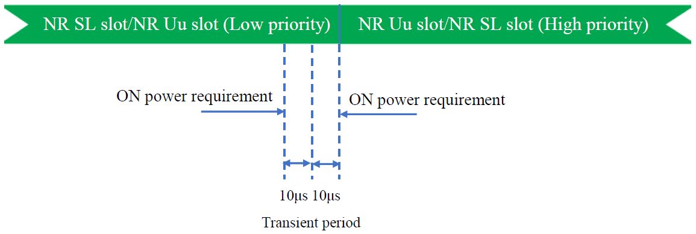

6.3A Output power dynamics for CA
---------------------------------

### 6.3A.1 Minimum output power for CA

#### 6.3A.1.0 Minimum conformance requirements

##### 6.3A.1.0.1 Minimum output power for intra-band contiguous CA {#a.1.0.1-minimum-output-power-for-intra-band-contiguous-ca .H6}

For intra-band contiguous carrier aggregation, the minimum output power
is defined per carrier and the requirement is specified in clause 6.3.1.

##### 6.3A.1.0.2 Minimum output power for intra-band non-contiguous CA {#a.1.0.2-minimum-output-power-for-intra-band-non-contiguous-ca .H6}

For intra-band non-contiguous carrier aggregation, the minimum output
power is defined per carrier and the requirement is specified in clause
6.3.1.

##### 6.3A.1.0.3 Minimum output power for inter-band CA {#a.1.0.3-minimum-output-power-for-inter-band-ca .H6}

For inter-band carrier aggregation with one uplink carrier assigned to
one NR band, the minimum output power requirements in clause 6.3.1
apply.

For inter-band carrier aggregation with two uplink contiguous carrier
assigned to one NR band, the minimum output power requirements in
subclause 6.3A.1.0.1 apply for those carriers. For inter-band carrier
aggregation with uplink assigned to two NR bands, the minimum output
power is defined per carrier and the requirement is specified in clause
6.3.1.

For inter-band carrier aggregation with two uplink non-contiguous
carrier assigned to one NR band, the minimum output power requirements
in subclause 6.3A.1.0.2 apply for those carriers.

For inter-band carrier aggregation with uplink assigned to two NR bands,
the minimum output power is defined per carrier and the requirement is
specified in clause 6.3.1.

For combinations of intra-band and inter-band carrier aggregation with
three uplink component carriers (up to two contiguously aggregated
carriers per operating band), the minimum output power requirements
specified in subclause 6.3.1 apply for the NR band supporting one
component carrier, and for the NR band supporting two contiguous
component carriers the requirements specified in subclause 6.3A.1.0.1
apply.

The normative reference for this requirement is TS 38.101-1 \[2\] clause
6.3A.1.

#### 6.3A.1.1 Minimum output power for CA (2UL CA)

##### 6.3A.1.1.1 Test purpose {#a.1.1.1-test-purpose .H6}

To verify the UE\'s ability to transmit with a broadband output power
for 2UL CA below the value specified in the test requirement when the
power is set to a minimum value.

##### 6.3A.1.1.2 Test applicability {#a.1.1.2-test-applicability .H6}

This test case applies to all types of NR UE release 15 and forward that
support 2UL CA.

##### 6.3A.1.1.3 Minimum conformance requirements {#a.1.1.3-minimum-conformance-requirements .H6}

The minimum conformance requirements are defined in clause 6.3A.1.0.

##### 6.3A.1.1.4 Test description {#a.1.1.4-test-description .H6}

##### 6.3A.1.1.4.1 Initial condition {#a.1.1.4.1-initial-condition .H6}

Initial conditions are a set of test configurations the UE needs to be
tested in and the steps for the SS to take with the UE to reach the
correct measurement state.

The initial test configurations consist of environmental conditions,
test frequencies, test channel bandwidths and sub-carrier spacing based
on NR CA configurations specified in 5.5A. All of these configurations
shall be tested with applicable test parameters for each CA
configuration, and are shown in table 6.3A.1.1.4.1-1 or 6.3A.1.1.4.1-2.
The details of the uplink reference measurement channels (RMCs) are
specified in Annexes A.2 and A.3. Configurations of PDSCH and PDCCH
before measurement are specified in Annex C.2.

Table 6.3A.1.1.4.1-1: Test Configuration Table for inter-band CA

+-------------+-------------+-------------+-------------+------------+
| Initial     |             |             |             |            |
| Conditions  |             |             |             |            |
+=============+=============+=============+=============+============+
| Test        | Normal,     |             |             |            |
| Environment | TL/VL,      |             |             |            |
| as          | TL/VH,      |             |             |            |
| specified   | TH/VL,      |             |             |            |
| in TS       | TH/VH       |             |             |            |
| 38.508-1    |             |             |             |            |
| \[5\]       |             |             |             |            |
| subclause   |             |             |             |            |
| 4.1         |             |             |             |            |
+-------------+-------------+-------------+-------------+------------+
| Test        | Low range   |             |             |            |
| Frequencies | for PCC and |             |             |            |
| as          | SCC         |             |             |            |
| specified   |             |             |             |            |
| in TS       | High range  |             |             |            |
| 38.508-1    | for PCC and |             |             |            |
| \[5\]       | SCC         |             |             |            |
| subclause   |             |             |             |            |
| 4.3.1       |             |             |             |            |
+-------------+-------------+-------------+-------------+------------+
| Test        | Lowest      |             |             |            |
| Channel     | N~RB\_agg~, |             |             |            |
| Bandwidths  | Highest     |             |             |            |
| as          | N~RB\_agg~  |             |             |            |
| specified   |             |             |             |            |
| in TS       |             |             |             |            |
| 38.508-1    |             |             |             |            |
| \[5\]       |             |             |             |            |
| subclause   |             |             |             |            |
| 4.3.1       |             |             |             |            |
+-------------+-------------+-------------+-------------+------------+
| Test SCS as | Highest     |             |             |            |
| specified   |             |             |             |            |
| in Table    |             |             |             |            |
| 5.3.5-1     |             |             |             |            |
+-------------+-------------+-------------+-------------+------------+
| Test        |             |             |             |            |
| Parameters  |             |             |             |            |
+-------------+-------------+-------------+-------------+------------+
| Test ID     | Downlink    | Uplink      |             |            |
|             | Co          | Co          |             |            |
|             | nfiguration | nfiguration |             |            |
|             | for PCC &   |             |             |            |
|             | SCC         |             |             |            |
+-------------+-------------+-------------+-------------+------------+
|             |             | Modulation  | RB          |            |
|             |             | for all CCs | allocation  |            |
|             |             |             | (NOTE 1)    |            |
+-------------+-------------+-------------+-------------+------------+
|             |             |             | PCC         | SCC        |
+-------------+-------------+-------------+-------------+------------+
| 1           | N/A for     | DFT-s-OFDM  | Outer Full  | Outer Full |
|             | this test   | QPSK        |             |            |
+-------------+-------------+-------------+-------------+------------+
| NOTE 1: The |             |             |             |            |
| specific    |             |             |             |            |
| co          |             |             |             |            |
| nfiguration |             |             |             |            |
| of each RB  |             |             |             |            |
| allocation  |             |             |             |            |
| is defined  |             |             |             |            |
| in Table    |             |             |             |            |
| 6.1-1.      |             |             |             |            |
|             |             |             |             |            |
| NOTE 2:     |             |             |             |            |
| Test        |             |             |             |            |
| Channel     |             |             |             |            |
| Bandwidths  |             |             |             |            |
| and Test    |             |             |             |            |
| SCS are     |             |             |             |            |
| checked     |             |             |             |            |
| separately  |             |             |             |            |
| for each NR |             |             |             |            |
| CA band     |             |             |             |            |
| c           |             |             |             |            |
| ombination, |             |             |             |            |
| which       |             |             |             |            |
| applicable  |             |             |             |            |
| channel     |             |             |             |            |
| bandwidths  |             |             |             |            |
| is          |             |             |             |            |
| specified   |             |             |             |            |
| in Table    |             |             |             |            |
| 5.5A.3.1-1  |             |             |             |            |
| and SCS is  |             |             |             |            |
| specified   |             |             |             |            |
| in Table    |             |             |             |            |
| 5.3.5-1 for |             |             |             |            |
| each NR     |             |             |             |            |
| band.       |             |             |             |            |
+-------------+-------------+-------------+-------------+------------+

Table 6.3A.1.1.4.1-2: Test Configuration Table for intra-band contiguous
CA

+-------------+-------------+-------------+-------------+------------+
| Initial     |             |             |             |            |
| Conditions  |             |             |             |            |
+=============+=============+=============+=============+============+
| Test        | Normal,     |             |             |            |
| Environment | TL/VL,      |             |             |            |
| as          | TL/VH,      |             |             |            |
| specified   | TH/VL,      |             |             |            |
| in TS       | TH/VH       |             |             |            |
| 38.508-1    |             |             |             |            |
| \[5\]       |             |             |             |            |
| subclause   |             |             |             |            |
| 4.1         |             |             |             |            |
+-------------+-------------+-------------+-------------+------------+
| Test        | Low range   |             |             |            |
| Frequencies |             |             |             |            |
| as          | High range  |             |             |            |
| specified   |             |             |             |            |
| in TS       |             |             |             |            |
| 38.508-1    |             |             |             |            |
| \[5\]       |             |             |             |            |
| subclause   |             |             |             |            |
| 4.3.1       |             |             |             |            |
+-------------+-------------+-------------+-------------+------------+
| Test        | Lowest      |             |             |            |
| Channel     | N~RB\_agg~, |             |             |            |
| Bandwidths  | Highest     |             |             |            |
| as          | N~RB\_agg~  |             |             |            |
| specified   |             |             |             |            |
| in TS       |             |             |             |            |
| 38.508-1    |             |             |             |            |
| \[5\]       |             |             |             |            |
| subclause   |             |             |             |            |
| 4.3.1       |             |             |             |            |
+-------------+-------------+-------------+-------------+------------+
| Test SCS as | Highest     |             |             |            |
| specified   |             |             |             |            |
| in Table    |             |             |             |            |
| 5.3.5-1     |             |             |             |            |
+-------------+-------------+-------------+-------------+------------+
| Test        |             |             |             |            |
| Parameters  |             |             |             |            |
+-------------+-------------+-------------+-------------+------------+
| Test ID     | Downlink    | Uplink      |             |            |
|             | Co          | Co          |             |            |
|             | nfiguration | nfiguration |             |            |
|             | for PCC &   |             |             |            |
|             | SCC         |             |             |            |
+-------------+-------------+-------------+-------------+------------+
|             |             | Modulation  | RB          |            |
|             |             | for all CCs | allocation  |            |
|             |             |             | (NOTE 1)    |            |
+-------------+-------------+-------------+-------------+------------+
|             |             |             | PCC         | SCC        |
+-------------+-------------+-------------+-------------+------------+
| 1           | N/A for     | DFT-s-OFDM  | Outer Full  | Outer Full |
|             | this test   | QPSK        |             |            |
+-------------+-------------+-------------+-------------+------------+
| NOTE 1: The |             |             |             |            |
| specific    |             |             |             |            |
| co          |             |             |             |            |
| nfiguration |             |             |             |            |
| of each RB  |             |             |             |            |
| allocation  |             |             |             |            |
| is defined  |             |             |             |            |
| in 6.1A-1a  |             |             |             |            |
|             |             |             |             |            |
| NOTE 2:     |             |             |             |            |
| Test        |             |             |             |            |
| Channel     |             |             |             |            |
| Bandwidths  |             |             |             |            |
| and Test    |             |             |             |            |
| SCS are     |             |             |             |            |
| checked     |             |             |             |            |
| separately  |             |             |             |            |
| for each NR |             |             |             |            |
| CA band     |             |             |             |            |
| c           |             |             |             |            |
| ombination, |             |             |             |            |
| which       |             |             |             |            |
| applicable  |             |             |             |            |
| channel     |             |             |             |            |
| bandwidths  |             |             |             |            |
| is          |             |             |             |            |
| specified   |             |             |             |            |
| in Table    |             |             |             |            |
| 5.5A.3.1-1  |             |             |             |            |
| and SCS is  |             |             |             |            |
| specified   |             |             |             |            |
| in Table    |             |             |             |            |
| 5.3.5-1 for |             |             |             |            |
| each NR     |             |             |             |            |
| band.       |             |             |             |            |
+-------------+-------------+-------------+-------------+------------+

Table 6.3A.1.1.4.1-3: Test Configuration Table for intra-band
non-contiguous CA

+-------------+-------------+-------------+-------------+------------+
| Initial     |             |             |             |            |
| Conditions  |             |             |             |            |
+=============+=============+=============+=============+============+
| Test        | Normal,     |             |             |            |
| Environment | TL/VL,      |             |             |            |
| as          | TL/VH,      |             |             |            |
| specified   | TH/VL,      |             |             |            |
| in TS       | TH/VH       |             |             |            |
| 38.508-1    |             |             |             |            |
| \[5\]       |             |             |             |            |
| subclause   |             |             |             |            |
| 4.1         |             |             |             |            |
+-------------+-------------+-------------+-------------+------------+
| Test        | Low range   |             |             |            |
| Frequencies | and High    |             |             |            |
| as          | range test  |             |             |            |
| specified   | frequencies |             |             |            |
| in TS       | as          |             |             |            |
| 38.508-1    | specified   |             |             |            |
| \[5\]       | in tables   |             |             |            |
| subclause   | for         |             |             |            |
| 4.3.1       | non         |             |             |            |
|             | -contiguous |             |             |            |
|             | CA          |             |             |            |
|             | co          |             |             |            |
|             | nfiguration |             |             |            |
|             | with UL CA  |             |             |            |
+-------------+-------------+-------------+-------------+------------+
| Test        | Lowest      |             |             |            |
| Channel     | N~RB\_agg~, |             |             |            |
| Bandwidths  | Highest     |             |             |            |
| as          | N~RB\_agg~  |             |             |            |
| specified   |             |             |             |            |
| in TS       |             |             |             |            |
| 38.508-1    |             |             |             |            |
| \[5\]       |             |             |             |            |
| subclause   |             |             |             |            |
| 4.3.1       |             |             |             |            |
+-------------+-------------+-------------+-------------+------------+
| Test SCS as | Highest     |             |             |            |
| specified   |             |             |             |            |
| in Table    |             |             |             |            |
| 5.3.5-1     |             |             |             |            |
+-------------+-------------+-------------+-------------+------------+
| Test        |             |             |             |            |
| Parameters  |             |             |             |            |
+-------------+-------------+-------------+-------------+------------+
| Test ID     | Downlink    | Uplink      |             |            |
|             | Co          | Co          |             |            |
|             | nfiguration | nfiguration |             |            |
|             | for PCC &   |             |             |            |
|             | SCC         |             |             |            |
+-------------+-------------+-------------+-------------+------------+
|             |             | Modulation  | RB          |            |
|             |             | for all CCs | allocation  |            |
|             |             |             | (NOTE 1)    |            |
+-------------+-------------+-------------+-------------+------------+
|             |             |             | PCC         | SCC        |
+-------------+-------------+-------------+-------------+------------+
| 1           | N/A for     | DFT-s-OFDM  | Outer Full  | Outer Full |
|             | this test   | QPSK        |             |            |
+-------------+-------------+-------------+-------------+------------+
| NOTE 1: The |             |             |             |            |
| specific    |             |             |             |            |
| co          |             |             |             |            |
| nfiguration |             |             |             |            |
| of each RB  |             |             |             |            |
| allocation  |             |             |             |            |
| is defined  |             |             |             |            |
| in 6.1-1    |             |             |             |            |
|             |             |             |             |            |
| NOTE 2:     |             |             |             |            |
| Test        |             |             |             |            |
| Channel     |             |             |             |            |
| Bandwidths  |             |             |             |            |
| and Test    |             |             |             |            |
| SCS are     |             |             |             |            |
| checked     |             |             |             |            |
| separately  |             |             |             |            |
| for each NR |             |             |             |            |
| CA band     |             |             |             |            |
| c           |             |             |             |            |
| ombination, |             |             |             |            |
| which       |             |             |             |            |
| applicable  |             |             |             |            |
| channel     |             |             |             |            |
| bandwidths  |             |             |             |            |
| is          |             |             |             |            |
| specified   |             |             |             |            |
| in Table    |             |             |             |            |
| 5.5A.3.1-1  |             |             |             |            |
| and SCS is  |             |             |             |            |
| specified   |             |             |             |            |
| in Table    |             |             |             |            |
| 5.3.5-1 for |             |             |             |            |
| each NR     |             |             |             |            |
| band.       |             |             |             |            |
+-------------+-------------+-------------+-------------+------------+

1\. Connect the SS to the UE antenna connectors as shown in TS 38.508-1
\[5\] Annex A, Figure A.3.1.1.3 for TE diagram and section A.3.2 for UE
diagram.

2\. The parameter settings for the cell are set up according to TS
38.508-1 \[5\] subclause 4.4.3.

3\. Downlink signals are initially set up according to Annex C.0, C.1,
C.2, and uplink signals according to Annex G.0, G.1, G.2, G.3.0.

4\. The UL Reference Measurement Channel is set according to Tables
6.3A.1.1.4.1-1, 6.3A.1.1.4.1-2 and 6.3A.1.1.4.1-3.

5\. Propagation conditions are set according to Annex B.0.

6\. Ensure the UE is in State RRC\_CONNECTED with generic procedure
parameters Connectivity *NR*, Connected without release *On,* Test Mode
*On* and Test Loop Function *On* according to TS 38.508-1 \[5\] clause
4.5. Message contents are defined in clause 6.3A.1.1.4.3.

##### 6.3A.1.1.4.2 Test procedure {#a.1.1.4.2-test-procedure .H6}

1\. Configure SCC according to Annex C.0, C.1, C.2 for all downlink
physical channels.

2\. The SS shall configure SCC as per TS 38.508-1 \[5\] clause5.5.1.
Message contents are defined in clause 6.3A.1.1.4.3.

3\. SS activates SCC by sending the activation MAC CE (Refer TS 38.321
\[18\], clauses 5.9, 6.1.3.10). Wait for at least 2 seconds (Refer TS
38.133 \[19\], clause 9.3).

4\. SS sends uplink scheduling information for each UL HARQ process via
PDCCH DCI format 0\_1 for C\_RNTI to schedule the UL RMC according to
Table 6.3A.1.1.4.1-1 or 6.3A.1.1.4.1-2 or 6.3A.1.1.4.1-3 on both PCC and
SCC. Since the UE has no payload and no loopback data to send the UE
sends uplink MAC padding bits on the UL RMC.

5\. Send continuously uplink power control \"down\" commands for both
carriers in every uplink scheduling information to the UE; allow at
least 200ms starting from the first TPC command in this step to ensure
that the UE transmits at its minimum output power.

6\. Measure the mean power of the UE for each component carrier in the
associated measurement channel bandwidth specified in Table 6.3A.1.1.5-1
for the specific channel bandwidth under test. The period of measurement
shall be at least the continuous duration of 1ms in all active uplink
slots and in the uplink symbols. For TDD, only slots consisting of only
UL symbols are under test.

##### 6.3A.1.1.4.3 Message contents {#a.1.1.4.3-message-contents .H6}

Message contents are according to TS 38.508-1 \[5\] subclause 4.6 with
following exception.

Table 6.3A.1.1.4.3-1: *PUSCH-Config*

  -------------------------------------------------------------------------------------------------
  Derivation Path: TS 38.508-1 \[5\], Table 4.6.3-118 with condition TRANSFORM\_PRECODER\_ENABLED
  -------------------------------------------------------------------------------------------------

##### 6.3A.1.1.5 Test requirement {#a.1.1.5-test-requirement .H6}

The minimum output power of each component carrier, derived in step 6
shall not exceed the values specified in Table 6.3A.1.1.5-1.

Table 6.3A.1.1.5-1: Minimum output power

+----------------------+----------------------+----------------------+
| Channel bandwidth    | Minimum output power | Measurement          |
|                      |                      | bandwidth            |
| (MHz)                | (dBm)                |                      |
|                      |                      | (MHz)                |
+======================+======================+======================+
| 5                    | -40+TT               | 4.515                |
+----------------------+----------------------+----------------------+
| 10                   | -40+TT               | 9.375                |
+----------------------+----------------------+----------------------+
| 15                   | -40+TT               | 14.235               |
+----------------------+----------------------+----------------------+
| 20                   | -40+TT               | 19.095               |
+----------------------+----------------------+----------------------+
| 25                   | -39+TT               | 23.955               |
+----------------------+----------------------+----------------------+
| 30                   | -38.2+TT             | 28.815               |
+----------------------+----------------------+----------------------+
| 35                   | -37.6+TT             | 33.855               |
+----------------------+----------------------+----------------------+
| 40                   | -37+TT               | 38.895               |
+----------------------+----------------------+----------------------+
| 45                   | -36.5+TT             | 43.575               |
+----------------------+----------------------+----------------------+
| 50                   | -36+TT               | 48.615               |
+----------------------+----------------------+----------------------+
| 60                   | -35.2+TT             | 58.35                |
+----------------------+----------------------+----------------------+
| 70                   | -34.6+TT             | 68.07                |
+----------------------+----------------------+----------------------+
| 80                   | -34+TT               | 78.15                |
+----------------------+----------------------+----------------------+
| 90                   | -33.5+TT             | 88.23                |
+----------------------+----------------------+----------------------+
| 100                  | -33+TT               | 98.31                |
+----------------------+----------------------+----------------------+
| NOTE 1: TT for each  |                      |                      |
| frequency and        |                      |                      |
| channel bandwidth is |                      |                      |
| specified in Table   |                      |                      |
| 6.3A.1.1.5-2         |                      |                      |
+----------------------+----------------------+----------------------+

Table 6.3A.1.1.5-2: Test Tolerance (Minimum output power)

                         f ≤ 3.0GHz   3.0GHz \< f ≤ 6.0GHz
  ---------------------- ------------ ----------------------
  BW ≤ 40MHz             1.0          1.3
  40MHz \< BW ≤ 100MHz   1.3          1.3

### 6.3A.2 Transmit OFF power for CA

#### 6.3A.2.0 Minimum conformance requirements

##### 6.3A.2.0.1 Transmit OFF power for intra-band contiguous CA {#a.2.0.1-transmit-off-power-for-intra-band-contiguous-ca .H6}

For intra-band contiguous carrier aggregation, the Transmit OFF power
specified in clause 6.3.2 is applicable for each component carrier when
the transmitter is OFF on all component carriers. The transmitter is
considered to be OFF when the UE is not allowed to transmit on any of
its ports.

##### 6.3A.2.0.2 Transmit OFF power for intra-band non-contiguous CA {#a.2.0.2-transmit-off-power-for-intra-band-non-contiguous-ca .H6}

For intra-band non-contiguous carrier aggregation, the Transmit OFF
power specified in clause 6.3.2 is applicable for each component carrier
when the transmitter is OFF on all component carriers. The transmitter
is considered to be OFF when the UE is not allowed to transmit on any of
its ports.

##### 6.3A.2.0.3 Transmit OFF power for inter-band CA {#a.2.0.3-transmit-off-power-for-inter-band-ca .H6}

For inter-band carrier aggregation with one uplink carrier assigned to
one NR band, the Transmit OFF power requirements in subclause 6.3.2
apply.

For inter-band carrier aggregation with two contiguous carriers assigned
to one NR band, the Transmit OFF power requirements in subclause
6.3A.2.0.1 apply for those carriers.

For inter-band carrier aggregation with two uplink non-contiguous
carrier assigned to one NR band, the Transmit OFF power requirements in
subclause 6.3A.2.0.2 apply for those carriers.

For inter-band carrier aggregation with uplink assigned to two NR bands,
the Transmit OFF power specified in clause 6.3.2 is applicable for each
component carrier when the transmitter is OFF on all component carriers.
The transmitter is considered to be OFF when the UE is not allowed to
transmit on any of its ports.

For combinations of intra-band and inter-band carrier aggregation with
three uplink component carriers (up to two contiguously aggregated
carriers per operating band), the Transmit OFF power requirements
specified in subclause 6.3.2 apply for the NR band supporting one
component carrier, and for the NR band supporting two contiguous
component carriers the requirements specified in subclause 6.3A.2.0.1
apply.

The normative reference for this requirement is TS 38.101-1 \[2\] clause
6.3A.2

#### 6.3A.2.1 Transmit OFF power for CA (2UL CA)

##### 6.3A.2.1.1 Test purpose {#a.2.1.1-test-purpose .H6}

To verify that the UE Transmit OFF power for 2UL CA is lower than the
value specified in the test requirement.

##### 6.3A.2.1.2 Test applicability {#a.2.1.2-test-applicability .H6}

The requirements of 6.3A.2.1 apply in test cases 6.3A.3.1 Transmit
ON/OFF time mask for CA (2UL CA) to all types of NR UE release 15 and
forward that support 2UL CA. Therefore, no test case description and
requirements are specified.

##### 6.3A.2.1.3 Minimum conformance requirements {#a.2.1.3-minimum-conformance-requirements .H6}

The minimum conformance requirements are defined in clause 6.3A.2.0.

##### 6.3A.2.1.4 Test description {#a.2.1.4-test-description .H6}

This test is covered by clause 6.3A.3.1 Transmit ON/OFF time mask for
2UL CA.

##### 6.3A.2.1.5 Test requirement {#a.2.1.5-test-requirement .H6}

The requirement for the Transmit OFF power of each component carrier
shall not exceed the values specified in Table 6.3A.2.1.5-1.

Table 6.3A.2.1.5-1: Transmit OFF power

+-----------------------+--------------------+-----------------------+
| Channel bandwidth     | Transmit OFF power | Measurement bandwidth |
|                       |                    |                       |
| (MHz)                 | (dBm)              | (MHz)                 |
+=======================+====================+=======================+
| 5                     | -50+TT             | 4.515                 |
+-----------------------+--------------------+-----------------------+
| 10                    | -50+TT             | 9.375                 |
+-----------------------+--------------------+-----------------------+
| 15                    | -50+TT             | 14.235                |
+-----------------------+--------------------+-----------------------+
| 20                    | -50+TT             | 19.095                |
+-----------------------+--------------------+-----------------------+
| 25                    | -50+TT             | 23.955                |
+-----------------------+--------------------+-----------------------+
| 30                    | -50+TT             | 28.815                |
+-----------------------+--------------------+-----------------------+
| 35                    | -50+TT             | 33.855                |
+-----------------------+--------------------+-----------------------+
| 40                    | -50+TT             | 38.895                |
+-----------------------+--------------------+-----------------------+
| 45                    | -50+TT             | 43.575                |
+-----------------------+--------------------+-----------------------+
| 50                    | -50+TT             | 48.615                |
+-----------------------+--------------------+-----------------------+
| 60                    | -50+TT             | 58.35                 |
+-----------------------+--------------------+-----------------------+
| 70                    | -50+TT             | 68.07                 |
+-----------------------+--------------------+-----------------------+
| 80                    | -50+TT             | 78.15                 |
+-----------------------+--------------------+-----------------------+
| 90                    | -50+TT             | 88.23                 |
+-----------------------+--------------------+-----------------------+
| 100                   | -50+TT             | 98.31                 |
+-----------------------+--------------------+-----------------------+
| NOTE 1: TT for each   |                    |                       |
| frequency and channel |                    |                       |
| bandwidth is          |                    |                       |
| specified in Table    |                    |                       |
| 6.3A.2.1.5-2          |                    |                       |
+-----------------------+--------------------+-----------------------+

Table 6.3A.2.1.5-2: Test Tolerance (Transmit OFF power)

                         f ≤ 3.0GHz   3.0GHz \< f ≤ 6.0GHz
  ---------------------- ------------ ----------------------
  BW ≤ 40MHz             FFS          FFS
  40MHz \< BW ≤ 100MHz   FFS          FFS

### 6.3A.3 Transmit ON/OFF time mask for CA

#### 6.3A.3.0 Minimum conformance requirements

##### 6.3A.3.0.1 Transmit ON/OFF time mask for intra-band contiguous CA

For intra-band contiguous carrier aggregation, the general output power
ON/OFF time mask specified in clause 6.3.3.1 is applicable for each
component carrier during the ON power period and the transient periods.
The OFF period as specified in clause 6.3.3.1 shall only be applicable
for each component carrier when all the component carriers are OFF.

##### 6.3A.3.0.2 Transmit ON/OFF time mask for intra-band non-contiguous CA

For intra-band non-contiguous carrier aggregation, the general output
power ON/OFF time mask specified in clause 6.3.3.2 is applicable for
each component carrier during the ON power period and the transient
periods. The OFF period as specified in clause 6.3.3.2 shall only be
applicable for each component carrier when all the component carriers
are OFF.

##### 6.3A.3.0.3 Transmit ON/OFF time mask for inter-band CA

##### 6.3A.3.0.3.1 General {#a.3.0.3.1-general .H6}

For inter-band carrier aggregation with one uplink carrier assigned to
one NR band, the Transmit ON/OFF time mask requirements in subclause
6.3.3 apply.

For inter-band carrier aggregation with two contiguous carriers assigned
to one NR band, the Transmit ON/OFF time mask requirements in subclause
6.3A.3.0.1 apply for those carriers.

For inter-band carrier aggregation with two uplink non-contiguous
carrier assigned to one NR band, the Transmit ON/OFF time mask
requirements in subclause 6.3A.3.0.2 apply for those carriers.

For inter-band carrier aggregation with uplink assigned to two NR bands,
the general output power ON/OFF time mask specified in clause 6.3.3.1 is
applicable for each component carrier during the ON power period and the
transient periods. The OFF period as specified in clause 6.3.3.1 shall
only be applicable for each component carrier when all the component
carriers are OFF.

For combinations of intra-band and inter-band carrier aggregation with
three uplink component carriers (up to two contiguously aggregated
carriers per operating band), the Transmit ON/OFF time mask requirements
specified in subclause 6.3.3.1 apply for the NR band supporting one
component carrier, and for the NR band supporting two contiguous
component carriers the requirements specified in subclause 6.3A.3.0.1
apply.

##### 6.3A.3.0.3.2 Time mask for switching between two uplink carriers {#a.3.0.3.2-time-mask-for-switching-between-two-uplink-carriers .H6}

In addition to the requirements in 6.3A.3.0.3.1 and the maximum output
power requirement specified in Table 6.2A.1.0.3-1 with uplink assigned
to two NR bands, the switching time mask specified in this clause is
applicable for an uplink band pair of an inter-band UL CA configuration
when the capability ***uplinkTxSwitchingPeriod*** is present, and is
only applicable for uplink switching mechanisms specified in clause
6.1.6 of TS 38.214 \[12\], where NR UL carrier 1 is capable of one
transmit antenna connector and NR UL carrier 2 is capable of two
transmit antenna connectors with 3dB boosting on the maximum output
power when the capability *uplinkTxSwitchingPowerBoosting* is present
and the IE *uplinkTxSwitchingPowerBoosting* is enabled, and the two
uplink carriers are in different bands with different carrier
frequencies. The UE shall support the switch between single layer
transmission with one antenna port and two-layer transmission with two
antenna ports on the two uplink carriers following the scheduling
commands and rank adaptation, i.e., both single layer and two-layer
transmission with 2 antenna ports, and single layer transmission with 1
antenna port shall be supported on NR UL carrier 2.

The switching periods described in Figure 6.3A.3.0.3.2-1a and Figure
6.3A.3.0.3.2-1b are located in either NR carrier 1 or carrier 2 as
indicated in RRC signalling *uplinkTxSwitchingPeriodLocation* \[6\], and
the length of uplink switching period *X* is less than the value
indicated by UE capability ***uplinkTxSwitchingPeriod***.

When switching from one carrier to another, if there is no uplink
transmission scheduled or configured on the switch-from carrier for at
least the duration of the switching period (X µs) before the point in
time the UE is scheduled or configured to start the transmission on the
switch-to carrier, the switching period is fully contained in the time
period between the end of the transmission on the switch-from carrier
and the start of the transmission on the switch-to carrier. In addition,
the RRC signalling *uplinkTxSwitchingPeriodLocation* does not take
effect in this case.

{width="5.9375in" height="1.6979166666666667in"}

Figure 6.3A.3.0.3.2-1a: Time mask for switching between UL carrier 1 and
UL Carrier 2, where the switching period is located in carrier 1

{width="6.0in" height="1.7708333333333333in"}

Figure 6.3A.3.0.3.2-1b: Time mask for switching between UL carrier 1 and
UL Carrier 2, where the switching period is located in carrier 2

The requirements apply for the case of co-located and synchronized
network deployment for the two uplink carriers.

The requirements apply for the case of single TAG for the two uplink
carriers, i.e., the same uplink timing for the two carriers as described
in clause 4.2 of TS 38.213 \[9\].

The time mask is applicable to uplink transmissions when configured with
*switchedUL* or *dualUL*.

##### 6.3A.3.0.3.3 Time mask for switching between two uplink carriers with two transmit antenna connectors {#a.3.0.3.3-time-mask-for-switching-between-two-uplink-carriers-with-two-transmit-antenna-connectors .H6}

In addition to the requirements in 6.3A.3.0.3.1 and the maximum output
power requirement specified in Table 6.2A.1.0.3-1 with uplink assigned
to two NR bands, the switching time mask specified in this clause is
applicable for an uplink band pair of a inter-band UL CA configuration
when the capability *uplinkTxSwitchingPeriod2T2T* is present, and is
only applicable for uplink switching mechanisms specified in clause
6.1.6 of TS 38.214 \[12\], where NR UL carrier 1 is capable of two
transmit antenna connectors and NR UL carrier 2 is capable of two
transmit antenna connectors, and the two uplink carriers are in
different bands with different carrier frequencies. The UE shall support
the switch between two-layer transmission with two antenna ports and
two-layer transmission with two antenna ports on the two uplink carriers
following the scheduling commands and rank adaptation, i.e., both single
layer and two-layer transmission with 2 antenna ports, and single layer
transmission with 1 antenna port shall be supported on NR UL carrier 1
and carrier 2.

The switching periods described in Figure 6.3A.3.0.3.3-1a and Figure
6.3A.3.0.3.3-1b are located in either NR carrier 1 or carrier 2 as
indicated in RRC signalling *uplinkTxSwitchingPeriodLocation* \[6\], and
the length of uplink switching period *X* is less than the value
indicated by UE capability *uplinkTxSwitchingPeriod2T2T*.

{width="5.939130577427822in"
height="1.7080336832895888in"}

Figure 6.3A.3.0.3.3-1a: Time mask for switching between UL carrier 1 and
UL Carrier 2, where the switching period is located in carrier 1

{width="6.0in" height="1.764636920384952in"}

Figure 6.3A.3.0.3.3-1b: Time mask for switching between UL carrier 1 and
UL Carrier 2, where the switching period is located in carrier 2

The requirements apply for the case of co-located and synchronized
network deployment for the two uplink carriers.

The requirements apply for the case of single TAG for the two uplink
carriers, i.e., the same uplink timing for the two carriers as described
in clause 4.2 of TS 38.213 \[9\].

The time mask is applicable to uplink transmissions when configured with
*switchedUL* or *dualUL*.

##### 6.3A.3.0.3.4 Time mask for switching between one uplink band with one transmit antenna connector and one uplink band with two transmit antenna connectors {#a.3.0.3.4-time-mask-for-switching-between-one-uplink-band-with-one-transmit-antenna-connector-and-one-uplink-band-with-two-transmit-antenna-connectors .H6}

In addition to the requirements in 6.3A.3.0.3.1 and the maximum output
power requirement specified in Table 6.2A.1.0.3-1 with uplink assigned
to two NR bands, the switching time mask specified in this clause is
applicable for an uplink band pair of an inter-band UL CA configuration
when the capability *uplinkTxSwitchingPeriod* is present, and is only
applicable for uplink switching mechanisms specified in clause 6.1.6 of
TS 38.214 \[12\], where NR UL carrier 1 in band A is capable of one
transmit antenna connector, NR UL carrier 2 and carrier 3 in band B are
capable of two transmit antenna connectors. NR UL carrier 2 and carrier
3 are two contiguous aggregated carriers, and band A and band B are
different bands with different carrier frequencies. The UE shall support
the switch between single layer transmission with one antenna port and
two-layer transmission with two antenna ports on the two uplink bands
following the scheduling commands and rank adaptation, i.e., both single
layer and two-layer transmission with 2 antenna ports, and single layer
transmission with 1 antenna port shall be supported on NR UL carrier 2
and carrier 3 in band B.

The switching periods described in Figure 6.3A.3.0.3.4-1a and Figure
6.3A.3.0.3.4-1b are located in either NR band A or band B as indicated
in RRC signalling *uplinkTxSwitchingPeriodLocation* \[6\], and the
length of uplink switching period *X* is less than the value indicated
by UE capability *uplinkTxSwitchingPeriod* .

When switching from one carrier to another, if there is no uplink
transmission scheduled or configured on the switch-from carrier for at
least the duration of the switching period (X µs) before the point in
time the UE is scheduled or configured to start the transmission on the
switch-to carrier, the switching period is fully contained in the time
period between the end of the transmission on the switch-from carrier
and the start of the transmission on the switch-to carrier. In addition,
the RRC signalling *uplinkTxSwitchingPeriodLocation* is ignored by the
UE and does not take effect in this case.

{width="6.247999781277341in"
height="1.7968624234470691in"}

Figure 6.3A.3.0.3.4-1a: Time mask for switching between one carrier in
band A and two contiguous carriers in band B, where the switching period
is located in band A

{width="6.071999125109361in"
height="1.785812554680665in"}

Figure 6.3A.3.0.3.4-1b: Time mask for switching between one carrier in
band A and two contiguous carriers in band B, where the switching period
is located in band B

The following applies for the uplink switching cases specified in clause
6.1.6.2 of \[12\] with *uplinkTxSwitchingOption* set to either
*switchedUL* or *dualUL* when the configuration of the location of the
switching period by *uplinkTxSwitchingPeriodLocation is ignored by the
UE:*

\- if an uplink switching is triggered for an uplink transmission
starting at *T~0~* based on higher layer configuration(s) or DCI(s)
received before *T~0~ − T~offset~* as specified in \[12\] and the UE is
not configured or scheduled with uplink transmissions for a duration of
at least the uplink switching gap indicated by
***uplinkTxSwitchingPeriod*** on any of the carriers before *T~0~*,
transient periods of 10 μs are located at the end of the last symbol(s)
configured or scheduled on the carriers before *T~0~* and at the start
of the first symbol(s) configured or scheduled at *T~0~ on the
switched-to carrier.*

The requirements apply for the case of both non-co-located and
co-located and synchronized network deployment for the three uplink
carriers.

The time mask is applicable to uplink transmissions when configured with
*switchedUL* or *dualUL*.

##### 6.3A.3.0.3.5 Time mask for switching between two uplink bands with two transmit antenna connectors {#a.3.0.3.5-time-mask-for-switching-between-two-uplink-bands-with-two-transmit-antenna-connectors .H6}

In addition to the requirements in 6.3A.3.0.3.1 and the maximum output
power requirement specified in Table 6.2A.1.0.3-1 with uplink assigned
to two NR bands, the switching time mask specified in this clause is
applicable for an uplink band pair of an inter-band UL CA configuration
when the capability *uplinkTxSwitchingPeriod2T2T* is present, and is
only applicable for uplink switching mechanisms specified in clause
6.1.6 of TS 38.214 \[12\], where NR UL carrier 1 in band A is capable of
two transmit antenna connectors, NR UL carrier 2 and carrier 3 in band B
are capable of two transmit antenna connectors. NR UL carrier 2 and
carrier 3 are two contiguous aggregated carriers, and band A and band B
are different bands with different carrier frequencies. The UE shall
support the switch between two-layer transmission with two antenna ports
and two-layer transmission with two antenna ports on the two uplink
bands following the scheduling commands and rank adaptation, i.e., both
single layer and two-layer transmission with 2 antenna ports, and single
layer transmission with 1 antenna port shall be supported on NR UL
carrier 1, carrier 2 and carrier 3 in the two bands.

The switching periods described in Figure 6.3A.3.0.3.5-1a and Figure
6.3A.3.0.3.5-1b are located in either NR band A or band B as indicated
in RRC signalling *uplinkTxSwitchingPeriodLocation* \[6\], and the
length of uplink switching period *X* is less than the value indicated
by UE capability *uplinkTxSwitchingPeriod2T2T*.

When switching from one carrier to another, if there is no uplink
transmission scheduled or configured on the switch-from carrier for at
least the duration of the switching period (X µs) before the point in
time the UE is scheduled or configured to start the transmission on the
switch-to carrier, the switching period is fully contained in the time
period between the end of the transmission on the switch-from carrier
and the start of the transmission on the switch-to carrier. In addition,
the RRC signalling *uplinkTxSwitchingPeriodLocation* is ignored by the
UE and does not take effect in this case.

{width="6.247999781277341in"
height="1.7968624234470691in"}

Figure 6.3A.3.0.3.5-1a: Time mask for switching between one carrier in
band A and two contiguous carriers in band B, where the switching period
is located in band A

{width="6.071999125109361in"
height="1.785812554680665in"}

Figure 6.3A.3.0.3.5-1b: Time mask for switching between one carrier in
band A and two contiguous carriers in band B, where the switching period
is located in band B

The following applies for the uplink switching cases specified in clause
6.1.6.2 of \[12\] with *uplinkTxSwitchingOption* set to either
*switchedUL* or *dualUL* when the configuration of the location of the
switching period by *uplinkTxSwitchingPeriodLocation is ignored by the
UE:*

\- if an uplink switching is triggered for an uplink transmission
starting at *T~0~* based on higher layer configuration(s) or DCI(s)
received before *T~0~ − T~offset~* as specified in \[12\] and the UE is
not configured or scheduled with uplink transmissions for a duration of
at least the uplink switching gap indicated by
***uplinkTxSwitchingPeriod2T2T*** on any of the carriers before *T~0~*,
transient periods of 10 μs are located at the end of the last symbol(s)
configured or scheduled on the carriers before *T~0~* and at the start
of the first symbol(s) configured or scheduled at *T~0~ on the
switched-to carrier.*

The requirements apply for the case of both non-co-located and
co-located and synchronized network deployment for the three uplink
carriers.

The time mask is applicable to uplink transmissions when configured with
*switchedUL* or *dualUL*.The normative reference for this requirement is
TS 38.101-1 \[2\] clause 6.3A.3.

##### 6.3A.3.0.3.6 Time mask for switching across up to four uplink bands {#a.3.0.3.6-time-mask-for-switching-across-up-to-four-uplink-bands .H6}

The switching time mask requirements specified in this sub-clause are
applicable for an NR inter-band CA configuration when the capability
*supportedBandPairListNR-r18* is present, and are only applicable for
uplink switching mechanisms specified in clause \[6.1.6\] of TS
38.214 \[10\].

In the NR inter-band CA configuration, the number of NR uplink bands is
up to four. NR UL carrier(s) in each of the up to four uplink bands are
capable of one or two transmit antenna connector(s), according to the UE
capability *FeatureSetUplinkPerCC*.

The switching time masks in Figure 6.3A.3.3.6-1 and Figure 6.3A.3.3.6-2
are applicable to each of the uplink band pairs in the CA configuration,
and are applicable to uplink transmissions when configured with
*switchedUL* or *dualUL* by the parameter
*switchingOptionConfigForBandPair*. To simplify the figures, the two
bands in different band pairs are denoted as NR band X and band Y. The
uplink transmission on either band X or band Y is with one or two
transmit antenna connector(s),

-- if NR UL carriers in both bands in one band pair are capable of one
transmit antenna connector, 1Tx-1Tx switching is supported for the band
pair;

-- if NR UL carrier(s) in one band of one band pair is capable of one
transmit antenna connector, and NR UL carrier(s) in the other band of
the band pair is capable of two transmit antenna connectors, 1Tx-2Tx
switching is supported for the band pair;

-- if NR UL carriers in both bands of one band pair are capable of two
transmit antenna connectors, 2Tx-2Tx switching is supported for the band
pair.

For each band pair, the switching periods described in Figure
6.3A.3.3.6-1 and Figure 6.3A.3.3.6-2 are located in either NR band X or
band Y as indicated in RRC signalling *uplinkTxSwitchingBandList* \[7\].
For each band pair, the length of uplink switching period X is indicated
by UE capability *switchingPeriodFor1T* when 1Tx-1Tx switching or
1Tx-2Tx switching between the two bands in the band pair is supported
and configured, or is indicated with *switchingPeriodFor2T* when 2Tx-2Tx
switching between the two bands in the band pair is supported and
configured. UE shall be capable to transmit until the beginning of the
switching period and after the end of switching period with the
exception of transient periods.0

{width="6.2204724409448815in"
height="1.7889457567804024in"}

Figure 6.3A.3.0.3.6-1: Time mask for switching between band X and band
Y, where the switching period is located in band X

{width="6.2204724409448815in"
height="1.8294794400699912in"}

Figure 6.3A.3.0.3.6-2: Time mask for switching between band X and band
Y, where the switching period is located in band Y

The following applies for the uplink switching cases specified in Figure
6.3A.3.3.6-1 and 6.3A.3.3.6-2 in a band pair with
*switchingOptionConfigForBandPair* set to either *switchedUL* or
*dualUL:*

\- if an uplink switching is triggered for an uplink transmission
starting at *T~0~* based on higher layer configuration(s) or DCI(s)
received before *T~0~ − T~offset~* as specified in \[10\] and the UE is
not configured or scheduled with uplink transmissions for a duration of
at least the length of uplink switching period of X µs indicated by UE
capability *uplinkTxSwitchingPeriodForBandPair* on any of the carriers
band X and band Y before *T~0~*,

\- the configuration of the location of the switching period by
*uplinkTxSwitchingBandList is ignored by the UE*;

\- transient periods of 10 μs are located at the end of the last
symbol(s) configured or scheduled on the carrier(s) before *T~0~* and at
the start of the first symbol(s) configured or scheduled at *T~0~ on the
switch-to carrier(s).*

In addition to the requirements in Figure 6.3A.3.3.6-1 and Figure
6.3A.3.3.6-2, the requirements in Figure 6.3A.3.3.6-3 to 6.3A.3.3.6-5
are applicable when *dualUL* are supported on certain band pair(s) in
the CA configuration.

The switching time masks in Figure 6.3A.3.3.6-3 and Figure 6.3A.3.3.6-4
are applicable when *dualUL* is supported for at least two uplink band
pairs in the CA configuration. The two band pairs supporting *dualUL*
are denoted as band pairs of {band X and band Z} and {band Y and band
Z}. When one transmitter is switched between band X and band Y,

-- As baseline UE behaviour, the UE is not required to transmit on any
of the three bands during time period T1 located on band X and band Z,
where T1 is the length of switching period for the band pair of band X
and band Y, as shown in Figure 6.3A.3.3.6-4.

-- As optional UE behaviours, when the UE indicates band Z in the
capability *bandIndexUnaffected,*

-- if the UE indicates *maintainedUL-Trans* for band pair of {band X and
band Y}, UE shall be capable of uplink transmission on band Z during the
switching period that is located on band X, and UE is not required to
transmit on band X and Y during time period T1 located on band X, where
T1 is the length of switching period for the band pair of band X and
band Y, as shown in Figure 6.3A.3.3.6-3;

-- otherwise, the UE is not required to transmit on any of the three
bands during the switching period indicated by UE capability
*periodOnULBands* located on band X and band Z, as shown in Figure
6.3A.3.3.6-4.

In Figure 6.3A.3.3.6-3 and Figure 6.3A.3.3.6-4, the uplink transmission
on band X, band Y and band Z are all with one transmit antenna connector
and one antenna port.

{width="6.062992125984252in"
height="2.4854615048118984in"}

Figure 6.3A.3.0.3.6-3: Time mask for one transmitter switching between
band X and band Y, and UE is capable of uplink transmission on band Z
during the switching period

The following applies for the uplink switching cases specified in Figure
6.3A.3.3.6-3 in a band pair with *switchingOptionConfigForBandPair* set
to *dualUL:*

\- if an uplink switching is triggered for an uplink transmission
starting at *T~0~* based on higher layer configuration(s) or DCI(s)
received before *T~0~ − T~offset~* as specified in \[10\] and the UE is
not configured or scheduled with uplink transmissions for a duration of
at least the length of uplink switching period X indicated by UE
capability *uplinkTxSwitchingPeriodForBandPair* on any of the carriers
in band X and band Y before *T~0~*,

\- the configuration of the location of the switching period by
*uplinkTxSwitchingBandList is ignored by the UE*;

\- transient periods of 10 μs are located at the end of the last
symbol(s) configured or scheduled on the carrier(s) before *T~0~* and at
the start of the first symbol(s) configured or scheduled at *T~0~ on the
switch-to carrier(s).*

{width="6.062992125984252in"
height="3.5156157042869642in"}

Figure 6.3A.3.0.3.6-4: Time mask for one transmitter switching between
band X and band Y, and UE is not capable of uplink transmission on band
Z during the switching period

The switching time mask in Figure 6.3A.3.3.6-5 is applicable when
*dualUL* is supported for at least one uplink band pair including band X
and band Y, and two transmit antenna connectors are supported on at
least one uplink band of band Z. When one transmitter is switched
between band X and band Z, and across the same time, the other
transmitter is switched between Y and band Z, the switching time mask in
Figure 6.3A.3.3.6-5 is applicable.

-- As baseline UE behaviour, UE is not required to transmit on any of
the three bands during time period with the larger one of switching
period T2 and T3, where T2 is the length of switching period for the
band pair of band X and band Z, and T3 is the length of switching period
for the band pair of band Y and band Z.

-- As optional UE behaviour, when UE additionally reports band pair of
{band X and band Y} and band Z in the capability
*uplinkTxSwitchingAdditionalPeriodDualUL-List* , UE is not required to
transmit on any of the three bands during time period indicated by UE
capability *switchingAdditionalPeriodDualUL*.

In Figure 6.3A.3.3.6-5, the uplink transmission on band X and band Y is
with one transmit antenna connector and one antenna port, and the uplink
transmission on band Z is with two transmit antenna connectors and two
antenna ports. The switching period location is configured according to
\[7\], and band Z is with the highest priority according to the RRC
configuration *uplinkTxSwitchingBandList*.

{width="6.062992125984252in"
height="3.521512467191601in"}

Figure 6.3A.3.0.3.6-5: Time mask for one transmitter switching between
band X and band Z, and one transmitter switching between band Y and band
Z

The following applies for the uplink switching case specified in Figure
6.3A.3.3.6-5 and with *uplinkTxSwitchingOptionForBandPair* set to
*dualUL for at least one band pair*

\- if uplink switching on a band pair is triggered for an uplink
transmission starting at *T~0~* based on higher layer configuration(s)
or DCI(s) received before *T~0~ − T~offset~* as specified in \[10\] and
the UE is not configured or scheduled with uplink transmissions for a
duration of at least the maximum of the lengths of uplink switching
periods indicated by UE capability
\[*uplinkTxSwitchingPeriodForBandPair*\] on any of the carriers in band
X, band Y and band Z before *T~0~* on any switched-to carrier

\- the configuration of the location of the switching period and the
priority of bands in the *uplinkTxSwitchingBandList are ignored by the
UE*

\- transient periods of 10 μs are located at the end of the last
symbol(s) configured or scheduled on the switched-from carrier(s) before
*T~0~* on any switched-to carrier and at the start of the first
symbol(s) configured or scheduled at *T~0~ on the switch-to carrier(s)*

The requirements in this sub-clause apply for the case of synchronized
network deployment for the uplink bands.

##### 6.3A.3.0.3.6a Additional requirements for three-band switching with dual TAG {#a.3.0.3.6a-additional-requirements-for-three-band-switching-with-dual-tag .H6}

The following applies for the uplink switching case specified in Figure
6.3A.3.0.3.6-5 with three bands involved in the switching and with
*uplinkTxSwitchingOptionForBandPair-r18* set to *dualUL for at least one
band pair.*

If the UE is configured with dual TAG and not configured or scheduled
with uplink transmissions for a duration of at least the maximum of the
lengths of uplink switching periods indicated by UE capability
\[*uplinkTxSwitchingPeriodForBandPair-r18*\] on any of the carriers in
band X, band Y and band Z including any timing difference between the
uplink carriers before the first *T~0~* on any switched-to carrier,

\- the configuration of the location of the switching period and the
priority of bands in the *uplinkTxSwitchingBandList are ignored by the
UE*

\- transient periods of 10 μs are located at the end of the last
symbol(s) configured or scheduled on the switched-from carrier(s) before
the first *T~0~* on any switched-to carrier and at the start of the
first symbol(s) configured or scheduled at *T~0~ on the switch-to
carrier(s)*

#### 6.3A.3.1 Transmit ON/OFF time mask for CA (2UL CA)

##### 6.3A.3.1.1 Test purpose {#a.3.1.1-test-purpose .H6}

To verify that the general ON/OFF time mask for CA (2UL CA) meets the
requirements given in 6.3A.3.1.5

The transmit power time mask for transmit ON/OFF defines the transient
period(s) allowed between transmit OFF power and transmit ON power
symbols for CA.

Transmission of the wrong power increases interference to other
channels, or increases transmission errors in the uplink channel.

##### 6.3A.3.1.2 Test applicability {#a.3.1.2-test-applicability .H6}

This test case applies to all types of NR UE release 15 and forward that
support 2UL CA.

##### 6.3A.3.1.3 Minimum conformance requirements {#a.3.1.3-minimum-conformance-requirements .H6}

The minimum conformance requirements are defined in clause 6.3A.3.0.

##### 6.3A.3.1.4 Test description {#a.3.1.4-test-description .H6}

##### 6.3A.3.1.4.1 Initial condition {#a.3.1.4.1-initial-condition .H6}

Initial conditions are a set of test configurations the UE needs to be
tested in and the steps for the SS to take with the UE to reach the
correct measurement state.

The initial test configurations consist of environmental conditions,
test frequencies, test channel bandwidths and sub-carrier spacing based
on NR CA configuration specified in 5.5A. All of these configurations
shall be tested with applicable test parameters for each CA
configuration, and are shown in table 6.3A.3.1.4.1-1 or 6.3A.3.1.4.1-2.
The details of the uplink reference measurement channels (RMCs) are
specified in Annexe A.2 and A.3. Configurations of PDSCH and PDCCH
before measurement are specified in Annex C.2.

Table 6.3A.3.1.4.1-1: Test Configuration Table for inter-band CA

+-------------+-------------+-------------+-------------+------------+
| Initial     |             |             |             |            |
| Conditions  |             |             |             |            |
+=============+=============+=============+=============+============+
| Test        | Normal,     |             |             |            |
| Environment | TL/VL,      |             |             |            |
| as          | TL/VH,      |             |             |            |
| specified   | TH/VL,      |             |             |            |
| in TS       | TH/VH       |             |             |            |
| 38.508-1    |             |             |             |            |
| \[5\]       |             |             |             |            |
| subclause   |             |             |             |            |
| 4.1         |             |             |             |            |
+-------------+-------------+-------------+-------------+------------+
| Test        | Low range   |             |             |            |
| Frequencies | for PCC and |             |             |            |
| as          | SCC         |             |             |            |
| specified   |             |             |             |            |
| in TS       | High range  |             |             |            |
| 38.508-1    | for PCC and |             |             |            |
| \[5\]       | SCC         |             |             |            |
| subclau     |             |             |             |            |
| se4.3.1.1.3 |             |             |             |            |
| for inter   |             |             |             |            |
| band CA in  |             |             |             |            |
| FR1         |             |             |             |            |
+-------------+-------------+-------------+-------------+------------+
| Test        | Lowest      |             |             |            |
| Channel     | N~RB\_agg~, |             |             |            |
| Bandwidths  | Highest     |             |             |            |
| as          | N~RB\_agg~  |             |             |            |
| specified   |             |             |             |            |
| in TS       |             |             |             |            |
| 38.508-1    |             |             |             |            |
| \[5\]       |             |             |             |            |
| subclause   |             |             |             |            |
| 4.3.1       |             |             |             |            |
+-------------+-------------+-------------+-------------+------------+
| Test SCS as | Lowest,     |             |             |            |
| specified   | Highest     |             |             |            |
| in Table    |             |             |             |            |
| 5.3.5-1     |             |             |             |            |
+-------------+-------------+-------------+-------------+------------+
| Test        |             |             |             |            |
| Parameters  |             |             |             |            |
+-------------+-------------+-------------+-------------+------------+
| Test ID     | Downlink    | Uplink      |             |            |
|             | Co          | Co          |             |            |
|             | nfiguration | nfiguration |             |            |
|             | for PCC &   |             |             |            |
|             | SCC         |             |             |            |
+-------------+-------------+-------------+-------------+------------+
|             |             | Modulation  | RB          |            |
|             |             | for all CCs | allocation  |            |
|             |             |             | (NOTE 1)    |            |
+-------------+-------------+-------------+-------------+------------+
|             |             |             | PCC         | SCC        |
+-------------+-------------+-------------+-------------+------------+
| 1           | N/A for     | DFT-s-OFDM  | Inner Full  | Inner Full |
|             | this test   | QPSK        |             |            |
+-------------+-------------+-------------+-------------+------------+
| NOTE 1: The |             |             |             |            |
| specific    |             |             |             |            |
| co          |             |             |             |            |
| nfiguration |             |             |             |            |
| of each RB  |             |             |             |            |
| allocation  |             |             |             |            |
| is defined  |             |             |             |            |
| in Table    |             |             |             |            |
| 6.1-1.      |             |             |             |            |
|             |             |             |             |            |
| NOTE 2:     |             |             |             |            |
| Test        |             |             |             |            |
| Channel     |             |             |             |            |
| Bandwidths  |             |             |             |            |
| and Test    |             |             |             |            |
| SCS are     |             |             |             |            |
| checked     |             |             |             |            |
| separately  |             |             |             |            |
| for each NR |             |             |             |            |
| CA band     |             |             |             |            |
| c           |             |             |             |            |
| ombination, |             |             |             |            |
| which       |             |             |             |            |
| applicable  |             |             |             |            |
| channel     |             |             |             |            |
| bandwidths  |             |             |             |            |
| is          |             |             |             |            |
| specified   |             |             |             |            |
| in Table    |             |             |             |            |
| 5.5A.3.1-1  |             |             |             |            |
| and SCS is  |             |             |             |            |
| specified   |             |             |             |            |
| in Table    |             |             |             |            |
| 5.3.5-1 for |             |             |             |            |
| each NR     |             |             |             |            |
| band..      |             |             |             |            |
+-------------+-------------+-------------+-------------+------------+

Table 6.3A.3.1.4.1-2: Test Configuration Table for intra-band contiguous
CA

+-------------+-------------+-------------+-------------+------------+
| Initial     |             |             |             |            |
| Conditions  |             |             |             |            |
+=============+=============+=============+=============+============+
| Test        | Normal,     |             |             |            |
| Environment | TL/VL,      |             |             |            |
| as          | TL/VH,      |             |             |            |
| specified   | TH/VL,      |             |             |            |
| in TS       | TH/VH       |             |             |            |
| 38.508-1    |             |             |             |            |
| \[5\]       |             |             |             |            |
| subclause   |             |             |             |            |
| 4.1         |             |             |             |            |
+-------------+-------------+-------------+-------------+------------+
| Test        | Low range   |             |             |            |
| Frequencies |             |             |             |            |
| as          | High range  |             |             |            |
| specified   |             |             |             |            |
| in TS       |             |             |             |            |
| 38.508-1    |             |             |             |            |
| \[5\]       |             |             |             |            |
| subclause   |             |             |             |            |
| 4.3.1.1.4   |             |             |             |            |
| for intra   |             |             |             |            |
| band        |             |             |             |            |
| contiguous  |             |             |             |            |
| CA in FR1   |             |             |             |            |
+-------------+-------------+-------------+-------------+------------+
| Test        | Lowest      |             |             |            |
| Channel     | N~RB\_agg~, |             |             |            |
| Bandwidths  | Highest     |             |             |            |
| as          | N~RB\_agg~  |             |             |            |
| specified   |             |             |             |            |
| in TS       |             |             |             |            |
| 38.508-1    |             |             |             |            |
| \[5\]       |             |             |             |            |
| subclause   |             |             |             |            |
| 4.3.1       |             |             |             |            |
+-------------+-------------+-------------+-------------+------------+
| Test SCS as | Lowest,     |             |             |            |
| specified   | Highest     |             |             |            |
| in Table    |             |             |             |            |
| 5.3.5-1     |             |             |             |            |
+-------------+-------------+-------------+-------------+------------+
| Test        |             |             |             |            |
| Parameters  |             |             |             |            |
+-------------+-------------+-------------+-------------+------------+
| Test ID     | Downlink    | Uplink      |             |            |
|             | Co          | Co          |             |            |
|             | nfiguration | nfiguration |             |            |
|             | for PCC &   |             |             |            |
|             | SCC         |             |             |            |
+-------------+-------------+-------------+-------------+------------+
|             |             | Modulation  | RB          |            |
|             |             | for all CCs | allocation  |            |
|             |             |             | (NOTE 1)    |            |
+-------------+-------------+-------------+-------------+------------+
|             |             |             | PCC         | SCC        |
+-------------+-------------+-------------+-------------+------------+
| 1           | N/A for     | DFT-s-OFDM  | Inner Full  | Inner Full |
|             | this test   | QPSK        |             |            |
+-------------+-------------+-------------+-------------+------------+
| NOTE 1: The |             |             |             |            |
| specific    |             |             |             |            |
| co          |             |             |             |            |
| nfiguration |             |             |             |            |
| of each RB  |             |             |             |            |
| allocation  |             |             |             |            |
| is defined  |             |             |             |            |
| in 6.1A-1a  |             |             |             |            |
| NOTE 2:     |             |             |             |            |
| Test        |             |             |             |            |
| Channel     |             |             |             |            |
| Bandwidths  |             |             |             |            |
| and Test    |             |             |             |            |
| SCS are     |             |             |             |            |
| checked     |             |             |             |            |
| separately  |             |             |             |            |
| for each NR |             |             |             |            |
| CA band     |             |             |             |            |
| c           |             |             |             |            |
| ombination, |             |             |             |            |
| which       |             |             |             |            |
| applicable  |             |             |             |            |
| channel     |             |             |             |            |
| bandwidths  |             |             |             |            |
| is          |             |             |             |            |
| specified   |             |             |             |            |
| in Table    |             |             |             |            |
| 5.5A.3.1-1  |             |             |             |            |
| and SCS is  |             |             |             |            |
| specified   |             |             |             |            |
| in Table    |             |             |             |            |
| 5.3.5-1 for |             |             |             |            |
| each NR     |             |             |             |            |
| band.       |             |             |             |            |
+-------------+-------------+-------------+-------------+------------+

Table 6.3A.3.1.4.1-3: Test Configuration Table for intra-band
non-contiguous CA when UE supporting IE *dualPA-Architecture*

+-------------+-------------+-------------+-------------+-------------+
| Initial     |             |             |             |             |
| Conditions  |             |             |             |             |
+=============+=============+=============+=============+=============+
| Test        | Normal,     |             |             |             |
| Environment | TL/VL,      |             |             |             |
| as          | TL/VH,      |             |             |             |
| specified   | TH/VL,      |             |             |             |
| in TS       | TH/VH       |             |             |             |
| 38.508-1    |             |             |             |             |
| \[5\]       |             |             |             |             |
| subclause   |             |             |             |             |
| 4.1         |             |             |             |             |
+-------------+-------------+-------------+-------------+-------------+
| Test        | Low range   |             |             |             |
| Frequencies | and High    |             |             |             |
| as          | range test  |             |             |             |
| specified   | frequencies |             |             |             |
| in TS       | as          |             |             |             |
| 38.508-1    | specified   |             |             |             |
| \[5\]       | in tables   |             |             |             |
| subclause   | for         |             |             |             |
| 4.3.1.1.5   | non         |             |             |             |
| for intra   | -contiguous |             |             |             |
| band        | CA          |             |             |             |
| non         | co          |             |             |             |
| -contiguous | nfiguration |             |             |             |
| CA in FR1   | with UL CA  |             |             |             |
+-------------+-------------+-------------+-------------+-------------+
| Test        | Lowest      |             |             |             |
| Channel     | N~RB\_agg~, |             |             |             |
| Bandwidths  | Highest     |             |             |             |
| as          | N~RB\_agg~  |             |             |             |
| specified   |             |             |             |             |
| in TS       |             |             |             |             |
| 38.508-1    |             |             |             |             |
| \[5\]       |             |             |             |             |
| subclause   |             |             |             |             |
| 4.3.1       |             |             |             |             |
+-------------+-------------+-------------+-------------+-------------+
| Test SCS as | Lowest,     |             |             |             |
| specified   | Highest     |             |             |             |
| in Table    |             |             |             |             |
| 5.3.5-1     |             |             |             |             |
+-------------+-------------+-------------+-------------+-------------+
| Test        |             |             |             |             |
| Parameters  |             |             |             |             |
+-------------+-------------+-------------+-------------+-------------+
| Test ID     | Downlink    | Uplink      |             |             |
|             | Co          | Co          |             |             |
|             | nfiguration | nfiguration |             |             |
|             | for PCC &   |             |             |             |
|             | SCC         |             |             |             |
+-------------+-------------+-------------+-------------+-------------+
|             |             | Modulation  | RB          |             |
|             |             | for all CCs | allocation  |             |
|             |             |             | (NOTE 1)    |             |
+-------------+-------------+-------------+-------------+-------------+
|             |             |             | PCC         | SCC         |
+-------------+-------------+-------------+-------------+-------------+
| 1           | N/A for     | DFT-s-OFDM  | SCS 15kHz:  | SCS 15kHz:  |
|             | this test   | QPSK        | 45\@0       | 45\@0       |
|             |             |             |             |             |
|             |             |             | SCS 30kHz:  | SCS 30kHz:  |
|             |             |             | 24\@0       | 24\@0       |
|             |             |             |             |             |
|             |             |             | SCS 60kHz:  | SCS 60kHz:  |
|             |             |             | 12\@0       | 12\@0       |
+-------------+-------------+-------------+-------------+-------------+
| NOTE 1: The |             |             |             |             |
| specific    |             |             |             |             |
| co          |             |             |             |             |
| nfiguration |             |             |             |             |
| of each RB  |             |             |             |             |
| allocation  |             |             |             |             |
| is defined  |             |             |             |             |
| in 6.1A-1a  |             |             |             |             |
|             |             |             |             |             |
| NOTE 2:     |             |             |             |             |
| Test        |             |             |             |             |
| Channel     |             |             |             |             |
| Bandwidths  |             |             |             |             |
| and Test    |             |             |             |             |
| SCS are     |             |             |             |             |
| checked     |             |             |             |             |
| separately  |             |             |             |             |
| for each NR |             |             |             |             |
| CA band     |             |             |             |             |
| c           |             |             |             |             |
| ombination, |             |             |             |             |
| which       |             |             |             |             |
| applicable  |             |             |             |             |
| channel     |             |             |             |             |
| bandwidths  |             |             |             |             |
| and SCS are |             |             |             |             |
| specified   |             |             |             |             |
| in Table    |             |             |             |             |
| 5.5A.3-1.   |             |             |             |             |
+-------------+-------------+-------------+-------------+-------------+

1\. Connect the SS to the UE antenna connectors as shown in TS 38.508-1
\[5\] Annex A, Figure A.3.1.1.3 for TE diagram and section A.3.2 for UE
diagram.

2\. The parameter settings for the cell are set up according to TS
38.508-1 \[5\] subclause 4.4.3.

3\. Downlink signals are initially set up according to Annex C.0, C.1,
C.2, and uplink signals according to Annex G.0, G.1, G.2, G.3.0.

4\. The UL Reference Measurement Channel is set according to Tables
6.3A.3.1.4.1-1 to 6.3A.3.1.4.1-3a as appropriate.

5\. Propagation conditions are set according to Annex B.0.

6\. Ensure the UE is in State RRC\_CONNECTED with generic procedure
parameters Connectivity *NR,* Connected without release *On,* Test Mode
*On* and Test Loop Function *On* according to TS 38.508-1 \[5\] clause
4.5. Message contents are defined in clause 6.3A.3.1.4.3.

##### 6.3A.3.1.4.2 Test procedure {#a.3.1.4.2-test-procedure .H6}

1\. Configure SCC according to Annex C.0, C.1, C.2 for all downlink
physical channels.

2\. The SS shall configure SCC as per TS 38.508-1 \[5\] clause 5.5.1.
Message contents are defined in clause 6.3A.3.1.4.3.

3\. SS activates SCC by sending the activation MAC CE (Refer
TS 38.321 \[18\], clauses 5.9, 6.1.3.10). Wait for at least 2 seconds
(Refer TS 38.133 \[19\], clause 9.3).

4\. SS sends uplink scheduling information via PDCCH DCI format 0\_1 for
C\_RNTI to schedule the UL RMC according to Table 6.3A.3.1.4.1-1 or
6.3A.3.1.4.1-2 on both PCC and SCC. Since the UE has no payload and no
loopback data to send the UE sends uplink MAC padding bits on the UL
RMC. The UL assignment is such that the UE transmits on slots 8 for
15kHz SCS, on slots 16 and 17 for 30kHz SCS and on slots 32 through 35
for 60kHz SCS.

5\. Send continuously uplink power control \"up\" commands for both
carriers in every uplink scheduling information to the UE; allow at
least 200ms starting from the first TPC command in this step for the UE
to reach P~UMAX~ level.

6\. On power sub test:

6.1. Measure the sum of mean output power over all component carriers in
the CA configuration of the UE PUSCH transmission during one slot of the
radio access mode. For FDD band in inter-band CA with both TDD band and
FDD band, only slots overlapping with only UL symbols in TDD are under
test.

7\. OFF power sub test:

7.1. Measure the UE transmission OFF power for each component carrier
during the slot prior to the PUSCH transmission, excluding a transient
period of 10 µs in the end of the slot.

7.2. Measure the UE transmission OFF power of each component carrier
during the slot following the PUSCH transmission, excluding a transient
period of 10 µs at the beginning of the slot.

##### 6.3A.3.1.4.3 Message contents {#a.3.1.4.3-message-contents .H6}

Message contents are according to TS 38.508-1 \[5\] subclause 4.6 with
following exceptions.

Table 6.3A.3.1.4.3-1: PUSCH-ConfigCommon

  --------------------------------------------------- -------------- --------- -----------
  Derivation Path: TS 38.508-1\[5\], Table 4.6.3-90                            
  Information Element                                 Value/remark   Comment   Condition
  PUSCH-ConfigCommon ::= SEQUENCE {                                            
  p0-NominalWithGrant                                 -100                     
  }                                                                            
  --------------------------------------------------- -------------- --------- -----------

Table 6.3A.3.1.4.3-2: TDD-UL-DL-Config

  ---------------------------------------------------- ------------------- --------- -------------
  Derivation Path: TS 38.508-1\[5\], Table 4.6.3-192                                 
  Information Element                                  Value/remark        Comment   Condition
  TDD-UL-DL-ConfigCommon ::= SEQUENCE {                                              
  referenceSubcarrierSpacing                           SubcarrierSpacing             
  pattern1 SEQUENCE {                                                                
  dl-UL-TransmissionPeriodicity                        ms10                          FR1
  nrofDownlinkSlots                                    6                             FR1\_15kHz
                                                       13                            FR1\_30kHz
                                                       27                            FR1\_60kHz
  nrofDownlinkSymbols                                  10                            FR1\_15kHz
                                                       6                             FR1\_30kHz
                                                       12                            FR1\_60kHz
  nrofUplinkSlots                                      3                             FR1\_15kHz
                                                       6                             FR1\_30kHz
                                                       12                            FR1\_60kHz
  nrofUplinkSymbols                                    4                             FR1\_30kHz
                                                       2                             FR1\_15kHz,
                                                       8                             FR1\_60kHz
                                                                                     
  }                                                                                  
  pattern2                                             Not present                   
  }                                                                                  
  ---------------------------------------------------- ------------------- --------- -------------

Table 6.3A.3.1.4.3-3: PUSCH-TimeDomainResourceAllocationList

+----------------+--------------+----------------+----------------+
| Derivation     |              |                |                |
| Path: TS       |              |                |                |
| 38.508-1\[5\], |              |                |                |
| Table          |              |                |                |
| 4.6.3-122      |              |                |                |
+================+==============+================+================+
| Information    | Value/remark | Comment        | Condition      |
| Element        |              |                |                |
+----------------+--------------+----------------+----------------+
| PUSCH-Time     | 2 entries    |                |                |
| DomainResource |              |                |                |
| AllocationList |              |                |                |
| ::= SEQUENCE   |              |                |                |
| (SIZ           |              |                |                |
| E(1..maxNrofUL |              |                |                |
| -Allocations)) |              |                |                |
| OF {           |              |                |                |
+----------------+--------------+----------------+----------------+
| PUSCH-TimeD    |              |                |                |
| omainResourceA |              |                |                |
| llocation\[1\] |              |                |                |
| SEQUENCE {     |              |                |                |
+----------------+--------------+----------------+----------------+
| k2             | 4            |                | FR1\_15        |
|                |              |                | kHz,FR1\_30kHz |
+----------------+--------------+----------------+----------------+
|                | 6            |                | FR1\_60kHz     |
+----------------+--------------+----------------+----------------+
| mappingType    | typeA        |                |                |
+----------------+--------------+----------------+----------------+
| startS         | 27           | Start          |                |
| ymbolAndLength |              | symbol(S)=0,   |                |
|                |              | Length(L)=14   |                |
+----------------+--------------+----------------+----------------+
| }              |              |                |                |
+----------------+--------------+----------------+----------------+
| PUSCH-TimeD    |              | addressed by   |                |
| omainResourceA |              | Msg3 PUSCH     |                |
| llocation\[2\] |              | time resource  |                |
| SEQUENCE {     |              | allocation     |                |
|                |              | field of the   |                |
|                |              | Random Access  |                |
|                |              | Response acc.  |                |
|                |              | to TS 38.213   |                |
|                |              | \[22\] Table   |                |
|                |              | 8.2-1.         |                |
+----------------+--------------+----------------+----------------+
| k2             | 2            | K~2~+ Δ=4 acc. | FR1\_15kHz     |
|                |              | to TS 38.214   |                |
|                |              | \[21\] Table   |                |
|                |              | 6.1.2.1.1-5    |                |
|                |              |                |                |
|                |              | (NOTE 1)       |                |
+----------------+--------------+----------------+----------------+
|                | 6            | K~2~+ Δ=9 acc. | FR1\_30kHz     |
|                |              | to TS 38.214   |                |
|                |              | \[21\] Table   |                |
|                |              | 6.1.2.1.1-5    |                |
|                |              |                |                |
|                |              | (NOTE 1)       |                |
+----------------+--------------+----------------+----------------+
| mappingType    | typeA        |                |                |
+----------------+--------------+----------------+----------------+
| startS         | 27           | Start          |                |
| ymbolAndLength |              | symbol(S)=0,   |                |
|                |              | Length(L)=14   |                |
+----------------+--------------+----------------+----------------+
| }              |              |                |                |
+----------------+--------------+----------------+----------------+
| }              |              |                |                |
+----------------+--------------+----------------+----------------+
| NOTE 1: Values |              |                |                |
| are chosen so  |              |                |                |
| that first     |              |                |                |
| slot of a      |              |                |                |
| TDD-UL-DL slot |              |                |                |
| configuration  |              |                |                |
| period can be  |              |                |                |
| used for the   |              |                |                |
| Random Access  |              |                |                |
| Response and   |              |                |                |
| the last slot  |              |                |                |
| (of the same   |              |                |                |
| or another     |              |                |                |
| period) for    |              |                |                |
| the            |              |                |                |
| corresponding  |              |                |                |
| Msg3.          |              |                |                |
+----------------+--------------+----------------+----------------+

  ------------ --------------------------------------------------
  Condition    Explanation
  FR1\_15kHz   FR1 is used under the test. SCS is set to 15kHz.
  FR1\_30kHz   FR1 is used under the test. SCS is set to 30kHz.
  FR1\_60kHz   FR1 is used under the test. SCS is set to 60kHz.
  ------------ --------------------------------------------------

Table 6.3A.3.1.4.3-4: ServingCellConfigCommon

  ------------------------------------------------- -------------- --------- ------------
  Derivation Path: 38.508-1\[5\], Table 4.6.3-168                            
  Information Element                               Value/remark   Comment   Condition
  ServingCellConfigCommon ::= SEQUENCE {                                     
  ss-PBCH-BlockPower                                18                       SCS\_15kHz
                                                    21                       SCS\_30kHz
  }                                                                          
  ------------------------------------------------- -------------- --------- ------------

  ------------ -----------------------------
  Condition    Explanation
  SCS\_15kHz   SCS=15kHz for SS/PBCH block
  SCS\_30kHz   SCS=30kHz for SS/PBCH block
  ------------ -----------------------------

Table 6.3A.3.1.4.3-5: *PUSCH-Config*

  -------------------------------------------------------------------------------------------------
  Derivation Path: TS 38.508-1 \[5\], Table 4.6.3-118 with condition TRANSFORM\_PRECODER\_ENABLED
  -------------------------------------------------------------------------------------------------

Table 6.3A.3.1.4.3-6: FrequencyInfoUL-SIB

  Derivation Path: TS 38.508-1 \[5\] Table 4.6.3-62 FrequencyInfoUL-SIB                            
  ----------------------------------------------------------------------- -------------- --------- -------------------------------------------------------------------
  Information Element                                                     Value/remark   Comment   Condition
  p-Max                                                                   20                       Inter-band CA
                                                                          19                       intra-band contiguous for CA\_n48B
                                                                          18                       intra-band contiguous for CA\_n41C
                                                                          17                       intra-band contiguous for CA\_n77C
                                                                          \[16\]                   intra-band non-contiguous 2 UL CA PC3 (MPRIM3 to meet -13dBm/MHz)
                                                                          \[8\]                    intra-band non-contiguous 2 UL CA PC3 (MPRIM3 to meet -30dBm/MHz)

##### 6.3A.3.1.5 Test requirement {#a.3.1.5-test-requirement .H6}

The requirement for the transmit ON power and Transmit OFF power for CA
measured in steps 5, 6 and 7 of the test procedure shall not exceed the
values specified in Table 6.3A.3.1.5-1.

Table 6.3A.3.1.5-1: General ON/OFF time mask

<table>
<thead>
<tr class="header">
<th></th>
<th>Channel bandwidth / minimum output power / measurement bandwidth</th>
<th></th>
<th></th>
<th></th>
<th></th>
<th></th>
<th></th>
<th></th>
<th></th>
<th></th>
<th></th>
<th></th>
<th></th>
<th></th>
<th></th>
</tr>
</thead>
<tbody>
<tr class="odd">
<td></td>
<td>
5

MHz
</td>
<td>
10

MHz
</td>
<td>
15

MHz
</td>
<td>
20

MHz
</td>
<td>
25

MHz
</td>
<td>
30

MHz
</td>
<td>
35

MHz
</td>
<td>
40

MHz
</td>
<td>
45

MHz
</td>
<td>
50

MHz
</td>
<td>
60

MHz
</td>
<td>
70

MHz
</td>
<td>
80

MHz
</td>
<td>
90

MHz
</td>
<td>
100

MHz
</td>
</tr>
<tr class="even">
<td>Transmit OFF power</td>
<td>≤ -50+TT dBm</td>
<td></td>
<td></td>
<td></td>
<td></td>
<td></td>
<td></td>
<td></td>
<td></td>
<td></td>
<td></td>
<td></td>
<td></td>
<td></td>
<td></td>
</tr>
<tr class="odd">
<td>Transmission OFF Measurement bandwidth</td>
<td>4.515</td>
<td>9.375</td>
<td>14.235</td>
<td>19.095</td>
<td>23.955</td>
<td>28.815</td>
<td>33.855</td>
<td>38.895</td>
<td>43.575</td>
<td>48.615</td>
<td>58.35</td>
<td>68.07</td>
<td>78.15</td>
<td>88.23</td>
<td>98.31</td>
</tr>
<tr class="even">
<td>Transmit ON power</td>
<td>
For inter-band CA configurations, The test requirement of transmit on power of 2UL CA is the same as Test ID 9of Table 6.2A.2.1.5-1 as appropriate.

For intra-band contiguous CA configurations, The test requirement of transmit on power of 2UL CA is the same as Test ID 3 of Table 6.2A.2.1.5-1a, Table 6.2A.2.1.5-1b and 6.2A.2.1.5-1c as appropriate.

For intra-band non-contiguous CA configurations, The test requirement of transmit on power of 2UL CA is the same as Test ID 4 of Table 6.2A.2.1.5-1e, Test ID 3 of 6.2A.2.1.5-1f as appropriate.
</td>
<td></td>
<td></td>
<td></td>
<td></td>
<td></td>
<td></td>
<td></td>
<td></td>
<td></td>
<td></td>
<td></td>
<td></td>
<td></td>
<td></td>
</tr>
<tr class="odd">
<td>
NOTE 1: TT for each frequency and channel bandwidth of OFF power is specified in Table 6.3A.3.1.5-2.

NOTE 2: TT or each frequency and channel bandwidth of Transmit ON power is specified in Table 6.2A.2.1.5-3
</td>
<td></td>
<td></td>
<td></td>
<td></td>
<td></td>
<td></td>
<td></td>
<td></td>
<td></td>
<td></td>
<td></td>
<td></td>
<td></td>
<td></td>
<td></td>
</tr>
</tbody>
</table>

Table 6.3A.3.1.5-2: Test Tolerance for OFF power

                         f ≤ 3.0GHz   3.0GHz \< f ≤ 6GHz
  ---------------------- ------------ --------------------
  BW ≤ 40MHz             1.5          1.8
  40MHz \< BW ≤ 100MHz   1.7          1.8

#### 6.3A.3.1\_1 Void

#### 6.3A.3.2 Time mask for switching between two uplink carriers

Editor's Note: The improvement for test procedure is FFS

##### 6.3A.3.2.1 Test purpose {#a.3.2.1-test-purpose .H6}

To verify that the time mask for switching between two uplink carriers
meets the requirements given in 6.3A.3.0.3.2.

The time mask for switching between two uplink carriers defines the
transient period(s) allowed between two uplink carriers for an uplink
band pair of an inter-band UL CA configuration when the capability
*uplinkTxSwitchingPeriod* is present.

##### 6.3A.3.2.2 Test applicability {#a.3.2.2-test-applicability .H6}

This test case applies to all types of NR UE release 16 and forward that
support 2UL inter-band CA and dynamic UL Tx switching.

##### 6.3A.3.2.3 Minimum conformance requirements {#a.3.2.3-minimum-conformance-requirements .H6}

The minimum conformance requirements are defined in clause 6.3A.3.0.3.2.

##### 6.3A.3.2.4 Test description {#a.3.2.4-test-description .H6}

##### 6.3A.3.2.4.1 Initial condition {#a.3.2.4.1-initial-condition .H6}

Initial conditions are a set of test configurations the UE needs to be
tested in and the steps for the SS to take with the UE to reach the
correct measurement state.

The initial test configurations consist of environmental conditions,
test frequencies, test channel bandwidths and sub-carrier spacing based
on NR CA configuration specified in 5.5A. All of these configurations
shall be tested with applicable test parameters for each CA
configuration, and are shown in table 6.3A.3.2.4.1-1. The details of the
uplink reference measurement channels (RMCs) are specified in Annexe A.2
and A.3. Configurations of PDSCH and PDCCH before measurement are
specified in Annex C.2.

Table 6.3A.3.2.4.1-1: Test Configuration Table for inter-band CA Uplink
switching

+-------------+-------------+-------------+-------------+------------+
| Initial     |             |             |             |            |
| Conditions  |             |             |             |            |
+=============+=============+=============+=============+============+
| Test        | Normal      |             |             |            |
| Environment |             |             |             |            |
| as          |             |             |             |            |
| specified   |             |             |             |            |
| in TS       |             |             |             |            |
| 38.508-1    |             |             |             |            |
| \[5\]       |             |             |             |            |
| subclause   |             |             |             |            |
| 4.1         |             |             |             |            |
+-------------+-------------+-------------+-------------+------------+
| Test        | Mid range   |             |             |            |
| Frequencies | for PCC and |             |             |            |
| as          | SCC         |             |             |            |
| specified   |             |             |             |            |
| in TS       |             |             |             |            |
| 38.508-1    |             |             |             |            |
| \[5\]       |             |             |             |            |
| subclause   |             |             |             |            |
| 4.3.1.1.3   |             |             |             |            |
| for inter   |             |             |             |            |
| band CA in  |             |             |             |            |
| FR1         |             |             |             |            |
+-------------+-------------+-------------+-------------+------------+
| Test        | Highest     |             |             |            |
| Channel     | N~RB\_agg~  |             |             |            |
| Bandwidths  |             |             |             |            |
| as          |             |             |             |            |
| specified   |             |             |             |            |
| in TS       |             |             |             |            |
| 38.508-1    |             |             |             |            |
| \[5\]       |             |             |             |            |
| subclause   |             |             |             |            |
| 4.3.1       |             |             |             |            |
+-------------+-------------+-------------+-------------+------------+
| Test SCS as | Highest     |             |             |            |
| specified   |             |             |             |            |
| in Table    |             |             |             |            |
| 5.3.5-1     |             |             |             |            |
+-------------+-------------+-------------+-------------+------------+
| Test        |             |             |             |            |
| Parameters  |             |             |             |            |
+-------------+-------------+-------------+-------------+------------+
| Test ID     | Downlink    | Uplink      |             |            |
|             | Co          | Co          |             |            |
|             | nfiguration | nfiguration |             |            |
|             | for PCC &   |             |             |            |
|             | SCC         |             |             |            |
+-------------+-------------+-------------+-------------+------------+
|             |             | Modulation  | RB          |            |
|             |             | for all CCs | allocation  |            |
|             |             |             | (NOTE 2)    |            |
+-------------+-------------+-------------+-------------+------------+
|             |             |             | PCC         | SCC        |
+-------------+-------------+-------------+-------------+------------+
| 1           | N/A for     | CP-OFDM     | Inner Full  | Inner Full |
|             | this test   | QPSK        |             |            |
+-------------+-------------+-------------+-------------+------------+
| NOTE 1: PCC |             |             |             |            |
| is the      |             |             |             |            |
| component   |             |             |             |            |
| carrier     |             |             |             |            |
| capable of  |             |             |             |            |
| one         |             |             |             |            |
| transmit    |             |             |             |            |
| antenna     |             |             |             |            |
| connector,  |             |             |             |            |
| and is      |             |             |             |            |
| configured  |             |             |             |            |
| as Carrier  |             |             |             |            |
| 1. SCC is   |             |             |             |            |
| the         |             |             |             |            |
| component   |             |             |             |            |
| carrier     |             |             |             |            |
| capable of  |             |             |             |            |
| two         |             |             |             |            |
| transmit    |             |             |             |            |
| antenna     |             |             |             |            |
| connectors, |             |             |             |            |
| and is      |             |             |             |            |
| configured  |             |             |             |            |
| as Carrier  |             |             |             |            |
| 2.          |             |             |             |            |
|             |             |             |             |            |
| NOTE 2: The |             |             |             |            |
| specific    |             |             |             |            |
| co          |             |             |             |            |
| nfiguration |             |             |             |            |
| of each RB  |             |             |             |            |
| allocation  |             |             |             |            |
| is defined  |             |             |             |            |
| in Table    |             |             |             |            |
| 6.1-1.      |             |             |             |            |
|             |             |             |             |            |
| NOTE 3:     |             |             |             |            |
| Test        |             |             |             |            |
| Channel     |             |             |             |            |
| Bandwidths  |             |             |             |            |
| and Test    |             |             |             |            |
| SCS are     |             |             |             |            |
| checked     |             |             |             |            |
| separately  |             |             |             |            |
| for each NR |             |             |             |            |
| CA band     |             |             |             |            |
| c           |             |             |             |            |
| ombination, |             |             |             |            |
| which       |             |             |             |            |
| applicable  |             |             |             |            |
| channel     |             |             |             |            |
| bandwidths  |             |             |             |            |
| is          |             |             |             |            |
| specified   |             |             |             |            |
| in Table    |             |             |             |            |
| 5.5A.3.1-1  |             |             |             |            |
| and SCS is  |             |             |             |            |
| specified   |             |             |             |            |
| in Table    |             |             |             |            |
| 5.3.5-1 for |             |             |             |            |
| each NR     |             |             |             |            |
| band.       |             |             |             |            |
+-------------+-------------+-------------+-------------+------------+

1\. Connect the SS to the UE antenna connectors as shown in TS 38.508-1
\[5\] Annex A, Figure A.3.1.1.2 for TE diagram and section A.3.2 for UE
diagram.

2\. The parameter settings for the cell are set up according to TS
38.508-1 \[5\] subclause 4.4.3.

3\. Downlink signals are initially set up according to Annex C.0, C.1,
C.2, and uplink signals according to Annex G.0, G.1, G.2, G.3.0.

4\. The UL Reference Measurement Channel is set according to Table
6.3A.3.2.4.1-1.

5\. Propagation conditions are set according to Annex B.0.

6\. Ensure the UE is in State RRC\_CONNECTED with generic procedure
parameters Connectivity *NR,* Connected without release *On,* Test Mode
*On* and Test Loop Function *On* according to TS 38.508-1 \[5\] clause
4.5. Message contents are defined in clause 6.3A.3.2.4.3.

##### 6.3A.3.2.4.2 Test procedure {#a.3.2.4.2-test-procedure .H6}

1\. Sub test 1: Switching period located in Carrier 1

1.1. Configure SCC according to Annex C.0, C.1, C.2 for all downlink
physical channels.

1.2. The SS shall configure SCC as per TS 38.508-1 \[5\] clause 5.5.1.
Message contents are defined in clause 6.3A.3.2.4.3 with
*uplinkTxSwitchingPeriodLocation-r16* configured TRUE on carrier1 and
***FALSE on carrier 2***.

1.3. SS activates SCC by sending the activation MAC CE (Refer
TS 38.321 \[18\], clauses 5.9, 6.1.3.10). Wait for at least 2 seconds
(Refer TS 38.133 \[19\], clause 9.3).

1.3a. SS sends uplink scheduling information for each UL HARQ process
via PDCCH DCI format 0\_1 for C\_RNTI to schedule the UL RMC according
to Table 6.3A.3.2.4.1-1 on PCC only. Send continuously uplink power
control \"up\" commands in every uplink scheduling information to the
UE; allow at least 200ms starting from the first TPC command in this
step for the UE to reach P~CMAX,c~ level on PCC.

1.3b. SS sends uplink scheduling information for each UL HARQ process
via PDCCH DCI format 0\_1 for C\_RNTI to schedule the UL RMC according
to Table 6.3A.3.2.4.1-1 on SCC only. Send continuously uplink power
control \"up\" commands in every uplink scheduling information to the
UE; allow at least 200ms starting from the first TPC command in this
step for the UE to reach P~CMAX,c~ level on SCC.

1.4. SS sends uplink scheduling information via PDCCH DCI format 0\_1
for C\_RNTI to schedule the UL RMC according to Table 6.3A.3.2.4.1-1 on
carrier 1 on slot n-1, where slot n is an uplink slot for carrier 2.
Since the UE has no payload and no loopback data to send the UE sends
uplink MAC padding bits on the UL RMC.

1.5. The SS sends uplink scheduling information via DCI format 0\_1 for
C\_RNTI to schedule the UL RMC according to Table 6.3A.3.2.4.1-1 on
carrier 2 starting on slot n and slot m, with both slot n and slot m
being uplink slots for carrier 2 and m ≥ n+20 when SCS=15kHz (m ≥ n+40
when SCS=30 kHz, m ≥ n+80 when SCS=60 kHz). Since the UE has no payload
and no loopback data to send the UE sends uplink MAC padding bits on the
UL RMC. The PDCCH DCI format 0\_1 is specified with the condition
2TX\_UL\_MIMO in 38.508-1 \[5\] subclause 4.3.6.1.1.2.

1.6. Measure the output power of UE PUSCH transmission for carrier 1
during slot n-1 excluding a transient period of 10 µs and a Switching
period X µs in the end of slot n-1. The length of uplink switching
period X is indicated by UE capability *uplinkTxSwitchingPeriod*.

1.7. Measure the sum of output power of UE PUSCH transmission on carrier
2 over all antenna connectors during slot n and slot m excluding a
transient period of 10 µs in the beginning of slot n and in the end of
slot m

1.8. SS sends uplink scheduling information via PDCCH DCI format 0\_1
for C\_RNTI to schedule the UL RMC according to Table 6.3A.3.2.4.1-1 on
carrier 1 on slot m+1. Since the UE has no payload and no loopback data
to send the UE sends uplink MAC padding bits on the UL RMC.

1.9. Measure the output power of UE PUSCH transmission for carrier 1
during slot m+1 excluding a switching period X and a transient period of
10 µs in the beginning of slot m+1. The length of uplink switching
period X is indicated by UE capability *uplinkTxSwitchingPeriod*.

2\. Sub test 2: Switching period located in Carrier 2

2.1. Configure SCC according to Annex C.0, C.1, C.2 for all downlink
physical channels.

2.2. The SS shall configure SCC as per TS 38.508-1 \[5\] clause 5.5.1.
Message contents are defined in clause 6.3A.3.2.4.3 with
*uplinkTxSwitchingPeriodLocation-r16* configured TRUE on carrier 2 and
***FALSE on carrier 1***.

2.3. SS activates SCC by sending the activation MAC CE (Refer
TS 38.321 \[18\], clauses 5.9, 6.1.3.10). Wait for at least 2 seconds
(Refer TS 38.133 \[19\], clause 9.3).

2.3a. SS sends uplink scheduling information for each UL HARQ process
via PDCCH DCI format 0\_1 for C\_RNTI to schedule the UL RMC according
to Table 6.3A.3.2.4.1-1 on PCC only. Send continuously uplink power
control \"up\" commands in every uplink scheduling information to the
UE; allow at least 200ms starting from the first TPC command in this
step for the UE to reach P~CMAX,c~ level on PCC.

2.3b. SS sends uplink scheduling information for each UL HARQ process
via PDCCH DCI format 0\_1 for C\_RNTI to schedule the UL RMC according
to Table 6.3A.3.2.4.1-1 on SCC only. Send continuously uplink power
control \"up\" commands in every uplink scheduling information to the
UE; allow at least 200ms starting from the first TPC command in this
step for the UE to reach P~CMAX,c~ level on SCC.

2.4. SS sends uplink scheduling information via PDCCH DCI format 0\_1
for C\_RNTI to schedule the UL RMC according to Table 6.3A.3.2.4.1-1 on
carrier 1 on slot n-1, where slot n is an uplink slot for carrier 2.
Since the UE has no payload and no loopback data to send the UE sends
uplink MAC padding bits on the UL RMC.

2.5.The SS sends uplink scheduling information via DCI format 0\_1 for
C\_RNTI to schedule the UL RMC according to Table 6.3A.3.2.4.1-1 on
carrier 2 on slot n (n ≥1) and slot m, with both slot n and slot m being
uplink slots for carrier 2 and m ≥ n+20 when SCS=15kHz (m ≥ n+40 when
SCS=30 kHz, m ≥ n+80 when SCS=60 kHz). Since the UE has no payload and
no loopback data to send the UE sends uplink MAC padding bits on the UL
RMC. The PDCCH DCI format 0\_1 is specified with the condition
2TX\_UL\_MIMO in 38.508-1 \[5\] subclause 4.3.6.1.1.2.

2.6. Measure the output power of UE PUSCH transmission for carrier 1
during slot n-1, for carrier 1 excluding a transient period of 10 µs in
the end of slot n-1.

2.7. Measure the sum of output power of UE PUSCH transmission on carrier
2 over all antenna connectors during during slot n and slot m excluding
a switching period X and a transient period of 10 µs in the beginning of
slot n and in the end of slot m. The length of uplink switching period X
is indicated by UE capability *uplinkTxSwitchingPeriod.*

2.8. SS sends uplink scheduling information via PDCCH DCI format 0\_1
for C\_RNTI to schedule the UL RMC according to Table 6.3A.3.2.4.1-1 on
carrier 1 on slot m+1. Since the UE has no payload and no loopback data
to send the UE sends uplink MAC padding bits on the UL RMC

2.9. Measure the output power of UE PUSCH transmission for carrier 1
during slot m+1 excluding a transient period of 10 µs in the beginning
of slot m+1.

##### 6.3A.3.2.4.3 Message contents {#a.3.2.4.3-message-contents .H6}

Message contents are according to TS 38.508-1 \[5\] subclause 4.6 with
following exceptions.

Table 6.3A.3.2.4.3-1: CellGroupConfig

  Derivation Path: TS 38.508-1\[5\], Table 4.6.3-19                            
  --------------------------------------------------- -------------- --------- --------------------
  Information Element                                 Value/remark   Comment   Condition
  CellGroupConfig ::= SEQUENCE {                                               
  uplinkTxSwitchingOption-r16                         switchedUL               switchedUL OR Both
                                                      dualUL                   dualUL
  }                                                                            

  Condition    Explanation
  ------------ ------------------------------------------------------------------------------
  switchedUL   UE indicated supporting of switchedUL in uplinkTxSwitching-OptionSupport-r16
  dualUL       UE indicated supporting of dualUL in uplinkTxSwitching-OptionSupport-r16
  Both         UE indicated supporting of both in uplinkTxSwitching-OptionSupport-r16

Table 6.3A.3.2.4.3-2: Void

Table 6.3A.3.2.4.3-3: ServingCellConfig

  Derivation Path: 38.508-1\[5\], Table 4.6.3-167                            
  ------------------------------------------------- -------------- --------- -----------
  Information Element                               Value/remark   Comment   Condition
  ServingCellConfig ::= SEQUENCE {                                           
  uplinkConfig SEQUENCE {                                                    
  uplinkTxSwitching-r16 CHOICE {                                             
  setup SEQUENCE {                                                           
  uplinkTxSwitchingPeriodLocation-r16               TRUE                     PL
                                                    FALSE                    noPL
  uplinkTxSwitchingCarrier-r16                      carrier1                 1TxCC
                                                    carrier2                 2TxCC
  }                                                                          
  }                                                                          
  }                                                                          
  }                                                                          

  Condition   Explanation
  ----------- --------------------------------------------------------------------------
  PL          The location of UL Tx switching period is configured in this carrier
  noPL        The location of UL Tx switching period is not configured in this carrier
  1TxCC       The carrier is capable of one transmit antenna connector
  2TxCC       ***The carrier*** is capable of two transmit antenna connectors

Table 6.3A.3.2.4.3-4: Void

Table 6.3A.3.2.4.3-5: *Void*

Table 6.3A.3.2.4.3-6: FrequencyInfoUL-SIB for inter-band CA

  ----------------------------------------------------------------------- -------------- --------- -----------
  Derivation Path: TS 38.508-1 \[5\] Table 4.6.3-62 FrequencyInfoUL-SIB                            
  Information Element                                                     Value/remark   Comment   Condition
  p-Max                                                                   23                       
  ----------------------------------------------------------------------- -------------- --------- -----------

Table 6.3A.3.2.4.3-7: FrequencyInfoUL for inter-band CA

  ------------------------------------------------------------------- -------------- --------- -----------
  Derivation Path: TS 38.508-1 \[5\] Table 4.6.3-61 FrequencyInfoUL                            
  Information Element                                                 Value/remark   Comment   Condition
  p-Max                                                               23                       
  ------------------------------------------------------------------- -------------- --------- -----------

##### 6.3A.3.2.5 Test requirement {#a.3.2.5-test-requirement .H6}

The requirement for the power of carrier 1 measured in step 1.6, 1.9,
2.6, 2.9 of the test procedure and the power of carrier 2 measured in
step 1.7 and 2.7 shall not exceed the values specified in table
6.3A.3.2.5-1.

Table 6.3A.3.2.5-1: Time mask for switching between two uplink carriers
(On power)

+----------------------------------+----------------------------------+
|                                  | Measured output power            |
+==================================+==================================+
| Transmit ON power                | PCC: Same as Test ID 23 of Table |
|                                  | 6.2.2.5-1 to Table 6.2.2.5-3 as  |
|                                  | appropriate                      |
|                                  |                                  |
|                                  | SCC: Same as Test ID 1 of Table  |
|                                  | 6.2D.2.5-1 as appropriate        |
+----------------------------------+----------------------------------+
| NOTE1: TT or each frequency and  |                                  |
| channel bandwidth of Transmit ON |                                  |
| power is specified in Table      |                                  |
| 6.2A.2.1.5-3                     |                                  |
+----------------------------------+----------------------------------+

Table 6.3A.3.2.5-2: Void

#### 6.3A.3.3 Time mask for switching between two uplink carriers with two transmit antenna connectors

##### 6.3A.3.3.1 Test purpose {#a.3.3.1-test-purpose .H6}

To verify that the time mask for switching between two uplink carriers
meets the requirements given in 6.3A.3.0.3.3.

The time mask for switching between two uplink carriers with two
transmit antenna connectors defines the transient period(s) allowed
between two uplink carriers for an uplink band pair of an inter-band UL
CA configuration when the capability *uplinkTxSwitchingPeriod2T2T* is
present.

##### 6.3A.3.3.2 Test applicability {#a.3.3.2-test-applicability .H6}

This test case applies to all types of NR UE release 17 and forward that
support 2UL inter-band CA and dynamic UL 2Tx-2Tx switching.

##### 6.3A.3.3.3 Minimum conformance requirements {#a.3.3.3-minimum-conformance-requirements .H6}

The minimum conformance requirements are defined in clause 6.3A.3.0.3.3.

##### 6.3A.3.3.4 Test description {#a.3.3.4-test-description .H6}

##### 6.3A.3.3.4.1 Initial condition {#a.3.3.4.1-initial-condition .H6}

Initial conditions are a set of test configurations the UE needs to be
tested in and the steps for the SS to take with the UE to reach the
correct measurement state.

The initial test configurations consist of environmental conditions,
test frequencies, test channel bandwidths and sub-carrier spacing based
on NR CA configuration specified in 5.5A. All of these configurations
shall be tested with applicable test parameters for each CA
configuration, and are shown in table 6.3A.3.3.4.1-1. The details of the
uplink reference measurement channels (RMCs) are specified in Annexe A.2
and A.3. Configurations of PDSCH and PDCCH before measurement are
specified in Annex C.2.

Table 6.3A.3.3.4.1-1: Test Configuration Table for inter-band CA Uplink
switching

+-------------+-------------+-------------+-------------+------------+
| Initial     |             |             |             |            |
| Conditions  |             |             |             |            |
+=============+=============+=============+=============+============+
| Test        | Normal      |             |             |            |
| Environment |             |             |             |            |
| as          |             |             |             |            |
| specified   |             |             |             |            |
| in TS       |             |             |             |            |
| 38.508-1    |             |             |             |            |
| \[5\]       |             |             |             |            |
| subclause   |             |             |             |            |
| 4.1         |             |             |             |            |
+-------------+-------------+-------------+-------------+------------+
| Test        | Mid range   |             |             |            |
| Frequencies | for PCC and |             |             |            |
| as          | SCC         |             |             |            |
| specified   |             |             |             |            |
| in TS       |             |             |             |            |
| 38.508-1    |             |             |             |            |
| \[5\]       |             |             |             |            |
| subclause   |             |             |             |            |
| 4.3.1.1.3   |             |             |             |            |
| for inter   |             |             |             |            |
| band CA in  |             |             |             |            |
| FR1         |             |             |             |            |
+-------------+-------------+-------------+-------------+------------+
| Test        | Highest     |             |             |            |
| Channel     | N~RB\_agg~  |             |             |            |
| Bandwidths  |             |             |             |            |
| as          |             |             |             |            |
| specified   |             |             |             |            |
| in TS       |             |             |             |            |
| 38.508-1    |             |             |             |            |
| \[5\]       |             |             |             |            |
| subclause   |             |             |             |            |
| 4.3.1       |             |             |             |            |
+-------------+-------------+-------------+-------------+------------+
| Test SCS as | Highest     |             |             |            |
| specified   |             |             |             |            |
| in Table    |             |             |             |            |
| 5.5A.3-1    |             |             |             |            |
+-------------+-------------+-------------+-------------+------------+
| Test        |             |             |             |            |
| Parameters  |             |             |             |            |
+-------------+-------------+-------------+-------------+------------+
| Test ID     | Downlink    | Uplink      |             |            |
|             | Co          | Co          |             |            |
|             | nfiguration | nfiguration |             |            |
|             | for PCC &   |             |             |            |
|             | SCC         |             |             |            |
+-------------+-------------+-------------+-------------+------------+
|             |             | Modulation  | RB          |            |
|             |             | for all CCs | allocation  |            |
|             |             |             | (NOTE 2)    |            |
+-------------+-------------+-------------+-------------+------------+
|             |             |             | PCC         | SCC        |
+-------------+-------------+-------------+-------------+------------+
| 1           | N/A for     | CP-OFDM     | Inner Full  | Inner Full |
|             | this test   | QPSK        |             |            |
+-------------+-------------+-------------+-------------+------------+
| NOTE 1: PCC |             |             |             |            |
| is the      |             |             |             |            |
| component   |             |             |             |            |
| carrier     |             |             |             |            |
| with lower  |             |             |             |            |
| center      |             |             |             |            |
| frequency   |             |             |             |            |
| between two |             |             |             |            |
| component   |             |             |             |            |
| carriers.   |             |             |             |            |
| PCC is      |             |             |             |            |
| configured  |             |             |             |            |
| as Carrier  |             |             |             |            |
| 1 and SCC   |             |             |             |            |
| is          |             |             |             |            |
| configured  |             |             |             |            |
| as          |             |             |             |            |
| Carrier2.   |             |             |             |            |
|             |             |             |             |            |
| NOTE 2: The |             |             |             |            |
| specific    |             |             |             |            |
| co          |             |             |             |            |
| nfiguration |             |             |             |            |
| of each RB  |             |             |             |            |
| allocation  |             |             |             |            |
| is defined  |             |             |             |            |
| in Table    |             |             |             |            |
| 6.1-1.      |             |             |             |            |
|             |             |             |             |            |
| NOTE 3:     |             |             |             |            |
| Test        |             |             |             |            |
| Channel     |             |             |             |            |
| Bandwidths  |             |             |             |            |
| and Test    |             |             |             |            |
| SCS are     |             |             |             |            |
| checked     |             |             |             |            |
| separately  |             |             |             |            |
| for each NR |             |             |             |            |
| CA band     |             |             |             |            |
| c           |             |             |             |            |
| ombination, |             |             |             |            |
| which       |             |             |             |            |
| applicable  |             |             |             |            |
| channel     |             |             |             |            |
| bandwidths  |             |             |             |            |
| and SCS are |             |             |             |            |
| specified   |             |             |             |            |
| in Table    |             |             |             |            |
| 5.5A.3-1.   |             |             |             |            |
+-------------+-------------+-------------+-------------+------------+

1\. Connect the SS to the UE antenna connectors as shown in TS 38.508-1
\[5\] Annex A, Figure A.3.1.1.2 for TE diagram and section A.3.2 for UE
diagram.

2\. The parameter settings for the cell are set up according to TS
38.508-1 \[5\] subclause 4.4.3.

3\. Downlink signals are initially set up according to Annex C.0, C.1,
C.2, and uplink signals according to Annex G.0, G.1, G.2, G.3.0.

4\. The UL Reference Measurement Channel is set according to Table
6.3A.3.3.4.1-1.

5\. Propagation conditions are set according to Annex B.0.

6\. Ensure the UE is in State RRC\_CONNECTED with generic procedure
parameters Connectivity *NR,* Connected without release *On,* Test Mode
*On* and Test Loop Function *On* according to TS 38.508-1 \[5\] clause
4.5. Message contents are defined in clause 6.3A.3.3.4.3.

##### 6.3A.3.3.4.2 Test procedure {#a.3.3.4.2-test-procedure .H6}

1\. Sub test 1: Switching period located in Carrier 1

1.1. Configure SCC according to Annex C.0, C.1, C.2 for all downlink
physical channels.

1.2. The SS shall configure SCC as per TS 38.508-1 \[5\] clause 5.5.1.
Message contents are defined in clause 6.3A.3.3.4.3 with
*uplinkTxSwitchingPeriodLocation-r16* configured TRUE on carrier1 and
***FALSE on carrier 2***.

1.3. SS activates SCC by sending the activation MAC CE (Refer
TS 38.321 \[18\], clauses 5.9, 6.1.3.10). Wait for at least 2 seconds
(Refer TS 38.133 \[19\], clause 9.3).

1.3a. SS sends uplink scheduling information for each UL HARQ process
via PDCCH DCI format 0\_1 for C\_RNTI to schedule the UL RMC according
to Table 6.3A.3.3.4.1-1 on PCC only. Send continuously uplink power
control \"up\" commands in every uplink scheduling information to the
UE; allow at least 200ms starting from the first TPC command in this
step for the UE to reach P~CMAX,c~ level on PCC.

1.3b. SS sends uplink scheduling information for each UL HARQ process
via PDCCH DCI format 0\_1 for C\_RNTI to schedule the UL RMC according
to Table 6.3A.3.3.4.1-1 on SCC only. Send continuously uplink power
control \"up\" commands in every uplink scheduling information to the
UE; allow at least 200ms starting from the first TPC command in this
step for the UE to reach P~CMAX,c~ level on SCC.1.4. SS sends uplink
scheduling information via PDCCH DCI format 0\_1 for C\_RNTI to schedule
the UL RMC according to Table 6.3A.3.3.4.1-1 on carrier 1 on slot n-1,
where slot n is an uplink slot for carrier 2. Since the UE has no
payload and no loopback data to send the UE sends uplink MAC padding
bits on the UL RMC. The PDCCH DCI format 0\_1 is specified with the
condition 2TX\_UL\_MIMO in 38.508-1 \[5\] subclause 4.3.6.1.1.2.

1.5. The SS sends uplink scheduling information via DCI format 0\_1 for
C\_RNTI to schedule the UL RMC according to Table 6.3A.3.3.4.1-1 on
carrier 2 starting on slot n and slot m, with both slot n and slot m
being uplink slots for carrier 2 and m ≥ n+20 when SCS=15kHz (m ≥ n+40
when SCS=30 kHz, m ≥ n+80 when SCS=60 kHz). Since the UE has no payload
and no loopback data to send the UE sends uplink MAC padding bits on the
UL RMC. The PDCCH DCI format 0\_1 is specified with the condition
2TX\_UL\_MIMO in 38.508-1 \[5\] subclause 4.3.6.1.1.2.

1.6. Measure the sum of output power of UE PUSCH transmission for
carrier 1 over all antenna connectors during slot n-1 excluding a
transient period of 10 µs and a Switching period X µs in the end of slot
n-1. The length of uplink switching period X is indicated by UE
capability *uplinkTxSwitchingPeriod2T2T-r17*.

1.7. Measure the sum of output power of UE PUSCH transmission on carrier
2 over all antenna connectors during slot n and slot m excluding a
transient period of 10 µs in the beginning of slot n and in the end of
slot m

1.8. SS sends uplink scheduling information via PDCCH DCI format 0\_1
for C\_RNTI to schedule the UL RMC according to Table 6.3A.3.3.4.1-1 on
carrier 1 on slot m+1. Since the UE has no payload and no loopback data
to send the UE sends uplink MAC padding bits on the UL RMC. The PDCCH
DCI format 0\_1 is specified with the condition 2TX\_UL\_MIMO in
38.508-1 \[5\] subclause 4.3.6.1.1.2.

1.9. Measure the sum of output power of UE PUSCH transmission for
carrier 1 over all antenna connectors during slot m+1 excluding a
switching period X and a transient period of 10 µs in the beginning of
slot m+1. The length of uplink switching period X is indicated by UE
capability *uplinkTxSwitchingPeriod2T2T-r17*.

2\. Sub test 2: Switching period located in Carrier 2

2.1. Configure SCC according to Annex C.0, C.1, C.2 for all downlink
physical channels.

2.2. The SS shall configure SCC as per TS 38.508-1 \[5\] clause 5.5.1.
Message contents are defined in clause 6.3A.3.3.4.3 with
*uplinkTxSwitchingPeriodLocation-r16* configured TRUE on carrier 2 and
***FALSE on carrier 1***.

2.3. SS activates SCC by sending the activation MAC CE (Refer
TS 38.321 \[18\], clauses 5.9, 6.1.3.10). Wait for at least 2 seconds
(Refer TS 38.133 \[19\], clause 9.3).

2.3a. SS sends uplink scheduling information for each UL HARQ process
via PDCCH DCI format 0\_1 for C\_RNTI to schedule the UL RMC according
to Table 6.3A.3.3.4.1-1 on PCC only. Send continuously uplink power
control \"up\" commands in every uplink scheduling information to the
UE; allow at least 200ms starting from the first TPC command in this
step for the UE to reach P~CMAX,c~ level on PCC.

2.3b. SS sends uplink scheduling information for each UL HARQ process
via PDCCH DCI format 0\_1 for C\_RNTI to schedule the UL RMC according
to Table 6.3A.3.3.4.1-1 on SCC only. Send continuously uplink power
control \"up\" commands in every uplink scheduling information to the
UE; allow at least 200ms starting from the first TPC command in this
step for the UE to reach P~CMAX,c~ level on SCC.

2.4. SS sends uplink scheduling information via PDCCH DCI format 0\_1
for C\_RNTI to schedule the UL RMC according to Table 6.3A.3.3.4.1-1 on
carrier 1 on slot n-1, where slot n is an uplink slot for carrier 2.
Since the UE has no payload and no loopback data to send the UE sends
uplink MAC padding bits on the UL RMC. The PDCCH DCI format 0\_1 is
specified with the condition 2TX\_UL\_MIMO in 38.508-1 \[5\] subclause
4.3.6.1.1.2.

2.5.The SS sends uplink scheduling information via DCI format 0\_1 for
C\_RNTI to schedule the UL RMC according to Table 6.3A.3.3.4.1-1 on
carrier 2 on slot n (n ≥1) and slot m, with both slot n and slot m being
uplink slots for carrier 2 and m ≥ n+20 when SCS=15kHz (m ≥ n+40 when
SCS=30 kHz, m ≥ n+80 when SCS=60 kHz). Since the UE has no payload and
no loopback data to send the UE sends uplink MAC padding bits on the UL
RMC. The PDCCH DCI format 0\_1 is specified with the condition
2TX\_UL\_MIMO in 38.508-1 \[5\] subclause 4.3.6.1.1.2.

2.6. Measure the sum of output power of UE PUSCH transmission for
carrier 1 over all antenna connectors during slot n-1, for carrier 1
excluding a transient period of 10 µs in the end of slot n-1.

2.7. Measure the sum of output power of UE PUSCH transmission on carrier
2 over all antenna connectors during during slot n and slot m excluding
a switching period X and a transient period of 10 µs in the beginning of
slot n and in the end of slot m. The length of uplink switching period X
is indicated by UE capability *uplinkTxSwitchingPeriod2T2T-r17.*

2.8. SS sends uplink scheduling information via PDCCH DCI format 0\_1
for C\_RNTI to schedule the UL RMC according to Table 6.3A.3.3.4.1-1 on
carrier 1 on slot m+1. Since the UE has no payload and no loopback data
to send the UE sends uplink MAC padding bits on the UL RMC. The PDCCH
DCI format 0\_1 is specified with the condition 2TX\_UL\_MIMO in
38.508-1 \[5\] subclause 4.3.6.1.1.2.

2.9. Measure the sum of output power of UE PUSCH transmission for
carrier 1 over all antenna connectors during slot m+1 excluding a
transient period of 10 µs in the beginning of slot m+1.

##### 6.3A.3.3.4.3 Message contents {#a.3.3.4.3-message-contents .H6}

Message contents are according to TS 38.508-1 \[5\] subclause 4.6 and
5.4 ensuring Table 4.6.3-182 with the condition 2TX\_UL\_MIMO, with the
following exceptions.

Table 6.3A.3.3.4.3-1: CellGroupConfig

  Derivation Path: TS 38.508-1\[5\], Table 4.6.3-19                            
  --------------------------------------------------- -------------- --------- --------------------
  Information Element                                 Value/remark   Comment   Condition
  CellGroupConfig ::= SEQUENCE {                                               
  uplinkTxSwitchingOption-r16                         switchedUL               switchedUL OR Both
                                                      dualUL                   dualUL
  }                                                                            

  Condition    Explanation
  ------------ ------------------------------------------------------------------------------
  switchedUL   UE indicated supporting of switchedUL in uplinkTxSwitching-OptionSupport-r16
  dualUL       UE indicated supporting of dualUL in uplinkTxSwitching-OptionSupport-r16
  Both         UE indicated supporting of both in uplinkTxSwitching-OptionSupport-r16

Table 6.3A.3.3.4.3-2: ServingCellConfig

  Derivation Path: 38.508-1\[5\], Table 4.6.3-167                            
  ------------------------------------------------- -------------- --------- -----------
  Information Element                               Value/remark   Comment   Condition
  ServingCellConfig ::= SEQUENCE {                                           
  uplinkConfig SEQUENCE {                                                    
  uplinkTxSwitching-r16 CHOICE {                                             
  setup SEQUENCE {                                                           
  uplinkTxSwitchingPeriodLocation-r16               TRUE                     PL
                                                    FALSE                    noPL
  uplinkTxSwitchingCarrier-r16                      carrier1                 PCC
                                                    carrier2                 SCC
  }                                                                          
  }                                                                          
  }                                                                          
  }                                                                          

  Condition   Explanation
  ----------- --------------------------------------------------------------------------
  PL          The location of UL Tx switching period is configured in this carrier
  noPL        The location of UL Tx switching period is not configured in this carrier

Table 6.3A.3.3.4.3-3: FrequencyInfoUL-SIB for inter-band CA

  ----------------------------------------------------------------------- -------------- --------- -----------
  Derivation Path: TS 38.508-1 \[5\] Table 4.6.3-62 FrequencyInfoUL-SIB                            
  Information Element                                                     Value/remark   Comment   Condition
  p-Max                                                                   23                       
  ----------------------------------------------------------------------- -------------- --------- -----------

Table 6.3A.3.3.4.3-4: FrequencyInfoUL for inter-band CA

  ------------------------------------------------------------------- -------------- --------- -----------
  Derivation Path: TS 38.508-1 \[5\] Table 4.6.3-61 FrequencyInfoUL                            
  Information Element                                                 Value/remark   Comment   Condition
  p-Max                                                               23                       
  ------------------------------------------------------------------- -------------- --------- -----------

##### 6.3A.3.3.5 Test requirement {#a.3.3.5-test-requirement .H6}

The requirement for the power of carrier 1 measured in step 1.6, 1.9,
2.6, 2.9 of the test procedure and the power of carrier 2 measured in
step 1.7 and 2.7 shall not exceed the values specified in table
6.3A.3.3.5-1.

Table 6.3A.3.3.5-1: Time mask for 2Tx-2Tx switching between two uplink
carriers (On power)

                                                                                                              Measured output power
  ----------------------------------------------------------------------------------------------------------- ------------------------------------------------------
  Transmit ON power                                                                                           Same as Test ID 1 of Table 6.2D.2.5-1 as appropriate
  NOTE1: TT or each frequency and channel bandwidth of Transmit ON power is specified in Table 6.2A.2.1.5-3   

#### 6.3A.3.4 Time mask for switching between one uplink band with one transmit antenna connector and one uplink band with two transmit antenna connectors (3UL CA)

##### 6.3A.3.4.1 Test purpose {#a.3.4.1-test-purpose .H6}

To verify that the time mask for switching between one uplink band with
one transmit antenna connector and one uplink band with two transmit
antenna connectors meets the requirements given in 6.3A.3.0.3.4.

The time mask for switching between one uplink band with one transmit
antenna connector and one uplink band with two transmit antenna
connectors defines the transient period(s) allowed when the capability
*uplinkTxSwitchingPeriod* is present.

##### 6.3A.3.4.2 Test applicability {#a.3.4.2-test-applicability .H6}

This test case applies to all types of NR UE release 17 and forward that
support 3UL inter-band CA with intra-band contiguous CA and dynamic UL
1Tx-2Tx switching.

##### 6.3A.3.4.3 Minimum conformance requirements {#a.3.4.3-minimum-conformance-requirements .H6}

The minimum conformance requirements are defined in clause 6.3A.3.0.3.4.

##### 6.3A.3.4.4 Test description {#a.3.4.4-test-description .H6}

##### 6.3A.3.4.4.1 Initial condition {#a.3.4.4.1-initial-condition .H6}

Initial conditions are a set of test configurations the UE needs to be
tested in and the steps for the SS to take with the UE to reach the
correct measurement state.

The initial test configurations consist of environmental conditions,
test frequencies, test channel bandwidths and sub-carrier spacing based
on NR CA configuration specified in 5.5A. All of these configurations
shall be tested with applicable test parameters for each CA
configuration, and are shown in table 6.3A.3.4.4.1-1. The details of the
uplink reference measurement channels (RMCs) are specified in Annexe A.2
and A.3. Configurations of PDSCH and PDCCH before measurement are
specified in Annex C.2.

Table 6.3A.3.4.4.1-1: Test Configuration Table for inter-band CA with
intra-band contiguous CA Uplink switching

+-------------+-------------+-------------+-------------+-------------+
| Initial     |             |             |             |             |
| Conditions  |             |             |             |             |
+=============+=============+=============+=============+=============+
| Test        | Normal      |             |             |             |
| Environment |             |             |             |             |
| as          |             |             |             |             |
| specified   |             |             |             |             |
| in TS       |             |             |             |             |
| 38.508-1    |             |             |             |             |
| \[5\]       |             |             |             |             |
| subclause   |             |             |             |             |
| 4.1         |             |             |             |             |
+-------------+-------------+-------------+-------------+-------------+
| Test        | Mid range   |             |             |             |
| Frequencies | for PCC and |             |             |             |
| as          | SCCs        |             |             |             |
| specified   |             |             |             |             |
| in TS       |             |             |             |             |
| 38.508-1    |             |             |             |             |
| \[5\]       |             |             |             |             |
| subclause   |             |             |             |             |
| 4.3.1.1.3   |             |             |             |             |
| for inter   |             |             |             |             |
| band CA in  |             |             |             |             |
| FR1         |             |             |             |             |
+-------------+-------------+-------------+-------------+-------------+
| Test        | Highest     |             |             |             |
| Channel     | N~RB~ on    |             |             |             |
| Bandwidths  | PCC and     |             |             |             |
| as          | Highest     |             |             |             |
| specified   | N~RB\_agg~  |             |             |             |
| in TS       | on SCCs     |             |             |             |
| 38.508-1    |             |             |             |             |
| \[5\]       |             |             |             |             |
| subclause   |             |             |             |             |
| 4.3.1       |             |             |             |             |
+-------------+-------------+-------------+-------------+-------------+
| Test SCS as | Highest     |             |             |             |
| specified   |             |             |             |             |
| in Table    |             |             |             |             |
| 5.5A.3-1    |             |             |             |             |
+-------------+-------------+-------------+-------------+-------------+
| Test        |             |             |             |             |
| Parameters  |             |             |             |             |
+-------------+-------------+-------------+-------------+-------------+
| Test ID     | Downlink    | Uplink      |             |             |
|             | Co          | Co          |             |             |
|             | nfiguration | nfiguration |             |             |
|             | for PCC &   |             |             |             |
|             | SCC         |             |             |             |
+-------------+-------------+-------------+-------------+-------------+
|             |             | Modulation  | RB          |             |
|             |             | for all CCs | allocation  |             |
+-------------+-------------+-------------+-------------+-------------+
|             |             |             | PCC (NOTE   | SCCs (NOTE  |
|             |             |             | 2)          | 3)          |
+-------------+-------------+-------------+-------------+-------------+
| 1           | N/A for     | CP-OFDM     | Inner Full  | Inner Full  |
|             | this test   | QPSK        |             |             |
+-------------+-------------+-------------+-------------+-------------+
| NOTE 1: PCC |             |             |             |             |
| is the      |             |             |             |             |
| component   |             |             |             |             |
| carrier on  |             |             |             |             |
| the band    |             |             |             |             |
| with single |             |             |             |             |
| carrier     |             |             |             |             |
| configured  |             |             |             |             |
| and SCCs    |             |             |             |             |
| are the     |             |             |             |             |
| contiguous  |             |             |             |             |
| aggregated  |             |             |             |             |
| component   |             |             |             |             |
| carriers on |             |             |             |             |
| another     |             |             |             |             |
| band. PCC   |             |             |             |             |
| is          |             |             |             |             |
| configured  |             |             |             |             |
| as Carrier  |             |             |             |             |
| 1 and both  |             |             |             |             |
| SCCs are    |             |             |             |             |
| configured  |             |             |             |             |
| as          |             |             |             |             |
| Carrier2.   |             |             |             |             |
|             |             |             |             |             |
| NOTE 2: The |             |             |             |             |
| specific    |             |             |             |             |
| co          |             |             |             |             |
| nfiguration |             |             |             |             |
| of each RB  |             |             |             |             |
| allocation  |             |             |             |             |
| is defined  |             |             |             |             |
| in Table    |             |             |             |             |
| 6.1-1.      |             |             |             |             |
|             |             |             |             |             |
| NOTE 3: The |             |             |             |             |
| specific    |             |             |             |             |
| co          |             |             |             |             |
| nfiguration |             |             |             |             |
| of each RB  |             |             |             |             |
| allocation  |             |             |             |             |
| is defined  |             |             |             |             |
| in Table    |             |             |             |             |
| 6.1A-1a.    |             |             |             |             |
|             |             |             |             |             |
| NOTE 4:     |             |             |             |             |
| Test        |             |             |             |             |
| Channel     |             |             |             |             |
| Bandwidths  |             |             |             |             |
| and Test    |             |             |             |             |
| SCS are     |             |             |             |             |
| checked     |             |             |             |             |
| separately  |             |             |             |             |
| for each NR |             |             |             |             |
| CA band     |             |             |             |             |
| c           |             |             |             |             |
| ombination, |             |             |             |             |
| which       |             |             |             |             |
| applicable  |             |             |             |             |
| channel     |             |             |             |             |
| bandwidths  |             |             |             |             |
| and SCS are |             |             |             |             |
| specified   |             |             |             |             |
| in Table    |             |             |             |             |
| 5.5A.3-1.   |             |             |             |             |
+-------------+-------------+-------------+-------------+-------------+

1\. Connect the SS to the UE antenna connectors as shown in TS 38.508-1
\[5\] Annex A, Figure A.3.1.1.6 for TE diagram and section A.3.2.3.11
for UE diagram.

2\. The parameter settings for the cell are set up according to TS
38.508-1 \[5\] subclause 4.4.3.

3\. Downlink signals are initially set up according to Annex C.0, C.1,
C.2, and uplink signals according to Annex G.0, G.1, G.2, G.3.0.

4\. The UL Reference Measurement Channel is set according to Table
6.3A.3.4.4.1-1.

5\. Propagation conditions are set according to Annex B.0.

6\. Ensure the UE is in State RRC\_CONNECTED with generic procedure
parameters Connectivity *NR,* Connected without release *On,* Test Mode
*On* and Test Loop Function *On* according to TS 38.508-1 \[5\] clause
4.5. Message contents are defined in clause 6.3A.3.4.4.3.

##### 6.3A.3.4.4.2 Test procedure {#a.3.4.4.2-test-procedure .H6}

In this test case, one component carrier (PCC) is configured in band A
and two contiguous aggregated carriers (SCCs) are configured in band B.
The carrier in band A is configured as Carrier 1, and both carriers in
band B is configured as Carrer 2.

1\. Sub test 1: Switching period located in Carrier 1

1.1. Configure SCCs according to Annex C.0, C.1, C.2 for all downlink
physical channels.

1.2. The SS shall configure SCCs as per TS 38.508-1 \[5\] clause 5.5.1.
Message contents are defined in clause 6.3A.3.4.4.3 with
*uplinkTxSwitchingPeriodLocation-r16* configured TRUE on carrier1 and
***FALSE on carrier 2***.

1.3. SS activates SCCs by sending the activation MAC CE (Refer
TS 38.321 \[18\], clauses 5.9, 6.1.3.10). Wait for at least 2 seconds
(Refer TS 38.133 \[19\], clause 9.3).

1.3a. SS sends uplink scheduling information for each UL HARQ process
via PDCCH DCI format 0\_1 for C\_RNTI to schedule the UL RMC according
to Table 6.3A.3.4.4.1-1 on PCC only. Send continuously uplink power
control \"up\" commands in every uplink scheduling information to the
UE; allow at least 200ms starting from the first TPC command in this
step for the UE to reach P~CMAX,c~ level on PCC.

1.3b. SS sends uplink scheduling information for each UL HARQ process
via PDCCH DCI format 0\_1 for C\_RNTI to schedule the UL RMC according
to Table 6.3A.3.4.4.1-1 on both SCCs. Send continuously uplink power
control \"up\" commands in every uplink scheduling information to the
UE; allow at least 200ms starting from the first TPC command in this
step for the UE to reach P~CMAX~ level on the SCCs.

1.4. SS sends uplink scheduling information via PDCCH DCI format 0\_1
for C\_RNTI to schedule the UL RMC according to Table 6.3A.3.4.4.1-1 on
carrier 1 on slot n-1, where slot n is an uplink slot for carrier 2.
Since the UE has no payload and no loopback data to send the UE sends
uplink MAC padding bits on the UL RMC.

1.5. The SS sends uplink scheduling information via DCI format 0\_1 for
C\_RNTI to schedule the UL RMC according to Table 6.3A.3.4.4.1-1 on
carrier 2 (SCCs) on slot n and slot m, with both slot n and slot m being
uplink slots for carrier 2 and m ≥ n+20 when SCS=15kHz (m ≥ n+40 when
SCS=30 kHz, m ≥ n+80 when SCS=60 kHz). Since the UE has no payload and
no loopback data to send the UE sends uplink MAC padding bits on the UL
RMC. The PDCCH DCI format 0\_1 is specified with the condition
2TX\_UL\_MIMO in 38.508-1 \[5\] subclause 4.3.6.1.1.2.

1.6. Measure the output power of UE PUSCH transmission for carrier 1
during slot n-1 excluding a transient period of 10 µs and a Switching
period X µs in the end of slot n-1. The length of uplink switching
period X is indicated by UE capability *uplinkTxSwitchingPeriod*.

1.7. Measure the sum of output power of UE PUSCH transmission on carrier
2 (SCCs) over all antenna connectors and both component carriers during
slot n and slot m excluding a transient period of 10 µs in the beginning
of slot n and in the end of slot m.

1.8. SS sends uplink scheduling information via PDCCH DCI format 0\_1
for C\_RNTI to schedule the UL RMC according to Table 6.3A.3.4.4.1-1 on
carrier 1 on slot m+1. Since the UE has no payload and no loopback data
to send the UE sends uplink MAC padding bits on the UL RMC.

1.9. Measure the output power of UE PUSCH transmission for carrier 1
during slot m+1 excluding a switching period X and a transient period of
10 µs in the beginning of slot m+1. The length of uplink switching
period X is indicated by UE capability
*uplinkTxSwitchingPeriod2T2T-r17*.

2\. Sub test 2: Switching period located in Carrier 2

2.1. Configure SCCs according to Annex C.0, C.1, C.2 for all downlink
physical channels.

2.2. The SS shall configure SCCs as per TS 38.508-1 \[5\] clause 5.5.1.
Message contents are defined in clause 6.3A.3.4.4.3 with
*uplinkTxSwitchingPeriodLocation-r16* configured TRUE on carrier 2 and
***FALSE on carrier 1***.

2.3. SS activates SCCs by sending the activation MAC CE (Refer
TS 38.321 \[18\], clauses 5.9, 6.1.3.10). Wait for at least 2 seconds
(Refer TS 38.133 \[19\], clause 9.3).

2.3a. SS sends uplink scheduling information for each UL HARQ process
via PDCCH DCI format 0\_1 for C\_RNTI to schedule the UL RMC according
to Table 6.3A.3.4.4.1-1 on PCC only. Send continuously uplink power
control \"up\" commands in every uplink scheduling information to the
UE; allow at least 200ms starting from the first TPC command in this
step for the UE to reach P~CMAX,c~ level on PCC.

2.3b. SS sends uplink scheduling information for each UL HARQ process
via PDCCH DCI format 0\_1 for C\_RNTI to schedule the UL RMC according
to Table 6.3A.3.4.4.1-1 on both SCCs. Send continuously uplink power
control \"up\" commands in every uplink scheduling information to the
UE; allow at least 200ms starting from the first TPC command in this
step for the UE to reach P~CMAX~ level on SCCs.

2.4. SS sends uplink scheduling information via PDCCH DCI format 0\_1
for C\_RNTI to schedule the UL RMC according to Table 6.3A.3.4.4.1-1 on
carrier 1 on slot n-1, where slot n is an uplink slot for carrier 2.
Since the UE has no payload and no loopback data to send the UE sends
uplink MAC padding bits on the UL RMC.

2.5.The SS sends uplink scheduling information via DCI format 0\_1 for
C\_RNTI to schedule the UL RMC according to Table 6.3A.3.4.4.1-1 on
carrier 2 (SCCs) on slot n (n ≥1) and slot m, with both slot n and slot
m being uplink slots for carrier 2 and m ≥ n+20 when SCS=15kHz (m ≥ n+40
when SCS=30 kHz, m ≥ n+80 when SCS=60 kHz). Since the UE has no payload
and no loopback data to send the UE sends uplink MAC padding bits on the
UL RMC. The PDCCH DCI format 0\_1 is specified with the condition
2TX\_UL\_MIMO in 38.508-1 \[5\] subclause 4.3.6.1.1.2.

2.6. Measure the output power of UE PUSCH transmission for carrier 1
during slot n-1, for carrier 1 excluding a transient period of 10 µs in
the end of slot n-1.

2.7. Measure the sum of output power of UE PUSCH transmission on carrier
2 (SCCs) over all antenna connectors and both component carrier s during
slot n and slot m excluding a switching period X and a transient period
of 10 µs in the beginning of slot n and in the end of slot m. The length
of uplink switching period X is indicated by UE capability
*uplinkTxSwitchingPeriod.*

2.8. SS sends uplink scheduling information via PDCCH DCI format 0\_1
for C\_RNTI to schedule the UL RMC according to Table 6.3A.3.4.4.1-1 on
carrier 1 on slot m+1. Since the UE has no payload and no loopback data
to send the UE sends uplink MAC padding bits on the UL RMC.

2.9. Measure the output power of UE PUSCH transmission for carrier 1
during slot m+1 excluding a transient period of 10 µs in the beginning
of slot m+1.

##### 6.3A.3.4.4.3 Message contents {#a.3.4.4.3-message-contents .H6}

Message contents are according to TS 38.508-1 \[5\] subclause 4.6 and
5.4 ensuring Table 4.6.3-182 with the condition 2TX\_UL\_MIMO, with the
following exceptions.

Table 6.3A.3.4.4.3-1: CellGroupConfig

  Derivation Path: TS 38.508-1\[5\], Table 4.6.3-19                            
  --------------------------------------------------- -------------- --------- --------------------
  Information Element                                 Value/remark   Comment   Condition
  CellGroupConfig ::= SEQUENCE {                                               
  uplinkTxSwitchingOption-r16                         switchedUL               switchedUL OR Both
                                                      dualUL                   dualUL
  }                                                                            

  Condition    Explanation
  ------------ ------------------------------------------------------------------------------
  switchedUL   UE indicated supporting of switchedUL in uplinkTxSwitching-OptionSupport-r16
  dualUL       UE indicated supporting of dualUL in uplinkTxSwitching-OptionSupport-r16
  Both         UE indicated supporting of both in uplinkTxSwitching-OptionSupport-r16

Table 6.3A.3.4.4.3-2: ServingCellConfig

  Derivation Path: 38.508-1\[5\], Table 4.6.3-167                            
  ------------------------------------------------- -------------- --------- -----------
  Information Element                               Value/remark   Comment   Condition
  ServingCellConfig ::= SEQUENCE {                                           
  uplinkConfig SEQUENCE {                                                    
  uplinkTxSwitching-r16 CHOICE {                                             
  setup SEQUENCE {                                                           
  uplinkTxSwitchingPeriodLocation-r16               TRUE                     PL
                                                    FALSE                    noPL
  uplinkTxSwitchingCarrier-r16                      carrier1                 PCC
                                                    carrier2                 SCC
  }                                                                          
  }                                                                          
  }                                                                          
  }                                                                          

  Condition   Explanation
  ----------- --------------------------------------------------------------------------
  PL          The location of UL Tx switching period is configured in this carrier
  noPL        The location of UL Tx switching period is not configured in this carrier

Table 6.3A.3.4.4.3-3: FrequencyInfoUL-SIB for PCC

  ----------------------------------------------------------------------- -------------- --------- -----------
  Derivation Path: TS 38.508-1 \[5\] Table 4.6.3-62 FrequencyInfoUL-SIB                            
  Information Element                                                     Value/remark   Comment   Condition
  p-Max                                                                   23                       
  ----------------------------------------------------------------------- -------------- --------- -----------

Table 6.3A.3.4.4.3-4: FrequencyInfoUL for SCCs

  ------------------------------------------------------------------- -------------- --------- -----------
  Derivation Path: TS 38.508-1 \[5\] Table 4.6.3-61 FrequencyInfoUL                            
  Information Element                                                 Value/remark   Comment   Condition
  p-Max                                                               20                       
  ------------------------------------------------------------------- -------------- --------- -----------

##### 6.3A.3.4.5 Test requirement {#a.3.4.5-test-requirement .H6}

The requirement for the power of carrier 1 measured in step 1.6, 1.9,
2.6, 2.9 of the test procedure and the power of carrier 2 measured in
step 1.7 and 2.7 shall not exceed the values specified in table
6.3A.3.4.5-1.

Table 6.3A.3.4.5-1: Time mask for 1Tx-2Tx switching between two bands
(On power)

+----------------------------------+----------------------------------+
|                                  | Measured output power            |
+==================================+==================================+
| Transmit ON power                | PCC: Same as Test ID 23 of Table |
|                                  | 6.2.2.5-1 to Table 6.2.2.5-3 as  |
|                                  | appropriate                      |
|                                  |                                  |
|                                  | SCCs: Same as Test ID 1 of Table |
|                                  | 6.2H.1.2.5-1 or 6.2H.1.2.5-2 as  |
|                                  | appropriate                      |
+----------------------------------+----------------------------------+
| NOTE1: TT or each frequency and  |                                  |
| channel bandwidth of Transmit ON |                                  |
| power is specified in Table      |                                  |
| 6.2A.2.1.5-3                     |                                  |
+----------------------------------+----------------------------------+

#### 6.3A.3.5 Time mask for switching between two uplink bands with two transmit antenna connectors (3UL CA)

##### 6.3A.3.5.1 Test purpose {#a.3.5.1-test-purpose .H6}

To verify that the time mask for switching between two uplink bands with
two transmitter connectors meets the requirements given in 6.3A.3.0.3.5.

The time mask for switching between NR UL carrier 1 in band A, which
capable of two transmit antenna connectors, and NR UL carrier 2 and
carrier 3 in band B, which are capable of two transmit antenna
connectors defines the transient period(s) allowed when the capability
*uplinkTxSwitchingPeriod2T2T* is present.

##### 6.3A.3.5.2 Test applicability {#a.3.5.2-test-applicability .H6}

This test case applies to all types of NR UE release 17 and forward that
support 3UL inter-band CA with intra-band contiguous CA and dynamic UL
2Tx-2Tx switching.

##### 6.3A.3.5.3 Minimum conformance requirements {#a.3.5.3-minimum-conformance-requirements .H6}

The minimum conformance requirements are defined in clause 6.3A.3.0.3.5.

##### 6.3A.3.5.4 Test description {#a.3.5.4-test-description .H6}

##### 6.3A.3.5.4.1 Initial condition {#a.3.5.4.1-initial-condition .H6}

Initial conditions are a set of test configurations the UE needs to be
tested in and the steps for the SS to take with the UE to reach the
correct measurement state.

The initial test configurations consist of environmental conditions,
test frequencies, test channel bandwidths and sub-carrier spacing based
on NR CA configuration specified in 5.5A. All of these configurations
shall be tested with applicable test parameters for each CA
configuration, and are shown in table 6.3A.3.5.4.1-1. The details of the
uplink reference measurement channels (RMCs) are specified in Annexe A.2
and A.3. Configurations of PDSCH and PDCCH before measurement are
specified in Annex C.2.

Table 6.3A.3.5.4.1-1: Test Configuration Table for inter-band CA with
intra-band contiguous CA 2Tx-2Tx Uplink switching

+-------------+-------------+-------------+-------------+-------------+
| Initial     |             |             |             |             |
| Conditions  |             |             |             |             |
+=============+=============+=============+=============+=============+
| Test        | Normal      |             |             |             |
| Environment |             |             |             |             |
| as          |             |             |             |             |
| specified   |             |             |             |             |
| in TS       |             |             |             |             |
| 38.508-1    |             |             |             |             |
| \[5\]       |             |             |             |             |
| subclause   |             |             |             |             |
| 4.1         |             |             |             |             |
+-------------+-------------+-------------+-------------+-------------+
| Test        | Mid range   |             |             |             |
| Frequencies | for PCC and |             |             |             |
| as          | SCCs        |             |             |             |
| specified   |             |             |             |             |
| in TS       |             |             |             |             |
| 38.508-1    |             |             |             |             |
| \[5\]       |             |             |             |             |
| subclause   |             |             |             |             |
| 4.3.1.1.3   |             |             |             |             |
| for inter   |             |             |             |             |
| band CA in  |             |             |             |             |
| FR1         |             |             |             |             |
+-------------+-------------+-------------+-------------+-------------+
| Test        | Highest     |             |             |             |
| Channel     | N~RB~ on    |             |             |             |
| Bandwidths  | PCC and     |             |             |             |
| as          | Highest     |             |             |             |
| specified   | N~RB\_agg~  |             |             |             |
| in TS       | on SCCs     |             |             |             |
| 38.508-1    |             |             |             |             |
| \[5\]       |             |             |             |             |
| subclause   |             |             |             |             |
| 4.3.1       |             |             |             |             |
+-------------+-------------+-------------+-------------+-------------+
| Test SCS as | Highest     |             |             |             |
| specified   |             |             |             |             |
| in Table    |             |             |             |             |
| 5.5A.3-1    |             |             |             |             |
+-------------+-------------+-------------+-------------+-------------+
| Test        |             |             |             |             |
| Parameters  |             |             |             |             |
+-------------+-------------+-------------+-------------+-------------+
| Test ID     | Downlink    | Uplink      |             |             |
|             | Co          | Co          |             |             |
|             | nfiguration | nfiguration |             |             |
|             | for PCC &   |             |             |             |
|             | SCC         |             |             |             |
+-------------+-------------+-------------+-------------+-------------+
|             |             | Modulation  | RB          |             |
|             |             | for all CCs | allocation  |             |
+-------------+-------------+-------------+-------------+-------------+
|             |             |             | PCC (NOTE   | SCCs (NOTE  |
|             |             |             | 2)          | 3)          |
+-------------+-------------+-------------+-------------+-------------+
| 1           | N/A for     | CP-OFDM     | Inner Full  | Inner Full  |
|             | this test   | QPSK        |             |             |
+-------------+-------------+-------------+-------------+-------------+
| NOTE 1: PCC |             |             |             |             |
| is the      |             |             |             |             |
| component   |             |             |             |             |
| carrier on  |             |             |             |             |
| the band    |             |             |             |             |
| with single |             |             |             |             |
| carrier     |             |             |             |             |
| configured  |             |             |             |             |
| and SCCs    |             |             |             |             |
| are the     |             |             |             |             |
| contiguous  |             |             |             |             |
| aggregated  |             |             |             |             |
| component   |             |             |             |             |
| carriers on |             |             |             |             |
| another     |             |             |             |             |
| band. PCC   |             |             |             |             |
| is          |             |             |             |             |
| configured  |             |             |             |             |
| as Carrier  |             |             |             |             |
| 1 and both  |             |             |             |             |
| SCCs are    |             |             |             |             |
| configured  |             |             |             |             |
| as          |             |             |             |             |
| Carrier2.   |             |             |             |             |
|             |             |             |             |             |
| NOTE 2: The |             |             |             |             |
| specific    |             |             |             |             |
| co          |             |             |             |             |
| nfiguration |             |             |             |             |
| of each RB  |             |             |             |             |
| allocation  |             |             |             |             |
| is defined  |             |             |             |             |
| in Table    |             |             |             |             |
| 6.1-1.      |             |             |             |             |
|             |             |             |             |             |
| NOTE 3: The |             |             |             |             |
| specific    |             |             |             |             |
| co          |             |             |             |             |
| nfiguration |             |             |             |             |
| of each RB  |             |             |             |             |
| allocation  |             |             |             |             |
| is defined  |             |             |             |             |
| in Table    |             |             |             |             |
| 6.1A-1a.    |             |             |             |             |
|             |             |             |             |             |
| NOTE 4:     |             |             |             |             |
| Test        |             |             |             |             |
| Channel     |             |             |             |             |
| Bandwidths  |             |             |             |             |
| and Test    |             |             |             |             |
| SCS are     |             |             |             |             |
| checked     |             |             |             |             |
| separately  |             |             |             |             |
| for each NR |             |             |             |             |
| CA band     |             |             |             |             |
| c           |             |             |             |             |
| ombination, |             |             |             |             |
| which       |             |             |             |             |
| applicable  |             |             |             |             |
| channel     |             |             |             |             |
| bandwidths  |             |             |             |             |
| and SCS are |             |             |             |             |
| specified   |             |             |             |             |
| in Table    |             |             |             |             |
| 5.5A.3-1.   |             |             |             |             |
+-------------+-------------+-------------+-------------+-------------+

1\. Connect the SS to the UE antenna connectors as shown in TS 38.508-1
\[5\] Annex A, Figure A.3.1.1.6 for TE diagram and section A.3.2.3.11
for UE diagram.

2\. The parameter settings for the cell are set up according to TS
38.508-1 \[5\] subclause 4.4.3.

3\. Downlink signals are initially set up according to Annex C.0, C.1,
C.2, and uplink signals according to Annex G.0, G.1, G.2, G.3.0.

4\. The UL Reference Measurement Channel is set according to Table
6.3A.3.5.4.1-1.

5\. Propagation conditions are set according to Annex B.0.

6\. Ensure the UE is in State RRC\_CONNECTED with generic procedure
parameters Connectivity *NR,* Connected without release *On,* Test Mode
*On* and Test Loop Function *On* according to TS 38.508-1 \[5\] clause
4.5. Message contents are defined in clause 6.3A.3.5.4.3.

##### 6.3A.3.5.4.2 Test procedure {#a.3.5.4.2-test-procedure .H6}

In this test case, one component carrier (PCC) is configured in band A
and two contiguous aggregated carriers (SCCs) are configured in band B.
The carrier in band A is configured as Carrier 1, and both carriers in
band B is configured as Carrer 2.

1\. Sub test 1: Switching period located in Carrier 1

1.1. Configure SCCs according to Annex C.0, C.1, C.2 for all downlink
physical channels.

1.2. The SS shall configure SCCs as per TS 38.508-1 \[5\] clause 5.5.1.
Message contents are defined in clause 6.3A.3.5.4.3 with
*uplinkTxSwitchingPeriodLocation-r16* configured TRUE on carrier1 and
***FALSE on carrier 2***.

1.3. SS activates SCCs by sending the activation MAC CE (Refer
TS 38.321 \[18\], clauses 5.9, 6.1.3.10). Wait for at least 2 seconds
(Refer TS 38.133 \[19\], clause 9.3).

1.3a. SS sends uplink scheduling information for each UL HARQ process
via PDCCH DCI format 0\_1 for C\_RNTI to schedule the UL RMC according
to Table 6.3A.3.5.4.1-1 on PCC only. Send continuously uplink power
control \"up\" commands in every uplink scheduling information to the
UE; allow at least 200ms starting from the first TPC command in this
step for the UE to reach P~CMAX,c~ level on PCC.

1.3b. SS sends uplink scheduling information for each UL HARQ process
via PDCCH DCI format 0\_1 for C\_RNTI to schedule the UL RMC according
to Table 6.3A.3.5.4.1-1 on both SCCs. Send continuously uplink power
control \"up\" commands in every uplink scheduling information to the
UE; allow at least 200ms starting from the first TPC command in this
step for the UE to reach P~CMAX~ level on the SCCs.

1.4. SS sends uplink scheduling information via PDCCH DCI format 0\_1
for C\_RNTI to schedule the UL RMC according to Table 6.3A.3.5.4.1-1 on
carrier 1 on slot n-1, where slot n is an uplink slot for carrier 2.
Since the UE has no payload and no loopback data to send the UE sends
uplink MAC padding bits on the UL RMC. The PDCCH DCI format 0\_1 is
specified with the condition 2TX\_UL\_MIMO in 38.508-1 \[5\] subclause
4.3.6.1.1.2.

1.5. The SS sends uplink scheduling information via DCI format 0\_1 for
C\_RNTI to schedule the UL RMC according to Table 6.3A.3.5.4.1-1 on
carrier 2 (SCCs) on slot n and slot m, with both slot n and slot m being
uplink slots for carrier 2 and m ≥ n+20 when SCS=15kHz (m ≥ n+40 when
SCS=30 kHz, m ≥ n+80 when SCS=60 kHz). Since the UE has no payload and
no loopback data to send the UE sends uplink MAC padding bits on the UL
RMC. The PDCCH DCI format 0\_1 is specified with the condition
2TX\_UL\_MIMO in 38.508-1 \[5\] subclause 4.3.6.1.1.2.

1.6. Measure the sum of output power of UE PUSCH transmission for
carrier 1 over all antenna connectors during slot n-1 excluding a
transient period of 10 µs and a Switching period X µs in the end of slot
n-1. The length of uplink switching period X is indicated by UE
capability *uplinkTxSwitchingPeriod2T2T*.

1.7. Measure the sum of output power of UE PUSCH transmission on carrier
2 (SCCs) over all antenna connectors and both component carriers during
slot n and slot m excluding a transient period of 10 µs in the beginning
of slot n and in the end of slot m.

1.8. SS sends uplink scheduling information via PDCCH DCI format 0\_1
for C\_RNTI to schedule the UL RMC according to Table 6.3A.3.5.4.1-1 on
carrier 1 on slot m+1. Since the UE has no payload and no loopback data
to send the UE sends uplink MAC padding bits on the UL RMC. The PDCCH
DCI format 0\_1 is specified with the condition 2TX\_UL\_MIMO in
38.508-1 \[5\] subclause 4.3.6.1.1.2.

1.9. Measure the sum of output power of UE PUSCH transmission for
carrier 1 over all antenna connectors during slot m+1 excluding a
switching period X and a transient period of 10 µs in the beginning of
slot m+1. The length of uplink switching period X is indicated by UE
capability *uplinkTxSwitchingPeriod2T2T-r17*.

2\. Sub test 2: Switching period located in Carrier 2

2.1. Configure SCCs according to Annex C.0, C.1, C.2 for all downlink
physical channels.

2.2. The SS shall configure SCCs as per TS 38.508-1 \[5\] clause 5.5.1.
Message contents are defined in clause 6.3A.3.5.4.3 with
*uplinkTxSwitchingPeriodLocation-r16* configured TRUE on carrier 2 and
***FALSE on carrier 1***.

2.3. SS activates SCCs by sending the activation MAC CE (Refer
TS 38.321 \[18\], clauses 5.9, 6.1.3.10). Wait for at least 2 seconds
(Refer TS 38.133 \[19\], clause 9.3).

2.3a. SS sends uplink scheduling information for each UL HARQ process
via PDCCH DCI format 0\_1 for C\_RNTI to schedule the UL RMC according
to Table 6.3A.3.5.4.1-1 on PCC only. Send continuously uplink power
control \"up\" commands in every uplink scheduling information to the
UE; allow at least 200ms starting from the first TPC command in this
step for the UE to reach P~CMAX,c~ level on PCC.

2.3b. SS sends uplink scheduling information for each UL HARQ process
via PDCCH DCI format 0\_1 for C\_RNTI to schedule the UL RMC according
to Table 6.3A.3.5.4.1-1 on both SCCs. Send continuously uplink power
control \"up\" commands in every uplink scheduling information to the
UE; allow at least 200ms starting from the first TPC command in this
step for the UE to reach P~CMAX~ level on SCCs.

2.4. SS sends uplink scheduling information via PDCCH DCI format 0\_1
for C\_RNTI to schedule the UL RMC according to Table 6.3A.3.5.4.1-1 on
carrier 1 on slot n-1, where slot n is an uplink slot for carrier 2.
Since the UE has no payload and no loopback data to send the UE sends
uplink MAC padding bits on the UL RMC. The PDCCH DCI format 0\_1 is
specified with the condition 2TX\_UL\_MIMO in 38.508-1 \[5\] subclause
4.3.6.1.1.2.

2.5.The SS sends uplink scheduling information via DCI format 0\_1 for
C\_RNTI to schedule the UL RMC according to Table 6.3A.3.5.4.1-1 on
carrier 2 (SCCs) on slot n (n ≥1) and slot m, with both slot n and slot
m being uplink slots for carrier 2 and m ≥ n+20 when SCS=15kHz (m ≥ n+40
when SCS=30 kHz, m ≥ n+80 when SCS=60 kHz). Since the UE has no payload
and no loopback data to send the UE sends uplink MAC padding bits on the
UL RMC. The PDCCH DCI format 0\_1 is specified with the condition
2TX\_UL\_MIMO in 38.508-1 \[5\] subclause 4.3.6.1.1.2.

2.6. Measure the sum of output power of UE PUSCH transmission for
carrier 1 over all antenna connectors during slot n-1, for carrier 1
excluding a transient period of 10 µs in the end of slot n-1.

2.7. Measure the sum of output power of UE PUSCH transmission on carrier
2 (SCCs) over all antenna connectors and both component carrier s during
slot n and slot m excluding a switching period X and a transient period
of 10 µs in the beginning of slot n and in the end of slot m. The length
of uplink switching period X is indicated by UE capability
*uplinkTxSwitchingPeriod2T2T.*

2.8. SS sends uplink scheduling information via PDCCH DCI format 0\_1
for C\_RNTI to schedule the UL RMC according to Table 6.3A.3.5.4.1-1 on
carrier 1 on slot m+1. Since the UE has no payload and no loopback data
to send the UE sends uplink MAC padding bits on the UL RMC. The PDCCH
DCI format 0\_1 is specified with the condition 2TX\_UL\_MIMO in
38.508-1 \[5\] subclause 4.3.6.1.1.2.

2.9. Measure the sum of output power of UE PUSCH transmission for
carrier 1 over all antenna connectors during slot m+1 excluding a
transient period of 10 µs in the beginning of slot m+1.

##### 6.3A.3.5.4.3 Message contents {#a.3.5.4.3-message-contents .H6}

Message contents are according to TS 38.508-1 \[5\] subclause 4.6 and
5.4 ensuring Table 4.6.3-182 with the condition 2TX\_UL\_MIMO, with the
following exceptions.

Table 6.3A.3.5.4.3-1: CellGroupConfig

  Derivation Path: TS 38.508-1\[5\], Table 4.6.3-19                            
  --------------------------------------------------- -------------- --------- --------------------
  Information Element                                 Value/remark   Comment   Condition
  CellGroupConfig ::= SEQUENCE {                                               
  uplinkTxSwitchingOption-r16                         switchedUL               switchedUL OR Both
                                                      dualUL                   dualUL
  }                                                                            

  Condition    Explanation
  ------------ ------------------------------------------------------------------------------
  switchedUL   UE indicated supporting of switchedUL in uplinkTxSwitching-OptionSupport-r16
  dualUL       UE indicated supporting of dualUL in uplinkTxSwitching-OptionSupport-r16
  Both         UE indicated supporting of both in uplinkTxSwitching-OptionSupport-r16

Table 6.3A.3.5.4.3-2: ServingCellConfig

  Derivation Path: 38.508-1\[5\], Table 4.6.3-167                            
  ------------------------------------------------- -------------- --------- -----------
  Information Element                               Value/remark   Comment   Condition
  ServingCellConfig ::= SEQUENCE {                                           
  uplinkConfig SEQUENCE {                                                    
  uplinkTxSwitching-r16 CHOICE {                                             
  setup SEQUENCE {                                                           
  uplinkTxSwitchingPeriodLocation-r16               TRUE                     PL
                                                    FALSE                    noPL
  uplinkTxSwitchingCarrier-r16                      carrier1                 PCC
                                                    carrier2                 SCC
  }                                                                          
  }                                                                          
  }                                                                          
  }                                                                          

  Condition   Explanation
  ----------- --------------------------------------------------------------------------
  PL          The location of UL Tx switching period is configured in this carrier
  noPL        The location of UL Tx switching period is not configured in this carrier

Table 6.3A.3.5.4.3-3: FrequencyInfoUL-SIB for PCC

  ----------------------------------------------------------------------- -------------- --------- -----------
  Derivation Path: TS 38.508-1 \[5\] Table 4.6.3-62 FrequencyInfoUL-SIB                            
  Information Element                                                     Value/remark   Comment   Condition
  p-Max                                                                   23                       
  ----------------------------------------------------------------------- -------------- --------- -----------

Table 6.3A.3.5.4.3-4: FrequencyInfoUL for SCCs

  ------------------------------------------------------------------- -------------- --------- -----------
  Derivation Path: TS 38.508-1 \[5\] Table 4.6.3-61 FrequencyInfoUL                            
  Information Element                                                 Value/remark   Comment   Condition
  p-Max                                                               20                       
  ------------------------------------------------------------------- -------------- --------- -----------

##### 6.3A.3.5.5 Test requirement {#a.3.5.5-test-requirement .H6}

The requirement for the power of carrier 1 measured in step 1.6, 1.9,
2.6, 2.9 of the test procedures and the power of carrier 2 measured in
step 1.7 and 2.7 shall not exceed the values specified in table
6.3A.3.5.5-1.

Table 6.3A.3.5.5-1: Time mask for 2Tx-2Tx switching between two bands
(On power)

+----------------------------------+----------------------------------+
|                                  | Measured output power            |
+==================================+==================================+
| Transmit ON power                | PCC: Same as Test ID 1 of Table  |
|                                  | 6.2D.2.5-1 as appropriate        |
|                                  |                                  |
|                                  | SCCs: Same as Test ID 1 of Table |
|                                  | 6.2H.1.2.5-1 or 6.2H.1.2.5-2 as  |
|                                  | appropriate                      |
+----------------------------------+----------------------------------+
| NOTE1: TT or each frequency and  |                                  |
| channel bandwidth of Transmit ON |                                  |
| power is specified in Table      |                                  |
| 6.2A.2.1.5-3                     |                                  |
+----------------------------------+----------------------------------+

#### 6.3A.3.6 Time mask for switching across three uplink bands

Editor's Note: This test case is incomplete due to the following aspects
are not yet determined:

\- Brackets still exists in the test case

\- Test procedure is incomplete

\- Connection diagram and Message contents are still TBD

\- MU and TT are FFS

##### 6.3A.3.6.1 Test purpose {#a.3.6.1-test-purpose .H6}

To verify that the time mask for switching across three uplink bands
meets the requirements given in 6.3A.3.0.3.6 and 6.3A.3.0.3.6a.

The time mask for switching across three uplink bands defines the
transient period(s) allowed when the capability
\[*supportedBandPairListNR-r18*\] is present.

##### 6.3A.3.6.2 Test applicability {#a.3.6.2-test-applicability .H6}

This test case applies to all types of NR UE release 18 and forward that
support 3 bands CA configuration with UL CA with dynamic UL Tx
switching.

##### 6.3A.3.6.3 Minimum conformance requirements {#a.3.6.3-minimum-conformance-requirements .H6}

The minimum conformance requirements are defined in clause 6.3A.3.0.3.6
and 6.3A.3.0.3.6a.

##### 6.3A.3.6.4 Test description {#a.3.6.4-test-description .H6}

##### 6.3A.3.6.4.1 Initial condition {#a.3.6.4.1-initial-condition .H6}

Initial conditions are a set of test configurations the UE needs to be
tested in and the steps for the SS to take with the UE to reach the
correct measurement state.

The initial test configurations consist of environmental conditions,
test frequencies, test channel bandwidths and sub-carrier spacing based
on NR CA configuration specified in 5.5A. All of these configurations
shall be tested with applicable test parameters for each CA
configuration, and are shown in table 6.3A.3.6.4.1-1. The details of the
uplink reference measurement channels (RMCs) are specified in Annexe A.2
and A.3. Configurations of PDSCH and PDCCH before measurement are
specified in Annex C.2.

Table 6.3A.3.6.4.1-1: Test Configuration Table for switching across
three uplink bands

+----------+----------+----------+----------+----------+----------+
| Initial  |          |          |          |          |          |
| Co       |          |          |          |          |          |
| nditions |          |          |          |          |          |
+==========+==========+==========+==========+==========+==========+
| Test     | Normal   |          |          |          |          |
| Env      |          |          |          |          |          |
| ironment |          |          |          |          |          |
| as       |          |          |          |          |          |
| s        |          |          |          |          |          |
| pecified |          |          |          |          |          |
| in TS    |          |          |          |          |          |
| 38.508-1 |          |          |          |          |          |
| \[5\]    |          |          |          |          |          |
| s        |          |          |          |          |          |
| ubclause |          |          |          |          |          |
| 4.1      |          |          |          |          |          |
+----------+----------+----------+----------+----------+----------+
| Test     | Mid      |          |          |          |          |
| Fre      | range    |          |          |          |          |
| quencies | for PCC  |          |          |          |          |
| as       | and SCCs |          |          |          |          |
| s        |          |          |          |          |          |
| pecified |          |          |          |          |          |
| in TS    |          |          |          |          |          |
| 38.508-1 |          |          |          |          |          |
| \[5\]    |          |          |          |          |          |
| s        |          |          |          |          |          |
| ubclause |          |          |          |          |          |
| 4        |          |          |          |          |          |
| .3.1.1.3 |          |          |          |          |          |
| for      |          |          |          |          |          |
| inter    |          |          |          |          |          |
| band CA  |          |          |          |          |          |
| in FR1   |          |          |          |          |          |
+----------+----------+----------+----------+----------+----------+
| Test     | Highest  |          |          |          |          |
| Channel  | NRB on   |          |          |          |          |
| Ba       | PCC and  |          |          |          |          |
| ndwidths | Highest  |          |          |          |          |
| as       | NRB\_agg |          |          |          |          |
| s        | on SCCs  |          |          |          |          |
| pecified |          |          |          |          |          |
| in TS    |          |          |          |          |          |
| 38.508-1 |          |          |          |          |          |
| \[5\]    |          |          |          |          |          |
| s        |          |          |          |          |          |
| ubclause |          |          |          |          |          |
| 4.3.1    |          |          |          |          |          |
+----------+----------+----------+----------+----------+----------+
| Test SCS | Highest  |          |          |          |          |
| as       |          |          |          |          |          |
| s        |          |          |          |          |          |
| pecified |          |          |          |          |          |
| in Table |          |          |          |          |          |
| 5.5A.3-1 |          |          |          |          |          |
+----------+----------+----------+----------+----------+----------+
| Test     |          |          |          |          |          |
| Pa       |          |          |          |          |          |
| rameters |          |          |          |          |          |
+----------+----------+----------+----------+----------+----------+
| Test ID  | Downlink | Uplink   |          |          |          |
|          | Confi    | Confi    |          |          |          |
|          | guration | guration |          |          |          |
|          | for PCC  |          |          |          |          |
|          | & SCCs   |          |          |          |          |
+----------+----------+----------+----------+----------+----------+
|          |          | Mo       | RB       |          |          |
|          |          | dulation | al       |          |          |
|          |          | for all  | location |          |          |
|          |          | CCs      | (NOTE 2) |          |          |
+----------+----------+----------+----------+----------+----------+
|          |          |          | PCC      | SCC1     | SCC2     |
+----------+----------+----------+----------+----------+----------+
| 1        | N/A for  | CP-OFDM  | Inner    | Inner    | Inner    |
|          | this     | QPSK     | Full     | Full     | Full     |
|          | test     |          |          |          |          |
+----------+----------+----------+----------+----------+----------+
| NOTE 1:  |          |          |          |          |          |
| For 3    |          |          |          |          |          |
| bands    |          |          |          |          |          |
| confi    |          |          |          |          |          |
| guration |          |          |          |          |          |
| CA\_nXA- |          |          |          |          |          |
| nYA-nZA, |          |          |          |          |          |
| PCC is   |          |          |          |          |          |
| located  |          |          |          |          |          |
| on band  |          |          |          |          |          |
| X, SCC1  |          |          |          |          |          |
| is       |          |          |          |          |          |
| located  |          |          |          |          |          |
| on band  |          |          |          |          |          |
| Y and    |          |          |          |          |          |
| SCC2 is  |          |          |          |          |          |
| located  |          |          |          |          |          |
| on band  |          |          |          |          |          |
| Z.       |          |          |          |          |          |
|          |          |          |          |          |          |
| NOTE 2:  |          |          |          |          |          |
| The      |          |          |          |          |          |
| specific |          |          |          |          |          |
| confi    |          |          |          |          |          |
| guration |          |          |          |          |          |
| of each  |          |          |          |          |          |
| RB       |          |          |          |          |          |
| al       |          |          |          |          |          |
| location |          |          |          |          |          |
| is       |          |          |          |          |          |
| defined  |          |          |          |          |          |
| in Table |          |          |          |          |          |
| 6.1-1.   |          |          |          |          |          |
|          |          |          |          |          |          |
| NOTE 3:  |          |          |          |          |          |
| Test     |          |          |          |          |          |
| Channel  |          |          |          |          |          |
| Ba       |          |          |          |          |          |
| ndwidths |          |          |          |          |          |
| and Test |          |          |          |          |          |
| SCS are  |          |          |          |          |          |
| checked  |          |          |          |          |          |
| se       |          |          |          |          |          |
| parately |          |          |          |          |          |
| for each |          |          |          |          |          |
| NR CA    |          |          |          |          |          |
| band     |          |          |          |          |          |
| comb     |          |          |          |          |          |
| ination, |          |          |          |          |          |
| which    |          |          |          |          |          |
| ap       |          |          |          |          |          |
| plicable |          |          |          |          |          |
| channel  |          |          |          |          |          |
| ba       |          |          |          |          |          |
| ndwidths |          |          |          |          |          |
| and SCS  |          |          |          |          |          |
| are      |          |          |          |          |          |
| s        |          |          |          |          |          |
| pecified |          |          |          |          |          |
| in Table |          |          |          |          |          |
| 5        |          |          |          |          |          |
| .5A.3-1. |          |          |          |          |          |
+----------+----------+----------+----------+----------+----------+

1\. Connect the SS to the UE antenna connectors as shown in TS 38.508-1
\[5\] Annex A, Figure TBD for TE diagram and section TBD for UE diagram.

2\. The parameter settings for the cell are set up according to TS
38.508-1 \[5\] subclause 4.4.3.

3\. Downlink signals are initially set up according to Annex C.0, C.1,
C.2, and uplink signals according to Annex G.0, G.1, G.2, G.3.0.

4\. The UL Reference Measurement Channel is set according to Table
6.3A.3.6.4.1-1.

5\. Propagation conditions are set according to Annex B.0.

6\. Ensure the UE is in State RRC\_CONNECTED with generic procedure
parameters Connectivity *NR,* Connected without release *On,* Test Mode
*On* and Test Loop Function *On* according to TS 38.508-1 \[5\] clause
4.5. Message contents are defined in clause 6.3A.3.6.4.3.

##### 6.3A.3.6.4.2 Test procedure {#a.3.6.4.2-test-procedure .H6}

In this test case, one component carrier (PCC) is configured in band X,
one component carrier (SCC1) is configured in band Y and one component
carrier (SCC2) is configured in band Z.

**Sub test 1** is to verify the time mask for switching between band X
and band Y with the switching period located in band X, and switching
between band Y and band Z with the switching period located in band Z.
(Figure 6.3A.3.0.3.6-1 and 6.3A.3.0.3.6-2). UE transmits uplink on one
band of the band pair in the band combination before and after uplink
switching. Component carriers on Band X, Y and Z are capable of two
transmit antenna connectors

**Sub test 2** is to verify the time mask for switching with one
transmitter switching between band X and band Z, and one transmitter
switching between band Y and band Z. The switching period is located in
band X and band Y. (Figure 6.3A.3.0.3.6-5). UE is capable of
simultaneous uplink transmission on the two NR UL bands from the band
pair for which *dualUL* is declared in the band combination according to
the scheduling commands. Component carriers on band X and band Y are
with one transmit antenna connector and one antenna port, and the
component carrier on band Z is with two transmit antenna connectors and
two antenna ports.

**1. Sub test 1**

1.1 Configure SCC1 and SCC2 according to Annex C.0, C.1, C.2 for all
downlink physical channels.

1.2 The SS shall configure SCC1 and SCC2 as per TS 38.508-1 \[5\] clause
5.5.1. Message contents are defined in clause 6.3A.3.6.4.3 with the
switching period location is configured on PCC and SCC2 .

1.3 SS activates SCCs by sending the activation MAC CE (Refer TS 38.321
\[18\], clauses 5.9, 6.1.3.10). Wait for at least 2 seconds (Refer TS
38.133 \[19\], clause 9.3).

1.3a SS sends uplink scheduling information for each UL HARQ process via
PDCCH DCI format 0\_1 for C\_RNTI to schedule the UL RMC according to
Table 6.3A.3.6.4.1-1 on PCC only. Send continuously uplink power control
\"up\" commands in every uplink scheduling information to the UE; allow
at least 200ms starting from the first TPC command in this step for the
UE to reach P~CMAX,c~ level on PCC.

1.3b SS sends uplink scheduling information for each UL HARQ process via
PDCCH DCI format 0\_1 for C\_RNTI to schedule the UL RMC according to
Table 6.3A.3.6.4.1-1 on both SCC1 and SCC2. Send continuously uplink
power control \"up\" commands in every uplink scheduling information to
the UE; allow at least 200ms starting from the first TPC command in this
step for the UE to reach P~CMAX,c~ level on the SCC1 and SCC2.

1.4 SS sends uplink scheduling information via PDCCH DCI format 0\_1 for
C\_RNTI to schedule the UL RMC according to Table 6.3A.3.6.4.1-1 on PCC
on slot n-1, where slot n is an uplink slot for SCC1. Since the UE has
no payload and no loopback data to send the UE sends uplink MAC padding
bits on the UL RMC. The PDCCH DCI format 0\_1 is specified with the
condition 2TX\_UL\_MIMO in 38.508-1 \[5\] subclause 4.3.6.1.1.2

1.5 The SS sends uplink scheduling information via DCI format 0\_1 for
C\_RNTI to schedule the UL RMC according to Table 6.3A.3.6.4.1-1 on SCC1
on slot n and slot m, with both slot n and slot m being uplink slots for
SCC1, and slot m+1 being uplink slot for SCC2, and m ≥ n+20 when
SCS=15kHz (m ≥ n+40 when SCS=30 kHz, m ≥ n+80 when SCS=60 kHz). Since
the UE has no payload and no loopback data to send the UE sends uplink
MAC padding bits on the UL RMC. The PDCCH DCI format 0\_1 is specified
with the condition 2TX\_UL\_MIMO in 38.508-1 \[5\] subclause
4.3.6.1.1.2.

1.6 SS sends uplink scheduling information via PDCCH DCI format 0\_1 for
C\_RNTI to schedule the UL RMC according to Table 6.3A.3.6.4.1-1 on SCC2
on slot m+1, where slot m+1 is an uplink slot for SCC2. Since the UE has
no payload and no loopback data to send the UE sends uplink MAC padding
bits on the UL RMC. The PDCCH DCI format 0\_1 is specified with the
condition 2TX\_UL\_MIMO in 38.508-1 \[5\] subclause 4.3.6.1.1.2

1.7 Measure the sum of output power of UE PUSCH transmission on PCC over
all antenna connectors during slot n-1 excluding a transient period of
10 µs and a Switching period X µs in the end of slot n-1. The length of
uplink switching period X is indicated by UE capability
*\[switchingPeriodFor2T\]* in the band pair*.*

1.8 Measure the sum of output power of UE PUSCH transmission on SCC1
over all antenna connectors during slot n and slot m excluding a
transient period of 10 µs in the beginning of slot n and in the end of
slot m

1.9 Measure the sum of output power of UE PUSCH transmission on SCC2
over all antenna connectors during slot m+1 excluding a transient period
of 10 µs and a Switching period X µs in the beginning of slot m+1. The
length of uplink switching period X is indicated by UE capability
\[*switchingPeriodFor2T*\] in the band pair.

**2. Sub test 2**

2.1 Configure SCC1 and SCC2 according to Annex C.0, C.1, C.2 for all
downlink physical channels.

2.2 The SS shall configure SCC1 and SCC2 as per TS 38.508-1 \[5\] clause
5.5.1. Message contents are defined in clause 6.3A.3.6.4.3 with the
switching period location is configured on PCC and SCC1.

2.3 SS activates SCCs by sending the activation MAC CE (Refer TS 38.321
\[18\], clauses 5.9, 6.1.3.10). Wait for at least 2 seconds (Refer TS
38.133 \[19\], clause 9.3).

2.3a SS sends uplink scheduling information for each UL HARQ process via
PDCCH DCI format 0\_1 for C\_RNTI to schedule the UL RMC according to
Table 6.3A.3.6.4.1-1 on PCC and SCC1. Send continuously uplink power
control \"up\" commands in every uplink scheduling information to the
UE; allow at least 200ms starting from the first TPC command in this
step for the UE to reach P~CMAX,c~ level on PCC and SCC1.

2.3b SS sends uplink scheduling information for each UL HARQ process via
PDCCH DCI format 0\_1 for C\_RNTI to schedule the UL RMC according to
Table 6.3A.3.6.4.1-1 on SCC2. Send continuously uplink power control
\"up\" commands in every uplink scheduling information to the UE; allow
at least 200ms starting from the first TPC command in this step for the
UE to reach P~CMAX,c~ level on the SCC2.

2.4 SS sends uplink scheduling information via PDCCH DCI format 0\_1 for
C\_RNTI to schedule the UL RMC according to Table 6.3A.3.6.4.1-1 on PCC
and SCC1 on slot n-1, where slot n is an uplink slot for SCC2. Since the
UE has no payload and no loopback data to send the UE sends uplink MAC
padding bits on the UL RMC.

2.5 The SS sends uplink scheduling information via DCI format 0\_1 for
C\_RNTI to schedule the UL RMC according to Table 6.3A.3.6.4.1-1 on SCC2
on slot n and slot m, with slot n and m being uplink slots for SCC2, and
slot m being uplink slot for PCC and SCC1. Since the UE has no payload
and no loopback data to send the UE sends uplink MAC padding bits on the
UL RMC. The PDCCH DCI format 0\_1 is specified with the condition
2TX\_UL\_MIMO in 38.508-1 \[5\] subclause 4.3.6.1.1.2.

2.6 Measure the sum of output power of UE PUSCH transmission on PCC and
SCC1 over all antenna connectors during slot n-1 excluding a transient
period of 10 µs and a Switching period T µs in the end of slot n-1. The
length of uplink switching period T is the larger one of switching
period T2 and T3, where T2 is the length of switching period for the
band pair of band X and band Z, and T3 is the length of switching period
for the band pair of band Y and band Z indicated by UE capability
\[TBD\]. If UE additionally reports band pair of {band X and band Y} and
band Z in the capability
\[*uplinkTxSwitchingAdditionalPeriodDualUL-List*\], the length of T is
indicated by UE capability \[*switchingAdditionalPeriodDualUL*\]

2.7 Measure the sum of output power of UE PUSCH transmission on SCC2
over all antenna connectors during slot n and slot m excluding a
transient period of 10 µs in the beginning of slot n and in the end of
slot m.

2.8 SS sends uplink scheduling information via PDCCH DCI format 0\_1 for
C\_RNTI to schedule the UL RMC according to Table 6.3A.3.6.4.1-1 on PCC
and SCC1 on slot m+1. Since the UE has no payload and no loopback data
to send the UE sends uplink MAC padding bits on the UL RMC.

2.9 Measure the sum of output power of UE PUSCH transmission on PCC and
SCC1 over all antenna connectors during slot m+1 excluding a transient
period of 10 µs and a Switching period T µs in the beginning of slot
m+1. The length of uplink switching period T is the larger one of
switching period T2 and T3, where T2 is the length of switching period
for the band pair of band X and band Z, and T3 is the length of
switching period for the band pair of band Y and band Z indicated by UE
capability \[TBD\]. If UE additionally reports band pair of {band X and
band Y} and band Z in the capability
\[uplinkTxSwitchingAdditionalPeriodDualUL-List\], the length of T is
indicated by UE capability \[switchingAdditionalPeriodDualUL\]

##### 6.3A.3.6.4.3 Message contents {#a.3.6.4.3-message-contents .H6}

Message contents are according to TS 38.508-1 \[5\] subclause 4.6 with
following exceptions:

TBD

##### 6.3A.3.6.5 Test requirement {#a.3.6.5-test-requirement .H6}

The requirement for the power measured in step 1.7, 1.8, 1.9, 2.6, 2.7,
2.9 of the test procedures shall not exceed the values specified in
table 6.3A.3.6.5-1.

Table 6.3A.3.6.5-1: Time mask for switching across three bands (On
power)

+-------------------+-----------------------+-----------------------+
|                   | Measured output power |                       |
+===================+=======================+=======================+
| Transmit ON power | Same as Test ID 1 of  | PCC and SCC1 and SCC2 |
|                   | Table 6.2D.2.5-1 as   | in Test step 1.7,     |
|                   | appropriate           | 1.8, 1.9              |
|                   |                       |                       |
|                   |                       | SCC2 in Test step 2.7 |
+-------------------+-----------------------+-----------------------+
|                   | Same as Test ID 23 of | Sum of power on PCC   |
|                   | Table 6.2A.2.1.5-1    | and SCC1 in Test step |
|                   |                       | 2.6, 2.9              |
+-------------------+-----------------------+-----------------------+
| NOTE1: TT is FFS  |                       |                       |
+-------------------+-----------------------+-----------------------+

#### 6.3A.3.7 Time mask for switching across four uplink bands

Editor's Note: This test case is incomplete due to the following aspects
are not yet determined:

\- Brackets still exists in the test case

\- Test procedure is incomplete

\- Connection diagram and Message contents are still TBD

\- Test requirement is incomplete

\- MU and TT are FFS

##### 6.3A.3.7.1 Test purpose {#a.3.7.1-test-purpose .H6}

To verify that the time mask for switching across three uplink bands
meets the requirements given in 6.3A.3.0.3.6 and 6.3A.3.0.3.6a.

The time mask for switching across three uplink bands defines the
transient period(s) allowed when the capability
\[*supportedBandPairListNR-r18*\] is present.

##### 6.3A.3.7.2 Test applicability {#a.3.7.2-test-applicability .H6}

This test case applies to all types of NR UE release 18 and forward that
support 4 bands CA configuration with UL CA with dynamic UL Tx
switching.

##### 6.3A.3.7.3 Minimum conformance requirements {#a.3.7.3-minimum-conformance-requirements .H6}

The minimum conformance requirements are defined in clause 6.3A.3.0.3.6
and 6.3A.3.0.3.6a.

##### 6.3A.3.7.4 Test description {#a.3.7.4-test-description .H6}

##### 6.3A.3.7.4.1 Initial condition {#a.3.7.4.1-initial-condition .H6}

Initial conditions are a set of test configurations the UE needs to be
tested in and the steps for the SS to take with the UE to reach the
correct measurement state.

The initial test configurations consist of environmental conditions,
test frequencies, test channel bandwidths and sub-carrier spacing based
on NR CA configuration specified in 5.5A. All of these configurations
shall be tested with applicable test parameters for each CA
configuration, and are shown in table 6.3A.3.7.4.1-1. The details of the
uplink reference measurement channels (RMCs) are specified in Annexe A.2
and A.3. Configurations of PDSCH and PDCCH before measurement are
specified in Annex C.2.

Table 6.3A.3.7.4.1-1: Test Configuration Table for switching across four
uplink bands

+-------------+-------------+-------------+-------------+-------------+
| Initial     |             |             |             |             |
| Conditions  |             |             |             |             |
+=============+=============+=============+=============+=============+
| Test        | Normal      |             |             |             |
| Environment |             |             |             |             |
| as          |             |             |             |             |
| specified   |             |             |             |             |
| in TS       |             |             |             |             |
| 38.508-1    |             |             |             |             |
| \[5\]       |             |             |             |             |
| subclause   |             |             |             |             |
| 4.1         |             |             |             |             |
+-------------+-------------+-------------+-------------+-------------+
| Test        | Mid range   |             |             |             |
| Frequencies | for PCC and |             |             |             |
| as          | SCCs        |             |             |             |
| specified   |             |             |             |             |
| in TS       |             |             |             |             |
| 38.508-1    |             |             |             |             |
| \[5\]       |             |             |             |             |
| subclause   |             |             |             |             |
| 4.3.1.1.3   |             |             |             |             |
| for inter   |             |             |             |             |
| band CA in  |             |             |             |             |
| FR1         |             |             |             |             |
+-------------+-------------+-------------+-------------+-------------+
| Test        | Highest NRB |             |             |             |
| Channel     | on PCC and  |             |             |             |
| Bandwidths  | Highest     |             |             |             |
| as          | NRB\_agg on |             |             |             |
| specified   | SCCs        |             |             |             |
| in TS       |             |             |             |             |
| 38.508-1    |             |             |             |             |
| \[5\]       |             |             |             |             |
| subclause   |             |             |             |             |
| 4.3.1       |             |             |             |             |
+-------------+-------------+-------------+-------------+-------------+
| Test SCS as | Highest     |             |             |             |
| specified   |             |             |             |             |
| in Table    |             |             |             |             |
| 5.5A.3-1    |             |             |             |             |
+-------------+-------------+-------------+-------------+-------------+
| Test        |             |             |             |             |
| Parameters  |             |             |             |             |
+-------------+-------------+-------------+-------------+-------------+
| Test ID     | Downlink    | Uplink      |             |             |
|             | Co          | Co          |             |             |
|             | nfiguration | nfiguration |             |             |
|             | for PCC &   |             |             |             |
|             | SCCs        |             |             |             |
+-------------+-------------+-------------+-------------+-------------+
|             |             | Modulation  | RB          |             |
|             |             | for all CCs | allocation  |             |
|             |             |             | (NOTE 2)    |             |
+-------------+-------------+-------------+-------------+-------------+
|             |             |             | PCC         | SCC1 / SCC2 |
|             |             |             |             | / SCC3      |
+-------------+-------------+-------------+-------------+-------------+
| 1           | N/A for     | CP-OFDM     | Inner Full  | Inner Full  |
|             | this test   | QPSK        |             |             |
+-------------+-------------+-------------+-------------+-------------+
| NOTE 1: For |             |             |             |             |
| 3 bands     |             |             |             |             |
| co          |             |             |             |             |
| nfiguration |             |             |             |             |
| CA\_nWA-n   |             |             |             |             |
| XA-nYA-nZA, |             |             |             |             |
| PCC is      |             |             |             |             |
| located on  |             |             |             |             |
| band W,     |             |             |             |             |
| SCC1 is     |             |             |             |             |
| located on  |             |             |             |             |
| band X,     |             |             |             |             |
| SCC2 is     |             |             |             |             |
| located on  |             |             |             |             |
| band Y and  |             |             |             |             |
| SCC3 is     |             |             |             |             |
| located on  |             |             |             |             |
| band Z.     |             |             |             |             |
|             |             |             |             |             |
| NOTE 2: The |             |             |             |             |
| specific    |             |             |             |             |
| co          |             |             |             |             |
| nfiguration |             |             |             |             |
| of each RB  |             |             |             |             |
| allocation  |             |             |             |             |
| is defined  |             |             |             |             |
| in Table    |             |             |             |             |
| 6.1-1.      |             |             |             |             |
|             |             |             |             |             |
| NOTE 3:     |             |             |             |             |
| Test        |             |             |             |             |
| Channel     |             |             |             |             |
| Bandwidths  |             |             |             |             |
| and Test    |             |             |             |             |
| SCS are     |             |             |             |             |
| checked     |             |             |             |             |
| separately  |             |             |             |             |
| for each NR |             |             |             |             |
| CA band     |             |             |             |             |
| c           |             |             |             |             |
| ombination, |             |             |             |             |
| which       |             |             |             |             |
| applicable  |             |             |             |             |
| channel     |             |             |             |             |
| bandwidths  |             |             |             |             |
| and SCS are |             |             |             |             |
| specified   |             |             |             |             |
| in Table    |             |             |             |             |
| 5.5A.3-1.   |             |             |             |             |
+-------------+-------------+-------------+-------------+-------------+

1\. Connect the SS to the UE antenna connectors as shown in TS 38.508-1
\[5\] Annex A, Figure TBD for TE diagram and section TBD for UE diagram.

2\. The parameter settings for the cell are set up according to TS
38.508-1 \[5\] subclause 4.4.3.

3\. Downlink signals are initially set up according to Annex C.0, C.1,
C.2, and uplink signals according to Annex G.0, G.1, G.2, G.3.0.

4\. The UL Reference Measurement Channel is set according to Table
6.3A.3.7.4.1-1.

5\. Propagation conditions are set according to Annex B.0.

6\. Ensure the UE is in State RRC\_CONNECTED with generic procedure
parameters Connectivity *NR,* Connected without release *On,* Test Mode
*On* and Test Loop Function *On* according to TS 38.508-1 \[5\] clause
4.5. Message contents are defined in clause 6.3A.3.7.4.3.

##### 6.3A.3.7.4.2 Test procedure {#a.3.7.4.2-test-procedure .H6}

In this test case, one component carrier (PCC) is configured in band W,
one component carrier (SCC1) is configured in band X, one component
carrier (SCC2) is configured in band Y, and one component carrier (SCC3)
is configured in band Z.

**Sub test 1** is to verify the time mask for switching between band W
and band X with the switching period located in band W, and switching
between band X and band Y with the switching period located in band X,
and switching between band Y and band Z with the switching period
located in band Z. (Figure 6.3A.3.0.3.6-1 and 6.3A.3.0.3.6-2). UE is
capable of uplink transmission on one band of the band pair in the band
combination before and after uplink switching according to the
scheduling commands. Component carriers on Band W, X, Y and Z are
capable of two transmit antenna connectors.

**Sub test 2** is to verify the time mask for switching from band pair
\[W,X\] to band pair \[Y,Z\]. UE is capable of simultaneous uplink
transmission on the two NR UL bands from the band pair for which
*dualUL* is declared in the band combination according to the scheduling
commands. Component carriers on band W, X,Y and band Z are with one
transmit antenna connector and one antenna port.

**1. Sub test 1**

1.1 Configure SCC1, SCC2 and SCC3 according to Annex C.0, C.1, C.2 for
all downlink physical channels.

1.2 The SS shall configure SCC1, SCC2 and SCC3 as per TS 38.508-1 \[5\]
clause 5.5.1. Message contents are defined in clause 6.3A.3.7.4.3 with
the switching period location is configured on PCC, SCC1 and SCC3.

1.3 SS activates SCCs by sending the activation MAC CE (Refer TS 38.321
\[18\], clauses 5.9, 6.1.3.10). Wait for at least 2 seconds (Refer TS
38.133 \[19\], clause 9.3).

1.3a SS sends uplink scheduling information for each UL HARQ process via
PDCCH DCI format 0\_1 for C\_RNTI to schedule the UL RMC according to
Table 6.3A.3.7.4.1-1 on PCC only. Send continuously uplink power control
\"up\" commands in every uplink scheduling information to the UE; allow
at least 200ms starting from the first TPC command in this step for the
UE to reach P~CMAX,c~ level on PCC.

1.3b SS sends uplink scheduling information for each UL HARQ process via
PDCCH DCI format 0\_1 for C\_RNTI to schedule the UL RMC according to
Table 6.3A.3.7.4.1-1 on SCC1, SCC2 and SCC3. Send continuously uplink
power control \"up\" commands in every uplink scheduling information to
the UE; allow at least 200ms starting from the first TPC command in this
step for the UE to reach P~CMAX,c~ level on SCC1, SCC2 and SCC3.

1.4 SS sends uplink scheduling information via PDCCH DCI format 0\_1 for
C\_RNTI to schedule the UL RMC according to Table 6.3A.3.7.4.1-1 on PCC
on slot n-1, where slot n is an uplink slot for SCC1. Since the UE has
no payload and no loopback data to send the UE sends uplink MAC padding
bits on the UL RMC. The PDCCH DCI format 0\_1 is specified with the
condition 2TX\_UL\_MIMO in 38.508-1 \[5\] subclause 4.3.6.1.1.2

1.5 The SS sends uplink scheduling information via DCI format 0\_1 for
C\_RNTI to schedule the UL RMC according to Table 6.3A.3.7.4.1-1 on SCC1
on slot n and slot m, with both slot n and slot m being uplink slots for
SCC1, and slot m+1 being uplink slot for SCC2, and m ≥ n+20 when
SCS=15kHz (m ≥ n+40 when SCS=30 kHz, m ≥ n+80 when SCS=60 kHz). Since
the UE has no payload and no loopback data to send the UE sends uplink
MAC padding bits on the UL RMC. The PDCCH DCI format 0\_1 is specified
with the condition 2TX\_UL\_MIMO in 38.508-1 \[5\] subclause
4.3.6.1.1.2.

1.6 SS sends uplink scheduling information via PDCCH DCI format 0\_1 for
C\_RNTI to schedule the UL RMC according to Table 6.3A.3.7.4.1-1 on SCC2
on slot m+1 and k, where slot m+1and k are uplink slots for SCC2, and
slot k+1 being uplink slot for SCC3, and k ≥ m+20 when SCS=15kHz (k ≥
m+40 when SCS=30 kHz, k ≥ m+80 when SCS=60 kHz). Since the UE has no
payload and no loopback data to send the UE sends uplink MAC padding
bits on the UL RMC. The PDCCH DCI format 0\_1 is specified with the
condition 2TX\_UL\_MIMO in 38.508-1 \[5\] subclause 4.3.6.1.1.2

1.7 SS sends uplink scheduling information via PDCCH DCI format 0\_1 for
C\_RNTI to schedule the UL RMC according to Table 6.3A.3.7.4.1-1 on SCC3
on slot k+1, where slot k+1 is an uplink slot for SCC3. Since the UE has
no payload and no loopback data to send the UE sends uplink MAC padding
bits on the UL RMC. The PDCCH DCI format 0\_1 is specified with the
condition 2TX\_UL\_MIMO in 38.508-1 \[5\] subclause 4.3.6.1.1.2

1.8 Measure the sum of output power of UE PUSCH transmission on PCC over
all antenna connectors during slot n-1 excluding a transient period of
10 µs and a Switching period X µs in the end of slot n-1. The length of
uplink switching period X is indicated by UE capability
*\[switchingPeriodFor2T\]* in the band pair*.*

1.9 Measure the sum of output power of UE PUSCH transmission on SCC1
over all antenna connectors during slot n and slot m excluding a
transient period of 10 µs in the beginning of slot n, and excluding a
transient period of 10 µs and Switching period X µs in the end of slot
m. The length of uplink switching period X is indicated by UE capability
*\[switchingPeriodFor2T\]* in the band pair

1.10 Measure the sum of output power of UE PUSCH transmission on SCC2
over all antenna connectors during slot m+1 and slot k excluding a
transient period of 10 µs in the beginning of slot m+1 and in the end of
slot k.

1.11 Measure the sum of output power of UE PUSCH transmission on SCC3
over all antenna connectors during slot k+1 excluding a transient period
of 10 µs and a Switching period X µs in the beginning of slot k+1. The
length of uplink switching period X is indicated by UE capability
\[*switchingPeriodFor2T*\] in the band pair*.*

**2. Sub test 2**

TBD

##### 6.3A.3.7.4.3 Message contents {#a.3.7.4.3-message-contents .H6}

Message contents are according to TS 38.508-1 \[5\] subclause 4.6 with
following exceptions:

TBD

##### 6.3A.3.7.5 Test requirement {#a.3.7.5-test-requirement .H6}

The requirement for the power measured in step 1.8, 1.9, 1.0, 1.11 of
the test procedures shall not exceed the values specified in table
6.3A.3.7.5-1.

Table 6.3A.3.7.5-1: Time mask for switching across four bands (On power)

                      Measured output power                                  
  ------------------- ------------------------------------------------------ -----------------------------------------------------------------
  Transmit ON power   Same as Test ID 1 of Table 6.2D.2.5-1 as appropriate   PCC and SCC1 and SCC2 and SCC3 in Test step 1.8, 1.9, 1.0, 1.11
                      FFS                                                    FFS
  NOTE1: TT is FFS                                                           

### 6.3A.4 Power control for CA

#### 6.3A.4.1 Absolute power tolerance for CA

##### 6.3A.4.1.0 Minimum conformance requirements

The absolute power tolerance is the ability of the UE transmitter to set
its initial output power to a specific value for the first sub-frame at
the start of a contiguous transmission or non-contiguous transmission
with a transmission gap on each active component carriers larger than
20ms. The requirement can be tested by time aligning any transmission
gaps on the component carriers.

For intra-band contiguous carrier aggregation the absolute power control
tolerance per component carrier is given in Table 6.3.4.2.3-1.

For intra-band non-contiguous carrier aggregation the absolute power
control tolerance per component carrier is given in Table 6.3.4.2.3-1.

The normative reference for this requirement is TS 38.101-1 \[2\] clause
6.3A.4.

##### 6.3A.4.1.1 Absolute power tolerance for CA (2UL CA)

Editor's Note:

This test case in incomplete when signalling is absent for
dualPA-Architecture IE due to lack of core requirements.

##### 6.3A.4.1.1.1 Test purpose {#a.4.1.1.1-test-purpose .H6}

To verify the ability of the UE transmitter for 2UL CA to set its
initial output power to a specific value at the start of a contiguous
transmission or non-contiguous transmission on each active component
carrier with a long transmission gap, i.e. transmission gap is larger
than 20ms.

##### 6.3A.4.1.1.2 Test applicability {#a.4.1.1.2-test-applicability .H6}

This test case applies to all types of NR UE release 15 and forward that
support intra-band contiguous and non-contiguous 2UL CA.

##### 6.3A.4.1.1.3 Minimum conformance requirements {#a.4.1.1.3-minimum-conformance-requirements .H6}

The minimum conformance requirements are defined in clause 6.3A.4.1.0.

##### 6.3A.4.1.1.4 Test description {#a.4.1.1.4-test-description .H6}

##### 6.3A.4.1.1.4.1 Initial condition {#a.4.1.1.4.1-initial-condition .H6}

Initial conditions are a set of test configurations the UE needs to be
tested in and the steps for the SS to take with the UE to reach the
correct measurement state.

The initial test configurations consist of environmental conditions,
test frequencies, test channel bandwidths and sub-carrier spacing based
on NR CA configurations specified in 5.5A. All of these configurations
shall be tested with applicable test parameters for each CA
configuration, and are shown in table 6.3A.4.1.1.4.1-1 for intra-band
contiguous CA and table 6.3A.4.1.1.4.1-2 for intra-band non-contiguous
CA. The details of the uplink reference measurement channels (RMCs) are
specified in Annexes A.2 and A.3. Configurations of PDSCH and PDCCH
before measurement are specified in Annex C.2.

Table 6.3A.4.1.1.4.1-1: Test Configuration Table for intra-band
contiguous CA

+-------------+-------------+-------------+-------------+-------------+
| Initial     |             |             |             |             |
| Conditions  |             |             |             |             |
+=============+=============+=============+=============+=============+
| Test        | Normal      |             |             |             |
| Environment |             |             |             |             |
| as          |             |             |             |             |
| specified   |             |             |             |             |
| in TS       |             |             |             |             |
| 38.508-1    |             |             |             |             |
| \[5\]       |             |             |             |             |
| subclause   |             |             |             |             |
| 4.1         |             |             |             |             |
+-------------+-------------+-------------+-------------+-------------+
| Test        | Mid range   |             |             |             |
| Frequencies |             |             |             |             |
| as          |             |             |             |             |
| specified   |             |             |             |             |
| in TS       |             |             |             |             |
| 38.508-1    |             |             |             |             |
| \[5\]       |             |             |             |             |
| subclause   |             |             |             |             |
| 4.3.1       |             |             |             |             |
+-------------+-------------+-------------+-------------+-------------+
| Test        | Lowest      |             |             |             |
| Channel     | N~RB\_agg~, |             |             |             |
| Bandwidths  | Highest     |             |             |             |
| as          | N~RB\_agg~  |             |             |             |
| specified   |             |             |             |             |
| in TS       |             |             |             |             |
| 38.508-1    |             |             |             |             |
| \[5\]       |             |             |             |             |
| subclause   |             |             |             |             |
| 4.3.1       |             |             |             |             |
+-------------+-------------+-------------+-------------+-------------+
| Test SCS as | Lowest,     |             |             |             |
| specified   | Highest     |             |             |             |
| in Table    |             |             |             |             |
| 5.3.5-1     |             |             |             |             |
+-------------+-------------+-------------+-------------+-------------+
| Test        |             |             |             |             |
| Parameters  |             |             |             |             |
+-------------+-------------+-------------+-------------+-------------+
| Test ID     | Downlink    | Uplink      |             |             |
|             | Co          | Co          |             |             |
|             | nfiguration | nfiguration |             |             |
|             | for PCC &   |             |             |             |
|             | SCC         |             |             |             |
+-------------+-------------+-------------+-------------+-------------+
|             |             | Modulation  | RB          |             |
|             |             | for all CCs | allocation  |             |
|             |             |             | (NOTE 1)    |             |
+-------------+-------------+-------------+-------------+-------------+
|             |             |             | PCC         | SCC         |
+-------------+-------------+-------------+-------------+-------------+
| 1           | N/A for     | CP-OFDM     | Outer\_Full | Outer\_Full |
|             | this test   | QPSK        |             |             |
+-------------+-------------+-------------+-------------+-------------+
| NOTE 1: The |             |             |             |             |
| specific    |             |             |             |             |
| co          |             |             |             |             |
| nfiguration |             |             |             |             |
| of each RB  |             |             |             |             |
| allocation  |             |             |             |             |
| is defined  |             |             |             |             |
| in 6.1A-1a  |             |             |             |             |
| for         |             |             |             |             |
| contiguous  |             |             |             |             |
| RB          |             |             |             |             |
| allocation. |             |             |             |             |
|             |             |             |             |             |
| NOTE 2:     |             |             |             |             |
| Test        |             |             |             |             |
| Channel     |             |             |             |             |
| Bandwidths  |             |             |             |             |
| and Test    |             |             |             |             |
| SCS are     |             |             |             |             |
| checked     |             |             |             |             |
| separately  |             |             |             |             |
| for each NR |             |             |             |             |
| CA band     |             |             |             |             |
| c           |             |             |             |             |
| ombination, |             |             |             |             |
| which       |             |             |             |             |
| applicable  |             |             |             |             |
| channel     |             |             |             |             |
| bandwidths  |             |             |             |             |
| and SCS are |             |             |             |             |
| specified   |             |             |             |             |
| in Table    |             |             |             |             |
| 5.5A.1-1.   |             |             |             |             |
|             |             |             |             |             |
| NOTE 3: If  |             |             |             |             |
| the UE      |             |             |             |             |
| supports    |             |             |             |             |
| multiple CC |             |             |             |             |
| C           |             |             |             |             |
| ombinations |             |             |             |             |
| in the CA   |             |             |             |             |
| Co          |             |             |             |             |
| nfiguration |             |             |             |             |
| with the    |             |             |             |             |
| same        |             |             |             |             |
| N~RB\_agg~, |             |             |             |             |
| only the    |             |             |             |             |
| combination |             |             |             |             |
| with the    |             |             |             |             |
| highest     |             |             |             |             |
| N~RB\_PCC~  |             |             |             |             |
| is tested.  |             |             |             |             |
+-------------+-------------+-------------+-------------+-------------+

Table 6.3A.4.1.1.4.1-2: Test Configuration Table for intra-band
non-contiguous CA

<table>
<thead>
<tr class="header">
<th>Initial Conditions</th>
<th></th>
<th></th>
<th></th>
<th></th>
<th></th>
<th></th>
<th></th>
<th></th>
<th></th>
<th></th>
<th></th>
</tr>
</thead>
<tbody>
<tr class="odd">
<td>Test Environment as specified in TS 38.508-1 [5] subclause 4.1</td>
<td>Normal</td>
<td></td>
<td></td>
<td></td>
<td></td>
<td></td>
<td></td>
<td></td>
<td></td>
<td></td>
<td></td>
</tr>
<tr class="even">
<td>Test Frequencies as specified in TS 38.508-1 [5] subclause 4.3.1</td>
<td>Low range and High range test frequencies as specified in tables for non-contiguous CA configuration with UL CA</td>
<td></td>
<td></td>
<td></td>
<td></td>
<td></td>
<td></td>
<td></td>
<td></td>
<td></td>
<td></td>
</tr>
<tr class="odd">
<td>Test Channel Bandwidths as specified in TS 38.508-1 [5] subclause 4.3.1</td>
<td>Refer to “PCC NRB”and “SCC NRB ” columns</td>
<td></td>
<td></td>
<td></td>
<td></td>
<td></td>
<td></td>
<td></td>
<td></td>
<td></td>
<td></td>
</tr>
<tr class="even">
<td>Test SCS as specified in Table 5.3.5-1</td>
<td>Lowest, Highest</td>
<td></td>
<td></td>
<td></td>
<td></td>
<td></td>
<td></td>
<td></td>
<td></td>
<td></td>
<td></td>
</tr>
<tr class="odd">
<td>Test Parameters</td>
<td></td>
<td></td>
<td></td>
<td></td>
<td></td>
<td></td>
<td></td>
<td></td>
<td></td>
<td></td>
<td></td>
</tr>
<tr class="even">
<td>ID</td>
<td>CA config / CBW</td>
<td>DL config</td>
<td>UL config</td>
<td></td>
<td></td>
<td></td>
<td></td>
<td></td>
<td></td>
<td></td>
<td></td>
</tr>
<tr class="odd">
<td></td>
<td>PCC</td>
<td>SCC</td>
<td></td>
<td></td>
<td></td>
<td></td>
<td>CC MOD</td>
<td>RB allocation (NOTE 1)</td>
<td></td>
<td></td>
<td></td>
</tr>
<tr class="even">
<td></td>
<td>Band</td>
<td>Range</td>
<td>Band</td>
<td>Range</td>
<td>PCC NRB</td>
<td>Wgap</td>
<td>SCC NRB</td>
<td></td>
<td></td>
<td>PCC</td>
<td>SCC</td>
</tr>
<tr class="odd">
<td>2</td>
<td>nX</td>
<td>CC1</td>
<td>nX</td>
<td>CC2</td>
<td>Highest NRB</td>
<td>Max (NOTE 4)</td>
<td>Highest NRB</td>
<td>N/A</td>
<td>CP-OFDM QPSK</td>
<td>Outer_Full</td>
<td>Outer_Full</td>
</tr>
<tr class="even">
<td>
NOTE 1: The RB allocation is defined in table 6.1-1 for each CC.

NOTE 2: Test Channel Bandwidths and Test SCS are checked separately for each NR CA band combination, which applicable channel bandwidths and SCS are specified in Table 5.5A.2-1.

NOTE 3: If the UE supports multiple CC Combinations in the CA Configuration with the same NRB_agg, only the combination with the highest NRB_PCC is tested.

NOTE 4: The Wgap is defined to be widest possible on band based on the PCC and SCC configuration
</td>
<td></td>
<td></td>
<td></td>
<td></td>
<td></td>
<td></td>
<td></td>
<td></td>
<td></td>
<td></td>
<td></td>
</tr>
</tbody>
</table>

1\. Connect the SS to the UE antenna connectors as shown in TS 38.508-1
\[5\] Annex A, Figure A.3.1.1.3 for TE diagram and section A.3.2 for UE
diagram.

2\. The parameter settings for the cell are set up according to TS
38.508-1 \[5\] subclause 4.4.3.

3\. Downlink signals are initially set up according to Annex C.0, C.1,
C.2, and uplink signals according to Annex G.0, G.1, G.2, G.3.0.

4\. The UL Reference Measurement Channel is set according to Table
6.3A.1.1.4.1-1 and Table 6.3A.1.1.4.1-2 as appropriate.

5\. Propagation conditions are set according to Annex B.0.

6\. Ensure the UE is in State RRC\_CONNECTED with generic procedure
parameters Connectivity *NR*, Connected without release *On,* Test Mode
*On* and Test Loop Function *On* according to TS 38.508-1 \[5\] clause
4.5. Message contents are defined in clause 6.3A.4.1.1.4.3. Note that
PDCCH DCI format 0\_1 sent after resetting uplink power with RRC
Connection Reconfiguration, should have TPC command 0dB.

##### 6.3A.4.1.1.4.2 Test procedure {#a.4.1.1.4.2-test-procedure .H6}

1\. Configure SCC according to Annex C.0, C.1, C.2 for all downlink
physical channels.

2\. The SS shall configure SCC as per TS 38.508-1 \[5\] clause5.5.1.
Message contents are defined in clause 6.3A.4.1.1.4.3. Any PDCCH DCI
format 0\_1 sent to the UE during the configuration should have TPC
command 0dB.

3\. SS activates SCC by sending the activation MAC CE (Refer TS 38.321
\[18\], clauses 5.9, 6.1.3.10). Wait for at least 2 seconds (Refer TS
38.133 \[19\], clause 9.3).

4\. SS sends uplink scheduling information for each UL HARQ process via
PDCCH DCI format 0\_1 with TPC command 0dB for C\_RNTI to schedule the
UL RMC according to Table 6.3A.4.1.1.4.1-1 on both PCC and SCC. Since
the UE has no payload and no loopback data to send the UE sends uplink
MAC padding bits on the UL RMC.

5\. Measure the initial output power of the first subframe of UE PUSCH
first transmission for each component carrier.

6\. Repeat for the two test points as indicated in section
6.3A.4.1.1.4.3. The timing of the execution between the two test points
shall be larger than 20ms.

##### 6.3A.4.1.1.4.3 Message contents {#a.4.1.1.4.3-message-contents .H6}

Message contents are according to TS 38.508-1 \[5\] subclause 4.6 with
the following exceptions:

Table 6.3A.4.1.1.4.3-0: ServingCellConfigCommon

  ------------------------------------------------- -------------- --------- ------------
  Derivation Path: 38.508-1\[5\], Table 4.6.3-168                            
  Information Element                               Value/remark   Comment   Condition
  ServingCellConfigCommon ::= SEQUENCE {                                     
  ss-PBCH-BlockPower                                18                       SCS\_15kHz
                                                    21                       SCS\_30kHz
  }                                                                          
  ------------------------------------------------- -------------- --------- ------------

  ------------ -----------------------------
  Condition    Explanation
  SCS\_15kHz   SCS=15kHz for SS/PBCH block
  SCS\_30kHz   SCS=30kHz for SS/PBCH block
  ------------ -----------------------------

Table 6.3A.4.1.1.4.3-1: UplinkPowerControlCommon: Test point 1

  --------------------------------------------------------------------------------------- -------------- --------------------------------------------------------------------- -----------
  Derivation Path: TS 38.508-1 \[5\] subclause 4.6.3 Table 4.6.3-119 PUSCH-ConfigCommon                                                                                        
  Information Element                                                                     Value/remark   Comment                                                               Condition
  PUSCH-ConfigCommon::= SEQUENCE {                                                                                                                                             
  p0-NominalWithGrant                                                                     -114           Test point 1 to verify a UE relative low initial power transmission   
  }                                                                                                                                                                            
  --------------------------------------------------------------------------------------- -------------- --------------------------------------------------------------------- -----------

Table 6.3A.4.1.1.4.3-2: UplinkPowerControlCommon: Test point 2

  --------------------------------------------------------------------------------------- -------------- ---------------------------------------------------------------------- -----------
  Derivation Path: TS 38.508-1 \[5\] subclause 4.6.3 Table 4.6.3-119 PUSCH-ConfigCommon                                                                                         
  Information Element                                                                     Value/remark   Comment                                                                Condition
  PUSCH-ConfigCommon::= SEQUENCE {                                                                                                                                              
  p0-NominalWithGrant                                                                     -108           Test point 2 to verify a UE relative high initial power transmission   
  }                                                                                                                                                                             
  --------------------------------------------------------------------------------------- -------------- ---------------------------------------------------------------------- -----------

##### 6.3A.4.1.1.5 Test requirement {#a.4.1.1.5-test-requirement .H6}

For intra-band contiguous CA, the absolute power control tolerance per
component carrier measured in step (5) of the test procedure is not to
exceed the values specified in Table 6.3A.4.1.1.5-1 and 6.3A.4.1.1.5-2.

Table 6.3A.4.1.1.5-1: Absolute power tolerance: test point 1

<table>
<thead>
<tr class="header">
<th></th>
<th>Channel bandwidth / expected output power (dBm)</th>
<th></th>
<th></th>
<th></th>
<th></th>
<th></th>
<th></th>
<th></th>
<th></th>
<th></th>
<th></th>
<th></th>
<th></th>
<th></th>
</tr>
</thead>
<tbody>
<tr class="odd">
<td></td>
<td>
5

MHz
</td>
<td>
10

MHz
</td>
<td>
15

MHz
</td>
<td>
20

MHz
</td>
<td>
25

MHz
</td>
<td>
30

MHz
</td>
<td>
40

MHz
</td>
<td>
50

MHz
</td>
<td>
60

MHz
</td>
<td>
70

MHz
</td>
<td>
80

MHz
</td>
<td>
90

MHz
</td>
<td>
100

MHz
</td>
<td></td>
</tr>
<tr class="even">
<td>Expected Measured power</td>
<td>SCS15</td>
<td>-17.6</td>
<td>-14.4</td>
<td>-12.6</td>
<td>-11.3</td>
<td>-10.4</td>
<td>-9.6</td>
<td>-8.3</td>
<td>-7.3</td>
<td>N/A</td>
<td>N/A</td>
<td>N/A</td>
<td>N/A</td>
<td>N/A</td>
</tr>
<tr class="odd">
<td></td>
<td>SCS30</td>
<td>-18.2</td>
<td>-14.8</td>
<td>-12.8</td>
<td>-11.5</td>
<td>-10.5</td>
<td>-9.7</td>
<td>-8.3</td>
<td>-7.4</td>
<td>-6.5</td>
<td>-5.8</td>
<td>-5.2</td>
<td>-4.7</td>
<td>-4.2</td>
</tr>
<tr class="even">
<td></td>
<td>SCS60</td>
<td></td>
<td>-15.2</td>
<td>-13.0</td>
<td>-11.8</td>
<td>-10.7</td>
<td>-9.8</td>
<td>-8.5</td>
<td>-7.5</td>
<td>-6.6</td>
<td>-5.9</td>
<td>-5.3</td>
<td>-4.8</td>
<td>-4.3</td>
</tr>
<tr class="odd">
<td>Power tolerance</td>
<td>± (9+TT)dB</td>
<td></td>
<td></td>
<td></td>
<td></td>
<td></td>
<td></td>
<td></td>
<td></td>
<td></td>
<td></td>
<td></td>
<td></td>
<td></td>
</tr>
<tr class="even">
<td>Note 1: TT for each duplex, Sub-Carrier Spacing, frequency and channel bandwidth is specified in Table 6.3A.4.1.1.5-3.</td>
<td></td>
<td></td>
<td></td>
<td></td>
<td></td>
<td></td>
<td></td>
<td></td>
<td></td>
<td></td>
<td></td>
<td></td>
<td></td>
<td></td>
</tr>
</tbody>
</table>

Table 6.3A.4.1.1.5-2: Absolute power tolerance: test point 2

<table>
<thead>
<tr class="header">
<th></th>
<th>Channel bandwidth / expected output power (dBm)</th>
<th></th>
<th></th>
<th></th>
<th></th>
<th></th>
<th></th>
<th></th>
<th></th>
<th></th>
<th></th>
<th></th>
<th></th>
<th></th>
</tr>
</thead>
<tbody>
<tr class="odd">
<td></td>
<td>
5

MHz
</td>
<td>
10

MHz
</td>
<td>
15

MHz
</td>
<td>
20

MHz
</td>
<td>
25

MHz
</td>
<td>
30

MHz
</td>
<td>
40

MHz
</td>
<td>
50

MHz
</td>
<td>
60

MHz
</td>
<td>
70

MHz
</td>
<td>
80

MHz
</td>
<td>
90

MHz
</td>
<td>
100

MHz
</td>
<td></td>
</tr>
<tr class="even">
<td>Expected Measured power</td>
<td>SCS15</td>
<td>-11.6</td>
<td>-7.6</td>
<td>-6.6</td>
<td>-5.3</td>
<td>-4.4</td>
<td>-3.6</td>
<td>-2.3</td>
<td>-1.3</td>
<td>N/A</td>
<td>N/A</td>
<td>N/A</td>
<td>N/A</td>
<td>N/A</td>
</tr>
<tr class="odd">
<td></td>
<td>SCS30</td>
<td>-12.2</td>
<td>-8.8</td>
<td>-6.8</td>
<td>-5.5</td>
<td>-4.5</td>
<td>-3.7</td>
<td>-2.3</td>
<td>-1.4</td>
<td>-0.5</td>
<td>0.2</td>
<td>0.8</td>
<td>1.3</td>
<td>1.8</td>
</tr>
<tr class="even">
<td></td>
<td>SCS60</td>
<td>N/A</td>
<td>-9.2</td>
<td>-7</td>
<td>-5.8</td>
<td>-4.7</td>
<td>-3.8</td>
<td>-2.5</td>
<td>-1.5</td>
<td>-0.6</td>
<td>0.1</td>
<td>0.7</td>
<td>1.2</td>
<td>1.7</td>
</tr>
<tr class="odd">
<td>Power tolerance</td>
<td>± (9+TT)dB</td>
<td></td>
<td></td>
<td></td>
<td></td>
<td></td>
<td></td>
<td></td>
<td></td>
<td></td>
<td></td>
<td></td>
<td></td>
<td></td>
</tr>
<tr class="even">
<td>Note 1: TT for each duplex, Sub-Carrier Spacing, frequency and channel bandwidth is specified in Table 6.3A.4.1.1.5-3.</td>
<td></td>
<td></td>
<td></td>
<td></td>
<td></td>
<td></td>
<td></td>
<td></td>
<td></td>
<td></td>
<td></td>
<td></td>
<td></td>
<td></td>
</tr>
</tbody>
</table>

Table 6.3A.4.1.1.5-3: Test Tolerance

+-----------------+------------+-----------------+-----------------+
|                 | f ≤ 3.0GHz | 3.0GHz \< f ≤   | 4.2GHz \< f ≤   |
|                 |            | 4.2GHz          | 6.0GHz          |
+=================+============+=================+=================+
| BW ≤ 40MHz      | 1.0 dB^1^  | 1.4 dB          | 1.4 dB          |
|                 |            |                 |                 |
|                 | 1.2 dB^2^  |                 |                 |
+-----------------+------------+-----------------+-----------------+
| 40MHz \< BW ≤   | 1.4 dB     | 1.4 dB          | 1.4 dB          |
| 100MHz          |            |                 |                 |
+-----------------+------------+-----------------+-----------------+
| Note 1:         |            |                 |                 |
| Applicable for  |            |                 |                 |
| test point with |            |                 |                 |
| UL power ≥ 0    |            |                 |                 |
| dBm.            |            |                 |                 |
|                 |            |                 |                 |
| Note 2:         |            |                 |                 |
| Applicable for  |            |                 |                 |
| test point with |            |                 |                 |
| UL power \< 0   |            |                 |                 |
| dBm.            |            |                 |                 |
+-----------------+------------+-----------------+-----------------+

#### 6.3A.4.2 Relative power tolerance for CA

##### 6.3A.4.2.0 Minimum conformance requirements

For intra-band contiguous and non-contiguous carrier aggregation, the
requirements apply when the power of the target and reference sub-frames
on each component carrier exceed the minimum output power as defined in
subclause 6.3A.1.0 and the total power is limited by P~UMAX~ as defined
in subclause 6.2A.4.0. The UE shall meet the following requirements for
transmission on both assigned component carriers when the average
transmit power per PRB is aligned across both assigned carriers in the
reference sub-frame:

a\) for all possible combinations of PUSCH and PUCCH transitions per
component carrier, the corresponding requirements given in Table
6.3.4.3.3-1;

b\) for SRS transitions on each component carrier, the requirements for
combinations of PUSCH/PUCCH and SRS transitions given in Table
6.3.4.3.3-1 with simultaneous SRS of constant SRS bandwidth allocated in
the target and reference subframes;

c\) for RACH on the primary component carrier, the requirements given in
Table 6.3.4.3.3-1 for PRACH.

For a) and b) above, the power step ∆P between the reference and target
subframes shall be set by a TPC command and/or an uplink scheduling
grant transmitted by means of an appropriate DCI Format.

The normative reference for this requirement is TS 38.101-1 \[2\] clause
6.3A.4.

##### 6.3A.4.2.1 Relative power tolerance for CA (2UL CA)

Editor's Note: This test case is incomplete for UL intra-band
non-contiguous CA because MPR and P~CMAX\_L~ are not evaluated.

##### 6.3A.4.2.1.1 Test purpose {#a.4.2.1.1-test-purpose .H6}

To verify the ability of the UE transmitter to set its output power of
each component carrier in a target sub-frame(1ms) relatively to the
power of the most recently transmitted reference sub-frame if the
transmission gap between these sub-frames is less than or equal to 20ms.

##### 6.3A.4.2.1.2 Test applicability {#a.4.2.1.2-test-applicability .H6}

This test case applies to all types of NR UE release 15 and forward that
support intra-band contiguous 2UL CA.

##### 6.3A.4.2.1.3 Minimum conformance requirements {#a.4.2.1.3-minimum-conformance-requirements .H6}

The minimum conformance requirements are defined in clause 6.3A.4.2.0.

##### 6.3A.4.2.1.4 Test description {#a.4.2.1.4-test-description .H6}

##### 6.3A.4.2.1.4.1 Initial condition {#a.4.2.1.4.1-initial-condition .H6}

Initial conditions are a set of test configurations the UE needs to be
tested in and the steps for the SS to take with the UE to reach the
correct measurement state.

The initial test configurations consist of environmental conditions,
test frequencies, test channel bandwidths and sub-carrier spacing based
on NR CA configurations specified in 5.5A. All of these configurations
shall be tested with applicable test parameters for each CA
configuration, and are shown in table 6.3A.4.2.1.4.1-1 and table
6.3A.4.2.1.4.1-2. The details of the uplink reference measurement
channels (RMCs) are specified in Annexes A.2 and A.3. Configurations of
PDSCH and PDCCH before measurement are specified in Annex C.2.

Table 6.3A.4.2.1.4.1-1: Test Configuration Table for intra-band
contiguous CA

+--------------+--------------+--------------+--------------+------+
| Initial      |              |              |              |      |
| Conditions   |              |              |              |      |
+==============+==============+==============+==============+======+
| Test         | Normal       |              |              |      |
| Environment  |              |              |              |      |
| as specified |              |              |              |      |
| in TS        |              |              |              |      |
| 38.508-1     |              |              |              |      |
| \[5\]        |              |              |              |      |
| subclause    |              |              |              |      |
| 4.1          |              |              |              |      |
+--------------+--------------+--------------+--------------+------+
| Test         | Mid range    |              |              |      |
| Frequencies  |              |              |              |      |
| as specified |              |              |              |      |
| in TS        |              |              |              |      |
| 38.508-1     |              |              |              |      |
| \[5\]        |              |              |              |      |
| subclause    |              |              |              |      |
| 4.3.1        |              |              |              |      |
+--------------+--------------+--------------+--------------+------+
| Test Channel | Lowest       |              |              |      |
| Bandwidths   | N~RB\_agg~,  |              |              |      |
| as specified | Highest      |              |              |      |
| in TS        | N~RB\_agg~   |              |              |      |
| 38.508-1     |              |              |              |      |
| \[5\]        |              |              |              |      |
| subclause    |              |              |              |      |
| 4.3.1        |              |              |              |      |
+--------------+--------------+--------------+--------------+------+
| Test SCS as  | Lowest,      |              |              |      |
| specified in | Highest      |              |              |      |
| Table        |              |              |              |      |
| 5.3.5-1      |              |              |              |      |
+--------------+--------------+--------------+--------------+------+
| Test         |              |              |              |      |
| Parameters   |              |              |              |      |
+--------------+--------------+--------------+--------------+------+
| Test ID      | Downlink     | Uplink       |              |      |
|              | C            | C            |              |      |
|              | onfiguration | onfiguration |              |      |
|              | for PCC &    |              |              |      |
|              | SCC          |              |              |      |
+--------------+--------------+--------------+--------------+------+
|              |              | Modulation   | RB           |      |
|              |              | for all CCs  | allocations  |      |
|              |              |              | (Note 3)     |      |
|              |              |              |              |      |
|              |              |              | (L~CRB~ @    |      |
|              |              |              | RB~start~)   |      |
+--------------+--------------+--------------+--------------+------+
|              |              |              | PCC          | SCC  |
+--------------+--------------+--------------+--------------+------+
| 1            | N/A for this | DFT-s-OFDM   | 5@(N~RB~-5)  | 1\@0 |
|              | test         | QPSK         |              |      |
|              |              |              | 5@(N~RB~-5)  | 8\@0 |
|              |              |              |              |      |
|              |              |              | 1@(N~RB~-1)  | 1\@0 |
|              |              |              |              |      |
|              |              |              | 8@(N~RB~-8)  | 8\@0 |
+--------------+--------------+--------------+--------------+------+
| NOTE 1: Test |              |              |              |      |
| Channel      |              |              |              |      |
| Bandwidths   |              |              |              |      |
| and Test SCS |              |              |              |      |
| are checked  |              |              |              |      |
| separately   |              |              |              |      |
| for each NR  |              |              |              |      |
| CA band      |              |              |              |      |
| combination, |              |              |              |      |
| which        |              |              |              |      |
| applicable   |              |              |              |      |
| channel      |              |              |              |      |
| bandwidths   |              |              |              |      |
| and SCS are  |              |              |              |      |
| specified in |              |              |              |      |
| Table        |              |              |              |      |
| 5.5A.1-1.    |              |              |              |      |
|              |              |              |              |      |
| NOTE 2: If   |              |              |              |      |
| the UE       |              |              |              |      |
| supports     |              |              |              |      |
| multiple CC  |              |              |              |      |
| Combinations |              |              |              |      |
| in the CA    |              |              |              |      |
| C            |              |              |              |      |
| onfiguration |              |              |              |      |
| with the     |              |              |              |      |
| same         |              |              |              |      |
| N~RB\_agg~,  |              |              |              |      |
| only the     |              |              |              |      |
| combination  |              |              |              |      |
| with the     |              |              |              |      |
| highest      |              |              |              |      |
| N~RB\_PCC~   |              |              |              |      |
| is tested.   |              |              |              |      |
|              |              |              |              |      |
| NOTE 3: The  |              |              |              |      |
| UL           |              |              |              |      |
| allocation   |              |              |              |      |
| is changed   |              |              |              |      |
| as part of   |              |              |              |      |
| the test     |              |              |              |      |
| procedure.   |              |              |              |      |
| The Test     |              |              |              |      |
| C            |              |              |              |      |
| onfiguration |              |              |              |      |
| Table        |              |              |              |      |
| entries list |              |              |              |      |
| the          |              |              |              |      |
| combinations |              |              |              |      |
| used, with   |              |              |              |      |
| the sequence |              |              |              |      |
| of usage as  |              |              |              |      |
| determined   |              |              |              |      |
| by the test  |              |              |              |      |
| procedure    |              |              |              |      |
| for each     |              |              |              |      |
| sub-test.    |              |              |              |      |
+--------------+--------------+--------------+--------------+------+

Table 6.3A.4.2.1.4.1-2: Test Configuration Table for intra-band
non-contiguous CA

+-------+-------+-------+-------+-------+-------+------+------+
| In    |       |       |       |       |       |      |      |
| itial |       |       |       |       |       |      |      |
| Condi |       |       |       |       |       |      |      |
| tions |       |       |       |       |       |      |      |
+=======+=======+=======+=======+=======+=======+======+======+
| Test  | N     |       |       |       |       |      |      |
| E     | ormal |       |       |       |       |      |      |
| nviro |       |       |       |       |       |      |      |
| nment |       |       |       |       |       |      |      |
| as    |       |       |       |       |       |      |      |
| spec  |       |       |       |       |       |      |      |
| ified |       |       |       |       |       |      |      |
| in TS |       |       |       |       |       |      |      |
| 38.   |       |       |       |       |       |      |      |
| 508-1 |       |       |       |       |       |      |      |
| \[5\] |       |       |       |       |       |      |      |
| subc  |       |       |       |       |       |      |      |
| lause |       |       |       |       |       |      |      |
| 4.1   |       |       |       |       |       |      |      |
+-------+-------+-------+-------+-------+-------+------+------+
| Test  | Low   |       |       |       |       |      |      |
| F     | range |       |       |       |       |      |      |
| reque | and   |       |       |       |       |      |      |
| ncies | High  |       |       |       |       |      |      |
| as    | range |       |       |       |       |      |      |
| spec  | test  |       |       |       |       |      |      |
| ified | f     |       |       |       |       |      |      |
| in TS | reque |       |       |       |       |      |      |
| 38.   | ncies |       |       |       |       |      |      |
| 508-1 | as    |       |       |       |       |      |      |
| \[5\] | spec  |       |       |       |       |      |      |
| subc  | ified |       |       |       |       |      |      |
| lause | in    |       |       |       |       |      |      |
| 4.3.1 | t     |       |       |       |       |      |      |
|       | ables |       |       |       |       |      |      |
|       | for   |       |       |       |       |      |      |
|       | non-  |       |       |       |       |      |      |
|       | conti |       |       |       |       |      |      |
|       | guous |       |       |       |       |      |      |
|       | CA    |       |       |       |       |      |      |
|       | con   |       |       |       |       |      |      |
|       | figur |       |       |       |       |      |      |
|       | ation |       |       |       |       |      |      |
|       | with  |       |       |       |       |      |      |
|       | UL CA |       |       |       |       |      |      |
+-------+-------+-------+-------+-------+-------+------+------+
| Test  | L     |       |       |       |       |      |      |
| Ch    | owest |       |       |       |       |      |      |
| annel | N     |       |       |       |       |      |      |
| Bandw | ~RB\_ |       |       |       |       |      |      |
| idths | agg~, |       |       |       |       |      |      |
| as    | Hi    |       |       |       |       |      |      |
| spec  | ghest |       |       |       |       |      |      |
| ified | N~RB\ |       |       |       |       |      |      |
| in TS | _agg~ |       |       |       |       |      |      |
| 38.   |       |       |       |       |       |      |      |
| 508-1 |       |       |       |       |       |      |      |
| \[5\] |       |       |       |       |       |      |      |
| subc  |       |       |       |       |       |      |      |
| lause |       |       |       |       |       |      |      |
| 4.3.1 |       |       |       |       |       |      |      |
+-------+-------+-------+-------+-------+-------+------+------+
| Test  | Lo    |       |       |       |       |      |      |
| SCS   | west, |       |       |       |       |      |      |
| as    | Hi    |       |       |       |       |      |      |
| spec  | ghest |       |       |       |       |      |      |
| ified |       |       |       |       |       |      |      |
| in    |       |       |       |       |       |      |      |
| Table |       |       |       |       |       |      |      |
| 5.    |       |       |       |       |       |      |      |
| 3.5-1 |       |       |       |       |       |      |      |
+-------+-------+-------+-------+-------+-------+------+------+
| Test  |       |       |       |       |       |      |      |
| Param |       |       |       |       |       |      |      |
| eters |       |       |       |       |       |      |      |
+-------+-------+-------+-------+-------+-------+------+------+
| Test  | Range | DL    | U     |       |       |      |      |
| ID    |       | C     | plink |       |       |      |      |
|       |       | onfig | Con   |       |       |      |      |
|       |       |       | figur |       |       |      |      |
|       |       |       | ation |       |       |      |      |
+-------+-------+-------+-------+-------+-------+------+------+
|       |       |       | Modul | RB    |       |      |      |
|       |       |       | ation | a     |       |      |      |
|       |       |       | for   | lloca |       |      |      |
|       |       |       | all   | tions |       |      |      |
|       |       |       | CCs   | (Note |       |      |      |
|       |       |       |       | 3)    |       |      |      |
|       |       |       |       |       |       |      |      |
|       |       |       |       | (L    |       |      |      |
|       |       |       |       | ~CRB~ |       |      |      |
|       |       |       |       | @     |       |      |      |
|       |       |       |       | RB~st |       |      |      |
|       |       |       |       | art~) |       |      |      |
+-------+-------+-------+-------+-------+-------+------+------+
|       | PCC   | Wgap  | SCC   |       |       | PCC  | SCC  |
+-------+-------+-------+-------+-------+-------+------+------+
| 1     | CC1   | Max   | CC2   | N/A   | DFT-s | 5\@0 | 1\@0 |
|       |       | Wgap  |       |       | -OFDM |      |      |
|       |       |       |       |       | QPSK  | 5\@0 | 8\@0 |
|       |       |       |       |       |       |      |      |
|       |       |       |       |       |       | 1\@0 | 1\@0 |
|       |       |       |       |       |       |      |      |
|       |       |       |       |       |       | 8\@0 | 8\@0 |
+-------+-------+-------+-------+-------+-------+------+------+
| NOTE  |       |       |       |       |       |      |      |
| 1:    |       |       |       |       |       |      |      |
| Test  |       |       |       |       |       |      |      |
| Ch    |       |       |       |       |       |      |      |
| annel |       |       |       |       |       |      |      |
| Bandw |       |       |       |       |       |      |      |
| idths |       |       |       |       |       |      |      |
| and   |       |       |       |       |       |      |      |
| Test  |       |       |       |       |       |      |      |
| SCS   |       |       |       |       |       |      |      |
| are   |       |       |       |       |       |      |      |
| ch    |       |       |       |       |       |      |      |
| ecked |       |       |       |       |       |      |      |
| separ |       |       |       |       |       |      |      |
| ately |       |       |       |       |       |      |      |
| for   |       |       |       |       |       |      |      |
| each  |       |       |       |       |       |      |      |
| NR CA |       |       |       |       |       |      |      |
| band  |       |       |       |       |       |      |      |
| co    |       |       |       |       |       |      |      |
| mbina |       |       |       |       |       |      |      |
| tion, |       |       |       |       |       |      |      |
| which |       |       |       |       |       |      |      |
| appli |       |       |       |       |       |      |      |
| cable |       |       |       |       |       |      |      |
| ch    |       |       |       |       |       |      |      |
| annel |       |       |       |       |       |      |      |
| bandw |       |       |       |       |       |      |      |
| idths |       |       |       |       |       |      |      |
| and   |       |       |       |       |       |      |      |
| SCS   |       |       |       |       |       |      |      |
| are   |       |       |       |       |       |      |      |
| spec  |       |       |       |       |       |      |      |
| ified |       |       |       |       |       |      |      |
| in    |       |       |       |       |       |      |      |
| Table |       |       |       |       |       |      |      |
| 5.5A  |       |       |       |       |       |      |      |
| .2-1. |       |       |       |       |       |      |      |
|       |       |       |       |       |       |      |      |
| NOTE  |       |       |       |       |       |      |      |
| 2: If |       |       |       |       |       |      |      |
| the   |       |       |       |       |       |      |      |
| UE    |       |       |       |       |       |      |      |
| sup   |       |       |       |       |       |      |      |
| ports |       |       |       |       |       |      |      |
| mul   |       |       |       |       |       |      |      |
| tiple |       |       |       |       |       |      |      |
| CC    |       |       |       |       |       |      |      |
| Co    |       |       |       |       |       |      |      |
| mbina |       |       |       |       |       |      |      |
| tions |       |       |       |       |       |      |      |
| in    |       |       |       |       |       |      |      |
| the   |       |       |       |       |       |      |      |
| CA    |       |       |       |       |       |      |      |
| Con   |       |       |       |       |       |      |      |
| figur |       |       |       |       |       |      |      |
| ation |       |       |       |       |       |      |      |
| with  |       |       |       |       |       |      |      |
| the   |       |       |       |       |       |      |      |
| same  |       |       |       |       |       |      |      |
| N     |       |       |       |       |       |      |      |
| ~RB\_ |       |       |       |       |       |      |      |
| agg~, |       |       |       |       |       |      |      |
| only  |       |       |       |       |       |      |      |
| the   |       |       |       |       |       |      |      |
| c     |       |       |       |       |       |      |      |
| ombin |       |       |       |       |       |      |      |
| ation |       |       |       |       |       |      |      |
| with  |       |       |       |       |       |      |      |
| the   |       |       |       |       |       |      |      |
| hi    |       |       |       |       |       |      |      |
| ghest |       |       |       |       |       |      |      |
| N~RB\ |       |       |       |       |       |      |      |
| _PCC~ |       |       |       |       |       |      |      |
| is    |       |       |       |       |       |      |      |
| te    |       |       |       |       |       |      |      |
| sted. |       |       |       |       |       |      |      |
|       |       |       |       |       |       |      |      |
| NOTE  |       |       |       |       |       |      |      |
| 3:    |       |       |       |       |       |      |      |
| The   |       |       |       |       |       |      |      |
| UL    |       |       |       |       |       |      |      |
| alloc |       |       |       |       |       |      |      |
| ation |       |       |       |       |       |      |      |
| is    |       |       |       |       |       |      |      |
| ch    |       |       |       |       |       |      |      |
| anged |       |       |       |       |       |      |      |
| as    |       |       |       |       |       |      |      |
| part  |       |       |       |       |       |      |      |
| of    |       |       |       |       |       |      |      |
| the   |       |       |       |       |       |      |      |
| test  |       |       |       |       |       |      |      |
| proce |       |       |       |       |       |      |      |
| dure. |       |       |       |       |       |      |      |
| The   |       |       |       |       |       |      |      |
| Test  |       |       |       |       |       |      |      |
| Con   |       |       |       |       |       |      |      |
| figur |       |       |       |       |       |      |      |
| ation |       |       |       |       |       |      |      |
| Table |       |       |       |       |       |      |      |
| en    |       |       |       |       |       |      |      |
| tries |       |       |       |       |       |      |      |
| list  |       |       |       |       |       |      |      |
| the   |       |       |       |       |       |      |      |
| co    |       |       |       |       |       |      |      |
| mbina |       |       |       |       |       |      |      |
| tions |       |       |       |       |       |      |      |
| used, |       |       |       |       |       |      |      |
| with  |       |       |       |       |       |      |      |
| the   |       |       |       |       |       |      |      |
| seq   |       |       |       |       |       |      |      |
| uence |       |       |       |       |       |      |      |
| of    |       |       |       |       |       |      |      |
| usage |       |       |       |       |       |      |      |
| as    |       |       |       |       |       |      |      |
| deter |       |       |       |       |       |      |      |
| mined |       |       |       |       |       |      |      |
| by    |       |       |       |       |       |      |      |
| the   |       |       |       |       |       |      |      |
| test  |       |       |       |       |       |      |      |
| proc  |       |       |       |       |       |      |      |
| edure |       |       |       |       |       |      |      |
| for   |       |       |       |       |       |      |      |
| each  |       |       |       |       |       |      |      |
| sub-  |       |       |       |       |       |      |      |
| test. |       |       |       |       |       |      |      |
+-------+-------+-------+-------+-------+-------+------+------+

1\. Connect the SS to the UE antenna connectors as shown in TS 38.508-1
\[5\] Annex A, Figure A.3.1.1.3 for TE diagram and section A.3.2 for UE
diagram.

2\. The parameter settings for the cell are set up according to TS
38.508-1 \[5\] subclause 4.4.3.

3\. Downlink signals are initially set up according to Annex C.0, C.1,
C.2, and uplink signals according to Annex G.0, G.1, G.2, G.3.0.

4\. The UL Reference Measurement Channel is set according to Table
6.3A.4.2.1.4.1-1 and Table 6.3A.4.2.1.4.1-2 as appropriate.

5\. Propagation conditions are set according to Annex B.0.

6\. Ensure the UE is in State RRC\_CONNECTED with generic procedure
parameters Connectivity *NR*, Connected without release *On,* Test Mode
*On* and Test Loop Function *On* according to TS 38.508-1 \[5\] clause
4.5. Message contents are defined in clause 6.3A.4.2.1.4.3.

##### 6.3A.4.2.1.4.2 Test procedure {#a.4.2.1.4.2-test-procedure .H6}

1\. Configure SCC according to Annex C.0, C.1, C.2 for all downlink
physical channels.

2\. The SS shall configure SCC as per TS 38.508-1 \[5\] clause5.5.1.
Message contents are defined in clause 6.3A.4.2.1.4.3.

3\. SS activates SCC by sending the activation MAC CE (Refer
TS 38.321 \[18\], clauses 5.9, 6.1.3.10). Wait for at least 2 seconds
(Refer TS 38.133, clause 9.3).

4\. The procedure is separated in various subtests to verify different
aspects of relative power control. The power changes of the subtests are
shown by diagrams in the Test Procedure. In this test case, the term
P~CMAX\_L~ -- MAX{T~L~, T~LOW~(P~CMAX\_L~) } defined in TS 38.101 \[2\]
clause 6.2.4A is used, to ensure the UE is not tested outside its power
capability.

5\. Sub test: SCC power increase

5.1. SS sends uplink scheduling information for each UL HARQ process via
PDCCH DCI format 0\_1 for C\_RNTI to schedule the UL RMC according to
Table 6.3A.4.2.1.4.1-1 for intra-band contiguous CA and Table
6.3A.4.2.1.4.1-2 for intra-band non-contiguous CA on both PCC and SCC.
Since the UE has no payload and no loopback data to send the UE sends
uplink MAC padding bits on the UL RMC. Send the appropriate TPC commands
for PUSCH on each component carrier to the UE to ensure that the UE
transmits PUSCH on the PCC and on the SCC with powers nearest to
PCC~RefSet,\ 0~ and SCC~RefSet,\ 0~ respectively, as defined in Table
6.3A.4.2.1.4.2-1. The powers and allocations are chosen so the average
transmit power per PRB is aligned across both assigned carriers in the
reference sub-frame. Measure PCC~RefMeas,\ 0~ and SCC~RefMeas,\ 0~ in
the Reference subframe, and after the SCC allocation is increased,
measure PCC~TargetMeas,\ 0~ and SCC~TargetMeas,\ 0~ in the Target
subframe.

Table 6.3A.4.2.1.4.2-1: Power settings and RB allocations for SCC power
increase, step n=0

+----------------+----------------+----------------+----------------+
| PCC            | SCC            |                |                |
+----------------+----------------+----------------+----------------+
| Parameter      | Value          | Parameter      | Value          |
+----------------+----------------+----------------+----------------+
| Reference      |                |                |                |
| subframe       |                |                |                |
+----------------+----------------+----------------+----------------+
| PC             | (SC            | SC             | -17            |
| C~RefSet,\ 0~, | C~RefSet,\ 0~) | C~RefSet,\ 0~, |                |
| **dBm/         | +7             | **dBm/         |                |
| N~RB\ alloc~** |                | N~RB\ alloc~** |                |
+----------------+----------------+----------------+----------------+
| PCC            | 5              | SCC            | 1              |
| allocation,    |                | allocation,    |                |
| N~RB\ alloc~   |                | N~RB\ alloc~   |                |
+----------------+----------------+----------------+----------------+
| Measured       | PC             | Measured       | SC             |
| power,         | C~RefMeas,\ 0~ | power,         | C~RefMeas,\ 0~ |
|                |                |                |                |
| dB             |                | dB             |                |
| m/N~RB\ alloc~ |                | m/N~RB\ alloc~ |                |
+----------------+----------------+----------------+----------------+
| Target         |                |                |                |
| subframe       |                |                |                |
+----------------+----------------+----------------+----------------+
| PCC~T          | (SC            | SCC~T          | (SC            |
| argetSet,\ 0~, | C~RefSet,\ 0~) | argetSet,\ 0~, | C~RefSet,\ 0~) |
| **dBm/         | +7             | **dBm/         | +9             |
| N~RB\ alloc~** |                | N~RB\ alloc~** |                |
+----------------+----------------+----------------+----------------+
| PCC            | 5              | SCC            | 8              |
| allocation,    |                | allocation,    |                |
| N~RB\ alloc~   |                | N~RB\ alloc~   |                |
+----------------+----------------+----------------+----------------+
| Measured       | PCC~T          | Measured       | SCC~T          |
| power,         | argetMeas,\ 0~ | power,         | argetMeas,\ 0~ |
|                |                |                |                |
| dB             |                | dB             |                |
| m/N~RB\ alloc~ |                | m/N~RB\ alloc~ |                |
+----------------+----------------+----------------+----------------+

5.2. Calculate the Total uplink power across both CCs in dBm as
10log~10~((PCC~TargetMeas,\ n~ in mW) + (SCC~TargetMeas,\ n~ in mW)). If
(P~CMAX\_L~ -- MAX{T~L~, T~LOW~(P~CMAX\_L~) } - Total uplink power) \>
1dB, continue to step 5.3. Otherwise, go to step 5.6.

5.3. For the PCC, calculate the change in power as (PCC~TargetMeas,\ n~
- PCC~RefMeas,\ n~) and compare to the PCC Test requirement specified in
Table 6.3A.4.2.1.5-1. If the result meets the Test requirement, continue
to step 5.4. Otherwise, fail the UE for this subtest.

5.4. For the SCC, calculate the change in power as (SCC~TargetMeas,\ n~
- SCC~RefMeas,\ n~) and compare to the SCC Test requirement specified in
Table 6.3A.4.2.1.5-1. If the result meets the Test requirement, continue
to step 5.5. Otherwise, fail the UE for this subtest.

5.5. Send the appropriate TPC commands for PUSCH on each component
carrier to the UE to ensure that the UE transmits PUSCH on the PCC and
on the SCC with powers nearest to PCC~RefSet,\ n+1~ and
SCC~RefSet,\ n+1~ respectively, as defined in Table 6.3A.4.2.1.4.2-2.
Measure PCC~RefMeas,\ n~ and SCC~RefMeas,\ n~.in the Reference subframe,
and after the SCC allocation is increased, measure PCC~TargetMeas,\ n~
and SCC~TargetMeas,\ n~.in the Target subframe. Repeat steps 5.2 to 5.4.

Table 6.3A.4.2.1.4.2-2: Power settings and RB allocations for SCC power
increase, step n+1

+----------------+----------------+----------------+----------------+
| PCC            | SCC            |                |                |
+----------------+----------------+----------------+----------------+
| Parameter      | Value          | Parameter      | Value          |
+----------------+----------------+----------------+----------------+
| Reference      |                |                |                |
| subframe       |                |                |                |
+----------------+----------------+----------------+----------------+
| PCC~           | (SCC~          | SCC~           | SCC~T          |
| RefSet,\ n+1~, | RefSet,\ n+1~) | RefSet,\ n+1~, | argetMeas,\ n~ |
| **dBm/         | +7             | **dBm/         |                |
| N~RB\ alloc~** |                | N~RB\ alloc~** | +2dB)          |
+----------------+----------------+----------------+----------------+
| PCC            | 5              | SCC            | 1              |
| allocation,    |                | allocation,    |                |
| N~RB\ alloc~   |                | N~RB\ alloc~   |                |
+----------------+----------------+----------------+----------------+
| Measured       | PCC~           | Measured       | SCC~           |
| power,         | RefMeas,\ n+1~ | power,         | RefMeas,\ n+1~ |
|                |                |                |                |
| dB             |                | dB             |                |
| m/N~RB\ alloc~ |                | m/N~RB\ alloc~ |                |
+----------------+----------------+----------------+----------------+
| Target         |                |                |                |
| subframe       |                |                |                |
+----------------+----------------+----------------+----------------+
| PCC~Tar        | (SCC~          | SCC~Tar        | (SCC~          |
| getSet,\ n+1~, | RefSet,\ n+1~) | getSet,\ n+1~, | RefSet,\ n+1~) |
| **dBm/         | +7             | **dBm/         | +9             |
| N~RB\ alloc~** |                | N~RB\ alloc~** |                |
+----------------+----------------+----------------+----------------+
| PCC            | 5              | SCC            | 8              |
| allocation,    |                | allocation,    |                |
| N~RB\ alloc~   |                | N~RB\ alloc~   |                |
+----------------+----------------+----------------+----------------+
| Measured       | PCC~Tar        | Measured       | SCC~Tar        |
| power,         | getMeas,\ n+1~ | power,         | getMeas,\ n+1~ |
|                |                |                |                |
| dB             |                | dB             |                |
| m/N~RB\ alloc~ |                | m/N~RB\ alloc~ |                |
+----------------+----------------+----------------+----------------+

5.6. If the requirements specified in Table 6.3A.4.2.1.5-1 are all met,
pass the UE for this subtest.

6\. Sub test: SCC power decrease

6.1. SS sends uplink scheduling information for each UL HARQ process via
PDCCH DCI format 0\_1 for C\_RNTI to schedule the UL RMC according to
Table 6.3A.4.2.1.4.1-1 for intra-band contiguous CA and Table
6.3A.4.2.1.4.1-2 for intra-band non-contiguous CA on both PCC and SCC.
Since the UE has no payload and no loopback data to send the UE sends
uplink MAC padding bits on the UL RMC. Send the appropriate TPC commands
for PUSCH on each component carrier to the UE to ensure that the UE
transmits PUSCH on the PCC and on the SCC with powers nearest to
PCC~RefSet,\ 0~ and SCC~RefSet,\ 0~ respectively, as defined in Table
6.3A.4.2.1.4.2-3.The powers and allocations are chosen so the average
transmit power per PRB is aligned across both assigned carriers in the
reference sub-frame. Measure PCC~RefMeas,\ 0~ and SCC~RefMeas,\ 0~ in
the Reference subframe, and after the SCC allocation is decreased,
measure PCC~TargetMeas,\ 0~ and SCC~TargetMeas,\ 0~ in the Target
subframe.

Table 6.3A.4.2.1.4.2-3: Power settings and RB allocations for SCC power
decrease, step n=0

+----------------+----------------+----------------+----------------+
| PCC            | SCC            |                |                |
+----------------+----------------+----------------+----------------+
| Parameter      | Value          | Parameter      | Value          |
+----------------+----------------+----------------+----------------+
| Reference      |                |                |                |
| subframe       |                |                |                |
+----------------+----------------+----------------+----------------+
| PC             | (SC            | SC             | P~CMAX\_L~ --  |
| C~RefSet,\ 0~, | C~RefSet,\ 0~) | C~RefSet,\ 0~, | MAX{T~L~,      |
| **dBm/         | -2             | **dBm/         | T~LO           |
| N~RB\ alloc~** |                | N~RB\ alloc~** | W~(P~CMAX\_L~) |
|                |                |                | } -5           |
+----------------+----------------+----------------+----------------+
| PCC            | 5              | SCC            | 8              |
| allocation,    |                | allocation,    |                |
| N~RB\ alloc~   |                | N~RB\ alloc~   |                |
+----------------+----------------+----------------+----------------+
| Measured       | PC             | Measured       | SC             |
| power,         | C~RefMeas,\ 0~ | power,         | C~RefMeas,\ 0~ |
|                |                |                |                |
| dB             |                | dB             |                |
| m/N~RB\ alloc~ |                | m/N~RB\ alloc~ |                |
+----------------+----------------+----------------+----------------+
| Target         |                |                |                |
| subframe       |                |                |                |
+----------------+----------------+----------------+----------------+
| PCC~T          | (SC            | SCC~T          | (SC            |
| argetSet,\ 0~, | C~RefSet,\ 0~) | argetSet,\ 0~, | C~RefSet,\ 0~) |
| **dBm/         | -2             | **dBm/         | -9             |
| N~RB\ alloc~** |                | N~RB\ alloc~** |                |
+----------------+----------------+----------------+----------------+
| PCC            | 5              | SCC            | 1              |
| allocation,    |                | allocation,    |                |
| N~RB\ alloc~   |                | N~RB\ alloc~   |                |
+----------------+----------------+----------------+----------------+
| Measured       | PCC~T          | Measured       | SCC~T          |
| power,         | argetMeas,\ 0~ | power,         | argetMeas,\ 0~ |
|                |                |                |                |
| dB             |                | dB             |                |
| m/N~RB\ alloc~ |                | m/N~RB\ alloc~ |                |
+----------------+----------------+----------------+----------------+

6.2. If the uplink (power for each CC -- (-20dBm)) is \> 1dB, continue
to step 6.3. Otherwise, go to step 6.6.

6.3. For the PCC, calculate the change in power as (PCC~TargetMeas,\ n~
- PCC~RefMeas,\ n~) and compare to the PCC Test requirement specified in
Table 6.3A.4.2.1.5-2. If the result meets the Test requirement, continue
to step 6.4. Otherwise, fail the UE for this subtest.

6.4. For the SCC, calculate the change in power as (SCC~TargetMeas,\ n~
- SCC~RefMeas,\ n~) and compare to the SCC Test requirement specified in
Table 6.3A.4.2.1.5-2. If the result meets the Test requirement, continue
to step 6.5. Otherwise, fail the UE for this subtest.

6.5. Send the appropriate TPC commands for PUSCH on each component
carrier to the UE to ensure that the UE transmits PUSCH on the PCC and
on the SCC with powers nearest to PCC~RefSet,\ n+1~ and
SCC~RefSet,\ n+1~ respectively, as defined in Table 6.3A.4.2.1.4.2-4.
Measure PCC~RefMeas,\ n~ and SCC~RefMeas,\ n~.in the Reference subframe,
and after the SCC allocation is decreased, measure PCC~TargetMeas,\ n~
and SCC~TargetMeas,\ n~.in the Target subframe. Repeat steps 6.2 to 6.4.

Table 6.3A.4.2.1.4.2-4: Power settings and RB allocations for SCC power
decrease, step n+1

+----------------+----------------+----------------+----------------+
| PCC            | SCC            |                |                |
+----------------+----------------+----------------+----------------+
| Parameter      | Value          | Parameter      | Value          |
+----------------+----------------+----------------+----------------+
| Reference      |                |                |                |
| subframe       |                |                |                |
+----------------+----------------+----------------+----------------+
| PCC~           | (SCC~          | SCC~           | SCC~T          |
| RefSet,\ n+1~, | RefSet,\ n+1~) | RefSet,\ n+1~, | argetMeas,\ n~ |
| **dBm/         | -2             | **dBm/         |                |
| N~RB\ alloc~** |                | N~RB\ alloc~** | -2dB           |
+----------------+----------------+----------------+----------------+
| PCC            | 5              | SCC            | 8              |
| allocation,    |                | allocation,    |                |
| N~RB\ alloc~   |                | N~RB\ alloc~   |                |
+----------------+----------------+----------------+----------------+
| Measured       | PCC~           | Measured       | SCC~           |
| power,         | RefMeas,\ n+1~ | power,         | RefMeas,\ n+1~ |
|                |                |                |                |
| dB             |                | dB             |                |
| m/N~RB\ alloc~ |                | m/N~RB\ alloc~ |                |
+----------------+----------------+----------------+----------------+
| Target         |                |                |                |
| subframe       |                |                |                |
+----------------+----------------+----------------+----------------+
| PCC~Tar        | (SCC~          | SCC~Tar        | (SCC~          |
| getSet,\ n+1~, | RefSet,\ n+1~) | getSet,\ n+1~, | RefSet,\ n+1~) |
| **dBm/         | -2             | **dBm/         | -9             |
| N~RB\ alloc~** |                | N~RB\ alloc~** |                |
+----------------+----------------+----------------+----------------+
| PCC            | 5              | SCC            | 1              |
| allocation,    |                | allocation,    |                |
| N~RB\ alloc~   |                | N~RB\ alloc~   |                |
+----------------+----------------+----------------+----------------+
| Measured       | PCC~Tar        | Measured       | SCC~Tar        |
| power,         | getMeas,\ n+1~ | power,         | getMeas,\ n+1~ |
|                |                |                |                |
| dB             |                | dB             |                |
| m/N~RB\ alloc~ |                | m/N~RB\ alloc~ |                |
+----------------+----------------+----------------+----------------+

6.6. If the requirements specified in Table 6.3A.4.2.1.5-2 are all met,
pass the UE for this subtest.

7\. Sub test: PCC and SCC power increase together

7.1. SS sends uplink scheduling information for each UL HARQ process via
PDCCH DCI format 0\_1 for C\_RNTI to schedule the UL RMC according to
Table 6.3A.4.2.1.4.1-1 for intra-band contiguous CA and Table
6.3A.4.2.1.4.1-2 for intra-band non-contiguous CA on both PCC and SCC.
Since the UE has no payload and no loopback data to send the UE sends
uplink MAC padding bits on the UL RMC. Send the appropriate TPC commands
for PUSCH on each component carrier to the UE to ensure that the UE
transmits PUSCH on the PCC and on the SCC with powers nearest to
PCC~RefSet,\ 0~ and SCC~RefSet,\ 0~ respectively, as defined in Table
6.3A.4.2.1.4.2-5. The powers and allocations are chosen so the average
transmit power per PRB is aligned across both assigned carriers in the
reference sub-frame. Measure PCC~RefMeas,\ 0~ and SCC~RefMeas,\ 0~ in
the Reference subframe, and after the PCC and SCC allocation are
increased, measure PCC~TargetMeas,\ 0~ and SCC~TargetMeas,\ 0~ in the
Target subframe.

Table 6.3A.4.2.1.4.2-5: Power settings and RB allocations for PCC and
SCC power increase, step n=0

+----------------+----------------+----------------+----------------+
| PCC            | SCC            |                |                |
+----------------+----------------+----------------+----------------+
| Parameter      | Value          | Parameter      | Value          |
+----------------+----------------+----------------+----------------+
| Reference      |                |                |                |
| subframe       |                |                |                |
+----------------+----------------+----------------+----------------+
| PC             | -17            | SC             | -17            |
| C~RefSet,\ 0~, |                | C~RefSet,\ 0~, |                |
| **dBm/         |                | **dBm/         |                |
| N~RB\ alloc~** |                | N~RB\ alloc~** |                |
+----------------+----------------+----------------+----------------+
| PCC            | 1              | SCC            | 1              |
| allocation,    |                | allocation,    |                |
| N~RB\ alloc~   |                | N~RB\ alloc~   |                |
+----------------+----------------+----------------+----------------+
| Measured       | PC             | Measured       | SC             |
| power,         | C~RefMeas,\ 0~ | power,         | C~RefMeas,\ 0~ |
|                |                |                |                |
| dB             |                | dB             |                |
| m/N~RB\ alloc~ |                | m/N~RB\ alloc~ |                |
+----------------+----------------+----------------+----------------+
| Target         |                |                |                |
| subframe       |                |                |                |
+----------------+----------------+----------------+----------------+
| PCC~T          | (PC            | SCC~T          | (SC            |
| argetSet,\ 0~, | C~RefSet,\ 0~) | argetSet,\ 0~, | C~RefSet,\ 0~) |
| **dBm/         | +9             | **dBm/         | +9             |
| N~RB\ alloc~** |                | N~RB\ alloc~** |                |
+----------------+----------------+----------------+----------------+
| PCC            | 8              | SCC            | 8              |
| allocation,    |                | allocation,    |                |
| N~RB\ alloc~   |                | N~RB\ alloc~   |                |
+----------------+----------------+----------------+----------------+
| Measured       | PCC~T          | Measured       | SCC~T          |
| power,         | argetMeas,\ 0~ | power,         | argetMeas,\ 0~ |
|                |                |                |                |
| dB             |                | dB             |                |
| m/N~RB\ alloc~ |                | m/N~RB\ alloc~ |                |
+----------------+----------------+----------------+----------------+

7.2. Calculate the Total uplink power across both CCs in dBm as
10log~10~((PCC~TargetMeas,\ n~ in mW) + (SCC~TargetMeas,\ n~ in mW)). If
(P~CMAX\_L~ -- MAX{T~L~, T~LOW~(P~CMAX\_L~) } - Total uplink power) \>
1dB, continue to step 7.3. Otherwise, go to step 7.6.

7.3. For the PCC, calculate the change in power as (PCC~TargetMeas,\ n~
- PCC~RefMeas,\ n~) and compare to the PCC Test requirement specified in
Table 6.3A.4.2.1.5-3. If the result meets the Test requirement, continue
to step 7.4. Otherwise, fail the UE for this subtest.

7.4. For the SCC, calculate the change in power as (SCC~TargetMeas,\ n~
- SCC~RefMeas,\ n~) and compare to the SCC Test requirement specified in
Table 6.3A.4.2.1.5-3. If the result meets the Test requirement, continue
to step 7.5. Otherwise, fail the UE for this subtest.

7.5. Send the appropriate TPC commands for PUSCH on each component
carrier to the UE to ensure that the UE transmits PUSCH on the PCC and
on the SCC with powers nearest to PCC~RefSet,\ n+1~ and
SCC~RefSet,\ n+1~ respectively, as defined in Table 6.3A.4.2.1.4.2-6.
Measure PCC~RefMeas,\ n~ and SCC~RefMeas,\ n~.in the Reference subframe,
and after the PCC and SCC allocation are increased, measure
PCC~TargetMeas,\ n~ and SCC~TargetMeas,\ n~.in the Target subframe.
Repeat steps 7.2 to 7.4.

Table 6.3A.4.2.1.4.2-6: Power settings and RB allocations for PCC and
SCC power increase, step n+1

+----------------+----------------+----------------+----------------+
| PCC            | SCC            |                |                |
+----------------+----------------+----------------+----------------+
| Parameter      | Value          | Parameter      | Value          |
+----------------+----------------+----------------+----------------+
| Reference      |                |                |                |
| subframe       |                |                |                |
+----------------+----------------+----------------+----------------+
| PCC~           | (Max           | SCC~           | (Max           |
| RefSet,\ n+1~, | (PCC~Ta        | RefSet,\ n+1~, | (PCC~Ta        |
| **dBm/         | rgetMeas,\ n~, | **dBm/         | rgetMeas,\ n~, |
| N~RB\ alloc~** | SCC~Tar        | N~RB\ alloc~** | SCC~Tar        |
|                | getMeas,\ n~)) |                | getMeas,\ n~)) |
|                |                |                |                |
|                | +2dB           |                | +2dB           |
+----------------+----------------+----------------+----------------+
| PCC            | 1              | SCC            | 1              |
| allocation,    |                | allocation,    |                |
| N~RB\ alloc~   |                | N~RB\ alloc~   |                |
+----------------+----------------+----------------+----------------+
| Measured       | PCC~           | Measured       | SCC~           |
| power,         | RefMeas,\ n+1~ | power,         | RefMeas,\ n+1~ |
|                |                |                |                |
| dB             |                | dB             |                |
| m/N~RB\ alloc~ |                | m/N~RB\ alloc~ |                |
+----------------+----------------+----------------+----------------+
| Target         |                |                |                |
| subframe       |                |                |                |
+----------------+----------------+----------------+----------------+
| PCC~Tar        | (SCC~          | SCC~Tar        | (SCC~          |
| getSet,\ n+1~, | RefSet,\ n+1~) | getSet,\ n+1~, | RefSet,\ n+1~) |
| **dBm/         | +9             | **dBm/         | +9             |
| N~RB\ alloc~** |                | N~RB\ alloc~** |                |
+----------------+----------------+----------------+----------------+
| PCC            | 8              | SCC            | 8              |
| allocation,    |                | allocation,    |                |
| N~RB\ alloc~   |                | N~RB\ alloc~   |                |
+----------------+----------------+----------------+----------------+
| Measured       | PCC~Tar        | Measured       | SCC~Tar        |
| power,         | getMeas,\ n+1~ | power,         | getMeas,\ n+1~ |
|                |                |                |                |
| dB             |                | dB             |                |
| m/N~RB\ alloc~ |                | m/N~RB\ alloc~ |                |
+----------------+----------------+----------------+----------------+

7.6. If the requirements specified in Table 6.3A.4.2.1.5-3 are all met,
pass the UE for this subtest.

8\. Sub test: PCC and SCC power decrease together

8.1. SS sends uplink scheduling information for each UL HARQ process via
PDCCH DCI format 0\_1 for C\_RNTI to schedule the UL RMC according to
Table 6.3A.4.2.1.4.1-1 for intra-band contiguous CA and Table
6.3A.4.2.1.4.1-2 for intra-band non-contiguous CA on both PCC and SCC.
Since the UE has no payload and no loopback data to send the UE sends
uplink MAC padding bits on the UL RMC. Send the appropriate TPC commands
for PUSCH on each component carrier to the UE to ensure that the UE
transmits PUSCH on the PCC and on the SCC with powers nearest to
PCC~RefSet,\ 0~ and SCC~RefSet,\ 0~ respectively, as defined in Table
6.3A.4.2.1.4.2-7. The powers and allocations are chosen so the average
transmit power per PRB is aligned across both assigned carriers in the
reference sub-frame. Measure PCC~RefMeas,\ 0~ and SCC~RefMeas,\ 0~ in
the Reference subframe, and after the PCC and SCC allocation are
decreased, measure PCC~TargetMeas,\ 0~ and SCC~TargetMeas,\ 0~ in the
Target subframe.

Table 6.3A.4.2.1.4.2-7: Power settings and RB allocations for PCC and
SCC power decrease, step n=0

+----------------+----------------+----------------+----------------+
| PCC            | SCC            |                |                |
+----------------+----------------+----------------+----------------+
| Parameter      | Value          | Parameter      | Value          |
+----------------+----------------+----------------+----------------+
| Reference      |                |                |                |
| subframe       |                |                |                |
+----------------+----------------+----------------+----------------+
| PC             | P~CMAX\_L~ --  | SC             | P~CMAX\_L~ --  |
| C~RefSet,\ 0~, | MAX{T~L~,      | C~RefSet,\ 0~, | MAX{T~L~,      |
| **dBm/         | T~LO           | **dBm/         | T~LO           |
| N~RB\ alloc~** | W~(P~CMAX\_L~) | N~RB\ alloc~** | W~(P~CMAX\_L~) |
|                | } -6           |                | } -6           |
+----------------+----------------+----------------+----------------+
| PCC            | 8              | SCC            | 8              |
| allocation,    |                | allocation,    |                |
| N~RB\ alloc~   |                | N~RB\ alloc~   |                |
+----------------+----------------+----------------+----------------+
| Measured       | PC             | Measured       | SC             |
| power,         | C~RefMeas,\ 0~ | power,         | C~RefMeas,\ 0~ |
|                |                |                |                |
| dB             |                | dB             |                |
| m/N~RB\ alloc~ |                | m/N~RB\ alloc~ |                |
+----------------+----------------+----------------+----------------+
| Target         |                |                |                |
| subframe       |                |                |                |
+----------------+----------------+----------------+----------------+
| PCC~T          | (PC            | SCC~T          | (SC            |
| argetSet,\ 0~, | C~RefSet,\ 0~) | argetSet,\ 0~, | C~RefSet,\ 0~) |
| **dBm/         | -9             | **dBm/         | -9             |
| N~RB\ alloc~** |                | N~RB\ alloc~** |                |
+----------------+----------------+----------------+----------------+
| PCC            | 1              | SCC            | 1              |
| allocation,    |                | allocation,    |                |
| N~RB\ alloc~   |                | N~RB\ alloc~   |                |
+----------------+----------------+----------------+----------------+
| Measured       | PCC~T          | Measured       | SCC~T          |
| power,         | argetMeas,\ 0~ | power,         | argetMeas,\ 0~ |
|                |                |                |                |
| dB             |                | dB             |                |
| m/N~RB\ alloc~ |                | m/N~RB\ alloc~ |                |
+----------------+----------------+----------------+----------------+

8.2. If the uplink (power for each CC -- (-20dBm)) is \> 1dB, continue
to step 8.3. Otherwise, go to step 8.6.

8.3. For the PCC, calculate the change in power as (PCC~TargetMeas,\ n~
- PCC~RefMeas,\ n~) and compare to the PCC Test requirement specified in
Table 6.3A.4.2.1.5-4. If the result meets the Test requirement, continue
to step 8.4. Otherwise, fail the UE for this subtest.

8.4. For the SCC, calculate the change in power as (SCC~TargetMeas,\ n~
- SCC~RefMeas,\ n~) and compare to the SCC Test requirement specified in
Table 6.3A.4.2.1.5-4. If the result meets the Test requirement, continue
to step 8.5. Otherwise, fail the UE for this subtest.

8.5. Send the appropriate TPC commands for PUSCH on each component
carrier to the UE to ensure that the UE transmits PUSCH on the PCC and
on the SCC with powers nearest to PCC~RefSet,\ n+1~ and
SCC~RefSet,\ n+1~ respectively, as defined in Table 6.3A.4.2.1.4.2-8.
Measure PCC~RefMeas,\ n~ and SCC~RefMeas,\ n~.in the Reference subframe,
and after the PCC and SCC allocation are **decreased,** measure
PCC~TargetMeas,\ n~ and SCC~TargetMeas,\ n~.in the Target subframe.
Repeat steps 8.2 to 8.4.

Table 6.3A.4.2.1.4.2-8: Power settings and RB allocations for PCC and
SCC power decrease, step n+1

+----------------+----------------+----------------+----------------+
| PCC            | SCC            |                |                |
+----------------+----------------+----------------+----------------+
| Parameter      | Value          | Parameter      | Value          |
+----------------+----------------+----------------+----------------+
| Reference      |                |                |                |
| subframe       |                |                |                |
+----------------+----------------+----------------+----------------+
| PCC~           | (Min           | SCC~           | (Min           |
| RefSet,\ n+1~, | (PCC~Ta        | RefSet,\ n+1~, | (PCC~Ta        |
| **dBm/         | rgetMeas,\ n~, | **dBm/         | rgetMeas,\ n~, |
| N~RB\ alloc~** | SCC~Tar        | N~RB\ alloc~** | SCC~Tar        |
|                | getMeas,\ n~)) |                | getMeas,\ n~)) |
|                |                |                |                |
|                | -2dB           |                | -2dB           |
+----------------+----------------+----------------+----------------+
| PCC            | 8              | SCC            | 8              |
| allocation,    |                | allocation,    |                |
| N~RB\ alloc~   |                | N~RB\ alloc~   |                |
+----------------+----------------+----------------+----------------+
| Measured       | PCC~           | Measured       | SCC~           |
| power,         | RefMeas,\ n+1~ | power,         | RefMeas,\ n+1~ |
|                |                |                |                |
| dB             |                | dB             |                |
| m/N~RB\ alloc~ |                | m/N~RB\ alloc~ |                |
+----------------+----------------+----------------+----------------+
| Target         |                |                |                |
| subframe       |                |                |                |
+----------------+----------------+----------------+----------------+
| PCC~Tar        | (SCC~          | SCC~Tar        | (SCC~          |
| getSet,\ n+1~, | RefSet,\ n+1~) | getSet,\ n+1~, | RefSet,\ n+1~) |
| **dBm/         | -9             | **dBm/         | -9             |
| N~RB\ alloc~** |                | N~RB\ alloc~** |                |
+----------------+----------------+----------------+----------------+
| PCC            | 1              | SCC            | 1              |
| allocation,    |                | allocation,    |                |
| N~RB\ alloc~   |                | N~RB\ alloc~   |                |
+----------------+----------------+----------------+----------------+
| Measured       | PCC~Tar        | Measured       | SCC~Tar        |
| power,         | getMeas,\ n+1~ | power,         | getMeas,\ n+1~ |
|                |                |                |                |
| dB             |                | dB             |                |
| m/N~RB\ alloc~ |                | m/N~RB\ alloc~ |                |
+----------------+----------------+----------------+----------------+

8.6. If the requirements specified in Table 6.3A.4.2.1.5-4 are all met,
pass the UE for this subtest.

##### 6.3A.4.2.1.4.3 Message contents {#a.4.2.1.4.3-message-contents .H6}

Message contents are according to TS 38.508-1 \[5\] subclause 4.6 with
the following exception:

Table 6.3A.4.2.1.4.3-1: *PUSCH-Config*

  -------------------------------------------------------------------------------------------------
  Derivation Path: TS 38.508-1 \[5\], Table 4.6.3-118 with condition TRANSFORM\_PRECODER\_ENABLED
  -------------------------------------------------------------------------------------------------

##### 6.3A.4.2.1.5 Test requirement {#a.4.2.1.5-test-requirement .H6}

For intra-band contiguous carrier aggregation bandwidth class C and
intra-band non-contiguous CA, the relative power control tolerance per
component carrier measured in steps 5, 6, 7 and 8 of the test procedures
should satisfy the applicable test requirements specified in Tables
6.3A.4.2.1.5-1 to 6.3A.4.2.1.5-5.

Table 6.3A.4.2.1.5-1: Test requirements for SCC power increase

  ------------------------------------------ ----------- ------ --------- ---------
  Parameter                                  Condition   Unit   Minimum   Maximum
  (PCC~TargetMeas,\ n~ - PCC~RefMeas,\ n~)   Normal      dB     -0.7-TT   0.7+TT
  (SCC~TargetMeas,\ n~ - SCC~RefMeas,\ n~)   Normal      dB     5.5-TT    12.5+TT
  ------------------------------------------ ----------- ------ --------- ---------

Table 6.3A.4.2.1.5-2: Test requirements for SCC power decrease

  ------------------------------------------ ----------- ------ ---------- ---------
  Parameter                                  Condition   Unit   Minimum    Maximum
  (PCC~TargetMeas,\ n~ - PCC~RefMeas,\ n~)   Normal      dB     -0.7-TT    0.7+TT
  (SCC~TargetMeas,\ n~ - SCC~RefMeas,\ n~)   Normal      dB     -12.5-TT   -5.5+TT
  ------------------------------------------ ----------- ------ ---------- ---------

Table 6.3A.4.2.1.5-3: Test requirements for PCC and SCC power increase
together

  ------------------------------------------ ----------- ------ --------- ---------
  Parameter                                  Condition   Unit   Minimum   Maximum
  (PCC~TargetMeas,\ n~ - PCC~RefMeas,\ n~)   Normal      dB     5.5-TT    12.5+TT
  (SCC~TargetMeas,\ n~ - SCC~RefMeas,\ n~)   Normal      dB     5.5-TT    12.5+TT
  ------------------------------------------ ----------- ------ --------- ---------

Table 6.3A.4.2.1.5-4: Test requirements for PCC and SCC power decrease
together

  ------------------------------------------ ----------- ------ ---------- ---------
  Parameter                                  Condition   Unit   Minimum    Maximum
  (PCC~TargetMeas,\ n~ - PCC~RefMeas,\ n~)   Normal      dB     -12.5-TT   -5.5+TT
  (SCC~TargetMeas,\ n~ - SCC~RefMeas,\ n~)   Normal      dB     -12.5-TT   -5.5+TT
  ------------------------------------------ ----------- ------ ---------- ---------

Table 6.3A.4.2.1.5-5: Test Tolerance

                f ≤ 6.0GHz
  ------------- ------------
  BW ≤ 100MHz   0.7 dB

#### 6.3A.4.3 Aggregate power tolerance for CA

##### 6.3A.4.3.0 Minimum conformance requirements

For intra-band contiguous and non-contiguous carrier aggregation, the
aggregate power tolerance per component carrier is given in Table
6.3.4.4.3-1. The average power per PRB shall be aligned across both
assigned carriers before the start of the test. The requirement can be
tested with the transmission gaps time aligned between component
carriers.

The normative reference for this requirement is TS 38.101-1 \[2\] clause
6.3A.4.

##### 6.3A.4.3.1 Aggregate power tolerance for CA (2UL CA)

Editor's Note: This test case in incomplete when signalling is absent
for dualPA-Architecture IE due to lack of core requirements.

##### 6.3A.4.3.1.1 Test purpose {#a.4.3.1.1-test-purpose .H6}

To verify the ability of the UE transmitter to maintain its power during
non-contiguous transmissions within 21ms in response to 0 dB commands
with respect to the first UE transmission and all other power control
parameters as specified in 38.213 kept constant on all active component
carriers.

##### 6.3A.4.3.1.2 Test applicability {#a.4.3.1.2-test-applicability .H6}

This test case applies to all types of NR UE release 15 and forward that
support intra-band contiguous 2UL CA.

##### 6.3A.4.3.1.3 Minimum conformance requirements {#a.4.3.1.3-minimum-conformance-requirements .H6}

The minimum conformance requirements are defined in clause 6.3A.4.3.0.

##### 6.3A.4.3.1.4 Test description {#a.4.3.1.4-test-description .H6}

##### 6.3A.4.3.1.4.1 Initial condition {#a.4.3.1.4.1-initial-condition .H6}

Initial conditions are a set of test configurations the UE needs to be
tested in and the steps for the SS to take with the UE to reach the
correct measurement state.

The initial test configurations consist of environmental conditions,
test frequencies, test channel bandwidths and sub-carrier spacing based
on NR CA configurations specified in 5.5A. All of these configurations
shall be tested with applicable test parameters for each CA
configuration, and are shown in table 6.3A.4.3.1.4.1-2 and
6.3A.4.3.1.4.1-3. The details of the uplink reference measurement
channels (RMCs) are specified in Annexes A.2 and A.3. Configurations of
PDSCH before measurement is specified in Annex C.2.

Table 6.3A.4.3.1.4.1-1: Void

Table 6.3A.4.3.1.4.1-2: Test Configuration Table for intra-band
contiguous CA: PUSCH sub-test

+-------------+-------------+-------------+-------------+------------+
| Initial     |             |             |             |            |
| Conditions  |             |             |             |            |
+=============+=============+=============+=============+============+
| Test        | Normal      |             |             |            |
| Environment |             |             |             |            |
| as          |             |             |             |            |
| specified   |             |             |             |            |
| in TS       |             |             |             |            |
| 38.508-1    |             |             |             |            |
| \[5\]       |             |             |             |            |
| subclause   |             |             |             |            |
| 4.1         |             |             |             |            |
+-------------+-------------+-------------+-------------+------------+
| Test        | Mid range   |             |             |            |
| Frequencies |             |             |             |            |
| as          |             |             |             |            |
| specified   |             |             |             |            |
| in TS       |             |             |             |            |
| 38.508-1    |             |             |             |            |
| \[5\]       |             |             |             |            |
| subclause   |             |             |             |            |
| 4.3.1       |             |             |             |            |
+-------------+-------------+-------------+-------------+------------+
| Test        | Lowest      |             |             |            |
| Channel     | N~RB\_agg~, |             |             |            |
| Bandwidths  | Highest     |             |             |            |
| as          | N~RB\_agg~  |             |             |            |
| specified   |             |             |             |            |
| in TS       |             |             |             |            |
| 38.508-1    |             |             |             |            |
| \[5\]       |             |             |             |            |
| subclause   |             |             |             |            |
| 4.3.1       |             |             |             |            |
+-------------+-------------+-------------+-------------+------------+
| Test SCS as | Lowest,     |             |             |            |
| specified   | Highest     |             |             |            |
| in Table    |             |             |             |            |
| 5.3.5-1     |             |             |             |            |
+-------------+-------------+-------------+-------------+------------+
| Test        |             |             |             |            |
| Parameters  |             |             |             |            |
+-------------+-------------+-------------+-------------+------------+
| Test ID     | Downlink    | Uplink      |             |            |
|             | Co          | Co          |             |            |
|             | nfiguration | nfiguration |             |            |
|             | for PCC &   |             |             |            |
|             | SCC         |             |             |            |
+-------------+-------------+-------------+-------------+------------+
|             |             | Modulation  | RB          |            |
|             |             | for all CCs | allocation  |            |
|             |             |             | (NOTE 1)    |            |
+-------------+-------------+-------------+-------------+------------+
|             |             |             | PCC         | SCC        |
+-------------+-------------+-------------+-------------+------------+
| 1           | N/A for     | CP-OFDM     | Outer Full  | Outer Full |
|             | this test   | QPSK        |             |            |
+-------------+-------------+-------------+-------------+------------+
| NOTE 1: The |             |             |             |            |
| specific    |             |             |             |            |
| co          |             |             |             |            |
| nfiguration |             |             |             |            |
| of each RB  |             |             |             |            |
| allocation  |             |             |             |            |
| is defined  |             |             |             |            |
| in 6.1A-1a  |             |             |             |            |
| for         |             |             |             |            |
| contiguous  |             |             |             |            |
| RB alloc.   |             |             |             |            |
|             |             |             |             |            |
| NOTE 2:     |             |             |             |            |
| Test        |             |             |             |            |
| Channel     |             |             |             |            |
| Bandwidths  |             |             |             |            |
| and Test    |             |             |             |            |
| SCS are     |             |             |             |            |
| checked     |             |             |             |            |
| separately  |             |             |             |            |
| for each NR |             |             |             |            |
| CA band     |             |             |             |            |
| c           |             |             |             |            |
| ombination, |             |             |             |            |
| which       |             |             |             |            |
| applicable  |             |             |             |            |
| channel     |             |             |             |            |
| bandwidths  |             |             |             |            |
| and SCS are |             |             |             |            |
| specified   |             |             |             |            |
| in Table    |             |             |             |            |
| 5.5A.1-1.   |             |             |             |            |
|             |             |             |             |            |
| NOTE 3: If  |             |             |             |            |
| the UE      |             |             |             |            |
| supports    |             |             |             |            |
| multiple CC |             |             |             |            |
| C           |             |             |             |            |
| ombinations |             |             |             |            |
| in the CA   |             |             |             |            |
| Co          |             |             |             |            |
| nfiguration |             |             |             |            |
| with the    |             |             |             |            |
| same        |             |             |             |            |
| N~RB\_agg~, |             |             |             |            |
| only the    |             |             |             |            |
| combination |             |             |             |            |
| with the    |             |             |             |            |
| highest     |             |             |             |            |
| N~RB\_PCC~  |             |             |             |            |
| is tested.  |             |             |             |            |
+-------------+-------------+-------------+-------------+------------+

Table 6.3A.4.3.1.4.1-3: Test Configuration Table for intra-band
non-contiguous CA

<table>
<thead>
<tr class="header">
<th>Initial Conditions</th>
<th></th>
<th></th>
<th></th>
<th></th>
<th></th>
<th></th>
<th></th>
<th></th>
<th></th>
<th></th>
<th></th>
</tr>
</thead>
<tbody>
<tr class="odd">
<td>Test Environment as specified in TS 38.508-1 [5] subclause 4.1</td>
<td>Normal</td>
<td></td>
<td></td>
<td></td>
<td></td>
<td></td>
<td></td>
<td></td>
<td></td>
<td></td>
<td></td>
</tr>
<tr class="even">
<td>Test Frequencies as specified in TS 38.508-1 [5] subclause 4.3.1</td>
<td>Low range and High range test frequencies as specified in tables for non-contiguous CA configuration with UL CA</td>
<td></td>
<td></td>
<td></td>
<td></td>
<td></td>
<td></td>
<td></td>
<td></td>
<td></td>
<td></td>
</tr>
<tr class="odd">
<td>Test Channel Bandwidths as specified in TS 38.508-1 [5] subclause 4.3.1</td>
<td>Refer to PCC NRB”and “SCC NRB ” columns</td>
<td></td>
<td></td>
<td></td>
<td></td>
<td></td>
<td></td>
<td></td>
<td></td>
<td></td>
<td></td>
</tr>
<tr class="even">
<td>Test SCS as specified in Table 5.3.5-1</td>
<td>Lowest, Highest</td>
<td></td>
<td></td>
<td></td>
<td></td>
<td></td>
<td></td>
<td></td>
<td></td>
<td></td>
<td></td>
</tr>
<tr class="odd">
<td>Test Parameters</td>
<td></td>
<td></td>
<td></td>
<td></td>
<td></td>
<td></td>
<td></td>
<td></td>
<td></td>
<td></td>
<td></td>
</tr>
<tr class="even">
<td>ID</td>
<td>CA config / CBW</td>
<td>DL config</td>
<td>UL config</td>
<td></td>
<td></td>
<td></td>
<td></td>
<td></td>
<td></td>
<td></td>
<td></td>
</tr>
<tr class="odd">
<td></td>
<td>PCC</td>
<td>SCC</td>
<td></td>
<td></td>
<td></td>
<td></td>
<td>CC MOD</td>
<td>RB allocation (NOTE 1)</td>
<td></td>
<td></td>
<td></td>
</tr>
<tr class="even">
<td></td>
<td>Band</td>
<td>Range</td>
<td>Band</td>
<td>Range</td>
<td>PCC NRB</td>
<td>Wgap</td>
<td>SCC NRB</td>
<td></td>
<td></td>
<td>PCC</td>
<td>SCC</td>
</tr>
<tr class="odd">
<td>1</td>
<td>nX</td>
<td>CC1</td>
<td>nX</td>
<td>CC2</td>
<td>Lowest NRB_agg</td>
<td>Max (NOTE 4)</td>
<td>Lowest NRB_agg</td>
<td>N/A</td>
<td>CP-OFDM QPSK</td>
<td>Outer_Full</td>
<td>Outer_Full</td>
</tr>
<tr class="even">
<td>2</td>
<td>nX</td>
<td>CC1</td>
<td>nX</td>
<td>CC2</td>
<td>Highest NRB_agg</td>
<td>Max (NOTE 4)</td>
<td>Highest NRB_agg</td>
<td></td>
<td></td>
<td>Outer_Full</td>
<td>Outer_Full</td>
</tr>
<tr class="odd">
<td>
NOTE 1: RB allocation is defined in table 6.1-1 for each CC.

NOTE 2: Test Channel Bandwidths and Test SCS are checked separately for each NR CA band combination, which applicable channel bandwidths and SCS are specified in Table 5.5A.2-1.

NOTE 3: If the UE supports multiple CC Combinations in the CA Configuration with the same NRB_agg, only the combination with the highest NRB_PCC is tested.

NOTE 4: The Wgap is defined to be widest possible on band based on the PCC and SCC configuration
</td>
<td></td>
<td></td>
<td></td>
<td></td>
<td></td>
<td></td>
<td></td>
<td></td>
<td></td>
<td></td>
<td></td>
</tr>
</tbody>
</table>

1\. Connect the SS to the UE antenna connectors as shown in TS 38.508-1
\[5\] Annex A, Figure A.3.1.1.3 for TE diagram and section A.3.2 for UE
diagram.

2\. The parameter settings for the cell are set up according to TS
38.508-1 \[5\] subclause 4.4.3.

3\. Downlink signals are initially set up according to Annex C.0, C.1,
C.2, and uplink signals according to Annex G.0, G.1, G.2, G.3.0.

4\. The UL Reference Measurement Channel is set according to Table
6.3A.3.1.4.1-1 for intra-band contiguous CA and Table 6.3A.3.1.4.1-3 for
intra-band non-contiguous CA.

5\. Propagation conditions are set according to Annex B.0.

6\. Ensure the UE is in State RRC\_CONNECTED with generic procedure
parameters Connectivity *NR*, Connected without release *On,* Test Mode
*On* and Test Loop Function *On* according to TS 38.508-1 \[5\] clause
4.5. Message contents are defined in clause 6.3A.4.3.1.4.3.

##### 6.3A.4.3.1.4.2 Test procedure {#a.4.3.1.4.2-test-procedure .H6}

For intra-band contiguous UL CA:

The procedure is separated in two subtests to verify PUCCH and PUSCH
aggregate power control tolerance respectively. The uplink transmission
patterns for each component carrier are described in figure
6.3A.4.3.1.4.2-1.

Figure 6.3A.4.3.1.4.2-1 Test uplink transmission

1\. Configure SCC according to Annex C.0, C.1, C.2 for all downlink
physical channels.

2\. The SS shall configure SCC as per TS 38.508-1 \[5\] clause5.5.1.
Message contents are defined in clause 6.3A.4.3.1.4.3. Any PDCCH DCI
format 0\_1 sent to the UE during the configuration should have TPC
command 0dB.

3\. SS activates SCC by sending the activation MAC CE (Refer TS 38.321
\[18\], clauses 5.9, 6.1.3.10). Wait for at least 2 seconds (Refer TS
38.133 \[19\], clause 9.3)

4\. PUSCH sub test:

4.1. The SS sends uplink scheduling information for each UL HARQ process
via PDCCH DCI format 0\_1 for C\_RNTI to schedule the PUSCH according to
Table 6.3A.4.3.1.4.1-1 on PCC and SCC. Since the UE has no payload and
no loopback data to send the UE sends uplink MAC padding bits on the UL
RMC. Send uplink power control commands for PUSCH to the UE using 1dB
power step size to ensure that the UE output power on PCC and SCC
measured by the test system is within the Uplink power control window,
defined as -- (Uplink power control window size / 2) dB to + (Uplink
power control window size / 2) dB of the target power level + 0 dBm,
where:

\- Uplink power control window size = 1dB (UE power step size) + 0.7dB
(UE power step tolerance) + (Test system relative power measurement
uncertainty), where, the UE power step tolerance is specified in TS
38.101-1 \[2\], Table 6.3.4.3-1 and is 0.7dB for PUSCH with 1dB power
step size, and the Test system relative power measurement uncertainty is
specified in Table F.1.2-1.

NOTE: The purpose of the Uplink power control window is to ensure that
the actual UE output power is as close as possible to the target power
level. The relationship between the Uplink power control window, the
target power level and the corresponding possible actual UE Uplink power
window is illustrated in Annex F.4.4.

4.2. Every 5 sub-frames (5ms) schedule the UE\'s PUSCH data transmission
for 1 sub-frame(1ms), and transmit 0 dB TPC command for PUSCH via the
PDCCH to make the UE transmit PUSCH. The uplink transmission patterns
are described in figure 6.3A.4.3.1.4.2-1,

4.3. Measure the power on both PCC and SCC of 5 consecutive PUSCH
transmissions to verify the UE transmitted PUSCH power is maintained
within 21ms transmissions on each component carrier.

For intra-band non-contiguous UL CA:

1.  Configure SCC according to Annex C.0, C.1, C.2 for all downlink
    physical channels.

2.  The SS shall configure SCC as per TS 38.508-1 \[5\] clause5.5.1.
    Message contents are defined in clause 6.3A.4.3.1.4.3. Any PDCCH DCI
    format 0\_1 sent to the UE during the configuration should have TPC
    command 0dB.

3.  SS activates SCC by sending the activation MAC CE (Refer TS 38.321
    \[18\], clauses 5.9, 6.1.3.10). Wait for at least 2 seconds (Refer
    TS 38.133 \[19\], clause 9.3)

4.  The SS sends uplink scheduling information for each UL HARQ process
    via PDCCH DCI format 0\_1 for C\_RNTI to schedule the PUSCH
    according to Table 6.3A.4.3.1.4.1-3 on PCC and SCC. Since the UE has
    no payload and no loopback data to send the UE sends uplink MAC
    padding bits on the UL RMC. Send uplink power control commands for
    PUSCH to the UE using 1dB power step size to ensure that the UE
    output power on PCC and SCC measured by the test system is within
    the Uplink power control window, defined as -- (Uplink power control
    window size / 2) dB to + (Uplink power control window size / 2) dB
    of the target power level + 0 dBm, where:

5.  Uplink power control window size = 1dB (UE power step size) + 0.7dB
    (UE power step tolerance) + (Test system relative power measurement
    uncertainty), where, the UE power step tolerance is specified in TS
    38.101-1 \[2\], Table 6.3.4.3-1 and is 0.7dB for PUSCH with 1dB
    power step size, and the Test system relative power measurement
    uncertainty is specified in Table F.1.2-1.

NOTE: The purpose of the Uplink power control window is to ensure that
the actual UE output power is as close as possible to the target power
level. The relationship between the Uplink power control window, the
target power level and the corresponding possible actual UE Uplink power
window is illustrated in Annex F.4.4.

6.  Every 5 sub-frames (5ms) schedule the UE\'s PUSCH data transmission
    for 1 sub-frame(1ms), and transmit 0 dB TPC command for PUSCH via
    the PDCCH to make the UE transmit PUSCH. The uplink transmission
    patterns are described in figure 6.3A.4.3.1.4.2-1.

7.  Measure the power on both PCC and SCC of 5 consecutive PUSCH
    transmissions to verify the UE transmitted PUSCH power is maintained
    within 21ms transmissions on each component carrier.

##### 6.3A.4.3.1.4.3 Message contents {#a.4.3.1.4.3-message-contents .H6}

Message contents are according to TS 38.508-1 \[5\] subclause 4.6 with
the following exceptions:

Table 6.3A.4.3.1.4.3-1: Void

##### 6.3A.4.3.1.5 Test requirement {#a.4.3.1.5-test-requirement .H6}

For intra-band contiguous CA, the aggregate power control tolerance per
component carrier measured in step (4.3) and step (5.3) of the test
procedure is not to exceed the values specified in Table 6.3A.4.3.1.5-1.

For intra-band non-contiguous CA, the aggregate power control tolerance
per component carrier measured in step 7 of the test procedure is not to
exceed the values specified in Table 6.3A.4.3.1.5-1.

Table 6.3A.4.3.1.5-1: Aggregate power tolerance for CA

+----------------------+----------------------+----------------------+
| TPC command          | UL channel           | Test requirement     |
|                      |                      | measured power       |
+======================+======================+======================+
| 0 dB                 | PUSCH on PCC and SCC | Given 5 power        |
|                      |                      | measurements in the  |
|                      |                      | pattern, the 2^nd^,  |
|                      |                      | and later            |
|                      |                      | measurements shall   |
|                      |                      | be within ± (3.5 +   |
|                      |                      | TT) dB of the 1^st^  |
|                      |                      | measurement.         |
+----------------------+----------------------+----------------------+
| Note 1: For SCS      |                      |                      |
| 30kHz 1 sub-frame    |                      |                      |
| corresponds to 2     |                      |                      |
| slots and for SCS    |                      |                      |
| 60kHz 1 sub-frame    |                      |                      |
| corresponds to 4     |                      |                      |
| slots, so 2 TPC      |                      |                      |
| commands will be     |                      |                      |
| sent for a single    |                      |                      |
| measurement period.  |                      |                      |
|                      |                      |                      |
| Note 2: TT = 0.7dB.  |                      |                      |
+----------------------+----------------------+----------------------+

6.3B Output power dynamics for NR-DC
------------------------------------

For inter-band NR-DC with one uplink carrier assigned per NR band, the
output power dynamics for the corresponding inter-band CA configuration
as specified in subclause 6.3A applies.

Note: For NR-DC testing, replace CA by NR-DC, PCC by PCell, and SCC by
PSCell in clause 6.3A.

### 6.3B.1 Minimum output power for NR-DC

For inter-band dual connectivity, the minimum output power for the
corresponding inter-band CA configuration as specified in clause 6.3A.1
applies.

Note: For NR-DC testing, replace CA by NR-DC, PCC by PCell, and SCC by
PSCell in clause 6.3A.1.

### 6.3B.2 Transmit OFF power for NR-DC

For inter-band dual connectivity, the transmit OFF power for the
corresponding inter-band CA configuration as specified in clause 6.3A.2
applies.

Note: For NR-DC testing, replace CA by NR-DC, PCC by PCell, and SCC by
PSCell in clause 6.3A.2.

### 6.3B.3 Transmit ON/OFF time mask for NR-DC

For inter-band dual connectivity, the transmit ON/OFF time mask for the
corresponding inter-band CA configuration as specified in clause 6.3A.3
applies.

Note: For NR-DC testing, replace CA by NR-DC, PCC by PCell, and SCC by
PSCell in clause 6.3A.3.

6.3C Output power dynamics for SUL
----------------------------------

### 6.3C.1 Minimum output power for SUL

##### 6.3C.1.1 Test purpose {#c.1.1-test-purpose .H6}

Same test purpose as in clause 6.3.1.1

##### 6.3C.1.2 Test applicability {#c.1.2-test-applicability .H6}

This test case applies to all types of NR UE release 15 and forward that
support SUL operating on the SUL bands.

##### 6.3C.1.3 Minimum conformance requirements {#c.1.3-minimum-conformance-requirements .H6}

For a terminal that supports SUL for the band combination specified in
Table 5.2C-1 to 5.5C-4, the current version of the specification assumes
the terminal is configured with active transmission either on UL carrier
or SUL carrier at any time in one serving cell and the UE requirements
for single carrier shall apply for the active UL or SUL carrier
accordingly.

The normative reference for this requirement is TS 38.101-1 \[2\]
clauses 4.3 and 6.3.1.

##### 6.3C.1.4 Test description {#c.1.4-test-description .H6}

Same test description as specified in clause 6.3.1.4 with following
exceptions:

Instead of table 6.3.1.4.1-1 use Table 6.3C.1.4-1

Table 6.3C.1.4-1: Test Configuration Table

+-------------+-------------+-------------+-------------+-------------+
| Initial     |             |             |             |             |
| Conditions  |             |             |             |             |
+=============+=============+=============+=============+=============+
| Test        | Normal,     |             |             |             |
| Environment | TL/VL,      |             |             |             |
| as          | TL/VH,      |             |             |             |
| specified   | TH/VL,      |             |             |             |
| in TS       | TH/VH       |             |             |             |
| 38.508-1    |             |             |             |             |
| \[5\]       |             |             |             |             |
| subclause   |             |             |             |             |
| 4.1         |             |             |             |             |
+-------------+-------------+-------------+-------------+-------------+
| Test        | Low, Mid,   |             |             |             |
| Frequencies | High range  |             |             |             |
| as          | for SUL     |             |             |             |
| specified   | carrier     |             |             |             |
| in TS       |             |             |             |             |
| 38.508-1    | Mid-range   |             |             |             |
| \[5\]       | for Non-SUL |             |             |             |
| subclause   | carrier     |             |             |             |
| 4.3.1       |             |             |             |             |
+-------------+-------------+-------------+-------------+-------------+
| Test        | Lowest,     |             |             |             |
| Channel     | Mid,        |             |             |             |
| Bandwidths  | Highest for |             |             |             |
| as          | SUL carrier |             |             |             |
| specified   |             |             |             |             |
| in TS       | Lowest for  |             |             |             |
| 38.508-1    | Non-SUL     |             |             |             |
| \[5\]       | carrier     |             |             |             |
| subclause   |             |             |             |             |
| 4.3.1       |             |             |             |             |
+-------------+-------------+-------------+-------------+-------------+
| Test SCS as | 15kHz for   |             |             |             |
| specified   | SUL carrier |             |             |             |
| in Table    | and Lowest  |             |             |             |
| 5.3.5-1     | supported   |             |             |             |
|             | SCS for     |             |             |             |
|             | Non-SUL     |             |             |             |
|             | carrier     |             |             |             |
+-------------+-------------+-------------+-------------+-------------+
| Test        |             |             |             |             |
| Parameters  |             |             |             |             |
| for Channel |             |             |             |             |
| Bandwidths  |             |             |             |             |
+-------------+-------------+-------------+-------------+-------------+
| Test ID     | Downlink    | Uplink      | SUL         |             |
|             | Co          | Co          | Co          |             |
|             | nfiguration | nfiguration | nfiguration |             |
+-------------+-------------+-------------+-------------+-------------+
|             | N/A         | N/A         | Modulation  | RB          |
|             |             |             |             | allocation  |
|             |             |             |             | (NOTE 2)    |
+-------------+-------------+-------------+-------------+-------------+
| 1           |             |             | DFT-s-OFDM  | Outer Full  |
|             |             |             | QPSK        |             |
+-------------+-------------+-------------+-------------+-------------+
| NOTE 1:     |             |             |             |             |
| Test        |             |             |             |             |
| Channel     |             |             |             |             |
| Bandwidths  |             |             |             |             |
| are checked |             |             |             |             |
| separately  |             |             |             |             |
| for each    |             |             |             |             |
| SUL band    |             |             |             |             |
| c           |             |             |             |             |
| ombination, |             |             |             |             |
| the         |             |             |             |             |
| applicable  |             |             |             |             |
| channel     |             |             |             |             |
| bandwidths  |             |             |             |             |
| are         |             |             |             |             |
| specified   |             |             |             |             |
| in Table    |             |             |             |             |
| 5.5C-1.     |             |             |             |             |
|             |             |             |             |             |
| NOTE 2: The |             |             |             |             |
| specific    |             |             |             |             |
| co          |             |             |             |             |
| nfiguration |             |             |             |             |
| of each RB  |             |             |             |             |
| allocation  |             |             |             |             |
| is defined  |             |             |             |             |
| in Table    |             |             |             |             |
| 6.1-1.      |             |             |             |             |
|             |             |             |             |             |
| NOTE 3:     |             |             |             |             |
| DFT-s-OFDM  |             |             |             |             |
| PI/2 BPSK   |             |             |             |             |
| test        |             |             |             |             |
| applies     |             |             |             |             |
| only for    |             |             |             |             |
| UEs which   |             |             |             |             |
| supports    |             |             |             |             |
| Pi/2 BPSK   |             |             |             |             |
| in FR1.     |             |             |             |             |
|             |             |             |             |             |
| NOTE 4: For |             |             |             |             |
| NR band     |             |             |             |             |
| n83, 30MHz  |             |             |             |             |
| test        |             |             |             |             |
| channel     |             |             |             |             |
| bandwidth   |             |             |             |             |
| is tested   |             |             |             |             |
| with Low    |             |             |             |             |
| range and   |             |             |             |             |
| High range  |             |             |             |             |
| test        |             |             |             |             |
| f           |             |             |             |             |
| requencies. |             |             |             |             |
+-------------+-------------+-------------+-------------+-------------+

\- Connect the SS to the UE antenna connectors as shown in TS 38.508-1
\[5\] Annex A, Figure A.3.1.1.4 for TE diagram and section A.3.2 for UE
diagram.

\- The parameter setting for the cell are set up according to the TS
38.508-1 \[5\] subclause 4.4.3.

\- Downlink signals are initially setup according to Annex C.0, C.1, C.2
and uplink signals according to Annex G.0, G.1, G.2, and G.3.0 with
consideration of supplementary uplink physical channels.

Message contents in initial conditions are according to TS 38.508-1
\[5\] subclause 4.3.6.1.1.2 ensuring UL/SUL indicator in Table
4.3.6.1.1.2-1 with condition SUL, subclause 4.6 ensuring Table 4.6.1-28
with condition SUL AND (RF OR RRM), Tables 4.6.3-14 with condition
SUL\_SUL for SUL carrier, and Table 4.6.3-167 with condition
PUSCH\_PUCCH\_ON\_SUL, additionally the following exception shown in
Table 6.3C.1.4-2 is considered.

Table 6.3C.1.4-2: *PUSCH-Config*

  -------------------------------------------------------------------------------------------------
  Derivation Path: TS 38.508-1 \[5\], Table 4.6.3-118 with condition TRANSFORM\_PRECODER\_ENABLED
  -------------------------------------------------------------------------------------------------

Table 6.3C.1.4-3: Void

##### 6.3C.1.5 Test requirement {#c.1.5-test-requirement .H6}

The minimum output power, derived in step 3 shall not exceed the values
specified in Table 6.3C.1.5-1.

Table 6.3C.1.5-1: Minimum output power

+----------------------+----------------------+----------------------+
| Channel bandwidth    | Minimum output power | Measurement          |
|                      |                      | bandwidth            |
| (MHz)                | (dBm)                |                      |
|                      |                      | (MHz)                |
+======================+======================+======================+
| 5                    | -40+TT               | 4.515                |
+----------------------+----------------------+----------------------+
| 10                   | -40+TT               | 9.375                |
+----------------------+----------------------+----------------------+
| 15                   | -40+TT               | 14.235               |
+----------------------+----------------------+----------------------+
| 20                   | -40+TT               | 19.095               |
+----------------------+----------------------+----------------------+
| 25                   | -39+TT               | 23.955               |
+----------------------+----------------------+----------------------+
| 30                   | -38.2+TT             | 28.815               |
+----------------------+----------------------+----------------------+
| 40                   | -37+TT               | 38.895               |
+----------------------+----------------------+----------------------+
| 50                   | -36+TT               | 48.615               |
+----------------------+----------------------+----------------------+
| NOTE 1: TT for each  |                      |                      |
| frequency and        |                      |                      |
| channel bandwidth is |                      |                      |
| specified in Table   |                      |                      |
| 6.3C.1.5-2           |                      |                      |
+----------------------+----------------------+----------------------+

Table 6.3C.1.5-2: Test Tolerance (Minimum output power)

                         f ≤ 3.0GHz   3.0GHz \< f ≤ 6.0GHz
  ---------------------- ------------ ----------------------
  BW ≤ 40MHz             1.0 dB       1.3 dB
  40MHz \< BW ≤ 100MHz   1.3 dB       1.3 dB

### 6.3C.2 Transmit OFF power for SUL

##### 6.3C.2.1 Test purpose {#c.2.1-test-purpose .H6}

Same test purpose as in clause 6.3.2.1

##### 6.3C.2.2 Test applicability {#c.2.2-test-applicability .H6}

The requirements of this test apply in test cases 6.3C.3 Transmit ON/OFF
time mask for SUL to all types of NR UE release 15 and forward that
support SUL operating on the SUL bands.

##### 6.3C.2.3 Minimum conformance requirements {#c.2.3-minimum-conformance-requirements .H6}

For a terminal that supports SUL for the band combination specified in
Table 5.2C-1, the current version of the specification assumes the
terminal is configured with active transmission either on UL carrier or
SUL carrier at any time in one serving cell and the UE requirements for
single carrier shall apply for the active UL or SUL carrier accordingly.

The normative reference for this requirement is TS 38.101-1 \[2\]
clauses 4.3 and 6.3.2.

##### 6.3C.2.4 Test description {#c.2.4-test-description .H6}

This test is covered by clause 6.3C.3 Transmit ON/OFF time mask for SUL.

##### 6.3C.2.5 Test requirement {#c.2.5-test-requirement .H6}

The requirement for the Transmit OFF power for SUL shall not exceed the
values specified in Table 6.3C.2.5-1.

Table 6.3C.2.5-1: Transmit OFF power

+-----------------------+--------------------+-----------------------+
| Channel bandwidth     | Transmit OFF power | Measurement bandwidth |
|                       |                    |                       |
| (MHz)                 | (dBm)              | (MHz)                 |
+=======================+====================+=======================+
| 5                     | -50+TT             | 4.515                 |
+-----------------------+--------------------+-----------------------+
| 10                    | -50+TT             | 9.375                 |
+-----------------------+--------------------+-----------------------+
| 15                    | -50+TT             | 14.235                |
+-----------------------+--------------------+-----------------------+
| 20                    | -50+TT             | 19.095                |
+-----------------------+--------------------+-----------------------+
| 25                    | -50+TT             | 23.955                |
+-----------------------+--------------------+-----------------------+
| 30                    | -50+TT             | 28.815                |
+-----------------------+--------------------+-----------------------+
| 40                    | -50+TT             | 38.895                |
+-----------------------+--------------------+-----------------------+
| 50                    | -50+TT             | 48.615                |
+-----------------------+--------------------+-----------------------+
| NOTE 1: TT for each   |                    |                       |
| frequency and channel |                    |                       |
| bandwidth is          |                    |                       |
| specified in Table    |                    |                       |
| 6.3C.2.5-2            |                    |                       |
+-----------------------+--------------------+-----------------------+

Table 6.3C.2.5-2: Test Tolerance (Transmit OFF power)

               f ≤ 3.0GHz   3.0GHz \< f ≤ 6.0GHz
  ------------ ------------ ----------------------
  BW ≤ 40MHz   1.5 dB       1.8 dB

### 6.3C.3 Transmit ON/OFF time mask for SUL

#### 6.3C.3.0 Minimum conformance requirements

##### 6.3C.3.0.1 General ON/OFF time mask for SUL

For a terminal that supports SUL for the band combination specified in
Table 5.2C-1, the current version of the specification assumes the
terminal is configured with active transmission either on UL carrier or
SUL carrier at any time in one serving cell and the UE requirements for
single carrier shall apply for the active UL or SUL carrier accordingly.

The normative reference for this requirement is TS 38.101-1 \[2\]
clauses 4.3 and 6.3.3.2

##### 6.3C.3.0.2 Time mask for switching between two uplink carriers

The switching time mask specified in this clause is applicable for an
uplink band pair of a SUL configuration when the capability
***uplinkTxSwitchingPeriod*** is present, is only applicable for uplink
switching mechanisms specified in clause 6.16 of TS 38.214 \[10\], where
NR SUL carrier 1 is capable of one transmit antenna connector and NR UL
carrier 2 is capable of two transmit antenna connectors, and the two
uplink carriers are in different bands with different carrier
frequencies. The UE shall support the switch between single layer
transmission with one antenna port and two-layer transmission with two
antenna ports on the two uplink carriers following the scheduling
commands and rank adaptation, i.e., both single layer and two-layer
transmission with 2 antenna ports, and single layer transmission with 1
antenna port shall be supported on NR UL carrier 2.

The switching periods described in Figure 6.3C.3.1-1a and Figure
6.3C.3.1-1b are located in either NR carrier 1 or carrier 2 as indicated
in RRC signalling *uplinkTxSwitchingPeriodLocation* \[7\], and the
length of uplink switching period *X* is less than the value indicated
by UE capability ***uplinkTxSwitchingPeriod***.

When switching from one carrier to another, if there is no uplink
transmission scheduled or configured on the switch-from carrier for at
least the duration of the switching period (X µs) before the point in
time the UE is scheduled or configured to start the transmission on the
switch-to carrier, the switching period is fully contained in the time
period between the end of the transmission on the switch-from carrier
and the start of the transmission on the switch-to carrier. In addition,
the RRC signalling *uplinkTxSwitchingPeriodLocation* does not take
effect in this case.

{width="5.940277777777778in"
height="1.7090277777777778in"}

Figure 6.3C.3.0.2-1a: Time mask for switching between SUL carrier 1 and
UL Carrier 2, where the switching period is located in carrier 1

{width="6.0in"
height="1.761111111111111in"}

Figure 6.3C.3.0.2-1b: Time mask for switching between SUL carrier 1 and
UL Carrier 2, where the switching period is located in carrier 2

The requirements apply for the case of co-located and synchronized
network deployment for the two uplink carriers.

The requirements apply for the case of single TAG for the two uplink
carriers, i.e., the same uplink timing for the two carriers as described
in clause 4.2 of TS 38.213 \[8\].

The normative reference for this requirement is TS 38.101-1 \[2\]
clauses 4.3 and 6.3C.3.2.

##### 6.3C.3.0.3 Time mask for switching between two uplink carriers with two transmit antenna connectors

The switching time mask specified in this clause is applicable for an
uplink band pair of a SUL configuration when the capability
*uplinkTxSwitchingPeriod2T2T* is present, is only applicable for uplink
switching mechanisms specified in clause 6.1.6 of TS 38.214 \[12\],
where NR SUL carrier 1 is capable of two transmit antenna connectors and
NR UL carrier 2 is capable of two transmit antenna connectors, and the
two uplink carriers are in different bands with different carrier
frequencies. The UE shall support the switch between two-layer
transmission with two antenna ports and two-layer transmission with two
antenna ports on the two uplink carriers following the scheduling
commands and rank adaptation, i.e., both single layer and two-layer
transmission with 2 antenna ports, and single layer transmission with 1
antenna port shall be supported on NR UL carrier 1 and carrier 2.

The switching periods described in Figure 6.3C.3.0.3-1a and Figure
6.3C.3.0.3-1b are located in either NR carrier 1 or carrier 2 as
indicated in RRC signalling *uplinkTxSwitchingPeriodLocation* \[7\], and
the length of uplink switching period *X* is less than the value
indicated by UE capability *uplinkTxSwitchingPeriod2T2T*.

When switching from one carrier to another, if there is no uplink
transmission scheduled or configured on the switch-from carrier for at
least the duration of the switching period (X µs) before the point in
time the UE is scheduled or configured to start the transmission on the
switch-to carrier, the switching period is fully contained in the time
period between the end of the transmission on the switch-from carrier
and the start of the transmission on the switch-to carrier. In addition,
the RRC signalling *uplinkTxSwitchingPeriodLocation* is ignored by the
UE and does not take effect in this case.

{width="5.939130577427822in"
height="1.7080336832895888in"}

Figure 6.3C.3.0.3-1a: Time mask for switching between SUL carrier 1 and
UL Carrier 2, where the switching period is located in carrier 1

{width="6.0in"
height="1.764636920384952in"}

Figure 6.3C.3.0.3-1b: Time mask for switching between SUL carrier 1 and
UL Carrier 2, where the switching period is located in carrier 2

The following applies for the uplink switching case specified in clause
6.1.6.3 of \[12\] when the configuration of the location of the
switching period by *uplinkTxSwitchingPeriodLocation is ignored by the
UE:*

\- if an uplink switching is triggered for an uplink transmission
starting at *T~0~* based on higher layer configuration(s) or DCI(s)
received before *T~0~ − T~offset~* as specified in \[12\] and the UE is
not configured or scheduled with uplink transmissions for a duration of
at least the uplink switching gap indicated by
***uplinkTxSwitchingPeriod2T2T*** on any of the carriers before *T~0~*,
transient periods of 10 μs are located at the end of the last symbol(s)
configured or scheduled on the carriers before *T~0~* and at the start
of the first symbol(s) configured or scheduled at *T~0~ on the
switched-to carrier.*

The requirements apply for the case of co-located and synchronized
network deployment for the two uplink carriers.

The requirements apply for the case of single TAG for the two uplink
carriers, i.e., the same uplink timing for the two carriers as described
in clause 4.2 of TS 38.213 \[9\].

The normative reference for this requirement is TS 38.101-1 \[2\]
clauses 4.3 and 6.3C.3.3.

##### 6.3C.3.0.4 Time mask for switching between one uplink band with one transmit antenna connector and one uplink band with two transmit antenna connectors

The switching time mask specified in this clause is applicable for an
uplink band pair of a SUL configuration when the capability
*uplinkTxSwitchingPeriod* is present, is only applicable for uplink
switching mechanisms specified in clause 6.1.6 of TS 38.214 \[12\],
where NR SUL carrier 1 in band A is capable of one transmit antenna
connector and NR UL carrier 2 and carrier 3 in band B are capable of two
transmit antenna connectors. NR UL carrier 2 and carrier 3 are two
contiguous aggregated carriers, and band A and band B are different
bands with different carrier frequencies. The UE shall support the
switch between single layer transmission with one antenna port and
two-layer transmission with two antenna ports on the two uplink bands
following the scheduling commands and rank adaptation, i.e., both single
layer and two-layer transmission with 2 antenna ports, and single layer
transmission with 1 antenna port shall be supported on NR UL carrier 2
and carrier 3 in band B.

The switching periods described in Figure 6.3C.3.0.4-1a and Figure
6.3C.3.0.4-1b are located in either NR band A or band B as indicated in
RRC signalling *uplinkTxSwitchingPeriodLocation* \[7\], and the length
of uplink switching period *X* is less than the value indicated by UE
capability *uplinkTxSwitchingPeriod*.

When switching from one carrier to another, if there is no uplink
transmission scheduled or configured on the switch-from carrier for at
least the duration of the switching period (X µs) before the point in
time the UE is scheduled or configured to start the transmission on the
switch-to carrier, the switching period is fully contained in the time
period between the end of the transmission on the switch-from carrier
and the start of the transmission on the switch-to carrier. In addition,
the RRC signalling *uplinkTxSwitchingPeriodLocation* is ignored by the
UE and does not take effect in this case.

{width="6.247999781277341in"
height="1.7968624234470691in"}

Figure 6.3C.3.0.4-1a: Time mask for switching between one carrier in
band A and two contiguous carriers in band B, where the switching period
is located in band A

{width="6.071999125109361in"
height="1.785812554680665in"}

Figure 6.3C.3.0.4-1b: Time mask for switching between one carrier in
band A and two contiguous carriers in band B, where the switching period
is located in band B

The following applies for the uplink switching case specified in clause
6.1.6.3 of \[12\] when the configuration of the location of the
switching period by *uplinkTxSwitchingPeriodLocation is ignored by the
UE:*

\- if an uplink switching is triggered for an uplink transmission
starting at *T~0~* based on higher layer configuration(s) or DCI(s)
received before *T~0~ − T~offset~* as specified in \[12\] and the UE is
not configured or scheduled with uplink transmissions for a duration of
at least the uplink switching gap indicated by
***uplinkTxSwitchingPeriod*** on any of the carriers before *T~0~*,
transient periods of 10 μs are located at the end of the last symbol(s)
configured or scheduled on the carriers before *T~0~* and at the start
of the first symbol(s) configured or scheduled at *T~0~ on the
switched-to carrier.*

The requirements apply for the case of co-located and synchronized
network deployment for the three uplink carriers.

The requirements apply for the case of single TAG for the three uplink
carriers, i.e., the same uplink timing for the three carriers as
described in clause 4.2 of TS 38.213 \[9\].

The normative reference for this requirement is TS 38.101-1 \[2\]
clauses 4.3 and 6.3C.3.3.

##### 6.3C.3.0.5 Time mask for switching between two uplink carriers

The switching time mask specified in this clause is applicable for an
uplink band pair of a SUL configuration when the capability
*uplinkTxSwitchingPeriod2T2T* is present, is only applicable for uplink
switching mechanisms specified in clause 6.1.6 of TS 38.214 \[12\],
where NR SUL carrier 1 in band A is capable of two transmit antenna
connectors and NR UL carrier 2 and carrier 3 in band B are capable of
two transmit antenna connectors. NR UL carrier 2 and carrier 3 are two
contiguous aggregated carriers, and band A and band B are different
bands with different carrier frequencies. The UE shall support the
switch between two-layer transmission with two antenna ports and
two-layer transmission with two antenna ports on the two uplink bands
following the scheduling commands and rank adaptation, i.e., both single
layer and two-layer transmission with 2 antenna ports, and single layer
transmission with 1 antenna port shall be supported on NR UL carrier 1,
carrier 2 and carrier 3 in the two bands.

The switching periods described in Figure 6.3C.3.4-1a and Figure
6.3C.3.4-1b are located in either NR band A or band B as indicated in
RRC signalling *uplinkTxSwitchingPeriodLocation* \[7\], and the length
of uplink switching period *X* is less than the value indicated by UE
capability *uplinkTxSwitchingPeriod2T2T*.

When switching from one carrier to another, if there is no uplink
transmission scheduled or configured on the switch-from carrier for at
least the duration of the switching period (X µs) before the point in
time the UE is scheduled or configured to start the transmission on the
switch-to carrier, the switching period is fully contained in the time
period between the end of the transmission on the switch-from carrier
and the start of the transmission on the switch-to carrier. In addition,
the RRC signalling *uplinkTxSwitchingPeriodLocation* is ignored by the
UE and does not take effect in this case.

{width="6.247999781277341in"
height="1.7968624234470691in"}

Figure 6.3C.3.0.5-1a: Time mask for switching between one carrier in
band A and two contiguous carriers in band B, where the switching period
is located in band A

{width="6.071999125109361in"
height="1.785812554680665in"}

Figure 6.3C.3.0.5-1b: Time mask for switching between one carrier in
band A and two contiguous carriers in band B, where the switching period
is located in band B

The following applies for the uplink switching case specified in clause
6.1.6.3 of \[12\] when the configuration of the location of the
switching period by *uplinkTxSwitchingPeriodLocation is ignored by the
UE:*

\- if an uplink switching is triggered for an uplink transmission
starting at *T~0~* based on higher layer configuration(s) or DCI(s)
received before *T~0~ − T~offset~* as specified in \[12\] and the UE is
not configured or scheduled with uplink transmissions for a duration of
at least the uplink switching gap indicated by
***uplinkTxSwitchingPeriod2T2T*** on any of the carriers before *T~0~*,
transient periods of 10 μs are located at the end of the last symbol(s)
configured or scheduled on the carriers before *T~0~* and at the start
of the first symbol(s) configured or scheduled at *T~0~ on the
switched-to carrier.*

The requirements apply for the case of co-located and synchronized
network deployment for the three uplink carriers.

The requirements apply for the case of single TAG for the three uplink
carriers, i.e., the same uplink timing for the three carriers as
described in clause 4.2 of TS 38.213 \[9\].

The normative reference for this requirement is TS 38.101-1 \[2\]
clauses 4.3 and 6.3C.3.4.

##### 6.3C.3.0.6 Time mask for switching across up to four uplink bands

The switching time mask requirements specified in this sub-clause are
applicable for an NR SUL band configuration with inter-band CA when the
capability *supportedBandPairListNR-r18* is present, and are only
applicable for uplink switching mechanisms specified in clause \[6.1.6\]
of TS 38.214 \[10\].

In the NR SUL band configuration with inter-band CA, the number of
uplink bands with different carrier frequencies is up to four. NR UL
carrier(s) in each of the up to four uplink bands are capable of one or
two transmit antenna connector(s), according to the UE capability
*FeatureSetUplinkPerCC*.

The switching time masks in Figure 6.3C.3.0.6-1 and Figure 6.3C.3.0.6-2
are applicable to each of the uplink band pairs in the SUL band
configuration with inter-band CA, and are applicable to uplink
transmissions when configured with *switchedUL* or *dualUL* by the
parameter *switchingOptionConfigForBandPair*. To simplify the figures,
the two bands in different band pairs are denoted as NR band X and band
Y. The uplink transmission on either band X or band Y is with one or two
transmit antenna connector(s),

-- if NR UL carriers in both bands in one band pair are capable of one
transmit antenna connector, 1Tx-1Tx switching is supported for the band
pair;

-- if NR UL carrier(s) in one band of one band pair is capable of one
transmit antenna connector, and NR UL carrier(s) in the other band of
the band pair is capable of two transmit antenna connectors, 1Tx-2Tx
switching is supported for the band pair;

-- if NR UL carriers in both bands of one band pair are capable of two
transmit antenna connectors, 2Tx-2Tx switching is supported for the band
pair.

For each band pair, the switching periods described in Figure
6.3C.3.0.6-1 and Figure 6.3C.3.0.6-2 are located in either NR band X or
band Y as indicated in RRC signalling *uplinkTxSwitchingBandList* \[7\].
For each band pair, the length of uplink switching period *X* is
indicated by RRC signalling *switchingPeriodConfigForBandPair*. UE shall
be capable to transmit until the beginning of the switching period and
after the end of switching period with the exception of transient
periods.

{width="6.2204724409448815in"
height="1.7889457567804024in"}

Figure 6.3C.3.0.6-1: Time mask for switching between band X and band Y,
where the switching period is located in band X

{width="6.2204724409448815in"
height="1.8294794400699912in"}

Figure 6.3C.3.0.6-2: Time mask for switching between band X and band Y,
where the switching period is located in band Y

The following applies for the uplink switching cases specified in Figure
6.3C.3.0.6-1 and 6.3C.3.0.6-2 in a band pair with
*switchingOptionConfigForBandPair* set to either *switchedUL* or
*dualUL:*

\- if an uplink switching is triggered for an uplink transmission
starting at *T~0~* based on higher layer configuration(s) or DCI(s)
received before *T~0~ − T~offset~* as specified in \[10\] and the UE is
not configured or scheduled with uplink transmissions for a duration of
at least the length of uplink switching period of X µs indicated by RRC
signalling *switchingPeriodConfigForBandPair* on any of the carriers
band X and band Y before *T~0~*,

\- the configuration of the location of the switching period by
\[*uplinkTxSwitchingBandList-r18*\] *is ignored by the UE*;

\- transient periods of 10 μs are located at the end of the last
symbol(s) configured or scheduled on the carrier(s) before *T~0~* and at
the start of the first symbol(s) configured or scheduled at *T~0~ on the
switch-to carrier(s).*

In addition to the requirements in Figure 6.3C.3.0.6-1 and Figure
6.3C.3.0.6-2, the requirements in Figure 6.3C.3.0.6-3 to 6.3C.3.0.6-5
are applicable when *dualUL* are supported on certain band pair(s) in
the SUL band configuration with inter-band CA.

The switching time masks in Figure 6.3C.3.0.6-3 and Figure 6.3C.3.0.6-4
are applicable when *dualUL* is supported for at least two uplink band
pairs in the band configuration. The two band pairs supporting *dualUL*
are denoted as band pairs of {band X and band Z} and {band Y and band
Z}. When one transmitter is switched between band X and band Y,

-- As baseline UE behaviour, the UE is not required to transmit on any
of the three bands during time period T1 located on band X and band Z,
where T1 is the length of switching period for the band pair of band X
and band Y, as shown in Figure 6.3C.3.0.6-4.

-- As optional UE behaviours, when the UE indicates band Z in the
capability *bandIndexUnaffected,*

-- if the UE indicates *maintainedUL-Trans* for band pair of {band X and
band Y}, UE shall be capable of uplink transmission on band Z during the
switching period that is located on band X, and UE is not required to
transmit on band X and Y during time period T1 located on band X, where
T1 is the length of switching period for the band pair of band X and
band Y, as shown in Figure 6.3C.3.0.6-3;

-- otherwise, the UE is not required to transmit on any of the three
bands during the switching period indicated by UE capability
*periodOnULBands* \[located on band X and band Z, as shown in Figure
6.3C.3.0.6-4.

In Figure 6.3C.3.0.6-3 and Figure 6.3C.3.0.6-4, the uplink transmission
on band X, band Y and band Z are all with one transmit antenna connector
and one antenna port.

{width="6.062992125984252in"
height="2.4854615048118984in"}

Figure 6.3C.3.0.6-3: Time mask for one transmitter switching between
band X and band Y, and UE is capable of uplink transmission on band Z
during the switching period

The following applies for the uplink switching cases specified in Figure
6.3C.3.0.6-3 in a band pair with *switchingOptionConfigForBandPair* set
to *dualUL:*

\- if an uplink switching is triggered for an uplink transmission
starting at *T~0~* based on higher layer configuration(s) or DCI(s)
received before *T~0~ − T~offset~* as specified in \[10\] and the UE is
not configured or scheduled with uplink transmissions for a duration of
at least the length of uplink switching periods indicated by UE
capability *uplinkTxSwitchingPeriodForBandPair* on any of the carriers
in band X and band Y before *T~0~*,

\- the configuration of the location of the switching period by
*uplinkTxSwitchingBandList is ignored by the UE*;

\- transient periods of 10 μs are located at the end of the last
symbol(s) configured or scheduled on the carrier(s) before *T~0~* and at
the start of the first symbol(s) configured or scheduled at *T~0~ on the
switch-to carrier(s).*

{width="6.062992125984252in"
height="3.5156157042869642in"}

Figure 6.3C.3.0.6-4: Time mask for one transmitter switching between
band X and band Y, and UE is not capable of uplink transmission on band
Z during the switching period

The switching time mask in Figure 6.3C.3.0.6-5 is applicable when
*dualUL* is supported for at least one uplink band pair including band X
and band Y, and two transmit antenna connectors are supported on at
least one uplink band of band Z. When one transmitter is switched
between band X and band Z, and across the same time, the other
transmitter is switched between Y and band Z, the switching time mask in
Figure 6.3C.3.0.6-5 is applicable.

-- As baseline UE behaviour, UE is not required to transmit on any of
the three bands during time period with the larger one of switching
period T2 and T3, where T2 is the length of switching period for the
band pair of band X and band Z, and T3 is the length of switching period
for the band pair of band Y and band Z.

-- As optional UE behaviour when UE additionally reports band pair of
{band X and band Y} and band Z in the capability
*uplinkTxSwitchingAdditionalPeriodDualUL-List*, UE is not required to
transmit on any of the three bands during time period indicated by UE
capability *switchingAdditionalPeriodDualUL*.

In Figure 6.3C.3.0.6-5, the uplink transmission on band X and band Y is
with one transmit antenna connector and one antenna port, and the uplink
transmission on band Z is with two transmit antenna connectors and two
antenna ports. The switching period location is configured according to
\[7\], and band Z is with the highest priority according to the RRC
configuration *uplinkTxSwitchingBandList*.

{width="6.062992125984252in"
height="3.521512467191601in"}

Figure 6.3C.3.0.6-5: Time mask for one transmitter switching between
band X and band Z, and one transmitter switching between band Y and band
Z

The following applies for the uplink switching case specified in Figure
6.3C.3.0.6-5 and with *uplinkTxSwitchingOptionForBandPair* set to
*dualUL for at least one band pair*

\- if uplink switching on a band pair is triggered for an uplink
transmission starting at *T~0~* based on higher layer configuration(s)
or DCI(s) received before *T~0~ − T~offset~* as specified in \[10\] and
the UE is not configured or scheduled with uplink transmissions for a
duration of at least the maximum of the lengths of uplink switching
periods indicated by RRC signalling *switchingPeriodConfigForBandPair*
on any of the carriers in band X, band Y and band Z before *T~0~* on any
switched-to carrier

\- the configuration of the location of the switching period and the
priority of bands in the *uplinkTxSwitchingBandList are ignored by the
UE*

\- transient periods of 10 μs are located at the end of the last
symbol(s) configured or scheduled on the switched-from carrier(s) before
*T~0~* on any switched-to and at the start of the first symbol(s)
configured or scheduled at *T~0~ on the switch-to carrier(s)*

The requirements in this sub-clause apply for the case of synchronized
network deployment for the uplink bands.

##### 6.3C.3.0.6a Additional requirements for three-band switching with dual TAG

The following applies for the uplink switching case specified in Figure
6.3C.3.0.6-5 with three bands involved in the switching and with
*uplinkTxSwitchingOptionForBandPair-r18* set to *dualUL for at least one
band pair.*

If the UE is configured with dual TAG and not configured or scheduled
with uplink transmissions for a duration of at least the maximum of the
lengths of uplink switching periods indicated by UE capability
\[*uplinkTxSwitchingPeriodForBandPair-r18*\] on any of the carriers in
band X, band Y and band Z including any timing difference between the
uplink carriers before the first *T~0~* on any switched-to carrier,

\- the configuration of the location of the switching period and the
priority of bands in the *uplinkTxSwitchingBandList are ignored by the
UE*

\- transient periods of 10 μs are located at the end of the last
symbol(s) configured or scheduled on the switched-from carrier(s) before
the first *T~0~* on any switched-to carrier and at the start of the
first symbol(s) configured or scheduled at *T~0~ on the switch-to
carrier(s)*

#### 6.3C.3.1 General transmit ON/OFF time mask for SUL

##### 6.3C.3.1.1 Test purpose {#c.3.1.1-test-purpose .H6}

Same test purpose as in clause 6.3.3.2.1

##### 6.3C.3.1.2 Test applicability {#c.3.1.2-test-applicability .H6}

This test case applies to all types of NR UE release 15 and forward that
support SUL operating on the SUL bands.

##### 6.3C.3.1.3 Minimum conformance requirements {#c.3.1.3-minimum-conformance-requirements .H6}

The minimum conformance requirements are defined in clause 6.3C.3.0.1.

##### 6.3C.3.1.4 Test description {#c.3.1.4-test-description .H6}

Same test description as specified in clause 6.3.3.2.4 with following
exceptions:

Instead of table 5.3.5-1 use Table 5.5C-1.

Instead of table 6.3.3.2.4.1-1 use Table 6.3C.3.1.4-1

Table 6.3C.3.1.4-1: Test Configuration Table

+-------------+-------------+-------------+-------------+-------------+
| Initial     |             |             |             |             |
| Conditions  |             |             |             |             |
+=============+=============+=============+=============+=============+
| Test        | Normal,     |             |             |             |
| Environment | TL/VL,      |             |             |             |
| as          | TL/VH,      |             |             |             |
| specified   | TH/VL,      |             |             |             |
| in TS       | TH/VH       |             |             |             |
| 38.508-1    |             |             |             |             |
| \[5\]       |             |             |             |             |
| subclause   |             |             |             |             |
| 4.1         |             |             |             |             |
+-------------+-------------+-------------+-------------+-------------+
| Test        | Low, Mid,   |             |             |             |
| Frequencies | High range  |             |             |             |
| as          | for SUL     |             |             |             |
| specified   | carrier     |             |             |             |
| in TS       |             |             |             |             |
| 38.508-1    | Mid-range   |             |             |             |
| \[5\]       | for Non-SUL |             |             |             |
| subclause   | carrier     |             |             |             |
| 4.3.1       |             |             |             |             |
+-------------+-------------+-------------+-------------+-------------+
| Test        | Lowest,     |             |             |             |
| Channel     | Mid,        |             |             |             |
| Bandwidths  | Highest for |             |             |             |
| as          | SUL carrier |             |             |             |
| specified   |             |             |             |             |
| in TS       | Lowest for  |             |             |             |
| 38.508-1    | Non-SUL     |             |             |             |
| \[5\]       | carrier     |             |             |             |
| subclause   |             |             |             |             |
| 4.3.1       |             |             |             |             |
+-------------+-------------+-------------+-------------+-------------+
| Test SCS as | 15kHz for   |             |             |             |
| specified   | SUL carrier |             |             |             |
| in Table    | and Lowest  |             |             |             |
| 5.3.5-1     | supported   |             |             |             |
|             | SCS for     |             |             |             |
|             | Non-SUL     |             |             |             |
|             | carrier     |             |             |             |
+-------------+-------------+-------------+-------------+-------------+
| Test        |             |             |             |             |
| Parameters  |             |             |             |             |
| for Channel |             |             |             |             |
| Bandwidths  |             |             |             |             |
+-------------+-------------+-------------+-------------+-------------+
| Test ID     | Downlink    | Uplink      | SUL         |             |
|             | Co          | Co          | Co          |             |
|             | nfiguration | nfiguration | nfiguration |             |
+-------------+-------------+-------------+-------------+-------------+
|             | N/A         | N/A         | Modulation  | RB          |
|             |             |             |             | allocation  |
|             |             |             |             | (NOTE 2)    |
+-------------+-------------+-------------+-------------+-------------+
| 1           |             |             | DFT-s-OFDM  | Inner Full  |
|             |             |             | QPSK        |             |
+-------------+-------------+-------------+-------------+-------------+
| NOTE 1:     |             |             |             |             |
| Test        |             |             |             |             |
| Channel     |             |             |             |             |
| Bandwidths  |             |             |             |             |
| are checked |             |             |             |             |
| separately  |             |             |             |             |
| for each    |             |             |             |             |
| SUL band    |             |             |             |             |
| c           |             |             |             |             |
| ombination, |             |             |             |             |
| the         |             |             |             |             |
| applicable  |             |             |             |             |
| channel     |             |             |             |             |
| bandwidths  |             |             |             |             |
| are         |             |             |             |             |
| specified   |             |             |             |             |
| in Table    |             |             |             |             |
| 5.5C-1.     |             |             |             |             |
|             |             |             |             |             |
| NOTE 2: The |             |             |             |             |
| specific    |             |             |             |             |
| co          |             |             |             |             |
| nfiguration |             |             |             |             |
| of each RB  |             |             |             |             |
| allocation  |             |             |             |             |
| is defined  |             |             |             |             |
| in Table    |             |             |             |             |
| 6.1-1.      |             |             |             |             |
|             |             |             |             |             |
| NOTE 3: For |             |             |             |             |
| NR band     |             |             |             |             |
| n83, 30MHz  |             |             |             |             |
| test        |             |             |             |             |
| channel     |             |             |             |             |
| bandwidth   |             |             |             |             |
| is tested   |             |             |             |             |
| with Low    |             |             |             |             |
| range and   |             |             |             |             |
| High range  |             |             |             |             |
| test        |             |             |             |             |
| f           |             |             |             |             |
| requencies. |             |             |             |             |
+-------------+-------------+-------------+-------------+-------------+

\- Connect the SS to the UE antenna connectors as shown in TS 38.508-1
\[5\] Annex A, Figure A.3.1.1.4 for TE diagram and section A.3.2 for UE
diagram.

\- The parameter setting for the cell are set up according to the TS
38.508-1 \[5\] subclause 4.4.3.

\- Downlink signals are initially setup according to Annex C.0, C.1, C.2
and uplink signals according to Annex G.0, G.1, G.2, and G.3.0 with
consideration of supplementary uplink physical channels.

Message contents in initial conditions are according to TS 38.508-1
\[5\] subclause 4.3.6.1.1.2 ensuring UL/SUL indicator in Table
4.3.6.1.1.2-1 with condition SUL, subclause 4.6 ensuring Table 4.6.1-28
with condition SUL AND (RF OR RRM), Tables 4.6.3-14 with condition
SUL\_SUL for SUL carrier, and Table 4.6.3-167 with condition
PUSCH\_PUCCH\_ON\_SUL. In case of TDD 30kHz SCS in NUL and 15kHz SCS in
SUL, message exception defined in Table 6.3.3.2.4.3-4 shall be updated
with the exception defined in Table 6.3C.3.1.4-3 below.

Table 6.3C.3.1.4-2: Void

Table 6.3C.3.1.4-3: PUSCH-TimeDomainResourceAllocationList

  Derivation Path: Table 6.3.3.2.4.3-4                                                                                 
  ------------------------------------------------------------------------------------------- -------------- --------- ---------------------------------------
  Information Element                                                                         Value/remark   Comment   Condition
  PUSCH-TimeDomainResourceAllocationList ::= SEQUENCE (SIZE(1..maxNrofUL-Allocations)) OF {   2 entries                
  PUSCH-TimeDomainResourceAllocation\[1\] SEQUENCE {                                                                   
  k2                                                                                          3                        SUL FR1\_15kHz AND NUL TDD FR1\_30kHz

##### 6.3C.3.1.5 Test requirement {#c.3.1.5-test-requirement .H6}

The requirement for the power measured in steps 2, 3 and 4 of the test
procedure shall not exceed the values specified in Table 6.3C.3.1.5-1.

Table 6.3C.3.1.5-1: General ON/OFF time mask

+-------+-------+-------+-------+-------+-------+-------+-------+
|       | Ch    |       |       |       |       |       |       |
|       | annel |       |       |       |       |       |       |
|       | band  |       |       |       |       |       |       |
|       | width |       |       |       |       |       |       |
|       | /     |       |       |       |       |       |       |
|       | mi    |       |       |       |       |       |       |
|       | nimum |       |       |       |       |       |       |
|       | o     |       |       |       |       |       |       |
|       | utput |       |       |       |       |       |       |
|       | power |       |       |       |       |       |       |
|       | /     |       |       |       |       |       |       |
|       | m     |       |       |       |       |       |       |
|       | easur |       |       |       |       |       |       |
|       | ement |       |       |       |       |       |       |
|       | band  |       |       |       |       |       |       |
|       | width |       |       |       |       |       |       |
+=======+=======+=======+=======+=======+=======+=======+=======+
|       | 5     | 10    | 15    | 20    | 25    | 30    | 40    |
|       |       |       |       |       |       |       |       |
|       | MHz   | MHz   | MHz   | MHz   | MHz   | MHz   | MHz   |
+-------+-------+-------+-------+-------+-------+-------+-------+
| Tra   | ≤     |       |       |       |       |       |       |
| nsmit | -     |       |       |       |       |       |       |
| OFF   | 50+TT |       |       |       |       |       |       |
| power | dBm   |       |       |       |       |       |       |
+-------+-------+-------+-------+-------+-------+-------+-------+
| Tr    | 4.515 | 9.375 | 1     | 1     | 2     | 2     | 3     |
| ansmi |       |       | 4.235 | 9.095 | 3.955 | 8.815 | 8.895 |
| ssion |       |       |       |       |       |       |       |
| OFF   |       |       |       |       |       |       |       |
| M     |       |       |       |       |       |       |       |
| easur |       |       |       |       |       |       |       |
| ement |       |       |       |       |       |       |       |
| band  |       |       |       |       |       |       |       |
| width |       |       |       |       |       |       |       |
+-------+-------+-------+-------+-------+-------+-------+-------+
| T     | Same  |       |       |       |       |       |       |
| ransm | as    |       |       |       |       |       |       |
| itted | Table |       |       |       |       |       |       |
| ON    | 6.2.  |       |       |       |       |       |       |
| Power | 1.5-1 |       |       |       |       |       |       |
+-------+-------+-------+-------+-------+-------+-------+-------+
| NOTE  |       |       |       |       |       |       |       |
| 1: TT |       |       |       |       |       |       |       |
| for   |       |       |       |       |       |       |       |
| each  |       |       |       |       |       |       |       |
| freq  |       |       |       |       |       |       |       |
| uency |       |       |       |       |       |       |       |
| and   |       |       |       |       |       |       |       |
| ch    |       |       |       |       |       |       |       |
| annel |       |       |       |       |       |       |       |
| band  |       |       |       |       |       |       |       |
| width |       |       |       |       |       |       |       |
| is    |       |       |       |       |       |       |       |
| spec  |       |       |       |       |       |       |       |
| ified |       |       |       |       |       |       |       |
| in    |       |       |       |       |       |       |       |
| Table |       |       |       |       |       |       |       |
| 6.3C. |       |       |       |       |       |       |       |
| 3.5-2 |       |       |       |       |       |       |       |
| and   |       |       |       |       |       |       |       |
| Table |       |       |       |       |       |       |       |
| 6.2.1 |       |       |       |       |       |       |       |
| .5-3. |       |       |       |       |       |       |       |
+-------+-------+-------+-------+-------+-------+-------+-------+

Table 6.3C.3.1.5-2: Test Tolerance for OFF power

                         f ≤ 3.0GHz   3.0GHz \< f ≤ 6GHz
  ---------------------- ------------ --------------------
  BW ≤ 40MHz             1.5 dB       1.8 dB
  40MHz \< BW ≤ 100MHz   1.7 dB       1.8 dB

Table 6.3C.3.1.5-3: Void

#### 6.3C.3.2 General transmit ON/OFF time mask for switching between two uplink carriers

##### 6.3C.3.2.1 Test purpose {#c.3.2.1-test-purpose .H6}

To verify that the time mask for switching between two uplink carriers
meets the requirements given in 6.3C.3.0.2.

The time mask for switching between two uplink carriers defines the
transient period(s) allowed between two uplink carriers for an uplink
band pair of an SUL configuration when the capability
uplinkTxSwitchingPeriod is present

##### 6.3C.3.2.2 Test applicability {#c.3.2.2-test-applicability .H6}

This test case applies to all types of NR UE release 16 and forward that
support SUL configuration and dynamic UL Tx switching.

##### 6.3C.3.2.3 Minimum conformance requirements {#c.3.2.3-minimum-conformance-requirements .H6}

The minimum conformance requirements are defined in clause 6.3C.3.0.2.

##### 6.3C.3.2.4 Test description {#c.3.2.4-test-description .H6}

##### 6.3C.3.2.4.1 Initial condition {#c.3.2.4.1-initial-condition .H6}

Initial conditions are a set of test configurations the UE needs to be
tested in and the steps for the SS to take with the UE to reach the
correct measurement state.

The initial test configurations consist of environmental conditions,
test frequencies, test channel bandwidths and sub-carrier spacing based
on NR SUL configuration specified in 5.5C. All of these configurations
shall be tested with applicable test parameters for each SUL
configuration, and are shown in table 6.3C.3.2.4.1-1. The details of the
uplink reference measurement channels (RMCs) are specified in Annexe A.2
and A.3. Configurations of PDSCH and PDCCH before measurement are
specified in Annex C.2.

Table 6.3C.3.2.4.1-1: Test Configuration Table for SUL Tx switching

+----------+----------+----------+----------+----------+----------+
| Initial  |          |          |          |          |          |
| Co       |          |          |          |          |          |
| nditions |          |          |          |          |          |
+==========+==========+==========+==========+==========+==========+
| Test     | Normal   |          |          |          |          |
| Env      |          |          |          |          |          |
| ironment |          |          |          |          |          |
| as       |          |          |          |          |          |
| s        |          |          |          |          |          |
| pecified |          |          |          |          |          |
| in TS    |          |          |          |          |          |
| 38.508-1 |          |          |          |          |          |
| \[5\]    |          |          |          |          |          |
| s        |          |          |          |          |          |
| ubclause |          |          |          |          |          |
| 4.1      |          |          |          |          |          |
+----------+----------+----------+----------+----------+----------+
| Test     | Mid      |          |          |          |          |
| Fre      | range    |          |          |          |          |
| quencies | for both |          |          |          |          |
| as       | carrier  |          |          |          |          |
| s        |          |          |          |          |          |
| pecified |          |          |          |          |          |
| in TS    |          |          |          |          |          |
| 38.508-1 |          |          |          |          |          |
| \[5\]    |          |          |          |          |          |
| s        |          |          |          |          |          |
| ubclause |          |          |          |          |          |
| 4.3.1    |          |          |          |          |          |
+----------+----------+----------+----------+----------+----------+
| Test     | Highest  |          |          |          |          |
| Channel  | for SUL  |          |          |          |          |
| Ba       | carrier  |          |          |          |          |
| ndwidths | and      |          |          |          |          |
| as       | Non-SUL  |          |          |          |          |
| s        | carrier  |          |          |          |          |
| pecified |          |          |          |          |          |
| in TS    |          |          |          |          |          |
| 38.508-1 |          |          |          |          |          |
| \[5\]    |          |          |          |          |          |
| s        |          |          |          |          |          |
| ubclause |          |          |          |          |          |
| 4.3.1    |          |          |          |          |          |
+----------+----------+----------+----------+----------+----------+
| Test SCS | 15kHz    |          |          |          |          |
| as       | for SUL  |          |          |          |          |
| s        | carrier, |          |          |          |          |
| pecified | lowest   |          |          |          |          |
| in Table | s        |          |          |          |          |
| 5.3.5-1  | upported |          |          |          |          |
|          | SCS for  |          |          |          |          |
|          | Non-SUL  |          |          |          |          |
|          | carrier  |          |          |          |          |
+----------+----------+----------+----------+----------+----------+
| Test     |          |          |          |          |          |
| Pa       |          |          |          |          |          |
| rameters |          |          |          |          |          |
| for      |          |          |          |          |          |
| Channel  |          |          |          |          |          |
| Ba       |          |          |          |          |          |
| ndwidths |          |          |          |          |          |
+----------+----------+----------+----------+----------+----------+
| Test ID  | Downlink | Uplink   | SUL      |          |          |
|          | Confi    | Confi    | Confi    |          |          |
|          | guration | guration | guration |          |          |
+----------+----------+----------+----------+----------+----------+
| 1        | N/A      | Mo       | RB       | Mo       | RB       |
|          |          | dulation | al       | dulation | al       |
|          |          |          | location |          | location |
|          |          |          | (NOTE 2) |          | (NOTE 2) |
+----------+----------+----------+----------+----------+----------+
|          |          | DF       | Inner    | DF       | Inner    |
|          |          | T-s-OFDM | Full     | T-s-OFDM | Full     |
|          |          | QPSK     |          | QPSK     |          |
+----------+----------+----------+----------+----------+----------+
| NOTE 1:  |          |          |          |          |          |
| SUL      |          |          |          |          |          |
| carrier  |          |          |          |          |          |
| is       |          |          |          |          |          |
| co       |          |          |          |          |          |
| nfigured |          |          |          |          |          |
| as       |          |          |          |          |          |
| Carrier  |          |          |          |          |          |
| 1 and    |          |          |          |          |          |
| Non-SUL  |          |          |          |          |          |
| carrier  |          |          |          |          |          |
| is       |          |          |          |          |          |
| co       |          |          |          |          |          |
| nfigured |          |          |          |          |          |
| as       |          |          |          |          |          |
| C        |          |          |          |          |          |
| arrier2. |          |          |          |          |          |
|          |          |          |          |          |          |
| NOTE 2:  |          |          |          |          |          |
| Test     |          |          |          |          |          |
| Channel  |          |          |          |          |          |
| Ba       |          |          |          |          |          |
| ndwidths |          |          |          |          |          |
| are      |          |          |          |          |          |
| checked  |          |          |          |          |          |
| se       |          |          |          |          |          |
| parately |          |          |          |          |          |
| for each |          |          |          |          |          |
| SUL band |          |          |          |          |          |
| comb     |          |          |          |          |          |
| ination, |          |          |          |          |          |
| the      |          |          |          |          |          |
| ap       |          |          |          |          |          |
| plicable |          |          |          |          |          |
| channel  |          |          |          |          |          |
| ba       |          |          |          |          |          |
| ndwidths |          |          |          |          |          |
| are      |          |          |          |          |          |
| s        |          |          |          |          |          |
| pecified |          |          |          |          |          |
| in Table |          |          |          |          |          |
| 5.5C-1.  |          |          |          |          |          |
|          |          |          |          |          |          |
| NOTE 3:  |          |          |          |          |          |
| The      |          |          |          |          |          |
| specific |          |          |          |          |          |
| confi    |          |          |          |          |          |
| guration |          |          |          |          |          |
| of each  |          |          |          |          |          |
| RB       |          |          |          |          |          |
| al       |          |          |          |          |          |
| location |          |          |          |          |          |
| is       |          |          |          |          |          |
| defined  |          |          |          |          |          |
| in Table |          |          |          |          |          |
| 6.1-1.   |          |          |          |          |          |
|          |          |          |          |          |          |
| NOTE 4:  |          |          |          |          |          |
| For NR   |          |          |          |          |          |
| band     |          |          |          |          |          |
| n83,     |          |          |          |          |          |
| 30MHz    |          |          |          |          |          |
| test     |          |          |          |          |          |
| channel  |          |          |          |          |          |
| b        |          |          |          |          |          |
| andwidth |          |          |          |          |          |
| is       |          |          |          |          |          |
| tested   |          |          |          |          |          |
| with Low |          |          |          |          |          |
| range    |          |          |          |          |          |
| test     |          |          |          |          |          |
| fr       |          |          |          |          |          |
| equency. |          |          |          |          |          |
+----------+----------+----------+----------+----------+----------+

\- Connect the SS to the UE antenna connectors as shown in TS 38.508-1
\[5\] Annex A, Figure A.3.1.1.4 for TE diagram and section A.3.2 for UE
diagram.

\- The parameter setting for the cell are set up according to the TS
38.508-1 \[5\] subclause 4.4.3.

\- Downlink signals are initially setup according to Annex C.0, C.1, C.2
and uplink signals according to Annex G.0, G.1, G.2, and G.3.0 with
consideration of supplementary uplink physical channels.

\- Ensure the UE is in State RRC\_CONNECTED with generic procedure
parameters Connectivity *NR*, Connected without release *On,* Test Mode
*On* and Test Loop Function *On* according to TS 38.508-1 \[5\] clause
4.5. Message contents are defined in clause 6.3C.3.2.4.3.

##### 6.3C.3.2.4.2 Test procedure {#c.3.2.4.2-test-procedure .H6}

1\. Sub test 1: Switching period located in Carrier 1 (SUL carrier)

1.1 SS send an NR RRCReconfiguration message according to 6.3C.3.2.4.3
with *uplinkTxSwitchingPeriodLocation-r16* configured TRUE on carrier1
and ***FALSE on carrier 2.***1.2 SS send continuously uplink power
control \"up\" commands in every uplink scheduling information to the
UE; allow at least 200ms starting from the first TPC command in this
step for the UE to reach P~UMAX~ level.

1.3 SS sends uplink scheduling information via PDCCH DCI format 0\_1 for
C\_RNTI to schedule the UL RMC according to Table 6.3C.3.2.4.1-1 on
carrier 1 on slot n-1, where slot n is an uplink slot for carrier 2.
Since the UE has no payload and no loopback data to send the UE sends
uplink MAC padding bits on the UL RMC.

1.4 The SS sends uplink scheduling information via DCI format 0\_1 for
C\_RNTI to schedule the UL RMC according to Table 6.3C.3.2.4.1-1 on
carrier 2 starting on slot n and slot m, with both slot n and slot m
being uplink slots for carrier 2 and m ≥ n+20 when SCS=15kHz (m ≥ n+40
when SCS=30 kHz, m ≥ n+80 when SCS=60 kHz). Since the UE has no payload
and no loopback data to send the UE sends uplink MAC padding bits on the
UL RMC. The PDCCH DCI format 0\_1 is specified with the condition
2TX\_UL\_MIMO in 38.508-1 \[5\] subclause 4.3.6.1.1.2.

1.5 Measure the output power of UE PUSCH transmission for carrier 1
during slot n-1 excluding a transient period of 10 µs and a Switching
period X µs in the end of slot n-1. The length of uplink switching
period X is indicated by UE capability *uplinkTxSwitchingPeriod*.

1.6 Measure the sum of output power of UE PUSCH transmission on carrier
2 over all antenna connectors during slot n and slot m excluding a
transient period of 10 µs in the beginning of slot n and in the end of
slot m.

1.7 SS sends uplink scheduling information via PDCCH DCI format 0\_1 for
C\_RNTI to schedule the UL RMC according to Table 6.3C.3.2.4.1-1 on
carrier 1 on slot m+1. Since the UE has no payload and no loopback data
to send the UE sends uplink MAC padding bits on the UL RMC.

1.8 Measure the output power of UE PUSCH transmission for carrier 1
during slot m+1 excluding a switching period X and a transient period of
10 µs in the beginning of slot m+1. The length of uplink switching
period X is indicated by UE capability *uplinkTxSwitchingPeriod*.

2\. Sub test 2: Switching period located in Carrier 2 (Non-SUL carrier)

2.1 SS send an NR RRCReconfiguration message according to 6.3C.3.2.4.3
with *uplinkTxSwitchingPeriodLocation-r16* configured FALSE on carrier1
and ***TRUE on carrier 2***.

2.2 SS send continuously uplink power control \"up\" commands in every
uplink scheduling information to the UE; allow at least 200ms starting
from the first TPC command in this step for the UE to reach P~UMAX~
level.

2.3 SS sends uplink scheduling information via PDCCH DCI format 0\_1 for
C\_RNTI to schedule the UL RMC according to Table 6.3C.3.2.4.1-1 on
carrier 1 on slot n-1, where slot n is an uplink slot for carrier 2.
Since the UE has no payload and no loopback data to send the UE sends
uplink MAC padding bits on the UL RMC.

2.4 The SS sends uplink scheduling information via DCI format 0\_1 for
C\_RNTI to schedule the UL RMC according to Table 6.3C.3.2.4.1-1 on
carrier 2 starting on slot n and slot m, with both slot n and slot m
being uplink slots for carrier 2 and m ≥ n+20 when SCS=15kHz (m ≥ n+40
when SCS=30 kHz, m ≥ n+80 when SCS=60 kHz). Since the UE has no payload
and no loopback data to send the UE sends uplink MAC padding bits on the
UL RMC. The PDCCH DCI format 0\_1 is specified with the condition
2TX\_UL\_MIMO in 38.508-1 \[5\] subclause 4.3.6.1.1.2.

2.5 Measure the output power of UE PUSCH transmission for carrier 1
during slot n-1 excluding a transient period of 10 µs in the end of slot
n-1.

2.6 Measure the sum of output power of UE PUSCH transmission on carrier
2 over all antenna connectors during slot n and slot m excluding a
transient period of 10 µs and a Switching period X µs in the beginning
of slot n and in the end of slot m. The length of uplink switching
period X is indicated by UE capability *uplinkTxSwitchingPeriod*.

2.7 SS sends uplink scheduling information via PDCCH DCI format 0\_1 for
C\_RNTI to schedule the UL RMC according to Table 6.3C.3.2.4.1-1 on
carrier 1 on slot m+1. Since the UE has no payload and no loopback data
to send the UE sends uplink MAC padding bits on the UL RMC.

2.8 Measure the output power of UE PUSCH transmission for carrier 1
during slot m+1 excluding a transient period of 10 µs in the beginning
of slot m+1.

##### 6.3C.3.2.4.3 Message contents {#c.3.2.4.3-message-contents .H6}

Message contents in initial conditions are according to TS 38.508-1
\[5\] subclause 4.3.6.1.1.2 ensuring UL/SUL indicator in Table
4.3.6.1.1.2-1 with condition SUL, subclause 4.6 ensuring Table 4.6.1-28
with condition SUL AND (RF OR RRM), Tables 4.6.3-14 with condition
SUL\_SUL for SUL carrier, and Table 4.6.3-167 with condition
PUSCH\_PUCCH\_ON\_SUL, and following exceptions:

Table 6.3C.3.2.4.3-2: ServingCellConfig

  Derivation Path: 38.508-1\[5\], Table 4.6.3-167                            
  ------------------------------------------------- -------------- --------- -----------
  Information Element                               Value/remark   Comment   Condition
  ServingCellConfig ::= SEQUENCE {                                           
  uplinkConfig SEQUENCE {                                                    
  uplinkTxSwitching-r16 CHOICE {                                             
  setup SEQUENCE {                                                           
  uplinkTxSwitchingPeriodLocation-r16               TRUE                     PL
                                                    FALSE                    noPL
  uplinkTxSwitchingCarrier-r16                      carrier1                 1TxCC
                                                    carrier2                 2TxCC
  }                                                                          
  }                                                                          
  }                                                                          
  }                                                                          

  Condition   Explanation
  ----------- --------------------------------------------------------------------------
  PL          The location of UL Tx switching period is configured in this carrier
  noPL        The location of UL Tx switching period is not configured in this carrier
  1TxCC       The carrier is capable of one transmit antenna connector
  2TxCC       ***The carrier*** is capable of two transmit antenna connectors

Table 6.3C.3.2.4.3-4: *PUSCH-Config*

  -------------------------------------------------------------------------------------------------
  Derivation Path: TS 38.508-1 \[5\], Table 4.6.3-118 with condition TRANSFORM\_PRECODER\_ENABLED
  -------------------------------------------------------------------------------------------------

Table 6.3C.3.2.4.3-5: P-Max

  ----------------------------------------------------------------------- -------------- --------- -----------
  Derivation Path: TS 38.508-1 \[5\] Table 4.6.3-62 FrequencyInfoUL-SIB                            
  Information Element                                                     Value/remark   Comment   Condition
  p-Max                                                                   23                       
  ----------------------------------------------------------------------- -------------- --------- -----------

##### 6.3C.3.2.4.3 Test requirement {#c.3.2.4.3-test-requirement .H6}

The requirement for the power of carrier 1 measured in step 1.5, 1.8,
2.5, 2.8 of the test procedure and the power of carrier 2 measured in
step 1.6 and 2.6 shall not exceed the values specified in table
6.3C.3.2.4.3-1.

Table 6.3C.3.2.4.3-1: General SUL Time mask for switching between two
uplink carriers (On power)

                                                                                                            Measured output power
  --------------------------------------------------------------------------------------------------------- ------------------------------------------------------------------------------
  Transmit ON power                                                                                         Same as table 6.2.1.5-1 for NUL carrier and table 6.2C.3.5-1 for SUL carrier
  NOTE 1: TT or each frequency and channel bandwidth of Transmit ON power is specified in Table 6.2.1.5-3   

#### 6.3C.3.3 General transmit ON/OFF time mask for switching between two uplink carriers with two transmit antenna connectors

##### 6.3C.3.3.1 Test purpose {#c.3.3.1-test-purpose .H6}

To verify that the time mask for switching between two uplink carriers
with two transmit antenna connectors meets the requirements given in
6.3C.3.0.3.

The time mask for switching between two uplink carriers with two
transmit antenna connectors defines the transient period(s) allowed
between an uplink band pair of an SUL configuration when the capability
uplinkTxSwitchingPeriod2T2T is present

##### 6.3C.3.3.2 Test applicability {#c.3.3.2-test-applicability .H6}

This test case applies to all types of NR UE release 17 and forward that
support SUL configuration and dynamic UL 2Tx-2Tx switching.

##### 6.3C.3.3.3 Minimum conformance requirements {#c.3.3.3-minimum-conformance-requirements .H6}

The minimum conformance requirements are defined in clause 6.3C.3.0.3.

##### 6.3C.3.3.4 Test description {#c.3.3.4-test-description .H6}

##### 6.3C.3.3.4.1 Initial condition {#c.3.3.4.1-initial-condition .H6}

Initial conditions are a set of test configurations the UE needs to be
tested in and the steps for the SS to take with the UE to reach the
correct measurement state.

The initial test configurations consist of environmental conditions,
test frequencies, test channel bandwidths and sub-carrier spacing based
on NR SUL configuration specified in 5.5C. All of these configurations
shall be tested with applicable test parameters for each SUL
configuration, and are shown in table 6.3C.3.3.4.1-1. The details of the
uplink reference measurement channels (RMCs) are specified in Annexe A.2
and A.3. Configurations of PDSCH and PDCCH before measurement are
specified in Annex C.2.

Table 6.3C.3.3.4.1-1: Test Configuration Table for SUL Tx switching

+----------+----------+----------+----------+----------+----------+
| Initial  |          |          |          |          |          |
| Co       |          |          |          |          |          |
| nditions |          |          |          |          |          |
+==========+==========+==========+==========+==========+==========+
| Test     | Normal   |          |          |          |          |
| Env      |          |          |          |          |          |
| ironment |          |          |          |          |          |
| as       |          |          |          |          |          |
| s        |          |          |          |          |          |
| pecified |          |          |          |          |          |
| in TS    |          |          |          |          |          |
| 38.508-1 |          |          |          |          |          |
| \[5\]    |          |          |          |          |          |
| s        |          |          |          |          |          |
| ubclause |          |          |          |          |          |
| 4.1      |          |          |          |          |          |
+----------+----------+----------+----------+----------+----------+
| Test     | Mid      |          |          |          |          |
| Fre      | range    |          |          |          |          |
| quencies | for both |          |          |          |          |
| as       | carrier  |          |          |          |          |
| s        |          |          |          |          |          |
| pecified |          |          |          |          |          |
| in TS    |          |          |          |          |          |
| 38.508-1 |          |          |          |          |          |
| \[5\]    |          |          |          |          |          |
| s        |          |          |          |          |          |
| ubclause |          |          |          |          |          |
| 4.3.1    |          |          |          |          |          |
+----------+----------+----------+----------+----------+----------+
| Test     | Highest  |          |          |          |          |
| Channel  | for SUL  |          |          |          |          |
| Ba       | carrier  |          |          |          |          |
| ndwidths | and      |          |          |          |          |
| as       | Non-SUL  |          |          |          |          |
| s        | carrier  |          |          |          |          |
| pecified |          |          |          |          |          |
| in TS    |          |          |          |          |          |
| 38.508-1 |          |          |          |          |          |
| \[5\]    |          |          |          |          |          |
| s        |          |          |          |          |          |
| ubclause |          |          |          |          |          |
| 4.3.1    |          |          |          |          |          |
+----------+----------+----------+----------+----------+----------+
| Test SCS | 15kHz    |          |          |          |          |
| as       | for SUL  |          |          |          |          |
| s        | carrier, |          |          |          |          |
| pecified | lowest   |          |          |          |          |
| in Table | s        |          |          |          |          |
| 5.3.5-1  | upported |          |          |          |          |
|          | SCS for  |          |          |          |          |
|          | Non-SUL  |          |          |          |          |
|          | carrier  |          |          |          |          |
+----------+----------+----------+----------+----------+----------+
| Test     |          |          |          |          |          |
| Pa       |          |          |          |          |          |
| rameters |          |          |          |          |          |
| for      |          |          |          |          |          |
| Channel  |          |          |          |          |          |
| Ba       |          |          |          |          |          |
| ndwidths |          |          |          |          |          |
+----------+----------+----------+----------+----------+----------+
| Test ID  | Downlink | Uplink   | SUL      |          |          |
|          | Confi    | Confi    | Confi    |          |          |
|          | guration | guration | guration |          |          |
+----------+----------+----------+----------+----------+----------+
| 1        | N/A      | **Modu   | **RB     | Mo       | RB       |
|          |          | lation** | al       | dulation | al       |
|          |          |          | location |          | location |
|          |          |          | (NOTE    |          | (NOTE 3) |
|          |          |          | 3)**     |          |          |
+----------+----------+----------+----------+----------+----------+
|          |          | CP-OFDM  | Inner    | CP-OFDM  | Inner    |
|          |          | QPSK     | Full     | QPSK     | Full     |
+----------+----------+----------+----------+----------+----------+
| NOTE 1:  |          |          |          |          |          |
| SUL      |          |          |          |          |          |
| carrier  |          |          |          |          |          |
| is       |          |          |          |          |          |
| co       |          |          |          |          |          |
| nfigured |          |          |          |          |          |
| as       |          |          |          |          |          |
| Carrier  |          |          |          |          |          |
| 1 and    |          |          |          |          |          |
| Non-SUL  |          |          |          |          |          |
| carrier  |          |          |          |          |          |
| is       |          |          |          |          |          |
| co       |          |          |          |          |          |
| nfigured |          |          |          |          |          |
| as       |          |          |          |          |          |
| C        |          |          |          |          |          |
| arrier2. |          |          |          |          |          |
|          |          |          |          |          |          |
| NOTE 2:  |          |          |          |          |          |
| Test     |          |          |          |          |          |
| Channel  |          |          |          |          |          |
| Ba       |          |          |          |          |          |
| ndwidths |          |          |          |          |          |
| are      |          |          |          |          |          |
| checked  |          |          |          |          |          |
| se       |          |          |          |          |          |
| parately |          |          |          |          |          |
| for each |          |          |          |          |          |
| SUL band |          |          |          |          |          |
| comb     |          |          |          |          |          |
| ination, |          |          |          |          |          |
| the      |          |          |          |          |          |
| ap       |          |          |          |          |          |
| plicable |          |          |          |          |          |
| channel  |          |          |          |          |          |
| ba       |          |          |          |          |          |
| ndwidths |          |          |          |          |          |
| are      |          |          |          |          |          |
| s        |          |          |          |          |          |
| pecified |          |          |          |          |          |
| in Table |          |          |          |          |          |
| 5.5C-1.  |          |          |          |          |          |
|          |          |          |          |          |          |
| NOTE 3:  |          |          |          |          |          |
| The      |          |          |          |          |          |
| specific |          |          |          |          |          |
| confi    |          |          |          |          |          |
| guration |          |          |          |          |          |
| of each  |          |          |          |          |          |
| RB       |          |          |          |          |          |
| al       |          |          |          |          |          |
| location |          |          |          |          |          |
| is       |          |          |          |          |          |
| defined  |          |          |          |          |          |
| in Table |          |          |          |          |          |
| 6.1-1.   |          |          |          |          |          |
+----------+----------+----------+----------+----------+----------+

\- Connect the SS to the UE antenna connectors as shown in TS 38.508-1
\[5\] Annex A, Figure A.3.1.1.6 for TE diagram and section A.3.2.3.11
for UE diagram.

\- The parameter setting for the cell are set up according to the TS
38.508-1 \[5\] subclause 4.4.3.

\- Downlink signals are initially setup according to Annex C.0, C.1, C.2
and uplink signals according to Annex G.0, G.1, G.2, and G.3.0 with
consideration of supplementary uplink physical channels.

##### 6.3C.3.3.4.2 Test procedure {#c.3.3.4.2-test-procedure .H6}

1\. Sub test 1: Switching period located in Carrier 1 (SUL carrier)

1.1 SS send an NR RRCReconfiguration message according to 6.3C.3.3.4.3
with *uplinkTxSwitchingPeriodLocation-r16* configured TRUE on carrier1
and ***FALSE on carrier 2.***

1.2 SS send continuously uplink power control \"up\" commands in every
uplink scheduling information to the UE; allow at least 200ms starting
from the first TPC command in this step for the UE to reach P~UMAX~
level.

1.3 SS sends uplink scheduling information via PDCCH DCI format 0\_1 for
C\_RNTI to schedule the UL RMC according to Table 6.3C.3.3.4.1-1 on
carrier 1 on slot n-1, where slot n is an uplink slot for carrier 2.
Since the UE has no payload and no loopback data to send the UE sends
uplink MAC padding bits on the UL RMC. The PDCCH DCI format 0\_1 is
specified with the condition 2TX\_UL\_MIMO in 38.508-1 \[5\] subclause
4.3.6.1.1.2.

1.4 The SS sends uplink scheduling information via DCI format 0\_1 for
C\_RNTI to schedule the UL RMC according to Table 6.3C.3.3.4.1-1 on
carrier 2 starting on slot n and slot m, with both slot n and slot m
being uplink slots for carrier 2 and m ≥ n+20 when SCS=15kHz (m ≥ n+40
when SCS=30 kHz, m ≥ n+80 when SCS=60 kHz). Since the UE has no payload
and no loopback data to send the UE sends uplink MAC padding bits on the
UL RMC. The PDCCH DCI format 0\_1 is specified with the condition
2TX\_UL\_MIMO in 38.508-1 \[5\] subclause 4.3.6.1.1.2.

1.5 Measure the sum of output power of UE PUSCH transmission for carrier
1 over all antenna connectors during slot n-1 excluding a transient
period of 10 µs and a Switching period X µs in the end of slot n-1. The
length of uplink switching period X is indicated by UE capability
*uplinkTxSwitchingPeriod2T2T*.

1.6 Measure the sum of output power of UE PUSCH transmission on carrier
2 over all antenna connectors during slot n and slot m excluding a
transient period of 10 µs in the beginning of slot n and in the end of
slot m.

1.7 SS sends uplink scheduling information via PDCCH DCI format 0\_1 for
C\_RNTI to schedule the UL RMC according to Table 6.3C.3.3.4.1-1 on
carrier 1 on slot m+1. Since the UE has no payload and no loopback data
to send the UE sends uplink MAC padding bits on the UL RMC. The PDCCH
DCI format 0\_1 is specified with the condition 2TX\_UL\_MIMO in
38.508-1 \[5\] subclause 4.3.6.1.1.2.

1.8 Measure the sum of output power of UE PUSCH transmission for carrier
1 over all antenna connectors during slot m+1 excluding a switching
period X and a transient period of 10 µs in the beginning of slot m+1.
The length of uplink switching period X is indicated by UE capability
*uplinkTxSwitchingPeriod2T2T*.

2\. Sub test 2: Switching period located in Carrier 2 (Non-SUL carrier)

2.1 SS send an NR RRCReconfiguration message according to 6.3C.3.3.4.3
with *uplinkTxSwitchingPeriodLocation-r16* configured FALSE on carrier1
and ***TRUE on carrier 2***.

2.2 SS send continuously uplink power control \"up\" commands in every
uplink scheduling information to the UE; allow at least 200ms starting
from the first TPC command in this step for the UE to reach P~UMAX~
level.

2.3 SS sends uplink scheduling information via PDCCH DCI format 0\_1 for
C\_RNTI to schedule the UL RMC according to Table 6.3C.3.3.4.1-1 on
carrier 1 on slot n-1, where slot n is an uplink slot for carrier 2.
Since the UE has no payload and no loopback data to send the UE sends
uplink MAC padding bits on the UL RMC. The PDCCH DCI format 0\_1 is
specified with the condition 2TX\_UL\_MIMO in 38.508-1 \[5\] subclause
4.3.6.1.1.2.

2.4 The SS sends uplink scheduling information via DCI format 0\_1 for
C\_RNTI to schedule the UL RMC according to Table 6.3C.3.3.4.1-1 on
carrier 2 starting on slot n and slot m, with both slot n and slot m
being uplink slots for carrier 2 and m ≥ n+20 when SCS=15kHz (m ≥ n+40
when SCS=30 kHz, m ≥ n+80 when SCS=60 kHz). Since the UE has no payload
and no loopback data to send the UE sends uplink MAC padding bits on the
UL RMC. The PDCCH DCI format 0\_1 is specified with the condition
2TX\_UL\_MIMO in 38.508-1 \[5\] subclause 4.3.6.1.1.2.

2.5 Measure the sum of output power of UE PUSCH transmission for carrier
1 over all antenna connectors during slot n-1 excluding a transient
period of 10 µs in the end of slot n-1.

2.6 Measure the sum of output power of UE PUSCH transmission on carrier
2 over all antenna connectors during slot n and slot m excluding a
transient period of 10 µs and a Switching period X µs in the beginning
of slot n and in the end of slot m. The length of uplink switching
period X is indicated by UE capability *uplinkTxSwitchingPeriod2T2T*.

2.7 SS sends uplink scheduling information via PDCCH DCI format 0\_1 for
C\_RNTI to schedule the UL RMC according to Table 6.3C.3.3.4.1-1 on
carrier 1 on slot m+1. Since the UE has no payload and no loopback data
to send the UE sends uplink MAC padding bits on the UL RMC. The PDCCH
DCI format 0\_1 is specified with the condition 2TX\_UL\_MIMO in
38.508-1 \[5\] subclause 4.3.6.1.1.2.

2.8 Measure the sum of output power of UE PUSCH transmission for carrier
1 over all antenna connectors during slot m+1 excluding a transient
period of 10 µs in the beginning of slot m+1.

##### 6.3C.3.3.4.3 Message contents {#c.3.3.4.3-message-contents .H6}

Message contents in initial conditions are according to TS 38.508-1
\[5\] subclause 4.3.6.1.1.2 ensuring UL/SUL indicator in Table
4.3.6.1.1.2-1 with condition SUL, subclause 4.6 ensuring Table 4.6.1-28
with condition SUL AND (RF OR RRM), Tables 4.6.3-14 with condition
SUL\_SUL for SUL carrier, and Table 4.6.3-167 with condition
PUSCH\_PUCCH\_ON\_SUL, and following exceptions:

Table 6.3C.3.3.4.3-1: ServingCellConfig

  Derivation Path: 38.508-1\[5\], Table 4.6.3-167                            
  ------------------------------------------------- -------------- --------- -----------
  Information Element                               Value/remark   Comment   Condition
  ServingCellConfig ::= SEQUENCE {                                           
  uplinkConfig SEQUENCE {                                                    
  uplinkTxSwitching-r16 CHOICE {                                             
  setup SEQUENCE {                                                           
  uplinkTxSwitchingPeriodLocation-r16               TRUE                     PL
                                                    FALSE                    noPL
  uplinkTxSwitchingCarrier-r16                      carrier1                 1TxCC
                                                    carrier2                 2TxCC
  }                                                                          
  }                                                                          
  }                                                                          
  }                                                                          

  Condition   Explanation
  ----------- --------------------------------------------------------------------------
  PL          The location of UL Tx switching period is configured in this carrier
  noPL        The location of UL Tx switching period is not configured in this carrier
  1TxCC       The carrier is capable of one transmit antenna connector
  2TxCC       ***The carrier*** is capable of two transmit antenna connectors

Table 6.3C.3.3.4.3-2: P-Max

  ----------------------------------------------------------------------- -------------- --------- -----------
  Derivation Path: TS 38.508-1 \[5\] Table 4.6.3-62 FrequencyInfoUL-SIB                            
  Information Element                                                     Value/remark   Comment   Condition
  p-Max                                                                   23                       
  ----------------------------------------------------------------------- -------------- --------- -----------

##### 6.3C.3.3.4.3 Test requirement {#c.3.3.4.3-test-requirement .H6}

The requirement for the power of carrier 1 measured in step 1.5, 1.8,
2.5, 2.8 of the test procedures and the power of carrier 2 measured in
step 1.6 and 2.6 shall not exceed the values specified in table
6.3C.3.3.4.3-1.

Table 6.3C.3.3.4.3-1: General SUL Time mask for switching between two
uplink carriers (On power)

+----------------------------------+----------------------------------+
|                                  | Measured output power            |
+==================================+==================================+
| Transmit ON power                | NUL: Same as Test ID 1 of Table  |
|                                  | 6.2D.2.5-1                       |
|                                  |                                  |
|                                  | SUL: Same as Test ID 1 of Table  |
|                                  | 6.2D.2\_1.5-1\~6.2D.2\_1.5-2     |
+----------------------------------+----------------------------------+
| NOTE 1: TT or each frequency and |                                  |
| channel bandwidth of Transmit ON |                                  |
| power is specified in Table      |                                  |
| 6.2.1.5-3                        |                                  |
+----------------------------------+----------------------------------+

#### 6.3C.3.4 General transmit ON/OFF time mask for switching between one uplink band with one transmit antenna connector and one uplink band with two transmit antenna connectors

##### 6.3C.3.4.1 Test purpose {#c.3.4.1-test-purpose .H6}

To verify that the time mask for switching between one uplink band with
one transmit antenna connector and one uplink band with two transmit
antenna connectors meets the requirements given in 6.3C.3.0.4 when the
capability uplinkTxSwitchingPeriod is present.

##### 6.3C.3.4.2 Test applicability {#c.3.4.2-test-applicability .H6}

This test case applies to all types of NR UE release 17 and forward that
support SUL configuration with intra-band contiguous CA and dynamic UL
1Tx-2Tx switching.

##### 6.3C.3.4.3 Minimum conformance requirements {#c.3.4.3-minimum-conformance-requirements .H6}

The minimum conformance requirements are defined in clause 6.3C.3.0.4.

##### 6.3C.3.4.4 Test description {#c.3.4.4-test-description .H6}

##### 6.3C.3.4.4.1 Initial condition {#c.3.4.4.1-initial-condition .H6}

Initial conditions are a set of test configurations the UE needs to be
tested in and the steps for the SS to take with the UE to reach the
correct measurement state.

The initial test configurations consist of environmental conditions,
test frequencies, test channel bandwidths and sub-carrier spacing based
on NR SUL configuration specified in 5.5C. All of these configurations
shall be tested with applicable test parameters for each SUL
configuration, and are shown in table 6.3C.3.4.4.1-1. The details of the
uplink reference measurement channels (RMCs) are specified in Annexe A.2
and A.3. Configurations of PDSCH and PDCCH before measurement are
specified in Annex C.2.

Table 6.3C.3.4.4.1-1: Test Configuration Table for SUL Tx switching

+----------+----------+----------+----------+----------+----------+
| Initial  |          |          |          |          |          |
| Co       |          |          |          |          |          |
| nditions |          |          |          |          |          |
+==========+==========+==========+==========+==========+==========+
| Test     | Normal   |          |          |          |          |
| Env      |          |          |          |          |          |
| ironment |          |          |          |          |          |
| as       |          |          |          |          |          |
| s        |          |          |          |          |          |
| pecified |          |          |          |          |          |
| in TS    |          |          |          |          |          |
| 38.508-1 |          |          |          |          |          |
| \[5\]    |          |          |          |          |          |
| s        |          |          |          |          |          |
| ubclause |          |          |          |          |          |
| 4.1      |          |          |          |          |          |
+----------+----------+----------+----------+----------+----------+
| Test     | Mid      |          |          |          |          |
| Fre      | range    |          |          |          |          |
| quencies | for SUL  |          |          |          |          |
| as       | carrier  |          |          |          |          |
| s        |          |          |          |          |          |
| pecified | Mid      |          |          |          |          |
| in TS    | range    |          |          |          |          |
| 38.508-1 | for      |          |          |          |          |
| \[5\]    | Non-SUL  |          |          |          |          |
| s        | a        |          |          |          |          |
| ubclause | ggregate |          |          |          |          |
| 4.3.1    | carriers |          |          |          |          |
+----------+----------+----------+----------+----------+----------+
| Test     | Highest  |          |          |          |          |
| Channel  | for SUL  |          |          |          |          |
| Ba       | carrier  |          |          |          |          |
| ndwidths |          |          |          |          |          |
| as       | Highest  |          |          |          |          |
| s        | N~       |          |          |          |          |
| pecified | RB\_agg~ |          |          |          |          |
| in TS    | for      |          |          |          |          |
| 38.508-1 | Non-SUL  |          |          |          |          |
| \[5\]    | a        |          |          |          |          |
| s        | ggregate |          |          |          |          |
| ubclause | carriers |          |          |          |          |
| 4.3.1    |          |          |          |          |          |
+----------+----------+----------+----------+----------+----------+
| Test SCS | 15kHz    |          |          |          |          |
| as       | for SUL  |          |          |          |          |
| s        | carrier, |          |          |          |          |
| pecified | lowest   |          |          |          |          |
| in Table | s        |          |          |          |          |
| 5.3.5-1  | upported |          |          |          |          |
|          | SCS for  |          |          |          |          |
|          | Non-SUL  |          |          |          |          |
|          | carrier  |          |          |          |          |
+----------+----------+----------+----------+----------+----------+
| Test     |          |          |          |          |          |
| Pa       |          |          |          |          |          |
| rameters |          |          |          |          |          |
| for      |          |          |          |          |          |
| Channel  |          |          |          |          |          |
| Ba       |          |          |          |          |          |
| ndwidths |          |          |          |          |          |
+----------+----------+----------+----------+----------+----------+
| Test ID  | Downlink | Uplink   | SUL      |          |          |
|          | Confi    | Confi    | Confi    |          |          |
|          | guration | guration | guration |          |          |
+----------+----------+----------+----------+----------+----------+
| 1        | N/A      | **Modu   | **RB     | Mo       | RB       |
|          |          | lation** | al       | dulation | al       |
|          |          |          | location |          | location |
|          |          |          | (NOTE    |          | (NOTE 3) |
|          |          |          | 3)**     |          |          |
+----------+----------+----------+----------+----------+----------+
|          |          | CP-OFDM  | Inner    | CP-OFDM  | Inner    |
|          |          | QPSK     | Full     | QPSK     | Full     |
+----------+----------+----------+----------+----------+----------+
| NOTE 1:  |          |          |          |          |          |
| SUL      |          |          |          |          |          |
| carrier  |          |          |          |          |          |
| is       |          |          |          |          |          |
| co       |          |          |          |          |          |
| nfigured |          |          |          |          |          |
| as       |          |          |          |          |          |
| Carrier  |          |          |          |          |          |
| 1 and    |          |          |          |          |          |
| Non-SUL  |          |          |          |          |          |
| carrier  |          |          |          |          |          |
| is       |          |          |          |          |          |
| co       |          |          |          |          |          |
| nfigured |          |          |          |          |          |
| as       |          |          |          |          |          |
| C        |          |          |          |          |          |
| arrier2. |          |          |          |          |          |
|          |          |          |          |          |          |
| NOTE 2:  |          |          |          |          |          |
| Test     |          |          |          |          |          |
| Channel  |          |          |          |          |          |
| Ba       |          |          |          |          |          |
| ndwidths |          |          |          |          |          |
| are      |          |          |          |          |          |
| checked  |          |          |          |          |          |
| se       |          |          |          |          |          |
| parately |          |          |          |          |          |
| for each |          |          |          |          |          |
| SUL band |          |          |          |          |          |
| comb     |          |          |          |          |          |
| ination, |          |          |          |          |          |
| the      |          |          |          |          |          |
| ap       |          |          |          |          |          |
| plicable |          |          |          |          |          |
| channel  |          |          |          |          |          |
| ba       |          |          |          |          |          |
| ndwidths |          |          |          |          |          |
| are      |          |          |          |          |          |
| s        |          |          |          |          |          |
| pecified |          |          |          |          |          |
| in Table |          |          |          |          |          |
| 5.5C-1.  |          |          |          |          |          |
|          |          |          |          |          |          |
| NOTE 3:  |          |          |          |          |          |
| The      |          |          |          |          |          |
| specific |          |          |          |          |          |
| confi    |          |          |          |          |          |
| guration |          |          |          |          |          |
| of each  |          |          |          |          |          |
| RB       |          |          |          |          |          |
| al       |          |          |          |          |          |
| location |          |          |          |          |          |
| is       |          |          |          |          |          |
| defined  |          |          |          |          |          |
| in Table |          |          |          |          |          |
| 6.1-1.   |          |          |          |          |          |
|          |          |          |          |          |          |
| NOTE 4:  |          |          |          |          |          |
| The      |          |          |          |          |          |
| specific |          |          |          |          |          |
| confi    |          |          |          |          |          |
| guration |          |          |          |          |          |
| of each  |          |          |          |          |          |
| RB       |          |          |          |          |          |
| al       |          |          |          |          |          |
| location |          |          |          |          |          |
| is       |          |          |          |          |          |
| defined  |          |          |          |          |          |
| in Table |          |          |          |          |          |
| 6.1A-1a. |          |          |          |          |          |
+----------+----------+----------+----------+----------+----------+

\- Connect the SS to the UE antenna connectors as shown in TS 38.508-1
\[5\] Annex A, Figure A.3.1.1.6 for TE diagram and section A.3.2.3.11
for UE diagram.

\- The parameter setting for the cell are set up according to the TS
38.508-1 \[5\] subclause 4.4.3.

\- Downlink signals are initially setup according to Annex C.0, C.1, C.2
and uplink signals according to Annex G.0, G.1, G.2, and G.3.0 with
consideration of supplementary uplink physical channels.

##### 6.3C.3.4.4.2 Test procedure {#c.3.4.4.2-test-procedure .H6}

In this test case, one SUL carrier and two contiguous aggregated non-SUL
carriers are configured. The SUL carrier is configured as Carrier 1, and
both non-SUL carriers are configured as Carrer 2.

1\. Sub test 1: Switching period located in Carrier 1 (SUL carrier)

1.1 Configure SCC according to Annex C.0, C.1, C.2 for all downlink
physical channels.

1.2 The SS shall configure SCC as per TS 38.508-1 \[5\] clause 5.5.1.
Message contents are defined in clause 6.3A.3.4.4.3 with
*uplinkTxSwitchingPeriodLocation-r16* configured TRUE on carrier1 and
***FALSE on carrier 2***.

1.3 SS activates SCC by sending the activation MAC CE (Refer
TS 38.321 \[18\], clauses 5.9, 6.1.3.10). Wait for at least 2 seconds
(Refer TS 38.133 \[19\], clause 9.3).

1.4 SS send continuously uplink power control \"up\" commands in every
uplink scheduling information to the UE; allow at least 200ms starting
from the first TPC command in this step for the UE to reach P~UMAX~
level.

1.5 SS sends uplink scheduling information via PDCCH DCI format 0\_1 for
C\_RNTI to schedule the UL RMC according to Table 6.3C.3.4.4.1-1 on
carrier 1 on slot n-1, where slot n is an uplink slot for carrier 2.
Since the UE has no payload and no loopback data to send the UE sends
uplink MAC padding bits on the UL RMC.

1.6 The SS sends uplink scheduling information via DCI format 0\_1 for
C\_RNTI to schedule the UL RMC according to Table 6.3C.3.4.4.1-1 on
carrier 2 starting on slot n and slot m, with both slot n and slot m
being uplink slots for carrier 2 and m ≥ n+20 when SCS=15kHz (m ≥ n+40
when SCS=30 kHz, m ≥ n+80 when SCS=60 kHz). Since the UE has no payload
and no loopback data to send the UE sends uplink MAC padding bits on the
UL RMC. The PDCCH DCI format 0\_1 is specified with the condition
2TX\_UL\_MIMO in 38.508-1 \[5\] subclause 4.3.6.1.1.2.

1.7 Measure the output power of UE PUSCH transmission for carrier 1
during slot n-1 excluding a transient period of 10 µs and a Switching
period X µs in the end of slot n-1. The length of uplink switching
period X is indicated by UE capability *uplinkTxSwitchingPeriod*.

1.8 Measure the sum of output power of UE PUSCH transmission on carrier
2 over all antenna connectors and both component carriers during slot n
and slot m excluding a transient period of 10 µs in the beginning of
slot n and in the end of slot m.

1.9 SS sends uplink scheduling information via PDCCH DCI format 0\_1 for
C\_RNTI to schedule the UL RMC according to Table 6.3C.3.4.4.1-1 on
carrier 1 on slot m+1. Since the UE has no payload and no loopback data
to send the UE sends uplink MAC padding bits on the UL RMC.

1.10 Measure the output power of UE PUSCH transmission for carrier 1
during slot m+1 excluding a switching period X and a transient period of
10 µs in the beginning of slot m+1. The length of uplink switching
period X is indicated by UE capability *uplinkTxSwitchingPeriod*.

2\. Sub test 2: Switching period located in Carrier 2 (Non-SUL carriers)

2.1 Configure SCC according to Annex C.0, C.1, C.2 for all downlink
physical channels.

2.2 The SS shall configure SCC as per TS 38.508-1 \[5\] clause 5.5.1.
Message contents are defined in clause 6.3A.3.4.4.3 with
*uplinkTxSwitchingPeriodLocation-r16* configured TRUE on carrier1 and
***FALSE on carrier 2***.

2.3 SS activates SCC by sending the activation MAC CE (Refer
TS 38.321 \[18\], clauses 5.9, 6.1.3.10). Wait for at least 2 seconds
(Refer TS 38.133 \[19\], clause 9.3).

2.4 SS send continuously uplink power control \"up\" commands in every
uplink scheduling information to the UE; allow at least 200ms starting
from the first TPC command in this step for the UE to reach P~UMAX~
level.

2.5 SS sends uplink scheduling information via PDCCH DCI format 0\_1 for
C\_RNTI to schedule the UL RMC according to Table 6.3C.3.4.4.1-1 on
carrier 1 on slot n-1, where slot n is an uplink slot for carrier 2.
Since the UE has no payload and no loopback data to send the UE sends
uplink MAC padding bits on the UL RMC.

2.6 The SS sends uplink scheduling information via DCI format 0\_1 for
C\_RNTI to schedule the UL RMC according to Table 6.3C.3.4.4.1-1 on
carrier 2 starting on slot n and slot m, with both slot n and slot m
being uplink slots for carrier 2 and m ≥ n+20 when SCS=15kHz (m ≥ n+40
when SCS=30 kHz, m ≥ n+80 when SCS=60 kHz). Since the UE has no payload
and no loopback data to send the UE sends uplink MAC padding bits on the
UL RMC. The PDCCH DCI format 0\_1 is specified with the condition
2TX\_UL\_MIMO in 38.508-1 \[5\] subclause 4.3.6.1.1.2.

2.7 Measure the output power of UE PUSCH transmission for carrier 1
during slot n-1 excluding a transient period of 10 µs in the end of slot
n-1.

2.8 Measure the sum of output power of UE PUSCH transmission on carrier
2 over all antenna connectors and both component carriers during slot n
and slot m excluding a transient period of 10 µs and a Switching period
X µs in the beginning of slot n and in the end of slot m. The length of
uplink switching period X is indicated by UE capability
*uplinkTxSwitchingPeriod*.

2.9 SS sends uplink scheduling information via PDCCH DCI format 0\_1 for
C\_RNTI to schedule the UL RMC according to Table 6.3C.3.4.4.1-1 on
carrier 1 on slot m+1. Since the UE has no payload and no loopback data
to send the UE sends uplink MAC padding bits on the UL RMC.

2.10 Measure the output power of UE PUSCH transmission for carrier 1
during slot m+1 excluding a transient period of 10 µs in the beginning
of slot m+1.

##### 6.3C.3.4.4.3 Message contents {#c.3.4.4.3-message-contents .H6}

Message contents in initial conditions are according to TS 38.508-1
\[5\] subclause 4.3.6.1.1.2 ensuring UL/SUL indicator in Table
4.3.6.1.1.2-1 with condition SUL, subclause 4.6 ensuring Table 4.6.1-28
with condition SUL AND (RF OR RRM), Tables 4.6.3-14 with condition
SUL\_SUL for SUL carrier, and Table 4.6.3-167 with condition
PUSCH\_PUCCH\_ON\_SUL, and following exceptions:

Table 6.3C.3.4.4.3-1: ServingCellConfig

  Derivation Path: 38.508-1\[5\], Table 4.6.3-167                            
  ------------------------------------------------- -------------- --------- -----------
  Information Element                               Value/remark   Comment   Condition
  ServingCellConfig ::= SEQUENCE {                                           
  uplinkConfig SEQUENCE {                                                    
  uplinkTxSwitching-r16 CHOICE {                                             
  setup SEQUENCE {                                                           
  uplinkTxSwitchingPeriodLocation-r16               TRUE                     PL
                                                    FALSE                    noPL
  uplinkTxSwitchingCarrier-r16                      carrier1                 1TxCC
                                                    carrier2                 2TxCC
  }                                                                          
  }                                                                          
  }                                                                          
  }                                                                          

  Condition   Explanation
  ----------- --------------------------------------------------------------------------
  PL          The location of UL Tx switching period is configured in this carrier
  noPL        The location of UL Tx switching period is not configured in this carrier
  1TxCC       The carrier is capable of one transmit antenna connector
  2TxCC       ***The carrier*** is capable of two transmit antenna connectors

Table 6.3C.3.4.4.3-2: P-Max

  ----------------------------------------------------------------------- -------------- --------- -----------
  Derivation Path: TS 38.508-1 \[5\] Table 4.6.3-62 FrequencyInfoUL-SIB                            
  Information Element                                                     Value/remark   Comment   Condition
  p-Max                                                                   23                       
  ----------------------------------------------------------------------- -------------- --------- -----------

##### 6.3C.3.4.4.3 Test requirement {#c.3.4.4.3-test-requirement .H6}

The requirement for the power of carrier 1 measured in step 1.7, 1.10,
2.7, 2.10 of the test procedures and the power of carrier 2 measured in
step 1.8 and 2.8 shall not exceed the values specified in table
6.3C.3.4.4.3-1.

Table 6.3C.3.4.4.3-1: SUL Time mask for 2Tx-2Tx switching between two
bands (On power)

+----------------------------------+----------------------------------+
|                                  | Measured output power            |
+==================================+==================================+
| Transmit ON power                | NUL: Same as Test ID 1 of Table  |
|                                  | 6.2H.1.2.5-1 or 6.2H.1.2.5-2     |
|                                  |                                  |
|                                  | SUL: Same as Test ID 19 of Table |
|                                  | 6.2C.4.5-1 to Table 6.2C.4.5-4   |
+----------------------------------+----------------------------------+
| NOTE 1: TT or each frequency and |                                  |
| channel bandwidth of Transmit ON |                                  |
| power is specified in Table      |                                  |
| 6.2.1.5-3                        |                                  |
+----------------------------------+----------------------------------+

#### 6.3C.3.5 General transmit ON/OFF time mask for switching between two uplink bands with two transmit antenna connectors

##### 6.3C.3.5.1 Test purpose {#c.3.5.1-test-purpose .H6}

To verify that the time mask for switching between one uplink band with
two transmit antenna connectors and one uplink band with two transmit
antenna connectors meets the requirements given in 6.3C.3.0.4 when the
capability *uplinkTxSwitchingPeriod2T2T* is present.

##### 6.3C.3.5.2 Test applicability {#c.3.5.2-test-applicability .H6}

This test case applies to all types of NR UE release 17 and forward that
support SUL configuration with intra-band contiguous CA and dynamic UL
2Tx-2Tx switching.

##### 6.3C.3.5.3 Minimum conformance requirements {#c.3.5.3-minimum-conformance-requirements .H6}

The minimum conformance requirements are defined in clause 6.3C.3.0.5.

##### 6.3C.3.5.4 Test description {#c.3.5.4-test-description .H6}

##### 6.3C.3.5.4.1 Initial condition {#c.3.5.4.1-initial-condition .H6}

Initial conditions are a set of test configurations the UE needs to be
tested in and the steps for the SS to take with the UE to reach the
correct measurement state.

The initial test configurations consist of environmental conditions,
test frequencies, test channel bandwidths and sub-carrier spacing based
on NR SUL configuration specified in 5.5C. All of these configurations
shall be tested with applicable test parameters for each SUL
configuration, and are shown in table 6.3C.3.5.4.1-1. The details of the
uplink reference measurement channels (RMCs) are specified in Annexe A.2
and A.3. Configurations of PDSCH and PDCCH before measurement are
specified in Annex C.2.

Table 6.3C.3.5.4.1-1: Test Configuration Table for SUL 2Tx-2Tx switching

+----------+----------+----------+----------+----------+----------+
| Initial  |          |          |          |          |          |
| Co       |          |          |          |          |          |
| nditions |          |          |          |          |          |
+==========+==========+==========+==========+==========+==========+
| Test     | Normal   |          |          |          |          |
| Env      |          |          |          |          |          |
| ironment |          |          |          |          |          |
| as       |          |          |          |          |          |
| s        |          |          |          |          |          |
| pecified |          |          |          |          |          |
| in TS    |          |          |          |          |          |
| 38.508-1 |          |          |          |          |          |
| \[5\]    |          |          |          |          |          |
| s        |          |          |          |          |          |
| ubclause |          |          |          |          |          |
| 4.1      |          |          |          |          |          |
+----------+----------+----------+----------+----------+----------+
| Test     | Mid      |          |          |          |          |
| Fre      | range    |          |          |          |          |
| quencies | for SUL  |          |          |          |          |
| as       | carrier  |          |          |          |          |
| s        |          |          |          |          |          |
| pecified | Mid      |          |          |          |          |
| in TS    | range    |          |          |          |          |
| 38.508-1 | for      |          |          |          |          |
| \[5\]    | Non-SUL  |          |          |          |          |
| s        | a        |          |          |          |          |
| ubclause | ggregate |          |          |          |          |
| 4.3.1    | carriers |          |          |          |          |
+----------+----------+----------+----------+----------+----------+
| Test     | Highest  |          |          |          |          |
| Channel  | for SUL  |          |          |          |          |
| Ba       | carrier  |          |          |          |          |
| ndwidths |          |          |          |          |          |
| as       | Highest  |          |          |          |          |
| s        | N~       |          |          |          |          |
| pecified | RB\_agg~ |          |          |          |          |
| in TS    | for      |          |          |          |          |
| 38.508-1 | Non-SUL  |          |          |          |          |
| \[5\]    | a        |          |          |          |          |
| s        | ggregate |          |          |          |          |
| ubclause | carriers |          |          |          |          |
| 4.3.1    |          |          |          |          |          |
+----------+----------+----------+----------+----------+----------+
| Test SCS | 15kHz    |          |          |          |          |
| as       | for SUL  |          |          |          |          |
| s        | carrier, |          |          |          |          |
| pecified | lowest   |          |          |          |          |
| in Table | s        |          |          |          |          |
| 5.3.5-1  | upported |          |          |          |          |
|          | SCS for  |          |          |          |          |
|          | Non-SUL  |          |          |          |          |
|          | carrier  |          |          |          |          |
+----------+----------+----------+----------+----------+----------+
| Test     |          |          |          |          |          |
| Pa       |          |          |          |          |          |
| rameters |          |          |          |          |          |
| for      |          |          |          |          |          |
| Channel  |          |          |          |          |          |
| Ba       |          |          |          |          |          |
| ndwidths |          |          |          |          |          |
+----------+----------+----------+----------+----------+----------+
| Test ID  | Downlink | Uplink   | SUL      |          |          |
|          | Confi    | Confi    | Confi    |          |          |
|          | guration | guration | guration |          |          |
+----------+----------+----------+----------+----------+----------+
| 1        | N/A      | **Modu   | **RB     | Mo       | RB       |
|          |          | lation** | al       | dulation | al       |
|          |          |          | location |          | location |
|          |          |          | (NOTE    |          | (NOTE 3) |
|          |          |          | 3)**     |          |          |
+----------+----------+----------+----------+----------+----------+
|          |          | CP-OFDM  | Inner    | CP-OFDM  | Inner    |
|          |          | QPSK     | Full     | QPSK     | Full     |
+----------+----------+----------+----------+----------+----------+
| NOTE 1:  |          |          |          |          |          |
| SUL      |          |          |          |          |          |
| carrier  |          |          |          |          |          |
| is       |          |          |          |          |          |
| co       |          |          |          |          |          |
| nfigured |          |          |          |          |          |
| as       |          |          |          |          |          |
| Carrier  |          |          |          |          |          |
| 1 and    |          |          |          |          |          |
| Non-SUL  |          |          |          |          |          |
| carrier  |          |          |          |          |          |
| is       |          |          |          |          |          |
| co       |          |          |          |          |          |
| nfigured |          |          |          |          |          |
| as       |          |          |          |          |          |
| C        |          |          |          |          |          |
| arrier2. |          |          |          |          |          |
|          |          |          |          |          |          |
| NOTE 2:  |          |          |          |          |          |
| Test     |          |          |          |          |          |
| Channel  |          |          |          |          |          |
| Ba       |          |          |          |          |          |
| ndwidths |          |          |          |          |          |
| are      |          |          |          |          |          |
| checked  |          |          |          |          |          |
| se       |          |          |          |          |          |
| parately |          |          |          |          |          |
| for each |          |          |          |          |          |
| SUL band |          |          |          |          |          |
| comb     |          |          |          |          |          |
| ination, |          |          |          |          |          |
| the      |          |          |          |          |          |
| ap       |          |          |          |          |          |
| plicable |          |          |          |          |          |
| channel  |          |          |          |          |          |
| ba       |          |          |          |          |          |
| ndwidths |          |          |          |          |          |
| are      |          |          |          |          |          |
| s        |          |          |          |          |          |
| pecified |          |          |          |          |          |
| in Table |          |          |          |          |          |
| 5.5C-1.  |          |          |          |          |          |
|          |          |          |          |          |          |
| NOTE 3:  |          |          |          |          |          |
| The      |          |          |          |          |          |
| specific |          |          |          |          |          |
| confi    |          |          |          |          |          |
| guration |          |          |          |          |          |
| of each  |          |          |          |          |          |
| RB       |          |          |          |          |          |
| al       |          |          |          |          |          |
| location |          |          |          |          |          |
| is       |          |          |          |          |          |
| defined  |          |          |          |          |          |
| in Table |          |          |          |          |          |
| 6.1-1.   |          |          |          |          |          |
|          |          |          |          |          |          |
| NOTE 4:  |          |          |          |          |          |
| The      |          |          |          |          |          |
| specific |          |          |          |          |          |
| confi    |          |          |          |          |          |
| guration |          |          |          |          |          |
| of each  |          |          |          |          |          |
| RB       |          |          |          |          |          |
| al       |          |          |          |          |          |
| location |          |          |          |          |          |
| is       |          |          |          |          |          |
| defined  |          |          |          |          |          |
| in Table |          |          |          |          |          |
| 6.1A-1a. |          |          |          |          |          |
+----------+----------+----------+----------+----------+----------+

\- Connect the SS to the UE antenna connectors as shown in TS 38.508-1
\[5\] Annex A, Figure A.3.1.1.6 for TE diagram and section A.3.2.3.11
for UE diagram.

\- The parameter setting for the cell are set up according to the TS
38.508-1 \[5\] subclause 4.4.3.

\- Downlink signals are initially setup according to Annex C.0, C.1, C.2
and uplink signals according to Annex G.0, G.1, G.2, and G.3.0 with
consideration of supplementary uplink physical channels.

##### 6.3C.3.5.4.2 Test procedure {#c.3.5.4.2-test-procedure .H6}

In this test case, one SUL carrier and two contiguous aggregated non-SUL
carriers are configured. The SUL carrier is configured as Carrier 1, and
both non-SUL carriers are configured as Carrer 2.

1\. Sub test 1: Switching period located in Carrier 1 (SUL carrier)

1.1 Configure SCC according to Annex C.0, C.1, C.2 for all downlink
physical channels.

1.2 The SS shall configure SCC as per TS 38.508-1 \[5\] clause 5.5.1.
Message contents are defined in clause 6.3A.3.4.4.3 with
*uplinkTxSwitchingPeriodLocation-r16* configured TRUE on carrier1 and
***FALSE on carrier 2***.

1.3 SS activates SCC by sending the activation MAC CE (Refer
TS 38.321 \[18\], clauses 5.9, 6.1.3.10). Wait for at least 2 seconds
(Refer TS 38.133 \[19\], clause 9.3).

1.4 SS send continuously uplink power control \"up\" commands in every
uplink scheduling information to the UE; allow at least 200ms starting
from the first TPC command in this step for the UE to reach P~UMAX~
level.

1.5 SS sends uplink scheduling information via PDCCH DCI format 0\_1 for
C\_RNTI to schedule the UL RMC according to Table 6.3C.3.5.4.1-1 on
carrier 1 on slot n-1, where slot n is an uplink slot for carrier 2.
Since the UE has no payload and no loopback data to send the UE sends
uplink MAC padding bits on the UL RMC. The PDCCH DCI format 0\_1 is
specified with the condition 2TX\_UL\_MIMO in 38.508-1 \[5\] subclause
4.3.6.1.1.2.

1.6 The SS sends uplink scheduling information via DCI format 0\_1 for
C\_RNTI to schedule the UL RMC according to Table 6.3C.3.5.4.1-1 on
carrier 2 starting on slot n and slot m, with both slot n and slot m
being uplink slots for carrier 2 and m ≥ n+20 when SCS=15kHz (m ≥ n+40
when SCS=30 kHz, m ≥ n+80 when SCS=60 kHz). Since the UE has no payload
and no loopback data to send the UE sends uplink MAC padding bits on the
UL RMC. The PDCCH DCI format 0\_1 is specified with the condition
2TX\_UL\_MIMO in 38.508-1 \[5\] subclause 4.3.6.1.1.2.

1.7 Measure the sum of output power of UE PUSCH transmission for carrier
1 over all antenna connectors during slot n-1 excluding a transient
period of 10 µs and a Switching period X µs in the end of slot n-1. The
length of uplink switching period X is indicated by UE capability
*uplinkTxSwitchingPeriod2T2T*.

1.8 Measure the sum of output power of UE PUSCH transmission on carrier
2 over all antenna connectors and both component carriers during slot n
and slot m excluding a transient period of 10 µs in the beginning of
slot n and in the end of slot m.

1.9 SS sends uplink scheduling information via PDCCH DCI format 0\_1 for
C\_RNTI to schedule the UL RMC according to Table 6.3C.3.5.4.1-1 on
carrier 1 on slot m+1. Since the UE has no payload and no loopback data
to send the UE sends uplink MAC padding bits on the UL RMC. The PDCCH
DCI format 0\_1 is specified with the condition 2TX\_UL\_MIMO in
38.508-1 \[5\] subclause 4.3.6.1.1.2.

1.10 Measure the sum of output power of UE PUSCH transmission for
carrier 1 over all antenna connectors during slot m+1 excluding a
switching period X and a transient period of 10 µs in the beginning of
slot m+1. The length of uplink switching period X is indicated by UE
capability *uplinkTxSwitchingPeriod2T2T*.

2\. Sub test 2: Switching period located in Carrier 2 (Non-SUL carriers)

2.1 Configure SCC according to Annex C.0, C.1, C.2 for all downlink
physical channels.

2.2 The SS shall configure SCC as per TS 38.508-1 \[5\] clause 5.5.1.
Message contents are defined in clause 6.3A.3.4.4.3 with
*uplinkTxSwitchingPeriodLocation-r16* configured TRUE on carrier1 and
***FALSE on carrier 2***.

2.3 SS activates SCC by sending the activation MAC CE (Refer
TS 38.321 \[18\], clauses 5.9, 6.1.3.10). Wait for at least 2 seconds
(Refer TS 38.133 \[19\], clause 9.3).

2.4 SS send continuously uplink power control \"up\" commands in every
uplink scheduling information to the UE; allow at least 200ms starting
from the first TPC command in this step for the UE to reach P~UMAX~
level.

2.5 SS sends uplink scheduling information via PDCCH DCI format 0\_1 for
C\_RNTI to schedule the UL RMC according to Table 6.3C.3.5.4.1-1 on
carrier 1 on slot n-1, where slot n is an uplink slot for carrier 2.
Since the UE has no payload and no loopback data to send the UE sends
uplink MAC padding bits on the UL RMC. The PDCCH DCI format 0\_1 is
specified with the condition 2TX\_UL\_MIMO in 38.508-1 \[5\] subclause
4.3.6.1.1.2.

2.6 The SS sends uplink scheduling information via DCI format 0\_1 for
C\_RNTI to schedule the UL RMC according to Table 6.3C.3.5.4.1-1 on
carrier 2 starting on slot n and slot m, with both slot n and slot m
being uplink slots for carrier 2 and m ≥ n+20 when SCS=15kHz (m ≥ n+40
when SCS=30 kHz, m ≥ n+80 when SCS=60 kHz). Since the UE has no payload
and no loopback data to send the UE sends uplink MAC padding bits on the
UL RMC. The PDCCH DCI format 0\_1 is specified with the condition
2TX\_UL\_MIMO in 38.508-1 \[5\] subclause 4.3.6.1.1.2.

2.7 Measure the sum of output power of UE PUSCH transmission for carrier
1 over all antenna connectors during slot n-1 excluding a transient
period of 10 µs in the end of slot n-1.

2.8 Measure the sum of output power of UE PUSCH transmission on carrier
2 over all antenna connectors and both component carriers during slot n
and slot m excluding a transient period of 10 µs and a Switching period
X µs in the beginning of slot n and in the end of slot m. The length of
uplink switching period X is indicated by UE capability
*uplinkTxSwitchingPeriod*.

2.9 SS sends uplink scheduling information via PDCCH DCI format 0\_1 for
C\_RNTI to schedule the UL RMC according to Table 6.3C.3.5.4.1-1 on
carrier 1 on slot m+1. Since the UE has no payload and no loopback data
to send the UE sends uplink MAC padding bits on the UL RMC. The PDCCH
DCI format 0\_1 is specified with the condition 2TX\_UL\_MIMO in
38.508-1 \[5\] subclause 4.3.6.1.1.2.

2.10 Measure the sum of output power of UE PUSCH transmission for
carrier 1 over all antenna connectors during slot m+1 excluding a
transient period of 10 µs in the beginning of slot m+1.

##### 6.3C.3.5.4.3 Message contents {#c.3.5.4.3-message-contents .H6}

Message contents in initial conditions are according to TS 38.508-1
\[5\] subclause 4.3.6.1.1.2 ensuring UL/SUL indicator in Table
4.3.6.1.1.2-1 with condition SUL, subclause 4.6 ensuring Table 4.6.1-28
with condition SUL AND (RF OR RRM), Tables 4.6.3-14 with condition
SUL\_SUL for SUL carrier, and Table 4.6.3-167 with condition
PUSCH\_PUCCH\_ON\_SUL, and following exceptions:

Table 6.3C.3.5.4.3-1: ServingCellConfig

  Derivation Path: 38.508-1\[5\], Table 4.6.3-167                            
  ------------------------------------------------- -------------- --------- -----------
  Information Element                               Value/remark   Comment   Condition
  ServingCellConfig ::= SEQUENCE {                                           
  uplinkConfig SEQUENCE {                                                    
  uplinkTxSwitching-r16 CHOICE {                                             
  setup SEQUENCE {                                                           
  uplinkTxSwitchingPeriodLocation-r16               TRUE                     PL
                                                    FALSE                    noPL
  uplinkTxSwitchingCarrier-r16                      carrier1                 1TxCC
                                                    carrier2                 2TxCC
  }                                                                          
  }                                                                          
  }                                                                          
  }                                                                          

  Condition   Explanation
  ----------- --------------------------------------------------------------------------
  PL          The location of UL Tx switching period is configured in this carrier
  noPL        The location of UL Tx switching period is not configured in this carrier
  1TxCC       The carrier is capable of one transmit antenna connector
  2TxCC       ***The carrier*** is capable of two transmit antenna connectors

Table 6.3C.3.5.4.3-2: P-Max

  ----------------------------------------------------------------------- -------------- --------- -----------
  Derivation Path: TS 38.508-1 \[5\] Table 4.6.3-62 FrequencyInfoUL-SIB                            
  Information Element                                                     Value/remark   Comment   Condition
  p-Max                                                                   23                       
  ----------------------------------------------------------------------- -------------- --------- -----------

##### 6.3C.3.5.4.3 Test requirement {#c.3.5.4.3-test-requirement .H6}

The requirement for the power of carrier 1 measured in step 1.7, 1.10,
2.7, 2.10 of the test procedures and the power of carrier 2 measured in
step 1.8 and 2.8 shall not exceed the values specified in table
6.3C.3.5.4.3-1.

Table 6.3C.3.5.4.3-1: SUL Time mask for 1Tx-2Tx switching between two
bands (On power)

+----------------------------------+----------------------------------+
|                                  | Measured output power            |
+==================================+==================================+
| Transmit ON power                | NUL: Same as Test ID 1 of Table  |
|                                  | 6.2H.1.2.5-1 or 6.2H.1.2.5-2     |
|                                  |                                  |
|                                  | SUL: Same as Test ID 1 of Table  |
|                                  | 6.2D.2\_1.5-1\~6.2D.2\_1.5-2     |
+----------------------------------+----------------------------------+
| NOTE 1: TT or each frequency and |                                  |
| channel bandwidth of Transmit ON |                                  |
| power is specified in Table      |                                  |
| 6.2.1.5-3                        |                                  |
+----------------------------------+----------------------------------+

#### 6.3C.3.6 Time mask for switching across three uplink bands (3CC)

##### 6.3C.3.6.1 Test purpose {#c.3.6.1-test-purpose .H6}

To verify that the time mask for switching across three uplink bands for
an NR SUL band configuration with inter-band CA meets the requirements
given in 6.3C.3.0.6 and 6.3C.3.0.6a.

The time mask for switching across three uplink bands defines the
transient period(s) allowed when the capability
*supportedBandPairListNR-r18* is present.

##### 6.3C.3.6.2 Test purpose {#c.3.6.2-test-purpose .H6}

##### 6.3C.3.6.2 Test applicability {#c.3.6.2-test-applicability .H6}

This test case applies to all types of NR UE release 18 and forward that
support 3 bands SUL band configuration with inter-band CA and dynamic UL
Tx switching.

##### 6.3C.3.6.3 Minimum conformance requirements {#c.3.6.3-minimum-conformance-requirements .H6}

The minimum conformance requirements are defined in clause 6.3C.3.0.6
and 6.3C.3.0.6a.

##### 6.3C.3.6.4 Test description {#c.3.6.4-test-description .H6}

##### 6.3C.3.6.4.1 Initial condition {#c.3.6.4.1-initial-condition .H6}

Initial conditions are a set of test configurations the UE needs to be
tested in and the steps for the SS to take with the UE to reach the
correct measurement state.

The initial test configurations consist of environmental conditions,
test frequencies, test channel bandwidths and sub-carrier spacing based
on NR CA configuration specified in 5.5A. All of these configurations
shall be tested with applicable test parameters for each CA
configuration, and are shown in table 6.3C.3.6.4.1-1. The details of the
uplink reference measurement channels (RMCs) are specified in Annexe A.2
and A.3. Configurations of PDSCH and PDCCH before measurement are
specified in Annex C.2.

Table 6.3C.3.6.4.1-1: Test Configuration Table for switching across
three uplink bands (3CC)

+-------+-------+-------+-------+-------+-------+-------+-------+
| In    |       |       |       |       |       |       |       |
| itial |       |       |       |       |       |       |       |
| Condi |       |       |       |       |       |       |       |
| tions |       |       |       |       |       |       |       |
+=======+=======+=======+=======+=======+=======+=======+=======+
| Test  | N     |       |       |       |       |       |       |
| E     | ormal |       |       |       |       |       |       |
| nviro |       |       |       |       |       |       |       |
| nment |       |       |       |       |       |       |       |
| as    |       |       |       |       |       |       |       |
| spec  |       |       |       |       |       |       |       |
| ified |       |       |       |       |       |       |       |
| in TS |       |       |       |       |       |       |       |
| 38.   |       |       |       |       |       |       |       |
| 508-1 |       |       |       |       |       |       |       |
| \[5\] |       |       |       |       |       |       |       |
| subc  |       |       |       |       |       |       |       |
| lause |       |       |       |       |       |       |       |
| 4.1   |       |       |       |       |       |       |       |
+-------+-------+-------+-------+-------+-------+-------+-------+
| Test  | Mid   |       |       |       |       |       |       |
| F     | range |       |       |       |       |       |       |
| reque | for   |       |       |       |       |       |       |
| ncies | SUL   |       |       |       |       |       |       |
| as    | ca    |       |       |       |       |       |       |
| spec  | rrier |       |       |       |       |       |       |
| ified |       |       |       |       |       |       |       |
| in TS | Mid   |       |       |       |       |       |       |
| 38.   | range |       |       |       |       |       |       |
| 508-1 | for   |       |       |       |       |       |       |
| \[5\] | No    |       |       |       |       |       |       |
| subc  | n-SUL |       |       |       |       |       |       |
| lause | car   |       |       |       |       |       |       |
| 4.3.1 | riers |       |       |       |       |       |       |
+-------+-------+-------+-------+-------+-------+-------+-------+
| Test  | Hi    |       |       |       |       |       |       |
| Ch    | ghest |       |       |       |       |       |       |
| annel | for   |       |       |       |       |       |       |
| Bandw | SUL   |       |       |       |       |       |       |
| idths | ca    |       |       |       |       |       |       |
| as    | rrier |       |       |       |       |       |       |
| spec  |       |       |       |       |       |       |       |
| ified | Hi    |       |       |       |       |       |       |
| in TS | ghest |       |       |       |       |       |       |
| 38.   | for   |       |       |       |       |       |       |
| 508-1 | No    |       |       |       |       |       |       |
| \[5\] | n-SUL |       |       |       |       |       |       |
| subc  | car   |       |       |       |       |       |       |
| lause | riers |       |       |       |       |       |       |
| 4.3.1 |       |       |       |       |       |       |       |
+-------+-------+-------+-------+-------+-------+-------+-------+
| Test  | 15kHz |       |       |       |       |       |       |
| SCS   | for   |       |       |       |       |       |       |
| as    | SUL   |       |       |       |       |       |       |
| spec  | car   |       |       |       |       |       |       |
| ified | rier, |       |       |       |       |       |       |
| in    | l     |       |       |       |       |       |       |
| Table | owest |       |       |       |       |       |       |
| 5.    | supp  |       |       |       |       |       |       |
| 3.5-1 | orted |       |       |       |       |       |       |
|       | SCS   |       |       |       |       |       |       |
|       | for   |       |       |       |       |       |       |
|       | No    |       |       |       |       |       |       |
|       | n-SUL |       |       |       |       |       |       |
|       | ca    |       |       |       |       |       |       |
|       | rrier |       |       |       |       |       |       |
+-------+-------+-------+-------+-------+-------+-------+-------+
| Test  |       |       |       |       |       |       |       |
| Param |       |       |       |       |       |       |       |
| eters |       |       |       |       |       |       |       |
| for   |       |       |       |       |       |       |       |
| Ch    |       |       |       |       |       |       |       |
| annel |       |       |       |       |       |       |       |
| Bandw |       |       |       |       |       |       |       |
| idths |       |       |       |       |       |       |       |
+-------+-------+-------+-------+-------+-------+-------+-------+
| Test  | Dow   | U     | U     | SUL   |       |       |       |
| ID    | nlink | plink | plink | Con   |       |       |       |
|       | Con   | Con   | Con   | figur |       |       |       |
|       | figur | figur | figur | ation |       |       |       |
|       | ation | ation | ation |       |       |       |       |
|       |       | for   | for   |       |       |       |       |
|       |       | NUL   | NUL   |       |       |       |       |
|       |       | band  | band  |       |       |       |       |
|       |       | 1     | 2     |       |       |       |       |
+-------+-------+-------+-------+-------+-------+-------+-------+
|       |       | Modul | RB    | Modul | RB    | Modul | RB    |
|       |       | ation | alloc | ation | alloc | ation | alloc |
|       |       |       | ation |       | ation |       | ation |
|       |       |       | (Note |       | (Note |       | (Note |
|       |       |       | 3)    |       | 3)    |       | 3)    |
+-------+-------+-------+-------+-------+-------+-------+-------+
| 1     | NA    | CP    | Inner | CP    | Inner | CP    | Inner |
|       |       | -OFDM | Full  | -OFDM | Full  | -OFDM | Full  |
|       |       | QPSK  |       | QPSK  |       | QPSK  |       |
+-------+-------+-------+-------+-------+-------+-------+-------+
| NOTE  |       |       |       |       |       |       |       |
| 1:    |       |       |       |       |       |       |       |
| For   |       |       |       |       |       |       |       |
| an    |       |       |       |       |       |       |       |
| inter |       |       |       |       |       |       |       |
| -band |       |       |       |       |       |       |       |
| CA    |       |       |       |       |       |       |       |
| with  |       |       |       |       |       |       |       |
| SUL   |       |       |       |       |       |       |       |
| con   |       |       |       |       |       |       |       |
| figur |       |       |       |       |       |       |       |
| ation |       |       |       |       |       |       |       |
| CA\_  |       |       |       |       |       |       |       |
| nA\_n |       |       |       |       |       |       |       |
| B-nC, |       |       |       |       |       |       |       |
| the   |       |       |       |       |       |       |       |
| two   |       |       |       |       |       |       |       |
| NUL   |       |       |       |       |       |       |       |
| bands |       |       |       |       |       |       |       |
| are   |       |       |       |       |       |       |       |
| noted |       |       |       |       |       |       |       |
| as    |       |       |       |       |       |       |       |
| Band\ |       |       |       |       |       |       |       |
| _NUL1 |       |       |       |       |       |       |       |
| and   |       |       |       |       |       |       |       |
| B     |       |       |       |       |       |       |       |
| and\_ |       |       |       |       |       |       |       |
| NUL2, |       |       |       |       |       |       |       |
| and   |       |       |       |       |       |       |       |
| the   |       |       |       |       |       |       |       |
| SUL   |       |       |       |       |       |       |       |
| band  |       |       |       |       |       |       |       |
| is    |       |       |       |       |       |       |       |
| noted |       |       |       |       |       |       |       |
| as    |       |       |       |       |       |       |       |
| Band\ |       |       |       |       |       |       |       |
| _SUL. |       |       |       |       |       |       |       |
|       |       |       |       |       |       |       |       |
| NOTE  |       |       |       |       |       |       |       |
| 2:    |       |       |       |       |       |       |       |
| Test  |       |       |       |       |       |       |       |
| Ch    |       |       |       |       |       |       |       |
| annel |       |       |       |       |       |       |       |
| Bandw |       |       |       |       |       |       |       |
| idths |       |       |       |       |       |       |       |
| are   |       |       |       |       |       |       |       |
| ch    |       |       |       |       |       |       |       |
| ecked |       |       |       |       |       |       |       |
| separ |       |       |       |       |       |       |       |
| ately |       |       |       |       |       |       |       |
| for   |       |       |       |       |       |       |       |
| each  |       |       |       |       |       |       |       |
| SUL   |       |       |       |       |       |       |       |
| band  |       |       |       |       |       |       |       |
| co    |       |       |       |       |       |       |       |
| mbina |       |       |       |       |       |       |       |
| tion, |       |       |       |       |       |       |       |
| the   |       |       |       |       |       |       |       |
| appli |       |       |       |       |       |       |       |
| cable |       |       |       |       |       |       |       |
| ch    |       |       |       |       |       |       |       |
| annel |       |       |       |       |       |       |       |
| bandw |       |       |       |       |       |       |       |
| idths |       |       |       |       |       |       |       |
| are   |       |       |       |       |       |       |       |
| spec  |       |       |       |       |       |       |       |
| ified |       |       |       |       |       |       |       |
| in    |       |       |       |       |       |       |       |
| Table |       |       |       |       |       |       |       |
| 5.    |       |       |       |       |       |       |       |
| 5C-1. |       |       |       |       |       |       |       |
|       |       |       |       |       |       |       |       |
| NOTE  |       |       |       |       |       |       |       |
| 3:    |       |       |       |       |       |       |       |
| The   |       |       |       |       |       |       |       |
| spe   |       |       |       |       |       |       |       |
| cific |       |       |       |       |       |       |       |
| con   |       |       |       |       |       |       |       |
| figur |       |       |       |       |       |       |       |
| ation |       |       |       |       |       |       |       |
| of    |       |       |       |       |       |       |       |
| each  |       |       |       |       |       |       |       |
| RB    |       |       |       |       |       |       |       |
| alloc |       |       |       |       |       |       |       |
| ation |       |       |       |       |       |       |       |
| is    |       |       |       |       |       |       |       |
| de    |       |       |       |       |       |       |       |
| fined |       |       |       |       |       |       |       |
| in    |       |       |       |       |       |       |       |
| Table |       |       |       |       |       |       |       |
| 6.1-1 |       |       |       |       |       |       |       |
+-------+-------+-------+-------+-------+-------+-------+-------+

\- Connect the SS to the UE antenna connectors as shown in TS 38.508-1
\[5\] Annex A, Figure A.3.1.1.8 for TE diagram and section A.3.2.5.5 for
UE diagram.

\- The parameter setting for the cell are set up according to the TS
38.508-1 \[5\] subclause 4.4.3.

\- Downlink signals are initially setup according to Annex C.0, C.1, C.2
and uplink signals according to Annex G.0, G.1, G.2, and G.3.0 with
consideration of supplementary uplink physical channels.

##### 6.3C.3.6.4.2 Test procedure {#c.3.6.4.2-test-procedure .H6}

In this test case, for the inter-band CA with SUL configuration
CA\_nA\_nB-nC, the two NUL bands are noted as Band\_NUL1 and Band\_NUL2,
and the SUL band is noted as Band\_SUL. One uplink carrier is configured
on each band.

**Sub test 1** is to verify the time mask for switching between
Band\_NUL1 and Band\_SUL with the switching period located on
Band\_NUL1, and switching between Band\_SUL and Band\_NUL2 with the
switching period located on Band\_NUL2 (Figure 6.3C.3.0.6-1 and
6.3C.3.0.6-2). UE transmits uplink on one band of the band pair in the
band combination before and after uplink switching. The uplink
transmission on either Band\_NUL1 or Band\_NUL2 is with two transmit
antenna connectors, and the uplink transmission on Band\_SUL is with one
transmit antenna connector.

**Sub test 2** is to verify the time mask for switching with one
transmitter switching between Band\_NUL1 and Band\_SUL, and one
transmitter switching between Band\_NUL2 and Band\_SUL. The switching
period is located in Band\_NUL1 and Band\_NUL2 (Figure 6.3C.3.0.6-5).
The test is performed only when UE is capable of simultaneous uplink
transmission on the Band\_NUL1 and Band\_NUL2 with *dualUL* declared for
the band pair. The uplink transmission on Band\_NUL1 and Band\_NUL2 is
with one transmit antenna connector and one antenna port, and the uplink
transmission on Band\_SUL is with two transmit antenna connectors and
two antenna ports.

**1. Sub test 1:**

1.1 Configure SCC according to Annex C.0, C.1, C.2 for all downlink
physical channels.

1.2 The SS shall configure SCC as per TS 38.508-1 \[5\] clause 5.5.1.
Message contents are defined in clause 6.3C.3.6.4.2.

1.3 SS activates SCC by sending the activation MAC CE (Refer
TS 38.321 \[18\], clauses 5.9, 6.1.3.10). Wait for at least 2 seconds
(Refer TS 38.133 \[19\], clause 9.3).

1.4 SS send continuously uplink power control \"up\" commands in every
uplink scheduling information to the UE; allow at least 200ms starting
from the first TPC command in this step for the UE to reach P~UMAX~
level.

1.5 SS sends uplink scheduling information via PDCCH DCI format 0\_1 for
C\_RNTI to schedule the UL RMC according to Table 6.3C.3.6.4.1-1 on
Band\_NUL1 on slot n-1. Since the UE has no payload and no loopback data
to send the UE sends uplink MAC padding bits on the UL RMC. The PDCCH
DCI format 0\_1 is specified with the condition 2TX\_UL\_MIMO in
38.508-1 \[5\] subclause 4.3.6.1.1.2.

1.6 The SS sends uplink scheduling information via DCI format 0\_1 for
C\_RNTI to schedule the UL RMC according to Table 6.3C.3.6.4.1-1 on
Band\_SUL starting on slot n and slot m, with slot m+1 being uplink
slots for Band\_NUL2 and m ≥ n+20 when SCS=15kHz (m ≥ n+40 when SCS=30
kHz, m ≥ n+80 when SCS=60 kHz). Since the UE has no payload and no
loopback data to send the UE sends uplink MAC padding bits on the UL
RMC.

1.7 Measure the sum of output power of UE PUSCH transmission for
Band\_NUL1 over all antenna connectors during slot n-1 excluding a
transient period of 10 µs and a Switching period X µs in the end of slot
n-1. The length of uplink switching period X is indicated by RRC
signalling *switchingPeriodConfigForBandPair*.

1.8 Measure the sum of output power of UE PUSCH transmission on
Band\_SUL over all antenna connectors during slot n and slot m excluding
a transient period of 10 µs in the beginning of slot n and excluding a
transient period of 10 µs in the end of slot m. The length of uplink
switching period X is indicated by RRC signalling
*switchingPeriodConfigForBandPair*.

1.9 SS sends uplink scheduling information via PDCCH DCI format 0\_1 for
C\_RNTI to schedule the UL RMC according to Table 6.3C.3.5.4.1-1 on
Band\_NUL2 on slot m+1. Since the UE has no payload and no loopback data
to send the UE sends uplink MAC padding bits on the UL RMC. The PDCCH
DCI format 0\_1 is specified with the condition 2TX\_UL\_MIMO in
38.508-1 \[5\] subclause 4.3.6.1.1.2.

1.10 Measure the sum of output power of UE PUSCH transmission for
Band\_NUL2 over all antenna connectors during slot m+1 excluding a
transient period of 10 µs and a Switching period X µs in the beginning
of slot m+1.

**2. Sub test 2:**

2.1 Configure SCC according to Annex C.0, C.1, C.2 for all downlink
physical channels.

2.2 The SS shall configure SCC as per TS 38.508-1 \[5\] clause 5.5.1.
Message contents are defined in clause 6.3C.3.6.4.2 with switching
period location is configured on Band\_NUL1 and Band\_NUL2.

2.3 SS activates SCC by sending the activation MAC CE (Refer
TS 38.321 \[18\], clauses 5.9, 6.1.3.10). Wait for at least 2 seconds
(Refer TS 38.133 \[19\], clause 9.3).

2.4 SS send continuously uplink power control \"up\" commands in every
uplink scheduling information to the UE; allow at least 200ms starting
from the first TPC command in this step for the UE to reach P~UMAX~
level.

2.5 SS sends uplink scheduling information via PDCCH DCI format 0\_1 for
C\_RNTI to schedule the UL RMC according to Table 6.3C.3.6.4.1-1 on both
Band\_NUL1 and Band\_NUL2 on slot n-1. Since the UE has no payload and
no loopback data to send the UE sends uplink MAC padding bits on the UL
RMC.

2.6 The SS sends uplink scheduling information via DCI format 0\_1 for
C\_RNTI to schedule the UL RMC according to Table 6.3C.3.6.4.1-1 on
Band\_SUL starting on slot n and slot m, with slot m+1 being uplink
slots for Band\_NUL1 and Band\_NUL2 and m ≥ n+20 when SCS=15kHz (m ≥
n+40 when SCS=30 kHz, m ≥ n+80 when SCS=60 kHz). Since the UE has no
payload and no loopback data to send the UE sends uplink MAC padding
bits on the UL RMC. The PDCCH DCI format 0\_1 is specified with the
condition 2TX\_UL\_MIMO in 38.508-1 \[5\] subclause 4.3.6.1.1.2.

2.7 Measure the sum of output power of UE PUSCH transmission for
Band\_NUL1 and Band\_NUL2 over all antenna connectors during slot n-1
excluding a transient period of 10 µs and a Switching period T µs in the
end of slot n-1. The length of uplink switching period T is the larger
one of switching period T2 and T3, where T2 is the length of switching
period for the band pair of Band\_NUL1 and Band\_SUL, and T3 is the
length of switching period for the band pair of Band\_NUL2 and Band\_SUL
indicated by RRC signalling *switchingPeriodConfigForBandPair*. If UE
additionally reports band pair of {Band\_NUL1 and Band\_NUL2} and
Band\_SUL in the capability
*uplinkTxSwitchingAdditionalPeriodDualUL-List*, the length of T is
indicated by UE capability *switchingAdditionalPeriodDualUL*switching

2.8 Measure the sum of output power of UE PUSCH transmission on
Band\_SUL over all antenna connectors during slot n and slot m excluding
a transient period of 10 µs in the beginning of slot n and in the end of
slot m..

2.9 SS sends uplink scheduling information via PDCCH DCI format 0\_1 for
C\_RNTI to schedule the UL RMC according to Table 6.3C.3.6.4.1-1 on both
Band\_NUL1 and Band\_NUL2 on slot m+1. Since the UE has no payload and
no loopback data to send the UE sends uplink MAC padding bits on the UL
RMC.

2.10 Measure the sum of output power of UE PUSCH transmission on
Band\_NUL1 and Band\_NUL2 over all antenna connectors during slot m+1
excluding a transient period of 10 µs and a Switching period T µs in the
beginning of slot m+1. The length of uplink switching period T is the
larger one of switching period T2 and T3, where T2 is the length of
switching period for the band pair of Band\_NUL1 band and Band\_SUL, and
T3 is the length of switching period for the band pair of Band\_NUL2
band and Band\_SUL indicated by RRC signalling
*switchingPeriodConfigForBandPair*. If UE additionally reports band pair
of {Band\_NUL1 and Band\_NUL2} and Band\_SUL in the capability
*uplinkTxSwitchingAdditionalPeriodDualUL-List*, the length of T is
indicated by UE capability *switchingAdditionalPeriodDualUL*.switching

##### 6.3C.3.6.4.3 Message contents {#c.3.6.4.3-message-contents .H6}

Message contents in initial conditions are according to TS 38.508-1
\[5\] subclause 4.3.6.1.1.2 ensuring UL/SUL indicator in Table
4.3.6.1.1.2-1 with condition SUL, subclause 4.6 ensuring Table 4.6.1-28
with condition SUL AND (RF OR RRM), Tables 4.6.3-14 with condition
SUL\_SUL for SUL carrier and following exceptions:

Table 6.3C.3.6.4.3-1: *RRCReconfiguration*

+-----------------+-----------------+-----------------+-----------+
| Derivation      |                 |                 |           |
| Path: TS        |                 |                 |           |
| 38.508-1, Table |                 |                 |           |
| 4.6.1-13        |                 |                 |           |
+-----------------+-----------------+-----------------+-----------+
| Information     | Value/remark    | Comment         | Condition |
| Element         |                 |                 |           |
+-----------------+-----------------+-----------------+-----------+
| RRC             |                 |                 |           |
| Reconfiguration |                 |                 |           |
| ::= SEQUENCE {  |                 |                 |           |
+-----------------+-----------------+-----------------+-----------+
| cri             |                 |                 |           |
| ticalExtensions |                 |                 |           |
| CHOICE {        |                 |                 |           |
+-----------------+-----------------+-----------------+-----------+
| rrc             |                 |                 |           |
| Reconfiguration |                 |                 |           |
| SEQUENCE {      |                 |                 |           |
+-----------------+-----------------+-----------------+-----------+
| nonCr           |                 |                 |           |
| iticalExtension |                 |                 |           |
| SEQUENCE {      |                 |                 |           |
+-----------------+-----------------+-----------------+-----------+
| masterCellGroup | CellGroupConfig | OCTET STRING    |           |
|                 |                 | (CONTAINING     |           |
|                 |                 | C               |           |
|                 |                 | ellGroupConfig) |           |
|                 |                 |                 |           |
|                 |                 | Table           |           |
|                 |                 | 6.3C.3.6.4.3-2  |           |
+-----------------+-----------------+-----------------+-----------+
| }               |                 |                 |           |
+-----------------+-----------------+-----------------+-----------+
| }               |                 |                 |           |
+-----------------+-----------------+-----------------+-----------+
| }               |                 |                 |           |
+-----------------+-----------------+-----------------+-----------+
| }               |                 |                 |           |
+-----------------+-----------------+-----------------+-----------+

Table 6.3C.3.6.4.3-2: CellGroupConfig

  Derivation Path: 38.508-1\[5\], Table 4.6.3-19                                                                                                                                          
  ---------------------------------------------------------------------------------------------------------------------------- ----------------------------------- ---------------------- ----------------------------------
  Information Element                                                                                                          Value/remark                        Comment                Condition
  CellGroupConfig ::= SEQUENCE {                                                                                                                                                          
  spCellConfig SEQUENCE {                                                                                                                                                                 
  spCellConfigDedicated                                                                                                        ServingCellConfig                   Table 6.3C.3.6.4.3-3   
  }                                                                                                                                                                                       
  reportUplinkTxDirectCurrentMoreCarrier-r17                                                                                   Not present                                                
  prioSCellPRACH-OverSP-PeriodicSRS-r17                                                                                        Not present                                                
  ncr-FwdConfig-r18                                                                                                            Not present                                                
  autonomousDenialParameters-r18                                                                                               Not present                                                
  nonCollocatedTypeMRDC-r18                                                                                                    Not present                                                
  nonCollocatedTypeNR-CA-r18                                                                                                   Not present                                                
  uplinkTxSwitchingMoreBands-r18 CHOICE {                                                                                                                                                 
  setup SEQUENCE {                                                                                                                                                                        
  uplinkTxSwitchingBandList-r18 SEQUENCE (SIZE (1..maxSimultaneousBands)) OF FreqBandIndicatorNR {                             3 entries                                                  
  FreqBandIndicatorNR\[1\]                                                                                                     FreqBandIndicatorNR of Band\_SUL    entry 1                
  FreqBandIndicatorNR\[2\]                                                                                                     FreqBandIndicatorNR of Band\_NUL1   entry 2                
  FreqBandIndicatorNR\[3\]                                                                                                     FreqBandIndicatorNR of Band\_NUL2   entry 3                
  }                                                                                                                                                                                       
  uplinkTxSwitchingBandPairList-r18 SEQUENCE (SIZE (1.. maxULTxSwitchingBandPairs)) OF UplinkTxSwitchingBandPairConfig-r18 {   3 entries                                                  
  UplinkTxSwitchingBandPairConfig-r18\[1\] SEQUENCE {                                                                                                              entry 1                
  bandInfoUL1-r18                                                                                                              2                                                          
  bandInfoUL1-r18                                                                                                              3                                                          
  switchingOptionConfigForBandPair-r18                                                                                         switchedUL                                                 Subtest1
                                                                                                                               dualUL                                                     Subtest2
  switching2T-Mode-r18                                                                                                         Not present                                                
  switchingPeriodConfigForBandPair-r18                                                                                         Not present                         210 us                 pc\_switchingPeriod \_210us\_r18
                                                                                                                               n35us                               35 us                  pc\_switchingPeriod \_35us\_r18
                                                                                                                               n140us                              140 us                 pc\_switchingPeriod \_140us\_r18
  }                                                                                                                                                                                       
  UplinkTxSwitchingBandPairConfig-r18\[2\] SEQUENCE {                                                                                                              entry 2                
  bandInfoUL1-r18                                                                                                              1                                                          
  bandInfoUL1-r18                                                                                                              3                                                          
  switchingOptionConfigForBandPair-r18                                                                                         switchedUL                                                 
  switching2T-Mode-r18                                                                                                         Not present                                                
  switchingPeriodConfigForBandPair-r18                                                                                         Not present                         210 us                 pc\_switchingPeriod \_210us\_r18
                                                                                                                               n35us                               35 us                  pc\_switchingPeriod \_35us\_r18
                                                                                                                               n140us                              140 us                 pc\_switchingPeriod \_140us\_r18
  }                                                                                                                                                                                       
  UplinkTxSwitchingBandPairConfig-r18\[3\] SEQUENCE {                                                                                                              entry 3                
  bandInfoUL1-r18                                                                                                              1                                                          
  bandInfoUL1-r18                                                                                                              2                                                          
  switchingOptionConfigForBandPair-r18                                                                                         SwitchedUL                                                 
  switching2T-Mode-r18                                                                                                         Not present                                                
  switchingPeriodConfigForBandPair-r18                                                                                         Not present                         210 us                 pc\_switchingPeriod \_210us\_r18
                                                                                                                               n35us                               35 us                  pc\_switchingPeriod \_35us\_r18
                                                                                                                               n140us                              140 us                 pc\_switchingPeriod \_140us\_r18
  }                                                                                                                                                                                       
  }                                                                                                                                                                                       
  UplinkTxSwitchingAssociatedBandDualUL-List-r18                                                                               Not present                                                
  }                                                                                                                                                                                       
  }                                                                                                                                                                                       
  }                                                                                                                                                                                       

  Condition   Explanation
  ----------- ------------------------------------------------
  Subtest1    When UE performing subtest 1 in this test case
  Subtest2    When UE performing subtest 2 in this test case

Table 6.3C.3.6.4.3-3: ServingCellConfig

  ---------------------------------------------- --------------------- ---------------------- -----------
  Derivation Path: TS 38.508-1 Table 4.6.3-167                                                
  Information Element                            Value/remark          Comment                Condition
  ServingCellConfig ::= SEQUENCE {                                                            
  supplementaryUplink SEQUENCE {                                                              
  initialUplinkBWP                               BWP-UplinkDedicated   Table 6.3C.3.6.4.3-4   
  }                                                                                           
  }                                                                                           
  ---------------------------------------------- --------------------- ---------------------- -----------

Table 6.3C.3.6.4.3-4: BWP-UplinkDedicated

  ---------------------------------------------- -------------- --------- -----------
  Derivation Path: TS 38.508-1, Table 4.6.3-15                            
  Information Element                            Value/remark   Comment   Condition
  BWP-UplinkDedicated ::= SEQUENCE {                                      
  pucch-Config                                   Not present              
  pusch-Config CHOICE {                                                   
  setup                                          PUSCH-Config             
  }                                                                       
  }                                                                       
  ---------------------------------------------- -------------- --------- -----------

Table 6.3C.3.6.4.3-5: FrequencyInfoUL

  ------------------------------------------------------------------- -------------- --------- -----------
  Derivation Path: TS 38.508-1 \[5\] Table 4.6.3-61 FrequencyInfoUL                            
  Information Element                                                 Value/remark   Comment   Condition
  p-Max                                                               23                       Subtest1
                                                                      20                       Subtest2
  ------------------------------------------------------------------- -------------- --------- -----------

Table 6.3C.3.6.4.3-6: FrequencyInfoUL-SIB

  ----------------------------------------------------------------------- -------------- --------- -----------
  Derivation Path: TS 38.508-1 \[5\] Table 4.6.3-62 FrequencyInfoUL-SIB                            
  Information Element                                                     Value/remark   Comment   Condition
  p-Max                                                                   23                       Subtest1
                                                                          20                       Subtest2
  ----------------------------------------------------------------------- -------------- --------- -----------

##### 6.3C.3.6.5 Test requirement {#c.3.6.5-test-requirement .H6}

The requirement for the power measured in step 1.7, 1.8, 1.10, 2.7, 2.8,
2.10 of the test procedures shall not exceed the values specified in
table 6.3C.3.6.5-1.

Table 6.3C.3.6.5-1: Time mask for switching across three bands for SUL
with inter-band CA (On power)

+----------------------+----------------------+----------------------+
|                      | Measured output      |                      |
|                      | power                |                      |
+======================+======================+======================+
| Transmit ON power    | Same as Test ID 1 of | Band\_NUL1,          |
|                      | Table 6.2D.2.5-1     | Band\_NUL2 in Test   |
|                      |                      | step 1.7 and 1.10    |
+----------------------+----------------------+----------------------+
|                      | Same as Test ID 19   | Band\_SUL in Test    |
|                      | in appropriate       | step 1.8             |
|                      | tables in subclause  |                      |
|                      | 6.2C.4.5             |                      |
+----------------------+----------------------+----------------------+
|                      | Same as test ID 1 in | Sum of power on      |
|                      | table 6.2A.2.1.5-1   | Band\_NUL1 and       |
|                      |                      | Band\_NUL2 in Test   |
|                      |                      | step 2.7 and 2.10    |
+----------------------+----------------------+----------------------+
|                      | Same as Test ID 1 of | Band\_SUL in Test    |
|                      | Tables 6.2D.2\_1.5-1 | step 2.8             |
|                      | and 6.2D.2\_1.5-1a   |                      |
+----------------------+----------------------+----------------------+
| Note 1: TT is same   |                      |                      |
| as in clause         |                      |                      |
| 6.2D.2.5 and         |                      |                      |
| 6.2C.4.5 for NUL     |                      |                      |
| bands and SUL band   |                      |                      |
| in Subtest 1         |                      |                      |
|                      |                      |                      |
| Note 2: TT is same   |                      |                      |
| as in clause         |                      |                      |
| 6.2A.2.1.5 and       |                      |                      |
| 6.2D.2\_1.5 for NUL  |                      |                      |
| bands and SUL band   |                      |                      |
| in Subtest 2         |                      |                      |
+----------------------+----------------------+----------------------+

#### 6.3C.3.6\_1 Time mask for switching across three uplink bands (more than 3CC)

##### 6.3C.3.6\_1.1 Test purpose {#c.3.6_1.1-test-purpose .H6}

To verify that the time mask for switching across three uplink bands for
an NR SUL band configuration with inter-band CA meets the requirements
given in 6.3C.3.0.6 and 6.3C.3.0.6a.

The time mask for switching across three uplink bands defines the
transient period(s) allowed when the capability
*supportedBandPairListNR-r18* is present.

##### 6.3C.3.6\_1.21 Test purpose {#c.3.6_1.21-test-purpose .H6}

##### 6.3C.3.6\_1.2 Test applicability {#c.3.6_1.2-test-applicability .H6}

This test case applies to all types of NR UE release 18 and forward that
support 3 bands SUL band configuration with inter-band CA (more than
3CC) and dynamic UL Tx switching.

##### 6.3C.3.6.3\_1 Minimum conformance requirements {#c.3.6.3_1-minimum-conformance-requirements .H6}

The minimum conformance requirements are defined in clause 6.3C.3.0.6
and 6.3C.3.0.6a.

##### 6.3C.3.6\_1.4 Test description {#c.3.6_1.4-test-description .H6}

##### 6.3C.3.6\_1.4.1 Initial condition {#c.3.6_1.4.1-initial-condition .H6}

Initial conditions are a set of test configurations the UE needs to be
tested in and the steps for the SS to take with the UE to reach the
correct measurement state.

The initial test configurations consist of environmental conditions,
test frequencies, test channel bandwidths and sub-carrier spacing based
on NR CA configuration specified in 5.5A. All of these configurations
shall be tested with applicable test parameters for each CA
configuration, and are shown in table 6.3C.3.6.4.1-1. The details of the
uplink reference measurement channels (RMCs) are specified in Annexe A.2
and A.3. Configurations of PDSCH and PDCCH before measurement are
specified in Annex C.2.

Table 6.3C.3.6\_1.4.1-1: Test Configuration Table for switching across
three uplink bands (more than 3CC)

+-------+-------+-------+-------+-------+-------+-------+-------+
| In    |       |       |       |       |       |       |       |
| itial |       |       |       |       |       |       |       |
| Condi |       |       |       |       |       |       |       |
| tions |       |       |       |       |       |       |       |
+=======+=======+=======+=======+=======+=======+=======+=======+
| Test  | N     |       |       |       |       |       |       |
| E     | ormal |       |       |       |       |       |       |
| nviro |       |       |       |       |       |       |       |
| nment |       |       |       |       |       |       |       |
| as    |       |       |       |       |       |       |       |
| spec  |       |       |       |       |       |       |       |
| ified |       |       |       |       |       |       |       |
| in TS |       |       |       |       |       |       |       |
| 38.   |       |       |       |       |       |       |       |
| 508-1 |       |       |       |       |       |       |       |
| \[5\] |       |       |       |       |       |       |       |
| subc  |       |       |       |       |       |       |       |
| lause |       |       |       |       |       |       |       |
| 4.1   |       |       |       |       |       |       |       |
+-------+-------+-------+-------+-------+-------+-------+-------+
| Test  | Mid   |       |       |       |       |       |       |
| F     | range |       |       |       |       |       |       |
| reque | for   |       |       |       |       |       |       |
| ncies | SUL   |       |       |       |       |       |       |
| as    | ca    |       |       |       |       |       |       |
| spec  | rrier |       |       |       |       |       |       |
| ified |       |       |       |       |       |       |       |
| in TS | Mid   |       |       |       |       |       |       |
| 38.   | range |       |       |       |       |       |       |
| 508-1 | for   |       |       |       |       |       |       |
| \[5\] | No    |       |       |       |       |       |       |
| subc  | n-SUL |       |       |       |       |       |       |
| lause | car   |       |       |       |       |       |       |
| 4.3.1 | riers |       |       |       |       |       |       |
+-------+-------+-------+-------+-------+-------+-------+-------+
| Test  | Hi    |       |       |       |       |       |       |
| Ch    | ghest |       |       |       |       |       |       |
| annel | for   |       |       |       |       |       |       |
| Bandw | SUL   |       |       |       |       |       |       |
| idths | ca    |       |       |       |       |       |       |
| as    | rrier |       |       |       |       |       |       |
| spec  |       |       |       |       |       |       |       |
| ified | Hi    |       |       |       |       |       |       |
| in TS | ghest |       |       |       |       |       |       |
| 38.   | for   |       |       |       |       |       |       |
| 508-1 | No    |       |       |       |       |       |       |
| \[5\] | n-SUL |       |       |       |       |       |       |
| subc  | car   |       |       |       |       |       |       |
| lause | riers |       |       |       |       |       |       |
| 4.3.1 | (Hi   |       |       |       |       |       |       |
|       | ghest |       |       |       |       |       |       |
|       | N~RB\ |       |       |       |       |       |       |
|       | _agg~ |       |       |       |       |       |       |
|       | for   |       |       |       |       |       |       |
|       | No    |       |       |       |       |       |       |
|       | n-SUL |       |       |       |       |       |       |
|       | aggr  |       |       |       |       |       |       |
|       | egate |       |       |       |       |       |       |
|       | carr  |       |       |       |       |       |       |
|       | iers) |       |       |       |       |       |       |
+-------+-------+-------+-------+-------+-------+-------+-------+
| Test  | 15kHz |       |       |       |       |       |       |
| SCS   | for   |       |       |       |       |       |       |
| as    | SUL   |       |       |       |       |       |       |
| spec  | car   |       |       |       |       |       |       |
| ified | rier, |       |       |       |       |       |       |
| in    | l     |       |       |       |       |       |       |
| Table | owest |       |       |       |       |       |       |
| 5.    | supp  |       |       |       |       |       |       |
| 3.5-1 | orted |       |       |       |       |       |       |
|       | SCS   |       |       |       |       |       |       |
|       | for   |       |       |       |       |       |       |
|       | No    |       |       |       |       |       |       |
|       | n-SUL |       |       |       |       |       |       |
|       | ca    |       |       |       |       |       |       |
|       | rrier |       |       |       |       |       |       |
+-------+-------+-------+-------+-------+-------+-------+-------+
| Test  |       |       |       |       |       |       |       |
| Param |       |       |       |       |       |       |       |
| eters |       |       |       |       |       |       |       |
| for   |       |       |       |       |       |       |       |
| Ch    |       |       |       |       |       |       |       |
| annel |       |       |       |       |       |       |       |
| Bandw |       |       |       |       |       |       |       |
| idths |       |       |       |       |       |       |       |
+-------+-------+-------+-------+-------+-------+-------+-------+
| Test  | Dow   | U     | U     | SUL   |       |       |       |
| ID    | nlink | plink | plink | Con   |       |       |       |
|       | Con   | Con   | Con   | figur |       |       |       |
|       | figur | figur | figur | ation |       |       |       |
|       | ation | ation | ation |       |       |       |       |
|       |       | for   | for   |       |       |       |       |
|       |       | NUL   | NUL   |       |       |       |       |
|       |       | band  | band  |       |       |       |       |
|       |       | 1     | 2     |       |       |       |       |
+-------+-------+-------+-------+-------+-------+-------+-------+
|       |       | Modul | RB    | Modul | RB    | Modul | RB    |
|       |       | ation | alloc | ation | alloc | ation | alloc |
|       |       |       | ation |       | ation |       | ation |
|       |       |       | (Note |       | (Note |       | (Note |
|       |       |       | 3)    |       | 3)    |       | 4)    |
+-------+-------+-------+-------+-------+-------+-------+-------+
| 1     | NA    | CP    | Inner | CP    | Inner | CP    | Inner |
|       |       | -OFDM | Full  | -OFDM | Full  | -OFDM | Full  |
|       |       | QPSK  |       | QPSK  |       | QPSK  |       |
+-------+-------+-------+-------+-------+-------+-------+-------+
| NOTE  |       |       |       |       |       |       |       |
| 1:    |       |       |       |       |       |       |       |
| For   |       |       |       |       |       |       |       |
| an    |       |       |       |       |       |       |       |
| inter |       |       |       |       |       |       |       |
| -band |       |       |       |       |       |       |       |
| CA    |       |       |       |       |       |       |       |
| with  |       |       |       |       |       |       |       |
| SUL   |       |       |       |       |       |       |       |
| con   |       |       |       |       |       |       |       |
| figur |       |       |       |       |       |       |       |
| ation |       |       |       |       |       |       |       |
| CA\_  |       |       |       |       |       |       |       |
| nA\_n |       |       |       |       |       |       |       |
| B-nC, |       |       |       |       |       |       |       |
| the   |       |       |       |       |       |       |       |
| two   |       |       |       |       |       |       |       |
| NUL   |       |       |       |       |       |       |       |
| bands |       |       |       |       |       |       |       |
| are   |       |       |       |       |       |       |       |
| noted |       |       |       |       |       |       |       |
| as    |       |       |       |       |       |       |       |
| Band\ |       |       |       |       |       |       |       |
| _NUL1 |       |       |       |       |       |       |       |
| and   |       |       |       |       |       |       |       |
| B     |       |       |       |       |       |       |       |
| and\_ |       |       |       |       |       |       |       |
| NUL2, |       |       |       |       |       |       |       |
| and   |       |       |       |       |       |       |       |
| the   |       |       |       |       |       |       |       |
| SUL   |       |       |       |       |       |       |       |
| band  |       |       |       |       |       |       |       |
| is    |       |       |       |       |       |       |       |
| noted |       |       |       |       |       |       |       |
| as    |       |       |       |       |       |       |       |
| Band\ |       |       |       |       |       |       |       |
| _SUL. |       |       |       |       |       |       |       |
|       |       |       |       |       |       |       |       |
| NOTE  |       |       |       |       |       |       |       |
| 2:    |       |       |       |       |       |       |       |
| Test  |       |       |       |       |       |       |       |
| Ch    |       |       |       |       |       |       |       |
| annel |       |       |       |       |       |       |       |
| Bandw |       |       |       |       |       |       |       |
| idths |       |       |       |       |       |       |       |
| are   |       |       |       |       |       |       |       |
| ch    |       |       |       |       |       |       |       |
| ecked |       |       |       |       |       |       |       |
| separ |       |       |       |       |       |       |       |
| ately |       |       |       |       |       |       |       |
| for   |       |       |       |       |       |       |       |
| each  |       |       |       |       |       |       |       |
| SUL   |       |       |       |       |       |       |       |
| band  |       |       |       |       |       |       |       |
| co    |       |       |       |       |       |       |       |
| mbina |       |       |       |       |       |       |       |
| tion, |       |       |       |       |       |       |       |
| the   |       |       |       |       |       |       |       |
| appli |       |       |       |       |       |       |       |
| cable |       |       |       |       |       |       |       |
| ch    |       |       |       |       |       |       |       |
| annel |       |       |       |       |       |       |       |
| bandw |       |       |       |       |       |       |       |
| idths |       |       |       |       |       |       |       |
| are   |       |       |       |       |       |       |       |
| spec  |       |       |       |       |       |       |       |
| ified |       |       |       |       |       |       |       |
| in    |       |       |       |       |       |       |       |
| Table |       |       |       |       |       |       |       |
| 5.    |       |       |       |       |       |       |       |
| 5C-1. |       |       |       |       |       |       |       |
|       |       |       |       |       |       |       |       |
| NOTE  |       |       |       |       |       |       |       |
| 3:    |       |       |       |       |       |       |       |
| For   |       |       |       |       |       |       |       |
| the   |       |       |       |       |       |       |       |
| NR    |       |       |       |       |       |       |       |
| band  |       |       |       |       |       |       |       |
| confi |       |       |       |       |       |       |       |
| gured |       |       |       |       |       |       |       |
| with  |       |       |       |       |       |       |       |
| one   |       |       |       |       |       |       |       |
| s     |       |       |       |       |       |       |       |
| ingle |       |       |       |       |       |       |       |
| car   |       |       |       |       |       |       |       |
| rier, |       |       |       |       |       |       |       |
| the   |       |       |       |       |       |       |       |
| spe   |       |       |       |       |       |       |       |
| cific |       |       |       |       |       |       |       |
| con   |       |       |       |       |       |       |       |
| figur |       |       |       |       |       |       |       |
| ation |       |       |       |       |       |       |       |
| of    |       |       |       |       |       |       |       |
| each  |       |       |       |       |       |       |       |
| RB    |       |       |       |       |       |       |       |
| alloc |       |       |       |       |       |       |       |
| ation |       |       |       |       |       |       |       |
| is    |       |       |       |       |       |       |       |
| de    |       |       |       |       |       |       |       |
| fined |       |       |       |       |       |       |       |
| in    |       |       |       |       |       |       |       |
| Table |       |       |       |       |       |       |       |
| 6     |       |       |       |       |       |       |       |
| .1-1. |       |       |       |       |       |       |       |
| For   |       |       |       |       |       |       |       |
| the   |       |       |       |       |       |       |       |
| NR    |       |       |       |       |       |       |       |
| band  |       |       |       |       |       |       |       |
| confi |       |       |       |       |       |       |       |
| gured |       |       |       |       |       |       |       |
| with  |       |       |       |       |       |       |       |
| two   |       |       |       |       |       |       |       |
| conti |       |       |       |       |       |       |       |
| guous |       |       |       |       |       |       |       |
| carr  |       |       |       |       |       |       |       |
| iers, |       |       |       |       |       |       |       |
| the   |       |       |       |       |       |       |       |
| spe   |       |       |       |       |       |       |       |
| cific |       |       |       |       |       |       |       |
| con   |       |       |       |       |       |       |       |
| figur |       |       |       |       |       |       |       |
| ation |       |       |       |       |       |       |       |
| of    |       |       |       |       |       |       |       |
| each  |       |       |       |       |       |       |       |
| RB    |       |       |       |       |       |       |       |
| alloc |       |       |       |       |       |       |       |
| ation |       |       |       |       |       |       |       |
| is    |       |       |       |       |       |       |       |
| de    |       |       |       |       |       |       |       |
| fined |       |       |       |       |       |       |       |
| in    |       |       |       |       |       |       |       |
| Table |       |       |       |       |       |       |       |
| 6.1   |       |       |       |       |       |       |       |
| A-1a. |       |       |       |       |       |       |       |
|       |       |       |       |       |       |       |       |
| NOTE  |       |       |       |       |       |       |       |
| 4:    |       |       |       |       |       |       |       |
| The   |       |       |       |       |       |       |       |
| spe   |       |       |       |       |       |       |       |
| cific |       |       |       |       |       |       |       |
| con   |       |       |       |       |       |       |       |
| figur |       |       |       |       |       |       |       |
| ation |       |       |       |       |       |       |       |
| of    |       |       |       |       |       |       |       |
| each  |       |       |       |       |       |       |       |
| RB    |       |       |       |       |       |       |       |
| alloc |       |       |       |       |       |       |       |
| ation |       |       |       |       |       |       |       |
| is    |       |       |       |       |       |       |       |
| de    |       |       |       |       |       |       |       |
| fined |       |       |       |       |       |       |       |
| in    |       |       |       |       |       |       |       |
| Table |       |       |       |       |       |       |       |
| 6.1-1 |       |       |       |       |       |       |       |
+-------+-------+-------+-------+-------+-------+-------+-------+

Connect the SS to the UE antenna connectors as shown in TS 38.508-1
\[5\] Annex A, Figure A.3.1.1.8 for TE diagram and section A.3.2.5.5 for
UE diagram.

\- The parameter setting for the cell are set up according to the TS
38.508-1 \[5\] subclause 4.4.3.

\- Downlink signals are initially setup according to Annex C.0, C.1, C.2
and uplink signals according to Annex G.0, G.1, G.2, and G.3.0 with
consideration of supplementary uplink physical channels.

##### 6.3C.3.6\_1.4.2 Test procedure {#c.3.6_1.4.2-test-procedure .H6}

In this test case, for the inter-band CA with SUL configuration
CA\_nA\_nB-nC, the two NUL bands are noted as Band\_NUL1 and Band\_NUL2,
and the SUL band is noted as Band\_SUL. One uplink carrier is configured
on the SUL band. At least one NUL band is configured with two contiguous
uplink carriers depending on the specific band configuration.

**This test case** is to verify the time mask for switching between
Band\_NUL1 and Band\_SUL with the switching period located on
Band\_NUL1, and switching between Band\_SUL and Band\_NUL2 with the
switching period located on Band\_NUL2 (Figure 6.3C.3.0.6-1 and
6.3C.3.0.6-2). UE transmits uplink on one band of the band pair in the
band combination before and after uplink switching. The uplink
transmission on either Band\_NUL1 or Band\_NUL2 is with two transmit
antenna connectors, and the uplink transmission on Band\_SUL is with one
transmit antenna connector.

1\. Configure SCC according to Annex C.0, C.1, C.2 for all downlink
physical channels.

2\. The SS shall configure SCC as per TS 38.508-1 \[5\] clause 5.5.1.
Message contents are defined in clause 6.3C.3.6\_1.4.2.

3\. SS activates SCC by sending the activation MAC CE (Refer
TS 38.321 \[18\], clauses 5.9, 6.1.3.10). Wait for at least 2 seconds
(Refer TS 38.133 \[19\], clause 9.3).

4\. SS send continuously uplink power control \"up\" commands in every
uplink scheduling information to the UE; allow at least 200ms starting
from the first TPC command in this step for the UE to reach P~UMAX~
level.

5\. SS sends uplink scheduling information via PDCCH DCI format 0\_1 for
C\_RNTI to schedule the UL RMC according to Table 6.3C.3.6\_1.4.1-1 on
Band\_NUL1 on slot n-1. Since the UE has no payload and no loopback data
to send the UE sends uplink MAC padding bits on the UL RMC. The PDCCH
DCI format 0\_1 is specified with the condition 2TX\_UL\_MIMO in
38.508-1 \[5\] subclause 4.3.6.1.1.2.

6\. The SS sends uplink scheduling information via DCI format 0\_1 for
C\_RNTI to schedule the UL RMC according to Table 6.3C.3.6\_1.4.1-1 on
Band\_SUL starting on slot n and slot m, with slot m+1 being uplink
slots for Band\_NUL2 and m ≥ n+20 when SCS=15kHz (m ≥ n+40 when SCS=30
kHz, m ≥ n+80 when SCS=60 kHz). Since the UE has no payload and no
loopback data to send the UE sends uplink MAC padding bits on the UL
RMC.

7\. Measure the sum of output power of UE PUSCH transmission for
Band\_NUL1 over all antenna connectors during slot n-1 excluding a
transient period of 10 µs and a Switching period X µs in the end of slot
n-1. The length of uplink switching period X is indicated by RRC
signalling *switchingPeriodConfigForBandPair*.

8\. Measure the sum of output power of UE PUSCH transmission on
Band\_SUL over all antenna connectors during slot n and slot m excluding
a transient period of 10 µs in the beginning of slot n and excluding a
transient period of 10 µs and a Switching period X µs in the end of slot
m. The length of uplink switching period X is indicated by RRC
signalling *switchingPeriodConfigForBandPair*.

9\. SS sends uplink scheduling information via PDCCH DCI format 0\_1 for
C\_RNTI to schedule the UL RMC according to Table 6.3C.3.6\_1.4.1-1 on
Band\_NUL2 on slot m+1. Since the UE has no payload and no loopback data
to send the UE sends uplink MAC padding bits on the UL RMC. The PDCCH
DCI format 0\_1 is specified with the condition 2TX\_UL\_MIMO in
38.508-1 \[5\] subclause 4.3.6.1.1.2.

10\. Measure the sum of output power of UE PUSCH transmission for
Band\_NUL2 over all antenna connectors during slot m+1 excluding a
transient period of 10 µs in the beginning of slot m+1.

##### 6.3C.3.6\_1.4.3 Message contents {#c.3.6_1.4.3-message-contents .H6}

Message contents in initial conditions are according to TS 38.508-1
\[5\] subclause 4.3.6.1.1.2 ensuring UL/SUL indicator in Table
4.3.6.1.1.2-1 with condition SUL, subclause 4.6 ensuring Table 4.6.1-28
with condition SUL AND (RF OR RRM), Tables 4.6.3-14 with condition
SUL\_SUL for SUL carrier and following exceptions:

Table 6.3C.3.6\_1.4.3-1: *RRCReconfiguration*

+-----------------+-----------------+-----------------+-----------+
| Derivation      |                 |                 |           |
| Path: TS        |                 |                 |           |
| 38.508-1, Table |                 |                 |           |
| 4.6.1-13        |                 |                 |           |
+-----------------+-----------------+-----------------+-----------+
| Information     | Value/remark    | Comment         | Condition |
| Element         |                 |                 |           |
+-----------------+-----------------+-----------------+-----------+
| RRC             |                 |                 |           |
| Reconfiguration |                 |                 |           |
| ::= SEQUENCE {  |                 |                 |           |
+-----------------+-----------------+-----------------+-----------+
| cri             |                 |                 |           |
| ticalExtensions |                 |                 |           |
| CHOICE {        |                 |                 |           |
+-----------------+-----------------+-----------------+-----------+
| rrc             |                 |                 |           |
| Reconfiguration |                 |                 |           |
| SEQUENCE {      |                 |                 |           |
+-----------------+-----------------+-----------------+-----------+
| nonCr           |                 |                 |           |
| iticalExtension |                 |                 |           |
| SEQUENCE {      |                 |                 |           |
+-----------------+-----------------+-----------------+-----------+
| masterCellGroup | CellGroupConfig | OCTET STRING    |           |
|                 |                 | (CONTAINING     |           |
|                 |                 | C               |           |
|                 |                 | ellGroupConfig) |           |
|                 |                 |                 |           |
|                 |                 | Table           |           |
|                 |                 | 6.              |           |
|                 |                 | 3C.3.6\_1.4.3-2 |           |
+-----------------+-----------------+-----------------+-----------+
| }               |                 |                 |           |
+-----------------+-----------------+-----------------+-----------+
| }               |                 |                 |           |
+-----------------+-----------------+-----------------+-----------+
| }               |                 |                 |           |
+-----------------+-----------------+-----------------+-----------+
| }               |                 |                 |           |
+-----------------+-----------------+-----------------+-----------+

Table 6.3C.3.6\_1.4.3-2: CellGroupConfig

  Derivation Path: 38.508-1\[5\], Table 4.6.3-19                                                                                                                                             
  ---------------------------------------------------------------------------------------------------------------------------- ----------------------------------- ------------------------- ----------------------------------
  Information Element                                                                                                          Value/remark                        Comment                   Condition
  CellGroupConfig ::= SEQUENCE {                                                                                                                                                             
  spCellConfig SEQUENCE {                                                                                                                                                                    
  spCellConfigDedicated                                                                                                        ServingCellConfig                   Table 6.3C.3.6\_1.4.3-3   
  }                                                                                                                                                                                          
  reportUplinkTxDirectCurrentMoreCarrier-r17                                                                                   Not present                                                   
  prioSCellPRACH-OverSP-PeriodicSRS-r17                                                                                        Not present                                                   
  ncr-FwdConfig-r18                                                                                                            Not present                                                   
  autonomousDenialParameters-r18                                                                                               Not present                                                   
  nonCollocatedTypeMRDC-r18                                                                                                    Not present                                                   
  nonCollocatedTypeNR-CA-r18                                                                                                   Not present                                                   
  uplinkTxSwitchingMoreBands-r18 CHOICE {                                                                                                                                                    
  setup SEQUENCE {                                                                                                                                                                           
  uplinkTxSwitchingBandList-r18 SEQUENCE (SIZE (1..maxSimultaneousBands)) OF FreqBandIndicatorNR {                             3 entries                                                     
  FreqBandIndicatorNR\[1\]                                                                                                     FreqBandIndicatorNR of Band\_NUL1   entry 1                   
  FreqBandIndicatorNR\[2\]                                                                                                     FreqBandIndicatorNR of Band\_NUL2   entry 2                   
  FreqBandIndicatorNR\[3\]                                                                                                     FreqBandIndicatorNR of Band\_SUL    entry 3                   
  }                                                                                                                                                                                          
  uplinkTxSwitchingBandPairList-r18 SEQUENCE (SIZE (1.. maxULTxSwitchingBandPairs)) OF UplinkTxSwitchingBandPairConfig-r18 {   3 entries                                                     
  UplinkTxSwitchingBandPairConfig-r18\[1\] SEQUENCE {                                                                                                              entry 1                   
  bandInfoUL1-r18                                                                                                              1                                                             
  bandInfoUL1-r18                                                                                                              2                                                             
  switchingOptionConfigForBandPair-r18                                                                                         switchedUL                                                    
  switching2T-Mode-r18                                                                                                         Not present                                                   
  switchingPeriodConfigForBandPair-r18                                                                                         Not present                         210 us                    pc\_switchingPeriod \_210us\_r18
                                                                                                                               n35us                               35 us                     pc\_switchingPeriod \_35us\_r18
                                                                                                                               n140us                              140 us                    pc\_switchingPeriod \_140us\_r18
  }                                                                                                                                                                                          
  UplinkTxSwitchingBandPairConfig-r18\[2\] SEQUENCE {                                                                                                              entry 2                   
  bandInfoUL1-r18                                                                                                              1                                                             
  bandInfoUL1-r18                                                                                                              3                                                             
  switchingOptionConfigForBandPair-r18                                                                                         switchedUL                                                    
  switching2T-Mode-r18                                                                                                         Not present                                                   
  switchingPeriodConfigForBandPair-r18                                                                                         Not present                         210 us                    pc\_switchingPeriod \_210us\_r18
                                                                                                                               n35us                               35 us                     pc\_switchingPeriod \_35us\_r18
                                                                                                                               n140us                              140 us                    pc\_switchingPeriod \_140us\_r18
  }                                                                                                                                                                                          
  UplinkTxSwitchingBandPairConfig-r18\[3\] SEQUENCE {                                                                                                              entry 3                   
  bandInfoUL1-r18                                                                                                              2                                                             
  bandInfoUL1-r18                                                                                                              3                                                             
  switchingOptionConfigForBandPair-r18                                                                                         SwitchedUL                                                    
  switching2T-Mode-r18                                                                                                         Not present                                                   
  switchingPeriodConfigForBandPair-r18                                                                                         Not present                         210 us                    pc\_switchingPeriod \_210us\_r18
                                                                                                                               n35us                               35 us                     pc\_switchingPeriod \_35us\_r18
                                                                                                                               n140us                              140 us                    pc\_switchingPeriod \_140us\_r18
  }                                                                                                                                                                                          
  }                                                                                                                                                                                          
  UplinkTxSwitchingAssociatedBandDualUL-List-r18                                                                               Not present                                                   
  }                                                                                                                                                                                          
  }                                                                                                                                                                                          
  }                                                                                                                                                                                          

Table 6.3C.3.6\_1.4.3-3: ServingCellConfig

  ---------------------------------------------- --------------------- ------------------------- -----------
  Derivation Path: TS 38.508-1 Table 4.6.3-167                                                   
  Information Element                            Value/remark          Comment                   Condition
  ServingCellConfig ::= SEQUENCE {                                                               
  supplementaryUplink SEQUENCE {                                                                 
  initialUplinkBWP                               BWP-UplinkDedicated   Table 6.3C.3.6\_1.4.3-4   
  }                                                                                              
  }                                                                                              
  ---------------------------------------------- --------------------- ------------------------- -----------

Table 6.3C.3.6\_1.4.3-4: BWP-UplinkDedicated

  ---------------------------------------------- -------------- --------- -----------
  Derivation Path: TS 38.508-1, Table 4.6.3-15                            
  Information Element                            Value/remark   Comment   Condition
  BWP-UplinkDedicated ::= SEQUENCE {                                      
  pucch-Config                                   Not present              
  pusch-Config CHOICE {                                                   
  setup                                          PUSCH-Config             
  }                                                                       
  }                                                                       
  ---------------------------------------------- -------------- --------- -----------

Table 6.3C.3.6\_1.4.3-5: FrequencyInfoUL

  ------------------------------------------------------------------- -------------- --------- -----------
  Derivation Path: TS 38.508-1 \[5\] Table 4.6.3-61 FrequencyInfoUL                            
  Information Element                                                 Value/remark   Comment   Condition
  p-Max                                                               23                       Subtest1
                                                                      20                       Subtest2
  ------------------------------------------------------------------- -------------- --------- -----------

Table 6.3C.3.6\_1.4.3-6: FrequencyInfoUL-SIB

  ----------------------------------------------------------------------- -------------- --------- -----------
  Derivation Path: TS 38.508-1 \[5\] Table 4.6.3-62 FrequencyInfoUL-SIB                            
  Information Element                                                     Value/remark   Comment   Condition
  p-Max                                                                   23                       Subtest1
                                                                          20                       Subtest2
  ----------------------------------------------------------------------- -------------- --------- -----------

##### 6.3C.3.6\_1.5 Test requirement {#c.3.6_1.5-test-requirement .H6}

The requirement for the power measured in step 7, 8, 10 of the test
procedures shall not exceed the values specified in table
6.3C.3.6\_1.5-1.

Table 6.3C.3.6\_1.5-1: Time mask for switching across three bands for
SUL with inter-band CA (On power)

                                                                                                                                                                     Measured output power                                            
  ------------------------------------------------------------------------------------------------------------------------------------------------------------------ ---------------------------------------------------------------- -------------------------------------------------------------------------------------------------------------------------
  Transmit ON power                                                                                                                                                  Same as Test ID 1 of Table 6.2D.2.5-1                            Band\_NUL1 in step 7 with single uplink carrier configured; Band\_NUL2 in step 10 with single uplink carrier configured
                                                                                                                                                                     Same as test ID 1 in table 6.2H.1.2.5-1                          Band\_NUL1 in step 7 with contiguous 2UL CA configured; Band\_NUL2 in step 10 with contiguous 2UL CA configured
                                                                                                                                                                     Same as Test ID 19 in appropriate tables in subclause 6.2C.4.5   Band\_SUL in Test step 8
  Note 1： TT is same as in 6.2D.2 for NUL band with single UL carrier or 6.2H.1.2 for NUL band with intra-band UL CA carriers. Same TT as 6.2C.4 for SUL carrier.                                                                    

#### 6.3C.3.7 Time mask for switching across four uplink bands

Editor's Note:

-   This test case is not testable due to lack of applicable 4-band SUL
    band combination with inter-band CA in TS 38.521-1

-   This test case is incomplete: brackets still exists in the test case

##### 6.3C.3.7.1 Test purpose {#c.3.7.1-test-purpose .H6}

To verify that the time mask for switching across four uplink bands for
an NR SUL band configuration with inter-band CA meets the requirements
given in 6.3C.3.0.6 and 6.3C.3.0.6a.

The time mask for switching across three uplink bands defines the
transient period(s) allowed when the capability
\[*supportedBandPairListNR-r18*\] is present.

##### 6.3C.3.7.2 Test purpose {#c.3.7.2-test-purpose .H6}

##### 6.3C.3.7.2 Test applicability {#c.3.7.2-test-applicability .H6}

This test case applies to all types of NR UE release 18 and forward that
support 4 bands SUL band configuration with inter-band CA and dynamic UL
Tx switching.

No test case details are specified before 4-band SUL band combination
with inter-band CA introduced into TS 38.521-1.

##### 6.3C.3.7.3 Minimum conformance requirements {#c.3.7.3-minimum-conformance-requirements .H6}

The minimum conformance requirements are defined in clause 6.3C.3.0.6
and 6.3C.3.0.6a.

### 6.3C.4 Power control for SUL

#### 6.3C.4.1 Absolute power tolerance for SUL

##### 6.3C.4.1.1 Test purpose {#c.4.1.1-test-purpose .H6}

Same test purpose as in clause 6.3.4.2.1

##### 6.3C.4.1.2 Test applicability {#c.4.1.2-test-applicability .H6}

This test case applies to all types of NR UE release 15 and forward that
support SUL operating on the SUL bands.

##### 6.3C.4.1.3 Minimum conformance requirements {#c.4.1.3-minimum-conformance-requirements .H6}

For a terminal that supports SUL for the band combination specified in
Table 5.2C-1 to 5.5C-4, the current version of the specification assumes
the terminal is configured with active transmission either on UL carrier
or SUL carrier at any time in one serving cell and the UE requirements
for single carrier shall apply for the active UL or SUL carrier
accordingly.

The normative reference for this requirement is TS 38.101-1 \[2\]
clauses 4.3 and 6.3.4.2.

##### 6.3C.4.1.4 Test description {#c.4.1.4-test-description .H6}

Same test description as specified in clause 6.3.4.2.4 with following
exceptions:

Instead of table 6.3.4.2.4.1-1 use Table 6.3C.4.1.4-1

Table 6.3C.4.1.4-1: Test Configuration Table

+-------------+-------------+-------------+-------------+-------------+
| Initial     |             |             |             |             |
| Conditions  |             |             |             |             |
+=============+=============+=============+=============+=============+
| Test        | Normal      |             |             |             |
| Environment |             |             |             |             |
| as          |             |             |             |             |
| specified   |             |             |             |             |
| in TS       |             |             |             |             |
| 38.508-1    |             |             |             |             |
| \[5\]       |             |             |             |             |
| subclause   |             |             |             |             |
| 4.1         |             |             |             |             |
+-------------+-------------+-------------+-------------+-------------+
| Test        | Mid-range   |             |             |             |
| Frequencies | for SUL and |             |             |             |
| as          | Non-SUL     |             |             |             |
| specified   | carrier     |             |             |             |
| in TS       |             |             |             |             |
| 38.508-1    |             |             |             |             |
| \[5\]       |             |             |             |             |
| subclause   |             |             |             |             |
| 4.3.1       |             |             |             |             |
+-------------+-------------+-------------+-------------+-------------+
| Test        | Lowest,     |             |             |             |
| Channel     | Mid,        |             |             |             |
| Bandwidths  | Highest for |             |             |             |
| as          | SUL carrier |             |             |             |
| specified   |             |             |             |             |
| in TS       | Lowest for  |             |             |             |
| 38.508-1    | Non-SUL     |             |             |             |
| \[5\]       | carrier     |             |             |             |
| subclause   |             |             |             |             |
| 4.3.1       |             |             |             |             |
+-------------+-------------+-------------+-------------+-------------+
| Test SCS as | 15kHz for   |             |             |             |
| specified   | SUL carrier |             |             |             |
| in Table    | and Lowest  |             |             |             |
| 5.3.5-1     | supported   |             |             |             |
|             | SCS for     |             |             |             |
|             | Non-SUL     |             |             |             |
|             | carrier     |             |             |             |
+-------------+-------------+-------------+-------------+-------------+
| Test        |             |             |             |             |
| Parameters  |             |             |             |             |
+-------------+-------------+-------------+-------------+-------------+
| Test ID     | Downlink    | Uplink      | SUL         |             |
|             | Co          | Co          | Co          |             |
|             | nfiguration | nfiguration | nfiguration |             |
+-------------+-------------+-------------+-------------+-------------+
|             |             |             | Modulation  | RB          |
|             |             |             |             | allocation  |
|             |             |             |             | (NOTE 2)    |
+-------------+-------------+-------------+-------------+-------------+
| 1           | N/A         | N/A         | CP-OFDM     | Outer\_Full |
|             |             |             | QPSK        |             |
+-------------+-------------+-------------+-------------+-------------+
| NOTE 1:     |             |             |             |             |
| Test        |             |             |             |             |
| Channel     |             |             |             |             |
| Bandwidths  |             |             |             |             |
| are checked |             |             |             |             |
| separately  |             |             |             |             |
| for each    |             |             |             |             |
| SUL band    |             |             |             |             |
| c           |             |             |             |             |
| ombination, |             |             |             |             |
| the         |             |             |             |             |
| applicable  |             |             |             |             |
| channel     |             |             |             |             |
| bandwidths  |             |             |             |             |
| are         |             |             |             |             |
| specified   |             |             |             |             |
| in Table    |             |             |             |             |
| 5.5C-1.     |             |             |             |             |
|             |             |             |             |             |
| NOTE 2: The |             |             |             |             |
| specific    |             |             |             |             |
| co          |             |             |             |             |
| nfiguration |             |             |             |             |
| of each RF  |             |             |             |             |
| allocation  |             |             |             |             |
| is defined  |             |             |             |             |
| in Table    |             |             |             |             |
| 6.1-1.      |             |             |             |             |
|             |             |             |             |             |
| NOTE 3: For |             |             |             |             |
| NR band     |             |             |             |             |
| n83, 30MHz  |             |             |             |             |
| test        |             |             |             |             |
| channel     |             |             |             |             |
| bandwidth   |             |             |             |             |
| is tested   |             |             |             |             |
| with Low    |             |             |             |             |
| range test  |             |             |             |             |
| frequency.  |             |             |             |             |
+-------------+-------------+-------------+-------------+-------------+

\- Connect the SS to the UE antenna connectors as shown in TS 38.508-1
\[5\] Annex A, Figure A.3.1.1.4 for TE diagram and section A.3.2 for UE
diagram.

\- The parameter setting for the cell are set up according to the TS
38.508-1 \[5\] subclause 4.4.3.

\- Downlink signals are initially setup according to Annex C.0, C.1, C.2
and uplink signals according to Annex G.0, G.1, G.2, and G.3.0 with
consideration of supplementary uplink physical channels.

Message contents in initial conditions are according to TS 38.508-1
\[5\] subclause 4.3.6.1.1.2 ensuring UL/SUL indicator in Table
4.3.6.1.1.2-1 with condition SUL, subclause 4.6 ensuring Table 4.6.1-28
with condition SUL AND (RF OR RRM), Tables 4.6.3-14 with condition
SUL\_SUL for SUL carrier, and Table 4.6.3-167 with condition
PUSCH\_PUCCH\_ON\_SUL.

Table 6.3C.4.1.4-2: Void

##### 6.3C.4.1.5 Test requirement {#c.4.1.5-test-requirement .H6}

The requirement for the power measured in step (2) of the test procedure
is not to exceed the values specified in Table 6.3C.4.1.5-1 and
6.3C.4.1.5-2.

Table 6.3C.4.1.5-1: Absolute power tolerance: test point 1

+-------+-------+-------+-------+-------+-------+------+------+------+
|       | Ch    |       |       |       |       |      |      |      |
|       | annel |       |       |       |       |      |      |      |
|       | band  |       |       |       |       |      |      |      |
|       | width |       |       |       |       |      |      |      |
|       | /     |       |       |       |       |      |      |      |
|       | exp   |       |       |       |       |      |      |      |
|       | ected |       |       |       |       |      |      |      |
|       | o     |       |       |       |       |      |      |      |
|       | utput |       |       |       |       |      |      |      |
|       | power |       |       |       |       |      |      |      |
|       | (dBm) |       |       |       |       |      |      |      |
+=======+=======+=======+=======+=======+=======+======+======+======+
|       | 5     | 10    | 15    | 20    | 25    | 30   | 40   | 50   |
|       |       |       |       |       |       |      |      |      |
|       | MHz   | MHz   | MHz   | MHz   | MHz   | MHz  | MHz  | MHz  |
+-------+-------+-------+-------+-------+-------+------+------+------+
| Exp   | -17.6 | -14.4 | -12.6 | -11.3 | -10.4 | -9.6 | -8.3 | -7.3 |
| ected |       |       |       |       |       |      |      |      |
| Mea   |       |       |       |       |       |      |      |      |
| sured |       |       |       |       |       |      |      |      |
| power |       |       |       |       |       |      |      |      |
+-------+-------+-------+-------+-------+-------+------+------+------+
| Power | ±     |       |       |       |       |      |      |      |
| tole  | (9+   |       |       |       |       |      |      |      |
| rance | TT)dB |       |       |       |       |      |      |      |
+-------+-------+-------+-------+-------+-------+------+------+------+
| Note  |       |       |       |       |       |      |      |      |
| 1:    |       |       |       |       |       |      |      |      |
| The   |       |       |       |       |       |      |      |      |
| lower |       |       |       |       |       |      |      |      |
| power |       |       |       |       |       |      |      |      |
| limit |       |       |       |       |       |      |      |      |
| shall |       |       |       |       |       |      |      |      |
| not   |       |       |       |       |       |      |      |      |
| e     |       |       |       |       |       |      |      |      |
| xceed |       |       |       |       |       |      |      |      |
| the   |       |       |       |       |       |      |      |      |
| mi    |       |       |       |       |       |      |      |      |
| nimum |       |       |       |       |       |      |      |      |
| o     |       |       |       |       |       |      |      |      |
| utput |       |       |       |       |       |      |      |      |
| power |       |       |       |       |       |      |      |      |
| re    |       |       |       |       |       |      |      |      |
| quire |       |       |       |       |       |      |      |      |
| ments |       |       |       |       |       |      |      |      |
| de    |       |       |       |       |       |      |      |      |
| fined |       |       |       |       |       |      |      |      |
| in    |       |       |       |       |       |      |      |      |
| sub-c |       |       |       |       |       |      |      |      |
| lause |       |       |       |       |       |      |      |      |
| 6.3   |       |       |       |       |       |      |      |      |
| C.1.3 |       |       |       |       |       |      |      |      |
|       |       |       |       |       |       |      |      |      |
| Note  |       |       |       |       |       |      |      |      |
| 2: TT |       |       |       |       |       |      |      |      |
| for   |       |       |       |       |       |      |      |      |
| each  |       |       |       |       |       |      |      |      |
| du    |       |       |       |       |       |      |      |      |
| plex, |       |       |       |       |       |      |      |      |
| S     |       |       |       |       |       |      |      |      |
| ub-Ca |       |       |       |       |       |      |      |      |
| rrier |       |       |       |       |       |      |      |      |
| Spa   |       |       |       |       |       |      |      |      |
| cing, |       |       |       |       |       |      |      |      |
| freq  |       |       |       |       |       |      |      |      |
| uency |       |       |       |       |       |      |      |      |
| and   |       |       |       |       |       |      |      |      |
| ch    |       |       |       |       |       |      |      |      |
| annel |       |       |       |       |       |      |      |      |
| band  |       |       |       |       |       |      |      |      |
| width |       |       |       |       |       |      |      |      |
| is    |       |       |       |       |       |      |      |      |
| spec  |       |       |       |       |       |      |      |      |
| ified |       |       |       |       |       |      |      |      |
| in    |       |       |       |       |       |      |      |      |
| Table |       |       |       |       |       |      |      |      |
| 6.3   |       |       |       |       |       |      |      |      |
| C.4.1 |       |       |       |       |       |      |      |      |
| .5-3. |       |       |       |       |       |      |      |      |
+-------+-------+-------+-------+-------+-------+------+------+------+

Table 6.3C.4.1.5-2: Absolute power tolerance: test point 2

+--------------+--------------+-----+-----+-----+-----+-----+-----+-----+
|              | Channel      |     |     |     |     |     |     |     |
|              | bandwidth /  |     |     |     |     |     |     |     |
|              | expected     |     |     |     |     |     |     |     |
|              | output power |     |     |     |     |     |     |     |
|              | (dBm)        |     |     |     |     |     |     |     |
+==============+==============+=====+=====+=====+=====+=====+=====+=====+
|              | 5            | 10  | 15  | 20  | 25  | 30  | 40  | 50  |
|              |              |     |     |     |     |     |     |     |
|              | MHz          | MHz | MHz | MHz | MHz | MHz | MHz | MHz |
+--------------+--------------+-----+-----+-----+-----+-----+-----+-----+
| Expected     | -3.6         | 0.4 | 1.4 | 2.7 | 3.6 | 4.4 | 5.7 | 6.7 |
| Measured     |              |     |     |     |     |     |     |     |
| power        |              |     |     |     |     |     |     |     |
+--------------+--------------+-----+-----+-----+-----+-----+-----+-----+
| Power        | ± (9+TT)dB   |     |     |     |     |     |     |     |
| tolerance    |              |     |     |     |     |     |     |     |
+--------------+--------------+-----+-----+-----+-----+-----+-----+-----+
| Note 1: The  |              |     |     |     |     |     |     |     |
| higher power |              |     |     |     |     |     |     |     |
| limit shall  |              |     |     |     |     |     |     |     |
| not exceed   |              |     |     |     |     |     |     |     |
| the maximum  |              |     |     |     |     |     |     |     |
| output power |              |     |     |     |     |     |     |     |
| requirements |              |     |     |     |     |     |     |     |
| defined in   |              |     |     |     |     |     |     |     |
| sub-clause   |              |     |     |     |     |     |     |     |
| 6.2C.3.3     |              |     |     |     |     |     |     |     |
|              |              |     |     |     |     |     |     |     |
| Note 2: TT   |              |     |     |     |     |     |     |     |
| for each     |              |     |     |     |     |     |     |     |
| duplex,      |              |     |     |     |     |     |     |     |
| Sub-Carrier  |              |     |     |     |     |     |     |     |
| Spacing,     |              |     |     |     |     |     |     |     |
| frequency    |              |     |     |     |     |     |     |     |
| and channel  |              |     |     |     |     |     |     |     |
| bandwidth is |              |     |     |     |     |     |     |     |
| specified in |              |     |     |     |     |     |     |     |
| Table        |              |     |     |     |     |     |     |     |
| 6            |              |     |     |     |     |     |     |     |
| .3C.4.1.5-3. |              |     |     |     |     |     |     |     |
+--------------+--------------+-----+-----+-----+-----+-----+-----+-----+

Table 6.3C.4.1.5-3: Test Tolerance

+-----------------+------------+-----------------+-----------------+
|                 | f ≤ 3.0GHz | 3.0GHz \< f ≤   | 4.2GHz \< f ≤   |
|                 |            | 4.2GHz          | 6.0GHz          |
+=================+============+=================+=================+
| BW ≤ 40MHz      | 1.0 dB^1^  | 1.4 dB          | 1.4 dB          |
|                 |            |                 |                 |
|                 | 1.2 dB^2^  |                 |                 |
+-----------------+------------+-----------------+-----------------+
| Note 1:         |            |                 |                 |
| Applicable for  |            |                 |                 |
| test point with |            |                 |                 |
| UL power ≥ 0    |            |                 |                 |
| dBm.            |            |                 |                 |
|                 |            |                 |                 |
| Note 2:         |            |                 |                 |
| Applicable for  |            |                 |                 |
| test point with |            |                 |                 |
| UL power \< 0   |            |                 |                 |
| dBm.            |            |                 |                 |
+-----------------+------------+-----------------+-----------------+

#### 6.3C.4.2 Relative power tolerance for SUL

##### 6.3C.4.2.1 Test purpose {#c.4.2.1-test-purpose .H6}

Same test purpose as in clause 6.3.4.3.1

##### 6.3C.4.2.2 Test applicability {#c.4.2.2-test-applicability .H6}

This test case applies to all types of NR UE release 15 and forward that
support SUL operating on the SUL bands.

##### 6.3C.4.2.3 Minimum conformance requirements {#c.4.2.3-minimum-conformance-requirements .H6}

For a terminal that supports SUL for the band combination specified in
Table 5.2C-1 to 5.5C-4, the current version of the specification assumes
the terminal is configured with active transmission either on UL carrier
or SUL carrier at any time in one serving cell and the UE requirements
for single carrier shall apply for the active UL or SUL carrier
accordingly.

The normative reference for this requirement is TS 38.101-1 \[2\]
clauses 4.3 and 6.3.4.3.

##### 6.3C.4.2.4 Test description {#c.4.2.4-test-description .H6}

Same test description as specified in clause 6.3.4.3.4 with following
exceptions:

Instead of table 6.3.4.3.4.1-1 use Table 6.3C.4.2.4-1

Table 6.3C.4.2.4-1: Test Configuration Table

+-------------+-------------+-------------+-------------+-------------+
| Initial     |             |             |             |             |
| Conditions  |             |             |             |             |
+=============+=============+=============+=============+=============+
| Test        | Normal      |             |             |             |
| Environment |             |             |             |             |
| as          |             |             |             |             |
| specified   |             |             |             |             |
| in TS       |             |             |             |             |
| 38.508-1    |             |             |             |             |
| \[5\]       |             |             |             |             |
| subclause   |             |             |             |             |
| 4.3.1       |             |             |             |             |
+-------------+-------------+-------------+-------------+-------------+
| Test        | Low range   |             |             |             |
| Frequencies | for SUL     |             |             |             |
| as          | carrier     |             |             |             |
| specified   |             |             |             |             |
| in TS       | Mid-range   |             |             |             |
| 38.508-1    | for Non-SUL |             |             |             |
| \[5\]       | carrier     |             |             |             |
| subclause   |             |             |             |             |
| 4.3.1       |             |             |             |             |
+-------------+-------------+-------------+-------------+-------------+
| Test        | Lowest,     |             |             |             |
| Channel     | Mid,        |             |             |             |
| Bandwidths  | Highest for |             |             |             |
| as          | SUL carrier |             |             |             |
| specified   |             |             |             |             |
| in TS       | Lowest for  |             |             |             |
| 38.508-1    | Non-SUL     |             |             |             |
| \[5\]       | carrier     |             |             |             |
| subclause   |             |             |             |             |
| 4.3.1       |             |             |             |             |
+-------------+-------------+-------------+-------------+-------------+
| Test SCS as | 15kHz for   |             |             |             |
| specified   | SUL carrier |             |             |             |
| in table    | and Lowest  |             |             |             |
| 5.3.5-1     | supported   |             |             |             |
|             | SCS for     |             |             |             |
|             | Non-SUL     |             |             |             |
|             | carrier     |             |             |             |
+-------------+-------------+-------------+-------------+-------------+
| Test        |             |             |             |             |
| Parameters  |             |             |             |             |
+-------------+-------------+-------------+-------------+-------------+
| Ch BW       | Downlink    | Uplink      | SUL         |             |
|             | Co          | Co          | Co          |             |
|             | nfiguration | nfiguration | nfiguration |             |
+-------------+-------------+-------------+-------------+-------------+
|             |             |             | Modulation  | RB          |
|             |             |             |             | allocation  |
|             |             |             |             | (NOTE 1)    |
+-------------+-------------+-------------+-------------+-------------+
| 5MHz        | N/A         | DFT-s-OFDM  | See Table   |             |
|             |             | QPSK        | 6           |             |
|             |             |             | .3C.4.2.5-1 |             |
|             |             |             |             |             |
|             |             |             | See Table   |             |
|             |             |             | 6           |             |
|             |             |             | .3C.4.2.5-2 |             |
|             |             |             |             |             |
|             |             |             | See Table   |             |
|             |             |             | 6           |             |
|             |             |             | .3C.4.2.5-5 |             |
+-------------+-------------+-------------+-------------+-------------+
| 10MHz       |             | DFT-s-OFDM  | See Table   |             |
|             |             | QPSK        | 6           |             |
|             |             |             | .3C.4.2.5-3 |             |
|             |             |             |             |             |
|             |             |             | See Table   |             |
|             |             |             | 6           |             |
|             |             |             | .3C.4.2.5-4 |             |
|             |             |             |             |             |
|             |             |             | See Table   |             |
|             |             |             | 6           |             |
|             |             |             | .3C.4.2.5-5 |             |
+-------------+-------------+-------------+-------------+-------------+
| 15MHz       |             | DFT-s-OFDM  | See Table   |             |
|             |             | QPSK        | 6           |             |
|             |             |             | .3C.4.2.5-3 |             |
|             |             |             |             |             |
|             |             |             | See Table   |             |
|             |             |             | 6           |             |
|             |             |             | .3C.4.2.5-4 |             |
|             |             |             |             |             |
|             |             |             | See Table   |             |
|             |             |             | 6           |             |
|             |             |             | .3C.4.2.5-5 |             |
+-------------+-------------+-------------+-------------+-------------+
| 20MHz       |             | DFT-s-OFDM  | See Table   |             |
|             |             | QPSK        | 6           |             |
|             |             |             | .3C.4.2.5-3 |             |
|             |             |             |             |             |
|             |             |             | See Table   |             |
|             |             |             | 6           |             |
|             |             |             | .3C.4.2.5-4 |             |
|             |             |             |             |             |
|             |             |             | See Table   |             |
|             |             |             | 6           |             |
|             |             |             | .3C.4.2.5-5 |             |
+-------------+-------------+-------------+-------------+-------------+
| 25MHz       |             | DFT-s-OFDM  | See Table   |             |
|             |             | QPSK        | 6           |             |
|             |             |             | .3C.4.2.5-3 |             |
|             |             |             |             |             |
|             |             |             | See Table   |             |
|             |             |             | 6           |             |
|             |             |             | .3C.4.2.5-4 |             |
|             |             |             |             |             |
|             |             |             | See Table   |             |
|             |             |             | 6           |             |
|             |             |             | .3C.4.2.5-5 |             |
+-------------+-------------+-------------+-------------+-------------+
| 30MHz       |             | DFT-s-OFDM  | See Table   |             |
|             |             | QPSK        | 6           |             |
|             |             |             | .3C.4.2.5-3 |             |
|             |             |             |             |             |
|             |             |             | See Table   |             |
|             |             |             | 6           |             |
|             |             |             | .3C.4.2.5-4 |             |
|             |             |             |             |             |
|             |             |             | See Table   |             |
|             |             |             | 6           |             |
|             |             |             | .3C.4.2.5-5 |             |
+-------------+-------------+-------------+-------------+-------------+
| 40MHz       |             | DFT-s-OFDM  | See Table   |             |
|             |             | QPSK        | 6           |             |
|             |             |             | .3C.4.2.5-3 |             |
|             |             |             |             |             |
|             |             |             | See Table   |             |
|             |             |             | 6           |             |
|             |             |             | .3C.4.2.5-4 |             |
|             |             |             |             |             |
|             |             |             | See Table   |             |
|             |             |             | 6           |             |
|             |             |             | .3C.4.2.5-5 |             |
+-------------+-------------+-------------+-------------+-------------+
| 50MHz       |             | DFT-s-OFDM  | See Table   |             |
|             |             | QPSK        | 6           |             |
|             |             |             | .3C.4.2.5-3 |             |
|             |             |             |             |             |
|             |             |             | See Table   |             |
|             |             |             | 6           |             |
|             |             |             | .3C.4.2.5-4 |             |
|             |             |             |             |             |
|             |             |             | See Table   |             |
|             |             |             | 6           |             |
|             |             |             | .3C.4.2.5-5 |             |
+-------------+-------------+-------------+-------------+-------------+
| NOTE 1: The |             |             |             |             |
| starting    |             |             |             |             |
| resource    |             |             |             |             |
| block shall |             |             |             |             |
| be RB\# 0   |             |             |             |             |
|             |             |             |             |             |
| NOTE 2:     |             |             |             |             |
| Test        |             |             |             |             |
| Channel     |             |             |             |             |
| Bandwidths  |             |             |             |             |
| are checked |             |             |             |             |
| separately  |             |             |             |             |
| for each    |             |             |             |             |
| SUL band    |             |             |             |             |
| c           |             |             |             |             |
| ombination, |             |             |             |             |
| the         |             |             |             |             |
| applicable  |             |             |             |             |
| channel     |             |             |             |             |
| bandwidths  |             |             |             |             |
| are         |             |             |             |             |
| specified   |             |             |             |             |
| in Table    |             |             |             |             |
| 5.5C-1.     |             |             |             |             |
+-------------+-------------+-------------+-------------+-------------+

\- Connect the SS to the UE antenna connectors as shown in TS 38.508-1
\[5\] Annex A, Figure A.3.1.1.4 for TE diagram and section A.3.2 for UE
diagram.

\- The parameter setting for the cell are set up according to the TS
38.508-1 \[5\] subclause 4.4.3.

\- Downlink signals are initially setup according to Annex C.0, C.1, C.2
and uplink signals according to Annex G.0, G.1, G.2, and G.3.0 with
consideration of supplementary uplink physical channels.

Message contents in initial conditions are according to TS 38.508-1
\[5\] subclause 4.3.6.1.1.2 ensuring UL/SUL indicator in Table
4.3.6.1.1.2-1 with condition SUL, subclause 4.6 ensuring Table 4.6.1-28
with condition SUL AND (RF OR RRM), Tables 4.6.3-14 with condition
SUL\_SUL for SUL carrier, and Table 4.6.3-167 with condition
PUSCH\_PUCCH\_ON\_SUL.

Table 6.3C.4.2.4-2: Void

##### 6.3C.4.2.5 Test requirement {#c.4.2.5-test-requirement .H6}

Each UE power step measured in the test procedure 6.3.4.3.4.2 should
satisfy the test requirements specified in Table 6.3C.4.2.5-1 thru
6.3C.4.2.5-5.

To account for RF Power amplifier mode changes 2 exceptions are allowed
for each of ramping up and ramping down test patterns. For these
exceptions the power tolerance limit is a maximum of ± (6.0 + TT) dB. If
there is an exception in the power step caused by the RB change for all
test patterns (A, B, C) then fail the UE.

Table 6.3C.4.2.5-1: Test Requirements Relative Power Tolerance for
Transmission, channel BW 5MHz, ramp up sub-test

+-------+-------+-------+-------+-------+-------+-------+-------+
| Test  | Sub   | Appli | U     | TPC   | Exp   | Power | PUSCH |
| SCS   | -test | cable | plink | co    | ected | step  |       |
| \[    | ID    | sub-f | RB    | mmand | power | size  |       |
| kHz\] |       | rames | alloc |       | step  | range |       |
|       |       |       | ation |       | size  | (Up)  |       |
|       |       |       |       |       | (Up)  |       |       |
+-------+-------+-------+-------+-------+-------+-------+-------+
|       |       |       |       |       | ΔP    | ΔP    | \     |
|       |       |       |       |       | \     | \     | [dB\] |
|       |       |       |       |       | [dB\] | [dB\] |       |
+-------+-------+-------+-------+-------+-------+-------+-------+
|       |       | Sub-f | Fixed | TPC   | 1     | ΔP ≤  | 1 +/- |
|       |       | rames | = 1   | =+1dB |       | 1 dB  | (0.7  |
|       |       | b     |       |       |       |       | + TT) |
|       |       | efore |       |       |       |       |       |
|       |       | RB    |       |       |       |       |       |
|       |       | c     |       |       |       |       |       |
|       |       | hange |       |       |       |       |       |
+-------+-------+-------+-------+-------+-------+-------+-------+
| 15    | 1     | RB    | 1RB   | TPC   | 7.99  | 4dB ≤ | 7.99  |
|       |       | c     | to 5  | =+1dB |       | ΔP \< | +/-   |
|       |       | hange | RBs   |       |       | 10dB  | (3.5  |
|       |       |       |       |       |       |       | + TT) |
+-------+-------+-------+-------+-------+-------+-------+-------+
|       |       | Sub-f | Fixed | TPC   | 1     | ΔP ≤  | 1 +/- |
|       |       | rames | = 5   | =+1dB |       | 1 dB  | (0.7  |
|       |       | after |       |       |       |       | + TT) |
|       |       | RB    |       |       |       |       |       |
|       |       | c     |       |       |       |       |       |
|       |       | hange |       |       |       |       |       |
+-------+-------+-------+-------+-------+-------+-------+-------+
|       |       | Sub-f | Fixed | TPC   | 1     | ΔP ≤  | 1 +/- |
|       |       | rames | = 1   | =+1dB |       | 1 dB  | (0.7  |
|       |       | b     |       |       |       |       | + TT) |
|       |       | efore |       |       |       |       |       |
|       |       | RB    |       |       |       |       |       |
|       |       | c     |       |       |       |       |       |
|       |       | hange |       |       |       |       |       |
+-------+-------+-------+-------+-------+-------+-------+-------+
|       | 2     | RB    | 1RB   | TPC   | 12.76 | 10dB  | 12.76 |
|       |       | c     | to 15 | =+1dB |       | ≤ ΔP  | +/-   |
|       |       | hange | RBs   |       |       | \<    | (4 +  |
|       |       |       |       |       |       | 15dB  | TT)   |
+-------+-------+-------+-------+-------+-------+-------+-------+
|       |       | Sub-f | Fixed | TPC   | 1     | ΔP ≤  | 1 +/- |
|       |       | rames | = 15  | =+1dB |       | 1 dB  | (0.7  |
|       |       | after |       |       |       |       | + TT) |
|       |       | RB    |       |       |       |       |       |
|       |       | c     |       |       |       |       |       |
|       |       | hange |       |       |       |       |       |
+-------+-------+-------+-------+-------+-------+-------+-------+
| Note  |       |       |       |       |       |       |       |
| 1:    |       |       |       |       |       |       |       |
| Pos   |       |       |       |       |       |       |       |
| ition |       |       |       |       |       |       |       |
| of RB |       |       |       |       |       |       |       |
| cha   |       |       |       |       |       |       |       |
| nge:\ |       |       |       |       |       |       |       |
| Pa    |       |       |       |       |       |       |       |
| ttern |       |       |       |       |       |       |       |
| A the |       |       |       |       |       |       |       |
| pos   |       |       |       |       |       |       |       |
| ition |       |       |       |       |       |       |       |
| of RB |       |       |       |       |       |       |       |
| u     |       |       |       |       |       |       |       |
| plink |       |       |       |       |       |       |       |
| alloc |       |       |       |       |       |       |       |
| ation |       |       |       |       |       |       |       |
| c     |       |       |       |       |       |       |       |
| hange |       |       |       |       |       |       |       |
| is    |       |       |       |       |       |       |       |
| after |       |       |       |       |       |       |       |
| 10    |       |       |       |       |       |       |       |
| a     |       |       |       |       |       |       |       |
| ctive |       |       |       |       |       |       |       |
| u     |       |       |       |       |       |       |       |
| plink |       |       |       |       |       |       |       |
| S     |       |       |       |       |       |       |       |
| ub-fr |       |       |       |       |       |       |       |
| ames\ |       |       |       |       |       |       |       |
| Pa    |       |       |       |       |       |       |       |
| ttern |       |       |       |       |       |       |       |
| B the |       |       |       |       |       |       |       |
| pos   |       |       |       |       |       |       |       |
| ition |       |       |       |       |       |       |       |
| of RB |       |       |       |       |       |       |       |
| u     |       |       |       |       |       |       |       |
| plink |       |       |       |       |       |       |       |
| alloc |       |       |       |       |       |       |       |
| ation |       |       |       |       |       |       |       |
| c     |       |       |       |       |       |       |       |
| hange |       |       |       |       |       |       |       |
| is    |       |       |       |       |       |       |       |
| after |       |       |       |       |       |       |       |
| 20    |       |       |       |       |       |       |       |
| a     |       |       |       |       |       |       |       |
| ctive |       |       |       |       |       |       |       |
| u     |       |       |       |       |       |       |       |
| plink |       |       |       |       |       |       |       |
| S     |       |       |       |       |       |       |       |
| ub-fr |       |       |       |       |       |       |       |
| ames\ |       |       |       |       |       |       |       |
| Pa    |       |       |       |       |       |       |       |
| ttern |       |       |       |       |       |       |       |
| C the |       |       |       |       |       |       |       |
| pos   |       |       |       |       |       |       |       |
| ition |       |       |       |       |       |       |       |
| of RB |       |       |       |       |       |       |       |
| u     |       |       |       |       |       |       |       |
| plink |       |       |       |       |       |       |       |
| alloc |       |       |       |       |       |       |       |
| ation |       |       |       |       |       |       |       |
| c     |       |       |       |       |       |       |       |
| hange |       |       |       |       |       |       |       |
| is    |       |       |       |       |       |       |       |
| after |       |       |       |       |       |       |       |
| 30    |       |       |       |       |       |       |       |
| a     |       |       |       |       |       |       |       |
| ctive |       |       |       |       |       |       |       |
| u     |       |       |       |       |       |       |       |
| plink |       |       |       |       |       |       |       |
| Sub-f |       |       |       |       |       |       |       |
| rames |       |       |       |       |       |       |       |
|       |       |       |       |       |       |       |       |
| Note  |       |       |       |       |       |       |       |
| 2:    |       |       |       |       |       |       |       |
| The   |       |       |       |       |       |       |       |
| sta   |       |       |       |       |       |       |       |
| rting |       |       |       |       |       |       |       |
| res   |       |       |       |       |       |       |       |
| ource |       |       |       |       |       |       |       |
| block |       |       |       |       |       |       |       |
| shall |       |       |       |       |       |       |       |
| be    |       |       |       |       |       |       |       |
| RB\#  |       |       |       |       |       |       |       |
| 0.    |       |       |       |       |       |       |       |
|       |       |       |       |       |       |       |       |
| Note  |       |       |       |       |       |       |       |
| 3:    |       |       |       |       |       |       |       |
| TT=   |       |       |       |       |       |       |       |
| 0.7dB |       |       |       |       |       |       |       |
|       |       |       |       |       |       |       |       |
| Note  |       |       |       |       |       |       |       |
| 4:    |       |       |       |       |       |       |       |
| Appli |       |       |       |       |       |       |       |
| cable |       |       |       |       |       |       |       |
| if    |       |       |       |       |       |       |       |
| P~    |       |       |       |       |       |       |       |
| UMAX~ |       |       |       |       |       |       |       |
| ≥ P ≥ |       |       |       |       |       |       |       |
| P~    |       |       |       |       |       |       |       |
| min~. |       |       |       |       |       |       |       |
| P     |       |       |       |       |       |       |       |
| ~min~ |       |       |       |       |       |       |       |
| as    |       |       |       |       |       |       |       |
| de    |       |       |       |       |       |       |       |
| fined |       |       |       |       |       |       |       |
| in    |       |       |       |       |       |       |       |
| sub-c |       |       |       |       |       |       |       |
| lause |       |       |       |       |       |       |       |
| 6.    |       |       |       |       |       |       |       |
| 3C.1. |       |       |       |       |       |       |       |
+-------+-------+-------+-------+-------+-------+-------+-------+

Table 6.3C.4.2.5-2: Test Requirements Relative Power Tolerance for
Transmission, channel BW 5MHz, ramp down sub-test

+-------+-------+-------+-------+-------+-------+-------+-------+
| Test  | Sub   | Appli | U     | TPC   | Exp   | Power | PUSCH |
| SCS   | -test | cable | plink | co    | ected | step  |       |
| \[    | ID    | sub-f | RB    | mmand | power | size  |       |
| kHz\] |       | rames | alloc |       | step  | range |       |
|       |       |       | ation |       | size  | (     |       |
|       |       |       |       |       | (     | Down) |       |
|       |       |       |       |       | Down) |       |       |
+-------+-------+-------+-------+-------+-------+-------+-------+
|       |       |       |       |       | ΔP    | ΔP    | \     |
|       |       |       |       |       | \     | \     | [dB\] |
|       |       |       |       |       | [dB\] | [dB\] |       |
+-------+-------+-------+-------+-------+-------+-------+-------+
|       |       | Sub-f | Fixed | TPC   | 1     | ΔP ≤  | 1 +/- |
|       |       | rames | = 5   | =-1dB |       | 1 dB  | (0.7  |
|       |       | b     |       |       |       |       | + TT) |
|       |       | efore |       |       |       |       |       |
|       |       | RB    |       |       |       |       |       |
|       |       | c     |       |       |       |       |       |
|       |       | hange |       |       |       |       |       |
+-------+-------+-------+-------+-------+-------+-------+-------+
|       | 1     | RB    | 5 RBs | TPC   | 7.99  | 4dB ≤ | 7.99  |
|       |       | c     | to 1  | =-1dB |       | ΔP \< | +/-   |
|       |       | hange | RB    |       |       | 10dB  | (3.5  |
|       |       |       |       |       |       |       | + TT) |
+-------+-------+-------+-------+-------+-------+-------+-------+
|       |       | Sub-f | Fixed | TPC   | 1     | ΔP ≤  | 1 +/- |
|       |       | rames | = 1   | =-1dB |       | 1 dB  | (0.7  |
|       |       | after |       |       |       |       | + TT) |
|       |       | RB    |       |       |       |       |       |
|       |       | c     |       |       |       |       |       |
|       |       | hange |       |       |       |       |       |
+-------+-------+-------+-------+-------+-------+-------+-------+
| 15    |       | Sub-f | Fixed | TPC   | 1     | ΔP ≤  | 1 +/- |
|       |       | rames | = 15  | =-1dB |       | 1 dB  | (0.7  |
|       |       | b     |       |       |       |       | + TT) |
|       |       | efore |       |       |       |       |       |
|       |       | RB    |       |       |       |       |       |
|       |       | c     |       |       |       |       |       |
|       |       | hange |       |       |       |       |       |
+-------+-------+-------+-------+-------+-------+-------+-------+
|       | 2     | RB    | 15    | TPC   | 12.76 | 10dB  | 12.76 |
|       |       | c     | RBs   | =-1dB |       | ≤ ΔP  | +/-   |
|       |       | hange | to 1  |       |       | \<    | (3.5  |
|       |       |       | RB    |       |       | 15dB  | + TT) |
+-------+-------+-------+-------+-------+-------+-------+-------+
|       |       | Sub-f | Fixed | TPC   | 1     | ΔP ≤  | 1 +/- |
|       |       | rames | = 1   | =-1dB |       | 1 dB  | (0.7  |
|       |       | after |       |       |       |       | + TT) |
|       |       | RB    |       |       |       |       |       |
|       |       | c     |       |       |       |       |       |
|       |       | hange |       |       |       |       |       |
+-------+-------+-------+-------+-------+-------+-------+-------+
| Note  |       |       |       |       |       |       |       |
| 1:    |       |       |       |       |       |       |       |
| Pos   |       |       |       |       |       |       |       |
| ition |       |       |       |       |       |       |       |
| of RB |       |       |       |       |       |       |       |
| cha   |       |       |       |       |       |       |       |
| nge:\ |       |       |       |       |       |       |       |
| Pa    |       |       |       |       |       |       |       |
| ttern |       |       |       |       |       |       |       |
| A the |       |       |       |       |       |       |       |
| pos   |       |       |       |       |       |       |       |
| ition |       |       |       |       |       |       |       |
| of RB |       |       |       |       |       |       |       |
| u     |       |       |       |       |       |       |       |
| plink |       |       |       |       |       |       |       |
| alloc |       |       |       |       |       |       |       |
| ation |       |       |       |       |       |       |       |
| c     |       |       |       |       |       |       |       |
| hange |       |       |       |       |       |       |       |
| is    |       |       |       |       |       |       |       |
| after |       |       |       |       |       |       |       |
| 10    |       |       |       |       |       |       |       |
| a     |       |       |       |       |       |       |       |
| ctive |       |       |       |       |       |       |       |
| u     |       |       |       |       |       |       |       |
| plink |       |       |       |       |       |       |       |
| S     |       |       |       |       |       |       |       |
| ub-fr |       |       |       |       |       |       |       |
| ames\ |       |       |       |       |       |       |       |
| Pa    |       |       |       |       |       |       |       |
| ttern |       |       |       |       |       |       |       |
| B the |       |       |       |       |       |       |       |
| pos   |       |       |       |       |       |       |       |
| ition |       |       |       |       |       |       |       |
| of RB |       |       |       |       |       |       |       |
| u     |       |       |       |       |       |       |       |
| plink |       |       |       |       |       |       |       |
| alloc |       |       |       |       |       |       |       |
| ation |       |       |       |       |       |       |       |
| c     |       |       |       |       |       |       |       |
| hange |       |       |       |       |       |       |       |
| is    |       |       |       |       |       |       |       |
| after |       |       |       |       |       |       |       |
| 20    |       |       |       |       |       |       |       |
| a     |       |       |       |       |       |       |       |
| ctive |       |       |       |       |       |       |       |
| u     |       |       |       |       |       |       |       |
| plink |       |       |       |       |       |       |       |
| S     |       |       |       |       |       |       |       |
| ub-fr |       |       |       |       |       |       |       |
| ames\ |       |       |       |       |       |       |       |
| Pa    |       |       |       |       |       |       |       |
| ttern |       |       |       |       |       |       |       |
| C the |       |       |       |       |       |       |       |
| pos   |       |       |       |       |       |       |       |
| ition |       |       |       |       |       |       |       |
| of RB |       |       |       |       |       |       |       |
| u     |       |       |       |       |       |       |       |
| plink |       |       |       |       |       |       |       |
| alloc |       |       |       |       |       |       |       |
| ation |       |       |       |       |       |       |       |
| c     |       |       |       |       |       |       |       |
| hange |       |       |       |       |       |       |       |
| is    |       |       |       |       |       |       |       |
| after |       |       |       |       |       |       |       |
| 30    |       |       |       |       |       |       |       |
| a     |       |       |       |       |       |       |       |
| ctive |       |       |       |       |       |       |       |
| u     |       |       |       |       |       |       |       |
| plink |       |       |       |       |       |       |       |
| Sub-f |       |       |       |       |       |       |       |
| rames |       |       |       |       |       |       |       |
|       |       |       |       |       |       |       |       |
| Note  |       |       |       |       |       |       |       |
| 2:    |       |       |       |       |       |       |       |
| The   |       |       |       |       |       |       |       |
| sta   |       |       |       |       |       |       |       |
| rting |       |       |       |       |       |       |       |
| res   |       |       |       |       |       |       |       |
| ource |       |       |       |       |       |       |       |
| block |       |       |       |       |       |       |       |
| shall |       |       |       |       |       |       |       |
| be    |       |       |       |       |       |       |       |
| RB\#  |       |       |       |       |       |       |       |
| 0.    |       |       |       |       |       |       |       |
|       |       |       |       |       |       |       |       |
| Note  |       |       |       |       |       |       |       |
| 3:    |       |       |       |       |       |       |       |
| TT=   |       |       |       |       |       |       |       |
| 0.7dB |       |       |       |       |       |       |       |
|       |       |       |       |       |       |       |       |
| Note  |       |       |       |       |       |       |       |
| 4:    |       |       |       |       |       |       |       |
| Appli |       |       |       |       |       |       |       |
| cable |       |       |       |       |       |       |       |
| if    |       |       |       |       |       |       |       |
| P~    |       |       |       |       |       |       |       |
| UMAX~ |       |       |       |       |       |       |       |
| ≥ P ≥ |       |       |       |       |       |       |       |
| P~    |       |       |       |       |       |       |       |
| min.~ |       |       |       |       |       |       |       |
| P     |       |       |       |       |       |       |       |
| ~min~ |       |       |       |       |       |       |       |
| as    |       |       |       |       |       |       |       |
| de    |       |       |       |       |       |       |       |
| fined |       |       |       |       |       |       |       |
| in    |       |       |       |       |       |       |       |
| sub-c |       |       |       |       |       |       |       |
| lause |       |       |       |       |       |       |       |
| 6.    |       |       |       |       |       |       |       |
| 3C.1. |       |       |       |       |       |       |       |
+-------+-------+-------+-------+-------+-------+-------+-------+

Table 6.3C.4.2.5-3: Test Requirements Relative Power Tolerance for
Transmission, channel BW 10MHz, 15MHz, 20MHz, 25MHz, 30MHz, 40MHz, 50MHz
ramp up sub-test

+-------+-------+-------+-------+-------+-------+-------+-------+
| Test  | Sub   | Appli | U     | TPC   | Exp   | Power | PUSCH |
| SCS   | -test | cable | plink | co    | ected | step  |       |
| \[    | ID    | sub-f | RB    | mmand | power | size  |       |
| kHz\] |       | rames | alloc |       | step  | range |       |
|       |       |       | ation |       | size  | (Up)  |       |
|       |       |       |       |       | (Up)  |       |       |
+-------+-------+-------+-------+-------+-------+-------+-------+
|       |       |       |       |       | ΔP    | ΔP    | \     |
|       |       |       |       |       | \     | \     | [dB\] |
|       |       |       |       |       | [dB\] | [dB\] |       |
+-------+-------+-------+-------+-------+-------+-------+-------+
|       |       | Subf  | 1RB   | TPC   | 1     | ΔP ≤  | 1 +/- |
|       |       | rames |       | =+1dB |       | 1 dB  | (0.7  |
|       |       | b     |       |       |       |       | + TT) |
|       |       | efore |       |       |       |       |       |
|       |       | RB    |       |       |       |       |       |
|       |       | c     |       |       |       |       |       |
|       |       | hange |       |       |       |       |       |
+-------+-------+-------+-------+-------+-------+-------+-------+
|       | 1     | RB    | 1RB   | TPC   | 7.99  | 4dB ≤ | 7.99  |
|       |       | c     | to 5  | =+1dB |       | ΔP \< | +/-   |
|       |       | hange | RBs   |       |       | 10dB  | (3.5  |
|       |       |       |       |       |       |       | + TT) |
+-------+-------+-------+-------+-------+-------+-------+-------+
|       |       | Subf  | Fixed | TPC   | 1     | ΔP ≤  | 1 +/- |
|       |       | rames | = 5   | =+1dB |       | 1 dB  | (0.7  |
|       |       | after |       |       |       |       | + TT) |
|       |       | RB    |       |       |       |       |       |
|       |       | c     |       |       |       |       |       |
|       |       | hange |       |       |       |       |       |
+-------+-------+-------+-------+-------+-------+-------+-------+
|       |       | Subf  | 1RB   | TPC   | 1     | ΔP ≤  | 1 +/- |
|       |       | rames |       | =+1dB |       | 1 dB  | (0.7  |
|       |       | b     |       |       |       |       | + TT) |
|       |       | efore |       |       |       |       |       |
|       |       | RB    |       |       |       |       |       |
|       |       | c     |       |       |       |       |       |
|       |       | hange |       |       |       |       |       |
+-------+-------+-------+-------+-------+-------+-------+-------+
| 15    | 2     | RB    | 1RB   | TPC   | 14.01 | 10dB  | 14.01 |
|       |       | c     | to 20 | =+1dB |       | ≤ ΔP  | +/-   |
|       |       | hange | RBs   |       |       | \<    | (4 +  |
|       |       |       |       |       |       | 15dB  | TT)   |
+-------+-------+-------+-------+-------+-------+-------+-------+
|       |       | Subf  | Fixed | TPC   | 1     | ΔP ≤  | 1     |
|       |       | rames | = 20  | =+1dB |       | 1 dB  | +     |
|       |       | after |       |       |       |       | /-0.7 |
|       |       | RB    |       |       |       |       | + TT  |
|       |       | c     |       |       |       |       |       |
|       |       | hange |       |       |       |       |       |
+-------+-------+-------+-------+-------+-------+-------+-------+
|       |       | Subf  | 1RB   | TPC   | 1     | ΔP ≤  | 1 +/- |
|       |       | rames |       | =+1dB |       | 1 dB  | (0.7  |
|       |       | b     |       |       |       |       | + TT) |
|       |       | efore |       |       |       |       |       |
|       |       | RB    |       |       |       |       |       |
|       |       | c     |       |       |       |       |       |
|       |       | hange |       |       |       |       |       |
+-------+-------+-------+-------+-------+-------+-------+-------+
|       | 3     | RB    | 1RB   | TPC   | 17.99 | 15dB  | 17.99 |
|       |       | c     | to 50 | =+1dB |       | ≤ ΔP  | +/-   |
|       |       | hange | RBs   |       |       |       | (5 +  |
|       |       |       |       |       |       |       | TT)   |
+-------+-------+-------+-------+-------+-------+-------+-------+
|       |       | Subf  | Fixed | TPC   | 1     | ΔP ≤  | 1 +/- |
|       |       | rames | = 50  | =+1dB |       | 1 dB  | (0.7  |
|       |       | after |       |       |       |       | + TT) |
|       |       | RB    |       |       |       |       |       |
|       |       | c     |       |       |       |       |       |
|       |       | hange |       |       |       |       |       |
+-------+-------+-------+-------+-------+-------+-------+-------+
| Note  |       |       |       |       |       |       |       |
| 1:    |       |       |       |       |       |       |       |
| Pos   |       |       |       |       |       |       |       |
| ition |       |       |       |       |       |       |       |
| of RB |       |       |       |       |       |       |       |
| cha   |       |       |       |       |       |       |       |
| nge:\ |       |       |       |       |       |       |       |
| Pa    |       |       |       |       |       |       |       |
| ttern |       |       |       |       |       |       |       |
| A the |       |       |       |       |       |       |       |
| pos   |       |       |       |       |       |       |       |
| ition |       |       |       |       |       |       |       |
| of RB |       |       |       |       |       |       |       |
| u     |       |       |       |       |       |       |       |
| plink |       |       |       |       |       |       |       |
| alloc |       |       |       |       |       |       |       |
| ation |       |       |       |       |       |       |       |
| c     |       |       |       |       |       |       |       |
| hange |       |       |       |       |       |       |       |
| is    |       |       |       |       |       |       |       |
| after |       |       |       |       |       |       |       |
| 10    |       |       |       |       |       |       |       |
| a     |       |       |       |       |       |       |       |
| ctive |       |       |       |       |       |       |       |
| u     |       |       |       |       |       |       |       |
| plink |       |       |       |       |       |       |       |
| S     |       |       |       |       |       |       |       |
| ubfra |       |       |       |       |       |       |       |
| mes.\ |       |       |       |       |       |       |       |
| Pa    |       |       |       |       |       |       |       |
| ttern |       |       |       |       |       |       |       |
| B the |       |       |       |       |       |       |       |
| pos   |       |       |       |       |       |       |       |
| ition |       |       |       |       |       |       |       |
| of RB |       |       |       |       |       |       |       |
| u     |       |       |       |       |       |       |       |
| plink |       |       |       |       |       |       |       |
| alloc |       |       |       |       |       |       |       |
| ation |       |       |       |       |       |       |       |
| c     |       |       |       |       |       |       |       |
| hange |       |       |       |       |       |       |       |
| is    |       |       |       |       |       |       |       |
| after |       |       |       |       |       |       |       |
| 20    |       |       |       |       |       |       |       |
| a     |       |       |       |       |       |       |       |
| ctive |       |       |       |       |       |       |       |
| u     |       |       |       |       |       |       |       |
| plink |       |       |       |       |       |       |       |
| Subfr |       |       |       |       |       |       |       |
| ames\ |       |       |       |       |       |       |       |
| Pa    |       |       |       |       |       |       |       |
| ttern |       |       |       |       |       |       |       |
| C the |       |       |       |       |       |       |       |
| pos   |       |       |       |       |       |       |       |
| ition |       |       |       |       |       |       |       |
| of RB |       |       |       |       |       |       |       |
| u     |       |       |       |       |       |       |       |
| plink |       |       |       |       |       |       |       |
| alloc |       |       |       |       |       |       |       |
| ation |       |       |       |       |       |       |       |
| c     |       |       |       |       |       |       |       |
| hange |       |       |       |       |       |       |       |
| is    |       |       |       |       |       |       |       |
| after |       |       |       |       |       |       |       |
| 30    |       |       |       |       |       |       |       |
| a     |       |       |       |       |       |       |       |
| ctive |       |       |       |       |       |       |       |
| u     |       |       |       |       |       |       |       |
| plink |       |       |       |       |       |       |       |
| Subfr |       |       |       |       |       |       |       |
| ames. |       |       |       |       |       |       |       |
|       |       |       |       |       |       |       |       |
| Note  |       |       |       |       |       |       |       |
| 2:    |       |       |       |       |       |       |       |
| The   |       |       |       |       |       |       |       |
| sta   |       |       |       |       |       |       |       |
| rting |       |       |       |       |       |       |       |
| res   |       |       |       |       |       |       |       |
| ource |       |       |       |       |       |       |       |
| block |       |       |       |       |       |       |       |
| shall |       |       |       |       |       |       |       |
| be    |       |       |       |       |       |       |       |
| RB\#  |       |       |       |       |       |       |       |
| 0.    |       |       |       |       |       |       |       |
|       |       |       |       |       |       |       |       |
| Note  |       |       |       |       |       |       |       |
| 3:    |       |       |       |       |       |       |       |
| TT=   |       |       |       |       |       |       |       |
| 0.7dB |       |       |       |       |       |       |       |
|       |       |       |       |       |       |       |       |
| Note  |       |       |       |       |       |       |       |
| 4:    |       |       |       |       |       |       |       |
| Appli |       |       |       |       |       |       |       |
| cable |       |       |       |       |       |       |       |
| if    |       |       |       |       |       |       |       |
| P~    |       |       |       |       |       |       |       |
| UMAX~ |       |       |       |       |       |       |       |
| ≥ P ≥ |       |       |       |       |       |       |       |
| P~    |       |       |       |       |       |       |       |
| min~. |       |       |       |       |       |       |       |
| P     |       |       |       |       |       |       |       |
| ~min~ |       |       |       |       |       |       |       |
| as    |       |       |       |       |       |       |       |
| de    |       |       |       |       |       |       |       |
| fined |       |       |       |       |       |       |       |
| in    |       |       |       |       |       |       |       |
| sub-c |       |       |       |       |       |       |       |
| lause |       |       |       |       |       |       |       |
| 6.    |       |       |       |       |       |       |       |
| 3C.1. |       |       |       |       |       |       |       |
+-------+-------+-------+-------+-------+-------+-------+-------+

Table 6.3C.4.2.5-4: Test Requirements Relative Power Tolerance for
Transmission, channel BW 10MHz, 15MHz, 20MHz, 25MHz, 30MHz, 40MHz, 50MHz
ramp down sub-test

+-------+-------+-------+-------+-------+-------+-------+-------+
| Test  | Sub   | Appli | U     | TPC   | Exp   | Power | PUSCH |
| SCS   | -test | cable | plink | co    | ected | step  |       |
| \[    | ID    | sub-f | RB    | mmand | power | size  |       |
| kHz\] |       | rames | alloc |       | step  | range |       |
|       |       |       | ation |       | size  | (     |       |
|       |       |       |       |       | (     | Down) |       |
|       |       |       |       |       | Down) |       |       |
+-------+-------+-------+-------+-------+-------+-------+-------+
|       |       |       |       |       | ΔP    | ΔP    | \     |
|       |       |       |       |       | \     | \     | [dB\] |
|       |       |       |       |       | [dB\] | [dB\] |       |
+-------+-------+-------+-------+-------+-------+-------+-------+
|       |       | Subf  | Fixed | TPC   | 1     | ΔP ≤  | 1 +/- |
|       |       | rames | = 5   | =-1dB |       | 1 dB  | (0.7  |
|       |       | b     |       |       |       |       | + TT) |
|       |       | efore |       |       |       |       |       |
|       |       | RB    |       |       |       |       |       |
|       |       | c     |       |       |       |       |       |
|       |       | hange |       |       |       |       |       |
+-------+-------+-------+-------+-------+-------+-------+-------+
|       | 1     | RB    | 5 RBs | TPC   | 7.99  | 4dB ≤ | 7.99  |
|       |       | c     | to    | =-1dB |       | ΔP \< | +/-   |
|       |       | hange | 1RBs  |       |       | 10dB  | (3.5  |
|       |       |       |       |       |       |       | + TT) |
+-------+-------+-------+-------+-------+-------+-------+-------+
|       |       | Subf  | Fixed | TPC   | 1     | ΔP ≤  | 1 +/- |
|       |       | rames | = 1   | =-1dB |       | 1 dB  | (0.7  |
|       |       | after |       |       |       |       | + TT) |
|       |       | RB    |       |       |       |       |       |
|       |       | c     |       |       |       |       |       |
|       |       | hange |       |       |       |       |       |
+-------+-------+-------+-------+-------+-------+-------+-------+
|       |       | Subf  | Fixed | TPC   | 1     | ΔP ≤  | 1 +/- |
|       |       | rames | = 20  | =-1dB |       | 1 dB  | (0.7  |
|       |       | b     |       |       |       |       | + TT) |
|       |       | efore |       |       |       |       |       |
|       |       | RB    |       |       |       |       |       |
|       |       | c     |       |       |       |       |       |
|       |       | hange |       |       |       |       |       |
+-------+-------+-------+-------+-------+-------+-------+-------+
| 15    | 2     | RB    | 20    | TPC   | 14.01 | 10dB  | 14.01 |
|       |       | c     | RBs   | =-1dB |       | ≤ ΔP  | +/-   |
|       |       | hange | to 1  |       |       | \<    | (4 +  |
|       |       |       | RB    |       |       | 15dB  | TT)   |
+-------+-------+-------+-------+-------+-------+-------+-------+
|       |       | Subf  | Fixed | TPC   | 1     | ΔP ≤  | 1 +/- |
|       |       | rames | = 1   | =-1dB |       | 1 dB  | (0.7  |
|       |       | after |       |       |       |       | + TT) |
|       |       | RB    |       |       |       |       |       |
|       |       | c     |       |       |       |       |       |
|       |       | hange |       |       |       |       |       |
+-------+-------+-------+-------+-------+-------+-------+-------+
|       |       | Subf  | Fixed | TPC   | 1     | ΔP ≤  | 1 +/- |
|       |       | rames | = 50  | =-1dB |       | 1 dB  | (0.7  |
|       |       | b     |       |       |       |       | + TT) |
|       |       | efore |       |       |       |       |       |
|       |       | RB    |       |       |       |       |       |
|       |       | c     |       |       |       |       |       |
|       |       | hange |       |       |       |       |       |
+-------+-------+-------+-------+-------+-------+-------+-------+
|       | 3     | RB    | 50    | TPC   | 17.99 | 15dB  | 17.99 |
|       |       | c     | RBs   | =-1dB |       | ≤ ΔP  | +/-   |
|       |       | hange | to 1  |       |       |       | (5 +  |
|       |       |       | RB    |       |       |       | TT)   |
+-------+-------+-------+-------+-------+-------+-------+-------+
|       |       | Subf  | Fixed | TPC   | 1     | ΔP ≤  | 1 +/- |
|       |       | rames | = 1   | =-1dB |       | 1 dB  | (0.7  |
|       |       | after |       |       |       |       | + TT) |
|       |       | RB    |       |       |       |       |       |
|       |       | c     |       |       |       |       |       |
|       |       | hange |       |       |       |       |       |
+-------+-------+-------+-------+-------+-------+-------+-------+
| Note  |       |       |       |       |       |       |       |
| 1:    |       |       |       |       |       |       |       |
| Pos   |       |       |       |       |       |       |       |
| ition |       |       |       |       |       |       |       |
| of RB |       |       |       |       |       |       |       |
| cha   |       |       |       |       |       |       |       |
| nge:\ |       |       |       |       |       |       |       |
| Pa    |       |       |       |       |       |       |       |
| ttern |       |       |       |       |       |       |       |
| A the |       |       |       |       |       |       |       |
| pos   |       |       |       |       |       |       |       |
| ition |       |       |       |       |       |       |       |
| of RB |       |       |       |       |       |       |       |
| u     |       |       |       |       |       |       |       |
| plink |       |       |       |       |       |       |       |
| alloc |       |       |       |       |       |       |       |
| ation |       |       |       |       |       |       |       |
| c     |       |       |       |       |       |       |       |
| hange |       |       |       |       |       |       |       |
| is    |       |       |       |       |       |       |       |
| after |       |       |       |       |       |       |       |
| 10    |       |       |       |       |       |       |       |
| a     |       |       |       |       |       |       |       |
| ctive |       |       |       |       |       |       |       |
| u     |       |       |       |       |       |       |       |
| plink |       |       |       |       |       |       |       |
| S     |       |       |       |       |       |       |       |
| ubfra |       |       |       |       |       |       |       |
| mes.\ |       |       |       |       |       |       |       |
| Pa    |       |       |       |       |       |       |       |
| ttern |       |       |       |       |       |       |       |
| B the |       |       |       |       |       |       |       |
| pos   |       |       |       |       |       |       |       |
| ition |       |       |       |       |       |       |       |
| of RB |       |       |       |       |       |       |       |
| u     |       |       |       |       |       |       |       |
| plink |       |       |       |       |       |       |       |
| alloc |       |       |       |       |       |       |       |
| ation |       |       |       |       |       |       |       |
| c     |       |       |       |       |       |       |       |
| hange |       |       |       |       |       |       |       |
| is    |       |       |       |       |       |       |       |
| after |       |       |       |       |       |       |       |
| 20    |       |       |       |       |       |       |       |
| a     |       |       |       |       |       |       |       |
| ctive |       |       |       |       |       |       |       |
| u     |       |       |       |       |       |       |       |
| plink |       |       |       |       |       |       |       |
| Subfr |       |       |       |       |       |       |       |
| ames\ |       |       |       |       |       |       |       |
| Pa    |       |       |       |       |       |       |       |
| ttern |       |       |       |       |       |       |       |
| C the |       |       |       |       |       |       |       |
| pos   |       |       |       |       |       |       |       |
| ition |       |       |       |       |       |       |       |
| of RB |       |       |       |       |       |       |       |
| u     |       |       |       |       |       |       |       |
| plink |       |       |       |       |       |       |       |
| alloc |       |       |       |       |       |       |       |
| ation |       |       |       |       |       |       |       |
| c     |       |       |       |       |       |       |       |
| hange |       |       |       |       |       |       |       |
| is    |       |       |       |       |       |       |       |
| after |       |       |       |       |       |       |       |
| 30    |       |       |       |       |       |       |       |
| a     |       |       |       |       |       |       |       |
| ctive |       |       |       |       |       |       |       |
| u     |       |       |       |       |       |       |       |
| plink |       |       |       |       |       |       |       |
| Subfr |       |       |       |       |       |       |       |
| ames. |       |       |       |       |       |       |       |
|       |       |       |       |       |       |       |       |
| Note  |       |       |       |       |       |       |       |
| 2:    |       |       |       |       |       |       |       |
| The   |       |       |       |       |       |       |       |
| sta   |       |       |       |       |       |       |       |
| rting |       |       |       |       |       |       |       |
| res   |       |       |       |       |       |       |       |
| ource |       |       |       |       |       |       |       |
| block |       |       |       |       |       |       |       |
| shall |       |       |       |       |       |       |       |
| be    |       |       |       |       |       |       |       |
| RB\#  |       |       |       |       |       |       |       |
| 0.    |       |       |       |       |       |       |       |
|       |       |       |       |       |       |       |       |
| Note  |       |       |       |       |       |       |       |
| 3:    |       |       |       |       |       |       |       |
| TT=   |       |       |       |       |       |       |       |
| 0.7dB |       |       |       |       |       |       |       |
|       |       |       |       |       |       |       |       |
| Note  |       |       |       |       |       |       |       |
| 4:    |       |       |       |       |       |       |       |
| Appli |       |       |       |       |       |       |       |
| cable |       |       |       |       |       |       |       |
| if    |       |       |       |       |       |       |       |
| P~    |       |       |       |       |       |       |       |
| UMAX~ |       |       |       |       |       |       |       |
| ≥ P ≥ |       |       |       |       |       |       |       |
| P~    |       |       |       |       |       |       |       |
| min~. |       |       |       |       |       |       |       |
| P     |       |       |       |       |       |       |       |
| ~min~ |       |       |       |       |       |       |       |
| as    |       |       |       |       |       |       |       |
| de    |       |       |       |       |       |       |       |
| fined |       |       |       |       |       |       |       |
| in    |       |       |       |       |       |       |       |
| sub-c |       |       |       |       |       |       |       |
| lause |       |       |       |       |       |       |       |
| 6.    |       |       |       |       |       |       |       |
| 3C.1. |       |       |       |       |       |       |       |
+-------+-------+-------+-------+-------+-------+-------+-------+

Table 6.3C.4.2.5-5: Test Requirements Relative Power Tolerance for
Transmission, alternating sub-test

+-------+-------+-------+-------+-------+-------+-------+-------+
| BW    | Test  | Sub   | U     | TPC   | Exp   | Power | PUSCH |
|       | SCS   | -test | plink | co    | ected | step  |       |
|       | \[    | ID    | RB    | mmand | power | size  |       |
|       | kHz\] |       | alloc |       | step  | range |       |
|       |       |       | ation |       | size  | (Up   |       |
|       |       |       |       |       | (Up   | or    |       |
|       |       |       |       |       | or    | Down) |       |
|       |       |       |       |       | Down) |       |       |
+-------+-------+-------+-------+-------+-------+-------+-------+
|       |       |       |       |       | ΔP    | ΔP    | \     |
|       |       |       |       |       | \     | \     | [dB\] |
|       |       |       |       |       | [dB\] | [dB\] |       |
+-------+-------+-------+-------+-------+-------+-------+-------+
|       |       | 1     | A     | TP    | 3.01  | 3dB ≤ | 3.01  |
|       |       |       | ltern | C=0dB |       | ΔP \< | +/-   |
|       |       |       | ating |       |       | 4dB   | (3 +  |
|       |       |       | 1 and |       |       |       | TT)   |
|       |       |       | 2     |       |       |       |       |
+-------+-------+-------+-------+-------+-------+-------+-------+
| 5     | 15    | 2     | A     | TP    | 6.99  | 4dB ≤ | 6.99  |
|       |       |       | ltern | C=0dB |       | ΔP \< | +/-   |
|       |       |       | ating |       |       | 10dB  | (3.5  |
|       |       |       | 1 and |       |       |       | + TT) |
|       |       |       | 5     |       |       |       |       |
+-------+-------+-------+-------+-------+-------+-------+-------+
|       |       | 3     | A     | TP    | 11.76 | 10dB  | 11.76 |
|       |       |       | ltern | C=0dB |       | ≤ ΔP  | +/-   |
|       |       |       | ating |       |       | \<    | (4 +  |
|       |       |       | 1 and |       |       | 15dB  | TT)   |
|       |       |       | 15    |       |       |       |       |
+-------+-------+-------+-------+-------+-------+-------+-------+
|       |       | 1     | A     | TP    | 3.01  | 3dB ≤ | 3.01  |
|       |       |       | ltern | C=0dB |       | ΔP \< | +/-   |
|       |       |       | ating |       |       | 4dB   | (3 +  |
|       |       |       | 1 and |       |       |       | TT)   |
|       |       |       | 2     |       |       |       |       |
+-------+-------+-------+-------+-------+-------+-------+-------+
| 10,1  |       | 2     | A     | TP    | 6.99  | 4dB ≤ | 6.99  |
| 5,20, |       |       | ltern | C=0dB |       | ΔP \< | +/-   |
| 25,   |       |       | ating |       |       | 10dB  | (3.5  |
| 30,40 |       |       | 1 and |       |       |       | + TT) |
|       |       |       | 5     |       |       |       |       |
+-------+-------+-------+-------+-------+-------+-------+-------+
|       | 15    | 3     | A     | TP    | 13.01 | 10dB  | 13.01 |
|       |       |       | ltern | C=0dB |       | ≤ ΔP  | +/-   |
|       |       |       | ating |       |       | \<    | (4 +  |
|       |       |       | 1 and |       |       | 15dB  | TT)   |
|       |       |       | 20    |       |       |       |       |
+-------+-------+-------+-------+-------+-------+-------+-------+
|       |       | 4     | A     | TP    | 16.99 | 15dB  | 16.99 |
|       |       |       | ltern | C=0dB |       | ≤ ΔP  | +/-   |
|       |       |       | ating |       |       |       | (5 +  |
|       |       |       | 1 and |       |       |       | TT)   |
|       |       |       | 50    |       |       |       |       |
+-------+-------+-------+-------+-------+-------+-------+-------+
| Note  |       |       |       |       |       |       |       |
| 1:    |       |       |       |       |       |       |       |
| The   |       |       |       |       |       |       |       |
| sta   |       |       |       |       |       |       |       |
| rting |       |       |       |       |       |       |       |
| res   |       |       |       |       |       |       |       |
| ource |       |       |       |       |       |       |       |
| block |       |       |       |       |       |       |       |
| shall |       |       |       |       |       |       |       |
| be    |       |       |       |       |       |       |       |
| RB\#  |       |       |       |       |       |       |       |
| 0.    |       |       |       |       |       |       |       |
|       |       |       |       |       |       |       |       |
| Note  |       |       |       |       |       |       |       |
| 2:    |       |       |       |       |       |       |       |
| TT=   |       |       |       |       |       |       |       |
| 0.7dB |       |       |       |       |       |       |       |
|       |       |       |       |       |       |       |       |
| Note  |       |       |       |       |       |       |       |
| 3:    |       |       |       |       |       |       |       |
| Appli |       |       |       |       |       |       |       |
| cable |       |       |       |       |       |       |       |
| if    |       |       |       |       |       |       |       |
| P~    |       |       |       |       |       |       |       |
| UMAX~ |       |       |       |       |       |       |       |
| ≥ P ≥ |       |       |       |       |       |       |       |
| P~    |       |       |       |       |       |       |       |
| min~. |       |       |       |       |       |       |       |
| P     |       |       |       |       |       |       |       |
| ~min~ |       |       |       |       |       |       |       |
| as    |       |       |       |       |       |       |       |
| de    |       |       |       |       |       |       |       |
| fined |       |       |       |       |       |       |       |
| in    |       |       |       |       |       |       |       |
| sub-c |       |       |       |       |       |       |       |
| lause |       |       |       |       |       |       |       |
| 6.    |       |       |       |       |       |       |       |
| 3C.1. |       |       |       |       |       |       |       |
+-------+-------+-------+-------+-------+-------+-------+-------+

#### 6.3C.4.3 Aggregate power tolerance for SUL

##### 6.3C.4.3.1 Test purpose {#c.4.3.1-test-purpose .H6}

Same test purpose as in clause 6.3.4.3.1

##### 6.3C.4.3.2 Test applicability {#c.4.3.2-test-applicability .H6}

This test case applies to all types of NR UE release 15 and forward that
support SUL operating on the SUL bands.

##### 6.3C.4.3.3 Minimum conformance requirements {#c.4.3.3-minimum-conformance-requirements .H6}

For a terminal that supports SUL for the band combination specified in
Table 5.2C-1 to 5.5C-4, the current version of the specification assumes
the terminal is configured with active transmission either on UL carrier
or SUL carrier at any time in one serving cell and the UE requirements
for single carrier shall apply for the active UL or SUL carrier
accordingly.

The normative reference for this requirement is TS 38.101-1 \[2\]
clauses 4.3 and 6.3.4.4.

##### 6.3C.4.3.4 Test description {#c.4.3.4-test-description .H6}

Same test description as specified in clause 6.3.4.4.4 with following
exceptions:

Instead of table 6.3.4.4.4.1-1 use Table 6.3C.4.3.4-1

Instead of table 6.3.4.4.4.1-2 use Table 6.3C.4.3.4-2

Table 6.3C.4.3.4-1: Test Configuration Table: PUCCH sub-test

+----------------+----------------+----------------+----------------+
| Initial        |                |                |                |
| Conditions     |                |                |                |
+================+================+================+================+
| Test           | Normal         |                |                |
| Environment as |                |                |                |
| specified in   |                |                |                |
| TS 38.508-1    |                |                |                |
| \[5\]          |                |                |                |
| subclause 4.1  |                |                |                |
+----------------+----------------+----------------+----------------+
| Test           | Mid range for  |                |                |
| Frequencies as | SUL and        |                |                |
| specified in   | Non-SUL        |                |                |
| TS 38.508-1    | carrier        |                |                |
| \[5\]          |                |                |                |
| subclause      |                |                |                |
| 4.3.1          |                |                |                |
+----------------+----------------+----------------+----------------+
| Test Channel   | Lowest, Mid,   |                |                |
| Bandwidths as  | Highest for    |                |                |
| specified in   | SUL carrier    |                |                |
| TS 38.508-1    |                |                |                |
| \[5\]          | Lowest for     |                |                |
| subclause      | Non-SUL        |                |                |
| 4.3.1          | carrier        |                |                |
+----------------+----------------+----------------+----------------+
| Test SCS as    | 15kHz for SUL  |                |                |
| specified in   | carrier and    |                |                |
| Table 5.3.5-1  | Lowest         |                |                |
|                | supported SCS  |                |                |
|                | for Non-SUL    |                |                |
|                | carrier        |                |                |
+----------------+----------------+----------------+----------------+
| Test           |                |                |                |
| Parameters for |                |                |                |
| Channel        |                |                |                |
| Bandwidths     |                |                |                |
+----------------+----------------+----------------+----------------+
| Test ID        | Downlink       | Uplink         | SUL            |
|                | Configuration  | Configuration  | Configuration  |
+----------------+----------------+----------------+----------------+
|                |                |                | PUCCH format = |
|                |                |                | Format 1       |
|                |                |                |                |
|                |                |                | Length in OFDM |
|                |                |                | symbols = 14   |
+----------------+----------------+----------------+----------------+
| 1              | CP-OFDM QPSK   | N/A            |                |
|                |                |                |                |
|                | Full RB        |                |                |
|                | allocation     |                |                |
|                | (NOTE 1)       |                |                |
+----------------+----------------+----------------+----------------+
| NOTE 1: Full   |                |                |                |
| RB allocation  |                |                |                |
| shall be used  |                |                |                |
| per each SCS   |                |                |                |
| and channel BW |                |                |                |
| as specified   |                |                |                |
| in Table       |                |                |                |
| 7.3.2.4.1-2.   |                |                |                |
|                |                |                |                |
| NOTE 2: For NR |                |                |                |
| band n83,      |                |                |                |
| 30MHz test     |                |                |                |
| channel        |                |                |                |
| bandwidth is   |                |                |                |
| tested with    |                |                |                |
| Low range test |                |                |                |
| frequency.     |                |                |                |
+----------------+----------------+----------------+----------------+

Table 6.3C.4.3.4-2: Test Configuration Table: PUSCH sub-test

+-------------+-------------+-------------+-------------+-------------+
| Initial     |             |             |             |             |
| Conditions  |             |             |             |             |
+=============+=============+=============+=============+=============+
| Test        | Normal      |             |             |             |
| Environment |             |             |             |             |
| as          |             |             |             |             |
| specified   |             |             |             |             |
| in TS       |             |             |             |             |
| 38.508-1    |             |             |             |             |
| \[5\]       |             |             |             |             |
| subclause   |             |             |             |             |
| 4.1         |             |             |             |             |
+-------------+-------------+-------------+-------------+-------------+
| Test        | Mid range   |             |             |             |
| Frequencies | for SUL and |             |             |             |
| as          | Non-SUL     |             |             |             |
| specified   | carrier     |             |             |             |
| in TS       |             |             |             |             |
| 38.508-1    |             |             |             |             |
| \[5\]       |             |             |             |             |
| subclause   |             |             |             |             |
| 4.3.1       |             |             |             |             |
+-------------+-------------+-------------+-------------+-------------+
| Test        | Lowest,     |             |             |             |
| Channel     | Mid,        |             |             |             |
| Bandwidths  | Highest for |             |             |             |
| as          | SUL carrier |             |             |             |
| specified   |             |             |             |             |
| in TS       | Lowest for  |             |             |             |
| 38.508-1    | Non-SUL     |             |             |             |
| \[5\]       | carrier     |             |             |             |
| subclause   |             |             |             |             |
| 4.3.1       |             |             |             |             |
+-------------+-------------+-------------+-------------+-------------+
| Test SCS as | 15kHz for   |             |             |             |
| specified   | SUL carrier |             |             |             |
| in Table    | and Lowest  |             |             |             |
| 5.3.5-1     | supported   |             |             |             |
|             | SCS for     |             |             |             |
|             | Non-SUL     |             |             |             |
|             | carrier     |             |             |             |
+-------------+-------------+-------------+-------------+-------------+
| Test        |             |             |             |             |
| Parameters  |             |             |             |             |
| for Channel |             |             |             |             |
| Bandwidths  |             |             |             |             |
+-------------+-------------+-------------+-------------+-------------+
| Test ID     | Downlink    | Uplink      | SUL         |             |
|             | Co          | Co          | Co          |             |
|             | nfiguration | nfiguration | nfiguration |             |
+-------------+-------------+-------------+-------------+-------------+
|             |             |             | Modulation  | RB          |
|             |             |             |             | allocation  |
|             |             |             |             | (NOTE 1)    |
+-------------+-------------+-------------+-------------+-------------+
| 1           | N/A         | N/A         | CP-OFDM     | Outer\_Full |
|             |             |             | QPSK        |             |
+-------------+-------------+-------------+-------------+-------------+
| NOTE 1: The |             |             |             |             |
| specific    |             |             |             |             |
| co          |             |             |             |             |
| nfiguration |             |             |             |             |
| of each RF  |             |             |             |             |
| allocation  |             |             |             |             |
| is defined  |             |             |             |             |
| in Table    |             |             |             |             |
| 6.1-1.      |             |             |             |             |
|             |             |             |             |             |
| NOTE 2:     |             |             |             |             |
| Test        |             |             |             |             |
| Channel     |             |             |             |             |
| Bandwidths  |             |             |             |             |
| are checked |             |             |             |             |
| separately  |             |             |             |             |
| for each    |             |             |             |             |
| SUL band    |             |             |             |             |
| c           |             |             |             |             |
| ombination, |             |             |             |             |
| the         |             |             |             |             |
| applicable  |             |             |             |             |
| channel     |             |             |             |             |
| bandwidths  |             |             |             |             |
| are         |             |             |             |             |
| specified   |             |             |             |             |
| in Table    |             |             |             |             |
| 5.5C-1.     |             |             |             |             |
|             |             |             |             |             |
| NOTE 3: For |             |             |             |             |
| NR band     |             |             |             |             |
| n83, 30MHz  |             |             |             |             |
| test        |             |             |             |             |
| channel     |             |             |             |             |
| bandwidth   |             |             |             |             |
| is tested   |             |             |             |             |
| with Low    |             |             |             |             |
| range test  |             |             |             |             |
| frequency.  |             |             |             |             |
+-------------+-------------+-------------+-------------+-------------+

\- Connect the SS to the UE antenna connectors as shown in TS 38.508-1
\[5\] Annex A, Figure A.3.1.1.4 for TE diagram and section A.3.2 for UE
diagram.

\- The parameter setting for the cell are set up according to the TS
38.508-1 \[5\] subclause 4.4.3.

\- Downlink signals are initially setup according to Annex C.0, C.1, C.2
and uplink signals according to Annex G.0, G.1, G.2, and G.3.0 with
consideration of supplementary uplink physical channels.

Message contents in initial conditions are according to TS 38.508-1
\[5\] subclause 4.3.6.1.1.2 ensuring UL/SUL indicator in Table
4.3.6.1.1.2-1 with condition SUL, subclause 4.6 ensuring Table 4.6.1-28
with condition SUL AND (RF OR RRM), Tables 4.6.3-14 with condition
SUL\_SUL for SUL carrier, and Table 4.6.3-167 with condition
PUSCH\_PUCCH\_ON\_SUL.

Table 6.3C.4.3.4-2: Void

##### 6.3C.4.3.5 Test requirement {#c.4.3.5-test-requirement .H6}

The requirement for the power measurements made in step (1.3) and (2.3)
of the test procedure shall not exceed the values specified in Table
6.3C.4.3.5-1. The power measurement period shall be 1 sub-frame(1ms).

Table 6.3C.4.3.5-1: Power control tolerance

  TPC command         UL channel   Test requirement measured power
  ------------------- ------------ ----------------------------------------------------------------------------------------------------------------------------------------
  0 dB                PUCCH        Given 5 power measurements in the pattern, the 2^nd^, and later measurements shall be within ± (2.5 + TT) dB of the 1^st^ measurement.
  0 dB                PUSCH        Given 5 power measurements in the pattern, the 2^nd^, and later measurements shall be within ± (3.5 + TT) dB of the 1^st^ measurement.
  Note 1: TT=0.7dB.                

6.3D Output power dynamics for UL MIMO
--------------------------------------

### 6.3D.1 Minimum output power for UL MIMO

##### 6.3D.1.1 Test purpose {#d.1.1-test-purpose .H6}

To verify the UE\'s ability to transmit with a UL MIMO broadband output
power below the value specified in the test requirement when the power
is set to a minimum value.

##### 6.3D.1.2 Test applicability {#d.1.2-test-applicability .H6}

This test case applies to all types of NR Power Class 1.5, Power Class 2
and Power Class 3UE release 15 and forward that support 2-layer codebook
based UL MIMO.

##### 6.3D.1.3 Minimum conformance requirements {#d.1.3-minimum-conformance-requirements .H6}

For UE with two transmit antenna connectors in closed-loop spatial
multiplexing scheme, the minimum output power is defined as the sum of
the mean power at each UE antenna connector in one sub-frame (1ms). The
minimum output power shall not exceed the values specified in Table
6.3D.1.3-1.

Table 6.3D.1.3-1: Minimum output power

+-------------------+----------------------+-----------------------+
| Channel bandwidth | Minimum output power | Measurement bandwidth |
|                   |                      |                       |
| (MHz)             | (dBm)                | (MHz)                 |
+===================+======================+=======================+
| 5                 | -40                  | 4.515                 |
+-------------------+----------------------+-----------------------+
| 10                | -40                  | 9.375                 |
+-------------------+----------------------+-----------------------+
| 15                | -40                  | 14.235                |
+-------------------+----------------------+-----------------------+
| 20                | -40                  | 19.095                |
+-------------------+----------------------+-----------------------+
| 25                | -39                  | 23.955                |
+-------------------+----------------------+-----------------------+
| 30                | -38.2                | 28.815                |
+-------------------+----------------------+-----------------------+
| 35                | -37.6                | 33.855                |
+-------------------+----------------------+-----------------------+
| 40                | -37                  | 38.895                |
+-------------------+----------------------+-----------------------+
| 45                | -36.5                | 43.575                |
+-------------------+----------------------+-----------------------+
| 50                | -36                  | 48.615                |
+-------------------+----------------------+-----------------------+
| 60                | -35.2                | 58.35                 |
+-------------------+----------------------+-----------------------+
| 70                | -34.6                | 68.07                 |
+-------------------+----------------------+-----------------------+
| 80                | -34                  | 78.15                 |
+-------------------+----------------------+-----------------------+
| 90                | -33.5                | 88.23                 |
+-------------------+----------------------+-----------------------+
| 100               | -33                  | 98.31                 |
+-------------------+----------------------+-----------------------+

The normative reference for this requirement is TS 38.101-1 \[2\] clause
6.3D.1.

##### 6.3D.1.4 Test description {#d.1.4-test-description .H6}

##### 6.3D.1.4.1 Initial condition {#d.1.4.1-initial-condition .H6}

Initial conditions are a set of test configurations the UE needs to be
tested in and the steps for the SS to take with the UE to reach the
correct measurement state.

The initial test configurations consist of environmental conditions,
test frequencies, and channel bandwidths and sub-carrier spacing based
on NR operating bands specified in table 5.3.5-1. All of these
configurations shall be tested with applicable test parameters for each
combination of test channel bandwidth and sub-carrier spacing, and are
shown in table 6.3D.1.4.1-1. The details of the uplink reference
measurement channels (RMCs) are specified in Annexes A.2. Configurations
of PDSCH and PDCCH before measurement are specified in Annex C.2.

Table 6.3D.1.4.1-1: Test Configuration Table

  Initial Conditions                                                                                                                                
  ------------------------------------------------------------------------------------- ------------------------------------ ---------------------- ------------------------
  Test Environment as specified in TS 38.508-1 \[5\] subclause 4.1                      Normal, TL/VL, TL/VH, TH/VL, TH/VH                          
  Test Frequencies as specified in TS 38.508-1 \[5\] subclause 4.3.1                    Low range, Mid range, High range                            
  Test Channel Bandwidths as specified in TS 38.508-1 \[5\] subclause 4.3.1             Lowest, Mid, Highest                                        
  Test SCS as specified in Table 5.3.5-1                                                Highest                                                     
  Test Parameters for Channel Bandwidths                                                                                                            
  Test ID                                                                               Downlink Configuration               Uplink Configuration   
                                                                                        N/A for minimum output power         Modulation             RB allocation (NOTE 1)
  1                                                                                     test case                            CP-OFDM QPSK           Outer Full
  NOTE 1: The specific configuration of each RB allocation is defined in Table 6.1-1.                                                               

1\. Connect the SS to the UE antenna connectors as shown in TS 38.508-1
\[5\] Annex A, Figure A.3.1.1.2 for TE diagram and section A.3.2 for UE
diagram.

2\. The parameter settings for the cell are set up according to TS
38.508-1 \[5\] subclause 4.4.3.

3\. Downlink signals are initially set up according to Annex C.0, C.1,
C.2, and uplink signals according to Annex G.0, G.1, G.2, G.3.0.

4\. The UL Reference Measurement Channel is set according to Table
6.3D.1.4.1-1.

5\. Propagation conditions are set according to Annex B.0.

6\. Ensure the UE is in State RRC\_CONNECTED with generic procedure
parameters Connectivity *NR,* Connected without release *On,* Test Mode
*On* and Test Loop Function *On* according to TS 38.508-1 \[5\] clause
4.5. Message contents are defined in clause 6.3D.1.4.3.

##### 6.3D.1.4.2 Test procedure {#d.1.4.2-test-procedure .H6}

1\. SS sends uplink scheduling information for each UL HARQ process via
PDCCH DCI format 0\_1 for C\_RNTI to schedule the UL RMC according to
Table 6.3D.1.4.1-1. Since the UE has no payload and no loopback data to
send the UE sends uplink MAC padding bits on the UL RMC. The PDCCH DCI
format 0\_1 is specified with the condition 2TX\_UL\_MIMO in 38.508-1
\[5\] subclause 4.3.6.1.1.2.

2\. Send continuously uplink power control \"down\" commands in every
uplink scheduling information to the UE; allow at least 200ms starting
from the first TPC command in this step to ensure that the UE transmits
at its minimum output power.

3\. Measure the sum of mean power of the UE at each UE antenna connector
in the associated measurement channel bandwidth specified in Table
6.3D.1.5-1 for the specific channel bandwidth under test. The period of
measurement shall be at least the continuous duration of 1ms over all
active uplink slots and in the uplink symbols. For TDD, only slots
consisting of only UL symbols are under test.

##### 6.3D.1.4.3 Message contents {#d.1.4.3-message-contents .H6}

Message contents are according to TS 38.508-1 \[5\] subclause 4.6
ensuring Table 4.6.3-182 with condition 2TX\_UL\_MIMO.

##### 6.3D.1.5 Test requirement {#d.1.5-test-requirement .H6}

The minimum output power, derived in step 3 shall not exceed the values
specified in Table 6.3D.1.5-1.

Table 6.3D.1.5-1: Minimum output power

+----------------------+----------------------+----------------------+
| Channel bandwidth    | Minimum output power | Measurement          |
|                      |                      | bandwidth            |
| (MHz)                | (dBm)                |                      |
|                      |                      | (MHz)                |
+======================+======================+======================+
| 5                    | -40+TT               | 4.515                |
+----------------------+----------------------+----------------------+
| 10                   | -40+TT               | 9.375                |
+----------------------+----------------------+----------------------+
| 15                   | -40+TT               | 14.235               |
+----------------------+----------------------+----------------------+
| 20                   | -40+TT               | 19.095               |
+----------------------+----------------------+----------------------+
| 25                   | -39+TT               | 23.955               |
+----------------------+----------------------+----------------------+
| 30                   | -38.2+TT             | 28.815               |
+----------------------+----------------------+----------------------+
| 35                   | -37.6+TT             | 33.855               |
+----------------------+----------------------+----------------------+
| 40                   | -37+TT               | 38.895               |
+----------------------+----------------------+----------------------+
| 45                   | -36.5+TT             | 43.575               |
+----------------------+----------------------+----------------------+
| 50                   | -36+TT               | 48.615               |
+----------------------+----------------------+----------------------+
| 60                   | -35.2+TT             | 58.35                |
+----------------------+----------------------+----------------------+
| 70                   | -34.6+TT             | 68.07+TT             |
+----------------------+----------------------+----------------------+
| 80                   | -34+TT               | 78.15                |
+----------------------+----------------------+----------------------+
| 90                   | -33.5+TT             | 88.23                |
+----------------------+----------------------+----------------------+
| 100                  | -33+TT               | 98.31                |
+----------------------+----------------------+----------------------+
| NOTE 1: TT for each  |                      |                      |
| frequency and        |                      |                      |
| channel bandwidth is |                      |                      |
| specified in Table   |                      |                      |
| 6.3D.1.5-2           |                      |                      |
+----------------------+----------------------+----------------------+

Table 6.3D.1.5-2: Test Tolerance (Minimum output power)

                         f ≤ 3.0GHz   3.0GHz \< f ≤ 6.0GHz
  ---------------------- ------------ ----------------------
  BW ≤ 40MHz             1.0 dB       1.3 dB
  40MHz \< BW ≤ 100MHz   1.3 dB       1.3 dB

### 6.3D.1\_1 Minimum output power for SUL with UL MIMO

##### 6.3D.1\_1.1 Test purpose {#d.1_1.1-test-purpose .H6}

Same test purpose as in clause 6.3D.1.1.

##### 6.3D.1\_1.2 Test applicability {#d.1_1.2-test-applicability .H6}

This test applies to all types of NR UE release 17 and forward that
support SUL and UL MIMO operating on the SUL bands.

##### 6.3D.1\_1.3 Minimum conformance requirements {#d.1_1.3-minimum-conformance-requirements .H6}

Same minimum conformance requirements as in clause 6.3D.1.3.

##### 6.3D.1\_1.4 Test description {#d.1_1.4-test-description .H6}

##### 6.3D.1\_1.4.1 Initial condition {#d.1_1.4.1-initial-condition .H6}

Initial conditions are a set of test configurations the UE needs to be
tested in and the steps for the SS to take with the UE to reach the
correct measurement state.

The initial test configurations consist of environmental conditions,
test frequencies, test channel bandwidths and sub-carrier spacing based
on NR operating bands specified in table 5.3.5-1. All of these
configurations shall be tested with applicable test parameters for each
combination of test channel bandwidth and sub-carrier spacing, and are
shown in table 6.3D.1\_1.4.1-1. The details of the uplink reference
measurement channels (RMCs) are specified in Annexes A.2. Configurations
of PDSCH and PDCCH before measurement are specified in Annex C.2.

Table 6.3D.1\_1.4.1-1: Test Configuration Table

+-------------+-------------+-------------+-------------+-------------+
| Initial     |             |             |             |             |
| Conditions  |             |             |             |             |
+-------------+-------------+-------------+-------------+-------------+
| Test        | Normal,     |             |             |             |
| Environment | TL/VL,      |             |             |             |
| as          | TL/VH,      |             |             |             |
| specified   | TH/VL,      |             |             |             |
| in TS       | TH/VH       |             |             |             |
| 38.508-1    |             |             |             |             |
| \[5\]       |             |             |             |             |
| subclause   |             |             |             |             |
| 4.1         |             |             |             |             |
+-------------+-------------+-------------+-------------+-------------+
| Test        | Low range,  |             |             |             |
| Frequencies | Mid range,  |             |             |             |
| as          | High range  |             |             |             |
| specified   | for SUL     |             |             |             |
| in TS       | carrier     |             |             |             |
| 38.508-1    |             |             |             |             |
| \[5\]       | Mid range   |             |             |             |
| subclause   | for non-SUL |             |             |             |
| 4.3.1       | carrier     |             |             |             |
+-------------+-------------+-------------+-------------+-------------+
| Test        | Lowest,     |             |             |             |
| Channel     | Mid,        |             |             |             |
| Bandwidths  | Highest for |             |             |             |
| as          | SUL carrier |             |             |             |
| specified   |             |             |             |             |
| in TS       | Lowest for  |             |             |             |
| 38.508-1    | Non-SUL     |             |             |             |
| \[5\]       | carrier     |             |             |             |
| subclause   |             |             |             |             |
| 4.3.1       |             |             |             |             |
+-------------+-------------+-------------+-------------+-------------+
| Test SCS as | 15kHz for   |             |             |             |
| specified   | SUL carrier |             |             |             |
| in Table    | and Lowest  |             |             |             |
| 5.5C-1      | supported   |             |             |             |
|             | SCS for     |             |             |             |
|             | Non-SUL     |             |             |             |
|             | carrier     |             |             |             |
+-------------+-------------+-------------+-------------+-------------+
| Test        |             |             |             |             |
| Parameters  |             |             |             |             |
| for Channel |             |             |             |             |
| Bandwidths  |             |             |             |             |
+-------------+-------------+-------------+-------------+-------------+
| Test ID     | Downlink    | UL          | SUL         |             |
|             | Co          | Co          | Co          |             |
|             | nfiguration | nfiguration | nfiguration |             |
+-------------+-------------+-------------+-------------+-------------+
|             | N/A         | N/A         | Modulation  | RB          |
|             |             |             |             | allocation  |
|             |             |             |             | (NOTE 2)    |
+-------------+-------------+-------------+-------------+-------------+
| 1           |             |             | CP-OFDM     | Outer Full  |
|             |             |             | QPSK        |             |
+-------------+-------------+-------------+-------------+-------------+
| NOTE 1:     |             |             |             |             |
| Test        |             |             |             |             |
| Channel     |             |             |             |             |
| Bandwidths  |             |             |             |             |
| are checked |             |             |             |             |
| separately  |             |             |             |             |
| for each    |             |             |             |             |
| SUL band    |             |             |             |             |
| c           |             |             |             |             |
| ombination, |             |             |             |             |
| the         |             |             |             |             |
| applicable  |             |             |             |             |
| channel     |             |             |             |             |
| bandwidths  |             |             |             |             |
| are         |             |             |             |             |
| specified   |             |             |             |             |
| in Table    |             |             |             |             |
| 5.5C-1.     |             |             |             |             |
|             |             |             |             |             |
| NOTE 2: The |             |             |             |             |
| specific    |             |             |             |             |
| co          |             |             |             |             |
| nfiguration |             |             |             |             |
| of each RB  |             |             |             |             |
| allocation  |             |             |             |             |
| is defined  |             |             |             |             |
| in Table    |             |             |             |             |
| 6.1-1.      |             |             |             |             |
+-------------+-------------+-------------+-------------+-------------+

1\. Connect the SS to the UE antenna connectors as shown in TS 38.508-1
\[5\] Annex A, Figure A.3.1.1.5 for TE diagram and section A.3.2 for UE
diagram.

2\. The parameter settings for the cell are set up according to TS
38.508-1 \[5\] subclause 4.4.3.

3\. Downlink signals are initially set up according to Annex C.0, C.1,
C.2, and uplink signals according to Annex G.0, G.1, G.2 and G.3.0 with
consideration of supplementary uplink physical channels.

4\. The UL Reference Measurement Channel is set according to Table
6.3D.1\_1.4.1-1.

5\. Propagation conditions are set according to Annex B.0.

6\. Ensure the UE is in State RRC\_CONNECTED with generic procedure
parameters Connectivity *NR,* Connected without release *On,* Test Mode
*On* and Test Loop Function *On* according to TS 38.508-1 \[5\] clause
4.5. Message contents are defined in clause 6.3D.1\_1.4.3.

##### 6.3D.1\_1.4.2 Test procedure {#d.1_1.4.2-test-procedure .H6}

1\. SS sends uplink scheduling information for each UL HARQ process via
PDCCH DCI format 0\_1 for C\_RNTI to schedule the UL RMC according to
Table 6.3D.1\_1.4.1-1. Since the UE has no payload and no loopback data
to send the UE sends uplink MAC padding bits on the UL RMC. The PDCCH
DCI format 0\_1 is specified with the condition 2TX\_UL\_MIMO in
38.508-1 \[5\] subclause 4.3.6.1.1.2.

2\. Send continuously uplink power control \"down\" commands in every
uplink scheduling information to the UE; allow at least 200ms starting
from the first TPC command in this step to ensure that the UE transmits
at its minimum output power.

3\. Measure the sum of mean power of the UE at each UE antenna connector
in the associated measurement channel bandwidth specified in Table
6.3D.1\_1.5-1 for the specific channel bandwidth under test. The period
of measurement shall be at least the continuous duration of 1ms over all
active uplink slots and in the uplink symbols.

##### 6.3D.1\_1.4.3 Message contents {#d.1_1.4.3-message-contents .H6}

Message contents are according to TS 38.508-1 \[5\] subclause
4.3.6.1.1.2 ensuring UL/SUL indicator in Table 4.3.6.1.1.2-1 with
condition SUL, subclause 4.6 ensuring Table 4.6.1-28 with condition SUL
AND (RF OR RRM), Tables 4.6.3-14 with condition SUL\_SUL for SUL
carrier, Table 4.6.3-167 with condition PUSCH\_PUCCH\_ON\_SUL, and Table
4.6.3-182 with the condition 2TX\_UL\_MIMO.

##### 6.3D.1\_1.5 Test requirement {#d.1_1.5-test-requirement .H6}

The minimum output power, derived in step 3 shall not exceed the values
specified in Table 6.3D.1\_1.5-1.

Table 6.3D.1\_1.5-1: Minimum output power

+----------------------+----------------------+----------------------+
| Channel bandwidth    | Minimum output power | Measurement          |
|                      |                      | bandwidth            |
| (MHz)                | (dBm)                |                      |
|                      |                      | (MHz)                |
+======================+======================+======================+
| 5                    | -40+TT               | 4.515                |
+----------------------+----------------------+----------------------+
| 10                   | -40+TT               | 9.375                |
+----------------------+----------------------+----------------------+
| 15                   | -40+TT               | 14.235               |
+----------------------+----------------------+----------------------+
| 20                   | -40+TT               | 19.095               |
+----------------------+----------------------+----------------------+
| 25                   | -39+TT               | 23.955               |
+----------------------+----------------------+----------------------+
| 30                   | -38.2+TT             | 28.815               |
+----------------------+----------------------+----------------------+
| 35                   | -37.6+TT             | 33.855               |
+----------------------+----------------------+----------------------+
| 40                   | -37+TT               | 38.895               |
+----------------------+----------------------+----------------------+
| 45                   | -36.5+TT             | 43.575               |
+----------------------+----------------------+----------------------+
| 50                   | -36+TT               | 48.615               |
+----------------------+----------------------+----------------------+
| 60                   | -35.2+TT             | 58.35                |
+----------------------+----------------------+----------------------+
| 70                   | -34.6+TT             | 68.07+TT             |
+----------------------+----------------------+----------------------+
| 80                   | -34+TT               | 78.15                |
+----------------------+----------------------+----------------------+
| 90                   | -33.5+TT             | 88.23                |
+----------------------+----------------------+----------------------+
| 100                  | -33+TT               | 98.31                |
+----------------------+----------------------+----------------------+
| NOTE 1: TT for each  |                      |                      |
| frequency and        |                      |                      |
| channel bandwidth is |                      |                      |
| specified in Table   |                      |                      |
| 6.3D.1\_1.5-2        |                      |                      |
+----------------------+----------------------+----------------------+

Table 6.3D.1\_1.5-2: Test Tolerance (Minimum output power)

                         f ≤ 3.0GHz   3.0GHz \< f ≤ 6.0GHz
  ---------------------- ------------ ----------------------
  BW ≤ 40MHz             1.0 dB       1.3 dB
  40MHz \< BW ≤ 100MHz   1.3 dB       1.3 dB

### 6.3D.2 Transmit OFF power for UL MIMO

##### 6.3D.2.1 Test purpose {#d.2.1-test-purpose .H6}

To verify that the UE transmit OFF power for UL MIMO is lower than the
value specified in the test requirement.

An excess Transmit OFF power potentially increases the Rise Over Thermal
(RoT) and therefore reduces the cell coverage area for other UEs.

##### 6.3D.2.2 Test applicability {#d.2.2-test-applicability .H6}

The requirements of this test apply in test cases 6.3D.3 Transmit ON/OFF
time mask for UL MIMO to all types of NR Power Class 1.5, Power Class 2
and Power Class 3 UE release 15 and forward that support 2-layer
codebook based UL MIMO.

##### 6.3D.2.3 Minimum conformance requirements {#d.2.3-minimum-conformance-requirements .H6}

The transmit OFF power is defined as the mean power at each transmit
connector in a duration of at least one sub-frame (1ms) excluding any
transient periods.

The transmit OFF power at each transmit connector shall not exceed the
values specified in Table 6.3D.2.3-1.

Table 6.3D.2.3-1: Transmit OFF power

  Channel bandwidth       (MHz)   5,10,15,20,25,30,35,40,45,50       60,70,80,90,100
  ----------------------- ------- ---------------------------------- -----------------
  REF\_SCS                (kHz)   15                                 30
  Transmit OFF power      (dBm)   -50                                
  Measurement bandwidth   (MHz)   MBW=REF\_SCS\*(12\*N~RB~+1)/1000   

The normative reference for this requirement is TS 38.101-1 \[2\] clause
6.3D.2.

##### 6.3D.2.4 Test description {#d.2.4-test-description .H6}

This test is covered by clause 6.3D.3 Transmit ON/OFF time mask for UL
MIMO.

##### 6.3D.2.5 Test requirement {#d.2.5-test-requirement .H6}

The requirement for the transmit OFF power at each transmit antenna
connector shall not exceed the values specified in Table 6.3D.2.5-1.

Table 6.3D.2.5-1: Transmit OFF power

+-----------------------+--------------------+-----------------------+
| Channel bandwidth     | Transmit OFF power | Measurement bandwidth |
|                       |                    |                       |
| (MHz)                 | (dBm)              | (MHz)                 |
+=======================+====================+=======================+
| 5                     | -50+TT             | 4.515                 |
+-----------------------+--------------------+-----------------------+
| 10                    | -50+TT             | 9.375                 |
+-----------------------+--------------------+-----------------------+
| 15                    | -50+TT             | 14.235                |
+-----------------------+--------------------+-----------------------+
| 20                    | -50+TT             | 19.095                |
+-----------------------+--------------------+-----------------------+
| 25                    | -50+TT             | 23.955                |
+-----------------------+--------------------+-----------------------+
| 30                    | -50+TT             | 28.815                |
+-----------------------+--------------------+-----------------------+
| 35                    | -50+TT             | 33.855                |
+-----------------------+--------------------+-----------------------+
| 40                    | -50+TT             | 38.895                |
+-----------------------+--------------------+-----------------------+
| 45                    | -50+TT             | 43.575                |
+-----------------------+--------------------+-----------------------+
| 50                    | -50+TT             | 48.615                |
+-----------------------+--------------------+-----------------------+
| 60                    | -50+TT             | 58.35                 |
+-----------------------+--------------------+-----------------------+
| 70                    | -50+TT             | 68.07                 |
+-----------------------+--------------------+-----------------------+
| 80                    | -50+TT             | 78.15                 |
+-----------------------+--------------------+-----------------------+
| 90                    | -50+TT             | 88.23                 |
+-----------------------+--------------------+-----------------------+
| 100                   | -50+TT             | 98.31                 |
+-----------------------+--------------------+-----------------------+
| NOTE 1: TT for each   |                    |                       |
| frequency and channel |                    |                       |
| bandwidth is          |                    |                       |
| specified in Table    |                    |                       |
| 6.3D.2.5-2            |                    |                       |
+-----------------------+--------------------+-----------------------+

Table 6.3D.2.5-2: Test Tolerance (Transmit OFF power)

                         f ≤ 3.0GHz   3.0GHz \< f ≤ 6GHz
  ---------------------- ------------ --------------------
  BW ≤ 40MHz             1.5 dB       1.8 dB
  40MHz \< BW ≤ 100MHz   1.7 dB       1.8 dB

### 6.3D.2\_1 Transmit OFF power for SUL with UL MIMO

##### 6.3D.2\_1.1 Test purpose {#d.2_1.1-test-purpose .H6}

Same test purpose as in clause 6.3D.2.1.

##### 6.3D.2\_1.2 Test applicability {#d.2_1.2-test-applicability .H6}

This test applies to all types of NR UE release 17 and forward that
support SUL and UL MIMO operating on the SUL bands.

##### 6.3D.2\_1.3 Minimum conformance requirements {#d.2_1.3-minimum-conformance-requirements .H6}

Same minimum conformance requirements as in clause 6.3D.2.3.

##### 6.3D.2\_1.4 Test description {#d.2_1.4-test-description .H6}

This test is covered by clause 6.3D.3\_1 Transmit ON/OFF time mask for
SUL with UL MIMO.

##### 6.3D.2\_1.5 Test requirement {#d.2_1.5-test-requirement .H6}

The requirement for the transmit OFF power at each transmit antenna
connector shall not exceed the values specified in Table 6.3D.2\_1.5-1.

Table 6.3D.2\_1.5-1: Transmit OFF power

+-----------------------+--------------------+-----------------------+
| Channel bandwidth     | Transmit OFF power | Measurement bandwidth |
|                       |                    |                       |
| (MHz)                 | (dBm)              | (MHz)                 |
+=======================+====================+=======================+
| 5                     | -50+TT             | 4.515                 |
+-----------------------+--------------------+-----------------------+
| 10                    | -50+TT             | 9.375                 |
+-----------------------+--------------------+-----------------------+
| 15                    | -50+TT             | 14.235                |
+-----------------------+--------------------+-----------------------+
| 20                    | -50+TT             | 19.095                |
+-----------------------+--------------------+-----------------------+
| 25                    | -50+TT             | 23.955                |
+-----------------------+--------------------+-----------------------+
| 30                    | -50+TT             | 28.815                |
+-----------------------+--------------------+-----------------------+
| 35                    | -50+TT             | 33.855                |
+-----------------------+--------------------+-----------------------+
| 40                    | -50+TT             | 38.895                |
+-----------------------+--------------------+-----------------------+
| 45                    | -50+TT             | 43.575                |
+-----------------------+--------------------+-----------------------+
| 50                    | -50+TT             | 48.615                |
+-----------------------+--------------------+-----------------------+
| 60                    | -50+TT             | 58.35                 |
+-----------------------+--------------------+-----------------------+
| 70                    | -50+TT             | 68.07                 |
+-----------------------+--------------------+-----------------------+
| 80                    | -50+TT             | 78.15                 |
+-----------------------+--------------------+-----------------------+
| 90                    | -50+TT             | 88.23                 |
+-----------------------+--------------------+-----------------------+
| 100                   | -50+TT             | 98.31                 |
+-----------------------+--------------------+-----------------------+
| NOTE 1: TT for each   |                    |                       |
| frequency and channel |                    |                       |
| bandwidth is          |                    |                       |
| specified in Table    |                    |                       |
| 6.3D.2\_1.5-2         |                    |                       |
+-----------------------+--------------------+-----------------------+

Table 6.3D.2\_1.5-2: Test Tolerance (Transmit OFF power)

                         f ≤ 3.0GHz   3.0GHz \< f ≤ 6GHz
  ---------------------- ------------ --------------------
  BW ≤ 40MHz             1.5 dB       1.8 dB
  40MHz \< BW ≤ 100MHz   1.7 dB       1.8 dB

### 6.3D.3 Transmit ON/OFF time mask for UL MIMO

##### 6.3D.3.1 Test purpose {#d.3.1-test-purpose .H6}

To verify that the general ON/OFF time mask for UL MIMO meets the
requirements given in 6.3D.3.5

The transmit power time mask for transmit ON/OFF defines the transient
period(s) allowed between transmit OFF power as defined in sub-clause
6.3D.2 and transmit ON power symbols (transmit ON/OFF)

Transmission of the wrong power increases interference to other
channels, or increases transmission errors in the uplink channel.

##### 6.3D.3.2 Test applicability {#d.3.2-test-applicability .H6}

This test case applies to all types of NR Power Class 1.5, Power Class 2
and Power Class 3 UE release 15 and forward that support 2-layer
codebook based UL MIMO.

##### 6.3D.3.3 Minimum conformance requirements {#d.3.3-minimum-conformance-requirements .H6}

For UE supporting UL MIMO, the ON/OFF time mask requirements in
subclause 6.3.3.2.3 apply to each transmit antenna connector.

For UE with two transmit antenna connectors in closed-loop spatial
multiplexing scheme, the general ON/OFF time mask requirements specified
in subclause 6.3.3.2.3 apply to each transmit antenna connector with the
UL MIMO configurations specified in Table 6.3D.3.3-1.

Table 6.3D.3.3-1: UL MIMO configuration in closed-loop spatial
multiplexing scheme

  ----------------------- ----------------- ------------------
  Transmission scheme     DCI format        Codebook Index
  Codebook based uplink   DCI format 0\_1   Codebook index 0
  ----------------------- ----------------- ------------------

The normative reference for this requirement is TS 38.101-1 \[2\] clause
6.3D.3

##### 6.3D.3.4 Test description {#d.3.4-test-description .H6}

##### 6.3D.3.4.1 Initial condition {#d.3.4.1-initial-condition .H6}

Initial conditions are a set of test configurations the UE needs to be
tested in and the steps for the SS to take with the UE to reach the
correct measurement state.

The initial test configurations consist of environmental conditions,
test frequencies, test channel bandwidths and sub-carrier spacing based
on NR operating bands specified in table 5.3.5-1. All of these
configurations shall be tested with applicable test parameters for each
combination of channel bandwidth and sub-carrier spacing, and are shown
in table 6.3D.3.4.1-1. The details of the uplink reference measurement
channels (RMCs) are specified in Annexe A.2. Configurations of PDSCH and
PDCCH before measurement are specified in Annex C.2.

Table 6.3D.3.4.1-1: Test Configuration Table

  Initial Conditions                                                                                                                                
  ------------------------------------------------------------------------------------- ------------------------------------ ---------------------- ------------------------
  Test Environment as specified in TS 38.508-1 \[5\] subclause 4.1                      Normal, TL/VL, TL/VH, TH/VL, TH/VH                          
  Test Frequencies as specified in TS 38.508-1 \[5\] subclause 4.3.1                    Low range, Mid range, High range                            
  Test Channel Bandwidths as specified in TS 38.508-1 \[5\] subclause 4.3.1             Lowest, Mid, Highest                                        
  Test SCS as specified in Table 5.3.5-1                                                Lowest, Highest                                             
  Test Parameters for Channel Bandwidths                                                                                                            
  Test ID                                                                               Downlink Configuration               Uplink Configuration   
                                                                                        N/A for minimum output power         Modulation             RB allocation (NOTE 1)
  1                                                                                     test case                            CP-OFDM QPSK           Inner Full
  NOTE 1: The specific configuration of each RB allocation is defined in Table 6.1-1.                                                               

1\. Connect the SS to the UE antenna connectors as shown in TS 38.508-1
\[5\] Annex A, Figure A.3.1.1.2 for TE diagram and section A.3.2 for UE
diagram.

2\. The parameter settings for the cell are set up according to TS
38.508-1 \[5\] subclause 4.4.3.

3\. Downlink signals are initially set up according to Annex C.0, C.1,
C.2, and uplink signals according to Annex G.0, G.1, G.2, G.3.0.

4\. The UL Reference Measurement Channel is set according to Table
6.3D.3.4.1-1.

5\. Propagation conditions are set according to Annex B.0.

6\. Ensure the UE is in State RRC\_CONNECTED with generic procedure
parameters Connectivity *NR,* Connected without release *On,* Test Mode
*On* and Test Loop Function *On* according to TS 38.508-1 \[5\] clause
4.5. Message contents are defined in clause 6.3D.3.4.3.

##### 6.3D.3.4.2 Test procedure {#d.3.4.2-test-procedure .H6}

1\. SS sends uplink scheduling information via PDCCH DCI format 0\_1 for
C\_RNTI to schedule the UL RMC according to Table 6.3D.3.4.1-1. Since
the UE has no payload and no loopback data to send the UE sends uplink
MAC padding bits on the UL RMC. The UL assignment is such that the UE
transmits on slots 8 for15kHz SCS, on slots 8 and 18 for 30kHz SCS and
on slots 17 and 37 for 60kHz SCS. The PDCCH DCI format 0\_1 is specified
with the condition 2TX\_UL\_MIMO in 38.508-1 \[5\] subclause
4.3.6.1.1.2.

2\. Send continuously uplink power control \"up\" commands in every
uplink scheduling information to the UE; allow at least 200ms starting
from the first TPC command in this step for the UE to reach P~UMAX~
level.

3\. On power sub test:

3.1. Measure the sum output power at two transmit antenna connectors of
the UE PUSCH transmission during one slot.

4\. OFF power sub test:

4.1. Measure the UE transmission OFF power at each antenna connectors
during the slot prior to the PUSCH transmission, excluding a transient
period of 10 µs at the end of the slot.

4.2. Measure the UE transmission OFF power at each antenna connectors
during the slot following the PUSCH transmission, excluding a transient
period of 10 µs at the beginning of the slot.

##### 6.3D.3.4.3 Message contents {#d.3.4.3-message-contents .H6}

Message contents are according to TS 38.508-1 \[5\] subclause 4.6
ensuring Table 4.6.3-182 with condition 2TX\_UL\_MIMO and following
exceptions.

Table 6.3D.3.4.3-1: Void

Table 6.3D.3.4.3-2: TDD-UL-DL-Config

  ---------------------------------------------------- ------------------- --------- -----------------------
  Derivation Path: TS 38.508-1\[5\], Table 4.6.3-192                                 
  Information Element                                  Value/remark        Comment   Condition
  TDD-UL-DL-ConfigCommon ::= SEQUENCE {                                              
  referenceSubcarrierSpacing                           SubcarrierSpacing             
  pattern1 SEQUENCE {                                                                
  dl-UL-TransmissionPeriodicity                        ms5                           FR1
                                                       ms10                          FR1\_15kHz
  nrofDownlinkSlots                                    6                             FR1\_15kHz
                                                       6                             FR1\_30kHz
                                                       14                            FR1\_60kHz
  nrofDownlinkSymbols                                  10                            FR1\_15kHz
                                                       6                             FR1\_30kHz
                                                       12                            FR1\_60kHz
  nrofUplinkSlots                                      3                             FR1\_15kHz,FR1\_30kHz
                                                       4                             FR1\_60kHz
  nrofUplinkSymbols                                    4                             FR1\_30kHz
                                                       2                             FR1\_15kHz,
                                                       8                             FR1\_60kHz
                                                                                     
  }                                                                                  
  pattern2                                             Not present                   
  }                                                                                  
  ---------------------------------------------------- ------------------- --------- -----------------------

Table 6.3D.3.4.3-3: PUSCH-TimeDomainResourceAllocationList

+----------------+--------------+----------------+----------------+
| Derivation     |              |                |                |
| Path: TS       |              |                |                |
| 38.508-1\[5\], |              |                |                |
| Table          |              |                |                |
| 4.6.3-122      |              |                |                |
+================+==============+================+================+
| Information    | Value/remark | Comment        | Condition      |
| Element        |              |                |                |
+----------------+--------------+----------------+----------------+
| PUSCH-Time     | 2 entries    |                |                |
| DomainResource |              |                |                |
| AllocationList |              |                |                |
| ::= SEQUENCE   |              |                |                |
| (SIZ           |              |                |                |
| E(1..maxNrofUL |              |                |                |
| -Allocations)) |              |                |                |
| OF {           |              |                |                |
+----------------+--------------+----------------+----------------+
| PUSCH-TimeD    |              |                |                |
| omainResourceA |              |                |                |
| llocation\[1\] |              |                |                |
| SEQUENCE {     |              |                |                |
+----------------+--------------+----------------+----------------+
| k2             | 4            |                | FR1\_15        |
|                |              |                | kHz,FR1\_30kHz |
+----------------+--------------+----------------+----------------+
|                | 6            |                | FR1\_60kHz     |
+----------------+--------------+----------------+----------------+
| mappingType    | typeA        |                |                |
+----------------+--------------+----------------+----------------+
| startS         | 27           | Start          |                |
| ymbolAndLength |              | symbol(S)=0,   |                |
|                |              | Length(L)=14   |                |
+----------------+--------------+----------------+----------------+
| }              |              |                |                |
+----------------+--------------+----------------+----------------+
| PUSCH-TimeD    |              | addressed by   |                |
| omainResourceA |              | Msg3 PUSCH     |                |
| llocation\[2\] |              | time resource  |                |
| SEQUENCE {     |              | allocation     |                |
|                |              | field of the   |                |
|                |              | Random Access  |                |
|                |              | Response acc.  |                |
|                |              | to TS 38.213   |                |
|                |              | \[22\] Table   |                |
|                |              | 8.2-1.         |                |
+----------------+--------------+----------------+----------------+
| k2             | 2            | K~2~+ Δ=4 acc. | FR1\_15kHz     |
|                |              | to TS 38.214   |                |
|                |              | \[21\] Table   |                |
|                |              | 6.1.2.1.1-5    |                |
|                |              |                |                |
|                |              | (NOTE 1)       |                |
+----------------+--------------+----------------+----------------+
|                | 6            | K~2~+ Δ=9 acc. | FR1\_30kHz     |
|                |              | to TS 38.214   |                |
|                |              | \[21\] Table   |                |
|                |              | 6.1.2.1.1-5    |                |
|                |              |                |                |
|                |              | (NOTE 1)       |                |
+----------------+--------------+----------------+----------------+
| mappingType    | typeA        |                |                |
+----------------+--------------+----------------+----------------+
| startS         | 27           | Start          |                |
| ymbolAndLength |              | symbol(S)=0,   |                |
|                |              | Length(L)=14   |                |
+----------------+--------------+----------------+----------------+
| }              |              |                |                |
+----------------+--------------+----------------+----------------+
| }              |              |                |                |
+----------------+--------------+----------------+----------------+
| NOTE 1: Values |              |                |                |
| are chosen so  |              |                |                |
| that first     |              |                |                |
| slot of a      |              |                |                |
| TDD-UL-DL slot |              |                |                |
| configuration  |              |                |                |
| period can be  |              |                |                |
| used for the   |              |                |                |
| Random Access  |              |                |                |
| Response and   |              |                |                |
| the last slot  |              |                |                |
| (of the same   |              |                |                |
| or another     |              |                |                |
| period) for    |              |                |                |
| the            |              |                |                |
| corresponding  |              |                |                |
| Msg3.          |              |                |                |
+----------------+--------------+----------------+----------------+

  ------------ --------------------------------------------------
  Condition    Explanation
  FR1\_15kHz   FR1 is used under the test. SCS is set to 15kHz.
  FR1\_30kHz   FR1 is used under the test. SCS is set to 30kHz.
  FR1\_60kHz   FR1 is used under the test. SCS is set to 60kHz.
  ------------ --------------------------------------------------

Table 6.3D.3.4.3-4: Void

Table 6.3D.3.4.3-5: *P-Max*

  ---------------------------------------------------- -------------- --------- ----------------------------------
  Derivation Path: TS 38.508-1 \[5\], Table 4.6.3-89                            
  Information Element                                  Value/remark   Comment   Condition
  P-Max                                                23                       Power class 2 or power class 1.5
  ---------------------------------------------------- -------------- --------- ----------------------------------

##### 6.3D.3.5 Test requirement {#d.3.5-test-requirement .H6}

The requirement for the power measured in steps 2, 3 and 4 of the test
procedure shall not exceed the values specified in Table 6.3D.3.5-1.

Table 6.3D.3.5-1: General ON/OFF time mask

<table>
<thead>
<tr class="header">
<th></th>
<th>
5

MHz
</th>
<th>
10

MHz
</th>
<th>
15

MHz
</th>
<th>
20

MHz
</th>
<th>
25

MHz
</th>
<th>
30

MHz
</th>
<th>
35

MHz
</th>
<th>
40

MHz
</th>
<th>
45

MHz
</th>
<th>
50

MHz
</th>
<th>
60

MHz
</th>
<th>
70

MHz
</th>
<th>
80

MHz
</th>
<th>
90

MHz
</th>
<th>
100

MHz
</th>
</tr>
</thead>
<tbody>
<tr class="odd">
<td>Transmit OFF power</td>
<td>≤ -50+TT dBm</td>
<td></td>
<td></td>
<td></td>
<td></td>
<td></td>
<td></td>
<td></td>
<td></td>
<td></td>
<td></td>
<td></td>
<td></td>
<td></td>
<td></td>
</tr>
<tr class="even">
<td>Transmission OFF Measurement bandwidth</td>
<td>4.515</td>
<td>9.375</td>
<td>14.235</td>
<td>19.095</td>
<td>23.955</td>
<td>28.815</td>
<td>33.855</td>
<td>38.895</td>
<td>43.575</td>
<td>48.615</td>
<td>58.35</td>
<td>68.07</td>
<td>78.15</td>
<td>88.23</td>
<td>98.31</td>
</tr>
<tr class="odd">
<td>Transmit ON power</td>
<td>Same as test ID 1 in Table 6.2D.2.5-1</td>
<td></td>
<td></td>
<td></td>
<td></td>
<td></td>
<td></td>
<td></td>
<td></td>
<td></td>
<td></td>
<td></td>
<td></td>
<td></td>
<td></td>
</tr>
<tr class="even">
<td>
NOTE 1: TT for each frequency and channel bandwidth of OFF power is specified in Table 6.3D.3.2.5-2

NOTE 2: TT for each frequency and channel bandwidth of ON power is specified in Table 6.2D.1.5-2
</td>
<td></td>
<td></td>
<td></td>
<td></td>
<td></td>
<td></td>
<td></td>
<td></td>
<td></td>
<td></td>
<td></td>
<td></td>
<td></td>
<td></td>
<td></td>
</tr>
</tbody>
</table>

Table 6.3D.3.5-2: Test Tolerance for OFF power

                         f ≤ 3.0GHz   3.0GHz \< f ≤ 6GHz
  ---------------------- ------------ --------------------
  BW ≤ 40MHz             1.5 dB       1.8 dB
  40MHz \< BW ≤ 100MHz   1.7 dB       1.8 dB

Table 6.3D.3.5-3: Void

### 6.3D.3\_1 Transmit ON/OFF time mask for SUL with UL MIMO

##### 6.3D.3\_1.1 Test purpose {#d.3_1.1-test-purpose .H6}

Same test purpose as in clause 6.3D.3.1.

##### 6.3D.3\_1.2 Test applicability {#d.3_1.2-test-applicability .H6}

This test applies to all types of NR UE release 17 and forward that
support SUL and UL MIMO operating on the SUL bands.

##### 6.3D.3\_1.3 Minimum conformance requirements {#d.3_1.3-minimum-conformance-requirements .H6}

Same minimum conformance requirements as in clause 6.3D.3.3.

##### 6.3D.3\_1.4 Test description {#d.3_1.4-test-description .H6}

##### 6.3D.3\_1.4.1 Initial conditions {#d.3_1.4.1-initial-conditions .H6}

Initial conditions are a set of test configurations the UE needs to be
tested in and the steps for the SS to take with the UE to reach the
correct measurement state.

The initial test configurations consist of environmental conditions,
test frequencies, test channel bandwidths and sub-carrier spacing based
on NR operating bands specified in table 5.3.5-1. All of these
configurations shall be tested with applicable test parameters for each
combination of test channel bandwidth and sub-carrier spacing, and are
shown in table 6.3D.3\_1.4.1-1. The details of the uplink reference
measurement channels (RMCs) are specified in Annexes A.2. Configurations
of PDSCH and PDCCH before measurement are specified in Annex C.2.

Table 6.3D.3\_1.4.1-1: Test Configuration Table

+-------------+-------------+-------------+-------------+-------------+
| Initial     |             |             |             |             |
| Conditions  |             |             |             |             |
+-------------+-------------+-------------+-------------+-------------+
| Test        | Normal,     |             |             |             |
| Environment | TL/VL,      |             |             |             |
| as          | TL/VH,      |             |             |             |
| specified   | TH/VL,      |             |             |             |
| in TS       | TH/VH       |             |             |             |
| 38.508-1    |             |             |             |             |
| \[5\]       |             |             |             |             |
| subclause   |             |             |             |             |
| 4.1         |             |             |             |             |
+-------------+-------------+-------------+-------------+-------------+
| Test        | Low range,  |             |             |             |
| Frequencies | Mid range,  |             |             |             |
| as          | High range  |             |             |             |
| specified   | for SUL     |             |             |             |
| in TS       | carrier     |             |             |             |
| 38.508-1    |             |             |             |             |
| \[5\]       | Mid range   |             |             |             |
| subclause   | for Non-SUL |             |             |             |
| 4.3.1       | carrier     |             |             |             |
+-------------+-------------+-------------+-------------+-------------+
| Test        | Lowest,     |             |             |             |
| Channel     | Mid,        |             |             |             |
| Bandwidths  | Highest for |             |             |             |
| as          | SUL carrier |             |             |             |
| specified   |             |             |             |             |
| in TS       | Lowest for  |             |             |             |
| 38.508-1    | Non-SUL     |             |             |             |
| \[5\]       | carrier     |             |             |             |
| subclause   |             |             |             |             |
| 4.3.1       |             |             |             |             |
+-------------+-------------+-------------+-------------+-------------+
| Test SCS as | 15kHz for   |             |             |             |
| specified   | SUL carrier |             |             |             |
| in Table    | and Lowest  |             |             |             |
| 5.5C-1      | supported   |             |             |             |
|             | SCS for     |             |             |             |
|             | Non-SUL     |             |             |             |
|             | carrier     |             |             |             |
+-------------+-------------+-------------+-------------+-------------+
| Test        |             |             |             |             |
| Parameters  |             |             |             |             |
| for Channel |             |             |             |             |
| Bandwidths  |             |             |             |             |
+-------------+-------------+-------------+-------------+-------------+
| Test ID     | Downlink    | UL          | SUL         |             |
|             | Co          | Co          | Co          |             |
|             | nfiguration | nfiguration | nfiguration |             |
+-------------+-------------+-------------+-------------+-------------+
|             | N/A         | N/A         | Modulation  | RB          |
|             |             |             |             | allocation  |
|             |             |             |             | (NOTE 2)    |
+-------------+-------------+-------------+-------------+-------------+
| 1           |             |             | CP-OFDM     | Inner Full  |
|             |             |             | QPSK        |             |
+-------------+-------------+-------------+-------------+-------------+
| NOTE 1:     |             |             |             |             |
| Test        |             |             |             |             |
| Channel     |             |             |             |             |
| Bandwidths  |             |             |             |             |
| are checked |             |             |             |             |
| separately  |             |             |             |             |
| for each    |             |             |             |             |
| SUL band    |             |             |             |             |
| c           |             |             |             |             |
| ombination, |             |             |             |             |
| the         |             |             |             |             |
| applicable  |             |             |             |             |
| channel     |             |             |             |             |
| bandwidths  |             |             |             |             |
| are         |             |             |             |             |
| specified   |             |             |             |             |
| in Table    |             |             |             |             |
| 5.5C-1.     |             |             |             |             |
|             |             |             |             |             |
| NOTE 2: The |             |             |             |             |
| specific    |             |             |             |             |
| co          |             |             |             |             |
| nfiguration |             |             |             |             |
| of each RB  |             |             |             |             |
| allocation  |             |             |             |             |
| is defined  |             |             |             |             |
| in Table    |             |             |             |             |
| 6.1-1.      |             |             |             |             |
+-------------+-------------+-------------+-------------+-------------+

1\. Connect the SS to the UE antenna connectors as shown in TS 38.508-1
\[5\] Annex A, Figure A.3.1.1.5 for TE diagram and section A.3.2 for UE
diagram.

2\. The parameter settings for the cell are set up according to TS
38.508-1 \[5\] subclause 4.4.3.

3\. Downlink signals are initially set up according to Annex C.0, C.1,
C.2, and uplink signals according to Annex G.0, G.1, G.2 and G.3.0 with
consideration of supplementary uplink physical channels.

4\. The UL Reference Measurement Channel is set according to Table
6.3D.3\_1.4.1-1

5\. Propagation conditions are set according to Annex B.0.

6\. Ensure the UE is in state RRC\_CONNECTED with generic procedure
parameters Connectivity *NR,* Connected without release *On,* Test Mode
*On* and Test Loop Function *On* according to TS 38.508-1 \[5\] clause
4.5. Message contents are defined in clause 6.3D.3\_1.4.3.

##### 6.3D.3\_1.4.2 Test procedure {#d.3_1.4.2-test-procedure .H6}

1\. SS sends uplink scheduling information via PDCCH DCI format 0\_1 for
C\_RNTI to schedule the UL RMC according to Table 6.3D.3\_1.4.1-1. Since
the UE has no payload and no loopback data to send the UE sends uplink
MAC padding bits on the UL RMC. The UL assignment is such that the UE
transmits on slots 8 for15kHz SCS, on slots 8 and 18 for 30kHz SCS and
on slots 17 and 37 for 60kHz SCS. The PDCCH DCI format 0\_1 is specified
with the condition 2TX\_UL\_MIMO in 38.508-1 \[5\] subclause
4.3.6.1.1.2.

2\. Send continuously uplink power control \"up\" commands in every
uplink scheduling information to the UE; allow at least 200ms starting
from the first TPC command in this step for the UE to reach P~UMAX~
level.

3\. On power sub test:

3.1. Measure the sum output power at two transmit antenna connectors of
the UE PUSCH transmission during one slot.

4\. OFF power sub test:

4.1. Measure the UE transmission OFF power at each antenna connectors
during the slot prior to the PUSCH transmission, excluding a transient
period of 10 µs at the end of the slot.

4.2. Measure the UE transmission OFF power at each antenna connectors
during the slot following the PUSCH transmission, excluding a transient
period of 10 µs at the beginning of the slot.

##### 6.3D.3\_1.4.3 Message contents {#d.3_1.4.3-message-contents .H6}

Message contents are according to TS 38.508-1 \[5\] subclause
4.3.6.1.1.2 ensuring UL/SUL indicator in Table 4.3.6.1.1.2-1 with
condition SUL, subclause 4.6 ensuring Table 4.6.1-28 with condition SUL
AND (RF OR RRM), Tables 4.6.3-14 with condition SUL\_SUL for SUL
carrier, Table 4.6.3-167 with condition PUSCH\_PUCCH\_ON\_SUL, and Table
4.6.3-182 with the condition 2TX\_UL\_MIMO and following exception.

Table 6.3D.3\_1.4.3-1: TDD-UL-DL-Config

  ---------------------------------------------------- ------------------- --------- -----------------------
  Derivation Path: TS 38.508-1\[5\], Table 4.6.3-192                                 
  Information Element                                  Value/remark        Comment   Condition
  TDD-UL-DL-ConfigCommon ::= SEQUENCE {                                              
  referenceSubcarrierSpacing                           SubcarrierSpacing             
  pattern1 SEQUENCE {                                                                
  dl-UL-TransmissionPeriodicity                        ms5                           FR1
                                                       ms10                          FR1\_15kHz
  nrofDownlinkSlots                                    6                             FR1\_15kHz
                                                       6                             FR1\_30kHz
                                                       14                            FR1\_60kHz
  nrofDownlinkSymbols                                  10                            FR1\_15kHz
                                                       6                             FR1\_30kHz
                                                       12                            FR1\_60kHz
  nrofUplinkSlots                                      3                             FR1\_15kHz,FR1\_30kHz
                                                       4                             FR1\_60kHz
  nrofUplinkSymbols                                    4                             FR1\_30kHz
                                                       2                             FR1\_15kHz,
                                                       8                             FR1\_60kHz
                                                                                     
  }                                                                                  
  pattern2                                             Not present                   
  }                                                                                  
  ---------------------------------------------------- ------------------- --------- -----------------------

Table 6.3D.3\_1.4.3-2: PUSCH-TimeDomainResourceAllocationList

+----------------+--------------+----------------+----------------+
| Derivation     |              |                |                |
| Path: TS       |              |                |                |
| 38.508-1\[5\], |              |                |                |
| Table          |              |                |                |
| 4.6.3-122      |              |                |                |
+================+==============+================+================+
| Information    | Value/remark | Comment        | Condition      |
| Element        |              |                |                |
+----------------+--------------+----------------+----------------+
| PUSCH-Time     | 2 entries    |                |                |
| DomainResource |              |                |                |
| AllocationList |              |                |                |
| ::= SEQUENCE   |              |                |                |
| (SIZ           |              |                |                |
| E(1..maxNrofUL |              |                |                |
| -Allocations)) |              |                |                |
| OF {           |              |                |                |
+----------------+--------------+----------------+----------------+
| PUSCH-TimeD    |              |                |                |
| omainResourceA |              |                |                |
| llocation\[1\] |              |                |                |
| SEQUENCE {     |              |                |                |
+----------------+--------------+----------------+----------------+
| k2             | 4            |                | FR1\_15        |
|                |              |                | kHz,FR1\_30kHz |
+----------------+--------------+----------------+----------------+
|                | 6            |                | FR1\_60kHz     |
+----------------+--------------+----------------+----------------+
| mappingType    | typeA        |                |                |
+----------------+--------------+----------------+----------------+
| startS         | 27           | Start          |                |
| ymbolAndLength |              | symbol(S)=0,   |                |
|                |              | Length(L)=14   |                |
+----------------+--------------+----------------+----------------+
| }              |              |                |                |
+----------------+--------------+----------------+----------------+
| PUSCH-TimeD    |              | addressed by   |                |
| omainResourceA |              | Msg3 PUSCH     |                |
| llocation\[2\] |              | time resource  |                |
| SEQUENCE {     |              | allocation     |                |
|                |              | field of the   |                |
|                |              | Random Access  |                |
|                |              | Response acc.  |                |
|                |              | to TS 38.213   |                |
|                |              | \[22\] Table   |                |
|                |              | 8.2-1.         |                |
+----------------+--------------+----------------+----------------+
| k2             | 2            | K~2~+ Δ=4 acc. | FR1\_15kHz     |
|                |              | to TS 38.214   |                |
|                |              | \[21\] Table   |                |
|                |              | 6.1.2.1.1-5    |                |
|                |              |                |                |
|                |              | (NOTE 1)       |                |
+----------------+--------------+----------------+----------------+
|                | 6            | K~2~+ Δ=9 acc. | FR1\_30kHz     |
|                |              | to TS 38.214   |                |
|                |              | \[21\] Table   |                |
|                |              | 6.1.2.1.1-5    |                |
|                |              |                |                |
|                |              | (NOTE 1)       |                |
+----------------+--------------+----------------+----------------+
| mappingType    | typeA        |                |                |
+----------------+--------------+----------------+----------------+
| startS         | 27           | Start          |                |
| ymbolAndLength |              | symbol(S)=0,   |                |
|                |              | Length(L)=14   |                |
+----------------+--------------+----------------+----------------+
| }              |              |                |                |
+----------------+--------------+----------------+----------------+
| }              |              |                |                |
+----------------+--------------+----------------+----------------+
| NOTE 1: Values |              |                |                |
| are chosen so  |              |                |                |
| that first     |              |                |                |
| slot of a      |              |                |                |
| TDD-UL-DL slot |              |                |                |
| configuration  |              |                |                |
| period can be  |              |                |                |
| used for the   |              |                |                |
| Random Access  |              |                |                |
| Response and   |              |                |                |
| the last slot  |              |                |                |
| (of the same   |              |                |                |
| or another     |              |                |                |
| period) for    |              |                |                |
| the            |              |                |                |
| corresponding  |              |                |                |
| Msg3.          |              |                |                |
+----------------+--------------+----------------+----------------+

  ------------ --------------------------------------------------
  Condition    Explanation
  FR1\_15kHz   FR1 is used under the test. SCS is set to 15kHz.
  FR1\_30kHz   FR1 is used under the test. SCS is set to 30kHz.
  FR1\_60kHz   FR1 is used under the test. SCS is set to 60kHz.
  ------------ --------------------------------------------------

Table 6.3D.3\_1.4.3-3: *P-Max*

  ---------------------------------------------------- -------------- --------- -----------
  Derivation Path: TS 38.508-1 \[5\], Table 4.6.3-89                            
  Information Element                                  Value/remark   Comment   Condition
  P-Max                                                23                       
  ---------------------------------------------------- -------------- --------- -----------

##### 6.3D.3\_1.5 Test requirement {#d.3_1.5-test-requirement .H6}

The requirement for the power measured in steps 2, 3 and 4 of the test
procedure shall not exceed the values specified in Table 6.3D.3.5-1.

Table 6.3D.3\_1.5-1: General ON/OFF time mask

<table>
<thead>
<tr class="header">
<th></th>
<th>Channel bandwidth / minimum output power / measurement bandwidth</th>
<th></th>
<th></th>
<th></th>
<th></th>
<th></th>
<th></th>
<th></th>
<th></th>
<th></th>
<th></th>
<th></th>
<th></th>
<th></th>
<th></th>
</tr>
</thead>
<tbody>
<tr class="odd">
<td></td>
<td>
5

MHz
</td>
<td>
10

MHz
</td>
<td>
15

MHz
</td>
<td>
20

MHz
</td>
<td>
25

MHz
</td>
<td>
30

MHz
</td>
<td>
35

MHz
</td>
<td>
40

MHz
</td>
<td>
45

MHz
</td>
<td>
50

MHz
</td>
<td>
60

MHz
</td>
<td>
70

MHz
</td>
<td>
80

MHz
</td>
<td>
90

MHz
</td>
<td>
100

MHz
</td>
</tr>
<tr class="even">
<td>Transmit OFF power</td>
<td>≤ -50+TT dBm</td>
<td></td>
<td></td>
<td></td>
<td></td>
<td></td>
<td></td>
<td></td>
<td></td>
<td></td>
<td></td>
<td></td>
<td></td>
<td></td>
<td></td>
</tr>
<tr class="odd">
<td>Transmission OFF Measurement bandwidth</td>
<td>4.515</td>
<td>9.375</td>
<td>14.235</td>
<td>19.095</td>
<td>23.955</td>
<td>28.815</td>
<td>33.855</td>
<td>38.895</td>
<td>43.575</td>
<td>48.615</td>
<td>58.35</td>
<td>68.07</td>
<td>78.15</td>
<td>88.23</td>
<td>98.31</td>
</tr>
<tr class="even">
<td>Transmit ON power</td>
<td>Same as test ID 1 in Table 6.2D.2.5-1</td>
<td></td>
<td></td>
<td></td>
<td></td>
<td></td>
<td></td>
<td></td>
<td></td>
<td></td>
<td></td>
<td></td>
<td></td>
<td></td>
<td></td>
</tr>
<tr class="odd">
<td>NOTE 1: TT for each frequency and channel bandwidth is specified in Table 6.3D.3_1.5-2</td>
<td></td>
<td></td>
<td></td>
<td></td>
<td></td>
<td></td>
<td></td>
<td></td>
<td></td>
<td></td>
<td></td>
<td></td>
<td></td>
<td></td>
<td></td>
</tr>
</tbody>
</table>

Table 6.3D.3\_1.5-2: Test Tolerance for OFF power

                         f ≤ 3.0GHz   3.0GHz \< f ≤ 6GHz
  ---------------------- ------------ --------------------
  BW ≤ 40MHz             1.5 dB       1.8 dB
  40MHz \< BW ≤ 100MHz   1.7 dB       1.8 dB

### 6.3D.4 Power control for UL MIMO

#### 6.3D.4.1 Absolute power tolerance for UL MIMO

##### 6.3D.4.1.1 Test purpose {#d.4.1.1-test-purpose .H6}

To verify the ability of the UE transmitter for UL MIMO to set its
initial output power to a specific value at the start of a contiguous
transmission or non-contiguous transmission with a long transmission
gap, i.e. transmission gap is larger than 20ms.

##### 6.3D.4.1.2 Test applicability {#d.4.1.2-test-applicability .H6}

This test case applies to all types of NR Power Class 1.5, Power Class 2
and Power Class 3 UE release 15 and forward that support 2-layer
codebook based UL MIMO.

##### 6.3D.4.1.3 Minimum conformance requirements {#d.4.1.3-minimum-conformance-requirements .H6}

For UE supporting UL MIMO, the power control tolerance applies to the
sum of output power at each transmit antenna connector.

The power control requirements specified in subclause 6.3.4.2 apply to
UE with two transmit antenna connectors in closed-loop spatial
multiplexing scheme. The requirements shall be met with UL MIMO
configurations described in Table 6.3D.4.1.3-1

Table 6.3D.4.1.3-1: UL MIMO configuration in closed-loop spatial
multiplexing scheme

  ----------------------- ----------------- ------------------
  Transmission scheme     DCI format        Codebook Index
  Codebook based uplink   DCI format 0\_1   Codebook index 0
  ----------------------- ----------------- ------------------

The normative reference for this requirement is TS 38.101-1 \[2\] clause
6.3D.4.

##### 6.3D.4.1.4 Test description {#d.4.1.4-test-description .H6}

##### 6.3D.4.1.4.1 Initial conditions {#d.4.1.4.1-initial-conditions .H6}

Initial conditions are a set of test configurations the UE needs to be
tested in and the steps for the SS to take with the UE to reach the
correct measurement state.

The initial test configurations consist of environmental conditions,
test frequencies, test channel bandwidths and sub-carrier spacing based
on NR operating bands specified in table 5.3.5-1. All of these
configurations shall be tested with applicable test parameters for each
combination of test channel bandwidth and sub-carrier spacing, and are
shown in table 6.3D.4.1.4.1-1. The details of the uplink reference
measurement channels (RMCs) are specified in Annexes A.2. Configurations
of PDSCH and PDCCH before measurement are specified in Annex C.2.

Table 6.3D.4.1.4.1-1: Test Configuration Table

  Initial Conditions                                                                                                                                                      
  ------------------------------------------------------------------------------------- -------------------------------------------- ---------------------- ------------- ------------------------
  Test Environment as specified in TS 38.508-1 \[5\] subclause 4.1                      Normal                                                                            
  Test Frequencies as specified in TS 38.508-1 \[5\] subclause 4.3.1                    Mid range                                                                         
  Test Channel Bandwidths as specified in TS 38.508-1 \[5\] subclause 4.3.1             Lowest, Mid, Highest                                                              
  Test SCS as specified in Table 5.3.5-1                                                Lowest, Highest                                                                   
  Test Parameters                                                                                                                                                         
  Test ID                                                                               Downlink Configuration                       Uplink Configuration                 
                                                                                        Modulation                                   RB Allocation          Modulation    RB allocation (NOTE 1)
  1                                                                                     N/A for Absolute power tolerance test case   CP-OFDM QPSK           Outer\_Full   
  NOTE 1: The specific configuration of each RF allocation is defined in Table 6.1-1.                                                                                     

1\. Connect the SS to the UE antenna connectors as shown in TS 38.508-1
\[5\] Annex A, Figure A.3.1.1.2 for TE diagram and section A.3.2 for UE
diagram.

2\. The parameter settings for the cell are set up according to TS
38.508-1 \[5\] subclause 4.4.3.

3\. Downlink signals are initially set up according to Annex C.0, C.1,
C.2, and uplink signals according to Annex G.0, G.1, G.2, G.3.0.

4\. The UL Reference Measurement Channel is set according to Table
6.3D.4.1.4.1-1.

5\. Propagation conditions are set according to Annex B.0.

6\. Ensure the UE is in state RRC\_CONNECTED with generic procedure
parameters Connectivity *NR,* Connected without release *On,* Test Mode
*On* and Test Loop Function *On* according to TS 38.508-1 \[5\] clause
4.5. Message contents are defined in clause 6.3D.4.1.4.3. Note that
PDCCH DCI format 0\_1 sent after resetting uplink power with RRC
Connection Reconfiguration, should have TPC command 0dB.

##### 6.3D.4.1.4.2 Test procedure {#d.4.1.4.2-test-procedure .H6}

Same test procedure as clause 6.3.4.2.4.2 with following exceptions.

The power of UE PUSCH first transmissions should be measured as the sum
power at each antenna connector.

##### 6.3D.4.1.4.3 Message contents {#d.4.1.4.3-message-contents .H6}

Message contents are according to TS 38.508-1 \[5\] subclause 4.6
ensuring Table 4.6.3-182 with condition 2TX\_UL\_MIMO and following
exceptions.

Table 6.3D.4.1.4.3-1: UplinkPowerControlCommon: Test point 1

  --------------------------------------------------------------------------------------- -------------- --------------------------------------------------------------------- -----------
  Derivation Path: TS 38.508-1 \[5\] subclause 4.6.3 Table 4.6.3-119 PUSCH-ConfigCommon                                                                                        
  Information Element                                                                     Value/remark   Comment                                                               Condition
  PUSCH-ConfigCommon::= SEQUENCE {                                                                                                                                             
  p0-NominalWithGrant                                                                     -114           Test point 1 to verify a UE relative low initial power transmission   
  }                                                                                                                                                                            
  --------------------------------------------------------------------------------------- -------------- --------------------------------------------------------------------- -----------

Table 6.3D.4.1.4.3-2: UplinkPowerControlCommon: Test point 2

  --------------------------------------------------------------------------------------- -------------- ---------------------------------------------------------------------- -----------
  Derivation Path: TS 38.508-1 \[5\] subclause 4.6.3 Table 4.6.3-119 PUSCH-ConfigCommon                                                                                         
  Information Element                                                                     Value/remark   Comment                                                                Condition
  PUSCH-ConfigCommon::= SEQUENCE {                                                                                                                                              
  p0-NominalWithGrant                                                                     -100           Test point 2 to verify a UE relative high initial power transmission   
  }                                                                                                                                                                             
  --------------------------------------------------------------------------------------- -------------- ---------------------------------------------------------------------- -----------

Table 6.3D.4.1.4.3-3: ServingCellConfigCommon

  ------------------------------------------------- -------------- --------- ------------
  Derivation Path: 38.508-1\[5\], Table 4.6.3-168                            
  Information Element                               Value/remark   Comment   Condition
  ServingCellConfigCommon ::= SEQUENCE {                                     
  ss-PBCH-BlockPower                                18                       SCS\_15kHz
                                                    21                       SCS\_30kHz
  }                                                                          
  ------------------------------------------------- -------------- --------- ------------

  ------------ -----------------------------
  Condition    Explanation
  SCS\_15kHz   SCS=15kHz for SS/PBCH block
  SCS\_30kHz   SCS=30kHz for SS/PBCH block
  ------------ -----------------------------

##### 6.3D.4.1.5 Test requirement {#d.4.1.5-test-requirement .H6}

The requirement for the power measured in step (2) of the test procedure
is not to exceed the values specified in Table 6.3D.4.1.5-1 and
6.3D.4.1.5-2.

Table 6.3D.4.1.5-1: Absolute power tolerance: test point 1

<table>
<thead>
<tr class="header">
<th>　</th>
<th>Channel bandwidth / expected output power (dBm)</th>
<th></th>
<th></th>
<th></th>
<th></th>
<th></th>
<th></th>
<th></th>
<th></th>
<th></th>
<th></th>
<th></th>
<th></th>
<th></th>
<th></th>
<th></th>
</tr>
</thead>
<tbody>
<tr class="odd">
<td></td>
<td>5 
MHz</td>
<td>10 
MHz</td>
<td>15 
MHz</td>
<td>20 
MHz</td>
<td>25 
MHz</td>
<td>30 
MHz</td>
<td>
35

MHz
</td>
<td>40 
MHz</td>
<td>45 
MHz</td>
<td>50 
MHz</td>
<td>60 
MHz</td>
<td>70 
MHz</td>
<td>80 
MHz</td>
<td>90 
MHz</td>
<td>100 
MHz</td>
<td></td>
</tr>
<tr class="even">
<td>Expected Measured power</td>
<td>SCS15</td>
<td>-17.6</td>
<td>-14.4</td>
<td>-12.6</td>
<td>-11.3</td>
<td>-10.4</td>
<td>-9.6</td>
<td>-8.9</td>
<td>-8.3</td>
<td>-7.8</td>
<td>-7.3</td>
<td>N/A</td>
<td>N/A</td>
<td>N/A</td>
<td>N/A</td>
<td>N/A</td>
</tr>
<tr class="odd">
<td></td>
<td>SCS30</td>
<td>-18.2</td>
<td>-14.8</td>
<td>-12.8</td>
<td>-11.5</td>
<td>-10.5</td>
<td>-9.7</td>
<td>-9</td>
<td>-8.3</td>
<td>-7.8</td>
<td>-7.4</td>
<td>-6.5</td>
<td>-5.8</td>
<td>-5.2</td>
<td>-4.7</td>
<td>-4.2</td>
</tr>
<tr class="even">
<td></td>
<td>SCS60</td>
<td>　</td>
<td>-15.2</td>
<td>-13</td>
<td>-11.8</td>
<td>-10.7</td>
<td>-9.8</td>
<td>-9.1</td>
<td>-8.5</td>
<td>-7.9</td>
<td>-7.5</td>
<td>-6.6</td>
<td>-5.9</td>
<td>-5.3</td>
<td>-4.8</td>
<td>-4.3</td>
</tr>
<tr class="odd">
<td>Power tolerance</td>
<td>± (9+TT)dB</td>
<td></td>
<td></td>
<td></td>
<td></td>
<td></td>
<td></td>
<td></td>
<td></td>
<td></td>
<td></td>
<td></td>
<td></td>
<td></td>
<td></td>
<td></td>
</tr>
<tr class="even">
<td>
Note 1: The lower power limit shall not exceed the minimum output power requirements defined in sub-clause 6.3.2.3

Note 2: TT for each duplex, Sub-Carrier Spacing, frequency and channel bandwidth is specified in Table 6.3.4.2.5-3.
</td>
<td></td>
<td></td>
<td></td>
<td></td>
<td></td>
<td></td>
<td></td>
<td></td>
<td></td>
<td></td>
<td></td>
<td></td>
<td></td>
<td></td>
<td></td>
<td></td>
</tr>
</tbody>
</table>

Table 6.3D.4.1.5-2: Absolute power tolerance: test point 2

<table>
<thead>
<tr class="header">
<th>　</th>
<th>Channel bandwidth / expected output power (dBm)</th>
<th></th>
<th></th>
<th></th>
<th></th>
<th></th>
<th></th>
<th></th>
<th></th>
<th></th>
<th></th>
<th></th>
<th></th>
<th></th>
<th></th>
<th></th>
</tr>
</thead>
<tbody>
<tr class="odd">
<td></td>
<td>5 
MHz</td>
<td>10 
MHz</td>
<td>15 
MHz</td>
<td>20 
MHz</td>
<td>25 
MHz</td>
<td>30 
MHz</td>
<td>
35

MHz
</td>
<td>40 
MHz</td>
<td>45 
MHz</td>
<td>50 
MHz</td>
<td>60 
MHz</td>
<td>70 
MHz</td>
<td>80 
MHz</td>
<td>90 
MHz</td>
<td>100 
MHz</td>
<td></td>
</tr>
<tr class="even">
<td>Expected Measured power</td>
<td>SCS15</td>
<td>-3.6</td>
<td>0.4</td>
<td>1.4</td>
<td>2.7</td>
<td>3.6</td>
<td>4.4</td>
<td>5.1</td>
<td>5.7</td>
<td>6.2</td>
<td>6.7</td>
<td>N/A</td>
<td>N/A</td>
<td>N/A</td>
<td>N/A</td>
<td>N/A</td>
</tr>
<tr class="odd">
<td></td>
<td>SCS30</td>
<td>-4.2</td>
<td>-0.8</td>
<td>1.2</td>
<td>2.5</td>
<td>3.5</td>
<td>4.3</td>
<td>5</td>
<td>5.7</td>
<td>6.2</td>
<td>6.6</td>
<td>7.5</td>
<td>8.2</td>
<td>8.8</td>
<td>9.3</td>
<td>9.8</td>
</tr>
<tr class="even">
<td></td>
<td>SCS60</td>
<td>N/A</td>
<td>-1.2</td>
<td>1</td>
<td>2.2</td>
<td>3.3</td>
<td>4.2</td>
<td>4.9</td>
<td>5.5</td>
<td>6.1</td>
<td>6.5</td>
<td>7.4</td>
<td>8.1</td>
<td>8.7</td>
<td>9.2</td>
<td>9.7</td>
</tr>
<tr class="odd">
<td>Power tolerance</td>
<td>± (9+TT)dB</td>
<td></td>
<td></td>
<td></td>
<td></td>
<td></td>
<td></td>
<td></td>
<td></td>
<td></td>
<td></td>
<td></td>
<td></td>
<td></td>
<td></td>
<td></td>
</tr>
<tr class="even">
<td>
Note 1: The higher power limit shall not exceed the maximum output power requirements defined in sub-clause 6.2.1.3

Note 2: TT for each duplex, Sub-Carrier Spacing, frequency and channel bandwidth is specified in Table 6.3.4.2.5-3.
</td>
<td></td>
<td></td>
<td></td>
<td></td>
<td></td>
<td></td>
<td></td>
<td></td>
<td></td>
<td></td>
<td></td>
<td></td>
<td></td>
<td></td>
<td></td>
<td></td>
</tr>
</tbody>
</table>

Table 6.3D.4.1.5-3: Test Tolerance

+---------------------------+------------+----------------------+
|                           | f ≤ 3.0GHz | 3.0GHz \< f ≤ 6.0GHz |
+===========================+============+======================+
| BW ≤ 40MHz                | 1.0 dB^1^  | 1.4 dB               |
|                           |            |                      |
|                           | 1.2 dB^2^  |                      |
+---------------------------+------------+----------------------+
| 40MHz \< BW ≤ 100MHz      | 1.4 dB     | 1.4 dB               |
+---------------------------+------------+----------------------+
| Note 1: Applicable for    |            |                      |
| test point with UL power  |            |                      |
| ≥ 0 dBm.                  |            |                      |
|                           |            |                      |
| Note 2: Applicable for    |            |                      |
| test point with UL power  |            |                      |
| \< 0 dBm.                 |            |                      |
+---------------------------+------------+----------------------+

#### 6.3D.4.1\_1 Absolute power tolerance for SUL with UL MIMO

##### 6.3D.4.1\_1.1 Test purpose {#d.4.1_1.1-test-purpose .H6}

Same as test purpose in clause 6.3D.4.1.1.

##### 6.3D.4.1\_1.2 Test applicability {#d.4.1_1.2-test-applicability .H6}

This test applies to all types of NR UE release 17 and forward that
support SUL and UL MIMO operating on the SUL bands.

##### 6.3D.4.1\_1.3 Minimum conformance requirements {#d.4.1_1.3-minimum-conformance-requirements .H6}

For UE supporting UL MIMO, the power control tolerance applies to the
sum of output powers from both transmit antenna connector.

The power control requirements specified in clause 6.3.4 apply to UE
with two transmit antenna connectors in closed-loop spatial multiplexing
scheme. The requirements shall be met with UL MIMO configurations
described in clause 6.2D.1.

If UE is scheduled for single antenna-port PUSCH transmission by DCI
format 0\_0 or by DCI format 0\_1 for single antenna port codebook-based
transmission, the requirements in clause 6.3.4 apply.

The normative reference for this requirement is TS 38.101-1 \[2\] clause
6.3D.4.

##### 6.3D.4.1\_1.4 Test description {#d.4.1_1.4-test-description .H6}

##### 6.3D.4.1\_1.4.1 Initial conditions {#d.4.1_1.4.1-initial-conditions .H6}

Initial conditions are a set of test configurations the UE needs to be
tested in and the steps for the SS to take with the UE to reach the
correct measurement state.

The initial test configurations consist of environmental conditions,
test frequencies, test channel bandwidths and sub-carrier spacing based
on NR operating bands specified in table 5.3.5-1. All of these
configurations shall be tested with applicable test parameters for each
combination of test channel bandwidth and sub-carrier spacing and are
shown in table 6.3D.4.1.4.1-1. The details of the uplink reference
measurement channels (RMCs) are specified in Annexes A.2. Configurations
of PDSCH and PDCCH before measurement are specified in Annex C.2.

Table 6.3D.4.1\_1.4.1-1: Test Configuration Table

+-------------+-------------+-------------+-------------+-------------+
| Initial     |             |             |             |             |
| Conditions  |             |             |             |             |
+=============+=============+=============+=============+=============+
| Test        | Normal      |             |             |             |
| Environment |             |             |             |             |
| as          |             |             |             |             |
| specified   |             |             |             |             |
| in TS       |             |             |             |             |
| 38.508-1    |             |             |             |             |
| \[5\]       |             |             |             |             |
| subclause   |             |             |             |             |
| 4.1         |             |             |             |             |
+-------------+-------------+-------------+-------------+-------------+
| Test        | Mid-range   |             |             |             |
| Frequencies | for SUL and |             |             |             |
| as          | Non-SUL     |             |             |             |
| specified   | carrier     |             |             |             |
| in TS       |             |             |             |             |
| 38.508-1    |             |             |             |             |
| \[5\]       |             |             |             |             |
| subclause   |             |             |             |             |
| 4.3.1       |             |             |             |             |
+-------------+-------------+-------------+-------------+-------------+
| Test        | Lowest,     |             |             |             |
| Channel     | Mid,        |             |             |             |
| Bandwidths  | Highest for |             |             |             |
| as          | SUL carrier |             |             |             |
| specified   |             |             |             |             |
| in TS       | Lowest for  |             |             |             |
| 38.508-1    | Non-SUL     |             |             |             |
| \[5\]       | carrier     |             |             |             |
| subclause   |             |             |             |             |
| 4.3.1       |             |             |             |             |
+-------------+-------------+-------------+-------------+-------------+
| Test SCS as | 15kHz for   |             |             |             |
| specified   | SUL carrier |             |             |             |
| in Table    | and Lowest  |             |             |             |
| 5.3.5-1     | supported   |             |             |             |
|             | SCS for     |             |             |             |
|             | Non-SUL     |             |             |             |
|             | carrier     |             |             |             |
+-------------+-------------+-------------+-------------+-------------+
| Test        |             |             |             |             |
| Parameters  |             |             |             |             |
+-------------+-------------+-------------+-------------+-------------+
| Test ID     | Downlink    | Uplink      | SUL         |             |
|             | Co          | Co          | Co          |             |
|             | nfiguration | nfiguration | nfiguration |             |
+-------------+-------------+-------------+-------------+-------------+
|             |             |             | Modulation  | RB          |
|             |             |             |             | allocation  |
|             |             |             |             | (NOTE 2)    |
+-------------+-------------+-------------+-------------+-------------+
| 1           | N/A         | N/A         | CP-OFDM     | Outer\_Full |
|             |             |             | QPSK        |             |
+-------------+-------------+-------------+-------------+-------------+
| NOTE 1:     |             |             |             |             |
| Test        |             |             |             |             |
| Channel     |             |             |             |             |
| Bandwidths  |             |             |             |             |
| are checked |             |             |             |             |
| separately  |             |             |             |             |
| for each    |             |             |             |             |
| SUL band    |             |             |             |             |
| c           |             |             |             |             |
| ombination, |             |             |             |             |
| the         |             |             |             |             |
| applicable  |             |             |             |             |
| channel     |             |             |             |             |
| bandwidths  |             |             |             |             |
| are         |             |             |             |             |
| specified   |             |             |             |             |
| in Table    |             |             |             |             |
| 5.5C-1.     |             |             |             |             |
|             |             |             |             |             |
| NOTE 2: The |             |             |             |             |
| specific    |             |             |             |             |
| co          |             |             |             |             |
| nfiguration |             |             |             |             |
| of each RF  |             |             |             |             |
| allocation  |             |             |             |             |
| is defined  |             |             |             |             |
| in Table    |             |             |             |             |
| 6.1-1.      |             |             |             |             |
+-------------+-------------+-------------+-------------+-------------+

1\. Connect the SS to the UE antenna connectors as shown in TS 38.508-1
\[5\] Annex A, Figure A.3.1.1.5 for TE diagram and section A.3.2 for UE
diagram.

2\. The parameter settings for the cell are set up according to TS
38.508-1 \[5\] subclause 4.4.3.

3\. Downlink signals are initially set up according to Annex C.0, C.1,
C.2, and uplink signals according to Annex G.0, G.1, G.2, G.3.0.

4\. The UL Reference Measurement Channel is set according to Table
6.3D.4.1\_1.4.1-1.

5\. Propagation conditions are set according to Annex B.0.

6\. Ensure the UE is in state RRC\_CONNECTED with generic procedure
parameters Connectivity *NR,* Connected without release *On,* Test Mode
*On* and Test Loop Function *On* according to TS 38.508-1 \[5\] clause
4.5. Message contents are defined in clause 6.3D.4.1\_1.4.3. Note that
PDCCH DCI format 0\_1 sent after resetting uplink power with RRC
Connection Reconfiguration, should have TPC command 0dB.

##### 6.3D.4.1\_1.4.2 Test procedure {#d.4.1_1.4.2-test-procedure .H6}

1\. SS sends uplink scheduling information for each UL HARQ process via
PDCCH DCI format 0\_1 with TPC command 0dB for C\_RNTI to schedule the
UL RMC according to Table 6.3D.4.1\_1.4.1-1. Since the UE has no payload
and no loopback data to send the UE sends uplink MAC padding bits on the
UL RMC.

2\. Measure the sum of initial output power from both transmit antenna
connector of the first sub-frame (1ms) of UE PUSCH first transmission.

3\. Repeat for the two test points as indicated in section
6.3D.4.1\_1.4.3. The timing of the execution between the two test points
shall be larger than 20ms.

##### 6.3D.4.1\_1.4.3 Message contents {#d.4.1_1.4.3-message-contents .H6}

Message contents are according to TS 38.508-1 \[5\] subclause
4.3.6.1.1.2 ensuring UL/SUL indicator in Table 4.3.6.1.1.2-1 with
condition SUL, subclause 4.6 ensuring Table 4.6.1-28 with condition SUL
AND (RF OR RRM), Tables 4.6.3-14 with condition SUL\_SUL for SUL
carrier, Table 4.6.3-167 with condition PUSCH\_PUCCH\_ON\_SUL, and Table
4.6.3-182 with the condition 2TX\_UL\_MIMO and following exception.

Table 6.3D.4.1\_1.4.3-1: UplinkPowerControlCommon: Test point 1

  --------------------------------------------------------------------------------------- -------------- --------------------------------------------------------------------- -----------
  Derivation Path: TS 38.508-1 \[5\] subclause 4.6.3 Table 4.6.3-119 PUSCH-ConfigCommon                                                                                        
  Information Element                                                                     Value/remark   Comment                                                               Condition
  PUSCH-ConfigCommon::= SEQUENCE {                                                                                                                                             
  p0-NominalWithGrant                                                                     -114           Test point 1 to verify a UE relative low initial power transmission   
  }                                                                                                                                                                            
  --------------------------------------------------------------------------------------- -------------- --------------------------------------------------------------------- -----------

Table 6.3D.4.1\_1.4.3-2: UplinkPowerControlCommon: Test point 2

  --------------------------------------------------------------------------------------- -------------- ---------------------------------------------------------------------- -----------
  Derivation Path: TS 38.508-1 \[5\] subclause 4.6.3 Table 4.6.3-119 PUSCH-ConfigCommon                                                                                         
  Information Element                                                                     Value/remark   Comment                                                                Condition
  PUSCH-ConfigCommon::= SEQUENCE {                                                                                                                                              
  p0-NominalWithGrant                                                                     -100           Test point 2 to verify a UE relative high initial power transmission   
  }                                                                                                                                                                             
  --------------------------------------------------------------------------------------- -------------- ---------------------------------------------------------------------- -----------

Table 6.3D.4.1\_1.4.3-3: ServingCellConfigCommon

  ------------------------------------------------- -------------- --------- ------------
  Derivation Path: 38.508-1\[5\], Table 4.6.3-168                            
  Information Element                               Value/remark   Comment   Condition
  ServingCellConfigCommon ::= SEQUENCE {                                     
  ss-PBCH-BlockPower                                18                       SCS\_15kHz
  }                                                                          
  ------------------------------------------------- -------------- --------- ------------

  ------------ -----------------------------
  Condition    Explanation
  SCS\_15kHz   SCS=15kHz for SS/PBCH block
  ------------ -----------------------------

##### 6.3D.4.1\_1.5 Test requirement {#d.4.1_1.5-test-requirement .H6}

The requirement for the power measured in step (2) of the test procedure
is not to exceed the values specified in Table 6.3D.4.1\_1.5-1 and
6.3D.4.1\_1.5-2.

Table 6.3D.4.1\_1.5-1: Absolute power tolerance: test point 1

+-------+-------+-------+-------+-------+-------+------+------+------+
|       | Ch    |       |       |       |       |      |      |      |
|       | annel |       |       |       |       |      |      |      |
|       | band  |       |       |       |       |      |      |      |
|       | width |       |       |       |       |      |      |      |
|       | /     |       |       |       |       |      |      |      |
|       | exp   |       |       |       |       |      |      |      |
|       | ected |       |       |       |       |      |      |      |
|       | o     |       |       |       |       |      |      |      |
|       | utput |       |       |       |       |      |      |      |
|       | power |       |       |       |       |      |      |      |
|       | (dBm) |       |       |       |       |      |      |      |
+=======+=======+=======+=======+=======+=======+======+======+======+
|       | 5     | 10    | 15    | 20    | 25    | 30   | 40   | 50   |
|       |       |       |       |       |       |      |      |      |
|       | MHz   | MHz   | MHz   | MHz   | MHz   | MHz  | MHz  | MHz  |
+-------+-------+-------+-------+-------+-------+------+------+------+
| Exp   | -17.6 | -14.4 | -12.6 | -11.3 | -10.4 | -9.6 | -8.3 | -7.3 |
| ected |       |       |       |       |       |      |      |      |
| Mea   |       |       |       |       |       |      |      |      |
| sured |       |       |       |       |       |      |      |      |
| power |       |       |       |       |       |      |      |      |
+-------+-------+-------+-------+-------+-------+------+------+------+
| Power | ±     |       |       |       |       |      |      |      |
| tole  | (9+   |       |       |       |       |      |      |      |
| rance | TT)dB |       |       |       |       |      |      |      |
+-------+-------+-------+-------+-------+-------+------+------+------+
| Note  |       |       |       |       |       |      |      |      |
| 1:    |       |       |       |       |       |      |      |      |
| The   |       |       |       |       |       |      |      |      |
| lower |       |       |       |       |       |      |      |      |
| power |       |       |       |       |       |      |      |      |
| limit |       |       |       |       |       |      |      |      |
| shall |       |       |       |       |       |      |      |      |
| not   |       |       |       |       |       |      |      |      |
| e     |       |       |       |       |       |      |      |      |
| xceed |       |       |       |       |       |      |      |      |
| the   |       |       |       |       |       |      |      |      |
| mi    |       |       |       |       |       |      |      |      |
| nimum |       |       |       |       |       |      |      |      |
| o     |       |       |       |       |       |      |      |      |
| utput |       |       |       |       |       |      |      |      |
| power |       |       |       |       |       |      |      |      |
| re    |       |       |       |       |       |      |      |      |
| quire |       |       |       |       |       |      |      |      |
| ments |       |       |       |       |       |      |      |      |
| de    |       |       |       |       |       |      |      |      |
| fined |       |       |       |       |       |      |      |      |
| in    |       |       |       |       |       |      |      |      |
| sub-c |       |       |       |       |       |      |      |      |
| lause |       |       |       |       |       |      |      |      |
| 6.    |       |       |       |       |       |      |      |      |
| 3.2.3 |       |       |       |       |       |      |      |      |
|       |       |       |       |       |       |      |      |      |
| Note  |       |       |       |       |       |      |      |      |
| 2: TT |       |       |       |       |       |      |      |      |
| for   |       |       |       |       |       |      |      |      |
| each  |       |       |       |       |       |      |      |      |
| du    |       |       |       |       |       |      |      |      |
| plex, |       |       |       |       |       |      |      |      |
| S     |       |       |       |       |       |      |      |      |
| ub-Ca |       |       |       |       |       |      |      |      |
| rrier |       |       |       |       |       |      |      |      |
| Spa   |       |       |       |       |       |      |      |      |
| cing, |       |       |       |       |       |      |      |      |
| freq  |       |       |       |       |       |      |      |      |
| uency |       |       |       |       |       |      |      |      |
| and   |       |       |       |       |       |      |      |      |
| ch    |       |       |       |       |       |      |      |      |
| annel |       |       |       |       |       |      |      |      |
| band  |       |       |       |       |       |      |      |      |
| width |       |       |       |       |       |      |      |      |
| is    |       |       |       |       |       |      |      |      |
| spec  |       |       |       |       |       |      |      |      |
| ified |       |       |       |       |       |      |      |      |
| in    |       |       |       |       |       |      |      |      |
| Table |       |       |       |       |       |      |      |      |
| 6     |       |       |       |       |       |      |      |      |
| .3D.4 |       |       |       |       |       |      |      |      |
| .1\_1 |       |       |       |       |       |      |      |      |
| .5-3. |       |       |       |       |       |      |      |      |
+-------+-------+-------+-------+-------+-------+------+------+------+

Table 6.3D.4.1\_1.5-2: Absolute power tolerance: test point 2

+--------------+--------------+-----+-----+-----+-----+-----+-----+-----+
|              | Channel      |     |     |     |     |     |     |     |
|              | bandwidth /  |     |     |     |     |     |     |     |
|              | expected     |     |     |     |     |     |     |     |
|              | output power |     |     |     |     |     |     |     |
|              | (dBm)        |     |     |     |     |     |     |     |
+==============+==============+=====+=====+=====+=====+=====+=====+=====+
|              | 5            | 10  | 15  | 20  | 25  | 30  | 40  | 50  |
|              |              |     |     |     |     |     |     |     |
|              | MHz          | MHz | MHz | MHz | MHz | MHz | MHz | MHz |
+--------------+--------------+-----+-----+-----+-----+-----+-----+-----+
| Expected     | -3.6         | 0.4 | 1.4 | 2.7 | 3.6 | 4.4 | 5.7 | 6.7 |
| Measured     |              |     |     |     |     |     |     |     |
| power        |              |     |     |     |     |     |     |     |
+--------------+--------------+-----+-----+-----+-----+-----+-----+-----+
| Power        | ± (9+TT)dB   |     |     |     |     |     |     |     |
| tolerance    |              |     |     |     |     |     |     |     |
+--------------+--------------+-----+-----+-----+-----+-----+-----+-----+
| Note 1: The  |              |     |     |     |     |     |     |     |
| higher power |              |     |     |     |     |     |     |     |
| limit shall  |              |     |     |     |     |     |     |     |
| not exceed   |              |     |     |     |     |     |     |     |
| the maximum  |              |     |     |     |     |     |     |     |
| output power |              |     |     |     |     |     |     |     |
| requirements |              |     |     |     |     |     |     |     |
| defined in   |              |     |     |     |     |     |     |     |
| sub-clause   |              |     |     |     |     |     |     |     |
| 6.2D.1\_1.3  |              |     |     |     |     |     |     |     |
|              |              |     |     |     |     |     |     |     |
| Note 2: TT   |              |     |     |     |     |     |     |     |
| for each     |              |     |     |     |     |     |     |     |
| duplex,      |              |     |     |     |     |     |     |     |
| Sub-Carrier  |              |     |     |     |     |     |     |     |
| Spacing,     |              |     |     |     |     |     |     |     |
| frequency    |              |     |     |     |     |     |     |     |
| and channel  |              |     |     |     |     |     |     |     |
| bandwidth is |              |     |     |     |     |     |     |     |
| specified in |              |     |     |     |     |     |     |     |
| Table        |              |     |     |     |     |     |     |     |
| 6.3D         |              |     |     |     |     |     |     |     |
| .4.1\_1.5-3. |              |     |     |     |     |     |     |     |
+--------------+--------------+-----+-----+-----+-----+-----+-----+-----+

Table 6.3D.4.1\_1.5-3: Test Tolerance

+---------------------------+------------+----------------------+
|                           | f ≤ 3.0GHz | 3.0GHz \< f ≤ 6.0GHz |
+===========================+============+======================+
| BW ≤ 40MHz                | 1.0 dB^1^  | 1.4 dB               |
|                           |            |                      |
|                           | 1.2 dB^2^  |                      |
+---------------------------+------------+----------------------+
| 40MHz \< BW ≤ 100MHz      | 1.4 dB     | 1.4 dB               |
+---------------------------+------------+----------------------+
| Note 1: Applicable for    |            |                      |
| test point with UL power  |            |                      |
| ≥ 0 dBm.                  |            |                      |
|                           |            |                      |
| Note 2: Applicable for    |            |                      |
| test point with UL power  |            |                      |
| \< 0 dBm.                 |            |                      |
+---------------------------+------------+----------------------+

#### 6.3D.4.2 Relative power tolerance for UL MIMO

##### 6.3D.4.2.1 Test purpose {#d.4.2.1-test-purpose .H6}

To verify the ability of the UE transmitter to set its output power in a
target sub-frame relatively to the power of the most recently
transmitted reference sub-frame if the transmission gap between these
sub-frames is ≤ 20ms.

##### 6.3D.4.2.2 Test applicability {#d.4.2.2-test-applicability .H6}

This test case applies to all types of NR Power Class 1.5, Power Class 2
and Power Class 3 UE release 15 and forward that support 2-layer
codebook based UL MIMO.

##### 6.3D.4.2.3 Minimum conformance requirements {#d.4.2.3-minimum-conformance-requirements .H6}

For UE supporting UL MIMO, the power control tolerance applies to the
sum of output power at each transmit antenna connector.

The power control requirements specified in subclause 6.3.4.3 apply to
UE with two transmit antenna connectors in closed-loop spatial
multiplexing scheme. The requirements shall be met with UL MIMO
configurations described in clause 6.2D.1.3.

Table 6.3D.4.2.3-1: Void

The normative reference for this requirement is TS 38.101-1 \[2\] clause
6.3D.4

##### 6.3D.4.2.4 Test description {#d.4.2.4-test-description .H6}

##### 6.3D.4.2.4.1 Initial conditions {#d.4.2.4.1-initial-conditions .H6}

Initial conditions are a set of test configurations the UE needs to be
tested in and the steps for the SS to take with the UE to reach the
correct measurement state.

The initial test configurations consist of environmental conditions,
test frequencies, test channel bandwidths and sub-carrier spacing based
on NR operating bands specified in table 5.3.5-1. All of these
configurations shall be tested with applicable test parameters for each
combination of test channel bandwidth and sub-carrier spacing, and are
shown in table 6.3D.4.2.4.1-1. The details of the uplink reference
measurement channels (RMCs) are specified in Annexes A.2. Configurations
of PDSCH and PDCCH before measurement are specified in Annex C.2.

Table 6.3D.4.2.4.1-1: Test Configuration Table

+-------------+-------------+-------------+-------------+-------------+
| Initial     |             |             |             |             |
| Conditions  |             |             |             |             |
+=============+=============+=============+=============+=============+
| Test        | Normal      |             |             |             |
| Environment |             |             |             |             |
| as          |             |             |             |             |
| specified   |             |             |             |             |
| in TS       |             |             |             |             |
| 38.508-1    |             |             |             |             |
| \[5\]       |             |             |             |             |
| subclause   |             |             |             |             |
| 4.3.1       |             |             |             |             |
+-------------+-------------+-------------+-------------+-------------+
| Test        | Low range   |             |             |             |
| Frequencies |             |             |             |             |
| as          |             |             |             |             |
| specified   |             |             |             |             |
| in TS       |             |             |             |             |
| 38.508-1    |             |             |             |             |
| \[5\]       |             |             |             |             |
| subclause   |             |             |             |             |
| 4.3.1       |             |             |             |             |
+-------------+-------------+-------------+-------------+-------------+
| Test        | Lowest,     |             |             |             |
| Channel     | Mid,        |             |             |             |
| Bandwidths  | Highest     |             |             |             |
| as          |             |             |             |             |
| specified   |             |             |             |             |
| in TS       |             |             |             |             |
| 38.508-1    |             |             |             |             |
| \[5\]       |             |             |             |             |
| subclause   |             |             |             |             |
| 4.3.1       |             |             |             |             |
+-------------+-------------+-------------+-------------+-------------+
| Test SCS as | Lowest,     |             |             |             |
| specified   | Highest     |             |             |             |
| in TS       |             |             |             |             |
| 38.508-1    |             |             |             |             |
| \[5\]       |             |             |             |             |
| subclause   |             |             |             |             |
| 4.3.1       |             |             |             |             |
+-------------+-------------+-------------+-------------+-------------+
| Test        |             |             |             |             |
| Parameters  |             |             |             |             |
+-------------+-------------+-------------+-------------+-------------+
| Ch BW       | Downlink    | Uplink      |             |             |
|             | Co          | Co          |             |             |
|             | nfiguration | nfiguration |             |             |
+-------------+-------------+-------------+-------------+-------------+
|             | Modulation  | RB          | Modulation  | RB          |
|             |             | Allocation  |             | allocation  |
|             |             |             |             | (NOTE 1)    |
+-------------+-------------+-------------+-------------+-------------+
| 5MHz        | N/A for     | CP-OFDM     | See Table   |             |
|             | Relative    | QPSK        | 6           |             |
|             | power       |             | .3D.4.2.5-1 |             |
|             | tolerance   |             |             |             |
|             | test case   |             | See Table   |             |
|             |             |             | 6           |             |
|             |             |             | .3D.4.2.5-2 |             |
|             |             |             |             |             |
|             |             |             | See Table   |             |
|             |             |             | 6           |             |
|             |             |             | .3D.4.2.5-7 |             |
+-------------+-------------+-------------+-------------+-------------+
| 10MHz       |             | CP-OFDM     | See Table   |             |
|             |             | QPSK        | 6           |             |
|             |             |             | .3D.4.2.5-3 |             |
|             |             |             |             |             |
|             |             |             | See Table   |             |
|             |             |             | 6           |             |
|             |             |             | .3D.4.2.5-4 |             |
|             |             |             |             |             |
|             |             |             | See Table   |             |
|             |             |             | 6           |             |
|             |             |             | .3D.4.2.5-7 |             |
+-------------+-------------+-------------+-------------+-------------+
| 15MHz       |             | CP-OFDM     | See Table   |             |
|             |             | QPSK        | 6           |             |
|             |             |             | .3D.4.2.5-3 |             |
|             |             |             |             |             |
|             |             |             | See Table   |             |
|             |             |             | 6           |             |
|             |             |             | .3D.4.2.5-4 |             |
|             |             |             |             |             |
|             |             |             | See Table   |             |
|             |             |             | 6           |             |
|             |             |             | .3D.4.2.5-7 |             |
+-------------+-------------+-------------+-------------+-------------+
| 20MHz       |             | CP-OFDM     | See Table   |             |
|             |             | QPSK        | 6           |             |
|             |             |             | .3D.4.2.5-3 |             |
|             |             |             |             |             |
|             |             |             | See Table   |             |
|             |             |             | 6           |             |
|             |             |             | .3D.4.2.5-4 |             |
|             |             |             |             |             |
|             |             |             | See Table   |             |
|             |             |             | 6           |             |
|             |             |             | .3D.4.2.5-7 |             |
+-------------+-------------+-------------+-------------+-------------+
| 25MHz       |             | CP-OFDM     | See Table   |             |
|             |             | QPSK        | 6           |             |
|             |             |             | .3D.4.2.5-3 |             |
|             |             |             |             |             |
|             |             |             | See Table   |             |
|             |             |             | 6           |             |
|             |             |             | .3D.4.2.5-4 |             |
|             |             |             |             |             |
|             |             |             | See Table   |             |
|             |             |             | 6           |             |
|             |             |             | .3D.4.2.5-7 |             |
+-------------+-------------+-------------+-------------+-------------+
| 30MHz       |             | CP-OFDM     | See Table   |             |
|             |             | QPSK        | 6           |             |
|             |             |             | .3D.4.2.5-3 |             |
|             |             |             |             |             |
|             |             |             | See Table   |             |
|             |             |             | 6           |             |
|             |             |             | .3D.4.2.5-4 |             |
|             |             |             |             |             |
|             |             |             | See Table   |             |
|             |             |             | 6           |             |
|             |             |             | .3D.4.2.5-7 |             |
+-------------+-------------+-------------+-------------+-------------+
| 35MHz       |             | CP-OFDM     | See Table   |             |
|             |             | QPSK        | 6           |             |
|             |             |             | .3D.4.2.5-3 |             |
|             |             |             |             |             |
|             |             |             | See Table   |             |
|             |             |             | 6           |             |
|             |             |             | .3D.4.2.5-4 |             |
|             |             |             |             |             |
|             |             |             | See Table   |             |
|             |             |             | 6           |             |
|             |             |             | .3D.4.2.5-7 |             |
+-------------+-------------+-------------+-------------+-------------+
| 40MHz       |             | CP-OFDM     | See Table   |             |
|             |             | QPSK        | 6           |             |
|             |             |             | .3D.4.2.5-3 |             |
|             |             |             |             |             |
|             |             |             | See Table   |             |
|             |             |             | 6           |             |
|             |             |             | .3D.4.2.5-4 |             |
|             |             |             |             |             |
|             |             |             | See Table   |             |
|             |             |             | 6           |             |
|             |             |             | .3D.4.2.5-7 |             |
+-------------+-------------+-------------+-------------+-------------+
| 45MHz       |             | CP-OFDM     | See Table   |             |
|             |             | QPSK        | 6           |             |
|             |             |             | .3D.4.2.5-3 |             |
|             |             |             |             |             |
|             |             |             | See Table   |             |
|             |             |             | 6           |             |
|             |             |             | .3D.4.2.5-4 |             |
|             |             |             |             |             |
|             |             |             | See Table   |             |
|             |             |             | 6           |             |
|             |             |             | .3D.4.2.5-7 |             |
+-------------+-------------+-------------+-------------+-------------+
| 50MHz       |             | CP-OFDM     | See Table   |             |
|             |             | QPSK        | 6           |             |
|             |             |             | .3D.4.2.5-3 |             |
|             |             |             |             |             |
|             |             |             | See Table   |             |
|             |             |             | 6           |             |
|             |             |             | .3D.4.2.5-4 |             |
|             |             |             |             |             |
|             |             |             | See Table   |             |
|             |             |             | 6           |             |
|             |             |             | .3D.4.2.5-7 |             |
+-------------+-------------+-------------+-------------+-------------+
| 60MHz       |             | CP-OFDM     | See Table   |             |
|             |             | QPSK        | 6           |             |
|             |             |             | .3D.4.2.5-5 |             |
|             |             |             |             |             |
|             |             |             | See Table   |             |
|             |             |             | 6           |             |
|             |             |             | .3D.4.2.5-6 |             |
|             |             |             |             |             |
|             |             |             | See Table   |             |
|             |             |             | 6           |             |
|             |             |             | .3D.4.2.5-7 |             |
+-------------+-------------+-------------+-------------+-------------+
| 70MHz       |             | CP-OFDM     | See Table   |             |
|             |             | QPSK        | 6.3.4.3.5-5 |             |
|             |             |             |             |             |
|             |             |             | See Table   |             |
|             |             |             | 6.3.4.3.5-6 |             |
|             |             |             |             |             |
|             |             |             | See Table   |             |
|             |             |             | 6.3.4.3.5-7 |             |
+-------------+-------------+-------------+-------------+-------------+
| 80MHz       |             | CP-OFDM     | See Table   |             |
|             |             | QPSK        | 6           |             |
|             |             |             | .3D.4.2.5-5 |             |
|             |             |             |             |             |
|             |             |             | See Table   |             |
|             |             |             | 6           |             |
|             |             |             | .3D.4.2.5-6 |             |
|             |             |             |             |             |
|             |             |             | See Table   |             |
|             |             |             | 6           |             |
|             |             |             | .3D.4.2.5-7 |             |
+-------------+-------------+-------------+-------------+-------------+
| 90MHz       |             | CP-OFDM     | See Table   |             |
|             |             | QPSK        | 6           |             |
|             |             |             | .3D.4.2.5-5 |             |
|             |             |             |             |             |
|             |             |             | See Table   |             |
|             |             |             | 6           |             |
|             |             |             | .3D.4.2.5-6 |             |
|             |             |             |             |             |
|             |             |             | See Table   |             |
|             |             |             | 6           |             |
|             |             |             | .3D.4.2.5-7 |             |
+-------------+-------------+-------------+-------------+-------------+
| 100MHz      |             | CP-OFDM     | See Table   |             |
|             |             | QPSK        | 6           |             |
|             |             |             | .3D.4.2.5-5 |             |
|             |             |             |             |             |
|             |             |             | See Table   |             |
|             |             |             | 6           |             |
|             |             |             | .3D.4.2.5-6 |             |
|             |             |             |             |             |
|             |             |             | See Table   |             |
|             |             |             | 6           |             |
|             |             |             | .3D.4.2.5-7 |             |
+-------------+-------------+-------------+-------------+-------------+
| Note 1: The |             |             |             |             |
| starting    |             |             |             |             |
| resource    |             |             |             |             |
| block shall |             |             |             |             |
| be RB\# 0   |             |             |             |             |
+-------------+-------------+-------------+-------------+-------------+

1\. Connect the SS to the UE antenna connectors as shown in TS 38.508-1
\[5\] Annex A, Figure A.3.1.1.2 for TE diagram and section A.3.2 for UE
diagram.

2\. The parameter settings for the cell are set up according to TS
38.508-1 \[5\] subclause 4.4.3.

3\. Downlink signals are initially set up according to Annex C.0, C.1,
C.2, and uplink signals according to Annex G.0, G.1, G.2, G.3.0.

4\. The UL Reference Measurement Channel is set according to Table
6.3D.4.2.4.1-1.

5\. Propagation conditions are set according to Annex B.0.

6\. Ensure the UE is in state RRC\_CONNECTED with generic procedure
parameters Connectivity *NR,* Connected without release *On,* Test Mode
*On* and Test Loop Function *On* according to TS 38.508-1 \[5\] clause
4.5. Message contents are defined in clause 6.3D.4.2.4.3.

##### 6.3D.4.2.4.2 Test procedure {#d.4.2.4.2-test-procedure .H6}

Same test procedure as clause 6.3.4.3.4.2 with following exceptions.

The power of PUSCH transmissions should be measured as the sum power at
each antenna connector.

Instead of table 6.3.4.3.4.1-1 use Table 6.3D.4.2.4.1-1

Step 1.1 in ramping up pattern sub test should be changed into following
description:

1.1 SS sends uplink scheduling information for each UL HARQ process via
PDCCH DCI format 0\_1 for C\_RNTI to schedule the UL RMC according to
Table 6.3D.4.2.4.1-1. Since the UE has no payload and no loopback data
to send the UE sends uplink MAC padding bits on the UL RMC. Send the
appropriate TPC commands for PUSCH to the UE to ensure that the UE
transmits PUSCH at -31.8 dBm +/- 2.7 dB.

##### 6.3D.4.2.4.3 Message contents {#d.4.2.4.3-message-contents .H6}

Message contents are according to TS 38.508-1 \[5\] subclause 4.6
ensuring Table 4.6.3-182 with condition 2TX\_UL\_MIMO.

##### 6.3D.4.2.5 Test requirement {#d.4.2.5-test-requirement .H6}

Each UE power step measured in the test procedure 6.3D.4.2.4.2 should
satisfy the test requirements specified in Table 6.3D.4.2.5-1 thru
6.3D.4.2.5-7.

To account for RF Power amplifier mode changes 2 exceptions are allowed
for each of ramping up and ramping down test patterns. For these
exceptions the power tolerance limit is a maximum of ± (6.0 + TT) dB. If
there is an exception in the power step caused by the RB change for all
test patterns (A, B, C) then fail the UE.

Table 6.3D.4.2.5-1: Test Requirements Relative Power Tolerance for
Transmission, channel BW 5MHz, ramp up sub-test

+-------+-------+-------+-------+-------+-------+-------+-------+
| Test  | Sub   | Appli | U     | TPC   | Exp   | Power | PUSCH |
| SCS   | -test | cable | plink | co    | ected | step  |       |
| \[    | ID    | sub-f | RB    | mmand | power | size  |       |
| kHz\] |       | rames | alloc |       | step  | range |       |
|       |       |       | ation |       | size  | (Up)  |       |
|       |       |       |       |       | (Up)  |       |       |
+-------+-------+-------+-------+-------+-------+-------+-------+
|       |       |       |       |       | ΔP    | ΔP    | \     |
|       |       |       |       |       | \     | \     | [dB\] |
|       |       |       |       |       | [dB\] | [dB\] |       |
+-------+-------+-------+-------+-------+-------+-------+-------+
|       |       | Sub-f | Fixed | TPC   | 1     | ΔP ≤  | 1 +/- |
|       |       | rames | = 1   | =+1dB |       | 1 dB  | (0.7  |
|       |       | b     |       |       |       |       | + TT) |
|       |       | efore |       |       |       |       |       |
|       |       | RB    |       |       |       |       |       |
|       |       | c     |       |       |       |       |       |
|       |       | hange |       |       |       |       |       |
+-------+-------+-------+-------+-------+-------+-------+-------+
| 15    | 1     | RB    | 1RB   | TPC   | 7.99  | 4dB ≤ | 7.99  |
|       |       | c     | to 5  | =+1dB |       | ΔP \< | +/-   |
|       |       | hange | RBs   |       |       | 10dB  | (3.5  |
|       |       |       |       |       |       |       | + TT) |
+-------+-------+-------+-------+-------+-------+-------+-------+
|       |       | Sub-f | Fixed | TPC   | 1     | ΔP ≤  | 1 +/- |
|       |       | rames | = 5   | =+1dB |       | 1 dB  | (0.7  |
|       |       | after |       |       |       |       | + TT) |
|       |       | RB    |       |       |       |       |       |
|       |       | c     |       |       |       |       |       |
|       |       | hange |       |       |       |       |       |
+-------+-------+-------+-------+-------+-------+-------+-------+
|       |       | Sub-f | Fixed | TPC   | 1     | ΔP ≤  | 1 +/- |
|       |       | rames | = 1   | =+1dB |       | 1 dB  | (0.7  |
|       |       | b     |       |       |       |       | + TT) |
|       |       | efore |       |       |       |       |       |
|       |       | RB    |       |       |       |       |       |
|       |       | c     |       |       |       |       |       |
|       |       | hange |       |       |       |       |       |
+-------+-------+-------+-------+-------+-------+-------+-------+
|       | 2     | RB    | 1RB   | TPC   | 12.76 | 10dB  | 12.76 |
|       |       | c     | to 15 | =+1dB |       | ≤ ΔP  | +/-   |
|       |       | hange | RBs   |       |       | \<    | (4 +  |
|       |       |       |       |       |       | 15dB  | TT)   |
+-------+-------+-------+-------+-------+-------+-------+-------+
|       |       | Sub-f | Fixed | TPC   | 1     | ΔP ≤  | 1 +/- |
|       |       | rames | = 15  | =+1dB |       | 1 dB  | (0.7  |
|       |       | after |       |       |       |       | + TT) |
|       |       | RB    |       |       |       |       |       |
|       |       | c     |       |       |       |       |       |
|       |       | hange |       |       |       |       |       |
+-------+-------+-------+-------+-------+-------+-------+-------+
|       |       | Sub-f | Fixed | TPC   | 1     | ΔP ≤  | 1 +/- |
|       |       | rames | = 1   | =+1dB |       | 1 dB  | (0.7  |
|       |       | b     |       |       |       |       | + TT) |
|       |       | efore |       |       |       |       |       |
|       |       | RB    |       |       |       |       |       |
|       |       | c     |       |       |       |       |       |
|       |       | hange |       |       |       |       |       |
+-------+-------+-------+-------+-------+-------+-------+-------+
|       | 1     | RB    | 1RB   | TPC   | 7.99  | 4dB ≤ | 7.99  |
|       |       | c     | to 5  | =+1dB |       | ΔP \< | +/-   |
|       |       | hange | RBs   |       |       | 10dB  | (3.5  |
|       |       |       |       |       |       |       | + TT) |
+-------+-------+-------+-------+-------+-------+-------+-------+
|       |       | Sub-f | Fixed | TPC   | 1     | ΔP ≤  | 1 +/- |
|       |       | rames | = 5   | =+1dB |       | 1 dB  | (0.7  |
|       |       | after |       |       |       |       | + TT) |
|       |       | RB    |       |       |       |       |       |
|       |       | c     |       |       |       |       |       |
|       |       | hange |       |       |       |       |       |
+-------+-------+-------+-------+-------+-------+-------+-------+
| 30    |       | Sub-f | Fixed | TPC   | 1     | ΔP ≤  | 1 +/- |
|       |       | rames | = 1   | =+1dB |       | 1 dB  | (0.7  |
|       |       | b     |       |       |       |       | + TT) |
|       |       | efore |       |       |       |       |       |
|       |       | RB    |       |       |       |       |       |
|       |       | c     |       |       |       |       |       |
|       |       | hange |       |       |       |       |       |
+-------+-------+-------+-------+-------+-------+-------+-------+
|       | 2     | RB    | 1RB   | TPC   | 11.00 | 10dB  | 11.00 |
|       |       | c     | to 10 | =+1dB |       | ≤ ΔP  | +/-   |
|       |       | hange | RBs   |       |       | \<    | (4 +  |
|       |       |       |       |       |       | 15dB  | TT)   |
+-------+-------+-------+-------+-------+-------+-------+-------+
|       |       | Sub-f | Fixed | TPC   | 1     | ΔP ≤  | 1 +/- |
|       |       | rames | = 10  | =+1dB |       | 1 dB  | (0.7  |
|       |       | after |       |       |       |       | + TT) |
|       |       | RB    |       |       |       |       |       |
|       |       | c     |       |       |       |       |       |
|       |       | hange |       |       |       |       |       |
+-------+-------+-------+-------+-------+-------+-------+-------+
| Note  |       |       |       |       |       |       |       |
| 1:    |       |       |       |       |       |       |       |
| Pos   |       |       |       |       |       |       |       |
| ition |       |       |       |       |       |       |       |
| of RB |       |       |       |       |       |       |       |
| cha   |       |       |       |       |       |       |       |
| nge:\ |       |       |       |       |       |       |       |
| Pa    |       |       |       |       |       |       |       |
| ttern |       |       |       |       |       |       |       |
| A the |       |       |       |       |       |       |       |
| pos   |       |       |       |       |       |       |       |
| ition |       |       |       |       |       |       |       |
| of RB |       |       |       |       |       |       |       |
| u     |       |       |       |       |       |       |       |
| plink |       |       |       |       |       |       |       |
| alloc |       |       |       |       |       |       |       |
| ation |       |       |       |       |       |       |       |
| c     |       |       |       |       |       |       |       |
| hange |       |       |       |       |       |       |       |
| is    |       |       |       |       |       |       |       |
| after |       |       |       |       |       |       |       |
| 10    |       |       |       |       |       |       |       |
| a     |       |       |       |       |       |       |       |
| ctive |       |       |       |       |       |       |       |
| u     |       |       |       |       |       |       |       |
| plink |       |       |       |       |       |       |       |
| S     |       |       |       |       |       |       |       |
| ub-fr |       |       |       |       |       |       |       |
| ames\ |       |       |       |       |       |       |       |
| Pa    |       |       |       |       |       |       |       |
| ttern |       |       |       |       |       |       |       |
| B the |       |       |       |       |       |       |       |
| pos   |       |       |       |       |       |       |       |
| ition |       |       |       |       |       |       |       |
| of RB |       |       |       |       |       |       |       |
| u     |       |       |       |       |       |       |       |
| plink |       |       |       |       |       |       |       |
| alloc |       |       |       |       |       |       |       |
| ation |       |       |       |       |       |       |       |
| c     |       |       |       |       |       |       |       |
| hange |       |       |       |       |       |       |       |
| is    |       |       |       |       |       |       |       |
| after |       |       |       |       |       |       |       |
| 20    |       |       |       |       |       |       |       |
| a     |       |       |       |       |       |       |       |
| ctive |       |       |       |       |       |       |       |
| u     |       |       |       |       |       |       |       |
| plink |       |       |       |       |       |       |       |
| S     |       |       |       |       |       |       |       |
| ub-fr |       |       |       |       |       |       |       |
| ames\ |       |       |       |       |       |       |       |
| Pa    |       |       |       |       |       |       |       |
| ttern |       |       |       |       |       |       |       |
| C the |       |       |       |       |       |       |       |
| pos   |       |       |       |       |       |       |       |
| ition |       |       |       |       |       |       |       |
| of RB |       |       |       |       |       |       |       |
| u     |       |       |       |       |       |       |       |
| plink |       |       |       |       |       |       |       |
| alloc |       |       |       |       |       |       |       |
| ation |       |       |       |       |       |       |       |
| c     |       |       |       |       |       |       |       |
| hange |       |       |       |       |       |       |       |
| is    |       |       |       |       |       |       |       |
| after |       |       |       |       |       |       |       |
| 30    |       |       |       |       |       |       |       |
| a     |       |       |       |       |       |       |       |
| ctive |       |       |       |       |       |       |       |
| u     |       |       |       |       |       |       |       |
| plink |       |       |       |       |       |       |       |
| Sub-f |       |       |       |       |       |       |       |
| rames |       |       |       |       |       |       |       |
|       |       |       |       |       |       |       |       |
| Note  |       |       |       |       |       |       |       |
| 2:    |       |       |       |       |       |       |       |
| The   |       |       |       |       |       |       |       |
| sta   |       |       |       |       |       |       |       |
| rting |       |       |       |       |       |       |       |
| res   |       |       |       |       |       |       |       |
| ource |       |       |       |       |       |       |       |
| block |       |       |       |       |       |       |       |
| shall |       |       |       |       |       |       |       |
| be    |       |       |       |       |       |       |       |
| RB\#  |       |       |       |       |       |       |       |
| 0.    |       |       |       |       |       |       |       |
|       |       |       |       |       |       |       |       |
| Note  |       |       |       |       |       |       |       |
| 3:    |       |       |       |       |       |       |       |
| TT=   |       |       |       |       |       |       |       |
| 0.7dB |       |       |       |       |       |       |       |
|       |       |       |       |       |       |       |       |
| Note  |       |       |       |       |       |       |       |
| 4:    |       |       |       |       |       |       |       |
| Appli |       |       |       |       |       |       |       |
| cable |       |       |       |       |       |       |       |
| if    |       |       |       |       |       |       |       |
| PUMAX |       |       |       |       |       |       |       |
| ≥ P ≥ |       |       |       |       |       |       |       |
| Pmin. |       |       |       |       |       |       |       |
| Pmin  |       |       |       |       |       |       |       |
| as    |       |       |       |       |       |       |       |
| de    |       |       |       |       |       |       |       |
| fined |       |       |       |       |       |       |       |
| in    |       |       |       |       |       |       |       |
| sub-c |       |       |       |       |       |       |       |
| lause |       |       |       |       |       |       |       |
| 6     |       |       |       |       |       |       |       |
| .3.1. |       |       |       |       |       |       |       |
+-------+-------+-------+-------+-------+-------+-------+-------+

Table 6.3D.4.2.5-2: Test Requirements Relative Power Tolerance for
Transmission, channel BW 5MHz, ramp down sub-test

+-------+-------+-------+-------+-------+-------+-------+-------+
| Test  | Sub   | Appli | U     | TPC   | Exp   | Power | PUSCH |
| SCS   | -test | cable | plink | co    | ected | step  |       |
| \[    | ID    | sub-f | RB    | mmand | power | size  |       |
| kHz\] |       | rames | alloc |       | step  | range |       |
|       |       |       | ation |       | size  | (     |       |
|       |       |       |       |       | (     | Down) |       |
|       |       |       |       |       | Down) |       |       |
+-------+-------+-------+-------+-------+-------+-------+-------+
|       |       |       |       |       | ΔP    | ΔP    | \     |
|       |       |       |       |       | \     | \     | [dB\] |
|       |       |       |       |       | [dB\] | [dB\] |       |
+-------+-------+-------+-------+-------+-------+-------+-------+
|       |       | Sub-f | Fixed | TPC   | 1     | ΔP ≤  | 1 +/- |
|       |       | rames | = 5   | =-1dB |       | 1 dB  | (0.7  |
|       |       | b     |       |       |       |       | + TT) |
|       |       | efore |       |       |       |       |       |
|       |       | RB    |       |       |       |       |       |
|       |       | c     |       |       |       |       |       |
|       |       | hange |       |       |       |       |       |
+-------+-------+-------+-------+-------+-------+-------+-------+
|       | 1     | RB    | 5 RBs | TPC   | 7.99  | 4dB ≤ | 7.99  |
|       |       | c     | to 1  | =-1dB |       | ΔP \< | +/-   |
|       |       | hange | RB    |       |       | 10dB  | (3.5  |
|       |       |       |       |       |       |       | + TT) |
+-------+-------+-------+-------+-------+-------+-------+-------+
|       |       | Sub-f | Fixed | TPC   | 1     | ΔP ≤  | 1 +/- |
|       |       | rames | = 1   | =-1dB |       | 1 dB  | (0.7  |
|       |       | after |       |       |       |       | + TT) |
|       |       | RB    |       |       |       |       |       |
|       |       | c     |       |       |       |       |       |
|       |       | hange |       |       |       |       |       |
+-------+-------+-------+-------+-------+-------+-------+-------+
| 15    |       | Sub-f | Fixed | TPC   | 1     | ΔP ≤  | 1 +/- |
|       |       | rames | = 15  | =-1dB |       | 1 dB  | (0.7  |
|       |       | b     |       |       |       |       | + TT) |
|       |       | efore |       |       |       |       |       |
|       |       | RB    |       |       |       |       |       |
|       |       | c     |       |       |       |       |       |
|       |       | hange |       |       |       |       |       |
+-------+-------+-------+-------+-------+-------+-------+-------+
|       | 2     | RB    | 15    | TPC   | 12.76 | 10dB  | 12.76 |
|       |       | c     | RBs   | =-1dB |       | ≤ ΔP  | +/-   |
|       |       | hange | to 1  |       |       | \<    | (3.5  |
|       |       |       | RB    |       |       | 15dB  | + TT) |
+-------+-------+-------+-------+-------+-------+-------+-------+
|       |       | Sub-f | Fixed | TPC   | 1     | ΔP ≤  | 1 +/- |
|       |       | rames | = 1   | =-1dB |       | 1 dB  | (0.7  |
|       |       | after |       |       |       |       | + TT) |
|       |       | RB    |       |       |       |       |       |
|       |       | c     |       |       |       |       |       |
|       |       | hange |       |       |       |       |       |
+-------+-------+-------+-------+-------+-------+-------+-------+
|       |       | Sub-f | Fixed | TPC   | 1     | ΔP ≤  | 1 +/- |
|       |       | rames | = 5   | =-1dB |       | 1 dB  | (0.7  |
|       |       | b     |       |       |       |       | + TT) |
|       |       | efore |       |       |       |       |       |
|       |       | RB    |       |       |       |       |       |
|       |       | c     |       |       |       |       |       |
|       |       | hange |       |       |       |       |       |
+-------+-------+-------+-------+-------+-------+-------+-------+
|       | 1     | RB    | 5 RBs | TPC   | 7.99  | 4dB ≤ | 7.99  |
|       |       | c     | to 1  | =-1dB |       | ΔP \< | +/-   |
|       |       | hange | RB    |       |       | 10dB  | (3.5  |
|       |       |       |       |       |       |       | + TT) |
+-------+-------+-------+-------+-------+-------+-------+-------+
|       |       | Sub-f | Fixed | TPC   | 1     | ΔP ≤  | 1 +/- |
|       |       | rames | = 1   | =-1dB |       | 1 dB  | (0.7  |
|       |       | after |       |       |       |       | + TT) |
|       |       | RB    |       |       |       |       |       |
|       |       | c     |       |       |       |       |       |
|       |       | hange |       |       |       |       |       |
+-------+-------+-------+-------+-------+-------+-------+-------+
| 30    |       | Sub-f | Fixed | TPC   | 1     | ΔP ≤  | 1 +/- |
|       |       | rames | = 10  | =-1dB |       | 1 dB  | (0.7  |
|       |       | b     |       |       |       |       | + TT) |
|       |       | efore |       |       |       |       |       |
|       |       | RB    |       |       |       |       |       |
|       |       | c     |       |       |       |       |       |
|       |       | hange |       |       |       |       |       |
+-------+-------+-------+-------+-------+-------+-------+-------+
|       | 2     | RB    | 10    | TPC   | 11.00 | 10dB  | 11.00 |
|       |       | c     | RBs   | =-1dB |       | ≤ ΔP  | +/-   |
|       |       | hange | to 1  |       |       | \<    | (4 +  |
|       |       |       | RB    |       |       | 15dB  | TT)   |
+-------+-------+-------+-------+-------+-------+-------+-------+
|       |       | Sub-f | Fixed | TPC   | 1     | ΔP ≤  | 1 +/- |
|       |       | rames | = 1   | =-1dB |       | 1 dB  | (0.7  |
|       |       | after |       |       |       |       | + TT) |
|       |       | RB    |       |       |       |       |       |
|       |       | c     |       |       |       |       |       |
|       |       | hange |       |       |       |       |       |
+-------+-------+-------+-------+-------+-------+-------+-------+
| Note  |       |       |       |       |       |       |       |
| 1:    |       |       |       |       |       |       |       |
| Pos   |       |       |       |       |       |       |       |
| ition |       |       |       |       |       |       |       |
| of RB |       |       |       |       |       |       |       |
| cha   |       |       |       |       |       |       |       |
| nge:\ |       |       |       |       |       |       |       |
| Pa    |       |       |       |       |       |       |       |
| ttern |       |       |       |       |       |       |       |
| A the |       |       |       |       |       |       |       |
| pos   |       |       |       |       |       |       |       |
| ition |       |       |       |       |       |       |       |
| of RB |       |       |       |       |       |       |       |
| u     |       |       |       |       |       |       |       |
| plink |       |       |       |       |       |       |       |
| alloc |       |       |       |       |       |       |       |
| ation |       |       |       |       |       |       |       |
| c     |       |       |       |       |       |       |       |
| hange |       |       |       |       |       |       |       |
| is    |       |       |       |       |       |       |       |
| after |       |       |       |       |       |       |       |
| 10    |       |       |       |       |       |       |       |
| a     |       |       |       |       |       |       |       |
| ctive |       |       |       |       |       |       |       |
| u     |       |       |       |       |       |       |       |
| plink |       |       |       |       |       |       |       |
| S     |       |       |       |       |       |       |       |
| ub-fr |       |       |       |       |       |       |       |
| ames\ |       |       |       |       |       |       |       |
| Pa    |       |       |       |       |       |       |       |
| ttern |       |       |       |       |       |       |       |
| B the |       |       |       |       |       |       |       |
| pos   |       |       |       |       |       |       |       |
| ition |       |       |       |       |       |       |       |
| of RB |       |       |       |       |       |       |       |
| u     |       |       |       |       |       |       |       |
| plink |       |       |       |       |       |       |       |
| alloc |       |       |       |       |       |       |       |
| ation |       |       |       |       |       |       |       |
| c     |       |       |       |       |       |       |       |
| hange |       |       |       |       |       |       |       |
| is    |       |       |       |       |       |       |       |
| after |       |       |       |       |       |       |       |
| 20    |       |       |       |       |       |       |       |
| a     |       |       |       |       |       |       |       |
| ctive |       |       |       |       |       |       |       |
| u     |       |       |       |       |       |       |       |
| plink |       |       |       |       |       |       |       |
| S     |       |       |       |       |       |       |       |
| ub-fr |       |       |       |       |       |       |       |
| ames\ |       |       |       |       |       |       |       |
| Pa    |       |       |       |       |       |       |       |
| ttern |       |       |       |       |       |       |       |
| C the |       |       |       |       |       |       |       |
| pos   |       |       |       |       |       |       |       |
| ition |       |       |       |       |       |       |       |
| of RB |       |       |       |       |       |       |       |
| u     |       |       |       |       |       |       |       |
| plink |       |       |       |       |       |       |       |
| alloc |       |       |       |       |       |       |       |
| ation |       |       |       |       |       |       |       |
| c     |       |       |       |       |       |       |       |
| hange |       |       |       |       |       |       |       |
| is    |       |       |       |       |       |       |       |
| after |       |       |       |       |       |       |       |
| 30    |       |       |       |       |       |       |       |
| a     |       |       |       |       |       |       |       |
| ctive |       |       |       |       |       |       |       |
| u     |       |       |       |       |       |       |       |
| plink |       |       |       |       |       |       |       |
| Sub-f |       |       |       |       |       |       |       |
| rames |       |       |       |       |       |       |       |
|       |       |       |       |       |       |       |       |
| Note  |       |       |       |       |       |       |       |
| 2:    |       |       |       |       |       |       |       |
| The   |       |       |       |       |       |       |       |
| sta   |       |       |       |       |       |       |       |
| rting |       |       |       |       |       |       |       |
| res   |       |       |       |       |       |       |       |
| ource |       |       |       |       |       |       |       |
| block |       |       |       |       |       |       |       |
| shall |       |       |       |       |       |       |       |
| be    |       |       |       |       |       |       |       |
| RB\#  |       |       |       |       |       |       |       |
| 0.    |       |       |       |       |       |       |       |
|       |       |       |       |       |       |       |       |
| Note  |       |       |       |       |       |       |       |
| 3:    |       |       |       |       |       |       |       |
| TT=   |       |       |       |       |       |       |       |
| 0.7dB |       |       |       |       |       |       |       |
|       |       |       |       |       |       |       |       |
| Note  |       |       |       |       |       |       |       |
| 4:    |       |       |       |       |       |       |       |
| Appli |       |       |       |       |       |       |       |
| cable |       |       |       |       |       |       |       |
| if    |       |       |       |       |       |       |       |
| PUMAX |       |       |       |       |       |       |       |
| ≥ P ≥ |       |       |       |       |       |       |       |
| Pmin. |       |       |       |       |       |       |       |
| Pmin  |       |       |       |       |       |       |       |
| as    |       |       |       |       |       |       |       |
| de    |       |       |       |       |       |       |       |
| fined |       |       |       |       |       |       |       |
| in    |       |       |       |       |       |       |       |
| sub-c |       |       |       |       |       |       |       |
| lause |       |       |       |       |       |       |       |
| 6     |       |       |       |       |       |       |       |
| .3.1. |       |       |       |       |       |       |       |
+-------+-------+-------+-------+-------+-------+-------+-------+

Table 6.3D.4.2.5-3: Test Requirements Relative Power Tolerance for
Transmission, channel BW 10MHz, 15MHz, 20MHz, 25MHz, 30MHz, 35MHz,
40MHz, 45MHz, 50MHz ramp up sub-test

+-------+-------+-------+-------+-------+-------+-------+-------+
| Test  | Sub   | Appli | U     | TPC   | Exp   | Power | PUSCH |
| SCS   | -test | cable | plink | co    | ected | step  |       |
| \[    | ID    | sub-f | RB    | mmand | power | size  |       |
| kHz\] |       | rames | alloc |       | step  | range |       |
|       |       |       | ation |       | size  | (Up)  |       |
|       |       |       |       |       | (Up)  |       |       |
+-------+-------+-------+-------+-------+-------+-------+-------+
|       |       |       |       |       | ΔP    | ΔP    | \     |
|       |       |       |       |       | \     | \     | [dB\] |
|       |       |       |       |       | [dB\] | [dB\] |       |
+-------+-------+-------+-------+-------+-------+-------+-------+
|       |       | Subf  | 1RB   | TPC   | 1     | ΔP ≤  | 1 +/- |
|       |       | rames |       | =+1dB |       | 1 dB  | (0.7  |
|       |       | b     |       |       |       |       | + TT) |
|       |       | efore |       |       |       |       |       |
|       |       | RB    |       |       |       |       |       |
|       |       | c     |       |       |       |       |       |
|       |       | hange |       |       |       |       |       |
+-------+-------+-------+-------+-------+-------+-------+-------+
|       | 1     | RB    | 1RB   | TPC   | 7.99  | 4dB ≤ | 7.99  |
|       |       | c     | to 5  | =+1dB |       | ΔP \< | +/-   |
|       |       | hange | RBs   |       |       | 10dB  | (3.5  |
|       |       |       |       |       |       |       | + TT) |
+-------+-------+-------+-------+-------+-------+-------+-------+
|       |       | Subf  | Fixed | TPC   | 1     | ΔP ≤  | 1 +/- |
|       |       | rames | = 5   | =+1dB |       | 1 dB  | (0.7  |
|       |       | after |       |       |       |       | + TT) |
|       |       | RB    |       |       |       |       |       |
|       |       | c     |       |       |       |       |       |
|       |       | hange |       |       |       |       |       |
+-------+-------+-------+-------+-------+-------+-------+-------+
|       |       | Subf  | 1RB   | TPC   | 1     | ΔP ≤  | 1 +/- |
|       |       | rames |       | =+1dB |       | 1 dB  | (0.7  |
|       |       | b     |       |       |       |       | + TT) |
|       |       | efore |       |       |       |       |       |
|       |       | RB    |       |       |       |       |       |
|       |       | c     |       |       |       |       |       |
|       |       | hange |       |       |       |       |       |
+-------+-------+-------+-------+-------+-------+-------+-------+
| 15    | 2     | RB    | 1RB   | TPC   | 14.01 | 10dB  | 14.01 |
|       |       | c     | to 20 | =+1dB |       | ≤ ΔP  | +/-   |
|       |       | hange | RBs   |       |       | \<    | (4 +  |
|       |       |       |       |       |       | 15dB  | TT)   |
+-------+-------+-------+-------+-------+-------+-------+-------+
|       |       | Subf  | Fixed | TPC   | 1     | ΔP ≤  | 1 +/- |
|       |       | rames | = 20  | =+1dB |       | 1 dB  | (0.7  |
|       |       | after |       |       |       |       | + TT) |
|       |       | RB    |       |       |       |       |       |
|       |       | c     |       |       |       |       |       |
|       |       | hange |       |       |       |       |       |
+-------+-------+-------+-------+-------+-------+-------+-------+
|       |       | Subf  | 1RB   | TPC   | 1     | ΔP ≤  | 1 +/- |
|       |       | rames |       | =+1dB |       | 1 dB  | (0.7  |
|       |       | b     |       |       |       |       | + TT) |
|       |       | efore |       |       |       |       |       |
|       |       | RB    |       |       |       |       |       |
|       |       | c     |       |       |       |       |       |
|       |       | hange |       |       |       |       |       |
+-------+-------+-------+-------+-------+-------+-------+-------+
|       | 3     | RB    | 1RB   | TPC   | 17.99 | 15dB  | 17.99 |
|       |       | c     | to 50 | =+1dB |       | ≤ ΔP  | +/-   |
|       |       | hange | RBs   |       |       |       | (5 +  |
|       |       |       |       |       |       |       | TT)   |
+-------+-------+-------+-------+-------+-------+-------+-------+
|       |       | Subf  | Fixed | TPC   | 1     | ΔP ≤  | 1 +/- |
|       |       | rames | = 50  | =+1dB |       | 1 dB  | (0.7  |
|       |       | after |       |       |       |       | + TT) |
|       |       | RB    |       |       |       |       |       |
|       |       | c     |       |       |       |       |       |
|       |       | hange |       |       |       |       |       |
+-------+-------+-------+-------+-------+-------+-------+-------+
|       |       | Subf  | 1RB   | TPC   | 1     | ΔP ≤  | 1 +/- |
|       |       | rames |       | =+1dB |       | 1 dB  | (0.7  |
|       |       | b     |       |       |       |       | + TT) |
|       |       | efore |       |       |       |       |       |
|       |       | RB    |       |       |       |       |       |
|       |       | c     |       |       |       |       |       |
|       |       | hange |       |       |       |       |       |
+-------+-------+-------+-------+-------+-------+-------+-------+
|       | 1     | RB    | 1RB   | TPC   | 7.99  | 4dB ≤ | 7.99  |
|       |       | c     | to 5  | =+1dB |       | ΔP \< | +/-   |
|       |       | hange | RBs   |       |       | 10dB  | (3.5  |
|       |       |       |       |       |       |       | + TT) |
+-------+-------+-------+-------+-------+-------+-------+-------+
|       |       | Subf  | Fixed | TPC   | 1     | ΔP ≤  | 1 +/- |
|       |       | rames | = 5   | =+1dB |       | 1 dB  | (0.7  |
|       |       | after |       |       |       |       | + TT) |
|       |       | RB    |       |       |       |       |       |
|       |       | c     |       |       |       |       |       |
|       |       | hange |       |       |       |       |       |
+-------+-------+-------+-------+-------+-------+-------+-------+
| 30    |       | Subf  | 1RB   | TPC   | 1     | ΔP ≤  | 1 +/- |
|       |       | rames |       | =+1dB |       | 1 dB  | (0.7  |
|       |       | b     |       |       |       |       | + TT) |
|       |       | efore |       |       |       |       |       |
|       |       | RB    |       |       |       |       |       |
|       |       | c     |       |       |       |       |       |
|       |       | hange |       |       |       |       |       |
+-------+-------+-------+-------+-------+-------+-------+-------+
|       | 2     | RB    | 1RB   | TPC   | 14.80 | 10dB  | 14.   |
|       |       | c     | to 24 | =+1dB |       | ≤ ΔP  | 80+/- |
|       |       | hange | RBs   |       |       | \<    | (4 +  |
|       |       |       |       |       |       | 15dB  | TT)   |
+-------+-------+-------+-------+-------+-------+-------+-------+
|       |       | Subf  | Fixed | TPC   | 1     | ΔP ≤  | 1 +/- |
|       |       | rames | = 24  | =+1dB |       | 1 dB  | (0.7  |
|       |       | after |       |       |       |       | + TT) |
|       |       | RB    |       |       |       |       |       |
|       |       | c     |       |       |       |       |       |
|       |       | hange |       |       |       |       |       |
+-------+-------+-------+-------+-------+-------+-------+-------+
|       |       | Subf  | 1RB   | TPC   | 1     | ΔP ≤  | 1 +/- |
|       |       | rames |       | =+1dB |       | 1 dB  | (0.7  |
|       |       | b     |       |       |       |       | + TT) |
|       |       | efore |       |       |       |       |       |
|       |       | RB    |       |       |       |       |       |
|       |       | c     |       |       |       |       |       |
|       |       | hange |       |       |       |       |       |
+-------+-------+-------+-------+-------+-------+-------+-------+
|       | 1     | RB    | 1RB   | TPC   | 7.99  | 4dB ≤ | 7.99  |
|       |       | c     | to 5  | =+1dB |       | ΔP \< | +/-   |
|       |       | hange | RBs   |       |       | 10dB  | (3.5  |
|       |       |       |       |       |       |       | + TT) |
+-------+-------+-------+-------+-------+-------+-------+-------+
|       |       | Subf  | Fixed | TPC   | 1     | ΔP ≤  | 1 +/- |
|       |       | rames | = 5   | =+1dB |       | 1 dB  | (0.7  |
|       |       | after |       |       |       |       | + TT) |
|       |       | RB    |       |       |       |       |       |
|       |       | c     |       |       |       |       |       |
|       |       | hange |       |       |       |       |       |
+-------+-------+-------+-------+-------+-------+-------+-------+
| 60    |       | Subf  | 1RB   | TPC   | 1     | ΔP ≤  | 1 +/- |
|       |       | rames |       | =+1dB |       | 1 dB  | (0.7  |
|       |       | b     |       |       |       |       | + TT) |
|       |       | efore |       |       |       |       |       |
|       |       | RB    |       |       |       |       |       |
|       |       | c     |       |       |       |       |       |
|       |       | hange |       |       |       |       |       |
+-------+-------+-------+-------+-------+-------+-------+-------+
|       | 2     | RB    | 1RB   | TPC   | 11.00 | 10dB  | 11.00 |
|       |       | c     | to 10 | =+1dB |       | ≤ ΔP  | +/-   |
|       |       | hange | RBs   |       |       | \<    | (4 +  |
|       |       |       |       |       |       | 15dB  | TT)   |
+-------+-------+-------+-------+-------+-------+-------+-------+
|       |       | Subf  | Fixed | TPC   | 1     | ΔP ≤  | 1 +/- |
|       |       | rames | = 10  | =+1dB |       | 1 dB  | (0.7  |
|       |       | after |       |       |       |       | + TT) |
|       |       | RB    |       |       |       |       |       |
|       |       | c     |       |       |       |       |       |
|       |       | hange |       |       |       |       |       |
+-------+-------+-------+-------+-------+-------+-------+-------+
| Note  |       |       |       |       |       |       |       |
| 1:    |       |       |       |       |       |       |       |
| Pos   |       |       |       |       |       |       |       |
| ition |       |       |       |       |       |       |       |
| of RB |       |       |       |       |       |       |       |
| cha   |       |       |       |       |       |       |       |
| nge:\ |       |       |       |       |       |       |       |
| Pa    |       |       |       |       |       |       |       |
| ttern |       |       |       |       |       |       |       |
| A the |       |       |       |       |       |       |       |
| pos   |       |       |       |       |       |       |       |
| ition |       |       |       |       |       |       |       |
| of RB |       |       |       |       |       |       |       |
| u     |       |       |       |       |       |       |       |
| plink |       |       |       |       |       |       |       |
| alloc |       |       |       |       |       |       |       |
| ation |       |       |       |       |       |       |       |
| c     |       |       |       |       |       |       |       |
| hange |       |       |       |       |       |       |       |
| is    |       |       |       |       |       |       |       |
| after |       |       |       |       |       |       |       |
| 10    |       |       |       |       |       |       |       |
| a     |       |       |       |       |       |       |       |
| ctive |       |       |       |       |       |       |       |
| u     |       |       |       |       |       |       |       |
| plink |       |       |       |       |       |       |       |
| S     |       |       |       |       |       |       |       |
| ubfra |       |       |       |       |       |       |       |
| mes.\ |       |       |       |       |       |       |       |
| Pa    |       |       |       |       |       |       |       |
| ttern |       |       |       |       |       |       |       |
| B the |       |       |       |       |       |       |       |
| pos   |       |       |       |       |       |       |       |
| ition |       |       |       |       |       |       |       |
| of RB |       |       |       |       |       |       |       |
| u     |       |       |       |       |       |       |       |
| plink |       |       |       |       |       |       |       |
| alloc |       |       |       |       |       |       |       |
| ation |       |       |       |       |       |       |       |
| c     |       |       |       |       |       |       |       |
| hange |       |       |       |       |       |       |       |
| is    |       |       |       |       |       |       |       |
| after |       |       |       |       |       |       |       |
| 20    |       |       |       |       |       |       |       |
| a     |       |       |       |       |       |       |       |
| ctive |       |       |       |       |       |       |       |
| u     |       |       |       |       |       |       |       |
| plink |       |       |       |       |       |       |       |
| Subfr |       |       |       |       |       |       |       |
| ames\ |       |       |       |       |       |       |       |
| Pa    |       |       |       |       |       |       |       |
| ttern |       |       |       |       |       |       |       |
| C the |       |       |       |       |       |       |       |
| pos   |       |       |       |       |       |       |       |
| ition |       |       |       |       |       |       |       |
| of RB |       |       |       |       |       |       |       |
| u     |       |       |       |       |       |       |       |
| plink |       |       |       |       |       |       |       |
| alloc |       |       |       |       |       |       |       |
| ation |       |       |       |       |       |       |       |
| c     |       |       |       |       |       |       |       |
| hange |       |       |       |       |       |       |       |
| is    |       |       |       |       |       |       |       |
| after |       |       |       |       |       |       |       |
| 30    |       |       |       |       |       |       |       |
| a     |       |       |       |       |       |       |       |
| ctive |       |       |       |       |       |       |       |
| u     |       |       |       |       |       |       |       |
| plink |       |       |       |       |       |       |       |
| Subfr |       |       |       |       |       |       |       |
| ames. |       |       |       |       |       |       |       |
|       |       |       |       |       |       |       |       |
| Note  |       |       |       |       |       |       |       |
| 2:    |       |       |       |       |       |       |       |
| The   |       |       |       |       |       |       |       |
| sta   |       |       |       |       |       |       |       |
| rting |       |       |       |       |       |       |       |
| res   |       |       |       |       |       |       |       |
| ource |       |       |       |       |       |       |       |
| block |       |       |       |       |       |       |       |
| shall |       |       |       |       |       |       |       |
| be    |       |       |       |       |       |       |       |
| RB\#  |       |       |       |       |       |       |       |
| 0.    |       |       |       |       |       |       |       |
|       |       |       |       |       |       |       |       |
| Note  |       |       |       |       |       |       |       |
| 3:    |       |       |       |       |       |       |       |
| TT=   |       |       |       |       |       |       |       |
| 0.7dB |       |       |       |       |       |       |       |
|       |       |       |       |       |       |       |       |
| Note  |       |       |       |       |       |       |       |
| 4:    |       |       |       |       |       |       |       |
| Appli |       |       |       |       |       |       |       |
| cable |       |       |       |       |       |       |       |
| if    |       |       |       |       |       |       |       |
| PUMAX |       |       |       |       |       |       |       |
| ≥ P ≥ |       |       |       |       |       |       |       |
| Pmin. |       |       |       |       |       |       |       |
| Pmin  |       |       |       |       |       |       |       |
| as    |       |       |       |       |       |       |       |
| de    |       |       |       |       |       |       |       |
| fined |       |       |       |       |       |       |       |
| in    |       |       |       |       |       |       |       |
| sub-c |       |       |       |       |       |       |       |
| lause |       |       |       |       |       |       |       |
| 6     |       |       |       |       |       |       |       |
| .3.1. |       |       |       |       |       |       |       |
+-------+-------+-------+-------+-------+-------+-------+-------+

Table 6.3D.4.2.5-4: Test Requirements Relative Power Tolerance for
Transmission, channel BW 10MHz, 15MHz, 20MHz, 25MHz, 30MHz, 35MHz,
40MHz, 45MHz, 50MHz ramp down sub-test

+-------+-------+-------+-------+-------+-------+-------+-------+
| Test  | Sub   | Appli | U     | TPC   | Exp   | Power | PUSCH |
| SCS   | -test | cable | plink | co    | ected | step  |       |
| \[    | ID    | sub-f | RB    | mmand | power | size  |       |
| kHz\] |       | rames | alloc |       | step  | range |       |
|       |       |       | ation |       | size  | (     |       |
|       |       |       |       |       | (     | Down) |       |
|       |       |       |       |       | Down) |       |       |
+-------+-------+-------+-------+-------+-------+-------+-------+
|       |       |       |       |       | ΔP    | ΔP    | \     |
|       |       |       |       |       | \     | \     | [dB\] |
|       |       |       |       |       | [dB\] | [dB\] |       |
+-------+-------+-------+-------+-------+-------+-------+-------+
|       |       | Subf  | Fixed | TPC   | 1     | ΔP ≤  | 1 +/- |
|       |       | rames | = 5   | =-1dB |       | 1 dB  | (0.7  |
|       |       | b     |       |       |       |       | + TT) |
|       |       | efore |       |       |       |       |       |
|       |       | RB    |       |       |       |       |       |
|       |       | c     |       |       |       |       |       |
|       |       | hange |       |       |       |       |       |
+-------+-------+-------+-------+-------+-------+-------+-------+
|       | 1     | RB    | 5 RBs | TPC   | 7.99  | 4dB ≤ | 7.99  |
|       |       | c     | to    | =-1dB |       | ΔP \< | +/-   |
|       |       | hange | 1RBs  |       |       | 10dB  | (3.5  |
|       |       |       |       |       |       |       | + TT) |
+-------+-------+-------+-------+-------+-------+-------+-------+
|       |       | Subf  | Fixed | TPC   | 1     | ΔP ≤  | 1 +/- |
|       |       | rames | = 1   | =-1dB |       | 1 dB  | (0.7  |
|       |       | after |       |       |       |       | + TT) |
|       |       | RB    |       |       |       |       |       |
|       |       | c     |       |       |       |       |       |
|       |       | hange |       |       |       |       |       |
+-------+-------+-------+-------+-------+-------+-------+-------+
|       |       | Subf  | Fixed | TPC   | 1     | ΔP ≤  | 1 +/- |
|       |       | rames | = 20  | =-1dB |       | 1 dB  | (0.7  |
|       |       | b     |       |       |       |       | + TT) |
|       |       | efore |       |       |       |       |       |
|       |       | RB    |       |       |       |       |       |
|       |       | c     |       |       |       |       |       |
|       |       | hange |       |       |       |       |       |
+-------+-------+-------+-------+-------+-------+-------+-------+
| 15    | 2     | RB    | 20    | TPC   | 14.01 | 10dB  | 14.01 |
|       |       | c     | RBs   | =-1dB |       | ≤ ΔP  | +/-   |
|       |       | hange | to 1  |       |       | \<    | (4 +  |
|       |       |       | RB    |       |       | 15dB  | TT)   |
+-------+-------+-------+-------+-------+-------+-------+-------+
|       |       | Subf  | Fixed | TPC   | 1     | ΔP ≤  | 1 +/- |
|       |       | rames | = 1   | =-1dB |       | 1 dB  | (0.7  |
|       |       | after |       |       |       |       | + TT) |
|       |       | RB    |       |       |       |       |       |
|       |       | c     |       |       |       |       |       |
|       |       | hange |       |       |       |       |       |
+-------+-------+-------+-------+-------+-------+-------+-------+
|       |       | Subf  | Fixed | TPC   | 1     | ΔP ≤  | 1 +/- |
|       |       | rames | = 50  | =-1dB |       | 1 dB  | (0.7  |
|       |       | b     |       |       |       |       | + TT) |
|       |       | efore |       |       |       |       |       |
|       |       | RB    |       |       |       |       |       |
|       |       | c     |       |       |       |       |       |
|       |       | hange |       |       |       |       |       |
+-------+-------+-------+-------+-------+-------+-------+-------+
|       | 3     | RB    | 50    | TPC   | 17.99 | 15dB  | 17.99 |
|       |       | c     | RBs   | =-1dB |       | ≤ ΔP  | +/-   |
|       |       | hange | to 1  |       |       |       | (5 +  |
|       |       |       | RB    |       |       |       | TT)   |
+-------+-------+-------+-------+-------+-------+-------+-------+
|       |       | Subf  | Fixed | TPC   | 1     | ΔP ≤  | 1 +/- |
|       |       | rames | = 1   | =-1dB |       | 1 dB  | (0.7  |
|       |       | after |       |       |       |       | + TT) |
|       |       | RB    |       |       |       |       |       |
|       |       | c     |       |       |       |       |       |
|       |       | hange |       |       |       |       |       |
+-------+-------+-------+-------+-------+-------+-------+-------+
| 30    |       | Subf  | Fixed | TPC   | 1     | ΔP ≤  | 1 +/- |
|       |       | rames | = 5   | =-1dB |       | 1 dB  | (0.7  |
|       |       | b     |       |       |       |       | + TT) |
|       |       | efore |       |       |       |       |       |
|       |       | RB    |       |       |       |       |       |
|       |       | c     |       |       |       |       |       |
|       |       | hange |       |       |       |       |       |
+-------+-------+-------+-------+-------+-------+-------+-------+
|       | 1     | RB    | 5 RBs | TPC   | 7.99  | 4dB ≤ | 7.99  |
|       |       | c     | to 1  | =-1dB |       | ΔP \< | +/-   |
|       |       | hange | RB    |       |       | 10dB  | (3.5  |
|       |       |       |       |       |       |       | + TT) |
+-------+-------+-------+-------+-------+-------+-------+-------+
|       |       | Subf  | Fixed | TPC   | 1     | ΔP ≤  | 1 +/- |
|       |       | rames | = 1   | =-1dB |       | 1 dB  | (0.7  |
|       |       | after |       |       |       |       | + TT) |
|       |       | RB    |       |       |       |       |       |
|       |       | c     |       |       |       |       |       |
|       |       | hange |       |       |       |       |       |
+-------+-------+-------+-------+-------+-------+-------+-------+
|       |       | Subf  | Fixed | TPC   | 1     | ΔP ≤  | 1 +/- |
|       |       | rames | = 24  | =-1dB |       | 1 dB  | (0.7  |
|       |       | b     |       |       |       |       | + TT) |
|       |       | efore |       |       |       |       |       |
|       |       | RB    |       |       |       |       |       |
|       |       | c     |       |       |       |       |       |
|       |       | hange |       |       |       |       |       |
+-------+-------+-------+-------+-------+-------+-------+-------+
|       | 2     | RB    | 24    | TPC   | 14.80 | 10dB  | 14.80 |
|       |       | c     | RBs   | =-1dB |       | ≤ ΔP  | +/-   |
|       |       | hange | to 1  |       |       | \<    | (4 +  |
|       |       |       | RB    |       |       | 15dB  | TT)   |
+-------+-------+-------+-------+-------+-------+-------+-------+
|       |       | Subf  | Fixed | TPC   | 1     | ΔP ≤  | 1 +/- |
|       |       | rames | = 1   | =-1dB |       | 1 dB  | (0.7  |
|       |       | after |       |       |       |       | + TT) |
|       |       | RB    |       |       |       |       |       |
|       |       | c     |       |       |       |       |       |
|       |       | hange |       |       |       |       |       |
+-------+-------+-------+-------+-------+-------+-------+-------+
|       |       | Subf  | Fixed | TPC   | 1     | ΔP ≤  | 1 +/- |
|       |       | rames | = 5   | =-1dB |       | 1 dB  | (0.7  |
|       |       | b     |       |       |       |       | + TT) |
|       |       | efore |       |       |       |       |       |
|       |       | RB    |       |       |       |       |       |
|       |       | c     |       |       |       |       |       |
|       |       | hange |       |       |       |       |       |
+-------+-------+-------+-------+-------+-------+-------+-------+
|       | 1     | RB    | 5 RBs | TPC   | 7.99  | 4dB ≤ | 7.99  |
|       |       | c     | to 1  | =-1dB |       | ΔP \< | +/-   |
|       |       | hange | RB    |       |       | 10dB  | (3.5  |
|       |       |       |       |       |       |       | + TT) |
+-------+-------+-------+-------+-------+-------+-------+-------+
|       |       | Subf  | Fixed | TPC   | 1     | ΔP ≤  | 1 +/- |
|       |       | rames | = 1   | =-1dB |       | 1 dB  | (0.7  |
|       |       | after |       |       |       |       | + TT) |
|       |       | RB    |       |       |       |       |       |
|       |       | c     |       |       |       |       |       |
|       |       | hange |       |       |       |       |       |
+-------+-------+-------+-------+-------+-------+-------+-------+
| 60    |       | Subf  | Fixed | TPC   | 1     | ΔP ≤  | 1 +/- |
|       |       | rames | = 10  | =-1dB |       | 1 dB  | (0.7  |
|       |       | b     |       |       |       |       | + TT) |
|       |       | efore |       |       |       |       |       |
|       |       | RB    |       |       |       |       |       |
|       |       | c     |       |       |       |       |       |
|       |       | hange |       |       |       |       |       |
+-------+-------+-------+-------+-------+-------+-------+-------+
|       | 2     | RB    | 10    | TPC   | 11.00 | 10dB  | 11.00 |
|       |       | c     | RBs   | =-1dB |       | ≤ ΔP  | +/-   |
|       |       | hange | to 1  |       |       | \<    | (4 +  |
|       |       |       | RB    |       |       | 15dB  | TT)   |
+-------+-------+-------+-------+-------+-------+-------+-------+
|       |       | Subf  | Fixed | TPC   | 1     | ΔP ≤  | 1 +/- |
|       |       | rames | = 1   | =-1dB |       | 1 dB  | (0.7  |
|       |       | after |       |       |       |       | + TT) |
|       |       | RB    |       |       |       |       |       |
|       |       | c     |       |       |       |       |       |
|       |       | hange |       |       |       |       |       |
+-------+-------+-------+-------+-------+-------+-------+-------+
| Note  |       |       |       |       |       |       |       |
| 1:    |       |       |       |       |       |       |       |
| Pos   |       |       |       |       |       |       |       |
| ition |       |       |       |       |       |       |       |
| of RB |       |       |       |       |       |       |       |
| cha   |       |       |       |       |       |       |       |
| nge:\ |       |       |       |       |       |       |       |
| Pa    |       |       |       |       |       |       |       |
| ttern |       |       |       |       |       |       |       |
| A the |       |       |       |       |       |       |       |
| pos   |       |       |       |       |       |       |       |
| ition |       |       |       |       |       |       |       |
| of RB |       |       |       |       |       |       |       |
| u     |       |       |       |       |       |       |       |
| plink |       |       |       |       |       |       |       |
| alloc |       |       |       |       |       |       |       |
| ation |       |       |       |       |       |       |       |
| c     |       |       |       |       |       |       |       |
| hange |       |       |       |       |       |       |       |
| is    |       |       |       |       |       |       |       |
| after |       |       |       |       |       |       |       |
| 10    |       |       |       |       |       |       |       |
| a     |       |       |       |       |       |       |       |
| ctive |       |       |       |       |       |       |       |
| u     |       |       |       |       |       |       |       |
| plink |       |       |       |       |       |       |       |
| S     |       |       |       |       |       |       |       |
| ubfra |       |       |       |       |       |       |       |
| mes.\ |       |       |       |       |       |       |       |
| Pa    |       |       |       |       |       |       |       |
| ttern |       |       |       |       |       |       |       |
| B the |       |       |       |       |       |       |       |
| pos   |       |       |       |       |       |       |       |
| ition |       |       |       |       |       |       |       |
| of RB |       |       |       |       |       |       |       |
| u     |       |       |       |       |       |       |       |
| plink |       |       |       |       |       |       |       |
| alloc |       |       |       |       |       |       |       |
| ation |       |       |       |       |       |       |       |
| c     |       |       |       |       |       |       |       |
| hange |       |       |       |       |       |       |       |
| is    |       |       |       |       |       |       |       |
| after |       |       |       |       |       |       |       |
| 20    |       |       |       |       |       |       |       |
| a     |       |       |       |       |       |       |       |
| ctive |       |       |       |       |       |       |       |
| u     |       |       |       |       |       |       |       |
| plink |       |       |       |       |       |       |       |
| Subfr |       |       |       |       |       |       |       |
| ames\ |       |       |       |       |       |       |       |
| Pa    |       |       |       |       |       |       |       |
| ttern |       |       |       |       |       |       |       |
| C the |       |       |       |       |       |       |       |
| pos   |       |       |       |       |       |       |       |
| ition |       |       |       |       |       |       |       |
| of RB |       |       |       |       |       |       |       |
| u     |       |       |       |       |       |       |       |
| plink |       |       |       |       |       |       |       |
| alloc |       |       |       |       |       |       |       |
| ation |       |       |       |       |       |       |       |
| c     |       |       |       |       |       |       |       |
| hange |       |       |       |       |       |       |       |
| is    |       |       |       |       |       |       |       |
| after |       |       |       |       |       |       |       |
| 30    |       |       |       |       |       |       |       |
| a     |       |       |       |       |       |       |       |
| ctive |       |       |       |       |       |       |       |
| u     |       |       |       |       |       |       |       |
| plink |       |       |       |       |       |       |       |
| Subfr |       |       |       |       |       |       |       |
| ames. |       |       |       |       |       |       |       |
|       |       |       |       |       |       |       |       |
| Note  |       |       |       |       |       |       |       |
| 2:    |       |       |       |       |       |       |       |
| The   |       |       |       |       |       |       |       |
| sta   |       |       |       |       |       |       |       |
| rting |       |       |       |       |       |       |       |
| res   |       |       |       |       |       |       |       |
| ource |       |       |       |       |       |       |       |
| block |       |       |       |       |       |       |       |
| shall |       |       |       |       |       |       |       |
| be    |       |       |       |       |       |       |       |
| RB\#  |       |       |       |       |       |       |       |
| 0.    |       |       |       |       |       |       |       |
|       |       |       |       |       |       |       |       |
| Note  |       |       |       |       |       |       |       |
| 3:    |       |       |       |       |       |       |       |
| TT=   |       |       |       |       |       |       |       |
| 0.7dB |       |       |       |       |       |       |       |
|       |       |       |       |       |       |       |       |
| Note  |       |       |       |       |       |       |       |
| 4:    |       |       |       |       |       |       |       |
| Appli |       |       |       |       |       |       |       |
| cable |       |       |       |       |       |       |       |
| if    |       |       |       |       |       |       |       |
| PUMAX |       |       |       |       |       |       |       |
| ≥ P ≥ |       |       |       |       |       |       |       |
| Pmin. |       |       |       |       |       |       |       |
| Pmin  |       |       |       |       |       |       |       |
| as    |       |       |       |       |       |       |       |
| de    |       |       |       |       |       |       |       |
| fined |       |       |       |       |       |       |       |
| in    |       |       |       |       |       |       |       |
| sub-c |       |       |       |       |       |       |       |
| lause |       |       |       |       |       |       |       |
| 6     |       |       |       |       |       |       |       |
| .3.1. |       |       |       |       |       |       |       |
+-------+-------+-------+-------+-------+-------+-------+-------+

Table 6.3D.4.2.5-5: Test Requirements Relative Power Tolerance for
Transmission, channel BW 60MHz, 70MHz, 80MHz, 90MHz, 100MHz ramp up
sub-test

+-------+-------+-------+-------+-------+-------+-------+-------+
| Test  | Sub   | Appli | U     | TPC   | Exp   | Power | PUSCH |
| SCS   | -test | cable | plink | co    | ected | step  |       |
| \[    | ID    | sub-f | RB    | mmand | power | size  |       |
| kHz\] |       | rames | alloc |       | step  | range |       |
|       |       |       | ation |       | size  | (Up)  |       |
|       |       |       |       |       | (Up)  |       |       |
+-------+-------+-------+-------+-------+-------+-------+-------+
|       |       |       |       |       | ΔP    | ΔP    | \     |
|       |       |       |       |       | \     | \     | [dB\] |
|       |       |       |       |       | [dB\] | [dB\] |       |
+-------+-------+-------+-------+-------+-------+-------+-------+
|       |       | Subf  | 1RB   | TPC   | 1     | ΔP ≤  | 1 +/- |
|       |       | rames |       | =+1dB |       | 1 dB  | (0.7  |
|       |       | b     |       |       |       |       | + TT) |
|       |       | efore |       |       |       |       |       |
|       |       | RB    |       |       |       |       |       |
|       |       | c     |       |       |       |       |       |
|       |       | hange |       |       |       |       |       |
+-------+-------+-------+-------+-------+-------+-------+-------+
|       | 1     | RB    | 1RB   | TPC   | 7.99  | 4dB ≤ | 7.99  |
|       |       | c     | to 5  | =+1dB |       | ΔP \< | +/-   |
|       |       | hange | RBs   |       |       | 10dB  | (3.5  |
|       |       |       |       |       |       |       | + TT) |
+-------+-------+-------+-------+-------+-------+-------+-------+
|       |       | Subf  | Fixed | TPC   | 1     | ΔP ≤  | 1 +/- |
|       |       | rames | = 5   | =+1dB |       | 1 dB  | (0.7  |
|       |       | after |       |       |       |       | + TT) |
|       |       | RB    |       |       |       |       |       |
|       |       | c     |       |       |       |       |       |
|       |       | hange |       |       |       |       |       |
+-------+-------+-------+-------+-------+-------+-------+-------+
|       |       | Subf  | 1RB   | TPC   | 1     | ΔP ≤  | 1 +/- |
|       |       | rames |       | =+1dB |       | 1 dB  | (0.7  |
|       |       | b     |       |       |       |       | + TT) |
|       |       | efore |       |       |       |       |       |
|       |       | RB    |       |       |       |       |       |
|       |       | c     |       |       |       |       |       |
|       |       | hange |       |       |       |       |       |
+-------+-------+-------+-------+-------+-------+-------+-------+
| 30    | 2     | RB    | 1RB   | TPC   | 14.80 | 10dB  | 14.80 |
|       |       | c     | to 24 | =+1dB |       | ≤ ΔP  | +/-   |
|       |       | hange | RBs   |       |       | \<    | (4 +  |
|       |       |       |       |       |       | 15dB  | TT)   |
+-------+-------+-------+-------+-------+-------+-------+-------+
|       |       | Subf  | Fixed | TPC   | 1     | ΔP ≤  | 1 +/- |
|       |       | rames | = 24  | =+1dB |       | 1 dB  | (0.7  |
|       |       | after |       |       |       |       | + TT) |
|       |       | RB    |       |       |       |       |       |
|       |       | c     |       |       |       |       |       |
|       |       | hange |       |       |       |       |       |
+-------+-------+-------+-------+-------+-------+-------+-------+
|       |       | Subf  | 1RB   | TPC   | 1     | ΔP ≤  | 1 +/- |
|       |       | rames |       | =+1dB |       | 1 dB  | (0.7  |
|       |       | b     |       |       |       |       | + TT) |
|       |       | efore |       |       |       |       |       |
|       |       | RB    |       |       |       |       |       |
|       |       | c     |       |       |       |       |       |
|       |       | hange |       |       |       |       |       |
+-------+-------+-------+-------+-------+-------+-------+-------+
|       | 3     | RB    | 1RB   | TPC   | 20.08 | 15dB  | 20.08 |
|       |       | c     | to 81 | =+1dB |       | \< ΔP | +/-   |
|       |       | hange | RBs   |       |       |       | (5 +  |
|       |       |       |       |       |       |       | TT)   |
+-------+-------+-------+-------+-------+-------+-------+-------+
|       |       | Subf  | Fixed | TPC   | 1     | ΔP ≤  | 1 +/- |
|       |       | rames | = 81  | =+1dB |       | 1 dB  | (0.7  |
|       |       | after |       |       |       |       | + TT) |
|       |       | RB    |       |       |       |       |       |
|       |       | c     |       |       |       |       |       |
|       |       | hange |       |       |       |       |       |
+-------+-------+-------+-------+-------+-------+-------+-------+
|       |       | Subf  | 1RB   | TPC   | 1     | ΔP ≤  | 1 +/- |
|       |       | rames |       | =+1dB |       | 1 dB  | (0.7  |
|       |       | b     |       |       |       |       | + TT) |
|       |       | efore |       |       |       |       |       |
|       |       | RB    |       |       |       |       |       |
|       |       | c     |       |       |       |       |       |
|       |       | hange |       |       |       |       |       |
+-------+-------+-------+-------+-------+-------+-------+-------+
|       | 1     | RB    | 1RB   | TPC   | 7.99  | 4dB ≤ | 7.99  |
|       |       | c     | to 5  | =+1dB |       | ΔP \< | +/-   |
|       |       | hange | RBs   |       |       | 10dB  | (3.5  |
|       |       |       |       |       |       |       | + TT) |
+-------+-------+-------+-------+-------+-------+-------+-------+
|       |       | Subf  | Fixed | TPC   | 1     | ΔP ≤  | 1 +/- |
|       |       | rames | = 5   | =+1dB |       | 1 dB  | (0.7  |
|       |       | after |       |       |       |       | + TT) |
|       |       | RB    |       |       |       |       |       |
|       |       | c     |       |       |       |       |       |
|       |       | hange |       |       |       |       |       |
+-------+-------+-------+-------+-------+-------+-------+-------+
| 60    |       | Subf  | 1RB   | TPC   | 1     | ΔP ≤  | 1 +/- |
|       |       | rames |       | =+1dB |       | 1 dB  | (0.7  |
|       |       | b     |       |       |       |       | + TT) |
|       |       | efore |       |       |       |       |       |
|       |       | RB    |       |       |       |       |       |
|       |       | c     |       |       |       |       |       |
|       |       | hange |       |       |       |       |       |
+-------+-------+-------+-------+-------+-------+-------+-------+
|       | 2     | RB    | 1RB   | TPC   | 19.75 | 15dB  | 19.75 |
|       |       | c     | to 75 | =+1dB |       | \< ΔP | +/-   |
|       |       | hange | RBs   |       |       |       | (5 +  |
|       |       |       |       |       |       |       | TT)   |
+-------+-------+-------+-------+-------+-------+-------+-------+
|       |       | Subf  | Fixed | TPC   | 1     | ΔP ≤  | 1 +/- |
|       |       | rames | = 75  | =+1dB |       | 1 dB  | (0.7  |
|       |       | after |       |       |       |       | + TT) |
|       |       | RB    |       |       |       |       |       |
|       |       | c     |       |       |       |       |       |
|       |       | hange |       |       |       |       |       |
+-------+-------+-------+-------+-------+-------+-------+-------+
| Note  |       |       |       |       |       |       |       |
| 1:    |       |       |       |       |       |       |       |
| Pos   |       |       |       |       |       |       |       |
| ition |       |       |       |       |       |       |       |
| of RB |       |       |       |       |       |       |       |
| cha   |       |       |       |       |       |       |       |
| nge:\ |       |       |       |       |       |       |       |
| Pa    |       |       |       |       |       |       |       |
| ttern |       |       |       |       |       |       |       |
| A the |       |       |       |       |       |       |       |
| pos   |       |       |       |       |       |       |       |
| ition |       |       |       |       |       |       |       |
| of RB |       |       |       |       |       |       |       |
| u     |       |       |       |       |       |       |       |
| plink |       |       |       |       |       |       |       |
| alloc |       |       |       |       |       |       |       |
| ation |       |       |       |       |       |       |       |
| c     |       |       |       |       |       |       |       |
| hange |       |       |       |       |       |       |       |
| is    |       |       |       |       |       |       |       |
| after |       |       |       |       |       |       |       |
| 10    |       |       |       |       |       |       |       |
| a     |       |       |       |       |       |       |       |
| ctive |       |       |       |       |       |       |       |
| u     |       |       |       |       |       |       |       |
| plink |       |       |       |       |       |       |       |
| S     |       |       |       |       |       |       |       |
| ubfra |       |       |       |       |       |       |       |
| mes.\ |       |       |       |       |       |       |       |
| Pa    |       |       |       |       |       |       |       |
| ttern |       |       |       |       |       |       |       |
| B the |       |       |       |       |       |       |       |
| pos   |       |       |       |       |       |       |       |
| ition |       |       |       |       |       |       |       |
| of RB |       |       |       |       |       |       |       |
| u     |       |       |       |       |       |       |       |
| plink |       |       |       |       |       |       |       |
| alloc |       |       |       |       |       |       |       |
| ation |       |       |       |       |       |       |       |
| c     |       |       |       |       |       |       |       |
| hange |       |       |       |       |       |       |       |
| is    |       |       |       |       |       |       |       |
| after |       |       |       |       |       |       |       |
| 20    |       |       |       |       |       |       |       |
| a     |       |       |       |       |       |       |       |
| ctive |       |       |       |       |       |       |       |
| u     |       |       |       |       |       |       |       |
| plink |       |       |       |       |       |       |       |
| Subfr |       |       |       |       |       |       |       |
| ames\ |       |       |       |       |       |       |       |
| Pa    |       |       |       |       |       |       |       |
| ttern |       |       |       |       |       |       |       |
| C the |       |       |       |       |       |       |       |
| pos   |       |       |       |       |       |       |       |
| ition |       |       |       |       |       |       |       |
| of RB |       |       |       |       |       |       |       |
| u     |       |       |       |       |       |       |       |
| plink |       |       |       |       |       |       |       |
| alloc |       |       |       |       |       |       |       |
| ation |       |       |       |       |       |       |       |
| c     |       |       |       |       |       |       |       |
| hange |       |       |       |       |       |       |       |
| is    |       |       |       |       |       |       |       |
| after |       |       |       |       |       |       |       |
| 30    |       |       |       |       |       |       |       |
| a     |       |       |       |       |       |       |       |
| ctive |       |       |       |       |       |       |       |
| u     |       |       |       |       |       |       |       |
| plink |       |       |       |       |       |       |       |
| Subfr |       |       |       |       |       |       |       |
| ames. |       |       |       |       |       |       |       |
|       |       |       |       |       |       |       |       |
| Note  |       |       |       |       |       |       |       |
| 2:    |       |       |       |       |       |       |       |
| The   |       |       |       |       |       |       |       |
| sta   |       |       |       |       |       |       |       |
| rting |       |       |       |       |       |       |       |
| res   |       |       |       |       |       |       |       |
| ource |       |       |       |       |       |       |       |
| block |       |       |       |       |       |       |       |
| shall |       |       |       |       |       |       |       |
| be    |       |       |       |       |       |       |       |
| RB\#  |       |       |       |       |       |       |       |
| 0.    |       |       |       |       |       |       |       |
|       |       |       |       |       |       |       |       |
| Note  |       |       |       |       |       |       |       |
| 3:    |       |       |       |       |       |       |       |
| TT=   |       |       |       |       |       |       |       |
| 0.7dB |       |       |       |       |       |       |       |
|       |       |       |       |       |       |       |       |
| Note  |       |       |       |       |       |       |       |
| 4:    |       |       |       |       |       |       |       |
| Appli |       |       |       |       |       |       |       |
| cable |       |       |       |       |       |       |       |
| if    |       |       |       |       |       |       |       |
| PUMAX |       |       |       |       |       |       |       |
| ≥ P ≥ |       |       |       |       |       |       |       |
| Pmin. |       |       |       |       |       |       |       |
| Pmin  |       |       |       |       |       |       |       |
| as    |       |       |       |       |       |       |       |
| de    |       |       |       |       |       |       |       |
| fined |       |       |       |       |       |       |       |
| in    |       |       |       |       |       |       |       |
| sub-c |       |       |       |       |       |       |       |
| lause |       |       |       |       |       |       |       |
| 6     |       |       |       |       |       |       |       |
| .3.1. |       |       |       |       |       |       |       |
+-------+-------+-------+-------+-------+-------+-------+-------+

Table 6.3D.4.2.5-6: Test Requirements Relative Power Tolerance for
Transmission, channel BW 60MHz, 70MHz, 80MHz, 90MHz, 100MHz ramp down
sub-test

+-------+-------+-------+-------+-------+-------+-------+-------+
| Test  | Sub   | Appli | U     | TPC   | Exp   | Power | PUSCH |
| SCS   | -test | cable | plink | co    | ected | step  |       |
| \[    | ID    | sub-f | RB    | mmand | power | size  |       |
| kHz\] |       | rames | alloc |       | step  | range |       |
|       |       |       | ation |       | size  | (     |       |
|       |       |       |       |       | (     | Down) |       |
|       |       |       |       |       | Down) |       |       |
+-------+-------+-------+-------+-------+-------+-------+-------+
|       |       |       |       |       | ΔP    | ΔP    | \     |
|       |       |       |       |       | \     | \     | [dB\] |
|       |       |       |       |       | [dB\] | [dB\] |       |
+-------+-------+-------+-------+-------+-------+-------+-------+
|       |       | Subf  | Fixed | TPC   | 1     | ΔP ≤  | 1 +/- |
|       |       | rames | = 5   | =-1dB |       | 1 dB  | (0.7  |
|       |       | b     |       |       |       |       | + TT) |
|       |       | efore |       |       |       |       |       |
|       |       | RB    |       |       |       |       |       |
|       |       | c     |       |       |       |       |       |
|       |       | hange |       |       |       |       |       |
+-------+-------+-------+-------+-------+-------+-------+-------+
|       | 1     | RB    | 5 RBs | TPC   | 7.99  | 4dB ≤ | 7.99  |
|       |       | c     | to 1  | =-1dB |       | ΔP \< | +/-   |
|       |       | hange | RB    |       |       | 10dB  | (3.5  |
|       |       |       |       |       |       |       | + TT) |
+-------+-------+-------+-------+-------+-------+-------+-------+
|       |       | Subf  | Fixed | TPC   | 1     | ΔP ≤  | 1 +/- |
|       |       | rames | = 1   | =-1dB |       | 1 dB  | (0.7  |
|       |       | after |       |       |       |       | + TT) |
|       |       | RB    |       |       |       |       |       |
|       |       | c     |       |       |       |       |       |
|       |       | hange |       |       |       |       |       |
+-------+-------+-------+-------+-------+-------+-------+-------+
|       |       | Subf  | Fixed | TPC   | 1     | ΔP ≤  | 1 +/- |
|       |       | rames | = 24  | =-1dB |       | 1 dB  | (0.7  |
|       |       | b     |       |       |       |       | + TT) |
|       |       | efore |       |       |       |       |       |
|       |       | RB    |       |       |       |       |       |
|       |       | c     |       |       |       |       |       |
|       |       | hange |       |       |       |       |       |
+-------+-------+-------+-------+-------+-------+-------+-------+
| 30    | 2     | RB    | 24    | TPC   | 14.80 | 10dB  | 14.80 |
|       |       | c     | RBs   | =-1dB |       | ≤ ΔP  | +/-   |
|       |       | hange | to 1  |       |       | \<    | (4 +  |
|       |       |       | RB    |       |       | 15dB  | TT)   |
+-------+-------+-------+-------+-------+-------+-------+-------+
|       |       | Subf  | Fixed | TPC   | 1     | ΔP ≤  | 1 +/- |
|       |       | rames | = 1   | =-1dB |       | 1 dB  | (0.7  |
|       |       | after |       |       |       |       | + TT) |
|       |       | RB    |       |       |       |       |       |
|       |       | c     |       |       |       |       |       |
|       |       | hange |       |       |       |       |       |
+-------+-------+-------+-------+-------+-------+-------+-------+
|       |       | Subf  | Fixed | TPC   | 1     | ΔP ≤  | 1 +/- |
|       |       | rames | = 81  | =-1dB |       | 1 dB  | (0.7  |
|       |       | b     |       |       |       |       | + TT) |
|       |       | efore |       |       |       |       |       |
|       |       | RB    |       |       |       |       |       |
|       |       | c     |       |       |       |       |       |
|       |       | hange |       |       |       |       |       |
+-------+-------+-------+-------+-------+-------+-------+-------+
|       | 3     | RB    | 81    | TPC   | 20.08 | 15dB  | 20.08 |
|       |       | c     | RBs   | =-1dB |       | \< ΔP | +/-   |
|       |       | hange | to 1  |       |       |       | (5 +  |
|       |       |       | RB    |       |       |       | TT)   |
+-------+-------+-------+-------+-------+-------+-------+-------+
|       |       | Subf  | Fixed | TPC   | 1     | ΔP ≤  | 1 +/- |
|       |       | rames | = 1   | =-1dB |       | 1 dB  | (0.7  |
|       |       | after |       |       |       |       | + TT) |
|       |       | RB    |       |       |       |       |       |
|       |       | c     |       |       |       |       |       |
|       |       | hange |       |       |       |       |       |
+-------+-------+-------+-------+-------+-------+-------+-------+
|       |       | Subf  | Fixed | TPC   | 1     | ΔP ≤  | 1 +/- |
|       |       | rames | = 5   | =-1dB |       | 1 dB  | (0.7  |
|       |       | b     |       |       |       |       | + TT) |
|       |       | efore |       |       |       |       |       |
|       |       | RB    |       |       |       |       |       |
|       |       | c     |       |       |       |       |       |
|       |       | hange |       |       |       |       |       |
+-------+-------+-------+-------+-------+-------+-------+-------+
|       | 1     | RB    | 5 RBs | TPC   | 7.99  | 4dB ≤ | 7.99  |
|       |       | c     | to 1  | =-1dB |       | ΔP \< | +/-   |
|       |       | hange | RB    |       |       | 10dB  | (3.5  |
|       |       |       |       |       |       |       | + TT) |
+-------+-------+-------+-------+-------+-------+-------+-------+
|       |       | Subf  | Fixed | TPC   | 1     | ΔP ≤  | 1 +/- |
|       |       | rames | = 1   | =-1dB |       | 1 dB  | (0.7  |
|       |       | after |       |       |       |       | + TT) |
|       |       | RB    |       |       |       |       |       |
|       |       | c     |       |       |       |       |       |
|       |       | hange |       |       |       |       |       |
+-------+-------+-------+-------+-------+-------+-------+-------+
| 60    |       | Subf  | Fixed | TPC   | 1     | ΔP ≤  | 1 +/- |
|       |       | rames | = 75  | =-1dB |       | 1 dB  | (0.7  |
|       |       | b     |       |       |       |       | + TT) |
|       |       | efore |       |       |       |       |       |
|       |       | RB    |       |       |       |       |       |
|       |       | c     |       |       |       |       |       |
|       |       | hange |       |       |       |       |       |
+-------+-------+-------+-------+-------+-------+-------+-------+
|       | 2     | RB    | 75    | TPC   | 19.75 | 15dB  | 19.75 |
|       |       | c     | RBs   | =-1dB |       | \< ΔP | +/-   |
|       |       | hange | to 1  |       |       |       | (5 +  |
|       |       |       | RB    |       |       |       | TT)   |
+-------+-------+-------+-------+-------+-------+-------+-------+
|       |       | Subf  | Fixed | TPC   | 1     | ΔP ≤  | 1 +/- |
|       |       | rames | = 1   | =-1dB |       | 1 dB  | (0.7  |
|       |       | after |       |       |       |       | + TT) |
|       |       | RB    |       |       |       |       |       |
|       |       | c     |       |       |       |       |       |
|       |       | hange |       |       |       |       |       |
+-------+-------+-------+-------+-------+-------+-------+-------+
| Note  |       |       |       |       |       |       |       |
| 1:    |       |       |       |       |       |       |       |
| Pos   |       |       |       |       |       |       |       |
| ition |       |       |       |       |       |       |       |
| of RB |       |       |       |       |       |       |       |
| cha   |       |       |       |       |       |       |       |
| nge:\ |       |       |       |       |       |       |       |
| Pa    |       |       |       |       |       |       |       |
| ttern |       |       |       |       |       |       |       |
| A the |       |       |       |       |       |       |       |
| pos   |       |       |       |       |       |       |       |
| ition |       |       |       |       |       |       |       |
| of RB |       |       |       |       |       |       |       |
| u     |       |       |       |       |       |       |       |
| plink |       |       |       |       |       |       |       |
| alloc |       |       |       |       |       |       |       |
| ation |       |       |       |       |       |       |       |
| c     |       |       |       |       |       |       |       |
| hange |       |       |       |       |       |       |       |
| is    |       |       |       |       |       |       |       |
| after |       |       |       |       |       |       |       |
| 10    |       |       |       |       |       |       |       |
| a     |       |       |       |       |       |       |       |
| ctive |       |       |       |       |       |       |       |
| u     |       |       |       |       |       |       |       |
| plink |       |       |       |       |       |       |       |
| S     |       |       |       |       |       |       |       |
| ubfra |       |       |       |       |       |       |       |
| mes.\ |       |       |       |       |       |       |       |
| Pa    |       |       |       |       |       |       |       |
| ttern |       |       |       |       |       |       |       |
| B the |       |       |       |       |       |       |       |
| pos   |       |       |       |       |       |       |       |
| ition |       |       |       |       |       |       |       |
| of RB |       |       |       |       |       |       |       |
| u     |       |       |       |       |       |       |       |
| plink |       |       |       |       |       |       |       |
| alloc |       |       |       |       |       |       |       |
| ation |       |       |       |       |       |       |       |
| c     |       |       |       |       |       |       |       |
| hange |       |       |       |       |       |       |       |
| is    |       |       |       |       |       |       |       |
| after |       |       |       |       |       |       |       |
| 20    |       |       |       |       |       |       |       |
| a     |       |       |       |       |       |       |       |
| ctive |       |       |       |       |       |       |       |
| u     |       |       |       |       |       |       |       |
| plink |       |       |       |       |       |       |       |
| Subfr |       |       |       |       |       |       |       |
| ames\ |       |       |       |       |       |       |       |
| Pa    |       |       |       |       |       |       |       |
| ttern |       |       |       |       |       |       |       |
| C the |       |       |       |       |       |       |       |
| pos   |       |       |       |       |       |       |       |
| ition |       |       |       |       |       |       |       |
| of RB |       |       |       |       |       |       |       |
| u     |       |       |       |       |       |       |       |
| plink |       |       |       |       |       |       |       |
| alloc |       |       |       |       |       |       |       |
| ation |       |       |       |       |       |       |       |
| c     |       |       |       |       |       |       |       |
| hange |       |       |       |       |       |       |       |
| is    |       |       |       |       |       |       |       |
| after |       |       |       |       |       |       |       |
| 30    |       |       |       |       |       |       |       |
| a     |       |       |       |       |       |       |       |
| ctive |       |       |       |       |       |       |       |
| u     |       |       |       |       |       |       |       |
| plink |       |       |       |       |       |       |       |
| Subfr |       |       |       |       |       |       |       |
| ames. |       |       |       |       |       |       |       |
|       |       |       |       |       |       |       |       |
| Note  |       |       |       |       |       |       |       |
| 2:    |       |       |       |       |       |       |       |
| The   |       |       |       |       |       |       |       |
| sta   |       |       |       |       |       |       |       |
| rting |       |       |       |       |       |       |       |
| res   |       |       |       |       |       |       |       |
| ource |       |       |       |       |       |       |       |
| block |       |       |       |       |       |       |       |
| shall |       |       |       |       |       |       |       |
| be    |       |       |       |       |       |       |       |
| RB\#  |       |       |       |       |       |       |       |
| 0.    |       |       |       |       |       |       |       |
|       |       |       |       |       |       |       |       |
| Note  |       |       |       |       |       |       |       |
| 3:    |       |       |       |       |       |       |       |
| TT=   |       |       |       |       |       |       |       |
| 0.7dB |       |       |       |       |       |       |       |
|       |       |       |       |       |       |       |       |
| Note  |       |       |       |       |       |       |       |
| 4:    |       |       |       |       |       |       |       |
| Appli |       |       |       |       |       |       |       |
| cable |       |       |       |       |       |       |       |
| if    |       |       |       |       |       |       |       |
| PUMAX |       |       |       |       |       |       |       |
| ≥ P ≥ |       |       |       |       |       |       |       |
| Pmin. |       |       |       |       |       |       |       |
| Pmin  |       |       |       |       |       |       |       |
| as    |       |       |       |       |       |       |       |
| de    |       |       |       |       |       |       |       |
| fined |       |       |       |       |       |       |       |
| in    |       |       |       |       |       |       |       |
| sub-c |       |       |       |       |       |       |       |
| lause |       |       |       |       |       |       |       |
| 6     |       |       |       |       |       |       |       |
| .3.1. |       |       |       |       |       |       |       |
+-------+-------+-------+-------+-------+-------+-------+-------+

Table 6.3D.4.2.5-7: Test Requirements Relative Power Tolerance for
Transmission, alternating sub-test

+-------+-------+-------+-------+-------+-------+-------+-------+
| BW    | Test  | Sub   | U     | TPC   | Exp   | Power | PUSCH |
|       | SCS   | -test | plink | co    | ected | step  |       |
|       | \[    | ID    | RB    | mmand | power | size  |       |
|       | kHz\] |       | alloc |       | step  | range |       |
|       |       |       | ation |       | size  | (Up   |       |
|       |       |       |       |       | (Up   | or    |       |
|       |       |       |       |       | or    | Down) |       |
|       |       |       |       |       | Down) |       |       |
+-------+-------+-------+-------+-------+-------+-------+-------+
|       |       |       |       |       | ΔP    | ΔP    | \     |
|       |       |       |       |       | \     | \     | [dB\] |
|       |       |       |       |       | [dB\] | [dB\] |       |
+-------+-------+-------+-------+-------+-------+-------+-------+
|       |       | 1     | A     | TP    | 3.01  | 3dB ≤ | 3.01  |
|       |       |       | ltern | C=0dB |       | ΔP \< | +/-   |
|       |       |       | ating |       |       | 4dB   | (3 +  |
|       |       |       | 1 and |       |       |       | TT)   |
|       |       |       | 2     |       |       |       |       |
+-------+-------+-------+-------+-------+-------+-------+-------+
|       | 15    | 2     | A     | TP    | 6.99  | 4dB ≤ | 6.99  |
|       |       |       | ltern | C=0dB |       | ΔP \< | +/-   |
|       |       |       | ating |       |       | 10dB  | (3.5  |
|       |       |       | 1 and |       |       |       | + TT) |
|       |       |       | 5     |       |       |       |       |
+-------+-------+-------+-------+-------+-------+-------+-------+
| 5     |       | 3     | A     | TP    | 11.76 | 10dB  | 11.76 |
|       |       |       | ltern | C=0dB |       | ≤ ΔP  | +/-   |
|       |       |       | ating |       |       | \<    | (4 +  |
|       |       |       | 1 and |       |       | 15dB  | TT)   |
|       |       |       | 15    |       |       |       |       |
+-------+-------+-------+-------+-------+-------+-------+-------+
|       |       | 1     | A     | TP    | 3.01  | 3dB ≤ | 3.01  |
|       |       |       | ltern | C=0dB |       | ΔP \< | +/-   |
|       |       |       | ating |       |       | 4dB   | (3 +  |
|       |       |       | 1 and |       |       |       | TT)   |
|       |       |       | 2     |       |       |       |       |
+-------+-------+-------+-------+-------+-------+-------+-------+
|       | 30    | 2     | A     | TP    | 10.00 | 10dB  | 10.00 |
|       |       |       | ltern | C=0dB |       | ≤ ΔP  | +/-   |
|       |       |       | ating |       |       | \<    | (4 +  |
|       |       |       | 1 and |       |       | 15dB  | TT)   |
|       |       |       | 10    |       |       |       |       |
+-------+-------+-------+-------+-------+-------+-------+-------+
|       |       | 1     | A     | TP    | 3.01  | 3dB ≤ | 3.01  |
|       |       |       | ltern | C=0dB |       | ΔP \< | +/-   |
|       |       |       | ating |       |       | 4dB   | (3 +  |
|       |       |       | 1 and |       |       |       | TT)   |
|       |       |       | 2     |       |       |       |       |
+-------+-------+-------+-------+-------+-------+-------+-------+
|       |       | 2     | A     | TP    | 6.99  | 4dB ≤ | 6.99  |
|       |       |       | ltern | C=0dB |       | ΔP \< | +/-   |
|       |       |       | ating |       |       | 10dB  | (3.5  |
|       |       |       | 1 and |       |       |       | + TT) |
|       |       |       | 5     |       |       |       |       |
+-------+-------+-------+-------+-------+-------+-------+-------+
|       | 15    | 3     | A     | TP    | 13.01 | 10dB  | 13.01 |
|       |       |       | ltern | C=0dB |       | ≤ ΔP  | +/-   |
|       |       |       | ating |       |       | \<    | (4 +  |
|       |       |       | 1 and |       |       | 15dB  | TT)   |
|       |       |       | 20    |       |       |       |       |
+-------+-------+-------+-------+-------+-------+-------+-------+
|       |       | 4     | A     | TP    | 16.99 | 15dB  | 16.99 |
|       |       |       | ltern | C=0dB |       | ≤ ΔP  | +/-   |
|       |       |       | ating |       |       |       | (5 +  |
|       |       |       | 1 and |       |       |       | TT)   |
|       |       |       | 50    |       |       |       |       |
+-------+-------+-------+-------+-------+-------+-------+-------+
|       |       | 1     | A     | TP    | 3.01  | 3dB ≤ | 3.01  |
|       |       |       | ltern | C=0dB |       | ΔP \< | +/-   |
|       |       |       | ating |       |       | 4dB   | (3 +  |
|       |       |       | 1 and |       |       |       | TT)   |
|       |       |       | 2     |       |       |       |       |
+-------+-------+-------+-------+-------+-------+-------+-------+
| 10,1  | 30    | 2     | A     | TP    | 6.99  | 4dB ≤ | 6.99  |
| 5,20, |       |       | ltern | C=0dB |       | ΔP \< | +/-   |
| 25,3  |       |       | ating |       |       | 10dB  | (3.5  |
| 0,35, |       |       | 1 and |       |       |       | + TT) |
| 40,   |       |       | 5     |       |       |       |       |
| 45,50 |       |       |       |       |       |       |       |
+-------+-------+-------+-------+-------+-------+-------+-------+
|       |       | 3     | A     | TP    | 13.80 | 10dB  | 13.80 |
|       |       |       | ltern | C=0dB |       | ≤ ΔP  | +/-   |
|       |       |       | ating |       |       | \<    | (4 +  |
|       |       |       | 1 and |       |       | 15dB  | TT)   |
|       |       |       | 24    |       |       |       |       |
+-------+-------+-------+-------+-------+-------+-------+-------+
|       |       | 1     | A     | TP    | 6.99  | 4dB ≤ | 6.99  |
|       |       |       | ltern | C=0dB |       | ΔP \< | +/-   |
|       |       |       | ating |       |       | 10dB  | (3.5  |
|       |       |       | 1 and |       |       |       | + TT) |
|       |       |       | 5     |       |       |       |       |
+-------+-------+-------+-------+-------+-------+-------+-------+
|       | 60    | 2     | A     | TP    | 10.00 | 10dB  | 10.00 |
|       |       |       | ltern | C=0dB |       | ≤ ΔP  | +/-   |
|       |       |       | ating |       |       | \<    | (4 +  |
|       |       |       | 1 and |       |       | 15dB  | TT)   |
|       |       |       | 10    |       |       |       |       |
+-------+-------+-------+-------+-------+-------+-------+-------+
|       |       | 1     | A     | TP    | 3.01  | 3dB ≤ | 3.01  |
|       |       |       | ltern | C=0dB |       | ΔP \< | +/-   |
|       |       |       | ating |       |       | 4dB   | (3 +  |
|       |       |       | 1 and |       |       |       | TT)   |
|       |       |       | 2     |       |       |       |       |
+-------+-------+-------+-------+-------+-------+-------+-------+
|       | 30    | 2     | A     | TP    | 6.99  | 4dB ≤ | 6.99  |
|       |       |       | ltern | C=0dB |       | ΔP \< | +/-   |
|       |       |       | ating |       |       | 10dB  | (3.5  |
|       |       |       | 1 and |       |       |       | + TT) |
|       |       |       | 5     |       |       |       |       |
+-------+-------+-------+-------+-------+-------+-------+-------+
|       |       | 3     | A     | TP    | 19.08 | 15dB  | 19.08 |
|       |       |       | ltern | C=0dB |       | \< ΔP | +/-   |
|       |       |       | ating |       |       |       | (5 +  |
|       |       |       | 1 and |       |       |       | TT)   |
|       |       |       | 81    |       |       |       |       |
+-------+-------+-------+-------+-------+-------+-------+-------+
| 60,70 |       | 1     | A     | TP    | 3.01  | 3dB ≤ | 3.01  |
| ,80,9 |       |       | ltern | C=0dB |       | ΔP \< | +/-   |
| 0,100 |       |       | ating |       |       | 4dB   | (3 +  |
|       |       |       | 1 and |       |       |       | TT)   |
|       |       |       | 2     |       |       |       |       |
+-------+-------+-------+-------+-------+-------+-------+-------+
|       | 60    | 2     | A     | TP    | 6.99  | 4dB ≤ | 6.99  |
|       |       |       | ltern | C=0dB |       | ΔP \< | +/-   |
|       |       |       | ating |       |       | 10dB  | (3.5  |
|       |       |       | 1 and |       |       |       | + TT) |
|       |       |       | 5     |       |       |       |       |
+-------+-------+-------+-------+-------+-------+-------+-------+
|       |       | 3     | A     | TP    | 18.75 | 15dB  | 18.75 |
|       |       |       | ltern | C=0dB |       | \< ΔP | +/-   |
|       |       |       | ating |       |       |       | (5 +  |
|       |       |       | 1 and |       |       |       | TT)   |
|       |       |       | 75    |       |       |       |       |
+-------+-------+-------+-------+-------+-------+-------+-------+
| Note  |       |       |       |       |       |       |       |
| 1:    |       |       |       |       |       |       |       |
| The   |       |       |       |       |       |       |       |
| sta   |       |       |       |       |       |       |       |
| rting |       |       |       |       |       |       |       |
| res   |       |       |       |       |       |       |       |
| ource |       |       |       |       |       |       |       |
| block |       |       |       |       |       |       |       |
| shall |       |       |       |       |       |       |       |
| be    |       |       |       |       |       |       |       |
| RB\#  |       |       |       |       |       |       |       |
| 0.    |       |       |       |       |       |       |       |
|       |       |       |       |       |       |       |       |
| Note  |       |       |       |       |       |       |       |
| 2:    |       |       |       |       |       |       |       |
| TT=   |       |       |       |       |       |       |       |
| 0.7dB |       |       |       |       |       |       |       |
|       |       |       |       |       |       |       |       |
| Note  |       |       |       |       |       |       |       |
| 3:    |       |       |       |       |       |       |       |
| Appli |       |       |       |       |       |       |       |
| cable |       |       |       |       |       |       |       |
| if    |       |       |       |       |       |       |       |
| PUMAX |       |       |       |       |       |       |       |
| ≥ P ≥ |       |       |       |       |       |       |       |
| Pmin. |       |       |       |       |       |       |       |
| Pmin  |       |       |       |       |       |       |       |
| as    |       |       |       |       |       |       |       |
| de    |       |       |       |       |       |       |       |
| fined |       |       |       |       |       |       |       |
| in    |       |       |       |       |       |       |       |
| sub-c |       |       |       |       |       |       |       |
| lause |       |       |       |       |       |       |       |
| 6     |       |       |       |       |       |       |       |
| .3.1. |       |       |       |       |       |       |       |
+-------+-------+-------+-------+-------+-------+-------+-------+

#### 6.3D.4.2\_1 Relative power tolerance for SUL with UL MIMO

##### 6.3D.4.2\_1.1 Test purpose {#d.4.2_1.1-test-purpose .H6}

Same as test purpose in clause 6.3D.4.2.1.

##### 6.3D.4.2\_1.2 Test applicability {#d.4.2_1.2-test-applicability .H6}

This test applies to all types of NR UE release 17 and forward that
support SUL and UL MIMO operating on the SUL bands.

##### 6.3D.4.2\_1.3 Minimum conformance requirements {#d.4.2_1.3-minimum-conformance-requirements .H6}

For UE supporting UL MIMO, the power control tolerance applies to the
sum of output power at each transmit antenna connector.

The power control requirements specified in subclause 6.3.4.3 apply to
UE with two transmit antenna connectors in closed-loop spatial
multiplexing scheme. The requirements shall be met with UL MIMO
configurations described in clause 6.2D.1\_1.

If UE is scheduled for single antenna-port PUSCH transmission by DCI
format 0\_0 or by DCI format 0\_1 for single antenna port codebook-based
transmission, the requirements in clause 6.3.4 apply.

Table 6.3D.4.2\_1.3-1: UL MIMO configuration in closed-loop spatial
multiplexing scheme

  ----------------------- ----------------- ------------------
  Transmission scheme     DCI format        Codebook Index
  Codebook based uplink   DCI format 0\_1   Codebook index 0
  ----------------------- ----------------- ------------------

The normative reference for this requirement is TS 38.101-1 \[2\] clause
6.3D.4

##### 6.3D.4.2\_1.4 Test description {#d.4.2_1.4-test-description .H6}

##### 6.3D.4.2\_1.4.1 Initial conditions {#d.4.2_1.4.1-initial-conditions .H6}

Initial conditions are a set of test configurations the UE needs to be
tested in and the steps for the SS to take with the UE to reach the
correct measurement state.

The initial test configurations consist of environmental conditions,
test frequencies, test channel bandwidths and sub-carrier spacing based
on NR operating bands specified in table 5.3.5-1. All of these
configurations shall be tested with applicable test parameters for each
combination of test channel bandwidth and sub-carrier spacing, and are
shown in table 6.3D.4.2\_1.4.1-1. The details of the uplink reference
measurement channels (RMCs) are specified in Annexes A.2. Configurations
of PDSCH and PDCCH before measurement are specified in Annex C.2.

Table 6.3D.4.2\_1.4.1-1: Test Configuration Table

+-------------+-------------+-------------+-------------+-------------+
| Initial     |             |             |             |             |
| Conditions  |             |             |             |             |
+=============+=============+=============+=============+=============+
| Test        | Normal      |             |             |             |
| Environment |             |             |             |             |
| as          |             |             |             |             |
| specified   |             |             |             |             |
| in TS       |             |             |             |             |
| 38.508-1    |             |             |             |             |
| \[5\]       |             |             |             |             |
| subclause   |             |             |             |             |
| 4.3.1       |             |             |             |             |
+-------------+-------------+-------------+-------------+-------------+
| Test        | Low range   |             |             |             |
| Frequencies | for SUL     |             |             |             |
| as          | carrier     |             |             |             |
| specified   |             |             |             |             |
| in TS       | Mid-range   |             |             |             |
| 38.508-1    | for Non-SUL |             |             |             |
| \[5\]       | carrier     |             |             |             |
| subclause   |             |             |             |             |
| 4.3.1       |             |             |             |             |
+-------------+-------------+-------------+-------------+-------------+
| Test        | Lowest,     |             |             |             |
| Channel     | Mid,        |             |             |             |
| Bandwidths  | Highest for |             |             |             |
| as          | SUL carrier |             |             |             |
| specified   |             |             |             |             |
| in TS       | Lowest for  |             |             |             |
| 38.508-1    | Non-SUL     |             |             |             |
| \[5\]       | carrier     |             |             |             |
| subclause   |             |             |             |             |
| 4.3.1       |             |             |             |             |
+-------------+-------------+-------------+-------------+-------------+
| Test SCS as | 15kHz for   |             |             |             |
| specified   | SUL carrier |             |             |             |
| in table    | and Lowest  |             |             |             |
| 5.3.5-1     | supported   |             |             |             |
|             | SCS for     |             |             |             |
|             | Non-SUL     |             |             |             |
|             | carrier     |             |             |             |
+-------------+-------------+-------------+-------------+-------------+
| Test        |             |             |             |             |
| Parameters  |             |             |             |             |
+-------------+-------------+-------------+-------------+-------------+
| Ch BW       | Downlink    | Uplink      | SUL         |             |
|             | Co          | Co          | Co          |             |
|             | nfiguration | nfiguration | nfiguration |             |
+-------------+-------------+-------------+-------------+-------------+
|             |             |             | Modulation  | RB          |
|             |             |             |             | allocation  |
|             |             |             |             | (NOTE 1)    |
+-------------+-------------+-------------+-------------+-------------+
| 5MHz        | N/A         | CP-OFDM     | See Table   |             |
|             |             | QPSK        | 6.3D        |             |
|             |             |             | .4.2\_1.5-1 |             |
|             |             |             |             |             |
|             |             |             | See Table   |             |
|             |             |             | 6.3D        |             |
|             |             |             | .4.2\_1.5-2 |             |
|             |             |             |             |             |
|             |             |             | See Table   |             |
|             |             |             | 6.3D        |             |
|             |             |             | .4.2\_1.5-5 |             |
+-------------+-------------+-------------+-------------+-------------+
| 10MHz       |             | CP-OFDM     | See Table   |             |
|             |             | QPSK        | 6.3D        |             |
|             |             |             | .4.2\_1.5-3 |             |
|             |             |             |             |             |
|             |             |             | See Table   |             |
|             |             |             | 6.3D        |             |
|             |             |             | .4.2\_1.5-4 |             |
|             |             |             |             |             |
|             |             |             | See Table   |             |
|             |             |             | 6.3D        |             |
|             |             |             | .4.2\_1.5-5 |             |
+-------------+-------------+-------------+-------------+-------------+
| 15MHz       |             | CP-OFDM     | See Table   |             |
|             |             | QPSK        | 6.3D        |             |
|             |             |             | .4.2\_1.5-3 |             |
|             |             |             |             |             |
|             |             |             | See Table   |             |
|             |             |             | 6.3D        |             |
|             |             |             | .4.2\_1.5-4 |             |
|             |             |             |             |             |
|             |             |             | See Table   |             |
|             |             |             | 6.3D        |             |
|             |             |             | .4.2\_1.5-5 |             |
+-------------+-------------+-------------+-------------+-------------+
| 20MHz       |             | CP-OFDM     | See Table   |             |
|             |             | QPSK        | 6.3D        |             |
|             |             |             | .4.2\_1.5-3 |             |
|             |             |             |             |             |
|             |             |             | See Table   |             |
|             |             |             | 6.3D        |             |
|             |             |             | .4.2\_1.5-4 |             |
|             |             |             |             |             |
|             |             |             | See Table   |             |
|             |             |             | 6.3D        |             |
|             |             |             | .4.2\_1.5-5 |             |
+-------------+-------------+-------------+-------------+-------------+
| 25MHz       |             | CP-OFDM     | See Table   |             |
|             |             | QPSK        | 6.3D        |             |
|             |             |             | .4.2\_1.5-3 |             |
|             |             |             |             |             |
|             |             |             | See Table   |             |
|             |             |             | 6.3D        |             |
|             |             |             | .4.2\_1.5-4 |             |
|             |             |             |             |             |
|             |             |             | See Table   |             |
|             |             |             | 6.3D        |             |
|             |             |             | .4.2\_1.5-5 |             |
+-------------+-------------+-------------+-------------+-------------+
| 30MHz       |             | CP-OFDM     | See Table   |             |
|             |             | QPSK        | 6.3D        |             |
|             |             |             | .4.2\_1.5-3 |             |
|             |             |             |             |             |
|             |             |             | See Table   |             |
|             |             |             | 6.3D        |             |
|             |             |             | .4.2\_1.5-4 |             |
|             |             |             |             |             |
|             |             |             | See Table   |             |
|             |             |             | 6.3D        |             |
|             |             |             | .4.2\_1.5-5 |             |
+-------------+-------------+-------------+-------------+-------------+
| 40MHz       |             | CP-OFDM     | See Table   |             |
|             |             | QPSK        | 6.3D        |             |
|             |             |             | .4.2\_1.5-3 |             |
|             |             |             |             |             |
|             |             |             | See Table   |             |
|             |             |             | 6.3D        |             |
|             |             |             | .4.2\_1.5-4 |             |
|             |             |             |             |             |
|             |             |             | See Table   |             |
|             |             |             | 6.3D        |             |
|             |             |             | .4.2\_1.5-5 |             |
+-------------+-------------+-------------+-------------+-------------+
| 50MHz       |             | CP-OFDM     | See Table   |             |
|             |             | QPSK        | 6.3D        |             |
|             |             |             | .4.2\_1.5-3 |             |
|             |             |             |             |             |
|             |             |             | See Table   |             |
|             |             |             | 6.3D        |             |
|             |             |             | .4.2\_1.5-4 |             |
|             |             |             |             |             |
|             |             |             | See Table   |             |
|             |             |             | 6.3D        |             |
|             |             |             | .4.2\_1.5-5 |             |
+-------------+-------------+-------------+-------------+-------------+
| NOTE 1: The |             |             |             |             |
| starting    |             |             |             |             |
| resource    |             |             |             |             |
| block shall |             |             |             |             |
| be RB\# 0   |             |             |             |             |
|             |             |             |             |             |
| NOTE 2:     |             |             |             |             |
| Test        |             |             |             |             |
| Channel     |             |             |             |             |
| Bandwidths  |             |             |             |             |
| are checked |             |             |             |             |
| separately  |             |             |             |             |
| for each    |             |             |             |             |
| SUL band    |             |             |             |             |
| c           |             |             |             |             |
| ombination, |             |             |             |             |
| the         |             |             |             |             |
| applicable  |             |             |             |             |
| channel     |             |             |             |             |
| bandwidths  |             |             |             |             |
| are         |             |             |             |             |
| specified   |             |             |             |             |
| in Table    |             |             |             |             |
| 5.5C-1.     |             |             |             |             |
+-------------+-------------+-------------+-------------+-------------+

1\. Connect the SS to the UE antenna connectors as shown in TS 38.508-1
\[5\] Annex A, Figure A.3.1.1.5 for TE diagram and section A.3.2 for UE
diagram.

2\. The parameter settings for the cell are set up according to TS
38.508-1 \[5\] subclause 4.4.3.

3\. Downlink signals are initially set up according to Annex C.0, C.1,
C.2, and uplink signals according to Annex G.0, G.1, G.2, G.3.0.

4\. The UL Reference Measurement Channel is set according to Table
6.3D.4.2\_1.4.1-1.

5\. Propagation conditions are set according to Annex B.0.

6\. Ensure the UE is in state RRC\_CONNECTED with generic procedure
parameters Connectivity *NR,* Connected without release *On,* Test Mode
*On* and Test Loop Function *On* according to TS 38.508-1 \[5\] clause
4.5. Message contents are defined in clause 6.3D.4.1\_1.4.3. Note that
PDCCH DCI format 0\_1 sent after resetting uplink power with RRC
Connection Reconfiguration, should have TPC command 0dB.

##### 6.3D.4.2\_1.4.2 Test procedure {#d.4.2_1.4.2-test-procedure .H6}

Same test procedure as clause 6.3.4.3.4.2 with following exceptions.

The power of PUSCH transmissions should be measured as the sum power at
each antenna connector.

Step 1.1 in ramping up pattern sub test should be changed into following
description:

1.1 SS sends uplink scheduling information for each UL HARQ process via
PDCCH DCI format 0\_1 for C\_RNTI to schedule the UL RMC according to
6.3D.4.2\_1.4.1-1. Since the UE has no payload and no loopback data to
send the UE sends uplink MAC padding bits on the UL RMC. Send the
appropriate TPC commands for PUSCH to the UE to ensure that the UE
transmits PUSCH at -31.8 dBm +/- 2.7 dB.

##### 6.3D.4.2\_1.4.3 Message contents {#d.4.2_1.4.3-message-contents .H6}

Message contents are according to TS 38.508-1 \[5\] subclause
4.3.6.1.1.2 ensuring UL/SUL indicator in Table 4.3.6.1.1.2-1 with
condition SUL, subclause 4.6 ensuring Table 4.6.1-28 with condition SUL
AND (RF OR RRM), Tables 4.6.3-14 with condition SUL\_SUL for SUL
carrier, Table 4.6.3-167 with condition PUSCH\_PUCCH\_ON\_SUL, and Table
4.6.3-182 with the condition 2TX\_UL\_MIMO.

##### 6.3D.4.2\_1.5 Test requirement {#d.4.2_1.5-test-requirement .H6}

Each UE power step measured in the test procedure 6.3D.4.2\_1.4.2 should
satisfy the test requirements specified in Table 6.3D.4.2\_1.5-1 to
Table 6.3D.4.2\_1.5-5.

To account for RF Power amplifier mode changes 2 exceptions are allowed
for each of ramping up and ramping down test patterns. For these
exceptions the power tolerance limit is a maximum of ± (6.0 + TT) dB. If
there is an exception in the power step caused by the RB change for all
test patterns (A, B, C) then fail the UE.

Table 6.3D.4.2\_1.5-1: Test Requirements Relative Power Tolerance for
Transmission, channel BW 5MHz, ramp up sub-test

+-------+-------+-------+-------+-------+-------+-------+-------+
| Test  | Sub   | Appli | U     | TPC   | Exp   | Power | PUSCH |
| SCS   | -test | cable | plink | co    | ected | step  |       |
| \[    | ID    | sub-f | RB    | mmand | power | size  |       |
| kHz\] |       | rames | alloc |       | step  | range |       |
|       |       |       | ation |       | size  | (Up)  |       |
|       |       |       |       |       | (Up)  |       |       |
+-------+-------+-------+-------+-------+-------+-------+-------+
|       |       |       |       |       | ΔP    | ΔP    | \     |
|       |       |       |       |       | \     | \     | [dB\] |
|       |       |       |       |       | [dB\] | [dB\] |       |
+-------+-------+-------+-------+-------+-------+-------+-------+
|       |       | Sub-f | Fixed | TPC   | 1     | ΔP ≤  | 1 +/- |
|       |       | rames | = 1   | =+1dB |       | 1 dB  | (0.7  |
|       |       | b     |       |       |       |       | + TT) |
|       |       | efore |       |       |       |       |       |
|       |       | RB    |       |       |       |       |       |
|       |       | c     |       |       |       |       |       |
|       |       | hange |       |       |       |       |       |
+-------+-------+-------+-------+-------+-------+-------+-------+
| 15    | 1     | RB    | 1RB   | TPC   | 7.99  | 4dB ≤ | 7.99  |
|       |       | c     | to 5  | =+1dB |       | ΔP \< | +/-   |
|       |       | hange | RBs   |       |       | 10dB  | (3.5  |
|       |       |       |       |       |       |       | + TT) |
+-------+-------+-------+-------+-------+-------+-------+-------+
|       |       | Sub-f | Fixed | TPC   | 1     | ΔP ≤  | 1 +/- |
|       |       | rames | = 5   | =+1dB |       | 1 dB  | (0.7  |
|       |       | after |       |       |       |       | + TT) |
|       |       | RB    |       |       |       |       |       |
|       |       | c     |       |       |       |       |       |
|       |       | hange |       |       |       |       |       |
+-------+-------+-------+-------+-------+-------+-------+-------+
|       |       | Sub-f | Fixed | TPC   | 1     | ΔP ≤  | 1 +/- |
|       |       | rames | = 1   | =+1dB |       | 1 dB  | (0.7  |
|       |       | b     |       |       |       |       | + TT) |
|       |       | efore |       |       |       |       |       |
|       |       | RB    |       |       |       |       |       |
|       |       | c     |       |       |       |       |       |
|       |       | hange |       |       |       |       |       |
+-------+-------+-------+-------+-------+-------+-------+-------+
|       | 2     | RB    | 1RB   | TPC   | 12.76 | 10dB  | 12.76 |
|       |       | c     | to 15 | =+1dB |       | ≤ ΔP  | +/-   |
|       |       | hange | RBs   |       |       | \<    | (4 +  |
|       |       |       |       |       |       | 15dB  | TT)   |
+-------+-------+-------+-------+-------+-------+-------+-------+
|       |       | Sub-f | Fixed | TPC   | 1     | ΔP ≤  | 1 +/- |
|       |       | rames | = 15  | =+1dB |       | 1 dB  | (0.7  |
|       |       | after |       |       |       |       | + TT) |
|       |       | RB    |       |       |       |       |       |
|       |       | c     |       |       |       |       |       |
|       |       | hange |       |       |       |       |       |
+-------+-------+-------+-------+-------+-------+-------+-------+
| Note  |       |       |       |       |       |       |       |
| 1:    |       |       |       |       |       |       |       |
| Pos   |       |       |       |       |       |       |       |
| ition |       |       |       |       |       |       |       |
| of RB |       |       |       |       |       |       |       |
| cha   |       |       |       |       |       |       |       |
| nge:\ |       |       |       |       |       |       |       |
| Pa    |       |       |       |       |       |       |       |
| ttern |       |       |       |       |       |       |       |
| A the |       |       |       |       |       |       |       |
| pos   |       |       |       |       |       |       |       |
| ition |       |       |       |       |       |       |       |
| of RB |       |       |       |       |       |       |       |
| u     |       |       |       |       |       |       |       |
| plink |       |       |       |       |       |       |       |
| alloc |       |       |       |       |       |       |       |
| ation |       |       |       |       |       |       |       |
| c     |       |       |       |       |       |       |       |
| hange |       |       |       |       |       |       |       |
| is    |       |       |       |       |       |       |       |
| after |       |       |       |       |       |       |       |
| 10    |       |       |       |       |       |       |       |
| a     |       |       |       |       |       |       |       |
| ctive |       |       |       |       |       |       |       |
| u     |       |       |       |       |       |       |       |
| plink |       |       |       |       |       |       |       |
| S     |       |       |       |       |       |       |       |
| ub-fr |       |       |       |       |       |       |       |
| ames\ |       |       |       |       |       |       |       |
| Pa    |       |       |       |       |       |       |       |
| ttern |       |       |       |       |       |       |       |
| B the |       |       |       |       |       |       |       |
| pos   |       |       |       |       |       |       |       |
| ition |       |       |       |       |       |       |       |
| of RB |       |       |       |       |       |       |       |
| u     |       |       |       |       |       |       |       |
| plink |       |       |       |       |       |       |       |
| alloc |       |       |       |       |       |       |       |
| ation |       |       |       |       |       |       |       |
| c     |       |       |       |       |       |       |       |
| hange |       |       |       |       |       |       |       |
| is    |       |       |       |       |       |       |       |
| after |       |       |       |       |       |       |       |
| 20    |       |       |       |       |       |       |       |
| a     |       |       |       |       |       |       |       |
| ctive |       |       |       |       |       |       |       |
| u     |       |       |       |       |       |       |       |
| plink |       |       |       |       |       |       |       |
| S     |       |       |       |       |       |       |       |
| ub-fr |       |       |       |       |       |       |       |
| ames\ |       |       |       |       |       |       |       |
| Pa    |       |       |       |       |       |       |       |
| ttern |       |       |       |       |       |       |       |
| C the |       |       |       |       |       |       |       |
| pos   |       |       |       |       |       |       |       |
| ition |       |       |       |       |       |       |       |
| of RB |       |       |       |       |       |       |       |
| u     |       |       |       |       |       |       |       |
| plink |       |       |       |       |       |       |       |
| alloc |       |       |       |       |       |       |       |
| ation |       |       |       |       |       |       |       |
| c     |       |       |       |       |       |       |       |
| hange |       |       |       |       |       |       |       |
| is    |       |       |       |       |       |       |       |
| after |       |       |       |       |       |       |       |
| 30    |       |       |       |       |       |       |       |
| a     |       |       |       |       |       |       |       |
| ctive |       |       |       |       |       |       |       |
| u     |       |       |       |       |       |       |       |
| plink |       |       |       |       |       |       |       |
| Sub-f |       |       |       |       |       |       |       |
| rames |       |       |       |       |       |       |       |
|       |       |       |       |       |       |       |       |
| Note  |       |       |       |       |       |       |       |
| 2:    |       |       |       |       |       |       |       |
| The   |       |       |       |       |       |       |       |
| sta   |       |       |       |       |       |       |       |
| rting |       |       |       |       |       |       |       |
| res   |       |       |       |       |       |       |       |
| ource |       |       |       |       |       |       |       |
| block |       |       |       |       |       |       |       |
| shall |       |       |       |       |       |       |       |
| be    |       |       |       |       |       |       |       |
| RB\#  |       |       |       |       |       |       |       |
| 0.    |       |       |       |       |       |       |       |
|       |       |       |       |       |       |       |       |
| Note  |       |       |       |       |       |       |       |
| 3:    |       |       |       |       |       |       |       |
| TT=   |       |       |       |       |       |       |       |
| 0.7dB |       |       |       |       |       |       |       |
|       |       |       |       |       |       |       |       |
| Note  |       |       |       |       |       |       |       |
| 4:    |       |       |       |       |       |       |       |
| Appli |       |       |       |       |       |       |       |
| cable |       |       |       |       |       |       |       |
| if    |       |       |       |       |       |       |       |
| P~    |       |       |       |       |       |       |       |
| UMAX~ |       |       |       |       |       |       |       |
| ≥ P ≥ |       |       |       |       |       |       |       |
| P~    |       |       |       |       |       |       |       |
| min~. |       |       |       |       |       |       |       |
| P     |       |       |       |       |       |       |       |
| ~min~ |       |       |       |       |       |       |       |
| as    |       |       |       |       |       |       |       |
| de    |       |       |       |       |       |       |       |
| fined |       |       |       |       |       |       |       |
| in    |       |       |       |       |       |       |       |
| sub-c |       |       |       |       |       |       |       |
| lause |       |       |       |       |       |       |       |
| 6.3D. |       |       |       |       |       |       |       |
| 1\_1. |       |       |       |       |       |       |       |
+-------+-------+-------+-------+-------+-------+-------+-------+

Table 6.3D.4.2\_1.5-2: Test Requirements Relative Power Tolerance for
Transmission, channel BW 5MHz, ramp down sub-test

+-------+-------+-------+-------+-------+-------+-------+-------+
| Test  | Sub   | Appli | U     | TPC   | Exp   | Power | PUSCH |
| SCS   | -test | cable | plink | co    | ected | step  |       |
| \[    | ID    | sub-f | RB    | mmand | power | size  |       |
| kHz\] |       | rames | alloc |       | step  | range |       |
|       |       |       | ation |       | size  | (     |       |
|       |       |       |       |       | (     | Down) |       |
|       |       |       |       |       | Down) |       |       |
+-------+-------+-------+-------+-------+-------+-------+-------+
|       |       |       |       |       | ΔP    | ΔP    | \     |
|       |       |       |       |       | \     | \     | [dB\] |
|       |       |       |       |       | [dB\] | [dB\] |       |
+-------+-------+-------+-------+-------+-------+-------+-------+
|       |       | Sub-f | Fixed | TPC   | 1     | ΔP ≤  | 1 +/- |
|       |       | rames | = 5   | =-1dB |       | 1 dB  | (0.7  |
|       |       | b     |       |       |       |       | + TT) |
|       |       | efore |       |       |       |       |       |
|       |       | RB    |       |       |       |       |       |
|       |       | c     |       |       |       |       |       |
|       |       | hange |       |       |       |       |       |
+-------+-------+-------+-------+-------+-------+-------+-------+
|       | 1     | RB    | 5 RBs | TPC   | 7.99  | 4dB ≤ | 7.99  |
|       |       | c     | to 1  | =-1dB |       | ΔP \< | +/-   |
|       |       | hange | RB    |       |       | 10dB  | (3.5  |
|       |       |       |       |       |       |       | + TT) |
+-------+-------+-------+-------+-------+-------+-------+-------+
|       |       | Sub-f | Fixed | TPC   | 1     | ΔP ≤  | 1 +/- |
|       |       | rames | = 1   | =-1dB |       | 1 dB  | (0.7  |
|       |       | after |       |       |       |       | + TT) |
|       |       | RB    |       |       |       |       |       |
|       |       | c     |       |       |       |       |       |
|       |       | hange |       |       |       |       |       |
+-------+-------+-------+-------+-------+-------+-------+-------+
| 15    |       | Sub-f | Fixed | TPC   | 1     | ΔP ≤  | 1 +/- |
|       |       | rames | = 15  | =-1dB |       | 1 dB  | (0.7  |
|       |       | b     |       |       |       |       | + TT) |
|       |       | efore |       |       |       |       |       |
|       |       | RB    |       |       |       |       |       |
|       |       | c     |       |       |       |       |       |
|       |       | hange |       |       |       |       |       |
+-------+-------+-------+-------+-------+-------+-------+-------+
|       | 2     | RB    | 15    | TPC   | 12.76 | 10dB  | 12.76 |
|       |       | c     | RBs   | =-1dB |       | ≤ ΔP  | +/-   |
|       |       | hange | to 1  |       |       | \<    | (3.5  |
|       |       |       | RB    |       |       | 15dB  | + TT) |
+-------+-------+-------+-------+-------+-------+-------+-------+
|       |       | Sub-f | Fixed | TPC   | 1     | ΔP ≤  | 1 +/- |
|       |       | rames | = 1   | =-1dB |       | 1 dB  | (0.7  |
|       |       | after |       |       |       |       | + TT) |
|       |       | RB    |       |       |       |       |       |
|       |       | c     |       |       |       |       |       |
|       |       | hange |       |       |       |       |       |
+-------+-------+-------+-------+-------+-------+-------+-------+
| Note  |       |       |       |       |       |       |       |
| 1:    |       |       |       |       |       |       |       |
| Pos   |       |       |       |       |       |       |       |
| ition |       |       |       |       |       |       |       |
| of RB |       |       |       |       |       |       |       |
| cha   |       |       |       |       |       |       |       |
| nge:\ |       |       |       |       |       |       |       |
| Pa    |       |       |       |       |       |       |       |
| ttern |       |       |       |       |       |       |       |
| A the |       |       |       |       |       |       |       |
| pos   |       |       |       |       |       |       |       |
| ition |       |       |       |       |       |       |       |
| of RB |       |       |       |       |       |       |       |
| u     |       |       |       |       |       |       |       |
| plink |       |       |       |       |       |       |       |
| alloc |       |       |       |       |       |       |       |
| ation |       |       |       |       |       |       |       |
| c     |       |       |       |       |       |       |       |
| hange |       |       |       |       |       |       |       |
| is    |       |       |       |       |       |       |       |
| after |       |       |       |       |       |       |       |
| 10    |       |       |       |       |       |       |       |
| a     |       |       |       |       |       |       |       |
| ctive |       |       |       |       |       |       |       |
| u     |       |       |       |       |       |       |       |
| plink |       |       |       |       |       |       |       |
| S     |       |       |       |       |       |       |       |
| ub-fr |       |       |       |       |       |       |       |
| ames\ |       |       |       |       |       |       |       |
| Pa    |       |       |       |       |       |       |       |
| ttern |       |       |       |       |       |       |       |
| B the |       |       |       |       |       |       |       |
| pos   |       |       |       |       |       |       |       |
| ition |       |       |       |       |       |       |       |
| of RB |       |       |       |       |       |       |       |
| u     |       |       |       |       |       |       |       |
| plink |       |       |       |       |       |       |       |
| alloc |       |       |       |       |       |       |       |
| ation |       |       |       |       |       |       |       |
| c     |       |       |       |       |       |       |       |
| hange |       |       |       |       |       |       |       |
| is    |       |       |       |       |       |       |       |
| after |       |       |       |       |       |       |       |
| 20    |       |       |       |       |       |       |       |
| a     |       |       |       |       |       |       |       |
| ctive |       |       |       |       |       |       |       |
| u     |       |       |       |       |       |       |       |
| plink |       |       |       |       |       |       |       |
| S     |       |       |       |       |       |       |       |
| ub-fr |       |       |       |       |       |       |       |
| ames\ |       |       |       |       |       |       |       |
| Pa    |       |       |       |       |       |       |       |
| ttern |       |       |       |       |       |       |       |
| C the |       |       |       |       |       |       |       |
| pos   |       |       |       |       |       |       |       |
| ition |       |       |       |       |       |       |       |
| of RB |       |       |       |       |       |       |       |
| u     |       |       |       |       |       |       |       |
| plink |       |       |       |       |       |       |       |
| alloc |       |       |       |       |       |       |       |
| ation |       |       |       |       |       |       |       |
| c     |       |       |       |       |       |       |       |
| hange |       |       |       |       |       |       |       |
| is    |       |       |       |       |       |       |       |
| after |       |       |       |       |       |       |       |
| 30    |       |       |       |       |       |       |       |
| a     |       |       |       |       |       |       |       |
| ctive |       |       |       |       |       |       |       |
| u     |       |       |       |       |       |       |       |
| plink |       |       |       |       |       |       |       |
| Sub-f |       |       |       |       |       |       |       |
| rames |       |       |       |       |       |       |       |
|       |       |       |       |       |       |       |       |
| Note  |       |       |       |       |       |       |       |
| 2:    |       |       |       |       |       |       |       |
| The   |       |       |       |       |       |       |       |
| sta   |       |       |       |       |       |       |       |
| rting |       |       |       |       |       |       |       |
| res   |       |       |       |       |       |       |       |
| ource |       |       |       |       |       |       |       |
| block |       |       |       |       |       |       |       |
| shall |       |       |       |       |       |       |       |
| be    |       |       |       |       |       |       |       |
| RB\#  |       |       |       |       |       |       |       |
| 0.    |       |       |       |       |       |       |       |
|       |       |       |       |       |       |       |       |
| Note  |       |       |       |       |       |       |       |
| 3:    |       |       |       |       |       |       |       |
| TT=   |       |       |       |       |       |       |       |
| 0.7dB |       |       |       |       |       |       |       |
|       |       |       |       |       |       |       |       |
| Note  |       |       |       |       |       |       |       |
| 4:    |       |       |       |       |       |       |       |
| Appli |       |       |       |       |       |       |       |
| cable |       |       |       |       |       |       |       |
| if    |       |       |       |       |       |       |       |
| P~    |       |       |       |       |       |       |       |
| UMAX~ |       |       |       |       |       |       |       |
| ≥ P ≥ |       |       |       |       |       |       |       |
| P~    |       |       |       |       |       |       |       |
| min.~ |       |       |       |       |       |       |       |
| P     |       |       |       |       |       |       |       |
| ~min~ |       |       |       |       |       |       |       |
| as    |       |       |       |       |       |       |       |
| de    |       |       |       |       |       |       |       |
| fined |       |       |       |       |       |       |       |
| in    |       |       |       |       |       |       |       |
| sub-c |       |       |       |       |       |       |       |
| lause |       |       |       |       |       |       |       |
| 6.3D. |       |       |       |       |       |       |       |
| 1\_1. |       |       |       |       |       |       |       |
+-------+-------+-------+-------+-------+-------+-------+-------+

Table 6.3D.4.2\_1.5-3: Test Requirements Relative Power Tolerance for
Transmission, channel BW 10MHz, 15MHz, 20MHz, 25MHz, 30MHz, 40MHz, 50MHz
ramp up sub-test

+-------+-------+-------+-------+-------+-------+-------+-------+
| Test  | Sub   | Appli | U     | TPC   | Exp   | Power | PUSCH |
| SCS   | -test | cable | plink | co    | ected | step  |       |
| \[    | ID    | sub-f | RB    | mmand | power | size  |       |
| kHz\] |       | rames | alloc |       | step  | range |       |
|       |       |       | ation |       | size  | (Up)  |       |
|       |       |       |       |       | (Up)  |       |       |
+-------+-------+-------+-------+-------+-------+-------+-------+
|       |       |       |       |       | ΔP    | ΔP    | \     |
|       |       |       |       |       | \     | \     | [dB\] |
|       |       |       |       |       | [dB\] | [dB\] |       |
+-------+-------+-------+-------+-------+-------+-------+-------+
|       |       | Subf  | 1RB   | TPC   | 1     | ΔP ≤  | 1 +/- |
|       |       | rames |       | =+1dB |       | 1 dB  | (0.7  |
|       |       | b     |       |       |       |       | + TT) |
|       |       | efore |       |       |       |       |       |
|       |       | RB    |       |       |       |       |       |
|       |       | c     |       |       |       |       |       |
|       |       | hange |       |       |       |       |       |
+-------+-------+-------+-------+-------+-------+-------+-------+
|       | 1     | RB    | 1RB   | TPC   | 7.99  | 4dB ≤ | 7.99  |
|       |       | c     | to 5  | =+1dB |       | ΔP \< | +/-   |
|       |       | hange | RBs   |       |       | 10dB  | (3.5  |
|       |       |       |       |       |       |       | + TT) |
+-------+-------+-------+-------+-------+-------+-------+-------+
|       |       | Subf  | Fixed | TPC   | 1     | ΔP ≤  | 1 +/- |
|       |       | rames | = 5   | =+1dB |       | 1 dB  | (0.7  |
|       |       | after |       |       |       |       | + TT) |
|       |       | RB    |       |       |       |       |       |
|       |       | c     |       |       |       |       |       |
|       |       | hange |       |       |       |       |       |
+-------+-------+-------+-------+-------+-------+-------+-------+
|       |       | Subf  | 1RB   | TPC   | 1     | ΔP ≤  | 1 +/- |
|       |       | rames |       | =+1dB |       | 1 dB  | (0.7  |
|       |       | b     |       |       |       |       | + TT) |
|       |       | efore |       |       |       |       |       |
|       |       | RB    |       |       |       |       |       |
|       |       | c     |       |       |       |       |       |
|       |       | hange |       |       |       |       |       |
+-------+-------+-------+-------+-------+-------+-------+-------+
| 15    | 2     | RB    | 1RB   | TPC   | 14.01 | 10dB  | 14.01 |
|       |       | c     | to 20 | =+1dB |       | ≤ ΔP  | +/-   |
|       |       | hange | RBs   |       |       | \<    | (4 +  |
|       |       |       |       |       |       | 15dB  | TT)   |
+-------+-------+-------+-------+-------+-------+-------+-------+
|       |       | Subf  | Fixed | TPC   | 1     | ΔP ≤  | 1     |
|       |       | rames | = 20  | =+1dB |       | 1 dB  | +     |
|       |       | after |       |       |       |       | /-0.7 |
|       |       | RB    |       |       |       |       | + TT  |
|       |       | c     |       |       |       |       |       |
|       |       | hange |       |       |       |       |       |
+-------+-------+-------+-------+-------+-------+-------+-------+
|       |       | Subf  | 1RB   | TPC   | 1     | ΔP ≤  | 1 +/- |
|       |       | rames |       | =+1dB |       | 1 dB  | (0.7  |
|       |       | b     |       |       |       |       | + TT) |
|       |       | efore |       |       |       |       |       |
|       |       | RB    |       |       |       |       |       |
|       |       | c     |       |       |       |       |       |
|       |       | hange |       |       |       |       |       |
+-------+-------+-------+-------+-------+-------+-------+-------+
|       | 3     | RB    | 1RB   | TPC   | 17.99 | 15dB  | 17.99 |
|       |       | c     | to 50 | =+1dB |       | ≤ ΔP  | +/-   |
|       |       | hange | RBs   |       |       |       | (5 +  |
|       |       |       |       |       |       |       | TT)   |
+-------+-------+-------+-------+-------+-------+-------+-------+
|       |       | Subf  | Fixed | TPC   | 1     | ΔP ≤  | 1 +/- |
|       |       | rames | = 50  | =+1dB |       | 1 dB  | (0.7  |
|       |       | after |       |       |       |       | + TT) |
|       |       | RB    |       |       |       |       |       |
|       |       | c     |       |       |       |       |       |
|       |       | hange |       |       |       |       |       |
+-------+-------+-------+-------+-------+-------+-------+-------+
| Note  |       |       |       |       |       |       |       |
| 1:    |       |       |       |       |       |       |       |
| Pos   |       |       |       |       |       |       |       |
| ition |       |       |       |       |       |       |       |
| of RB |       |       |       |       |       |       |       |
| cha   |       |       |       |       |       |       |       |
| nge:\ |       |       |       |       |       |       |       |
| Pa    |       |       |       |       |       |       |       |
| ttern |       |       |       |       |       |       |       |
| A the |       |       |       |       |       |       |       |
| pos   |       |       |       |       |       |       |       |
| ition |       |       |       |       |       |       |       |
| of RB |       |       |       |       |       |       |       |
| u     |       |       |       |       |       |       |       |
| plink |       |       |       |       |       |       |       |
| alloc |       |       |       |       |       |       |       |
| ation |       |       |       |       |       |       |       |
| c     |       |       |       |       |       |       |       |
| hange |       |       |       |       |       |       |       |
| is    |       |       |       |       |       |       |       |
| after |       |       |       |       |       |       |       |
| 10    |       |       |       |       |       |       |       |
| a     |       |       |       |       |       |       |       |
| ctive |       |       |       |       |       |       |       |
| u     |       |       |       |       |       |       |       |
| plink |       |       |       |       |       |       |       |
| S     |       |       |       |       |       |       |       |
| ubfra |       |       |       |       |       |       |       |
| mes.\ |       |       |       |       |       |       |       |
| Pa    |       |       |       |       |       |       |       |
| ttern |       |       |       |       |       |       |       |
| B the |       |       |       |       |       |       |       |
| pos   |       |       |       |       |       |       |       |
| ition |       |       |       |       |       |       |       |
| of RB |       |       |       |       |       |       |       |
| u     |       |       |       |       |       |       |       |
| plink |       |       |       |       |       |       |       |
| alloc |       |       |       |       |       |       |       |
| ation |       |       |       |       |       |       |       |
| c     |       |       |       |       |       |       |       |
| hange |       |       |       |       |       |       |       |
| is    |       |       |       |       |       |       |       |
| after |       |       |       |       |       |       |       |
| 20    |       |       |       |       |       |       |       |
| a     |       |       |       |       |       |       |       |
| ctive |       |       |       |       |       |       |       |
| u     |       |       |       |       |       |       |       |
| plink |       |       |       |       |       |       |       |
| Subfr |       |       |       |       |       |       |       |
| ames\ |       |       |       |       |       |       |       |
| Pa    |       |       |       |       |       |       |       |
| ttern |       |       |       |       |       |       |       |
| C the |       |       |       |       |       |       |       |
| pos   |       |       |       |       |       |       |       |
| ition |       |       |       |       |       |       |       |
| of RB |       |       |       |       |       |       |       |
| u     |       |       |       |       |       |       |       |
| plink |       |       |       |       |       |       |       |
| alloc |       |       |       |       |       |       |       |
| ation |       |       |       |       |       |       |       |
| c     |       |       |       |       |       |       |       |
| hange |       |       |       |       |       |       |       |
| is    |       |       |       |       |       |       |       |
| after |       |       |       |       |       |       |       |
| 30    |       |       |       |       |       |       |       |
| a     |       |       |       |       |       |       |       |
| ctive |       |       |       |       |       |       |       |
| u     |       |       |       |       |       |       |       |
| plink |       |       |       |       |       |       |       |
| Subfr |       |       |       |       |       |       |       |
| ames. |       |       |       |       |       |       |       |
|       |       |       |       |       |       |       |       |
| Note  |       |       |       |       |       |       |       |
| 2:    |       |       |       |       |       |       |       |
| The   |       |       |       |       |       |       |       |
| sta   |       |       |       |       |       |       |       |
| rting |       |       |       |       |       |       |       |
| res   |       |       |       |       |       |       |       |
| ource |       |       |       |       |       |       |       |
| block |       |       |       |       |       |       |       |
| shall |       |       |       |       |       |       |       |
| be    |       |       |       |       |       |       |       |
| RB\#  |       |       |       |       |       |       |       |
| 0.    |       |       |       |       |       |       |       |
|       |       |       |       |       |       |       |       |
| Note  |       |       |       |       |       |       |       |
| 3:    |       |       |       |       |       |       |       |
| TT=   |       |       |       |       |       |       |       |
| 0.7dB |       |       |       |       |       |       |       |
|       |       |       |       |       |       |       |       |
| Note  |       |       |       |       |       |       |       |
| 4:    |       |       |       |       |       |       |       |
| Appli |       |       |       |       |       |       |       |
| cable |       |       |       |       |       |       |       |
| if    |       |       |       |       |       |       |       |
| P~    |       |       |       |       |       |       |       |
| UMAX~ |       |       |       |       |       |       |       |
| ≥ P ≥ |       |       |       |       |       |       |       |
| P~    |       |       |       |       |       |       |       |
| min~. |       |       |       |       |       |       |       |
| P     |       |       |       |       |       |       |       |
| ~min~ |       |       |       |       |       |       |       |
| as    |       |       |       |       |       |       |       |
| de    |       |       |       |       |       |       |       |
| fined |       |       |       |       |       |       |       |
| in    |       |       |       |       |       |       |       |
| sub-c |       |       |       |       |       |       |       |
| lause |       |       |       |       |       |       |       |
| 6.3D. |       |       |       |       |       |       |       |
| 1\_1. |       |       |       |       |       |       |       |
+-------+-------+-------+-------+-------+-------+-------+-------+

Table 6.3D.4.2\_1.5-4: Test Requirements Relative Power Tolerance for
Transmission, channel BW 10MHz, 15MHz, 20MHz, 25MHz, 30MHz, 40MHz, 50MHz
ramp down sub-test

+-------+-------+-------+-------+-------+-------+-------+-------+
| Test  | Sub   | Appli | U     | TPC   | Exp   | Power | PUSCH |
| SCS   | -test | cable | plink | co    | ected | step  |       |
| \[    | ID    | sub-f | RB    | mmand | power | size  |       |
| kHz\] |       | rames | alloc |       | step  | range |       |
|       |       |       | ation |       | size  | (     |       |
|       |       |       |       |       | (     | Down) |       |
|       |       |       |       |       | Down) |       |       |
+-------+-------+-------+-------+-------+-------+-------+-------+
|       |       |       |       |       | ΔP    | ΔP    | \     |
|       |       |       |       |       | \     | \     | [dB\] |
|       |       |       |       |       | [dB\] | [dB\] |       |
+-------+-------+-------+-------+-------+-------+-------+-------+
|       |       | Subf  | Fixed | TPC   | 1     | ΔP ≤  | 1 +/- |
|       |       | rames | = 5   | =-1dB |       | 1 dB  | (0.7  |
|       |       | b     |       |       |       |       | + TT) |
|       |       | efore |       |       |       |       |       |
|       |       | RB    |       |       |       |       |       |
|       |       | c     |       |       |       |       |       |
|       |       | hange |       |       |       |       |       |
+-------+-------+-------+-------+-------+-------+-------+-------+
|       | 1     | RB    | 5 RBs | TPC   | 7.99  | 4dB ≤ | 7.99  |
|       |       | c     | to    | =-1dB |       | ΔP \< | +/-   |
|       |       | hange | 1RBs  |       |       | 10dB  | (3.5  |
|       |       |       |       |       |       |       | + TT) |
+-------+-------+-------+-------+-------+-------+-------+-------+
|       |       | Subf  | Fixed | TPC   | 1     | ΔP ≤  | 1 +/- |
|       |       | rames | = 1   | =-1dB |       | 1 dB  | (0.7  |
|       |       | after |       |       |       |       | + TT) |
|       |       | RB    |       |       |       |       |       |
|       |       | c     |       |       |       |       |       |
|       |       | hange |       |       |       |       |       |
+-------+-------+-------+-------+-------+-------+-------+-------+
|       |       | Subf  | Fixed | TPC   | 1     | ΔP ≤  | 1 +/- |
|       |       | rames | = 20  | =-1dB |       | 1 dB  | (0.7  |
|       |       | b     |       |       |       |       | + TT) |
|       |       | efore |       |       |       |       |       |
|       |       | RB    |       |       |       |       |       |
|       |       | c     |       |       |       |       |       |
|       |       | hange |       |       |       |       |       |
+-------+-------+-------+-------+-------+-------+-------+-------+
| 15    | 2     | RB    | 20    | TPC   | 14.01 | 10dB  | 14.01 |
|       |       | c     | RBs   | =-1dB |       | ≤ ΔP  | +/-   |
|       |       | hange | to 1  |       |       | \<    | (4 +  |
|       |       |       | RB    |       |       | 15dB  | TT)   |
+-------+-------+-------+-------+-------+-------+-------+-------+
|       |       | Subf  | Fixed | TPC   | 1     | ΔP ≤  | 1 +/- |
|       |       | rames | = 1   | =-1dB |       | 1 dB  | (0.7  |
|       |       | after |       |       |       |       | + TT) |
|       |       | RB    |       |       |       |       |       |
|       |       | c     |       |       |       |       |       |
|       |       | hange |       |       |       |       |       |
+-------+-------+-------+-------+-------+-------+-------+-------+
|       |       | Subf  | Fixed | TPC   | 1     | ΔP ≤  | 1 +/- |
|       |       | rames | = 50  | =-1dB |       | 1 dB  | (0.7  |
|       |       | b     |       |       |       |       | + TT) |
|       |       | efore |       |       |       |       |       |
|       |       | RB    |       |       |       |       |       |
|       |       | c     |       |       |       |       |       |
|       |       | hange |       |       |       |       |       |
+-------+-------+-------+-------+-------+-------+-------+-------+
|       | 3     | RB    | 50    | TPC   | 17.99 | 15dB  | 17.99 |
|       |       | c     | RBs   | =-1dB |       | ≤ ΔP  | +/-   |
|       |       | hange | to 1  |       |       |       | (5 +  |
|       |       |       | RB    |       |       |       | TT)   |
+-------+-------+-------+-------+-------+-------+-------+-------+
|       |       | Subf  | Fixed | TPC   | 1     | ΔP ≤  | 1 +/- |
|       |       | rames | = 1   | =-1dB |       | 1 dB  | (0.7  |
|       |       | after |       |       |       |       | + TT) |
|       |       | RB    |       |       |       |       |       |
|       |       | c     |       |       |       |       |       |
|       |       | hange |       |       |       |       |       |
+-------+-------+-------+-------+-------+-------+-------+-------+
| Note  |       |       |       |       |       |       |       |
| 1:    |       |       |       |       |       |       |       |
| Pos   |       |       |       |       |       |       |       |
| ition |       |       |       |       |       |       |       |
| of RB |       |       |       |       |       |       |       |
| cha   |       |       |       |       |       |       |       |
| nge:\ |       |       |       |       |       |       |       |
| Pa    |       |       |       |       |       |       |       |
| ttern |       |       |       |       |       |       |       |
| A the |       |       |       |       |       |       |       |
| pos   |       |       |       |       |       |       |       |
| ition |       |       |       |       |       |       |       |
| of RB |       |       |       |       |       |       |       |
| u     |       |       |       |       |       |       |       |
| plink |       |       |       |       |       |       |       |
| alloc |       |       |       |       |       |       |       |
| ation |       |       |       |       |       |       |       |
| c     |       |       |       |       |       |       |       |
| hange |       |       |       |       |       |       |       |
| is    |       |       |       |       |       |       |       |
| after |       |       |       |       |       |       |       |
| 10    |       |       |       |       |       |       |       |
| a     |       |       |       |       |       |       |       |
| ctive |       |       |       |       |       |       |       |
| u     |       |       |       |       |       |       |       |
| plink |       |       |       |       |       |       |       |
| S     |       |       |       |       |       |       |       |
| ubfra |       |       |       |       |       |       |       |
| mes.\ |       |       |       |       |       |       |       |
| Pa    |       |       |       |       |       |       |       |
| ttern |       |       |       |       |       |       |       |
| B the |       |       |       |       |       |       |       |
| pos   |       |       |       |       |       |       |       |
| ition |       |       |       |       |       |       |       |
| of RB |       |       |       |       |       |       |       |
| u     |       |       |       |       |       |       |       |
| plink |       |       |       |       |       |       |       |
| alloc |       |       |       |       |       |       |       |
| ation |       |       |       |       |       |       |       |
| c     |       |       |       |       |       |       |       |
| hange |       |       |       |       |       |       |       |
| is    |       |       |       |       |       |       |       |
| after |       |       |       |       |       |       |       |
| 20    |       |       |       |       |       |       |       |
| a     |       |       |       |       |       |       |       |
| ctive |       |       |       |       |       |       |       |
| u     |       |       |       |       |       |       |       |
| plink |       |       |       |       |       |       |       |
| Subfr |       |       |       |       |       |       |       |
| ames\ |       |       |       |       |       |       |       |
| Pa    |       |       |       |       |       |       |       |
| ttern |       |       |       |       |       |       |       |
| C the |       |       |       |       |       |       |       |
| pos   |       |       |       |       |       |       |       |
| ition |       |       |       |       |       |       |       |
| of RB |       |       |       |       |       |       |       |
| u     |       |       |       |       |       |       |       |
| plink |       |       |       |       |       |       |       |
| alloc |       |       |       |       |       |       |       |
| ation |       |       |       |       |       |       |       |
| c     |       |       |       |       |       |       |       |
| hange |       |       |       |       |       |       |       |
| is    |       |       |       |       |       |       |       |
| after |       |       |       |       |       |       |       |
| 30    |       |       |       |       |       |       |       |
| a     |       |       |       |       |       |       |       |
| ctive |       |       |       |       |       |       |       |
| u     |       |       |       |       |       |       |       |
| plink |       |       |       |       |       |       |       |
| Subfr |       |       |       |       |       |       |       |
| ames. |       |       |       |       |       |       |       |
|       |       |       |       |       |       |       |       |
| Note  |       |       |       |       |       |       |       |
| 2:    |       |       |       |       |       |       |       |
| The   |       |       |       |       |       |       |       |
| sta   |       |       |       |       |       |       |       |
| rting |       |       |       |       |       |       |       |
| res   |       |       |       |       |       |       |       |
| ource |       |       |       |       |       |       |       |
| block |       |       |       |       |       |       |       |
| shall |       |       |       |       |       |       |       |
| be    |       |       |       |       |       |       |       |
| RB\#  |       |       |       |       |       |       |       |
| 0.    |       |       |       |       |       |       |       |
|       |       |       |       |       |       |       |       |
| Note  |       |       |       |       |       |       |       |
| 3:    |       |       |       |       |       |       |       |
| TT=   |       |       |       |       |       |       |       |
| 0.7dB |       |       |       |       |       |       |       |
|       |       |       |       |       |       |       |       |
| Note  |       |       |       |       |       |       |       |
| 4:    |       |       |       |       |       |       |       |
| Appli |       |       |       |       |       |       |       |
| cable |       |       |       |       |       |       |       |
| if    |       |       |       |       |       |       |       |
| P~    |       |       |       |       |       |       |       |
| UMAX~ |       |       |       |       |       |       |       |
| ≥ P ≥ |       |       |       |       |       |       |       |
| P~    |       |       |       |       |       |       |       |
| min~. |       |       |       |       |       |       |       |
| P     |       |       |       |       |       |       |       |
| ~min~ |       |       |       |       |       |       |       |
| as    |       |       |       |       |       |       |       |
| de    |       |       |       |       |       |       |       |
| fined |       |       |       |       |       |       |       |
| in    |       |       |       |       |       |       |       |
| sub-c |       |       |       |       |       |       |       |
| lause |       |       |       |       |       |       |       |
| 6.3D. |       |       |       |       |       |       |       |
| 1\_1. |       |       |       |       |       |       |       |
+-------+-------+-------+-------+-------+-------+-------+-------+

Table 6.3D.4.2\_1.5-5: Test Requirements Relative Power Tolerance for
Transmission, alternating sub-test

+-------+-------+-------+-------+-------+-------+-------+-------+
| BW    | Test  | Sub   | U     | TPC   | Exp   | Power | PUSCH |
|       | SCS   | -test | plink | co    | ected | step  |       |
|       | \[    | ID    | RB    | mmand | power | size  |       |
|       | kHz\] |       | alloc |       | step  | range |       |
|       |       |       | ation |       | size  | (Up   |       |
|       |       |       |       |       | (Up   | or    |       |
|       |       |       |       |       | or    | Down) |       |
|       |       |       |       |       | Down) |       |       |
+-------+-------+-------+-------+-------+-------+-------+-------+
|       |       |       |       |       | ΔP    | ΔP    | \     |
|       |       |       |       |       | \     | \     | [dB\] |
|       |       |       |       |       | [dB\] | [dB\] |       |
+-------+-------+-------+-------+-------+-------+-------+-------+
|       |       | 1     | A     | TP    | 3.01  | 3dB ≤ | 3.01  |
|       |       |       | ltern | C=0dB |       | ΔP \< | +/-   |
|       |       |       | ating |       |       | 4dB   | (3 +  |
|       |       |       | 1 and |       |       |       | TT)   |
|       |       |       | 2     |       |       |       |       |
+-------+-------+-------+-------+-------+-------+-------+-------+
| 5     | 15    | 2     | A     | TP    | 6.99  | 4dB ≤ | 6.99  |
|       |       |       | ltern | C=0dB |       | ΔP \< | +/-   |
|       |       |       | ating |       |       | 10dB  | (3.5  |
|       |       |       | 1 and |       |       |       | + TT) |
|       |       |       | 5     |       |       |       |       |
+-------+-------+-------+-------+-------+-------+-------+-------+
|       |       | 3     | A     | TP    | 11.76 | 10dB  | 11.76 |
|       |       |       | ltern | C=0dB |       | ≤ ΔP  | +/-   |
|       |       |       | ating |       |       | \<    | (4 +  |
|       |       |       | 1 and |       |       | 15dB  | TT)   |
|       |       |       | 15    |       |       |       |       |
+-------+-------+-------+-------+-------+-------+-------+-------+
|       |       | 1     | A     | TP    | 3.01  | 3dB ≤ | 3.01  |
|       |       |       | ltern | C=0dB |       | ΔP \< | +/-   |
|       |       |       | ating |       |       | 4dB   | (3 +  |
|       |       |       | 1 and |       |       |       | TT)   |
|       |       |       | 2     |       |       |       |       |
+-------+-------+-------+-------+-------+-------+-------+-------+
| 10,1  |       | 2     | A     | TP    | 6.99  | 4dB ≤ | 6.99  |
| 5,20, |       |       | ltern | C=0dB |       | ΔP \< | +/-   |
| 2     |       |       | ating |       |       | 10dB  | (3.5  |
| 5,30, |       |       | 1 and |       |       |       | + TT) |
| 40,50 |       |       | 5     |       |       |       |       |
+-------+-------+-------+-------+-------+-------+-------+-------+
|       | 15    | 3     | A     | TP    | 13.01 | 10dB  | 13.01 |
|       |       |       | ltern | C=0dB |       | ≤ ΔP  | +/-   |
|       |       |       | ating |       |       | \<    | (4 +  |
|       |       |       | 1 and |       |       | 15dB  | TT)   |
|       |       |       | 20    |       |       |       |       |
+-------+-------+-------+-------+-------+-------+-------+-------+
|       |       | 4     | A     | TP    | 16.99 | 15dB  | 16.99 |
|       |       |       | ltern | C=0dB |       | ≤ ΔP  | +/-   |
|       |       |       | ating |       |       |       | (5 +  |
|       |       |       | 1 and |       |       |       | TT)   |
|       |       |       | 50    |       |       |       |       |
+-------+-------+-------+-------+-------+-------+-------+-------+
| Note  |       |       |       |       |       |       |       |
| 1:    |       |       |       |       |       |       |       |
| The   |       |       |       |       |       |       |       |
| sta   |       |       |       |       |       |       |       |
| rting |       |       |       |       |       |       |       |
| res   |       |       |       |       |       |       |       |
| ource |       |       |       |       |       |       |       |
| block |       |       |       |       |       |       |       |
| shall |       |       |       |       |       |       |       |
| be    |       |       |       |       |       |       |       |
| RB\#  |       |       |       |       |       |       |       |
| 0.    |       |       |       |       |       |       |       |
|       |       |       |       |       |       |       |       |
| Note  |       |       |       |       |       |       |       |
| 2:    |       |       |       |       |       |       |       |
| TT=   |       |       |       |       |       |       |       |
| 0.7dB |       |       |       |       |       |       |       |
|       |       |       |       |       |       |       |       |
| Note  |       |       |       |       |       |       |       |
| 3:    |       |       |       |       |       |       |       |
| Appli |       |       |       |       |       |       |       |
| cable |       |       |       |       |       |       |       |
| if    |       |       |       |       |       |       |       |
| P~    |       |       |       |       |       |       |       |
| UMAX~ |       |       |       |       |       |       |       |
| ≥ P ≥ |       |       |       |       |       |       |       |
| P~    |       |       |       |       |       |       |       |
| min~. |       |       |       |       |       |       |       |
| P     |       |       |       |       |       |       |       |
| ~min~ |       |       |       |       |       |       |       |
| as    |       |       |       |       |       |       |       |
| de    |       |       |       |       |       |       |       |
| fined |       |       |       |       |       |       |       |
| in    |       |       |       |       |       |       |       |
| sub-c |       |       |       |       |       |       |       |
| lause |       |       |       |       |       |       |       |
| 6.3D. |       |       |       |       |       |       |       |
| 1\_1. |       |       |       |       |       |       |       |
+-------+-------+-------+-------+-------+-------+-------+-------+

#### 6.3D.4.3 Aggregate power tolerance for UL MIMO

##### 6.3D.4.3.1 Test purpose {#d.4.3.1-test-purpose .H6}

To verify the ability of the UE with UL MIMO to maintain its power
during non-contiguous transmissions within 21ms in response to 0 dB
commands with respect to the first UE transmission and all other power
control parameters as specified in 38.213 kept constant.

##### 6.3D.4.3.2 Test applicability {#d.4.3.2-test-applicability .H6}

This test case applies to all types of NR Power Class 1.5, Power Class 2
and Power Class 3 UE release 15 and forward that support 2-layer
codebook based UL MIMO.

##### 6.3D.4.3.3 Minimum conformance requirements {#d.4.3.3-minimum-conformance-requirements .H6}

For UE supporting UL MIMO, the power control tolerance applies to the
sum of output power at each transmit antenna connector.

The power control requirements specified in subclause 6.3.4.4 apply to
UE with two transmit antenna connectors in closed-loop spatial
multiplexing scheme. The requirements shall be met with UL MIMO
configurations described in Table 6.3D.4.3.3-1

Table 6.3D.4.3.3-1: UL MIMO configuration in closed-loop spatial
multiplexing scheme

  ----------------------- ----------------- ------------------
  Transmission scheme     DCI format        Codebook Index
  Codebook based uplink   DCI format 0\_1   Codebook index 0
  ----------------------- ----------------- ------------------

The normative reference for this requirement is TS 38.101-1 \[2\] clause
6.3D.4

##### 6.3D.4.3.4 Test description {#d.4.3.4-test-description .H6}

##### 6.3D.4.3.4.1 Initial conditions {#d.4.3.4.1-initial-conditions .H6}

Initial conditions are a set of test configurations the UE needs to be
tested in and the steps for the SS to take with the UE to reach the
correct measurement state.

The initial test configurations consist of environmental conditions,
test frequencies, test channel bandwidths and sub-carrier spacing based
on NR operating bands specified in table 5.3.5-1. All of these
configurations shall be tested with applicable test parameters for each
combination of test channel bandwidth and sub-carrier spacing, and are
shown in table 6.3D.4.3.4.1-1 and table 6.3D.4.3.4.1-2. The details of
the uplink reference measurement channels (RMCs) are specified in
Annexes A.2. Configurations of PDSCH and PDCCH before measurement are
specified in Annex C.2.

Table 6.3D.4.3.4.1-1: Test Configuration Table: PUCCH sub-test

+----------------------+----------------------+----------------------+
| Initial Conditions   |                      |                      |
+======================+======================+======================+
| Test Environment as  | Normal               |                      |
| specified in TS      |                      |                      |
| 38.508-1 \[5\]       |                      |                      |
| subclause 4.1        |                      |                      |
+----------------------+----------------------+----------------------+
| Test Frequencies as  | Mid range            |                      |
| specified in TS      |                      |                      |
| 38.508-1 \[5\]       |                      |                      |
| subclause 4.3.1      |                      |                      |
+----------------------+----------------------+----------------------+
| Test Channel         | Lowest, Mid, Highest |                      |
| Bandwidths as        |                      |                      |
| specified in TS      |                      |                      |
| 38.508-1 \[5\]       |                      |                      |
| subclause 4.3.1      |                      |                      |
+----------------------+----------------------+----------------------+
| Test SCS as          | Lowest, Highest      |                      |
| specified in Table   |                      |                      |
| 5.3.5-1              |                      |                      |
+----------------------+----------------------+----------------------+
| Test Parameters for  |                      |                      |
| Channel Bandwidths   |                      |                      |
+----------------------+----------------------+----------------------+
| Test ID              | Downlink             | Uplink Configuration |
|                      | Configuration        |                      |
+----------------------+----------------------+----------------------+
|                      | CP-OFDM QPSK         | PUCCH format =       |
|                      |                      | Format 1             |
|                      | Full RB allocation   |                      |
|                      | (NOTE 1)             | Length in OFDM       |
|                      |                      | symbols = 14         |
+----------------------+----------------------+----------------------+
| 1                    |                      |                      |
+----------------------+----------------------+----------------------+
| NOTE 1: Full RB      |                      |                      |
| allocation shall be  |                      |                      |
| used per each SCS    |                      |                      |
| and channel BW as    |                      |                      |
| specified in Table   |                      |                      |
| 7.3.2.4.1-2.         |                      |                      |
+----------------------+----------------------+----------------------+

Table 6.3D.4.3.4.1-2: Test Configuration Table: PUSCH sub-test

  Initial Conditions                                                                                                                                        
  ------------------------------------------------------------------------------------- -------------------------------------------- ---------------------- ------------------------
  Test Environment as specified in TS 38.508-1 \[5\] subclause 4.1                      Normal                                                              
  Test Frequencies as specified in TS 38.508-1 \[5\] subclause 4.3.1                    Mid range                                                           
  Test Channel Bandwidths as specified in TS 38.508-1 \[5\] subclause 4.3.1             Lowest, Mid, Highest                                                
  Test SCS as specified in Table 5.3.5-1                                                Lowest, Highest                                                     
  Test Parameters for Channel Bandwidths                                                                                                                    
  Test ID                                                                               Downlink Configuration                       Uplink Configuration   
                                                                                        N/A for aggregate power tolerance testcase   Modulation             RB allocation (NOTE 1)
  1                                                                                                                                  CP-OFDM QPSK           Outer\_Full
  NOTE 1: The specific configuration of each RF allocation is defined in Table 6.1-1.                                                                       

1\. Connect the SS to the UE antenna connectors as shown in TS 38.508-1
\[5\] Annex A, Figure A.3.1.1.2 for TE diagram and section A.3.2 for UE
diagram.

2\. The parameter settings for the cell are set up according to TS
38.508-1 \[5\] subclause 4.4.3.

3\. Downlink signals are initially set up according to Annex C.0, C.1,
C.2, and uplink signals according to Annex G.0, G.1, G.2, G.3.0.

4\. The UL and DL Reference Measurement channels are set according to
Table 6.3D.4.3.4.1-1 (PUCCH sub-test) and Table 6.3D.4.3.4.1-2 (PUSCH
sub-test)

5\. Propagation conditions are set according to Annex B.0.

6\. Ensure the UE is in state RRC\_CONNECTED with generic procedure
parameters Connectivity *NR,* Connected without release *On,* Test Mode
*On* and Test Loop Function *On* according to TS 38.508-1 \[5\] clause
4.5. Message contents are defined in clause 6.3D.4.3.4.3.

##### 6.3D.4.3.4.2 Test procedure {#d.4.3.4.2-test-procedure .H6}

Same test procedure as clause 6.3.4.4.4.2 with following exceptions.

The power of PUCCH /PUSCH transmissions should be measured as the sum
power at each antenna connector.

##### 6.3D.4.3.4.3 Message contents {#d.4.3.4.3-message-contents .H6}

Message contents are according to TS 38.508-1 \[5\] subclause 4.6
ensuring Table 4.6.3-182 with condition 2TX\_UL\_MIMO.

##### 6.3D.4.3.5 Test requirement {#d.4.3.5-test-requirement .H6}

The requirement for the power measurements made in step (1.3) and (2.3)
of the test procedure shall not exceed the values specified in Table
6.3D.4.3.5-1. The power measurement period shall be 1 sub-frame.

Table 6.3D.4.3.5-1: Power control tolerance

  TPC commands                                                                                                                                                                                                                                 UL channel   Test requirement measured power
  -------------------------------------------------------------------------------------------------------------------------------------------------------------------------------------------------------------------------------------------- ------------ ---------------------------------------------------------------------------------------------------------------------------------------
  0 dB                                                                                                                                                                                                                                         PUCCH        Given 5 power measurements in the pattern, the 2^nd^, and later measurements shall be within ± (2.5dB + TT) of the 1^st^ measurement.
  0 dB                                                                                                                                                                                                                                         PUSCH        Given 5 power measurements in the pattern, the 2^nd^, and later measurements shall be within ± (3.5dB + TT) of the 1^st^ measurement.
  Note 1: For SCS 30kHz 1 sub-frame corresponds to 2 slots, so 2 TPC commands will be sent for a single measurement period. For SCS 60kHz 1 sub-frame corresponds to 4 slot, so 4 TPC commands will be sent for a single measurement period.                

#### 6.3D.4.3\_1 Aggregate power tolerance for SUL with UL MIMO

##### 6.3D.4.3\_1.1 Test purpose {#d.4.3_1.1-test-purpose .H6}

Same as test purpose in clause 6.3D.4.3.1

##### 6.3D.4.3\_1.2 Test applicability {#d.4.3_1.2-test-applicability .H6}

This test applies to all types of NR UE release 17 and forward that
support SUL and UL MIMO operating on the SUL bands.

##### 6.3D.4.3\_1.3 Minimum conformance requirements {#d.4.3_1.3-minimum-conformance-requirements .H6}

For UE supporting UL MIMO, the power control tolerance applies to the
sum of output powers from both transmit antenna connector.

The power control requirements specified in clause 6.3.4 apply to UE
with two transmit antenna connectors in closed-loop spatial multiplexing
scheme. The requirements shall be met with UL MIMO configurations
described in clause 6.2D.1\_1.

If UE is scheduled for single antenna-port PUSCH transmission by DCI
format 0\_0 or by DCI format 0\_1 for single antenna port codebook based
transmission, the requirements in clause 6.3.4 apply.

The normative reference for this requirement is TS 38.101-1 \[2\] clause
6.3D.4.

##### 6.3D.4.3\_1.4 Test description {#d.4.3_1.4-test-description .H6}

##### 6.3D.4.3\_1.4.1 Initial conditions {#d.4.3_1.4.1-initial-conditions .H6}

Initial conditions are a set of test configurations the UE needs to be
tested in and the steps for the SS to take with the UE to reach the
correct measurement state.

The initial test configurations consist of environmental conditions,
test frequencies, test channel bandwidths and sub-carrier spacing based
on NR operating bands specified in table 5.3.5-1. All of these
configurations shall be tested with applicable test parameters for each
combination of test channel bandwidth and sub-carrier spacing and are
shown in table 6.3D.4.3\_1.4.1-1. The details of the uplink reference
measurement channels (RMCs) are specified in Annexes A.2. Configurations
of PDSCH and PDCCH before measurement are specified in Annex C.2.

Table 6.3D.4.3\_1.4.1-1: Test Configuration Table: PUCCH sub-test

+----------------+----------------+----------------+----------------+
| Initial        |                |                |                |
| Conditions     |                |                |                |
+================+================+================+================+
| Test           | Normal         |                |                |
| Environment as |                |                |                |
| specified in   |                |                |                |
| TS 38.508-1    |                |                |                |
| \[5\]          |                |                |                |
| subclause 4.1  |                |                |                |
+----------------+----------------+----------------+----------------+
| Test           | Mid range for  |                |                |
| Frequencies as | SUL and        |                |                |
| specified in   | Non-SUL        |                |                |
| TS 38.508-1    | carrier        |                |                |
| \[5\]          |                |                |                |
| subclause      |                |                |                |
| 4.3.1          |                |                |                |
+----------------+----------------+----------------+----------------+
| Test Channel   | Lowest, Mid,   |                |                |
| Bandwidths as  | Highest for    |                |                |
| specified in   | SUL carrier    |                |                |
| TS 38.508-1    |                |                |                |
| \[5\]          | Lowest for     |                |                |
| subclause      | Non-SUL        |                |                |
| 4.3.1          | carrier        |                |                |
+----------------+----------------+----------------+----------------+
| Test SCS as    | 15kHz for SUL  |                |                |
| specified in   | carrier and    |                |                |
| Table 5.3.5-1  | Lowest         |                |                |
|                | supported SCS  |                |                |
|                | for Non-SUL    |                |                |
|                | carrier        |                |                |
+----------------+----------------+----------------+----------------+
| Test           |                |                |                |
| Parameters for |                |                |                |
| Channel        |                |                |                |
| Bandwidths     |                |                |                |
+----------------+----------------+----------------+----------------+
| Test ID        | Downlink       | Uplink         | SUL            |
|                | Configuration  | Configuration  | Configuration  |
+----------------+----------------+----------------+----------------+
|                |                |                | PUCCH format = |
|                |                |                | Format 1       |
|                |                |                |                |
|                |                |                | Length in OFDM |
|                |                |                | symbols = 14   |
+----------------+----------------+----------------+----------------+
| 1              | CP-OFDM QPSK   | N/A            |                |
|                |                |                |                |
|                | Full RB        |                |                |
|                | allocation     |                |                |
|                | (NOTE 1)       |                |                |
+----------------+----------------+----------------+----------------+
| NOTE 1: Full   |                |                |                |
| RB allocation  |                |                |                |
| shall be used  |                |                |                |
| per each SCS   |                |                |                |
| and channel BW |                |                |                |
| as specified   |                |                |                |
| in Table       |                |                |                |
| 7.3.2.4.1-2.   |                |                |                |
+----------------+----------------+----------------+----------------+

Table 6.3D.4.3\_1.4.1-2: Test Configuration Table: PUSCH sub-test

+-------------+-------------+-------------+-------------+-------------+
| Initial     |             |             |             |             |
| Conditions  |             |             |             |             |
+=============+=============+=============+=============+=============+
| Test        | Normal      |             |             |             |
| Environment |             |             |             |             |
| as          |             |             |             |             |
| specified   |             |             |             |             |
| in TS       |             |             |             |             |
| 38.508-1    |             |             |             |             |
| \[5\]       |             |             |             |             |
| subclause   |             |             |             |             |
| 4.1         |             |             |             |             |
+-------------+-------------+-------------+-------------+-------------+
| Test        | Mid range   |             |             |             |
| Frequencies | for SUL and |             |             |             |
| as          | Non-SUL     |             |             |             |
| specified   | carrier     |             |             |             |
| in TS       |             |             |             |             |
| 38.508-1    |             |             |             |             |
| \[5\]       |             |             |             |             |
| subclause   |             |             |             |             |
| 4.3.1       |             |             |             |             |
+-------------+-------------+-------------+-------------+-------------+
| Test        | Lowest,     |             |             |             |
| Channel     | Mid,        |             |             |             |
| Bandwidths  | Highest for |             |             |             |
| as          | SUL carrier |             |             |             |
| specified   |             |             |             |             |
| in TS       | Lowest for  |             |             |             |
| 38.508-1    | Non-SUL     |             |             |             |
| \[5\]       | carrier     |             |             |             |
| subclause   |             |             |             |             |
| 4.3.1       |             |             |             |             |
+-------------+-------------+-------------+-------------+-------------+
| Test SCS as | 15kHz for   |             |             |             |
| specified   | SUL carrier |             |             |             |
| in Table    | and Lowest  |             |             |             |
| 5.3.5-1     | supported   |             |             |             |
|             | SCS for     |             |             |             |
|             | Non-SUL     |             |             |             |
|             | carrier     |             |             |             |
+-------------+-------------+-------------+-------------+-------------+
| Test        |             |             |             |             |
| Parameters  |             |             |             |             |
| for Channel |             |             |             |             |
| Bandwidths  |             |             |             |             |
+-------------+-------------+-------------+-------------+-------------+
| Test ID     | Downlink    | Uplink      | SUL         |             |
|             | Co          | Co          | Co          |             |
|             | nfiguration | nfiguration | nfiguration |             |
+-------------+-------------+-------------+-------------+-------------+
|             |             |             | Modulation  | RB          |
|             |             |             |             | allocation  |
|             |             |             |             | (NOTE 1)    |
+-------------+-------------+-------------+-------------+-------------+
| 1           | N/A         | N/A         | CP-OFDM     | Outer\_Full |
|             |             |             | QPSK        |             |
+-------------+-------------+-------------+-------------+-------------+
| NOTE 1: The |             |             |             |             |
| specific    |             |             |             |             |
| co          |             |             |             |             |
| nfiguration |             |             |             |             |
| of each RF  |             |             |             |             |
| allocation  |             |             |             |             |
| is defined  |             |             |             |             |
| in Table    |             |             |             |             |
| 6.1-1.      |             |             |             |             |
|             |             |             |             |             |
| NOTE 2:     |             |             |             |             |
| Test        |             |             |             |             |
| Channel     |             |             |             |             |
| Bandwidths  |             |             |             |             |
| are checked |             |             |             |             |
| separately  |             |             |             |             |
| for each    |             |             |             |             |
| SUL band    |             |             |             |             |
| c           |             |             |             |             |
| ombination, |             |             |             |             |
| the         |             |             |             |             |
| applicable  |             |             |             |             |
| channel     |             |             |             |             |
| bandwidths  |             |             |             |             |
| are         |             |             |             |             |
| specified   |             |             |             |             |
| in Table    |             |             |             |             |
| 5.5C-1.     |             |             |             |             |
+-------------+-------------+-------------+-------------+-------------+

1\. Connect the SS to the UE antenna connectors as shown in TS 38.508-1
\[5\] Annex A, Figure A.3.1.1.5 for TE diagram and section A.3.2 for UE
diagram.

2\. The parameter settings for the cell are set up according to TS
38.508-1 \[5\] subclause 4.4.3.

3\. Downlink signals are initially set up according to Annex C.0, C.1,
C.2, and uplink signals according to Annex G.0, G.1, G.2, G.3.0.

4\. The UL and DL Reference Measurement channels are set according to
Table 6.3D.4.3\_1.4.1-1 (PUCCH sub-test) and Table 6.3D.4.3\_1.4.1-2
(PUSCH sub-test)

5\. Propagation conditions are set according to Annex B.0.

6\. Ensure the UE is in state RRC\_CONNECTED with generic procedure
parameters Connectivity *NR,* Connected without release *On,* Test Mode
*On* and Test Loop Function *On* according to TS 38.508-1 \[5\] clause
4.5. Message contents are defined in clause 6.3D.4.3.4.3.

##### 6.3D.4.3\_1.4.2 Test procedure {#d.4.3_1.4.2-test-procedure .H6}

Same test procedure as clause 6.3.4.4.4.2 with following exceptions.

The power of PDCCH /PUSCH transmissions should be measured as the sum
power at each antenna connector.

##### 6.3D.4.3\_1.4.3 Message contents {#d.4.3_1.4.3-message-contents .H6}

Message contents are according to TS 38.508-1 \[5\] subclause
4.3.6.1.1.2 ensuring UL/SUL indicator in Table 4.3.6.1.1.2-1 with
condition SUL, subclause 4.6 ensuring Table 4.6.1-28 with condition SUL
AND (RF OR RRM), Tables 4.6.3-14 with condition SUL\_SUL for SUL
carrier, Table 4.6.3-167 with condition PUSCH\_PUCCH\_ON\_SUL, and Table
4.6.3-182 with the condition 2TX\_UL\_MIMO.

##### 6.3D.4.3\_1.5 Test requirement {#d.4.3_1.5-test-requirement .H6}

The requirement for the power measurements made in step (1.3) and (2.3)
of the test procedure shall not exceed the values specified in Table
6.3D.4.3\_1.5-1. The power measurement period shall be 1 sub-frame(1ms).

Table 6.3D.4.3\_1.5-1: Power control tolerance

  TPC command         UL channel   Test requirement measured power
  ------------------- ------------ ----------------------------------------------------------------------------------------------------------------------------------------
  0 dB                PUCCH        Given 5 power measurements in the pattern, the 2^nd^, and later measurements shall be within ± (2.5 + TT) dB of the 1^st^ measurement.
  0 dB                PUSCH        Given 5 power measurements in the pattern, the 2^nd^, and later measurements shall be within ± (3.5 + TT) dB of the 1^st^ measurement.
  Note 1: TT=0.7dB.                

6.3E Output power dynamics for V2X
----------------------------------

### 6.3E.1 Minimum output power for V2X

#### 6.3E.1.0 Minimum conformance requirements

##### 6.3E.1.0.1 General {#e.1.0.1-general .H6}

When UE is configured for NR V2X sidelink transmissions non-concurrent
with NR uplink transmissions for NR V2X operating bands in Table 5.2E-1,
the minimum output power is specified in Table 6.3E.1.0.1-1. The minimum
output power is defined as the mean power in at least one sub-frame 1
ms.

Table 6.3E.1.0.1-1: Minimum output power

+----------------------+----------------------+----------------------+
| Channel bandwidth    | Minimum output power | Measurement          |
|                      |                      | bandwidth            |
| (MHz)                | (dBm)                |                      |
|                      |                      | (MHz)                |
+======================+======================+======================+
| 5^1^                 | -30                  | 4.515                |
+----------------------+----------------------+----------------------+
| 10                   | -30                  | 9.375                |
+----------------------+----------------------+----------------------+
| 20                   | -30                  | 19.095               |
+----------------------+----------------------+----------------------+
| 30                   | -28.2                | 28.815               |
+----------------------+----------------------+----------------------+
| 40                   | -27                  | 38.895               |
+----------------------+----------------------+----------------------+
| Note 1: The CBW is   |                      |                      |
| only applicable to   |                      |                      |
| PS UE in n14.        |                      |                      |
+----------------------+----------------------+----------------------+

For NR V2X UE with two transmit antenna connectors, the minimum output
power is defined as the sum of the mean power at each transmit connector
in one sub-frame (1 ms). The minimum output power shall not exceed the
values specified for single carrier.

If the UE transmits on one antenna connector at a time, the requirements
specified for single carrier shall apply to the active antenna
connector.

##### 6.3E.1.0.2 Minimum output power for V2X concurrent operation {#e.1.0.2-minimum-output-power-for-v2x-concurrent-operation .H6}

For the inter-band concurrent NR V2X operation, the requirements
specified in subclause 6.3.1.3 shall apply for the uplink in licensed
band and the requirements specified in subclause 6.3E.1.0 shall apply
for the sidelink in licensed band or Band n47.

For intra-band concurrent NR V2X operation, the minimum output power is
defined per carrier and the requirement for NR uplink is specified in
clause 6.3.1.0 and the requirement for NR sidelink is specified in
clause 6.3E.1.0, respectively.

The normative reference for this requirement is TS 38.101-1 \[2\] clause
6.3E.1

#### 6.3E.1.1 Minimum output power for V2X / non-concurrent operation

##### 6.3E.1.1.1 Test purpose {#e.1.1.1-test-purpose .H6}

Same test purpose as in 6.3.1.1.

##### 6.3E.1.1.2 Test applicability {#e.1.1.2-test-applicability .H6}

This test case applies to all types of UE release 16 and forward that
support NR V2X sidelink communication.

##### 6.3E.1.1.3 Minimum conformance requirements {#e.1.1.3-minimum-conformance-requirements .H6}

The minimum conformance requirements are defined in clause 6.3E.1.0.

##### 6.3E.1.1.4 Test description {#e.1.1.4-test-description .H6}

##### 6.3E.1.1.4.1 Initial conditions {#e.1.1.4.1-initial-conditions .H6}

Initial conditions are a set of test configurations the UE needs to be
tested in and the steps for the SS to take with the UE to reach the
correct measurement state.

The initial test configurations consist of environmental conditions,
test frequencies, test channel bandwidths and sub-carrier spacing based
on NR operating bands specified in table 5.2E.1-1 and table 5.3.5-1. All
of these configurations shall be tested with applicable test parameters
for each combination of test channel bandwidth and sub-carrier spacing,
and are shown in table 6.3E.1.1.4.1-1. The details of the V2X reference
measurement channels (RMCs) are specified in Annex A.7.5 and the GNSS
configuration in TS 38.508-1 \[5\] subclause 4.11.

Table 6.3E.1.1.4.1-1: Test Configuration Table for minimum output power

+----------------+----------------+----------------+----------------+
| Initial        |                |                |                |
| Conditions     |                |                |                |
+----------------+----------------+----------------+----------------+
| Test           | Normal, TL/VL, |                |                |
| Environment as | TL/VH, TH/VL,  |                |                |
| specified in   | TH/VH          |                |                |
| TS 38.508-1    |                |                |                |
| \[5\]          |                |                |                |
| subclause 4.1  |                |                |                |
+----------------+----------------+----------------+----------------+
| Test           | Low range,     |                |                |
| Frequencies as | High range     |                |                |
| specified in   |                |                |                |
| TS 38.508-1    |                |                |                |
| \[5\]          |                |                |                |
| subclause      |                |                |                |
| 4.3.1.8        |                |                |                |
+----------------+----------------+----------------+----------------+
| Test Channel   | Lowest,        |                |                |
| Bandwidths as  | Highest        |                |                |
| specified TS   |                |                |                |
| 38.508-1 \[5\] |                |                |                |
| subclause      |                |                |                |
| 4.3.1          |                |                |                |
+----------------+----------------+----------------+----------------+
| Test SCS as    | Lowest,        |                |                |
| specified in   | Highest        |                |                |
| Table 5.3.5-1  |                |                |                |
+----------------+----------------+----------------+----------------+
| Test           |                |                |                |
| Parameters for |                |                |                |
| Channel        |                |                |                |
| Bandwidths     |                |                |                |
+----------------+----------------+----------------+----------------+
| Test ID        | Freq           | V2X            |                |
|                |                | Configuration  |                |
|                |                | to Transmit    |                |
+----------------+----------------+----------------+----------------+
|                |                | Modulation     | PSCCH and      |
|                |                |                | PSSCH RB       |
|                |                |                | allocation     |
|                |                |                |                |
|                |                |                | (Note 1)       |
+----------------+----------------+----------------+----------------+
| 1              | Default        | QPSK           | Outer\_Full    |
+----------------+----------------+----------------+----------------+
| 3              | Default        | 16QAM          | Outer\_Full    |
+----------------+----------------+----------------+----------------+
| 5              | Default        | 64QAM          | Outer\_Full    |
+----------------+----------------+----------------+----------------+
| 6              | Default        | 256QAM         | Outer\_Full    |
+----------------+----------------+----------------+----------------+
| NOTE 1: The    |                |                |                |
| specific       |                |                |                |
| configuration  |                |                |                |
| of each RB     |                |                |                |
| allocation is  |                |                |                |
| defined in     |                |                |                |
| Table 6.1E-1.  |                |                |                |
+----------------+----------------+----------------+----------------+

1\. Connect the SS and GNSS simulator to the UE antenna connectors as
shown in TS 38.508-1 \[5\] Annex A, Figure A.3.1.9.1 for TE diagram and
section A.3.2.7 for UE diagram.

2\. The parameter settings for the NR sidelink transmission over PC5 are
pre-configured according to TS 38.508-1 \[5\] subclause 4.10. Message
content exceptions are defined in clause 6.3E.1.1.4.3.

3\. The V2X Reference Measurement Channel is set according to Table
6.3E.1.1.4.1-1.

4\. The GNSS simulator is configured for Scenario \#1: static in
Geographical area \#1, as defined in TS38.508-1 \[5\] Table 4.11.2-2.
Geographical area \#1 is also pre-configured in the UE.

5\. Propagation conditions are set according to Annex B.0.

6\. Ensure the UE is in state Out\_of\_Coverage with generic procedure
parameters Sidelink *On*, Test Loop Function *On* with UE test loop mode
E closed for *Transmit Mode* according to TS 38.508-1 \[5\] clause 4.5.

##### 6.3E.1.1.4.2 Test procedure {#e.1.1.4.2-test-procedure .H6}

1\. The UE starts to perform the NR sidelink communication according to
*SL-PreconfigurationNR*. Since the UE has no payload and no loopback
data to send the UE sends uplink MAC padding bits on the NR sidelink
RMC.

2\. Measure the mean power of the UE in the channel bandwidth according
to the test configuration from Table 6.3E.1.1.4.1-1. The period of
measurement shall be at least continuous duration of one active
sub-frame (1ms) excluding guard symbols.

##### 6.3E.1.1.4.3 Message contents {#e.1.1.4.3-message-contents .H6}

Message contents are according to TS 38.508-1 \[5\] subclause 4.10 with
the following exceptions.

Table 6.3E.1.1.4.3-1: *SL-ResourcePool*

  ---------------------------------------------------- ---------------------------- --------- -----------
  Derivation Path: TS 38.508-1 \[5\], Table 4.6.6-25                                          
  Information Element                                  Value/remark                 Comment   Condition
  SL-ResourcePool-r16 ::= SEQUENCE {                                                          
  sl-PSCCH-Config-r16 CHOICE {                                                                
  setup SEQUENCE {                                                                            
  sl-TimeResourcePSCCH-r16                             As defined in Table 6.1E-2             
  sl-FreqResourcePSCCH-r16                             As defined in Table 6.1E-2             
  }                                                                                           
  }                                                                                           
  sl-SubchannelSize-r16                                As defined in Table 6.1E-2             
  sl-StartRB-Subchannel-r16                            As defined in Table 6.1E-2             
  sl-NumSubchannel-r16                                 As defined in Table 6.1E-2             
  }                                                                                           
  ---------------------------------------------------- ---------------------------- --------- -----------

Table 6.3E.1.1.4.3-2: *SL-TxPower*

  ---------------------------------------------------- -------------- --------- -----------
  Derivation Path: TS 38.508-1 \[5\], Table 4.6.6-33                            
  Information Element                                  Value/remark   Comment   Condition
  SL-TxPower-r16 ::= CHOICE {                                                   
  txPower                                              -30                      
  }                                                                             
  ---------------------------------------------------- -------------- --------- -----------

##### 6.3E.1.1.5 Test requirement {#e.1.1.5-test-requirement .H6}

The minimum output power, derived in step 2 shall not exceed the values
specified in Table 6.3E.1.1.5-1.

Table 6.3E.1.1.5-1: Minimum output power

+----------------------+----------------------+----------------------+
| Channel bandwidth    | Minimum output power | Measurement          |
|                      |                      | bandwidth            |
| (MHz)                | (dBm)                |                      |
|                      |                      | (MHz)                |
+======================+======================+======================+
| 5^2^                 | -30+TT               | 4.515                |
+----------------------+----------------------+----------------------+
| 10                   | -30+TT               | 9.375                |
+----------------------+----------------------+----------------------+
| 20                   | -30+TT               | 19.095               |
+----------------------+----------------------+----------------------+
| 30                   | -28.2+TT             | 28.815               |
+----------------------+----------------------+----------------------+
| 40                   | -27+TT               | 38.895               |
+----------------------+----------------------+----------------------+
| NOTE 1: TT for each  |                      |                      |
| frequency and        |                      |                      |
| channel bandwidth is |                      |                      |
| specified in Table   |                      |                      |
| 6.3.1.5-2.           |                      |                      |
|                      |                      |                      |
| NOTE 2: The CBW is   |                      |                      |
| only applicable to   |                      |                      |
| PS UE in n14.        |                      |                      |
+----------------------+----------------------+----------------------+

Table 6.3E.1.1.5-2: Test Tolerance (Minimum output power)

               f ≤ 3.0GHz   3.0GHz \< f ≤ 6.0GHz
  ------------ ------------ ----------------------
  BW ≤ 40MHz   1.0 dB       1.3 dB

#### 6.3E.1.1D Minimum output power for V2X / non-concurrent operation / SL-MIMO

##### 6.3E.1.1D.1 Test purpose {#e.1.1d.1-test-purpose .H6}

Same test purpose as in 6.3E.1.1.

##### 6.3E.1.1D.2 Test applicability {#e.1.1d.2-test-applicability .H6}

This test case applies to all types of UE release 16 and forward that
support NR V2X sidelink communication and SL-MIMO.

##### 6.3E.1.1D.3 Minimum conformance requirements {#e.1.1d.3-minimum-conformance-requirements .H6}

The minimum conformance requirements are defined in clause 6.3E.1.0.

##### 6.3E.1.1D.4 Test description {#e.1.1d.4-test-description .H6}

##### 6.3E.1.1D.4.1 Initial conditions {#e.1.1d.4.1-initial-conditions .H6}

Initial conditions are a set of test configurations the UE needs to be
tested in and the steps for the SS to take with the UE to reach the
correct measurement state.

The initial test configurations consist of environmental conditions,
test frequencies, test channel bandwidths and sub-carrier spacing based
on NR operating bands specified in table 5.2E.1-1 and table 5.3.5-1. All
of these configurations shall be tested with applicable test parameters
for each combination of test channel bandwidth and sub-carrier spacing,
and are shown in table 6.3E.1.1D.4.1-1. The details of the V2X reference
measurement channels (RMCs) are specified in Annex 7.5 TBD and the GNSS
configuration in TS 38.508-1 \[5\] subclause 4.11.

Table 6.3E.1.1D.4.1-1: Test Configuration Table for minimum output power
for SL-MIMO

+----------------+----------------+----------------+----------------+
| Initial        |                |                |                |
| Conditions     |                |                |                |
+----------------+----------------+----------------+----------------+
| Test           | Normal, TL/VL, |                |                |
| Environment as | TL/VH, TH/VL,  |                |                |
| specified in   | TH/VH          |                |                |
| TS 38.508-1    |                |                |                |
| \[5\]          |                |                |                |
| subclause 4.1  |                |                |                |
+----------------+----------------+----------------+----------------+
| Test           | Low range,     |                |                |
| Frequencies as | High range     |                |                |
| specified in   |                |                |                |
| TS 38.508-1    |                |                |                |
| \[5\]          |                |                |                |
| subclause      |                |                |                |
| 4.3.1.8        |                |                |                |
+----------------+----------------+----------------+----------------+
| Test Channel   | Lowest,        |                |                |
| Bandwidths as  | Highest        |                |                |
| specified TS   |                |                |                |
| 38.508-1 \[5\] |                |                |                |
| subclause      |                |                |                |
| 4.3.1          |                |                |                |
+----------------+----------------+----------------+----------------+
| Test SCS as    | Lowest,        |                |                |
| specified in   | Highest        |                |                |
| Table 5.3.5-1  |                |                |                |
+----------------+----------------+----------------+----------------+
| Test           |                |                |                |
| Parameters for |                |                |                |
| Channel        |                |                |                |
| Bandwidths     |                |                |                |
+----------------+----------------+----------------+----------------+
| Test ID        | Freq           | V2X            |                |
|                |                | Configuration  |                |
|                |                | to Transmit    |                |
+----------------+----------------+----------------+----------------+
|                |                | Modulation     | PSCCH and      |
|                |                |                | PSSCH RB       |
|                |                |                | allocation     |
|                |                |                |                |
|                |                |                | (Note 1)       |
+----------------+----------------+----------------+----------------+
| 1              | Default        | QPSK           | Outer\_Full    |
+----------------+----------------+----------------+----------------+
| 2              | Default        | 16QAM          | Outer\_Full    |
+----------------+----------------+----------------+----------------+
| 3              | Default        | 64QAM          | Outer\_Full    |
+----------------+----------------+----------------+----------------+
| 4              | Default        | 256QAM         | Outer\_Full    |
+----------------+----------------+----------------+----------------+
| NOTE 1: The    |                |                |                |
| specific       |                |                |                |
| configuration  |                |                |                |
| of each RB     |                |                |                |
| allocation is  |                |                |                |
| defined in     |                |                |                |
| Table 6.1E-1.  |                |                |                |
+----------------+----------------+----------------+----------------+

1\. Connect the SS and GNSS simulator to the UE antenna connectors as
shown in TS 38.508-1 \[5\] Annex A, Figure 3.1.9.2 for TE diagram and
section A.3.2.7 for UE diagram.

2\. The parameter settings for the NR sidelink transmission over PC5 are
pre-configured according to TS 38.508-1 \[5\] subclause 4.10. Message
content exceptions are defined in clause 6.3E.1.1D.4.3.

3\. The V2X Reference Measurement Channel is set according to Table
6.3E.1.1D.4.1-1.

4\. The GNSS simulator is configured for Scenario \#1: static in
Geographical area \#1, as defined in TS38.508-1 \[5\] Table 4.11.2-2.
Geographical area \#1 is also pre-configured in the UE.

5\. Propagation conditions are set according to Annex B.0.

6\. Ensure the UE is in state 4-A as defined in TS 38.508-1 \[4\],
subclause 4.4A using generic procedure parameter Sidelink (*On*), Cast
Type (*Unicast*), GNSS Sync (*On*) and Transmit Mode with *SL-MIMO.*

##### 6.3E.1.1D.4.2 Test procedure {#e.1.1d.4.2-test-procedure .H6}

1\. The UE starts to perform the NR sidelink communication according to
*SL-PreconfigurationNR* with 2-layer MIMO codebook TPMI 0. Since the UE
has no payload and no loopback data to send the UE sends uplink MAC
padding bits on the NR sidelink RMC.

2\. Measure the sum of mean power of the UE at each transmit antenna
connector in the channel bandwidth according to the test configuration
from Table 6.3E.1.1D.4.1-1. The period of measurement shall be at least
continuous duration of one active sub-frame (1ms) excluding guard
symbols.

##### 6.3E.1.1D.4.3 Message contents {#e.1.1d.4.3-message-contents .H6}

Message contents are according to TS 38.508-1 \[5\] subclause 4.10 with
the following exceptions.

Table 6.3E.1.1D.4.3-1: *SL-ResourcePool*

  ---------------------------------------------------- ---------------------------- --------- -----------
  Derivation Path: TS 38.508-1 \[5\], Table 4.6.6-25                                          
  Information Element                                  Value/remark                 Comment   Condition
  SL-ResourcePool-r16 ::= SEQUENCE {                                                          
  sl-PSCCH-Config-r16 CHOICE {                                                                
  setup SEQUENCE {                                                                            
  sl-TimeResourcePSCCH-r16                             As defined in Table 6.1E-2             
  sl-FreqResourcePSCCH-r16                             As defined in Table 6.1E-2             
  }                                                                                           
  }                                                                                           
  sl-SubchannelSize-r16                                As defined in Table 6.1E-2             
  sl-StartRB-Subchannel-r16                            As defined in Table 6.1E-2             
  sl-NumSubchannel-r16                                 As defined in Table 6.1E-2             
  }                                                                                           
  ---------------------------------------------------- ---------------------------- --------- -----------

Table 6.3E.1.1D.4.3-2: *SL-TxPower*

  ---------------------------------------------------- -------------- --------- -----------
  Derivation Path: TS 38.508-1 \[5\], Table 4.6.6-33                            
  Information Element                                  Value/remark   Comment   Condition
  SL-TxPower-r16 ::= CHOICE {                                                   
  txPower                                              -30                      
  }                                                                             
  ---------------------------------------------------- -------------- --------- -----------

##### 6.3E.1.1D.5 Test requirement {#e.1.1d.5-test-requirement .H6}

The minimum output power, derived in step 2 shall not exceed the values
specified in Table 6.3E.1.1D.5-1.

Table 6.3E.1.1D.5-1: Minimum output power

+----------------------+----------------------+----------------------+
| Channel bandwidth    | Minimum output power | Measurement          |
|                      |                      | bandwidth            |
| (MHz)                | (dBm)                |                      |
|                      |                      | (MHz)                |
+======================+======================+======================+
| 5^2^                 | -30+TT               | 4.515                |
+----------------------+----------------------+----------------------+
| 10                   | -30+TT               | 9.375                |
+----------------------+----------------------+----------------------+
| 20                   | -30+TT               | 19.095               |
+----------------------+----------------------+----------------------+
| 30                   | -28.2+TT             | 28.815               |
+----------------------+----------------------+----------------------+
| 40                   | -27+TT               | 38.895               |
+----------------------+----------------------+----------------------+
| NOTE 1: TT for each  |                      |                      |
| frequency and        |                      |                      |
| channel bandwidth is |                      |                      |
| specified in Table   |                      |                      |
| 6.3E.1.1D.5-2.       |                      |                      |
|                      |                      |                      |
| NOTE 2: The CBW is   |                      |                      |
| only applicable to   |                      |                      |
| PS UE in n14.        |                      |                      |
+----------------------+----------------------+----------------------+

Table 6.3E.1.1D.5-2: Test Tolerance (UE maximum output power)

               f ≤ 3.0GHz   4.2GHz \< f ≤ 6.0GHz
  ------------ ------------ ----------------------
  BW ≤ 40MHz   1.0 dB       1.3 dB

#### 6.3E.1.2 Minimum output power for V2X concurrent operation

##### 6.3E.1.2.1 Test purpose {#e.1.2.1-test-purpose .H6}

Same test purpose as in 6.3E.1.1 for concurrent operation.

##### 6.3E.1.2.2 Test applicability {#e.1.2.2-test-applicability .H6}

No test case details are specified. The minimum output power
requirements for inter-band concurrent operation and intra-band
concurrent operation apply and are tested in clauses 6.3.1 for NR Uu
operation and 6.3E.1.1 for NR sidelink option.

### 6.3E.2 Transmit OFF power for V2X

#### 6.3E.2.0 Minimum conformance requirements

##### 6.3E.2.0.1 General {#e.2.0.1-general .H6}

When UE is configured for NR V2X sidelink transmissions non-concurrent
with NR uplink transmissions for NR V2X operating bands in Table
5.2E.1-1, the requirements specified in current clause apply.

Table 6.3E.2.0.1-1: Transmit OFF power

+-----------------------+--------------------+-----------------------+
| Channel bandwidth     | Transmit OFF power | Measurement bandwidth |
|                       |                    |                       |
| (MHz)                 | (dBm)              | (MHz)                 |
+=======================+====================+=======================+
| 5^1^                  | -50                | 4.515                 |
+-----------------------+--------------------+-----------------------+
| 10                    | -50                | 9.375                 |
+-----------------------+--------------------+-----------------------+
| 20                    | -50                | 19.095                |
+-----------------------+--------------------+-----------------------+
| 30                    | -50                | 28.815                |
+-----------------------+--------------------+-----------------------+
| 40                    | -50                | 38.895                |
+-----------------------+--------------------+-----------------------+
| Note 1: The CBW is    |                    |                       |
| only applicable to PS |                    |                       |
| UE in n14.            |                    |                       |
+-----------------------+--------------------+-----------------------+

For NR V2X UE supporting SL MIMO or Tx Diversity, the transmit OFF power
at each transmit antenna connector shall not exceed the values specified
in Table 6.3E.2.0.1-1 for single carrier. Transmit off power is defined
as the mean power in at least one sub-frame 1 ms.

##### 6.3E.2.0.2 Transmit OFF power for V2X concurrent operation {#e.2.0.2-transmit-off-power-for-v2x-concurrent-operation .H6}

For the inter-band concurrent NR V2X operation, the requirements
specified in clause 6.3.2 shall apply for the uplink in licensed band
and the requirements specified in Table 6.3E.2.0.1-1 shall apply for the
sidelink in licensed band or Band n47.

For intra-band concurrent NR V2X operation, the Transmit OFF power
requirement is defined per carrier and the requirement for NR uplink is
specified in clause 6.3.2.3 and the requirement for NR sidelink is
specified in clause 6.3E.2.0, respectively.

The normative reference for this requirement is TS 38.101-1 \[2\] clause
6.3E.2.

#### 6.3E.2.1 Transmit OFF power for V2X / non-concurrent operation

##### 6.3E.2.1.1 Test purpose {#e.2.1.1-test-purpose .H6}

To verify that the UE transmit OFF power is lower than the value
specified in the test requirement.

An excess Transmit OFF power potentially increases the Rise Over Thermal
(RoT) and therefore reduces the cell coverage area for other UEs.

##### 6.3E.2.1.2 Test applicability {#e.2.1.2-test-applicability .H6}

The requirements of this test apply in test case 6.3E.3.2.1 Transmit
ON/OFF time mask for V2X / non-concurrent operation to all types of NR
UE release 16 and forward that support NR V2X sidelink communication.

##### 6.3E.2.1.3 Minimum conformance requirements {#e.2.1.3-minimum-conformance-requirements .H6}

The minimum conformance requirements are defined in clause 6.3E.2.0.

##### 6.3E.2.1.4 Test description {#e.2.1.4-test-description .H6}

This test is covered by clause 6.3E.3.2.1 Transmit ON/OFF time mask for
V2X / non-concurrent operation.

##### 6.3E.2.1.5 Test requirement {#e.2.1.5-test-requirement .H6}

The requirement for the Transmit OFF power shall not exceed the values
specified in Table 6.3E.2.1.5-1.

Table 6.3E.2.1.5-1: Transmit OFF power

+-----------------------+--------------------+-----------------------+
| Channel bandwidth     | Transmit OFF power | Measurement bandwidth |
|                       |                    |                       |
| (MHz)                 | (dBm)              | (MHz)                 |
+=======================+====================+=======================+
| 5^2^                  | -50+TT             | 4.515                 |
+-----------------------+--------------------+-----------------------+
| 10                    | -50+TT             | 9.375                 |
+-----------------------+--------------------+-----------------------+
| 20                    | -50+TT             | 19.095                |
+-----------------------+--------------------+-----------------------+
| 30                    | -50+TT             | 28.815                |
+-----------------------+--------------------+-----------------------+
| 40                    | -50+TT             | 38.895                |
+-----------------------+--------------------+-----------------------+
| NOTE 1: TT for each   |                    |                       |
| frequency and channel |                    |                       |
| bandwidth is          |                    |                       |
| specified in Table    |                    |                       |
| 6.3E.2.1.5-2.         |                    |                       |
|                       |                    |                       |
| NOTE 2 The CBW is     |                    |                       |
| only applicable to PS |                    |                       |
| UE in n14.            |                    |                       |
+-----------------------+--------------------+-----------------------+

Table 6.3E.2.1.5-2: Test Tolerance (Transmit OFF power)

               f ≤ 3.0GHz   3.0GHz \< f ≤ 6.0GHz
  ------------ ------------ ----------------------
  BW ≤ 40MHz   1.5 dB       1.8 dB

#### 6.3E.2.1D Transmit OFF power for V2X / non-concurrent operation / SL-MIMO

##### 6.3E.2.1D.1 Test purpose {#e.2.1d.1-test-purpose .H6}

To verify that the UE transmit OFF power is lower than the value
specified in the test requirement.

An excess Transmit OFF power potentially increases the Rise Over Thermal
(RoT) and therefore reduces the cell coverage area for other UEs.

##### 6.3E.2.1D.2 Test applicability {#e.2.1d.2-test-applicability .H6}

The requirements of this test apply in test case 6.3E.3.2.1D Transmit
ON/OFF time mask for V2X / non-concurrent operation / SL-MIMO to all
types of NR UE release 16 and forward that support NR V2X sidelink
communication and SL-MIMO.

##### 6.3E.2.1D.3 Minimum conformance requirements {#e.2.1d.3-minimum-conformance-requirements .H6}

The minimum conformance requirements are defined in clause 6.3E.2.0.

##### 6.3E.2.1D.4 Test description {#e.2.1d.4-test-description .H6}

This test is covered by clause 6.3E.3.2.1D Transmit ON/OFF time mask for
V2X / non-concurrent operation / SL-MIMO.

##### 6.3E.2.1D.5 Test requirement {#e.2.1d.5-test-requirement .H6}

The requirement for the Transmit OFF power shall not exceed the values
specified in Table 6.3E.2.1D.5-1.

Table 6.3E.2.1D.5-1: Transmit OFF power

+-----------------------+--------------------+-----------------------+
| Channel bandwidth     | Transmit OFF power | Measurement bandwidth |
|                       |                    |                       |
| (MHz)                 | (dBm)              | (MHz)                 |
+=======================+====================+=======================+
| 5^2^                  | -50+TT             | 4.515                 |
+-----------------------+--------------------+-----------------------+
| 10                    | -50+TT             | 9.375                 |
+-----------------------+--------------------+-----------------------+
| 20                    | -50+TT             | 19.095                |
+-----------------------+--------------------+-----------------------+
| 30                    | -50+TT             | 28.815                |
+-----------------------+--------------------+-----------------------+
| 40                    | -50+TT             | 38.895                |
+-----------------------+--------------------+-----------------------+
| NOTE 1: TT for each   |                    |                       |
| frequency and channel |                    |                       |
| bandwidth is          |                    |                       |
| specified in Table    |                    |                       |
| 6.3E.2.1D.5-2.        |                    |                       |
|                       |                    |                       |
| NOTE 2 The CBW is     |                    |                       |
| only applicable to PS |                    |                       |
| UE in n14.            |                    |                       |
+-----------------------+--------------------+-----------------------+

Table 6.3E.2.1D.5-2: Test Tolerance (Transmit OFF power)

               f ≤ 3.0GHz   3.0GHz \< f ≤ 6.0GHz
  ------------ ------------ ----------------------
  BW ≤ 40MHz   1.5 dB       1.8 dB

#### 6.3E.2.2 Transmit OFF power for V2X / concurrent operation

##### 6.3E.2.2.1 Test purpose {#e.2.2.1-test-purpose .H6}

Same test purpose as in 6.3E.2.1 for concurrent operation.

##### 6.3E.2.2.2 Test applicability {#e.2.2.2-test-applicability .H6}

No test case details are specified. The transmit ON/OFF time mask
requirements for inter-band concurrent operation and intra-band
concurrent operation apply and are tested in clauses 6.3.2 for NR Uu
operation and 6.3E.2.1 for NR sidelink option.

##### 6.3E.2.2.3 Void {#e.2.2.3-void .H6}

##### 6.3E.2.2.4 Void {#e.2.2.4-void .H6}

##### 6.3E.2.2.5 Void {#e.2.2.5-void .H6}

### 6.3E.3 Transmit ON/OFF time mask for V2X

#### 6.3E.3.0 Minimum conformance requirements

##### 6.3E.3.0.1 General {#e.3.0.1-general .H6}

For NR V2X UE, additional requirements on ON/OFF time masks for V2X
physical channels and signals are specified in this clause.

##### 6.3E.3.0.2 General time mask {#e.3.0.2-general-time-mask .H6}

The General ON/OFF time mask defines the observation period between the
Transmit OFF and ON power and between Transmit ON and OFF power for
PSCCH, and PSSCH transmissions in a slot wherein the last symbol is
punctured to create a guard period.

Figure 6.3E.3.0.2-1: General PSCCH/PSSCH time mask for NR V2X UE

For NR V2X UE supporting SL MIMO, the ON/OFF time mask requirements
apply at each transmit antenna connector.

For UE with two transmit antenna connectors, the general ON/OFF time
mask requirements specified in current subclause apply to each transmit
antenna connector. The requirements shall be met with the SL MIMO
configurations described in subclause 6.2D.1.3.

If the UE transmits on one antenna connector at a time, the general
ON/OFF time mask requirements apply to the active antenna connector.

##### 6.3E.3.0.3 S-SSB time mask {#e.3.0.3-s-ssb-time-mask .H6}

The S-PSS/S-SSS/PSBCH time mask for NR V2X UE defines the observation
period between transmit OFF and ON S-PSS power and between transmit ON
PSBCH and OFF power in a slot wherein the last symbol is punctured to
create a guard period.

{width="6.584159011373578in"
height="2.00505249343832in"}

Figure 6.3E.3.03-1: S-SSB time mask for NR V2X UE

For NR V2X UE supporting SL MIMO, the ON/OFF time mask requirements
apply at each transmit antenna connector.

For UE with two transmit antenna connectors, the S-SSB ON/OFF time mask
requirements specified in current subclause apply to each transmit
antenna connector. The requirements shall be met with the SL MIMO
configurations described in subclause 6.2D.1.3.

If the UE transmits on one antenna connector at a time, the S-SSB ON/OFF
time mask requirements apply to the active antenna connector.

##### 6.3E.3.0.4 Transmit ON/OFF time mask for V2X concurrent operation {#e.3.0.4-transmit-onoff-time-mask-for-v2x-concurrent-operation .H6}

For the inter-band concurrent NR V2X operation, the requirements
specified in clause 6.3.3.3 shall apply for the uplink in licensed band
and the requirements specified in clause 6.3E.3.0.2 and 6.3E.3.0.3 shall
apply for the sidelink in licensed band or Band n47.

For intra-band V2X concurrent operation band specified in subclause
5.2.E.2, the general output power ON/OFF time mask is defined per
carrier during the ON power period and the transient periods. The ON/OFF
time mask specified in clause 6.3.3.1 is applicable for NR uplink and
the ON/OFF time mask in 6.3E.3.1 is applicable for NR sidelink. The OFF
period as specified in clause 6.3.3.1 shall only be applicable for each
component carrier when all the component carriers are OFF.

For the TDM operation in same carrier with same bandwidth, the switching
time mask in Figure 6.3E.3.4-1 shall be applied.

{width="6.695138888888889in"
height="2.2604166666666665in"}

Figure 6.3E.3.4-1: Time mask for switching between Uu and SL for same
carrier case with same bandwidth

For intra-band V2X concurrent operation band specified in subclause
5.3.E.2, the switching time mask in Figure 6.3E.3.4-2 shall apply for
the different carrier case. The switching time shall be located on the
RAT of low priority when NR Uu and NR SL have different priorities based
on priority information specified in TS 38.321 and TS38.213. It is up to
UE implementation when NR Uu and NR SL have the same priority based on
priority information specified in TS 38.213.

{width="6.695138888888889in"
height="1.7694444444444444in"}

Figure 6.3E.3.4-2: Time mask for switching between Uu and SL for
different carrier case

In the real field, there is a timing advance difference, i.e.
$N_{\text{TA}} \bullet T_{c}$ between NR Uu slot and NR SL slot due to
different timing advance of NR Uu and NR SL. The switching time masks do
not include timing advance difference but the timing advance difference
should be considered with the switching time for same carrier case and
different carrier case.

The normative reference for this requirement is TS 38.101-1 \[2\] clause
6.3E.3.

#### 6.3E.3.1 Transmit ON/OFF time mask for V2X / nonconcurrent operation

##### 6.3E.3.1.1 Test purpose {#e.3.1.1-test-purpose .H6}

To verify that the general ON/OFF time mask meets the requirements given
in 6.3E.3.0. Transmission of the wrong power increases interference to
other channels, or increases transmission errors in the uplink channel.

##### 6.3E.3.1.2 Test applicability {#e.3.1.2-test-applicability .H6}

This test case applies to all types of UE release 16 and forward that
support NR V2X sidelink communication.

##### 6.3E.3.1.3 Minimum conformance requirements {#e.3.1.3-minimum-conformance-requirements .H6}

The minimum conformance requirements are defined in clause 6.3E.3.0.

##### 6.3E.3.1.4 Test description {#e.3.1.4-test-description .H6}

##### 6.3E.3.1.4.1 Initial conditions {#e.3.1.4.1-initial-conditions .H6}

Initial conditions are a set of test configurations the UE needs to be
tested in and the steps for the SS to take with the UE to reach the
correct measurement state.

The initial test configurations consist of environmental conditions,
test frequencies, test channel bandwidths and sub-carrier spacing based
on NR operating bands specified in Table 5.2E.1-1 and Table 5.3.5-1. All
of these configurations shall be tested with applicable test parameters
for each combination of test channel bandwidth and sub-carrier spacing,
and are shown in table 6.3E.3.1.4.1-1 and Table 6.3E.3.1.4.1-2. The
details of the V2X reference measurement channels (RMCs) are specified
in Annex A.7.5 and the GNSS configuration in TS 38.508-1 \[5\] subclause
4.11.

Table 6.3E.3.1.4.1-1: Test Configuration Table for Transmit ON/OFF time
mask (PSSCH/PSCCH)

+----------------+----------------+----------------+----------------+
| Initial        |                |                |                |
| Conditions     |                |                |                |
+----------------+----------------+----------------+----------------+
| Test           | Normal, TL/VL, |                |                |
| Environment as | TL/VH, TH/VL,  |                |                |
| specified in   | TH/VH          |                |                |
| TS 38.508-1    |                |                |                |
| \[5\]          |                |                |                |
| subclause 4.1  |                |                |                |
+----------------+----------------+----------------+----------------+
| Test           | Low range, Mid |                |                |
| Frequencies as | range, High    |                |                |
| specified in   | range          |                |                |
| TS 38.508-1    |                |                |                |
| \[5\]          |                |                |                |
| subclause      |                |                |                |
| 4.3.1.8        |                |                |                |
+----------------+----------------+----------------+----------------+
| Test Channel   | Lowest, Mid,   |                |                |
| Bandwidths as  | Highest        |                |                |
| specified TS   |                |                |                |
| 38.508-1 \[5\] |                |                |                |
| subclause      |                |                |                |
| 4.3.1          |                |                |                |
+----------------+----------------+----------------+----------------+
| Test SCS as    | Lowest,        |                |                |
| specified in   | Highest        |                |                |
| Table 5.3.5-1  |                |                |                |
+----------------+----------------+----------------+----------------+
| Test           |                |                |                |
| Parameters for |                |                |                |
| Channel        |                |                |                |
| Bandwidths     |                |                |                |
+----------------+----------------+----------------+----------------+
| Test ID        | Freq           | V2X            |                |
|                |                | Configuration  |                |
|                |                | to Transmit    |                |
+----------------+----------------+----------------+----------------+
|                |                | Modulation     | PSCCH and      |
|                |                |                | PSSCH RB       |
|                |                |                | allocation     |
|                |                |                |                |
|                |                |                | (Note 1)       |
+----------------+----------------+----------------+----------------+
| 1              | Default        | CP-OFDM QPSK   | Inner\_Full    |
+----------------+----------------+----------------+----------------+
| NOTE 1: The    |                |                |                |
| specific       |                |                |                |
| configuration  |                |                |                |
| of each RB     |                |                |                |
| allocation is  |                |                |                |
| defined in     |                |                |                |
| Table 6.1E-1.  |                |                |                |
+----------------+----------------+----------------+----------------+

Table 6.3E.3.1.4.1-2: Test Configuration Table for Tranmit ON/OFF time
mask (S-SSB)

+----------------------+----------------------+----------------------+
| Initial Conditions   |                      |                      |
+----------------------+----------------------+----------------------+
| Test Environment as  | Normal, TL/VL,       |                      |
| specified in TS      | TL/VH, TH/VL, TH/VH  |                      |
| 38.508-1 \[5\]       |                      |                      |
| subclause 4.1        |                      |                      |
+----------------------+----------------------+----------------------+
| Test Frequencies as  | (See Freq column)    |                      |
| specified in TS      |                      |                      |
| 38.508-1 \[5\]       |                      |                      |
| subclause 4.3.1.8    |                      |                      |
+----------------------+----------------------+----------------------+
| Test Channel         | Lowest, Mid, Highest |                      |
| Bandwidths as        |                      |                      |
| specified TS         |                      |                      |
| 38.508-1 \[5\]       |                      |                      |
| subclause 4.3.1      |                      |                      |
+----------------------+----------------------+----------------------+
| Test SCS as          | Lowest, Highest      |                      |
| specified in Table   |                      |                      |
| 5.3.5-1              |                      |                      |
+----------------------+----------------------+----------------------+
| Test Parameters for  |                      |                      |
| Channel Bandwidths   |                      |                      |
+----------------------+----------------------+----------------------+
| Test ID              | Freq                 | V2X Configuration to |
|                      |                      | Transmit             |
+----------------------+----------------------+----------------------+
|                      |                      | S-SSB RB allocation  |
|                      |                      |                      |
|                      |                      | (Note 1)             |
+----------------------+----------------------+----------------------+
| 1                    | Low range            | S-SSB\_Low           |
+----------------------+----------------------+----------------------+
| 2                    | High range           | S-SSB\_High          |
+----------------------+----------------------+----------------------+
| 3                    | Mid range            | S-SSB\_Mid           |
+----------------------+----------------------+----------------------+
| NOTE 1: The specific |                      |                      |
| configuration of     |                      |                      |
| each RB allocation   |                      |                      |
| is defined in Table  |                      |                      |
| 6.1E-3.              |                      |                      |
+----------------------+----------------------+----------------------+

1\. Connect the SS and GNSS simulator to the UE antenna connectors as
shown in TS 38.508-1 \[5\] Annex A, Figure A.3.1.9.1 for TE diagram and
section A.3.2.7 for UE diagram.

2\. The parameter settings for the NR sidelink transmission over PC5 are
pre-configured according to TS 38.508-1 \[5\] subclause 4.10. Message
content exceptions are defined in clause 6.3E.3.1.4.3.

3\. The V2X Reference Measurement Channel is set according to Table
6.3E.3.1.4.1-1 and Table 6.3E.3.1.4.1-2.

4\. The GNSS simulator is configured for Scenario \#1: static in
Geographical area \#1, as defined in TS 38.508-1 \[5\] Table 4.11.2-2.
Geographical area \#1 is also pre-configured in the UE.

5\. Propagation conditions are set according to Annex B.0.

##### 6.3E.3.1.4.2 Test procedure {#e.3.1.4.2-test-procedure .H6}

Subtest 1: PSCCH/PSSCH

1\. Ensure the UE is in state Out\_of\_Coverage with generic procedure
parameters Sidelink On according to TS 38.508-1 \[5\] clause 4.5. The UE
is synchronized to GNSS,

2\. The UE starts to perform the NR sidelink communication according to
SL-PreconfigurationNR. Since the UE has no payload and no loopback data
to send the UE sends uplink MAC padding bits on the NR sidelink RMC.

3\. ON power measurement:

3.1. Measure the mean power power of the UE PSSCH/PSCCH transmission in
the channel bandwidth according to the test configuration from Table
6.3E.3.1.4.1-1 during one slot excluding the guard period.

4\. OFF power measurement:

4.1. Measure the UE transmission OFF power during the slot prior to the
PSSCH/PSCCH transmission, excluding a transient period of 10 µs in the
end of the slot.

4.2. Measure the UE transmission OFF power during the guard period of
PSSCH/PSCCH transmission, excluding a transient period of 10us in the
beginning of the guard period, and during the slot following the
PSSCH/PSCCH transmission.

Subtest 2: S-SSB

1\. Ensure the UE is in state Out\_of\_Coverage with generic procedure
parameters Sidelink On according to TS 38.508-1 \[5\] clause 4.5. The UE
is synchronized to GNSS,

2\. The UE transmits PSBCH according SL-PreconfigurationNR.

3\. ON power measurement:

3.1. Measure the output power of the UE S-SSB transmission during one
slot excluding the guard period.

4\. OFF power measurement:

4.1. Measure the UE transmission OFF power during the slot prior to the
S-SSB transmission, excluding a transient period of 10 µs in the end of
the slot.

4.2. Measure the UE transmission OFF power during the guard period of
S-SSB transmission, excluding a transient period of 10us in the
beginning of the guard period, and during the slot following the S-SSB
transmission.

##### 6.3E.3.1.4.3 Message contents {#e.3.1.4.3-message-contents .H6}

Message contents are according to TS 38.508-1 \[5\] subclause 4.10 with
the following exceptions.

Table 6.3E.3.1.4.3-1: SL-ResourcePool for PSCCH/PSSCH Testing

  ---------------------------------------------------- ---------------------------- --------- -----------
  Derivation Path: TS 38.508-1 \[5\], Table 4.6.6-25                                          
  Information Element                                  Value/remark                 Comment   Condition
  SL-ResourcePool-r16 ::= SEQUENCE {                                                          
  sl-PSCCH-Config-r16 CHOICE {                                                                
  setup SEQUENCE {                                                                            
  sl-TimeResourcePSCCH-r16                             As defined in Table 6.1E-2             
  sl-FreqResourcePSCCH-r16                             As defined in Table 6.1E-2             
  }                                                                                           
  }                                                                                           
  sl-SubchannelSize-r16                                As defined in Table 6.1E-2             
  sl-StartRB-Subchannel-r16                            As defined in Table 6.1E-2             
  sl-NumSubchannel-r16                                 As defined in Table 6.1E-2             
  }                                                                                           
  ---------------------------------------------------- ---------------------------- --------- -----------

Table 6.3E.3.1.4.3-2: SL-FreqConfigCommon for S-SSB Testing

  ---------------------------------------------------- --------------------------------------------------- --------- -----------
  Derivation Path: TS 38.508-1 \[5\], Table 4.6.6-11                                                                 
  Information Element                                  Value/remark                                        Comment   Condition
  SL-FreqConfigCommon-r16 ::= SEQUENCE {                                                                             
  sl-AbsoluteFrequencySSB-r16                          According to section 4.3.1.8 of TS 38.508-1 \[5\]             
  }                                                                                                                  
  ---------------------------------------------------- --------------------------------------------------- --------- -----------

##### 6.3E.3.1.5 Test requirement {#e.3.1.5-test-requirement .H6}

The requirement for the power measured in steps 3 and 4 of the test
procedures shall not exceed the values specified in Table 6.3E.3.1.5-1.

Table 6.3E.3.1.5-1: General ON/OFF time mask

+--------------------+--------------------+--------+--------+--------+
|                    | Channel bandwidth  |        |        |        |
|                    | / minimum output   |        |        |        |
|                    | power /            |        |        |        |
|                    | measurement        |        |        |        |
|                    | bandwidth          |        |        |        |
+====================+====================+========+========+========+
|                    | 10                 | 20     | 30     | 40     |
|                    |                    |        |        |        |
|                    | MHz                | MHz    | MHz    | MHz    |
+--------------------+--------------------+--------+--------+--------+
| Transmit OFF power | ≤ -50+TT dBm       |        |        |        |
+--------------------+--------------------+--------+--------+--------+
| Transmission OFF   | 9.375              | 19.095 | 28.815 | 38.895 |
| Measurement        |                    |        |        |        |
| bandwidth (MHz)    |                    |        |        |        |
+--------------------+--------------------+--------+--------+--------+
| Transmit ON power  | Same as Table      |        |        |        |
|                    | 6.2E.2.1.5-1 for   |        |        |        |
|                    | PSSCH/PSCCH, and   |        |        |        |
|                    | Table 6.2E.2.1.5-3 |        |        |        |
|                    | for S-SSB          |        |        |        |
+--------------------+--------------------+--------+--------+--------+
| NOTE 1: TT for     |                    |        |        |        |
| each frequency and |                    |        |        |        |
| channel bandwidth  |                    |        |        |        |
| of OFF power is    |                    |        |        |        |
| specified in Table |                    |        |        |        |
| 6.3E.3.1.5-2.      |                    |        |        |        |
|                    |                    |        |        |        |
| NOTE 2: TT for     |                    |        |        |        |
| each frequency and |                    |        |        |        |
| channel bandwidth  |                    |        |        |        |
| of ON power is     |                    |        |        |        |
| specified in Table |                    |        |        |        |
| 6.2E.2.1.5-4.      |                    |        |        |        |
+--------------------+--------------------+--------+--------+--------+

Table 6.3E.3.1.5-2: Test Tolerance for OFF power

               f ≤ 3.0GHz   3.0GHz \< f ≤ 6GHz
  ------------ ------------ --------------------
  BW ≤ 40MHz   1.5 dB       1.8 dB

#### 6.3E.3.1D Transmit ON/OFF time mask for V2X / non-concurrent operation / SL-MIMO

##### 6.3E.3.1D.1 Test purpose {#e.3.1d.1-test-purpose .H6}

Same test purpose as in 6.3E.3.1.1.

##### 6.3E.3.1D.2 Test applicability {#e.3.1d.2-test-applicability .H6}

This test case applies to all types of UE release 16 and forward that
support NR V2X sidelink communication and SL-MIMO.

##### 6.3E.3.1D.3 Minimum conformance requirements {#e.3.1d.3-minimum-conformance-requirements .H6}

The minimum conformance requirements are defined in clause 6.3E.3.0.

##### 6.3E.3.1D.4 Test description {#e.3.1d.4-test-description .H6}

Same test description as in 6.3E.3.1.4 for PSSCH/PSCCH subtest with
following exceptions:

For initial conditions:

1\. Connect the SS and GNSS simulator to the UE antenna connectors as
shown in TS 38.508-1 \[5\] Annex A, Figure A.3.1.9.2 for TE diagram and
section A.3.2.7 for UE diagram.

For test procedures:

Steps 1 and 2 of Subtest 1 are replaced by:

1\. Ensure the UE is in state 4-A as defined in TS 38.508-1 \[4\],
subclause 4.4A using generic procedure parameter Sidelink (*On*), Cast
Type (*Unicast*), GNSS Sync (*On*) and Transmit Mode with *SL-MIMO.* The
UE is synchronized to GNSS,

2\. The UE starts to perform the NR sidelink communication according to
SL-PreconfigurationNR with 2-layer MIMO codebook TPMI 0. Since the UE
has no payload and no loopback data to send the UE sends uplink MAC
padding bits on the NR sidelink RMC.

In step 3 and 4 for Subtest 1, the power is measured by the sum of mean
power of the UE at each transmit antenna connector.

##### 6.3E.3.1D.5 Test requirement {#e.3.1d.5-test-requirement .H6}

The requirement for the power measured in steps 3 and 4 of the test
procedures shall not exceed the values specified in Table 6.3E.3.1D.5-1.

Table 6.3E.3.1D.5-1: General ON/OFF time mask

+--------------------+--------------------+--------+--------+--------+
|                    | Channel bandwidth  |        |        |        |
|                    | / minimum output   |        |        |        |
|                    | power /            |        |        |        |
|                    | measurement        |        |        |        |
|                    | bandwidth          |        |        |        |
+====================+====================+========+========+========+
|                    | 10                 | 20     | 30     | 40     |
|                    |                    |        |        |        |
|                    | MHz                | MHz    | MHz    | MHz    |
+--------------------+--------------------+--------+--------+--------+
| Transmit OFF power | ≤ -50+TT dBm       |        |        |        |
+--------------------+--------------------+--------+--------+--------+
| Transmission OFF   | 9.375              | 19.095 | 28.815 | 38.895 |
| Measurement        |                    |        |        |        |
| bandwidth (MHz)    |                    |        |        |        |
+--------------------+--------------------+--------+--------+--------+
| Transmit ON power  | Same as Table      |        |        |        |
|                    | 6.2E.2.1D.5-1 for  |        |        |        |
|                    | PSSCH/PSCCH        |        |        |        |
+--------------------+--------------------+--------+--------+--------+
| NOTE 1: TT for     |                    |        |        |        |
| each frequency and |                    |        |        |        |
| channel bandwidth  |                    |        |        |        |
| of OFF power is    |                    |        |        |        |
| specified in Table |                    |        |        |        |
| 6.3E.3.1.5-2.      |                    |        |        |        |
|                    |                    |        |        |        |
| NOTE 2: TT for     |                    |        |        |        |
| each frequency and |                    |        |        |        |
| channel bandwidth  |                    |        |        |        |
| of ON power is     |                    |        |        |        |
| specified in Table |                    |        |        |        |
| 6.2E.2.1D.5-2.     |                    |        |        |        |
+--------------------+--------------------+--------+--------+--------+

Table 6.3E.3.1D.5-2: Test Tolerance for OFF power

               f ≤ 3.0GHz   3.0GHz \< f ≤ 6GHz
  ------------ ------------ --------------------
  BW ≤ 40MHz   1.5 dB       1.8 dB

#### 6.3E.3.2 Transmit ON/OFF time mask for V2X / concurrent operation

##### 6.3E.3.2.1 Test purpose {#e.3.2.1-test-purpose .H6}

Same test purpose as in 6.3E.3.1 for concurrent operation.

##### 6.3E.3.2.2 Test applicability {#e.3.2.2-test-applicability .H6}

No test case details are specified. The transmit ON/OFF time mask
requirements for inter-band concurrent operation and intra-band
concurrent operation apply and are tested in clauses 6.3.3.2 for NR Uu
operation and 6.3E.3.1 for NR sidelink option.

### 6.3E.4 Power control for V2X

#### 6.3E.4.0 Minimum conformance requirements

##### 6.3E.4.0.1 General {#e.4.0.1-general .H6}

When UE is configured for NR V2X sidelink transmissions non-concurrent
with NR uplink transmissions for NR V2X operating bands in Table
5.2E.1-1, the following requirements are applied for NR V2X sidelink
transmission.

For NR V2X UE supporting SL MIMO, the power control tolerance for single
carrier shall apply to the sum of output power at each transmit antenna
connector.

If the UE transmits on one antenna connector at a time, the requirements
for single carrier shall apply to the active antenna connector.

##### 6.3E.4.0.2 Absolute power tolerance {#e.4.0.2-absolute-power-tolerance .H6}

The requirements in clause 6.3.4.2.3 shall apply for NR V2X
transmission.

##### 6.3E.4.0.3 Power control for V2X concurrent operationa {#e.4.0.3-power-control-for-v2x-concurrent-operationa .H6}

For the inter-band concurrent NR V2X operation, the requirements
specified in clause 6.3.4.3 shall apply for the uplink in licensed band
and the requirements specified in clause 6.3E.4.0.1 and 6.3E.4.0.2 shall
apply for the sidelink in licensed band or Band n47.

For the intra-band concurrent NR V2X operation, the requirements
specified in clause 6.3.4 shall apply for the uplink in licensed band
and the requirements specified in clause 6.3E.4 shall apply for the
sidelink in licensed band.

The normative reference for this requirement is TS 38.101-1 \[2\] clause
6.3E.4.

#### 6.3E.4.1 Absolute power tolerance for V2X

##### 6.3E.4.1.1 Absolute power tolerance for V2X / non-concurrent operation

##### 6.3E.4.1.1.1 Test purpose {#e.4.1.1.1-test-purpose .H6}

To verify the ability of the UE transmitter to set its initial output
power to a specific value at the start of a contiguous transmission or
non-contiguous transmission with a long transmission gap, i.e.
transmission gap is larger than 20ms.

##### 6.3E.4.1.1.2 Test applicability {#e.4.1.1.2-test-applicability .H6}

This test case applies to all types of UE release 16 and forward that
support NR V2X sidelink communication.

##### 6.3E.4.1.1.3 Minimum conformance requirements {#e.4.1.1.3-minimum-conformance-requirements .H6}

The minimum conformance requirements are defined in clause 6.3E.4.0.

##### 6.3E.4.1.1.4 Test description {#e.4.1.1.4-test-description .H6}

##### 6.3E.4.1.1.4.1 Initial conditions {#e.4.1.1.4.1-initial-conditions .H6}

Initial conditions are a set of test configurations the UE needs to be
tested in and the steps for the SS to take with the UE to reach the
correct measurement state.

The initial test configurations consist of environmental conditions,
test frequencies, test channel bandwidths and sub-carrier spacing based
on NR operating bands specified in Table 5.2E.1-1 and Table 5.3.5-1. All
of these configurations shall be tested with applicable test parameters
for each combination of test channel bandwidth and sub-carrier spacing,
and are shown in table 6.3E.4.1.1.4.1-1. The details of the V2X
reference measurement channels (RMCs) are specified in Annex A.7.5 and
the GNSS configuration in TS 38.508-1 \[5\] subclause 4.11.

Table 6.3E.4.1.1.4.1-1: Test Configuration Table for Absolute Power
Tolerance (PSSCH/PSCCH)

+----------------+----------------+----------------+----------------+
| Initial        |                |                |                |
| Conditions     |                |                |                |
+----------------+----------------+----------------+----------------+
| Test           | Normal         |                |                |
| Environment as |                |                |                |
| specified in   |                |                |                |
| TS 38.508-1    |                |                |                |
| \[5\]          |                |                |                |
| subclause 4.1  |                |                |                |
+----------------+----------------+----------------+----------------+
| Test           | Low range, Mid |                |                |
| Frequencies as | range, High    |                |                |
| specified in   | range          |                |                |
| TS 38.508-1    |                |                |                |
| \[5\]          |                |                |                |
| subclause      |                |                |                |
| 4.3.1.8        |                |                |                |
+----------------+----------------+----------------+----------------+
| Test Channel   | Lowest, Mid,   |                |                |
| Bandwidths as  | Highest        |                |                |
| specified TS   |                |                |                |
| 38.508-1 \[5\] |                |                |                |
| subclause      |                |                |                |
| 4.3.1          |                |                |                |
+----------------+----------------+----------------+----------------+
| Test SCS as    | Lowest,        |                |                |
| specified in   | Highest        |                |                |
| Table 5.3.5-1  |                |                |                |
+----------------+----------------+----------------+----------------+
| Test           |                |                |                |
| Parameters for |                |                |                |
| Channel        |                |                |                |
| Bandwidths     |                |                |                |
+----------------+----------------+----------------+----------------+
| Test ID        | Freq           | V2X            |                |
|                |                | Configuration  |                |
|                |                | to Transmit    |                |
+----------------+----------------+----------------+----------------+
|                |                | Modulation     | PSCCH and      |
|                |                |                | PSSCH RB       |
|                |                |                | allocation     |
|                |                |                |                |
|                |                |                | (Note 1)       |
+----------------+----------------+----------------+----------------+
| 1              | Default        | CP-OFDM QPSK   | Inner\_Full    |
+----------------+----------------+----------------+----------------+
| NOTE 1: The    |                |                |                |
| specific       |                |                |                |
| configuration  |                |                |                |
| of each RB     |                |                |                |
| allocation is  |                |                |                |
| defined in     |                |                |                |
| Table 6.1E-1.  |                |                |                |
+----------------+----------------+----------------+----------------+

1\. Connect the SS and GNSS simulator to the UE antenna connectors as
shown in TS 38.508-1 \[5\] Annex A, Figure A.3.1.9.1 for TE diagram and
section A.3.2.7 for UE diagram.

2\. The parameter settings for the NR sidelink transmission over PC5 are
pre-configured according to TS 38.508-1 \[5\] subclause 4.10. Message
content exceptions are defined in clause 6.3E.4.1.1.4.3.

3\. The V2X Reference Measurement Channel is set according to Table
6.3E.4.1.1.4.1-1.

4\. The GNSS simulator is configured for Scenario \#1: static in
Geographical area \#1, as defined in TS 38.508-1 \[5\] Table 4.11.2-2.
Geographical area \#1 is also pre-configured in the UE.

5\. Propagation conditions are set according to Annex B.0.

##### 6.3E.4.1.1.4.2 Test procedure {#e.4.1.1.4.2-test-procedure .H6}

1\. Ensure the UE is in state Out\_of\_Coverage with generic procedure
parameters Sidelink On according to TS 38.508-1 \[5\] clause 4.5. The UE
is synchronized to GNSS,

2\. The UE starts to perform the NR sidelink communication according to
SL-PreconfigurationNR. Since the UE has no payload and no loopback data
to send the UE sends uplink MAC padding bits on the NR sidelink RMC.

3\. Measure the mean power of the UE in the channel bandwidth according
to the test configuration from Table 6.2E.2.1.4.1-1. The period of
measurement shall be at least continuous duration of one active
sub-frame (1ms) excluding guard symbols.

##### 6.3E.4.1.1.4.3 Message contents {#e.4.1.1.4.3-message-contents .H6}

Message contents are according to TS 38.508-1 \[5\] subclause 4.10 with
the following exceptions.

Table 6.3E.4.1.1.4.3-1: SL-ResourcePool for PSCCH/PSSCH Testing

  ---------------------------------------------------- ------------------------------------------------------------------------------------------------------------------------------------------------------------------ -------------------------------- --------------
  Derivation Path: TS 38.508-1 \[5\], Table 4.6.6-25                                                                                                                                                                                                       
  Information Element                                  Value/remark                                                                                                                                                       Comment                          Condition
  SL-ResourcePool-r16 ::= SEQUENCE {                                                                                                                                                                                                                       
  sl-PSCCH-Config-r16 CHOICE {                                                                                                                                                                                                                             
  setup SEQUENCE {                                                                                                                                                                                                                                         
  sl-TimeResourcePSCCH-r16                             As defined in Table 6.1E-2                                                                                                                                                                          
  sl-FreqResourcePSCCH-r16                             As defined in Table 6.1E-2                                                                                                                                                                          
  }                                                                                                                                                                                                                                                        
  }                                                                                                                                                                                                                                                        
  sl-SubchannelSize-r16                                As defined in Table 6.1E-2                                                                                                                                                                          
  sl-StartRB-Subchannel-r16                            As defined in Table 6.1E-2                                                                                                                                                                          
  sl-NumSubchannel-r16                                 As defined in Table 6.1E-2                                                                                                                                                                          
  sl-PowerControl-r16 SEQUENCE {                                                                                                                                                                                                                           
  sl-MaxTransPower-r16                                 -19                                                                                                                                                                                                 Test point 1
                                                       10                                                                                                                                                                                                  Test point 2
  sl-Alpha-PSSCH-PSCCH-r16                             Not present                                                                                                                                                                                         
  dl-Alpha-PSSCH-PSCCH-r16                             Not present                                                                                                                                                                                         
  sl-P0-PSSCH-PSCCH-r16                                Not present                                                                                                                                                                                         
  dl-P0-PSSCH-PSCCH-r16                                Not present                                                                                                                                                                                         
  dl-Alpha-PSFCH-r16                                   Not present                                                                                                                                                                                         
  dl-P0-PSFCH-r16                                      Not present                                                                                                                                                                                         
  dl-P0-PSSCH-PSCCH-r17                                Not present                                                                                                                                                                                         
  sl-P0-PSSCH-PSCCH-r17                                Not present                                                                                                                                                                                         
  dl-P0-PSFCH-r17                                      Not present                                                                                                                                                                                         
  }                                                                                                                                                                                                                                                        
  sl-TimeResource-r16                                  1000000000000000000000000000000000000000                                                                                                                           1^st^ slot within 40 slots       15kHz SCS
                                                       11000000000000000000000000000000000000000000000000000000000000000000000000000000                                                                                   First 2 slots within 80 slots    30kHz SCS
                                                       1111000000000000000000000000000000000000000000000000000000000000000000000000000000000000000000000000000000000000000000000000000000000000000000000000000000000000   First 4 slots within 160 slots   60kHz SCS
  }                                                                                                                                                                                                                                                        
  ---------------------------------------------------- ------------------------------------------------------------------------------------------------------------------------------------------------------------------ -------------------------------- --------------

##### 6.3E.4.1.1.5 Test requirement {#e.4.1.1.5-test-requirement .H6}

The requirement for the power measured in steps 3 and 4 of the test
procedures shall not exceed the values specified in Table
6.3E.4.1.1.5-1.

Table 6.3E.4.1.1.5-1: Absolute power tolerance

                                                    Test point / expected output power (dBm)   
  ------------------------------------------------- ------------------------------------------ ---------------
                                                    Test point 1                               Test point 2
  Expected Measured power Normal conditions         -19 dBm                                    10 dBm
  Power tolerance                                   ± (9.0+TT) dB                              ± (9.0+TT) dB
  NOTE 1: TT is specified in Table 6.3E.4.1.1.5-2                                              

Table 6.3E.4.1.1.5-2: Test Tolerance for Absolute power tolerance

+----------------------------------+------------+--------------------+
|                                  | f ≤ 3.0GHz | 3.0GHz \< f ≤ 6GHz |
+==================================+============+====================+
| BW ≤ 40MHz                       | 1.0 dB^1^  | 1.4 dB             |
|                                  |            |                    |
|                                  | 1.2 dB^2^  |                    |
+----------------------------------+------------+--------------------+
| Note 1: Applicable for test      |            |                    |
| point with UL power ≥ 0 dBm.     |            |                    |
|                                  |            |                    |
| Note 2: Applicable for test      |            |                    |
| point with UL power \< 0 dBm.    |            |                    |
+----------------------------------+------------+--------------------+

##### 6.3E.4.1.1D Absolute power tolerance for V2X / non-concurrent operation / SL-MIMO

##### 6.3E.4.1.1D.1 Test purpose {#e.4.1.1d.1-test-purpose .H6}

Same test purpose as in 6.3E.4.1.1.1.

##### 6.3E.4.1.1D.2 Test applicability {#e.4.1.1d.2-test-applicability .H6}

This test case applies to all types of UE release 16 and forward that
support NR V2X sidelink communication and SL-MIMO.

##### 6.3E.4.1.1D.3 Minimum conformance requirements {#e.4.1.1d.3-minimum-conformance-requirements .H6}

The minimum conformance requirements are defined in clause 6.3E.4.0.

##### 6.3E.4.1.1D.4 Test description {#e.4.1.1d.4-test-description .H6}

Same test description as in 6.3E.4.1.1.4 with following exceptions:

For initial conditions:

1\. Connect the SS and GNSS simulator to the UE antenna connectors as
shown in TS 38.508-1 \[5\] Annex A, Figure A.3.1.9.2 for TE diagram and
section A.3.2.7 for UE diagram.

The test procedures are replaced by:

1\. Ensure the UE is in state 4-A as defined in TS 38.508-1 \[4\],
subclause 4.4A using generic procedure parameter Sidelink (*On*), Cast
Type (*Unicast*), GNSS Sync (*On*) and Transmit Mode with *SL-MIMO.* The
UE is synchronized to GNSS,

2\. The UE starts to perform the NR sidelink communication according to
SL-PreconfigurationNR with 2-layer MIMO codebook TPMI 0. Since the UE
has no payload and no loopback data to send the UE sends uplink MAC
padding bits on the NR sidelink RMC.

3\. Measure the sum of the mean power of the UE at each transmit antenna
connector in the channel bandwidth according to the test configuration
from Table 6.3E.4.1.1.4.1-1. The period of measurement shall be at least
continuous duration of one active sub-frame (1ms) excluding guard
symbols.

#####  6.3E.4.1.1D.5 Test requirement {#e.4.1.1d.5-test-requirement .H6}

The requirement for the power measured in step 3 of the test procedures
shall not exceed the values specified in Table 6.3E.4.1.1D.5-1.

Table 6.3E.4.1.1D.5-1: Absolute Power Tolerance

                                                     Test point / expected output power (dBm)   
  -------------------------------------------------- ------------------------------------------ ---------------
                                                     Test point 1                               Test point 2
  Expected Measured power Normal conditions          -19 dBm                                    10 dBm
  Power tolerance                                    ± (9.0+TT) dB                              ± (9.0+TT) dB
  NOTE 1: TT is specified in Table 6.3E.4.1.1D.5-2                                              

Table 6.3E.4.1.1D.5-2: Test Tolerance for Absolute power tolerance

+----------------------------------+------------+--------------------+
|                                  | f ≤ 3.0GHz | 3.0GHz \< f ≤ 6GHz |
+==================================+============+====================+
| BW ≤ 40MHz                       | 1.0 dB^1^  | 1.4 dB             |
|                                  |            |                    |
|                                  | 1.2 dB^2^  |                    |
+----------------------------------+------------+--------------------+
| Note 1: Applicable for test      |            |                    |
| point with UL power ≥ 0 dBm.     |            |                    |
|                                  |            |                    |
| Note 2: Applicable for test      |            |                    |
| point with UL power \< 0 dBm.    |            |                    |
+----------------------------------+------------+--------------------+

##### 6.3E.4.1.2 Absolute power tolerance for V2X / concurrent operation

##### 6.3E.4.1.2.1 Test purpose {#e.4.1.2.1-test-purpose .H6}

Same test purpose as in 6.3E.4.1.1.1 for concurrent operation.

##### 6.3E.4.1.2.2 Test applicability {#e.4.1.2.2-test-applicability .H6}

No test case details are specified. The absolute power tolerance
requirements for inter-band concurrent operation and intra-band
concurrent operation apply and are tested in clauses 6.3.4.2 for NR Uu
operation and 6.3E.4.1.1 for NR sidelink operation.

6.3F Output power dynamics for shared spectrum channel access
-------------------------------------------------------------

### 6.3F.1 Minimum output power

Editor's Note: This test is incomplete. The following aspects are not
yet determined:

\- Test configuration table is FFS

\- MU and TT for \>6GHz (band n96) are working assumption based on
analysis of single TE vendor. Values will be revisited once analysis
from other TE vendors is available.

##### 6.3F.1.1 Test purpose {#f.1.1-test-purpose .H6}

To verify the UE\'s ability to transmit with a broadband output power
below the value specified in the test requirement when the power is set
to a minimum value.

##### 6.3F.1.2 Test applicability {#f.1.2-test-applicability .H6}

This test case applies to all types of NR UE release 16 and forward that
support NR standalone shared spectrum channel access.

##### 6.3F.1.3 Minimum conformance requirements {#f.1.3-minimum-conformance-requirements .H6}

The minimum controlled output power of the UE is defined as the power in
the channel bandwidth for all transmit bandwidth configurations
(resource blocks), when the power is set to a minimum value.

The minimum output power is defined as the mean power in at least one
sub-frame 1 ms. The minimum output power shall not exceed the values
specified in Table 6.3F.1.3-1.

Table 6.3F.1.3-1: Minimum output power

+-------------------+----------------------+-----------------------+
| Channel bandwidth | Minimum output power | Measurement bandwidth |
|                   |                      |                       |
| (MHz)             | (dBm)                | (MHz)                 |
+===================+======================+=======================+
| 5                 | -40                  | 4.515                 |
+-------------------+----------------------+-----------------------+
| 10                | -40                  | 9.375                 |
+-------------------+----------------------+-----------------------+
| 15                | -40                  | 14.235                |
+-------------------+----------------------+-----------------------+
| 20                | -40                  | 19.095                |
+-------------------+----------------------+-----------------------+
| 25                | -39                  | 23.955                |
+-------------------+----------------------+-----------------------+
| 30                | -38.2                | 28.815                |
+-------------------+----------------------+-----------------------+
| 40                | -37                  | 38.895                |
+-------------------+----------------------+-----------------------+
| 45                | -36.5                | 43.575                |
+-------------------+----------------------+-----------------------+
| 50                | -36                  | 48.615                |
+-------------------+----------------------+-----------------------+
| 60                | -35.2                | 58.35                 |
+-------------------+----------------------+-----------------------+
| 70                | -34.6                | 68.07                 |
+-------------------+----------------------+-----------------------+
| 80                | -34                  | 78.15                 |
+-------------------+----------------------+-----------------------+
| 90                | -33.5                | 88.23                 |
+-------------------+----------------------+-----------------------+
| 100               | -33                  | 98.31                 |
+-------------------+----------------------+-----------------------+

The normative reference for requirement is TS 38.101-1 \[2\] clause
6.3F.1 and 6.3.1.

##### 6.3F.1.4 Test description {#f.1.4-test-description .H6}

##### 6.3F.1.4.1 Initial condition {#f.1.4.1-initial-condition .H6}

Initial conditions are a set of test configurations the UE needs to be
tested in and the steps for the SS to take with the UE to reach the
correct measurement state.

The initial test configurations consist of environmental conditions,
test frequencies, test channel bandwidths and sub-carrier spacing based
on NR operating bands specified in table 5.3.5-1. All of these
configurations shall be tested with applicable test parameters for each
combination of test channel bandwidth and sub-carrier spacing, and are
shown in table 6.3F.1.4.1-1. The details of the uplink reference
measurement channels (RMCs) are specified in Annexes A.2. Configurations
of PDSCH and PDCCH before measurement are specified in Annex C.2.

Table 6.3F.1.4.1-1: Test Configuration Table

FFS

1\. Connect the SS to the UE antenna connectors as shown in TS 38.508-1
\[5\] Annex A, Figure A.3.1.1.1 for TE diagram and section A.3.2 for UE
diagram.

2\. The parameter settings for the cell are set up according to TS
38.508-1 \[5\] subclause 4.4.3.

3\. Downlink signals are initially set up according to Annex C.0, C.1,
C.2, and uplink signals according to Annex G.0, G.1, G.2, G.3.0.

4\. The UL Reference Measurement Channel is set according to Table
6.3F.1.4.1-1.

5\. Propagation conditions are set according to Annex B.0.

6\. Ensure the UE is in State RRC\_CONNECTED with generic procedure
parameters Connectivity *NR*, Connected without release *On,* Test Mode
*On* and Test Loop Function *On* according to TS 38.508-1 \[5\] clause
4.5. Message contents are defined in clause 6.3F.1.4.3.

##### 6.3F.1.4.2 Test procedure {#f.1.4.2-test-procedure .H6}

1\. SS sends uplink scheduling information for each UL HARQ process via
PDCCH DCI format 0\_1 for C\_RNTI to schedule the UL RMC according to
Table 6.3F.1.4.1-1. Since the UE has no payload and no loopback data to
send the UE sends uplink MAC padding bits on the UL RMC.

2\. Send continuously uplink power control \"down\" commands in every
uplink scheduling information to the UE; allow at least 200ms starting
from the first TPC command in this step to ensure that the UE transmits
at its minimum output power.

3\. Measure the mean power of the UE in the associated measurement
channel bandwidth specified in Table 6.3F.1.5-1 for the specific channel
bandwidth under test. The period of measurement shall be at least the
continuous duration of one active sub-frame (1ms) and in the uplink
symbols. For TDD symbols with transient periods are not under test.

##### 6.3F.1.4.3 Message contents {#f.1.4.3-message-contents .H6}

Message contents are according to TS 38.508-1 \[5\] subclause 4.6 with
following exception.

Table 6.3F.1.4.3-1: *PUSCH-Config*

  -------------------------------------------------------------------------------------------------
  Derivation Path: TS 38.508-1 \[5\], Table 4.6.3-118 with condition TRANSFORM\_PRECODER\_ENABLED
  -------------------------------------------------------------------------------------------------

##### 6.3F.1.5 Test requirement {#f.1.5-test-requirement .H6}

The minimum output power, derived in step 3 shall not exceed the values
specified in Table 6.3F.1.5-1.

Table 6.3F.1.5-1: Minimum output power

+----------------------+----------------------+----------------------+
| Channel bandwidth    | Minimum output power | Measurement          |
|                      |                      | bandwidth            |
| (MHz)                | (dBm)                |                      |
|                      |                      | (MHz)                |
+======================+======================+======================+
| 5                    | -40+TT               | 4.515                |
+----------------------+----------------------+----------------------+
| 10                   | -40+TT               | 9.375                |
+----------------------+----------------------+----------------------+
| 15                   | -40+TT               | 14.235               |
+----------------------+----------------------+----------------------+
| 20                   | -40+TT               | 19.095               |
+----------------------+----------------------+----------------------+
| 25                   | -39+TT               | 23.955               |
+----------------------+----------------------+----------------------+
| 30                   | -38.2+TT             | 28.815               |
+----------------------+----------------------+----------------------+
| 40                   | -37+TT               | 38.895               |
+----------------------+----------------------+----------------------+
| 45                   | -36.5+TT             | 43.575               |
+----------------------+----------------------+----------------------+
| 50                   | -36+TT               | 48.615               |
+----------------------+----------------------+----------------------+
| 60                   | -35.2+TT             | 58.35                |
+----------------------+----------------------+----------------------+
| 70                   | -34.6+TT             | 68.07                |
+----------------------+----------------------+----------------------+
| 80                   | -34+TT               | 78.15                |
+----------------------+----------------------+----------------------+
| 90                   | -33.5+TT             | 88.23                |
+----------------------+----------------------+----------------------+
| 100                  | -33+TT               | 98.31                |
+----------------------+----------------------+----------------------+
| NOTE 1: TT for each  |                      |                      |
| frequency and        |                      |                      |
| channel bandwidth is |                      |                      |
| specified in Table   |                      |                      |
| 6.3F.1.5-2           |                      |                      |
+----------------------+----------------------+----------------------+

Table 6.3F.1.5-2: Test Tolerance (Minimum output power)

                         4.2GHz \< f ≤ 5.925GHz   5.925GHz \< f ≤ 7.125GHz
  ---------------------- ------------------------ --------------------------
  BW ≤ 40MHz             1.3 dB                   1.3 dB
  40MHz \< BW ≤ 100MHz   1.3 dB                   1.3 dB

### 6.3F.2 Transmit OFF power for shared spectrum channel access

##### 6.3F.2.1 Test purpose {#f.2.1-test-purpose .H6}

To verify that the UE transmit OFF power is lower than the value
specified in the test requirement.

An excess Transmit OFF power potentially increases the Rise Over Thermal
(RoT) and therefore reduces the cell coverage area for other UEs.

##### 6.3F.2.2 Test applicability {#f.2.2-test-applicability .H6}

The requirements of this test apply in test case 6.3F.3 Transmit ON/OFF
time mask for shared spectrum channel access to all types of NR UE
release 16 and forward that support NR standalone shared spectrum
channel access.

##### 6.3F.2.3 Minimum conformance requirements {#f.2.3-minimum-conformance-requirements .H6}

Transmit OFF power is defined as the mean power in the channel bandwidth
when the transmitter is OFF. The transmitter is considered OFF when the
UE is not allowed to transmit on any of its ports.

The Transmit OFF power is defined as the mean power in a duration of at
least one sub-frame (1ms) excluding any transient periods. The Transmit
OFF power shall not exceed the values specified in Table 6.3F.2.3-1.

Table 6.3F.2.3-1: Transmit OFF power

+-------------------+--------------------+-----------------------+
| Channel bandwidth | Transmit OFF power | Measurement bandwidth |
|                   |                    |                       |
| (MHz)             | (dBm)              | (MHz)                 |
+===================+====================+=======================+
| 5                 | -50                | 4.515                 |
+-------------------+--------------------+-----------------------+
| 10                | -50                | 9.375                 |
+-------------------+--------------------+-----------------------+
| 15                | -50                | 14.235                |
+-------------------+--------------------+-----------------------+
| 20                | -50                | 19.095                |
+-------------------+--------------------+-----------------------+
| 25                | -50                | 23.955                |
+-------------------+--------------------+-----------------------+
| 30                | -50                | 28.815                |
+-------------------+--------------------+-----------------------+
| 40                | -50                | 38.895                |
+-------------------+--------------------+-----------------------+
| 50                | -50                | 48.615                |
+-------------------+--------------------+-----------------------+
| 60                | -50                | 58.35                 |
+-------------------+--------------------+-----------------------+
| 70                | -50                | 68.07                 |
+-------------------+--------------------+-----------------------+
| 80                | -50                | 78.15                 |
+-------------------+--------------------+-----------------------+
| 90                | -50                | 88.23                 |
+-------------------+--------------------+-----------------------+
| 100               | -50                | 98.31                 |
+-------------------+--------------------+-----------------------+

The normative reference for this requirement is TS 38.101-1 \[2\] clause
6.3F.2 and 6.3.2.

##### 6.3F.2.4 Test description {#f.2.4-test-description .H6}

This test is covered by clause 6.3F.3 Transmit ON/OFF time mask.

##### 6.3F.2.5 Test requirement {#f.2.5-test-requirement .H6}

The requirement for the Transmit OFF power shall not exceed the values
specified in Table 6.3F.2.5-1.

Table 6.3F.2.5-1: Transmit OFF power

+-----------------------+--------------------+-----------------------+
| Channel bandwidth     | Transmit OFF power | Measurement bandwidth |
|                       |                    |                       |
| (MHz)                 | (dBm)              | (MHz)                 |
+=======================+====================+=======================+
| 10                    | -50+TT             | 9.375                 |
+-----------------------+--------------------+-----------------------+
| 20                    | -50+TT             | 19.095                |
+-----------------------+--------------------+-----------------------+
| 40                    | -50+TT             | 38.895                |
+-----------------------+--------------------+-----------------------+
| 60                    | -50+TT             | 58.35                 |
+-----------------------+--------------------+-----------------------+
| 80                    | -50+TT             | 78.15                 |
+-----------------------+--------------------+-----------------------+
| NOTE 1: TT for each   |                    |                       |
| frequency and channel |                    |                       |
| bandwidth is          |                    |                       |
| specified in Table    |                    |                       |
| 6.3F.2.5-2            |                    |                       |
+-----------------------+--------------------+-----------------------+

Table 6.3F.2.5-2: Test Tolerance (Transmit OFF power)

                         4.2GHz \< f ≤ 5.925GHz   5.925GHz \< f ≤ 7.125GHz
  ---------------------- ------------------------ --------------------------
  BW ≤ 40MHz             1.8 dB                   1.8 dB
  40MHz \< BW ≤ 100MHz   1.8 dB                   1.8 dB

### 6.3F.3 Transmit ON/OFF time mask for shared spectrum channel access

#### 6.3F.3.1 General

The transmit power time mask defines the transient period(s) allowed
between transmit OFF power as defined in clause 6.3F.2 and transmit ON
power symbols (transmit ON/OFF). The transmit power ON/OFF time mask
specified in clause 6.3F.3.2 supersedes the ON/OFF masks specified in
clause 6.3.3; however, between continuous ON-power transmissions the
requirements in clause 6.3.3 apply. Unless otherwise stated the
requirements in clause 6.5F apply also in transient periods.

#### 6.3F.3.2 General ON/OFF time mask

Editor's Note:

\- MU and TT for \>6GHz (band n96) are working assumption based on
analysis of single TE vendor. Values will be revisited once analysis
from other TE vendors is available.

##### 6.3F.3.2.1 Test purpose {#f.3.2.1-test-purpose .H6}

To verify that the general ON/OFF time mask meets the requirements given
in 6.3F.3.2.5.

The transmit power time mask for transmit ON/OFF defines the transient
period(s) allowed between transmit OFF power as defined in sub-clause
6.3F.2 and transmit ON power symbols (transmit ON/OFF)

Transmission of the wrong power increases interference to other
channels, or increases transmission errors in the uplink channel.

##### 6.3F.3.2.2 Test applicability {#f.3.2.2-test-applicability .H6}

This test case applies to all types of NR UE release 16 and forward that
support NR standalone shared spectrum channel access.

##### 6.3F.3.2.3 Minimum conformance requirements {#f.3.2.3-minimum-conformance-requirements .H6}

The general ON/OFF time mask defines the observation period between
transmit OFF and ON power and between transmit ON and OFF power for each
SCS as illustrated below in Figure 6.3F.3.2.3-1. ON/OFF scenarios
include: contiguous, and non-contiguous transmission, etc.

The OFF power measurement period is defined in a duration of at least
one slot excluding any transient periods. The ON power is defined as the
mean power over the duration of at least one slot excluding any
transient period and non-transmitted symbols. The leading transient
period starts 5us before the beginning of the first symbol of
transmission and extends 10us into the transmission including the CP
extension if applicable. The trailing transient period starts 5us before
the end of transmission and extends 5us beyond the end of transmission.

Figure 6.3F.3.2.3-1: General ON/OFF time mask for shared spectrum
channel access

The normative reference for this requirement is TS 38.101-1 \[2\] clause
6.3F.3.2.

##### 6.3F.3.2.4 Test description {#f.3.2.4-test-description .H6}

##### 6.3F.3.2.4.1 Initial condition {#f.3.2.4.1-initial-condition .H6}

Initial conditions are a set of test configurations the UE needs to be
tested in and the steps for the SS to take with the UE to reach the
correct measurement state.

The initial test configurations consist of environmental conditions,
test frequencies, test channel bandwidths and sub-carrier spacing based
on NR operating bands specified in table 5.3.5-1. All of these
configurations shall be tested with applicable test parameters for each
combination of channel bandwidth and sub-carrier spacing, and are shown
in table 6.3F.3.2.4.1-1. The details of the uplink reference measurement
channels (RMCs) are specified in Annexe A.2. Configurations of PDSCH and
PDCCH before measurement are specified in Annex C.2.

Table 6.3F.3.2.4.1-1: Test Configuration Table

  **Initial Conditions**                                                                                                                                 
  -------------------------------------------------------------------------------------- ------------------------------------ -------------------------- ----------------------------
  Test Environment as specified in TS 38.508-1 \[5\] subclause 4.1                       Normal, TL/VL, TL/VH, TH/VL, TH/VH                              
  Test Frequencies as specified in TS 38.508-1 \[5\] subclause 4.3.1                     Low range, Mid range, High range                                
  Test Channel Bandwidths as specified in TS 38.508-1 \[5\] subclause 4.3.1              Lowest, Mid, Highest                                            
  Test SCS as specified in Table 5.3.5-1                                                 Lowest, Highest                                                 
  **Test Parameters for Channel Bandwidths**                                                                                                             
  **Test ID**                                                                            **Downlink Configuration**           **Uplink Configuration**   
                                                                                         N/A for this                         **Modulation**             **RB allocation (NOTE 1)**
  1                                                                                      test case                            DFT-s-OFDM QPSK            Full
  NOTE 1: The specific configuration of each RB allocation is defined in Table 6.1F-1.                                                                   

1\. Connect the SS to the UE antenna connectors as shown in TS 38.508-1
\[5\] Annex A, Figure A.3.1.1.1 for TE diagram and section A.3.2 for UE
diagram.

2\. The parameter settings for the cell are set up according to TS
38.508-1 \[5\] subclause 4.4.3.

3\. Downlink signals are initially set up according to Annex C.0, C.1,
C.2, and uplink signals according to Annex G.0, G.1, G.2, G.3.0.

4\. The UL Reference Measurement Channel is set according to Table
6.3F.3.2.4.1-1.

5\. Propagation conditions are set according to Annex B.0.

6\. Ensure the UE is in State RRC\_CONNECTED with generic procedure
parameters Connectivity *NR*, Connected without release *On,* Test Mode
*On* and Test Loop Function *On* according to TS 38.508-1 \[5\] clause
4.5. Message contents are defined in clause 6.3F.3.2.4.3.

##### 6.3F.3.2.4.2 Test procedure {#f.3.2.4.2-test-procedure .H6}

1\. SS sends uplink scheduling information via PDCCH DCI format 0\_1 for
C\_RNTI to schedule the UL RMC according to Table 6.3F.3.2.4.1-1. Since
the UE has no payload and no loopback data to send the UE sends uplink
MAC padding bits on the UL RMC. The UL assignment is such that the UE
transmits on slots TBD.

2\. Send continuously uplink power control \"up\" commands in every
uplink scheduling information to the UE; allow at least 200ms starting
from the first TPC command in this step for the UE to reach P~UMAX~
level.

3\. ON power sub test:

3.1. Measure the output power of the UE PUSCH transmission during one
slot, excluding a transient period of 10 µs in the beginning of the slot
and 5 µs in the end of the slot.

4\. OFF power sub test:

4.1. Measure the UE transmission OFF power during the slot prior to the
PUSCH transmission, excluding a transient period of 5 µs in the end of
the slot.

4.2. Measure the UE transmission OFF power during the slot following the
PUSCH transmission, excluding a transient period of 5 µs at the
beginning of the slot.

##### 6.3F.3.2.4.3 Message contents {#f.3.2.4.3-message-contents .H6}

Message contents are according to TS 38.508-1 \[5\] subclause 4.6 with
following exceptions.

Table 6.3F.3.2.4.3-1: TDD-UL-DL-Config

  Derivation Path: TS 38.508-1\[5\], Table 4.6.3-192                                 
  ---------------------------------------------------- ------------------- --------- -----------------------
  Information Element                                  Value/remark        Comment   Condition
  TDD-UL-DL-ConfigCommon ::= SEQUENCE {                                              
  referenceSubcarrierSpacing                           SubcarrierSpacing             
  pattern1 SEQUENCE {                                                                
  dl-UL-TransmissionPeriodicity                        ms5                           FR1
                                                       ms10                          FR1\_15kHz
  nrofDownlinkSlots                                    6                             FR1\_15kHz
                                                       6                             FR1\_30kHz
                                                       14                            FR1\_60kHz
  nrofDownlinkSymbols                                  10                            FR1\_15kHz
                                                       6                             FR1\_30kHz
                                                       12                            FR1\_60kHz
  nrofUplinkSlots                                      3                             FR1\_15kHz,FR1\_30kHz
                                                       4                             FR1\_60kHz
  nrofUplinkSymbols                                    4                             FR1\_30kHz
                                                       2                             FR1\_15kHz,
                                                       8                             FR1\_60kHz
                                                                                     
  }                                                                                  
  pattern2                                             Not present                   
  }                                                                                  

Table 6.3F.3.2.4.3-2: PUSCH-TimeDomainResourceAllocationList

+----------------+--------------+----------------+----------------+
| Derivation     |              |                |                |
| Path: TS       |              |                |                |
| 38.508-1\[5\], |              |                |                |
| Table          |              |                |                |
| 4.6.3-122      |              |                |                |
+================+==============+================+================+
| Information    | Value/remark | Comment        | Condition      |
| Element        |              |                |                |
+----------------+--------------+----------------+----------------+
| PUSCH-Time     | 2 entries    |                |                |
| DomainResource |              |                |                |
| AllocationList |              |                |                |
| ::= SEQUENCE   |              |                |                |
| (SIZ           |              |                |                |
| E(1..maxNrofUL |              |                |                |
| -Allocations)) |              |                |                |
| OF {           |              |                |                |
+----------------+--------------+----------------+----------------+
| PUSCH-TimeD    |              |                |                |
| omainResourceA |              |                |                |
| llocation\[1\] |              |                |                |
| SEQUENCE {     |              |                |                |
+----------------+--------------+----------------+----------------+
| k2             | 4            |                | FR1\_15        |
|                |              |                | kHz,FR1\_30kHz |
+----------------+--------------+----------------+----------------+
|                | 6            |                | FR1\_60kHz     |
+----------------+--------------+----------------+----------------+
| mappingType    | typeA        |                |                |
+----------------+--------------+----------------+----------------+
| startS         | 27           | Start          |                |
| ymbolAndLength |              | symbol(S)=0,   |                |
|                |              | Length(L)=14   |                |
+----------------+--------------+----------------+----------------+
| }              |              |                |                |
+----------------+--------------+----------------+----------------+
| PUSCH-TimeD    |              | addressed by   |                |
| omainResourceA |              | Msg3 PUSCH     |                |
| llocation\[2\] |              | time resource  |                |
| SEQUENCE {     |              | allocation     |                |
|                |              | field of the   |                |
|                |              | Random Access  |                |
|                |              | Response acc.  |                |
|                |              | to TS 38.213   |                |
|                |              | \[22\] Table   |                |
|                |              | 8.2-1.         |                |
+----------------+--------------+----------------+----------------+
| k2             | 2            | K~2~+ Δ=4 acc. | FR1\_15kHz     |
|                |              | to TS 38.214   |                |
|                |              | \[21\] Table   |                |
|                |              | 6.1.2.1.1-5    |                |
|                |              |                |                |
|                |              | (NOTE 1)       |                |
+----------------+--------------+----------------+----------------+
|                | 6            | K~2~+ Δ=9 acc. | FR1\_30kHz     |
|                |              | to TS 38.214   |                |
|                |              | \[21\] Table   |                |
|                |              | 6.1.2.1.1-5    |                |
|                |              |                |                |
|                |              | (NOTE 1)       |                |
+----------------+--------------+----------------+----------------+
| mappingType    | typeA        |                |                |
+----------------+--------------+----------------+----------------+
| startS         | 27           | Start          |                |
| ymbolAndLength |              | symbol(S)=0,   |                |
|                |              | Length(L)=14   |                |
+----------------+--------------+----------------+----------------+
| }              |              |                |                |
+----------------+--------------+----------------+----------------+
| }              |              |                |                |
+----------------+--------------+----------------+----------------+
| NOTE 1: Values |              |                |                |
| are chosen so  |              |                |                |
| that first     |              |                |                |
| slot of a      |              |                |                |
| TDD-UL-DL slot |              |                |                |
| configuration  |              |                |                |
| period can be  |              |                |                |
| used for the   |              |                |                |
| Random Access  |              |                |                |
| Response and   |              |                |                |
| the last slot  |              |                |                |
| (of the same   |              |                |                |
| or another     |              |                |                |
| period) for    |              |                |                |
| the            |              |                |                |
| corresponding  |              |                |                |
| Msg3.          |              |                |                |
+----------------+--------------+----------------+----------------+

  Condition    Explanation
  ------------ --------------------------------------------------
  FR1\_15kHz   FR1 is used under the test. SCS is set to 15kHz.
  FR1\_30kHz   FR1 is used under the test. SCS is set to 30kHz.
  FR1\_60kHz   FR1 is used under the test. SCS is set to 60kHz.

Table 6.3F.3.2.4.3-3: *PUSCH-Config*

  -------------------------------------------------------------------------------------------------
  Derivation Path: TS 38.508-1 \[5\], Table 4.6.3-118 with condition TRANSFORM\_PRECODER\_ENABLED
  -------------------------------------------------------------------------------------------------

Table 6.3F.3.2.4.3-4: *P-Max*

  Derivation Path: TS 38.508-1 \[5\], Table 4.6.3-89                            
  ---------------------------------------------------- -------------- --------- -----------
  Information Element                                  Value/remark   Comment   Condition
  P-Max                                                20                       

##### 6.3F.3.2.5 Test requirement {#f.3.2.5-test-requirement .H6}

The requirement for the power measured in steps 2, 3 and 4 of the test
procedure shall not exceed the values specified in Table 6.3F.3.2.5-1.

Table 6.3F.3.2.5-1: General ON/OFF time mask

+---------------+---------------+--------+--------+-------+-------+
|               | Channel       |        |        |       |       |
|               | bandwidth /   |        |        |       |       |
|               | minimum       |        |        |       |       |
|               | output power  |        |        |       |       |
|               | / measurement |        |        |       |       |
|               | bandwidth     |        |        |       |       |
+===============+===============+========+========+=======+=======+
|               | 10            | 20     | 40     | 60    | 80    |
|               |               |        |        |       |       |
|               | MHz           | MHz    | MHz    | MHz   | MHz   |
+---------------+---------------+--------+--------+-------+-------+
| Transmit OFF  | ≤ -50+TT dBm  |        |        |       |       |
| power         |               |        |        |       |       |
+---------------+---------------+--------+--------+-------+-------+
| Transmission  | 9.375         | 19.095 | 38.895 | 58.35 | 78.15 |
| OFF           |               |        |        |       |       |
| Measurement   |               |        |        |       |       |
| bandwidth     |               |        |        |       |       |
+---------------+---------------+--------+--------+-------+-------+
| Transmit ON   | Same as test  |        |        |       |       |
| power         | ID 2 of Table |        |        |       |       |
|               | 6.2F.2.5-1 as |        |        |       |       |
|               | appropriate   |        |        |       |       |
+---------------+---------------+--------+--------+-------+-------+
| NOTE 1: TT    |               |        |        |       |       |
| for each      |               |        |        |       |       |
| frequency and |               |        |        |       |       |
| channel       |               |        |        |       |       |
| bandwidth is  |               |        |        |       |       |
| specified in  |               |        |        |       |       |
| Table         |               |        |        |       |       |
| 6.3F.3.2.5-2  |               |        |        |       |       |
+---------------+---------------+--------+--------+-------+-------+

Table 6.3F.3.2.5-2: Test Tolerance for OFF power

                        4.2GHz \< f ≤ 5.925GHz   5.925GHz \< f ≤ 7.125GHz
  --------------------- ------------------------ --------------------------
  BW ≤ 20MHz            2.0 dB                   2.0 dB
  20MHz \< BW ≤ 80MHz   2.1 dB                   2.1 dB

Table 6.3F.3.2.5-3: Void

### 6.3F.4 Power control for shared spectrum access

#### 6.3F.4.1 General

The requirements on power control accuracy apply under normal
conditions.

#### 6.3F.4.2 Absolute power tolerance for shared spectrum access

Editor's Note:

\- MU and TT for \>6GHz (band n96) are working assumption based on
analysis of single TE vendor. Values will be revisited once analysis
from other TE vendors is available.

##### 6.3F.4.2.1 Test purpose {#f.4.2.1-test-purpose .H6}

To verify the ability of the UE transmitter to set its initial output
power to a specific value at the start of a contiguous transmission or
non-contiguous transmission with a long transmission gap, i.e.
transmission gap is larger than 20ms.

##### 6.3F.4.2.2 Test applicability {#f.4.2.2-test-applicability .H6}

This test case applies to all types of NR UE release 16 and forward that
support NR standalone shared spectrum channel access.

##### 6.3F.4.2.3 Minimum conformance requirements {#f.4.2.3-minimum-conformance-requirements .H6}

The absolute power tolerance requirements of clause 6.3.4.2.3 apply at
the start of a contiguous transmission or non-contiguous transmission
with a transmission gap larger than 40 ms.

The normative reference for this requirement is TS 38.101-1 \[2\] clause
6.3F.4.2

##### 6.3F.4.2.4 Test description {#f.4.2.4-test-description .H6}

##### 6.3F.4.2.4.1 Initial conditions {#f.4.2.4.1-initial-conditions .H6}

Initial conditions are a set of test configurations the UE needs to be
tested in and the steps for the SS to take with the UE to reach the
correct measurement state.

The initial test configurations consist of environmental conditions,
test frequencies, test channel bandwidths and sub-carrier spacing based
on NR operating bands specified in table 5.3.5-1. All of these
configurations shall be tested with applicable test parameters for each
combination of test channel bandwidth and sub-carrier spacing, and are
shown in clause 6.2D.3.4.1 for NS\_03, NS\_03U, NS\_04 and NS\_35. The
details of the uplink reference measurement channels (RMCs) are
specified in Annexes A.2. Configurations of PDSCH and PDCCH before
measurement are specified in Annex C.2.

Table 6.3F.4.2.4.1-1: Test Configuration Table

  Initial Conditions                                                                                                                                  
  -------------------------------------------------------------------------------------- ------------------------ ---------------------- ------------ ------------------------
  Test Environment as specified in TS 38.508-1 \[5\] subclause 4.1                       Normal                                                       
  Test Frequencies as specified in TS 38.508-1 \[5\] subclause 4.3.1                     Mid range                                                    
  Test Channel Bandwidths as specified in TS 38.508-1 \[5\] subclause 4.3.1              Lowest, Mid, Highest                                         
  Test SCS as specified in Table 5.3.5-1                                                 Lowest, Highest                                              
  Test Parameters                                                                                                                                     
  Test ID                                                                                Downlink Configuration   Uplink Configuration                
                                                                                         Modulation               RB allocation          Modulation   RB allocation (NOTE 1)
  1                                                                                      N/A                      CP-OFDM QPSK           Full         
  NOTE 1: The specific configuration of each RF allocation is defined in Table 6.1F-1.                                                                

1\. Connect the SS to the UE antenna connectors as shown in TS 38.508-1
\[5\] Annex A, Figure A.3.1.1.1 for TE diagram and section A.3.2 for UE
diagram.

2\. The parameter settings for the cell are set up according to TS
38.508-1 \[5\] subclause 4.4.3.

3\. Downlink signals are initially set up according to Annex C.0, C.1,
C.2, and uplink signals according to Annex G.0, G.1, G.2, G.3.0.

4\. The UL Reference Measurement Channel is set according to Table
6.3F.4.2.4.1-1.

5\. Propagation conditions are set according to Annex B.0.

6\. Ensure the UE is in state RRC\_CONNECTED with generic procedure
parameters Connectivity *NR*, Connected without release *On,* Test Mode
*On* and Test Loop Function *On* according to TS 38.508-1 \[5\] clause
4.5. Message contents are defined in clause 6.3F.4.2.4.3. Note that
PDCCH DCI format 0\_1 sent after resetting uplink power with RRC
Connection Reconfiguration, should have TPC command 0dB.

##### 6.3F.4.2.4.2 Test procedure {#f.4.2.4.2-test-procedure .H6}

1\. SS sends uplink scheduling information for each UL HARQ process via
PDCCH DCI format 0\_1 with TPC command 0dB for C\_RNTI to schedule the
UL RMC according to Table 6.3F.4.2.4.1-1. Since the UE has no payload
and no loopback data to send the UE sends uplink MAC padding bits on the
UL RMC.

2\. Measure the initial output power of the first sub-frame (1ms) of UE
PUSCH first transmission.

3\. Repeat for the two test points as indicated in section 6.3F.4.2.4.3.
The timing of the execution between the two test points shall be larger
than 40ms.

##### 6.3F.4.2.4.3 Message contents {#f.4.2.4.3-message-contents .H6}

Message contents are according to TS 38.508-1 \[5\] subclause 4.6 with
the following exceptions:

Table 6.3F.4.2.4.3-1: UplinkPowerControlCommon: Test point 1

  --------------------------------------------------------------------------------------- -------------- --------------------------------------------------------------------- -----------
  Derivation Path: TS 38.508-1 \[5\] subclause 4.6.3 Table 4.6.3-119 PUSCH-ConfigCommon                                                                                        
  Information Element                                                                     Value/remark   Comment                                                               Condition
  PUSCH-ConfigCommon::= SEQUENCE {                                                                                                                                             
  p0-NominalWithGrant                                                                     -114           Test point 1 to verify a UE relative low initial power transmission   
  }                                                                                                                                                                            
  --------------------------------------------------------------------------------------- -------------- --------------------------------------------------------------------- -----------

Table 6.3F.4.2.4.3-2: UplinkPowerControlCommon: Test point 2

  --------------------------------------------------------------------------------------- -------------- ---------------------------------------------------------------------- -----------
  Derivation Path: TS 38.508-1 \[5\] subclause 4.6.3 Table 4.6.3-119 PUSCH-ConfigCommon                                                                                         
  Information Element                                                                     Value/remark   Comment                                                                Condition
  PUSCH-ConfigCommon::= SEQUENCE {                                                                                                                                              
  p0-NominalWithGrant                                                                     -100           Test point 2 to verify a UE relative high initial power transmission   
  }                                                                                                                                                                             
  --------------------------------------------------------------------------------------- -------------- ---------------------------------------------------------------------- -----------

Table 6.3F.4.2.4.3-3: ServingCellConfigCommon

  ------------------------------------------------- -------------- --------- ------------
  Derivation Path: 38.508-1\[5\], Table 4.6.3-168                            
  Information Element                               Value/remark   Comment   Condition
  ServingCellConfigCommon ::= SEQUENCE {                                     
  ss-PBCH-BlockPower                                18                       SCS\_15kHz
                                                    21                       SCS\_30kHz
  }                                                                          
  ------------------------------------------------- -------------- --------- ------------

  ------------ -----------------------------
  Condition    Explanation
  SCS\_15kHz   SCS=15kHz for SS/PBCH block
  SCS\_30kHz   SCS=30kHz for SS/PBCH block
  ------------ -----------------------------

##### 6.3F.4.2.5 Test requirement {#f.4.2.5-test-requirement .H6}

The requirement for the power measured in step (2) of the test procedure
is not to exceed the values specified in Table 6.3F.4.2.5-1 and
6.3F.4.2.5-2.

Table 6.3F.4.2.5-1: Absolute power tolerance: test point 1

+---------------+-------------+--------+--------+--------+------+
|               | 20 MHz      | 40 MHz | 60 MHz | 80 MHz |      |
+===============+=============+========+========+========+======+
| Expected      | SCS15       | -11.3  | -8.3   | N/A    | N/A  |
| Measured      |             |        |        |        |      |
| power         |             |        |        |        |      |
+---------------+-------------+--------+--------+--------+------+
|               | SCS30       | -11.5  | -8.3   | -6.5   | -5.2 |
+---------------+-------------+--------+--------+--------+------+
| Power         | ± (9+TT) dB |        |        |        |      |
| tolerance     |             |        |        |        |      |
+---------------+-------------+--------+--------+--------+------+
| Note 1: The   |             |        |        |        |      |
| lower power   |             |        |        |        |      |
| limit shall   |             |        |        |        |      |
| not exceed    |             |        |        |        |      |
| the minimum   |             |        |        |        |      |
| output power  |             |        |        |        |      |
| requirements  |             |        |        |        |      |
| defined in    |             |        |        |        |      |
| sub-clause    |             |        |        |        |      |
| 6.3F.2.3      |             |        |        |        |      |
|               |             |        |        |        |      |
| Note 2: TT    |             |        |        |        |      |
| for each      |             |        |        |        |      |
| duplex,       |             |        |        |        |      |
| Sub-Carrier   |             |        |        |        |      |
| Spacing,      |             |        |        |        |      |
| frequency and |             |        |        |        |      |
| channel       |             |        |        |        |      |
| bandwidth is  |             |        |        |        |      |
| specified in  |             |        |        |        |      |
| Table         |             |        |        |        |      |
| 6.3F.4.2.5-3. |             |        |        |        |      |
+---------------+-------------+--------+--------+--------+------+

Table 6.3F.4.2.5-2: Absolute power tolerance: test point 2

+---------------+-------------+--------+--------+--------+-----+
|               | 20 MHz      | 40 MHz | 60 MHz | 80 MHz |     |
+===============+=============+========+========+========+=====+
| Expected      | SCS15       | 2.7    | 5.7    | N/A    | N/A |
| Measured      |             |        |        |        |     |
| power         |             |        |        |        |     |
+---------------+-------------+--------+--------+--------+-----+
|               | SCS30       | 2.5    | 5.7    | 7.5    | 8.8 |
+---------------+-------------+--------+--------+--------+-----+
| Power         | ± (9+TT) dB |        |        |        |     |
| tolerance     |             |        |        |        |     |
+---------------+-------------+--------+--------+--------+-----+
| Note 1: The   |             |        |        |        |     |
| higher power  |             |        |        |        |     |
| limit shall   |             |        |        |        |     |
| not exceed    |             |        |        |        |     |
| the maximum   |             |        |        |        |     |
| output power  |             |        |        |        |     |
| requirements  |             |        |        |        |     |
| defined in    |             |        |        |        |     |
| sub-clause    |             |        |        |        |     |
| 6.2F.1.3      |             |        |        |        |     |
|               |             |        |        |        |     |
| Note 2: TT    |             |        |        |        |     |
| for each      |             |        |        |        |     |
| duplex,       |             |        |        |        |     |
| Sub-Carrier   |             |        |        |        |     |
| Spacing,      |             |        |        |        |     |
| frequency and |             |        |        |        |     |
| channel       |             |        |        |        |     |
| bandwidth is  |             |        |        |        |     |
| specified in  |             |        |        |        |     |
| Table         |             |        |        |        |     |
| 6.3F.4.2.5-3. |             |        |        |        |     |
+---------------+-------------+--------+--------+--------+-----+

Table 6.3F.4.2.5-3: Test Tolerance

                4.2GHz \< f ≤ 7.125GHz
  ------------- ------------------------
  BW ≤ 100MHz   1.4 dB

#### 6.3F.4.3 Relative power tolerance for shared spectrum channel access

Editor's Note:

\- MU and TT for \>6GHz (band n96) are working assumption based on
analysis of single TE vendor. Values will be revisited once analysis
from other TE vendors is available.

##### 6.3F.4.3.1 Test purpose {#f.4.3.1-test-purpose .H6}

To verify the ability of the UE transmitter to set its output power in a
target sub-frame(1ms) relatively to the power of the most recently
transmitted reference sub-frame if the transmission gap between these
sub-frames is less than or equal to 20ms.

##### 6.3F.4.3.2 Test applicability {#f.4.3.2-test-applicability .H6}

This test case applies to all types of NR UE release 16 and forward that
support NR standalone shared spectrum channel access.

##### 6.3F.4.3.3 Minimum conformance requirement {#f.4.3.3-minimum-conformance-requirement .H6}

The relative power tolerance requirements of clause 6.3.4.3.3 apply if
the transmission gap between the target sub-frame and the reference
sub-frame is less than or equal to 40 ms.

The normative reference for this requirement is TS 38.101-1 \[2\] clause
6.3F.4.3.

##### 6.3F.4.3.4 Test description {#f.4.3.4-test-description .H6}

##### 6.3F.4.3.4.1 Initial conditions {#f.4.3.4.1-initial-conditions .H6}

Initial conditions are a set of test configurations the UE needs to be
tested in and the steps for the SS to take with the UE to reach the
correct measurement state.

The initial test configurations consist of environmental conditions,
test frequencies, test channel bandwidths and sub-carrier spacing based
on NR operating bands specified in table 5.3.5-1. All of these
configurations shall be tested with applicable test parameters for each
combination of test channel bandwidth and sub-carrier spacing, and are
shown in table 6.3F.4.3.4.1-1. The details of the uplink reference
measurement channels (RMCs) are specified in Annexes A.2. Configurations
of PDSCH and PDCCH before measurement are specified in Annex C.2.

Table 6.3F.4.3.4.1-1: Test Configuration Table

+-------------+-------------+-------------+-------------+-------------+
| Initial     |             |             |             |             |
| Conditions  |             |             |             |             |
+=============+=============+=============+=============+=============+
| Test        | Normal      |             |             |             |
| Environment |             |             |             |             |
| as          |             |             |             |             |
| specified   |             |             |             |             |
| in TS       |             |             |             |             |
| 38.508-1    |             |             |             |             |
| \[5\]       |             |             |             |             |
| subclause   |             |             |             |             |
| 4.3.1       |             |             |             |             |
+-------------+-------------+-------------+-------------+-------------+
| Test        | Low range   |             |             |             |
| Frequencies |             |             |             |             |
| as          |             |             |             |             |
| specified   |             |             |             |             |
| in TS       |             |             |             |             |
| 38.508-1    |             |             |             |             |
| \[5\]       |             |             |             |             |
| subclause   |             |             |             |             |
| 4.3.1       |             |             |             |             |
+-------------+-------------+-------------+-------------+-------------+
| Test        | Lowest,     |             |             |             |
| Channel     | Mid,        |             |             |             |
| Bandwidths  | Highest     |             |             |             |
| as          |             |             |             |             |
| specified   |             |             |             |             |
| in TS       |             |             |             |             |
| 38.508-1    |             |             |             |             |
| \[5\]       |             |             |             |             |
| subclause   |             |             |             |             |
| 4.3.1       |             |             |             |             |
+-------------+-------------+-------------+-------------+-------------+
| Test SCS as | Lowest,     |             |             |             |
| specified   | Highest     |             |             |             |
| in TS       |             |             |             |             |
| 38.508-1    |             |             |             |             |
| \[5\]       |             |             |             |             |
| subclause   |             |             |             |             |
| 4.3.1       |             |             |             |             |
+-------------+-------------+-------------+-------------+-------------+
| Test        |             |             |             |             |
| Parameters  |             |             |             |             |
+-------------+-------------+-------------+-------------+-------------+
| Ch BW       | Downlink    | Uplink      |             |             |
|             | Co          | Co          |             |             |
|             | nfiguration | nfiguration |             |             |
+-------------+-------------+-------------+-------------+-------------+
|             | Modulation  | RB          | Modulation  | RB          |
|             |             | Allocation  |             | allocation  |
+-------------+-------------+-------------+-------------+-------------+
| 20, 40, 60, | N/A         | CP-OFDM     | See Table   |             |
| 80MHz       |             | QPSK        | 6           |             |
|             |             |             | .3F.4.3.5-1 |             |
|             |             |             |             |             |
|             |             |             | See Table   |             |
|             |             |             | 6           |             |
|             |             |             | .3F.4.3.5-2 |             |
|             |             |             |             |             |
|             |             |             | See Table   |             |
|             |             |             | 6           |             |
|             |             |             | .3F.4.3.5-3 |             |
+-------------+-------------+-------------+-------------+-------------+

1\. Connect the SS to the UE antenna connectors as shown in TS 38.508-1
\[5\] Annex A, Figure A.3.1.1.1 for TE diagram and section A.3.2 for UE
diagram.

2\. The parameter settings for the cell are set up according to TS
38.508-1 \[5\] subclause 4.4.3.

3\. Downlink signals are initially set up according to Annex C.0, C.1,
C.2, and uplink signals according to Annex G.0, G.1, G.2, G.3.0.

4\. The UL Reference Measurement Channel is set according to Table
6.3F.4.3.4.1-1.

5\. Propagation conditions are set according to Annex B.0.

6\. Ensure the UE is in state RRC\_CONNECTED with generic procedure
parameters Connectivity NR, Connected without release *On,* Test Mode
*On* and Test Loop Function *On* according to TS 38.508-1 \[5\] clause
4.5 Message contents are defined in clause 6.3F.4.3.4.3.

##### 6.3F.4.3.4.2 Test procedure {#f.4.3.4.2-test-procedure .H6}

The procedure is separated in various subtests to verify different
aspects of relative power control. The power patterns of the subtests
are described in figure 6.3F.4.3.4.2-1 thru figure 6.3F.4.3.4.2-5.

Figure 6.3F.4.3.4.2-1: FDD ramping up test power patterns

Figure 6.3F.4.3.4.2-2: FDD ramping down test power patterns

Figure 6.3F.4.3.4.2-3: TDD ramping up test power patterns

Figure 6.3F.4.3.4.2-4: TDD ramping down test power patterns

Figure 6.3F.4.3.4.2-5: Alternating Test Power patterns

1\. Sub test: ramping up pattern

1.1. SS sends uplink scheduling information for each UL HARQ process via
PDCCH DCI format 0\_1 for C\_RNTI to schedule the UL RMC according to
Table 6.3F.4.3.4.1-1. Since the UE has no payload and no loopback data
to send the UE sends uplink MAC padding bits on the UL RMC. Send uplink
power control commands to the UE using 1dB power step size to ensure
that the UE output power measured by the test system is within the
Uplink power control window, defined as +MU to +(MU + Uplink power
control window size) dB of the target power level -33 dBm, where:

\- MU is the test system uplink power measurement uncertainty and is
specified in Table F.1.2-1 for the carrier frequency f and the channel
bandwidth BW.

\- Uplink power control window size = 1dB (UE power step size) + 0.7dB
(UE power step tolerance) + (Test system relative power measurement
uncertainty), where the UE power step tolerance is specified in TS
38.101-1 \[2\], Table 6.3F.4.3-1 and is 0.7dB for 1dB power step size,
and the Test system relative power measurement uncertainty is specified
in Table F.1.2-1.

1.2. Schedule the UE\'s PUSCH data transmission as described in Figure
6.3F.4.3.4.2-1 (FDD pattern A: sub-test is divided in 4 arbitrary radio
frames with 10 active uplink sub-frames per radio frame) and Figure
6.3F.4.3.4.2-3 (TDD pattern A: sub-test is divided in 20 arbitrary radio
frames with 2 active uplink sub-frames per radio frame). Uplink RB
allocation as defined in table 6.3F.4.3.5-1/6.3F.4.3.5-3/ 6.3F.4.3.5-5
depending on channel bandwidth. On the PDCCH format 0\_1 for the
scheduling of the PUSCH the SS will transmit a +1dB TPC command for
every first slot in a sub-frame. Note that the measurement need not be
done continuously, provided that interruptions are whole numbers of
frames, and TPC commands of 0dB are sent during the interruption.

1.3. Measure the power of PUSCH transmissions to verify the UE relative
power control meet test requirements 6.3F.4.3.5. For power transients
between sub-frames, transient periods of 20us between sub-frames are
excluded.

1.4. Repeat the subtest different pattern B, C to move the RB allocation
change at different points in the pattern as described in Table
6.3F.4.3.5-1/6.3F.4.3.5-3/ 6.3F.4.3.5-5 to force bigger UE power steps
at various points in the power range.

NOTE: The purpose of the Uplink power control window is to ensure that
the actual UE output power is no less than the target power level, and
as close as possible to the target power level. The relationship between
the Uplink power control window, the target power level and the
corresponding possible actual UE Uplink power window is illustrated in
Annex F, clause F.4.2.

2\. Sub test: ramping down pattern

2.1. SS sends uplink scheduling information for each UL HARQ process via
PDCCH DCI format 0\_1 for C\_RNTI to schedule the UL RMC according to
Table 6.3F.4.3.4.1-1. Send uplink power control commands to the UE using
1dB power step size to ensure that the UE output power measured by the
test system is within the Uplink power control window, defined as -(MU +
Uplink power control window size) to -MU dB of the target power level
20.7 dBm, where:

\- MU is the test system uplink power measurement uncertainty and is
specified in Table F.1.2-1 for the carrier frequency f and the channel
bandwidth BW.

\- Uplink power control window size is same as defined in step 1.1.

2.2. Schedule the UE\'s PUSCH data transmission as described in Figure
6.3F.4.3.4.2-2 (FDD pattern A: sub-test is divided in 4 arbitrary radio
frames with 10 active uplink slots per radio frame) and Figure
6.3F.4.3.4.2-4 (TDD pattern A: sub-test is divided in 20 arbitrary radio
frames with 2 active uplink sub-frames per radio frame). Uplink RB
allocation as defined in table 6.3F.4.3.5-2/6.3F.4.3.5-4/ 6.3F.4.3.5-6
depending on channel bandwidth. On the PDCCH format 0\_1 for the
scheduling of the PUSCH the SS will transmit a -1dB TPC command for
every first slot in a sub-frame. Note that the measurement need not be
done continuously, provided that interruptions are whole numbers of
frames, and TPC commands of 0dB are sent during the interruption.

2.3. Measure the power of PUSCH transmissions to verify the UE relative
power control meet test requirements 6.3.4.4.5. For power transients
between sub-frames, transient periods of 20us between sub-frames are
excluded.

2.4. Repeat the subtest different pattern B, C to move the RB allocation
change at different points in the pattern as described in Table
6.3F.4.3.5-2/6.3F.4.3.5-4/ 6.3F.4.3.5-6 to force bigger UE power steps
at various points in the power range.

NOTE: The purpose of the Uplink power control window is to ensure that
the actual UE output power is no greater than the target power level,
and as close as possible to the target power level. The relationship
between the Uplink power control window, the target power level and the
corresponding possible actual UE Uplink power window is illustrated in
Annex F, clause F.4.3.

3\. Sub test: alternating pattern

3.1. SS sends uplink scheduling information for each UL HARQ process via
PDCCH DCI format 0\_1 for C\_RNTI to schedule the UL RMC according to
Table 6.3F.4.3.4.1-1. Since the UE has no payload and no loopback data
to send the UE sends uplink MAC padding bits on the UL RMC. Send uplink
power control commands for PUSCH to the UE using 1dB power step size to
ensure that the UE output power measured by the test system is within
the Uplink power control window, defined as -- (Uplink power control
window size / 2) dB to + (Uplink power control window size / 2) dB of
the target power level -10 dBm, where:

\- Uplink power control window size is same as defined in step 1.1.

3.2. Schedule the UE\'s PUSCH data transmission as described in Figure
6.3.5.2.4.2-5 for 10 sub-frames an uplink RB allocation alternating
pattern as defined in table 6.3F.4.3.5-7 while transmitting 0dB TPC
command for PUSCH via the PDCCH.

3.3. Measure the power of PUSCH transmissions to verify the UE relative
power control meet test requirements specified in clause 6.3F.4.3.5.
*For power transients between* sub-frames*, transient periods of 20us
between* sub-frames *are excluded.*

NOTE: The purpose of the Uplink power control window is to ensure that
the actual UE output power is as close as possible to the target power
level. The relationship between the Uplink power control window, the
target power level and the corresponding possible actual UE Uplink power
window is illustrated in Annex F.4.4.

##### 6.3F.4.3.4.3 Message contents {#f.4.3.4.3-message-contents .H6}

Message contents are according to TS 38.508-1 \[5\] subclause 4.6.

##### 6.3F.4.3.5 Test requirement {#f.4.3.5-test-requirement .H6}

Each UE power step measured in the test procedure 6.3F.4.3.4.2 should
satisfy the test requirements specified in Table 6.3F.4.3.5-1 thru
6.3F.4.3.5-7.

To account for RF Power amplifier mode changes 2 exceptions are allowed
for each of ramping up and ramping down test patterns. For these
exceptions the power tolerance limit is a maximum of ± (6.0 + TT) dB. If
there is an exception in the power step caused by the RB change for all
test patterns (A, B, C) then fail the UE.

Table 6.3F.4.3.5-1: Test Requirements Relative Power Tolerance for
Transmission, ramp up sub-test

+-------+-------+-------+-------+-------+-------+-------+-------+
| BW    | Test  | Appli | U     | TPC   | Exp   | Power | PUSCH |
|       | SCS   | cable | plink | co    | ected | step  |       |
| \[    | \[    | sub-f | RB    | mmand | power | size  |       |
| MHz\] | kHz\] | rames | alloc |       | step  | range |       |
|       |       |       | ation |       | size  | (Up)  |       |
|       |       |       |       |       | (Up)  |       |       |
+-------+-------+-------+-------+-------+-------+-------+-------+
|       |       |       |       |       | ΔP    | ΔP    | \     |
|       |       |       |       |       | \     | \     | [dB\] |
|       |       |       |       |       | [dB\] | [dB\] |       |
+-------+-------+-------+-------+-------+-------+-------+-------+
|       |       | Subf  | Fixed | TPC   | 1     | ΔP ≤  | 1 +/- |
|       |       | rames | =     | =+1dB |       | 1 dB  | (0.7  |
|       |       | b     | 11RBs |       |       |       | + TT) |
|       |       | efore |       |       |       |       |       |
|       |       | RB    |       |       |       |       |       |
|       |       | c     |       |       |       |       |       |
|       |       | hange |       |       |       |       |       |
+-------+-------+-------+-------+-------+-------+-------+-------+
|       | 15    | RB    | 11RBs | TPC   | 10.84 | 10dB  | 10.84 |
|       |       | c     | to    | =+1dB |       | ≤ ΔP  | +/-   |
|       |       | hange | 106   |       |       | \<    | (4 +  |
|       |       |       | RBs   |       |       | 15dB  | TT)   |
+-------+-------+-------+-------+-------+-------+-------+-------+
|       |       | Subf  | Fixed | TPC   | 1     | ΔP ≤  | 1 +/- |
|       |       | rames | = 106 | =+1dB |       | 1 dB  | (0.7  |
|       |       | after | RBs   |       |       |       | + TT) |
|       |       | RB    |       |       |       |       |       |
|       |       | c     |       |       |       |       |       |
|       |       | hange |       |       |       |       |       |
+-------+-------+-------+-------+-------+-------+-------+-------+
| 20    |       | Subf  | Fixed | TPC   | 1     | ΔP ≤  | 1 +/- |
|       |       | rames | =     | =+1dB |       | 1 dB  | (0.7  |
|       |       | b     | 11RB  |       |       |       | + TT) |
|       |       | efore |       |       |       |       |       |
|       |       | RB    |       |       |       |       |       |
|       |       | c     |       |       |       |       |       |
|       |       | hange |       |       |       |       |       |
+-------+-------+-------+-------+-------+-------+-------+-------+
|       | 30    | RB    | 11RB  | TPC   | 7.66  | 4dB ≤ | 7.66  |
|       |       | c     | to 51 | =+1dB |       | ΔP \< | +/-   |
|       |       | hange | RBs   |       |       | 10dB  | (3.5  |
|       |       |       |       |       |       |       | + TT) |
+-------+-------+-------+-------+-------+-------+-------+-------+
|       |       | Subf  | Fixed | TPC   | 1     | ΔP ≤  | 1 +/- |
|       |       | rames | =     | =+1dB |       | 1 dB  | (0.7  |
|       |       | after | 51RBs |       |       |       | + TT) |
|       |       | RB    |       |       |       |       |       |
|       |       | c     |       |       |       |       |       |
|       |       | hange |       |       |       |       |       |
+-------+-------+-------+-------+-------+-------+-------+-------+
|       |       | Subf  | Fixed | TPC   | 1     | ΔP ≤  | 1 +/- |
|       |       | rames | =     | =+1dB |       | 1 dB  | (0.7  |
|       |       | b     | 22RBs |       |       |       | + TT) |
|       |       | efore |       |       |       |       |       |
|       |       | RB    |       |       |       |       |       |
|       |       | c     |       |       |       |       |       |
|       |       | hange |       |       |       |       |       |
+-------+-------+-------+-------+-------+-------+-------+-------+
|       | 15    | RB    | 22RBs | TPC   | 10.92 | 10dB  | 10.92 |
|       |       | c     | to    | =+1dB |       | ≤ ΔP  | +/-   |
|       |       | hange | 2     |       |       | \<    | (4 +  |
|       |       |       | 16RBs |       |       | 15dB  | TT)   |
+-------+-------+-------+-------+-------+-------+-------+-------+
|       |       | Subf  | Fixed | TPC   | 1     | ΔP ≤  | 1 +/- |
|       |       | rames | =     | =+1dB |       | 1 dB  | (0.7  |
|       |       | after | 2     |       |       |       | + TT) |
|       |       | RB    | 16RBs |       |       |       |       |
|       |       | c     |       |       |       |       |       |
|       |       | hange |       |       |       |       |       |
+-------+-------+-------+-------+-------+-------+-------+-------+
| 40    |       | Subf  | Fixed | TPC   | 1     | ΔP ≤  | 1 +/- |
|       |       | rames | =     | =+1dB |       | 1 dB  | (0.7  |
|       |       | b     | 22RB  |       |       |       | + TT) |
|       |       | efore |       |       |       |       |       |
|       |       | RB    |       |       |       |       |       |
|       |       | c     |       |       |       |       |       |
|       |       | hange |       |       |       |       |       |
+-------+-------+-------+-------+-------+-------+-------+-------+
|       | 30    | RB    | 22RB  | TPC   | 7.83  | 4dB ≤ | 7.83  |
|       |       | c     | to    | =+1dB |       | ΔP \< | +/-   |
|       |       | hange | 106   |       |       | 10dB  | (3.5  |
|       |       |       | RBs   |       |       |       | + TT) |
+-------+-------+-------+-------+-------+-------+-------+-------+
|       |       | Subf  | Fixed | TPC   | 1     | ΔP ≤  | 1 +/- |
|       |       | rames | =     | =+1dB |       | 1 dB  | (0.7  |
|       |       | after | 1     |       |       |       | + TT) |
|       |       | RB    | 06RBs |       |       |       |       |
|       |       | c     |       |       |       |       |       |
|       |       | hange |       |       |       |       |       |
+-------+-------+-------+-------+-------+-------+-------+-------+
|       |       | Subf  | Fixed | TPC   | 1     | ΔP ≤  | 1 +/- |
|       |       | rames | =     | =+1dB |       | 1 dB  | (0.7  |
|       |       | b     | 33RBs |       |       |       | + TT) |
|       |       | efore |       |       |       |       |       |
|       |       | RB    |       |       |       |       |       |
|       |       | c     |       |       |       |       |       |
|       |       | hange |       |       |       |       |       |
+-------+-------+-------+-------+-------+-------+-------+-------+
| 60    | 30    | RB    | 33RBs | TPC   | 7.91  | 4dB ≤ | 7.91  |
|       |       | c     | to    | =+1dB |       | ΔP \< | +/-   |
|       |       | hange | 1     |       |       | 10dB  | (3.5  |
|       |       |       | 62RBs |       |       |       | + TT) |
+-------+-------+-------+-------+-------+-------+-------+-------+
|       |       | Subf  | Fixed | TPC   | 1     | ΔP ≤  | 1 +/- |
|       |       | rames | =     | =+1dB |       | 1 dB  | (0.7  |
|       |       | after | 1     |       |       |       | + TT) |
|       |       | RB    | 62RBs |       |       |       |       |
|       |       | c     |       |       |       |       |       |
|       |       | hange |       |       |       |       |       |
+-------+-------+-------+-------+-------+-------+-------+-------+
|       |       | Subf  | Fixed | TPC   | 1     | ΔP ≤  | 1 +/- |
|       |       | rames | =     | =+1dB |       | 1 dB  | (0.7  |
|       |       | b     | 44RBs |       |       |       | + TT) |
|       |       | efore |       |       |       |       |       |
|       |       | RB    |       |       |       |       |       |
|       |       | c     |       |       |       |       |       |
|       |       | hange |       |       |       |       |       |
+-------+-------+-------+-------+-------+-------+-------+-------+
| 80    | 30    | RB    | 44PBs | TPC   | 7.93  | 4dB ≤ | 7.93  |
|       |       | c     | to    | =+1dB |       | ΔP \< | +/-   |
|       |       | hange | 2     |       |       | 10dB  | (3.5  |
|       |       |       | 17RBs |       |       |       | + TT) |
+-------+-------+-------+-------+-------+-------+-------+-------+
|       |       | Subf  | Fixed | TPC   | 1     | ΔP ≤  | 1 +/- |
|       |       | rames | =     | =+1dB |       | 1 dB  | (0.7  |
|       |       | after | 2     |       |       |       | + TT) |
|       |       | RB    | 17RBs |       |       |       |       |
|       |       | c     |       |       |       |       |       |
|       |       | hange |       |       |       |       |       |
+-------+-------+-------+-------+-------+-------+-------+-------+
| Note  |       |       |       |       |       |       |       |
| 1:    |       |       |       |       |       |       |       |
| Pos   |       |       |       |       |       |       |       |
| ition |       |       |       |       |       |       |       |
| of RB |       |       |       |       |       |       |       |
| cha   |       |       |       |       |       |       |       |
| nge:\ |       |       |       |       |       |       |       |
| Pa    |       |       |       |       |       |       |       |
| ttern |       |       |       |       |       |       |       |
| A the |       |       |       |       |       |       |       |
| pos   |       |       |       |       |       |       |       |
| ition |       |       |       |       |       |       |       |
| of RB |       |       |       |       |       |       |       |
| u     |       |       |       |       |       |       |       |
| plink |       |       |       |       |       |       |       |
| alloc |       |       |       |       |       |       |       |
| ation |       |       |       |       |       |       |       |
| c     |       |       |       |       |       |       |       |
| hange |       |       |       |       |       |       |       |
| is    |       |       |       |       |       |       |       |
| after |       |       |       |       |       |       |       |
| 10    |       |       |       |       |       |       |       |
| a     |       |       |       |       |       |       |       |
| ctive |       |       |       |       |       |       |       |
| u     |       |       |       |       |       |       |       |
| plink |       |       |       |       |       |       |       |
| S     |       |       |       |       |       |       |       |
| ubfra |       |       |       |       |       |       |       |
| mes.\ |       |       |       |       |       |       |       |
| Pa    |       |       |       |       |       |       |       |
| ttern |       |       |       |       |       |       |       |
| B the |       |       |       |       |       |       |       |
| pos   |       |       |       |       |       |       |       |
| ition |       |       |       |       |       |       |       |
| of RB |       |       |       |       |       |       |       |
| u     |       |       |       |       |       |       |       |
| plink |       |       |       |       |       |       |       |
| alloc |       |       |       |       |       |       |       |
| ation |       |       |       |       |       |       |       |
| c     |       |       |       |       |       |       |       |
| hange |       |       |       |       |       |       |       |
| is    |       |       |       |       |       |       |       |
| after |       |       |       |       |       |       |       |
| 20    |       |       |       |       |       |       |       |
| a     |       |       |       |       |       |       |       |
| ctive |       |       |       |       |       |       |       |
| u     |       |       |       |       |       |       |       |
| plink |       |       |       |       |       |       |       |
| Subfr |       |       |       |       |       |       |       |
| ames\ |       |       |       |       |       |       |       |
| Pa    |       |       |       |       |       |       |       |
| ttern |       |       |       |       |       |       |       |
| C the |       |       |       |       |       |       |       |
| pos   |       |       |       |       |       |       |       |
| ition |       |       |       |       |       |       |       |
| of RB |       |       |       |       |       |       |       |
| u     |       |       |       |       |       |       |       |
| plink |       |       |       |       |       |       |       |
| alloc |       |       |       |       |       |       |       |
| ation |       |       |       |       |       |       |       |
| c     |       |       |       |       |       |       |       |
| hange |       |       |       |       |       |       |       |
| is    |       |       |       |       |       |       |       |
| after |       |       |       |       |       |       |       |
| 30    |       |       |       |       |       |       |       |
| a     |       |       |       |       |       |       |       |
| ctive |       |       |       |       |       |       |       |
| u     |       |       |       |       |       |       |       |
| plink |       |       |       |       |       |       |       |
| Subfr |       |       |       |       |       |       |       |
| ames. |       |       |       |       |       |       |       |
|       |       |       |       |       |       |       |       |
| Note  |       |       |       |       |       |       |       |
| 2:    |       |       |       |       |       |       |       |
| Alloc |       |       |       |       |       |       |       |
| ation |       |       |       |       |       |       |       |
| as    |       |       |       |       |       |       |       |
| per   |       |       |       |       |       |       |       |
| Table |       |       |       |       |       |       |       |
| 6.    |       |       |       |       |       |       |       |
| 1F-1. |       |       |       |       |       |       |       |
|       |       |       |       |       |       |       |       |
| Note  |       |       |       |       |       |       |       |
| 3:    |       |       |       |       |       |       |       |
| TT=   |       |       |       |       |       |       |       |
| 0.7dB |       |       |       |       |       |       |       |
|       |       |       |       |       |       |       |       |
| Note  |       |       |       |       |       |       |       |
| 4:    |       |       |       |       |       |       |       |
| Appli |       |       |       |       |       |       |       |
| cable |       |       |       |       |       |       |       |
| if    |       |       |       |       |       |       |       |
| PUMAX |       |       |       |       |       |       |       |
| ≥ P ≥ |       |       |       |       |       |       |       |
| Pmin. |       |       |       |       |       |       |       |
| Pmin  |       |       |       |       |       |       |       |
| as    |       |       |       |       |       |       |       |
| de    |       |       |       |       |       |       |       |
| fined |       |       |       |       |       |       |       |
| in    |       |       |       |       |       |       |       |
| sub-c |       |       |       |       |       |       |       |
| lause |       |       |       |       |       |       |       |
| 6.    |       |       |       |       |       |       |       |
| 3F.1. |       |       |       |       |       |       |       |
+-------+-------+-------+-------+-------+-------+-------+-------+

Table 6.3F.4.3.5-2: Test Requirements Relative Power Tolerance for
Transmission, ramp down sub-test

+-------+-------+-------+-------+-------+-------+-------+-------+
| BW    | Test  | Appli | U     | TPC   | Exp   | Power | PUSCH |
|       | SCS   | cable | plink | co    | ected | step  |       |
| \[    | \[    | sub-f | RB    | mmand | power | size  |       |
| MHz\] | kHz\] | rames | alloc |       | step  | range |       |
|       |       |       | ation |       | size  | (Up)  |       |
|       |       |       |       |       | (Up)  |       |       |
+-------+-------+-------+-------+-------+-------+-------+-------+
|       |       |       |       |       | ΔP    | ΔP    | \     |
|       |       |       |       |       | \     | \     | [dB\] |
|       |       |       |       |       | [dB\] | [dB\] |       |
+-------+-------+-------+-------+-------+-------+-------+-------+
|       |       | Subf  | Fixed | TPC   | 1     | ΔP ≤  | 1 +/- |
|       |       | rames | =     | =-1dB |       | 1 dB  | (0.7  |
|       |       | b     | 1     |       |       |       | + TT) |
|       |       | efore | 06RBs |       |       |       |       |
|       |       | RB    |       |       |       |       |       |
|       |       | c     |       |       |       |       |       |
|       |       | hange |       |       |       |       |       |
+-------+-------+-------+-------+-------+-------+-------+-------+
|       | 15    | RB    | 1     | TPC   | 10.84 | 10dB  | 10.84 |
|       |       | c     | 06RBs | =-1dB |       | ≤ ΔP  | +/-   |
|       |       | hange | to 11 |       |       | \<    | (4 +  |
|       |       |       | RBs   |       |       | 15dB  | TT)   |
+-------+-------+-------+-------+-------+-------+-------+-------+
|       |       | Subf  | Fixed | TPC   | 1     | ΔP ≤  | 1 +/- |
|       |       | rames | = 11  | =-1dB |       | 1 dB  | (0.7  |
|       |       | after | RBs   |       |       |       | + TT) |
|       |       | RB    |       |       |       |       |       |
|       |       | c     |       |       |       |       |       |
|       |       | hange |       |       |       |       |       |
+-------+-------+-------+-------+-------+-------+-------+-------+
| 20    |       | Subf  | Fixed | TPC   | 1     | ΔP ≤  | 1 +/- |
|       |       | rames | =     | =-1dB |       | 1 dB  | (0.7  |
|       |       | b     | 51RB  |       |       |       | + TT) |
|       |       | efore |       |       |       |       |       |
|       |       | RB    |       |       |       |       |       |
|       |       | c     |       |       |       |       |       |
|       |       | hange |       |       |       |       |       |
+-------+-------+-------+-------+-------+-------+-------+-------+
|       | 30    | RB    | 51RB  | TPC   | 7.66  | 4dB ≤ | 7.66  |
|       |       | c     | to    | =-1dB |       | ΔP \< | +/-   |
|       |       | hange | 11RBs |       |       | 10dB  | (3.5  |
|       |       |       |       |       |       |       | + TT) |
+-------+-------+-------+-------+-------+-------+-------+-------+
|       |       | Subf  | Fixed | TPC   | 1     | ΔP ≤  | 1 +/- |
|       |       | rames | =     | =-1dB |       | 1 dB  | (0.7  |
|       |       | after | 11RBs |       |       |       | + TT) |
|       |       | RB    |       |       |       |       |       |
|       |       | c     |       |       |       |       |       |
|       |       | hange |       |       |       |       |       |
+-------+-------+-------+-------+-------+-------+-------+-------+
|       |       | Subf  | Fixed | TPC   | 1     | ΔP ≤  | 1 +/- |
|       |       | rames | =     | =-1dB |       | 1 dB  | (0.7  |
|       |       | b     | 2     |       |       |       | + TT) |
|       |       | efore | 16RBs |       |       |       |       |
|       |       | RB    |       |       |       |       |       |
|       |       | c     |       |       |       |       |       |
|       |       | hange |       |       |       |       |       |
+-------+-------+-------+-------+-------+-------+-------+-------+
|       | 15    | RB    | 2     | TPC   | 10.92 | 10dB  | 10.92 |
|       |       | c     | 16RBs | =-1dB |       | ≤ ΔP  | +/-   |
|       |       | hange | to    |       |       | \<    | (4 +  |
|       |       |       | 22RBs |       |       | 15dB  | TT)   |
+-------+-------+-------+-------+-------+-------+-------+-------+
|       |       | Subf  | Fixed | TPC   | 1     | ΔP ≤  | 1 +/- |
|       |       | rames | =     | =-1dB |       | 1 dB  | (0.7  |
|       |       | after | 22RBs |       |       |       | + TT) |
|       |       | RB    |       |       |       |       |       |
|       |       | c     |       |       |       |       |       |
|       |       | hange |       |       |       |       |       |
+-------+-------+-------+-------+-------+-------+-------+-------+
| 40    |       | Subf  | Fixed | TPC   | 1     | ΔP ≤  | 1 +/- |
|       |       | rames | =     | =-1dB |       | 1 dB  | (0.7  |
|       |       | b     | 106RB |       |       |       | + TT) |
|       |       | efore |       |       |       |       |       |
|       |       | RB    |       |       |       |       |       |
|       |       | c     |       |       |       |       |       |
|       |       | hange |       |       |       |       |       |
+-------+-------+-------+-------+-------+-------+-------+-------+
|       | 30    | RB    | 106RB | TPC   | 7.83  | 4dB ≤ | 7.83  |
|       |       | c     | to 22 | =-1dB |       | ΔP \< | +/-   |
|       |       | hange | RBs   |       |       | 10dB  | (3.5  |
|       |       |       |       |       |       |       | + TT) |
+-------+-------+-------+-------+-------+-------+-------+-------+
|       |       | Subf  | Fixed | TPC   | 1     | ΔP ≤  | 1 +/- |
|       |       | rames | =     | =-1dB |       | 1 dB  | (0.7  |
|       |       | after | 22RBs |       |       |       | + TT) |
|       |       | RB    |       |       |       |       |       |
|       |       | c     |       |       |       |       |       |
|       |       | hange |       |       |       |       |       |
+-------+-------+-------+-------+-------+-------+-------+-------+
|       |       | Subf  | Fixed | TPC   | 1     | ΔP ≤  | 1 +/- |
|       |       | rames | =     | =-1dB |       | 1 dB  | (0.7  |
|       |       | b     | 1     |       |       |       | + TT) |
|       |       | efore | 62RBs |       |       |       |       |
|       |       | RB    |       |       |       |       |       |
|       |       | c     |       |       |       |       |       |
|       |       | hange |       |       |       |       |       |
+-------+-------+-------+-------+-------+-------+-------+-------+
| 60    | 30    | RB    | 1     | TPC   | 7.91  | 4dB ≤ | 7.91  |
|       |       | c     | 62RBs | =-1dB |       | ΔP \< | +/-   |
|       |       | hange | to    |       |       | 10dB  | (3.5  |
|       |       |       | 33RBs |       |       |       | + TT) |
+-------+-------+-------+-------+-------+-------+-------+-------+
|       |       | Subf  | Fixed | TPC   | 1     | ΔP ≤  | 1 +/- |
|       |       | rames | =     | =-1dB |       | 1 dB  | (0.7  |
|       |       | after | 33RBs |       |       |       | + TT) |
|       |       | RB    |       |       |       |       |       |
|       |       | c     |       |       |       |       |       |
|       |       | hange |       |       |       |       |       |
+-------+-------+-------+-------+-------+-------+-------+-------+
|       |       | Subf  | Fixed | TPC   | 1     | ΔP ≤  | 1 +/- |
|       |       | rames | =     | =-1dB |       | 1 dB  | (0.7  |
|       |       | b     | 2     |       |       |       | + TT) |
|       |       | efore | 17RBs |       |       |       |       |
|       |       | RB    |       |       |       |       |       |
|       |       | c     |       |       |       |       |       |
|       |       | hange |       |       |       |       |       |
+-------+-------+-------+-------+-------+-------+-------+-------+
| 80    | 30    | RB    | 2     | TPC   | 7.93  | 4dB ≤ | 7.93  |
|       |       | c     | 17PBs | =-1dB |       | ΔP \< | +/-   |
|       |       | hange | to    |       |       | 10dB  | (3.5  |
|       |       |       | 44RBs |       |       |       | + TT) |
+-------+-------+-------+-------+-------+-------+-------+-------+
|       |       | Subf  | Fixed | TPC   | 1     | ΔP ≤  | 1 +/- |
|       |       | rames | =     | =-1dB |       | 1 dB  | (0.7  |
|       |       | after | 44RBs |       |       |       | + TT) |
|       |       | RB    |       |       |       |       |       |
|       |       | c     |       |       |       |       |       |
|       |       | hange |       |       |       |       |       |
+-------+-------+-------+-------+-------+-------+-------+-------+
| Note  |       |       |       |       |       |       |       |
| 1:    |       |       |       |       |       |       |       |
| Pos   |       |       |       |       |       |       |       |
| ition |       |       |       |       |       |       |       |
| of RB |       |       |       |       |       |       |       |
| cha   |       |       |       |       |       |       |       |
| nge:\ |       |       |       |       |       |       |       |
| Pa    |       |       |       |       |       |       |       |
| ttern |       |       |       |       |       |       |       |
| A the |       |       |       |       |       |       |       |
| pos   |       |       |       |       |       |       |       |
| ition |       |       |       |       |       |       |       |
| of RB |       |       |       |       |       |       |       |
| u     |       |       |       |       |       |       |       |
| plink |       |       |       |       |       |       |       |
| alloc |       |       |       |       |       |       |       |
| ation |       |       |       |       |       |       |       |
| c     |       |       |       |       |       |       |       |
| hange |       |       |       |       |       |       |       |
| is    |       |       |       |       |       |       |       |
| after |       |       |       |       |       |       |       |
| 10    |       |       |       |       |       |       |       |
| a     |       |       |       |       |       |       |       |
| ctive |       |       |       |       |       |       |       |
| u     |       |       |       |       |       |       |       |
| plink |       |       |       |       |       |       |       |
| S     |       |       |       |       |       |       |       |
| ubfra |       |       |       |       |       |       |       |
| mes.\ |       |       |       |       |       |       |       |
| Pa    |       |       |       |       |       |       |       |
| ttern |       |       |       |       |       |       |       |
| B the |       |       |       |       |       |       |       |
| pos   |       |       |       |       |       |       |       |
| ition |       |       |       |       |       |       |       |
| of RB |       |       |       |       |       |       |       |
| u     |       |       |       |       |       |       |       |
| plink |       |       |       |       |       |       |       |
| alloc |       |       |       |       |       |       |       |
| ation |       |       |       |       |       |       |       |
| c     |       |       |       |       |       |       |       |
| hange |       |       |       |       |       |       |       |
| is    |       |       |       |       |       |       |       |
| after |       |       |       |       |       |       |       |
| 20    |       |       |       |       |       |       |       |
| a     |       |       |       |       |       |       |       |
| ctive |       |       |       |       |       |       |       |
| u     |       |       |       |       |       |       |       |
| plink |       |       |       |       |       |       |       |
| Subfr |       |       |       |       |       |       |       |
| ames\ |       |       |       |       |       |       |       |
| Pa    |       |       |       |       |       |       |       |
| ttern |       |       |       |       |       |       |       |
| C the |       |       |       |       |       |       |       |
| pos   |       |       |       |       |       |       |       |
| ition |       |       |       |       |       |       |       |
| of RB |       |       |       |       |       |       |       |
| u     |       |       |       |       |       |       |       |
| plink |       |       |       |       |       |       |       |
| alloc |       |       |       |       |       |       |       |
| ation |       |       |       |       |       |       |       |
| c     |       |       |       |       |       |       |       |
| hange |       |       |       |       |       |       |       |
| is    |       |       |       |       |       |       |       |
| after |       |       |       |       |       |       |       |
| 30    |       |       |       |       |       |       |       |
| a     |       |       |       |       |       |       |       |
| ctive |       |       |       |       |       |       |       |
| u     |       |       |       |       |       |       |       |
| plink |       |       |       |       |       |       |       |
| Subfr |       |       |       |       |       |       |       |
| ames. |       |       |       |       |       |       |       |
|       |       |       |       |       |       |       |       |
| Note  |       |       |       |       |       |       |       |
| 2:    |       |       |       |       |       |       |       |
| Alloc |       |       |       |       |       |       |       |
| ation |       |       |       |       |       |       |       |
| as    |       |       |       |       |       |       |       |
| per   |       |       |       |       |       |       |       |
| Table |       |       |       |       |       |       |       |
| 6.    |       |       |       |       |       |       |       |
| 1F-1. |       |       |       |       |       |       |       |
|       |       |       |       |       |       |       |       |
| Note  |       |       |       |       |       |       |       |
| 3:    |       |       |       |       |       |       |       |
| TT=   |       |       |       |       |       |       |       |
| 0.7dB |       |       |       |       |       |       |       |
|       |       |       |       |       |       |       |       |
| Note  |       |       |       |       |       |       |       |
| 4:    |       |       |       |       |       |       |       |
| Appli |       |       |       |       |       |       |       |
| cable |       |       |       |       |       |       |       |
| if    |       |       |       |       |       |       |       |
| PUMAX |       |       |       |       |       |       |       |
| ≥ P ≥ |       |       |       |       |       |       |       |
| Pmin. |       |       |       |       |       |       |       |
| Pmin  |       |       |       |       |       |       |       |
| as    |       |       |       |       |       |       |       |
| de    |       |       |       |       |       |       |       |
| fined |       |       |       |       |       |       |       |
| in    |       |       |       |       |       |       |       |
| sub-c |       |       |       |       |       |       |       |
| lause |       |       |       |       |       |       |       |
| 6.    |       |       |       |       |       |       |       |
| 3F.1. |       |       |       |       |       |       |       |
+-------+-------+-------+-------+-------+-------+-------+-------+

Table 6.3F.4.3.5-3: Test Requirements Relative Power Tolerance for
Transmission, alternating sub-test

+---------+---------+---------+---------+---------+---------+---------+
| BW      | Test    | Uplink  | TPC     | E       | Power   | PUSCH   |
|         | SCS     | RB      | command | xpected | step    |         |
|         | \[kHz\] | all     |         | power   | size    |         |
|         |         | ocation |         | step    | range   |         |
|         |         |         |         | size    | (Up or  |         |
|         |         |         |         | (Up or  | Down)   |         |
|         |         |         |         | Down)   |         |         |
+---------+---------+---------+---------+---------+---------+---------+
|         |         |         |         | ΔP      | ΔP      | \[dB\]  |
|         |         |         |         | \[dB\]  | \[dB\]  |         |
+---------+---------+---------+---------+---------+---------+---------+
|         | 15      | Alte    | TPC=0dB | 9.84    | 4dB ≤   | 9.84    |
|         |         | rnating |         |         | ΔP \<   | +/-     |
|         |         | 11 and  |         |         | 10dB    | (3.5 +  |
|         |         | 106     |         |         |         | TT)     |
+---------+---------+---------+---------+---------+---------+---------+
| 20      | 30      | Alte    | TPC=0dB | 6.66    | 4dB ≤   | 6.66    |
|         |         | rnating |         |         | ΔP \<   | +/-     |
|         |         | 11 and  |         |         | 10dB    | (3.5 +  |
|         |         | 51      |         |         |         | TT)     |
+---------+---------+---------+---------+---------+---------+---------+
|         | 15      | Alte    | TPC=0dB | 9.92    | 4dB ≤   | 9.92    |
|         |         | rnating |         |         | ΔP \<   | +/-     |
|         |         | 22 and  |         |         | 10dB    | (3.5 +  |
|         |         | 216     |         |         |         | TT)     |
+---------+---------+---------+---------+---------+---------+---------+
| 40      | 30      | Alte    | TPC=0dB | 6.83    | 4dB ≤   | 6.83    |
|         |         | rnating |         |         | ΔP \<   | +/-     |
|         |         | 22 and  |         |         | 10dB    | (3.5 +  |
|         |         | 106     |         |         |         | TT)     |
+---------+---------+---------+---------+---------+---------+---------+
| 60      | 30      | Alte    | TPC=0dB | 6.91    | 4dB ≤   | 6.91    |
|         |         | rnating |         |         | ΔP \<   | +/-     |
|         |         | 33 and  |         |         | 10dB    | (3.5 +  |
|         |         | 162     |         |         |         | TT)     |
+---------+---------+---------+---------+---------+---------+---------+
| 80      | 30      | Alte    | TPC=0dB | 6.93    | 4dB ≤   | 6.93    |
|         |         | rnating |         |         | ΔP \<   | +/-     |
|         |         | 44 and  |         |         | 10dB    | (3.5 +  |
|         |         | 217     |         |         |         | TT)     |
+---------+---------+---------+---------+---------+---------+---------+
| Note 1: |         |         |         |         |         |         |
| All     |         |         |         |         |         |         |
| ocation |         |         |         |         |         |         |
| as per  |         |         |         |         |         |         |
| Table   |         |         |         |         |         |         |
| 6.1F-1. |         |         |         |         |         |         |
|         |         |         |         |         |         |         |
| Note 2: |         |         |         |         |         |         |
| T       |         |         |         |         |         |         |
| T=0.7dB |         |         |         |         |         |         |
|         |         |         |         |         |         |         |
| Note 3: |         |         |         |         |         |         |
| App     |         |         |         |         |         |         |
| licable |         |         |         |         |         |         |
| if      |         |         |         |         |         |         |
| PUMAX ≥ |         |         |         |         |         |         |
| P ≥     |         |         |         |         |         |         |
| Pmin.   |         |         |         |         |         |         |
| Pmin as |         |         |         |         |         |         |
| defined |         |         |         |         |         |         |
| in      |         |         |         |         |         |         |
| sub     |         |         |         |         |         |         |
| -clause |         |         |         |         |         |         |
| 6.3F.1. |         |         |         |         |         |         |
+---------+---------+---------+---------+---------+---------+---------+

#### 6.3F.4.4 Aggregate power tolerance for shared spectrum channel access

Editor's note:

\- MU and TT for \>6GHz (band n96) are working assumption based on
analysis of single TE vendor. Values will be revisited once analysis
from other TE vendors is available.

##### 6.3F.4.4.1 Test purpose {#f.4.4.1-test-purpose .H6}

To verify the ability of the UE transmitter to maintain its power during
non-contiguous transmissions within 41ms in response to 0 dB commands
with respect to the first UE transmission and all other power control
parameters as specified in 38.213 kept constant.

##### 6.3F.4.4.2 Test applicability {#f.4.4.2-test-applicability .H6}

This test case applies to all types of NR UE release 16 and forward that
support NR standalone shared spectrum channel access.

##### 6.3F.4.4.3 Minimum conformance requirements {#f.4.4.3-minimum-conformance-requirements .H6}

The aggregate power tolerance requirements of clause 6.3.4.4 apply
during non-contiguous transmissions within 41ms with respect to the
first UE transmission.

The normative reference for this requirement is TS 38.01-1 \[2\] clause
6.3F.4.4.

##### 6.3F.4.4.4 Test description {#f.4.4.4-test-description .H6}

##### 6.3F.4.4.4.1 Initial conditions {#f.4.4.4.1-initial-conditions .H6}

Initial conditions are a set of test configurations the UE needs to be
tested in and the steps for the SS to take with the UE to reach the
correct measurement state.

The initial test configurations consist of environmental conditions,
test frequencies, test channel bandwidths and sub-carrier spacing based
on NR operating bands specified in table 5.3.5-1. All of these
configurations shall be tested with applicable test parameters for each
combination of test channel bandwidth and sub-carrier spacing, and are
shown in table 6.3F.4.4.4.1-1 and table 6.3F.4.4.4.1-2. The details of
the uplink reference measurement channels (RMCs) are specified in
Annexes A.2. Configurations of PDSCH and PDCCH before measurement are
specified in Annex C.2.

Table 6.3F.4.4.4.1-1: Test Configuration Table: PUCCH sub-test

+----------------+----------------+----------------+----------------+
| Initial        |                |                |                |
| Conditions     |                |                |                |
+================+================+================+================+
| Test           | Normal         |                |                |
| Environment as |                |                |                |
| specified in   |                |                |                |
| TS 38.508-1    |                |                |                |
| \[5\]          |                |                |                |
| subclause 4.1  |                |                |                |
+----------------+----------------+----------------+----------------+
| Test           | Mid range      |                |                |
| Frequencies as |                |                |                |
| specified in   |                |                |                |
| TS 38.508-1    |                |                |                |
| \[5\]          |                |                |                |
| subclause      |                |                |                |
| 4.3.1          |                |                |                |
+----------------+----------------+----------------+----------------+
| Test Channel   | Lowest, Mid,   |                |                |
| Bandwidths as  | Highest        |                |                |
| specified in   |                |                |                |
| TS 38.508-1    |                |                |                |
| \[5\]          |                |                |                |
| subclause      |                |                |                |
| 4.3.1          |                |                |                |
+----------------+----------------+----------------+----------------+
| Test SCS as    | Lowest,        |                |                |
| specified in   | Highest        |                |                |
| Table 5.3.5-1  |                |                |                |
+----------------+----------------+----------------+----------------+
| Test           |                |                |                |
| Parameters     |                |                |                |
+----------------+----------------+----------------+----------------+
|                | Downlink       | Uplink         |                |
|                | Configuration  | Configuration  |                |
+----------------+----------------+----------------+----------------+
| Test ID        | Modulation     | RB allocation  | PUCCH format = |
|                |                |                | Format 1       |
|                |                |                |                |
|                |                |                | Length in OFDM |
|                |                |                | symbols = 14   |
+----------------+----------------+----------------+----------------+
| 1              | CP-OFDM QPSK   | Full RB (NOTE  |                |
|                |                | 1)             |                |
+----------------+----------------+----------------+----------------+
| NOTE 1: Full   |                |                |                |
| RB allocation  |                |                |                |
| shall be used  |                |                |                |
| per each SCS   |                |                |                |
| and channel BW |                |                |                |
| as specified   |                |                |                |
| in Table       |                |                |                |
| 7.3F.2.4.1-2.  |                |                |                |
+----------------+----------------+----------------+----------------+

Table 6.3F.4.4.4.1-2: Test Configuration Table: PUSCH sub-test

  Initial Conditions                                                                                                                     
  -------------------------------------------------------------------------------------- ------------------------ ---------------------- ------------------------
  Test Environment as specified in TS 38.508-1 \[5\] subclause 4.1                       Normal                                          
  Test Frequencies as specified in TS 38.508-1 \[5\] subclause 4.3.1                     Mid range                                       
  Test Channel Bandwidths as specified in TS 38.508-1 \[5\] subclause 4.3.1              Lowest, Mid, Highest                            
  Test SCS as specified in Table 5.3.5-1                                                 Lowest, Highest                                 
  Test Parameters for Channel Bandwidths                                                                                                 
  Test ID                                                                                Downlink Configuration   Uplink Configuration   
                                                                                         N/A                      Modulation             RB allocation (NOTE 1)
  1                                                                                                               CP-OFDM QPSK           Full
  NOTE 1: The specific configuration of each RF allocation is defined in Table 6.1F-1.                                                   

1\. Connect the SS to the UE antenna connectors as shown in TS 38.508-1
\[5\] Annex A, Figure A.3.1.1.1 for TE diagram and section A.3.2 for UE
diagram.

2\. The parameter settings for the cell are set up according to TS
38.508-1 \[5\] subclause 4.4.3.

3\. Downlink signals are initially set up according to Annex C.0, C.1,
C.2, and uplink signals according to G.0, G.1, G.2, G.3.0.

4\. The UL and DL Reference Measurement channels are set according to
Table 6.3F.4.4.4.1-1 (PUCCH sub-test) and Table 6.3F.4.4.4.1-2 (PUSCH
sub-test)

5\. Propagation conditions are set according to Annex B.0.

6\. Ensure the UE is in state RRC\_CONNECTED with generic procedure
parameters Connectivity *NR*, Connected without release *On,* Test Mode
*On* and Test Loop Function *On* according to TS 38.508-1 \[5\] clause
4.5. Message contents are defined in clause 6.3F.4.4.4.3.

##### 6.3F.4.4.4.2 Test procedure {#f.4.4.4.2-test-procedure .H6}

The procedure is separated in two subtests to verify PUCCH and PUSCH
aggregate power control tolerance respectively. The uplink transmission
patterns are described in figure 6.3F.4.4.4.2-1.

Figure 6.3F.4.4.4.2-1: Test uplink transmission.

1\. PUCCH sub test:

1.1. The SS transmits PDSCH via PDCCH DCI format 1\_1 for C\_RNTI to
transmit the DL RMC according to Table 6.3F.4.4.4.1-1. The SS sends
downlink MAC padding bits on the DL RMC. The transmission of PDSCH will
make the UE send uplink ACK/NACK using PUCCH. Send uplink power control
commands for PUCCH to the UE using 1dB power step size to ensure that
the UE output power measured by the test system is within the Uplink
power control window, defined as -- (Uplink power control window size /
2) dB to + (Uplink power control window size / 2) dB of the target power
level + 0 dBm, where:

\- Uplink power control window size = 1dB (UE power step size) + 2.0dB
(UE power step tolerance) + (Test system relative power measurement
uncertainty), where the UE power step tolerance is specified in TS
38.101-1 \[2\], Table 6.3.4.3-1 and is 2.0dB for PUCCH with 1dB power
step size, and the Test system relative power measurement uncertainty is
specified in Table F.1.2-1.

1.2. Every 5 sub-frames (5ms) transmit to the UE downlink PDSCH MAC
padding bits as well as 0 dB TPC command for PUCCH via the PDCCH to make
the UE transmit ACK/NACK on the PUCCH for 1 sub-frame(1ms). The downlink
transmission is scheduled in the appropriate slots to make the UE
transmit PUCCH as described in figure 6.3F.4.4.4.2-1.

1.3. Measure the power of 10 consecutive PUCCH transmissions to verify
the UE transmitted PUCCH power is maintained within 41ms.

2\. PUSCH sub test:

2.1. The SS sends uplink scheduling information via PDCCH DCI format
0\_1 for C\_RNTI to schedule the PUSCH. Since the UE has no payload and
no loopback data to send the UE sends uplink MAC padding bits on the UL
RMC. Send uplink power control commands for PUSCH to the UE using 1dB
power step size to ensure that the UE output power measured by the test
system is within the Uplink power control window, defined as -- (Uplink
power control window size / 2) dB to + (Uplink power control window size
/ 2) dB of the target power level + 0 dBm, where:

\- Uplink power control window size = 1dB (UE power step size) + 0.7dB
(UE power step tolerance) + (Test system relative power measurement
uncertainty), where the UE power step tolerance is specified in TS
38.101-1 \[2\], Table 6.3.4.3-1 and is 0.7dB for PUSCH with 1dB power
step size, and the Test system relative power measurement uncertainty is
specified in Table F.1.2-1.

NOTE: The purpose of the Uplink power control window is to ensure that
the actual UE output power is as close as possible to the target power
level. The relationship between the Uplink power control window, the
target power level and the corresponding possible actual UE Uplink power
window is illustrated in Annex F.4.4.

2.2. Every 5 sub-frames (5ms) schedule the UE\'s PUSCH data transmission
for 1 sub-frame(1ms) and transmit 0 dB TPC command for PUSCH via the
PDCCH to make the UE transmit PUSCH. The uplink transmission patterns
are described in figure 6.3F.4.4.4.2-1,

2.3. Measure the power of 10 consecutive PUSCH transmissions to verify
the UE transmitted PUSCH power is maintained within 41ms transmissions.

##### 6.3F.4.4.4.3 Message contents {#f.4.4.4.3-message-contents .H6}

Message contents are according to TS 38.508-1 \[5\] subclause 4.6.

##### 6.3F.4.4.5 Test requirement {#f.4.4.5-test-requirement .H6}

The requirement for the power measurements made in step (1.3) and (2.3)
of the test procedure shall not exceed the values specified in Table
6.3F.4.4.5-1. The power measurement period shall be 1 sub-frame(1ms).

Table 6.3F.4.4.5-1: Power control tolerance

+---------------------------+------------+---------------------------+
| TPC command               | UL channel | Test requirement measured |
|                           |            | power                     |
+===========================+============+===========================+
| 0 dB                      | PUCCH      | Given 5power measurements |
|                           |            | in the pattern, the       |
|                           |            | 2^nd^, and later          |
|                           |            | measurements shall be     |
|                           |            | within ± (2.5 + TT) dB of |
|                           |            | the 1^st^ measurement.    |
+---------------------------+------------+---------------------------+
| 0 dB                      | PUSCH      | Given 5 power             |
|                           |            | measurements in the       |
|                           |            | pattern, the 2^nd^, and   |
|                           |            | later measurements shall  |
|                           |            | be within ± (3.5 + TT) dB |
|                           |            | of the 1^st^ measurement. |
+---------------------------+------------+---------------------------+
| Note 1: For SCS 30kHz 1   |            |                           |
| sub-frame corresponds to  |            |                           |
| 2 slots and for SCS 60kHz |            |                           |
| 1 sub-frame corresponds   |            |                           |
| to 4 slots, so 2 TPC      |            |                           |
| commands will be sent for |            |                           |
| a single measurement      |            |                           |
| period.                   |            |                           |
|                           |            |                           |
| Note 2: TT=0.7dB for f ≤  |            |                           |
| 5.925GHz TBD for f \>     |            |                           |
| 5.925GHz.                 |            |                           |
+---------------------------+------------+---------------------------+

6.3G Output power dynamics for Tx Diversity
-------------------------------------------

### 6.3G.1 Minimum output power for Tx Diversity

##### 6.3G.1.1 Test purpose {#g.1.1-test-purpose .H6}

Same test purpose as in 6.3.1.1.

##### 6.3G.1.2 Test applicability {#g.1.2-test-applicability .H6}

This test case applies to all types of NR Power Class 1.5 UE, Power
Class 2 and Power Class 3 UE release 15 and forward that support Tx
diversity.

##### 6.3G.1.3 Minimum conformance requirements {#g.1.3-minimum-conformance-requirements .H6}

For UE supporting Tx diversity, the minimum output power is defined as
the sum of the mean power at each transmit connector in one sub-frame (1
ms). The minimum output power shall not exceed the values specified in
Table 6.3.1.3-1.

The normative reference for this requirement is TS 38.101-1 \[2\] clause
6.3G.1.

##### 6.3G.1.4 Test description {#g.1.4-test-description .H6}

Same test description as specified in clause 6.3.1.4 with following
exceptions:

Step 3 of Test procedure as in 6.3.1.4.2 is replaced by:

3\. Measure the sum of mean power at each antenna connector in the
associated measurement channel bandwidth specified in Table 6.3G.1.5-1
for the specific channel bandwidth under test. The period of measurement
shall be at least the continuous duration of one active sub-frame (1ms)
and in the uplink symbols. For TDD symbols with transient periods are
not under test.

##### 6.3G.1.5 Test requirement {#g.1.5-test-requirement .H6}

The minimum output power, derived in step 3 shall not exceed the values
specified in Table 6.3G.1.5-1.

Table 6.3G.1.5-1: Minimum output power

+----------------------+----------------------+----------------------+
| Minimum output       | Minimum output power | Measurement          |
| powerChannel         |                      | bandwidth            |
| bandwidth(MHz)       | (dBm)                |                      |
|                      |                      | (MHz)                |
+======================+======================+======================+
| 5                    | -40+TT               | 4.515                |
+----------------------+----------------------+----------------------+
| 10                   | -40+TT               | 9.375                |
+----------------------+----------------------+----------------------+
| 15                   | -40+TT               | 14.235               |
+----------------------+----------------------+----------------------+
| 20                   | -40+TT               | 19.095               |
+----------------------+----------------------+----------------------+
| 25                   | -39+TT               | 23.955               |
+----------------------+----------------------+----------------------+
| 30                   | -38.2+TT             | 28.815               |
+----------------------+----------------------+----------------------+
| 35                   | -37.6+TT             | 33.855               |
+----------------------+----------------------+----------------------+
| 40                   | -37+TT               | 38.895               |
+----------------------+----------------------+----------------------+
| 45                   | -36.5+TT             | 43.575               |
+----------------------+----------------------+----------------------+
| 50                   | -36+TT               | 48.615               |
+----------------------+----------------------+----------------------+
| 60                   | -35.2+TT             | 58.35                |
+----------------------+----------------------+----------------------+
| 70                   | -34.6+TT             | 68.07                |
+----------------------+----------------------+----------------------+
| 80                   | -34+TT               | 78.15                |
+----------------------+----------------------+----------------------+
| 90                   | -33.5+TT             | 88.23                |
+----------------------+----------------------+----------------------+
| 100                  | -33+TT               | 98.31                |
+----------------------+----------------------+----------------------+
| NOTE 1: TT for each  |                      |                      |
| frequency and        |                      |                      |
| channel bandwidth is |                      |                      |
| specified in Table   |                      |                      |
| 6.3G.1.5-2           |                      |                      |
+----------------------+----------------------+----------------------+

Table 6.3G.1.5-2: Test Tolerance (Minimum output power)

                         f ≤ 3.0GHz   3.0GHz \< f ≤ 6.0GHz
  ---------------------- ------------ ----------------------
  BW ≤ 40MHz             1.0 dB       1.3 dB
  40MHz \< BW ≤ 100MHz   1.3 dB       1.3 dB

### 6.3G.2 Transmit OFF power for Tx Diversity

##### 6.3G.2.1 Test purpose {#g.2.1-test-purpose .H6}

Same test purpose as in 6.3.2.1.

##### 6.3G.2.2 Test applicability {#g.2.2-test-applicability .H6}

The requirements of this test apply in test cases 6.3G.3 Transmit ON/OFF
time mask for Tx Diversity to all types of NR Power Class 1.5 UE, Power
Class 2 and Power Class 3 UE release 15 and forward support Tx
diversity.

##### 6.3G.2.3 Minimum conformance requirements {#g.2.3-minimum-conformance-requirements .H6}

For UE supporting Tx diversity, the transmit OFF power is defined as the
mean power at each transmit antenna connector in a duration of at least
one sub-frame (1 ms) excluding any transient periods.

The transmit OFF power at each transmit antenna connector shall not
exceed the values specified in Table 6.3.2.3-1.

The normative reference for this requirement is TS 38.101-1 \[2\] clause
6.3G.2.

##### 6.3G.2.4 Test description {#g.2.4-test-description .H6}

This test is covered by clause 6.3G.3 Transmit ON/OFF time mask.

##### 6.3G.2.5 Test requirement {#g.2.5-test-requirement .H6}

For each transmit antenna connector, the requirement for the Transmit
OFF power shall not exceed the values specified in Table 6.3G.2.5-1.

Table 6.3G.2.5-1: Transmit OFF power

+-----------------------+--------------------+-----------------------+
| Transmit OFF          | Transmit OFF power | Measurement bandwidth |
| powerChannel          |                    |                       |
| bandwidth(MHz)        | (dBm)              | (MHz)                 |
+=======================+====================+=======================+
| 5                     | -50+TT             | 4.515                 |
+-----------------------+--------------------+-----------------------+
| 10                    | -50+TT             | 9.375                 |
+-----------------------+--------------------+-----------------------+
| 15                    | -50+TT             | 14.235                |
+-----------------------+--------------------+-----------------------+
| 20                    | -50+TT             | 19.095                |
+-----------------------+--------------------+-----------------------+
| 25                    | -50+TT             | 23.955                |
+-----------------------+--------------------+-----------------------+
| 30                    | -50+TT             | 28.815                |
+-----------------------+--------------------+-----------------------+
| 35                    | -50+TT             | 33.855                |
+-----------------------+--------------------+-----------------------+
| 40                    | -50+TT             | 38.895                |
+-----------------------+--------------------+-----------------------+
| 45                    | -50+TT             | 43.575                |
+-----------------------+--------------------+-----------------------+
| 50                    | -50+TT             | 48.615                |
+-----------------------+--------------------+-----------------------+
| 60                    | -50+TT             | 58.35                 |
+-----------------------+--------------------+-----------------------+
| 70                    | -50+TT             | 68.07                 |
+-----------------------+--------------------+-----------------------+
| 80                    | -50+TT             | 78.15                 |
+-----------------------+--------------------+-----------------------+
| 90                    | -50+TT             | 88.23                 |
+-----------------------+--------------------+-----------------------+
| 100                   | -50+TT             | 98.31                 |
+-----------------------+--------------------+-----------------------+
| NOTE 1: TT for each   |                    |                       |
| frequency and channel |                    |                       |
| bandwidth is          |                    |                       |
| specified in Table    |                    |                       |
| 6.3G.2.5-2            |                    |                       |
+-----------------------+--------------------+-----------------------+

Table 6.3G.2.5-2: Test Tolerance (Transmit OFF power)

                         f ≤ 3.0GHz   3.0GHz \< f ≤ 6.0GHz
  ---------------------- ------------ ----------------------
  BW ≤ 40MHz             1.5 dB       1.8 dB
  40MHz \< BW ≤ 100MHz   1.7 dB       1.8 dB

### 6.3G.3 Transmit ON/OFF time mask for Tx Diversity

#### 6.3G.3.1 General ON/OFF time mask for Tx Diversity

##### 6.3G.3.1.1 Test purpose {#g.3.1.1-test-purpose .H6}

Same test purpose as in 6.3.3.2.1.

##### 6.3G.3.1.2 Test applicability {#g.3.1.2-test-applicability .H6}

This test case applies to all types of NR Power Class 1.5 UE, Power
Class 2 and Power Class 3 UE release 15 and forward that support Tx
diversity.

##### 6.3G.3.1.3 Minimum conformance requirements {#g.3.1.3-minimum-conformance-requirements .H6}

For UE supporting Tx diversity, the general ON/OFF time mask
requirements in clause 6.3.3.2.3 apply at each transmit antenna
connector.

The normative reference for this requirement is TS 38.101-1 \[2\] clause
6.3G.3.

##### 6.3G.3.1.4 Test description {#g.3.1.4-test-description .H6}

Same test description as in clause 6.3.3.2.4 with following exceptions:

\- The ON power is measured as sum of both transmit antenna connectors.

\- The OFF power is measured at each transmit antenna connector.

#####  {#section .H6}

##### 6.3G.3.1.5 Test requirement {#g.3.1.5-test-requirement .H6}

The measured ON power and OFF power shall not exceed the values
specified in Table 6.3G.3.1.5-1.

Table 6.3G.3.1.5-1: General ON/OFF time mask

<table>
<thead>
<tr class="header">
<th></th>
<th></th>
<th>Channel bandwidth / minimum output power / measurement bandwidth</th>
<th></th>
<th></th>
<th></th>
<th></th>
<th></th>
<th></th>
<th></th>
<th></th>
<th></th>
<th></th>
<th></th>
<th></th>
<th></th>
</tr>
</thead>
<tbody>
<tr class="odd">
<td></td>
<td>
5

MHz
</td>
<td>
10

MHz
</td>
<td>
15

MHz
</td>
<td>
20

MHz
</td>
<td>
25

MHz
</td>
<td>
30

MHz
</td>
<td>
35

MHz
</td>
<td>
40

MHz
</td>
<td>
45

MHz
</td>
<td>
50

MHz
</td>
<td>
60

MHz
</td>
<td>
70

MHz
</td>
<td>
80

MHz
</td>
<td>
90

MHz
</td>
<td>
100

MHz
</td>
</tr>
<tr class="even">
<td>Transmit OFF power</td>
<td>≤ -50+TT dBm</td>
<td></td>
<td></td>
<td></td>
<td></td>
<td></td>
<td></td>
<td></td>
<td></td>
<td></td>
<td></td>
<td></td>
<td></td>
<td></td>
<td></td>
</tr>
<tr class="odd">
<td>Transmission OFF Measurement bandwidth</td>
<td>4.515</td>
<td>9.375</td>
<td>14.235</td>
<td>19.095</td>
<td>23.955</td>
<td>28.815</td>
<td>33.855</td>
<td>38.895</td>
<td>43.575</td>
<td>48.615</td>
<td>58.35</td>
<td>68.07</td>
<td>78.15</td>
<td>88.23</td>
<td>98.31</td>
</tr>
<tr class="even">
<td>Transmit ON power</td>
<td>Same as Test ID 9 of Tables 6.2G.2.5-5 to 6.2G.2.5-8</td>
<td></td>
<td></td>
<td></td>
<td></td>
<td></td>
<td></td>
<td></td>
<td></td>
<td></td>
<td></td>
<td></td>
<td></td>
<td></td>
<td></td>
</tr>
<tr class="odd">
<td></td>
<td>
NOTE 1: TT of OFF power for each frequency and channel bandwidth is specified in Table 6.3G.3.1.5-2

NOTE 2: TT of ON power for each frequency and channel bandwidth is specified in the referred ON power test requirement tables.
</td>
<td></td>
<td></td>
<td></td>
<td></td>
<td></td>
<td></td>
<td></td>
<td></td>
<td></td>
<td></td>
<td></td>
<td></td>
<td></td>
<td></td>
</tr>
</tbody>
</table>

Table 6.3G.3.1.5-2: Test Tolerance for OFF power

                         f ≤ 3.0GHz   3.0GHz \< f ≤ 6GHz
  ---------------------- ------------ --------------------
  BW ≤ 40MHz             1.5 dB       1.8 dB
  40MHz \< BW ≤ 100MHz   1.7 dB       1.8 dB

Table 6.3G.3.1.5-3: Void

#### 6.3G.3.2 PRACH time mask for Tx Diversity

##### 6.3G.3.2.1 Test purpose {#g.3.2.1-test-purpose .H6}

Same test purpose as in 6.3.3.4.1.

##### 6.3G.3.2.2 Test applicability {#g.3.2.2-test-applicability .H6}

This test case applies to all types of NR Power Class 1.5 UE, Power
Class 2 and Power Class 3 UE release 15 and forward that support Tx
diversity.

##### 6.3G.3.2.3 Minimum conformance requirements {#g.3.2.3-minimum-conformance-requirements .H6}

For UE supporting Tx diversity, the PRACH time mask requirements in
clause 6.3.3.4.3 apply at each transmit antenna connector.

The normative reference for this requirement is TS 38.101-1 \[2\] clause
6.3G.3.

##### 6.3G.3.2.4 Test description {#g.3.2.4-test-description .H6}

Same test description as in clause 6.3.3.4.4 with following exceptions:

\- The ON power is measured as sum of both transmit antenna connectors.

\- The OFF power is measured at each transmit antenna connector.

##### 6.3G.3.2.5 Test requirement {#g.3.2.5-test-requirement .H6}

The measured ON power and OFF power shall not exceed the values
specified in Table 6.3G.3.2.5-1.

Table 6.3G.3.2.5-1: PRACH time mask

<table>
<thead>
<tr class="header">
<th></th>
<th>Channel bandwidth / minimum output power / measurement bandwidth</th>
<th></th>
<th></th>
<th></th>
<th></th>
<th></th>
<th></th>
<th></th>
<th></th>
<th></th>
<th></th>
<th></th>
<th></th>
<th></th>
</tr>
</thead>
<tbody>
<tr class="odd">
<td></td>
<td>
5

MHz
</td>
<td>
10

MHz
</td>
<td>
15

MHz
</td>
<td>
20

MHz
</td>
<td>
25

MHz
</td>
<td>
30

MHz
</td>
<td>
35

MHz
</td>
<td>
40

MHz
</td>
<td>
50

MHz
</td>
<td>
60

MHz
</td>
<td>
70

MHz
</td>
<td>
80

MHz
</td>
<td>
90

MHz
</td>
<td>
100

MHz
</td>
</tr>
<tr class="even">
<td>Transmit OFF power</td>
<td>≤ -50+TT dBm</td>
<td></td>
<td></td>
<td></td>
<td></td>
<td></td>
<td></td>
<td></td>
<td></td>
<td></td>
<td></td>
<td></td>
<td></td>
<td></td>
</tr>
<tr class="odd">
<td>Transmission OFF Measurement bandwidth</td>
<td>4.515</td>
<td>9.375</td>
<td>14.235</td>
<td>19.095</td>
<td>23.955</td>
<td>28.815</td>
<td>33.855</td>
<td>38.895</td>
<td>48.615</td>
<td>58.35</td>
<td>68.07</td>
<td>78.15</td>
<td>88.23</td>
<td>98.31</td>
</tr>
<tr class="even">
<td>Expected PRACH Transmission ON Measured Power for PRACH Format 0 and PRACH Format A3 for SCS 30kHz</td>
<td>-1 dBm</td>
<td>-1 dBm</td>
<td>-1 dBm</td>
<td>-1 dBm</td>
<td>-1 dBm</td>
<td>-1 dBm</td>
<td>-1 dBm</td>
<td>-1 dBm</td>
<td>-1 dBm</td>
<td>-1 dBm</td>
<td>-1 dBm</td>
<td>-1 dBm</td>
<td>-1 dBm</td>
<td>-1 dBm</td>
</tr>
<tr class="odd">
<td>Expected PRACH Transmission ON Measured Power for PRACH Format A3 for SCS 15kHz and SCS 60kHz</td>
<td>-2 dBm</td>
<td>-2 dBm</td>
<td>-2 dBm</td>
<td>-2 dBm</td>
<td>-2 dBm</td>
<td>-2 dBm</td>
<td>-2 dBm</td>
<td>-2 dBm</td>
<td>-2 dBm</td>
<td>-2 dBm</td>
<td>-2 dBm</td>
<td>-2 dBm</td>
<td>-2 dBm</td>
<td>-2 dBm</td>
</tr>
<tr class="even">
<td>ON Power Tolerance</td>
<td>± (9+TT)dB</td>
<td></td>
<td></td>
<td></td>
<td></td>
<td></td>
<td></td>
<td></td>
<td></td>
<td></td>
<td></td>
<td></td>
<td></td>
<td></td>
</tr>
<tr class="odd">
<td>
NOTE 1: TT of OFF power for each frequency and channel bandwidth is specified in Table 6.3G.3.2.5-2

NOTE 2: TT of ON power for each frequency and channel bandwidth is specified in Table 6.3.3.4.5-2
</td>
<td></td>
<td></td>
<td></td>
<td></td>
<td></td>
<td></td>
<td></td>
<td></td>
<td></td>
<td></td>
<td></td>
<td></td>
<td></td>
<td></td>
</tr>
</tbody>
</table>

Table 6.3G.3.2.5-2: Test Tolerance (Transmit OFF power and PRACH time
mask)

                         f ≤ 3.0GHz   3.0GHz \< f ≤ 6.0GHz
  ---------------------- ------------ ----------------------
  BW ≤ 40MHz             1.5 dB       1.8 dB
  40MHz \< BW ≤ 100MHz   1.7 dB       1.8 dB

#### 6.3G.3.3 SRS time mask for Tx Diversity

##### 6.3G.3.3.1 Test purpose {#g.3.3.1-test-purpose .H6}

Same test purpose as in 6.3.3.6.1.

##### 6.3G.3.3.2 Test applicability {#g.3.3.2-test-applicability .H6}

This test case applies to all types of NR Power Class 1.5 UE, Power
Class 2 and Power Class 3 UE release 15 and forward that support Tx
diversity.

##### 6.3G.3.3.3 Minimum conformance requirements {#g.3.3.3-minimum-conformance-requirements .H6}

For UE supporting Tx diversity, the SRS time mask requirements in clause
6.3.3.6.3 apply at each transmit antenna connector.

The normative reference for this requirement is TS 38.101-1 \[2\] clause
6.3G.3.

##### 6.3G.3.3.4 Test description {#g.3.3.4-test-description .H6}

Same test description as in clause 6.3.3.6.4 with following exceptions:

\- The ON power is measured as sum of both transmit antenna connectors.

\- The OFF power is measured at each transmit antenna connector.

#####  {#section-1 .H6}

##### 6.3G.3.3.5 Test requirement {#g.3.3.5-test-requirement .H6}

The measured ON power and OFF power shall not exceed the values
specified in Table 6.3G.3.3.5-1.

Table 6.3G.3.3.5-1: SRS time mask

<table>
<thead>
<tr class="header">
<th></th>
<th>Channel bandwidth / minimum output power / measurement bandwidth</th>
<th></th>
<th></th>
<th></th>
<th></th>
<th></th>
<th></th>
<th></th>
<th></th>
<th></th>
<th></th>
<th></th>
<th></th>
<th></th>
</tr>
</thead>
<tbody>
<tr class="odd">
<td></td>
<td>
5

MHz
</td>
<td>
10

MHz
</td>
<td>
15

MHz
</td>
<td>
20

MHz
</td>
<td>
25

MHz
</td>
<td>
30

MHz
</td>
<td>
35

MHz
</td>
<td>
40

MHz
</td>
<td>
50

MHz
</td>
<td>
60

MHz
</td>
<td>
70

MHz
</td>
<td>
80

MHz
</td>
<td>
90

MHz
</td>
<td>
100

MHz
</td>
</tr>
<tr class="even">
<td>Transmit OFF power</td>
<td>≤ -50+TT dBm</td>
<td></td>
<td></td>
<td></td>
<td></td>
<td></td>
<td></td>
<td></td>
<td></td>
<td></td>
<td></td>
<td></td>
<td></td>
<td></td>
</tr>
<tr class="odd">
<td>Transmission OFF Measurement bandwidth</td>
<td>4.515</td>
<td>9.375</td>
<td>14.235</td>
<td>19.095</td>
<td>23.955</td>
<td>28.815</td>
<td>33.855</td>
<td>38.895</td>
<td>48.615</td>
<td>58.35</td>
<td>68.07</td>
<td>78.15</td>
<td>88.23</td>
<td>98.31</td>
</tr>
<tr class="even">
<td>Transmit ON power</td>
<td>Same as Table 6.2G.1.5-4</td>
<td></td>
<td></td>
<td></td>
<td></td>
<td></td>
<td></td>
<td></td>
<td></td>
<td></td>
<td></td>
<td></td>
<td></td>
<td></td>
</tr>
<tr class="odd">
<td>NOTE 1: TT of OFF power for each frequency and channel bandwidth is specified in Table 6.3G.3.3.5-2</td>
<td></td>
<td></td>
<td></td>
<td></td>
<td></td>
<td></td>
<td></td>
<td></td>
<td></td>
<td></td>
<td></td>
<td></td>
<td></td>
<td></td>
</tr>
</tbody>
</table>

Table 6.3G.3.3.5-2: Test Tolerance (Transmit OFF power and SRS time
mask)

                         f ≤ 3.0GHz   3.0GHz \< f ≤ 6GHz
  ---------------------- ------------ --------------------
  BW ≤ 40MHz             1.5 dB       1.8 dB
  40MHz \< BW ≤ 100MHz   1.7 dB       1.8 dB

### 6.3G.4 Power control for Tx Diversity

#### 6.3G.4.1 Absolute power tolerance for Tx Diversity

##### 6.3G.4.1.1 Test purpose {#g.4.1.1-test-purpose .H6}

Same test purpose as in 6.3.4.2.1.

##### 6.3G.4.1.2 Test applicability {#g.4.1.2-test-applicability .H6}

This test case applies to all types of NR Power Class 1.5 UE, Power
Class 2 and Power Class 3 UE release 15 and forward that support Tx
diversity.

##### 6.3G.4.1.3 Minimum conformance requirements {#g.4.1.3-minimum-conformance-requirements .H6}

For UE supporting Tx diversity, the power control tolerance applies to
the sum of output power at each transmit antenna connector.

The normative reference for this requirement is TS 38.101-1 \[2\] clause
6.3G.4

##### 6.3G.4.1.4 Test description {#g.4.1.4-test-description .H6}

Same test description as in clause 6.3.4.2.4 with following exceptions:

\- The UE's transmit power is measured as sum of both transmit antenna
connectors.

##### 6.3G.4.1.5 Test requirement {#g.4.1.5-test-requirement .H6}

The requirement for the power measured in step (2) of the test procedure
is not to exceed the values specified in Table 6.3G.4.1.5-1 and
6.3G.4.1.5-2.

Table 6.3G.4.1.5-1: Absolute power tolerance: test point 1

<table>
<thead>
<tr class="header">
<th>　</th>
<th>Channel bandwidth / expected output power (dBm)</th>
<th></th>
<th></th>
<th></th>
<th></th>
<th></th>
<th></th>
<th></th>
<th></th>
<th></th>
<th></th>
<th></th>
<th></th>
<th></th>
<th></th>
<th></th>
</tr>
</thead>
<tbody>
<tr class="odd">
<td></td>
<td>5 
MHz</td>
<td>10 
MHz</td>
<td>15 
MHz</td>
<td>20 
MHz</td>
<td>25 
MHz</td>
<td>30 
MHz</td>
<td>35 
MHz</td>
<td>40 
MHz</td>
<td>45 
MHz</td>
<td>50 
MHz</td>
<td>60 
MHz</td>
<td>70 
MHz</td>
<td>80 
MHz</td>
<td>90 
MHz</td>
<td>100 
MHz</td>
<td></td>
</tr>
<tr class="even">
<td>Expected Measured power</td>
<td>SCS15</td>
<td>-17.6</td>
<td>-14.4</td>
<td>-12.6</td>
<td>-11.3</td>
<td>-10.4</td>
<td>-9.6</td>
<td>-8.9</td>
<td>-8.3</td>
<td>-7.8</td>
<td>-7.3</td>
<td>N/A</td>
<td>N/A</td>
<td>N/A</td>
<td>N/A</td>
<td>N/A</td>
</tr>
<tr class="odd">
<td></td>
<td>SCS30</td>
<td>-18.2</td>
<td>-14.8</td>
<td>-12.8</td>
<td>-11.5</td>
<td>-10.5</td>
<td>-9.7</td>
<td>-9</td>
<td>-8.3</td>
<td>-7.8</td>
<td>-7.4</td>
<td>-6.5</td>
<td>-5.8</td>
<td>-5.2</td>
<td>-4.7</td>
<td>-4.2</td>
</tr>
<tr class="even">
<td></td>
<td>SCS60</td>
<td>　</td>
<td>-15.2</td>
<td>-13</td>
<td>-11.8</td>
<td>-10.7</td>
<td>-9.8</td>
<td>-9.1</td>
<td>-8.5</td>
<td>-7.9</td>
<td>-7.5</td>
<td>-6.6</td>
<td>-5.9</td>
<td>-5.3</td>
<td>-4.8</td>
<td>-4.3</td>
</tr>
<tr class="odd">
<td>Power tolerance</td>
<td>± (9+TT)dB</td>
<td></td>
<td></td>
<td></td>
<td></td>
<td></td>
<td></td>
<td></td>
<td></td>
<td></td>
<td></td>
<td></td>
<td></td>
<td></td>
<td></td>
<td></td>
</tr>
<tr class="even">
<td>
Note 1: The lower power limit shall not exceed the minimum output power requirements defined in sub-clause 6.3G.1.5.

Note 2: TT for each duplex, Sub-Carrier Spacing, frequency and channel bandwidth is specified in Table 6.3G.4.1.5-3.
</td>
<td></td>
<td></td>
<td></td>
<td></td>
<td></td>
<td></td>
<td></td>
<td></td>
<td></td>
<td></td>
<td></td>
<td></td>
<td></td>
<td></td>
<td></td>
<td></td>
</tr>
</tbody>
</table>

Table 6.3G.4.1.5-2: Absolute power tolerance: test point 2

<table>
<thead>
<tr class="header">
<th>　</th>
<th>Channel bandwidth / expected output power (dBm)</th>
<th></th>
<th></th>
<th></th>
<th></th>
<th></th>
<th></th>
<th></th>
<th></th>
<th></th>
<th></th>
<th></th>
<th></th>
<th></th>
<th></th>
<th></th>
</tr>
</thead>
<tbody>
<tr class="odd">
<td></td>
<td>5 
MHz</td>
<td>10 
MHz</td>
<td>15 
MHz</td>
<td>20 
MHz</td>
<td>25 
MHz</td>
<td>30 
MHz</td>
<td>35 
MHz</td>
<td>40 
MHz</td>
<td>45 
MHz</td>
<td>50 
MHz</td>
<td>60 
MHz</td>
<td>70 
MHz</td>
<td>80 
MHz</td>
<td>90 
MHz</td>
<td>100 
MHz</td>
<td></td>
</tr>
<tr class="even">
<td>Expected Measured power</td>
<td>SCS15</td>
<td>-3.6</td>
<td>0.4</td>
<td>1.4</td>
<td>2.7</td>
<td>3.6</td>
<td>4.4</td>
<td>5.1</td>
<td>5.7</td>
<td>6.2</td>
<td>6.7</td>
<td>N/A</td>
<td>N/A</td>
<td>N/A</td>
<td>N/A</td>
<td>N/A</td>
</tr>
<tr class="odd">
<td></td>
<td>SCS30</td>
<td>-4.2</td>
<td>-0.8</td>
<td>1.2</td>
<td>2.5</td>
<td>3.5</td>
<td>4.3</td>
<td>5</td>
<td>5.7</td>
<td>6.2</td>
<td>6.6</td>
<td>7.5</td>
<td>8.2</td>
<td>8.8</td>
<td>9.3</td>
<td>9.8</td>
</tr>
<tr class="even">
<td></td>
<td>SCS60</td>
<td>N/A</td>
<td>-1.2</td>
<td>1</td>
<td>2.2</td>
<td>3.3</td>
<td>4.2</td>
<td>4.9</td>
<td>5.5</td>
<td>6.1</td>
<td>6.5</td>
<td>7.4</td>
<td>8.1</td>
<td>8.7</td>
<td>9.2</td>
<td>9.7</td>
</tr>
<tr class="odd">
<td>Power tolerance</td>
<td></td>
<td>± (9+TT)dB</td>
<td></td>
<td></td>
<td></td>
<td></td>
<td></td>
<td></td>
<td></td>
<td></td>
<td></td>
<td></td>
<td></td>
<td></td>
<td></td>
<td></td>
</tr>
<tr class="even">
<td>
Note 1: The higher power limit shall not exceed the maximum output power requirements defined in sub-clause 6.2G.1.5.

Note 2: TT for each duplex, Sub-Carrier Spacing, frequency and channel bandwidth is specified in Table 6.3G.4.1.5-3.
</td>
<td></td>
<td></td>
<td></td>
<td></td>
<td></td>
<td></td>
<td></td>
<td></td>
<td></td>
<td></td>
<td></td>
<td></td>
<td></td>
<td></td>
<td></td>
<td></td>
</tr>
</tbody>
</table>

Table 6.3G.4.1.5-3: Test Tolerance

+-----------------+------------+-----------------+-----------------+
|                 | f ≤ 3.0GHz | 3.0GHz \< f ≤   | 4.2GHz \< f ≤   |
|                 |            | 4.2GHz          | 6.0GHz          |
+=================+============+=================+=================+
| BW ≤ 40MHz      | 1.0 dB^1^  | 1.4 dB          | 1.4 dB          |
|                 |            |                 |                 |
|                 | 1.2 dB^2^  |                 |                 |
+-----------------+------------+-----------------+-----------------+
| 40MHz \< BW ≤   | 1.4 dB     | 1.4 dB          | 1.4 dB          |
| 100MHz          |            |                 |                 |
+-----------------+------------+-----------------+-----------------+
| Note 1:         |            |                 |                 |
| Applicable for  |            |                 |                 |
| test point with |            |                 |                 |
| UL power ≥ 0    |            |                 |                 |
| dBm.            |            |                 |                 |
|                 |            |                 |                 |
| Note 2:         |            |                 |                 |
| Applicable for  |            |                 |                 |
| test point with |            |                 |                 |
| UL power \< 0   |            |                 |                 |
| dBm.            |            |                 |                 |
+-----------------+------------+-----------------+-----------------+

#### 6.3G.4.2 Relative power tolerance for Tx Diversity

##### 6.3G.4.2.1 Test purpose {#g.4.2.1-test-purpose .H6}

Same test purpose as in 6.3.4.3.1.

##### 6.3G.4.2.2 Test applicability {#g.4.2.2-test-applicability .H6}

This test case applies to all types of NR Power Class 1.5 UE, Power
Class 2 and Power Class 3 UE release 15 and forward that support Tx
diversity.

##### 6.3G.4.2.3 Minimum conformance requirement {#g.4.2.3-minimum-conformance-requirement .H6}

For UE supporting Tx diversity, the relative power tolerance applies to
the sum of output power at each transmit antenna connector.

The normative reference for this requirement is TS 38.101-1 \[2\] clause
6.3G.4.

##### 6.3G.4.2.4 Test description {#g.4.2.4-test-description .H6}

Same test description as in clause 6.3.4.3.4 with the output power is
measured as the sum of both antenna connectors.

##### 6.3G.4.2.5 Test requirement {#g.4.2.5-test-requirement .H6}

Each UE power step measured in the test procedure 6.3G.4.2.4 should
satisfy the test requirements specified in Table 6.3G.4.2.5-1 through
6.3G.4.2.5-7.

To account for RF Power amplifier mode changes 2 exceptions are allowed
for each of ramping up and ramping down test patterns. For these
exceptions the power tolerance limit is a maximum of ± (6.0 + TT) dB. If
there is an exception in the power step caused by the RB change for all
test patterns (A, B, C) then fail the UE.

Table 6.3G.4.2.5-1: Test Requirements Relative Power Tolerance for
Transmission, channel BW 5MHz, ramp up sub-test

+-------+-------+-------+-------+-------+-------+-------+-------+
| Test  | Sub   | Appli | U     | TPC   | Exp   | Power | PUSCH |
| SCS   | -test | cable | plink | co    | ected | step  |       |
| \[    | ID    | sub-f | RB    | mmand | power | size  |       |
| kHz\] |       | rames | alloc |       | step  | range |       |
|       |       |       | ation |       | size  | (Up)  |       |
|       |       |       |       |       | (Up)  |       |       |
+=======+=======+=======+=======+=======+=======+=======+=======+
|       |       |       |       |       | ΔP    | ΔP    | \     |
|       |       |       |       |       | \     | \     | [dB\] |
|       |       |       |       |       | [dB\] | [dB\] |       |
+-------+-------+-------+-------+-------+-------+-------+-------+
|       |       | Sub-f | Fixed | TPC   | 1     | ΔP ≤  | 1 +/- |
|       |       | rames | = 1   | =+1dB |       | 1 dB  | (0.7  |
|       |       | b     |       |       |       |       | + TT) |
|       |       | efore |       |       |       |       |       |
|       |       | RB    |       |       |       |       |       |
|       |       | c     |       |       |       |       |       |
|       |       | hange |       |       |       |       |       |
+-------+-------+-------+-------+-------+-------+-------+-------+
| 15    | 1     | RB    | 1RB   | TPC   | 7.99  | 4dB ≤ | 7.99  |
|       |       | c     | to 5  | =+1dB |       | ΔP \< | +/-   |
|       |       | hange | RBs   |       |       | 10dB  | (3.5  |
|       |       |       |       |       |       |       | + TT) |
+-------+-------+-------+-------+-------+-------+-------+-------+
|       |       | Sub-f | Fixed | TPC   | 1     | ΔP ≤  | 1 +/- |
|       |       | rames | = 5   | =+1dB |       | 1 dB  | (0.7  |
|       |       | after |       |       |       |       | + TT) |
|       |       | RB    |       |       |       |       |       |
|       |       | c     |       |       |       |       |       |
|       |       | hange |       |       |       |       |       |
+-------+-------+-------+-------+-------+-------+-------+-------+
|       |       | Sub-f | Fixed | TPC   | 1     | ΔP ≤  | 1 +/- |
|       |       | rames | = 1   | =+1dB |       | 1 dB  | (0.7  |
|       |       | b     |       |       |       |       | + TT) |
|       |       | efore |       |       |       |       |       |
|       |       | RB    |       |       |       |       |       |
|       |       | c     |       |       |       |       |       |
|       |       | hange |       |       |       |       |       |
+-------+-------+-------+-------+-------+-------+-------+-------+
|       | 2     | RB    | 1RB   | TPC   | 12.76 | 10dB  | 12.76 |
|       |       | c     | to 15 | =+1dB |       | ≤ ΔP  | +/-   |
|       |       | hange | RBs   |       |       | \<    | (4 +  |
|       |       |       |       |       |       | 15dB  | TT)   |
+-------+-------+-------+-------+-------+-------+-------+-------+
|       |       | Sub-f | Fixed | TPC   | 1     | ΔP ≤  | 1 +/- |
|       |       | rames | = 15  | =+1dB |       | 1 dB  | (0.7  |
|       |       | after |       |       |       |       | + TT) |
|       |       | RB    |       |       |       |       |       |
|       |       | c     |       |       |       |       |       |
|       |       | hange |       |       |       |       |       |
+-------+-------+-------+-------+-------+-------+-------+-------+
|       |       | Sub-f | Fixed | TPC   | 1     | ΔP ≤  | 1 +/- |
|       |       | rames | = 1   | =+1dB |       | 1 dB  | (0.7  |
|       |       | b     |       |       |       |       | + TT) |
|       |       | efore |       |       |       |       |       |
|       |       | RB    |       |       |       |       |       |
|       |       | c     |       |       |       |       |       |
|       |       | hange |       |       |       |       |       |
+-------+-------+-------+-------+-------+-------+-------+-------+
|       | 1     | RB    | 1RB   | TPC   | 7.99  | 4dB ≤ | 7.99  |
|       |       | c     | to 5  | =+1dB |       | ΔP \< | +/-   |
|       |       | hange | RBs   |       |       | 10dB  | (3.5  |
|       |       |       |       |       |       |       | + TT) |
+-------+-------+-------+-------+-------+-------+-------+-------+
|       |       | Sub-f | Fixed | TPC   | 1     | ΔP ≤  | 1 +/- |
|       |       | rames | = 5   | =+1dB |       | 1 dB  | (0.7  |
|       |       | after |       |       |       |       | + TT) |
|       |       | RB    |       |       |       |       |       |
|       |       | c     |       |       |       |       |       |
|       |       | hange |       |       |       |       |       |
+-------+-------+-------+-------+-------+-------+-------+-------+
| 30    |       | Sub-f | Fixed | TPC   | 1     | ΔP ≤  | 1 +/- |
|       |       | rames | = 1   | =+1dB |       | 1 dB  | (0.7  |
|       |       | b     |       |       |       |       | + TT) |
|       |       | efore |       |       |       |       |       |
|       |       | RB    |       |       |       |       |       |
|       |       | c     |       |       |       |       |       |
|       |       | hange |       |       |       |       |       |
+-------+-------+-------+-------+-------+-------+-------+-------+
|       | 2     | RB    | 1RB   | TPC   | 11.00 | 10dB  | 11.00 |
|       |       | c     | to 10 | =+1dB |       | ≤ ΔP  | +/-   |
|       |       | hange | RBs   |       |       | \<    | (4 +  |
|       |       |       |       |       |       | 15dB  | TT)   |
+-------+-------+-------+-------+-------+-------+-------+-------+
|       |       | Sub-f | Fixed | TPC   | 1     | ΔP ≤  | 1 +/- |
|       |       | rames | = 10  | =+1dB |       | 1 dB  | (0.7  |
|       |       | after |       |       |       |       | + TT) |
|       |       | RB    |       |       |       |       |       |
|       |       | c     |       |       |       |       |       |
|       |       | hange |       |       |       |       |       |
+-------+-------+-------+-------+-------+-------+-------+-------+
| Note  |       |       |       |       |       |       |       |
| 1:    |       |       |       |       |       |       |       |
| Pos   |       |       |       |       |       |       |       |
| ition |       |       |       |       |       |       |       |
| of RB |       |       |       |       |       |       |       |
| cha   |       |       |       |       |       |       |       |
| nge:\ |       |       |       |       |       |       |       |
| Pa    |       |       |       |       |       |       |       |
| ttern |       |       |       |       |       |       |       |
| A the |       |       |       |       |       |       |       |
| pos   |       |       |       |       |       |       |       |
| ition |       |       |       |       |       |       |       |
| of RB |       |       |       |       |       |       |       |
| u     |       |       |       |       |       |       |       |
| plink |       |       |       |       |       |       |       |
| alloc |       |       |       |       |       |       |       |
| ation |       |       |       |       |       |       |       |
| c     |       |       |       |       |       |       |       |
| hange |       |       |       |       |       |       |       |
| is    |       |       |       |       |       |       |       |
| after |       |       |       |       |       |       |       |
| 10    |       |       |       |       |       |       |       |
| a     |       |       |       |       |       |       |       |
| ctive |       |       |       |       |       |       |       |
| u     |       |       |       |       |       |       |       |
| plink |       |       |       |       |       |       |       |
| S     |       |       |       |       |       |       |       |
| ub-fr |       |       |       |       |       |       |       |
| ames\ |       |       |       |       |       |       |       |
| Pa    |       |       |       |       |       |       |       |
| ttern |       |       |       |       |       |       |       |
| B the |       |       |       |       |       |       |       |
| pos   |       |       |       |       |       |       |       |
| ition |       |       |       |       |       |       |       |
| of RB |       |       |       |       |       |       |       |
| u     |       |       |       |       |       |       |       |
| plink |       |       |       |       |       |       |       |
| alloc |       |       |       |       |       |       |       |
| ation |       |       |       |       |       |       |       |
| c     |       |       |       |       |       |       |       |
| hange |       |       |       |       |       |       |       |
| is    |       |       |       |       |       |       |       |
| after |       |       |       |       |       |       |       |
| 20    |       |       |       |       |       |       |       |
| a     |       |       |       |       |       |       |       |
| ctive |       |       |       |       |       |       |       |
| u     |       |       |       |       |       |       |       |
| plink |       |       |       |       |       |       |       |
| S     |       |       |       |       |       |       |       |
| ub-fr |       |       |       |       |       |       |       |
| ames\ |       |       |       |       |       |       |       |
| Pa    |       |       |       |       |       |       |       |
| ttern |       |       |       |       |       |       |       |
| C the |       |       |       |       |       |       |       |
| pos   |       |       |       |       |       |       |       |
| ition |       |       |       |       |       |       |       |
| of RB |       |       |       |       |       |       |       |
| u     |       |       |       |       |       |       |       |
| plink |       |       |       |       |       |       |       |
| alloc |       |       |       |       |       |       |       |
| ation |       |       |       |       |       |       |       |
| c     |       |       |       |       |       |       |       |
| hange |       |       |       |       |       |       |       |
| is    |       |       |       |       |       |       |       |
| after |       |       |       |       |       |       |       |
| 30    |       |       |       |       |       |       |       |
| a     |       |       |       |       |       |       |       |
| ctive |       |       |       |       |       |       |       |
| u     |       |       |       |       |       |       |       |
| plink |       |       |       |       |       |       |       |
| Sub-f |       |       |       |       |       |       |       |
| rames |       |       |       |       |       |       |       |
|       |       |       |       |       |       |       |       |
| Note  |       |       |       |       |       |       |       |
| 2:    |       |       |       |       |       |       |       |
| The   |       |       |       |       |       |       |       |
| sta   |       |       |       |       |       |       |       |
| rting |       |       |       |       |       |       |       |
| res   |       |       |       |       |       |       |       |
| ource |       |       |       |       |       |       |       |
| block |       |       |       |       |       |       |       |
| shall |       |       |       |       |       |       |       |
| be    |       |       |       |       |       |       |       |
| RB\#  |       |       |       |       |       |       |       |
| 0.    |       |       |       |       |       |       |       |
|       |       |       |       |       |       |       |       |
| Note  |       |       |       |       |       |       |       |
| 3:    |       |       |       |       |       |       |       |
| TT=   |       |       |       |       |       |       |       |
| 0.7dB |       |       |       |       |       |       |       |
|       |       |       |       |       |       |       |       |
| Note  |       |       |       |       |       |       |       |
| 4:    |       |       |       |       |       |       |       |
| Appli |       |       |       |       |       |       |       |
| cable |       |       |       |       |       |       |       |
| if    |       |       |       |       |       |       |       |
| PUMAX |       |       |       |       |       |       |       |
| ≥ P ≥ |       |       |       |       |       |       |       |
| Pmin. |       |       |       |       |       |       |       |
| Pmin  |       |       |       |       |       |       |       |
| as    |       |       |       |       |       |       |       |
| de    |       |       |       |       |       |       |       |
| fined |       |       |       |       |       |       |       |
| in    |       |       |       |       |       |       |       |
| sub-c |       |       |       |       |       |       |       |
| lause |       |       |       |       |       |       |       |
| 6.    |       |       |       |       |       |       |       |
| 3G.1. |       |       |       |       |       |       |       |
+-------+-------+-------+-------+-------+-------+-------+-------+

Table 6.3G.4.2.5-2: Test Requirements Relative Power Tolerance for
Transmission, channel BW 5MHz, ramp down sub-test

+-------+-------+-------+-------+-------+-------+-------+-------+
| Test  | Sub   | Appli | U     | TPC   | Exp   | Power | PUSCH |
| SCS   | -test | cable | plink | co    | ected | step  |       |
| \[    | ID    | sub-f | RB    | mmand | power | size  |       |
| kHz\] |       | rames | alloc |       | step  | range |       |
|       |       |       | ation |       | size  | (     |       |
|       |       |       |       |       | (     | Down) |       |
|       |       |       |       |       | Down) |       |       |
+=======+=======+=======+=======+=======+=======+=======+=======+
|       |       |       |       |       | ΔP    | ΔP    | \     |
|       |       |       |       |       | \     | \     | [dB\] |
|       |       |       |       |       | [dB\] | [dB\] |       |
+-------+-------+-------+-------+-------+-------+-------+-------+
|       |       | Sub-f | Fixed | TPC   | 1     | ΔP ≤  | 1 +/- |
|       |       | rames | = 5   | =-1dB |       | 1 dB  | (0.7  |
|       |       | b     |       |       |       |       | + TT) |
|       |       | efore |       |       |       |       |       |
|       |       | RB    |       |       |       |       |       |
|       |       | c     |       |       |       |       |       |
|       |       | hange |       |       |       |       |       |
+-------+-------+-------+-------+-------+-------+-------+-------+
|       | 1     | RB    | 5 RBs | TPC   | 7.99  | 4dB ≤ | 7.99  |
|       |       | c     | to 1  | =-1dB |       | ΔP \< | +/-   |
|       |       | hange | RB    |       |       | 10dB  | (3.5  |
|       |       |       |       |       |       |       | + TT) |
+-------+-------+-------+-------+-------+-------+-------+-------+
|       |       | Sub-f | Fixed | TPC   | 1     | ΔP ≤  | 1 +/- |
|       |       | rames | = 1   | =-1dB |       | 1 dB  | (0.7  |
|       |       | after |       |       |       |       | + TT) |
|       |       | RB    |       |       |       |       |       |
|       |       | c     |       |       |       |       |       |
|       |       | hange |       |       |       |       |       |
+-------+-------+-------+-------+-------+-------+-------+-------+
| 15    |       | Sub-f | Fixed | TPC   | 1     | ΔP ≤  | 1 +/- |
|       |       | rames | = 15  | =-1dB |       | 1 dB  | (0.7  |
|       |       | b     |       |       |       |       | + TT) |
|       |       | efore |       |       |       |       |       |
|       |       | RB    |       |       |       |       |       |
|       |       | c     |       |       |       |       |       |
|       |       | hange |       |       |       |       |       |
+-------+-------+-------+-------+-------+-------+-------+-------+
|       | 2     | RB    | 15    | TPC   | 12.76 | 10dB  | 12.76 |
|       |       | c     | RBs   | =-1dB |       | ≤ ΔP  | +/-   |
|       |       | hange | to 1  |       |       | \<    | (3.5  |
|       |       |       | RB    |       |       | 15dB  | + TT) |
+-------+-------+-------+-------+-------+-------+-------+-------+
|       |       | Sub-f | Fixed | TPC   | 1     | ΔP ≤  | 1 +/- |
|       |       | rames | = 1   | =-1dB |       | 1 dB  | (0.7  |
|       |       | after |       |       |       |       | + TT) |
|       |       | RB    |       |       |       |       |       |
|       |       | c     |       |       |       |       |       |
|       |       | hange |       |       |       |       |       |
+-------+-------+-------+-------+-------+-------+-------+-------+
|       |       | Sub-f | Fixed | TPC   | 1     | ΔP ≤  | 1 +/- |
|       |       | rames | = 5   | =-1dB |       | 1 dB  | (0.7  |
|       |       | b     |       |       |       |       | + TT) |
|       |       | efore |       |       |       |       |       |
|       |       | RB    |       |       |       |       |       |
|       |       | c     |       |       |       |       |       |
|       |       | hange |       |       |       |       |       |
+-------+-------+-------+-------+-------+-------+-------+-------+
|       | 1     | RB    | 5 RBs | TPC   | 7.99  | 4dB ≤ | 7.99  |
|       |       | c     | to 1  | =-1dB |       | ΔP \< | +/-   |
|       |       | hange | RB    |       |       | 10dB  | (3.5  |
|       |       |       |       |       |       |       | + TT) |
+-------+-------+-------+-------+-------+-------+-------+-------+
|       |       | Sub-f | Fixed | TPC   | 1     | ΔP ≤  | 1 +/- |
|       |       | rames | = 1   | =-1dB |       | 1 dB  | (0.7  |
|       |       | after |       |       |       |       | + TT) |
|       |       | RB    |       |       |       |       |       |
|       |       | c     |       |       |       |       |       |
|       |       | hange |       |       |       |       |       |
+-------+-------+-------+-------+-------+-------+-------+-------+
| 30    |       | Sub-f | Fixed | TPC   | 1     | ΔP ≤  | 1 +/- |
|       |       | rames | = 10  | =-1dB |       | 1 dB  | (0.7  |
|       |       | b     |       |       |       |       | + TT) |
|       |       | efore |       |       |       |       |       |
|       |       | RB    |       |       |       |       |       |
|       |       | c     |       |       |       |       |       |
|       |       | hange |       |       |       |       |       |
+-------+-------+-------+-------+-------+-------+-------+-------+
|       | 2     | RB    | 10    | TPC   | 11.00 | 10dB  | 11.00 |
|       |       | c     | RBs   | =-1dB |       | ≤ ΔP  | +/-   |
|       |       | hange | to 1  |       |       | \<    | (4 +  |
|       |       |       | RB    |       |       | 15dB  | TT)   |
+-------+-------+-------+-------+-------+-------+-------+-------+
|       |       | Sub-f | Fixed | TPC   | 1     | ΔP ≤  | 1 +/- |
|       |       | rames | = 1   | =-1dB |       | 1 dB  | (0.7  |
|       |       | after |       |       |       |       | + TT) |
|       |       | RB    |       |       |       |       |       |
|       |       | c     |       |       |       |       |       |
|       |       | hange |       |       |       |       |       |
+-------+-------+-------+-------+-------+-------+-------+-------+
| Note  |       |       |       |       |       |       |       |
| 1:    |       |       |       |       |       |       |       |
| Pos   |       |       |       |       |       |       |       |
| ition |       |       |       |       |       |       |       |
| of RB |       |       |       |       |       |       |       |
| cha   |       |       |       |       |       |       |       |
| nge:\ |       |       |       |       |       |       |       |
| Pa    |       |       |       |       |       |       |       |
| ttern |       |       |       |       |       |       |       |
| A the |       |       |       |       |       |       |       |
| pos   |       |       |       |       |       |       |       |
| ition |       |       |       |       |       |       |       |
| of RB |       |       |       |       |       |       |       |
| u     |       |       |       |       |       |       |       |
| plink |       |       |       |       |       |       |       |
| alloc |       |       |       |       |       |       |       |
| ation |       |       |       |       |       |       |       |
| c     |       |       |       |       |       |       |       |
| hange |       |       |       |       |       |       |       |
| is    |       |       |       |       |       |       |       |
| after |       |       |       |       |       |       |       |
| 10    |       |       |       |       |       |       |       |
| a     |       |       |       |       |       |       |       |
| ctive |       |       |       |       |       |       |       |
| u     |       |       |       |       |       |       |       |
| plink |       |       |       |       |       |       |       |
| S     |       |       |       |       |       |       |       |
| ub-fr |       |       |       |       |       |       |       |
| ames\ |       |       |       |       |       |       |       |
| Pa    |       |       |       |       |       |       |       |
| ttern |       |       |       |       |       |       |       |
| B the |       |       |       |       |       |       |       |
| pos   |       |       |       |       |       |       |       |
| ition |       |       |       |       |       |       |       |
| of RB |       |       |       |       |       |       |       |
| u     |       |       |       |       |       |       |       |
| plink |       |       |       |       |       |       |       |
| alloc |       |       |       |       |       |       |       |
| ation |       |       |       |       |       |       |       |
| c     |       |       |       |       |       |       |       |
| hange |       |       |       |       |       |       |       |
| is    |       |       |       |       |       |       |       |
| after |       |       |       |       |       |       |       |
| 20    |       |       |       |       |       |       |       |
| a     |       |       |       |       |       |       |       |
| ctive |       |       |       |       |       |       |       |
| u     |       |       |       |       |       |       |       |
| plink |       |       |       |       |       |       |       |
| S     |       |       |       |       |       |       |       |
| ub-fr |       |       |       |       |       |       |       |
| ames\ |       |       |       |       |       |       |       |
| Pa    |       |       |       |       |       |       |       |
| ttern |       |       |       |       |       |       |       |
| C the |       |       |       |       |       |       |       |
| pos   |       |       |       |       |       |       |       |
| ition |       |       |       |       |       |       |       |
| of RB |       |       |       |       |       |       |       |
| u     |       |       |       |       |       |       |       |
| plink |       |       |       |       |       |       |       |
| alloc |       |       |       |       |       |       |       |
| ation |       |       |       |       |       |       |       |
| c     |       |       |       |       |       |       |       |
| hange |       |       |       |       |       |       |       |
| is    |       |       |       |       |       |       |       |
| after |       |       |       |       |       |       |       |
| 30    |       |       |       |       |       |       |       |
| a     |       |       |       |       |       |       |       |
| ctive |       |       |       |       |       |       |       |
| u     |       |       |       |       |       |       |       |
| plink |       |       |       |       |       |       |       |
| Sub-f |       |       |       |       |       |       |       |
| rames |       |       |       |       |       |       |       |
|       |       |       |       |       |       |       |       |
| Note  |       |       |       |       |       |       |       |
| 2:    |       |       |       |       |       |       |       |
| The   |       |       |       |       |       |       |       |
| sta   |       |       |       |       |       |       |       |
| rting |       |       |       |       |       |       |       |
| res   |       |       |       |       |       |       |       |
| ource |       |       |       |       |       |       |       |
| block |       |       |       |       |       |       |       |
| shall |       |       |       |       |       |       |       |
| be    |       |       |       |       |       |       |       |
| RB\#  |       |       |       |       |       |       |       |
| 0.    |       |       |       |       |       |       |       |
|       |       |       |       |       |       |       |       |
| Note  |       |       |       |       |       |       |       |
| 3:    |       |       |       |       |       |       |       |
| TT=   |       |       |       |       |       |       |       |
| 0.7dB |       |       |       |       |       |       |       |
|       |       |       |       |       |       |       |       |
| Note  |       |       |       |       |       |       |       |
| 4:    |       |       |       |       |       |       |       |
| Appli |       |       |       |       |       |       |       |
| cable |       |       |       |       |       |       |       |
| if    |       |       |       |       |       |       |       |
| PUMAX |       |       |       |       |       |       |       |
| ≥ P ≥ |       |       |       |       |       |       |       |
| Pmin. |       |       |       |       |       |       |       |
| Pmin  |       |       |       |       |       |       |       |
| as    |       |       |       |       |       |       |       |
| de    |       |       |       |       |       |       |       |
| fined |       |       |       |       |       |       |       |
| in    |       |       |       |       |       |       |       |
| sub-c |       |       |       |       |       |       |       |
| lause |       |       |       |       |       |       |       |
| 6.    |       |       |       |       |       |       |       |
| 3G.1. |       |       |       |       |       |       |       |
+-------+-------+-------+-------+-------+-------+-------+-------+

Table 6.3G.4.2.5-3: Test Requirements Relative Power Tolerance for
Transmission, channel BW 10MHz, 15MHz, 20MHz, 25MHz, 30MHz, 35MHz,
40MHz, 50MHz ramp up sub-test

+-------+-------+-------+-------+-------+-------+-------+-------+
| Test  | Sub   | Appli | U     | TPC   | Exp   | Power | PUSCH |
| SCS   | -test | cable | plink | co    | ected | step  |       |
| \[    | ID    | sub-f | RB    | mmand | power | size  |       |
| kHz\] |       | rames | alloc |       | step  | range |       |
|       |       |       | ation |       | size  | (Up)  |       |
|       |       |       |       |       | (Up)  |       |       |
+=======+=======+=======+=======+=======+=======+=======+=======+
|       |       |       |       |       | ΔP    | ΔP    | \     |
|       |       |       |       |       | \     | \     | [dB\] |
|       |       |       |       |       | [dB\] | [dB\] |       |
+-------+-------+-------+-------+-------+-------+-------+-------+
|       |       | Subf  | 1RB   | TPC   | 1     | ΔP ≤  | 1 +/- |
|       |       | rames |       | =+1dB |       | 1 dB  | (0.7  |
|       |       | b     |       |       |       |       | + TT) |
|       |       | efore |       |       |       |       |       |
|       |       | RB    |       |       |       |       |       |
|       |       | c     |       |       |       |       |       |
|       |       | hange |       |       |       |       |       |
+-------+-------+-------+-------+-------+-------+-------+-------+
|       | 1     | RB    | 1RB   | TPC   | 7.99  | 4dB ≤ | 7.99  |
|       |       | c     | to 5  | =+1dB |       | ΔP \< | +/-   |
|       |       | hange | RBs   |       |       | 10dB  | (3.5  |
|       |       |       |       |       |       |       | + TT) |
+-------+-------+-------+-------+-------+-------+-------+-------+
|       |       | Subf  | Fixed | TPC   | 1     | ΔP ≤  | 1 +/- |
|       |       | rames | = 5   | =+1dB |       | 1 dB  | (0.7  |
|       |       | after |       |       |       |       | + TT) |
|       |       | RB    |       |       |       |       |       |
|       |       | c     |       |       |       |       |       |
|       |       | hange |       |       |       |       |       |
+-------+-------+-------+-------+-------+-------+-------+-------+
|       |       | Subf  | 1RB   | TPC   | 1     | ΔP ≤  | 1 +/- |
|       |       | rames |       | =+1dB |       | 1 dB  | (0.7  |
|       |       | b     |       |       |       |       | + TT) |
|       |       | efore |       |       |       |       |       |
|       |       | RB    |       |       |       |       |       |
|       |       | c     |       |       |       |       |       |
|       |       | hange |       |       |       |       |       |
+-------+-------+-------+-------+-------+-------+-------+-------+
| 15    | 2     | RB    | 1RB   | TPC   | 14.01 | 10dB  | 14.01 |
|       |       | c     | to 20 | =+1dB |       | ≤ ΔP  | +/-   |
|       |       | hange | RBs   |       |       | \<    | (4 +  |
|       |       |       |       |       |       | 15dB  | TT)   |
+-------+-------+-------+-------+-------+-------+-------+-------+
|       |       | Subf  | Fixed | TPC   | 1     | ΔP ≤  | 1     |
|       |       | rames | = 20  | =+1dB |       | 1 dB  | +     |
|       |       | after |       |       |       |       | /-0.7 |
|       |       | RB    |       |       |       |       | + TT  |
|       |       | c     |       |       |       |       |       |
|       |       | hange |       |       |       |       |       |
+-------+-------+-------+-------+-------+-------+-------+-------+
|       |       | Subf  | 1RB   | TPC   | 1     | ΔP ≤  | 1 +/- |
|       |       | rames |       | =+1dB |       | 1 dB  | (0.7  |
|       |       | b     |       |       |       |       | + TT) |
|       |       | efore |       |       |       |       |       |
|       |       | RB    |       |       |       |       |       |
|       |       | c     |       |       |       |       |       |
|       |       | hange |       |       |       |       |       |
+-------+-------+-------+-------+-------+-------+-------+-------+
|       | 3     | RB    | 1RB   | TPC   | 17.99 | 15dB  | 17.99 |
|       |       | c     | to 50 | =+1dB |       | ≤ ΔP  | +/-   |
|       |       | hange | RBs   |       |       |       | (5 +  |
|       |       |       |       |       |       |       | TT)   |
+-------+-------+-------+-------+-------+-------+-------+-------+
|       |       | Subf  | Fixed | TPC   | 1     | ΔP ≤  | 1 +/- |
|       |       | rames | = 50  | =+1dB |       | 1 dB  | (0.7  |
|       |       | after |       |       |       |       | + TT) |
|       |       | RB    |       |       |       |       |       |
|       |       | c     |       |       |       |       |       |
|       |       | hange |       |       |       |       |       |
+-------+-------+-------+-------+-------+-------+-------+-------+
|       |       | Subf  | 1RB   | TPC   | 1     | ΔP ≤  | 1 +/- |
|       |       | rames |       | =+1dB |       | 1 dB  | (0.7  |
|       |       | b     |       |       |       |       | + TT) |
|       |       | efore |       |       |       |       |       |
|       |       | RB    |       |       |       |       |       |
|       |       | c     |       |       |       |       |       |
|       |       | hange |       |       |       |       |       |
+-------+-------+-------+-------+-------+-------+-------+-------+
|       | 1     | RB    | 1RB   | TPC   | 7.99  | 4dB ≤ | 7.99  |
|       |       | c     | to 5  | =+1dB |       | ΔP \< | +/-   |
|       |       | hange | RBs   |       |       | 10dB  | (3.5  |
|       |       |       |       |       |       |       | + TT) |
+-------+-------+-------+-------+-------+-------+-------+-------+
|       |       | Subf  | Fixed | TPC   | 1     | ΔP ≤  | 1 +/- |
|       |       | rames | = 5   | =+1dB |       | 1 dB  | (0.7  |
|       |       | after |       |       |       |       | + TT) |
|       |       | RB    |       |       |       |       |       |
|       |       | c     |       |       |       |       |       |
|       |       | hange |       |       |       |       |       |
+-------+-------+-------+-------+-------+-------+-------+-------+
| 30    |       | Subf  | 1RB   | TPC   | 1     | ΔP ≤  | 1     |
|       |       | rames |       | =+1dB |       | 1 dB  | +     |
|       |       | b     |       |       |       |       | /-0.7 |
|       |       | efore |       |       |       |       | + TT  |
|       |       | RB    |       |       |       |       |       |
|       |       | c     |       |       |       |       |       |
|       |       | hange |       |       |       |       |       |
+-------+-------+-------+-------+-------+-------+-------+-------+
|       | 2     | RB    | 1RB   | TPC   | 14.80 | 10dB  | 14.   |
|       |       | c     | to 24 | =+1dB |       | ≤ ΔP  | 80+/- |
|       |       | hange | RBs   |       |       | \<    | (4 +  |
|       |       |       |       |       |       | 15dB  | TT)   |
+-------+-------+-------+-------+-------+-------+-------+-------+
|       |       | Subf  | Fixed | TPC   | 1     | ΔP ≤  | 1 +/- |
|       |       | rames | = 24  | =+1dB |       | 1 dB  | (0.7  |
|       |       | after |       |       |       |       | + TT) |
|       |       | RB    |       |       |       |       |       |
|       |       | c     |       |       |       |       |       |
|       |       | hange |       |       |       |       |       |
+-------+-------+-------+-------+-------+-------+-------+-------+
|       |       | Subf  | 1RB   | TPC   | 1     | ΔP ≤  | 1     |
|       |       | rames |       | =+1dB |       | 1 dB  | +     |
|       |       | b     |       |       |       |       | /-0.7 |
|       |       | efore |       |       |       |       | + TT  |
|       |       | RB    |       |       |       |       |       |
|       |       | c     |       |       |       |       |       |
|       |       | hange |       |       |       |       |       |
+-------+-------+-------+-------+-------+-------+-------+-------+
|       | 1     | RB    | 1RB   | TPC   | 7.99  | 4dB ≤ | 7.99  |
|       |       | c     | to 5  | =+1dB |       | ΔP \< | +/-   |
|       |       | hange | RBs   |       |       | 10dB  | (3.5  |
|       |       |       |       |       |       |       | + TT) |
+-------+-------+-------+-------+-------+-------+-------+-------+
|       |       | Subf  | Fixed | TPC   | 1     | ΔP ≤  | 1 +/- |
|       |       | rames | = 5   | =+1dB |       | 1 dB  | (0.7  |
|       |       | after |       |       |       |       | + TT) |
|       |       | RB    |       |       |       |       |       |
|       |       | c     |       |       |       |       |       |
|       |       | hange |       |       |       |       |       |
+-------+-------+-------+-------+-------+-------+-------+-------+
| 60    |       | Subf  | 1RB   | TPC   | 1     | ΔP ≤  | 1 +/- |
|       |       | rames |       | =+1dB |       | 1 dB  | (0.7  |
|       |       | b     |       |       |       |       | + TT) |
|       |       | efore |       |       |       |       |       |
|       |       | RB    |       |       |       |       |       |
|       |       | c     |       |       |       |       |       |
|       |       | hange |       |       |       |       |       |
+-------+-------+-------+-------+-------+-------+-------+-------+
|       | 2     | RB    | 1RB   | TPC   | 11.00 | 10dB  | 11.00 |
|       |       | c     | to 10 | =+1dB |       | ≤ ΔP  | +/-   |
|       |       | hange | RBs   |       |       | \<    | (4 +  |
|       |       |       |       |       |       | 15dB  | TT)   |
+-------+-------+-------+-------+-------+-------+-------+-------+
|       |       | Subf  | Fixed | TPC   | 1     | ΔP ≤  | 1 +/- |
|       |       | rames | = 10  | =+1dB |       | 1 dB  | (0.7  |
|       |       | after |       |       |       |       | + TT) |
|       |       | RB    |       |       |       |       |       |
|       |       | c     |       |       |       |       |       |
|       |       | hange |       |       |       |       |       |
+-------+-------+-------+-------+-------+-------+-------+-------+
| Note  |       |       |       |       |       |       |       |
| 1:    |       |       |       |       |       |       |       |
| Pos   |       |       |       |       |       |       |       |
| ition |       |       |       |       |       |       |       |
| of RB |       |       |       |       |       |       |       |
| cha   |       |       |       |       |       |       |       |
| nge:\ |       |       |       |       |       |       |       |
| Pa    |       |       |       |       |       |       |       |
| ttern |       |       |       |       |       |       |       |
| A the |       |       |       |       |       |       |       |
| pos   |       |       |       |       |       |       |       |
| ition |       |       |       |       |       |       |       |
| of RB |       |       |       |       |       |       |       |
| u     |       |       |       |       |       |       |       |
| plink |       |       |       |       |       |       |       |
| alloc |       |       |       |       |       |       |       |
| ation |       |       |       |       |       |       |       |
| c     |       |       |       |       |       |       |       |
| hange |       |       |       |       |       |       |       |
| is    |       |       |       |       |       |       |       |
| after |       |       |       |       |       |       |       |
| 10    |       |       |       |       |       |       |       |
| a     |       |       |       |       |       |       |       |
| ctive |       |       |       |       |       |       |       |
| u     |       |       |       |       |       |       |       |
| plink |       |       |       |       |       |       |       |
| S     |       |       |       |       |       |       |       |
| ubfra |       |       |       |       |       |       |       |
| mes.\ |       |       |       |       |       |       |       |
| Pa    |       |       |       |       |       |       |       |
| ttern |       |       |       |       |       |       |       |
| B the |       |       |       |       |       |       |       |
| pos   |       |       |       |       |       |       |       |
| ition |       |       |       |       |       |       |       |
| of RB |       |       |       |       |       |       |       |
| u     |       |       |       |       |       |       |       |
| plink |       |       |       |       |       |       |       |
| alloc |       |       |       |       |       |       |       |
| ation |       |       |       |       |       |       |       |
| c     |       |       |       |       |       |       |       |
| hange |       |       |       |       |       |       |       |
| is    |       |       |       |       |       |       |       |
| after |       |       |       |       |       |       |       |
| 20    |       |       |       |       |       |       |       |
| a     |       |       |       |       |       |       |       |
| ctive |       |       |       |       |       |       |       |
| u     |       |       |       |       |       |       |       |
| plink |       |       |       |       |       |       |       |
| Subfr |       |       |       |       |       |       |       |
| ames\ |       |       |       |       |       |       |       |
| Pa    |       |       |       |       |       |       |       |
| ttern |       |       |       |       |       |       |       |
| C the |       |       |       |       |       |       |       |
| pos   |       |       |       |       |       |       |       |
| ition |       |       |       |       |       |       |       |
| of RB |       |       |       |       |       |       |       |
| u     |       |       |       |       |       |       |       |
| plink |       |       |       |       |       |       |       |
| alloc |       |       |       |       |       |       |       |
| ation |       |       |       |       |       |       |       |
| c     |       |       |       |       |       |       |       |
| hange |       |       |       |       |       |       |       |
| is    |       |       |       |       |       |       |       |
| after |       |       |       |       |       |       |       |
| 30    |       |       |       |       |       |       |       |
| a     |       |       |       |       |       |       |       |
| ctive |       |       |       |       |       |       |       |
| u     |       |       |       |       |       |       |       |
| plink |       |       |       |       |       |       |       |
| Subfr |       |       |       |       |       |       |       |
| ames. |       |       |       |       |       |       |       |
|       |       |       |       |       |       |       |       |
| Note  |       |       |       |       |       |       |       |
| 2:    |       |       |       |       |       |       |       |
| The   |       |       |       |       |       |       |       |
| sta   |       |       |       |       |       |       |       |
| rting |       |       |       |       |       |       |       |
| res   |       |       |       |       |       |       |       |
| ource |       |       |       |       |       |       |       |
| block |       |       |       |       |       |       |       |
| shall |       |       |       |       |       |       |       |
| be    |       |       |       |       |       |       |       |
| RB\#  |       |       |       |       |       |       |       |
| 0.    |       |       |       |       |       |       |       |
|       |       |       |       |       |       |       |       |
| Note  |       |       |       |       |       |       |       |
| 3:    |       |       |       |       |       |       |       |
| TT=   |       |       |       |       |       |       |       |
| 0.7dB |       |       |       |       |       |       |       |
|       |       |       |       |       |       |       |       |
| Note  |       |       |       |       |       |       |       |
| 4:    |       |       |       |       |       |       |       |
| Appli |       |       |       |       |       |       |       |
| cable |       |       |       |       |       |       |       |
| if    |       |       |       |       |       |       |       |
| PUMAX |       |       |       |       |       |       |       |
| ≥ P ≥ |       |       |       |       |       |       |       |
| Pmin. |       |       |       |       |       |       |       |
| Pmin  |       |       |       |       |       |       |       |
| as    |       |       |       |       |       |       |       |
| de    |       |       |       |       |       |       |       |
| fined |       |       |       |       |       |       |       |
| in    |       |       |       |       |       |       |       |
| sub-c |       |       |       |       |       |       |       |
| lause |       |       |       |       |       |       |       |
| 6.    |       |       |       |       |       |       |       |
| 3G.1. |       |       |       |       |       |       |       |
+-------+-------+-------+-------+-------+-------+-------+-------+

Table 6.3G.4.2.5-4: Test Requirements Relative Power Tolerance for
Transmission, channel BW 10MHz, 15MHz, 20MHz, 25MHz, 30MHz, 35MHz,
40MHz, 50MHz ramp down sub-test

+-------+-------+-------+-------+-------+-------+-------+-------+
| Test  | Sub   | Appli | U     | TPC   | Exp   | Power | PUSCH |
| SCS   | -test | cable | plink | co    | ected | step  |       |
| \[    | ID    | sub-f | RB    | mmand | power | size  |       |
| kHz\] |       | rames | alloc |       | step  | range |       |
|       |       |       | ation |       | size  | (     |       |
|       |       |       |       |       | (     | Down) |       |
|       |       |       |       |       | Down) |       |       |
+=======+=======+=======+=======+=======+=======+=======+=======+
|       |       |       |       |       | ΔP    | ΔP    | \     |
|       |       |       |       |       | \     | \     | [dB\] |
|       |       |       |       |       | [dB\] | [dB\] |       |
+-------+-------+-------+-------+-------+-------+-------+-------+
|       |       | Subf  | Fixed | TPC   | 1     | ΔP ≤  | 1 +/- |
|       |       | rames | = 5   | =-1dB |       | 1 dB  | (0.7  |
|       |       | b     |       |       |       |       | + TT) |
|       |       | efore |       |       |       |       |       |
|       |       | RB    |       |       |       |       |       |
|       |       | c     |       |       |       |       |       |
|       |       | hange |       |       |       |       |       |
+-------+-------+-------+-------+-------+-------+-------+-------+
|       | 1     | RB    | 5 RBs | TPC   | 7.99  | 4dB ≤ | 7.99  |
|       |       | c     | to    | =-1dB |       | ΔP \< | +/-   |
|       |       | hange | 1RBs  |       |       | 10dB  | (3.5  |
|       |       |       |       |       |       |       | + TT) |
+-------+-------+-------+-------+-------+-------+-------+-------+
|       |       | Subf  | Fixed | TPC   | 1     | ΔP ≤  | 1 +/- |
|       |       | rames | = 1   | =-1dB |       | 1 dB  | (0.7  |
|       |       | after |       |       |       |       | + TT) |
|       |       | RB    |       |       |       |       |       |
|       |       | c     |       |       |       |       |       |
|       |       | hange |       |       |       |       |       |
+-------+-------+-------+-------+-------+-------+-------+-------+
|       |       | Subf  | Fixed | TPC   | 1     | ΔP ≤  | 1 +/- |
|       |       | rames | = 20  | =-1dB |       | 1 dB  | (0.7  |
|       |       | b     |       |       |       |       | + TT) |
|       |       | efore |       |       |       |       |       |
|       |       | RB    |       |       |       |       |       |
|       |       | c     |       |       |       |       |       |
|       |       | hange |       |       |       |       |       |
+-------+-------+-------+-------+-------+-------+-------+-------+
| 15    | 2     | RB    | 20    | TPC   | 14.01 | 10dB  | 14.01 |
|       |       | c     | RBs   | =-1dB |       | ≤ ΔP  | +/-   |
|       |       | hange | to 1  |       |       | \<    | (4 +  |
|       |       |       | RB    |       |       | 15dB  | TT)   |
+-------+-------+-------+-------+-------+-------+-------+-------+
|       |       | Subf  | Fixed | TPC   | 1     | ΔP ≤  | 1 +/- |
|       |       | rames | = 1   | =-1dB |       | 1 dB  | (0.7  |
|       |       | after |       |       |       |       | + TT) |
|       |       | RB    |       |       |       |       |       |
|       |       | c     |       |       |       |       |       |
|       |       | hange |       |       |       |       |       |
+-------+-------+-------+-------+-------+-------+-------+-------+
|       |       | Subf  | Fixed | TPC   | 1     | ΔP ≤  | 1 +/- |
|       |       | rames | = 50  | =-1dB |       | 1 dB  | (0.7  |
|       |       | b     |       |       |       |       | + TT) |
|       |       | efore |       |       |       |       |       |
|       |       | RB    |       |       |       |       |       |
|       |       | c     |       |       |       |       |       |
|       |       | hange |       |       |       |       |       |
+-------+-------+-------+-------+-------+-------+-------+-------+
|       | 3     | RB    | 50    | TPC   | 17.99 | 15dB  | 17.99 |
|       |       | c     | RBs   | =-1dB |       | ≤ ΔP  | +/-   |
|       |       | hange | to 1  |       |       |       | (5 +  |
|       |       |       | RB    |       |       |       | TT)   |
+-------+-------+-------+-------+-------+-------+-------+-------+
|       |       | Subf  | Fixed | TPC   | 1     | ΔP ≤  | 1 +/- |
|       |       | rames | = 1   | =-1dB |       | 1 dB  | (0.7  |
|       |       | after |       |       |       |       | + TT) |
|       |       | RB    |       |       |       |       |       |
|       |       | c     |       |       |       |       |       |
|       |       | hange |       |       |       |       |       |
+-------+-------+-------+-------+-------+-------+-------+-------+
|       |       | Subf  | Fixed | TPC   | 1     | ΔP ≤  | 1     |
|       |       | rames | = 5   | =-1dB |       | 1 dB  | +     |
|       |       | b     |       |       |       |       | /-0.7 |
|       |       | efore |       |       |       |       | + TT  |
|       |       | RB    |       |       |       |       |       |
|       |       | c     |       |       |       |       |       |
|       |       | hange |       |       |       |       |       |
+-------+-------+-------+-------+-------+-------+-------+-------+
|       | 1     | RB    | 5 RBs | TPC   | 7.99  | 4dB ≤ | 7.99  |
|       |       | c     | to 1  | =-1dB |       | ΔP \< | +/-   |
|       |       | hange | RB    |       |       | 10dB  | (3.5  |
|       |       |       |       |       |       |       | + TT) |
+-------+-------+-------+-------+-------+-------+-------+-------+
|       |       | Subf  | Fixed | TPC   | 1     | ΔP ≤  | 1 +/- |
|       |       | rames | = 1   | =-1dB |       | 1 dB  | (0.7  |
|       |       | after |       |       |       |       | + TT) |
|       |       | RB    |       |       |       |       |       |
|       |       | c     |       |       |       |       |       |
|       |       | hange |       |       |       |       |       |
+-------+-------+-------+-------+-------+-------+-------+-------+
|       |       |       |       |       |       |       |       |
+-------+-------+-------+-------+-------+-------+-------+-------+
| 30    |       |       |       |       |       |       |       |
+-------+-------+-------+-------+-------+-------+-------+-------+
|       |       |       |       |       |       |       |       |
+-------+-------+-------+-------+-------+-------+-------+-------+
|       |       | Subf  | Fixed | TPC   | 1     | ΔP ≤  | 1     |
|       |       | rames | = 24  | =-1dB |       | 1 dB  | +     |
|       |       | b     |       |       |       |       | /-0.7 |
|       |       | efore |       |       |       |       | + TT  |
|       |       | RB    |       |       |       |       |       |
|       |       | c     |       |       |       |       |       |
|       |       | hange |       |       |       |       |       |
+-------+-------+-------+-------+-------+-------+-------+-------+
|       | 2     | RB    | 24    | TPC   | 14.80 | 10dB  | 14.80 |
|       |       | c     | RBs   | =-1dB |       | ≤ ΔP  | +/-   |
|       |       | hange | to 1  |       |       | \<    | (4 +  |
|       |       |       | RB    |       |       | 15dB  | TT)   |
+-------+-------+-------+-------+-------+-------+-------+-------+
|       |       | Subf  | Fixed | TPC   | 1     | ΔP ≤  | 1 +/- |
|       |       | rames | = 1   | =-1dB |       | 1 dB  | (0.7  |
|       |       | after |       |       |       |       | + TT) |
|       |       | RB    |       |       |       |       |       |
|       |       | c     |       |       |       |       |       |
|       |       | hange |       |       |       |       |       |
+-------+-------+-------+-------+-------+-------+-------+-------+
|       |       | Subf  | Fixed | TPC   | 1     | ΔP ≤  | 1 +/- |
|       |       | rames | = 5   | =-1dB |       | 1 dB  | (0.7  |
|       |       | b     |       |       |       |       | + TT) |
|       |       | efore |       |       |       |       |       |
|       |       | RB    |       |       |       |       |       |
|       |       | c     |       |       |       |       |       |
|       |       | hange |       |       |       |       |       |
+-------+-------+-------+-------+-------+-------+-------+-------+
|       | 1     | RB    | 5 RBs | TPC   | 7.99  | 4dB ≤ | 7.99  |
|       |       | c     | to 1  | =-1dB |       | ΔP \< | +/-   |
|       |       | hange | RB    |       |       | 10dB  | (3.5  |
|       |       |       |       |       |       |       | + TT) |
+-------+-------+-------+-------+-------+-------+-------+-------+
|       |       | Subf  | Fixed | TPC   | 1     | ΔP ≤  | 1 +/- |
|       |       | rames | = 1   | =-1dB |       | 1 dB  | (0.7  |
|       |       | after |       |       |       |       | + TT) |
|       |       | RB    |       |       |       |       |       |
|       |       | c     |       |       |       |       |       |
|       |       | hange |       |       |       |       |       |
+-------+-------+-------+-------+-------+-------+-------+-------+
| 60    |       | Subf  | Fixed | TPC   | 1     | ΔP ≤  | 1     |
|       |       | rames | = 10  | =-1dB |       | 1 dB  | +     |
|       |       | b     |       |       |       |       | /-0.7 |
|       |       | efore |       |       |       |       | + TT  |
|       |       | RB    |       |       |       |       |       |
|       |       | c     |       |       |       |       |       |
|       |       | hange |       |       |       |       |       |
+-------+-------+-------+-------+-------+-------+-------+-------+
|       | 2     | RB    | 10    | TPC   | 11.00 | 10dB  | 11.00 |
|       |       | c     | RBs   | =-1dB |       | ≤ ΔP  | +/-   |
|       |       | hange | to 1  |       |       | \<    | (4 +  |
|       |       |       | RB    |       |       | 15dB  | TT)   |
+-------+-------+-------+-------+-------+-------+-------+-------+
|       |       | Subf  | Fixed | TPC   | 1     | ΔP ≤  | 1 +/- |
|       |       | rames | = 1   | =-1dB |       | 1 dB  | (0.7  |
|       |       | after |       |       |       |       | + TT) |
|       |       | RB    |       |       |       |       |       |
|       |       | c     |       |       |       |       |       |
|       |       | hange |       |       |       |       |       |
+-------+-------+-------+-------+-------+-------+-------+-------+
| Note  |       |       |       |       |       |       |       |
| 1:    |       |       |       |       |       |       |       |
| Pos   |       |       |       |       |       |       |       |
| ition |       |       |       |       |       |       |       |
| of RB |       |       |       |       |       |       |       |
| cha   |       |       |       |       |       |       |       |
| nge:\ |       |       |       |       |       |       |       |
| Pa    |       |       |       |       |       |       |       |
| ttern |       |       |       |       |       |       |       |
| A the |       |       |       |       |       |       |       |
| pos   |       |       |       |       |       |       |       |
| ition |       |       |       |       |       |       |       |
| of RB |       |       |       |       |       |       |       |
| u     |       |       |       |       |       |       |       |
| plink |       |       |       |       |       |       |       |
| alloc |       |       |       |       |       |       |       |
| ation |       |       |       |       |       |       |       |
| c     |       |       |       |       |       |       |       |
| hange |       |       |       |       |       |       |       |
| is    |       |       |       |       |       |       |       |
| after |       |       |       |       |       |       |       |
| 10    |       |       |       |       |       |       |       |
| a     |       |       |       |       |       |       |       |
| ctive |       |       |       |       |       |       |       |
| u     |       |       |       |       |       |       |       |
| plink |       |       |       |       |       |       |       |
| S     |       |       |       |       |       |       |       |
| ubfra |       |       |       |       |       |       |       |
| mes.\ |       |       |       |       |       |       |       |
| Pa    |       |       |       |       |       |       |       |
| ttern |       |       |       |       |       |       |       |
| B the |       |       |       |       |       |       |       |
| pos   |       |       |       |       |       |       |       |
| ition |       |       |       |       |       |       |       |
| of RB |       |       |       |       |       |       |       |
| u     |       |       |       |       |       |       |       |
| plink |       |       |       |       |       |       |       |
| alloc |       |       |       |       |       |       |       |
| ation |       |       |       |       |       |       |       |
| c     |       |       |       |       |       |       |       |
| hange |       |       |       |       |       |       |       |
| is    |       |       |       |       |       |       |       |
| after |       |       |       |       |       |       |       |
| 20    |       |       |       |       |       |       |       |
| a     |       |       |       |       |       |       |       |
| ctive |       |       |       |       |       |       |       |
| u     |       |       |       |       |       |       |       |
| plink |       |       |       |       |       |       |       |
| Subfr |       |       |       |       |       |       |       |
| ames\ |       |       |       |       |       |       |       |
| Pa    |       |       |       |       |       |       |       |
| ttern |       |       |       |       |       |       |       |
| C the |       |       |       |       |       |       |       |
| pos   |       |       |       |       |       |       |       |
| ition |       |       |       |       |       |       |       |
| of RB |       |       |       |       |       |       |       |
| u     |       |       |       |       |       |       |       |
| plink |       |       |       |       |       |       |       |
| alloc |       |       |       |       |       |       |       |
| ation |       |       |       |       |       |       |       |
| c     |       |       |       |       |       |       |       |
| hange |       |       |       |       |       |       |       |
| is    |       |       |       |       |       |       |       |
| after |       |       |       |       |       |       |       |
| 30    |       |       |       |       |       |       |       |
| a     |       |       |       |       |       |       |       |
| ctive |       |       |       |       |       |       |       |
| u     |       |       |       |       |       |       |       |
| plink |       |       |       |       |       |       |       |
| Subfr |       |       |       |       |       |       |       |
| ames. |       |       |       |       |       |       |       |
|       |       |       |       |       |       |       |       |
| Note  |       |       |       |       |       |       |       |
| 2:    |       |       |       |       |       |       |       |
| The   |       |       |       |       |       |       |       |
| sta   |       |       |       |       |       |       |       |
| rting |       |       |       |       |       |       |       |
| res   |       |       |       |       |       |       |       |
| ource |       |       |       |       |       |       |       |
| block |       |       |       |       |       |       |       |
| shall |       |       |       |       |       |       |       |
| be    |       |       |       |       |       |       |       |
| RB\#  |       |       |       |       |       |       |       |
| 0.    |       |       |       |       |       |       |       |
|       |       |       |       |       |       |       |       |
| Note  |       |       |       |       |       |       |       |
| 3:    |       |       |       |       |       |       |       |
| TT=   |       |       |       |       |       |       |       |
| 0.7dB |       |       |       |       |       |       |       |
|       |       |       |       |       |       |       |       |
| Note  |       |       |       |       |       |       |       |
| 4:    |       |       |       |       |       |       |       |
| Appli |       |       |       |       |       |       |       |
| cable |       |       |       |       |       |       |       |
| if    |       |       |       |       |       |       |       |
| PUMAX |       |       |       |       |       |       |       |
| ≥ P ≥ |       |       |       |       |       |       |       |
| Pmin. |       |       |       |       |       |       |       |
| Pmin  |       |       |       |       |       |       |       |
| as    |       |       |       |       |       |       |       |
| de    |       |       |       |       |       |       |       |
| fined |       |       |       |       |       |       |       |
| in    |       |       |       |       |       |       |       |
| sub-c |       |       |       |       |       |       |       |
| lause |       |       |       |       |       |       |       |
| 6.    |       |       |       |       |       |       |       |
| 3G.1. |       |       |       |       |       |       |       |
+-------+-------+-------+-------+-------+-------+-------+-------+

Table 6.3G.4.2.5-5: Test Requirements Relative Power Tolerance for
Transmission, channel BW 60MHz, 70MHz, 80MHz, 90MHz, 100MHz ramp up
sub-test

+-------+-------+-------+-------+-------+-------+-------+-------+
| Test  | Sub   | Appli | U     | TPC   | Exp   | Power | PUSCH |
| SCS   | -test | cable | plink | co    | ected | step  |       |
| \[    | ID    | sub-f | RB    | mmand | power | size  |       |
| kHz\] |       | rames | alloc |       | step  | range |       |
|       |       |       | ation |       | size  | (Up)  |       |
|       |       |       |       |       | (Up)  |       |       |
+=======+=======+=======+=======+=======+=======+=======+=======+
|       |       |       |       |       | ΔP    | ΔP    | \     |
|       |       |       |       |       | \     | \     | [dB\] |
|       |       |       |       |       | [dB\] | [dB\] |       |
+-------+-------+-------+-------+-------+-------+-------+-------+
|       |       | Subf  | 1RB   | TPC   | 1     | ΔP ≤  | 1 +/- |
|       |       | rames |       | =+1dB |       | 1 dB  | (0.7  |
|       |       | b     |       |       |       |       | + TT) |
|       |       | efore |       |       |       |       |       |
|       |       | RB    |       |       |       |       |       |
|       |       | c     |       |       |       |       |       |
|       |       | hange |       |       |       |       |       |
+-------+-------+-------+-------+-------+-------+-------+-------+
|       | 1     | RB    | 1RB   | TPC   | 7.99  | 4dB ≤ | 7.99  |
|       |       | c     | to 5  | =+1dB |       | ΔP \< | +/-   |
|       |       | hange | RBs   |       |       | 10dB  | (3.5  |
|       |       |       |       |       |       |       | + TT) |
+-------+-------+-------+-------+-------+-------+-------+-------+
|       |       | Subf  | Fixed | TPC   | 1     | ΔP ≤  | 1 +/- |
|       |       | rames | = 5   | =+1dB |       | 1 dB  | (0.7  |
|       |       | after |       |       |       |       | + TT) |
|       |       | RB    |       |       |       |       |       |
|       |       | c     |       |       |       |       |       |
|       |       | hange |       |       |       |       |       |
+-------+-------+-------+-------+-------+-------+-------+-------+
|       |       | Subf  | 1RB   | TPC   | 1     | ΔP ≤  | 1 +/- |
|       |       | rames |       | =+1dB |       | 1 dB  | (0.7  |
|       |       | b     |       |       |       |       | + TT) |
|       |       | efore |       |       |       |       |       |
|       |       | RB    |       |       |       |       |       |
|       |       | c     |       |       |       |       |       |
|       |       | hange |       |       |       |       |       |
+-------+-------+-------+-------+-------+-------+-------+-------+
| 30    | 2     | RB    | 1RB   | TPC   | 14.80 | 10dB  | 14.80 |
|       |       | c     | to 24 | =+1dB |       | ≤ ΔP  | +/-   |
|       |       | hange | RBs   |       |       | \<    | (4 +  |
|       |       |       |       |       |       | 15dB  | TT)   |
+-------+-------+-------+-------+-------+-------+-------+-------+
|       |       | Subf  | Fixed | TPC   | 1     | ΔP ≤  | 1 +/- |
|       |       | rames | = 24  | =+1dB |       | 1 dB  | (0.7  |
|       |       | after |       |       |       |       | + TT) |
|       |       | RB    |       |       |       |       |       |
|       |       | c     |       |       |       |       |       |
|       |       | hange |       |       |       |       |       |
+-------+-------+-------+-------+-------+-------+-------+-------+
|       |       | Subf  | 1RB   | TPC   | 1     | ΔP ≤  | 1 +/- |
|       |       | rames |       | =+1dB |       | 1 dB  | (0.7  |
|       |       | b     |       |       |       |       | + TT) |
|       |       | efore |       |       |       |       |       |
|       |       | RB    |       |       |       |       |       |
|       |       | c     |       |       |       |       |       |
|       |       | hange |       |       |       |       |       |
+-------+-------+-------+-------+-------+-------+-------+-------+
|       | 3     | RB    | 1RB   | TPC   | 20.08 | 15dB  | 20.08 |
|       |       | c     | to 81 | =+1dB |       | \< ΔP | +/-   |
|       |       | hange | RBs   |       |       |       | (5 +  |
|       |       |       |       |       |       |       | TT)   |
+-------+-------+-------+-------+-------+-------+-------+-------+
|       |       | Subf  | Fixed | TPC   | 1     | ΔP ≤  | 1 +/- |
|       |       | rames | = 81  | =+1dB |       | 1 dB  | (0.7  |
|       |       | after |       |       |       |       | + TT) |
|       |       | RB    |       |       |       |       |       |
|       |       | c     |       |       |       |       |       |
|       |       | hange |       |       |       |       |       |
+-------+-------+-------+-------+-------+-------+-------+-------+
|       |       | Subf  | 1RB   | TPC   | 1     | ΔP ≤  | 1 +/- |
|       |       | rames |       | =+1dB |       | 1 dB  | (0.7  |
|       |       | b     |       |       |       |       | + TT) |
|       |       | efore |       |       |       |       |       |
|       |       | RB    |       |       |       |       |       |
|       |       | c     |       |       |       |       |       |
|       |       | hange |       |       |       |       |       |
+-------+-------+-------+-------+-------+-------+-------+-------+
|       | 1     | RB    | 1RB   | TPC   | 7.99  | 4dB ≤ | 7.99  |
|       |       | c     | to 5  | =+1dB |       | ΔP \< | +/-   |
|       |       | hange | RBs   |       |       | 10dB  | (3.5  |
|       |       |       |       |       |       |       | + TT) |
+-------+-------+-------+-------+-------+-------+-------+-------+
|       |       | Subf  | Fixed | TPC   | 1     | ΔP ≤  | 1 +/- |
|       |       | rames | = 5   | =+1dB |       | 1 dB  | (0.7  |
|       |       | after |       |       |       |       | + TT) |
|       |       | RB    |       |       |       |       |       |
|       |       | c     |       |       |       |       |       |
|       |       | hange |       |       |       |       |       |
+-------+-------+-------+-------+-------+-------+-------+-------+
| 60    |       | Subf  | 1RB   | TPC   | 1     | ΔP ≤  | 1 +/- |
|       |       | rames |       | =+1dB |       | 1 dB  | (0.7  |
|       |       | b     |       |       |       |       | + TT) |
|       |       | efore |       |       |       |       |       |
|       |       | RB    |       |       |       |       |       |
|       |       | c     |       |       |       |       |       |
|       |       | hange |       |       |       |       |       |
+-------+-------+-------+-------+-------+-------+-------+-------+
|       | 2     | RB    | 1RB   | TPC   | 19.75 | 15dB  | 19.75 |
|       |       | c     | to 75 | =+1dB |       | \< ΔP | +/-   |
|       |       | hange | RBs   |       |       |       | (5 +  |
|       |       |       |       |       |       |       | TT)   |
+-------+-------+-------+-------+-------+-------+-------+-------+
|       |       | Subf  | Fixed | TPC   | 1     | ΔP ≤  | 1 +/- |
|       |       | rames | = 75  | =+1dB |       | 1 dB  | (0.7  |
|       |       | after |       |       |       |       | + TT) |
|       |       | RB    |       |       |       |       |       |
|       |       | c     |       |       |       |       |       |
|       |       | hange |       |       |       |       |       |
+-------+-------+-------+-------+-------+-------+-------+-------+
| Note  |       |       |       |       |       |       |       |
| 1:    |       |       |       |       |       |       |       |
| Pos   |       |       |       |       |       |       |       |
| ition |       |       |       |       |       |       |       |
| of RB |       |       |       |       |       |       |       |
| cha   |       |       |       |       |       |       |       |
| nge:\ |       |       |       |       |       |       |       |
| Pa    |       |       |       |       |       |       |       |
| ttern |       |       |       |       |       |       |       |
| A the |       |       |       |       |       |       |       |
| pos   |       |       |       |       |       |       |       |
| ition |       |       |       |       |       |       |       |
| of RB |       |       |       |       |       |       |       |
| u     |       |       |       |       |       |       |       |
| plink |       |       |       |       |       |       |       |
| alloc |       |       |       |       |       |       |       |
| ation |       |       |       |       |       |       |       |
| c     |       |       |       |       |       |       |       |
| hange |       |       |       |       |       |       |       |
| is    |       |       |       |       |       |       |       |
| after |       |       |       |       |       |       |       |
| 10    |       |       |       |       |       |       |       |
| a     |       |       |       |       |       |       |       |
| ctive |       |       |       |       |       |       |       |
| u     |       |       |       |       |       |       |       |
| plink |       |       |       |       |       |       |       |
| S     |       |       |       |       |       |       |       |
| ubfra |       |       |       |       |       |       |       |
| mes.\ |       |       |       |       |       |       |       |
| Pa    |       |       |       |       |       |       |       |
| ttern |       |       |       |       |       |       |       |
| B the |       |       |       |       |       |       |       |
| pos   |       |       |       |       |       |       |       |
| ition |       |       |       |       |       |       |       |
| of RB |       |       |       |       |       |       |       |
| u     |       |       |       |       |       |       |       |
| plink |       |       |       |       |       |       |       |
| alloc |       |       |       |       |       |       |       |
| ation |       |       |       |       |       |       |       |
| c     |       |       |       |       |       |       |       |
| hange |       |       |       |       |       |       |       |
| is    |       |       |       |       |       |       |       |
| after |       |       |       |       |       |       |       |
| 20    |       |       |       |       |       |       |       |
| a     |       |       |       |       |       |       |       |
| ctive |       |       |       |       |       |       |       |
| u     |       |       |       |       |       |       |       |
| plink |       |       |       |       |       |       |       |
| Subfr |       |       |       |       |       |       |       |
| ames\ |       |       |       |       |       |       |       |
| Pa    |       |       |       |       |       |       |       |
| ttern |       |       |       |       |       |       |       |
| C the |       |       |       |       |       |       |       |
| pos   |       |       |       |       |       |       |       |
| ition |       |       |       |       |       |       |       |
| of RB |       |       |       |       |       |       |       |
| u     |       |       |       |       |       |       |       |
| plink |       |       |       |       |       |       |       |
| alloc |       |       |       |       |       |       |       |
| ation |       |       |       |       |       |       |       |
| c     |       |       |       |       |       |       |       |
| hange |       |       |       |       |       |       |       |
| is    |       |       |       |       |       |       |       |
| after |       |       |       |       |       |       |       |
| 30    |       |       |       |       |       |       |       |
| a     |       |       |       |       |       |       |       |
| ctive |       |       |       |       |       |       |       |
| u     |       |       |       |       |       |       |       |
| plink |       |       |       |       |       |       |       |
| Subfr |       |       |       |       |       |       |       |
| ames. |       |       |       |       |       |       |       |
|       |       |       |       |       |       |       |       |
| Note  |       |       |       |       |       |       |       |
| 2:    |       |       |       |       |       |       |       |
| The   |       |       |       |       |       |       |       |
| sta   |       |       |       |       |       |       |       |
| rting |       |       |       |       |       |       |       |
| res   |       |       |       |       |       |       |       |
| ource |       |       |       |       |       |       |       |
| block |       |       |       |       |       |       |       |
| shall |       |       |       |       |       |       |       |
| be    |       |       |       |       |       |       |       |
| RB\#  |       |       |       |       |       |       |       |
| 0.    |       |       |       |       |       |       |       |
|       |       |       |       |       |       |       |       |
| Note  |       |       |       |       |       |       |       |
| 3:    |       |       |       |       |       |       |       |
| TT=   |       |       |       |       |       |       |       |
| 0.7dB |       |       |       |       |       |       |       |
|       |       |       |       |       |       |       |       |
| Note  |       |       |       |       |       |       |       |
| 4:    |       |       |       |       |       |       |       |
| Appli |       |       |       |       |       |       |       |
| cable |       |       |       |       |       |       |       |
| if    |       |       |       |       |       |       |       |
| PUMAX |       |       |       |       |       |       |       |
| ≥ P ≥ |       |       |       |       |       |       |       |
| Pmin. |       |       |       |       |       |       |       |
| Pmin  |       |       |       |       |       |       |       |
| as    |       |       |       |       |       |       |       |
| de    |       |       |       |       |       |       |       |
| fined |       |       |       |       |       |       |       |
| in    |       |       |       |       |       |       |       |
| sub-c |       |       |       |       |       |       |       |
| lause |       |       |       |       |       |       |       |
| 6.    |       |       |       |       |       |       |       |
| 3G.1. |       |       |       |       |       |       |       |
+-------+-------+-------+-------+-------+-------+-------+-------+

Table 6.3G.4.2.5-6: Test Requirements Relative Power Tolerance for
Transmission, channel BW 60MHz, 70MHz, 80MHz, 90MHz, 100MHz ramp down
sub-test

+-------+-------+-------+-------+-------+-------+-------+-------+
| Test  | Sub   | Appli | U     | TPC   | Exp   | Power | PUSCH |
| SCS   | -test | cable | plink | co    | ected | step  |       |
| \[    | ID    | sub-f | RB    | mmand | power | size  |       |
| kHz\] |       | rames | alloc |       | step  | range |       |
|       |       |       | ation |       | size  | (     |       |
|       |       |       |       |       | (     | Down) |       |
|       |       |       |       |       | Down) |       |       |
+=======+=======+=======+=======+=======+=======+=======+=======+
|       |       |       |       |       | ΔP    | ΔP    | \     |
|       |       |       |       |       | \     | \     | [dB\] |
|       |       |       |       |       | [dB\] | [dB\] |       |
+-------+-------+-------+-------+-------+-------+-------+-------+
|       |       | Subf  | Fixed | TPC   | 1     | ΔP ≤  | 1     |
|       |       | rames | = 5   | =-1dB |       | 1 dB  | +     |
|       |       | b     |       |       |       |       | /-0.7 |
|       |       | efore |       |       |       |       | + TT  |
|       |       | RB    |       |       |       |       |       |
|       |       | c     |       |       |       |       |       |
|       |       | hange |       |       |       |       |       |
+-------+-------+-------+-------+-------+-------+-------+-------+
|       | 1     | RB    | 5 RBs | TPC   | 7.99  | 4dB ≤ | 7.99  |
|       |       | c     | to 1  | =-1dB |       | ΔP \< | +/-   |
|       |       | hange | RB    |       |       | 10dB  | (3.5  |
|       |       |       |       |       |       |       | + TT) |
+-------+-------+-------+-------+-------+-------+-------+-------+
|       |       | Subf  | Fixed | TPC   | 1     | ΔP ≤  | 1 +/- |
|       |       | rames | = 1   | =-1dB |       | 1 dB  | (0.7  |
|       |       | after |       |       |       |       | + TT) |
|       |       | RB    |       |       |       |       |       |
|       |       | c     |       |       |       |       |       |
|       |       | hange |       |       |       |       |       |
+-------+-------+-------+-------+-------+-------+-------+-------+
|       |       | Subf  | Fixed | TPC   | 1     | ΔP ≤  | 1 +/- |
|       |       | rames | = 24  | =-1dB |       | 1 dB  | (0.7  |
|       |       | b     |       |       |       |       | + TT) |
|       |       | efore |       |       |       |       |       |
|       |       | RB    |       |       |       |       |       |
|       |       | c     |       |       |       |       |       |
|       |       | hange |       |       |       |       |       |
+-------+-------+-------+-------+-------+-------+-------+-------+
| 30    | 2     | RB    | 24    | TPC   | 14.80 | 10dB  | 14.80 |
|       |       | c     | RBs   | =-1dB |       | ≤ ΔP  | +/-   |
|       |       | hange | to 1  |       |       | \<    | (4 +  |
|       |       |       | RB    |       |       | 15dB  | TT)   |
+-------+-------+-------+-------+-------+-------+-------+-------+
|       |       | Subf  | Fixed | TPC   | 1     | ΔP ≤  | 1 +/- |
|       |       | rames | = 1   | =-1dB |       | 1 dB  | (0.7  |
|       |       | after |       |       |       |       | + TT) |
|       |       | RB    |       |       |       |       |       |
|       |       | c     |       |       |       |       |       |
|       |       | hange |       |       |       |       |       |
+-------+-------+-------+-------+-------+-------+-------+-------+
|       |       | Subf  | Fixed | TPC   | 1     | ΔP ≤  | 1 +/- |
|       |       | rames | = 81  | =-1dB |       | 1 dB  | (0.7  |
|       |       | b     |       |       |       |       | + TT) |
|       |       | efore |       |       |       |       |       |
|       |       | RB    |       |       |       |       |       |
|       |       | c     |       |       |       |       |       |
|       |       | hange |       |       |       |       |       |
+-------+-------+-------+-------+-------+-------+-------+-------+
|       | 3     | RB    | 81    | TPC   | 20.08 | 15dB  | 20.08 |
|       |       | c     | RBs   | =-1dB |       | \< ΔP | +/-   |
|       |       | hange | to 1  |       |       |       | (5 +  |
|       |       |       | RB    |       |       |       | TT)   |
+-------+-------+-------+-------+-------+-------+-------+-------+
|       |       | Subf  | Fixed | TPC   | 1     | ΔP ≤  | 1 +/- |
|       |       | rames | = 1   | =-1dB |       | 1 dB  | (0.7  |
|       |       | after |       |       |       |       | + TT) |
|       |       | RB    |       |       |       |       |       |
|       |       | c     |       |       |       |       |       |
|       |       | hange |       |       |       |       |       |
+-------+-------+-------+-------+-------+-------+-------+-------+
|       |       | Subf  | Fixed | TPC   | 1     | ΔP ≤  | 1 +/- |
|       |       | rames | = 5   | =-1dB |       | 1 dB  | (0.7  |
|       |       | b     |       |       |       |       | + TT) |
|       |       | efore |       |       |       |       |       |
|       |       | RB    |       |       |       |       |       |
|       |       | c     |       |       |       |       |       |
|       |       | hange |       |       |       |       |       |
+-------+-------+-------+-------+-------+-------+-------+-------+
|       | 1     | RB    | 5 RBs | TPC   | 7.99  | 4dB ≤ | 7.99  |
|       |       | c     | to 1  | =-1dB |       | ΔP \< | +/-   |
|       |       | hange | RB    |       |       | 10dB  | (3.5  |
|       |       |       |       |       |       |       | + TT) |
+-------+-------+-------+-------+-------+-------+-------+-------+
|       |       | Subf  | Fixed | TPC   | 1     | ΔP ≤  | 1 +/- |
|       |       | rames | = 1   | =-1dB |       | 1 dB  | (0.7  |
|       |       | after |       |       |       |       | + TT) |
|       |       | RB    |       |       |       |       |       |
|       |       | c     |       |       |       |       |       |
|       |       | hange |       |       |       |       |       |
+-------+-------+-------+-------+-------+-------+-------+-------+
| 60    |       | Subf  | Fixed | TPC   | 1     | ΔP ≤  | 1 +/- |
|       |       | rames | = 75  | =-1dB |       | 1 dB  | (0.7  |
|       |       | b     |       |       |       |       | + TT) |
|       |       | efore |       |       |       |       |       |
|       |       | RB    |       |       |       |       |       |
|       |       | c     |       |       |       |       |       |
|       |       | hange |       |       |       |       |       |
+-------+-------+-------+-------+-------+-------+-------+-------+
|       | 2     | RB    | 75    | TPC   | 19.75 | 15dB  | 19.75 |
|       |       | c     | RBs   | =-1dB |       | \< ΔP | +/-   |
|       |       | hange | to 1  |       |       |       | (5 +  |
|       |       |       | RB    |       |       |       | TT)   |
+-------+-------+-------+-------+-------+-------+-------+-------+
|       |       | Subf  | Fixed | TPC   | 1     | ΔP ≤  | 1 +/- |
|       |       | rames | = 1   | =-1dB |       | 1 dB  | (0.7  |
|       |       | after |       |       |       |       | + TT) |
|       |       | RB    |       |       |       |       |       |
|       |       | c     |       |       |       |       |       |
|       |       | hange |       |       |       |       |       |
+-------+-------+-------+-------+-------+-------+-------+-------+
| Note  |       |       |       |       |       |       |       |
| 1:    |       |       |       |       |       |       |       |
| Pos   |       |       |       |       |       |       |       |
| ition |       |       |       |       |       |       |       |
| of RB |       |       |       |       |       |       |       |
| cha   |       |       |       |       |       |       |       |
| nge:\ |       |       |       |       |       |       |       |
| Pa    |       |       |       |       |       |       |       |
| ttern |       |       |       |       |       |       |       |
| A the |       |       |       |       |       |       |       |
| pos   |       |       |       |       |       |       |       |
| ition |       |       |       |       |       |       |       |
| of RB |       |       |       |       |       |       |       |
| u     |       |       |       |       |       |       |       |
| plink |       |       |       |       |       |       |       |
| alloc |       |       |       |       |       |       |       |
| ation |       |       |       |       |       |       |       |
| c     |       |       |       |       |       |       |       |
| hange |       |       |       |       |       |       |       |
| is    |       |       |       |       |       |       |       |
| after |       |       |       |       |       |       |       |
| 10    |       |       |       |       |       |       |       |
| a     |       |       |       |       |       |       |       |
| ctive |       |       |       |       |       |       |       |
| u     |       |       |       |       |       |       |       |
| plink |       |       |       |       |       |       |       |
| S     |       |       |       |       |       |       |       |
| ubfra |       |       |       |       |       |       |       |
| mes.\ |       |       |       |       |       |       |       |
| Pa    |       |       |       |       |       |       |       |
| ttern |       |       |       |       |       |       |       |
| B the |       |       |       |       |       |       |       |
| pos   |       |       |       |       |       |       |       |
| ition |       |       |       |       |       |       |       |
| of RB |       |       |       |       |       |       |       |
| u     |       |       |       |       |       |       |       |
| plink |       |       |       |       |       |       |       |
| alloc |       |       |       |       |       |       |       |
| ation |       |       |       |       |       |       |       |
| c     |       |       |       |       |       |       |       |
| hange |       |       |       |       |       |       |       |
| is    |       |       |       |       |       |       |       |
| after |       |       |       |       |       |       |       |
| 20    |       |       |       |       |       |       |       |
| a     |       |       |       |       |       |       |       |
| ctive |       |       |       |       |       |       |       |
| u     |       |       |       |       |       |       |       |
| plink |       |       |       |       |       |       |       |
| Subfr |       |       |       |       |       |       |       |
| ames\ |       |       |       |       |       |       |       |
| Pa    |       |       |       |       |       |       |       |
| ttern |       |       |       |       |       |       |       |
| C the |       |       |       |       |       |       |       |
| pos   |       |       |       |       |       |       |       |
| ition |       |       |       |       |       |       |       |
| of RB |       |       |       |       |       |       |       |
| u     |       |       |       |       |       |       |       |
| plink |       |       |       |       |       |       |       |
| alloc |       |       |       |       |       |       |       |
| ation |       |       |       |       |       |       |       |
| c     |       |       |       |       |       |       |       |
| hange |       |       |       |       |       |       |       |
| is    |       |       |       |       |       |       |       |
| after |       |       |       |       |       |       |       |
| 30    |       |       |       |       |       |       |       |
| a     |       |       |       |       |       |       |       |
| ctive |       |       |       |       |       |       |       |
| u     |       |       |       |       |       |       |       |
| plink |       |       |       |       |       |       |       |
| Subfr |       |       |       |       |       |       |       |
| ames. |       |       |       |       |       |       |       |
|       |       |       |       |       |       |       |       |
| Note  |       |       |       |       |       |       |       |
| 2:    |       |       |       |       |       |       |       |
| The   |       |       |       |       |       |       |       |
| sta   |       |       |       |       |       |       |       |
| rting |       |       |       |       |       |       |       |
| res   |       |       |       |       |       |       |       |
| ource |       |       |       |       |       |       |       |
| block |       |       |       |       |       |       |       |
| shall |       |       |       |       |       |       |       |
| be    |       |       |       |       |       |       |       |
| RB\#  |       |       |       |       |       |       |       |
| 0.    |       |       |       |       |       |       |       |
|       |       |       |       |       |       |       |       |
| Note  |       |       |       |       |       |       |       |
| 3:    |       |       |       |       |       |       |       |
| TT=   |       |       |       |       |       |       |       |
| 0.7dB |       |       |       |       |       |       |       |
|       |       |       |       |       |       |       |       |
| Note  |       |       |       |       |       |       |       |
| 4:    |       |       |       |       |       |       |       |
| Appli |       |       |       |       |       |       |       |
| cable |       |       |       |       |       |       |       |
| if    |       |       |       |       |       |       |       |
| PUMAX |       |       |       |       |       |       |       |
| ≥ P ≥ |       |       |       |       |       |       |       |
| Pmin. |       |       |       |       |       |       |       |
| Pmin  |       |       |       |       |       |       |       |
| as    |       |       |       |       |       |       |       |
| de    |       |       |       |       |       |       |       |
| fined |       |       |       |       |       |       |       |
| in    |       |       |       |       |       |       |       |
| sub-c |       |       |       |       |       |       |       |
| lause |       |       |       |       |       |       |       |
| 6.    |       |       |       |       |       |       |       |
| 3G.1. |       |       |       |       |       |       |       |
+-------+-------+-------+-------+-------+-------+-------+-------+

Table 6.3G.4.2.5-7: Test Requirements Relative Power Tolerance for
Transmission, alternating sub-test

+-------+-------+-------+-------+-------+-------+-------+-------+
| BW    | Test  | Sub   | U     | TPC   | Exp   | Power | PUSCH |
|       | SCS   | -test | plink | co    | ected | step  |       |
|       | \[    | ID    | RB    | mmand | power | size  |       |
|       | kHz\] |       | alloc |       | step  | range |       |
|       |       |       | ation |       | size  | (Up   |       |
|       |       |       |       |       | (Up   | or    |       |
|       |       |       |       |       | or    | Down) |       |
|       |       |       |       |       | Down) |       |       |
+=======+=======+=======+=======+=======+=======+=======+=======+
|       |       |       |       |       | ΔP    | ΔP    | \     |
|       |       |       |       |       | \     | \     | [dB\] |
|       |       |       |       |       | [dB\] | [dB\] |       |
+-------+-------+-------+-------+-------+-------+-------+-------+
|       |       | 1     | A     | TP    | 3.01  | 3dB ≤ | 3.01  |
|       |       |       | ltern | C=0dB |       | ΔP \< | +/-   |
|       |       |       | ating |       |       | 4dB   | (3 +  |
|       |       |       | 1 and |       |       |       | TT)   |
|       |       |       | 2     |       |       |       |       |
+-------+-------+-------+-------+-------+-------+-------+-------+
|       | 15    | 2     | A     | TP    | 6.99  | 4dB ≤ | 6.99  |
|       |       |       | ltern | C=0dB |       | ΔP \< | +/-   |
|       |       |       | ating |       |       | 10dB  | (3.5  |
|       |       |       | 1 and |       |       |       | + TT) |
|       |       |       | 5     |       |       |       |       |
+-------+-------+-------+-------+-------+-------+-------+-------+
| 5     |       | 3     | A     | TP    | 11.76 | 10dB  | 11.76 |
|       |       |       | ltern | C=0dB |       | ≤ ΔP  | +/-   |
|       |       |       | ating |       |       | \<    | (4 +  |
|       |       |       | 1 and |       |       | 15dB  | TT)   |
|       |       |       | 15    |       |       |       |       |
+-------+-------+-------+-------+-------+-------+-------+-------+
|       |       | 1     | A     | TP    | 3.01  | 3dB ≤ | 3.01  |
|       |       |       | ltern | C=0dB |       | ΔP \< | +/-   |
|       |       |       | ating |       |       | 4dB   | (3 +  |
|       |       |       | 1 and |       |       |       | TT)   |
|       |       |       | 2     |       |       |       |       |
+-------+-------+-------+-------+-------+-------+-------+-------+
|       | 30    | 2     | A     | TP    | 10.00 | 10dB  | 10.00 |
|       |       |       | ltern | C=0dB |       | ≤ ΔP  | +/-   |
|       |       |       | ating |       |       | \<    | (4 +  |
|       |       |       | 1 and |       |       | 15dB  | TT)   |
|       |       |       | 10    |       |       |       |       |
+-------+-------+-------+-------+-------+-------+-------+-------+
|       |       | 1     | A     | TP    | 3.01  | 3dB ≤ | 3.01  |
|       |       |       | ltern | C=0dB |       | ΔP \< | +/-   |
|       |       |       | ating |       |       | 4dB   | (3 +  |
|       |       |       | 1 and |       |       |       | TT)   |
|       |       |       | 2     |       |       |       |       |
+-------+-------+-------+-------+-------+-------+-------+-------+
|       |       | 2     | A     | TP    | 6.99  | 4dB ≤ | 6.99  |
|       |       |       | ltern | C=0dB |       | ΔP \< | +/-   |
|       |       |       | ating |       |       | 10dB  | (3.5  |
|       |       |       | 1 and |       |       |       | + TT) |
|       |       |       | 5     |       |       |       |       |
+-------+-------+-------+-------+-------+-------+-------+-------+
|       | 15    | 3     | A     | TP    | 13.01 | 10dB  | 13.01 |
|       |       |       | ltern | C=0dB |       | ≤ ΔP  | +/-   |
|       |       |       | ating |       |       | \<    | (4 +  |
|       |       |       | 1 and |       |       | 15dB  | TT)   |
|       |       |       | 20    |       |       |       |       |
+-------+-------+-------+-------+-------+-------+-------+-------+
|       |       | 4     | A     | TP    | 16.99 | 15dB  | 16.99 |
|       |       |       | ltern | C=0dB |       | ≤ ΔP  | +/-   |
|       |       |       | ating |       |       |       | (5 +  |
|       |       |       | 1 and |       |       |       | TT)   |
|       |       |       | 50    |       |       |       |       |
+-------+-------+-------+-------+-------+-------+-------+-------+
|       |       | 1     | A     | TP    | 3.01  | 3dB ≤ | 3.01  |
|       |       |       | ltern | C=0dB |       | ΔP \< | +/-   |
|       |       |       | ating |       |       | 4dB   | (3 +  |
|       |       |       | 1 and |       |       |       | TT)   |
|       |       |       | 2     |       |       |       |       |
+-------+-------+-------+-------+-------+-------+-------+-------+
| 10,1  | 30    | 2     | A     | TP    | 6.99  | 4dB ≤ | 6.99  |
| 5,20, |       |       | ltern | C=0dB |       | ΔP \< | +/-   |
| 2     |       |       | ating |       |       | 10dB  | (3.5  |
| 5,30, |       |       | 1 and |       |       |       | + TT) |
| 40,50 |       |       | 5     |       |       |       |       |
+-------+-------+-------+-------+-------+-------+-------+-------+
|       |       | 3     | A     | TP    | 13.80 | 10dB  | 13.80 |
|       |       |       | ltern | C=0dB |       | ≤ ΔP  | +/-   |
|       |       |       | ating |       |       | \<    | (4 +  |
|       |       |       | 1 and |       |       | 15dB  | TT)   |
|       |       |       | 24    |       |       |       |       |
+-------+-------+-------+-------+-------+-------+-------+-------+
|       |       | 1     | A     | TP    | 6.99  | 4dB ≤ | 6.99  |
|       |       |       | ltern | C=0dB |       | ΔP \< | +/-   |
|       |       |       | ating |       |       | 10dB  | (3.5  |
|       |       |       | 1 and |       |       |       | + TT) |
|       |       |       | 5     |       |       |       |       |
+-------+-------+-------+-------+-------+-------+-------+-------+
|       | 60    | 2     | A     | TP    | 10.00 | 10dB  | 10.00 |
|       |       |       | ltern | C=0dB |       | ≤ ΔP  | +/-   |
|       |       |       | ating |       |       | \<    | (4 +  |
|       |       |       | 1 and |       |       | 15dB  | TT)   |
|       |       |       | 10    |       |       |       |       |
+-------+-------+-------+-------+-------+-------+-------+-------+
|       |       | 1     | A     | TP    | 3.01  | 3dB ≤ | 3.01  |
|       |       |       | ltern | C=0dB |       | ΔP \< | +/-   |
|       |       |       | ating |       |       | 4dB   | (3 +  |
|       |       |       | 1 and |       |       |       | TT)   |
|       |       |       | 2     |       |       |       |       |
+-------+-------+-------+-------+-------+-------+-------+-------+
|       | 30    | 2     | A     | TP    | 6.99  | 4dB ≤ | 6.99  |
|       |       |       | ltern | C=0dB |       | ΔP \< | +/-   |
|       |       |       | ating |       |       | 10dB  | (3.5  |
|       |       |       | 1 and |       |       |       | + TT) |
|       |       |       | 5     |       |       |       |       |
+-------+-------+-------+-------+-------+-------+-------+-------+
|       |       | 3     | A     | TP    | 19.08 | 15dB  | 19.08 |
|       |       |       | ltern | C=0dB |       | \< ΔP | +/-   |
|       |       |       | ating |       |       |       | (5 +  |
|       |       |       | 1 and |       |       |       | TT)   |
|       |       |       | 81    |       |       |       |       |
+-------+-------+-------+-------+-------+-------+-------+-------+
| 60,   |       | 1     | A     | TP    | 3.01  | 3dB ≤ | 3.01  |
| 70    |       |       | ltern | C=0dB |       | ΔP \< | +/-   |
| ,80,9 |       |       | ating |       |       | 4dB   | (3 +  |
| 0,100 |       |       | 1 and |       |       |       | TT)   |
|       |       |       | 2     |       |       |       |       |
+-------+-------+-------+-------+-------+-------+-------+-------+
|       | 60    | 2     | A     | TP    | 6.99  | 4dB ≤ | 6.99  |
|       |       |       | ltern | C=0dB |       | ΔP \< | +/-   |
|       |       |       | ating |       |       | 10dB  | (3.5  |
|       |       |       | 1 and |       |       |       | + TT) |
|       |       |       | 5     |       |       |       |       |
+-------+-------+-------+-------+-------+-------+-------+-------+
|       |       | 3     | A     | TP    | 18.75 | 15dB  | 18.75 |
|       |       |       | ltern | C=0dB |       | \< ΔP | +/-   |
|       |       |       | ating |       |       |       | (5 +  |
|       |       |       | 1 and |       |       |       | TT)   |
|       |       |       | 75    |       |       |       |       |
+-------+-------+-------+-------+-------+-------+-------+-------+
| Note  |       |       |       |       |       |       |       |
| 1:    |       |       |       |       |       |       |       |
| The   |       |       |       |       |       |       |       |
| sta   |       |       |       |       |       |       |       |
| rting |       |       |       |       |       |       |       |
| res   |       |       |       |       |       |       |       |
| ource |       |       |       |       |       |       |       |
| block |       |       |       |       |       |       |       |
| shall |       |       |       |       |       |       |       |
| be    |       |       |       |       |       |       |       |
| RB\#  |       |       |       |       |       |       |       |
| 0.    |       |       |       |       |       |       |       |
|       |       |       |       |       |       |       |       |
| Note  |       |       |       |       |       |       |       |
| 2:    |       |       |       |       |       |       |       |
| TT=   |       |       |       |       |       |       |       |
| 0.7dB |       |       |       |       |       |       |       |
|       |       |       |       |       |       |       |       |
| Note  |       |       |       |       |       |       |       |
| 3:    |       |       |       |       |       |       |       |
| Appli |       |       |       |       |       |       |       |
| cable |       |       |       |       |       |       |       |
| if    |       |       |       |       |       |       |       |
| PUMAX |       |       |       |       |       |       |       |
| ≥ P ≥ |       |       |       |       |       |       |       |
| Pmin. |       |       |       |       |       |       |       |
| Pmin  |       |       |       |       |       |       |       |
| as    |       |       |       |       |       |       |       |
| de    |       |       |       |       |       |       |       |
| fined |       |       |       |       |       |       |       |
| in    |       |       |       |       |       |       |       |
| sub-c |       |       |       |       |       |       |       |
| lause |       |       |       |       |       |       |       |
| 6.    |       |       |       |       |       |       |       |
| 3G.1. |       |       |       |       |       |       |       |
+-------+-------+-------+-------+-------+-------+-------+-------+

#### 6.3G.4.3 Aggregate power tolerance for Tx Diversity

##### 6.3G.4.3.1 Test purpose {#g.4.3.1-test-purpose .H6}

Same test purpose as in 6.3.4.4.1.

##### 6.3G.4.3.2 Test applicability {#g.4.3.2-test-applicability .H6}

This test case applies to all types of NR Power Class 1.5 UE, Power
Class 2 and Power Class 3 UE release 15 and forward that support Tx
diversity.

##### 6.3G.4.3.3 Minimum conformance requirements {#g.4.3.3-minimum-conformance-requirements .H6}

For UE supporting Tx diversity, the absolute power tolerance applies to
the sum of output power at each transmit antenna connector.

The normative reference for this requirement is TS 38.101-1 \[2\] clause
6.3G.4.

##### 6.3G.4.3.4 Test description {#g.4.3.4-test-description .H6}

Same test description as in clause 6.3.4.4.4 with the output power is
measured as the sum of both antenna connectors.

##### 6.3G.4.3.5 Test requirement {#g.4.3.5-test-requirement .H6}

The requirement for the power measurements made in step 1.3 and 2.3 of
the test procedure shall not exceed the values specified in Table
6.3G.4.3.5-1. The power measurement period shall be 1 sub-frame(1ms).

Table 6.3G.4.3.5-1: Power control tolerance

+---------------------------+------------+---------------------------+
| TPC command               | UL channel | Test requirement measured |
|                           |            | power                     |
+===========================+============+===========================+
| 0 dB                      | PUCCH      | Given 5power measurements |
|                           |            | in the pattern, the       |
|                           |            | 2^nd^, and later          |
|                           |            | measurements shall be     |
|                           |            | within ± (2.5 + TT) dB of |
|                           |            | the 1^st^ measurement.    |
+---------------------------+------------+---------------------------+
| 0 dB                      | PUSCH      | Given 5 power             |
|                           |            | measurements in the       |
|                           |            | pattern, the 2^nd^, and   |
|                           |            | later measurements shall  |
|                           |            | be within ± (3.5 + TT) dB |
|                           |            | of the 1^st^ measurement. |
+---------------------------+------------+---------------------------+
| Note 1: For SCS 30kHz 1   |            |                           |
| sub-frame corresponds to  |            |                           |
| 2 slots and for SCS 60kHz |            |                           |
| 1 sub-frame corresponds   |            |                           |
| to 4 slots, so 2 TPC      |            |                           |
| commands will be sent for |            |                           |
| a single measurement      |            |                           |
| period.                   |            |                           |
|                           |            |                           |
| Note 2: TT=0.7dB.         |            |                           |
+---------------------------+------------+---------------------------+

6.3H Output power dynamics for CA with UL MIMO
----------------------------------------------

### 6.3H.1 Output power dynamics for intra-band UL contiguous CA with UL MIMO

#### 6.3H.1.1 Minimum output power for intra-band UL contiguous CA with UL MIMO

##### 6.3H.1.1.1 Test purpose {#h.1.1.1-test-purpose .H6}

To verify the UE\'s ability to transmit with a broadband output power
for intra-band UL contiguous CA with UL MIMO below the value specified
in the test requirement when the power is set to a minimum value.

##### 6.3H.1.1.2 Test applicability {#h.1.1.2-test-applicability .H6}

This test case applies to all types of NR UE release 15 and forward that
support intra-band UL contiguous CA with UL MIMO.

##### 6.3H.1.1.3 Minimum conformance requirements {#h.1.1.3-minimum-conformance-requirements .H6}

For intra-band UL contiguous CA and UE with two transmit antenna
connectors in closed-loop spatial multiplexing scheme, the minimum
output power is defined as the sum of the mean power from both transmit
connector in one sub-frame (1 ms) on each CC. The minimum output power
shall not exceed the values specified in clause 6.3A.1.

If UE is scheduled for single antenna-port PUSCH transmission by DCI
format 0\_0 or by DCI format 0\_1 for single antenna port codebook based
transmission with precoding matrix *W*=1 \[6.3.1.5 TS 38.211\], the
requirements in clause 6.3A.1 apply.

The normative reference for this requirement is TS 38.101-1 \[2\] clause
6.3H.1.1.

##### 6.3H.1.1.4 Test description {#h.1.1.4-test-description .H6}

##### 6.3H.1.1.4.1 Initial conditions {#h.1.1.4.1-initial-conditions .H6}

Initial conditions are a set of test configurations the UE needs to be
tested in and the steps for the SS to take with the UE to reach the
correct measurement state.

The initial test configurations consist of environmental conditions,
test frequencies, test channel bandwidths and sub-carrier spacing based
on NR CA configurations specified in 5.5A. All of these configurations
shall be tested with applicable test parameters for each combination of
test channel bandwidth and sub-carrier spacing, and are shown in Table
6.3H.1.1.4.1-1. The details of the uplink reference measurement channels
(RMCs) are specified in Annexes A.2. Configurations of PDSCH and PDCCH
before measurement are specified in Annex C.2.

Table 6.3H.1.1.4.1-1: Test Configuration Table

+-------------+-------------+-------------+-------------+------------+
| Initial     |             |             |             |            |
| Conditions  |             |             |             |            |
+=============+=============+=============+=============+============+
| Test        | Normal,     |             |             |            |
| Environment | TL/VL,      |             |             |            |
| as          | TL/VH,      |             |             |            |
| specified   | TH/VL,      |             |             |            |
| in TS       | TH/VH       |             |             |            |
| 38.508-1    |             |             |             |            |
| \[5\]       |             |             |             |            |
| subclause   |             |             |             |            |
| 4.1         |             |             |             |            |
+-------------+-------------+-------------+-------------+------------+
| Test        | Low range   |             |             |            |
| Frequencies |             |             |             |            |
| as          | High range  |             |             |            |
| specified   |             |             |             |            |
| in TS       |             |             |             |            |
| 38.508-1    |             |             |             |            |
| \[5\]       |             |             |             |            |
| subclause   |             |             |             |            |
| 4.3.1       |             |             |             |            |
+-------------+-------------+-------------+-------------+------------+
| Test        | Lowest      |             |             |            |
| Channel     | N~RB\_agg~, |             |             |            |
| Bandwidths  | Highest     |             |             |            |
| as          | N~RB\_agg~  |             |             |            |
| specified   |             |             |             |            |
| in TS       |             |             |             |            |
| 38.508-1    |             |             |             |            |
| \[5\]       |             |             |             |            |
| subclause   |             |             |             |            |
| 4.3.1       |             |             |             |            |
+-------------+-------------+-------------+-------------+------------+
| Test SCS as | Highest     |             |             |            |
| specified   |             |             |             |            |
| in Table    |             |             |             |            |
| 5.3.5-1     |             |             |             |            |
+-------------+-------------+-------------+-------------+------------+
| Test        |             |             |             |            |
| Parameters  |             |             |             |            |
+-------------+-------------+-------------+-------------+------------+
| Test ID     | Downlink    | Uplink      |             |            |
|             | Co          | Co          |             |            |
|             | nfiguration | nfiguration |             |            |
|             | for PCC &   |             |             |            |
|             | SCC         |             |             |            |
+-------------+-------------+-------------+-------------+------------+
|             |             | Modulation  | RB          |            |
|             |             | for all CCs | allocation  |            |
|             |             |             | (NOTE 1)    |            |
+-------------+-------------+-------------+-------------+------------+
|             |             |             | PCC         | SCC        |
+-------------+-------------+-------------+-------------+------------+
| 1           | N/A for     | CP-OFDM     | Outer Full  | Outer Full |
|             | this test   | QPSK        |             |            |
+-------------+-------------+-------------+-------------+------------+
| NOTE 1: The |             |             |             |            |
| specific    |             |             |             |            |
| co          |             |             |             |            |
| nfiguration |             |             |             |            |
| of each RB  |             |             |             |            |
| allocation  |             |             |             |            |
| is defined  |             |             |             |            |
| in 6.1A-1a  |             |             |             |            |
|             |             |             |             |            |
| NOTE 2:     |             |             |             |            |
| Test        |             |             |             |            |
| Channel     |             |             |             |            |
| Bandwidths  |             |             |             |            |
| and Test    |             |             |             |            |
| SCS are     |             |             |             |            |
| checked     |             |             |             |            |
| separately  |             |             |             |            |
| for each NR |             |             |             |            |
| CA band     |             |             |             |            |
| c           |             |             |             |            |
| ombination, |             |             |             |            |
| which       |             |             |             |            |
| applicable  |             |             |             |            |
| channel     |             |             |             |            |
| bandwidths  |             |             |             |            |
| is          |             |             |             |            |
| specified   |             |             |             |            |
| in Table    |             |             |             |            |
| 5.5A.3.1-1  |             |             |             |            |
| and SCS is  |             |             |             |            |
| specified   |             |             |             |            |
| in Table    |             |             |             |            |
| 5.3.5-1 for |             |             |             |            |
| each NR     |             |             |             |            |
| band..      |             |             |             |            |
+-------------+-------------+-------------+-------------+------------+

1\. Connect the SS to the UE antenna connectors as shown in TS 38.508-1
\[5\] Annex A, Figure A.3.1.1.6 for TE diagram and section A.3.2.3.11
for UE diagram.

2\. The parameter settings for the cell are set up according to TS
38.508-1 \[5\] subclause 4.4.3.

3\. Downlink signals for PCC are initially set up according to Annex
C.0, C.1, C.2, and uplink signals according to Annex G.0, G.1, G.2,
G.3.0.

4\. The UL Reference Measurement Channel is set according to Table
6.3H.1.1.4.1-1.

5\. Propagation conditions are set according to Annex B.0.

6\. Ensure the UE is in state RRC\_CONNECTED with generic procedure
parameters Connectivity *NR*, Connected without release *On,* Test Mode
*On* and Test Loop Function *On* according to TS 38.508-1 \[5\] clause
4.5. Message contents are defined in clause 6.3H.1.1.4.3.

##### 6.3H.1.1.4.2 Test procedure {#h.1.1.4.2-test-procedure .H6}

1\. Configure SCC according to Annex C.0, C.1, C.2 for all downlink
physical channels.

2\. The SS shall configure SCC as per TS 38.508-1 \[5\] clause 5.5.1.
Message contents are defined in clause 6.3H.1.1.4.3.

3\. SS activates SCC by sending the activation MAC CE (Refer TS 38.321
\[18\], clauses 5.9, 6.1.3.10). Wait for at least 2 seconds (Refer TS
38.133\[19\], clause 9.3).

4\. SS sends uplink scheduling information for each UL HARQ process via
PDCCH DCI format 0\_1 for C\_RNTI to schedule the UL RMC according to
Table 6.3H.1.1.4.1-1 on both PCC and SCC as appropriate. Since the UE
has no payload and no loopback data to send the UE sends uplink MAC
padding bits on the UL RMC. The PDCCH DCI format 0\_1 is specified with
the condition 2TX\_UL\_MIMO in 38.508-1 \[5\] subclause 4.3.6.1.1.2.

5\. Send continuously uplink power control \"down\" commands for both
carriers in every uplink scheduling information to the UE; allow at
least 200ms starting from the first TPC command in this step to ensure
that the UE transmits at its minimum output power.

6\. Measure the sum of mean transmitted power from antenna connectors
for each component carrier in the associated measurement channel
bandwidth specified in Table 6.3H.1.1.5-1 for the specific channel
bandwidth under test. The period of measurement shall be at least the
continuous duration of 1ms in all active uplink slots and in the uplink
symbols. For TDD, only slots consisting of only UL symbols are under
test.

##### 6.3H.1.1.4.3 Message contents {#h.1.1.4.3-message-contents .H6}

Message contents are according to TS 38.508-1 \[5\] subclause 4.6 and
5.4 ensuring Table 4.6.3-182 with the condition 2TX\_UL\_MIMO.

##### 6.3H.1.1.5 Test requirement {#h.1.1.5-test-requirement .H6}

The maximum output power, derived in step 6 shall be within the range
prescribed by the nominal maximum output power and tolerance in Table
6.3H.1.1.5-1.

Table 6.3H.1.1.5-1: Minimum output power

+----------------------+----------------------+----------------------+
| Channel bandwidth    | Minimum output power | Measurement          |
|                      |                      | bandwidth            |
| (MHz)                | (dBm)                |                      |
|                      |                      | (MHz)                |
+======================+======================+======================+
| 10                   | -40+TT               | 9.375                |
+----------------------+----------------------+----------------------+
| 15                   | -40+TT               | 14.235               |
+----------------------+----------------------+----------------------+
| 20                   | -40+TT               | 19.095               |
+----------------------+----------------------+----------------------+
| 25                   | -39+TT               | 23.955               |
+----------------------+----------------------+----------------------+
| 30                   | -38.2+TT             | 28.815               |
+----------------------+----------------------+----------------------+
| 40                   | -37+TT               | 38.895               |
+----------------------+----------------------+----------------------+
| 50                   | -36+TT               | 48.615               |
+----------------------+----------------------+----------------------+
| 60                   | -35.2+TT             | 58.35                |
+----------------------+----------------------+----------------------+
| 70                   | -34.6+TT             | 68.07                |
+----------------------+----------------------+----------------------+
| 80                   | -34+TT               | 78.15                |
+----------------------+----------------------+----------------------+
| 90                   | -33.5+TT             | 88.23                |
+----------------------+----------------------+----------------------+
| 100                  | -33+TT               | 98.31                |
+----------------------+----------------------+----------------------+
| NOTE 1: TT for each  |                      |                      |
| frequency and        |                      |                      |
| channel bandwidth is |                      |                      |
| specified in Table   |                      |                      |
| 6.3H.1.1.5-2         |                      |                      |
+----------------------+----------------------+----------------------+

Table 6.3H.1.1.5-2: Test Tolerance (Minimum output power)

                          f ≤ 3.0GHz   3.0GHz \< f ≤ 6.0GHz
  ----------------------- ------------ ----------------------
  BW ≤ 40MHz              1.0          1.3
  40MHz \< BW ≤ 100MHz    1.3          1.3
  100MHz \< BW ≤ 200MHz   FFS          FFS

#### 6.3H.1.2 Transmit OFF power for intra-band UL contiguous CA with UL MIMO

Editor's Note:

> \- Test tolerance for BW\>100M is FFS.

##### 6.3H.1.2.1 Test purpose {#h.1.2.1-test-purpose .H6}

To verify that the UE transmit OFF power for intra-band UL contiguous CA
with UL MIMO is lower than the value specified in the test requirement.

##### 6.3H.1.2.2 Test applicability {#h.1.2.2-test-applicability .H6}

The requirements of 6.3H.1.2 apply in test case 6.3H.1.3 Transmit ON/OFF
time mask for intra-band UL contiguous CA with UL MIMO to all types of
NR UE release 15 and forward that support intra-band UL contiguous CA
with UL MIMO. Therefore, no test case description and requirements are
specified.

##### 6.3H.1.2.3 Minimum conformance requirements {#h.1.2.3-minimum-conformance-requirements .H6}

The transmit OFF power is defined as the mean power at each transmit
antenna connector in a duration of at least one sub-frame (1 ms)
excluding any transient periods.

The transmit OFF power at each transmit antenna connector on each CC
shall not exceed the values specified in clause 6.3A.2.

The normative reference for this requirement is TS 38.101-1 \[2\] clause
6.3H.1.2.

##### 6.3H.1.2.4 Test description {#h.1.2.4-test-description .H6}

##### This test is covered by clause 6.3H.1.3 Transmit ON/OFF time mask for intra-band UL contiguous CA with UL MIMO. {#this-test-is-covered-by-clause-6.3h.1.3-transmit-onoff-time-mask-for-intra-band-ul-contiguous-ca-with-ul-mimo. .H6}

##### 6.3H.1.2.5 Test requirement {#h.1.2.5-test-requirement .H6}

The requirement for the transmit OFF power of each component carrier
shall not exceed the values specified in Table 6.3H.1.2.5-1.

Table 6.3H.1.2.5-1: Transmit OFF power

+-----------------------+--------------------+-----------------------+
| Channel bandwidth     | Transmit OFF power | Measurement bandwidth |
|                       |                    |                       |
| (MHz)                 | (dBm)              | (MHz)                 |
+=======================+====================+=======================+
| 5                     | -50+TT             | 4.515                 |
+-----------------------+--------------------+-----------------------+
| 10                    | -50+TT             | 9.375                 |
+-----------------------+--------------------+-----------------------+
| 15                    | -50+TT             | 14.235                |
+-----------------------+--------------------+-----------------------+
| 20                    | -50+TT             | 19.095                |
+-----------------------+--------------------+-----------------------+
| 25                    | -50+TT             | 23.955                |
+-----------------------+--------------------+-----------------------+
| 30                    | -50+TT             | 28.815                |
+-----------------------+--------------------+-----------------------+
| 40                    | -50+TT             | 38.895                |
+-----------------------+--------------------+-----------------------+
| 50                    | -50+TT             | 48.615                |
+-----------------------+--------------------+-----------------------+
| 60                    | -50+TT             | 58.35                 |
+-----------------------+--------------------+-----------------------+
| 80                    | -50+TT             | 78.15                 |
+-----------------------+--------------------+-----------------------+
| 100                   | -50+TT             | 88.23                 |
+-----------------------+--------------------+-----------------------+
| NOTE 1: TT for each   |                    |                       |
| frequency and channel |                    |                       |
| bandwidth is          |                    |                       |
| specified in Table    |                    |                       |
| 6.3H.1.2.5-2          |                    |                       |
+-----------------------+--------------------+-----------------------+

Table 6.3H.1.2.5-2: Test Tolerance (Transmit OFF power)

                          f ≤ 3.0GHz   3.0GHz \< f ≤ 6.0GHz
  ----------------------- ------------ ----------------------
  BW ≤ 40MHz              1.5          1.8
  40MHz \< BW ≤ 100MHz    1.7          1.8
  100MHz \< BW ≤ 200MHz   FFS          FFS

#### 6.3H.1.3 Transmit ON/OFF time mask for intra-band UL contiguous CA with UL MIMO

Editor's Note:

> \- Test tolerance for BW\>100M is FFS.

##### 6.3H.1.3.1 Test purpose {#h.1.3.1-test-purpose .H6}

To verify that the general ON/OFF time mask for intra-band UL contiguous
CA with UL MIMO meets the requirements specified in the test requirement

The transmit power time mask for transmit ON/OFF defines the transient
period(s) allowed between transmit OFF power and transmit ON power
symbols for intra-band UL contiguous CA with UL MIMO.

Transmission of the wrong power increases interference to other
channels, or increases transmission errors in the uplink channel.

##### 6.3H.1.3.2 Test applicability {#h.1.3.2-test-applicability .H6}

This test case applies to all types of NR UE release 15 and forward that
support intra-band UL contiguous CA with UL MIMO.

##### 6.3H.1.3.3 Minimum conformance requirements {#h.1.3.3-minimum-conformance-requirements .H6}

For UE supporting intra-band UL contiguous CA and UL MIMO, the ON/OFF
time mask requirements in clause 6.3A.3 apply at each transmit antenna
connector on each CC. The requirements shall be met with the UL MIMO
configurations described in clause 6.2H.1.

If UE is scheduled for single antenna-port PUSCH transmission by DCI
format 0\_0 or by DCI format 0\_1 for single antenna port codebook based
transmission with precoding matrix *W*=1 \[6.3.1.5 TS 38.211\], the
requirements in clause 6.3A.3 apply.

The normative reference for this requirement is TS 38.101-1 \[2\] clause
6.3H.1.3.

##### 6.3H.1.3.4 Test description {#h.1.3.4-test-description .H6}

##### 6.3H.1.3.4.1 Initial conditions {#h.1.3.4.1-initial-conditions .H6}

Initial conditions are a set of test configurations the UE needs to be
tested in and the steps for the SS to take with the UE to reach the
correct measurement state.

The initial test configurations consist of environmental conditions,
test frequencies, test channel bandwidths and sub-carrier spacing based
on NR CA configurations specified in 5.5A. All of these configurations
shall be tested with applicable test parameters for each combination of
test channel bandwidth and sub-carrier spacing, and are shown in Table
6.3H.1.3.4.1-1. The details of the uplink reference measurement channels
(RMCs) are specified in Annexes A.2. Configurations of PDSCH and PDCCH
before measurement are specified in Annex C.2.

Table 6.3H.1.3.4.1-1: Test Configuration Table

+-------------+-------------+-------------+-------------+------------+
| Initial     |             |             |             |            |
| Conditions  |             |             |             |            |
+=============+=============+=============+=============+============+
| Test        | Normal,     |             |             |            |
| Environment | TL/VL,      |             |             |            |
| as          | TL/VH,      |             |             |            |
| specified   | TH/VL,      |             |             |            |
| in TS       | TH/VH       |             |             |            |
| 38.508-1    |             |             |             |            |
| \[5\]       |             |             |             |            |
| subclause   |             |             |             |            |
| 4.1         |             |             |             |            |
+-------------+-------------+-------------+-------------+------------+
| Test        | Low range   |             |             |            |
| Frequencies |             |             |             |            |
| as          | High range  |             |             |            |
| specified   |             |             |             |            |
| in TS       |             |             |             |            |
| 38.508-1    |             |             |             |            |
| \[5\]       |             |             |             |            |
| subclause   |             |             |             |            |
| 4.3.1.1.4   |             |             |             |            |
| for intra   |             |             |             |            |
| band        |             |             |             |            |
| contiguous  |             |             |             |            |
| CA in FR1   |             |             |             |            |
+-------------+-------------+-------------+-------------+------------+
| Test        | Lowest      |             |             |            |
| Channel     | N~RB\_agg~, |             |             |            |
| Bandwidths  | Highest     |             |             |            |
| as          | N~RB\_agg~  |             |             |            |
| specified   |             |             |             |            |
| in TS       |             |             |             |            |
| 38.508-1    |             |             |             |            |
| \[5\]       |             |             |             |            |
| subclause   |             |             |             |            |
| 4.3.1       |             |             |             |            |
+-------------+-------------+-------------+-------------+------------+
| Test SCS as | Lowest,     |             |             |            |
| specified   | Highest     |             |             |            |
| in Table    |             |             |             |            |
| 5.3.5-1     |             |             |             |            |
+-------------+-------------+-------------+-------------+------------+
| Test        |             |             |             |            |
| Parameters  |             |             |             |            |
+-------------+-------------+-------------+-------------+------------+
| Test ID     | Downlink    | Uplink      |             |            |
|             | Co          | Co          |             |            |
|             | nfiguration | nfiguration |             |            |
|             | for PCC &   |             |             |            |
|             | SCC         |             |             |            |
+-------------+-------------+-------------+-------------+------------+
|             |             | Modulation  | RB          |            |
|             |             | for all CCs | allocation  |            |
|             |             |             | (NOTE 1)    |            |
+-------------+-------------+-------------+-------------+------------+
|             |             |             | PCC         | SCC        |
+-------------+-------------+-------------+-------------+------------+
| 1           | N/A for     | CP-OFDM     | Inner Full  | Inner Full |
|             | this test   | QPSK        |             |            |
+-------------+-------------+-------------+-------------+------------+
| NOTE 1: The |             |             |             |            |
| specific    |             |             |             |            |
| co          |             |             |             |            |
| nfiguration |             |             |             |            |
| of each RB  |             |             |             |            |
| allocation  |             |             |             |            |
| is defined  |             |             |             |            |
| in 6.1A-1a  |             |             |             |            |
| NOTE 2:     |             |             |             |            |
| Test        |             |             |             |            |
| Channel     |             |             |             |            |
| Bandwidths  |             |             |             |            |
| and Test    |             |             |             |            |
| SCS are     |             |             |             |            |
| checked     |             |             |             |            |
| separately  |             |             |             |            |
| for each NR |             |             |             |            |
| CA band     |             |             |             |            |
| c           |             |             |             |            |
| ombination, |             |             |             |            |
| which       |             |             |             |            |
| applicable  |             |             |             |            |
| channel     |             |             |             |            |
| bandwidths  |             |             |             |            |
| is          |             |             |             |            |
| specified   |             |             |             |            |
| in Table    |             |             |             |            |
| 5.5A.3.1-1  |             |             |             |            |
| and SCS is  |             |             |             |            |
| specified   |             |             |             |            |
| in Table    |             |             |             |            |
| 5.3.5-1 for |             |             |             |            |
| each NR     |             |             |             |            |
| band.       |             |             |             |            |
+-------------+-------------+-------------+-------------+------------+

1\. Connect the SS to the UE antenna connectors as shown in TS 38.508-1
\[5\] Annex A, Figure A.3.1.1.6 for TE diagram and section A.3.2.3.11
for UE diagram.

2\. The parameter settings for the cell are set up according to TS
38.508-1 \[5\] subclause 4.4.3.

3\. Downlink signals for PCC are initially set up according to Annex
C.0, C.1, C.2, and uplink signals according to Annex G.0, G.1, G.2,
G.3.0.

4\. The UL Reference Measurement Channel is set according to Table
6.3H.1.3.4.1-1.

5\. Propagation conditions are set according to Annex B.0.

6\. Ensure the UE is in state RRC\_CONNECTED with generic procedure
parameters Connectivity *NR*, Connected without release *On,* Test Mode
*On* and Test Loop Function *On* according to TS 38.508-1 \[5\] clause
4.5. Message contents are defined in clause 6.3H.1.3.4.3.

##### 6.3H.1.3.4.2 Test procedure {#h.1.3.4.2-test-procedure .H6}

1\. Configure SCC according to Annex C.0, C.1, C.2 for all downlink
physical channels.

2\. The SS shall configure SCC as per TS 38.508-1 \[5\] clause 5.5.1.
Message contents are defined in clause 6.3H.1.3.4.3.

3\. SS activates SCC by sending the activation MAC CE (Refer TS 38.321
\[18\], clauses 5.9, 6.1.3.10). Wait for at least 2 seconds (Refer TS
38.133\[19\], clause 9.3).

4\. SS sends uplink scheduling information for each UL HARQ process via
PDCCH DCI format 0\_1 for C\_RNTI to schedule the UL RMC according to
Table 6.3H.1.3.4.1-1 on both PCC and SCC as appropriate. Since the UE
has no payload and no loopback data to send the UE sends uplink MAC
padding bits on the UL RMC. The UL assignment is such that the UE
transmits on slots 8 for 15kHz SCS, on slots 8 and 18 for 30kHz SCS and
on slots 17 and 37 for 60kHz SCS. The PDCCH DCI format 0\_1 is specified
with the condition 2TX\_UL\_MIMO in 38.508-1 \[5\] subclause
4.3.6.1.1.2.

5\. Send continuously uplink power control \"up\" commands for both
carriers in every uplink scheduling information to the UE; allow at
least 200ms starting from the first TPC command in this step for the UE
to reach P~UMAX~ level.

6\. On power sub test:

6.1. Measure the sum of mean output power over both antenna connectors
and all component carriers in the CA configuration of the UE PUSCH
transmission during one slot of the radio access mode.

7\. OFF power sub test:

7.1. Measure the UE transmission OFF power for each component carrier at
each antenna connector during the slot prior to the PUSCH transmission,
excluding a transient period of 10 µs in the end of the slot.

7.2. Measure the UE transmission OFF power for each component carrier at
each antenna connector during the slot following the PUSCH transmission,
excluding a transient period of 10 µs at the beginning of the slot.

##### 6.3H.1.3.4.3 Message contents {#h.1.3.4.3-message-contents .H6}

Message contents are according to TS 38.508-1 \[5\] subclause 4.6 and
5.4 ensuring Table 4.6.3-182 with the condition 2TX\_UL\_MIMO and
following exceptions:

Table 6.3H.1.3.4.3-1: TDD-UL-DL-Config

  ---------------------------------------------------- ------------------- --------- -----------------------
  Derivation Path: TS 38.508-1\[5\], Table 4.6.3-192                                 
  Information Element                                  Value/remark        Comment   Condition
  TDD-UL-DL-ConfigCommon ::= SEQUENCE {                                              
  referenceSubcarrierSpacing                           SubcarrierSpacing             
  pattern1 SEQUENCE {                                                                
  dl-UL-TransmissionPeriodicity                        ms5                           FR1
                                                       ms10                          FR1\_15kHz
  nrofDownlinkSlots                                    6                             FR1\_15kHz
                                                       6                             FR1\_30kHz
                                                       14                            FR1\_60kHz
  nrofDownlinkSymbols                                  10                            FR1\_15kHz
                                                       6                             FR1\_30kHz
                                                       12                            FR1\_60kHz
  nrofUplinkSlots                                      3                             FR1\_15kHz,FR1\_30kHz
                                                       4                             FR1\_60kHz
  nrofUplinkSymbols                                    4                             FR1\_30kHz
                                                       2                             FR1\_15kHz,
                                                       8                             FR1\_60kHz
  }                                                                                  
  pattern2                                             Not present                   
  }                                                                                  
  ---------------------------------------------------- ------------------- --------- -----------------------

Table 6.3H.1.3.4.3-2: PUSCH-TimeDomainResourceAllocationList

+----------------+--------------+----------------+----------------+
| Derivation     |              |                |                |
| Path: TS       |              |                |                |
| 38.508-1\[5\], |              |                |                |
| Table          |              |                |                |
| 4.6.3-122      |              |                |                |
+================+==============+================+================+
| Information    | Value/remark | Comment        | Condition      |
| Element        |              |                |                |
+----------------+--------------+----------------+----------------+
| PUSCH-Time     | 2 entries    |                |                |
| DomainResource |              |                |                |
| AllocationList |              |                |                |
| ::= SEQUENCE   |              |                |                |
| (SIZ           |              |                |                |
| E(1..maxNrofUL |              |                |                |
| -Allocations)) |              |                |                |
| OF {           |              |                |                |
+----------------+--------------+----------------+----------------+
| PUSCH-TimeD    |              |                |                |
| omainResourceA |              |                |                |
| llocation\[1\] |              |                |                |
| SEQUENCE {     |              |                |                |
+----------------+--------------+----------------+----------------+
| k2             | 4            |                | FR1\_15        |
|                |              |                | kHz,FR1\_30kHz |
+----------------+--------------+----------------+----------------+
|                | 6            |                | FR1\_60kHz     |
+----------------+--------------+----------------+----------------+
| mappingType    | typeA        |                |                |
+----------------+--------------+----------------+----------------+
| startS         | 27           | Start          |                |
| ymbolAndLength |              | symbol(S)=0,   |                |
|                |              | Length(L)=14   |                |
+----------------+--------------+----------------+----------------+
| }              |              |                |                |
+----------------+--------------+----------------+----------------+
| PUSCH-TimeD    |              | addressed by   |                |
| omainResourceA |              | Msg3 PUSCH     |                |
| llocation\[2\] |              | time resource  |                |
| SEQUENCE {     |              | allocation     |                |
|                |              | field of the   |                |
|                |              | Random Access  |                |
|                |              | Response acc.  |                |
|                |              | to TS 38.213   |                |
|                |              | \[22\] Table   |                |
|                |              | 8.2-1.         |                |
+----------------+--------------+----------------+----------------+
| k2             | 2            | K~2~+ Δ=4 acc. | FR1\_15kHz     |
|                |              | to TS 38.214   |                |
|                |              | \[21\] Table   |                |
|                |              | 6.1.2.1.1-5    |                |
|                |              |                |                |
|                |              | (NOTE 1)       |                |
+----------------+--------------+----------------+----------------+
|                | 6            | K~2~+ Δ=9 acc. | FR1\_30kHz     |
|                |              | to TS 38.214   |                |
|                |              | \[21\] Table   |                |
|                |              | 6.1.2.1.1-5    |                |
|                |              |                |                |
|                |              | (NOTE 1)       |                |
+----------------+--------------+----------------+----------------+
| mappingType    | typeA        |                |                |
+----------------+--------------+----------------+----------------+
| startS         | 27           | Start          |                |
| ymbolAndLength |              | symbol(S)=0,   |                |
|                |              | Length(L)=14   |                |
+----------------+--------------+----------------+----------------+
| }              |              |                |                |
+----------------+--------------+----------------+----------------+
| }              |              |                |                |
+----------------+--------------+----------------+----------------+
| NOTE 1: Values |              |                |                |
| are chosen so  |              |                |                |
| that first     |              |                |                |
| slot of a      |              |                |                |
| TDD-UL-DL slot |              |                |                |
| configuration  |              |                |                |
| period can be  |              |                |                |
| used for the   |              |                |                |
| Random Access  |              |                |                |
| Response and   |              |                |                |
| the last slot  |              |                |                |
| (of the same   |              |                |                |
| or another     |              |                |                |
| period) for    |              |                |                |
| the            |              |                |                |
| corresponding  |              |                |                |
| Msg3.          |              |                |                |
+----------------+--------------+----------------+----------------+

  ------------ --------------------------------------------------
  Condition    Explanation
  FR1\_15kHz   FR1 is used under the test. SCS is set to 15kHz.
  FR1\_30kHz   FR1 is used under the test. SCS is set to 30kHz.
  FR1\_60kHz   FR1 is used under the test. SCS is set to 60kHz.
  ------------ --------------------------------------------------

Table 6.3H.1.3.4.3-4: FrequencyInfoUL-SIB for CA\_n41C (Power Class 3)

  ----------------------------------------------------------------------- -------------- --------- ---------------------
  Derivation Path: TS 38.508-1 \[5\] Table 4.6.3-62 FrequencyInfoUL-SIB                            
  Information Element                                                     Value/remark   Comment   Condition
  p-Max                                                                   16                       Test IDs 1, 3
                                                                          14                       Test ID 5
                                                                          11                       Test ID 7
                                                                          10                       Test IDs 2, 4, 6, 8
  ----------------------------------------------------------------------- -------------- --------- ---------------------

Table 6.3H.1.3.4.3-5: FrequencyInfoUL-SIB for CA\_n41C (Power Class 2)

  ----------------------------------------------------------------------- -------------- --------- ---------------------
  Derivation Path: TS 38.508-1 \[5\] Table 4.6.3-62 FrequencyInfoUL-SIB                            
  Information Element                                                     Value/remark   Comment   Condition
  p-Max                                                                   19                       Test IDs 1, 3
                                                                          17                       Test ID 5
                                                                          14                       Test ID 7
                                                                          12                       Test IDs 2, 4, 6, 8
  ----------------------------------------------------------------------- -------------- --------- ---------------------

##### 6.3H.1.3.5 Test requirement {#h.1.3.5-test-requirement .H6}

The requirement for the transmit ON power and transmit OFF power for
intra-band UL contiguous CA with UL MIMO measured in steps 5, 6 and 7 of
the test procedure shall not exceed the values specified in Table
6.3H.1.3.5-1.

Table 6.3H.1.3.5-1: General ON/OFF time mask

<table>
<thead>
<tr class="header">
<th></th>
<th>Channel bandwidth / minimum output power / measurement bandwidth</th>
<th></th>
<th></th>
<th></th>
<th></th>
<th></th>
<th></th>
<th></th>
<th></th>
<th></th>
<th></th>
<th></th>
<th></th>
</tr>
</thead>
<tbody>
<tr class="odd">
<td></td>
<td>
5

MHz
</td>
<td>
10

MHz
</td>
<td>
15

MHz
</td>
<td>
20

MHz
</td>
<td>
25

MHz
</td>
<td>
30

MHz
</td>
<td>
40

MHz
</td>
<td>
50

MHz
</td>
<td>
60

MHz
</td>
<td>
70

MHz
</td>
<td>
80

MHz
</td>
<td>
90

MHz
</td>
<td>
100

MHz
</td>
</tr>
<tr class="even">
<td>Transmit OFF power</td>
<td>≤ -50+TT dBm</td>
<td></td>
<td></td>
<td></td>
<td></td>
<td></td>
<td></td>
<td></td>
<td></td>
<td></td>
<td></td>
<td></td>
<td></td>
</tr>
<tr class="odd">
<td>Transmission OFF Measurement bandwidth</td>
<td>4.515</td>
<td>9.375</td>
<td>14.235</td>
<td>19.095</td>
<td>23.955</td>
<td>28.815</td>
<td>38.895</td>
<td>48.615</td>
<td>58.35</td>
<td>68.07</td>
<td>78.15</td>
<td>88.23</td>
<td>98.31</td>
</tr>
<tr class="even">
<td>Transmit ON power</td>
<td>Same as Test ID 1 of Table 6.2H.1.2.5-1 and Table 6.2H.1.2.5-2 as appropriate</td>
<td></td>
<td></td>
<td></td>
<td></td>
<td></td>
<td></td>
<td></td>
<td></td>
<td></td>
<td></td>
<td></td>
<td></td>
</tr>
<tr class="odd">
<td>NOTE 1: TT for each frequency and channel bandwidth of OFF power is specified in Table 6.3H.1.3.5-2.</td>
<td></td>
<td></td>
<td></td>
<td></td>
<td></td>
<td></td>
<td></td>
<td></td>
<td></td>
<td></td>
<td></td>
<td></td>
<td></td>
</tr>
</tbody>
</table>

Table 6.3H.1.3.5-2: Test Tolerance for OFF power

                          f ≤ 3.0GHz   3.0GHz \< f ≤ 6GHz
  ----------------------- ------------ --------------------
  BW ≤ 40MHz              1.5          1.8
  40MHz \< BW ≤ 100MHz    1.7          1.8
  100MHz \< BW ≤ 200MHz   FFS          FFS

#### 6.3H.1.4 Power control for intra-band UL contiguous CA with UL MIMO

##### 6.3H.1.4.0 Minimum conformance requirements

For UE supporting intra-band UL contiguous CA and UL MIMO, the power
control tolerance in clause 6.3A.4.1.0, 6.3A.4.2 and 6.3A.4.3.0 for
intra-band UL contiguous CA applies to the sum of output powers from
both transmit antenna connector on each CC. The requirements shall be
met with UL MIMO configurations described in clause 6.2H.1.3.

If UE is scheduled for single antenna-port PUSCH transmission by DCI
format 0\_0 or by DCI format 0\_1 for single antenna port codebook based
transmission with precoding matrix W=1 \[6.3.1.5 TS 38.211\], the
requirements in clause 6.3A.4.1.0, 6.3A.4.2 and 6.3A.4.3.0 apply.

The normative reference for this requirement is TS 38.101-1 \[2\] clause
6.3H.1.4.

##### 6.3H.1.4.1 Absolute power tolerance for intra-band UL contiguous CA with UL MIMO

##### 6.3H.1.4.1.1 Test purpose {#h.1.4.1.1-test-purpose .H6}

To verify the ability of the UE transmitter for 2UL CA to set its
initial output power to a specific value at the start of a contiguous
transmission or non-contiguous transmission on each active component
carrier with a long transmission gap, i.e. transmission gap is larger
than 20ms.

##### 6.3H.1.4.1.2 Test applicability {#h.1.4.1.2-test-applicability .H6}

The requirements of this test apply in test cases 6.3D.4.1 Absolute
power tolerance for UL MIMO.

##### 6.3H.1.4.1.3 Minimum conformance requirements {#h.1.4.1.3-minimum-conformance-requirements .H6}

The minimum conformance requirements are defined in clause 6.3H.1.4.0.

##### 6.3H.1.4.1.4 Test description {#h.1.4.1.4-test-description .H6}

This test is covered by clause 6.3D.4.1 Absolute power tolerance for UL
MIMO.

##### 6.3H.1.4.2 Relative power tolerance for intra-band UL contiguous CA with UL MIMO

##### 6.3H.1.4.2.1 Test purpose {#h.1.4.2.1-test-purpose .H6}

To verify the ability of the UE transmitter to set its output power of
each component carrier in a target sub-frame(1ms) relatively to the
power of the most recently transmitted reference sub-frame if the
transmission gap between these sub-frames is less than or equal to 20ms.

##### 6.3H.1.4.2.2 Test applicability {#h.1.4.2.2-test-applicability .H6}

The requirements of this test apply in test cases 6.3D.4.2 Relative
power tolerance for UL MIMO.

##### 6.3H.1.4.2.3 Minimum conformance requirements {#h.1.4.2.3-minimum-conformance-requirements .H6}

The minimum conformance requirements are defined in clause 6.3H.1.4.0.

##### 6.3H.1.4.2.4 Test description {#h.1.4.2.4-test-description .H6}

This test is covered by clause 6.3D.4.2 Relative power tolerance for UL
MIMO.

##### 6.3H.1.4.3 Aggregate power tolerance for intra-band UL contiguous CA with UL MIMO

##### 6.3H.1.4.2.1 Test purpose {#h.1.4.2.1-test-purpose-1 .H6}

To verify the ability of the UE transmitter to maintain its power during
non-contiguous transmissions within 21ms in response to 0 dB commands
with respect to the first UE transmission and all other power control
parameters as specified in 38.213 kept constant on all active component
carriers.

##### 6.3H.1.4.2.2 Test applicability {#h.1.4.2.2-test-applicability-1 .H6}

The requirements of this test apply in test cases 6.3D.4.3 Aggregate
power tolerance for UL MIMO.

##### 6.3H.1.4.2.3 Minimum conformance requirements {#h.1.4.2.3-minimum-conformance-requirements-1 .H6}

The minimum conformance requirements are defined in clause 6.3H.1.4.0.

##### 6.3H.1.4.2.4 Test description {#h.1.4.2.4-test-description-1 .H6}

This test is covered by clause 6.3D.4.3 Aggregate power tolerance for UL
MIMO.

### 6.3H.3 Output power dynamics for inter-band UL CA with UL MIMO

#### 6.3H.3.1 Minimum output power for inter-band UL CA with UL MIMO

##### 6.3H.3.1.1 Test purpose {#h.3.1.1-test-purpose .H6}

To verify the UE's ability to transmit with a broadband output power for
inter-band UL CA with UL MIMO below the value specified in the test
requirement when the power is set to a minimum value.

##### 6.3H.3.1.2 Test applicability {#h.3.1.2-test-applicability .H6}

This test case applies to all types of NR UE release 17 and forward that
support inter-band UL CA with UL MIMO.

##### 6.3H.3.1.3 Minimum conformance requirements {#h.3.1.3-minimum-conformance-requirements .H6}

For inter-band UL CA with UL MIMO in one of the two frequency bands, the
minimum output power is defined per carrier. The requirement is
specified in clause 6.3.1 for the carrier without UL MIMO and specified
in clause 6.3D.1 for the carrier configured with UL MIMO.

The normative reference for this requirement is TS 38.101-1 \[2\] clause
6.3H.3.1.

##### 6.3H.3.1.4 Test description {#h.3.1.4-test-description .H6}

This test is covered by clauses 6.3.1 Minimum output power and 6.3D.1
Minimum output power for UL MIMO.

##### 6.3H.3.1.5 Test requirements {#h.3.1.5-test-requirements .H6}

Same test requirement as 6.3D.1 for the band supporting UL MIMO and
6.3.1 for other band.

#### 6.3H.3.2 Transmit OFF power for inter-band UL CA with UL MIMO

##### 6.3H.3.2.1 Test purpose {#h.3.2.1-test-purpose .H6}

To verify that the UE transmit OFF power is lower than the value
specified in the test requirement.

An excess Transmit OFF power potentially increases the Rise Over Thermal
(RoT) and therefore reduces the cell coverage area for other UEs.

##### 6.3H.3.2.2 Test applicability {#h.3.2.2-test-applicability .H6}

This test case applies to all types of NR UE release 17 and forward that
support inter-band UL CA with UL MIMO.

##### 6.3H.3.2.3 Minimum conformance requirements {#h.3.2.3-minimum-conformance-requirements .H6}

For inter-band UL CA with UL MIMO in one of the two frequency bands, the
transmit OFF power specified in clause 6.3.2 is applicable for the
carrier without UL MIMO and the transmit OFF power specified in clause
6.3D.2 is applicable for the carrier configured with UL MIMO when the
transmitter is OFF on all component carriers. The transmitter is
considered to be OFF when the UE is not allowed to transmit on any of
its ports.

The normative reference for this requirement is TS 38.101-1 \[2\] clause
6.3H.3.2.

##### 6.3H.3.2.4 Test description {#h.3.2.4-test-description .H6}

This test is covered by clause 6.3H.3.3 Transmit ON/OFF time mask for
inter-band UL CA with UL MIMO.

##### 6.3H.3.2.5 Test requirements {#h.3.2.5-test-requirements .H6}

Same test requirement as 6.3D.2 for the band supporting UL MIMO and
6.3.2 for the other band.

#### 6.3H.3.3 Transmit ON/OFF time mask for inter-band UL CA with UL MIMO

##### 6.3H.3.3.1 Test purpose {#h.3.3.1-test-purpose .H6}

To verify that the general ON/OFF time mask meets the requirements given
in 6.3H.3.3.5.

The transmit power time mask for transmit ON/OFF defines the transient
period(s) allowed between transmit OFF power as defined in sub-clause
6.3.2 and transmit ON power symbols (transmit ON/OFF)

Transmission of the wrong power increases interference to other
channels, or increases transmission errors in the uplink channel.

##### 6.3H.3.3.2 Test applicability {#h.3.3.2-test-applicability .H6}

This test case applies to all types of NR UE release 17 and forward that
support inter-band UL CA with UL MIMO.

##### 6.3H.3.3.3 Minimum conformance requirements {#h.3.3.3-minimum-conformance-requirements .H6}

For inter-band UL CA with UL MIMO in one of the two frequency bands, the
general output power ON/OFF time mask specified in clause 6.3.3.1 is
applicable for the component carrier without UL MIMO during the ON power
period and the transient periods, the ON/OFF time mask specified in
clause 6.3D.3 is applicable for the component carrier configured with UL
MIMO. The OFF period as specified in clause 6.3.3.1 shall only be
applicable for each component carrier when all the component carriers
are OFF.

The normative reference for this requirement is TS 38.101-1 \[2\] clause
6.3H.3.3.

##### 6.3H.3.3.4 Test description {#h.3.3.4-test-description .H6}

This test is covered by clauses 6.3.3.2 General ON/OFF time mask and
6.3D.3 General ON/OFF time mask for UL MIMO.

##### 6.3H.3.3.5 Test requirements {#h.3.3.5-test-requirements .H6}

Same test requirement as 6.3D.3 for the band supporting UL MIMO and
6.3.3.2 for the other band.

6.3J Output power dynamics for ATG
----------------------------------

### 6.3J.1 Minimum output power for ATG

Editor's note: This clause is incomplete. The following aspects are
either missing or not yet determined:

\- MU/TT are FFS for ATG UEs with more than 2 transmit antenna
connectors/ transceiver array boundary (TAB) connectors.

\- MU/TT already defined are based on preliminary analysis of single TE
vendor. Values will be revisited once more detailed analysis, including
analysis from other TE vendors, is available.

##### 6.3J.1.1 Test purpose {#j.1.1-test-purpose .H6}

To verify the UE\'s ability to transmit with a broadband output power
below the value specified in the test requirement when the power is set
to a minimum value.

##### 6.3J.1.2 Test applicability {#j.1.2-test-applicability .H6}

This test case applies to all types of NR UE release 18 and forward that
support NR standalone ATG.

##### 6.3J.1.3 Minimum conformance requirements {#j.1.3-minimum-conformance-requirements .H6}

The minimum controlled output power of the UE is defined as the power in
the channel bandwidth for all transmit bandwidth configurations
(resource blocks) when the power is set to a minimum value.

The minimum output power is defined as the sum of the mean power from
all antenna connectors or all TAB connectors in at least one sub-frame
(1 ms). The minimum output power shall not exceed the values specified
in Table 6.3J.1.3-1for ATG UE with omni-directional antenna and in Table
6.3J.1.3-2 for ATG UE with antenna array.

Table 6.3J.1.3-1: Minimum output power for ATG UE with omni-directional
antenna

  Channel bandwidth                                                                                  (MHz)   5,10,15,20                         25,30,35,40,45,50                     60,70,80,90,100
  -------------------------------------------------------------------------------------------------- ------- ---------------------------------- ------------------------------------- -------------------------------------
  REF\_SCS                                                                                           (kHz)   15                                 30                                    
  Minimum output power                                                                               (dBm)   **-15**                            **-15+10log~10~ (BW~Channel~ /20)**   **-15+10log~10~ (BW~Channel~ /20)**
  Measurement bandwidth                                                                              (MHz)   MBW=REF\_SCS\*(12\*N~RB~+1)/1000                                         
  NOTE: The minimum output power value is rounded to the nearest number down to one decimal point.                                                                                    

Table 6.3J.1.3-2: Minimum output power for ATG UE with antenna array

  Channel bandwidth                                                                                  (MHz)   5,10,15,20                         25,30,35,40,45,50                 60,70,80,90,100
  -------------------------------------------------------------------------------------------------- ------- ---------------------------------- --------------------------------- ---------------------------------
  REF\_SCS                                                                                           (kHz)   15                                 30                                
  Minimum output power                                                                               (dBm)   -19                                -19+10log~10~ (BW~Channel~ /20)   -19+10log~10~ (BW~Channel~ /20)
  Measurement bandwidth                                                                              (MHz)   MBW=REF\_SCS\*(12\*N~RB~+1)/1000                                     
  NOTE: The minimum output power value is rounded to the nearest number down to one decimal point.                                                                                

The normative reference for this requirement is TS 38.101-1 \[2\] clause
6.3J.1.

##### 6.3J.1.4 Test description {#j.1.4-test-description .H6}

##### 6.3J.1.4.1 Initial condition {#j.1.4.1-initial-condition .H6}

Initial conditions are a set of test configurations the UE needs to be
tested in and the steps for the SS to take with the UE to reach the
correct measurement state.

The initial test configurations consist of environmental conditions,
test frequencies, test channel bandwidths and sub-carrier spacing based
on NR operating bands specified in Table 5.3.5-1. All of these
configurations shall be tested with applicable test parameters for each
combination of test channel bandwidth and sub-carrier spacing, and are
shown in Table 6.3J.1.4.1-1. The details of the uplink reference
measurement channels (RMCs) are specified in Annexes A.2. Configurations
of PDSCH and PDCCH before measurement are specified in Annex C.2.

Table 6.3J.1.4.1-1: Test Configuration Table

  Initial Conditions                                                                                                                                
  ------------------------------------------------------------------------------------- ------------------------------------ ---------------------- ------------------------
  Test Environment as specified in TS 38.508-1 \[5\] subclause 4.1                      Normal, TL/VL, TL/VH, TH/VL, TH/VH                          
  Test Frequencies as specified in TS 38.508-1 \[5\] subclause 4.3.1                    Low range, Mid range, High range                            
  Test Channel Bandwidths as specified in TS 38.508-1 \[5\] subclause 4.3.1             Lowest, Mid, Highest                                        
  Test SCS as specified in Table 5.3.5-1                                                Highest                                                     
  Test Parameters for Channel Bandwidths                                                                                                            
  Test ID                                                                               Downlink Configuration               Uplink Configuration   
                                                                                        N/A for minimum output power         Modulation             RB allocation (NOTE 1)
  1                                                                                     test case                            DFT-s-OFDM QPSK        Outer Full
  NOTE 1: The specific configuration of each RB allocation is defined in Table 6.1-1.                                                               

1\. Connect the SS to the UE antenna connectors as shown in TS 38.508-1
\[5\] Annex A, Figure A.3.1.1.1 for TE diagram and section A.3.2 for UE
diagram.

2\. The parameter settings for the cell are set up according to TS
38.508-1 \[5\] subclause 4.4.3.

3\. Downlink signals are initially set up according to Annex C.0, C.1,
C.2, and uplink signals according to Annex G.0, G.1, G.2, G.3.0.

4\. The UL Reference Measurement Channel is set according to Table
6.3J.1.4.1-1.

5\. Propagation conditions are set according to Annex B.0.

6\. Ensure the UE is in State RRC\_CONNECTED with generic procedure
parameters Connectivity *NR*, Connected without release *On,* Test Mode
*On* and Test Loop Function *On* according to TS 38.508-1 \[5\] clause
4.5. Message contents are defined in clause 6.3J.1.4.3.

##### 6.3J.1.4.2 Test procedure {#j.1.4.2-test-procedure .H6}

1\. SS sends uplink scheduling information for each UL HARQ process via
PDCCH DCI format 0\_1 for C\_RNTI to schedule the UL RMC according to
Table 6.3J.1.4.1-1. Since the UE has no payload and no loopback data to
send the UE sends uplink MAC padding bits on the UL RMC.

2\. Send continuously uplink power control \"down\" commands in every
uplink scheduling information to the UE; allow at least 200ms starting
from the first TPC command in this step to ensure that the UE transmits
at its minimum output power.

3\. Measure the sum of power of all antenna connectors (for ATG UE with
omni-directional antennas) or of all TAB connectors (for ATG UE with
antenna array) in the associated measurement channel bandwidth specified
in Table 6.3J.1.5-1 or Table 6.3J.1.5-2 for the specific channel
bandwidth under test. The period of measurement shall be at least the
continuous duration of one active sub-frame (1ms) and in the uplink
symbols. For TDD symbols with transient periods are not under test.

##### 6.3J.1.4.3 Message contents {#j.1.4.3-message-contents .H6}

Message contents are according to TS 38.508-1 \[5\] subclause 4.6 with
following exception.

Table 6.3J.1.4.3-1: *PUSCH-Config*

  -------------------------------------------------------------------------------------------------
  Derivation Path: TS 38.508-1 \[5\], Table 4.6.3-118 with condition TRANSFORM\_PRECODER\_ENABLED
  -------------------------------------------------------------------------------------------------

##### 6.3J.1.5 Test requirement {#j.1.5-test-requirement .H6}

The minimum output power, derived in step 3 shall not exceed the values
specified in Table 6.3J.1.5-1 or Table 6.3J.1.5-2.

Table 6.3J.1.5-1: Minimum output power for ATG UE with omni-directional
antenna

+----------------------+----------------------+----------------------+
| Channel bandwidth    | Minimum output power | Measurement          |
|                      |                      | bandwidth            |
| (MHz)                | (dBm)                |                      |
|                      |                      | (MHz)                |
+======================+======================+======================+
| 5                    | -15+TT               | 4.515                |
+----------------------+----------------------+----------------------+
| 10                   | -15+TT               | 9.375                |
+----------------------+----------------------+----------------------+
| 15                   | -15+TT               | 14.235               |
+----------------------+----------------------+----------------------+
| 20                   | -15+TT               | 19.095               |
+----------------------+----------------------+----------------------+
| 25                   | -14+TT               | 23.955               |
+----------------------+----------------------+----------------------+
| 30                   | -13.2+TT             | 28.815               |
+----------------------+----------------------+----------------------+
| 35                   | -12.6+TT             | 33.855               |
+----------------------+----------------------+----------------------+
| 40                   | -12+TT               | 38.895               |
+----------------------+----------------------+----------------------+
| 45                   | -11.5+TT             | 43.575               |
+----------------------+----------------------+----------------------+
| 50                   | -11+TT               | 48.615               |
+----------------------+----------------------+----------------------+
| 60                   | -10.2+TT             | 58.35                |
+----------------------+----------------------+----------------------+
| 70                   | -9.6+TT              | 68.07                |
+----------------------+----------------------+----------------------+
| 80                   | -9+TT                | 78.15                |
+----------------------+----------------------+----------------------+
| 90                   | -8.5+TT              | 88.23                |
+----------------------+----------------------+----------------------+
| 100                  | -8+TT                | 98.31                |
+----------------------+----------------------+----------------------+
| NOTE 1: TT for each  |                      |                      |
| frequency and        |                      |                      |
| channel bandwidth is |                      |                      |
| specified in Table   |                      |                      |
| 6.3J.1.5-3           |                      |                      |
+----------------------+----------------------+----------------------+

Table 6.3.1.5-2: Minimum output power for ATG UE with antenna array

+----------------------+----------------------+----------------------+
| Channel bandwidth    | Minimum output power | Measurement          |
|                      |                      | bandwidth            |
| (MHz)                | (dBm)                |                      |
|                      |                      | (MHz)                |
+======================+======================+======================+
| 5                    | -19+TT               | 4.515                |
+----------------------+----------------------+----------------------+
| 10                   | -19+TT               | 9.375                |
+----------------------+----------------------+----------------------+
| 15                   | -19+TT               | 14.235               |
+----------------------+----------------------+----------------------+
| 20                   | -19+TT               | 19.095               |
+----------------------+----------------------+----------------------+
| 25                   | -18+TT               | 23.955               |
+----------------------+----------------------+----------------------+
| 30                   | -17.2+TT             | 28.815               |
+----------------------+----------------------+----------------------+
| 35                   | -16.6+TT             | 33.855               |
+----------------------+----------------------+----------------------+
| 40                   | -16+TT               | 38.895               |
+----------------------+----------------------+----------------------+
| 45                   | -15.5+TT             | 43.575               |
+----------------------+----------------------+----------------------+
| 50                   | -15+TT               | 48.615               |
+----------------------+----------------------+----------------------+
| 60                   | -14.2+TT             | 58.35                |
+----------------------+----------------------+----------------------+
| 70                   | -13.6+TT             | 68.07                |
+----------------------+----------------------+----------------------+
| 80                   | -13+TT               | 78.15                |
+----------------------+----------------------+----------------------+
| 90                   | -12.5+TT             | 88.23                |
+----------------------+----------------------+----------------------+
| 100                  | -12+TT               | 98.31                |
+----------------------+----------------------+----------------------+
| NOTE 1: TT for each  |                      |                      |
| frequency and        |                      |                      |
| channel bandwidth is |                      |                      |
| specified in Table   |                      |                      |
| 6.3.1.5-3            |                      |                      |
+----------------------+----------------------+----------------------+

Table 6.3J.1.5-3: Test Tolerance (Minimum output power for ATG)

                         **f ≤ 3.0GHz**   **3.0GHz \< f ≤ 6.0GHz**
  ---------------------- ---------------- --------------------------
  BW ≤ 40MHz             \[1.0 dB\]       \[1.3 dB\]
  40MHz \< BW ≤ 100MHz   \[1.3 dB\]       \[1.3 dB\]

### 6.3J.2 Transmit OFF power for ATG

> Editor's note: This clause is incomplete. The following aspects are
> either missing or not yet determined:

\- MU/TT are FFS for ATG UEs with maxOutputPowerATG-r18 greater than
31dBm (equal to PC1).

\- MU/TT already defined are based on preliminary analysis of single TE
vendor. Values will be revisited once more detailed analysis, including
analysis from other TE vendors, is available.

> \- The referenced clause 6.3J.3 is FFS

##### 6.3J.2.1 Test purpose {#j.2.1-test-purpose .H6}

To verify that the UE transmit OFF power is lower than the value
specified in the test requirement.

An excess Transmit OFF power potentially increases the Rise Over Thermal
(RoT) and therefore reduces the cell coverage area for other UEs.

##### 6.3J.2.2 Test applicability {#j.2.2-test-applicability .H6}

The requirements of this test apply in test case 6.3J.3 Transmit ON/OFF
time mask for ATG to all types of NR UE release 18 and forward that
support NR standalone ATG.

##### 6.3J.2.3 Minimum conformance requirements {#j.2.3-minimum-conformance-requirements .H6}

Transmit OFF power is defined as the mean power in the channel bandwidth
when the transmitter is OFF. The transmitter is considered OFF when the
UE is not allowed to transmit on any of its ports.

The Transmit OFF power is defined as the mean power at each transmit
antenna connector or each TAB connector in a duration of at least one
sub-frame (1ms) excluding any transient periods. The Transmit OFF power
shall not exceed the values specified in Table 6.3J.2.3-1.

Table 6.3J.2.3-1: Transmit OFF power for ATG

  **Channel bandwidth**                                                                                           (MHz)   3,5,10,15,20,25,30,35,40,45,50     60,70,80,90,100
  --------------------------------------------------------------------------------------------------------------- ------- ---------------------------------- -----------------
  **REF\_SCS**                                                                                                    (kHz)   15                                 30
  **Transmit OFF power**                                                                                          (dBm)   -50                                
  **Measurement bandwidth**                                                                                       (MHz)   MBW=REF\_SCS\*(12\*N~RB~+1)/1000   
  NOTE: "N~RB~" in the formula is the maximum transmission bandwidth configuration as defined in Table 5.3.2-1.                                              

The normative reference for this requirement is TS 38.101-1 \[2\] clause
6.3J.2 and 6.3.2.

##### 6.3J.2.4 Test description {#j.2.4-test-description .H6}

This test is covered by clause 6.3J.3 Transmit ON/OFF time mask for ATG.

##### 6.3J.2.5 Test requirement {#j.2.5-test-requirement .H6}

The requirement for the Transmit OFF power for ATG is the mean power at
each antenna connector (for ATG UE with omni-directional antennas) or at
each TAB connector (for ATG UE with antenna array) and shall not exceed
the values specified in Table 6.3J.2.5-1.

Table 6.3J.2.5-1: Transmit OFF power for ATG

+-----------------------+--------------------+-----------------------+
| Channel bandwidth     | Transmit OFF power | Measurement bandwidth |
|                       |                    |                       |
| (MHz)                 | (dBm)              | (MHz)                 |
+=======================+====================+=======================+
| 5                     | -50+TT             | 4.515                 |
+-----------------------+--------------------+-----------------------+
| 10                    | -50+TT             | 9.375                 |
+-----------------------+--------------------+-----------------------+
| 15                    | -50+TT             | 14.235                |
+-----------------------+--------------------+-----------------------+
| 20                    | -50+TT             | 19.095                |
+-----------------------+--------------------+-----------------------+
| 25                    | -50+TT             | 23.955                |
+-----------------------+--------------------+-----------------------+
| 30                    | -50+TT             | 28.815                |
+-----------------------+--------------------+-----------------------+
| 35                    | -50+TT             | 33.855                |
+-----------------------+--------------------+-----------------------+
| 40                    | -50+TT             | 38.895                |
+-----------------------+--------------------+-----------------------+
| 45                    | -50+TT             | 43.575                |
+-----------------------+--------------------+-----------------------+
| 50                    | -50+TT             | 48.615                |
+-----------------------+--------------------+-----------------------+
| 60                    | -50+TT             | 58.35                 |
+-----------------------+--------------------+-----------------------+
| 70                    | -50+TT             | 68.07                 |
+-----------------------+--------------------+-----------------------+
| 80                    | -50+TT             | 78.15                 |
+-----------------------+--------------------+-----------------------+
| 90                    | -50+TT             | 88.23                 |
+-----------------------+--------------------+-----------------------+
| 100                   | -50+TT             | 98.31                 |
+-----------------------+--------------------+-----------------------+
| NOTE 1: TT for each   |                    |                       |
| frequency and channel |                    |                       |
| bandwidth is          |                    |                       |
| specified in Table    |                    |                       |
| 6.3J.2.5-2            |                    |                       |
+-----------------------+--------------------+-----------------------+

Table 6.3J.2.5-2: Test Tolerance (Transmit OFF power for ATG)

                         f ≤ 3.0GHz   3.0GHz \< f ≤ 6.0GHz
  ---------------------- ------------ ----------------------
  BW ≤ 40MHz             1.5dB        1.8dB
  40MHz \< BW ≤ 100MHz   1.7dB        1.8dB

### 6.3J.3 Transmit ON/OFF time mask for ATG

#### 6.3J.3.0 General

The transmit power time mask defines the transient period(s) allowed

\- between transmit OFF power as defined in sub-clause 6.3J.2 and
transmit ON power symbols (transmit ON/OFF)

\- between continuous ON-power transmissions with power change or RB
hopping is applied.

When a UE signals the transient period capability, the transient period
value (*tp) can be 2, 4, or 7* μs*. If no capability is signalled, the
default transient period value of 10* μs *applies.*

In case of RB hopping, and in following figures where *tp~start~ is
specified, the* transient period is shared symmetrically when the
transient period is 10 μs. If the *UE signals a transient period (tp) of
2, 4 or 7* μs*, the transient period start position is given by
tp~start~* in *Table 6.3J.3.0-1.*

Table 6.3J.3.0-1: tp~start~ values

  tp (μs)                                                                                    tp~start~ (μs)
  ------------------------------------------------------------------------------------------ ----------------
  2                                                                                          -0.5
  4                                                                                          -1
  7                                                                                          -2.7
  NOTE 1: Negative values mean that the transient period starts before the symbol boundary   

Unless otherwise stated the minimum requirements in clause 6.5J apply
also in transient periods.

In the following sub-clauses, following definitions apply:

\- A slot or long subslot transmission is a transmission with more than
2 symbols.

\- A short subslot transmission is a transmission with 1 or 2 symbols.

#### 6.3J.3.1 

#### 6.3J.3.2 Transmit power time mask for slot and short or subslot boundaries for ATG

No test case details are specified. Current test procedures for time
masks are based on power measurement in relatively long period compared
with transient period. For time masks between 2 active time slots with
different power level, the test procedure can't provide enough
resolution to identify non-conformant UEs. Therefore, the minimum
requirement is not testable.

#### 6.3J.3.3 PRACH time mask for ATG

> Editor's note: This clause is incomplete. The following aspects are
> either missing or not yet determined:
>
> \- Whether requirement apply per connector or to the sum power of all
> connectors is FFS
>
> \- MU and TT are FFS

##### 6.3J.3.3.1 Test purpose {#j.3.3.1-test-purpose .H6}

Same test purpose as in 6.3.3.4.1.

##### 6.3J.3.3.2 Test applicability {#j.3.3.2-test-applicability .H6}

This test case applies to all types of NR UE release 18 and forward that
support NR standalone ATG.

##### 6.3J.3.3.3 Minimum conformance requirements {#j.3.3.3-minimum-conformance-requirements .H6}

The PRACH time mask requirements as specified in clause 6.3.3.4.3 are
applicable for ATG UE at each transmit antenna connector or each TAB
connector.

The normative reference for this requirement is TS 38.101-1 \[2\] clause
6.3J.3

##### 6.3J.3.3.4 Test description {#j.3.3.4-test-description .H6}

Same test description as in clause 6.3.3.4.4 with following exceptions:

\- The ON power is measured as sum of all antenna connectors (for ATG UE
with omni-directional antennas) or of all TAB connectors (for ATG UE
with antenna array).

\- The OFF power is measured at each transmit antenna connectors (for
ATG UE with omni-directional antennas) or of all TAB connectors (for ATG
UE with antenna array).

##### 6.3J.3.3.5 Test requirement {#j.3.3.5-test-requirement .H6}

The measured ON power and OFF power shall not exceed the values
specified in Table 6.3J.3.3.5-1.

Table 6.3J.3.3.5-1: PRACH time mask

<table>
<thead>
<tr class="header">
<th></th>
<th>Channel bandwidth / minimum output power / measurement bandwidth</th>
<th></th>
<th></th>
<th></th>
<th></th>
<th></th>
<th></th>
<th></th>
<th></th>
<th></th>
<th></th>
<th></th>
<th></th>
</tr>
</thead>
<tbody>
<tr class="odd">
<td></td>
<td>
5

MHz
</td>
<td>
10

MHz
</td>
<td>
15

MHz
</td>
<td>
20

MHz
</td>
<td>
25

MHz
</td>
<td>
30

MHz
</td>
<td>
40

MHz
</td>
<td>
50

MHz
</td>
<td>
60

MHz
</td>
<td>
70

MHz
</td>
<td>
80

MHz
</td>
<td>
90

MHz
</td>
<td>
100

MHz
</td>
</tr>
<tr class="even">
<td>Transmit OFF power</td>
<td>≤ -50+TT dBm</td>
<td></td>
<td></td>
<td></td>
<td></td>
<td></td>
<td></td>
<td></td>
<td></td>
<td></td>
<td></td>
<td></td>
<td></td>
</tr>
<tr class="odd">
<td>Transmission OFF Measurement bandwidth</td>
<td>4.515</td>
<td>9.375</td>
<td>14.235</td>
<td>19.095</td>
<td>23.955</td>
<td>28.815</td>
<td>38.895</td>
<td>48.615</td>
<td>58.35</td>
<td>68.07</td>
<td>78.15</td>
<td>88.23</td>
<td>98.31</td>
</tr>
<tr class="even">
<td>Expected PRACH Transmission ON Measured Power for PRACH Format 0 and PRACH Format A3 for SCS 30kHz</td>
<td>-1 dBm</td>
<td>-1 dBm</td>
<td>-1 dBm</td>
<td>-1 dBm</td>
<td>-1 dBm</td>
<td>-1 dBm</td>
<td>-1 dBm</td>
<td>-1 dBm</td>
<td>-1 dBm</td>
<td>-1 dBm</td>
<td>-1 dBm</td>
<td>-1 dBm</td>
<td>-1 dBm</td>
</tr>
<tr class="odd">
<td>Expected PRACH Transmission ON Measured Power for PRACH Format A3 for SCS 15kHz and SCS 60kHz</td>
<td>-2 dBm</td>
<td>-2 dBm</td>
<td>-2 dBm</td>
<td>-2 dBm</td>
<td>-2 dBm</td>
<td>-2 dBm</td>
<td>-2 dBm</td>
<td>-2 dBm</td>
<td>-2 dBm</td>
<td>-2 dBm</td>
<td>-2 dBm</td>
<td>-2 dBm</td>
<td>-2 dBm</td>
</tr>
<tr class="even">
<td>ON Power Tolerance</td>
<td>± (9+TT)dB</td>
<td></td>
<td></td>
<td></td>
<td></td>
<td></td>
<td></td>
<td></td>
<td></td>
<td></td>
<td></td>
<td></td>
<td></td>
</tr>
<tr class="odd">
<td>NOTE 1: TT for each frequency and channel bandwidth is specified in Table 6.3J.3.3.5-2</td>
<td></td>
<td></td>
<td></td>
<td></td>
<td></td>
<td></td>
<td></td>
<td></td>
<td></td>
<td></td>
<td></td>
<td></td>
<td></td>
</tr>
</tbody>
</table>

Table 6.3J.3.3.5-2: Test Tolerance (Transmit OFF power and PRACH time
mask)

                         f ≤ 3.0GHz   3.0GHz \< f ≤ 6.0GHz
  ---------------------- ------------ ----------------------
  BW ≤ 40MHz             FFS          FFS
  40MHz \< BW ≤ 100MHz   FFS          FFS

#### 6.3J.3.4 SRS time mask for ATG

> Editor's note: This clause is incomplete. The following aspects are
> either missing or not yet determined:
>
> \- Whether requirement apply per connector or to the sum power of all
> connectors is FFS
>
> \- MU and TT are FFS

##### 6.3J.3.4.1 Test purpose {#j.3.4.1-test-purpose .H6}

Same test purpose as in 6.3.3.6.1.

##### 6.3J.3.4.2 Test applicability {#j.3.4.2-test-applicability .H6}

This test case applies to all types of NR UE release 18 and forward that
support NR standalone ATG.

##### 6.3J.3.4.3 Minimum conformance requirements {#j.3.4.3-minimum-conformance-requirements .H6}

The SRS time mask requirements as specified in clause 6.3.3.6.3 are
applicable for ATG UE at each transmit antenna connector or each TAB
connector.

not apply during this transient period.

The normative reference for this requirement is TS 38.101-1 \[2\] clause
6.3J.3.

##### 6.3J.3.4.4 Test description {#j.3.4.4-test-description .H6}

Same test description as in clause 6.3.3.6.4 with following exceptions:

\- The ON power is measured as sum of all antenna connectors (for ATG UE
with omni-directional antennas) or of all TAB connectors (for ATG UE
with antenna array).

\- The OFF power is measured at each transmit antenna connectors (for
ATG UE with omni-directional antennas) or of all TAB connectors (for ATG
UE with antenna array).

##### 6.3J.3.4.5 Test requirement {#j.3.4.5-test-requirement .H6}

The measured SRS time mask power shall not exceed the values specified
in Table 6.3J.3.4.5-1.

Table 6.3J.3.4.5-1: SRS time mask

  　                                                                                      　                        Channel bandwidth / minimum output power / measurement bandwidth                                                                                                           
  --------------------------------------------------------------------------------------- ------------------------- ------------------------------------------------------------------ -------- -------- -------- -------- -------- -------- -------- -------- ------- ------- ------- ------- -------
  　                                                                                      5                         10                                                                 15       20       25       30       35       40       45       50       60      70      80      90      100
                                                                                          MHz                       MHz                                                                MHz      MHz      MHz      MHz      MHz      MHz      MHz      MHz      MHz     MHz     MHz     MHz     MHz
  Transmit OFF power                                                                      ≤ -50+TT dBm                                                                                                                                                                                         
  Transmission OFF Measurement bandwidth                                                  4.515                     9.375                                                              14.235   19.095   23.955   28.815   33.855   38.895   43.575   48.615   58.35   68.07   78.15   88.23   98.31
  Transmit ON power                                                                       Same as Table 6.2.1.5-1                                                                                                                                                                              
  NOTE 1: TT for each frequency and channel bandwidth is specified in Table 6.3.3.6.5-2                                                                                                                                                                                                        

Table 6.3J.3.4.5-2: Test Tolerance (Transmit OFF power and SRS time
mask)

                         f ≤ 3.0GHz   3.0GHz \< f ≤ 6GHz
  ---------------------- ------------ --------------------
  BW ≤ 40MHz             FFS          FFS
  40MHz \< BW ≤ 100MHz   FFS          FFS

#### 6.3J.3.5 

#### 6.3J.3.6 Transmit power time mask for consecutive slot or long subslot transmission and short subslot transmission boundaries for ATG

No test case details are specified. Current test procedures for time
masks are based on power measurement in relatively long period compared
with transient period. For time masks between 2 active time slots with
different power level, the test procedure can't provide enough
resolution to identify non-conformant UEs. Therefore the minimum
requirement is not testable.

#### 6.3J.3.7 Transmit power time mask for consecutive short subslot transmissions boundaries for ATG

No test case details are specified. Current test procedures for time
masks are based on power measurement in relatively long period compared
with transient period. For time masks between 2 active time slots with
different power level, the test procedure can't provide enough
resolution to identify non-conformant UEs. Therefore the minimum
requirement is not testable.

### 6.3J.4 Power control for ATG

#### 6.3J.4.1 Absolute power tolerance for ATG

Editor's Note: This test is incomplete. The following aspects are not
yet determined:

\- MU/TT are FFS for ATG UEs with more than 2 transmit antenna
connectors/ transceiver array boundary (TAB) connectors.

\- MU/TT already defined are based on preliminary analysis of single TE
vendor. Values will be revisited once more detailed analysis, including
analysis from other TE vendors, is available.

##### 6.3J.4.1.1 Test purpose {#j.4.1.1-test-purpose .H6}

To verify the ability of the ATG UE transmitter to set its initial
output power to a specific value at the start of a contiguous
transmission or non-contiguous transmission with a long transmission
gap, i.e. transmission gap is larger than 20ms.

##### 6.3J.4.1.2 Test applicability {#j.4.1.2-test-applicability .H6}

This test case applies to all types of NR ATG UE release 18 and forward.

##### 6.3J.4.1.3 Minimum conformance requirements {#j.4.1.3-minimum-conformance-requirements .H6}

The absolute power tolerance is the ability of the UE transmitter to set
its initial output power to a specific value for the first sub-frame (1
ms) at the start of a contiguous transmission or non-contiguous
transmission with a transmission gap larger than 20 ms. The tolerance
includes the channel estimation error.

The minimum requirement specified in Table 6.3J.4.1-1 apply in the power
range bounded by the minimum output power as specified in clause 6.3J.1
and the maximum output power as specified in clause 6.2J.1.

Table 6.3J.4.1-1: Absolute power tolerance

  Conditions   Tolerance
  ------------ -----------
  Normal       ± 9.0 dB

The normative reference for this requirement is TS 38.101-1 \[2\] clause
6.3J.4.

##### 6.3J.4.1.4 Test description {#j.4.1.4-test-description .H6}

##### 6.3J.4.1.4.1 Initial conditions {#j.4.1.4.1-initial-conditions .H6}

Initial conditions are a set of test configurations the UE needs to be
tested in and the steps for the SS to take with the UE to reach the
correct measurement state.

The initial test configurations consist of environmental conditions,
test frequencies, test channel bandwidths and sub-carrier spacing based
on NR operating bands specified in table 5.3.5-1. The details of the
uplink reference measurement channels (RMCs) are specified in Annexes
A.2. Configurations of PDSCH and PDCCH before measurement are specified
in Annex C.2.

Table 6.3J.4.1.4.1-1: Test Configuration Table

  Initial Conditions                                                                                                                                                      
  ------------------------------------------------------------------------------------- -------------------------------------------- ---------------------- ------------- ------------------------
  Test Environment as specified in TS 38.508-1 \[5\] subclause 4.1                      Normal                                                                            
  Test Frequencies as specified in TS 38.508-1 \[5\] subclause 4.3.1                    Mid range                                                                         
  Test Channel Bandwidths as specified in TS 38.508-1 \[5\] subclause 4.3.1             Lowest, Mid, Highest                                                              
  Test SCS as specified in Table 5.3.5-1                                                Lowest, Highest                                                                   
  Test Parameters                                                                                                                                                         
  Test ID                                                                               Downlink Configuration                       Uplink Configuration                 
                                                                                        Modulation                                   RB allocation          Modulation    RB allocation (NOTE 1)
  1                                                                                     N/A for Absolute power tolerance test case   CP-OFDM QPSK           Outer\_Full   
  NOTE 1: The specific configuration of each RF allocation is defined in Table 6.1-1.                                                                                     

1\. Connect the SS to the UE antenna connectors as shown in TS 38.508-1
\[5\] Annex A, Figure A.3.1.1.1 for TE diagram and section A.3.2 for UE
diagram.

2\. The parameter settings for the cell are set up according to TS
38.508-1 \[5\] subclause 4.4.3.

3\. Downlink signals are initially set up according to Annex C.0, C.1,
C.2, and uplink signals according to Annex G.0, G.1, G.2, G.3.0.

4\. The UL Reference Measurement Channel is set according to Table
6.3J.4.1.4.1-1.

5\. Propagation conditions are set according to Annex B.0.

6\. Ensure the UE is in state RRC\_CONNECTED with generic procedure
parameters Connectivity *NR*, Connected without release *On,* Test Mode
*On* and Test Loop Function *On* according to TS 38.508-1 \[5\] clause
4.5. Message contents are defined in clause 6.3J.4.1.4.3. Note that
PDCCH DCI format 0\_1 sent after resetting uplink power with RRC
Connection Reconfiguration, should have TPC command 0dB.

##### 6.3J.4.1.4.2 Test procedure {#j.4.1.4.2-test-procedure .H6}

Same test procedure as clause 6.3.4.2.4.2 with following exceptions.

The power of UE PUSCH first transmissions should be measured as the sum
power at each transmit antenna connector/ transceiver array boundary
(TAB) connector.

##### 6.3J.4.1.4.3 Message contents {#j.4.1.4.3-message-contents .H6}

Message contents are according to TS 38.508-1 \[5\] subclause 4.6 with
the following exceptions:

Table 6.3J.4.1.4.3-1: UplinkPowerControlCommon: Test point 1

  Derivation Path: TS 38.508-1 \[5\] subclause 4.6.3 Table 4.6.3-119 PUSCH-ConfigCommon                                                                                            
  --------------------------------------------------------------------------------------- -------------- ------------------------------------------------------------------------- -----------
  Information Element                                                                     Value/remark   Comment                                                                   Condition
  PUSCH-ConfigCommon::= SEQUENCE {                                                                                                                                                 
  p0-NominalWithGrant                                                                     -114           Test point 1 to verify a ATG UE relative low initial power transmission   
  }                                                                                                                                                                                

Table 6.3J.4.1.4.3-2: UplinkPowerControlCommon: Test point 2

  Derivation Path: TS 38.508-1 \[5\] subclause 4.6.3 Table 4.6.3-119 PUSCH-ConfigCommon                                                                                             
  --------------------------------------------------------------------------------------- -------------- -------------------------------------------------------------------------- -----------
  Information Element                                                                     Value/remark   Comment                                                                    Condition
  PUSCH-ConfigCommon::= SEQUENCE {                                                                                                                                                  
  p0-NominalWithGrant                                                                     -100           Test point 2 to verify a ATG UE relative high initial power transmission   
  }                                                                                                                                                                                 

Table 6.3J.4.1.4.3-3: ServingCellConfigCommon

  Derivation Path: 38.508-1\[5\], Table 4.6.3-168                            
  ------------------------------------------------- -------------- --------- ------------
  Information Element                               Value/remark   Comment   Condition
  ServingCellConfigCommon ::= SEQUENCE {                                     
  ss-PBCH-BlockPower                                18                       SCS\_15kHz
                                                    21                       SCS\_30kHz
  }                                                                          

  Condition    Explanation
  ------------ -----------------------------
  SCS\_15kHz   SCS=15kHz for SS/PBCH block
  SCS\_30kHz   SCS=30kHz for SS/PBCH block

##### 6.3J.4.1.5 Test requirement {#j.4.1.5-test-requirement .H6}

The requirement for the power measured in step (2) of the test procedure
is not to exceed the values specified in Table 6.3J.4.1.5-1 and
6.3J.4.1.5-2.

Table 6.3J.4.1.5-1: Absolute power tolerance: test point 1

<table>
<thead>
<tr class="header">
<th>　</th>
<th>Channel bandwidth / expected output power (dBm)</th>
<th></th>
<th></th>
<th></th>
<th></th>
<th></th>
<th></th>
<th></th>
<th></th>
<th></th>
<th></th>
<th></th>
<th></th>
<th></th>
<th></th>
<th></th>
</tr>
</thead>
<tbody>
<tr class="odd">
<td></td>
<td>5 
MHz</td>
<td>10 
MHz</td>
<td>15 
MHz</td>
<td>20 
MHz</td>
<td>25 
MHz</td>
<td>30 
MHz</td>
<td>
35

MHz
</td>
<td>40 
MHz</td>
<td>45 
MHz</td>
<td>50 
MHz</td>
<td>60 
MHz</td>
<td>70 
MHz</td>
<td>80 
MHz</td>
<td>90 
MHz</td>
<td>100 
MHz</td>
<td></td>
</tr>
<tr class="even">
<td>Expected Measured power</td>
<td>SCS15</td>
<td>-17.6</td>
<td>-14.4</td>
<td>-12.6</td>
<td>-11.3</td>
<td>-10.4</td>
<td>-9.6</td>
<td>-8.9</td>
<td>-8.3</td>
<td>-7.8</td>
<td>-7.3</td>
<td>N/A</td>
<td>N/A</td>
<td>N/A</td>
<td>N/A</td>
<td>N/A</td>
</tr>
<tr class="odd">
<td></td>
<td>SCS30</td>
<td>-18.2</td>
<td>-14.8</td>
<td>-12.8</td>
<td>-11.5</td>
<td>-10.5</td>
<td>-9.7</td>
<td>-9</td>
<td>-8.3</td>
<td>-7.8</td>
<td>-7.4</td>
<td>-6.5</td>
<td>-5.8</td>
<td>-5.2</td>
<td>-4.7</td>
<td>-4.2</td>
</tr>
<tr class="even">
<td></td>
<td>SCS60</td>
<td>N/A</td>
<td>-15.2</td>
<td>-13</td>
<td>-11.8</td>
<td>-10.7</td>
<td>-9.8</td>
<td>-9.1</td>
<td>-8.5</td>
<td>-7.9</td>
<td>-7.5</td>
<td>-6.6</td>
<td>-5.9</td>
<td>-5.3</td>
<td>-4.8</td>
<td>-4.3</td>
</tr>
<tr class="odd">
<td>Power tolerance</td>
<td></td>
<td>± (9+TT)dB</td>
<td></td>
<td></td>
<td></td>
<td></td>
<td></td>
<td></td>
<td></td>
<td></td>
<td></td>
<td></td>
<td></td>
<td></td>
<td></td>
<td></td>
</tr>
<tr class="even">
<td>
Note 1: The lower power limit shall not exceed the minimum output power requirements defined in sub-clause 6.3J.2.3

Note 2: TT for each duplex, Sub-Carrier Spacing, frequency and channel bandwidth is specified in Table 6.3J.4.1.5-3.
</td>
<td></td>
<td></td>
<td></td>
<td></td>
<td></td>
<td></td>
<td></td>
<td></td>
<td></td>
<td></td>
<td></td>
<td></td>
<td></td>
<td></td>
<td></td>
<td></td>
</tr>
</tbody>
</table>

Table 6.3J.4.1.5-2: Absolute power tolerance: test point 2

<table>
<thead>
<tr class="header">
<th>　</th>
<th>Channel bandwidth / expected output power (dBm)</th>
<th></th>
<th></th>
<th></th>
<th></th>
<th></th>
<th></th>
<th></th>
<th></th>
<th></th>
<th></th>
<th></th>
<th></th>
<th></th>
<th></th>
<th></th>
</tr>
</thead>
<tbody>
<tr class="odd">
<td></td>
<td>5 
MHz</td>
<td>10 
MHz</td>
<td>15 
MHz</td>
<td>20 
MHz</td>
<td>25 
MHz</td>
<td>30 
MHz</td>
<td>
35

MHz
</td>
<td>40 
MHz</td>
<td>45 
MHz</td>
<td>50 
MHz</td>
<td>60 
MHz</td>
<td>70 
MHz</td>
<td>80 
MHz</td>
<td>90 
MHz</td>
<td>100 
MHz</td>
<td></td>
</tr>
<tr class="even">
<td>Expected Measured power</td>
<td>SCS15</td>
<td>-3.6</td>
<td>-0.4</td>
<td>1.4</td>
<td>2.7</td>
<td>3.6</td>
<td>4.4</td>
<td>5.1</td>
<td>5.7</td>
<td>6.2</td>
<td>6.7</td>
<td>N/A</td>
<td>N/A</td>
<td>N/A</td>
<td>N/A</td>
<td>N/A</td>
</tr>
<tr class="odd">
<td></td>
<td>SCS30</td>
<td>-4.2</td>
<td>-0.8</td>
<td>1.2</td>
<td>2.5</td>
<td>3.5</td>
<td>4.3</td>
<td>5</td>
<td>5.7</td>
<td>6.2</td>
<td>6.6</td>
<td>7.5</td>
<td>8.2</td>
<td>8.8</td>
<td>9.3</td>
<td>9.8</td>
</tr>
<tr class="even">
<td></td>
<td>SCS60</td>
<td>N/A</td>
<td>-1.2</td>
<td>1</td>
<td>2.2</td>
<td>3.3</td>
<td>4.2</td>
<td>4.9</td>
<td>5.5</td>
<td>6.1</td>
<td>6.5</td>
<td>7.4</td>
<td>8.1</td>
<td>8.7</td>
<td>9.2</td>
<td>9.7</td>
</tr>
<tr class="odd">
<td>Power tolerance</td>
<td>± (9+TT)dB</td>
<td></td>
<td></td>
<td></td>
<td></td>
<td></td>
<td></td>
<td></td>
<td></td>
<td></td>
<td></td>
<td></td>
<td></td>
<td></td>
<td></td>
<td></td>
</tr>
<tr class="even">
<td>
Note 1: The higher power limit shall not exceed the maximum output power requirements defined in sub-clause 6.2J.1.3

Note 2: TT for each duplex, Sub-Carrier Spacing, frequency and channel bandwidth is specified in Table 6.3J.4.1.5-3.
</td>
<td></td>
<td></td>
<td></td>
<td></td>
<td></td>
<td></td>
<td></td>
<td></td>
<td></td>
<td></td>
<td></td>
<td></td>
<td></td>
<td></td>
<td></td>
<td></td>
</tr>
</tbody>
</table>

6.3J.4.1.5-3: Test Tolerance

                         f ≤ 3.0GHz   3.0GHz \< f ≤ 4.2GHz   4.2GHz \< f ≤ 6.0GHz
  ---------------------- ------------ ---------------------- ----------------------
  BW ≤ 40MHz             1.0 dB       1.4 dB                 1.4 dB
  40MHz \< BW ≤ 100MHz   1.4 dB       1.4 dB                 1.4 dB

#### 6.3J.4.2 Relative power tolerance for ATG

Editor's Note: This test is incomplete. The following aspects are not
yet determined:

\- MU/TT are FFS for ATG UEs with more than 2 transmit antenna
connectors/ transceiver array boundary (TAB) connectors.

\- MU/TT already defined are based on preliminary analysis of single TE
vendor. Values will be revisited once more detailed analysis, including
analysis from other TE vendors, is available.

##### 6.3J.4.2.1 Test purpose {#j.4.2.1-test-purpose .H6}

To verify the ability of the ATG UE transmitter to set its output power
in a target sub-frame(1ms) relatively to the power of the most recently
transmitted reference sub-frame if the transmission gap between these
sub-frames is less than or equal to 20ms.

##### 6.3J.4.2.2 Test applicability {#j.4.2.2-test-applicability .H6}

This test case applies to all types of NR ATG UE release 18 and forward.

##### 6.3J.4.2.3 Minimum conformance requirements {#j.4.2.3-minimum-conformance-requirements .H6}

The relative power tolerance is the ability of the UE transmitter to set
its output power in a target sub-frame (1 ms) relatively to the power of
the most recently transmitted reference sub-frame (1 ms) if the
transmission gap between these sub-frames is less than or equal to 20
ms.

The minimum requirements specified in Table 6.3J.4.2.3-1 apply when the
power of the target and reference sub-frames are within the power range
bounded by the minimum output power as defined in clause 6.3J.1 and the
measured P~UMAX~ as defined in clause 6.2J.1.

To account for RF Power amplifier mode changes, 2 exceptions are allowed
for each of two test patterns. The test patterns are a monotonically
increasing power sweep and a monotonically decreasing power sweep over a
range bounded by the requirements of minimum power and maximum power
specified in clauses 6.3J.1 and 6.2J.1, respectively. For those
exceptions, the power tolerance limit is a maximum of ± 6.0 dB in Table
6.3J.4.2.3-1.

Table 6.3J.4.2.3-1: Relative power tolerance

+-----------------+-----------------+-----------------+------------+
| Power step ∆P   | All             | All             | PRACH (dB) |
| (Up or down)    | combinations of | combinations of |            |
|                 | PUSCH and PUCCH | PUSCH/PUCCH and |            |
| (dB)            | transitions     | SRS transitions |            |
|                 | (dB)            | between         |            |
|                 |                 | sub-frames (dB) |            |
+=================+=================+=================+============+
| ΔP \< 2         | ± 2.0 (NOTE)    | ± 2.5           | ± 2.0      |
+-----------------+-----------------+-----------------+------------+
| 2 ≤ ΔP \< 3     | ± 2.5           | ± 3.5           | ± 2.5      |
+-----------------+-----------------+-----------------+------------+
| 3 ≤ ΔP \< 4     | ± 3.0           | ± 4.5           | ± 3.0      |
+-----------------+-----------------+-----------------+------------+
| 4 ≤ ΔP \< 10    | ± 3.5           | ± 5.5           | ± 3.5      |
+-----------------+-----------------+-----------------+------------+
| 10 ≤ ΔP \< 15   | ± 4.0           | ± 7.0           | ± 4.0      |
+-----------------+-----------------+-----------------+------------+
| 15 ≤ ΔP         | ± 5.0           | ± 8.0           | ± 5.0      |
+-----------------+-----------------+-----------------+------------+
| NOTE: For PUSCH |                 |                 |            |
| to PUSCH        |                 |                 |            |
| transitions     |                 |                 |            |
| with the        |                 |                 |            |
| allocated       |                 |                 |            |
| resource blocks |                 |                 |            |
| fixed in        |                 |                 |            |
| frequency and   |                 |                 |            |
| no transmission |                 |                 |            |
| gaps other than |                 |                 |            |
| those generated |                 |                 |            |
| by downlink     |                 |                 |            |
| subframes,      |                 |                 |            |
| DwPTS fields or |                 |                 |            |
| Guard Periods:  |                 |                 |            |
| for a power     |                 |                 |            |
| step ΔP ≤ 1 dB, |                 |                 |            |
| the relative    |                 |                 |            |
| power tolerance |                 |                 |            |
| for             |                 |                 |            |
| transmission is |                 |                 |            |
| ± 0.7 dB.       |                 |                 |            |
+-----------------+-----------------+-----------------+------------+

The normative reference for this requirement is TS 38.101-1 \[2\] clause
6.3J.4.

##### 6.3J.4.2.4 Test description {#j.4.2.4-test-description .H6}

##### 6.3J.4.2.4.1 Initial conditions {#j.4.2.4.1-initial-conditions .H6}

Initial conditions are a set of test configurations the UE needs to be
tested in and the steps for the SS to take with the UE to reach the
correct measurement state.

The initial test configurations consist of environmental conditions,
test frequencies, test channel bandwidths and sub-carrier spacing based
on NR operating bands specified in table 5.3.5-1. All of these
configurations shall be tested with applicable test parameters for each
combination of test channel bandwidth and sub-carrier spacing, and are
shown in Table 6.3J.4.2.4.1-1. The details of the uplink reference
measurement channels (RMCs) are specified in Annexes A.2. Configurations
of PDSCH and PDCCH before measurement are specified in Annex C.2.

Table 6.3J.4.2.4.1-1: Test Configuration Table

+-------------+-------------+-------------+-------------+-------------+
| Initial     |             |             |             |             |
| Conditions  |             |             |             |             |
+=============+=============+=============+=============+=============+
| Test        | Normal      |             |             |             |
| Environment |             |             |             |             |
| as          |             |             |             |             |
| specified   |             |             |             |             |
| in TS       |             |             |             |             |
| 38.508-1    |             |             |             |             |
| \[5\]       |             |             |             |             |
| subclause   |             |             |             |             |
| 4.3.1       |             |             |             |             |
+-------------+-------------+-------------+-------------+-------------+
| Test        | Low range   |             |             |             |
| Frequencies |             |             |             |             |
| as          |             |             |             |             |
| specified   |             |             |             |             |
| in TS       |             |             |             |             |
| 38.508-1    |             |             |             |             |
| \[5\]       |             |             |             |             |
| subclause   |             |             |             |             |
| 4.3.1       |             |             |             |             |
+-------------+-------------+-------------+-------------+-------------+
| Test        | Lowest,     |             |             |             |
| Channel     | Mid,        |             |             |             |
| Bandwidths  | Highest     |             |             |             |
| as          |             |             |             |             |
| specified   |             |             |             |             |
| in TS       |             |             |             |             |
| 38.508-1    |             |             |             |             |
| \[5\]       |             |             |             |             |
| subclause   |             |             |             |             |
| 4.3.1       |             |             |             |             |
+-------------+-------------+-------------+-------------+-------------+
| Test SCS as | Lowest,     |             |             |             |
| specified   | Highest     |             |             |             |
| in TS       |             |             |             |             |
| 38.508-1    |             |             |             |             |
| \[5\]       |             |             |             |             |
| subclause   |             |             |             |             |
| 4.3.1       |             |             |             |             |
+-------------+-------------+-------------+-------------+-------------+
| Test        |             |             |             |             |
| Parameters  |             |             |             |             |
+-------------+-------------+-------------+-------------+-------------+
| Ch BW       | Downlink    | Uplink      |             |             |
|             | Co          | Co          |             |             |
|             | nfiguration | nfiguration |             |             |
+-------------+-------------+-------------+-------------+-------------+
|             | Modulation  | RB          | Modulation  | RB          |
|             |             | Allocation  |             | allocation  |
|             |             |             |             | (NOTE 1)    |
+-------------+-------------+-------------+-------------+-------------+
| 5MHz        | N/A for     | DFT-s-OFDM  | See Table   |             |
|             | Relative    | QPSK        | 6           |             |
|             | power       |             | .3J.4.2.5-1 |             |
|             | tolerance   |             |             |             |
|             | test case   |             | See Table   |             |
|             |             |             | 6           |             |
|             |             |             | .3J.4.2.5-2 |             |
|             |             |             |             |             |
|             |             |             | See Table   |             |
|             |             |             | 6           |             |
|             |             |             | .3J.4.2.5-7 |             |
+-------------+-------------+-------------+-------------+-------------+
| 10MHz       |             | DFT-s-OFDM  | See Table   |             |
|             |             | QPSK        | 6           |             |
|             |             |             | .3J.4.2.5-3 |             |
|             |             |             |             |             |
|             |             |             | See Table   |             |
|             |             |             | 6           |             |
|             |             |             | .3J.4.2.5-4 |             |
|             |             |             |             |             |
|             |             |             | See Table   |             |
|             |             |             | 6           |             |
|             |             |             | .3J.4.2.5-7 |             |
+-------------+-------------+-------------+-------------+-------------+
| 15MHz       |             | DFT-s-OFDM  | See Table   |             |
|             |             | QPSK        | 6           |             |
|             |             |             | .3J.4.2.5-3 |             |
|             |             |             |             |             |
|             |             |             | See Table   |             |
|             |             |             | 6           |             |
|             |             |             | .3J.4.2.5-4 |             |
|             |             |             |             |             |
|             |             |             | See Table   |             |
|             |             |             | 6           |             |
|             |             |             | .3J.4.2.5-7 |             |
+-------------+-------------+-------------+-------------+-------------+
| 20MHz       |             | DFT-s-OFDM  | See Table   |             |
|             |             | QPSK        | 6           |             |
|             |             |             | .3J.4.2.5-3 |             |
|             |             |             |             |             |
|             |             |             | See Table   |             |
|             |             |             | 6           |             |
|             |             |             | .3J.4.2.5-4 |             |
|             |             |             |             |             |
|             |             |             | See Table   |             |
|             |             |             | 6           |             |
|             |             |             | .3J.4.2.5-7 |             |
+-------------+-------------+-------------+-------------+-------------+
| 25MHz       |             | DFT-s-OFDM  | See Table   |             |
|             |             | QPSK        | 6           |             |
|             |             |             | .3J.4.2.5-3 |             |
|             |             |             |             |             |
|             |             |             | See Table   |             |
|             |             |             | 6           |             |
|             |             |             | .3J.4.2.5-4 |             |
|             |             |             |             |             |
|             |             |             | See Table   |             |
|             |             |             | 6           |             |
|             |             |             | .3J.4.2.5-7 |             |
+-------------+-------------+-------------+-------------+-------------+
| 30MHz       |             | DFT-s-OFDM  | See Table   |             |
|             |             | QPSK        | 6           |             |
|             |             |             | .3J.4.2.5-3 |             |
|             |             |             |             |             |
|             |             |             | See Table   |             |
|             |             |             | 6           |             |
|             |             |             | .3J.4.2.5-4 |             |
|             |             |             |             |             |
|             |             |             | See Table   |             |
|             |             |             | 6           |             |
|             |             |             | .3J.4.2.5-7 |             |
+-------------+-------------+-------------+-------------+-------------+
| 35MHz       |             | DFT-s-OFDM  | See Table   |             |
|             |             | QPSK        | 6           |             |
|             |             |             | .3J.4.2.5-3 |             |
|             |             |             |             |             |
|             |             |             | See Table   |             |
|             |             |             | 6           |             |
|             |             |             | .3J.4.2.5-4 |             |
|             |             |             |             |             |
|             |             |             | See Table   |             |
|             |             |             | 6           |             |
|             |             |             | .3J.4.2.5-7 |             |
+-------------+-------------+-------------+-------------+-------------+
| 40MHz       |             | DFT-s-OFDM  | See Table   |             |
|             |             | QPSK        | 6           |             |
|             |             |             | .3J.4.2.5-3 |             |
|             |             |             |             |             |
|             |             |             | See Table   |             |
|             |             |             | 6           |             |
|             |             |             | .3J.4.2.5-4 |             |
|             |             |             |             |             |
|             |             |             | See Table   |             |
|             |             |             | 6           |             |
|             |             |             | .3J.4.2.5-7 |             |
+-------------+-------------+-------------+-------------+-------------+
| 45MHz       |             | DFT-s-OFDM  | See Table   |             |
|             |             | QPSK        | 6           |             |
|             |             |             | .3J.4.2.5-3 |             |
|             |             |             |             |             |
|             |             |             | See Table   |             |
|             |             |             | 6           |             |
|             |             |             | .3J.4.2.5-4 |             |
|             |             |             |             |             |
|             |             |             | See Table   |             |
|             |             |             | 6           |             |
|             |             |             | .3J.4.2.5-7 |             |
+-------------+-------------+-------------+-------------+-------------+
| 50MHz       |             | DFT-s-OFDM  | See Table   |             |
|             |             | QPSK        | 6           |             |
|             |             |             | .3J.4.2.5-3 |             |
|             |             |             |             |             |
|             |             |             | See Table   |             |
|             |             |             | 6           |             |
|             |             |             | .3J.4.2.5-4 |             |
|             |             |             |             |             |
|             |             |             | See Table   |             |
|             |             |             | 6           |             |
|             |             |             | .3J.4.2.5-7 |             |
+-------------+-------------+-------------+-------------+-------------+
| 60MHz       |             | DFT-s-OFDM  | See Table   |             |
|             |             | QPSK        | 6           |             |
|             |             |             | .3J.4.2.5-5 |             |
|             |             |             |             |             |
|             |             |             | See Table   |             |
|             |             |             | 6           |             |
|             |             |             | .3J.4.2.5-6 |             |
|             |             |             |             |             |
|             |             |             | See Table   |             |
|             |             |             | 6           |             |
|             |             |             | .3J.4.2.5-7 |             |
+-------------+-------------+-------------+-------------+-------------+
| 70MHz       |             | DFT-s-OFDM  | See Table   |             |
|             |             | QPSK        | 6           |             |
|             |             |             | .3J.4.2.5-5 |             |
|             |             |             |             |             |
|             |             |             | See Table   |             |
|             |             |             | 6           |             |
|             |             |             | .3J.4.2.5-6 |             |
|             |             |             |             |             |
|             |             |             | See Table   |             |
|             |             |             | 6           |             |
|             |             |             | .3J.4.2.5-7 |             |
+-------------+-------------+-------------+-------------+-------------+
| 80MHz       |             | DFT-s-OFDM  | See Table   |             |
|             |             | QPSK        | 6           |             |
|             |             |             | .3J.4.2.5-5 |             |
|             |             |             |             |             |
|             |             |             | See Table   |             |
|             |             |             | 6           |             |
|             |             |             | .3J.4.2.5-6 |             |
|             |             |             |             |             |
|             |             |             | See Table   |             |
|             |             |             | 6           |             |
|             |             |             | .3J.4.2.5-7 |             |
+-------------+-------------+-------------+-------------+-------------+
| 90MHz       |             | DFT-s-OFDM  | See Table   |             |
|             |             | QPSK        | 6           |             |
|             |             |             | .3J.4.2.5-5 |             |
|             |             |             |             |             |
|             |             |             | See Table   |             |
|             |             |             | 6           |             |
|             |             |             | .3J.4.2.5-6 |             |
|             |             |             |             |             |
|             |             |             | See Table   |             |
|             |             |             | 6           |             |
|             |             |             | .3J.4.2.5-7 |             |
+-------------+-------------+-------------+-------------+-------------+
| 100MHz      |             | DFT-s-OFDM  | See Table   |             |
|             |             | QPSK        | 6           |             |
|             |             |             | .3J.4.2.5-5 |             |
|             |             |             |             |             |
|             |             |             | See Table   |             |
|             |             |             | 6           |             |
|             |             |             | .3J.4.2.5-6 |             |
|             |             |             |             |             |
|             |             |             | See Table   |             |
|             |             |             | 6           |             |
|             |             |             | .3J.4.2.5-7 |             |
+-------------+-------------+-------------+-------------+-------------+
| Note 1: The |             |             |             |             |
| starting    |             |             |             |             |
| resource    |             |             |             |             |
| block shall |             |             |             |             |
| be RB\# 0   |             |             |             |             |
+-------------+-------------+-------------+-------------+-------------+

1\. Connect the SS to the UE antenna connectors as shown in TS 38.508-1
\[5\] Annex A, Figure A.3.1.1.1 for TE diagram and section A.3.2 for UE
diagram.

2\. The parameter settings for the cell are set up according to TS
38.508-1 \[5\] subclause 4.4.3.

3\. Downlink signals are initially set up according to Annex C.0, C.1,
C.2, and uplink signals according to Annex G.0, G.1, G.2, G.3.0.

4\. The UL Reference Measurement Channel is set according to Table
6.3J.4.2.4.1-1.

5\. Propagation conditions are set according to Annex B.0.

6\. Ensure the UE is in state RRC\_CONNECTED with generic procedure
parameters Connectivity NR, Connected without release *On,* Test Mode
*On* and Test Loop Function *On* according to TS 38.508-1 \[5\] clause
4.5 Message contents are defined in clause 6.3.4.3.4.3.

##### 6.3J.4.2.4.2 Test procedure {#j.4.2.4.2-test-procedure .H6}

Same test procedure as clause 6.3.4.3.4.2 with following exceptions.

The power of UE PUSCH first transmissions should be measured as the sum
power at each transmit antenna connector/ transceiver array boundary
(TAB) connector.

##### 6.3J.4.2.4.3 Message contents {#j.4.2.4.3-message-contents .H6}

Message contents are according to TS 38.508-1 \[5\] subclause 4.6 with
the following exceptions:

Table 6.3J.4.2.4.3-1: *PUSCH-Config*

  -------------------------------------------------------------------------------------------------
  Derivation Path: TS 38.508-1 \[5\], Table 4.6.3-118 with condition TRANSFORM\_PRECODER\_ENABLED
  -------------------------------------------------------------------------------------------------

##### 6.3J.4.2.5 Test requirement {#j.4.2.5-test-requirement .H6}

Each UE power step measured in the test procedure 6.3J.4.2.4.2 should
satisfy the test requirements specified in Table 6.3J.4.2.5-1 thru
6.3J.4.2.5-7.

To account for RF Power amplifier mode changes 2 exceptions are allowed
for each of ramping up and ramping down test patterns. For these
exceptions the power tolerance limit is a maximum of ± (6.0 + TT) dB. If
there is an exception in the power step caused by the RB change for all
test patterns (A, B, C) then fail the UE.

Table 6.3J.4.2.5-1: Test Requirements Relative Power Tolerance for
Transmission, channel BW 5MHz, ramp up sub-test

+-------+-------+-------+-------+-------+-------+-------+-------+
| Test  | Sub   | Appli | U     | TPC   | Exp   | Power | PUSCH |
| SCS   | -test | cable | plink | co    | ected | step  |       |
| \[    | ID    | sub-f | RB    | mmand | power | size  |       |
| kHz\] |       | rames | alloc |       | step  | range |       |
|       |       |       | ation |       | size  | (Up)  |       |
|       |       |       |       |       | (Up)  |       |       |
+=======+=======+=======+=======+=======+=======+=======+=======+
|       |       |       |       |       | ΔP    | ΔP    | \     |
|       |       |       |       |       | \     | \     | [dB\] |
|       |       |       |       |       | [dB\] | [dB\] |       |
+-------+-------+-------+-------+-------+-------+-------+-------+
|       |       | Sub-f | Fixed | TPC   | 1     | ΔP ≤  | 1 +/- |
|       |       | rames | = 1   | =+1dB |       | 1 dB  | (0.7  |
|       |       | b     |       |       |       |       | + TT) |
|       |       | efore |       |       |       |       |       |
|       |       | RB    |       |       |       |       |       |
|       |       | c     |       |       |       |       |       |
|       |       | hange |       |       |       |       |       |
+-------+-------+-------+-------+-------+-------+-------+-------+
| 15    | 1     | RB    | 1RB   | TPC   | 7.99  | 4dB ≤ | 7.99  |
|       |       | c     | to 5  | =+1dB |       | ΔP \< | +/-   |
|       |       | hange | RBs   |       |       | 10dB  | (3.5  |
|       |       |       |       |       |       |       | + TT) |
+-------+-------+-------+-------+-------+-------+-------+-------+
|       |       | Sub-f | Fixed | TPC   | 1     | ΔP ≤  | 1 +/- |
|       |       | rames | = 5   | =+1dB |       | 1 dB  | (0.7  |
|       |       | after |       |       |       |       | + TT) |
|       |       | RB    |       |       |       |       |       |
|       |       | c     |       |       |       |       |       |
|       |       | hange |       |       |       |       |       |
+-------+-------+-------+-------+-------+-------+-------+-------+
|       |       | Sub-f | Fixed | TPC   | 1     | ΔP ≤  | 1 +/- |
|       |       | rames | = 1   | =+1dB |       | 1 dB  | (0.7  |
|       |       | b     |       |       |       |       | + TT) |
|       |       | efore |       |       |       |       |       |
|       |       | RB    |       |       |       |       |       |
|       |       | c     |       |       |       |       |       |
|       |       | hange |       |       |       |       |       |
+-------+-------+-------+-------+-------+-------+-------+-------+
|       | 2     | RB    | 1RB   | TPC   | 12.76 | 10dB  | 12.76 |
|       |       | c     | to 15 | =+1dB |       | ≤ ΔP  | +/-   |
|       |       | hange | RBs   |       |       | \<    | (4 +  |
|       |       |       |       |       |       | 15dB  | TT)   |
+-------+-------+-------+-------+-------+-------+-------+-------+
|       |       | Sub-f | Fixed | TPC   | 1     | ΔP ≤  | 1 +/- |
|       |       | rames | = 15  | =+1dB |       | 1 dB  | (0.7  |
|       |       | after |       |       |       |       | + TT) |
|       |       | RB    |       |       |       |       |       |
|       |       | c     |       |       |       |       |       |
|       |       | hange |       |       |       |       |       |
+-------+-------+-------+-------+-------+-------+-------+-------+
|       |       | Sub-f | Fixed | TPC   | 1     | ΔP ≤  | 1 +/- |
|       |       | rames | = 1   | =+1dB |       | 1 dB  | (0.7  |
|       |       | b     |       |       |       |       | + TT) |
|       |       | efore |       |       |       |       |       |
|       |       | RB    |       |       |       |       |       |
|       |       | c     |       |       |       |       |       |
|       |       | hange |       |       |       |       |       |
+-------+-------+-------+-------+-------+-------+-------+-------+
|       | 1     | RB    | 1RB   | TPC   | 7.99  | 4dB ≤ | 7.99  |
|       |       | c     | to 5  | =+1dB |       | ΔP \< | +/-   |
|       |       | hange | RBs   |       |       | 10dB  | (3.5  |
|       |       |       |       |       |       |       | + TT) |
+-------+-------+-------+-------+-------+-------+-------+-------+
|       |       | Sub-f | Fixed | TPC   | 1     | ΔP ≤  | 1 +/- |
|       |       | rames | = 5   | =+1dB |       | 1 dB  | (0.7  |
|       |       | after |       |       |       |       | + TT) |
|       |       | RB    |       |       |       |       |       |
|       |       | c     |       |       |       |       |       |
|       |       | hange |       |       |       |       |       |
+-------+-------+-------+-------+-------+-------+-------+-------+
| 30    |       | Sub-f | Fixed | TPC   | 1     | ΔP ≤  | 1 +/- |
|       |       | rames | = 1   | =+1dB |       | 1 dB  | (0.7  |
|       |       | b     |       |       |       |       | + TT) |
|       |       | efore |       |       |       |       |       |
|       |       | RB    |       |       |       |       |       |
|       |       | c     |       |       |       |       |       |
|       |       | hange |       |       |       |       |       |
+-------+-------+-------+-------+-------+-------+-------+-------+
|       | 2     | RB    | 1RB   | TPC   | 11.00 | 10dB  | 11.00 |
|       |       | c     | to 10 | =+1dB |       | ≤ ΔP  | +/-   |
|       |       | hange | RBs   |       |       | \<    | (4 +  |
|       |       |       |       |       |       | 15dB  | TT)   |
+-------+-------+-------+-------+-------+-------+-------+-------+
|       |       | Sub-f | Fixed | TPC   | 1     | ΔP ≤  | 1 +/- |
|       |       | rames | = 10  | =+1dB |       | 1 dB  | (0.7  |
|       |       | after |       |       |       |       | + TT) |
|       |       | RB    |       |       |       |       |       |
|       |       | c     |       |       |       |       |       |
|       |       | hange |       |       |       |       |       |
+-------+-------+-------+-------+-------+-------+-------+-------+
| Note  |       |       |       |       |       |       |       |
| 1:    |       |       |       |       |       |       |       |
| Pos   |       |       |       |       |       |       |       |
| ition |       |       |       |       |       |       |       |
| of RB |       |       |       |       |       |       |       |
| cha   |       |       |       |       |       |       |       |
| nge:\ |       |       |       |       |       |       |       |
| Pa    |       |       |       |       |       |       |       |
| ttern |       |       |       |       |       |       |       |
| A the |       |       |       |       |       |       |       |
| pos   |       |       |       |       |       |       |       |
| ition |       |       |       |       |       |       |       |
| of RB |       |       |       |       |       |       |       |
| u     |       |       |       |       |       |       |       |
| plink |       |       |       |       |       |       |       |
| alloc |       |       |       |       |       |       |       |
| ation |       |       |       |       |       |       |       |
| c     |       |       |       |       |       |       |       |
| hange |       |       |       |       |       |       |       |
| is    |       |       |       |       |       |       |       |
| after |       |       |       |       |       |       |       |
| 10    |       |       |       |       |       |       |       |
| a     |       |       |       |       |       |       |       |
| ctive |       |       |       |       |       |       |       |
| u     |       |       |       |       |       |       |       |
| plink |       |       |       |       |       |       |       |
| S     |       |       |       |       |       |       |       |
| ub-fr |       |       |       |       |       |       |       |
| ames\ |       |       |       |       |       |       |       |
| Pa    |       |       |       |       |       |       |       |
| ttern |       |       |       |       |       |       |       |
| B the |       |       |       |       |       |       |       |
| pos   |       |       |       |       |       |       |       |
| ition |       |       |       |       |       |       |       |
| of RB |       |       |       |       |       |       |       |
| u     |       |       |       |       |       |       |       |
| plink |       |       |       |       |       |       |       |
| alloc |       |       |       |       |       |       |       |
| ation |       |       |       |       |       |       |       |
| c     |       |       |       |       |       |       |       |
| hange |       |       |       |       |       |       |       |
| is    |       |       |       |       |       |       |       |
| after |       |       |       |       |       |       |       |
| 20    |       |       |       |       |       |       |       |
| a     |       |       |       |       |       |       |       |
| ctive |       |       |       |       |       |       |       |
| u     |       |       |       |       |       |       |       |
| plink |       |       |       |       |       |       |       |
| S     |       |       |       |       |       |       |       |
| ub-fr |       |       |       |       |       |       |       |
| ames\ |       |       |       |       |       |       |       |
| Pa    |       |       |       |       |       |       |       |
| ttern |       |       |       |       |       |       |       |
| C the |       |       |       |       |       |       |       |
| pos   |       |       |       |       |       |       |       |
| ition |       |       |       |       |       |       |       |
| of RB |       |       |       |       |       |       |       |
| u     |       |       |       |       |       |       |       |
| plink |       |       |       |       |       |       |       |
| alloc |       |       |       |       |       |       |       |
| ation |       |       |       |       |       |       |       |
| c     |       |       |       |       |       |       |       |
| hange |       |       |       |       |       |       |       |
| is    |       |       |       |       |       |       |       |
| after |       |       |       |       |       |       |       |
| 30    |       |       |       |       |       |       |       |
| a     |       |       |       |       |       |       |       |
| ctive |       |       |       |       |       |       |       |
| u     |       |       |       |       |       |       |       |
| plink |       |       |       |       |       |       |       |
| Sub-f |       |       |       |       |       |       |       |
| rames |       |       |       |       |       |       |       |
|       |       |       |       |       |       |       |       |
| Note  |       |       |       |       |       |       |       |
| 2:    |       |       |       |       |       |       |       |
| The   |       |       |       |       |       |       |       |
| sta   |       |       |       |       |       |       |       |
| rting |       |       |       |       |       |       |       |
| res   |       |       |       |       |       |       |       |
| ource |       |       |       |       |       |       |       |
| block |       |       |       |       |       |       |       |
| shall |       |       |       |       |       |       |       |
| be    |       |       |       |       |       |       |       |
| RB\#  |       |       |       |       |       |       |       |
| 0.    |       |       |       |       |       |       |       |
|       |       |       |       |       |       |       |       |
| Note  |       |       |       |       |       |       |       |
| 3:    |       |       |       |       |       |       |       |
| T     |       |       |       |       |       |       |       |
| T=0.7 |       |       |       |       |       |       |       |
| dB    |       |       |       |       |       |       |       |
|       |       |       |       |       |       |       |       |
| Note  |       |       |       |       |       |       |       |
| 4:    |       |       |       |       |       |       |       |
| Appli |       |       |       |       |       |       |       |
| cable |       |       |       |       |       |       |       |
| if    |       |       |       |       |       |       |       |
| PUMAX |       |       |       |       |       |       |       |
| ≥ P ≥ |       |       |       |       |       |       |       |
| Pmin. |       |       |       |       |       |       |       |
| Pmin  |       |       |       |       |       |       |       |
| as    |       |       |       |       |       |       |       |
| de    |       |       |       |       |       |       |       |
| fined |       |       |       |       |       |       |       |
| in    |       |       |       |       |       |       |       |
| sub-c |       |       |       |       |       |       |       |
| lause |       |       |       |       |       |       |       |
| 6.    |       |       |       |       |       |       |       |
| 3J.1. |       |       |       |       |       |       |       |
+-------+-------+-------+-------+-------+-------+-------+-------+

Table 6.3J.4.2.5-2: Test Requirements Relative Power Tolerance for
Transmission, channel BW 5MHz, ramp down sub-test

+-------+-------+-------+-------+-------+-------+-------+-------+
| Test  | Sub   | Appli | U     | TPC   | Exp   | Power | PUSCH |
| SCS   | -test | cable | plink | co    | ected | step  |       |
| \[    | ID    | sub-f | RB    | mmand | power | size  |       |
| kHz\] |       | rames | alloc |       | step  | range |       |
|       |       |       | ation |       | size  | (     |       |
|       |       |       |       |       | (     | Down) |       |
|       |       |       |       |       | Down) |       |       |
+=======+=======+=======+=======+=======+=======+=======+=======+
|       |       |       |       |       | ΔP    | ΔP    | \     |
|       |       |       |       |       | \     | \     | [dB\] |
|       |       |       |       |       | [dB\] | [dB\] |       |
+-------+-------+-------+-------+-------+-------+-------+-------+
|       |       | Sub-f | Fixed | TPC   | 1     | ΔP ≤  | 1 +/- |
|       |       | rames | = 5   | =-1dB |       | 1 dB  | (0.7  |
|       |       | b     |       |       |       |       | + TT) |
|       |       | efore |       |       |       |       |       |
|       |       | RB    |       |       |       |       |       |
|       |       | c     |       |       |       |       |       |
|       |       | hange |       |       |       |       |       |
+-------+-------+-------+-------+-------+-------+-------+-------+
|       | 1     | RB    | 5 RBs | TPC   | 7.99  | 4dB ≤ | 7.99  |
|       |       | c     | to 1  | =-1dB |       | ΔP \< | +/-   |
|       |       | hange | RB    |       |       | 10dB  | (3.5  |
|       |       |       |       |       |       |       | + TT) |
+-------+-------+-------+-------+-------+-------+-------+-------+
|       |       | Sub-f | Fixed | TPC   | 1     | ΔP ≤  | 1 +/- |
|       |       | rames | = 1   | =-1dB |       | 1 dB  | (0.7  |
|       |       | after |       |       |       |       | + TT) |
|       |       | RB    |       |       |       |       |       |
|       |       | c     |       |       |       |       |       |
|       |       | hange |       |       |       |       |       |
+-------+-------+-------+-------+-------+-------+-------+-------+
| 15    |       | Sub-f | Fixed | TPC   | 1     | ΔP ≤  | 1 +/- |
|       |       | rames | = 15  | =-1dB |       | 1 dB  | (0.7  |
|       |       | b     |       |       |       |       | + TT) |
|       |       | efore |       |       |       |       |       |
|       |       | RB    |       |       |       |       |       |
|       |       | c     |       |       |       |       |       |
|       |       | hange |       |       |       |       |       |
+-------+-------+-------+-------+-------+-------+-------+-------+
|       | 2     | RB    | 15    | TPC   | 12.76 | 10dB  | 12.76 |
|       |       | c     | RBs   | =-1dB |       | ≤ ΔP  | +/-   |
|       |       | hange | to 1  |       |       | \<    | (3.5  |
|       |       |       | RB    |       |       | 15dB  | + TT) |
+-------+-------+-------+-------+-------+-------+-------+-------+
|       |       | Sub-f | Fixed | TPC   | 1     | ΔP ≤  | 1 +/- |
|       |       | rames | = 1   | =-1dB |       | 1 dB  | (0.7  |
|       |       | after |       |       |       |       | + TT) |
|       |       | RB    |       |       |       |       |       |
|       |       | c     |       |       |       |       |       |
|       |       | hange |       |       |       |       |       |
+-------+-------+-------+-------+-------+-------+-------+-------+
|       |       | Sub-f | Fixed | TPC   | 1     | ΔP ≤  | 1 +/- |
|       |       | rames | = 5   | =-1dB |       | 1 dB  | (0.7  |
|       |       | b     |       |       |       |       | + TT) |
|       |       | efore |       |       |       |       |       |
|       |       | RB    |       |       |       |       |       |
|       |       | c     |       |       |       |       |       |
|       |       | hange |       |       |       |       |       |
+-------+-------+-------+-------+-------+-------+-------+-------+
|       | 1     | RB    | 5 RBs | TPC   | 7.99  | 4dB ≤ | 7.99  |
|       |       | c     | to 1  | =-1dB |       | ΔP \< | +/-   |
|       |       | hange | RB    |       |       | 10dB  | (3.5  |
|       |       |       |       |       |       |       | + TT) |
+-------+-------+-------+-------+-------+-------+-------+-------+
|       |       | Sub-f | Fixed | TPC   | 1     | ΔP ≤  | 1 +/- |
|       |       | rames | = 1   | =-1dB |       | 1 dB  | (0.7  |
|       |       | after |       |       |       |       | + TT) |
|       |       | RB    |       |       |       |       |       |
|       |       | c     |       |       |       |       |       |
|       |       | hange |       |       |       |       |       |
+-------+-------+-------+-------+-------+-------+-------+-------+
| 30    |       | Sub-f | Fixed | TPC   | 1     | ΔP ≤  | 1 +/- |
|       |       | rames | = 10  | =-1dB |       | 1 dB  | (0.7  |
|       |       | b     |       |       |       |       | + TT) |
|       |       | efore |       |       |       |       |       |
|       |       | RB    |       |       |       |       |       |
|       |       | c     |       |       |       |       |       |
|       |       | hange |       |       |       |       |       |
+-------+-------+-------+-------+-------+-------+-------+-------+
|       | 2     | RB    | 10    | TPC   | 11.00 | 10dB  | 11.00 |
|       |       | c     | RBs   | =-1dB |       | ≤ ΔP  | +/-   |
|       |       | hange | to 1  |       |       | \<    | (4 +  |
|       |       |       | RB    |       |       | 15dB  | TT)   |
+-------+-------+-------+-------+-------+-------+-------+-------+
|       |       | Sub-f | Fixed | TPC   | 1     | ΔP ≤  | 1 +/- |
|       |       | rames | = 1   | =-1dB |       | 1 dB  | (0.7  |
|       |       | after |       |       |       |       | + TT) |
|       |       | RB    |       |       |       |       |       |
|       |       | c     |       |       |       |       |       |
|       |       | hange |       |       |       |       |       |
+-------+-------+-------+-------+-------+-------+-------+-------+
| Note  |       |       |       |       |       |       |       |
| 1:    |       |       |       |       |       |       |       |
| Pos   |       |       |       |       |       |       |       |
| ition |       |       |       |       |       |       |       |
| of RB |       |       |       |       |       |       |       |
| cha   |       |       |       |       |       |       |       |
| nge:\ |       |       |       |       |       |       |       |
| Pa    |       |       |       |       |       |       |       |
| ttern |       |       |       |       |       |       |       |
| A the |       |       |       |       |       |       |       |
| pos   |       |       |       |       |       |       |       |
| ition |       |       |       |       |       |       |       |
| of RB |       |       |       |       |       |       |       |
| u     |       |       |       |       |       |       |       |
| plink |       |       |       |       |       |       |       |
| alloc |       |       |       |       |       |       |       |
| ation |       |       |       |       |       |       |       |
| c     |       |       |       |       |       |       |       |
| hange |       |       |       |       |       |       |       |
| is    |       |       |       |       |       |       |       |
| after |       |       |       |       |       |       |       |
| 10    |       |       |       |       |       |       |       |
| a     |       |       |       |       |       |       |       |
| ctive |       |       |       |       |       |       |       |
| u     |       |       |       |       |       |       |       |
| plink |       |       |       |       |       |       |       |
| S     |       |       |       |       |       |       |       |
| ub-fr |       |       |       |       |       |       |       |
| ames\ |       |       |       |       |       |       |       |
| Pa    |       |       |       |       |       |       |       |
| ttern |       |       |       |       |       |       |       |
| B the |       |       |       |       |       |       |       |
| pos   |       |       |       |       |       |       |       |
| ition |       |       |       |       |       |       |       |
| of RB |       |       |       |       |       |       |       |
| u     |       |       |       |       |       |       |       |
| plink |       |       |       |       |       |       |       |
| alloc |       |       |       |       |       |       |       |
| ation |       |       |       |       |       |       |       |
| c     |       |       |       |       |       |       |       |
| hange |       |       |       |       |       |       |       |
| is    |       |       |       |       |       |       |       |
| after |       |       |       |       |       |       |       |
| 20    |       |       |       |       |       |       |       |
| a     |       |       |       |       |       |       |       |
| ctive |       |       |       |       |       |       |       |
| u     |       |       |       |       |       |       |       |
| plink |       |       |       |       |       |       |       |
| S     |       |       |       |       |       |       |       |
| ub-fr |       |       |       |       |       |       |       |
| ames\ |       |       |       |       |       |       |       |
| Pa    |       |       |       |       |       |       |       |
| ttern |       |       |       |       |       |       |       |
| C the |       |       |       |       |       |       |       |
| pos   |       |       |       |       |       |       |       |
| ition |       |       |       |       |       |       |       |
| of RB |       |       |       |       |       |       |       |
| u     |       |       |       |       |       |       |       |
| plink |       |       |       |       |       |       |       |
| alloc |       |       |       |       |       |       |       |
| ation |       |       |       |       |       |       |       |
| c     |       |       |       |       |       |       |       |
| hange |       |       |       |       |       |       |       |
| is    |       |       |       |       |       |       |       |
| after |       |       |       |       |       |       |       |
| 30    |       |       |       |       |       |       |       |
| a     |       |       |       |       |       |       |       |
| ctive |       |       |       |       |       |       |       |
| u     |       |       |       |       |       |       |       |
| plink |       |       |       |       |       |       |       |
| Sub-f |       |       |       |       |       |       |       |
| rames |       |       |       |       |       |       |       |
|       |       |       |       |       |       |       |       |
| Note  |       |       |       |       |       |       |       |
| 2:    |       |       |       |       |       |       |       |
| The   |       |       |       |       |       |       |       |
| sta   |       |       |       |       |       |       |       |
| rting |       |       |       |       |       |       |       |
| res   |       |       |       |       |       |       |       |
| ource |       |       |       |       |       |       |       |
| block |       |       |       |       |       |       |       |
| shall |       |       |       |       |       |       |       |
| be    |       |       |       |       |       |       |       |
| RB\#  |       |       |       |       |       |       |       |
| 0.    |       |       |       |       |       |       |       |
|       |       |       |       |       |       |       |       |
| Note  |       |       |       |       |       |       |       |
| 3:    |       |       |       |       |       |       |       |
| T     |       |       |       |       |       |       |       |
| T=0.7 |       |       |       |       |       |       |       |
| dB    |       |       |       |       |       |       |       |
|       |       |       |       |       |       |       |       |
| Note  |       |       |       |       |       |       |       |
| 4:    |       |       |       |       |       |       |       |
| Appli |       |       |       |       |       |       |       |
| cable |       |       |       |       |       |       |       |
| if    |       |       |       |       |       |       |       |
| PUMAX |       |       |       |       |       |       |       |
| ≥ P ≥ |       |       |       |       |       |       |       |
| Pmin. |       |       |       |       |       |       |       |
| Pmin  |       |       |       |       |       |       |       |
| as    |       |       |       |       |       |       |       |
| de    |       |       |       |       |       |       |       |
| fined |       |       |       |       |       |       |       |
| in    |       |       |       |       |       |       |       |
| sub-c |       |       |       |       |       |       |       |
| lause |       |       |       |       |       |       |       |
| 6.    |       |       |       |       |       |       |       |
| 3J.1. |       |       |       |       |       |       |       |
+-------+-------+-------+-------+-------+-------+-------+-------+

Table 6.3J.4.2.5-3: Test Requirements Relative Power Tolerance for
Transmission, channel BW 10MHz, 15MHz, 20MHz, 25MHz, 30MHz, 35MHz,
40MHz, 45MHz, 50MHz ramp up sub-test

+-------+-------+-------+-------+-------+-------+-------+-------+
| Test  | Sub   | Appli | U     | TPC   | Exp   | Power | PUSCH |
| SCS   | -test | cable | plink | co    | ected | step  |       |
| \[    | ID    | sub-f | RB    | mmand | power | size  |       |
| kHz\] |       | rames | alloc |       | step  | range |       |
|       |       |       | ation |       | size  | (Up)  |       |
|       |       |       |       |       | (Up)  |       |       |
+=======+=======+=======+=======+=======+=======+=======+=======+
|       |       |       |       |       | ΔP    | ΔP    | \     |
|       |       |       |       |       | \     | \     | [dB\] |
|       |       |       |       |       | [dB\] | [dB\] |       |
+-------+-------+-------+-------+-------+-------+-------+-------+
|       |       | Subf  | 1RB   | TPC   | 1     | ΔP ≤  | 1 +/- |
|       |       | rames |       | =+1dB |       | 1 dB  | (0.7  |
|       |       | b     |       |       |       |       | + TT) |
|       |       | efore |       |       |       |       |       |
|       |       | RB    |       |       |       |       |       |
|       |       | c     |       |       |       |       |       |
|       |       | hange |       |       |       |       |       |
+-------+-------+-------+-------+-------+-------+-------+-------+
|       | 1     | RB    | 1RB   | TPC   | 7.99  | 4dB ≤ | 7.99  |
|       |       | c     | to 5  | =+1dB |       | ΔP \< | +/-   |
|       |       | hange | RBs   |       |       | 10dB  | (3.5  |
|       |       |       |       |       |       |       | + TT) |
+-------+-------+-------+-------+-------+-------+-------+-------+
|       |       | Subf  | Fixed | TPC   | 1     | ΔP ≤  | 1 +/- |
|       |       | rames | = 5   | =+1dB |       | 1 dB  | (0.7  |
|       |       | after |       |       |       |       | + TT) |
|       |       | RB    |       |       |       |       |       |
|       |       | c     |       |       |       |       |       |
|       |       | hange |       |       |       |       |       |
+-------+-------+-------+-------+-------+-------+-------+-------+
|       |       | Subf  | 1RB   | TPC   | 1     | ΔP ≤  | 1 +/- |
|       |       | rames |       | =+1dB |       | 1 dB  | (0.7  |
|       |       | b     |       |       |       |       | + TT) |
|       |       | efore |       |       |       |       |       |
|       |       | RB    |       |       |       |       |       |
|       |       | c     |       |       |       |       |       |
|       |       | hange |       |       |       |       |       |
+-------+-------+-------+-------+-------+-------+-------+-------+
| 15    | 2     | RB    | 1RB   | TPC   | 14.01 | 10dB  | 14.01 |
|       |       | c     | to 20 | =+1dB |       | ≤ ΔP  | +/-   |
|       |       | hange | RBs   |       |       | \<    | (4 +  |
|       |       |       |       |       |       | 15dB  | TT)   |
+-------+-------+-------+-------+-------+-------+-------+-------+
|       |       | Subf  | Fixed | TPC   | 1     | ΔP ≤  | 1     |
|       |       | rames | = 20  | =+1dB |       | 1 dB  | +     |
|       |       | after |       |       |       |       | /-0.7 |
|       |       | RB    |       |       |       |       | + TT  |
|       |       | c     |       |       |       |       |       |
|       |       | hange |       |       |       |       |       |
+-------+-------+-------+-------+-------+-------+-------+-------+
|       |       | Subf  | 1RB   | TPC   | 1     | ΔP ≤  | 1 +/- |
|       |       | rames |       | =+1dB |       | 1 dB  | (0.7  |
|       |       | b     |       |       |       |       | + TT) |
|       |       | efore |       |       |       |       |       |
|       |       | RB    |       |       |       |       |       |
|       |       | c     |       |       |       |       |       |
|       |       | hange |       |       |       |       |       |
+-------+-------+-------+-------+-------+-------+-------+-------+
|       | 3     | RB    | 1RB   | TPC   | 17.99 | 15dB  | 17.99 |
|       |       | c     | to 50 | =+1dB |       | ≤ ΔP  | +/-   |
|       |       | hange | RBs   |       |       |       | (5 +  |
|       |       |       |       |       |       |       | TT)   |
+-------+-------+-------+-------+-------+-------+-------+-------+
|       |       | Subf  | Fixed | TPC   | 1     | ΔP ≤  | 1 +/- |
|       |       | rames | = 50  | =+1dB |       | 1 dB  | (0.7  |
|       |       | after |       |       |       |       | + TT) |
|       |       | RB    |       |       |       |       |       |
|       |       | c     |       |       |       |       |       |
|       |       | hange |       |       |       |       |       |
+-------+-------+-------+-------+-------+-------+-------+-------+
|       |       | Subf  | 1RB   | TPC   | 1     | ΔP ≤  | 1 +/- |
|       |       | rames |       | =+1dB |       | 1 dB  | (0.7  |
|       |       | b     |       |       |       |       | + TT) |
|       |       | efore |       |       |       |       |       |
|       |       | RB    |       |       |       |       |       |
|       |       | c     |       |       |       |       |       |
|       |       | hange |       |       |       |       |       |
+-------+-------+-------+-------+-------+-------+-------+-------+
|       | 1     | RB    | 1RB   | TPC   | 7.99  | 4dB ≤ | 7.99  |
|       |       | c     | to 5  | =+1dB |       | ΔP \< | +/-   |
|       |       | hange | RBs   |       |       | 10dB  | (3.5  |
|       |       |       |       |       |       |       | + TT) |
+-------+-------+-------+-------+-------+-------+-------+-------+
|       |       | Subf  | Fixed | TPC   | 1     | ΔP ≤  | 1 +/- |
|       |       | rames | = 5   | =+1dB |       | 1 dB  | (0.7  |
|       |       | after |       |       |       |       | + TT) |
|       |       | RB    |       |       |       |       |       |
|       |       | c     |       |       |       |       |       |
|       |       | hange |       |       |       |       |       |
+-------+-------+-------+-------+-------+-------+-------+-------+
| 30    |       | Subf  | 1RB   | TPC   | 1     | ΔP ≤  | 1     |
|       |       | rames |       | =+1dB |       | 1 dB  | +     |
|       |       | b     |       |       |       |       | /-0.7 |
|       |       | efore |       |       |       |       | + TT  |
|       |       | RB    |       |       |       |       |       |
|       |       | c     |       |       |       |       |       |
|       |       | hange |       |       |       |       |       |
+-------+-------+-------+-------+-------+-------+-------+-------+
|       | 2     | RB    | 1RB   | TPC   | 14.80 | 10dB  | 14.   |
|       |       | c     | to 24 | =+1dB |       | ≤ ΔP  | 80+/- |
|       |       | hange | RBs   |       |       | \<    | (4 +  |
|       |       |       |       |       |       | 15dB  | TT)   |
+-------+-------+-------+-------+-------+-------+-------+-------+
|       |       | Subf  | Fixed | TPC   | 1     | ΔP ≤  | 1 +/- |
|       |       | rames | = 24  | =+1dB |       | 1 dB  | (0.7  |
|       |       | after |       |       |       |       | + TT) |
|       |       | RB    |       |       |       |       |       |
|       |       | c     |       |       |       |       |       |
|       |       | hange |       |       |       |       |       |
+-------+-------+-------+-------+-------+-------+-------+-------+
|       |       | Subf  | 1RB   | TPC   | 1     | ΔP ≤  | 1     |
|       |       | rames |       | =+1dB |       | 1 dB  | +     |
|       |       | b     |       |       |       |       | /-0.7 |
|       |       | efore |       |       |       |       | + TT  |
|       |       | RB    |       |       |       |       |       |
|       |       | c     |       |       |       |       |       |
|       |       | hange |       |       |       |       |       |
+-------+-------+-------+-------+-------+-------+-------+-------+
|       | 1     | RB    | 1RB   | TPC   | 7.99  | 4dB ≤ | 7.99  |
|       |       | c     | to 5  | =+1dB |       | ΔP \< | +/-   |
|       |       | hange | RBs   |       |       | 10dB  | (3.5  |
|       |       |       |       |       |       |       | + TT) |
+-------+-------+-------+-------+-------+-------+-------+-------+
|       |       | Subf  | Fixed | TPC   | 1     | ΔP ≤  | 1 +/- |
|       |       | rames | = 5   | =+1dB |       | 1 dB  | (0.7  |
|       |       | after |       |       |       |       | + TT) |
|       |       | RB    |       |       |       |       |       |
|       |       | c     |       |       |       |       |       |
|       |       | hange |       |       |       |       |       |
+-------+-------+-------+-------+-------+-------+-------+-------+
| 60    |       | Subf  | 1RB   | TPC   | 1     | ΔP ≤  | 1 +/- |
|       |       | rames |       | =+1dB |       | 1 dB  | (0.7  |
|       |       | b     |       |       |       |       | + TT) |
|       |       | efore |       |       |       |       |       |
|       |       | RB    |       |       |       |       |       |
|       |       | c     |       |       |       |       |       |
|       |       | hange |       |       |       |       |       |
+-------+-------+-------+-------+-------+-------+-------+-------+
|       | 2     | RB    | 1RB   | TPC   | 11.00 | 10dB  | 11.00 |
|       |       | c     | to 10 | =+1dB |       | ≤ ΔP  | +/-   |
|       |       | hange | RBs   |       |       | \<    | (4 +  |
|       |       |       |       |       |       | 15dB  | TT)   |
+-------+-------+-------+-------+-------+-------+-------+-------+
|       |       | Subf  | Fixed | TPC   | 1     | ΔP ≤  | 1 +/- |
|       |       | rames | = 10  | =+1dB |       | 1 dB  | (0.7  |
|       |       | after |       |       |       |       | + TT) |
|       |       | RB    |       |       |       |       |       |
|       |       | c     |       |       |       |       |       |
|       |       | hange |       |       |       |       |       |
+-------+-------+-------+-------+-------+-------+-------+-------+
| Note  |       |       |       |       |       |       |       |
| 1:    |       |       |       |       |       |       |       |
| Pos   |       |       |       |       |       |       |       |
| ition |       |       |       |       |       |       |       |
| of RB |       |       |       |       |       |       |       |
| cha   |       |       |       |       |       |       |       |
| nge:\ |       |       |       |       |       |       |       |
| Pa    |       |       |       |       |       |       |       |
| ttern |       |       |       |       |       |       |       |
| A the |       |       |       |       |       |       |       |
| pos   |       |       |       |       |       |       |       |
| ition |       |       |       |       |       |       |       |
| of RB |       |       |       |       |       |       |       |
| u     |       |       |       |       |       |       |       |
| plink |       |       |       |       |       |       |       |
| alloc |       |       |       |       |       |       |       |
| ation |       |       |       |       |       |       |       |
| c     |       |       |       |       |       |       |       |
| hange |       |       |       |       |       |       |       |
| is    |       |       |       |       |       |       |       |
| after |       |       |       |       |       |       |       |
| 10    |       |       |       |       |       |       |       |
| a     |       |       |       |       |       |       |       |
| ctive |       |       |       |       |       |       |       |
| u     |       |       |       |       |       |       |       |
| plink |       |       |       |       |       |       |       |
| S     |       |       |       |       |       |       |       |
| ubfra |       |       |       |       |       |       |       |
| mes.\ |       |       |       |       |       |       |       |
| Pa    |       |       |       |       |       |       |       |
| ttern |       |       |       |       |       |       |       |
| B the |       |       |       |       |       |       |       |
| pos   |       |       |       |       |       |       |       |
| ition |       |       |       |       |       |       |       |
| of RB |       |       |       |       |       |       |       |
| u     |       |       |       |       |       |       |       |
| plink |       |       |       |       |       |       |       |
| alloc |       |       |       |       |       |       |       |
| ation |       |       |       |       |       |       |       |
| c     |       |       |       |       |       |       |       |
| hange |       |       |       |       |       |       |       |
| is    |       |       |       |       |       |       |       |
| after |       |       |       |       |       |       |       |
| 20    |       |       |       |       |       |       |       |
| a     |       |       |       |       |       |       |       |
| ctive |       |       |       |       |       |       |       |
| u     |       |       |       |       |       |       |       |
| plink |       |       |       |       |       |       |       |
| Subfr |       |       |       |       |       |       |       |
| ames\ |       |       |       |       |       |       |       |
| Pa    |       |       |       |       |       |       |       |
| ttern |       |       |       |       |       |       |       |
| C the |       |       |       |       |       |       |       |
| pos   |       |       |       |       |       |       |       |
| ition |       |       |       |       |       |       |       |
| of RB |       |       |       |       |       |       |       |
| u     |       |       |       |       |       |       |       |
| plink |       |       |       |       |       |       |       |
| alloc |       |       |       |       |       |       |       |
| ation |       |       |       |       |       |       |       |
| c     |       |       |       |       |       |       |       |
| hange |       |       |       |       |       |       |       |
| is    |       |       |       |       |       |       |       |
| after |       |       |       |       |       |       |       |
| 30    |       |       |       |       |       |       |       |
| a     |       |       |       |       |       |       |       |
| ctive |       |       |       |       |       |       |       |
| u     |       |       |       |       |       |       |       |
| plink |       |       |       |       |       |       |       |
| Subfr |       |       |       |       |       |       |       |
| ames. |       |       |       |       |       |       |       |
|       |       |       |       |       |       |       |       |
| Note  |       |       |       |       |       |       |       |
| 2:    |       |       |       |       |       |       |       |
| The   |       |       |       |       |       |       |       |
| sta   |       |       |       |       |       |       |       |
| rting |       |       |       |       |       |       |       |
| res   |       |       |       |       |       |       |       |
| ource |       |       |       |       |       |       |       |
| block |       |       |       |       |       |       |       |
| shall |       |       |       |       |       |       |       |
| be    |       |       |       |       |       |       |       |
| RB\#  |       |       |       |       |       |       |       |
| 0.    |       |       |       |       |       |       |       |
|       |       |       |       |       |       |       |       |
| Note  |       |       |       |       |       |       |       |
| 3:    |       |       |       |       |       |       |       |
| T     |       |       |       |       |       |       |       |
| T=0.7 |       |       |       |       |       |       |       |
| dB    |       |       |       |       |       |       |       |
|       |       |       |       |       |       |       |       |
| Note  |       |       |       |       |       |       |       |
| 4:    |       |       |       |       |       |       |       |
| Appli |       |       |       |       |       |       |       |
| cable |       |       |       |       |       |       |       |
| if    |       |       |       |       |       |       |       |
| PUMAX |       |       |       |       |       |       |       |
| ≥ P ≥ |       |       |       |       |       |       |       |
| Pmin. |       |       |       |       |       |       |       |
| Pmin  |       |       |       |       |       |       |       |
| as    |       |       |       |       |       |       |       |
| de    |       |       |       |       |       |       |       |
| fined |       |       |       |       |       |       |       |
| in    |       |       |       |       |       |       |       |
| sub-c |       |       |       |       |       |       |       |
| lause |       |       |       |       |       |       |       |
| 6.    |       |       |       |       |       |       |       |
| 3J.1. |       |       |       |       |       |       |       |
+-------+-------+-------+-------+-------+-------+-------+-------+

Table 6.3J.4.2.5-4: Test Requirements Relative Power Tolerance for
Transmission, channel BW 10MHz, 15MHz, 20MHz, 25MHz, 30MHz, 35MHz,
40MHz, 45MHz, 50MHz ramp down sub-test

+-------+-------+-------+-------+-------+-------+-------+-------+
| Test  | Sub   | Appli | U     | TPC   | Exp   | Power | PUSCH |
| SCS   | -test | cable | plink | co    | ected | step  |       |
| \[    | ID    | sub-f | RB    | mmand | power | size  |       |
| kHz\] |       | rames | alloc |       | step  | range |       |
|       |       |       | ation |       | size  | (     |       |
|       |       |       |       |       | (     | Down) |       |
|       |       |       |       |       | Down) |       |       |
+=======+=======+=======+=======+=======+=======+=======+=======+
|       |       |       |       |       | ΔP    | ΔP    | \     |
|       |       |       |       |       | \     | \     | [dB\] |
|       |       |       |       |       | [dB\] | [dB\] |       |
+-------+-------+-------+-------+-------+-------+-------+-------+
|       |       | Subf  | Fixed | TPC   | 1     | ΔP ≤  | 1 +/- |
|       |       | rames | = 5   | =-1dB |       | 1 dB  | (0.7  |
|       |       | b     |       |       |       |       | + TT) |
|       |       | efore |       |       |       |       |       |
|       |       | RB    |       |       |       |       |       |
|       |       | c     |       |       |       |       |       |
|       |       | hange |       |       |       |       |       |
+-------+-------+-------+-------+-------+-------+-------+-------+
|       | 1     | RB    | 5 RBs | TPC   | 7.99  | 4dB ≤ | 7.99  |
|       |       | c     | to    | =-1dB |       | ΔP \< | +/-   |
|       |       | hange | 1RBs  |       |       | 10dB  | (3.5  |
|       |       |       |       |       |       |       | + TT) |
+-------+-------+-------+-------+-------+-------+-------+-------+
|       |       | Subf  | Fixed | TPC   | 1     | ΔP ≤  | 1 +/- |
|       |       | rames | = 1   | =-1dB |       | 1 dB  | (0.7  |
|       |       | after |       |       |       |       | + TT) |
|       |       | RB    |       |       |       |       |       |
|       |       | c     |       |       |       |       |       |
|       |       | hange |       |       |       |       |       |
+-------+-------+-------+-------+-------+-------+-------+-------+
|       |       | Subf  | Fixed | TPC   | 1     | ΔP ≤  | 1 +/- |
|       |       | rames | = 20  | =-1dB |       | 1 dB  | (0.7  |
|       |       | b     |       |       |       |       | + TT) |
|       |       | efore |       |       |       |       |       |
|       |       | RB    |       |       |       |       |       |
|       |       | c     |       |       |       |       |       |
|       |       | hange |       |       |       |       |       |
+-------+-------+-------+-------+-------+-------+-------+-------+
| 15    | 2     | RB    | 20    | TPC   | 14.01 | 10dB  | 14.01 |
|       |       | c     | RBs   | =-1dB |       | ≤ ΔP  | +/-   |
|       |       | hange | to 1  |       |       | \<    | (4 +  |
|       |       |       | RB    |       |       | 15dB  | TT)   |
+-------+-------+-------+-------+-------+-------+-------+-------+
|       |       | Subf  | Fixed | TPC   | 1     | ΔP ≤  | 1 +/- |
|       |       | rames | = 1   | =-1dB |       | 1 dB  | (0.7  |
|       |       | after |       |       |       |       | + TT) |
|       |       | RB    |       |       |       |       |       |
|       |       | c     |       |       |       |       |       |
|       |       | hange |       |       |       |       |       |
+-------+-------+-------+-------+-------+-------+-------+-------+
|       |       | Subf  | Fixed | TPC   | 1     | ΔP ≤  | 1 +/- |
|       |       | rames | = 50  | =-1dB |       | 1 dB  | (0.7  |
|       |       | b     |       |       |       |       | + TT) |
|       |       | efore |       |       |       |       |       |
|       |       | RB    |       |       |       |       |       |
|       |       | c     |       |       |       |       |       |
|       |       | hange |       |       |       |       |       |
+-------+-------+-------+-------+-------+-------+-------+-------+
|       | 3     | RB    | 50    | TPC   | 17.99 | 15dB  | 17.99 |
|       |       | c     | RBs   | =-1dB |       | ≤ ΔP  | +/-   |
|       |       | hange | to 1  |       |       |       | (5 +  |
|       |       |       | RB    |       |       |       | TT)   |
+-------+-------+-------+-------+-------+-------+-------+-------+
|       |       | Subf  | Fixed | TPC   | 1     | ΔP ≤  | 1 +/- |
|       |       | rames | = 1   | =-1dB |       | 1 dB  | (0.7  |
|       |       | after |       |       |       |       | + TT) |
|       |       | RB    |       |       |       |       |       |
|       |       | c     |       |       |       |       |       |
|       |       | hange |       |       |       |       |       |
+-------+-------+-------+-------+-------+-------+-------+-------+
| 30    |       | Subf  | Fixed | TPC   | 1     | ΔP ≤  | 1     |
|       |       | rames | = 5   | =-1dB |       | 1 dB  | +     |
|       |       | b     |       |       |       |       | /-0.7 |
|       |       | efore |       |       |       |       | + TT  |
|       |       | RB    |       |       |       |       |       |
|       |       | c     |       |       |       |       |       |
|       |       | hange |       |       |       |       |       |
+-------+-------+-------+-------+-------+-------+-------+-------+
|       | 1     | RB    | 5 RBs | TPC   | 7.99  | 4dB ≤ | 7.99  |
|       |       | c     | to 1  | =-1dB |       | ΔP \< | +/-   |
|       |       | hange | RB    |       |       | 10dB  | (3.5  |
|       |       |       |       |       |       |       | + TT) |
+-------+-------+-------+-------+-------+-------+-------+-------+
|       |       | Subf  | Fixed | TPC   | 1     | ΔP ≤  | 1 +/- |
|       |       | rames | = 1   | =-1dB |       | 1 dB  | (0.7  |
|       |       | after |       |       |       |       | + TT) |
|       |       | RB    |       |       |       |       |       |
|       |       | c     |       |       |       |       |       |
|       |       | hange |       |       |       |       |       |
+-------+-------+-------+-------+-------+-------+-------+-------+
|       |       | Subf  | Fixed | TPC   | 1     | ΔP ≤  | 1     |
|       |       | rames | = 24  | =-1dB |       | 1 dB  | +     |
|       |       | b     |       |       |       |       | /-0.7 |
|       |       | efore |       |       |       |       | + TT  |
|       |       | RB    |       |       |       |       |       |
|       |       | c     |       |       |       |       |       |
|       |       | hange |       |       |       |       |       |
+-------+-------+-------+-------+-------+-------+-------+-------+
|       | 2     | RB    | 24    | TPC   | 14.80 | 10dB  | 14.80 |
|       |       | c     | RBs   | =-1dB |       | ≤ ΔP  | +/-   |
|       |       | hange | to 1  |       |       | \<    | (4 +  |
|       |       |       | RB    |       |       | 15dB  | TT)   |
+-------+-------+-------+-------+-------+-------+-------+-------+
|       |       | Subf  | Fixed | TPC   | 1     | ΔP ≤  | 1 +/- |
|       |       | rames | = 1   | =-1dB |       | 1 dB  | (0.7  |
|       |       | after |       |       |       |       | + TT) |
|       |       | RB    |       |       |       |       |       |
|       |       | c     |       |       |       |       |       |
|       |       | hange |       |       |       |       |       |
+-------+-------+-------+-------+-------+-------+-------+-------+
|       |       | Subf  | Fixed | TPC   | 1     | ΔP ≤  | 1 +/- |
|       |       | rames | = 5   | =-1dB |       | 1 dB  | (0.7  |
|       |       | b     |       |       |       |       | + TT) |
|       |       | efore |       |       |       |       |       |
|       |       | RB    |       |       |       |       |       |
|       |       | c     |       |       |       |       |       |
|       |       | hange |       |       |       |       |       |
+-------+-------+-------+-------+-------+-------+-------+-------+
|       | 1     | RB    | 5 RBs | TPC   | 7.99  | 4dB ≤ | 7.99  |
|       |       | c     | to 1  | =-1dB |       | ΔP \< | +/-   |
|       |       | hange | RB    |       |       | 10dB  | (3.5  |
|       |       |       |       |       |       |       | + TT) |
+-------+-------+-------+-------+-------+-------+-------+-------+
|       |       | Subf  | Fixed | TPC   | 1     | ΔP ≤  | 1 +/- |
|       |       | rames | = 1   | =-1dB |       | 1 dB  | (0.7  |
|       |       | after |       |       |       |       | + TT) |
|       |       | RB    |       |       |       |       |       |
|       |       | c     |       |       |       |       |       |
|       |       | hange |       |       |       |       |       |
+-------+-------+-------+-------+-------+-------+-------+-------+
| 60    |       | Subf  | Fixed | TPC   | 1     | ΔP ≤  | 1     |
|       |       | rames | = 10  | =-1dB |       | 1 dB  | +     |
|       |       | b     |       |       |       |       | /-0.7 |
|       |       | efore |       |       |       |       | + TT  |
|       |       | RB    |       |       |       |       |       |
|       |       | c     |       |       |       |       |       |
|       |       | hange |       |       |       |       |       |
+-------+-------+-------+-------+-------+-------+-------+-------+
|       | 2     | RB    | 10    | TPC   | 11.00 | 10dB  | 11.00 |
|       |       | c     | RBs   | =-1dB |       | ≤ ΔP  | +/-   |
|       |       | hange | to 1  |       |       | \<    | (4 +  |
|       |       |       | RB    |       |       | 15dB  | TT)   |
+-------+-------+-------+-------+-------+-------+-------+-------+
|       |       | Subf  | Fixed | TPC   | 1     | ΔP ≤  | 1 +/- |
|       |       | rames | = 1   | =-1dB |       | 1 dB  | (0.7  |
|       |       | after |       |       |       |       | + TT) |
|       |       | RB    |       |       |       |       |       |
|       |       | c     |       |       |       |       |       |
|       |       | hange |       |       |       |       |       |
+-------+-------+-------+-------+-------+-------+-------+-------+
| Note  |       |       |       |       |       |       |       |
| 1:    |       |       |       |       |       |       |       |
| Pos   |       |       |       |       |       |       |       |
| ition |       |       |       |       |       |       |       |
| of RB |       |       |       |       |       |       |       |
| cha   |       |       |       |       |       |       |       |
| nge:\ |       |       |       |       |       |       |       |
| Pa    |       |       |       |       |       |       |       |
| ttern |       |       |       |       |       |       |       |
| A the |       |       |       |       |       |       |       |
| pos   |       |       |       |       |       |       |       |
| ition |       |       |       |       |       |       |       |
| of RB |       |       |       |       |       |       |       |
| u     |       |       |       |       |       |       |       |
| plink |       |       |       |       |       |       |       |
| alloc |       |       |       |       |       |       |       |
| ation |       |       |       |       |       |       |       |
| c     |       |       |       |       |       |       |       |
| hange |       |       |       |       |       |       |       |
| is    |       |       |       |       |       |       |       |
| after |       |       |       |       |       |       |       |
| 10    |       |       |       |       |       |       |       |
| a     |       |       |       |       |       |       |       |
| ctive |       |       |       |       |       |       |       |
| u     |       |       |       |       |       |       |       |
| plink |       |       |       |       |       |       |       |
| S     |       |       |       |       |       |       |       |
| ubfra |       |       |       |       |       |       |       |
| mes.\ |       |       |       |       |       |       |       |
| Pa    |       |       |       |       |       |       |       |
| ttern |       |       |       |       |       |       |       |
| B the |       |       |       |       |       |       |       |
| pos   |       |       |       |       |       |       |       |
| ition |       |       |       |       |       |       |       |
| of RB |       |       |       |       |       |       |       |
| u     |       |       |       |       |       |       |       |
| plink |       |       |       |       |       |       |       |
| alloc |       |       |       |       |       |       |       |
| ation |       |       |       |       |       |       |       |
| c     |       |       |       |       |       |       |       |
| hange |       |       |       |       |       |       |       |
| is    |       |       |       |       |       |       |       |
| after |       |       |       |       |       |       |       |
| 20    |       |       |       |       |       |       |       |
| a     |       |       |       |       |       |       |       |
| ctive |       |       |       |       |       |       |       |
| u     |       |       |       |       |       |       |       |
| plink |       |       |       |       |       |       |       |
| Subfr |       |       |       |       |       |       |       |
| ames\ |       |       |       |       |       |       |       |
| Pa    |       |       |       |       |       |       |       |
| ttern |       |       |       |       |       |       |       |
| C the |       |       |       |       |       |       |       |
| pos   |       |       |       |       |       |       |       |
| ition |       |       |       |       |       |       |       |
| of RB |       |       |       |       |       |       |       |
| u     |       |       |       |       |       |       |       |
| plink |       |       |       |       |       |       |       |
| alloc |       |       |       |       |       |       |       |
| ation |       |       |       |       |       |       |       |
| c     |       |       |       |       |       |       |       |
| hange |       |       |       |       |       |       |       |
| is    |       |       |       |       |       |       |       |
| after |       |       |       |       |       |       |       |
| 30    |       |       |       |       |       |       |       |
| a     |       |       |       |       |       |       |       |
| ctive |       |       |       |       |       |       |       |
| u     |       |       |       |       |       |       |       |
| plink |       |       |       |       |       |       |       |
| Subfr |       |       |       |       |       |       |       |
| ames. |       |       |       |       |       |       |       |
|       |       |       |       |       |       |       |       |
| Note  |       |       |       |       |       |       |       |
| 2:    |       |       |       |       |       |       |       |
| The   |       |       |       |       |       |       |       |
| sta   |       |       |       |       |       |       |       |
| rting |       |       |       |       |       |       |       |
| res   |       |       |       |       |       |       |       |
| ource |       |       |       |       |       |       |       |
| block |       |       |       |       |       |       |       |
| shall |       |       |       |       |       |       |       |
| be    |       |       |       |       |       |       |       |
| RB\#  |       |       |       |       |       |       |       |
| 0.    |       |       |       |       |       |       |       |
|       |       |       |       |       |       |       |       |
| Note  |       |       |       |       |       |       |       |
| 3:    |       |       |       |       |       |       |       |
| T     |       |       |       |       |       |       |       |
| T=0.7 |       |       |       |       |       |       |       |
| dB    |       |       |       |       |       |       |       |
|       |       |       |       |       |       |       |       |
| Note  |       |       |       |       |       |       |       |
| 4:    |       |       |       |       |       |       |       |
| Appli |       |       |       |       |       |       |       |
| cable |       |       |       |       |       |       |       |
| if    |       |       |       |       |       |       |       |
| PUMAX |       |       |       |       |       |       |       |
| ≥ P ≥ |       |       |       |       |       |       |       |
| Pmin. |       |       |       |       |       |       |       |
| Pmin  |       |       |       |       |       |       |       |
| as    |       |       |       |       |       |       |       |
| de    |       |       |       |       |       |       |       |
| fined |       |       |       |       |       |       |       |
| in    |       |       |       |       |       |       |       |
| sub-c |       |       |       |       |       |       |       |
| lause |       |       |       |       |       |       |       |
| 6.    |       |       |       |       |       |       |       |
| 3J.1. |       |       |       |       |       |       |       |
+-------+-------+-------+-------+-------+-------+-------+-------+

Table 6.3J.4.2.5-5: Test Requirements Relative Power Tolerance for
Transmission, channel BW 60MHz, 70MHz, 80MHz, 90MHz, 100MHz ramp up
sub-test

+-------+-------+-------+-------+-------+-------+-------+-------+
| Test  | Sub   | Appli | U     | TPC   | Exp   | Power | PUSCH |
| SCS   | -test | cable | plink | co    | ected | step  |       |
| \[    | ID    | sub-f | RB    | mmand | power | size  |       |
| kHz\] |       | rames | alloc |       | step  | range |       |
|       |       |       | ation |       | size  | (Up)  |       |
|       |       |       |       |       | (Up)  |       |       |
+=======+=======+=======+=======+=======+=======+=======+=======+
|       |       |       |       |       | ΔP    | ΔP    | \     |
|       |       |       |       |       | \     | \     | [dB\] |
|       |       |       |       |       | [dB\] | [dB\] |       |
+-------+-------+-------+-------+-------+-------+-------+-------+
|       |       | Subf  | 1RB   | TPC   | 1     | ΔP ≤  | 1 +/- |
|       |       | rames |       | =+1dB |       | 1 dB  | (0.7  |
|       |       | b     |       |       |       |       | + TT) |
|       |       | efore |       |       |       |       |       |
|       |       | RB    |       |       |       |       |       |
|       |       | c     |       |       |       |       |       |
|       |       | hange |       |       |       |       |       |
+-------+-------+-------+-------+-------+-------+-------+-------+
|       | 1     | RB    | 1RB   | TPC   | 7.99  | 4dB ≤ | 7.99  |
|       |       | c     | to 5  | =+1dB |       | ΔP \< | +/-   |
|       |       | hange | RBs   |       |       | 10dB  | (3.5  |
|       |       |       |       |       |       |       | + TT) |
+-------+-------+-------+-------+-------+-------+-------+-------+
|       |       | Subf  | Fixed | TPC   | 1     | ΔP ≤  | 1 +/- |
|       |       | rames | = 5   | =+1dB |       | 1 dB  | (0.7  |
|       |       | after |       |       |       |       | + TT) |
|       |       | RB    |       |       |       |       |       |
|       |       | c     |       |       |       |       |       |
|       |       | hange |       |       |       |       |       |
+-------+-------+-------+-------+-------+-------+-------+-------+
|       |       | Subf  | 1RB   | TPC   | 1     | ΔP ≤  | 1 +/- |
|       |       | rames |       | =+1dB |       | 1 dB  | (0.7  |
|       |       | b     |       |       |       |       | + TT) |
|       |       | efore |       |       |       |       |       |
|       |       | RB    |       |       |       |       |       |
|       |       | c     |       |       |       |       |       |
|       |       | hange |       |       |       |       |       |
+-------+-------+-------+-------+-------+-------+-------+-------+
| 30    | 2     | RB    | 1RB   | TPC   | 14.80 | 10dB  | 14.80 |
|       |       | c     | to 24 | =+1dB |       | ≤ ΔP  | +/-   |
|       |       | hange | RBs   |       |       | \<    | (4 +  |
|       |       |       |       |       |       | 15dB  | TT)   |
+-------+-------+-------+-------+-------+-------+-------+-------+
|       |       | Subf  | Fixed | TPC   | 1     | ΔP ≤  | 1 +/- |
|       |       | rames | = 24  | =+1dB |       | 1 dB  | (0.7  |
|       |       | after |       |       |       |       | + TT) |
|       |       | RB    |       |       |       |       |       |
|       |       | c     |       |       |       |       |       |
|       |       | hange |       |       |       |       |       |
+-------+-------+-------+-------+-------+-------+-------+-------+
|       |       | Subf  | 1RB   | TPC   | 1     | ΔP ≤  | 1 +/- |
|       |       | rames |       | =+1dB |       | 1 dB  | (0.7  |
|       |       | b     |       |       |       |       | + TT) |
|       |       | efore |       |       |       |       |       |
|       |       | RB    |       |       |       |       |       |
|       |       | c     |       |       |       |       |       |
|       |       | hange |       |       |       |       |       |
+-------+-------+-------+-------+-------+-------+-------+-------+
|       | 3     | RB    | 1RB   | TPC   | 20.08 | 15dB  | 20.08 |
|       |       | c     | to 81 | =+1dB |       | \< ΔP | +/-   |
|       |       | hange | RBs   |       |       |       | (5 +  |
|       |       |       |       |       |       |       | TT)   |
+-------+-------+-------+-------+-------+-------+-------+-------+
|       |       | Subf  | Fixed | TPC   | 1     | ΔP ≤  | 1 +/- |
|       |       | rames | = 81  | =+1dB |       | 1 dB  | (0.7  |
|       |       | after |       |       |       |       | + TT) |
|       |       | RB    |       |       |       |       |       |
|       |       | c     |       |       |       |       |       |
|       |       | hange |       |       |       |       |       |
+-------+-------+-------+-------+-------+-------+-------+-------+
|       |       | Subf  | 1RB   | TPC   | 1     | ΔP ≤  | 1 +/- |
|       |       | rames |       | =+1dB |       | 1 dB  | (0.7  |
|       |       | b     |       |       |       |       | + TT) |
|       |       | efore |       |       |       |       |       |
|       |       | RB    |       |       |       |       |       |
|       |       | c     |       |       |       |       |       |
|       |       | hange |       |       |       |       |       |
+-------+-------+-------+-------+-------+-------+-------+-------+
|       | 1     | RB    | 1RB   | TPC   | 7.99  | 4dB ≤ | 7.99  |
|       |       | c     | to 5  | =+1dB |       | ΔP \< | +/-   |
|       |       | hange | RBs   |       |       | 10dB  | (3.5  |
|       |       |       |       |       |       |       | + TT) |
+-------+-------+-------+-------+-------+-------+-------+-------+
|       |       | Subf  | Fixed | TPC   | 1     | ΔP ≤  | 1 +/- |
|       |       | rames | = 5   | =+1dB |       | 1 dB  | (0.7  |
|       |       | after |       |       |       |       | + TT) |
|       |       | RB    |       |       |       |       |       |
|       |       | c     |       |       |       |       |       |
|       |       | hange |       |       |       |       |       |
+-------+-------+-------+-------+-------+-------+-------+-------+
| 60    |       | Subf  | 1RB   | TPC   | 1     | ΔP ≤  | 1 +/- |
|       |       | rames |       | =+1dB |       | 1 dB  | (0.7  |
|       |       | b     |       |       |       |       | + TT) |
|       |       | efore |       |       |       |       |       |
|       |       | RB    |       |       |       |       |       |
|       |       | c     |       |       |       |       |       |
|       |       | hange |       |       |       |       |       |
+-------+-------+-------+-------+-------+-------+-------+-------+
|       | 2     | RB    | 1RB   | TPC   | 19.75 | 15dB  | 19.75 |
|       |       | c     | to 75 | =+1dB |       | \< ΔP | +/-   |
|       |       | hange | RBs   |       |       |       | (5 +  |
|       |       |       |       |       |       |       | TT)   |
+-------+-------+-------+-------+-------+-------+-------+-------+
|       |       | Subf  | Fixed | TPC   | 1     | ΔP ≤  | 1 +/- |
|       |       | rames | = 75  | =+1dB |       | 1 dB  | (0.7  |
|       |       | after |       |       |       |       | + TT) |
|       |       | RB    |       |       |       |       |       |
|       |       | c     |       |       |       |       |       |
|       |       | hange |       |       |       |       |       |
+-------+-------+-------+-------+-------+-------+-------+-------+
| Note  |       |       |       |       |       |       |       |
| 1:    |       |       |       |       |       |       |       |
| Pos   |       |       |       |       |       |       |       |
| ition |       |       |       |       |       |       |       |
| of RB |       |       |       |       |       |       |       |
| cha   |       |       |       |       |       |       |       |
| nge:\ |       |       |       |       |       |       |       |
| Pa    |       |       |       |       |       |       |       |
| ttern |       |       |       |       |       |       |       |
| A the |       |       |       |       |       |       |       |
| pos   |       |       |       |       |       |       |       |
| ition |       |       |       |       |       |       |       |
| of RB |       |       |       |       |       |       |       |
| u     |       |       |       |       |       |       |       |
| plink |       |       |       |       |       |       |       |
| alloc |       |       |       |       |       |       |       |
| ation |       |       |       |       |       |       |       |
| c     |       |       |       |       |       |       |       |
| hange |       |       |       |       |       |       |       |
| is    |       |       |       |       |       |       |       |
| after |       |       |       |       |       |       |       |
| 10    |       |       |       |       |       |       |       |
| a     |       |       |       |       |       |       |       |
| ctive |       |       |       |       |       |       |       |
| u     |       |       |       |       |       |       |       |
| plink |       |       |       |       |       |       |       |
| S     |       |       |       |       |       |       |       |
| ubfra |       |       |       |       |       |       |       |
| mes.\ |       |       |       |       |       |       |       |
| Pa    |       |       |       |       |       |       |       |
| ttern |       |       |       |       |       |       |       |
| B the |       |       |       |       |       |       |       |
| pos   |       |       |       |       |       |       |       |
| ition |       |       |       |       |       |       |       |
| of RB |       |       |       |       |       |       |       |
| u     |       |       |       |       |       |       |       |
| plink |       |       |       |       |       |       |       |
| alloc |       |       |       |       |       |       |       |
| ation |       |       |       |       |       |       |       |
| c     |       |       |       |       |       |       |       |
| hange |       |       |       |       |       |       |       |
| is    |       |       |       |       |       |       |       |
| after |       |       |       |       |       |       |       |
| 20    |       |       |       |       |       |       |       |
| a     |       |       |       |       |       |       |       |
| ctive |       |       |       |       |       |       |       |
| u     |       |       |       |       |       |       |       |
| plink |       |       |       |       |       |       |       |
| Subfr |       |       |       |       |       |       |       |
| ames\ |       |       |       |       |       |       |       |
| Pa    |       |       |       |       |       |       |       |
| ttern |       |       |       |       |       |       |       |
| C the |       |       |       |       |       |       |       |
| pos   |       |       |       |       |       |       |       |
| ition |       |       |       |       |       |       |       |
| of RB |       |       |       |       |       |       |       |
| u     |       |       |       |       |       |       |       |
| plink |       |       |       |       |       |       |       |
| alloc |       |       |       |       |       |       |       |
| ation |       |       |       |       |       |       |       |
| c     |       |       |       |       |       |       |       |
| hange |       |       |       |       |       |       |       |
| is    |       |       |       |       |       |       |       |
| after |       |       |       |       |       |       |       |
| 30    |       |       |       |       |       |       |       |
| a     |       |       |       |       |       |       |       |
| ctive |       |       |       |       |       |       |       |
| u     |       |       |       |       |       |       |       |
| plink |       |       |       |       |       |       |       |
| Subfr |       |       |       |       |       |       |       |
| ames. |       |       |       |       |       |       |       |
|       |       |       |       |       |       |       |       |
| Note  |       |       |       |       |       |       |       |
| 2:    |       |       |       |       |       |       |       |
| The   |       |       |       |       |       |       |       |
| sta   |       |       |       |       |       |       |       |
| rting |       |       |       |       |       |       |       |
| res   |       |       |       |       |       |       |       |
| ource |       |       |       |       |       |       |       |
| block |       |       |       |       |       |       |       |
| shall |       |       |       |       |       |       |       |
| be    |       |       |       |       |       |       |       |
| RB\#  |       |       |       |       |       |       |       |
| 0.    |       |       |       |       |       |       |       |
|       |       |       |       |       |       |       |       |
| Note  |       |       |       |       |       |       |       |
| 3:    |       |       |       |       |       |       |       |
| T     |       |       |       |       |       |       |       |
| T=0.7 |       |       |       |       |       |       |       |
| dB    |       |       |       |       |       |       |       |
|       |       |       |       |       |       |       |       |
| Note  |       |       |       |       |       |       |       |
| 4:    |       |       |       |       |       |       |       |
| Appli |       |       |       |       |       |       |       |
| cable |       |       |       |       |       |       |       |
| if    |       |       |       |       |       |       |       |
| PUMAX |       |       |       |       |       |       |       |
| ≥ P ≥ |       |       |       |       |       |       |       |
| Pmin. |       |       |       |       |       |       |       |
| Pmin  |       |       |       |       |       |       |       |
| as    |       |       |       |       |       |       |       |
| de    |       |       |       |       |       |       |       |
| fined |       |       |       |       |       |       |       |
| in    |       |       |       |       |       |       |       |
| sub-c |       |       |       |       |       |       |       |
| lause |       |       |       |       |       |       |       |
| 6.    |       |       |       |       |       |       |       |
| 3J.1. |       |       |       |       |       |       |       |
+-------+-------+-------+-------+-------+-------+-------+-------+

Table 6.3J.4.2.5-6: Test Requirements Relative Power Tolerance for
Transmission, channel BW 60MHz, 70MHz, 80MHz, 90MHz, 100MHz ramp down
sub-test

+-------+-------+-------+-------+-------+-------+-------+-------+
| Test  | Sub   | Appli | U     | TPC   | Exp   | Power | PUSCH |
| SCS   | -test | cable | plink | co    | ected | step  |       |
| \[    | ID    | sub-f | RB    | mmand | power | size  |       |
| kHz\] |       | rames | alloc |       | step  | range |       |
|       |       |       | ation |       | size  | (     |       |
|       |       |       |       |       | (     | Down) |       |
|       |       |       |       |       | Down) |       |       |
+=======+=======+=======+=======+=======+=======+=======+=======+
|       |       |       |       |       | ΔP    | ΔP    | \     |
|       |       |       |       |       | \     | \     | [dB\] |
|       |       |       |       |       | [dB\] | [dB\] |       |
+-------+-------+-------+-------+-------+-------+-------+-------+
|       |       | Subf  | Fixed | TPC   | 1     | ΔP ≤  | 1     |
|       |       | rames | = 5   | =-1dB |       | 1 dB  | +     |
|       |       | b     |       |       |       |       | /-0.7 |
|       |       | efore |       |       |       |       | + TT  |
|       |       | RB    |       |       |       |       |       |
|       |       | c     |       |       |       |       |       |
|       |       | hange |       |       |       |       |       |
+-------+-------+-------+-------+-------+-------+-------+-------+
|       | 1     | RB    | 5 RBs | TPC   | 7.99  | 4dB ≤ | 7.99  |
|       |       | c     | to 1  | =-1dB |       | ΔP \< | +/-   |
|       |       | hange | RB    |       |       | 10dB  | (3.5  |
|       |       |       |       |       |       |       | + TT) |
+-------+-------+-------+-------+-------+-------+-------+-------+
|       |       | Subf  | Fixed | TPC   | 1     | ΔP ≤  | 1 +/- |
|       |       | rames | = 1   | =-1dB |       | 1 dB  | (0.7  |
|       |       | after |       |       |       |       | + TT) |
|       |       | RB    |       |       |       |       |       |
|       |       | c     |       |       |       |       |       |
|       |       | hange |       |       |       |       |       |
+-------+-------+-------+-------+-------+-------+-------+-------+
|       |       | Subf  | Fixed | TPC   | 1     | ΔP ≤  | 1 +/- |
|       |       | rames | = 24  | =-1dB |       | 1 dB  | (0.7  |
|       |       | b     |       |       |       |       | + TT) |
|       |       | efore |       |       |       |       |       |
|       |       | RB    |       |       |       |       |       |
|       |       | c     |       |       |       |       |       |
|       |       | hange |       |       |       |       |       |
+-------+-------+-------+-------+-------+-------+-------+-------+
| 30    | 2     | RB    | 24    | TPC   | 14.80 | 10dB  | 14.80 |
|       |       | c     | RBs   | =-1dB |       | ≤ ΔP  | +/-   |
|       |       | hange | to 1  |       |       | \<    | (4 +  |
|       |       |       | RB    |       |       | 15dB  | TT)   |
+-------+-------+-------+-------+-------+-------+-------+-------+
|       |       | Subf  | Fixed | TPC   | 1     | ΔP ≤  | 1 +/- |
|       |       | rames | = 1   | =-1dB |       | 1 dB  | (0.7  |
|       |       | after |       |       |       |       | + TT) |
|       |       | RB    |       |       |       |       |       |
|       |       | c     |       |       |       |       |       |
|       |       | hange |       |       |       |       |       |
+-------+-------+-------+-------+-------+-------+-------+-------+
|       |       | Subf  | Fixed | TPC   | 1     | ΔP ≤  | 1 +/- |
|       |       | rames | = 81  | =-1dB |       | 1 dB  | (0.7  |
|       |       | b     |       |       |       |       | + TT) |
|       |       | efore |       |       |       |       |       |
|       |       | RB    |       |       |       |       |       |
|       |       | c     |       |       |       |       |       |
|       |       | hange |       |       |       |       |       |
+-------+-------+-------+-------+-------+-------+-------+-------+
|       | 3     | RB    | 81    | TPC   | 20.08 | 15dB  | 20.08 |
|       |       | c     | RBs   | =-1dB |       | \< ΔP | +/-   |
|       |       | hange | to 1  |       |       |       | (5 +  |
|       |       |       | RB    |       |       |       | TT)   |
+-------+-------+-------+-------+-------+-------+-------+-------+
|       |       | Subf  | Fixed | TPC   | 1     | ΔP ≤  | 1 +/- |
|       |       | rames | = 1   | =-1dB |       | 1 dB  | (0.7  |
|       |       | after |       |       |       |       | + TT) |
|       |       | RB    |       |       |       |       |       |
|       |       | c     |       |       |       |       |       |
|       |       | hange |       |       |       |       |       |
+-------+-------+-------+-------+-------+-------+-------+-------+
|       |       | Subf  | Fixed | TPC   | 1     | ΔP ≤  | 1 +/- |
|       |       | rames | = 5   | =-1dB |       | 1 dB  | (0.7  |
|       |       | b     |       |       |       |       | + TT) |
|       |       | efore |       |       |       |       |       |
|       |       | RB    |       |       |       |       |       |
|       |       | c     |       |       |       |       |       |
|       |       | hange |       |       |       |       |       |
+-------+-------+-------+-------+-------+-------+-------+-------+
|       | 1     | RB    | 5 RBs | TPC   | 7.99  | 4dB ≤ | 7.99  |
|       |       | c     | to 1  | =-1dB |       | ΔP \< | +/-   |
|       |       | hange | RB    |       |       | 10dB  | (3.5  |
|       |       |       |       |       |       |       | + TT) |
+-------+-------+-------+-------+-------+-------+-------+-------+
|       |       | Subf  | Fixed | TPC   | 1     | ΔP ≤  | 1 +/- |
|       |       | rames | = 1   | =-1dB |       | 1 dB  | (0.7  |
|       |       | after |       |       |       |       | + TT) |
|       |       | RB    |       |       |       |       |       |
|       |       | c     |       |       |       |       |       |
|       |       | hange |       |       |       |       |       |
+-------+-------+-------+-------+-------+-------+-------+-------+
| 60    |       | Subf  | Fixed | TPC   | 1     | ΔP ≤  | 1 +/- |
|       |       | rames | = 75  | =-1dB |       | 1 dB  | (0.7  |
|       |       | b     |       |       |       |       | + TT) |
|       |       | efore |       |       |       |       |       |
|       |       | RB    |       |       |       |       |       |
|       |       | c     |       |       |       |       |       |
|       |       | hange |       |       |       |       |       |
+-------+-------+-------+-------+-------+-------+-------+-------+
|       | 2     | RB    | 75    | TPC   | 19.75 | 15dB  | 19.75 |
|       |       | c     | RBs   | =-1dB |       | \< ΔP | +/-   |
|       |       | hange | to 1  |       |       |       | (5 +  |
|       |       |       | RB    |       |       |       | TT)   |
+-------+-------+-------+-------+-------+-------+-------+-------+
|       |       | Subf  | Fixed | TPC   | 1     | ΔP ≤  | 1 +/- |
|       |       | rames | = 1   | =-1dB |       | 1 dB  | (0.7  |
|       |       | after |       |       |       |       | + TT) |
|       |       | RB    |       |       |       |       |       |
|       |       | c     |       |       |       |       |       |
|       |       | hange |       |       |       |       |       |
+-------+-------+-------+-------+-------+-------+-------+-------+
| Note  |       |       |       |       |       |       |       |
| 1:    |       |       |       |       |       |       |       |
| Pos   |       |       |       |       |       |       |       |
| ition |       |       |       |       |       |       |       |
| of RB |       |       |       |       |       |       |       |
| cha   |       |       |       |       |       |       |       |
| nge:\ |       |       |       |       |       |       |       |
| Pa    |       |       |       |       |       |       |       |
| ttern |       |       |       |       |       |       |       |
| A the |       |       |       |       |       |       |       |
| pos   |       |       |       |       |       |       |       |
| ition |       |       |       |       |       |       |       |
| of RB |       |       |       |       |       |       |       |
| u     |       |       |       |       |       |       |       |
| plink |       |       |       |       |       |       |       |
| alloc |       |       |       |       |       |       |       |
| ation |       |       |       |       |       |       |       |
| c     |       |       |       |       |       |       |       |
| hange |       |       |       |       |       |       |       |
| is    |       |       |       |       |       |       |       |
| after |       |       |       |       |       |       |       |
| 10    |       |       |       |       |       |       |       |
| a     |       |       |       |       |       |       |       |
| ctive |       |       |       |       |       |       |       |
| u     |       |       |       |       |       |       |       |
| plink |       |       |       |       |       |       |       |
| S     |       |       |       |       |       |       |       |
| ubfra |       |       |       |       |       |       |       |
| mes.\ |       |       |       |       |       |       |       |
| Pa    |       |       |       |       |       |       |       |
| ttern |       |       |       |       |       |       |       |
| B the |       |       |       |       |       |       |       |
| pos   |       |       |       |       |       |       |       |
| ition |       |       |       |       |       |       |       |
| of RB |       |       |       |       |       |       |       |
| u     |       |       |       |       |       |       |       |
| plink |       |       |       |       |       |       |       |
| alloc |       |       |       |       |       |       |       |
| ation |       |       |       |       |       |       |       |
| c     |       |       |       |       |       |       |       |
| hange |       |       |       |       |       |       |       |
| is    |       |       |       |       |       |       |       |
| after |       |       |       |       |       |       |       |
| 20    |       |       |       |       |       |       |       |
| a     |       |       |       |       |       |       |       |
| ctive |       |       |       |       |       |       |       |
| u     |       |       |       |       |       |       |       |
| plink |       |       |       |       |       |       |       |
| Subfr |       |       |       |       |       |       |       |
| ames\ |       |       |       |       |       |       |       |
| Pa    |       |       |       |       |       |       |       |
| ttern |       |       |       |       |       |       |       |
| C the |       |       |       |       |       |       |       |
| pos   |       |       |       |       |       |       |       |
| ition |       |       |       |       |       |       |       |
| of RB |       |       |       |       |       |       |       |
| u     |       |       |       |       |       |       |       |
| plink |       |       |       |       |       |       |       |
| alloc |       |       |       |       |       |       |       |
| ation |       |       |       |       |       |       |       |
| c     |       |       |       |       |       |       |       |
| hange |       |       |       |       |       |       |       |
| is    |       |       |       |       |       |       |       |
| after |       |       |       |       |       |       |       |
| 30    |       |       |       |       |       |       |       |
| a     |       |       |       |       |       |       |       |
| ctive |       |       |       |       |       |       |       |
| u     |       |       |       |       |       |       |       |
| plink |       |       |       |       |       |       |       |
| Subfr |       |       |       |       |       |       |       |
| ames. |       |       |       |       |       |       |       |
|       |       |       |       |       |       |       |       |
| Note  |       |       |       |       |       |       |       |
| 2:    |       |       |       |       |       |       |       |
| The   |       |       |       |       |       |       |       |
| sta   |       |       |       |       |       |       |       |
| rting |       |       |       |       |       |       |       |
| res   |       |       |       |       |       |       |       |
| ource |       |       |       |       |       |       |       |
| block |       |       |       |       |       |       |       |
| shall |       |       |       |       |       |       |       |
| be    |       |       |       |       |       |       |       |
| RB\#  |       |       |       |       |       |       |       |
| 0.    |       |       |       |       |       |       |       |
|       |       |       |       |       |       |       |       |
| Note  |       |       |       |       |       |       |       |
| 3:    |       |       |       |       |       |       |       |
| T     |       |       |       |       |       |       |       |
| T=0.7 |       |       |       |       |       |       |       |
| dB    |       |       |       |       |       |       |       |
|       |       |       |       |       |       |       |       |
| Note  |       |       |       |       |       |       |       |
| 4:    |       |       |       |       |       |       |       |
| Appli |       |       |       |       |       |       |       |
| cable |       |       |       |       |       |       |       |
| if    |       |       |       |       |       |       |       |
| PUMAX |       |       |       |       |       |       |       |
| ≥ P ≥ |       |       |       |       |       |       |       |
| Pmin. |       |       |       |       |       |       |       |
| Pmin  |       |       |       |       |       |       |       |
| as    |       |       |       |       |       |       |       |
| de    |       |       |       |       |       |       |       |
| fined |       |       |       |       |       |       |       |
| in    |       |       |       |       |       |       |       |
| sub-c |       |       |       |       |       |       |       |
| lause |       |       |       |       |       |       |       |
| 6.    |       |       |       |       |       |       |       |
| 3J.1. |       |       |       |       |       |       |       |
+-------+-------+-------+-------+-------+-------+-------+-------+

Table 6.3J.4.2.5-7: Test Requirements Relative Power Tolerance for
Transmission, alternating sub-test

+-------+-------+-------+-------+-------+-------+-------+-------+
| BW    | Test  | Sub   | U     | TPC   | Exp   | Power | PUSCH |
|       | SCS   | -test | plink | co    | ected | step  |       |
|       | \[    | ID    | RB    | mmand | power | size  |       |
|       | kHz\] |       | alloc |       | step  | range |       |
|       |       |       | ation |       | size  | (Up   |       |
|       |       |       |       |       | (Up   | or    |       |
|       |       |       |       |       | or    | Down) |       |
|       |       |       |       |       | Down) |       |       |
+=======+=======+=======+=======+=======+=======+=======+=======+
|       |       |       |       |       | ΔP    | ΔP    | \     |
|       |       |       |       |       | \     | \     | [dB\] |
|       |       |       |       |       | [dB\] | [dB\] |       |
+-------+-------+-------+-------+-------+-------+-------+-------+
|       |       | 1     | A     | TP    | 3.01  | 3dB ≤ | 3.01  |
|       |       |       | ltern | C=0dB |       | ΔP \< | +/-   |
|       |       |       | ating |       |       | 4dB   | (3 +  |
|       |       |       | 1 and |       |       |       | TT)   |
|       |       |       | 2     |       |       |       |       |
+-------+-------+-------+-------+-------+-------+-------+-------+
|       | 15    | 2     | A     | TP    | 6.99  | 4dB ≤ | 6.99  |
|       |       |       | ltern | C=0dB |       | ΔP \< | +/-   |
|       |       |       | ating |       |       | 10dB  | (3.5  |
|       |       |       | 1 and |       |       |       | + TT) |
|       |       |       | 5     |       |       |       |       |
+-------+-------+-------+-------+-------+-------+-------+-------+
| 5     |       | 3     | A     | TP    | 11.76 | 10dB  | 11.76 |
|       |       |       | ltern | C=0dB |       | ≤ ΔP  | +/-   |
|       |       |       | ating |       |       | \<    | (4 +  |
|       |       |       | 1 and |       |       | 15dB  | TT)   |
|       |       |       | 15    |       |       |       |       |
+-------+-------+-------+-------+-------+-------+-------+-------+
|       |       | 1     | A     | TP    | 3.01  | 3dB ≤ | 3.01  |
|       |       |       | ltern | C=0dB |       | ΔP \< | +/-   |
|       |       |       | ating |       |       | 4dB   | (3 +  |
|       |       |       | 1 and |       |       |       | TT)   |
|       |       |       | 2     |       |       |       |       |
+-------+-------+-------+-------+-------+-------+-------+-------+
|       | 30    | 2     | A     | TP    | 10.00 | 10dB  | 10.00 |
|       |       |       | ltern | C=0dB |       | ≤ ΔP  | +/-   |
|       |       |       | ating |       |       | \<    | (4 +  |
|       |       |       | 1 and |       |       | 15dB  | TT)   |
|       |       |       | 10    |       |       |       |       |
+-------+-------+-------+-------+-------+-------+-------+-------+
|       |       | 1     | A     | TP    | 3.01  | 3dB ≤ | 3.01  |
|       |       |       | ltern | C=0dB |       | ΔP \< | +/-   |
|       |       |       | ating |       |       | 4dB   | (3 +  |
|       |       |       | 1 and |       |       |       | TT)   |
|       |       |       | 2     |       |       |       |       |
+-------+-------+-------+-------+-------+-------+-------+-------+
|       |       | 2     | A     | TP    | 6.99  | 4dB ≤ | 6.99  |
|       |       |       | ltern | C=0dB |       | ΔP \< | +/-   |
|       |       |       | ating |       |       | 10dB  | (3.5  |
|       |       |       | 1 and |       |       |       | + TT) |
|       |       |       | 5     |       |       |       |       |
+-------+-------+-------+-------+-------+-------+-------+-------+
|       | 15    | 3     | A     | TP    | 13.01 | 10dB  | 13.01 |
|       |       |       | ltern | C=0dB |       | ≤ ΔP  | +/-   |
|       |       |       | ating |       |       | \<    | (4 +  |
|       |       |       | 1 and |       |       | 15dB  | TT)   |
|       |       |       | 20    |       |       |       |       |
+-------+-------+-------+-------+-------+-------+-------+-------+
|       |       | 4     | A     | TP    | 16.99 | 15dB  | 16.99 |
|       |       |       | ltern | C=0dB |       | ≤ ΔP  | +/-   |
|       |       |       | ating |       |       |       | (5 +  |
|       |       |       | 1 and |       |       |       | TT)   |
|       |       |       | 50    |       |       |       |       |
+-------+-------+-------+-------+-------+-------+-------+-------+
|       |       | 1     | A     | TP    | 3.01  | 3dB ≤ | 3.01  |
|       |       |       | ltern | C=0dB |       | ΔP \< | +/-   |
|       |       |       | ating |       |       | 4dB   | (3 +  |
|       |       |       | 1 and |       |       |       | TT)   |
|       |       |       | 2     |       |       |       |       |
+-------+-------+-------+-------+-------+-------+-------+-------+
| 10,1  | 30    | 2     | A     | TP    | 6.99  | 4dB ≤ | 6.99  |
| 5,20, |       |       | ltern | C=0dB |       | ΔP \< | +/-   |
| 25,3  |       |       | ating |       |       | 10dB  | (3.5  |
| 0,35, |       |       | 1 and |       |       |       | + TT) |
| 4     |       |       | 5     |       |       |       |       |
| 0,45, |       |       |       |       |       |       |       |
| 50    |       |       |       |       |       |       |       |
+-------+-------+-------+-------+-------+-------+-------+-------+
|       |       | 3     | A     | TP    | 13.80 | 10dB  | 13.80 |
|       |       |       | ltern | C=0dB |       | ≤ ΔP  | +/-   |
|       |       |       | ating |       |       | \<    | (4 +  |
|       |       |       | 1 and |       |       | 15dB  | TT)   |
|       |       |       | 24    |       |       |       |       |
+-------+-------+-------+-------+-------+-------+-------+-------+
|       |       | 1     | A     | TP    | 6.99  | 4dB ≤ | 6.99  |
|       |       |       | ltern | C=0dB |       | ΔP \< | +/-   |
|       |       |       | ating |       |       | 10dB  | (3.5  |
|       |       |       | 1 and |       |       |       | + TT) |
|       |       |       | 5     |       |       |       |       |
+-------+-------+-------+-------+-------+-------+-------+-------+
|       | 60    | 2     | A     | TP    | 10.00 | 10dB  | 10.00 |
|       |       |       | ltern | C=0dB |       | ≤ ΔP  | +/-   |
|       |       |       | ating |       |       | \<    | (4 +  |
|       |       |       | 1 and |       |       | 15dB  | TT)   |
|       |       |       | 10    |       |       |       |       |
+-------+-------+-------+-------+-------+-------+-------+-------+
|       |       | 1     | A     | TP    | 3.01  | 3dB ≤ | 3.01  |
|       |       |       | ltern | C=0dB |       | ΔP \< | +/-   |
|       |       |       | ating |       |       | 4dB   | (3 +  |
|       |       |       | 1 and |       |       |       | TT)   |
|       |       |       | 2     |       |       |       |       |
+-------+-------+-------+-------+-------+-------+-------+-------+
|       | 30    | 2     | A     | TP    | 6.99  | 4dB ≤ | 6.99  |
|       |       |       | ltern | C=0dB |       | ΔP \< | +/-   |
|       |       |       | ating |       |       | 10dB  | (3.5  |
|       |       |       | 1 and |       |       |       | + TT) |
|       |       |       | 5     |       |       |       |       |
+-------+-------+-------+-------+-------+-------+-------+-------+
|       |       | 3     | A     | TP    | 19.08 | 15dB  | 19.08 |
|       |       |       | ltern | C=0dB |       | \< ΔP | +/-   |
|       |       |       | ating |       |       |       | (5 +  |
|       |       |       | 1 and |       |       |       | TT)   |
|       |       |       | 81    |       |       |       |       |
+-------+-------+-------+-------+-------+-------+-------+-------+
| 60,   |       | 1     | A     | TP    | 3.01  | 3dB ≤ | 3.01  |
| 70    |       |       | ltern | C=0dB |       | ΔP \< | +/-   |
| ,80,9 |       |       | ating |       |       | 4dB   | (3 +  |
| 0,100 |       |       | 1 and |       |       |       | TT)   |
|       |       |       | 2     |       |       |       |       |
+-------+-------+-------+-------+-------+-------+-------+-------+
|       | 60    | 2     | A     | TP    | 6.99  | 4dB ≤ | 6.99  |
|       |       |       | ltern | C=0dB |       | ΔP \< | +/-   |
|       |       |       | ating |       |       | 10dB  | (3.5  |
|       |       |       | 1 and |       |       |       | + TT) |
|       |       |       | 5     |       |       |       |       |
+-------+-------+-------+-------+-------+-------+-------+-------+
|       |       | 3     | A     | TP    | 18.75 | 15dB  | 18.75 |
|       |       |       | ltern | C=0dB |       | \< ΔP | +/-   |
|       |       |       | ating |       |       |       | (5 +  |
|       |       |       | 1 and |       |       |       | TT)   |
|       |       |       | 75    |       |       |       |       |
+-------+-------+-------+-------+-------+-------+-------+-------+
| Note  |       |       |       |       |       |       |       |
| 1:    |       |       |       |       |       |       |       |
| The   |       |       |       |       |       |       |       |
| sta   |       |       |       |       |       |       |       |
| rting |       |       |       |       |       |       |       |
| res   |       |       |       |       |       |       |       |
| ource |       |       |       |       |       |       |       |
| block |       |       |       |       |       |       |       |
| shall |       |       |       |       |       |       |       |
| be    |       |       |       |       |       |       |       |
| RB\#  |       |       |       |       |       |       |       |
| 0.    |       |       |       |       |       |       |       |
|       |       |       |       |       |       |       |       |
| Note  |       |       |       |       |       |       |       |
| 2:    |       |       |       |       |       |       |       |
| T     |       |       |       |       |       |       |       |
| T=0.7 |       |       |       |       |       |       |       |
| dB    |       |       |       |       |       |       |       |
|       |       |       |       |       |       |       |       |
| Note  |       |       |       |       |       |       |       |
| 3:    |       |       |       |       |       |       |       |
| Appli |       |       |       |       |       |       |       |
| cable |       |       |       |       |       |       |       |
| if    |       |       |       |       |       |       |       |
| PUMAX |       |       |       |       |       |       |       |
| ≥ P ≥ |       |       |       |       |       |       |       |
| Pmin. |       |       |       |       |       |       |       |
| Pmin  |       |       |       |       |       |       |       |
| as    |       |       |       |       |       |       |       |
| de    |       |       |       |       |       |       |       |
| fined |       |       |       |       |       |       |       |
| in    |       |       |       |       |       |       |       |
| sub-c |       |       |       |       |       |       |       |
| lause |       |       |       |       |       |       |       |
| 6.    |       |       |       |       |       |       |       |
| 3J.1. |       |       |       |       |       |       |       |
+-------+-------+-------+-------+-------+-------+-------+-------+

#### 6.3J.4.3 Aggregate power tolerance for ATG

Editor's Note: This test is incomplete. The following aspects are not
yet determined:

\- MU/TT are FFS for ATG UEs with more than 2 transmit antenna
connectors/ transceiver array boundary (TAB) connectors.

\- MU/TT already defined are based on preliminary analysis of single TE
vendor. Values will be revisited once more detailed analysis, including
analysis from other TE vendors, is available.

##### 6.3J.4.3.1 Test purpose {#j.4.3.1-test-purpose .H6}

To verify the ability of the ATG UE transmitter to maintain its power
during non-contiguous transmissions within 21ms in response to 0 dB
commands with respect to the first UE transmission and all other power
control parameters as specified in 38.213 kept constant.

##### 6.3J.4.3.2 Test applicability {#j.4.3.2-test-applicability .H6}

This test case applies to all types of NR ATG UE release 18 and forward.

##### 6.3J.4.3.3 Minimum conformance requirements {#j.4.3.3-minimum-conformance-requirements .H6}

The aggregate power control tolerance is the ability of the UE
transmitter to maintain its power in a sub-frame(1ms) during
non-contiguous transmissions within 21ms in response to 0 dB commands
with respect to the first UE transmission and all other power control
parameters as specified in 38.213 kept constant.

The minimum requirement specified in Table 6.3J.4.3.3-1 apply in the
power range bounded by the minimum output power as specified in
sub-clause 6.3J.1 and the maximum output power as specified in
sub-clause 6.2J.1.

Table 6.3J.4.3.3-1: Aggregate power tolerance

  TPC command   UL channel   Aggregate power tolerance within 21ms
  ------------- ------------ ---------------------------------------
  0 dB          PUCCH        ± 2.5 dB
  0 dB          PUSCH        ± 3.5 dB

The normative reference for this requirement is TS 38.101-1 \[2\] clause
6.3J.4.

##### 6.3J.4.3.4 Test description {#j.4.3.4-test-description .H6}

##### 6.3J.4.3.4.1 Initial conditions {#j.4.3.4.1-initial-conditions .H6}

Initial conditions are a set of test configurations the UE needs to be
tested in and the steps for the SS to take with the UE to reach the
correct measurement state.

The initial test configurations consist of environmental conditions,
test frequencies, test channel bandwidths and sub-carrier spacing based
on NR operating bands specified in table 5.3.5-1. All of these
configurations shall be tested with applicable test parameters for each
combination of test channel bandwidth and sub-carrier spacing, and are
shown in table 6.3J.4.3.4.1-1 and table 6.3J.4.3.4.1-2. The details of
the uplink reference measurement channels (RMCs) are specified in
Annexes A.2. Configurations of PDSCH and PDCCH before measurement are
specified in Annex C.2.

Table 6.3J.4.3.4.1-1: Test Configuration Table: PUCCH sub-test

+----------------+----------------+----------------+----------------+
| Initial        |                |                |                |
| Conditions     |                |                |                |
+================+================+================+================+
| Test           | Normal         |                |                |
| Environment as |                |                |                |
| specified in   |                |                |                |
| TS 38.508-1    |                |                |                |
| \[5\]          |                |                |                |
| subclause 4.1  |                |                |                |
+----------------+----------------+----------------+----------------+
| Test           | Mid range      |                |                |
| Frequencies as | (NOTE 1)       |                |                |
| specified in   |                |                |                |
| TS 38.508-1    |                |                |                |
| \[5\]          |                |                |                |
| subclause      |                |                |                |
| 4.3.1          |                |                |                |
+----------------+----------------+----------------+----------------+
| Test Channel   | Lowest, Mid,   |                |                |
| Bandwidths as  | Highest        |                |                |
| specified in   |                |                |                |
| TS 38.508-1    |                |                |                |
| \[5\]          |                |                |                |
| subclause      |                |                |                |
| 4.3.1          |                |                |                |
+----------------+----------------+----------------+----------------+
| Test SCS as    | Lowest,        |                |                |
| specified in   | Highest        |                |                |
| Table 5.3.5-1  |                |                |                |
+----------------+----------------+----------------+----------------+
| Test           |                |                |                |
| Parameters     |                |                |                |
+----------------+----------------+----------------+----------------+
|                | Downlink       | Uplink         |                |
|                | Configuration  | Configuration  |                |
+----------------+----------------+----------------+----------------+
| Test ID        | Modulation     | RB allocation  | PUCCH format = |
|                |                |                | Format 1       |
|                |                |                |                |
|                |                |                | Length in OFDM |
|                |                |                | symbols = 14   |
+----------------+----------------+----------------+----------------+
| 1              | CP-OFDM QPSK   | Full RB (NOTE  |                |
|                |                | 1)             |                |
+----------------+----------------+----------------+----------------+
| NOTE 1: Full   |                |                |                |
| RB allocation  |                |                |                |
| shall be used  |                |                |                |
| per each SCS   |                |                |                |
| and channel BW |                |                |                |
| as specified   |                |                |                |
| in Table       |                |                |                |
| 7.3.2.4.1-2.   |                |                |                |
+----------------+----------------+----------------+----------------+

Table 6.3J.4.3.4.1-2: Test Configuration Table: PUSCH sub-test

  Initial Conditions                                                                                                                                        
  ------------------------------------------------------------------------------------- -------------------------------------------- ---------------------- ------------------------
  Test Environment as specified in TS 38.508-1 \[5\] subclause 4.1                      Normal                                                              
  Test Frequencies as specified in TS 38.508-1 \[5\] subclause 4.3.1                    Mid range                                                           
  Test Channel Bandwidths as specified in TS 38.508-1 \[5\] subclause 4.3.1             Lowest, Mid, Highest                                                
  Test SCS as specified in Table 5.3.5-1                                                Lowest, Highest                                                     
  Test Parameters for Channel Bandwidths                                                                                                                    
  Test ID                                                                               Downlink Configuration                       Uplink Configuration   
                                                                                        N/A for aggregate power tolerance testcase   Modulation             RB allocation (NOTE 1)
  1                                                                                                                                  CP-OFDM QPSK           Outer\_Full
  NOTE 1: The specific configuration of each RF allocation is defined in Table 6.1-1.                                                                       

1\. Connect the SS to the UE antenna connectors as shown in TS 38.508-1
\[5\] Annex A, Figure A.3.1.1.1 for TE diagram and section A.3.2 for UE
diagram.

2\. The parameter settings for the cell are set up according to TS
38.508-1 \[5\] subclause 4.4.3.

3\. Downlink signals are initially set up according to Annex C.0, C.1,
C.2, and uplink signals according to G.0, G.1, G.2, G.3.0.

4\. The UL and DL Reference Measurement channels are set according to
Table 6.3J.4.3.4.1-1 (PUCCH sub-test) and Table 6.3J.4.3.4.1-2 (PUSCH
sub-test)

5\. Propagation conditions are set according to Annex B.0.

6\. Ensure the UE is in state RRC\_CONNECTED with generic procedure
parameters Connectivity *NR*, Connected without release *On,* Test Mode
*On* and Test Loop Function *On* according to TS 38.508-1 \[5\] clause
4.5. Message contents are defined in clause 6.3J.4.3.4.3.

##### 6.3J.4.3.4.2 Test procedure {#j.4.3.4.2-test-procedure .H6}

Same test procedure as clause 6.3.4.4.4.2 with following exceptions.

The power of UE PUSCH first transmissions should be measured as the sum
power at each transmit antenna connector/ transceiver array boundary
(TAB) connector.

##### 6.3J.4.3.4.3 Message contents {#j.4.3.4.3-message-contents .H6}

Message contents are according to TS 38.508-1 \[5\] subclause 4.6.

##### 6.3J.4.3.5 Test requirement {#j.4.3.5-test-requirement .H6}

The requirement for the power measurements made in step (1.3) and (2.3)
of the test procedure shall not exceed the values specified in Table
6.3J.4.3.5-1. The power measurement period shall be 1 sub-frame(1ms).

Table 6.3J.4.3.5-1: Power control tolerance

+---------------------------+------------+---------------------------+
| TPC command               | UL channel | Test requirement measured |
|                           |            | power                     |
+===========================+============+===========================+
| 0 dB                      | PUCCH      | Given 5power measurements |
|                           |            | in the pattern, the       |
|                           |            | 2^nd^, and later          |
|                           |            | measurements shall be     |
|                           |            | within ± (2.5 + TT) dB of |
|                           |            | the 1^st^ measurement.    |
+---------------------------+------------+---------------------------+
| 0 dB                      | PUSCH      | Given 5 power             |
|                           |            | measurements in the       |
|                           |            | pattern, the 2^nd^, and   |
|                           |            | later measurements shall  |
|                           |            | be within ± (3.5 + TT) dB |
|                           |            | of the 1^st^ measurement. |
+---------------------------+------------+---------------------------+
| Note 1: For SCS 30kHz 1   |            |                           |
| sub-frame corresponds to  |            |                           |
| 2 slots and for SCS 60kHz |            |                           |
| 1 sub-frame corresponds   |            |                           |
| to 4 slots, so 2 TPC      |            |                           |
| commands will be sent for |            |                           |
| a single measurement      |            |                           |
| period.                   |            |                           |
|                           |            |                           |
| Note 2: TT=0.7 dB.        |            |                           |
+---------------------------+------------+---------------------------+

6.3L 
----

### 6.3L.1 

### 6.3L.2 

### 6.3L.3 Output power dynamics for inter-band UL CA with Tx Diversity

#### 6.3L.3.1 Minimum output power for inter-band UL CA with Tx Diversity

##### 6.3L.3.1.1 Test purpose {#l.3.1.1-test-purpose .H6}

To verify the UE's ability to transmit with a broadband output power for
inter-band UL CA with Tx Diversity below the value specified in the test
requirement when the power is set to a minimum value.

##### 6.3L.3.1.2 Test applicability {#l.3.1.2-test-applicability .H6}

This test case applies to all types of NR UE release 17 and forward that
support inter-band UL CA with Tx Diversity.

##### 6.3L.3.1.3 Minimum conformance requirements {#l.3.1.3-minimum-conformance-requirements .H6}

For inter-band UL CA with Tx Diversity in one of the two frequency
bands, the minimum output power is defined per carrier. The requirement
is specified in clause 6.3.1 for the carrier without Tx Diversity and
specified in clause 6.3G.1 for the carrier configured with Tx Diversity.

The normative reference for this requirement is TS 38.101-1 \[2\] clause
6.3L.3.1.

##### 6.3L.3.1.4 Test procedure {#l.3.1.4-test-procedure .H6}

This test is covered by clauses 6.3.1 Minimum output power and 6.3G.1
Minimum output power for Tx Diversity.

##### 6.3L.3.1.5 Test requirements {#l.3.1.5-test-requirements .H6}

Same test requirement as 6.3G.1 for the band supporting Tx Diversity and
6.3.1 for other band.

#### 6.3L.3.2 Transmit OFF power for inter-band UL CA with Tx Diversity

##### 6.3L.3.2.1 Test purpose {#l.3.2.1-test-purpose .H6}

To verify that the UE transmit OFF power is lower than the value
specified in the test requirement.

An excess Transmit OFF power potentially increases the Rise Over Thermal
(RoT) and therefore reduces the cell coverage area for other UEs.

##### 6.3L.3.2.2 Test applicability {#l.3.2.2-test-applicability .H6}

This test case applies to all types of NR UE release 17 and forward that
support inter-band UL CA with Tx Diversity.

##### 6.3L.3.2.3 Minimum conformance requirements {#l.3.2.3-minimum-conformance-requirements .H6}

For inter-band UL CA with Tx Diversity in one of the two frequency
bands, the transmit OFF power specified in clause 6.3.2 is applicable
for the carrier without Tx Diversity and the transmit OFF power
specified in clause 6.3G.2 is applicable for the carrier configured with
Tx Diversity when the transmitter is OFF on all component carriers. The
transmitter is considered to be OFF when the UE is not allowed to
transmit on any of its ports.

The normative reference for this requirement is TS 38.101-1 \[2\] clause
6.3L.3.2.

##### 6.3L.3.2.4 Test description {#l.3.2.4-test-description .H6}

This test is covered by clause 6.3L.3.3 Transmit ON/OFF time mask for
inter-band UL CA with Tx Diversity.

##### 6.3L.3.2.5 Test requirements {#l.3.2.5-test-requirements .H6}

Same test requirement as 6.3G.2 for the band supporting Tx Diversity and
6.3.2 for the other band.

#### 6.3L.3.3 Transmit ON/OFF time mask for inter-band UL CA with Tx Diversity

##### 6.3L.3.3.1 Test purpose {#l.3.3.1-test-purpose .H6}

To verify that the general ON/OFF time mask meets the requirements given
in 6.3L.3.3.5.

The transmit power time mask for transmit ON/OFF defines the transient
period(s) allowed between transmit OFF power as defined in sub-clause
6.3.2 and transmit ON power symbols (transmit ON/OFF)

Transmission of the wrong power increases interference to other
channels, or increases transmission errors in the uplink channel.

##### 6.3L.3.3.2 Test applicability {#l.3.3.2-test-applicability .H6}

This test case applies to all types of NR UE release 17 and forward that
support inter-band UL CA with Tx Diversity.

##### 6.3L.3.3.3 Minimum conformance requirements {#l.3.3.3-minimum-conformance-requirements .H6}

For inter-band UL CA with Tx Diversity in one of the two frequency
bands, the general output power ON/OFF time mask specified in clause
6.3.3.1 is applicable for the component carrier without Tx Diversity
during the ON power period and the transient periods, the ON/OFF time
mask specified in clause 6.3G.3 is applicable for the component carrier
configured with Tx Diversity. The OFF period as specified in clause
6.3.3.1 shall only be applicable for each component carrier when all the
component carriers are OFF.

The normative reference for this requirement is TS 38.101-1 \[2\] clause
6.3L.3.3.

##### 6.3L.3.3.4 Test description {#l.3.3.4-test-description .H6}

This test is covered by clauses 6.3.3.2 General ON/OFF time mask and
6.3G.3 General ON/OFF time mask for Tx Diversity.

##### 6.3L.3.3.5 Test requirements {#l.3.3.5-test-requirements .H6}

Same test requirement as 6.3G.3 for the band supporting Tx Diversity and
6.3.3.2 for the other band.

6.4 Transmit signal quality
---------------------------

In this clause a multitude of results are derived, all using one common
algorithm returning these results: Global In-Channels TX-Test Annex E.
Each sub clause of this clause contains a procedure and test
requirements described for a specific measurement. If all relevant test
parameters in different sub clauses are the same, then the results,
returned by the Global In-Channel TX-Test, may be used across the
applicable sub clauses.

### 6.4.1 Frequency error

##### 6.4.1.1 Test purpose {#test-purpose .H6}

This test verifies the ability of both, the receiver and the
transmitter, to process frequency correctly.

Receiver: to extract the correct frequency from the stimulus signal,
offered by the System simulator, under ideal propagation conditions and
low level.

Transmitter: to derive the correct modulated carrier frequency from the
results, gained by the receiver.

##### 6.4.1.2 Test applicability {#test-applicability .H6}

This test case applies to all types of NR Power Class 1 UE release 15
and forward.

This test case applies to all types of NR Power Class 2 and Power Class
3 UE release 15 and forward that don\'t support Tx diversity.

##### 6.4.1.3 Minimum conformance requirements {#minimum-conformance-requirements .H6}

The UE basic measurement interval of modulated carrier frequency is 1 UL
slot. The mean value of basic measurements of UE modulated carrier
frequency shall be accurate to within ±0.1 PPM observed over a period of
1 ms of cumulated measurement intervals compared to the carrier
frequency received from the NR Node B.

The normative reference for this requirement is TS 38.101-1 \[2\] clause
6.4.1

##### 6.4.1.4 Test description {#test-description .H6}

##### 6.4.1.4.1 Initial condition {#initial-condition .H6}

Initial conditions are a set of test configurations the UE needs to be
tested in and the steps for the SS to take with the UE to reach the
correct measurement state.

The initial test configurations consist of environmental conditions,
test frequencies, test channel bandwidths and sub-carrier spacing based
on NR operating bands specified in Table 5.3.5-1. All of these
configurations shall be tested with applicable test parameters for each
combination of channel bandwidth and sub-carrier spacing, are shown in
table 6.4.1.4.1-1. The details of the uplink and downlink reference
measurement channels (RMCs) are specified in Annexes A.2 and A.3.
Configurations of PDSCH and PDCCH before measurement are specified in
Annex C.2.

Table 6.4.1.4.1-1: Test Configuration Table

+-------------+-------------+-------------+-------------+-------------+
| Initial     |             |             |             |             |
| Conditions  |             |             |             |             |
+=============+=============+=============+=============+=============+
| Test        | Normal,     |             |             |             |
| Environment | TL/VL,      |             |             |             |
| as          | TL/VH,      |             |             |             |
| specified   | TH/VL,      |             |             |             |
| in TS       | TH/VH       |             |             |             |
| 38.508-1    |             |             |             |             |
| \[5\]       |             |             |             |             |
| subclause   |             |             |             |             |
| 4.1         |             |             |             |             |
+-------------+-------------+-------------+-------------+-------------+
| Test        | Mid range   |             |             |             |
| Frequencies | (NOTE 3)    |             |             |             |
| as          |             |             |             |             |
| specified   |             |             |             |             |
| in TS       |             |             |             |             |
| 38.508-1    |             |             |             |             |
| \[5\]       |             |             |             |             |
| subclause   |             |             |             |             |
| 4.3.1       |             |             |             |             |
+-------------+-------------+-------------+-------------+-------------+
| Test        | Highest     |             |             |             |
| Channel     |             |             |             |             |
| Bandwidths  |             |             |             |             |
| as          |             |             |             |             |
| specified   |             |             |             |             |
| in TS       |             |             |             |             |
| 38.508-1    |             |             |             |             |
| \[5\]       |             |             |             |             |
| subclause   |             |             |             |             |
| 4.3.1       |             |             |             |             |
+-------------+-------------+-------------+-------------+-------------+
| Test SCS as | Lowest      |             |             |             |
| specified   |             |             |             |             |
| in Table    |             |             |             |             |
| 5.3.5-1     |             |             |             |             |
+-------------+-------------+-------------+-------------+-------------+
| Test        |             |             |             |             |
| Parameters  |             |             |             |             |
+-------------+-------------+-------------+-------------+-------------+
|             | Downlink    | Uplink      |             |             |
|             | Co          | Co          |             |             |
|             | nfiguration | nfiguration |             |             |
+-------------+-------------+-------------+-------------+-------------+
| Test ID     | Modulation  | RB          | Modulation  | RB          |
|             |             | allocation  |             | allocation  |
+-------------+-------------+-------------+-------------+-------------+
| 1           | CP-OFDM     | Full RB     | DFT-s-OFDM  | REFSENS     |
|             | QPSK        | (NOTE 1)    | QPSK        | (NOTE 2)    |
+-------------+-------------+-------------+-------------+-------------+
| NOTE 1:     |             |             |             |             |
| Full RB     |             |             |             |             |
| allocation  |             |             |             |             |
| shall be    |             |             |             |             |
| used per    |             |             |             |             |
| each SCS    |             |             |             |             |
| and channel |             |             |             |             |
| BW as       |             |             |             |             |
| specified   |             |             |             |             |
| in Table    |             |             |             |             |
| 7.3.2.4.1-2 |             |             |             |             |
|             |             |             |             |             |
| NOTE 2:     |             |             |             |             |
| REFSENS     |             |             |             |             |
| refers to   |             |             |             |             |
| Table       |             |             |             |             |
| 7.3.2.4.1-3 |             |             |             |             |
| which       |             |             |             |             |
| defines     |             |             |             |             |
| uplink RB   |             |             |             |             |
| co          |             |             |             |             |
| nfiguration |             |             |             |             |
| and start   |             |             |             |             |
| RB location |             |             |             |             |
| for each    |             |             |             |             |
| SCS,        |             |             |             |             |
| channel BW  |             |             |             |             |
| and NR      |             |             |             |             |
| band.       |             |             |             |             |
|             |             |             |             |             |
| NOTE 3: For |             |             |             |             |
| NR band     |             |             |             |             |
| n28, 30MHz  |             |             |             |             |
| test        |             |             |             |             |
| channel     |             |             |             |             |
| bandwidth   |             |             |             |             |
| is tested   |             |             |             |             |
| with Low    |             |             |             |             |
| range test  |             |             |             |             |
| f           |             |             |             |             |
| requencies. |             |             |             |             |
+-------------+-------------+-------------+-------------+-------------+

1\. Connect the SS to the UE antenna connectors as shown in TS 38.508-1
\[5\] Annex A, in Figure A.3.1.1.1 for TE diagram and section A.3.2 for
UE diagram.

2\. The parameter settings for the cell are set up according to
TS 38.508-1 \[5\] subclause 4.4.3.

3\. Downlink signals are initially set up according to Annex C.0, C.1,
C.2, and uplink signals according to Annex G.0, G.1, G.2, G.3.0.

4\. The DL and UL Reference Measurement channels are set according to
Table 6.4.1.4.1-1.

5\. Propagation conditions are set according to Annex B.0.

6\. Ensure the UE is in state RRC\_CONNECTED with generic procedure
parameters Connectivity *NR*, Connected without release *On,* Test Mode
*On* and Test Loop Function *On* according to TS 38.508-1 \[5\] clause
4.5. Message contents are defined in clause 6.4.1.4.3

##### 6.4.1.4.2 Test procedure {#test-procedure .H6}

1\. SS transmits PDSCH via PDCCH DCI format 1\_1 for C\_RNTI to transmit
the DL RMC according to Table 6.4.1.4.1-1. The SS sends downlink MAC
padding bits on the DL RMC.

2\. SS sends uplink scheduling information for each UL HARQ process via
PDCCH DCI format 0\_1 for C\_RNTI to schedule the UL RMC according to
Table 6.4.1.4.1-1. Since the UL has no payload and no loopback data to
send the UE sends uplink MAC padding bits on the UL RMC.

3\. Set the Downlink signal level to the appropriate REFSENS value
defined in Table 7.3.2.5-1. Send continuously uplink power control
\"up\" commands to the UE in every uplink scheduling information to the
UE so that the UE transmits at P~UMAX~ level for the duration of the
test. Allow at least 200ms starting from the first TPC command in this
step for the UE to reach P~UMAX~ level.

4\. Measure the Frequency Error using Global In-Channel Tx-Test (Annex
E). For TDD, only slots consisting of only UL symbols are under test.

5\. For UEs supporting DSS, repeat steps 1\~4 on the applicable bands as
specified in Section 5.4.2.1 with message contents being according to TS
38.508-1 \[5\] subclause 4.6 ensuring Table 4.6.3-61 and Table 4.6.3-62
with condition DSS.

##### 6.4.1.4.3 Message contents {#message-contents .H6}

Message contents are according to TS 38.508-1 \[5\] subclause 4.6.

##### 6.4.1.5 Test requirement {#test-requirement .H6}

The each of 10 frequency error Δf results, derived in Annex E.3.1 must
fulfil the test requirement:

\|Δf\| ≤ (0.1 PPM + 15 Hz)

### 6.4.2 Transmit modulation quality

Transmit modulation quality defines the modulation quality for expected
in-channel RF transmissions from the UE. The transmit modulation quality
is specified in terms of:

\- Error Vector Magnitude (EVM) for the allocated resource blocks (RBs),

\- EVM equalizer spectrum flatness derived from the equalizer
coefficients generated by the EVM measurement process

\- Carrier leakage

\- In-band emissions for the non-allocated RB

All the parameters defined in subclause 6.4.2 are defined using the
measurement methodology specified in Annex E.

In case the parameter 3300 or 3301 is reported from UE via
*txDirectCurrentLocation* IE (as defined in TS 38.331 \[6\]), carrier
leakage measurement requirement in subclause 6.4.2.2 and 6.4.2.3 shall
be waived, and the RF correction with regard to the carrier leakage and
IQ image shall be omitted during the calculation of transmit modulation
quality.

#### 6.4.2.1 Error Vector Magnitude

##### 6.4.2.1.1 Test Purpose {#test-purpose-1 .H6}

The Error Vector Magnitude is a measure of the difference between the
reference waveform and the measured waveform. This difference is called
the error vector. Before calculating the EVM the measured waveform is
corrected by the sample timing offset and RF frequency offset. Then the
carrier leakage shall be removed from the measured waveform before
calculating the EVM.

The measured waveform is further equalised using the channel estimates
subjected to the EVM equaliser spectrum flatness requirement specified
in sub-clause 6.4.2.4.3. For DFT-s-OFDM waveforms, the EVM result is
defined after the front-end FFT and IDFT as the square root of the ratio
of the mean error vector power to the mean reference power expressed as
a %. For CP-OFDM waveforms, the EVM result is defined after the
front-end FFT as the square root of the ratio of the mean error vector
power to the mean reference power expressed as a %.

The basic EVM measurement interval in the time domain is one preamble
sequence for the PRACH and the duration of PUCCH/PUSCH channel, or one
hop, if frequency hopping is enabled for PUCCH and PUSCH in the time
domain. The EVM measurement interval is reduced by any symbols that
contains an allowable power transient as defined in subclause 6.3.3.3.

##### 6.4.2.1.2 Test applicability {#test-applicability-1 .H6}

This test case applies to all types of NR Power Class 1 UE release 15
and forward.

This test case applies to all types of NR Power Class 2 and Power Class
3 UE release 15 and forward that don\'t support Tx diversity.

##### 6.4.2.1.3 Minimum conformance requirements {#minimum-conformance-requirements-1 .H6}

The RMS average of the basic EVM measurements for 10 sub-frames
excluding any transient period for the average EVM case, and 60
sub-frames excluding any transient period for the reference signal EVM
case, for the different modulation schemes shall not exceed the values
specified in Table 6.4.2.1.3-1 for the parameters defined in Table
6.4.2.1.3-2. For EVM evaluation purposes, all PRACH preamble formats 0-4
and all 5 PUCCH formats are considered to have the same EVM requirement
as QPSK modulated.

Table 6.4.2.1.3-1: Requirements for Error Vector Magnitude

  ----------- ------ -------------------
  Parameter   Unit   Average EVM Level
  Pi/2-BPSK   \%     30
  QPSK        \%     17.5
  16 QAM      \%     12.5
  64 QAM      \%     8
  256 QAM     \%     3.5
  ----------- ------ -------------------

Table 6.4.2.1.3-2: Parameters for Error Vector Magnitude

  ----------------------------- ------ -------------------------
  Parameter                     Unit   Level
  UE Output Power               dBm    ≥ Table 6.3.1.3-1
  UE Output Power for 256 QAM   dBm    ≥ Table 6.3.1-1 + 10 dB
  Operating conditions                 Normal conditions
  ----------------------------- ------ -------------------------

The normative reference for this requirement is TS 38.101 \[2\] clause
6.4.2.1.

##### 6.4.2.1.4 Test description {#test-description-1 .H6}

##### 6.4.2.1.4.1 Initial conditions {#initial-conditions .H6}

Initial conditions are a set of test configurations the UE needs to be
tested in and the steps for the SS to take with the UE to reach the
correct measurement state.

The initial test configurations consist of environmental conditions,
test frequencies, test channel bandwidths and sub-carrier spacing based
on NR operating bands specified in Table 5.3.5-1. All of these
configurations shall be tested with applicable test parameters for each
combination of channel bandwidth and sub-carrier spacing, are shown in
table 6.4.2.1.4.1-1. The details of the uplink and downlink reference
measurement channels (RMCs) are specified in Annexes A.2 and A.3.
Configurations of PDSCH and PDCCH before measurement are specified in
Annex C.2.

Table 6.4.2.1.4.1-1: Test Configuration Table for PUSCH

+----------------+----------------+----------------+----------------+
| Initial        |                |                |                |
| Conditions     |                |                |                |
+================+================+================+================+
| Test           | Normal         |                |                |
| Environment as |                |                |                |
| specified in   |                |                |                |
| TS 38.508-1    |                |                |                |
| \[5\]          |                |                |                |
| subclause 4.1  |                |                |                |
+----------------+----------------+----------------+----------------+
| Test           | Low range, Mid |                |                |
| Frequencies as | range, High    |                |                |
| specified in   | range (NOTE 4) |                |                |
| TS 38.508-1    |                |                |                |
| \[5\]          |                |                |                |
| subclause      |                |                |                |
| 4.3.1          |                |                |                |
+----------------+----------------+----------------+----------------+
| Test Channel   | Lowest,        |                |                |
| Bandwidths as  | Highest        |                |                |
| specified in   |                |                |                |
| TS 38.508-1    |                |                |                |
| \[5\]          |                |                |                |
| subclause      |                |                |                |
| 4.3.1          |                |                |                |
+----------------+----------------+----------------+----------------+
| Test SCS as    | All            |                |                |
| specified in   |                |                |                |
| Table 5.3.5-1  |                |                |                |
+----------------+----------------+----------------+----------------+
| Test           |                |                |                |
| Parameters     |                |                |                |
+----------------+----------------+----------------+----------------+
| Test ID        | Downlink       | Uplink         |                |
|                | Configuration  | Configuration  |                |
+----------------+----------------+----------------+----------------+
|                | N/A            | Modulation     | RB allocation  |
|                |                | (NOTE 3)       | (NOTE 1)       |
+----------------+----------------+----------------+----------------+
| 1^3^           |                | DFT-s-OFDM     | Inner Full     |
|                |                | PI/2 BPSK      |                |
+----------------+----------------+----------------+----------------+
| 2^3^           |                | DFT-s-OFDM     | Outer Full     |
|                |                | PI/2 BPSK      |                |
+----------------+----------------+----------------+----------------+
| 3              |                | DFT-s-OFDM     | Inner Full     |
|                |                | QPSK           |                |
+----------------+----------------+----------------+----------------+
| 4              |                | DFT-s-OFDM     | Outer Full     |
|                |                | QPSK           |                |
+----------------+----------------+----------------+----------------+
| 5              |                | DFT-s-OFDM 16  | Inner Full     |
|                |                | QAM            |                |
+----------------+----------------+----------------+----------------+
| 6              |                | DFT-s-OFDM 16  | Outer Full     |
|                |                | QAM            |                |
+----------------+----------------+----------------+----------------+
| 7              |                | DFT-s-OFDM 64  | Outer Full     |
|                |                | QAM            |                |
+----------------+----------------+----------------+----------------+
| 8              |                | DFT-s-OFDM 256 | Outer Full     |
|                |                | QAM            |                |
+----------------+----------------+----------------+----------------+
| 9              |                | CP-OFDM QPSK   | Inner Full     |
+----------------+----------------+----------------+----------------+
| 10             |                | CP-OFDM QPSK   | Outer Full     |
+----------------+----------------+----------------+----------------+
| 11             |                | CP-OFDM 16 QAM | Inner Full     |
+----------------+----------------+----------------+----------------+
| 12             |                | CP-OFDM 16 QAM | Outer Full     |
+----------------+----------------+----------------+----------------+
| 13             |                | CP-OFDM 64 QAM | Outer Full     |
+----------------+----------------+----------------+----------------+
| 14             |                | CP-OFDM 256    | Outer Full     |
|                |                | QAM            |                |
+----------------+----------------+----------------+----------------+
| NOTE 1: The    |                |                |                |
| specific       |                |                |                |
| configuration  |                |                |                |
| of each RB     |                |                |                |
| allocation is  |                |                |                |
| defined in     |                |                |                |
| Table 6.1-1.   |                |                |                |
|                |                |                |                |
| NOTE 2: Test   |                |                |                |
| Channel        |                |                |                |
| Bandwidths are |                |                |                |
| checked        |                |                |                |
| separately for |                |                |                |
| each NR band,  |                |                |                |
| which          |                |                |                |
| applicable     |                |                |                |
| channel        |                |                |                |
| bandwidths are |                |                |                |
| specified in   |                |                |                |
| Table 5.3.5-1. |                |                |                |
|                |                |                |                |
| NOTE 3:        |                |                |                |
| DFT-s-OFDM     |                |                |                |
| PI/2 BPSK test |                |                |                |
| applies only   |                |                |                |
| for UEs which  |                |                |                |
| supports half  |                |                |                |
| Pi BPSK in     |                |                |                |
| FR1.           |                |                |                |
|                |                |                |                |
| NOTE 4: For NR |                |                |                |
| band n28,      |                |                |                |
| 30MHz test     |                |                |                |
| channel        |                |                |                |
| bandwidth is   |                |                |                |
| tested with    |                |                |                |
| Low range and  |                |                |                |
| High range     |                |                |                |
| test           |                |                |                |
| frequencies.   |                |                |                |
+----------------+----------------+----------------+----------------+

Table 6.4.2.1.4.1-2: Test Configuration Table for PUCCH

+----------+----------+----------+----------+----------+----------+
| Initial  |          |          |          |          |          |
| Co       |          |          |          |          |          |
| nditions |          |          |          |          |          |
+==========+==========+==========+==========+==========+==========+
| Test     | Normal   |          |          |          |          |
| Env      |          |          |          |          |          |
| ironment |          |          |          |          |          |
| as       |          |          |          |          |          |
| s        |          |          |          |          |          |
| pecified |          |          |          |          |          |
| in TS    |          |          |          |          |          |
| 38.508-1 |          |          |          |          |          |
| \[5\]    |          |          |          |          |          |
| s        |          |          |          |          |          |
| ubclause |          |          |          |          |          |
| 4.1      |          |          |          |          |          |
+----------+----------+----------+----------+----------+----------+
| Test     | See      |          |          |          |          |
| Fre      | Table    |          |          |          |          |
| quencies | 6.4.2    |          |          |          |          |
| as       | .1.4.1-1 |          |          |          |          |
| s        |          |          |          |          |          |
| pecified |          |          |          |          |          |
| in TS    |          |          |          |          |          |
| 38.508-1 |          |          |          |          |          |
| \[5\]    |          |          |          |          |          |
| s        |          |          |          |          |          |
| ubclause |          |          |          |          |          |
| 4.3.1    |          |          |          |          |          |
+----------+----------+----------+----------+----------+----------+
| Test     | See      |          |          |          |          |
| Channel  | Table    |          |          |          |          |
| Ba       | 6.4.2    |          |          |          |          |
| ndwidths | .1.4.1-1 |          |          |          |          |
| as       |          |          |          |          |          |
| s        |          |          |          |          |          |
| pecified |          |          |          |          |          |
| in TS    |          |          |          |          |          |
| 38.508-1 |          |          |          |          |          |
| \[5\]    |          |          |          |          |          |
| s        |          |          |          |          |          |
| ubclause |          |          |          |          |          |
| 4.3.1    |          |          |          |          |          |
+----------+----------+----------+----------+----------+----------+
| Test SCS | See      |          |          |          |          |
| as       | Table    |          |          |          |          |
| s        | 6.4.2    |          |          |          |          |
| pecified | .1.4.1-1 |          |          |          |          |
| in Table |          |          |          |          |          |
| 5.3.5-1  |          |          |          |          |          |
+----------+----------+----------+----------+----------+----------+
| Test     |          |          |          |          |          |
| Pa       |          |          |          |          |          |
| rameters |          |          |          |          |          |
+----------+----------+----------+----------+----------+----------+
| ID       | Downlink | Uplink   |          |          |          |
|          | Confi    | Confi    |          |          |          |
|          | guration | guration |          |          |          |
+----------+----------+----------+----------+----------+----------+
|          | Mo       | RB       | Waveform | PUCCH    | RB index |
|          | dulation | al       |          | format   |          |
|          |          | location |          |          |          |
+----------+----------+----------+----------+----------+----------+
| 1        | CP-OFDM  | Full RB  | CP-OFDM  | **PUCCH  | 0        |
|          | QPSK     | (Note 1) |          | format   |          |
|          |          |          |          | =**      |          |
|          |          |          |          | Format 1 |          |
|          |          |          |          | (Note 4) |          |
|          |          |          |          |          |          |
|          |          |          |          | Length   |          |
|          |          |          |          | in OFDM  |          |
|          |          |          |          | symbols  |          |
|          |          |          |          | = 14     |          |
+----------+----------+----------+----------+----------+----------+
| 2        | CP-OFDM  | Full RB  | CP-OFDM  | **PUCCH  | N~RB~-1  |
|          | QPSK     | (Note 1) |          | format   |          |
|          |          |          |          | =**      |          |
|          |          |          |          | Format   |          |
|          |          |          |          | (Note    |          |
|          |          |          |          | 4)1      |          |
|          |          |          |          |          |          |
|          |          |          |          | Length   |          |
|          |          |          |          | in OFDM  |          |
|          |          |          |          | symbols  |          |
|          |          |          |          | = 14     |          |
+----------+----------+----------+----------+----------+----------+
| 3        | CP-OFDM  | Full RB  | DF       | **PUCCH  | 0        |
|          | QPSK     | (Note 1) | T-s-OFDM | format   |          |
|          |          |          |          | =**      |          |
|          |          |          |          | Format 3 |          |
|          |          |          |          | (Note 3) |          |
|          |          |          |          |          |          |
|          |          |          |          | Length   |          |
|          |          |          |          | in OFDM  |          |
|          |          |          |          | symbols  |          |
|          |          |          |          | = 14     |          |
+----------+----------+----------+----------+----------+----------+
| 4        | CP-OFDM  | Full RB  | DF       | **PUCCH  | N~RB~-1  |
|          | QPSK     | (Note 1) | T-s-OFDM | format   |          |
|          |          |          |          | =**      |          |
|          |          |          |          | Format 3 |          |
|          |          |          |          | (Note 3) |          |
|          |          |          |          |          |          |
|          |          |          |          | Length   |          |
|          |          |          |          | in OFDM  |          |
|          |          |          |          | symbols  |          |
|          |          |          |          | = 14     |          |
+----------+----------+----------+----------+----------+----------+
| NOTE 1:  |          |          |          |          |          |
| Full RB  |          |          |          |          |          |
| al       |          |          |          |          |          |
| location |          |          |          |          |          |
| shall be |          |          |          |          |          |
| used per |          |          |          |          |          |
| each SCS |          |          |          |          |          |
| and      |          |          |          |          |          |
| channel  |          |          |          |          |          |
| BW as    |          |          |          |          |          |
| s        |          |          |          |          |          |
| pecified |          |          |          |          |          |
| in Table |          |          |          |          |          |
| 7.3.     |          |          |          |          |          |
| 2.4.1-2. |          |          |          |          |          |
|          |          |          |          |          |          |
| NOTE 2:  |          |          |          |          |          |
| Test     |          |          |          |          |          |
| Channel  |          |          |          |          |          |
| Ba       |          |          |          |          |          |
| ndwidths |          |          |          |          |          |
| are      |          |          |          |          |          |
| checked  |          |          |          |          |          |
| se       |          |          |          |          |          |
| parately |          |          |          |          |          |
| for each |          |          |          |          |          |
| NR band, |          |          |          |          |          |
| which    |          |          |          |          |          |
| ap       |          |          |          |          |          |
| plicable |          |          |          |          |          |
| channel  |          |          |          |          |          |
| ba       |          |          |          |          |          |
| ndwidths |          |          |          |          |          |
| are      |          |          |          |          |          |
| s        |          |          |          |          |          |
| pecified |          |          |          |          |          |
| in Table |          |          |          |          |          |
| 5.3.5-1. |          |          |          |          |          |
|          |          |          |          |          |          |
| NOTE 3:  |          |          |          |          |          |
| For FDD, |          |          |          |          |          |
| set K1   |          |          |          |          |          |
| value    |          |          |          |          |          |
| (PDSCH-t |          |          |          |          |          |
| o-HARQ-t |          |          |          |          |          |
| iming-in |          |          |          |          |          |
| dicator) |          |          |          |          |          |
| as       |          |          |          |          |          |
| f        |          |          |          |          |          |
| ollows:\ |          |          |          |          |          |
| K1 = 2   |          |          |          |          |          |
| if       |          |          |          |          |          |
| mod(i,5) |          |          |          |          |          |
| = 0\     |          |          |          |          |          |
| K1 = 2   |          |          |          |          |          |
| if       |          |          |          |          |          |
| mod(i,5) |          |          |          |          |          |
| = 1\     |          |          |          |          |          |
| K1 = 4   |          |          |          |          |          |
| if       |          |          |          |          |          |
| mod(i,5) |          |          |          |          |          |
| = 2\     |          |          |          |          |          |
| K1 = 3   |          |          |          |          |          |
| if       |          |          |          |          |          |
| mod(i,5) |          |          |          |          |          |
| = 3\     |          |          |          |          |          |
| K1 = 2   |          |          |          |          |          |
| if       |          |          |          |          |          |
| mod(i,5) |          |          |          |          |          |
| = 4\     |          |          |          |          |          |
| where i  |          |          |          |          |          |
| is slot  |          |          |          |          |          |
| index    |          |          |          |          |          |
| per      |          |          |          |          |          |
| frame    |          |          |          |          |          |
|          |          |          |          |          |          |
| NOTE 4:  |          |          |          |          |          |
| For      |          |          |          |          |          |
| PUCCH    |          |          |          |          |          |
| format = |          |          |          |          |          |
| Format   |          |          |          |          |          |
| 1, TDD   |          |          |          |          |          |
| and SCS  |          |          |          |          |          |
| 30 kHz,  |          |          |          |          |          |
| schedule |          |          |          |          |          |
| the DL   |          |          |          |          |          |
| RMC as   |          |          |          |          |          |
| f        |          |          |          |          |          |
| ollows:\ |          |          |          |          |          |
| if       |          |          |          |          |          |
| m        |          |          |          |          |          |
| od(i,10) |          |          |          |          |          |
| = 3:     |          |          |          |          |          |
| Sc       |          |          |          |          |          |
| heduled\ |          |          |          |          |          |
| Other    |          |          |          |          |          |
| slots:   |          |          |          |          |          |
| Not      |          |          |          |          |          |
| sc       |          |          |          |          |          |
| heduled\ |          |          |          |          |          |
| where i  |          |          |          |          |          |
| is slot  |          |          |          |          |          |
| index    |          |          |          |          |          |
| per      |          |          |          |          |          |
| frame    |          |          |          |          |          |
+----------+----------+----------+----------+----------+----------+

Table 6.4.2.1.4.1-3: Test Configuration for PRACH

  Initial Conditions                                                                                                                                                     
  --------------------------------------------------------------------------- ------------------------------------------------------------------------------------------ -----
  Test Environment as specified in TS 38.508-1 \[5\] subclause 4.1            Normal                                                                                     
  Test Frequencies as specified in TS 38.508-1 \[5\] subclause 4.3.1          See Table 6.4.2.1.4.1-1                                                                    
  Test Channel Bandwidths as specified in TS 38.508-1 \[5\] subclause 4.3.1   See Table 6.4.2.1.4.1-1                                                                    
  Test SCS as specified in Table 5.3.5-1                                      SCS defined in TS 38.211 \[8\] subclause 6.3.3.2 determined by PRACH Configuration Index   
  PRACH preamble format                                                                                                                                                  
                                                                              FDD                                                                                        TDD
  PRACH Configuration Index                                                   17                                                                                         7
  RS EPRE setting for test point 1 (dBm/15kHz)                                -71                                                                                        
  RS EPRE setting for test point 2 (dBm/15kHz)                                -86                                                                                        

1\. Connect the SS to the UE antenna connectors as shown in TS 38.508-1
\[5\] Annex A, in Figure A.3.1.1.1 for TE diagram and section A.3.2 for
UE diagram.

2\. The parameter settings for the cell are set up according to
TS 38.508-1 \[5\] subclause 4.4.3.

3\. Downlink signals are initially set up according to Annex C.0, C.1,
C.2, and uplink signals according to Annex G.0, G.1, G.2, G.3.0.

4\. The UL Reference Measurement channels are set according to Table
6.4.2.1.4.1-1.

5\. Propagation conditions are set according to Annex B.0.

6\. Ensure the UE is in state RRC\_CONNECTED with generic procedure
parameters Connectivity *NR*, Connected without release *On,* Test Mode
*On* and Test Loop Function *On* according to TS 38.508-1 \[5\] clause
4.5. Message contents are defined in clause 6.4.2.1.4.3

##### 6.4.2.1.4.2 Test procedure {#test-procedure-1 .H6}

Test procedure for PUSCH:

1.1. SS sends uplink scheduling information for each UL HARQ process via
PDCCH DCI format 0\_1 for C\_RNTI to schedule the UL RMC according to
Table 6.4.2.1.4.1-1. Since the UE has no payload data to send, the UE
transmits uplink MAC padding bits on the UL RMC.

1.2. Send continuously uplink power control \"up\" commands in the
uplink scheduling information to the UE until the UE transmits at
P~UMAX\ level,~ allow at least 200ms starting from the first TPC command
in this step for the UE to reach P~UMAX~ level.

1.3. Measure the EVM and using Global In-Channel Tx-Test (Annex E). For
TDD, only slots consisting of only UL symbols are under test.

1.4. For modulations except 256QAM, send uplink power control commands
to the UE using 1dB power step size to ensure that the UE output power
measured by the test system is within the Uplink power control window,
defined as +MU to +(MU + Uplink power control window size) dB of the
target power level Pmin, where:

\- Pmin is the minimum output power according to Table 6.3.1.3-1.

\- MU is the test system uplink power measurement uncertainty and is
specified in Table F.1.2-1 for the carrier frequency f and the channel
bandwidth BW.

\- Uplink power control window size = 1dB (UE power step size) + 0.7dB
(UE power step tolerance) + (Test system relative power measurement
uncertainty), where, the UE power step tolerance is specified in TS
38.101-1 \[2\], Table 6.3.4.3-1 and is 0.7dB for 1dB power step size,
and the Test system relative power measurement uncertainty is specified
in Table F.1.2-1.

For 256 QAM, send uplink power control commands to the UE using 1dB
power step size to ensure that the UE output power measured by the test
system is within the Uplink power control window, defined as +MU to +(MU
+ Uplink power control window size) dB of the target power level Pmin +
10 dB, where Pmin, MU and Uplink power control window size are defined
above.

1.5. Measure the EVM and using Global In-Channel Tx-Test (Annex E). For
TDD, only slots consisting of only UL symbols are under test.

NOTE1: When switching to DFT-s-OFDM waveform, as specified in the test
configuration table 6.4.2.1.4.1-1, send an NR RRCReconfiguration message
according to TS 38.508-1 \[5\] clause 4.6.3 Table 4.6.3-118 PUSCH-Config
with TRANSFORM\_PRECODER\_ENABLED condition.

NOTE2: The purpose of the Uplink power control window is to ensure that
the actual UE output power is no less than the target power level, and
as close as possible to the target power level. The relationship between
the Uplink power control window, the target power level and the
corresponding possible actual UE Uplink power window is illustrated in
Annex F.4.2.

Table 6.4.2.1.4.2-1: Void

Test procedure for PUCCH:

2.1. PUCCH is set according to Table 6.4.2.1.4.1-2.

2.2. SS transmits PDSCH via PDCCH DCI format 1\_1 for C\_RNTI to
transmit the DL RMC according to Table 6.4.2.1.4.1-2. The SS sends
downlink MAC padding bits on the DL RMC. The transmission of PDSCH will
make the UE send uplink ACK/NACK using PUCCH. There is no PUSCH
transmission.

2.3. SS send appropriate TPC commands for PUCCH to the UE until the UE
transmit PUCCH at P~UMAX~ level. Allow at least 200ms starting from the
first TPC command in this step for the UE to reach P~UMAX~ level.

2.4. Measure PUCCH EVM using Global In-Channel Tx-Test (Annex E).

2.5. Send uplink power control commands for PUCCH to the UE using 1dB
power step size to ensure that the UE PUCCH output power measured by the
test system is within the Uplink power control window, defined as +MU to
+(MU + Uplink power control window size) dB of the target power level
Pmin, where:

\- Pmin is the minimum output power according to Table 6.3.1.3-1.

\- MU is the test system uplink power measurement uncertainty and is
specified in Table F.1.2-1 for the carrier frequency f and the channel
bandwidth BW.

\- Uplink power control window size = 1dB (UE power step size) + 2.0dB
(UE power step tolerance) + (Test system relative power measurement
uncertainty), where, the UE power step tolerance is specified in TS
38.101-1 \[2\], Table 6.3.4.3-1 and is 2.0dB for 1dB power step size,
and the Test system relative power measurement uncertainty is specified
in Table F.1.2-1.

2.6. Measure PUCCH EVM using Global In-Channel Tx-Test (Annex E).

NOTE1: When switching to DFT-s-OFDM waveform, as specified in the test
configuration table 6.4.2.1.4.1-2, send an NR RRCReconfiguration message
according to TS 38.508-1 \[5\] clause 4.6.3 Table 4.6.3-118 PUSCH-Config
with TRANSFORM\_PRECODER\_ENABLED condition.

NOTE2: The purpose of the Uplink power control window is to ensure that
the actual UE output power is no less than the target power level, and
as close as possible to the target power level. The relationship between
the Uplink power control window, the target power level and the
corresponding possible actual UE Uplink power window is illustrated in
Annex F.4.2.

Test procedure for PRACH:

3.1. The SS shall set RS EPRE according to Table 6.4.2.1.4.1-3.

3.2. PRACH is set according to Table 6.4.2.1.4.1-3.

3.3. The SS shall signal a Random Access Preamble ID via a PDCCH order
to the UE and initiate a Non-contention based Random Access procedure.

3.4. The UE shall send the signalled preamble to the SS.

3.5. In response to the preamble, the SS shall transmit a random access
response not corresponding to the transmitted random access preamble, or
send no response.

3.6. The UE shall consider the random access response reception not
successful then re-transmit the preamble with the calculated PRACH
transmission power.

3.7. Repeat step 5 and 6 until the SS collect enough PRACH preambles.
Measure the EVM in PRACH channel using Global In-Channel Tx-Test (Annex
E).

##### 6.4.2.1.4.3 Message contents {#message-contents-1 .H6}

Message contents are according to TS 38.508-1 \[5\] subclause 4.6 with
the following exceptions:

Table 6.4.2.1.4.3-1: *RACH-ConfigCommon:* PRACH measurement

  ---------------------------------------------------- ------------------------------------------------- ----------------------------------------------------------------------------------------------------------------------- -----------------
  Derivation Path: TS 38.508-1\[5\], Table 4.6.3-128                                                                                                                                                                             
  Information Element                                  Value/remark                                      Comment                                                                                                                 Condition
  RACH-ConfigCommon::= SEQUENCE {                                                                                                                                                                                                
  rach-ConfigGeneric                                   RACH-ConfigGeneric                                                                                                                                                        
  totalNumberOfRA-Preambles                            Not present                                                                                                                                                               
  ssb-perRACH-OccasionAndCB-PreamblesPerSSB CHOICE {                                                                                                                                                                             
  one                                                  n8                                                                                                                                                                        FR1
  }                                                                                                                                                                                                                              
  groupBconfigured                                     Not present                                                                                                                                                               
  ra-ContentionResolutionTimer                         sf64                                                                                                                                                                      
  rsrp-ThresholdSSB                                    RSRP-Range                                                                                                                                                                
  rsrp-ThresholdSSB-SUL                                Not present                                                                                                                                                               
                                                       RSRP-Range                                                                                                                                                                SUL
  prach-RootSequenceIndex CHOICE {                                                                                                                                                                                               
  l139                                                 Set according to table 4.4.2-2 for the NR Cell.                                                                                                                           PRACH Format A3
  l839                                                 0                                                 NR Cell 1                                                                                                               PRACH Format 0
                                                       TBD                                               Other than NR Cell 1                                                                                                    PRACH Format 0
  }                                                                                                                                                                                                                              
  msg1-SubcarrierSpacing                               SubcarrierSpacing                                                                                                                                                         
  restrictedSetConfig                                  unrestrictedSet                                                                                                                                                           
  msg3-transformPrecoder                               Not present                                       transform precoding is disabled for Msg3 PUSCH transmission and any PUSCH transmission scheduled with DCI format 0\_0   
  }                                                                                                                                                                                                                              
  ---------------------------------------------------- ------------------------------------------------- ----------------------------------------------------------------------------------------------------------------------- -----------------

Table 6.4.2.1.4.3-2: *RACH-ConfigGeneric:* PRACH measurement

  ---------------------------------------------------- -------------- ------------------- ----------------
  Derivation Path: TS 38.508-1\[5\], Table 4.6.3-130                                      
  Information Element                                  Value/remark   Comment             Condition
  RACH-ConfigGeneric ::= SEQUENCE {                                                       
  prach-ConfigurationIndex                             17             Paired Spectrum     PRACH Format 0
                                                       7              Unpaired Spectrum   PRACH Format 0
  msg1-FDM                                             four                               FR1
  msg1-FrequencyStart                                  0                                  
  zeroCorrelationZoneConfig                            15                                 
  preambleReceivedTargetPower                          -92                                Test point 1
                                                       -74                                Test point 2
  preambleTransMax                                     n7                                 
  powerRampingStep                                     dB0                                
  ra-ResponseWindow                                    sl20                               
  }                                                                                       
  ---------------------------------------------------- -------------- ------------------- ----------------

Table 6.4.2.1.4.3-3: PUSCH-TimeDomainResourceAllocationList*: PRACH
measurement*

+----------------+--------------+----------------+----------------+
| Derivation     |              |                |                |
| Path: TS       |              |                |                |
| 38.508-1\[5\], |              |                |                |
| Table          |              |                |                |
| 4.6.3-122      |              |                |                |
+----------------+--------------+----------------+----------------+
| Information    | Value/remark | Comment        | Condition      |
| Element        |              |                |                |
+----------------+--------------+----------------+----------------+
| PUSCH-Time     | 2 entries    |                |                |
| DomainResource |              |                |                |
| AllocationList |              |                |                |
| ::= SEQUENCE   |              |                |                |
| (SIZ           |              |                |                |
| E(1..maxNrofUL |              |                |                |
| -Allocations)) |              |                |                |
| OF             |              |                |                |
| PUSCH-         |              |                |                |
| TimeDomainReso |              |                |                |
| urceAllocation |              |                |                |
| {              |              |                |                |
+----------------+--------------+----------------+----------------+
| PUSCH-TimeD    |              | entry 2        |                |
| omainResourceA |              |                |                |
| llocation\[2\] |              | addressed by   |                |
| SEQUENCE {     |              | Msg3 PUSCH     |                |
|                |              | time resource  |                |
|                |              | allocation     |                |
|                |              | field of the   |                |
|                |              | Random Access  |                |
|                |              | Response acc.  |                |
|                |              | to TS 38.213   |                |
|                |              | \[22\] Table   |                |
|                |              | 8.2-1.         |                |
+----------------+--------------+----------------+----------------+
| k2             | 6            | K2+ Δ=8 acc.   | Unpaired       |
|                |              | to TS 38.214   | Spectrum       |
|                |              | \[21\] Table   |                |
|                |              | 6.1.2.1.1-5    | for SCS15kHz   |
|                |              |                | and PRACH      |
|                |              |                | Format 0       |
+----------------+--------------+----------------+----------------+
| }              |              |                |                |
+----------------+--------------+----------------+----------------+
| }              |              |                |                |
+----------------+--------------+----------------+----------------+

Table 6.4.2.1.4.3-4: PDSCH-ServingCellConfig: PUCCH format3 measurement

  Derivation Path: TS 38.508-1\[15\], Table 4.6.3-102                            
  ----------------------------------------------------- -------------- --------- -----------
  Information Element                                   Value/remark   Comment   Condition
  PDSCH-ServingCellConfig ::= SEQUENCE {                                         
  codeBlockGroupTransmission                            Not present              
  xOverhead                                             Not present              
  nrofHARQ-ProcessesForPDSCH                            n6                       FDD
  pucch-Cell                                            Not present              
  maxMIMO-Layers                                        Not present              
  processingType2Enabled                                Not present              
  pdsch-CodeBlockGroupTransmissionList-r16              Not present              
  }                                                                              

##### 6.4.2.1.5 Test requirement {#test-requirement-1 .H6}

The PUSCH EVM, derived in Annex E.4.2, shall not exceed the values in
Table 6.4.2.1.5-1.

The PUSCH, derived in Annex E.4.6.2, shall not exceed the values in
Table 6.4.2.1.5-1 when embedded with data symbols of the respective
modulation scheme.

Table 6.4.2.1.5-1: Test requirements for Error Vector Magnitude

  --------------------------------------------- ------ -------------------
  Parameter                                     Unit   Average EVM Level
  Pi/2-BPSK                                     \%     30 + TT
  QPSK                                          \%     17.5 + TT
  16 QAM                                        \%     12.5 + TT
  64 QAM                                        \%     8 + TT
  256 QAM                                       \%     3.5 + TT
  Note 1: TT is defined in Table 6.4.2.1.5-2.          
  --------------------------------------------- ------ -------------------

Table 6.4.2.1.5-2: Test Tolerance

+-----------+------+----------------------------------+
| Parameter | Unit | Average EVM Level                |
+-----------+------+----------------------------------+
| Pi/2-BPSK | \%   | 0                                |
+-----------+------+----------------------------------+
| QPSK      | \%   | 0                                |
+-----------+------+----------------------------------+
| 16 QAM    | \%   | 0                                |
+-----------+------+----------------------------------+
| 64 QAM    | \%   | 0                                |
+-----------+------+----------------------------------+
| 256 QAM   | \%   | 0.3 for 15 dBm \< P~UL~          |
|           |      |                                  |
|           |      | 0.8 for -25 dBm \< P~UL~≤ 15 dBm |
|           |      |                                  |
|           |      | 1.1 for -40dBm ≤ P~UL~ ≤ -25dBm  |
+-----------+------+----------------------------------+

The PUCCH EVM derived in Annex E.5.9.2 shall not exceed 17.5 %.

The PRACH EVM derived in Annex E.6.9.2 shall not exceed 17.5%.

#### 6.4.2.1a Error Vector Magnitude including symbols with transient period

##### 6.4.2.1a.1 Test Purpose {#a.1-test-purpose .H6}

The Error Vector Magnitude is a measure of the difference between the
reference waveform and the measured waveform. This difference is called
the error vector. Before calculating the EVM the measured waveform is
corrected by the sample timing offset and RF frequency offset. Then the
carrier leakage shall be removed from the measured waveform before
calculating the EVM.

##### 6.4.2.1a.2 Test applicability {#a.2-test-applicability .H6}

This test case applies to all types of NR Power Class 1 UE release 16
and forward that support short transient period capability.

This test case applies to all types of NR Power Class 2 and Power Class
3 UE release 16 and forward that support short transient period
capability and don't support Tx diversity..

##### 6.4.2.1a.3 Minimum conformance requirements {#a.3-minimum-conformance-requirements .H6}

In 6.4.2.1, EVM has been defined by excluding the symbols which have a
transient period. In this section, measurement interval is defined for
the symbols with a transient period to include these symbols in the RMS
average EVM computation when the UE reports a transient period
capability other than the default. Before calculating the EVM, the
measured waveform is corrected for sample timing offset and RF frequency
offset. Then the carrier leakage shall be removed from the measured
waveform before calculating the EVM. The symbols with transient period
should not be used for equalization. Only CP-OFDM waveform is used for
conformance testing.

In the case of PUSCH or PUCCH transmissions when the mean power,
modulation or RB allocation across slot or subslot boundaries is
expected to change the EVM result over the symbols where the transient
occurs is calculated according to Table 6.4.2.1a.3-1.

Table 6.4.2.1a.3-1: EVM definition for reported transient period

+----------------+----------------+----------------+----------------+
| Reported       | EVM definition | tp~start~ (µs) | SCS^4^         |
| transient      |                |                |                |
| capability     |                |                |                |
| (us)           |                |                |                |
+================+================+================+================+
| 2              | $              | -0.5           | 15kHz or       |
|                | $\text{EVM}_{\ |                | 30kHz^5^       |
|                | text{after}} = |                |                |
|                |  max(\overline |                |                |
|                | {\text{EVM}_{l |                |                |
|                | \_\text{tp}},} |                |                |
|                | \overline{\tex |                |                |
|                | t{EVM}_{h})}$$ |                |                |
|                |                |                |                |
|                | $$             |                |                |
|                | \text{EVM}_{\t |                |                |
|                | ext{before}} = |                |                |
|                |  max(\overline |                |                |
|                | {\text{EVM}_{l |                |                |
|                | },}\overline{\ |                |                |
|                | text{EVM}_{h\_ |                |                |
|                | \text{tp}})}$$ |                |                |
+----------------+----------------+----------------+----------------+
| 4              | $              | -1             | 15kHz          |
|                | $\text{EVM}_{\ |                |                |
|                | text{after}} = |                |                |
|                |  max(\overline |                |                |
|                | {\text{EVM}_{l |                |                |
|                | \_\text{tp}},} |                |                |
|                | \overline{\tex |                |                |
|                | t{EVM}_{h})}$$ |                |                |
|                |                |                |                |
|                | $$             |                |                |
|                | \text{EVM}_{\t |                |                |
|                | ext{before}} = |                |                |
|                |  max(\overline |                |                |
|                | {\text{EVM}_{l |                |                |
|                | },}\overline{\ |                |                |
|                | text{EVM}_{h\_ |                |                |
|                | \text{tp}})}$$ |                |                |
+----------------+----------------+----------------+----------------+
| 7              | $              | -2.7           | 15kHz          |
|                | $\text{EVM}_{\ |                |                |
|                | text{after}} = |                |                |
|                |  min(\overline |                |                |
|                | {\text{EVM}_{l |                |                |
|                | \_\text{tp}},} |                |                |
|                | \overline{\tex |                |                |
|                | t{EVM}_{h})}$$ |                |                |
|                |                |                |                |
|                | $$             |                |                |
|                | \text{EVM}_{\t |                |                |
|                | ext{before}} = |                |                |
|                |  max(\overline |                |                |
|                | {\text{EVM}_{l |                |                |
|                | },}\overline{\ |                |                |
|                | text{EVM}_{h\_ |                |                |
|                | \text{tp}})}$$ |                |                |
+----------------+----------------+----------------+----------------+
| NOTE 1:        |                |                |                |
| $\overline{\t  |                |                |                |
| ext{EVM}_{l}}$ |                |                |                |
| ,$\ \          |                |                |                |
| overline{\text |                |                |                |
| {EVM}_{h}}$,$\ |                |                |                |
|  \overline{\te |                |                |                |
| xt{EVM}_{l\_\t |                |                |                |
| ext{tp}}},$and |                |                |                |
| $\overline     |                |                |                |
| {\text{EVM}_{h |                |                |                |
| \_\text{tp}}}$ |                |                |                |
| are defined in |                |                |                |
| Annex E.4.7    |                |                |                |
|                |                |                |                |
| NOTE 2:        |                |                |                |
| $\text{EVM}_{  |                |                |                |
| \text{after}}$ |                |                |                |
| is the EVM for |                |                |                |
| a symbol right |                |                |                |
| after a        |                |                |                |
| transition;    |                |                |                |
| $\text{EVM}_{\ |                |                |                |
| text{before}}$ |                |                |                |
| is the EVM for |                |                |                |
| a symbol right |                |                |                |
| before a       |                |                |                |
| transition     |                |                |                |
|                |                |                |                |
| NOTE 3:        |                |                |                |
| *tp~start~*    |                |                |                |
| denotes the    |                |                |                |
| start position |                |                |                |
| of the EVM     |                |                |                |
| exclusion      |                |                |                |
| window as      |                |                |                |
| shown in Annex |                |                |                |
| E.4.7          |                |                |                |
|                |                |                |                |
| NOTE 4: SCS    |                |                |                |
| denotes the    |                |                |                |
| SCS that can   |                |                |                |
| be used in the |                |                |                |
| conformance    |                |                |                |
| test           |                |                |                |
|                |                |                |                |
| NOTE 5: 30kHz  |                |                |                |
| shall be used  |                |                |                |
| in the         |                |                |                |
| conformance    |                |                |                |
| test unless    |                |                |                |
| the UE signals |                |                |                |
| in             |                |                |                |
| *s             |                |                |                |
| upportedSubCar |                |                |                |
| rierSpacingUL* |                |                |                |
| in             |                |                |                |
| *Fe            |                |                |                |
| atureSetPerCC* |                |                |                |
| that it only   |                |                |                |
| supports 15kHz |                |                |                |
| in the         |                |                |                |
| corresponding  |                |                |                |
| band           |                |                |                |
+----------------+----------------+----------------+----------------+

The RMS average of the basic EVM measurements over 108 subframes
calculated only on the symbols where the transient occurs for the
different modulation schemes shall not exceed the values specified in
Table 6.4.2.1a.3-2 for the parameters defined in Table 6.4.2.1a.3-3.
This requirement can be verified with 64 QAM and 256 QAM modulation.

Table 6.4.2.1a.3-2: Requirements for Error Vector Magnitude

  ----------- ------ -------------------
  Parameter   Unit   Average EVM Level
  64 QAM      \%     10
  256 QAM     \%     8
  ----------- ------ -------------------

Table 6.4.2.1a.3-3: Parameters for Error Vector Magnitude

  ----------------------------- ------ -------------------------
  Parameter                     Unit   Level
  UE Output Power               dBm    ≥ Table 6.3.1-1
  UE Output Power for 256 QAM   dBm    ≥ Table 6.3.1-1 + 10 dB
  Operating conditions                 Normal conditions
  ----------------------------- ------ -------------------------

The normative reference for this requirement is TS 38.101 \[2\] clause
6.4.2.1a.

##### 6.4.2.1a.4 Test description {#a.4-test-description .H6}

##### 6.4.2.1a.4.1 Initial conditions {#a.4.1-initial-conditions .H6}

Initial conditions are a set of test configurations the UE needs to be
tested in and the steps for the SS to take with the UE to reach the
correct measurement state.

The initial test configurations consist of environmental conditions,
test frequencies, test channel bandwidths and sub-carrier spacing based
on NR operating bands specified in Table 5.3.5-1. All of these
configurations shall be tested with applicable test parameters for each
combination of channel bandwidth and sub-carrier spacing, are shown in
table 6.4.2.1a.4.1-1. The details of the uplink and downlink reference
measurement channels (RMCs) are specified in Annexes A.2 and A.3.
Configurations of PDSCH and PDCCH before measurement are specified in
Annex C.2.

Table 6.4.2.1a.4.1-1: Test Configuration Table for PUSCH

+----------------+----------------+----------------+----------------+
| Initial        |                |                |                |
| Conditions     |                |                |                |
+================+================+================+================+
| Test           | Normal         |                |                |
| Environment as |                |                |                |
| specified in   |                |                |                |
| TS 38.508-1    |                |                |                |
| \[5\]          |                |                |                |
| subclause 4.1  |                |                |                |
+----------------+----------------+----------------+----------------+
| Test           | Low range, Mid |                |                |
| Frequencies as | range, High    |                |                |
| specified in   | range (NOTE 4) |                |                |
| TS 38.508-1    |                |                |                |
| \[5\]          |                |                |                |
| subclause      |                |                |                |
| 4.3.1          |                |                |                |
+----------------+----------------+----------------+----------------+
| Test Channel   | Lowest,        |                |                |
| Bandwidths as  | Highest        |                |                |
| specified in   |                |                |                |
| TS 38.508-1    |                |                |                |
| \[5\]          |                |                |                |
| subclause      |                |                |                |
| 4.3.1          |                |                |                |
+----------------+----------------+----------------+----------------+
| Test SCS as    | 15 kHz (Note   |                |                |
| specified in   | 3)             |                |                |
| Table 5.3.5-1  |                |                |                |
+----------------+----------------+----------------+----------------+
| Test           |                |                |                |
| Parameters     |                |                |                |
+----------------+----------------+----------------+----------------+
| Test ID        | Downlink       | Uplink         |                |
|                | Configuration  | Configuration  |                |
+----------------+----------------+----------------+----------------+
|                | N/A            | Modulation     | RB allocation  |
|                |                |                | (NOTE 1)       |
+----------------+----------------+----------------+----------------+
| 1              |                | CP-OFDM 64 QAM | 24\@0^5^ and   |
|                |                |                | 1\@0^6^        |
+----------------+----------------+----------------+----------------+
| 2              |                | CP-OFDM 256    | 24\@0^5^ and   |
|                |                | QAM            | 1\@0^6^        |
+----------------+----------------+----------------+----------------+
| NOTE 1: The    |                |                |                |
| specific       |                |                |                |
| configuration  |                |                |                |
| of each RB     |                |                |                |
| allocation is  |                |                |                |
| defined in     |                |                |                |
| Table 6.1-1.   |                |                |                |
|                |                |                |                |
| NOTE 2: Test   |                |                |                |
| Channel        |                |                |                |
| Bandwidths are |                |                |                |
| checked        |                |                |                |
| separately for |                |                |                |
| each NR band,  |                |                |                |
| which          |                |                |                |
| applicable     |                |                |                |
| channel        |                |                |                |
| bandwidths are |                |                |                |
| specified in   |                |                |                |
| Table 5.3.5-1. |                |                |                |
|                |                |                |                |
| NOTE 3: For UE |                |                |                |
| supporting 2   |                |                |                |
| us transient   |                |                |                |
| period, 30kHz  |                |                |                |
| shall be used  |                |                |                |
| in the         |                |                |                |
| conformance    |                |                |                |
| test unless    |                |                |                |
| the UE signals |                |                |                |
| in             |                |                |                |
| ***sup         |                |                |                |
| portedSubCarri |                |                |                |
| erSpacingUL*** |                |                |                |
| in             |                |                |                |
| ***Feat        |                |                |                |
| ureSetPerCC*** |                |                |                |
| that it only   |                |                |                |
| supports 15kHz |                |                |                |
| in the         |                |                |                |
| corresponding  |                |                |                |
| band.          |                |                |                |
|                |                |                |                |
| NOTE 4: For NR |                |                |                |
| band n28,      |                |                |                |
| 30MHz test     |                |                |                |
| channel        |                |                |                |
| bandwidth is   |                |                |                |
| tested with    |                |                |                |
| Low range and  |                |                |                |
| High range     |                |                |                |
| test           |                |                |                |
| frequencies.   |                |                |                |
|                |                |                |                |
| NOTE 5:        |                |                |                |
| Applicable to  |                |                |                |
| slots 3 and 9  |                |                |                |
| for SCS 15     |                |                |                |
| kHz, and slots |                |                |                |
| 8 and 19 for   |                |                |                |
| SCS 30 kHz.    |                |                |                |
|                |                |                |                |
| NOTE 6:        |                |                |                |
| Applicable to  |                |                |                |
| slots 4 and 8  |                |                |                |
| for SCS 15     |                |                |                |
| kHz, and slots |                |                |                |
| 9 and 18 for   |                |                |                |
| SCS 30 kHz.    |                |                |                |
+----------------+----------------+----------------+----------------+

1\. Connect the SS to the UE antenna connectors as shown in TS 38.508-1
\[5\] Annex A, in Figure A.3.1.1.1 for TE diagram and section A.3.2 for
UE diagram.

2\. The parameter settings for the cell are set up according to
TS 38.508-1 \[5\] subclause 4.4.3.

3\. Downlink signals are initially set up according to Annex C.0, C.1,
C.2, and uplink signals according to Annex G.0, G.1, G.2, G.3.0.

4\. The UL Reference Measurement channels are set according to Table
6.4.2.1a.4.1-1.

5\. Propagation conditions are set according to Annex B.0.

6\. Ensure the UE is in state RRC\_CONNECTED with generic procedure
parameters Connectivity *NR*, Connected without release *On,* Test Mode
*On* and Test Loop Function *On* according to TS 38.508-1 \[5\] clause
4.5. Message contents are defined in clause 6.4.2.1a.4.3

##### 6.4.2.1a.4.2 Test procedure {#a.4.2-test-procedure .H6}

Figure 6.4.2.1a.4.2-1: Error Vector Magnitude including symbols with
transient period

{width="2.2469750656167977in"
height="2.559055118110236in"}{width="4.036233595800525in"
height="2.559055118110236in"}

Figure 6.4.2.1a.4.2-2: Test power patterns for Error Vector Magnitude
including symbols with transient period

1\. SS sends uplink scheduling information for each UL HARQ process via
PDCCH DCI format 0\_1 for C\_RNTI to schedule the UL RMC according to
Table 6.4.2.1a.4.1-1. Since the UE has no payload data to send, the UE
transmits uplink MAC padding bits on the UL RMC. The UL assignment is
such that the UE transmits on slots 3, 4, and 8, 9 for 15 kHz SCS, on
slots 8, 9, and 18, 19 for 30 kHz SCS.

2\. Set Uplink RB allocation as 24\@0 as defined in Table
6.4.2.1a.4.1-1. Send uplink power control commands to the UE using 1dB
power step size to ensure that the UE output power measured by the test
system is within the Uplink power control window, defined as -MU to -(MU
+ Uplink power control window size) dB of the target power level +11.5
dBm, where:

\- MU is the test system uplink power measurement uncertainty and is
specified in Table F.1.2-1 for the carrier frequency f and the channel
bandwidth BW.

\- Uplink power control window size = 1dB (UE power step size) + 0.7dB
(UE power step tolerance) + (Test system relative power measurement
uncertainty), where the UE power step tolerance is specified in TS
38.101-1 \[2\], Table 6.3.4.3-1 and is 0.7dB for 1dB power step size,
and the Test system relative power measurement uncertainty is specified
in Table F.1.2-1.

3\. Schedule the UE\'s PUSCH data transmission as described in Figure
6.4.2.1a.4.2-2 and Uplink RB allocation pattern as defined in Table
6.4.2.1a.4.1-1 while transmitting 0 dB TPC command for PUSCH via the
PDCCH.

4\. Measure the *EVM~before~* and *EVM~after~* using Global In-Channel
Tx-Test (Annex E) applying tp~start~ of Table 6.4.2.1a.3-1 according to
the declared enhanced transient capability.

5\. Repeat test steps 3\~4 with UL RMC according to Table 6.4.2.1a.4.1-1
until the SS collect enough *EVM~before~* and *EVM~after~*.

NOTE: The purpose of the Uplink power control window is to ensure that
the actual UE output power is no greater than the target power level,
and as close as possible to the target power level. The relationship
between the Uplink power control window, the target power level and the
corresponding possible actual UE Uplink power window is illustrated in
Annex F.4.3.

##### 6.4.2.1a.4.3 Message contents {#a.4.3-message-contents .H6}

Message contents are according to TS 38.508-1 \[5\] subclause 4.6 with
the following exceptions:

Table 6.4.2.1a.4.3-1: TDD-UL-DL-Config

  ---------------------------------------------------- ------------------- --------- ------------
  Derivation Path: TS 38.508-1\[5\], Table 4.6.3-192                                 
  Information Element                                  Value/remark        Comment   Condition
  TDD-UL-DL-ConfigCommon ::= SEQUENCE {                                              
  referenceSubcarrierSpacing                           SubcarrierSpacing             
  pattern1 SEQUENCE {                                                                
  dl-UL-TransmissionPeriodicity                        ms5                           FR1\_15kHz
                                                       ms5                           FR1\_30kHz
  nrofDownlinkSlots                                    2                             FR1\_15kHz
                                                       7                             FR1\_30kHz
  nrofDownlinkSymbols                                  10                            FR1\_15kHz
                                                       6                             FR1\_30kHz
  nrofUplinkSlots                                      2                             FR1\_15kHz
                                                       2                             FR1\_30kHz
  nrofUplinkSymbols                                    2                             FR1\_15kHz
                                                       4                             FR1\_30kHz
  }                                                                                  
  pattern2                                             Not present                   
  }                                                                                  
  ---------------------------------------------------- ------------------- --------- ------------

##### 6.4.2.1a.5 Test requirement {#a.5-test-requirement .H6}

The *EVM~before~* and *EVM~after~* derived in Table 6.4.2.1a.3-1 shall
not exceed the values in Table 6.4.2.1a.5-1. Both rising and falling
edges of transient occurring at the respective slot boundaries are
considered to have the same EVM requirements.

Table 6.4.2.1a.5-1: Test requirements for Error Vector Magnitude

  ---------------------------------------------- ------ -------------------
  Parameter                                      Unit   Average EVM Level
  64 QAM                                         \%     10 + TT
  256 QAM                                        \%     8 + TT
  Note 1: TT is defined in Table 6.4.2.1a.5-2.          
  ---------------------------------------------- ------ -------------------

Table 6.4.2.1a.5-2: Test Tolerance

  ----------- ------ -------------------
  Parameter   Unit   Average EVM Level
  64 QAM      \%     0
  256 QAM     \%     0
  ----------- ------ -------------------

#### 6.4.2.2 Carrier leakage

##### 6.4.2.2.1 Test purpose {#test-purpose-2 .H6}

Carrier leakage expresses itself as unmodulated sine wave with the
carrier frequency or centre frequency of aggregated transmission
bandwidth configuration. It is an interference of approximately constant
amplitude and independent of the amplitude of the wanted signal.

The purpose of this test is to exercise the UE transmitter to verify its
modulation quality in terms of carrier leakage.

##### 6.4.2.2.2 Test applicability {#test-applicability-2 .H6}

This test case applies to all types of NR Power Class 1 UE release 15
and forward.

This test case applies to all types of NR Power Class 2 and Power Class
3 UE release 15 and forward that don\'t support Tx diversity..

##### 6.4.2.2.3 Minimum conformance requirements {#minimum-conformance-requirements-2 .H6}

Carrier leakage is an additive sinusoid waveform whose frequency is the
same as the modulated waveform carrier frequency. The measurement
interval is one slot in the time domain.

In the case that uplink sharing, the carrier leakage may have 7.5 kHz
shift with the carrier frequency.

The relative carrier leakage power is a power ratio of the additive
sinusoid waveform and the modulated waveform. The relative carrier
leakage power shall not exceed the values specified in Table
6.4.2.2.3-1.

Table 6.4.2.2.3-1: Requirements for Carrier Leakage

  Parameter                           Relative Limit (dBc)
  ----------------------------------- ----------------------
  Output power \> 10 dBm              -28
  0 dBm ≤ Output power ≤ 10 dBm       -25
  -30 dBm ≤ Output power \< 0 dBm     -20
  -40 dBm ≤ Output power \< -30 dBm   -10

The normative reference for this requirement is TS 38.101-1 \[2\] clause
6.4.2.2.

##### 6.4.2.2.4 Test description {#test-description-2 .H6}

##### 6.4.2.2.4.1 Initial condition {#initial-condition-1 .H6}

Initial conditions are a set of test configurations the UE needs to be
tested in and the steps for the SS to take with the UE to reach the
correct measurement state.

The initial test configurations consist of environmental conditions,
test frequencies, test channel bandwidths and sub-carrier spacing based
on NR operating bands specified in Table 5.3.5-1. All of these
configurations shall be tested with applicable test parameters for each
combination of channel bandwidth and sub-carrier spacing, are shown in
table 6.4.2.2.4.1-1. The details of the uplink and downlink reference
measurement channels (RMCs) are specified in Annexes A.2 and A.3.
Configurations of PDSCH and PDCCH before measurement are specified in
Annex C.2.

Table 6.4.2.2.4.1-1: Test Configuration

+----------------+----------------+----------------+----------------+
| Initial        |                |                |                |
| Conditions     |                |                |                |
+================+================+================+================+
| Test           | Normal         |                |                |
| Environment as |                |                |                |
| specified in   |                |                |                |
| TS 38.508-1    |                |                |                |
| \[5\]          |                |                |                |
| subclause 4.1  |                |                |                |
+----------------+----------------+----------------+----------------+
| Test           | Low range, Mid |                |                |
| Frequencies as | range, High    |                |                |
| specified in   | range          |                |                |
| TS 38.508-1    |                |                |                |
| \[5\]          |                |                |                |
| subclause      |                |                |                |
| 4.3.1          |                |                |                |
+----------------+----------------+----------------+----------------+
| Test Channel   | Mid            |                |                |
| Bandwidths as  |                |                |                |
| specified in   |                |                |                |
| TS 38.508-1    |                |                |                |
| \[5\]          |                |                |                |
| subclause      |                |                |                |
| 4.3.1          |                |                |                |
+----------------+----------------+----------------+----------------+
| Test SCS as    | Lowest         |                |                |
| specified in   |                |                |                |
| Table 5.3.5-1  |                |                |                |
+----------------+----------------+----------------+----------------+
| Test           |                |                |                |
| Parameters     |                |                |                |
+----------------+----------------+----------------+----------------+
| Test ID        | Downlink       | Uplink         |                |
|                | Configuration  | Configuration  |                |
+----------------+----------------+----------------+----------------+
|                | N/A            | Modulation     | RB allocation  |
|                |                |                | (NOTE 1, 3)    |
+----------------+----------------+----------------+----------------+
| 1              |                | DFT-s-OFDM     | In             |
|                |                | QPSK           | ner\_1RB\_Left |
+----------------+----------------+----------------+----------------+
| NOTE 1: The    |                |                |                |
| specific       |                |                |                |
| configuration  |                |                |                |
| of each RB     |                |                |                |
| allocation is  |                |                |                |
| defined in     |                |                |                |
| Table 6.1-1.   |                |                |                |
|                |                |                |                |
| NOTE 2: Test   |                |                |                |
| Channel        |                |                |                |
| Bandwidths are |                |                |                |
| checked        |                |                |                |
| separately for |                |                |                |
| each NR band,  |                |                |                |
| which          |                |                |                |
| applicable     |                |                |                |
| channel        |                |                |                |
| bandwidths are |                |                |                |
| specified in   |                |                |                |
| Table 5.3.5-1. |                |                |                |
|                |                |                |                |
| NOTE 3: When   |                |                |                |
| the reported   |                |                |                |
| DC carrier     |                |                |                |
| position is at |                |                |                |
| Inn            |                |                |                |
| er\_1RB\_Left, |                |                |                |
| use            |                |                |                |
| Inn            |                |                |                |
| er\_1RB\_Right |                |                |                |
| for UL RB      |                |                |                |
| allocation.    |                |                |                |
+----------------+----------------+----------------+----------------+

1\. Connect the SS to the UE antenna connectors as shown in TS 38.508-1
\[5\] Annex A, in Figure A.3.1.1.1 for TE diagram and section A.3.2 for
UE diagram.

2\. The parameter settings for the cell are set up according to
TS 38.508-1 \[5\] subclause 4.4.3.

3\. Downlink signals are initially set up according to AnnexC.0, C.1,
C.2 and uplink signals according to Annex G.0, G.1, G.2, G.3.0.

4\. The UL Reference Measurement channels are set according to Table
6.4.2.2.4.1-1.

5\. Propagation conditions are set according to Annex B.0.

6\. Ensure the UE is in state RRC\_CONNECTED with generic procedure
parameters Connectivity *NR*, Connected without release *On,* Test Mode
*On* and Test Loop Function *On* according to TS 38.508-1 \[5\] clause
4.5. Message contents are defined in clause 6.4.2.2.4.3.

7\. In case the parameter 3300 or 3301 is reported from the UE via
*txDirectCurrentLocation* IE, do not proceed to test procedure and mark
the test not applicable with reasoning in the test report.

##### 6.4.2.2.4.2 Test procedure {#test-procedure-2 .H6}

1\. SS sends uplink scheduling information for each UL HARQ process via
PDCCH DCI format 0\_1 for C\_RNTI to schedule the UL RMC according to
Table 6.4.2.2.4.1-1. Since the UE has no payload and no loopback data to
send the UE sends uplink MAC padding bits on the UL RMC.

2\. Send uplink power control commands to the UE using 1dB power step
size to ensure that the UE output power measured by the test system is
within the Uplink power control window, defined as +MU to +(MU + Uplink
power control window size) dB of the target power level 10 dBm, where:

\- MU is the test system uplink power measurement uncertainty and is
specified in Table F.1.2-1 for the carrier frequency f and the channel
bandwidth BW.

\- Uplink power control window size = 1dB (UE power step size) + 0.7 dB
(UE power step tolerance) + (Test system relative power measurement
uncertainty), where, the UE power step tolerance is specified in TS
38.101-1 \[2\], Table 6.3.4.3-1 and is 0.7dB for 1dB power step size,
and the Test system relative power measurement uncertainty is specified
in Table F.1.2-1.

3\. Measure carrier leakage using Global In-Channel Tx-Test (Annex E).
For TDD, only slots consisting of only UL symbols are under test.

4\. Send uplink power control commands to the UE using 1dB power step
size to ensure that the UE output power measured by the test system is
within the Uplink power control window, defined as +MU to +(MU + Uplink
power control window size) dB of the target power level 0 dBm, where MU
and Uplink power control window size are defined above.

5\. Measure carrier leakage using Global In-Channel Tx-Test (Annex E).
For TDD, only slots consisting of only UL symbols are under test.

6\. Send uplink power control commands to the UE using 1dB power step
size to ensure that the UE output power measured by the test system is
within the Uplink power control window, defined as +MU to +(MU + Uplink
power control window size) dB of the target power level -30 dBm, where
MU and Uplink power control window size are defined above.

7\. Measure carrier leakage using Global In-Channel Tx-Test (Annex E).
For TDD, only slots consisting of only UL symbols are under test.

8\. Send uplink power control commands to the UE using 1dB power step
size to ensure that the UE output power measured by the test system is
within the Uplink power control window, defined as +MU to +(MU + Uplink
power control window size) dB of the target power level Pmin, where MU
and Uplink power control window size are defined above, Pmin is the
minimum output power according to Table 6.3.1.3-1.

9\. Measure carrier leakage using Global In-Channel Tx-Test (Annex E).
For TDD, only slots consisting of only UL symbols are under test.

NOTE: The purpose of the Uplink power control window is to ensure that
the actual UE output power is no less than the target power level, and
as close as possible to the target power level. The relationship between
the Uplink power control window, the target power level and the
corresponding possible actual UE Uplink power window is illustrated in
Annex F.4.2.

Table 6.4.2.2.4.2-1: Void

Table 6.4.2.1.4.2-2: Void

##### 6.4.2.2.4.3 Message contents {#message-contents-2 .H6}

Message contents are according to TS 38.508-1 \[5\] subclause 4.6 with
the following exception:

Table 6.4.2.2.4.3-1: *PUSCH-Config*

  -------------------------------------------------------------------------------------------------
  Derivation Path: TS 38.508-1 \[5\], Table 4.6.3-118 with condition TRANSFORM\_PRECODER\_ENABLED
  -------------------------------------------------------------------------------------------------

Table 6.4.2.2.4.3-2: *CellGroupConfig*

  ---------------------------------------------------- -------------- --------- -----------
  Derivation Path: TS 38.508-1 \[5\], Table 4.6.3-19                            
  Information Element                                  Value/remark   Comment   Condition
  CellGroupConfig ::= SEQUENCE {                                                
  reportUplinkTxDirectCurrent                          true                     
  }                                                                             
  ---------------------------------------------------- -------------- --------- -----------

##### 6.4.2.2.5 Test requirement {#test-requirement-2 .H6}

In case the parameter 3300 or 3301 is reported from UE via
*txDirectCurrentLocation* IE, carrier leakage measurement requirement
shall be waived. Otherwise, each of the *n* carrier leakage results,
derived in Annex E.3.1, shall not exceed the values in table
6.4.2.2.5-1. Allocated RBs are not under test.

Table 6.4.2.2.5-1: Test requirements for Relative Carrier Leakage Power

+----------------------------------------------+----------------------+
| Parameters                                   | Relative limit (dBc) |
|                                              |                      |
| UE output power                              |                      |
+==============================================+======================+
| 10 + MU to 10 + (MU + Uplink power control   | -28 + TT             |
| window size) dBm                             |                      |
+----------------------------------------------+----------------------+
| 0 + MU to 0 + (MU + Uplink power control     | -25 + TT             |
| window size) dBm                             |                      |
+----------------------------------------------+----------------------+
| -30 + MU to -30 + (MU + Uplink power control | -20 + TT             |
| window size) dBm                             |                      |
+----------------------------------------------+----------------------+
| Pmin + MU to Pmin + (MU + Uplink power       | -10 + TT             |
| control window size) dBm                     |                      |
+----------------------------------------------+----------------------+
| NOTE 1: The measurement bandwidth is 1 RB    |                      |
| and the limit is expressed as a ratio of     |                      |
| measured power in one non-allocated RB to    |                      |
| the measured total power in all allocated    |                      |
| RBs.                                         |                      |
|                                              |                      |
| NOTE 2: The applicable frequencies for this  |                      |
| limit depend on the parameter                |                      |
| *txDirectCurrentLocation* in                 |                      |
| *UplinkTxDirectCurrent* IE, and are those    |                      |
| that are enclosed either in the RBs          |                      |
| containing the carrier leakage frequency, or |                      |
| in the two RBs immediately adjacent to the   |                      |
| carrier leakage frequency but excluding any  |                      |
| allocated RB.                                |                      |
|                                              |                      |
| NOTE 3: is the Transmission Bandwidth        |                      |
| Configuration (see Section 5.3).             |                      |
|                                              |                      |
| NOTE 4: MU is the test system uplink power   |                      |
| measurement uncertainty and is specified in  |                      |
| Table F.1.2-1 for the carrier frequency f    |                      |
| and the channel bandwidth BW.                |                      |
|                                              |                      |
| NOTE 5: Uplink power control window size =   |                      |
| 1dB (UE power step size) + 0.7dB (UE power   |                      |
| step tolerance) + (Test system relative      |                      |
| power measurement uncertainty), where, the   |                      |
| UE power step tolerance is specified in TS   |                      |
| 38.101-1 \[2\], Table 6.3.4.3-1 and is 0.7dB |                      |
| for 1dB power step size, and the Test system |                      |
| relative power measurement uncertainty is    |                      |
| specified in Table F.1.2-1.                  |                      |
|                                              |                      |
| NOTE 6: Test tolerance TT = 0.8 dB.          |                      |
|                                              |                      |
| NOTE 7: Pmin is the minimum output power     |                      |
| according to Table 6.3.1.3-1.                |                      |
+----------------------------------------------+----------------------+

#### 6.4.2.3 In-band emissions

##### 6.4.2.3.1 Test purpose {#test-purpose-3 .H6}

The in-band emissions are a measure of the interference falling into the
non-allocated resources blocks

The in-band emission is defined as the average emission across 12
sub-carriers and as a function of the RB offset from the edge of the
allocated UL transmission bandwidth. The in-band emission is measured as
the ratio of the UE output power in a non--allocated RB to the UE output
power in an allocated RB.

The basic in-band emissions measurement interval is defined over one
slot in the time domain, however, the minimum requirement applies when
the in-band emission measurement is averaged over 10 sub-frames. When
the PUSCH or PUCCH transmission slot is shortened due to multiplexing
with SRS, the in-band emissions measurement interval is reduced by one
or more symbols, accordingly.

The purpose of this test is to exercise the UE transmitter to verify its
modulation quality in terms of in-band emissions.

##### 6.4.2.3.2 Test applicability {#test-applicability-3 .H6}

This test case applies to all types of NR Power Class 1 UE release 15
and forward.

This test case applies to all types of NR Power Class 2 and Power Class
3 UE release 15 and forward that don\'t support Tx diversity..

##### 6.4.2.3.3 Minimum conformance requirements {#minimum-conformance-requirements-3 .H6}

The average of the basic in-band emission measurement over 10 sub-frames
shall not exceed the values specified in Table 6.4.2.3.3-1.

Table 6.4.2.3.3-1: Requirements for in-band emissions

+--------------+------+--------------+--------------+--------------+
| Parameter    | Unit | Limit (NOTE  | Applicable   |              |
| description  |      | 1)           | Frequencies  |              |
+==============+======+==============+==============+==============+
| General      | dB   |              | Any          |              |
|              |      |              | n            |              |
|              |      |              | on-allocated |              |
|              |      |              | (NOTE 2)     |              |
+--------------+------+--------------+--------------+--------------+
| IQ Image     | dB   | -28          | Image        | Image        |
|              |      |              | frequencies  | frequencies  |
|              |      |              | when output  | (NOTES 2, 3) |
|              |      |              | power \> 10  |              |
|              |      |              | dBm          |              |
+--------------+------+--------------+--------------+--------------+
|              |      | -25          | Image        |              |
|              |      |              | frequencies  |              |
|              |      |              | when output  |              |
|              |      |              | power ≤ 10   |              |
|              |      |              | dBm          |              |
+--------------+------+--------------+--------------+--------------+
| Carrier      | dBc  | -28          | Output power | Carrier      |
| leakage      |      |              | \> 10 dBm    | leakage      |
|              |      |              |              | frequency    |
|              |      |              |              | (NOTES 4, 5) |
+--------------+------+--------------+--------------+--------------+
|              |      | -25          | 0 dBm ≤      |              |
|              |      |              | Output power |              |
|              |      |              | ≤ 10 dBm     |              |
+--------------+------+--------------+--------------+--------------+
|              |      | -20          | -30 dBm ≤    |              |
|              |      |              | Output power |              |
|              |      |              | \< 0 dBm     |              |
+--------------+------+--------------+--------------+--------------+
|              |      | -10          | -40 dBm ≤    |              |
|              |      |              | Output power |              |
|              |      |              | \< -30 dBm   |              |
+--------------+------+--------------+--------------+--------------+
| NOTE 1: An   |      |              |              |              |
| in-band      |      |              |              |              |
| emissions    |      |              |              |              |
| combined     |      |              |              |              |
| limit is     |      |              |              |              |
| evaluated in |      |              |              |              |
| each         |      |              |              |              |
| n            |      |              |              |              |
| on-allocated |      |              |              |              |
| RB. For each |      |              |              |              |
| such RB, the |      |              |              |              |
| minimum      |      |              |              |              |
| requirement  |      |              |              |              |
| is           |      |              |              |              |
| calculated   |      |              |              |              |
| as the       |      |              |              |              |
| higher of    |      |              |              |              |
| *P~RB\ ~*-   |      |              |              |              |
| 30 dB and    |      |              |              |              |
| the power    |      |              |              |              |
| sum of all   |      |              |              |              |
| limit values |      |              |              |              |
| (General, IQ |      |              |              |              |
| Image or     |      |              |              |              |
| Carrier      |      |              |              |              |
| leakage)     |      |              |              |              |
| that apply.  |      |              |              |              |
| *P~RB~* is   |      |              |              |              |
| defined in   |      |              |              |              |
| NOTE 10.     |      |              |              |              |
|              |      |              |              |              |
| NOTE 2: The  |      |              |              |              |
| measurement  |      |              |              |              |
| bandwidth is |      |              |              |              |
| 1 RB and the |      |              |              |              |
| limit is     |      |              |              |              |
| expressed as |      |              |              |              |
| a ratio of   |      |              |              |              |
| measured     |      |              |              |              |
| power in one |      |              |              |              |
| n            |      |              |              |              |
| on-allocated |      |              |              |              |
| RB to the    |      |              |              |              |
| measured     |      |              |              |              |
| average      |      |              |              |              |
| power per    |      |              |              |              |
| allocated    |      |              |              |              |
| RB, where    |      |              |              |              |
| the          |      |              |              |              |
| averaging is |      |              |              |              |
| done across  |      |              |              |              |
| all          |      |              |              |              |
| allocated    |      |              |              |              |
| RBs.         |      |              |              |              |
|              |      |              |              |              |
| NOTE 3: The  |      |              |              |              |
| applicable   |      |              |              |              |
| frequencies  |      |              |              |              |
| for this     |      |              |              |              |
| limit are    |      |              |              |              |
| those that   |      |              |              |              |
| are enclosed |      |              |              |              |
| in the       |      |              |              |              |
| reflection   |      |              |              |              |
| of the       |      |              |              |              |
| allocated    |      |              |              |              |
| bandwidth,   |      |              |              |              |
| based on     |      |              |              |              |
| symmetry     |      |              |              |              |
| with respect |      |              |              |              |
| to the       |      |              |              |              |
| carrier      |      |              |              |              |
| leakage      |      |              |              |              |
| frequency,   |      |              |              |              |
| but          |      |              |              |              |
| excluding    |      |              |              |              |
| any          |      |              |              |              |
| allocated    |      |              |              |              |
| RBs.         |      |              |              |              |
|              |      |              |              |              |
| NOTE 4: The  |      |              |              |              |
| measurement  |      |              |              |              |
| bandwidth is |      |              |              |              |
| 1 RB and the |      |              |              |              |
| limit is     |      |              |              |              |
| expressed as |      |              |              |              |
| a ratio of   |      |              |              |              |
| measured     |      |              |              |              |
| power in one |      |              |              |              |
| n            |      |              |              |              |
| on-allocated |      |              |              |              |
| RB to the    |      |              |              |              |
| measured     |      |              |              |              |
| total power  |      |              |              |              |
| in all       |      |              |              |              |
| allocated    |      |              |              |              |
| RBs.         |      |              |              |              |
|              |      |              |              |              |
| NOTE 5: The  |      |              |              |              |
| applicable   |      |              |              |              |
| frequencies  |      |              |              |              |
| for this     |      |              |              |              |
| limit depend |      |              |              |              |
| on the       |      |              |              |              |
| parameter    |      |              |              |              |
| *            |      |              |              |              |
| txDirectCurr |      |              |              |              |
| entLocation* |      |              |              |              |
| in           |      |              |              |              |
| *UplinkTxDi  |      |              |              |              |
| rectCurrent* |      |              |              |              |
| IE, and are  |      |              |              |              |
| those that   |      |              |              |              |
| are enclosed |      |              |              |              |
| either in    |      |              |              |              |
| the RBs      |      |              |              |              |
| containing   |      |              |              |              |
| the carrier  |      |              |              |              |
| leakage      |      |              |              |              |
| frequency,   |      |              |              |              |
| or in the    |      |              |              |              |
| two RBs      |      |              |              |              |
| immediately  |      |              |              |              |
| adjacent to  |      |              |              |              |
| the carrier  |      |              |              |              |
| leakage      |      |              |              |              |
| frequency    |      |              |              |              |
| but          |      |              |              |              |
| excluding    |      |              |              |              |
| any          |      |              |              |              |
| allocated    |      |              |              |              |
| RB.          |      |              |              |              |
|              |      |              |              |              |
| NOTE 6: is   |      |              |              |              |
| the          |      |              |              |              |
| Transmission |      |              |              |              |
| Bandwidth    |      |              |              |              |
| (see Section |      |              |              |              |
| 5.3).        |      |              |              |              |
|              |      |              |              |              |
| NOTE 7: is   |      |              |              |              |
| the          |      |              |              |              |
| Transmission |      |              |              |              |
| Bandwidth    |      |              |              |              |
| C            |      |              |              |              |
| onfiguration |      |              |              |              |
| (see Section |      |              |              |              |
| 5.3).        |      |              |              |              |
|              |      |              |              |              |
| NOTE 8: is   |      |              |              |              |
| the limit    |      |              |              |              |
| specified in |      |              |              |              |
| Table        |      |              |              |              |
| 6.4.2.1.3-1  |      |              |              |              |
| for the      |      |              |              |              |
| modulation   |      |              |              |              |
| format used  |      |              |              |              |
| in the       |      |              |              |              |
| allocated    |      |              |              |              |
| RBs.         |      |              |              |              |
|              |      |              |              |              |
| NOTE 9: is   |      |              |              |              |
| the starting |      |              |              |              |
| frequency    |      |              |              |              |
| offset       |      |              |              |              |
| between the  |      |              |              |              |
| allocated RB |      |              |              |              |
| and the      |      |              |              |              |
| measured     |      |              |              |              |
| n            |      |              |              |              |
| on-allocated |      |              |              |              |
| RB (e.g. or  |      |              |              |              |
| for the      |      |              |              |              |
| first        |      |              |              |              |
| adjacent RB  |      |              |              |              |
| outside of   |      |              |              |              |
| the          |      |              |              |              |
| allocated    |      |              |              |              |
| bandwidth.   |      |              |              |              |
|              |      |              |              |              |
| NOTE 10:     |      |              |              |              |
| {widt |      |              |              |              |
| h="0.2916666 |      |              |              |              |
| 666666667in" |      |              |              |              |
| height       |      |              |              |              |
| ="0.32291666 |      |              |              |              |
| 66666667in"} |      |              |              |              |
| is an        |      |              |              |              |
| average of   |      |              |              |              |
| the          |      |              |              |              |
| transmitted  |      |              |              |              |
| power over   |      |              |              |              |
| 10           |      |              |              |              |
| sub-frames   |      |              |              |              |
| normalized   |      |              |              |              |
| by the       |      |              |              |              |
| number of    |      |              |              |              |
| allocated    |      |              |              |              |
| RBs,         |      |              |              |              |
| measured in  |      |              |              |              |
| dBm.         |      |              |              |              |
+--------------+------+--------------+--------------+--------------+

The normative reference for this requirement is TS 38.101-1 \[2\] clause
6.4.2.3.

##### 6.4.2.3.4 Test description {#test-description-3 .H6}

##### 6.4.2.3.4.1 Initial condition {#initial-condition-2 .H6}

Initial conditions are a set of test configurations the UE needs to be
tested in and the steps for the SS to take with the UE to reach the
correct measurement state.

The initial test configurations consist of environmental conditions,
test frequencies, test channel bandwidths and sub-carrier spacing based
on NR operating bands specified in Table 5.3.5-1. All of these
configurations shall be tested with applicable test parameters for each
combination of channel bandwidth and sub-carrier spacing, are shown in
table 6.4.2.3.4.1-1. The details of the uplink and downlink reference
measurement channels (RMCs) are specified in Annexes A.2 and A.3.
Configurations of PDSCH and PDCCH before measurement are specified in
Annex C.2.

Table 6.4.2.3.4.1-1: Test Configuration Table for PUSCH

+----------------+----------------+----------------+----------------+
| Initial        |                |                |                |
| Conditions     |                |                |                |
+================+================+================+================+
| Test           | Normal         |                |                |
| Environment as |                |                |                |
| specified in   |                |                |                |
| TS 38.508-1    |                |                |                |
| \[5\]          |                |                |                |
| subclause 4.1  |                |                |                |
+----------------+----------------+----------------+----------------+
| Test           | Low range, Mid |                |                |
| Frequencies as | range, High    |                |                |
| specified in   | range (NOTE 3) |                |                |
| TS 38.508-1    |                |                |                |
| \[5\]          |                |                |                |
| subclause      |                |                |                |
| 4.3.1          |                |                |                |
+----------------+----------------+----------------+----------------+
| Test Channel   | Lowest, Mid,   |                |                |
| Bandwidths as  | Highest        |                |                |
| specified in   |                |                |                |
| TS 38.508-1    |                |                |                |
| \[5\]          |                |                |                |
| subclause      |                |                |                |
| 4.3.1          |                |                |                |
+----------------+----------------+----------------+----------------+
| Test SCS as    | Lowest         |                |                |
| specified in   |                |                |                |
| Table 5.3.5-1  |                |                |                |
+----------------+----------------+----------------+----------------+
| Test           |                |                |                |
| Parameters     |                |                |                |
+----------------+----------------+----------------+----------------+
| Test ID        | Downlink       | Uplink         |                |
|                | Configuration  | Configuration  |                |
+----------------+----------------+----------------+----------------+
|                | N/A            | Modulation     | RB allocation  |
|                |                |                | (NOTE 1)       |
+----------------+----------------+----------------+----------------+
| 1              |                | DFT-s-OFDM     | In             |
|                |                | QPSK           | ner\_1RB\_Left |
+----------------+----------------+----------------+----------------+
| 2              |                | DFT-s-OFDM     | Inn            |
|                |                | QPSK           | er\_1RB\_Right |
+----------------+----------------+----------------+----------------+
| 3              |                | CP-OFDM QPSK   | In             |
|                |                |                | ner\_1RB\_Left |
+----------------+----------------+----------------+----------------+
| 4              |                | CP-OFDM QPSK   | Inn            |
|                |                |                | er\_1RB\_Right |
+----------------+----------------+----------------+----------------+
| NOTE 1: The    |                |                |                |
| specific       |                |                |                |
| configuration  |                |                |                |
| of each RB     |                |                |                |
| allocation is  |                |                |                |
| defined in     |                |                |                |
| Table 6.1-1.   |                |                |                |
|                |                |                |                |
| NOTE 2: Test   |                |                |                |
| Channel        |                |                |                |
| Bandwidths are |                |                |                |
| checked        |                |                |                |
| separately for |                |                |                |
| each NR band,  |                |                |                |
| which          |                |                |                |
| applicable     |                |                |                |
| channel        |                |                |                |
| bandwidths are |                |                |                |
| specified in   |                |                |                |
| Table 5.3.5-1. |                |                |                |
|                |                |                |                |
| NOTE 3: For NR |                |                |                |
| band n28,      |                |                |                |
| 30MHz test     |                |                |                |
| channel        |                |                |                |
| bandwidth is   |                |                |                |
| tested with    |                |                |                |
| Low range and  |                |                |                |
| High range     |                |                |                |
| test           |                |                |                |
| frequencies.   |                |                |                |
+----------------+----------------+----------------+----------------+

Table 6.4.2.3.4.1-2: Test Configuration Table for PUCCH

+----------+----------+----------+----------+----------+----------+
| Initial  |          |          |          |          |          |
| Co       |          |          |          |          |          |
| nditions |          |          |          |          |          |
+==========+==========+==========+==========+==========+==========+
| Test     | See      |          |          |          |          |
| Env      | Table    |          |          |          |          |
| ironment | 6.4.2    |          |          |          |          |
| as       | .3.4.1-1 |          |          |          |          |
| s        |          |          |          |          |          |
| pecified |          |          |          |          |          |
| in TS    |          |          |          |          |          |
| 38.508-1 |          |          |          |          |          |
| \[5\]    |          |          |          |          |          |
| s        |          |          |          |          |          |
| ubclause |          |          |          |          |          |
| 4.1      |          |          |          |          |          |
+----------+----------+----------+----------+----------+----------+
| Test     | See      |          |          |          |          |
| Fre      | Table    |          |          |          |          |
| quencies | 6.4.2    |          |          |          |          |
| as       | .3.4.1-1 |          |          |          |          |
| s        |          |          |          |          |          |
| pecified |          |          |          |          |          |
| in TS    |          |          |          |          |          |
| 38.508-1 |          |          |          |          |          |
| \[5\]    |          |          |          |          |          |
| s        |          |          |          |          |          |
| ubclause |          |          |          |          |          |
| 4.3.1    |          |          |          |          |          |
+----------+----------+----------+----------+----------+----------+
| Test     | See      |          |          |          |          |
| Channel  | Table    |          |          |          |          |
| Ba       | 6.4.2    |          |          |          |          |
| ndwidths | .3.4.1-1 |          |          |          |          |
| as       |          |          |          |          |          |
| s        |          |          |          |          |          |
| pecified |          |          |          |          |          |
| in TS    |          |          |          |          |          |
| 38.508-1 |          |          |          |          |          |
| \[5\]    |          |          |          |          |          |
| s        |          |          |          |          |          |
| ubclause |          |          |          |          |          |
| 4.3.1    |          |          |          |          |          |
+----------+----------+----------+----------+----------+----------+
| Test SCS | See      |          |          |          |          |
| as       | Table    |          |          |          |          |
| s        | 6.4.2    |          |          |          |          |
| pecified | .3.4.1-1 |          |          |          |          |
| in Table |          |          |          |          |          |
| 5.3.5-1  |          |          |          |          |          |
+----------+----------+----------+----------+----------+----------+
| Test     |          |          |          |          |          |
| Pa       |          |          |          |          |          |
| rameters |          |          |          |          |          |
+----------+----------+----------+----------+----------+----------+
| ID       | Downlink | Uplink   |          |          |          |
|          | Confi    | Confi    |          |          |          |
|          | guration | guration |          |          |          |
+----------+----------+----------+----------+----------+----------+
|          | Mo       | RB       | Waveform | PUCCH    | RB index |
|          | dulation | al       |          | format   |          |
|          |          | location |          |          |          |
+----------+----------+----------+----------+----------+----------+
| 1        | CP-OFDM  | Full RB  | DF       | **PUCCH  | 0        |
|          | QPSK     | (Note 1) | T-s-OFDM | format   |          |
|          |          |          |          | =**      |          |
|          |          |          |          | Format 3 |          |
|          |          |          |          | (Note 4) |          |
|          |          |          |          |          |          |
|          |          |          |          | Length   |          |
|          |          |          |          | in OFDM  |          |
|          |          |          |          | symbols  |          |
|          |          |          |          | = 14     |          |
+----------+----------+----------+----------+----------+----------+
| 2        | CP-OFDM  | Full RB  | DF       | **PUCCH  | N~RB~-1  |
|          | QPSK     | (Note 1) | T-s-OFDM | format   |          |
|          |          |          |          | =**      |          |
|          |          |          |          | Format 3 |          |
|          |          |          |          | (Note 4) |          |
|          |          |          |          |          |          |
|          |          |          |          | Length   |          |
|          |          |          |          | in OFDM  |          |
|          |          |          |          | symbols  |          |
|          |          |          |          | = 14     |          |
+----------+----------+----------+----------+----------+----------+
| 3        | CP-OFDM  | Full RB  | CP-OFDM  | **PUCCH  | 0        |
|          | QPSK     | (Note 1) |          | format   |          |
|          |          |          |          | =**      |          |
|          |          |          |          | Format 1 |          |
|          |          |          |          | (Note 5) |          |
|          |          |          |          |          |          |
|          |          |          |          | Length   |          |
|          |          |          |          | in OFDM  |          |
|          |          |          |          | symbols  |          |
|          |          |          |          | = 14     |          |
+----------+----------+----------+----------+----------+----------+
| 4        | CP-OFDM  | Full RB  | CP-OFDM  | **PUCCH  | N~RB~-1  |
|          | QPSK     | (Note 1) |          | format   |          |
|          |          |          |          | =**      |          |
|          |          |          |          | Format 1 |          |
|          |          |          |          | (Note 5) |          |
|          |          |          |          |          |          |
|          |          |          |          | Length   |          |
|          |          |          |          | in OFDM  |          |
|          |          |          |          | symbols  |          |
|          |          |          |          | = 14     |          |
+----------+----------+----------+----------+----------+----------+
| NOTE 1:  |          |          |          |          |          |
| Full RB  |          |          |          |          |          |
| al       |          |          |          |          |          |
| location |          |          |          |          |          |
| shall be |          |          |          |          |          |
| used per |          |          |          |          |          |
| each SCS |          |          |          |          |          |
| and      |          |          |          |          |          |
| channel  |          |          |          |          |          |
| BW as    |          |          |          |          |          |
| s        |          |          |          |          |          |
| pecified |          |          |          |          |          |
| in Table |          |          |          |          |          |
| 7.3.     |          |          |          |          |          |
| 2.4.1-2. |          |          |          |          |          |
|          |          |          |          |          |          |
| NOTE 2:  |          |          |          |          |          |
| Test     |          |          |          |          |          |
| Channel  |          |          |          |          |          |
| Ba       |          |          |          |          |          |
| ndwidths |          |          |          |          |          |
| are      |          |          |          |          |          |
| checked  |          |          |          |          |          |
| se       |          |          |          |          |          |
| parately |          |          |          |          |          |
| for each |          |          |          |          |          |
| NR band, |          |          |          |          |          |
| which    |          |          |          |          |          |
| ap       |          |          |          |          |          |
| plicable |          |          |          |          |          |
| channel  |          |          |          |          |          |
| ba       |          |          |          |          |          |
| ndwidths |          |          |          |          |          |
| are      |          |          |          |          |          |
| s        |          |          |          |          |          |
| pecified |          |          |          |          |          |
| in Table |          |          |          |          |          |
| 5.3.5-1. |          |          |          |          |          |
|          |          |          |          |          |          |
| NOTE 3:  |          |          |          |          |          |
| DF       |          |          |          |          |          |
| T-s-OFDM |          |          |          |          |          |
| PI/2     |          |          |          |          |          |
| BPSK     |          |          |          |          |          |
| test     |          |          |          |          |          |
| applies  |          |          |          |          |          |
| only for |          |          |          |          |          |
| UEs      |          |          |          |          |          |
| which    |          |          |          |          |          |
| supports |          |          |          |          |          |
| half Pi  |          |          |          |          |          |
| BPSK in  |          |          |          |          |          |
| FR1.     |          |          |          |          |          |
|          |          |          |          |          |          |
| NOTE 4:  |          |          |          |          |          |
| For FDD, |          |          |          |          |          |
| set K1   |          |          |          |          |          |
| value    |          |          |          |          |          |
| (PDSCH-t |          |          |          |          |          |
| o-HARQ-t |          |          |          |          |          |
| iming-in |          |          |          |          |          |
| dicator) |          |          |          |          |          |
| as       |          |          |          |          |          |
| f        |          |          |          |          |          |
| ollows:\ |          |          |          |          |          |
| K1 = 2   |          |          |          |          |          |
| if       |          |          |          |          |          |
| mod(i,5) |          |          |          |          |          |
| = 0\     |          |          |          |          |          |
| K1 = 2   |          |          |          |          |          |
| if       |          |          |          |          |          |
| mod(i,5) |          |          |          |          |          |
| = 1\     |          |          |          |          |          |
| K1 = 4   |          |          |          |          |          |
| if       |          |          |          |          |          |
| mod(i,5) |          |          |          |          |          |
| = 2\     |          |          |          |          |          |
| K1 = 3   |          |          |          |          |          |
| if       |          |          |          |          |          |
| mod(i,5) |          |          |          |          |          |
| = 3\     |          |          |          |          |          |
| K1 = 2   |          |          |          |          |          |
| if       |          |          |          |          |          |
| mod(i,5) |          |          |          |          |          |
| = 4\     |          |          |          |          |          |
| where i  |          |          |          |          |          |
| is slot  |          |          |          |          |          |
| index    |          |          |          |          |          |
| per      |          |          |          |          |          |
| frame    |          |          |          |          |          |
|          |          |          |          |          |          |
| NOTE 5:  |          |          |          |          |          |
| For TDD  |          |          |          |          |          |
| and SCS  |          |          |          |          |          |
| 30 kHz,  |          |          |          |          |          |
| schedule |          |          |          |          |          |
| the DL   |          |          |          |          |          |
| RMC as   |          |          |          |          |          |
| f        |          |          |          |          |          |
| ollows:\ |          |          |          |          |          |
| if       |          |          |          |          |          |
| m        |          |          |          |          |          |
| od(i,10) |          |          |          |          |          |
| = 3:     |          |          |          |          |          |
| Sc       |          |          |          |          |          |
| heduled\ |          |          |          |          |          |
| Other    |          |          |          |          |          |
| slots:   |          |          |          |          |          |
| Not      |          |          |          |          |          |
| sc       |          |          |          |          |          |
| heduled\ |          |          |          |          |          |
| where i  |          |          |          |          |          |
| is slot  |          |          |          |          |          |
| index    |          |          |          |          |          |
| per      |          |          |          |          |          |
| frame    |          |          |          |          |          |
+----------+----------+----------+----------+----------+----------+

1\. Connect the SS to the UE antenna connectors as shown in TS 38.508-1
\[5\] Annex A, in Figure A.3.1.1.1 for TE diagram and section A.3.2 for
UE diagram.

2\. The parameter settings for the cell are set up according to
TS 38.508-1 \[5\] subclause 4.4.3.

3\. Downlink signals are initially set up according to Annex C.0, C.1,
C.2, and uplink signals according to Annex G.0, G.1, G.2, G.3.0.

4\. The UL Reference Measurement channels are set according to Table
6.4.2.3.4.1-1.

5\. Propagation conditions are set according to Annex B.0.

6\. Ensure the UE is in state RRC\_CONNECTED with generic procedure
parameters Connectivity *NR*, Connected without release *On,* Test Mode
*On* and Test Loop Function *On* according to TS 38.508-1 \[5\] clause
4.5. Message contents are defined in clause 6.4.2.3.4.3

##### 6.4.2.3.4.2 Test procedure {#test-procedure-3 .H6}

Test procedure for PUSCH:

1.1. SS sends uplink scheduling information for each UL HARQ process via
PDCCH DCI format 0\_1 for C\_RNTI to schedule the UL RMC according to
Table 6.4.2.3.4.1-1. Since the UE has no payload and no loopback data to
send the UE sends uplink MAC padding bits on the UL RMC.

1.2. Send uplink power control commands to the UE using 1dB power step
size to ensure that the UE output power measured by the test system is
within the Uplink power control window, defined as +MU to +(MU + Uplink
power control window size) dB of the target power level 10 dBm, where:

\- MU is the test system uplink power measurement uncertainty and is
specified in Table F.1.2-1 for the carrier frequency f and the channel
bandwidth BW.

\- Uplink power control window size = 1dB (UE power step size) + 0.7dB
(UE power step tolerance) + (Test system relative power measurement
uncertainty), where, the UE power step tolerance is specified in TS
38.101-1 \[2\], Table 6.3.4.3-1 and is 0.7dB for 1dB power step size,
and the Test system relative power measurement uncertainty is specified
in Table F.1.2-1.

1.3. Measure In-band emission using Global In-Channel Tx-Test (Annex E).
For TDD, only slots consisting of only UL symbols are under test.

1.4. Send uplink power control commands to the UE using 1dB power step
size to ensure that the UE output power measured by the test system is
within the Uplink power control window, defined as +MU to +(MU + Uplink
power control window size) dB of the target power level 0 dBm, where MU
and Uplink power control window size are defined above.

1.5. Measure In-band emission using Global In-Channel Tx-Test (Annex E).
For TDD, only slots consisting of only UL symbols are under test.

1.6. Send uplink power control commands to the UE using 1dB power step
size to ensure that the UE output power measured by the test system is
within the Uplink power control window, defined as +MU to +(MU + Uplink
power control window size) dB of the target power level -30 dBm, where
MU and Uplink power control window size are defined above.

1.7. Measure In-band emission using Global In-Channel Tx-Test (Annex E).
For TDD, only slots consisting of only UL symbols are under test.

1.8. Send uplink power control commands to the UE using 1dB power step
size to ensure that the UE output power measured by the test system is
within the Uplink power control window, defined as +MU to +(MU + Uplink
power control window size) dB of the target power level Pmin, where MU
and Uplink power control window size are defined above and Pmin is the
minimum output power according to Table 6.3.1.3-1.

1.9. Measure In-band emission using Global In-Channel Tx-Test (Annex E).
For TDD, only slots consisting of only UL symbols are under test.

NOTE1: When switching to DFT-s-OFDM waveform, as specified in the test
configuration table 6.4.2.3.4.1-1, send an NR RRCReconfiguration message
according to TS 38.508-1 \[5\] clause 4.6.3 Table 4.6.3-118 PUSCH-Config
with TRANSFORM\_PRECODER\_ENABLED condition.

NOTE2: The purpose of the Uplink power control window is to ensure that
the actual UE output power is no less than the target power level, and
as close as possible to the target power level. The relationship between
the Uplink power control window, the target power level and the
corresponding possible actual UE Uplink power window is illustrated in
Annex F.4.2.

Test procedure for PUCCH:

2.1. PUCCH is set according to Table 6.4.2.3.4.1-2. SS transmits PDSCH
via PDCCH DCI format 1-1 for C\_RNTI to transmit the DL RMC according to
Table 6.4.2.3.4.1-2. The SS sends downlink MAC padding bits on the DL
RMC. The transmission of PDSCH will make the UE send uplink ACK/NACK
using PUCCH.

2.2. Send uplink power control commands for PUCCH to the UE using 1dB
power step size to ensure that the UE output power measured by the test
system is within the Uplink power control window, defined as +MU to +(MU
+ Uplink power control window size) dB of the target power level 10 dBm,
where:

\- MU is the test system uplink power measurement uncertainty and is
specified in Table F.1.2-1 for the carrier frequency f and the channel
bandwidth BW.

\- Uplink power control window size = 1dB (UE power step size) + 2.0 dB
(UE power step tolerance) + (Test system relative power measurement
uncertainty), where, the UE power step tolerance is specified in TS
38.101-1 \[2\], Table 6.3.4.3-1 and is 0.7dB for 1dB power step size and
the Test system relative power measurement uncertainty is specified in
Table F.1.2-1.

2.3. Measure In-band emission using Global In-Channel Tx-Test (Annex E)

2.4. Send uplink power control commands for PUCCH to the UE using 1dB
power step size to ensure that the UE output power measured by the test
system is within the Uplink power control window, defined as +MU to +(MU
+ Uplink power control window size) dB of the target power level 0 dBm,
where MU and Uplink power control window size are defined above.

2.5. Measure In-band emission using Global In-Channel Tx-Test (Annex E)

2.6. Send uplink power control commands for PUCCH to the UE using 1dB
power step size to ensure that the UE output power measured by the test
system is within the Uplink power control window, defined as +MU to +(MU
+ Uplink power control window size) dB of the target power level -30
dBm, where MU and Uplink power control window size are defined above.

2.7. Measure In-band emission using Global In-Channel Tx-Test (Annex E)

2.8. Send uplink power control commands for PUCCH to the UE using 1dB
power step size to ensure that the UE output power measured by the test
system is within the Uplink power control window, defined as +MU to +(MU
+ Uplink power control window size) dB of the target power level Pmin,
where MU and Uplink power control window size are defined above and Pmin
is the minimum output power according to Table 6.3.1.3-1.

2.9. Measure In-band emission using Global In-Channel Tx-Test (Annex E)

NOTE1: When switching to DFT-s-OFDM waveform, as specified in the test
configuration table 6.4.2.3.4.1-2, send an NR RRCReconfiguration message
according to TS 38.508-1 \[5\] clause 4.6.3 Table 4.6.3-118 PUSCH-Config
with TRANSFORM\_PRECODER\_ENABLED condition.

NOTE2: The purpose of the Uplink power control window is to ensure that
the actual UE output power is no less than the target power level, and
as close as possible to the target power level. The relationship between
the Uplink power control window, the target power level and the
corresponding possible actual UE Uplink power window is illustrated in
Annex F.4.2.

Table 6.4.2.3.4.2-1: Void

Table 6.4.2.3.4.2-2: Void

##### 6.4.2.3.4.3 Message contents {#message-contents-3 .H6}

Message contents are according to TS 38.508-1 \[5\] subclause 4.6 with
the following exceptions:

Table 6.4.2.3.4.3-1: PDSCH-ServingCellConfig: PUCCH format3 measurement

  Derivation Path: TS 38.508-1\[15\], Table 4.6.3-102                            
  ----------------------------------------------------- -------------- --------- -----------
  Information Element                                   Value/remark   Comment   Condition
  PDSCH-ServingCellConfig ::= SEQUENCE {                                         
  codeBlockGroupTransmission                            Not present              
  xOverhead                                             Not present              
  nrofHARQ-ProcessesForPDSCH                            n6                       FDD
  pucch-Cell                                            Not present              
  maxMIMO-Layers                                        Not present              
  processingType2Enabled                                Not present              
  pdsch-CodeBlockGroupTransmissionList-r16              Not present              
  }                                                                              

##### 6.4.2.3.5 Test requirement {#test-requirement-3 .H6}

The averaged In-band emission result, derived in Annex E.4.3 shall not
exceed the corresponding values in Tables 6.4.2.3.5-1.

Table 6.4.2.3.5-1: Test requirements for in-band emissions

+--------------+------+--------------+--------------+--------------+
| Parameter    | Unit | Limit (NOTE  | Applicable   |              |
| description  |      | 1)           | Frequencies  |              |
+==============+======+==============+==============+==============+
| General      | dB   | \+ TT        | Any          |              |
| (NOTE 12)    |      |              | n            |              |
|              |      |              | on-allocated |              |
|              |      |              |              |              |
|              |      |              | (NOTE 2)     |              |
+--------------+------+--------------+--------------+--------------+
| IQ Image     | dB   | -28 + TT     | Image        | Image        |
| (NOTE 12)    |      |              | frequencies  | frequencies  |
|              |      |              | when output  | (NOTES 2, 3) |
|              |      |              | power \> 10  |              |
|              |      |              | dBm          |              |
+--------------+------+--------------+--------------+--------------+
|              |      | -25 + TT     | Image        |              |
|              |      |              | frequencies  |              |
|              |      |              | when output  |              |
|              |      |              | power ≤ 10   |              |
|              |      |              | dBm          |              |
+--------------+------+--------------+--------------+--------------+
| Carrier      | dBc  | -28 + TT     | Output power | Carrier      |
| leakage      |      |              | \> 10 dBm    | leakage      |
| (NOTE 12)    |      |              |              | frequency    |
|              |      |              |              | (NOTES 4, 5) |
+--------------+------+--------------+--------------+--------------+
|              |      | -25 + TT     | 0 dBm ≤      |              |
|              |      |              | Output power |              |
|              |      |              | ≤ 10 dBm     |              |
+--------------+------+--------------+--------------+--------------+
|              |      | -20 + TT     | -30 dBm ≤    |              |
|              |      |              | Output power |              |
|              |      |              | \< 0 dBm     |              |
+--------------+------+--------------+--------------+--------------+
|              |      | -10 + TT     | -40 dBm ≤    |              |
|              |      |              | Output power |              |
|              |      |              | \< -30 dBm   |              |
+--------------+------+--------------+--------------+--------------+
| NOTE 1: An   |      |              |              |              |
| in-band      |      |              |              |              |
| emissions    |      |              |              |              |
| combined     |      |              |              |              |
| limit is     |      |              |              |              |
| evaluated in |      |              |              |              |
| each         |      |              |              |              |
| n            |      |              |              |              |
| on-allocated |      |              |              |              |
| RB. For each |      |              |              |              |
| such RB, the |      |              |              |              |
| minimum      |      |              |              |              |
| requirement  |      |              |              |              |
| is           |      |              |              |              |
| calculated   |      |              |              |              |
| as the       |      |              |              |              |
| higher of    |      |              |              |              |
| *P~RB\ ~*-   |      |              |              |              |
| 30 dB and    |      |              |              |              |
| the power    |      |              |              |              |
| sum of all   |      |              |              |              |
| limit values |      |              |              |              |
| (General, IQ |      |              |              |              |
| Image or     |      |              |              |              |
| Carrier      |      |              |              |              |
| leakage)     |      |              |              |              |
| that apply.  |      |              |              |              |
| *P~RB~* is   |      |              |              |              |
| defined in   |      |              |              |              |
| NOTE 10.     |      |              |              |              |
|              |      |              |              |              |
| NOTE 2: The  |      |              |              |              |
| measurement  |      |              |              |              |
| bandwidth is |      |              |              |              |
| 1 RB and the |      |              |              |              |
| limit is     |      |              |              |              |
| expressed as |      |              |              |              |
| a ratio of   |      |              |              |              |
| measured     |      |              |              |              |
| power in one |      |              |              |              |
| n            |      |              |              |              |
| on-allocated |      |              |              |              |
| RB to the    |      |              |              |              |
| measured     |      |              |              |              |
| average      |      |              |              |              |
| power per    |      |              |              |              |
| allocated    |      |              |              |              |
| RB, where    |      |              |              |              |
| the          |      |              |              |              |
| averaging is |      |              |              |              |
| done across  |      |              |              |              |
| all          |      |              |              |              |
| allocated    |      |              |              |              |
| RBs.         |      |              |              |              |
|              |      |              |              |              |
| NOTE 3: The  |      |              |              |              |
| applicable   |      |              |              |              |
| frequencies  |      |              |              |              |
| for this     |      |              |              |              |
| limit are    |      |              |              |              |
| those that   |      |              |              |              |
| are enclosed |      |              |              |              |
| in the       |      |              |              |              |
| reflection   |      |              |              |              |
| of the       |      |              |              |              |
| allocated    |      |              |              |              |
| bandwidth,   |      |              |              |              |
| based on     |      |              |              |              |
| symmetry     |      |              |              |              |
| with respect |      |              |              |              |
| to the       |      |              |              |              |
| carrier      |      |              |              |              |
| leakage      |      |              |              |              |
| frequency,   |      |              |              |              |
| but          |      |              |              |              |
| excluding    |      |              |              |              |
| any          |      |              |              |              |
| allocated    |      |              |              |              |
| RBs.         |      |              |              |              |
|              |      |              |              |              |
| NOTE 4: The  |      |              |              |              |
| measurement  |      |              |              |              |
| bandwidth is |      |              |              |              |
| 1 RB and the |      |              |              |              |
| limit is     |      |              |              |              |
| expressed as |      |              |              |              |
| a ratio of   |      |              |              |              |
| measured     |      |              |              |              |
| power in one |      |              |              |              |
| n            |      |              |              |              |
| on-allocated |      |              |              |              |
| RB to the    |      |              |              |              |
| measured     |      |              |              |              |
| total power  |      |              |              |              |
| in all       |      |              |              |              |
| allocated    |      |              |              |              |
| RBs.         |      |              |              |              |
|              |      |              |              |              |
| NOTE 5: The  |      |              |              |              |
| applicable   |      |              |              |              |
| frequencies  |      |              |              |              |
| for this     |      |              |              |              |
| limit depend |      |              |              |              |
| on the       |      |              |              |              |
| parameter    |      |              |              |              |
| *            |      |              |              |              |
| txDirectCurr |      |              |              |              |
| entLocation* |      |              |              |              |
| in           |      |              |              |              |
| *UplinkTxDi  |      |              |              |              |
| rectCurrent* |      |              |              |              |
| IE, and are  |      |              |              |              |
| those that   |      |              |              |              |
| are enclosed |      |              |              |              |
| either in    |      |              |              |              |
| the RBs      |      |              |              |              |
| containing   |      |              |              |              |
| the carrier  |      |              |              |              |
| leakage      |      |              |              |              |
| frequency,   |      |              |              |              |
| or in the    |      |              |              |              |
| two RBs      |      |              |              |              |
| immediately  |      |              |              |              |
| adjacent to  |      |              |              |              |
| the carrier  |      |              |              |              |
| leakage      |      |              |              |              |
| frequency,   |      |              |              |              |
| but          |      |              |              |              |
| excluding    |      |              |              |              |
| any          |      |              |              |              |
| allocated    |      |              |              |              |
| RB.          |      |              |              |              |
|              |      |              |              |              |
| NOTE 6: is   |      |              |              |              |
| the          |      |              |              |              |
| Transmission |      |              |              |              |
| Bandwidth    |      |              |              |              |
| (see Section |      |              |              |              |
| 5.3).        |      |              |              |              |
|              |      |              |              |              |
| NOTE 7: is   |      |              |              |              |
| the          |      |              |              |              |
| Transmission |      |              |              |              |
| Bandwidth    |      |              |              |              |
| C            |      |              |              |              |
| onfiguration |      |              |              |              |
| (see Section |      |              |              |              |
| 5.3).        |      |              |              |              |
|              |      |              |              |              |
| NOTE 8: is   |      |              |              |              |
| the limit    |      |              |              |              |
| specified in |      |              |              |              |
| Table        |      |              |              |              |
| 6.4.2.1.3-1  |      |              |              |              |
| for the      |      |              |              |              |
| modulation   |      |              |              |              |
| format used  |      |              |              |              |
| in the       |      |              |              |              |
| allocated    |      |              |              |              |
| RBs.         |      |              |              |              |
|              |      |              |              |              |
| NOTE 9: is   |      |              |              |              |
| the starting |      |              |              |              |
| frequency    |      |              |              |              |
| offset       |      |              |              |              |
| between the  |      |              |              |              |
| allocated RB |      |              |              |              |
| and the      |      |              |              |              |
| measured     |      |              |              |              |
| n            |      |              |              |              |
| on-allocated |      |              |              |              |
| RB (e.g. or  |      |              |              |              |
| for the      |      |              |              |              |
| first        |      |              |              |              |
| adjacent RB  |      |              |              |              |
| outside of   |      |              |              |              |
| the          |      |              |              |              |
| allocated    |      |              |              |              |
| bandwidth.   |      |              |              |              |
|              |      |              |              |              |
| NOTE 10:     |      |              |              |              |
| {widt |      |              |              |              |
| h="0.2916666 |      |              |              |              |
| 666666667in" |      |              |              |              |
| height       |      |              |              |              |
| ="0.32291666 |      |              |              |              |
| 66666667in"} |      |              |              |              |
| is an        |      |              |              |              |
| average of   |      |              |              |              |
| the          |      |              |              |              |
| transmitted  |      |              |              |              |
| power over   |      |              |              |              |
| 10           |      |              |              |              |
| sub-frames   |      |              |              |              |
| normalized   |      |              |              |              |
| by the       |      |              |              |              |
| number of    |      |              |              |              |
| allocated    |      |              |              |              |
| RBs,         |      |              |              |              |
| measured in  |      |              |              |              |
| dBm.         |      |              |              |              |
|              |      |              |              |              |
| NOTE 11:     |      |              |              |              |
| Test         |      |              |              |              |
| tolerance TT |      |              |              |              |
| = 0.8 dB.    |      |              |              |              |
|              |      |              |              |              |
| NOTE 12: In  |      |              |              |              |
| case the     |      |              |              |              |
| parameter    |      |              |              |              |
| 3300 or 3301 |      |              |              |              |
| is reported  |      |              |              |              |
| from UE via  |      |              |              |              |
| *            |      |              |              |              |
| txDirectCurr |      |              |              |              |
| entLocation* |      |              |              |              |
| IE, IQ Image |      |              |              |              |
| and Carrier  |      |              |              |              |
| leakage      |      |              |              |              |
| limit do not |      |              |              |              |
| apply and    |      |              |              |              |
| General      |      |              |              |              |
| limit        |      |              |              |              |
| applies for  |      |              |              |              |
| all          |      |              |              |              |
| n            |      |              |              |              |
| on-allocated |      |              |              |              |
| frequencies. |      |              |              |              |
+--------------+------+--------------+--------------+--------------+

#### 6.4.2.4 EVM equalizer spectrum flatness

##### 6.4.2.4.1 Test purpose {#test-purpose-4 .H6}

The zero-forcing equalizer correction applied in the EVM measurement
process (as described in Annex E) must meet a spectral flatness
requirement for the EVM measurement to be valid. The EVM equalizer
spectrum flatness is defined in terms of the maximum peak-to-peak ripple
of the equalizer coefficients (dB) across the allocated uplink block, at
which the equalizer coefficients are generated by the EVM measurement
process. The basic measurement interval is the same as for EVM.

The EVM equalizer spectrum flatness requirement does not limit the
correction applied to the signal in the EVM measurement process but for
the EVM result to be valid, the equalizer correction that was applied
must meet the EVM equalizer spectrum flatness minimum requirements.

##### 6.4.2.4.2 Test applicability {#test-applicability-4 .H6}

This test case applies to all types of NR Power Class 1 UE release 15
and forward.

This test case applies to all types of NR Power Class 2 and Power Class
3 UE release 15 and forward that don\'t support Tx diversity.

##### 6.4.2.4.3 Minimum conformance requirements {#minimum-conformance-requirements-4 .H6}

The peak-to-peak variation of the EVM equalizer coefficients contained
within the frequency range of the uplink allocation shall not exceed the
maximum ripple specified in Table 6.4.2.4.3-1 for normal conditions. For
uplink allocations contained within both Range 1 and Range 2, the
coefficients evaluated within each of these frequency ranges shall meet
the corresponding ripple requirement and the following additional
requirement: the relative difference between the maximum coefficient in
Range 1 and the minimum coefficient in Range 2 must not be larger than 5
dB, and the relative difference between the maximum coefficient in Range
2 and the minimum coefficient in Range 1 must not be larger than 7 dB
(see Figure 6.4.2.4.3-1).

The EVM equalizer spectral flatness shall not exceed the values
specified in Table 6.4.2.4.3-2 for extreme conditions. For uplink
allocations contained within both Range 1 and Range 2, the coefficients
evaluated within each of these frequency ranges shall meet the
corresponding ripple requirement and the following additional
requirement: the relative difference between the maximum coefficient in
Range 1 and the minimum coefficient in Range 2 must not be larger than 6
dB, and the relative difference between the maximum coefficient in Range
2 and the minimum coefficient in Range 1 must not be larger than 10 dB
(see Figure 6.4.2.4.3-1).

Table 6.4.2.4.3-1: Requirements for EVM equalizer spectrum flatness
(normal conditions)

+-----------------------------------------------+---------------------+
| Frequency range                               | Maximum ripple (dB) |
+-----------------------------------------------+---------------------+
| F~UL\_Meas~ -- F~UL\_Low~ ≥ 3 MHz and         | 4 (p-p)             |
| F~UL\_High~ -- F~UL\_Meas~ ≥ 3 MHz            |                     |
|                                               |                     |
| (Range 1)                                     |                     |
+-----------------------------------------------+---------------------+
| F~UL\_Meas~ -- F~UL\_Low~ \< 3 MHz or         | 8 (p-p)             |
| F~UL\_High~ -- F~UL\_Meas~ \< 3 MHz           |                     |
|                                               |                     |
| (Range 2)                                     |                     |
+-----------------------------------------------+---------------------+
| NOTE 1: F~UL\_Meas~ refers to the sub-carrier |                     |
| frequency for which the equalizer coefficient |                     |
| is evaluated                                  |                     |
|                                               |                     |
| NOTE 2: F~UL\_Low~ and F~UL\_High~ refer to   |                     |
| each E-UTRA frequency band specified in Table |                     |
| 5.5-1                                         |                     |
+-----------------------------------------------+---------------------+

Table 6.4.2.4.3-2: Minimum requirements for EVM equalizer spectrum
flatness (extreme conditions)

+-----------------------------------------------+---------------------+
| Frequency range                               | Maximum Ripple (dB) |
+-----------------------------------------------+---------------------+
| F~UL\_Meas~ -- F~UL\_Low~ ≥ 5 MHz and         | 4 (p-p)             |
| F~UL\_High~ -- F~UL\_Meas~ ≥ 5 MHz            |                     |
|                                               |                     |
| (Range 1)                                     |                     |
+-----------------------------------------------+---------------------+
| F~UL\_Meas~ -- F~UL\_Low~ \< 5 MHz or         | 12 (p-p)            |
| F~UL\_High~ -- F~UL\_Meas~ \< 5 MHz           |                     |
|                                               |                     |
| (Range 2)                                     |                     |
+-----------------------------------------------+---------------------+
| NOTE 1: F~UL\_Meas~ refers to the sub-carrier |                     |
| frequency for which the equalizer coefficient |                     |
| is evaluated                                  |                     |
|                                               |                     |
| NOTE 2: F~UL\_Low~ and F~UL\_High~ refer to   |                     |
| each E-UTRA frequency band specified in Table |                     |
| 5.5-1                                         |                     |
+-----------------------------------------------+---------------------+

{width="6.6875in" height="2.03125in"}Figure
6.4.2.4.3-1: The limits for EVM equalizer spectral flatness with the
maximum allowed variation of the coefficients indicated (the ETC minimum
requirement are within brackets)

The normative reference for this requirement is TS 38.101-1 \[2\] clause
6.4.2.4.

##### 6.4.2.4.4 Test description {#test-description-4 .H6}

##### 6.4.2.4.4.1 Initial condition {#initial-condition-3 .H6}

Initial conditions are a set of test configurations the UE needs to be
tested in and the steps for the SS to take with the UE to reach the
correct measurement state.

The initial test configurations consist of environmental conditions,
test frequencies, test channel bandwidths and sub-carrier spacing based
on NR operating bands specified in Table 5.3.5-1. All of these
configurations shall be tested with applicable test parameters for each
combination of channel bandwidth and sub-carrier spacing, are shown in
table 6.4.2.4.4.1-1. The details of the uplink and downlink reference
measurement channels (RMCs) are specified in Annexes A.2 and A.3.
Configurations of PDSCH and PDCCH before measurement are specified in
Annex C.2.

Table 6.4.2.4.4.1-1: Test Configuration

+----------------+----------------+----------------+----------------+
| Initial        |                |                |                |
| Conditions     |                |                |                |
+================+================+================+================+
| Test           | Normal, TL/VL, |                |                |
| Environment as | TL/VH, TH/VL,  |                |                |
| specified in   | TH/VH          |                |                |
| TS 38.508-1    |                |                |                |
| \[5\]          |                |                |                |
| subclause 4.1  |                |                |                |
+----------------+----------------+----------------+----------------+
| Test           | Low range, Mid |                |                |
| Frequencies as | range, High    |                |                |
| specified in   | range (NOTE 3) |                |                |
| TS 38.508-1    |                |                |                |
| \[5\]          |                |                |                |
| subclause      |                |                |                |
| 4.3.1          |                |                |                |
+----------------+----------------+----------------+----------------+
| Test Channel   | Lowest, Mid,   |                |                |
| Bandwidths as  | Highest        |                |                |
| specified in   |                |                |                |
| TS 38.508-1    |                |                |                |
| \[5\]          |                |                |                |
| subclause      |                |                |                |
| 4.3.1          |                |                |                |
+----------------+----------------+----------------+----------------+
| Test SCS as    | Lowest         |                |                |
| specified in   |                |                |                |
| Table 5.3.5-1  |                |                |                |
+----------------+----------------+----------------+----------------+
| Test           |                |                |                |
| Parameters     |                |                |                |
+----------------+----------------+----------------+----------------+
| Test ID        | Downlink       | Uplink         |                |
|                | Configuration  | Configuration  |                |
+----------------+----------------+----------------+----------------+
|                | N/A            | Modulation     | RB allocation  |
|                |                |                | (NOTE 1)       |
+----------------+----------------+----------------+----------------+
| 1              |                | DFT-s-OFDM     | Outer Full     |
|                |                | QPSK           |                |
+----------------+----------------+----------------+----------------+
| 2              |                | CP-OFDM QPSK   | Outer Full     |
+----------------+----------------+----------------+----------------+
| NOTE 1: The    |                |                |                |
| specific       |                |                |                |
| configuration  |                |                |                |
| of each RB     |                |                |                |
| allocation is  |                |                |                |
| defined in     |                |                |                |
| Table 6.1-1.   |                |                |                |
|                |                |                |                |
| NOTE 2: Test   |                |                |                |
| Channel        |                |                |                |
| Bandwidths are |                |                |                |
| checked        |                |                |                |
| separately for |                |                |                |
| each NR band,  |                |                |                |
| which          |                |                |                |
| applicable     |                |                |                |
| channel        |                |                |                |
| bandwidths are |                |                |                |
| specified in   |                |                |                |
| Table 5.3.5-1. |                |                |                |
|                |                |                |                |
| NOTE 3: For NR |                |                |                |
| band n28,      |                |                |                |
| 30MHz test     |                |                |                |
| channel        |                |                |                |
| bandwidth is   |                |                |                |
| tested with    |                |                |                |
| Low range and  |                |                |                |
| High range     |                |                |                |
| test           |                |                |                |
| frequencies.   |                |                |                |
+----------------+----------------+----------------+----------------+

1\. Connect the SS to the UE antenna connectors as shown in TS 38.508-1
\[5\] Annex A, in Figure A.3.1.1.1 for TE diagram and section A.3.2 for
UE diagram.

2\. The parameter settings for the cell are set up according to
TS 38.508-1 \[5\] subclause 4.4.3.

3\. Downlink signals are initially set up according to Annex C.0, C.1,
C.2, and uplink signals according to Annex G.0, G.1, G.2, G.3.0.

4\. The UL Reference Measurement channels are set according to Table
6.4.2.4.4.1-1.

5\. Propagation conditions are set according to Annex B.0.

6\. Ensure the UE is in state RRC\_CONNECTED with generic procedure
parameters Connectivity *NR*, Connected without release *On,* Test Mode
*On* and Test Loop Function *On* according to TS 38.508-1 \[5\] clause
4.5. Message contents are defined in clause 6.4.2.4.4.3.

##### 6.4.2.4.4.2 Test procedure {#test-procedure-4 .H6}

1\. SS sends uplink scheduling information for each UL HARQ process via
PDCCH DCI format 0\_1 for C\_RNTI to schedule the UL RMC according to
Table 6.4.2.4.4.1-1. Since the UE has no payload and no loopback data to
send the UE sends uplink MAC padding bits on the UL RMC.

2\. Send continuously uplink power control \"up\" commands in the uplink
scheduling information to the UE until the UE transmits at P~UMAX~
level. Allow at least 200ms starting from the first TPC command in this
step for the UE to reach P~UMAX~ level.

3\. Measure spectrum flatness using Global In-Channel Tx-Test (Annex E).
For TDD, only slots consisting of only UL symbols are under test.

NOTE1: When switching to DFT-s-OFDM waveform, as specified in the test
configuration table 6.4.2.1.4.1-1, send an NR RRCReconfiguration message
according to TS 38.508-1 \[5\] clause 4.6.3 Table 4.6.3-118 PUSCH-Config
with TRANSFORM\_PRECODER\_ENABLED condition.

##### 6.4.2.4.4.3 Message contents {#message-contents-4 .H6}

Message contents are according to TS 38.508-1 \[5\] subclause 4.6.

##### 6.4.2.4.5 Test requirement {#test-requirement-4 .H6}

Each of the *n* spectrum flatness functions, shall derive four ripple
results in Annex E.4.4.1. The derived results shall not exceed the
values in Figure 6.4.2.4.5-1:

For normal conditions, the maximum ripple in Range 1 and Range 2 shall
not exceed the values specified in Table 6.4.2.4.5-1 and the following
additional requirement: the relative difference between the maximum
coefficient in Range 1 and the minimum coefficient in Range 2 must not
be larger than 6.4 dB, and the relative difference between the maximum
coefficient in Range 2 and the minimum coefficient in Range 1 must not
be larger than 8.4 dB (see Figure 6.4.2.4.5-1).

For normal conditions, the peak-to-peak variation of the EVM equalizer
coefficients contained within the frequency range of the uplink
allocation shall not exceed the maximum ripple specified in Table
6.4.2.4.5-1. For uplink allocations contained within both Range 1 and
Range 2, the coefficients evaluated within each of these frequency
ranges shall meet the corresponding ripple requirement and the following
additional requirement: the relative difference between the maximum
coefficient in Range 1 and the minimum coefficient in Range 2 must not
be larger than 6.4 dB, and the relative difference between the maximum
coefficient in Range 2 and the minimum coefficient in Range 1 must not
be larger than 8.4 dB (see Figure 6.4.2.4.5-1).

For extreme conditions, the EVM equalizer spectral flatness shall not
exceed the values specified in Table 6.4.2.4.5-2. For uplink allocations
contained within both Range 1 and Range 2, the coefficients evaluated
within each of these frequency ranges shall meet the corresponding
ripple requirement and the following additional requirement: the
relative difference between the maximum coefficient in Range 1 and the
minimum coefficient in Range 2 must not be larger than 7.4 dB, and the
relative difference between the maximum coefficient in Range 2 and the
minimum coefficient in Range 1 must not be larger than 11.4 dB (see
Figure 6.4.2.4.5-1).

Table 6.4.2.4.5-1: Requirements for EVM equalizer spectrum flatness
(normal conditions)

+---------------------------------------------+-----------------------+
| Frequency range                             | Maximum ripple \[dB\] |
+---------------------------------------------+-----------------------+
| F~UL\_Meas~ -- F~UL\_Low~ ≥ 3 MHz and       | 4 + TT (p-p)          |
| F~UL\_High~ -- F~UL\_Meas~ ≥ 3 MHz          |                       |
|                                             |                       |
| (Range 1)                                   |                       |
+---------------------------------------------+-----------------------+
| F~UL\_Meas~ -- F~UL\_Low~ \< 3 MHz or       | 8 + TT (p-p)          |
| F~UL\_High~ -- F~UL\_Meas~ \< 3 MHz         |                       |
|                                             |                       |
| (Range 2)                                   |                       |
+---------------------------------------------+-----------------------+
| NOTE 1: F~UL\_Meas~ refers to the           |                       |
| sub-carrier frequency for which the         |                       |
| equalizer coefficient is evaluated          |                       |
|                                             |                       |
| NOTE 2: F~UL\_Low~ and F~UL\_High~ refer to |                       |
| each E-UTRA frequency band specified in     |                       |
| Table 5.5-1                                 |                       |
|                                             |                       |
| NOTE 3: Test tolerance TT = 1.4 dB.         |                       |
+---------------------------------------------+-----------------------+

Table 6.4.2.4.5-2: Minimum requirements for EVM equalizer spectrum
flatness (extreme conditions)

+---------------------------------------------+-----------------------+
| Frequency range                             | Maximum Ripple \[dB\] |
+---------------------------------------------+-----------------------+
| F~UL\_Meas~ -- F~UL\_Low~ ≥ 5 MHz and       | 4 + TT (p-p)          |
| F~UL\_High~ -- F~UL\_Meas~ ≥ 5 MHz          |                       |
|                                             |                       |
| (Range 1)                                   |                       |
+---------------------------------------------+-----------------------+
| F~UL\_Meas~ -- F~UL\_Low~ \< 5 MHz or       | 12 + TT (p-p)         |
| F~UL\_High~ -- F~UL\_Meas~ \< 5 MHz         |                       |
|                                             |                       |
| (Range 2)                                   |                       |
+---------------------------------------------+-----------------------+
| NOTE 1: F~UL\_Meas~ refers to the           |                       |
| sub-carrier frequency for which the         |                       |
| equalizer coefficient is evaluated          |                       |
|                                             |                       |
| NOTE 2: F~UL\_Low~ and F~UL\_High~ refer to |                       |
| each E-UTRA frequency band specified in     |                       |
| Table 5.5-1                                 |                       |
|                                             |                       |
| NOTE 3: Test tolerance TT = 1.4 dB.         |                       |
+---------------------------------------------+-----------------------+

Figure 6.4.2.4.5-1: The test requirements for EVM equalizer spectral
flatness with the maximum allowed variation of the coefficients
indicated for unshaped modulations (the ETC test requirements are within
brackets)

#### 6.4.2.5 EVM equalizer spectrum flatness for Pi/2 BPSK

Editor's Note: The following aspects are either missing or not yet
determined:

##### 6.4.2.5.1 Test purpose {#test-purpose-5 .H6}

The zero-forcing equalizer correction applied in the EVM measurement
process (as described in Annex E) must meet a spectral flatness
requirement for the EVM measurement to be valid. The EVM equalizer
spectrum flatness is defined in terms of the maximum peak-to-peak ripple
of the equalizer coefficients (dB) across the allocated uplink block, at
which the equalizer coefficients are generated by the EVM measurement
process. The basic measurement interval is the same as for EVM.

##### 6.4.2.5.2 Test applicability {#test-applicability-5 .H6}

This test case applies to all types of power class 3 capable NR UE
release 15 and forward that support UE capability
*powerBoosting-pi2BPSK* and operating in TDD bands n40, n41, n77, n78
and n79, and don't support Tx diversity.

This test case applies to all types of NR UE release 16 and forward that
support UE capability *lowPAPR-DMRS-PUSCHwithPrecoding-r16*, and don't
support Tx diversity.

##### 6.4.2.5.3 Minimum conformance requirements {#minimum-conformance-requirements-5 .H6}

These requirements apply if the IE *powerBoostPi2BPSK* is set to 1 for
power class 3 UE operating in TDD bands n40, n41, n77, n78 and n79 with
pi/2 BPSK modulation and UE indicates support for UE capability
*powerBoosting-pi2BPSK* and 40 % or less slots in radio frame are used
for UL transmission. These requirements also apply if the IE
*dmrs-UplinkTransformPrecoding-r16* is configured and UE indicates
support for UE capability *lowPAPR-DMRS-PUSCHwithPrecoding-r16*.
Otherwise the requirements for EVM equalizer spectrum flatness defined
in clause 6.4.2.4.3 apply.

The EVM equalizer coefficients across the allocated uplink block shall
be modified to fit inside the mask specified in Table 6.4.2.5.3-1 for
normal conditions, prior to the calculation of EVM. The limiting mask
shall be placed to minimize the change in equalizer coefficients in a
sum of squares sense.

Table 6.4.2.5.3-1: Mask for EVM equalizer coefficients for Pi/2 BPSK,
normal conditions

+----------------------------------+-----------+---------------------+
| Frequency range                  | Parameter | Maximum ripple (dB) |
+----------------------------------+-----------+---------------------+
| \|F~UL\_Meas~ -- F\_center\| ≤ X | X1        | 6 (p-p)             |
| MHz                              |           |                     |
|                                  |           |                     |
| (Range 1)                        |           |                     |
+----------------------------------+-----------+---------------------+
| \|F~UL\_Meas~ -- F\_center\| \>  | X2        | 14 (p-p)            |
| X MHz                            |           |                     |
|                                  |           |                     |
| (Range 2)                        |           |                     |
+----------------------------------+-----------+---------------------+
| NOTE 1: F~UL\_Meas~ refers to    |           |                     |
| the sub-carrier frequency for    |           |                     |
| which the equalizer coefficient  |           |                     |
| is evaluated                     |           |                     |
|                                  |           |                     |
| NOTE 2: F\_center refers to the  |           |                     |
| center frequency of an allocated |           |                     |
| block of PRBs                    |           |                     |
|                                  |           |                     |
| NOTE 3: X, in MHz, is equal to   |           |                     |
| 25% of the bandwidth of the PRB  |           |                     |
| allocation                       |           |                     |
|                                  |           |                     |
| NOTE 4: See Figure 6.4.2.5.3-1   |           |                     |
| for description of X1, X2        |           |                     |
+----------------------------------+-----------+---------------------+

{width="6.6930555555555555in"
height="2.654166666666667in"}

Figure 6.4.2.5.3-1: The limits for EVM equalizer spectral flatness with
the maximum allowed variation. F\_center denotes the center frequency of
the allocated block of PRBs. X, in MHz, is equal to 25 % of the
bandwidth of the PRB allocation.

For pi/2 BPSK modulation the UE shall be allowed to employ spectral
shaping and the shaping filter shall be restricted so that the impulse
response of the shaping filter itself shall meet

│*ã~t~*(*t*,0)│ ≥ │*ã~t~*(*t*, *τ*)│ ∀*τ* ≠ 0

20*log*~10~│*ã~t~*(*t*,*τ*)│\< -15 dB 1\< *τ* \< M - 1,

where,│*ã~t~*(*t*, *τ*)│=*IDFT*{│*ã~t~*(*t*,*f*)│*e^jφ\ (t^*^,*f)*^},
*f* is the frequency of the *M* allocated subcarriers, *ã*(*t*,*f*) and
*φ*(*t*,*f*) are the amplitude and phase response.

0dB reference is defined as 20*log*~10~│*ã~t~*(*t*,0)│.

The normative reference for this requirement is TS 38.101-1 \[2\] clause
6.4.2.4.1.

##### 6.4.2.5.4 Test description {#test-description-5 .H6}

##### 6.4.2.5.4.1 Initial condition {#initial-condition-4 .H6}

Same initial conditions as in clause 6.4.2.4.4.1 with following
exceptions:

\- Instead of Table 6.4.2.4.4.1-1 use Table 6.4.2.5.4.1-1

Table 6.4.2.5.4.1-1: Test Configuration

+----------------+----------------+----------------+----------------+
| Initial        |                |                |                |
| Conditions     |                |                |                |
+================+================+================+================+
| Test           | Normal         |                |                |
| Environment as |                |                |                |
| specified in   |                |                |                |
| TS 38.508-1    |                |                |                |
| \[5\]          |                |                |                |
| subclause 4.1  |                |                |                |
+----------------+----------------+----------------+----------------+
| Test           | Low range, Mid |                |                |
| Frequencies as | range, High    |                |                |
| specified in   | range (NOTE 3) |                |                |
| TS 38.508-1    |                |                |                |
| \[5\]          |                |                |                |
| subclause      |                |                |                |
| 4.3.1          |                |                |                |
+----------------+----------------+----------------+----------------+
| Test Channel   | Lowest, Mid,   |                |                |
| Bandwidths as  | Highest        |                |                |
| specified in   |                |                |                |
| TS 38.508-1    |                |                |                |
| \[5\]          |                |                |                |
| subclause      |                |                |                |
| 4.3.1          |                |                |                |
+----------------+----------------+----------------+----------------+
| Test SCS as    | Lowest         |                |                |
| specified in   |                |                |                |
| Table 5.3.5-1  |                |                |                |
+----------------+----------------+----------------+----------------+
| Test           |                |                |                |
| Parameters     |                |                |                |
+----------------+----------------+----------------+----------------+
| Test ID        | Downlink       | Uplink         |                |
|                | Configuration  | Configuration  |                |
+----------------+----------------+----------------+----------------+
|                | N/A            | Modulation     | RB allocation  |
|                |                |                | (NOTE 1)       |
+----------------+----------------+----------------+----------------+
| 1^4^           |                | DFT-s-OFDM     | Outer Full     |
|                |                | Pi/2 BPSK      |                |
+----------------+----------------+----------------+----------------+
| 2^5^           |                | DFT-s-OFDM     | Outer Full     |
|                |                | Pi/2 BPSK w    |                |
|                |                | Pi/2 BPSK DMRS |                |
+----------------+----------------+----------------+----------------+
| NOTE 1: The    |                |                |                |
| specific       |                |                |                |
| configuration  |                |                |                |
| of each RB     |                |                |                |
| allocation is  |                |                |                |
| defined in     |                |                |                |
| Table 6.1-1.   |                |                |                |
|                |                |                |                |
| NOTE 2: Test   |                |                |                |
| Channel        |                |                |                |
| Bandwidths are |                |                |                |
| checked        |                |                |                |
| separately for |                |                |                |
| each NR band,  |                |                |                |
| which          |                |                |                |
| applicable     |                |                |                |
| channel        |                |                |                |
| bandwidths are |                |                |                |
| specified in   |                |                |                |
| Table 5.3.5-1. |                |                |                |
|                |                |                |                |
| NOTE 3: For NR |                |                |                |
| band n28,      |                |                |                |
| 30MHz test     |                |                |                |
| channel        |                |                |                |
| bandwidth is   |                |                |                |
| tested with    |                |                |                |
| Low range and  |                |                |                |
| High range     |                |                |                |
| test           |                |                |                |
| frequencies.   |                |                |                |
|                |                |                |                |
| NOTE 4: UEs    |                |                |                |
| indicating     |                |                |                |
| support for UE |                |                |                |
| capability     |                |                |                |
| *powerBoos     |                |                |                |
| ting-pi2BPSK*. |                |                |                |
|                |                |                |                |
| NOTE 5:        |                |                |                |
| Applicable to  |                |                |                |
| UEs indicating |                |                |                |
| support for UE |                |                |                |
| capability     |                |                |                |
| *lowPAPR-DM    |                |                |                |
| RS-PUSCHwithPr |                |                |                |
| ecoding-r16*.. |                |                |                |
+----------------+----------------+----------------+----------------+

##### 6.4.2.5.4.2 Test procedure {#test-procedure-5 .H6}

1\. SS sends uplink scheduling information for each UL HARQ process via
PDCCH DCI format 0\_1 for C\_RNTI to schedule the UL RMC according to
Table 6.4.2.5.4.1-1. Since the UE has no payload and no loopback data to
send the UE sends uplink MAC padding bits on the UL RMC.

2\. Send continuously uplink power control \"up\" commands in the uplink
scheduling information to the UE until the UE transmits at P~UMAX~
level. Allow at least 200ms starting from the first TPC command in this
step for the UE to reach P~UMAX~ level.

3\. Measure spectrum flatness using Global In-Channel Tx-Test (Annex E).
For TDD, only slots consisting of only UL symbols are under test.

##### 6.4.2.5.4.3 Message contents {#message-contents-5 .H6}

Message contents are according to TS 38.508-1 \[5\] subclause 4.6 with
the following exception:

Table 6.4.2.5.4.3-1: ServingCellConfig (Test ID 1 in Table
6.4.2.5.4.1-1)

  ------------------------------------------------------------------ ------------------------- --------- -----------
  Derivation Path: TS 38.508-1 \[5\] clause 4.6.3, Table 4.6.3-167                                       
  Information Element                                                Value/remark              Comment   Condition
  uplinkConfig SEQUENCE {                                                                                
  initialUplinkBWP                                                   BWP-UplinkDedicated                 
  uplinkBWP-ToReleaseList                                            Not present                         
  uplinkBWP-ToAddModList                                             Not present                         
  firstActiveUplinkBWP-Id                                            BWP-Id                              
  pusch-ServingCellConfig CHOICE {                                                                       
  setup                                                              PUSCH-ServingCellConfig             
  }                                                                                                      
  carrierSwitching                                                   Not present                         
  powerBoostPi2BPSK                                                  enabled                             
  }                                                                                                      
  ------------------------------------------------------------------ ------------------------- --------- -----------

Table 6.4.2.5.4.3-2: DMRS-UplinkConfig (Test ID 2 in Table
6.4.2.5.4.1-1)

  ---------------------------------------------------- -------------- --------- -----------
  Derivation Path: TS 38.508-1 \[5\], Table 4.6.3-51                            
  Information Element                                  Value/remark   Comment   Condition
  DMRS-UplinkConfig ::= SEQUENCE {                                              
  transformPrecodingEnabled SEQUENCE {                                          
  nPUSCH-Identity                                      Not present              
  sequenceGroupHopping                                 Not present              
  sequenceHopping                                      Not present              
  dmrs-UplinkTransformPrecoding-r16 SEQUENCE {                                  
  pi2BPSK-ScramblingID0                                Not present              
  pi2BPSK-ScramblingID1                                Not present              
  }                                                                             
  }                                                                             
  }                                                                             
  ---------------------------------------------------- -------------- --------- -----------

##### 6.4.2.5.5 Test requirement {#test-requirement-5 .H6}

Each of the *n* spectrum flatness functions, shall derive four ripple
results in Annex E.4.4.1 The derived results shall not exceed the values
in Figure 6.4.2.5.5-1:

Table 6.4.2.5.5-1: Mask for EVM equalizer coefficients for Pi/2 BPSK,
normal conditions

+----------------------------------+-----------+---------------------+
| Frequency range                  | Parameter | Maximum ripple (dB) |
+----------------------------------+-----------+---------------------+
| \|F~UL\_Meas~ -- F\_center\| ≤ X | X1        | 6 + TT (p-p)        |
| MHz                              |           |                     |
|                                  |           |                     |
| (Range 1)                        |           |                     |
+----------------------------------+-----------+---------------------+
| \|F~UL\_Meas~ -- F\_center\| \>  | X2        | 14 + TT (p-p)       |
| X MHz                            |           |                     |
|                                  |           |                     |
| (Range 2)                        |           |                     |
+----------------------------------+-----------+---------------------+
| NOTE 1: F~UL\_Meas~ refers to    |           |                     |
| the sub-carrier frequency for    |           |                     |
| which the equalizer coefficient  |           |                     |
| is evaluated                     |           |                     |
|                                  |           |                     |
| NOTE 2: F\_center refers to the  |           |                     |
| center frequency of an allocated |           |                     |
| block of PRBs                    |           |                     |
|                                  |           |                     |
| NOTE 3: X, in MHz, is equal to   |           |                     |
| 25% of the bandwidth of the PRB  |           |                     |
| allocation                       |           |                     |
|                                  |           |                     |
| NOTE 4: See Figure 6.4.2.5.5-1   |           |                     |
| for description of X1, X2        |           |                     |
|                                  |           |                     |
| NOTE 5: Test tolerance TT = 1.4  |           |                     |
| dB.                              |           |                     |
+----------------------------------+-----------+---------------------+

{width="6.6930555555555555in"
height="2.654166666666667in"}

Figure 6.4.2.5.5-1: The limits for EVM equalizer spectral flatness with
the maximum allowed variation. F\_center denotes the center frequency of
the allocated block of PRBs. X, in MHz, is equal to 25 % of the
bandwidth of the PRB allocation.

Each of the *n* spectrum flatness functions shall derive an impulse
response of the spectral shaping filter in Annex E.4.4.2. The derived
results shall fulfill:

where TT = 1.4 dB.

#### 6.4.2.6 Phase continuity requirements for DMRS bundling

Editor's note: This clause is incomplete. The following aspects are
either missing or not yet determined:

\- MU/TT analysis is pending

##### 6.4.2.6.1 Test purpose {#test-purpose-6 .H6}

The objective of this test is to verify the maximum allowable phase
difference for FR1 UEs that support DMRS bundling.

##### 6.4.2.6.2 Test applicability {#test-applicability-6 .H6}

This test case applies to all types of NR FR1 UEs release 17 and forward
supporting *DMRS-BundlingPUSCH-Config-r17 and
DMRS-BundlingPUCCH-Config-r17*

##### 6.4.2.6.3 Minimum conformance requirements {#minimum-conformance-requirements-6 .H6}

For bands that UE indicates the support of DMRS bundling, when the UE is
configured with DMRS bundling, the maximum allowable difference between
the measured phase value in any slot *p-1* and slot *p*, or slot 0 and
any slot *p* for each antenna connector shall satisfy the requirements
as listed in Table 6.4.2.6-1 for the measurement conditions defined in
Table 6.4.2.6-2, within a measurement time window limited by the UE
capability of maximum duration for DMRS bundling i.e.
*maxDurationDMRS-Bundling-r17*, and defined for each frequency band
separately. The phase value for each slot is measured as shown in Annex
F.9. These requirements apply to PUCCH and PUSCH transmissions with
DFT-s-OFDM and CP-OFDM waveforms.

Table 6.4.2.6.3-1: Maximum allowable phase difference for DMRS bundling

+----------------+----------------+----------------+----------------+
| UL channel     | Modulation     | Phase          | Phase          |
|                | order          | difference     | difference     |
|                |                | between any    | between slot   |
|                |                | slot *p-1* and | *0* and any    |
|                |                | slot *p*       | slot *p*       |
|                |                |                |                |
|                |                | (NOTE 2)       | (NOTE 3)       |
+================+================+================+================+
| PUSCH          | Pi/2 BPSK,     | \[25\] degrees | \[30\] degrees |
|                | QPSK           |                |                |
+----------------+----------------+----------------+----------------+
| PUCCH          | Pi/2 BPSK,     |                |                |
|                | BPSK, QPSK     |                |                |
+----------------+----------------+----------------+----------------+
| NOTE 1: The UE |                |                |                |
| capability of  |                |                |                |
| the length of  |                |                |                |
| maximum        |                |                |                |
| duration       |                |                |                |
| refers to the  |                |                |                |
| maximum time   |                |                |                |
| duration       |                |                |                |
| during which   |                |                |                |
| UE is able to  |                |                |                |
| meet the phase |                |                |                |
| continuity     |                |                |                |
| requirements,  |                |                |                |
| assuming no    |                |                |                |
| phase          |                |                |                |
| consistency    |                |                |                |
| violating      |                |                |                |
| events defined |                |                |                |
| in TS 38.214   |                |                |                |
| in between.    |                |                |                |
|                |                |                |                |
| NOTE 2: This   |                |                |                |
| requirement    |                |                |                |
| applies for    |                |                |                |
| FDD and TDD    |                |                |                |
| bands, for     |                |                |                |
| supported DMRS |                |                |                |
| bundling       |                |                |                |
| configurations |                |                |                |
| ≤ 8 slots.     |                |                |                |
|                |                |                |                |
| NOTE 3: This   |                |                |                |
| requirement    |                |                |                |
| applies only   |                |                |                |
| for FDD bands, |                |                |                |
| for supported  |                |                |                |
| DMRS bundling  |                |                |                |
| configurations |                |                |                |
| of 16 slots.   |                |                |                |
+----------------+----------------+----------------+----------------+

The above requirements are applicable when all the following conditions
are met within the measurement time window:

\- RB allocation in terms of length and frequency position does not
change, and intra-slot and inter-slot frequency hopping is not
activated.

\- Modulation order does not change.

\- No network commanded TA takes effect.

\- The TPMI precoder does not change.

\- There is no change in UE transmission power level, and no change in
the level of P-MPR applied by the UE.

\- UE is not scheduled with uplink transmission of other physical
channel/signal in-between the PUSCH or PUCCH transmissions.

\- For TDD, no *downlink slot(s) or downlink symbol(s) or flexible
symbol(s) with/without DL monitoring occasion configured* in-between the
PUSCH or PUCCH transmissions*.*

Table 6.4.2.6.3-2: Measurement conditions for the maximum allowable
phase difference

  Parameter                    Unit   Level
  ---------------------------- ------ ---------------------------------------------------------------------
  UE Output Power              dBm    P~CMAX,f,c~ in clause 6.2.4, P-MPR = 0
  UE downlink received power          Not change
  Operating conditions                Normal conditions
  Transmission bandwidth              Confined within F~UL\_low~ + \[4\] MHz and F~UL\_high~ -- \[4\] MHz
  DL signal frequency                 Not change before and during the measurement window
  DL signal timing                    Maintained constant before and during the measurement window
  UL slots for testing                Tested on consecutive UL slots
  PUSCH waveform for testing          DFT-s-OFDM

##### 6.4.2.6.4 Test description {#test-description-6 .H6}

##### 6.4.2.6.4.1 Initial conditions {#initial-conditions-1 .H6}

Initial conditions are a set of test configurations the UE needs to be
tested in and the steps for the SS to take with the UE to reach the
correct measurement state.

The initial test configurations consist of environmental conditions,
test frequencies, test channel bandwidths and sub-carrier spacing based
on NR operating bands specified in Table 5.3.5-1. All of these
configurations shall be tested with applicable test parameters for each
combination of channel bandwidth and sub-carrier spacing, are shown in
Table 6.4.2.6.4.1-1. The details of the uplink reference measurement
channels (RMCs) are specified in Annex A.2. Configurations of PDSCH and
PDCCH before measurement are specified in Annex C.2.

Table 6.4.2.6.4.1-1: Test Configuration Table for PUSCH

+----------------+----------------+----------------+----------------+
| Initial        |                |                |                |
| Conditions     |                |                |                |
+================+================+================+================+
| Test           | Normal         |                |                |
| Environment as |                |                |                |
| specified in   |                |                |                |
| TS 38.508-1    |                |                |                |
| \[5\]          |                |                |                |
| subclause 4.1  |                |                |                |
+----------------+----------------+----------------+----------------+
| Test           | Low range, Mid |                |                |
| Frequencies as | range, High    |                |                |
| specified in   | range (NOTE 4) |                |                |
| TS 38.508-1    |                |                |                |
| \[5\]          |                |                |                |
| subclause      |                |                |                |
| 4.3.1          |                |                |                |
+----------------+----------------+----------------+----------------+
| Test Channel   | Lowest,        |                |                |
| Bandwidths as  | Highest        |                |                |
| specified in   |                |                |                |
| TS 38.508-1    |                |                |                |
| \[5\]          |                |                |                |
| subclause      |                |                |                |
| 4.3.1          |                |                |                |
+----------------+----------------+----------------+----------------+
| Test SCS as    | Lowest         |                |                |
| specified in   |                |                |                |
| Table 5.3.5-1  |                |                |                |
+----------------+----------------+----------------+----------------+
| Test           |                |                |                |
| Parameters     |                |                |                |
+----------------+----------------+----------------+----------------+
| Test ID        | Downlink       | Uplink         |                |
|                | Configuration  | Configuration  |                |
+----------------+----------------+----------------+----------------+
|                | N/A            | Modulation     | RB allocation  |
|                |                | (NOTE 3)       | (NOTE 1)       |
+----------------+----------------+----------------+----------------+
| 1              |                | DFT-s-OFDM     | Inner Full     |
|                |                | QPSK           |                |
+----------------+----------------+----------------+----------------+
| 2              |                | DFT-s-OFDM     | Inner Full     |
|                |                | PI/2 BPSK      |                |
+----------------+----------------+----------------+----------------+
| NOTE 1: The    |                |                |                |
| specific       |                |                |                |
| configuration  |                |                |                |
| of each RB     |                |                |                |
| allocation is  |                |                |                |
| defined in     |                |                |                |
| Table 6.1-1.   |                |                |                |
|                |                |                |                |
| NOTE 2: Test   |                |                |                |
| Channel        |                |                |                |
| Bandwidths are |                |                |                |
| checked        |                |                |                |
| separately for |                |                |                |
| each NR band,  |                |                |                |
| which          |                |                |                |
| applicable     |                |                |                |
| channel        |                |                |                |
| bandwidths are |                |                |                |
| specified in   |                |                |                |
| Table 5.3.5-1. |                |                |                |
|                |                |                |                |
| NOTE 3:        |                |                |                |
| DFT-s-OFDM     |                |                |                |
| PI/2 BPSK test |                |                |                |
| applies only   |                |                |                |
| for UEs which  |                |                |                |
| supports half  |                |                |                |
| Pi BPSK in     |                |                |                |
| FR1.           |                |                |                |
|                |                |                |                |
| NOTE 4: For NR |                |                |                |
| band n28,      |                |                |                |
| 30MHz test     |                |                |                |
| channel        |                |                |                |
| bandwidth is   |                |                |                |
| tested with    |                |                |                |
| Low range and  |                |                |                |
| High range     |                |                |                |
| test           |                |                |                |
| frequencies.   |                |                |                |
+----------------+----------------+----------------+----------------+

Table 6.4.2.6.4.1-2: Test Configuration Table for PUCCH

+----------+----------+----------+----------+----------+----------+
| Initial  |          |          |          |          |          |
| Co       |          |          |          |          |          |
| nditions |          |          |          |          |          |
+==========+==========+==========+==========+==========+==========+
| Test     | Normal   |          |          |          |          |
| Env      |          |          |          |          |          |
| ironment |          |          |          |          |          |
| as       |          |          |          |          |          |
| s        |          |          |          |          |          |
| pecified |          |          |          |          |          |
| in TS    |          |          |          |          |          |
| 38.508-1 |          |          |          |          |          |
| \[5\]    |          |          |          |          |          |
| s        |          |          |          |          |          |
| ubclause |          |          |          |          |          |
| 4.1      |          |          |          |          |          |
+----------+----------+----------+----------+----------+----------+
| Test     | See      |          |          |          |          |
| Fre      | Table    |          |          |          |          |
| quencies | 6.4.2    |          |          |          |          |
| as       | .6.4.1-1 |          |          |          |          |
| s        |          |          |          |          |          |
| pecified |          |          |          |          |          |
| in TS    |          |          |          |          |          |
| 38.508-1 |          |          |          |          |          |
| \[5\]    |          |          |          |          |          |
| s        |          |          |          |          |          |
| ubclause |          |          |          |          |          |
| 4.3.1    |          |          |          |          |          |
+----------+----------+----------+----------+----------+----------+
| Test     | See      |          |          |          |          |
| Channel  | Table    |          |          |          |          |
| Ba       | 6.4.2    |          |          |          |          |
| ndwidths | .6.4.1-1 |          |          |          |          |
| as       |          |          |          |          |          |
| s        |          |          |          |          |          |
| pecified |          |          |          |          |          |
| in TS    |          |          |          |          |          |
| 38.508-1 |          |          |          |          |          |
| \[5\]    |          |          |          |          |          |
| s        |          |          |          |          |          |
| ubclause |          |          |          |          |          |
| 4.3.1    |          |          |          |          |          |
+----------+----------+----------+----------+----------+----------+
| Test SCS | See      |          |          |          |          |
| as       | Table    |          |          |          |          |
| s        | 6.4.2    |          |          |          |          |
| pecified | .6.4.1-1 |          |          |          |          |
| in Table |          |          |          |          |          |
| 5.3.5-1  |          |          |          |          |          |
+----------+----------+----------+----------+----------+----------+
| Test     |          |          |          |          |          |
| Pa       |          |          |          |          |          |
| rameters |          |          |          |          |          |
+----------+----------+----------+----------+----------+----------+
| ID       | Downlink | Uplink   |          |          |          |
|          | Confi    | Confi    |          |          |          |
|          | guration | guration |          |          |          |
+----------+----------+----------+----------+----------+----------+
|          | Mo       | RB       | Waveform | PUCCH    | RB index |
|          | dulation | al       |          | format   |          |
|          |          | location |          |          |          |
+----------+----------+----------+----------+----------+----------+
| 1        | \-       | \-       | DF       | **PUCCH  | 0        |
|          |          |          | T-s-OFDM | format   |          |
|          |          |          | QPSK     | =**      |          |
|          |          |          |          | Format 3 |          |
|          |          |          |          | (Note 3) |          |
|          |          |          |          |          |          |
|          |          |          |          | Length   |          |
|          |          |          |          | in OFDM  |          |
|          |          |          |          | symbols  |          |
|          |          |          |          | = 14     |          |
+----------+----------+----------+----------+----------+----------+
| 2        | \-       | \-       | DF       | **PUCCH  | N~RB~-1  |
|          |          |          | T-s-OFDM | format   |          |
|          |          |          | QPSK     | =**      |          |
|          |          |          |          | Format 3 |          |
|          |          |          |          | (Note 3) |          |
|          |          |          |          |          |          |
|          |          |          |          | Length   |          |
|          |          |          |          | in OFDM  |          |
|          |          |          |          | symbols  |          |
|          |          |          |          | = 14     |          |
+----------+----------+----------+----------+----------+----------+
| NOTE 1:  |          |          |          |          |          |
| Full RB  |          |          |          |          |          |
| al       |          |          |          |          |          |
| location |          |          |          |          |          |
| shall be |          |          |          |          |          |
| used per |          |          |          |          |          |
| each SCS |          |          |          |          |          |
| and      |          |          |          |          |          |
| channel  |          |          |          |          |          |
| BW as    |          |          |          |          |          |
| s        |          |          |          |          |          |
| pecified |          |          |          |          |          |
| in Table |          |          |          |          |          |
| 7.3.     |          |          |          |          |          |
| 2.4.1-2. |          |          |          |          |          |
|          |          |          |          |          |          |
| NOTE 2:  |          |          |          |          |          |
| Test     |          |          |          |          |          |
| Channel  |          |          |          |          |          |
| Ba       |          |          |          |          |          |
| ndwidths |          |          |          |          |          |
| are      |          |          |          |          |          |
| checked  |          |          |          |          |          |
| se       |          |          |          |          |          |
| parately |          |          |          |          |          |
| for each |          |          |          |          |          |
| NR band, |          |          |          |          |          |
| which    |          |          |          |          |          |
| ap       |          |          |          |          |          |
| plicable |          |          |          |          |          |
| channel  |          |          |          |          |          |
| ba       |          |          |          |          |          |
| ndwidths |          |          |          |          |          |
| are      |          |          |          |          |          |
| s        |          |          |          |          |          |
| pecified |          |          |          |          |          |
| in Table |          |          |          |          |          |
| 5.3.5-1. |          |          |          |          |          |
|          |          |          |          |          |          |
| NOTE 3:  |          |          |          |          |          |
| For FDD, |          |          |          |          |          |
| set K1   |          |          |          |          |          |
| value    |          |          |          |          |          |
| (PDSCH-t |          |          |          |          |          |
| o-HARQ-t |          |          |          |          |          |
| iming-in |          |          |          |          |          |
| dicator) |          |          |          |          |          |
| as       |          |          |          |          |          |
| f        |          |          |          |          |          |
| ollows:\ |          |          |          |          |          |
| K1 = 2   |          |          |          |          |          |
| if       |          |          |          |          |          |
| mod(i,5) |          |          |          |          |          |
| = 0\     |          |          |          |          |          |
| K1 = 2   |          |          |          |          |          |
| if       |          |          |          |          |          |
| mod(i,5) |          |          |          |          |          |
| = 1\     |          |          |          |          |          |
| K1 = 4   |          |          |          |          |          |
| if       |          |          |          |          |          |
| mod(i,5) |          |          |          |          |          |
| = 2\     |          |          |          |          |          |
| K1 = 3   |          |          |          |          |          |
| if       |          |          |          |          |          |
| mod(i,5) |          |          |          |          |          |
| = 3\     |          |          |          |          |          |
| K1 = 2   |          |          |          |          |          |
| if       |          |          |          |          |          |
| mod(i,5) |          |          |          |          |          |
| = 4\     |          |          |          |          |          |
| where i  |          |          |          |          |          |
| is slot  |          |          |          |          |          |
| index    |          |          |          |          |          |
| per      |          |          |          |          |          |
| frame    |          |          |          |          |          |
+----------+----------+----------+----------+----------+----------+

1\. Connection between SS and UE is shown in TS 38.508-1 \[10\] Annex A,
in Figure A.3.3.1.1 for TE diagram and section A.3.4.1.1 for UE diagram.

2\. The parameter settings for the cell are set up according to TS
38.508-1 \[10\] subclause 4.4.3.

3\. Downlink signals are initially set up according to Annex C, and
uplink signals according to Annex G.

4\. The UL Reference Measurement channels are set according to Table
\[TBD\].

5\. Propagation conditions are set according to Annex B.0.

6\. Ensure the UE is in state RRC\_CONNECTED with generic procedure
parameters Connectivity *NR*, Connected without release *On,* Test Mode
*On* and Test Loop Function *On* according to TS 38.508-1 \[10\] clause
4.5. Message contents are defined in clause 6.4.2.1.4.3

##### 6.4.2.6.4.2 Test procedure {#test-procedure-6 .H6}

Test procedure for PUSCH:

1.1 SS sends uplink scheduling information for each UL HARQ process via
PDCCH DCI format 0\_1 for C\_RNTI to schedule the UL RMC according to
Table 6.4.2.1.4.1-1. Since the UE has no payload data to send, the UE
transmits uplink MAC padding bits on the UL RMC.

1.2. Send continuously uplink power control \"up\" commands in the
uplink scheduling information to the UE until the UE transmits at
P~UMAX~ level. Allow at least 200 ms starting from the first TPC command
in this step for the UE to reach P~UMAX~ level.

1.3 Measure the phase offset using the test measurement described in
Annex \[TBD\]. For TDD, only slots consisting of only UL symbols are
under test.

NOTE1: When switching to DFT-s-OFDM waveform, as specified in Table
6.4.2.1.4.1-1, send an NR RRCReconfiguration message according to TS
38.508-1 \[10\] clause 4.6.3 Table 4.6.3-118 PUSCH-Config with
TRANSFORM\_PRECODER\_ENABLED condition.

Test procedure for PUCCH:

2.1 PUCCH is set according to Table Table 6.4.2.6.4.1-1.

2.2 SS sends uplink scheduling information for each UL HARQ process via
PDCCH DCI format 0\_1 for C\_RNTI to schedule the UL RMC according to
Table 6.4.2.1.4.1-1. Since the UE has no payload data to send, the UE
transmits uplink MAC padding bits on the UL RMC.

2.3 Send continuously uplink power control \"up\" commands in the uplink
scheduling information to the UE until the UE transmits at P~UMAX~
level. Allow at least 200 ms starting from the first TPC command in this
step for the UE to reach P~UMAX~ level.

2.4 Measure the phase offset using the test measurement described in
Annex \[TBD\]. For TDD, only slots consisting of only UL symbols are
under test.

NOTE1: When switching to DFT-s-OFDM waveform, as specified in Table
6.4.2.1.4.1-1, send an NR RRCReconfiguration message according to TS
38.508-1 \[10\] clause 4.6.3 Table 4.6.3-118 PUSCH-Config with
TRANSFORM\_PRECODER\_ENABLED condition.

##### 6.4.2.6.4.3 Message contents {#message-contents-6 .H6}

Message contents are according to TS 38.508-1 \[10\] subclause 4.6 with
TRANSFORM\_PRECODER\_ENABLED condition in Table 4.6.3-118 PUSCH-Config.
In addition, the following message contents shall be configured:

Table 6.4.2.6.4.3-1: *DMRS-BundlingPUCCH-Config*

  Derivation Path: TS 38.331 \[11\], clause 6.3.2                            
  ------------------------------------------------- -------------- --------- -----------
  Information Element                               Value/remark   Comment   Condition
  DMRS-BundlingPUCCH-Config-r17::= CHOICE {                                  
  Setup SEQUENCE {                                                           
  pucch-DMRS-Bundling-r17                           ENABLED                  
  pucch-TimeDomainWindowLength-r17                  \[2\]                    
  pucch-WindowRestart-r17                           TBD                      
  pucch-FrequencyHoppingInterval-r17                \[s2\]                   
  }                                                                          

Table 6.4.2.6.4.3-2: *DMRS-BundlingPUSCH-Config*

  Derivation Path: TS 38.331 \[11\], clause 6.3.2                            
  ------------------------------------------------- -------------- --------- -----------
  Information Element                               Value/remark   Comment   Condition
  DMRS-BundlingPUSCH-Config-r17::= CHOICE {                                  
  Setup SEQUENCE {                                                           
  pucch-DMRS-Bundling-r17                           ENABLED                  
  pucch-TimeDomainWindowLength-r17                  \[2\]                    
  pucch-WindowRestart-r17                           TBD                      
  pucch-FrequencyHoppingInterval-r17                \[s2\]                   
  }                                                                          

##### 6.4.2.6.5 Test requirement {#test-requirement-6 .H6}

The maximum allowable phase difference for UEs supporting DMRS dbundling
and as measured in Step 1.3 for PUSCH and 2.4 for PUCCH of test
procedure in sub-clause 6.4.2.6.4.2 should meet the following
requirements.

Table 6.4.2.6.5-1: Test Requirements for Maximum allowable phase
difference for DMRS bundling

+----------------+----------------+----------------+----------------+
| UL channel     | Modulation     | Phase          | Phase          |
|                | order          | difference     | difference     |
|                |                | between any    | between slot   |
|                |                | slot *p-1* and | *0* and any    |
|                |                | slot *p*       | slot *p*       |
|                |                |                |                |
|                |                | (NOTE 2)       | (NOTE 3)       |
+================+================+================+================+
| PUSCH          | Pi/2 BPSK,     | \[25+TT\]      | \[30+TT\]      |
|                | QPSK           | degrees        | degrees        |
+----------------+----------------+----------------+----------------+
| PUCCH          | Pi/2 BPSK,     |                |                |
|                | BPSK, QPSK     |                |                |
+----------------+----------------+----------------+----------------+
| NOTE 1: The UE |                |                |                |
| capability of  |                |                |                |
| the length of  |                |                |                |
| maximum        |                |                |                |
| duration       |                |                |                |
| refers to the  |                |                |                |
| maximum time   |                |                |                |
| duration       |                |                |                |
| during which   |                |                |                |
| UE is able to  |                |                |                |
| meet the phase |                |                |                |
| continuity     |                |                |                |
| requirements,  |                |                |                |
| assuming no    |                |                |                |
| phase          |                |                |                |
| consistency    |                |                |                |
| violating      |                |                |                |
| events defined |                |                |                |
| in TS 38.214   |                |                |                |
| in between.    |                |                |                |
|                |                |                |                |
| NOTE 2: This   |                |                |                |
| requirement    |                |                |                |
| applies for    |                |                |                |
| FDD and TDD    |                |                |                |
| bands, for     |                |                |                |
| supported DMRS |                |                |                |
| bundling       |                |                |                |
| configurations |                |                |                |
| ≤ 8 slots.     |                |                |                |
|                |                |                |                |
| NOTE 3: This   |                |                |                |
| requirement    |                |                |                |
| applies only   |                |                |                |
| for FDD bands, |                |                |                |
| for supported  |                |                |                |
| DMRS bundling  |                |                |                |
| configurations |                |                |                |
| of 16 slots.   |                |                |                |
+----------------+----------------+----------------+----------------+

Table 6.4.2.6.5-2: Test Tolerance for Maximum allowable phase difference
for DMRS bundling

  UL channel   Modulation order        TT
  ------------ ----------------------- ---------
  PUSCH        Pi/2 BPSK, QPSK         **FFS**
  PUCCH        Pi/2 BPSK, BPSK, QPSK   **FFS**

6.4A Transmit signal quality for CA
-----------------------------------

### 6.4A.1 Frequency error for CA

#### 6.4A.1.0 Minimum conformance requirements

For intra-band contiguous carrier aggregation the UE modulated carrier
frequencies per band shall be accurate to within ±0.1 PPM observed over
a period of 1 ms of cumulated measurement intervals compared to the
carrier frequency of primary component carrier received in the
corresponding band.

For intra-band non-contiguous carrier aggregation the requirements in
Section 6.4.1 applies per component carrier.

For inter-band carrier aggregation with uplink assigned to two NR bands,
the minimum conformance requirements specified in subclause 6.4.1.3
shall apply on each component carrier with all component carriers
active.

The normative reference for this requirement is TS 38.101-1 \[2\] clause
6.4A.1.

#### 6.4A.1.1 Frequency error for CA (2UL CA)

##### 6.4A.1.1.1 Test purpose {#a.1.1.1-test-purpose-1 .H6}

This test verifies the ability of both, the receiver and the
transmitter, to process frequency for 2UL CA correctly.

Receiver: to extract the correct frequency from the stimulus signal,
offered by the System simulator, under ideal propagation conditions and
low level.

Transmitter: to derive the correct modulated carrier frequency from the
results, gained by the receiver.

##### 6.4A.1.1.2 Test applicability {#a.1.1.2-test-applicability-1 .H6}

This test case applies to all types of NR UE release 15 and forward that
supports 2UL CA.

##### 6.4A.1.1.3 Minimum conformance requirements {#a.1.1.3-minimum-conformance-requirements-1 .H6}

The minimum conformance requirements are defined in clause 6.4A.1.0.

##### 6.4A.1.1.4 Test description {#a.1.1.4-test-description-1 .H6}

##### 6.4A.1.1.4.1 Initial condition {#a.1.1.4.1-initial-condition-1 .H6}

Initial conditions are a set of test configurations the UE needs to be
tested in and the steps for the SS to take with the UE to reach the
correct measurement state. The initial test configurations consist of
environmental conditions, test frequencies, test channel bandwidths and
sub-carrier spacing based on NR CA configuration specified in clause
5.5A. All of these configurations shall be tested with applicable test
parameters for each CA configuration, and are shown in Table
6.4A.1.1.4.1-1 to table 6.4A.1.1.4.1-3. The details of the uplink and
downlink reference measurement channels (RMCs) are specified in Annexes
A.2 and A.3. Configurations of PDSCH and PDCCH before measurement are
specified in Annex C.2.

Table 6.4A.1.1.4.1-1: Inter band CA Test Configuration Table

+-------------+-------------+-------------+-------------+-------------+
| Initial     |             |             |             |             |
| Conditions  |             |             |             |             |
+=============+=============+=============+=============+=============+
| Test        | Normal,     |             |             |             |
| Environment | TL/VL,      |             |             |             |
| as          | TL/VH,      |             |             |             |
| specified   | TH/VL,      |             |             |             |
| in TS       | TH/VH       |             |             |             |
| 38.508-1    |             |             |             |             |
| \[5\]       |             |             |             |             |
| subclause   |             |             |             |             |
| 4.1         |             |             |             |             |
+-------------+-------------+-------------+-------------+-------------+
| Test        | Mid range   |             |             |             |
| Frequencies | for PCC and |             |             |             |
| as          | SCC (NOTE   |             |             |             |
| specified   | 3)          |             |             |             |
| in TS       |             |             |             |             |
| 38.508-1    |             |             |             |             |
| \[5\]       |             |             |             |             |
| subclau     |             |             |             |             |
| se4.3.1.1.3 |             |             |             |             |
| for inter   |             |             |             |             |
| band CA in  |             |             |             |             |
| FR1         |             |             |             |             |
+-------------+-------------+-------------+-------------+-------------+
| Test        | Highest     |             |             |             |
| Channel     | N~RB\_agg~  |             |             |             |
| Bandwidths  | for both    |             |             |             |
| as          | PCC and SCC |             |             |             |
| specified   |             |             |             |             |
| in TS       |             |             |             |             |
| 38.508-1    |             |             |             |             |
| \[5\]       |             |             |             |             |
| subclause   |             |             |             |             |
| 4.3.1       |             |             |             |             |
+-------------+-------------+-------------+-------------+-------------+
| Test SCS as | Lowest      |             |             |             |
| specified   |             |             |             |             |
| in Table    |             |             |             |             |
| 5.3.5-1     |             |             |             |             |
+-------------+-------------+-------------+-------------+-------------+
| Test        |             |             |             |             |
| Parameters  |             |             |             |             |
+-------------+-------------+-------------+-------------+-------------+
|             | Downlink    | Uplink      |             |             |
|             | Co          | Co          |             |             |
|             | nfiguration | nfiguration |             |             |
+-------------+-------------+-------------+-------------+-------------+
| Test ID     | Modulation  | RB          | Modulation  | RB          |
|             |             | allocation  |             | allocation  |
+-------------+-------------+-------------+-------------+-------------+
| 1           | CP-OFDM     | Full RB     | DFT-s-OFDM  | REFSENS     |
|             | QPSK        | (NOTE 1)    | QPSK        | (NOTE 2)    |
+-------------+-------------+-------------+-------------+-------------+
| NOTE 1:     |             |             |             |             |
| Full RB     |             |             |             |             |
| allocation  |             |             |             |             |
| shall be    |             |             |             |             |
| used per    |             |             |             |             |
| each SCS    |             |             |             |             |
| and channel |             |             |             |             |
| BW as       |             |             |             |             |
| specified   |             |             |             |             |
| in Table    |             |             |             |             |
| 7           |             |             |             |             |
| .3.2.4.1-2. |             |             |             |             |
|             |             |             |             |             |
| NOTE 2:     |             |             |             |             |
| REFSENS     |             |             |             |             |
| refers to   |             |             |             |             |
| Table       |             |             |             |             |
| 7.3.2.4.1-3 |             |             |             |             |
| which       |             |             |             |             |
| defines     |             |             |             |             |
| uplink RB   |             |             |             |             |
| co          |             |             |             |             |
| nfiguration |             |             |             |             |
| and start   |             |             |             |             |
| RB location |             |             |             |             |
| for each    |             |             |             |             |
| SCS,        |             |             |             |             |
| channel BW  |             |             |             |             |
| and NR band |             |             |             |             |
| belongs to  |             |             |             |             |
| inter-band  |             |             |             |             |
| CA          |             |             |             |             |
| c           |             |             |             |             |
| ombination. |             |             |             |             |
|             |             |             |             |             |
| NOTE 3: For |             |             |             |             |
| NR band     |             |             |             |             |
| n28, 30MHz  |             |             |             |             |
| test        |             |             |             |             |
| channel     |             |             |             |             |
| bandwidth   |             |             |             |             |
| is tested   |             |             |             |             |
| with Low    |             |             |             |             |
| range test  |             |             |             |             |
| f           |             |             |             |             |
| requencies. |             |             |             |             |
+-------------+-------------+-------------+-------------+-------------+

Table 6.4A.1.1.4.1-2: Intra band contiguous CA Test Configuration Table

+-----------+-----------+-----------+-----------+-----------+-----+
| Initial   |           |           |           |           |     |
| C         |           |           |           |           |     |
| onditions |           |           |           |           |     |
+===========+===========+===========+===========+===========+=====+
| Test      | Normal,   |           |           |           |     |
| En        | TL/VL,    |           |           |           |     |
| vironment | TL/VH,    |           |           |           |     |
| as        | TH/VL,    |           |           |           |     |
| specified | TH/VH     |           |           |           |     |
| in TS     |           |           |           |           |     |
| 38.508-1  |           |           |           |           |     |
| \[5\]     |           |           |           |           |     |
| subclause |           |           |           |           |     |
| 4.1       |           |           |           |           |     |
+-----------+-----------+-----------+-----------+-----------+-----+
| Test      | Mid range |           |           |           |     |
| Fr        |           |           |           |           |     |
| equencies |           |           |           |           |     |
| as        |           |           |           |           |     |
| specified |           |           |           |           |     |
| in TS     |           |           |           |           |     |
| 38.508-1  |           |           |           |           |     |
| \[5\]     |           |           |           |           |     |
| subclause |           |           |           |           |     |
| 4.3.1.1.3 |           |           |           |           |     |
| for inter |           |           |           |           |     |
| band CA   |           |           |           |           |     |
| in FR1    |           |           |           |           |     |
+-----------+-----------+-----------+-----------+-----------+-----+
| Test      | Highest   |           |           |           |     |
| Channel   | N         |           |           |           |     |
| B         | ~RB\_agg~ |           |           |           |     |
| andwidths |           |           |           |           |     |
| as        |           |           |           |           |     |
| specified |           |           |           |           |     |
| in TS     |           |           |           |           |     |
| 38.508-1  |           |           |           |           |     |
| \[5\]     |           |           |           |           |     |
| subclause |           |           |           |           |     |
| 4.3.1     |           |           |           |           |     |
+-----------+-----------+-----------+-----------+-----------+-----+
| Test SCS  | Lowest    |           |           |           |     |
| as        |           |           |           |           |     |
| specified |           |           |           |           |     |
| in Table  |           |           |           |           |     |
| 5.3.5-1   |           |           |           |           |     |
+-----------+-----------+-----------+-----------+-----------+-----+
| Test      |           |           |           |           |     |
| P         |           |           |           |           |     |
| arameters |           |           |           |           |     |
+-----------+-----------+-----------+-----------+-----------+-----+
|           | Downlink  | Uplink    |           |           |     |
|           | Conf      | Conf      |           |           |     |
|           | iguration | iguration |           |           |     |
+-----------+-----------+-----------+-----------+-----------+-----+
| Test ID   | M         | RB        | M         | RB        |     |
|           | odulation | a         | odulation | a         |     |
|           |           | llocation |           | llocation |     |
+-----------+-----------+-----------+-----------+-----------+-----+
|           |           |           |           | PCC       | SCC |
+-----------+-----------+-----------+-----------+-----------+-----+
| 1         | CP-OFDM   | Full RB   | D         | REFSENS   |     |
|           | QPSK      | (NOTE 1)  | FT-s-OFDM | (NOTE 2)  |     |
|           |           |           | QPSK      |           |     |
+-----------+-----------+-----------+-----------+-----------+-----+
| NOTE 1:   |           |           |           |           |     |
| Full RB   |           |           |           |           |     |
| a         |           |           |           |           |     |
| llocation |           |           |           |           |     |
| shall be  |           |           |           |           |     |
| used per  |           |           |           |           |     |
| each SCS  |           |           |           |           |     |
| and       |           |           |           |           |     |
| channel   |           |           |           |           |     |
| BW as     |           |           |           |           |     |
| specified |           |           |           |           |     |
| in Table  |           |           |           |           |     |
| 7.3       |           |           |           |           |     |
| .2.4.1-2. |           |           |           |           |     |
|           |           |           |           |           |     |
| NOTE 2:   |           |           |           |           |     |
| REFSENS   |           |           |           |           |     |
| refers to |           |           |           |           |     |
| Table     |           |           |           |           |     |
| 7.        |           |           |           |           |     |
| 3.2.4.1-3 |           |           |           |           |     |
| for each  |           |           |           |           |     |
| carrier   |           |           |           |           |     |
| which     |           |           |           |           |     |
| defines   |           |           |           |           |     |
| uplink RB |           |           |           |           |     |
| conf      |           |           |           |           |     |
| iguration |           |           |           |           |     |
| and start |           |           |           |           |     |
| RB        |           |           |           |           |     |
| location  |           |           |           |           |     |
| for each  |           |           |           |           |     |
| SCS,      |           |           |           |           |     |
| channel   |           |           |           |           |     |
| BW and NR |           |           |           |           |     |
| band      |           |           |           |           |     |
| belongs   |           |           |           |           |     |
| to        |           |           |           |           |     |
| i         |           |           |           |           |     |
| ntra-band |           |           |           |           |     |
| CA        |           |           |           |           |     |
| com       |           |           |           |           |     |
| bination. |           |           |           |           |     |
+-----------+-----------+-----------+-----------+-----------+-----+

Table 6.4A.1.1.4.1-3: Intra band non-contiguous CA Test Configuration
Table

+-----------+-----------+-----------+-----------+-----------+-----+
| Initial   |           |           |           |           |     |
| C         |           |           |           |           |     |
| onditions |           |           |           |           |     |
+===========+===========+===========+===========+===========+=====+
| Test      | Normal,   |           |           |           |     |
| En        | TL/VL,    |           |           |           |     |
| vironment | TL/VH,    |           |           |           |     |
| as        | TH/VL,    |           |           |           |     |
| specified | TH/VH     |           |           |           |     |
| in TS     |           |           |           |           |     |
| 38.508-1  |           |           |           |           |     |
| \[5\]     |           |           |           |           |     |
| subclause |           |           |           |           |     |
| 4.1       |           |           |           |           |     |
+-----------+-----------+-----------+-----------+-----------+-----+
| Test      | One       |           |           |           |     |
| Fr        | frequency |           |           |           |     |
| equencies | chosen    |           |           |           |     |
| as        | from Low  |           |           |           |     |
| specified | range or  |           |           |           |     |
| in TS     | High      |           |           |           |     |
| 38.508-1  | range     |           |           |           |     |
| \[5\]     | test      |           |           |           |     |
| subclause | fr        |           |           |           |     |
| 4.3.1.1.3 | equencies |           |           |           |     |
| for inter | as        |           |           |           |     |
| band CA   | specified |           |           |           |     |
| in FR1    | in tables |           |           |           |     |
|           | for       |           |           |           |     |
|           | non-c     |           |           |           |     |
|           | ontiguous |           |           |           |     |
|           | CA        |           |           |           |     |
|           | conf      |           |           |           |     |
|           | iguration |           |           |           |     |
|           | with UL   |           |           |           |     |
|           | CA        |           |           |           |     |
+-----------+-----------+-----------+-----------+-----------+-----+
| Test      | Highest   |           |           |           |     |
| Channel   | N         |           |           |           |     |
| B         | ~RB\_agg~ |           |           |           |     |
| andwidths |           |           |           |           |     |
| as        |           |           |           |           |     |
| specified |           |           |           |           |     |
| in TS     |           |           |           |           |     |
| 38.508-1  |           |           |           |           |     |
| \[5\]     |           |           |           |           |     |
| subclause |           |           |           |           |     |
| 4.3.1     |           |           |           |           |     |
+-----------+-----------+-----------+-----------+-----------+-----+
| Test SCS  | Lowest    |           |           |           |     |
| as        |           |           |           |           |     |
| specified |           |           |           |           |     |
| in Table  |           |           |           |           |     |
| 5.3.5-1   |           |           |           |           |     |
+-----------+-----------+-----------+-----------+-----------+-----+
| Test      |           |           |           |           |     |
| P         |           |           |           |           |     |
| arameters |           |           |           |           |     |
+-----------+-----------+-----------+-----------+-----------+-----+
|           | Downlink  | Uplink    |           |           |     |
|           | Conf      | Conf      |           |           |     |
|           | iguration | iguration |           |           |     |
+-----------+-----------+-----------+-----------+-----------+-----+
| Test ID   | M         | RB        | M         | RB        |     |
|           | odulation | a         | odulation | a         |     |
|           |           | llocation |           | llocation |     |
+-----------+-----------+-----------+-----------+-----------+-----+
|           |           |           |           | PCC       | SCC |
+-----------+-----------+-----------+-----------+-----------+-----+
| 1         | CP-OFDM   | Full RB   | D         | REFSENS   |     |
|           | QPSK      | (NOTE 1)  | FT-s-OFDM | (NOTE 2)  |     |
|           |           |           | QPSK      |           |     |
+-----------+-----------+-----------+-----------+-----------+-----+
| NOTE 1:   |           |           |           |           |     |
| Full RB   |           |           |           |           |     |
| a         |           |           |           |           |     |
| llocation |           |           |           |           |     |
| shall be  |           |           |           |           |     |
| used per  |           |           |           |           |     |
| each SCS  |           |           |           |           |     |
| and       |           |           |           |           |     |
| channel   |           |           |           |           |     |
| BW as     |           |           |           |           |     |
| specified |           |           |           |           |     |
| in Table  |           |           |           |           |     |
| 7.3       |           |           |           |           |     |
| .2.4.1-2. |           |           |           |           |     |
|           |           |           |           |           |     |
| NOTE 2:   |           |           |           |           |     |
| REFSENS   |           |           |           |           |     |
| refers to |           |           |           |           |     |
| Table     |           |           |           |           |     |
| 7.        |           |           |           |           |     |
| 3.2.4.1-3 |           |           |           |           |     |
| for each  |           |           |           |           |     |
| carrier   |           |           |           |           |     |
| which     |           |           |           |           |     |
| defines   |           |           |           |           |     |
| uplink RB |           |           |           |           |     |
| conf      |           |           |           |           |     |
| iguration |           |           |           |           |     |
| and start |           |           |           |           |     |
| RB        |           |           |           |           |     |
| location  |           |           |           |           |     |
| for each  |           |           |           |           |     |
| SCS,      |           |           |           |           |     |
| channel   |           |           |           |           |     |
| BW and NR |           |           |           |           |     |
| band      |           |           |           |           |     |
| belongs   |           |           |           |           |     |
| to        |           |           |           |           |     |
| i         |           |           |           |           |     |
| ntra-band |           |           |           |           |     |
| CA        |           |           |           |           |     |
| com       |           |           |           |           |     |
| bination. |           |           |           |           |     |
+-----------+-----------+-----------+-----------+-----------+-----+

1\. Connect the SS to the UE antenna connectors as shown in TS 38.508-1
\[5\] Annex A, in Figure 3.1.1.3 for TE diagram and section A.3.2 for UE
diagram.

2\. The parameter settings for the cell are set up according to
TS 38.508-1 \[5\] subclause4.4.3.

3\. Downlink signals for PCC are initially set up according to Annex
C.0, C.1, C.2, and uplink signals according to Annex G.0, G.1, G.2,
G.3.0.

4\. The DL and UL Reference Measurement channels are set according to
Tables 6.4A.1.1.4.1-1 to 6.4A.1.1.4.1-3 as appropriate.

5\. Propagation conditions are set according to Annex B.0.

6\. Ensure the UE is in state RRC\_CONNECTED with generic procedure
parameters Connectivity *NR*, Connected without release *On,* Test Mode
*On* and Test Loop Function *On* according to TS 38.508-1 \[5\] clause
4.5. Message contents are defined in clause 6.4A.1.1.4.3

##### 6.4A.1.1.4.2 Test procedure {#a.1.1.4.2-test-procedure-1 .H6}

1\. Configure SCC according to Annex C.0, C.1, C.2 for all downlink
physical channels.

2\. The SS shall configure SCC as per TS 38.508-1 \[5\] clause 5.5.1.
Message contents are defined in clause 6.4A.1.1.4.3

3\. SS activates SCC by sending the activation MAC CE (Refer
TS 38.321 \[18\], clauses 5.9, 6.1.3.10). Wait for at least 2 seconds
(Refer TS 38.133\[19\], clause 9.3).

4\. SS transmits PDSCH via PDCCH DCI format 1\_1 for C\_RNTI to transmit
the DL RMC according to Tables 6.4A.1.1.4.1-1 to 6.4A.1.1.4.1-3 as
appropriate on both PCC and SCC. The SS sends downlink MAC padding bits
on the DL RMC.

5\. SS sends uplink scheduling information for each UL HARQ process via
PDCCH DCI format 0\_1 for C\_RNTI to schedule the UL RMC according to
Tables 6.4A.1.1.4.1-1 to 6.4A.1.1.4.1-3 as appropriate on both PCC and
SCC. Since the UL has no payload and no loopback data to send the UE
sends uplink MAC padding bits on the UL RMC.

6\. Set the Downlink signal level to the appropriate REFSENS value
defined in subclauses 7.3A.1.5. Send continuously uplink power control
\"up\" commands in every uplink scheduling information to the UE so that
the UE transmits at P~UMAX~ level for the duration of the test. Allow at
least 200ms starting from the first TPC command in this step for the UE
to reach P~UMAX~ level.

7\. Measure the Frequency Error on PCC and SCC using Global In-Channel
Tx-Test (Annex E) respectively. For TDD slots with transient periods are
not under test.

8\. For UEs supporting DSS, repeat steps 1\~7 on the applicable bands as
specified in Section 5.4.2.1 with message contents being according to TS
38.508-1 \[5\] subclause 4.6 ensuring Table 4.6.3-61 and Table 4.6.3-62
with condition DSS.

NOTE 1: When switching to DFT-s-OFDM waveform, as specified in the test
configuration table 6.5.2.2.4.1-1, send an NR RRCReconfiguration message
according to TS 38.508-1 \[5\] clause 4.6.3 Table 4.6.3-118 PUSCH-Config
with TRANSFORM\_PRECODER\_ENABLED condition.

##### 6.4A.1.1.4.3 Message contents {#a.1.1.4.3-message-contents-1 .H6}

Message contents are according to TS 38.508-1 \[5\] subclause 4.6 with
following exception.

Table 6.4A.1.1.4.3-1 FrequencyInfoUL-SIB for inter-band CA

  Derivation Path: TS 38.508-1 \[5\] Table 4.6.3-62 FrequencyInfoUL-SIB                            
  ----------------------------------------------------------------------- -------------- --------- -----------
  Information Element                                                     Value/remark   Comment   Condition
  p-Max                                                                   20                       

##### 6.4A.1.1.5 Test requirement {#a.1.1.5-test-requirement-1 .H6}

The each of 10 frequency error Δf results, derived in Annex E.3.1 must
fulfil the test requirement:

\|Δf\| ≤ (0.1 PPM + TT) for each test point

For inter-band CA, PPM refers to each CC UL frequency.

For intra-band contiguous CA, PPM refers to PCC UL frequency.

For intra-band non-contiguous CA, PPM refers to each CC UL frequency.

Table 6.4A.1.1.5-1: Test Tolerance for frequency error

                         f ≤ 3.0GHz   3.0GHz \< f ≤ 6GHz
  ---------------------- ------------ --------------------
  BW ≤ 40MHz             15Hz         15Hz
  40MHz \< BW ≤ 100MHz   15Hz         15Hz

### 6.4A.2 Transmit modulation quality for CA

#### 6.4A.2.0 General

The requirements in this clause apply with PCC and SCC in the UL
configured and activated: PCC with PRB allocation and SCC without PRB
allocation and without CSI reporting and SRS configured.

##### 6.4A.2.0.1 Transmit modulation quality for intra-band contiguous CA

The Carrier leakage frequency is optionally indicated by the UE via IE
*UplinkTxDirectCurrentList ,* IE
*UplinkTxDirectCurrentTwoCarrierList-r16 for CA with two component
carriers configured for uplink or* IE
*UplinkTxDirectCurrentMoreCarrierList-r17* for CA of any
configuration*.*

If the UE does not indicate DC location parameters, the carrier leakage
measurement requirement in clauses 6.4A.2.2 and 6.4A.2.3 shall be waived
and the UE's UL signal left uncorrected for carrier leakage. Any
requirement relaxation to accommodate the IQ image shall be omitted.

If the UE indicates carrier leakage frequency as 3300 or 3301 with IE
*UplinkTxDirectCurrentList or UplinkTxDirectCurrentTwoCarrierList-r16,
or* if the *carrier leakage frequency is outside the activated UL
component carriers, th*e carrier leakage measurement requirement in
clauses 6.4A.2.2 and 6.4A.2.3 shall be waived and the UE's UL signal
left uncorrected for carrier leakage. Any requirement relaxation to
accommodate the IQ image shall be omitted.

##### 6.4A.2.0.2 Transmit modulation quality for intra-band contiguous CA

For intra-band non-contiguous carrier aggregation, the requirements in
subclauses 6.4A.2.1, 6.4A.2.2 applies.

The requirements in this clause apply with PCC and SCC in the UL
configured and activated: PCC with PRB allocation and SCC without PRB
allocation and without CSI reporting and SRS configured.

Carrier leakage frequency is indicated by the UE with IE
UplinkTxDirectCurrentMoreCarrierList-r17 or
UplinkTxDirectCurrentTwoCarrierList-r16 or UplinkTxDirectCurrentList.

The carrier leakage measurement requirement in clause 6.4A.2.2.2 shall
be waived and the UE's UL signal left uncorrected for carrier leakage
when one of the following qualifying conditions apply:

1\. UE reports the parameter 3300 or 3301

2\. UE doesn't indicate the DC location parameters

Any requirement relaxation to accommodate the IQ image shall be omitted
if the qualifying conditions above are present or if the *IQ image
frequency is outside the activated UL component carriers*.

#### 6.4A.2.1 Error Vector Magnitude for CA

##### 6.4A.2.1.0 Minimum conformance requirements

For Inter-band carrier aggregation, EVM measurements are evaluated for
each component carrier, and for the different modulations schemes, the
EVM requirements shall not exceed the values specified in Table
6.4.2.1.3-1 for the parameters defined in Table 6.4.2.1.3-2, if CA is
configured in uplink.

For the intra-band non-contiguous carrier aggregation, EVM measurements
are evaluated for each component carrier,

and for the different modulation schemes, the EVM requirements shall not
exceed the values specified in Table

6.4A.2.1.0-1, if CA is configured in uplink.

For the intra-band contiguous carrier aggregation, EVM measurements are
evaluated for each component carrier, and for the different modulation
schemes, the EVM requirements shall not exceed the values specified in
Table 6.4A.2.1.0-1, if CA is configured in uplink.

When a single component carrier is configured Table 6.4.2.1.3-1 apply.

The EVM requirements are according to Table 6.4A.2.1.0-1 if CA is
configured in uplink with the parameters defined in Table 6.4.2.1.3-2.

Table 6.4A.2.1.0-1: Minimum requirements for Error Vector Magnitude

  ----------- ------ --------------------------
  Parameter   Unit   Average EVM Level per CC
  Pi/2-BPSK   \%     30
  QPSK        \%     17.5
  16 QAM      \%     12.5
  64 QAM      \%     8
  256 QAM     \%     3.5
  ----------- ------ --------------------------

The normative reference for this requirement is TS 38.101 \[2\] clause
6.4A.2.1

##### 6.4A.2.1.1 Error Vector Magnitude for CA (2UL CA) 

##### 6.4A.2.1.1.1 Test Purpose {#a.2.1.1.1-test-purpose .H6}

For 2UL carrier aggregation, the Error Vector Magnitude requirement
should be defined for each component carrier. Requirement applies for
the allocated component carrier, when all other component carriers are
activated, but not allocated.

Similar transmitter impairment removal procedures are applied for CA
waveform before EVM calculation as is specified for non-CA waveform in
clause 6.4.2.1.

##### 6.4A.2.1.1.2 Test applicability {#a.2.1.1.2-test-applicability .H6}

This test case applies to all types of NR UE release 15 and forward that
supports 2UL CA.

##### 6.4A.2.1.1.3 Minimum conformance requirements {#a.2.1.1.3-minimum-conformance-requirements .H6}

The minimum conformance requirements are defined in clause 6.4A.2.1.0.

##### 6.4A.2.1.1.4 Test description {#a.2.1.1.4-test-description .H6}

##### 6.4A.2.1.1.4.1 Initial conditions {#a.2.1.1.4.1-initial-conditions .H6}

Initial conditions are a set of test configurations the UE needs to be
tested in and the steps for the SS to take with the UE to reach the
correct measurement state.

The initial test configurations consist of environmental conditions,
test frequencies, test channel bandwidths and sub-carrier spacing based
on NR CA configuration specified in clause 5.5A. All of these
configurations shall be tested with applicable test parameters for each
CA configuration, and are shown in Table 6.4A.2.1.1.4.1-1 and
6.4A.2.1.1.4.1-2. The details of the uplink and downlink reference
measurement channels (RMCs) are specified in Annexes A.2 and A.3.
Configurations of PDSCH and PDCCH before measurement are specified in
Annex C.2.

Table 6.4A.2.1.1.4.1-1: Inter band CA Test Configuration Table

+---------------+---------------+---------------+---------------+-----+
| Initial       |               |               |               |     |
| Conditions    |               |               |               |     |
+===============+===============+===============+===============+=====+
| Test          | Normal        |               |               |     |
| Environment   |               |               |               |     |
| as specified  |               |               |               |     |
| in TS         |               |               |               |     |
| 38.508-1      |               |               |               |     |
| \[5\]         |               |               |               |     |
| subclause 4.1 |               |               |               |     |
+---------------+---------------+---------------+---------------+-----+
| Test          | Low range for |               |               |     |
| Frequencies   | PCC and SCC   |               |               |     |
| as specified  |               |               |               |     |
| in TS         | High range    |               |               |     |
| 38.508-1      | for PCC and   |               |               |     |
| \[5\]         | SCC           |               |               |     |
| subcl         |               |               |               |     |
| ause4.3.1.1.3 |               |               |               |     |
| for inter     |               |               |               |     |
| band CA in    |               |               |               |     |
| FR1           |               |               |               |     |
+---------------+---------------+---------------+---------------+-----+
| Test Channel  | Lowest        |               |               |     |
| Bandwidths as | N~RB\_agg~    |               |               |     |
| specified in  | for both PCC  |               |               |     |
| TS 38.508-1   | and SCC       |               |               |     |
| \[5\]         |               |               |               |     |
| subclause     | Highest       |               |               |     |
| 4.3.1         | N~RB\_agg~    |               |               |     |
|               | for both PCC  |               |               |     |
|               | and SCC       |               |               |     |
+---------------+---------------+---------------+---------------+-----+
| Test SCS as   | Smallest and  |               |               |     |
| specified in  | biggest       |               |               |     |
| Table 5.3.5-1 | supported SCS |               |               |     |
|               | per Channel   |               |               |     |
|               | Bandwidth     |               |               |     |
+---------------+---------------+---------------+---------------+-----+
| Test          |               |               |               |     |
| Parameters    |               |               |               |     |
+---------------+---------------+---------------+---------------+-----+
| Test ID       | Downlink      | Uplink        |               |     |
|               | Configuration | Configuration |               |     |
+---------------+---------------+---------------+---------------+-----+
|               |               | Modulation    | RB allocation |     |
|               |               | (NOTE 3)      | (NOTE 1)      |     |
+---------------+---------------+---------------+---------------+-----+
|               |               |               | PCC           | SCC |
+---------------+---------------+---------------+---------------+-----+
| 1^3^          | N/A           | DFT-s-OFDM    | Inner Full    | 0   |
|               |               | PI/2 BPSK     |               |     |
+---------------+---------------+---------------+---------------+-----+
| 2^3^          |               | DFT-s-OFDM    | Outer Full    | 0   |
|               |               | PI/2 BPSK     |               |     |
+---------------+---------------+---------------+---------------+-----+
| 3             |               | DFT-s-OFDM    | Inner Full    | 0   |
|               |               | QPSK          |               |     |
+---------------+---------------+---------------+---------------+-----+
| 4             |               | DFT-s-OFDM    | Outer Full    | 0   |
|               |               | QPSK          |               |     |
+---------------+---------------+---------------+---------------+-----+
| 5             |               | DFT-s-OFDM 16 | Inner Full    | 0   |
|               |               | QAM           |               |     |
+---------------+---------------+---------------+---------------+-----+
| 6             |               | DFT-s-OFDM 16 | Outer Full    | 0   |
|               |               | QAM           |               |     |
+---------------+---------------+---------------+---------------+-----+
| 7             |               | DFT-s-OFDM 64 | Outer Full    | 0   |
|               |               | QAM           |               |     |
+---------------+---------------+---------------+---------------+-----+
| 8             |               | DFT-s-OFDM    | Outer Full    | 0   |
|               |               | 256 QAM       |               |     |
+---------------+---------------+---------------+---------------+-----+
| 9             |               | CP-OFDM QPSK  | Inner Full    | 0   |
+---------------+---------------+---------------+---------------+-----+
| 10            |               | CP-OFDM QPSK  | Outer Full    | 0   |
+---------------+---------------+---------------+---------------+-----+
| 11            |               | CP-OFDM 16    | Inner Full    | 0   |
|               |               | QAM           |               |     |
+---------------+---------------+---------------+---------------+-----+
| 12            |               | CP-OFDM 16    | Outer Full    | 0   |
|               |               | QAM           |               |     |
+---------------+---------------+---------------+---------------+-----+
| 13            |               | CP-OFDM 64    | Outer Full    | 0   |
|               |               | QAM           |               |     |
+---------------+---------------+---------------+---------------+-----+
| 14            |               | CP-OFDM 256   | Outer Full    | 0   |
|               |               | QAM           |               |     |
+---------------+---------------+---------------+---------------+-----+
| NOTE 1: The   |               |               |               |     |
| specific      |               |               |               |     |
| configuration |               |               |               |     |
| of each RB    |               |               |               |     |
| allocation is |               |               |               |     |
| defined in    |               |               |               |     |
| Table 6.1-1.  |               |               |               |     |
|               |               |               |               |     |
| NOTE 2: Test  |               |               |               |     |
| Channel       |               |               |               |     |
| Bandwidths    |               |               |               |     |
| and Test SCS  |               |               |               |     |
| are checked   |               |               |               |     |
| separately    |               |               |               |     |
| for each NR   |               |               |               |     |
| CA band       |               |               |               |     |
| combination,  |               |               |               |     |
| which         |               |               |               |     |
| applicable    |               |               |               |     |
| channel       |               |               |               |     |
| bandwidths is |               |               |               |     |
| specified in  |               |               |               |     |
| Table         |               |               |               |     |
| 5.5A.3.1-1    |               |               |               |     |
| and SCS is    |               |               |               |     |
| specified in  |               |               |               |     |
| Table 5.3.5-1 |               |               |               |     |
| for each NR   |               |               |               |     |
| band.         |               |               |               |     |
|               |               |               |               |     |
| NOTE 3:       |               |               |               |     |
| DFT-s-OFDM    |               |               |               |     |
| PI/2 BPSK     |               |               |               |     |
| test applies  |               |               |               |     |
| only for UEs  |               |               |               |     |
| which         |               |               |               |     |
| supports half |               |               |               |     |
| Pi BPSK in    |               |               |               |     |
| FR1.          |               |               |               |     |
|               |               |               |               |     |
| NOTE 4: The   |               |               |               |     |
| frequencies   |               |               |               |     |
| of PCC and    |               |               |               |     |
| SCC shall be  |               |               |               |     |
| switched and  |               |               |               |     |
| tested in     |               |               |               |     |
| each          |               |               |               |     |
| c             |               |               |               |     |
| onfiguration. |               |               |               |     |
+---------------+---------------+---------------+---------------+-----+

Table 6.4A.2.1.1.4.1-2: Intra band contiguous CA and non-contiguous CA
Test Configuration Table

+---------------+---------------+---------------+---------------+-----+
| Initial       |               |               |               |     |
| Conditions    |               |               |               |     |
+===============+===============+===============+===============+=====+
| Test          | Normal        |               |               |     |
| Environment   |               |               |               |     |
| as specified  |               |               |               |     |
| in TS         |               |               |               |     |
| 38.508-1      |               |               |               |     |
| \[5\]         |               |               |               |     |
| subclause 4.1 |               |               |               |     |
+---------------+---------------+---------------+---------------+-----+
| Test          | Contiguous    |               |               |     |
| Frequencies   | CA: Low       |               |               |     |
| as specified  | range, High   |               |               |     |
| in TS         | range         |               |               |     |
| 38.508-1      |               |               |               |     |
| \[5\]         | N             |               |               |     |
| subclause     | on-contiguous |               |               |     |
| 4.3.1         | CA: Low range |               |               |     |
|               | and High      |               |               |     |
|               | range test    |               |               |     |
|               | frequencies   |               |               |     |
|               | as specified  |               |               |     |
|               | in tables for |               |               |     |
|               | n             |               |               |     |
|               | on-contiguous |               |               |     |
|               | CA            |               |               |     |
|               | configuration |               |               |     |
|               | with UL CA    |               |               |     |
+---------------+---------------+---------------+---------------+-----+
| Test Channel  | Lowest        |               |               |     |
| Bandwidths as | N~RB\_agg~,   |               |               |     |
| specified in  | Highest       |               |               |     |
| TS 38.508-1   | N~RB\_agg~    |               |               |     |
| \[5\]         |               |               |               |     |
| subclause     |               |               |               |     |
| 4.3.1         |               |               |               |     |
+---------------+---------------+---------------+---------------+-----+
| Test SCS as   | lowest and    |               |               |     |
| specified in  | highest       |               |               |     |
| Table 5.3.5-1 | supported SCS |               |               |     |
+---------------+---------------+---------------+---------------+-----+
| Test          |               |               |               |     |
| Parameters    |               |               |               |     |
+---------------+---------------+---------------+---------------+-----+
| Test ID       | Downlink      | Uplink        |               |     |
|               | Configuration | Configuration |               |     |
+---------------+---------------+---------------+---------------+-----+
|               |               | Modulation    | RB allocation |     |
|               |               | (NOTE 3)      | (NOTE 1)      |     |
+---------------+---------------+---------------+---------------+-----+
|               |               |               | PCC           | SCC |
+---------------+---------------+---------------+---------------+-----+
| 1^3^          | N/A           | DFT-s-OFDM    | Inner Full    | 0   |
|               |               | PI/2 BPSK     |               |     |
+---------------+---------------+---------------+---------------+-----+
| 2^3^          |               | DFT-s-OFDM    | Outer Full    | 0   |
|               |               | PI/2 BPSK     |               |     |
+---------------+---------------+---------------+---------------+-----+
| 3             |               | DFT-s-OFDM    | Inner Full    | 0   |
|               |               | QPSK          |               |     |
+---------------+---------------+---------------+---------------+-----+
| 4             |               | DFT-s-OFDM    | Outer Full    | 0   |
|               |               | QPSK          |               |     |
+---------------+---------------+---------------+---------------+-----+
| 5             |               | DFT-s-OFDM 16 | Inner Full    | 0   |
|               |               | QAM           |               |     |
+---------------+---------------+---------------+---------------+-----+
| 6             |               | DFT-s-OFDM 16 | Outer Full    | 0   |
|               |               | QAM           |               |     |
+---------------+---------------+---------------+---------------+-----+
| 7             |               | DFT-s-OFDM 64 | Inner Full    | 0   |
|               |               | QAM           |               |     |
+---------------+---------------+---------------+---------------+-----+
| 8             |               | DFT-s-OFDM 64 | Outer Full    | 0   |
|               |               | QAM           |               |     |
+---------------+---------------+---------------+---------------+-----+
| 9             |               | DFT-s-OFDM    | Inner Full    | 0   |
|               |               | 256 QAM       |               |     |
+---------------+---------------+---------------+---------------+-----+
| 10            |               | DFT-s-OFDM    | Outer Full    | 0   |
|               |               | 256 QAM       |               |     |
+---------------+---------------+---------------+---------------+-----+
| 11            |               | CP-OFDM QPSK  | Inner Full    | 0   |
+---------------+---------------+---------------+---------------+-----+
| 12            |               | CP-OFDM QPSK  | Outer Full    | 0   |
+---------------+---------------+---------------+---------------+-----+
| 13            |               | CP-OFDM 16    | Inner Full    | 0   |
|               |               | QAM           |               |     |
+---------------+---------------+---------------+---------------+-----+
| 14            |               | CP-OFDM 16    | Outer Full    | 0   |
|               |               | QAM           |               |     |
+---------------+---------------+---------------+---------------+-----+
| 15            |               | CP-OFDM 64    | Inner Full    | 0   |
|               |               | QAM           |               |     |
+---------------+---------------+---------------+---------------+-----+
| 16            |               | CP-OFDM 64    | Outer Full    | 0   |
|               |               | QAM           |               |     |
+---------------+---------------+---------------+---------------+-----+
| 17            |               | CP-OFDM 256   | Inner Full    | 0   |
|               |               | QAM           |               |     |
+---------------+---------------+---------------+---------------+-----+
| 18            |               | CP-OFDM 256   | Outer Full    | 0   |
|               |               | QAM           |               |     |
+---------------+---------------+---------------+---------------+-----+
| NOTE 1: The   |               |               |               |     |
| specific      |               |               |               |     |
| configuration |               |               |               |     |
| of each RB    |               |               |               |     |
| allocation is |               |               |               |     |
| defined in    |               |               |               |     |
| Table 6.1-1.  |               |               |               |     |
|               |               |               |               |     |
| NOTE 2: Test  |               |               |               |     |
| Channel       |               |               |               |     |
| Bandwidths    |               |               |               |     |
| and Test SCS  |               |               |               |     |
| are checked   |               |               |               |     |
| separately    |               |               |               |     |
| for each NR   |               |               |               |     |
| CA band       |               |               |               |     |
| combination,  |               |               |               |     |
| which         |               |               |               |     |
| applicable    |               |               |               |     |
| channel       |               |               |               |     |
| bandwidths is |               |               |               |     |
| specified in  |               |               |               |     |
| Table         |               |               |               |     |
| 5.5A.1-1 and  |               |               |               |     |
| SCS is        |               |               |               |     |
| specified in  |               |               |               |     |
| Table 5.3.5-1 |               |               |               |     |
| for each NR   |               |               |               |     |
| band.         |               |               |               |     |
|               |               |               |               |     |
| NOTE 3:       |               |               |               |     |
| DFT-s-OFDM    |               |               |               |     |
| PI/2 BPSK     |               |               |               |     |
| test applies  |               |               |               |     |
| only for UEs  |               |               |               |     |
| which         |               |               |               |     |
| supports half |               |               |               |     |
| Pi BPSK in    |               |               |               |     |
| FR1.          |               |               |               |     |
|               |               |               |               |     |
| NOTE 4: If    |               |               |               |     |
| the UE        |               |               |               |     |
| supports      |               |               |               |     |
| multiple CC   |               |               |               |     |
| Combinations  |               |               |               |     |
| in the CA     |               |               |               |     |
| Configuration |               |               |               |     |
| with the same |               |               |               |     |
| NRB\_agg,     |               |               |               |     |
| only the      |               |               |               |     |
| combination   |               |               |               |     |
| with the      |               |               |               |     |
| highest       |               |               |               |     |
| NRB\_PCC is   |               |               |               |     |
| tested.       |               |               |               |     |
+---------------+---------------+---------------+---------------+-----+

1\. Connect the SS to the UE antenna connectors as shown in TS 38.508-1
\[5\] Annex A, in Figure A.3.1.1.3 for TE diagram and section A.3.2 for
UE diagram.

2\. The parameter settings for the cell are set up according to
TS 38.508-1 \[5\] subclause4.4.3.

3\. Downlink signals for PCC are initially set up according to Annex
C.0, C.1, C.2, and uplink signals according to Annex G.0, G.1, G.2,
G.3.0.

4\. The UL Reference Measurement channels are set according to Table
6.4A.2.1.1.4.1-1 and 6.4A.2.1.1.4.1-2.

5\. Propagation conditions are set according to Annex B.0.

6\. Ensure the UE is in state RRC\_CONNECTED with generic procedure
parameters Connectivity *NR*, Connected without release *On,* Test Mode
*On* and Test Loop Function *On* according to TS 38.508-1 \[5\] clause
4.5. Message contents are defined in clause 6.4A.2.1.1.4.3

##### 6.4A.2.1.1.4.2 Test procedure {#a.2.1.1.4.2-test-procedure .H6}

1\. Configure SCC according to Annex C.0, C.1, C.2 for all downlink
physical channels.

2\. The SS shall configure SCC as per TS 38.508-1 \[5\] clause 5.5.1.
Message contents are defined in clause 6.4A.2.1.1.4.3.

3\. SS activates SCC by sending the activation MAC CE (Refer
TS 38.321 \[18\], clauses 5.9, 6.1.3.10). Wait for at least 2 seconds
(Refer TS 38.133\[19\], clause9.3).

4\. SS sends uplink scheduling information for each UL HARQ process via
PDCCH DCI format 0\_1 for C\_RNTI to schedule the UL RMC according to
Table 6.4A.2.1.1.4.1-1 and 6.4A.2.1.1.4.1-2. Since the UE has no payload
data to send, the UE transmits uplink MAC padding bits on the UL RMC.

5\. Send continuously uplink power control \"up\" commands in the uplink
scheduling information to the UE until the UE transmits at
P~UMAX\ level,~ allow at least 200ms starting from the first TPC command
in this step for the UE to reach P~UMAX~ level.

6\. Measure the EVM and on PCC using Global In-Channel Tx-Test (Annex
E).

7\. For modulations except 256QAM, send uplink power control commands to
the UE using 1dB power step size to ensure that the UE output power
measured by the test system is within the Uplink power control window,
defined as +MU to +(MU + Uplink power control window size) dB of the
target power level Pmin, where:

\- Pmin is the minimum output power according to Table 6.3.1.3-1.

\- MU is the test system uplink power measurement uncertainty and is
specified in Table F.1.2-1 for the carrier frequency f and the channel
bandwidth BW.

\- Uplink power control window size = 1dB (UE power step size) + 0.7dB
(UE power step tolerance) + (Test system relative power measurement
uncertainty), where, the UE power step tolerance is specified in TS
38.101-1 \[2\], Table 6.3.4.3-1 and is 0.7dB for 1dB power step size,
and the Test system relative power measurement uncertainty is specified
in Table F.1.2-1.

For 256 QAM, send uplink power control commands to the UE using 1dB
power step size to ensure that the UE output power measured by the test
system is within the Uplink power control window, defined as +MU to +(MU
+ Uplink power control window size) dB of the target power level Pmin +
10 dB, where Pmin, MU and Uplink power control window size are defined
above.

8\. Measure the EVM and on PCC using Global In-Channel Tx-Test (Annex
E).

NOTE 1: When switching to DFT-s-OFDM waveform, as specified in the test
configuration table 6.5.2.2.4.1-1, send an NR RRCReconfiguration message
according to TS 38.508-1 \[5\] clause 4.6.3 Table 4.6.3-118 PUSCH-Config
with TRANSFORM\_PRECODER\_ENABLED condition.

NOTE2: The purpose of the Uplink power control window is to ensure that
the actual UE output power is no less than the target power level, and
as close as possible to the target power level. The relationship between
the Uplink power control window, the target power level and the
corresponding possible actual UE Uplink power window is illustrated in
Annex F.4.2.

##### 6.4A.2.1.1.4.3 Message contents {#a.2.1.1.4.3-message-contents .H6}

Message contents are according to TS 38.508-1 \[5\] subclause 4.6.

##### 6.4A.2.1.1.5 Test requirement {#a.2.1.1.5-test-requirement .H6}

The PUSCH EVM, derived in Annex E.4.2, shall not exceed the values in
Table 6.4A.2.1.1.5-1.

The PUSCH,derived in Annex E.4.6.2, shall not exceed the values in Table
6.4A.2.1.1.5-1 when embedded with data symbols of the respective
modulation scheme.

Table 6.4A.2.1.1.5-1: Test requirements for Error Vector Magnitude

  ----------- ------ -------------------
  Parameter   Unit   Average EVM Level
  Pi/2-BPSK   \%     30+TT
  QPSK        \%     17.5+TT
  16QAM       \%     12.5+TT
  64QAM       \%     8+TT
  256 QAM     \%     3.5+TT
  ----------- ------ -------------------

Table 6.4A.2.1.1.5-2: Test Tolerance for Error Vector Magnitude

  Parameter   f ≤ 6.0GHz, BW ≤ 100MHz                             
  ----------- ------------------------- ------------------------- -------------------------
              15dBm \< PUL              -25dBm \< P~UL~ ≤ 15dBm   -40dBm ≤ P~UL~ ≤ -25dBm
  Pi/2-BPSK   0%                        0%                        0%
  QPSK        0%                        0%                        0%
  16QAM       0%                        0%                        0%
  64QAM       0%                        0%                        0%
  256 QAM     0.3%                      0.8%                      1.1%

#### 6.4A.2.2 Carrier leakage for CA

##### 6.4A.2.2.0 Minimum conformance requirements

##### 6.4A.2.2.0.1 Minimum conformance requirements for intra-band contiguous CA {#a.2.2.0.1-minimum-conformance-requirements-for-intra-band-contiguous-ca .H6}

##### 6.4A.2.2.0.1 Minimum conformance requirements for intra-band contiguous CA {#a.2.2.0.1-minimum-conformance-requirements-for-intra-band-contiguous-ca-1 .H6}

The relative carrier leakage power is a power ratio of the additive
sinusoid waveform and the modulated waveform. For intra-band contiguous
CA, the relative carrier leakage power shall not exceed the values
specified in Table 6.4A.2.1.3-1. The requirement does not apply if the
indicated location of carrier leakage is outside the activated UL
carriers.

Table 6.4A.2.2.0.1-1: Minimum requirements for Relative Carrier Leakage
Power

  Parameters                          Relative Limit (dBc)
  ----------------------------------- ----------------------
  Output power \> 10 dBm              -28
  0 dBm ≤ Output power ≤ 10 dBm       -25
  -30 dBm ≤ Output power \< 0 dBm     -20
  -40 dBm ≤ Output power \< -30 dBm   -10

##### 6.4A.2.2.0.2 Minimum conformance requirements for intra-band non-contiguous CA {#a.2.2.0.2-minimum-conformance-requirements-for-intra-band-non-contiguous-ca .H6}

FFS

##### 6.4A.2.2.0.3 Minimum conformance requirements for inter-band CA {#a.2.2.0.3-minimum-conformance-requirements-for-inter-band-ca .H6}

For inter-band carrier aggregation, the carrier leakage shall not exceed
the values specified in Table 6.4A.2.2.0.3-1.

In the case that uplink sharing, the carrier leakage may have 7.5 kHz
shift with the carrier frequency.

Table 6.4A.2.2.0.3-1: Requirements for carrier leakage

+-----------------+------+-------+-----------------+-----------------+
| Parameter       | Unit | Limit | Applicable      |                 |
| description     |      |       | Frequencies     |                 |
+=================+======+=======+=================+=================+
| Carrier leakage | dBc  | -28   | Output power \> | Carrier leakage |
|                 |      |       | 10 dBm          | frequency       |
|                 |      |       |                 | (NOTES 1, 2)    |
+-----------------+------+-------+-----------------+-----------------+
|                 |      | -25   | 0 dBm ≤ Output  |                 |
|                 |      |       | power ≤10 dBm   |                 |
+-----------------+------+-------+-----------------+-----------------+
|                 |      | -20   | -30 dBm ≤       |                 |
|                 |      |       | Output power ≤  |                 |
|                 |      |       | 0 dBm           |                 |
+-----------------+------+-------+-----------------+-----------------+
|                 |      | -10   | -40 dBm ≤       |                 |
|                 |      |       | Output power \< |                 |
|                 |      |       | -30 dBm         |                 |
+-----------------+------+-------+-----------------+-----------------+
| NOTE 1: The     |      |       |                 |                 |
| measurement     |      |       |                 |                 |
| bandwidth is 1  |      |       |                 |                 |
| RB and the      |      |       |                 |                 |
| limit is        |      |       |                 |                 |
| expressed as a  |      |       |                 |                 |
| ratio of        |      |       |                 |                 |
| measured power  |      |       |                 |                 |
| in one          |      |       |                 |                 |
| non-allocated   |      |       |                 |                 |
| RB to the       |      |       |                 |                 |
| measured total  |      |       |                 |                 |
| power in all    |      |       |                 |                 |
| allocated RBs.  |      |       |                 |                 |
|                 |      |       |                 |                 |
| NOTE 2: The     |      |       |                 |                 |
| applicable      |      |       |                 |                 |
| frequencies for |      |       |                 |                 |
| this limit      |      |       |                 |                 |
| depend on the   |      |       |                 |                 |
| parameter       |      |       |                 |                 |
| *txDirectC      |      |       |                 |                 |
| urrentLocation* |      |       |                 |                 |
| in              |      |       |                 |                 |
| *UplinkT        |      |       |                 |                 |
| xDirectCurrent* |      |       |                 |                 |
| IE, and are     |      |       |                 |                 |
| those that are  |      |       |                 |                 |
| enclosed either |      |       |                 |                 |
| in the RBs      |      |       |                 |                 |
| containing the  |      |       |                 |                 |
| carrier leakage |      |       |                 |                 |
| frequency, or   |      |       |                 |                 |
| in the two RBs  |      |       |                 |                 |
| immediately     |      |       |                 |                 |
| adjacent to the |      |       |                 |                 |
| carrier leakage |      |       |                 |                 |
| frequency but   |      |       |                 |                 |
| excluding any   |      |       |                 |                 |
| allocated RB.   |      |       |                 |                 |
+-----------------+------+-------+-----------------+-----------------+

The normative reference for this requirement is TS 38.101-1 \[2\]
clauses 6.4A.2.3.

##### 6.4A.2.2.1 Carrier leakage for CA (2UL CA)

Editor's note: The following aspects are either missing or not yet
determined:

-   The minimum requirements for intra-band non-contiguous CA have not
    been defined.

##### 6.4A.2.2.1.1 Test purpose {#a.2.2.1.1-test-purpose .H6}

Carrier leakage is an additive sinusoid waveform that is confined within
the aggregated transmission bandwidth configuration. The carrier leakage
requirement for 2UL CA is defined for each component carrier and is
measured on the component carrier with PRBs allocated.

##### 6.4A.2.2.1.2 Test applicability {#a.2.2.1.2-test-applicability .H6}

This test case applies to all types of NR UE release 15 and forward that
supports 2UL CA.

##### 6.4A.2.2.1.3 Minimum conformance requirements {#a.2.2.1.3-minimum-conformance-requirements .H6}

The minimum conformance requirements are defined in clause 6.4A.2.2.0.

##### 6.4A.2.2.1.4 Test description {#a.2.2.1.4-test-description .H6}

##### 6.4A.2.2.1.4.1 Initial condition {#a.2.2.1.4.1-initial-condition .H6}

Initial conditions are a set of test configurations the UE needs to be
tested in and the steps for the SS to take with the UE to reach the
correct measurement state.

The initial test configurations consist of environmental conditions,
test frequencies, test channel bandwidths and sub-carrier spacing based
on NR CA configuration specified in clause 5.5A. All of these
configurations shall be tested with applicable test parameters for each
CA configuration, and are shown in Table 6.4A.2.2.1.4.1-1. The details
of the uplink and downlink reference measurement channels (RMCs) are
specified in Annexes A.2 and A.3. Configurations of PDSCH and PDCCH
before measurement are specified in Annex C.2.

Table 6.4A.2.2.1.4.1-1: Inter band CA Test Configuration Table

+---------------+---------------+---------------+---------------+-----+
| Initial       |               |               |               |     |
| Conditions    |               |               |               |     |
+===============+===============+===============+===============+=====+
| Test          | Normal        |               |               |     |
| Environment   |               |               |               |     |
| as specified  |               |               |               |     |
| in TS         |               |               |               |     |
| 38.508-1      |               |               |               |     |
| \[5\]         |               |               |               |     |
| subclause 4.1 |               |               |               |     |
+---------------+---------------+---------------+---------------+-----+
| Test          | Low range for |               |               |     |
| Frequencies   | PCC and SCC   |               |               |     |
| as specified  |               |               |               |     |
| in TS         | High range    |               |               |     |
| 38.508-1      | for PCC and   |               |               |     |
| \[5\]         | SCC           |               |               |     |
| subcl         |               |               |               |     |
| ause4.3.1.1.3 |               |               |               |     |
| for inter     |               |               |               |     |
| band CA in    |               |               |               |     |
| FR1           |               |               |               |     |
+---------------+---------------+---------------+---------------+-----+
| Test Channel  | Mid channel   |               |               |     |
| Bandwidths as | bandwidth for |               |               |     |
| specified in  | both PCC and  |               |               |     |
| TS 38.508-1   | SCC           |               |               |     |
| \[5\]         |               |               |               |     |
| subclause     |               |               |               |     |
| 4.3.1         |               |               |               |     |
+---------------+---------------+---------------+---------------+-----+
| Test SCS as   | Smallest      |               |               |     |
| specified in  | supported SCS |               |               |     |
| Table 5.3.5-1 | per Channel   |               |               |     |
|               | Bandwidth     |               |               |     |
+---------------+---------------+---------------+---------------+-----+
| Test          |               |               |               |     |
| Parameters    |               |               |               |     |
+---------------+---------------+---------------+---------------+-----+
| Test ID       | Downlink      | Uplink        |               |     |
|               | Configuration | Configuration |               |     |
+---------------+---------------+---------------+---------------+-----+
|               |               | Modulation    | RB allocation |     |
|               |               |               | (NOTE 1, 3)   |     |
+---------------+---------------+---------------+---------------+-----+
|               |               |               | PCC           | SCC |
+---------------+---------------+---------------+---------------+-----+
| 1             | N/A           | DFT-s-OFDM    | Inn           | 0   |
|               |               | QPSK          | er\_1RB\_Left |     |
+---------------+---------------+---------------+---------------+-----+
| NOTE 1: The   |               |               |               |     |
| specific      |               |               |               |     |
| configuration |               |               |               |     |
| of each RB    |               |               |               |     |
| allocation is |               |               |               |     |
| defined in    |               |               |               |     |
| Table 6.1-1.  |               |               |               |     |
|               |               |               |               |     |
| NOTE 2: Test  |               |               |               |     |
| Channel       |               |               |               |     |
| Bandwidths    |               |               |               |     |
| and Test SCS  |               |               |               |     |
| are checked   |               |               |               |     |
| separately    |               |               |               |     |
| for each NR   |               |               |               |     |
| CA band       |               |               |               |     |
| combination,  |               |               |               |     |
| which         |               |               |               |     |
| applicable    |               |               |               |     |
| channel       |               |               |               |     |
| bandwidths is |               |               |               |     |
| specified in  |               |               |               |     |
| Table         |               |               |               |     |
| 5.5A.3.1-1    |               |               |               |     |
| and SCS is    |               |               |               |     |
| specified in  |               |               |               |     |
| Table 5.3.5-1 |               |               |               |     |
| for each NR   |               |               |               |     |
| band.         |               |               |               |     |
|               |               |               |               |     |
| NOTE 3: When  |               |               |               |     |
| the signalled |               |               |               |     |
| DC carrier    |               |               |               |     |
| position is   |               |               |               |     |
| at            |               |               |               |     |
| Inne          |               |               |               |     |
| r\_1RB\_Left, |               |               |               |     |
| use           |               |               |               |     |
| Inne          |               |               |               |     |
| r\_1RB\_Right |               |               |               |     |
| for UL RB     |               |               |               |     |
| allocation.   |               |               |               |     |
|               |               |               |               |     |
| NOTE 4: The   |               |               |               |     |
| frequencies   |               |               |               |     |
| of PCC and    |               |               |               |     |
| SCC shall be  |               |               |               |     |
| switched and  |               |               |               |     |
| tested in     |               |               |               |     |
| each          |               |               |               |     |
| c             |               |               |               |     |
| onfiguration. |               |               |               |     |
+---------------+---------------+---------------+---------------+-----+

Table 6.4A.2.2.1.4.1-2: Intra band contiguous CA Test Configuration
Table

+---------------+---------------+---------------+---------------+-----+
| Initial       |               |               |               |     |
| Conditions    |               |               |               |     |
+===============+===============+===============+===============+=====+
| Test          | Normal        |               |               |     |
| Environment   |               |               |               |     |
| as specified  |               |               |               |     |
| in TS         |               |               |               |     |
| 38.508-1      |               |               |               |     |
| \[5\]         |               |               |               |     |
| subclause 4.1 |               |               |               |     |
+---------------+---------------+---------------+---------------+-----+
| Test          | Low range,    |               |               |     |
| Frequencies   | High range    |               |               |     |
| as specified  |               |               |               |     |
| in TS         |               |               |               |     |
| 38.508-1      |               |               |               |     |
| \[5\]         |               |               |               |     |
| s             |               |               |               |     |
| ubclause4.3.1 |               |               |               |     |
+---------------+---------------+---------------+---------------+-----+
| Test Channel  | Highest       |               |               |     |
| Bandwidths as | N~RB\_agg~    |               |               |     |
| specified in  |               |               |               |     |
| TS 38.508-1   |               |               |               |     |
| \[5\]         |               |               |               |     |
| subclause     |               |               |               |     |
| 4.3.1         |               |               |               |     |
+---------------+---------------+---------------+---------------+-----+
| Test SCS as   | Lowest        |               |               |     |
| specified in  |               |               |               |     |
| Table 5.3.5-1 |               |               |               |     |
+---------------+---------------+---------------+---------------+-----+
| Test          |               |               |               |     |
| Parameters    |               |               |               |     |
+---------------+---------------+---------------+---------------+-----+
| Test ID       | Downlink      | Uplink        |               |     |
|               | Configuration | Configuration |               |     |
+---------------+---------------+---------------+---------------+-----+
|               |               | Modulation    | RB allocation |     |
|               |               |               | (NOTE 1, 3)   |     |
+---------------+---------------+---------------+---------------+-----+
|               |               |               | PCC           | SCC |
+---------------+---------------+---------------+---------------+-----+
| 1             | N/A           | DFT-s-OFDM    | Inn           | 0   |
|               |               | QPSK          | er\_1RB\_Left |     |
+---------------+---------------+---------------+---------------+-----+
| NOTE 1: The   |               |               |               |     |
| specific      |               |               |               |     |
| configuration |               |               |               |     |
| of each RB    |               |               |               |     |
| allocation is |               |               |               |     |
| defined in    |               |               |               |     |
| Table 6.1-1.  |               |               |               |     |
|               |               |               |               |     |
| NOTE 2: Test  |               |               |               |     |
| Channel       |               |               |               |     |
| Bandwidths    |               |               |               |     |
| and Test SCS  |               |               |               |     |
| are checked   |               |               |               |     |
| separately    |               |               |               |     |
| for each NR   |               |               |               |     |
| CA band       |               |               |               |     |
| combination,  |               |               |               |     |
| which         |               |               |               |     |
| applicable    |               |               |               |     |
| channel       |               |               |               |     |
| bandwidths is |               |               |               |     |
| specified in  |               |               |               |     |
| Table         |               |               |               |     |
| 5.5A.1-1 and  |               |               |               |     |
| SCS is        |               |               |               |     |
| specified in  |               |               |               |     |
| Table 5.3.5-1 |               |               |               |     |
| for each NR   |               |               |               |     |
| band.         |               |               |               |     |
|               |               |               |               |     |
| NOTE 3: When  |               |               |               |     |
| the signalled |               |               |               |     |
| DC carrier    |               |               |               |     |
| position is   |               |               |               |     |
| at            |               |               |               |     |
| Inne          |               |               |               |     |
| r\_1RB\_Left, |               |               |               |     |
| use           |               |               |               |     |
| Inne          |               |               |               |     |
| r\_1RB\_Right |               |               |               |     |
| for UL RB     |               |               |               |     |
| allocation.   |               |               |               |     |
|               |               |               |               |     |
| NOTE 4: The   |               |               |               |     |
| frequencies   |               |               |               |     |
| of PCC and    |               |               |               |     |
| SCC shall be  |               |               |               |     |
| switched and  |               |               |               |     |
| tested in     |               |               |               |     |
| each          |               |               |               |     |
| c             |               |               |               |     |
| onfiguration. |               |               |               |     |
+---------------+---------------+---------------+---------------+-----+

1\. Connect the SS to the UE antenna connectors as shown in TS 38.508-1
\[5\] Annex A, in Figure 3.1.1.3 for TE diagram and section A.3.2 for UE
diagram.

2\. The parameter settings for the cell are set up according to
TS 38.508-1 \[5\] subclause4.4.3.

3\. Downlink signals for PCC are initially set up according to AnnexC.0,
C.1, C.2 and uplink signals according to Annex G.0, G.1, G.2, G.3.0.

4\. The UL Reference Measurement channels are set according to Table
6.4A.2.2.1.4.1-1 and 6.4A.2.2.1.4.1-2.

5\. Propagation conditions are set according to Annex B.0.

6\. Ensure the UE is in state RRC\_CONNECTED with generic procedure
parameters Connectivity *NR*, Connected without release *On,* Test Mode
*On* and Test Loop Function *On* according to TS 38.508-1 \[5\] clause
4.5. Message contents are defined in clause 6.4A.2.2.1.4.3.

##### 6.4A.2.2.1.4.2 Test procedure {#a.2.2.1.4.2-test-procedure .H6}

1\. Configure SCC according to Annex C.0, C.1, C.2 for all downlink
physical channels.

2\. The SS shall configure SCC as per TS 38.508-1 \[5\] clause 5.5.1.
Message contents are defined in clause 6.4A.2.2.1.4.3.

3\. SS activates SCC by sending the activation MAC CE (Refer
TS 38.321 \[18\], clauses 5.9, 6.1.3.10). Wait for at least 2 seconds
(Refer TS 38.133\[19\], clause9.3).

4\. SS sends uplink scheduling information for each UL HARQ process via
PDCCH DCI format 0\_1 for C\_RNTI to schedule the UL RMC according to
Table 6.4A.2.2.1.4.1-1 for inter-band CA and table 6.4A.2.2.1.4.1-2 for
intra-band contiguous CA. Since the UE has no payload and no loopback
data to send the UE sends uplink MAC padding bits on the UL RMC.

5\. Send uplink power control commands to the UE using 1dB power step
size to ensure that the UE output power measured by the test system is
within the Uplink power control window, defined as +MU to +(MU + Uplink
power control window size) dB of the target power level 10 dBm, where:

\- MU is the test system uplink power measurement uncertainty and is
specified in Table F.1.2-1 for the carrier frequency f and the channel
bandwidth BW.

\- Uplink power control window size = 1dB (UE power step size) + 0.7dB
(UE power step tolerance) + (Test system relative power measurement
uncertainty), where, the UE power step tolerance is specified in TS
38.101-1 \[2\], Table 6.3.4.3-1 and is 0.7dB for 1dB power step size,
and the Test system relative power measurement uncertainty is specified
in Table F.1.2-1.

6\. Measure carrier leakage using Global In-Channel Tx-Test (Annex E).
For TDD slots with transient periods are not under test.

7\. Send uplink power control commands to the UE using 1dB power step
size to ensure that the UE output power measured by the test system is
within the Uplink power control window, defined as +MU to +(MU + Uplink
power control window size) dB of the target power level 0 dBm, where MU
and Uplink power control window size are defined above.

8\. Measure carrier leakage on PCC using Global In-Channel Tx-Test
(Annex E). For TDD slots with transient periods are not under test.

9\. Send uplink power control commands to the UE using 1dB power step
size to ensure that the UE output power measured by the test system is
within the Uplink power control window, defined as +MU to +(MU + Uplink
power control window size) dB of the target power level -30 dBm, where
MU and Uplink power control window size are defined above.

10\. Measure carrier leakage on PCC using Global In-Channel Tx-Test
(Annex E). For TDD slots with transient periods are not under test.

11\. Send uplink power control commands to the UE using 1dB power step
size to ensure that the UE output power measured by the test system is
within the Uplink power control window, defined as +MU to +(MU + Uplink
power control window size) dB of the target power level Pmin, where MU
and Uplink power control window size are defined above, and Pmin is the
minimum output power according to Table 6.3.1.3-1.

12\. Measure carrier leakage on PCC using Global In-Channel Tx-Test
(Annex E). For TDD slots with transient periods are not under test.

NOTE 1: When switching to DFT-s-OFDM waveform, as specified in the test
configuration table 6.5.2.2.4.1-1, send an NR RRCReconfiguration message
according to TS 38.508-1 \[5\] clause 4.6.3 Table 4.6.3-118 PUSCH-Config
with TRANSFORM\_PRECODER\_ENABLED condition.

NOTE2: The purpose of the Uplink power control window is to ensure that
the actual UE output power is no less than the target power level, and
as close as possible to the target power level. The relationship between
the Uplink power control window, the target power level and the
corresponding possible actual UE Uplink power window is illustrated in
Annex F.4.2.

Table 6.4A.2.2.1.4.2-1: Void

Table 6.4A.2.2.1.4.2-2: Void

##### 6.4A.2.2.1.4.3 Message contents {#a.2.2.1.4.3-message-contents .H6}

Message contents are according to TS 38.508-1 \[5\] subclause 4.6.

##### 6.4A.2.2.1.5 Test requirement {#a.2.2.1.5-test-requirement .H6}

Each of the \[20\] carrier leakage results, derived in Annex E.3.1,
shall not exceed the values in table 6.4A.2.2.1.5-1. Allocated RBs are
not under test.

Table 6.4A.2.2.1.5-1: Test requirements for Carrier Leakage

+----------------------+----------------------+----------------------+
| LO Leakage           | Parameters           | Relative limit (dBc) |
|                      |                      |                      |
|                      | UE output power      |                      |
+======================+======================+======================+
|                      | 10 + MU to 10 + (MU  | -28+TT               |
|                      | + Uplink power       |                      |
|                      | control window size) |                      |
|                      | dBm                  |                      |
+----------------------+----------------------+----------------------+
|                      | 0 + MU to 0 + (MU +  | -25+TT               |
|                      | Uplink power control |                      |
|                      | window size) dBm     |                      |
+----------------------+----------------------+----------------------+
|                      | -30 + MU to -30 +    | -20+TT               |
|                      | (MU + Uplink power   |                      |
|                      | control window size) |                      |
|                      | dBm                  |                      |
+----------------------+----------------------+----------------------+
|                      | Pmin + MU to Pmin +  | -10+TT               |
|                      | (MU + Uplink power   |                      |
|                      | control window size) |                      |
|                      | dBm                  |                      |
+----------------------+----------------------+----------------------+
| NOTE 1: The          |                      |                      |
| measurement          |                      |                      |
| bandwidth is 1 RB    |                      |                      |
| and the limit is     |                      |                      |
| expressed as a ratio |                      |                      |
| of measured power in |                      |                      |
| one non-allocated RB |                      |                      |
| to the measured      |                      |                      |
| total power in all   |                      |                      |
| allocated RBs.       |                      |                      |
|                      |                      |                      |
| NOTE 2: The          |                      |                      |
| applicable           |                      |                      |
| frequencies for this |                      |                      |
| limit depend on the  |                      |                      |
| parameter            |                      |                      |
| *txDi                |                      |                      |
| rectCurrentLocation* |                      |                      |
| in                   |                      |                      |
| *Up                  |                      |                      |
| linkTxDirectCurrent* |                      |                      |
| IE, and are those    |                      |                      |
| that are enclosed in |                      |                      |
| the RBs containing   |                      |                      |
| the carrier leakage  |                      |                      |
| frequency, or in the |                      |                      |
| two RBs immediately  |                      |                      |
| adjacent to the      |                      |                      |
| carrier leakage      |                      |                      |
| frequency but        |                      |                      |
| excluding any        |                      |                      |
| allocated RB.        |                      |                      |
|                      |                      |                      |
| NOTE 3: is the       |                      |                      |
| Transmission         |                      |                      |
| Bandwidth            |                      |                      |
| Configuration (see   |                      |                      |
| Section 5.3).        |                      |                      |
|                      |                      |                      |
| NOTE 4: Void         |                      |                      |
|                      |                      |                      |
| NOTE 5: MU is the    |                      |                      |
| test system uplink   |                      |                      |
| power measurement    |                      |                      |
| uncertainty and is   |                      |                      |
| specified in Table   |                      |                      |
| F.1.2-1 for the      |                      |                      |
| carrier frequency f  |                      |                      |
| and the channel      |                      |                      |
| bandwidth BW.        |                      |                      |
|                      |                      |                      |
| NOTE 6: Uplink power |                      |                      |
| control window size  |                      |                      |
| = 1dB (UE power step |                      |                      |
| size) + 0.7dB (UE    |                      |                      |
| power step           |                      |                      |
| tolerance) + (Test   |                      |                      |
| system relative      |                      |                      |
| power measurement    |                      |                      |
| uncertainty), where, |                      |                      |
| the UE power step    |                      |                      |
| tolerance is         |                      |                      |
| specified in TS      |                      |                      |
| 38.101-1 \[2\],      |                      |                      |
| Table 6.3.4.3-1 and  |                      |                      |
| is 0.7dB for 1dB     |                      |                      |
| power step size, and |                      |                      |
| the Test system      |                      |                      |
| relative power       |                      |                      |
| measurement          |                      |                      |
| uncertainty is       |                      |                      |
| specified in Table   |                      |                      |
| F.1.2-1.             |                      |                      |
|                      |                      |                      |
| NOTE 7: Pmin is the  |                      |                      |
| minimum output power |                      |                      |
| according to Table   |                      |                      |
| 6.3.1.3-1.           |                      |                      |
+----------------------+----------------------+----------------------+

Table 6.4A.2.2.1.5-2: Test Tolerance for Carrier Leakage

                         f ≤ 3.0GHz   3.0GHz \< f ≤ 6GHz
  ---------------------- ------------ --------------------
  BW ≤ 40MHz             0.8dB        0.8dB
  40MHz \< BW ≤ 100MHz   0.8dB        0.8dB

#### 6.4A.2.3 In-band emissions for CA

##### 6.4A.2.3.0 Minimum conformance requirements

For inter-band carrier aggregation with uplink assigned to two NR bands,
the requirements shall apply on each component carrier as defined in
clause 6.4.2 with all component carriers active.

The requirements in Table 6.4A.2.3.0-1 apply with PCC and SCC in the UL
configured and activated: PCC with PRB allocation and SCC without PRB
allocation and without CSI reporting and SRS configured.

Table 6.4A.2.3.0-1: Inter band CA Requirements for in-band emissions

+--------------+------+--------------+--------------+--------------+
| Parameter    | Unit | Limit (NOTE  | Applicable   |              |
| description  |      | 1)           | Frequencies  |              |
+==============+======+==============+==============+==============+
| General      | dB   |              | Any          |              |
|              |      |              | n            |              |
|              |      |              | on-allocated |              |
|              |      |              | (NOTE 2)     |              |
+--------------+------+--------------+--------------+--------------+
| IQ Image     | dB   | -28          | Image        | Image        |
|              |      |              | frequencies  | frequencies  |
|              |      |              | when output  | (NOTES 2, 3) |
|              |      |              | power \> 10  |              |
|              |      |              | dBm          |              |
+--------------+------+--------------+--------------+--------------+
|              |      | -25          | Image        |              |
|              |      |              | frequencies  |              |
|              |      |              | when output  |              |
|              |      |              | power ≤ 10   |              |
|              |      |              | dBm          |              |
+--------------+------+--------------+--------------+--------------+
| Carrier      | dBc  | -28          | Output power | Carrier      |
| leakage      |      |              | \> 10 dBm    | leakage      |
|              |      |              |              | frequency    |
|              |      |              |              | (NOTES 4, 5) |
+--------------+------+--------------+--------------+--------------+
|              |      | -25          | 0 dBm ≤      |              |
|              |      |              | Output power |              |
|              |      |              | ≤10 dBm      |              |
+--------------+------+--------------+--------------+--------------+
|              |      | -20          | -30 dBm ≤    |              |
|              |      |              | Output power |              |
|              |      |              | ≤ 0 dBm      |              |
+--------------+------+--------------+--------------+--------------+
|              |      | -10          | -40 dBm≤     |              |
|              |      |              | Output power |              |
|              |      |              | \< -30 dBm   |              |
+--------------+------+--------------+--------------+--------------+
| NOTE 1: An   |      |              |              |              |
| in-band      |      |              |              |              |
| emissions    |      |              |              |              |
| combined     |      |              |              |              |
| limit is     |      |              |              |              |
| evaluated in |      |              |              |              |
| each         |      |              |              |              |
| n            |      |              |              |              |
| on-allocated |      |              |              |              |
| RB. For each |      |              |              |              |
| such RB, the |      |              |              |              |
| minimum      |      |              |              |              |
| requirement  |      |              |              |              |
| is           |      |              |              |              |
| calculated   |      |              |              |              |
| as the       |      |              |              |              |
| higher of    |      |              |              |              |
| *P~RB\ ~*-   |      |              |              |              |
| 30 dB and    |      |              |              |              |
| the power    |      |              |              |              |
| sum of all   |      |              |              |              |
| limit values |      |              |              |              |
| (General, IQ |      |              |              |              |
| Image or     |      |              |              |              |
| Carrier      |      |              |              |              |
| leakage)     |      |              |              |              |
| that apply.  |      |              |              |              |
| *P~RB\ ~*is  |      |              |              |              |
| defined in   |      |              |              |              |
| NOTE 10.     |      |              |              |              |
|              |      |              |              |              |
| NOTE 2: The  |      |              |              |              |
| measurement  |      |              |              |              |
| bandwidth is |      |              |              |              |
| 1 RB and the |      |              |              |              |
| limit is     |      |              |              |              |
| expressed as |      |              |              |              |
| a ratio of   |      |              |              |              |
| measured     |      |              |              |              |
| power in one |      |              |              |              |
| n            |      |              |              |              |
| on-allocated |      |              |              |              |
| RB to the    |      |              |              |              |
| measured     |      |              |              |              |
| average      |      |              |              |              |
| power per    |      |              |              |              |
| allocated    |      |              |              |              |
| RB, where    |      |              |              |              |
| the          |      |              |              |              |
| averaging is |      |              |              |              |
| done across  |      |              |              |              |
| all          |      |              |              |              |
| allocated    |      |              |              |              |
| RBs.         |      |              |              |              |
|              |      |              |              |              |
| NOTE 3: The  |      |              |              |              |
| applicable   |      |              |              |              |
| frequencies  |      |              |              |              |
| for this     |      |              |              |              |
| limit are    |      |              |              |              |
| those that   |      |              |              |              |
| are enclosed |      |              |              |              |
| in the       |      |              |              |              |
| reflection   |      |              |              |              |
| of the       |      |              |              |              |
| allocated    |      |              |              |              |
| bandwidth,   |      |              |              |              |
| based on     |      |              |              |              |
| symmetry     |      |              |              |              |
| with respect |      |              |              |              |
| to the       |      |              |              |              |
| carrier      |      |              |              |              |
| leakage      |      |              |              |              |
| frequency,   |      |              |              |              |
| but          |      |              |              |              |
| excluding    |      |              |              |              |
| any          |      |              |              |              |
| allocated    |      |              |              |              |
| RBs.         |      |              |              |              |
|              |      |              |              |              |
| NOTE 4: The  |      |              |              |              |
| measurement  |      |              |              |              |
| bandwidth is |      |              |              |              |
| 1 RB and the |      |              |              |              |
| limit is     |      |              |              |              |
| expressed as |      |              |              |              |
| a ratio of   |      |              |              |              |
| measured     |      |              |              |              |
| power in one |      |              |              |              |
| n            |      |              |              |              |
| on-allocated |      |              |              |              |
| RB to the    |      |              |              |              |
| measured     |      |              |              |              |
| total power  |      |              |              |              |
| in all       |      |              |              |              |
| allocated    |      |              |              |              |
| RBs.         |      |              |              |              |
|              |      |              |              |              |
| NOTE 5: The  |      |              |              |              |
| applicable   |      |              |              |              |
| frequencies  |      |              |              |              |
| for this     |      |              |              |              |
| limit depend |      |              |              |              |
| on the       |      |              |              |              |
| parameter    |      |              |              |              |
| *            |      |              |              |              |
| txDirectCurr |      |              |              |              |
| entLocation* |      |              |              |              |
| in           |      |              |              |              |
| *UplinkTxDi  |      |              |              |              |
| rectCurrent* |      |              |              |              |
| IE, and are  |      |              |              |              |
| those that   |      |              |              |              |
| are enclosed |      |              |              |              |
| either in    |      |              |              |              |
| the RBs      |      |              |              |              |
| containing   |      |              |              |              |
| the carrier  |      |              |              |              |
| leakage      |      |              |              |              |
| frequency,   |      |              |              |              |
| or in the    |      |              |              |              |
| two RBs      |      |              |              |              |
| immediately  |      |              |              |              |
| adjacent to  |      |              |              |              |
| the carrier  |      |              |              |              |
| leakage      |      |              |              |              |
| frequency    |      |              |              |              |
| but          |      |              |              |              |
| excluding    |      |              |              |              |
| any          |      |              |              |              |
| allocated    |      |              |              |              |
| RB.          |      |              |              |              |
|              |      |              |              |              |
| NOTE 6: is   |      |              |              |              |
| the          |      |              |              |              |
| Transmission |      |              |              |              |
| Bandwidth    |      |              |              |              |
| (see Section |      |              |              |              |
| 5.3).        |      |              |              |              |
|              |      |              |              |              |
| NOTE 7: is   |      |              |              |              |
| the          |      |              |              |              |
| Transmission |      |              |              |              |
| Bandwidth    |      |              |              |              |
| C            |      |              |              |              |
| onfiguration |      |              |              |              |
| (see Section |      |              |              |              |
| 5.3).        |      |              |              |              |
|              |      |              |              |              |
| NOTE 8: is   |      |              |              |              |
| the limit    |      |              |              |              |
| specified in |      |              |              |              |
| Table        |      |              |              |              |
| 6.           |      |              |              |              |
| 4A.2.3.1.3-1 |      |              |              |              |
| for the      |      |              |              |              |
| modulation   |      |              |              |              |
| format used  |      |              |              |              |
| in the       |      |              |              |              |
| allocated    |      |              |              |              |
| RBs.         |      |              |              |              |
|              |      |              |              |              |
| NOTE 9: is   |      |              |              |              |
| the starting |      |              |              |              |
| frequency    |      |              |              |              |
| offset       |      |              |              |              |
| between the  |      |              |              |              |
| allocated RB |      |              |              |              |
| and the      |      |              |              |              |
| measured     |      |              |              |              |
| n            |      |              |              |              |
| on-allocated |      |              |              |              |
| RB (e.g. or  |      |              |              |              |
| for the      |      |              |              |              |
| first        |      |              |              |              |
| adjacent RB  |      |              |              |              |
| outside of   |      |              |              |              |
| the          |      |              |              |              |
| allocated    |      |              |              |              |
| bandwidth.   |      |              |              |              |
|              |      |              |              |              |
| NOTE 10: is  |      |              |              |              |
| the          |      |              |              |              |
| transmitted  |      |              |              |              |
| power        |      |              |              |              |
| normalized   |      |              |              |              |
| by the       |      |              |              |              |
| number of    |      |              |              |              |
| allocated    |      |              |              |              |
| RBs,         |      |              |              |              |
| measured in  |      |              |              |              |
| dBm.         |      |              |              |              |
+--------------+------+--------------+--------------+--------------+

For intra-band contiguous carrier aggregation, the requirements in Table
6.4A.2.3.0-2 and 6.4A.2.3.0-3 apply within the aggregated transmission
bandwidth configuration with both component carrier (s) active and one
single contiguous PRB allocation of bandwidth at the edge of the
aggregated transmission bandwidth configuration.

The in band emission is defined as the interference falling into the
non-allocated resource blocks for all component carriers. The
measurement method for the inland emissions in the component carrier
with PRB allocation is specified in annex E.4.3. For a non-allocated
component carrier a spectral measurement is specified.

Table 6.4A.2.3.0-2: Minimum requirements for in-band emissions
(allocated component carrier)

+-----------------+------+-------+-----------------+-----------------+
| Parameter       | Unit | Limit | Applicable      |                 |
|                 |      |       | Frequencies     |                 |
+=================+======+=======+=================+=================+
| General         | dB   |       | Any             |                 |
|                 |      |       | non-allocated   |                 |
|                 |      |       | (NOTE 2)        |                 |
+-----------------+------+-------+-----------------+-----------------+
| IQ Image        | dB   | -28   | Output power \> | Image           |
|                 |      |       | 10 dBm          | frequencies     |
|                 |      |       |                 |                 |
|                 |      |       |                 | (NOTE 3)        |
+-----------------+------+-------+-----------------+-----------------+
|                 |      | -25   | 0≤ Output power |                 |
|                 |      |       | ≤ 10 dBm        |                 |
+-----------------+------+-------+-----------------+-----------------+
| Carrier leakage | dBc  | -28   | Output power \> | Carrier leakage |
|                 |      |       | 10 dBm          | frequency (NOTE |
|                 |      |       |                 | 4,5)            |
+-----------------+------+-------+-----------------+-----------------+
|                 |      | -25   | 0 dBm ≤ Output  |                 |
|                 |      |       | power ≤ 10 dBm  |                 |
+-----------------+------+-------+-----------------+-----------------+
|                 |      | -20   | -30 dBm ≤       |                 |
|                 |      |       | Output power ≤  |                 |
|                 |      |       | 0 dBm           |                 |
+-----------------+------+-------+-----------------+-----------------+
|                 |      | -10   | -40 dBm ≤       |                 |
|                 |      |       | Output power \< |                 |
|                 |      |       | -30 dBm         |                 |
+-----------------+------+-------+-----------------+-----------------+
| NOTE 1: An      |      |       |                 |                 |
| in-band         |      |       |                 |                 |
| emissions       |      |       |                 |                 |
| combined limit  |      |       |                 |                 |
| is evaluated in |      |       |                 |                 |
| each            |      |       |                 |                 |
| non-allocated   |      |       |                 |                 |
| RB. For each    |      |       |                 |                 |
| such RB, the    |      |       |                 |                 |
| minimum         |      |       |                 |                 |
| requirement is  |      |       |                 |                 |
| calculated as   |      |       |                 |                 |
| the higher of   |      |       |                 |                 |
| $\overline{     |      |       |                 |                 |
| P_{\text{RB}}}$ |      |       |                 |                 |
| - 30 dB and the |      |       |                 |                 |
| power sum of    |      |       |                 |                 |
| all limit       |      |       |                 |                 |
| values          |      |       |                 |                 |
| (General, IQ    |      |       |                 |                 |
| Image or        |      |       |                 |                 |
| Carrier         |      |       |                 |                 |
| leakage) that   |      |       |                 |                 |
| apply.          |      |       |                 |                 |
| $\overline{     |      |       |                 |                 |
| P_{\text{RB}}}$ |      |       |                 |                 |
| is defined in   |      |       |                 |                 |
| NOTE 10. The    |      |       |                 |                 |
| limit is        |      |       |                 |                 |
| evaluated in    |      |       |                 |                 |
| each            |      |       |                 |                 |
| non-allocated   |      |       |                 |                 |
| RB.             |      |       |                 |                 |
|                 |      |       |                 |                 |
| NOTE 2: The     |      |       |                 |                 |
| measurement     |      |       |                 |                 |
| bandwidth is 1  |      |       |                 |                 |
| RB and the      |      |       |                 |                 |
| limit is        |      |       |                 |                 |
| expressed as a  |      |       |                 |                 |
| ratio of        |      |       |                 |                 |
| measured power  |      |       |                 |                 |
| in one          |      |       |                 |                 |
| non-allocated   |      |       |                 |                 |
| RB to the       |      |       |                 |                 |
| measured        |      |       |                 |                 |
| average power   |      |       |                 |                 |
| per allocated   |      |       |                 |                 |
| RB, where the   |      |       |                 |                 |
| averaging is    |      |       |                 |                 |
| done across all |      |       |                 |                 |
| allocated RBs   |      |       |                 |                 |
|                 |      |       |                 |                 |
| NOTE 3: The     |      |       |                 |                 |
| applicable      |      |       |                 |                 |
| frequencies for |      |       |                 |                 |
| this limit are  |      |       |                 |                 |
| those that are  |      |       |                 |                 |
| enclosed in the |      |       |                 |                 |
| reflection of   |      |       |                 |                 |
| the allocated   |      |       |                 |                 |
| bandwidth,      |      |       |                 |                 |
| based on        |      |       |                 |                 |
| symmetry with   |      |       |                 |                 |
| respect to the  |      |       |                 |                 |
| carrier leakage |      |       |                 |                 |
| frequency, but  |      |       |                 |                 |
| excluding any   |      |       |                 |                 |
| allocated RBs.  |      |       |                 |                 |
|                 |      |       |                 |                 |
| NOTE 4:         |      |       |                 |                 |
| Exceptions to   |      |       |                 |                 |
| the general     |      |       |                 |                 |
| limit are       |      |       |                 |                 |
| allowed for up  |      |       |                 |                 |
| to two          |      |       |                 |                 |
| contiguous      |      |       |                 |                 |
| non-allocated   |      |       |                 |                 |
| RBs. The        |      |       |                 |                 |
| measurement     |      |       |                 |                 |
| bandwidth is 1  |      |       |                 |                 |
| RB and the      |      |       |                 |                 |
| limit is        |      |       |                 |                 |
| expressed as a  |      |       |                 |                 |
| ratio of        |      |       |                 |                 |
| measured power  |      |       |                 |                 |
| in the          |      |       |                 |                 |
| non-allocated   |      |       |                 |                 |
| RB to the       |      |       |                 |                 |
| measured total  |      |       |                 |                 |
| power in all    |      |       |                 |                 |
| allocated RBs.  |      |       |                 |                 |
|                 |      |       |                 |                 |
| NOTE 5: The     |      |       |                 |                 |
| applicable      |      |       |                 |                 |
| frequencies for |      |       |                 |                 |
| this limit are  |      |       |                 |                 |
| those that are  |      |       |                 |                 |
| enclosed either |      |       |                 |                 |
| in the RB       |      |       |                 |                 |
| containing the  |      |       |                 |                 |
| carrier leakage |      |       |                 |                 |
| frequency, or   |      |       |                 |                 |
| in the two RBs  |      |       |                 |                 |
| immediately     |      |       |                 |                 |
| adjacent to the |      |       |                 |                 |
| carrier leakage |      |       |                 |                 |
| frequency but   |      |       |                 |                 |
| excluding any   |      |       |                 |                 |
| allocated RB.   |      |       |                 |                 |
| Carrier leakage |      |       |                 |                 |
| frequency is    |      |       |                 |                 |
| indicated by    |      |       |                 |                 |
| the UE as       |      |       |                 |                 |
| described in    |      |       |                 |                 |
| clause          |      |       |                 |                 |
| 6.4A.2.1.0.     |      |       |                 |                 |
| When only one   |      |       |                 |                 |
| uplink carrier  |      |       |                 |                 |
| is activated,   |      |       |                 |                 |
| the applicable  |      |       |                 |                 |
| LO leakage      |      |       |                 |                 |
| frequency       |      |       |                 |                 |
| follow          |      |       |                 |                 |
| definition in   |      |       |                 |                 |
| clause 6.4.2.   |      |       |                 |                 |
|                 |      |       |                 |                 |
| NOTE 6: is the  |      |       |                 |                 |
| Transmission    |      |       |                 |                 |
| Bandwidth (see  |      |       |                 |                 |
| clause 5.3) not |      |       |                 |                 |
| exceeding .     |      |       |                 |                 |
|                 |      |       |                 |                 |
| NOTE 7: is the  |      |       |                 |                 |
| Transmission    |      |       |                 |                 |
| Bandwidth       |      |       |                 |                 |
| Configuration   |      |       |                 |                 |
| (see clause     |      |       |                 |                 |
| 5.3) of the     |      |       |                 |                 |
| component       |      |       |                 |                 |
| carrier with    |      |       |                 |                 |
| RBs allocated.  |      |       |                 |                 |
|                 |      |       |                 |                 |
| NOTE 8: is the  |      |       |                 |                 |
| limit specified |      |       |                 |                 |
| in Table        |      |       |                 |                 |
| 6.4.2.1-1 for   |      |       |                 |                 |
| the modulation  |      |       |                 |                 |
| format used in  |      |       |                 |                 |
| the allocated   |      |       |                 |                 |
| RBs.            |      |       |                 |                 |
|                 |      |       |                 |                 |
| NOTE 9: is the  |      |       |                 |                 |
| starting        |      |       |                 |                 |
| frequency       |      |       |                 |                 |
| offset between  |      |       |                 |                 |
| the allocated   |      |       |                 |                 |
| RB and the      |      |       |                 |                 |
| measured        |      |       |                 |                 |
| non-allocated   |      |       |                 |                 |
| RB (e.g. or for |      |       |                 |                 |
| the first       |      |       |                 |                 |
| adjacent RB     |      |       |                 |                 |
| outside of the  |      |       |                 |                 |
| allocated       |      |       |                 |                 |
| bandwidth).     |      |       |                 |                 |
|                 |      |       |                 |                 |
| NOTE 10: is an  |      |       |                 |                 |
| average of the  |      |       |                 |                 |
| transmitted     |      |       |                 |                 |
| power over 10   |      |       |                 |                 |
| sub-frames      |      |       |                 |                 |
| normalized by   |      |       |                 |                 |
| the number of   |      |       |                 |                 |
| allocated RBs,  |      |       |                 |                 |
| measured in     |      |       |                 |                 |
| dBm.            |      |       |                 |                 |
+-----------------+------+-------+-----------------+-----------------+

Table 6.4A.2.3.0-3: Minimum requirements for in-band emissions (not
allocated component carrier)

+-----------+------+-----------+--------+-----------+-----------+---+
| P         | Unit | Meas BW   | Limit  | remark    | A         |   |
| ara-meter |      |           |        |           | pplicable |   |
|           |      | NOTE 1    |        |           | Fr        |   |
|           |      |           |        |           | equencies |   |
+===========+======+===========+========+===========+===========+===+
| General   | dB   | BW of 1   |        | The       | Any RB in |   |
|           |      | RB        |        | reference | the       |   |
|           |      |           |        | value is  | non-      |   |
|           |      |           |        | the       | allocated |   |
|           |      |           |        | average   | component |   |
|           |      |           |        | power per | carrier.  |   |
|           |      |           |        | allocated |           |   |
|           |      |           |        | RB in the | The       |   |
|           |      |           |        | allocated | frequency |   |
|           |      |           |        | component | raster of |   |
|           |      |           |        | carrier   | the RBs   |   |
|           |      |           |        |           | is        |   |
|           |      |           |        |           | derived   |   |
|           |      |           |        |           | when this |   |
|           |      |           |        |           | component |   |
|           |      |           |        |           | carrier   |   |
|           |      |           |        |           | is        |   |
|           |      |           |        |           | allocated |   |
|           |      |           |        |           | with RBs  |   |
+-----------+------+-----------+--------+-----------+-----------+---+
| IQ Image  | dB   | BW of 1   | NOTE 2 | The       | Image     |   |
|           |      | RB        |        | reference | fr        |   |
|           |      |           |        | value is  | equencies |   |
|           |      |           |        | the       | (NOTES    |   |
|           |      |           |        | average   | 6,7) If   |   |
|           |      |           |        | power per | UE does   |   |
|           |      |           |        | allocated | not       |   |
|           |      |           |        | RB in the | indicate  |   |
|           |      |           |        | allocated | exact     |   |
|           |      |           |        | component | frequency |   |
|           |      |           |        | carrier   | for       |   |
|           |      |           |        |           | carrier   |   |
|           |      |           |        |           | leakage,  |   |
|           |      |           |        |           | this      |   |
|           |      |           |        |           | re        |   |
|           |      |           |        |           | quirement |   |
|           |      |           |        |           | does not  |   |
|           |      |           |        |           | apply.    |   |
+-----------+------+-----------+--------+-----------+-----------+---+
|           |      |           | -28    | Output    |           |   |
|           |      |           |        | power \>  |           |   |
|           |      |           |        | 10 dBm    |           |   |
+-----------+------+-----------+--------+-----------+-----------+---+
|           |      |           | -25    | 0≤ Output |           |   |
|           |      |           |        | power ≤   |           |   |
|           |      |           |        | 10 dBm    |           |   |
+-----------+------+-----------+--------+-----------+-----------+---+
| Carrier   | dBc  | BW of 1   | NOTE 3 | The       | The       |   |
| leakage   |      | RB        |        | reference | fr        |   |
|           |      |           |        | value is  | equencies |   |
|           |      |           |        | the total | of the up |   |
|           |      |           |        | power of  | to 2      |   |
|           |      |           |        | the       | non-      |   |
|           |      |           |        | allocated | allocated |   |
|           |      |           |        | RBs in    | RBs are   |   |
|           |      |           |        | the       | indicated |   |
|           |      |           |        | allocated | with IE   |   |
|           |      |           |        | component | *Uplink   |   |
|           |      |           |        | carrier   | TxDirectC |   |
|           |      |           |        |           | urrentMor |   |
|           |      |           |        |           | eCarrierL |   |
|           |      |           |        |           | ist-r17*. |   |
|           |      |           |        |           | If UE     |   |
|           |      |           |        |           | does not  |   |
|           |      |           |        |           | indicate  |   |
|           |      |           |        |           | exact     |   |
|           |      |           |        |           | frequency |   |
|           |      |           |        |           | for       |   |
|           |      |           |        |           | carrier   |   |
|           |      |           |        |           | leakage,  |   |
|           |      |           |        |           | this      |   |
|           |      |           |        |           | re        |   |
|           |      |           |        |           | quirement |   |
|           |      |           |        |           | does not  |   |
|           |      |           |        |           | apply.    |   |
+-----------+------+-----------+--------+-----------+-----------+---+
|           |      |           | -28    | Output    |           |   |
|           |      |           |        | power \>  |           |   |
|           |      |           |        | 10 dBm    |           |   |
+-----------+------+-----------+--------+-----------+-----------+---+
|           |      |           | -25    | 0 dBm ≤   |           |   |
|           |      |           |        | Output    |           |   |
|           |      |           |        | power ≤   |           |   |
|           |      |           |        | 10 dBm    |           |   |
+-----------+------+-----------+--------+-----------+-----------+---+
|           |      |           | -20    | -30 dBm ≤ |           |   |
|           |      |           |        | Output    |           |   |
|           |      |           |        | power ≤ 0 |           |   |
|           |      |           |        | dBm       |           |   |
+-----------+------+-----------+--------+-----------+-----------+---+
|           |      |           | -10    | -40 dBm ≤ |           |   |
|           |      |           |        | Output    |           |   |
|           |      |           |        | power \<  |           |   |
|           |      |           |        | -30 dBm   |           |   |
+-----------+------+-----------+--------+-----------+-----------+---+
| NOTE1:    |      |           |        |           |           |   |
| R         |      |           |        |           |           |   |
| esolution |      |           |        |           |           |   |
| BWs       |      |           |        |           |           |   |
| smaller   |      |           |        |           |           |   |
| than the  |      |           |        |           |           |   |
| me        |      |           |        |           |           |   |
| asurement |      |           |        |           |           |   |
| BW may be |      |           |        |           |           |   |
| i         |      |           |        |           |           |   |
| ntegrated |      |           |        |           |           |   |
| to        |      |           |        |           |           |   |
| achieve   |      |           |        |           |           |   |
| the       |      |           |        |           |           |   |
| me        |      |           |        |           |           |   |
| asurement |      |           |        |           |           |   |
| b         |      |           |        |           |           |   |
| andwidth. |      |           |        |           |           |   |
|           |      |           |        |           |           |   |
| NOTE 2:   |      |           |        |           |           |   |
| E         |      |           |        |           |           |   |
| xceptions |      |           |        |           |           |   |
| to the    |      |           |        |           |           |   |
| general   |      |           |        |           |           |   |
| limit are |      |           |        |           |           |   |
| allowed   |      |           |        |           |           |   |
| for up to |      |           |        |           |           |   |
| +1 RBs    |      |           |        |           |           |   |
| within a  |      |           |        |           |           |   |
| c         |      |           |        |           |           |   |
| ontiguous |      |           |        |           |           |   |
| width of  |      |           |        |           |           |   |
| +1        |      |           |        |           |           |   |
| non-      |      |           |        |           |           |   |
| allocated |      |           |        |           |           |   |
| RBs.      |      |           |        |           |           |   |
|           |      |           |        |           |           |   |
| NOTE 3:   |      |           |        |           |           |   |
| Two       |      |           |        |           |           |   |
| E         |      |           |        |           |           |   |
| xceptions |      |           |        |           |           |   |
| to the    |      |           |        |           |           |   |
| general   |      |           |        |           |           |   |
| limit are |      |           |        |           |           |   |
| allowed   |      |           |        |           |           |   |
| for up to |      |           |        |           |           |   |
| two       |      |           |        |           |           |   |
| c         |      |           |        |           |           |   |
| ontiguous |      |           |        |           |           |   |
| non-      |      |           |        |           |           |   |
| allocated |      |           |        |           |           |   |
| RBs       |      |           |        |           |           |   |
|           |      |           |        |           |           |   |
| NOTE 4:   |      |           |        |           |           |   |
| NOTES 1,  |      |           |        |           |           |   |
| 5, 6, 7,  |      |           |        |           |           |   |
| 8, 9 from |      |           |        |           |           |   |
| Table     |      |           |        |           |           |   |
| 6.4       |      |           |        |           |           |   |
| A.2.1.1-1 |      |           |        |           |           |   |
| apply for |      |           |        |           |           |   |
| Table     |      |           |        |           |           |   |
| 6.4       |      |           |        |           |           |   |
| A.2.1.2-2 |      |           |        |           |           |   |
| as well.  |      |           |        |           |           |   |
|           |      |           |        |           |           |   |
| NOTE 5:   |      |           |        |           |           |   |
| for       |      |           |        |           |           |   |
| measured  |      |           |        |           |           |   |
| non-      |      |           |        |           |           |   |
| allocated |      |           |        |           |           |   |
| RB in the |      |           |        |           |           |   |
| non-      |      |           |        |           |           |   |
| allocated |      |           |        |           |           |   |
| component |      |           |        |           |           |   |
| carrier   |      |           |        |           |           |   |
| may take  |      |           |        |           |           |   |
| no        |      |           |        |           |           |   |
| n-integer |      |           |        |           |           |   |
| values    |      |           |        |           |           |   |
| when the  |      |           |        |           |           |   |
| carrier   |      |           |        |           |           |   |
| spacing   |      |           |        |           |           |   |
| between   |      |           |        |           |           |   |
| the CCs   |      |           |        |           |           |   |
| is not a  |      |           |        |           |           |   |
| multiple  |      |           |        |           |           |   |
| of RB.    |      |           |        |           |           |   |
|           |      |           |        |           |           |   |
| NOTE 6:   |      |           |        |           |           |   |
| The       |      |           |        |           |           |   |
| a         |      |           |        |           |           |   |
| pplicable |      |           |        |           |           |   |
| fr        |      |           |        |           |           |   |
| equencies |      |           |        |           |           |   |
| for this  |      |           |        |           |           |   |
| limit are |      |           |        |           |           |   |
| those     |      |           |        |           |           |   |
| that are  |      |           |        |           |           |   |
| enclosed  |      |           |        |           |           |   |
| in the    |      |           |        |           |           |   |
| r         |      |           |        |           |           |   |
| eflection |      |           |        |           |           |   |
| of the    |      |           |        |           |           |   |
| allocated |      |           |        |           |           |   |
| b         |      |           |        |           |           |   |
| andwidth, |      |           |        |           |           |   |
| based on  |      |           |        |           |           |   |
| symmetry  |      |           |        |           |           |   |
| with      |      |           |        |           |           |   |
| respect   |      |           |        |           |           |   |
| to the    |      |           |        |           |           |   |
| carrier   |      |           |        |           |           |   |
| leakage   |      |           |        |           |           |   |
| f         |      |           |        |           |           |   |
| requency, |      |           |        |           |           |   |
| but       |      |           |        |           |           |   |
| excluding |      |           |        |           |           |   |
| any       |      |           |        |           |           |   |
| allocated |      |           |        |           |           |   |
| RBs       |      |           |        |           |           |   |
|           |      |           |        |           |           |   |
| NOTE 7:   |      |           |        |           |           |   |
| The       |      |           |        |           |           |   |
| me        |      |           |        |           |           |   |
| asurement |      |           |        |           |           |   |
| bandwidth |      |           |        |           |           |   |
| is 1 RB   |      |           |        |           |           |   |
| and the   |      |           |        |           |           |   |
| limit is  |      |           |        |           |           |   |
| expressed |      |           |        |           |           |   |
| as a      |      |           |        |           |           |   |
| ratio of  |      |           |        |           |           |   |
| measured  |      |           |        |           |           |   |
| power in  |      |           |        |           |           |   |
| one       |      |           |        |           |           |   |
| non-      |      |           |        |           |           |   |
| allocated |      |           |        |           |           |   |
| RB to the |      |           |        |           |           |   |
| measured  |      |           |        |           |           |   |
| average   |      |           |        |           |           |   |
| power per |      |           |        |           |           |   |
| allocated |      |           |        |           |           |   |
| RB, where |      |           |        |           |           |   |
| the       |      |           |        |           |           |   |
| averaging |      |           |        |           |           |   |
| is done   |      |           |        |           |           |   |
| across    |      |           |        |           |           |   |
| all       |      |           |        |           |           |   |
| allocated |      |           |        |           |           |   |
| RBs.      |      |           |        |           |           |   |
+-----------+------+-----------+--------+-----------+-----------+---+

For intra-band non-contiguous carrier aggregation the requirements for
in-band emissions are defined for each component carrier. Requirements
defined in clause 6.4.2.3 only apply with PRB allocation in one of the
component carriers.

When signalling for dualPA-Architecture IE is absent, carrier leakage or
I/Q image may land inside the gap spectrum between 2 UL CCs.

For intra-band non-contiguous CA, the IQ image requirement is defined
with the applicable frequencies based on symmetry with respect to the
carrier leakage frequency, but excluding any allocated RBs.

The normative reference for this requirement is TS 38.101-1 \[2\] clause
6.4A.2.

##### 6.4A.2.3.1 In-band emissions for CA (2UL CA)

##### 6.4A.2.3.1.1 Test purpose {#a.2.3.1.1-test-purpose .H6}

The in-band emissions are a measure of the interference falling into the
non-allocated resources blocks.

For an allocated component carrier, the in-band emission is defined as
the average across 12 sub-carrier and as a function of the RB offset
from the edge of the allocated UL transmission bandwidth. The in-band
emission is measured as the ratio of the UE output power in a
non--allocated RB to the UE output power in an allocated RB. The basic
in-band emissions measurement interval is defined over one slot in the
time domain; however, the minimum requirement applies when the in-band
emission measurement is averaged over 10 sub-frames. When the PUSCH or
PUCCH transmission slot is shortened due to multiplexing with SRS, the
in-band emissions measurement interval is reduced by one or more
symbols, accordingly.

For a non-allocated component carrier a spectral measurement is
specified.

##### 6.4A.2.3.1.2 Test applicability {#a.2.3.1.2-test-applicability .H6}

This test case applies to all types of NR UE release 15 and forward that
supports 2UL CA.

##### 6.4A.2.3.1.3 Minimum conformance requirements {#a.2.3.1.3-minimum-conformance-requirements .H6}

The minimum conformance requirements are defined in clause 6.4A.2.3.0.

##### 6.4A.2.3.1.4 Test description {#a.2.3.1.4-test-description .H6}

##### 6.4A.2.3.1.4.1 Initial condition {#a.2.3.1.4.1-initial-condition .H6}

Initial conditions are a set of test configurations the UE needs to be
tested in and the steps for the SS to take with the UE to reach the
correct measurement state.

The initial test configurations consist of environmental conditions,
test frequencies, test channel bandwidths and sub-carrier spacing based
on NR CA configuration specified in clause 5.5A. All of these
configurations shall be tested with applicable test parameters for each
CA configuration, and are shown in Table 6.4A.2.3.1.4.1-1 to Table
6.4A.2.3.1.4.1-3 as appropriate. The details of the uplink and downlink
reference measurement channels (RMCs) are specified in Annexes A.2 and
A.3. Configurations of PDSCH and PDCCH before measurement are specified
in Annex C.2.

Table 6.4A.2.3.1.4.1-1: Test Configuration Table for inter-band UL CA

+---------------+---------------+---------------+---------------+-----+
| Initial       |               |               |               |     |
| Conditions    |               |               |               |     |
+===============+===============+===============+===============+=====+
| Test          | Normal        |               |               |     |
| Environment   |               |               |               |     |
| as specified  |               |               |               |     |
| in TS         |               |               |               |     |
| 38.508-1      |               |               |               |     |
| \[5\]         |               |               |               |     |
| subclause 4.1 |               |               |               |     |
+---------------+---------------+---------------+---------------+-----+
| Test          | Low range for |               |               |     |
| Frequencies   | PCC and SCC   |               |               |     |
| as specified  |               |               |               |     |
| in TS         | High range    |               |               |     |
| 38.508-1      | for PCC and   |               |               |     |
| \[5\]         | SCC           |               |               |     |
| subcl         |               |               |               |     |
| ause4.3.1.1.3 |               |               |               |     |
| for inter     |               |               |               |     |
| band CA in    |               |               |               |     |
| FR1           |               |               |               |     |
+---------------+---------------+---------------+---------------+-----+
| Test Channel  | Lowest        |               |               |     |
| Bandwidths as | N~RB\_agg~    |               |               |     |
| specified in  | for both PCC  |               |               |     |
| TS 38.508-1   | and SCC       |               |               |     |
| \[5\]         |               |               |               |     |
| subclause     | Highest       |               |               |     |
| 4.3.1         | N~RB\_agg~    |               |               |     |
|               | for both PCC  |               |               |     |
|               | and SCC       |               |               |     |
+---------------+---------------+---------------+---------------+-----+
| Test SCS as   | Smallest      |               |               |     |
| specified in  | supported SCS |               |               |     |
| Table 5.3.5-1 | per Channel   |               |               |     |
|               | Bandwidth     |               |               |     |
+---------------+---------------+---------------+---------------+-----+
| Test          |               |               |               |     |
| Parameters    |               |               |               |     |
+---------------+---------------+---------------+---------------+-----+
| Test ID       | Downlink      | Uplink        |               |     |
|               | Configuration | Configuration |               |     |
+---------------+---------------+---------------+---------------+-----+
|               |               | Modulation    | RB allocation |     |
|               |               |               | (NOTE 1)      |     |
+---------------+---------------+---------------+---------------+-----+
|               |               |               | PCC           | SCC |
+---------------+---------------+---------------+---------------+-----+
| 1             | N/A           | DFT-s-OFDM    | Inn           | 0   |
|               |               | QPSK          | er\_1RB\_Left |     |
+---------------+---------------+---------------+---------------+-----+
| 2             |               | DFT-s-OFDM    | Inne          | 0   |
|               |               | QPSK          | r\_1RB\_Right |     |
+---------------+---------------+---------------+---------------+-----+
| 3             |               | CP-OFDM QPSK  | Inn           | 0   |
|               |               |               | er\_1RB\_Left |     |
+---------------+---------------+---------------+---------------+-----+
| 4             |               | CP-OFDM QPSK  | Inne          | 0   |
|               |               |               | r\_1RB\_Right |     |
+---------------+---------------+---------------+---------------+-----+
| NOTE 1: The   |               |               |               |     |
| specific      |               |               |               |     |
| configuration |               |               |               |     |
| of each RB    |               |               |               |     |
| allocation is |               |               |               |     |
| defined in    |               |               |               |     |
| Table 6.1-1.  |               |               |               |     |
|               |               |               |               |     |
| NOTE 2: Test  |               |               |               |     |
| Channel       |               |               |               |     |
| Bandwidths    |               |               |               |     |
| are checked   |               |               |               |     |
| separately    |               |               |               |     |
| for each NR   |               |               |               |     |
| band, which   |               |               |               |     |
| applicable    |               |               |               |     |
| channel       |               |               |               |     |
| bandwidths    |               |               |               |     |
| are specified |               |               |               |     |
| in Table      |               |               |               |     |
| 5.5A.3.1-1.   |               |               |               |     |
|               |               |               |               |     |
| NOTE 3: The   |               |               |               |     |
| frequencies   |               |               |               |     |
| of PCC and    |               |               |               |     |
| SCC shall be  |               |               |               |     |
| switched and  |               |               |               |     |
| tested in     |               |               |               |     |
| each          |               |               |               |     |
| c             |               |               |               |     |
| onfiguration. |               |               |               |     |
+---------------+---------------+---------------+---------------+-----+

Table 6.4A.2.3.1.4.1-2: Test Configuration Table for intra-band
contiguous UL CA

+---------------+---------------+---------------+---------------+-----+
| Initial       |               |               |               |     |
| Conditions    |               |               |               |     |
+===============+===============+===============+===============+=====+
| Test          | Normal        |               |               |     |
| Environment   |               |               |               |     |
| as specified  |               |               |               |     |
| in TS         |               |               |               |     |
| 38.508-1      |               |               |               |     |
| \[5\]         |               |               |               |     |
| subclause 4.1 |               |               |               |     |
+---------------+---------------+---------------+---------------+-----+
| Test          | Low range,    |               |               |     |
| Frequencies   | High range    |               |               |     |
| as specified  |               |               |               |     |
| in TS         |               |               |               |     |
| 38.508-1      |               |               |               |     |
| \[5\]         |               |               |               |     |
| subcl         |               |               |               |     |
| ause4.3.1.1.3 |               |               |               |     |
| for inter     |               |               |               |     |
| band CA in    |               |               |               |     |
| FR1           |               |               |               |     |
+---------------+---------------+---------------+---------------+-----+
| Test Channel  | Lowest        |               |               |     |
| Bandwidths as | N~RB\_agg~,   |               |               |     |
| specified in  | Highest       |               |               |     |
| TS 38.508-1   | N~RB\_agg~    |               |               |     |
| \[5\]         |               |               |               |     |
| subclause     |               |               |               |     |
| 4.3.1         |               |               |               |     |
+---------------+---------------+---------------+---------------+-----+
| Test SCS as   | Lowest        |               |               |     |
| specified in  |               |               |               |     |
| Table 5.3.5-1 |               |               |               |     |
+---------------+---------------+---------------+---------------+-----+
| Test          |               |               |               |     |
| Parameters    |               |               |               |     |
+---------------+---------------+---------------+---------------+-----+
| Test ID       | Downlink      | Uplink        |               |     |
|               | Configuration | Configuration |               |     |
+---------------+---------------+---------------+---------------+-----+
|               |               | Modulation    | RB allocation |     |
|               |               |               | (NOTE 1)      |     |
+---------------+---------------+---------------+---------------+-----+
|               |               |               | PCC           | SCC |
+---------------+---------------+---------------+---------------+-----+
| 1^3^          | N/A           | DFT-s-OFDM    | Edg           | 0   |
|               |               | QPSK          | e\_Full\_Left |     |
+---------------+---------------+---------------+---------------+-----+
| 2^4^          |               | DFT-s-OFDM    | Edge          | 0   |
|               |               | QPSK          | \_Full\_Right |     |
+---------------+---------------+---------------+---------------+-----+
| 3^3^          |               | CP-OFDM QPSK  | Edg           | 0   |
|               |               |               | e\_Full\_Left |     |
+---------------+---------------+---------------+---------------+-----+
| 4^4^          |               | CP-OFDM QPSK  | Edge          | 0   |
|               |               |               | \_Full\_Right |     |
+---------------+---------------+---------------+---------------+-----+
| NOTE 1: The   |               |               |               |     |
| specific      |               |               |               |     |
| configuration |               |               |               |     |
| of each RB    |               |               |               |     |
| allocation is |               |               |               |     |
| defined in    |               |               |               |     |
| Table 6.1-1.  |               |               |               |     |
|               |               |               |               |     |
| NOTE 2: Test  |               |               |               |     |
| Channel       |               |               |               |     |
| Bandwidths    |               |               |               |     |
| are checked   |               |               |               |     |
| separately    |               |               |               |     |
| for each NR   |               |               |               |     |
| band, which   |               |               |               |     |
| applicable    |               |               |               |     |
| channel       |               |               |               |     |
| bandwidths    |               |               |               |     |
| are specified |               |               |               |     |
| in Table      |               |               |               |     |
| 5.5A.1-1.     |               |               |               |     |
|               |               |               |               |     |
| NOTE 3: The   |               |               |               |     |
| component     |               |               |               |     |
| carrier with  |               |               |               |     |
| lower centre  |               |               |               |     |
| frequency is  |               |               |               |     |
| PCC.          |               |               |               |     |
|               |               |               |               |     |
| NOTE 4: The   |               |               |               |     |
| component     |               |               |               |     |
| carrier with  |               |               |               |     |
| higher centre |               |               |               |     |
| frequency is  |               |               |               |     |
| PCC.          |               |               |               |     |
+---------------+---------------+---------------+---------------+-----+

Table 6.4A.2.3.1.4.1-3: Test Configuration Table for intra-band
non-contiguous UL CA

+---------------+---------------+---------------+---------------+-----+
| Initial       |               |               |               |     |
| Conditions    |               |               |               |     |
+===============+===============+===============+===============+=====+
| Test          | Normal        |               |               |     |
| Environment   |               |               |               |     |
| as specified  |               |               |               |     |
| in TS         |               |               |               |     |
| 38.508-1      |               |               |               |     |
| \[5\]         |               |               |               |     |
| subclause 4.1 |               |               |               |     |
+---------------+---------------+---------------+---------------+-----+
| Test          | Low range and |               |               |     |
| Frequencies   | High range    |               |               |     |
| as specified  | test          |               |               |     |
| in TS         | frequencies   |               |               |     |
| 38.508-1      | as specified  |               |               |     |
| \[5\]         | in tables for |               |               |     |
| subcl         | n             |               |               |     |
| ause4.3.1.1.3 | on-contiguous |               |               |     |
| for inter     | CA            |               |               |     |
| band CA in    | configuration |               |               |     |
| FR1           | with UL CA    |               |               |     |
+---------------+---------------+---------------+---------------+-----+
| Test Channel  | Lowest        |               |               |     |
| Bandwidths as | N~RB\_agg~,   |               |               |     |
| specified in  | Highest       |               |               |     |
| TS 38.508-1   | N~RB\_agg~    |               |               |     |
| \[5\]         |               |               |               |     |
| subclause     |               |               |               |     |
| 4.3.1         |               |               |               |     |
+---------------+---------------+---------------+---------------+-----+
| Test SCS as   | Lowest        |               |               |     |
| specified in  |               |               |               |     |
| Table 5.3.5-1 |               |               |               |     |
+---------------+---------------+---------------+---------------+-----+
| Test          |               |               |               |     |
| Parameters    |               |               |               |     |
+---------------+---------------+---------------+---------------+-----+
| Test ID       | Downlink      | Uplink        |               |     |
|               | Configuration | Configuration |               |     |
+---------------+---------------+---------------+---------------+-----+
|               |               | Modulation    | RB allocation |     |
|               |               |               | (NOTE 1)      |     |
+---------------+---------------+---------------+---------------+-----+
|               |               |               | PCC           | SCC |
+---------------+---------------+---------------+---------------+-----+
| 1             | N/A           | DFT-s-OFDM    | Inn           | 0   |
|               |               | QPSK          | er\_1RB\_Left |     |
+---------------+---------------+---------------+---------------+-----+
| 2             |               | DFT-s-OFDM    | Inne          | 0   |
|               |               | QPSK          | r\_1RB\_Right |     |
+---------------+---------------+---------------+---------------+-----+
| 3             |               | CP-OFDM QPSK  | Inn           | 0   |
|               |               |               | er\_1RB\_Left |     |
+---------------+---------------+---------------+---------------+-----+
| 4             |               | CP-OFDM QPSK  | Inne          | 0   |
|               |               |               | r\_1RB\_Right |     |
+---------------+---------------+---------------+---------------+-----+
| NOTE 1: The   |               |               |               |     |
| specific      |               |               |               |     |
| configuration |               |               |               |     |
| of each RB    |               |               |               |     |
| allocation is |               |               |               |     |
| defined in    |               |               |               |     |
| Table 6.1-1.  |               |               |               |     |
|               |               |               |               |     |
| NOTE 2: Test  |               |               |               |     |
| Channel       |               |               |               |     |
| Bandwidths    |               |               |               |     |
| are checked   |               |               |               |     |
| separately    |               |               |               |     |
| for each NR   |               |               |               |     |
| band, which   |               |               |               |     |
| applicable    |               |               |               |     |
| channel       |               |               |               |     |
| bandwidths    |               |               |               |     |
| are specified |               |               |               |     |
| in Table      |               |               |               |     |
| 5.5A.1-1.     |               |               |               |     |
+---------------+---------------+---------------+---------------+-----+

1\. Connect the SS to the UE antenna connectors as shown in TS 38.508-1
\[5\] Annex A, in Figure A.3.1.1.3 for TE diagram and section A.3.2 for
UE diagram.

2\. The parameter settings for the cell are set up according to
TS 38.508-1 \[5\] subclause4.4.3.

3\. Downlink signals for PCC are initially set up according to Annex
C.0, C.1, C.2, and uplink signals according to Annex G.0, G.1, G.2,
G.3.0.

4\. The UL Reference Measurement channels are set according to Tables
6.4A.2.3.1.4.1-1 to 6.4A.2.3.1.4.1-3 as appropriate.

5\. Propagation conditions are set according to Annex B.0.

6\. Ensure the UE is in state RRC\_CONNECTED with generic procedure
parameters Connectivity *NR*, Connected without release *On,* Test Mode
*On* and Test Loop Function *On* according to TS 38.508-1 \[5\] clause
4.5. Message contents are defined in clause 6.4A.2.3.1.4.3.

##### 6.4A.2.3.1.4.2 Test procedure {#a.2.3.1.4.2-test-procedure .H6}

1\. Configure SCC according to Annex C.0, C.1, C.2 for all downlink
physical channels.

2\. The SS shall configure SCC as per TS 38.508-1 \[5\] clause 5.5.1.
Message contents are defined in clause 6.4A.2.3.1.4.3.

3\. SS activates SCC by sending the activation MAC CE (Refer
TS 38.321 \[18\], clauses 5.9, 6.1.3.10). Wait for at least 2 seconds
(Refer TS 38.133\[19\], clause9.3).

4\. SS sends uplink scheduling information for each UL HARQ process via
PDCCH DCI format 0\_1 for C\_RNTI to schedule the UL RMC according to
Table 6.4A.2.3.1.4.1-1 to 6.4A.2.3.1.4.1-3 as appropriate. Since the UE
has no payload and no loopback data to send the UE sends uplink MAC
padding bits on the UL RMC.

5\. Send uplink power control commands to the UE using 1dB power step
size to ensure that the UE output power measured by the test system is
within the Uplink power control window, defined as +MU to +(MU + Uplink
power control window size) dB of the target power level 10 dBm, where:

\- MU is the test system uplink power measurement uncertainty and is
specified in Table F.1.2-1 for the carrier frequency f and the channel
bandwidth BW.

\- Uplink power control window size = 1dB (UE power step size) + 0.7dB
(UE power step tolerance) + (Test system relative power measurement
uncertainty), where, the UE power step tolerance is specified in TS
38.101-1 \[2\], Table 6.3.4.3-1 and is 0.7dB for 1dB power step size,
and the Test system relative power measurement uncertainty is specified
in Table F.1.2-1.

6\. Measure In-band emission on PCC using Global In-Channel Tx-Test
(Annex E). Measure power spectral density on the SCC. For TDD slots with
transient periods are not under test.

7\. Send uplink power control commands to the UE using 1dB power step
size to ensure that the UE output power measured by the test system is
within the Uplink power control window, defined as +MU to +(MU + Uplink
power control window size) dB of the target power level 0 dBm, where MU
and Uplink power control window size are defined above.

8\. Measure In-band emission on PCC using Global In-Channel Tx-Test
(Annex E). Measure power spectral density on the SCC. For TDD slots with
transient periods are not under test.

9\. Send uplink power control commands to the UE using 1dB power step
size to ensure that the UE output power measured by the test system is
within the Uplink power control window, defined as +MU to +(MU +Uplink
power control window size) dB of the target power level -30 dBm, where
MU and Uplink power control window size are defined above.

10\. Measure In-band emission on PCC using Global In-Channel Tx-Test
(Annex E). Measure power spectral density on the SCC. For TDD slots with
transient periods are not under test.

11\. Send uplink power control commands to the UE using 1dB power step
size to ensure that the UE output power measured by the test system is
within the Uplink power control window, defined as +MU to +(MU + Uplink
power control window size) dB of the target power level Pmin, where MU
and Uplink power control window size are defined above, and Pmin is the
minimum output power according to Table 6.3.1.3-1.

12\. Measure In-band emission on PCC using Global In-Channel Tx-Test
(Annex E). Measure power spectral density on the SCC. For TDD slots with
transient periods are not under test.

NOTE 1: When switching to DFT-s-OFDM waveform, as specified in the test
configuration table 6.5.2.2.4.1-1, send an NR RRCReconfiguration message
according to TS 38.508-1 \[5\] clause 4.6.3 Table 4.6.3-118 PUSCH-Config
with TRANSFORM\_PRECODER\_ENABLED condition.

NOTE2: The purpose of the Uplink power control window is to ensure that
the actual UE output power is no less than the target power level, and
as close as possible to the target power level. The relationship between
the Uplink power control window, the target power level and the
corresponding possible actual UE Uplink power window is illustrated in
Annex F.4.2.

Table 6.4A.2.3.1.4.2-1: Void

Table 6.4A.2.3.1.4.2-2: Void

##### 6.4A.2.3.1.4.3 Message contents {#a.2.3.1.4.3-message-contents .H6}

Message contents are according to TS 38.508-1 \[5\] subclause 4.6.

##### 6.4A.2.3.1.5 Test requirement {#a.2.3.1.5-test-requirement .H6}

The averaged In-band emission result, derived in Annex E.4.3, shall not
exceed the corresponding values in Table 6.4A.2.3.1.5-1 and
6.4A.2.3.1.5-1a. n is 10 for 15kHz SCS, 20 for 30kHz SCS and 40 for
60kHz SCS..

Table 6.4A.2.3.1.5-1: Test requirements for in-band emissions for
Inter-band CA and Intra-band non-contiguous CA

+--------------+------+--------------+--------------+--------------+
| Parameter    | Unit | Limit (NOTE  | Applicable   |              |
| description  |      | 1)           | Frequencies  |              |
+==============+======+==============+==============+==============+
| General      | dB   | \+ TT        | Any          |              |
|              |      |              | n            |              |
|              |      |              | on-allocated |              |
|              |      |              | (NOTE 2)     |              |
+--------------+------+--------------+--------------+--------------+
| IQ Image     | dB   | -28+TT       | Image        | Image        |
|              |      |              | frequencies  | frequencies  |
|              |      |              | when output  | (NOTES 2, 3) |
|              |      |              | power \> 10  |              |
|              |      |              | dBm          |              |
+--------------+------+--------------+--------------+--------------+
|              |      | -25+TT       | Image        |              |
|              |      |              | frequencies  |              |
|              |      |              | when output  |              |
|              |      |              | power ≤ 10   |              |
|              |      |              | dBm          |              |
+--------------+------+--------------+--------------+--------------+
| Carrier      | dBc  | -28+TT       | Output power | Carrier      |
| leakage      |      |              | \> 10 dBm    | leakage      |
|              |      |              |              | frequency    |
|              |      |              |              | (NOTES 4, 5) |
+--------------+------+--------------+--------------+--------------+
|              |      | -25+TT       | 0 dBm ≤      |              |
|              |      |              | Output power |              |
|              |      |              | ≤10 dBm      |              |
+--------------+------+--------------+--------------+--------------+
|              |      | -20+TT       | -30 dBm ≤    |              |
|              |      |              | Output power |              |
|              |      |              | ≤ 0 dBm      |              |
+--------------+------+--------------+--------------+--------------+
|              |      | -10+TT       | -40 dBm≤     |              |
|              |      |              | Output power |              |
|              |      |              | \< -30 dBm   |              |
+--------------+------+--------------+--------------+--------------+
| NOTE 1: An   |      |              |              |              |
| in-band      |      |              |              |              |
| emissions    |      |              |              |              |
| combined     |      |              |              |              |
| limit is     |      |              |              |              |
| evaluated in |      |              |              |              |
| each         |      |              |              |              |
| n            |      |              |              |              |
| on-allocated |      |              |              |              |
| RB. For each |      |              |              |              |
| such RB, the |      |              |              |              |
| minimum      |      |              |              |              |
| requirement  |      |              |              |              |
| is           |      |              |              |              |
| calculated   |      |              |              |              |
| as the       |      |              |              |              |
| higher of    |      |              |              |              |
| *P~RB\ ~*-   |      |              |              |              |
| 30 dB and    |      |              |              |              |
| the power    |      |              |              |              |
| sum of all   |      |              |              |              |
| limit values |      |              |              |              |
| (General, IQ |      |              |              |              |
| Image or     |      |              |              |              |
| Carrier      |      |              |              |              |
| leakage)     |      |              |              |              |
| that apply.  |      |              |              |              |
| *P~RB~*is    |      |              |              |              |
| defined in   |      |              |              |              |
| NOTE 10.     |      |              |              |              |
|              |      |              |              |              |
| NOTE 2: The  |      |              |              |              |
| measurement  |      |              |              |              |
| bandwidth is |      |              |              |              |
| 1 RB and the |      |              |              |              |
| limit is     |      |              |              |              |
| expressed as |      |              |              |              |
| a ratio of   |      |              |              |              |
| measured     |      |              |              |              |
| power in one |      |              |              |              |
| n            |      |              |              |              |
| on-allocated |      |              |              |              |
| RB to the    |      |              |              |              |
| measured     |      |              |              |              |
| average      |      |              |              |              |
| power per    |      |              |              |              |
| allocated    |      |              |              |              |
| RB, where    |      |              |              |              |
| the          |      |              |              |              |
| averaging is |      |              |              |              |
| done across  |      |              |              |              |
| all          |      |              |              |              |
| allocated    |      |              |              |              |
| RBs.         |      |              |              |              |
|              |      |              |              |              |
| NOTE 3: The  |      |              |              |              |
| applicable   |      |              |              |              |
| frequencies  |      |              |              |              |
| for this     |      |              |              |              |
| limit are    |      |              |              |              |
| those that   |      |              |              |              |
| are enclosed |      |              |              |              |
| in the       |      |              |              |              |
| reflection   |      |              |              |              |
| of the       |      |              |              |              |
| allocated    |      |              |              |              |
| bandwidth,   |      |              |              |              |
| based on     |      |              |              |              |
| symmetry     |      |              |              |              |
| with respect |      |              |              |              |
| to the       |      |              |              |              |
| carrier      |      |              |              |              |
| leakage      |      |              |              |              |
| frequency,   |      |              |              |              |
| but          |      |              |              |              |
| excluding    |      |              |              |              |
| any          |      |              |              |              |
| allocated    |      |              |              |              |
| RBs.         |      |              |              |              |
|              |      |              |              |              |
| NOTE 4: The  |      |              |              |              |
| measurement  |      |              |              |              |
| bandwidth is |      |              |              |              |
| 1 RB and the |      |              |              |              |
| limit is     |      |              |              |              |
| expressed as |      |              |              |              |
| a ratio of   |      |              |              |              |
| measured     |      |              |              |              |
| power in one |      |              |              |              |
| n            |      |              |              |              |
| on-allocated |      |              |              |              |
| RB to the    |      |              |              |              |
| measured     |      |              |              |              |
| total power  |      |              |              |              |
| in all       |      |              |              |              |
| allocated    |      |              |              |              |
| RBs.         |      |              |              |              |
|              |      |              |              |              |
| NOTE 5: The  |      |              |              |              |
| applicable   |      |              |              |              |
| frequencies  |      |              |              |              |
| for this     |      |              |              |              |
| limit depend |      |              |              |              |
| on the       |      |              |              |              |
| parameter    |      |              |              |              |
| *            |      |              |              |              |
| txDirectCurr |      |              |              |              |
| entLocation* |      |              |              |              |
| in           |      |              |              |              |
| *UplinkTxDi  |      |              |              |              |
| rectCurrent* |      |              |              |              |
| IE, and are  |      |              |              |              |
| those that   |      |              |              |              |
| are enclosed |      |              |              |              |
| either in    |      |              |              |              |
| the RBs      |      |              |              |              |
| containing   |      |              |              |              |
| the carrier  |      |              |              |              |
| leakage      |      |              |              |              |
| frequency,   |      |              |              |              |
| or in the    |      |              |              |              |
| two RBs      |      |              |              |              |
| immediately  |      |              |              |              |
| adjacent to  |      |              |              |              |
| the carrier  |      |              |              |              |
| leakage      |      |              |              |              |
| frequency    |      |              |              |              |
| but          |      |              |              |              |
| excluding    |      |              |              |              |
| any          |      |              |              |              |
| allocated    |      |              |              |              |
| RB.          |      |              |              |              |
|              |      |              |              |              |
| NOTE 6: is   |      |              |              |              |
| the          |      |              |              |              |
| Transmission |      |              |              |              |
| Bandwidth    |      |              |              |              |
| (see Section |      |              |              |              |
| 5.3).        |      |              |              |              |
|              |      |              |              |              |
| NOTE 7: is   |      |              |              |              |
| the          |      |              |              |              |
| Transmission |      |              |              |              |
| Bandwidth    |      |              |              |              |
| C            |      |              |              |              |
| onfiguration |      |              |              |              |
| (see Section |      |              |              |              |
| 5.3).        |      |              |              |              |
|              |      |              |              |              |
| NOTE 8: is   |      |              |              |              |
| the limit    |      |              |              |              |
| specified in |      |              |              |              |
| Table        |      |              |              |              |
| 6.4.2.1.3-1  |      |              |              |              |
| for the      |      |              |              |              |
| modulation   |      |              |              |              |
| format used  |      |              |              |              |
| in the       |      |              |              |              |
| allocated    |      |              |              |              |
| RBs.         |      |              |              |              |
|              |      |              |              |              |
| NOTE 9: is   |      |              |              |              |
| the starting |      |              |              |              |
| frequency    |      |              |              |              |
| offset       |      |              |              |              |
| between the  |      |              |              |              |
| allocated RB |      |              |              |              |
| and the      |      |              |              |              |
| measured     |      |              |              |              |
| n            |      |              |              |              |
| on-allocated |      |              |              |              |
| RB (e.g. or  |      |              |              |              |
| for the      |      |              |              |              |
| first        |      |              |              |              |
| adjacent RB  |      |              |              |              |
| outside of   |      |              |              |              |
| the          |      |              |              |              |
| allocated    |      |              |              |              |
| bandwidth.   |      |              |              |              |
|              |      |              |              |              |
| NOTE 10: is  |      |              |              |              |
| the          |      |              |              |              |
| transmitted  |      |              |              |              |
| power        |      |              |              |              |
| normalized   |      |              |              |              |
| by the       |      |              |              |              |
| number of    |      |              |              |              |
| allocated    |      |              |              |              |
| RBs,         |      |              |              |              |
| measured in  |      |              |              |              |
| dBm.         |      |              |              |              |
+--------------+------+--------------+--------------+--------------+

Table 6.4A.2.3.1.5-1a: Test requirements for in-band emissions for
intra-band contiguous CA (allocated component carrier)

+-----------------+------+--------+-----------------+-----------------+
| Parameter       | Unit | Limit  | Applicable      |                 |
|                 |      |        | Frequencies     |                 |
+=================+======+========+=================+=================+
| General         | dB   | +TT    | Any             |                 |
|                 |      |        | non-allocated   |                 |
|                 |      |        | (NOTE 2)        |                 |
+-----------------+------+--------+-----------------+-----------------+
| IQ Image        | dB   | -28+TT | Output power \> | Image           |
|                 |      |        | 10 dBm          | frequencies     |
|                 |      |        |                 |                 |
|                 |      |        |                 | (NOTE 3)        |
+-----------------+------+--------+-----------------+-----------------+
|                 |      | -25+TT | 0≤ Output power |                 |
|                 |      |        | ≤ 10 dBm        |                 |
+-----------------+------+--------+-----------------+-----------------+
| Carrier leakage | dBc  | -28+TT | Output power \> | Carrier leakage |
|                 |      |        | 10 dBm          | frequency (NOTE |
|                 |      |        |                 | 4,5)            |
+-----------------+------+--------+-----------------+-----------------+
|                 |      | -25+TT | 0 dBm ≤ Output  |                 |
|                 |      |        | power ≤ 10 dBm  |                 |
+-----------------+------+--------+-----------------+-----------------+
|                 |      | -20+TT | -30 dBm ≤       |                 |
|                 |      |        | Output power ≤  |                 |
|                 |      |        | 0 dBm           |                 |
+-----------------+------+--------+-----------------+-----------------+
|                 |      | -10+TT | -40 dBm ≤       |                 |
|                 |      |        | Output power \< |                 |
|                 |      |        | -30 dBm         |                 |
+-----------------+------+--------+-----------------+-----------------+
| NOTE 1: An      |      |        |                 |                 |
| in-band         |      |        |                 |                 |
| emissions       |      |        |                 |                 |
| combined limit  |      |        |                 |                 |
| is evaluated in |      |        |                 |                 |
| each            |      |        |                 |                 |
| non-allocated   |      |        |                 |                 |
| RB. For each    |      |        |                 |                 |
| such RB, the    |      |        |                 |                 |
| minimum         |      |        |                 |                 |
| requirement is  |      |        |                 |                 |
| calculated as   |      |        |                 |                 |
| the higher of   |      |        |                 |                 |
| $\overline{     |      |        |                 |                 |
| P_{\text{RB}}}$ |      |        |                 |                 |
| - 30 dB and the |      |        |                 |                 |
| power sum of    |      |        |                 |                 |
| all limit       |      |        |                 |                 |
| values          |      |        |                 |                 |
| (General, IQ    |      |        |                 |                 |
| Image or        |      |        |                 |                 |
| Carrier         |      |        |                 |                 |
| leakage) that   |      |        |                 |                 |
| apply.          |      |        |                 |                 |
| $\overline{     |      |        |                 |                 |
| P_{\text{RB}}}$ |      |        |                 |                 |
| is defined in   |      |        |                 |                 |
| NOTE 10. The    |      |        |                 |                 |
| limit is        |      |        |                 |                 |
| evaluated in    |      |        |                 |                 |
| each            |      |        |                 |                 |
| non-allocated   |      |        |                 |                 |
| RB.             |      |        |                 |                 |
|                 |      |        |                 |                 |
| NOTE 2: The     |      |        |                 |                 |
| measurement     |      |        |                 |                 |
| bandwidth is 1  |      |        |                 |                 |
| RB and the      |      |        |                 |                 |
| limit is        |      |        |                 |                 |
| expressed as a  |      |        |                 |                 |
| ratio of        |      |        |                 |                 |
| measured power  |      |        |                 |                 |
| in one          |      |        |                 |                 |
| non-allocated   |      |        |                 |                 |
| RB to the       |      |        |                 |                 |
| measured        |      |        |                 |                 |
| average power   |      |        |                 |                 |
| per allocated   |      |        |                 |                 |
| RB, where the   |      |        |                 |                 |
| averaging is    |      |        |                 |                 |
| done across all |      |        |                 |                 |
| allocated RBs   |      |        |                 |                 |
|                 |      |        |                 |                 |
| NOTE 3: The     |      |        |                 |                 |
| applicable      |      |        |                 |                 |
| frequencies for |      |        |                 |                 |
| this limit are  |      |        |                 |                 |
| those that are  |      |        |                 |                 |
| enclosed in the |      |        |                 |                 |
| reflection of   |      |        |                 |                 |
| the allocated   |      |        |                 |                 |
| bandwidth,      |      |        |                 |                 |
| based on        |      |        |                 |                 |
| symmetry with   |      |        |                 |                 |
| respect to the  |      |        |                 |                 |
| carrier leakage |      |        |                 |                 |
| frequency, but  |      |        |                 |                 |
| excluding any   |      |        |                 |                 |
| allocated RBs.  |      |        |                 |                 |
|                 |      |        |                 |                 |
| NOTE 4:         |      |        |                 |                 |
| Exceptions to   |      |        |                 |                 |
| the general     |      |        |                 |                 |
| limit are       |      |        |                 |                 |
| allowed for up  |      |        |                 |                 |
| to two          |      |        |                 |                 |
| contiguous      |      |        |                 |                 |
| non-allocated   |      |        |                 |                 |
| RBs. The        |      |        |                 |                 |
| measurement     |      |        |                 |                 |
| bandwidth is 1  |      |        |                 |                 |
| RB and the      |      |        |                 |                 |
| limit is        |      |        |                 |                 |
| expressed as a  |      |        |                 |                 |
| ratio of        |      |        |                 |                 |
| measured power  |      |        |                 |                 |
| in the          |      |        |                 |                 |
| non-allocated   |      |        |                 |                 |
| RB to the       |      |        |                 |                 |
| measured total  |      |        |                 |                 |
| power in all    |      |        |                 |                 |
| allocated RBs.  |      |        |                 |                 |
|                 |      |        |                 |                 |
| NOTE 5: The     |      |        |                 |                 |
| applicable      |      |        |                 |                 |
| frequencies for |      |        |                 |                 |
| this limit are  |      |        |                 |                 |
| those that are  |      |        |                 |                 |
| enclosed either |      |        |                 |                 |
| in the RB       |      |        |                 |                 |
| containing the  |      |        |                 |                 |
| carrier leakage |      |        |                 |                 |
| frequency, or   |      |        |                 |                 |
| in the two RBs  |      |        |                 |                 |
| immediately     |      |        |                 |                 |
| adjacent to the |      |        |                 |                 |
| carrier leakage |      |        |                 |                 |
| frequency but   |      |        |                 |                 |
| excluding any   |      |        |                 |                 |
| allocated RB.   |      |        |                 |                 |
| Carrier leakage |      |        |                 |                 |
| frequency is    |      |        |                 |                 |
| indicated by    |      |        |                 |                 |
| the UE as       |      |        |                 |                 |
| described in    |      |        |                 |                 |
| clause          |      |        |                 |                 |
| 6.4A.2.1.0.     |      |        |                 |                 |
| When only one   |      |        |                 |                 |
| uplink carrier  |      |        |                 |                 |
| is activated,   |      |        |                 |                 |
| the applicable  |      |        |                 |                 |
| LO leakage      |      |        |                 |                 |
| frequency       |      |        |                 |                 |
| follow          |      |        |                 |                 |
| definition in   |      |        |                 |                 |
| clause 6.4.2.   |      |        |                 |                 |
|                 |      |        |                 |                 |
| NOTE 6: is the  |      |        |                 |                 |
| Transmission    |      |        |                 |                 |
| Bandwidth (see  |      |        |                 |                 |
| clause 5.3) not |      |        |                 |                 |
| exceeding .     |      |        |                 |                 |
|                 |      |        |                 |                 |
| NOTE 7: is the  |      |        |                 |                 |
| Transmission    |      |        |                 |                 |
| Bandwidth       |      |        |                 |                 |
| Configuration   |      |        |                 |                 |
| (see clause     |      |        |                 |                 |
| 5.3) of the     |      |        |                 |                 |
| component       |      |        |                 |                 |
| carrier with    |      |        |                 |                 |
| RBs allocated.  |      |        |                 |                 |
|                 |      |        |                 |                 |
| NOTE 8: is the  |      |        |                 |                 |
| limit specified |      |        |                 |                 |
| in Table        |      |        |                 |                 |
| 6.4.2.1-1 for   |      |        |                 |                 |
| the modulation  |      |        |                 |                 |
| format used in  |      |        |                 |                 |
| the allocated   |      |        |                 |                 |
| RBs.            |      |        |                 |                 |
|                 |      |        |                 |                 |
| NOTE 9: is the  |      |        |                 |                 |
| starting        |      |        |                 |                 |
| frequency       |      |        |                 |                 |
| offset between  |      |        |                 |                 |
| the allocated   |      |        |                 |                 |
| RB and the      |      |        |                 |                 |
| measured        |      |        |                 |                 |
| non-allocated   |      |        |                 |                 |
| RB (e.g. or for |      |        |                 |                 |
| the first       |      |        |                 |                 |
| adjacent RB     |      |        |                 |                 |
| outside of the  |      |        |                 |                 |
| allocated       |      |        |                 |                 |
| bandwidth).     |      |        |                 |                 |
|                 |      |        |                 |                 |
| NOTE 10: is an  |      |        |                 |                 |
| average of the  |      |        |                 |                 |
| transmitted     |      |        |                 |                 |
| power over 10   |      |        |                 |                 |
| sub-frames      |      |        |                 |                 |
| normalized by   |      |        |                 |                 |
| the number of   |      |        |                 |                 |
| allocated RBs,  |      |        |                 |                 |
| measured in     |      |        |                 |                 |
| dBm.            |      |        |                 |                 |
+-----------------+------+--------+-----------------+-----------------+

Table 6.4A.2.3.1.5-1b: Test requirements for in-band emissions for
intra-band contiguous CA (not allocated component carrier)

+-----------+------+-----------+--------+-----------+-----------+---+
| P         | Unit | Meas BW   | Limit  | remark    | A         |   |
| ara-meter |      |           |        |           | pplicable |   |
|           |      | NOTE 1    |        |           | Fr        |   |
|           |      |           |        |           | equencies |   |
+===========+======+===========+========+===========+===========+===+
| General   | dB   | BW of 1   |        | The       | Any RB in |   |
|           |      | RB        |        | reference | the       |   |
|           |      |           |        | value is  | non-      |   |
|           |      |           |        | the       | allocated |   |
|           |      |           |        | average   | component |   |
|           |      |           |        | power per | carrier.  |   |
|           |      |           |        | allocated |           |   |
|           |      |           |        | RB in the | The       |   |
|           |      |           |        | allocated | frequency |   |
|           |      |           |        | component | raster of |   |
|           |      |           |        | carrier   | the RBs   |   |
|           |      |           |        |           | is        |   |
|           |      |           |        |           | derived   |   |
|           |      |           |        |           | when this |   |
|           |      |           |        |           | component |   |
|           |      |           |        |           | carrier   |   |
|           |      |           |        |           | is        |   |
|           |      |           |        |           | allocated |   |
|           |      |           |        |           | with RBs  |   |
+-----------+------+-----------+--------+-----------+-----------+---+
| IQ Image  | dB   | BW of 1   | NOTE 2 | The       | Image     |   |
|           |      | RB        |        | reference | fr        |   |
|           |      |           |        | value is  | equencies |   |
|           |      |           |        | the       | (NOTES    |   |
|           |      |           |        | average   | 6,7) If   |   |
|           |      |           |        | power per | UE does   |   |
|           |      |           |        | allocated | not       |   |
|           |      |           |        | RB in the | indicate  |   |
|           |      |           |        | allocated | exact     |   |
|           |      |           |        | component | frequency |   |
|           |      |           |        | carrier   | for       |   |
|           |      |           |        |           | carrier   |   |
|           |      |           |        |           | leakage,  |   |
|           |      |           |        |           | this      |   |
|           |      |           |        |           | re        |   |
|           |      |           |        |           | quirement |   |
|           |      |           |        |           | does not  |   |
|           |      |           |        |           | apply.    |   |
+-----------+------+-----------+--------+-----------+-----------+---+
|           |      |           | -28+TT | Output    |           |   |
|           |      |           |        | power \>  |           |   |
|           |      |           |        | 10 dBm    |           |   |
+-----------+------+-----------+--------+-----------+-----------+---+
|           |      |           | -25+TT | 0≤ Output |           |   |
|           |      |           |        | power ≤   |           |   |
|           |      |           |        | 10 dBm    |           |   |
+-----------+------+-----------+--------+-----------+-----------+---+
| Carrier   | dBc  | BW of 1   | NOTE 3 | The       | The       |   |
| leakage   |      | RB        |        | reference | fr        |   |
|           |      |           |        | value is  | equencies |   |
|           |      |           |        | the total | of the up |   |
|           |      |           |        | power of  | to 2      |   |
|           |      |           |        | the       | non-      |   |
|           |      |           |        | allocated | allocated |   |
|           |      |           |        | RBs in    | RBs are   |   |
|           |      |           |        | the       | indicated |   |
|           |      |           |        | allocated | with IE   |   |
|           |      |           |        | component | *Uplink   |   |
|           |      |           |        | carrier   | TxDirectC |   |
|           |      |           |        |           | urrentMor |   |
|           |      |           |        |           | eCarrierL |   |
|           |      |           |        |           | ist-r17*. |   |
|           |      |           |        |           | If UE     |   |
|           |      |           |        |           | does not  |   |
|           |      |           |        |           | indicate  |   |
|           |      |           |        |           | exact     |   |
|           |      |           |        |           | frequency |   |
|           |      |           |        |           | for       |   |
|           |      |           |        |           | carrier   |   |
|           |      |           |        |           | leakage,  |   |
|           |      |           |        |           | this      |   |
|           |      |           |        |           | re        |   |
|           |      |           |        |           | quirement |   |
|           |      |           |        |           | does not  |   |
|           |      |           |        |           | apply.    |   |
+-----------+------+-----------+--------+-----------+-----------+---+
|           |      |           | -28+TT | Output    |           |   |
|           |      |           |        | power \>  |           |   |
|           |      |           |        | 10 dBm    |           |   |
+-----------+------+-----------+--------+-----------+-----------+---+
|           |      |           | -25+TT | 0 dBm ≤   |           |   |
|           |      |           |        | Output    |           |   |
|           |      |           |        | power ≤   |           |   |
|           |      |           |        | 10 dBm    |           |   |
+-----------+------+-----------+--------+-----------+-----------+---+
|           |      |           | -20+TT | -30 dBm ≤ |           |   |
|           |      |           |        | Output    |           |   |
|           |      |           |        | power ≤ 0 |           |   |
|           |      |           |        | dBm       |           |   |
+-----------+------+-----------+--------+-----------+-----------+---+
|           |      |           | -10+TT | -40 dBm ≤ |           |   |
|           |      |           |        | Output    |           |   |
|           |      |           |        | power \<  |           |   |
|           |      |           |        | -30 dBm   |           |   |
+-----------+------+-----------+--------+-----------+-----------+---+
| NOTE1:    |      |           |        |           |           |   |
| R         |      |           |        |           |           |   |
| esolution |      |           |        |           |           |   |
| BWs       |      |           |        |           |           |   |
| smaller   |      |           |        |           |           |   |
| than the  |      |           |        |           |           |   |
| me        |      |           |        |           |           |   |
| asurement |      |           |        |           |           |   |
| BW may be |      |           |        |           |           |   |
| i         |      |           |        |           |           |   |
| ntegrated |      |           |        |           |           |   |
| to        |      |           |        |           |           |   |
| achieve   |      |           |        |           |           |   |
| the       |      |           |        |           |           |   |
| me        |      |           |        |           |           |   |
| asurement |      |           |        |           |           |   |
| b         |      |           |        |           |           |   |
| andwidth. |      |           |        |           |           |   |
|           |      |           |        |           |           |   |
| NOTE 2:   |      |           |        |           |           |   |
| E         |      |           |        |           |           |   |
| xceptions |      |           |        |           |           |   |
| to the    |      |           |        |           |           |   |
| general   |      |           |        |           |           |   |
| limit are |      |           |        |           |           |   |
| allowed   |      |           |        |           |           |   |
| for up to |      |           |        |           |           |   |
| +1 RBs    |      |           |        |           |           |   |
| within a  |      |           |        |           |           |   |
| c         |      |           |        |           |           |   |
| ontiguous |      |           |        |           |           |   |
| width of  |      |           |        |           |           |   |
| +1        |      |           |        |           |           |   |
| non-      |      |           |        |           |           |   |
| allocated |      |           |        |           |           |   |
| RBs.      |      |           |        |           |           |   |
|           |      |           |        |           |           |   |
| NOTE 3:   |      |           |        |           |           |   |
| Two       |      |           |        |           |           |   |
| E         |      |           |        |           |           |   |
| xceptions |      |           |        |           |           |   |
| to the    |      |           |        |           |           |   |
| general   |      |           |        |           |           |   |
| limit are |      |           |        |           |           |   |
| allowed   |      |           |        |           |           |   |
| for up to |      |           |        |           |           |   |
| two       |      |           |        |           |           |   |
| c         |      |           |        |           |           |   |
| ontiguous |      |           |        |           |           |   |
| non-      |      |           |        |           |           |   |
| allocated |      |           |        |           |           |   |
| RBs       |      |           |        |           |           |   |
|           |      |           |        |           |           |   |
| NOTE 4:   |      |           |        |           |           |   |
| NOTES 1,  |      |           |        |           |           |   |
| 5, 6, 7,  |      |           |        |           |           |   |
| 8, 9 from |      |           |        |           |           |   |
| Table     |      |           |        |           |           |   |
| 6.4       |      |           |        |           |           |   |
| A.2.1.1-1 |      |           |        |           |           |   |
| apply for |      |           |        |           |           |   |
| Table     |      |           |        |           |           |   |
| 6.4       |      |           |        |           |           |   |
| A.2.1.2-2 |      |           |        |           |           |   |
| as well.  |      |           |        |           |           |   |
|           |      |           |        |           |           |   |
| NOTE 5:   |      |           |        |           |           |   |
| for       |      |           |        |           |           |   |
| measured  |      |           |        |           |           |   |
| non-      |      |           |        |           |           |   |
| allocated |      |           |        |           |           |   |
| RB in the |      |           |        |           |           |   |
| non-      |      |           |        |           |           |   |
| allocated |      |           |        |           |           |   |
| component |      |           |        |           |           |   |
| carrier   |      |           |        |           |           |   |
| may take  |      |           |        |           |           |   |
| no        |      |           |        |           |           |   |
| n-integer |      |           |        |           |           |   |
| values    |      |           |        |           |           |   |
| when the  |      |           |        |           |           |   |
| carrier   |      |           |        |           |           |   |
| spacing   |      |           |        |           |           |   |
| between   |      |           |        |           |           |   |
| the CCs   |      |           |        |           |           |   |
| is not a  |      |           |        |           |           |   |
| multiple  |      |           |        |           |           |   |
| of RB.    |      |           |        |           |           |   |
|           |      |           |        |           |           |   |
| NOTE 6:   |      |           |        |           |           |   |
| The       |      |           |        |           |           |   |
| a         |      |           |        |           |           |   |
| pplicable |      |           |        |           |           |   |
| fr        |      |           |        |           |           |   |
| equencies |      |           |        |           |           |   |
| for this  |      |           |        |           |           |   |
| limit are |      |           |        |           |           |   |
| those     |      |           |        |           |           |   |
| that are  |      |           |        |           |           |   |
| enclosed  |      |           |        |           |           |   |
| in the    |      |           |        |           |           |   |
| r         |      |           |        |           |           |   |
| eflection |      |           |        |           |           |   |
| of the    |      |           |        |           |           |   |
| allocated |      |           |        |           |           |   |
| b         |      |           |        |           |           |   |
| andwidth, |      |           |        |           |           |   |
| based on  |      |           |        |           |           |   |
| symmetry  |      |           |        |           |           |   |
| with      |      |           |        |           |           |   |
| respect   |      |           |        |           |           |   |
| to the    |      |           |        |           |           |   |
| carrier   |      |           |        |           |           |   |
| leakage   |      |           |        |           |           |   |
| f         |      |           |        |           |           |   |
| requency, |      |           |        |           |           |   |
| but       |      |           |        |           |           |   |
| excluding |      |           |        |           |           |   |
| any       |      |           |        |           |           |   |
| allocated |      |           |        |           |           |   |
| RBs       |      |           |        |           |           |   |
|           |      |           |        |           |           |   |
| NOTE 7:   |      |           |        |           |           |   |
| The       |      |           |        |           |           |   |
| me        |      |           |        |           |           |   |
| asurement |      |           |        |           |           |   |
| bandwidth |      |           |        |           |           |   |
| is 1 RB   |      |           |        |           |           |   |
| and the   |      |           |        |           |           |   |
| limit is  |      |           |        |           |           |   |
| expressed |      |           |        |           |           |   |
| as a      |      |           |        |           |           |   |
| ratio of  |      |           |        |           |           |   |
| measured  |      |           |        |           |           |   |
| power in  |      |           |        |           |           |   |
| one       |      |           |        |           |           |   |
| non-      |      |           |        |           |           |   |
| allocated |      |           |        |           |           |   |
| RB to the |      |           |        |           |           |   |
| measured  |      |           |        |           |           |   |
| average   |      |           |        |           |           |   |
| power per |      |           |        |           |           |   |
| allocated |      |           |        |           |           |   |
| RB, where |      |           |        |           |           |   |
| the       |      |           |        |           |           |   |
| averaging |      |           |        |           |           |   |
| is done   |      |           |        |           |           |   |
| across    |      |           |        |           |           |   |
| all       |      |           |        |           |           |   |
| allocated |      |           |        |           |           |   |
| RBs.      |      |           |        |           |           |   |
+-----------+------+-----------+--------+-----------+-----------+---+

Table 6.4A.2.3.1.5-2: Test Tolerance for In-band emission

                          f ≤ 3.0GHz   3.0GHz \< f ≤ 6GHz
  ----------------------- ------------ --------------------
  BW ≤ 40MHz              0.8dB        0.8dB
  40MHz \< BW ≤ 100MHz    0.8dB        0.8dB
  100MHz \< BW ≤ 200MHz   TBD          TBD

6.4B Transmit signal quality for NR-DC
--------------------------------------

For inter-band NR-DC with one uplink carrier assigned per NR band, the
transmit signal quality for the corresponding inter-band CA
configuration as specified in clause 6.4A applies.

Note: For NR-DC testing, replace CA by NR-DC, PCC by PCell, and SCC by
PSCell in clause 6.4A.

### 6.4B.1 Frequency error for NR-DC

For inter-band dual connectivity, the frequency error for the
corresponding inter-band CA configuration as specified in clause 6.4A.1
applies.

Note: For NR-DC testing, replace CA by NR-DC, PCC by PCell, and SCC by
PSCell in clause 6.4A.1.

### 6.4B.2 Transmit modulation quality for NR-DC

For inter-band dual connectivity, the transmit modulation quality for
the corresponding inter-band CA configuration as specified in clause
6.4A.2 applies.

Note: For NR-DC testing, replace CA by NR-DC, PCC by PCell, and SCC by
PSCell in clause 6.4A.2.

#### 6.4B.2.1 Error Vector Magnitude for NR-DC

For inter-band dual connectivity, the Error Vector Magnitude for the
corresponding inter-band CA configuration as specified in clause
6.4A.2.1 applies.

Note: For NR-DC testing, replace CA by NR-DC, PCC by PCell, and SCC by
PSCell in clause 6.4A.2.1.

#### 6.4B.2.2 Carrier leakage for NR-DC

For inter-band dual connectivity, the carrier leakage for the
corresponding inter-band CA configuration as specified in clause
6.4A.2.2 applies.

Note: For NR-DC testing, replace CA by NR-DC, PCC by PCell, and SCC by
PSCell in clause 6.4A.2.2.

#### 6.4B.2.3 In-band emissions for NR-DC

For inter-band dual connectivity, the in-band emissions for the
corresponding inter-band CA configuration as specified in clause
6.4A.2.3 applies.

Note: For NR-DC testing, replace CA by NR-DC, PCC by PCell, and SCC by
PSCell in clause 6.4A.2.3.

6.4C Transmit signal quality for SUL
------------------------------------

### 6.4C.1 Frequency error for SUL

##### 6.4C.1.1 Test purpose {#c.1.1-test-purpose-1 .H6}

Same test purpose as in clause 6.4.1.1

##### 6.4C.1.2 Test applicability {#c.1.2-test-applicability-1 .H6}

This test applies to all types of NR UE release 15 and forward that
support SUL operating on the SUL bands.

##### 6.4C.1.3 Minimum conformance requirements {#c.1.3-minimum-conformance-requirements-1 .H6}

For a terminal that supports SUL for the band combination specified in
Table 5.2C-1 to 5.5C-4, the current version of the specification assumes
the terminal is configured with active transmission either on UL carrier
or SUL carrier at any time in one serving cell and the UE requirements
for single carrier shall apply for the active UL or SUL carrier
accordingly.

The normative reference for this requirement is TS 38.101-1 \[2\]
clauses 4.3and 6.4.1.

##### 6.4C.1.4 Test description {#c.1.4-test-description-1 .H6}

Same test description as specified in clause 6.4.1.4 with following
exceptions:

Instead of table 6.4.1.4.1-1 use Table 6.4C.1.4-1

Table 6.4C.1.4-1: Test Configuration Table

+----------+----------+----------+----------+----------+----------+
| Initial  |          |          |          |          |          |
| Co       |          |          |          |          |          |
| nditions |          |          |          |          |          |
+----------+----------+----------+----------+----------+----------+
| Test     | Normal,  |          |          |          |          |
| Env      | TL/VL,   |          |          |          |          |
| ironment | TL/VH,   |          |          |          |          |
| as       | TH/VL,   |          |          |          |          |
| s        | TH/VH    |          |          |          |          |
| pecified |          |          |          |          |          |
| in TS    |          |          |          |          |          |
| 38.508-1 |          |          |          |          |          |
| \[5\]    |          |          |          |          |          |
| s        |          |          |          |          |          |
| ubclause |          |          |          |          |          |
| 4.1      |          |          |          |          |          |
+----------+----------+----------+----------+----------+----------+
| Test     | Mid      |          |          |          |          |
| Fre      | range    |          |          |          |          |
| quencies | for both |          |          |          |          |
| as       | SUL      |          |          |          |          |
| s        | carrier  |          |          |          |          |
| pecified | and      |          |          |          |          |
| in TS    | Non-SUL  |          |          |          |          |
| 38.508-1 | carrier  |          |          |          |          |
| \[5\]    |          |          |          |          |          |
| s        |          |          |          |          |          |
| ubclause |          |          |          |          |          |
| 4.3.1    |          |          |          |          |          |
+----------+----------+----------+----------+----------+----------+
| Test     | Highest  |          |          |          |          |
| Channel  | for SUL  |          |          |          |          |
| Ba       | carrier  |          |          |          |          |
| ndwidths |          |          |          |          |          |
| as       | Lowest   |          |          |          |          |
| s        | for      |          |          |          |          |
| pecified | Non-SUL  |          |          |          |          |
| in TS    | carrier  |          |          |          |          |
| 38.508-1 |          |          |          |          |          |
| \[5\]    |          |          |          |          |          |
| s        |          |          |          |          |          |
| ubclause |          |          |          |          |          |
| 4.3.1    |          |          |          |          |          |
+----------+----------+----------+----------+----------+----------+
| Test SCS | 15kHz    |          |          |          |          |
| as       | for SUL  |          |          |          |          |
| s        | carrier  |          |          |          |          |
| pecified | and      |          |          |          |          |
| in Table | Lowest   |          |          |          |          |
| 5.3.5-1  | s        |          |          |          |          |
|          | upported |          |          |          |          |
|          | SCS for  |          |          |          |          |
|          | Non-SUL  |          |          |          |          |
|          | carrier  |          |          |          |          |
+----------+----------+----------+----------+----------+----------+
| Test     |          |          |          |          |          |
| Pa       |          |          |          |          |          |
| rameters |          |          |          |          |          |
| for      |          |          |          |          |          |
| Channel  |          |          |          |          |          |
| Ba       |          |          |          |          |          |
| ndwidths |          |          |          |          |          |
+----------+----------+----------+----------+----------+----------+
| Test ID  | Downlink | UL       | SUL      |          |          |
|          | Confi    | Confi    | Confi    |          |          |
|          | guration | guration | guration |          |          |
+----------+----------+----------+----------+----------+----------+
|          | Mo       | RB       | N/A      | Mo       | RB       |
|          | dulation | al       |          | dulation | al       |
|          |          | location |          |          | location |
+----------+----------+----------+----------+----------+----------+
| 1        | CP-OFDM  | Full RB  |          | DF       | SUL      |
|          | QPSK     | (NOTE 1) |          | T-s-OFDM | REFSENS  |
|          |          |          |          | QPSK     | (NOTE 2) |
+----------+----------+----------+----------+----------+----------+
| NOTE 1:  |          |          |          |          |          |
| Full RB  |          |          |          |          |          |
| al       |          |          |          |          |          |
| location |          |          |          |          |          |
| shall be |          |          |          |          |          |
| used per |          |          |          |          |          |
| each SCS |          |          |          |          |          |
| and      |          |          |          |          |          |
| channel  |          |          |          |          |          |
| BW as    |          |          |          |          |          |
| s        |          |          |          |          |          |
| pecified |          |          |          |          |          |
| in Table |          |          |          |          |          |
| 7.3      |          |          |          |          |          |
| .2.4.1-2 |          |          |          |          |          |
|          |          |          |          |          |          |
| NOTE 2:  |          |          |          |          |          |
| SUL      |          |          |          |          |          |
| REFSENS  |          |          |          |          |          |
| refers   |          |          |          |          |          |
| to Table |          |          |          |          |          |
| 7.3C.    |          |          |          |          |          |
| 2.4.1-1a |          |          |          |          |          |
| which    |          |          |          |          |          |
| defines  |          |          |          |          |          |
| SUL RB   |          |          |          |          |          |
| confi    |          |          |          |          |          |
| guration |          |          |          |          |          |
| and      |          |          |          |          |          |
| start RB |          |          |          |          |          |
| location |          |          |          |          |          |
| for each |          |          |          |          |          |
| SCS,     |          |          |          |          |          |
| channel  |          |          |          |          |          |
| BW and   |          |          |          |          |          |
| NR band. |          |          |          |          |          |
|          |          |          |          |          |          |
| NOTE 3:  |          |          |          |          |          |
| For NR   |          |          |          |          |          |
| band     |          |          |          |          |          |
| n83,     |          |          |          |          |          |
| 30MHz    |          |          |          |          |          |
| test     |          |          |          |          |          |
| channel  |          |          |          |          |          |
| b        |          |          |          |          |          |
| andwidth |          |          |          |          |          |
| is       |          |          |          |          |          |
| tested   |          |          |          |          |          |
| with Low |          |          |          |          |          |
| range    |          |          |          |          |          |
| test     |          |          |          |          |          |
| fr       |          |          |          |          |          |
| equency. |          |          |          |          |          |
+----------+----------+----------+----------+----------+----------+

\- Connect the SS to the UE antenna connectors as shown in TS 38.508-1
\[5\] Annex A, Figure A.3.1.1.4 for TE diagram and section A.3.2 for UE
diagram.

\- The parameter setting for the cell are set up according to the TS
38.508-1 \[5\] subclause 4.4.3.

\- Downlink signals are initially setup according to Annex C.0, C.1, C.2
and uplink signals according to Annex G.0, G.1, G.2, and G.3.0 with
consideration of supplementary uplink physical channels.

Message contents in initial conditions are according to TS 38.508-1
\[5\] subclause 4.3.6.1.1.2 ensuring UL/SUL indicator in Table
4.3.6.1.1.2-1 with condition SUL, subclause 4.6 ensuring Table 4.6.1-28
with condition SUL AND (RF OR RRM), Tables 4.6.3-14 with condition
SUL\_SUL for SUL carrier, and Table 4.6.3-167 with condition
PUSCH\_PUCCH\_ON\_SUL.

Table 6.4C.1.4-1: Void

##### 6.4C.1.5 Test requirement {#c.1.5-test-requirement-1 .H6}

The each of 10 frequency error Δf results, derived in Annex E.3.1
measured on the SUL carrier must fulfil the test requirement:

\|Δf\| ≤ (0.1 PPM + 15 Hz)

### 6.4C.2 Transmit modulation quality for SUL

#### 6.4C.2.1 Error Vector Magnitude for SUL

##### 6.4C.2.1.1 Test purpose {#c.2.1.1-test-purpose .H6}

Same test purpose as in clause 6.4.2.1

##### 6.4C.2.1.2 Test applicability {#c.2.1.2-test-applicability .H6}

This test applies to all types of NR UE release 15 and forward that
support SUL operating on the SUL bands.

##### 6.4C.2.1.3 Minimum conformance requirements {#c.2.1.3-minimum-conformance-requirements .H6}

For a terminal that supports SUL for the band combination specified in
Table 5.2C-1 to 5.5C-4, the current version of the specification assumes
the terminal is configured with active transmission either on UL carrier
or SUL carrier at any time in one serving cell and the UE requirements
for single carrier shall apply for the active UL or SUL carrier
accordingly.

##### The normative reference for this requirement is TS 38.101-1 \[2\] clauses 4.3and 6.4.2.1. {#the-normative-reference-for-this-requirement-is-ts-38.101-1-2-clauses-4.3and-6.4.2.1. .H6}

##### 6.4C.2.1.4 Test description {#c.2.1.4-test-description .H6}

Same test description as specified in clause 6.4.2.1.4 with following
exceptions:

Instead of table 6.4.2.1.4.1-1, table 6.4.2.1.4.1-2, table 6.4.2.1.4.1-3
use Table 6.4C.2.1.4-1, table 6.4C.2.1.4-2, table 6.4C.2.1.4-3

Table 6.4C.2.1.4-1: Test Configuration Table for PUSCH

+-------------+-------------+-------------+-------------+-------------+
| Initial     |             |             |             |             |
| Conditions  |             |             |             |             |
+=============+=============+=============+=============+=============+
| Test        | Normal      |             |             |             |
| Environment |             |             |             |             |
| as          |             |             |             |             |
| specified   |             |             |             |             |
| in TS       |             |             |             |             |
| 38.508-1    |             |             |             |             |
| \[5\]       |             |             |             |             |
| subclause   |             |             |             |             |
| 4.1         |             |             |             |             |
+-------------+-------------+-------------+-------------+-------------+
| Test        | Low, Mid,   |             |             |             |
| Frequencies | High range  |             |             |             |
| as          | for SUL     |             |             |             |
| specified   | carrier     |             |             |             |
| in TS       |             |             |             |             |
| 38.508-1    | Mid range   |             |             |             |
| \[5\]       | for Non-SUL |             |             |             |
| subclause   | carrier     |             |             |             |
| 4.3.1       |             |             |             |             |
+-------------+-------------+-------------+-------------+-------------+
| Test        | Lowest,     |             |             |             |
| Channel     | Highest for |             |             |             |
| Bandwidths  | SUL carrier |             |             |             |
| as          |             |             |             |             |
| specified   | Lowest for  |             |             |             |
| in TS       | Non-SUL     |             |             |             |
| 38.508-1    | carrier     |             |             |             |
| \[5\]       |             |             |             |             |
| subclause   |             |             |             |             |
| 4.3.1       |             |             |             |             |
+-------------+-------------+-------------+-------------+-------------+
| Test SCS as | 15kHz for   |             |             |             |
| specified   | SUL carrier |             |             |             |
| in Table    | and Lowest  |             |             |             |
| 5.3.5-1     | supported   |             |             |             |
|             | SCS for     |             |             |             |
|             | Non-SUL     |             |             |             |
|             | carrier     |             |             |             |
+-------------+-------------+-------------+-------------+-------------+
| Test        |             |             |             |             |
| Parameters  |             |             |             |             |
| for Channel |             |             |             |             |
| Bandwidths  |             |             |             |             |
+-------------+-------------+-------------+-------------+-------------+
| Test ID     | Downlink    | UL          | SUL         |             |
|             | Co          | Co          | Co          |             |
|             | nfiguration | nfiguration | nfiguration |             |
+-------------+-------------+-------------+-------------+-------------+
|             | N/A         | N/A         | Modulation  | RB          |
|             |             |             |             | allocation  |
|             |             |             |             | (NOTE 2)    |
+-------------+-------------+-------------+-------------+-------------+
| 1^3^        |             |             | DFT-s-OFDM  | Inner Full  |
|             |             |             | PI/2 BPSK   |             |
+-------------+-------------+-------------+-------------+-------------+
| 2^3^        |             |             | DFT-s-OFDM  | Outer Full  |
|             |             |             | PI/2 BPSK   |             |
+-------------+-------------+-------------+-------------+-------------+
| 3           |             |             | DFT-s-OFDM  | Inner Full  |
|             |             |             | QPSK        |             |
+-------------+-------------+-------------+-------------+-------------+
| 4           |             |             | DFT-s-OFDM  | Outer Full  |
|             |             |             | QPSK        |             |
+-------------+-------------+-------------+-------------+-------------+
| 5           |             |             | DFT-s-OFDM  | Inner Full  |
|             |             |             | 16 QAM      |             |
+-------------+-------------+-------------+-------------+-------------+
| 6           |             |             | DFT-s-OFDM  | Outer Full  |
|             |             |             | 16 QAM      |             |
+-------------+-------------+-------------+-------------+-------------+
| 7           |             |             | DFT-s-OFDM  | Outer Full  |
|             |             |             | 64 QAM      |             |
+-------------+-------------+-------------+-------------+-------------+
| 8           |             |             | DFT-s-OFDM  | Outer Full  |
|             |             |             | 256 QAM     |             |
+-------------+-------------+-------------+-------------+-------------+
| 9           |             |             | CP-OFDM     | Inner Full  |
|             |             |             | QPSK        |             |
+-------------+-------------+-------------+-------------+-------------+
| 10          |             |             | CP-OFDM     | Outer Full  |
|             |             |             | QPSK        |             |
+-------------+-------------+-------------+-------------+-------------+
| 11          |             |             | CP-OFDM 16  | Inner Full  |
|             |             |             | QAM         |             |
+-------------+-------------+-------------+-------------+-------------+
| 12          |             |             | CP-OFDM 16  | Outer Full  |
|             |             |             | QAM         |             |
+-------------+-------------+-------------+-------------+-------------+
| 13          |             |             | CP-OFDM 64  | Outer Full  |
|             |             |             | QAM         |             |
+-------------+-------------+-------------+-------------+-------------+
| 14          |             |             | CP-OFDM 256 | Outer Full  |
|             |             |             | QAM         |             |
+-------------+-------------+-------------+-------------+-------------+
| NOTE 1: The |             |             |             |             |
| specific    |             |             |             |             |
| co          |             |             |             |             |
| nfiguration |             |             |             |             |
| of each RB  |             |             |             |             |
| allocation  |             |             |             |             |
| is defined  |             |             |             |             |
| in Table    |             |             |             |             |
| 6.1-1.      |             |             |             |             |
|             |             |             |             |             |
| NOTE 2:     |             |             |             |             |
| Test        |             |             |             |             |
| Channel     |             |             |             |             |
| Bandwidths  |             |             |             |             |
| are checked |             |             |             |             |
| separately  |             |             |             |             |
| for each    |             |             |             |             |
| SUL band    |             |             |             |             |
| c           |             |             |             |             |
| ombination, |             |             |             |             |
| the         |             |             |             |             |
| applicable  |             |             |             |             |
| channel     |             |             |             |             |
| bandwidths  |             |             |             |             |
| are         |             |             |             |             |
| specified   |             |             |             |             |
| in Table    |             |             |             |             |
| 5.5C-1.     |             |             |             |             |
|             |             |             |             |             |
| NOTE 3:     |             |             |             |             |
| DFT-s-OFDM  |             |             |             |             |
| PI/2 BPSK   |             |             |             |             |
| test        |             |             |             |             |
| applies     |             |             |             |             |
| only for    |             |             |             |             |
| UEs which   |             |             |             |             |
| supports    |             |             |             |             |
| half Pi     |             |             |             |             |
| BPSK in     |             |             |             |             |
| FR1.        |             |             |             |             |
|             |             |             |             |             |
| NOTE 4: For |             |             |             |             |
| NR band     |             |             |             |             |
| n83, 30MHz  |             |             |             |             |
| test        |             |             |             |             |
| channel     |             |             |             |             |
| bandwidth   |             |             |             |             |
| is tested   |             |             |             |             |
| with Low    |             |             |             |             |
| range and   |             |             |             |             |
| High range  |             |             |             |             |
| test        |             |             |             |             |
| f           |             |             |             |             |
| requencies. |             |             |             |             |
+-------------+-------------+-------------+-------------+-------------+

Table 6.4C.2.1.4-2: Test Configuration Table for PUCCH

+---------+---------+---------+---------+---------+---------+---------+
| Initial |         |         |         |         |         |         |
| Con     |         |         |         |         |         |         |
| ditions |         |         |         |         |         |         |
+=========+=========+=========+=========+=========+=========+=========+
| Test    | See     |         |         |         |         |         |
| Envi    | Table   |         |         |         |         |         |
| ronment | 6.4C.2. |         |         |         |         |         |
| as      | 1.4.1-1 |         |         |         |         |         |
| sp      |         |         |         |         |         |         |
| ecified |         |         |         |         |         |         |
| in TS   |         |         |         |         |         |         |
| 3       |         |         |         |         |         |         |
| 8.508-1 |         |         |         |         |         |         |
| \[5\]   |         |         |         |         |         |         |
| su      |         |         |         |         |         |         |
| bclause |         |         |         |         |         |         |
| 4.1     |         |         |         |         |         |         |
+---------+---------+---------+---------+---------+---------+---------+
| Test    | See     |         |         |         |         |         |
| Freq    | Table   |         |         |         |         |         |
| uencies | 6.4C.2. |         |         |         |         |         |
| as      | 1.4.1-1 |         |         |         |         |         |
| sp      |         |         |         |         |         |         |
| ecified |         |         |         |         |         |         |
| in TS   |         |         |         |         |         |         |
| 3       |         |         |         |         |         |         |
| 8.508-1 |         |         |         |         |         |         |
| \[5\]   |         |         |         |         |         |         |
| su      |         |         |         |         |         |         |
| bclause |         |         |         |         |         |         |
| 4.3.1   |         |         |         |         |         |         |
+---------+---------+---------+---------+---------+---------+---------+
| Test    | See     |         |         |         |         |         |
| Channel | Table   |         |         |         |         |         |
| Ban     | 6.4C.2. |         |         |         |         |         |
| dwidths | 1.4.1-1 |         |         |         |         |         |
| as      |         |         |         |         |         |         |
| sp      |         |         |         |         |         |         |
| ecified |         |         |         |         |         |         |
| in TS   |         |         |         |         |         |         |
| 3       |         |         |         |         |         |         |
| 8.508-1 |         |         |         |         |         |         |
| \[5\]   |         |         |         |         |         |         |
| su      |         |         |         |         |         |         |
| bclause |         |         |         |         |         |         |
| 4.3.1   |         |         |         |         |         |         |
+---------+---------+---------+---------+---------+---------+---------+
| Test    | See     |         |         |         |         |         |
| SCS as  | Table   |         |         |         |         |         |
| sp      | 6.4C.2. |         |         |         |         |         |
| ecified | 1.4.1-1 |         |         |         |         |         |
| in      |         |         |         |         |         |         |
| Table   |         |         |         |         |         |         |
| 5.3.5-1 |         |         |         |         |         |         |
+---------+---------+---------+---------+---------+---------+---------+
| Test    |         |         |         |         |         |         |
| Par     |         |         |         |         |         |         |
| ameters |         |         |         |         |         |         |
+---------+---------+---------+---------+---------+---------+---------+
| ID      | D       | Uplink  | SUL     |         |         |         |
|         | ownlink | Config  | Config  |         |         |         |
|         | Config  | uration | uration |         |         |         |
|         | uration |         |         |         |         |         |
+---------+---------+---------+---------+---------+---------+---------+
|         | Mod     | RB      | N/A     | W       | PUCCH   | RB      |
|         | ulation | all     |         | aveform | format  | index   |
|         |         | ocation |         |         |         |         |
+---------+---------+---------+---------+---------+---------+---------+
| 1       | CP-OFDM | Full RB |         | CP-OFDM | PUCCH   | 0       |
|         | QPSK    | (Note   |         |         | format  |         |
|         |         | 1)      |         |         | =       |         |
|         |         |         |         |         | Format  |         |
|         |         |         |         |         | 1       |         |
|         |         |         |         |         |         |         |
|         |         |         |         |         | Length  |         |
|         |         |         |         |         | in OFDM |         |
|         |         |         |         |         | symbols |         |
|         |         |         |         |         | = 14    |         |
+---------+---------+---------+---------+---------+---------+---------+
| 2       | CP-OFDM | Full RB |         | CP-OFDM | PUCCH   | N~RB~-1 |
|         | QPSK    | (Note   |         |         | format  |         |
|         |         | 1)      |         |         | =       |         |
|         |         |         |         |         | Format  |         |
|         |         |         |         |         | 1       |         |
|         |         |         |         |         |         |         |
|         |         |         |         |         | Length  |         |
|         |         |         |         |         | in OFDM |         |
|         |         |         |         |         | symbols |         |
|         |         |         |         |         | = 14    |         |
+---------+---------+---------+---------+---------+---------+---------+
| 3       | CP-OFDM | Full RB |         | DFT     | PUCCH   | 0       |
|         | QPSK    | (Note   |         | -s-OFDM | format  |         |
|         |         | 1)      |         |         | =       |         |
|         |         |         |         |         | Format  |         |
|         |         |         |         |         | 3       |         |
|         |         |         |         |         |         |         |
|         |         |         |         |         | Length  |         |
|         |         |         |         |         | in OFDM |         |
|         |         |         |         |         | symbols |         |
|         |         |         |         |         | = 14    |         |
+---------+---------+---------+---------+---------+---------+---------+
| 4       | CP-OFDM | Full RB |         | DFT     | PUCCH   | N~RB~-1 |
|         | QPSK    | (Note   |         | -s-OFDM | format  |         |
|         |         | 1)      |         |         | =       |         |
|         |         |         |         |         | Format  |         |
|         |         |         |         |         | 3       |         |
|         |         |         |         |         |         |         |
|         |         |         |         |         | Length  |         |
|         |         |         |         |         | in OFDM |         |
|         |         |         |         |         | symbols |         |
|         |         |         |         |         | = 14    |         |
+---------+---------+---------+---------+---------+---------+---------+
| NOTE 1: |         |         |         |         |         |         |
| Full RB |         |         |         |         |         |         |
| all     |         |         |         |         |         |         |
| ocation |         |         |         |         |         |         |
| shall   |         |         |         |         |         |         |
| be used |         |         |         |         |         |         |
| per     |         |         |         |         |         |         |
| each    |         |         |         |         |         |         |
| SCS and |         |         |         |         |         |         |
| channel |         |         |         |         |         |         |
| BW as   |         |         |         |         |         |         |
| sp      |         |         |         |         |         |         |
| ecified |         |         |         |         |         |         |
| in      |         |         |         |         |         |         |
| Table   |         |         |         |         |         |         |
| 7.3.2   |         |         |         |         |         |         |
| .4.1-2. |         |         |         |         |         |         |
|         |         |         |         |         |         |         |
| NOTE 2: |         |         |         |         |         |         |
| Test    |         |         |         |         |         |         |
| Channel |         |         |         |         |         |         |
| Ban     |         |         |         |         |         |         |
| dwidths |         |         |         |         |         |         |
| are     |         |         |         |         |         |         |
| checked |         |         |         |         |         |         |
| sep     |         |         |         |         |         |         |
| arately |         |         |         |         |         |         |
| for     |         |         |         |         |         |         |
| each    |         |         |         |         |         |         |
| SUL     |         |         |         |         |         |         |
| band    |         |         |         |         |         |         |
| combi   |         |         |         |         |         |         |
| nation, |         |         |         |         |         |         |
| the     |         |         |         |         |         |         |
| app     |         |         |         |         |         |         |
| licable |         |         |         |         |         |         |
| channel |         |         |         |         |         |         |
| ban     |         |         |         |         |         |         |
| dwidths |         |         |         |         |         |         |
| are     |         |         |         |         |         |         |
| sp      |         |         |         |         |         |         |
| ecified |         |         |         |         |         |         |
| in      |         |         |         |         |         |         |
| Table   |         |         |         |         |         |         |
| 5.5C-1. |         |         |         |         |         |         |
|         |         |         |         |         |         |         |
| NOTE 3: |         |         |         |         |         |         |
| DFT     |         |         |         |         |         |         |
| -s-OFDM |         |         |         |         |         |         |
| PI/2    |         |         |         |         |         |         |
| BPSK    |         |         |         |         |         |         |
| test    |         |         |         |         |         |         |
| applies |         |         |         |         |         |         |
| only    |         |         |         |         |         |         |
| for UEs |         |         |         |         |         |         |
| which   |         |         |         |         |         |         |
| s       |         |         |         |         |         |         |
| upports |         |         |         |         |         |         |
| half Pi |         |         |         |         |         |         |
| BPSK in |         |         |         |         |         |         |
| FR1.    |         |         |         |         |         |         |
+---------+---------+---------+---------+---------+---------+---------+

Table 6.4C.2.1.4-3: Test Configuration Table for PRACH

  Initial Conditions                                                          
  --------------------------------------------------------------------------- --------------------------
  Test Environment as specified in TS 38.508-1 \[5\] subclause 4.1            Normal
  Test Frequencies as specified in TS 38.508-1 \[5\] subclause 4.3.1          See Table 6.4C.2.1.4.1-1
  Test Channel Bandwidths as specified in TS 38.508-1 \[5\] subclause 4.3.1   See Table 6.4C.2.1.4.1-1
  Test SCS as specified in Table 5.3.5-1                                      See Table 6.4C.2.1.4.1-1
  PRACH preamble format                                                       
                                                                              SUL
  PRACH Configuration Index                                                   17
  RS EPRE setting for test point 1 (dBm/15kHz)                                -71
  RS EPRE setting for test point 2 (dBm/15kHz)                                -86

\- Connect the SS to the UE antenna connectors as shown in TS 38.508-1
\[5\] Annex A, Figure A.3.1.1.4 for TE diagram and section A.3.2 for UE
diagram.

\- The parameter setting for the cell are set up according to the TS
38.508-1 \[5\] subclause 4.4.3.

\- Downlink signals are initially setup according to Annex C.0, C.1, C.2
and uplink signals according to Annex G.0, G.1, G.2, and G.3.0 with
consideration of supplementary uplink physical channels.

Message contents in initial conditions are according to TS 38.508-1
\[5\] subclause 4.3.6.1.1.2 ensuring UL/SUL indicator in Table
4.3.6.1.1.2-1 with condition SUL, subclause 4.6 ensuring Table 4.6.1-28
with condition SUL AND (RF OR RRM), Tables 4.6.3-14 with condition
SUL\_SUL for SUL carrier, and Table 4.6.3-167 with condition
PUSCH\_PUCCH\_ON\_SUL. Additionally the following exceptions shown in
Table 6.4C.2.1.4-2 is considered.

Table 6.4C.2.1.4-1: Void

Table 6.4C.2.1.4-2: *BWP-UplinkCommon:* PRACH measurement

  ---------------------------------------------------- ------------------- --------- -----------------
  Derivation Path: TS 38.508-1 \[5\], Table 4.6.3-14                                 
  Information Element                                  Value/remark        Comment   Condition
  BWP-UplinkCommon ::= SEQUENCE {                                                    
  rach-ConfigCommon CHOICE {                                                         SUL\_SUL AND RF
  setup                                                RACH-ConfigCommon             
  }                                                                                  
  }                                                                                  
  ---------------------------------------------------- ------------------- --------- -----------------

##### 6.4C.2.1.5 Test requirement {#c.2.1.5-test-requirement .H6}

Same test requirement for EVM measured on the SUL carrier as specified
in 6.4.2.1.5.

#### 6.4C.2.2 Carrier leakage for SUL

##### 6.4C.2.2.1 Test purpose {#c.2.2.1-test-purpose .H6}

Same test purpose as in clause 6.4.2.2.1.

##### 6.4C.2.2.2 Test applicability {#c.2.2.2-test-applicability .H6}

This test applies to all types of NR UE release 15 and forward that
support SUL operating on the SUL bands.

##### 6.4C.2.2.3 Minimum conformance requirements {#c.2.2.3-minimum-conformance-requirements .H6}

For a terminal that supports SUL for the band combination specified in
Table 5.2C-1 to 5.5C-4, the current version of the specification assumes
the terminal is configured with active transmission either on UL carrier
or SUL carrier at any time in one serving cell and the UE requirements
for single carrier shall apply for the active UL or SUL carrier
accordingly.

The normative reference for this requirement is TS 38.101-1 \[2\]
clauses 4.3and 6.4.2.2.

##### 6.4C.2.2.4 Test description {#c.2.2.4-test-description .H6}

Same test description as specified in clause 6.4.2.2.4 with following
exceptions:

Instead of table 6.4.2.2.4.1-1 use Table 6.4C.2.2.4-1

Table 6.4C.2.2.4-1: Test Configuration Table

+-------------+-------------+-------------+-------------+-------------+
| Initial     |             |             |             |             |
| Conditions  |             |             |             |             |
+-------------+-------------+-------------+-------------+-------------+
| Test        | Normal      |             |             |             |
| Environment |             |             |             |             |
| as          |             |             |             |             |
| specified   |             |             |             |             |
| in TS       |             |             |             |             |
| 38.508-1    |             |             |             |             |
| \[5\]       |             |             |             |             |
| subclause   |             |             |             |             |
| 4.1         |             |             |             |             |
+-------------+-------------+-------------+-------------+-------------+
| Test        | Low, Mid,   |             |             |             |
| Frequencies | High range  |             |             |             |
| as          | for SUL     |             |             |             |
| specified   | carrier     |             |             |             |
| in TS       |             |             |             |             |
| 38.508-1    | Mid range   |             |             |             |
| \[5\]       | for Non-SUL |             |             |             |
| subclause   | carrier     |             |             |             |
| 4.3.1       |             |             |             |             |
+-------------+-------------+-------------+-------------+-------------+
| Test        | Mid for SUL |             |             |             |
| Channel     | carrier     |             |             |             |
| Bandwidths  |             |             |             |             |
| as          | Lowest for  |             |             |             |
| specified   | Non-SUL     |             |             |             |
| in TS       | carrier     |             |             |             |
| 38.508-1    |             |             |             |             |
| \[5\]       |             |             |             |             |
| subclause   |             |             |             |             |
| 4.3.1       |             |             |             |             |
+-------------+-------------+-------------+-------------+-------------+
| Test SCS as | 15kHz for   |             |             |             |
| specified   | SUL carrier |             |             |             |
| in Table    | and Lowest  |             |             |             |
| 5.3.5-1     | supported   |             |             |             |
|             | SCS for     |             |             |             |
|             | Non-SUL     |             |             |             |
|             | carrier     |             |             |             |
+-------------+-------------+-------------+-------------+-------------+
| Test        |             |             |             |             |
| Parameters  |             |             |             |             |
| for Channel |             |             |             |             |
| Bandwidths  |             |             |             |             |
+-------------+-------------+-------------+-------------+-------------+
| Test ID     | Downlink    | UL          | SUL         |             |
|             | Co          | Co          | Co          |             |
|             | nfiguration | nfiguration | nfiguration |             |
+-------------+-------------+-------------+-------------+-------------+
|             | N/A         | N/A         | Modulation  | RB          |
|             |             |             |             | allocation  |
|             |             |             |             | (NOTE 1)    |
+-------------+-------------+-------------+-------------+-------------+
| 1           |             |             | DFT-s-OFDM  | Inner       |
|             |             |             | QPSK        | \_1RB\_Left |
+-------------+-------------+-------------+-------------+-------------+
| NOTE 1: The |             |             |             |             |
| specific    |             |             |             |             |
| co          |             |             |             |             |
| nfiguration |             |             |             |             |
| of each RB  |             |             |             |             |
| allocation  |             |             |             |             |
| is defined  |             |             |             |             |
| in Table    |             |             |             |             |
| 6.1-1.      |             |             |             |             |
|             |             |             |             |             |
| NOTE 2:     |             |             |             |             |
| Test        |             |             |             |             |
| Channel     |             |             |             |             |
| Bandwidths  |             |             |             |             |
| are checked |             |             |             |             |
| separately  |             |             |             |             |
| for each    |             |             |             |             |
| SUL band    |             |             |             |             |
| c           |             |             |             |             |
| ombination, |             |             |             |             |
| the         |             |             |             |             |
| applicable  |             |             |             |             |
| channel     |             |             |             |             |
| bandwidths  |             |             |             |             |
| are         |             |             |             |             |
| specified   |             |             |             |             |
| in Table    |             |             |             |             |
| 5.5C-1.     |             |             |             |             |
|             |             |             |             |             |
| NOTE 3:     |             |             |             |             |
| When the    |             |             |             |             |
| signalled   |             |             |             |             |
| DC carrier  |             |             |             |             |
| position is |             |             |             |             |
| at          |             |             |             |             |
| Inner\      |             |             |             |             |
| _1RB\_Left, |             |             |             |             |
| use         |             |             |             |             |
| Inner\      |             |             |             |             |
| _1RB\_Right |             |             |             |             |
| for UL RB   |             |             |             |             |
| allocation. |             |             |             |             |
|             |             |             |             |             |
| NOTE 4: For |             |             |             |             |
| NR band     |             |             |             |             |
| n83, 30MHz  |             |             |             |             |
| test        |             |             |             |             |
| channel     |             |             |             |             |
| bandwidth   |             |             |             |             |
| is tested   |             |             |             |             |
| with Low    |             |             |             |             |
| range and   |             |             |             |             |
| High range  |             |             |             |             |
| test        |             |             |             |             |
| f           |             |             |             |             |
| requencies. |             |             |             |             |
+-------------+-------------+-------------+-------------+-------------+

\- Connect the SS to the UE antenna connectors as shown in TS 38.508-1
\[5\] Annex A, Figure A.3.1.1.4 for TE diagram and section A.3.2 for UE
diagram.

\- The parameter setting for the cell are set up according to the TS
38.508-1 \[5\] subclause 4.4.3.

\- Downlink signals are initially setup according to Annex C.0, C.1, C.2
and uplink signals according to Annex G.0, G.1, G.2, and G.3.0 with
consideration of supplementary uplink physical channels.

Message contents in initial conditions are according to TS 38.508-1
\[5\] subclause 4.3.6.1.1.2 ensuring UL/SUL indicator in Table
4.3.6.1.1.2-1 with condition SUL, subclause 4.6 ensuring Table 4.6.1-28
with condition SUL AND (RF OR RRM), Table 4.6.3-14 with condition
SUL\_SUL for SUL carrier, and Table 4.6.3-167 with condition
PUSCH\_ON\_SUL.

Table 6.4C.2.2.4-1: Void

##### 6.4C.2.2.5 Test requirement {#c.2.2.5-test-requirement .H6}

Same test requirement for carrier leakage measured on the SUL carrier as
specified in 6.4.2.2.5.

#### 6.4C.2.3 In-band emissions for SUL

##### 6.4C.2.3.1 Test purpose {#c.2.3.1-test-purpose .H6}

Same test purpose as in clause 6.4.2.3.1.

##### 6.4C.2.3.2 Test applicability {#c.2.3.2-test-applicability .H6}

This test applies to all types of NR UE release 15 and forward that
support SUL operating on the SUL bands.

##### 6.4C.2.3.3 Minimum conformance requirements {#c.2.3.3-minimum-conformance-requirements .H6}

For a terminal that supports SUL for the band combination specified in
Table 5.2C-1 to 5.5C-4, the current version of the specification assumes
the terminal is configured with active transmission either on UL carrier
or SUL carrier at any time in one serving cell and the UE requirements
for single carrier shall apply for the active UL or SUL carrier
accordingly.

The normative reference for this requirement is TS 38.101-1 \[2\]
clauses 4.3and 6.4.2.3.

##### 6.4C.2.3.4 Test description {#c.2.3.4-test-description .H6}

Same test description as specified in clause 6.4.2.3.4 with following
exceptions:

Instead of table 6.4.2.3.4.1-1 use Table 6.4C.2.3.4-1

Instead of table 6.4.2.3.4.1-2 use Table 6.4C.2.3.4-2

Table 6.4C.2.3.4-1: Test Configuration Table for PUSCH

+-------------+-------------+-------------+-------------+-------------+
| Initial     |             |             |             |             |
| Conditions  |             |             |             |             |
+-------------+-------------+-------------+-------------+-------------+
| Test        | Normal      |             |             |             |
| Environment |             |             |             |             |
| as          |             |             |             |             |
| specified   |             |             |             |             |
| in TS       |             |             |             |             |
| 38.508-1    |             |             |             |             |
| \[5\]       |             |             |             |             |
| subclause   |             |             |             |             |
| 4.1         |             |             |             |             |
+-------------+-------------+-------------+-------------+-------------+
| Test        | Low range,  |             |             |             |
| Frequencies | Mid range,  |             |             |             |
| as          | High range  |             |             |             |
| specified   | for SUL     |             |             |             |
| in TS       | carrier     |             |             |             |
| 38.508-1    |             |             |             |             |
| \[5\]       | Mid range   |             |             |             |
| subclause   | for Non-SUL |             |             |             |
| 4.3.1       | carrier     |             |             |             |
+-------------+-------------+-------------+-------------+-------------+
| Test        | Lowest,     |             |             |             |
| Channel     | Mid,        |             |             |             |
| Bandwidths  | Highest for |             |             |             |
| as          | SUL carrier |             |             |             |
| specified   |             |             |             |             |
| in TS       | Lowest for  |             |             |             |
| 38.508-1    | Non-SUL     |             |             |             |
| \[5\]       | carrier     |             |             |             |
| subclause   |             |             |             |             |
| 4.3.1       |             |             |             |             |
+-------------+-------------+-------------+-------------+-------------+
| Test SCS as | 15kHz for   |             |             |             |
| specified   | SUL carrier |             |             |             |
| in Table    | and Lowest  |             |             |             |
| 5.3.5-1     | supported   |             |             |             |
|             | SCS for     |             |             |             |
|             | Non-SUL     |             |             |             |
|             | carrier     |             |             |             |
+-------------+-------------+-------------+-------------+-------------+
| Test        |             |             |             |             |
| Parameters  |             |             |             |             |
| for Channel |             |             |             |             |
| Bandwidths  |             |             |             |             |
+-------------+-------------+-------------+-------------+-------------+
| Test ID     | Downlink    | UL          | SUL         |             |
|             | Co          | Co          | Co          |             |
|             | nfiguration | nfiguration | nfiguration |             |
+-------------+-------------+-------------+-------------+-------------+
|             | N/A         | N/A         | Modulation  | RB          |
|             |             |             |             | allocation  |
|             |             |             |             | (NOTE 1)    |
+-------------+-------------+-------------+-------------+-------------+
| 1           |             |             | DFT-s-OFDM  | Inner       |
|             |             |             | QPSK        | \_1RB\_Left |
+-------------+-------------+-------------+-------------+-------------+
| 2           |             |             | DFT-s-OFDM  | Inner\      |
|             |             |             | QPSK        | _1RB\_Right |
+-------------+-------------+-------------+-------------+-------------+
| 3           |             |             | CP-OFDM     | Inner       |
|             |             |             | QPSK        | \_1RB\_Left |
+-------------+-------------+-------------+-------------+-------------+
| 4           |             |             | CP-OFDM     | Inner\      |
|             |             |             | QPSK        | _1RB\_Right |
+-------------+-------------+-------------+-------------+-------------+
| NOTE 1: The |             |             |             |             |
| specific    |             |             |             |             |
| co          |             |             |             |             |
| nfiguration |             |             |             |             |
| of each RB  |             |             |             |             |
| allocation  |             |             |             |             |
| is defined  |             |             |             |             |
| in Table    |             |             |             |             |
| 6.1-1.      |             |             |             |             |
|             |             |             |             |             |
| NOTE 2:     |             |             |             |             |
| Test        |             |             |             |             |
| Channel     |             |             |             |             |
| Bandwidths  |             |             |             |             |
| are checked |             |             |             |             |
| separately  |             |             |             |             |
| for each    |             |             |             |             |
| SUL band    |             |             |             |             |
| c           |             |             |             |             |
| ombination, |             |             |             |             |
| the         |             |             |             |             |
| applicable  |             |             |             |             |
| channel     |             |             |             |             |
| bandwidths  |             |             |             |             |
| are         |             |             |             |             |
| specified   |             |             |             |             |
| in Table    |             |             |             |             |
| 5.5C-1.     |             |             |             |             |
|             |             |             |             |             |
| NOTE 3: For |             |             |             |             |
| NR band     |             |             |             |             |
| n83, 30MHz  |             |             |             |             |
| test        |             |             |             |             |
| channel     |             |             |             |             |
| bandwidth   |             |             |             |             |
| is tested   |             |             |             |             |
| with Low    |             |             |             |             |
| range and   |             |             |             |             |
| High range  |             |             |             |             |
| test        |             |             |             |             |
| f           |             |             |             |             |
| requencies. |             |             |             |             |
+-------------+-------------+-------------+-------------+-------------+

Table 6.4C.2.3.4-2: Test Configuration Table for PUCCH

+---------+---------+---------+---------+---------+---------+---------+
| Initial |         |         |         |         |         |         |
| Con     |         |         |         |         |         |         |
| ditions |         |         |         |         |         |         |
+=========+=========+=========+=========+=========+=========+=========+
| Test    | See     |         |         |         |         |         |
| Envi    | Table   |         |         |         |         |         |
| ronment | 6.4C.2. |         |         |         |         |         |
| as      | 3.4.1-1 |         |         |         |         |         |
| sp      |         |         |         |         |         |         |
| ecified |         |         |         |         |         |         |
| in TS   |         |         |         |         |         |         |
| 3       |         |         |         |         |         |         |
| 8.508-1 |         |         |         |         |         |         |
| \[5\]   |         |         |         |         |         |         |
| su      |         |         |         |         |         |         |
| bclause |         |         |         |         |         |         |
| 4.1     |         |         |         |         |         |         |
+---------+---------+---------+---------+---------+---------+---------+
| Test    | See     |         |         |         |         |         |
| Freq    | Table   |         |         |         |         |         |
| uencies | 6.4C.2. |         |         |         |         |         |
| as      | 3.4.1-1 |         |         |         |         |         |
| sp      |         |         |         |         |         |         |
| ecified |         |         |         |         |         |         |
| in TS   |         |         |         |         |         |         |
| 3       |         |         |         |         |         |         |
| 8.508-1 |         |         |         |         |         |         |
| \[5\]   |         |         |         |         |         |         |
| su      |         |         |         |         |         |         |
| bclause |         |         |         |         |         |         |
| 4.3.1   |         |         |         |         |         |         |
+---------+---------+---------+---------+---------+---------+---------+
| Test    | See     |         |         |         |         |         |
| Channel | Table   |         |         |         |         |         |
| Ban     | 6.4C.2. |         |         |         |         |         |
| dwidths | 3.4.1-1 |         |         |         |         |         |
| as      |         |         |         |         |         |         |
| sp      |         |         |         |         |         |         |
| ecified |         |         |         |         |         |         |
| in TS   |         |         |         |         |         |         |
| 3       |         |         |         |         |         |         |
| 8.508-1 |         |         |         |         |         |         |
| \[5\]   |         |         |         |         |         |         |
| su      |         |         |         |         |         |         |
| bclause |         |         |         |         |         |         |
| 4.3.1   |         |         |         |         |         |         |
+---------+---------+---------+---------+---------+---------+---------+
| Test    | See     |         |         |         |         |         |
| SCS as  | Table   |         |         |         |         |         |
| sp      | 6.4C.2. |         |         |         |         |         |
| ecified | 3.4.1-1 |         |         |         |         |         |
| in      |         |         |         |         |         |         |
| Table   |         |         |         |         |         |         |
| 5.3.5-1 |         |         |         |         |         |         |
+---------+---------+---------+---------+---------+---------+---------+
| Test    |         |         |         |         |         |         |
| Par     |         |         |         |         |         |         |
| ameters |         |         |         |         |         |         |
+---------+---------+---------+---------+---------+---------+---------+
| ID      | D       | Uplink  | SUL     |         |         |         |
|         | ownlink | Config  | Config  |         |         |         |
|         | Config  | uration | uration |         |         |         |
|         | uration |         |         |         |         |         |
+---------+---------+---------+---------+---------+---------+---------+
|         | Mod     | RB      | N/A     | W       | PUCCH   | RB      |
|         | ulation | all     |         | aveform | format  | index   |
|         |         | ocation |         |         |         |         |
+---------+---------+---------+---------+---------+---------+---------+
| 1       | CP-OFDM | Full RB |         | DFT     | PUCCH   | 0       |
|         | QPSK    | (Note   |         | -s-OFDM | format  |         |
|         |         | 1)      |         |         | =       |         |
|         |         |         |         |         | Format  |         |
|         |         |         |         |         | 3       |         |
|         |         |         |         |         |         |         |
|         |         |         |         |         | Length  |         |
|         |         |         |         |         | in OFDM |         |
|         |         |         |         |         | symbols |         |
|         |         |         |         |         | = 14    |         |
+---------+---------+---------+---------+---------+---------+---------+
| 2       | CP-OFDM | Full RB |         | DFT     | PUCCH   | N~RB~-1 |
|         | QPSK    | (Note   |         | -s-OFDM | format  |         |
|         |         | 1)      |         |         | =       |         |
|         |         |         |         |         | Format  |         |
|         |         |         |         |         | 3       |         |
|         |         |         |         |         |         |         |
|         |         |         |         |         | Length  |         |
|         |         |         |         |         | in OFDM |         |
|         |         |         |         |         | symbols |         |
|         |         |         |         |         | = 14    |         |
+---------+---------+---------+---------+---------+---------+---------+
| 3       | CP-OFDM | Full RB |         | CP-OFDM | PUCCH   | 0       |
|         | QPSK    | (Note   |         |         | format  |         |
|         |         | 1)      |         |         | =       |         |
|         |         |         |         |         | Format  |         |
|         |         |         |         |         | 1       |         |
|         |         |         |         |         |         |         |
|         |         |         |         |         | Length  |         |
|         |         |         |         |         | in OFDM |         |
|         |         |         |         |         | symbols |         |
|         |         |         |         |         | = 14    |         |
+---------+---------+---------+---------+---------+---------+---------+
| 4       | CP-OFDM | Full RB |         | CP-OFDM | PUCCH   | N~RB~-1 |
|         | QPSK    | (Note   |         |         | format  |         |
|         |         | 1)      |         |         | =       |         |
|         |         |         |         |         | Format  |         |
|         |         |         |         |         | 1       |         |
|         |         |         |         |         |         |         |
|         |         |         |         |         | Length  |         |
|         |         |         |         |         | in OFDM |         |
|         |         |         |         |         | symbols |         |
|         |         |         |         |         | = 14    |         |
+---------+---------+---------+---------+---------+---------+---------+
| NOTE 1: |         |         |         |         |         |         |
| Full RB |         |         |         |         |         |         |
| all     |         |         |         |         |         |         |
| ocation |         |         |         |         |         |         |
| shall   |         |         |         |         |         |         |
| be used |         |         |         |         |         |         |
| per     |         |         |         |         |         |         |
| each    |         |         |         |         |         |         |
| SCS and |         |         |         |         |         |         |
| channel |         |         |         |         |         |         |
| BW as   |         |         |         |         |         |         |
| sp      |         |         |         |         |         |         |
| ecified |         |         |         |         |         |         |
| in      |         |         |         |         |         |         |
| Table   |         |         |         |         |         |         |
| 7.3.2   |         |         |         |         |         |         |
| .4.1-2. |         |         |         |         |         |         |
|         |         |         |         |         |         |         |
| NOTE 2: |         |         |         |         |         |         |
| Test    |         |         |         |         |         |         |
| Channel |         |         |         |         |         |         |
| Ban     |         |         |         |         |         |         |
| dwidths |         |         |         |         |         |         |
| are     |         |         |         |         |         |         |
| checked |         |         |         |         |         |         |
| sep     |         |         |         |         |         |         |
| arately |         |         |         |         |         |         |
| for     |         |         |         |         |         |         |
| each    |         |         |         |         |         |         |
| SUL     |         |         |         |         |         |         |
| band    |         |         |         |         |         |         |
| combi   |         |         |         |         |         |         |
| nation, |         |         |         |         |         |         |
| the     |         |         |         |         |         |         |
| app     |         |         |         |         |         |         |
| licable |         |         |         |         |         |         |
| channel |         |         |         |         |         |         |
| ban     |         |         |         |         |         |         |
| dwidths |         |         |         |         |         |         |
| are     |         |         |         |         |         |         |
| sp      |         |         |         |         |         |         |
| ecified |         |         |         |         |         |         |
| in      |         |         |         |         |         |         |
| Table   |         |         |         |         |         |         |
| 5.5C-1. |         |         |         |         |         |         |
|         |         |         |         |         |         |         |
| NOTE 3: |         |         |         |         |         |         |
| DFT     |         |         |         |         |         |         |
| -s-OFDM |         |         |         |         |         |         |
| PI/2    |         |         |         |         |         |         |
| BPSK    |         |         |         |         |         |         |
| test    |         |         |         |         |         |         |
| applies |         |         |         |         |         |         |
| only    |         |         |         |         |         |         |
| for UEs |         |         |         |         |         |         |
| which   |         |         |         |         |         |         |
| s       |         |         |         |         |         |         |
| upports |         |         |         |         |         |         |
| half Pi |         |         |         |         |         |         |
| BPSK in |         |         |         |         |         |         |
| FR1.    |         |         |         |         |         |         |
+---------+---------+---------+---------+---------+---------+---------+

\- Connect the SS to the UE antenna connectors as shown in TS 38.508-1
\[5\] Annex A, Figure A.3.1.1.4 for TE diagram and section A.3.2 for UE
diagram.

\- The parameter setting for the cell are set up according to the TS
38.508-1 \[5\] subclause 4.4.3.

\- Downlink signals are initially setup according to Annex C.0, C.1, C.2
and uplink signals according to Annex G.0, G.1, G.2, and G.3.0 with
consideration of supplementary uplink physical channels.

Message contents in initial conditions are according to TS 38.508-1
\[5\] subclause 4.3.6.1.1.2 ensuring UL/SUL indicator in Table
4.3.6.1.1.2-1 with condition SUL, subclause 4.6 ensuring Table 4.6.1-28
with condition SUL AND (RF OR RRM), Tables 4.6.3-14 with condition
SUL\_SUL for SUL carrier, and Table 4.6.3-167 with condition
PUSCH\_PUCCH\_ON\_SUL.

Table 6.4C.2.3.4-1: Void

##### 6.4C.2.3.5 Test requirement {#c.2.3.5-test-requirement .H6}

Same test requirement for In-band emissions measured on the SUL carrier
as specified in 6.4.2.3.5.

#### 6.4C.2.4 EVM equalizer spectrum flatness for SUL

##### 6.4C.2.4.1 Test purpose {#c.2.4.1-test-purpose .H6}

Same test purpose as in clause 6.4.2.4.1.

##### 6.4C.2.4.2 Test applicability {#c.2.4.2-test-applicability .H6}

This test applies to all types of NR UE release 15 and forward that
support SUL operating on the SUL bands.

##### 6.4C.2.4.3 Minimum conformance requirements {#c.2.4.3-minimum-conformance-requirements .H6}

For a terminal that supports SUL for the band combination specified in
Table 5.2C-1, the current version of the specification assumes the
terminal is configured with active transmission either on UL carrier or
SUL carrier at any time in one serving cell and the UE requirements for
single carrier shall apply for the active UL or SUL carrier accordingly.

The normative reference for this requirement is TS 38.101-1 \[2\]
clauses 4.3 and 6.4.2.4.

##### 6.4C.2.4.4 Test description {#c.2.4.4-test-description .H6}

Same test description as specified in clause 6.4.2.4.4 with following
exceptions:

Instead of table 6.4.2.4.4.1-1 use Table 6.4C.2.4.4-1

Table 6.4C.2.4.4-1: Test Configuration Table

+-------------+-------------+-------------+-------------+-------------+
| Initial     |             |             |             |             |
| Conditions  |             |             |             |             |
+-------------+-------------+-------------+-------------+-------------+
| Test        | Normal,     |             |             |             |
| Environment | TL/VL,      |             |             |             |
| as          | TL/VH,      |             |             |             |
| specified   | TH/VL,      |             |             |             |
| in TS       | TH/VH       |             |             |             |
| 38.508-1    |             |             |             |             |
| \[5\]       |             |             |             |             |
| subclause   |             |             |             |             |
| 4.1         |             |             |             |             |
+-------------+-------------+-------------+-------------+-------------+
| Test        | Low range,  |             |             |             |
| Frequencies | Mid range,  |             |             |             |
| as          | High range  |             |             |             |
| specified   | for SUL     |             |             |             |
| in TS       | carrier     |             |             |             |
| 38.508-1    |             |             |             |             |
| \[5\]       | Mid range   |             |             |             |
| subclause   | for Non-SUL |             |             |             |
| 4.3.1       | carrier     |             |             |             |
+-------------+-------------+-------------+-------------+-------------+
| Test        | Lowest,     |             |             |             |
| Channel     | Mid,        |             |             |             |
| Bandwidths  | Highest for |             |             |             |
| as          | SUL carrier |             |             |             |
| specified   |             |             |             |             |
| in TS       | Lowest for  |             |             |             |
| 38.508-1    | Non-SUL     |             |             |             |
| \[5\]       | carrier     |             |             |             |
| subclause   |             |             |             |             |
| 4.3.1       |             |             |             |             |
+-------------+-------------+-------------+-------------+-------------+
| Test SCS as | 15kHz for   |             |             |             |
| specified   | SUL carrier |             |             |             |
| in Table    | and Lowest  |             |             |             |
| 5.3.5-1     | supported   |             |             |             |
|             | SCS for     |             |             |             |
|             | Non-SUL     |             |             |             |
|             | carrier     |             |             |             |
+-------------+-------------+-------------+-------------+-------------+
| Test        |             |             |             |             |
| Parameters  |             |             |             |             |
| for Channel |             |             |             |             |
| Bandwidths  |             |             |             |             |
+-------------+-------------+-------------+-------------+-------------+
| Test ID     | Downlink    | UL          | SUL         |             |
|             | Co          | Co          | Co          |             |
|             | nfiguration | nfiguration | nfiguration |             |
+-------------+-------------+-------------+-------------+-------------+
|             | N/A         | N/A         | Modulation  | RB          |
|             |             |             |             | allocation  |
|             |             |             |             | (NOTE 1)    |
+-------------+-------------+-------------+-------------+-------------+
| 1           |             |             | DFT-s-OFDM  | Outer Full  |
|             |             |             | QPSK        |             |
+-------------+-------------+-------------+-------------+-------------+
| 2           |             |             | CP-OFDM     | Outer Full  |
|             |             |             | QPSK        |             |
+-------------+-------------+-------------+-------------+-------------+
| NOTE 1: The |             |             |             |             |
| specific    |             |             |             |             |
| co          |             |             |             |             |
| nfiguration |             |             |             |             |
| of each RB  |             |             |             |             |
| allocation  |             |             |             |             |
| is defined  |             |             |             |             |
| in Table    |             |             |             |             |
| 6.1-1.      |             |             |             |             |
|             |             |             |             |             |
| NOTE 2:     |             |             |             |             |
| Test        |             |             |             |             |
| Channel     |             |             |             |             |
| Bandwidths  |             |             |             |             |
| are checked |             |             |             |             |
| separately  |             |             |             |             |
| for each    |             |             |             |             |
| SUL band    |             |             |             |             |
| c           |             |             |             |             |
| ombination, |             |             |             |             |
| the         |             |             |             |             |
| applicable  |             |             |             |             |
| channel     |             |             |             |             |
| bandwidths  |             |             |             |             |
| are         |             |             |             |             |
| specified   |             |             |             |             |
| in Table    |             |             |             |             |
| 5.5C-1.     |             |             |             |             |
|             |             |             |             |             |
| NOTE 3: For |             |             |             |             |
| NR band     |             |             |             |             |
| n83, 30MHz  |             |             |             |             |
| test        |             |             |             |             |
| channel     |             |             |             |             |
| bandwidth   |             |             |             |             |
| is tested   |             |             |             |             |
| with Low    |             |             |             |             |
| range and   |             |             |             |             |
| High range  |             |             |             |             |
| test        |             |             |             |             |
| f           |             |             |             |             |
| requencies. |             |             |             |             |
+-------------+-------------+-------------+-------------+-------------+

\- Connect the SS to the UE antenna connectors as shown in TS 38.508-1
\[5\] Annex A, Figure A.3.1.1.4 for TE diagram and section A.3.2 for UE
diagram.

\- The parameter setting for the cell are set up according to the TS
38.508-1 \[5\] subclause 4.4.3.

\- Downlink signals are initially setup according to Annex C.0, C.1, C.2
and uplink signals according to Annex G.0, G.1, G.2, and G.3.0 with
consideration of supplementary uplink physical channels.

Message contents in initial conditions are according to TS 38.508-1
\[5\] subclause 4.3.6.1.1.2 ensuring UL/SUL indicator in Table
4.3.6.1.1.2-1 with condition SUL, subclause 4.6 ensuring Table 4.6.1-28
with condition SUL AND (RF OR RRM), Table 4.6.3-14 with condition
SUL\_SUL for SUL carrier, and Table 4.6.3-167 with condition
PUSCH\_PUCCH\_ON\_SUL.

Table 6.4C.2.4.4-1: Void

##### 6.4C.2.4.5 Test requirement {#c.2.4.5-test-requirement .H6}

Same test requirement for EVM equalizer spectrum flatness measured on
the SUL carrier as specified in 6.4.2.4.5.

#### 6.4C.2.5 EVM equalizer spectrum flatness for Pi/2 BPSK for SUL

##### 6.4C.2.5.1 Test purpose {#c.2.5.1-test-purpose .H6}

Same test purpose as in clause 6.4.2.5.1.

##### 6.4C.2.5.2 Test applicability {#c.2.5.2-test-applicability .H6}

This test applies to all types of NR UE release 16 and forward that
support SUL operating on the SUL bands and indicate support for UE
capability *lowPAPR-DMRS-PUSCHwithPrecoding-r16*.

##### 6.4C.2.5.3 Minimum conformance requirements {#c.2.5.3-minimum-conformance-requirements .H6}

For a terminal that supports SUL for the band combination specified in
Table 5.2C-1 to 5.5C-4, the current version of the specification assumes
the terminal is configured with active transmission either on UL carrier
or SUL carrier at any time in one serving cell and the UE requirements
for single carrier shall apply for the active UL or SUL carrier
accordingly.

The normative reference for this requirement is TS 38.101-1 \[2\]
clauses 4.3 and 6.4.2.4.1.

##### 6.4C.2.5.4 Test description {#c.2.5.4-test-description .H6}

##### 6.4C.2.5.4.1 Initial condition {#c.2.5.4.1-initial-condition .H6}

Initial conditions are a set of test configurations the UE needs to be
tested in and the steps for the SS to take with the UE to reach the
correct measurement state.

The initial test configurations consist of environmental conditions,
test frequencies, test channel bandwidths and sub-carrier spacing based
on NR operating bands specified in Table 5.5C-1. All of these
configurations shall be tested with applicable test parameters for each
combination of channel bandwidth and sub-carrier spacing, are shown in
table 6.4C.2.5.4.1-1. The details of the uplink and downlink reference
measurement channels (RMCs) are specified in Annexes A.2 and A.3.
Configurations of PDSCH and PDCCH before measurement are specified in
Annex C.2.

Table 6.4C.2.5.4.1-1: Test Configuration Table

+-------------+-------------+-------------+-------------+-------------+
| Initial     |             |             |             |             |
| Conditions  |             |             |             |             |
+-------------+-------------+-------------+-------------+-------------+
| Test        | Normal      |             |             |             |
| Environment |             |             |             |             |
| as          |             |             |             |             |
| specified   |             |             |             |             |
| in TS       |             |             |             |             |
| 38.508-1    |             |             |             |             |
| \[5\]       |             |             |             |             |
| subclause   |             |             |             |             |
| 4.1         |             |             |             |             |
+-------------+-------------+-------------+-------------+-------------+
| Test        | Low range,  |             |             |             |
| Frequencies | Mid range,  |             |             |             |
| as          | High range  |             |             |             |
| specified   | for SUL     |             |             |             |
| in TS       | carrier     |             |             |             |
| 38.508-1    |             |             |             |             |
| \[5\]       | Mid range   |             |             |             |
| subclause   | for Non-SUL |             |             |             |
| 4.3.1       | carrier     |             |             |             |
+-------------+-------------+-------------+-------------+-------------+
| Test        | Lowest,     |             |             |             |
| Channel     | Mid,        |             |             |             |
| Bandwidths  | Highest for |             |             |             |
| as          | SUL carrier |             |             |             |
| specified   |             |             |             |             |
| in TS       | Lowest for  |             |             |             |
| 38.508-1    | Non-SUL     |             |             |             |
| \[5\]       | carrier     |             |             |             |
| subclause   |             |             |             |             |
| 4.3.1       |             |             |             |             |
+-------------+-------------+-------------+-------------+-------------+
| Test SCS as | 15kHz for   |             |             |             |
| specified   | SUL carrier |             |             |             |
| in Table    | and Lowest  |             |             |             |
| 5.3.5-1     | supported   |             |             |             |
|             | SCS for     |             |             |             |
|             | Non-SUL     |             |             |             |
|             | carrier     |             |             |             |
+-------------+-------------+-------------+-------------+-------------+
| Test        |             |             |             |             |
| Parameters  |             |             |             |             |
| for Channel |             |             |             |             |
| Bandwidths  |             |             |             |             |
+-------------+-------------+-------------+-------------+-------------+
| Test ID     | Downlink    | UL          | SUL         |             |
|             | Co          | Co          | Co          |             |
|             | nfiguration | nfiguration | nfiguration |             |
+-------------+-------------+-------------+-------------+-------------+
|             | N/A         | N/A         | Modulation  | RB          |
|             |             |             |             | allocation  |
|             |             |             |             | (NOTE 1)    |
+-------------+-------------+-------------+-------------+-------------+
| 1           |             |             | DFT-s-OFDM  | Outer Full  |
|             |             |             | Pi/2 BPSK w |             |
|             |             |             | Pi/2 BPSK   |             |
|             |             |             | DMRS        |             |
+-------------+-------------+-------------+-------------+-------------+
| NOTE 1: The |             |             |             |             |
| specific    |             |             |             |             |
| co          |             |             |             |             |
| nfiguration |             |             |             |             |
| of each RB  |             |             |             |             |
| allocation  |             |             |             |             |
| is defined  |             |             |             |             |
| in Table    |             |             |             |             |
| 6.1-1.      |             |             |             |             |
|             |             |             |             |             |
| NOTE 2:     |             |             |             |             |
| Test        |             |             |             |             |
| Channel     |             |             |             |             |
| Bandwidths  |             |             |             |             |
| are checked |             |             |             |             |
| separately  |             |             |             |             |
| for each    |             |             |             |             |
| SUL band    |             |             |             |             |
| c           |             |             |             |             |
| ombination, |             |             |             |             |
| the         |             |             |             |             |
| applicable  |             |             |             |             |
| channel     |             |             |             |             |
| bandwidths  |             |             |             |             |
| are         |             |             |             |             |
| specified   |             |             |             |             |
| in Table    |             |             |             |             |
| 5.5C-1.     |             |             |             |             |
|             |             |             |             |             |
| NOTE 3: For |             |             |             |             |
| NR band     |             |             |             |             |
| n83, 30MHz  |             |             |             |             |
| test        |             |             |             |             |
| channel     |             |             |             |             |
| bandwidth   |             |             |             |             |
| is tested   |             |             |             |             |
| with Low    |             |             |             |             |
| range and   |             |             |             |             |
| High range  |             |             |             |             |
| test        |             |             |             |             |
| f           |             |             |             |             |
| requencies. |             |             |             |             |
+-------------+-------------+-------------+-------------+-------------+

1\. Connect the SS to the UE antenna connectors as shown in TS 38.508-1
\[5\] Annex A, Figure A.3.1.1.4 for TE diagram and section A.3.2 for UE
diagram.

2\. The parameter settings for the cell are set up according to
TS 38.508-1 \[5\] subclause 4.4.3.

3\. Downlink signals are initially set up according to Annex C.0, C.1,
C.2, and uplink signals according to Annex G.0, G.1, G.2, G.3.0.

4\. The UL Reference Measurement channels are set according to Table
6.4C.2.5.4.1-1.

5\. Propagation conditions are set according to Annex B.0.

6\. Ensure the UE is in state RRC\_CONNECTED with generic procedure
parameters Connectivity *NR*, Connected without release *On,* Test Mode
*On* and Test Loop Function *On* according to TS 38.508-1 \[5\] clause
4.5. Message contents are defined in clause 6.4C.2.5.4.3.

##### 6.4C.2.5.4.2 Test procedure {#c.2.5.4.2-test-procedure .H6}

Same as in 6.4.2.5.4.2.

##### 6.4C.2.5.4.3 Message contents {#c.2.5.4.3-message-contents .H6}

Message contents are according to TS 38.508-1 \[5\] subclause
4.3.6.1.1.2 ensuring UL/SUL indicator in Table 4.3.6.1.1.2-1 with
condition SUL, subclause 4.6 ensuring Tables 4.6.1-28 with condition SUL
AND (RF OR RRM), Table 4.6.3-14 with condition SUL\_SUL for SUL carrier,
and Table 4.6.3-167 with condition PUSCH\_PUCCH\_ON\_SUL with the
following exception:

Table 6.4C.2.5.4.3-1: DMRS-UplinkConfig

  ---------------------------------------------------- -------------- --------- -----------
  Derivation Path: TS 38.508-1 \[5\], Table 4.6.3-51                            
  Information Element                                  Value/remark   Comment   Condition
  DMRS-UplinkConfig ::= SEQUENCE {                                              
  transformPrecodingEnabled SEQUENCE {                                          
  dmrs-UplinkTransformPrecoding-r16 SEQUENCE {                                  
  pi2BPSK-ScramblingID0                                Not present              
  pi2BPSK-ScramblingID1                                Not present              
  }                                                                             
  }                                                                             
  }                                                                             
  ---------------------------------------------------- -------------- --------- -----------

##### 6.4C.2.5.5 Test requirement {#c.2.5.5-test-requirement .H6}

Each of the *n* spectrum flatness functions, shall derive four ripple
results in Annex E.4.4.1 The derived results shall not exceed the values
in Figure 6.4C.2.5.5-1:

Table 6.4C.2.5.5-1: Mask for EVM equalizer coefficients for Pi/2 BPSK,
normal conditions

+----------------------------------+-----------+---------------------+
| Frequency range                  | Parameter | Maximum ripple (dB) |
+----------------------------------+-----------+---------------------+
| \|F~UL\_Meas~ -- F\_center\| ≤ X | X1        | 6 + TT (p-p)        |
| MHz                              |           |                     |
|                                  |           |                     |
| (Range 1)                        |           |                     |
+----------------------------------+-----------+---------------------+
| \|F~UL\_Meas~ -- F\_center\| \>  | X2        | 14 + TT (p-p)       |
| X MHz                            |           |                     |
|                                  |           |                     |
| (Range 2)                        |           |                     |
+----------------------------------+-----------+---------------------+
| NOTE 1: F~UL\_Meas~ refers to    |           |                     |
| the sub-carrier frequency for    |           |                     |
| which the equalizer coefficient  |           |                     |
| is evaluated                     |           |                     |
|                                  |           |                     |
| NOTE 2: F\_center refers to the  |           |                     |
| center frequency of an allocated |           |                     |
| block of PRBs                    |           |                     |
|                                  |           |                     |
| NOTE 3: X, in MHz, is equal to   |           |                     |
| 25% of the bandwidth of the PRB  |           |                     |
| allocation                       |           |                     |
|                                  |           |                     |
| NOTE 4: See Figure 6.4C.2.5.5-1  |           |                     |
| for description of X1, X2        |           |                     |
|                                  |           |                     |
| NOTE 5: Test tolerance TT = 1.4  |           |                     |
| dB.                              |           |                     |
+----------------------------------+-----------+---------------------+

{width="6.6930555555555555in"
height="2.654166666666667in"}

Figure 6.4C.2.5.5-1: The limits for EVM equalizer spectral flatness with
the maximum allowed variation. F\_center denotes the center frequency of
the allocated block of PRBs. X, in MHz, is equal to 25 % of the
bandwidth of the PRB allocation.

Each of the *n* spectrum flatness functions shall derive an impulse
response of the spectral shaping filter in Annex E.4.4.2. The derived
results shall fulfill:

where TT = 1.4 dB.6.4D Transmit signal quality for UL MIMO.

6.4D Transmit signal quality for UL MIMO
----------------------------------------

### 6.4D.1 Frequency error for UL MIMO

Editor'note:

\- For a transition period until RAN\#104 (June 2024) previous test
procedure in TS 38.521-1 V18.0.0 is allowed for TE implementation.

\- Working assumption is that the same MU applies for the new UL MIMO
test procedure as for the test procedure in TS 38.521-1 V18.0.0. This
does not preclude to update the MU in future meetings.

##### 6.4D.1.1 Test purpose {#d.1.1-test-purpose-1 .H6}

This test verifies the ability of both, the receiver and the transmitter
for UL MIMO, to process frequency correctly.

Receiver: to extract the correct frequency from the stimulus signal,
offered by the System simulator, under ideal propagation conditions and
low level.

Transmitter: to derive the correct modulated carrier frequency for each
antenna connector from the results, gained by the receiver.

##### 6.4D.1.2 Test applicability {#d.1.2-test-applicability-1 .H6}

This test case applies to all types of NR Power Class 1.5, Power Class 2
and Power Class 3 UE release 15 and forward that support 2-layer
codebook based UL MIMO.

##### 6.4D.1.3 Minimum conformance requirements {#d.1.3-minimum-conformance-requirements-1 .H6}

For UE(s) supporting UL MIMO, the basic measurement interval of
modulated carrier frequency is 1 UL slot. The mean value of basic
measurements of UE modulated carrier frequency per layer shall be
accurate to within ± 0.1 PPM observed over a period of 1 ms of cumulated
measurement intervals compared to the carrier frequency received from
the NR Node B.

The normative reference for this requirement is TS 38.101-1 \[2\] clause
6.4D.1.

##### 6.4D.1.4 Test description {#d.1.4-test-description-1 .H6}

##### 6.4D.1.4.1 Initial conditions {#d.1.4.1-initial-conditions .H6}

Initial conditions are a set of test configurations the UE needs to be
tested in and the steps for the SS to take with the UE to reach the
correct measurement state.

The initial test configurations consist of environmental conditions,
test frequencies, test channel bandwidths and sub-carrier spacing based
on NR operating bands specified in table 5.3.5-1. All of these
configurations shall be tested with applicable test parameters for each
combination of test channel bandwidth and sub-carrier spacing, and are
shown in table 6.4D.1.4.1-1. The details of the uplink and downlink
reference measurement channels (RMCs) are specified in Annexes A.2 and
A.3. Configurations of PDSCH and PDCCH before measurement are specified
in Annex C.2.

Table 6.4D.1.4.1-1: Test Configuration Table

+-------------+-------------+-------------+-------------+-------------+
| Initial     |             |             |             |             |
| Conditions  |             |             |             |             |
+=============+=============+=============+=============+=============+
| Test        | Normal,     |             |             |             |
| Environment | TL/VL,      |             |             |             |
| as          | TL/VH,      |             |             |             |
| specified   | TH/VL,      |             |             |             |
| in TS       | TH/VH       |             |             |             |
| 38.508-1    |             |             |             |             |
| \[5\]       |             |             |             |             |
| subclause   |             |             |             |             |
| 4.1         |             |             |             |             |
+-------------+-------------+-------------+-------------+-------------+
| Test        | Mid range   |             |             |             |
| Frequencies |             |             |             |             |
| as          |             |             |             |             |
| specified   |             |             |             |             |
| in TS       |             |             |             |             |
| 38.508-1    |             |             |             |             |
| \[5\]       |             |             |             |             |
| subclause   |             |             |             |             |
| 4.3.1       |             |             |             |             |
+-------------+-------------+-------------+-------------+-------------+
| Test        | Highest     |             |             |             |
| Channel     |             |             |             |             |
| Bandwidths  |             |             |             |             |
| as          |             |             |             |             |
| specified   |             |             |             |             |
| in TS       |             |             |             |             |
| 38.508-1    |             |             |             |             |
| \[5\]       |             |             |             |             |
| subclause   |             |             |             |             |
| 4.3.1       |             |             |             |             |
+-------------+-------------+-------------+-------------+-------------+
| Test SCS as | Lowest      |             |             |             |
| specified   |             |             |             |             |
| in Table    |             |             |             |             |
| 5.3.5-1     |             |             |             |             |
+-------------+-------------+-------------+-------------+-------------+
| Test        |             |             |             |             |
| Parameters  |             |             |             |             |
+-------------+-------------+-------------+-------------+-------------+
|             | Downlink    | Uplink      |             |             |
|             | Co          | Co          |             |             |
|             | nfiguration | nfiguration |             |             |
+-------------+-------------+-------------+-------------+-------------+
| Test ID     | Modulation  | RB          | Modulation  | RB          |
|             |             | allocation  |             | allocation  |
+-------------+-------------+-------------+-------------+-------------+
| 1           | CP-OFDM     | Full RB     | CP-OFDM     | REFSENS     |
|             | QPSK        | (NOTE 1)    | QPSK        | (NOTE 2)    |
+-------------+-------------+-------------+-------------+-------------+
| NOTE 1:     |             |             |             |             |
| Full RB     |             |             |             |             |
| allocation  |             |             |             |             |
| shall be    |             |             |             |             |
| used per    |             |             |             |             |
| each SCS    |             |             |             |             |
| and channel |             |             |             |             |
| BW as       |             |             |             |             |
| specified   |             |             |             |             |
| in Table    |             |             |             |             |
| 7.3.2.4.1-2 |             |             |             |             |
|             |             |             |             |             |
| NOTE 2:     |             |             |             |             |
| REFSENS     |             |             |             |             |
| refers to   |             |             |             |             |
| Table       |             |             |             |             |
| 7.3.2.4.1-3 |             |             |             |             |
| which       |             |             |             |             |
| defines     |             |             |             |             |
| uplink RB   |             |             |             |             |
| co          |             |             |             |             |
| nfiguration |             |             |             |             |
| and start   |             |             |             |             |
| RB location |             |             |             |             |
| for each    |             |             |             |             |
| SCS,        |             |             |             |             |
| channel BW  |             |             |             |             |
| and NR      |             |             |             |             |
| band.       |             |             |             |             |
+-------------+-------------+-------------+-------------+-------------+

1\. Connect the SS to the UE antenna connectors as shown in TS 38.508-1
\[5\] Annex A, Figure A.3.1.2.2 for TE diagram and section A.3.2 for UE
diagram.

2\. The parameter settings for the cell are set up according to TS
38.508-1 \[5\] subclause 4.4.3.

3\. Downlink signals are initially set up according to Annex C.0, C.1,
C.2, and uplink signals according to Annex G.0, G.1, G.2, G.3.0.

4\. The UL Reference Measurement Channel is set according to Table
6.4D.1.4.1-1.

5\. Propagation conditions are set according to Annex B.0.

6\. Ensure the UE is in state RRC\_CONNECTED with generic procedure
parameters Connectivity *NR*, Connected without release *On,* Test Mode
*On* and Test Loop Function *On* according to TS 38.508-1 \[5\] clause
4.5. Message contents are defined in clause 6.4D.1.4.3.

##### 6.4D.1.4.2 Test procedure {#d.1.4.2-test-procedure-1 .H6}

1\. SS transmits PDSCH via PDCCH DCI format 1\_1 for C\_RNTI to transmit
the DL RMC according to Table 6.4D.1.4.1-1. The SS sends downlink MAC
padding bits on the DL RMC.

2\. SS sends uplink scheduling information for each UL HARQ process via
PDCCH DCI format 0\_1 for C\_RNTI to schedule the UL RMC according to
Table 6.4D.1.4.1-1. Since the UE has no payload and no loopback data to
send the UE sends uplink MAC padding bits on the UL RMC. The PDCCH DCI
format 0\_1 is specified with the condition 2TX\_UL\_MIMO in 38.508-1
\[5\] subclause 4.3.6.1.1.2

3\. Set the Downlink signal level to the appropriate REFSENS value
defined in 7.3D.2.5. Send continuously uplink power control \"up\"
commands to the UE in every uplink scheduling information to the UE so
that the UE transmits at P~UMAX~ level for the duration of the test.
Allow at least 200ms starting from the first TPC command in this step
for the UE to reach P~UMAX~ level.

4\. Measure the Frequency Error using Global In-Channel Tx-Test for UL
MIMO (Annex E with procedure in Annex E.8) for each layer using the two
Tx antenna connectors of the UE. For TDD, only slots consisting of only
UL symbols are under test.

5\. For UEs supporting DSS, repeat steps 1\~4 on the applicable bands as
specified in Section 5.4.2.1 with message contents being according to TS
38.508-1 \[5\] subclause 4.6 ensuring Table 4.6.3-61 and Table 4.6.3-62
with condition DSS.

##### 6.4D.1.4.3 Message contents {#d.1.4.3-message-contents-1 .H6}

Message contents are according to TS 38.508-1 \[5\] subclause 4.6
ensuring Table 4.6.3-182 with condition 2TX\_UL\_MIMO.

##### 6.4D.1.5 Test requirement {#d.1.5-test-requirement-1 .H6}

The requirements apply to each layer.

The each of 10 frequency error Δf results, derived in Annex E.3.1 must
fulfil the test requirement:

\|Δf\| ≤ (0.1PPM+15 Hz)

### 6.4D.1\_1 Frequency error for SUL with UL MIMO

Editor'note:

\- For a transition period until RAN\#104 (June 2024) previous test
procedure in TS 38.521-1 V18.0.0 is allowed for TE implementation.

\- Working assumption is that the same MU applies for the new UL MIMO
test procedure as for the test procedure in TS 38.521-1 V18.0.0. This
does not preclude to update the MU in future meetings.

##### 6.4D.1\_1.1 Test purpose {#d.1_1.1-test-purpose-1 .H6}

Same as test purpose in clause 6.4D.1.1.

##### 6.4D.1\_1.2 Test applicability {#d.1_1.2-test-applicability-1 .H6}

This test applies to all types of NR UE release 17 and forward that
support SUL and UL MIMO operating on the SUL bands.

##### 6.4D.1\_1.3 Minimum conformance requirements {#d.1_1.3-minimum-conformance-requirements-1 .H6}

For UE(s) supporting UL MIMO, the basic measurement interval of
modulated carrier frequency is 1 UL slot. The mean value of basic
measurements of UE modulated carrier frequency per layer shall be
accurate to within ± 0.1 PPM observed over a period of 1 ms of cumulated
measurement intervals compared to the carrier frequency received from
the NR Node B.

The normative reference for this requirement is TS 38.101-1 \[2\] clause
6.4D.1.

##### 6.4D.1\_1.4 Test description {#d.1_1.4-test-description-1 .H6}

##### 6.4D.1\_1.4.1 Initial conditions {#d.1_1.4.1-initial-conditions .H6}

Initial conditions are a set of test configurations the UE needs to be
tested in and the steps for the SS to take with the UE to reach the
correct measurement state.

The initial test configurations consist of environmental conditions,
test frequencies, test channel bandwidths and sub-carrier spacing based
on NR operating bands specified in table 5.3.5-1. All of these
configurations shall be tested with applicable test parameters for each
combination of test channel bandwidth and sub-carrier spacing and are
shown in table 6.4D.1\_1.4.1-1. The details of the uplink reference
measurement channels (RMCs) are specified in Annexes A.2. Configurations
of PDSCH and PDCCH before measurement are specified in Annex C.2.

Table 6.4D.1\_1.4.1-1: Test Configuration Table

+----------+----------+----------+----------+----------+----------+
| Initial  |          |          |          |          |          |
| Co       |          |          |          |          |          |
| nditions |          |          |          |          |          |
+==========+==========+==========+==========+==========+==========+
| Test     | Normal,  |          |          |          |          |
| Env      | TL/VL,   |          |          |          |          |
| ironment | TL/VH,   |          |          |          |          |
| as       | TH/VL,   |          |          |          |          |
| s        | TH/VH    |          |          |          |          |
| pecified |          |          |          |          |          |
| in TS    |          |          |          |          |          |
| 38.508-1 |          |          |          |          |          |
| \[5\]    |          |          |          |          |          |
| s        |          |          |          |          |          |
| ubclause |          |          |          |          |          |
| 4.1      |          |          |          |          |          |
+----------+----------+----------+----------+----------+----------+
| Test     | Mid      |          |          |          |          |
| Fre      | range    |          |          |          |          |
| quencies | for both |          |          |          |          |
| as       | SUL      |          |          |          |          |
| s        | carrier  |          |          |          |          |
| pecified | and      |          |          |          |          |
| in TS    | Non-SUL  |          |          |          |          |
| 38.508-1 | carrier  |          |          |          |          |
| \[5\]    |          |          |          |          |          |
| s        |          |          |          |          |          |
| ubclause |          |          |          |          |          |
| 4.3.1    |          |          |          |          |          |
+----------+----------+----------+----------+----------+----------+
| Test     | Highest  |          |          |          |          |
| Channel  | for SUL  |          |          |          |          |
| Ba       | carrier  |          |          |          |          |
| ndwidths |          |          |          |          |          |
| as       | Lowest   |          |          |          |          |
| s        | for      |          |          |          |          |
| pecified | Non-SUL  |          |          |          |          |
| in TS    | carrier  |          |          |          |          |
| 38.508-1 |          |          |          |          |          |
| \[5\]    |          |          |          |          |          |
| s        |          |          |          |          |          |
| ubclause |          |          |          |          |          |
| 4.3.1    |          |          |          |          |          |
+----------+----------+----------+----------+----------+----------+
| Test SCS | 15kHz    |          |          |          |          |
| as       | for SUL  |          |          |          |          |
| s        | carrier  |          |          |          |          |
| pecified | and      |          |          |          |          |
| in Table | Lowest   |          |          |          |          |
| 5.3.5-1  | s        |          |          |          |          |
|          | upported |          |          |          |          |
|          | SCS for  |          |          |          |          |
|          | Non-SUL  |          |          |          |          |
|          | carrier  |          |          |          |          |
+----------+----------+----------+----------+----------+----------+
| Test     |          |          |          |          |          |
| Pa       |          |          |          |          |          |
| rameters |          |          |          |          |          |
| for      |          |          |          |          |          |
| Channel  |          |          |          |          |          |
| Ba       |          |          |          |          |          |
| ndwidths |          |          |          |          |          |
+----------+----------+----------+----------+----------+----------+
| Test ID  | Downlink | UL       | SUL      |          |          |
|          | Confi    | Confi    | Confi    |          |          |
|          | guration | guration | guration |          |          |
+----------+----------+----------+----------+----------+----------+
|          | Mo       | RB       | N/A      | Mo       | RB       |
|          | dulation | al       |          | dulation | al       |
|          |          | location |          |          | location |
+----------+----------+----------+----------+----------+----------+
| 1        | CP-OFDM  | Full RB  |          | CP-OFDM  | SUL      |
|          | QPSK     | (NOTE 1) |          | QPSK     | REFSENS  |
|          |          |          |          |          | (NOTE 2) |
+----------+----------+----------+----------+----------+----------+
| NOTE 1:  |          |          |          |          |          |
| Full RB  |          |          |          |          |          |
| al       |          |          |          |          |          |
| location |          |          |          |          |          |
| shall be |          |          |          |          |          |
| used per |          |          |          |          |          |
| each SCS |          |          |          |          |          |
| and      |          |          |          |          |          |
| channel  |          |          |          |          |          |
| BW as    |          |          |          |          |          |
| s        |          |          |          |          |          |
| pecified |          |          |          |          |          |
| in Table |          |          |          |          |          |
| 7.3      |          |          |          |          |          |
| .2.4.1-2 |          |          |          |          |          |
|          |          |          |          |          |          |
| NOTE 2:  |          |          |          |          |          |
| SUL      |          |          |          |          |          |
| REFSENS  |          |          |          |          |          |
| refers   |          |          |          |          |          |
| to Table |          |          |          |          |          |
| 7.3C.    |          |          |          |          |          |
| 2.4.1-1a |          |          |          |          |          |
| which    |          |          |          |          |          |
| defines  |          |          |          |          |          |
| SUL RB   |          |          |          |          |          |
| confi    |          |          |          |          |          |
| guration |          |          |          |          |          |
| and      |          |          |          |          |          |
| start RB |          |          |          |          |          |
| location |          |          |          |          |          |
| for each |          |          |          |          |          |
| SCS,     |          |          |          |          |          |
| channel  |          |          |          |          |          |
| BW and   |          |          |          |          |          |
| NR band. |          |          |          |          |          |
+----------+----------+----------+----------+----------+----------+

1\. Connect the SS to the UE antenna connectors as shown in TS 38.508-1
\[5\] Annex A, Figure A.3.1.1.5 for TE diagram and section A.3.2 for UE
diagram.

2\. The parameter settings for the cell are set up according to TS
38.508-1 \[5\] subclause 4.4.3.

3\. Downlink signals are initially set up according to Annex C.0, C.1,
C.2, and uplink signals according to Annex G.0, G.1, G.2, G.3.0.

4\. The UL Reference Measurement Channel is set according to Table
6.4D.1\_1.4.1-1.

5\. Propagation conditions are set according to Annex B.0.

6\. Ensure the UE is in state RRC\_CONNECTED with generic procedure
parameters Connectivity *NR*, Connected without release *On,* Test Mode
*On* and Test Loop Function *On* according to TS 38.508-1 \[5\] clause
4.5. Message contents are defined in clause 6.4D.1.4.3.

##### 6.4D.1\_1.4.2 Test procedure {#d.1_1.4.2-test-procedure-1 .H6}

1\. SS transmits PDSCH via PDCCH DCI format 1\_1 for C\_RNTI to transmit
the DL RMC according to Table 6.4D.1\_1.4.1-1. The SS sends downlink MAC
padding bits on the DL RMC.

2\. SS sends uplink scheduling information for each UL HARQ process via
PDCCH DCI format 0\_1 for C\_RNTI to schedule the UL RMC according to
Table 6.4D.1\_1.4.1-1. Since the UE has no payload and no loopback data
to send the UE sends uplink MAC padding bits on the UL RMC. The PDCCH
DCI format 0\_1 is specified with the condition 2TX\_UL\_MIMO in
38.508-1 \[5\] subclause 4.3.6.1.1.2

3\. Set the Downlink signal level to the appropriate REFSENS value
defined in 7.3D.2\_1.5. Send continuously uplink power control \"up\"
commands to the UE in every uplink scheduling information to the UE so
that the UE transmits at P~UMAX~ level for the duration of the test.
Allow at least 200ms starting from the first TPC command in this step
for the UE to reach P~UMAX~ level.

4\. Measure the Frequency Error using Global In-Channel Tx-Test for UL
MIMO (Annex E with procedure in Annex E.8) for each layer using the two
Tx antenna connectors of the UE. For TDD, only slots consisting of only
UL symbols are under test.

5\. For UEs supporting DSS, repeat steps 1\~4 on the applicable bands as
specified in Section 5.4.2.1 with message contents being according to TS
38.508-1 \[5\] subclause 4.6 ensuring Table 4.6.3-61 and Table 4.6.3-62
with condition DSS.

##### 6.4D.1\_1.4.3 Message contents {#d.1_1.4.3-message-contents-1 .H6}

Message contents are according to TS 38.508-1 \[5\] subclause
4.3.6.1.1.2 ensuring UL/SUL indicator in Table 4.3.6.1.1.2-1 with
condition SUL, subclause 4.6 ensuring Table 4.6.1-28 with condition SUL
AND (RF OR RRM), Tables 4.6.3-14 with condition SUL\_SUL for SUL
carrier, Table 4.6.3-167 with condition PUSCH\_PUCCH\_ON\_SUL, and Table
4.6.3-182 with the condition 2TX\_UL\_MIMO.

##### 6.4D.1\_1.5 Test requirement {#d.1_1.5-test-requirement-1 .H6}

The requirements apply to each layer.

The 10-frequency error Δf results must fulfil the test requirement:

\|Δf\| ≤ (0.1PPM+15 Hz)

### 6.4D.2 Transmit modulation quality for UL MIMO

For UE supporting UL-MIMO, the transmit modulation quality requirements
are specified at each transmit antenna connector.

If UE is scheduled for single antenna-port PUSCH transmission by DCI
format 0\_0 or by DCI format 0\_1 for single antenna port codebook based
transmission with precoding matrix *W*=1 \[6.3.1.5 TS 38.211\], the
requirements in clause 6.4.2 apply when *TxD* is not indicated, and the
requirements in clause 6.4G.2 apply when *TxD* is indicated.

The transmit modulation quality is specified in terms of:

\- Error Vector Magnitude (EVM) for the allocated resource blocks (RBs)

\- EVM equalizer spectrum flatness derived from the equalizer
coefficients generated by the EVM measurement process

\- Carrier leakage (caused by IQ offset)

\- In-band emissions for the non-allocated RB

In case the parameter 3300 or 3301 is reported from UE via the parameter
*txDirectCurrentLocation* in *UplinkTxDirectCurrentList* IE (as defined
in TS 38.331 \[7\]), carrier leakage measurement requirement in clause
6.4D.2.2 and 6.4D.2.3 shall be waived, and the RF correction with regard
to the carrier leakage and IQ image shall be omitted during the
calculation of transmit modulation quality.

#### 6.4D.2.1 Error Vector Magnitude for UL MIMO

Editor'note:

\- For a transition period until RAN\#104 (June 2024) previous test
procedure in TS 38.521-1 V18.0.0 is allowed for TE implementation.

\- Working assumption is that the same MU applies for the new UL MIMO
test procedure as for the test procedure in TS 38.521-1 V18.0.0. This
does not preclude to update the MU in future meetings.

##### 6.4D.2.1.1 Test purpose {#d.2.1.1-test-purpose .H6}

The Error Vector Magnitude is a measure of the difference between the
reference waveform and the measured waveform. This difference is called
the error vector. Before calculating the EVM the measured waveform is
corrected by the sample timing offset and RF frequency offset. Then the
carrier leakage shall be removed from the measured waveform before
calculating the EVM.

The measured waveform is further equalised using the channel estimates
subjected to the EVM equaliser spectrum flatness requirement specified
in sub-clause 6.4D.2.4.3. For DFT-s-OFDM waveforms, the EVM result is
defined after the front-end FFT and IDFT as the square root of the ratio
of the mean error vector power to the mean reference power expressed as
a %. For CP-OFDM waveforms, the EVM result is defined after the
front-end FFT as the square root of the ratio of the mean error vector
power to the mean reference power expressed as a %.

The basic EVM measurement interval in the time domain is the duration of
PUSCH channel, or one hop, if frequency hopping is enabled for PUSCH in
the time domain. The EVM measurement interval is reduced by any symbols
that contains an allowable power transient as defined in subclause
6.3D.3.3.

##### 6.4D.2.1.2 Test applicability {#d.2.1.2-test-applicability .H6}

This test case applies to all types of NR Power Class 1.5, Power Class 2
and Power Class 3 UE release 15 and forward that support 2-layer
codebook based UL MIMO.

##### 6.4D.2.1.3 Minimum conformance requirements {#d.2.1.3-minimum-conformance-requirements .H6}

For UE with two transmit antenna connectors in closed-loop spatial
multiplexing scheme, the Error Vector Magnitude requirements specified
in Table 6.4.2.1.3-1 apply per layer. The requirements shall be met with
the UL MIMO configurations specified in Table 6.2D.1.3-2

The normative reference for this requirement is TS 38.101-1 \[2\] clause
6.4D.2.1.

##### 6.4D.2.1.4 Test description {#d.2.1.4-test-description .H6}

##### 6.4D.2.1.4.1 Initial conditions {#d.2.1.4.1-initial-conditions .H6}

Initial conditions are a set of test configurations the UE needs to be
tested in and the steps for the SS to take with the UE to reach the
correct measurement state.

The initial test configurations consist of environmental conditions,
test frequencies, test channel bandwidths and sub-carrier spacing based
on NR operating bands specified in table 5.3.5-1. All of these
configurations shall be tested with applicable test parameters for each
combination of test channel bandwidth and sub-carrier spacing, and are
shown in table 6.4D.2.1.4.1-1. The details of the uplink and downlink
reference measurement channels (RMCs) are specified in Annexes A.2 and
A.3. Configurations of PDSCH and PDCCH before measurement are specified
in Annex C.2.

Table 6.4D.2.1.4.1-1: Test Configuration Table

+----------------+----------------+----------------+----------------+
| Initial        |                |                |                |
| Conditions     |                |                |                |
+================+================+================+================+
| Test           | Normal         |                |                |
| Environment as |                |                |                |
| specified in   |                |                |                |
| TS 38.508-1    |                |                |                |
| \[5\]          |                |                |                |
| subclause 4.1  |                |                |                |
+----------------+----------------+----------------+----------------+
| Test           | Low range, Mid |                |                |
| Frequencies as | range, High    |                |                |
| specified in   | range          |                |                |
| TS 38.508-1    |                |                |                |
| \[5\]          |                |                |                |
| subclause      |                |                |                |
| 4.3.1          |                |                |                |
+----------------+----------------+----------------+----------------+
| Test Channel   | Lowest,        |                |                |
| Bandwidths as  | Highest        |                |                |
| specified in   |                |                |                |
| TS 38.508-1    |                |                |                |
| \[5\]          |                |                |                |
| subclause      |                |                |                |
| 4.3.1          |                |                |                |
+----------------+----------------+----------------+----------------+
| Test SCS as    | All            |                |                |
| specified in   |                |                |                |
| Table 5.3.5-1  |                |                |                |
+----------------+----------------+----------------+----------------+
| Test           |                |                |                |
| Parameters     |                |                |                |
+----------------+----------------+----------------+----------------+
| Test ID        | Downlink       | Uplink         |                |
|                | Configuration  | Configuration  |                |
+----------------+----------------+----------------+----------------+
|                | N/A            | Modulation     | RB allocation  |
|                |                |                | (NOTE 1)       |
+----------------+----------------+----------------+----------------+
| 1              |                | CP-OFDM QPSK   | Inner Full     |
+----------------+----------------+----------------+----------------+
| 2              |                | CP-OFDM QPSK   | Outer Full     |
+----------------+----------------+----------------+----------------+
| 3              |                | CP-OFDM 16 QAM | Inner Full     |
+----------------+----------------+----------------+----------------+
| 4              |                | CP-OFDM 16 QAM | Outer Full     |
+----------------+----------------+----------------+----------------+
| 5              |                | CP-OFDM 64 QAM | Outer Full     |
+----------------+----------------+----------------+----------------+
| 6              |                | CP-OFDM 256    | Outer Full     |
|                |                | QAM            |                |
+----------------+----------------+----------------+----------------+
| NOTE 1: The    |                |                |                |
| specific       |                |                |                |
| configuration  |                |                |                |
| of each RB     |                |                |                |
| allocation is  |                |                |                |
| defined in     |                |                |                |
| Table 6.1-1.   |                |                |                |
|                |                |                |                |
| NOTE 2: Test   |                |                |                |
| Channel        |                |                |                |
| Bandwidths are |                |                |                |
| checked        |                |                |                |
| separately for |                |                |                |
| each NR band,  |                |                |                |
| which          |                |                |                |
| applicable     |                |                |                |
| channel        |                |                |                |
| bandwidths are |                |                |                |
| specified in   |                |                |                |
| Table 5.3.5-1. |                |                |                |
+----------------+----------------+----------------+----------------+

1\. Connect the SS to the UE antenna connectors as shown in TS 38.508-1
\[5\] Annex A, Figure A.3.1.1.2 for TE diagram and section A.3.2 for UE
diagram.

2\. The parameter settings for the cell are set up according to TS
38.508-1 \[5\] subclause 4.4.3.

3\. Downlink signals are initially set up according to Annex C.0, C.1,
C.2, and uplink signals according to Annex G.0, G.1, G.2, G.3.0.

4\. The UL Reference Measurement Channel is set according to Table
6.4D.2.1.4.1-1.

5\. Propagation conditions are set according to Annex B.0.

6\. Ensure the UE is in state RRC\_CONNECTED with generic procedure
parameters Connectivity *NR*, Connected without release *On,* Test Mode
*On* and Test Loop Function *On* according to TS 38.508-1 \[5\] clause
4.5. Message contents are defined in clause 6.4D.2.1.4.3.

##### 6.4D.2.1.4.2 Test procedure {#d.2.1.4.2-test-procedure .H6}

Test procedure for PUSCH:

1.1. SS sends uplink scheduling information for each UL HARQ process via
PDCCH DCI format 0\_1 for C\_RNTI to schedule the UL RMC according to
Table 6.4D.2.1.4.1-1. Since the UE has no payload data to send, the UE
transmits uplink MAC padding bits on the UL RMC. The PDCCH DCI format
0\_1 is specified with the condition 2TX\_UL\_MIMO in 38.508-1 \[5\]
subclause 4.3.6.1.1.2

1.2. Send continuously uplink power control \"up\" commands in the
uplink scheduling information to the UE until the UE transmits at
P~UMAX\ level,~ allow at least 200ms starting from the first TPC command
in this step for the UE to reach P~UMAX~ level.

1.3. Measure the EVM and using Global In-Channel Tx-Test for UL MIMO
(Annex E with procedure in Annex E.8) for each layer using the two Tx
antenna connectors of the UE. For TDD, only slots consisting of only UL
symbols are under test.

1.4. For modulations except 256QAM, send uplink power control commands
to the UE using 1dB power step size to ensure that the UE output power
at each antenna connector under measurement measured by the test system
is within the Uplink power control window, defined as +MU to +(MU +
Uplink power control window size) dB of the target power level Pmin,
where:

\- Pmin is the minimum output power according to Table 6.3.1.3-1.

\- MU is the test system uplink power measurement uncertainty and is
specified in Table F.1.2-1 for the carrier frequency f and the channel
bandwidth BW.

\- Uplink power control window size = 1dB (UE power step size) + 0.7dB
(UE power step tolerance) + (Test system relative power measurement
uncertainty), where, the UE power step tolerance is specified in TS
38.101-1 \[2\], Table 6.3.4.3-1 and is 0.7dB for 1dB power step size,
and the Test system relative power measurement uncertainty is specified
in Table F.1.2-1.

For 256 QAM, send uplink power control commands to the UE using 1dB
power step size to ensure that the UE output power at each antenna
connector under measurement measured by the test system is within the
Uplink power control window, defined as +MU to +(MU + Uplink power
control window size) dB of the target power level Pmin + 10 dB, where MU
and Uplink power control window size are defined above. Pmin is the
minimum output power according to Table 6.3D.1.3-1.

1.5. Measure the EVM and using Global In-Channel Tx-Test for UL MIMO
(Annex E with procedure in Annex E.8) for each layer using the two Tx
antenna connectors of the UE. For TDD, only slots consisting of only UL
symbols are under test.

NOTE1: Void.

NOTE2: The purpose of the Uplink power control window is to ensure that
the actual UE output power at each antenna connector under measurement
is no less than the target power level, and as close as possible to the
target power level. The relationship between the Uplink power control
window, the target power level and the corresponding possible actual UE
Uplink power window is illustrated in Annex F.4.2.

NOTE3: Void.

Table 6.4D.2.1.4.2-1: Void

##### 6.4D.2.1.4.3 Message contents {#d.2.1.4.3-message-contents .H6}

Message contents are according to TS 38.508-1 \[5\] subclause 4.6 with
the condition 2TX\_UL\_MIMO.

##### 6.4D.2.1.5 Test requirement {#d.2.1.5-test-requirement .H6}

The requirements apply to each layer.

The PUSCH EVM, derived in Annex E.4.2 using Annex E.8, shall not exceed
the values in Table 6.4D.2.1.5-1.

The PUSCH, derived in Annex E.4.6.2 using Annex E.8, shall not exceed
the values in Table 6.4D.2.1.5-1 when embedded with data symbols of the
respective modulation scheme.

Table 6.4D.2.1.5-1: Test requirements for Error Vector Magnitude

  ---------------------------------------------- ------ -------------------
  Parameter                                      Unit   Average EVM Level
  Pi/2-BPSK                                      \%     30 + TT
  QPSK                                           \%     17.5 + TT
  16 QAM                                         \%     12.5 + TT
  64 QAM                                         \%     8 + TT
  256 QAM                                        \%     3.5 + TT
  Note 1: TT is defined in Table 6.4D.2.1.5-2.          
  ---------------------------------------------- ------ -------------------

Table 6.4D.2.1.5-2: Test Tolerance

+-----------+------+----------------------------------+
| Parameter | Unit | Average EVM Level                |
+===========+======+==================================+
| Pi/2-BPSK | \%   | 0                                |
+-----------+------+----------------------------------+
| QPSK      | \%   | 0                                |
+-----------+------+----------------------------------+
| 16 QAM    | \%   | 0                                |
+-----------+------+----------------------------------+
| 64 QAM    | \%   | 0                                |
+-----------+------+----------------------------------+
| 256 QAM   | \%   | 0.3 for 15 dBm \< P~UL~          |
|           |      |                                  |
|           |      | 0.8 for -25 dBm \< P~UL~≤ 15 dBm |
|           |      |                                  |
|           |      | 1.1 for -40dBm ≤ P~UL~ ≤ -25dBm  |
+-----------+------+----------------------------------+

#### 6.4D.2.1\_1 Error Vector Magnitude for SUL with UL MIMO

Editor'note:

\- For a transition period until RAN\#104 (June 2024) previous test
procedure in TS 38.521-1 V18.0.0 is allowed for TE implementation.

\- Working assumption is that the same MU applies for the new UL MIMO
test procedure as for the test procedure in TS 38.521-1 V18.0.0. This
does not preclude to update the MU in future meetings.

##### 6.4D.2.1\_1.1 Test purpose {#d.2.1_1.1-test-purpose .H6}

Same as test purpose in clause 6.4D.2.1.1.

##### 6.4D.2.1\_1.2 Test applicability {#d.2.1_1.2-test-applicability .H6}

This test applies to all types of NR UE release 17 and forward that
support SUL and UL MIMO operating on the SUL bands.

##### 6.4D.2.1\_1.3 Minimum conformance requirements {#d.2.1_1.3-minimum-conformance-requirements .H6}

For UE with two transmit antenna connectors in closed-loop spatial
multiplexing scheme, the Error Vector Magnitude requirements specified
in clause 6.4.2.1 apply per layer. The requirements shall be met with
the UL MIMO configurations specified in Table 6.2D.1\_1.3-2.

The normative reference for this requirement is TS 38.101-1 \[2\] clause
6.4D.2.1.

##### 6.4D.2.1\_1.4 Test description {#d.2.1_1.4-test-description .H6}

##### 6.4D.2.1\_1.4.1 Initial conditions {#d.2.1_1.4.1-initial-conditions .H6}

Initial conditions are a set of test configurations the UE needs to be
tested in and the steps for the SS to take with the UE to reach the
correct measurement state.

The initial test configurations consist of environmental conditions,
test frequencies, test channel bandwidths and sub-carrier spacing based
on NR operating bands specified in table 5.3.5-1. All of these
configurations shall be tested with applicable test parameters for each
combination of test channel bandwidth and sub-carrier spacing, and are
shown in table 6.4D.2.1\_1.4.1-1. The details of the uplink and downlink
reference measurement channels (RMCs) are specified in Annexes A.2 and
A.3. Configurations of PDSCH and PDCCH before measurement are specified
in Annex C.2.

Table 6.4D.2.1\_1.4.1-1: Test Configuration Table

+-------------+-------------+-------------+-------------+-------------+
| Initial     |             |             |             |             |
| Conditions  |             |             |             |             |
+=============+=============+=============+=============+=============+
| Test        | Normal      |             |             |             |
| Environment |             |             |             |             |
| as          |             |             |             |             |
| specified   |             |             |             |             |
| in TS       |             |             |             |             |
| 38.508-1    |             |             |             |             |
| \[5\]       |             |             |             |             |
| subclause   |             |             |             |             |
| 4.1         |             |             |             |             |
+-------------+-------------+-------------+-------------+-------------+
| Test        | Low, Mid,   |             |             |             |
| Frequencies | High range  |             |             |             |
| as          | for SUL     |             |             |             |
| specified   | carrier     |             |             |             |
| in TS       |             |             |             |             |
| 38.508-1    | Mid-range   |             |             |             |
| \[5\]       | for Non-SUL |             |             |             |
| subclause   | carrier     |             |             |             |
| 4.3.1       |             |             |             |             |
+-------------+-------------+-------------+-------------+-------------+
| Test        | Lowest,     |             |             |             |
| Channel     | Highest for |             |             |             |
| Bandwidths  | SUL carrier |             |             |             |
| as          |             |             |             |             |
| specified   | Lowest for  |             |             |             |
| in TS       | Non-SUL     |             |             |             |
| 38.508-1    | carrier     |             |             |             |
| \[5\]       |             |             |             |             |
| subclause   |             |             |             |             |
| 4.3.1       |             |             |             |             |
+-------------+-------------+-------------+-------------+-------------+
| Test SCS as | 15kHz for   |             |             |             |
| specified   | SUL carrier |             |             |             |
| in Table    | and Lowest  |             |             |             |
| 5.3.5-1     | supported   |             |             |             |
|             | SCS for     |             |             |             |
|             | Non-SUL     |             |             |             |
|             | carrier     |             |             |             |
+-------------+-------------+-------------+-------------+-------------+
| Test        |             |             |             |             |
| Parameters  |             |             |             |             |
| for Channel |             |             |             |             |
| Bandwidths  |             |             |             |             |
+-------------+-------------+-------------+-------------+-------------+
| Test ID     | Downlink    | UL          | SUL         |             |
|             | Co          | Co          | Co          |             |
|             | nfiguration | nfiguration | nfiguration |             |
+-------------+-------------+-------------+-------------+-------------+
|             | N/A         | N/A         | Modulation  | RB          |
|             |             |             |             | allocation  |
|             |             |             |             | (NOTE 2)    |
+-------------+-------------+-------------+-------------+-------------+
| 1           |             |             | CP-OFDM     | Inner Full  |
|             |             |             | QPSK        |             |
+-------------+-------------+-------------+-------------+-------------+
| 2           |             |             | CP-OFDM     | Outer Full  |
|             |             |             | QPSK        |             |
+-------------+-------------+-------------+-------------+-------------+
| 3           |             |             | CP-OFDM 16  | Inner Full  |
|             |             |             | QAM         |             |
+-------------+-------------+-------------+-------------+-------------+
| 4           |             |             | CP-OFDM 16  | Outer Full  |
|             |             |             | QAM         |             |
+-------------+-------------+-------------+-------------+-------------+
| 5           |             |             | CP-OFDM 64  | Outer Full  |
|             |             |             | QAM         |             |
+-------------+-------------+-------------+-------------+-------------+
| 6           |             |             | CP-OFDM 256 | Outer Full  |
|             |             |             | QAM         |             |
+-------------+-------------+-------------+-------------+-------------+
| NOTE 1: The |             |             |             |             |
| specific    |             |             |             |             |
| co          |             |             |             |             |
| nfiguration |             |             |             |             |
| of each RB  |             |             |             |             |
| allocation  |             |             |             |             |
| is defined  |             |             |             |             |
| in Table    |             |             |             |             |
| 6.1-1.      |             |             |             |             |
|             |             |             |             |             |
| NOTE 2:     |             |             |             |             |
| Test        |             |             |             |             |
| Channel     |             |             |             |             |
| Bandwidths  |             |             |             |             |
| are checked |             |             |             |             |
| separately  |             |             |             |             |
| for each    |             |             |             |             |
| SUL band    |             |             |             |             |
| c           |             |             |             |             |
| ombination, |             |             |             |             |
| the         |             |             |             |             |
| applicable  |             |             |             |             |
| channel     |             |             |             |             |
| bandwidths  |             |             |             |             |
| are         |             |             |             |             |
| specified   |             |             |             |             |
| in Table    |             |             |             |             |
| 5.5C-1.     |             |             |             |             |
+-------------+-------------+-------------+-------------+-------------+

1\. Connect the SS to the UE antenna connectors as shown in TS 38.508-1
\[5\] Annex A, Figure A.3.1.1.5 for TE diagram and section A.3.2 for UE
diagram.

2\. The parameter settings for the cell are set up according to TS
38.508-1 \[5\] subclause 4.4.3.

3\. Downlink signals are initially set up according to Annex C.0, C.1,
C.2, and uplink signals according to Annex G.0, G.1, G.2, G.3.0.

4\. The UL and DL Reference Measurement channels are set according to
Table 6.4D.2.1\_1.4.1-1

5\. Propagation conditions are set according to Annex B.0.

6\. Ensure the UE is in state RRC\_CONNECTED with generic procedure
parameters Connectivity *NR,* Connected without release *On,* Test Mode
*On* and Test Loop Function *On* according to TS 38.508-1 \[5\] clause
4.5. Message contents are defined in clause 6.4D.2.1\_1.4.3.

##### 6.4D.2.1\_1.4.2 Test procedure {#d.2.1_1.4.2-test-procedure .H6}

Test procedure for PUSCH:

1.1. SS sends uplink scheduling information for each UL HARQ process via
PDCCH DCI format 0\_1 for C\_RNTI to schedule the UL RMC according to
Table 6.4D.2.1\_1.4.1-1. Since the UE has no payload data to send, the
UE transmits uplink MAC padding bits on the UL RMC. The PDCCH DCI format
0\_1 is specified with the condition 2TX\_UL\_MIMO in 38.508-1 \[5\]
subclause 4.3.6.1.1.2

1.2. Send continuously uplink power control \"up\" commands in the
uplink scheduling information to the UE until the UE transmits at
P~UMAX\ level,~ allow at least 200ms starting from the first TPC command
in this step for the UE to reach P~UMAX~ level.

1.3. Measure the EVM and using Global In-Channel Tx-Test for UL MIMO
(Annex E with procedure in Annex E.8) for each layer using the two Tx
antenna connectors of the UE. For TDD, only slots consisting of only UL
symbols are under test.

1.4. For modulations except 256QAM, send uplink power control commands
to the UE using 1dB power step size to ensure that the UE output power
at each antenna connector under measurement measured by the test system
is within the Uplink power control window, defined as +MU to +(MU +
Uplink power control window size) dB of the target power level Pmin,
where:

\- Pmin is the minimum output power according to Table 6.3D.1.3-1.

\- MU is the test system uplink power measurement uncertainty and is
specified in Table F.1.2-1 for the carrier frequency f and the channel
bandwidth BW.

\- Uplink power control window size = 1dB (UE power step size) + 0.7dB
(UE power step tolerance) + (Test system relative power measurement
uncertainty), where the UE power step tolerance is specified in TS
38.101-1 \[2\], Table 6.3.4.3-1 and is 0.7dB for 1dB power step size,
and the Test system relative power measurement uncertainty is specified
in Table F.1.2-1.

For 256 QAM, send uplink power control commands to the UE using 1dB
power step size to ensure that the UE output power at each antenna
connector under measurement measured by the test system is within the
Uplink power control window, defined as +MU to +(MU + Uplink power
control window size) dB of the target power level Pmin + 10 dB, where MU
and Uplink power control window size are defined above. Pmin is the
minimum output power according to Table 6.3D.1.3-1.

1.5. Measure the EVM and using Global In-Channel Tx-Test for UL MIMO
(Annex E with procedure in Annex E.8) for each layer using the two Tx
antenna connectors of the UE. For TDD, only slots consisting of only UL
symbols are under test.

NOTE1: The purpose of the Uplink power control window is to ensure that
the actual UE output power at each antenna connector under measurement
is no less than the target power level, and as close as possible to the
target power level. The relationship between the Uplink power control
window, the target power level and the corresponding possible actual UE
Uplink power window is illustrated in Annex F.4.2.

NOTE2: Void.

##### 6.4D.2.1\_1.4.3 Message contents {#d.2.1_1.4.3-message-contents .H6}

Message contents are according to TS 38.508-1 \[5\] subclause
4.3.6.1.1.2 ensuring UL/SUL indicator in Table 4.3.6.1.1.2-1 with
condition SUL, subclause 4.6 ensuring Table 4.6.1-28 with condition SUL
AND (RF OR RRM), Tables 4.6.3-14 with condition SUL\_SUL for SUL
carrier, Table 4.6.3-167 with condition PUSCH\_PUCCH\_ON\_SUL, and Table
4.6.3-182 with the condition 2TX\_UL\_MIMO.

##### 6.4D.2.1\_1.5 Test requirement {#d.2.1_1.5-test-requirement .H6}

The requirements apply to each layer.

The PUSCH EVM, derived in Annex E.4.2 using Annex E.8, shall not exceed
the values in Table 6.4D.2.1\_1.5-1.

The PUSCH, derived in Annex E.4.6.2 using Annex E.8, shall not exceed
the values in Table 6.4D.2.1\_1.5-1 when embedded with data symbols of
the respective modulation scheme.

Table 6.4D.2.1\_1.5-1: Test requirements for Error Vector Magnitude

  ---------------------------------------------- ------ -------------------
  Parameter                                      Unit   Average EVM Level
  Pi/2-BPSK                                      \%     30 + TT
  QPSK                                           \%     17.5 + TT
  16 QAM                                         \%     12.5 + TT
  64 QAM                                         \%     8 + TT
  256 QAM                                        \%     3.5 + TT
  Note 1: TT is defined in Table 6.4D.2.1.5-2.          
  ---------------------------------------------- ------ -------------------

Table 6.4D.2.1\_1.5-2: Test Tolerance

+-----------+------+----------------------------------+
| Parameter | Unit | Average EVM Level                |
+===========+======+==================================+
| QPSK      | \%   | 0                                |
+-----------+------+----------------------------------+
| 16 QAM    | \%   | 0                                |
+-----------+------+----------------------------------+
| 64 QAM    | \%   | 0                                |
+-----------+------+----------------------------------+
| 256 QAM   | \%   | 0.3 for 15 dBm \< P~UL~          |
|           |      |                                  |
|           |      | 0.8 for -25 dBm \< P~UL~≤ 15 dBm |
|           |      |                                  |
|           |      | 1.1 for -40dBm ≤ P~UL~ ≤ -25dBm  |
+-----------+------+----------------------------------+

#### 6.4D.2.2 Carrier leakage for UL MIMO

Editor'note:

\- For a transition period until RAN\#104 (June 2024) previous test
procedure in TS 38.521-1 V18.0.0 is allowed for TE implementation.

\- Working assumption is that the same MU applies for the new UL MIMO
test procedure as for the test procedure in TS 38.521-1 V18.0.0. This
does not preclude to update the MU in future meetings.

##### 6.4D.2.2.1 Test purpose {#d.2.2.1-test-purpose .H6}

The purpose of this test is to exercise the UE transmitter for UL MIMO
to verify its modulation quality in terms of carrier leakage.

##### 6.4D.2.2.2 Test applicability {#d.2.2.2-test-applicability .H6}

This test case applies to all types of NR Power Class 1.5, Power Class 2
and Power Class 3 UE release 15 and forward that support 2-layer
codebook based UL MIMO.

##### 6.4D.2.2.3 Minimum conformance requirements {#d.2.2.3-minimum-conformance-requirements .H6}

For UE with two transmit antenna connectors in closed-loop spatial
multiplexing scheme, the Relative Carrier Leakage Power requirements
specified in Table 6.4.2.2.3-1 which is defined in subclause 6.4.2.2.3
per layer. The requirements shall be met with the UL MIMO configurations
specified in Table 6.2D.1.3-2

The normative reference for this requirement is TS 38.101-1 \[2\] clause
6.4D.2.2.

##### 6.4D.2.2.4 Test description {#d.2.2.4-test-description .H6}

##### 6.4D.2.2.4.1 Initial conditions {#d.2.2.4.1-initial-conditions .H6}

Initial conditions are a set of test configurations the UE needs to be
tested in and the steps for the SS to take with the UE to reach the
correct measurement state.

The initial test configurations consist of environmental conditions,
test frequencies, test channel bandwidths and sub-carrier spacing based
on NR operating bands specified in table 5.3.5-1. All of these
configurations shall be tested with applicable test parameters for each
combination of test channel bandwidth and sub-carrier spacing, and are
shown in table 6.4D.2.2.4.1-1. The details of the uplink and downlink
reference measurement channels (RMCs) are specified in Annexes A.2 and
A.3. Configurations of PDSCH and PDCCH before measurement are specified
in Annex C.2.

Table 6.4D.2.2.4.1-1: Test Configuration Table

+----------------+----------------+----------------+----------------+
| Initial        |                |                |                |
| Conditions     |                |                |                |
+================+================+================+================+
| Test           | Normal         |                |                |
| Environment as |                |                |                |
| specified in   |                |                |                |
| TS 38.508-1    |                |                |                |
| \[5\]          |                |                |                |
| subclause 4.1  |                |                |                |
+----------------+----------------+----------------+----------------+
| Test           | Low range, Mid |                |                |
| Frequencies as | range, High    |                |                |
| specified in   | range          |                |                |
| TS 38.508-1    |                |                |                |
| \[5\]          |                |                |                |
| subclause      |                |                |                |
| 4.3.1          |                |                |                |
+----------------+----------------+----------------+----------------+
| Test Channel   | Mid            |                |                |
| Bandwidths as  |                |                |                |
| specified in   |                |                |                |
| TS 38.508-1    |                |                |                |
| \[5\]          |                |                |                |
| subclause      |                |                |                |
| 4.3.1          |                |                |                |
+----------------+----------------+----------------+----------------+
| Test SCS as    | Lowest         |                |                |
| specified in   |                |                |                |
| Table 5.3.5-1  |                |                |                |
+----------------+----------------+----------------+----------------+
| Test           |                |                |                |
| Parameters     |                |                |                |
+----------------+----------------+----------------+----------------+
| Test ID        | Downlink       | Uplink         |                |
|                | Configuration  | Configuration  |                |
+----------------+----------------+----------------+----------------+
|                | N/A            | Modulation     | RB allocation  |
|                |                |                | (NOTE 1, 3)    |
+----------------+----------------+----------------+----------------+
| 1              |                | CP-OFDM QPSK   | In             |
|                |                |                | ner\_1RB\_Left |
+----------------+----------------+----------------+----------------+
| NOTE 1: The    |                |                |                |
| specific       |                |                |                |
| configuration  |                |                |                |
| of each RB     |                |                |                |
| allocation is  |                |                |                |
| defined in     |                |                |                |
| Table 6.1-1.   |                |                |                |
|                |                |                |                |
| NOTE 2: Test   |                |                |                |
| Channel        |                |                |                |
| Bandwidths are |                |                |                |
| checked        |                |                |                |
| separately for |                |                |                |
| each NR band,  |                |                |                |
| which          |                |                |                |
| applicable     |                |                |                |
| channel        |                |                |                |
| bandwidths are |                |                |                |
| specified in   |                |                |                |
| Table 5.3.5-1. |                |                |                |
|                |                |                |                |
| NOTE 3: When   |                |                |                |
| the signalled  |                |                |                |
| DC carrier     |                |                |                |
| position is at |                |                |                |
| Inn            |                |                |                |
| er\_1RB\_Left, |                |                |                |
| use            |                |                |                |
| Inn            |                |                |                |
| er\_1RB\_Right |                |                |                |
| for UL RB      |                |                |                |
| allocation.    |                |                |                |
+----------------+----------------+----------------+----------------+

1\. Connect the SS to the UE antenna connectors as shown in TS 38.508-1
\[5\] Annex A, Figure A.3.1.1.2 for TE diagram and section A.3.2 for UE
diagram.

2\. The parameter settings for the cell are set up according to TS
38.508-1 \[5\] subclause 4.4.3.

3\. Downlink signals are initially set up according to Annex C.0, C.1,
C.2, and uplink signals according to Annex G.0, G.1, G.2, G.3.0.

4\. The UL Reference Measurement Channel is set according to Table
6.4D.2.2.4.1-1.

5\. Propagation conditions are set according to Annex B.0.

6\. Ensure the UE is in state RRC\_CONNECTED with generic procedure
parameters Connectivity *NR*, Connected without release *On,* Test Mode
*On* and Test Loop Function *On* according to TS 38.508-1 \[5\] clause
4.5. Message contents are defined in clause 6.4D.2.2.4.3.

##### 6.4D.2.2.4.2 Test procedure {#d.2.2.4.2-test-procedure .H6}

1\. SS sends uplink scheduling information for each UL HARQ process via
PDCCH DCI format 0\_1 for C\_RNTI to schedule the UL RMC according to
Table 6.4D.2.2.4.1-1. Since the UE has no payload and no loopback data
to send the UE sends uplink MAC padding bits on the UL RMC. The PDCCH
DCI format 0\_1 is specified with the condition 2TX\_UL\_MIMO in
38.508-1 \[5\] subclause 4.3.6.1.1.2.

2\. Send uplink power control commands to the UE using 1dB power step
size to ensure that the UE output power at each antenna connector under
measurement measured by the test system is within the Uplink power
control window, defined as +MU to +(MU + Uplink power control window
size) dB of the target power level 10 dBm, where:

\- MU is the test system uplink power measurement uncertainty and is
specified in Table F.1.2-1 for the carrier frequency f and the channel
bandwidth BW.

\- Uplink power control window size = 1dB (UE power step size) + 0.7dB
(UE power step tolerance) + (Test system relative power measurement
uncertainty), where, the UE power step tolerance is specified in TS
38.101-1 \[2\], Table 6.3.4.3-1 and is 0.7dB for 1dB power step size,
and the Test system relative power measurement uncertainty is specified
in Table F.1.2-1.

3\. Measure carrier leakage using Global In-Channel Tx-Test for UL MIMO
(Annex E with procedure in Annex E.8) for each layer using the two Tx
antenna connectors of the UE. For TDD, only slots consisting of only UL
symbols are under test.

4\. Send uplink power control commands to the UE using 1dB power step
size to ensure that the UE output power at each antenna connector under
measurement measured by the test system is within the Uplink power
control window, defined as +MU to +(MU + Uplink power control window
size) dB of the target power level 0 dBm, where MU and Uplink power
control window size are defined above.

5\. Measure carrier leakage using Global In-Channel Tx-Test for UL MIMO
(Annex E with procedure in Annex E.8) for each layer using the two Tx
antenna connectors of the UE. For TDD, only slots consisting of only UL
symbols are under test.

6\. Send uplink power control commands to the UE using 1dB power step
size to ensure that the UE output power at each antenna connector under
measurement measured by the test system is within the Uplink power
control window, defined as +MU to +(MU + Uplink power control window
size) dB of the target power level -30 dBm, where MU and Uplink power
control window size are defined above.

7\. Measure carrier leakage using Global In-Channel Tx-Test for UL MIMO
(Annex E with procedure in Annex E.8) for each layer using the two Tx
antenna connectors of the UE. For TDD, only slots consisting of only UL
symbols are under test.

8\. Send uplink power control commands to the UE using 1dB power step
size to ensure that the UE output power at each antenna connector under
measurement measured by the test system is within the Uplink power
control window, defined as +MU to +(MU + Uplink power control window
size) dB of the target power level Pmin, where MU and Uplink power
control window size are defined above. Pmin is the minimum output power
according to Table 6.3D.1.3-1..

9\. Measure carrier leakage using Global In-Channel Tx-Test for UL MIMO
(Annex E with procedure in Annex E.8) for each layer using the two Tx
antenna connectors of the UE. For TDD, only slots consisting of only UL
symbols are under test.

NOTE: The purpose of the Uplink power control window is to ensure that
the actual UE output power at each antenna connector under measurement
is no less than the target power level, and as close as possible to the
target power level. The relationship between the Uplink power control
window, the target power level and the corresponding possible actual UE
Uplink power window is illustrated in Annex F.4.2.

NOTE2: Void.

Table 6.4D.2.2.4.2-1: Void

Table 6.4D.2.1.4.2-2: Void

##### 6.4D.2.2.4.3 Message contents {#d.2.2.4.3-message-contents .H6}

Message contents are according to TS 38.508-1 \[5\] subclause 4.6 with
the condition 2TX\_UL\_MIMO.

##### 6.4D.2.2.5 Test requirement {#d.2.2.5-test-requirement .H6}

The requirements apply to each layer.

Each of the n carrier leakage results, derived in Annex E.3.1, shall not
exceed the values in table 6.4D.2.2.5-1. Allocated RBs are not under
test. n is 10 for 15kHz SCS, 20 for 30kHz SCS and 30 for 60kHz SCS.

Table 6.4D.2.2.5-1: Test requirements for Relative Carrier Leakage Power

+----------------------+----------------------+----------------------+
| LO Leakage           | Parameters           | Relative limit (dBc) |
|                      |                      |                      |
|                      | UE output power      |                      |
+======================+======================+======================+
|                      | 10 + MU to 10 + (MU  | -28 + TT             |
|                      | + Uplink power       |                      |
|                      | control window size) |                      |
|                      | dBm                  |                      |
+----------------------+----------------------+----------------------+
|                      | 0 + MU to 0 + (MU +  | -25 + TT             |
|                      | Uplink power control |                      |
|                      | window size) dBm     |                      |
+----------------------+----------------------+----------------------+
|                      | -30 + MU to -30 +    | -20 + TT             |
|                      | (MU + Uplink power   |                      |
|                      | control window size) |                      |
|                      | dBm                  |                      |
+----------------------+----------------------+----------------------+
|                      | -40 + MU to -40 +    | -10 + TT             |
|                      | (MU + Uplink power   |                      |
|                      | control window size) |                      |
|                      | dBm                  |                      |
+----------------------+----------------------+----------------------+
| NOTE 1: The          |                      |                      |
| measurement          |                      |                      |
| bandwidth is 1 RB    |                      |                      |
| and the limit is     |                      |                      |
| expressed as a ratio |                      |                      |
| of measured power in |                      |                      |
| one non-allocated RB |                      |                      |
| to the measured      |                      |                      |
| total power in all   |                      |                      |
| allocated RBs.       |                      |                      |
|                      |                      |                      |
| NOTE 2: The          |                      |                      |
| applicable           |                      |                      |
| frequencies for this |                      |                      |
| limit depend on the  |                      |                      |
| parameter            |                      |                      |
| *txDi                |                      |                      |
| rectCurrentLocation* |                      |                      |
| in                   |                      |                      |
| *Up                  |                      |                      |
| linkTxDirectCurrent* |                      |                      |
| IE, and are those    |                      |                      |
| that are enclosed    |                      |                      |
| either in the RBs    |                      |                      |
| containing the       |                      |                      |
| carrier leakage      |                      |                      |
| frequency, or in the |                      |                      |
| two RBs immediately  |                      |                      |
| adjacent to the      |                      |                      |
| carrier leakage      |                      |                      |
| frequency but        |                      |                      |
| excluding any        |                      |                      |
| allocated RB.        |                      |                      |
|                      |                      |                      |
| NOTE 3: is the       |                      |                      |
| Transmission         |                      |                      |
| Bandwidth            |                      |                      |
| Configuration (see   |                      |                      |
| Section 5.3).        |                      |                      |
|                      |                      |                      |
| NOTE 4: Void         |                      |                      |
|                      |                      |                      |
| NOTE 5: MU is the    |                      |                      |
| test system uplink   |                      |                      |
| power measurement    |                      |                      |
| uncertainty and is   |                      |                      |
| specified in Table   |                      |                      |
| F.1.2-1 for the      |                      |                      |
| carrier frequency f  |                      |                      |
| and the channel      |                      |                      |
| bandwidth BW.        |                      |                      |
|                      |                      |                      |
| NOTE 6: Uplink power |                      |                      |
| control window size  |                      |                      |
| = 1dB (UE power step |                      |                      |
| size) + 0.7dB (UE    |                      |                      |
| power step           |                      |                      |
| tolerance) + (Test   |                      |                      |
| system relative      |                      |                      |
| power measurement    |                      |                      |
| uncertainty), where, |                      |                      |
| the UE power step    |                      |                      |
| tolerance is         |                      |                      |
| specified in TS      |                      |                      |
| 38.101-1 \[2\],      |                      |                      |
| Table 6.3.4.3-1 and  |                      |                      |
| is 0.7dB for 1dB     |                      |                      |
| power step size, and |                      |                      |
| the Test system      |                      |                      |
| relative power       |                      |                      |
| measurement          |                      |                      |
| uncertainty is       |                      |                      |
| specified in Table   |                      |                      |
| F.1.2-1.             |                      |                      |
|                      |                      |                      |
| NOTE 7: Test         |                      |                      |
| tolerance TT = 0.8   |                      |                      |
| dB.                  |                      |                      |
+----------------------+----------------------+----------------------+

Table 6.4D.2.2.5-2: Void

#### 6.4D.2.2\_1 Carrier leakage for SUL with UL MIMO

Editor'note:

\- For a transition period until RAN\#104 (June 2024) previous test
procedure in TS 38.521-1 V18.0.0 is allowed for TE implementation.

\- Working assumption is that the same MU applies for the new UL MIMO
test procedure as for the test procedure in TS 38.521-1 V18.0.0. This
does not preclude to update the MU in future meetings.

##### 6.4D.2.2\_1.1 Test purpose {#d.2.2_1.1-test-purpose .H6}

Same test purpose as in clause 6.4D.2.2.1.

##### 6.4D.2.2\_1.2 Test applicability {#d.2.2_1.2-test-applicability .H6}

This test case applies to all types of NR UE release 17 and forward that
support SUL and UL MIMO operating on the SUL bands.

##### 6.4D.2.2\_1.3 Minimum conformance requirements {#d.2.2_1.3-minimum-conformance-requirements .H6}

For a terminal that supports SUL for the band combination specified in
Table 5.2C-1, the current version of the specification assumes the
terminal is configured with active transmission either on UL carrier or
SUL carrier at any time in one serving cell and the UE requirements for
single carrier shall apply for the active UL or SUL carrier accordingly.

For UE with two transmit antenna connectors in closed-loop spatial
multiplexing scheme, the Relative Carrier Leakage Power requirements
specified in Table 6.4.2.2.3-1 which is defined in subclause 6.4.2.2.3
apply per layer. The requirements shall be met with the UL MIMO
configurations specified in Table 6.2D.1\_1.3-2

The normative reference for this requirement is TS 38.101-1 \[2\] clause
6.4D.2.2.

##### 6.4D.2.2\_1.4 Test description {#d.2.2_1.4-test-description .H6}

Same test description as specified in clause 6.4D.2.2.4 with following
exceptions:

Instead of Table 5.3.5-1 use Table 5.5C-1.

Instead of Table 6.4D.2.2.4.1-1 use Table 6.4D.2.2\_1.4-1

Table 6.4D.2.2\_1.4-1: Test Configuration Table

+-------------+-------------+-------------+-------------+-------------+
| Initial     |             |             |             |             |
| Conditions  |             |             |             |             |
+-------------+-------------+-------------+-------------+-------------+
| Test        | Normal      |             |             |             |
| Environment |             |             |             |             |
| as          |             |             |             |             |
| specified   |             |             |             |             |
| in TS       |             |             |             |             |
| 38.508-1    |             |             |             |             |
| \[5\]       |             |             |             |             |
| subclause   |             |             |             |             |
| 4.1         |             |             |             |             |
+-------------+-------------+-------------+-------------+-------------+
| Test        | Low, Mid,   |             |             |             |
| Frequencies | High range  |             |             |             |
| as          | for SUL     |             |             |             |
| specified   | carrier     |             |             |             |
| in TS       |             |             |             |             |
| 38.508-1    | Mid range   |             |             |             |
| \[5\]       | for Non-SUL |             |             |             |
| subclause   | carrier     |             |             |             |
| 4.3.1       |             |             |             |             |
+-------------+-------------+-------------+-------------+-------------+
| Test        | Mid for SUL |             |             |             |
| Channel     | carrier     |             |             |             |
| Bandwidths  |             |             |             |             |
| as          | Lowest for  |             |             |             |
| specified   | Non-SUL     |             |             |             |
| in TS       | carrier     |             |             |             |
| 38.508-1    |             |             |             |             |
| \[5\]       |             |             |             |             |
| subclause   |             |             |             |             |
| 4.3.1       |             |             |             |             |
+-------------+-------------+-------------+-------------+-------------+
| Test SCS as | 15kHz for   |             |             |             |
| specified   | SUL carrier |             |             |             |
| in Table    | and Lowest  |             |             |             |
| 5.3.5-1     | supported   |             |             |             |
|             | SCS for     |             |             |             |
|             | Non-SUL     |             |             |             |
|             | carrier     |             |             |             |
+-------------+-------------+-------------+-------------+-------------+
| Test        |             |             |             |             |
| Parameters  |             |             |             |             |
| for Channel |             |             |             |             |
| Bandwidths  |             |             |             |             |
+-------------+-------------+-------------+-------------+-------------+
| Test ID     | Downlink    | UL          | SUL         |             |
|             | Co          | Co          | Co          |             |
|             | nfiguration | nfiguration | nfiguration |             |
+-------------+-------------+-------------+-------------+-------------+
|             | N/A         | N/A         | Modulation  | RB          |
|             |             |             |             | allocation  |
|             |             |             |             | (NOTE 1)    |
+-------------+-------------+-------------+-------------+-------------+
| 1           |             |             | CP-OFDM     | Inner       |
|             |             |             | QPSK        | \_1RB\_Left |
+-------------+-------------+-------------+-------------+-------------+
| NOTE 1: The |             |             |             |             |
| specific    |             |             |             |             |
| co          |             |             |             |             |
| nfiguration |             |             |             |             |
| of each RB  |             |             |             |             |
| allocation  |             |             |             |             |
| is defined  |             |             |             |             |
| in Table    |             |             |             |             |
| 6.1-1.      |             |             |             |             |
|             |             |             |             |             |
| NOTE 2:     |             |             |             |             |
| Test        |             |             |             |             |
| Channel     |             |             |             |             |
| Bandwidths  |             |             |             |             |
| are checked |             |             |             |             |
| separately  |             |             |             |             |
| for each    |             |             |             |             |
| SUL band    |             |             |             |             |
| c           |             |             |             |             |
| ombination, |             |             |             |             |
| the         |             |             |             |             |
| applicable  |             |             |             |             |
| channel     |             |             |             |             |
| bandwidths  |             |             |             |             |
| are         |             |             |             |             |
| specified   |             |             |             |             |
| in Table    |             |             |             |             |
| 5.5C-1.     |             |             |             |             |
|             |             |             |             |             |
| NOTE 3:     |             |             |             |             |
| When the    |             |             |             |             |
| signalled   |             |             |             |             |
| DC carrier  |             |             |             |             |
| position is |             |             |             |             |
| at          |             |             |             |             |
| Inner\      |             |             |             |             |
| _1RB\_Left, |             |             |             |             |
| use         |             |             |             |             |
| Inner\      |             |             |             |             |
| _1RB\_Right |             |             |             |             |
| for UL RB   |             |             |             |             |
| allocation. |             |             |             |             |
+-------------+-------------+-------------+-------------+-------------+

\- Connect the SS to the UE antenna connectors as shown in TS 38.508-1
\[5\] Annex A, Figure A.3.1.1.2 for TE diagram and section A.3.2 for UE
diagram.

\- The parameter setting for the cell are set up according to the TS
38.508-1 \[5\] subclause 4.4.3.

\- Downlink signals are initially setup according to Annex C.0, C.1, C.2
and uplink signals according to Annex G.0, G.1, G.2, and G.3.0 with
consideration of supplementary uplink physical channels.

Message contents in initial conditions are according to TS 38.508-1
\[5\] subclause 4.3.6.1.1.2 ensuring UL/SUL indicator in Table
4.3.6.1.1.2-1 with condition SUL, subclause 4.6 ensuring Table 4.6.1-28
with condition SUL AND (RF OR RRM), Table 4.6.3-14 with condition
SUL\_SUL for SUL carrier, and Table 4.6.3-167 with condition
PUSCH\_ON\_SUL.

##### 6.4D.2.2\_1.5 Test requirement {#d.2.2_1.5-test-requirement .H6}

The requirements measured on the SUL carrier apply to each layer.

Each of the n carrier leakage results, derived in Annex E.3.1 using
procedure in Annex Annex E.8, shall not exceed the values in table
6.4D.2.2\_1.5-1. Allocated RBs are not under test. n is 10 for 15kHz
SCS, 20 for 30kHz SCS and 30 for 60kHz SCS.

Table 6.4D.2.2\_1.5-1: Test requirements for Relative Carrier Leakage
Power

+----------------------+----------------------+----------------------+
| LO Leakage           | Parameters           | Relative limit (dBc) |
|                      |                      |                      |
|                      | UE output power      |                      |
+======================+======================+======================+
|                      | 10 + MU to 10 + (MU  | -28 + TT             |
|                      | + Uplink power       |                      |
|                      | control window size) |                      |
|                      | dBm                  |                      |
+----------------------+----------------------+----------------------+
|                      | 0 + MU to 0 + (MU +  | -25 + TT             |
|                      | Uplink power control |                      |
|                      | window size) dBm     |                      |
+----------------------+----------------------+----------------------+
|                      | -30 + MU to -30 +    | -20 + TT             |
|                      | (MU + Uplink power   |                      |
|                      | control window size) |                      |
|                      | dBm                  |                      |
+----------------------+----------------------+----------------------+
|                      | -40 + MU to -40 +    | -10 + TT             |
|                      | (MU + Uplink power   |                      |
|                      | control window size) |                      |
|                      | dBm                  |                      |
+----------------------+----------------------+----------------------+
| NOTE 1: The          |                      |                      |
| measurement          |                      |                      |
| bandwidth is 1 RB    |                      |                      |
| and the limit is     |                      |                      |
| expressed as a ratio |                      |                      |
| of measured power in |                      |                      |
| one non-allocated RB |                      |                      |
| to the measured      |                      |                      |
| total power in all   |                      |                      |
| allocated RBs.       |                      |                      |
|                      |                      |                      |
| NOTE 2: The          |                      |                      |
| applicable           |                      |                      |
| frequencies for this |                      |                      |
| limit depend on the  |                      |                      |
| parameter            |                      |                      |
| *txDi                |                      |                      |
| rectCurrentLocation* |                      |                      |
| in                   |                      |                      |
| *Up                  |                      |                      |
| linkTxDirectCurrent* |                      |                      |
| IE and are those     |                      |                      |
| that are enclosed    |                      |                      |
| either in the RBs    |                      |                      |
| containing the       |                      |                      |
| carrier leakage      |                      |                      |
| frequency, or in the |                      |                      |
| two RBs immediately  |                      |                      |
| adjacent to the      |                      |                      |
| carrier leakage      |                      |                      |
| frequency but        |                      |                      |
| excluding any        |                      |                      |
| allocated RB.        |                      |                      |
|                      |                      |                      |
| NOTE 3: is the       |                      |                      |
| Transmission         |                      |                      |
| Bandwidth            |                      |                      |
| Configuration (see   |                      |                      |
| Section 5.3).        |                      |                      |
|                      |                      |                      |
| NOTE 4: Void         |                      |                      |
|                      |                      |                      |
| NOTE 5: MU is the    |                      |                      |
| test system uplink   |                      |                      |
| power measurement    |                      |                      |
| uncertainty and is   |                      |                      |
| specified in Table   |                      |                      |
| F.1.2-1 for the      |                      |                      |
| carrier frequency f  |                      |                      |
| and the channel      |                      |                      |
| bandwidth BW.        |                      |                      |
|                      |                      |                      |
| NOTE 6: Uplink power |                      |                      |
| control window size  |                      |                      |
| = 1dB (UE power step |                      |                      |
| size) + 0.7dB (UE    |                      |                      |
| power step           |                      |                      |
| tolerance) + (Test   |                      |                      |
| system relative      |                      |                      |
| power measurement    |                      |                      |
| uncertainty), where  |                      |                      |
| the UE power step    |                      |                      |
| tolerance is         |                      |                      |
| specified in TS      |                      |                      |
| 38.101-1 \[2\],      |                      |                      |
| Table 6.3.4.3-1 and  |                      |                      |
| is 0.7dB for 1dB     |                      |                      |
| power step size, and |                      |                      |
| the Test system      |                      |                      |
| relative power       |                      |                      |
| measurement          |                      |                      |
| uncertainty is       |                      |                      |
| specified in Table   |                      |                      |
| F.1.2-1.             |                      |                      |
|                      |                      |                      |
| NOTE 7: Test         |                      |                      |
| tolerance TT = 0.8   |                      |                      |
| dB.                  |                      |                      |
+----------------------+----------------------+----------------------+

#### 6.4D.2.3 In-band emissions for UL MIMO

##### 6.4D.2.3.1 Test purpose {#d.2.3.1-test-purpose .H6}

The purpose of this test is to exercise the UE transmitter for UL MIMO
to verify its modulation quality in terms of in-band emissions.

##### 6.4D.2.3.2 Test applicability {#d.2.3.2-test-applicability .H6}

This test case applies to all types of NR Power Class 1.5, Power Class 2
and Power Class 3 UE release 15 and forward that support 2-layer
codebook based UL MIMO.

##### 6.4D.2.3.3 Minimum conformance requirements {#d.2.3.3-minimum-conformance-requirements .H6}

For UE with two transmit antenna connectors in closed-loop spatial
multiplexing scheme, the In-band Emission requirements specified in
Table 6.4.2.3.3-1 which is defined in subclause 6.4.2.3.3 apply at each
transmit antenna connector. The requirements shall be met with the
uplink MIMO configurations specified in Table 6.2D.1.3-2.

The normative reference for this requirement is TS 38.101-1 \[2\] clause
6.4D.2.3.

##### 6.4D.2.3.4 Test description {#d.2.3.4-test-description .H6}

##### 6.4D.2.3.4.1 Initial conditions {#d.2.3.4.1-initial-conditions .H6}

Initial conditions are a set of test configurations the UE needs to be
tested in and the steps for the SS to take with the UE to reach the
correct measurement state.

The initial test configurations consist of environmental conditions,
test frequencies, test channel bandwidths and sub-carrier spacing based
on NR operating bands specified in table 5.3.5-1. All of these
configurations shall be tested with applicable test parameters for each
combination of test channel bandwidth and sub-carrier spacing, and are
shown in table 6.4D.2.3.4.1-1. The details of the uplink and downlink
reference measurement channels (RMCs) are specified in Annexes A.2 and
A.3. Configurations of PDSCH and PDCCH before measurement are specified
in Annex C.2.

Table 6.4D.2.3.4.1-1: Test Configuration Table

+----------------+----------------+----------------+----------------+
| Initial        |                |                |                |
| Conditions     |                |                |                |
+================+================+================+================+
| Test           | Normal         |                |                |
| Environment as |                |                |                |
| specified in   |                |                |                |
| TS 38.508-1    |                |                |                |
| \[5\]          |                |                |                |
| subclause 4.1  |                |                |                |
+----------------+----------------+----------------+----------------+
| Test           | Low range, Mid |                |                |
| Frequencies as | range, High    |                |                |
| specified in   | range          |                |                |
| TS 38.508-1    |                |                |                |
| \[5\]          |                |                |                |
| subclause      |                |                |                |
| 4.3.1          |                |                |                |
+----------------+----------------+----------------+----------------+
| Test Channel   | Lowest, Mid,   |                |                |
| Bandwidths as  | Highest        |                |                |
| specified in   |                |                |                |
| TS 38.508-1    |                |                |                |
| \[5\]          |                |                |                |
| subclause      |                |                |                |
| 4.3.1          |                |                |                |
+----------------+----------------+----------------+----------------+
| Test SCS as    | Lowest         |                |                |
| specified in   |                |                |                |
| Table 5.3.5-1  |                |                |                |
+----------------+----------------+----------------+----------------+
| Test           |                |                |                |
| Parameters     |                |                |                |
+----------------+----------------+----------------+----------------+
| Test ID        | Downlink       | Uplink         |                |
|                | Configuration  | Configuration  |                |
+----------------+----------------+----------------+----------------+
|                | N/A            | Modulation     | RB allocation  |
|                |                |                | (NOTE 1)       |
+----------------+----------------+----------------+----------------+
| 1              |                | CP-OFDM QPSK   | In             |
|                |                |                | ner\_1RB\_Left |
+----------------+----------------+----------------+----------------+
| 2              |                | CP-OFDM QPSK   | Inn            |
|                |                |                | er\_1RB\_Right |
+----------------+----------------+----------------+----------------+
| NOTE 1: The    |                |                |                |
| specific       |                |                |                |
| configuration  |                |                |                |
| of each RB     |                |                |                |
| allocation is  |                |                |                |
| defined in     |                |                |                |
| Table 6.1-1.   |                |                |                |
|                |                |                |                |
| NOTE 2: Test   |                |                |                |
| Channel        |                |                |                |
| Bandwidths are |                |                |                |
| checked        |                |                |                |
| separately for |                |                |                |
| each NR band,  |                |                |                |
| which          |                |                |                |
| applicable     |                |                |                |
| channel        |                |                |                |
| bandwidths are |                |                |                |
| specified in   |                |                |                |
| Table 5.3.5-1. |                |                |                |
+----------------+----------------+----------------+----------------+

1\. Connect the SS to the UE antenna connectors as shown in TS 38.508-1
\[5\] Annex A, Figure A.3.1.1.2 for TE diagram and section A.3.2 for UE
diagram.

2\. The parameter settings for the cell are set up according to TS
38.508-1 \[5\] subclause 4.4.3.

3\. Downlink signals are initially set up according to Annex C.0, C.1,
C.2, and uplink signals according to Annex G.0, G.1, G.2, G.3.0.

4\. The UL Reference Measurement Channel is set according to Table
6.4D.2.3.4.1-1.

5\. Propagation conditions are set according to Annex B.0.

6\. Ensure the UE is in state RRC\_CONNECTED with generic procedure
parameters Connectivity *NR*, Connected without release *On,* Test Mode
*On* and Test Loop Function *On* according to TS 38.508-1 \[5\] clause
4.5. Message contents are defined in clause 6.4D.2.3.4.3.

##### 6.4D.2.3.4.2 Test procedure {#d.2.3.4.2-test-procedure .H6}

Test procedure for PUSCH:

1.1. SS sends uplink scheduling information for each UL HARQ process via
PDCCH DCI format 0\_1 for C\_RNTI to schedule the UL RMC according to
Table 6.4D.2.3.4.1-1. Since the UE has no payload and no loopback data
to send the UE sends uplink MAC padding bits on the UL RMC. The PDCCH
DCI format 0\_1 is specified with the condition 2TX\_UL\_MIMO in
38.508-1 \[5\] subclause 4.3.6.1.1.2.

1.2. Send uplink power control commands to the UE using 1dB power step
size to ensure that the UE output power at each antenna connector under
measurement measured by the test system is within the Uplink power
control window, defined as +MU to +(MU + Uplink power control window
size) dB of the target power level 10 dBm, where:

\- MU is the test system uplink power measurement uncertainty and is
specified in Table F.1.2-1 for the carrier frequency f and the channel
bandwidth BW.

\- Uplink power control window size = 1dB (UE power step size) + 0.7dB
(UE power step tolerance) + (Test system relative power measurement
uncertainty), where, the UE power step tolerance is specified in TS
38.101-1 \[2\], Table 6.3.4.3-1 and is 0.7dB for 1dB power step size,
and the Test system relative power measurement uncertainty is specified
in Table F.1.2-1.

1.3. Measure In-band emission using Global In-Channel Tx-Test (Annex E)
for each of transmit antennas of the UE. For TDD, only slots consisting
of only UL symbols are under test.

1.4. Send uplink power control commands to the UE using 1dB power step
size to ensure that the UE output power at each antenna connector under
measurement measured by the test system is within the Uplink power
control window, defined as +MU to +(MU + Uplink power control window
size) dB of the target power level 0 dBm, where MU and Uplink power
control window size are defined above.

1.5. Measure In-band emission using Global In-Channel Tx-Test (Annex E)
for each of transmit antennas of the UE. For TDD, only slots consisting
of only UL symbols are under test.

1.6. Send uplink power control commands to the UE using 1dB power step
size to ensure that the UE output power at each antenna connector under
measurement measured by the test system is within the Uplink power
control window, defined as +MU to +(MU + Uplink power control window
size) dB of the target power level -30 dBm, where MU and Uplink power
control window size are defined above.

1.7. Measure In-band emission using Global In-Channel Tx-Test (Annex E)
for each of transmit antennas of the UE. For TDD, only slots consisting
of only UL symbols are under test.

1.8. Send uplink power control commands to the UE using 1dB power step
size to ensure that the UE output power at each antenna connector under
measurement measured by the test system is within the Uplink power
control window, defined as +MU to +(MU + Uplink power control window
size) dB of the target power level Pmin, where MU and Uplink power
control window size are defined above. Pmin is the minimum output power
according to Table 6.3D.1.3-1.

1.9. Measure In-band emission using Global In-Channel Tx-Test (Annex E)
for each of transmit antennas of the UE. For TDD, only slots consisting
of only UL symbols are under test.

NOTE1: Void.

NOTE2: The purpose of the Uplink power control window is to ensure that
the actual UE output power at each antenna connector under measurement
is no less than the target power level, and as close as possible to the
target power level. The relationship between the Uplink power control
window, the target power level and the corresponding possible actual UE
Uplink power window is illustrated in Annex F.4.2.

NOTE3: For the UE which the output power at each antenna connector can
reach the Uplink power control window at the same time, execute
measurement for each of antenna connectors. For the UE which the output
power at each antenna connector cannot reach the Uplink power control
window at the same time, execute measurement for the one antenna
connector which the output power is within Uplink power control window.
And then ensure output power of the other antenna connector is within
Uplink power control window and execute measurement for this antenna
connector.

Table 6.4D.2.3.4.2-1: Void

Table 6.4D.2.3.4.2-2: Void

##### 6.4D.2.3.4.3 Message contents {#d.2.3.4.3-message-contents .H6}

Message contents are according to TS 38.508-1 \[5\] subclause 4.6 with
the condition 2TX\_UL\_MIMO.

##### 6.4D.2.3.5 Test requirement {#d.2.3.5-test-requirement .H6}

The requirements apply to each transmit antenna connector.

The averaged In-band emissions result, derived in Annex E.4.3, shall not
exceed the corresponding values in Tables 6.4D.2.3.5-1. n is 10 for
15kHz SCS, 20 for 30kHz SCS and 40 for 60kHz SCS.

Table 6.4D.2.3.5-1: Test requirements for in-band emissions

+--------------+------+--------------+--------------+--------------+
| Parameter    | Unit | Limit (NOTE  | Applicable   |              |
| description  |      | 1)           | Frequencies  |              |
+==============+======+==============+==============+==============+
| General      | dB   | \+ TT        | Any          |              |
|              |      |              | n            |              |
|              |      |              | on-allocated |              |
|              |      |              | (NOTE 2)     |              |
+--------------+------+--------------+--------------+--------------+
| IQ Image     | dB   | -28 + TT     | Image        | Image        |
|              |      |              | frequencies  | frequencies  |
|              |      |              | when output  | (NOTES 2, 3) |
|              |      |              | power \> 10  |              |
|              |      |              | dBm          |              |
+--------------+------+--------------+--------------+--------------+
|              |      | -25 + TT     | Image        |              |
|              |      |              | frequencies  |              |
|              |      |              | when output  |              |
|              |      |              | power ≤ 10   |              |
|              |      |              | dBm          |              |
+--------------+------+--------------+--------------+--------------+
| Carrier      | dBc  | -28 + TT     | Output power | Carrier      |
| leakage      |      |              | \> 10 dBm    | leakage      |
|              |      |              |              | frequency    |
|              |      |              |              | (NOTES 4, 5) |
+--------------+------+--------------+--------------+--------------+
|              |      | -25 + TT     | 0 dBm ≤      |              |
|              |      |              | Output power |              |
|              |      |              | ≤10 dBm      |              |
+--------------+------+--------------+--------------+--------------+
|              |      | -20 + TT     | -30 dBm ≤    |              |
|              |      |              | Output power |              |
|              |      |              | ≤ 0 dBm      |              |
+--------------+------+--------------+--------------+--------------+
|              |      | -10 + TT     | -40 dBm ≤    |              |
|              |      |              | Output power |              |
|              |      |              | \< -30 dBm   |              |
+--------------+------+--------------+--------------+--------------+
| NOTE 1: An   |      |              |              |              |
| in-band      |      |              |              |              |
| emissions    |      |              |              |              |
| combined     |      |              |              |              |
| limit is     |      |              |              |              |
| evaluated in |      |              |              |              |
| each         |      |              |              |              |
| n            |      |              |              |              |
| on-allocated |      |              |              |              |
| RB. For each |      |              |              |              |
| such RB, the |      |              |              |              |
| minimum      |      |              |              |              |
| requirement  |      |              |              |              |
| is           |      |              |              |              |
| calculated   |      |              |              |              |
| as the       |      |              |              |              |
| higher of    |      |              |              |              |
| *P~RB\ ~*-   |      |              |              |              |
| 30 dB and    |      |              |              |              |
| the power    |      |              |              |              |
| sum of all   |      |              |              |              |
| limit values |      |              |              |              |
| (General, IQ |      |              |              |              |
| Image or     |      |              |              |              |
| Carrier      |      |              |              |              |
| leakage)     |      |              |              |              |
| that apply.  |      |              |              |              |
| *P~RB~* is   |      |              |              |              |
| defined in   |      |              |              |              |
| NOTE 10.     |      |              |              |              |
|              |      |              |              |              |
| NOTE 2: The  |      |              |              |              |
| measurement  |      |              |              |              |
| bandwidth is |      |              |              |              |
| 1 RB and the |      |              |              |              |
| limit is     |      |              |              |              |
| expressed as |      |              |              |              |
| a ratio of   |      |              |              |              |
| measured     |      |              |              |              |
| power in one |      |              |              |              |
| n            |      |              |              |              |
| on-allocated |      |              |              |              |
| RB to the    |      |              |              |              |
| measured     |      |              |              |              |
| average      |      |              |              |              |
| power per    |      |              |              |              |
| allocated    |      |              |              |              |
| RB, where    |      |              |              |              |
| the          |      |              |              |              |
| averaging is |      |              |              |              |
| done across  |      |              |              |              |
| all          |      |              |              |              |
| allocated    |      |              |              |              |
| RBs.         |      |              |              |              |
|              |      |              |              |              |
| NOTE 3: The  |      |              |              |              |
| applicable   |      |              |              |              |
| frequencies  |      |              |              |              |
| for this     |      |              |              |              |
| limit are    |      |              |              |              |
| those that   |      |              |              |              |
| are enclosed |      |              |              |              |
| in the       |      |              |              |              |
| reflection   |      |              |              |              |
| of the       |      |              |              |              |
| allocated    |      |              |              |              |
| bandwidth,   |      |              |              |              |
| based on     |      |              |              |              |
| symmetry     |      |              |              |              |
| with respect |      |              |              |              |
| to the       |      |              |              |              |
| carrier      |      |              |              |              |
| leakage      |      |              |              |              |
| frequency,   |      |              |              |              |
| but          |      |              |              |              |
| excluding    |      |              |              |              |
| any          |      |              |              |              |
| allocated    |      |              |              |              |
| RBs.         |      |              |              |              |
|              |      |              |              |              |
| NOTE 4: The  |      |              |              |              |
| measurement  |      |              |              |              |
| bandwidth is |      |              |              |              |
| 1 RB and the |      |              |              |              |
| limit is     |      |              |              |              |
| expressed as |      |              |              |              |
| a ratio of   |      |              |              |              |
| measured     |      |              |              |              |
| power in one |      |              |              |              |
| n            |      |              |              |              |
| on-allocated |      |              |              |              |
| RB to the    |      |              |              |              |
| measured     |      |              |              |              |
| total power  |      |              |              |              |
| in all       |      |              |              |              |
| allocated    |      |              |              |              |
| RBs.         |      |              |              |              |
|              |      |              |              |              |
| NOTE 5: The  |      |              |              |              |
| applicable   |      |              |              |              |
| frequencies  |      |              |              |              |
| for this     |      |              |              |              |
| limit depend |      |              |              |              |
| on the       |      |              |              |              |
| parameter    |      |              |              |              |
| *            |      |              |              |              |
| txDirectCurr |      |              |              |              |
| entLocation* |      |              |              |              |
| in           |      |              |              |              |
| *UplinkTxDi  |      |              |              |              |
| rectCurrent* |      |              |              |              |
| IE and are   |      |              |              |              |
| those that   |      |              |              |              |
| are enclosed |      |              |              |              |
| either in    |      |              |              |              |
| the RB       |      |              |              |              |
| containing   |      |              |              |              |
| the carrier  |      |              |              |              |
| leakage      |      |              |              |              |
| frequency,   |      |              |              |              |
| or in the    |      |              |              |              |
| two RBs      |      |              |              |              |
| immediately  |      |              |              |              |
| adjacent to  |      |              |              |              |
| the carrier  |      |              |              |              |
| leakage      |      |              |              |              |
| frequency    |      |              |              |              |
| but          |      |              |              |              |
| excluding    |      |              |              |              |
| any          |      |              |              |              |
| allocated    |      |              |              |              |
| RB.          |      |              |              |              |
|              |      |              |              |              |
| NOTE 6: is   |      |              |              |              |
| the          |      |              |              |              |
| Transmission |      |              |              |              |
| Bandwidth    |      |              |              |              |
| (see Section |      |              |              |              |
| 5.3).        |      |              |              |              |
|              |      |              |              |              |
| NOTE 7: is   |      |              |              |              |
| the          |      |              |              |              |
| Transmission |      |              |              |              |
| Bandwidth    |      |              |              |              |
| C            |      |              |              |              |
| onfiguration |      |              |              |              |
| (see Section |      |              |              |              |
| 5.3).        |      |              |              |              |
|              |      |              |              |              |
| NOTE 8: is   |      |              |              |              |
| the limit    |      |              |              |              |
| specified in |      |              |              |              |
| Table        |      |              |              |              |
| 6.4.2.1.3-1  |      |              |              |              |
| for the      |      |              |              |              |
| modulation   |      |              |              |              |
| format used  |      |              |              |              |
| in the       |      |              |              |              |
| allocated    |      |              |              |              |
| RBs.         |      |              |              |              |
|              |      |              |              |              |
| NOTE 9: is   |      |              |              |              |
| the starting |      |              |              |              |
| frequency    |      |              |              |              |
| offset       |      |              |              |              |
| between the  |      |              |              |              |
| allocated RB |      |              |              |              |
| and the      |      |              |              |              |
| measured     |      |              |              |              |
| n            |      |              |              |              |
| on-allocated |      |              |              |              |
| RB (e.g. or  |      |              |              |              |
| for the      |      |              |              |              |
| first        |      |              |              |              |
| adjacent RB  |      |              |              |              |
| outside of   |      |              |              |              |
| the          |      |              |              |              |
| allocated    |      |              |              |              |
| bandwidth.   |      |              |              |              |
|              |      |              |              |              |
| NOTE 10: is  |      |              |              |              |
| an average   |      |              |              |              |
| of the       |      |              |              |              |
| transmitted  |      |              |              |              |
| power over   |      |              |              |              |
| 10           |      |              |              |              |
| sub-frames   |      |              |              |              |
| normalized   |      |              |              |              |
| by the       |      |              |              |              |
| number of    |      |              |              |              |
| allocated    |      |              |              |              |
| RBs,         |      |              |              |              |
| measured in  |      |              |              |              |
| dBm.         |      |              |              |              |
|              |      |              |              |              |
| NOTE 11:     |      |              |              |              |
| Test         |      |              |              |              |
| tolerance TT |      |              |              |              |
| = 0.8 dB.    |      |              |              |              |
+--------------+------+--------------+--------------+--------------+

Table 6.4D.2.3.5-2: Void

#### 6.4D.2.3\_1 In-band emissions for SUL with UL MIMO

##### 6.4D.2.3\_1.1 Test purpose {#d.2.3_1.1-test-purpose .H6}

Same test purpose as in clause 6.4D.2.3.1.

##### 6.4D.2.3\_1.2 Test applicability {#d.2.3_1.2-test-applicability .H6}

This test case applies to all types of NR UE release 17 and forward that
support SUL and UL MIMO operating on the SUL bands.

##### 6.4D.2.3\_1.3 Minimum conformance requirements {#d.2.3_1.3-minimum-conformance-requirements .H6}

For a terminal that supports SUL for the band combination specified in
Table 5.2C-1, the current version of the specification assumes the
terminal is configured with active transmission either on UL carrier or
SUL carrier at any time in one serving cell and the UE requirements for
single carrier shall apply for the active UL or SUL carrier accordingly.

The normative reference for this requirement is TS 38.101-1 \[2\]
clauses 4.3 and 6.4D.2.3.

##### 6.4D.2.3\_1.4 Test description {#d.2.3_1.4-test-description .H6}

Same test description as specified in clause 6.4D.2.3.4 with following
exceptions:

Instead of Table 5.3.5-1 use Table 5.5C-1.

Instead of Table 6.4D.2.3.4.1-1 use Table 6.4D.2.3\_1.4-1

Table 6.4D.2.3\_1.4-1: Test Configuration Table for PUSCH

+-------------+-------------+-------------+-------------+-------------+
| Initial     |             |             |             |             |
| Conditions  |             |             |             |             |
+-------------+-------------+-------------+-------------+-------------+
| Test        | Normal      |             |             |             |
| Environment |             |             |             |             |
| as          |             |             |             |             |
| specified   |             |             |             |             |
| in TS       |             |             |             |             |
| 38.508-1    |             |             |             |             |
| \[5\]       |             |             |             |             |
| subclause   |             |             |             |             |
| 4.1         |             |             |             |             |
+-------------+-------------+-------------+-------------+-------------+
| Test        | Low range,  |             |             |             |
| Frequencies | Mid range,  |             |             |             |
| as          | High range  |             |             |             |
| specified   | for SUL     |             |             |             |
| in TS       | carrier     |             |             |             |
| 38.508-1    |             |             |             |             |
| \[5\]       | Mid range   |             |             |             |
| subclause   | for Non-SUL |             |             |             |
| 4.3.1       | carrier     |             |             |             |
+-------------+-------------+-------------+-------------+-------------+
| Test        | Lowest,     |             |             |             |
| Channel     | Mid,        |             |             |             |
| Bandwidths  | Highest for |             |             |             |
| as          | SUL carrier |             |             |             |
| specified   |             |             |             |             |
| in TS       | Lowest for  |             |             |             |
| 38.508-1    | Non-SUL     |             |             |             |
| \[5\]       | carrier     |             |             |             |
| subclause   |             |             |             |             |
| 4.3.1       |             |             |             |             |
+-------------+-------------+-------------+-------------+-------------+
| Test SCS as | 15kHz for   |             |             |             |
| specified   | SUL carrier |             |             |             |
| in Table    | and Lowest  |             |             |             |
| 5.3.5-1     | supported   |             |             |             |
|             | SCS for     |             |             |             |
|             | Non-SUL     |             |             |             |
|             | carrier     |             |             |             |
+-------------+-------------+-------------+-------------+-------------+
| Test        |             |             |             |             |
| Parameters  |             |             |             |             |
| for Channel |             |             |             |             |
| Bandwidths  |             |             |             |             |
+-------------+-------------+-------------+-------------+-------------+
| Test ID     | Downlink    | UL          | SUL         |             |
|             | Co          | Co          | Co          |             |
|             | nfiguration | nfiguration | nfiguration |             |
+-------------+-------------+-------------+-------------+-------------+
|             | N/A         | N/A         | Modulation  | RB          |
|             |             |             |             | allocation  |
|             |             |             |             | (NOTE 1)    |
+-------------+-------------+-------------+-------------+-------------+
| 1           |             |             | CP-OFDM     | Inner       |
|             |             |             | QPSK        | \_1RB\_Left |
+-------------+-------------+-------------+-------------+-------------+
| 2           |             |             | CP-OFDM     | Inner\      |
|             |             |             | QPSK        | _1RB\_Right |
+-------------+-------------+-------------+-------------+-------------+
| NOTE 1: The |             |             |             |             |
| specific    |             |             |             |             |
| co          |             |             |             |             |
| nfiguration |             |             |             |             |
| of each RB  |             |             |             |             |
| allocation  |             |             |             |             |
| is defined  |             |             |             |             |
| in Table    |             |             |             |             |
| 6.1-1.      |             |             |             |             |
|             |             |             |             |             |
| NOTE 2:     |             |             |             |             |
| Test        |             |             |             |             |
| Channel     |             |             |             |             |
| Bandwidths  |             |             |             |             |
| are checked |             |             |             |             |
| separately  |             |             |             |             |
| for each    |             |             |             |             |
| SUL band    |             |             |             |             |
| c           |             |             |             |             |
| ombination, |             |             |             |             |
| the         |             |             |             |             |
| applicable  |             |             |             |             |
| channel     |             |             |             |             |
| bandwidths  |             |             |             |             |
| are         |             |             |             |             |
| specified   |             |             |             |             |
| in Table    |             |             |             |             |
| 5.5C-1.     |             |             |             |             |
+-------------+-------------+-------------+-------------+-------------+

\- Connect the SS to the UE antenna connectors as shown in TS 38.508-1
\[5\] Annex A, Figure A.3.1.1.2 for TE diagram and section A.3.2 for UE
diagram.

\- The parameter setting for the cell are set up according to the TS
38.508-1 \[5\] subclause 4.4.3.

\- Downlink signals are initially setup according to Annex C.0, C.1, C.2
and uplink signals according to Annex G.0, G.1, G.2, and G.3.0 with
consideration of supplementary uplink physical channels.

Message contents in initial conditions are according to TS 38.508-1
\[5\] subclause 4.3.6.1.1.2 ensuring UL/SUL indicator in Table
4.3.6.1.1.2-1 with condition SUL, subclause 4.6 ensuring Table 4.6.1-28
with condition SUL AND (RF OR RRM), Tables 4.6.3-14 with condition
SUL\_SUL for SUL carrier, and Table 4.6.3-167 with condition
PUSCH\_PUCCH\_ON\_SUL.

##### 6.4D.2.3\_1.5 Test requirement {#d.2.3_1.5-test-requirement .H6}

The requirements measured on the SUL carrier apply to each transmit
antenna connector.

The averaged In-band emissions result, derived in Annex E.4.3, shall not
exceed the corresponding values in Table 6.4D.2.3\_1.5-1. n is 10 for
15kHz SCS, 20 for 30kHz SCS and 40 for 60kHz SCS.

Table 6.4D.2.3\_1.5-1: Test requirements for in-band emissions

+--------------+------+--------------+--------------+--------------+
| Parameter    | Unit | Limit (NOTE  | Applicable   |              |
| description  |      | 1)           | Frequencies  |              |
+==============+======+==============+==============+==============+
| General      | dB   | \+ TT        | Any          |              |
|              |      |              | n            |              |
|              |      |              | on-allocated |              |
|              |      |              | (NOTE 2)     |              |
+--------------+------+--------------+--------------+--------------+
| IQ Image     | dB   | -28 + TT     | Image        | Image        |
|              |      |              | frequencies  | frequencies  |
|              |      |              | when output  | (NOTES 2, 3) |
|              |      |              | power \> 10  |              |
|              |      |              | dBm          |              |
+--------------+------+--------------+--------------+--------------+
|              |      | -25 + TT     | Image        |              |
|              |      |              | frequencies  |              |
|              |      |              | when output  |              |
|              |      |              | power ≤ 10   |              |
|              |      |              | dBm          |              |
+--------------+------+--------------+--------------+--------------+
| Carrier      | dBc  | -28 + TT     | Output power | Carrier      |
| leakage      |      |              | \> 10 dBm    | leakage      |
|              |      |              |              | frequency    |
|              |      |              |              | (NOTES 4, 5) |
+--------------+------+--------------+--------------+--------------+
|              |      | -25 + TT     | 0 dBm ≤      |              |
|              |      |              | Output power |              |
|              |      |              | ≤10 dBm      |              |
+--------------+------+--------------+--------------+--------------+
|              |      | -20 + TT     | -30 dBm ≤    |              |
|              |      |              | Output power |              |
|              |      |              | ≤ 0 dBm      |              |
+--------------+------+--------------+--------------+--------------+
|              |      | -10 + TT     | -40 dBm ≤    |              |
|              |      |              | Output power |              |
|              |      |              | \< -30 dBm   |              |
+--------------+------+--------------+--------------+--------------+
| NOTE 1: An   |      |              |              |              |
| in-band      |      |              |              |              |
| emissions    |      |              |              |              |
| combined     |      |              |              |              |
| limit is     |      |              |              |              |
| evaluated in |      |              |              |              |
| each         |      |              |              |              |
| n            |      |              |              |              |
| on-allocated |      |              |              |              |
| RB. For each |      |              |              |              |
| such RB, the |      |              |              |              |
| minimum      |      |              |              |              |
| requirement  |      |              |              |              |
| is           |      |              |              |              |
| calculated   |      |              |              |              |
| as the       |      |              |              |              |
| higher of    |      |              |              |              |
| *P~RB\ ~*-   |      |              |              |              |
| 30 dB and    |      |              |              |              |
| the power    |      |              |              |              |
| sum of all   |      |              |              |              |
| limit values |      |              |              |              |
| (General, IQ |      |              |              |              |
| Image or     |      |              |              |              |
| Carrier      |      |              |              |              |
| leakage)     |      |              |              |              |
| that apply.  |      |              |              |              |
| *P~RB~* is   |      |              |              |              |
| defined in   |      |              |              |              |
| NOTE 10.     |      |              |              |              |
|              |      |              |              |              |
| NOTE 2: The  |      |              |              |              |
| measurement  |      |              |              |              |
| bandwidth is |      |              |              |              |
| 1 RB and the |      |              |              |              |
| limit is     |      |              |              |              |
| expressed as |      |              |              |              |
| a ratio of   |      |              |              |              |
| measured     |      |              |              |              |
| power in one |      |              |              |              |
| n            |      |              |              |              |
| on-allocated |      |              |              |              |
| RB to the    |      |              |              |              |
| measured     |      |              |              |              |
| average      |      |              |              |              |
| power per    |      |              |              |              |
| allocated    |      |              |              |              |
| RB, where    |      |              |              |              |
| the          |      |              |              |              |
| averaging is |      |              |              |              |
| done across  |      |              |              |              |
| all          |      |              |              |              |
| allocated    |      |              |              |              |
| RBs.         |      |              |              |              |
|              |      |              |              |              |
| NOTE 3: The  |      |              |              |              |
| applicable   |      |              |              |              |
| frequencies  |      |              |              |              |
| for this     |      |              |              |              |
| limit are    |      |              |              |              |
| those that   |      |              |              |              |
| are enclosed |      |              |              |              |
| in the       |      |              |              |              |
| reflection   |      |              |              |              |
| of the       |      |              |              |              |
| allocated    |      |              |              |              |
| bandwidth,   |      |              |              |              |
| based on     |      |              |              |              |
| symmetry     |      |              |              |              |
| with respect |      |              |              |              |
| to the       |      |              |              |              |
| carrier      |      |              |              |              |
| leakage      |      |              |              |              |
| frequency,   |      |              |              |              |
| but          |      |              |              |              |
| excluding    |      |              |              |              |
| any          |      |              |              |              |
| allocated    |      |              |              |              |
| RBs.         |      |              |              |              |
|              |      |              |              |              |
| NOTE 4: The  |      |              |              |              |
| measurement  |      |              |              |              |
| bandwidth is |      |              |              |              |
| 1 RB and the |      |              |              |              |
| limit is     |      |              |              |              |
| expressed as |      |              |              |              |
| a ratio of   |      |              |              |              |
| measured     |      |              |              |              |
| power in one |      |              |              |              |
| n            |      |              |              |              |
| on-allocated |      |              |              |              |
| RB to the    |      |              |              |              |
| measured     |      |              |              |              |
| total power  |      |              |              |              |
| in all       |      |              |              |              |
| allocated    |      |              |              |              |
| RBs.         |      |              |              |              |
|              |      |              |              |              |
| NOTE 5: The  |      |              |              |              |
| applicable   |      |              |              |              |
| frequencies  |      |              |              |              |
| for this     |      |              |              |              |
| limit depend |      |              |              |              |
| on the       |      |              |              |              |
| parameter    |      |              |              |              |
| *            |      |              |              |              |
| txDirectCurr |      |              |              |              |
| entLocation* |      |              |              |              |
| in           |      |              |              |              |
| *UplinkTxDi  |      |              |              |              |
| rectCurrent* |      |              |              |              |
| IE and are   |      |              |              |              |
| those that   |      |              |              |              |
| are enclosed |      |              |              |              |
| either in    |      |              |              |              |
| the RB       |      |              |              |              |
| containing   |      |              |              |              |
| the carrier  |      |              |              |              |
| leakage      |      |              |              |              |
| frequency,   |      |              |              |              |
| or in the    |      |              |              |              |
| two RBs      |      |              |              |              |
| immediately  |      |              |              |              |
| adjacent to  |      |              |              |              |
| the carrier  |      |              |              |              |
| leakage      |      |              |              |              |
| frequency    |      |              |              |              |
| but          |      |              |              |              |
| excluding    |      |              |              |              |
| any          |      |              |              |              |
| allocated    |      |              |              |              |
| RB.          |      |              |              |              |
|              |      |              |              |              |
| NOTE 6: is   |      |              |              |              |
| the          |      |              |              |              |
| Transmission |      |              |              |              |
| Bandwidth    |      |              |              |              |
| (see Section |      |              |              |              |
| 5.3).        |      |              |              |              |
|              |      |              |              |              |
| NOTE 7: is   |      |              |              |              |
| the          |      |              |              |              |
| Transmission |      |              |              |              |
| Bandwidth    |      |              |              |              |
| C            |      |              |              |              |
| onfiguration |      |              |              |              |
| (see Section |      |              |              |              |
| 5.3).        |      |              |              |              |
|              |      |              |              |              |
| NOTE 8: is   |      |              |              |              |
| the limit    |      |              |              |              |
| specified in |      |              |              |              |
| Table        |      |              |              |              |
| 6.4.2.1.3-1  |      |              |              |              |
| for the      |      |              |              |              |
| modulation   |      |              |              |              |
| format used  |      |              |              |              |
| in the       |      |              |              |              |
| allocated    |      |              |              |              |
| RBs.         |      |              |              |              |
|              |      |              |              |              |
| NOTE 9: is   |      |              |              |              |
| the starting |      |              |              |              |
| frequency    |      |              |              |              |
| offset       |      |              |              |              |
| between the  |      |              |              |              |
| allocated RB |      |              |              |              |
| and the      |      |              |              |              |
| measured     |      |              |              |              |
| n            |      |              |              |              |
| on-allocated |      |              |              |              |
| RB (e.g. or  |      |              |              |              |
| for the      |      |              |              |              |
| first        |      |              |              |              |
| adjacent RB  |      |              |              |              |
| outside of   |      |              |              |              |
| the          |      |              |              |              |
| allocated    |      |              |              |              |
| bandwidth.   |      |              |              |              |
|              |      |              |              |              |
| NOTE 10: is  |      |              |              |              |
| an average   |      |              |              |              |
| of the       |      |              |              |              |
| transmitted  |      |              |              |              |
| power over   |      |              |              |              |
| 10           |      |              |              |              |
| sub-frames   |      |              |              |              |
| normalized   |      |              |              |              |
| by the       |      |              |              |              |
| number of    |      |              |              |              |
| allocated    |      |              |              |              |
| RBs,         |      |              |              |              |
| measured in  |      |              |              |              |
| dBm.         |      |              |              |              |
|              |      |              |              |              |
| NOTE 11:     |      |              |              |              |
| Test         |      |              |              |              |
| tolerance TT |      |              |              |              |
| = 0.8 dB.    |      |              |              |              |
+--------------+------+--------------+--------------+--------------+

#### 6.4D.2.4 EVM equalizer spectrum flatness for UL MIMO

Editor'note:

\- For a transition period until RAN\#104 (June 2024) previous test
procedure in TS 38.521-1 V18.0.0 is allowed for TE implementation.

\- Working assumption is that the same MU applies for the new UL MIMO
test procedure as for the test procedure in TS 38.521-1 V18.0.0. This
does not preclude to update the MU in future meetings.

##### 6.4D.2.4.1 Test purpose {#d.2.4.1-test-purpose .H6}

The purpose of this test is to verify the zero-forcing equalizer
correction applied in the EVM measurement process (as described in Annex
E) meets a spectrum flatness requirement for the EVM measurement to be
valid.

##### 6.4D.2.4.2 Test applicability {#d.2.4.2-test-applicability .H6}

This test case applies to all types of NR Power Class 1.5, Power Class 2
and Power Class 3 UE release 15 and forward that support 2-layer
codebook based UL MIMO.

##### 6.4D.2.4.3 Minimum conformance requirements {#d.2.4.3-minimum-conformance-requirements .H6}

For UE with two transmit antenna connectors in closed-loop spatial
multiplexing scheme, the EVM Equalizer Spectrum Flatness requirements
specified in Table 6.4.2.4.3-1 and Table 6.4.2.4.3-2 which are defined
in subclause 6.4.2.4.3 apply at each layer. The requirements shall be
met with the UL MIMO configurations specified in Table 6.2D.1.3-2

The normative reference for this requirement is TS 38.101-1 \[2\] clause
6.4D.2.4.

##### 6.4D.2.4.4 Test description {#d.2.4.4-test-description .H6}

##### 6.4D.2.4.4.1 Initial conditions {#d.2.4.4.1-initial-conditions .H6}

Initial conditions are a set of test configurations the UE needs to be
tested in and the steps for the SS to take with the UE to reach the
correct measurement state.

The initial test configurations consist of environmental conditions,
test frequencies, test channel bandwidths and sub-carrier spacing based
on NR operating bands specified in table 5.3.5-1. All of these
configurations shall be tested with applicable test parameters for each
combination of test channel bandwidth and sub-carrier spacing, and are
shown in table 6.4D.2.4.4.1-1. The details of the uplink and downlink
reference measurement channels (RMCs) are specified in Annexes A.2 and
A.3. Configurations of PDSCH and PDCCH before measurement are specified
in Annex C.2.

Table 6.4D.2.4.4.1-1: Test Configuration Table

+----------------+----------------+----------------+----------------+
| Initial        |                |                |                |
| Conditions     |                |                |                |
+================+================+================+================+
| Test           | Normal, TL/VL, |                |                |
| Environment as | TL/VH, TH/VL,  |                |                |
| specified in   | TH/VH          |                |                |
| TS 38.508-1    |                |                |                |
| \[5\]          |                |                |                |
| subclause 4.1  |                |                |                |
+----------------+----------------+----------------+----------------+
| Test           | Low range, Mid |                |                |
| Frequencies as | range, High    |                |                |
| specified in   | range          |                |                |
| TS 38.508-1    |                |                |                |
| \[5\]          |                |                |                |
| subclause      |                |                |                |
| 4.3.1          |                |                |                |
+----------------+----------------+----------------+----------------+
| Test Channel   | Lowest, Mid,   |                |                |
| Bandwidths as  | Highest        |                |                |
| specified in   |                |                |                |
| TS 38.508-1    |                |                |                |
| \[5\]          |                |                |                |
| subclause      |                |                |                |
| 4.3.1          |                |                |                |
+----------------+----------------+----------------+----------------+
| Test SCS as    | Lowest         |                |                |
| specified in   |                |                |                |
| Table 5.3.5-1  |                |                |                |
+----------------+----------------+----------------+----------------+
| Test           |                |                |                |
| Parameters     |                |                |                |
+----------------+----------------+----------------+----------------+
| Test ID        | Downlink       | Uplink         |                |
|                | Configuration  | Configuration  |                |
+----------------+----------------+----------------+----------------+
|                | N/A            | Modulation     | RB allocation  |
|                |                |                | (NOTE 1)       |
+----------------+----------------+----------------+----------------+
| 1              |                | CP-OFDM QPSK   | Outer Full     |
+----------------+----------------+----------------+----------------+
| NOTE 1: The    |                |                |                |
| specific       |                |                |                |
| configuration  |                |                |                |
| of each RB     |                |                |                |
| allocation is  |                |                |                |
| defined in     |                |                |                |
| Table 6.1-1.   |                |                |                |
|                |                |                |                |
| NOTE 2: Test   |                |                |                |
| Channel        |                |                |                |
| Bandwidths are |                |                |                |
| checked        |                |                |                |
| separately for |                |                |                |
| each NR band,  |                |                |                |
| which          |                |                |                |
| applicable     |                |                |                |
| channel        |                |                |                |
| bandwidths are |                |                |                |
| specified in   |                |                |                |
| Table 5.3.5-1. |                |                |                |
+----------------+----------------+----------------+----------------+

1\. Connect the SS to the UE antenna connectors as shown in TS 38.508-1
\[5\] Annex A, Figure A.3.1.2.2 for TE diagram and section A.3.2 for UE
diagram.

2\. The parameter settings for the cell are set up according to TS
38.508-1 \[5\] subclause 4.4.3.

3\. Downlink signals are initially set up according to Annex C.0, C.1,
C.2, and uplink signals according to Annex G.0, G.1, G.2, G.3.0.

4\. The UL Reference Measurement Channel is set according to Table
6.4D.2.4.4.1-1.

5\. Propagation conditions are set according to Annex B.0.

6\. Ensure the UE is in state RRC\_CONNECTED with generic procedure
parameters Connectivity *NR*, Connected without release *On,* Test Mode
*On* and Test Loop Function *On* according to TS 38.508-1 \[5\] clause
4.5. Message contents are defined in clause 6.4D.2.4.4.3.

##### 6.4D.2.4.4.2 Test procedure {#d.2.4.4.2-test-procedure .H6}

1\. SS sends uplink scheduling information for each UL HARQ process via
PDCCH DCI format 0\_1 for C\_RNTI to schedule the UL RMC according to
Table 6.4D.2.4.4.1-1. Since the UE has no payload and no loopback data
to send the UE sends uplink MAC padding bits on the UL RMC. The PDCCH
DCI format 0\_1 is specified with the condition 2TX\_UL\_MIMO in
38.508-1 \[5\] subclause 4.3.6.1.1.2.

2\. Send continuously uplink power control \"up\" commands in the uplink
scheduling information to the UE until the UE transmits at P~UMAX~
level. Allow at least 200ms starting from the first TPC command in this
step for the UE to reach P~UMAX~ level.

3\. Measure spectrum flatness using Global In-Channel Tx-Test for UL
MIMO (Annex E with procedure in Annex E.8) for each layer using the two
Tx antenna connectors of the UE. For TDD, only slots consisting of only
UL symbols are under test.

##### 6.4D.2.4.4.3 Message contents {#d.2.4.4.3-message-contents .H6}

Message contents are according to TS 38.508-1 \[5\] subclause 4.6 with
the condition 2TX\_UL\_MIMO.

##### 6.4D.2.4.5 Test requirement {#d.2.4.5-test-requirement .H6}

The requirements apply to each layer.

Each of the *n* spectrum flatness functions, shall derive four ripple
results in Annex E.4.4.1 using Annex E.8. The derived results shall not
exceed the values in Figure 6.4D.2.4.5-1:

For shaped Pi/2-BPSK modulated waveforms, the test requirements are TBD.

For normal conditions and unshaped modulated waveforms, the maximum
ripple in Range 1 and Range 2 shall not exceed the values specified in
Table 6.4D.2.4.5-1 and the following additional requirement: the
relative difference between the maximum coefficient in Range 1 and the
minimum coefficient in Range 2 must not be larger than 6.4 dB, and the
relative difference between the maximum coefficient in Range 2 and the
minimum coefficient in Range 1 must not be larger than 8.4 dB (see
Figure 6.4D.2.4.5-1).

For normal conditions and for unshaped modulated waveforms, the
peak-to-peak variation of the EVM equalizer coefficients contained
within the frequency range of the uplink allocation shall not exceed the
maximum ripple specified in Table 6.4D.2.4.5-1. For uplink allocations
contained within both Range 1 and Range 2, the coefficients evaluated
within each of these frequency ranges shall meet the corresponding
ripple requirement and the following additional requirement: the
relative difference between the maximum coefficient in Range 1 and the
minimum coefficient in Range 2 must not be larger than 6.4 dB, and the
relative difference between the maximum coefficient in Range 2 and the
minimum coefficient in Range 1 must not be larger than 8.4 dB (see
Figure 6.4D.2.4.5-1).

For extreme conditions, the EVM equalizer spectral flatness shall not
exceed the values specified in Table 6.4D.2.4.5-2. For uplink
allocations contained within both Range 1 and Range 2, the coefficients
evaluated within each of these frequency ranges shall meet the
corresponding ripple requirement and the following additional
requirement: the relative difference between the maximum coefficient in
Range 1 and the minimum coefficient in Range 2 must not be larger than
7.4 dB, and the relative difference between the maximum coefficient in
Range 2 and the minimum coefficient in Range 1 must not be larger than
11.4 dB (see Figure 6.4D.2.4.5-1).

Table 6.4D.2.4.5-1: Requirements for EVM equalizer spectrum flatness for
unshaped modulations (normal conditions)

+---------------------------------------------+-----------------------+
| Frequency range                             | Maximum ripple \[dB\] |
+---------------------------------------------+-----------------------+
| F~UL\_Meas~ -- F~UL\_Low~ ≥ 3 MHz and       | 4 + TT (p-p)          |
| F~UL\_High~ -- F~UL\_Meas~ ≥ 3 MHz          |                       |
|                                             |                       |
| (Range 1)                                   |                       |
+---------------------------------------------+-----------------------+
| F~UL\_Meas~ -- F~UL\_Low~ \< 3 MHz or       | 8 + TT (p-p)          |
| F~UL\_High~ -- F~UL\_Meas~ \< 3 MHz         |                       |
|                                             |                       |
| (Range 2)                                   |                       |
+---------------------------------------------+-----------------------+
| NOTE 1: F~UL\_Meas~ refers to the           |                       |
| sub-carrier frequency for which the         |                       |
| equalizer coefficient is evaluated          |                       |
|                                             |                       |
| NOTE 2: F~UL\_Low~ and F~UL\_High~ refer to |                       |
| each E-UTRA frequency band specified in     |                       |
| Table 5.5-1                                 |                       |
|                                             |                       |
| NOTE 3: Test tolerance TT = 1.4 dB.         |                       |
+---------------------------------------------+-----------------------+

Table 6.4D.2.4.5-2: Minimum requirements for EVM equalizer spectrum
flatness for unshaped modulations (extreme conditions)

+---------------------------------------------+-----------------------+
| Frequency range                             | Maximum Ripple \[dB\] |
+---------------------------------------------+-----------------------+
| F~UL\_Meas~ -- F~UL\_Low~ ≥ 5 MHz and       | 4 + TT (p-p)          |
| F~UL\_High~ -- F~UL\_Meas~ ≥ 5 MHz          |                       |
|                                             |                       |
| (Range 1)                                   |                       |
+---------------------------------------------+-----------------------+
| F~UL\_Meas~ -- F~UL\_Low~ \< 5 MHz or       | 12 + TT (p-p)         |
| F~UL\_High~ -- F~UL\_Meas~ \< 5 MHz         |                       |
|                                             |                       |
| (Range 2)                                   |                       |
+---------------------------------------------+-----------------------+
| NOTE 1: F~UL\_Meas~ refers to the           |                       |
| sub-carrier frequency for which the         |                       |
| equalizer coefficient is evaluated          |                       |
|                                             |                       |
| NOTE 2: F~UL\_Low~ and F~UL\_High~ refer to |                       |
| each E-UTRA frequency band specified in     |                       |
| Table 5.5-1                                 |                       |
|                                             |                       |
| NOTE 3: Test tolerance TT = 1.4 dB.         |                       |
+---------------------------------------------+-----------------------+

Figure 6.4D.2.4.5-1: The test requirements for EVM equalizer spectral
flatness with the maximum allowed variation of the coefficients
indicated for unshaped modulations (the ETC test requirements are within
brackets)

#### 6.4D.2.4\_1 EVM equalizer spectrum flatness for SUL with UL MIMO

Editor'note:

\- For a transition period until RAN\#104 (June 2024) previous test
procedure in TS 38.521-1 V18.0.0 is allowed for TE implementation.

\- Working assumption is that the same MU applies for the new UL MIMO
test procedure as for the test procedure in TS 38.521-1 V18.0.0. This
does not preclude to update the MU in future meetings.

##### 6.4D.2.4\_1.1 Test purpose {#d.2.4_1.1-test-purpose .H6}

The purpose of this test is to verify the zero-forcing equalizer
correction applied in the EVM measurement process (as described in Annex
E) meets a spectrum flatness requirement for the EVM measurement to be
valid.

##### 6.4D.2.4\_1.2 Test applicability {#d.2.4_1.2-test-applicability .H6}

This test applies to all types of NR UE release 17 and forward that
support SUL and UL MIMO operating on the SUL bands.

##### 6.4D.2.4\_1.3 Minimum conformance requirements {#d.2.4_1.3-minimum-conformance-requirements .H6}

For UE with two transmit antenna connectors in closed-loop spatial
multiplexing scheme, the EVM Equalizer Spectrum Flatness requirements
specified in Table 6.4.2.4.3-1 and Table 6.4.2.4.3-2 which are defined
in subclause 6.4.2.4.3 apply at layer. The requirements shall be met
with the UL MIMO configurations specified in Table 6.2D.1\_1.3.

The normative reference for this requirement is TS 38.101-1 \[2\] clause
6.4D.2.4.

##### 6.4D.2.4\_1.4 Test description {#d.2.4_1.4-test-description .H6}

##### 6.4D.2.4\_1.4.1 Initial conditions {#d.2.4_1.4.1-initial-conditions .H6}

Initial conditions are a set of test configurations the UE needs to be
tested in and the steps for the SS to take with the UE to reach the
correct measurement state.

The initial test configurations consist of environmental conditions,
test frequencies, test channel bandwidths and sub-carrier spacing based
on NR operating bands specified in table 5.3.5-1. All of these
configurations shall be tested with applicable test parameters for each
combination of test channel bandwidth and sub-carrier spacing, and are
shown in table 6.4D.2.4\_1.4.1-1. The details of the uplink and downlink
reference measurement channels (RMCs) are specified in Annexes A.2 and
A.3. Configurations of PDSCH and PDCCH before measurement are specified
in Annex C.2.

Table 6.4D.2.4\_1.4.1-1: Test Configuration Table

+----------------+----------------+----------------+----------------+
| Initial        |                |                |                |
| Conditions     |                |                |                |
+================+================+================+================+
| Test           | Normal, TL/VL, |                |                |
| Environment as | TL/VH, TH/VL,  |                |                |
| specified in   | TH/VH          |                |                |
| TS 38.508-1    |                |                |                |
| \[5\]          |                |                |                |
| subclause 4.1  |                |                |                |
+----------------+----------------+----------------+----------------+
| Test           | Low range, Mid |                |                |
| Frequencies as | range, High    |                |                |
| specified in   | range          |                |                |
| TS 38.508-1    |                |                |                |
| \[5\]          |                |                |                |
| subclause      |                |                |                |
| 4.3.1          |                |                |                |
+----------------+----------------+----------------+----------------+
| Test Channel   | Lowest, Mid,   |                |                |
| Bandwidths as  | Highest        |                |                |
| specified in   |                |                |                |
| TS 38.508-1    |                |                |                |
| \[5\]          |                |                |                |
| subclause      |                |                |                |
| 4.3.1          |                |                |                |
+----------------+----------------+----------------+----------------+
| Test SCS as    | Lowest         |                |                |
| specified in   |                |                |                |
| Table 5.3.5-1  |                |                |                |
+----------------+----------------+----------------+----------------+
| Test           |                |                |                |
| Parameters     |                |                |                |
+----------------+----------------+----------------+----------------+
| Test ID        | Downlink       | Uplink         |                |
|                | Configuration  | Configuration  |                |
+----------------+----------------+----------------+----------------+
|                | N/A            | Modulation     | RB allocation  |
|                |                |                | (NOTE 1)       |
+----------------+----------------+----------------+----------------+
| 1              |                | CP-OFDM QPSK   | Outer Full     |
+----------------+----------------+----------------+----------------+
| NOTE 1: The    |                |                |                |
| specific       |                |                |                |
| configuration  |                |                |                |
| of each RB     |                |                |                |
| allocation is  |                |                |                |
| defined in     |                |                |                |
| Table 6.1-1.   |                |                |                |
|                |                |                |                |
| NOTE 2: Test   |                |                |                |
| Channel        |                |                |                |
| Bandwidths are |                |                |                |
| checked        |                |                |                |
| separately for |                |                |                |
| each NR band,  |                |                |                |
| which          |                |                |                |
| applicable     |                |                |                |
| channel        |                |                |                |
| bandwidths are |                |                |                |
| specified in   |                |                |                |
| Table 5.3.5-1. |                |                |                |
+----------------+----------------+----------------+----------------+

1\. Connect the SS to the UE antenna connectors as shown in TS 38.508-1
\[5\] Annex A, Figure A.3.1.1.5 for TE diagram and section A.3.2 for UE
diagram.

2\. The parameter settings for the cell are set up according to TS
38.508-1 \[5\] subclause 4.4.3.

3\. Downlink signals are initially set up according to Annex C.0, C.1,
C.2, and uplink signals according to Annex G.0, G.1, G.2, G.3.0.

4\. The UL Reference Measurement Channel is set according to Table
6.4D.2.4\_1.4.1-1.

5\. Propagation conditions are set according to Annex B.0.

6\. Ensure the UE is in state RRC\_CONNECTED with generic procedure
parameters Connectivity *NR*, Connected without release *On,* Test Mode
*On* and Test Loop Function *On* according to TS 38.508-1 \[5\] clause
4.5. Message contents are defined in clause 6.4D.2.4\_1.4.3.

##### 6.4D.2.4\_1.4.2 Test procedure {#d.2.4_1.4.2-test-procedure .H6}

1\. SS sends uplink scheduling information for each UL HARQ process via
PDCCH DCI format 0\_1 for C\_RNTI to schedule the UL RMC according to
Table 6.4D.2.4.4.1-1. Since the UE has no payload and no loopback data
to send the UE sends uplink MAC padding bits on the UL RMC. The PDCCH
DCI format 0\_1 is specified with the condition 2TX\_UL\_MIMO in
38.508-1 \[5\] subclause 4.3.6.1.1.2.

2\. Send continuously uplink power control \"up\" commands in the uplink
scheduling information to the UE until the UE transmits at P~UMAX~
level. Allow at least 200ms starting from the first TPC command in this
step for the UE to reach P~UMAX~ level.

3\. Measure spectrum flatness using Global In-Channel Tx-Test for UL
MIMO (Annex E with procedure in Annex E.8) for each layer using the two
Tx antenna connectors of the UE. For TDD, only slots consisting of only
UL symbols are under test.

##### 6.4D.2.4\_1.4.3 Message contents {#d.2.4_1.4.3-message-contents .H6}

Message contents are according to TS 38.508-1 \[5\] subclause
4.3.6.1.1.2 ensuring UL/SUL indicator in Table 4.3.6.1.1.2-1 with
condition SUL, subclause 4.6 ensuring Table 4.6.1-28 with condition SUL
AND (RF OR RRM), Tables 4.6.3-14 with condition SUL\_SUL for SUL
carrier, Table 4.6.3-167 with condition PUSCH\_PUCCH\_ON\_SUL, and Table
4.6.3-182 with the condition 2TX\_UL\_MIMO.

##### 6.4D.2.4\_1.5 Test requirement {#d.2.4_1.5-test-requirement .H6}

The requirements apply to each layer.

Each of the *n* spectrum flatness functions, shall derive four ripple
results in Annex E.4.4.1 using Annex E.8. The derived results shall not
exceed the values in Figure 6.4D.2.4\_1.5-1:

For shaped Pi/2-BPSK modulated waveforms, the test requirements are TBD.

For normal conditions and unshaped modulated waveforms, the maximum
ripple in Range 1 and Range 2 shall not exceed the values specified in
Table 6.4D.2.4\_1.5-1 and the following additional requirement: the
relative difference between the maximum coefficient in Range 1 and the
minimum coefficient in Range 2 must not be larger than 6.4 dB, and the
relative difference between the maximum coefficient in Range 2 and the
minimum coefficient in Range 1 must not be larger than 8.4 dB (see
Figure 6.4D.2.4\_1.5-1).

For normal conditions and for unshaped modulated waveforms, the
peak-to-peak variation of the EVM equalizer coefficients contained
within the frequency range of the uplink allocation shall not exceed the
maximum ripple specified in Table 6.4D.2.4\_1.5-1. For uplink
allocations contained within both Range 1 and Range 2, the coefficients
evaluated within each of these frequency ranges shall meet the
corresponding ripple requirement and the following additional
requirement: the relative difference between the maximum coefficient in
Range 1 and the minimum coefficient in Range 2 must not be larger than
6.4 dB, and the relative difference between the maximum coefficient in
Range 2 and the minimum coefficient in Range 1 must not be larger than
8.4 dB (see Figure 6.4D.2.4\_1.5-1).

For extreme conditions, the EVM equalizer spectral flatness shall not
exceed the values specified in Table 6.4D.2.4\_1.5-2. For uplink
allocations contained within both Range 1 and Range 2, the coefficients
evaluated within each of these frequency ranges shall meet the
corresponding ripple requirement and the following additional
requirement: the relative difference between the maximum coefficient in
Range 1 and the minimum coefficient in Range 2 must not be larger than
7.4 dB, and the relative difference between the maximum coefficient in
Range 2 and the minimum coefficient in Range 1 must not be larger than
11.4 dB (see Figure 6.4D.2.4\_1.5-1).

Table 6.4D.2.4\_1.5-1: Requirements for EVM equalizer spectrum flatness
for unshaped modulations (normal conditions)

+---------------------------------------------+-----------------------+
| Frequency range                             | Maximum ripple \[dB\] |
+---------------------------------------------+-----------------------+
| F~UL\_Meas~ -- F~UL\_Low~ ≥ 3 MHz and       | 4 + TT (p-p)          |
| F~UL\_High~ -- F~UL\_Meas~ ≥ 3 MHz          |                       |
|                                             |                       |
| (Range 1)                                   |                       |
+---------------------------------------------+-----------------------+
| F~UL\_Meas~ -- F~UL\_Low~ \< 3 MHz or       | 8 + TT (p-p)          |
| F~UL\_High~ -- F~UL\_Meas~ \< 3 MHz         |                       |
|                                             |                       |
| (Range 2)                                   |                       |
+---------------------------------------------+-----------------------+
| NOTE 1: F~UL\_Meas~ refers to the           |                       |
| sub-carrier frequency for which the         |                       |
| equalizer coefficient is evaluated          |                       |
|                                             |                       |
| NOTE 2: F~UL\_Low~ and F~UL\_High~ refer to |                       |
| each E-UTRA frequency band specified in     |                       |
| Table 5.5-1                                 |                       |
|                                             |                       |
| NOTE 3: Test tolerance TT = 1.4 dB.         |                       |
+---------------------------------------------+-----------------------+

Table 6.4D.2.4\_1.5-2: Minimum requirements for EVM equalizer spectrum
flatness for unshaped modulations (extreme conditions)

+---------------------------------------------+-----------------------+
| Frequency range                             | Maximum Ripple \[dB\] |
+---------------------------------------------+-----------------------+
| F~UL\_Meas~ -- F~UL\_Low~ ≥ 5 MHz and       | 4 + TT (p-p)          |
| F~UL\_High~ -- F~UL\_Meas~ ≥ 5 MHz          |                       |
|                                             |                       |
| (Range 1)                                   |                       |
+---------------------------------------------+-----------------------+
| F~UL\_Meas~ -- F~UL\_Low~ \< 5 MHz or       | 12 + TT (p-p)         |
| F~UL\_High~ -- F~UL\_Meas~ \< 5 MHz         |                       |
|                                             |                       |
| (Range 2)                                   |                       |
+---------------------------------------------+-----------------------+
| NOTE 1: F~UL\_Meas~ refers to the           |                       |
| sub-carrier frequency for which the         |                       |
| equalizer coefficient is evaluated          |                       |
|                                             |                       |
| NOTE 2: F~UL\_Low~ and F~UL\_High~ refer to |                       |
| each E-UTRA frequency band specified in     |                       |
| Table 5.5-1                                 |                       |
|                                             |                       |
| NOTE 3: Test tolerance TT = 1.4 dB.         |                       |
+---------------------------------------------+-----------------------+

Figure 6.4D.2.4\_1.5-1: The test requirements for EVM equalizer spectral
flatness with the maximum allowed variation of the coefficients
indicated for unshaped modulations (the ETC test requirements are within
brackets)

### 6.4D.3 Time alignment error for UL MIMO

##### 6.4D.3.1 Test purpose {#d.3.1-test-purpose-1 .H6}

To verify that the error of time alignment in UL MIMO does not exceed
the range prescribed by the specified UL MIMO Time Alignment Error (TAE)
and tolerance.

An excess time alignment error has the possibility to interfere to other
channels or other systems and decrease UL MIMO performance because of
the timing unsynchronization.

##### 6.4D.3.2 Test applicability {#d.3.2-test-applicability-1 .H6}

This test case applies to all types of NR Power Class 1.5, Power Class 2
and Power Class 3 UE release 15 and forward that support 2-layer
codebook based UL MIMO.

##### 6.4D.3.3 Minimum conformance requirements {#d.3.3-minimum-conformance-requirements-1 .H6}

For UE(s) with multiple transmit antenna connectors supporting UL MIMO,
this requirement applies to frame timing differences between
transmissions on multiple transmit antenna connectors in the closed-loop
spatial multiplexing scheme.

The time alignment error (TAE) is defined as the average frame timing
difference between any two transmissions on different transmit antenna
connectors.

For UE(s) with multiple transmit antenna connectors, the Time Alignment
Error (TAE) shall not exceed 130 ns.

The normative reference for this requirement is TS 38.101-1 \[2\] clause
6.4D.3.

##### 6.4D.3.4 Test description {#d.3.4-test-description-1 .H6}

##### 6.4D.3.4.1 Initial condition {#d.3.4.1-initial-condition-1 .H6}

Initial conditions are a set of test configurations the UE needs to be
tested in and the steps for the SS to take with the UE to reach the
correct measurement state.

The initial test configurations consist of environmental conditions,
test frequencies, test channel bandwidths and sub-carrier spacing based
on NR operating bands specified in Table 5.3.5-1. All of these
configurations shall be tested with applicable test parameters for each
combination of channel bandwidth and sub-carrier spacing, are shown in
table 6.4D.3.4.1-1. The details of the uplink reference measurement
channels (RMCs) are specified in Annexes A.2. Configurations of PDSCH
and PDCCH before measurement are specified in Annex C.2.

Table 6.4D.3.4.1-1: Test Configuration Table

  Initial Conditions                                                                                                                                      
  ------------------------------------------------------------------------------------- ------------------------------------------ ---------------------- ------------------------
  Test Environment as specified in TS 38.508-1 \[5\] subclause 4.1                      Normal                                                            
  Test Frequencies as specified in TS 38.508-1 \[5\] subclause 4.3.1                    Mid range                                                         
  Test Channel Bandwidths as specified in TS 38.508-1 \[5\] subclause 4.3.1             Lowest, Mid, Highest                                              
  Test SCS as specified in Table 5.3.5-1                                                Lowest, Highest                                                   
  Test Parameters for Channel Bandwidths                                                                                                                  
  Test ID                                                                               Downlink Configuration                     Uplink Configuration   
                                                                                        N/A for Time alignment error for UL MIMO   Modulation             RB allocation (NOTE 1)
  1                                                                                     test case                                  CP-OFDM QPSK           Outer Full
  NOTE 1: The specific configuration of each RB allocation is defined in Table 6.1-1.                                                                     

1\. Connect the SS to the UE antenna connectors as shown in TS 38.508-1
\[5\] Annex A, in Figure A.3.1.1.2 for TE diagram and section A.3.2 for
UE diagram.

2\. The parameter settings for the cell are set up according to
TS 38.508-1 \[5\] subclause 4.4.3.

3\. Downlink signals are initially set up according to Annex C.0, C.1,
C.2, and uplink signals according to Annex G.0, G.1, G.2, G.3.0.

4\. The UL Reference Measurement channels are set according to Table
6.4D.3.4.1-1.

5\. Propagation conditions are set according to Annex B.0.

6\. Ensure the UE is in state RRC\_CONNECTED with generic procedure
parameters Connectivity *NR*, Connected without release *On,* Test Mode
*On* and Test Loop Function *On* according to TS 38.508-1 \[5\] clause
4.5. Message contents are defined in clause 6.4D.3.4.3.

##### 6.4D.3.4.2 Test procedure {#d.3.4.2-test-procedure-1 .H6}

1\. SS sends uplink scheduling information for each UL HARQ process via
PDCCH DCI format 0\_1 for C\_RNTI to schedule the UL RMC according to
Table 6.4D.3.4.1-1. Since the UE has no payload and no loopback data to
send the UE sends uplink MAC padding bits on the UL RMC. The PDCCH DCI
format 0\_1 is specified with the condition 2TX\_UL\_MIMO in 38.508-1
\[5\] subclause 4.3.6.1.1.2.

2\. Send continuously uplink power control \"up\" commands in every
uplink scheduling information to the UE; allow at least 200ms from the
first TPC command in this step for the UE to reach P~UMAX~ level.

3\. Measure the timing of one sub-frame at each antenna connector.

##### 6.4D.3.4.3 Message contents {#d.3.4.3-message-contents-1 .H6}

Message contents are according to TS 38.508-1 \[5\] subclause 4.6
ensuring Table 4.6.3-182 with condition 2TX\_UL\_MIMO.

##### 6.4D.3.5 Test requirement {#d.3.5-test-requirement-1 .H6}

For UE(s) with multiple transmit antenna connectors, the Time Alignment
Error (TAE) shall not exceed 130 + TT ns.

Table 6.4D.3.5-1: Test Tolerance (Time alignment error for UL MIMO)

  Test Tolerance
  ----------------
  25ns

### 6.4D.3\_1 Time alignment error for SUL with UL MIMO

##### 6.4D.3\_1.1 Test purpose {#d.3_1.1-test-purpose-1 .H6}

To verify that the error of time alignment in UL MIMO does not exceed
the range prescribed by the specified UL MIMO Time Alignment Error (TAE)
and tolerance.

An excess time alignment error has the possibility to interfere to other
channels or other systems and decrease UL MIMO performance because of
the timing unsynchronization.

##### 6.4D.3\_1.2 Test applicability {#d.3_1.2-test-applicability-1 .H6}

This test applies to all types of NR UE release 17 and forward that
support SUL and UL MIMO operating on the SUL bands.

##### 6.4D.3\_1.3 Minimum conformance requirements {#d.3_1.3-minimum-conformance-requirements-1 .H6}

For UE(s) with multiple transmit antenna connectors supporting UL MIMO,
this requirement applies to frame timing differences between
transmissions on multiple transmit antenna connectors in the closed-loop
spatial multiplexing scheme.

The time alignment error (TAE) is defined as the average frame timing
difference between any two transmissions on different transmit antenna
connectors.

For UE(s) with multiple transmit antenna connectors, the Time Alignment
Error (TAE) shall not exceed 130 ns.

The normative reference for this requirement is TS 38.101-1 \[2\] clause
6.4D.3.

##### 6.4D.3\_1.4 Test description {#d.3_1.4-test-description-1 .H6}

##### 6.4D.3\_1.4.1 Initial condition {#d.3_1.4.1-initial-condition .H6}

Initial conditions are a set of test configurations the UE needs to be
tested in and the steps for the SS to take with the UE to reach the
correct measurement state.

The initial test configurations consist of environmental conditions,
test frequencies, test channel bandwidths and sub-carrier spacing based
on NR operating bands specified in Table 5.3.5-1. All of these
configurations shall be tested with applicable test parameters for each
combination of channel bandwidth and sub-carrier spacing, are shown in
table 6.4D.3\_1.4.1-1. The details of the uplink reference measurement
channels (RMCs) are specified in Annexes A.2. Configurations of PDSCH
and PDCCH before measurement are specified in Annex C.2.

Table 6.4D.3\_1.4.1-1: Test Configuration Table

  Initial Conditions                                                                                                                                      
  ------------------------------------------------------------------------------------- ------------------------------------------ ---------------------- ------------------------
  Test Environment as specified in TS 38.508-1 \[5\] subclause 4.1                      Normal                                                            
  Test Frequencies as specified in TS 38.508-1 \[5\] subclause 4.3.1                    Mid range                                                         
  Test Channel Bandwidths as specified in TS 38.508-1 \[5\] subclause 4.3.1             Lowest, Mid, Highest                                              
  Test SCS as specified in Table 5.3.5-1                                                Lowest, Highest                                                   
  Test Parameters for Channel Bandwidths                                                                                                                  
  Test ID                                                                               Downlink Configuration                     Uplink Configuration   
                                                                                        N/A for Time alignment error for UL MIMO   Modulation             RB allocation (NOTE 1)
  1                                                                                     test case                                  CP-OFDM QPSK           Outer Full
  NOTE 1: The specific configuration of each RB allocation is defined in Table 6.1-1.                                                                     

1\. Connect the SS to the UE antenna connectors as shown in TS 38.508-1
\[5\] Annex A, in Figure A.3.1.1.5 for TE diagram and section A.3.2 for
UE diagram.

2\. The parameter settings for the cell are set up according to
TS 38.508-1 \[5\] subclause 4.4.3.

3\. Downlink signals are initially set up according to Annex C.0, C.1,
C.2, and uplink signals according to Annex G.0, G.1, G.2, G.3.0.

4\. The UL Reference Measurement channels are set according to Table
6.4D.3\_1.4.1-1.

5\. Propagation conditions are set according to Annex B.0.

6\. Ensure the UE is in state RRC\_CONNECTED with generic procedure
parameters Connectivity *NR*, Connected without release *On,* Test Mode
*On* and Test Loop Function *On* according to TS 38.508-1 \[5\] clause
4.5. Message contents are defined in clause 6.4D.3\_1.4.3.

##### 6.4D.3\_1.4.2 Test procedure {#d.3_1.4.2-test-procedure-1 .H6}

1\. SS sends uplink scheduling information for each UL HARQ process via
PDCCH DCI format 0\_1 for C\_RNTI to schedule the UL RMC according to
Table 6.4D.3\_1.4.1-1. Since the UE has no payload and no loopback data
to send the UE sends uplink MAC padding bits on the UL RMC. The PDCCH
DCI format 0\_1 is specified with the condition 2TX\_UL\_MIMO in
38.508-1 \[5\] subclause 4.3.6.1.1.2.

2\. Send continuously uplink power control \"up\" commands in every
uplink scheduling information to the UE; allow at least 200ms from the
first TPC command in this step for the UE to reach P~UMAX~ level.

3\. Measure the timing of one sub-frame at each antenna connector.

##### 6.4D.3\_1.4.3 Message contents {#d.3_1.4.3-message-contents-1 .H6}

Message contents are according to TS 38.508-1 \[5\] subclause
4.3.6.1.1.2 ensuring UL/SUL indicator in Table 4.3.6.1.1.2-1 with
condition SUL, subclause 4.6 ensuring Table 4.6.1-28 with condition SUL
AND (RF OR RRM), Tables 4.6.3-14 with condition SUL\_SUL for SUL
carrier, Table 4.6.3-167 with condition PUSCH\_PUCCH\_ON\_SUL, and Table
4.6.3-182 with the condition 2TX\_UL\_MIMO.

##### 6.4D.3\_1.5 Test requirement {#d.3_1.5-test-requirement-1 .H6}

For UE(s) with multiple transmit antenna connectors, the Time Alignment
Error (TAE) shall not exceed 130 + TT ns.

Table 6.4D.3\_1.5-1: Test Tolerance (Time alignment error for UL MIMO)

  Test Tolerance
  ----------------
  25ns

### 6.4D.4 Requirements for coherent UL MIMO

Editor's note: This clause is incomplete. The following aspects are
either missing or not yet determined:

\- Test config table is still FFS.

\- Scheduling pattern within 20ms measurement window is FFS

\- The test procedure is FFS.

\- MU and TT value are still FFS

##### 6.4D.4.1 Test purpose {#d.4.1-test-purpose .H6}

To verify that the difference of relative phase error and the difference
of relative power error between antenna ports in coherent UL MIMO do not
exceed the range prescribed by the specified requirements for coherent
UL MIMO and tolerance.

An excess relative phase error or excess relative power error has the
possibility to interfere to other channels and decrease UL MIMO
performance because of the timing unsynchronization.

##### 6.4D.4.2 Test applicability {#d.4.2-test-applicability .H6}

This test case applies to all types of NR Power Class 1.5, Power Class 2
and Power Class 3 UE release 15 and forward that support coherent
2-layer codebook based UL MIMO.

##### 6.4D.4.3 Minimum conformance requirements {#d.4.3-minimum-conformance-requirements .H6}

For coherent UL MIMO, Table 6.4D.4.3-1 lists the maximum allowable
difference between the measured relative power and phase errors between
different antenna ports in any slot within the specified time window
from the last transmitted SRS on the same antenna ports, for the purpose
of uplink transmission (codebook or non-codebook usage) and those
measured at that last SRS. The requirements in Table 6.4D.4.3-1 apply
when the UL transmission power at each antenna port is larger than 0 dBm
for SRS transmission and for the duration of time window.

Table 6.4D.4.3-1: Maximum allowable difference of relative phase and
power errors in a given slot compared to those measured at last SRS
transmitted

  Difference of relative phase error   Difference of relative power error   Time window
  ------------------------------------ ------------------------------------ -------------
  40 degrees                           4 dB                                 20 msec

The above requirements when all the following conditions are met within
the specified time window:

\- UE is not signalled with a change in number of SRS ports in
SRS-config, or a change in PUSCH-config

\- UE remains in DRX active time (UE does not enter DRX OFF time)

\- No measurement gap occurs

\- No instance of SRS transmission with the usage antenna switching
occurs

\- Active BWP remains the same

\- EN-DC and CA configuration is not changed for the UE (UE is not
configured or de-configured with PScell or SCell(s))

\- When *UE is not* configured with uplink switching; or when *UE is*
configured with uplink switching, and 'fullCoherent' codebook subset is
supported in the corresponding carrier according to the capability
***uplinkTxSwitching***-*PUSCH**-**TransCoherence and/or
uplinkTxSwitching2T2T-PUSCH-TransCoherence; or* when *UE is* configured
with uplink switching, *'nonCoherent'* codebook subset is supported in
the corresponding carrier according to the capability
***uplinkTxSwitching***-*PUSCH**-**TransCoherence and/or
uplinkTxSwitching2T2T-PUSCH-TransCoherence, and* uplink switching is not
triggered *by the* switching mechanisms specified in sub-clause 6.1.6 of
TS 38.214 \[10\] *between last transmitted SRS and scheduled
transmission.*

The normative reference for this requirement is TS 38.101-1 \[2\] clause
6.4D.4

##### 6.4D.4.4 Test description {#d.4.4-test-description .H6}

##### 6.4D.4.4.1 Initial condition {#d.4.4.1-initial-condition .H6}

Initial conditions are a set of test configurations the UE needs to be
tested in and the steps for the SS to take with the UE to reach the
correct measurement state.

The initial test configurations consist of environmental conditions,
test frequencies, test channel bandwidths and sub-carrier spacing based
on NR operating bands specified in Table 5.3.5-1. All of these
configurations shall be tested with applicable test parameters for each
combination of channel bandwidth and sub-carrier spacing, are shown in
table 6.4D.4.4.1-1. The details of the uplink reference measurement
channels (RMCs) are specified in Annexes A.2. Configurations of PDSCH
and PDCCH before measurement are specified in Annex C.2.

Table 6.4D.4.4.1-1: Test Configuration Table

FFS

1\. Connect the SS to the UE antenna connectors as shown in TS 38.508-1
\[5\] Annex A, in Figure A.3.1.1.2 for TE diagram and section A.3.2 for
UE diagram.

2\. The parameter settings for the cell are set up according to
TS 38.508-1 \[5\] subclause 4.4.3.

3\. Downlink signals are initially set up according to Annex C.0, C.1,
C.2, and uplink signals according to Annex G.0, G.1, G.2, G.3.0.

4\. The UL Reference Measurement channels are set according to Table
6.4D.4.4.1-1.

5\. Propagation conditions are set according to Annex B.0.

6\. Ensure the UE is in state RRC\_CONNECTED with generic procedure
parameters Connectivity *NR,* Connected without release *On,* Test Mode
*On* and Test Loop Function *On* according to TS 38.508-1 \[5\] clause
4.5. Message contents are defined in clause 6.4D.4.4.3

##### 6.4D.4.4.2 Test procedure {#d.4.4.2-test-procedure .H6}

1\. SS sends uplink scheduling information for each UL HARQ process via
PDCCH DCI format 0\_1 for C\_RNTI to schedule the UL RMC according to
Table 6.4D.4.4.1-1. Since the UE has no payload and no loopback data to
send the UE sends uplink MAC padding bits on the UL RMC.

2\. Send continuously uplink power control \"up\" commands in every
uplink scheduling information to the UE; allow at least 200ms starting
from the first TPC command in this step to ensure that the UE reaches
the Pumax level of the test point.

3\. Measure the mean power of the UE on each antenna port on SRS symbol
in the SRS channel bandwidth according to the test configuration from
table 6.4D.4.4.1-1. Calculate the power difference between antenna ports
and save this value as 'Power\_ref'.

4\. On the slots within 20ms following the SRS symbol, measure the mean
power of the UE on each antenna port in the channel bandwidth according
to the test configuration from table 6.2.4.4.1-1. The period of
measurement shall be at least the continuous duration of one active slot
and in the uplink symbols. For TDD slots with transient periods are not
under test. Calculate the power difference between antenna ports and
save this value as 'Power\_meas'.

##### 6.4D.4.4.3 Message contents {#d.4.4.3-message-contents .H6}

Message contents are according to TS 38.508-1 \[5\] subclause 4.6 and
5.4 ensuring Table 4.6.3-182 with the condition 2TX\_UL\_MIMO.

##### 6.4D.4.5 Test requirement {#d.4.5-test-requirement .H6}

Maximum allowable difference of 'power\_ref' measured in step 3 and
'power\_meas' measured in step 4 shall not exceed the described relative
power error in Table 6.4D.4.5-1.

Table 6.4D.4.5-1: Maximum allowable difference of relative phase and
power errors in a given slot compared to those measured at last SRS
transmitted

  Difference of relative phase error                                                                         Difference of relative power error   Time window
  ---------------------------------------------------------------------------------------------------------- ------------------------------------ -------------
  40+TT degrees                                                                                              4+TT^1^ dB                           20 msec
  NOTE 1: TT for relative power for each frequency and channel bandwidth is specified in Table 6.4D.4.5-2.                                        

Table 6.4D.4.5-2: Test Tolerance

                         f ≤ 3.0GHz   3.0GHz \< f ≤ 6GHz
  ---------------------- ------------ --------------------
  BW ≤ 40MHz             FFS          FFS
  40MHz \< BW ≤ 100MHz   FFS          FFS

6.4E Transmit signal quality for V2X
------------------------------------

### 6.4E.1 Frequency error for V2X

#### 6.4E.1.0 Minimum conformance requirements

##### 6.4E.1.0.1 General {#e.1.0.1-general-1 .H6}

The UE modulated carrier frequency for NR V2X sidelink transmissions in
Table 5.2E.1-1, shall be accurate to within ±0.1 PPM observed over a
period of 1 ms compared to the absolute frequency in case of using GNSS
synchronization source. The same requirements applied over a period of 1
ms compared to the carrier frequency received from the gNB or V2X
synchronization reference UE in case of using the gNB or V2X
synchronization reference UE sidelink synchronization signals.

For NR V2X UE supporting SL MIMO, the UE modulated carrier frequency at
each transmit antenna connector shall be accurate to within ±0.1 PPM
observed over a period of 1 ms in case of using GNSS synchronization
source. The same requirements apply over a period of 1 ms compared to
the relative frequency in case of using the NR gNode B or V2X
synchronization reference UE sidelink synchronization signals.

If the UE transmits on one antenna connector at a time, the requirements
for single carrier shall apply to the active antenna connector.

##### 6.4E.1.0.2 Frequency error for V2X concurrent operation {#e.1.0.2-frequency-error-for-v2x-concurrent-operation .H6}

For the inter-band concurrent NR V2X operation, the requirements
specified in clause 6.4.1.3 shall apply for the uplink in licensed band
and the requirements specified in clause 6.4E.1.0.1 shall apply for the
sidelink in licensed band or Band n47.

The normative reference for this requirement is TS 38.101-1 \[2\] clause
6.4E.1.

#### 6.4E.1.1 Frequency error for V2X / non-concurrent operation

##### 6.4E.1.1.1 Test purpose {#e.1.1.1-test-purpose-1 .H6}

This test verifies the ability of both, the receiver and the
transmitter, to process frequency correctly.

Receiver: to extract the correct frequency from the stimulus signal,
offered by the System simulator, under ideal propagation conditions and
low level.

Transmitter: to derive the correct modulated carrier frequency from the
results, gained by the receiver.

##### 6.4E.1.1.2 Test applicability {#e.1.1.2-test-applicability-1 .H6}

This test case applies to all types of UE release 16 and forward that
support NR V2X sidelink communication.

##### 6.4E.1.1.3 Minimum conformance requirements {#e.1.1.3-minimum-conformance-requirements-1 .H6}

The minimum conformance requirements are defined in clause 6.4E.1.0.

##### 6.4E.1.1.4 Test description {#e.1.1.4-test-description-1 .H6}

##### 6.4E.1.1.4.1 Initial conditions {#e.1.1.4.1-initial-conditions-1 .H6}

Initial conditions are a set of test configurations the UE needs to be
tested in and the steps for the SS to take with the UE to reach the
correct measurement state.

The initial test configurations consist of environmental conditions,
test frequencies, test channel bandwidths and sub-carrier spacing based
on NR operating bands specified in Table 5.2E.1-1 and Table 5.3.5-1. All
of these configurations shall be tested with applicable test parameters
for each combination of test channel bandwidth and sub-carrier spacing,
and are shown in table 6.4E.1.1.4.1-1. The details of the V2X reference
measurement channels (RMCs) are specified in Annex A.7.5 and the GNSS
configuration in TS 38.508-1 \[5\] subclause 4.11.

Table 6.4E.1.1.4.1-1: Test Configuration Table for Frequency Error
(PSSCH/PSCCH)

+-----------------+-----------+-----------------+-----------------+
| Initial         |           |                 |                 |
| Conditions      |           |                 |                 |
+-----------------+-----------+-----------------+-----------------+
| Test            | Normal    |                 |                 |
| Environment as  |           |                 |                 |
| specified in TS |           |                 |                 |
| 38.508-1 \[5\]  |           |                 |                 |
| subclause 4.1   |           |                 |                 |
+-----------------+-----------+-----------------+-----------------+
| Test            | Mid range |                 |                 |
| Frequencies as  |           |                 |                 |
| specified in TS |           |                 |                 |
| 38.508-1 \[5\]  |           |                 |                 |
| subclause       |           |                 |                 |
| 4.3.1.8         |           |                 |                 |
+-----------------+-----------+-----------------+-----------------+
| Test Channel    | Highest   |                 |                 |
| Bandwidths as   |           |                 |                 |
| specified TS    |           |                 |                 |
| 38.508-1 \[5\]  |           |                 |                 |
| subclause 4.3.1 |           |                 |                 |
+-----------------+-----------+-----------------+-----------------+
| Test SCS as     | Lowest    |                 |                 |
| specified in    |           |                 |                 |
| Table 5.3.5-1   |           |                 |                 |
+-----------------+-----------+-----------------+-----------------+
| Test Parameters |           |                 |                 |
| for Channel     |           |                 |                 |
| Bandwidths      |           |                 |                 |
+-----------------+-----------+-----------------+-----------------+
| Test ID         | Freq      | V2X             |                 |
|                 |           | Configuration   |                 |
|                 |           | to Transmit     |                 |
+-----------------+-----------+-----------------+-----------------+
|                 |           | Modulation      | PSCCH and PSSCH |
|                 |           |                 | RB allocation   |
|                 |           |                 |                 |
|                 |           |                 | (Note 1)        |
+-----------------+-----------+-----------------+-----------------+
| 1               | Default   | CP-OFDM QPSK    | Outer\_Full     |
+-----------------+-----------+-----------------+-----------------+
| NOTE 1: The     |           |                 |                 |
| specific        |           |                 |                 |
| configuration   |           |                 |                 |
| of each RB      |           |                 |                 |
| allocation is   |           |                 |                 |
| defined in      |           |                 |                 |
| Table 6.1E-1.   |           |                 |                 |
+-----------------+-----------+-----------------+-----------------+

1\. Connect the SS and GNSS simulator to the UE antenna connectors as
shown in TS 38.508-1 \[5\] Annex A, Figure A.3.1.9.1 for TE diagram and
section A.3.2.7 for UE diagram.

2\. The parameter settings for the NR sidelink transmission over PC5 are
pre-configured according to TS 38.508-1 \[5\] subclause 4.10. Message
content exceptions are defined in clause 6.4E.1.1.4.3.

3\. The V2X Reference Measurement Channel is set according to Table
6.4E.1.1.4.1-1.

4\. The GNSS simulator is configured for Scenario \#1: static in
Geographical area \#1, as defined in TS 38.508-1 \[5\] Table 4.11.2-2.
Geographical area \#1 is also pre-configured in the UE.

5\. Propagation conditions are set according to Annex B.0.

##### 6.4E.1.1.4.2 Test procedure {#e.1.1.4.2-test-procedure-1 .H6}

1\. Ensure the UE is in state Out\_of\_Coverage with generic procedure
parameters Sidelink On according to TS 38.508-1 \[5\] clause 4.5. The UE
is synchronized to GNSS,

2\. The UE starts to perform the NR sidelink communication according to
SL-PreconfigurationNR. Since the UE has no payload and no loopback data
to send the UE sends uplink MAC padding bits on the NR sidelink RMC.

3\. Measure the Frequency Error using Global In-Channel Tx-Test (Annex
E). The measurement period is 10 subframes.

##### 6.4E.1.1.4.3 Message contents {#e.1.1.4.3-message-contents-1 .H6}

Message contents are according to TS 38.508-1 \[5\] subclause 4.10 with
the following exceptions.

Table 6.4E.1.1.4.3-1: SL-ResourcePool for PSCCH/PSSCH Testing

  ---------------------------------------------------- ---------------------------- --------- -----------
  Derivation Path: TS 38.508-1 \[5\], Table 4.6.6-25                                          
  Information Element                                  Value/remark                 Comment   Condition
  SL-ResourcePool-r16 ::= SEQUENCE {                                                          
  sl-PSCCH-Config-r16 CHOICE {                                                                
  setup SEQUENCE {                                                                            
  sl-TimeResourcePSCCH-r16                             As defined in Table 6.1E-2             
  sl-FreqResourcePSCCH-r16                             As defined in Table 6.1E-2             
  }                                                                                           
  }                                                                                           
  sl-SubchannelSize-r16                                As defined in Table 6.1E-2             
  sl-StartRB-Subchannel-r16                            As defined in Table 6.1E-2             
  sl-NumSubchannel-r16                                 As defined in Table 6.1E-2             
  }                                                                                           
  ---------------------------------------------------- ---------------------------- --------- -----------

##### 6.4E.1.1.5 Test requirement {#e.1.1.5-test-requirement-1 .H6}

The each of 10 frequency error Δf results, derived in Annex E.3.1 must
fulfil the test requirement:

\|Δf\| ≤ (0.1 PPM + 15 Hz)

#### 6.4E.1.1D Frequency error for V2X / non-concurrent operation / SL-MIMO

##### 6.4E.1.1D.1 Test purpose {#e.1.1d.1-test-purpose-1 .H6}

Same test purpose as in 6.4E.1.1.1.

##### 6.4E.1.1D.2 Test applicability {#e.1.1d.2-test-applicability-1 .H6}

This test case applies to all types of UE release 16 and forward that
support NR V2X sidelink communication and SL-MIMO.

##### 6.4E.1.1D.3 Minimum conformance requirements {#e.1.1d.3-minimum-conformance-requirements-1 .H6}

The minimum conformance requirements are defined in clause 6.4E.1.0.

##### 6.4E.1.1D.4 Test description {#e.1.1d.4-test-description-1 .H6}

Same test description as in 6.4E.1.1.4 with following exceptions:

For initial conditions:

1\. Connect the SS and GNSS simulator to the UE antenna connectors as
shown in TS 38.508-1 \[5\] Annex A, Figure A.3.1.9.2 for TE diagram and
section A.3.2.7 for UE diagram.

The test procedures are replaced by:

1\. Ensure the UE is in state 4-A as defined in TS 38.508-1 \[4\],
subclause 4.4A using generic procedure parameter Sidelink (*On*), Cast
Type (*Unicast*), GNSS Sync (*On*) and Transmit Mode with *SL-MIMO.* The
UE is synchronized to GNSS,

2\. The UE starts to perform the NR sidelink communication according to
SL-PreconfigurationNR with 2-layer MIMO codebook TPMI 0. Since the UE
has no payload and no loopback data to send the UE sends uplink MAC
padding bits on the NR sidelink RMC.

3\. Measure the Frequency Error using Global In-Channel Tx-Test (Annex
E) on each transmit antenna connector. The measurement period is 10
subframes.

#####  6.4E.1.1D.5 Test requirement {#e.1.1d.5-test-requirement-1 .H6}

The requirements apply to each transmit antenna connector.

The each of 10 frequency error Δf results, derived in Annex E.3.1 must
fulfil the test requirement:

\|Δf\| ≤ (0.1 PPM + 15 Hz)

#### 6.4E.1.2 Frequency error for V2X / concurrent operation

##### 6.4E.1.2.1 Test purpose {#e.1.2.1-test-purpose-1 .H6}

Same test purpose as in 6.4E.1.1.1 for concurrent operation.

##### 6.4E.1.2.2 Test applicability {#e.1.2.2-test-applicability-1 .H6}

No test case details are specified. The frequency error requirements for
inter-band concurrent operation and intra-band concurrent operation
apply and are tested in clauses 6.4.1 for NR Uu operation and 6.4E.1.1
for NR sidelink operation.

### 6.4E.2 Transmit modulation quality for V2X

#### 6.4E.2.1 Minimum conformance requirements

##### 6.4E.2.1.1 General

The transmit modulation quality requirements in this clause apply to V2X
sidelink transmissions.

For NR V2X UE supporting SL MIMO, the transmit modulation quality
requirements for single carrier shall apply to each transmit antenna
connector.

If V2X UE transmits on one-antenna connector at a time, the requirements
specified for single carrier apply to the active antenna connector.

##### 6.4E.2.1.2 Error Vector Magnitude for V2X

For V2X sidelink physical channels PSCCH and PSSCH, the Error Vector
Magnitude requirements shall be as specified for PUSCH in Table
6.4.2.1.3-1 except pi/2-BPSK for NR V2X operating bands in Table
5.2E.1-1. When sidelink transmissions are shortened due to transmission
gap of one symbol at the end of the slot, the EVM measurement interval
is reduced by one symbol, accordingly.

##### 6.4E.2.1.3 Carrier leakage for V2X

Carrier leakage of NR V2X sidelink transmission, the requirements for NR
PUSCH in Table 6.4.2.2.3-1 shall be applied.

##### 6.4E.2.1.4 In-band emissions for V2X

For V2X sidelink physical channels PSCCH, PSSCH and PSBCH, the In-band
emissions requirements shall be as specified for PUSCH in subclause
6.4.2.3.3 for the corresponding modulation and transmission bandwidth.
When V2X transmissions are shortened due to transmission gap of one
symbol at the end of the subframe, the In-band emissions measurement
interval is reduced by one symbol, accordingly.

##### 6.4E.2.1.5 EVM equalizer spectrum flatness for V2X

For V2X sidelink physical channels PSCCH, PSSCH and PSBCH, the EVM
equalizer spectrum flatness requirements shall be as specified for PUSCH
in clause 6.4.2.4.3 for the corresponding modulation and transmission
bandwidth.

##### 6.4E.2.1.6 Transmit modulation quality for V2X concurrent operation

For the inter-band con-current NR V2X operation, the requirements
specified in clause 6.4.2 shall apply for the uplink in licensed band
and the requirements specified in clause 6.4E.2.1.1 through 6.4E.2.1.5
shall apply for the sidelink in licensed band or Band n47.

The normative reference for this requirement is TS 38.101-1 \[2\] clause
6.4E.2.1

#### 6.4E.2.2 Error Vector Magnitude for V2X

##### 6.4E.2.2.1 Error Vector Magnitude for V2X / non-concurrent operation

##### 6.4E.2.2.1.1 Test purpose {#e.2.2.1.1-test-purpose .H6}

The Error Vector Magnitude is a measure of the difference between the
reference waveform and the measured waveform. This difference is called
the error vector. Before calculating the EVM the measured waveform is
corrected by the sample timing offset and RF frequency offset. Then the
carrier leakage shall be removed from the measured waveform before
calculating the EVM.

The measured waveform is further equalised using the channel estimates
subjected to the EVM equaliser spectrum flatness requirement specified
in sub-clause 6.4E.2.5.1.3. For CP-OFDM waveforms, the EVM result is
defined after the front-end FFT as the square root of the ratio of the
mean error vector power to the mean reference power expressed as a %.

##### 6.4E.2.2.1.2 Test applicability {#e.2.2.1.2-test-applicability .H6}

This test case applies to all types of NR UE release 16 and forward that
support NR V2X sidelink communication.

##### 6.4E.2.2.1.3 Minimum conformance requirements {#e.2.2.1.3-minimum-conformance-requirements .H6}

For V2X sidelink physical channels PSCCH and PSSCH, the Error Vector
Magnitude requirements shall be as specified for PUSCH in Table
6.4.2.1-1 except pi/2-BPSK for NR V2X operating bands in Table 5.2E.1-1.
When sidelink transmissions are shortened due to transmission gap of 1
symbol at the end of the slot, the EVM measurement interval is reduced
by one symbol, accordingly.

The normative reference for this requirement is TS 38.101-1 \[2\] clause
6.4E.2.2.

##### 6.4E.2.2.1.4 Test description {#e.2.2.1.4-test-description .H6}

##### 6.4E.2.2.1.4.1 Initial condition {#e.2.2.1.4.1-initial-condition .H6}

Initial conditions are a set of test configurations the UE needs to be
tested in and the steps for the SS to take with the UE to reach the
correct measurement state.

The initial test configurations consist of environmental conditions,
test frequencies, test channel bandwidths and sub-carrier spacing based
on NR operating bands specified in Table 5.2E.1-1 and Table 5.3.5-1. All
of these configurations shall be tested with applicable test parameters
for each combination of test channel bandwidth and sub-carrier spacing,
and are shown in table 6.4E.2.2.1.4.1-1. The details of the V2X
reference measurement channels (RMCs) are specified in Annex A.7.5 and
the GNSS configuration in TS 38.508-1 \[5\] subclause 4.11.

Table 6.4E.2.2.1.4.1-1: Test Configuration Table for PSSCH and PSCCH

+----------------+----------------+----------------+----------------+
| Test           | Normal         |                |                |
| Environment as |                |                |                |
| specified in   |                |                |                |
| TS 38.508-1    |                |                |                |
| \[5\]          |                |                |                |
| subclause 4.1  |                |                |                |
+----------------+----------------+----------------+----------------+
| Test           | Low range, Mid |                |                |
| Frequencies as | range, High    |                |                |
| specified in   | range          |                |                |
| TS 38.508-1    |                |                |                |
| \[5\]          |                |                |                |
| subclause      |                |                |                |
| 4.3.1.8        |                |                |                |
+----------------+----------------+----------------+----------------+
| Test Channel   | Lowest,        |                |                |
| Bandwidths as  | Highest        |                |                |
| specified TS   |                |                |                |
| 38.508-1 \[5\] |                |                |                |
| subclause      |                |                |                |
| 4.3.1          |                |                |                |
+----------------+----------------+----------------+----------------+
| Test SCS as    | All            |                |                |
| specified in   |                |                |                |
| Table 5.3.5-1  |                |                |                |
+----------------+----------------+----------------+----------------+
| Test           |                |                |                |
| Parameters for |                |                |                |
| Channel        |                |                |                |
| Bandwidths     |                |                |                |
+----------------+----------------+----------------+----------------+
| Test ID        | Freq           | V2X            |                |
|                |                | Configuration  |                |
|                |                | to Transmit    |                |
+----------------+----------------+----------------+----------------+
|                |                | Modulation     | PSCCH and      |
|                |                |                | PSSCH RB       |
|                |                |                | allocation     |
|                |                |                |                |
|                |                |                | (Note 1)       |
+----------------+----------------+----------------+----------------+
| 1              | Default        | QPSK           | Inner\_Full    |
+----------------+----------------+----------------+----------------+
| 2              | Default        | QPSK           | Outer\_Full    |
+----------------+----------------+----------------+----------------+
| 3              | Default        | 16QAM          | Inner\_Full    |
+----------------+----------------+----------------+----------------+
| 4              | Default        | 16QAM          | Outer\_Full    |
+----------------+----------------+----------------+----------------+
| 5              | Default        | 64QAM          | Outer\_Full    |
+----------------+----------------+----------------+----------------+
| 6              | Default        | 256QAM         | Outer\_Full    |
+----------------+----------------+----------------+----------------+
| NOTE 1: The    |                |                |                |
| specific       |                |                |                |
| configuration  |                |                |                |
| of each RB     |                |                |                |
| allocation is  |                |                |                |
| defined in     |                |                |                |
| Table 6.1E-1.  |                |                |                |
+----------------+----------------+----------------+----------------+

1\. Connect the SS and GNSS simulator to the UE antenna connectors as
shown in TS 38.508-1 \[5\] Annex A, Figure A.3.1.9.1 for TE diagram and
section A.3.2.7 for UE diagram.

2\. The parameter settings for the V2X sidelink transmission over PC5
are pre-configured according to TS 38.508-1 \[5\] subclause 4.10.
Message content exceptions are defined in clause 6.4E.2.2.1.4.3.

3\. The V2X Reference Measurement Channel is set according to Table
6.4E.2.2.1.4.1-1.

4\. The GNSS simulator is configured for Scenario \#1: static in
Geographical area \#1, as defined in TS38.508-1 \[5\] Table 4.11.2-2.
Geographical area \#1 is also pre-configured in the UE.

5\. Propagation conditions are set according to Annex B.0.

6\. Ensure the UE is in state Out\_of\_Coverage with generic procedure
parameters Sidelink *On*, Test Loop Function *On* with UE test loop mode
E closed for *Transmit Mode* according to TS 38.508-1 \[5\] clause 4.5.

##### 6.4E.2.2.1.4.2 Test procedure {#e.2.2.1.4.2-test-procedure .H6}

1\. The UE starts to perform the V2X sidelink communication according to
*SL-PreconfigurationNR*. Since the UE has no payload and no loopback
data to send the UE sends uplink MAC padding bits on the NR Sidelink
RMC.

2\. Configure the UE to transmit at P~UMAX\ level~, according to test
point 1 in Table 6.4E.2.2.1.4.3-1.

3\. Measure the EVM and using Global In-Channel Tx-Test (Annex E). The
measurement period is 10 subframes. When sidelink transmissions are
shortened due to transmission gap of 1 symbol at the end of the
subframe, the EVM measurement interval is reduced by one symbol,
accordingly.

4\. Modify SL-V2X-Preconfiguration to ensure the UE to transmit at a
relative low power, according to test point 2 in Table 6.4E.2.2.1.4.3-1.

5\. Ensure the UE is in state Out\_of\_Coverage with generic procedure
parameters Sidelink *On*, Test Loop Function *On* with UE test loop mode
E closed for *Transmit Mode* according to TS 38.508-1 \[5\] clause 4.5.

6\. The UE starts to perform the V2X sidelink communication according to
*SL-PreconfigurationNR*. Since the UE has no payload and no loopback
data to send the UE sends uplink MAC padding bits on the NR Sidelink
RMC.

7\. Measure EVM and using Global In-Channel Tx-Test (Annex E). The
measurement period is 10 subframes. When sidelink transmissions are
shortened due to transmission gap of 1 symbol at the end of the
subframe, the EVM measurement interval is reduced by one symbol,
accordingly.

##### 6.4E.2.2.1.4.3 Message contents {#e.2.2.1.4.3-message-contents .H6}

Message contents are according to TS 38.508-1 \[5\] subclause 4.10 with
the following exceptions:

Table 6.4E.2.2.1.4.3-1: *SL-ResourcePool for PSCCH/PSSCH Testing*

  ---------------------------------------------------- ---------------------------- --------- --------------
  Derivation Path: TS 38.508-1 \[5\], Table 4.6.6-25                                          
  Information Element                                  Value/remark                 Comment   Condition
  SL-ResourcePool-r16 ::= SEQUENCE {                                                          
  sl-PSCCH-Config-r16 CHOICE {                                                                
  setup SEQUENCE {                                                                            
  sl-TimeResourcePSCCH-r16                             As defined in Table 6.1E-2             
  sl-FreqResourcePSCCH-r16                             As defined in Table 6.1E-2             
  }                                                                                           
  }                                                                                           
  sl-SubchannelSize-r16                                As defined in Table 6.1E-2             
  sl-StartRB-Subchannel-r16                            As defined in Table 6.1E-2             
  sl-NumSubchannel-r16                                 As defined in Table 6.1E-2             
  sl-PowerControl-r16                                  Not present                            Test point 1
  sl-PowerControl-r16 SEQUENCE {                                                              Test point 2
  sl-MaxTransPower-r16                                 -19                                    
  sl-Alpha-PSSCH-PSCCH-r16                             Not present                            
  dl-Alpha-PSSCH-PSCCH-r16                             Not present                            
  sl-P0-PSSCH-PSCCH-r16                                Not present                            
  dl-P0-PSSCH-PSCCH-r16                                Not present                            
  dl-Alpha-PSFCH-r16                                   Not present                            
  dl-P0-PSFCH-r16                                      Not present                            
  dl-P0-PSSCH-PSCCH-r17                                Not present                            
  sl-P0-PSSCH-PSCCH-r17                                Not present                            
  dl-P0-PSFCH-r17                                      Not present                            
  }                                                                                           
  }                                                                                           
  ---------------------------------------------------- ---------------------------- --------- --------------

##### 6.4E.2.2.1.5 Test requirement {#e.2.2.1.5-test-requirement .H6}

The PSSCH EVM, derived in Annex E.4.2, shall not exceed the values in
Table 6.4E.2.2.1.5-1.

The PSSCH, derived in Annex E.4.6.2, shall not exceed the values in
Table 6.4E.2.2.1.5-1 when embedded with data symbols of the respective
modulation scheme.

Table 6.4E.2.2.1.5-1: Test requirements for Error Vector Magnitude

  ------------------------------------------------ ------ -------------------
  Parameter                                        Unit   Average EVM Level
  QPSK                                             \%     17.5 + TT
  16 QAM                                           \%     12.5 + TT
  64 QAM                                           \%     8 + TT
  256 QAM                                          \%     3.5 + TT
  Note 1: TT is defined in Table 6.4E.2.2.1.5-2.          
  ------------------------------------------------ ------ -------------------

Table 6.4E.2.2.1.5-2: Test Tolerance

+-----------+------+----------------------------------+
| Parameter | Unit | Average EVM Level                |
+-----------+------+----------------------------------+
| QPSK      | \%   | 0                                |
+-----------+------+----------------------------------+
| 16 QAM    | \%   | 0                                |
+-----------+------+----------------------------------+
| 64 QAM    | \%   | 0                                |
+-----------+------+----------------------------------+
| 256 QAM   | \%   | 0.3 for 15 dBm \< P~UL~          |
|           |      |                                  |
|           |      | 0.8 for -25 dBm \< P~UL~≤ 15 dBm |
|           |      |                                  |
|           |      | 1.1 for -40dBm ≤ P~UL~ ≤ -25dBm  |
+-----------+------+----------------------------------+

##### 6.4E.2.2.1D Error Vector Magnitude for V2X / non-concurrent operation / SL-MIMO

##### 6.4E.2.2.1D.1 Test purpose {#e.2.2.1d.1-test-purpose .H6}

Same test purpose as 6.4E.2.2.1.1

##### 6.4E.2.2.1D.2 Test applicability {#e.2.2.1d.2-test-applicability .H6}

This test case applies to all types of NR UE release 16 and forward that
support NR V2X sidelink communication and SL-MIMO.

##### 6.4E.2.2.1D.3 Minimum conformance requirements {#e.2.2.1d.3-minimum-conformance-requirements .H6}

For NR V2X UE supporting SL MIMO, the transmit modulation quality
requirements for single carrier shall apply to each transmit antenna
connector.

The normative reference for this requirement is TS 38.101-1 \[2\] clause
6.4E.2.1.

##### 6.4E.2.2.1D.4 Test description {#e.2.2.1d.4-test-description .H6}

Same test description as in 6.4E.2.2.1.4 for PSSCH/PSCCH subtest with
following exceptions:

For initial conditions:

1\. Connect the SS and GNSS simulator to the UE antenna connectors as
shown in TS 38.508-1 \[5\] Annex A, Figure A.3.1.9.2 for TE diagram and
section A.3.2.7 for UE diagram.

6\. Ensure the UE is in state 4-A as defined in TS 38.508-1 \[4\],
subclause 4.4A using generic procedure parameter Sidelink (*On*), Cast
Type (*Unicast*), GNSS Sync (*On*) and Transmit Mode with *SL-MIMO.* The
UE is synchronized to GNSS,

Step 3 and 7 in test procedures are replaced by:

3\. Measure the EVM and using Global In-Channel Tx-Test (Annex E) on
each transmit antenna connector. The measurement period is 10 subframes.
When sidelink transmissions are shortened due to transmission gap of 1
symbol at the end of the subframe, the EVM measurement interval is
reduced by one symbol, accordingly.

7\. Measure the EVM and using Global In-Channel Tx-Test (Annex E) on
each transmit antenna connector. The measurement period is 10 subframes.
When sidelink transmissions are shortened due to transmission gap of 1
symbol at the end of the subframe, the EVM measurement interval is
reduced by one symbol, accordingly.

##### 6.4E.2.2.1D.4.1 Void {#e.2.2.1d.4.1-void .H6}

Table 6.4E.2.2.1D.4.1-1: VoidH

##### 6.4E.2.2.1D.4.2 Void {#e.2.2.1d.4.2-void .H6}

##### 6.4E.2.2.1D.4.3 Void {#e.2.2.1d.4.3-void .H6}

##### 6.4E.2.2.1D.5 Test requirement {#e.2.2.1d.5-test-requirement .H6}

The PSSCH EVM on each transmit antenna connector, derived in Annex
E.4.2, shall not exceed the values in Table 6.4E.2.2.1D.5-1.

The PSSCH on each transmit antenna connector, derived in Annex E.4.6.2,
shall not exceed the values in Table 6.4E.2.2.1D.5-1 when embedded with
data symbols of the respective modulation scheme.

Table 6.4E.2.2.1D.5-1: Test requirements for Error Vector Magnitude

  ------------------------------------------------- ------ -------------------
  Parameter                                         Unit   Average EVM Level
  QPSK                                              \%     17.5 + TT
  16 QAM                                            \%     12.5 + TT
  64 QAM                                            \%     8 + TT
  256 QAM                                           \%     3.5 + TT
  Note 1: TT is defined in Table 6.4E.2.2.1D.5-2.          
  ------------------------------------------------- ------ -------------------

Table 6.4E.2.2.1D.5-2: Test Tolerance

+-----------+------+----------------------------------+
| Parameter | Unit | Average EVM Level                |
+-----------+------+----------------------------------+
| QPSK      | \%   | 0                                |
+-----------+------+----------------------------------+
| 16 QAM    | \%   | 0                                |
+-----------+------+----------------------------------+
| 64 QAM    | \%   | 0                                |
+-----------+------+----------------------------------+
| 256 QAM   | \%   | 0.3 for 15 dBm \< P~UL~          |
|           |      |                                  |
|           |      | 0.8 for -25 dBm \< P~UL~≤ 15 dBm |
|           |      |                                  |
|           |      | 1.1 for -40dBm ≤ P~UL~ ≤ -25dBm  |
+-----------+------+----------------------------------+

##### 6.4E.2.2.2 Error Vector Magnitude for V2X / concurrent operation

##### 6.4E.2.2.2.1 Test purpose {#e.2.2.2.1-test-purpose .H6}

Same test purpose as in 6.4E.2.2.1 for concurrent operation.

##### 6.4E.2.2.2.2 Test applicability {#e.2.2.2.2-test-applicability .H6}

No test case details are specified. The Error Vector Magnitude
requirements for inter-band concurrent operation and intra-band
concurrent operation apply and are tested in clauses 6.4.2.1 for NR Uu
operation and 6.4E.2.2.1 for NR sidelink option.

#### 6.4E.2.3 Carrier leakage for V2X

##### 6.4E.2.3.1 Carrier leakage for V2X / nonconcurrent operation

##### 6.4E.2.3.1.1 Test purpose {#e.2.3.1.1-test-purpose .H6}

Carrier leakage expresses itself as unmodulated sine wave with the
carrier frequency or centre frequency of aggregated transmission
bandwidth configuration. It is an interference of approximately constant
amplitude and independent of the amplitude of the wanted signal.

The purpose of this test is to exercise the UE transmitter to verify its
modulation quality in terms of carrier leakage.

##### 6.4E.2.3.1.2 Test applicability {#e.2.3.1.2-test-applicability .H6}

This test case applies to all types of NR UE release 16 and forward that
support NR V2X sidelink communication.

##### 6.4E.2.3.1.3 Minimum conformance requirements {#e.2.3.1.3-minimum-conformance-requirements .H6}

Carrier leakage of NR V2X sidelink transmission, the requirements for NR
PUSCH in Table 6.4.2.2.3-1 shall be applied.

The normative reference for this requirement is TS 38.101-1 \[2\] clause
6.4E.2.3.

##### 6.4E.2.3.1.4 Test description {#e.2.3.1.4-test-description .H6}

##### 6.4E.2.3.1.4.1 Initial condition {#e.2.3.1.4.1-initial-condition .H6}

Initial conditions are a set of test configurations the UE needs to be
tested in and the steps for the SS to take with the UE to reach the
correct measurement state.

The initial test configurations consist of environmental conditions,
test frequencies, test channel bandwidths and sub-carrier spacing based
on NR operating bands specified in Table 5.2E.1-1 and Table 5.3.5-1. All
of these configurations shall be tested with applicable test parameters
for each combination of test channel bandwidth and sub-carrier spacing,
and are shown in table 6.4E.2.3.1.4.1-1. The details of the V2X
reference measurement channels (RMCs) are specified in Annex A.7.5 and
the GNSS configuration in TS 38.508-1 \[5\] subclause 4.11.

Table 6.4E.2.3.1.4.1-1: Test Configuration Table for PSSCH and PSCCH

+----------------+----------------+----------------+----------------+
| Initial        |                |                |                |
| Conditions     |                |                |                |
+----------------+----------------+----------------+----------------+
| Test           | Normal         |                |                |
| Environment as |                |                |                |
| specified in   |                |                |                |
| TS 38.508-1    |                |                |                |
| \[5\]          |                |                |                |
| subclause 4.1  |                |                |                |
+----------------+----------------+----------------+----------------+
| Test           | Low range, Mid |                |                |
| Frequencies as | range, High    |                |                |
| specified in   | range          |                |                |
| TS 38.508-1    |                |                |                |
| \[5\]          |                |                |                |
| subclause      |                |                |                |
| 4.3.1.8        |                |                |                |
+----------------+----------------+----------------+----------------+
| Test Channel   | Mid            |                |                |
| Bandwidths as  |                |                |                |
| specified TS   |                |                |                |
| 38.508-1 \[5\] |                |                |                |
| subclause      |                |                |                |
| 4.3.1          |                |                |                |
+----------------+----------------+----------------+----------------+
| Test SCS as    | Lowest         |                |                |
| specified in   |                |                |                |
| Table 5.3.5-1  |                |                |                |
+----------------+----------------+----------------+----------------+
| Test           |                |                |                |
| Parameters for |                |                |                |
| Channel        |                |                |                |
| Bandwidths     |                |                |                |
+----------------+----------------+----------------+----------------+
| Test ID        | Freq           | V2X            |                |
|                |                | Configuration  |                |
|                |                | to Transmit    |                |
+----------------+----------------+----------------+----------------+
|                |                | Modulation     | PSCCH and      |
|                |                |                | PSSCH RB       |
|                |                |                | allocation     |
|                |                |                |                |
|                |                |                | (Note 1)       |
+----------------+----------------+----------------+----------------+
| 1              | Default        | CP-OFDM QPSK   | Out            |
|                |                |                | er\_10RB\_Left |
+----------------+----------------+----------------+----------------+
| NOTE 1: The    |                |                |                |
| specific       |                |                |                |
| configuration  |                |                |                |
| of each RB     |                |                |                |
| allocation is  |                |                |                |
| defined in     |                |                |                |
| Table 6.1E-1.  |                |                |                |
|                |                |                |                |
| NOTE 2: When   |                |                |                |
| the reported   |                |                |                |
| DC carrier     |                |                |                |
| position is    |                |                |                |
| within         |                |                |                |
| Oute           |                |                |                |
| r\_10RB\_Left, |                |                |                |
| use            |                |                |                |
| Oute           |                |                |                |
| r\_10RB\_Right |                |                |                |
| for UL RB      |                |                |                |
| allocation.    |                |                |                |
+----------------+----------------+----------------+----------------+

1\. Connect the SS and GNSS simulator to the UE antenna connectors as
shown in TS 38.508-1 \[5\] Annex A, Figure A.3.1.9.1 for TE diagram and
section A.3.2.7 for UE diagram.

2\. The parameter settings for the V2X sidelink transmission over PC5
are pre-configured according to TS 38.508-1 \[5\] subclause 4.10.
Message content exceptions are defined in clause 6.4E.2.3.1.4.3.

3\. The V2X Reference Measurement Channel is set according to Table
6.4E.2.3.1.4.1-1.

4\. The GNSS simulator is configured for Scenario \#1: static in
Geographical area \#1, as defined in TS38.508-1 \[5\] Table 4.11.2-2.
Geographical area \#1 is also pre-configured in the UE.

5\. Propagation conditions are set according to Annex B.0.

6\. Ensure the UE is in state Out\_of\_Coverage with generic procedure
parameters Sidelink *On*, Test Loop Function *On* with UE test loop mode
E closed for *Transmit Mode* according to TS 38.508-1 \[5\] clause 4.5.

##### 6.4E.2.3.1.4.2 Test procedure {#e.2.3.1.4.2-test-procedure .H6}

1\. The UE starts to perform the V2X sidelink communication according to
*SL-PreconfigurationNR* with condition of test point 1 in Table
6.4E.2.3.1.4.3-1. Since the UE has no payload and no loopback data to
send the UE sends uplink MAC padding bits on the NR Sidelink RMC.

2\. Configure the UE to transmit at P~UMAX\ level~, according to test
point 1 in Table 6.4E.2.3.1.4.3-1.

3\. Measure the carrier leakage using Global In-Channel Tx-Test (Annex
E). When sidelink transmissions are shortened due to transmission gap of
1 symbol at the end of the subframe, the measurement interval is reduced
by one symbol, accordingly.

4\. Modify SL-V2X-Preconfiguration to ensure the UE to transmit at a
relative low power, according to test point 2 in Table 6.4E.2.3.1.4.3-1.

5\. Ensure the UE is in state Out\_of\_Coverage with generic procedure
parameters Sidelink *On*, Test Loop Function *On* with UE test loop mode
E closed for *Transmit Mode* according to TS 38.508-1 \[5\] clause 4.5.

6\. The UE starts to perform the V2X sidelink communication according to
*SL-PreconfigurationNR*. Since the UE has no payload and no loopback
data to send the UE sends uplink MAC padding bits on the NR Sidelink
RMC.

7\. Measure the carrier leakage using Global In-Channel Tx-Test (Annex
E). When sidelink transmissions are shortened due to transmission gap of
1 symbol at the end of the subframe, the measurement interval is reduced
by one symbol, accordingly.

8\. Modify SL-V2X-Preconfiguration to ensure the UE to transmit at a
relative low power, according to test point 3 in Table 6.4E.2.3.1.4.3-1.

9\. Ensure the UE is in state Out\_of\_Coverage with generic procedure
parameters Sidelink *On*, Test Loop Function *On* with UE test loop mode
E closed for *Transmit Mode* according to TS 38.508-1 \[5\] clause 4.5.

10\. The UE starts to perform the V2X sidelink communication according
to *SL-PreconfigurationNR*. Since the UE has no payload and no loopback
data to send the UE sends uplink MAC padding bits on the NR Sidelink
RMC.

11\. Measure the carrier leakage using Global In-Channel Tx-Test (Annex
E). When sidelink transmissions are shortened due to transmission gap of
1 symbol at the end of the subframe, the measurement interval is reduced
by one symbol, accordingly.

##### 6.4E.2.3.1.4.3 Message contents {#e.2.3.1.4.3-message-contents .H6}

Message contents are according to TS 38.508-1 \[5\] subclause 4.10 with
the following exceptions:

Table 6.4E.2.3.1.4.3-1: *SL-ResourcePool for PSCCH/PSSCH Testing*

  ---------------------------------------------------- ---------------------------- --------- --------------
  Derivation Path: TS 38.508-1 \[5\], Table 4.6.6-25                                          
  Information Element                                  Value/remark                 Comment   Condition
  SL-ResourcePool-r16 ::= SEQUENCE {                                                          
  sl-PSCCH-Config-r16 CHOICE {                                                                
  setup SEQUENCE {                                                                            
  sl-TimeResourcePSCCH-r16                             As defined in Table 6.1E-2             
  sl-FreqResourcePSCCH-r16                             As defined in Table 6.1E-2             
  }                                                                                           
  }                                                                                           
  sl-SubchannelSize-r16                                As defined in Table 6.1E-2             
  sl-StartRB-Subchannel-r16                            As defined in Table 6.1E-2             
  sl-NumSubchannel-r16                                 As defined in Table 6.1E-2             
  sl-PowerControl-r16 SEQUENCE {                                                              
  sl-MaxTransPower-r16                                 10                                     Test point 1
                                                       5                                      Test point 2
                                                       -15                                    Test point 3
  sl-Alpha-PSSCH-PSCCH-r16                             Not present                            
  dl-Alpha-PSSCH-PSCCH-r16                             Not present                            
  sl-P0-PSSCH-PSCCH-r16                                Not present                            
  dl-P0-PSSCH-PSCCH-r16                                Not present                            
  dl-Alpha-PSFCH-r16                                   Not present                            
  dl-P0-PSFCH-r16                                      Not present                            
  dl-P0-PSSCH-PSCCH-r17                                Not present                            
  sl-P0-PSSCH-PSCCH-r17                                Not present                            
  dl-P0-PSFCH-r17                                      Not present                            
  }                                                                                           
  }                                                                                           
  ---------------------------------------------------- ---------------------------- --------- --------------

##### 6.4E.2.3.1.5 Test requirement {#e.2.3.1.5-test-requirement .H6}

Each of the *n* carrier leakage results, derived in Annex E.3.1, shall
not exceed the values in table 6.4E.2.3.1.5-1. Allocated RBs are not
under test.

Table 6.4E.2.3.1.5-1: Test requirements for Relative Carrier Leakage
Power

+----------------------------------------------+----------------------+
| Parameters                                   | Relative limit (dBc) |
|                                              |                      |
| UE output power                              |                      |
+==============================================+======================+
| Output power \> 10 dBm                       | -28 + TT             |
+----------------------------------------------+----------------------+
| 0 dBm ≤ Output power ≤ 10 dBm                | -25 + TT             |
+----------------------------------------------+----------------------+
| -30 dBm ≤ Output power \< 0 dBm              | -20 + TT             |
+----------------------------------------------+----------------------+
| NOTE 1: The measurement bandwidth is 1 RB    |                      |
| and the limit is expressed as a ratio of     |                      |
| measured power in one non-allocated RB to    |                      |
| the measured total power in all allocated    |                      |
| RBs.                                         |                      |
|                                              |                      |
| NOTE 2: Test tolerance TT = 0.8 dB.          |                      |
+----------------------------------------------+----------------------+

##### 6.4E.2.3.1D Carrier leakage for V2X / non-concurrent operation / SL-MIMO

##### 6.4E.2.3.1D.1 Test purpose {#e.2.3.1d.1-test-purpose .H6}

Same test purpose as 6.4E.2.3.1.1.

##### 6.4E.2.3.1D.2 Test applicability {#e.2.3.1d.2-test-applicability .H6}

This test case applies to all types of NR UE release 16 and forward that
support NR V2X sidelink communication and SL-MIMO.

##### 6.4E.2.3.1D.3 Minimum conformance requirements {#e.2.3.1d.3-minimum-conformance-requirements .H6}

For NR V2X UE supporting SL MIMO, the transmit modulation quality
requirements for single carrier shall apply to each transmit antenna
connector.

The normative reference for this requirement is TS 38.101-1 \[2\] clause
6.4E.2.1.

##### 6.4E.2.3.1D.4 Test description {#e.2.3.1d.4-test-description .H6}

Same test description as in 6.4E.2.3.1.4 for PSSCH/PSCCH subtest with
following exceptions:

For initial conditions:

1\. Connect the SS and GNSS simulator to the UE antenna connectors as
shown in TS 38.508-1 \[5\] Annex A, Figure A.3.1.9.2 for TE diagram and
section A.3.2.7 for UE diagram.

6\. Ensure the UE is in state 4-A as defined in TS 38.508-1 \[4\],
subclause 4.4A using generic procedure parameter Sidelink (*On*), Cast
Type (*Unicast*), GNSS Sync (*On*) and Transmit Mode with *SL-MIMO.* The
UE is synchronized to GNSS,

Steps 3, 7 and 11 in test procedures are replaced by:

3\. Measure the carrier leakage using Global In-Channel Tx-Test (Annex
E) on each transmit antenna connector. When sidelink transmissions are
shortened due to transmission gap of 1 symbol at the end of the
subframe, the measurement interval is reduced by one symbol,
accordingly.

7\. Measure the carrier leakage using Global In-Channel Tx-Test (Annex
E) on each transmit antenna connector. When sidelink transmissions are
shortened due to transmission gap of 1 symbol at the end of the
subframe, the measurement interval is reduced by one symbol,
accordingly.

11\. Measure the carrier leakage using Global In-Channel Tx-Test (Annex
E) on each transmit antenna connector. When sidelink transmissions are
shortened due to transmission gap of 1 symbol at the end of the
subframe, the measurement interval is reduced by one symbol,
accordingly.

##### 6.4E.2.3.1D.5 Test requirement {#e.2.3.1d.5-test-requirement .H6}

The *n* carrier leakage results on each transmit antenna connector,
derived in Annex E.3.1, shall not exceed the values in table
6.4E.2.3.1D.5-1. Allocated RBs are not under test.

Table 6.4E.2.3.1D.5-1: Test requirements for Relative Carrier Leakage
Power

+----------------------------------------------+----------------------+
| Parameters                                   | Relative limit (dBc) |
|                                              |                      |
| UE output power                              |                      |
+==============================================+======================+
| Output power \> 10 dBm                       | -28 + TT             |
+----------------------------------------------+----------------------+
| 0 dBm ≤ Output power ≤ 10 dBm                | -25 + TT             |
+----------------------------------------------+----------------------+
| -30 dBm ≤ Output power \< 0 dBm              | -20 + TT             |
+----------------------------------------------+----------------------+
| NOTE 1: The measurement bandwidth is 1 RB    |                      |
| and the limit is expressed as a ratio of     |                      |
| measured power in one non-allocated RB to    |                      |
| the measured total power in all allocated    |                      |
| RBs.                                         |                      |
|                                              |                      |
| NOTE 2: Test tolerance TT = 0.8 dB.          |                      |
+----------------------------------------------+----------------------+

##### 6.4E.2.3.2 Carrier leakage for V2X / concurrent operation

##### 6.4E.2.3.2.1 Test purpose {#e.2.3.2.1-test-purpose .H6}

Same test purpose as in 6.4E.2.3.1 for concurrent operation.

##### 6.4E.2.3.2.2 Test applicability {#e.2.3.2.2-test-applicability .H6}

No test case details are specified. The carrier leakage requirements for
inter-band concurrent operation and intra-band concurrent operation
apply and are tested in clauses 6.4.2.2 for NR Uu operation and
6.4E.2.3.1 for NR sidelink option.

#### 6.4E.2.4 In-band emissions for V2X

##### 6.4E.2.4.1 In-band emissions for V2X / non-concurrent operation

##### 6.4E.2.4.1.1 Test purpose {#e.2.4.1.1-test-purpose .H6}

The in-band emissions are a measure of the interference falling into the
non-allocated resources blocks, this is to verify that the in-band
emissions of V2X sidelink non-concurrent operation satisfy the minimum
requirements.

##### 6.4E.2.4.1.2 Test applicability {#e.2.4.1.2-test-applicability .H6}

This test case applies to all types of NR UE release 16 and forward that
support NR V2X sidelink communication with non-concurrent operation.

##### 6.4E.2.4.1.3 Minimum conformance requirements {#e.2.4.1.3-minimum-conformance-requirements .H6}

The minimum conformance requirements are defined in clause 6.4E.2.1.

Table 6.4E.2.4.1.3-1: Void

##### 6.4E.2.4.1.4 Test description {#e.2.4.1.4-test-description .H6}

##### 6.4E.2.4.1.4.1 Initial condition {#e.2.4.1.4.1-initial-condition .H6}

Initial conditions are a set of test configurations the UE needs to be
tested in and the steps for the SS to take with the UE to reach the
correct measurement state.

The initial test configurations consist of environmental conditions,
test frequencies, test channel bandwidths and sub-carrier spacing based
on NR operating bands specified in Table 5.2E.1-1 and Table 5.3.5-1. All
of these configurations shall be tested with applicable test parameters
for each combination of test channel bandwidth and sub-carrier spacing,
and are shown in table 6.4E.2.4.1.4.1-1. The details of the V2X
reference measurement channels (RMCs) are specified in Annex A.7.5 and
the GNSS configuration in TS 38.508-1 \[5\] subclause 4.11.

Table 6.4E.2.4.1.4.1-1: Test Configuration Table for PSSCH and PSCCH

+----------------+----------------+----------------+----------------+
| Initial        |                |                |                |
| Conditions     |                |                |                |
+----------------+----------------+----------------+----------------+
| Test           | Normal         |                |                |
| Environment as |                |                |                |
| specified in   |                |                |                |
| TS 38.508-1    |                |                |                |
| \[5\]          |                |                |                |
| subclause 4.1  |                |                |                |
+----------------+----------------+----------------+----------------+
| Test           | Use uplink     |                |                |
| Frequencies as | carrier centre |                |                |
| specified in   | frequency (Fc) |                |                |
| TS 38.508-1    | as specified   |                |                |
| \[5\]          | in test        |                |                |
| subclause      | parameters     |                |                |
| 4.3.1.8        |                |                |                |
+----------------+----------------+----------------+----------------+
| Test Channel   | Lowest, Mid,   |                |                |
| Bandwidths as  | Highest        |                |                |
| specified TS   |                |                |                |
| 38.508-1 \[5\] |                |                |                |
| subclause      |                |                |                |
| 4.3.1          |                |                |                |
+----------------+----------------+----------------+----------------+
| Test SCS as    | Lowest         |                |                |
| specified in   |                |                |                |
| Table 5.3.5-1  |                |                |                |
+----------------+----------------+----------------+----------------+
| Test           |                |                |                |
| Parameters for |                |                |                |
| Channel        |                |                |                |
| Bandwidths     |                |                |                |
+----------------+----------------+----------------+----------------+
| Test ID        | Freq           | V2X            |                |
|                |                | Configuration  |                |
|                |                | to Transmit    |                |
+----------------+----------------+----------------+----------------+
|                |                | Modulation     | PSCCH and      |
|                |                |                | PSSCH RB       |
|                |                |                | allocation     |
|                |                |                |                |
|                |                |                | (Note 1)       |
+----------------+----------------+----------------+----------------+
| 1              | Low            | CP-OFDM QPSK   | Inn            |
|                |                |                | er\_10RB\_Left |
+----------------+----------------+----------------+----------------+
| 2              | Mid            | CP-OFDM QPSK   | Inn            |
|                |                |                | er\_10RB\_Left |
+----------------+----------------+----------------+----------------+
| 3              | High           | CP-OFDM QPSK   | Inne           |
|                |                |                | r\_10RB\_Right |
+----------------+----------------+----------------+----------------+
| NOTE 1: The    |                |                |                |
| specific       |                |                |                |
| configuration  |                |                |                |
| of each RB     |                |                |                |
| allocation is  |                |                |                |
| defined in     |                |                |                |
| Table 6.1E-1.  |                |                |                |
|                |                |                |                |
| NOTE 2: When   |                |                |                |
| the reported   |                |                |                |
| DC carrier     |                |                |                |
| position is    |                |                |                |
| within         |                |                |                |
| Inne           |                |                |                |
| r\_10RB\_Left, |                |                |                |
| use            |                |                |                |
| Inne           |                |                |                |
| r\_10RB\_Right |                |                |                |
| for UL RB      |                |                |                |
| allocation,    |                |                |                |
| and vice       |                |                |                |
| versa.         |                |                |                |
+----------------+----------------+----------------+----------------+

Table 6.4E.2.4.1.4.1-2: Void

1\. Connect the SS and GNSS simulator to the UE antenna connectors as
shown in TS 38.508-1 \[5\] Annex A, Figure A.3.1.9.1 for TE diagram and
section A.3.2.7 for UE diagram.

2\. The parameter settings for the V2X sidelink transmission over PC5
are pre-configured according to TS 38.508-1 \[5\] subclause 4.10.
Message content exceptions are defined in clause 6.4E.2.4.1.4.3.

3\. The V2X Reference Measurement Channel is set according to Table
6.4E.2.4.1.4.1-1.

4\. The GNSS simulator is configured for Scenario \#1: static in
Geographical area \#1, as defined in TS 38.508-1 \[5\] Table 4.11.2-2.
Geographical area \#1 is also pre-configured in the UE.

5\. Propagation conditions are set according to Annex B.0.

6\. Ensure the UE is in state Out\_of\_Coverage with generic procedure
parameters Sidelink *On*, Test Loop Function *On* with UE test loop mode
E closed for *Transmit Mode* according to TS 38.508-1 \[5\] clause 4.5.

##### 6.4E.2.4.1.4.2 Test procedure {#e.2.4.1.4.2-test-procedure .H6}

\[TP1: V2X UE output power \>10dBm\]

1\. Configure the UE to transmit at P~UMAX\ level~, according to test
point 1 in Table 6.4E.2.2.1.4.3-1.

2\. The UE starts to perform the NR sidelink communication according to
*SL-PreconfigurationNR*. Since the UE has no payload and no loopback
data to send the UE sends uplink MAC padding bits on the NR sidelink
RMC.

3\. Measure the V2X UE output power to make sure V2X UE transmission
power is higher than 10dBm+MU, where the MU is the test system uplink
power measurement uncertainty and is specified in Table F.1.2-1 for the
carrier frequency f and the channel bandwidth BW.

4\. Measure In-band emission using Global In-Channel Tx-Test (Annex E).
When sidelink transmissions are shortened due to transmission gap of 1
symbol at the end of the subframe, the EVM measurement interval is
reduced by one symbol, accordingly.

\[TP2: V2X UE output power within (0 -30) dBm\]

Repeat the above steps 1\~4 with the exception that making sure V2X UE
transmission power to be -15dBm+/-(P~CMAX,c~ tolerance + MU)in step3,
where

\- MU is the test system uplink power measurement uncertainty and is
specified in Table F.1.2-1 for the carrier frequency f and the channel
bandwidth BW.

\- P~CMAX,c~ tolerance is specified in Table 6.2E.4.0.1-1

##### 6.4E.2.4.1.4.3 Message contents {#e.2.4.1.4.3-message-contents .H6}

Message contents are according to TS 38.508-1 \[5\] subclause 4.6 and
5.4 with the following exceptions:

Table 6.4E.2.4.1.4.3-1: *SL-ResourcePool for PSCCH/PSSCH Testing*

  ---------------------------------------------------- ---------------------------- --------- --------------
  Derivation Path: TS 38.508-1 \[5\], Table 4.6.6-25                                          
  Information Element                                  Value/remark                 Comment   Condition
  SL-ResourcePool-r16 ::= SEQUENCE {                                                          
  sl-PSCCH-Config-r16 CHOICE {                                                                
  setup SEQUENCE {                                                                            
  sl-TimeResourcePSCCH-r16                             As defined in Table 6.1E-2             
  sl-FreqResourcePSCCH-r16                             As defined in Table 6.1E-2             
  }                                                                                           
  }                                                                                           
  sl-SubchannelSize-r16                                As defined in Table 6.1E-2             
  sl-StartRB-Subchannel-r16                            As defined in Table 6.1E-2             
  sl-NumSubchannel-r16                                 As defined in Table 6.1E-2             
  sl-PowerControl-r16 SEQUENCE {                                                              
  sl-MaxTransPower-r16                                 17                                     Test point 1
  sl-MaxTransPower-r16                                 -15                                    Test point 2
  sl-Alpha-PSSCH-PSCCH-r16                             Not present                            
  dl-Alpha-PSSCH-PSCCH-r16                             Not present                            
  sl-P0-PSSCH-PSCCH-r16                                Not present                            
  dl-P0-PSSCH-PSCCH-r16                                Not present                            
  dl-Alpha-PSFCH-r16                                   Not present                            
  dl-P0-PSFCH-r16                                      Not present                            
  dl-P0-PSSCH-PSCCH-r17                                Not present                            
  sl-P0-PSSCH-PSCCH-r17                                Not present                            
  dl-P0-PSFCH-r17                                      Not present                            
  }                                                                                           
  }                                                                                           
  ---------------------------------------------------- ---------------------------- --------- --------------

##### 6.4E.2.4.1.5 Test requirement {#e.2.4.1.5-test-requirement .H6}

The averaged In-band emission result, derived in Annex E.4.3 shall not
exceed the corresponding values in Tables 6.4E.2.4.1.5-1.

Table 6.4E.2.4.1.5-1: Test requirements for in-band emissions

+--------------+------+--------------+--------------+--------------+
| Parameter    | Unit | Limit (NOTE  | Applicable   |              |
| description  |      | 1)           | Frequencies  |              |
+==============+======+==============+==============+==============+
| General      | dB   | \+ TT        | Any          |              |
| (NOTE 12)    |      |              | n            |              |
|              |      |              | on-allocated |              |
|              |      |              |              |              |
|              |      |              | (NOTE 2)     |              |
+--------------+------+--------------+--------------+--------------+
| IQ Image     | dB   | -28 + TT     | Image        | Image        |
| (NOTE 12)    |      |              | frequencies  | frequencies  |
|              |      |              | when output  | (NOTES 2, 3) |
|              |      |              | power \> 10  |              |
|              |      |              | dBm          |              |
+--------------+------+--------------+--------------+--------------+
|              |      | -25 + TT     | Image        |              |
|              |      |              | frequencies  |              |
|              |      |              | when output  |              |
|              |      |              | power ≤ 10   |              |
|              |      |              | dBm          |              |
+--------------+------+--------------+--------------+--------------+
| Carrier      | dBc  | -28 + TT     | Output power | Carrier      |
| leakage      |      |              | \> 10 dBm    | leakage      |
| (NOTE 12)    |      |              |              | frequency    |
|              |      |              |              | (NOTES 4, 5) |
+--------------+------+--------------+--------------+--------------+
|              |      | -20 + TT     | -30 dBm ≤    |              |
|              |      |              | Output power |              |
|              |      |              | \< 0 dBm     |              |
+--------------+------+--------------+--------------+--------------+
| NOTE 1: An   |      |              |              |              |
| in-band      |      |              |              |              |
| emissions    |      |              |              |              |
| combined     |      |              |              |              |
| limit is     |      |              |              |              |
| evaluated in |      |              |              |              |
| each         |      |              |              |              |
| n            |      |              |              |              |
| on-allocated |      |              |              |              |
| RB. For each |      |              |              |              |
| such RB, the |      |              |              |              |
| minimum      |      |              |              |              |
| requirement  |      |              |              |              |
| is           |      |              |              |              |
| calculated   |      |              |              |              |
| as the       |      |              |              |              |
| higher of    |      |              |              |              |
| *P~RB\ ~*-   |      |              |              |              |
| 30 dB and    |      |              |              |              |
| the power    |      |              |              |              |
| sum of all   |      |              |              |              |
| limit values |      |              |              |              |
| (General, IQ |      |              |              |              |
| Image or     |      |              |              |              |
| Carrier      |      |              |              |              |
| leakage)     |      |              |              |              |
| that apply.  |      |              |              |              |
| *P~RB~* is   |      |              |              |              |
| defined in   |      |              |              |              |
| NOTE 10.     |      |              |              |              |
|              |      |              |              |              |
| NOTE 2: The  |      |              |              |              |
| measurement  |      |              |              |              |
| bandwidth is |      |              |              |              |
| 1 RB and the |      |              |              |              |
| limit is     |      |              |              |              |
| expressed as |      |              |              |              |
| a ratio of   |      |              |              |              |
| measured     |      |              |              |              |
| power in one |      |              |              |              |
| n            |      |              |              |              |
| on-allocated |      |              |              |              |
| RB to the    |      |              |              |              |
| measured     |      |              |              |              |
| average      |      |              |              |              |
| power per    |      |              |              |              |
| allocated    |      |              |              |              |
| RB, where    |      |              |              |              |
| the          |      |              |              |              |
| averaging is |      |              |              |              |
| done across  |      |              |              |              |
| all          |      |              |              |              |
| allocated    |      |              |              |              |
| RBs.         |      |              |              |              |
|              |      |              |              |              |
| NOTE 3: The  |      |              |              |              |
| applicable   |      |              |              |              |
| frequencies  |      |              |              |              |
| for this     |      |              |              |              |
| limit are    |      |              |              |              |
| those that   |      |              |              |              |
| are enclosed |      |              |              |              |
| in the       |      |              |              |              |
| reflection   |      |              |              |              |
| of the       |      |              |              |              |
| allocated    |      |              |              |              |
| bandwidth,   |      |              |              |              |
| based on     |      |              |              |              |
| symmetry     |      |              |              |              |
| with respect |      |              |              |              |
| to the       |      |              |              |              |
| carrier      |      |              |              |              |
| leakage      |      |              |              |              |
| frequency,   |      |              |              |              |
| but          |      |              |              |              |
| excluding    |      |              |              |              |
| any          |      |              |              |              |
| allocated    |      |              |              |              |
| RBs.         |      |              |              |              |
|              |      |              |              |              |
| NOTE 4: The  |      |              |              |              |
| measurement  |      |              |              |              |
| bandwidth is |      |              |              |              |
| 1 RB and the |      |              |              |              |
| limit is     |      |              |              |              |
| expressed as |      |              |              |              |
| a ratio of   |      |              |              |              |
| measured     |      |              |              |              |
| power in one |      |              |              |              |
| n            |      |              |              |              |
| on-allocated |      |              |              |              |
| RB to the    |      |              |              |              |
| measured     |      |              |              |              |
| total power  |      |              |              |              |
| in all       |      |              |              |              |
| allocated    |      |              |              |              |
| RBs.         |      |              |              |              |
|              |      |              |              |              |
| NOTE 5: The  |      |              |              |              |
| applicable   |      |              |              |              |
| frequencies  |      |              |              |              |
| for this     |      |              |              |              |
| limit depend |      |              |              |              |
| on the       |      |              |              |              |
| parameter    |      |              |              |              |
| *            |      |              |              |              |
| txDirectCurr |      |              |              |              |
| entLocation* |      |              |              |              |
| in           |      |              |              |              |
| *UplinkTxDi  |      |              |              |              |
| rectCurrent* |      |              |              |              |
| IE, and are  |      |              |              |              |
| those that   |      |              |              |              |
| are enclosed |      |              |              |              |
| either in    |      |              |              |              |
| the RBs      |      |              |              |              |
| containing   |      |              |              |              |
| the carrier  |      |              |              |              |
| leakage      |      |              |              |              |
| frequency,   |      |              |              |              |
| or in the    |      |              |              |              |
| two RBs      |      |              |              |              |
| immediately  |      |              |              |              |
| adjacent to  |      |              |              |              |
| the carrier  |      |              |              |              |
| leakage      |      |              |              |              |
| frequency,   |      |              |              |              |
| but          |      |              |              |              |
| excluding    |      |              |              |              |
| any          |      |              |              |              |
| allocated    |      |              |              |              |
| RB.          |      |              |              |              |
|              |      |              |              |              |
| NOTE 6: is   |      |              |              |              |
| the          |      |              |              |              |
| Transmission |      |              |              |              |
| Bandwidth    |      |              |              |              |
| (see Section |      |              |              |              |
| 5.3).        |      |              |              |              |
|              |      |              |              |              |
| NOTE 7: is   |      |              |              |              |
| the          |      |              |              |              |
| Transmission |      |              |              |              |
| Bandwidth    |      |              |              |              |
| C            |      |              |              |              |
| onfiguration |      |              |              |              |
| (see Section |      |              |              |              |
| 5.3).        |      |              |              |              |
|              |      |              |              |              |
| NOTE 8: is   |      |              |              |              |
| the limit    |      |              |              |              |
| specified in |      |              |              |              |
| Table        |      |              |              |              |
| 6.4.2.1.3-1  |      |              |              |              |
| for the      |      |              |              |              |
| modulation   |      |              |              |              |
| format used  |      |              |              |              |
| in the       |      |              |              |              |
| allocated    |      |              |              |              |
| RBs.         |      |              |              |              |
|              |      |              |              |              |
| NOTE 9: is   |      |              |              |              |
| the starting |      |              |              |              |
| frequency    |      |              |              |              |
| offset       |      |              |              |              |
| between the  |      |              |              |              |
| allocated RB |      |              |              |              |
| and the      |      |              |              |              |
| measured     |      |              |              |              |
| n            |      |              |              |              |
| on-allocated |      |              |              |              |
| RB (e.g. or  |      |              |              |              |
| for the      |      |              |              |              |
| first        |      |              |              |              |
| adjacent RB  |      |              |              |              |
| outside of   |      |              |              |              |
| the          |      |              |              |              |
| allocated    |      |              |              |              |
| bandwidth.   |      |              |              |              |
|              |      |              |              |              |
| NOTE 10:     |      |              |              |              |
| {widt |      |              |              |              |
| h="0.2916666 |      |              |              |              |
| 666666667in" |      |              |              |              |
| height       |      |              |              |              |
| ="0.32291666 |      |              |              |              |
| 66666667in"} |      |              |              |              |
| is an        |      |              |              |              |
| average of   |      |              |              |              |
| the          |      |              |              |              |
| transmitted  |      |              |              |              |
| power over   |      |              |              |              |
| 10           |      |              |              |              |
| sub-frames   |      |              |              |              |
| normalized   |      |              |              |              |
| by the       |      |              |              |              |
| number of    |      |              |              |              |
| allocated    |      |              |              |              |
| RBs,         |      |              |              |              |
| measured in  |      |              |              |              |
| dBm.         |      |              |              |              |
|              |      |              |              |              |
| NOTE 11:     |      |              |              |              |
| Test         |      |              |              |              |
| tolerance TT |      |              |              |              |
| = 1.0 dB.    |      |              |              |              |
|              |      |              |              |              |
| NOTE 12: In  |      |              |              |              |
| case the     |      |              |              |              |
| parameter    |      |              |              |              |
| 3300 or 3301 |      |              |              |              |
| is reported  |      |              |              |              |
| from UE via  |      |              |              |              |
| *            |      |              |              |              |
| txDirectCurr |      |              |              |              |
| entLocation* |      |              |              |              |
| IE, IQ Image |      |              |              |              |
| and Carrier  |      |              |              |              |
| leakage      |      |              |              |              |
| limit do not |      |              |              |              |
| apply and    |      |              |              |              |
| General      |      |              |              |              |
| limit        |      |              |              |              |
| applies for  |      |              |              |              |
| all          |      |              |              |              |
| n            |      |              |              |              |
| on-allocated |      |              |              |              |
| frequencies. |      |              |              |              |
+--------------+------+--------------+--------------+--------------+

##### 6.4E.2.4.1D In-band emissions for V2X / non-concurrent operation / SL-MIMO

##### 6.4E.2.4.1D.1 Test purpose {#e.2.4.1d.1-test-purpose .H6}

The in-band emissions are a measure of the interference falling into the
non-allocated resources blocks, this is to verify that the in-band
emissions of V2X sidelink non-concurrent operation satisfy the minimum
requirements.

##### 6.4E.2.4.1D.2 Test applicability {#e.2.4.1d.2-test-applicability .H6}

This test case applies to all types of NR UE release 16 and forward that
support NR V2X sidelink communication and SL-MIMO.

##### 6.4E.2.4.1D.3 Minimum conformance requirements {#e.2.4.1d.3-minimum-conformance-requirements .H6}

The minimum conformance requirements are defined in clause 6.4E.2.1.

##### 6.4E.2.4.1D.4 Test description {#e.2.4.1d.4-test-description .H6}

Same test description as in 6.4E.2.4.1 with following exceptions:

For initial conditions:

1\. Connect the SS and GNSS simulator to the UE antenna connectors as
shown in TS 38.508-1 \[5\] Annex A, Figure A.3.1.9.2 for TE diagram and
section A.3.2.7 for UE diagram.

6\. Ensure the UE is in state 4-A as defined in TS 38.508-1 \[4\],
subclause 4.4A using generic procedure parameter Sidelink (*On*), Cast
Type (*Unicast*), GNSS Sync (*On*) and Transmit Mode with *SL-MIMO.* The
UE is synchronized to GNSS,

For test procedures:

Steps 2 is replaced by:

2\. The UE starts to perform the NR sidelink communication according to
SL-PreconfigurationNR with 2-layer MIMO codebook TPMI 0. Since the UE
has no payload and no loopback data to send the UE sends uplink MAC
padding bits on the NR sidelink RMC.

In step 3 and 4, the power is measured at each transmit antenna
connector respectively.

##### 6.4E.2.4.1D.4.1 Void {#e.2.4.1d.4.1-void .H6}

##### 6.4E.2.4.1D.4.2 Void {#e.2.4.1d.4.2-void .H6}

##### 6.4E.2.4.1D.4.3 Void {#e.2.4.1d.4.3-void .H6}

##### 6.4E.2.4.1D.5 Test requirement {#e.2.4.1d.5-test-requirement .H6}

The averaged In-band emission result measured at each transmit antenna
connector, derived in Annex E.4.3 shall not exceed the corresponding
values in Tables 6.4E.2.4.1D.5-1.

Table 6.4E.2.4.1D.5-1: Test requirements for in-band emissions

+--------------+------+--------------+--------------+--------------+
| Parameter    | Unit | Limit (NOTE  | Applicable   |              |
| description  |      | 1)           | Frequencies  |              |
+==============+======+==============+==============+==============+
| General      | dB   | \+ TT        | Any          |              |
| (NOTE 12)    |      |              | n            |              |
|              |      |              | on-allocated |              |
|              |      |              |              |              |
|              |      |              | (NOTE 2)     |              |
+--------------+------+--------------+--------------+--------------+
| IQ Image     | dB   | -28 + TT     | Image        | Image        |
| (NOTE 12)    |      |              | frequencies  | frequencies  |
|              |      |              | when output  | (NOTES 2, 3) |
|              |      |              | power \> 10  |              |
|              |      |              | dBm          |              |
+--------------+------+--------------+--------------+--------------+
|              |      | -25 + TT     | Image        |              |
|              |      |              | frequencies  |              |
|              |      |              | when output  |              |
|              |      |              | power ≤ 10   |              |
|              |      |              | dBm          |              |
+--------------+------+--------------+--------------+--------------+
| Carrier      | dBc  | -28 + TT     | Output power | Carrier      |
| leakage      |      |              | \> 10 dBm    | leakage      |
| (NOTE 12)    |      |              |              | frequency    |
|              |      |              |              | (NOTES 4, 5) |
+--------------+------+--------------+--------------+--------------+
|              |      | -20 + TT     | -30 dBm ≤    |              |
|              |      |              | Output power |              |
|              |      |              | \< 0 dBm     |              |
+--------------+------+--------------+--------------+--------------+
| NOTE 1: An   |      |              |              |              |
| in-band      |      |              |              |              |
| emissions    |      |              |              |              |
| combined     |      |              |              |              |
| limit is     |      |              |              |              |
| evaluated in |      |              |              |              |
| each         |      |              |              |              |
| n            |      |              |              |              |
| on-allocated |      |              |              |              |
| RB. For each |      |              |              |              |
| such RB, the |      |              |              |              |
| minimum      |      |              |              |              |
| requirement  |      |              |              |              |
| is           |      |              |              |              |
| calculated   |      |              |              |              |
| as the       |      |              |              |              |
| higher of    |      |              |              |              |
| *P~RB\ ~*-   |      |              |              |              |
| 30 dB and    |      |              |              |              |
| the power    |      |              |              |              |
| sum of all   |      |              |              |              |
| limit values |      |              |              |              |
| (General, IQ |      |              |              |              |
| Image or     |      |              |              |              |
| Carrier      |      |              |              |              |
| leakage)     |      |              |              |              |
| that apply.  |      |              |              |              |
| *P~RB~* is   |      |              |              |              |
| defined in   |      |              |              |              |
| NOTE 10.     |      |              |              |              |
|              |      |              |              |              |
| NOTE 2: The  |      |              |              |              |
| measurement  |      |              |              |              |
| bandwidth is |      |              |              |              |
| 1 RB and the |      |              |              |              |
| limit is     |      |              |              |              |
| expressed as |      |              |              |              |
| a ratio of   |      |              |              |              |
| measured     |      |              |              |              |
| power in one |      |              |              |              |
| n            |      |              |              |              |
| on-allocated |      |              |              |              |
| RB to the    |      |              |              |              |
| measured     |      |              |              |              |
| average      |      |              |              |              |
| power per    |      |              |              |              |
| allocated    |      |              |              |              |
| RB, where    |      |              |              |              |
| the          |      |              |              |              |
| averaging is |      |              |              |              |
| done across  |      |              |              |              |
| all          |      |              |              |              |
| allocated    |      |              |              |              |
| RBs.         |      |              |              |              |
|              |      |              |              |              |
| NOTE 3: The  |      |              |              |              |
| applicable   |      |              |              |              |
| frequencies  |      |              |              |              |
| for this     |      |              |              |              |
| limit are    |      |              |              |              |
| those that   |      |              |              |              |
| are enclosed |      |              |              |              |
| in the       |      |              |              |              |
| reflection   |      |              |              |              |
| of the       |      |              |              |              |
| allocated    |      |              |              |              |
| bandwidth,   |      |              |              |              |
| based on     |      |              |              |              |
| symmetry     |      |              |              |              |
| with respect |      |              |              |              |
| to the       |      |              |              |              |
| carrier      |      |              |              |              |
| leakage      |      |              |              |              |
| frequency,   |      |              |              |              |
| but          |      |              |              |              |
| excluding    |      |              |              |              |
| any          |      |              |              |              |
| allocated    |      |              |              |              |
| RBs.         |      |              |              |              |
|              |      |              |              |              |
| NOTE 4: The  |      |              |              |              |
| measurement  |      |              |              |              |
| bandwidth is |      |              |              |              |
| 1 RB and the |      |              |              |              |
| limit is     |      |              |              |              |
| expressed as |      |              |              |              |
| a ratio of   |      |              |              |              |
| measured     |      |              |              |              |
| power in one |      |              |              |              |
| n            |      |              |              |              |
| on-allocated |      |              |              |              |
| RB to the    |      |              |              |              |
| measured     |      |              |              |              |
| total power  |      |              |              |              |
| in all       |      |              |              |              |
| allocated    |      |              |              |              |
| RBs.         |      |              |              |              |
|              |      |              |              |              |
| NOTE 5: The  |      |              |              |              |
| applicable   |      |              |              |              |
| frequencies  |      |              |              |              |
| for this     |      |              |              |              |
| limit depend |      |              |              |              |
| on the       |      |              |              |              |
| parameter    |      |              |              |              |
| *            |      |              |              |              |
| txDirectCurr |      |              |              |              |
| entLocation* |      |              |              |              |
| in           |      |              |              |              |
| *UplinkTxDi  |      |              |              |              |
| rectCurrent* |      |              |              |              |
| IE, and are  |      |              |              |              |
| those that   |      |              |              |              |
| are enclosed |      |              |              |              |
| either in    |      |              |              |              |
| the RBs      |      |              |              |              |
| containing   |      |              |              |              |
| the carrier  |      |              |              |              |
| leakage      |      |              |              |              |
| frequency,   |      |              |              |              |
| or in the    |      |              |              |              |
| two RBs      |      |              |              |              |
| immediately  |      |              |              |              |
| adjacent to  |      |              |              |              |
| the carrier  |      |              |              |              |
| leakage      |      |              |              |              |
| frequency,   |      |              |              |              |
| but          |      |              |              |              |
| excluding    |      |              |              |              |
| any          |      |              |              |              |
| allocated    |      |              |              |              |
| RB.          |      |              |              |              |
|              |      |              |              |              |
| NOTE 6: is   |      |              |              |              |
| the          |      |              |              |              |
| Transmission |      |              |              |              |
| Bandwidth    |      |              |              |              |
| (see Section |      |              |              |              |
| 5.3).        |      |              |              |              |
|              |      |              |              |              |
| NOTE 7: is   |      |              |              |              |
| the          |      |              |              |              |
| Transmission |      |              |              |              |
| Bandwidth    |      |              |              |              |
| C            |      |              |              |              |
| onfiguration |      |              |              |              |
| (see Section |      |              |              |              |
| 5.3).        |      |              |              |              |
|              |      |              |              |              |
| NOTE 8: is   |      |              |              |              |
| the limit    |      |              |              |              |
| specified in |      |              |              |              |
| Table        |      |              |              |              |
| 6.4.2.1.3-1  |      |              |              |              |
| for the      |      |              |              |              |
| modulation   |      |              |              |              |
| format used  |      |              |              |              |
| in the       |      |              |              |              |
| allocated    |      |              |              |              |
| RBs.         |      |              |              |              |
|              |      |              |              |              |
| NOTE 9: is   |      |              |              |              |
| the starting |      |              |              |              |
| frequency    |      |              |              |              |
| offset       |      |              |              |              |
| between the  |      |              |              |              |
| allocated RB |      |              |              |              |
| and the      |      |              |              |              |
| measured     |      |              |              |              |
| n            |      |              |              |              |
| on-allocated |      |              |              |              |
| RB (e.g. or  |      |              |              |              |
| for the      |      |              |              |              |
| first        |      |              |              |              |
| adjacent RB  |      |              |              |              |
| outside of   |      |              |              |              |
| the          |      |              |              |              |
| allocated    |      |              |              |              |
| bandwidth.   |      |              |              |              |
|              |      |              |              |              |
| NOTE 10:     |      |              |              |              |
| {widt |      |              |              |              |
| h="0.2916666 |      |              |              |              |
| 666666667in" |      |              |              |              |
| height       |      |              |              |              |
| ="0.32291666 |      |              |              |              |
| 66666667in"} |      |              |              |              |
| is an        |      |              |              |              |
| average of   |      |              |              |              |
| the          |      |              |              |              |
| transmitted  |      |              |              |              |
| power over   |      |              |              |              |
| 10           |      |              |              |              |
| sub-frames   |      |              |              |              |
| normalized   |      |              |              |              |
| by the       |      |              |              |              |
| number of    |      |              |              |              |
| allocated    |      |              |              |              |
| RBs,         |      |              |              |              |
| measured in  |      |              |              |              |
| dBm.         |      |              |              |              |
|              |      |              |              |              |
| NOTE 11:     |      |              |              |              |
| Test         |      |              |              |              |
| tolerance TT |      |              |              |              |
| = 1.0 dB.    |      |              |              |              |
|              |      |              |              |              |
| NOTE 12: In  |      |              |              |              |
| case the     |      |              |              |              |
| parameter    |      |              |              |              |
| 3300 or 3301 |      |              |              |              |
| is reported  |      |              |              |              |
| from UE via  |      |              |              |              |
| *            |      |              |              |              |
| txDirectCurr |      |              |              |              |
| entLocation* |      |              |              |              |
| IE, IQ Image |      |              |              |              |
| and Carrier  |      |              |              |              |
| leakage      |      |              |              |              |
| limit do not |      |              |              |              |
| apply and    |      |              |              |              |
| General      |      |              |              |              |
| limit        |      |              |              |              |
| applies for  |      |              |              |              |
| all          |      |              |              |              |
| n            |      |              |              |              |
| on-allocated |      |              |              |              |
| frequencies. |      |              |              |              |
+--------------+------+--------------+--------------+--------------+

##### 6.4E.2.4.2 In-band emissions for V2X / concurrent operation

##### 6.4E.2.4.2.1 Test purpose {#e.2.4.2.1-test-purpose .H6}

Same test purpose as in 6.4E.2.4.1.1 for concurrent operation.

##### 6.4E.2.4.2.2 Test applicability {#e.2.4.2.2-test-applicability .H6}

No test case details are specified. The In-band emissions requirements
for inter-band concurrent operation and intra-band concurrent operation
apply and are tested in clauses 6.4.2.3 for NR Uu operation and
6.4E.2.4.1 for NR sidelink option.

##### 6.4E.2.4.2.3 Void {#e.2.4.2.3-void .H6}

##### 6.4E.2.4.2.4 Void {#e.2.4.2.4-void .H6}

##### 6.4E.2.4.2.5 Test requirement {#e.2.4.2.5-test-requirement .H6}

FFS

#### 6.4E.2.5 EVM equalizer spectrum flatness for V2X

##### 6.4E.2.5.1 EVM equalizer spectrum flatness for V2X / non-concurrent operation

##### 6.4E.2.5.1.1 Test purpose {#e.2.5.1.1-test-purpose .H6}

The zero-forcing equalizer correction applied in the EVM measurement
process (as described in Annex E) must meet a spectrum flatness
requirement for the EVM measurement to be valid. The EVM equalizer
spectrum flatness is defined in terms of the maximum peak-to-peak ripple
of the equalizer coefficients (dB) across the V2X sidelink allocated
block variation in dB of the equalizer coefficients generated by the EVM
measurement process. The EVM equalizer spectrum flatness requirement
does not limit the correction applied to the signal in the EVM
measurement process but for the EVM result to be valid, the equalizer
correction that was applied must meet the EVM equalizer spectrum
flatness minimum requirements. The basic measurement interval is the
same as for EVM.

##### 6.4E.2.5.1.2 Test applicability {#e.2.5.1.2-test-applicability .H6}

This test case applies to all types of NR UE release 16 and forward that
support NR V2X sidelink communication.

##### 6.4E.2.5.1.3 Minimum conformance requirements {#e.2.5.1.3-minimum-conformance-requirements .H6}

The minimum conformance requirements are defined in clause 6.4E.2.1.

Table 6.4E.2.5.1.3-1: Void

Table 6.4E.2.5.1.3-2: Void

Figure 6.4E.2.5.1.3-1: Void

##### 6.4E.2.5.1.4 Test description {#e.2.5.1.4-test-description .H6}

##### 6.4E.2.5.1.4.1 Initial condition {#e.2.5.1.4.1-initial-condition .H6}

Initial conditions are a set of test configurations the UE needs to be
tested in and the steps for the SS to take with the UE to reach the
correct measurement state.

The initial test configurations consist of environmental conditions,
test frequencies, test channel bandwidths and sub-carrier spacing based
on NR operating bands specified in Table 5.2E.1-1 and Table 5.3.5-1. All
of these configurations shall be tested with applicable test parameters
for each combination of test channel bandwidth and sub-carrier spacing,
and are shown in table 6.4E.2.5.1.4.1-1. The details of the V2X
reference measurement channels (RMCs) are specified in Annex A.7.5 and
the GNSS configuration in TS 38.508-1 \[5\] subclause 4.11.

Table 6.4E.2.5.1.4.1-1: Test Configuration Table for PSSCH and PSCCH

+----------------+----------------+----------------+----------------+
| Initial        |                |                |                |
| Conditions     |                |                |                |
+----------------+----------------+----------------+----------------+
| Test           | Normal         |                |                |
| Environment as |                |                |                |
| specified in   |                |                |                |
| TS 38.508-1    |                |                |                |
| \[5\]          |                |                |                |
| subclause 4.1  |                |                |                |
+----------------+----------------+----------------+----------------+
| Test           | Low range, Mid |                |                |
| Frequencies as | range, High    |                |                |
| specified in   | range          |                |                |
| TS 38.508-1    |                |                |                |
| \[5\]          |                |                |                |
| subclause      |                |                |                |
| 4.3.1.8        |                |                |                |
+----------------+----------------+----------------+----------------+
| Test Channel   | Lowest, Mid    |                |                |
| Bandwidths as  | and Highest    |                |                |
| specified TS   |                |                |                |
| 38.508-1 \[5\] |                |                |                |
| subclause      |                |                |                |
| 4.3.1          |                |                |                |
+----------------+----------------+----------------+----------------+
| Test SCS as    | Lowest         |                |                |
| specified in   |                |                |                |
| Table 5.3.5-1  |                |                |                |
+----------------+----------------+----------------+----------------+
| Test           |                |                |                |
| Parameters for |                |                |                |
| Channel        |                |                |                |
| Bandwidths     |                |                |                |
+----------------+----------------+----------------+----------------+
| Test ID        | Freq           | V2X            |                |
|                |                | Configuration  |                |
|                |                | to Transmit    |                |
+----------------+----------------+----------------+----------------+
|                |                | Modulation     | PSCCH and      |
|                |                |                | PSSCH RB       |
|                |                |                | allocation     |
|                |                |                |                |
|                |                |                | (Note 1)       |
+----------------+----------------+----------------+----------------+
| 1              | Default        | CP-OFDM QPSK   | Outer\_Full    |
+----------------+----------------+----------------+----------------+
| NOTE 1: The    |                |                |                |
| specific       |                |                |                |
| configuration  |                |                |                |
| of each RB     |                |                |                |
| allocation is  |                |                |                |
| defined in     |                |                |                |
| Table 6.1E-1.  |                |                |                |
+----------------+----------------+----------------+----------------+

1\. Connect the SS and GNSS simulator to the UE antenna connectors as
shown in TS 38.508-1 \[5\] Annex A, Figure A.3.1.9.1 for TE diagram and
section A.3.2.7 for UE diagram.

2\. The parameter settings for the V2X sidelink transmission over PC5
are pre-configured according to TS 38.508-1 \[5\] subclause 4.10.
Message content exceptions are defined in clause 6.4E.2.5.1.4.3.

3\. The V2X Reference Measurement Channel is set according to Table
6.4E.2.5.1.4.1-1.

4\. The GNSS simulator is configured for Scenario \#1: static in
Geographical area \#1, as defined in TS38.508-1 \[5\] Table 4.11.2-2.
Geographical area \#1 is also pre-configured in the UE.

5\. Propagation conditions are set according to Annex B.0.

6\. Ensure the UE is in state Out\_of\_Coverage with generic procedure
parameters Sidelink *On*, Test Loop Function *On* with UE test loop mode
E closed for *Transmit Mode* according to TS 38.508-1 \[5\] clause 4.5.

##### 6.4E.2.5.1.4.2 Test procedure {#e.2.5.1.4.2-test-procedure .H6}

1\. The UE starts to perform the NR sidelink communication according to
*SL-PreconfigurationNR*. Since the UE has no payload and no loopback
data to send the UE sends uplink MAC padding bits on the NR sidelink
RMC.

2\. Measure spectrum flatness using Global In-Channel Tx-Test (Annex E).
When sidelink transmissions are shortened due to transmission gap of 1
symbol at the end of the subframe, the measurement interval is reduced
by one symbol, accordingly.

##### 6.4E.2.5.1.4.3 Message contents {#e.2.5.1.4.3-message-contents .H6}

Message contents are according to TS 38.508-1 \[5\] subclause 4.10.

##### 6.4E.2.5.1.5 Test requirement {#e.2.5.1.5-test-requirement .H6}

Each of the *n* spectrum flatness functions, shall derive four ripple
results in Annex E.4.4.1. The derived results shall not exceed the
values in Figure 6.4E.2.5.1.5-1:

For normal conditions, the maximum ripple in Range 1 and Range 2 shall
not exceed the values specified in Table 6.4E.2.5.1.5-1 and the
following additional requirement: the relative difference between the
maximum coefficient in Range 1 and the minimum coefficient in Range 2
must not be larger than 6.4 dB, and the relative difference between the
maximum coefficient in Range 2 and the minimum coefficient in Range 1
must not be larger than 8.4 dB (see Figure 6.4E.2.5.1.5-1).

For normal conditions, the peak-to-peak variation of the EVM equalizer
coefficients contained within the frequency range of the uplink
allocation shall not exceed the maximum ripple specified in Table
6.4E.2.5.1.5-1. For uplink allocations contained within both Range 1 and
Range 2, the coefficients evaluated within each of these frequency
ranges shall meet the corresponding ripple requirement and the following
additional requirement: the relative difference between the maximum
coefficient in Range 1 and the minimum coefficient in Range 2 must not
be larger than 6.4 dB, and the relative difference between the maximum
coefficient in Range 2 and the minimum coefficient in Range 1 must not
be larger than 8.4 dB (see Figure 6.4E.2.5.1.5-1).

For extreme conditions, the EVM equalizer spectral flatness shall not
exceed the values specified in Table 6.4E.2.5.1.5-2. For uplink
allocations contained within both Range 1 and Range 2, the coefficients
evaluated within each of these frequency ranges shall meet the
corresponding ripple requirement and the following additional
requirement: the relative difference between the maximum coefficient in
Range 1 and the minimum coefficient in Range 2 must not be larger than
7.4 dB, and the relative difference between the maximum coefficient in
Range 2 and the minimum coefficient in Range 1 must not be larger than
11.4 dB (see Figure 6.4E.2.5.1.5-1).

Table 6.4E.2.5.1.5-1: Requirements for EVM equalizer spectrum flatness
(normal conditions)

+---------------------------------------------+-----------------------+
| Frequency range                             | Maximum ripple \[dB\] |
+---------------------------------------------+-----------------------+
| F~UL\_Meas~ -- F~UL\_Low~ ≥ 3 MHz and       | 4 + TT (p-p)          |
| F~UL\_High~ -- F~UL\_Meas~ ≥ 3 MHz          |                       |
|                                             |                       |
| (Range 1)                                   |                       |
+---------------------------------------------+-----------------------+
| F~UL\_Meas~ -- F~UL\_Low~ \< 3 MHz or       | 8 + TT (p-p)          |
| F~UL\_High~ -- F~UL\_Meas~ \< 3 MHz         |                       |
|                                             |                       |
| (Range 2)                                   |                       |
+---------------------------------------------+-----------------------+
| NOTE 1: F~UL\_Meas~ refers to the           |                       |
| sub-carrier frequency for which the         |                       |
| equalizer coefficient is evaluated          |                       |
|                                             |                       |
| NOTE 2: F~UL\_Low~ and F~UL\_High~ refer to |                       |
| each NR frequency band specified in Table   |                       |
| 5.5E-1                                      |                       |
|                                             |                       |
| NOTE 3: Test tolerance TT = 1.4 dB.         |                       |
+---------------------------------------------+-----------------------+

Table 6.4E.2.5.1.5-2: Minimum requirements for EVM equalizer spectrum
flatness (extreme conditions)

+---------------------------------------------+-----------------------+
| Frequency range                             | Maximum Ripple \[dB\] |
+---------------------------------------------+-----------------------+
| F~UL\_Meas~ -- F~UL\_Low~ ≥ 5 MHz and       | 4 + TT (p-p)          |
| F~UL\_High~ -- F~UL\_Meas~ ≥ 5 MHz          |                       |
|                                             |                       |
| (Range 1)                                   |                       |
+---------------------------------------------+-----------------------+
| F~UL\_Meas~ -- F~UL\_Low~ \< 5 MHz or       | 12 + TT (p-p)         |
| F~UL\_High~ -- F~UL\_Meas~ \< 5 MHz         |                       |
|                                             |                       |
| (Range 2)                                   |                       |
+---------------------------------------------+-----------------------+
| NOTE 1: F~UL\_Meas~ refers to the           |                       |
| sub-carrier frequency for which the         |                       |
| equalizer coefficient is evaluated          |                       |
|                                             |                       |
| NOTE 2: F~UL\_Low~ and F~UL\_High~ refer to |                       |
| each NR frequency band specified in Table   |                       |
| 5.5-1                                       |                       |
|                                             |                       |
| NOTE 3: Test tolerance TT = 1.4 dB.         |                       |
+---------------------------------------------+-----------------------+

Figure 6.4E.2.5.1.5-1: The test requirements for EVM equalizer spectral
flatness with the maximum allowed variation of the coefficients
indicated for unshaped modulations (the ETC test requirements are within
brackets)

##### 6.4E.2.5.1D EVM equalizer spectrum flatness for V2X / non-concurrent operation / SL-MIMO

##### 6.4E.2.5.1D.1 Test purpose {#e.2.5.1d.1-test-purpose .H6}

The zero-forcing equalizer correction applied in the EVM measurement
process (as described in Annex E) must meet a spectrum flatness
requirement for the EVM measurement to be valid. The EVM equalizer
spectrum flatness is defined in terms of the maximum peak-to-peak ripple
of the equalizer coefficients (dB) across the V2X sidelink allocated
block variation in dB of the equalizer coefficients generated by the EVM
measurement process. The EVM equalizer spectrum flatness requirement
does not limit the correction applied to the signal in the EVM
measurement process but for the EVM result to be valid, the equalizer
correction that was applied must meet the EVM equalizer spectrum
flatness minimum requirements. The basic measurement interval is the
same as for EVM.

##### 6.4E.2.5.1D.2 Test applicability {#e.2.5.1d.2-test-applicability .H6}

This test case applies to all types of NR UE release 16 and forward that
support NR V2X sidelink communication and SL-MIMO.

NOTE: This test case can't be performed due to lack of appropriate test
points.

##### 6.4E.2.5.1D.3 Minimum conformance requirements {#e.2.5.1d.3-minimum-conformance-requirements .H6}

The minimum conformance requirements are defined in clause 6.4E.2.1.

##### 6.4E.2.5.1D.4 Test description {#e.2.5.1d.4-test-description .H6}

Same test description as in 6.4E.2.5.1 with following exceptions:

For initial conditions:

1\. Connect the SS and GNSS simulator to the UE antenna connectors as
shown in TS 38.508-1 \[5\] Annex A, Figure A.3.1.9.2 for TE diagram and
section A.3.2.7 for UE diagram.

6\. Ensure the UE is in state 4-A as defined in TS 38.508-1 \[4\],
subclause 4.4A using generic procedure parameter Sidelink (*On*), Cast
Type (*Unicast*), GNSS Sync (*On*) and Transmit Mode with *SL-MIMO.* The
UE is synchronized to GNSS,

For test procedures:

Steps 1 is replaced by:

1\. The UE starts to perform the NR sidelink communication according to
SL-PreconfigurationNR with 2-layer MIMO codebook TPMI 0. Since the UE
has no payload and no loopback data to send the UE sends uplink MAC
padding bits on the NR sidelink RMC.

In step 2, the spectrum flatness is measured at each transmit antenna
connector respectively.

##### 6.4E.2.5.1D.4.1 Void {#e.2.5.1d.4.1-void .H6}

##### 6.4E.2.5.1D.4.2 Void {#e.2.5.1d.4.2-void .H6}

##### 6.4E.2.5.1D.4.3 Void {#e.2.5.1d.4.3-void .H6}

##### 6.4E.2.5.1D.5 Test requirement {#e.2.5.1d.5-test-requirement .H6}

Each of the *n* spectrum flatness functions, shall derive four ripple
results in Annex E.4.4.1 on each antenna connector. The derived results
shall not exceed the values in Figure 6.4E.2.5.1D.5-1:

For normal conditions, the maximum ripple in Range 1 and Range 2 shall
not exceed the values specified in Table 6.4E.2.5.1D.5-1 and the
following additional requirement: the relative difference between the
maximum coefficient in Range 1 and the minimum coefficient in Range 2
must not be larger than 6.4 dB, and the relative difference between the
maximum coefficient in Range 2 and the minimum coefficient in Range 1
must not be larger than 8.4 dB (see Figure 6.4E.2.5.1D.5-1).

For normal conditions, the peak-to-peak variation of the EVM equalizer
coefficients contained within the frequency range of the uplink
allocation shall not exceed the maximum ripple specified in Table
6.4E.2.5.1D.5-1. For uplink allocations contained within both Range 1
and Range 2, the coefficients evaluated within each of these frequency
ranges shall meet the corresponding ripple requirement and the following
additional requirement: the relative difference between the maximum
coefficient in Range 1 and the minimum coefficient in Range 2 must not
be larger than 6.4 dB, and the relative difference between the maximum
coefficient in Range 2 and the minimum coefficient in Range 1 must not
be larger than 8.4 dB (see Figure 6.4E.2.5.1D.5-1).

For extreme conditions, the EVM equalizer spectral flatness shall not
exceed the values specified in Table 6.4E.2.5.1D.5-2. For uplink
allocations contained within both Range 1 and Range 2, the coefficients
evaluated within each of these frequency ranges shall meet the
corresponding ripple requirement and the following additional
requirement: the relative difference between the maximum coefficient in
Range 1 and the minimum coefficient in Range 2 must not be larger than
7.4 dB, and the relative difference between the maximum coefficient in
Range 2 and the minimum coefficient in Range 1 must not be larger than
11.4 dB (see Figure 6.4E.2.5.1D.5-1).

Table 6.4E.2.5.1D.5-1: Requirements for EVM equalizer spectrum flatness
(normal conditions)

+---------------------------------------------+-----------------------+
| Frequency range                             | Maximum ripple \[dB\] |
+---------------------------------------------+-----------------------+
| F~UL\_Meas~ -- F~UL\_Low~ ≥ 3 MHz and       | 4 + TT (p-p)          |
| F~UL\_High~ -- F~UL\_Meas~ ≥ 3 MHz          |                       |
|                                             |                       |
| (Range 1)                                   |                       |
+---------------------------------------------+-----------------------+
| F~UL\_Meas~ -- F~UL\_Low~ \< 3 MHz or       | 8 + TT (p-p)          |
| F~UL\_High~ -- F~UL\_Meas~ \< 3 MHz         |                       |
|                                             |                       |
| (Range 2)                                   |                       |
+---------------------------------------------+-----------------------+
| NOTE 1: F~UL\_Meas~ refers to the           |                       |
| sub-carrier frequency for which the         |                       |
| equalizer coefficient is evaluated          |                       |
|                                             |                       |
| NOTE 2: F~UL\_Low~ and F~UL\_High~ refer to |                       |
| each NR frequency band specified in Table   |                       |
| 5.5E-1                                      |                       |
|                                             |                       |
| NOTE 3: Test tolerance TT = 1.4 dB.         |                       |
+---------------------------------------------+-----------------------+

Table 6.4E.2.5.1D.5-2: Minimum requirements for EVM equalizer spectrum
flatness (extreme conditions)

+---------------------------------------------+-----------------------+
| Frequency range                             | Maximum Ripple \[dB\] |
+---------------------------------------------+-----------------------+
| F~UL\_Meas~ -- F~UL\_Low~ ≥ 5 MHz and       | 4 + TT (p-p)          |
| F~UL\_High~ -- F~UL\_Meas~ ≥ 5 MHz          |                       |
|                                             |                       |
| (Range 1)                                   |                       |
+---------------------------------------------+-----------------------+
| F~UL\_Meas~ -- F~UL\_Low~ \< 5 MHz or       | 12 + TT (p-p)         |
| F~UL\_High~ -- F~UL\_Meas~ \< 5 MHz         |                       |
|                                             |                       |
| (Range 2)                                   |                       |
+---------------------------------------------+-----------------------+
| NOTE 1: F~UL\_Meas~ refers to the           |                       |
| sub-carrier frequency for which the         |                       |
| equalizer coefficient is evaluated          |                       |
|                                             |                       |
| NOTE 2: F~UL\_Low~ and F~UL\_High~ refer to |                       |
| each NR frequency band specified in Table   |                       |
| 5.5-1                                       |                       |
|                                             |                       |
| NOTE 3: Test tolerance TT = 1.4 dB.         |                       |
+---------------------------------------------+-----------------------+

Figure 6.4E.2.5.1D.5-1: The test requirements for EVM equalizer spectral
flatness with the maximum allowed variation of the coefficients
indicated for unshaped modulations (the ETC test requirements are within
brackets)

##### 6.4E.2.5.2 EVM equalizer spectrum flatness for V2X / concurrent operation

##### 6.4E.2.5.2.1 Test purpose {#e.2.5.2.1-test-purpose .H6}

Same test purpose as in 6.4E.2.5.1.1 for concurrent operation.

##### 6.4E.2.5.2.2 Test applicability {#e.2.5.2.2-test-applicability .H6}

No test case details are specified. The In-band emissions requirements
for inter-band concurrent operation and intra-band concurrent operation
apply and are tested in clauses 6.4.2.4 for NR Uu operation and
6.4E.2.5.1 for NR sidelink option.

##### 6.4E.2.5.2.3 Void {#e.2.5.2.3-void .H6}

##### 6.4E.2.5.2.4 Void {#e.2.5.2.4-void .H6}

##### 6.4E.2.5.2.5 Test requirement {#e.2.5.2.5-test-requirement .H6}

FFS

6.4F Transmit signal quality for shared spectrum channel access
---------------------------------------------------------------

### 6.4F.1 Frequency error

Editor's Note:

> \- MU and TT for \> 6GHz (band n96) are working assumption based on
> analysis of single TE vendor. Values will be revisited once analysis
> from other TE vendors is available.

##### 6.4F.1.1 Test purpose {#f.1.1-test-purpose-1 .H6}

This test verifies the ability of both, the receiver and the
transmitter, to process frequency correctly.

Receiver: to extract the correct frequency from the stimulus signal,
offered by the System simulator, under ideal propagation conditions and
low level.

Transmitter: to derive the correct modulated carrier frequency from the
results, gained by the receiver.

##### 6.4F.1.2 Test applicability {#f.1.2-test-applicability-1 .H6}

This test case applies to all types of NR UE release 16 and forward that
support NR standalone shared spectrum channel access.

##### 6.4F.1.3 Minimum conformance requirements {#f.1.3-minimum-conformance-requirements-1 .H6}

The requirements for frequency error requirements in clause 6.4.1 apply.

The normative reference for this requirement is TS 38.101-1 \[2\] clause
6.4F.1

##### 6.4F.1.4 Test description {#f.1.4-test-description-1 .H6}

##### 6.4F.1.4.1 Initial condition {#f.1.4.1-initial-condition-1 .H6}

Initial conditions are a set of test configurations the UE needs to be
tested in and the steps for the SS to take with the UE to reach the
correct measurement state.

The initial test configurations consist of environmental conditions,
test frequencies, test channel bandwidths and sub-carrier spacing based
on NR operating bands specified in Table 5.3.5-1. All of these
configurations shall be tested with applicable test parameters for each
combination of channel bandwidth and sub-carrier spacing, are shown in
table 6.4F.1.4.1-1. The details of the uplink and downlink reference
measurement channels (RMCs) are specified in Annexes A.2 and A.3.
Configurations of PDSCH and PDCCH before measurement are specified in
Annex C.2.

Table 6.4F.1.4.1-1: Test Configuration Table

+-------------+-------------+-------------+-------------+-------------+
| **Initial   |             |             |             |             |
| C           |             |             |             |             |
| onditions** |             |             |             |             |
+=============+=============+=============+=============+=============+
| Test        | Normal,     |             |             |             |
| Environment | TL/VL,      |             |             |             |
| as          | TL/VH,      |             |             |             |
| specified   | TH/VL,      |             |             |             |
| in TS       | TH/VH       |             |             |             |
| 38.508-1    |             |             |             |             |
| \[5\]       |             |             |             |             |
| subclause   |             |             |             |             |
| 4.1         |             |             |             |             |
+-------------+-------------+-------------+-------------+-------------+
| Test        | Mid range   |             |             |             |
| Frequencies |             |             |             |             |
| as          |             |             |             |             |
| specified   |             |             |             |             |
| in TS       |             |             |             |             |
| 38.508-1    |             |             |             |             |
| \[5\]       |             |             |             |             |
| subclause   |             |             |             |             |
| 4.3.1       |             |             |             |             |
+-------------+-------------+-------------+-------------+-------------+
| Test        | Highest     |             |             |             |
| Channel     |             |             |             |             |
| Bandwidths  |             |             |             |             |
| as          |             |             |             |             |
| specified   |             |             |             |             |
| in TS       |             |             |             |             |
| 38.508-1    |             |             |             |             |
| \[5\]       |             |             |             |             |
| subclause   |             |             |             |             |
| 4.3.1       |             |             |             |             |
+-------------+-------------+-------------+-------------+-------------+
| Test SCS as | Lowest      |             |             |             |
| specified   |             |             |             |             |
| in Table    |             |             |             |             |
| 5.3.5-1     |             |             |             |             |
+-------------+-------------+-------------+-------------+-------------+
| **Test      |             |             |             |             |
| P           |             |             |             |             |
| arameters** |             |             |             |             |
+-------------+-------------+-------------+-------------+-------------+
|             | **Downlink  | **Uplink    |             |             |
|             | Conf        | Conf        |             |             |
|             | iguration** | iguration** |             |             |
+-------------+-------------+-------------+-------------+-------------+
| **Test ID** | **M         | **RB        | **M         | **RB        |
|             | odulation** | a           | odulation** | a           |
|             |             | llocation** |             | llocation** |
+-------------+-------------+-------------+-------------+-------------+
| 1           | CP-OFDM     | Full RB     | DFT-s-OFDM  | REFSENS     |
|             | QPSK        | (NOTE 1)    | QPSK        | (NOTE 2)    |
+-------------+-------------+-------------+-------------+-------------+
| NOTE 1:     |             |             |             |             |
| Full RB     |             |             |             |             |
| allocation  |             |             |             |             |
| shall be    |             |             |             |             |
| used per    |             |             |             |             |
| each SCS    |             |             |             |             |
| and channel |             |             |             |             |
| BW as       |             |             |             |             |
| specified   |             |             |             |             |
| in Table    |             |             |             |             |
| 7           |             |             |             |             |
| .3F.2.4.1-2 |             |             |             |             |
|             |             |             |             |             |
| NOTE 2:     |             |             |             |             |
| REFSENS     |             |             |             |             |
| refers to   |             |             |             |             |
| Table       |             |             |             |             |
| 7           |             |             |             |             |
| .3F.2.4.1-3 |             |             |             |             |
| which       |             |             |             |             |
| defines     |             |             |             |             |
| uplink RB   |             |             |             |             |
| co          |             |             |             |             |
| nfiguration |             |             |             |             |
| and start   |             |             |             |             |
| RB location |             |             |             |             |
| for each    |             |             |             |             |
| SCS,        |             |             |             |             |
| channel BW  |             |             |             |             |
| and NR      |             |             |             |             |
| band.       |             |             |             |             |
+-------------+-------------+-------------+-------------+-------------+

1\. Connect the SS to the UE antenna connectors as shown in TS 38.508-1
\[5\] Annex A, in Figure A.3.1.1.1 for TE diagram and section A.3.2 for
UE diagram.

2\. The parameter settings for the cell are set up according to
TS 38.508-1 \[5\] subclause 4.4.3.

3\. Downlink signals are initially set up according to Annex C.0, C.1,
C.2, and uplink signals according to Annex G.0, G.1, G.2, G.3.0.

4\. The DL and UL Reference Measurement channels are set according to
Table 6.4F.1.4.1-1.

5\. Propagation conditions are set according to Annex B.0.

6\. Ensure the UE is in state RRC\_CONNECTED with generic procedure
parameters Connectivity *NR*, Connected without release *On,* Test Mode
*On* and Test Loop Function *On* according to TS 38.508-1 \[5\] clause
4.5. Message contents are defined in clause 6.4F.1.4.3

##### 6.4F.1.4.2 Test procedure {#f.1.4.2-test-procedure-1 .H6}

1\. SS transmits PDSCH via PDCCH DCI format 1\_1 for C\_RNTI to transmit
the DL RMC according to Table 6.4F.1.4.1-1. The SS sends downlink MAC
padding bits on the DL RMC.

2\. SS sends uplink scheduling information for each UL HARQ process via
PDCCH DCI format 0\_1 for C\_RNTI to schedule the UL RMC according to
Table 6.4F.1.4.1-1. Since the UL has no payload and no loopback data to
send the UE sends uplink MAC padding bits on the UL RMC.

3\. Set the Downlink signal level to the appropriate REFSENS value
defined in Table 7.3.2.5-1. Send continuously uplink power control
\"up\" commands to the UE in every uplink scheduling information to the
UE so that the UE transmits at P~UMAX~ level for the duration of the
test. Allow at least 200ms starting from the first TPC command in this
step for the UE to reach P~UMAX~ level.

4\. Measure the Frequency Error using Global In-Channel Tx-Test (Annex
E). For TDD, only slots consisting of only UL symbols are under test.

5\. For UEs supporting DSS, repeat steps 1\~4 on the applicable bands as
specified in Section 5.4.2.1 with message contents being according to TS
38.508-1 \[5\] subclause 4.6 ensuring Table 4.6.3-61 and Table 4.6.3-62
with condition DSS.

##### 6.4F.1.4.3 Message contents {#f.1.4.3-message-contents-1 .H6}

Message contents are according to TS 38.508-1 \[5\] subclause 4.6 with
TRANSFORM\_PRECODER\_ENABLED condition in Table 4.6.3-118 PUSCH-Config.

##### 6.4F.1.5 Test requirement {#f.1.5-test-requirement-1 .H6}

The each of 10 frequency error Δf results, derived in Annex E.3.1 must
fulfil the test requirement:

\|Δf\| ≤ (0.1 PPM + 15 Hz)

### 6.4F.2 Transmit modulation quality

#### 6.4F.2.0 General

Transmit modulation quality defines the modulation quality for expected
in-channel RF transmissions from the UE. The transmit modulation quality
is specified in terms of:

\- Error Vector Magnitude (EVM) for the allocated resource blocks (RBs),

\- EVM equalizer spectrum flatness derived from the equalizer
coefficients generated by the EVM measurement process

\- Carrier leakage

\- In-band emissions for the non-allocated RB

All the parameters defined in subclause 6.4F.2 are defined using the
measurement methodology specified in Annex E.

In case the parameter 3300 or 3301 is reported from UE via
*txDirectCurrentLocation* IE (as defined in TS 38.331 \[6\]), carrier
leakage measurement requirement in subclause 6.4F.2.2 and 6.4F.2.3 shall
be waived, and the RF correction with regard to the carrier leakage and
IQ image shall be omitted during the calculation of transmit modulation
quality.

#### 6.4F.2.1 Error Vector Magnitude

Editor's Note: This test is incomplete. The following aspects are not
yet determined:

\- MU and TT for \> 6GHz (band n96) are TBD

##### 6.4F.2.1.1 Test Purpose {#f.2.1.1-test-purpose .H6}

The Error Vector Magnitude is a measure of the difference between the
reference waveform and the measured waveform. This difference is called
the error vector. Before calculating the EVM the measured waveform is
corrected by the sample timing offset and RF frequency offset. Then the
carrier leakage shall be removed from the measured waveform before
calculating the EVM.

The measured waveform is further equalised using the channel estimates
subjected to the EVM equaliser spectrum flatness requirement specified
in sub-clause 6.4F.2.4.3. For DFT-s-OFDM waveforms, the EVM result is
defined after the front-end FFT and IDFT as the square root of the ratio
of the mean error vector power to the mean reference power expressed as
a %. For CP-OFDM waveforms, the EVM result is defined after the
front-end FFT as the square root of the ratio of the mean error vector
power to the mean reference power expressed as a %.

##### 6.4F.2.1.2 Test applicability {#f.2.1.2-test-applicability .H6}

This test case applies to all types of NR UE release 16 and forward that
support NR standalone shared spectrum channel access.

##### 6.4F.2.1.3 Minimum conformance requirements {#f.2.1.3-minimum-conformance-requirements .H6}

The requirements for EVM requirements in clause 6.4.2.1 apply.

The normative reference for this requirement is TS 38.101 \[2\] clause
6.4F.2.1.

##### 6.4F.2.1.4 Test description {#f.2.1.4-test-description .H6}

##### 6.4F.2.1.4.1 Initial conditions {#f.2.1.4.1-initial-conditions .H6}

Initial conditions are a set of test configurations the UE needs to be
tested in and the steps for the SS to take with the UE to reach the
correct measurement state.

The initial test configurations consist of environmental conditions,
test frequencies, test channel bandwidths and sub-carrier spacing based
on NR operating bands specified in Table 5.3.5-1. All of these
configurations shall be tested with applicable test parameters for each
combination of channel bandwidth and sub-carrier spacing, are shown in
table 6.4F.2.1.4.1-1. The details of the uplink and downlink reference
measurement channels (RMCs) are specified in Annexes A.2 and A.3.
Configurations of PDSCH and PDCCH before measurement are specified in
Annex C.2.

Table 6.4F.2.1.4.1-1: Test Configuration Table for PUSCH

+----------------+----------------+----------------+----------------+
| **Initial      |                |                |                |
| Conditions**   |                |                |                |
+================+================+================+================+
| Test           | Normal         |                |                |
| Environment as |                |                |                |
| specified in   |                |                |                |
| TS 38.508-1    |                |                |                |
| \[5\]          |                |                |                |
| subclause 4.1  |                |                |                |
+----------------+----------------+----------------+----------------+
| Test           | Low range, Mid |                |                |
| Frequencies as | range, High    |                |                |
| specified in   | range          |                |                |
| TS 38.508-1    |                |                |                |
| \[5\]          |                |                |                |
| subclause      |                |                |                |
| 4.3.1          |                |                |                |
+----------------+----------------+----------------+----------------+
| Test Channel   | Lowest,        |                |                |
| Bandwidths as  | Highest        |                |                |
| specified in   |                |                |                |
| TS 38.508-1    |                |                |                |
| \[5\]          |                |                |                |
| subclause      |                |                |                |
| 4.3.1          |                |                |                |
+----------------+----------------+----------------+----------------+
| Test SCS as    | All            |                |                |
| specified in   |                |                |                |
| Table 5.3.5-1  |                |                |                |
+----------------+----------------+----------------+----------------+
| **Test         |                |                |                |
| Parameters**   |                |                |                |
+----------------+----------------+----------------+----------------+
| **Test ID**    | **Downlink     | **Uplink       |                |
|                | C              | C              |                |
|                | onfiguration** | onfiguration** |                |
+----------------+----------------+----------------+----------------+
|                | N/A            | **Modulation   | **RB           |
|                |                | (NOTE 3)**     | allocation     |
|                |                |                | (NOTE 1)**     |
+----------------+----------------+----------------+----------------+
| 1^3^           |                | DFT-s-OFDM     | Full RB        |
|                |                | PI/2 BPSK      |                |
+----------------+----------------+----------------+----------------+
| 2              |                | DFT-s-OFDM     | Full RB        |
|                |                | QPSK           |                |
+----------------+----------------+----------------+----------------+
| 3              |                | DFT-s-OFDM 16  | Full RB        |
|                |                | QAM            |                |
+----------------+----------------+----------------+----------------+
| 4              |                | DFT-s-OFDM 64  | Full RB        |
|                |                | QAM            |                |
+----------------+----------------+----------------+----------------+
| 5              |                | DFT-s-OFDM 256 | Full RB        |
|                |                | QAM            |                |
+----------------+----------------+----------------+----------------+
| 6              |                | CP-OFDM QPSK   | Full RB        |
+----------------+----------------+----------------+----------------+
| 7              |                | CP-OFDM 16 QAM | Full RB        |
+----------------+----------------+----------------+----------------+
| 8              |                | CP-OFDM 64 QAM | Full RB        |
+----------------+----------------+----------------+----------------+
| 9              |                | CP-OFDM 256    | Full RB        |
|                |                | QAM            |                |
+----------------+----------------+----------------+----------------+
| NOTE 1: The    |                |                |                |
| specific       |                |                |                |
| configuration  |                |                |                |
| of each RB     |                |                |                |
| allocation is  |                |                |                |
| defined in     |                |                |                |
| Table 6.1F-1.  |                |                |                |
|                |                |                |                |
| NOTE 2: Test   |                |                |                |
| Channel        |                |                |                |
| Bandwidths are |                |                |                |
| checked        |                |                |                |
| separately for |                |                |                |
| each NR band,  |                |                |                |
| which          |                |                |                |
| applicable     |                |                |                |
| channel        |                |                |                |
| bandwidths are |                |                |                |
| specified in   |                |                |                |
| Table 5.3.5-1. |                |                |                |
|                |                |                |                |
| NOTE 3:        |                |                |                |
| DFT-s-OFDM     |                |                |                |
| PI/2 BPSK test |                |                |                |
| applies only   |                |                |                |
| for UEs which  |                |                |                |
| supports half  |                |                |                |
| Pi BPSK in     |                |                |                |
| FR1.           |                |                |                |
+----------------+----------------+----------------+----------------+

**Table 6.4F.2.1.4.1-2: Test Configuration Table for PUCCH**

+----------+----------+----------+----------+----------+----------+
| *        |          |          |          |          |          |
| *Initial |          |          |          |          |          |
| Cond     |          |          |          |          |          |
| itions** |          |          |          |          |          |
+==========+==========+==========+==========+==========+==========+
| Test     | Normal   |          |          |          |          |
| Env      |          |          |          |          |          |
| ironment |          |          |          |          |          |
| as       |          |          |          |          |          |
| s        |          |          |          |          |          |
| pecified |          |          |          |          |          |
| in TS    |          |          |          |          |          |
| 38.508-1 |          |          |          |          |          |
| \[5\]    |          |          |          |          |          |
| s        |          |          |          |          |          |
| ubclause |          |          |          |          |          |
| 4.1      |          |          |          |          |          |
+----------+----------+----------+----------+----------+----------+
| Test     | See      |          |          |          |          |
| Fre      | Table    |          |          |          |          |
| quencies | 6.4F.2   |          |          |          |          |
| as       | .1.4.1-1 |          |          |          |          |
| s        |          |          |          |          |          |
| pecified |          |          |          |          |          |
| in TS    |          |          |          |          |          |
| 38.508-1 |          |          |          |          |          |
| \[5\]    |          |          |          |          |          |
| s        |          |          |          |          |          |
| ubclause |          |          |          |          |          |
| 4.3.1    |          |          |          |          |          |
+----------+----------+----------+----------+----------+----------+
| Test     | See      |          |          |          |          |
| Channel  | Table    |          |          |          |          |
| Ba       | 6.4F.2   |          |          |          |          |
| ndwidths | .1.4.1-1 |          |          |          |          |
| as       |          |          |          |          |          |
| s        |          |          |          |          |          |
| pecified |          |          |          |          |          |
| in TS    |          |          |          |          |          |
| 38.508-1 |          |          |          |          |          |
| \[5\]    |          |          |          |          |          |
| s        |          |          |          |          |          |
| ubclause |          |          |          |          |          |
| 4.3.1    |          |          |          |          |          |
+----------+----------+----------+----------+----------+----------+
| Test SCS | See      |          |          |          |          |
| as       | Table    |          |          |          |          |
| s        | 6.4F.2   |          |          |          |          |
| pecified | .1.4.1-1 |          |          |          |          |
| in Table |          |          |          |          |          |
| 5.3.5-1  |          |          |          |          |          |
+----------+----------+----------+----------+----------+----------+
| **Test   |          |          |          |          |          |
| Para     |          |          |          |          |          |
| meters** |          |          |          |          |          |
+----------+----------+----------+----------+----------+----------+
| **ID**   | **       | **Uplink |          |          |          |
|          | Downlink | Configu  |          |          |          |
|          | Configu  | ration** |          |          |          |
|          | ration** |          |          |          |          |
+----------+----------+----------+----------+----------+----------+
|          | Mo       | RB       | Waveform | PUCCH    | RB index |
|          | dulation | al       |          | format   |          |
|          |          | location |          |          |          |
+----------+----------+----------+----------+----------+----------+
| 1        | CP-OFDM  | Full RB  | CP-OFDM  | **PUCCH  | 0        |
|          | QPSK     | (Note 1) |          | format   |          |
|          |          |          |          | =**      |          |
|          |          |          |          | Format 1 |          |
|          |          |          |          | (Note 4) |          |
|          |          |          |          |          |          |
|          |          |          |          | Length   |          |
|          |          |          |          | in OFDM  |          |
|          |          |          |          | symbols  |          |
|          |          |          |          | = 14     |          |
+----------+----------+----------+----------+----------+----------+
| 2        | CP-OFDM  | Full RB  | CP-OFDM  | **PUCCH  | N~RB~-1  |
|          | QPSK     | (Note 1) |          | format   |          |
|          |          |          |          | =**      |          |
|          |          |          |          | Format   |          |
|          |          |          |          | (Note    |          |
|          |          |          |          | 4)1      |          |
|          |          |          |          |          |          |
|          |          |          |          | Length   |          |
|          |          |          |          | in OFDM  |          |
|          |          |          |          | symbols  |          |
|          |          |          |          | = 14     |          |
+----------+----------+----------+----------+----------+----------+
| 3        | CP-OFDM  | Full RB  | DF       | **PUCCH  | 0        |
|          | QPSK     | (Note 1) | T-s-OFDM | format   |          |
|          |          |          |          | =**      |          |
|          |          |          |          | Format 3 |          |
|          |          |          |          | (Note 3) |          |
|          |          |          |          |          |          |
|          |          |          |          | Length   |          |
|          |          |          |          | in OFDM  |          |
|          |          |          |          | symbols  |          |
|          |          |          |          | = 14     |          |
+----------+----------+----------+----------+----------+----------+
| 4        | CP-OFDM  | Full RB  | DF       | **PUCCH  | N~RB~-1  |
|          | QPSK     | (Note 1) | T-s-OFDM | format   |          |
|          |          |          |          | =**      |          |
|          |          |          |          | Format 3 |          |
|          |          |          |          | (Note 3) |          |
|          |          |          |          |          |          |
|          |          |          |          | Length   |          |
|          |          |          |          | in OFDM  |          |
|          |          |          |          | symbols  |          |
|          |          |          |          | = 14     |          |
+----------+----------+----------+----------+----------+----------+
| NOTE 1:  |          |          |          |          |          |
| Full RB  |          |          |          |          |          |
| al       |          |          |          |          |          |
| location |          |          |          |          |          |
| shall be |          |          |          |          |          |
| used per |          |          |          |          |          |
| each SCS |          |          |          |          |          |
| and      |          |          |          |          |          |
| channel  |          |          |          |          |          |
| BW as    |          |          |          |          |          |
| s        |          |          |          |          |          |
| pecified |          |          |          |          |          |
| in Table |          |          |          |          |          |
| 7.3F.    |          |          |          |          |          |
| 2.4.1-2. |          |          |          |          |          |
|          |          |          |          |          |          |
| NOTE 2:  |          |          |          |          |          |
| Test     |          |          |          |          |          |
| Channel  |          |          |          |          |          |
| Ba       |          |          |          |          |          |
| ndwidths |          |          |          |          |          |
| are      |          |          |          |          |          |
| checked  |          |          |          |          |          |
| se       |          |          |          |          |          |
| parately |          |          |          |          |          |
| for each |          |          |          |          |          |
| NR band, |          |          |          |          |          |
| which    |          |          |          |          |          |
| ap       |          |          |          |          |          |
| plicable |          |          |          |          |          |
| channel  |          |          |          |          |          |
| ba       |          |          |          |          |          |
| ndwidths |          |          |          |          |          |
| are      |          |          |          |          |          |
| s        |          |          |          |          |          |
| pecified |          |          |          |          |          |
| in Table |          |          |          |          |          |
| 5.3.5-1. |          |          |          |          |          |
|          |          |          |          |          |          |
| NOTE 3:  |          |          |          |          |          |
| For FDD, |          |          |          |          |          |
| set K1   |          |          |          |          |          |
| value    |          |          |          |          |          |
| (PDSCH-t |          |          |          |          |          |
| o-HARQ-t |          |          |          |          |          |
| iming-in |          |          |          |          |          |
| dicator) |          |          |          |          |          |
| as       |          |          |          |          |          |
| f        |          |          |          |          |          |
| ollows:\ |          |          |          |          |          |
| K1 = 2   |          |          |          |          |          |
| if       |          |          |          |          |          |
| mod(i,5) |          |          |          |          |          |
| = 0\     |          |          |          |          |          |
| K1 = 2   |          |          |          |          |          |
| if       |          |          |          |          |          |
| mod(i,5) |          |          |          |          |          |
| = 1\     |          |          |          |          |          |
| K1 = 4   |          |          |          |          |          |
| if       |          |          |          |          |          |
| mod(i,5) |          |          |          |          |          |
| = 2\     |          |          |          |          |          |
| K1 = 3   |          |          |          |          |          |
| if       |          |          |          |          |          |
| mod(i,5) |          |          |          |          |          |
| = 3\     |          |          |          |          |          |
| K1 = 2   |          |          |          |          |          |
| if       |          |          |          |          |          |
| mod(i,5) |          |          |          |          |          |
| = 4\     |          |          |          |          |          |
| where i  |          |          |          |          |          |
| is slot  |          |          |          |          |          |
| index    |          |          |          |          |          |
| per      |          |          |          |          |          |
| frame    |          |          |          |          |          |
|          |          |          |          |          |          |
| NOTE 4:  |          |          |          |          |          |
| For      |          |          |          |          |          |
| PUCCH    |          |          |          |          |          |
| format = |          |          |          |          |          |
| Format   |          |          |          |          |          |
| 1, TDD   |          |          |          |          |          |
| and SCS  |          |          |          |          |          |
| 30 kHz,  |          |          |          |          |          |
| schedule |          |          |          |          |          |
| the DL   |          |          |          |          |          |
| RMC as   |          |          |          |          |          |
| f        |          |          |          |          |          |
| ollows:\ |          |          |          |          |          |
| if       |          |          |          |          |          |
| m        |          |          |          |          |          |
| od(i,10) |          |          |          |          |          |
| = 3:     |          |          |          |          |          |
| Sc       |          |          |          |          |          |
| heduled\ |          |          |          |          |          |
| Other    |          |          |          |          |          |
| slots:   |          |          |          |          |          |
| Not      |          |          |          |          |          |
| sc       |          |          |          |          |          |
| heduled\ |          |          |          |          |          |
| where i  |          |          |          |          |          |
| is slot  |          |          |          |          |          |
| index    |          |          |          |          |          |
| per      |          |          |          |          |          |
| frame    |          |          |          |          |          |
+----------+----------+----------+----------+----------+----------+

**Table 6.4F.2.1.4.1-3: Test Configuration for PRACH**

  **Initial Conditions**                                                                                                                                                 
  --------------------------------------------------------------------------- ------------------------------------------------------------------------------------------ ---------
  Test Environment as specified in TS 38.508-1 \[5\] subclause 4.1            Normal                                                                                     
  Test Frequencies as specified in TS 38.508-1 \[5\] subclause 4.3.1          See Table 6.4F.2.1.4.1-1                                                                   
  Test Channel Bandwidths as specified in TS 38.508-1 \[5\] subclause 4.3.1   See Table 6.4F.2.1.4.1-1                                                                   
  Test SCS as specified in Table 5.3.5-1                                      SCS defined in TS 38.211 \[8\] subclause 6.3.3.2 determined by PRACH Configuration Index   
  **PRACH preamble format**                                                                                                                                              
                                                                              **FDD**                                                                                    **TDD**
  PRACH Configuration Index                                                   17                                                                                         7
  RS EPRE setting for test point 1 (dBm/15kHz)                                -71                                                                                        
  RS EPRE setting for test point 2 (dBm/15kHz)                                -86                                                                                        

1\. Connect the SS to the UE antenna connectors as shown in TS 38.508-1
\[5\] Annex A, in Figure A.3.1.1.1 for TE diagram and section A.3.2 for
UE diagram.

2\. The parameter settings for the cell are set up according to
TS 38.508-1 \[5\] subclause 4.4.3.

3\. Downlink signals are initially set up according to Annex C.0, C.1,
C.2, and uplink signals according to Annex G.0, G.1, G.2, G.3.0.

4\. The UL Reference Measurement channels are set according to Table
6.4F.2.1.4.1-1.

5\. Propagation conditions are set according to Annex B.0.

6\. Ensure the UE is in state RRC\_CONNECTED with generic procedure
parameters Connectivity *NR*, Connected without release *On,* Test Mode
*On* and Test Loop Function *On* according to TS 38.508-1 \[5\] clause
4.5. Message contents are defined in clause 6.4F.2.1.4.3

##### 6.4F.2.1.4.2 Test procedure {#f.2.1.4.2-test-procedure .H6}

Test procedure for PUSCH:

1.1. SS sends uplink scheduling information for each UL HARQ process via
PDCCH DCI format 0\_1 for C\_RNTI to schedule the UL RMC according to
Table 6.4F.2.1.4.1-1. Since the UE has no payload data to send, the UE
transmits uplink MAC padding bits on the UL RMC.

1.2. Send continuously uplink power control \"up\" commands in the
uplink scheduling information to the UE until the UE transmits at
P~UMAX\ level,~ allow at least 200ms starting from the first TPC command
in this step for the UE to reach P~UMAX~ level.

1.3. Measure the EVM and using Global In-Channel Tx-Test (Annex E). For
TDD, only slots consisting of only UL symbols are under test.

1.4. For modulations except 256QAM, send uplink power control commands
to the UE using 1dB power step size to ensure that the UE output power
measured by the test system is within the Uplink power control window,
defined as +MU to +(MU + Uplink power control window size) dB of the
target power level Pmin, where:

\- Pmin is the minimum output power according to Table 6.3.1.3-1.

\- MU is the test system uplink power measurement uncertainty and is
specified in Table F.1.2-1 for the carrier frequency f and the channel
bandwidth BW.

\- Uplink power control window size = 1dB (UE power step size) + 0.7dB
(UE power step tolerance) + (Test system relative power measurement
uncertainty), where, the UE power step tolerance is specified in TS
38.101-1 \[2\], Table 6.3.4.3-1 and is 0.7dB for 1dB power step size,
and the Test system relative power measurement uncertainty is specified
in Table F.1.2-1.

For 256 QAM, send uplink power control commands to the UE using 1dB
power step size to ensure that the UE output power measured by the test
system is within the Uplink power control window, defined as +MU to +(MU
+ Uplink power control window size) dB of the target power level Pmin +
10 dB, where Pmin, MU and Uplink power control window size are defined
above.

1.5. Measure the EVM and using Global In-Channel Tx-Test (Annex E). For
TDD, only slots consisting of only UL symbols are under test.

NOTE1: When switching to DFT-s-OFDM waveform, as specified in the test
configuration table 6.4F.2.1.4.1-1, send an NR RRCReconfiguration
message according to TS 38.508-1 \[5\] clause 4.6.3 Table 4.6.3-118
PUSCH-Config with TRANSFORM\_PRECODER\_ENABLED condition.

NOTE2: The purpose of the Uplink power control window is to ensure that
the actual UE output power is no less than the target power level, and
as close as possible to the target power level. The relationship between
the Uplink power control window, the target power level and the
corresponding possible actual UE Uplink power window is illustrated in
Annex F.4.2.

##### 6.4F.2.1.4.3 Message contents {#f.2.1.4.3-message-contents .H6}

Message contents are according to TS 38.508-1 \[5\] subclause 4.6 with
TRANSFORM\_PRECODER\_ENABLED condition in Table 4.6.3-118 PUSCH-Config.

##### 6.4F.2.1.5 Test requirement {#f.2.1.5-test-requirement .H6}

The PUSCH EVM, derived in Annex E.4.2, shall not exceed the values in
Table 6.4F.2.1.5-1.

The PUSCH, derived in Annex E.4.6.2, shall not exceed the values in
Table 6.4F.2.1.5-1 when embedded with data symbols of the respective
modulation scheme.

Table 6.4F.2.1.5-1: Test requirements for Error Vector Magnitude

  --------------------------------------------- ------ -------------------
  Parameter                                     Unit   Average EVM Level
  Pi/2-BPSK                                     \%     30 + TT
  QPSK                                          \%     17.5 + TT
  16 QAM                                        \%     12.5 + TT
  64 QAM                                        \%     8 + TT
  256 QAM                                       \%     3.5 + TT
  Note 1: TT is defined in Table 6.4.2.1.5-2.          
  --------------------------------------------- ------ -------------------

Table 6.4F.2.1.5-2: Test Tolerance

+-----------+------+----------------------------------+
| Parameter | Unit | Average EVM Level                |
+-----------+------+----------------------------------+
| Pi/2-BPSK | \%   | 0                                |
+-----------+------+----------------------------------+
| QPSK      | \%   | 0                                |
+-----------+------+----------------------------------+
| 16 QAM    | \%   | 0                                |
+-----------+------+----------------------------------+
| 64 QAM    | \%   | 0                                |
+-----------+------+----------------------------------+
| 256 QAM   | \%   | 0.3 for 15 dBm \< P~UL~          |
|           |      |                                  |
|           |      | 0.8 for -25 dBm \< P~UL~≤ 15 dBm |
|           |      |                                  |
|           |      | 1.1 for -40dBm ≤ P~UL~ ≤ -25dBm  |
+-----------+------+----------------------------------+

#### 6.4F.2.2 Carrier leakage

Editor's Note:

> \- MU and TT for \> 6GHz (band n96) are working assumption based on
> analysis of single TE vendor. Values will be revisited once analysis
> from other TE vendors is available.

##### 6.4F.2.2.1 Test purpose {#f.2.2.1-test-purpose .H6}

Carrier leakage expresses itself as unmodulated sine wave with the
carrier frequency or centre frequency of aggregated transmission
bandwidth configuration. It is an interference of approximately constant
amplitude and independent of the amplitude of the wanted signal.

The purpose of this test is to exercise the UE transmitter to verify its
modulation quality in terms of carrier leakage for shared spectrum
channel access.

##### 6.4F.2.2.2 Test applicability {#f.2.2.2-test-applicability .H6}

This test case applies to all types of NR UE release 16 and forward that
support NR standalone shared spectrum channel access.

##### 6.4F.2.2.3 Minimum conformance requirements {#f.2.2.3-minimum-conformance-requirements .H6}

The requirements for carrier leakage in clause 6.4.2.2 apply.

The normative reference for this requirement is TS 38.101-1 \[2\] clause
6.4F.2.2.

##### 6.4F.2.2.4 Test description {#f.2.2.4-test-description .H6}

##### 6.4F.2.2.4.1 Initial condition {#f.2.2.4.1-initial-condition .H6}

Initial conditions are a set of test configurations the UE needs to be
tested in and the steps for the SS to take with the UE to reach the
correct measurement state.

The initial test configurations consist of environmental conditions,
test frequencies, test channel bandwidths and sub-carrier spacing based
on NR operating bands specified in Table 5.3.5-1. All of these
configurations shall be tested with applicable test parameters for each
combination of channel bandwidth and sub-carrier spacing, are shown in
table 6.4F.2.2.4.1-1. The details of the uplink and downlink reference
measurement channels (RMCs) are specified in Annexes A.2 and A.3.
Configurations of PDSCH and PDCCH before measurement are specified in
Annex C.2.

Table 6.4F.2.2.4.1-1: Test Configuration

+----------------+----------------+----------------+----------------+
| Initial        |                |                |                |
| Conditions     |                |                |                |
+================+================+================+================+
| Test           | Normal         |                |                |
| Environment as |                |                |                |
| specified in   |                |                |                |
| TS 38.508-1    |                |                |                |
| \[5\]          |                |                |                |
| subclause 4.1  |                |                |                |
+----------------+----------------+----------------+----------------+
| Test           | Low range, Mid |                |                |
| Frequencies as | range, High    |                |                |
| specified in   | range          |                |                |
| TS 38.508-1    |                |                |                |
| \[5\]          |                |                |                |
| subclause      |                |                |                |
| 4.3.1          |                |                |                |
+----------------+----------------+----------------+----------------+
| Test Channel   | Mid            |                |                |
| Bandwidths as  |                |                |                |
| specified in   |                |                |                |
| TS 38.508-1    |                |                |                |
| \[5\]          |                |                |                |
| subclause      |                |                |                |
| 4.3.1          |                |                |                |
+----------------+----------------+----------------+----------------+
| Test SCS as    | Lowest         |                |                |
| specified in   |                |                |                |
| Table 5.3.5-1  |                |                |                |
+----------------+----------------+----------------+----------------+
| Test           |                |                |                |
| Parameters     |                |                |                |
+----------------+----------------+----------------+----------------+
| Test ID        | Downlink       | Uplink         |                |
|                | Configuration  | Configuration  |                |
+----------------+----------------+----------------+----------------+
|                | N/A            | Modulation     | RB allocation  |
|                |                |                | (NOTE 1, 3)    |
+----------------+----------------+----------------+----------------+
| 1              |                | CP-OFDM QPSK   | Partial\_Left  |
+----------------+----------------+----------------+----------------+
| NOTE 1: The    |                |                |                |
| specific       |                |                |                |
| configuration  |                |                |                |
| of each RB     |                |                |                |
| allocation is  |                |                |                |
| defined in     |                |                |                |
| Table 6.1F-1.  |                |                |                |
|                |                |                |                |
| NOTE 2: Test   |                |                |                |
| Channel        |                |                |                |
| Bandwidths are |                |                |                |
| checked        |                |                |                |
| separately for |                |                |                |
| each NR band,  |                |                |                |
| which          |                |                |                |
| applicable     |                |                |                |
| channel        |                |                |                |
| bandwidths are |                |                |                |
| specified in   |                |                |                |
| Table 5.3.5-1. |                |                |                |
|                |                |                |                |
| NOTE 3: When   |                |                |                |
| the reported   |                |                |                |
| DC carrier     |                |                |                |
| position is at |                |                |                |
| Partial\_Left, |                |                |                |
| use            |                |                |                |
| Partial\_Right |                |                |                |
| for UL RB      |                |                |                |
| allocation.    |                |                |                |
+----------------+----------------+----------------+----------------+

1\. Connect the SS to the UE antenna connectors as shown in TS 38.508-1
\[5\] Annex A, in Figure A.3.1.1.1 for TE diagram and section A.3.2 for
UE diagram.

2\. The parameter settings for the cell are set up according to
TS 38.508-1 \[5\] subclause 4.4.3.

3\. Downlink signals are initially set up according to AnnexC.0, C.1,
C.2 and uplink signals according to Annex G.0, G.1, G.2, G.3.0.

4\. The UL Reference Measurement channels are set according to Table
6.4F.2.2.4.1-1.

5\. Propagation conditions are set according to Annex B.0.

6\. Ensure the UE is in state RRC\_CONNECTED with generic procedure
parameters Connectivity *NR*, Connected without release *On,* Test Mode
*On* and Test Loop Function *On* according to TS 38.508-1 \[5\] clause
4.5. Message contents are defined in clause 6.4F.2.2.4.3.

7\. In case the parameter 3300 or 3301 is reported from the UE via
*txDirectCurrentLocation* IE, do not proceed to test procedure and mark
the test not applicable with reasoning in the test report.

##### 6.4F.2.2.4.2 Test procedure {#f.2.2.4.2-test-procedure .H6}

1\. SS sends uplink scheduling information for each UL HARQ process via
PDCCH DCI format 0\_1 for C\_RNTI to schedule the UL RMC according to
Table 6.4F.2.2.4.1-1. Since the UE has no payload and no loopback data
to send the UE sends uplink MAC padding bits on the UL RMC.

2\. Send uplink power control commands to the UE using 1dB power step
size to ensure that the UE output power measured by the test system is
within the Uplink power control window, defined as +MU to +(MU + Uplink
power control window size) dB of the target power level 10 dBm, where:

\- MU is the test system uplink power measurement uncertainty and is
specified in Table F.1.2-1 for the carrier frequency f and the channel
bandwidth BW.

\- Uplink power control window size = 1dB (UE power step size) + 0.7 dB
(UE power step tolerance) + (Test system relative power measurement
uncertainty), where the UE power step tolerance is specified in TS
38.101-1 \[2\], Table 6.3.4.3-1 and is 0.7dB for 1dB power step size,
and the Test system relative power measurement uncertainty is specified
in Table F.1.2-1.

3\. Measure carrier leakage using Global In-Channel Tx-Test (Annex E).
For TDD, only slots consisting of only UL symbols are under test.

4\. Send uplink power control commands to the UE using 1dB power step
size to ensure that the UE output power measured by the test system is
within the Uplink power control window, defined as +MU to +(MU + Uplink
power control window size) dB of the target power level 0 dBm, where MU
and Uplink power control window size are defined above.

5\. Measure carrier leakage using Global In-Channel Tx-Test (Annex E).
For TDD, only slots consisting of only UL symbols are under test.

6\. Send uplink power control commands to the UE using 1dB power step
size to ensure that the UE output power measured by the test system is
within the Uplink power control window, defined as +MU to +(MU + Uplink
power control window size) dB of the target power level -30 dBm, where
MU and Uplink power control window size are defined above.

7\. Measure carrier leakage using Global In-Channel Tx-Test (Annex E).
For TDD, only slots consisting of only UL symbols are under test.

8\. Send uplink power control commands to the UE using 1dB power step
size to ensure that the UE output power measured by the test system is
within the Uplink power control window, defined as +MU to +(MU + Uplink
power control window size) dB of the target power level Pmin, where MU
and Uplink power control window size are defined above, Pmin is the
minimum output power according to Table 6.3.1.3-1.

9\. Measure carrier leakage using Global In-Channel Tx-Test (Annex E).
For TDD, only slots consisting of only UL symbols are under test.

NOTE: The purpose of the Uplink power control window is to ensure that
the actual UE output power is no less than the target power level, and
as close as possible to the target power level. The relationship between
the Uplink power control window, the target power level and the
corresponding possible actual UE Uplink power window is illustrated in
Annex F.4.2.

##### 6.4F.2.2.4.3 Message contents {#f.2.2.4.3-message-contents .H6}

Message contents are according to TS 38.508-1 \[5\] subclause 4.6,

Table 6.4F.2.2.4.3-1: *Void*

Table 6.4F.2.2.4.3-2: *CellGroupConfig*

  ---------------------------------------------------- -------------- --------- -----------
  Derivation Path: TS 38.508-1 \[5\], Table 4.6.3-19                            
  Information Element                                  Value/remark   Comment   Condition
  CellGroupConfig ::= SEQUENCE {                                                
  reportUplinkTxDirectCurrent                          true                     
  }                                                                             
  ---------------------------------------------------- -------------- --------- -----------

##### 6.4F.2.2.5 Test requirement {#f.2.2.5-test-requirement .H6}

In case the parameter 3300 or 3301 is reported from UE via
*txDirectCurrentLocation* IE, carrier leakage measurement requirement
shall be waived. Otherwise, each of the *n* carrier leakage results,
derived in Annex E.3.1, shall not exceed the values in table
6.4F.2.2.5-1. Allocated RBs are not under test.

Table 6.4F.2.2.5-1: Test requirements for Relative Carrier Leakage Power

+----------------------------------------------+----------------------+
| Parameters                                   | Relative limit (dBc) |
|                                              |                      |
| UE output power                              |                      |
+==============================================+======================+
| 10 + MU to 10 + (MU + Uplink power control   | -28 + TT             |
| window size) dBm                             |                      |
+----------------------------------------------+----------------------+
| 0 + MU to 0 + (MU + Uplink power control     | -25 + TT             |
| window size) dBm                             |                      |
+----------------------------------------------+----------------------+
| -30 + MU to -30 + (MU + Uplink power control | -20 + TT             |
| window size) dBm                             |                      |
+----------------------------------------------+----------------------+
| Pmin + MU to Pmin + (MU + Uplink power       | -10 + TT             |
| control window size) dBm                     |                      |
+----------------------------------------------+----------------------+
| NOTE 1: The measurement bandwidth is 1 RB    |                      |
| and the limit is expressed as a ratio of     |                      |
| measured power in one non-allocated RB to    |                      |
| the measured total power in all allocated    |                      |
| RBs.                                         |                      |
|                                              |                      |
| NOTE 2: The applicable frequencies for this  |                      |
| limit depend on the parameter                |                      |
| *txDirectCurrentLocation* in                 |                      |
| *UplinkTxDirectCurrent* IE and are those     |                      |
| that are enclosed either in the RBs          |                      |
| containing the carrier leakage frequency, or |                      |
| in the two RBs immediately adjacent to the   |                      |
| carrier leakage frequency but excluding any  |                      |
| allocated RB.                                |                      |
|                                              |                      |
| NOTE 3: is the Transmission Bandwidth        |                      |
| Configuration (see Section 5.3).             |                      |
|                                              |                      |
| NOTE 4: MU is the test system uplink power   |                      |
| measurement uncertainty and is specified in  |                      |
| Table F.1.2-1 for the carrier frequency f    |                      |
| and the channel bandwidth BW.                |                      |
|                                              |                      |
| NOTE 5: Uplink power control window size =   |                      |
| 1dB (UE power step size) + 0.7dB (UE power   |                      |
| step tolerance) + (Test system relative      |                      |
| power measurement uncertainty), where the UE |                      |
| power step tolerance is specified in TS      |                      |
| 38.101-1 \[2\], Table 6.3.4.3-1 and is 0.7dB |                      |
| for 1dB power step size, and the Test system |                      |
| relative power measurement uncertainty is    |                      |
| specified in Table F.1.2-1.                  |                      |
|                                              |                      |
| NOTE 6: Test tolerance TT = 0.8 dB.          |                      |
|                                              |                      |
| NOTE 7: Pmin is the minimum output power     |                      |
| according to Table 6.3F.1.3-1.               |                      |
+----------------------------------------------+----------------------+

#### 6.4F.2.3 In-band emissions

Editor's Note:

> \- MU and TT for \> 6GHz (band n96) are working assumption based on
> analysis of single TE vendor. Values will be revisited once analysis
> from other TE vendors is available.

##### 6.4F.2.3.1 Test purpose {#f.2.3.1-test-purpose .H6}

The purpose of this test is to exercise the UE transmitter to verify its
modulation quality in terms of in-band emissions.

##### 6.4F.2.3.2 Test applicability {#f.2.3.2-test-applicability .H6}

This test case applies to all types of NR UE release 16 and forward that
support NR standalone shared spectrum channel access.

##### 6.4F.2.3.3 Minimum conformance requirements {#f.2.3.3-minimum-conformance-requirements .H6}

The in-band emission is defined as the average emission across 12
sub-carriers and as a function of the RB offset from the edge of the
allocated UL transmission bandwidth. The in-band emission is measured as
the ratio of the UE output power in a non--allocated RB to the UE output
power in an allocated RB.

The basic in-band emissions measurement interval is defined over one
slot in the time domain; however, the minimum requirement applies when
the in-band emission measurement is averaged over 10 sub-frames. When
the PUSCH or PUCCH transmission slot is shortened, the in-band emissions
measurement interval is reduced by one or more symbols, accordingly. The
requirement applies for power class 5 UE for 20 MHz channel bandwidth
and 15 kHz SCS,

Instead of the general requirement in clause 6.4.2.3, the average of the
basic in-band emission measurement over 10 sub-frames shall not exceed
the values specified in Table 6.4F.2.3.3-1.

Table 6.4F.2.3.3-1: Minimum requirements for in-band emissions

+--------------+------+--------------+--------------+--------------+
| Parameter    | Unit | Limit (NOTE  | Applicable   |              |
| description  |      | 1)           | Frequencies  |              |
+==============+======+==============+==============+==============+
| General      | dB   | $$\max\be    | Any          |              |
|              |      | gin{Bmatrix} | n            |              |
|              |      |  -           | on-allocated |              |
|              |      |  10 - 6\left | (NOTE 2)     |              |
|              |      | ( \left| \ma |              |              |
|              |      | thrm{\Delta} |              |              |
|              |      | _{\text{RB}} |              |              |
|              |      |  \right| - 1 |              |              |
|              |      |  \right), \\ |              |              |
|              |      |  - 57\fr     |              |              |
|              |      | ac{\text{dBm |              |              |
|              |      | }}{180}\text |              |              |
|              |      | {kHz} - P_{\ |              |              |
|              |      | text{RB}} \\ |              |              |
|              |      | \en          |              |              |
|              |      | d{Bmatrix}$$ |              |              |
+--------------+------+--------------+--------------+--------------+
| IQ Image     | dB   | -28          | Image        | Image        |
|              |      |              | frequencies  | frequencies  |
|              |      |              | when output  | (NOTES 2, 3) |
|              |      |              | power \> 10  |              |
|              |      |              | dBm          |              |
+--------------+------+--------------+--------------+--------------+
|              |      | -25          | Image        |              |
|              |      |              | frequencies  |              |
|              |      |              | when output  |              |
|              |      |              | power ≤ 10   |              |
|              |      |              | dBm          |              |
+--------------+------+--------------+--------------+--------------+
| Carrier      | dBc  | -28          | Output power | Carrier      |
| leakage      |      |              | \> 10 dBm    | frequency    |
|              |      |              |              | (NOTES 4, 5) |
+--------------+------+--------------+--------------+--------------+
|              |      | -25          | 0 dBm ≤      |              |
|              |      |              | Output power |              |
|              |      |              | ≤10 dBm      |              |
+--------------+------+--------------+--------------+--------------+
|              |      | -20          | -30 dBm ≤    |              |
|              |      |              | Output power |              |
|              |      |              | ≤ 0 dBm      |              |
+--------------+------+--------------+--------------+--------------+
|              |      | -10          | -40 dBm ≤    |              |
|              |      |              | Output power |              |
|              |      |              | \< -30 dBm   |              |
+--------------+------+--------------+--------------+--------------+
| NOTE 1: An   |      |              |              |              |
| in-band      |      |              |              |              |
| emissions    |      |              |              |              |
| combined     |      |              |              |              |
| limit is     |      |              |              |              |
| evaluated in |      |              |              |              |
| each         |      |              |              |              |
| n            |      |              |              |              |
| on-allocated |      |              |              |              |
| RB. For each |      |              |              |              |
| such RB, the |      |              |              |              |
| minimum      |      |              |              |              |
| requirement  |      |              |              |              |
| is           |      |              |              |              |
| calculated   |      |              |              |              |
| as the       |      |              |              |              |
| higher of    |      |              |              |              |
| *P~RB\ ~*-   |      |              |              |              |
| 30 dB and    |      |              |              |              |
| the power    |      |              |              |              |
| sum of all   |      |              |              |              |
| limit values |      |              |              |              |
| (General, IQ |      |              |              |              |
| Image or     |      |              |              |              |
| Carrier      |      |              |              |              |
| leakage)     |      |              |              |              |
| that apply.  |      |              |              |              |
| *P~RB~* is   |      |              |              |              |
| defined in   |      |              |              |              |
| NOTE 10.     |      |              |              |              |
|              |      |              |              |              |
| NOTE 2: The  |      |              |              |              |
| measurement  |      |              |              |              |
| bandwidth is |      |              |              |              |
| 1 RB and the |      |              |              |              |
| limit is     |      |              |              |              |
| expressed as |      |              |              |              |
| a ratio of   |      |              |              |              |
| measured     |      |              |              |              |
| power in one |      |              |              |              |
| n            |      |              |              |              |
| on-allocated |      |              |              |              |
| RB to the    |      |              |              |              |
| measured     |      |              |              |              |
| average      |      |              |              |              |
| power per    |      |              |              |              |
| allocated    |      |              |              |              |
| RB, where    |      |              |              |              |
| the          |      |              |              |              |
| averaging is |      |              |              |              |
| done across  |      |              |              |              |
| all          |      |              |              |              |
| allocated    |      |              |              |              |
| RBs. The     |      |              |              |              |
| requirement  |      |              |              |              |
| applies with |      |              |              |              |
| for any      |      |              |              |              |
| n            |      |              |              |              |
| on-allocated |      |              |              |              |
| RB with      |      |              |              |              |
| *RIV*=1 and  |      |              |              |              |
| *RIV*=5 in   |      |              |              |              |
| the uplink   |      |              |              |              |
| scheduling   |      |              |              |              |
| grant where  |      |              |              |              |
| *RIV* is     |      |              |              |              |
| specified in |      |              |              |              |
| \[10\].      |      |              |              |              |
|              |      |              |              |              |
| NOTE 3:      |      |              |              |              |
| \[The        |      |              |              |              |
| applicable   |      |              |              |              |
| frequencies  |      |              |              |              |
| for this     |      |              |              |              |
| limit are    |      |              |              |              |
| those that   |      |              |              |              |
| are enclosed |      |              |              |              |
| in the       |      |              |              |              |
| reflection   |      |              |              |              |
| of the       |      |              |              |              |
| allocated    |      |              |              |              |
| RBs, based   |      |              |              |              |
| on symmetry  |      |              |              |              |
| with respect |      |              |              |              |
| to the       |      |              |              |              |
| reported     |      |              |              |              |
| carrier      |      |              |              |              |
| frequency    |      |              |              |              |
| location in  |      |              |              |              |
| *            |      |              |              |              |
| txDirectCurr |      |              |              |              |
| entLocation* |      |              |              |              |
| field of the |      |              |              |              |
| *Up          |      |              |              |              |
| linkTxDirect |      |              |              |              |
| CurrentBWP*, |      |              |              |              |
| but          |      |              |              |              |
| excluding    |      |              |              |              |
| any          |      |              |              |              |
| allocated    |      |              |              |              |
| RBs. If      |      |              |              |              |
| *            |      |              |              |              |
| txDirectCurr |      |              |              |              |
| entLocation* |      |              |              |              |
| is not       |      |              |              |              |
| available or |      |              |              |              |
| is reported  |      |              |              |              |
| with value   |      |              |              |              |
| 3300 or      |      |              |              |              |
| 3301,        |      |              |              |              |
| applicable   |      |              |              |              |
| frequencies  |      |              |              |              |
| shall be     |      |              |              |              |
| calculated   |      |              |              |              |
| with an      |      |              |              |              |
| assumed      |      |              |              |              |
| carrier      |      |              |              |              |
| frequency    |      |              |              |              |
| location at  |      |              |              |              |
| the centre   |      |              |              |              |
| of the       |      |              |              |              |
| channel.\]   |      |              |              |              |
|              |      |              |              |              |
| NOTE 4:      |      |              |              |              |
| \[The        |      |              |              |              |
| measurement  |      |              |              |              |
| bandwidth is |      |              |              |              |
| 1 RB and the |      |              |              |              |
| limit is     |      |              |              |              |
| expressed as |      |              |              |              |
| a ratio of   |      |              |              |              |
| measured     |      |              |              |              |
| power in one |      |              |              |              |
| n            |      |              |              |              |
| on-allocated |      |              |              |              |
| RB to the    |      |              |              |              |
| measured     |      |              |              |              |
| total power  |      |              |              |              |
| in all       |      |              |              |              |
| allocated    |      |              |              |              |
| RBs with     |      |              |              |              |
| *RIV*=1 and  |      |              |              |              |
| *RIV*=5 in   |      |              |              |              |
| the uplink   |      |              |              |              |
| scheduling   |      |              |              |              |
| grant.\]     |      |              |              |              |
|              |      |              |              |              |
| NOTE 5:      |      |              |              |              |
| \[The        |      |              |              |              |
| applicable   |      |              |              |              |
| frequencies  |      |              |              |              |
| for this     |      |              |              |              |
| limit are    |      |              |              |              |
| those that   |      |              |              |              |
| are enclosed |      |              |              |              |
| in the RBs   |      |              |              |              |
| containing   |      |              |              |              |
| the DC       |      |              |              |              |
| frequency if |      |              |              |              |
| is odd, or   |      |              |              |              |
| in the two   |      |              |              |              |
| RBs          |      |              |              |              |
| immediately  |      |              |              |              |
| adjacent to  |      |              |              |              |
| the DC       |      |              |              |              |
| frequency if |      |              |              |              |
| is even, but |      |              |              |              |
| excluding    |      |              |              |              |
| any          |      |              |              |              |
| allocated    |      |              |              |              |
| RB. The      |      |              |              |              |
| location of  |      |              |              |              |
| the DC       |      |              |              |              |
| frequency is |      |              |              |              |
| given by     |      |              |              |              |
| *            |      |              |              |              |
| txDirectCurr |      |              |              |              |
| entLocation* |      |              |              |              |
| field of the |      |              |              |              |
| *Up          |      |              |              |              |
| linkTxDirect |      |              |              |              |
| CurrentBWP*. |      |              |              |              |
| If           |      |              |              |              |
| *            |      |              |              |              |
| txDirectCurr |      |              |              |              |
| entLocation* |      |              |              |              |
| is not       |      |              |              |              |
| available or |      |              |              |              |
| is reported  |      |              |              |              |
| with value   |      |              |              |              |
| 3300 or      |      |              |              |              |
| 3301,        |      |              |              |              |
| applicable   |      |              |              |              |
| frequencies  |      |              |              |              |
| shall be     |      |              |              |              |
| those that   |      |              |              |              |
| are enclosed |      |              |              |              |
| in the RB(s) |      |              |              |              |
| in the       |      |              |              |              |
| center of    |      |              |              |              |
| the          |      |              |              |              |
| channel.\]   |      |              |              |              |
|              |      |              |              |              |
| NOTE 6: is   |      |              |              |              |
| the          |      |              |              |              |
| Transmission |      |              |              |              |
| Bandwidth    |      |              |              |              |
| C            |      |              |              |              |
| onfiguration |      |              |              |              |
| (see Figure  |      |              |              |              |
| 5.6-1 in TS  |      |              |              |              |
| 38.101-1     |      |              |              |              |
| \[2\]).      |      |              |              |              |
|              |      |              |              |              |
| NOTE 7: is   |      |              |              |              |
| the starting |      |              |              |              |
| frequency    |      |              |              |              |
| offset       |      |              |              |              |
| between the  |      |              |              |              |
| allocated RB |      |              |              |              |
| and the      |      |              |              |              |
| measured     |      |              |              |              |
| n            |      |              |              |              |
| on-allocated |      |              |              |              |
| RB (e.g. or  |      |              |              |              |
| for the      |      |              |              |              |
| first        |      |              |              |              |
| adjacent RB  |      |              |              |              |
| outside of   |      |              |              |              |
| the          |      |              |              |              |
| allocated    |      |              |              |              |
| bandwidth.   |      |              |              |              |
|              |      |              |              |              |
| NOTE 10: is  |      |              |              |              |
| the          |      |              |              |              |
| transmitted  |      |              |              |              |
| power per    |      |              |              |              |
| 180\*2^μ^    |      |              |              |              |
| kHz in       |      |              |              |              |
| allocated    |      |              |              |              |
| RBs,         |      |              |              |              |
| measured in  |      |              |              |              |
| dBm.         |      |              |              |              |
+--------------+------+--------------+--------------+--------------+

The normative reference for this requirement is TS 38.101-1 \[2\] clause
6.4F.2.3.

##### 6.4F.2.3.4 Test description {#f.2.3.4-test-description .H6}

##### 6.4F.2.3.4.1 Initial condition {#f.2.3.4.1-initial-condition .H6}

Initial conditions are a set of test configurations the UE needs to be
tested in and the steps for the SS to take with the UE to reach the
correct measurement state.

The initial test configurations consist of environmental conditions,
test frequencies, test channel bandwidths and sub-carrier spacing based
on NR operating bands specified in Table 5.3.5-1. All of these
configurations shall be tested with applicable test parameters for each
combination of channel bandwidth and sub-carrier spacing, are shown in
table 6.4F.2.3.4.1-1. The details of the uplink and downlink reference
measurement channels (RMCs) are specified in Annexes A.2 and A.3.
Configurations of PDSCH and PDCCH before measurement are specified in
Annex C.2.

Table 6.4F.2.3.4.1-1: Test Configuration Table for PUSCH

+----------------+----------------+----------------+----------------+
| Initial        |                |                |                |
| Conditions     |                |                |                |
+================+================+================+================+
| Test           | Normal         |                |                |
| Environment as |                |                |                |
| specified in   |                |                |                |
| TS 38.508-1    |                |                |                |
| \[5\]          |                |                |                |
| subclause 4.1  |                |                |                |
+----------------+----------------+----------------+----------------+
| Test           | Low range, Mid |                |                |
| Frequencies as | range, High    |                |                |
| specified in   | range          |                |                |
| TS 38.508-1    |                |                |                |
| \[5\]          |                |                |                |
| subclause      |                |                |                |
| 4.3.1          |                |                |                |
+----------------+----------------+----------------+----------------+
| Test Channel   | Lowest, Mid,   |                |                |
| Bandwidths as  | Highest        |                |                |
| specified in   |                |                |                |
| TS 38.508-1    |                |                |                |
| \[5\]          |                |                |                |
| subclause      |                |                |                |
| 4.3.1          |                |                |                |
+----------------+----------------+----------------+----------------+
| Test SCS as    | Lowest         |                |                |
| specified in   |                |                |                |
| Table 5.3.5-1  |                |                |                |
+----------------+----------------+----------------+----------------+
| Test           |                |                |                |
| Parameters     |                |                |                |
+----------------+----------------+----------------+----------------+
| Test ID        | Downlink       | Uplink         |                |
|                | Configuration  | Configuration  |                |
+----------------+----------------+----------------+----------------+
|                | N/A            | Modulation     | RB allocation  |
|                |                |                | (NOTE 1)       |
+----------------+----------------+----------------+----------------+
| 1              |                | CP-OFDM QPSK   | Partial\_Left  |
+----------------+----------------+----------------+----------------+
| 2              |                | CP-OFDM QPSK   | Partial\_Right |
+----------------+----------------+----------------+----------------+
| NOTE 1: The    |                |                |                |
| specific       |                |                |                |
| configuration  |                |                |                |
| of each RB     |                |                |                |
| allocation is  |                |                |                |
| defined in     |                |                |                |
| Table 6.1F-1.  |                |                |                |
|                |                |                |                |
| NOTE 2: Test   |                |                |                |
| Channel        |                |                |                |
| Bandwidths are |                |                |                |
| checked        |                |                |                |
| separately for |                |                |                |
| each NR band,  |                |                |                |
| which          |                |                |                |
| applicable     |                |                |                |
| channel        |                |                |                |
| bandwidths are |                |                |                |
| specified in   |                |                |                |
| Table 5.3.5-1. |                |                |                |
+----------------+----------------+----------------+----------------+

Table 6.4F.2.3.4.1-2: Test Configuration Table for PUCCH

+----------+----------+----------+----------+----------+----------+
| Initial  |          |          |          |          |          |
| Co       |          |          |          |          |          |
| nditions |          |          |          |          |          |
+==========+==========+==========+==========+==========+==========+
| Test     | See      |          |          |          |          |
| Env      | Table    |          |          |          |          |
| ironment | 6.4F.2   |          |          |          |          |
| as       | .3.4.1-1 |          |          |          |          |
| s        |          |          |          |          |          |
| pecified |          |          |          |          |          |
| in TS    |          |          |          |          |          |
| 38.508-1 |          |          |          |          |          |
| \[5\]    |          |          |          |          |          |
| s        |          |          |          |          |          |
| ubclause |          |          |          |          |          |
| 4.1      |          |          |          |          |          |
+----------+----------+----------+----------+----------+----------+
| Test     | See      |          |          |          |          |
| Fre      | Table    |          |          |          |          |
| quencies | 6.4F.2   |          |          |          |          |
| as       | .3.4.1-1 |          |          |          |          |
| s        |          |          |          |          |          |
| pecified |          |          |          |          |          |
| in TS    |          |          |          |          |          |
| 38.508-1 |          |          |          |          |          |
| \[5\]    |          |          |          |          |          |
| s        |          |          |          |          |          |
| ubclause |          |          |          |          |          |
| 4.3.1    |          |          |          |          |          |
+----------+----------+----------+----------+----------+----------+
| Test     | See      |          |          |          |          |
| Channel  | Table    |          |          |          |          |
| Ba       | 6.4F.2   |          |          |          |          |
| ndwidths | .3.4.1-1 |          |          |          |          |
| as       |          |          |          |          |          |
| s        |          |          |          |          |          |
| pecified |          |          |          |          |          |
| in TS    |          |          |          |          |          |
| 38.508-1 |          |          |          |          |          |
| \[5\]    |          |          |          |          |          |
| s        |          |          |          |          |          |
| ubclause |          |          |          |          |          |
| 4.3.1    |          |          |          |          |          |
+----------+----------+----------+----------+----------+----------+
| Test SCS | See      |          |          |          |          |
| as       | Table    |          |          |          |          |
| s        | 6.4F.2   |          |          |          |          |
| pecified | .3.4.1-1 |          |          |          |          |
| in Table |          |          |          |          |          |
| 5.3.5-1  |          |          |          |          |          |
+----------+----------+----------+----------+----------+----------+
| Test     |          |          |          |          |          |
| Pa       |          |          |          |          |          |
| rameters |          |          |          |          |          |
+----------+----------+----------+----------+----------+----------+
| ID       | Downlink | Uplink   |          |          |          |
|          | Confi    | Confi    |          |          |          |
|          | guration | guration |          |          |          |
+----------+----------+----------+----------+----------+----------+
|          | Mo       | RB       | Waveform | PUCCH    | RB index |
|          | dulation | al       |          | format   |          |
|          |          | location |          |          |          |
+----------+----------+----------+----------+----------+----------+
| 1        | CP-OFDM  | Full RB  | DF       | **PUCCH  | 0        |
|          | QPSK     | (Note 1) | T-s-OFDM | format   |          |
|          |          |          |          | =**      |          |
|          |          |          |          | Format 3 |          |
|          |          |          |          | (Note 4) |          |
|          |          |          |          |          |          |
|          |          |          |          | Length   |          |
|          |          |          |          | in OFDM  |          |
|          |          |          |          | symbols  |          |
|          |          |          |          | = 14     |          |
+----------+----------+----------+----------+----------+----------+
| 2        | CP-OFDM  | Full RB  | DF       | **PUCCH  | N~RB~-1  |
|          | QPSK     | (Note 1) | T-s-OFDM | format   |          |
|          |          |          |          | =**      |          |
|          |          |          |          | Format 3 |          |
|          |          |          |          | (Note 4) |          |
|          |          |          |          |          |          |
|          |          |          |          | Length   |          |
|          |          |          |          | in OFDM  |          |
|          |          |          |          | symbols  |          |
|          |          |          |          | = 14     |          |
+----------+----------+----------+----------+----------+----------+
| 3        | CP-OFDM  | Full RB  | CP-OFDM  | **PUCCH  | 0        |
|          | QPSK     | (Note 1) |          | format   |          |
|          |          |          |          | =**      |          |
|          |          |          |          | Format 1 |          |
|          |          |          |          | (Note 5) |          |
|          |          |          |          |          |          |
|          |          |          |          | Length   |          |
|          |          |          |          | in OFDM  |          |
|          |          |          |          | symbols  |          |
|          |          |          |          | = 14     |          |
+----------+----------+----------+----------+----------+----------+
| 4        | CP-OFDM  | Full RB  | CP-OFDM  | **PUCCH  | N~RB~-1  |
|          | QPSK     | (Note 1) |          | format   |          |
|          |          |          |          | =**      |          |
|          |          |          |          | Format 1 |          |
|          |          |          |          | (Note 5) |          |
|          |          |          |          |          |          |
|          |          |          |          | Length   |          |
|          |          |          |          | in OFDM  |          |
|          |          |          |          | symbols  |          |
|          |          |          |          | = 14     |          |
+----------+----------+----------+----------+----------+----------+
| NOTE 1:  |          |          |          |          |          |
| Full RB  |          |          |          |          |          |
| al       |          |          |          |          |          |
| location |          |          |          |          |          |
| shall be |          |          |          |          |          |
| used per |          |          |          |          |          |
| each SCS |          |          |          |          |          |
| and      |          |          |          |          |          |
| channel  |          |          |          |          |          |
| BW as    |          |          |          |          |          |
| s        |          |          |          |          |          |
| pecified |          |          |          |          |          |
| in Table |          |          |          |          |          |
| 7.3F.    |          |          |          |          |          |
| 2.4.1-2. |          |          |          |          |          |
|          |          |          |          |          |          |
| NOTE 2:  |          |          |          |          |          |
| Test     |          |          |          |          |          |
| Channel  |          |          |          |          |          |
| Ba       |          |          |          |          |          |
| ndwidths |          |          |          |          |          |
| are      |          |          |          |          |          |
| checked  |          |          |          |          |          |
| se       |          |          |          |          |          |
| parately |          |          |          |          |          |
| for each |          |          |          |          |          |
| NR band, |          |          |          |          |          |
| which    |          |          |          |          |          |
| ap       |          |          |          |          |          |
| plicable |          |          |          |          |          |
| channel  |          |          |          |          |          |
| ba       |          |          |          |          |          |
| ndwidths |          |          |          |          |          |
| are      |          |          |          |          |          |
| s        |          |          |          |          |          |
| pecified |          |          |          |          |          |
| in Table |          |          |          |          |          |
| 5.3.5-1. |          |          |          |          |          |
|          |          |          |          |          |          |
| NOTE 3:  |          |          |          |          |          |
| DF       |          |          |          |          |          |
| T-s-OFDM |          |          |          |          |          |
| PI/2     |          |          |          |          |          |
| BPSK     |          |          |          |          |          |
| test     |          |          |          |          |          |
| applies  |          |          |          |          |          |
| only for |          |          |          |          |          |
| UEs      |          |          |          |          |          |
| which    |          |          |          |          |          |
| supports |          |          |          |          |          |
| half Pi  |          |          |          |          |          |
| BPSK in  |          |          |          |          |          |
| FR1.     |          |          |          |          |          |
|          |          |          |          |          |          |
| NOTE 4:  |          |          |          |          |          |
| Void     |          |          |          |          |          |
|          |          |          |          |          |          |
| NOTE 5:  |          |          |          |          |          |
| For TDD  |          |          |          |          |          |
| and SCS  |          |          |          |          |          |
| 30 kHz,  |          |          |          |          |          |
| schedule |          |          |          |          |          |
| the DL   |          |          |          |          |          |
| RMC as   |          |          |          |          |          |
| f        |          |          |          |          |          |
| ollows:\ |          |          |          |          |          |
| if       |          |          |          |          |          |
| m        |          |          |          |          |          |
| od(i,10) |          |          |          |          |          |
| = 3:     |          |          |          |          |          |
| Sc       |          |          |          |          |          |
| heduled\ |          |          |          |          |          |
| Other    |          |          |          |          |          |
| slots:   |          |          |          |          |          |
| Not      |          |          |          |          |          |
| sc       |          |          |          |          |          |
| heduled\ |          |          |          |          |          |
| where i  |          |          |          |          |          |
| is slot  |          |          |          |          |          |
| index    |          |          |          |          |          |
| per      |          |          |          |          |          |
| frame    |          |          |          |          |          |
+----------+----------+----------+----------+----------+----------+

1\. Connect the SS to the UE antenna connectors as shown in TS 38.508-1
\[5\] Annex A, in Figure A.3.1.1.1 for TE diagram and section A.3.2 for
UE diagram.

2\. The parameter settings for the cell are set up according to
TS 38.508-1 \[5\] subclause 4.4.3.

3\. Downlink signals are initially set up according to Annex C.0, C.1,
C.2, and uplink signals according to Annex G.0, G.1, G.2, G.3.0.

4\. The UL Reference Measurement channels are set according to Table
6.4F.2.3.4.1-1.

5\. Propagation conditions are set according to Annex B.0.

6\. Ensure the UE is in state RRC\_CONNECTED with generic procedure
parameters Connectivity *NR*, Connected without release *On,* Test Mode
*On* and Test Loop Function *On* according to TS 38.508-1 \[5\] clause
4.5. Message contents are defined in clause 6.4F.2.3.4.3

##### 6.4F.2.3.4.2 Test procedure {#f.2.3.4.2-test-procedure .H6}

Test procedure for PUSCH:

1.1. SS sends uplink scheduling information for each UL HARQ process via
PDCCH DCI format 0\_1 for C\_RNTI to schedule the UL RMC according to
Table 6.4F.2.3.4.1-1. Since the UE has no payload and no loopback data
to send the UE sends uplink MAC padding bits on the UL RMC.

1.2. Send uplink power control commands to the UE using 1dB power step
size to ensure that the UE output power measured by the test system is
within the Uplink power control window, defined as +MU to +(MU + Uplink
power control window size) dB of the target power level 10 dBm, where:

\- MU is the test system uplink power measurement uncertainty and is
specified in Table F.1.2-1 for the carrier frequency f and the channel
bandwidth BW.

\- Uplink power control window size = 1dB (UE power step size) + 0.7dB
(UE power step tolerance) + (Test system relative power measurement
uncertainty), where the UE power step tolerance is specified in TS
38.101-1 \[2\], Table 6.3.4.3-1 and is 0.7dB for 1dB power step size,
and the Test system relative power measurement uncertainty is specified
in Table F.1.2-1.

1.3. Measure In-band emission using Global In-Channel Tx-Test (Annex E).
For TDD, only slots consisting of only UL symbols are under test.

1.4. Send uplink power control commands to the UE using 1dB power step
size to ensure that the UE output power measured by the test system is
within the Uplink power control window, defined as +MU to +(MU + Uplink
power control window size) dB of the target power level 0 dBm, where MU
and Uplink power control window size are defined above.

1.5. Measure In-band emission using Global In-Channel Tx-Test (Annex E).
For TDD, only slots consisting of only UL symbols are under test.

1.6. Send uplink power control commands to the UE using 1dB power step
size to ensure that the UE output power measured by the test system is
within the Uplink power control window, defined as +MU to +(MU + Uplink
power control window size) dB of the target power level -30 dBm, where
MU and Uplink power control window size are defined above.

1.7. Measure In-band emission using Global In-Channel Tx-Test (Annex E).
For TDD, only slots consisting of only UL symbols are under test.

1.8. Send uplink power control commands to the UE using 1dB power step
size to ensure that the UE output power measured by the test system is
within the Uplink power control window, defined as +MU to +(MU + Uplink
power control window size) dB of the target power level Pmin, where MU
and Uplink power control window size are defined above and Pmin is the
minimum output power according to Table 6.3.1.3-1.

1.9. Measure In-band emission using Global In-Channel Tx-Test (Annex E).
For TDD, only slots consisting of only UL symbols are under test.

NOTE1: When switching to DFT-s-OFDM waveform, as specified in the test
configuration table 6.4F.2.3.4.1-1, send an NR RRCReconfiguration
message according to TS 38.508-1 \[5\] clause 4.6.3 Table 4.6.3-118
PUSCH-Config with TRANSFORM\_PRECODER\_ENABLED condition.

NOTE2: The purpose of the Uplink power control window is to ensure that
the actual UE output power is no less than the target power level, and
as close as possible to the target power level. The relationship between
the Uplink power control window, the target power level and the
corresponding possible actual UE Uplink power window is illustrated in
Annex F.4.2.

Test procedure for PUCCH:

2.1. PUCCH is set according to Table 6.4F.2.3.4.1-2. SS transmits PDSCH
via PDCCH DCI format 1-1 for C\_RNTI to transmit the DL RMC according to
Table 6.4F.2.3.4.1-2. The SS sends downlink MAC padding bits on the DL
RMC. The transmission of PDSCH will make the UE send uplink ACK/NACK
using PUCCH.

2.2. Send uplink power control commands for PUCCH to the UE using 1dB
power step size to ensure that the UE output power measured by the test
system is within the Uplink power control window, defined as +MU to +(MU
+ Uplink power control window size) dB of the target power level 10 dBm,
where:

\- MU is the test system uplink power measurement uncertainty and is
specified in Table F.1.2-1 for the carrier frequency f and the channel
bandwidth BW.

\- Uplink power control window size = 1dB (UE power step size) + 2.0 dB
(UE power step tolerance) + (Test system relative power measurement
uncertainty), where the UE power step tolerance is specified in TS
38.101-1 \[2\], Table 6.3.4.3-1 and is 0.7dB for 1dB power step size and
the Test system relative power measurement uncertainty is specified in
Table F.1.2-1.

2.3. Measure In-band emission using Global In-Channel Tx-Test (Annex E)

2.4. Send uplink power control commands for PUCCH to the UE using 1dB
power step size to ensure that the UE output power measured by the test
system is within the Uplink power control window, defined as +MU to +(MU
+ Uplink power control window size) dB of the target power level 0 dBm,
where MU and Uplink power control window size are defined above.

2.5. Measure In-band emission using Global In-Channel Tx-Test (Annex E)

2.6. Send uplink power control commands for PUCCH to the UE using 1dB
power step size to ensure that the UE output power measured by the test
system is within the Uplink power control window, defined as +MU to +(MU
+ Uplink power control window size) dB of the target power level -30
dBm, where MU and Uplink power control window size are defined above.

2.7. Measure In-band emission using Global In-Channel Tx-Test (Annex E)

2.8. Send uplink power control commands for PUCCH to the UE using 1dB
power step size to ensure that the UE output power measured by the test
system is within the Uplink power control window, defined as +MU to +(MU
+ Uplink power control window size) dB of the target power level Pmin,
where MU and Uplink power control window size are defined above and Pmin
is the minimum output power according to Table 6.3.1.3-1.

2.9. Measure In-band emission using Global In-Channel Tx-Test (Annex E)

NOTE1: When switching to DFT-s-OFDM waveform, as specified in the test
configuration table 6.4F.2.3.4.1-2, send an NR RRCReconfiguration
message according to TS 38.508-1 \[5\] clause 4.6.3 Table 4.6.3-118
PUSCH-Config with TRANSFORM\_PRECODER\_ENABLED condition.

NOTE2: The purpose of the Uplink power control window is to ensure that
the actual UE output power is no less than the target power level, and
as close as possible to the target power level. The relationship between
the Uplink power control window, the target power level and the
corresponding possible actual UE Uplink power window is illustrated in
Annex F.4.2.

##### 6.4F.2.3.4.3 Message contents {#f.2.3.4.3-message-contents .H6}

Message contents are according to TS 38.508-1 \[5\] subclause 4.6 with
the following exceptions:

Table 6.4F.2.3.4.3-1: PDSCH-ServingCellConfig: PUCCH format3 measurement

  Derivation Path: TS 38.508-1\[15\], Table 4.6.3-102                            
  ----------------------------------------------------- -------------- --------- -----------
  Information Element                                   Value/remark   Comment   Condition
  PDSCH-ServingCellConfig ::= SEQUENCE {                                         
  codeBlockGroupTransmission                            Not present              
  xOverhead                                             Not present              
  nrofHARQ-ProcessesForPDSCH                            n6                       FDD
  pucch-Cell                                            Not present              
  maxMIMO-Layers                                        Not present              
  processingType2Enabled                                Not present              
  pdsch-CodeBlockGroupTransmissionList-r16              Not present              
  }                                                                              

##### 6.4F.2.3.5 Test requirement {#f.2.3.5-test-requirement .H6}

The averaged In-band emission result, derived in Annex E.4.3 shall not
exceed the corresponding values in Tables 6.4F.2.3.5-1.

Table 6.4F.2.3.5-1: Test requirements for in-band emissions

+--------------+------+--------------+--------------+--------------+
| Parameter    | Unit | Limit (NOTE  | Applicable   |              |
| description  |      | 1)           | Frequencies  |              |
+==============+======+==============+==============+==============+
| General      | dB   | $$\max\be    | Any          |              |
|              |      | gin{Bmatrix} | n            |              |
|              |      |  -           | on-allocated |              |
|              |      |  10 - 6\left | (NOTE 2)     |              |
|              |      | ( \left| \ma |              |              |
|              |      | thrm{\Delta} |              |              |
|              |      | _{\text{RB}} |              |              |
|              |      |  \right| - 1 |              |              |
|              |      |  \right), \\ |              |              |
|              |      |  - 57\fr     |              |              |
|              |      | ac{\text{dBm |              |              |
|              |      | }}{180}\text |              |              |
|              |      | {kHz} - P_{\ |              |              |
|              |      | text{RB}} \\ |              |              |
|              |      | \en          |              |              |
|              |      | d{Bmatrix}$$ |              |              |
+--------------+------+--------------+--------------+--------------+
| IQ Image     | dB   | -28          | Image        | Image        |
|              |      |              | frequencies  | frequencies  |
|              |      |              | when output  | (NOTES 2, 3) |
|              |      |              | power \> 10  |              |
|              |      |              | dBm          |              |
+--------------+------+--------------+--------------+--------------+
|              |      | -25          | Image        |              |
|              |      |              | frequencies  |              |
|              |      |              | when output  |              |
|              |      |              | power ≤ 10   |              |
|              |      |              | dBm          |              |
+--------------+------+--------------+--------------+--------------+
| Carrier      | dBc  | -28          | Output power | Carrier      |
| leakage      |      |              | \> 10 dBm    | frequency    |
|              |      |              |              | (NOTES 4, 5) |
+--------------+------+--------------+--------------+--------------+
|              |      | -25          | 0 dBm ≤      |              |
|              |      |              | Output power |              |
|              |      |              | ≤10 dBm      |              |
+--------------+------+--------------+--------------+--------------+
|              |      | -20          | -30 dBm ≤    |              |
|              |      |              | Output power |              |
|              |      |              | ≤ 0 dBm      |              |
+--------------+------+--------------+--------------+--------------+
|              |      | -10          | -40 dBm ≤    |              |
|              |      |              | Output power |              |
|              |      |              | \< -30 dBm   |              |
+--------------+------+--------------+--------------+--------------+
| NOTE 1: An   |      |              |              |              |
| in-band      |      |              |              |              |
| emissions    |      |              |              |              |
| combined     |      |              |              |              |
| limit is     |      |              |              |              |
| evaluated in |      |              |              |              |
| each         |      |              |              |              |
| n            |      |              |              |              |
| on-allocated |      |              |              |              |
| RB. For each |      |              |              |              |
| such RB, the |      |              |              |              |
| minimum      |      |              |              |              |
| requirement  |      |              |              |              |
| is           |      |              |              |              |
| calculated   |      |              |              |              |
| as the       |      |              |              |              |
| higher of    |      |              |              |              |
| *P~RB\ ~*-   |      |              |              |              |
| 30 dB and    |      |              |              |              |
| the power    |      |              |              |              |
| sum of all   |      |              |              |              |
| limit values |      |              |              |              |
| (General, IQ |      |              |              |              |
| Image or     |      |              |              |              |
| Carrier      |      |              |              |              |
| leakage)     |      |              |              |              |
| that apply.  |      |              |              |              |
| *P~RB~* is   |      |              |              |              |
| defined in   |      |              |              |              |
| NOTE 10.     |      |              |              |              |
|              |      |              |              |              |
| NOTE 2: The  |      |              |              |              |
| measurement  |      |              |              |              |
| bandwidth is |      |              |              |              |
| 1 RB and the |      |              |              |              |
| limit is     |      |              |              |              |
| expressed as |      |              |              |              |
| a ratio of   |      |              |              |              |
| measured     |      |              |              |              |
| power in one |      |              |              |              |
| n            |      |              |              |              |
| on-allocated |      |              |              |              |
| RB to the    |      |              |              |              |
| measured     |      |              |              |              |
| average      |      |              |              |              |
| power per    |      |              |              |              |
| allocated    |      |              |              |              |
| RB, where    |      |              |              |              |
| the          |      |              |              |              |
| averaging is |      |              |              |              |
| done across  |      |              |              |              |
| all          |      |              |              |              |
| allocated    |      |              |              |              |
| RBs. The     |      |              |              |              |
| requirement  |      |              |              |              |
| applies with |      |              |              |              |
| for any      |      |              |              |              |
| n            |      |              |              |              |
| on-allocated |      |              |              |              |
| RB with      |      |              |              |              |
| *RIV*=1 and  |      |              |              |              |
| *RIV*=5 in   |      |              |              |              |
| the uplink   |      |              |              |              |
| scheduling   |      |              |              |              |
| grant where  |      |              |              |              |
| *RIV* is     |      |              |              |              |
| specified in |      |              |              |              |
| \[10\].      |      |              |              |              |
|              |      |              |              |              |
| NOTE 3:      |      |              |              |              |
| \[The        |      |              |              |              |
| applicable   |      |              |              |              |
| frequencies  |      |              |              |              |
| for this     |      |              |              |              |
| limit are    |      |              |              |              |
| those that   |      |              |              |              |
| are enclosed |      |              |              |              |
| in the       |      |              |              |              |
| reflection   |      |              |              |              |
| of the       |      |              |              |              |
| allocated    |      |              |              |              |
| RBs, based   |      |              |              |              |
| on symmetry  |      |              |              |              |
| with respect |      |              |              |              |
| to the       |      |              |              |              |
| reported     |      |              |              |              |
| carrier      |      |              |              |              |
| frequency    |      |              |              |              |
| location in  |      |              |              |              |
| *            |      |              |              |              |
| txDirectCurr |      |              |              |              |
| entLocation* |      |              |              |              |
| field of the |      |              |              |              |
| *Up          |      |              |              |              |
| linkTxDirect |      |              |              |              |
| CurrentBWP*, |      |              |              |              |
| but          |      |              |              |              |
| excluding    |      |              |              |              |
| any          |      |              |              |              |
| allocated    |      |              |              |              |
| RBs. If      |      |              |              |              |
| *            |      |              |              |              |
| txDirectCurr |      |              |              |              |
| entLocation* |      |              |              |              |
| is not       |      |              |              |              |
| available or |      |              |              |              |
| is reported  |      |              |              |              |
| with value   |      |              |              |              |
| 3300 or      |      |              |              |              |
| 3301,        |      |              |              |              |
| applicable   |      |              |              |              |
| frequencies  |      |              |              |              |
| shall be     |      |              |              |              |
| calculated   |      |              |              |              |
| with an      |      |              |              |              |
| assumed      |      |              |              |              |
| carrier      |      |              |              |              |
| frequency    |      |              |              |              |
| location at  |      |              |              |              |
| the centre   |      |              |              |              |
| of the       |      |              |              |              |
| channel.\]   |      |              |              |              |
|              |      |              |              |              |
| NOTE 4:      |      |              |              |              |
| \[The        |      |              |              |              |
| measurement  |      |              |              |              |
| bandwidth is |      |              |              |              |
| 1 RB and the |      |              |              |              |
| limit is     |      |              |              |              |
| expressed as |      |              |              |              |
| a ratio of   |      |              |              |              |
| measured     |      |              |              |              |
| power in one |      |              |              |              |
| n            |      |              |              |              |
| on-allocated |      |              |              |              |
| RB to the    |      |              |              |              |
| measured     |      |              |              |              |
| total power  |      |              |              |              |
| in all       |      |              |              |              |
| allocated    |      |              |              |              |
| RBs with     |      |              |              |              |
| *RIV*=1 and  |      |              |              |              |
| *RIV*=5 in   |      |              |              |              |
| the uplink   |      |              |              |              |
| scheduling   |      |              |              |              |
| grant.\]     |      |              |              |              |
|              |      |              |              |              |
| NOTE 5:      |      |              |              |              |
| \[The        |      |              |              |              |
| applicable   |      |              |              |              |
| frequencies  |      |              |              |              |
| for this     |      |              |              |              |
| limit are    |      |              |              |              |
| those that   |      |              |              |              |
| are enclosed |      |              |              |              |
| in the RBs   |      |              |              |              |
| containing   |      |              |              |              |
| the DC       |      |              |              |              |
| frequency if |      |              |              |              |
| is odd, or   |      |              |              |              |
| in the two   |      |              |              |              |
| RBs          |      |              |              |              |
| immediately  |      |              |              |              |
| adjacent to  |      |              |              |              |
| the DC       |      |              |              |              |
| frequency if |      |              |              |              |
| is even, but |      |              |              |              |
| excluding    |      |              |              |              |
| any          |      |              |              |              |
| allocated    |      |              |              |              |
| RB. The      |      |              |              |              |
| location of  |      |              |              |              |
| the DC       |      |              |              |              |
| frequency is |      |              |              |              |
| given by     |      |              |              |              |
| *            |      |              |              |              |
| txDirectCurr |      |              |              |              |
| entLocation* |      |              |              |              |
| field of the |      |              |              |              |
| *Up          |      |              |              |              |
| linkTxDirect |      |              |              |              |
| CurrentBWP*. |      |              |              |              |
| If           |      |              |              |              |
| *            |      |              |              |              |
| txDirectCurr |      |              |              |              |
| entLocation* |      |              |              |              |
| is not       |      |              |              |              |
| available or |      |              |              |              |
| is reported  |      |              |              |              |
| with value   |      |              |              |              |
| 3300 or      |      |              |              |              |
| 3301,        |      |              |              |              |
| applicable   |      |              |              |              |
| frequencies  |      |              |              |              |
| shall be     |      |              |              |              |
| those that   |      |              |              |              |
| are enclosed |      |              |              |              |
| in the RB(s) |      |              |              |              |
| in the       |      |              |              |              |
| centre of    |      |              |              |              |
| the          |      |              |              |              |
| channel.\]   |      |              |              |              |
|              |      |              |              |              |
| NOTE 6: is   |      |              |              |              |
| the          |      |              |              |              |
| Transmission |      |              |              |              |
| Bandwidth    |      |              |              |              |
| C            |      |              |              |              |
| onfiguration |      |              |              |              |
| (see Figure  |      |              |              |              |
| 5.6-1 in TS  |      |              |              |              |
| 38.101-1     |      |              |              |              |
| \[2\]).      |      |              |              |              |
|              |      |              |              |              |
| NOTE 7: is   |      |              |              |              |
| the starting |      |              |              |              |
| frequency    |      |              |              |              |
| offset       |      |              |              |              |
| between the  |      |              |              |              |
| allocated RB |      |              |              |              |
| and the      |      |              |              |              |
| measured     |      |              |              |              |
| n            |      |              |              |              |
| on-allocated |      |              |              |              |
| RB (e.g. or  |      |              |              |              |
| for the      |      |              |              |              |
| first        |      |              |              |              |
| adjacent RB  |      |              |              |              |
| outside of   |      |              |              |              |
| the          |      |              |              |              |
| allocated    |      |              |              |              |
| bandwidth.   |      |              |              |              |
|              |      |              |              |              |
| NOTE 10: is  |      |              |              |              |
| the          |      |              |              |              |
| transmitted  |      |              |              |              |
| power per    |      |              |              |              |
| 180\*2^μ^    |      |              |              |              |
| kHz in       |      |              |              |              |
| allocated    |      |              |              |              |
| RBs,         |      |              |              |              |
| measured in  |      |              |              |              |
| dBm.         |      |              |              |              |
|              |      |              |              |              |
| NOTE 11:     |      |              |              |              |
| Test         |      |              |              |              |
| tolerance TT |      |              |              |              |
| = 0.8 dB.    |      |              |              |              |
|              |      |              |              |              |
| NOTE 12: In  |      |              |              |              |
| case the     |      |              |              |              |
| parameter    |      |              |              |              |
| 3300 or 3301 |      |              |              |              |
| is reported  |      |              |              |              |
| from UE via  |      |              |              |              |
| *            |      |              |              |              |
| txDirectCurr |      |              |              |              |
| entLocation* |      |              |              |              |
| IE, IQ Image |      |              |              |              |
| and Carrier  |      |              |              |              |
| leakage      |      |              |              |              |
| limit do not |      |              |              |              |
| apply and    |      |              |              |              |
| General      |      |              |              |              |
| limit        |      |              |              |              |
| applies for  |      |              |              |              |
| all          |      |              |              |              |
| n            |      |              |              |              |
| on-allocated |      |              |              |              |
| frequencies  |      |              |              |              |
+--------------+------+--------------+--------------+--------------+

#### 6.4F.2.4 EVM equalizer spectrum flatness

Editor's Note: This test is incomplete. The following aspects are not
yet determined:

\- MU and TT for frequency \> 5.925 GHz is TBD

##### 6.4F.2.4.1 Test purpose {#f.2.4.1-test-purpose .H6}

The zero-forcing equalizer correction applied in the EVM measurement
process (as described in Annex E) must meet a spectral flatness
requirement for the EVM measurement to be valid. The EVM equalizer
spectrum flatness is defined in terms of the maximum peak-to-peak ripple
of the equalizer coefficients (dB) across the allocated uplink block, at
which the equalizer coefficients are generated by the EVM measurement
process. The basic measurement interval is the same as for EVM.

The EVM equalizer spectrum flatness requirement does not limit the
correction applied to the signal in the EVM measurement process but for
the EVM result to be valid, the equalizer correction that was applied
must meet the EVM equalizer spectrum flatness minimum requirements.

##### 6.4F.2.4.2 Test applicability {#f.2.4.2-test-applicability .H6}

This test case applies to all types of NR UE release 16 and forward that
support NR standalone shared spectrum channel access.

##### 6.4F.2.4.3 Minimum conformance requirements {#f.2.4.3-minimum-conformance-requirements .H6}

The requirements for EVM equalizer spectrum flatness in clause 6.4.2.4
apply.

The normative reference for this requirement is TS 38.101-1 \[2\] clause
6.4F.2.4.

##### 6.4F.2.4.4 Test description {#f.2.4.4-test-description .H6}

##### 6.4F.2.4.4.1 Initial condition {#f.2.4.4.1-initial-condition .H6}

Initial conditions are a set of test configurations the UE needs to be
tested in and the steps for the SS to take with the UE to reach the
correct measurement state.

The initial test configurations consist of environmental conditions,
test frequencies, test channel bandwidths and sub-carrier spacing based
on NR operating bands specified in Table 5.3.5-1. All of these
configurations shall be tested with applicable test parameters for each
combination of channel bandwidth and sub-carrier spacing, are shown in
table 6.4F.2.4.4.1-1. The details of the uplink and downlink reference
measurement channels (RMCs) are specified in Annexes A.2 and A.3.
Configurations of PDSCH and PDCCH before measurement are specified in
Annex C.2.

Table 6.4F.2.4.4.1-1: Test Configuration

+----------------+----------------+----------------+----------------+
| Initial        |                |                |                |
| Conditions     |                |                |                |
+================+================+================+================+
| Test           | Normal, TL/VL, |                |                |
| Environment as | TL/VH, TH/VL,  |                |                |
| specified in   | TH/VH          |                |                |
| TS 38.508-1    |                |                |                |
| \[5\]          |                |                |                |
| subclause 4.1  |                |                |                |
+----------------+----------------+----------------+----------------+
| Test           | Low range, Mid |                |                |
| Frequencies as | range, High    |                |                |
| specified in   | range          |                |                |
| TS 38.508-1    |                |                |                |
| \[5\]          |                |                |                |
| subclause      |                |                |                |
| 4.3.1          |                |                |                |
+----------------+----------------+----------------+----------------+
| Test Channel   | Lowest, Mid,   |                |                |
| Bandwidths as  | Highest        |                |                |
| specified in   |                |                |                |
| TS 38.508-1    |                |                |                |
| \[5\]          |                |                |                |
| subclause      |                |                |                |
| 4.3.1          |                |                |                |
+----------------+----------------+----------------+----------------+
| Test SCS as    | Lowest         |                |                |
| specified in   |                |                |                |
| Table 5.3.5-1  |                |                |                |
+----------------+----------------+----------------+----------------+
| Test           |                |                |                |
| Parameters     |                |                |                |
+----------------+----------------+----------------+----------------+
| Test ID        | Downlink       | Uplink         |                |
|                | Configuration  | Configuration  |                |
+----------------+----------------+----------------+----------------+
|                | N/A            | Modulation     | RB allocation  |
|                |                |                | (NOTE 1)       |
+----------------+----------------+----------------+----------------+
| 1              |                | DFT-s-OFDM     | Full RB        |
|                |                | QPSK           |                |
+----------------+----------------+----------------+----------------+
| 2              |                | CP-OFDM QPSK   | Full RB        |
+----------------+----------------+----------------+----------------+
| NOTE 1: The    |                |                |                |
| specific       |                |                |                |
| configuration  |                |                |                |
| of each RB     |                |                |                |
| allocation is  |                |                |                |
| defined in     |                |                |                |
| Table 6.1F-1.  |                |                |                |
|                |                |                |                |
| NOTE 2: Test   |                |                |                |
| Channel        |                |                |                |
| Bandwidths are |                |                |                |
| checked        |                |                |                |
| separately for |                |                |                |
| each NR band,  |                |                |                |
| which          |                |                |                |
| applicable     |                |                |                |
| channel        |                |                |                |
| bandwidths are |                |                |                |
| specified in   |                |                |                |
| Table 5.3.5-1. |                |                |                |
+----------------+----------------+----------------+----------------+

1\. Connect the SS to the UE antenna connectors as shown in TS 38.508-1
\[5\] Annex A, in Figure A.3.1.1.1 for TE diagram and section A.3.2 for
UE diagram.

2\. The parameter settings for the cell are set up according to
TS 38.508-1 \[5\] subclause 4.4.3.

3\. Downlink signals are initially set up according to Annex C.0, C.1,
C.2, and uplink signals according to Annex G.0, G.1, G.2, G.3.0.

4\. The UL Reference Measurement channels are set according to Table
6.4F.2.4.4.1-1.

5\. Propagation conditions are set according to Annex B.0.

6\. Ensure the UE is in state RRC\_CONNECTED with generic procedure
parameters Connectivity *NR*, Connected without release *On,* Test Mode
*On* and Test Loop Function *On* according to TS 38.508-1 \[5\] clause
4.5. Message contents are defined in clause 6.4F.2.4.4.3.

##### 6.4F.2.4.4.2 Test procedure {#f.2.4.4.2-test-procedure .H6}

1\. SS sends uplink scheduling information for each UL HARQ process via
PDCCH DCI format 0\_1 for C\_RNTI to schedule the UL RMC according to
Table 6.4F.2.4.4.1-1. Since the UE has no payload and no loopback data
to send the UE sends uplink MAC padding bits on the UL RMC.

2\. Send continuously uplink power control \"up\" commands in the uplink
scheduling information to the UE until the UE transmits at P~UMAX~
level. Allow at least 200ms starting from the first TPC command in this
step for the UE to reach P~UMAX~ level.

3\. Measure spectrum flatness using Global In-Channel Tx-Test (Annex E).
For TDD, only slots consisting of only UL symbols are under test.

##### 6.4F.2.4.4.3 Message contents {#f.2.4.4.3-message-contents .H6}

Message contents are according to TS 38.508-1 \[5\] subclause 4.6 with
TRANSFORM\_PRECODER\_ENABLED condition in Table 4.6.3-118 PUSCH-Config.

##### 6.4F.2.4.5 Test requirement {#f.2.4.5-test-requirement .H6}

Each of the *n* spectrum flatness functions, shall derive four ripple
results in Annex E.4.4.1. The derived results shall not exceed the
values in Figure 6.4F.2.4.5-1:

For normal conditions, the maximum ripple in Range 1 and Range 2 shall
not exceed the values specified in Table 6.4F.2.4.5-1 and the following
additional requirement: the relative difference between the maximum
coefficient in Range 1 and the minimum coefficient in Range 2 must not
be larger than 6.4 dB, and the relative difference between the maximum
coefficient in Range 2 and the minimum coefficient in Range 1 must not
be larger than 8.4 dB (see Figure 6.4F.2.4.5-1).

For normal conditions, the peak-to-peak variation of the EVM equalizer
coefficients contained within the frequency range of the uplink
allocation shall not exceed the maximum ripple specified in Table
6.4F.2.4.5-1. For uplink allocations contained within both Range 1 and
Range 2, the coefficients evaluated within each of these frequency
ranges shall meet the corresponding ripple requirement and the following
additional requirement: the relative difference between the maximum
coefficient in Range 1 and the minimum coefficient in Range 2 must not
be larger than 6.4 dB, and the relative difference between the maximum
coefficient in Range 2 and the minimum coefficient in Range 1 must not
be larger than 8.4 dB (see Figure 6.4F.2.4.5-1).

For extreme conditions, the EVM equalizer spectral flatness shall not
exceed the values specified in Table 6.4F.2.4.5-2. For uplink
allocations contained within both Range 1 and Range 2, the coefficients
evaluated within each of these frequency ranges shall meet the
corresponding ripple requirement and the following additional
requirement: the relative difference between the maximum coefficient in
Range 1 and the minimum coefficient in Range 2 must not be larger than
7.4 dB, and the relative difference between the maximum coefficient in
Range 2 and the minimum coefficient in Range 1 must not be larger than
11.4 dB (see Figure 6.4F.2.4.5-1).

Table 6.4F.2.4.5-1: Requirements for EVM equalizer spectrum flatness
(normal conditions)

+---------------------------------------------+-----------------------+
| Frequency range                             | Maximum ripple \[dB\] |
+=============================================+=======================+
| F~UL\_Meas~ -- F~UL\_Low~ ≥ 3 MHz and       | 4 + TT (p-p)          |
| F~UL\_High~ -- F~UL\_Meas~ ≥ 3 MHz          |                       |
|                                             |                       |
| (Range 1)                                   |                       |
+---------------------------------------------+-----------------------+
| F~UL\_Meas~ -- F~UL\_Low~ \< 3 MHz or       | 8 + TT (p-p)          |
| F~UL\_High~ -- F~UL\_Meas~ \< 3 MHz         |                       |
|                                             |                       |
| (Range 2)                                   |                       |
+---------------------------------------------+-----------------------+
| NOTE 1: F~UL\_Meas~ refers to the           |                       |
| sub-carrier frequency for which the         |                       |
| equalizer coefficient is evaluated          |                       |
|                                             |                       |
| NOTE 2: F~UL\_Low~ and F~UL\_High~ refer to |                       |
| each E-UTRA frequency band specified in     |                       |
| Table 5.5-1                                 |                       |
|                                             |                       |
| NOTE 3: Test tolerance TT = 1.4 dB.         |                       |
+---------------------------------------------+-----------------------+

Table 6.4F.2.4.5-2: Minimum requirements for EVM equalizer spectrum
flatness (extreme conditions)

+---------------------------------------------+-----------------------+
| Frequency range                             | Maximum Ripple \[dB\] |
+=============================================+=======================+
| F~UL\_Meas~ -- F~UL\_Low~ ≥ 5 MHz and       | 4 + TT (p-p)          |
| F~UL\_High~ -- F~UL\_Meas~ ≥ 5 MHz (Range   |                       |
| 1)                                          |                       |
+---------------------------------------------+-----------------------+
| F~UL\_Meas~ -- F~UL\_Low~ \< 5 MHz or       | 12 + TT (p-p)         |
| F~UL\_High~ -- F~UL\_Meas~ \< 5 MHz (Range  |                       |
| 2)                                          |                       |
+---------------------------------------------+-----------------------+
| NOTE 1: F~UL\_Meas~ refers to the           |                       |
| sub-carrier frequency for which the         |                       |
| equalizer coefficient is evaluated          |                       |
|                                             |                       |
| NOTE 2: F~UL\_Low~ and F~UL\_High~ refer to |                       |
| each E-UTRA frequency band specified in     |                       |
| Table 5.5-1                                 |                       |
|                                             |                       |
| NOTE 3: Test tolerance TT = 1.4 dB.         |                       |
+---------------------------------------------+-----------------------+

Figure 6.4F.2.4.5-1: The test requirements for EVM equalizer spectral
flatness with the maximum allowed variation of the coefficients
indicated for unshaped modulations (the ETC test requirements are within
brackets)

6.4G Transmit signal quality for Tx Diversity
---------------------------------------------

In this clause a multitude of results are derived, all using one common
algorithm returning these results: Global In-Channels TX-Test Annex E.
Each sub clause of this clause contains a procedure and test
requirements described for a specific measurement. If all relevant test
parameters in different sub clauses are the same, then the results,
returned by the Global In-Channel TX-Test, may be used across the
applicable sub clauses.

### 6.4G.1 Frequency error for Tx Diversity

##### 6.4G.1.1 Test purpose {#g.1.1-test-purpose-1 .H6}

Same test purpose as in 6.4.1.1.

##### 6.4G.1.2 Test applicability {#g.1.2-test-applicability-1 .H6}

This test case applies to all types of NR Power Class 1.5 UE, Power
Class 2 and Power Class 3 UE release 15 and forward that support Tx
diversity.

##### 6.4G.1.3 Minimum conformance requirements {#g.1.3-minimum-conformance-requirements-1 .H6}

For UE(s) supporting Tx diversity, the basic measurement interval of
modulated carrier frequency is 1 UL slot. The mean value of basic
measurements of UE modulated carrier frequency at each transmit antenna
connector shall be accurate to within ± 0.1 PPM observed over a period
of 1 ms of cumulated measurement intervals compared to the carrier
frequency received from the NR Node B.

The normative reference for this requirement is TS 38.101-1 \[2\] clause
6.4G.1

##### 6.4G.1.4 Test description {#g.1.4-test-description-1 .H6}

Same test description as in clause 6.4.1.4 with the measurement
performed at each transmit antenna connector.

##### 6.4G.1.5 Test requirement {#g.1.5-test-requirement-1 .H6}

For each transmit antenna connector, the each of 10 frequency error Δf
results, derived in Annex E.3.1 must fulfil the test requirement:

\|Δf\| ≤ (0.1 PPM + 15 Hz)

### 6.4G.2 Transmit modulation quality for Tx Diversity

For UE supporting Tx diversity, the transmit modulation quality
requirements are specified at each transmit antenna connector. The
transmit modulation quality is specified in terms of:

\- Error Vector Magnitude (EVM) for the allocated resource blocks (RBs)

\- EVM equalizer spectrum flatness derived from the equalizer
coefficients generated by the EVM measurement process

\- Carrier leakage (caused by IQ offset)

\- In-band emissions for the non-allocated RB

In case the parameter 3300 or 3301 is reported from UE via
*txDirectCurrentLocation* IE (as defined in TS 38.331 \[6\]), carrier
leakage measurement requirement in clause 6.4G.2.2 and 6.4G.2.3 shall be
waived, and the RF correction with regard to the carrier leakage and IQ
image shall be omitted during the calculation of transmit modulation
quality.

#### 6.4G.2.1 Error Vector Magnitude for Tx Diversity

##### 6.4G.2.1.1 Test Purpose {#g.2.1.1-test-purpose .H6}

Same test purpose as in 6.4.2.1.1.

##### 6.4G.2.1.2 Test applicability {#g.2.1.2-test-applicability .H6}

This test case applies to all types of NR Power Class 1.5 UE, Power
Class 2 and Power Class 3 UE release 15 and forward that support Tx
diversity.

##### 6.4G.2.1.3 Minimum conformance requirements {#g.2.1.3-minimum-conformance-requirements .H6}

For UE supporting Tx diversity, the Error Vector Magnitude requirements
specified in clause 6.4.2.1.3. The total EVM requirement is derived
based on the measurement at each antenna connector according to Annex
E.4.8.

The normative reference for this requirement is TS 38.101 \[2\] clause
6.4G.2.1.

##### 6.4G.2.1.4 Test description {#g.2.1.4-test-description .H6}

##### 6.4G.2.1.4.1 Initial conditions {#g.2.1.4.1-initial-conditions .H6}

Same initial conditions as in 6.4.2.1.4.1.

##### 6.4G.2.1.4.2 Test procedure {#g.2.1.4.2-test-procedure .H6}

Test procedure for PUSCH:

1.1. SS sends uplink scheduling information for each UL HARQ process via
PDCCH DCI format 0\_1 for C\_RNTI to schedule the UL RMC according to
Table 6.4.2.1.4.1-1. Since the UE has no payload data to send, the UE
transmits uplink MAC padding bits on the UL RMC.

1.2. Send continuously uplink power control \"up\" commands in the
uplink scheduling information to the UE until the UE transmits at
P~UMAX\ level,~ allow at least 200ms starting from the first TPC command
in this step for the UE to reach P~UMAX~ level.

1.3. Measure the mean power at each antenna connector in the channel
bandwidth of the radio access mode. The period of measurement shall be
at least the continuous duration of one active sub-frame (1ms) and in
the uplink symbols. For TDD symbols with transient periods are not under
test.

1.4. Measure the EVM and using Global In-Channel Tx-Test (Annex E). For
TDD, only slots consisting of only UL symbols are under test.

\- If the UE's transmit power measured in step 1.3 is higher than the
minimum output power requirement in 6.3G.1.5 at both antenna connectors,
the composite EVM is measured according to E.4.8.

\- If UE's transmit power measured in step 1.3 is higher than the
minimum output power requirement in 6.3G.1.5 at only one antenna
connector, the EVM is measured only on this antenna connector according
to E.4.2 and E.4.6.

1.5. For modulations except 256QAM, send uplink power control commands
to the UE using 1dB power step size to ensure that the UE output power
measured by the test system is within the Uplink power control window,
defined as +MU to +(MU + Uplink power control window size) dB of the
target power level Pmin, where:

\- Pmin is the minimum output power according to Table 6.3.1.3-1.

\- MU is the test system uplink power measurement uncertainty and is
specified in Table F.1.2-1 for the carrier frequency f and the channel
bandwidth BW.

\- Uplink power control window size = 1dB (UE power step size) + 0.7dB
(UE power step tolerance) + (Test system relative power measurement
uncertainty), where, the UE power step tolerance is specified in TS
38.101-1 \[2\], Table 6.3.4.3-1 and is 0.7dB for 1dB power step size,
and the Test system relative power measurement uncertainty is specified
in Table F.1.2-1.

For 256 QAM, send uplink power control commands to the UE using 1dB
power step size to ensure that the UE output power measured by the test
system is within the Uplink power control window, defined as +MU to +(MU
+ Uplink power control window size) dB of the target power level Pmin +
10 dB, where Pmin, MU and Uplink power control window size are defined
above.

1.6. Measure the mean power at each antenna connector in the channel
bandwidth of the radio access mode. The period of measurement shall be
at least the continuous duration of one active sub-frame (1ms) and in
the uplink symbols. For TDD symbols with transient periods are not under
test.

1.7. Measure the EVM and using Global In-Channel Tx-Test (Annex E). For
TDD, only slots consisting of only UL symbols are under test.

\- If the UE's transmit power measured in step 1.6 is higher than the
minimum output power requirement in 6.3G.1.5 at both antenna connectors,
the composite EVM is measured according to E.4.8.

\- If UE's transmit power measured in step 1.6 is higher than the
minimum output power requirement in 6.3G.1.5 at only one antenna
connector, the EVM is measured only on this antenna connector according
to E.4.2 and E.4.6.

NOTE1: When switching to DFT-s-OFDM waveform, as specified in the test
configuration table 6.4.2.1.4.1-1, send an NR RRCReconfiguration message
according to TS 38.508-1 \[5\] clause 4.6.3 Table 4.6.3-118 PUSCH-Config
with TRANSFORM\_PRECODER\_ENABLED condition.

NOTE2: The purpose of the Uplink power control window is to ensure that
the actual UE output power is no less than the target power level, and
as close as possible to the target power level. The relationship between
the Uplink power control window, the target power level and the
corresponding possible actual UE Uplink power window is illustrated in
Annex F.4.2.

Test procedure for PUCCH:

2.1. PUCCH is set according to Table 6.4.2.1.4.1-2.

2.2. SS transmits PDSCH via PDCCH DCI format 1\_1 for C\_RNTI to
transmit the DL RMC according to Table 6.4.2.1.4.1-2. The SS sends
downlink MAC padding bits on the DL RMC. The transmission of PDSCH will
make the UE send uplink ACK/NACK using PUCCH. There is no PUSCH
transmission.

2.3. SS send appropriate TPC commands for PUCCH to the UE until the UE
transmit PUCCH at P~UMAX~ level. Allow at least 200ms starting from the
first TPC command in this step for the UE to reach P~UMAX~ level.

2.4. Measure the mean power at each antenna connector in the channel
bandwidth of the radio access mode. The period of measurement shall be
at least the continuous duration of one active sub-frame (1ms) and in
the uplink symbols. For TDD symbols with transient periods are not under
test.

2.5. Measure PUCCH EVM using Global In-Channel Tx-Test (Annex E).

\- If the UE's transmit power measured in step 2.4 is higher than the
minimum output power requirement in 6.3G.1.5 at both antenna connectors,
the composite EVM is measured according to E.5.9.4.

\- If UE's transmit power measured in step 2.4 is higher than the
minimum output power requirement in 6.3G.1.5 at only one antenna
connector, the EVM is measured only on this antenna connector according
to E.5.9.2.

2.6. Send uplink power control commands for PUCCH to the UE using 1dB
power step size to ensure that the UE PUCCH output power measured by the
test system is within the Uplink power control window, defined as +MU to
+(MU + Uplink power control window size) dB of the target power level
Pmin, where:

\- Pmin is the minimum output power according to Table 6.3.1.3-1.

\- MU is the test system uplink power measurement uncertainty and is
specified in Table F.1.2-1 for the carrier frequency f and the channel
bandwidth BW.

\- Uplink power control window size = 1dB (UE power step size) + 2.0dB
(UE power step tolerance) + (Test system relative power measurement
uncertainty), where, the UE power step tolerance is specified in TS
38.101-1 \[2\], Table 6.3.4.3-1 and is 2.0dB for 1dB power step size,
and the Test system relative power measurement uncertainty is specified
in Table F.1.2-1.

2.7. Measure the mean power at each antenna connector in the channel
bandwidth of the radio access mode. The period of measurement shall be
at least the continuous duration of one active sub-frame (1ms) and in
the uplink symbols. For TDD symbols with transient periods are not under
test.

2.8. Measure PUCCH EVM using Global In-Channel Tx-Test (Annex E).

\- If the UE's transmit power measured in step 2.7 is higher than the
minimum output power requirement in 6.3G.1.5 at both antenna connectors,
the composite EVM is measured according to E.5.9.4.

\- If UE's transmit power measured in step 2.7 is higher than the
minimum output power requirement in 6.3G.1.5 at only one antenna
connector, the EVM is measured only on this antenna connector according
to E.5.9.4.

NOTE1: When switching to DFT-s-OFDM waveform, as specified in the test
configuration table 6.4.2.1.4.1-2, send an NR RRCReconfiguration message
according to TS 38.508-1 \[5\] clause 4.6.3 Table 4.6.3-118 PUSCH-Config
with TRANSFORM\_PRECODER\_ENABLED condition.

NOTE2: The purpose of the Uplink power control window is to ensure that
the actual UE output power is no less than the target power level, and
as close as possible to the target power level. The relationship between
the Uplink power control window, the target power level and the
corresponding possible actual UE Uplink power window is illustrated in
Annex F.4.2.

Test procedure for PRACH:

3.1. The SS shall set RS EPRE according to Table 6.4.2.1.4.1-3.

3.2. PRACH is set according to Table 6.4.2.1.4.1-3.

3.3. The SS shall signal a Random Access Preamble ID via a PDCCH order
to the UE and initiate a Non-contention based Random Access procedure.

3.4. The UE shall send the signalled preamble to the SS.

3.5. In response to the preamble, the SS shall transmit a random access
response not corresponding to the transmitted random access preamble, or
send no response.

3.6. The UE shall consider the random access response reception not
successful then re-transmit the preamble with the calculated PRACH
transmission power.

3.7. Measure the output power of the transmitted PRACH preamble at each
antenna connector.

3.8. Repeat step 3.5 \~ 3.7 until the SS collect enough PRACH preambles.
Measure the EVM in PRACH channel using Global In-Channel Tx-Test (Annex
E).

\- If the UE's transmit power measured in step 3.7 is higher than the
minimum output power requirement in 6.3G.1.5 at both antenna connectors,
the composite EVM is measured according to E.6.9.3.

\- If UE's transmit power measured in step 3.7 is higher than the
minimum output power requirement in 6.3G.1.5 at only one antenna
connector, the EVM is measured only on this antenna connector according
to E.6.9.2.

##### 6.4G.2.1.4.3 Message contents {#g.2.1.4.3-message-contents .H6}

Same message contents as specified in 6.4.2.1.4.3.

##### 6.4G.2.1.5 Test requirement {#g.2.1.5-test-requirement .H6}

The PUSCH EVM, derived in steps 1.4 and 1.7, shall not exceed the values
in Table 6.4G.2.1.5-1.

The PUSCH, derived in steps 1.4 and 1.7, shall not exceed the values in
Table 6.4G.2.1.5-1 when embedded with data symbols of the respective
modulation scheme.

Table 6.4G.2.1.5-1: Test requirements for Error Vector Magnitude

  ---------------------------------------------- ------ -------------------
  Parameter                                      Unit   Average EVM Level
  Pi/2-BPSK                                      \%     30 + TT
  QPSK                                           \%     17.5 + TT
  16 QAM                                         \%     12.5 + TT
  64 QAM                                         \%     8 + TT
  256 QAM                                        \%     3.5 + TT
  Note 1: TT is defined in Table 6.4G.2.1.5-2.          
  ---------------------------------------------- ------ -------------------

Table 6.4G.2.1.5-2: Test Tolerance

+-----------+------+----------------------------------+
| Parameter | Unit | Average EVM Level                |
+-----------+------+----------------------------------+
| Pi/2-BPSK | \%   | 0                                |
+-----------+------+----------------------------------+
| QPSK      | \%   | 0                                |
+-----------+------+----------------------------------+
| 16 QAM    | \%   | 0                                |
+-----------+------+----------------------------------+
| 64 QAM    | \%   | 0                                |
+-----------+------+----------------------------------+
| 256 QAM   | \%   | 0.3 for 15 dBm \< P~UL~          |
|           |      |                                  |
|           |      | 0.8 for -25 dBm \< P~UL~≤ 15 dBm |
|           |      |                                  |
|           |      | 1.1 for -40dBm ≤ P~UL~ ≤ -25dBm  |
+-----------+------+----------------------------------+

The PUCCH EVM derived in steps 2.5 and 2.8 shall not exceed 17.5 %.

The PRACH EVM derived in step 3.8 shall not exceed 17.5%.

#### 6.4G.2.2 Carrier leakage for Tx Diversity

##### 6.4G.2.2.1 Test purpose {#g.2.2.1-test-purpose .H6}

Same test purpose as in 6.4.2.2.1.

##### 6.4G.2.2.2 Test applicability {#g.2.2.2-test-applicability .H6}

This test case applies to all types of NR Power Class 1.5 UE, Power
Class 2 and Power Class 3 UE release 15 and forward that support Tx
diversity.

##### 6.4G.2.2.3 Minimum conformance requirements {#g.2.2.3-minimum-conformance-requirements .H6}

For UE supporting Tx diversity, the Relative Carrier Leakage Power
requirements specified in Table 6.4.2.2.3-1 which is defined in clause
6.4.2.2.3 apply at each transmit antenna connector.

The normative reference for this requirement is TS 38.101-1 \[2\] clause
6.4G.2.2.

##### 6.4G.2.2.4 Test description {#g.2.2.4-test-description .H6}

Same test description as in clause 6.4.2.2.4 with the following
exceptions:

\- Adding the following test steps:

10\. Send continuously uplink power control \"up\" commands in the
uplink scheduling information to the UE until the UE transmits at PUMAX
level, allow at least 200ms starting from the first TPC command in this
step for the UE to reach PUMAX level.

11\. Measure carrier leakage using Global In-Channel Tx-Test (Annex E)
with the measurement performed at each transmit antenna connector. For
TDD, only slots consisting of only UL symbols are under test.

\- If the UE's transmit power at both antenna connectors are higher than
the minimum output power requirement in 6.3G.1.5, the carrier leakage is
measured on each transmit antenna. Pass the UE if the carrier leakage on
each antenna connector meets the requirements in 6.4G.2.2.5.

\- If UE's transmit power is higher than the minimum output power
requirement in 6.3G.1.5 at only one antenna connector, the carrier
leakage is measured only on this antenna connector. Pass the UE if the
carrier leakage on this antenna connector meets the requirements in
6.4G.2.2.5.

##### 6.4G.2.2.5 Test requirement {#g.2.2.5-test-requirement .H6}

In case the parameter 3300 or 3301 is reported from UE via
*txDirectCurrentLocation* IE, carrier leakage measurement requirement
shall be waived. Otherwise, for each transmit antenna connector, each of
the *n* carrier leakage results, derived in Annex E.3.1, shall not
exceed the values in Table 6.4G.2.2.5-1. Allocated RBs are not under
test. n is 10 for 15kHz SCS, 20 for 30kHz SCS and 30 for 60kHz SCS.

Table 6.4G.2.2.5-1: Test requirements for Relative Carrier Leakage Power

+----------------------------------------------+----------------------+
| Parameters                                   | Relative limit (dBc) |
|                                              |                      |
| UE output power                              |                      |
+==============================================+======================+
| 10 + MU to 10 + (MU + Uplink power control   | -28 + TT             |
| window size) dBm                             |                      |
+----------------------------------------------+----------------------+
| 0 + MU to 0 + (MU + Uplink power control     | -25 + TT             |
| window size) dBm                             |                      |
+----------------------------------------------+----------------------+
| -30 + MU to -30 + (MU + Uplink power control | -20 + TT             |
| window size) dBm                             |                      |
+----------------------------------------------+----------------------+
| Pmin + MU to Pmin + (MU + Uplink power       | -10 + TT             |
| control window size) dBm                     |                      |
+----------------------------------------------+----------------------+
| NOTE 1: The measurement bandwidth is 1 RB    |                      |
| and the limit is expressed as a ratio of     |                      |
| measured power in one non-allocated RB to    |                      |
| the measured total power in all allocated    |                      |
| RBs.                                         |                      |
|                                              |                      |
| NOTE 2: The applicable frequencies for this  |                      |
| limit depend on the parameter                |                      |
| *txDirectCurrentLocation* in                 |                      |
| *UplinkTxDirectCurrent* IE, and are those    |                      |
| that are enclosed either in the RBs          |                      |
| containing the carrier leakage frequency, or |                      |
| in the two RBs immediately adjacent to the   |                      |
| carrier leakage frequency but excluding any  |                      |
| allocated RB.                                |                      |
|                                              |                      |
| NOTE 3: is the Transmission Bandwidth        |                      |
| Configuration (see Section 5.3).             |                      |
|                                              |                      |
| NOTE 4: MU is the test system uplink power   |                      |
| measurement uncertainty and is specified in  |                      |
| Table F.1.2-1 for the carrier frequency f    |                      |
| and the channel bandwidth BW.                |                      |
|                                              |                      |
| NOTE 5: Uplink power control window size =   |                      |
| 1dB (UE power step size) + 0.7dB (UE power   |                      |
| step tolerance) + (Test system relative      |                      |
| power measurement uncertainty), where, the   |                      |
| UE power step tolerance is specified in TS   |                      |
| 38.101-1 \[2\], Table 6.3.4.3-1 and is 0.7dB |                      |
| for 1dB power step size, and the Test system |                      |
| relative power measurement uncertainty is    |                      |
| specified in Table F.1.2-1.                  |                      |
|                                              |                      |
| NOTE 6: Test tolerance TT = 0.8 dB.          |                      |
|                                              |                      |
| NOTE 7: Pmin is the minimum output power     |                      |
| according to Table 6.3.1.3-1.                |                      |
+----------------------------------------------+----------------------+

#### 6.4G.2.3 In-band emissions for Tx Diversity

##### 6.4G.2.3.1 Test purpose {#g.2.3.1-test-purpose .H6}

Same test purpose as in 6.4.2.3.1.

##### 6.4G.2.3.2 Test applicability {#g.2.3.2-test-applicability .H6}

This test case applies to all types of NR Power Class 1.5 UE, Power
Class 2 and Power Class 3 UE release 15 and forward that support Tx
diversity.

##### 6.4G.2.3.3 Minimum conformance requirements {#g.2.3.3-minimum-conformance-requirements .H6}

For UE supporting Tx diversity, the In-band Emission requirements
specified in Table 6.4.2.3.3-1 which is defined in clause 6.4.2.3.3
apply at each transmit antenna connector.

The normative reference for this requirement is TS 38.101-1 \[2\] clause
6.4G.2.3.

##### 6.4G.2.3.4 Test description {#g.2.3.4-test-description .H6}

Same test description as in clause 6.4.2.3.4 with the following
exceptions:

\- Adding the following test steps:

Test procedure for PUSCH:

1.10 Send continuously uplink power control \"up\" commands in the
uplink scheduling information to the UE until the UE transmits at PUMAX
level, allow at least 200ms starting from the first TPC command in this
step for the UE to reach PUMAX level.

1.11 Measure In-band emission using Global In-Channel Tx-Test (Annex E)
with the measurement performed at each transmit antenna connector. For
TDD, only slots consisting of only UL symbols are under test.

Test procedure for PUCCH:

2.10 Send continuously uplink power control \"up\" commands in the
uplink scheduling information to the UE until the UE transmits at PUMAX
level, allow at least 200ms starting from the first TPC command in this
step for the UE to reach PUMAX level.

2.11 Measure In-band emission using Global In-Channel Tx-Test (Annex E)
with the measurement performed at each transmit antenna connector.

\- If the UE's transmit power at both antenna connectors are higher than
the minimum output power requirement in 6.3G.1.5, the In-band emissions
are measured on each transmit antenna. Pass the UE if the In-band
emissions on each antenna connector meets the requirements in
6.4G.2.3.5.

\- If UE's transmit power is higher than the minimum output power
requirement in 6.3G.1.5 at only one antenna connector, the In-band
emissions are measured only on this antenna connector. Pass the UE if
the carrier leakage on this antenna connector meets the requirements in
6.4G.2.3.5.

##### 6.4G.2.3.5 Test requirement {#g.2.3.5-test-requirement .H6}

For each transmit antenna connector, the averaged In-band emission
result, derived in Annex E.4.3 shall not exceed the corresponding values
in Table 6.4G.2.3.5-1.

Table 6.4G.2.3.5-1: Test requirements for in-band emissions

+--------------+------+--------------+--------------+--------------+
| Parameter    | Unit | Limit (NOTE  | Applicable   |              |
| description  |      | 1)           | Frequencies  |              |
+==============+======+==============+==============+==============+
| General      | dB   | \+ TT        | Any          |              |
| (NOTE 12)    |      |              | n            |              |
|              |      |              | on-allocated |              |
|              |      |              |              |              |
|              |      |              | (NOTE 2)     |              |
+--------------+------+--------------+--------------+--------------+
| IQ Image     | dB   | -28 + TT     | Image        | Image        |
| (NOTE 12)    |      |              | frequencies  | frequencies  |
|              |      |              | when output  | (NOTES 2, 3) |
|              |      |              | power \> 10  |              |
|              |      |              | dBm          |              |
+--------------+------+--------------+--------------+--------------+
|              |      | -25 + TT     | Image        |              |
|              |      |              | frequencies  |              |
|              |      |              | when output  |              |
|              |      |              | power ≤ 10   |              |
|              |      |              | dBm          |              |
+--------------+------+--------------+--------------+--------------+
| Carrier      | dBc  | -28 + TT     | Output power | Carrier      |
| leakage      |      |              | \> 10 dBm    | leakage      |
| (NOTE 12)    |      |              |              | frequency    |
|              |      |              |              | (NOTES 4, 5) |
+--------------+------+--------------+--------------+--------------+
|              |      | -25 + TT     | 0 dBm ≤      |              |
|              |      |              | Output power |              |
|              |      |              | ≤ 10 dBm     |              |
+--------------+------+--------------+--------------+--------------+
|              |      | -20 + TT     | -30 dBm ≤    |              |
|              |      |              | Output power |              |
|              |      |              | \< 0 dBm     |              |
+--------------+------+--------------+--------------+--------------+
|              |      | -10 + TT     | -40 dBm ≤    |              |
|              |      |              | Output power |              |
|              |      |              | \< -30 dBm   |              |
+--------------+------+--------------+--------------+--------------+
| NOTE 1: An   |      |              |              |              |
| in-band      |      |              |              |              |
| emissions    |      |              |              |              |
| combined     |      |              |              |              |
| limit is     |      |              |              |              |
| evaluated in |      |              |              |              |
| each         |      |              |              |              |
| n            |      |              |              |              |
| on-allocated |      |              |              |              |
| RB. For each |      |              |              |              |
| such RB, the |      |              |              |              |
| minimum      |      |              |              |              |
| requirement  |      |              |              |              |
| is           |      |              |              |              |
| calculated   |      |              |              |              |
| as the       |      |              |              |              |
| higher of    |      |              |              |              |
| *P~RB\ ~*-   |      |              |              |              |
| 30 dB and    |      |              |              |              |
| the power    |      |              |              |              |
| sum of all   |      |              |              |              |
| limit values |      |              |              |              |
| (General, IQ |      |              |              |              |
| Image or     |      |              |              |              |
| Carrier      |      |              |              |              |
| leakage)     |      |              |              |              |
| that apply.  |      |              |              |              |
| *P~RB~* is   |      |              |              |              |
| defined in   |      |              |              |              |
| NOTE 10.     |      |              |              |              |
|              |      |              |              |              |
| NOTE 2: The  |      |              |              |              |
| measurement  |      |              |              |              |
| bandwidth is |      |              |              |              |
| 1 RB and the |      |              |              |              |
| limit is     |      |              |              |              |
| expressed as |      |              |              |              |
| a ratio of   |      |              |              |              |
| measured     |      |              |              |              |
| power in one |      |              |              |              |
| n            |      |              |              |              |
| on-allocated |      |              |              |              |
| RB to the    |      |              |              |              |
| measured     |      |              |              |              |
| average      |      |              |              |              |
| power per    |      |              |              |              |
| allocated    |      |              |              |              |
| RB, where    |      |              |              |              |
| the          |      |              |              |              |
| averaging is |      |              |              |              |
| done across  |      |              |              |              |
| all          |      |              |              |              |
| allocated    |      |              |              |              |
| RBs.         |      |              |              |              |
|              |      |              |              |              |
| NOTE 3: The  |      |              |              |              |
| applicable   |      |              |              |              |
| frequencies  |      |              |              |              |
| for this     |      |              |              |              |
| limit are    |      |              |              |              |
| those that   |      |              |              |              |
| are enclosed |      |              |              |              |
| in the       |      |              |              |              |
| reflection   |      |              |              |              |
| of the       |      |              |              |              |
| allocated    |      |              |              |              |
| bandwidth,   |      |              |              |              |
| based on     |      |              |              |              |
| symmetry     |      |              |              |              |
| with respect |      |              |              |              |
| to the       |      |              |              |              |
| carrier      |      |              |              |              |
| leakage      |      |              |              |              |
| frequency,   |      |              |              |              |
| but          |      |              |              |              |
| excluding    |      |              |              |              |
| any          |      |              |              |              |
| allocated    |      |              |              |              |
| RBs.         |      |              |              |              |
|              |      |              |              |              |
| NOTE 4: The  |      |              |              |              |
| measurement  |      |              |              |              |
| bandwidth is |      |              |              |              |
| 1 RB and the |      |              |              |              |
| limit is     |      |              |              |              |
| expressed as |      |              |              |              |
| a ratio of   |      |              |              |              |
| measured     |      |              |              |              |
| power in one |      |              |              |              |
| n            |      |              |              |              |
| on-allocated |      |              |              |              |
| RB to the    |      |              |              |              |
| measured     |      |              |              |              |
| total power  |      |              |              |              |
| in all       |      |              |              |              |
| allocated    |      |              |              |              |
| RBs.         |      |              |              |              |
|              |      |              |              |              |
| NOTE 5: The  |      |              |              |              |
| applicable   |      |              |              |              |
| frequencies  |      |              |              |              |
| for this     |      |              |              |              |
| limit depend |      |              |              |              |
| on the       |      |              |              |              |
| parameter    |      |              |              |              |
| *            |      |              |              |              |
| txDirectCurr |      |              |              |              |
| entLocation* |      |              |              |              |
| in           |      |              |              |              |
| *UplinkTxDi  |      |              |              |              |
| rectCurrent* |      |              |              |              |
| IE, and are  |      |              |              |              |
| those that   |      |              |              |              |
| are enclosed |      |              |              |              |
| either in    |      |              |              |              |
| the RBs      |      |              |              |              |
| containing   |      |              |              |              |
| the carrier  |      |              |              |              |
| leakage      |      |              |              |              |
| frequency,   |      |              |              |              |
| or in the    |      |              |              |              |
| two RBs      |      |              |              |              |
| immediately  |      |              |              |              |
| adjacent to  |      |              |              |              |
| the carrier  |      |              |              |              |
| leakage      |      |              |              |              |
| frequency,   |      |              |              |              |
| but          |      |              |              |              |
| excluding    |      |              |              |              |
| any          |      |              |              |              |
| allocated    |      |              |              |              |
| RB.          |      |              |              |              |
|              |      |              |              |              |
| NOTE 6: is   |      |              |              |              |
| the          |      |              |              |              |
| Transmission |      |              |              |              |
| Bandwidth    |      |              |              |              |
| (see Section |      |              |              |              |
| 5.3).        |      |              |              |              |
|              |      |              |              |              |
| NOTE 7: is   |      |              |              |              |
| the          |      |              |              |              |
| Transmission |      |              |              |              |
| Bandwidth    |      |              |              |              |
| C            |      |              |              |              |
| onfiguration |      |              |              |              |
| (see Section |      |              |              |              |
| 5.3).        |      |              |              |              |
|              |      |              |              |              |
| NOTE 8: is   |      |              |              |              |
| the limit    |      |              |              |              |
| specified in |      |              |              |              |
| Table        |      |              |              |              |
| 6.4G.2.1.3-1 |      |              |              |              |
| for the      |      |              |              |              |
| modulation   |      |              |              |              |
| format used  |      |              |              |              |
| in the       |      |              |              |              |
| allocated    |      |              |              |              |
| RBs.         |      |              |              |              |
|              |      |              |              |              |
| NOTE 9: is   |      |              |              |              |
| the starting |      |              |              |              |
| frequency    |      |              |              |              |
| offset       |      |              |              |              |
| between the  |      |              |              |              |
| allocated RB |      |              |              |              |
| and the      |      |              |              |              |
| measured     |      |              |              |              |
| n            |      |              |              |              |
| on-allocated |      |              |              |              |
| RB (e.g. or  |      |              |              |              |
| for the      |      |              |              |              |
| first        |      |              |              |              |
| adjacent RB  |      |              |              |              |
| outside of   |      |              |              |              |
| the          |      |              |              |              |
| allocated    |      |              |              |              |
| bandwidth.   |      |              |              |              |
|              |      |              |              |              |
| NOTE 10:     |      |              |              |              |
| {widt |      |              |              |              |
| h="0.2916666 |      |              |              |              |
| 666666667in" |      |              |              |              |
| height       |      |              |              |              |
| ="0.32291666 |      |              |              |              |
| 66666667in"} |      |              |              |              |
| is an        |      |              |              |              |
| average of   |      |              |              |              |
| the          |      |              |              |              |
| transmitted  |      |              |              |              |
| power over   |      |              |              |              |
| 10           |      |              |              |              |
| sub-frames   |      |              |              |              |
| normalized   |      |              |              |              |
| by the       |      |              |              |              |
| number of    |      |              |              |              |
| allocated    |      |              |              |              |
| RBs,         |      |              |              |              |
| measured in  |      |              |              |              |
| dBm.         |      |              |              |              |
|              |      |              |              |              |
| NOTE 11:     |      |              |              |              |
| Test         |      |              |              |              |
| tolerance TT |      |              |              |              |
| = 0.8 dB.    |      |              |              |              |
|              |      |              |              |              |
| NOTE 12: In  |      |              |              |              |
| case the     |      |              |              |              |
| parameter    |      |              |              |              |
| 3300 or 3301 |      |              |              |              |
| is reported  |      |              |              |              |
| from UE via  |      |              |              |              |
| *            |      |              |              |              |
| txDirectCurr |      |              |              |              |
| entLocation* |      |              |              |              |
| IE, IQ Image |      |              |              |              |
| and Carrier  |      |              |              |              |
| leakage      |      |              |              |              |
| limit do not |      |              |              |              |
| apply and    |      |              |              |              |
| General      |      |              |              |              |
| limit        |      |              |              |              |
| applies for  |      |              |              |              |
| all          |      |              |              |              |
| n            |      |              |              |              |
| on-allocated |      |              |              |              |
| frequencies. |      |              |              |              |
+--------------+------+--------------+--------------+--------------+

#### 6.4G.2.4 EVM equalizer spectrum flatness for Tx Diversity

##### 6.4G.2.4.1 Test purpose {#g.2.4.1-test-purpose .H6}

Same test purpose as in 6.4.2.4.1.

##### 6.4G.2.4.2 Test applicability {#g.2.4.2-test-applicability .H6}

This test case applies to all types of NR Power Class 1.5 UE, Power
Class 2 and Power Class 3 UE release 15 and forward that support Tx
diversity.

##### 6.4G.2.4.3 Minimum conformance requirements {#g.2.4.3-minimum-conformance-requirements .H6}

For UE supporting Tx diversity, the EVM Equalizer Spectrum Flatness
requirements specified in Table 6.4.2.4.3-1 and Table 6.4.2.4.3-2 which
are defined in clause 6.4.2.4.3. The composite EVM equalizer *EC(f)* is
defined as

$$\text{EC}(f) = \frac{P_{1}{\  \bullet |\text{EC}}_{1}\left( f \right)| + {P_{2}\  \bullet |\text{EC}}_{2}(f)|}{P_{1} + P_{2}}$$

where

*EC~n~(f)* represents equalizer coefficient for each antenna connector,
，f is the allocated subcarriers within the transmission bandwidth
((\|*F*\|=12\*);

*P~1~* and *P~2~* denote the linear power measured at each antenna
connector respectively.

The normative reference for this requirement is TS 38.101-1 \[2\] clause
6.4G.2.4.

##### 6.4G.2.4.4 Test description {#g.2.4.4-test-description .H6}

Same test description as specified in clause 6.4.2.4.4 with following
exceptions:

Step 3 of Test procedure as in 6.4.2.4.4.2 is replaced by:

3\. Measure the mean power at each antenna connector in the channel
bandwidth of the radio access mode. The period of measurement shall be
at least the continuous duration of one active sub-frame (1ms) and in
the uplink symbols. For TDD symbols with transient periods are not under
test.

4\. Measure spectrum flatness using Global In-Channel Tx-Test (Annex E).
For TDD, only slots consisting of only UL symbols are under test.

\- If the UE's transmit power at both antenna connectors are higher than
the minimum output power requirement in 6.3G.1.5, spectrum flatness is
measured at both antenna connectors and the composite EVM equalizer
EC(f) is determined by applying

$$\text{EC}(f) = \frac{P_{1}{\  \bullet |\text{EC}}_{1}\left( f \right)| + {P_{2}\  \bullet |\text{EC}}_{2}(f)|}{P_{1} + P_{2}}$$

where

*EC~n~(f)* represents equalizer coefficient for each antenna connector,
，f is the allocated subcarriers within the transmission bandwidth
((\|*F*\|=12\*);

*P~1~* and *P~2~* denote the linear power measured at each antenna
connector respectively.

\- If UE's transmit power is higher than the minimum output power
requirement in 6.3G.1.5 at only one antenna connector, the spectrum
flatness is measured only on this antenna connector using Global
In-Channel Tx-Test (Annex E).

##### 6.4G.2.4.5 Test requirement {#g.2.4.5-test-requirement .H6}

Each of the *n* spectrum flatness functions, shall derive four ripple
results in Annex E.4.4.1. The derived results shall not exceed the
values in Figure 6.4G.2.4.5-1:

For normal conditions, the peak-to-peak variation of the EVM equalizer
coefficients contained within the frequency range of the uplink
allocation shall not exceed the maximum ripple specified in Table
6.4G.2.4.5-1. For uplink allocations contained within both Range 1 and
Range 2, the coefficients evaluated within each of these frequency
ranges shall meet the corresponding ripple requirement and the following
additional requirement: the relative difference between the maximum
coefficient in Range 1 and the minimum coefficient in Range 2 must not
be larger than 6.4 dB, and the relative difference between the maximum
coefficient in Range 2 and the minimum coefficient in Range 1 must not
be larger than 8.4 dB (see Figure 6.4G.2.4.5-1).

For extreme conditions, the EVM equalizer spectral flatness shall not
exceed the values specified in Table 6.4G.2.4.5-2. For uplink
allocations contained within both Range 1 and Range 2, the coefficients
evaluated within each of these frequency ranges shall meet the
corresponding ripple requirement and the following additional
requirement: the relative difference between the maximum coefficient in
Range 1 and the minimum coefficient in Range 2 must not be larger than
7.4 dB, and the relative difference between the maximum coefficient in
Range 2 and the minimum coefficient in Range 1 must not be larger than
11.4 dB (see Figure 6.4G.2.4.5-1).

Table 6.4G.2.4.5-1: Requirements for EVM equalizer spectrum flatness
(normal conditions)

+---------------------------------------------+-----------------------+
| Frequency range                             | Maximum ripple \[dB\] |
+=============================================+=======================+
| F~UL\_Meas~ -- F~UL\_Low~ ≥ 3 MHz and       | 4 + TT (p-p)          |
| F~UL\_High~ -- F~UL\_Meas~ ≥ 3 MHz          |                       |
|                                             |                       |
| (Range 1)                                   |                       |
+---------------------------------------------+-----------------------+
| F~UL\_Meas~ -- F~UL\_Low~ \< 3 MHz or       | 8 + TT (p-p)          |
| F~UL\_High~ -- F~UL\_Meas~ \< 3 MHz         |                       |
|                                             |                       |
| (Range 2)                                   |                       |
+---------------------------------------------+-----------------------+
| NOTE 1: F~UL\_Meas~ refers to the           |                       |
| sub-carrier frequency for which the         |                       |
| equalizer coefficient is evaluated          |                       |
|                                             |                       |
| NOTE 2: F~UL\_Low~ and F~UL\_High~ refer to |                       |
| each E-UTRA frequency band specified in     |                       |
| Table 5.5-1                                 |                       |
|                                             |                       |
| NOTE 3: Test tolerance TT = 1.4 dB.         |                       |
+---------------------------------------------+-----------------------+

Table 6.4G.2.4.5-2: Minimum requirements for EVM equalizer spectrum
flatness (extreme conditions)

+---------------------------------------------+-----------------------+
| Frequency range                             | Maximum Ripple \[dB\] |
+=============================================+=======================+
| F~UL\_Meas~ -- F~UL\_Low~ ≥ 5 MHz and       | 4 + TT (p-p)          |
| F~UL\_High~ -- F~UL\_Meas~ ≥ 5 MHz          |                       |
|                                             |                       |
| (Range 1)                                   |                       |
+---------------------------------------------+-----------------------+
| F~UL\_Meas~ -- F~UL\_Low~ \< 5 MHz or       | 12 + TT (p-p)         |
| F~UL\_High~ -- F~UL\_Meas~ \< 5 MHz         |                       |
|                                             |                       |
| (Range 2)                                   |                       |
+---------------------------------------------+-----------------------+
| NOTE 1: F~UL\_Meas~ refers to the           |                       |
| sub-carrier frequency for which the         |                       |
| equalizer coefficient is evaluated          |                       |
|                                             |                       |
| NOTE 2: F~UL\_Low~ and F~UL\_High~ refer to |                       |
| each E-UTRA frequency band specified in     |                       |
| Table 5.5-1                                 |                       |
|                                             |                       |
| NOTE 3: Test tolerance TT = 1.4 dB          |                       |
+---------------------------------------------+-----------------------+

Figure 6.4G.2.4.5-1: The test requirements for EVM equalizer spectral
flatness with the maximum allowed variation of the coefficients
indicated for unshaped modulations (the ETC test requirements are within
brackets)

6.4H Transmit signal quality for CA with UL MIMO
------------------------------------------------

### 6.4H.1 Transmit signal quality for intra-band UL contiguous CA with UL MIMO

#### 6.4H.1.1 Frequency error for intra-band UL contiguous CA with UL MIMO

##### 6.4H.1.1.1 Test purpose {#h.1.1.1-test-purpose-1 .H6}

This test verifies the ability of both, the receiver and the
transmitter, to process frequency for 2UL CA correctly.

Receiver: to extract the correct frequency from the stimulus signal,
offered by the System simulator, under ideal propagation conditions and
low level.

Transmitter: to derive the correct modulated carrier frequency from the
results, gained by the receiver.

##### 6.4H.1.1.2 Test applicability {#h.1.1.2-test-applicability-1 .H6}

This test case applies to all types of NR UE release 15 and forward that
support intra-band UL contiguous CA with UL MIMO.

##### 6.4H.1.1.3 Minimum conformance requirements {#h.1.1.3-minimum-conformance-requirements-1 .H6}

For UE supporting intra-band UL contiguous CA and UL MIMO, the basic
measurement interval of modulated carrier frequency is 1 UL slot. The
mean value of basic measurements of UE modulated carrier frequency at
each transmit antenna connector on each CC shall be accurate to within ±
0.1 PPM observed over a period of 1 ms of cumulated measurement
intervals compared to the carrier frequency of primary component carrier
received from the NR Node B.

The normative reference for this requirement is TS 38.101-1 \[2\] clause
6.4H.1.1.

##### 6.4H.1.1.4 Test description {#h.1.1.4-test-description-1 .H6}

Same test description as specified in clause 6.4A.1.1.4 for intra-band
contiguous CA with following exceptions:

For initial conditions:

\- Table 6.4A.1.1.4.1-2 is replaced by Table 6.4H.1.1.4-1.

Table 6.4H.1.1.4-1: Intra band contiguous CA Test Configuration Table

+-----------+-----------+-----------+-----------+-----------+-----+
| Initial   |           |           |           |           |     |
| C         |           |           |           |           |     |
| onditions |           |           |           |           |     |
+===========+===========+===========+===========+===========+=====+
| Test      | Normal,   |           |           |           |     |
| En        | TL/VL,    |           |           |           |     |
| vironment | TL/VH,    |           |           |           |     |
| as        | TH/VL,    |           |           |           |     |
| specified | TH/VH     |           |           |           |     |
| in TS     |           |           |           |           |     |
| 38.508-1  |           |           |           |           |     |
| \[5\]     |           |           |           |           |     |
| subclause |           |           |           |           |     |
| 4.1       |           |           |           |           |     |
+-----------+-----------+-----------+-----------+-----------+-----+
| Test      | Mid range |           |           |           |     |
| Fr        |           |           |           |           |     |
| equencies |           |           |           |           |     |
| as        |           |           |           |           |     |
| specified |           |           |           |           |     |
| in TS     |           |           |           |           |     |
| 38.508-1  |           |           |           |           |     |
| \[5\]     |           |           |           |           |     |
| subclause |           |           |           |           |     |
| 4.3.1.1.3 |           |           |           |           |     |
| for inter |           |           |           |           |     |
| band CA   |           |           |           |           |     |
| in FR1    |           |           |           |           |     |
+-----------+-----------+-----------+-----------+-----------+-----+
| Test      | Highest   |           |           |           |     |
| Channel   | N         |           |           |           |     |
| B         | ~RB\_agg~ |           |           |           |     |
| andwidths |           |           |           |           |     |
| as        |           |           |           |           |     |
| specified |           |           |           |           |     |
| in TS     |           |           |           |           |     |
| 38.508-1  |           |           |           |           |     |
| \[5\]     |           |           |           |           |     |
| subclause |           |           |           |           |     |
| 4.3.1     |           |           |           |           |     |
+-----------+-----------+-----------+-----------+-----------+-----+
| Test SCS  | Lowest    |           |           |           |     |
| as        |           |           |           |           |     |
| specified |           |           |           |           |     |
| in Table  |           |           |           |           |     |
| 5.3.5-1   |           |           |           |           |     |
+-----------+-----------+-----------+-----------+-----------+-----+
| Test      |           |           |           |           |     |
| P         |           |           |           |           |     |
| arameters |           |           |           |           |     |
+-----------+-----------+-----------+-----------+-----------+-----+
|           | Downlink  | Uplink    |           |           |     |
|           | Conf      | Conf      |           |           |     |
|           | iguration | iguration |           |           |     |
+-----------+-----------+-----------+-----------+-----------+-----+
| Test ID   | M         | RB        | M         | RB        |     |
|           | odulation | a         | odulation | a         |     |
|           |           | llocation |           | llocation |     |
+-----------+-----------+-----------+-----------+-----------+-----+
|           |           |           |           | PCC       | SCC |
+-----------+-----------+-----------+-----------+-----------+-----+
| 1         | CP-OFDM   | Full RB   | CP-OFDM   | REFSENS   |     |
|           | QPSK      | (NOTE 1)  | QPSK      | (NOTE 2)  |     |
+-----------+-----------+-----------+-----------+-----------+-----+
| NOTE 1:   |           |           |           |           |     |
| Full RB   |           |           |           |           |     |
| a         |           |           |           |           |     |
| llocation |           |           |           |           |     |
| shall be  |           |           |           |           |     |
| used per  |           |           |           |           |     |
| each SCS  |           |           |           |           |     |
| and       |           |           |           |           |     |
| channel   |           |           |           |           |     |
| BW as     |           |           |           |           |     |
| specified |           |           |           |           |     |
| in Table  |           |           |           |           |     |
| 7.3       |           |           |           |           |     |
| .2.4.1-2. |           |           |           |           |     |
|           |           |           |           |           |     |
| NOTE 2:   |           |           |           |           |     |
| REFSENS   |           |           |           |           |     |
| refers to |           |           |           |           |     |
| Table     |           |           |           |           |     |
| 7.        |           |           |           |           |     |
| 3.2.4.1-3 |           |           |           |           |     |
| for each  |           |           |           |           |     |
| carrier   |           |           |           |           |     |
| which     |           |           |           |           |     |
| defines   |           |           |           |           |     |
| uplink RB |           |           |           |           |     |
| conf      |           |           |           |           |     |
| iguration |           |           |           |           |     |
| and start |           |           |           |           |     |
| RB        |           |           |           |           |     |
| location  |           |           |           |           |     |
| for each  |           |           |           |           |     |
| SCS,      |           |           |           |           |     |
| channel   |           |           |           |           |     |
| BW and NR |           |           |           |           |     |
| band      |           |           |           |           |     |
| belongs   |           |           |           |           |     |
| to        |           |           |           |           |     |
| i         |           |           |           |           |     |
| ntra-band |           |           |           |           |     |
| CA        |           |           |           |           |     |
| com       |           |           |           |           |     |
| bination. |           |           |           |           |     |
+-----------+-----------+-----------+-----------+-----------+-----+

\- Connect the SS to the UE antenna connectors as shown in TS 38.508-1
\[5\] Annex A, Figure A.3.1.1.6 for TE diagram and section A.3.2.3.11
for UE diagram.

\- The DL and UL Reference Measurement channels are set according to
Table 6.4H.1.1.4-1 as appropriate.

For test procedures:

\- Table 6.4A.1.1.4.1-2 is replaced by Table 6.4H.1.1.4-1.

\- Step 7 in 6.4A.1.1.4.1 is replaced by:

7\. Measure the Frequency Error on PCC and SCC at each transmit antenna
connector using Global In-Channel Tx-Test (Annex E) respectively. For
TDD slots with transient periods are not under test.

For message contents:

\- Ensuring Table 4.6.3-182 configured with the condition 2TX\_UL\_MIMO

Table 6.4H.1.1.4-2: FrequencyInfoUL-SIB for intra-band CA

  Derivation Path: TS 38.508-1 \[5\] Table 4.6.3-62 FrequencyInfoUL-SIB                            
  ----------------------------------------------------------------------- -------------- --------- ---------------
  Information Element                                                     Value/remark   Comment   Condition
  p-Max                                                                   10                       Power class 3
                                                                          12                       Power class 2

##### 6.4H.1.1.5 Test requirement {#h.1.1.5-test-requirement-1 .H6}

The each of 10 frequency error Δf results, derived in Annex E.3.1 must
fulfil the test requirement:

\|Δf\| ≤ (0.1 PPM + TT) for each test point

For intra-band contiguous CA, PPM refers to PCC UL frequency.

Table 6.4H.1.1.5-1: Test Tolerance for frequency error

                f ≤ 3.0GHz   3.0GHz \< f ≤ 6GHz
  ------------- ------------ --------------------
  BW ≤ 100MHz   15Hz         15Hz

#### 6.4H.1.2 Transmit modulation quality for intra-band UL contiguous CA with UL MIMO

##### 6.4H.1.2.0 General

For UE supporting intra-band UL contiguous CA and UL MIMO, the transmit
modulation quality requirements are specified based on measurements made
at each transmit antenna connector on each CC.

The requirements in this clause apply with PCC and SCC in the UL
configured and activated: PCC with PRB allocation and SCC without PRB
allocation and without CSI reporting and SRS configured.

If UE is scheduled for single antenna-port PUSCH transmission by DCI
format 0\_0 or by DCI format 0\_1 for single antenna port codebook based
transmission with precoding matrix *W*=1 \[6.3.1.5 TS 38.211\], the
requirements in clause 6.4A.2 apply.

The transmit modulation quality requirements listed below shall be met
with UL MIMO configurations specified in Table 6.2D.1-2.

For all Transmit modulation quality requirements the Carrier leakage
frequency is indicted by the UE with IE
*UplinkTxDirectCurrentTwoCarrierList-r16* *or*
*UplinkTxDirectCurrentMoreCarrierList-r17 or UplinkTxDirectCurrentList*.

The carrier leakage measurement requirement in clauses 6.4H.1.2.2.3 and
6.4H.1.2.3.3 shall be waived and the UE's UL signal left uncorrected for
carrier leakage when one of the following qualifying conditions apply:

1\. UE reports the parameter 3300 or 3301

2\. UE doesn't indicate the DC location parameters

Any requirement relaxation to accommodate the IQ image shall be omitted
if the qualifying conditions above are present or if the *IQ image
frequency is outside the activated UL component carriers*.

##### 6.4H.1.2.1 Error Vector Magnitude for intra-band UL contiguous CA with UL MIMO

##### 6.4H.1.2.1.1 Test purpose {#h.1.2.1.1-test-purpose .H6}

For intra-band UL contiguous CA with UL MIMO, the Error Vector Magnitude
requirement should be defined for each transmit antenna connector on
each component carrier. Requirement applies for the allocated component
carrier, when all other component carriers are activated, but not
allocated.

Similar transmitter impairment removal procedures are applied for CA
waveform before EVM calculation as is specified for non-CA waveform in
clause 6.4.2.1.

##### 6.4H.1.2.1.2 Test applicability {#h.1.2.1.2-test-applicability .H6}

This test case applies to all types of NR UE release 15 and forward that
support intra-band UL contiguous CA with UL MIMO.

##### 6.4H.1.2.1.3 Minimum conformance requirements {#h.1.2.1.3-minimum-conformance-requirements .H6}

For intra-band UL contiguous CA and UE with two transmit antenna
connectors in closed-loop spatial multiplexing scheme, the Error Vector
Magnitude requirements specified in clause 6.4A.2.1.0 apply per layer.

The normative reference for this requirement is TS 38.101-1 \[2\] clause
6.4H.1.2.1.

##### 6.4H.1.2.1.4 Test description {#h.1.2.1.4-test-description .H6}

Same test description as specified in clause 6.4A.2.1.1.4 for intra-band
contiguous CA with following exceptions:

For initial contitions:

\- Table 6.4A.2.1.1.4.1-2 is replaced by Table 6.4H.1.2.1.4-1.

Table 6.4H.1.2.1.4-1: Intra-band contiguous CA Test Configuration Table

+---------------+---------------+---------------+---------------+-----+
| Initial       |               |               |               |     |
| Conditions    |               |               |               |     |
+===============+===============+===============+===============+=====+
| Test          | Normal        |               |               |     |
| Environment   |               |               |               |     |
| as specified  |               |               |               |     |
| in TS         |               |               |               |     |
| 38.508-1      |               |               |               |     |
| \[5\]         |               |               |               |     |
| subclause 4.1 |               |               |               |     |
+---------------+---------------+---------------+---------------+-----+
| Test          | Low range,    |               |               |     |
| Frequencies   | High range    |               |               |     |
| as specified  |               |               |               |     |
| in TS         |               |               |               |     |
| 38.508-1      |               |               |               |     |
| \[5\]         |               |               |               |     |
| subclause     |               |               |               |     |
| 4.3.1         |               |               |               |     |
+---------------+---------------+---------------+---------------+-----+
| Test Channel  | Lowest        |               |               |     |
| Bandwidths as | N~RB\_agg~,   |               |               |     |
| specified in  | Highest       |               |               |     |
| TS 38.508-1   | N~RB\_agg~    |               |               |     |
| \[5\]         |               |               |               |     |
| subclause     |               |               |               |     |
| 4.3.1         |               |               |               |     |
+---------------+---------------+---------------+---------------+-----+
| Test SCS as   | lowest and    |               |               |     |
| specified in  | highest       |               |               |     |
| Table 5.3.5-1 | supported SCS |               |               |     |
+---------------+---------------+---------------+---------------+-----+
| Test          |               |               |               |     |
| Parameters    |               |               |               |     |
+---------------+---------------+---------------+---------------+-----+
| Test ID       | Downlink      | Uplink        |               |     |
|               | Configuration | Configuration |               |     |
+---------------+---------------+---------------+---------------+-----+
|               |               | Modulation    | RB allocation |     |
|               |               |               | (NOTE 1)      |     |
+---------------+---------------+---------------+---------------+-----+
|               |               |               | PCC           | SCC |
+---------------+---------------+---------------+---------------+-----+
| 1             |               | CP-OFDM QPSK  | Inner Full    | 0   |
+---------------+---------------+---------------+---------------+-----+
| 2             |               | CP-OFDM QPSK  | Outer Full    | 0   |
+---------------+---------------+---------------+---------------+-----+
| 3             |               | CP-OFDM 16    | Inner Full    | 0   |
|               |               | QAM           |               |     |
+---------------+---------------+---------------+---------------+-----+
| 4             |               | CP-OFDM 16    | Outer Full    | 0   |
|               |               | QAM           |               |     |
+---------------+---------------+---------------+---------------+-----+
| 5             |               | CP-OFDM 64    | Inner Full    | 0   |
|               |               | QAM           |               |     |
+---------------+---------------+---------------+---------------+-----+
| 6             |               | CP-OFDM 64    | Outer Full    | 0   |
|               |               | QAM           |               |     |
+---------------+---------------+---------------+---------------+-----+
| 7             |               | CP-OFDM 256   | Inner Full    | 0   |
|               |               | QAM           |               |     |
+---------------+---------------+---------------+---------------+-----+
| 8             |               | CP-OFDM 256   | Outer Full    | 0   |
|               |               | QAM           |               |     |
+---------------+---------------+---------------+---------------+-----+
| NOTE 1: The   |               |               |               |     |
| specific      |               |               |               |     |
| configuration |               |               |               |     |
| of each RB    |               |               |               |     |
| allocation is |               |               |               |     |
| defined in    |               |               |               |     |
| Table 6.1-1.  |               |               |               |     |
|               |               |               |               |     |
| NOTE 2: Test  |               |               |               |     |
| Channel       |               |               |               |     |
| Bandwidths    |               |               |               |     |
| and Test SCS  |               |               |               |     |
| are checked   |               |               |               |     |
| separately    |               |               |               |     |
| for each NR   |               |               |               |     |
| CA band       |               |               |               |     |
| combination,  |               |               |               |     |
| which         |               |               |               |     |
| applicable    |               |               |               |     |
| channel       |               |               |               |     |
| bandwidths is |               |               |               |     |
| specified in  |               |               |               |     |
| Table         |               |               |               |     |
| 5.5A.1-1 and  |               |               |               |     |
| SCS is        |               |               |               |     |
| specified in  |               |               |               |     |
| Table 5.3.5-1 |               |               |               |     |
| for each NR   |               |               |               |     |
| band.         |               |               |               |     |
|               |               |               |               |     |
| NOTE 3: If    |               |               |               |     |
| the UE        |               |               |               |     |
| supports      |               |               |               |     |
| multiple CC   |               |               |               |     |
| Combinations  |               |               |               |     |
| in the CA     |               |               |               |     |
| Configuration |               |               |               |     |
| with the same |               |               |               |     |
| NRB\_agg,     |               |               |               |     |
| only the      |               |               |               |     |
| combination   |               |               |               |     |
| with the      |               |               |               |     |
| highest       |               |               |               |     |
| NRB\_PCC is   |               |               |               |     |
| tested.       |               |               |               |     |
+---------------+---------------+---------------+---------------+-----+

\- Connect the SS to the UE antenna connectors as shown in TS 38.508-1
\[5\] Annex A, Figure A.3.1.1.6 for TE diagram and section A.3.2.3.11
for UE diagram.

\- The DL and UL Reference Measurement channels are set according to
Table 6.4H.1.2.1.4-1 as appropriate.

For test procedures:

\- Step 4 in 6.4A.2.1.1.4.2 is replaced by:

4\. SS sends uplink scheduling information for each UL HARQ process via
PDCCH DCI format 0\_1 for C\_RNTI to schedule the UL RMC according to
Table 6.4H.1.2.1.4-1. Since the UE has no payload data to send, the UE
transmits uplink MAC padding bits on the UL RMC.The PDCCH DCI format
0\_1 is specified with the condition 2TX\_UL\_MIMO in 38.508-1 \[5\]
subclause 4.3.6.1.1.2.

\- In step 7, the UE ouput power is measured at each antenna connector.

\- In step 6 and step 8, the EVM and are measured for each layer.

For message contents:

\- Ensuring Table 4.6.3-182 configured with the condition 2TX\_UL\_MIMO

##### 6.4H.1.2.1.5 Test requirement {#h.1.2.1.5-test-requirement .H6}

The PUSCH EVM, derived in Annex E.4.2, shall not exceed the values in
Table 6.4H.1.2.1.5-1.

The PUSCH,derived in Annex E.4.6.2, shall not exceed the values in Table
6.4H.1.2.1.5-1 when embedded with data symbols of the respective
modulation scheme.

Table 6.4H.1.2.1.5-1: Test requirements for Error Vector Magnitude

  ----------- ------ -------------------
  Parameter   Unit   Average EVM Level
  QPSK        \%     17.5+TT
  16QAM       \%     12.5+TT
  64QAM       \%     8+TT
  256 QAM     \%     3.5+TT
  ----------- ------ -------------------

Table 6.4H.1.2.1.5-2: Test Tolerance for Error Vector Magnitude

  Parameter   f ≤ 6.0GHz, BW ≤ 100MHz                             
  ----------- ------------------------- ------------------------- -------------------------
              15dBm \< PUL              -25dBm \< P~UL~ ≤ 15dBm   -40dBm ≤ P~UL~ ≤ -25dBm
  QPSK        0%                        0%                        0%
  16QAM       0%                        0%                        0%
  64QAM       0%                        0%                        0%
  256 QAM     0.3%                      0.8%                      1.1%

##### 6.4H.1.2.2 Carrier leakage for intra-band UL contiguous CA with UL MIMO

##### 6.4H.1.2.2.1 Test purpose {#h.1.2.2.1-test-purpose .H6}

Carrier leakage is an additive sinusoid waveform that is confined within
the aggregated transmission bandwidth configuration. The carrier leakage
requirement for intra-band UL contiguous CA with UL MIMO is defined for
each transmit antenna connector on each component carrier and is
measured on the component carrier with PRBs allocated.

##### 6.4H.1.2.2.2 Test applicability {#h.1.2.2.2-test-applicability .H6}

This test case applies to all types of NR UE release 15 and forward that
support intra-band UL contiguous CA with UL MIMO.

##### 6.4H.1.2.2.3 Minimum conformance requirements {#h.1.2.2.3-minimum-conformance-requirements .H6}

For UE supporting intra-band UL contiguous CA and UL MIMO, the relative
carrier leakage power requirements specified in clause 6.4A.2.2.0 apply
at each transmit antenna connector.

The normative reference for this requirement is TS 38.101-1 \[2\] clause
6.4H.1.2.2.

##### 6.4H.1.2.2.4 Test description {#h.1.2.2.4-test-description .H6}

Same test description as specified in clause 6.4A.2.2.1.4 for intra-band
contiguous CA with following exceptions:

For initial contitions:

\- Table 6.4A.2.2.1.4.1-2 is replaced by Table 6.4H.1.2.2.4-1.

Table 6.4H.1.2.2.4-1: Intra-band contiguous CA Test Configuration Table

+---------------+---------------+---------------+---------------+-----+
| Initial       |               |               |               |     |
| Conditions    |               |               |               |     |
+===============+===============+===============+===============+=====+
| Test          | Normal        |               |               |     |
| Environment   |               |               |               |     |
| as specified  |               |               |               |     |
| in TS         |               |               |               |     |
| 38.508-1      |               |               |               |     |
| \[5\]         |               |               |               |     |
| subclause 4.1 |               |               |               |     |
+---------------+---------------+---------------+---------------+-----+
| Test          | Low range,    |               |               |     |
| Frequencies   | High range    |               |               |     |
| as specified  |               |               |               |     |
| in TS         |               |               |               |     |
| 38.508-1      |               |               |               |     |
| \[5\]         |               |               |               |     |
| s             |               |               |               |     |
| ubclause4.3.1 |               |               |               |     |
+---------------+---------------+---------------+---------------+-----+
| Test Channel  | Highest       |               |               |     |
| Bandwidths as | N~RB\_agg~    |               |               |     |
| specified in  |               |               |               |     |
| TS 38.508-1   |               |               |               |     |
| \[5\]         |               |               |               |     |
| subclause     |               |               |               |     |
| 4.3.1         |               |               |               |     |
+---------------+---------------+---------------+---------------+-----+
| Test SCS as   | Lowest        |               |               |     |
| specified in  |               |               |               |     |
| Table 5.3.5-1 |               |               |               |     |
+---------------+---------------+---------------+---------------+-----+
| Test          |               |               |               |     |
| Parameters    |               |               |               |     |
+---------------+---------------+---------------+---------------+-----+
| Test ID       | Downlink      | Uplink        |               |     |
|               | Configuration | Configuration |               |     |
+---------------+---------------+---------------+---------------+-----+
|               |               | Modulation    | RB allocation |     |
|               |               |               | (NOTE 1, 3)   |     |
+---------------+---------------+---------------+---------------+-----+
|               |               |               | PCC           | SCC |
+---------------+---------------+---------------+---------------+-----+
| 1             | N/A           | CP-OFDM QPSK  | Inn           | 0   |
|               |               |               | er\_1RB\_Left |     |
+---------------+---------------+---------------+---------------+-----+
| NOTE 1: The   |               |               |               |     |
| specific      |               |               |               |     |
| configuration |               |               |               |     |
| of each RB    |               |               |               |     |
| allocation is |               |               |               |     |
| defined in    |               |               |               |     |
| Table 6.1-1.  |               |               |               |     |
|               |               |               |               |     |
| NOTE 2: Test  |               |               |               |     |
| Channel       |               |               |               |     |
| Bandwidths    |               |               |               |     |
| and Test SCS  |               |               |               |     |
| are checked   |               |               |               |     |
| separately    |               |               |               |     |
| for each NR   |               |               |               |     |
| CA band       |               |               |               |     |
| combination,  |               |               |               |     |
| which         |               |               |               |     |
| applicable    |               |               |               |     |
| channel       |               |               |               |     |
| bandwidths is |               |               |               |     |
| specified in  |               |               |               |     |
| Table         |               |               |               |     |
| 5.5A.1-1 and  |               |               |               |     |
| SCS is        |               |               |               |     |
| specified in  |               |               |               |     |
| Table 5.3.5-1 |               |               |               |     |
| for each NR   |               |               |               |     |
| band.         |               |               |               |     |
|               |               |               |               |     |
| NOTE 3: When  |               |               |               |     |
| the signalled |               |               |               |     |
| DC carrier    |               |               |               |     |
| position is   |               |               |               |     |
| at            |               |               |               |     |
| Inne          |               |               |               |     |
| r\_1RB\_Left, |               |               |               |     |
| use           |               |               |               |     |
| Inne          |               |               |               |     |
| r\_1RB\_Right |               |               |               |     |
| for UL RB     |               |               |               |     |
| allocation.   |               |               |               |     |
|               |               |               |               |     |
| NOTE 4: The   |               |               |               |     |
| frequencies   |               |               |               |     |
| of PCC and    |               |               |               |     |
| SCC shall be  |               |               |               |     |
| switched and  |               |               |               |     |
| tested in     |               |               |               |     |
| each          |               |               |               |     |
| c             |               |               |               |     |
| onfiguration. |               |               |               |     |
+---------------+---------------+---------------+---------------+-----+

\- Connect the SS to the UE antenna connectors as shown in TS 38.508-1
\[5\] Annex A, Figure A.3.1.1.6 for TE diagram and section A.3.2.3.11
for UE diagram.

\- The DL and UL Reference Measurement channels are set according to
Table 6.4H.1.2.2.4-1 as appropriate.

For test procedures:

\- Step 4 in 6.4A.2.1.1.4.2 is replaced by:

4\. SS sends uplink scheduling information for each UL HARQ process via
PDCCH DCI format 0\_1 for C\_RNTI to schedule the UL RMC according to
Table 6.4H.1.2.2.4-1. Since the UE has no payload data to send, the UE
transmits uplink MAC padding bits on the UL RMC. The PDCCH DCI format
0\_1 is specified with the condition 2TX\_UL\_MIMO in 38.508-1 \[5\]
subclause 4.3.6.1.1.2.

\- In steps 5, 7, 9 and 11, the UE ouput power is measured at each
antenna connector.

\- In steps 6, 8, 10 and 12, the carrier leakage is measured at each
antenna connector.

For message contents:

\- Ensuring Table 4.6.3-182 configured with the condition 2TX\_UL\_MIMO

##### 6.4H.1.2.2.5 Test requirement {#h.1.2.2.5-test-requirement .H6}

Each of the \[20\] carrier leakage results, derived in Annex E.3.1,
shall not exceed the values in table 6.4H.1.2.2.5-1. Allocated RBs are
not under test.

Table 6.4H.1.2.2.5-1: Test requirements for Carrier Leakage

+----------------------+----------------------+----------------------+
| LO Leakage           | Parameters           | Relative limit (dBc) |
|                      |                      |                      |
|                      | UE output power      |                      |
+======================+======================+======================+
|                      | 10 + MU to 10 + (MU  | -28+TT               |
|                      | + Uplink power       |                      |
|                      | control window size) |                      |
|                      | dBm                  |                      |
+----------------------+----------------------+----------------------+
|                      | 0 + MU to 0 + (MU +  | -25+TT               |
|                      | Uplink power control |                      |
|                      | window size) dBm     |                      |
+----------------------+----------------------+----------------------+
|                      | -30 + MU to -30 +    | -20+TT               |
|                      | (MU + Uplink power   |                      |
|                      | control window size) |                      |
|                      | dBm                  |                      |
+----------------------+----------------------+----------------------+
|                      | Pmin + MU to Pmin +  | -10+TT               |
|                      | (MU + Uplink power   |                      |
|                      | control window size) |                      |
|                      | dBm                  |                      |
+----------------------+----------------------+----------------------+
| NOTE 1: The          |                      |                      |
| measurement          |                      |                      |
| bandwidth is 1 RB    |                      |                      |
| and the limit is     |                      |                      |
| expressed as a ratio |                      |                      |
| of measured power in |                      |                      |
| one non-allocated RB |                      |                      |
| to the measured      |                      |                      |
| total power in all   |                      |                      |
| allocated RBs.       |                      |                      |
|                      |                      |                      |
| NOTE 2: The          |                      |                      |
| applicable           |                      |                      |
| frequencies for this |                      |                      |
| limit depend on the  |                      |                      |
| parameter            |                      |                      |
| *txDi                |                      |                      |
| rectCurrentLocation* |                      |                      |
| in                   |                      |                      |
| *Up                  |                      |                      |
| linkTxDirectCurrent* |                      |                      |
| IE, and are those    |                      |                      |
| that are enclosed in |                      |                      |
| the RBs containing   |                      |                      |
| the carrier leakage  |                      |                      |
| frequency, or in the |                      |                      |
| two RBs immediately  |                      |                      |
| adjacent to the      |                      |                      |
| carrier leakage      |                      |                      |
| frequency but        |                      |                      |
| excluding any        |                      |                      |
| allocated RB.        |                      |                      |
|                      |                      |                      |
| NOTE 3: is the       |                      |                      |
| Transmission         |                      |                      |
| Bandwidth            |                      |                      |
| Configuration (see   |                      |                      |
| Section 5.3).        |                      |                      |
|                      |                      |                      |
| NOTE 4: Void         |                      |                      |
|                      |                      |                      |
| NOTE 5: MU is the    |                      |                      |
| test system uplink   |                      |                      |
| power measurement    |                      |                      |
| uncertainty and is   |                      |                      |
| specified in Table   |                      |                      |
| F.1.2-1 for the      |                      |                      |
| carrier frequency f  |                      |                      |
| and the channel      |                      |                      |
| bandwidth BW.        |                      |                      |
|                      |                      |                      |
| NOTE 6: Uplink power |                      |                      |
| control window size  |                      |                      |
| = 1dB (UE power step |                      |                      |
| size) + 0.7dB (UE    |                      |                      |
| power step           |                      |                      |
| tolerance) + (Test   |                      |                      |
| system relative      |                      |                      |
| power measurement    |                      |                      |
| uncertainty), where, |                      |                      |
| the UE power step    |                      |                      |
| tolerance is         |                      |                      |
| specified in TS      |                      |                      |
| 38.101-1 \[2\],      |                      |                      |
| Table 6.3.4.3-1 and  |                      |                      |
| is 0.7dB for 1dB     |                      |                      |
| power step size, and |                      |                      |
| the Test system      |                      |                      |
| relative power       |                      |                      |
| measurement          |                      |                      |
| uncertainty is       |                      |                      |
| specified in Table   |                      |                      |
| F.1.2-1.             |                      |                      |
|                      |                      |                      |
| NOTE 7: Pmin is the  |                      |                      |
| minimum output power |                      |                      |
| according to Table   |                      |                      |
| 6.3.1.3-1.           |                      |                      |
+----------------------+----------------------+----------------------+

Table 6.4H.1.2.2.5-2: Test Tolerance for Carrier Leakage

                         f ≤ 3.0GHz   3.0GHz \< f ≤ 6GHz
  ---------------------- ------------ --------------------
  BW ≤ 40MHz             0.8dB        0.8dB
  40MHz \< BW ≤ 100MHz   0.8dB        0.8dB

##### 6.4H.1.2.3 In-band emissions for intra-band UL contiguous CA with UL MIMO

##### 6.4H.1.2.3.1 Test purpose {#h.1.2.3.1-test-purpose .H6}

The in-band emissions are a measure of the interference falling into the
non-allocated resources blocks. The in-band emission requirement for
intra-band UL contiguous CA with UL MIMO is defined for each transmit
antenna connector on each component carrier and is measured on the
component carrier with PRBs allocated.

##### 6.4H.1.2.3.2 Test applicability {#h.1.2.3.2-test-applicability .H6}

This test case applies to all types of NR UE release 15 and forward that
support intra-band UL contiguous CA with UL MIMO.

##### 6.4H.1.2.3.3 Minimum conformance requirements {#h.1.2.3.3-minimum-conformance-requirements .H6}

For UE supporting intra-band UL contiguous CA and UL MIMO, the In-band
emission requirements specified in clause 6.4A.2.3.0 apply at each
transmit antenna connector.

The normative reference for this requirement is TS 38.101-1 \[2\] clause
6.4H.1.2.3.

##### 6.4H.1.2.3.4 Test description {#h.1.2.3.4-test-description .H6}

Same test description as specified in clause 6.4A.2.3.1.4 for intra-band
contiguous CA with following exceptions:

For initial contitions:

\- Table 6.4A.2.3.1.4.1-2 is replaced by Table 6.4H.1.2.3.4-1.

Table 6.4H.1.2.3.4-1: Test Configuration Table for intra-band contiguous
UL CA

+---------------+---------------+---------------+---------------+-----+
| Initial       |               |               |               |     |
| Conditions    |               |               |               |     |
+===============+===============+===============+===============+=====+
| Test          | Normal        |               |               |     |
| Environment   |               |               |               |     |
| as specified  |               |               |               |     |
| in TS         |               |               |               |     |
| 38.508-1      |               |               |               |     |
| \[5\]         |               |               |               |     |
| subclause 4.1 |               |               |               |     |
+---------------+---------------+---------------+---------------+-----+
| Test          | Low range,    |               |               |     |
| Frequencies   | High range    |               |               |     |
| as specified  |               |               |               |     |
| in TS         |               |               |               |     |
| 38.508-1      |               |               |               |     |
| \[5\]         |               |               |               |     |
| subcl         |               |               |               |     |
| ause4.3.1.1.3 |               |               |               |     |
| for inter     |               |               |               |     |
| band CA in    |               |               |               |     |
| FR1           |               |               |               |     |
+---------------+---------------+---------------+---------------+-----+
| Test Channel  | Lowest        |               |               |     |
| Bandwidths as | N~RB\_agg~,   |               |               |     |
| specified in  | Highest       |               |               |     |
| TS 38.508-1   | N~RB\_agg~    |               |               |     |
| \[5\]         |               |               |               |     |
| subclause     |               |               |               |     |
| 4.3.1         |               |               |               |     |
+---------------+---------------+---------------+---------------+-----+
| Test SCS as   | Lowest        |               |               |     |
| specified in  |               |               |               |     |
| Table 5.3.5-1 |               |               |               |     |
+---------------+---------------+---------------+---------------+-----+
| Test          |               |               |               |     |
| Parameters    |               |               |               |     |
+---------------+---------------+---------------+---------------+-----+
| Test ID       | Downlink      | Uplink        |               |     |
|               | Configuration | Configuration |               |     |
+---------------+---------------+---------------+---------------+-----+
|               |               | Modulation    | RB allocation |     |
|               |               |               | (NOTE 1)      |     |
+---------------+---------------+---------------+---------------+-----+
|               |               |               | PCC           | SCC |
+---------------+---------------+---------------+---------------+-----+
| 1^3^          |               | CP-OFDM QPSK  | Edg           | 0   |
|               |               |               | e\_Full\_Left |     |
+---------------+---------------+---------------+---------------+-----+
| 2^4^          |               | CP-OFDM QPSK  | Edge          | 0   |
|               |               |               | \_Full\_Right |     |
+---------------+---------------+---------------+---------------+-----+
| NOTE 1: The   |               |               |               |     |
| specific      |               |               |               |     |
| configuration |               |               |               |     |
| of each RB    |               |               |               |     |
| allocation is |               |               |               |     |
| defined in    |               |               |               |     |
| Table 6.1-1.  |               |               |               |     |
|               |               |               |               |     |
| NOTE 2: Test  |               |               |               |     |
| Channel       |               |               |               |     |
| Bandwidths    |               |               |               |     |
| are checked   |               |               |               |     |
| separately    |               |               |               |     |
| for each NR   |               |               |               |     |
| band, which   |               |               |               |     |
| applicable    |               |               |               |     |
| channel       |               |               |               |     |
| bandwidths    |               |               |               |     |
| are specified |               |               |               |     |
| in Table      |               |               |               |     |
| 5.5A.1-1.     |               |               |               |     |
|               |               |               |               |     |
| NOTE 3: The   |               |               |               |     |
| component     |               |               |               |     |
| carrier with  |               |               |               |     |
| lower centre  |               |               |               |     |
| frequency is  |               |               |               |     |
| PCC.          |               |               |               |     |
|               |               |               |               |     |
| NOTE 4: The   |               |               |               |     |
| component     |               |               |               |     |
| carrier with  |               |               |               |     |
| higher centre |               |               |               |     |
| frequency is  |               |               |               |     |
| PCC.          |               |               |               |     |
+---------------+---------------+---------------+---------------+-----+

\- Connect the SS to the UE antenna connectors as shown in TS 38.508-1
\[5\] Annex A, Figure A.3.1.1.6 for TE diagram and section A.3.2.3.11
for UE diagram.

\- The DL and UL Reference Measurement channels are set according to
Table 6.4H.1.2.3.4-1 as appropriate.

For test procedures:

\- Step 4 in 6.4A.2.1.1.4.2 is replaced by:

4\. SS sends uplink scheduling information for each UL HARQ process via
PDCCH DCI format 0\_1 for C\_RNTI to schedule the UL RMC according to
Table 6.4H.1.2.3.4-1. Since the UE has no payload data to send, the UE
transmits uplink MAC padding bits on the UL RMC. The PDCCH DCI format
0\_1 is specified with the condition 2TX\_UL\_MIMO in 38.508-1 \[5\]
subclause 4.3.6.1.1.2.

\- In steps 5, 7, 9 and 11, the UE output power is measured at each
antenna connector.

\- In steps 6, 8, 10 and 12, the in-band emission is measured at each
antenna connector.

For message contents:

\- Ensuring Table 4.6.3-182 configured with the condition 2TX\_UL\_MIMO

##### 6.4H.1.2.3.5 Test requirement {#h.1.2.3.5-test-requirement .H6}

The averaged In-band emission result, derived in Annex E.4.3, shall not
exceed the corresponding values in Table 6.4H.1.2.3.5-1 and
6.4H.1.2.3.5-2. n is 10 for 15kHz SCS, 20 for 30kHz SCS and 40 for 60kHz
SCS..

Table 6.4H.1.2.3.5-1: Test requirements for in-band emissions for
intra-band contiguous CA (allocated component carrier)

+-----------------+------+--------+-----------------+-----------------+
| Parameter       | Unit | Limit  | Applicable      |                 |
|                 |      |        | Frequencies     |                 |
+=================+======+========+=================+=================+
| General         | dB   | +TT    | Any             |                 |
|                 |      |        | non-allocated   |                 |
|                 |      |        | (NOTE 2)        |                 |
+-----------------+------+--------+-----------------+-----------------+
| IQ Image        | dB   | -28+TT | Output power \> | Image           |
|                 |      |        | 10 dBm          | frequencies     |
|                 |      |        |                 |                 |
|                 |      |        |                 | (NOTE 3)        |
+-----------------+------+--------+-----------------+-----------------+
|                 |      | -25+TT | 0≤ Output power |                 |
|                 |      |        | ≤ 10 dBm        |                 |
+-----------------+------+--------+-----------------+-----------------+
| Carrier leakage | dBc  | -28+TT | Output power \> | Carrier leakage |
|                 |      |        | 10 dBm          | frequency (NOTE |
|                 |      |        |                 | 4,5)            |
+-----------------+------+--------+-----------------+-----------------+
|                 |      | -25+TT | 0 dBm ≤ Output  |                 |
|                 |      |        | power ≤ 10 dBm  |                 |
+-----------------+------+--------+-----------------+-----------------+
|                 |      | -20+TT | -30 dBm ≤       |                 |
|                 |      |        | Output power ≤  |                 |
|                 |      |        | 0 dBm           |                 |
+-----------------+------+--------+-----------------+-----------------+
|                 |      | -10+TT | -40 dBm ≤       |                 |
|                 |      |        | Output power \< |                 |
|                 |      |        | -30 dBm         |                 |
+-----------------+------+--------+-----------------+-----------------+
| NOTE 1: An      |      |        |                 |                 |
| in-band         |      |        |                 |                 |
| emissions       |      |        |                 |                 |
| combined limit  |      |        |                 |                 |
| is evaluated in |      |        |                 |                 |
| each            |      |        |                 |                 |
| non-allocated   |      |        |                 |                 |
| RB. For each    |      |        |                 |                 |
| such RB, the    |      |        |                 |                 |
| minimum         |      |        |                 |                 |
| requirement is  |      |        |                 |                 |
| calculated as   |      |        |                 |                 |
| the higher of   |      |        |                 |                 |
| $\overline{     |      |        |                 |                 |
| P_{\text{RB}}}$ |      |        |                 |                 |
| - 30 dB and the |      |        |                 |                 |
| power sum of    |      |        |                 |                 |
| all limit       |      |        |                 |                 |
| values          |      |        |                 |                 |
| (General, IQ    |      |        |                 |                 |
| Image or        |      |        |                 |                 |
| Carrier         |      |        |                 |                 |
| leakage) that   |      |        |                 |                 |
| apply.          |      |        |                 |                 |
| $\overline{     |      |        |                 |                 |
| P_{\text{RB}}}$ |      |        |                 |                 |
| is defined in   |      |        |                 |                 |
| NOTE 10. The    |      |        |                 |                 |
| limit is        |      |        |                 |                 |
| evaluated in    |      |        |                 |                 |
| each            |      |        |                 |                 |
| non-allocated   |      |        |                 |                 |
| RB.             |      |        |                 |                 |
|                 |      |        |                 |                 |
| NOTE 2: The     |      |        |                 |                 |
| measurement     |      |        |                 |                 |
| bandwidth is 1  |      |        |                 |                 |
| RB and the      |      |        |                 |                 |
| limit is        |      |        |                 |                 |
| expressed as a  |      |        |                 |                 |
| ratio of        |      |        |                 |                 |
| measured power  |      |        |                 |                 |
| in one          |      |        |                 |                 |
| non-allocated   |      |        |                 |                 |
| RB to the       |      |        |                 |                 |
| measured        |      |        |                 |                 |
| average power   |      |        |                 |                 |
| per allocated   |      |        |                 |                 |
| RB, where the   |      |        |                 |                 |
| averaging is    |      |        |                 |                 |
| done across all |      |        |                 |                 |
| allocated RBs   |      |        |                 |                 |
|                 |      |        |                 |                 |
| NOTE 3: The     |      |        |                 |                 |
| applicable      |      |        |                 |                 |
| frequencies for |      |        |                 |                 |
| this limit are  |      |        |                 |                 |
| those that are  |      |        |                 |                 |
| enclosed in the |      |        |                 |                 |
| reflection of   |      |        |                 |                 |
| the allocated   |      |        |                 |                 |
| bandwidth,      |      |        |                 |                 |
| based on        |      |        |                 |                 |
| symmetry with   |      |        |                 |                 |
| respect to the  |      |        |                 |                 |
| carrier leakage |      |        |                 |                 |
| frequency, but  |      |        |                 |                 |
| excluding any   |      |        |                 |                 |
| allocated RBs.  |      |        |                 |                 |
|                 |      |        |                 |                 |
| NOTE 4:         |      |        |                 |                 |
| Exceptions to   |      |        |                 |                 |
| the general     |      |        |                 |                 |
| limit are       |      |        |                 |                 |
| allowed for up  |      |        |                 |                 |
| to two          |      |        |                 |                 |
| contiguous      |      |        |                 |                 |
| non-allocated   |      |        |                 |                 |
| RBs. The        |      |        |                 |                 |
| measurement     |      |        |                 |                 |
| bandwidth is 1  |      |        |                 |                 |
| RB and the      |      |        |                 |                 |
| limit is        |      |        |                 |                 |
| expressed as a  |      |        |                 |                 |
| ratio of        |      |        |                 |                 |
| measured power  |      |        |                 |                 |
| in the          |      |        |                 |                 |
| non-allocated   |      |        |                 |                 |
| RB to the       |      |        |                 |                 |
| measured total  |      |        |                 |                 |
| power in all    |      |        |                 |                 |
| allocated RBs.  |      |        |                 |                 |
|                 |      |        |                 |                 |
| NOTE 5: The     |      |        |                 |                 |
| applicable      |      |        |                 |                 |
| frequencies for |      |        |                 |                 |
| this limit are  |      |        |                 |                 |
| those that are  |      |        |                 |                 |
| enclosed either |      |        |                 |                 |
| in the RB       |      |        |                 |                 |
| containing the  |      |        |                 |                 |
| carrier leakage |      |        |                 |                 |
| frequency, or   |      |        |                 |                 |
| in the two RBs  |      |        |                 |                 |
| immediately     |      |        |                 |                 |
| adjacent to the |      |        |                 |                 |
| carrier leakage |      |        |                 |                 |
| frequency but   |      |        |                 |                 |
| excluding any   |      |        |                 |                 |
| allocated RB.   |      |        |                 |                 |
| Carrier leakage |      |        |                 |                 |
| frequency is    |      |        |                 |                 |
| indicated by    |      |        |                 |                 |
| the UE as       |      |        |                 |                 |
| described in    |      |        |                 |                 |
| clause          |      |        |                 |                 |
| 6.4A.2.1.0.     |      |        |                 |                 |
| When only one   |      |        |                 |                 |
| uplink carrier  |      |        |                 |                 |
| is activated,   |      |        |                 |                 |
| the applicable  |      |        |                 |                 |
| LO leakage      |      |        |                 |                 |
| frequency       |      |        |                 |                 |
| follow          |      |        |                 |                 |
| definition in   |      |        |                 |                 |
| clause 6.4.2.   |      |        |                 |                 |
|                 |      |        |                 |                 |
| NOTE 6: is the  |      |        |                 |                 |
| Transmission    |      |        |                 |                 |
| Bandwidth (see  |      |        |                 |                 |
| clause 5.3) not |      |        |                 |                 |
| exceeding .     |      |        |                 |                 |
|                 |      |        |                 |                 |
| NOTE 7: is the  |      |        |                 |                 |
| Transmission    |      |        |                 |                 |
| Bandwidth       |      |        |                 |                 |
| Configuration   |      |        |                 |                 |
| (see clause     |      |        |                 |                 |
| 5.3) of the     |      |        |                 |                 |
| component       |      |        |                 |                 |
| carrier with    |      |        |                 |                 |
| RBs allocated.  |      |        |                 |                 |
|                 |      |        |                 |                 |
| NOTE 8: is the  |      |        |                 |                 |
| limit specified |      |        |                 |                 |
| in Table        |      |        |                 |                 |
| 6.4.2.1-1 for   |      |        |                 |                 |
| the modulation  |      |        |                 |                 |
| format used in  |      |        |                 |                 |
| the allocated   |      |        |                 |                 |
| RBs.            |      |        |                 |                 |
|                 |      |        |                 |                 |
| NOTE 9: is the  |      |        |                 |                 |
| starting        |      |        |                 |                 |
| frequency       |      |        |                 |                 |
| offset between  |      |        |                 |                 |
| the allocated   |      |        |                 |                 |
| RB and the      |      |        |                 |                 |
| measured        |      |        |                 |                 |
| non-allocated   |      |        |                 |                 |
| RB (e.g. or for |      |        |                 |                 |
| the first       |      |        |                 |                 |
| adjacent RB     |      |        |                 |                 |
| outside of the  |      |        |                 |                 |
| allocated       |      |        |                 |                 |
| bandwidth).     |      |        |                 |                 |
|                 |      |        |                 |                 |
| NOTE 10: is an  |      |        |                 |                 |
| average of the  |      |        |                 |                 |
| transmitted     |      |        |                 |                 |
| power over 10   |      |        |                 |                 |
| sub-frames      |      |        |                 |                 |
| normalized by   |      |        |                 |                 |
| the number of   |      |        |                 |                 |
| allocated RBs,  |      |        |                 |                 |
| measured in     |      |        |                 |                 |
| dBm.            |      |        |                 |                 |
+-----------------+------+--------+-----------------+-----------------+

Table 6.4H.1.2.3.5-2: Test requirements for in-band emissions for
intra-band contiguous CA (not allocated component carrier)

+-----------+------+-----------+--------+-----------+-----------+---+
| P         | Unit | Meas BW   | Limit  | remark    | A         |   |
| ara-meter |      |           |        |           | pplicable |   |
|           |      | NOTE 1    |        |           | Fr        |   |
|           |      |           |        |           | equencies |   |
+===========+======+===========+========+===========+===========+===+
| General   | dB   | BW of 1   |        | The       | Any RB in |   |
|           |      | RB        |        | reference | the       |   |
|           |      |           |        | value is  | non-      |   |
|           |      |           |        | the       | allocated |   |
|           |      |           |        | average   | component |   |
|           |      |           |        | power per | carrier.  |   |
|           |      |           |        | allocated |           |   |
|           |      |           |        | RB in the | The       |   |
|           |      |           |        | allocated | frequency |   |
|           |      |           |        | component | raster of |   |
|           |      |           |        | carrier   | the RBs   |   |
|           |      |           |        |           | is        |   |
|           |      |           |        |           | derived   |   |
|           |      |           |        |           | when this |   |
|           |      |           |        |           | component |   |
|           |      |           |        |           | carrier   |   |
|           |      |           |        |           | is        |   |
|           |      |           |        |           | allocated |   |
|           |      |           |        |           | with RBs  |   |
+-----------+------+-----------+--------+-----------+-----------+---+
| IQ Image  | dB   | BW of 1   | NOTE 2 | The       | Image     |   |
|           |      | RB        |        | reference | fr        |   |
|           |      |           |        | value is  | equencies |   |
|           |      |           |        | the       | (NOTES    |   |
|           |      |           |        | average   | 6,7) If   |   |
|           |      |           |        | power per | UE does   |   |
|           |      |           |        | allocated | not       |   |
|           |      |           |        | RB in the | indicate  |   |
|           |      |           |        | allocated | exact     |   |
|           |      |           |        | component | frequency |   |
|           |      |           |        | carrier   | for       |   |
|           |      |           |        |           | carrier   |   |
|           |      |           |        |           | leakage,  |   |
|           |      |           |        |           | this      |   |
|           |      |           |        |           | re        |   |
|           |      |           |        |           | quirement |   |
|           |      |           |        |           | does not  |   |
|           |      |           |        |           | apply.    |   |
+-----------+------+-----------+--------+-----------+-----------+---+
|           |      |           | -28+TT | Output    |           |   |
|           |      |           |        | power \>  |           |   |
|           |      |           |        | 10 dBm    |           |   |
+-----------+------+-----------+--------+-----------+-----------+---+
|           |      |           | -25+TT | 0≤ Output |           |   |
|           |      |           |        | power ≤   |           |   |
|           |      |           |        | 10 dBm    |           |   |
+-----------+------+-----------+--------+-----------+-----------+---+
| Carrier   | dBc  | BW of 1   | NOTE 3 | The       | The       |   |
| leakage   |      | RB        |        | reference | fr        |   |
|           |      |           |        | value is  | equencies |   |
|           |      |           |        | the total | of the up |   |
|           |      |           |        | power of  | to 2      |   |
|           |      |           |        | the       | non-      |   |
|           |      |           |        | allocated | allocated |   |
|           |      |           |        | RBs in    | RBs are   |   |
|           |      |           |        | the       | indicated |   |
|           |      |           |        | allocated | with IE   |   |
|           |      |           |        | component | *Uplink   |   |
|           |      |           |        | carrier   | TxDirectC |   |
|           |      |           |        |           | urrentMor |   |
|           |      |           |        |           | eCarrierL |   |
|           |      |           |        |           | ist-r17*. |   |
|           |      |           |        |           | If UE     |   |
|           |      |           |        |           | does not  |   |
|           |      |           |        |           | indicate  |   |
|           |      |           |        |           | exact     |   |
|           |      |           |        |           | frequency |   |
|           |      |           |        |           | for       |   |
|           |      |           |        |           | carrier   |   |
|           |      |           |        |           | leakage,  |   |
|           |      |           |        |           | this      |   |
|           |      |           |        |           | re        |   |
|           |      |           |        |           | quirement |   |
|           |      |           |        |           | does not  |   |
|           |      |           |        |           | apply.    |   |
+-----------+------+-----------+--------+-----------+-----------+---+
|           |      |           | -28+TT | Output    |           |   |
|           |      |           |        | power \>  |           |   |
|           |      |           |        | 10 dBm    |           |   |
+-----------+------+-----------+--------+-----------+-----------+---+
|           |      |           | -25+TT | 0 dBm ≤   |           |   |
|           |      |           |        | Output    |           |   |
|           |      |           |        | power ≤   |           |   |
|           |      |           |        | 10 dBm    |           |   |
+-----------+------+-----------+--------+-----------+-----------+---+
|           |      |           | -20+TT | -30 dBm ≤ |           |   |
|           |      |           |        | Output    |           |   |
|           |      |           |        | power ≤ 0 |           |   |
|           |      |           |        | dBm       |           |   |
+-----------+------+-----------+--------+-----------+-----------+---+
|           |      |           | -10+TT | -40 dBm ≤ |           |   |
|           |      |           |        | Output    |           |   |
|           |      |           |        | power \<  |           |   |
|           |      |           |        | -30 dBm   |           |   |
+-----------+------+-----------+--------+-----------+-----------+---+
| NOTE1:    |      |           |        |           |           |   |
| R         |      |           |        |           |           |   |
| esolution |      |           |        |           |           |   |
| BWs       |      |           |        |           |           |   |
| smaller   |      |           |        |           |           |   |
| than the  |      |           |        |           |           |   |
| me        |      |           |        |           |           |   |
| asurement |      |           |        |           |           |   |
| BW may be |      |           |        |           |           |   |
| i         |      |           |        |           |           |   |
| ntegrated |      |           |        |           |           |   |
| to        |      |           |        |           |           |   |
| achieve   |      |           |        |           |           |   |
| the       |      |           |        |           |           |   |
| me        |      |           |        |           |           |   |
| asurement |      |           |        |           |           |   |
| b         |      |           |        |           |           |   |
| andwidth. |      |           |        |           |           |   |
|           |      |           |        |           |           |   |
| NOTE 2:   |      |           |        |           |           |   |
| E         |      |           |        |           |           |   |
| xceptions |      |           |        |           |           |   |
| to the    |      |           |        |           |           |   |
| general   |      |           |        |           |           |   |
| limit are |      |           |        |           |           |   |
| allowed   |      |           |        |           |           |   |
| for up to |      |           |        |           |           |   |
| +1 RBs    |      |           |        |           |           |   |
| within a  |      |           |        |           |           |   |
| c         |      |           |        |           |           |   |
| ontiguous |      |           |        |           |           |   |
| width of  |      |           |        |           |           |   |
| +1        |      |           |        |           |           |   |
| non-      |      |           |        |           |           |   |
| allocated |      |           |        |           |           |   |
| RBs.      |      |           |        |           |           |   |
|           |      |           |        |           |           |   |
| NOTE 3:   |      |           |        |           |           |   |
| Two       |      |           |        |           |           |   |
| E         |      |           |        |           |           |   |
| xceptions |      |           |        |           |           |   |
| to the    |      |           |        |           |           |   |
| general   |      |           |        |           |           |   |
| limit are |      |           |        |           |           |   |
| allowed   |      |           |        |           |           |   |
| for up to |      |           |        |           |           |   |
| two       |      |           |        |           |           |   |
| c         |      |           |        |           |           |   |
| ontiguous |      |           |        |           |           |   |
| non-      |      |           |        |           |           |   |
| allocated |      |           |        |           |           |   |
| RBs       |      |           |        |           |           |   |
|           |      |           |        |           |           |   |
| NOTE 4:   |      |           |        |           |           |   |
| NOTES 1,  |      |           |        |           |           |   |
| 5, 6, 7,  |      |           |        |           |           |   |
| 8, 9 from |      |           |        |           |           |   |
| Table     |      |           |        |           |           |   |
| 6.4       |      |           |        |           |           |   |
| A.2.1.1-1 |      |           |        |           |           |   |
| apply for |      |           |        |           |           |   |
| Table     |      |           |        |           |           |   |
| 6.4       |      |           |        |           |           |   |
| A.2.1.2-2 |      |           |        |           |           |   |
| as well.  |      |           |        |           |           |   |
|           |      |           |        |           |           |   |
| NOTE 5:   |      |           |        |           |           |   |
| for       |      |           |        |           |           |   |
| measured  |      |           |        |           |           |   |
| non-      |      |           |        |           |           |   |
| allocated |      |           |        |           |           |   |
| RB in the |      |           |        |           |           |   |
| non-      |      |           |        |           |           |   |
| allocated |      |           |        |           |           |   |
| component |      |           |        |           |           |   |
| carrier   |      |           |        |           |           |   |
| may take  |      |           |        |           |           |   |
| no        |      |           |        |           |           |   |
| n-integer |      |           |        |           |           |   |
| values    |      |           |        |           |           |   |
| when the  |      |           |        |           |           |   |
| carrier   |      |           |        |           |           |   |
| spacing   |      |           |        |           |           |   |
| between   |      |           |        |           |           |   |
| the CCs   |      |           |        |           |           |   |
| is not a  |      |           |        |           |           |   |
| multiple  |      |           |        |           |           |   |
| of RB.    |      |           |        |           |           |   |
|           |      |           |        |           |           |   |
| NOTE 6:   |      |           |        |           |           |   |
| The       |      |           |        |           |           |   |
| a         |      |           |        |           |           |   |
| pplicable |      |           |        |           |           |   |
| fr        |      |           |        |           |           |   |
| equencies |      |           |        |           |           |   |
| for this  |      |           |        |           |           |   |
| limit are |      |           |        |           |           |   |
| those     |      |           |        |           |           |   |
| that are  |      |           |        |           |           |   |
| enclosed  |      |           |        |           |           |   |
| in the    |      |           |        |           |           |   |
| r         |      |           |        |           |           |   |
| eflection |      |           |        |           |           |   |
| of the    |      |           |        |           |           |   |
| allocated |      |           |        |           |           |   |
| b         |      |           |        |           |           |   |
| andwidth, |      |           |        |           |           |   |
| based on  |      |           |        |           |           |   |
| symmetry  |      |           |        |           |           |   |
| with      |      |           |        |           |           |   |
| respect   |      |           |        |           |           |   |
| to the    |      |           |        |           |           |   |
| carrier   |      |           |        |           |           |   |
| leakage   |      |           |        |           |           |   |
| f         |      |           |        |           |           |   |
| requency, |      |           |        |           |           |   |
| but       |      |           |        |           |           |   |
| excluding |      |           |        |           |           |   |
| any       |      |           |        |           |           |   |
| allocated |      |           |        |           |           |   |
| RBs       |      |           |        |           |           |   |
|           |      |           |        |           |           |   |
| NOTE 7:   |      |           |        |           |           |   |
| The       |      |           |        |           |           |   |
| me        |      |           |        |           |           |   |
| asurement |      |           |        |           |           |   |
| bandwidth |      |           |        |           |           |   |
| is 1 RB   |      |           |        |           |           |   |
| and the   |      |           |        |           |           |   |
| limit is  |      |           |        |           |           |   |
| expressed |      |           |        |           |           |   |
| as a      |      |           |        |           |           |   |
| ratio of  |      |           |        |           |           |   |
| measured  |      |           |        |           |           |   |
| power in  |      |           |        |           |           |   |
| one       |      |           |        |           |           |   |
| non-      |      |           |        |           |           |   |
| allocated |      |           |        |           |           |   |
| RB to the |      |           |        |           |           |   |
| measured  |      |           |        |           |           |   |
| average   |      |           |        |           |           |   |
| power per |      |           |        |           |           |   |
| allocated |      |           |        |           |           |   |
| RB, where |      |           |        |           |           |   |
| the       |      |           |        |           |           |   |
| averaging |      |           |        |           |           |   |
| is done   |      |           |        |           |           |   |
| across    |      |           |        |           |           |   |
| all       |      |           |        |           |           |   |
| allocated |      |           |        |           |           |   |
| RBs.      |      |           |        |           |           |   |
+-----------+------+-----------+--------+-----------+-----------+---+

Table 6.4H.1.2.3.5-3: Test Tolerance for In-band emission

                          f ≤ 3.0GHz   3.0GHz \< f ≤ 6GHz
  ----------------------- ------------ --------------------
  BW ≤ 40MHz              0.8dB        0.8dB
  40MHz \< BW ≤ 100MHz    0.8dB        0.8dB
  100MHz \< BW ≤ 200MHz   TBD          TBD

##### 6.4H.1.3 Time alignment error for intra-band UL contiguous CA with UL MIMO

##### 6.4H.1.3.1 Test purpose {#h.1.3.1-test-purpose-1 .H6}

To verify that the error of time alignment in UL MIMO does not exceed
the range prescribed by the specified UL MIMO Time Alignment Error (TAE)
and tolerance.

An excess time alignment error has the possibility to interfere to other
channels or other systems and decrease UL MIMO performance because of
the timing unsynchronization.

##### 6.4H.1.3.2 Test applicability {#h.1.3.2-test-applicability-1 .H6}

This test case applies to all types of NR UE release 15 and forward that
support intra-band UL contiguous CA with UL MIMO.

##### 6.4H.1.3.3 Minimum conformance requirements {#h.1.3.3-minimum-conformance-requirements-1 .H6}

For intra-band UL contiguous CA and UE(s) with multiple transmit antenna
connectors supporting UL MIMO, this requirement applies as specified in
6.4D.3: The time alignment error (TAE) is defined as the average frame
timing difference between any two transmissions on different transmit
antenna connectors for each CC. For UE(s) with multiple transmit antenna
connectors, the Time Alignment Error (TAE) shall not exceed 130 ns.

The normative reference for this requirement is TS 38.101-1 \[2\] clause
6.4H.1.3.

##### 6.4H.1.3.4 Test description {#h.1.3.4-test-description-1 .H6}

##### 6.4H.1.3.4.1 Initial conditions {#h.1.3.4.1-initial-conditions-1 .H6}

Initial conditions are a set of test configurations the UE needs to be
tested in and the steps for the SS to take with the UE to reach the
correct measurement state.

The initial test configurations consist of environmental conditions,
test frequencies, test channel bandwidths and sub-carrier spacing based
on NR CA configuration specified in clause 5.5A. All of these
configurations shall be tested with applicable test parameters for each
CA configuration, and are shown in Table 6.4H.1.3.4.1-1. The details of
the uplink and downlink reference measurement channels (RMCs) are
specified in Annexes A.2 and A.3. Configurations of PDSCH and PDCCH
before measurement are specified in Annex C.2.

Table 6.4H.1.3.4.1-1: Intra band contiguous CA Test Configuration Table

+---------------+---------------+---------------+---------------+-----+
| Initial       |               |               |               |     |
| Conditions    |               |               |               |     |
+===============+===============+===============+===============+=====+
| Test          | Normal        |               |               |     |
| Environment   |               |               |               |     |
| as specified  |               |               |               |     |
| in TS         |               |               |               |     |
| 38.508-1      |               |               |               |     |
| \[5\]         |               |               |               |     |
| subclause 4.1 |               |               |               |     |
+---------------+---------------+---------------+---------------+-----+
| Test          | Mid range,    |               |               |     |
| Frequencies   | High range    |               |               |     |
| as specified  |               |               |               |     |
| in TS         |               |               |               |     |
| 38.508-1      |               |               |               |     |
| \[5\]         |               |               |               |     |
| subclause     |               |               |               |     |
| 4.3.1         |               |               |               |     |
+---------------+---------------+---------------+---------------+-----+
| Test Channel  | Lowest        |               |               |     |
| Bandwidths as | N~RB\_agg~,   |               |               |     |
| specified in  | Highest       |               |               |     |
| TS 38.508-1   | N~RB\_agg~    |               |               |     |
| \[5\]         |               |               |               |     |
| subclause     |               |               |               |     |
| 4.3.1         |               |               |               |     |
+---------------+---------------+---------------+---------------+-----+
| Test SCS as   | lowest and    |               |               |     |
| specified in  | highest       |               |               |     |
| Table 5.3.5-1 | supported SCS |               |               |     |
+---------------+---------------+---------------+---------------+-----+
| Test          |               |               |               |     |
| Parameters    |               |               |               |     |
+---------------+---------------+---------------+---------------+-----+
| Test ID       | Downlink      | Uplink        |               |     |
|               | Configuration | Configuration |               |     |
+---------------+---------------+---------------+---------------+-----+
|               |               | Modulation    | RB allocation |     |
|               |               |               | (NOTE 1)      |     |
+---------------+---------------+---------------+---------------+-----+
|               |               |               | PCC           | SCC |
+---------------+---------------+---------------+---------------+-----+
| 1             | N/A           | CP-OFDM QPSK  | Outer Full    | 0   |
+---------------+---------------+---------------+---------------+-----+
| NOTE 1: The   |               |               |               |     |
| specific      |               |               |               |     |
| configuration |               |               |               |     |
| of each RB    |               |               |               |     |
| allocation is |               |               |               |     |
| defined in    |               |               |               |     |
| Table 6.1-1.  |               |               |               |     |
|               |               |               |               |     |
| NOTE 2: Test  |               |               |               |     |
| Channel       |               |               |               |     |
| Bandwidths    |               |               |               |     |
| and Test SCS  |               |               |               |     |
| are checked   |               |               |               |     |
| separately    |               |               |               |     |
| for each NR   |               |               |               |     |
| CA band       |               |               |               |     |
| combination,  |               |               |               |     |
| which         |               |               |               |     |
| applicable    |               |               |               |     |
| channel       |               |               |               |     |
| bandwidths is |               |               |               |     |
| specified in  |               |               |               |     |
| Table         |               |               |               |     |
| 5.5A.1-1 and  |               |               |               |     |
| SCS is        |               |               |               |     |
| specified in  |               |               |               |     |
| Table 5.3.5-1 |               |               |               |     |
| for each NR   |               |               |               |     |
| band.         |               |               |               |     |
|               |               |               |               |     |
| NOTE 3: If    |               |               |               |     |
| the UE        |               |               |               |     |
| supports      |               |               |               |     |
| multiple CC   |               |               |               |     |
| Combinations  |               |               |               |     |
| in the CA     |               |               |               |     |
| Configuration |               |               |               |     |
| with the same |               |               |               |     |
| NRB\_agg,     |               |               |               |     |
| only the      |               |               |               |     |
| combination   |               |               |               |     |
| with the      |               |               |               |     |
| highest       |               |               |               |     |
| NRB\_PCC is   |               |               |               |     |
| tested.       |               |               |               |     |
|               |               |               |               |     |
| NOTE 4: The   |               |               |               |     |
| frequencies   |               |               |               |     |
| of PCC and    |               |               |               |     |
| SCC shall be  |               |               |               |     |
| switched and  |               |               |               |     |
| tested in     |               |               |               |     |
| each          |               |               |               |     |
| c             |               |               |               |     |
| onfiguration. |               |               |               |     |
+---------------+---------------+---------------+---------------+-----+

1\. Connect the SS to the UE antenna connectors as shown in TS 38.508-1
\[5\] Annex A, in Figure A.3.1.1.6 for TE diagram and section A.3.2.3.11
for UE diagram.

2\. The parameter settings for the cell are set up according to
TS 38.508-1 \[5\] subclause4.4.3.

3\. Downlink signals for PCC are initially set up according to Annex
C.0, C.1, C.2, and uplink signals according to Annex G.0, G.1, G.2,
G.3.0.

4\. The UL Reference Measurement channels are set according to Table
6.4H.1.3.4.1-1.

5\. Propagation conditions are set according to Annex B.0.

6\. Ensure the UE is in state RRC\_CONNECTED with generic procedure
parameters Connectivity *NR*, Connected without release *On,* Test Mode
*On* and Test Loop Function *On* according to TS 38.508-1 \[5\] clause
4.5. Message contents are defined in clause 6.4A.2.1.1.4.3

##### 6.4H.1.3.4.2 Test procedure {#h.1.3.4.2-test-procedure-1 .H6}

1\. Configure SCC according to Annex C.0, C.1, C.2 for all downlink
physical channels.

2\. The SS shall configure SCC as per TS 38.508-1 \[5\] clause 5.5.1.
Message contents are defined in clause 6.4H.1.3.4.3.

3\. SS activates SCC by sending the activation MAC CE (Refer
TS 38.321 \[18\], clauses 5.9, 6.1.3.10). Wait for at least 2 seconds
(Refer TS 38.133\[19\], clause9.3).

4\. SS sends uplink scheduling information for each UL HARQ process via
PDCCH DCI format 0\_1 for C\_RNTI to schedule the UL RMC according to
Table 6.4A.2.1.1.4.1-1 and 6.4A.2.1.1.4.1-2. Since the UE has no payload
data to send, the UE transmits uplink MAC padding bits on the UL RMC.
The PDCCH DCI format 0\_1 is specified with the condition 2TX\_UL\_MIMO
in 38.508-1 \[5\] subclause 4.3.6.1.1.2.

5\. Send continuously uplink power control \"up\" commands in the uplink
scheduling information to the UE until the UE transmits at
P~UMAX\ level,~ allow at least 200ms starting from the first TPC command
in this step for the UE to reach P~UMAX~ level.

6\. Measure the timing of one sub-frame at each antenna connector on
PCC.

##### 6.4H.1.3.4.3 Message contents {#h.1.3.4.3-message-contents-1 .H6}

Message contents are according to TS 38.508-1 \[5\] subclause 4.6
ensuring Table 4.6.3-182 with condition 2TX\_UL\_MIMO.

##### 6.4H.1.3.5 Test requirement {#h.1.3.5-test-requirement-1 .H6}

For UE(s) with multiple transmit antenna connectors, the Time Alignment
Error (TAE) shall not exceed 130 + TT ns.

Table 6.4H.1.3.5-1: Test Tolerance (Time alignment error for UL MIMO)

  Test Tolerance
  ----------------
  25ns

##### 6.4H.1.4 Coherent UL MIMO for intra-band UL contiguous CA with UL MIMO

Editor's note: This clause is incomplete. The following aspects are
either missing or not yet determined:

\- Test config table is still FFS.

\- Scheduling pattern within 20ms measurement window is FFS

\- The test procedure is FFS.

\- MU and TT value are still FFS

##### 6.4H.1.4.1 Test purpose {#h.1.4.1-test-purpose .H6}

To verify that the difference of relative phase error and the difference
of relative power error between antenna ports in coherent UL MIMO do not
exceed the range prescribed by the specified requirements for coherent
UL MIMO and tolerance.

##### 6.4H.1.4.2 Test applicability {#h.1.4.2-test-applicability .H6}

This test case applies to all types of NR UE release 15 and forward that
support intra-band UL contiguous CA with UL MIMO.

##### 6.4H.1.4.3 Minimum conformance requirements {#h.1.4.3-minimum-conformance-requirements .H6}

For UE supporting intra-band UL contiguous CA and UL MIMO, the coherent
UL MIMO requirement are specified on each CC as in 6.4D.4.

The normative reference for this requirement is TS 38.101-1 \[2\] clause
6.4H.1.4.

##### 6.4H.1.4.4 Test description {#h.1.4.4-test-description .H6}

##### 6.4H.1.4.4.1 Initial conditions {#h.1.4.4.1-initial-conditions .H6}

Initial conditions are a set of test configurations the UE needs to be
tested in and the steps for the SS to take with the UE to reach the
correct measurement state.

The initial test configurations consist of environmental conditions,
test frequencies, test channel bandwidths and sub-carrier spacing based
on NR CA configuration specified in clause 5.5A. All of these
configurations shall be tested with applicable test parameters for each
CA configuration, and are shown in Table 6.4H.1.4.4.1-1. The details of
the uplink and downlink reference measurement channels (RMCs) are
specified in Annexes A.2 and A.3. Configurations of PDSCH and PDCCH
before measurement are specified in Annex C.2.

Table 6.4H.1.4.4.1-1: Intra band contiguous CA Test Configuration Table

FFS

1\. Connect the SS to the UE antenna connectors as shown in TS 38.508-1
\[5\] Annex A, in Figure A.3.1.1.6 for TE diagram and section A.3.2.3.11
for UE diagram.

2\. The parameter settings for the cell are set up according to
TS 38.508-1 \[5\] subclause4.4.3.

3\. Downlink signals for PCC are initially set up according to Annex
C.0, C.1, C.2, and uplink signals according to Annex G.0, G.1, G.2,
G.3.0.

4\. The UL Reference Measurement channels are set according to Table
6.4H.1.4.4.1-1.

5\. Propagation conditions are set according to Annex B.0.

6\. Ensure the UE is in state RRC\_CONNECTED with generic procedure
parameters Connectivity *NR*, Connected without release *On,* Test Mode
*On* and Test Loop Function *On* according to TS 38.508-1 \[5\] clause
4.5. Message contents are defined in clause 6.4A.2.1.1.4.3

##### 6.4H.1.4.4.2 Test procedure {#h.1.4.4.2-test-procedure .H6}

1\. Configure SCC according to Annex C.0, C.1, C.2 for all downlink
physical channels.

2\. The SS shall configure SCC as per TS 38.508-1 \[5\] clause 5.5.1.
Message contents are defined in clause 6.4H.1.4.4.3.

3\. SS activates SCC by sending the activation MAC CE (Refer
TS 38.321 \[18\], clauses 5.9, 6.1.3.10). Wait for at least 2 seconds
(Refer TS 38.133\[19\], clause9.3).

4\. SS sends uplink scheduling information for each UL HARQ process via
PDCCH DCI format 0\_1 for C\_RNTI to schedule the UL RMC according to
Table 6.4H.1.4.4.1-1. Since the UE has no payload data to send, the UE
transmits uplink MAC padding bits on the UL RMC. The PDCCH DCI format
0\_1 is specified with the condition 2TX\_UL\_MIMO in 38.508-1 \[5\]
subclause 4.3.6.1.1.2.

5\. Send continuously uplink power control \"up\" commands in the uplink
scheduling information to the UE until the UE transmits at
P~UMAX\ level,~ allow at least 200ms starting from the first TPC command
in this step for the UE to reach P~UMAX~ level.

6\. Measure the mean power of the UE on each antenna port on SRS symbol
in the SRS channel bandwidth according to the test configuration from
table 6.4H.1.4.4.1-1. Calculate the power difference between antenna
ports and save this value as 'Power\_ref'.

7\. On the slots within 20ms following the SRS symbol, measure the mean
power of the UE on each antenna port in the channel bandwidth according
to the test configuration from table 6.2.4.4.1-1. The period of
measurement shall be at least the continuous duration of one active slot
and in the uplink symbols. For TDD slots with transient periods are not
under test. Calculate the power difference between antenna ports and
save this value as 'Power\_meas'.

##### 6.4H.1.4.4.3 Message contents {#h.1.4.4.3-message-contents .H6}

Message contents are according to TS 38.508-1 \[5\] subclause 4.6
ensuring Table 4.6.3-182 with condition 2TX\_UL\_MIMO.

##### 6.4H.1.4.5 Test requirement {#h.1.4.5-test-requirement .H6}

Maximum allowable difference of 'power\_ref' measured in step 6 and
'power\_meas' measured in step 7 shall not exceed the described relative
power error in Table 6.4H.1.4.5-1.

Table 6.4H.1.4.5-1: Maximum allowable difference of relative phase and
power errors in a given slot compared to those measured at last SRS
transmitted

  Difference of relative phase error                                                                           Difference of relative power error   Time window
  ------------------------------------------------------------------------------------------------------------ ------------------------------------ -------------
  40+TT degrees                                                                                                4+TT^1^ dB                           20 msec
  NOTE 1: TT for relative power for each frequency and channel bandwidth is specified in Table 6.4H.1.4.5-2.                                        

Table 6.4H.1.4.5-2: Test Tolerance

                         f ≤ 3.0GHz   3.0GHz \< f ≤ 6GHz
  ---------------------- ------------ --------------------
  BW ≤ 40MHz             FFS          FFS
  40MHz \< BW ≤ 100MHz   FFS          FFS

### 6.4H.2 

### 6.4H.3 Transmit signal quality for inter-band UL CA with UL MIMO

#### 6.4H.3.1 Frequency error for inter-band UL CA with UL MIMO

##### 6.4H.3.1.1 Test purpose {#h.3.1.1-test-purpose-1 .H6}

This test verifies the ability of both, the receiver and the
transmitter, to process frequency for inter-band UL CA correctly.

Receiver: to extract the correct frequency from the stimulus signal,
offered by the System simulator, under ideal propagation conditions and
low level.

Transmitter: to derive the correct modulated carrier frequency from the
results, gained by the receiver.

##### 6.4H.3.1.2 Test applicability {#h.3.1.2-test-applicability-1 .H6}

This test case applies to all types of NR UE release 17 and forward that
support inter-band UL CA with UL MIMO.

##### 6.4H.3.1.3 Minimum conformance requirements {#h.3.1.3-minimum-conformance-requirements-1 .H6}

For inter-band UL CA with UL MIMO in one of the two frequency bands, the
frequency error requirement defined in clause 6.4.1 shall apply on the
component carrier without UL MIMO and the frequency error requirement
defined in clause 6.4D.1 shall apply on the component carrier configured
with UL MIMO with all component carriers active.

The normative reference for this requirement is TS 38.101-1 \[2\] clause
6.4H.3.1.

##### 6.4H.3.1.4 Test description {#h.3.1.4-test-description-1 .H6}

This test is covered by clauses 6.4.1 Frequency error and 6.4D.1
Frequency error for UL MIMO.

##### 6.4H.3.1.5 Test requirement {#h.3.1.5-test-requirement .H6}

Same test requirement as 6.4D.1 for the band supporting UL MIMO and
6.4.1 for the other band.

#### 6.4H.3.2 Transmit modulation quality for inter-band UL CA with UL MIMO

##### 6.4H.3.2.1 Error Vector Magnitude for inter-band UL CA with UL MIMO

##### 6.4H.3.2.1.1 Test purpose {#h.3.2.1.1-test-purpose .H6}

For inter-band UL CA with UL MIMO, the Error Vector Magnitude
requirement should be defined for each component carrier. Requirement
applies for the allocated component carrier, when all other component
carriers are activated, but not allocated.

Similar transmitter impairment removal procedures are applied for CA
waveform before EVM calculation as is specified for non-CA waveform in
clause 6.4.2.1.

##### 6.4H.3.2.1.2 Test applicability {#h.3.2.1.2-test-applicability .H6}

This test case applies to all types of NR UE release 17 and forward that
support inter-band UL CA with UL MIMO.

##### 6.4H.3.2.1.3 Minimum conformance requirements {#h.3.2.1.3-minimum-conformance-requirements .H6}

For inter-band UL CA with UL MIMO in one of the two frequency bands, the
transmit modulation quality requirements defined in clause 6.4.2 shall
apply on the component carrier without UL MIMO and the transmit
modulation quality requirements defined in clause 6.4D.2 shall apply on
the component carrier configured with UL MIMO with all component
carriers active: PCC with PRB allocation and SCC without PRB allocation
and without CSI reporting and SRS configured.

The normative reference for this requirement is TS 38.101-1 \[2\] clause
6.4H.3.2.

##### 6.4H.3.2.1.4 Test description {#h.3.2.1.4-test-description .H6}

This test is covered by clauses 6.4.2.1 Error Vector Magnitude and
6.4D.2.1 Error Vector Magnitude for UL MIMO.

##### 6.4H.3.2.1.5 Test requirement {#h.3.2.1.5-test-requirement .H6}

Same test requirement as 6.4D.2.1 for the band supporting UL MIMO and
6.4.2.1 for the other band.

##### 6.4H.3.2.2 Carrier leakage for inter-band UL CA with UL MIMO

##### 6.4H.3.2.2.1 Test purpose {#h.3.2.2.1-test-purpose .H6}

Carrier leakage is an additive sinusoid waveform that is confined within
the aggregated transmission bandwidth configuration. The carrier leakage
requirement for inter-band UL CA with UL MIMO is defined for each
component carrier and is measured on the component carrier with PRBs
allocated.

##### 6.4H.3.2.2.2 Test applicability {#h.3.2.2.2-test-applicability .H6}

This test case applies to all types of NR UE release 17 and forward that
support inter-band UL CA with UL MIMO.

##### 6.4H.3.2.2.3 Minimum conformance requirements {#h.3.2.2.3-minimum-conformance-requirements .H6}

For inter-band UL CA with UL MIMO in one of the two frequency bands, the
transmit modulation quality requirements defined in clause 6.4.2 shall
apply on the component carrier without UL MIMO and the transmit
modulation quality requirements defined in clause 6.4D.2 shall apply on
the component carrier configured with UL MIMO with all component
carriers active: PCC with PRB allocation and SCC without PRB allocation
and without CSI reporting and SRS configured.

The normative reference for this requirement is TS 38.101-1 \[2\] clause
6.4H.3.2.

##### 6.4H.3.2.2.4 Test description {#h.3.2.2.4-test-description .H6}

This test is covered by clauses 6.4.2.2 Carrier leakage and 6.4D.2.2
Carrier leakage for UL MIMO.

##### 6.4H.3.2.2.5 Test requirement {#h.3.2.2.5-test-requirement .H6}

Same test requirement as 6.4D.2.2 for the band supporting UL MIMO and
6.4.2.2 for the other band.

##### 6.4H.3.2.3 In-band emissions for inter-band UL CA with UL MIMO

##### 6.4H.3.2.3.1 Test purpose {#h.3.2.3.1-test-purpose .H6}

The in-band emissions are a measure of the interference falling into the
non-allocated resources blocks. The in-band emission requirement for
inter-band UL CA with UL MIMO is defined for each component carrier and
is measured on the component carrier with PRBs allocated.

##### 6.4H.3.2.3.2 Test applicability {#h.3.2.3.2-test-applicability .H6}

This test case applies to all types of NR UE release 17 and forward that
support inter-band UL CA with UL MIMO.

##### 6.4H.3.2.3.3 Minimum conformance requirements {#h.3.2.3.3-minimum-conformance-requirements .H6}

For inter-band UL CA with UL MIMO in one of the two frequency bands, the
transmit modulation quality requirements defined in clause 6.4.2 shall
apply on the component carrier without UL MIMO and the transmit
modulation quality requirements defined in clause 6.4D.2 shall apply on
the component carrier configured with UL MIMO with all component
carriers active: PCC with PRB allocation and SCC without PRB allocation
and without CSI reporting and SRS configured.

The normative reference for this requirement is TS 38.101-1 \[2\] clause
6.4H.3.2.

##### 6.4H.3.2.3.4 Test description {#h.3.2.3.4-test-description .H6}

This test is covered by clauses 6.4.2.3 In-band emissions and 6.4D.2.3
In-band emissions for UL MIMO.

##### 6.4H.3.2.3.5 Test requirement {#h.3.2.3.5-test-requirement .H6}

Same test requirement as 6.4D.2.3 for the band supporting UL MIMO and
6.4.2.3 for the other band.

6.4I 
----

6.4J 
----

#### 6.4J.1 Frequency error for ATG

> Editor's note: This clause is incomplete. The following aspects are
> either missing or not yet determined:
>
> \- MU and TT are FFS
>
> Test procedure and Test requirements are FFS

##### 6.4J.1.1 Test purpose {#j.1.1-test-purpose-1 .H6}

Same test purpose as in 6.4.1.1

##### 6.4J.1.2 Test applicability {#j.1.2-test-applicability-1 .H6}

This test case applies to all types of NR UE release 18 and forward that
support NR standalone ATG.

##### 6.4J.1.3 Minimum conformance requirements {#j.1.3-minimum-conformance-requirements-1 .H6}

The ATG UE basic measurement interval of modulated carrier frequency is
1 UL slot. The ATG UE pre-compensates the uplink modulated carrier
frequency by the estimated Doppler shift. The mean value of basic
measurements of ATG UE modulated carrier frequency per layer shall be
accurate to within ± 0.1 PPM observed over a period of 1 ms of cumulated
measurement intervals compared to ideally pre-compensated reference
uplink carrier frequency.

UE \[shall\] rely on the ATG BS location broadcasted by the SIB22 in TS
38.331 \[7\].

NOTE 1: The ideally pre-compensated reference uplink carrier frequency
consists of the UL carrier frequency signalled to the UE by ATG BS and
UL precompensated doppler frequency shift.

The normative reference for this requirement is TS 38.101-1 \[2\] clause
6.4J.1.

##### 6.4J1.4 Test description {#j1.4-test-description .H6}

##### 6.4.J.4.1 Initial condition {#j.4.1-initial-condition .H6}

Same Initial condition as in 6.4.1.4.1

##### 6.4J.4.2 Test procedure {#j.4.2-test-procedure .H6}

SS transmits PDSCH via PDCCH DCI format 1\_1 for C\_RNTI to transmit the
DL RMC according to Table 6.4.1.4.1-1. The SS sends downlink MAC padding
bits on the DL RMC.

2\. SS sends uplink scheduling information for each UL HARQ process via
PDCCH DCI format 0\_1 for C\_RNTI to schedule the UL RMC according to
Table 6.4.1.4.1-1. Since the UL has no payload and no loopback data to
send the UE sends uplink MAC padding bits on the UL RMC.

3\. Set the Downlink signal level to the appropriate REFSENS value
defined in Table 7.3.2.5-1. Send continuously uplink power control
\"up\" commands to the UE in every uplink scheduling information to the
UE so that the UE transmits at P~UMAX~ level for the duration of the
test. Allow at least 200ms starting from the first TPC command in this
step for the UE to reach P~UMAX~ level.

4\. Measure the Frequency Error using Global In-Channel Tx-Test (Annex
E). For TDD, only slots consisting of only UL symbols are under test.

5\. For UEs supporting DSS, repeat steps 1\~4 on the applicable bands as
specified in Section 5.4.2.1 with message contents being according to TS
38.508-1 \[5\] subclause 4.6 ensuring Table 4.6.3-61 and Table 4.6.3-62
with condition DSS.

6.  FFS

6.4J.1.4.3 Message contents

Same Message contents as in 6.4.1.4.3

##### 6.4J.1.5 Test requirement {#j.1.5-test-requirement-1 .H6}

FFS + TT

#### 6.4J.2.1 Error Vector Magnitude for ATG

> Editor's note: This clause is incomplete. The following aspects are
> either missing or not yet determined:
>
> \- MU and TT are FFS
>
> \- Test procedure and even minimum requirements are FFS in case of
> devices with more than one antenna/TAB connector.

##### 6.4J.4.2.1.1 Test purpose {#j.4.2.1.1-test-purpose .H6}

Same test purpose as in 6.4.2.1.1.

##### 6.4J.4.2.1.2 Test applicability {#j.4.2.1.2-test-applicability .H6}

This test case applies to all types of NR UE release 18 and forward that
support NR standalone ATG.

Support of 256QAM is optional.only applicable if indicating support.

##### 6.4J.4.2.1.3 Minimum conformance requirements {#j.4.2.1.3-minimum-conformance-requirements .H6}

The requirements for transmit modulation quality defined in clause
6.4.2.1.3 shall apply for ATG UE except for the requirements for 256QAM
modulation are only applicable to ATG UE indicating support of 256QAM.

The normative reference for this requirement is TS 38.101-1 \[2\] clause
6.4J.2

##### 6.4J.4.2.1.4 Test description {#j.4.2.1.4-test-description .H6}

Same test description as in clause 6.4.2.1.4

##### 6.4J.4.2.1.5 Test requirement {#j.4.2.1.5-test-requirement .H6}

The PUSCH EVM, derived in Annex E.4.2, shall not exceed the values in
Table 6.4J.4.2.1.5-1.

The PUSCH, derived in Annex E.4.6.2, shall not exceed the values in
Table 6.4J.4.2.1.5-1 when embedded with data symbols of the respective
modulation scheme.

Table 6.4J.4.2.1.5-1: Test requirements for Error Vector Magnitude

  --------------------------------------------- ------ -------------------
  Parameter                                     Unit   Average EVM Level
  Pi/2-BPSK                                     \%     30 + TT
  QPSK                                          \%     17.5 + TT
  16 QAM                                        \%     12.5 + TT
  64 QAM                                        \%     8 + TT
  256 QAM                                       \%     3.5 + TT
  Note 1: TT is defined in Table 6.4.2.1.5-2.          
  --------------------------------------------- ------ -------------------

Table 6.4J.4.2.1.5-2: Test Tolerance

  ----------- ------ -------------------
  Parameter   Unit   Average EVM Level
  Pi/2-BPSK   \%     FFS
  QPSK        \%     FFS
  16 QAM      \%     FFS
  64 QAM      \%     FFS
  256 QAM     \%     FFS
  ----------- ------ -------------------

The PUCCH EVM derived in Annex E.5.9.2 shall not exceed 17.5 %.

The PRACH EVM derived in Annex E.6.9.2 shall not exceed 17.5%.

6.4K 
----

6.4L Transmit signal quality for CA with Tx Diversity
-----------------------------------------------------

### 6.4L.1 Void

### 6.4L.2 Void

### 6.4L.3 Transmit signal quality for inter-band UL CA with Tx Diversity

#### 6.4L.3.1 Frequency error for inter-band UL CA with Tx Diversity

##### 6.4L.3.1.1 Test purpose {#l.3.1.1-test-purpose-1 .H6}

This test verifies the ability of both, the receiver and the
transmitter, to process frequency for inter-band UL CA correctly.

Receiver: to extract the correct frequency from the stimulus signal,
offered by the System simulator, under ideal propagation conditions and
low level.

Transmitter: to derive the correct modulated carrier frequency from the
results, gained by the receiver.

##### 6.4L.3.1.2 Test applicability {#l.3.1.2-test-applicability-1 .H6}

This test case applies to all types of NR UE release 17 and forward that
support inter-band UL CA with Tx Diversity.

##### 6.4L.3.1.3 Minimum conformance requirements {#l.3.1.3-minimum-conformance-requirements-1 .H6}

For inter-band UL CA with Tx Diversity in one of the two frequency
bands, the frequency error requirement defined in clause 6.4.1 shall
apply on the component carrier without Tx Diversity and the frequency
error requirement defined in clause 6.4G.1 shall apply on the component
carrier configured with Tx Diversity with all component carriers active.

The normative reference for this requirement is TS 38.101-1 \[2\] clause
6.4L.3.1.

##### 6.4L.3.1.4 Test description {#l.3.1.4-test-description .H6}

This test is covered by clauses 6.4.1 Frequency error and 6.4G.1
Frequency error for Tx Diversity.

##### 6.4L.3.1.5 Test requirement {#l.3.1.5-test-requirement .H6}

Same test requirement as 6.4G.1 for the band supporting Tx Diversity and
6.4.1 for the other band.

#### 6.4L.3.2 Transmit modulation quality for inter-band UL CA with Tx Diversity

##### 6.4L.3.2.1 Error Vector Magnitude for inter-band UL CA with Tx Diversity

##### 6.4L.3.2.1.1 Test purpose {#l.3.2.1.1-test-purpose .H6}

For inter-band UL CA with Tx Diversity, the Error Vector Magnitude
requirement should be defined for each component carrier. Requirement
applies for the allocated component carrier, when all other component
carriers are activated, but not allocated.

Similar transmitter impairment removal procedures are applied for CA
waveform before EVM calculation as is specified for non-CA waveform in
clause 6.4.2.1.

##### 6.4L.3.2.1.2 Test applicability {#l.3.2.1.2-test-applicability .H6}

This test case applies to all types of NR UE release 17 and forward that
support inter-band UL CA with Tx Diversity.

##### 6.4L.3.2.1.3 Minimum conformance requirements {#l.3.2.1.3-minimum-conformance-requirements .H6}

For inter-band UL CA with Tx Diversity in one of the two frequency
bands, the transmit modulation quality requirements defined in clause
6.4.2 shall apply on the component carrier without Tx Diversity and the
transmit modulation quality requirements defined in clause 6.4G.2 shall
apply on the component carrier configured with Tx Diversity with all
component carriers active: PCC with PRB allocation and SCC without PRB
allocation and without CSI reporting and SRS configured.

The normative reference for this requirement is TS 38.101-1 \[2\] clause
6.4L.3.2.

##### 6.4L.3.2.1.4 Test description {#l.3.2.1.4-test-description .H6}

This test is covered by clauses 6.4.2.1 Error Vector Magnitude and
6.4G.2.1 Error Vector Magnitude for Tx Diversity.

##### 6.4L.3.2.1.5 Test requirement {#l.3.2.1.5-test-requirement .H6}

Same test requirement as 6.4G.2.1 for the band supporting Tx Diversity
and 6.4.2.1 for the other band.

##### 6.4L.3.2.2 Carrier leakage for inter-band UL CA with Tx Diversity

##### 6.4L.3.2.2.1 Test purpose {#l.3.2.2.1-test-purpose .H6}

Carrier leakage is an additive sinusoid waveform that is confined within
the aggregated transmission bandwidth configuration. The carrier leakage
requirement for inter-band UL CA with Tx Diversity is defined for each
component carrier and is measured on the component carrier with PRBs
allocated.

##### 6.4L.3.2.2.2 Test applicability {#l.3.2.2.2-test-applicability .H6}

This test case applies to all types of NR UE release 17 and forward that
support inter-band UL CA with Tx Diversity.

##### 6.4L.3.2.2.3 Minimum conformance requirements {#l.3.2.2.3-minimum-conformance-requirements .H6}

For inter-band UL CA with Tx Diversity in one of the two frequency
bands, the transmit modulation quality requirements defined in clause
6.4.2 shall apply on the component carrier without Tx Diversity and the
transmit modulation quality requirements defined in clause 6.4G.2 shall
apply on the component carrier configured with Tx Diversity with all
component carriers active: PCC with PRB allocation and SCC without PRB
allocation and without CSI reporting and SRS configured.

The normative reference for this requirement is TS 38.101-1 \[2\] clause
6.4L.3.2.

##### 6.4L.3.2.2.4 Test description {#l.3.2.2.4-test-description .H6}

This test is covered by clauses 6.4.2.2 Carrier leakage and 6.4G.2.2
Carrier leakage for Tx Diversity.

##### 6.4L.3.2.2.5 Test requirement {#l.3.2.2.5-test-requirement .H6}

Same test requirement as 6.4G.2.2 for the band supporting Tx Diversity
and 6.4.2.2 for the other band.

##### 6.4L.3.2.3 In-band emissions for inter-band UL CA with Tx Diversity

##### 6.4L.3.2.3.1 Test purpose {#l.3.2.3.1-test-purpose .H6}

The in-band emissions are a measure of the interference falling into the
non-allocated resources blocks. The in-band emission requirement for
inter-band UL CA with Tx Diversity is defined for each component carrier
and is measured on the component carrier with PRBs allocated.

##### 6.4L.3.2.3.2 Test applicability {#l.3.2.3.2-test-applicability .H6}

This test case applies to all types of NR UE release 17 and forward that
support inter-band UL CA with Tx Diversity.

##### 6.4L.3.2.3.3 Minimum conformance requirements {#l.3.2.3.3-minimum-conformance-requirements .H6}

For inter-band UL CA with Tx Diversity in one of the two frequency
bands, the transmit modulation quality requirements defined in clause
6.4.2 shall apply on the component carrier without Tx Diversity and the
transmit modulation quality requirements defined in clause 6.4G.2 shall
apply on the component carrier configured with Tx Diversity with all
component carriers active: PCC with PRB allocation and SCC without PRB
allocation and without CSI reporting and SRS configured.

The normative reference for this requirement is TS 38.101-1 \[2\] clause
6.4L.3.2.

##### 6.4L.3.2.3.4 Test description {#l.3.2.3.4-test-description .H6}

This test is covered by clauses 6.4.2.3 In-band emissions and 6.4G.2.3
In-band emissions for Tx Diversity.

##### 6.4L.3.2.3.5 Test requirement {#l.3.2.3.5-test-requirement .H6}

Same test requirement as 6.4G.2.3 for the band supporting Tx Diversity
and 6.4.2.3 for the other band.
