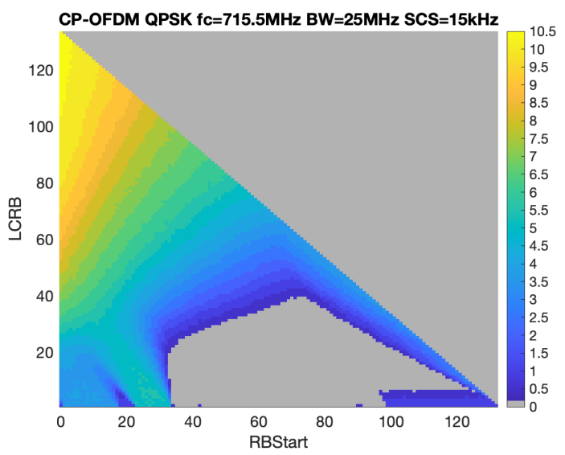

######## Annex A (normative): Measurement channels

A.1 General
===========

The throughput values defined in the measurement channels specified in
Annex A, are calculated and are valid per datastream (codeword). For
multi-stream (more than one codeword) transmissions, the throughput
referenced in the minimum requirements is the sum of throughputs of all
datastreams (codewords).

The UE category entry in the definition of the reference measurement
channel in Annex A is only informative and reveals the UE categories,
which can support the corresponding measurement channel. Whether the
measurement channel is used for testing a certain UE category or not is
specified in the individual minimum requirements.

A.2 UL reference measurement channels
=====================================

A.2.1 General
-------------

The measurement channels in the following subclauses are defined to
derive the requirements in clause 6 (Transmitter Characteristics) and
clause 7 (Receiver Characteristics). The measurement channels represent
example configurations of physical channels for different data rates.

The measurement channels in the following clauses are applicable to both
FDD and TDD.

The active uplink slots for TDD configurations are specified in table
A.2.1-1. TDD slot patterns defined for reference sensitivity tests will
be used for TDD UL RMCs, unless otherwise stated. The active uplink
slots for additional TDD configuration specified in Table A.2.1-3, with
the TDD pattern defined in Table A.2.1-4, is used for the phase
continuity tests for DMRS bundling with 15 kHz SCS. The active uplink
slots configuration specified in Table A.2.1-5 and the additional TDD
pattern in Table A.2.1-6 are used for shorter transient period
capability EVM tests at 15 kHz SCS.

Table A.2.1-1: TDD active uplink slots

  SCS      Active Uplink slots
  -------- --------------------------------
  15 kHz   4, 9
  30 kHz   8, 9, 18, 19
  60 kHz   16, 17, 18, 19, 36, 37, 38, 39

Table A.2.1-2: TDD active uplink slots for PC1.5 UE with
maxUplinkDutyCycle-PC1dot5-MPE-FR1-r16≤20%

  SCS      Active Uplink slots
  -------- ---------------------
  15 kHz   4
  30 kHz   8, 9
  60 kHz   16, 17, 18, 19

Table A.2.1-3: TDD active uplink slots for additional TDD configuration

  SCS      Active Uplink slots
  -------- ---------------------
  15 kHz   8, 9

Table A.2.1-4: TDD pattern for additional TDD configuration

+-----------------------------+-----------------------------+-------+
| Parameter                   | Value                       |       |
+=============================+=============================+=======+
|                             | SCS 15 kHz (µ0)             |       |
+-----------------------------+-----------------------------+-------+
| TDD Slot Configuration      | 7DS2U                       |       |
| pattern (Note 1)            |                             |       |
+-----------------------------+-----------------------------+-------+
| Special Slot Configuration  | 6D+4G+4U                    |       |
| (Note 2)                    |                             |       |
+-----------------------------+-----------------------------+-------+
| referenceSubcarrierSpacing  | 15 kHz                      |       |
+-----------------------------+-----------------------------+-------+
| UL-DL configuration         | *dl-                        | 10 ms |
|                             | UL-TransmissionPeriodicity* |       |
+-----------------------------+-----------------------------+-------+
|                             | *nrofDownlinkSlots*         | 7     |
+-----------------------------+-----------------------------+-------+
|                             | *nrofDownlinkSymbols*       | 6     |
+-----------------------------+-----------------------------+-------+
|                             | *nrofUplinkSlot*            | 2     |
+-----------------------------+-----------------------------+-------+
|                             | *nrofUplinkSymbols*         | 4     |
+-----------------------------+-----------------------------+-------+
| NOTE 1: D denotes a slot    |                             |       |
| with all DL symbols; S      |                             |       |
| denotes a slot with a mix   |                             |       |
| of DL, UL and guard         |                             |       |
| symbols; U denotes a slot   |                             |       |
| with all UL symbols. The    |                             |       |
| field is for information.   |                             |       |
|                             |                             |       |
| NOTE 2: D, G, U denote DL,  |                             |       |
| guard and UL symbols,       |                             |       |
| respectively. The field is  |                             |       |
| for information.            |                             |       |
+-----------------------------+-----------------------------+-------+

Table A.2.1-5: TDD active uplink slots for shorter transient period
capability

+----------+---------------------+
| > SCS    | Active Uplink slots |
+==========+=====================+
| > 15 kHz | 3,4                 |
+----------+---------------------+

Table A.2.1-6: Additional TDD pattern for shorter transient period
capability

+------------------------------+------------------------------+------+
| Parameter                    | Value                        |      |
+==============================+==============================+======+
|                              | SCS 15 kHz (µ0)              |      |
+------------------------------+------------------------------+------+
| TDD Slot Configuration       | 2DS2U                        |      |
| pattern (Note 1)             |                              |      |
+------------------------------+------------------------------+------+
| Special Slot Configuration   | 10D+2G+2U                    |      |
| (Note 2)                     |                              |      |
+------------------------------+------------------------------+------+
| referenceSubcarrierSpacing   | 15 kHz                       |      |
+------------------------------+------------------------------+------+
| UL-DL configuration          | *dl                          | 5 ms |
|                              | -UL-TransmissionPeriodicity* |      |
+------------------------------+------------------------------+------+
|                              | *nrofDownlinkSlots*          | 2    |
+------------------------------+------------------------------+------+
|                              | *nrofDownlinkSymbols*        | 10   |
+------------------------------+------------------------------+------+
|                              | *nrofUplinkSlot*             | 2    |
+------------------------------+------------------------------+------+
|                              | *nrofUplinkSymbols*          | 2    |
+------------------------------+------------------------------+------+
| NOTE 1: D denotes a slot     |                              |      |
| with all DL symbols; S       |                              |      |
| denotes a slot with a mix of |                              |      |
| DL, UL and guard symbols; U  |                              |      |
| denotes a slot with all UL   |                              |      |
| symbols. The field is for    |                              |      |
| information.                 |                              |      |
|                              |                              |      |
| NOTE 2: D, G, U denote DL,   |                              |      |
| guard and UL symbols,        |                              |      |
| respectively. The field is   |                              |      |
| for information.             |                              |      |
+------------------------------+------------------------------+------+

A.2.2 Reference measurement channels for FDD
--------------------------------------------

### A.2.2.1 DFT-s-OFDM Pi/2-BPSK

Table A.2.2.1-1: Reference Channels for DFT-s-OFDM Pi/2-BPSK

<table>
<thead>
<tr class="header">
<th>Parameter</th>
<th>Allocated resource blocks (LCRB)</th>
<th>DFT-s-OFDM Symbols per slot (Note 1)</th>
<th>Modulation</th>
<th>MCS Index (Note 2)</th>
<th>Payload size</th>
<th>Transport block CRC</th>
<th>LDPC Base Graph</th>
<th>Number of code blocks per slot (Note 3)</th>
<th>Total number of bits per slot</th>
<th>Total modulated symbols per slot</th>
</tr>
</thead>
<tbody>
<tr class="odd">
<td>Unit</td>
<td> </td>
<td> </td>
<td> </td>
<td> </td>
<td>Bits</td>
<td>Bits</td>
<td> </td>
<td> </td>
<td>Bits</td>
<td> </td>
</tr>
<tr class="even">
<td></td>
<td>1</td>
<td>11</td>
<td>pi/2 BPSK</td>
<td>0</td>
<td>24</td>
<td>16</td>
<td>2</td>
<td>1</td>
<td>132</td>
<td>132</td>
</tr>
<tr class="odd">
<td></td>
<td>5</td>
<td>11</td>
<td>pi/2 BPSK</td>
<td>0</td>
<td>160</td>
<td>16</td>
<td>2</td>
<td>1</td>
<td>660</td>
<td>660</td>
</tr>
<tr class="even">
<td></td>
<td>9</td>
<td>11</td>
<td>pi/2 BPSK</td>
<td>0</td>
<td>288</td>
<td>16</td>
<td>2</td>
<td>1</td>
<td>1188</td>
<td>1188</td>
</tr>
<tr class="odd">
<td></td>
<td>10</td>
<td>11</td>
<td>pi/2 BPSK</td>
<td>0</td>
<td>320</td>
<td>16</td>
<td>2</td>
<td>1</td>
<td>1320</td>
<td>1320</td>
</tr>
<tr class="even">
<td></td>
<td>12</td>
<td>11</td>
<td>pi/2 BPSK</td>
<td>0</td>
<td>384</td>
<td>16</td>
<td>2</td>
<td>1</td>
<td>1584</td>
<td>1584</td>
</tr>
<tr class="odd">
<td></td>
<td>15</td>
<td>11</td>
<td>pi/2 BPSK</td>
<td>0</td>
<td>480</td>
<td>16</td>
<td>2</td>
<td>1</td>
<td>1980</td>
<td>1980</td>
</tr>
<tr class="even">
<td></td>
<td>18</td>
<td>11</td>
<td>pi/2 BPSK</td>
<td>0</td>
<td>576</td>
<td>16</td>
<td>2</td>
<td>1</td>
<td>2376</td>
<td>2376</td>
</tr>
<tr class="odd">
<td></td>
<td>24</td>
<td>11</td>
<td>pi/2 BPSK</td>
<td>0</td>
<td>768</td>
<td>16</td>
<td>2</td>
<td>1</td>
<td>3168</td>
<td>3168</td>
</tr>
<tr class="even">
<td></td>
<td>25</td>
<td>11</td>
<td>pi/2 BPSK</td>
<td>0</td>
<td>808</td>
<td>16</td>
<td>2</td>
<td>1</td>
<td>3300</td>
<td>3300</td>
</tr>
<tr class="odd">
<td></td>
<td>30</td>
<td>11</td>
<td>pi/2 BPSK</td>
<td>0</td>
<td>984</td>
<td>16</td>
<td>2</td>
<td>1</td>
<td>3960</td>
<td>3960</td>
</tr>
<tr class="even">
<td></td>
<td>32</td>
<td>11</td>
<td>pi/2 BPSK</td>
<td>0</td>
<td>1032</td>
<td>16</td>
<td>2</td>
<td>1</td>
<td>4224</td>
<td>4224</td>
</tr>
<tr class="odd">
<td></td>
<td>36</td>
<td>11</td>
<td>pi/2 BPSK</td>
<td>0</td>
<td>1128</td>
<td>16</td>
<td>2</td>
<td>1</td>
<td>4752</td>
<td>4752</td>
</tr>
<tr class="even">
<td></td>
<td>45</td>
<td>11</td>
<td>pi/2 BPSK</td>
<td>0</td>
<td>1416</td>
<td>16</td>
<td>2</td>
<td>1</td>
<td>5940</td>
<td>5940</td>
</tr>
<tr class="odd">
<td></td>
<td>50</td>
<td>11</td>
<td>pi/2 BPSK</td>
<td>0</td>
<td>1544</td>
<td>16</td>
<td>2</td>
<td>1</td>
<td>6600</td>
<td>6600</td>
</tr>
<tr class="even">
<td></td>
<td>60</td>
<td>11</td>
<td>pi/2 BPSK</td>
<td>0</td>
<td>1864</td>
<td>16</td>
<td>2</td>
<td>1</td>
<td>7920</td>
<td>7920</td>
</tr>
<tr class="odd">
<td></td>
<td>64</td>
<td>11</td>
<td>pi/2 BPSK</td>
<td>0</td>
<td>2024</td>
<td>16</td>
<td>2</td>
<td>1</td>
<td>8448</td>
<td>8448</td>
</tr>
<tr class="even">
<td></td>
<td>75</td>
<td>11</td>
<td>pi/2 BPSK</td>
<td>0</td>
<td>2408</td>
<td>16</td>
<td>2</td>
<td>1</td>
<td>9900</td>
<td>9900</td>
</tr>
<tr class="odd">
<td></td>
<td>80</td>
<td>11</td>
<td>pi/2 BPSK</td>
<td>0</td>
<td>2472</td>
<td>16</td>
<td>2</td>
<td>1</td>
<td>10560</td>
<td>10560</td>
</tr>
<tr class="even">
<td></td>
<td>81</td>
<td>11</td>
<td>pi/2 BPSK</td>
<td>0</td>
<td>2536</td>
<td>16</td>
<td>2</td>
<td>1</td>
<td>10692</td>
<td>10692</td>
</tr>
<tr class="odd">
<td></td>
<td>90</td>
<td>11</td>
<td>pi/2 BPSK</td>
<td>0</td>
<td>2792</td>
<td>16</td>
<td>2</td>
<td>1</td>
<td>11880</td>
<td>11880</td>
</tr>
<tr class="even">
<td></td>
<td>100</td>
<td>11</td>
<td>pi/2 BPSK</td>
<td>0</td>
<td>3104</td>
<td>16</td>
<td>2</td>
<td>1</td>
<td>13200</td>
<td>13200</td>
</tr>
<tr class="odd">
<td></td>
<td>108</td>
<td>11</td>
<td>pi/2 BPSK</td>
<td>0</td>
<td>3368</td>
<td>16</td>
<td>2</td>
<td>1</td>
<td>14256</td>
<td>14256</td>
</tr>
<tr class="even">
<td></td>
<td>120</td>
<td>11</td>
<td>pi/2 BPSK</td>
<td>0</td>
<td>3752</td>
<td>16</td>
<td>2</td>
<td>1</td>
<td>15840</td>
<td>15840</td>
</tr>
<tr class="odd">
<td></td>
<td>128</td>
<td>11</td>
<td>pi/2 BPSK</td>
<td>0</td>
<td>3976</td>
<td>24</td>
<td>2</td>
<td>2</td>
<td>16896</td>
<td>16896</td>
</tr>
<tr class="even">
<td></td>
<td>135</td>
<td>11</td>
<td>pi/2 BPSK</td>
<td>0</td>
<td>4104</td>
<td>24</td>
<td>2</td>
<td>2</td>
<td>17820</td>
<td>17820</td>
</tr>
<tr class="odd">
<td></td>
<td>160</td>
<td>11</td>
<td>pi/2 BPSK</td>
<td>0</td>
<td>4872</td>
<td>24</td>
<td>2</td>
<td>2</td>
<td>21120</td>
<td>21120</td>
</tr>
<tr class="even">
<td></td>
<td>162</td>
<td>11</td>
<td>pi/2 BPSK</td>
<td>0</td>
<td>5000</td>
<td>24</td>
<td>2</td>
<td>2</td>
<td>21384</td>
<td>21384</td>
</tr>
<tr class="odd">
<td></td>
<td>180</td>
<td>11</td>
<td>pi/2 BPSK</td>
<td>0</td>
<td>5512</td>
<td>24</td>
<td>2</td>
<td>2</td>
<td>23760</td>
<td>23760</td>
</tr>
<tr class="even">
<td></td>
<td>216</td>
<td>11</td>
<td>pi/2 BPSK</td>
<td>0</td>
<td>6664</td>
<td>24</td>
<td>2</td>
<td>2</td>
<td>28512</td>
<td>28512</td>
</tr>
<tr class="odd">
<td></td>
<td>243</td>
<td>11</td>
<td>pi/2 BPSK</td>
<td>0</td>
<td>7560</td>
<td>24</td>
<td>2</td>
<td>2</td>
<td>32076</td>
<td>32076</td>
</tr>
<tr class="even">
<td></td>
<td>270</td>
<td>11</td>
<td>pi/2 BPSK</td>
<td>0</td>
<td>8448</td>
<td>24</td>
<td>2</td>
<td>3</td>
<td>35640</td>
<td>35640</td>
</tr>
<tr class="odd">
<td>
NOTE 1: PUSCH mapping Type-A and single-symbol DM-RS configuration Type-1 with 2 additional DM-RS symbols, such that the DM-RS positions are set to symbols 2, 7, 11. DMRS is [TDM'ed] with PUSCH data. DM-RS symbols are not counted.

NOTE 2: MCS Index is based on MCS table 6.1.4.1-1 defined in TS 38.214 [10].

NOTE 3: If more than one Code Block is present, an additional CRC sequence of L = 24 Bits is attached to each Code Block (otherwise L = 0 Bit)

NOTE 4: The RMCs apply to all channel bandwidth where LCRB ≤ NRB.
</td>
<td></td>
<td></td>
<td></td>
<td></td>
<td></td>
<td></td>
<td></td>
<td></td>
<td></td>
<td></td>
</tr>
</tbody>
</table>

Table A.2.2.1-2: Void

Table A.2.2.1-3: Void

### A.2.2.2 DFT-s-OFDM QPSK

Table A.2.2.2-1: Reference Channels for DFT-s-OFDM QPSK

<table>
<thead>
<tr class="header">
<th>Parameter</th>
<th>Allocated resource blocks (LCRB)</th>
<th>DFT-s-OFDM Symbols per slot (Note 1)</th>
<th>Modulation</th>
<th>MCS Index (Note 2)</th>
<th>Payload size</th>
<th>Transport block CRC</th>
<th>LDPC Base Graph</th>
<th>Number of code blocks per slot (Note 3)</th>
<th>Total number of bits per slot</th>
<th>Total modulated symbols per slot</th>
</tr>
</thead>
<tbody>
<tr class="odd">
<td>Unit</td>
<td> </td>
<td> </td>
<td> </td>
<td> </td>
<td>Bits</td>
<td>Bits</td>
<td> </td>
<td> </td>
<td>Bits</td>
<td> </td>
</tr>
<tr class="even">
<td></td>
<td>1</td>
<td>11</td>
<td>QPSK</td>
<td>2</td>
<td>48</td>
<td>16</td>
<td>2</td>
<td>1</td>
<td>264</td>
<td>132</td>
</tr>
<tr class="odd">
<td></td>
<td>5</td>
<td>11</td>
<td>QPSK</td>
<td>2</td>
<td>256</td>
<td>16</td>
<td>2</td>
<td>1</td>
<td>1320</td>
<td>660</td>
</tr>
<tr class="even">
<td></td>
<td>9</td>
<td>11</td>
<td>QPSK</td>
<td>2</td>
<td>456</td>
<td>16</td>
<td>2</td>
<td>1</td>
<td>2376</td>
<td>1188</td>
</tr>
<tr class="odd">
<td></td>
<td>10</td>
<td>11</td>
<td>QPSK</td>
<td>2</td>
<td>504</td>
<td>16</td>
<td>2</td>
<td>1</td>
<td>2640</td>
<td>1320</td>
</tr>
<tr class="even">
<td></td>
<td>12</td>
<td>11</td>
<td>QPSK</td>
<td>2</td>
<td>608</td>
<td>16</td>
<td>2</td>
<td>1</td>
<td>3168</td>
<td>1584</td>
</tr>
<tr class="odd">
<td></td>
<td>15</td>
<td>11</td>
<td>QPSK</td>
<td>2</td>
<td>768</td>
<td>16</td>
<td>2</td>
<td>1</td>
<td>3960</td>
<td>1980</td>
</tr>
<tr class="even">
<td></td>
<td>18</td>
<td>11</td>
<td>QPSK</td>
<td>2</td>
<td>928</td>
<td>16</td>
<td>2</td>
<td>1</td>
<td>4752</td>
<td>2376</td>
</tr>
<tr class="odd">
<td></td>
<td>20</td>
<td>11</td>
<td>QPSK</td>
<td>2</td>
<td>1032</td>
<td>16</td>
<td>2</td>
<td>1</td>
<td>5280</td>
<td>2640</td>
</tr>
<tr class="even">
<td></td>
<td>24</td>
<td>11</td>
<td>QPSK</td>
<td>2</td>
<td>1192</td>
<td>16</td>
<td>2</td>
<td>1</td>
<td>6336</td>
<td>3168</td>
</tr>
<tr class="odd">
<td></td>
<td>25</td>
<td>11</td>
<td>QPSK</td>
<td>2</td>
<td>1256</td>
<td>16</td>
<td>2</td>
<td>1</td>
<td>6600</td>
<td>3300</td>
</tr>
<tr class="even">
<td></td>
<td>30</td>
<td>11</td>
<td>QPSK</td>
<td>2</td>
<td>1544</td>
<td>16</td>
<td>2</td>
<td>1</td>
<td>7920</td>
<td>3960</td>
</tr>
<tr class="odd">
<td></td>
<td>32</td>
<td>11</td>
<td>QPSK</td>
<td>2</td>
<td>1608</td>
<td>16</td>
<td>2</td>
<td>1</td>
<td>8448</td>
<td>4224</td>
</tr>
<tr class="even">
<td></td>
<td>36</td>
<td>11</td>
<td>QPSK</td>
<td>2</td>
<td>1800</td>
<td>16</td>
<td>2</td>
<td>1</td>
<td>9504</td>
<td>4752</td>
</tr>
<tr class="odd">
<td></td>
<td>45</td>
<td>11</td>
<td>QPKS</td>
<td>2</td>
<td>2208</td>
<td>16</td>
<td>2</td>
<td>1</td>
<td>11880</td>
<td>5940</td>
</tr>
<tr class="even">
<td></td>
<td>50</td>
<td>11</td>
<td>QPSK</td>
<td>2</td>
<td>2472</td>
<td>16</td>
<td>2</td>
<td>1</td>
<td>13200</td>
<td>6600</td>
</tr>
<tr class="odd">
<td></td>
<td>60</td>
<td>11</td>
<td>QPSK</td>
<td>2</td>
<td>3104</td>
<td>16</td>
<td>2</td>
<td>1</td>
<td>15840</td>
<td>7920</td>
</tr>
<tr class="even">
<td></td>
<td>64</td>
<td>11</td>
<td>QPSK</td>
<td>2</td>
<td>3240</td>
<td>16</td>
<td>2</td>
<td>1</td>
<td>16896</td>
<td>8448</td>
</tr>
<tr class="odd">
<td></td>
<td>75</td>
<td>11</td>
<td>QPSK</td>
<td>2</td>
<td>3752</td>
<td>16</td>
<td>2</td>
<td>1</td>
<td>19800</td>
<td>9900</td>
</tr>
<tr class="even">
<td></td>
<td>80</td>
<td>11</td>
<td>QPSK</td>
<td>2</td>
<td>3976</td>
<td>24</td>
<td>2</td>
<td>2</td>
<td>21120</td>
<td>10560</td>
</tr>
<tr class="odd">
<td></td>
<td>81</td>
<td>11</td>
<td>QPSK</td>
<td>2</td>
<td>4040</td>
<td>24</td>
<td>2</td>
<td>2</td>
<td>21384</td>
<td>10692</td>
</tr>
<tr class="even">
<td></td>
<td>90</td>
<td>11</td>
<td>QPSK</td>
<td>2</td>
<td>4488</td>
<td>24</td>
<td>2</td>
<td>2</td>
<td>23760</td>
<td>11880</td>
</tr>
<tr class="odd">
<td></td>
<td>100</td>
<td>11</td>
<td>QPSK</td>
<td>2</td>
<td>5000</td>
<td>24</td>
<td>2</td>
<td>2</td>
<td>26400</td>
<td>13200</td>
</tr>
<tr class="even">
<td></td>
<td>108</td>
<td>11</td>
<td>QPSK</td>
<td>2</td>
<td>5384</td>
<td>24</td>
<td>2</td>
<td>2</td>
<td>28512</td>
<td>14256</td>
</tr>
<tr class="odd">
<td></td>
<td>120</td>
<td>11</td>
<td>QPSK</td>
<td>2</td>
<td>5896</td>
<td>24</td>
<td>2</td>
<td>2</td>
<td>31680</td>
<td>15840</td>
</tr>
<tr class="even">
<td></td>
<td>128</td>
<td>11</td>
<td>QPSK</td>
<td>2</td>
<td>6408</td>
<td>24</td>
<td>2</td>
<td>2</td>
<td>33792</td>
<td>16896</td>
</tr>
<tr class="odd">
<td></td>
<td>135</td>
<td>11</td>
<td>QPSK</td>
<td>2</td>
<td>6664</td>
<td>24</td>
<td>2</td>
<td>2</td>
<td>35640</td>
<td>17820</td>
</tr>
<tr class="even">
<td></td>
<td>160</td>
<td>11</td>
<td>QPSK</td>
<td>2</td>
<td>7944</td>
<td>24</td>
<td>2</td>
<td>3</td>
<td>42240</td>
<td>21120</td>
</tr>
<tr class="odd">
<td></td>
<td>162</td>
<td>11</td>
<td>QPSK</td>
<td>2</td>
<td>8064</td>
<td>24</td>
<td>2</td>
<td>3</td>
<td>42768</td>
<td>21384</td>
</tr>
<tr class="even">
<td></td>
<td>180</td>
<td>11</td>
<td>QPSK</td>
<td>2</td>
<td>8976</td>
<td>24</td>
<td>2</td>
<td>3</td>
<td>47520</td>
<td>23760</td>
</tr>
<tr class="odd">
<td></td>
<td>216</td>
<td>11</td>
<td>QPSK</td>
<td>2</td>
<td>10752</td>
<td>24</td>
<td>2</td>
<td>3</td>
<td>57024</td>
<td>28512</td>
</tr>
<tr class="even">
<td></td>
<td>243</td>
<td>11</td>
<td>QPSK</td>
<td>2</td>
<td>12040</td>
<td>24</td>
<td>2</td>
<td>4</td>
<td>64152</td>
<td>32076</td>
</tr>
<tr class="odd">
<td></td>
<td>270</td>
<td>11</td>
<td>QPSK</td>
<td>2</td>
<td>13320</td>
<td>24</td>
<td>2</td>
<td>4</td>
<td>71280</td>
<td>35640</td>
</tr>
<tr class="even">
<td>
NOTE 1: PUSCH mapping Type-A and single-symbol DM-RS configuration Type-1 with 2 additional DM-RS symbols, such that the DM-RS positions are set to symbols 2, 7, 11. DMRS is [TDM'ed] with PUSCH data. DM-RS symbols are not counted.

NOTE 2: MCS Index is based on MCS table 6.1.4.1-1 defined in TS 38.214 [10].

NOTE 3: If more than one Code Block is present, an additional CRC sequence of L = 24 Bits is attached to each Code Block (otherwise L = 0 Bit)

NOTE 4: The RMCs apply to all channel bandwidth where LCRB ≤ NRB.
</td>
<td></td>
<td></td>
<td></td>
<td></td>
<td></td>
<td></td>
<td></td>
<td></td>
<td></td>
<td></td>
</tr>
</tbody>
</table>

Table A.2.2.2-2: Void

Table A.2.2.2-3: Void

### A.2.2.3 DFT-s-OFDM 16QAM

Table A.2.2.3-1: Reference Channels for DFT-s-OFDM 16QAM

<table>
<thead>
<tr class="header">
<th>Parameter</th>
<th>Allocated resource blocks (LCRB)</th>
<th>DFT-s-OFDM Symbols per slot (Note 1)</th>
<th>Modulation</th>
<th>MCS Index (Note 2)</th>
<th>Payload size</th>
<th>Transport block CRC</th>
<th>LDPC Base Graph</th>
<th>Number of code blocks per slot (Note 3)</th>
<th>Total number of bits per slot</th>
<th>Total modulated symbols per slot</th>
</tr>
</thead>
<tbody>
<tr class="odd">
<td>Unit</td>
<td> </td>
<td> </td>
<td> </td>
<td> </td>
<td>Bits</td>
<td>Bits</td>
<td> </td>
<td> </td>
<td>Bits</td>
<td> </td>
</tr>
<tr class="even">
<td></td>
<td>1</td>
<td>11</td>
<td>16QAM</td>
<td>10</td>
<td>176</td>
<td>16</td>
<td>2</td>
<td>1</td>
<td>528</td>
<td>132</td>
</tr>
<tr class="odd">
<td></td>
<td>5</td>
<td>11</td>
<td>16QAM</td>
<td>10</td>
<td>888</td>
<td>16</td>
<td>2</td>
<td>1</td>
<td>2640</td>
<td>660</td>
</tr>
<tr class="even">
<td></td>
<td>9</td>
<td>11</td>
<td>16QAM</td>
<td>10</td>
<td>1608</td>
<td>16</td>
<td>2</td>
<td>1</td>
<td>4752</td>
<td>1188</td>
</tr>
<tr class="odd">
<td></td>
<td>10</td>
<td>11</td>
<td>16QAM</td>
<td>10</td>
<td>1800</td>
<td>16</td>
<td>2</td>
<td>1</td>
<td>5280</td>
<td>1320</td>
</tr>
<tr class="even">
<td></td>
<td>12</td>
<td>11</td>
<td>16QAM</td>
<td>10</td>
<td>2088</td>
<td>16</td>
<td>2</td>
<td>1</td>
<td>6336</td>
<td>1584</td>
</tr>
<tr class="odd">
<td></td>
<td>15</td>
<td>11</td>
<td>16QAM</td>
<td>10</td>
<td>2664</td>
<td>16</td>
<td>2</td>
<td>1</td>
<td>7920</td>
<td>1980</td>
</tr>
<tr class="even">
<td></td>
<td>18</td>
<td>11</td>
<td>16QAM</td>
<td>10</td>
<td>3240</td>
<td>16</td>
<td>2</td>
<td>1</td>
<td>9504</td>
<td>2376</td>
</tr>
<tr class="odd">
<td></td>
<td>24</td>
<td>11</td>
<td>16QAM</td>
<td>10</td>
<td>4224</td>
<td>24</td>
<td>1</td>
<td>1</td>
<td>12672</td>
<td>3168</td>
</tr>
<tr class="even">
<td></td>
<td>25</td>
<td>11</td>
<td>16QAM</td>
<td>10</td>
<td>4352</td>
<td>24</td>
<td>1</td>
<td>1</td>
<td>13200</td>
<td>3300</td>
</tr>
<tr class="odd">
<td></td>
<td>30</td>
<td>11</td>
<td>16QAM</td>
<td>10</td>
<td>5248</td>
<td>24</td>
<td>1</td>
<td>1</td>
<td>15840</td>
<td>3960</td>
</tr>
<tr class="even">
<td></td>
<td>32</td>
<td>11</td>
<td>16QAM</td>
<td>10</td>
<td>5632</td>
<td>24</td>
<td>1</td>
<td>1</td>
<td>16896</td>
<td>4224</td>
</tr>
<tr class="odd">
<td></td>
<td>36</td>
<td>11</td>
<td>16QAM</td>
<td>10</td>
<td>6272</td>
<td>24</td>
<td>1</td>
<td>1</td>
<td>19008</td>
<td>4752</td>
</tr>
<tr class="even">
<td></td>
<td>45</td>
<td>11</td>
<td>16QAM</td>
<td>10</td>
<td>7808</td>
<td>24</td>
<td>1</td>
<td>1</td>
<td>23760</td>
<td>5940</td>
</tr>
<tr class="odd">
<td></td>
<td>50</td>
<td>11</td>
<td>16QAM</td>
<td>10</td>
<td>8712</td>
<td>24</td>
<td>1</td>
<td>2</td>
<td>26400</td>
<td>6600</td>
</tr>
<tr class="even">
<td></td>
<td>60</td>
<td>11</td>
<td>16QAM</td>
<td>10</td>
<td>10504</td>
<td>24</td>
<td>1</td>
<td>2</td>
<td>31680</td>
<td>7920</td>
</tr>
<tr class="odd">
<td></td>
<td>64</td>
<td>11</td>
<td>16QAM</td>
<td>10</td>
<td>11272</td>
<td>24</td>
<td>1</td>
<td>2</td>
<td>33792</td>
<td>8448</td>
</tr>
<tr class="even">
<td></td>
<td>75</td>
<td>11</td>
<td>16QAM</td>
<td>10</td>
<td>13064</td>
<td>24</td>
<td>1</td>
<td>2</td>
<td>39600</td>
<td>9900</td>
</tr>
<tr class="odd">
<td></td>
<td>80</td>
<td>11</td>
<td>16QAM</td>
<td>10</td>
<td>14088</td>
<td>24</td>
<td>1</td>
<td>2</td>
<td>42240</td>
<td>10560</td>
</tr>
<tr class="even">
<td></td>
<td>81</td>
<td>11</td>
<td>16QAM</td>
<td>10</td>
<td>14088</td>
<td>24</td>
<td>1</td>
<td>2</td>
<td>42768</td>
<td>10692</td>
</tr>
<tr class="odd">
<td></td>
<td>90</td>
<td>11</td>
<td>16QAM</td>
<td>10</td>
<td>15880</td>
<td>24</td>
<td>1</td>
<td>2</td>
<td>47520</td>
<td>11880</td>
</tr>
<tr class="even">
<td></td>
<td>100</td>
<td>11</td>
<td>16QAM</td>
<td>10</td>
<td>17424</td>
<td>24</td>
<td>1</td>
<td>3</td>
<td>52800</td>
<td>13200</td>
</tr>
<tr class="odd">
<td></td>
<td>108</td>
<td>11</td>
<td>16QAM</td>
<td>10</td>
<td>18960</td>
<td>24</td>
<td>1</td>
<td>3</td>
<td>57024</td>
<td>14256</td>
</tr>
<tr class="even">
<td></td>
<td>120</td>
<td>11</td>
<td>16QAM</td>
<td>10</td>
<td>21000</td>
<td>24</td>
<td>1</td>
<td>3</td>
<td>63360</td>
<td>15840</td>
</tr>
<tr class="odd">
<td></td>
<td>128</td>
<td>11</td>
<td>16QAM</td>
<td>10</td>
<td>22536</td>
<td>24</td>
<td>1</td>
<td>3</td>
<td>67584</td>
<td>16896</td>
</tr>
<tr class="even">
<td></td>
<td>135</td>
<td>11</td>
<td>16QAM</td>
<td>10</td>
<td>23568</td>
<td>24</td>
<td>1</td>
<td>3</td>
<td>71280</td>
<td>17820</td>
</tr>
<tr class="odd">
<td></td>
<td>160</td>
<td>11</td>
<td>16QAM</td>
<td>10</td>
<td>28168</td>
<td>24</td>
<td>1</td>
<td>4</td>
<td>84480</td>
<td>21120</td>
</tr>
<tr class="even">
<td></td>
<td>162</td>
<td>11</td>
<td>16QAM</td>
<td>10</td>
<td>28168</td>
<td>24</td>
<td>1</td>
<td>4</td>
<td>85536</td>
<td>21384</td>
</tr>
<tr class="odd">
<td></td>
<td>180</td>
<td>11</td>
<td>16QAM</td>
<td>10</td>
<td>31752</td>
<td>24</td>
<td>1</td>
<td>4</td>
<td>95040</td>
<td>23760</td>
</tr>
<tr class="even">
<td></td>
<td>216</td>
<td>11</td>
<td>16QAM</td>
<td>10</td>
<td>37896</td>
<td>24</td>
<td>1</td>
<td>5</td>
<td>114048</td>
<td>28512</td>
</tr>
<tr class="odd">
<td></td>
<td>243</td>
<td>11</td>
<td>16QAM</td>
<td>10</td>
<td>43032</td>
<td>24</td>
<td>1</td>
<td>6</td>
<td>128304</td>
<td>32076</td>
</tr>
<tr class="even">
<td></td>
<td>270</td>
<td>11</td>
<td>16QAM</td>
<td>10</td>
<td>47112</td>
<td>24</td>
<td>1</td>
<td>6</td>
<td>142560</td>
<td>35640</td>
</tr>
<tr class="odd">
<td>
NOTE 1: PUSCH mapping Type-A and single-symbol DM-RS configuration Type-1 with 2 additional DM-RS symbols, such that the DM-RS positions are set to symbols 2, 7, 11. DMRS is [TDM'ed] with PUSCH data. DM-RS symbols are not counted.

NOTE 2: MCS Index is based on MCS table 6.1.4.1-1 defined in TS 38.214 [10].

NOTE 3: If more than one Code Block is present, an additional CRC sequence of L = 24 Bits is attached to each Code Block (otherwise L = 0 Bit)

NOTE 4: The RMCs apply to all channel bandwidth where LCRB ≤ NRB.
</td>
<td></td>
<td></td>
<td></td>
<td></td>
<td></td>
<td></td>
<td></td>
<td></td>
<td></td>
<td></td>
</tr>
</tbody>
</table>

Table A.2.2.3-2: Void

Table A.2.2.3-3: Void

### A.2.2.4 DFT-s-OFDM 64QAM

Table A.2.2.4-1: Reference Channels for DFT-s-OFDM 64QAM

<table>
<thead>
<tr class="header">
<th>Parameter</th>
<th>Allocated resource blocks (LCRB)</th>
<th>DFT-s-OFDM Symbols per slot (Note 1)</th>
<th>Modulation</th>
<th>MCS Index (Note 2)</th>
<th>Payload size</th>
<th>Transport block CRC</th>
<th>LDPC Base Graph</th>
<th>Number of code blocks per slot (Note 3)</th>
<th>Total number of bits per slot</th>
<th>Total modulated symbols per slot</th>
</tr>
</thead>
<tbody>
<tr class="odd">
<td>Unit</td>
<td> </td>
<td> </td>
<td> </td>
<td> </td>
<td>Bits</td>
<td>Bits</td>
<td> </td>
<td> </td>
<td>Bits</td>
<td> </td>
</tr>
<tr class="even">
<td></td>
<td>1</td>
<td>11</td>
<td>64QAM</td>
<td>18</td>
<td>408</td>
<td>16</td>
<td>2</td>
<td>1</td>
<td>792</td>
<td>132</td>
</tr>
<tr class="odd">
<td></td>
<td>5</td>
<td>11</td>
<td>64QAM</td>
<td>18</td>
<td>2024</td>
<td>16</td>
<td>2</td>
<td>1</td>
<td>3960</td>
<td>660</td>
</tr>
<tr class="even">
<td></td>
<td>9</td>
<td>11</td>
<td>64QAM</td>
<td>18</td>
<td>3624</td>
<td>16</td>
<td>2</td>
<td>1</td>
<td>7128</td>
<td>1188</td>
</tr>
<tr class="odd">
<td></td>
<td>10</td>
<td>11</td>
<td>64QAM</td>
<td>18</td>
<td>3968</td>
<td>24</td>
<td>1</td>
<td>1</td>
<td>7920</td>
<td>1320</td>
</tr>
<tr class="even">
<td></td>
<td>12</td>
<td>11</td>
<td>64QAM</td>
<td>18</td>
<td>4736</td>
<td>24</td>
<td>1</td>
<td>1</td>
<td>9504</td>
<td>1584</td>
</tr>
<tr class="odd">
<td></td>
<td>15</td>
<td>11</td>
<td>64QAM</td>
<td>18</td>
<td>6016</td>
<td>24</td>
<td>1</td>
<td>1</td>
<td>11880</td>
<td>1980</td>
</tr>
<tr class="even">
<td></td>
<td>18</td>
<td>11</td>
<td>64QAM</td>
<td>18</td>
<td>7168</td>
<td>24</td>
<td>1</td>
<td>1</td>
<td>14256</td>
<td>2376</td>
</tr>
<tr class="odd">
<td></td>
<td>24</td>
<td>11</td>
<td>64QAM</td>
<td>18</td>
<td>9480</td>
<td>24</td>
<td>1</td>
<td>2</td>
<td>19008</td>
<td>3168</td>
</tr>
<tr class="even">
<td></td>
<td>25</td>
<td>11</td>
<td>64QAM</td>
<td>18</td>
<td>9992</td>
<td>24</td>
<td>1</td>
<td>2</td>
<td>19800</td>
<td>3300</td>
</tr>
<tr class="odd">
<td></td>
<td>30</td>
<td>11</td>
<td>64QAM</td>
<td>18</td>
<td>12040</td>
<td>24</td>
<td>1</td>
<td>2</td>
<td>23760</td>
<td>3960</td>
</tr>
<tr class="even">
<td></td>
<td>32</td>
<td>11</td>
<td>64QAM</td>
<td>18</td>
<td>12808</td>
<td>24</td>
<td>1</td>
<td>2</td>
<td>25344</td>
<td>4224</td>
</tr>
<tr class="odd">
<td></td>
<td>36</td>
<td>11</td>
<td>64QAM</td>
<td>18</td>
<td>14344</td>
<td>24</td>
<td>1</td>
<td>2</td>
<td>28512</td>
<td>4752</td>
</tr>
<tr class="even">
<td></td>
<td>45</td>
<td>11</td>
<td>64QAM</td>
<td>18</td>
<td>17928</td>
<td>24</td>
<td>1</td>
<td>3</td>
<td>35640</td>
<td>5940</td>
</tr>
<tr class="odd">
<td></td>
<td>50</td>
<td>11</td>
<td>64QAM</td>
<td>18</td>
<td>19968</td>
<td>24</td>
<td>1</td>
<td>3</td>
<td>39600</td>
<td>6600</td>
</tr>
<tr class="even">
<td></td>
<td>60</td>
<td>11</td>
<td>64QAM</td>
<td>18</td>
<td>24072</td>
<td>24</td>
<td>1</td>
<td>3</td>
<td>47520</td>
<td>7920</td>
</tr>
<tr class="odd">
<td></td>
<td>64</td>
<td>11</td>
<td>64QAM</td>
<td>18</td>
<td>25608</td>
<td>24</td>
<td>1</td>
<td>4</td>
<td>50688</td>
<td>8448</td>
</tr>
<tr class="even">
<td></td>
<td>75</td>
<td>11</td>
<td>64QAM</td>
<td>18</td>
<td>30216</td>
<td>24</td>
<td>1</td>
<td>4</td>
<td>59400</td>
<td>9900</td>
</tr>
<tr class="odd">
<td></td>
<td>80</td>
<td>11</td>
<td>64QAM</td>
<td>18</td>
<td>31752</td>
<td>24</td>
<td>1</td>
<td>4</td>
<td>63360</td>
<td>10560</td>
</tr>
<tr class="even">
<td></td>
<td>81</td>
<td>11</td>
<td>64QAM</td>
<td>18</td>
<td>32264</td>
<td>24</td>
<td>1</td>
<td>4</td>
<td>64152</td>
<td>10692</td>
</tr>
<tr class="odd">
<td></td>
<td>90</td>
<td>11</td>
<td>64QAM</td>
<td>18</td>
<td>35856</td>
<td>24</td>
<td>1</td>
<td>5</td>
<td>71280</td>
<td>11880</td>
</tr>
<tr class="even">
<td></td>
<td>108</td>
<td>11</td>
<td>64QAM</td>
<td>18</td>
<td>43032</td>
<td>24</td>
<td>1</td>
<td>6</td>
<td>85536</td>
<td>14256</td>
</tr>
<tr class="odd">
<td></td>
<td>100</td>
<td>11</td>
<td>64QAM</td>
<td>18</td>
<td>39936</td>
<td>24</td>
<td>1</td>
<td>5</td>
<td>79200</td>
<td>13200</td>
</tr>
<tr class="even">
<td></td>
<td>120</td>
<td>11</td>
<td>64QAM</td>
<td>18</td>
<td>48168</td>
<td>24</td>
<td>1</td>
<td>6</td>
<td>95040</td>
<td>15840</td>
</tr>
<tr class="odd">
<td></td>
<td>128</td>
<td>11</td>
<td>64QAM</td>
<td>18</td>
<td>51216</td>
<td>24</td>
<td>1</td>
<td>7</td>
<td>101376</td>
<td>16896</td>
</tr>
<tr class="even">
<td></td>
<td>135</td>
<td>11</td>
<td>64QAM</td>
<td>18</td>
<td>54296</td>
<td>24</td>
<td>1</td>
<td>7</td>
<td>106920</td>
<td>17820</td>
</tr>
<tr class="odd">
<td></td>
<td>160</td>
<td>11</td>
<td>64QAM</td>
<td>18</td>
<td>63528</td>
<td>24</td>
<td>1</td>
<td>8</td>
<td>126720</td>
<td>21120</td>
</tr>
<tr class="even">
<td></td>
<td>162</td>
<td>11</td>
<td>64QAM</td>
<td>18</td>
<td>64552</td>
<td>24</td>
<td>1</td>
<td>8</td>
<td>128304</td>
<td>21384</td>
</tr>
<tr class="odd">
<td></td>
<td>180</td>
<td>11</td>
<td>64QAM</td>
<td>18</td>
<td>71688</td>
<td>24</td>
<td>1</td>
<td>9</td>
<td>142560</td>
<td>23760</td>
</tr>
<tr class="even">
<td></td>
<td>216</td>
<td>11</td>
<td>64QAM</td>
<td>18</td>
<td>86040</td>
<td>24</td>
<td>1</td>
<td>11</td>
<td>171072</td>
<td>28512</td>
</tr>
<tr class="odd">
<td></td>
<td>243</td>
<td>11</td>
<td>64QAM</td>
<td>18</td>
<td>96264</td>
<td>24</td>
<td>1</td>
<td>12</td>
<td>192456</td>
<td>32076</td>
</tr>
<tr class="even">
<td></td>
<td>270</td>
<td>11</td>
<td>64QAM</td>
<td>18</td>
<td>108552</td>
<td>24</td>
<td>1</td>
<td>13</td>
<td>213840</td>
<td>35640</td>
</tr>
<tr class="odd">
<td>
NOTE 1: PUSCH mapping Type-A and single-symbol DM-RS configuration Type-1 with 2 additional DM-RS symbols, such that the DM-RS positions are set to symbols 2, 7, 11. DMRS is [TDM'ed] with PUSCH data. DM-RS symbols are not counted.

NOTE 2: MCS Index is based on MCS table 6.1.4.1-1 defined in TS 38.214 [10].

NOTE 3: If more than one Code Block is present, an additional CRC sequence of L = 24 Bits is attached to each Code Block (otherwise L = 0 Bit)

NOTE 4: The RMCs apply to all channel bandwidth where LCRB ≤ NRB.
</td>
<td></td>
<td></td>
<td></td>
<td></td>
<td></td>
<td></td>
<td></td>
<td></td>
<td></td>
<td></td>
</tr>
</tbody>
</table>

Table A.2.2.4-2: Void

Table A.2.2.4-3: Void

### A.2.2.5 DFT-s-OFDM 256QAM

Table A.2.2.5-1: Reference Channels for DFT-s-OFDM 256QAM

<table>
<thead>
<tr class="header">
<th>Parameter</th>
<th>Allocated resource blocks (LCRB)</th>
<th>DFT-s-OFDM Symbols per slot (Note 1)</th>
<th>Modulation</th>
<th>MCS Index (Note 2)</th>
<th>Payload size</th>
<th>Transport block CRC</th>
<th>LDPC Base Graph</th>
<th>Number of code blocks per slot (Note 3)</th>
<th>Total number of bits per slot</th>
<th>Total modulated symbols per slot</th>
</tr>
</thead>
<tbody>
<tr class="odd">
<td>Unit</td>
<td> </td>
<td> </td>
<td> </td>
<td> </td>
<td>Bits</td>
<td>Bits</td>
<td> </td>
<td> </td>
<td>Bits</td>
<td> </td>
</tr>
<tr class="even">
<td></td>
<td>1</td>
<td>11</td>
<td>256QAM</td>
<td>20</td>
<td>704</td>
<td>16</td>
<td>2</td>
<td>1</td>
<td>1056</td>
<td>132</td>
</tr>
<tr class="odd">
<td></td>
<td>5</td>
<td>11</td>
<td>256QAM</td>
<td>20</td>
<td>3496</td>
<td>16</td>
<td>2</td>
<td>1</td>
<td>5280</td>
<td>660</td>
</tr>
<tr class="even">
<td></td>
<td>9</td>
<td>11</td>
<td>256QAM</td>
<td>20</td>
<td>6272</td>
<td>24</td>
<td>1</td>
<td>1</td>
<td>9504</td>
<td>1188</td>
</tr>
<tr class="odd">
<td></td>
<td>10</td>
<td>11</td>
<td>256QAM</td>
<td>20</td>
<td>7040</td>
<td>24</td>
<td>1</td>
<td>1</td>
<td>10560</td>
<td>1320</td>
</tr>
<tr class="even">
<td></td>
<td>12</td>
<td>11</td>
<td>256QAM</td>
<td>20</td>
<td>8456</td>
<td>24</td>
<td>1</td>
<td>2</td>
<td>12672</td>
<td>1584</td>
</tr>
<tr class="odd">
<td></td>
<td>15</td>
<td>11</td>
<td>256QAM</td>
<td>20</td>
<td>10504</td>
<td>24</td>
<td>1</td>
<td>2</td>
<td>15840</td>
<td>1980</td>
</tr>
<tr class="even">
<td></td>
<td>18</td>
<td>11</td>
<td>256QAM</td>
<td>20</td>
<td>12552</td>
<td>24</td>
<td>1</td>
<td>2</td>
<td>19008</td>
<td>2376</td>
</tr>
<tr class="odd">
<td></td>
<td>24</td>
<td>11</td>
<td>256QAM</td>
<td>20</td>
<td>16896</td>
<td>24</td>
<td>1</td>
<td>3</td>
<td>25344</td>
<td>3168</td>
</tr>
<tr class="even">
<td></td>
<td>25</td>
<td>11</td>
<td>256QAM</td>
<td>20</td>
<td>17424</td>
<td>24</td>
<td>1</td>
<td>3</td>
<td>26400</td>
<td>3300</td>
</tr>
<tr class="odd">
<td></td>
<td>30</td>
<td>11</td>
<td>256QAM</td>
<td>20</td>
<td>21000</td>
<td>24</td>
<td>1</td>
<td>3</td>
<td>31680</td>
<td>3960</td>
</tr>
<tr class="even">
<td></td>
<td>32</td>
<td>11</td>
<td>256QAM</td>
<td>20</td>
<td>22536</td>
<td>24</td>
<td>1</td>
<td>3</td>
<td>33792</td>
<td>4224</td>
</tr>
<tr class="odd">
<td></td>
<td>36</td>
<td>11</td>
<td>256QAM</td>
<td>20</td>
<td>25104</td>
<td>24</td>
<td>1</td>
<td>3</td>
<td>38016</td>
<td>4752</td>
</tr>
<tr class="even">
<td></td>
<td>45</td>
<td>11</td>
<td>256QAM</td>
<td>20</td>
<td>31752</td>
<td>24</td>
<td>1</td>
<td>4</td>
<td>47520</td>
<td>5940</td>
</tr>
<tr class="odd">
<td></td>
<td>50</td>
<td>11</td>
<td>256QAM</td>
<td>20</td>
<td>34816</td>
<td>24</td>
<td>1</td>
<td>5</td>
<td>52800</td>
<td>6600</td>
</tr>
<tr class="even">
<td></td>
<td>60</td>
<td>11</td>
<td>256QAM</td>
<td>20</td>
<td>42016</td>
<td>24</td>
<td>1</td>
<td>5</td>
<td>63360</td>
<td>7920</td>
</tr>
<tr class="odd">
<td></td>
<td>64</td>
<td>11</td>
<td>256QAM</td>
<td>20</td>
<td>45096</td>
<td>24</td>
<td>1</td>
<td>6</td>
<td>67584</td>
<td>8448</td>
</tr>
<tr class="even">
<td></td>
<td>75</td>
<td>11</td>
<td>256QAM</td>
<td>20</td>
<td>53288</td>
<td>24</td>
<td>1</td>
<td>7</td>
<td>79200</td>
<td>9900</td>
</tr>
<tr class="odd">
<td></td>
<td>80</td>
<td>11</td>
<td>256QAM</td>
<td>20</td>
<td>56368</td>
<td>24</td>
<td>1</td>
<td>7</td>
<td>84480</td>
<td>10560</td>
</tr>
<tr class="even">
<td></td>
<td>81</td>
<td>11</td>
<td>256QAM</td>
<td>20</td>
<td>57376</td>
<td>24</td>
<td>1</td>
<td>7</td>
<td>85536</td>
<td>10692</td>
</tr>
<tr class="odd">
<td></td>
<td>90</td>
<td>11</td>
<td>256QAM</td>
<td>20</td>
<td>63528</td>
<td>24</td>
<td>1</td>
<td>8</td>
<td>95040</td>
<td>11880</td>
</tr>
<tr class="even">
<td></td>
<td>108</td>
<td>11</td>
<td>256QAM</td>
<td>20</td>
<td>75792</td>
<td>24</td>
<td>1</td>
<td>9</td>
<td>114048</td>
<td>14256</td>
</tr>
<tr class="odd">
<td></td>
<td>100</td>
<td>11</td>
<td>256QAM</td>
<td>20</td>
<td>69672</td>
<td>24</td>
<td>1</td>
<td>9</td>
<td>105600</td>
<td>13200</td>
</tr>
<tr class="even">
<td></td>
<td>120</td>
<td>11</td>
<td>256QAM</td>
<td>20</td>
<td>83976</td>
<td>24</td>
<td>1</td>
<td>10</td>
<td>126720</td>
<td>15840</td>
</tr>
<tr class="odd">
<td></td>
<td>128</td>
<td>11</td>
<td>256QAM</td>
<td>20</td>
<td>90176</td>
<td>24</td>
<td>1</td>
<td>11</td>
<td>135168</td>
<td>16896</td>
</tr>
<tr class="even">
<td></td>
<td>135</td>
<td>11</td>
<td>256QAM</td>
<td>20</td>
<td>94248</td>
<td>24</td>
<td>1</td>
<td>12</td>
<td>142560</td>
<td>17820</td>
</tr>
<tr class="odd">
<td></td>
<td>160</td>
<td>11</td>
<td>256QAM</td>
<td>20</td>
<td>112648</td>
<td>24</td>
<td>1</td>
<td>14</td>
<td>168960</td>
<td>21120</td>
</tr>
<tr class="even">
<td></td>
<td>162</td>
<td>11</td>
<td>256QAM</td>
<td>20</td>
<td>114776</td>
<td>24</td>
<td>1</td>
<td>14</td>
<td>171072</td>
<td>21384</td>
</tr>
<tr class="odd">
<td></td>
<td>180</td>
<td>11</td>
<td>256QAM</td>
<td>20</td>
<td>127080</td>
<td>24</td>
<td>1</td>
<td>16</td>
<td>190080</td>
<td>23760</td>
</tr>
<tr class="even">
<td></td>
<td>216</td>
<td>11</td>
<td>256QAM</td>
<td>20</td>
<td>151608</td>
<td>24</td>
<td>1</td>
<td>18</td>
<td>228096</td>
<td>28512</td>
</tr>
<tr class="odd">
<td></td>
<td>243</td>
<td>11</td>
<td>256QAM</td>
<td>20</td>
<td>172176</td>
<td>24</td>
<td>1</td>
<td>21</td>
<td>256608</td>
<td>32076</td>
</tr>
<tr class="even">
<td></td>
<td>270</td>
<td>11</td>
<td>256QAM</td>
<td>20</td>
<td>188576</td>
<td>24</td>
<td>1</td>
<td>23</td>
<td>285120</td>
<td>35640</td>
</tr>
<tr class="odd">
<td>
NOTE 1: PUSCH mapping Type-A and single-symbol DM-RS configuration Type-1 with 2 additional DM-RS symbols, such that the DM-RS positions are set to symbols 2, 7, 11. DMRS is [TDM'ed] with PUSCH data. DM-RS symbols are not counted.

NOTE 2: MCS Index is based on MCS table 5.1.3.1-2 defined in TS 38.214 [10].

NOTE 3: If more than one Code Block is present, an additional CRC sequence of L = 24 Bits is attached to each Code Block (otherwise L = 0 Bit)

NOTE 4: The RMCs apply to all channel bandwidth where LCRB ≤ NRB.
</td>
<td></td>
<td></td>
<td></td>
<td></td>
<td></td>
<td></td>
<td></td>
<td></td>
<td></td>
<td></td>
</tr>
</tbody>
</table>

Table A.2.2.5-2: Void

Table A.2.2.5-3: Void

### A.2.2.6 CP-OFDM QPSK

Table A.2.2.6-1: Reference Channels for CP-OFDM QPSK

<table>
<thead>
<tr class="header">
<th>Parameter</th>
<th>Allocated resource blocks (LCRB)</th>
<th>CP-OFDM Symbols per slot (Note 1)</th>
<th>Modulation</th>
<th>MCS Index (Note 2)</th>
<th>Payload size</th>
<th>Transport block CRC</th>
<th>LDPC Base Graph</th>
<th>Number of code blocks per slot (Note 3)</th>
<th>Total number of bits per slot</th>
<th>Total modulated symbols per slot</th>
</tr>
</thead>
<tbody>
<tr class="odd">
<td>Unit</td>
<td> </td>
<td> </td>
<td> </td>
<td> </td>
<td>Bits</td>
<td>Bits</td>
<td> </td>
<td> </td>
<td>Bits</td>
<td> </td>
</tr>
<tr class="even">
<td></td>
<td>1</td>
<td>11</td>
<td>QPSK</td>
<td>2</td>
<td>48</td>
<td>16</td>
<td>2</td>
<td>1</td>
<td>264</td>
<td>132</td>
</tr>
<tr class="odd">
<td></td>
<td>5</td>
<td>11</td>
<td>QPSK</td>
<td>2</td>
<td>256</td>
<td>16</td>
<td>2</td>
<td>1</td>
<td>1320</td>
<td>660</td>
</tr>
<tr class="even">
<td></td>
<td>6</td>
<td>11</td>
<td>QPSK</td>
<td>2</td>
<td>304</td>
<td>16</td>
<td>2</td>
<td>1</td>
<td>1584</td>
<td>792</td>
</tr>
<tr class="odd">
<td></td>
<td>9</td>
<td>11</td>
<td>QPSK</td>
<td>2</td>
<td>456</td>
<td>16</td>
<td>2</td>
<td>1</td>
<td>2376</td>
<td>1188</td>
</tr>
<tr class="even">
<td></td>
<td>10</td>
<td>11</td>
<td>QPSK</td>
<td>2</td>
<td>504</td>
<td>16</td>
<td>2</td>
<td>1</td>
<td>2640</td>
<td>1320</td>
</tr>
<tr class="odd">
<td></td>
<td>11</td>
<td>11</td>
<td>QPSK</td>
<td>2</td>
<td>552</td>
<td>16</td>
<td>2</td>
<td>1</td>
<td>2904</td>
<td>1452</td>
</tr>
<tr class="even">
<td></td>
<td>12</td>
<td>11</td>
<td>QPSK</td>
<td>2</td>
<td>608</td>
<td>16</td>
<td>2</td>
<td>1</td>
<td>3168</td>
<td>1584</td>
</tr>
<tr class="odd">
<td></td>
<td>13</td>
<td>11</td>
<td>QPSK</td>
<td>2</td>
<td>672</td>
<td>16</td>
<td>2</td>
<td>1</td>
<td>3432</td>
<td>1716</td>
</tr>
<tr class="even">
<td></td>
<td>15</td>
<td>11</td>
<td>QPSK</td>
<td>2</td>
<td>768</td>
<td>16</td>
<td>2</td>
<td>1</td>
<td>3960</td>
<td>1980</td>
</tr>
<tr class="odd">
<td></td>
<td>16</td>
<td>11</td>
<td>QPSK</td>
<td>2</td>
<td>808</td>
<td>16</td>
<td>2</td>
<td>1</td>
<td>4224</td>
<td>2112</td>
</tr>
<tr class="even">
<td></td>
<td>18</td>
<td>11</td>
<td>QPSK</td>
<td>2</td>
<td>928</td>
<td>16</td>
<td>2</td>
<td>1</td>
<td>4752</td>
<td>2376</td>
</tr>
<tr class="odd">
<td></td>
<td>19</td>
<td>11</td>
<td>QPSK</td>
<td>2</td>
<td>984</td>
<td>16</td>
<td>2</td>
<td>1</td>
<td>5016</td>
<td>2508</td>
</tr>
<tr class="even">
<td></td>
<td>24</td>
<td>11</td>
<td>QPSK</td>
<td>2</td>
<td>1192</td>
<td>16</td>
<td>2</td>
<td>1</td>
<td>6336</td>
<td>3168</td>
</tr>
<tr class="odd">
<td></td>
<td>25</td>
<td>11</td>
<td>QPSK</td>
<td>2</td>
<td>1256</td>
<td>16</td>
<td>2</td>
<td>1</td>
<td>6600</td>
<td>3300</td>
</tr>
<tr class="even">
<td></td>
<td>26</td>
<td>11</td>
<td>QPSK</td>
<td>2</td>
<td>1288</td>
<td>16</td>
<td>2</td>
<td>1</td>
<td>6864</td>
<td>3432</td>
</tr>
<tr class="odd">
<td></td>
<td>31</td>
<td>11</td>
<td>QPSK</td>
<td>2</td>
<td>1544</td>
<td>16</td>
<td>2</td>
<td>1</td>
<td>8184</td>
<td>4092</td>
</tr>
<tr class="even">
<td></td>
<td>33</td>
<td>11</td>
<td>QPSK</td>
<td>2</td>
<td>1672</td>
<td>16</td>
<td>2</td>
<td>1</td>
<td>8712</td>
<td>4356</td>
</tr>
<tr class="odd">
<td></td>
<td>38</td>
<td>11</td>
<td>QPSK</td>
<td>2</td>
<td>1928</td>
<td>16</td>
<td>2</td>
<td>1</td>
<td>10032</td>
<td>5016</td>
</tr>
<tr class="even">
<td></td>
<td>39</td>
<td>11</td>
<td>QPSK</td>
<td>2</td>
<td>2024</td>
<td>16</td>
<td>2</td>
<td>1</td>
<td>10296</td>
<td>5148</td>
</tr>
<tr class="odd">
<td></td>
<td>40</td>
<td>11</td>
<td>QPSK</td>
<td>2</td>
<td>2024</td>
<td>16</td>
<td>2</td>
<td>1</td>
<td>10560</td>
<td>5280</td>
</tr>
<tr class="even">
<td></td>
<td>47</td>
<td>11</td>
<td>QPSK</td>
<td>2</td>
<td>2408</td>
<td>16</td>
<td>2</td>
<td>1</td>
<td>12408</td>
<td>6204</td>
</tr>
<tr class="odd">
<td></td>
<td>51</td>
<td>11</td>
<td>QPSK</td>
<td>2</td>
<td>2536</td>
<td>16</td>
<td>2</td>
<td>1</td>
<td>13464</td>
<td>6732</td>
</tr>
<tr class="even">
<td></td>
<td>52</td>
<td>11</td>
<td>QPSK</td>
<td>2</td>
<td>2600</td>
<td>16</td>
<td>2</td>
<td>1</td>
<td>13728</td>
<td>6864</td>
</tr>
<tr class="odd">
<td></td>
<td>53</td>
<td>11</td>
<td>QPSK</td>
<td>2</td>
<td>2664</td>
<td>16</td>
<td>2</td>
<td>1</td>
<td>13992</td>
<td>6996</td>
</tr>
<tr class="even">
<td></td>
<td>54</td>
<td>11</td>
<td>QPSK</td>
<td>2</td>
<td>2664</td>
<td>16</td>
<td>2</td>
<td>1</td>
<td>14256</td>
<td>7128</td>
</tr>
<tr class="odd">
<td></td>
<td>61</td>
<td>11</td>
<td>QPSK</td>
<td>2</td>
<td>3104</td>
<td>16</td>
<td>2</td>
<td>1</td>
<td>16104</td>
<td>8052</td>
</tr>
<tr class="even">
<td></td>
<td>65</td>
<td>11</td>
<td>QPSK</td>
<td>2</td>
<td>3240</td>
<td>16</td>
<td>2</td>
<td>1</td>
<td>17160</td>
<td>8580</td>
</tr>
<tr class="odd">
<td></td>
<td>67</td>
<td>11</td>
<td>QPSK</td>
<td>2</td>
<td>3368</td>
<td>16</td>
<td>2</td>
<td>1</td>
<td>17688</td>
<td>8844</td>
</tr>
<tr class="even">
<td></td>
<td>68</td>
<td>11</td>
<td>QPSK</td>
<td>2</td>
<td>3368</td>
<td>16</td>
<td>2</td>
<td>1</td>
<td>17952</td>
<td>8976</td>
</tr>
<tr class="odd">
<td></td>
<td>78</td>
<td>11</td>
<td>QPSK</td>
<td>2</td>
<td>3848</td>
<td>24</td>
<td>2</td>
<td>2</td>
<td>20592</td>
<td>10296</td>
</tr>
<tr class="even">
<td></td>
<td>79</td>
<td>11</td>
<td>QPSK</td>
<td>2</td>
<td>3912</td>
<td>24</td>
<td>2</td>
<td>2</td>
<td>20856</td>
<td>10428</td>
</tr>
<tr class="odd">
<td></td>
<td>80</td>
<td>11</td>
<td>QPSK</td>
<td>2</td>
<td>3976</td>
<td>24</td>
<td>2</td>
<td>2</td>
<td>21120</td>
<td>10560</td>
</tr>
<tr class="even">
<td></td>
<td>81</td>
<td>11</td>
<td>QPSK</td>
<td>2</td>
<td>4040</td>
<td>24</td>
<td>2</td>
<td>2</td>
<td>21384</td>
<td>10692</td>
</tr>
<tr class="odd">
<td></td>
<td>93</td>
<td>11</td>
<td>QPSK</td>
<td>2</td>
<td>4616</td>
<td>24</td>
<td>2</td>
<td>2</td>
<td>24552</td>
<td>12276</td>
</tr>
<tr class="even">
<td></td>
<td>95</td>
<td>11</td>
<td>QPSK</td>
<td>2</td>
<td>4744</td>
<td>24</td>
<td>2</td>
<td>2</td>
<td>25080</td>
<td>12540</td>
</tr>
<tr class="odd">
<td></td>
<td>106</td>
<td>11</td>
<td>QPSK</td>
<td>2</td>
<td>5256</td>
<td>24</td>
<td>2</td>
<td>2</td>
<td>27984</td>
<td>13992</td>
</tr>
<tr class="even">
<td></td>
<td>107</td>
<td>11</td>
<td>QPSK</td>
<td>2</td>
<td>5256</td>
<td>24</td>
<td>2</td>
<td>2</td>
<td>28248</td>
<td>14124</td>
</tr>
<tr class="odd">
<td></td>
<td>108</td>
<td>11</td>
<td>QPSK</td>
<td>2</td>
<td>5384</td>
<td>24</td>
<td>2</td>
<td>2</td>
<td>28512</td>
<td>14256</td>
</tr>
<tr class="even">
<td></td>
<td>109</td>
<td>11</td>
<td>QPSK</td>
<td>2</td>
<td>5384</td>
<td>24</td>
<td>2</td>
<td>2</td>
<td>28776</td>
<td>14388</td>
</tr>
<tr class="odd">
<td></td>
<td>121</td>
<td>11</td>
<td>QPSK</td>
<td>2</td>
<td>6024</td>
<td>24</td>
<td>2</td>
<td>2</td>
<td>31944</td>
<td>15972</td>
</tr>
<tr class="even">
<td></td>
<td>123</td>
<td>11</td>
<td>QPSK</td>
<td>2</td>
<td>6152</td>
<td>24</td>
<td>2</td>
<td>2</td>
<td>32472</td>
<td>16236</td>
</tr>
<tr class="odd">
<td></td>
<td>133</td>
<td>11</td>
<td>QPSK</td>
<td>2</td>
<td>6664</td>
<td>24</td>
<td>2</td>
<td>2</td>
<td>35112</td>
<td>17556</td>
</tr>
<tr class="even">
<td></td>
<td>135</td>
<td>11</td>
<td>QPSK</td>
<td>2</td>
<td>6664</td>
<td>24</td>
<td>2</td>
<td>2</td>
<td>35640</td>
<td>17820</td>
</tr>
<tr class="odd">
<td></td>
<td>137</td>
<td>11</td>
<td>QPSK</td>
<td>2</td>
<td>6792</td>
<td>24</td>
<td>2</td>
<td>2</td>
<td>36168</td>
<td>18084</td>
</tr>
<tr class="even">
<td></td>
<td>160</td>
<td>11</td>
<td>QPSK</td>
<td>2</td>
<td>7944</td>
<td>24</td>
<td>2</td>
<td>3</td>
<td>42240</td>
<td>21120</td>
</tr>
<tr class="odd">
<td></td>
<td>162</td>
<td>11</td>
<td>QPSK</td>
<td>2</td>
<td>8064</td>
<td>24</td>
<td>2</td>
<td>3</td>
<td>42768</td>
<td>21384</td>
</tr>
<tr class="even">
<td></td>
<td>189</td>
<td>11</td>
<td>QPSK</td>
<td>2</td>
<td>9480</td>
<td>24</td>
<td>2</td>
<td>3</td>
<td>49896</td>
<td>24948</td>
</tr>
<tr class="odd">
<td></td>
<td>216</td>
<td>11</td>
<td>QPSK</td>
<td>2</td>
<td>10752</td>
<td>24</td>
<td>2</td>
<td>3</td>
<td>57024</td>
<td>28512</td>
</tr>
<tr class="even">
<td></td>
<td>217</td>
<td>11</td>
<td>QPSK</td>
<td>2</td>
<td>10752</td>
<td>24</td>
<td>2</td>
<td>3</td>
<td>57288</td>
<td>28644</td>
</tr>
<tr class="odd">
<td></td>
<td>245</td>
<td>11</td>
<td>QPSK</td>
<td>2</td>
<td>12296</td>
<td>24</td>
<td>2</td>
<td>4</td>
<td>64680</td>
<td>32340</td>
</tr>
<tr class="even">
<td></td>
<td>270</td>
<td>11</td>
<td>QPSK</td>
<td>2</td>
<td>13320</td>
<td>24</td>
<td>2</td>
<td>4</td>
<td>71280</td>
<td>35640</td>
</tr>
<tr class="odd">
<td></td>
<td>273</td>
<td>11</td>
<td>QPSK</td>
<td>2</td>
<td>13576</td>
<td>24</td>
<td>2</td>
<td>4</td>
<td>72072</td>
<td>36036</td>
</tr>
<tr class="even">
<td>
NOTE 1: PUSCH mapping Type-A and single-symbol DM-RS configuration Type-1 with 2 additional DM-RS symbols, such that the DM-RS positions are set to symbols 2, 7, 11. DMRS is [TDM'ed] with PUSCH data. DM-RS symbols are not counted.

NOTE 2: MCS Index is based on MCS table 5.1.3.1-1 defined in TS 38.214 [10].

NOTE 3: If more than one Code Block is present, an additional CRC sequence of L = 24 Bits is attached to each Code Block (otherwise L = 0 Bit)

NOTE 4: The RMCs apply to all channel bandwidth where LCRB ≤ NRB.
</td>
<td></td>
<td></td>
<td></td>
<td></td>
<td></td>
<td></td>
<td></td>
<td></td>
<td></td>
<td></td>
</tr>
</tbody>
</table>

Table A.2.2.6-1a: Reference Channels for CP-OFDM QPSK for shared
spectrum access

<table>
<thead>
<tr class="header">
<th>Parameter</th>
<th>Allocated resource blocks</th>
<th>CP-OFDM Symbols per slot (Note 1)</th>
<th>Modulation</th>
<th>MCS Index (Note 2)</th>
<th>Payload size</th>
<th>Transport block CRC</th>
<th>LDPC Base Graph</th>
<th>Number of code blocks per slot (Note 3)</th>
<th>Total number of bits per slot</th>
<th>Total modulated symbols per slot</th>
</tr>
</thead>
<tbody>
<tr class="odd">
<td>Unit</td>
<td> </td>
<td> </td>
<td> </td>
<td> </td>
<td>Bits</td>
<td>Bits</td>
<td> </td>
<td> </td>
<td>Bits</td>
<td> </td>
</tr>
<tr class="even">
<td></td>
<td>11</td>
<td>11</td>
<td>QPSK</td>
<td>2</td>
<td>552</td>
<td>16</td>
<td>2</td>
<td>1</td>
<td>2904</td>
<td>1452</td>
</tr>
<tr class="odd">
<td></td>
<td>22</td>
<td>11</td>
<td>QPSK</td>
<td>2</td>
<td>1128</td>
<td>16</td>
<td>2</td>
<td>1</td>
<td>5808</td>
<td>2904</td>
</tr>
<tr class="even">
<td></td>
<td>33</td>
<td>11</td>
<td>QPSK</td>
<td>2</td>
<td>1672</td>
<td>16</td>
<td>2</td>
<td>1</td>
<td>8712</td>
<td>4356</td>
</tr>
<tr class="odd">
<td></td>
<td>44</td>
<td>11</td>
<td>QPSK</td>
<td>2</td>
<td>2216</td>
<td>16</td>
<td>2</td>
<td>1</td>
<td>11616</td>
<td>5808</td>
</tr>
<tr class="even">
<td></td>
<td>51</td>
<td>11</td>
<td>QPSK</td>
<td>2</td>
<td>2536</td>
<td>16</td>
<td>2</td>
<td>1</td>
<td>13464</td>
<td>6732</td>
</tr>
<tr class="odd">
<td></td>
<td>106</td>
<td>11</td>
<td>QPSK</td>
<td>2</td>
<td>5256</td>
<td>24</td>
<td>2</td>
<td>2</td>
<td>27984</td>
<td>13992</td>
</tr>
<tr class="even">
<td></td>
<td>162</td>
<td>11</td>
<td>QPSK</td>
<td>2</td>
<td>8064</td>
<td>24</td>
<td>2</td>
<td>3</td>
<td>42768</td>
<td>21384</td>
</tr>
<tr class="odd">
<td></td>
<td>216</td>
<td>11</td>
<td>QPSK</td>
<td>2</td>
<td>10752</td>
<td>24</td>
<td>2</td>
<td>3</td>
<td>57024</td>
<td>28512</td>
</tr>
<tr class="even">
<td></td>
<td>217</td>
<td>11</td>
<td>QPSK</td>
<td>2</td>
<td>10752</td>
<td>24</td>
<td>2</td>
<td>3</td>
<td>57288</td>
<td>28644</td>
</tr>
<tr class="odd">
<td>
NOTE 1: PUSCH mapping Type-A and single-symbol DM-RS configuration Type-1 with 2 additional DM-RS symbols, such that the DM-RS positions are set to symbols 2, 7, 11. DMRS is [TDM'ed] with PUSCH data. DM-RS symbols are not counted.

NOTE 2: MCS Index is based on MCS table 5.1.3.1-1 defined in TS 38.214 [10].

NOTE 3: If more than one Code Block is present, an additional CRC sequence of L = 24 Bits is attached to each Code Block (otherwise L = 0 Bit)

NOTE 4: The RMCs apply to all channel bandwidth where allocated resource blocks ≤ NRB.
</td>
<td></td>
<td></td>
<td></td>
<td></td>
<td></td>
<td></td>
<td></td>
<td></td>
<td></td>
<td></td>
</tr>
</tbody>
</table>

Table A.2.2.6-2: Void

Table A.2.2.6-2: Void

Table A.2.2.6-3: Void

### A.2.2.7 CP-OFDM 16QAM

Table A.2.2.7-1: Reference Channels for CP-OFDM 16QAM

<table>
<thead>
<tr class="header">
<th>Parameter</th>
<th>Allocated resource blocks (LCRB)</th>
<th>CP-OFDM Symbols per slot (Note 1)</th>
<th>Modulation</th>
<th>MCS Index (Note 2)</th>
<th>Payload size</th>
<th>Transport block CRC</th>
<th>LDPC Base Graph</th>
<th>Number of code blocks per slot (Note 3)</th>
<th>Total number of bits per slot</th>
<th>Total modulated symbols per slot</th>
</tr>
</thead>
<tbody>
<tr class="odd">
<td>Unit</td>
<td> </td>
<td> </td>
<td> </td>
<td> </td>
<td>Bits</td>
<td>Bits</td>
<td> </td>
<td> </td>
<td>Bits</td>
<td> </td>
</tr>
<tr class="even">
<td></td>
<td>1</td>
<td>11</td>
<td>16QAM</td>
<td>10</td>
<td>176</td>
<td>16</td>
<td>2</td>
<td>1</td>
<td>528</td>
<td>132</td>
</tr>
<tr class="odd">
<td></td>
<td>5</td>
<td>11</td>
<td>16QAM</td>
<td>10</td>
<td>888</td>
<td>16</td>
<td>2</td>
<td>1</td>
<td>2640</td>
<td>660</td>
</tr>
<tr class="even">
<td></td>
<td>6</td>
<td>11</td>
<td>16QAM</td>
<td>10</td>
<td>1064</td>
<td>16</td>
<td>2</td>
<td>1</td>
<td>3168</td>
<td>792</td>
</tr>
<tr class="odd">
<td></td>
<td>9</td>
<td>11</td>
<td>16QAM</td>
<td>10</td>
<td>1608</td>
<td>16</td>
<td>2</td>
<td>1</td>
<td>4752</td>
<td>1188</td>
</tr>
<tr class="even">
<td></td>
<td>10</td>
<td>11</td>
<td>16QAM</td>
<td>10</td>
<td>1800</td>
<td>16</td>
<td>2</td>
<td>1</td>
<td>5280</td>
<td>1320</td>
</tr>
<tr class="odd">
<td></td>
<td>11</td>
<td>11</td>
<td>16QAM</td>
<td>10</td>
<td>1928</td>
<td>16</td>
<td>2</td>
<td>1</td>
<td>5808</td>
<td>1452</td>
</tr>
<tr class="even">
<td></td>
<td>12</td>
<td>11</td>
<td>16QAM</td>
<td>10</td>
<td>2088</td>
<td>16</td>
<td>2</td>
<td>1</td>
<td>6336</td>
<td>1584</td>
</tr>
<tr class="odd">
<td></td>
<td>13</td>
<td>11</td>
<td>16QAM</td>
<td>10</td>
<td>2280</td>
<td>16</td>
<td>2</td>
<td>1</td>
<td>6864</td>
<td>1716</td>
</tr>
<tr class="even">
<td></td>
<td>15</td>
<td>11</td>
<td>16QAM</td>
<td>10</td>
<td>2664</td>
<td>16</td>
<td>2</td>
<td>1</td>
<td>7920</td>
<td>1980</td>
</tr>
<tr class="odd">
<td></td>
<td>16</td>
<td>11</td>
<td>16QAM</td>
<td>10</td>
<td>2792</td>
<td>16</td>
<td>2</td>
<td>1</td>
<td>8448</td>
<td>2112</td>
</tr>
<tr class="even">
<td></td>
<td>18</td>
<td>11</td>
<td>16QAM</td>
<td>10</td>
<td>3240</td>
<td>16</td>
<td>2</td>
<td>1</td>
<td>9504</td>
<td>2376</td>
</tr>
<tr class="odd">
<td></td>
<td>19</td>
<td>11</td>
<td>16QAM</td>
<td>10</td>
<td>3368</td>
<td>16</td>
<td>2</td>
<td>1</td>
<td>10032</td>
<td>2508</td>
</tr>
<tr class="even">
<td></td>
<td>24</td>
<td>11</td>
<td>16QAM</td>
<td>10</td>
<td>4224</td>
<td>24</td>
<td>1</td>
<td>1</td>
<td>12672</td>
<td>3168</td>
</tr>
<tr class="odd">
<td></td>
<td>25</td>
<td>11</td>
<td>16QAM</td>
<td>10</td>
<td>4352</td>
<td>24</td>
<td>1</td>
<td>1</td>
<td>13200</td>
<td>3300</td>
</tr>
<tr class="even">
<td></td>
<td>26</td>
<td>11</td>
<td>16QAM</td>
<td>10</td>
<td>4480</td>
<td>24</td>
<td>1</td>
<td>1</td>
<td>13728</td>
<td>3432</td>
</tr>
<tr class="odd">
<td></td>
<td>31</td>
<td>11</td>
<td>16QAM</td>
<td>10</td>
<td>5376</td>
<td>24</td>
<td>1</td>
<td>1</td>
<td>16368</td>
<td>4092</td>
</tr>
<tr class="even">
<td></td>
<td>33</td>
<td>11</td>
<td>16QAM</td>
<td>10</td>
<td>5760</td>
<td>24</td>
<td>1</td>
<td>1</td>
<td>17424</td>
<td>4356</td>
</tr>
<tr class="odd">
<td></td>
<td>38</td>
<td>11</td>
<td>16QAM</td>
<td>10</td>
<td>6656</td>
<td>24</td>
<td>1</td>
<td>1</td>
<td>20064</td>
<td>5016</td>
</tr>
<tr class="even">
<td></td>
<td>39</td>
<td>11</td>
<td>16QAM</td>
<td>10</td>
<td>6784</td>
<td>24</td>
<td>1</td>
<td>1</td>
<td>20592</td>
<td>5148</td>
</tr>
<tr class="odd">
<td></td>
<td>40</td>
<td>11</td>
<td>16QAM</td>
<td>10</td>
<td>7040</td>
<td>24</td>
<td>1</td>
<td>1</td>
<td>21120</td>
<td>5280</td>
</tr>
<tr class="even">
<td></td>
<td>47</td>
<td>11</td>
<td>16QAM</td>
<td>10</td>
<td>8192</td>
<td>24</td>
<td>1</td>
<td>1</td>
<td>24816</td>
<td>6204</td>
</tr>
<tr class="odd">
<td></td>
<td>51</td>
<td>11</td>
<td>16QAM</td>
<td>10</td>
<td>8968</td>
<td>24</td>
<td>1</td>
<td>2</td>
<td>26928</td>
<td>6732</td>
</tr>
<tr class="even">
<td></td>
<td>52</td>
<td>11</td>
<td>16QAM</td>
<td>10</td>
<td>9224</td>
<td>24</td>
<td>1</td>
<td>2</td>
<td>27456</td>
<td>6864</td>
</tr>
<tr class="odd">
<td></td>
<td>53</td>
<td>11</td>
<td>16QAM</td>
<td>10</td>
<td>9224</td>
<td>24</td>
<td>1</td>
<td>2</td>
<td>27984</td>
<td>6996</td>
</tr>
<tr class="even">
<td></td>
<td>54</td>
<td>11</td>
<td>16QAM</td>
<td>10</td>
<td>9480</td>
<td>24</td>
<td>1</td>
<td>2</td>
<td>28512</td>
<td>7128</td>
</tr>
<tr class="odd">
<td></td>
<td>61</td>
<td>11</td>
<td>16QAM</td>
<td>10</td>
<td>10760</td>
<td>24</td>
<td>1</td>
<td>2</td>
<td>32208</td>
<td>8052</td>
</tr>
<tr class="even">
<td></td>
<td>65</td>
<td>11</td>
<td>16QAM</td>
<td>10</td>
<td>11272</td>
<td>24</td>
<td>1</td>
<td>2</td>
<td>34320</td>
<td>8580</td>
</tr>
<tr class="odd">
<td></td>
<td>67</td>
<td>11</td>
<td>16QAM</td>
<td>10</td>
<td>11784</td>
<td>24</td>
<td>1</td>
<td>2</td>
<td>35376</td>
<td>8844</td>
</tr>
<tr class="even">
<td></td>
<td>68</td>
<td>11</td>
<td>16QAM</td>
<td>10</td>
<td>11784</td>
<td>24</td>
<td>1</td>
<td>2</td>
<td>35904</td>
<td>8976</td>
</tr>
<tr class="odd">
<td></td>
<td>78</td>
<td>11</td>
<td>16QAM</td>
<td>10</td>
<td>13576</td>
<td>24</td>
<td>1</td>
<td>2</td>
<td>41184</td>
<td>10296</td>
</tr>
<tr class="even">
<td></td>
<td>79</td>
<td>11</td>
<td>16QAM</td>
<td>10</td>
<td>13832</td>
<td>24</td>
<td>1</td>
<td>2</td>
<td>41712</td>
<td>10428</td>
</tr>
<tr class="odd">
<td></td>
<td>80</td>
<td>11</td>
<td>16QAM</td>
<td>10</td>
<td>14088</td>
<td>24</td>
<td>1</td>
<td>2</td>
<td>42240</td>
<td>10560</td>
</tr>
<tr class="even">
<td></td>
<td>81</td>
<td>11</td>
<td>16QAM</td>
<td>10</td>
<td>14088</td>
<td>24</td>
<td>1</td>
<td>2</td>
<td>42768</td>
<td>10692</td>
</tr>
<tr class="odd">
<td></td>
<td>93</td>
<td>11</td>
<td>16QAM</td>
<td>10</td>
<td>16392</td>
<td>24</td>
<td>1</td>
<td>2</td>
<td>49404</td>
<td>12276</td>
</tr>
<tr class="even">
<td></td>
<td>95</td>
<td>11</td>
<td>16QMA</td>
<td>10</td>
<td>16392</td>
<td>24</td>
<td>1</td>
<td>2</td>
<td>50160</td>
<td>12540</td>
</tr>
<tr class="odd">
<td></td>
<td>106</td>
<td>11</td>
<td>16QAM</td>
<td>10</td>
<td>18432</td>
<td>24</td>
<td>1</td>
<td>3</td>
<td>55968</td>
<td>13992</td>
</tr>
<tr class="even">
<td></td>
<td>107</td>
<td>11</td>
<td>16QAM</td>
<td>10</td>
<td>18960</td>
<td>24</td>
<td>1</td>
<td>3</td>
<td>56496</td>
<td>14124</td>
</tr>
<tr class="odd">
<td></td>
<td>108</td>
<td>11</td>
<td>16QAM</td>
<td>10</td>
<td>18960</td>
<td>24</td>
<td>1</td>
<td>3</td>
<td>57024</td>
<td>14256</td>
</tr>
<tr class="even">
<td></td>
<td>109</td>
<td>11</td>
<td>16QAM</td>
<td>10</td>
<td>18960</td>
<td>24</td>
<td>1</td>
<td>3</td>
<td>57552</td>
<td>14388</td>
</tr>
<tr class="odd">
<td></td>
<td>121</td>
<td>11</td>
<td>16QAM</td>
<td>10</td>
<td>21000</td>
<td>24</td>
<td>1</td>
<td>3</td>
<td>63888</td>
<td>15972</td>
</tr>
<tr class="even">
<td></td>
<td>123</td>
<td>11</td>
<td>16QAM</td>
<td>10</td>
<td>21504</td>
<td>24</td>
<td>1</td>
<td>3</td>
<td>64944</td>
<td>16236</td>
</tr>
<tr class="odd">
<td></td>
<td>133</td>
<td>11</td>
<td>16QAM</td>
<td>10</td>
<td>23040</td>
<td>24</td>
<td>1</td>
<td>3</td>
<td>70224</td>
<td>17556</td>
</tr>
<tr class="even">
<td></td>
<td>135</td>
<td>11</td>
<td>16QAM</td>
<td>10</td>
<td>23568</td>
<td>24</td>
<td>1</td>
<td>3</td>
<td>71280</td>
<td>17820</td>
</tr>
<tr class="odd">
<td></td>
<td>137</td>
<td>11</td>
<td>16QAM</td>
<td>10</td>
<td>24072</td>
<td>24</td>
<td>1</td>
<td>3</td>
<td>72336</td>
<td>18084</td>
</tr>
<tr class="even">
<td></td>
<td>160</td>
<td>11</td>
<td>16QAM</td>
<td>10</td>
<td>28168</td>
<td>24</td>
<td>1</td>
<td>4</td>
<td>84480</td>
<td>21120</td>
</tr>
<tr class="odd">
<td></td>
<td>162</td>
<td>11</td>
<td>16QAM</td>
<td>10</td>
<td>28168</td>
<td>24</td>
<td>1</td>
<td>4</td>
<td>85536</td>
<td>21384</td>
</tr>
<tr class="even">
<td></td>
<td>189</td>
<td>11</td>
<td>16QAM</td>
<td>10</td>
<td>32776</td>
<td>24</td>
<td>1</td>
<td>4</td>
<td>99792</td>
<td>24948</td>
</tr>
<tr class="odd">
<td></td>
<td>216</td>
<td>11</td>
<td>16QAM</td>
<td>10</td>
<td>37896</td>
<td>24</td>
<td>1</td>
<td>5</td>
<td>114048</td>
<td>28512</td>
</tr>
<tr class="even">
<td></td>
<td>217</td>
<td>11</td>
<td>16QAM</td>
<td>10</td>
<td>37896</td>
<td>24</td>
<td>1</td>
<td>5</td>
<td>114576</td>
<td>28644</td>
</tr>
<tr class="odd">
<td></td>
<td>245</td>
<td>11</td>
<td>16QAM</td>
<td>10</td>
<td>43032</td>
<td>24</td>
<td>1</td>
<td>6</td>
<td>129360</td>
<td>32340</td>
</tr>
<tr class="even">
<td></td>
<td>270</td>
<td>11</td>
<td>16QAM</td>
<td>10</td>
<td>47112</td>
<td>24</td>
<td>1</td>
<td>6</td>
<td>142560</td>
<td>35640</td>
</tr>
<tr class="odd">
<td></td>
<td>273</td>
<td>11</td>
<td>16QAM</td>
<td>10</td>
<td>48168</td>
<td>24</td>
<td>1</td>
<td>6</td>
<td>144144</td>
<td>36036</td>
</tr>
<tr class="even">
<td>
NOTE 1: PUSCH mapping Type-A and single-symbol DM-RS configuration Type-1 with 2 additional DM-RS symbols, such that the DM-RS positions are set to symbols 2, 7, 11. DMRS is [TDM'ed] with PUSCH data. DM-RS symbols are not counted.

NOTE 2: MCS Index is based on MCS table 5.1.3.1-1 defined in TS 38.214 [10].

NOTE 3: If more than one Code Block is present, an additional CRC sequence of L = 24 Bits is attached to each Code Block (otherwise L = 0 Bit)

NOTE 4: The RMCs apply to all channel bandwidth where LCRB ≤ NRB.
</td>
<td></td>
<td></td>
<td></td>
<td></td>
<td></td>
<td></td>
<td></td>
<td></td>
<td></td>
<td></td>
</tr>
</tbody>
</table>

Table A.2.2.7-1a: Reference Channels for CP-OFDM 16QAM for shared
spectrum access

<table>
<thead>
<tr class="header">
<th>Parameter</th>
<th>Allocated resource blocks</th>
<th>CP-OFDM Symbols per slot (Note 1)</th>
<th>Modulation</th>
<th>MCS Index (Note 2)</th>
<th>Payload size</th>
<th>Transport block CRC</th>
<th>LDPC Base Graph</th>
<th>Number of code blocks per slot (Note 3)</th>
<th>Total number of bits per slot</th>
<th>Total modulated symbols per slot</th>
</tr>
</thead>
<tbody>
<tr class="odd">
<td>Unit</td>
<td> </td>
<td> </td>
<td> </td>
<td> </td>
<td>Bits</td>
<td>Bits</td>
<td> </td>
<td> </td>
<td>Bits</td>
<td> </td>
</tr>
<tr class="even">
<td></td>
<td>11</td>
<td>11</td>
<td>16QAM</td>
<td>10</td>
<td>1928</td>
<td>16</td>
<td>2</td>
<td>1</td>
<td>5808</td>
<td>1452</td>
</tr>
<tr class="odd">
<td></td>
<td>22</td>
<td>11</td>
<td>16QAM</td>
<td>10</td>
<td>3840</td>
<td>16</td>
<td>2</td>
<td>1</td>
<td>11616</td>
<td>2904</td>
</tr>
<tr class="even">
<td></td>
<td>33</td>
<td>11</td>
<td>16QAM</td>
<td>10</td>
<td>5760</td>
<td>24</td>
<td>1</td>
<td>1</td>
<td>17424</td>
<td>4356</td>
</tr>
<tr class="odd">
<td></td>
<td>44</td>
<td>11</td>
<td>16QAM</td>
<td>10</td>
<td>7680</td>
<td>24</td>
<td>1</td>
<td>1</td>
<td>23232</td>
<td>5808</td>
</tr>
<tr class="even">
<td></td>
<td>51</td>
<td>11</td>
<td>16QAM</td>
<td>10</td>
<td>8968</td>
<td>24</td>
<td>1</td>
<td>2</td>
<td>26928</td>
<td>6732</td>
</tr>
<tr class="odd">
<td></td>
<td>106</td>
<td>11</td>
<td>16QAM</td>
<td>10</td>
<td>18432</td>
<td>24</td>
<td>1</td>
<td>3</td>
<td>55968</td>
<td>13992</td>
</tr>
<tr class="even">
<td></td>
<td>162</td>
<td>11</td>
<td>16QAM</td>
<td>10</td>
<td>28168</td>
<td>24</td>
<td>1</td>
<td>4</td>
<td>85536</td>
<td>21384</td>
</tr>
<tr class="odd">
<td></td>
<td>216</td>
<td>11</td>
<td>16QAM</td>
<td>10</td>
<td>37896</td>
<td>24</td>
<td>1</td>
<td>5</td>
<td>114048</td>
<td>28512</td>
</tr>
<tr class="even">
<td>
NOTE 1: PUSCH mapping Type-A and single-symbol DM-RS configuration Type-1 with 2 additional DM-RS symbols, such that the DM-RS positions are set to symbols 2, 7, 11. DMRS is [TDM'ed] with PUSCH data. DM-RS symbols are not counted.

NOTE 2: MCS Index is based on MCS table 5.1.3.1-1 defined in TS 38.214 [10].

NOTE 3: If more than one Code Block is present, an additional CRC sequence of L = 24 Bits is attached to each Code Block (otherwise L = 0 Bit)

NOTE 4: The RMCs apply to all channel bandwidth where allocated resource blocks ≤ NRB
</td>
<td></td>
<td></td>
<td></td>
<td></td>
<td></td>
<td></td>
<td></td>
<td></td>
<td></td>
<td></td>
</tr>
</tbody>
</table>

Table A.2.2.7-2: Void

Table A.2.2.7-3: Void

### A.2.2.8 CP-OFDM 64QAM

Table A.2.2.8-1: Reference Channels for CP-OFDM 64QAM

<table>
<thead>
<tr class="header">
<th>Parameter</th>
<th>Allocated resource blocks (LCRB)</th>
<th>CP-OFDM Symbols per slot (Note 1)</th>
<th>Modulation</th>
<th>MCS Index (Note 2)</th>
<th>Payload size</th>
<th>Transport block CRC</th>
<th>LDPC Base Graph</th>
<th>Number of code blocks per slot (Note 3)</th>
<th>Total number of bits per slot</th>
<th>Total modulated symbols per slot</th>
</tr>
</thead>
<tbody>
<tr class="odd">
<td>Unit</td>
<td> </td>
<td> </td>
<td> </td>
<td> </td>
<td>Bits</td>
<td>Bits</td>
<td> </td>
<td> </td>
<td>Bits</td>
<td> </td>
</tr>
<tr class="even">
<td></td>
<td>1</td>
<td>11</td>
<td>64QAM</td>
<td>19</td>
<td>408</td>
<td>16</td>
<td>2</td>
<td>1</td>
<td>792</td>
<td>132</td>
</tr>
<tr class="odd">
<td></td>
<td>5</td>
<td>11</td>
<td>64QAM</td>
<td>19</td>
<td>2024</td>
<td>16</td>
<td>2</td>
<td>1</td>
<td>3960</td>
<td>660</td>
</tr>
<tr class="even">
<td></td>
<td>9</td>
<td>11</td>
<td>64QAM</td>
<td>19</td>
<td>3624</td>
<td>16</td>
<td>2</td>
<td>1</td>
<td>7128</td>
<td>1188</td>
</tr>
<tr class="odd">
<td></td>
<td>10</td>
<td>11</td>
<td>64QAM</td>
<td>19</td>
<td>3968</td>
<td>24</td>
<td>1</td>
<td>1</td>
<td>7920</td>
<td>1320</td>
</tr>
<tr class="even">
<td></td>
<td>11</td>
<td>11</td>
<td>64QAM</td>
<td>19</td>
<td>4352</td>
<td>24</td>
<td>1</td>
<td>1</td>
<td>8712</td>
<td>1452</td>
</tr>
<tr class="odd">
<td></td>
<td>12</td>
<td>11</td>
<td>64QAM</td>
<td>19</td>
<td>4736</td>
<td>24</td>
<td>1</td>
<td>1</td>
<td>9504</td>
<td>1584</td>
</tr>
<tr class="even">
<td></td>
<td>13</td>
<td>11</td>
<td>64QAM</td>
<td>19</td>
<td>5120</td>
<td>24</td>
<td>1</td>
<td>1</td>
<td>10296</td>
<td>1716</td>
</tr>
<tr class="odd">
<td></td>
<td>15</td>
<td>11</td>
<td>64QAM</td>
<td>19</td>
<td>6016</td>
<td>24</td>
<td>1</td>
<td>1</td>
<td>11880</td>
<td>1980</td>
</tr>
<tr class="even">
<td></td>
<td>18</td>
<td>11</td>
<td>64QAM</td>
<td>19</td>
<td>7168</td>
<td>24</td>
<td>1</td>
<td>1</td>
<td>14256</td>
<td>2376</td>
</tr>
<tr class="odd">
<td></td>
<td>19</td>
<td>11</td>
<td>64QAM</td>
<td>19</td>
<td>7552</td>
<td>24</td>
<td>1</td>
<td></td>
<td>15048</td>
<td>2508</td>
</tr>
<tr class="even">
<td></td>
<td>24</td>
<td>11</td>
<td>64QAM</td>
<td>19</td>
<td>9480</td>
<td>24</td>
<td>1</td>
<td>2</td>
<td>19008</td>
<td>3168</td>
</tr>
<tr class="odd">
<td></td>
<td>25</td>
<td>11</td>
<td>64QAM</td>
<td>19</td>
<td>9992</td>
<td>24</td>
<td>1</td>
<td>2</td>
<td>19800</td>
<td>3300</td>
</tr>
<tr class="even">
<td></td>
<td>26</td>
<td>11</td>
<td>64QAM</td>
<td>19</td>
<td>10504</td>
<td>24</td>
<td>1</td>
<td>2</td>
<td>20592</td>
<td>3432</td>
</tr>
<tr class="odd">
<td></td>
<td>31</td>
<td>11</td>
<td>64QAM</td>
<td>19</td>
<td>12296</td>
<td>24</td>
<td>1</td>
<td>2</td>
<td>24552</td>
<td>4092</td>
</tr>
<tr class="even">
<td></td>
<td>33</td>
<td>11</td>
<td>64QAM</td>
<td>19</td>
<td>13064</td>
<td>24</td>
<td>1</td>
<td>2</td>
<td>26136</td>
<td>4356</td>
</tr>
<tr class="odd">
<td></td>
<td>38</td>
<td>11</td>
<td>64QAM</td>
<td>19</td>
<td>15112</td>
<td>24</td>
<td>1</td>
<td>2</td>
<td>30096</td>
<td>5016</td>
</tr>
<tr class="even">
<td></td>
<td>39</td>
<td>11</td>
<td>64QAM</td>
<td>19</td>
<td>15624</td>
<td>24</td>
<td>1</td>
<td>2</td>
<td>30888</td>
<td>5148</td>
</tr>
<tr class="odd">
<td></td>
<td>47</td>
<td>11</td>
<td>64QAM</td>
<td>19</td>
<td>18960</td>
<td>24</td>
<td>1</td>
<td>3</td>
<td>37224</td>
<td>6204</td>
</tr>
<tr class="even">
<td></td>
<td>51</td>
<td>11</td>
<td>64QAM</td>
<td>19</td>
<td>20496</td>
<td>24</td>
<td>1</td>
<td>3</td>
<td>40392</td>
<td>6732</td>
</tr>
<tr class="odd">
<td></td>
<td>52</td>
<td>11</td>
<td>64QAM</td>
<td>19</td>
<td>21000</td>
<td>24</td>
<td>1</td>
<td>3</td>
<td>41184</td>
<td>6864</td>
</tr>
<tr class="even">
<td></td>
<td>53</td>
<td>11</td>
<td>64QAM</td>
<td>19</td>
<td>21000</td>
<td>24</td>
<td>1</td>
<td>3</td>
<td>41976</td>
<td>6996</td>
</tr>
<tr class="odd">
<td></td>
<td>61</td>
<td>11</td>
<td>64QAM</td>
<td>19</td>
<td>24567</td>
<td>24</td>
<td>1</td>
<td>3</td>
<td>48312</td>
<td>8052</td>
</tr>
<tr class="even">
<td></td>
<td>65</td>
<td>11</td>
<td>64QAM</td>
<td>19</td>
<td>26120</td>
<td>24</td>
<td>1</td>
<td>4</td>
<td>51480</td>
<td>8580</td>
</tr>
<tr class="odd">
<td></td>
<td>67</td>
<td>11</td>
<td>64QAM</td>
<td>19</td>
<td>26632</td>
<td>24</td>
<td>1</td>
<td>4</td>
<td>53064</td>
<td>8844</td>
</tr>
<tr class="even">
<td></td>
<td>78</td>
<td>11</td>
<td>64QAM</td>
<td>19</td>
<td>31240</td>
<td>24</td>
<td>1</td>
<td>4</td>
<td>61776</td>
<td>10296</td>
</tr>
<tr class="odd">
<td></td>
<td>79</td>
<td>11</td>
<td>64QAM</td>
<td>19</td>
<td>31752</td>
<td>24</td>
<td>1</td>
<td>4</td>
<td>62568</td>
<td>10428</td>
</tr>
<tr class="even">
<td></td>
<td>80</td>
<td>11</td>
<td>64QAM</td>
<td>19</td>
<td>31752</td>
<td>24</td>
<td>1</td>
<td>4</td>
<td>63360</td>
<td>10560</td>
</tr>
<tr class="odd">
<td></td>
<td>81</td>
<td>11</td>
<td>64QAM</td>
<td>19</td>
<td>32264</td>
<td>24</td>
<td>1</td>
<td>4</td>
<td>64152</td>
<td>10692</td>
</tr>
<tr class="even">
<td></td>
<td>93</td>
<td>11</td>
<td>64QAM</td>
<td>19</td>
<td>36896</td>
<td>24</td>
<td>1</td>
<td>5</td>
<td>73656</td>
<td>12276</td>
</tr>
<tr class="odd">
<td></td>
<td>95</td>
<td>11</td>
<td>64QAM</td>
<td>19</td>
<td>37896</td>
<td>24</td>
<td>1</td>
<td>5</td>
<td>75240</td>
<td>12540</td>
</tr>
<tr class="even">
<td></td>
<td>106</td>
<td>11</td>
<td>64QAM</td>
<td>19</td>
<td>42016</td>
<td>24</td>
<td>1</td>
<td>5</td>
<td>83952</td>
<td>13992</td>
</tr>
<tr class="odd">
<td></td>
<td>107</td>
<td>11</td>
<td>64QAM</td>
<td>19</td>
<td>43032</td>
<td>24</td>
<td>1</td>
<td>6</td>
<td>84744</td>
<td>14124</td>
</tr>
<tr class="even">
<td></td>
<td>108</td>
<td>11</td>
<td>64QAM</td>
<td>19</td>
<td>43032</td>
<td>24</td>
<td>1</td>
<td>6</td>
<td>85536</td>
<td>14256</td>
</tr>
<tr class="odd">
<td></td>
<td>109</td>
<td>11</td>
<td>64QAM</td>
<td>19</td>
<td>44040</td>
<td>24</td>
<td>1</td>
<td>6</td>
<td>86328</td>
<td>14388</td>
</tr>
<tr class="even">
<td></td>
<td>121</td>
<td>11</td>
<td>64QAM</td>
<td>19</td>
<td>48168</td>
<td>24</td>
<td>1</td>
<td>6</td>
<td>95832</td>
<td>15972</td>
</tr>
<tr class="odd">
<td></td>
<td>123</td>
<td>11</td>
<td>64QAM</td>
<td>19</td>
<td>49176</td>
<td>24</td>
<td>1</td>
<td>6</td>
<td>97416</td>
<td>16236</td>
</tr>
<tr class="even">
<td></td>
<td>133</td>
<td>11</td>
<td>64QAM</td>
<td>19</td>
<td>53288</td>
<td>24</td>
<td>1</td>
<td>7</td>
<td>105336</td>
<td>17556</td>
</tr>
<tr class="odd">
<td></td>
<td>135</td>
<td>11</td>
<td>64QAM</td>
<td>19</td>
<td>54296</td>
<td>24</td>
<td>1</td>
<td>7</td>
<td>106920</td>
<td>17820</td>
</tr>
<tr class="even">
<td></td>
<td>137</td>
<td>11</td>
<td>64QAM</td>
<td>19</td>
<td>54296</td>
<td>24</td>
<td>1</td>
<td>7</td>
<td>108504</td>
<td>18084</td>
</tr>
<tr class="odd">
<td></td>
<td>160</td>
<td>11</td>
<td>64QAM</td>
<td>19</td>
<td>63528</td>
<td>24</td>
<td>1</td>
<td>8</td>
<td>126720</td>
<td>21120</td>
</tr>
<tr class="even">
<td></td>
<td>162</td>
<td>11</td>
<td>64QAM</td>
<td>19</td>
<td>64552</td>
<td>24</td>
<td>1</td>
<td>8</td>
<td>128304</td>
<td>21384</td>
</tr>
<tr class="odd">
<td></td>
<td>189</td>
<td>11</td>
<td>64QAM</td>
<td>19</td>
<td>75792</td>
<td>24</td>
<td>1</td>
<td>9</td>
<td>149688</td>
<td>24948</td>
</tr>
<tr class="even">
<td></td>
<td>216</td>
<td>11</td>
<td>64QAM</td>
<td>19</td>
<td>86040</td>
<td>24</td>
<td>1</td>
<td>11</td>
<td>171072</td>
<td>28512</td>
</tr>
<tr class="odd">
<td></td>
<td>217</td>
<td>11</td>
<td>64QAM</td>
<td>19</td>
<td>86040</td>
<td>24</td>
<td>1</td>
<td>11</td>
<td>171864</td>
<td>28644</td>
</tr>
<tr class="even">
<td></td>
<td>245</td>
<td>11</td>
<td>64QAM</td>
<td>19</td>
<td>98376</td>
<td>24</td>
<td>1</td>
<td>12</td>
<td>194040</td>
<td>32340</td>
</tr>
<tr class="odd">
<td></td>
<td>270</td>
<td>11</td>
<td>64QAM</td>
<td>19</td>
<td>108552</td>
<td>24</td>
<td>1</td>
<td>13</td>
<td>213840</td>
<td>35640</td>
</tr>
<tr class="even">
<td></td>
<td>273</td>
<td>11</td>
<td>64QAM</td>
<td>19</td>
<td>108552</td>
<td>24</td>
<td>1</td>
<td>13</td>
<td>216216</td>
<td>36036</td>
</tr>
<tr class="odd">
<td>
NOTE 1: PUSCH mapping Type-A and single-symbol DM-RS configuration Type-1 with 2 additional DM-RS symbols, such that the DM-RS positions are set to symbols 2, 7, 11. DMRS is [TDM'ed] with PUSCH data. DM-RS symbols are not counted.

NOTE 2: MCS Index is based on MCS table 5.1.3.1-1 defined in TS 38.214 [10].

NOTE 3: If more than one Code Block is present, an additional CRC sequence of L = 24 Bits is attached to each Code Block (otherwise L = 0 Bit)

NOTE 4: The RMCs apply to all channel bandwidth where LCRB ≤ NRB.
</td>
<td></td>
<td></td>
<td></td>
<td></td>
<td></td>
<td></td>
<td></td>
<td></td>
<td></td>
<td></td>
</tr>
</tbody>
</table>

Table A.2.2.8-1a: Reference Channels for CP-OFDM 64QAM for shared
spectrum access

<table>
<thead>
<tr class="header">
<th>Parameter</th>
<th>Allocated resource blocks</th>
<th>CP-OFDM Symbols per slot (Note 1)</th>
<th>Modulation</th>
<th>MCS Index (Note 2)</th>
<th>Payload size</th>
<th>Transport block CRC</th>
<th>LDPC Base Graph</th>
<th>Number of code blocks per slot (Note 3)</th>
<th>Total number of bits per slot</th>
<th>Total modulated symbols per slot</th>
</tr>
</thead>
<tbody>
<tr class="odd">
<td>Unit</td>
<td> </td>
<td> </td>
<td> </td>
<td> </td>
<td>Bits</td>
<td>Bits</td>
<td> </td>
<td> </td>
<td>Bits</td>
<td> </td>
</tr>
<tr class="even">
<td></td>
<td>11</td>
<td>11</td>
<td>64QAM</td>
<td>19</td>
<td>4352</td>
<td>24</td>
<td>1</td>
<td>1</td>
<td>8712</td>
<td>1452</td>
</tr>
<tr class="odd">
<td></td>
<td>22</td>
<td>11</td>
<td>64QAM</td>
<td>19</td>
<td>8712</td>
<td>24</td>
<td>1</td>
<td>2</td>
<td>17424</td>
<td>2904</td>
</tr>
<tr class="even">
<td></td>
<td>33</td>
<td>11</td>
<td>64QAM</td>
<td>19</td>
<td>13064</td>
<td>24</td>
<td>1</td>
<td>2</td>
<td>26136</td>
<td>4356</td>
</tr>
<tr class="odd">
<td></td>
<td>44</td>
<td>11</td>
<td>64QAM</td>
<td>19</td>
<td>17424</td>
<td>24</td>
<td>1</td>
<td>3</td>
<td>34848</td>
<td>5808</td>
</tr>
<tr class="even">
<td></td>
<td>51</td>
<td>11</td>
<td>64QAM</td>
<td>19</td>
<td>20496</td>
<td>24</td>
<td>1</td>
<td>3</td>
<td>40392</td>
<td>6732</td>
</tr>
<tr class="odd">
<td></td>
<td>106</td>
<td>11</td>
<td>64QAM</td>
<td>19</td>
<td>42016</td>
<td>24</td>
<td>1</td>
<td>5</td>
<td>83952</td>
<td>13992</td>
</tr>
<tr class="even">
<td></td>
<td>162</td>
<td>11</td>
<td>64QAM</td>
<td>19</td>
<td>64552</td>
<td>24</td>
<td>1</td>
<td>8</td>
<td>128304</td>
<td>21384</td>
</tr>
<tr class="odd">
<td></td>
<td>216</td>
<td>11</td>
<td>64QAM</td>
<td>19</td>
<td>86040</td>
<td>24</td>
<td>1</td>
<td>11</td>
<td>171072</td>
<td>28512</td>
</tr>
<tr class="even">
<td></td>
<td>217</td>
<td>11</td>
<td>64QAM</td>
<td>19</td>
<td>86040</td>
<td>24</td>
<td>1</td>
<td>11</td>
<td>171864</td>
<td>28644</td>
</tr>
<tr class="odd">
<td>
NOTE 1: PUSCH mapping Type-A and single-symbol DM-RS configuration Type-1 with 2 additional DM-RS symbols, such that the DM-RS positions are set to symbols 2, 7, 11. DMRS is [TDM'ed] with PUSCH data. DM-RS symbols are not counted.

NOTE 2: MCS Index is based on MCS table 5.1.3.1-1 defined in TS 38.214 [10].

NOTE 3: If more than one Code Block is present, an additional CRC sequence of L = 24 Bits is attached to each Code Block (otherwise L = 0 Bit)

NOTE 4: The RMCs apply to all channel bandwidth where allocated resource blocks ≤ NRB
</td>
<td></td>
<td></td>
<td></td>
<td></td>
<td></td>
<td></td>
<td></td>
<td></td>
<td></td>
<td></td>
</tr>
</tbody>
</table>

Table A.2.2.8-2: Void

Table A.2.2.8-3: Void

### A.2.2.9 CP-OFDM 256QAM

Table A.2.2.9-1: Reference Channels for CP-OFDM 256QAM

<table>
<thead>
<tr class="header">
<th>Parameter</th>
<th>Allocated resource blocks (LCRB)</th>
<th>DFT-s-OFDM Symbols per slot (Note 1)</th>
<th>Modulation</th>
<th>MCS Index (Note 2)</th>
<th>Payload size</th>
<th>Transport block CRC</th>
<th>LDPC Base Graph</th>
<th>Number of code blocks per slot (Note 3)</th>
<th>Total number of bits per slot</th>
<th>Total modulated symbols per slot</th>
</tr>
</thead>
<tbody>
<tr class="odd">
<td>Unit</td>
<td> </td>
<td> </td>
<td> </td>
<td> </td>
<td>Bits</td>
<td>Bits</td>
<td> </td>
<td> </td>
<td>Bits</td>
<td> </td>
</tr>
<tr class="even">
<td></td>
<td>1</td>
<td>11</td>
<td>256QAM</td>
<td>20</td>
<td>704</td>
<td>16</td>
<td>2</td>
<td>1</td>
<td>1056</td>
<td>132</td>
</tr>
<tr class="odd">
<td></td>
<td>5</td>
<td>11</td>
<td>256QAM</td>
<td>20</td>
<td>3496</td>
<td>16</td>
<td>2</td>
<td>1</td>
<td>5280</td>
<td>660</td>
</tr>
<tr class="even">
<td></td>
<td>9</td>
<td>11</td>
<td>256QAM</td>
<td>20</td>
<td>6272</td>
<td>24</td>
<td>1</td>
<td>1</td>
<td>9504</td>
<td>1188</td>
</tr>
<tr class="odd">
<td></td>
<td>10</td>
<td>11</td>
<td>256QAM</td>
<td>20</td>
<td>7040</td>
<td>24</td>
<td>1</td>
<td>1</td>
<td>10560</td>
<td>1320</td>
</tr>
<tr class="even">
<td></td>
<td>11</td>
<td>11</td>
<td>256QAM</td>
<td>20</td>
<td>7680</td>
<td>24</td>
<td>1</td>
<td>1</td>
<td>11616</td>
<td>1452</td>
</tr>
<tr class="odd">
<td></td>
<td>12</td>
<td>11</td>
<td>256QAM</td>
<td>20</td>
<td>8456</td>
<td>24</td>
<td>1</td>
<td>2</td>
<td>12672</td>
<td>1584</td>
</tr>
<tr class="even">
<td></td>
<td>13</td>
<td>11</td>
<td>256QAM</td>
<td>20</td>
<td>9224</td>
<td>24</td>
<td>1</td>
<td>2</td>
<td>13728</td>
<td>1716</td>
</tr>
<tr class="odd">
<td></td>
<td>15</td>
<td>11</td>
<td>256QAM</td>
<td>20</td>
<td>10504</td>
<td>24</td>
<td>1</td>
<td>2</td>
<td>15840</td>
<td>1980</td>
</tr>
<tr class="even">
<td></td>
<td>18</td>
<td>11</td>
<td>256QAM</td>
<td>20</td>
<td>12552</td>
<td>24</td>
<td>1</td>
<td>2</td>
<td>19008</td>
<td>2376</td>
</tr>
<tr class="odd">
<td></td>
<td>19</td>
<td>11</td>
<td>256QAM</td>
<td>20</td>
<td>13320</td>
<td>24</td>
<td>1</td>
<td>2</td>
<td>20064</td>
<td>2508</td>
</tr>
<tr class="even">
<td></td>
<td>24</td>
<td>11</td>
<td>256QAM</td>
<td>20</td>
<td>16896</td>
<td>24</td>
<td>1</td>
<td>3</td>
<td>25344</td>
<td>3168</td>
</tr>
<tr class="odd">
<td></td>
<td>25</td>
<td>11</td>
<td>256QAM</td>
<td>20</td>
<td>17424</td>
<td>24</td>
<td>1</td>
<td>3</td>
<td>26400</td>
<td>3300</td>
</tr>
<tr class="even">
<td></td>
<td>26</td>
<td>11</td>
<td>256QAM</td>
<td>20</td>
<td>18432</td>
<td>24</td>
<td>1</td>
<td>3</td>
<td>27456</td>
<td>3432</td>
</tr>
<tr class="odd">
<td></td>
<td>31</td>
<td>11</td>
<td>256QAM</td>
<td>20</td>
<td>22032</td>
<td>24</td>
<td>1</td>
<td>3</td>
<td>32736</td>
<td>4092</td>
</tr>
<tr class="even">
<td></td>
<td>33</td>
<td>11</td>
<td>256QAM</td>
<td>20</td>
<td>23040</td>
<td>24</td>
<td>1</td>
<td>3</td>
<td>34848</td>
<td>4356</td>
</tr>
<tr class="odd">
<td></td>
<td>38</td>
<td>11</td>
<td>256QAM</td>
<td>20</td>
<td>26632</td>
<td>24</td>
<td>1</td>
<td>4</td>
<td>40128</td>
<td>5016</td>
</tr>
<tr class="even">
<td></td>
<td>39</td>
<td>11</td>
<td>256QAM</td>
<td>20</td>
<td>27656</td>
<td>24</td>
<td>1</td>
<td>4</td>
<td>41184</td>
<td>5148</td>
</tr>
<tr class="odd">
<td></td>
<td>47</td>
<td>11</td>
<td>256QAM</td>
<td>20</td>
<td>32776</td>
<td>24</td>
<td>1</td>
<td>4</td>
<td>49632</td>
<td>6204</td>
</tr>
<tr class="even">
<td></td>
<td>51</td>
<td>11</td>
<td>256QAM</td>
<td>20</td>
<td>35856</td>
<td>24</td>
<td>1</td>
<td>5</td>
<td>53856</td>
<td>6732</td>
</tr>
<tr class="odd">
<td></td>
<td>52</td>
<td>11</td>
<td>256QAM</td>
<td>20</td>
<td>36896</td>
<td>24</td>
<td>1</td>
<td>5</td>
<td>54912</td>
<td>6864</td>
</tr>
<tr class="even">
<td></td>
<td>53</td>
<td>11</td>
<td>256QAM</td>
<td>20</td>
<td>36896</td>
<td>24</td>
<td>1</td>
<td>5</td>
<td>55968</td>
<td>6996</td>
</tr>
<tr class="odd">
<td></td>
<td>61</td>
<td>11</td>
<td>256QAM</td>
<td>20</td>
<td>43032</td>
<td>24</td>
<td>1</td>
<td>6</td>
<td>64416</td>
<td>8052</td>
</tr>
<tr class="even">
<td></td>
<td>65</td>
<td>11</td>
<td>256QAM</td>
<td>20</td>
<td>46104</td>
<td>24</td>
<td>1</td>
<td>6</td>
<td>68640</td>
<td>8580</td>
</tr>
<tr class="odd">
<td></td>
<td>67</td>
<td>11</td>
<td>256QAM</td>
<td>20</td>
<td>47112</td>
<td>24</td>
<td>1</td>
<td>6</td>
<td>70752</td>
<td>8844</td>
</tr>
<tr class="even">
<td></td>
<td>78</td>
<td>11</td>
<td>256QAM</td>
<td>20</td>
<td>55304</td>
<td>24</td>
<td>1</td>
<td>7</td>
<td>82368</td>
<td>10296</td>
</tr>
<tr class="odd">
<td></td>
<td>79</td>
<td>11</td>
<td>256QAM</td>
<td>20</td>
<td>55304</td>
<td>24</td>
<td>1</td>
<td>7</td>
<td>83424</td>
<td>10428</td>
</tr>
<tr class="even">
<td></td>
<td>80</td>
<td>11</td>
<td>256QAM</td>
<td>20</td>
<td>56368</td>
<td>24</td>
<td>1</td>
<td>7</td>
<td>84480</td>
<td>10560</td>
</tr>
<tr class="odd">
<td></td>
<td>81</td>
<td>11</td>
<td>256QAM</td>
<td>20</td>
<td>57376</td>
<td>24</td>
<td>1</td>
<td>7</td>
<td>85536</td>
<td>10692</td>
</tr>
<tr class="even">
<td></td>
<td>93</td>
<td>11</td>
<td>256QAM</td>
<td>20</td>
<td>65576</td>
<td>24</td>
<td>1</td>
<td>8</td>
<td>98208</td>
<td>12276</td>
</tr>
<tr class="odd">
<td></td>
<td>95</td>
<td>11</td>
<td>256QAM</td>
<td>20</td>
<td>67584</td>
<td>24</td>
<td>1</td>
<td>8</td>
<td>100320</td>
<td>12540</td>
</tr>
<tr class="even">
<td></td>
<td>106</td>
<td>11</td>
<td>256QAM</td>
<td>20</td>
<td>73776</td>
<td>24</td>
<td>1</td>
<td>9</td>
<td>111936</td>
<td>13992</td>
</tr>
<tr class="odd">
<td></td>
<td>107</td>
<td>11</td>
<td>256QAM</td>
<td>20</td>
<td>75792</td>
<td>24</td>
<td>1</td>
<td>9</td>
<td>112992</td>
<td>14124</td>
</tr>
<tr class="even">
<td></td>
<td>108</td>
<td>11</td>
<td>256QAM</td>
<td>20</td>
<td>75792</td>
<td>24</td>
<td>1</td>
<td>9</td>
<td>114048</td>
<td>14256</td>
</tr>
<tr class="odd">
<td></td>
<td>109</td>
<td>11</td>
<td>256QAM</td>
<td>20</td>
<td>75792</td>
<td>24</td>
<td>1</td>
<td>9</td>
<td>115104</td>
<td>14388</td>
</tr>
<tr class="even">
<td></td>
<td>121</td>
<td>11</td>
<td>256QAM</td>
<td>20</td>
<td>86040</td>
<td>24</td>
<td>1</td>
<td>11</td>
<td>127776</td>
<td>15972</td>
</tr>
<tr class="odd">
<td></td>
<td>123</td>
<td>11</td>
<td>256QAM</td>
<td>20</td>
<td>86040</td>
<td>24</td>
<td>1</td>
<td>11</td>
<td>129888</td>
<td>16236</td>
</tr>
<tr class="even">
<td></td>
<td>133</td>
<td>11</td>
<td>256QAM</td>
<td>20</td>
<td>94248</td>
<td>24</td>
<td>1</td>
<td>12</td>
<td>140448</td>
<td>17556</td>
</tr>
<tr class="odd">
<td></td>
<td>135</td>
<td>11</td>
<td>256QAM</td>
<td>20</td>
<td>94248</td>
<td>24</td>
<td>1</td>
<td>12</td>
<td>142560</td>
<td>17820</td>
</tr>
<tr class="even">
<td></td>
<td>137</td>
<td>11</td>
<td>256QAM</td>
<td>20</td>
<td>96264</td>
<td>24</td>
<td>1</td>
<td>12</td>
<td>144672</td>
<td>18084</td>
</tr>
<tr class="odd">
<td></td>
<td>160</td>
<td>11</td>
<td>256QAM</td>
<td>20</td>
<td>112648</td>
<td>24</td>
<td>1</td>
<td>14</td>
<td>168960</td>
<td>21120</td>
</tr>
<tr class="even">
<td></td>
<td>162</td>
<td>11</td>
<td>256QAM</td>
<td>20</td>
<td>114776</td>
<td>24</td>
<td>1</td>
<td>14</td>
<td>171072</td>
<td>21384</td>
</tr>
<tr class="odd">
<td></td>
<td>189</td>
<td>11</td>
<td>256QAM</td>
<td>20</td>
<td>131176</td>
<td>24</td>
<td>1</td>
<td>16</td>
<td>199584</td>
<td>24948</td>
</tr>
<tr class="even">
<td></td>
<td>216</td>
<td>11</td>
<td>256QAM</td>
<td>20</td>
<td>151608</td>
<td>24</td>
<td>1</td>
<td>18</td>
<td>228096</td>
<td>28512</td>
</tr>
<tr class="odd">
<td></td>
<td>217</td>
<td>11</td>
<td>256QAM</td>
<td>20</td>
<td>151608</td>
<td>24</td>
<td>1</td>
<td>18</td>
<td>229152</td>
<td>28644</td>
</tr>
<tr class="even">
<td></td>
<td>245</td>
<td>11</td>
<td>256QAM</td>
<td>20</td>
<td>172176</td>
<td>24</td>
<td>1</td>
<td>21</td>
<td>258720</td>
<td>32340</td>
</tr>
<tr class="odd">
<td></td>
<td>270</td>
<td>11</td>
<td>256QAM</td>
<td>20</td>
<td>188576</td>
<td>24</td>
<td>1</td>
<td>23</td>
<td>285120</td>
<td>35640</td>
</tr>
<tr class="even">
<td></td>
<td>273</td>
<td>11</td>
<td>256QAM</td>
<td>20</td>
<td>192624</td>
<td>24</td>
<td>1</td>
<td>23</td>
<td>288288</td>
<td>36036</td>
</tr>
<tr class="odd">
<td>
NOTE 1: PUSCH mapping Type-A and single-symbol DM-RS configuration Type-1 with 2 additional DM-RS symbols, such that the DM-RS positions are set to symbols 2, 7, 11. DMRS is [TDM'ed] with PUSCH data. DM-RS symbols are not counted.

NOTE 2: MCS Index is based on MCS table 5.1.3.1-2 defined in TS 38.214 [10].

NOTE 3: If more than one Code Block is present, an additional CRC sequence of L = 24 Bits is attached to each Code Block (otherwise L = 0 Bit)

NOTE 4: The RMCs apply to all channel bandwidth where LCRB ≤ NRB.
</td>
<td></td>
<td></td>
<td></td>
<td></td>
<td></td>
<td></td>
<td></td>
<td></td>
<td></td>
<td></td>
</tr>
</tbody>
</table>

Table A.2.2.9-1a: Reference Channels for CP-OFDM 256QAM for shared
spectrum access

<table>
<thead>
<tr class="header">
<th>Parameter</th>
<th>Allocated resource blocks</th>
<th>DFT-s-OFDM Symbols per slot (Note 1)</th>
<th>Modulation</th>
<th>MCS Index (Note 2)</th>
<th>Payload size</th>
<th>Transport block CRC</th>
<th>LDPC Base Graph</th>
<th>Number of code blocks per slot (Note 3)</th>
<th>Total number of bits per slot</th>
<th>Total modulated symbols per slot</th>
</tr>
</thead>
<tbody>
<tr class="odd">
<td>Unit</td>
<td> </td>
<td> </td>
<td> </td>
<td> </td>
<td>Bits</td>
<td>Bits</td>
<td> </td>
<td> </td>
<td>Bits</td>
<td> </td>
</tr>
<tr class="even">
<td></td>
<td>11</td>
<td>11</td>
<td>256QAM</td>
<td>20</td>
<td>7680</td>
<td>24</td>
<td>1</td>
<td>1</td>
<td>11616</td>
<td>1452</td>
</tr>
<tr class="odd">
<td></td>
<td>22</td>
<td>11</td>
<td>256QAM</td>
<td>20</td>
<td>15368</td>
<td>24</td>
<td>1</td>
<td>2</td>
<td>23232</td>
<td>2904</td>
</tr>
<tr class="even">
<td></td>
<td>33</td>
<td>11</td>
<td>256QAM</td>
<td>20</td>
<td>23040</td>
<td>24</td>
<td>1</td>
<td>3</td>
<td>34848</td>
<td>4356</td>
</tr>
<tr class="odd">
<td></td>
<td>44</td>
<td>11</td>
<td>256QAM</td>
<td>20</td>
<td>30728</td>
<td>24</td>
<td>1</td>
<td>4</td>
<td>46464</td>
<td>5808</td>
</tr>
<tr class="even">
<td></td>
<td>51</td>
<td>11</td>
<td>256QAM</td>
<td>20</td>
<td>35856</td>
<td>24</td>
<td>1</td>
<td>5</td>
<td>53856</td>
<td>6732</td>
</tr>
<tr class="odd">
<td></td>
<td>106</td>
<td>11</td>
<td>256QAM</td>
<td>20</td>
<td>73776</td>
<td>24</td>
<td>1</td>
<td>9</td>
<td>111936</td>
<td>13992</td>
</tr>
<tr class="even">
<td></td>
<td>162</td>
<td>11</td>
<td>256QAM</td>
<td>20</td>
<td>114776</td>
<td>24</td>
<td>1</td>
<td>14</td>
<td>171072</td>
<td>21384</td>
</tr>
<tr class="odd">
<td></td>
<td>216</td>
<td>11</td>
<td>256QAM</td>
<td>20</td>
<td>151608</td>
<td>24</td>
<td>1</td>
<td>18</td>
<td>228096</td>
<td>28512</td>
</tr>
<tr class="even">
<td></td>
<td>217</td>
<td>11</td>
<td>256QAM</td>
<td>20</td>
<td>151608</td>
<td>24</td>
<td>1</td>
<td>18</td>
<td>229152</td>
<td>28644</td>
</tr>
<tr class="odd">
<td>
NOTE 1: PUSCH mapping Type-A and single-symbol DM-RS configuration Type-1 with 2 additional DM-RS symbols, such that the DM-RS positions are set to symbols 2, 7, 11. DMRS is [TDM'ed] with PUSCH data. DM-RS symbols are not counted.

NOTE 2: MCS Index is based on MCS table 5.1.3.1-2 defined in TS 38.214 [10].

NOTE 3: If more than one Code Block is present, an additional CRC sequence of L = 24 Bits is attached to each Code Block (otherwise L = 0 Bit)

NOTE 4: The RMCs apply to all channel bandwidth where allocated resource blocks ≤ NRB
</td>
<td></td>
<td></td>
<td></td>
<td></td>
<td></td>
<td></td>
<td></td>
<td></td>
<td></td>
<td></td>
</tr>
</tbody>
</table>

Table A.2.2.9-2: Void

Table A.2.2.9-3: Void

A.2.3 Reference measurement channels for TDD
--------------------------------------------

The TDD UL RMCs are defined in clause A.2.2 with the active UL slots
specified in table A.2.1-1 and TDD slot patterns as defined for
reference sensitivity tests.

### A.2.3.1 DFT-s-OFDM Pi/2-BPSK

Void

### A.2.3.2 DFT-s-OFDM QPSK

Void

### A.2.3.3 DFT-s-OFDM 16QAM

Void

### A.2.3.4 DFT-s-OFDM 64QAM

Void

### A.2.3.5 DFT-s-OFDM 256QAM

Void

### A.2.3.6 CP-OFDM QPSK

Void

### A.2.3.7 CP-OFDM 16QAM

Void

### A.2.3.8 CP-OFDM 64QAM

Void

### A.2.3.9 CP-OFDM 256QAM

Void

A.3 DL reference measurement channels
=====================================

A.3.1 General 
-------------

Unless otherwise stated, Tables A.3.2.2-1, A.3.2.2-2, A.3.2.2-3,
A.3.3.2-1, A.3.3.2-2 and A.3.3.2-3 are applicable for measurements of
the Receiver Characteristics (clause 7) with the exception of subclauses
7.4 (Maximum input level).

Unless otherwise stated, Tables A.3.2.3-1, A.3.2.3-2, A.3.2.3-3,
A.3.3.3-1, A.3.3.3-2 and A.3.3.3-3 are applicable for subclauses 7.4
(Maximum input level) and for UE not supporting PDSCH 256QAM,

Unless otherwise stated, Tables A.3.2.4-1, A.3.2.4-2, A.3.2.4-3,
A.3.3.4-1, A.3.3.4-2 and A.3.3.4-3 are applicable for subclauses 7.4
(Maximum input level) and for UE supporting PDSCH 256QAM,

Unless otherwise stated, Tables A.3.2.2-1, A.3.2.2-2, A.3.2.2-3,
A.3.3.2-1, A.3.3.2-2 and A.3.3.2-3 also apply for the modulated
interferer used in Clauses 7.5, 7.6 and 7.8 with test specific
bandwidths.

In case of carrier aggregation scenarios, the k1 values and number of
HARQ processes of the Reference Measurement Channels specified in Annex
A.3 shall be adapted as specified in table A.3.1-2 and A.3.1-3.

Table A.3.1-1: Common reference channel parameters

+----------------+----------------+----------------+----------------+
| Parameter      | Unit           | Value          |                |
+================+================+================+================+
| CORESET        |                | Full BW        |                |
| frequency      |                |                |                |
| domain         |                |                |                |
| allocation     |                |                |                |
+----------------+----------------+----------------+----------------+
| CORESET time   |                | 2 OFDM symbols |                |
| domain         |                | at the begin   |                |
| allocation     |                | of each slot   |                |
+----------------+----------------+----------------+----------------+
| PDSCH mapping  |                | Type A         |                |
| type           |                |                |                |
+----------------+----------------+----------------+----------------+
| PDSCH start    |                | 2              |                |
| symbol index   |                |                |                |
| (S)            |                |                |                |
+----------------+----------------+----------------+----------------+
| Number of      |                | 12             |                |
| consecutive    |                |                |                |
| PDSCH symbols  |                |                |                |
| (L)            |                |                |                |
+----------------+----------------+----------------+----------------+
| PDSCH PRB      | PRBs           | 2              |                |
| bundling       |                |                |                |
+----------------+----------------+----------------+----------------+
| Dynamic PRB    |                | false          |                |
| bundling       |                |                |                |
+----------------+----------------+----------------+----------------+
|                |                |                |                |
+----------------+----------------+----------------+----------------+
| Overhead value |                | 0              |                |
| for TBS        |                |                |                |
| determination  |                |                |                |
+----------------+----------------+----------------+----------------+
| First DMRS     |                | 2              |                |
| position for   |                |                |                |
| Type A PDSCH   |                |                |                |
| mapping        |                |                |                |
+----------------+----------------+----------------+----------------+
| DMRS type      |                | Type 1         |                |
+----------------+----------------+----------------+----------------+
| Number of      |                | 2              |                |
| additional     |                |                |                |
| DMRS           |                |                |                |
+----------------+----------------+----------------+----------------+
| FDM between    |                | Disable        |                |
| DMRS and PDSCH |                |                |                |
+----------------+----------------+----------------+----------------+
| CSI‑RS for     | First          |                | 0 for CSI-RS   |
| tracking       | subcarrier     |                | resource       |
|                | index in the   |                | 1,2,3,4        |
|                | PRB used for   |                |                |
|                | CSI-RS (k0)    |                |                |
+----------------+----------------+----------------+----------------+
|                | OFDM symbols   |                | l~0~ = 6 for   |
|                | in the PRB     |                | CSI-RS         |
|                | used for       |                | resource 1 and |
|                | CSI‑RS         |                | 3              |
|                |                |                |                |
|                |                |                | l~0~ = 10 for  |
|                |                |                | CSI-RS         |
|                |                |                | resource 2 and |
|                |                |                | 4              |
+----------------+----------------+----------------+----------------+
|                | Number of      |                | 1 for CSI-RS   |
|                | CSI-RS ports   |                | resource       |
|                |                |                | 1,2,3,4        |
+----------------+----------------+----------------+----------------+
|                | CDM Type       |                | \'No CDM\' for |
|                |                |                | CSI-RS         |
|                |                |                | resource       |
|                |                |                | 1,2,3,4        |
+----------------+----------------+----------------+----------------+
|                | Density (ρ)    |                | 3 for CSI-RS   |
|                |                |                | resource       |
|                |                |                | 1,2,3,4        |
+----------------+----------------+----------------+----------------+
|                | CSI‑RS         | Slots          | 15 kHz SCS: 20 |
|                | periodicity    |                | for CSI-RS     |
|                |                |                | resource       |
|                |                |                | 1,2,3,4        |
|                |                |                |                |
|                |                |                | 30 kHz SCS: 40 |
|                |                |                | for CSI-RS     |
|                |                |                | resource       |
|                |                |                | 1,2,3,4        |
|                |                |                |                |
|                |                |                | 60 kHz SCS: 80 |
|                |                |                | for CSI-RS     |
|                |                |                | resource       |
|                |                |                | 1,2,3,4        |
+----------------+----------------+----------------+----------------+
|                | CSI‑RS offset  | Slots          | 15 kHz SCS:    |
|                |                |                |                |
|                |                |                | 0 for CSI-RS   |
|                |                |                | resource 1 and |
|                |                |                | 2              |
|                |                |                |                |
|                |                |                | 1 for CSI-RS   |
|                |                |                | resource 3 and |
|                |                |                | 4              |
|                |                |                |                |
|                |                |                | 30 kHz SCS:    |
|                |                |                |                |
|                |                |                | 1 for CSI-RS   |
|                |                |                | resource 1 and |
|                |                |                | 2              |
|                |                |                |                |
|                |                |                | 2 for CSI-RS   |
|                |                |                | resource 3 and |
|                |                |                | 4              |
|                |                |                |                |
|                |                |                | 60 kHz SCS:    |
|                |                |                |                |
|                |                |                | 2 for CSI-RS   |
|                |                |                | resource 1 and |
|                |                |                | 2              |
|                |                |                |                |
|                |                |                | 3 for CSI-RS   |
|                |                |                | resource 3 and |
|                |                |                | 4              |
+----------------+----------------+----------------+----------------+
|                | Frequency      |                | Start PRB 0    |
|                | Occupation     |                |                |
|                |                |                | Number of PRB  |
|                |                |                | = BWP size     |
+----------------+----------------+----------------+----------------+
|                | QCL info       |                | TCI state \#0  |
+----------------+----------------+----------------+----------------+
| PTRS           |                | PTRS is not    |                |
| configuration  |                | configured     |                |
+----------------+----------------+----------------+----------------+

Table A.3.1-2: Carrier aggregation test parameters for K1 values

  The number of slots between PDSCH and corresponding HARQ-ACK information                                                                           CCs with the same duplex mode and SCS with Pcell   CCs with different duplex mode and/or SCS with Pcell   
  -------------------------------------------------------------------------------------------------------------------------------------------------- -------------------------------------------------- ------------------------------------------------------ ---------------------------------
  FDD 15 kHz +                                                                                                                                       FDD PCell                                          {2}                                                    N/A
  FDD 15 kHz CA                                                                                                                                                                                                                                                
  FDD 15 kHz +                                                                                                                                       15kHz PCell                                        {2}                                                    {3}
  FDD 30 kHz CA                                                                                                                                      30kHz PCell                                        {2}                                                    {2}
  FDD 15 kHz +                                                                                                                                       FDD PCell                                          {2}                                                    {2}
  TDD 15 kHz CA                                                                                                                                      TDD PCell                                          {4,3,2}                                                {4,3,2,6,5}
  FDD 15 kHz +                                                                                                                                       FDD PCell                                          {2}                                                    {3}
  TDD 30 kHz CA                                                                                                                                      TDD PCell                                          {8,7,6,5,4,3,2}                                        {8,6,4,2,10}
  TDD 15 kHz +                                                                                                                                       TDD PCell                                          {4,3,2}                                                N/A
  TDD 15 kHz CA                                                                                                                                                                                                                                                
  TDD 15 kHz +                                                                                                                                       15kHz PCell                                        {4,3,2}                                                {4,4,3,3,2,7,6}
  TDD 30 kHz CA                                                                                                                                      30kHz PCell                                        {8,7,6,5,4,3,2}                                        {7,5,4}
  FDD 30 kHz +                                                                                                                                       FDD PCell                                          {2}                                                    N/A
  FDD 30 kHz CA                                                                                                                                                                                                                                                
  FDD 30 kHz +                                                                                                                                       FDD PCell                                          {2}                                                    {2}
  TDD 15 kHz CA                                                                                                                                      TDD PCell                                          {4,3,2}                                                {4,4,3,3,7,7,6,6,5,5}
  FDD 30 kHz +                                                                                                                                       FDD PCell                                          {2}                                                    {2}
  TDD 30 kHz CA                                                                                                                                      TDD PCell                                          {8,7,6,5,4,3,2}                                        {8,7,6,5,4,3,2,2,10,-} (NOTE 1)
  TDD 30 kHz +                                                                                                                                       TDD PCell                                          {8,7,6,5,4,3,2}                                        N/A
  TDD 30 kHz CA                                                                                                                                                                                                                                                
  NOTE 1: No PDSCH shall be scheduled in slots 9 and 19 to avoid HARQ conflicts and maximize Throughput. Hence no K1 value is applicable for them.                                                                                                             

Table A.3.1-3: Carrier Aggregation test parameters for number of HARQ
processes

  HARQ process number   CCs with the same duplex mode and SCS with Pcell   CCs with different duplex mode and/or SCS with Pcell   
  --------------------- -------------------------------------------------- ------------------------------------------------------ -----
  FDD 15 kHz +          FDD PCell                                          4                                                      N/A
  FDD 15 kHz CA                                                                                                                   
  FDD 15 kHz +          15kHz PCell                                        8                                                      8
  FDD 30 kHz CA         30kHz PCell                                        8                                                      8
  FDD 15 kHz +          FDD PCell                                          4                                                      8
  TDD 15 kHz CA         TDD PCell                                          8                                                      8
  FDD 15 kHz +          FDD PCell                                          4                                                      8
  TDD 30 kHz CA         TDD PCell                                          10                                                     8
  TDD 15 kHz +          TDD PCell                                          8                                                      N/A
  TDD 15 kHz CA                                                                                                                   
  TDD 15 kHz +          15kHz PCell                                        8                                                      12
  TDD 30 kHz CA         30kHz PCell                                        8                                                      8
  FDD 30 kHz +          FDD PCell                                          8                                                      N/A
  FDD 30 kHz CA                                                                                                                   
  FDD 30 kHz +          FDD PCell                                          8                                                      8
  TDD 15 kHz CA         TDD PCell                                          8                                                      16
  FDD 30 kHz +          FDD PCell                                          8                                                      8
  TDD 30 kHz CA         TDD PCell                                          8                                                      16
  TDD 30 kHz +          TDD PCell                                          8                                                      N/A
  TDD 30 kHz CA                                                                                                                   

A.3.2 DL reference measurement channels for FDD
-----------------------------------------------

### A.3.2.1 General

Table A.3.2.1-1: Additional reference channels parameters for FDD

  Parameter                  Unit   Value
  -------------------------- ------ -----------------
  Number of HARQ Processes          4
  K1 value                          2 for all slots

### A.3.2.2 FRC for receiver requirements for QPSK

Table A.3.2.2-1: Fixed reference channel for receiver requirements (SCS
15 kHz, FDD, QPSK 1/3)

<table>
<thead>
<tr class="header">
<th>Parameter</th>
<th>Unit</th>
<th>Value</th>
<th></th>
<th></th>
<th></th>
<th></th>
<th></th>
<th></th>
<th></th>
<th></th>
</tr>
</thead>
<tbody>
<tr class="odd">
<td>Channel bandwidth</td>
<td>MHz</td>
<td>3</td>
<td>5, 10, 15, 20 (Note 5)</td>
<td>10</td>
<td>15</td>
<td>20</td>
<td>25</td>
<td>30</td>
<td>40</td>
<td>50</td>
</tr>
<tr class="even">
<td>Subcarrier spacing</td>
<td>kHz</td>
<td>15</td>
<td>15</td>
<td>15</td>
<td>15</td>
<td>15</td>
<td>15</td>
<td>15</td>
<td>15</td>
<td>15</td>
</tr>
<tr class="odd">
<td>Subcarrier spacing configuration</td>
<td></td>
<td>0</td>
<td>0</td>
<td>0</td>
<td>0</td>
<td>0</td>
<td>0</td>
<td>0</td>
<td>0</td>
<td>0</td>
</tr>
<tr class="even">
<td>Allocated resource blocks</td>
<td></td>
<td>15</td>
<td>25</td>
<td>52</td>
<td>79</td>
<td>106</td>
<td>133</td>
<td>160</td>
<td>216</td>
<td>270</td>
</tr>
<tr class="odd">
<td>Subcarriers per resource block</td>
<td></td>
<td>12</td>
<td>12</td>
<td>12</td>
<td>12</td>
<td>12</td>
<td>12</td>
<td>12</td>
<td>12</td>
<td>12</td>
</tr>
<tr class="even">
<td>Allocated slots per Frame</td>
<td></td>
<td>8</td>
<td>8</td>
<td>8</td>
<td>8</td>
<td>8</td>
<td>8</td>
<td>8</td>
<td>8</td>
<td>8</td>
</tr>
<tr class="odd">
<td>MCS Index</td>
<td></td>
<td>4</td>
<td>4</td>
<td>4</td>
<td>4</td>
<td>4</td>
<td>4</td>
<td>4</td>
<td>4</td>
<td>4</td>
</tr>
<tr class="even">
<td>MCS Table for TBS determination</td>
<td></td>
<td>64QAM</td>
<td></td>
<td></td>
<td></td>
<td></td>
<td></td>
<td></td>
<td></td>
<td></td>
</tr>
<tr class="odd">
<td>Modulation</td>
<td></td>
<td>QPSK</td>
<td>QPSK</td>
<td>QPSK</td>
<td>QPSK</td>
<td>QPSK</td>
<td>QPSK</td>
<td>QPSK</td>
<td>QPSK</td>
<td>QPSK</td>
</tr>
<tr class="even">
<td>Target Coding Rate</td>
<td></td>
<td>1/3</td>
<td>1/3</td>
<td>1/3</td>
<td>1/3</td>
<td>1/3</td>
<td>1/3</td>
<td>1/3</td>
<td>1/3</td>
<td>1/3</td>
</tr>
<tr class="odd">
<td>Maximum number of HARQ transmissions</td>
<td></td>
<td>1</td>
<td>1</td>
<td>1</td>
<td>1</td>
<td>1</td>
<td>1</td>
<td>1</td>
<td>1</td>
<td>1</td>
</tr>
<tr class="even">
<td>Information Bit Payload per Slot</td>
<td></td>
<td></td>
<td></td>
<td></td>
<td></td>
<td></td>
<td></td>
<td></td>
<td></td>
<td></td>
</tr>
<tr class="odd">
<td>For Slots 0,1</td>
<td>Bits</td>
<td>N/A</td>
<td>N/A</td>
<td>N/A</td>
<td>N/A</td>
<td>N/A</td>
<td>N/A</td>
<td>N/A</td>
<td>N/A</td>
<td>N/A</td>
</tr>
<tr class="even">
<td>For Slots 2,3,4,5,6,7,8,9</td>
<td>Bits</td>
<td>984</td>
<td>1672</td>
<td>3368</td>
<td>5120</td>
<td>6912</td>
<td>8712</td>
<td>10504</td>
<td>14088</td>
<td>17424</td>
</tr>
<tr class="odd">
<td>Transport block CRC</td>
<td>Bits</td>
<td>16</td>
<td>16</td>
<td>16</td>
<td>24</td>
<td>24</td>
<td>24</td>
<td>24</td>
<td>24</td>
<td>24</td>
</tr>
<tr class="even">
<td>LDPC base graph</td>
<td></td>
<td>2</td>
<td>2</td>
<td>2</td>
<td>1</td>
<td>1</td>
<td>1</td>
<td>1</td>
<td>1</td>
<td>1</td>
</tr>
<tr class="odd">
<td>Number of Code Blocks per Slot</td>
<td></td>
<td></td>
<td></td>
<td></td>
<td></td>
<td></td>
<td></td>
<td></td>
<td></td>
<td></td>
</tr>
<tr class="even">
<td>For Slots 0,1</td>
<td>CBs</td>
<td>N/A</td>
<td>N/A</td>
<td>N/A</td>
<td>N/A</td>
<td>N/A</td>
<td>N/A</td>
<td>N/A</td>
<td>N/A</td>
<td>N/A</td>
</tr>
<tr class="odd">
<td>For Slots 2,3,4,5,6,7,8,9</td>
<td>CBs</td>
<td>1</td>
<td>1</td>
<td>1</td>
<td>1</td>
<td>1</td>
<td>2</td>
<td>2</td>
<td>2</td>
<td>3</td>
</tr>
<tr class="even">
<td>Binary Channel Bits per Slot</td>
<td></td>
<td></td>
<td></td>
<td></td>
<td></td>
<td></td>
<td></td>
<td></td>
<td></td>
<td></td>
</tr>
<tr class="odd">
<td>For Slots 0,1</td>
<td>Bits</td>
<td>N/A</td>
<td>N/A</td>
<td>N/A</td>
<td>N/A</td>
<td>N/A</td>
<td>N/A</td>
<td>N/A</td>
<td>N/A</td>
<td>N/A</td>
</tr>
<tr class="even">
<td>For Slots 2,3,4,5,6,7,8,9</td>
<td>Bits</td>
<td>3240</td>
<td>5400</td>
<td>11232</td>
<td>17064</td>
<td>22896</td>
<td>28728</td>
<td>34560</td>
<td>46656</td>
<td>58320</td>
</tr>
<tr class="odd">
<td>Max. Throughput averaged over 1 frame</td>
<td>Mbps</td>
<td>0.787</td>
<td>1.338</td>
<td>2.694</td>
<td>4.096</td>
<td>5.530</td>
<td>6.970</td>
<td>8.403</td>
<td>11.270</td>
<td>13.9392</td>
</tr>
<tr class="even">
<td>
Note 1: Additional parameters are specified in Table A.3.1-1 and Table A.3.2.1-1.

Note 2: If more than one Code Block is present, an additional CRC sequence of L = 24 Bits is attached to each Code Block (otherwise L = 0 Bit).

Note 3: SS/PBCH block is transmitted in slot #0 of each frame.

Note 4: Slot i is slot index per frame.

Note 5: Channel bandwidths 10, 15, and 20 MHz in this column only apply to UEs supporting IE <em>supportOfERedCap-r18</em> but not <em>eRedCapNotReducedBB-BW-r18</em>.
</td>
<td></td>
<td></td>
<td></td>
<td></td>
<td></td>
<td></td>
<td></td>
<td></td>
<td></td>
<td></td>
</tr>
</tbody>
</table>

Table A.3.2.2-2: Fixed reference channel for receiver requirements (SCS
30 kHz, FDD, QPSK 1/3)

<table>
<thead>
<tr class="header">
<th>Parameter</th>
<th>Unit</th>
<th>Value</th>
<th></th>
<th></th>
<th></th>
<th></th>
<th></th>
<th></th>
<th></th>
<th></th>
<th></th>
<th></th>
<th></th>
</tr>
</thead>
<tbody>
<tr class="odd">
<td>Channel bandwidth</td>
<td>MHz</td>
<td>10</td>
<td>10, 15, 20 (Note 5)</td>
<td>15</td>
<td>20</td>
<td>25</td>
<td>30</td>
<td>40</td>
<td>50</td>
<td>60</td>
<td>80</td>
<td>90</td>
<td>100</td>
</tr>
<tr class="even">
<td>Subcarrier spacing configuration</td>
<td></td>
<td>1</td>
<td>1</td>
<td>1</td>
<td>1</td>
<td>1</td>
<td>1</td>
<td>1</td>
<td>1</td>
<td>1</td>
<td>1</td>
<td>1</td>
<td>1</td>
</tr>
<tr class="odd">
<td>Allocated resource blocks</td>
<td></td>
<td>24</td>
<td>12</td>
<td>38</td>
<td>51</td>
<td>65</td>
<td>78</td>
<td>106</td>
<td>133</td>
<td>162</td>
<td>217</td>
<td>245</td>
<td>273</td>
</tr>
<tr class="even">
<td>Subcarriers per resource block</td>
<td></td>
<td>12</td>
<td>12</td>
<td>12</td>
<td>12</td>
<td>12</td>
<td>12</td>
<td>12</td>
<td>12</td>
<td>12</td>
<td>12</td>
<td>12</td>
<td>12</td>
</tr>
<tr class="odd">
<td>Allocated slots per Frame</td>
<td></td>
<td>17</td>
<td>17</td>
<td>17</td>
<td>17</td>
<td>17</td>
<td>17</td>
<td>17</td>
<td>17</td>
<td>17</td>
<td>17</td>
<td>17</td>
<td>17</td>
</tr>
<tr class="even">
<td>MCS Index</td>
<td></td>
<td>4</td>
<td>4</td>
<td>4</td>
<td>4</td>
<td>4</td>
<td>4</td>
<td>4</td>
<td>4</td>
<td>4</td>
<td>4</td>
<td>4</td>
<td>4</td>
</tr>
<tr class="odd">
<td>MCS Table for TBS determination</td>
<td></td>
<td>64QAM</td>
<td></td>
<td></td>
<td></td>
<td></td>
<td></td>
<td></td>
<td></td>
<td></td>
<td></td>
<td></td>
<td></td>
</tr>
<tr class="even">
<td>Modulation</td>
<td></td>
<td>QPSK</td>
<td>QPSK</td>
<td>QPSK</td>
<td>QPSK</td>
<td>QPSK</td>
<td>QPSK</td>
<td>QPSK</td>
<td>QPSK</td>
<td>QPSK</td>
<td>QPSK</td>
<td>QPSK</td>
<td>QPSK</td>
</tr>
<tr class="odd">
<td>Target Coding Rate</td>
<td></td>
<td>1/3</td>
<td>1/3</td>
<td>1/3</td>
<td>1/3</td>
<td>1/3</td>
<td>1/3</td>
<td>1/3</td>
<td>1/3</td>
<td>1/3</td>
<td>1/3</td>
<td>1/3</td>
<td>1/3</td>
</tr>
<tr class="even">
<td>Maximum number of HARQ transmissions</td>
<td></td>
<td>1</td>
<td>1</td>
<td>1</td>
<td>1</td>
<td>1</td>
<td>1</td>
<td>1</td>
<td>1</td>
<td>1</td>
<td>1</td>
<td>1</td>
<td>1</td>
</tr>
<tr class="odd">
<td>Information Bit Payload per Slot</td>
<td></td>
<td></td>
<td></td>
<td></td>
<td></td>
<td></td>
<td></td>
<td></td>
<td></td>
<td></td>
<td></td>
<td></td>
<td></td>
</tr>
<tr class="even">
<td>For Slots 0,1,2</td>
<td>Bits</td>
<td>N/A</td>
<td>N/A</td>
<td>N/A</td>
<td>N/A</td>
<td>N/A</td>
<td>N/A</td>
<td>N/A</td>
<td>N/A</td>
<td>N/A</td>
<td>N/A</td>
<td>N/A</td>
<td>N/A</td>
</tr>
<tr class="odd">
<td>For Slots 3,…,19</td>
<td>Bits</td>
<td>1608</td>
<td>808</td>
<td>2472</td>
<td>3368</td>
<td>4224</td>
<td>4992</td>
<td>6912</td>
<td>8712</td>
<td>10504</td>
<td>14088</td>
<td>15880</td>
<td>17928</td>
</tr>
<tr class="even">
<td>Transport block CRC</td>
<td>Bits</td>
<td>16</td>
<td>16</td>
<td>16</td>
<td>16</td>
<td>24</td>
<td>24</td>
<td>24</td>
<td>24</td>
<td>24</td>
<td>24</td>
<td>24</td>
<td>24</td>
</tr>
<tr class="odd">
<td>LDPC base graph</td>
<td></td>
<td>2</td>
<td>2</td>
<td>2</td>
<td>2</td>
<td>1</td>
<td>1</td>
<td>1</td>
<td>1</td>
<td>1</td>
<td>1</td>
<td>1</td>
<td>1</td>
</tr>
<tr class="even">
<td>Number of Code Blocks per Slot</td>
<td></td>
<td></td>
<td></td>
<td></td>
<td></td>
<td></td>
<td></td>
<td></td>
<td></td>
<td></td>
<td></td>
<td></td>
<td></td>
</tr>
<tr class="odd">
<td>For Slots 0,1,2</td>
<td>CBs</td>
<td>N/A</td>
<td>N/A</td>
<td>N/A</td>
<td>N/A</td>
<td>N/A</td>
<td>N/A</td>
<td>N/A</td>
<td>N/A</td>
<td>N/A</td>
<td>N/A</td>
<td>N/A</td>
<td>N/A</td>
</tr>
<tr class="even">
<td>For Slots 3,…,19</td>
<td>CBs</td>
<td>1</td>
<td>1</td>
<td>1</td>
<td>1</td>
<td>1</td>
<td>1</td>
<td>1</td>
<td>2</td>
<td>2</td>
<td>2</td>
<td>2</td>
<td>3</td>
</tr>
<tr class="odd">
<td>Binary Channel Bits per Slot</td>
<td></td>
<td></td>
<td></td>
<td></td>
<td></td>
<td></td>
<td></td>
<td></td>
<td></td>
<td></td>
<td></td>
<td></td>
<td></td>
</tr>
<tr class="even">
<td>For Slots 0,1,2</td>
<td>Bits</td>
<td>N/A</td>
<td>N/A</td>
<td>N/A</td>
<td>N/A</td>
<td>N/A</td>
<td>N/A</td>
<td>N/A</td>
<td>N/A</td>
<td>N/A</td>
<td>N/A</td>
<td>N/A</td>
<td>N/A</td>
</tr>
<tr class="odd">
<td>For Slots 3,…,19</td>
<td>Bits</td>
<td>5184</td>
<td>2592</td>
<td>8208</td>
<td>11016</td>
<td>14040</td>
<td>16848</td>
<td>22896</td>
<td>28728</td>
<td>34992</td>
<td>46872</td>
<td>52920</td>
<td>58968</td>
</tr>
<tr class="even">
<td>Max. Throughput averaged over 1 frame</td>
<td>Mbps</td>
<td>2.734</td>
<td>1.374</td>
<td>4.202</td>
<td>5.726</td>
<td>7.181</td>
<td>8.486</td>
<td>11.750</td>
<td>14.810</td>
<td>17.857</td>
<td>23.950</td>
<td>26.996</td>
<td>30.478</td>
</tr>
<tr class="odd">
<td>
NOTE 1: Additional parameters are specified in Table A.3.1-1 and Table A.3.2.1-1.

NOTE 2: If more than one Code Block is present, an additional CRC sequence of L = 24 Bits is attached to each Code Block (otherwise L = 0 Bit).

NOTE 3: SS/PBCH block is transmitted in slot #0 of each frame

NOTE 4: Slot i is slot index per frame

NOTE 5: Channel bandwidths 10, 15, and 20 MHz in this column only apply to UEs supporting IE <em>supportOfERedCap-r18</em> but not <em>eRedCapNotReducedBB-BW-r18</em>.
</td>
<td></td>
<td></td>
<td></td>
<td></td>
<td></td>
<td></td>
<td></td>
<td></td>
<td></td>
<td></td>
<td></td>
<td></td>
<td></td>
</tr>
</tbody>
</table>

Table A.3.2.2-3: Fixed reference channel for receiver requirements (SCS
60 kHz, FDD, QPSK 1/3)

<table>
<thead>
<tr class="header">
<th>Parameter</th>
<th>Unit</th>
<th>Value</th>
<th></th>
<th></th>
<th></th>
<th></th>
<th></th>
<th></th>
<th></th>
<th></th>
<th></th>
<th></th>
</tr>
</thead>
<tbody>
<tr class="odd">
<td>Channel bandwidth</td>
<td>MHz</td>
<td>10</td>
<td>15</td>
<td>20</td>
<td>25</td>
<td>30</td>
<td>40</td>
<td>50</td>
<td>60</td>
<td>80</td>
<td>90</td>
<td>100</td>
</tr>
<tr class="even">
<td>Subcarrier spacing configuration</td>
<td></td>
<td>2</td>
<td>2</td>
<td>2</td>
<td>2</td>
<td>2</td>
<td>2</td>
<td>2</td>
<td>2</td>
<td>2</td>
<td>2</td>
<td>2</td>
</tr>
<tr class="odd">
<td>Allocated resource blocks</td>
<td></td>
<td>11</td>
<td>18</td>
<td>24</td>
<td>31</td>
<td>38</td>
<td>51</td>
<td>65</td>
<td>79</td>
<td>107</td>
<td>121</td>
<td>135</td>
</tr>
<tr class="even">
<td>Subcarriers per resource block</td>
<td></td>
<td>12</td>
<td>12</td>
<td>12</td>
<td>12</td>
<td>12</td>
<td>12</td>
<td>12</td>
<td>12</td>
<td>12</td>
<td>12</td>
<td>12</td>
</tr>
<tr class="odd">
<td>Allocated slots per Frame</td>
<td></td>
<td>36</td>
<td>36</td>
<td>36</td>
<td>36</td>
<td>36</td>
<td>36</td>
<td>36</td>
<td>36</td>
<td>36</td>
<td>36</td>
<td>36</td>
</tr>
<tr class="even">
<td>MCS Index</td>
<td></td>
<td>4</td>
<td>4</td>
<td>4</td>
<td>4</td>
<td>4</td>
<td>4</td>
<td>4</td>
<td>4</td>
<td>4</td>
<td>4</td>
<td>4</td>
</tr>
<tr class="odd">
<td>MCS Table for TBS Determination</td>
<td></td>
<td>64QAM</td>
<td></td>
<td></td>
<td></td>
<td></td>
<td></td>
<td></td>
<td></td>
<td></td>
<td></td>
<td></td>
</tr>
<tr class="even">
<td>Modulation</td>
<td></td>
<td>QPSK</td>
<td>QPSK</td>
<td>QPSK</td>
<td>QPSK</td>
<td>QPSK</td>
<td>QPSK</td>
<td>QPSK</td>
<td>QPSK</td>
<td>QPSK</td>
<td>QPSK</td>
<td>QPSK</td>
</tr>
<tr class="odd">
<td>Target Coding Rate</td>
<td></td>
<td>1/3</td>
<td>1/3</td>
<td>1/3</td>
<td>1/3</td>
<td>1/3</td>
<td>1/3</td>
<td>1/3</td>
<td>1/3</td>
<td>1/3</td>
<td>1/3</td>
<td>1/3</td>
</tr>
<tr class="even">
<td>Maximum number of HARQ transmissions</td>
<td></td>
<td>1</td>
<td>1</td>
<td>1</td>
<td>1</td>
<td>1</td>
<td>1</td>
<td>1</td>
<td>1</td>
<td>1</td>
<td>1</td>
<td>1</td>
</tr>
<tr class="odd">
<td>Information Bit Payload per Slot</td>
<td></td>
<td></td>
<td></td>
<td></td>
<td></td>
<td></td>
<td></td>
<td></td>
<td></td>
<td></td>
<td></td>
<td></td>
</tr>
<tr class="even">
<td>For Slots 0,1,2,3</td>
<td>Bits</td>
<td>N/A</td>
<td>N/A</td>
<td>N/A</td>
<td>N/A</td>
<td>N/A</td>
<td>N/A</td>
<td>N/A</td>
<td>N/A</td>
<td>N/A</td>
<td>N/A</td>
<td>N/A</td>
</tr>
<tr class="odd">
<td>For Slots 4,…,39</td>
<td>Bits</td>
<td>736</td>
<td>1192</td>
<td>1608</td>
<td>2024</td>
<td>2472</td>
<td>3368</td>
<td>4224</td>
<td>5120</td>
<td>6912</td>
<td>7808</td>
<td>8712</td>
</tr>
<tr class="even">
<td>Transport block CRC</td>
<td>Bits</td>
<td>16</td>
<td>16</td>
<td>16</td>
<td>16</td>
<td>16</td>
<td>16</td>
<td>24</td>
<td>24</td>
<td>24</td>
<td>24</td>
<td>24</td>
</tr>
<tr class="odd">
<td>LDPC base graph</td>
<td></td>
<td>2</td>
<td>2</td>
<td>2</td>
<td>2</td>
<td>2</td>
<td>2</td>
<td>1</td>
<td>1</td>
<td>1</td>
<td>1</td>
<td>1</td>
</tr>
<tr class="even">
<td>Number of Code Blocks per Slot</td>
<td></td>
<td></td>
<td></td>
<td></td>
<td></td>
<td></td>
<td></td>
<td></td>
<td></td>
<td></td>
<td></td>
<td></td>
</tr>
<tr class="odd">
<td>For Slots 0,1,2,3</td>
<td>CBs</td>
<td>N/A</td>
<td>N/A</td>
<td>N/A</td>
<td>N/A</td>
<td>N/A</td>
<td>N/A</td>
<td>N/A</td>
<td>N/A</td>
<td>N/A</td>
<td>N/A</td>
<td>N/A</td>
</tr>
<tr class="even">
<td>For Slots 4,…,39</td>
<td>CBs</td>
<td>1</td>
<td>1</td>
<td>1</td>
<td>1</td>
<td>1</td>
<td>1</td>
<td>1</td>
<td>1</td>
<td>1</td>
<td>1</td>
<td>2</td>
</tr>
<tr class="odd">
<td>Binary Channel Bits per Slot</td>
<td></td>
<td></td>
<td></td>
<td></td>
<td></td>
<td></td>
<td></td>
<td></td>
<td></td>
<td></td>
<td></td>
<td></td>
</tr>
<tr class="even">
<td>For Slots 0,1,2,3</td>
<td>Bits</td>
<td>N/A</td>
<td>N/A</td>
<td>N/A</td>
<td>N/A</td>
<td>N/A</td>
<td>N/A</td>
<td>N/A</td>
<td>N/A</td>
<td>N/A</td>
<td>N/A</td>
<td>N/A</td>
</tr>
<tr class="odd">
<td>For Slots 4,…,39</td>
<td>Bits</td>
<td>2376</td>
<td>3888</td>
<td>5184</td>
<td>6696</td>
<td>8208</td>
<td>11016</td>
<td>14040</td>
<td>17064</td>
<td>23112</td>
<td>26136</td>
<td>29160</td>
</tr>
<tr class="even">
<td>Max. Throughput averaged over 1 frame</td>
<td>Mbps</td>
<td>2.650</td>
<td>4.291</td>
<td>5.789</td>
<td>7.286</td>
<td>8.899</td>
<td>12.125</td>
<td>15.206</td>
<td>18.432</td>
<td>24.883</td>
<td>28.109</td>
<td>31.363</td>
</tr>
<tr class="odd">
<td>
NOTE 1: Additional parameters are specified in Table A.3.1-1 and Table A.3.2.1-1.

NOTE 2: If more than one Code Block is present, an additional CRC sequence of L = 24 Bits is attached to each Code Block (otherwise L = 0 Bit).

NOTE 3: SS/PBCH block is transmitted in slot #0 of each frame.

NOTE 4: Slot i is slot index per frame.
</td>
<td></td>
<td></td>
<td></td>
<td></td>
<td></td>
<td></td>
<td></td>
<td></td>
<td></td>
<td></td>
<td></td>
<td></td>
</tr>
</tbody>
</table>

### 

### A.3.2.3 FRC for maximum input level for 64QAM

Table A.3.2.3-1: Fixed reference channel for maximum input level
receiver requirements (SCS 15 kHz, FDD, 64QAM)

<table>
<thead>
<tr class="header">
<th>Parameter</th>
<th>Unit</th>
<th>Value</th>
<th></th>
<th></th>
<th></th>
<th></th>
<th></th>
<th></th>
<th></th>
<th></th>
<th></th>
</tr>
</thead>
<tbody>
<tr class="odd">
<td>Channel bandwidth</td>
<td>MHz</td>
<td>3</td>
<td>5, 10,15, 20 (Note 5)</td>
<td>5</td>
<td>10</td>
<td>15</td>
<td>20</td>
<td>25</td>
<td>30</td>
<td>40</td>
<td>50</td>
</tr>
<tr class="even">
<td>Subcarrier spacing</td>
<td>kHz</td>
<td>15</td>
<td>15</td>
<td>15</td>
<td>15</td>
<td>15</td>
<td>15</td>
<td>15</td>
<td>15</td>
<td>15</td>
<td>15</td>
</tr>
<tr class="odd">
<td>Subcarrier spacing configuration</td>
<td></td>
<td>0</td>
<td>0</td>
<td>0</td>
<td>0</td>
<td>0</td>
<td>0</td>
<td>0</td>
<td>0</td>
<td>0</td>
<td>0</td>
</tr>
<tr class="even">
<td>Allocated resource blocks</td>
<td></td>
<td>15</td>
<td>20</td>
<td>25</td>
<td>52</td>
<td>79</td>
<td>106</td>
<td>133</td>
<td>160</td>
<td>216</td>
<td>270</td>
</tr>
<tr class="odd">
<td>Subcarriers per resource block</td>
<td></td>
<td>12</td>
<td>12</td>
<td>12</td>
<td>12</td>
<td>12</td>
<td>12</td>
<td>12</td>
<td>12</td>
<td>12</td>
<td>12</td>
</tr>
<tr class="even">
<td>Allocated slots per Frame</td>
<td></td>
<td>8</td>
<td>8</td>
<td>8</td>
<td>8</td>
<td>8</td>
<td>8</td>
<td>8</td>
<td>8</td>
<td>8</td>
<td>8</td>
</tr>
<tr class="odd">
<td>MCS Index</td>
<td></td>
<td>24</td>
<td>24</td>
<td>24</td>
<td>24</td>
<td>24</td>
<td>24</td>
<td>24</td>
<td>24</td>
<td>24</td>
<td>24</td>
</tr>
<tr class="even">
<td>MCS Table for TBS determination</td>
<td></td>
<td></td>
<td>64QAM</td>
<td></td>
<td></td>
<td></td>
<td></td>
<td></td>
<td></td>
<td></td>
<td></td>
</tr>
<tr class="odd">
<td>Modulation</td>
<td></td>
<td>64 QAM</td>
<td>64 QAM</td>
<td>64 QAM</td>
<td>64 QAM</td>
<td>64 QAM</td>
<td>64 QAM</td>
<td>64 QAM</td>
<td>64 QAM</td>
<td>64 QAM</td>
<td>64 QAM</td>
</tr>
<tr class="even">
<td>Target Coding Rate</td>
<td></td>
<td>3/4</td>
<td>3/4</td>
<td>3/4</td>
<td>3/4</td>
<td>3/4</td>
<td>3/4</td>
<td>3/4</td>
<td>3/4</td>
<td>3/4</td>
<td>3/4</td>
</tr>
<tr class="odd">
<td>Maximum number of HARQ transmissions</td>
<td></td>
<td>1</td>
<td>1</td>
<td>1</td>
<td>1</td>
<td>1</td>
<td>1</td>
<td>1</td>
<td>1</td>
<td>1</td>
<td>1</td>
</tr>
<tr class="even">
<td>Information Bit Payload per Slot</td>
<td></td>
<td></td>
<td></td>
<td></td>
<td></td>
<td></td>
<td></td>
<td></td>
<td></td>
<td></td>
<td></td>
</tr>
<tr class="odd">
<td>For Slots 0,1</td>
<td>Bits</td>
<td>N/A</td>
<td>N/A</td>
<td>N/A</td>
<td>N/A</td>
<td>N/A</td>
<td>N/A</td>
<td>N/A</td>
<td>N/A</td>
<td>N/A</td>
<td>N/A</td>
</tr>
<tr class="even">
<td>For Slots 2,3,4,5,6,7,8,9</td>
<td>Bits</td>
<td>7296</td>
<td>9736</td>
<td>12296</td>
<td>25608</td>
<td>38936</td>
<td>52224</td>
<td>64552</td>
<td>77896</td>
<td>106576</td>
<td>131176</td>
</tr>
<tr class="odd">
<td>Transport block CRC</td>
<td>Bits</td>
<td>24</td>
<td>24</td>
<td>24</td>
<td>24</td>
<td>24</td>
<td>24</td>
<td>24</td>
<td>24</td>
<td>24</td>
<td>24</td>
</tr>
<tr class="even">
<td>LDPC base graph</td>
<td></td>
<td>1</td>
<td>1</td>
<td>1</td>
<td>1</td>
<td>1</td>
<td>1</td>
<td>1</td>
<td>1</td>
<td>1</td>
<td>1</td>
</tr>
<tr class="odd">
<td>Number of Code Blocks per Slot</td>
<td></td>
<td></td>
<td></td>
<td></td>
<td></td>
<td></td>
<td></td>
<td></td>
<td></td>
<td></td>
<td></td>
</tr>
<tr class="even">
<td>For Slot 0,1</td>
<td>CBs</td>
<td>N/A</td>
<td>N/A</td>
<td>N/A</td>
<td>N/A</td>
<td>N/A</td>
<td>N/A</td>
<td>N/A</td>
<td>N/A</td>
<td>N/A</td>
<td>N/A</td>
</tr>
<tr class="odd">
<td>For Slots 2,3,4,5,6,7,8,9</td>
<td>CBs</td>
<td>1</td>
<td>2</td>
<td>2</td>
<td>4</td>
<td>5</td>
<td>7</td>
<td>8</td>
<td>10</td>
<td>13</td>
<td>16</td>
</tr>
<tr class="even">
<td>Binary Channel Bits per Slot</td>
<td></td>
<td></td>
<td></td>
<td></td>
<td></td>
<td></td>
<td></td>
<td></td>
<td></td>
<td></td>
<td></td>
</tr>
<tr class="odd">
<td>For Slot 0,1</td>
<td>Bits</td>
<td>N/A</td>
<td>N/A</td>
<td>N/A</td>
<td>N/A</td>
<td>N/A</td>
<td>N/A</td>
<td>N/A</td>
<td>N/A</td>
<td>N/A</td>
<td>N/A</td>
</tr>
<tr class="even">
<td>For Slots 2,3,4,5,6,7,8,9</td>
<td>Bits</td>
<td>9720</td>
<td>12960</td>
<td>16200</td>
<td>33696</td>
<td>51192</td>
<td>68688</td>
<td>86184</td>
<td>103680</td>
<td>139968</td>
<td>174960</td>
</tr>
<tr class="odd">
<td>Max. Throughput averaged over 1 frame</td>
<td>Mbps</td>
<td>5.837</td>
<td>7.789</td>
<td>9.837</td>
<td>20.486</td>
<td>31.149</td>
<td>41.779</td>
<td>51.642</td>
<td>62.317</td>
<td>85.261</td>
<td>104.941</td>
</tr>
<tr class="even">
<td>
NOTE 1: Additional parameters are specified in Table A.3.1-1 and Table A.3.2.1-1.

NOTE 2: If more than one Code Block is present, an additional CRC sequence of L = 24 Bits is attached to each Code Block (otherwise L = 0 Bit).

NOTE 3: SS/PBCH block is transmitted in slot 0 of each frame

NOTE 4: Slot i is slot index per frame

NOTE 5: Channel bandwidths in this column only apply to UEs supporting IE <em>supportOfERedCap-r18</em>.
</td>
<td></td>
<td></td>
<td></td>
<td></td>
<td></td>
<td></td>
<td></td>
<td></td>
<td></td>
<td></td>
<td></td>
</tr>
</tbody>
</table>

Table A.3.2.3-2: Fixed reference channel for maximum input level
receiver requirements (SCS 30 kHz, FDD, 64QAM)

<table>
<thead>
<tr class="header">
<th>Parameter</th>
<th>Unit</th>
<th>Value</th>
<th></th>
<th></th>
<th></th>
<th></th>
<th></th>
<th></th>
<th></th>
<th></th>
<th></th>
<th></th>
</tr>
</thead>
<tbody>
<tr class="odd">
<td>Channel bandwidth</td>
<td>MHz</td>
<td>10, 15, 20 (Note 5)</td>
<td>10</td>
<td>15</td>
<td>20</td>
<td>25</td>
<td>30</td>
<td>40</td>
<td>50</td>
<td>60</td>
<td>80</td>
<td>100</td>
</tr>
<tr class="even">
<td>Subcarrier spacing configuration</td>
<td></td>
<td>1</td>
<td>1</td>
<td>1</td>
<td>1</td>
<td>1</td>
<td>1</td>
<td>1</td>
<td>1</td>
<td>1</td>
<td>1</td>
<td>1</td>
</tr>
<tr class="odd">
<td>Allocated resource blocks</td>
<td></td>
<td>10</td>
<td>24</td>
<td>38</td>
<td>51</td>
<td>65</td>
<td>78</td>
<td>106</td>
<td>133</td>
<td>162</td>
<td>217</td>
<td>273</td>
</tr>
<tr class="even">
<td>Subcarriers per resource block</td>
<td></td>
<td>12</td>
<td>12</td>
<td>12</td>
<td>12</td>
<td>12</td>
<td>12</td>
<td>12</td>
<td>12</td>
<td>12</td>
<td>12</td>
<td>12</td>
</tr>
<tr class="odd">
<td>Allocated slots per Frame</td>
<td></td>
<td>17</td>
<td>17</td>
<td>17</td>
<td>17</td>
<td>17</td>
<td>17</td>
<td>17</td>
<td>17</td>
<td>17</td>
<td>17</td>
<td>17</td>
</tr>
<tr class="even">
<td>MCS Index</td>
<td></td>
<td>24</td>
<td>24</td>
<td>24</td>
<td>24</td>
<td>24</td>
<td>24</td>
<td>24</td>
<td>24</td>
<td>24</td>
<td>24</td>
<td>24</td>
</tr>
<tr class="odd">
<td>MCS Table for TBS determination</td>
<td></td>
<td>64QAM</td>
<td></td>
<td></td>
<td></td>
<td></td>
<td></td>
<td></td>
<td></td>
<td></td>
<td></td>
<td></td>
</tr>
<tr class="even">
<td>Modulation</td>
<td></td>
<td>64 QAM</td>
<td>64 QAM</td>
<td>64 QAM</td>
<td>64 QAM</td>
<td>64 QAM</td>
<td>64 QAM</td>
<td>64 QAM</td>
<td>64 QAM</td>
<td>64 QAM</td>
<td>64 QAM</td>
<td>64 QAM</td>
</tr>
<tr class="odd">
<td>Target Coding Rate</td>
<td></td>
<td>3/4</td>
<td>3/4</td>
<td>3/4</td>
<td>3/4</td>
<td>3/4</td>
<td>3/4</td>
<td>3/4</td>
<td>3/4</td>
<td>3/4</td>
<td>3/4</td>
<td>3/4</td>
</tr>
<tr class="even">
<td>Maximum number of HARQ transmissions</td>
<td></td>
<td>1</td>
<td>1</td>
<td>1</td>
<td>1</td>
<td>1</td>
<td>1</td>
<td>1</td>
<td>1</td>
<td>1</td>
<td>1</td>
<td>1</td>
</tr>
<tr class="odd">
<td>Information Bit Payload per Slot</td>
<td></td>
<td></td>
<td></td>
<td></td>
<td></td>
<td></td>
<td></td>
<td></td>
<td></td>
<td></td>
<td></td>
<td></td>
</tr>
<tr class="even">
<td>For Slots 0,1,2</td>
<td>Bits</td>
<td>N/A</td>
<td>N/A</td>
<td>N/A</td>
<td>N/A</td>
<td>N/A</td>
<td>N/A</td>
<td>N/A</td>
<td>N/A</td>
<td>N/A</td>
<td>N/A</td>
<td>N/A</td>
</tr>
<tr class="odd">
<td>For Slots 3,…,19</td>
<td>Bits</td>
<td>4864</td>
<td>11784</td>
<td>18432</td>
<td>25104</td>
<td>31752</td>
<td>37896</td>
<td>52224</td>
<td>64552</td>
<td>79896</td>
<td>106576</td>
<td>135296</td>
</tr>
<tr class="even">
<td>Transport block CRC</td>
<td>Bits</td>
<td>24</td>
<td>24</td>
<td>24</td>
<td>24</td>
<td>24</td>
<td>24</td>
<td>24</td>
<td>24</td>
<td>24</td>
<td>24</td>
<td>24</td>
</tr>
<tr class="odd">
<td>LDPC base graph</td>
<td></td>
<td>1</td>
<td>1</td>
<td>1</td>
<td>1</td>
<td>1</td>
<td>1</td>
<td>1</td>
<td>1</td>
<td>1</td>
<td>1</td>
<td>1</td>
</tr>
<tr class="even">
<td>Number of Code Blocks per Slot</td>
<td></td>
<td></td>
<td></td>
<td></td>
<td></td>
<td></td>
<td></td>
<td></td>
<td></td>
<td></td>
<td></td>
<td></td>
</tr>
<tr class="odd">
<td>For Slot2 0,1,2</td>
<td>CBs</td>
<td>N/A</td>
<td>N/A</td>
<td>N/A</td>
<td>N/A</td>
<td>N/A</td>
<td>N/A</td>
<td>N/A</td>
<td>N/A</td>
<td>N/A</td>
<td>N/A</td>
<td>N/A</td>
</tr>
<tr class="even">
<td>For Slots 3,…,19</td>
<td>CBs</td>
<td>1</td>
<td>2</td>
<td>3</td>
<td>3</td>
<td>4</td>
<td>5</td>
<td>7</td>
<td>8</td>
<td>10</td>
<td>13</td>
<td>17</td>
</tr>
<tr class="odd">
<td>Binary Channel Bits per Slot</td>
<td></td>
<td></td>
<td></td>
<td></td>
<td></td>
<td></td>
<td></td>
<td></td>
<td></td>
<td></td>
<td></td>
<td></td>
</tr>
<tr class="even">
<td>For Slots 0,1,2</td>
<td>Bits</td>
<td>N/A</td>
<td>N/A</td>
<td>N/A</td>
<td>N/A</td>
<td>N/A</td>
<td>N/A</td>
<td>N/A</td>
<td>N/A</td>
<td>N/A</td>
<td>N/A</td>
<td>N/A</td>
</tr>
<tr class="odd">
<td>For Slots 3,…,19</td>
<td>Bits</td>
<td>6480</td>
<td>15552</td>
<td>24624</td>
<td>33048</td>
<td>42120</td>
<td>50544</td>
<td>68688</td>
<td>86184</td>
<td>104976</td>
<td>140616</td>
<td>176904</td>
</tr>
<tr class="even">
<td>Max. Throughput averaged over 1 frame</td>
<td>Mbps</td>
<td>8.269</td>
<td>20.033</td>
<td>31.334</td>
<td>42.677</td>
<td>53.978</td>
<td>64.423</td>
<td>88.781</td>
<td>109.738</td>
<td>135.823</td>
<td>181.179</td>
<td>230.003</td>
</tr>
<tr class="odd">
<td>
NOTE 1: Additional parameters are specified in Table A.3.1-1 and Table A.3.2.1-1.

NOTE 2: If more than one Code Block is present, an additional CRC sequence of L = 24 Bits is attached to each Code Block (otherwise L = 0 Bit).

NOTE 3: SS/PBCH block is transmitted in slot 0 of each frame

NOTE 4: Slot i is slot index per frame

NOTE 5: Channel bandwidths in this column only apply to UEs supporting IE <em>supportOfERedCap-r18</em>.
</td>
<td></td>
<td></td>
<td></td>
<td></td>
<td></td>
<td></td>
<td></td>
<td></td>
<td></td>
<td></td>
<td></td>
<td></td>
</tr>
</tbody>
</table>

Table A.3.2.3-3: Fixed Reference Channel for Maximum input level
receiver requirements (SCS 60 kHz, FDD, 64QAM)

<table>
<thead>
<tr class="header">
<th>Parameter</th>
<th>Unit</th>
<th>Value</th>
<th></th>
<th></th>
<th></th>
<th></th>
<th></th>
<th></th>
<th></th>
<th></th>
<th></th>
</tr>
</thead>
<tbody>
<tr class="odd">
<td>Channel bandwidth</td>
<td>MHz</td>
<td>10</td>
<td>15</td>
<td>20</td>
<td>25</td>
<td>30</td>
<td>40</td>
<td>50</td>
<td>60</td>
<td>80</td>
<td>100</td>
</tr>
<tr class="even">
<td>Subcarrier spacing configuration</td>
<td></td>
<td>2</td>
<td>2</td>
<td>2</td>
<td>2</td>
<td>2</td>
<td>2</td>
<td>2</td>
<td>2</td>
<td>2</td>
<td>2</td>
</tr>
<tr class="odd">
<td>Allocated resource blocks</td>
<td></td>
<td>11</td>
<td>18</td>
<td>24</td>
<td>31</td>
<td>38</td>
<td>51</td>
<td>65</td>
<td>79</td>
<td>107</td>
<td>135</td>
</tr>
<tr class="even">
<td>Subcarriers per resource block</td>
<td></td>
<td>12</td>
<td>12</td>
<td>12</td>
<td>12</td>
<td>12</td>
<td>12</td>
<td>12</td>
<td>12</td>
<td>12</td>
<td>12</td>
</tr>
<tr class="odd">
<td>Allocated slots per Frame</td>
<td></td>
<td>36</td>
<td>36</td>
<td>36</td>
<td>36</td>
<td>36</td>
<td>36</td>
<td>36</td>
<td>36</td>
<td>36</td>
<td>36</td>
</tr>
<tr class="even">
<td>MCS Index</td>
<td></td>
<td>24</td>
<td>24</td>
<td>24</td>
<td>24</td>
<td>24</td>
<td>24</td>
<td>24</td>
<td>24</td>
<td>24</td>
<td>24</td>
</tr>
<tr class="odd">
<td>MCS Table for TBS determination</td>
<td></td>
<td>64QAM</td>
<td></td>
<td></td>
<td></td>
<td></td>
<td></td>
<td></td>
<td></td>
<td></td>
<td></td>
</tr>
<tr class="even">
<td>Modulation</td>
<td></td>
<td>64 QAM</td>
<td>64 QAM</td>
<td>64 QAM</td>
<td>64 QAM</td>
<td>64 QAM</td>
<td>64 QAM</td>
<td>64 QAM</td>
<td>64 QAM</td>
<td>64 QAM</td>
<td>64 QAM</td>
</tr>
<tr class="odd">
<td>Target Coding Rate</td>
<td></td>
<td>3/4</td>
<td>3/4</td>
<td>3/4</td>
<td>3/4</td>
<td>3/4</td>
<td>3/4</td>
<td>3/4</td>
<td>3/4</td>
<td>3/4</td>
<td>3/4</td>
</tr>
<tr class="even">
<td>Maximum number of HARQ transmissions</td>
<td></td>
<td>1</td>
<td>1</td>
<td>1</td>
<td>1</td>
<td>1</td>
<td>1</td>
<td>1</td>
<td>1</td>
<td>1</td>
<td>1</td>
</tr>
<tr class="odd">
<td>Information Bit Payload per Slot</td>
<td></td>
<td></td>
<td></td>
<td></td>
<td></td>
<td></td>
<td></td>
<td></td>
<td></td>
<td></td>
<td></td>
</tr>
<tr class="even">
<td>For Slots 0,1,2,3</td>
<td>Bits</td>
<td>N/A</td>
<td>N/A</td>
<td>N/A</td>
<td>N/A</td>
<td>N/A</td>
<td>N/A</td>
<td>N/A</td>
<td>N/A</td>
<td>N/A</td>
<td>N/A</td>
</tr>
<tr class="odd">
<td>For Slots 4,…,39</td>
<td>Bits</td>
<td>5376</td>
<td>8712</td>
<td>11784</td>
<td>15112</td>
<td>18432</td>
<td>25104</td>
<td>31752</td>
<td>38936</td>
<td>52224</td>
<td>65576</td>
</tr>
<tr class="even">
<td>Transport block CRC</td>
<td>Bits</td>
<td>24</td>
<td>24</td>
<td>24</td>
<td>24</td>
<td>24</td>
<td>24</td>
<td>24</td>
<td>24</td>
<td>24</td>
<td>24</td>
</tr>
<tr class="odd">
<td>LDPC base graph</td>
<td></td>
<td>1</td>
<td>1</td>
<td>1</td>
<td>1</td>
<td>1</td>
<td>1</td>
<td>1</td>
<td>1</td>
<td>1</td>
<td>1</td>
</tr>
<tr class="even">
<td>Number of Code Blocks per Slot</td>
<td></td>
<td></td>
<td></td>
<td></td>
<td></td>
<td></td>
<td></td>
<td></td>
<td></td>
<td></td>
<td></td>
</tr>
<tr class="odd">
<td>For Slots 0,1,2,3</td>
<td>CBs</td>
<td>N/A</td>
<td>N/A</td>
<td>N/A</td>
<td>N/A</td>
<td>N/A</td>
<td>N/A</td>
<td>N/A</td>
<td>N/A</td>
<td>N/A</td>
<td>N/A</td>
</tr>
<tr class="even">
<td>For Slots 4,…,39</td>
<td>CBs</td>
<td>1</td>
<td>2</td>
<td>2</td>
<td>2</td>
<td>3</td>
<td>3</td>
<td>4</td>
<td>5</td>
<td>7</td>
<td>8</td>
</tr>
<tr class="odd">
<td>Binary Channel Bits per Slot</td>
<td></td>
<td></td>
<td></td>
<td></td>
<td></td>
<td></td>
<td></td>
<td></td>
<td></td>
<td></td>
<td></td>
</tr>
<tr class="even">
<td>For Slots 0,12,3</td>
<td>Bits</td>
<td>N/A</td>
<td>N/A</td>
<td>N/A</td>
<td>N/A</td>
<td>N/A</td>
<td>N/A</td>
<td>N/A</td>
<td>N/A</td>
<td>N/A</td>
<td>N/A</td>
</tr>
<tr class="odd">
<td>For Slots 4,…,39</td>
<td>Bits</td>
<td>7128</td>
<td>11664</td>
<td>15552</td>
<td>20088</td>
<td>24624</td>
<td>33048</td>
<td>42120</td>
<td>51192</td>
<td>69336</td>
<td>87480</td>
</tr>
<tr class="even">
<td>Max. Throughput averaged over 1 frame</td>
<td>Mbps</td>
<td>19.354</td>
<td>31.363</td>
<td>42.422</td>
<td>54.403</td>
<td>66.355</td>
<td>90.374</td>
<td>114.307</td>
<td>140.170</td>
<td>188.006</td>
<td>236.074</td>
</tr>
<tr class="odd">
<td>
Note 1: Additional parameters are specified in Table A.3.1-1 and Table A.3.2.1-1.

Note 2: If more than one Code Block is present, an additional CRC sequence of L = 24 Bits is attached to each Code Block (otherwise L = 0 Bit)

Note 3: SS/PBCH block is transmitted in slot #0 of each frame.

Note 4: Slot i is slot index per frame.
</td>
<td></td>
<td></td>
<td></td>
<td></td>
<td></td>
<td></td>
<td></td>
<td></td>
<td></td>
<td></td>
<td></td>
</tr>
</tbody>
</table>

### A.3.2.4 FRC for maximum input level for 256 QAM

Table A.3.2.4-1: Fixed reference channel for maximum input level
receiver requirements (SCS 15 kHz, FDD, 256QAM)

<table>
<thead>
<tr class="header">
<th>Parameter</th>
<th>Unit</th>
<th>Value</th>
<th></th>
<th></th>
<th></th>
<th></th>
<th></th>
<th></th>
<th></th>
<th></th>
</tr>
</thead>
<tbody>
<tr class="odd">
<td>Channel bandwidth</td>
<td>MHz</td>
<td>3, 5, 10,15, 20 (NOTE 5)</td>
<td>5</td>
<td>10</td>
<td>15</td>
<td>20</td>
<td>25</td>
<td>30</td>
<td>40</td>
<td>50</td>
</tr>
<tr class="even">
<td>Subcarrier spacing</td>
<td>kHz</td>
<td>15</td>
<td>15</td>
<td>15</td>
<td>15</td>
<td>15</td>
<td>15</td>
<td>15</td>
<td>15</td>
<td>15</td>
</tr>
<tr class="odd">
<td>Subcarrier spacing configuration</td>
<td></td>
<td>0</td>
<td>0</td>
<td>0</td>
<td>0</td>
<td>0</td>
<td>0</td>
<td>0</td>
<td>0</td>
<td>0</td>
</tr>
<tr class="even">
<td>Allocated resource blocks</td>
<td></td>
<td>15</td>
<td>25</td>
<td>52</td>
<td>79</td>
<td>106</td>
<td>133</td>
<td>160</td>
<td>216</td>
<td>270</td>
</tr>
<tr class="odd">
<td>Subcarriers per resource block</td>
<td></td>
<td>12</td>
<td>12</td>
<td>12</td>
<td>12</td>
<td>12</td>
<td>12</td>
<td>12</td>
<td>12</td>
<td>12</td>
</tr>
<tr class="even">
<td>Allocated slots per Frame</td>
<td></td>
<td>8</td>
<td>8</td>
<td>8</td>
<td>8</td>
<td>8</td>
<td>8</td>
<td>8</td>
<td>8</td>
<td>8</td>
</tr>
<tr class="odd">
<td>MCS Index</td>
<td></td>
<td>23</td>
<td>23</td>
<td>23</td>
<td>23</td>
<td>23</td>
<td>23</td>
<td>23</td>
<td>23</td>
<td>23</td>
</tr>
<tr class="even">
<td>MCS Table for TBS determination</td>
<td></td>
<td>256QAM</td>
<td></td>
<td></td>
<td></td>
<td></td>
<td></td>
<td></td>
<td></td>
<td></td>
</tr>
<tr class="odd">
<td>Modulation</td>
<td></td>
<td>256 QAM</td>
<td>256 QAM</td>
<td>256 QAM</td>
<td>256 QAM</td>
<td>256 QAM</td>
<td>256 QAM</td>
<td>256 QAM</td>
<td>256 QAM</td>
<td>256 QAM</td>
</tr>
<tr class="even">
<td>Target Coding Rate</td>
<td></td>
<td>4/5</td>
<td>4/5</td>
<td>4/5</td>
<td>4/5</td>
<td>4/5</td>
<td>4/5</td>
<td>4/5</td>
<td>4/5</td>
<td>4/5</td>
</tr>
<tr class="odd">
<td>Maximum number of HARQ transmissions</td>
<td></td>
<td>1</td>
<td>1</td>
<td>1</td>
<td>1</td>
<td>1</td>
<td>1</td>
<td>1</td>
<td>1</td>
<td>1</td>
</tr>
<tr class="even">
<td>Information Bit Payload per Slot</td>
<td></td>
<td></td>
<td></td>
<td></td>
<td></td>
<td></td>
<td></td>
<td></td>
<td></td>
<td></td>
</tr>
<tr class="odd">
<td>For Slots 0,1</td>
<td>Bits</td>
<td>N/A</td>
<td>N/A</td>
<td>N/A</td>
<td>N/A</td>
<td>N/A</td>
<td>N/A</td>
<td>N/A</td>
<td>N/A</td>
<td>N/A</td>
</tr>
<tr class="even">
<td>For Slots 2,3,4,5,6,7,8,9</td>
<td>Bits</td>
<td>9992</td>
<td>16896</td>
<td>34816</td>
<td>53288</td>
<td>71688</td>
<td>90176</td>
<td>108552</td>
<td>143400</td>
<td>180376</td>
</tr>
<tr class="odd">
<td>Transport block CRC</td>
<td>Bits</td>
<td>24</td>
<td>24</td>
<td>24</td>
<td>24</td>
<td>24</td>
<td>24</td>
<td>24</td>
<td>24</td>
<td>24</td>
</tr>
<tr class="even">
<td>LDPC base graph</td>
<td></td>
<td>1</td>
<td>1</td>
<td>1</td>
<td>1</td>
<td>1</td>
<td>1</td>
<td>1</td>
<td>1</td>
<td>1</td>
</tr>
<tr class="odd">
<td>Number of Code Blocks per Slot</td>
<td></td>
<td></td>
<td></td>
<td></td>
<td></td>
<td></td>
<td></td>
<td></td>
<td></td>
<td></td>
</tr>
<tr class="even">
<td>For Slots 0,1</td>
<td>CBs</td>
<td>N/A</td>
<td>N/A</td>
<td>N/A</td>
<td>N/A</td>
<td>N/A</td>
<td>N/A</td>
<td>N/A</td>
<td>N/A</td>
<td>N/A</td>
</tr>
<tr class="odd">
<td>For Slots 2,3,4,5,6,7,8,9</td>
<td>CBs</td>
<td>2</td>
<td>3</td>
<td>5</td>
<td>7</td>
<td>9</td>
<td>12</td>
<td>14</td>
<td>18</td>
<td>22</td>
</tr>
<tr class="even">
<td>Binary Channel Bits per Slot</td>
<td></td>
<td></td>
<td></td>
<td></td>
<td></td>
<td></td>
<td></td>
<td></td>
<td></td>
<td></td>
</tr>
<tr class="odd">
<td>For Slots 0,1</td>
<td>Bits</td>
<td>N/A</td>
<td>N/A</td>
<td>N/A</td>
<td>N/A</td>
<td>N/A</td>
<td>N/A</td>
<td>N/A</td>
<td>N/A</td>
<td>N/A</td>
</tr>
<tr class="even">
<td>For Slots 2,3,4,5,6,7,8,9</td>
<td>Bits</td>
<td>12960</td>
<td>21600</td>
<td>44928</td>
<td>68256</td>
<td>91584</td>
<td>114912</td>
<td>138240</td>
<td>186624</td>
<td>233280</td>
</tr>
<tr class="odd">
<td>Max. Throughput averaged over 1 frame</td>
<td>Mbps</td>
<td>7.994</td>
<td>13.517</td>
<td>27.853</td>
<td>42.630</td>
<td>57.350</td>
<td>72.141</td>
<td>86.842</td>
<td>114.720</td>
<td>144.310</td>
</tr>
<tr class="even">
<td>
Note 1: Additional parameters are specified in Table A.3.1-1 and Table A.3.2.1-1.

Note 2: If more than one Code Block is present, an additional CRC sequence of L = 24 Bits is attached to each Code Block (otherwise L = 0 Bit)

Note 3: SS/PBCH block is transmitted in slot 0 of each frame.

Note 4: Slot i is slot index per frame.

Note 5: Channel bandwidths 5, 10, 15, and 20 MHz in this column only apply to UEs supporting IE <em>supportOfERedCap-r18</em>.
</td>
<td></td>
<td></td>
<td></td>
<td></td>
<td></td>
<td></td>
<td></td>
<td></td>
<td></td>
<td></td>
</tr>
</tbody>
</table>

Table A.3.2.4-2: Fixed reference channel for maximum input level
receiver requirements (SCS 30 kHz, FDD, 256QAM)

<table>
<thead>
<tr class="header">
<th>Parameter</th>
<th>Unit</th>
<th>Value</th>
<th></th>
<th></th>
<th></th>
<th></th>
<th></th>
<th></th>
<th></th>
<th></th>
<th></th>
<th></th>
</tr>
</thead>
<tbody>
<tr class="odd">
<td>Channel bandwidth</td>
<td>MHz</td>
<td>10,15, 20 (NOTE 5)</td>
<td>10</td>
<td>15</td>
<td>20</td>
<td>25</td>
<td>30</td>
<td>40</td>
<td>50</td>
<td>60</td>
<td>80</td>
<td>100</td>
</tr>
<tr class="even">
<td>Subcarrier spacing configuration</td>
<td></td>
<td>1</td>
<td>1</td>
<td>1</td>
<td>1</td>
<td>1</td>
<td>1</td>
<td>1</td>
<td>1</td>
<td>1</td>
<td>1</td>
<td>1</td>
</tr>
<tr class="odd">
<td>Allocated resource blocks</td>
<td></td>
<td>7</td>
<td>24</td>
<td>38</td>
<td>51</td>
<td>65</td>
<td>78</td>
<td>106</td>
<td>133</td>
<td>162</td>
<td>217</td>
<td>273</td>
</tr>
<tr class="even">
<td>Subcarriers per resource block</td>
<td></td>
<td>12</td>
<td>12</td>
<td>12</td>
<td>12</td>
<td>12</td>
<td>12</td>
<td>12</td>
<td>12</td>
<td>12</td>
<td>12</td>
<td>12</td>
</tr>
<tr class="odd">
<td>Allocated slots per Frame</td>
<td></td>
<td>17</td>
<td>17</td>
<td>17</td>
<td>17</td>
<td>17</td>
<td>17</td>
<td>17</td>
<td>17</td>
<td>17</td>
<td>17</td>
<td>17</td>
</tr>
<tr class="even">
<td>MCS Index</td>
<td></td>
<td>23</td>
<td>23</td>
<td>23</td>
<td>23</td>
<td>23</td>
<td>23</td>
<td>23</td>
<td>23</td>
<td>23</td>
<td>23</td>
<td>23</td>
</tr>
<tr class="odd">
<td>MCS Table for TBS determination</td>
<td></td>
<td>256QAM</td>
<td></td>
<td></td>
<td></td>
<td></td>
<td></td>
<td></td>
<td></td>
<td></td>
<td></td>
<td></td>
</tr>
<tr class="even">
<td>Modulation</td>
<td></td>
<td>256 QAM</td>
<td>256 QAM</td>
<td>256 QAM</td>
<td>256 QAM</td>
<td>256 QAM</td>
<td>256 QAM</td>
<td>256 QAM</td>
<td>256 QAM</td>
<td>256 QAM</td>
<td>256 QAM</td>
<td>256 QAM</td>
</tr>
<tr class="odd">
<td>Target Coding Rate</td>
<td></td>
<td>4/5</td>
<td>4/5</td>
<td>4/5</td>
<td>4/5</td>
<td>4/5</td>
<td>4/5</td>
<td>4/5</td>
<td>4/5</td>
<td>4/5</td>
<td>4/5</td>
<td>4/5</td>
</tr>
<tr class="even">
<td>Maximum number of HARQ transmissions</td>
<td></td>
<td>1</td>
<td>1</td>
<td>1</td>
<td>1</td>
<td>1</td>
<td>1</td>
<td>1</td>
<td>1</td>
<td>1</td>
<td>1</td>
<td>1</td>
</tr>
<tr class="odd">
<td>Information Bit Payload per Slot</td>
<td></td>
<td></td>
<td></td>
<td></td>
<td></td>
<td></td>
<td></td>
<td></td>
<td></td>
<td></td>
<td></td>
<td></td>
</tr>
<tr class="even">
<td>For Slots 0,1,2</td>
<td>Bits</td>
<td>N/A</td>
<td>N/A</td>
<td>N/A</td>
<td>N/A</td>
<td>N/A</td>
<td>N/A</td>
<td>N/A</td>
<td>N/A</td>
<td>N/A</td>
<td>N/A</td>
<td>N/A</td>
</tr>
<tr class="odd">
<td>For Slots 3,…,19</td>
<td>Bits</td>
<td>4736</td>
<td>16136</td>
<td>25608</td>
<td>33816</td>
<td>44040</td>
<td>52224</td>
<td>71688</td>
<td>90176</td>
<td>108552</td>
<td>147576</td>
<td>184424</td>
</tr>
<tr class="even">
<td>Transport block CRC</td>
<td>Bits</td>
<td>24</td>
<td>24</td>
<td>24</td>
<td>24</td>
<td>24</td>
<td>24</td>
<td>24</td>
<td>24</td>
<td>24</td>
<td>24</td>
<td>24</td>
</tr>
<tr class="odd">
<td>LDPC base graph</td>
<td></td>
<td>1</td>
<td>1</td>
<td>1</td>
<td>1</td>
<td>1</td>
<td>1</td>
<td>1</td>
<td>1</td>
<td>1</td>
<td>1</td>
<td>1</td>
</tr>
<tr class="even">
<td>Number of Code Blocks per Slot</td>
<td></td>
<td></td>
<td></td>
<td></td>
<td></td>
<td></td>
<td></td>
<td></td>
<td></td>
<td></td>
<td></td>
<td></td>
</tr>
<tr class="odd">
<td>For Slots 0,1,2</td>
<td>CBs</td>
<td>N/A</td>
<td>N/A</td>
<td>N/A</td>
<td>N/A</td>
<td>N/A</td>
<td>N/A</td>
<td>N/A</td>
<td>N/A</td>
<td>N/A</td>
<td>N/A</td>
<td>N/A</td>
</tr>
<tr class="even">
<td>For Slots 3,…,19</td>
<td>CBs</td>
<td>1</td>
<td>2</td>
<td>4</td>
<td>5</td>
<td>6</td>
<td>7</td>
<td>9</td>
<td>11</td>
<td>13</td>
<td>18</td>
<td>22</td>
</tr>
<tr class="odd">
<td>Binary Channel Bits per Slot</td>
<td></td>
<td></td>
<td></td>
<td></td>
<td></td>
<td></td>
<td></td>
<td></td>
<td></td>
<td></td>
<td></td>
<td></td>
</tr>
<tr class="even">
<td>For Slots 0,1,2</td>
<td>Bits</td>
<td>N/A</td>
<td>N/A</td>
<td>N/A</td>
<td>N/A</td>
<td>N/A</td>
<td>N/A</td>
<td>N/A</td>
<td>N/A</td>
<td>N/A</td>
<td>N/A</td>
<td>N/A</td>
</tr>
<tr class="odd">
<td>For Slots 3,…,19</td>
<td>Bits</td>
<td>6048</td>
<td>20736</td>
<td>32832</td>
<td>44064</td>
<td>56160</td>
<td>67392</td>
<td>91584</td>
<td>114912</td>
<td>139968</td>
<td>187488</td>
<td>235872</td>
</tr>
<tr class="even">
<td>Max. Throughput averaged over 1 frame</td>
<td>Mbps</td>
<td>8.051</td>
<td>27.431</td>
<td>43.534</td>
<td>57.487</td>
<td>74.868</td>
<td>88.781</td>
<td>121.870</td>
<td>153.299</td>
<td>184.538</td>
<td>250.879</td>
<td>313.521</td>
</tr>
<tr class="odd">
<td>
NOTE 1: Additional parameters are specified in Table A.3.1-1 and Table A.3.2.1-1.

NOTE 2: If more than one Code Block is present, an additional CRC sequence of L = 24 Bits is attached to each Code Block (otherwise L = 0 Bit).

NOTE 3: SS/PBCH block is transmitted in slot 0 of each frame

NOTE 4: Slot i is slot index per frame

NOTE 5: Channel bandwidths in this column only apply to UEs supporting IE <em>supportOfERedCap-r18</em>.
</td>
<td></td>
<td></td>
<td></td>
<td></td>
<td></td>
<td></td>
<td></td>
<td></td>
<td></td>
<td></td>
<td></td>
<td></td>
</tr>
</tbody>
</table>

Table A.3.2.4-3: Fixed reference channel for maximum input level
receiver requirements (SCS 60 kHz, FDD, 256QAM)

<table>
<thead>
<tr class="header">
<th>Parameter</th>
<th>Unit</th>
<th>Value</th>
<th></th>
<th></th>
<th></th>
<th></th>
<th></th>
<th></th>
<th></th>
<th></th>
<th></th>
</tr>
</thead>
<tbody>
<tr class="odd">
<td>Channel bandwidth</td>
<td>MHz</td>
<td>10</td>
<td>15</td>
<td>20</td>
<td>25</td>
<td>30</td>
<td>40</td>
<td>50</td>
<td>60</td>
<td>80</td>
<td>100</td>
</tr>
<tr class="even">
<td>Subcarrier spacing configuration</td>
<td></td>
<td>2</td>
<td>2</td>
<td>2</td>
<td>2</td>
<td>2</td>
<td>2</td>
<td>2</td>
<td>2</td>
<td>2</td>
<td>2</td>
</tr>
<tr class="odd">
<td>Allocated resource blocks</td>
<td></td>
<td>11</td>
<td>18</td>
<td>24</td>
<td>31</td>
<td>38</td>
<td>51</td>
<td>65</td>
<td>79</td>
<td>107</td>
<td>135</td>
</tr>
<tr class="even">
<td>Subcarriers per resource block</td>
<td></td>
<td>12</td>
<td>12</td>
<td>12</td>
<td>12</td>
<td>12</td>
<td>12</td>
<td>12</td>
<td>12</td>
<td>12</td>
<td>12</td>
</tr>
<tr class="odd">
<td>Allocated slots per Frame</td>
<td></td>
<td>36</td>
<td>36</td>
<td>36</td>
<td>36</td>
<td>36</td>
<td>36</td>
<td>36</td>
<td>36</td>
<td>36</td>
<td>36</td>
</tr>
<tr class="even">
<td>MCS Index</td>
<td></td>
<td>23</td>
<td>23</td>
<td>23</td>
<td>23</td>
<td>23</td>
<td>23</td>
<td>23</td>
<td>23</td>
<td>23</td>
<td>23</td>
</tr>
<tr class="odd">
<td>MCS Table for TBS determination</td>
<td></td>
<td>256QAM</td>
<td></td>
<td></td>
<td></td>
<td></td>
<td></td>
<td></td>
<td></td>
<td></td>
<td></td>
</tr>
<tr class="even">
<td>Modulation</td>
<td></td>
<td>256 QAM</td>
<td>256 QAM</td>
<td>256 QAM</td>
<td>256 QAM</td>
<td>256 QAM</td>
<td>256 QAM</td>
<td>256 QAM</td>
<td>256 QAM</td>
<td>256 QAM</td>
<td>256 QAM</td>
</tr>
<tr class="odd">
<td>Target Coding Rate</td>
<td></td>
<td>4/5</td>
<td>4/5</td>
<td>4/5</td>
<td>4/5</td>
<td>4/5</td>
<td>4/5</td>
<td>4/5</td>
<td>4/5</td>
<td>4/5</td>
<td>4/5</td>
</tr>
<tr class="even">
<td>Maximum number of HARQ transmissions</td>
<td></td>
<td>1</td>
<td>1</td>
<td>1</td>
<td>1</td>
<td>1</td>
<td>1</td>
<td>1</td>
<td>1</td>
<td>1</td>
<td>1</td>
</tr>
<tr class="odd">
<td>Information Bit Payload per Slot</td>
<td></td>
<td></td>
<td></td>
<td></td>
<td></td>
<td></td>
<td></td>
<td></td>
<td></td>
<td></td>
<td></td>
</tr>
<tr class="even">
<td>For Slots 0,1,2,3</td>
<td>Bits</td>
<td>N/A</td>
<td>N/A</td>
<td>N/A</td>
<td>N/A</td>
<td>N/A</td>
<td>N/A</td>
<td>N/A</td>
<td>N/A</td>
<td>N/A</td>
<td>N/A</td>
</tr>
<tr class="odd">
<td>For Slots 4,…,39</td>
<td>Bits</td>
<td>7424</td>
<td>12040</td>
<td>16136</td>
<td>21000</td>
<td>25608</td>
<td>33816</td>
<td>44040</td>
<td>53288</td>
<td>71688</td>
<td>90176</td>
</tr>
<tr class="even">
<td>Transport block CRC</td>
<td>Bits</td>
<td>24</td>
<td>24</td>
<td>24</td>
<td>24</td>
<td>24</td>
<td>24</td>
<td>24</td>
<td>24</td>
<td>24</td>
<td>24</td>
</tr>
<tr class="odd">
<td>LDPC base graph</td>
<td></td>
<td>1</td>
<td>1</td>
<td>1</td>
<td>1</td>
<td>1</td>
<td>1</td>
<td>1</td>
<td>1</td>
<td>1</td>
<td>1</td>
</tr>
<tr class="even">
<td>Number of Code Blocks per Slot</td>
<td></td>
<td></td>
<td></td>
<td></td>
<td></td>
<td></td>
<td></td>
<td></td>
<td></td>
<td></td>
<td></td>
</tr>
<tr class="odd">
<td>For Slots 0,1,2,3</td>
<td>CBs</td>
<td>N/A</td>
<td>N/A</td>
<td>N/A</td>
<td>N/A</td>
<td>N/A</td>
<td>N/A</td>
<td>N/A</td>
<td>N/A</td>
<td>N/A</td>
<td>N/A</td>
</tr>
<tr class="even">
<td>For Slots 4,…,39</td>
<td>CBs</td>
<td>1</td>
<td>2</td>
<td>3</td>
<td>3</td>
<td>4</td>
<td>5</td>
<td>6</td>
<td>7</td>
<td>9</td>
<td>12</td>
</tr>
<tr class="odd">
<td>Binary Channel Bits per Slot</td>
<td></td>
<td></td>
<td></td>
<td></td>
<td></td>
<td></td>
<td></td>
<td></td>
<td></td>
<td></td>
<td></td>
</tr>
<tr class="even">
<td>For Slots 0,1,2,3</td>
<td>Bits</td>
<td>N/A</td>
<td>N/A</td>
<td>N/A</td>
<td>N/A</td>
<td>N/A</td>
<td>N/A</td>
<td>N/A</td>
<td>N/A</td>
<td>N/A</td>
<td>N/A</td>
</tr>
<tr class="odd">
<td>For Slots 4,…,39</td>
<td>Bits</td>
<td>9504</td>
<td>15552</td>
<td>20736</td>
<td>26784</td>
<td>32832</td>
<td>44064</td>
<td>56160</td>
<td>68256</td>
<td>92448</td>
<td>116640</td>
</tr>
<tr class="even">
<td>Max. Throughput averaged over 1 frame</td>
<td>Mbps</td>
<td>26.726</td>
<td>43.344</td>
<td>58.090</td>
<td>75.600</td>
<td>92.189</td>
<td>121.738</td>
<td>158.544</td>
<td>191.837</td>
<td>258.077</td>
<td>324.634</td>
</tr>
<tr class="odd">
<td>
Note 1: Additional parameters are specified in Table A.3.1-1 and Table A.3.2.1-1.

Note 2: If more than one Code Block is present, an additional CRC sequence of L = 24 Bits is attached to each Code Block (otherwise L = 0 Bit)

Note 3: SS/PBCH block is transmitted in slot #0 of each frame.

Note 4: Slot i is slot index per frame.
</td>
<td></td>
<td></td>
<td></td>
<td></td>
<td></td>
<td></td>
<td></td>
<td></td>
<td></td>
<td></td>
<td></td>
</tr>
</tbody>
</table>

### A.3.2.5 FRC for maximum input level for 1024 QAM

Table A.3.2.5-1 Fixed reference channel for maximum input level receiver
requirements (SCS 15 kHz, FDD, 1024QAM)

<table>
<thead>
<tr class="header">
<th>Parameter</th>
<th>Unit</th>
<th>Value</th>
<th></th>
<th></th>
<th></th>
<th></th>
<th></th>
<th></th>
<th></th>
<th></th>
</tr>
</thead>
<tbody>
<tr class="odd">
<td>Channel bandwidth</td>
<td>MHz</td>
<td>3</td>
<td>5</td>
<td>10</td>
<td>15</td>
<td>20</td>
<td>25</td>
<td>30</td>
<td>40</td>
<td>50</td>
</tr>
<tr class="even">
<td>Subcarrier spacing</td>
<td>kHz</td>
<td>15</td>
<td>15</td>
<td>15</td>
<td>15</td>
<td>15</td>
<td>15</td>
<td>15</td>
<td>15</td>
<td>15</td>
</tr>
<tr class="odd">
<td>Subcarrier spacing configuration <em>μ</em></td>
<td></td>
<td>0</td>
<td>0</td>
<td>0</td>
<td>0</td>
<td>0</td>
<td>0</td>
<td>0</td>
<td>0</td>
<td>0</td>
</tr>
<tr class="even">
<td>Allocated resource blocks</td>
<td></td>
<td>15</td>
<td>25</td>
<td>52</td>
<td>79</td>
<td>106</td>
<td>133</td>
<td>160</td>
<td>216</td>
<td>270</td>
</tr>
<tr class="odd">
<td>Subcarriers per resource block</td>
<td></td>
<td>12</td>
<td>12</td>
<td>12</td>
<td>12</td>
<td>12</td>
<td>12</td>
<td>12</td>
<td>12</td>
<td>12</td>
</tr>
<tr class="even">
<td>Allocated slots per Frame</td>
<td></td>
<td>8</td>
<td>8</td>
<td>8</td>
<td>8</td>
<td>8</td>
<td>8</td>
<td>8</td>
<td>8</td>
<td>8</td>
</tr>
<tr class="odd">
<td>MCS Index</td>
<td></td>
<td>23</td>
<td>23</td>
<td>23</td>
<td>23</td>
<td>23</td>
<td>23</td>
<td>23</td>
<td>23</td>
<td>23</td>
</tr>
<tr class="even">
<td>MCS Table for TBS determination</td>
<td></td>
<td>1024QAM</td>
<td></td>
<td></td>
<td></td>
<td></td>
<td></td>
<td></td>
<td></td>
<td></td>
</tr>
<tr class="odd">
<td>Modulation</td>
<td></td>
<td>1024 QAM</td>
<td>1024 QAM</td>
<td>1024 QAM</td>
<td>1024 QAM</td>
<td>1024 QAM</td>
<td>1024 QAM</td>
<td>1024 QAM</td>
<td>1024 QAM</td>
<td>1024 QAM</td>
</tr>
<tr class="even">
<td>Target Coding Rate</td>
<td></td>
<td>0.78</td>
<td>0.78</td>
<td>0.78</td>
<td>0.78</td>
<td>0.78</td>
<td>0.78</td>
<td>0.78</td>
<td>0.78</td>
<td>0.78</td>
</tr>
<tr class="odd">
<td>Maximum number of HARQ transmissions</td>
<td></td>
<td>1</td>
<td>1</td>
<td>1</td>
<td>1</td>
<td>1</td>
<td>1</td>
<td>1</td>
<td>1</td>
<td>1</td>
</tr>
<tr class="even">
<td>Information Bit Payload per Slot</td>
<td></td>
<td></td>
<td></td>
<td></td>
<td></td>
<td></td>
<td></td>
<td></td>
<td></td>
<td></td>
</tr>
<tr class="odd">
<td>For Slots 0,1</td>
<td>Bits</td>
<td>N/A</td>
<td>N/A</td>
<td>N/A</td>
<td>N/A</td>
<td>N/A</td>
<td>N/A</td>
<td>N/A</td>
<td>N/A</td>
<td>N/A</td>
</tr>
<tr class="even">
<td>For Slots 2,3,4,5,6,7,8,9</td>
<td>Bits</td>
<td>12808</td>
<td>21000</td>
<td>44040</td>
<td>67584</td>
<td>90176</td>
<td>112648</td>
<td>135296</td>
<td>184424</td>
<td>229576</td>
</tr>
<tr class="odd">
<td>Transport block CRC</td>
<td>Bits</td>
<td>24</td>
<td>24</td>
<td>24</td>
<td>24</td>
<td>24</td>
<td>24</td>
<td>24</td>
<td>24</td>
<td>24</td>
</tr>
<tr class="even">
<td>LDPC base graph</td>
<td></td>
<td>1</td>
<td>1</td>
<td>1</td>
<td>1</td>
<td>1</td>
<td>1</td>
<td>1</td>
<td>1</td>
<td>1</td>
</tr>
<tr class="odd">
<td>Number of Code Blocks per Slot</td>
<td></td>
<td></td>
<td></td>
<td></td>
<td></td>
<td></td>
<td></td>
<td></td>
<td></td>
<td></td>
</tr>
<tr class="even">
<td>For Slot 0,1</td>
<td>CBs</td>
<td>N/A</td>
<td>N/A</td>
<td>N/A</td>
<td>N/A</td>
<td>N/A</td>
<td>N/A</td>
<td>N/A</td>
<td>N/A</td>
<td>N/A</td>
</tr>
<tr class="odd">
<td>For Slots 2,3,4,5,6,7,8,9</td>
<td>CBs</td>
<td>2</td>
<td>3</td>
<td>6</td>
<td>9</td>
<td>11</td>
<td>14</td>
<td>17</td>
<td>22</td>
<td>28</td>
</tr>
<tr class="even">
<td>Binary Channel Bits per Slot</td>
<td></td>
<td></td>
<td></td>
<td></td>
<td></td>
<td></td>
<td></td>
<td></td>
<td></td>
<td></td>
</tr>
<tr class="odd">
<td>For Slots 0,1</td>
<td>Bits</td>
<td>N/A</td>
<td>N/A</td>
<td>N/A</td>
<td>N/A</td>
<td>N/A</td>
<td>N/A</td>
<td>N/A</td>
<td>N/A</td>
<td>N/A</td>
</tr>
<tr class="even">
<td>For Slots 2,3,4,5,6,7,8,9</td>
<td>Bits</td>
<td>16200</td>
<td>27000</td>
<td>56160</td>
<td>85320</td>
<td>114480</td>
<td>143640</td>
<td>172800</td>
<td>233280</td>
<td>291600</td>
</tr>
<tr class="odd">
<td>Max. Throughput averaged over 1 frame</td>
<td>Mbps</td>
<td>10.246</td>
<td>16.800</td>
<td>35.232</td>
<td>54.067</td>
<td>72.141</td>
<td>90.118</td>
<td>108.237</td>
<td>147.539</td>
<td>183.661</td>
</tr>
<tr class="even">
<td>
NOTE 1: Additional parameters are specified in Table A.3.1-1 and Table A.3.2.1-1.

NOTE 2: If more than one Code Block is present, an additional CRC sequence of L = 24 Bits is attached to each Code Block (otherwise L = 0 Bit).

NOTE 3: SS/PBCH block is transmitted in slot 0 of each frame

NOTE 4: Slot i is slot index per frame
</td>
<td></td>
<td></td>
<td></td>
<td></td>
<td></td>
<td></td>
<td></td>
<td></td>
<td></td>
<td></td>
</tr>
</tbody>
</table>

Table A.3.2.5-2 Fixed reference channel for maximum input level receiver
requirements (SCS 30 kHz, FDD, 1024QAM)

<table>
<thead>
<tr class="header">
<th>Parameter</th>
<th>Unit</th>
<th>Value</th>
<th></th>
<th></th>
<th></th>
<th></th>
<th></th>
<th></th>
<th></th>
<th></th>
<th></th>
<th></th>
</tr>
</thead>
<tbody>
<tr class="odd">
<td>Channel bandwidth</td>
<td>MHz</td>
<td>5</td>
<td>10</td>
<td>15</td>
<td>20</td>
<td>25</td>
<td>30</td>
<td>40</td>
<td>50</td>
<td>60</td>
<td>80</td>
<td>100</td>
</tr>
<tr class="even">
<td>Subcarrier spacing configuration <em>μ</em></td>
<td></td>
<td>1</td>
<td>1</td>
<td>1</td>
<td>1</td>
<td>1</td>
<td>1</td>
<td>1</td>
<td>1</td>
<td>1</td>
<td>1</td>
<td>1</td>
</tr>
<tr class="odd">
<td>Allocated resource blocks</td>
<td></td>
<td>11</td>
<td>24</td>
<td>38</td>
<td>51</td>
<td>65</td>
<td>78</td>
<td>106</td>
<td>133</td>
<td>162</td>
<td>217</td>
<td>273</td>
</tr>
<tr class="even">
<td>Subcarriers per resource block</td>
<td></td>
<td>12</td>
<td>12</td>
<td>12</td>
<td>12</td>
<td>12</td>
<td>12</td>
<td>12</td>
<td>12</td>
<td>12</td>
<td>12</td>
<td>12</td>
</tr>
<tr class="odd">
<td>Allocated slots per Frame</td>
<td></td>
<td>17</td>
<td>17</td>
<td>17</td>
<td>17</td>
<td>17</td>
<td>17</td>
<td>17</td>
<td>17</td>
<td>17</td>
<td>17</td>
<td>17</td>
</tr>
<tr class="even">
<td>MCS Index</td>
<td></td>
<td>23</td>
<td>23</td>
<td>23</td>
<td>23</td>
<td>23</td>
<td>23</td>
<td>23</td>
<td>23</td>
<td>23</td>
<td>23</td>
<td>23</td>
</tr>
<tr class="odd">
<td>MCS Table for TBS determination</td>
<td></td>
<td>1024QAM</td>
<td></td>
<td></td>
<td></td>
<td></td>
<td></td>
<td></td>
<td></td>
<td></td>
<td></td>
<td></td>
</tr>
<tr class="even">
<td>Modulation</td>
<td></td>
<td>1024 QAM</td>
<td>1024 QAM</td>
<td>1024 QAM</td>
<td>1024 QAM</td>
<td>1024 QAM</td>
<td>1024 QAM</td>
<td>1024 QAM</td>
<td>1024 QAM</td>
<td>1024 QAM</td>
<td>1024 QAM</td>
<td>1024 QAM</td>
</tr>
<tr class="odd">
<td>Target Coding Rate</td>
<td></td>
<td>0.78</td>
<td>0.78</td>
<td>0.78</td>
<td>0.78</td>
<td>0.78</td>
<td>0.78</td>
<td>0.78</td>
<td>0.78</td>
<td>0.78</td>
<td>0.78</td>
<td>0.78</td>
</tr>
<tr class="even">
<td>Maximum number of HARQ transmissions</td>
<td></td>
<td>1</td>
<td>1</td>
<td>1</td>
<td>1</td>
<td>1</td>
<td>1</td>
<td>1</td>
<td>1</td>
<td>1</td>
<td>1</td>
<td>1</td>
</tr>
<tr class="odd">
<td>Information Bit Payload per Slot</td>
<td></td>
<td></td>
<td></td>
<td></td>
<td></td>
<td></td>
<td></td>
<td></td>
<td></td>
<td></td>
<td></td>
<td></td>
</tr>
<tr class="even">
<td>For Slots 0,1,2</td>
<td>Bits</td>
<td>N/A</td>
<td>N/A</td>
<td>N/A</td>
<td>N/A</td>
<td>N/A</td>
<td>N/A</td>
<td>N/A</td>
<td>N/A</td>
<td>N/A</td>
<td>N/A</td>
<td>N/A</td>
</tr>
<tr class="odd">
<td>For Slots 3,…,19</td>
<td>Bits</td>
<td>9224</td>
<td>20496</td>
<td>32264</td>
<td>43032</td>
<td>55304</td>
<td>65576</td>
<td>90176</td>
<td>112648</td>
<td>139376</td>
<td>184424</td>
<td>233608</td>
</tr>
<tr class="even">
<td>Transport block CRC</td>
<td>Bits</td>
<td>24</td>
<td>24</td>
<td>24</td>
<td>24</td>
<td>24</td>
<td>24</td>
<td>24</td>
<td>24</td>
<td>24</td>
<td>24</td>
<td>24</td>
</tr>
<tr class="odd">
<td>LDPC base graph</td>
<td></td>
<td>1</td>
<td>1</td>
<td>1</td>
<td>1</td>
<td>1</td>
<td>1</td>
<td>1</td>
<td>1</td>
<td>1</td>
<td>1</td>
<td>1</td>
</tr>
<tr class="even">
<td>Number of Code Blocks per Slot</td>
<td></td>
<td></td>
<td></td>
<td></td>
<td></td>
<td></td>
<td></td>
<td></td>
<td></td>
<td></td>
<td></td>
<td></td>
</tr>
<tr class="odd">
<td>For Slots 0,1,2</td>
<td>CBs</td>
<td>N/A</td>
<td>N/A</td>
<td>N/A</td>
<td>N/A</td>
<td>N/A</td>
<td>N/A</td>
<td>N/A</td>
<td>N/A</td>
<td>N/A</td>
<td>N/A</td>
<td>N/A</td>
</tr>
<tr class="even">
<td>For Slots 3,…,19</td>
<td>CBs</td>
<td>2</td>
<td>3</td>
<td>4</td>
<td>6</td>
<td>7</td>
<td>8</td>
<td>11</td>
<td>14</td>
<td>17</td>
<td>22</td>
<td>28</td>
</tr>
<tr class="odd">
<td>Binary Channel Bits per Slot</td>
<td></td>
<td></td>
<td></td>
<td></td>
<td></td>
<td></td>
<td></td>
<td></td>
<td></td>
<td></td>
<td></td>
<td></td>
</tr>
<tr class="even">
<td>For Slots 0,1,2</td>
<td>Bits</td>
<td>N/A</td>
<td>N/A</td>
<td>N/A</td>
<td>N/A</td>
<td>N/A</td>
<td>N/A</td>
<td>N/A</td>
<td>N/A</td>
<td>N/A</td>
<td>N/A</td>
<td>N/A</td>
</tr>
<tr class="odd">
<td>For Slots 3,…,19</td>
<td>Bits</td>
<td>11880</td>
<td>25920</td>
<td>41040</td>
<td>55080</td>
<td>70200</td>
<td>84240</td>
<td>114480</td>
<td>143640</td>
<td>174960</td>
<td>234360</td>
<td>294840</td>
</tr>
<tr class="even">
<td>Max. Throughput averaged over 1 frame</td>
<td>Mbps</td>
<td>15.681</td>
<td>34.843</td>
<td>54.849</td>
<td>73.154</td>
<td>94.017</td>
<td>111.479</td>
<td>153.299</td>
<td>191.502</td>
<td>236.939</td>
<td>313.521</td>
<td>397.134</td>
</tr>
<tr class="odd">
<td>
NOTE 1: Additional parameters are specified in Table A.3.1-1 and Table A.3.2.1-1.

NOTE 2: If more than one Code Block is present, an additional CRC sequence of L = 24 Bits is attached to each Code Block (otherwise L = 0 Bit).

NOTE 3: SS/PBCH block is transmitted in slot 0 of each frame

NOTE 4: Slot i is slot index per frame
</td>
<td></td>
<td></td>
<td></td>
<td></td>
<td></td>
<td></td>
<td></td>
<td></td>
<td></td>
<td></td>
<td></td>
<td></td>
</tr>
</tbody>
</table>

Table A.3.2.5-3 Fixed reference channel for maximum input level receiver
requirements (SCS 60 kHz, FDD, 1024QAM)

<table>
<thead>
<tr class="header">
<th>Parameter</th>
<th>Unit</th>
<th>Value</th>
<th></th>
<th></th>
<th></th>
<th></th>
<th></th>
<th></th>
<th></th>
<th></th>
<th></th>
</tr>
</thead>
<tbody>
<tr class="odd">
<td>Channel bandwidth</td>
<td>MHz</td>
<td>10</td>
<td>15</td>
<td>20</td>
<td>25</td>
<td>30</td>
<td>40</td>
<td>50</td>
<td>60</td>
<td>80</td>
<td>100</td>
</tr>
<tr class="even">
<td>Subcarrier spacing configuration <em>μ</em></td>
<td></td>
<td>2</td>
<td>2</td>
<td>2</td>
<td>2</td>
<td>2</td>
<td>2</td>
<td>2</td>
<td>2</td>
<td>2</td>
<td>2</td>
</tr>
<tr class="odd">
<td>Allocated resource blocks</td>
<td></td>
<td>11</td>
<td>18</td>
<td>24</td>
<td>31</td>
<td>38</td>
<td>51</td>
<td>65</td>
<td>79</td>
<td>107</td>
<td>135</td>
</tr>
<tr class="even">
<td>Subcarriers per resource block</td>
<td></td>
<td>12</td>
<td>12</td>
<td>12</td>
<td>12</td>
<td>12</td>
<td>12</td>
<td>12</td>
<td>12</td>
<td>12</td>
<td>12</td>
</tr>
<tr class="odd">
<td>Allocated slots per Frame</td>
<td></td>
<td>36</td>
<td>36</td>
<td>36</td>
<td>36</td>
<td>36</td>
<td>36</td>
<td>36</td>
<td>36</td>
<td>36</td>
<td>36</td>
</tr>
<tr class="even">
<td>MCS Index</td>
<td></td>
<td>23</td>
<td>23</td>
<td>23</td>
<td>23</td>
<td>23</td>
<td>23</td>
<td>23</td>
<td>23</td>
<td>23</td>
<td>23</td>
</tr>
<tr class="odd">
<td>MCS Table for TBS determination</td>
<td></td>
<td>1024QAM</td>
<td></td>
<td></td>
<td></td>
<td></td>
<td></td>
<td></td>
<td></td>
<td></td>
<td></td>
</tr>
<tr class="even">
<td>Modulation</td>
<td></td>
<td>1024 QAM</td>
<td>1024 QAM</td>
<td>1024 QAM</td>
<td>1024 QAM</td>
<td>1024 QAM</td>
<td>1024 QAM</td>
<td>1024 QAM</td>
<td>1024 QAM</td>
<td>1024 QAM</td>
<td>1024 QAM</td>
</tr>
<tr class="odd">
<td>Target Coding Rate</td>
<td></td>
<td>0.78</td>
<td>0.78</td>
<td>0.78</td>
<td>0.78</td>
<td>0.78</td>
<td>0.78</td>
<td>0.78</td>
<td>0.78</td>
<td>0.78</td>
<td>0.78</td>
</tr>
<tr class="even">
<td>Maximum number of HARQ transmissions</td>
<td></td>
<td>1</td>
<td>1</td>
<td>1</td>
<td>1</td>
<td>1</td>
<td>1</td>
<td>1</td>
<td>1</td>
<td>1</td>
<td>1</td>
</tr>
<tr class="odd">
<td>Information Bit Payload per Slot</td>
<td></td>
<td></td>
<td></td>
<td></td>
<td></td>
<td></td>
<td></td>
<td></td>
<td></td>
<td></td>
<td></td>
</tr>
<tr class="even">
<td>For Slots 0,1,2,3</td>
<td>Bits</td>
<td>N/A</td>
<td>N/A</td>
<td>N/A</td>
<td>N/A</td>
<td>N/A</td>
<td>N/A</td>
<td>N/A</td>
<td>N/A</td>
<td>N/A</td>
<td>N/A</td>
</tr>
<tr class="odd">
<td>For Slots 4,…,39</td>
<td>Bits</td>
<td>9224</td>
<td>15368</td>
<td>20496</td>
<td>26120</td>
<td>32264</td>
<td>43032</td>
<td>55304</td>
<td>67584</td>
<td>90176</td>
<td>114776</td>
</tr>
<tr class="even">
<td>Transport block CRC</td>
<td>Bits</td>
<td>24</td>
<td>24</td>
<td>24</td>
<td>24</td>
<td>24</td>
<td>24</td>
<td>24</td>
<td>24</td>
<td>24</td>
<td>24</td>
</tr>
<tr class="odd">
<td>LDPC base graph</td>
<td></td>
<td>1</td>
<td>1</td>
<td>1</td>
<td>1</td>
<td>1</td>
<td>1</td>
<td>1</td>
<td>1</td>
<td>1</td>
<td>1</td>
</tr>
<tr class="even">
<td>Number of Code Blocks per Slot</td>
<td></td>
<td></td>
<td></td>
<td></td>
<td></td>
<td></td>
<td></td>
<td></td>
<td></td>
<td></td>
<td></td>
</tr>
<tr class="odd">
<td>For Slots 0,1,2,3</td>
<td>CBs</td>
<td>N/A</td>
<td>N/A</td>
<td>N/A</td>
<td>N/A</td>
<td>N/A</td>
<td>N/A</td>
<td>N/A</td>
<td>N/A</td>
<td>N/A</td>
<td>N/A</td>
</tr>
<tr class="even">
<td>For Slots 4,…,39</td>
<td>CBs</td>
<td>2</td>
<td>2</td>
<td>3</td>
<td>4</td>
<td>4</td>
<td>6</td>
<td>7</td>
<td>9</td>
<td>11</td>
<td>14</td>
</tr>
<tr class="odd">
<td>Binary Channel Bits per Slot</td>
<td></td>
<td></td>
<td></td>
<td></td>
<td></td>
<td></td>
<td></td>
<td></td>
<td></td>
<td></td>
<td></td>
</tr>
<tr class="even">
<td>For Slot 0,1,2,3</td>
<td>Bits</td>
<td>N/A</td>
<td>N/A</td>
<td>N/A</td>
<td>N/A</td>
<td>N/A</td>
<td>N/A</td>
<td>N/A</td>
<td>N/A</td>
<td>N/A</td>
<td>N/A</td>
</tr>
<tr class="odd">
<td>For Slots 4,…,39</td>
<td>Bits</td>
<td>11880</td>
<td>19440</td>
<td>25920</td>
<td>33480</td>
<td>41040</td>
<td>55080</td>
<td>70200</td>
<td>85320</td>
<td>115560</td>
<td>145800</td>
</tr>
<tr class="even">
<td>Max. Throughput averaged over 1 frame</td>
<td>Mbps</td>
<td>33.206</td>
<td>55.325</td>
<td>73.786</td>
<td>94.032</td>
<td>116.150</td>
<td>154.915</td>
<td>199.094</td>
<td>243.302</td>
<td>324.634</td>
<td>413.194</td>
</tr>
<tr class="odd">
<td>
NOTE 1: Additional parameters are specified in Table A.3.1-1 and Table A.3.2.1-1.

NOTE 2: If more than one Code Block is present, an additional CRC sequence of L = 24 Bits is attached to each Code Block (otherwise L = 0 Bit).

NOTE 3: SS/PBCH block is transmitted in slot #0 of each frame

NOTE 4: Slot i is slot index per frame
</td>
<td></td>
<td></td>
<td></td>
<td></td>
<td></td>
<td></td>
<td></td>
<td></td>
<td></td>
<td></td>
<td></td>
</tr>
</tbody>
</table>

A.3.3 DL reference measurement channels for TDD
-----------------------------------------------

### A.3.3.1 General

Table A.3.3.1-1: Additional reference channels parameters for TDD

+--------------+--------------+--------------+--------------+------+
| Parameter    | Value        |              |              |      |
+==============+==============+==============+==============+======+
|              | SCS 15 kHz   | SCS 30 kHz   | SCS 60 kHz   |      |
|              | (µ=0)        | (µ=1)        | (µ=2)        |      |
+--------------+--------------+--------------+--------------+------+
| TDD Slot     | DDDSU        | 7DS2U        | 1            |      |
| C            |              |              | 4DS~1~S~2~4U |      |
| onfiguration |              |              |              |      |
| pattern      |              |              |              |      |
| (Note 1)     |              |              |              |      |
+--------------+--------------+--------------+--------------+------+
| Special Slot | 10D+2G+2U    | 6D+4G+4U     | S~1~=12D+2G, |      |
| C            |              |              | S~2~=6G+8U   |      |
| onfiguration |              |              |              |      |
| (Note 2)     |              |              |              |      |
+--------------+--------------+--------------+--------------+------+
| re           | 15 kHz       | 30 kHz       | 60 kHz       |      |
| ferenceSubca |              |              |              |      |
| rrierSpacing |              |              |              |      |
+--------------+--------------+--------------+--------------+------+
| UL-DL        | dl-UL        | 5 ms         | 5 ms         | 5 ms |
| c            | -Transmissio |              |              |      |
| onfiguration | nPeriodicity |              |              |      |
+--------------+--------------+--------------+--------------+------+
|              | nrofD        | 3            | 7            | 14   |
|              | ownlinkSlots |              |              |      |
+--------------+--------------+--------------+--------------+------+
|              | nrofDow      | 10           | 6            | 12   |
|              | nlinkSymbols |              |              |      |
+--------------+--------------+--------------+--------------+------+
|              | nr           | 1            | 2            | 4    |
|              | ofUplinkSlot |              |              |      |
+--------------+--------------+--------------+--------------+------+
|              | nrofU        | 2            | 4            | 8    |
|              | plinkSymbols |              |              |      |
+--------------+--------------+--------------+--------------+------+
| Number of    | 8            | 8            | 16           |      |
| HARQ         |              |              |              |      |
| Processes    |              |              |              |      |
+--------------+--------------+--------------+--------------+------+
| The number   | K1 = 4 if    | K1 = 8 if    | K1 = 13 if   |      |
| of slots     | mod(i,5) =   | mod(i,10) =  | mod(i,20) =  |      |
| between      | 0\           | 0\           | 2            |      |
| PDSCH and    | K1 = 3 if    | K1 = 7 if    |              |      |
| c            | mod(i,5) =   | mod(i,10) =  | K1 = 12 if   |      |
| orresponding | 1\           | 1\           | mod(i,20) =  |      |
| HARQ-ACK     | K1 = 2 if    | K1 = 6 if    | 3            |      |
| information  | mod(i,5) =   | mod(i,10) =  |              |      |
| (Note 3)     | 2\           | 2\           | K1 = 11 if   |      |
|              | where i is   | K1 = 5 if    | mod(i,20) =  |      |
|              | slot index   | mod(i,10) =  | 4            |      |
|              | per frame; i | 3\           |              |      |
|              | = {0,...,9}  | K1 = 4 if    | K1 = 10 if   |      |
|              |              | mod(i,10) =  | mod(i,20) =  |      |
|              |              | 4\           | 5            |      |
|              |              | K1 = 3 if    |              |      |
|              |              | mod(i,10) =  | K1 = 9 if    |      |
|              |              | 5\           | mod(i,20) =  |      |
|              |              | K1 = 2 if    | 6            |      |
|              |              | mod(i,10) =  |              |      |
|              |              | 6\           | K1 = 8 if    |      |
|              |              | where i is   | mod(i,20) =  |      |
|              |              | slot index   | 7            |      |
|              |              | per frame; i |              |      |
|              |              | = {0,...,19} | K1 = 7 if    |      |
|              |              |              | mod(i,20) =  |      |
|              |              |              | 8            |      |
|              |              |              |              |      |
|              |              |              | K1 = 6 if    |      |
|              |              |              | mod(i,20) =  |      |
|              |              |              | 9\           |      |
|              |              |              | K1 = 6 if    |      |
|              |              |              | mod(i,20) =  |      |
|              |              |              | 10           |      |
|              |              |              |              |      |
|              |              |              | K1 = 6 if    |      |
|              |              |              | mod(i,20) =  |      |
|              |              |              | 11           |      |
|              |              |              |              |      |
|              |              |              | K1 = 6 if    |      |
|              |              |              | mod(i,20) =  |      |
|              |              |              | 12\          |      |
|              |              |              | K1 = 6 if    |      |
|              |              |              | mod(i,20) =  |      |
|              |              |              | 13\          |      |
|              |              |              | where i is   |      |
|              |              |              | slot index   |      |
|              |              |              | per frame; i |      |
|              |              |              | = {0,...,39} |      |
+--------------+--------------+--------------+--------------+------+
| NOTE 1: D    |              |              |              |      |
| denotes a    |              |              |              |      |
| slot with    |              |              |              |      |
| all DL       |              |              |              |      |
| symbols; S   |              |              |              |      |
| denotes a    |              |              |              |      |
| slot with a  |              |              |              |      |
| mix of DL,   |              |              |              |      |
| UL and guard |              |              |              |      |
| symbols; U   |              |              |              |      |
| denotes a    |              |              |              |      |
| slot with    |              |              |              |      |
| all UL       |              |              |              |      |
| symbols. The |              |              |              |      |
| field is for |              |              |              |      |
| information. |              |              |              |      |
|              |              |              |              |      |
| NOTE 2: D,   |              |              |              |      |
| G, U denote  |              |              |              |      |
| DL, guard    |              |              |              |      |
| and UL       |              |              |              |      |
| symbols,     |              |              |              |      |
| r            |              |              |              |      |
| espectively. |              |              |              |      |
| The field is |              |              |              |      |
| for          |              |              |              |      |
| information. |              |              |              |      |
|              |              |              |              |      |
| NOTE 3: i is |              |              |              |      |
| the slot     |              |              |              |      |
| index per    |              |              |              |      |
| frame.       |              |              |              |      |
|              |              |              |              |      |
| NOTE 4: A    |              |              |              |      |
| -2ms or +3ms |              |              |              |      |
| time offset  |              |              |              |      |
| to the NR    |              |              |              |      |
| c            |              |              |              |      |
| onfiguration |              |              |              |      |
| pattern      |              |              |              |      |
| relative to  |              |              |              |      |
| the E-UTRA   |              |              |              |      |
| UL-DL        |              |              |              |      |
| c            |              |              |              |      |
| onfiguration |              |              |              |      |
| must be      |              |              |              |      |
| applied in   |              |              |              |      |
| the TDD      |              |              |              |      |
| intra-band   |              |              |              |      |
| EN-DC.       |              |              |              |      |
+--------------+--------------+--------------+--------------+------+

### A.3.3.2 FRC for receiver requirements for QPSK

Table A.3.3.2-1: Fixed reference channel for receiver requirements (SCS
15 kHz, TDD, QPSK 1/3)

<table>
<thead>
<tr class="header">
<th>Parameter</th>
<th>Unit</th>
<th>Value</th>
<th></th>
<th></th>
<th></th>
<th></th>
<th></th>
<th></th>
<th></th>
</tr>
</thead>
<tbody>
<tr class="odd">
<td>Channel bandwidth</td>
<td>MHz</td>
<td>5, 10, 15, 20 (Note 5)</td>
<td>10</td>
<td>15</td>
<td>20</td>
<td>25</td>
<td>30</td>
<td>40</td>
<td>50</td>
</tr>
<tr class="even">
<td>Subcarrier spacing</td>
<td>kHz</td>
<td>15</td>
<td>15</td>
<td>15</td>
<td>15</td>
<td>15</td>
<td>15</td>
<td>15</td>
<td>15</td>
</tr>
<tr class="odd">
<td>Subcarrier spacing configuration</td>
<td></td>
<td>0</td>
<td>0</td>
<td>0</td>
<td>0</td>
<td>0</td>
<td>0</td>
<td>0</td>
<td>0</td>
</tr>
<tr class="even">
<td>Allocated resource blocks</td>
<td></td>
<td>25</td>
<td>52</td>
<td>79</td>
<td>106</td>
<td>133</td>
<td>160</td>
<td>216</td>
<td>270</td>
</tr>
<tr class="odd">
<td>Subcarriers per resource block</td>
<td></td>
<td>12</td>
<td>12</td>
<td>12</td>
<td>12</td>
<td>12</td>
<td>12</td>
<td>12</td>
<td>12</td>
</tr>
<tr class="even">
<td>Allocated slots per Frame</td>
<td></td>
<td>4</td>
<td>4</td>
<td>4</td>
<td>4</td>
<td>4</td>
<td>4</td>
<td>4</td>
<td>4</td>
</tr>
<tr class="odd">
<td>MCS Index</td>
<td></td>
<td>4</td>
<td>4</td>
<td>4</td>
<td>4</td>
<td>4</td>
<td>4</td>
<td>4</td>
<td>4</td>
</tr>
<tr class="even">
<td>MCS Table for TBS determination</td>
<td></td>
<td>64QAM</td>
<td></td>
<td></td>
<td></td>
<td></td>
<td></td>
<td></td>
<td></td>
</tr>
<tr class="odd">
<td>Modulation</td>
<td></td>
<td>QPSK</td>
<td>QPSK</td>
<td>QPSK</td>
<td>QPSK</td>
<td>QPSK</td>
<td>QPSK</td>
<td>QPSK</td>
<td>QPSK</td>
</tr>
<tr class="even">
<td>Target Coding Rate</td>
<td></td>
<td>1/3</td>
<td>1/3</td>
<td>1/3</td>
<td>1/3</td>
<td>1/3</td>
<td>1/3</td>
<td>1/3</td>
<td>1/3</td>
</tr>
<tr class="odd">
<td>Maximum number of HARQ transmissions</td>
<td></td>
<td>1</td>
<td>1</td>
<td>1</td>
<td>1</td>
<td>1</td>
<td>1</td>
<td>1</td>
<td>1</td>
</tr>
<tr class="even">
<td>Information Bit Payload per Slot</td>
<td></td>
<td></td>
<td></td>
<td></td>
<td></td>
<td></td>
<td></td>
<td></td>
<td></td>
</tr>
<tr class="odd">
<td>For Slots 0,1,3,4,8,9</td>
<td>Bits</td>
<td>N/A</td>
<td>N/A</td>
<td>N/A</td>
<td>N/A</td>
<td>N/A</td>
<td>N/A</td>
<td>N/A</td>
<td>N/A</td>
</tr>
<tr class="even">
<td>For Slots 2,5,6,7</td>
<td>Bits</td>
<td>1672</td>
<td>3368</td>
<td>5120</td>
<td>6912</td>
<td>8712</td>
<td>10504</td>
<td>14088</td>
<td>17424</td>
</tr>
<tr class="odd">
<td>Transport block CRC</td>
<td>Bits</td>
<td>16</td>
<td>16</td>
<td>24</td>
<td>24</td>
<td>24</td>
<td>24</td>
<td>24</td>
<td>24</td>
</tr>
<tr class="even">
<td>LDPC base graph</td>
<td></td>
<td>2</td>
<td>2</td>
<td>1</td>
<td>1</td>
<td>1</td>
<td>1</td>
<td>1</td>
<td>1</td>
</tr>
<tr class="odd">
<td>Number of Code Blocks per Slot</td>
<td></td>
<td></td>
<td></td>
<td></td>
<td></td>
<td></td>
<td></td>
<td></td>
<td></td>
</tr>
<tr class="even">
<td>For Slots 0,1,3,4,8,9</td>
<td>CBs</td>
<td>N/A</td>
<td>N/A</td>
<td>N/A</td>
<td>N/A</td>
<td>N/A</td>
<td>N/A</td>
<td>N/A</td>
<td>N/A</td>
</tr>
<tr class="odd">
<td>For Slots 2,5,6,7</td>
<td>CBs</td>
<td>1</td>
<td>1</td>
<td>1</td>
<td>1</td>
<td>2</td>
<td>2</td>
<td>2</td>
<td>3</td>
</tr>
<tr class="even">
<td>Binary Channel Bits per Slot</td>
<td></td>
<td></td>
<td></td>
<td></td>
<td></td>
<td></td>
<td></td>
<td></td>
<td></td>
</tr>
<tr class="odd">
<td>For Slots 0,1,3,4,8,9</td>
<td>Bits</td>
<td>N/A</td>
<td>N/A</td>
<td>N/A</td>
<td>N/A</td>
<td>N/A</td>
<td>N/A</td>
<td>N/A</td>
<td>N/A</td>
</tr>
<tr class="even">
<td>For Slots 2,5,6,7</td>
<td>Bits</td>
<td>5400</td>
<td>11232</td>
<td>17064</td>
<td>22896</td>
<td>28728</td>
<td>34560</td>
<td>46656</td>
<td>58320</td>
</tr>
<tr class="odd">
<td>Max. Throughput averaged over 1 frame</td>
<td>Mbps</td>
<td>0.669</td>
<td>1.347</td>
<td>2.048</td>
<td>2.765</td>
<td>3.485</td>
<td>4.202</td>
<td>5.635</td>
<td>6.970</td>
</tr>
<tr class="even">
<td>
Note 1: Additional parameters are specified in Table A.3.1-1 and Table A.3.3.1-1.

Note 2: If more than one Code Block is present, an additional CRC sequence of L = 24 Bits is attached to each Code Block (otherwise L = 0 Bit)

Note 3: SS/PBCH block is transmitted in slot 0 of each frame.

Note 4: Slot i is slot index per frame.

Note 5: Channel bandwidths 10, 15, and 20 MHz in this column only apply to UEs supporting IE <em>supportOfERedCap-r18</em> but not <em>eRedCapNotReducedBB-BW-r18</em>.
</td>
<td></td>
<td></td>
<td></td>
<td></td>
<td></td>
<td></td>
<td></td>
<td></td>
<td></td>
</tr>
</tbody>
</table>

Table A.3.3.2-2: Fixed reference channel for receiver requirements (SCS
30 kHz, TDD, QPSK 1/3)

<table>
<thead>
<tr class="header">
<th>Parameter</th>
<th>Unit</th>
<th>Value</th>
<th></th>
<th></th>
<th></th>
<th></th>
<th></th>
<th></th>
<th></th>
<th></th>
<th></th>
<th></th>
<th></th>
</tr>
</thead>
<tbody>
<tr class="odd">
<td>Channel bandwidth</td>
<td>MHz</td>
<td>10, 15, 20 (Note 5)</td>
<td>10</td>
<td>15</td>
<td>20</td>
<td>25</td>
<td>30</td>
<td>40</td>
<td>50</td>
<td>60</td>
<td>70</td>
<td>80</td>
<td>100</td>
</tr>
<tr class="even">
<td>Subcarrier spacing configuration </td>
<td></td>
<td>1</td>
<td>1</td>
<td>1</td>
<td>1</td>
<td>1</td>
<td>1</td>
<td>1</td>
<td>1</td>
<td>1</td>
<td>1</td>
<td>1</td>
<td>1</td>
</tr>
<tr class="odd">
<td>Allocated resource blocks</td>
<td></td>
<td>12</td>
<td>24</td>
<td>38</td>
<td>51</td>
<td>65</td>
<td>78</td>
<td>106</td>
<td>133</td>
<td>162</td>
<td>162</td>
<td>217</td>
<td>273</td>
</tr>
<tr class="even">
<td>Subcarriers per resource block</td>
<td></td>
<td>12</td>
<td>12</td>
<td>12</td>
<td>12</td>
<td>12</td>
<td>12</td>
<td>12</td>
<td>12</td>
<td>12</td>
<td>12</td>
<td>12</td>
<td>12</td>
</tr>
<tr class="odd">
<td>Allocated slots per Frame</td>
<td></td>
<td>11</td>
<td>11</td>
<td>11</td>
<td>11</td>
<td>11</td>
<td>11</td>
<td>11</td>
<td>11</td>
<td>11</td>
<td>13</td>
<td>11</td>
<td>11</td>
</tr>
<tr class="even">
<td>MCS Index</td>
<td></td>
<td>4</td>
<td>4</td>
<td>4</td>
<td>4</td>
<td>4</td>
<td>4</td>
<td>4</td>
<td>4</td>
<td>4</td>
<td>4</td>
<td>4</td>
<td>4</td>
</tr>
<tr class="odd">
<td>MCS Table for TBS determination</td>
<td></td>
<td>64QAM</td>
<td></td>
<td></td>
<td></td>
<td></td>
<td></td>
<td></td>
<td></td>
<td></td>
<td></td>
<td></td>
<td></td>
</tr>
<tr class="even">
<td>Modulation</td>
<td></td>
<td>QPSK</td>
<td>QPSK</td>
<td>QPSK</td>
<td>QPSK</td>
<td>QPSK</td>
<td>QPSK</td>
<td>QPSK</td>
<td>QPSK</td>
<td>QPSK</td>
<td>QPSK</td>
<td>QPSK</td>
<td>QPSK</td>
</tr>
<tr class="odd">
<td>Target Coding Rate</td>
<td></td>
<td>1/3</td>
<td>1/3</td>
<td>1/3</td>
<td>1/3</td>
<td>1/3</td>
<td>1/3</td>
<td>1/3</td>
<td>1/3</td>
<td>1/3</td>
<td>1/3</td>
<td>1/3</td>
<td>1/3</td>
</tr>
<tr class="even">
<td>Maximum number of HARQ transmissions</td>
<td></td>
<td>1</td>
<td>1</td>
<td>1</td>
<td>1</td>
<td>1</td>
<td>1</td>
<td>1</td>
<td>1</td>
<td>1</td>
<td>1</td>
<td>1</td>
<td>1</td>
</tr>
<tr class="odd">
<td>Information Bit Payload per Slot</td>
<td></td>
<td></td>
<td></td>
<td></td>
<td></td>
<td></td>
<td></td>
<td></td>
<td></td>
<td></td>
<td></td>
<td></td>
<td></td>
</tr>
<tr class="even">
<td>For Slots 0,1,2 and Slot i, if mod(i, 10) = {7,8,9} for i from {0,…,19}</td>
<td>Bits</td>
<td>N/A</td>
<td>N/A</td>
<td>N/A</td>
<td>N/A</td>
<td>N/A</td>
<td>N/A</td>
<td>N/A</td>
<td>N/A</td>
<td>N/A</td>
<td>N/A</td>
<td>N/A</td>
<td>N/A</td>
</tr>
<tr class="odd">
<td>For Slot i, if mod(i, 10) = {0,1,2,3,4,5,6} for i from {3,…,19}</td>
<td>Bits</td>
<td>808</td>
<td>1608</td>
<td>2472</td>
<td>3368</td>
<td>4224</td>
<td>4992</td>
<td>6912</td>
<td>8712</td>
<td>10504</td>
<td>12296</td>
<td>14088</td>
<td>17928</td>
</tr>
<tr class="even">
<td>Transport block CRC</td>
<td>Bits</td>
<td>16</td>
<td>16</td>
<td>16</td>
<td>16</td>
<td>24</td>
<td>24</td>
<td>24</td>
<td>24</td>
<td>24</td>
<td>24</td>
<td>24</td>
<td>24</td>
</tr>
<tr class="odd">
<td>LDPC base graph</td>
<td></td>
<td>2</td>
<td>2</td>
<td>2</td>
<td>2</td>
<td>1</td>
<td>1</td>
<td>1</td>
<td>1</td>
<td>1</td>
<td>1</td>
<td>1</td>
<td>1</td>
</tr>
<tr class="even">
<td>Number of Code Blocks per Slot</td>
<td></td>
<td></td>
<td></td>
<td></td>
<td></td>
<td></td>
<td></td>
<td></td>
<td></td>
<td></td>
<td></td>
<td></td>
<td></td>
</tr>
<tr class="odd">
<td>For Slots 0,1,2 and Slot i, if mod(i, 10) = {7,8,9} for i from {0,…,19}</td>
<td>CBs</td>
<td>N/A</td>
<td>N/A</td>
<td>N/A</td>
<td>N/A</td>
<td>N/A</td>
<td>N/A</td>
<td>N/A</td>
<td>N/A</td>
<td>N/A</td>
<td>N/A</td>
<td>N/A</td>
<td>N/A</td>
</tr>
<tr class="even">
<td>For Slot i, if mod(i, 10) = {0,1,2,3,4,5,6} for i from {3,…,19}</td>
<td>CBs</td>
<td>1</td>
<td>1</td>
<td>1</td>
<td>1</td>
<td>1</td>
<td>1</td>
<td>1</td>
<td>2</td>
<td>2</td>
<td>2</td>
<td>2</td>
<td>3</td>
</tr>
<tr class="odd">
<td>Binary Channel Bits per Slot</td>
<td></td>
<td></td>
<td></td>
<td></td>
<td></td>
<td></td>
<td></td>
<td></td>
<td></td>
<td></td>
<td></td>
<td></td>
<td></td>
</tr>
<tr class="even">
<td>For Slots 0,1,2 and Slot i, if mod(i, 10) = {7,8,9} for i from {0,…,19}</td>
<td>Bits</td>
<td>N/A</td>
<td>N/A</td>
<td>N/A</td>
<td>N/A</td>
<td>N/A</td>
<td>N/A</td>
<td>N/A</td>
<td>N/A</td>
<td>N/A</td>
<td>N/A</td>
<td>N/A</td>
<td>N/A</td>
</tr>
<tr class="odd">
<td>For Slot i, if mod(i, 10) = {0,1,2,3,4,5,6} for i from {3,…,19}</td>
<td>Bits</td>
<td>2592</td>
<td>5184</td>
<td>8208</td>
<td>11016</td>
<td>14040</td>
<td>16848</td>
<td>22896</td>
<td>28728</td>
<td>34992</td>
<td>40824</td>
<td>46872</td>
<td>58968</td>
</tr>
<tr class="even">
<td>Max. Throughput averaged over 1 frame</td>
<td>Mbps</td>
<td>0.889</td>
<td>1.7699</td>
<td>2.719</td>
<td>3.705</td>
<td>4.646</td>
<td>5.491</td>
<td>7.603</td>
<td>9.583</td>
<td>11.554</td>
<td>13.526</td>
<td>15.497</td>
<td>19.721</td>
</tr>
<tr class="odd">
<td>
NOTE 1: Additional parameters are specified in Table A.3.1-1 and Table A.3.3.1-1.

NOTE 2: If more than one Code Block is present, an additional CRC sequence of L = 24 Bits is attached to each Code Block (otherwise L = 0 Bit).

NOTE 3: SS/PBCH block is transmitted in slot #0 of each frame

NOTE 4: Slot i is slot index per frame

NOTE 5: Channel bandwidths in this column only apply to UEs supporting IE <em>supportOfERedCap-r18</em> but not <em>eRedCapNotReducedBB-BW-r18</em>.
</td>
<td></td>
<td></td>
<td></td>
<td></td>
<td></td>
<td></td>
<td></td>
<td></td>
<td></td>
<td></td>
<td></td>
<td></td>
<td></td>
</tr>
</tbody>
</table>

Table A.3.3.2-3: Fixed reference channel for receiver requirements (SCS
60 kHz, TDD, QPSK 1/3)

<table>
<thead>
<tr class="header">
<th>Parameter</th>
<th>Unit</th>
<th>Value</th>
<th></th>
<th></th>
<th></th>
<th></th>
<th></th>
<th></th>
<th></th>
<th></th>
<th></th>
</tr>
</thead>
<tbody>
<tr class="odd">
<td>Channel bandwidth</td>
<td>MHz</td>
<td>10</td>
<td>15</td>
<td>20</td>
<td>25</td>
<td>30</td>
<td>40</td>
<td>50</td>
<td>60</td>
<td>80</td>
<td>100</td>
</tr>
<tr class="even">
<td>Subcarrier spacing configuration</td>
<td></td>
<td>2</td>
<td>2</td>
<td>2</td>
<td>2</td>
<td>2</td>
<td>2</td>
<td>2</td>
<td>2</td>
<td>2</td>
<td>2</td>
</tr>
<tr class="odd">
<td>Allocated resource blocks</td>
<td></td>
<td>11</td>
<td>18</td>
<td>24</td>
<td>31</td>
<td>38</td>
<td>51</td>
<td>65</td>
<td>79</td>
<td>107</td>
<td>135</td>
</tr>
<tr class="even">
<td>Subcarriers per resource block</td>
<td></td>
<td>12</td>
<td>12</td>
<td>12</td>
<td>12</td>
<td>12</td>
<td>12</td>
<td>12</td>
<td>12</td>
<td>12</td>
<td>12</td>
</tr>
<tr class="odd">
<td>Allocated slots per Frame</td>
<td></td>
<td>24</td>
<td>24</td>
<td>24</td>
<td>24</td>
<td>24</td>
<td>24</td>
<td>24</td>
<td>24</td>
<td>24</td>
<td>24</td>
</tr>
<tr class="even">
<td>MCS Index</td>
<td></td>
<td>4</td>
<td>4</td>
<td>4</td>
<td>4</td>
<td>4</td>
<td>4</td>
<td>4</td>
<td>4</td>
<td>4</td>
<td>4</td>
</tr>
<tr class="odd">
<td>MCS Table for TBS determination</td>
<td></td>
<td>64QAM</td>
<td></td>
<td></td>
<td></td>
<td></td>
<td></td>
<td></td>
<td></td>
<td></td>
<td></td>
</tr>
<tr class="even">
<td>Modulation</td>
<td></td>
<td>QPSK</td>
<td>QPSK</td>
<td>QPSK</td>
<td>QPSK</td>
<td>QPSK</td>
<td>QPSK</td>
<td>QPSK</td>
<td>QPSK</td>
<td>QPSK</td>
<td>QPSK</td>
</tr>
<tr class="odd">
<td>Target Coding Rate</td>
<td></td>
<td>1/3</td>
<td>1/3</td>
<td>1/3</td>
<td>1/3</td>
<td>1/3</td>
<td>1/3</td>
<td>1/3</td>
<td>1/3</td>
<td>1/3</td>
<td>1/3</td>
</tr>
<tr class="even">
<td>Maximum number of HARQ transmissions</td>
<td></td>
<td>1</td>
<td>1</td>
<td>1</td>
<td>1</td>
<td>1</td>
<td>1</td>
<td>1</td>
<td>1</td>
<td>1</td>
<td>1</td>
</tr>
<tr class="odd">
<td>Information Bit Payload per Slot</td>
<td></td>
<td></td>
<td></td>
<td></td>
<td></td>
<td></td>
<td></td>
<td></td>
<td></td>
<td></td>
<td></td>
</tr>
<tr class="even">
<td>For Slots 0,1,2,3 and Slot i, if mod(i, 20) = {14, 15, 16, 17, 18, 19} for i from {0,…,39}</td>
<td>Bits</td>
<td>N/A</td>
<td>N/A</td>
<td>N/A</td>
<td>N/A</td>
<td>N/A</td>
<td>N/A</td>
<td>N/A</td>
<td>N/A</td>
<td>N/A</td>
<td>N/A</td>
</tr>
<tr class="odd">
<td>For Slot i, if mod(i, 20) = {0,…,13} for i from {4,…,39}</td>
<td>Bits</td>
<td>736</td>
<td>1192</td>
<td>1608</td>
<td>2024</td>
<td>2472</td>
<td>3368</td>
<td>4224</td>
<td>5120</td>
<td>6912</td>
<td>8712</td>
</tr>
<tr class="even">
<td>Transport block CRC</td>
<td>Bits</td>
<td>16</td>
<td>16</td>
<td>16</td>
<td>16</td>
<td>16</td>
<td>16</td>
<td>24</td>
<td>24</td>
<td>24</td>
<td>24</td>
</tr>
<tr class="odd">
<td>LDPC base graph</td>
<td></td>
<td>2</td>
<td>2</td>
<td>2</td>
<td>2</td>
<td>2</td>
<td>2</td>
<td>1</td>
<td>1</td>
<td>1</td>
<td>1</td>
</tr>
<tr class="even">
<td>Number of Code Blocks per Slot</td>
<td></td>
<td></td>
<td></td>
<td></td>
<td></td>
<td></td>
<td></td>
<td></td>
<td></td>
<td></td>
<td></td>
</tr>
<tr class="odd">
<td>For Slots 0,1,2,3 and Slot i, if mod(i, 20) = {14, 15, 16, 17, 18, 19} for i from {0,…,39}</td>
<td>CBs</td>
<td>N/A</td>
<td>N/A</td>
<td>N/A</td>
<td>N/A</td>
<td>N/A</td>
<td>N/A</td>
<td>N/A</td>
<td>N/A</td>
<td>N/A</td>
<td>N/A</td>
</tr>
<tr class="even">
<td>For Slot i, if mod(i, 20) = {0,…,13} for i from {4,…,39}</td>
<td>CBs</td>
<td>1</td>
<td>1</td>
<td>1</td>
<td>1</td>
<td>1</td>
<td>1</td>
<td>1</td>
<td>1</td>
<td>1</td>
<td>2</td>
</tr>
<tr class="odd">
<td>Binary Channel Bits per Slot</td>
<td></td>
<td></td>
<td></td>
<td></td>
<td></td>
<td></td>
<td></td>
<td></td>
<td></td>
<td></td>
<td></td>
</tr>
<tr class="even">
<td>For Slots 0,1,2,3 and Slot i, if mod(i, 20) = {14, 15, 16, 17, 18, 19} for i from {0,…,39}</td>
<td>Bits</td>
<td>N/A</td>
<td>N/A</td>
<td>N/A</td>
<td>N/A</td>
<td>N/A</td>
<td>N/A</td>
<td>N/A</td>
<td>N/A</td>
<td>N/A</td>
<td>N/A</td>
</tr>
<tr class="odd">
<td>For Slot i, if mod(i, 20) = {0,…,13} for i from {4,…,39}</td>
<td>Bits</td>
<td>2376</td>
<td>3888</td>
<td>5184</td>
<td>6696</td>
<td>8208</td>
<td>11016</td>
<td>14040</td>
<td>17064</td>
<td>23112</td>
<td>29160</td>
</tr>
<tr class="even">
<td>Max. Throughput averaged over 1 frame</td>
<td>Mbps</td>
<td>1.766</td>
<td>3.2.861</td>
<td>3.859</td>
<td>4.858</td>
<td>5.933</td>
<td>8.083</td>
<td>10.138</td>
<td>12.288</td>
<td>16.589</td>
<td>20.909</td>
</tr>
<tr class="odd">
<td>
Note 1: Additional parameters are specified in Table A.3.1-1 and Table A.3.3.1-1.

Note 2: If more than one Code Block is present, an additional CRC sequence of L = 24 Bits is attached to each Code Block (otherwise L = 0 Bit)

Note 3: SS/PBCH block is transmitted in slot #0 of each frame.

Note 4: Slot i is slot index per frame.
</td>
<td></td>
<td></td>
<td></td>
<td></td>
<td></td>
<td></td>
<td></td>
<td></td>
<td></td>
<td></td>
<td></td>
</tr>
</tbody>
</table>

### A.3.3.3 FRC for maximum input level for 64QAM

Table A.3.3.3-1: Fixed reference channel for maximum input level
receiver requirements (SCS 15 kHz, TDD, 64QAM)

<table>
<thead>
<tr class="header">
<th><strong>Parameter</strong></th>
<th><strong>Unit</strong></th>
<th><strong>Value</strong></th>
<th></th>
<th></th>
<th></th>
<th></th>
<th></th>
<th></th>
<th></th>
<th></th>
</tr>
</thead>
<tbody>
<tr class="odd">
<td><strong>Channel bandwidth</strong></td>
<td><strong>MHz</strong></td>
<td><strong>5, 10, 15, 20 (Note 5)</strong></td>
<td><strong>5</strong></td>
<td><strong>10</strong></td>
<td><strong>15</strong></td>
<td><strong>20</strong></td>
<td><strong>25</strong></td>
<td><strong>30</strong></td>
<td><strong>40</strong></td>
<td><strong>50</strong></td>
</tr>
<tr class="even">
<td>Subcarrier spacing</td>
<td>kHz</td>
<td>15</td>
<td>15</td>
<td>15</td>
<td>15</td>
<td>15</td>
<td>15</td>
<td>15</td>
<td>15</td>
<td>15</td>
</tr>
<tr class="odd">
<td>Subcarrier spacing configuration</td>
<td></td>
<td>0</td>
<td>0</td>
<td>0</td>
<td>0</td>
<td>0</td>
<td>0</td>
<td>0</td>
<td>0</td>
<td>0</td>
</tr>
<tr class="even">
<td>Allocated resource blocks</td>
<td></td>
<td>20</td>
<td>25</td>
<td>52</td>
<td>79</td>
<td>106</td>
<td>133</td>
<td>160</td>
<td>216</td>
<td>270</td>
</tr>
<tr class="odd">
<td>Subcarriers per resource block</td>
<td></td>
<td>12</td>
<td>12</td>
<td>12</td>
<td>12</td>
<td>12</td>
<td>12</td>
<td>12</td>
<td>12</td>
<td>12</td>
</tr>
<tr class="even">
<td>Allocated slots per Frame</td>
<td></td>
<td>4</td>
<td>4</td>
<td>4</td>
<td>4</td>
<td>4</td>
<td>4</td>
<td>4</td>
<td>4</td>
<td>4</td>
</tr>
<tr class="odd">
<td>MCS Index</td>
<td></td>
<td>24</td>
<td>24</td>
<td>24</td>
<td>24</td>
<td>24</td>
<td>24</td>
<td>24</td>
<td>24</td>
<td>24</td>
</tr>
<tr class="even">
<td>MCS Table for TBS determination</td>
<td></td>
<td>64QAM</td>
<td></td>
<td></td>
<td></td>
<td></td>
<td></td>
<td></td>
<td></td>
<td></td>
</tr>
<tr class="odd">
<td>Modulation</td>
<td></td>
<td>64 QAM</td>
<td>64 QAM</td>
<td>64 QAM</td>
<td>64 QAM</td>
<td>64 QAM</td>
<td>64 QAM</td>
<td>64 QAM</td>
<td>64 QAM</td>
<td>64 QAM</td>
</tr>
<tr class="even">
<td>Target Coding Rate</td>
<td></td>
<td>3/4</td>
<td>3/4</td>
<td>3/4</td>
<td>3/4</td>
<td>3/4</td>
<td>3/4</td>
<td>3/4</td>
<td>3/4</td>
<td>3/4</td>
</tr>
<tr class="odd">
<td>Maximum number of HARQ transmissions</td>
<td></td>
<td>1</td>
<td>1</td>
<td>1</td>
<td>1</td>
<td>1</td>
<td>1</td>
<td>1</td>
<td>1</td>
<td>1</td>
</tr>
<tr class="even">
<td>Information Bit Payload per Slot</td>
<td></td>
<td></td>
<td></td>
<td></td>
<td></td>
<td></td>
<td></td>
<td></td>
<td></td>
<td></td>
</tr>
<tr class="odd">
<td>For Slots 0,1,3,4,8,9</td>
<td>Bits</td>
<td>N/A</td>
<td>N/A</td>
<td>N/A</td>
<td>N/A</td>
<td>N/A</td>
<td>N/A</td>
<td>N/A</td>
<td>N/A</td>
<td>N/A</td>
</tr>
<tr class="even">
<td>For Slots 2,5,6,7</td>
<td>Bits</td>
<td>9736</td>
<td>12296</td>
<td>25608</td>
<td>38936</td>
<td>52224</td>
<td>64552</td>
<td>77896</td>
<td>106576</td>
<td>131176</td>
</tr>
<tr class="odd">
<td>Transport block CRC</td>
<td>Bits</td>
<td>24</td>
<td>24</td>
<td>24</td>
<td>24</td>
<td>24</td>
<td>24</td>
<td>24</td>
<td>24</td>
<td>24</td>
</tr>
<tr class="even">
<td>LDPC base graph</td>
<td></td>
<td>1</td>
<td>1</td>
<td>1</td>
<td>1</td>
<td>1</td>
<td>1</td>
<td>1</td>
<td>1</td>
<td>1</td>
</tr>
<tr class="odd">
<td>Number of Code Blocks per Slot</td>
<td></td>
<td></td>
<td></td>
<td></td>
<td></td>
<td></td>
<td></td>
<td></td>
<td></td>
<td></td>
</tr>
<tr class="even">
<td>For Slots 0,1,3,4,8,9</td>
<td>CBs</td>
<td>N/A</td>
<td>N/A</td>
<td>N/A</td>
<td>N/A</td>
<td>N/A</td>
<td>N/A</td>
<td>N/A</td>
<td>N/A</td>
<td>N/A</td>
</tr>
<tr class="odd">
<td>For Slots 2,5,6,7</td>
<td>CBs</td>
<td>2</td>
<td>2</td>
<td>4</td>
<td>5</td>
<td>7</td>
<td>8</td>
<td>10</td>
<td>13</td>
<td>16</td>
</tr>
<tr class="even">
<td>Binary Channel Bits per Slot</td>
<td></td>
<td></td>
<td></td>
<td></td>
<td></td>
<td></td>
<td></td>
<td></td>
<td></td>
<td></td>
</tr>
<tr class="odd">
<td>For Slots 0,1,3,4,8,9</td>
<td>Bits</td>
<td>N/A</td>
<td>N/A</td>
<td>N/A</td>
<td>N/A</td>
<td>N/A</td>
<td>N/A</td>
<td>N/A</td>
<td>N/A</td>
<td>N/A</td>
</tr>
<tr class="even">
<td>For Slots 2,5,6,7</td>
<td>Bits</td>
<td>12960</td>
<td>16200</td>
<td>33696</td>
<td>51192</td>
<td>68688</td>
<td>86184</td>
<td>103680</td>
<td>139968</td>
<td>174960</td>
</tr>
<tr class="odd">
<td>Max. Throughput averaged over 1 frame</td>
<td>Mbps</td>
<td>3.894</td>
<td>4.918</td>
<td>10.243</td>
<td>15.574</td>
<td>20.890</td>
<td>20.890</td>
<td>31.158</td>
<td>42.630</td>
<td>52.470</td>
</tr>
<tr class="even">
<td>
NOTE 1: Additional parameters are specified in Table A.3.1-1 and Table A.3.3.1-1.

NOTE 2: If more than one Code Block is present, an additional CRC sequence of L = 24 Bits is attached to each Code Block (otherwise L = 0 Bit).

NOTE 3: SS/PBCH block is transmitted in slot 0 of each frame

NOTE 4: Slot i is slot index per frame

NOTE 5: Channel bandwidths in this column only apply to UEs supporting IE <em>supportOfERedCap-r18</em>.
</td>
<td></td>
<td></td>
<td></td>
<td></td>
<td></td>
<td></td>
<td></td>
<td></td>
<td></td>
<td></td>
</tr>
</tbody>
</table>

Table A.3.3.3-2: Fixed reference channel for maximum input level
receiver requirements (SCS 30 kHz, TDD, 64QAM)

<table>
<thead>
<tr class="header">
<th><strong>Parameter</strong></th>
<th><strong>Unit</strong></th>
<th><strong>Value</strong></th>
<th></th>
<th></th>
<th></th>
<th></th>
<th></th>
<th></th>
<th></th>
<th></th>
<th></th>
<th></th>
<th></th>
</tr>
</thead>
<tbody>
<tr class="odd">
<td><strong>Channel bandwidth</strong></td>
<td><strong>MHz</strong></td>
<td><strong>10, 15, 20 (Note 5)</strong></td>
<td><strong>10</strong></td>
<td><strong>15</strong></td>
<td><strong>20</strong></td>
<td><strong>25</strong></td>
<td><strong>30</strong></td>
<td><strong>40</strong></td>
<td><strong>50</strong></td>
<td><strong>60</strong></td>
<td><strong>70</strong></td>
<td><strong>80</strong></td>
<td><strong>100</strong></td>
</tr>
<tr class="even">
<td>Subcarrier spacing configuration</td>
<td></td>
<td>1</td>
<td>1</td>
<td>1</td>
<td>1</td>
<td>1</td>
<td>1</td>
<td>1</td>
<td>1</td>
<td>1</td>
<td>1</td>
<td>1</td>
<td>1</td>
</tr>
<tr class="odd">
<td>Allocated resource blocks</td>
<td></td>
<td>10</td>
<td>24</td>
<td>38</td>
<td>51</td>
<td>65</td>
<td>78</td>
<td>106</td>
<td>133</td>
<td>162</td>
<td>189</td>
<td>217</td>
<td>273</td>
</tr>
<tr class="even">
<td>Subcarriers per resource block</td>
<td></td>
<td>12</td>
<td>12</td>
<td>12</td>
<td>12</td>
<td>12</td>
<td>12</td>
<td>12</td>
<td>12</td>
<td>12</td>
<td>12</td>
<td>12</td>
<td>12</td>
</tr>
<tr class="odd">
<td>Allocated slots per Frame</td>
<td></td>
<td>11</td>
<td>11</td>
<td>11</td>
<td>11</td>
<td>11</td>
<td>11</td>
<td>11</td>
<td>11</td>
<td>11</td>
<td>13</td>
<td>11</td>
<td>11</td>
</tr>
<tr class="even">
<td>MCS Index</td>
<td></td>
<td>24</td>
<td>24</td>
<td>24</td>
<td>24</td>
<td>24</td>
<td>24</td>
<td>24</td>
<td>24</td>
<td>24</td>
<td>24</td>
<td>24</td>
<td>24</td>
</tr>
<tr class="odd">
<td>MCS Table for TBS determination</td>
<td></td>
<td>64QAM</td>
<td></td>
<td></td>
<td></td>
<td></td>
<td></td>
<td></td>
<td></td>
<td></td>
<td></td>
<td></td>
<td></td>
</tr>
<tr class="even">
<td>Modulation</td>
<td></td>
<td>4864</td>
<td>64 QAM</td>
<td>64 QAM</td>
<td>64 QAM</td>
<td>64 QAM</td>
<td>64 QAM</td>
<td>64 QAM</td>
<td>64 QAM</td>
<td>64 QAM</td>
<td>64 QAM</td>
<td>64 QAM</td>
<td>64 QAM</td>
</tr>
<tr class="odd">
<td>Target Coding Rate</td>
<td></td>
<td>24</td>
<td>3/4</td>
<td>3/4</td>
<td>3/4</td>
<td>3/4</td>
<td>3/4</td>
<td>3/4</td>
<td>3/4</td>
<td>3/4</td>
<td>3/4</td>
<td>3/4</td>
<td>3/4</td>
</tr>
<tr class="even">
<td>Maximum number of HARQ transmissions</td>
<td></td>
<td>1</td>
<td>1</td>
<td>1</td>
<td>1</td>
<td>1</td>
<td>1</td>
<td>1</td>
<td>1</td>
<td>1</td>
<td>1</td>
<td>1</td>
<td>1</td>
</tr>
<tr class="odd">
<td>Information Bit Payload per Slot</td>
<td></td>
<td></td>
<td></td>
<td></td>
<td></td>
<td></td>
<td></td>
<td></td>
<td></td>
<td></td>
<td></td>
<td></td>
<td></td>
</tr>
<tr class="even">
<td>For Slots 0,1,2 and Slot i, if mod(i, 10) = {7,8,9} for i from {0,…,19}</td>
<td>Bits</td>
<td>N/A</td>
<td>N/A</td>
<td>N/A</td>
<td>N/A</td>
<td>N/A</td>
<td>N/A</td>
<td>N/A</td>
<td>N/A</td>
<td>N/A</td>
<td>N/A</td>
<td>N/A</td>
<td>N/A</td>
</tr>
<tr class="odd">
<td>For Slot i, if mod(i, 10) = {0,1,2,3,4,5,6} for i from {3,…,19}</td>
<td>Bits</td>
<td>1</td>
<td>11784</td>
<td>18432</td>
<td>25104</td>
<td>31752</td>
<td>37896</td>
<td>52224</td>
<td>64552</td>
<td>79896</td>
<td>92200</td>
<td>106576</td>
<td>135296</td>
</tr>
<tr class="even">
<td>Transport block CRC</td>
<td>Bits</td>
<td></td>
<td>24</td>
<td>24</td>
<td>24</td>
<td>24</td>
<td>24</td>
<td>24</td>
<td>24</td>
<td>24</td>
<td>24</td>
<td>24</td>
<td>24</td>
</tr>
<tr class="odd">
<td>LDPC base graph</td>
<td></td>
<td>N/A</td>
<td>1</td>
<td>1</td>
<td>1</td>
<td>1</td>
<td>1</td>
<td>1</td>
<td>1</td>
<td>1</td>
<td>1</td>
<td>1</td>
<td>1</td>
</tr>
<tr class="even">
<td>Number of Code Blocks per Slot</td>
<td></td>
<td>6480</td>
<td></td>
<td></td>
<td></td>
<td></td>
<td></td>
<td></td>
<td></td>
<td></td>
<td></td>
<td></td>
<td></td>
</tr>
<tr class="odd">
<td>For Slots 0,1,2 and Slot i, if mod(i, 10) = {7,8,9} for i from {0,…,19}</td>
<td>CBs</td>
<td>5.350</td>
<td>N/A</td>
<td>N/A</td>
<td>N/A</td>
<td>N/A</td>
<td>N/A</td>
<td>N/A</td>
<td>N/A</td>
<td>N/A</td>
<td>N/A</td>
<td>N/A</td>
<td>N/A</td>
</tr>
<tr class="even">
<td>For Slot i, if mod(i, 10) = {0,1,2,3,4,5,6} for i from {3,…,19}</td>
<td>CBs</td>
<td>4864</td>
<td>2</td>
<td>3</td>
<td>3</td>
<td>4</td>
<td>5</td>
<td>7</td>
<td>8</td>
<td>10</td>
<td>11</td>
<td>13</td>
<td>17</td>
</tr>
<tr class="odd">
<td>Binary Channel Bits per Slot</td>
<td></td>
<td>24</td>
<td></td>
<td></td>
<td></td>
<td></td>
<td></td>
<td></td>
<td></td>
<td></td>
<td></td>
<td></td>
<td></td>
</tr>
<tr class="even">
<td>For Slots 0,1,2 and Slot i, if mod(i, 10) = {7,8,9} for i from {0,…,19}</td>
<td>Bits</td>
<td>1</td>
<td>N/A</td>
<td>N/A</td>
<td>N/A</td>
<td>N/A</td>
<td>N/A</td>
<td>N/A</td>
<td>N/A</td>
<td>N/A</td>
<td>N/A</td>
<td>N/A</td>
<td>N/A</td>
</tr>
<tr class="odd">
<td>For Slot i, if mod(i, 10) = {0,1,2,3,4,5,6} for i from {3,…,19}</td>
<td>Bits</td>
<td></td>
<td>15552</td>
<td>24624</td>
<td>33048</td>
<td>42120</td>
<td>50544</td>
<td>68688</td>
<td>86184</td>
<td>104976</td>
<td>122472</td>
<td>140616</td>
<td>176904</td>
</tr>
<tr class="even">
<td>Max. Throughput averaged over 1 frame</td>
<td>Mbps</td>
<td>N/A</td>
<td>12.962</td>
<td>20.275</td>
<td>27.614</td>
<td>34.927</td>
<td>41.686</td>
<td>57.446</td>
<td>71.007</td>
<td>87.886</td>
<td>101.42</td>
<td>117.234</td>
<td>148.826</td>
</tr>
<tr class="odd">
<td>
NOTE 1: Additional parameters are specified in Table A.3.1-1 and Table A.3.3.1-1.

NOTE 2: If more than one Code Block is present, an additional CRC sequence of L = 24 Bits is attached to each Code Block (otherwise L = 0 Bit).

NOTE 3: SS/PBCH block is transmitted in slot #0 of each frame

NOTE 4: Slot i is slot index per frame

NOTE 5: Channel bandwidths in this column only apply to UEs supporting IE <em>supportOfERedCap-r18</em>.
</td>
<td></td>
<td></td>
<td></td>
<td></td>
<td></td>
<td></td>
<td></td>
<td></td>
<td></td>
<td></td>
<td></td>
<td></td>
<td></td>
</tr>
</tbody>
</table>

Table A.3.3.3-3: Fixed reference channel for maximum input level
receiver requirements (SCS 60 kHz, TDD, 64QAM)

<table>
<thead>
<tr class="header">
<th>Parameter</th>
<th>Unit</th>
<th>Value</th>
<th></th>
<th></th>
<th></th>
<th></th>
<th></th>
<th></th>
<th></th>
<th></th>
<th></th>
</tr>
</thead>
<tbody>
<tr class="odd">
<td>Channel bandwidth</td>
<td>MHz</td>
<td>10</td>
<td>15</td>
<td>20</td>
<td>25</td>
<td>30</td>
<td>40</td>
<td>50</td>
<td>60</td>
<td>80</td>
<td>100</td>
</tr>
<tr class="even">
<td>Subcarrier spacing configuration</td>
<td></td>
<td>2</td>
<td>2</td>
<td>2</td>
<td>2</td>
<td>2</td>
<td>2</td>
<td>2</td>
<td>2</td>
<td>2</td>
<td>2</td>
</tr>
<tr class="odd">
<td>Allocated resource blocks</td>
<td></td>
<td>11</td>
<td>18</td>
<td>24</td>
<td>31</td>
<td>38</td>
<td>51</td>
<td>65</td>
<td>79</td>
<td>107</td>
<td>135</td>
</tr>
<tr class="even">
<td>Subcarriers per resource block</td>
<td></td>
<td>12</td>
<td>12</td>
<td>12</td>
<td>12</td>
<td>12</td>
<td>12</td>
<td>12</td>
<td>12</td>
<td>12</td>
<td>12</td>
</tr>
<tr class="odd">
<td>Allocated slots per Frame</td>
<td></td>
<td>24</td>
<td>24</td>
<td>24</td>
<td>24</td>
<td>24</td>
<td>24</td>
<td>24</td>
<td>24</td>
<td>24</td>
<td>24</td>
</tr>
<tr class="even">
<td>MCS Index</td>
<td></td>
<td>24</td>
<td>24</td>
<td>24</td>
<td>24</td>
<td>24</td>
<td>24</td>
<td>24</td>
<td>24</td>
<td>24</td>
<td>24</td>
</tr>
<tr class="odd">
<td>MCS Table for TBS determination</td>
<td></td>
<td>64QAM</td>
<td></td>
<td></td>
<td></td>
<td></td>
<td></td>
<td></td>
<td></td>
<td></td>
<td></td>
</tr>
<tr class="even">
<td>Modulation</td>
<td></td>
<td>64 QAM</td>
<td>64 QAM</td>
<td>64 QAM</td>
<td>64 QAM</td>
<td>64 QAM</td>
<td>64 QAM</td>
<td>64 QAM</td>
<td>64 QAM</td>
<td>64 QAM</td>
<td>64 QAM</td>
</tr>
<tr class="odd">
<td>Target Coding Rate</td>
<td></td>
<td>3/4</td>
<td>3/4</td>
<td>3/4</td>
<td>3/4</td>
<td>3/4</td>
<td>3/4</td>
<td>3/4</td>
<td>3/4</td>
<td>3/4</td>
<td>3/4</td>
</tr>
<tr class="even">
<td>Maximum number of HARQ transmissions</td>
<td></td>
<td>1</td>
<td>1</td>
<td>1</td>
<td>1</td>
<td>1</td>
<td>1</td>
<td>1</td>
<td>1</td>
<td>1</td>
<td>1</td>
</tr>
<tr class="odd">
<td>Information Bit Payload per Slot</td>
<td></td>
<td></td>
<td></td>
<td></td>
<td></td>
<td></td>
<td></td>
<td></td>
<td></td>
<td></td>
<td></td>
</tr>
<tr class="even">
<td>For Slots 0,1,2,3 and Slot i, if mod(i, 20) = {14, 15, 16, 17, 18, 19} for i from {0,…,39}</td>
<td>Bits</td>
<td>N/A</td>
<td>N/A</td>
<td>N/A</td>
<td>N/A</td>
<td>N/A</td>
<td>N/A</td>
<td>N/A</td>
<td>N/A</td>
<td>N/A</td>
<td>N/A</td>
</tr>
<tr class="odd">
<td>For Slot i, if mod(i, 5) = {0,…,13} for i from {4,…,39}</td>
<td>Bits</td>
<td>5376</td>
<td>8712</td>
<td>11784</td>
<td>15112</td>
<td>18432</td>
<td>25104</td>
<td>31752</td>
<td>38936</td>
<td>52224</td>
<td>65576</td>
</tr>
<tr class="even">
<td>Transport block CRC</td>
<td>Bits</td>
<td>24</td>
<td>24</td>
<td>24</td>
<td>24</td>
<td>24</td>
<td>24</td>
<td>24</td>
<td>24</td>
<td>24</td>
<td>24</td>
</tr>
<tr class="odd">
<td>LDPC base graph</td>
<td></td>
<td>1</td>
<td>1</td>
<td>1</td>
<td>1</td>
<td>1</td>
<td>1</td>
<td>1</td>
<td>1</td>
<td>1</td>
<td>1</td>
</tr>
<tr class="even">
<td>Number of Code Blocks per Slot</td>
<td></td>
<td></td>
<td></td>
<td></td>
<td></td>
<td></td>
<td></td>
<td></td>
<td></td>
<td></td>
<td></td>
</tr>
<tr class="odd">
<td>For Slots 0,1,2,3 and Slot i, if mod(i, 20) = {14, 15, 16, 17, 18, 19} for i from {0,…,39}</td>
<td>CBs</td>
<td>N/A</td>
<td>N/A</td>
<td>N/A</td>
<td>N/A</td>
<td>N/A</td>
<td>N/A</td>
<td>N/A</td>
<td>N/A</td>
<td>N/A</td>
<td>N/A</td>
</tr>
<tr class="even">
<td>For Slot i, if mod(i, 5) = {0, …,13} for i from {4,…,39}</td>
<td>CBs</td>
<td>1</td>
<td>2</td>
<td>2</td>
<td>2</td>
<td>3</td>
<td>3</td>
<td>4</td>
<td>5</td>
<td>7</td>
<td>8</td>
</tr>
<tr class="odd">
<td>Binary Channel Bits per Slot</td>
<td></td>
<td></td>
<td></td>
<td></td>
<td></td>
<td></td>
<td></td>
<td></td>
<td></td>
<td></td>
<td></td>
</tr>
<tr class="even">
<td>For Slots 0,1,2,3 and Slot i, if mod(i, 20) = {14, 15, 16, 17, 18, 19} for i from {0,…,39}</td>
<td>Bits</td>
<td>N/A</td>
<td>N/A</td>
<td>N/A</td>
<td>N/A</td>
<td>N/A</td>
<td>N/A</td>
<td>N/A</td>
<td>N/A</td>
<td>N/A</td>
<td>N/A</td>
</tr>
<tr class="odd">
<td>For Slot i, if mod(i, 20) = {0, …,13} for i from {4,…,39}</td>
<td>Bits</td>
<td>7128</td>
<td>11664</td>
<td>15552</td>
<td>20088</td>
<td>24624</td>
<td>33048</td>
<td>42120</td>
<td>51192</td>
<td>69336</td>
<td>87480</td>
</tr>
<tr class="even">
<td>Max. Throughput averaged over 1 frame</td>
<td>Mbps</td>
<td>12.902</td>
<td>20.909</td>
<td>28.282</td>
<td>36.269</td>
<td>44.237</td>
<td>60.250</td>
<td>76.205</td>
<td>93.446</td>
<td>125.338</td>
<td>157.382</td>
</tr>
<tr class="odd">
<td>
Note 1: Additional parameters are specified in Table A.3.1-1 and Table A.3.3.1-1.

Note 2: If more than one Code Block is present, an additional CRC sequence of L = 24 Bits is attached to each Code Block (otherwise L = 0 Bit)

Note 3: SS/PBCH block is transmitted in slot #0 of each frame.

Note 4: Slot i is slot index per frame.
</td>
<td></td>
<td></td>
<td></td>
<td></td>
<td></td>
<td></td>
<td></td>
<td></td>
<td></td>
<td></td>
<td></td>
</tr>
</tbody>
</table>

### A.3.3.4 FRC for maximum input level for 256 QAM

Table A.3.3.4-1: Fixed reference channel for maximum input level
receiver requirements (SCS 15 kHz, TDD, 256QAM)

<table>
<thead>
<tr class="header">
<th><strong>Parameter</strong></th>
<th><strong>Unit</strong></th>
<th><strong>Value</strong></th>
<th></th>
<th></th>
<th></th>
<th></th>
<th></th>
<th></th>
<th></th>
<th></th>
</tr>
</thead>
<tbody>
<tr class="odd">
<td><strong>Channel bandwidth</strong></td>
<td><strong>MHz</strong></td>
<td><strong>5, 10, 15, 20 (NOTE 5)</strong></td>
<td><strong>5</strong></td>
<td><strong>10</strong></td>
<td><strong>15</strong></td>
<td><strong>20</strong></td>
<td><strong>25</strong></td>
<td><strong>30</strong></td>
<td><strong>40</strong></td>
<td><strong>50</strong></td>
</tr>
<tr class="even">
<td>Subcarrier spacing</td>
<td>kHz</td>
<td>15</td>
<td>15</td>
<td>15</td>
<td>15</td>
<td>15</td>
<td>15</td>
<td>15</td>
<td>15</td>
<td>15</td>
</tr>
<tr class="odd">
<td>Subcarrier spacing configuration</td>
<td></td>
<td>0</td>
<td>0</td>
<td>0</td>
<td>0</td>
<td>0</td>
<td>0</td>
<td>0</td>
<td>0</td>
<td>0</td>
</tr>
<tr class="even">
<td>Allocated resource blocks</td>
<td></td>
<td>15</td>
<td>25</td>
<td>52</td>
<td>79</td>
<td>106</td>
<td>133</td>
<td>160</td>
<td>216</td>
<td>270</td>
</tr>
<tr class="odd">
<td>Subcarriers per resource block</td>
<td></td>
<td>12</td>
<td>12</td>
<td>12</td>
<td>12</td>
<td>12</td>
<td>12</td>
<td>12</td>
<td>12</td>
<td>12</td>
</tr>
<tr class="even">
<td>Allocated slots per Frame</td>
<td></td>
<td>4</td>
<td>4</td>
<td>4</td>
<td>4</td>
<td>4</td>
<td>4</td>
<td>4</td>
<td>4</td>
<td>4</td>
</tr>
<tr class="odd">
<td>MCS Index</td>
<td></td>
<td>23</td>
<td>23</td>
<td>23</td>
<td>23</td>
<td>23</td>
<td>23</td>
<td>23</td>
<td>23</td>
<td>23</td>
</tr>
<tr class="even">
<td>MCS table for TBS determination</td>
<td></td>
<td>256QAM</td>
<td></td>
<td></td>
<td></td>
<td></td>
<td></td>
<td></td>
<td></td>
<td></td>
</tr>
<tr class="odd">
<td>Modulation</td>
<td></td>
<td>256 QAM</td>
<td>256 QAM</td>
<td>256 QAM</td>
<td>256 QAM</td>
<td>256 QAM</td>
<td>256 QAM</td>
<td>256 QAM</td>
<td>256 QAM</td>
<td>256 QAM</td>
</tr>
<tr class="even">
<td>Target Coding Rate</td>
<td></td>
<td>4/5</td>
<td>4/5</td>
<td>4/5</td>
<td>4/5</td>
<td>4/5</td>
<td>4/5</td>
<td>4/5</td>
<td>4/5</td>
<td>4/5</td>
</tr>
<tr class="odd">
<td>Maximum number of HARQ transmissions</td>
<td></td>
<td>1</td>
<td>1</td>
<td>1</td>
<td>1</td>
<td>1</td>
<td>1</td>
<td>1</td>
<td>1</td>
<td>1</td>
</tr>
<tr class="even">
<td>Information Bit Payload per Slot</td>
<td></td>
<td></td>
<td></td>
<td></td>
<td></td>
<td></td>
<td></td>
<td></td>
<td></td>
<td></td>
</tr>
<tr class="odd">
<td>For Slots 0,1,3,4,8,9</td>
<td>Bits</td>
<td>N/A</td>
<td>N/A</td>
<td>N/A</td>
<td>N/A</td>
<td>N/A</td>
<td>N/A</td>
<td>N/A</td>
<td>N/A</td>
<td>N/A</td>
</tr>
<tr class="even">
<td>For Slots 2,5,6,7</td>
<td>Bits</td>
<td>9992</td>
<td>16896</td>
<td>34816</td>
<td>53288</td>
<td>71688</td>
<td>90176</td>
<td>108552</td>
<td>143400</td>
<td>180376</td>
</tr>
<tr class="odd">
<td>Transport block CRC</td>
<td>Bits</td>
<td>24</td>
<td>24</td>
<td>24</td>
<td>24</td>
<td>24</td>
<td>24</td>
<td>24</td>
<td>24</td>
<td>24</td>
</tr>
<tr class="even">
<td>LDPC base graph</td>
<td></td>
<td>1</td>
<td>1</td>
<td>1</td>
<td>1</td>
<td>1</td>
<td>1</td>
<td>1</td>
<td>1</td>
<td>1</td>
</tr>
<tr class="odd">
<td>Number of Code Blocks per Slot</td>
<td></td>
<td></td>
<td></td>
<td></td>
<td></td>
<td></td>
<td></td>
<td></td>
<td></td>
<td></td>
</tr>
<tr class="even">
<td>For Slots 0,1,3,4,8,9</td>
<td>CBs</td>
<td>N/A</td>
<td>N/A</td>
<td>N/A</td>
<td>N/A</td>
<td>N/A</td>
<td>N/A</td>
<td>N/A</td>
<td>N/A</td>
<td>N/A</td>
</tr>
<tr class="odd">
<td>For Slots 2,5,6,7</td>
<td>CBs</td>
<td>2</td>
<td>3</td>
<td>5</td>
<td>7</td>
<td>9</td>
<td>12</td>
<td>14</td>
<td>18</td>
<td>23</td>
</tr>
<tr class="even">
<td>Binary Channel Bits per Slot</td>
<td></td>
<td></td>
<td></td>
<td></td>
<td></td>
<td></td>
<td></td>
<td></td>
<td></td>
<td></td>
</tr>
<tr class="odd">
<td>For Slots 0,1,3,4,8,9</td>
<td>Bits</td>
<td>N/A</td>
<td>N/A</td>
<td>N/A</td>
<td>N/A</td>
<td>N/A</td>
<td>N/A</td>
<td>N/A</td>
<td>N/A</td>
<td>N/A</td>
</tr>
<tr class="even">
<td>For Slots 2,5,6,7</td>
<td>Bits</td>
<td>12960</td>
<td>21600</td>
<td>44928</td>
<td>68256</td>
<td>91584</td>
<td>114912</td>
<td>138240</td>
<td>186624</td>
<td>233280</td>
</tr>
<tr class="odd">
<td>Max. Throughput averaged over 1 frame</td>
<td>Mbps</td>
<td>3.997</td>
<td>6.758</td>
<td>13.926</td>
<td>21.315</td>
<td>28.675</td>
<td>36.070</td>
<td>43.421</td>
<td>57.360</td>
<td>72.150</td>
</tr>
<tr class="even">
<td>
NOTE 1: Additional parameters are specified in Table A.3.1-1 and Table A.3.3.1-1.

NOTE 2: If more than one Code Block is present, an additional CRC sequence of L = 24 Bits is attached to each Code Block (otherwise L = 0 Bit).

NOTE 3: SS/PBCH block is transmitted in slot 0 of each frame

NOTE 4: Slot i is slot index per frame

NOTE 5: Channel bandwidths in this column only apply to UEs supporting IE <em>supportOfERedCap-r18</em>.
</td>
<td></td>
<td></td>
<td></td>
<td></td>
<td></td>
<td></td>
<td></td>
<td></td>
<td></td>
<td></td>
</tr>
</tbody>
</table>

Table A.3.3.4-2: Fixed Reference channel for maximum input level
receiver requirements (SCS 30 kHz, TDD, 256QAM)

<table>
<thead>
<tr class="header">
<th><strong>Parameter</strong></th>
<th><strong>Unit</strong></th>
<th><strong>Value</strong></th>
<th></th>
<th></th>
<th></th>
<th></th>
<th></th>
<th></th>
<th></th>
<th></th>
<th></th>
<th></th>
<th></th>
</tr>
</thead>
<tbody>
<tr class="odd">
<td>Channel bandwidth</td>
<td>MHz</td>
<td>10, 15, 20 (NOTE 5)</td>
<td>10</td>
<td>15</td>
<td>20</td>
<td>25</td>
<td>30</td>
<td>40</td>
<td>50</td>
<td>60</td>
<td>70</td>
<td>80</td>
<td>100</td>
</tr>
<tr class="even">
<td>Subcarrier spacing configuration</td>
<td></td>
<td>1</td>
<td>1</td>
<td>1</td>
<td>1</td>
<td>1</td>
<td>1</td>
<td>1</td>
<td>1</td>
<td>1</td>
<td>1</td>
<td>1</td>
<td>1</td>
</tr>
<tr class="odd">
<td>Allocated resource blocks</td>
<td></td>
<td>7</td>
<td>24</td>
<td>38</td>
<td>51</td>
<td>65</td>
<td>78</td>
<td>106</td>
<td>133</td>
<td>162</td>
<td>189</td>
<td>217</td>
<td>273</td>
</tr>
<tr class="even">
<td>Subcarriers per resource block</td>
<td></td>
<td>12</td>
<td>12</td>
<td>12</td>
<td>12</td>
<td>12</td>
<td>12</td>
<td>12</td>
<td>12</td>
<td>12</td>
<td>12</td>
<td>12</td>
<td>12</td>
</tr>
<tr class="odd">
<td>Allocated slots per Frame</td>
<td></td>
<td>11</td>
<td>11</td>
<td>11</td>
<td>11</td>
<td>11</td>
<td>11</td>
<td>11</td>
<td>11</td>
<td>11</td>
<td>13</td>
<td>11</td>
<td>11</td>
</tr>
<tr class="even">
<td>MCS Index</td>
<td></td>
<td>23</td>
<td>23</td>
<td>23</td>
<td>23</td>
<td>23</td>
<td>23</td>
<td>23</td>
<td>23</td>
<td>23</td>
<td>23</td>
<td>23</td>
<td>23</td>
</tr>
<tr class="odd">
<td>MCS Table for TBS determination</td>
<td></td>
<td></td>
<td>256QAM</td>
<td></td>
<td></td>
<td></td>
<td></td>
<td></td>
<td></td>
<td></td>
<td></td>
<td></td>
<td></td>
</tr>
<tr class="even">
<td>Modulation</td>
<td></td>
<td>256 QAM</td>
<td>256 QAM</td>
<td>256 QAM</td>
<td>256 QAM</td>
<td>256 QAM</td>
<td>256 QAM</td>
<td>256 QAM</td>
<td>256 QAM</td>
<td>256 QAM</td>
<td>256 QAM</td>
<td>256 QAM</td>
<td>256 QAM</td>
</tr>
<tr class="odd">
<td>Target Coding Rate</td>
<td></td>
<td>4/5</td>
<td>4/5</td>
<td>4/5</td>
<td>4/5</td>
<td>4/5</td>
<td>4/5</td>
<td>4/5</td>
<td>4/5</td>
<td>4/5</td>
<td>4/5</td>
<td>4/5</td>
<td>4/5</td>
</tr>
<tr class="even">
<td>Maximum number of HARQ transmissions</td>
<td></td>
<td>1</td>
<td>1</td>
<td>1</td>
<td>1</td>
<td>1</td>
<td>1</td>
<td>1</td>
<td>1</td>
<td>1</td>
<td>1</td>
<td>1</td>
<td>1</td>
</tr>
<tr class="odd">
<td>Information Bit Payload per Slot</td>
<td></td>
<td></td>
<td></td>
<td></td>
<td></td>
<td></td>
<td></td>
<td></td>
<td></td>
<td></td>
<td></td>
<td></td>
<td></td>
</tr>
<tr class="even">
<td>For Slots 0,1,2 and Slot i, if mod(i, 10) = {7,8,9} for i from {0,…,19}</td>
<td>Bits</td>
<td>N/A</td>
<td>N/A</td>
<td>N/A</td>
<td>N/A</td>
<td>N/A</td>
<td>N/A</td>
<td>N/A</td>
<td>N/A</td>
<td>N/A</td>
<td>N/A</td>
<td>N/A</td>
<td>N/A</td>
</tr>
<tr class="odd">
<td>For Slot i, if mod(i, 10) = {0,1,2,3,4,5,6} for i from {3,…,19}</td>
<td>Bits</td>
<td>4736</td>
<td>16136</td>
<td>25608</td>
<td>33816</td>
<td>44040</td>
<td>52224</td>
<td>71688</td>
<td>90176</td>
<td>108552</td>
<td>127080</td>
<td>147576</td>
<td>184424</td>
</tr>
<tr class="even">
<td>Transport block CRC</td>
<td>Bits</td>
<td>24</td>
<td>24</td>
<td>24</td>
<td>24</td>
<td>24</td>
<td>24</td>
<td>24</td>
<td>24</td>
<td>24</td>
<td>24</td>
<td>24</td>
<td>24</td>
</tr>
<tr class="odd">
<td>LDPC base graph</td>
<td></td>
<td>1</td>
<td>1</td>
<td>1</td>
<td>1</td>
<td>1</td>
<td>1</td>
<td>1</td>
<td>1</td>
<td>1</td>
<td>1</td>
<td>1</td>
<td>1</td>
</tr>
<tr class="even">
<td>Number of Code Blocks per Slot</td>
<td></td>
<td></td>
<td></td>
<td></td>
<td></td>
<td></td>
<td></td>
<td></td>
<td></td>
<td></td>
<td></td>
<td></td>
<td></td>
</tr>
<tr class="odd">
<td>For Slots 0,1,2 and Slot i, if mod(i, 10) = {7,8,9} for i from {0,…,19}</td>
<td>CBs</td>
<td>N/A</td>
<td>N/A</td>
<td>N/A</td>
<td>N/A</td>
<td>N/A</td>
<td>N/A</td>
<td>N/A</td>
<td>N/A</td>
<td>N/A</td>
<td>N/A</td>
<td>N/A</td>
<td>N/A</td>
</tr>
<tr class="even">
<td>For Slot i, if mod(i, 10) = {0,1,2,3,4,5,6} for i from {3,…,19}</td>
<td>CBs</td>
<td>1</td>
<td>1</td>
<td>1</td>
<td>1</td>
<td>1</td>
<td>1</td>
<td>1</td>
<td>2</td>
<td>2</td>
<td>2</td>
<td>2</td>
<td>3</td>
</tr>
<tr class="odd">
<td>Binary Channel Bits per Slot</td>
<td></td>
<td></td>
<td></td>
<td></td>
<td></td>
<td></td>
<td></td>
<td></td>
<td></td>
<td></td>
<td></td>
<td></td>
<td></td>
</tr>
<tr class="even">
<td>For Slots 0,1,2 and Slot i, if mod(i, 10) = {7,8,9} for i from {0,…,19}</td>
<td>Bits</td>
<td>N/A</td>
<td>N/A</td>
<td>N/A</td>
<td>N/A</td>
<td>N/A</td>
<td>N/A</td>
<td>N/A</td>
<td>N/A</td>
<td>N/A</td>
<td>N/A</td>
<td>N/A</td>
<td>N/A</td>
</tr>
<tr class="odd">
<td>For Slot i, if mod(i, 10) = {0,1,2,3,4,5,6} for i from {3,…,19}</td>
<td>Bits</td>
<td>6048</td>
<td>20736</td>
<td>32832</td>
<td>44064</td>
<td>56160</td>
<td>67392</td>
<td>91584</td>
<td>114912</td>
<td>139968</td>
<td>163296</td>
<td>187488</td>
<td>235872</td>
</tr>
<tr class="even">
<td>Max. Throughput averaged over 1 frame</td>
<td>Mbps</td>
<td>5.210</td>
<td>17.750</td>
<td>28.169</td>
<td>37.198</td>
<td>48.444</td>
<td>57.446</td>
<td>78.857</td>
<td>99.194</td>
<td>119.407</td>
<td>139.788</td>
<td>162.334</td>
<td>202.866</td>
</tr>
<tr class="odd">
<td>
NOTE 1: Additional parameters are specified in Table A.3.1-1 and Table A.3.3.1-1.

NOTE 2: If more than one Code Block is present, an additional CRC sequence of L = 24 Bits is attached to each Code Block (otherwise L = 0 Bit).

NOTE 3: SS/PBCH block is transmitted in slot #0 of each frame

NOTE 4: Slot i is slot index per frame

NOTE 5: Channel bandwidths in this column only apply to UEs supporting IE <em>supportOfERedCap-r18</em>.
</td>
<td></td>
<td></td>
<td></td>
<td></td>
<td></td>
<td></td>
<td></td>
<td></td>
<td></td>
<td></td>
<td></td>
<td></td>
<td></td>
</tr>
</tbody>
</table>

Table A.3.3.4-3: Fixed reference channel for maximum input level
receiver requirements (SCS 60 kHz, TDD, 256QAM)

<table>
<thead>
<tr class="header">
<th>Parameter</th>
<th>Unit</th>
<th>Value</th>
<th></th>
<th></th>
<th></th>
<th></th>
<th></th>
<th></th>
<th></th>
<th></th>
<th></th>
</tr>
</thead>
<tbody>
<tr class="odd">
<td>Channel bandwidth</td>
<td>MHz</td>
<td>10</td>
<td>15</td>
<td>20</td>
<td>25</td>
<td>30</td>
<td>40</td>
<td>50</td>
<td>60</td>
<td>80</td>
<td>100</td>
</tr>
<tr class="even">
<td>Subcarrier spacing configuration</td>
<td></td>
<td>2</td>
<td>2</td>
<td>2</td>
<td>2</td>
<td>2</td>
<td>2</td>
<td>2</td>
<td>2</td>
<td>2</td>
<td>2</td>
</tr>
<tr class="odd">
<td>Allocated resource blocks</td>
<td></td>
<td>11</td>
<td>18</td>
<td>24</td>
<td>31</td>
<td>38</td>
<td>51</td>
<td>65</td>
<td>79</td>
<td>107</td>
<td>135</td>
</tr>
<tr class="even">
<td>Subcarriers per resource block</td>
<td></td>
<td>12</td>
<td>12</td>
<td>12</td>
<td>12</td>
<td>12</td>
<td>12</td>
<td>12</td>
<td>12</td>
<td>12</td>
<td>12</td>
</tr>
<tr class="odd">
<td>Allocated slots per Frame</td>
<td></td>
<td>24</td>
<td>24</td>
<td>24</td>
<td>24</td>
<td>24</td>
<td>24</td>
<td>24</td>
<td>24</td>
<td>24</td>
<td>24</td>
</tr>
<tr class="even">
<td>MCS Index</td>
<td></td>
<td>23</td>
<td>23</td>
<td>23</td>
<td>23</td>
<td>23</td>
<td>23</td>
<td>23</td>
<td>23</td>
<td>23</td>
<td>23</td>
</tr>
<tr class="odd">
<td>MCS Table for TBS determination</td>
<td></td>
<td>256QAM</td>
<td></td>
<td></td>
<td></td>
<td></td>
<td></td>
<td></td>
<td></td>
<td></td>
<td></td>
</tr>
<tr class="even">
<td>Modulation</td>
<td></td>
<td>256 QAM</td>
<td>256 QAM</td>
<td>256 QAM</td>
<td>256 QAM</td>
<td>256 QAM</td>
<td>256 QAM</td>
<td>256 QAM</td>
<td>256 QAM</td>
<td>256 QAM</td>
<td>256 QAM</td>
</tr>
<tr class="odd">
<td>Target Coding Rate</td>
<td></td>
<td>4/5</td>
<td>4/5</td>
<td>4/5</td>
<td>4/5</td>
<td>4/5</td>
<td>4/5</td>
<td>4/5</td>
<td>4/5</td>
<td>4/5</td>
<td>4/5</td>
</tr>
<tr class="even">
<td>Maximum number of HARQ transmissions</td>
<td></td>
<td>1</td>
<td>1</td>
<td>1</td>
<td>1</td>
<td>1</td>
<td>1</td>
<td>1</td>
<td>1</td>
<td>1</td>
<td>1</td>
</tr>
<tr class="odd">
<td>Information Bit Payload per Slot</td>
<td></td>
<td></td>
<td></td>
<td></td>
<td></td>
<td></td>
<td></td>
<td></td>
<td></td>
<td></td>
<td></td>
</tr>
<tr class="even">
<td>For Slots 0,1,2,3 and Slot i, if mod(i, 20) = {14, 15, 16, 17, 18, 19} for i from {0,…,39}</td>
<td>Bits</td>
<td>N/A</td>
<td>N/A</td>
<td>N/A</td>
<td>N/A</td>
<td>N/A</td>
<td>N/A</td>
<td>N/A</td>
<td>N/A</td>
<td>N/A</td>
<td>N/A</td>
</tr>
<tr class="odd">
<td>For Slot i, if mod(i, 20) = {0,…,13 } for i from {4,…,39}</td>
<td>Bits</td>
<td>7424</td>
<td>12040</td>
<td>16136</td>
<td>21000</td>
<td>25608</td>
<td>33816</td>
<td>44040</td>
<td>53288</td>
<td>71688</td>
<td>90176</td>
</tr>
<tr class="even">
<td>Transport block CRC</td>
<td>Bits</td>
<td>24</td>
<td>24</td>
<td>24</td>
<td>24</td>
<td>24</td>
<td>24</td>
<td>24</td>
<td>24</td>
<td>24</td>
<td>24</td>
</tr>
<tr class="odd">
<td>LDPC base graph</td>
<td></td>
<td>1</td>
<td>1</td>
<td>1</td>
<td>1</td>
<td>1</td>
<td>1</td>
<td>1</td>
<td>1</td>
<td>1</td>
<td>1</td>
</tr>
<tr class="even">
<td>Number of Code Blocks per Slot</td>
<td></td>
<td></td>
<td></td>
<td></td>
<td></td>
<td></td>
<td></td>
<td></td>
<td></td>
<td></td>
<td></td>
</tr>
<tr class="odd">
<td>For Slots 0,1,2,3 and Slot i, if mod(i, 20) = {14, 15, 16, 17, 18, 19} for i from {0,…,39}</td>
<td>CBs</td>
<td>N/A</td>
<td>N/A</td>
<td>N/A</td>
<td>N/A</td>
<td>N/A</td>
<td>N/A</td>
<td>N/A</td>
<td>N/A</td>
<td>N/A</td>
<td>N/A</td>
</tr>
<tr class="even">
<td>For Slot i, if mod(i, 5) = {0, …,13} for i from {4,…,39}</td>
<td>CBs</td>
<td>1</td>
<td>2</td>
<td>3</td>
<td>3</td>
<td>4</td>
<td>5</td>
<td>6</td>
<td>7</td>
<td>9</td>
<td>12</td>
</tr>
<tr class="odd">
<td>Binary Channel Bits per Slot</td>
<td></td>
<td></td>
<td></td>
<td></td>
<td></td>
<td></td>
<td></td>
<td></td>
<td></td>
<td></td>
<td></td>
</tr>
<tr class="even">
<td>For Slots 0,1,2,3 and Slot i, if mod(i, 20) = {14, 15, 16, 17, 18, 19} for i from {0,…,39}</td>
<td>Bits</td>
<td>N/A</td>
<td>N/A</td>
<td>N/A</td>
<td>N/A</td>
<td>N/A</td>
<td>N/A</td>
<td>N/A</td>
<td>N/A</td>
<td>N/A</td>
<td>N/A</td>
</tr>
<tr class="odd">
<td>For Slot i, if mod(i, 20) = {0, …,13} for i from {4,…,39}</td>
<td>Bits</td>
<td>9504</td>
<td>15552</td>
<td>20736</td>
<td>26784</td>
<td>32832</td>
<td>44064</td>
<td>56160</td>
<td>68256</td>
<td>92448</td>
<td>116640</td>
</tr>
<tr class="even">
<td>Max. Throughput averaged over 1 frame</td>
<td>Mbps</td>
<td>17.818</td>
<td>28.896</td>
<td>38.726</td>
<td>50.400</td>
<td>61.459</td>
<td>81.158</td>
<td>105.696</td>
<td>127.891</td>
<td>172.051</td>
<td>216.422</td>
</tr>
<tr class="odd">
<td>
Note 1: Additional parameters are specified in Table A.3.1-1 and Table A.3.3.1-1.

Note 2: If more than one Code Block is present, an additional CRC sequence of L = 24 Bits is attached to each Code Block (otherwise L = 0 Bit)

Note 3: SS/PBCH block is transmitted in slot #0 of each frame.

Note 4: Slot i is slot index per frame.
</td>
<td></td>
<td></td>
<td></td>
<td></td>
<td></td>
<td></td>
<td></td>
<td></td>
<td></td>
<td></td>
<td></td>
</tr>
</tbody>
</table>

### A.3.3.5 FRC for maximum input level for 1024 QAM

Table A.3.3.5-1 Fixed reference channel for maximum input level receiver
requirements (SCS 15 kHz, TDD, 1024QAM)

<table>
<thead>
<tr class="header">
<th><strong>Parameter</strong></th>
<th><strong>Unit</strong></th>
<th><strong>Value</strong></th>
<th></th>
<th></th>
<th></th>
<th></th>
<th></th>
<th></th>
<th></th>
</tr>
</thead>
<tbody>
<tr class="odd">
<td><strong>Channel bandwidth</strong></td>
<td><strong>MHz</strong></td>
<td><strong>5</strong></td>
<td><strong>10</strong></td>
<td><strong>15</strong></td>
<td><strong>20</strong></td>
<td><strong>25</strong></td>
<td><strong>30</strong></td>
<td><strong>40</strong></td>
<td><strong>50</strong></td>
</tr>
<tr class="even">
<td>Subcarrier spacing</td>
<td>kHz</td>
<td>15</td>
<td>15</td>
<td>15</td>
<td>15</td>
<td>15</td>
<td>15</td>
<td>15</td>
<td>15</td>
</tr>
<tr class="odd">
<td>Subcarrier spacing configuration <em>μ</em></td>
<td></td>
<td>0</td>
<td>0</td>
<td>0</td>
<td>0</td>
<td>0</td>
<td>0</td>
<td>0</td>
<td>0</td>
</tr>
<tr class="even">
<td>Allocated resource blocks</td>
<td></td>
<td>25</td>
<td>52</td>
<td>79</td>
<td>106</td>
<td>133</td>
<td>160</td>
<td>216</td>
<td>270</td>
</tr>
<tr class="odd">
<td>Subcarriers per resource block</td>
<td></td>
<td>12</td>
<td>12</td>
<td>12</td>
<td>12</td>
<td>12</td>
<td>12</td>
<td>12</td>
<td>12</td>
</tr>
<tr class="even">
<td>Allocated slots per Frame</td>
<td></td>
<td>4</td>
<td>4</td>
<td>4</td>
<td>4</td>
<td>4</td>
<td>4</td>
<td>4</td>
<td>4</td>
</tr>
<tr class="odd">
<td>MCS Index</td>
<td></td>
<td>23</td>
<td>23</td>
<td>23</td>
<td>23</td>
<td>23</td>
<td>23</td>
<td>23</td>
<td>23</td>
</tr>
<tr class="even">
<td>MCS table for TBS determination</td>
<td></td>
<td>1024QAM</td>
<td></td>
<td></td>
<td></td>
<td></td>
<td></td>
<td></td>
<td></td>
</tr>
<tr class="odd">
<td>Modulation</td>
<td></td>
<td>1024 QAM</td>
<td>1024 QAM</td>
<td>1024 QAM</td>
<td>1024 QAM</td>
<td>1024 QAM</td>
<td>1024 QAM</td>
<td>1024 QAM</td>
<td>1024 QAM</td>
</tr>
<tr class="even">
<td>Target Coding Rate</td>
<td></td>
<td>0.78</td>
<td>0.78</td>
<td>0.78</td>
<td>0.78</td>
<td>0.78</td>
<td>0.78</td>
<td>0.78</td>
<td>0.78</td>
</tr>
<tr class="odd">
<td>Maximum number of HARQ transmissions</td>
<td></td>
<td>1</td>
<td>1</td>
<td>1</td>
<td>1</td>
<td>1</td>
<td>1</td>
<td>1</td>
<td>1</td>
</tr>
<tr class="even">
<td>Information Bit Payload per Slot</td>
<td></td>
<td></td>
<td></td>
<td></td>
<td></td>
<td></td>
<td></td>
<td></td>
<td></td>
</tr>
<tr class="odd">
<td>For Slots 0,1,3,4,8,9</td>
<td>Bits</td>
<td>N/A</td>
<td>N/A</td>
<td>N/A</td>
<td>N/A</td>
<td>N/A</td>
<td>N/A</td>
<td>N/A</td>
<td>N/A</td>
</tr>
<tr class="even">
<td>For Slots 2,5,6,7</td>
<td>Bits</td>
<td>21000</td>
<td>44040</td>
<td>67584</td>
<td>90176</td>
<td>112648</td>
<td>135296</td>
<td>184424</td>
<td>229576</td>
</tr>
<tr class="odd">
<td>Transport block CRC</td>
<td>Bits</td>
<td>24</td>
<td>24</td>
<td>24</td>
<td>24</td>
<td>24</td>
<td>24</td>
<td>24</td>
<td>24</td>
</tr>
<tr class="even">
<td>LDPC base graph</td>
<td></td>
<td>1</td>
<td>1</td>
<td>1</td>
<td>1</td>
<td>1</td>
<td>1</td>
<td>1</td>
<td>1</td>
</tr>
<tr class="odd">
<td>Number of Code Blocks per Slot</td>
<td></td>
<td></td>
<td></td>
<td></td>
<td></td>
<td></td>
<td></td>
<td></td>
<td></td>
</tr>
<tr class="even">
<td>For Slots 0,1,3,4,8,9</td>
<td>CBs</td>
<td>N/A</td>
<td>N/A</td>
<td>N/A</td>
<td>N/A</td>
<td>N/A</td>
<td>N/A</td>
<td>N/A</td>
<td>N/A</td>
</tr>
<tr class="odd">
<td>For Slots 2,5,6,7</td>
<td>CBs</td>
<td>3</td>
<td>6</td>
<td>9</td>
<td>11</td>
<td>14</td>
<td>17</td>
<td>22</td>
<td>28</td>
</tr>
<tr class="even">
<td>Binary Channel Bits per Slot</td>
<td></td>
<td></td>
<td></td>
<td></td>
<td></td>
<td></td>
<td></td>
<td></td>
<td></td>
</tr>
<tr class="odd">
<td>For Slots 0,1,3,4,8,9</td>
<td>Bits</td>
<td>N/A</td>
<td>N/A</td>
<td>N/A</td>
<td>N/A</td>
<td>N/A</td>
<td>N/A</td>
<td>N/A</td>
<td>N/A</td>
</tr>
<tr class="even">
<td>For Slots 2,5,6,7</td>
<td>Bits</td>
<td>27000</td>
<td>56160</td>
<td>85320</td>
<td>114480</td>
<td>143640</td>
<td>172800</td>
<td>233280</td>
<td>291600</td>
</tr>
<tr class="odd">
<td>Max. Throughput averaged over 1 frame</td>
<td>Mbps</td>
<td>8.400</td>
<td>17.616</td>
<td>27.034</td>
<td>36.070</td>
<td>45.059</td>
<td>54.118</td>
<td>73.770</td>
<td>91.830</td>
</tr>
<tr class="even">
<td>
NOTE 1: Additional parameters are specified in Table A.3.1-1 and Table A.3.3.1-1.

NOTE 2: If more than one Code Block is present, an additional CRC sequence of L = 24 Bits is attached to each Code Block (otherwise L = 0 Bit).

NOTE 3: SS/PBCH block is transmitted in slot 0 of each frame

NOTE 4: Slot i is slot index per frame
</td>
<td></td>
<td></td>
<td></td>
<td></td>
<td></td>
<td></td>
<td></td>
<td></td>
<td></td>
</tr>
</tbody>
</table>

Table A.3.3.5-2 Fixed Reference channel for maximum input level receiver
requirements (SCS 30 kHz, TDD, 1024QAM)

<table>
<thead>
<tr class="header">
<th><strong>Parameter</strong></th>
<th><strong>Unit</strong></th>
<th><strong>Value</strong></th>
<th></th>
<th></th>
<th></th>
<th></th>
<th></th>
<th></th>
<th></th>
<th></th>
<th></th>
<th></th>
<th></th>
</tr>
</thead>
<tbody>
<tr class="odd">
<td>Channel bandwidth</td>
<td>MHz</td>
<td>5</td>
<td>10</td>
<td>15</td>
<td>20</td>
<td>25</td>
<td>30</td>
<td>40</td>
<td>50</td>
<td>60</td>
<td>70</td>
<td>80</td>
<td>100</td>
</tr>
<tr class="even">
<td>Subcarrier spacing configuration <em>μ</em></td>
<td></td>
<td>1</td>
<td>1</td>
<td>1</td>
<td>1</td>
<td>1</td>
<td>1</td>
<td>1</td>
<td>1</td>
<td>1</td>
<td>1</td>
<td>1</td>
<td>1</td>
</tr>
<tr class="odd">
<td>Allocated resource blocks</td>
<td></td>
<td>11</td>
<td>24</td>
<td>38</td>
<td>51</td>
<td>65</td>
<td>78</td>
<td>106</td>
<td>133</td>
<td>162</td>
<td>189</td>
<td>217</td>
<td>273</td>
</tr>
<tr class="even">
<td>Subcarriers per resource block</td>
<td></td>
<td>12</td>
<td>12</td>
<td>12</td>
<td>12</td>
<td>12</td>
<td>12</td>
<td>12</td>
<td>12</td>
<td>12</td>
<td>12</td>
<td>12</td>
<td>12</td>
</tr>
<tr class="odd">
<td>Allocated slots per Frame</td>
<td></td>
<td>11</td>
<td>11</td>
<td>11</td>
<td>11</td>
<td>11</td>
<td>11</td>
<td>11</td>
<td>11</td>
<td>11</td>
<td>13</td>
<td>11</td>
<td>11</td>
</tr>
<tr class="even">
<td>MCS Index</td>
<td></td>
<td>23</td>
<td>23</td>
<td>23</td>
<td>23</td>
<td>23</td>
<td>23</td>
<td>23</td>
<td>23</td>
<td>23</td>
<td>23</td>
<td>23</td>
<td>23</td>
</tr>
<tr class="odd">
<td>MCS Table for TBS determination</td>
<td></td>
<td>1024QAM</td>
<td></td>
<td></td>
<td></td>
<td></td>
<td></td>
<td></td>
<td></td>
<td></td>
<td></td>
<td></td>
<td></td>
</tr>
<tr class="even">
<td>Modulation</td>
<td></td>
<td>1024 QAM</td>
<td>1024 QAM</td>
<td>1024 QAM</td>
<td>1024 QAM</td>
<td>1024 QAM</td>
<td>1024 QAM</td>
<td>1024 QAM</td>
<td>1024 QAM</td>
<td>1024 QAM</td>
<td>1024 QAM</td>
<td>1024 QAM</td>
<td>1024 QAM</td>
</tr>
<tr class="odd">
<td>Target Coding Rate</td>
<td></td>
<td>0.78</td>
<td>0.78</td>
<td>0.78</td>
<td>0.78</td>
<td>0.78</td>
<td>0.78</td>
<td>0.78</td>
<td>0.78</td>
<td>0.78</td>
<td>0.78</td>
<td>0.78</td>
<td>0.78</td>
</tr>
<tr class="even">
<td>Maximum number of HARQ transmissions</td>
<td></td>
<td>1</td>
<td>1</td>
<td>1</td>
<td>1</td>
<td>1</td>
<td>1</td>
<td>1</td>
<td>1</td>
<td>1</td>
<td>1</td>
<td>1</td>
<td>1</td>
</tr>
<tr class="odd">
<td>Information Bit Payload per Slot</td>
<td></td>
<td></td>
<td></td>
<td></td>
<td></td>
<td></td>
<td></td>
<td></td>
<td></td>
<td></td>
<td></td>
<td></td>
<td></td>
</tr>
<tr class="even">
<td>For Slots 0,1,2 and Slot i, if mod(i, 10) = {7,8,9} for i from {0,…,19}</td>
<td>Bits</td>
<td>N/A</td>
<td>N/A</td>
<td>N/A</td>
<td>N/A</td>
<td>N/A</td>
<td>N/A</td>
<td>N/A</td>
<td>N/A</td>
<td>N/A</td>
<td>N/A</td>
<td>N/A</td>
<td>N/A</td>
</tr>
<tr class="odd">
<td>For Slot i, if mod(i, 10) = {0,1,2,3,4,5,6} for i from {3,…,19}</td>
<td>Bits</td>
<td>9224</td>
<td>20496</td>
<td>32264</td>
<td>43032</td>
<td>55304</td>
<td>65576</td>
<td>90176</td>
<td>112648</td>
<td>139376</td>
<td>159800</td>
<td>184424</td>
<td>233608</td>
</tr>
<tr class="even">
<td>Transport block CRC</td>
<td>Bits</td>
<td>24</td>
<td>24</td>
<td>24</td>
<td>24</td>
<td>24</td>
<td>24</td>
<td>24</td>
<td>24</td>
<td>24</td>
<td>24</td>
<td>24</td>
<td>24</td>
</tr>
<tr class="odd">
<td>LDPC base graph</td>
<td></td>
<td>1</td>
<td>1</td>
<td>1</td>
<td>1</td>
<td>1</td>
<td>1</td>
<td>1</td>
<td>1</td>
<td>1</td>
<td>1</td>
<td>1</td>
<td>1</td>
</tr>
<tr class="even">
<td>Number of Code Blocks per Slot</td>
<td></td>
<td></td>
<td></td>
<td></td>
<td></td>
<td></td>
<td></td>
<td></td>
<td></td>
<td></td>
<td></td>
<td></td>
<td></td>
</tr>
<tr class="odd">
<td>For Slots 0,1,2 and Slot i, if mod(i, 10) = {7,8,9} for i from {0,…,19}</td>
<td>CBs</td>
<td>N/A</td>
<td>N/A</td>
<td>N/A</td>
<td>N/A</td>
<td>N/A</td>
<td>N/A</td>
<td>N/A</td>
<td>N/A</td>
<td>N/A</td>
<td>N/A</td>
<td>N/A</td>
<td>N/A</td>
</tr>
<tr class="even">
<td>For Slot i, if mod(i, 10) = {0,1,2,3,4,5,6} for i from {3,…,19}</td>
<td>CBs</td>
<td>2</td>
<td>3</td>
<td>4</td>
<td>6</td>
<td>7</td>
<td>8</td>
<td>11</td>
<td>14</td>
<td>17</td>
<td>19</td>
<td>22</td>
<td>28</td>
</tr>
<tr class="odd">
<td>Binary Channel Bits per Slot</td>
<td></td>
<td></td>
<td></td>
<td></td>
<td></td>
<td></td>
<td></td>
<td></td>
<td></td>
<td></td>
<td></td>
<td></td>
<td></td>
</tr>
<tr class="even">
<td>For Slots 0,1,2 and Slot i, if mod(i, 10) = {7,8,9} for i from {0,…,19}</td>
<td>Bits</td>
<td>N/A</td>
<td>N/A</td>
<td>N/A</td>
<td>N/A</td>
<td>N/A</td>
<td>N/A</td>
<td>N/A</td>
<td>N/A</td>
<td>N/A</td>
<td>N/A</td>
<td>N/A</td>
<td>N/A</td>
</tr>
<tr class="odd">
<td>For Slot i, if mod(i, 10) = {0,1,2,3,4,5,6} for i from {3,…,19}</td>
<td>Bits</td>
<td>11880</td>
<td>25920</td>
<td>41040</td>
<td>55080</td>
<td>70200</td>
<td>84240</td>
<td>114480</td>
<td>143640</td>
<td>174960</td>
<td>204120</td>
<td>234360</td>
<td>294840</td>
</tr>
<tr class="even">
<td>Max. Throughput averaged over 1 frame</td>
<td>Mbps</td>
<td>10.146</td>
<td>22.546</td>
<td>35.490</td>
<td>47.335</td>
<td>60.834</td>
<td>72.134</td>
<td>99.194</td>
<td>123.913</td>
<td>153.314</td>
<td>175.868</td>
<td>202.866</td>
<td>256.969</td>
</tr>
<tr class="odd">
<td>
NOTE 1: Additional parameters are specified in Table A.3.1-1 and Table A.3.3.1-1.

NOTE 2: If more than one Code Block is present, an additional CRC sequence of L = 24 Bits is attached to each Code Block (otherwise L = 0 Bit).

NOTE 3: SS/PBCH block is transmitted in slot #0 of each frame

NOTE 4: Slot i is slot index per frame
</td>
<td></td>
<td></td>
<td></td>
<td></td>
<td></td>
<td></td>
<td></td>
<td></td>
<td></td>
<td></td>
<td></td>
<td></td>
<td></td>
</tr>
</tbody>
</table>

Table A.3.3.5-3 Fixed reference channel for maximum input level receiver
requirements (SCS 60 kHz, TDD, 1024QAM)

<table>
<thead>
<tr class="header">
<th><strong>Parameter</strong></th>
<th><strong>Unit</strong></th>
<th><strong>Value</strong></th>
<th></th>
<th></th>
<th></th>
<th></th>
<th></th>
<th></th>
<th></th>
<th></th>
<th></th>
<th></th>
</tr>
</thead>
<tbody>
<tr class="odd">
<td>Channel bandwidth</td>
<td>MHz</td>
<td>10</td>
<td>15</td>
<td>20</td>
<td>25</td>
<td>30</td>
<td>40</td>
<td>50</td>
<td>60</td>
<td>70</td>
<td>80</td>
<td>100</td>
</tr>
<tr class="even">
<td>Subcarrier spacing configuration <em>μ</em></td>
<td></td>
<td>2</td>
<td>2</td>
<td>2</td>
<td>2</td>
<td>2</td>
<td>2</td>
<td>2</td>
<td>2</td>
<td>2</td>
<td>2</td>
<td>2</td>
</tr>
<tr class="odd">
<td>Allocated resource blocks</td>
<td></td>
<td>11</td>
<td>18</td>
<td>24</td>
<td>31</td>
<td>38</td>
<td>51</td>
<td>65</td>
<td>79</td>
<td>93</td>
<td>107</td>
<td>135</td>
</tr>
<tr class="even">
<td>Subcarriers per resource block</td>
<td></td>
<td>12</td>
<td>12</td>
<td>12</td>
<td>12</td>
<td>12</td>
<td>12</td>
<td>12</td>
<td>12</td>
<td>12</td>
<td>12</td>
<td>12</td>
</tr>
<tr class="odd">
<td>Allocated slots per Frame</td>
<td></td>
<td>24</td>
<td>24</td>
<td>24</td>
<td>24</td>
<td>24</td>
<td>24</td>
<td>24</td>
<td>24</td>
<td>26</td>
<td>24</td>
<td>24</td>
</tr>
<tr class="even">
<td>MCS Index</td>
<td></td>
<td>23</td>
<td>23</td>
<td>23</td>
<td>23</td>
<td>23</td>
<td>23</td>
<td>23</td>
<td>23</td>
<td>23</td>
<td>23</td>
<td>23</td>
</tr>
<tr class="odd">
<td>MCS Table for TBS determination</td>
<td></td>
<td>1024QAM</td>
<td></td>
<td></td>
<td></td>
<td></td>
<td></td>
<td></td>
<td></td>
<td></td>
<td></td>
<td></td>
</tr>
<tr class="even">
<td>Modulation</td>
<td></td>
<td>1024 QAM</td>
<td>1024 QAM</td>
<td>1024 QAM</td>
<td>1024 QAM</td>
<td>1024 QAM</td>
<td>1024 QAM</td>
<td>1024 QAM</td>
<td>1024 QAM</td>
<td>1024 QAM</td>
<td>1024 QAM</td>
<td>1024 QAM</td>
</tr>
<tr class="odd">
<td>Target Coding Rate</td>
<td></td>
<td>0.78</td>
<td>0.78</td>
<td>0.78</td>
<td>0.78</td>
<td>0.78</td>
<td>0.78</td>
<td>0.78</td>
<td>0.78</td>
<td>0.78</td>
<td>0.78</td>
<td>0.78</td>
</tr>
<tr class="even">
<td>Maximum number of HARQ transmissions</td>
<td></td>
<td>1</td>
<td>1</td>
<td>1</td>
<td>1</td>
<td>1</td>
<td>1</td>
<td>1</td>
<td>1</td>
<td>1</td>
<td>1</td>
<td>1</td>
</tr>
<tr class="odd">
<td>Information Bit Payload per Slot</td>
<td></td>
<td></td>
<td></td>
<td></td>
<td></td>
<td></td>
<td></td>
<td></td>
<td></td>
<td></td>
<td></td>
<td></td>
</tr>
<tr class="even">
<td>For Slots 0,1,2,3 and Slot i, if mod(i, 20) = {14,15,16,17,18,19} for i from {0,…,39}</td>
<td>Bits</td>
<td>N/A</td>
<td>N/A</td>
<td>N/A</td>
<td>N/A</td>
<td>N/A</td>
<td>N/A</td>
<td>N/A</td>
<td>N/A</td>
<td>N/A</td>
<td>N/A</td>
<td>N/A</td>
</tr>
<tr class="odd">
<td>For Slot i, if mod(i, 20) = {0,…, 13} for i from {4,…,39}</td>
<td>Bits</td>
<td>9224</td>
<td>15368</td>
<td>20496</td>
<td>26120</td>
<td>32264</td>
<td>43032</td>
<td>55304</td>
<td>67584</td>
<td>79896</td>
<td>90176</td>
<td>114776</td>
</tr>
<tr class="even">
<td>Transport block CRC</td>
<td>Bits</td>
<td>24</td>
<td>24</td>
<td>24</td>
<td>24</td>
<td>24</td>
<td>24</td>
<td>24</td>
<td>24</td>
<td>24</td>
<td>24</td>
<td>24</td>
</tr>
<tr class="odd">
<td>LDPC base graph</td>
<td></td>
<td>1</td>
<td>1</td>
<td>1</td>
<td>1</td>
<td>1</td>
<td>1</td>
<td>1</td>
<td>1</td>
<td>1</td>
<td>1</td>
<td>1</td>
</tr>
<tr class="even">
<td>Number of Code Blocks per Slot</td>
<td></td>
<td></td>
<td></td>
<td></td>
<td></td>
<td></td>
<td></td>
<td></td>
<td></td>
<td></td>
<td></td>
<td></td>
</tr>
<tr class="odd">
<td>For Slots 0,1,2,3 and Slot i, if mod(i, 20) = {14,15,16,17,18,19} for i from {0,…,39}</td>
<td>CBs</td>
<td>N/A</td>
<td>N/A</td>
<td>N/A</td>
<td>N/A</td>
<td>N/A</td>
<td>N/A</td>
<td>N/A</td>
<td>N/A</td>
<td>N/A</td>
<td>N/A</td>
<td>N/A</td>
</tr>
<tr class="even">
<td>For Slot i, if mod(i, 20) = {0,…, 13} for i from {4,…,39}</td>
<td>CBs</td>
<td>2</td>
<td>2</td>
<td>3</td>
<td>4</td>
<td>4</td>
<td>6</td>
<td>7</td>
<td>9</td>
<td>10</td>
<td>11</td>
<td>14</td>
</tr>
<tr class="odd">
<td>Binary Channel Bits per Slot</td>
<td></td>
<td></td>
<td></td>
<td></td>
<td></td>
<td></td>
<td></td>
<td></td>
<td></td>
<td></td>
<td></td>
<td></td>
</tr>
<tr class="even">
<td>For Slots 0,1,2,3 and Slot i, if mod(i, 20) = {14,15,16,17,18,19} for i from {0,…,39}</td>
<td>Bits</td>
<td>N/A</td>
<td>N/A</td>
<td>N/A</td>
<td>N/A</td>
<td>N/A</td>
<td>N/A</td>
<td>N/A</td>
<td>N/A</td>
<td>N/A</td>
<td>N/A</td>
<td>N/A</td>
</tr>
<tr class="odd">
<td>For Slot i, if mod(i, 20) = {0,…, 13} for i from {4,…,39}</td>
<td>Bits</td>
<td>11880</td>
<td>19440</td>
<td>25920</td>
<td>33480</td>
<td>41040</td>
<td>55080</td>
<td>70200</td>
<td>85320</td>
<td>100440</td>
<td>115560</td>
<td>145800</td>
</tr>
<tr class="even">
<td>Max. Throughput averaged over 1 frame</td>
<td>Mbps</td>
<td>22.138</td>
<td>36.883</td>
<td>49.190</td>
<td>62.688</td>
<td>77.434</td>
<td>103.277</td>
<td>132.730</td>
<td>162.202</td>
<td>191.750</td>
<td>216.422</td>
<td>275.462</td>
</tr>
<tr class="odd">
<td>
NOTE 1: Additional parameters are specified in Table A.3.1-1 and Table A.3.3.1-1.

NOTE 2: If more than one Code Block is present, an additional CRC sequence of L = 24 Bits is attached to each Code Block (otherwise L = 0 Bit).

NOTE 3: SS/PBCH block is transmitted in slot #0 of each frame

NOTE 4: Slot i is slot index per frame
</td>
<td></td>
<td></td>
<td></td>
<td></td>
<td></td>
<td></td>
<td></td>
<td></td>
<td></td>
<td></td>
<td></td>
<td></td>
</tr>
</tbody>
</table>

A.4 CSI reference measurement channels
======================================

TBD

A.5 OFDMA Channel Noise Generator (OCNG)
========================================

A.5.1 OCNG Patterns for FDD
---------------------------

### A.5.1.1 OCNG FDD pattern 1: Generic OCNG FDD Pattern for all unused REs

Table A.5.1.1-1: OP.1 FDD: Generic OCNG FDD Pattern for all unused REs

+----------------------+----------------------+----------------------+
| OCNG Distribution    | Control Region\      | Data Region          |
|                      | (Core Set)           |                      |
| OCNG Parameters      |                      |                      |
+======================+======================+======================+
| Resources allocated  | All unused REs (Note | All unused REs (Note |
|                      | 1)                   | 2)                   |
+----------------------+----------------------+----------------------+
| Structure            | PDCCH                | PDSCH                |
+----------------------+----------------------+----------------------+
| Content              | Uncorrelated pseudo  | Uncorrelated pseudo  |
|                      | random QPSK          | random QPSK          |
|                      | modulated data       | modulated data       |
+----------------------+----------------------+----------------------+
| Transmission scheme  | Single Tx port       | Spatial multiplexing |
| for multiple         | transmission         | using any precoding  |
|                      |                      | matrix with          |
| antennas ports       |                      | dimensions same as   |
| transmission         |                      | the precoding matrix |
|                      |                      | for PDSCH            |
+----------------------+----------------------+----------------------+
| Subcarrier Spacing   | Same as for RMC      | Same as for RMC      |
|                      | PDCCH in the active  | PDSCH in the active  |
|                      | BWP                  | BWP                  |
+----------------------+----------------------+----------------------+
| Power Level          | Same as for RMC      | Same as for RMC      |
|                      | PDCCH                | PDSCH                |
+----------------------+----------------------+----------------------+
| Note 1: All unused   |                      |                      |
| REs in the active    |                      |                      |
| CORESETS appointed   |                      |                      |
| by the search spaces |                      |                      |
| in use.              |                      |                      |
|                      |                      |                      |
| Note 2: Unused       |                      |                      |
| available REs refer  |                      |                      |
| to REs in PRBs not   |                      |                      |
| allocated for any    |                      |                      |
| physical channels,   |                      |                      |
| CORESETs,            |                      |                      |
| synchronization      |                      |                      |
| signals or reference |                      |                      |
| signals in channel   |                      |                      |
| bandwidth.           |                      |                      |
+----------------------+----------------------+----------------------+

A.5.2 OCNG Patterns for TDD
---------------------------

### A.5.2.1 OCNG TDD pattern 1: Generic OCNG TDD Pattern for all unused REs

Table A.5.2.1-1: OP.1 TDD: Generic OCNG TDD Pattern for all unused REs

+----------------------+----------------------+----------------------+
| OCNG Distribution    | Control Region\      | Data Region          |
|                      | (Core Set)           |                      |
| OCNG Parameters      |                      |                      |
+======================+======================+======================+
| Resources allocated  | All unused REs (Note | All unused REs (Note |
|                      | 1)                   | 2)                   |
+----------------------+----------------------+----------------------+
| Structure            | PDCCH                | PDSCH                |
+----------------------+----------------------+----------------------+
| Content              | Uncorrelated pseudo  | Uncorrelated pseudo  |
|                      | random QPSK          | random QPSK          |
|                      | modulated data       | modulated data       |
+----------------------+----------------------+----------------------+
| Transmission scheme  | Single Tx port       | Spatial multiplexing |
| for multiple         | transmission         | using any precoding  |
|                      |                      | matrix with          |
| antennas ports       |                      | dimensions same as   |
| transmission         |                      | the precoding matrix |
|                      |                      | for PDSCH            |
+----------------------+----------------------+----------------------+
| Subcarrier Spacing   | Same as for RMC      | Same as for RMC      |
|                      | PDCCH in the active  | PDSCH in the active  |
|                      | BWP                  | BWP                  |
+----------------------+----------------------+----------------------+
| Power Level          | Same as for RMC      | Same as for RMC      |
|                      | PDCCH                | PDSCH                |
+----------------------+----------------------+----------------------+
| Note 1: All unused   |                      |                      |
| REs in the active    |                      |                      |
| CORESETS appointed   |                      |                      |
| by the search spaces |                      |                      |
| in use.              |                      |                      |
|                      |                      |                      |
| Note 2: Unused       |                      |                      |
| available REs refer  |                      |                      |
| to REs in PRBs not   |                      |                      |
| allocated for any    |                      |                      |
| physical channels,   |                      |                      |
| CORESETs,            |                      |                      |
| synchronization      |                      |                      |
| signals or reference |                      |                      |
| signals in channel   |                      |                      |
| bandwidth.           |                      |                      |
+----------------------+----------------------+----------------------+

A.6 
===

A.7 V2X reference measurement channels
======================================

A.7.1 General
-------------

The algorithm for determining the payload size A is as follows; given a
desired coding rate R and radio block allocation NRB

1\. Calculate the RE number of 2nd stage SCI Q\_SCI2\^\' that can be
transmitted in a given sub-frame, where in order to make sure that the
code-rate of 2-A is approximate to SCI 1-A, a beta offset is selected
based on MCS, and vacant resource elements γ value is determined based
on NRB and DMRS frequency density.

2\. Transport Block Size is determined according to clause 8.1.3.2 of TS
38.214 \[12\] based on Table A.7.1-1.

3\. Calculate Binary Channel Bits per Slot for PSSCH as below.

Binary Channel Bits per Slot = (NRB\* Subcarriers per resource
block\*CP-OFDM symbols per slot -- DMRS resource REs -- PSCCH resource
Res - Q\_SCI2\^\') \* Qm

Where Qm is the modulation order corresponding to MCS.

In Table A.7.1-1 Common reference channel parameters are listed the
Sidelink reference measurement channels specified in annexes A.7.2 to
A.7.4.

Table A.7.1-1: Common reference channel parameters

+----------------------+----------------------+----------------------+
| Parameter            | Value                | remark               |
+======================+======================+======================+
| Number of HARQ       | 1                    |                      |
| Processes            |                      |                      |
+----------------------+----------------------+----------------------+
| Channel state        | AWGN                 |                      |
+----------------------+----------------------+----------------------+
| Subcarriers per      | 12                   |                      |
| resource block       |                      |                      |
+----------------------+----------------------+----------------------+
| sl-PSSCH-            | 2                    | symbol4 and symbol   |
| DMRS-TimePatternList |                      | 10 in each slot      |
|                      |                      |                      |
|                      |                      | FDMed with PSSCH     |
|                      |                      | within DMRS symbol   |
|                      |                      |                      |
|                      |                      | Frequency density is |
|                      |                      | ½                    |
+----------------------+----------------------+----------------------+
| CP-OFDM symbols per  | 12 for all slots     | Excluding the first  |
| slot (Note1)         |                      | OFDM symbol in one   |
|                      |                      | SL slot used for AGC |
+----------------------+----------------------+----------------------+
| PSCCH resource       | 10 PRBs, 3 symbols   |                      |
|                      | in time domain       |                      |
+----------------------+----------------------+----------------------+
| Slot number in 10ms  | $$10*2^{\mu}$$       | $\mu = 0,1,2$ for    |
|                      |                      | 15kHz, 30kHz, 60kHz  |
+----------------------+----------------------+----------------------+
| PT-RS                | disable              |                      |
+----------------------+----------------------+----------------------+
| CSI-RS               | disable              |                      |
+----------------------+----------------------+----------------------+
| x-overhead           | 0                    |                      |
+----------------------+----------------------+----------------------+
| PSFCH period         | 0                    |                      |
+----------------------+----------------------+----------------------+
| 2^nd^ stage SCI      | 59                   | 35bits SCI-2A +      |
| payload size         |                      | 24bits CRC           |
+----------------------+----------------------+----------------------+
| Redundancy Version   | RV0                  | For channel coding   |
+----------------------+----------------------+----------------------+
| Alpha value for      | 1                    |                      |
| SCI-2                |                      |                      |
+----------------------+----------------------+----------------------+

A.7.2 FRC for V2X receiver requirements for QPSK
------------------------------------------------

For V2X transmission over PC5, Table A.7.2-1, Table A.7.2-2 and Table
A.7.2-3 are applicable for measurements on the Receiver Characteristics
with the exception of Maximum input level.

Table A.7.2-1: Fixed reference channel for V2X receiver requirements
(SCS 15 kHz, QPSK)

+---------------------+-------+--------+--------+--------+--------+
| Parameter           | Unit  | Value  |        |        |        |
+=====================+=======+========+========+========+========+
| Channel bandwidth   | MHz   | 10     | 20     | 30     | 40     |
+---------------------+-------+--------+--------+--------+--------+
| Subcarrier spacing  | kHz   | 15     | 15     | 15     | 15     |
+---------------------+-------+--------+--------+--------+--------+
| Subchannel size     |       | 10     | 15     | 10     | 12     |
+---------------------+-------+--------+--------+--------+--------+
| Allocated resource  |       | 50     | 105    | 160    | 216    |
| blocks              |       |        |        |        |        |
+---------------------+-------+--------+--------+--------+--------+
| MCS Index           |       | 4      | 4      | 4      | 4      |
+---------------------+-------+--------+--------+--------+--------+
| MCS Table for TBS   | 64QAM |        |        |        |        |
| determination       |       |        |        |        |        |
+---------------------+-------+--------+--------+--------+--------+
| Modulation          |       | QPSK   | QPSK   | QPSK   | QPSK   |
+---------------------+-------+--------+--------+--------+--------+
| Transport Block     |       | 3624   | 7936   | 12296  | 16896  |
| Size                |       |        |        |        |        |
+---------------------+-------+--------+--------+--------+--------+
| Transport block CRC | Bits  | 16     | 24     | 24     | 24     |
+---------------------+-------+--------+--------+--------+--------+
| LDPC base graph     |       | 2      | 1      | 1      | 1      |
+---------------------+-------+--------+--------+--------+--------+
| Number of Code      |       | 1      | 1      | 2      | 3      |
| Blocks per Slot     |       |        |        |        |        |
+---------------------+-------+--------+--------+--------+--------+
| Beta offset for 2nd |       | 2.25   | 2.25   | 2.25   | 2.25   |
| stage SCI           |       |        |        |        |        |
+---------------------+-------+--------+--------+--------+--------+
| $\gamma$ value when |       | 1      | 1      | 1      | 1      |
| 2nd stage SCI rate  |       |        |        |        |        |
| match               |       |        |        |        |        |
+---------------------+-------+--------+--------+--------+--------+
| Binary Channel Bits |       | 12036  | 26556  | 41076  | 55860  |
| per Slot            |       |        |        |        |        |
+---------------------+-------+--------+--------+--------+--------+
| Max. Throughput     | Mbps  | 0.3624 | 0.7936 | 1.2296 | 1.6896 |
| averaged over 100ms |       |        |        |        |        |
+---------------------+-------+--------+--------+--------+--------+
| NOTE 1: If more     |       |        |        |        |        |
| than one Code Block |       |        |        |        |        |
| is present, an      |       |        |        |        |        |
| additional CRC      |       |        |        |        |        |
| sequence of L = 24  |       |        |        |        |        |
| Bits is attached to |       |        |        |        |        |
| each Code Block     |       |        |        |        |        |
| (otherwise L = 0    |       |        |        |        |        |
| Bit).               |       |        |        |        |        |
|                     |       |        |        |        |        |
| NOTE 2: $\gamma$ is |       |        |        |        |        |
| the number of       |       |        |        |        |        |
| vacant resource     |       |        |        |        |        |
| elements in the     |       |        |        |        |        |
| resource block to   |       |        |        |        |        |
| which the last      |       |        |        |        |        |
| coded symbol of the |       |        |        |        |        |
| 2^nd^-stage SCI     |       |        |        |        |        |
| belongs.            |       |        |        |        |        |
+---------------------+-------+--------+--------+--------+--------+

Table A.7.2-2: Fixed reference channel for V2X receiver requirements
(SCS 30 kHz, QPSK)

+---------------------+-------+--------+--------+--------+--------+
| Parameter           | Unit  | Value  |        |        |        |
+=====================+=======+========+========+========+========+
| Channel bandwidth   | MHz   | 10     | 20     | 30     | 40     |
+---------------------+-------+--------+--------+--------+--------+
| Subcarrier spacing  | kHz   | 30     | 30     | 30     | 30     |
+---------------------+-------+--------+--------+--------+--------+
| Subchannel size     |       | 12     | 10     | 15     | 15     |
+---------------------+-------+--------+--------+--------+--------+
| Allocated resource  |       | 24     | 50     | 75     | 105    |
| blocks              |       |        |        |        |        |
+---------------------+-------+--------+--------+--------+--------+
| MCS Index           |       | 4      | 4      | 4      | 4      |
+---------------------+-------+--------+--------+--------+--------+
| MCS Table for TBS   | 64QAM |        |        |        |        |
| determination       |       |        |        |        |        |
+---------------------+-------+--------+--------+--------+--------+
| Modulation          |       | QPSK   | QPSK   | QPSK   | QPSK   |
+---------------------+-------+--------+--------+--------+--------+
| Transport Block     |       | 1608   | 3624   | 5632   | 7936   |
| Size                |       |        |        |        |        |
+---------------------+-------+--------+--------+--------+--------+
| Transport block CRC | Bits  | 16     | 16     | 24     | 24     |
+---------------------+-------+--------+--------+--------+--------+
| LDPC base graph     |       | 2      | 2      | 1      | 1      |
+---------------------+-------+--------+--------+--------+--------+
| Number of Code      |       | 1      | 1      | 1      | 1      |
| Blocks per Slot     |       |        |        |        |        |
+---------------------+-------+--------+--------+--------+--------+
| Beta offset for 2nd |       | 2.25   | 2.25   | 2.25   | 2.25   |
| stage SCI           |       |        |        |        |        |
+---------------------+-------+--------+--------+--------+--------+
| $\gamma$ value when |       | 7      | 1      | 1      | 1      |
| 2nd stage SCI rate  |       |        |        |        |        |
| match               |       |        |        |        |        |
+---------------------+-------+--------+--------+--------+--------+
| Binary Channel Bits |       | 5160   | 12036  | 18636  | 26556  |
| per Slot            |       |        |        |        |        |
+---------------------+-------+--------+--------+--------+--------+
| Max. Throughput     | Mbps  | 0.3216 | 0.7248 | 1.1264 | 1.5872 |
| averaged over 100ms |       |        |        |        |        |
+---------------------+-------+--------+--------+--------+--------+
| NOTE 1: If more     |       |        |        |        |        |
| than one Code Block |       |        |        |        |        |
| is present, an      |       |        |        |        |        |
| additional CRC      |       |        |        |        |        |
| sequence of L = 24  |       |        |        |        |        |
| Bits is attached to |       |        |        |        |        |
| each Code Block     |       |        |        |        |        |
| (otherwise L = 0    |       |        |        |        |        |
| Bit).               |       |        |        |        |        |
|                     |       |        |        |        |        |
| NOTE 2: $\gamma$ is |       |        |        |        |        |
| the number of       |       |        |        |        |        |
| vacant resource     |       |        |        |        |        |
| elements in the     |       |        |        |        |        |
| resource block to   |       |        |        |        |        |
| which the last      |       |        |        |        |        |
| coded symbol of the |       |        |        |        |        |
| 2^nd^-stage SCI     |       |        |        |        |        |
| belongs.            |       |        |        |        |        |
+---------------------+-------+--------+--------+--------+--------+

Table A.7.2-3: Fixed reference channel for V2X receiver requirements
(SCS 60 kHz, QPSK)

+---------------------+-------+--------+--------+--------+--------+
| Parameter           | Unit  | Value  |        |        |        |
+=====================+=======+========+========+========+========+
| Channel bandwidth   | MHz   | 10     | 20     | 30     | 40     |
+---------------------+-------+--------+--------+--------+--------+
| Subcarrier spacing  | kHz   | 60     | 60     | 60     | 60     |
+---------------------+-------+--------+--------+--------+--------+
| Subchannel size     |       | 10     | 12     | 12     | 10     |
+---------------------+-------+--------+--------+--------+--------+
| Allocated resource  |       | 10     | 24     | 36     | 50     |
| blocks              |       |        |        |        |        |
+---------------------+-------+--------+--------+--------+--------+
| MCS Index           |       | 4      | 4      | 4      | 4      |
+---------------------+-------+--------+--------+--------+--------+
| MCS Table for TBS   | 64QAM |        |        |        |        |
| determination       |       |        |        |        |        |
+---------------------+-------+--------+--------+--------+--------+
| Modulation          |       | QPSK   | QPSK   | QPSK   | QPSK   |
+---------------------+-------+--------+--------+--------+--------+
| Transport Block     |       | 456    | 1608   | 2536   | 3624   |
| Size                |       |        |        |        |        |
+---------------------+-------+--------+--------+--------+--------+
| Transport block CRC | Bits  | 16     | 16     | 16     | 16     |
+---------------------+-------+--------+--------+--------+--------+
| LDPC base graph     |       | 2      | 2      | 2      | 2      |
+---------------------+-------+--------+--------+--------+--------+
| Number of Code      |       | 1      | 1      | 1      | 1      |
| Blocks per Slot     |       |        |        |        |        |
+---------------------+-------+--------+--------+--------+--------+
| Beta offset for 2nd |       | 2.25   | 2.25   | 2.25   | 2.25   |
| stage SCI           |       |        |        |        |        |
+---------------------+-------+--------+--------+--------+--------+
| $\gamma$ value when |       | 7      | 7      | 7      | 1      |
| 2nd stage SCI rate  |       |        |        |        |        |
| match               |       |        |        |        |        |
+---------------------+-------+--------+--------+--------+--------+
| Binary Channel Bits |       | 1464   | 5160   | 8328   | 12036  |
| per Slot            |       |        |        |        |        |
+---------------------+-------+--------+--------+--------+--------+
| Max. Throughput     | Mbps  | 0.1824 | 0.6432 | 1.0144 | 1.4496 |
| averaged over 100ms |       |        |        |        |        |
+---------------------+-------+--------+--------+--------+--------+
| NOTE 1: If more     |       |        |        |        |        |
| than one Code Block |       |        |        |        |        |
| is present, an      |       |        |        |        |        |
| additional CRC      |       |        |        |        |        |
| sequence of L = 24  |       |        |        |        |        |
| Bits is attached to |       |        |        |        |        |
| each Code Block     |       |        |        |        |        |
| (otherwise L = 0    |       |        |        |        |        |
| Bit).               |       |        |        |        |        |
|                     |       |        |        |        |        |
| NOTE 2: $\gamma$ is |       |        |        |        |        |
| the number of       |       |        |        |        |        |
| vacant resource     |       |        |        |        |        |
| elements in the     |       |        |        |        |        |
| resource block to   |       |        |        |        |        |
| which the last      |       |        |        |        |        |
| coded symbol of the |       |        |        |        |        |
| 2^nd^-stage SCI     |       |        |        |        |        |
| belongs.            |       |        |        |        |        |
+---------------------+-------+--------+--------+--------+--------+

A.7.3 FRC for maximum input level for 64QAM
-------------------------------------------

For V2X transmission over PC5, Table A.7.3-1, Table A.7.3-2 and
TableA.7.3-3 are applicable for Maximum input level when the maximum
modulation order is 64QAM.

Table A.7.3-1: Fixed reference channel for V2X receiver requirements
(SCS 15 kHz, 64QAM)

+---------------------+-------+--------+--------+--------+--------+
| Parameter           | Unit  | Value  |        |        |        |
+=====================+=======+========+========+========+========+
| Channel bandwidth   | MHz   | 10     | 20     | 30     | 40     |
+---------------------+-------+--------+--------+--------+--------+
| Subcarrier spacing  | kHz   | 15     | 15     | 15     | 15     |
+---------------------+-------+--------+--------+--------+--------+
| Subchannel size     |       | 10     | 15     | 10     | 12     |
+---------------------+-------+--------+--------+--------+--------+
| Allocated resource  |       | 50     | 105    | 160    | 216    |
| blocks              |       |        |        |        |        |
+---------------------+-------+--------+--------+--------+--------+
| MCS Index           |       | 24     | 24     | 24     | 24     |
+---------------------+-------+--------+--------+--------+--------+
| MCS Table for TBS   | 64QAM |        |        |        |        |
| determination       |       |        |        |        |        |
+---------------------+-------+--------+--------+--------+--------+
| Modulation          |       | 64QAM  | 64QAM  | 64QAM  | 64QAM  |
+---------------------+-------+--------+--------+--------+--------+
| Transport Block     |       | 27144  | 60456  | 92200  | 127080 |
| Size                |       |        |        |        |        |
+---------------------+-------+--------+--------+--------+--------+
| Transport block CRC | Bits  | 24     | 24     | 24     | 24     |
+---------------------+-------+--------+--------+--------+--------+
| LDPC base graph     |       | 1      | 1      | 1      | 1      |
+---------------------+-------+--------+--------+--------+--------+
| Number of Code      |       | 4      | 8      | 11     | 16     |
| Blocks per Slot     |       |        |        |        |        |
+---------------------+-------+--------+--------+--------+--------+
| Beta offset for 2nd |       | 6.25   | 6.25   | 6.25   | 6.25   |
| stage SCI           |       |        |        |        |        |
+---------------------+-------+--------+--------+--------+--------+
| $\gamma$ value when |       | 1      | 1      | 1      | 1      |
| 2nd stage SCI rate  |       |        |        |        |        |
| match               |       |        |        |        |        |
+---------------------+-------+--------+--------+--------+--------+
| Binary Channel Bits |       | 35964  | 79524  | 123084 | 167436 |
| per Slot            |       |        |        |        |        |
+---------------------+-------+--------+--------+--------+--------+
| Max. Throughput     | Mbps  | 2.7144 | 6.0456 | 9.22   | 12.708 |
| averaged over 100ms |       |        |        |        |        |
+---------------------+-------+--------+--------+--------+--------+
| NOTE 1: If more     |       |        |        |        |        |
| than one Code Block |       |        |        |        |        |
| is present, an      |       |        |        |        |        |
| additional CRC      |       |        |        |        |        |
| sequence of L = 24  |       |        |        |        |        |
| Bits is attached to |       |        |        |        |        |
| each Code Block     |       |        |        |        |        |
| (otherwise L = 0    |       |        |        |        |        |
| Bit).               |       |        |        |        |        |
|                     |       |        |        |        |        |
| NOTE 2: $\gamma$ is |       |        |        |        |        |
| the number of       |       |        |        |        |        |
| vacant resource     |       |        |        |        |        |
| elements in the     |       |        |        |        |        |
| resource block to   |       |        |        |        |        |
| which the last      |       |        |        |        |        |
| coded symbol of the |       |        |        |        |        |
| 2^nd^-stage SCI     |       |        |        |        |        |
| belongs.            |       |        |        |        |        |
+---------------------+-------+--------+--------+--------+--------+

Table A.7.3-2: Fixed reference channel for V2X receiver requirements
(SCS 30 kHz, 64QAM)

+---------------------+-------+--------+--------+--------+--------+
| Parameter           | Unit  | Value  |        |        |        |
+=====================+=======+========+========+========+========+
| Channel bandwidth   | MHz   | 10     | 20     | 30     | 40     |
+---------------------+-------+--------+--------+--------+--------+
| Subcarrier spacing  | kHz   | 30     | 30     | 30     | 30     |
+---------------------+-------+--------+--------+--------+--------+
| Subchannel size     |       | 12     | 10     | 15     | 15     |
+---------------------+-------+--------+--------+--------+--------+
| Allocated resource  |       | 24     | 50     | 75     | 105    |
| blocks              |       |        |        |        |        |
+---------------------+-------+--------+--------+--------+--------+
| MCS Index           |       | 24     | 24     | 24     | 24     |
+---------------------+-------+--------+--------+--------+--------+
| MCS Table for TBS   | 64QAM |        |        |        |        |
| determination       |       |        |        |        |        |
+---------------------+-------+--------+--------+--------+--------+
| Modulation          |       | 64QAM  | 64QAM  | 64QAM  | 64QAM  |
+---------------------+-------+--------+--------+--------+--------+
| Transport Block     |       | 11528  | 27144  | 42016  | 60456  |
| Size                |       |        |        |        |        |
+---------------------+-------+--------+--------+--------+--------+
| Transport block CRC | Bits  | 24     | 24     | 24     | 24     |
+---------------------+-------+--------+--------+--------+--------+
| LDPC base graph     |       | 1      | 1      | 1      | 1      |
+---------------------+-------+--------+--------+--------+--------+
| Number of Code      |       | 2      | 4      | 5      | 8      |
| Blocks per Slot     |       |        |        |        |        |
+---------------------+-------+--------+--------+--------+--------+
| Beta offset for 2nd |       | 6.25   | 6.25   | 6.25   | 6.25   |
| stage SCI           |       |        |        |        |        |
+---------------------+-------+--------+--------+--------+--------+
| $\gamma$ value when |       | 7      | 1      | 1      | 1      |
| 2nd stage SCI rate  |       |        |        |        |        |
| match               |       |        |        |        |        |
+---------------------+-------+--------+--------+--------+--------+
| Binary Channel Bits |       | 15336  | 35964  | 55764  | 79524  |
| per Slot            |       |        |        |        |        |
+---------------------+-------+--------+--------+--------+--------+
| Max. Throughput     | Mbps  | 2.3056 | 5.4288 | 8.4032 | 12.091 |
| averaged over 100ms |       |        |        |        |        |
+---------------------+-------+--------+--------+--------+--------+
| NOTE 1: If more     |       |        |        |        |        |
| than one Code Block |       |        |        |        |        |
| is present, an      |       |        |        |        |        |
| additional CRC      |       |        |        |        |        |
| sequence of L = 24  |       |        |        |        |        |
| Bits is attached to |       |        |        |        |        |
| each Code Block     |       |        |        |        |        |
| (otherwise L = 0    |       |        |        |        |        |
| Bit).               |       |        |        |        |        |
|                     |       |        |        |        |        |
| NOTE                |       |        |        |        |        |
| 2                   |       |        |        |        |        |
| :$\text{\ \ \ \ γ}$ |       |        |        |        |        |
| is the number of    |       |        |        |        |        |
| vacant resource     |       |        |        |        |        |
| elements in the     |       |        |        |        |        |
| resource block to   |       |        |        |        |        |
| which the last      |       |        |        |        |        |
| coded symbol of the |       |        |        |        |        |
| 2^nd^-stage SCI     |       |        |        |        |        |
| belongs.            |       |        |        |        |        |
+---------------------+-------+--------+--------+--------+--------+

TableA.7.3-3: Fixed reference channel for V2X receiver requirements (SCS
60 kHz, 64QAM)

+-----------------------+-------+-------+--------+-------+--------+
| Parameter             | Unit  | Value |        |       |        |
+=======================+=======+=======+========+=======+========+
| Channel bandwidth     | MHz   | 10    | 20     | 30    | 40     |
+-----------------------+-------+-------+--------+-------+--------+
| Subcarrier spacing    | kHz   | 60    | 60     | 60    | 60     |
+-----------------------+-------+-------+--------+-------+--------+
| Subchannel size       |       | 10    | 12     | 12    | 10     |
+-----------------------+-------+-------+--------+-------+--------+
| Allocated resource    |       | 10    | 24     | 36    | 50     |
| blocks                |       |       |        |       |        |
+-----------------------+-------+-------+--------+-------+--------+
| MCS Index             |       | 24    | 24     | 24    | 24     |
+-----------------------+-------+-------+--------+-------+--------+
| MCS Table for TBS     | 64QAM |       |        |       |        |
| determination         |       |       |        |       |        |
+-----------------------+-------+-------+--------+-------+--------+
| Modulation            |       | 64QAM | 64QAM  | 64QAM | 64QAM  |
+-----------------------+-------+-------+--------+-------+--------+
| Transport Block Size  |       | 3240  | 11528  | 18960 | 27144  |
+-----------------------+-------+-------+--------+-------+--------+
| Transport block CRC   | Bits  | 16    | 24     | 24    | 24     |
+-----------------------+-------+-------+--------+-------+--------+
| LDPC base graph       |       | 2     | 1      | 1     | 1      |
+-----------------------+-------+-------+--------+-------+--------+
| Number of Code Blocks |       | 1     | 2      | 3     | 4      |
| per Slot              |       |       |        |       |        |
+-----------------------+-------+-------+--------+-------+--------+
| Beta offset for 2nd   |       | 6.25  | 6.25   | 6.25  | 6.25   |
| stage SCI             |       |       |        |       |        |
+-----------------------+-------+-------+--------+-------+--------+
| $\gamma$ value when   |       | 7     | 7      | 7     | 1      |
| 2nd stage SCI rate    |       |       |        |       |        |
| match                 |       |       |        |       |        |
+-----------------------+-------+-------+--------+-------+--------+
| Binary Channel Bits   |       | 4248  | 15336  | 24840 | 35964  |
| per Slot              |       |       |        |       |        |
+-----------------------+-------+-------+--------+-------+--------+
| Max. Throughput       | Mbps  | 1.296 | 4.6112 | 7.584 | 10.858 |
| averaged over 100ms   |       |       |        |       |        |
+-----------------------+-------+-------+--------+-------+--------+
| NOTE 1: If more than  |       |       |        |       |        |
| one Code Block is     |       |       |        |       |        |
| present, an           |       |       |        |       |        |
| additional CRC        |       |       |        |       |        |
| sequence of L = 24    |       |       |        |       |        |
| Bits is attached to   |       |       |        |       |        |
| each Code Block       |       |       |        |       |        |
| (otherwise L = 0      |       |       |        |       |        |
| Bit).                 |       |       |        |       |        |
|                       |       |       |        |       |        |
| NOTE 2: $\gamma$ is   |       |       |        |       |        |
| the number of vacant  |       |       |        |       |        |
| resource elements in  |       |       |        |       |        |
| the resource block to |       |       |        |       |        |
| which the last coded  |       |       |        |       |        |
| symbol of the         |       |       |        |       |        |
| 2^nd^-stage SCI       |       |       |        |       |        |
| belongs.              |       |       |        |       |        |
+-----------------------+-------+-------+--------+-------+--------+

A.7.4 FRC for maximum input level for 256QAM
--------------------------------------------

For V2X transmission over PC5, Table A.7.4-1, Table A.7.4-2 and Table
A.7.4-3 are applicable for Maximum input level when the 256QAM is
supported.

Table A.7.4-1: Fixed reference channel for V2X receiver requirements
(SCS 15 kHz, 256QAM)

+--------------------+--------+--------+--------+--------+--------+
| Parameter          | Unit   | Value  |        |        |        |
+====================+========+========+========+========+========+
| Channel bandwidth  | MHz    | 10     | 20     | 30     | 40     |
+--------------------+--------+--------+--------+--------+--------+
| Subcarrier spacing | kHz    | 15     | 15     | 15     | 15     |
+--------------------+--------+--------+--------+--------+--------+
| Subchannel size    |        | 10     | 15     | 10     | 12     |
+--------------------+--------+--------+--------+--------+--------+
| Allocated resource |        | 50     | 105    | 160    | 216    |
| blocks             |        |        |        |        |        |
+--------------------+--------+--------+--------+--------+--------+
| MCS Index          |        | 23     | 23     | 23     | 23     |
+--------------------+--------+--------+--------+--------+--------+
| MCS Table for TBS  | 256QAM |        |        |        |        |
| determination      |        |        |        |        |        |
+--------------------+--------+--------+--------+--------+--------+
| Modulation         |        | 256QAM | 256QAM | 256QAM | 256QAM |
+--------------------+--------+--------+--------+--------+--------+
| Transport Block    |        | 36896  | 81976  | 127080 | 172176 |
| Size               |        |        |        |        |        |
+--------------------+--------+--------+--------+--------+--------+
| Transport block    | Bits   | 24     | 24     | 24     | 24     |
| CRC                |        |        |        |        |        |
+--------------------+--------+--------+--------+--------+--------+
| LDPC base graph    |        | 1      | 1      | 1      | 1      |
+--------------------+--------+--------+--------+--------+--------+
| Number of Code     |        | 5      | 10     | 16     | 21     |
| Blocks per Slot    |        |        |        |        |        |
+--------------------+--------+--------+--------+--------+--------+
| Beta offset for    |        | 6.25   | 6.25   | 6.25   | 6.25   |
| 2nd stage SCI      |        |        |        |        |        |
+--------------------+--------+--------+--------+--------+--------+
| $\gamma$ value     |        | 3      | 3      | 3      | 3      |
| when 2nd stage SCI |        |        |        |        |        |
| rate match         |        |        |        |        |        |
+--------------------+--------+--------+--------+--------+--------+
| Binary Channel     |        | 48000  | 106080 | 164160 | 223296 |
| Bits per Slot      |        |        |        |        |        |
+--------------------+--------+--------+--------+--------+--------+
| Max. Throughput    | Mbps   | 3.6896 | 8.1976 | 12.708 | 17.218 |
| averaged over      |        |        |        |        |        |
| 100ms              |        |        |        |        |        |
+--------------------+--------+--------+--------+--------+--------+
| NOTE 1: If more    |        |        |        |        |        |
| than one Code      |        |        |        |        |        |
| Block is present,  |        |        |        |        |        |
| an additional CRC  |        |        |        |        |        |
| sequence of L = 24 |        |        |        |        |        |
| Bits is attached   |        |        |        |        |        |
| to each Code Block |        |        |        |        |        |
| (otherwise L = 0   |        |        |        |        |        |
| Bit).              |        |        |        |        |        |
|                    |        |        |        |        |        |
| NOTE 2: $\gamma$   |        |        |        |        |        |
| is the number of   |        |        |        |        |        |
| vacant resource    |        |        |        |        |        |
| elements in the    |        |        |        |        |        |
| resource block to  |        |        |        |        |        |
| which the last     |        |        |        |        |        |
| coded symbol of    |        |        |        |        |        |
| the 2^nd^-stage    |        |        |        |        |        |
| SCI belongs.       |        |        |        |        |        |
+--------------------+--------+--------+--------+--------+--------+

Table A.7.4-2: Fixed reference channel for V2X receiver requirements
(SCS 30 kHz, 256QAM)

+--------------------+--------+--------+--------+--------+--------+
| Parameter          | Unit   | Value  |        |        |        |
+====================+========+========+========+========+========+
| Channel bandwidth  | MHz    | 10     | 20     | 30     | 40     |
+--------------------+--------+--------+--------+--------+--------+
| Subcarrier spacing | kHz    | 30     | 30     | 30     | 30     |
+--------------------+--------+--------+--------+--------+--------+
| Subchannel size    |        | 12     | 10     | 15     | 15     |
+--------------------+--------+--------+--------+--------+--------+
| Allocated resource |        | 24     | 50     | 75     | 105    |
| blocks             |        |        |        |        |        |
+--------------------+--------+--------+--------+--------+--------+
| MCS Index          |        | 23     | 23     | 23     | 23     |
+--------------------+--------+--------+--------+--------+--------+
| MCS Table for TBS  | 256QAM |        |        |        |        |
| determination      |        |        |        |        |        |
+--------------------+--------+--------+--------+--------+--------+
| Modulation         |        | 256QAM | 256QAM | 256QAM | 256QAM |
+--------------------+--------+--------+--------+--------+--------+
| Transport Block    |        | 15880  | 36896  | 58384  | 81976  |
| Size               |        |        |        |        |        |
+--------------------+--------+--------+--------+--------+--------+
| Transport block    | Bits   | 24     | 24     | 24     | 24     |
| CRC                |        |        |        |        |        |
+--------------------+--------+--------+--------+--------+--------+
| LDPC base graph    |        | 1      | 1      | 1      | 1      |
+--------------------+--------+--------+--------+--------+--------+
| Number of Code     |        | 2      | 5      | 7      | 10     |
| Blocks per Slot    |        |        |        |        |        |
+--------------------+--------+--------+--------+--------+--------+
| Beta offset for    |        | 6.25   | 6.25   | 6.25   | 6.25   |
| 2nd stage SCI      |        |        |        |        |        |
+--------------------+--------+--------+--------+--------+--------+
| $\gamma$ value     |        | 3      | 3      | 3      | 3      |
| when 2nd stage SCI |        |        |        |        |        |
| rate match         |        |        |        |        |        |
+--------------------+--------+--------+--------+--------+--------+
| Binary Channel     |        | 20544  | 48000  | 74400  | 106080 |
| Bits per Slot      |        |        |        |        |        |
+--------------------+--------+--------+--------+--------+--------+
| Max. Throughput    | Mbps   | 3.176  | 7.3792 | 11.677 | 16.395 |
| averaged over      |        |        |        |        |        |
| 100ms              |        |        |        |        |        |
+--------------------+--------+--------+--------+--------+--------+
| NOTE 1: If more    |        |        |        |        |        |
| than one Code      |        |        |        |        |        |
| Block is present,  |        |        |        |        |        |
| an additional CRC  |        |        |        |        |        |
| sequence of L = 24 |        |        |        |        |        |
| Bits is attached   |        |        |        |        |        |
| to each Code Block |        |        |        |        |        |
| (otherwise L = 0   |        |        |        |        |        |
| Bit).              |        |        |        |        |        |
|                    |        |        |        |        |        |
| NOTE 2: $\gamma$   |        |        |        |        |        |
| is the number of   |        |        |        |        |        |
| vacant resource    |        |        |        |        |        |
| elements in the    |        |        |        |        |        |
| resource block to  |        |        |        |        |        |
| which the last     |        |        |        |        |        |
| coded symbol of    |        |        |        |        |        |
| the 2^nd^-stage    |        |        |        |        |        |
| SCI belongs.       |        |        |        |        |        |
+--------------------+--------+--------+--------+--------+--------+

Table A.7.4-3: Fixed reference channel for V2X receiver requirements
(SCS 60kHz, 256QAM)

+--------------------+--------+--------+--------+--------+--------+
| Parameter          | Unit   | Value  |        |        |        |
+====================+========+========+========+========+========+
| Channel bandwidth  | MHz    | 10     | 20     | 30     | 40     |
+--------------------+--------+--------+--------+--------+--------+
| Subcarrier spacing | kHz    | 60     | 60     | 60     | 60     |
+--------------------+--------+--------+--------+--------+--------+
| Subchannel size    |        | 10     | 12     | 12     | 10     |
+--------------------+--------+--------+--------+--------+--------+
| Allocated resource |        | 10     | 24     | 36     | 50     |
| blocks             |        |        |        |        |        |
+--------------------+--------+--------+--------+--------+--------+
| MCS Index          |        | 23     | 23     | 23     | 23     |
+--------------------+--------+--------+--------+--------+--------+
| MCS Table for TBS  | 256QAM |        |        |        |        |
| determination      |        |        |        |        |        |
+--------------------+--------+--------+--------+--------+--------+
| Modulation         |        | 256QAM | 256QAM | 256QAM | 256QAM |
+--------------------+--------+--------+--------+--------+--------+
| Transport Block    |        | 4480   | 15880  | 25608  | 36896  |
| Size               |        |        |        |        |        |
+--------------------+--------+--------+--------+--------+--------+
| Transport block    | Bits   | 24     | 24     | 24     | 24     |
| CRC                |        |        |        |        |        |
+--------------------+--------+--------+--------+--------+--------+
| LDPC base graph    |        | 1      | 1      | 1      | 1      |
+--------------------+--------+--------+--------+--------+--------+
| Number of Code     |        | 1      | 2      | 4      | 5      |
| Blocks per Slot    |        |        |        |        |        |
+--------------------+--------+--------+--------+--------+--------+
| Beta offset for    |        | 6.25   | 6.25   | 6.25   | 6.25   |
| 2nd stage SCI      |        |        |        |        |        |
+--------------------+--------+--------+--------+--------+--------+
| $\gamma$ value     |        | 3      | 3      | 3      | 3      |
| when 2nd stage SCI |        |        |        |        |        |
| rate match         |        |        |        |        |        |
+--------------------+--------+--------+--------+--------+--------+
| Binary Channel     |        | 5760   | 20544  | 33216  | 48000  |
| Bits per Slot      |        |        |        |        |        |
+--------------------+--------+--------+--------+--------+--------+
| Max. Throughput    | Mbps   | 1.792  | 6.352  | 10.243 | 14.758 |
| averaged over      |        |        |        |        |        |
| 100ms              |        |        |        |        |        |
+--------------------+--------+--------+--------+--------+--------+
| NOTE 1: If more    |        |        |        |        |        |
| than one Code      |        |        |        |        |        |
| Block is present,  |        |        |        |        |        |
| an additional CRC  |        |        |        |        |        |
| sequence of L = 24 |        |        |        |        |        |
| Bits is attached   |        |        |        |        |        |
| to each Code Block |        |        |        |        |        |
| (otherwise L = 0   |        |        |        |        |        |
| Bit).              |        |        |        |        |        |
|                    |        |        |        |        |        |
| NOTE 2: $\gamma$   |        |        |        |        |        |
| is the number of   |        |        |        |        |        |
| vacant resource    |        |        |        |        |        |
| elements in the    |        |        |        |        |        |
| resource block to  |        |        |        |        |        |
| which the last     |        |        |        |        |        |
| coded symbol of    |        |        |        |        |        |
| the 2^nd^-stage    |        |        |        |        |        |
| SCI belongs.       |        |        |        |        |        |
+--------------------+--------+--------+--------+--------+--------+

A.7.5 FRC for transmitter requirements
--------------------------------------

For V2X transmission over PC5, FRC specified in clause A.7.5-1, A.7.5-2,
A.7.5-3 and A.7.5-4 are applicable for measurements on the Transmitter
Characteristics.

Table A.7.5-1: Fixed reference channel for V2X transmitter requirements
(QPSK)

<table>
<thead>
<tr class="header">
<th>Parameter</th>
<th>Unit</th>
<th>Value</th>
<th></th>
<th></th>
<th></th>
<th></th>
<th></th>
<th></th>
<th></th>
<th></th>
<th></th>
<th></th>
<th></th>
</tr>
</thead>
<tbody>
<tr class="odd">
<td>Allocated resource blocks</td>
<td></td>
<td>10</td>
<td>12</td>
<td>15</td>
<td>24</td>
<td>25</td>
<td>36</td>
<td>50</td>
<td>75</td>
<td>80</td>
<td>105</td>
<td>160</td>
<td>216</td>
</tr>
<tr class="even">
<td>MCS Index</td>
<td></td>
<td>4</td>
<td></td>
<td></td>
<td></td>
<td></td>
<td></td>
<td></td>
<td></td>
<td></td>
<td></td>
<td></td>
<td></td>
</tr>
<tr class="odd">
<td>MCS Table for TBS determination</td>
<td></td>
<td>64QAM</td>
<td></td>
<td></td>
<td></td>
<td></td>
<td></td>
<td></td>
<td></td>
<td></td>
<td></td>
<td></td>
<td></td>
</tr>
<tr class="even">
<td>Modulation</td>
<td></td>
<td>QPSK</td>
<td></td>
<td></td>
<td></td>
<td></td>
<td></td>
<td></td>
<td></td>
<td></td>
<td></td>
<td></td>
<td></td>
</tr>
<tr class="odd">
<td>Transport Block Size</td>
<td></td>
<td>456</td>
<td>608</td>
<td>848</td>
<td>1608</td>
<td>1672</td>
<td>2536</td>
<td>3624</td>
<td>5632</td>
<td>6016</td>
<td>7936</td>
<td>12296</td>
<td>16896</td>
</tr>
<tr class="even">
<td>Transport block CRC</td>
<td>Bits</td>
<td>16</td>
<td>16</td>
<td>16</td>
<td>16</td>
<td>16</td>
<td>16</td>
<td>16</td>
<td>24</td>
<td>24</td>
<td>24</td>
<td>24</td>
<td>24</td>
</tr>
<tr class="odd">
<td>LDPC base graph</td>
<td></td>
<td>2</td>
<td>2</td>
<td>2</td>
<td>2</td>
<td>2</td>
<td>2</td>
<td>2</td>
<td>1</td>
<td>1</td>
<td>1</td>
<td>1</td>
<td>1</td>
</tr>
<tr class="even">
<td>Number of Code Blocks per Slot</td>
<td></td>
<td>1</td>
<td>1</td>
<td>1</td>
<td>1</td>
<td>1</td>
<td>1</td>
<td>1</td>
<td>1</td>
<td>1</td>
<td>1</td>
<td>2</td>
<td>3</td>
</tr>
<tr class="odd">
<td>Beta offset for 2nd stage SCI</td>
<td></td>
<td>2.25</td>
<td></td>
<td></td>
<td></td>
<td></td>
<td></td>
<td></td>
<td></td>
<td></td>
<td></td>
<td></td>
<td></td>
</tr>
<tr class="even">
<td><em>γ</em> value when 2nd stage SCI rate match</td>
<td></td>
<td>7</td>
<td>7</td>
<td>1</td>
<td>7</td>
<td>1</td>
<td>7</td>
<td>1</td>
<td>1</td>
<td>1</td>
<td>1</td>
<td>1</td>
<td>1</td>
</tr>
<tr class="odd">
<td>Binary Channel Bits per Slot</td>
<td></td>
<td>1464</td>
<td>1992</td>
<td>2796</td>
<td>5160</td>
<td>5436</td>
<td>8328</td>
<td>12036</td>
<td>18636</td>
<td>19956</td>
<td>26556</td>
<td>41076</td>
<td>55860</td>
</tr>
<tr class="even">
<td>
NOTE 1: If more than one Code Block is present, an additional CRC sequence of L = 24 Bits is attached to each Code Block (otherwise L = 0 Bit).

NOTE 2: γ is the number of vacant resource elements in the resource block to which the last coded symbol of the 2nd-stage SCI belongs.
</td>
<td></td>
<td></td>
<td></td>
<td></td>
<td></td>
<td></td>
<td></td>
<td></td>
<td></td>
<td></td>
<td></td>
<td></td>
<td></td>
</tr>
</tbody>
</table>

Table A.7.5-2: Fixed reference channel for V2X transmitter requirements
(16QAM)

<table>
<thead>
<tr class="header">
<th>Parameter</th>
<th>Unit</th>
<th>Value</th>
<th></th>
<th></th>
<th></th>
<th></th>
<th></th>
<th></th>
<th></th>
<th></th>
<th></th>
<th></th>
<th></th>
</tr>
</thead>
<tbody>
<tr class="odd">
<td>Allocated resource blocks</td>
<td></td>
<td>10</td>
<td>12</td>
<td>15</td>
<td>24</td>
<td>25</td>
<td>36</td>
<td>50</td>
<td>75</td>
<td>80</td>
<td>105</td>
<td>160</td>
<td>216</td>
</tr>
<tr class="even">
<td>MCS Index</td>
<td></td>
<td>13</td>
<td></td>
<td></td>
<td></td>
<td></td>
<td></td>
<td></td>
<td></td>
<td></td>
<td></td>
<td></td>
<td></td>
</tr>
<tr class="odd">
<td>MCS Table for TBS determination</td>
<td></td>
<td>64QAM</td>
<td></td>
<td></td>
<td></td>
<td></td>
<td></td>
<td></td>
<td></td>
<td></td>
<td></td>
<td></td>
<td></td>
</tr>
<tr class="even">
<td>Modulation</td>
<td></td>
<td>16QAM</td>
<td></td>
<td></td>
<td></td>
<td></td>
<td></td>
<td></td>
<td></td>
<td></td>
<td></td>
<td></td>
<td></td>
</tr>
<tr class="odd">
<td>Transport Block Size</td>
<td></td>
<td>1480</td>
<td>1928</td>
<td>2664</td>
<td>4992</td>
<td>5248</td>
<td>7936</td>
<td>11528</td>
<td>17928</td>
<td>18960</td>
<td>25608</td>
<td>38936</td>
<td>53288</td>
</tr>
<tr class="even">
<td>Transport block CRC</td>
<td>Bits</td>
<td>16</td>
<td>16</td>
<td>16</td>
<td>24</td>
<td>24</td>
<td>24</td>
<td>24</td>
<td>24</td>
<td>24</td>
<td>24</td>
<td>24</td>
<td>24</td>
</tr>
<tr class="odd">
<td>LDPC base graph</td>
<td></td>
<td>2</td>
<td>2</td>
<td>2</td>
<td>1</td>
<td>1</td>
<td>1</td>
<td>1</td>
<td>1</td>
<td>1</td>
<td>1</td>
<td>1</td>
<td>1</td>
</tr>
<tr class="even">
<td>Number of Code Blocks per Slot</td>
<td></td>
<td>1</td>
<td>1</td>
<td>1</td>
<td>1</td>
<td>1</td>
<td>1</td>
<td>2</td>
<td>3</td>
<td>3</td>
<td>4</td>
<td>5</td>
<td>7</td>
</tr>
<tr class="odd">
<td>Beta offset for 2nd stage SCI</td>
<td></td>
<td>3.5</td>
<td></td>
<td></td>
<td></td>
<td></td>
<td></td>
<td></td>
<td></td>
<td></td>
<td></td>
<td></td>
<td></td>
</tr>
<tr class="even">
<td><em>γ</em> value when 2nd stage SCI rate match</td>
<td></td>
<td>0</td>
<td>0</td>
<td>6</td>
<td>0</td>
<td>6</td>
<td>0</td>
<td>0</td>
<td>0</td>
<td>0</td>
<td>0</td>
<td>0</td>
<td>0</td>
</tr>
<tr class="odd">
<td>Binary Channel Bits per Slot</td>
<td></td>
<td>2976</td>
<td>4032</td>
<td>5592</td>
<td>10368</td>
<td>10872</td>
<td>16704</td>
<td>24096</td>
<td>37296</td>
<td>39936</td>
<td>53136</td>
<td>82176</td>
<td>111744</td>
</tr>
<tr class="even">
<td>
NOTE 1: If more than one Code Block is present, an additional CRC sequence of L = 24 Bits is attached to each Code Block (otherwise L = 0 Bit).

NOTE 2: γ is the number of vacant resource elements in the resource block to which the last coded symbol of the 2nd-stage SCI belongs.
</td>
<td></td>
<td></td>
<td></td>
<td></td>
<td></td>
<td></td>
<td></td>
<td></td>
<td></td>
<td></td>
<td></td>
<td></td>
<td></td>
</tr>
</tbody>
</table>

Table A.7.5-3: Fixed reference channel for V2X transmitter requirements
(64QAM)

<table>
<thead>
<tr class="header">
<th>Parameter</th>
<th>Unit</th>
<th>Value</th>
<th></th>
<th></th>
<th></th>
<th></th>
<th></th>
<th></th>
<th></th>
<th></th>
<th></th>
<th></th>
<th></th>
</tr>
</thead>
<tbody>
<tr class="odd">
<td>Allocated resource blocks</td>
<td></td>
<td>10</td>
<td>12</td>
<td>15</td>
<td>24</td>
<td>25</td>
<td>36</td>
<td>50</td>
<td>75</td>
<td>80</td>
<td>105</td>
<td>160</td>
<td>216</td>
</tr>
<tr class="even">
<td>MCS Index</td>
<td></td>
<td>24</td>
<td></td>
<td></td>
<td></td>
<td></td>
<td></td>
<td></td>
<td></td>
<td></td>
<td></td>
<td></td>
<td></td>
</tr>
<tr class="odd">
<td>MCS Table for TBS determination</td>
<td></td>
<td>64QAM</td>
<td></td>
<td></td>
<td></td>
<td></td>
<td></td>
<td></td>
<td></td>
<td></td>
<td></td>
<td></td>
<td></td>
</tr>
<tr class="even">
<td>Modulation</td>
<td></td>
<td>64QAM</td>
<td></td>
<td></td>
<td></td>
<td></td>
<td></td>
<td></td>
<td></td>
<td></td>
<td></td>
<td></td>
<td></td>
</tr>
<tr class="odd">
<td>Transport Block Size</td>
<td></td>
<td>3240</td>
<td>4352</td>
<td>6144</td>
<td>11528</td>
<td>12296</td>
<td>18960</td>
<td>27144</td>
<td>42016</td>
<td>45096</td>
<td>60456</td>
<td>92200</td>
<td>127080</td>
</tr>
<tr class="even">
<td>Transport block CRC</td>
<td>Bits</td>
<td>16</td>
<td>24</td>
<td>24</td>
<td>24</td>
<td>24</td>
<td>24</td>
<td>24</td>
<td>24</td>
<td>24</td>
<td>24</td>
<td>24</td>
<td>24</td>
</tr>
<tr class="odd">
<td>LDPC base graph</td>
<td></td>
<td>2</td>
<td>1</td>
<td>1</td>
<td>1</td>
<td>1</td>
<td>1</td>
<td>1</td>
<td>1</td>
<td>1</td>
<td>1</td>
<td>1</td>
<td>1</td>
</tr>
<tr class="even">
<td>Number of Code Blocks per Slot</td>
<td></td>
<td>1</td>
<td>1</td>
<td>1</td>
<td>2</td>
<td>2</td>
<td>3</td>
<td>4</td>
<td>5</td>
<td>6</td>
<td>8</td>
<td>11</td>
<td>16</td>
</tr>
<tr class="odd">
<td>Beta offset for 2nd stage SCI</td>
<td></td>
<td>6.25</td>
<td></td>
<td></td>
<td></td>
<td></td>
<td></td>
<td></td>
<td></td>
<td></td>
<td></td>
<td></td>
<td></td>
</tr>
<tr class="even">
<td><em>γ</em> value when 2nd stage SCI rate match</td>
<td></td>
<td>7</td>
<td>7</td>
<td>1</td>
<td>7</td>
<td>1</td>
<td>7</td>
<td>1</td>
<td>1</td>
<td>1</td>
<td>1</td>
<td>1</td>
<td>1</td>
</tr>
<tr class="odd">
<td>Binary Channel Bits per Slot</td>
<td></td>
<td>4248</td>
<td>5832</td>
<td>8244</td>
<td>15336</td>
<td>16164</td>
<td>24840</td>
<td>35964</td>
<td>55764</td>
<td>59724</td>
<td>79524</td>
<td>123084</td>
<td>167436</td>
</tr>
<tr class="even">
<td>
NOTE 1: If more than one Code Block is present, an additional CRC sequence of L = 24 Bits is attached to each Code Block (otherwise L = 0 Bit).

NOTE 2: γ is the number of vacant resource elements in the resource block to which the last coded symbol of the 2nd-stage SCI belongs.
</td>
<td></td>
<td></td>
<td></td>
<td></td>
<td></td>
<td></td>
<td></td>
<td></td>
<td></td>
<td></td>
<td></td>
<td></td>
<td></td>
</tr>
</tbody>
</table>

Table A.7.5-4: Fixed reference channel for V2X transmitter requirements
(256QAM)

<table>
<thead>
<tr class="header">
<th>Parameter</th>
<th>Unit</th>
<th>Value</th>
<th></th>
<th></th>
<th></th>
<th></th>
<th></th>
<th></th>
<th></th>
<th></th>
<th></th>
<th></th>
<th></th>
</tr>
</thead>
<tbody>
<tr class="odd">
<td>Allocated resource blocks</td>
<td></td>
<td>10</td>
<td>12</td>
<td>15</td>
<td>24</td>
<td>25</td>
<td>36</td>
<td>50</td>
<td>75</td>
<td>80</td>
<td>105</td>
<td>160</td>
<td>216</td>
</tr>
<tr class="even">
<td>MCS Index</td>
<td></td>
<td>23</td>
<td></td>
<td></td>
<td></td>
<td></td>
<td></td>
<td></td>
<td></td>
<td></td>
<td></td>
<td></td>
<td></td>
</tr>
<tr class="odd">
<td>MCS Table for TBS determination</td>
<td></td>
<td>256QAM</td>
<td></td>
<td></td>
<td></td>
<td></td>
<td></td>
<td></td>
<td></td>
<td></td>
<td></td>
<td></td>
<td></td>
</tr>
<tr class="even">
<td>Modulation</td>
<td></td>
<td>256QAM</td>
<td></td>
<td></td>
<td></td>
<td></td>
<td></td>
<td></td>
<td></td>
<td></td>
<td></td>
<td></td>
<td></td>
</tr>
<tr class="odd">
<td>Transport Block Size</td>
<td></td>
<td>4480</td>
<td>6144</td>
<td>8712</td>
<td>15880</td>
<td>16896</td>
<td>25608</td>
<td>36896</td>
<td>58384</td>
<td>62504</td>
<td>81976</td>
<td>127080</td>
<td>172176</td>
</tr>
<tr class="even">
<td>Transport block CRC</td>
<td>Bits</td>
<td>24</td>
<td>24</td>
<td>24</td>
<td>24</td>
<td>24</td>
<td>24</td>
<td>24</td>
<td>24</td>
<td>24</td>
<td>24</td>
<td>24</td>
<td>24</td>
</tr>
<tr class="odd">
<td>LDPC base graph</td>
<td></td>
<td>1</td>
<td>1</td>
<td>1</td>
<td>1</td>
<td>1</td>
<td>1</td>
<td>1</td>
<td>1</td>
<td>1</td>
<td>1</td>
<td>1</td>
<td>1</td>
</tr>
<tr class="even">
<td>Number of Code Blocks per Slot</td>
<td></td>
<td>1</td>
<td>1</td>
<td>2</td>
<td>2</td>
<td>3</td>
<td>4</td>
<td>5</td>
<td>7</td>
<td>8</td>
<td>10</td>
<td>16</td>
<td>21</td>
</tr>
<tr class="odd">
<td>Beta offset for 2nd stage SCI</td>
<td></td>
<td>6.25</td>
<td></td>
<td></td>
<td></td>
<td></td>
<td></td>
<td></td>
<td></td>
<td></td>
<td></td>
<td></td>
<td></td>
</tr>
<tr class="even">
<td><em>γ</em> value when 2nd stage SCI rate match</td>
<td></td>
<td>3</td>
<td>3</td>
<td>9</td>
<td>3</td>
<td>9</td>
<td>3</td>
<td>3</td>
<td>3</td>
<td>3</td>
<td>3</td>
<td>3</td>
<td>3</td>
</tr>
<tr class="odd">
<td>Binary Channel Bits per Slot</td>
<td></td>
<td>5760</td>
<td>7872</td>
<td>10992</td>
<td>20544</td>
<td>21552</td>
<td>33216</td>
<td>48000</td>
<td>74400</td>
<td>79680</td>
<td>106080</td>
<td>164160</td>
<td>223296</td>
</tr>
<tr class="even">
<td>
NOTE 1: If more than one Code Block is present, an additional CRC sequence of L = 24 Bits is attached to each Code Block (otherwise L = 0 Bit).

NOTE 2: γ is the number of vacant resource elements in the resource block to which the last coded symbol of the 2nd-stage SCI belongs.
</td>
<td></td>
<td></td>
<td></td>
<td></td>
<td></td>
<td></td>
<td></td>
<td></td>
<td></td>
<td></td>
<td></td>
<td></td>
<td></td>
</tr>
</tbody>
</table>

########  Annex B (normative): Propagation Conditions

The propagation conditions and channel models for various environments
are specified. For each environment a propagation model is used to
evaluate the propagation pathless due to the distance. Channel models
are formed by combining delay profiles with a Doppler spectrum, with the
addition of correlation properties in the case of a multi-antenna
scenario.

B.0 No interference
===================

The downlink connection between the System Simulator and the UE is
without Additive White Gaussian Noise, and has no fading or multipath
effects.

######## Annex C (normative): Downlink physical channels

This annex specifies the downlink physical channels that are needed for
setting a connection and channels that are needed during a connection.

C.0 Downlink signal levels
==========================

The downlink power settings in Table C.0-1 is used unless otherwise
specified in a test case.

If the UE has more than one Rx antenna, the downlink signal is applied
to each one. All UE Rx antennas shall be connected.

If the UE has one Rx antenna, the downlink signal is applied to it.

Table C.0-1: Default Downlink power levels for NR

<table>
<tbody>
<tr class="odd">
<td>SCS (kHz)</td>
<td></td>
<td>Unit</td>
<td>Channel bandwidth</td>
<td></td>
<td></td>
<td></td>
<td></td>
<td></td>
<td></td>
<td></td>
<td></td>
<td></td>
<td></td>
<td></td>
<td></td>
<td></td>
<td></td>
</tr>
<tr class="even">
<td></td>
<td></td>
<td></td>
<td>3 MHz</td>
<td>5 MHz</td>
<td>10 MHz</td>
<td>15 MHz</td>
<td>20 MHz</td>
<td>25 MHz</td>
<td>30 MHz</td>
<td>35 MHz</td>
<td>40 MHz</td>
<td>50 MHz</td>
<td>60 MHz</td>
<td>70 MHz</td>
<td>80 MHz</td>
<td>90 MHz</td>
<td>100 MHz</td>
</tr>
<tr class="odd">
<td>15</td>
<td>Number of RBs</td>
<td></td>
<td>15</td>
<td>25</td>
<td>52</td>
<td>79</td>
<td>106</td>
<td>133</td>
<td>160</td>
<td>188</td>
<td>216</td>
<td>270</td>
<td>N/A</td>
<td>N/A</td>
<td>N/A</td>
<td>N/A</td>
<td>N/A</td>
</tr>
<tr class="even">
<td></td>
<td>Channel BW power</td>
<td>dBm</td>
<td>-62</td>
<td>-60</td>
<td>-57</td>
<td>-55</td>
<td>-54</td>
<td>-53</td>
<td>-52</td>
<td>-51</td>
<td>-51</td>
<td>-50</td>
<td>N/A</td>
<td>N/A</td>
<td>N/A</td>
<td>N/A</td>
<td>N/A</td>
</tr>
<tr class="odd">
<td>30</td>
<td>Number of RBs</td>
<td></td>
<td>N/A</td>
<td>11</td>
<td>24</td>
<td>38</td>
<td>51</td>
<td>65</td>
<td>78</td>
<td>92</td>
<td>106</td>
<td>133</td>
<td>162</td>
<td>189</td>
<td>217</td>
<td>245</td>
<td>273</td>
</tr>
<tr class="even">
<td></td>
<td>Channel BW power</td>
<td>dBm</td>
<td>N/A</td>
<td>-61</td>
<td>-57</td>
<td>-55</td>
<td>-54</td>
<td>-53</td>
<td>-52</td>
<td>-51</td>
<td>-51</td>
<td>-50</td>
<td>-49</td>
<td>-48</td>
<td>-48</td>
<td>-47</td>
<td>-47</td>
</tr>
<tr class="odd">
<td>60</td>
<td>Number of RBs</td>
<td></td>
<td>N/A</td>
<td>N/A</td>
<td>11</td>
<td>18</td>
<td>24</td>
<td>31</td>
<td>38</td>
<td>44</td>
<td>51</td>
<td>65</td>
<td>79</td>
<td>93</td>
<td>107</td>
<td>121</td>
<td>135</td>
</tr>
<tr class="even">
<td></td>
<td>Channel BW power</td>
<td>dBm</td>
<td>N/A</td>
<td>N/A</td>
<td>-58</td>
<td>-56</td>
<td>-54</td>
<td>-53</td>
<td>-52</td>
<td>-51</td>
<td>-51</td>
<td>-50</td>
<td>-49</td>
<td>-48</td>
<td>-48</td>
<td>-47</td>
<td>-47</td>
</tr>
<tr class="odd">
<td></td>
<td>RS EPRE</td>
<td>dBm/ 15kHz</td>
<td>-85</td>
<td>-85</td>
<td>-85</td>
<td>-85</td>
<td>-85</td>
<td>-85</td>
<td>-85</td>
<td>-85</td>
<td>-85</td>
<td>-85</td>
<td>-85</td>
<td>-85</td>
<td>-85</td>
<td>-85</td>
<td>-85</td>
</tr>
<tr class="even">
<td>
Note 1: The channel bandwidth powers are informative, based on -85dBm/15kHz SS/PBCH SSS EPRE, then scaled according to the number of RBs and rounded to the nearest integer dBm value. Full RE allocation with no boost or deboost is assumed.

Note 2: The power level is specified at each UE Rx antenna.

Note 3: DL level is applied for any of the Subcarrier Spacing configuration ( ) with the same power spectrum density of -85dBm/15kHz.
</td>
<td></td>
<td></td>
<td></td>
<td></td>
<td></td>
<td></td>
<td></td>
<td></td>
<td></td>
<td></td>
<td></td>
<td></td>
<td></td>
<td></td>
<td></td>
<td></td>
<td></td>
</tr>
</tbody>
</table>

The default signal level uncertainty is +/-3dB at each test port, for
any level specified. If the uncertainty value is critical for the test
purpose, a tighter uncertainty is specified for the related test case in
Annex F

C.1 General
===========

The following clauses, describes the downlink Physical Channels that are
transmitted during a connection i.e., when measurements are done.

C.2 Setup
=========

Table C.2-1 describes the downlink Physical Channels that are required
for connection set up.

Table C.2-1: Downlink Physical Channels required for connection set-up

  Physical Channel
  ------------------
  PBCH
  SSS
  PSS
  PDCCH
  PDSCH
  PBCH DMRS
  PDCCH DMRS
  PDSCH DMRS
  CSI-RS

As common PDSCH and PDCCH configuration parameters the parameters in
Table A.3.1-1, A.3.2.1-1, C.2-2, C.2-3, and C.2-4 shall be used to bring
up the connection setup for FR1 NR cell.

Table C.2-2: PDSCH and PDCCH configuration

+--------------------------+------+---------+
| Parameter                | Unit | Value   |
+==========================+======+=========+
| Number of HARQ processes |      | 8 (TDD) |
|                          |      |         |
|                          |      | 4 (FDD) |
+--------------------------+------+---------+
| Aggregation level        | CCE  | 4       |
+--------------------------+------+---------+

Table C.2-3: TDD UL-DL pattern for SCS 15 KHz

+--------------------+--------------------+--------------------+----+
| Parameter          | Unit               | UL-DL pattern      |    |
+====================+====================+====================+====+
| TDD Slot           |                    | DDDSU              |    |
| Configuration      |                    |                    |    |
| pattern (Note 1)   |                    |                    |    |
+--------------------+--------------------+--------------------+----+
| Special Slot       |                    | 10D+2G+2U          |    |
| Configuration      |                    |                    |    |
| (Note 2)           |                    |                    |    |
+--------------------+--------------------+--------------------+----+
| UL-DL              | referenc           | kHz                | 15 |
| configuration      | eSubcarrierSpacing |                    |    |
| (tdd-UL-DL-Co      |                    |                    |    |
| nfigurationCommon) |                    |                    |    |
+--------------------+--------------------+--------------------+----+
|                    | dl-UL-Trans        | ms                 | 5  |
|                    | missionPeriodicity |                    |    |
+--------------------+--------------------+--------------------+----+
|                    | nrofDownlinkSlots  |                    | 3  |
+--------------------+--------------------+--------------------+----+
|                    | n                  |                    | 10 |
|                    | rofDownlinkSymbols |                    |    |
+--------------------+--------------------+--------------------+----+
|                    | nrofUplinkSlot     |                    | 1  |
+--------------------+--------------------+--------------------+----+
|                    | nrofUplinkSymbols  |                    | 2  |
+--------------------+--------------------+--------------------+----+
| K1 value\          |                    | \[4\] if mod(I,5)  |    |
| (PDSCH-to-HARQ     |                    | = 0\               |    |
| -timing-indicator) |                    | \[3\] if mod(i,5)  |    |
|                    |                    | = 1\               |    |
|                    |                    | \[2\] if mod(i,5)  |    |
|                    |                    | = 2\               |    |
|                    |                    | \[6\] if mod(i,5)  |    |
|                    |                    | = 3                |    |
+--------------------+--------------------+--------------------+----+
| Note 1: D denotes  |                    |                    |    |
| a slot with all DL |                    |                    |    |
| symbols; S denotes |                    |                    |    |
| a slot with a mix  |                    |                    |    |
| of DL, UL and      |                    |                    |    |
| guard symbols; U   |                    |                    |    |
| denotes a slot     |                    |                    |    |
| with all UL        |                    |                    |    |
| symbols. The field |                    |                    |    |
| is for             |                    |                    |    |
| information.       |                    |                    |    |
|                    |                    |                    |    |
| Note 2: D, G, U    |                    |                    |    |
| denote DL, guard   |                    |                    |    |
| and UL symbols,    |                    |                    |    |
| respectively. The  |                    |                    |    |
| field is for       |                    |                    |    |
| information.       |                    |                    |    |
|                    |                    |                    |    |
| Note 3: i is the   |                    |                    |    |
| slot index per     |                    |                    |    |
| frame; i =         |                    |                    |    |
| {0,...,9}          |                    |                    |    |
+--------------------+--------------------+--------------------+----+

Table C.2-4: TDD UL-DL pattern for SCS 30 KHz

+-------------------+-------------------+-------------------+-----+
| Parameter         | Unit              | UL-DL Pattern     |     |
+===================+===================+===================+=====+
| TDD Slot          |                   | 7DS2U             |     |
| Configuration     |                   |                   |     |
| pattern (Note 1)  |                   |                   |     |
+-------------------+-------------------+-------------------+-----+
| Special Slot      |                   | 6D+4G+4U          |     |
| Configuration     |                   |                   |     |
| (Note 2)          |                   |                   |     |
+-------------------+-------------------+-------------------+-----+
| UL-DL             | reference         | 30                | kHz |
| configuration     | SubcarrierSpacing |                   |     |
| (tdd-UL-DL-Con    |                   |                   |     |
| figurationCommon) |                   |                   |     |
+-------------------+-------------------+-------------------+-----+
|                   | dl-UL-Transm      | 5                 |     |
|                   | issionPeriodicity |                   |     |
+-------------------+-------------------+-------------------+-----+
|                   | nrofDownlinkSlots | 7                 |     |
+-------------------+-------------------+-------------------+-----+
|                   | nr                | 6                 |     |
|                   | ofDownlinkSymbols |                   |     |
+-------------------+-------------------+-------------------+-----+
|                   | nrofUplinkSlot    | 2                 |     |
+-------------------+-------------------+-------------------+-----+
|                   | nrofUplinkSymbols | 4                 |     |
+-------------------+-------------------+-------------------+-----+
| UL-DL             | reference         | N/A               |     |
| configuration2    | SubcarrierSpacing |                   |     |
| (tdd-UL-DL-Conf   |                   |                   |     |
| igurationCommon2) |                   |                   |     |
+-------------------+-------------------+-------------------+-----+
|                   | dl-UL-Transm      | N/A               |     |
|                   | issionPeriodicity |                   |     |
+-------------------+-------------------+-------------------+-----+
|                   | nrofDownlinkSlots | N/A               |     |
+-------------------+-------------------+-------------------+-----+
|                   | nr                | N/A               |     |
|                   | ofDownlinkSymbols |                   |     |
+-------------------+-------------------+-------------------+-----+
|                   | nrofUplinkSlot    | N/A               |     |
+-------------------+-------------------+-------------------+-----+
|                   | nrofUplinkSymbols | N/A               |     |
+-------------------+-------------------+-------------------+-----+
| K1 value\         |                   | 8 if mod(i,10) =  |     |
| (PDSCH-to-HARQ-   |                   | 0\                |     |
| timing-indicator) |                   | 7 if mod(i,10) =  |     |
|                   |                   | 1\                |     |
|                   |                   | 6 if mod(i,10) =  |     |
|                   |                   | 2\                |     |
|                   |                   | 5 if mod(i,10) =  |     |
|                   |                   | 3\                |     |
|                   |                   | 5 if mod(i,10) =  |     |
|                   |                   | 4\                |     |
|                   |                   | 4 if mod(i,10) =  |     |
|                   |                   | 5\                |     |
|                   |                   | 3 if mod(i,10) =  |     |
|                   |                   | 6\                |     |
|                   |                   | 2 if mod(i,10) =  |     |
|                   |                   | 7                 |     |
+-------------------+-------------------+-------------------+-----+
| Note 1: D denotes |                   |                   |     |
| a slot with all   |                   |                   |     |
| DL symbols; S     |                   |                   |     |
| denotes a slot    |                   |                   |     |
| with a mix of DL, |                   |                   |     |
| UL and guard      |                   |                   |     |
| symbols; U        |                   |                   |     |
| denotes a slot    |                   |                   |     |
| with all UL       |                   |                   |     |
| symbols. The      |                   |                   |     |
| field is for      |                   |                   |     |
| information.      |                   |                   |     |
|                   |                   |                   |     |
| Note 2: D, G, U   |                   |                   |     |
| denote DL, guard  |                   |                   |     |
| and UL symbols,   |                   |                   |     |
| respectively. The |                   |                   |     |
| field is for      |                   |                   |     |
| information.      |                   |                   |     |
|                   |                   |                   |     |
| Note 3: i is the  |                   |                   |     |
| slot index per    |                   |                   |     |
| frame; i =        |                   |                   |     |
| {0,...,19}        |                   |                   |     |
+-------------------+-------------------+-------------------+-----+

C.3 Connection
==============

C.3.0 Measurement of Transmitter Characteristics
------------------------------------------------

Unless otherwise stated, Table C.3.0-1 is applicable for measurements on
the Transmitter Characteristics (clause 6).

Table C.3.0-1: Downlink Physical Channels transmitted during a
connection (FDD and TDD)

+---------------------------------------------+------+---------------+
| Parameter                                   | Unit | Value         |
+=============================================+======+===============+
| SSS transmit power                          | W    | Test specific |
+---------------------------------------------+------+---------------+
| EPRE ratio of PSS to SSS                    | dB   | 0             |
+---------------------------------------------+------+---------------+
| EPRE ratio of PBCH to SSS                   | dB   | 0             |
+---------------------------------------------+------+---------------+
| EPRE ratio of PBCH to PBCH DMRS             | dB   | 0             |
+---------------------------------------------+------+---------------+
| EPRE ratio of PDCCH to SSS                  | dB   | 0             |
+---------------------------------------------+------+---------------+
| EPRE ratio of PDCCH to PDCCH DMRS           | dB   | 0             |
+---------------------------------------------+------+---------------+
| EPRE ratio of PDSCH to SSS                  | dB   | 0             |
+---------------------------------------------+------+---------------+
| EPRE ratio of PDSCH to PDSCH DMRS (Note 1)  | dB   | -3            |
+---------------------------------------------+------+---------------+
| EPRE ratio of CSI-RS to SSS                 | dB   | 0             |
+---------------------------------------------+------+---------------+
| EPRE ratio of PTRS to PDSCH                 | dB   | Test specific |
+---------------------------------------------+------+---------------+
| EPRE ratio of OCNG DMRS to SSS              | dB   | 0             |
+---------------------------------------------+------+---------------+
| EPRE ratio of OCNG to OCNG DMRS (Note 1)    | dB   | 0             |
+---------------------------------------------+------+---------------+
| Note 1: No boosting is applied to any of    |      |               |
| the channels except PDSCH DMRS. For PDSCH   |      |               |
| DMRS, 3 dB power boosting is applied        |      |               |
| assuming DMRS Type 1 configuration when     |      |               |
| DMRS and PDSCH are TDM'ed and only half of  |      |               |
| the DMRS REs are occupied.                  |      |               |
|                                             |      |               |
| Note 2: Number of DMRS CDM groups without   |      |               |
| data for PDSCH DMRS configuration for OCNG  |      |               |
| is set to 1.                                |      |               |
+---------------------------------------------+------+---------------+

C.3.1 Measurement of Receiver Characteristics
---------------------------------------------

Unless otherwise stated, Table C.3.1-1 is applicable for measurements on
the Receiver Characteristics (clause 7). For Adjacent channel
selectivity testing, Table C.3.1-2 is applied.

Table C.3.1-1: Downlink Physical Channels transmitted during a
connection (FDD and TDD)

+---------------------------------------------+------+---------------+
| Parameter                                   | Unit | Value         |
+=============================================+======+===============+
| SSS transmit power                          | W    | Test specific |
+---------------------------------------------+------+---------------+
| EPRE ratio of PSS to SSS                    | dB   | 0             |
+---------------------------------------------+------+---------------+
| EPRE ratio of PBCH to SSS                   | dB   | 0             |
+---------------------------------------------+------+---------------+
| EPRE ratio of PBCH to PBCH DMRS             | dB   | 0             |
+---------------------------------------------+------+---------------+
| EPRE ratio of PDCCH to SSS                  | dB   | 0             |
+---------------------------------------------+------+---------------+
| EPRE ratio of PDCCH to PDCCH DMRS           | dB   | 0             |
+---------------------------------------------+------+---------------+
| EPRE ratio of PDSCH to SSS                  | dB   | 0             |
+---------------------------------------------+------+---------------+
| EPRE ratio of PDSCH to PDSCH DMRS (Note 1)  | dB   | -3            |
+---------------------------------------------+------+---------------+
| EPRE ratio of CSI-RS to SSS                 | dB   | 0             |
+---------------------------------------------+------+---------------+
| EPRE ratio of PTRS to PDSCH                 | dB   | Test specific |
+---------------------------------------------+------+---------------+
| EPRE ratio of OCNG DMRS to SSS              | dB   | 0             |
+---------------------------------------------+------+---------------+
| EPRE ratio of OCNG to OCNG DMRS (Note 1)    | dB   | 0             |
+---------------------------------------------+------+---------------+
| Note 1: No boosting is applied to any of    |      |               |
| the channels except PDSCH DMRS. For PDSCH   |      |               |
| DMRS, 3 dB power boosting is applied        |      |               |
| assuming DMRS Type 1 configuration when     |      |               |
| DMRS and PDSCH are TDM'ed and only half of  |      |               |
| the DMRS REs are occupied.                  |      |               |
|                                             |      |               |
| Note 2: Number of DMRS CDM groups without   |      |               |
| data for PDSCH DMRS configuration for OCNG  |      |               |
| is set to 1.                                |      |               |
+---------------------------------------------+------+---------------+

Table C.3.1-2: PDCCH Aggregation Level for ACS testing

+-------------------+------+-------+-------------------------+
| Parameter         | Unit | Value | Comment                 |
+===================+======+=======+=========================+
| Aggregation level | CCE  | 1     | CBW=10MHz when          |
|                   |      |       | SCS=60kHz               |
+-------------------+------+-------+-------------------------+
|                   |      | 2     | CBW=15MHz when          |
|                   |      |       | SCS=60kHz               |
+-------------------+------+-------+-------------------------+
|                   |      | 4     | CBW=5MHz when SCS=15kHz |
|                   |      |       |                         |
|                   |      |       | CBW=10,15MHz when       |
|                   |      |       | SCS=30kHz               |
|                   |      |       |                         |
|                   |      |       | CBW=20,25,30MHz when    |
|                   |      |       | SCS=60kHz               |
+-------------------+------+-------+-------------------------+
|                   |      | 8     | CBW=10,15MHz when       |
|                   |      |       | SCS=15kHz               |
|                   |      |       |                         |
|                   |      |       | CBW=20,25,30MHz when    |
|                   |      |       | SCS=30kHz               |
|                   |      |       |                         |
|                   |      |       | CBW=40,50,60,70MHz when |
|                   |      |       | SCS=60kHz               |
+-------------------+------+-------+-------------------------+
|                   |      | 16    | CBW\>15 MHz when        |
|                   |      |       | SCS=15kHz               |
|                   |      |       |                         |
|                   |      |       | CBW\>30 MHz when        |
|                   |      |       | SCS=30kHz CBW\>70 MHz   |
|                   |      |       | when SCS=60kHz          |
+-------------------+------+-------+-------------------------+

######## Annex D (normative): Characteristics of the Interfering Signal

D.1 General
===========

Some RF performance requirements for the NR UE receiver are defined with
interfering signals present in addition to the wanted signal.

For NR bands with F~DL\_high~\< 2700 MHz and F~UL\_high~\< 2700 MHz, a
modulated 5MHz full bandwidth NR down link signal, and in some cases an
additional CW signal, are used as interfering signal.

For NR bands with F~DL\_low~≥ 3300 MHz and F~UL\_low~≥ 3300 MHz, a
modulated NR downlink signal which equals to channel bandwidth of the
wanted signal for Single Carrier case and Inter-band CA case is used as
interfering. For intra-band contiguous CA Bandwidth Class C case, a
modulated NR downlink signal which equals to the aggregated channel
bandwidth of the wanted signal is used. For intra-band contiguous CA
Bandwidth Class D and E case, a modulated 50MHz NR downlink signal is
used. And in some cases, an additional CW signal is used.

D.2 Interference signals
========================

Table D.2-1 and Table D.2-4 describes the modulated interferer for
different channel bandwidth options for NR band lower than 2700MHz.

Table D.2-1: Description of modulated NR interferer for NR bands with
F~DL\_high~\< 2700 MHz and F~UL\_high~\< 2700 MHz

                                                                                                                                             Channel bandwidth                                                          
  ------------------------------------------------------------------------------------------------------------------------------------------ ------------------- -------- -------- -------- -------- -------- --------- --------
                                                                                                                                             3 MHz               5 MHz    10 MHz   15 MHz   20 MHz   25 MHz   30 MHz    35 MHz
  RB                                                                                                                                         NOTE1                                                                      
  BW~Interferer~                                                                                                                             3 MHz               5 MHz                                                  
                                                                                                                                             Channel bandwidth                                                          
                                                                                                                                             40 MHz              50 MHz   60 MHz   70 MHz   80 MHz   90 MHz   100 MHz   
  RB                                                                                                                                         NOTE1                                                                      
  BW~Interferer~                                                                                                                             5 MHz                                                                      
  NOTE 1: The RB configured for interfering signal is the same as maximum RB number defined in Table 5.3.2-1 for each sub-carrier spacing.                                                                              

Table D.2-2 and Table D.2-3 describe the modulated interferer for
different channel bandwidth options for NR band higher than 3300MHz.

Table D.2-2: Description of modulated NR interferer for NR bands with
F~DL\_low~≥ 3300 MHz and F~UL\_low~≥ 3300 MHz

                                                                                                                                             Channel bandwidth                                                                                            
  ------------------------------------------------------------------------------------------------------------------------------------------ ------------------- -------- -------- -------- ------- -------- -------- -------- -------- -------- -------- ---------
                                                                                                                                             10 MHz              15 MHz   20 MHz   30 MHz   35MHz   40 MHz   50 MHz   60 MHz   70 MHz   80 MHz   90 MHz   100 MHz
  RB                                                                                                                                         NOTE1                                                                                                        
  BW~Interferer~                                                                                                                             10 MHz              15 MHz   20 MHz   30 MHz   35MHz   40 MHz   50 MHz   60 MHz   70 MHz   80 MHz   90 MHz   100 MHz
  NOTE 1: The RB configured for interfering signal is the same as maximum RB number defined in Table 5.3.2-1 for each sub-carrier spacing.                                                                                                                

Table D.2-3: Description of modulated NR interferer for NR bands with
F~DL\_low~≥ 3300 MHz and F~UL\_low~≥ 3300 MHz for Intra-band contiguous
CA

                                                                                                                                                                                                                                     Aggregated Channel bandwidth of Bandwidth Class C   Bandwidth Class D/E                                                               
  ---------------------------------------------------------------------------------------------------------------------------------------------------------------------------------------------------------------------------------- --------------------------------------------------- --------------------- --------- --------- --------- --------- --------- --------- -------
                                                                                                                                                                                                                                     110 MHz                                             120 MHz               130 MHz   140 MHz   150 MHz   160 MHz   180 MHz   200 MHz   
  RB(SCS=30 kHz)                                                                                                                                                                                                                     Note 1                                              133                                                                               
  RB(SCS=60 kHz)                                                                                                                                                                                                                     Note 1                                              65                                                                                
  BW~Interferer~                                                                                                                                                                                                                     110 MHz                                             120 MHz               130 MHz   140 MHz   150 MHz   160 MHz   180 MHz   200 MHz   50MHz
  NOTE 1: The interfering signal shall be configured in the same way as the aggregated bandwidth of the wanted signal. The RB configurations for each component carrier are defined in Table 5.3.2-1 for each sub-carrier spacing.                                                                                                                                         

Table D.2-4: Description of modulated NR interferer for NR bands with
F~DL\_low~ \< 2700 MHz and F~UL\_low~ \< 2700 MHz for Intra-band
contiguous CA

                                                                                                                                             Bandwidth Class B   Bandwidth Class C
  ------------------------------------------------------------------------------------------------------------------------------------------ ------------------- -------------------
  RB                                                                                                                                         NOTE 1              NOTE 1
  BW~Interferer~                                                                                                                             5 MHz               5 MHz
  NOTE 1: The RB configured for interfering signal is the same as maximum RB number defined in Table 5.3.2-1 for each sub-carrier spacing.                       

######## Annex E (normative): Global In-Channel TX-Test

NOTE: Clauses E.2.2 to E.5.9.3 are descriptions, which assume no power
ramping adjacent to the measurement period.

E.1 General
===========

The global in-channel TX test enables the measurement of all relevant
parameters that describe the in-channel quality of the output signal of
the TX under test in a single measurement process.

The parameters describing the in-channel quality of a transmitter,
however, are not necessarily independent. The algorithm chosen for
description inside this annex places particular emphasis on the
exclusion of all interdependencies among the parameters.

E.2 Signals and results
=======================

E.2.1 Basic principle
---------------------

The process is based on the comparison of the actual **output signal of
the TX under test**, received by an ideal receiver, with a **reference
signal**, that is generated by the measuring equipment and represents an
ideal error free received signal. All signals are represented as
equivalent (generally complex) baseband signals.

The description below uses numbers as examples. These numbers are taken
from FDD with normal CP length and 100 MHz bandwidth with 30 kHz SCS.
The application of the text below, however, is not restricted to this
frame structure and bandwidth.

E.2.2 Output signal of the TX under test
----------------------------------------

The output signal of the TX under test is acquired by the measuring
equipment and stored for further processing. It is sampled at a sampling
rate of 122.88 Mbps. In the time domain it comprises at least n uplink
slots, where for basic EVM measurement,

;

For Error Vector Magnitude including symbols with transient periods

$n = \left\{ \begin{matrix}
108\ for\ 15\ kHz\ SCS \\
216\ for\ 30\ kHz\ SCS \\
\end{matrix} \right.\ $

The measurement period is derived by concatenating the correct number of
individual uplink slots until the correct measurement period is reached.
The output signal is named z(ν). Each slot is modelled as a signal with
the following parameters: demodulated data content, carrier frequency,
amplitude and phase for each subcarrier, timing, carrier leakage.

Since the uplink subframes are not continuous, *n* slots should be
extracted from more than 1 continuous radio frame.

E.2.3 Reference signal
----------------------

Two types of reference signal are defined:

The reference signal i~1~(ν) is constructed by the measuring equipment
according to the relevant TX specifications, using the following
parameters: demodulated data content, nominal carrier frequency, nominal
amplitude and phase for each subcarrier, nominal timing, no carrier
leakage. It is represented as a sequence of samples at a sampling rate
of 122.88 Msps in the time domain.

The reference signal i~2~(ν) is constructed by the measuring equipment
according to the relevant TX specifications, using the following
parameters: restricted data content: nominal reference symbols, (all
modulation symbols for user data symbols are set to 0V), nominal carrier
frequency, nominal amplitude and phase for each applicable subcarrier,
nominal timing, no carrier leakage. It is represented as a sequence of
samples at a sampling rate of 122.88 Msps in the time domain.

NOTE: The PUCCH is off during the time under test.

E.2.4 Measurement results
-------------------------

The measurement results, achieved by the global in channel TX test are
the following:

\- Carrier Frequency error

\- EVM (Error Vector Magnitude)

\- Carrier leakage

\- Unwanted emissions, falling into non allocated resource blocks.

\- EVM equalizer spectrum flatness

E.2.5 Measurement points
------------------------

The unwanted emission falling into non-allocated RB(s) is calculated
directly after the FFT as described below. In contrast to this, the EVM
for the allocated RB(s) is calculated after the IDFT for DFT-s-OFDM or
after the Tx-Rx chain equalizer for CP-OFDM. The samples after the TX-RX
chain equalizer are used to calculate EVM equalizer spectrum flatness.
Carrier frequency error and carrier leakage is calculated in the block
"RF correction".

In case the parameter 3300 or 3301 is reported from UE via
*txDirectCurrentLocation* IE (as defined in TS 38.331 \[6\]), carrier
leakage measurement in the RF correction block shall be omitted. All
statements from Annex E.3 onwards shall be read assuming that no carrier
leakage has been measured.

Figure E.2.5-1: EVM measurement points

E.3 Signal processing
=====================

E.3.1 Pre FFT minimization process
----------------------------------

Before applying the pre-FFT minimization process, z(ν) and i(ν) are
portioned into *n* pieces, comprising one slot each, where *n* is as
defined in Annex E.2.2. For handling of sidelink transmission, the
transmission gap of one symbol at the end of each slot is excluded in
following process.

Each slot is processed separately. Sample timing, Carrier frequency and
carrier leakage in z(ν) are jointly varied in order to minimise the
difference between z(ν) and i(ν). Best fit (minimum difference) is
achieved when the RMS difference value between z(ν) and i(ν) is an
absolute minimum.

The carrier frequency variation and the IQ variation are the measurement
results: Carrier Frequency Error and Carrier leakage.

From the acquired samples 10 carrier frequencies can be derived by
averaging frequency errors for every 1, 2 or 4 slots for 15, 30 and 60
kHz SCS.

From the acquired samples *n* carrier frequencies and *n* carrier
leakages can be derived.

NOTE 1: The minimisation process, to derive carrier leakage and RF error
can be supported by Post FFT operations. However the minimisation
process defined in the pre FFT domain comprises all acquired samples
(i.e. it does not exclude the samples in between the FFT widths and it
does not exclude the bandwidth outside the transmission bandwidth
configuration

NOTE 2: The algorithm would allow deriving Carrier Frequency error and
Sample Frequency error of the TX under test separately. However there
are no requirements for Sample Frequency error. Hence the algorithm
models the RF and the sample frequency commonly (not independently). It
returns one error and does not distinguish between both.

After this process the samples z(ν) are called z^0^(ν).

E.3.2 Timing of the FFT window
------------------------------

The FFT window length is 4096 samples per OFDM symbol. 14 FFTs (57344
samples) cover less than the acquired number of samples (61440 samples).
The position in time for FFT must be determined.

In an ideal signal, the FFT may start at any instant within the cyclic
prefix without causing an error. The TX filter, however, reduces the
window. The EVM requirements shall be met within a window W\<CP. There
are three different instants for FFT:

Centre of the reduced window, called
{width="0.2604166666666667in"
height="0.19791666666666666in"},
{width="0.2604166666666667in"
height="0.19791666666666666in"} --W/2 and
{width="0.2604166666666667in"
height="0.19791666666666666in"} +W/2.

The timing of the measured signal is determined in the pre FFT domain as
follows, using z^0^(ν) and i~2~(ν) :

1\. The measured signal is delay spread by the TX filter. Hence the
distinct boarders between the OFDM symbols and between Data and CP are
also spread and the timing is not obvious.

2\. In the Reference Signal i~2~(ν) the timing is known.

3\. Correlation between (1.) and (2.) will result in a correlation peak.
The meaning of the correlation peak is approx. the "impulse response" of
the TX filter. The meaning of "impulse response" assumes that the
autocorrelation of the reference signal i~2~(ν) is a Dirac peak and that
the correlation between the reference signal i~2~(ν) and the data in the
measured signal is 0. The correlation peak, (the highest, or in case of
more than one, the earliest) indicates the timing in the measured
signal.

From the acquired samples, *n* timings can be derived, where *n* is as
defined in Annex E.2.2.

For all calculations, except EVM, the number of samples in z^0^(ν) is
reduced to 14 blocks of samples, comprising 4096 samples (FFT width) and
starting with {width="0.2604166666666667in"
height="0.19791666666666666in"} in each OFDM symbol including the
demodulation reference signal.

For the EVM calculation the output signal under test is reduced to 28
blocks of samples, comprising 4096 samples (FFT width) and starting with
{width="0.2604166666666667in"
height="0.19791666666666666in"} --W/2 and
{width="0.2604166666666667in"
height="0.19791666666666666in"} +W/2 in each OFDM symbol including the
demodulation reference signal.

The number of samples, used for FFT is reduced compared to z^0^(ν). This
subset of samples is called z'(ν).

The timing of the centre
{width="0.2604166666666667in"
height="0.19791666666666666in"} with respect to the different CP length
in a slot is as follows: (FDD, normal CP length)

{width="0.2604166666666667in"
height="0.19791666666666666in"} is on T~f~=144 (=CP/2) within the CP of
length 288 FFT samples (in OFDM symbols except 0 and 14
(=$7 \cdot 2^{\mu}$), where symbol 0 is the first symbol of each
subframe) for 100 MHz channel bandwidth and SCS = 30 kHz.

{width="0.2604166666666667in"
height="0.19791666666666666in"} is on T~f~=208 (=352-144) within the CP
of length 352 FFT samples (in OFDM symbol 0 and 14 (=$7 \cdot 2^{\mu}$),
where symbol 0 is the first symbol of each subframe) for 100 MHz channel
bandwidth and SCS = 30 kHz.

E.3.3 Post FFT equalisation
---------------------------

Perform 14 FFTs on z'(ν), one for each OFDM symbol in a slot using the
timing {width="0.2604166666666667in"
height="0.19791666666666666in"}, including the demodulation reference
symbol. The result is an array of samples, 14 in the time axis t times
4096 in the frequency axis f. The samples represent the data symbols (in
OFDM-symbol 0,1,3,4,5,6,8,9,10,12,13 in each slot) and demodulation
reference symbols (OFDM symbol 2, 7, 11 in each slot) in the allocated
RBs and inband emissions in the non-allocated RBs within the
transmission BW.

Only the allocated resource blocks in the frequency domain are used for
equalisation.

The nominal demodulation reference symbols and nominal data symbols are
used to equalize the measured data symbols. (Location for equalization
see Figure E.2.5-1)

NOTE: The nomenclature inside this note is local and not valid outside.

The nominal data symbols are created by a demodulation process. The
location to gain the demodulated data symbols is "EVM" in Figure
E.2.5-1. For CP-OFDM, the process described in Annex E.5 can be applied.
A demodulation process as follows is recommended for DFT-s-OFDM:

1\. Equalize the measured data symbols using the reference symbols for
equalisation. Result: Equalized data symbols

2\. Only for DFT-s-OFDM, iDFT transform the equalized data symbols:
Result: Equalized data symbols

3\. Decide for the nearest constellation point: Result: Nominal data
symbols

4\. Only for DFT-s-OFDM, DFT transform the nominal data symbols: Result:
Nominal data symbols

At this stage we have an array of [M]{.underline}easured
data-[S]{.underline}ymbols and reference-[S]{.underline}ymbols (MS(f,t))

versus an array of [N]{.underline}ominal data-[S]{.underline}ymbols and
reference [S]{.underline}ymbols (NS(f,t))

(complex, the arrays comprise 11 data symbols and 3 demodulation
reference symbol in the time axis and the number of allocated
subcarriers in the frequency axis.)

MS(f,t) and NS(f,t) are processed with a least square (LS) estimator, to
derive one equalizer coefficient per time slot and per allocated
subcarrier. EC(f) is defined as

{width="2.3645833333333335in"
height="0.4895833333333333in"}.

With \* denoting complex conjugation.

EC(f) are used to equalize the DFT-coded data symbols. The measured
DFT-coded data and the references symbols are equalized by:

Z'(f,t) = MS(f,t) **^.^** EC(f)

With **^.^** denoting multiplication.

Z'(f,t), restricted to the data symbol (excluding t=2,7,11) is used to
calculate EVM, as described in E.4.1.

EC(f) is used in E.4.4.1 to calculate EVM equalizer spectral flatness.

NOTE: The post FFT minimisation process is done over 14 symbols (11
DFT-coded data symbols and 3 reference symbols).

The samples of the non-allocated resource blocks within the transmission
bandwidth configuration in the post FFT domain are called Y(f,t) (f
covering the non-allocated subcarriers within the transmission bandwidth
configuration, t covering the OFDM symbols during 1 slot).

E.4 Derivation of the results
=============================

E.4.1 EVM
---------

For EVM create two sets of Z'(f,t)., according to the timing "
{width="0.2604166666666667in"
height="0.19791666666666666in"} --W/2 and
{width="0.2604166666666667in"
height="0.19791666666666666in"} +W/2" using the equalizer coefficients
from E.3.3.

Perform the iDFTs on Z'(f,t) in the case of DFT-s-OFDM waveform. The
IDFT-decoding preserves the meaning of t but transforms the variable f
(representing the allocated sub carriers) into another variable g,
covering the same count and representing the demodulated symbols. The
samples in the post IDFT domain are called iZ'(g, t). The equivalent
ideal samples are called iI(g,t). Those samples of Z'(f,t), carrying the
reference symbols (=symbol 2,7,11) are not iDFT processed.

The EVM is the difference between the ideal waveform and the measured
and equalized waveform for the allocated RB(s)

{width="2.9166666666666665in" height="0.75in"},

where

t covers the count of demodulated symbols with the considered modulation
scheme being active within the measurement period, (i.e. symbol
0,1,3,4,5,6,8,9,10,12,13 in each slot, \|T\|=11)

g covers the count of demodulated symbols with the considered modulation
scheme being active within the allocated bandwidth.
(\|G\|=12\*{width="0.4375in" height="0.28125in"}
(with{width="0.4375in" height="0.28125in"}:
number of allocated resource blocks)).

{width="0.65625in" height="0.28125in"} are the
samples of the signal evaluated for the EVM.

{width="0.5208333333333334in"
height="0.2604166666666667in"}is the ideal signal reconstructed by the
measurement equipment, and

{width="0.17708333333333334in"
height="0.2604166666666667in"} is the average power of the ideal signal.
For normalized modulation symbols
{width="0.17708333333333334in"
height="0.2604166666666667in"} is equal to 1.

From the acquired samples *2n* EVM values can be derived, *n* values for
the timing {width="0.2604166666666667in"
height="0.19791666666666666in"} --W/2 and *n* values for the timing
{width="0.2604166666666667in"
height="0.19791666666666666in"} +W/2 where *n* is as defined in Annex
E.2.2.

E.4.2 Averaged EVM
------------------

EVM is averaged over all basic EVM measurements.

The averaging comprises *n* UL slots

$$\overline{\text{EVM}} = \sqrt{\frac{1}{n}\sum_{i = 1}^{n}\text{EVM}_{i}^{2}}$$

where *n* is as defined in Annex E.2.2for PUCCH, PUSCH.

The averaging is done separately for timing¦
{width="0.2604166666666667in"
height="0.19791666666666666in"} --W/2 and
{width="0.2604166666666667in"
height="0.19791666666666666in"} +W/2 leading
to{width="0.46875in" height="0.25in"} and
{width="0.5104166666666666in" height="0.25in"}

{width="2.1979166666666665in"
height="0.2708333333333333in"} is compared against the test
requirements.

E.4.3 In-band emissions measurement
-----------------------------------

The in-band emissions are a measure of the interference falling into the
non-allocated resources blocks.

Explanatory Note:

The inband emission measurement is only meaningful with allocated RB(s)
next to non-allocated RB. The allocated RB(s) are necessary but not
under test. The non-allocated RBs are under test. The RB allocation for
this test is as follows: The allocated RB(s) are at one end of the
channel BW, leaving the other end unallocated. The number of allocated
RB(s) is smaller than half of the number of RBs, available in the
channel BW. This means that the vicinity of the carrier in the centre is
unallocated.

There are 3 types of inband emissions:

1\. General

2\. IQ image

3\. Carrier leakage

*Carrier leakage* are inband emissions next to the carrier.

*IQ image* are inband emissions symmetrically (with respect to the
carrier) on the other side of the allocated RBs.

*General* are applied to all unallocated RBs.

For each evaluated RB, the minimum requirement is calculated as the
higher of *P~RB\ ~*- 30 dB and the power sum of all limit values
(General, IQ Image or Carrier leakage) that apply.

In specific the following combinations:

\- Power (General)

\- Power (General + Carrier leakage)

\- Power (General + IQ Image)

1 and 2 is expressed in terms of power in one non allocated RB under
test, normalized to the average power of an allocated RB (unit dB).

3 is expressed in terms of power in one non allocated RB, normalized to
the power of all allocated RBs. (unit dBc).

This is the reason for two formulas *Emissions ~relative~*.

Create one set of Y(t,f) per slot according to the timing
"{width="0.2604166666666667in"
height="0.19791666666666666in"}"

For the non-allocated RBs below the in-band emissions are calculated as
follows

{width="4.489583333333333in" height="1.0in"},

where

the upper formula represents the in band emissions below the allocated
frequency block and the lower one the in band emissions above the
allocated frequency block.

{width="0.17708333333333334in"
height="0.2604166666666667in"} is a set of
{width="0.25in" height="0.28125in"} DFT-s-OFDM
symbols with the considered modulation scheme being active within the
measurement period,

{width="0.28125in"
height="0.20833333333333334in"} is the starting frequency offset between
the allocated RB and the measured non-allocated RB (e.g.
{width="0.5416666666666666in" height="0.25in"}
for the first upper or
{width="0.6458333333333334in" height="0.25in"}
for the first lower adjacent RB),

{width="0.28125in"
height="0.20833333333333334in"}and
{width="0.3020833333333333in"
height="0.2604166666666667in"}are the lower and upper edge of the UL
transmission BW configuration,

{width="0.15625in"
height="0.2604166666666667in"} and
{width="0.20833333333333334in"
height="0.2604166666666667in"} are the lower and upper edge of the
allocated BW,

{width="0.2604166666666667in"
height="0.2604166666666667in"}is the SCS, and

{width="0.4479166666666667in"
height="0.21875in"} is the frequency domain signal evaluated for in-band
emissions as defined in the clause E.3.3

The allocated RB power per RB and the total allocated RB power are given
by:

{width="5.395833333333333in" height="0.8125in"}

{width="3.6458333333333335in"
height="0.6145833333333334in"}

The relative in-band emissions, applicable for General and IQ image, are
given by:

{width="6.6930555555555555in"
height="1.0930555555555554in"}

where

{width="0.4375in" height="0.28125in"} is the
number of allocated resource blocks,

and

{width="0.5833333333333334in"
height="0.21875in"} is the frequency domain samples for the allocated
bandwidth, as defined in the clause E.3.3.

The relative in-band emissions, applicable for carrier leakage, is given
by:

{width="5.333333333333333in" height="1.40625in"}

where DCRB is one RB or one pair of RBs, depending whether the DC
carrier is inside an RB or in-between two RBs.

Although an exclusion period may be applicable in the time domain, when
evaluating EVM, the inband emissions measurement interval is defined
over one complete slot in the time domain.

From the acquired samples *n* functions for general in band emissions
and IQ image inband emissions can be derived, where *n* is as defined in
Annex E.2.2. *n* values or *n* pairs of carrier leakage inband emissions
can be derived. They are compared against different limits after the
final averaging:

The in-band emissions are averaged over the *n* samples (equivalent to
10 UL subframes):

E.4.4 EVM equalizer
-------------------

E.4.4.1 EVM equalizer spectrum flatness
---------------------------------------

For EVM equalizer spectrum flatness use EC(f) as defined in E.3.3. Note,
EC(f) represents equalizer coefficient ，f is the allocated subcarriers
within the transmission bandwidth ((\|*F*\|=12\*)

From the acquired samples *n* functions EC(f) can be derived, where *n*
is as defined in Annex E.2.2.

EC(f) is broken down to 2 functions:

Where Range 1 and Range 2 are as defined for Clause 6.4.2.4 in Table
6.4.2.4.5-1 for normal condition and Table 6.4.2.4.5-2 for extreme
condition and for Clause 6.4.2.5 as in Table 6.4.2.5.5-1.

The following peak to peak ripple is calculated:

,which denote the maximum ripple in Range 1

,which denote the maximum ripple in Range 2

,which denote the maximum ripple between the upper side of Range 1 and
lower side of Range 2

,which denote the maximum ripple between the upper side of Range 2 and
lower side of Range 1

### E.4.4.2 EVM equalizer spectral shaping filter

The calculation of the impulse response of the spectral shaping filter
is based on EC(f) as defined in E.3.3. Note that EC(f) represents
complex valued equalizer coefficient with ，where f is the allocated
subcarriers within the transmission bandwidth (\|*F*\|=12\*).

EC'(f) is the corrected version of EC(f) by shifting by T~f~. T~f~ is as
defined in Clause E.3.2.

The impulse responses are the IDFT transformed equalizer coefficients:\
, where *f* is the frequency of the *M* allocated subcarriers.

The impulse response is normalized to its first value.

This is equivalent to defining the 0dB as 20*log*~10~│*ã~t~*(0)│.

From the acquired samples, *n* functions can be derived, where *n* is as
defined in Annex E.2.2.

Note, that this method provides reasonable results only in the case of
full allocations.

E.4.5 Frequency error and Carrier leakage
-----------------------------------------

See E.3.1.

E.4.6 EVM of Demodulation reference symbols (EVM~DMRS~)
-------------------------------------------------------

For the purpose of EVM ~DMRS~, the steps E.2.2 to E.4.2 are repeated 6
times, constituting 6 EVM ~DMRS~ sub-periods. The only purpose of the
repetition is to cover the longer gross measurement period of EVM ~DMRS~
({width="0.3020833333333333in"
height="0.14583333333333334in"} time slots) and to derive the FFT window
timing per sub-period.

The bigger of the EVM results in one *n* TS period corresponding to the
timing¦ --W/2 or +W/2 is compared against the limit, where *n* is as
defined in Annex E.2.2. (Clause E.4.2) This timing is re-used for EVM
~DMRS~ in the equivalent EVM ~DMRS~ sub-period.

For EVM the demodulation reference symbols are excluded, while the data
symbols are used. For EVM~DMRS~ the data symbols are excluded, while the
demodulation references symbols are used. This is illustrated in figure
E.4.6-1

Figure E.4.6-1: EVM~DMRS~ measurement points

Re-use the following formula from E.3.3:

Z'(f,t) = MS(f,t) **^.^** EC(f)

To calculate EVM~DMRS~ , the data symbol (t=0,1,3,4,5,6,8,9,10,12,13) in
Z'(f,t) are excluded and only the reference symbols (t=2,7,11) are used.

The EVM ~DMRS~ is the difference between the ideal waveform and the
measured and equalized waveform for the allocated RB(s)

,

where

t covers the count of demodulation reference symbols (i.e. symbols
2,7,11 in each slot, so count=3)

f covers the count of demodulation reference symbols within the
allocated bandwidth. (\|F\|=12\* (with: number of allocated resource
blocks)).

are the samples of the signal evaluated for the EVM ~DMRS~

is the ideal signal reconstructed by the measurement equipment, and

is the average power of the ideal signal. For normalized modulation
symbols is equal to 1.

*n* such results are generated per measurement sub-period, where *n* is
as defined in Annex E.2.2.

### E.4.6.1 1^st^ average for EVM ~DMRS~

EVM ~DMRS~ is averaged over all basic EVM ~DMRS~ measurements in one
sub-period

The averaging comprises *n* UL slots

{width="2.6770833333333335in"
height="0.8125in"},

where *n* is as defined in Annex E.2.2.

The timing is taken from the EVM for the data. 6 of those results are
achieved from the samples. In general the timing is not the same for
each result.

### E.4.6.2 Final average for EVM ~DMRS~

{width="2.96875in" height="0.8125in"}

E.4.7 Modified signal under test
--------------------------------

Implicit in the definition of EVM is an assumption that the receiver is
able to compensate a number of transmitter impairments.

The DFT-s-OFDM modulated signals or PRACH signal under test is modified
and, in the case of DFT-s-OFDM modulated signals, decoded according to:

where

is the time domain samples of the signal under test.

The CP-OFDM modulated signals or PUSCH demodulation reference signal or
PUCCH data signal under test is equalised and, in the case of CP-OFDM
modulated signals decoded according to:

where

is the time domain samples of the signal under test.

To minimize the error, the signal under test should be modified with
respect to a set of parameters following the procedure explained below.

Notation:

is the sample timing difference between the FFT processing window in
relation to nominal timing of the ideal signal.

is the RF frequency offset.

is the phase response of the TX chain.

is the amplitude response of the TX chain.

In the following represents the middle sample of the EVM window of
length (defined in the next clauses) or the last sample of the first
window half if is even.

The EVM analyser shall

\- detect the start of each slot and estimate and ,

\- determine so that the EVM window of length is centred

\- on the time interval determined by the measured cyclic prefix minus
16κ samples of the considered OFDM symbol for symbol l for subcarrier
spacing configuration µ in a subframe, with l = 0 or l = 7\*2\^µ for
normal CP, i.e. the first 16κ samples of the CP should not be taken into
account for this step. In the determination of the number of excluded
samples, a sampling rate of 1/T~c~ is assumed. If a different sampling
rate is used, the number of excluded samples is scaled linearly.

\- on the measured cyclic prefix of the considered OFDM symbol for all
other symbols for normal CP and for symbol 0 to 11 for extended CP.

\- on the measured preamble cyclic prefix for the PRACH

To determine the other parameters a sample timing offset equal to is
corrected from the signal under test. The EVM analyser shall then

\- correct the RF frequency offset for each time slot, and

\- apply an FFT of appropriate size. The chosen FFT size shall ensure
that in the case of an ideal signal under test, there is no measured
inter-subcarrier interference.

The carrier leakage shall be removed from the evaluated signal before
calculating the EVM and the in-band emissions; however, the removed
relative carrier leakage power also has to satisfy the applicable
requirement.

At this stage the allocated RBs shall be separated from the
non-allocated RBs. In the case of PUCCH and PUSCH EVM, the signal on the
non-allocated RB(s), , is used to evaluate the in-band emissions.

Moreover, the following procedure applies only to the signal on the
allocated RB(s).

\- In the case of PUCCH and PUSCH, the UL EVM analyzer shall estimate
the TX chain equalizer coefficients and used by the ZF equalizer for all
subcarriers by time averaging at each signal subcarrier of the amplitude
and phase of the reference and data symbols. The time-averaging length
is 1 slot. This process creates an average amplitude and phase for each
signal subcarrier used by the ZF equalizer. The knowledge of data
modulation symbols may be required in this step because the
determination of symbols by demodulation is not reliable before signal
equalization.

\- In the case of PRACH, the UL EVM analyzer shall estimate the TX chain
coefficients and used for phase and amplitude correction and are
selected so as to minimize the resulting EVM. The TX chain coefficients
are not dependent on frequency, i.e. and . The TX chain coefficient are
chosen independently for each preamble transmission and for each .

At this stage estimates of , , and are available. is one of the
extremities of the window , i.e. can be or , where if is odd and if is
even. The EVM analyser shall then

\- calculate EVM~l~ with set to ,

\- calculate EVM~h~ with set to .

For the EVM calculation on the symbols with a transient period when the
UE signals a transient period capability (tp) of 2, 4 or 7usec,
$\Delta\widetilde{t}$ is given below.

\- calculate EVM~l\_tp~ with $\Delta\widetilde{t}$ set
to$\left\lfloor \frac{tp + \text{tp}_{\text{start}}}{T_{c}} \right\rfloor + 1$,
where is 1/T~c~ the sampling rate

\- calculate EVM~h\_tp~ with $\Delta\widetilde{t}$ set
to$\left\lfloor \frac{CP + \text{tp}_{\text{start}}}{T_{c}} \right\rfloor - 1$,
where 1/T~c~ is the sampling rate and the CP is the cyclic prefix of the
symbol on which EVM is calculated (e.g. long CP for the first symbol of
the slot) in seconds

A pictorial representation of the EVM measurement windows is given in
Figure F.4-1.

Figure E.4.7-1: EVM measurement window

E.4.8 EVM measurement for dual Tx
---------------------------------

For UE with dual transmission antennas, if UE indicates IE
\[*txDiversity-r16*\], EVM is measured at each antenna connector to get
EVM~1~ and EVM~2~, and the total EVM is calculated by values of EVM~1~
and EVM~2~ with weighting factor of linear power at each antenna
connector.

$$\text{EVM} = \frac{P_{1}*\text{EVM}_{1} + P_{2}*\text{EVM}_{2}}{P_{1} + P_{2}}$$

where P~1~ and P~2~ denote the linear power measured at each antenna
connector respectively.

E.4.9 Phase offset measurement for DMRS bundling
------------------------------------------------

### E.4.9.1 Measurement point

The measurement point for phase offset measurement is defined in Figure
F.9.1-1.

Figure E.4.9.1-1: Measurement point for phase offset for DMRS bundling

### E.4.9.2 Symbols used

Phase offset is determined based on DMRS REs (3 DMRS symbols per slot)
with the option to use data symbols.

### E.4.9.3 Modified test signal

Same as described in Annex E.4.7.

### E.4.9.4 Phase offset measurement

The phase offset measurement is based on the phase response of the Tx
chain as derived based on Annex F.4.

The subcarrier at the carrier leakage frequency of the transmitted
signal shall be excluded from the measured subcarriers.

The phase difference
$\mathrm{\Delta}\widetilde{\varphi}\left( f \right)\ $for each measured
subcarrier between a reference timeslot t~ref~ and the measurement
timeslot t~m~ is then calculated as defined below.

$\mathrm{\Delta}\widetilde{\varphi}\left( f \right) = \ \widetilde{\varphi}\left( t_{m},f \right) - \widetilde{\varphi}(t_{\text{ref}},f)$

The phase offset between the reference and measurement timeslots are
then calculated as the maximum over the results for all measured
subcarriers as shown below:

$\text{PhaseOffset} = \max_{f}{(\left| \mathrm{\Delta}\widetilde{\varphi}\left( f \right) \right|)}$

E.5 EVM and inband emissions for PUCCH
======================================

For the purpose of worst case testing, the PUCCH shall be located on the
edges of the Transmission Bandwidth Configuration.

The EVM for PUCCH (EVM~PUCCH~) is averaged over *n* slots, where *n* is
as defined in Annex E.2.2.

At least *n* TSs shall be transmitted by the UE without power change.
SRS multiplexing shall be avoided during this period. The following
transition periods are applicable: One OFDM symbol on each side of the
slot border (instant of band edge alternation).

The description below is generic in the sense that all 5 PUCCH formats
are covered. Although the number of OFDM symbols in one slot can be
different from 14 (depending on the format, configuration and cyclic
prefix length), the text below uses 14 without excluding the others.

E.5.1 Basic principle
---------------------

The basic principle is the same as described in E.2.1

E.5.2 Output signal of the TX under test
----------------------------------------

The output signal of the TX under test is processed same as described in
E.2.2

E.5.3 Reference signal
----------------------

The reference signal is defined same as in E.2.3. Same as in E.2.3,
i~1~(ν) is the ideal reference for EVM~PUCCH~ and i~2~(ν) is used to
estimate the FFT window timing.

Note PUSCH is off during the PUCCH measurement period.

E.5.4 Measurement results
-------------------------

The measurement results are:

\- EVM~PUCCH~

\- Inband emissions with the sub-results: General in-band emission, IQ
image (according to: 38.101. Annex F.4, Clause starting with: "At this
stage the ....")

E.5.5 Measurement points
------------------------

The measurement points are illustrated in Figure E.2.5-1.

E.5.6 Pre FFT minimization process
----------------------------------

The pre FFT minimisation process is the same as describes in clause
E.3.1.

NOTE: although an exclusion period for EVM~PUCCH~ is applicable in
E.5.9.1, the pre FFT minimisation process is done over the complete
slot.

RF error, and carrier leakage are necessary for best fit of the measured
signal towards the ideal signal in the pre FFT domain. However they are
not used to compare them against the limits.

E.5.7 Timing of the FFT window
------------------------------

Timing of the FFT window is estimated with the same method as described
in E.3.2.

E.5.8 Post FFT equalisation
---------------------------

The post FFT equalisation is described separately without reference to
E.3.3:

Perform 14 FFTs on z'(ν), one for each OFDM symbol in a slot using the
timing , including the demodulation reference symbol. The result is an
array of samples, 14 in the time axis t times 4096 in the frequency axis
f. The samples represent the OFDM symbols (data and reference symbols)
in the allocated RBs and inband emissions in the non-allocated RBs
within the transmission BW.

Only the allocated resource blocks in the frequency domain are used for
equalisation.

The nominal reference symbols and **nominal** OFDM data symbols are used
to equalize the measured data symbols.

Note: (The nomenclature inside this note is local and not valid outside)

The nominal OFDM data symbols are created by a demodulation process. A
demodulation process as follows is recommended:

1\. Equalize the measured OFDM data symbols using the reference symbols
for equalisation. Result: Equalized OFDM data symbols

2\. Decide for the nearest constellation point, however not independent
for each subcarrier in the RB. 12 constellation points are decided
dependent, using the applicable CAZAC sequence. Result: Nominal OFDM
data symbols

At this stage we have an array of [M]{.underline}easured
data-[S]{.underline}ymbols and reference-[S]{.underline}ymbols (MS(f,t))

versus an array of [N]{.underline}ominal data-[S]{.underline}ymbols and
reference [S]{.underline}ymbols (NS(f,t))

The arrays comprise in sum 14 data and reference symbols, depending on
the PUCCH format, in the time axis and the number of allocated
sub-carriers in the frequency axis.

MS(f,t) and NS(f,t) are processed with a least square (LS) estimator, to
derive one equalizer coefficient per time slot and per allocated
subcarrier. EC(f)

With \* denoting complex conjugation.

EC(f) are used to equalize the OFDM data together with the demodulation
reference symbols by:

Z'(f,t) = MS(f,t) **^.^** EC(f)

With **^.^** denoting multiplication.

Z'(f,t) is used to calculate EVM~PUCCH~, as described in E.5.9 1

NOTE: although an exclusion period for EVM~PUCCH~ is applicable in
E.5.9.1, the post FFT minimisation process is done over 14 OFDM symbols.

The samples of the non-allocated resource blocks within the transmission
bandwidth configuration in the post FFT domain are called Y(f,t) (f
covering the non-allocated subcarriers within the transmission bandwidth
configuration, t covering the OFDM symbols during 1 slot).

E.5.9 Derivation of the results
-------------------------------

### E.5.9.1 EVM~PUCCH~

For EVM~PUCCH~ create two sets of Z'(f,t)., according to the timing "
--W/2 and +W/2" using the equalizer coefficients from E.5.8

The EVM~PUCCH~ is the difference between the ideal waveform and the
measured and equalized waveform for the allocated RB(s)

,

where

the OFDM symbols next to transition boarders (instant of PUCCH frequency
hopping) are excluded:

t covers less than the count of demodulated symbols in the slot (\|T\|=
12)

f covers the count of subcarriers within the allocated bandwidth.
(\|F\|=12)

are the samples of the signal evaluated for the EVM~PUCCH~

is the ideal signal reconstructed by the measurement equipment, and

is the average power of the ideal signal. For normalized modulation
symbols is equal to 1.

From the acquired samples 2*n* EVM~PUCCH~ value can be derived, *n*
values for the timing --W/2 and *n* values for the timing +W/2, where
*n* is as defined in Annex E.2.2.

### E.5.9.2 Averaged EVM~PUCCH~

EVM~PUCCH~ is averaged over all basic EVM~PUCCH~ measurements

The averaging comprises *n* UL slots

{width="2.6979166666666665in"
height="0.8333333333333334in"},

where *n* is as defined in Annex E.2.2.

The averaging is done separately for timing¦ --W/2 and +W/2 leading to
and

is compared against the test requirements.

### E.5.9.3 In-band emissions measurement

The in-band emissions are a measure of the interference falling into the
non-allocated resources blocks

Create one set of Y(t,f) per slot according to the timing ""

For the non-allocated RBs the in-band emissions are calculated as
follows

,

where

the upper formula represents the inband emissions below the allocated
frequency block and the lower one the inband emissions above the
allocated frequency block.

is a set of OFDM symbols in the measurement period,

is the starting frequency offset between the allocated RB and the
measured non-allocated RB (e.g. for the first upper or for the first
lower adjacent RB),

and are the lower and upper edge of the UL UE channel bandwidth

and are the lower and upper edge of the allocated BW,

is the SCS, and

is the frequency domain signal evaluated for in-band emissions as
defined in the clause E.5.8.

The relative in-band emissions are, given by

where

is the number of allocated RBs,

and is the frequency domain samples for the allocated bandwidth, as
defined in the subsection E.5.8

Although an exclusion period for EVM is applicable in E.5.9.1, the
inband emissions measurement interval is defined over one complete slot
in the time domain.

From the acquired samples *n* functions for inband emissions can be
derived, where *n* is as defined in Annex E.2.2.

The in-band emissions are averaged over the *n* samples (equivalent to
10 UL subframes) with the same PUCCH position to prevent averaging of
allocated and non-allocated RBs due to PUCCH frequency hopping:

Since the PUCCH allocation is always on the upper or lower band-edge,
the opposite of the allocated one represents the IQ image, and the
remaining inner RBs represent the general inband emissions. They are
compared against different limits.

### E.5.9.4 EVM measurement for dual Tx

For UE with dual transmission antennas, if UE indicates IE
\[*txDiversity-r16*\], EVM is measured at each antenna connector to get
EVM~1~ and EVM~2~, and the total EVM is calculated by values of EVM~1~
and EVM~2~ with weighting factor of linear power at each antenna
connector.

$$\text{EVM} = \frac{P_{1}*\text{EVM}_{1} + P_{2}*\text{EVM}_{2}}{P_{1} + P_{2}}$$

where P~1~ and P~2~ denote the linear power measured at each antenna
connector respectively.

E.6 EVM for PRACH
=================

The description below is generic in the sense that all PRACH formats are
covered. The numbers, used in the text below are taken from PRACH
format\#0 without excluding the other formats. The sampling rate for
PRACH is assumed as , 30.72 Msps in the time domain.

E.6.1 Basic principle
---------------------

The basic principle is the same as described in E.2.1

E.6.2 Output signal of the TX under test
----------------------------------------

The output signal of the TX under test is processed same as described in
E.2.2

The measurement period is different since 2 PRACH preambles are recorded
for long preamble formats as defined in Table 6.3.3.1-1 in \[8\] and 10
preambles are recorded for short preamble formats as defined in Table
6.3.3.1-2 in \[8\].

E.6.3 Reference signal
----------------------

The test description in 6.4.2.1.4.1 is based on non-contention based
access:

\- PRACH configuration index (responsible for Preamble format, System
frame number and subframe number)

\- Preamble ID

\- Preamble power

signalled to the UE, defines the reference signal unambiguously, such
that no demodulation process is necessary to gain the reference signal.

The reference signal i(ν) is constructed by the measuring equipment
according to the relevant TX specifications, using the following
parameters: the applicable Zadoff Chu sequence, nominal carrier
frequency, nominal amplitude and phase for each subcarrier, nominal
timing, no carrier leakage. It is represented as a sequence of samples
at a sampling rate of 122.88 Msps in the time domain.

E.6.4 Measurement results
-------------------------

The measurement result is:

\- EVMPRACH

E.6.5 Measurement points
------------------------

The measurement points are illustrated in the figure below:

{width="6.302083333333333in"
height="1.9479166666666667in"}

Figure E.6.5-1:Measurement points

E.6.6 Pre FFT minimization process
----------------------------------

The pre-FFT minimization process is applied to each PRACH preamble
separately. The time period for the pre- FFT minimisation process
includes the complete CP and Zadoff-Chu sequence (in other words, the
power transition period is per definition outside of this time period)
Sample timing, Carrier frequency and carrier leakage in z(ν) are jointly
varied in order to minimise the difference between z(ν) and i(ν). Best
fit (minimum difference) is achieved when the RMS difference value
between z(ν) and i(ν) is an absolute minimum.

After this process the samples z(ν) are called z^0^(ν).

RF error, and carrier leakage are necessary for best fit of the measured
signal towards the ideal signal in the pre FFT domain. However they are
not used to compare them against the limits.

E.6.7 Timing of the FFT window
------------------------------

The FFT window length is 24576 samples for preamble format 0, however in
the measurement period at least 27744 samples are taken. The position in
time for FFT must be determined.

In an ideal signal, the FFT may start at any instant within the cyclic
prefix without causing an error. The TX filter, however, reduces the
window. The EVM requirements shall be met within a window W\<CP.

The reference instant for the FFT start is the centre of the reduced
window, called ,

EVM is measured at the following two instants: --W/2 and +W/2.

The timing of the measured signal z^0^(ν) with respect to the ideal
signal i(ν) is determined in the pre FFT domain as follows:

Correlation between z^0^(ν) and i(ν) will result in a correlation peak.
The meaning of the correlation peak is approx. the "impulse response" of
the TX filter. The correlation peak, (the highest, or in case of more
than one, the earliest) indicates the timing in the measured signal with
respect to the ideal signal.

W is different for different preamble formats and shown in Table E.6.7-1
for and in Table E.6.7-2 for and where.

Table E.6.7-1: EVM window length for PRACH formats for

+-------------+-------------+-------------+-------------+-------------+
| Preamble    | Cyclic      | Nominal FFT | EVM window  | Ratio of    |
| format      | prefix      | size^1^     | length *W*  | *W* to CP\* |
|             | length      |             | in FFT      |             |
|             |             |             | samples     |             |
+=============+=============+=============+=============+=============+
| 0           | 3168        | 24576       | 2307        | 72.8%       |
+-------------+-------------+-------------+-------------+-------------+
| 1           | 21024       | 24576       | 20163       | 95.9%       |
+-------------+-------------+-------------+-------------+-------------+
| 2           | 4688        | 24576       | 3827        | 81.6%       |
+-------------+-------------+-------------+-------------+-------------+
| 3           | 3168        | 6144        | 2952        | 93.2%       |
+-------------+-------------+-------------+-------------+-------------+
| Note 1: The |             |             |             |             |
| use of      |             |             |             |             |
| other FFT   |             |             |             |             |
| sizes is    |             |             |             |             |
| possible as |             |             |             |             |
| long as     |             |             |             |             |
| appropriate |             |             |             |             |
| scaling of  |             |             |             |             |
| the window  |             |             |             |             |
| length is   |             |             |             |             |
| applied     |             |             |             |             |
|             |             |             |             |             |
| Note 2:     |             |             |             |             |
| These       |             |             |             |             |
| percentages |             |             |             |             |
| are         |             |             |             |             |
| informative |             |             |             |             |
+-------------+-------------+-------------+-------------+-------------+

Table E.6.7-2: EVM window length for PRACH formats for

+-------------+-------------+-------------+-------------+-------------+
| Preamble    | Cyclic      | Nominal FFT | EVM window  | Ratio of    |
| format      | prefix      | size^1^     | length *W*  | *W* to CP\* |
|             | length      |             | in FFT      |             |
|             |             |             | samples     |             |
+=============+=============+=============+=============+=============+
| A1          | 2882*^-^*   | 20482*^-^*  | 1442*^-^*   | 50.0%       |
+-------------+-------------+-------------+-------------+-------------+
| A2          | 5762*^-^*   | 20482*^-^*  | 4322*^-^*   | 75.0%       |
+-------------+-------------+-------------+-------------+-------------+
| A3          | 8642*^-^*   | 20482*^-^*  | 7202*^-^*   | 83.3%       |
+-------------+-------------+-------------+-------------+-------------+
| B1          | 2162*^-^*   | 20482*^-^*  | 722*^-^*    | 33.3%       |
+-------------+-------------+-------------+-------------+-------------+
| B2          | 3602*^-^*   | 20482*^-^*  | 2162*^-^*   | 60.0%       |
+-------------+-------------+-------------+-------------+-------------+
| B3          | 5042*^-^*   | 20482*^-^*  | 3602*^-^*   | 71.4%       |
+-------------+-------------+-------------+-------------+-------------+
| B4          | 9362*^-^*   | 20482*^-^*  | 7922*^-^*   | 84.6%       |
+-------------+-------------+-------------+-------------+-------------+
| C0          | 12402*^-^*  | 20482*^-^*  | 10962*^-^*  | 88.4%       |
+-------------+-------------+-------------+-------------+-------------+
| C2          | 20482*^-^*  | 20482*^-^*  | 19042*^-^*  | 93.0%       |
+-------------+-------------+-------------+-------------+-------------+
| Note 1: The |             |             |             |             |
| use of      |             |             |             |             |
| other FFT   |             |             |             |             |
| sizes is    |             |             |             |             |
| possible as |             |             |             |             |
| long as     |             |             |             |             |
| appropriate |             |             |             |             |
| scaling of  |             |             |             |             |
| the window  |             |             |             |             |
| length is   |             |             |             |             |
| applied     |             |             |             |             |
|             |             |             |             |             |
| Note 2:     |             |             |             |             |
| These       |             |             |             |             |
| percentages |             |             |             |             |
| are         |             |             |             |             |
| informative |             |             |             |             |
+-------------+-------------+-------------+-------------+-------------+

The number of samples, used for FFT is reduced compared to z^0^(ν). This
subset of samples is called z' (ν).

EVM is based on Nominal FFT size samples per PRACH preamble and
demodulated symbol.

E.6.8 Post FFT equalisation
---------------------------

Equalisation is not applicable for the PRACH.

E.6.9 Derivation of the results
-------------------------------

### E.6.9.1 EVM~PRACH~

Perform FFT on z'(ν) and i(ν) using the FFT timing --W/2 and +W/2.

For format 2 and 3 the first and the repeated preamble sequence are
FFT-converted separately. using the standard FFT length of 2048.

The EVM~PRACH~ is the difference between the ideal waveform and the
measured and equalized waveform for the allocated RB(s).

,

where

t covers the count of demodulated symbols in the slot.

f covers the count of demodulated symbols within the allocated
bandwidth.

are the samples of the signal evaluated for the EVM~PRACH~

is the ideal signal reconstructed by the measurement equipment, and

is the average power of the ideal signal. For normalized modulation
symbols is equal to 1.

From the acquired samples 2*m* EVM~PRACH~ values can be derived, *m*
values for the timing --W/2 and *m* values for the timing +W/2, where
*m* is the number of recorded preambles as defined in Annex E.6.2.

### E.6.9.2 Averaged EVM~PRACH~

The PRACH EVM, , is averaged over *m* preamble sequence measurements.

,

where *m* is the number of recorded preambles as defined in Annex
E.6.2.The averaging is done separately for timing¦ --W/2 and +W/2
leading to and

is compared against the test requirements.

### E.6.9.3 EVM measurement for dual Tx

For UE with dual transmission antennas, if UE indicates IE
\[*txDiversity-r16*\], EVM is measured at each antenna connector to get
EVM~1~ and EVM~2~, and the total EVM is calculated by values of EVM~1~
and EVM~2~ with weighting factor of linear power at each antenna
connector.

$$\text{EVM} = \frac{P_{1}*\text{EVM}_{1} + P_{2}*\text{EVM}_{2}}{P_{1} + P_{2}}$$

where P~1~ and P~2~ denote the linear power measured at each antenna
connector respectively.

E.7 reserved
============

Editor's note: reserved for Phase offset measurement for DMRS bundling

E.8 EVM for UL MIMO
===================

E.8.1 General
-------------

EVM for UL MIMO is measured per layer. A zero-forcing (ZF) MIMO receiver
architecture is used so that dual layer transmissions by the UE can be
demodulated by the test equipment receiver.

{width="6.5375in"
height="3.248611111111111in"}

Figure E.8.1-1: EVM calculation block diagram for 2-Layer UL MIMO

The TE receives signals from 2 different ports which are connected to
two antenna connectors in the test system.

For UL MIMO measurements a MIMO equalization step as described in
section E.8.2 is performed to separate the layers.

Each layer is then processed as described in section E.8.3 to receive
the measurement results for each individual layer.

E.8.2 MIMO Equalization
-----------------------

The MIMO equalization is based only on reference signals (DMRS) without
using any data symbols. For the equalization process all available DMRS
symbols shall be used.

The effective 2x2 channel matrix is estimated using reference signals of
different subcarriers, e.g. in case of DMRS antenna ports 0 and 2. In
case that same subcarriers are used, e.g. DMRS antenna ports 0 and 1, a
channel decomposition is necessary taking advantage of the orthogonal
codes *w~f~* and *w~t~* and assuming identical channel coefficients for
adjacent subcarriers of same CDM group.

Effective channel including the precoding matrix *P* is:

$$\widetilde{H} = \text{HP} = \ \begin{bmatrix}
{\widetilde{h}}_{0,0} & {\widetilde{h}}_{0,1} \\
{\widetilde{h}}_{1,0} & {\widetilde{h}}_{1,1} \\
\end{bmatrix}$$

with

$${\widetilde{h}}_{n,\nu} = \frac{y_{n}r_{\nu}^{*}}{{|r_{\nu}|}^{2}}$$

where *y* denotes the received symbol on port index *n* and *r* the
reference signal for layer index *ν*.

Since reference signals of a specific layer are transmitted only on
subcarriers of one CDM group channel, interpolation is needed in order
to obtain channel coefficients for all subcarriers. Channel
interpolation is done using the channel coefficients of active CDM group
in all other CDM groups.

The channel coefficients used to calculate the equalizer coefficients
are obtained after channel smoothing in frequency domain by computing
the moving average of interpolated channel coefficients. The moving
average window size is 7. For subcarriers at or near the edge of
allocation the window size is reduced accordingly.

The ZF equalizer coefficients are calculated as the inverse of the
effective channel matrix, in general:

$$G_{\text{ZF}} = {\widetilde{H}}^{- 1}$$

E.8.3 Layer processing
----------------------

After performing the MIMO equalization as described in section E.8.2
each layer is processed using the existing procedure as defined in Annex
E.

Since the channel estimation is calculated only on the DMRS symbols, an
averaging including all 14 symbols of one slot, i.e. data and reference
signals, is needed in order to minimize EVM. The averaging is achieved
by the least square (LS) equalization method described for single layer
in Annex E.3.

*MS(f,t)* and *NS(f,t)* are processed with a LS estimator, to derive one
equalizer coefficient per time slot and per allocated subcarrier.
*EC(f)* is defined for each layer as:

$$\text{EC}_{\nu}(f) = \frac{\sum_{t = 0}^{13}{\text{NS}_{\nu}(f,t)^{*}\text{NS}_{\nu}(f,t)}}{\sum_{t = 0}^{13}{MS_{\nu}(f,t)^{*}\text{NS}_{\nu}(f,t)}}$$

With \* denoting complex conjugation. *EC(f)* are used to equalize layer
data symbols.

EVM equalizer spectral flatness is derived from equalizer coefficients
for each layer as follows:

$$c_{\nu} = \left| \text{EC}_{\nu}(f) \right|\ \sqrt{\left| g_{\nu,0} \right|^{2} + \left| g_{\nu,1} \right|^{2}}$$

E.9 EVM for V2X
===============

E.9.1 EVM for PSSCH and PSCCH
-----------------------------

The calculation of the EVM for PSSCH and PSCCH follows the procedure
defined in Annex E.4. The EVM is calculated separately for PSSCH and
PSCCH using separate equalizer, while the in-band emission is calculated
only once.

The measurement period for EVM of PSSCH and PSCCH is 10 subframes. When
sidelink transmissions are shortened due to transmission gap of one
symbol at the end of each slot, the EVM measurement interval is reduced
by one symbol, accordingly.

######## Annex F (normative): Measurement uncertainties and Test Tolerances

F.1 Acceptable uncertainty of Test System (normative)
=====================================================

F.1.0 General
-------------

The maximum acceptable uncertainty of the Test System is specified below
for each test, where appropriate. The Test System shall enable the
stimulus signals in the test case to be adjusted to within the specified
range, and the equipment under test to be measured with an uncertainty
not exceeding the specified values. All ranges and uncertainties are
absolute values, and are valid for a confidence level of 95 %, unless
otherwise stated.

A confidence level of 95 % is the measurement uncertainty tolerance
interval for a specific measurement that contains 95 % of the
performance of a population of test equipment.

For RF tests it should be noted that the uncertainties in clause F.1
apply to the Test System operating into a nominal 50 ohm load and do not
include system effects due to mismatch between the DUT and the Test
System.

The downlink signal uncertainties apply at each receiver antenna
connector.

F.1.1 Measurement of test environments
--------------------------------------

The measurement accuracy of the UE test environments defined in TS
38.508-1 \[5\] subclause 4.1, Test environments shall be

\- Pressure ±5 kPa.

\- Temperature ±2 degrees.

\- Relative Humidity ±5 %.

\- DC Voltage ±1,0 %.

\- AC Voltage ±1,5 %.

\- Vibration 10 %.

\- Vibration frequency 0,1 Hz.

The above values shall apply unless the test environment is otherwise
controlled and the specification for the control of the test environment
specifies the uncertainty for the parameter.

F.1.2 Measurement of transmitter
--------------------------------

\- MU and TT for \>6GHz (band n96) are working assumption based on
analysis of single TE vendor. Values will be revisited once analysis
from other TE vendors is available.

\- MU and TT for spurious emission for intra-band UL contiguous CA with
UL-MIMO test cases are working assumption. Values will be revisited once
more analysis is available.

Table F.1.2-1: Maximum Test System Uncertainty for transmitter tests

+----------------------+----------------------+----------------------+
| Subclause            | Maximum Test System  | Derivation of Test   |
|                      | Uncertainty          | System Uncertainty   |
+----------------------+----------------------+----------------------+
| 6.2.1 UE maximum     | f ≤ 3.0GHz           |                      |
| output power         |                      |                      |
|                      | ±0.7 dB, BW ≤ 40MHz  |                      |
|                      |                      |                      |
|                      | ±1.4 dB, 40MHz \< BW |                      |
|                      | ≤ 100MHz             |                      |
|                      |                      |                      |
|                      | 3.0GHz \< f ≤ 4.2GHz |                      |
|                      |                      |                      |
|                      | ±1.0 dB, BW ≤ 40MHz  |                      |
|                      |                      |                      |
|                      | ±1.6 dB, 40MHz \< BW |                      |
|                      | ≤ 100MHz             |                      |
|                      |                      |                      |
|                      | 4.2GHz \< f ≤ 6.0GHz |                      |
|                      |                      |                      |
|                      | ±1.3 dB, BW ≤ 20MHz  |                      |
|                      |                      |                      |
|                      | ±1.5 dB, 20MHz \< BW |                      |
|                      | ≤ 40MHz              |                      |
|                      |                      |                      |
|                      | ±1.6 dB, 40MHz \< BW |                      |
|                      | ≤ 100MHz             |                      |
+----------------------+----------------------+----------------------+
| 6.2.2 Maximum Power  | f ≤ 3.0GHz           |                      |
| Reduction (MPR)      |                      |                      |
|                      | ±0.7 dB, BW ≤ 40MHz  |                      |
|                      |                      |                      |
|                      | ±1.4 dB, 40MHz \< BW |                      |
|                      | ≤ 100MHz             |                      |
|                      |                      |                      |
|                      | 3.0GHz \< f ≤ 4.2GHz |                      |
|                      |                      |                      |
|                      | ±1.0 dB, BW ≤ 40MHz  |                      |
|                      |                      |                      |
|                      | ±1.6 dB, 40MHz \< BW |                      |
|                      | ≤ 100MHz             |                      |
|                      |                      |                      |
|                      | 4.2GHz \< f ≤ 6.0GHz |                      |
|                      |                      |                      |
|                      | ±1.3 dB, BW ≤ 20MHz  |                      |
|                      |                      |                      |
|                      | ±1.5 dB, 20MHz \< BW |                      |
|                      | ≤ 40MHz              |                      |
|                      |                      |                      |
|                      | ±1.6 dB, 40MHz \< BW |                      |
|                      | ≤ 100MHz             |                      |
+----------------------+----------------------+----------------------+
| 6.2.3 UE additional  | f ≤ 3.0GHz           |                      |
| maximum output power |                      |                      |
| reduction            | ±0.7 dB, BW ≤ 40MHz  |                      |
|                      |                      |                      |
|                      | ±1.4 dB, 40MHz \< BW |                      |
|                      | ≤ 100MHz             |                      |
|                      |                      |                      |
|                      | 3.0GHz \< f ≤ 4.2GHz |                      |
|                      |                      |                      |
|                      | ±1.0 dB, BW ≤ 40MHz  |                      |
|                      |                      |                      |
|                      | ±1.6 dB, 40MHz \< BW |                      |
|                      | ≤ 100MHz             |                      |
|                      |                      |                      |
|                      | 4.2GHz \< f ≤ 6.0GHz |                      |
|                      |                      |                      |
|                      | ±1.3 dB, BW ≤ 20MHz  |                      |
|                      |                      |                      |
|                      | ±1.5 dB, 20MHz \< BW |                      |
|                      | ≤ 40MHz              |                      |
|                      |                      |                      |
|                      | ±1.6 dB, 40MHz \< BW |                      |
|                      | ≤ 100MHz             |                      |
+----------------------+----------------------+----------------------+
| 6.2.4 Configured     | [For UL power ≥ 0    |                      |
| transmitted power    | dBm]{.underline}     |                      |
|                      |                      |                      |
|                      | f ≤ 3.0GHz           |                      |
|                      |                      |                      |
|                      | ±0.7 dB, BW ≤ 40MHz  |                      |
|                      |                      |                      |
|                      | ±1.4 dB, 40MHz \< BW |                      |
|                      | ≤ 100MHz             |                      |
|                      |                      |                      |
|                      | 3.0GHz \< f ≤ 4.2GHz |                      |
|                      |                      |                      |
|                      | ±1.0 dB, BW ≤ 40MHz  |                      |
|                      |                      |                      |
|                      | ±1.6 dB, 40MHz \< BW |                      |
|                      | ≤ 100MHz             |                      |
|                      |                      |                      |
|                      | 4.2GHz \< f ≤ 6.0GHz |                      |
|                      |                      |                      |
|                      | ±1.3 dB, BW ≤ 20MHz  |                      |
|                      |                      |                      |
|                      | ±1.5 dB, 20MHz \< BW |                      |
|                      | ≤ 40MHz              |                      |
|                      |                      |                      |
|                      | ±1.6 dB, 40MHz \< BW |                      |
|                      | ≤ 100MHz             |                      |
|                      |                      |                      |
|                      | [For UL power \< 0   |                      |
|                      | dBm]{.underline}     |                      |
|                      |                      |                      |
|                      | f ≤ 3.0GHz           |                      |
|                      |                      |                      |
|                      | ±1.0 dB, BW ≤ 40MHz  |                      |
|                      |                      |                      |
|                      | ±1.4 dB, 40MHz \< BW |                      |
|                      | ≤ 100MHz             |                      |
|                      |                      |                      |
|                      | 3.0GHz \< f ≤ 4.2GHz |                      |
|                      |                      |                      |
|                      | ±1.3 dB, BW ≤ 40MHz  |                      |
|                      |                      |                      |
|                      | ±1.6 dB, 40MHz \< BW |                      |
|                      | ≤ 100MHz             |                      |
|                      |                      |                      |
|                      | 4.2GHz \< f ≤ 6.0GHz |                      |
|                      |                      |                      |
|                      | ±1.5 dB, BW ≤ 40MHz  |                      |
|                      |                      |                      |
|                      | ±1.8 dB, 40MHz \< BW |                      |
|                      | ≤ 100MHz             |                      |
+----------------------+----------------------+----------------------+
| 6.2A.1.1 UE maximum  | For Inter-band CA    | MU~CCX~ is MU of     |
| output power for CA  |                      | each UL CC specified |
| (2UL CA)             | MAX (MU~CC1~,        | in single UL case    |
|                      | MU~CC2~)             | 6.2.1.               |
+----------------------+----------------------+----------------------+
| 6.2A.2.1 UE maximum  | For Inter-band CA    | MU~CCX~ is MU of     |
| output power         |                      | each UL CC specified |
| reduction for CA     | MAX (MU~CC1~,        | in single UL case    |
| (2UL CA)             | MU~CC2~)             | 6.2.2.               |
|                      |                      |                      |
|                      | For intra-band       |                      |
|                      | contiguous CA        |                      |
|                      |                      |                      |
|                      | Aggregated BW ≤      |                      |
|                      | 100M: same as 6.2.2  |                      |
|                      | for sum of powers of |                      |
|                      | all CCs              |                      |
|                      |                      |                      |
|                      | Aggregated BW \>     |                      |
|                      | 100M: TBD            |                      |
+----------------------+----------------------+----------------------+
| 6.2A.3.1 UE          | For Inter-band CA    | MU~CCX~ is MU of     |
| additional maximum   |                      | each UL CC specified |
| output power         | MAX (MU~CC1~,        | in single UL case    |
| reduction CA (2UL    | MU~CC2~)             | 6.2.3.               |
| CA)                  |                      |                      |
|                      | For intra-band       |                      |
|                      | contiguous CA        |                      |
|                      |                      |                      |
|                      | Aggregated BW ≤      |                      |
|                      | 100M: same as 6.2.3  |                      |
|                      | for sum of powers of |                      |
|                      | all CCs              |                      |
|                      |                      |                      |
|                      | Aggregated BW \>     |                      |
|                      | 100M: TBD            |                      |
+----------------------+----------------------+----------------------+
| 6.2A.4.1 Configured  | For Inter-band CA    | MU~CCX~ is MU of     |
| transmitted power    |                      | each UL CC specified |
| for CA (2UL CA)      | MAX (MU~CC1~,        | in single UL case    |
|                      | MU~CC2~)             | 6.2.4.               |
|                      |                      |                      |
|                      | For intra-band       |                      |
|                      | contiguous CA        |                      |
|                      |                      |                      |
|                      | Aggregated BW ≤      |                      |
|                      | 100M: same as 6.2.4  |                      |
|                      | for sum of powers of |                      |
|                      | all CCs              |                      |
|                      |                      |                      |
|                      | Aggregated BW \>     |                      |
|                      | 100M: TBD            |                      |
|                      |                      |                      |
|                      | **For intra-band     |                      |
|                      | non-contiguous CA:   |                      |
|                      | TBD**                |                      |
+----------------------+----------------------+----------------------+
| 6.2C.1 Configured    | Same as 6.2.4        |                      |
| transmitted power    |                      |                      |
| for SUL              |                      |                      |
+----------------------+----------------------+----------------------+
| 6.2C.3 UE maximum    | Same as 6.2.1        |                      |
| output power for SUL |                      |                      |
+----------------------+----------------------+----------------------+
| 6.2C.4 UE maximum    | Same as 6.2.2        |                      |
| output power         |                      |                      |
| reduction for SUL    |                      |                      |
+----------------------+----------------------+----------------------+
| 6.2C.5 UE additional | Same as 6.2.3        |                      |
| maximum output power |                      |                      |
| reduction for SUL    |                      |                      |
+----------------------+----------------------+----------------------+
| 6.2D.1 UE maximum    | Same as 6.2.1 for    | MU is for the sum of |
| output power for UL  | the sum of power at  | power at each of UE  |
| MIMO                 | each of UE antenna   | antenna connector,   |
|                      | connector            | and is the same as   |
|                      |                      | the MU of single     |
|                      |                      | antenna port in      |
|                      |                      | 6.2.1 with SNR       |
|                      |                      | assumption reduced   |
|                      |                      | by 3dB compared to   |
|                      |                      | the single antenna   |
|                      |                      | case.                |
+----------------------+----------------------+----------------------+
| 6.2D.1\_1 UE maximum | Same as 6.2D.1       | Same as 6.2D.1       |
| output power for SUL |                      |                      |
| with UL MIMO         |                      |                      |
+----------------------+----------------------+----------------------+
| 6.2D.2 UE maximum    | Same as 6.2.2 for    | MU is for the sum of |
| output power         | the sum of power at  | power at each of UE  |
| reduction for UL     | each of UE antenna   | antenna connector,   |
| MIMO                 | connector            | and is the same as   |
|                      |                      | the MU of single     |
|                      |                      | antenna port in      |
|                      |                      | 6.2.2 with SNR       |
|                      |                      | assumption reduced   |
|                      |                      | by 3dB compared to   |
|                      |                      | the single antenna   |
|                      |                      | case.                |
+----------------------+----------------------+----------------------+
| 6.2D.2\_1 UE maximum | Same as 6.2.2 for    | MU is for the sum of |
| output power         | the sum of power at  | power at each of UE  |
| reduction for SUL    | each of UE antenna   | antenna connector,   |
| with UL MIMO         | connector            | and is the same as   |
|                      |                      | the MU of single     |
|                      |                      | antenna port in      |
|                      |                      | 6.2.2 with SNR       |
|                      |                      | assumption reduced   |
|                      |                      | by 3dB compared to   |
|                      |                      | the single antenna   |
|                      |                      | case.                |
+----------------------+----------------------+----------------------+
| 6.2D.3 UE additional | Same as 6.2.3 for    | MU is for the sum of |
| maximum output power | the sum of power at  | power at each of UE  |
| reduction for UL     | each of UE antenna   | antenna connector,   |
| MIMO                 | connector            | and is the same as   |
|                      |                      | the MU of single     |
|                      |                      | antenna port in      |
|                      |                      | 6.2.3 with SNR       |
|                      |                      | assumption reduced   |
|                      |                      | by 3dB compared to   |
|                      |                      | the single antenna   |
|                      |                      | case.                |
+----------------------+----------------------+----------------------+
| 6.2D.3\_1 UE         | Same as 6.2.3 for    | MU is for the sum of |
| additional maximum   | the sum of power at  | power at each of UE  |
| output power         | each of UE antenna   | antenna connector,   |
| reduction for SUL    | connector            | and is the same as   |
| with UL MIMO         |                      | the MU of single     |
|                      |                      | antenna port in      |
|                      |                      | 6.2.3 with SNR       |
|                      |                      | assumption reduced   |
|                      |                      | by 3dB compared to   |
|                      |                      | the single antenna   |
|                      |                      | case.                |
+----------------------+----------------------+----------------------+
| 6.2D.4 Configured    | Same as 6.2.4 for    | MU is for the sum of |
| transmitted power    | the sum of power at  | power at each of UE  |
| for UL MIMO          | each of UE antenna   | antenna connector,   |
|                      | connector            | and is the same as   |
|                      |                      | the MU of single     |
|                      |                      | antenna port in      |
|                      |                      | 6.2.4 with SNR       |
|                      |                      | assumption reduced   |
|                      |                      | by 3dB compared to   |
|                      |                      | the single antenna   |
|                      |                      | case.                |
+----------------------+----------------------+----------------------+
| 6.2D.4\_1 Configured | Same as 6.2D.4       | Same as 6.2D.4       |
| transmitted power    |                      |                      |
| for SUL with UL MIMO |                      |                      |
+----------------------+----------------------+----------------------+
| 6.2E.1.2 UE maximum  | For Inter-band       | MU~CCX~ is MU of     |
| output power for V2X | concurrent operation | each UL CC specified |
| / concurrent         |                      | in single UL case    |
| operation            | MAX (MU~CC1~,        | 6.2.1.               |
|                      | MU~CC2~)             |                      |
+----------------------+----------------------+----------------------+
| 6.2E.2.1 UE maximum  | Same as 6.2.2        |                      |
| output power         |                      |                      |
| reduction for V2X /  |                      |                      |
| non-concurrent       |                      |                      |
| operation            |                      |                      |
+----------------------+----------------------+----------------------+
| 6.2E.2.1D UE maximum | Same as 6.2.2 for    |                      |
| output power         | the sum of power at  |                      |
| reduction for V2X /  | each of UE antenna   |                      |
| non-concurrent       | connector            |                      |
| operation / SL-MIMO  |                      |                      |
+----------------------+----------------------+----------------------+
| 6.2E.2.2 UE maximum  | For Inter-band       | MU~NR~ is MU of NR   |
| output power         | concurrent operation | CC specified in      |
| reduction for V2X /  |                      | single UL case       |
| concurrent operation | MAX (MU~NR~, MU~SL~) | 6.2.2. MU~SL~ is MU  |
|                      |                      | of SL CC specified   |
|                      | For Intra-band       | in single UL case    |
|                      | concurrent operation | 6.2E.2.1.            |
|                      |                      |                      |
|                      | Aggregated BW ≤      |                      |
|                      | 100M: Same as 6.2.2  |                      |
|                      | for sum of power of  |                      |
|                      | all CCs              |                      |
|                      |                      |                      |
|                      | Aggregated BW \>     |                      |
|                      | 100M: TBD            |                      |
+----------------------+----------------------+----------------------+
| 6.2E.3.1 UE          | Same as 6.2.3        |                      |
| additional maximum   |                      |                      |
| output power         |                      |                      |
| reduction for V2X /  |                      |                      |
| non-concurrent       |                      |                      |
| operation            |                      |                      |
+----------------------+----------------------+----------------------+
| 6.2E.3.1D UE         | Same as 6.2.3 for    |                      |
| additional maximum   | the sum of power at  |                      |
| output power         | each of UE antenna   |                      |
| reduction for V2X /  | connector            |                      |
| non-concurrent       |                      |                      |
| operation / SL-MIMO  |                      |                      |
+----------------------+----------------------+----------------------+
| 6.2E.4.1 Configured  | Same as 6.2.4        |                      |
| transmitted power    |                      |                      |
| for V2X /            |                      |                      |
| non-concurrent       |                      |                      |
| operation            |                      |                      |
+----------------------+----------------------+----------------------+
| 6.2E.4.1D Configured | Same as 6.2.4 for    |                      |
| transmitted power    | the sum of power at  |                      |
| for V2X /            | each of UE antenna   |                      |
| non-concurrent       | connector            |                      |
| operation / SL-MIMO  |                      |                      |
+----------------------+----------------------+----------------------+
| 6.2E.4.2 Configured  | For Inter-band       | MU~NR~ is MU of NR   |
| transmitted power    | concurrent operation | CC specified in      |
| for V2X / concurrent |                      | single UL case       |
| operation            | MAX (MU~NR~, MU~SL~) | 6.2.4. MU~SL~ is MU  |
|                      |                      | of SL CC specified   |
|                      | For Intra-band       | in single UL case    |
|                      | concurrent operation | 6.2E.4.1.            |
|                      |                      |                      |
|                      | Aggregated BW ≤      |                      |
|                      | 100M: Same as 6.2.4  |                      |
|                      | for sum of power of  |                      |
|                      | all CCs              |                      |
|                      |                      |                      |
|                      | Aggregated BW \>     |                      |
|                      | 100M: TBD            |                      |
+----------------------+----------------------+----------------------+
| 6.2F.1 UE maximum    | 4.2GHz \< f ≤        |                      |
| output power for     | 7.125GHz             |                      |
| shared spectrum      |                      |                      |
| channel access       | ±1.3 dB, BW ≤ 20MHz  |                      |
|                      |                      |                      |
|                      | ±1.5 dB, 20MHz \< BW |                      |
|                      | ≤ 40MHz              |                      |
|                      |                      |                      |
|                      | ±1.6 dB, 40MHz \< BW |                      |
|                      | ≤ 100MHz             |                      |
+----------------------+----------------------+----------------------+
| 6.2F.2 UE maximum    | Same as 6.2F.1       |                      |
| output power         |                      |                      |
| reduction for shared |                      |                      |
| spectrum access      |                      |                      |
+----------------------+----------------------+----------------------+
| 6.2F.3 UE additional | Same as 6.2F.1       |                      |
| maximum output power |                      |                      |
| reduction for shared |                      |                      |
| spectrum access      |                      |                      |
+----------------------+----------------------+----------------------+
| 6.2F.4 Configured    | Same as 6.2F.1       |                      |
| transmitted power    |                      |                      |
| for shared spectrum  |                      |                      |
| access               |                      |                      |
+----------------------+----------------------+----------------------+
| 6.2G.1 UE maximum    | Same as 6.2.1 for    | MU is for the sum of |
| output power for Tx  | the sum of power at  | power at each of UE  |
| Diversity            | each of UE antenna   | antenna connector,   |
|                      | connector            | and is the same as   |
|                      |                      | the MU of single     |
|                      |                      | antenna connector in |
|                      |                      | 6.2.1 with SNR       |
|                      |                      | assumption reduced   |
|                      |                      | by 3dB compared to   |
|                      |                      | the single antenna   |
|                      |                      | case.                |
+----------------------+----------------------+----------------------+
| 6.2G.2 UE maximum    | Same as 6.2.2 for    | MU is for the sum of |
| output power         | the sum of power at  | power at each of UE  |
| reduction for Tx     | each of UE antenna   | antenna connector,   |
| Diversity            | connector            | and is the same as   |
|                      |                      | the MU of single     |
|                      |                      | antenna connector in |
|                      |                      | 6.2.2 with SNR       |
|                      |                      | assumption reduced   |
|                      |                      | by 3dB compared to   |
|                      |                      | the single antenna   |
|                      |                      | case.                |
+----------------------+----------------------+----------------------+
| 6.2G.3 UE additional | Same as 6.2.3 for    | MU is for the sum of |
| maximum output power | the sum of power at  | power at each of UE  |
| reduction for Tx     | each of UE antenna   | antenna connector,   |
| Diversity            | connector            | and is the same as   |
|                      |                      | the MU of single     |
|                      |                      | antenna connector in |
|                      |                      | 6.2.3 with SNR       |
|                      |                      | assumption reduced   |
|                      |                      | by 3dB compared to   |
|                      |                      | the single antenna   |
|                      |                      | case.                |
+----------------------+----------------------+----------------------+
| 6.2G.4 Configured    | Same as 6.2.4 for    | MU is for the sum of |
| transmitted power    | the sum of power at  | power at each of UE  |
| for Tx Diversity     | each of UE antenna   | antenna connector,   |
|                      | connector            | and is the same as   |
|                      |                      | the MU of single     |
|                      |                      | antenna connector in |
|                      |                      | 6.2.4 with SNR       |
|                      |                      | assumption reduced   |
|                      |                      | by 3dB compared to   |
|                      |                      | the single antenna   |
|                      |                      | case.                |
+----------------------+----------------------+----------------------+
| 6.2H.1.1 UE maximum  | Aggregated BW ≤      |                      |
| output power for     | 100M: same as 6.2.1  |                      |
| intra-band UL        | for sum of powers of |                      |
| contiguous CA with   | all CCs and both     |                      |
| UL MIMO              | antennas             |                      |
|                      |                      |                      |
|                      | Aggregated BW \>     |                      |
|                      | 100M: TBD            |                      |
+----------------------+----------------------+----------------------+
| 6.2H.1.2 UE maximum  | Aggregated BW ≤      |                      |
| output power         | 100M: same as 6.2.2  |                      |
| reduction for        | for sum of powers of |                      |
| intra-band UL        | all CCs and both     |                      |
| contiguous CA with   | antennas             |                      |
| UL MIMO              |                      |                      |
|                      | Aggregated BW \>     |                      |
|                      | 100M: TBD            |                      |
+----------------------+----------------------+----------------------+
| 6.2H.1.3 UE          | Aggregated BW ≤      |                      |
| additional maximum   | 100M: same as 6.2.3  |                      |
| output power         | for sum of powers of |                      |
| reduction for        | all CCs and both     |                      |
| intra-band UL        | antennas             |                      |
| contiguous CA with   |                      |                      |
| UL MIMO              | Aggregated BW \>     |                      |
|                      | 100M: TBD            |                      |
+----------------------+----------------------+----------------------+
| 6.2H.1.4 Configured  | Aggregated BW ≤      |                      |
| transmitted power    | 100M: same as 6.2.4  |                      |
| for intra-band UL    | for sum of powers of |                      |
| contiguous CA with   | all CCs and both     |                      |
| UL MIMO              | antennas             |                      |
|                      |                      |                      |
|                      | Aggregated BW \>     |                      |
|                      | 100M: TBD            |                      |
+----------------------+----------------------+----------------------+
| 6.2H.3.1 UE maximum  | MAX (MU~CC1~,        | MU~CCX~ is MU of     |
| output power for     | MU~CC2~)             | each UL CC           |
| inter-band UL CA     |                      |                      |
| with UL MIMO         |                      | For the component    |
|                      |                      | carrier configured   |
|                      |                      | with UL MIMO: Same   |
|                      |                      | as 6.2.1 for the sum |
|                      |                      | of power at each of  |
|                      |                      | UE antenna connector |
|                      |                      |                      |
|                      |                      | For the other        |
|                      |                      | component carrier:   |
|                      |                      | Same as 6.2.1        |
+----------------------+----------------------+----------------------+
| 6.2I.1 UE maximum    | Same as 6.2.1 for BW |                      |
| output power for     | ≤ 20MHz              |                      |
| RedCap               |                      |                      |
+----------------------+----------------------+----------------------+
| 6.2I.2 UE maximum    | Same as 6.2.1 for BW |                      |
| output power for     | ≤ 20MHz              |                      |
| eRedCap              |                      |                      |
+----------------------+----------------------+----------------------+
| 6.2J.1 UE maximum    | For ATG UEs with no  | MU is for the sum of |
| output power for ATG | more than 2 transmit | power at each of UE  |
|                      | antenna connectors/  | antenna/TAB          |
|                      | transceiver array    | connector, and is    |
|                      | boundary (TAB)       | the same as the MU   |
|                      | connectors:          | of single antenna    |
|                      |                      | port in 6.2.1 with   |
|                      | Same as 6.2.1 for    | SNR assumption       |
|                      | the sum of power at  | reduced by           |
|                      | each of UE           | 10\*log10(N); with N |
|                      | antenna/TAB          | = Number of          |
|                      | connector            | antenna/TAB          |
|                      |                      | connectors, compared |
|                      | Otherwise:           | to the single        |
|                      |                      | antenna case.        |
|                      | FFS                  |                      |
+----------------------+----------------------+----------------------+
| 6.2J.2 Configured    | For ATG UEs with no  | MU is for the sum of |
| transmitted power    | more than 2 transmit | power at each of UE  |
| for ATG              | antenna connectors/  | antenna/TAB          |
|                      | transceiver array    | connector, and is    |
|                      | boundary (TAB)       | the same as the MU   |
|                      | connectors:          | of single antenna    |
|                      |                      | port in 6.2.4 with   |
|                      | Same as 6.2.4 for    | SNR assumption       |
|                      | the sum of power at  | reduced by           |
|                      | each of UE           | 10\*log10(N); with N |
|                      | antenna/TAB          | = Number of          |
|                      | connector            | antenna/TAB          |
|                      |                      | connectors, compared |
|                      | Otherwise:           | to the single        |
|                      |                      | antenna case.        |
|                      | FFS                  |                      |
+----------------------+----------------------+----------------------+
| 6.2L.3.1 UE maximum  | MAX (MU~CC1~,        | MU~CCX~ is MU of     |
| output power for     | MU~CC2~)             | each UL CC           |
| inter-band UL CA     |                      |                      |
| with Tx Diversity    |                      | For the component    |
|                      |                      | carrier configured   |
|                      |                      | with Tx Diversity:   |
|                      |                      | Same as 6.2.1 for    |
|                      |                      | the sum of power at  |
|                      |                      | each of UE antenna   |
|                      |                      | connector            |
|                      |                      |                      |
|                      |                      | For the other        |
|                      |                      | component carrier:   |
|                      |                      | Same as 6.2.1        |
+----------------------+----------------------+----------------------+
| 6.3.1 Minimum output | f ≤ 3.0GHz           |                      |
| power                |                      |                      |
|                      | ±1.0 dB, BW ≤ 40MHz  |                      |
|                      |                      |                      |
|                      | ±1.4 dB, 40MHz \< BW |                      |
|                      | ≤ 100MHz             |                      |
|                      |                      |                      |
|                      | 3.0GHz \< f ≤ 4.2GHz |                      |
|                      |                      |                      |
|                      | ±1.3 dB, BW ≤ 40MHz  |                      |
|                      |                      |                      |
|                      | ±1.6 dB, 40MHz \< BW |                      |
|                      | ≤ 100MHz             |                      |
|                      |                      |                      |
|                      | 4.2GHz \< f ≤ 6.0GHz |                      |
|                      |                      |                      |
|                      | ±1.5 dB, BW ≤ 40MHz  |                      |
|                      |                      |                      |
|                      | ±1.8 dB, 40MHz \< BW |                      |
|                      | ≤ 100MHz             |                      |
+----------------------+----------------------+----------------------+
| 6.3.2 Transmit OFF   | f ≤ 3.0GHz           |                      |
| power                |                      |                      |
|                      | ±1.5 dB, BW ≤ 40MHz  |                      |
|                      |                      |                      |
|                      | ±1.7 dB, 40MHz \< BW |                      |
|                      | ≤ 100MHz             |                      |
|                      |                      |                      |
|                      | 3.0GHz \< f ≤ 4.2GHz |                      |
|                      |                      |                      |
|                      | ±1.8 dB, BW ≤ 40MHz  |                      |
|                      |                      |                      |
|                      | ±1.9 dB, 40MHz \< BW |                      |
|                      | ≤ 80MHz              |                      |
|                      |                      |                      |
|                      | ±2.2 dB, 80MHz \< BW |                      |
|                      | ≤ 100MHz             |                      |
|                      |                      |                      |
|                      | 4.2GHz \< f ≤ 6.0GHz |                      |
|                      |                      |                      |
|                      | ±2.0 dB, BW ≤ 20MHz  |                      |
|                      |                      |                      |
|                      | ±2.1 dB, 20MHz \< BW |                      |
|                      | ≤ 80MHz              |                      |
|                      |                      |                      |
|                      | ±2.2 dB, 80MHz \< BW |                      |
|                      | ≤ 100MHz             |                      |
+----------------------+----------------------+----------------------+
| 6.3.3.2 General      | f ≤ 3.0GHz           |                      |
| ON/OFF time mask     |                      |                      |
|                      | ±1.5 dB, BW ≤ 40MHz  |                      |
|                      |                      |                      |
|                      | ±1.7 dB, 40MHz \< BW |                      |
|                      | ≤ 100MHz             |                      |
|                      |                      |                      |
|                      | 3.0GHz \< f ≤ 4.2GHz |                      |
|                      |                      |                      |
|                      | ±1.8 dB, BW ≤ 40MHz  |                      |
|                      |                      |                      |
|                      | ±1.9 dB, 40MHz \< BW |                      |
|                      | ≤ 80MHz              |                      |
|                      |                      |                      |
|                      | ±2.2 dB, 80MHz \< BW |                      |
|                      | ≤ 100MHz             |                      |
|                      |                      |                      |
|                      | 4.2GHz \< f ≤ 6.0GHz |                      |
|                      |                      |                      |
|                      | ±2.0 dB, BW ≤ 20MHz  |                      |
|                      |                      |                      |
|                      | ±2.1 dB, 20MHz \< BW |                      |
|                      | ≤ 80MHz              |                      |
|                      |                      |                      |
|                      | ±2.2 dB, 80MHz \< BW |                      |
|                      | ≤ 100MHz             |                      |
+----------------------+----------------------+----------------------+
| 6.3.3.4 PRACH time   | f ≤ 3.0GHz           |                      |
| mask                 |                      |                      |
|                      | ±1.5 dB, BW ≤ 40MHz  |                      |
|                      |                      |                      |
|                      | ±1.7 dB, 40MHz \< BW |                      |
|                      | ≤ 100MHz             |                      |
|                      |                      |                      |
|                      | 3.0GHz \< f ≤ 4.2GHz |                      |
|                      |                      |                      |
|                      | ±1.8 dB, BW ≤ 40MHz  |                      |
|                      |                      |                      |
|                      | ±1.9 dB, 40MHz \< BW |                      |
|                      | ≤ 80MHz              |                      |
|                      |                      |                      |
|                      | ±2.2 dB, 80MHz \< BW |                      |
|                      | ≤ 100MHz             |                      |
|                      |                      |                      |
|                      | 4.2GHz \< f ≤ 6.0GHz |                      |
|                      |                      |                      |
|                      | ±2.0 dB, BW ≤ 20MHz  |                      |
|                      |                      |                      |
|                      | ±2.1 dB, 20MHz \< BW |                      |
|                      | ≤ 80MHz              |                      |
|                      |                      |                      |
|                      | ±2.2 dB, 80MHz \< BW |                      |
|                      | ≤ 100MHz             |                      |
+----------------------+----------------------+----------------------+
| 6.3.3.6 SRS time     | f ≤ 3.0GHz           |                      |
| mask                 |                      |                      |
|                      | ±1.5 dB, BW ≤ 40MHz  |                      |
|                      |                      |                      |
|                      | ±1.7 dB, 40MHz \< BW |                      |
|                      | ≤ 100MHz             |                      |
|                      |                      |                      |
|                      | 3.0GHz \< f ≤ 4.2GHz |                      |
|                      |                      |                      |
|                      | ±1.8 dB, BW ≤ 40MHz  |                      |
|                      |                      |                      |
|                      | ±1.9 dB, 40MHz \< BW |                      |
|                      | ≤ 80MHz              |                      |
|                      |                      |                      |
|                      | ±2.2 dB, 80MHz \< BW |                      |
|                      | ≤ 100MHz             |                      |
|                      |                      |                      |
|                      | 4.2GHz \< f ≤ 6.0GHz |                      |
|                      |                      |                      |
|                      | ±2.0 dB, BW ≤ 20MHz  |                      |
|                      |                      |                      |
|                      | ±2.1 dB, 20MHz \< BW |                      |
|                      | ≤ 80MHz              |                      |
|                      |                      |                      |
|                      | ±2.2 dB, 80MHz \< BW |                      |
|                      | ≤ 100MHz             |                      |
+----------------------+----------------------+----------------------+
| 6.3.4.2 Absolute     | [For UL power ≥ 0    | Test System          |
| power tolerance      | dBm]{.underline}     | uncertainty = SQRT   |
|                      |                      | (UL Meas Uncer^2^ +  |
|                      | f ≤ 3.0GHz           | DL Meas Uncer^2^)    |
|                      |                      |                      |
|                      | ±1.0 dB, BW ≤ 40MHz  |                      |
|                      |                      |                      |
|                      | ±1.6 dB, 40MHz \< BW |                      |
|                      | ≤ 100MHz             |                      |
|                      |                      |                      |
|                      | 3.0GHz \< f ≤ 4.2GHz |                      |
|                      |                      |                      |
|                      | ±1.4 dB, BW ≤ 40MHz  |                      |
|                      |                      |                      |
|                      | ±1.9 dB, 40MHz \< BW |                      |
|                      | ≤ 100MHz             |                      |
|                      |                      |                      |
|                      | 4.2GHz \< f ≤ 6.0GHz |                      |
|                      |                      |                      |
|                      | ±2.0 dB, BW ≤ 20MHz  |                      |
|                      |                      |                      |
|                      | ±2.1 dB, 20MHz \< BW |                      |
|                      | ≤ 40MHz              |                      |
|                      |                      |                      |
|                      | ±2.2 dB, 40MHz \< BW |                      |
|                      | ≤ 100MHz             |                      |
|                      |                      |                      |
|                      | [For UL power \< 0   |                      |
|                      | dBm]{.underline}     |                      |
|                      |                      |                      |
|                      | f ≤ 3.0GHz           |                      |
|                      |                      |                      |
|                      | ±1.2 dB, BW ≤ 40MHz  |                      |
|                      |                      |                      |
|                      | ±1.6 dB, 40MHz \< BW |                      |
|                      | ≤ 100MHz             |                      |
|                      |                      |                      |
|                      | 3.0GHz \< f ≤ 4.2GHz |                      |
|                      |                      |                      |
|                      | ±1.6 dB, BW ≤ 40MHz  |                      |
|                      |                      |                      |
|                      | ±1.9 dB, 40MHz \< BW |                      |
|                      | ≤ 100MHz             |                      |
|                      |                      |                      |
|                      | 4.2GHz \< f ≤ 6.0GHz |                      |
|                      |                      |                      |
|                      | ±2.1 dB, BW ≤ 40MHz  |                      |
|                      |                      |                      |
|                      | ±2.3 dB, 40MHz \< BW |                      |
|                      | ≤ 100MHz             |                      |
+----------------------+----------------------+----------------------+
| 6.3.4.3 Relative     | ±0.7 dB, BW ≤ 40MHz  |                      |
| power tolerance      |                      |                      |
|                      | ±1.0 dB, 40MHz \< BW |                      |
|                      | ≤ 100MHz             |                      |
|                      |                      |                      |
|                      | Absolute Uplink      |                      |
|                      | power measurement    |                      |
|                      | for step 2.1 same as |                      |
|                      | 6.2.1.               |                      |
|                      |                      |                      |
|                      | Absolute Uplink      |                      |
|                      | power measurement    |                      |
|                      | for step 1.1 same as |                      |
|                      | 6.3.1.               |                      |
+----------------------+----------------------+----------------------+
| 6.3.4.4 Aggregate    | ±0.7 dB, BW ≤ 40MHz  |                      |
| power tolerance      |                      |                      |
|                      | ±1.0 dB, 40MHz \< f  |                      |
|                      | ≤ 100MHz             |                      |
+----------------------+----------------------+----------------------+
| 6.3A.1.1 Minimum     | Same as 6.3.1 for    |                      |
| output power for CA  | each CC              |                      |
| (2UL CA)             |                      |                      |
|                      | For intra-band       |                      |
|                      | contiguous UL CA:    |                      |
|                      |                      |                      |
|                      | Aggregated BW ≤      |                      |
|                      | 100M: Same as 6.3.1  |                      |
|                      |                      |                      |
|                      | Aggregated BW \>     |                      |
|                      | 100M: TBD            |                      |
|                      |                      |                      |
|                      | **For intra-band     |                      |
|                      | non-contiguous CA:   |                      |
|                      | TBD**                |                      |
+----------------------+----------------------+----------------------+
| 6.3A.3.1 Transmit    | Same as 6.3.3.2 for  |                      |
| ON/OFF time mask for | each CC              |                      |
| CA (2UL CA)          |                      |                      |
+----------------------+----------------------+----------------------+
| 6.3A.3.2 Time mask   | Same as 6.3.3.2 for  |                      |
| for switching        | each CC              |                      |
| between two uplink   |                      |                      |
| carriers             |                      |                      |
+----------------------+----------------------+----------------------+
| 6.3A.3.3 Time mask   | Same as 6.3.3.2 for  |                      |
| for switching        | each CC              |                      |
| between two uplink   |                      |                      |
| carriers with two    |                      |                      |
| transmit antenna     |                      |                      |
| connectors           |                      |                      |
+----------------------+----------------------+----------------------+
| 6.3A.3.4 Time mask   | Same as inter-band   |                      |
| for switching        | uncertainty in       |                      |
| between one uplink   | 6.2A.2.1 for PCell   |                      |
| band with one        | and for sum of power |                      |
| transmit antenna     | at each of UE        |                      |
| connector and one    | antenna connector on |                      |
| uplink band with two | SCells.              |                      |
| transmit antenna     |                      |                      |
| connectors (3UL CA)  |                      |                      |
+----------------------+----------------------+----------------------+
| 6.3A.3.5 Time mask   | Same as inter-band   |                      |
| for switching        | uncertainty in       |                      |
| between two uplink   | 6.2A.2.1 and for sum |                      |
| bands with two       | of power at each of  |                      |
| transmit antenna     | UE antenna connector |                      |
| connectors (3UL CA)  | on PCell and SCells. |                      |
+----------------------+----------------------+----------------------+
| 6.3A.3.6 Time mask   | FFS                  |                      |
| for switching across |                      |                      |
| three uplink bands   |                      |                      |
+----------------------+----------------------+----------------------+
| 6.3A.3.7 Time mask   | FFS                  |                      |
| for switching across |                      |                      |
| four uplink bands    |                      |                      |
+----------------------+----------------------+----------------------+
| 6.3A.4.1.1 Absolute  | Same as 6.3.4.2 for  |                      |
| power tolerance for  | each CC              |                      |
| CA (2UL CA)          |                      |                      |
+----------------------+----------------------+----------------------+
| 6.3A.4.2.1 Power     | Same as 6.3.4.3 for  |                      |
| Control Relative     | each CC              |                      |
| power tolerance for  |                      |                      |
| CA (2UL CA)          |                      |                      |
+----------------------+----------------------+----------------------+
| 6.3A.4.3.1 Aggregate | Same as 6.3.4.4 for  |                      |
| power tolerance for  | each CC              |                      |
| CA (2UL CA)          |                      |                      |
+----------------------+----------------------+----------------------+
| 6.3C.3.3 General     | ON power: Same as    |                      |
| transmit ON/OFF time | 6.3.3.2 for sum of   |                      |
| mask for switching   | power at each of UE  |                      |
| between two uplink   | antenna connector on |                      |
| carriers with two    | NUL and SUL.         |                      |
| transmit antenna     |                      |                      |
| connectors           |                      |                      |
+----------------------+----------------------+----------------------+
| 6.3C.3.4 General     | ON power: Same as    |                      |
| transmit ON/OFF time | 6.3.3.2 for SUL      |                      |
| mask for switching   | carrier and for sum  |                      |
| between one uplink   | of power at each of  |                      |
| band with one        | UE antenna connector |                      |
| transmit antenna     | on NUL carriers      |                      |
| connector and one    |                      |                      |
| uplink band with two |                      |                      |
| transmit antenna     |                      |                      |
| connectors           |                      |                      |
+----------------------+----------------------+----------------------+
| 6.3C.3.5 General     | ON power: Same as    |                      |
| transmit ON/OFF time | 6.3.3.2 for sum of   |                      |
| mask for switching   | power at each of UE  |                      |
| between two uplink   | antenna connector on |                      |
| bands with two       | NUL carriers and SUL |                      |
| transmit antenna     | carrier.             |                      |
| connectors           |                      |                      |
+----------------------+----------------------+----------------------+
| 6.3C.3.6 Time mask   | **Subtest 1:**       |                      |
| for switching across |                      |                      |
| three uplink bands   | ON power: Same as    |                      |
| (3CC)                | 6.2D.2 for sum of    |                      |
|                      | power at each of UE  |                      |
|                      | antenna connector on |                      |
|                      | NUL carriers. Same   |                      |
|                      | as 6.2C.4 for SUL    |                      |
|                      | carrier              |                      |
|                      |                      |                      |
|                      | **Subtest 2:**       |                      |
|                      |                      |                      |
|                      | ON power: Same as    |                      |
|                      | 6.2A.2.1 for         |                      |
|                      | inter-band UL CA for |                      |
|                      | NUL bands. Same as   |                      |
|                      | 6.2D.2\_1 for SUL    |                      |
|                      | carrier.             |                      |
+----------------------+----------------------+----------------------+
| 6.3C.3.6\_1 Time     | ON power:            |                      |
| mask for switching   |                      |                      |
| across three uplink  | Same as 6.2D.2 for   |                      |
| bands (more than     | NUL band with single |                      |
| 3CC)                 | UL carrier, and same |                      |
|                      | as 6.2H.1.2 for NUL  |                      |
|                      | band with intra-band |                      |
|                      | UL CA carriers.      |                      |
|                      |                      |                      |
|                      | Same as 6.2C.4 for   |                      |
|                      | SUL carrier.         |                      |
+----------------------+----------------------+----------------------+
| 6.3C.4.1 Absolute    | Same as 6.3.4.2      | Same as 6.3.4.2      |
| power tolerance for  |                      |                      |
| SUL                  |                      |                      |
+----------------------+----------------------+----------------------+
| 6.3C.4.2 Power       | Same as 6.3.4.3      | Same as 6.3.4.3      |
| Control Relative     |                      |                      |
| power tolerance for  |                      |                      |
| SUL                  |                      |                      |
+----------------------+----------------------+----------------------+
| 6.3C.4.3 Aggregate   | Same as 6.3.4.4      | Same as 6.3.4.4      |
| power tolerance for  |                      |                      |
| SUL                  |                      |                      |
+----------------------+----------------------+----------------------+
| 6.3D.1 Minimum       | Same as 6.3.1 for    | MU is for the sum of |
| output power for UL  | the sum of power at  | power at each of UE  |
| MIMO                 | each of UE antenna   | antenna connector,   |
|                      | connector            | and is the same as   |
|                      |                      | the MU of single     |
|                      |                      | antenna port in      |
|                      |                      | 6.3.1 with SNR       |
|                      |                      | assumption reduced   |
|                      |                      | by 3dB compared to   |
|                      |                      | the single antenna   |
|                      |                      | case.                |
+----------------------+----------------------+----------------------+
| 6.3D.1\_1 Minimum    | Same as 6.3D.1       | Same as 6.3D.1       |
| output power for SUL |                      |                      |
| with UL MIMO         |                      |                      |
+----------------------+----------------------+----------------------+
| 6.3D.2 Transmit OFF  | Same as 6.3.2 for    |                      |
| power for UL MIMO    | each antenna         |                      |
+----------------------+----------------------+----------------------+
| 6.3D.2\_1 Transmit   | Same as 6.3D.2       |                      |
| OFF power for SUL    |                      |                      |
| with UL MIMO         |                      |                      |
+----------------------+----------------------+----------------------+
| 6.3D.3 Transmit      | ON power:            |                      |
| ON/OFF time mask for |                      |                      |
| UL MIMO              | Same as 6.2D.1       |                      |
|                      |                      |                      |
|                      | OFF power:           |                      |
|                      |                      |                      |
|                      | Same as 6.3D.2       |                      |
+----------------------+----------------------+----------------------+
| 6.3D.3\_1 Transmit   | Same as 6.3D.3       |                      |
| ON/OFF time mask for |                      |                      |
| SUL with UL MIMO     |                      |                      |
+----------------------+----------------------+----------------------+
| 6.3D.4.1 Absolute    | Same as 6.3.4.2 for  | MU is for the sum of |
| Power tolerance      | the sum of power at  | power at each of UE  |
|                      | each of UE antenna   | antenna connector,   |
|                      | connector            | and is the same as   |
|                      |                      | the MU of single     |
|                      |                      | antenna port in      |
|                      |                      | 6.3.4.2 with SNR     |
|                      |                      | assumption reduced   |
|                      |                      | by 3dB compared to   |
|                      |                      | the single antenna   |
|                      |                      | case.                |
+----------------------+----------------------+----------------------+
| 6.3D.4.1\_1 Absolute | Same as 6.3D.4.1     | Same as 6.3D.4.1     |
| power tolerance for  |                      |                      |
| SUL with UL MIMO     |                      |                      |
+----------------------+----------------------+----------------------+
| 6.3D.4.2 Relative    | ±0.9 dB, BW ≤ 40MHz  | MU is for the sum of |
| Power tolerance      |                      | power at each of UE  |
|                      | ±1.4 dB, 40MHz \< f  | antenna connector    |
|                      | ≤ 100MHz             |                      |
|                      |                      |                      |
|                      | Absolute Uplink      |                      |
|                      | power measurement    |                      |
|                      | for step 2.1 same as |                      |
|                      | 6.2.1.               |                      |
|                      |                      |                      |
|                      | Absolute Uplink      |                      |
|                      | power measurement    |                      |
|                      | for step 1.1 same as |                      |
|                      | 6.3.1.               |                      |
+----------------------+----------------------+----------------------+
| 6.3D.4.2\_1 Relative | Same as 6.3D.4.2     | Same as 6.3D.4.2     |
| power tolerance for  |                      |                      |
| SUL with UL MIMO     |                      |                      |
+----------------------+----------------------+----------------------+
| 6.3D.4.3 Aggregate   | Same as 6.3.4.4 for  | MU is for the sum of |
| Power tolerance      | the sum of power at  | power at each of UE  |
|                      | each of UE antenna   | antenna connector,   |
|                      | connector            | and is the same as   |
|                      |                      | the MU of single     |
|                      |                      | antenna port in      |
|                      |                      | 6.3.4.4 with SNR     |
|                      |                      | assumption reduced   |
|                      |                      | by 3dB compared to   |
|                      |                      | the single antenna   |
|                      |                      | case.                |
+----------------------+----------------------+----------------------+
| 6.3D.4.3\_1          | Same as 6.3D.4.3     | Same as 6.3D.4.3     |
| Aggregate power      |                      |                      |
| tolerance for SUL    |                      |                      |
| with UL MIMO         |                      |                      |
+----------------------+----------------------+----------------------+
| 6.3E.1.1 Minimum     | Same as 6.3.1        |                      |
| output power for V2X |                      |                      |
| / non-concurrent     |                      |                      |
| operation            |                      |                      |
+----------------------+----------------------+----------------------+
| 6.3E.1.1D Minimum    | Same as 6.3.1 for    |                      |
| output power for V2X | the sum of power at  |                      |
| / non-concurrent     | each of UE antenna   |                      |
| operation / SL-MIMO  | connector            |                      |
+----------------------+----------------------+----------------------+
| 6.3E.2.1 Transmit    | Same as 6.3.2        |                      |
| OFF power for V2X /  |                      |                      |
| non-concurrent       |                      |                      |
| operation            |                      |                      |
+----------------------+----------------------+----------------------+
| 6.3E.2.1D Transmit   | Same as 6.3.2 for    |                      |
| OFF power for V2X /  | each antenna         |                      |
| non-concurrent       |                      |                      |
| operation / SL-MIMO  |                      |                      |
+----------------------+----------------------+----------------------+
| 6.3E.3.1 Transmit    | Same as 6.3.3.2      |                      |
| ON/OFF time mask for |                      |                      |
| V2X / non-concurrent |                      |                      |
| operation            |                      |                      |
+----------------------+----------------------+----------------------+
| 6.3E.3.1D Transmit   | Same as 6.3.3.2 for  |                      |
| ON/OFF time mask for | each antenna         |                      |
| V2X / non-concurrent |                      |                      |
| operation / SL-MIMO  |                      |                      |
+----------------------+----------------------+----------------------+
| 6.3E.4.1.1 Absolute  | Same as 6.3.4.2      |                      |
| power tolerance for  |                      |                      |
| V2X / non-concurrent |                      |                      |
| operation            |                      |                      |
+----------------------+----------------------+----------------------+
| 6.3E.4.1.1D Absolute | Same as 6.3.4.2 for  |                      |
| power tolerance for  | the sum of power at  |                      |
| V2X / non-concurrent | each of UE antenna   |                      |
| operation / SL-MIMO  | connector            |                      |
+----------------------+----------------------+----------------------+
| 6.3F.1 Minimum       | 4.2GHz \< f ≤        |                      |
| output power for     | 7.125GHz             |                      |
| shared spectrum      |                      |                      |
| channel access       | ±1.5 dB, BW ≤ 40MHz  |                      |
|                      |                      |                      |
|                      | ±1.8 dB, 40MHz \< BW |                      |
|                      | ≤ 100MHz             |                      |
+----------------------+----------------------+----------------------+
| 6.3F.2 Transmit OFF  | 4.2GHz \< f ≤        |                      |
| power for shared     | 7.125GHz             |                      |
| spectrum channel     |                      |                      |
| access               | ±2.0 dB, BW ≤ 20MHz  |                      |
|                      |                      |                      |
|                      | ±2.1 dB, 20MHz \< BW |                      |
|                      | ≤ 80MHz              |                      |
|                      |                      |                      |
|                      | ±2.2 dB, 80MHz \< BW |                      |
|                      | ≤ 100MHz             |                      |
+----------------------+----------------------+----------------------+
| 6.3F.3.2 General     | 4.2GHz \< f ≤        |                      |
| ON/OFF time mask for | 7.125GHz             |                      |
| shared spectrum      |                      |                      |
| channel access       | ±2.0 dB, BW ≤ 20MHz  |                      |
|                      |                      |                      |
|                      | ±2.1 dB, 20MHz \< BW |                      |
|                      | ≤ 80MHz              |                      |
|                      |                      |                      |
|                      | ±2.2 dB, 80MHz \< BW |                      |
|                      | ≤ 100MHz             |                      |
+----------------------+----------------------+----------------------+
| 6.3F.4.2 Absolute    | [For UL power ≥ 0    | Test System          |
| power tolerance for  | dBm]{.underline}     | uncertainty = SQRT   |
| shared spectrum      |                      | (UL Meas Uncer^2^ +  |
| access               | 4.2GHz \< f ≤        | DL Meas Uncer^2^)    |
|                      | 7.125GHz             |                      |
|                      |                      |                      |
|                      | ±2.0 dB, BW ≤ 20MHz  |                      |
|                      |                      |                      |
|                      | ±2.1 dB, 20MHz \< BW |                      |
|                      | ≤ 40MHz              |                      |
|                      |                      |                      |
|                      | ±2.2 dB, 40MHz \< BW |                      |
|                      | ≤ 100MHz             |                      |
|                      |                      |                      |
|                      | [For UL power \< 0   |                      |
|                      | dBm]{.underline}     |                      |
|                      |                      |                      |
|                      | 4.2GHz \< f ≤        |                      |
|                      | 7.125GHz             |                      |
|                      |                      |                      |
|                      | ±2.1 dB, BW ≤ 40MHz  |                      |
|                      |                      |                      |
|                      | ±2.3 dB, 40MHz \< BW |                      |
|                      | ≤ 100MHz             |                      |
+----------------------+----------------------+----------------------+
| 6.3F.4.3 Relative    | Same as 6.3.4.3 for  |                      |
| power tolerance for  | f ≤ 7.125GHz         |                      |
| shared spectrum      |                      |                      |
| channel access       |                      |                      |
+----------------------+----------------------+----------------------+
| 6.3F.4.4 Aggregate   | Same as 6.3.4.4 for  |                      |
| power tolerance for  | f ≤ 7.125GHz         |                      |
| shared spectrum      |                      |                      |
| channel access       |                      |                      |
+----------------------+----------------------+----------------------+
| 6.3G.1 Minimum       | Same as 6.3.1 for    | MU is for the sum of |
| output power for Tx  | the sum of power at  | power at each of UE  |
| Diversity            | each of UE antenna   | antenna connector,   |
|                      | connector            | and is the same as   |
|                      |                      | the MU of single     |
|                      |                      | antenna port in      |
|                      |                      | 6.3.1 with SNR       |
|                      |                      | assumption reduced   |
|                      |                      | by 3dB compared to   |
|                      |                      | the single antenna   |
|                      |                      | case.                |
+----------------------+----------------------+----------------------+
| 6.3G.2 Transmit OFF  | Same as 6.3.2 for    |                      |
| power for Tx         | each antenna         |                      |
| Diversity            |                      |                      |
+----------------------+----------------------+----------------------+
| 6.3G.3.1 General     | ON power:            |                      |
| ON/OFF time mask for |                      |                      |
| Tx Diversity         | Same as 6.2G.1       |                      |
|                      |                      |                      |
|                      | OFF power:           |                      |
|                      |                      |                      |
|                      | Same as 6.3G.2       |                      |
+----------------------+----------------------+----------------------+
| 6.3G.3.2 PRACH time  | Same as 6.3.3.4 for  |                      |
| mask for Tx          | each antenna         |                      |
| Diversity            |                      |                      |
+----------------------+----------------------+----------------------+
| 6.3G.3.3 SRS time    | Same as 6.3.3.6 for  |                      |
| mask for Tx          | each antenna         |                      |
| Diversity            |                      |                      |
+----------------------+----------------------+----------------------+
| 6.3G.4.1 Absolute    | Same as 6.3.4.2 for  | MU is for the sum of |
| power tolerance for  | the sum of power at  | power at each of UE  |
| Tx Diversity         | each of UE antenna   | antenna connector,   |
|                      | connector            | and is the same as   |
|                      |                      | the MU of single     |
|                      |                      | antenna port in      |
|                      |                      | 6.3.4.2 with SNR     |
|                      |                      | assumption reduced   |
|                      |                      | by 3dB compared to   |
|                      |                      | the single antenna   |
|                      |                      | case.                |
+----------------------+----------------------+----------------------+
| 6.3G.4.2 Relative    | Same as 6.3.4.3 for  | MU is for the sum of |
| power tolerance for  | the sum of power at  | power at each of UE  |
| Tx Diversity         | each of UE antenna   | antenna connector,   |
|                      | connector            | and is the same as   |
|                      |                      | the MU of single     |
|                      |                      | antenna port in      |
|                      |                      | 6.3.4.3 with SNR     |
|                      |                      | assumption reduced   |
|                      |                      | by 3dB compared to   |
|                      |                      | the single antenna   |
|                      |                      | case.                |
+----------------------+----------------------+----------------------+
| 6.3G.4.3 Aggregate   | Same as 6.3.4.4 for  | MU is for the sum of |
| power tolerance for  | the sum of power at  | power at each of UE  |
| Tx Diversity         | each of UE antenna   | antenna connector,   |
|                      | connector            | and is the same as   |
|                      |                      | the MU of single     |
|                      |                      | antenna port in      |
|                      |                      | 6.3.4.4 with SNR     |
|                      |                      | assumption reduced   |
|                      |                      | by 3dB compared to   |
|                      |                      | the single antenna   |
|                      |                      | case.                |
+----------------------+----------------------+----------------------+
| 6.3H.1.1 Minimum     | For each CC, same as |                      |
| output power for     | 6.3.1 for the sum of |                      |
| intra-band UL        | power at each of UE  |                      |
| contiguous CA with   | antenna connector    |                      |
| UL MIMO              |                      |                      |
+----------------------+----------------------+----------------------+
| 6.3H.1.2 Transmit    | For each CC, same as |                      |
| OFF power for        | 6.3.2 for each       |                      |
| intra-band UL        | antenna              |                      |
| contiguous CA with   |                      |                      |
| UL MIMO              |                      |                      |
+----------------------+----------------------+----------------------+
| 6.3H.1.3 Transmit    | ON power:            |                      |
| ON/OFF time mask for |                      |                      |
| intra-band UL        | Same as 6.2H.1.2     |                      |
| contiguous CA with   |                      |                      |
| UL MIMO              | OFF power:           |                      |
|                      |                      |                      |
|                      | Same as 6.3H.1.2     |                      |
+----------------------+----------------------+----------------------+
| 6.3J.1 Minimum       | For ATG UEs with no  | MU is for the sum of |
| output power for ATG | more than 2 transmit | power at each of UE  |
|                      | antenna connectors/  | an                   |
|                      | transceiver array    | tenna/TAB connector, |
|                      | boundary (TAB)       | and is the same as   |
|                      | connectors:          | the MU of single     |
|                      |                      | antenna port in      |
|                      | Same as 6.3.1 for    | 6.2.1 with SNR       |
|                      | the sum of power of  | assumption reduced   |
|                      | all antenna          | by 10\*log10(N);     |
|                      | connectors (for ATG  | with N = Number of   |
|                      | UE with              | antenna/TAB          |
|                      | omni-directional     | connectors, compared |
|                      | antennas) or of all  | to the single        |
|                      | TAB connectors (for  | antenna case.        |
|                      | ATG UE with antenna  |                      |
|                      | array)               |                      |
|                      |                      |                      |
|                      | Otherwise:\          |                      |
|                      | FFS                  |                      |
+----------------------+----------------------+----------------------+
| 6.3J.2 Transmit OFF  | **[For ATG UEs with  |                      |
| power for ATG        | *ma                  |                      |
|                      | xOutputPowerATG-r18* |                      |
|                      | up to 31dBm (up to   |                      |
|                      | PC1):]{.underline}** |                      |
|                      |                      |                      |
|                      | **Same as 6.3.2      |                      |
|                      | for** each UE        |                      |
|                      | antenna/TAB          |                      |
|                      | connector            |                      |
|                      |                      |                      |
|                      | [Otherwise, **for**  |                      |
|                      | each UE antenna/TAB  |                      |
|                      | con                  |                      |
|                      | nector:]{.underline} |                      |
|                      |                      |                      |
|                      | FFS                  |                      |
+----------------------+----------------------+----------------------+
| 6.3J.3.3 PRACH time  | FFS                  |                      |
| mask for ATG         |                      |                      |
+----------------------+----------------------+----------------------+
| 6.3J.3.4 SRS time    | FFS                  |                      |
| mask for ATG         |                      |                      |
+----------------------+----------------------+----------------------+
| 6.3J.4.1 Absolute    | For ATG UEs with no  | MU is for the sum of |
| power tolerance for  | more than 2 transmit | power at each of UE  |
| ATG                  | antenna connectors/  | antenna/TAB          |
|                      | transceiver array    | connector, and is    |
|                      | boundary (TAB)       | the same as the MU   |
|                      | connectors:          | of single antenna    |
|                      |                      | port in 6.3.4.2 with |
|                      | Same as 6.3.4.2 for  | SNR assumption       |
|                      | the sum of power at  | reduced by           |
|                      | each of UE antenna   | 10\*log10(N); with N |
|                      | connector/TAB        | = Number of          |
|                      | connector            | antenna/TAB          |
|                      |                      | connectors, compared |
|                      | Otherwise:           | to the single        |
|                      |                      | antenna case.        |
|                      | FFS                  |                      |
+----------------------+----------------------+----------------------+
| 6.3J.4.2 Relative    | For ATG UEs with no  | MU is for the sum of |
| power tolerance for  | more than 2 transmit | power at each of UE  |
| ATG                  | antenna connectors/  | antenna/TAB          |
|                      | transceiver array    | connector, and is    |
|                      | boundary (TAB)       | the same as the MU   |
|                      | connectors:          | of single antenna    |
|                      |                      | port in 6.3.4.3 with |
|                      | ±0.7 dB, BW ≤ 40MHz  | SNR assumption       |
|                      |                      | reduced by           |
|                      | ±1.0 dB, 40MHz \< BW | 10\*log10(N); with N |
|                      | ≤ 100MHz             | = Number of          |
|                      |                      | antenna/TAB          |
|                      | Absolute Uplink      | connectors, compared |
|                      | power measurement    | to the single        |
|                      | for step 2.1 same as | antenna case.        |
|                      | 6.2J.1.              |                      |
|                      |                      |                      |
|                      | Absolute Uplink      |                      |
|                      | power measurement    |                      |
|                      | for step 1.1 same as |                      |
|                      | 6.3J.1.              |                      |
|                      |                      |                      |
|                      | Otherwise:           |                      |
|                      |                      |                      |
|                      | FFS                  |                      |
+----------------------+----------------------+----------------------+
| 6.3J.4.3 Aggregate   | For ATG UEs with no  | MU is for the sum of |
| power tolerance for  | more than 2 transmit | power at each of UE  |
| ATG                  | antenna connectors/  | antenna/TAB          |
|                      | transceiver array    | connector, and is    |
|                      | boundary (TAB)       | the same as the MU   |
|                      | connectors:          | of single antenna    |
|                      |                      | port in 6.3.4.4 with |
|                      | Same as 6.3.4.4 for  | SNR assumption       |
|                      | the sum of power at  | reduced by           |
|                      | each of UE antenna   | 10\*log10(N); with N |
|                      | connector/TAB        | = Number of          |
|                      | connector            | antenna/TAB          |
|                      |                      | connectors, compared |
|                      | Otherwise:           | to the single        |
|                      |                      | antenna case.        |
|                      | FFS                  |                      |
+----------------------+----------------------+----------------------+
| 6.4.1 Frequency      | ±15 Hz, f ≤ 3.0GHz   |                      |
| Error                |                      |                      |
|                      | ±36 Hz, f \> 3.0GHz  |                      |
|                      |                      |                      |
|                      | DL Signal level:     |                      |
|                      |                      |                      |
|                      | ±0.7 dB, f ≤ 3.0GHz  |                      |
|                      |                      |                      |
|                      | ±1.0 dB, 3.0GHz \< f |                      |
|                      | ≤ 4.2GHz             |                      |
|                      |                      |                      |
|                      | ±1.5 dB, 4.2GHz \< f |                      |
|                      | ≤ 6.0GHz             |                      |
+----------------------+----------------------+----------------------+
| 6.4.2.1 Error Vector | For up to 256QAM:    |                      |
| Magnitude            |                      |                      |
|                      | f ≤ 6.0GHz, BW ≤     |                      |
|                      | 100MHz               |                      |
|                      |                      |                      |
|                      | 15 dBm \< P~UL~      |                      |
|                      |                      |                      |
|                      | PUSCH, PUCCH, PRACH: |                      |
|                      | ±1.5 %               |                      |
|                      |                      |                      |
|                      | -25 dBm \< P~UL~ ≤   |                      |
|                      | 15 dBm               |                      |
|                      |                      |                      |
|                      | PUSCH, PUCCH, PRACH: |                      |
|                      | ±2.5 %               |                      |
|                      |                      |                      |
|                      | -40dBm ≤ P~UL~ ≤     |                      |
|                      | -25dBm               |                      |
|                      |                      |                      |
|                      | PUSCH, PUCCH, PRACH: |                      |
|                      | ±3.0 %               |                      |
|                      |                      |                      |
|                      | Absolute Uplink      |                      |
|                      | power measurement    |                      |
|                      | same as 6.3.1.       |                      |
|                      |                      |                      |
|                      | Relative Uplink      |                      |
|                      | power measurement    |                      |
|                      | same as 6.3.4.3.     |                      |
+----------------------+----------------------+----------------------+
| 6.4.2.1a Error       | ±2.28 %              |                      |
| Vector Magnitude     |                      |                      |
| including symbols    | Absolute Uplink      |                      |
| with transient       | power measurement    |                      |
| period               | same as 6.3.1.       |                      |
|                      |                      |                      |
|                      | Relative Uplink      |                      |
|                      | power measurement    |                      |
|                      | same as 6.3.4.3.     |                      |
+----------------------+----------------------+----------------------+
| 6.4.2.2 Carrier      | f ≤ 3.0GHz           |                      |
| Leakage              |                      |                      |
|                      | ±0.8 dB, BW ≤ 40MHz  |                      |
|                      |                      |                      |
|                      | ±1.5 dB, 40MHz \< BW |                      |
|                      | ≤ 100MHz             |                      |
|                      |                      |                      |
|                      | 3.0GHz \< f ≤ 4.2GHz |                      |
|                      |                      |                      |
|                      | ±0.8 dB, BW ≤ 40MHz  |                      |
|                      |                      |                      |
|                      | ±1.6 dB, 40MHz \< BW |                      |
|                      | ≤ 100MHz             |                      |
|                      |                      |                      |
|                      | 4.2GHz \< f ≤ 6.0GHz |                      |
|                      |                      |                      |
|                      | ±1.0 dB, BW ≤ 40MHz  |                      |
|                      |                      |                      |
|                      | ±1.6 dB, 40MHz \< BW |                      |
|                      | ≤ 100MHz             |                      |
|                      |                      |                      |
|                      | Absolute Uplink      |                      |
|                      | power measurement    |                      |
|                      | for step 2 and step  |                      |
|                      | 4 same as 6.2.1.     |                      |
|                      |                      |                      |
|                      | Absolute Uplink      |                      |
|                      | power measurement    |                      |
|                      | for step 6 and step  |                      |
|                      | 8 same as 6.3.1.     |                      |
|                      |                      |                      |
|                      | Relative Uplink      |                      |
|                      | power measurement    |                      |
|                      | same as 6.3.4.3.     |                      |
+----------------------+----------------------+----------------------+
| 6.4.2.3 In-band      | f ≤ 3.0GHz           |                      |
| emissions            |                      |                      |
|                      | ±0.8 dB, BW ≤ 40MHz  |                      |
|                      |                      |                      |
|                      | ±1.5 dB, 40MHz \< BW |                      |
|                      | ≤ 100MHz             |                      |
|                      |                      |                      |
|                      | 3.0GHz \< f ≤ 4.2GHz |                      |
|                      |                      |                      |
|                      | ±0.8 dB, BW ≤ 40MHz  |                      |
|                      |                      |                      |
|                      | ±1.6 dB, 40MHz \< BW |                      |
|                      | ≤ 100MHz             |                      |
|                      |                      |                      |
|                      | 4.2GHz \< f ≤ 6.0GHz |                      |
|                      |                      |                      |
|                      | ±1.0 dB, BW ≤ 40MHz  |                      |
|                      |                      |                      |
|                      | ±1.6 dB, 40MHz \< BW |                      |
|                      | ≤ 100MHz             |                      |
|                      |                      |                      |
|                      | Absolute Uplink      |                      |
|                      | power measurement    |                      |
|                      | for steps 1.2, 1.4,  |                      |
|                      | 2.2, and 2.4 same as |                      |
|                      | 6.2.1.               |                      |
|                      |                      |                      |
|                      | Absolute Uplink      |                      |
|                      | power measurement    |                      |
|                      | for steps 1.6, 1.8,  |                      |
|                      | 2.6, and 2.8 same as |                      |
|                      | 6.3.1.               |                      |
|                      |                      |                      |
|                      | Relative Uplink      |                      |
|                      | power measurement    |                      |
|                      | same as 6.3.4.3.     |                      |
+----------------------+----------------------+----------------------+
| 6.4.2.4 EVM          | ±1.4 dB, BW ≤ 40MHz  |                      |
| equalizer spectrum   |                      |                      |
| flatness             | ±1.6 dB, 40MHz \< BW |                      |
|                      | ≤ 100MHz             |                      |
+----------------------+----------------------+----------------------+
| 6.4.2.5 EVM          | Same as 6.4.2.4      |                      |
| equalizer spectrum   |                      |                      |
| flatness for Pi/2    |                      |                      |
| BPSK                 |                      |                      |
+----------------------+----------------------+----------------------+
| 6.4A.1.1 Frequency   | For inter-band CA:   |                      |
| error for CA (2UL    | same as 6.4.1 for    |                      |
| CA)                  | each CC              |                      |
|                      |                      |                      |
|                      | For intra-band       |                      |
|                      | contiguous UL CA:    |                      |
|                      |                      |                      |
|                      | Aggregated BW ≤      |                      |
|                      | 100M: Same as 6.4.1  |                      |
|                      | for each CC          |                      |
|                      |                      |                      |
|                      | Aggregated BW \>     |                      |
|                      | 100M: TBD            |                      |
|                      |                      |                      |
|                      | **For intra-band     |                      |
|                      | non-contiguous CA:   |                      |
|                      | TBD**                |                      |
+----------------------+----------------------+----------------------+
| 6.4A.2.1.1 Error     | For inter-band CA:   |                      |
| Vector Magnitude for | same as 6.4.2.1 for  |                      |
| CA (2UL CA)          | each CC              |                      |
|                      |                      |                      |
|                      | For intra-band       |                      |
|                      | contiguous UL CA:    |                      |
|                      |                      |                      |
|                      | Aggregated BW ≤      |                      |
|                      | 100M: Same as        |                      |
|                      | 6.4.2.1 for each CC  |                      |
|                      |                      |                      |
|                      | Aggregated BW \>     |                      |
|                      | 100M: TBD            |                      |
|                      |                      |                      |
|                      | **For intra-band     |                      |
|                      | non-contiguous CA:   |                      |
|                      | TBD**                |                      |
|                      |                      |                      |
|                      | Absolute Uplink      |                      |
|                      | power measurement    |                      |
|                      | same as 6.3A.1.1.    |                      |
|                      |                      |                      |
|                      | Relative Uplink      |                      |
|                      | power measurement    |                      |
|                      | same as 6.3.4.3.     |                      |
+----------------------+----------------------+----------------------+
| 6.4A.2.2.1 Carrier   | For inter-band CA:   |                      |
| leakage for CA (2UL  | same as 6.4.2.2 for  |                      |
| CA)                  | each CC              |                      |
|                      |                      |                      |
|                      | For intra-band       |                      |
|                      | contiguous UL CA:    |                      |
|                      |                      |                      |
|                      | Aggregated BW ≤      |                      |
|                      | 100M: Same as        |                      |
|                      | 6.4.2.2 for each CC  |                      |
|                      |                      |                      |
|                      | Aggregated BW \>     |                      |
|                      | 100M: TBD            |                      |
|                      |                      |                      |
|                      | **For intra-band     |                      |
|                      | non-contiguous CA:   |                      |
|                      | TBD**                |                      |
|                      |                      |                      |
|                      | Uplink power         |                      |
|                      | measurement for step |                      |
|                      | 5 and step 7 same as |                      |
|                      | 6.2A.1.1.            |                      |
|                      |                      |                      |
|                      | Absolute Uplink      |                      |
|                      | power measurement    |                      |
|                      | for step 9 and step  |                      |
|                      | 11 same as 6.3A.1.1. |                      |
|                      |                      |                      |
|                      | Relative Uplink      |                      |
|                      | power measurement    |                      |
|                      | same as 6.3.4.3.     |                      |
+----------------------+----------------------+----------------------+
| 6.4A.2.3.1 In-band   | For inter-band CA:   |                      |
| emission for CA (2UL | same as 6.4.2.3 for  |                      |
| CA)                  | each CC              |                      |
|                      |                      |                      |
|                      | For intra-band       |                      |
|                      | contiguous UL CA:    |                      |
|                      |                      |                      |
|                      | Aggregated BW ≤      |                      |
|                      | 100M: Same as        |                      |
|                      | 6.4.2.3 for each CC  |                      |
|                      |                      |                      |
|                      | Aggregated BW \>     |                      |
|                      | 100M: TBD            |                      |
|                      |                      |                      |
|                      | **For intra-band     |                      |
|                      | non-contiguous CA:   |                      |
|                      | TBD**                |                      |
|                      |                      |                      |
|                      | Absolute Uplink      |                      |
|                      | power measurement    |                      |
|                      | for step 5 and step  |                      |
|                      | 7 same as 6.2A.1.1.  |                      |
|                      |                      |                      |
|                      | Absolute Uplink      |                      |
|                      | power measurement    |                      |
|                      | for step 9 and step  |                      |
|                      | 11 same as 6.3A.1.1. |                      |
|                      |                      |                      |
|                      | Relative Uplink      |                      |
|                      | power measurement    |                      |
|                      | same as 6.3.4.3.     |                      |
+----------------------+----------------------+----------------------+
| 6.4C.1 Frequency     | Same as 6.4.1        |                      |
| error for SUL        |                      |                      |
+----------------------+----------------------+----------------------+
| 6.4C.2.1 Error       | Same as 6.4.2.1      |                      |
| Vector Magnitude for |                      |                      |
| SUL                  |                      |                      |
+----------------------+----------------------+----------------------+
| 6.4C.2.2 Carrier     | Same as 6.4.2.2      |                      |
| leakage for SUL      |                      |                      |
+----------------------+----------------------+----------------------+
| 6.4C.2.3 In-band     | Same as 6.4.2.3      |                      |
| emissions for SUL    |                      |                      |
+----------------------+----------------------+----------------------+
| 6.4C.2.4 EVM         | Same as 6.4.2.4      |                      |
| equalizer spectrum   |                      |                      |
| flatness for SUL     |                      |                      |
+----------------------+----------------------+----------------------+
| 6.4D.1 Frequency     | Same as 6.4.1 for    |                      |
| error for UL MIMO    | each antenna         |                      |
+----------------------+----------------------+----------------------+
| 6.4D.1\_1 Frequency  | Same as 6.4D.1       |                      |
| error for SUL with   |                      |                      |
| UL MIMO              |                      |                      |
+----------------------+----------------------+----------------------+
| 6.4D.2.1 Error       | Same as 6.4.2.1 for  |                      |
| Vector Magnitude for | each antenna         |                      |
| UL MIMO              |                      |                      |
|                      | Absolute Uplink      |                      |
|                      | power measurement    |                      |
|                      | same as 6.3D.1.      |                      |
|                      |                      |                      |
|                      | Relative Uplink      |                      |
|                      | power measurement    |                      |
|                      | same as 6.3.4.3.     |                      |
+----------------------+----------------------+----------------------+
| 6.4D.2.1\_1 Error    | Same as 6.4D.2.1     |                      |
| Vector Magnitude for |                      |                      |
| SUL with UL MIMO     |                      |                      |
+----------------------+----------------------+----------------------+
| 6.4D.2.2 Carrier     | Same as 6.4.2.2 for  |                      |
| leakage for UL MIMO  | each antenna         |                      |
|                      |                      |                      |
|                      | Absolute Uplink      |                      |
|                      | power measurement    |                      |
|                      | for step 2 and step  |                      |
|                      | 4 same as 6.2D.1.    |                      |
|                      |                      |                      |
|                      | Absolute Uplink      |                      |
|                      | power measurement    |                      |
|                      | for step 6 and step  |                      |
|                      | 8 same as 6.3D.1.    |                      |
|                      |                      |                      |
|                      | Relative Uplink      |                      |
|                      | power measurement    |                      |
|                      | same as 6.3.4.3.     |                      |
+----------------------+----------------------+----------------------+
| 6.4D.2.2\_1 Carrier  | Same as 6.4D.2.2     |                      |
| leakage for SUL with |                      |                      |
| UL MIMO              |                      |                      |
+----------------------+----------------------+----------------------+
| 6.4D.2.3 In-band     | Same as 6.4.2.3 for  |                      |
| emissions for UL     | each antenna         |                      |
| MIMO                 |                      |                      |
|                      | Absolute Uplink      |                      |
|                      | power measurement    |                      |
|                      | for steps 1.2 and    |                      |
|                      | 1.4 same as 6.2D.1.  |                      |
|                      |                      |                      |
|                      | Absolute Uplink      |                      |
|                      | power measurement    |                      |
|                      | for steps 1.6 and    |                      |
|                      | 1.8 same as 6.3D.1.  |                      |
|                      |                      |                      |
|                      | Relative Uplink      |                      |
|                      | power measurement    |                      |
|                      | same as 6.3.4.3.     |                      |
+----------------------+----------------------+----------------------+
| 6.4D.2.3\_1 In-band  | Same as 6.4D.2.3     |                      |
| emissions for SUL    |                      |                      |
| with UL MIMO         |                      |                      |
+----------------------+----------------------+----------------------+
| 6.4D.2.4 EVM         | Same as 6.4.2.4 for  |                      |
| equalizer spectrum   | each antenna         |                      |
| flatness for UL MIMO |                      |                      |
+----------------------+----------------------+----------------------+
| 6.4D.2.4\_1 EVM      | Same as 6.4.2.4 for  |                      |
| equalizer spectrum   | each antenna         |                      |
| flatness for SUL     |                      |                      |
| with UL MIMO         |                      |                      |
+----------------------+----------------------+----------------------+
| 6.4D.3 Time          | ±25ns                |                      |
| alignment error for  |                      |                      |
| UL MIMO              |                      |                      |
+----------------------+----------------------+----------------------+
| 6.4D.3\_1 Time       | ±25ns                |                      |
| alignment error for  |                      |                      |
| SUL with UL MIMO     |                      |                      |
+----------------------+----------------------+----------------------+
| 6.4D.4 Requirements  | FFS                  |                      |
| for Coherent UL MIMO |                      |                      |
+----------------------+----------------------+----------------------+
| 6.4E.1.1 Frequency   | Same as 6.4.1        |                      |
| error for V2X /      |                      |                      |
| non-concurrent       |                      |                      |
| operation            |                      |                      |
+----------------------+----------------------+----------------------+
| 6.4E.1.1D Frequency  | Same as 6.4.1 for    |                      |
| error for V2X /      | each antenna         |                      |
| non-concurrent       |                      |                      |
| operation / SL-MIMO  |                      |                      |
+----------------------+----------------------+----------------------+
| 6.4E.2.2.1 Error     | Same as 6.4.2.1      |                      |
| Vector Magnitude for |                      |                      |
| V2X / non-concurrent |                      |                      |
| operation            |                      |                      |
+----------------------+----------------------+----------------------+
| 6.4E.2.2.1D Error    | Same as 6.4.2.1 for  |                      |
| Vector Magnitude for | each antenna         |                      |
| V2X / non-concurrent |                      |                      |
| operation / SL-MIMO  |                      |                      |
+----------------------+----------------------+----------------------+
| 6.4E.2.3.1 Carrier   | Same as 6.4.2.2      |                      |
| leakage for V2X /    |                      |                      |
| non-concurrent       |                      |                      |
| operation            |                      |                      |
+----------------------+----------------------+----------------------+
| 6.4E.2.3.1D Carrier  | Same as 6.4.2.2 for  |                      |
| leakage for V2X /    | each antenna         |                      |
| non-concurrent       |                      |                      |
| operation / SL-MIMO  |                      |                      |
+----------------------+----------------------+----------------------+
| 6.4E.2.4.1 In-band   | Same as 6.4.2.3      |                      |
| emissions for V2X /  |                      |                      |
| non-concurrent       |                      |                      |
| operation            |                      |                      |
+----------------------+----------------------+----------------------+
| 6.4E.2.4.1D In-band  | Same as 6.4.2.3 for  |                      |
| emissions for V2X /  | each antenna         |                      |
| non-concurrent       |                      |                      |
| operation / SL-MIMO  |                      |                      |
+----------------------+----------------------+----------------------+
| 6.4E.2.5.1 EVM       | Same as 6.4.2.4      |                      |
| equalizer spectrum   |                      |                      |
| flatness for V2X /   |                      |                      |
| non-concurrent       |                      |                      |
| operation            |                      |                      |
+----------------------+----------------------+----------------------+
| 6.4E.2.5.1D EVM      | Same as 6.4.2.4 for  |                      |
| equalizer spectrum   | each antenna         |                      |
| flatness for V2X /   |                      |                      |
| non-concurrent       |                      |                      |
| operation / SL-MIMO  |                      |                      |
+----------------------+----------------------+----------------------+
| 6.4F.1 Frequency     | ±36 Hz, f \> 3.0GHz  |                      |
| Error for shared     |                      |                      |
| spectrum access      | DL Signal level:     |                      |
|                      |                      |                      |
|                      | ±1.5 dB, 4.2GHz \< f |                      |
|                      | ≤ 7.125GHz           |                      |
+----------------------+----------------------+----------------------+
| 6.4F.2.1 Error       | Same as 6.4.2.1 for  |                      |
| Vector Magnitude for | f ≤ 5.925GHz         |                      |
| shared spectrum      |                      |                      |
| access               | TBD for f \>         |                      |
|                      | 5.925GHz             |                      |
+----------------------+----------------------+----------------------+
| 6.4F.2.2 Carrier     | f ≤ 3.0GHz           |                      |
| Leakage              |                      |                      |
|                      | ±0.8 dB, BW ≤ 40MHz  |                      |
|                      |                      |                      |
|                      | ±1.5 dB, 40MHz \< BW |                      |
|                      | ≤ 100MHz             |                      |
|                      |                      |                      |
|                      | 3.0GHz \< f ≤ 4.2GHz |                      |
|                      |                      |                      |
|                      | ±0.8 dB, BW ≤ 40MHz  |                      |
|                      |                      |                      |
|                      | ±1.6 dB, 40MHz \< BW |                      |
|                      | ≤ 100MHz             |                      |
|                      |                      |                      |
|                      | 4.2GHz \< f ≤        |                      |
|                      | 7.125GHz             |                      |
|                      |                      |                      |
|                      | ±1.0 dB, BW ≤ 40MHz  |                      |
|                      |                      |                      |
|                      | ±1.6 dB, 40MHz \< BW |                      |
|                      | ≤ 100MHz             |                      |
|                      |                      |                      |
|                      | Absolute Uplink      |                      |
|                      | power measurement    |                      |
|                      | for step 2 and step  |                      |
|                      | 4 same as 6.2.1.     |                      |
|                      |                      |                      |
|                      | Absolute Uplink      |                      |
|                      | power measurement    |                      |
|                      | for step 6 and step  |                      |
|                      | 8 same as 6.3.1.     |                      |
|                      |                      |                      |
|                      | Relative Uplink      |                      |
|                      | power measurement    |                      |
|                      | same as 6.3.4.3.     |                      |
+----------------------+----------------------+----------------------+
| 6.4F.2.3 In-band     | f ≤ 3.0GHz           |                      |
| emissions            |                      |                      |
|                      | ±0.8 dB, BW ≤ 40MHz  |                      |
|                      |                      |                      |
|                      | ±1.5 dB, 40MHz \< BW |                      |
|                      | ≤ 100MHz             |                      |
|                      |                      |                      |
|                      | 3.0GHz \< f ≤ 4.2GHz |                      |
|                      |                      |                      |
|                      | ±0.8 dB, BW ≤ 40MHz  |                      |
|                      |                      |                      |
|                      | ±1.6 dB, 40MHz \< BW |                      |
|                      | ≤ 100MHz             |                      |
|                      |                      |                      |
|                      | 4.2GHz \< f ≤        |                      |
|                      | 7.125GHz             |                      |
|                      |                      |                      |
|                      | ±1.0 dB, BW ≤ 40MHz  |                      |
|                      |                      |                      |
|                      | ±1.6 dB, 40MHz \< BW |                      |
|                      | ≤ 100MHz             |                      |
|                      |                      |                      |
|                      | Absolute Uplink      |                      |
|                      | power measurement    |                      |
|                      | for steps 1.2, 1.4,  |                      |
|                      | 2.2, and 2.4 same as |                      |
|                      | 6.2.1.               |                      |
|                      |                      |                      |
|                      | Absolute Uplink      |                      |
|                      | power measurement    |                      |
|                      | for steps 1.6, 1.8,  |                      |
|                      | 2.6, and 2.8 same as |                      |
|                      | 6.3.1.               |                      |
|                      |                      |                      |
|                      | Relative Uplink      |                      |
|                      | power measurement    |                      |
|                      | same as 6.3.4.3.     |                      |
+----------------------+----------------------+----------------------+
| 6.4F.2.4 EVM         | ±1.4 dB, BW ≤ 40MHz  |                      |
| equalizer spectrum   |                      |                      |
| flatness             | ±1.6 dB, 40MHz \< BW |                      |
|                      | ≤ 100MHz             |                      |
+----------------------+----------------------+----------------------+
| 6.4G.1 Frequency     | Same as 6.4.1 for    |                      |
| Error for Tx         | each antenna         |                      |
| Diversity            |                      |                      |
+----------------------+----------------------+----------------------+
| 6.4G.2.1 Error       | Total EVM:           |                      |
| Vector Magnitude for |                      |                      |
| Tx Diversity         | P~1~\>Pmin and       |                      |
|                      | P~2~\>Pmin:          |                      |
|                      |                      |                      |
|                      | Same as 6.4.2.1      |                      |
|                      | using min(P~1~,P~2~) |                      |
|                      | for P~UL~            |                      |
|                      |                      |                      |
|                      | Otherwise:           |                      |
|                      |                      |                      |
|                      | Same as 6.4.2.1      |                      |
|                      | using max(P~1~,P~2~) |                      |
|                      | for P~UL~            |                      |
|                      |                      |                      |
|                      | Uplink power         |                      |
|                      | measurement per      |                      |
|                      | antenna port when    |                      |
|                      | computing total EVM  |                      |
|                      | at power close to    |                      |
|                      | maximum output       |                      |
|                      | power:               |                      |
|                      |                      |                      |
|                      | -Same as 6.2.1.      |                      |
|                      |                      |                      |
|                      | Uplink power         |                      |
|                      | measurement per      |                      |
|                      | antenna port when    |                      |
|                      | computing total EVM  |                      |
|                      | at power close to    |                      |
|                      | minimum output       |                      |
|                      | power:               |                      |
|                      |                      |                      |
|                      | -Same as 6.3.1.      |                      |
|                      |                      |                      |
|                      | Relative Uplink      |                      |
|                      | power measurement:   |                      |
|                      |                      |                      |
|                      | -Same as 6.3.4.3     |                      |
+----------------------+----------------------+----------------------+
| 6.4G.2.2 Carrier     | Same as 6.4.2.2 for  |                      |
| Leakage for Tx       | each antenna         |                      |
| Diversity            |                      |                      |
|                      | Absolute Uplink      |                      |
|                      | power measurement    |                      |
|                      | for step 2 and step  |                      |
|                      | 4 same as 6.2G.1.    |                      |
|                      |                      |                      |
|                      | Absolute Uplink      |                      |
|                      | power measurement    |                      |
|                      | for step 6 and step  |                      |
|                      | 8 same as 6.3G.1.    |                      |
|                      |                      |                      |
|                      | Relative Uplink      |                      |
|                      | power measurement    |                      |
|                      | same as 6.3G.4.3.    |                      |
+----------------------+----------------------+----------------------+
| 6.4G.2.3 In-band     | Same as 6.4.2.3 for  |                      |
| emissions for Tx     | each antenna         |                      |
| Diversity            |                      |                      |
|                      | Absolute Uplink      |                      |
|                      | power measurement    |                      |
|                      | for steps 1.2 and    |                      |
|                      | 1.4 same as 6.2G.1.  |                      |
|                      |                      |                      |
|                      | Absolute Uplink      |                      |
|                      | power measurement    |                      |
|                      | for steps 1.6 and    |                      |
|                      | 1.8 same as 6.3G.1.  |                      |
|                      |                      |                      |
|                      | Relative Uplink      |                      |
|                      | power measurement    |                      |
|                      | same as 6.3G.4.3.    |                      |
+----------------------+----------------------+----------------------+
| 6.4G.2.4 EVM         | ±1.4 dB, BW ≤ 40MHz  |                      |
| equalizer spectrum   |                      |                      |
| flatness for Tx      | ±1.6 dB, 40MHz \< BW |                      |
| Diversity            | ≤ 100MHz             |                      |
+----------------------+----------------------+----------------------+
| 6.4H.1.1 Frequency   | Aggregated BW ≤      |                      |
| error for intra-band | 100M: Same as 6.4.1  |                      |
| UL contiguous CA     | for each antenna on  |                      |
| with UL MIMO         | each CC              |                      |
|                      |                      |                      |
|                      | Aggregated BW \>     |                      |
|                      | 100M: TBD            |                      |
+----------------------+----------------------+----------------------+
| 6.4H.1.2.1 Error     | Aggregated BW ≤      |                      |
| Vector Magnitude for | 100M: Same as        |                      |
| intra-band UL        | 6.4D.2.1 for each    |                      |
| contiguous CA with   | layer on each CC     |                      |
| UL MIMO              |                      |                      |
|                      | Aggregated BW \>     |                      |
|                      | 100M: TBD            |                      |
+----------------------+----------------------+----------------------+
| 6.4H.1.2.2 Carrier   | Aggregated BW ≤      |                      |
| leakage for          | 100M: Same as        |                      |
| intra-band UL        | 6.4.2.2 for each     |                      |
| contiguous CA with   | antenna on each CC   |                      |
| UL MIMO              |                      |                      |
|                      | Aggregated BW \>     |                      |
|                      | 100M: TBD            |                      |
|                      |                      |                      |
|                      | Uplink power         |                      |
|                      | measurement for step |                      |
|                      | 5 and step 7 same as |                      |
|                      | 6.2A.1.1.            |                      |
|                      |                      |                      |
|                      | Absolute Uplink      |                      |
|                      | power measurement    |                      |
|                      | for step 9 and step  |                      |
|                      | 11 same as 6.3A.1.1. |                      |
|                      |                      |                      |
|                      | Relative Uplink      |                      |
|                      | power measurement    |                      |
|                      | same as 6.3.4.3.     |                      |
+----------------------+----------------------+----------------------+
| 6.4H.1.2.3 In-band   | Aggregated BW ≤      |                      |
| emissions for        | 100M: Same as        |                      |
| intra-band UL        | 6.4.2.3 for each     |                      |
| contiguous CA with   | antenna on each CC   |                      |
| UL MIMO              |                      |                      |
|                      | Aggregated BW \>     |                      |
|                      | 100M: TBD            |                      |
|                      |                      |                      |
|                      | Absolute Uplink      |                      |
|                      | power measurement    |                      |
|                      | for step 5 and step  |                      |
|                      | 7 same as 6.2A.1.1.  |                      |
|                      |                      |                      |
|                      | Absolute Uplink      |                      |
|                      | power measurement    |                      |
|                      | for step 9 and step  |                      |
|                      | 11 same as 6.3A.1.1. |                      |
|                      |                      |                      |
|                      | Relative Uplink      |                      |
|                      | power measurement    |                      |
|                      | same as 6.3.4.3.     |                      |
+----------------------+----------------------+----------------------+
| 6.4H.1.3 Time        | Same as 6.4D.3 for   |                      |
| alignment error for  | each CC              |                      |
| intra-band UL        |                      |                      |
| contiguous CA with   |                      |                      |
| UL MIMO              |                      |                      |
+----------------------+----------------------+----------------------+
| 6.4H.1.4 Coherent UL | FFS                  |                      |
| MIMO for intra-band  |                      |                      |
| UL contiguous CA     |                      |                      |
| with UL MIMO         |                      |                      |
+----------------------+----------------------+----------------------+
| 6.4J.1 Frequency     | FFS                  |                      |
| error for ATG        |                      |                      |
+----------------------+----------------------+----------------------+
| 6.4J.2.1 Error       | FFS                  |                      |
| Vector Magnitude for |                      |                      |
| ATG                  |                      |                      |
+----------------------+----------------------+----------------------+
| 6.5.1 Occupied       | 1.5% of channel      |                      |
| bandwidth            | bandwidth            |                      |
+----------------------+----------------------+----------------------+
| 6.5.2.2 Spectrum     | ±1.5 dB, f ≤ 3.0GHz  |                      |
| Emission Mask        |                      |                      |
|                      | ±1.8 dB, 3.0GHz \< f |                      |
|                      | ≤ 4.2GHz             |                      |
|                      |                      |                      |
|                      | ±2.0 dB, 4.2GHz \< f |                      |
|                      | ≤ 6.0GHz             |                      |
+----------------------+----------------------+----------------------+
| 6.5.2.3 Additional   | ±1.5 dB, f ≤ 3.0GHz  |                      |
| spectrum emission    |                      |                      |
| mask                 | ±1.8 dB, 3.0GHz \< f |                      |
|                      | ≤ 4.2GHz             |                      |
|                      |                      |                      |
|                      | ±2.0 dB, 4.2GHz \< f |                      |
|                      | ≤ 6.0GHz             |                      |
+----------------------+----------------------+----------------------+
| 6.5.2.4.1 NR ACLR    | ±0.8 dB, f ≤ 4.0GHz  |                      |
|                      |                      |                      |
|                      | ±1.0 dB, 4.0GHz \< f |                      |
|                      | ≤ 6.0GHz             |                      |
+----------------------+----------------------+----------------------+
| 6.5.2.4.2 UTRA ACLR  | ±0.8 dB, f ≤ 4.0GHz  |                      |
|                      |                      |                      |
|                      | ±1.0 dB, 4.0GHz \< f |                      |
|                      | ≤ 6.0GHz             |                      |
+----------------------+----------------------+----------------------+
| 6.5.3.1 General      | for results \> -60   |                      |
| spurious emissions   | dBm:                 |                      |
|                      |                      |                      |
|                      | ±2.0 dB, 9kHz \< f ≤ |                      |
|                      | 3GHz                 |                      |
|                      |                      |                      |
|                      | ±2.5 dB, 3GHz \< f ≤ |                      |
|                      | 4GHz                 |                      |
|                      |                      |                      |
|                      | ±4.0 dB, 4GHz \< f ≤ |                      |
|                      | 19GHz                |                      |
|                      |                      |                      |
|                      | ±6.0 dB, 19GHz \< f  |                      |
|                      | ≤ 26GHz              |                      |
+----------------------+----------------------+----------------------+
| 6.5.3.2 Spurious     | for results \> -60   |                      |
| emission for UE      | dBm:                 |                      |
| co-existence         |                      |                      |
|                      | ±2.0 dB, 9kHz \< f ≤ |                      |
|                      | 3GHz                 |                      |
|                      |                      |                      |
|                      | ±2.5 dB, 3GHz \< f ≤ |                      |
|                      | 4GHz                 |                      |
|                      |                      |                      |
|                      | ±4.0 dB, 4GHz \< f ≤ |                      |
|                      | 19GHz                |                      |
|                      |                      |                      |
|                      | ±6.0 dB, 19GHz \< f  |                      |
|                      | ≤ 26GHz              |                      |
+----------------------+----------------------+----------------------+
| 6.5.3.3 Additional   | for results \> -60   |                      |
| spurious emissions   | dBm:                 |                      |
|                      |                      |                      |
|                      | ±2.0 dB, 9kHz \< f ≤ |                      |
|                      | 3GHz                 |                      |
|                      |                      |                      |
|                      | ±2.5 dB, 3GHz \< f ≤ |                      |
|                      | 4GHz                 |                      |
|                      |                      |                      |
|                      | ±4.0 dB, 4GHz \< f ≤ |                      |
|                      | 19GHz                |                      |
|                      |                      |                      |
|                      | ±6.0 dB, 19GHz \< f  |                      |
|                      | ≤ 26GHz              |                      |
+----------------------+----------------------+----------------------+
| 6.5.4 Transmit       | f ≤ 3.0GHz           | Overall system       |
| intermodulation      |                      | uncertainty          |
|                      | ±2.7 dB, BW ≤ 40MHz  | comprises four       |
|                      |                      | quantities:          |
|                      | ±3.1 dB, 40MHz \< BW |                      |
|                      | ≤ 100MHz             | 1\. Wanted signal    |
|                      |                      | setting error        |
|                      | 3.0GHz \< f ≤ 4.2GHz |                      |
|                      |                      | 2\. CW Interferer    |
|                      | ±3.7 dB, BW ≤ 40MHz  | level error          |
|                      |                      |                      |
|                      | ±4.0 dB, 40MHz \< BW | 3\. Wanted signal    |
|                      | ≤ 100MHz             | meas. error          |
|                      |                      |                      |
|                      | 4.2GHz \< f ≤ 6.0GHz | 4\. Intermodulation  |
|                      |                      | product measurement  |
|                      | ±5.1 dB, BW ≤ 40MHz  | error                |
|                      |                      |                      |
|                      | ±5.3 dB, 40MHz \< BW | The relative level   |
|                      | ≤ 100MHz             | of the wanted signal |
|                      |                      | and the CW           |
|                      |                      | interferer has 2 x   |
|                      |                      | effect on the        |
|                      |                      | intermodulation      |
|                      |                      | product.             |
|                      |                      |                      |
|                      |                      | Items 1, 2, 3 and 4  |
|                      |                      | are assumed to be    |
|                      |                      | uncorrelated so can  |
|                      |                      | be root sum squared  |
|                      |                      | to provide the       |
|                      |                      | combined effect.     |
|                      |                      |                      |
|                      |                      | Test System          |
|                      |                      | uncertainty = SQRT   |
|                      |                      | \[(2 x SQRT (Wanted  |
|                      |                      | setting\_error^2^ +  |
|                      |                      | C                    |
|                      |                      | W\_level\_error^2^)) |
|                      |                      | ^2^ +                |
|                      |                      | Wanted\_level\_meas  |
|                      |                      | error^2^ +           |
|                      |                      | Intermodulation      |
|                      |                      | product measurement  |
|                      |                      | error^2^\]           |
+----------------------+----------------------+----------------------+
| 6.5A.1.1 Occupied    | For inter-band CA:   |                      |
| bandwidth for CA     | same as 6.5.1 for    |                      |
| (2UL CA)             | each CC              |                      |
|                      |                      |                      |
|                      | For intra-band CA:   |                      |
|                      |                      |                      |
|                      | Aggregated BW ≤      |                      |
|                      | 100M: same as 6.5.1  |                      |
|                      | for aggregated       |                      |
|                      | channel bandwidth    |                      |
|                      |                      |                      |
|                      | Aggregated BW \>     |                      |
|                      | 100M: TBD            |                      |
+----------------------+----------------------+----------------------+
| 6.5A.2.2.1 Spectrum  | For inter-band CA:   |                      |
| emission mask for CA | same as 6.5.2.2 for  |                      |
| (2UL CA)             | each CC              |                      |
|                      |                      |                      |
|                      | For intra-band       |                      |
|                      | contiguous CA        |                      |
|                      |                      |                      |
|                      | Aggregated BW ≤      |                      |
|                      | 100M: same as        |                      |
|                      | 6.5.2.2              |                      |
|                      |                      |                      |
|                      | Aggregated BW \>     |                      |
|                      | 100M: TBD            |                      |
+----------------------+----------------------+----------------------+
| 6.5A.2.3.1           | For intra-band       |                      |
| Additional Spectrum  | contiguous CA        |                      |
| emission mask for CA |                      |                      |
| (2UL CA)             | Aggregated BW ≤      |                      |
|                      | 100M: same as        |                      |
|                      | 6.5.2.3              |                      |
|                      |                      |                      |
|                      | Aggregated BW \>     |                      |
|                      | 100M: TBD            |                      |
+----------------------+----------------------+----------------------+
| 6.5A.2.4.1.1 NR ACLR | For inter-band CA:   |                      |
| for CA (2UL CA)      | same as 6.5.2.4.1    |                      |
|                      | for each CC          |                      |
|                      |                      |                      |
|                      | For intra-band       |                      |
|                      | contiguous CA        |                      |
|                      |                      |                      |
|                      | Aggregated BW ≤      |                      |
|                      | 100M: same as        |                      |
|                      | 6.5.2.4.1            |                      |
|                      |                      |                      |
|                      | Aggregated BW \>     |                      |
|                      | 100M: TBD            |                      |
+----------------------+----------------------+----------------------+
| 6.5A.2.4.2.1 URTA    | For inter-band CA:   |                      |
| ACLR for CA (2UL CA) | same as 6.5.2.4.2    |                      |
|                      | for each CC          |                      |
+----------------------+----------------------+----------------------+
| 6.5A.3.1.1 General   | For inter-band CA:   |                      |
| spurious emissions   | same as 6.5.3.1 for  |                      |
| for CA (2UL CA)      | each CC              |                      |
|                      |                      |                      |
|                      | For intra-band       |                      |
|                      | contiguous CA        |                      |
|                      |                      |                      |
|                      | Aggregated BW ≤      |                      |
|                      | 100M: same as        |                      |
|                      | 6.5.3.1              |                      |
|                      |                      |                      |
|                      | Aggregated BW \>     |                      |
|                      | 100M: TBD            |                      |
+----------------------+----------------------+----------------------+
| 6.5A.3.2.1 Spurious  | For inter-band CA:   |                      |
| emission for UE      | same as 6.5.3.2 for  |                      |
| co-existence for CA  | each CC              |                      |
| (2UL CA)             |                      |                      |
|                      | For intra-band       |                      |
|                      | contiguous CA        |                      |
|                      |                      |                      |
|                      | Aggregated BW ≤      |                      |
|                      | 100M: same as        |                      |
|                      | 6.5.3.2              |                      |
|                      |                      |                      |
|                      | Aggregated BW \>     |                      |
|                      | 100M: TBD            |                      |
+----------------------+----------------------+----------------------+
| 6.5A.3.3.1           | For intra-band       |                      |
| Additional Spurious  | contiguous CA        |                      |
| emission for CA (2UL |                      |                      |
| CA)                  | Aggregated BW ≤      |                      |
|                      | 100M: same as        |                      |
|                      | 6.5.3.2              |                      |
|                      |                      |                      |
|                      | Aggregated BW \>     |                      |
|                      | 100M: TBD            |                      |
+----------------------+----------------------+----------------------+
| 6.5A.4.1 Transmit    | For inter-band CA:   |                      |
| intermodulation for  | same as **6.5.4**,   |                      |
| CA (2UL CA)          | for each CC          |                      |
|                      |                      |                      |
|                      | For intra-band       |                      |
|                      | contiguous UL CA:    |                      |
|                      |                      |                      |
|                      | Aggregated BW ≤      |                      |
|                      | 100M: same as        |                      |
|                      | **6.5.4**, for each  |                      |
|                      | CC                   |                      |
|                      |                      |                      |
|                      | Aggregated BW \>     |                      |
|                      | 100M: TBD            |                      |
|                      |                      |                      |
|                      | **For intra-band     |                      |
|                      | non-contiguous CA:   |                      |
|                      | TBD**                |                      |
+----------------------+----------------------+----------------------+
| 6.5C.1 Occupied      | Same as 6.5.1        |                      |
| bandwidth for SUL    |                      |                      |
+----------------------+----------------------+----------------------+
| 6.5C.2.2 Spectrum    | Same as 6.5.2.2      |                      |
| Emission Mask for    |                      |                      |
| SUL                  |                      |                      |
+----------------------+----------------------+----------------------+
| 6.5C.2.3 Additional  | Same as 6.5.2.3      |                      |
| spectrum emission    |                      |                      |
| mask for SUL         |                      |                      |
+----------------------+----------------------+----------------------+
| 6.5C.2.4.1 NR ACLR   | Same 6.5.2.4.1       |                      |
| for SUL              |                      |                      |
+----------------------+----------------------+----------------------+
| 6.5C.2.4.2 UTRA ACLR | Same as 6.5.2.4.2    |                      |
| for SUL              |                      |                      |
+----------------------+----------------------+----------------------+
| 6.5C.3.1 General     | Same as 6.5.3.1      |                      |
| spurious emissions   |                      |                      |
| for SUL              |                      |                      |
+----------------------+----------------------+----------------------+
| 6.5C.3.2 Spurious    | Same as 6.5.3.2      |                      |
| emission for UE      |                      |                      |
| co-existence for SUL |                      |                      |
+----------------------+----------------------+----------------------+
| 6.5C.3.3 Additional  | Same as 6.5.3.3      |                      |
| spurious emissions   |                      |                      |
| for SUL              |                      |                      |
+----------------------+----------------------+----------------------+
| 6.5C.4 Transmit      | Same as 6.5.4        |                      |
| intermodulation for  |                      |                      |
| SUL                  |                      |                      |
+----------------------+----------------------+----------------------+
| 6.5D.1 Occupied      | **Same as 6.5.1      | MU is for the sum of |
| bandwidth for UL     | for** the sum of     | power at each of UE  |
| MIMO                 | power at each of UE  | antenna connector,   |
|                      | antenna connector    | and is the same as   |
|                      |                      | the MU of single     |
|                      |                      | antenna port in      |
|                      |                      | 6.5.1 with SNR       |
|                      |                      | assumption reduced   |
|                      |                      | by 3dB compared to   |
|                      |                      | the single antenna   |
|                      |                      | case.                |
+----------------------+----------------------+----------------------+
| 6.5D.1\_2 Occupied   | Same as 6.5D.1       |                      |
| bandwidth for SUL    |                      |                      |
| with UL MIMO         |                      |                      |
+----------------------+----------------------+----------------------+
| 6.5D.2.2 Spectrum    | **Same as 6.5.2.2    | MU is for the sum of |
| emission mask for UL | for** the sum of     | power at each of UE  |
| MIMO                 | power at each of UE  | antenna connector,   |
|                      | antenna connector    | and is the same as   |
|                      |                      | the MU of single     |
|                      |                      | antenna port in      |
|                      |                      | 6.5.2.2 with SNR     |
|                      |                      | assumption reduced   |
|                      |                      | by 3dB compared to   |
|                      |                      | the single antenna   |
|                      |                      | case.                |
+----------------------+----------------------+----------------------+
| 6.5D.2.2\_1 Spectrum | Same as 6.5D.2.2     |                      |
| emission mask for    |                      |                      |
| SUL with UL MIMO     |                      |                      |
+----------------------+----------------------+----------------------+
| \]6.5D.2.3           | Same as 6.5.2.3 for  | MU is for the sum of |
| Additional spectrum  | the sum of power at  | power at each of UE  |
| emission mask for UL | each of UE antenna   | antenna connector,   |
| MIMO                 | connector            | and is the same as   |
|                      |                      | the MU of single     |
|                      |                      | antenna port in      |
|                      |                      | 6.5.2.2 with SNR     |
|                      |                      | assumption reduced   |
|                      |                      | by 3dB compared to   |
|                      |                      | the single antenna   |
|                      |                      | case.                |
+----------------------+----------------------+----------------------+
| 6.5D.2.4.1 NR ACLR   | **Same as 6.5.2.4.1  | MU is for the sum of |
| for UL MIMO          | for** the sum of     | power at each of UE  |
|                      | power at each of UE  | antenna connector,   |
|                      | antenna connector    | and is the same as   |
|                      |                      | the MU of single     |
|                      |                      | antenna port in      |
|                      |                      | 6.5.2.4.1 with SNR   |
|                      |                      | assumption reduced   |
|                      |                      | by 3dB compared to   |
|                      |                      | the single antenna   |
|                      |                      | case.                |
+----------------------+----------------------+----------------------+
| 6.5D.2.4.1\_1 NR     | **Same as 6.5.2.4.1  | MU is for the sum of |
| ACLR for SUL with UL | for** the sum of     | power at each of UE  |
| MIMO                 | power at each of UE  | antenna connector,   |
|                      | antenna connector    | and is the same as   |
|                      |                      | the MU of single     |
|                      |                      | antenna port in      |
|                      |                      | 6.5.2.4.1 with SNR   |
|                      |                      | assumption reduced   |
|                      |                      | by 3dB compared to   |
|                      |                      | the single antenna   |
|                      |                      | case.                |
+----------------------+----------------------+----------------------+
| 6.5D.2.4.2 UTRA ACLR | **Same as 6.5.2.4.2  | MU is for the sum of |
| for UL MIMO          | for** the sum of     | power at each of UE  |
|                      | power at each of UE  | antenna connector,   |
|                      | antenna connector    | and is the same as   |
|                      |                      | the MU of single     |
|                      |                      | antenna port in      |
|                      |                      | 6.5.2.4.2 with SNR   |
|                      |                      | assumption reduced   |
|                      |                      | by 3dB compared to   |
|                      |                      | the single antenna   |
|                      |                      | case.                |
+----------------------+----------------------+----------------------+
| 6.5D.2.4.2\_1 UTRA   | **Same as 6.5.2.4.2  | MU is for the sum of |
| ACLR for SUL with UL | for** the sum of     | power at each of UE  |
| MIMO                 | power at each of UE  | antenna connector,   |
|                      | antenna connector    | and is the same as   |
|                      |                      | the MU of single     |
|                      |                      | antenna port in      |
|                      |                      | 6.5.2.4.2 with SNR   |
|                      |                      | assumption reduced   |
|                      |                      | by 3dB compared to   |
|                      |                      | the single antenna   |
|                      |                      | case.                |
+----------------------+----------------------+----------------------+
| 6.5D.3.1 General     | Same as 6.5.3.1 for  | MU is for the sum of |
| spurious emissions   | the sum of power at  | power at each of UE  |
| for UL MIMO          | each of UE antenna   | antenna connector,   |
|                      | connector            | and is the same as   |
|                      |                      | the MU of single     |
|                      |                      | antenna port in      |
|                      |                      | 6.5.3.1 with SNR     |
|                      |                      | assumption reduced   |
|                      |                      | by 3dB compared to   |
|                      |                      | the single antenna   |
|                      |                      | case.                |
+----------------------+----------------------+----------------------+
| 6.5D.3.2 Spurious    | Same as 6.5.3.2 for  | MU is for the sum of |
| emissions for UE     | the sum of power at  | power at each of UE  |
| co-existence for UL  | each of UE antenna   | antenna connector,   |
| MIMO                 | connector            | and is the same as   |
|                      |                      | the MU of single     |
|                      |                      | antenna port in      |
|                      |                      | 6.5.3.2 with SNR     |
|                      |                      | assumption reduced   |
|                      |                      | by 3dB compared to   |
|                      |                      | the single antenna   |
|                      |                      | case.                |
+----------------------+----------------------+----------------------+
| 6.5D.3.3 Additional  | Same as 6.5.3.3 for  | MU is for the sum of |
| spurious emissions   | the sum of power at  | power at each of UE  |
| for UL MIMO          | each of UE antenna   | antenna connector,   |
|                      | connector            | and is the same as   |
|                      |                      | the MU of single     |
|                      |                      | antenna port in      |
|                      |                      | 6.5.3.3 with SNR     |
|                      |                      | assumption reduced   |
|                      |                      | by 3dB compared to   |
|                      |                      | the single antenna   |
|                      |                      | case.                |
+----------------------+----------------------+----------------------+
| 6.5D.3\_1.1 General  | Same as 6.5.3.1 for  | MU is for the sum of |
| spurious emissions   | the sum of power at  | power at each of UE  |
| for UL MIMO (Rel-16  | each of UE antenna   | antenna connector,   |
| onward)              | connector            | and is the same as   |
|                      |                      | the MU of single     |
|                      |                      | antenna port in      |
|                      |                      | 6.5.3.1 with SNR     |
|                      |                      | assumption reduced   |
|                      |                      | by 3dB compared to   |
|                      |                      | the single antenna   |
|                      |                      | case.                |
+----------------------+----------------------+----------------------+
| 6.5D.3\_1.2 Spurious | Same as 6.5.3.2 for  | MU is for the sum of |
| emissions for UE     | the sum of power at  | power at each of UE  |
| co-existence for UL  | each of UE antenna   | antenna connector,   |
| MIMO (Rel-16 onward) | connector            | and is the same as   |
|                      |                      | the MU of single     |
|                      |                      | antenna port in      |
|                      |                      | 6.5.3.2 with SNR     |
|                      |                      | assumption reduced   |
|                      |                      | by 3dB compared to   |
|                      |                      | the single antenna   |
|                      |                      | case.                |
+----------------------+----------------------+----------------------+
| 6.5D.3\_1.3          | Same as 6.5.3.3 for  | MU is for the sum of |
| Additional spurious  | the sum of power at  | power at each of UE  |
| emissions for UL     | each of UE antenna   | antenna connector,   |
| MIMO (Rel-16 onward) | connector            | and is the same as   |
|                      |                      | the MU of single     |
|                      |                      | antenna port in      |
|                      |                      | 6.5.3.3 with SNR     |
|                      |                      | assumption reduced   |
|                      |                      | by 3dB compared to   |
|                      |                      | the single antenna   |
|                      |                      | case.                |
+----------------------+----------------------+----------------------+
| 6.5D.3\_2.1 General  | Same as 6.5.3.1 for  | MU is for the sum of |
| spurious emissions   | the sum of power at  | power at each of UE  |
| for SUL with UL MIMO | each of UE antenna   | antenna connector,   |
|                      | connector            | and is the same as   |
|                      |                      | the MU of single     |
|                      |                      | antenna port in      |
|                      |                      | 6.5.3.1 with SNR     |
|                      |                      | assumption reduced   |
|                      |                      | by 3dB compared to   |
|                      |                      | the single antenna   |
|                      |                      | case.                |
+----------------------+----------------------+----------------------+
| 6.5D.3\_2.2 Spurious | Same as 6.5.3.2 for  | MU is for the sum of |
| emissions for UE     | the sum of power at  | power at each of UE  |
| co-existence for SUL | each of UE antenna   | antenna connector,   |
| with UL MIMO         | connector            | and is the same as   |
|                      |                      | the MU of single     |
|                      |                      | antenna port in      |
|                      |                      | 6.5.3.2 with SNR     |
|                      |                      | assumption reduced   |
|                      |                      | by 3dB compared to   |
|                      |                      | the single antenna   |
|                      |                      | case.                |
+----------------------+----------------------+----------------------+
| 6.5D.3\_2.3          | Same as 6.5.3.3 for  | MU is for the sum of |
| Additional spurious  | the sum of power at  | power at each of UE  |
| emissions for SUL    | each of UE antenna   | antenna connector,   |
| with UL MIMO         | connector            | and is the same as   |
|                      |                      | the MU of single     |
|                      |                      | antenna port in      |
|                      |                      | 6.5.3.3 with SNR     |
|                      |                      | assumption reduced   |
|                      |                      | by 3dB compared to   |
|                      |                      | the single antenna   |
|                      |                      | case.                |
+----------------------+----------------------+----------------------+
| 6.5D.4 Transmit      | Same as 6.5.4 for    |                      |
| intermodulation for  | each antenna         |                      |
| UL MIMO              |                      |                      |
+----------------------+----------------------+----------------------+
| 6.5D.4\_1 Transmit   | Same as 6.5.4 for    |                      |
| intermodulation for  | each antenna         |                      |
| SUL with UL MIMO     |                      |                      |
+----------------------+----------------------+----------------------+
| 6.5E.1.1 Occupied    | **Same as 6.5.1**    |                      |
| bandwidth for V2X /  |                      |                      |
| non-concurrent       |                      |                      |
| operation            |                      |                      |
+----------------------+----------------------+----------------------+
| 6.5E.1.1D Occupied   | **Same as 6.5.1      |                      |
| bandwidth for V2X /  | for** each antenna   |                      |
| non-concurrent       |                      |                      |
| operation / SL-MIMO  |                      |                      |
+----------------------+----------------------+----------------------+
| 6.5E.2.2.1 Spectrum  | **Same as 6.5.2.2**  |                      |
| emission mask for    |                      |                      |
| V2X / non-concurrent |                      |                      |
| operation            |                      |                      |
+----------------------+----------------------+----------------------+
| 6.5E.2.2.1D Spectrum | **Same as 6.5.2.2    |                      |
| emission mask for    | for** each antenna   |                      |
| V2X / non-concurrent |                      |                      |
| operation / SL-MIMO  |                      |                      |
+----------------------+----------------------+----------------------+
| 6.5E.2.2.2 Spectrum  | For Inter-band       | MU~NR~ is MU of NR   |
| emission mask for    | concurrent operation | CC specified in      |
| V2X / concurrent     |                      | single UL case       |
| operation            | MAX (MU~NR~, MU~SL~) | 6.5.2.2. MU~SL~ is   |
|                      |                      | MU of SL CC          |
|                      | For Intra-band       | specified in single  |
|                      | concurrent operation | UL case 6.5E.2.2.1.  |
|                      |                      |                      |
|                      | Aggregated BW ≤      |                      |
|                      | 100M: same as        |                      |
|                      | 6.5.3.2              |                      |
|                      |                      |                      |
|                      | Aggregated BW \>     |                      |
|                      | 100M: TBD            |                      |
+----------------------+----------------------+----------------------+
| 6.5E.2.3.1           | **Same as 6.5.2.3**  |                      |
| Additional Spectrum  |                      |                      |
| emission mask for    |                      |                      |
| V2X / non-concurrent |                      |                      |
| operation            |                      |                      |
+----------------------+----------------------+----------------------+
| 6.5E.2.3.1D          | **Same as 6.5.2.3    |                      |
| Additional Spectrum  | for** each antenna   |                      |
| emission mask for    |                      |                      |
| V2X / non-concurrent |                      |                      |
| operation / SL-MIMO  |                      |                      |
+----------------------+----------------------+----------------------+
| 6.5E.2.4.1 Adjacent  | **Same as 6.5.2.4**  |                      |
| channel leakage      |                      |                      |
| ratio for V2X /      |                      |                      |
| non-concurrent       |                      |                      |
| operation            |                      |                      |
+----------------------+----------------------+----------------------+
| 6.5E.2.4.1D Adjacent | **Same as 6.5.2.4    |                      |
| channel leakage      | for** each antenna   |                      |
| ratio for V2X /      |                      |                      |
| non-concurrent       |                      |                      |
| operation / SL-MIMO  |                      |                      |
+----------------------+----------------------+----------------------+
| 6.5E.2.4.2 Adjacent  | For Inter-band       | MU~NR~ is MU of NR   |
| channel leakage for  | concurrent operation | CC specified in      |
| V2X / concurrent     |                      | single UL case       |
| operation            | MAX (MU~NR~, MU~SL~) | 6.5.2.4. MU~SL~ is   |
|                      |                      | MU of SL CC          |
|                      | For Intra-band       | specified in single  |
|                      | concurrent operation | UL case 6.5E.2.4.1.  |
|                      |                      |                      |
|                      | Aggregated BW ≤      |                      |
|                      | 100M: Same as        |                      |
|                      | 6.5.2.4.1            |                      |
|                      |                      |                      |
|                      | Aggregated BW \>     |                      |
|                      | 100M: TBD            |                      |
+----------------------+----------------------+----------------------+
| 6.5E.3.1.1 General   | **Same as 6.5.3.1**  |                      |
| spurious emissions   |                      |                      |
| for V2X /            |                      |                      |
| non-concurrent       |                      |                      |
| operation            |                      |                      |
+----------------------+----------------------+----------------------+
| 6.5E.3.1.1D General  | **Same as 6.5.3.1    |                      |
| spurious emissions   | for** each antenna   |                      |
| for V2X /            |                      |                      |
| non-concurrent       |                      |                      |
| operation / SL-MIMO  |                      |                      |
+----------------------+----------------------+----------------------+
| 6.5E.3.2.1 Spurious  | **Same as 6.5.3.2**  |                      |
| emissions for UE     |                      |                      |
| co-existence for V2X |                      |                      |
| / non-concurrent     |                      |                      |
| operation            |                      |                      |
+----------------------+----------------------+----------------------+
| 6.5E.3.2.1D Spurious | **Same as 6.5.3.2    |                      |
| emissions for UE     | for** each antenna   |                      |
| co-existence for V2X |                      |                      |
| / non-concurrent     |                      |                      |
| operation / SL-MIMO  |                      |                      |
+----------------------+----------------------+----------------------+
| 6.5E.3.2.2 Spurious  | For Inter-band       | MU~NR~ is MU of NR   |
| emissions for UE     | concurrent operation | CC specified in      |
| co-existence for V2X |                      | single UL case       |
| / concurrent         | MAX (MU~NR~, MU~SL~) | 6.5.3.2. MU~SL~ is   |
| operation            |                      | MU of SL CC          |
|                      | For Intra-band       | specified in single  |
|                      | concurrent operation | UL case 6.5E.3.2.1.  |
|                      |                      |                      |
|                      | Aggregated BW ≤      |                      |
|                      | 100M: same as        |                      |
|                      | 6.5.3.2              |                      |
|                      |                      |                      |
|                      | Aggregated BW \>     |                      |
|                      | 100M: TBD            |                      |
+----------------------+----------------------+----------------------+
| 6.5E.3.3.1           | **Same as 6.5.3.3**  |                      |
| Additional spurious  |                      |                      |
| emissions            |                      |                      |
| requirements for V2X |                      |                      |
| / non-concurrent     |                      |                      |
| operation            |                      |                      |
+----------------------+----------------------+----------------------+
| 6.5E.4.1 Transmit    | **Same as 6.5.4**    |                      |
| intermodulation for  |                      |                      |
| V2X / non-concurrent |                      |                      |
| operation            |                      |                      |
+----------------------+----------------------+----------------------+
| 6.5E.4.1D Transmit   | **Same as 6.5.4      |                      |
| intermodulation for  | for** each antenna   |                      |
| V2X / non-concurrent |                      |                      |
| operation / SL-MIMO  |                      |                      |
+----------------------+----------------------+----------------------+
| 6.5E.4.2 Transmit    | For intra-band       |                      |
| intermodulation for  | concurrent           |                      |
| V2X con-current      | operation:           |                      |
| operation            |                      |                      |
|                      | Aggregated BW ≤      |                      |
|                      | 100M: same as        |                      |
|                      | **6.5.4**, for each  |                      |
|                      | CC                   |                      |
|                      |                      |                      |
|                      | Aggregated BW \>     |                      |
|                      | 100M: TBD            |                      |
+----------------------+----------------------+----------------------+
| 6.5F.1 Occupied      | Same as 6.5.1 for f  |                      |
| bandwidth for shared | ≤ 7.125GHz           |                      |
| spectrum channel     |                      |                      |
| access               |                      |                      |
+----------------------+----------------------+----------------------+
| 6.5F.2.2 Spectrum    | ±1.5 dB, f ≤ 3.0GHz  |                      |
| emission mask for    |                      |                      |
| operation with       | ±1.8 dB, 3.0GHz \< f |                      |
| shared spectrum      | ≤ 4.2GHz             |                      |
| channel access       |                      |                      |
|                      | ±2.0 dB, 4.2GHz \< f |                      |
|                      | ≤ 7.125GHz           |                      |
+----------------------+----------------------+----------------------+
| 6.5F.2.4.1 NR ACLR   | ±0.8 dB, f ≤ 4.0GHz  |                      |
|                      |                      |                      |
|                      | ±1.0 dB, 4.0GHz \< f |                      |
|                      | ≤ 7.125GHz           |                      |
+----------------------+----------------------+----------------------+
| 6.5F.2.4.2 Shared    | ±0.8 dB, f ≤ 4.0GHz  |                      |
| spectrum channel     |                      |                      |
| access ACLR with     | ±1.0 dB, 4.0GHz \< f |                      |
| additional           | ≤ 7.125GHz           |                      |
| requirement for      |                      |                      |
| NS\_29               |                      |                      |
+----------------------+----------------------+----------------------+
| 6.5F.3.1 General     | Same as in 6.5.3.1   |                      |
| spurious emissions   |                      |                      |
+----------------------+----------------------+----------------------+
| 6.5F.3.3 Additional  | Same as in 6.5.3.1   |                      |
| spurious emissions   |                      |                      |
| for shared spectrum  |                      |                      |
| channel access       |                      |                      |
+----------------------+----------------------+----------------------+
| 6.5F.4 Transmit      | Same as 6.5.4 for    |                      |
| intermodulation for  | each antenna with    |                      |
| shared spectrum      | exception:           |                      |
| channel access       |                      |                      |
|                      | 4.2GHz \< f ≤        |                      |
|                      | 7.125GHz             |                      |
|                      |                      |                      |
|                      | ±5.1 dB, BW ≤ 40MHz  |                      |
|                      |                      |                      |
|                      | ±5.3 dB, 40MHz \< BW |                      |
|                      | ≤ 100MHz             |                      |
+----------------------+----------------------+----------------------+
| 6.5G.1 Occupied      | Same as 6.5.1 for    | MU is for the sum of |
| bandwidth for Tx     | the sum of power at  | power at each of UE  |
| Diversity            | each of UE antenna   | antenna connector,   |
|                      | connector            | and is the same as   |
|                      |                      | the MU of single     |
|                      |                      | antenna connector in |
|                      |                      | 6.5.1 with SNR       |
|                      |                      | assumption reduced   |
|                      |                      | by 3dB compared to   |
|                      |                      | the single antenna   |
|                      |                      | case.                |
+----------------------+----------------------+----------------------+
| 6.5G.2.1 Spectrum    | Same as 6.5.2.2 for  | MU is for the sum of |
| emission mask for Tx | the sum of power at  | power at each of UE  |
| Diversity            | each of UE antenna   | antenna connector,   |
|                      | connector            | and is the same as   |
|                      |                      | the MU of single     |
|                      |                      | antenna connector in |
|                      |                      | 6.5.2.2 with SNR     |
|                      |                      | assumption reduced   |
|                      |                      | by 3dB compared to   |
|                      |                      | the single antenna   |
|                      |                      | case.                |
+----------------------+----------------------+----------------------+
| 6.5G.2.2 Additional  | Same as 6.5.2.3 for  | MU is for the sum of |
| spectrum emission    | the sum of power at  | power at each of UE  |
| mask for Tx          | each of UE antenna   | antenna connector,   |
| Diversity            | connector            | and is the same as   |
|                      |                      | the MU of single     |
|                      |                      | antenna connector in |
|                      |                      | 6.5.2.3 with SNR     |
|                      |                      | assumption reduced   |
|                      |                      | by 3dB compared to   |
|                      |                      | the single antenna   |
|                      |                      | case.                |
+----------------------+----------------------+----------------------+
| 6.5G.2.3.1 NR ACLR   | Same as 6.5.2.4.1    | MU is for the sum of |
| for Tx Diversity     | for the sum of power | power at each of UE  |
|                      | at each of UE        | antenna connector,   |
|                      | antenna connector    | and is the same as   |
|                      |                      | the MU of single     |
|                      |                      | antenna connector in |
|                      |                      | **6.5.2.4.2** with   |
|                      |                      | SNR assumption       |
|                      |                      | reduced by 3dB       |
|                      |                      | compared to the      |
|                      |                      | single antenna case. |
+----------------------+----------------------+----------------------+
| 6.5G.2.3.2 UTRA ACLR | Same as 6.5.2.4.2    | MU is for the sum of |
| for Tx Diversity     | for the sum of power | power at each of UE  |
|                      | at each of UE        | antenna connector,   |
|                      | antenna connector    | and is the same as   |
|                      |                      | the MU of single     |
|                      |                      | antenna connector in |
|                      |                      | **6.5.2.4.2** with   |
|                      |                      | SNR assumption       |
|                      |                      | reduced by 3dB       |
|                      |                      | compared to the      |
|                      |                      | single antenna case. |
+----------------------+----------------------+----------------------+
| 6.5G.3.1 General     | Same as 6.5.3.1 for  | MU is for the sum of |
| spurious emissions   | the sum of power at  | power at each of UE  |
| for Tx Diversity     | each of UE antenna   | antenna connector,   |
|                      | connector            | and is the same as   |
|                      |                      | the MU of single     |
|                      |                      | antenna connector in |
|                      |                      | **6.5.3.1** with SNR |
|                      |                      | assumption reduced   |
|                      |                      | by 3dB compared to   |
|                      |                      | the single antenna   |
|                      |                      | case.                |
+----------------------+----------------------+----------------------+
| 6.5G.3.2 Spurious    | Same as 6.5.3.2 for  | MU is for the sum of |
| emissions for UE     | the sum of power at  | power at each of UE  |
| co-existence for Tx  | each of UE antenna   | antenna connector,   |
| Diversity            | connector            | and is the same as   |
|                      |                      | the MU of single     |
|                      |                      | antenna connector in |
|                      |                      | **6.5.3.2** with SNR |
|                      |                      | assumption reduced   |
|                      |                      | by 3dB compared to   |
|                      |                      | the single antenna   |
|                      |                      | case.                |
+----------------------+----------------------+----------------------+
| 6.5G.3.3 Additional  | Same as 6.5.3.3 for  | MU is for the sum of |
| spurious emissions   | the sum of power at  | power at each of UE  |
| for Tx Diversity     | each of UE antenna   | antenna connector,   |
|                      | connector            | and is the same as   |
|                      |                      | the MU of single     |
|                      |                      | antenna connector in |
|                      |                      | **6.5.3.3** with SNR |
|                      |                      | assumption reduced   |
|                      |                      | by 3dB compared to   |
|                      |                      | the single antenna   |
|                      |                      | case.                |
+----------------------+----------------------+----------------------+
| 6.5G.4 Transmit      | Same as 6.5.4 for    |                      |
| intermodulation for  | each antenna         |                      |
| Tx Diversity         |                      |                      |
+----------------------+----------------------+----------------------+
| 6.5H.1.1 Occupied    | Aggregated BW ≤      |                      |
| bandwidth for        | 100M: same as 6.5.1  |                      |
| intra-band UL        | for the sum of power |                      |
| contiguous CA for UL | at each UE antenna   |                      |
| MIMO                 | connector on         |                      |
|                      | aggregated channel   |                      |
|                      | bandwidth            |                      |
|                      |                      |                      |
|                      | Aggregated BW \>     |                      |
|                      | 100M: TBD            |                      |
+----------------------+----------------------+----------------------+
| 6.5H.1.2.1 Spectrum  | Aggregated BW ≤      |                      |
| emission mask for    | 100M: same as        |                      |
| intra-band UL        | 6.5.2.2 for sum of   |                      |
| contiguous CA for UL | powers of all CCs    |                      |
| MIMO                 | and both antennas    |                      |
|                      |                      |                      |
|                      | Aggregated BW \>     |                      |
|                      | 100M: TBD            |                      |
+----------------------+----------------------+----------------------+
| 6.5H.1.2.2           | For intra-band       |                      |
| Additional spectrum  | contiguous CA        |                      |
| emission mask for    |                      |                      |
| intra-band UL        | Aggregated BW ≤      |                      |
| contiguous CA for UL | 100M: same as        |                      |
| MIMO                 | 6.5.2.3 for sum of   |                      |
|                      | power at each UE     |                      |
|                      | antenna connector    |                      |
|                      |                      |                      |
|                      | Aggregated BW \>     |                      |
|                      | 100M: TBD            |                      |
+----------------------+----------------------+----------------------+
| 6.5H.1.2.3 NR ACLR   | Aggregated BW ≤      |                      |
| for intra-band UL    | 100M: same as        |                      |
| contiguous CA for UL | 6.5.2.4.1 for sum of |                      |
| MIMO                 | powers of all CCs    |                      |
|                      | and both antennas    |                      |
|                      |                      |                      |
|                      | Aggregated BW \>     |                      |
|                      | 100M: TBD            |                      |
+----------------------+----------------------+----------------------+
| 6.5H.1.3.1 General   | Aggregated BW ≤      |                      |
| spurious emissions   | 100M: same as        |                      |
| for intra-band UL    | 6.5.3.1 for sum of   |                      |
| contiguous CA for UL | powers of all CCs    |                      |
| MIMO                 | and both antennas    |                      |
|                      |                      |                      |
|                      | Aggregated BW \>     |                      |
|                      | 100M: TBD            |                      |
+----------------------+----------------------+----------------------+
| 6.5H.1.3.2 Spurious  | Aggregated BW ≤      |                      |
| emissions for UE     | 100M: same as        |                      |
| co-existence for     | 6.5.3.2 for sum of   |                      |
| intra-band UL        | powers of all CCs    |                      |
| contiguous CA for UL | and both antennas    |                      |
| MIMO                 |                      |                      |
|                      | Aggregated BW \>     |                      |
|                      | 100M: TBD            |                      |
+----------------------+----------------------+----------------------+
| 6.5H.1.3.3           | Aggregated BW ≤      |                      |
| Additional spurious  | 100M: same as        |                      |
| emissions for        | 6.5.3.3 for sum of   |                      |
| intra-band UL        | powers of all CCs    |                      |
| contiguous CA for UL | and both antennas    |                      |
| MIMO                 |                      |                      |
|                      | Aggregated BW \>     |                      |
|                      | 100M: TBD            |                      |
+----------------------+----------------------+----------------------+
| 6.5H.1.4 Transmit    | Aggregated BW ≤      |                      |
| intermodulation for  | 100M: same as 6.5.4, |                      |
| intra-band UL        | for each antenna on  |                      |
| contiguous CA for UL | each CC              |                      |
| MIMO                 |                      |                      |
|                      | Aggregated BW \>     |                      |
|                      | 100M: TBD            |                      |
+----------------------+----------------------+----------------------+
| 6.5H.3.3.1 General   | Same as 6.5D.3.1 for |                      |
| spurious emissions   | the carrier          |                      |
| for inter-band UL CA | configured with UL   |                      |
| with UL MIMO         | MIMO                 |                      |
|                      |                      |                      |
|                      | Same as 6.5.3.1 for  |                      |
|                      | the carrier without  |                      |
|                      | UL MIMO              |                      |
+----------------------+----------------------+----------------------+
| 6.5H.3.3.2 Spurious  | Same as 6.5D.3.2 for |                      |
| emissions for UE     | the carrier          |                      |
| co-existence for     | configured with UL   |                      |
| inter-band UL CA     | MIMO                 |                      |
| with UL MIMO         |                      |                      |
|                      | Same as 6.5.3.2 for  |                      |
|                      | the carrier without  |                      |
|                      | UL MIMO              |                      |
+----------------------+----------------------+----------------------+
| 6.5J.1 Occupied      | **Same as 6.5.1      |                      |
| bandwidth for ATG    | for** each UE        |                      |
|                      | antenna/TAB          |                      |
|                      | connector            |                      |
|                      |                      |                      |
|                      | Otherwise:           |                      |
|                      |                      |                      |
|                      | FFS                  |                      |
+----------------------+----------------------+----------------------+
| 6.5J.2.2 Spectrum    | **FFS**              |                      |
| emissions Mask for   |                      |                      |
| ATG                  |                      |                      |
+----------------------+----------------------+----------------------+
| 6.5J.3.1 General     | FFS                  |                      |
| spurious emissions   |                      |                      |
| for ATG              |                      |                      |
+----------------------+----------------------+----------------------+
| 6.5L.3.3.1 General   | Same as 6.5G.3.1 for |                      |
| spurious emissions   | the carrier          |                      |
| for inter-band UL CA | configured with Tx   |                      |
| with Tx Diversity    | Diversity            |                      |
|                      |                      |                      |
|                      | Same as 6.5.3.1 for  |                      |
|                      | the carrier without  |                      |
|                      | Tx Diversity         |                      |
+----------------------+----------------------+----------------------+
| 6.5L.3.3.2 Spurious  | Same as 6.5G.3.2 for |                      |
| emissions for UE     | the carrier          |                      |
| co-existence for     | configured with Tx   |                      |
| inter-band UL CA     | Diversity            |                      |
| with Tx Diversity    |                      |                      |
|                      | Same as 6.5.3.2 for  |                      |
|                      | the carrier without  |                      |
|                      | Tx Diversity         |                      |
+----------------------+----------------------+----------------------+

F.1.3 Measurement of receiver
-----------------------------

\- MU and TT for \>6GHz (band n96) are working assumption based on
analysis of single TE vendor. Values will be revisited once analysis
from other TE vendors is available.

Table F.1.3-1: Maximum Test System Uncertainty for receiver tests

+----------------------+----------------------+----------------------+
| Subclause            | Maximum Test System  | Derivation of Test   |
|                      | Uncertainty          | System Uncertainty   |
+----------------------+----------------------+----------------------+
| 7.3.2 Reference      | ±0.7 dB, f ≤ 3.0GHz  |                      |
| sensitivity power    |                      |                      |
| level                | ±1.0 dB, 3.0GHz \< f |                      |
|                      | ≤ 4.2GHz             |                      |
|                      |                      |                      |
|                      | ±1.5 dB, 4.2GHz \< f |                      |
|                      | ≤ 6GHz               |                      |
+----------------------+----------------------+----------------------+
| 7.3A Reference       | Same as 7.3.2 for    |                      |
| sensitivity for CA   | each component       |                      |
|                      | carrier              |                      |
| (Same MU apply to    |                      |                      |
| all subsections      |                      |                      |
| including 7.3A.1,    |                      |                      |
| 7.3A.1\_1, 7.3A.2,   |                      |                      |
| 7.3A.3, 7.3A.4,      |                      |                      |
| etc.)                |                      |                      |
+----------------------+----------------------+----------------------+
| 7.3C.2 Reference     | Same as 7.3.2        |                      |
| sensitivity power    |                      |                      |
| level                |                      |                      |
+----------------------+----------------------+----------------------+
| 7.3D Reference       | Same as 7.3.2        |                      |
| sensitivity for MIMO |                      |                      |
+----------------------+----------------------+----------------------+
| 7.3D.2\_1 Reference  | Same as 7.3D         |                      |
| sensitivity power    |                      |                      |
| level for SUL with   |                      |                      |
| UL MIMO              |                      |                      |
+----------------------+----------------------+----------------------+
| 7.3E.2 Reference     | Same as 7.3.2        |                      |
| sensitivity for V2X  |                      |                      |
| / non-concurrent     |                      |                      |
| operation            |                      |                      |
+----------------------+----------------------+----------------------+
| 7.3E.3 Reference     | Same as 7.3.2 for NR |                      |
| sensitivity for V2X  | V2X carrier and NR   |                      |
| / Concurrent         | FR1 carrier          |                      |
| operation            |                      |                      |
+----------------------+----------------------+----------------------+
| 7.3F.2 Reference     | ±0.7 dB, f ≤ 3.0GHz  |                      |
| sensitivity power    |                      |                      |
| level                | ±1.0 dB, 3.0GHz \< f |                      |
|                      | ≤ 4.2GHz             |                      |
|                      |                      |                      |
|                      | ±1.5 dB, 4.2GHz \< f |                      |
|                      | ≤ 7.125GHz           |                      |
+----------------------+----------------------+----------------------+
| 7.3I.2 Reference     | Same as 7.3.2        |                      |
| sensitivity power    |                      |                      |
| level for RedCap     |                      |                      |
+----------------------+----------------------+----------------------+
| 7.3I.3 Reference     | Same as 7.3.2        |                      |
| sensitivity power    |                      |                      |
| level for eRedCap    |                      |                      |
+----------------------+----------------------+----------------------+
| 7.3J.2 Reference     | For ATG UEs with no  | The overall UL power |
| sensitivity power    | more than 2 transmit | is the linear sum of |
| level for ATG        | antenna connectors/  | the output powers    |
|                      | transceiver array    | over all Tx antenna  |
|                      | boundary (TAB)       | connectors or all    |
|                      | connectors:          | TAB connectors       |
|                      |                      |                      |
|                      | Downlink power same  |                      |
|                      | as 7.3.2             |                      |
|                      |                      |                      |
|                      | Uplink power         |                      |
|                      | measurement same as  |                      |
|                      | 6.2J.1               |                      |
|                      |                      |                      |
|                      | Otherwise:\          |                      |
|                      | FFS                  |                      |
+----------------------+----------------------+----------------------+
| 7.4 Maximum input    | Downlink power       |                      |
| level                |                      |                      |
|                      | ±0.7 dB, f ≤ 3.0GHz  |                      |
|                      |                      |                      |
|                      | ±1.0 dB, 3.0GHz \< f |                      |
|                      | ≤ 4.2GHz             |                      |
|                      |                      |                      |
|                      | ±1.5 dB, 4.2GHz \< f |                      |
|                      | ≤ 6GHz               |                      |
|                      |                      |                      |
|                      | Uplink power         |                      |
|                      | measurement same as  |                      |
|                      | 6.2.1                |                      |
+----------------------+----------------------+----------------------+
| 7.4A Maximum input   | Same as 7.4 for each |                      |
| level for CA         | component carrier    |                      |
|                      |                      |                      |
| (Same MU apply to    |                      |                      |
| all subsections      |                      |                      |
| including 7.4A.1,    |                      |                      |
| 7.4A.2, 7.4A.3,      |                      |                      |
| 7.4A.4, etc.)        |                      |                      |
+----------------------+----------------------+----------------------+
| 7.4D Maximum input   | Downlink power same  | The overall UL power |
| level for UL MIMO    | as 7.4               | is the linear sum of |
|                      |                      | the output powers    |
|                      | Uplink power         | over all Tx antenna  |
|                      | measurement same as  | connectors           |
|                      | 6.2D.1               |                      |
+----------------------+----------------------+----------------------+
| 7.4D\_1 Maximum      | Downlink power same  | Same as 7.4D         |
| input level for SUL  | as 7.4D              |                      |
| with UL MIMO         |                      |                      |
|                      | Uplink power         |                      |
|                      | measurement same as  |                      |
|                      | 6.2D.1\_1            |                      |
+----------------------+----------------------+----------------------+
| 7.4E.1 Maximum input | V2X reception power  |                      |
| level for V2X /      | same as 7.4          |                      |
| non-concurrent       |                      |                      |
| operation            |                      |                      |
+----------------------+----------------------+----------------------+
| 7.4F Maximum input   | Downlink power same  |                      |
| level for shared     | as 7.4 for f ≤       |                      |
| spectrum channel     | 7.125GHz             |                      |
| access               |                      |                      |
|                      | Uplink power         |                      |
|                      | measurement same as  |                      |
|                      | 6.2F.1               |                      |
+----------------------+----------------------+----------------------+
| 7.4J Maximum input   | For ATG UEs with no  | The overall UL power |
| level for ATG        | more than 2 transmit | is the linear sum of |
|                      | antenna connectors/  | the output powers    |
|                      | transceiver array    | over all Tx antenna  |
|                      | boundary (TAB)       | connectors or all    |
|                      | connectors:          | TAB connectors       |
|                      |                      |                      |
|                      | Downlink power same  |                      |
|                      | as 7.4               |                      |
|                      |                      |                      |
|                      | Uplink power         |                      |
|                      | measurement same as  |                      |
|                      | 6.2J.1               |                      |
|                      |                      |                      |
|                      | Otherwise:\          |                      |
|                      | FFS                  |                      |
+----------------------+----------------------+----------------------+
| 7.5 Adjacent channel | ACS value            | Overall ACS          |
| selectivity          |                      | uncertainty          |
|                      | 1Rx, 2Rx, 4Rx:       | comprises three      |
|                      |                      | quantities:          |
|                      | ±1.6 dB, f ≤ 3.0GHz  |                      |
|                      |                      | 1\. Wanted signal    |
|                      | ±2.3 dB, 3.0GHz \< f | level error          |
|                      | ≤ 4.2GHz             |                      |
|                      |                      | 2\. Interferer       |
|                      | ±3.0 dB, 4.2GHz \< f | signal level error   |
|                      | ≤ 6.0GHz             |                      |
|                      |                      | 3\. Additional       |
|                      | 8Rx:                 | impact of interferer |
|                      |                      | ACLR                 |
|                      | ±1.8 dB, f ≤ 3.0GHz  |                      |
|                      |                      | Items 1 and 2 are    |
|                      | ±2.7 dB, 3.0GHz \< f | assumed to be        |
|                      | ≤ 4.2GHz             | uncorrelated so can  |
|                      |                      | be root sum squared  |
|                      | ±3.4 dB, 4.2GHz \< f | to provide the ratio |
|                      | ≤ 6.0GHz             | error of the two     |
|                      |                      | signals. The         |
|                      | Uplink power         | interferer ACLR      |
|                      | measurement same as  | effect is            |
|                      | 6.2.1                | systematic, and is   |
|                      |                      | added                |
|                      |                      | arithmetically.      |
|                      |                      |                      |
|                      |                      | Test System          |
|                      |                      | uncertainty = \[SQRT |
|                      |                      | (wan                 |
|                      |                      | ted\_level\_error^2^ |
|                      |                      | +                    |
|                      |                      | interferer           |
|                      |                      | \_level\_error^2^)\] |
|                      |                      | + ACLR effect.       |
|                      |                      |                      |
|                      |                      | ACLR effect:\        |
|                      |                      | 1Rx, 2Rx, 4Rx:\      |
|                      |                      | f ≤ 3.0GHz: 0.4 dB   |
|                      |                      |                      |
|                      |                      | 3.0GHz \< f ≤ 6GHz:  |
|                      |                      | 0.7 dB               |
|                      |                      |                      |
|                      |                      | 8Rx:\                |
|                      |                      | f ≤ 3.0GHz: 0.59 dB  |
|                      |                      |                      |
|                      |                      | 3.0GHz \< f ≤        |
|                      |                      | 6.0GHz: 1.02 dB      |
+----------------------+----------------------+----------------------+
| 7.5A Adjacent        | Same as 7.5 for each | Same as 7.5          |
| channel selectivity  | component carrier    |                      |
| for CA               |                      | The wanted signal    |
|                      |                      | level uncertainty    |
| (Same MU apply to    |                      | applies for each CC. |
| all subsections      |                      |                      |
| including 7.5A.1,    |                      | Overall ACS          |
| 7.5A.2, 7.5A.3,      |                      | uncertainty          |
| 7.5A.4, etc.)        |                      | calculation includes |
|                      |                      | the uncertainty for  |
|                      |                      | wanted level error   |
|                      |                      | only once, as the    |
|                      |                      | uncertainty of other |
|                      |                      | CCs is not expected  |
|                      |                      | to have any          |
|                      |                      | significant effect.  |
+----------------------+----------------------+----------------------+
| 7.5D Adjacent        | ACS value same as    | The overall UL power |
| channel selectivity  | 7.5                  | is the linear sum of |
| for UL MIMO          |                      | the output powers    |
|                      | Uplink power         | over all Tx antenna  |
|                      | measurement same as  | connectors           |
|                      | 6.2D.1               |                      |
+----------------------+----------------------+----------------------+
| 7.5D\_1 Adjacent     | ACS value same as    | Same as 7.5D         |
| channel selectivity  | 7.5D                 |                      |
| for SUL with UL MIMO |                      |                      |
|                      | Uplink power         |                      |
|                      | measurement same as  |                      |
|                      | 6.2D.1\_1            |                      |
+----------------------+----------------------+----------------------+
| 7.5E.1 Adjacent      | V2X reception power  | Same as 7.5          |
| channel selectivity  | same as 7.5          |                      |
| for V2X /            |                      |                      |
| non-concurrent       |                      |                      |
| operation            |                      |                      |
+----------------------+----------------------+----------------------+
| 7.5E.2 Adjacent      | Same as 7.3.2 for NR | Same as 7.5          |
| channel selectivity  | V2X carrier and NR   |                      |
| for V2X / concurrent | FR1 carrier          |                      |
| operation            |                      |                      |
+----------------------+----------------------+----------------------+
| 7.5F.1 Adjacent      | ACS value            | Same as 7.5          |
| channel selectivity  |                      |                      |
| for shared spectrum  | 1Rx, 2Rx, 4Rx:       |                      |
| channel access       |                      |                      |
|                      | ±3.0 dB, 4.2GHz \< f |                      |
|                      | ≤ 7.125GHz           |                      |
|                      |                      |                      |
|                      | 8Rx:                 |                      |
|                      |                      |                      |
|                      | ±3.4 dB, 4.2GHz \< f |                      |
|                      | ≤ 7.125GHz           |                      |
|                      |                      |                      |
|                      | Uplink power         |                      |
|                      | measurement same as  |                      |
|                      | 6.2F.1               |                      |
+----------------------+----------------------+----------------------+
| 7.5J Adjacent        | For ATG UEs with no  | The overall UL power |
| channel selectivity  | more than 2 transmit | is the linear sum of |
| for ATG              | antenna connectors/  | the output powers    |
|                      | transceiver array    | over all Tx antenna  |
|                      | boundary (TAB)       | connectors or all    |
|                      | connectors:          | TAB connectors       |
|                      |                      |                      |
|                      | ACS value same as    |                      |
|                      | 7.5                  |                      |
|                      |                      |                      |
|                      | Uplink power         |                      |
|                      | measurement same as  |                      |
|                      | 6.2J.1               |                      |
|                      |                      |                      |
|                      | Otherwise:\          |                      |
|                      | FFS                  |                      |
+----------------------+----------------------+----------------------+
| 7.6.2 Inband         | Blocking             | Overall blocking     |
| Blocking             |                      | uncertainty can have |
|                      | 1Rx, 2Rx, 4Rx:       | these contributions: |
|                      |                      |                      |
|                      | ±1.6 dB, f ≤ 3.0GHz  | 1\. Wanted signal    |
|                      |                      | level error          |
|                      | ±2.3 dB, 3.0GHz \< f |                      |
|                      | ≤ 4.2GHz             | 2\. Interferer       |
|                      |                      | signal level error   |
|                      | ±3.0 dB, 4.2GHz \< f |                      |
|                      | ≤ 6.0GHz             | 3\. Interferer ACLR  |
|                      |                      |                      |
|                      | 8Rx:                 | 4\. Interferer       |
|                      |                      | broadband noise      |
|                      | ±1.8 dB, f ≤ 3.0GHz  |                      |
|                      |                      | Items 1 and 2 are    |
|                      | ±2.7 dB, 3.0GHz \< f | assumed to be        |
|                      | ≤ 4.2GHz             | uncorrelated so can  |
|                      |                      | be root sum squared  |
|                      | ±3.4 dB, 4.2GHz \< f | to provide the ratio |
|                      | ≤ 6.0GHz             | error of the two     |
|                      |                      | signals. The         |
|                      | Uplink power         | Interferer ACLR or   |
|                      | measurement same as  | Broadband noise      |
|                      | 6.2.1                | effect is            |
|                      |                      | systematic, and is   |
|                      |                      | added                |
|                      |                      | arithmetically.      |
|                      |                      |                      |
|                      |                      | Test System          |
|                      |                      | uncertainty = \[SQRT |
|                      |                      | (wan                 |
|                      |                      | ted\_level\_error^2^ |
|                      |                      | +                    |
|                      |                      | interferer           |
|                      |                      | \_level\_error^2^)\] |
|                      |                      | + ACLR effect +      |
|                      |                      | Broadband noise      |
|                      |                      | effect.              |
|                      |                      |                      |
|                      |                      | In-band blocking,    |
|                      |                      | using modulated      |
|                      |                      | interferer:          |
|                      |                      |                      |
|                      |                      | ACLR effect:\        |
|                      |                      | 1Rx, 2Rx, 4Rx:\      |
|                      |                      | f ≤ 3.0GHz: 0.4 dB   |
|                      |                      |                      |
|                      |                      | 3.0GHz \< f ≤ 6GHz:  |
|                      |                      | 0.7 dB               |
|                      |                      |                      |
|                      |                      | 8Rx:\                |
|                      |                      | f ≤ 3.0GHz: 0.59 dB  |
|                      |                      |                      |
|                      |                      | 3.0GHz \< f ≤        |
|                      |                      | 6.0GHz: 1.02 dB      |
|                      |                      |                      |
|                      |                      | Broadband noise not  |
|                      |                      | applicable           |
+----------------------+----------------------+----------------------+
| 7.6.3 Out-of-band    | 1Rx, 2Rx, 4Rx:       | Out of band          |
| blocking             |                      | blocking, using CW   |
|                      | Wanted signal, f ≤   | interferer:          |
|                      | 3.0GHz               |                      |
|                      |                      | Interferer ACLR not  |
|                      | ±2.0 dB, Blocking,   | applicable           |
|                      | 1MHz \<              |                      |
|                      | f~interferer~ ≤ 3GHz | Impact of interferer |
|                      |                      | Broadband noise 1Rx, |
|                      | ±3.9 dB, Blocking,   | 2Rx, 4Rx: 0.8dB,     |
|                      | 3GHz \<              | 8Rx; 1.16 dB         |
|                      | f~interferer~ ≤      |                      |
|                      | 12.75GHz             | Figures are combined |
|                      |                      | to give Test System  |
|                      | Wanted signal,       | uncertainty, using   |
|                      | 3.0GHz \< f ≤ 4.2GHz | formula given for    |
|                      |                      | 7.6.2                |
|                      | ±2.2 dB, Blocking,   |                      |
|                      | 1MHz \<              |                      |
|                      | f~interferer~ ≤ 3GHz |                      |
|                      |                      |                      |
|                      | ±4.0 dB, Blocking,   |                      |
|                      | 3GHz \<              |                      |
|                      | f~interferer~ ≤      |                      |
|                      | 12.75GHz             |                      |
|                      |                      |                      |
|                      | Wanted signal,       |                      |
|                      | 4.2GHz \< f ≤ 6GHz   |                      |
|                      |                      |                      |
|                      | ±2.6 dB, Blocking,   |                      |
|                      | 1MHz \<              |                      |
|                      | f~interferer~ ≤ 3GHz |                      |
|                      |                      |                      |
|                      | ±4.2 dB, Blocking,   |                      |
|                      | 3GHz \<              |                      |
|                      | f~interferer~ ≤      |                      |
|                      | 12.75GHz             |                      |
|                      |                      |                      |
|                      | 8Rx:                 |                      |
|                      |                      |                      |
|                      | Wanted signal, f ≤   |                      |
|                      | 3.0GHz               |                      |
|                      |                      |                      |
|                      | ±2.4 dB, Blocking,   |                      |
|                      | 1MHz \<              |                      |
|                      | f~interferer~ ≤ 3GHz |                      |
|                      |                      |                      |
|                      | ±4.2 dB, Blocking,   |                      |
|                      | 3GHz \<              |                      |
|                      | f~interferer~ ≤      |                      |
|                      | 12.75GHz             |                      |
|                      |                      |                      |
|                      | Wanted signal,       |                      |
|                      | 3.0GHz \< f ≤ 4.2GHz |                      |
|                      |                      |                      |
|                      | ±2.6 dB, Blocking,   |                      |
|                      | 1MHz \<              |                      |
|                      | f~interferer~ ≤ 3GHz |                      |
|                      |                      |                      |
|                      | ±4.3 dB, Blocking,   |                      |
|                      | 3GHz \<              |                      |
|                      | f~interferer~ ≤      |                      |
|                      | 12.75GHz             |                      |
|                      |                      |                      |
|                      | Wanted signal,       |                      |
|                      | 4.2GHz \< f ≤ 6GHz   |                      |
|                      |                      |                      |
|                      | ±3.0 dB, Blocking,   |                      |
|                      | 1MHz \<              |                      |
|                      | f~interferer~ ≤ 3GHz |                      |
|                      |                      |                      |
|                      | ±4.5 dB, Blocking,   |                      |
|                      | 3GHz \<              |                      |
|                      | f~interferer~ ≤      |                      |
|                      | 12.75GHz             |                      |
|                      |                      |                      |
|                      | Uplink power         |                      |
|                      | measurement same as  |                      |
|                      | 6.2.1                |                      |
+----------------------+----------------------+----------------------+
| 7.6.4 Narrow band    | Blocking             | Narrow band          |
| blocking             |                      | blocking, using CW   |
|                      | 1Rx, 2Rx, 4Rx:       | interferer:          |
|                      |                      |                      |
|                      | ± 2.0dB, f ≤ 3.0GHz  | Interferer ACLR not  |
|                      |                      | applicable           |
|                      | ± 2.4dB, 3.0GHz \< f |                      |
|                      | ≤ 4.2GHz             | Impact of interferer |
|                      |                      | Broadband noise 1Rx, |
|                      | ± 3.1dB, 4.2GHz \< f | 2Rx, 4Rx; 0.8dB,     |
|                      | ≤ 6.0GHz             | 8Rx: 1.16dB          |
|                      |                      |                      |
|                      | 8Rx:                 | Figures are combined |
|                      |                      | to give Test System  |
|                      | ± 2.4dB, f ≤ 3.0GHz  | uncertainty, using   |
|                      |                      | formula given for    |
|                      | ± 2.8dB, 3.0GHz \< f | 7.6.2                |
|                      | ≤ 4.2GHz             |                      |
|                      |                      |                      |
|                      | ± 3.5dB, 4.2GHz \< f |                      |
|                      | ≤ 6.0GHz             |                      |
|                      |                      |                      |
|                      | Uplink power         |                      |
|                      | measurement same as  |                      |
|                      | 6.2.1                |                      |
+----------------------+----------------------+----------------------+
| 7.6A.2 Inband        | Same as 7.6.2 for    | Same as 7.6.2        |
| Blocking for CA      | each component       |                      |
|                      | carrier              | The wanted signal    |
| (Same MU apply to    |                      | level uncertainty    |
| all subsections      |                      | applies for each CC. |
| including 7.6A.2.1,  |                      |                      |
| 7.6A.2.2, 7.6A.2.3,  |                      | Overall blocking     |
| 7.6A.2.4, etc.)      |                      | uncertainty          |
|                      |                      | calculation includes |
|                      |                      | the uncertainty for  |
|                      |                      | wanted level error   |
|                      |                      | only once, as the    |
|                      |                      | uncertainty of other |
|                      |                      | CCs is not expected  |
|                      |                      | to have any          |
|                      |                      | significant effect.  |
+----------------------+----------------------+----------------------+
| 7.6A.3 Out-of-band   | Same as 7.6.3 for    | Same as 7.6.3        |
| Blocking for CA      | each component       |                      |
|                      | carrier              | The wanted signal    |
| (Same MU apply to    |                      | level uncertainty    |
| all subsections      |                      | applies for each CC. |
| including 7.6A.3.1,  |                      |                      |
| 7.6A.3.2, 7.6A.3.3,  |                      | Overall blocking     |
| 7.6A.3.4, etc.)      |                      | uncertainty          |
|                      |                      | calculation includes |
|                      |                      | the uncertainty for  |
|                      |                      | wanted level error   |
|                      |                      | only once, as the    |
|                      |                      | uncertainty of other |
|                      |                      | CCs is not expected  |
|                      |                      | to have any          |
|                      |                      | significant effect.  |
+----------------------+----------------------+----------------------+
| 7.6A.4 Narrow band   | Same as 7.6.4 for    | Same as 7.6.4        |
| Blocking for CA      | each component       |                      |
|                      | carrier              | The wanted signal    |
| (Same MU apply to    |                      | level uncertainty    |
| all subsections      |                      | applies for each CC. |
| including 7.6A.4.1,  |                      |                      |
| 7.6A.4.2, 7.6A.4.3,  |                      | Overall blocking     |
| 7.6A.4.4, etc.)      |                      | uncertainty          |
|                      |                      | calculation includes |
|                      |                      | the uncertainty for  |
|                      |                      | wanted level error   |
|                      |                      | only once, as the    |
|                      |                      | uncertainty of other |
|                      |                      | CCs is not expected  |
|                      |                      | to have any          |
|                      |                      | significant effect.  |
+----------------------+----------------------+----------------------+
| 7.6C.2 Inband        | Same as 7.6.2        | Same as 7.6.2        |
| Blocking for SUL     |                      |                      |
+----------------------+----------------------+----------------------+
| 7.6C.2\_1.1 Inband   | Same as 7.6A.2       | Same as 7.6A.2       |
| Blocking for SUL     |                      |                      |
| with 2 DL CA         |                      |                      |
+----------------------+----------------------+----------------------+
| 7.6C.3 Out-of-band   | Same as 7.6.3        | Same as 7.6.3        |
| blocking for SUL     |                      |                      |
+----------------------+----------------------+----------------------+
| 7.6D.2 Inband        | Blocking same as     | The overall UL power |
| blocking for UL MIMO | 7.6.2                | is the linear sum of |
|                      |                      | the output powers    |
|                      | Uplink power         | over all Tx antenna  |
|                      | measurement same as  | connectors           |
|                      | 6.2D.1               |                      |
+----------------------+----------------------+----------------------+
| 7.6D.2\_1 In-band    | Blocking same as     |                      |
| blocking for SUL     | 7.6.2                |                      |
| with UL MIMO         |                      |                      |
|                      | Uplink power         |                      |
|                      | measurement same as  |                      |
|                      | 6.2D.1\_1            |                      |
+----------------------+----------------------+----------------------+
| 7.6D.3 Out-of-band   | Wanted signal same   | The overall UL power |
| blocking for UL MIMO | as 7.6.3             | is the linear sum of |
|                      |                      | the output powers    |
|                      | Uplink power         | over all Tx antenna  |
|                      | measurement same as  | connectors           |
|                      | 6.2D.1               |                      |
+----------------------+----------------------+----------------------+
| 7.6D.3\_1            | Wanted signal same   | Same as 7.6D.3       |
| Out-of-band blocking | as 7.6D.3            |                      |
| for SUL with UL MIMO |                      |                      |
|                      | Uplink power         |                      |
|                      | measurement same as  |                      |
|                      | 6.2D.1\_1            |                      |
+----------------------+----------------------+----------------------+
| 7.6D.4 Narrow-band   | Blocking same as     | The overall UL power |
| blocking for UL MIMO | 7.6.4                | is the linear sum of |
|                      |                      | the output powers    |
|                      | Uplink power         | over all Tx antenna  |
|                      | measurement same as  | connectors           |
|                      | 6.2D.1               |                      |
+----------------------+----------------------+----------------------+
| 7.6E.2.1 In-band     | Blocking             | Same as 7.6.2        |
| blocking for V2X /   |                      |                      |
| non-concurrent       | 1Rx, 2Rx, 4Rx:       |                      |
| operation            |                      |                      |
|                      | ±3.0 dB, 4.2GHz \< f |                      |
|                      | ≤ 6.0GHz             |                      |
|                      |                      |                      |
|                      | 8Rx:                 |                      |
|                      |                      |                      |
|                      | ±3.4 dB, 4.2GHz \< f |                      |
|                      | ≤ 6.0GHz             |                      |
+----------------------+----------------------+----------------------+
| 7.6E.3.1 Out-of-band | 1Rx, 2Rx, 4Rx:       | Same as 7.6.3        |
| blocking for V2X /   |                      |                      |
| non-concurrent       | Wanted signal,       |                      |
| operation            | 4.2GHz \< f ≤ 6GHz   |                      |
|                      |                      |                      |
|                      | ±2.6 dB, Blocking,   |                      |
|                      | 1MHz \<              |                      |
|                      | f~interferer~ ≤ 3GHz |                      |
|                      |                      |                      |
|                      | ±4.2 dB, Blocking,   |                      |
|                      | 3GHz \<              |                      |
|                      | f~interferer~ ≤      |                      |
|                      | 12.75GHz             |                      |
|                      |                      |                      |
|                      | 8Rx:                 |                      |
|                      |                      |                      |
|                      | Wanted signal,       |                      |
|                      | 4.2GHz \< f ≤ 6GHz   |                      |
|                      |                      |                      |
|                      | ±3.0 dB, Blocking,   |                      |
|                      | 1MHz \<              |                      |
|                      | f~interferer~ ≤ 3GHz |                      |
|                      |                      |                      |
|                      | ±4.5 dB, Blocking,   |                      |
|                      | 3GHz \<              |                      |
|                      | f~interferer~ ≤      |                      |
|                      | 12.75GHz             |                      |
+----------------------+----------------------+----------------------+
| 7.6F.2.1 In-band     | Blocking             | Same as 7.6.2        |
| blocking for shared  |                      |                      |
| spectrum channel     | 1Rx, 2Rx, 4Rx:       |                      |
| access               |                      |                      |
|                      | ±3.0 dB, 4.2GHz \< f |                      |
|                      | ≤ 7.125GHz           |                      |
|                      |                      |                      |
|                      | 8Rx:                 |                      |
|                      |                      |                      |
|                      | ±3.4 dB, 4.2GHz \< f |                      |
|                      | ≤ 7.125GHz           |                      |
|                      |                      |                      |
|                      | Uplink power         |                      |
|                      | measurement same as  |                      |
|                      | 6.2F.1               |                      |
+----------------------+----------------------+----------------------+
| 7.6J.2 In-band       | For ATG UEs with no  | The overall UL power |
| blocking for ATG     | more than 2 transmit | is the linear sum of |
|                      | antenna connectors/  | the output powers    |
|                      | transceiver array    | over all Tx antenna  |
|                      | boundary (TAB)       | connectors or all    |
|                      | connectors:          | TAB connectors       |
|                      |                      |                      |
|                      | Blocking same as     |                      |
|                      | 7.6.2                |                      |
|                      |                      |                      |
|                      | Uplink power         |                      |
|                      | measurement same as  |                      |
|                      | 6.2J.1               |                      |
|                      |                      |                      |
|                      | Otherwise:           |                      |
|                      |                      |                      |
|                      | FFS                  |                      |
+----------------------+----------------------+----------------------+
| 7.6J.3 Out-of-band   | For ATG UEs with     | The overall UL power |
| blocking for ATG     | **m                  | is the linear sum of |
|                      | axOutputPowerATG-r18 | the output powers    |
|                      | up to 31dBm (equal   | over all Tx antenna  |
|                      | to PC1) and** no     | connectors or all    |
|                      | more than 2 transmit | TAB connectors.      |
|                      | antenna connectors/  |                      |
|                      | transceiver array    |                      |
|                      | boundary (TAB)       |                      |
|                      | connectors:          |                      |
|                      |                      |                      |
|                      | Wanted signal same   |                      |
|                      | as 7.6.3             |                      |
|                      |                      |                      |
|                      | Uplink power         |                      |
|                      | measurement same as  |                      |
|                      | 6.2J.1               |                      |
|                      |                      |                      |
|                      | Otherwise:           |                      |
|                      |                      |                      |
|                      | FFS                  |                      |
+----------------------+----------------------+----------------------+
| 7.7 Spurious         | Same as 7.6.3        | Same as 7.6.3        |
| response             |                      |                      |
+----------------------+----------------------+----------------------+
| 7.7A Spurious        | Same as 7.6A.3       | Same as 7.6A.3       |
| response for CA      |                      |                      |
|                      |                      |                      |
| (Same MU apply to    |                      |                      |
| all subsections      |                      |                      |
| including 7.7A.1,    |                      |                      |
| 7.7A.2, 7.7A.3,      |                      |                      |
| etc.)                |                      |                      |
+----------------------+----------------------+----------------------+
| 7.7D Spurious        | Same as 7.7          | The overall UL power |
| response for UL MIMO |                      | is the linear sum of |
|                      | Uplink power         | the output powers    |
|                      | measurement same as  | over all Tx antenna  |
|                      | 6.2D.1               | connectors           |
+----------------------+----------------------+----------------------+
| 7.7D\_1 Spurious     | Same as 7.7D         | Same as 7.7D         |
| response for SUL     |                      |                      |
| with UL MIMO         | Uplink power         |                      |
|                      | measurement same as  |                      |
|                      | 6.2D.1\_1            |                      |
+----------------------+----------------------+----------------------+
| 7.7E.1 Spurious      | Same as 7.6E.3.1.    | Same as 7.6E.3.1.    |
| response for V2X /   |                      |                      |
| non-concurrent       |                      |                      |
| operation            |                      |                      |
+----------------------+----------------------+----------------------+
| 7.7F.1 Spurious      | Same as 7.6.3        | Same as 7.6.3        |
| response for shared  |                      |                      |
| spectrum channel     |                      |                      |
| access               |                      |                      |
+----------------------+----------------------+----------------------+
| 7.7J Spurious        | For ATG UEs with no  | The overall UL power |
| response for ATG     | more than 2 transmit | is the linear sum of |
|                      | antenna connectors/  | the output powers    |
|                      | transceiver array    | over all Tx antenna  |
|                      | boundary (TAB)       | connectors or all    |
|                      | connectors:          | TAB connectors       |
|                      |                      |                      |
|                      | Same as 7.6.3        |                      |
|                      |                      |                      |
|                      | Uplink power         |                      |
|                      | measurement same as  |                      |
|                      | 6.2J.1               |                      |
|                      |                      |                      |
|                      | Otherwise:           |                      |
|                      |                      |                      |
|                      | FFS                  |                      |
+----------------------+----------------------+----------------------+
| 7.8.2 Wide band      | Intermodulation      | Overall              |
| Intermodulation      |                      | intermodulation      |
|                      | ± 2.3dB, f ≤ 3.0GHz  | uncertainty          |
|                      |                      | comprises three      |
|                      | ± 3.1dB, 3.0GHz \< f | quantities:          |
|                      | ≤ 4.2GHz             |                      |
|                      |                      | 1\. Wanted signal    |
|                      | ± 4.3dB, 4.2GHz \< f | level error          |
|                      | ≤ 6.0GHz             |                      |
|                      |                      | 2\. CW Interferer    |
|                      | Uplink power         | level error          |
|                      | measurement same as  |                      |
|                      | 6.2.1                | 3\. Modulated        |
|                      |                      | Interferer level     |
|                      |                      | error                |
|                      |                      |                      |
|                      |                      | Effect of interferer |
|                      |                      | ACLR has not been    |
|                      |                      | included as          |
|                      |                      | modulated interferer |
|                      |                      | has larger frequency |
|                      |                      | offset               |
|                      |                      |                      |
|                      |                      | The effect of the    |
|                      |                      | closer CW signal has |
|                      |                      | twice the effect.    |
|                      |                      |                      |
|                      |                      | Items 1, 2 and 3 are |
|                      |                      | assumed to be        |
|                      |                      | uncorrelated so can  |
|                      |                      | be root sum squared  |
|                      |                      | to provide the       |
|                      |                      | combined effect of   |
|                      |                      | the three signals.   |
|                      |                      |                      |
|                      |                      | Test System          |
|                      |                      | uncertainty = SQRT   |
|                      |                      | \[(2 x               |
|                      |                      | CW\_level\_error)^2^ |
|                      |                      | +(mod                |
|                      |                      | interfer             |
|                      |                      | er\_level\_error)^2^ |
|                      |                      | +(wanted             |
|                      |                      | signal               |
|                      |                      | \_level\_error)^2^\] |
+----------------------+----------------------+----------------------+
| 7.8A.2 Wide band     | Same as 7.8.2 for    | Same as 7.8.2        |
| Intermodulation for  | each component       |                      |
| CA                   | carrier              | The wanted signal    |
|                      |                      | level uncertainty    |
| (Same MU apply to    |                      | applies for each CC. |
| all subsections      |                      |                      |
| including 7.8A.2.1,  |                      | Overall              |
| 7.8A.2.2, 7.8A.2.3,  |                      | intermodulation      |
| etc.)                |                      | uncertainty          |
|                      |                      | calculation includes |
|                      |                      | the uncertainty for  |
|                      |                      | wanted level error   |
|                      |                      | only once, as the    |
|                      |                      | uncertainty of other |
|                      |                      | CCs is not expected  |
|                      |                      | to have any          |
|                      |                      | significant effect.  |
+----------------------+----------------------+----------------------+
| 7.8D.2               | Intermodulation same | The overall UL power |
| Intermodulation      | as 7.8.2             | is the linear sum of |
| characteristics for  |                      | the output powers    |
| UL MIMO              | Uplink power         | over all Tx antenna  |
|                      | measurement same as  | connectors           |
|                      | 6.2D.1               |                      |
+----------------------+----------------------+----------------------+
| 7.8D.2\_1 Wide band  | Intermodulation same | Same as 7.8D.2       |
| Intermodulation for  | as 7.8D.2            |                      |
| SUL with UL MIMO     |                      |                      |
|                      | Uplink power         |                      |
|                      | measurement same as  |                      |
|                      | 6.2D.1\_1            |                      |
+----------------------+----------------------+----------------------+
| 7.8E.2.1 Wide band   | Intermodulation      | Same as 7.8.2        |
| Intermodulation for  |                      |                      |
| V2X / non-concurrent | ± 4.3dB, 4.2GHz \< f |                      |
| operation            | ≤ 6.0GHz             |                      |
+----------------------+----------------------+----------------------+
| 7.8F.2 Wide band     | Intermodulation      |                      |
| Intermodulation for  |                      |                      |
| shared spectrum      | ± 2.3dB, f ≤ 3.0GHz  |                      |
| channel access       |                      |                      |
|                      | ± 3.1dB, 3.0GHz \< f |                      |
|                      | ≤ 4.2GHz             |                      |
|                      |                      |                      |
|                      | ± 4.3dB, 4.2GHz \< f |                      |
|                      | ≤ 7.125GHz           |                      |
|                      |                      |                      |
|                      | Uplink power         |                      |
|                      | measurement same as  |                      |
|                      | 6.2F.1               |                      |
+----------------------+----------------------+----------------------+
| 7.8J.2 Wide band     | For ATG UEs with no  | Same as 7.8.2        |
| intermodulation for  | more than 2 transmit |                      |
| ATG                  | antenna connectors/  | The overall UL power |
|                      | transceiver array    | is the linear sum of |
|                      | boundary (TAB)       | the output powers    |
|                      | connectors:          | over all Tx antenna  |
|                      |                      | connectors or all    |
|                      | Same as 7.8.2        | TAB connectors       |
|                      |                      |                      |
|                      | Uplink power         |                      |
|                      | measurement same as  |                      |
|                      | 6.2J.1               |                      |
|                      |                      |                      |
|                      | Otherwise:           |                      |
|                      |                      |                      |
|                      | FFS                  |                      |
+----------------------+----------------------+----------------------+
| 7.9 Spurious         | for results \> -60   |                      |
| emissions            | dBm:                 |                      |
|                      |                      |                      |
|                      | ±2.0 dB, 9kHz \< f ≤ |                      |
|                      | 3GHz                 |                      |
|                      |                      |                      |
|                      | ±2.5 dB, 3GHz \< f ≤ |                      |
|                      | 4GHz                 |                      |
|                      |                      |                      |
|                      | ±4.0 dB, 4GHz \< f ≤ |                      |
|                      | 19GHz                |                      |
|                      |                      |                      |
|                      | ±6.0 dB, 19GHz \< f  |                      |
|                      | ≤ 26GHz              |                      |
+----------------------+----------------------+----------------------+
| 7.9A.1 Spurious      | Same as 7.9          |                      |
| emissions for CA     |                      |                      |
| (2DL CA)             |                      |                      |
+----------------------+----------------------+----------------------+
| 7.9J Spurious        | For ATG UEs with     |                      |
| emissions for ATG    | m                    |                      |
|                      | axOutputPowerATG-r18 |                      |
|                      | up to 31dBm (equal   |                      |
|                      | to PC1):             |                      |
|                      |                      |                      |
|                      | Same as 7.9 with     |                      |
|                      | **"**9kHz \< f ≤     |                      |
|                      | 3GHz**", "**3GHz \<  |                      |
|                      | f ≤ 4GHz**"** and    |                      |
|                      | "4GHz \< f ≤         |                      |
|                      | 19GHz"**.**          |                      |
|                      |                      |                      |
|                      | Otherwise:           |                      |
|                      |                      |                      |
|                      | FFS                  |                      |
+----------------------+----------------------+----------------------+

F.2 Interpretation of measurement results (normative)
=====================================================

The measurement results returned by the Test System are compared --
without any modification -- against the Test Requirements. The Test
Requirement is defined as a threshold considered in a test to assess
compliance of the device; it might be either equal ("Shared Risk"
principle) or relaxed ("Never fail a good DUT" principle) compared to
the corresponding core specification value by an amount defined in Annex
F.3 as Test Tolerance.

The "Shared Risk" and the "Never fail a good DUT" principles are defined
in Rec. ITU-R M.1545.

The actual measurement uncertainty of the Test System for the
measurement of each parameter shall be included in the test report.

The recorded value for the Test System uncertainty shall be, for each
measurement, equal to or lower than the appropriate figure in clause F.1
of the present document.

If the Test System for a test is known to have a measurement uncertainty
greater than that specified in clause F.1, it is still permitted to use
this apparatus provided that an adjustment is made value as follows:

Any additional uncertainty in the Test System over and above that
specified in clause F.1 shall be used to tighten the Test Requirement,
making the test harder to pass. For some tests, for example receiver
tests, this may require modification of stimulus signals. This procedure
will ensure that a Test System not compliant with clause F.1does not
increase the chance of passing a device under test where that device
would otherwise have failed the test if a Test System compliant with
clause F.1 had been used.

F.3 Test Tolerance and Derivation of Test Requirements (informative)
====================================================================

The Test Requirements in the present document have been calculated by
relaxing the Minimum Requirements of the core specification using the
Test Tolerances defined in this clause. When the Test Tolerance is zero,
the Test Requirement will be the same as the Minimum Requirement. When
the Test Tolerance is non-zero, the Test Requirements will differ from
the Minimum Requirements, and the formula used for the relaxation is
given in this clause.

The Test Tolerances are derived from Test System uncertainties,
regulatory requirements and criticality to system performance. As a
result, the Test Tolerances may sometimes be set to zero.

The test tolerances should not be modified for any reason e.g. to take
account of commonly known test system errors (such as mismatch, cable
loss, etc.).

The downlink Test Tolerances apply at each receiver antenna connector.

F.3.1 Measurement of test environments
--------------------------------------

The UE test environments are set to the values defined in TS 38.508-1
subclause 4.1, without any relaxation. The applied Test Tolerance is
therefore zero.

F.3.2 Measurement of transmitter
--------------------------------

\- MU and TT for \>6GHz (band n96) are working assumption based on
analysis of single TE vendor. Values will be revisited once analysis
from other TE vendors is available.

Table F.3.2-1: Derivation of Test Requirements (Transmitter tests)

+----------------------+----------------------+----------------------+
| Sub clause           | Test Tolerance (TT)  | Formula for test     |
|                      |                      | requirement          |
+----------------------+----------------------+----------------------+
| 6.2.1 UE maximum     | f ≤ 3.0GHz           | Upper limit + TT,    |
| output power         |                      | Lower limit - TT     |
|                      | 0.7 dB, BW ≤ 40MHz   |                      |
|                      |                      |                      |
|                      | 1.0 dB, 40MHz \< BW  |                      |
|                      | ≤ 100MHz             |                      |
|                      |                      |                      |
|                      | 3.0GHz \< f ≤ 6.0GHz |                      |
|                      |                      |                      |
|                      | 1.0 dB, BW ≤ 100MHz  |                      |
+----------------------+----------------------+----------------------+
| 6.2.2 Maximum Power  | f ≤ 3.0GHz           | Upper limit + TT,    |
| Reduction (MPR)      |                      | Lower limit - TT     |
|                      | 0.7 dB, BW ≤ 40MHz   |                      |
|                      |                      |                      |
|                      | 1.0 dB, 40MHz \< BW  |                      |
|                      | ≤ 100MHz             |                      |
|                      |                      |                      |
|                      | 3.0GHz \< f ≤ 6.0GHz |                      |
|                      |                      |                      |
|                      | 1.0 dB, BW ≤ 100MHz  |                      |
+----------------------+----------------------+----------------------+
| 6.2.3 UE additional  | f ≤ 3.0GHz           | Upper limit + TT,    |
| maximum output power |                      | Lower limit - TT     |
| reduction            | 0.7 dB, BW ≤ 40MHz   |                      |
|                      |                      |                      |
|                      | 1.0 dB, 40MHz \< BW  |                      |
|                      | ≤ 100MHz             |                      |
|                      |                      |                      |
|                      | 3.0GHz \< f ≤ 6.0GHz |                      |
|                      |                      |                      |
|                      | 1.0 dB, BW ≤ 100MHz  |                      |
+----------------------+----------------------+----------------------+
| 6.2.4 Configured     | [For UL power ≥ 0    | Upper limit + TT,    |
| transmitted power    | dBm]{.underline}     | Lower limit - TT     |
|                      |                      |                      |
|                      | f ≤ 3.0GHz           |                      |
|                      |                      |                      |
|                      | 0.7 dB, BW ≤ 40MHz   |                      |
|                      |                      |                      |
|                      | 1.0 dB, 40MHz \< BW  |                      |
|                      | ≤ 100MHz             |                      |
|                      |                      |                      |
|                      | 3.0GHz \< f ≤ 6.0GHz |                      |
|                      |                      |                      |
|                      | 1.0 dB, BW ≤ 100MHz  |                      |
|                      |                      |                      |
|                      | [For UL power \< 0   |                      |
|                      | dBm]{.underline}     |                      |
|                      |                      |                      |
|                      | f ≤ 6.0GHz           |                      |
|                      |                      |                      |
|                      | 1.0 dB, BW ≤ 100MHz  |                      |
+----------------------+----------------------+----------------------+
| 6.2A.1.1 UE maximum  | For Inter-band CA    | TT~CCX~ is TT of     |
| output power for CA  |                      | each UL CC specified |
| (2UL CA)             | MAX (TT~CC1~,        | in single UL case    |
|                      | TT~CC2~)             | 6.2.1.               |
+----------------------+----------------------+----------------------+
| 6.2A.2.1 UE maximum  | For Inter-band CA    | TT~CCX~ is TT of     |
| output power         |                      | each UL CC specified |
| reduction for CA     | MAX (TT~CC1~,        | in single UL case    |
| (2UL CA)             | TT~CC2~)             | 6.2.2.               |
|                      |                      |                      |
|                      | For intra-band       |                      |
|                      | contiguous CA        |                      |
|                      |                      |                      |
|                      | Aggregated BW ≤      |                      |
|                      | 100M: same as 6.2.2  |                      |
|                      | for sum of powers of |                      |
|                      | all CCs              |                      |
|                      |                      |                      |
|                      | Aggregated BW \>     |                      |
|                      | 100M: TBD            |                      |
+----------------------+----------------------+----------------------+
| 6.2A.3.1 UE          | For Inter-band CA    | TT~CCX~ is TT of     |
| additional maximum   |                      | each UL CC specified |
| output power         | MAX (TT~CC1~,        | in single UL case    |
| reduction CA (2UL    | TT~CC2~)             | 6.2.3.               |
| CA)                  |                      |                      |
|                      | For intra-band       |                      |
|                      | contiguous CA        |                      |
|                      |                      |                      |
|                      | Aggregated BW ≤      |                      |
|                      | 100M: same as 6.2.3  |                      |
|                      | for sum of powers of |                      |
|                      | all CCs              |                      |
|                      |                      |                      |
|                      | Aggregated BW \>     |                      |
|                      | 100M: TBD            |                      |
+----------------------+----------------------+----------------------+
| 6.2A.4.1 Configured  | For Inter-band CA    | TT~CCX~ is TT of     |
| transmitted power    |                      | each UL CC specified |
| for CA (2UL CA)      | MAX (TT~CC1~,        | in single UL case    |
|                      | TT~CC2~)             | 6.2.4.               |
|                      |                      |                      |
|                      | For intra-band       |                      |
|                      | contiguous CA        |                      |
|                      |                      |                      |
|                      | Aggregated BW ≤      |                      |
|                      | 100M: same as 6.2.4  |                      |
|                      | for sum of powers of |                      |
|                      | all CCs              |                      |
|                      |                      |                      |
|                      | Aggregated BW \>     |                      |
|                      | 100M: TBD            |                      |
|                      |                      |                      |
|                      | **For intra-band     |                      |
|                      | non-contiguous CA:   |                      |
|                      | TBD**                |                      |
+----------------------+----------------------+----------------------+
| 6.2C.1 Configured    | Same as 6.2.4        | Same as 6.2.4        |
| transmitted power    |                      |                      |
| for SUL              |                      |                      |
+----------------------+----------------------+----------------------+
| 6.2C.3 UE maximum    | Same as 6.2.1        | Same as 6.2.1        |
| output power for SUL |                      |                      |
+----------------------+----------------------+----------------------+
| 6.2C.4 UE maximum    | Same as 6.2.2        | Same as 6.2.2        |
| output power         |                      |                      |
| reduction for SUL    |                      |                      |
+----------------------+----------------------+----------------------+
| 6.2C.5 UE additional | Same as 6.2.3        | Same as 6.2.3        |
| maximum output power |                      |                      |
| reduction for SUL    |                      |                      |
+----------------------+----------------------+----------------------+
| 6.2D.1 UE maximum    | Same as 6.2.1 for    | Same as 6.2.1        |
| output power for UL  | the sum of power at  |                      |
| MIMO                 | each of UE antenna   | Uplink power         |
|                      | connector            | measurement applies  |
|                      |                      | to overall UL power, |
|                      |                      | which is the linear  |
|                      |                      | sum of the output    |
|                      |                      | powers over all Tx   |
|                      |                      | antenna connectors   |
+----------------------+----------------------+----------------------+
| 6.2D.1\_1 UE maximum | Same as 6.2D.1       | Same as 6.2D.1       |
| output power for SUL |                      |                      |
| with UL MIMO         |                      |                      |
+----------------------+----------------------+----------------------+
| 6.2D.2 UE maximum    | Same as 6.2.2 for    | Same as 6.2.2        |
| output power         | the sum of power at  |                      |
| reduction for UL     | each of UE antenna   | Uplink power         |
| MIMO                 | connector            | measurement applies  |
|                      |                      | to overall UL power, |
|                      |                      | which is the linear  |
|                      |                      | sum of the output    |
|                      |                      | powers over all Tx   |
|                      |                      | antenna connectors   |
+----------------------+----------------------+----------------------+
| 6.2D.2\_1 UE maximum | Same as 6.2.2 for    | Same as 6.2.2        |
| output power         | the sum of power at  |                      |
| reduction for SUL    | each of UE antenna   |                      |
| with UL MIMO         | connector            |                      |
+----------------------+----------------------+----------------------+
| 6.2D.3 UE additional | Same as 6.2.3 for    | Same as 6.2.3        |
| maximum output power | the sum of power at  |                      |
| reduction for UL     | each of UE antenna   | Uplink power         |
| MIMO                 | connector            | measurement applies  |
|                      |                      | to overall UL power, |
|                      |                      | which is the linear  |
|                      |                      | sum of the output    |
|                      |                      | powers over all Tx   |
|                      |                      | antenna connectors   |
+----------------------+----------------------+----------------------+
| 6.2D.3\_1 UE         | Same as 6.2.3 for    | Same as 6.2.3        |
| additional maximum   | the sum of power at  |                      |
| output power         | each of UE antenna   |                      |
| reduction for SUL    | connector            |                      |
| with UL MIMO         |                      |                      |
+----------------------+----------------------+----------------------+
| 6.2D.4 Configured    | Same as 6.2.4 for    | Same as 6.2.4        |
| transmitted power    | the sum of power at  |                      |
| for UL MIMO          | each of UE antenna   | Uplink power         |
|                      | connector            | measurement applies  |
|                      |                      | to overall UL power, |
|                      |                      | which is the linear  |
|                      |                      | sum of the output    |
|                      |                      | powers over all Tx   |
|                      |                      | antenna connectors   |
+----------------------+----------------------+----------------------+
| 6.2D.4\_1 Configured | Same as 6.2D.4       | Same as 6.2D.4       |
| transmitted power    |                      |                      |
| for SUL with UL MIMO |                      |                      |
+----------------------+----------------------+----------------------+
| 6.2E.1.2 UE maximum  | For Inter-band       | TT~CCX~ is TT of     |
| output power for V2X | concurrent operation | each UL CC specified |
| / concurrent         |                      | in single UL case    |
| operation            | MAX (TT~CC1~,        | 6.2.1.               |
|                      | TT~CC2~)             |                      |
+----------------------+----------------------+----------------------+
| 6.2E.2.1 UE maximum  | Same as 6.2.2        | Same as 6.2.2        |
| output power         |                      |                      |
| reduction for V2X /  |                      |                      |
| non-concurrent       |                      |                      |
| operation            |                      |                      |
+----------------------+----------------------+----------------------+
| 6.2E.2.1D UE maximum | Same as 6.2.2 for    | Same as 6.2.2        |
| output power         | the sum of power at  |                      |
| reduction for V2X /  | each of UE antenna   |                      |
| non-concurrent       | connector            |                      |
| operation / SL-MIMO  |                      |                      |
+----------------------+----------------------+----------------------+
| 6.2E.2.2 UE maximum  | For Inter-band       | TT~NR~ is TT of NR   |
| output power         | concurrent operation | CC specified in      |
| reduction for V2X /  |                      | single UL case       |
| concurrent operation | MAX (TT~NR~, TT~SL~) | 6.2.2. TT~SL~ is TT  |
|                      |                      | of SL CC specified   |
|                      | For Intra-band       | in single UL case    |
|                      | concurrent operation | 6.2E.2.1.            |
|                      |                      |                      |
|                      | Aggregated BW ≤      |                      |
|                      | 100M: Same as 6.2.2  |                      |
|                      | for sum of power of  |                      |
|                      | all CCs              |                      |
|                      |                      |                      |
|                      | Aggregated BW \>     |                      |
|                      | 100M: TBD            |                      |
+----------------------+----------------------+----------------------+
| 6.2E.3.1 UE          | Same as 6.2.3        | Same as 6.2.3        |
| additional maximum   |                      |                      |
| output power         |                      |                      |
| reduction for V2X /  |                      |                      |
| non-concurrent       |                      |                      |
| operation            |                      |                      |
+----------------------+----------------------+----------------------+
| 6.2E.3.1D UE         | Same as 6.2.3 for    | Same as 6.2.3        |
| additional maximum   | the sum of power at  |                      |
| output power         | each of UE antenna   |                      |
| reduction for V2X /  | connector            |                      |
| non-concurrent       |                      |                      |
| operation / SL-MIMO  |                      |                      |
+----------------------+----------------------+----------------------+
| 6.2E.4.1 Configured  | Same as 6.2.4        |                      |
| transmitted power    |                      |                      |
| for V2X /            |                      |                      |
| non-concurrent       |                      |                      |
| operation            |                      |                      |
+----------------------+----------------------+----------------------+
| 6.2E.4.1D Configured | Same as 6.2.4 for    |                      |
| transmitted power    | the sum of power at  |                      |
| for V2X /            | each of UE antenna   |                      |
| non-concurrent       | connector            |                      |
| operation / SL-MIMO  |                      |                      |
+----------------------+----------------------+----------------------+
| 6.2E.4.2 Configured  | For Inter-band       | TT~NR~ is TT of NR   |
| transmitted power    | concurrent operation | CC specified in      |
| for V2X / concurrent |                      | single UL case       |
| operation            | MAX (TT~NR~, TT~SL~) | 6.2.4. TT~SL~ is TT  |
|                      |                      | of SL CC specified   |
|                      | For Intra-band       | in single UL case    |
|                      | concurrent operation | 6.2E.4.1.            |
|                      |                      |                      |
|                      | Aggregated BW ≤      |                      |
|                      | 100M: Same as 6.2.4  |                      |
|                      | for sum of power of  |                      |
|                      | all CCs              |                      |
|                      |                      |                      |
|                      | Aggregated BW \>     |                      |
|                      | 100M: TBD            |                      |
+----------------------+----------------------+----------------------+
| 6.2F.1 UE maximum    | 3.0GHz \< f ≤        | Upper limit + TT,    |
| output power for     | 7.125GHz             | Lower limit - TT     |
| shared spectrum      |                      |                      |
| channel access       | 1.0 dB, BW ≤ 100MHz  |                      |
+----------------------+----------------------+----------------------+
| 6.2F.2 UE maximum    | Same as 6.2F.1       | Same as 6.2F.        |
| output power         |                      |                      |
| reduction for shared |                      |                      |
| spectrum access      |                      |                      |
+----------------------+----------------------+----------------------+
| 6.2F.3 UE additional | Same as 6.2F.1       | Same as 6.2F.        |
| maximum output power |                      |                      |
| reduction for shared |                      |                      |
| spectrum access      |                      |                      |
+----------------------+----------------------+----------------------+
| 6.2F.4 Configured    | Same as 6.2F.1       | Same as 6.2F         |
| transmitted power    |                      |                      |
| for shared spectrum  |                      |                      |
| access               |                      |                      |
+----------------------+----------------------+----------------------+
| 6.2G.1 UE maximum    | Same as 6.2.1 for    | Same as 6.2.1        |
| output power for Tx  | the sum of power at  |                      |
| Diversity            | each of UE antenna   | Uplink power         |
|                      | connector            | measurement applies  |
|                      |                      | to overall UL power, |
|                      |                      | which is the linear  |
|                      |                      | sum of the output    |
|                      |                      | powers over both Tx  |
|                      |                      | antenna connectors   |
+----------------------+----------------------+----------------------+
| 6.2G.2 UE maximum    | Same as 6.2.2 for    | Same as 6.2.2        |
| output power         | the sum of power at  |                      |
| reduction for Tx     | each of UE antenna   | Uplink power         |
| Diversity            | connector            | measurement applies  |
|                      |                      | to overall UL power, |
|                      |                      | which is the linear  |
|                      |                      | sum of the output    |
|                      |                      | powers over both Tx  |
|                      |                      | antenna connectors   |
+----------------------+----------------------+----------------------+
| 6.2G.3 UE additional | Same as 6.2.3 for    | Same as 6.2.3        |
| maximum output power | the sum of power at  |                      |
| reduction for Tx     | each of UE antenna   | Uplink power         |
| Diversity            | connector            | measurement applies  |
|                      |                      | to overall UL power, |
|                      |                      | which is the linear  |
|                      |                      | sum of the output    |
|                      |                      | powers over both Tx  |
|                      |                      | antenna connectors   |
+----------------------+----------------------+----------------------+
| 6.2G.4 Configured    | Same as 6.2.4 for    | Same as 6.2.4        |
| transmitted power    | the sum of power at  |                      |
| for Tx Diversity     | each of UE antenna   | Uplink power         |
|                      | connector            | measurement applies  |
|                      |                      | to overall UL power, |
|                      |                      | which is the linear  |
|                      |                      | sum of the output    |
|                      |                      | powers over both Tx  |
|                      |                      | antenna connectors   |
+----------------------+----------------------+----------------------+
| 6.2H.1.1 UE maximum  | Aggregated BW ≤      | Same as 6.2.1        |
| output power for     | 100M: same as 6.2.1  |                      |
| intra-band UL        | for sum of powers of | Uplink power         |
| contiguous CA with   | all CCs and both     | measurement applies  |
| UL MIMO              | antennas             | to overall UL power, |
|                      |                      | which is the linear  |
|                      | Aggregated BW \>     | sum of the output    |
|                      | 100M: TBD            | powers over all Tx   |
|                      |                      | antenna connectors   |
+----------------------+----------------------+----------------------+
| 6.2H.1.2 UE maximum  | Aggregated BW ≤      | Same as 6.2.2        |
| output power         | 100M: same as 6.2.2  |                      |
| reduction for        | for sum of powers of | Uplink power         |
| intra-band UL        | all CCs and both     | measurement applies  |
| contiguous CA with   | antennas             | to overall UL power, |
| UL MIMO              |                      | which is the linear  |
|                      | Aggregated BW \>     | sum of the output    |
|                      | 100M: TBD            | powers over all Tx   |
|                      |                      | antenna connectors   |
+----------------------+----------------------+----------------------+
| 6.2H.1.3 UE          | Aggregated BW ≤      | Same as 6.2.3        |
| additional maximum   | 100M: same as 6.2.3  |                      |
| output power         | for sum of powers of | Uplink power         |
| reduction for        | all CCs and both     | measurement applies  |
| intra-band UL        | antennas             | to overall UL power, |
| contiguous CA with   |                      | which is the linear  |
| UL MIMO              | Aggregated BW \>     | sum of the output    |
|                      | 100M: TBD            | powers over all Tx   |
|                      |                      | antenna connectors   |
+----------------------+----------------------+----------------------+
| 6.2H.1.4 Configured  | Aggregated BW ≤      | Same as 6.2.4        |
| transmitted power    | 100M: same as 6.2.4  |                      |
| for intra-band UL    | for sum of powers of | Uplink power         |
| contiguous CA with   | all CCs and both     | measurement applies  |
| UL MIMO              | antennas             | to overall UL power, |
|                      |                      | which is the linear  |
|                      | Aggregated BW \>     | sum of the output    |
|                      | 100M: TBD            | powers over all Tx   |
|                      |                      | antenna connectors   |
+----------------------+----------------------+----------------------+
| 6.2H.3.1 UE maximum  | MAX (TT~CC1~,        | TT~CCX~ is TT of     |
| output power for     | TT~CC2~)             | each UL CC           |
| inter-band UL CA     |                      |                      |
| with UL MIMO         |                      | For the component    |
|                      |                      | carrier configured   |
|                      |                      | with UL MIMO: Same   |
|                      |                      | as 6.2.1 for the sum |
|                      |                      | of power at each of  |
|                      |                      | UE antenna connector |
|                      |                      |                      |
|                      |                      | For the other        |
|                      |                      | component carrier:   |
|                      |                      | Same as 6.2.1        |
+----------------------+----------------------+----------------------+
| 6.2I.1 UE maximum    | Same as 6.2.1 for BW | Same as 6.2.1        |
| output power for     | ≤ 20MHz              |                      |
| RedCap               |                      |                      |
+----------------------+----------------------+----------------------+
| 6.2J.1 UE maximum    | For ATG UEs with no  | Same as 6.2.1        |
| output power for ATG | more than 2 transmit |                      |
|                      | antenna connectors/  | Uplink power         |
|                      | transceiver array    | measurement applies  |
|                      | boundary (TAB)       | to overall UL power, |
|                      | connectors:          | which is the linear  |
|                      |                      | sum of the output    |
|                      | Same as 6.2.1 for    | powers over all Tx   |
|                      | the sum of power at  | antenna/TAB          |
|                      | each of UE           | connectors           |
|                      | antenna/TAB          |                      |
|                      | connector            |                      |
|                      |                      |                      |
|                      | Otherwise:           |                      |
|                      |                      |                      |
|                      | FFS                  |                      |
+----------------------+----------------------+----------------------+
| 6.2J.2 Configured    | For ATG UEs with no  | Same as 6.2.4        |
| transmitted power    | more than 2 transmit |                      |
| for ATG              | antenna connectors/  | Uplink power         |
|                      | transceiver array    | measurement applies  |
|                      | boundary (TAB)       | to overall UL power, |
|                      | connectors:          | which is the linear  |
|                      |                      | sum of the output    |
|                      | Same as 6.2.4 for    | powers over all Tx   |
|                      | the sum of power at  | antenna/TAB          |
|                      | each of UE           | connectors           |
|                      | antenna/TAB          |                      |
|                      | connector            |                      |
|                      |                      |                      |
|                      | Otherwise:           |                      |
|                      |                      |                      |
|                      | FFS                  |                      |
+----------------------+----------------------+----------------------+
| 6.2L.3.1 UE maximum  | MAX (TT~CC1~,        | TT~CCX~ is TT of     |
| output power for     | TT~CC2~)             | each UL CC           |
| inter-band UL CA     |                      |                      |
| with Tx Diversity    |                      | For the component    |
|                      |                      | carrier configured   |
|                      |                      | with Tx Diversity:   |
|                      |                      | Same as 6.2.1 for    |
|                      |                      | the sum of power at  |
|                      |                      | each of UE antenna   |
|                      |                      | connector            |
|                      |                      |                      |
|                      |                      | For the other        |
|                      |                      | component carrier:   |
|                      |                      | Same as 6.2.1        |
+----------------------+----------------------+----------------------+
| 6.3.1 Minimum output | f ≤ 3.0GHz           | Minimum requirement  |
| power                |                      | + TT                 |
|                      | 1.0 dB, BW ≤ 40MHz   |                      |
|                      |                      |                      |
|                      | 1.3 dB, 40MHz \< BW  |                      |
|                      | ≤ 100MHz             |                      |
|                      |                      |                      |
|                      | 3.0GHz \< f ≤ 6.0GHz |                      |
|                      |                      |                      |
|                      | 1.3 dB, BW ≤ 100MHz  |                      |
+----------------------+----------------------+----------------------+
| 6.3.2 Transmit OFF   | f ≤ 3.0GHz           | Minimum requirement  |
| power                |                      | + TT                 |
|                      | 1.5 dB, BW ≤ 40MHz   |                      |
|                      |                      |                      |
|                      | 1.7 dB, 40MHz \< BW  |                      |
|                      | ≤ 100MHz             |                      |
|                      |                      |                      |
|                      | 3.0GHz \< f ≤ 6.0GHz |                      |
|                      |                      |                      |
|                      | 1.8 dB, BW ≤ 100MHz  |                      |
+----------------------+----------------------+----------------------+
| 6.3.3.2 General      | f ≤ 3.0GHz           | OFF Power:           |
| ON/OFF time mask     |                      |                      |
|                      | 1.5 dB, BW ≤ 40MHz   | Minimum requirement  |
|                      |                      | + TT                 |
|                      | 1.7 dB, 40MHz \< BW  |                      |
|                      | ≤ 100MHz             | ON Power:            |
|                      |                      |                      |
|                      | 3.0GHz \< f ≤ 6.0GHz | --Same as 6.2.1      |
|                      |                      |                      |
|                      | 1.8 dB, BW ≤ 100MHz  |                      |
+----------------------+----------------------+----------------------+
| 6.3.3.4 PRACH time   | f ≤ 3.0GHz           | OFF Power:           |
| mask                 |                      |                      |
|                      | 1.5 dB, BW ≤ 40MHz   | Minimum requirement  |
|                      |                      | + TT                 |
|                      | 1.7 dB, 40MHz \< BW  |                      |
|                      | ≤ 100MHz             | ON Power:            |
|                      |                      |                      |
|                      | 3.0GHz \< f ≤ 6.0GHz | Upper limit + TT,    |
|                      |                      | Lower limit - TT     |
|                      | 1.8 dB, BW ≤ 100MHz  |                      |
+----------------------+----------------------+----------------------+
| 6.3.3.6 SRS time     | f ≤ 3.0GHz           | OFF Power:           |
| mask                 |                      |                      |
|                      | 1.5 dB, BW ≤ 40MHz   | Minimum requirement  |
|                      |                      | + TT                 |
|                      | 1.7 dB, 40MHz \< BW  |                      |
|                      | ≤ 100MHz             | ON Power:            |
|                      |                      |                      |
|                      | 3.0GHz \< f ≤ 6.0GHz | Upper limit + TT,    |
|                      |                      | Lower limit - TT     |
|                      | 1.8 dB, BW ≤ 100MHz  |                      |
+----------------------+----------------------+----------------------+
| 6.3.4.2 Absolute     | For UL Power ≥ 0dBm  | Upper limit + TT,    |
| power tolerance      |                      | Lower limit -- TT    |
|                      | f ≤ 3.0GHz           |                      |
|                      |                      |                      |
|                      | 1.0 dB, BW ≤ 40MHz   |                      |
|                      |                      |                      |
|                      | 1.4 dB, 40MHz \< BW  |                      |
|                      | ≤ 100MHz             |                      |
|                      |                      |                      |
|                      | 3.0GHz \< f ≤ 6.0GHz |                      |
|                      |                      |                      |
|                      | 1.4 dB, BW ≤ 100MHz  |                      |
|                      |                      |                      |
|                      | [For UL power \< 0   |                      |
|                      | dBm]{.underline}     |                      |
|                      |                      |                      |
|                      | f ≤ 3.0GHz           |                      |
|                      |                      |                      |
|                      | 1.2 dB, BW ≤ 40MHz   |                      |
|                      |                      |                      |
|                      | 1.4 dB, 40MHz \< BW  |                      |
|                      | ≤ 100MHz             |                      |
|                      |                      |                      |
|                      | 3.0GHz \< f ≤ 6.0GHz |                      |
|                      |                      |                      |
|                      | 1.4 dB, BW ≤ 100MHz  |                      |
+----------------------+----------------------+----------------------+
| 6.3.4.3 Relative     | 0.7 dB, BW ≤ 100MHz  | Upper limit + TT,    |
| power tolerance      |                      | Lower limit -- TT    |
+----------------------+----------------------+----------------------+
| 6.3.4.4 Aggregate    | 0.7 dB, BW ≤ 100MHz  | Upper limit + TT,    |
| power tolerance      |                      | Lower limit -- TT    |
+----------------------+----------------------+----------------------+
| 6.3A.1.1 Minimum     | Same as 6.3.1        | Minimum requirement  |
| output power for CA  |                      | + TT                 |
| (2UL CA)             |                      |                      |
+----------------------+----------------------+----------------------+
| 6.3A.3.1 Transmit    | Same as 6.3.3.2      | Minimum requirement  |
| ON/OFF time mask for |                      | + TT                 |
| CA (2UL CA)          | For intra-band       |                      |
|                      | contiguous UL CA:    |                      |
|                      |                      |                      |
|                      | Aggregated BW ≤      |                      |
|                      | 100M: Same as        |                      |
|                      | 6.3.3.2              |                      |
|                      |                      |                      |
|                      | Aggregated BW \>     |                      |
|                      | 100M: TBD            |                      |
|                      |                      |                      |
|                      | **For intra-band     |                      |
|                      | non-contiguous CA:   |                      |
|                      | TBD**                |                      |
+----------------------+----------------------+----------------------+
| 6.3A.3.2 Time mask   | ON power: same as    | Same as 6.2A.2.1 for |
| for switching        | 6.2A.2.1 for         | inter-band CA        |
| between two uplink   | inter-band CA        |                      |
| carriers             |                      |                      |
+----------------------+----------------------+----------------------+
| 6.3A.3.3 Time mask   | ON power: same as    | Same as 6.2A.2.1 for |
| for switching        | 6.2A.2.1 for         | inter-band CA        |
| between two uplink   | inter-band CA        |                      |
| carriers with two    |                      |                      |
| transmit antenna     |                      |                      |
| connectors           |                      |                      |
+----------------------+----------------------+----------------------+
| 6.3A.3.4 Time mask   | ON power: Same as    | Same as 6.2A.2.1 for |
| for switching        | inter-band tolerance | inter-band CA        |
| between one uplink   | in 6.2A.2.1 for      |                      |
| band with one        | PCell and for sum of |                      |
| transmit antenna     | power at each of UE  |                      |
| connector and one    | antenna connector on |                      |
| uplink band with two | SCells.              |                      |
| transmit antenna     |                      |                      |
| connectors (3UL CA)  |                      |                      |
+----------------------+----------------------+----------------------+
| 6.3A.3.5 Time mask   | ON power: Same as    | Same as 6.2A.2.1 for |
| for switching        | inter-band tolerance | inter-band CA        |
| between two uplink   | in 6.2A.2.1 for sum  |                      |
| bands with two       | of power at each of  |                      |
| transmit antenna     | UE antenna connector |                      |
| connectors (3UL CA)  | on PCell and SCells. |                      |
+----------------------+----------------------+----------------------+
| 6.3A.3.6 Time mask   | FFS                  | FFS                  |
| for switching across |                      |                      |
| three uplink bands   |                      |                      |
+----------------------+----------------------+----------------------+
| 6.3A.3.7 Time mask   | FFS                  | FFS                  |
| for switching across |                      |                      |
| four uplink bands    |                      |                      |
+----------------------+----------------------+----------------------+
| 6.3A.4.1.1 Absolute  | Same as 6.3.4.2 for  | Upper limit + TT,    |
| power tolerance for  | each CC              | Lower limit -- TT    |
| CA (2UL CA)          |                      |                      |
+----------------------+----------------------+----------------------+
| 6.3A.4.2.1 Power     | Same as 6.3.4.3 for  | Upper limit + TT,    |
| Control Relative     | each CC              | Lower limit -- TT    |
| power tolerance for  |                      |                      |
| CA (2UL CA)          |                      |                      |
+----------------------+----------------------+----------------------+
| 6.3A.4.3.1 Aggregate | Same as 6.3.4.4 for  | Upper limit + TT,    |
| power tolerance for  | each CC              | Lower limit -- TT    |
| CA (2UL CA)          |                      |                      |
+----------------------+----------------------+----------------------+
| 6.3C.1 Minimum       | Same as 6.3.1        | Same as 6.3.1        |
| output power for SUL |                      |                      |
+----------------------+----------------------+----------------------+
| 6.3C.2 Transmit OFF  | Same as 6.3.2        | Same as 6.3.2        |
| power for SUL        |                      |                      |
+----------------------+----------------------+----------------------+
| 6.3C.3.1 Transmit    | Same as 6.3.3.2      | Same as 6.3.3.2      |
| ON/OFF time mask for |                      |                      |
| SUL                  |                      |                      |
+----------------------+----------------------+----------------------+
| 6.3C.3.2 General     | ON power: Same as    | ON power: Same as    |
| transmit ON/OFF time | 6.3.3.2              | 6.3.3.2              |
| mask for switching   |                      |                      |
| between two uplink   |                      |                      |
| carriers             |                      |                      |
+----------------------+----------------------+----------------------+
| 6.3C.3.3 General     | ON power: Same as    | ON power: Same as    |
| transmit ON/OFF time | 6.3.3.2 for sum of   | 6.3.3.2              |
| mask for switching   | power at each of UE  |                      |
| between two uplink   | antenna connector on |                      |
| carriers with two    | NUL and SUL.         |                      |
| transmit antenna     |                      |                      |
| connectors           |                      |                      |
+----------------------+----------------------+----------------------+
| 6.3C.3.4 General     | ON power: Same as    | ON power: Same as    |
| transmit ON/OFF time | 6.3.3.2 for SUL      | 6.3.3.2              |
| mask for switching   | carrier and for sum  |                      |
| between one uplink   | of power at each of  |                      |
| band with one        | UE antenna connector |                      |
| transmit antenna     | on NUL carriers      |                      |
| connector and one    |                      |                      |
| uplink band with two |                      |                      |
| transmit antenna     |                      |                      |
| connectors           |                      |                      |
+----------------------+----------------------+----------------------+
| 6.3C.3.5 General     | ON power: Same as    | ON power: Same as    |
| transmit ON/OFF time | 6.3.3.2 for sum of   | 6.3.3.2              |
| mask for switching   | power at each of UE  |                      |
| between two uplink   | antenna connector on |                      |
| bands with two       | NUL carriers and SUL |                      |
| transmit antenna     | carrier.             |                      |
| connectors           |                      |                      |
+----------------------+----------------------+----------------------+
| 6.3C.3.6 Time mask   | **Subtest 1:**       | **Subtest 1:**       |
| for switching across |                      |                      |
| three uplink bands   | ON power: Same as    | ON power: Same as    |
| (3CC)                | 6.2D.2 for sum of    | 6.2D.2 for NUL       |
|                      | power at each of UE  | carriers. Same as    |
|                      | antenna connector on | 6.2C.4 for SUL       |
|                      | NUL carriers. Same   | carrier              |
|                      | as 6.2C.4 for SUL    |                      |
|                      | carrier              | **Subtest 2:**       |
|                      |                      |                      |
|                      | **Subtest 2:**       | ON power: Same as    |
|                      |                      | 6.2A.2.1 for         |
|                      | ON power: Same as    | inter-band UL CA for |
|                      | 6.2A.2.1 for         | NUL bands. Same as   |
|                      | inter-band UL CA for | 6.2D.2\_1 for SUL    |
|                      | NUL bands. Same as   | carrier.             |
|                      | 6.2D.2\_1 for SUL    |                      |
|                      | carrier.             |                      |
+----------------------+----------------------+----------------------+
| 6.3C.3.6\_1 Time     | ON power:            | ON power:            |
| mask for switching   |                      |                      |
| across three uplink  | Same as 6.2D.2 for   | Same as 6.2D.2 for   |
| bands (more than     | NUL band with single | NUL band with single |
| 3CC)                 | UL carrier, and same | UL carrier, and same |
|                      | as 6.2H.1.2 for NUL  | as 6.2H.1.2 for NUL  |
|                      | band with intra-band | band with intra-band |
|                      | UL CA carriers.      | UL CA carriers.      |
|                      |                      |                      |
|                      | Same as 6.2C.4 for   | Same as 6.2C.4 for   |
|                      | SUL carrier.         | SUL carrier.         |
+----------------------+----------------------+----------------------+
| 6.3C.4.1 Absolute    | Same as 6.3.4.2      | Same as 6.3.4.2      |
| power tolerance for  |                      |                      |
| SUL                  |                      |                      |
+----------------------+----------------------+----------------------+
| 6.3C.4.2 Power       | Same as 6.3.4.3      | Same as 6.3.4.3      |
| Control Relative     |                      |                      |
| power tolerance for  |                      |                      |
| SUL                  |                      |                      |
+----------------------+----------------------+----------------------+
| 6.3C.4.3 Aggregate   | Same as 6.3.4.4      | Same as 6.3.4.4      |
| power tolerance for  |                      |                      |
| SUL                  |                      |                      |
+----------------------+----------------------+----------------------+
| 6.3D.1 Minimum       | Same as 6.3.1 for    | Same as 6.3.1        |
| output power for UL  | the sum of power at  |                      |
| MIMO                 | each of UE antenna   | Uplink power         |
|                      | connector            | measurement applies  |
|                      |                      | to overall UL power, |
|                      |                      | which is the linear  |
|                      |                      | sum of the output    |
|                      |                      | powers over all Tx   |
|                      |                      | antenna connectors   |
+----------------------+----------------------+----------------------+
| 6.3D.1\_1 Minimum    | Same as 6.3D.1       | Same as 6.3D.1       |
| output power for SUL |                      |                      |
| with UL MIMO         |                      |                      |
+----------------------+----------------------+----------------------+
| 6.3D.2 Transmit OFF  | Same as 6.3.2 for    | Same as 6.3.2        |
| power for UL MIMO    | each antenna         |                      |
|                      |                      | Uplink power         |
|                      |                      | measurement applies  |
|                      |                      | to each Tx antenna   |
|                      |                      | connector            |
+----------------------+----------------------+----------------------+
| 6.3D.2\_1 Transmit   | Same as 6.3D.2       | Same as 6.3D.2       |
| OFF power for SUL    |                      |                      |
| with UL MIMO         |                      |                      |
+----------------------+----------------------+----------------------+
| 6.3D.3 Transmit      | ON power:            | ON power:            |
| ON/OFF time mask for |                      |                      |
| UL MIMO              | Same as 6.2D.1       | Same as 6.2D.1       |
|                      |                      |                      |
|                      | OFF power:           | OFF power:           |
|                      |                      |                      |
|                      | Same as 6.3D.2       | Same as 6.3D.2       |
+----------------------+----------------------+----------------------+
| 6.3D.3\_1 Transmit   | Same as 6.3D.3       | Same as 6.3D.3       |
| ON/OFF time mask for |                      |                      |
| SUL with UL MIMO     |                      |                      |
+----------------------+----------------------+----------------------+
| 6.3D.4.1 Absolute    | Same as 6.3.4.2 for  | Same as 6.3.4.2      |
| Power tolerance      | the sum of power at  |                      |
|                      | each of UE antenna   | Uplink power         |
|                      | connector            | measurement applies  |
|                      |                      | to overall UL power, |
|                      |                      | which is the linear  |
|                      |                      | sum of the output    |
|                      |                      | powers over all Tx   |
|                      |                      | antenna connectors   |
+----------------------+----------------------+----------------------+
| 6.3D.4.1\_1 Absolute | Same as 6.3D.4.1     | Same as 6.3D.4.1     |
| power tolerance for  |                      |                      |
| SUL with UL MIMO     |                      |                      |
+----------------------+----------------------+----------------------+
| 6.3D.4.2 Relative    | Same as 6.3.4.3 for  | Same as 6.3.4.3      |
| Power tolerance      | the sum of power at  |                      |
|                      | each of UE antenna   | Uplink power         |
|                      | connector            | measurement applies  |
|                      |                      | to overall UL power, |
|                      |                      | which is the linear  |
|                      |                      | sum of the output    |
|                      |                      | powers over all Tx   |
|                      |                      | antenna connectors   |
+----------------------+----------------------+----------------------+
| 6.3D.4.2\_1 Relative | Same as 6.3D.4.2     | Same as 6.3D.4.2     |
| power tolerance for  |                      |                      |
| SUL with UL MIMO     |                      |                      |
+----------------------+----------------------+----------------------+
| 6.3D.4.3 Aggregate   | Same as 6.3.4.4 for  | Same as 6.3.4.4      |
| Power tolerance      | the sum of power at  |                      |
|                      | each of UE antenna   | Uplink power         |
|                      | connector            | measurement applies  |
|                      |                      | to overall UL power, |
|                      |                      | which is the linear  |
|                      |                      | sum of the output    |
|                      |                      | powers over all Tx   |
|                      |                      | antenna connectors   |
+----------------------+----------------------+----------------------+
| 6.3D.4.3\_1          | Same as 6.3D.4.3     | Same as 6.3D.4.3     |
| Aggregate power      |                      |                      |
| tolerance for SUL    |                      |                      |
| with UL MIMO         |                      |                      |
+----------------------+----------------------+----------------------+
| 6.3E.1.1 Minimum     | Same as 6.3.1        | Same as 6.3.1        |
| output power for V2X |                      |                      |
| / non-concurrent     |                      |                      |
| operation            |                      |                      |
+----------------------+----------------------+----------------------+
| 6.3E.1.1D Minimum    | Same as 6.3.1 for    | Same as 6.3.1        |
| output power for V2X | the sum of power at  |                      |
| / non-concurrent     | each of UE antenna   | Uplink power         |
| operation / SL-MIMO  | connector            | measurement applies  |
|                      |                      | to overall UL power, |
|                      |                      | which is the linear  |
|                      |                      | sum of the output    |
|                      |                      | powers over all Tx   |
|                      |                      | antenna connectors   |
+----------------------+----------------------+----------------------+
| 6.3E.2.1 Transmit    | Same as 6.3.2        | Same as 6.3.2        |
| OFF power for V2X /  |                      |                      |
| non-concurrent       |                      |                      |
| operation            |                      |                      |
+----------------------+----------------------+----------------------+
| 6.3E.2.1D Transmit   | Same as 6.3.2 for    | Same as 6.3.2        |
| OFF power for V2X /  | each antenna         |                      |
| non-concurrent       |                      | Uplink power         |
| operation / SL-MIMO  |                      | measurement applies  |
|                      |                      | to each Tx antenna   |
|                      |                      | connector            |
+----------------------+----------------------+----------------------+
| 6.3E.3.1 Transmit    | Same as 6.3.3.2      | Same as 6.3.3.2      |
| ON/OFF time mask for |                      |                      |
| V2X / non-concurrent |                      |                      |
| operation            |                      |                      |
+----------------------+----------------------+----------------------+
| 6.3E.3.1D Transmit   | ON power:            | ON power:            |
| ON/OFF time mask for |                      |                      |
| V2X / non-concurrent | Same as 6.2E.1.1     | Same as 6.2E.1.1     |
| operation / SL-MIMO  |                      |                      |
|                      | OFF power:           | OFF power:           |
|                      |                      |                      |
|                      | Same as 6.3E.2.1     | Same as 6.3E.2.1     |
+----------------------+----------------------+----------------------+
| 6.3E.4.1.1 Absolute  | Same as 6.3.4.2      | Same as 6.3.4.2      |
| power tolerance for  |                      |                      |
| V2X / non-concurrent |                      |                      |
| operation            |                      |                      |
+----------------------+----------------------+----------------------+
| 6.3E.4.1.1D Absolute | Same as 6.3.4.2 for  | Same as 6.3.4.2      |
| power tolerance for  | the sum of power at  |                      |
| V2X / non-concurrent | each of UE antenna   | Uplink power         |
| operation / SL-MIMO  | connector            | measurement applies  |
|                      |                      | to overall UL power, |
|                      |                      | which is the linear  |
|                      |                      | sum of the output    |
|                      |                      | powers over all Tx   |
|                      |                      | antenna connectors   |
+----------------------+----------------------+----------------------+
| 6.3F.1 Minimum       | 3.0GHz \< f ≤        | Minimum requirement  |
| output power         | 7.125GHz             | + TT                 |
|                      |                      |                      |
|                      | 1.3 dB, BW ≤ 100MHz  |                      |
+----------------------+----------------------+----------------------+
| 6.3F.2 Transmit OFF  | 3.0GHz \< f ≤        | Minimum requirement  |
| power                | 7.125GHz             | + TT                 |
|                      |                      |                      |
|                      | 1.8 dB, BW ≤ 100MHz  |                      |
+----------------------+----------------------+----------------------+
| 6.3F.3.2 General     | 3.0GHz \< f ≤        | OFF Power:           |
| ON/OFF time mask     | 7.125GHz             |                      |
|                      |                      | Minimum requirement  |
|                      | 1.8 dB, BW ≤ 100MHz  | + TT                 |
|                      |                      |                      |
|                      |                      | ON Power:            |
|                      |                      |                      |
|                      |                      | Upper limit + TT,    |
|                      |                      | Lower limit - TT     |
+----------------------+----------------------+----------------------+
| 6.3F.4.2 Absolute    | For UL Power ≥ 0dBm  | Upper limit + TT,    |
| power tolerance for  |                      | Lower limit -- TT    |
| shared spectrum      | 4.2GHz \< f ≤        |                      |
| access               | 7.125GHz             |                      |
|                      |                      |                      |
|                      | 1.4 dB, BW ≤ 100MHz  |                      |
|                      |                      |                      |
|                      | [For UL power \< 0   |                      |
|                      | dBm]{.underline}     |                      |
|                      |                      |                      |
|                      | 4.2GHz \< f ≤        |                      |
|                      | 7.125GHz             |                      |
|                      |                      |                      |
|                      | 1.4 dB, BW ≤ 100MHz  |                      |
+----------------------+----------------------+----------------------+
| 6.3F.4.3 Relative    | Same as 6.3.4.3 for  | Same as 6.3.4.3 for  |
| power tolerance for  | f ≤ 7.125GHz         | f ≤ 7.125GHz         |
| shared spectrum      |                      |                      |
| channel access       |                      |                      |
+----------------------+----------------------+----------------------+
| 6.3F.4.4 Aggregate   | Same as 6.3.4.4 for  | Same as 6.3.4.4 for  |
| power tolerance for  | f ≤ 7.125GHz         | f ≤ 7.125GHz         |
| shared spectrum      |                      |                      |
| channel access       |                      |                      |
+----------------------+----------------------+----------------------+
| 6.3G.1 Minimum       | Same as 6.3.1 for    | Same as 6.3.1        |
| output power for Tx  | the sum of power at  |                      |
| Diversity            | each of UE antenna   | Uplink power         |
|                      | connector            | measurement applies  |
|                      |                      | to overall UL power, |
|                      |                      | which is the linear  |
|                      |                      | sum of the output    |
|                      |                      | powers over all Tx   |
|                      |                      | antenna connectors   |
+----------------------+----------------------+----------------------+
| 6.3G.2 Transmit OFF  | Same as 6.3.2 for    | Same as 6.3.2        |
| power for Tx         | each antenna         |                      |
| Diversity            |                      | Uplink power         |
|                      |                      | measurement applies  |
|                      |                      | to each Tx antenna   |
|                      |                      | connector            |
+----------------------+----------------------+----------------------+
| 6.3G.3.1 General     | ON power:            | ON power:            |
| ON/OFF time mask for |                      |                      |
| Tx Diversity         | Same as 6.2G.1       | Same as 6.2G.1       |
|                      |                      |                      |
|                      | OFF power:           | OFF power:           |
|                      |                      |                      |
|                      | Same as 6.3G.2       | Same as 6.3G.2       |
+----------------------+----------------------+----------------------+
| 6.3G.3.2 PRACH time  | Same as 6.3.3.4 for  | Same as 6.3.3.4      |
| mask for Tx          | each antenna         |                      |
| Diversity            |                      | Uplink power         |
|                      |                      | measurement applies  |
|                      |                      | to each Tx antenna   |
|                      |                      | connector            |
+----------------------+----------------------+----------------------+
| 6.3G.3.3 SRS time    | Same as 6.3.3.6 for  | Same as 6.3.3.6      |
| mask for Tx          | each antenna         |                      |
| Diversity            |                      | Uplink power         |
|                      |                      | measurement applies  |
|                      |                      | to each Tx antenna   |
|                      |                      | connector            |
+----------------------+----------------------+----------------------+
| 6.3G.4.1 Absolute    | Same as 6.3.4.2 for  | Same as 6.3.4.2      |
| power tolerance for  | the sum of power at  |                      |
| Tx Diversity         | each of UE antenna   | Uplink power         |
|                      | connector            | measurement applies  |
|                      |                      | to overall UL power, |
|                      |                      | which is the linear  |
|                      |                      | sum of the output    |
|                      |                      | powers over all Tx   |
|                      |                      | antenna connectors   |
+----------------------+----------------------+----------------------+
| 6.3G.4.2 Relative    | Same as 6.3.4.3 for  | Same as 6.3.4.3      |
| power tolerance for  | the sum of power at  |                      |
| Tx Diversity         | each of UE antenna   | Uplink power         |
|                      | connector            | measurement applies  |
|                      |                      | to overall UL power, |
|                      |                      | which is the linear  |
|                      |                      | sum of the output    |
|                      |                      | powers over all Tx   |
|                      |                      | antenna connectors   |
+----------------------+----------------------+----------------------+
| 6.3G.4.3 Aggregate   | Same as 6.3.4.4 for  | Same as 6.3.4.4      |
| power tolerance for  | the sum of power at  |                      |
| Tx Diversity         | each of UE antenna   | Uplink power         |
|                      | connector            | measurement applies  |
|                      |                      | to overall UL power, |
|                      |                      | which is the linear  |
|                      |                      | sum of the output    |
|                      |                      | powers over all Tx   |
|                      |                      | antenna connectors   |
+----------------------+----------------------+----------------------+
| 6.3H.1.1 Minimum     | For each CC, same as | Same as 6.3.1        |
| output power for     | 6.3.1 for the sum of |                      |
| intra-band UL        | power at each of UE  | Uplink power         |
| contiguous CA with   | antenna connector    | measurement applies  |
| UL MIMO              |                      | to overall UL power, |
|                      |                      | which is the linear  |
|                      |                      | sum of the output    |
|                      |                      | powers over all Tx   |
|                      |                      | antenna connectors   |
+----------------------+----------------------+----------------------+
| 6.3H.1.2 Transmit    | For each CC, same as | Same as 6.3.2        |
| OFF power for        | 6.3.2 for each       |                      |
| intra-band UL        | antenna              | Uplink power         |
| contiguous CA with   |                      | measurement applies  |
| UL MIMO              |                      | to each Tx antenna   |
|                      |                      | connector            |
+----------------------+----------------------+----------------------+
| 6.3H.1.3 Transmit    | ON power:            | ON power:            |
| ON/OFF time mask for |                      |                      |
| intra-band UL        | Same as 6.2H.1.2     | Same as 6.2H.1.2     |
| contiguous CA with   |                      |                      |
| UL MIMO              | OFF power:           | OFF power:           |
|                      |                      |                      |
|                      | Same as 6.3H.1.2     | Same as 6.3H.1.2     |
+----------------------+----------------------+----------------------+
| 6.3J.1 Minimum       | For ATG UEs with no  | Same as 6.3.1        |
| output power for ATG | more than 2 transmit |                      |
|                      | antenna connectors/  | Uplink power         |
|                      | transceiver array    | measurement applies  |
|                      | boundary (TAB)       | to overall UL power, |
|                      | connectors:          | which is the linear  |
|                      |                      | sum of the output    |
|                      | Same as 6.3.1 for    | powers over all Tx   |
|                      | the sum of power of  | antenna connectors   |
|                      | all antenna          | or all TAB           |
|                      | connectors (for ATG  | connectors           |
|                      | UE with              |                      |
|                      | omni-directional     |                      |
|                      | antennas) or of all  |                      |
|                      | TAB connectors (for  |                      |
|                      | ATG UE with antenna  |                      |
|                      | array)               |                      |
|                      |                      |                      |
|                      | Otherwise:\          |                      |
|                      | FFS                  |                      |
+----------------------+----------------------+----------------------+
| 6.3J.2 Transmit OFF  | **[For ATG UEs with  | Same as 6.3.2        |
| power for ATG        | *ma                  |                      |
|                      | xOutputPowerATG-r18* | Uplink power         |
|                      | up to 31dBm (up to   | measurement applies  |
|                      | PC1):]{.underline}** | to each Tx antenna   |
|                      |                      | connector or each    |
|                      | **Same as 6.3.2      | TAB connector        |
|                      | for** each UE        |                      |
|                      | antenna/TAB          |                      |
|                      | connector            |                      |
|                      |                      |                      |
|                      | [Otherwise, **for**  |                      |
|                      | each UE antenna/TAB  |                      |
|                      | con                  |                      |
|                      | nector:]{.underline} |                      |
|                      |                      |                      |
|                      | FFS                  |                      |
+----------------------+----------------------+----------------------+
| 6.3J.3.3 PRACH time  | FFS                  | FFS                  |
| mask for ATG         |                      |                      |
+----------------------+----------------------+----------------------+
| 6.3J.3.4 SRS time    | FFS                  | FFS                  |
| mask for ATG         |                      |                      |
+----------------------+----------------------+----------------------+
| 6.3J.4.1 Absolute    | For ATG UEs with no  | Same as 6.3.4.2      |
| power tolerance for  | more than 2 transmit |                      |
| ATG                  | antenna connectors/  | Uplink power         |
|                      | transceiver array    | measurement applies  |
|                      | boundary (TAB)       | to overall UL power, |
|                      | connectors:          | which is the linear  |
|                      |                      | sum of the output    |
|                      | Same as 6.3.4.2 for  | powers over all Tx   |
|                      | the sum of power at  | antenna connectors   |
|                      | each of UE antenna   | or all TAB           |
|                      | connector/TAB        | connectors           |
|                      | connector            |                      |
|                      |                      |                      |
|                      | Otherwise:           |                      |
|                      |                      |                      |
|                      | FFS                  |                      |
+----------------------+----------------------+----------------------+
| 6.3J.4.2 Relative    | For ATG UEs with no  | Same as 6.3.4.3      |
| power tolerance for  | more than 2 transmit |                      |
| ATG                  | antenna connectors/  | Uplink power         |
|                      | transceiver array    | measurement applies  |
|                      | boundary (TAB)       | to overall UL power, |
|                      | connectors:          | which is the linear  |
|                      |                      | sum of the output    |
|                      | Same as 6.3.4.3 for  | powers over all Tx   |
|                      | the sum of power at  | antenna connectors   |
|                      | each of UE antenna   | or all TAB           |
|                      | connector/TAB        | connectors           |
|                      | connector            |                      |
|                      |                      |                      |
|                      | Otherwise:           |                      |
|                      |                      |                      |
|                      | FFS                  |                      |
+----------------------+----------------------+----------------------+
| 6.3J.4.3 Aggregate   | For ATG UEs with no  | Same as 6.3.4.4      |
| power tolerance for  | more than 2 transmit |                      |
| ATG                  | antenna connectors/  | Uplink power         |
|                      | transceiver array    | measurement applies  |
|                      | boundary (TAB)       | to overall UL power, |
|                      | connectors:          | which is the linear  |
|                      |                      | sum of the output    |
|                      | Same as 6.3.4.4 for  | powers over all Tx   |
|                      | the sum of power at  | antenna connectors   |
|                      | each of UE antenna   | or all TAB           |
|                      | connector/TAB        | connectors           |
|                      | connector            |                      |
|                      |                      |                      |
|                      | Otherwise:           |                      |
|                      |                      |                      |
|                      | FFS                  |                      |
+----------------------+----------------------+----------------------+
| 6.4.1 Frequency      | 15 Hz                | Modulated carrier    |
| Error                |                      | frequency:           |
|                      |                      |                      |
|                      |                      | Upper limit + TT,    |
|                      |                      | Lower limit -- TT    |
|                      |                      |                      |
|                      |                      | DL power:            |
|                      |                      |                      |
|                      |                      | REFSENS + TT         |
+----------------------+----------------------+----------------------+
| 6.4.2.1 Error Vector | For up to 64QAM      | Minimum requirement  |
| Magnitude            |                      | + TT                 |
|                      | 0%                   |                      |
|                      |                      | EVM\_meas\_Increase  |
|                      | For 256QAM           | = sqrt(Minimum       |
|                      |                      | requirement\^2 +     |
|                      | f ≤ 6.0GHz, BW ≤     | MTSU\^2) - Minimum   |
|                      | 100MHz               | requirement; it is   |
|                      |                      | the increase of      |
|                      | 0.3%, 15dBm \< P~UL~ | measured EVM due to  |
|                      |                      | test equipment       |
|                      | 0.8%, -25dBm \<      | uncertainty.         |
|                      | P~UL~ ≤ 15dBm,       |                      |
|                      |                      | EVM\_meas            |
|                      | 1.1%, -40dBm ≤ P~UL~ | \_Increase\_Relative |
|                      | ≤ -25dBm             | =                    |
|                      |                      | EVM\_meas\_Increase  |
|                      |                      | / Minimum            |
|                      |                      | requirement \[%\]    |
|                      |                      |                      |
|                      |                      | If                   |
|                      |                      | (EVM\_meas           |
|                      |                      | \_Increase\_Relative |
|                      |                      | \< 7.5%)             |
|                      |                      |                      |
|                      |                      | TT = 0%              |
|                      |                      |                      |
|                      |                      | Else if (7.5% ≤      |
|                      |                      | EVM\_meas            |
|                      |                      | \_Increase\_Relative |
|                      |                      | ≤ 50%)               |
|                      |                      |                      |
|                      |                      | TT =                 |
|                      |                      | EVM\_meas\_Increase  |
|                      |                      |                      |
|                      |                      | Else                 |
|                      |                      |                      |
|                      |                      | Skip the test as not |
|                      |                      | testable.            |
+----------------------+----------------------+----------------------+
| 6.4.2.1a Error       | 0%                   | Same as 6.4.2.1      |
| Vector Magnitude     |                      |                      |
| including symbols    |                      |                      |
| with transient       |                      |                      |
| period               |                      |                      |
+----------------------+----------------------+----------------------+
| 6.4.2.2 Carrier      | 0.8 dB, BW ≤ 100MHz  | Minimum requirement  |
| Leakage              |                      | + TT                 |
+----------------------+----------------------+----------------------+
| 6.4.2.3 In-band      | 0.8 dB, BW ≤ 100MHz  | Minimum requirement  |
| emissions            |                      | + TT                 |
+----------------------+----------------------+----------------------+
| 6.4.2.4 EVM          | 1.4 dB, BW ≤ 100MHz  | Minimum requirement  |
| equalizer spectrum   |                      | + TT                 |
| flatness             |                      |                      |
+----------------------+----------------------+----------------------+
| 6.4.2.5 EVM          | Same as 6.4.2.4      | Minimum requirement  |
| equalizer spectrum   |                      | + TT                 |
| flatness for Pi/2    |                      |                      |
| BPSK                 |                      |                      |
+----------------------+----------------------+----------------------+
| 6.4A.1.1 Frequency   | For inter-band CA:   | Modulated carrier    |
| error for CA (2UL    | same as 6.4.1 for    | frequency:           |
| CA)                  | each CC              |                      |
|                      |                      | Upper limit + TT,    |
|                      | For intra-band       | Lower limit -- TT    |
|                      | contiguous UL CA:    |                      |
|                      |                      |                      |
|                      | Aggregated BW ≤      |                      |
|                      | 100M: Same as 6.4.1  |                      |
|                      | for each CC          |                      |
|                      |                      |                      |
|                      | Aggregated BW \>     |                      |
|                      | 100M: TBD            |                      |
|                      |                      |                      |
|                      | **For intra-band     |                      |
|                      | non-contiguous CA:   |                      |
|                      | TBD**                |                      |
+----------------------+----------------------+----------------------+
| 6.4A.2.1.1 Error     | For up to 64QAM      | Minimum requirement  |
| Vector Magnitude for |                      | + TT                 |
| CA (2UL CA)          | 0%                   |                      |
|                      |                      |                      |
|                      | For 256QAM           |                      |
|                      |                      |                      |
|                      | For inter-band CA:   |                      |
|                      | same as 6.4.2.1 for  |                      |
|                      | each CC              |                      |
|                      |                      |                      |
|                      | For intra-band       |                      |
|                      | contiguous UL CA:    |                      |
|                      |                      |                      |
|                      | Aggregated BW ≤      |                      |
|                      | 100M: Same as        |                      |
|                      | 6.4.2.1 for each CC  |                      |
|                      |                      |                      |
|                      | Aggregated BW \>     |                      |
|                      | 100M: TBD            |                      |
|                      |                      |                      |
|                      | **For intra-band     |                      |
|                      | non-contiguous CA:   |                      |
|                      | TBD**                |                      |
+----------------------+----------------------+----------------------+
| 6.4A.2.2.1 Carrier   | For inter-band CA:   | Minimum requirement  |
| leakage for CA (2UL  | same as 6.4.2.2 for  | + TT                 |
| CA)                  | each CC              |                      |
|                      |                      |                      |
|                      | For intra-band       |                      |
|                      | contiguous UL CA:    |                      |
|                      |                      |                      |
|                      | Aggregated BW ≤      |                      |
|                      | 100M: Same as        |                      |
|                      | 6.4.2.2 for each CC  |                      |
|                      |                      |                      |
|                      | Aggregated BW \>     |                      |
|                      | 100M: TBD            |                      |
|                      |                      |                      |
|                      | **For intra-band     |                      |
|                      | non-contiguous CA:   |                      |
|                      | TBD**                |                      |
+----------------------+----------------------+----------------------+
| 6.4A.2.3.1 In-band   | For inter-band CA:   | Minimum requirement  |
| emissions for CA     | same as 6.4.2.3 for  | + TT                 |
| (2UL CA)             | each CC              |                      |
|                      |                      |                      |
|                      | For intra-band       |                      |
|                      | contiguous UL CA:    |                      |
|                      |                      |                      |
|                      | Aggregated BW ≤      |                      |
|                      | 100M: Same as        |                      |
|                      | 6.4.2.3 for each CC  |                      |
|                      |                      |                      |
|                      | Aggregated BW \>     |                      |
|                      | 100M: TBD            |                      |
|                      |                      |                      |
|                      | **For intra-band     |                      |
|                      | non-contiguous CA:   |                      |
|                      | TBD**                |                      |
+----------------------+----------------------+----------------------+
| 6.4C.1 Frequency     | Same as 6.4.1        | Minimum requirement  |
| error for SUL        |                      | + TT                 |
+----------------------+----------------------+----------------------+
| 6.4C.2.1 Error       | Same as 6.4.2.1      | Minimum requirement  |
| Vector Magnitude for |                      | + TT                 |
| SUL                  |                      |                      |
+----------------------+----------------------+----------------------+
| 6.4C.2.2 Carrier     | Same as 6.4.2.2      | Minimum requirement  |
| leakage for SUL      |                      | + TT                 |
+----------------------+----------------------+----------------------+
| 6.4C.2.3 In-band     | Same as 6.4.2.3      | Minimum requirement  |
| emissions for SUL    |                      | + TT                 |
+----------------------+----------------------+----------------------+
| 6.4C.2.4 EVM         | Same as 6.4.2.4      | Minimum requirement  |
| equalizer spectrum   |                      | + TT                 |
| flatness for SUL     |                      |                      |
+----------------------+----------------------+----------------------+
| 6.4D.1 Frequency     | Same as 6.4.1 for    | Same as 6.4.1        |
| error for UL MIMO    | each antenna         |                      |
+----------------------+----------------------+----------------------+
| 6.4D.1\_1 Frequency  | Same as 6.4D.1       | Same as 6.4D.1       |
| error for SUL with   |                      |                      |
| UL MIMO              |                      |                      |
+----------------------+----------------------+----------------------+
| 6.4D.2.1 Error       | Same as 6.4.2.1 for  | Same as 6.4.2.1      |
| Vector Magnitude for | each antenna         |                      |
| UL MIMO              |                      |                      |
+----------------------+----------------------+----------------------+
| 6.4D.2.1\_1 Error    | Same as 6.4D.2.1     | Same as 6.4D.2.1     |
| Vector Magnitude for |                      |                      |
| SUL with UL MIMO     |                      |                      |
+----------------------+----------------------+----------------------+
| 6.4D.2.2 Carrier     | Same as 6.4.2.2 for  | Same as 6.4.2.2      |
| leakage for UL MIMO  | each antenna         |                      |
+----------------------+----------------------+----------------------+
| 6.4D.2.2\_1 Carrier  | Same as 6.4.2.2 for  | Same as 6.4.2.2      |
| leakage for SUL with | each antenna         |                      |
| UL MIMO              |                      |                      |
+----------------------+----------------------+----------------------+
| 6.4D.2.3 In-band     | Same as 6.4.2.3 for  | Same as 6.4.2.3      |
| emissions for UL     | each antenna         |                      |
| MIMO                 |                      |                      |
+----------------------+----------------------+----------------------+
| 6.4D.2.3\_1 In-band  | Same as 6.4.2.3 for  | Same as 6.4.2.3      |
| emissions for SUL    | each antenna         |                      |
| with UL MIMO         |                      |                      |
+----------------------+----------------------+----------------------+
| 6.4D.2.4 EVM         | Same as 6.4.2.4 for  | Same as 6.4.2.4      |
| equalizer spectrum   | each antenna         |                      |
| flatness for UL MIMO |                      |                      |
+----------------------+----------------------+----------------------+
| 6.4D.2.4\_1 EVM      | Same as 6.4.2.4 for  | Same as 6.4.2.4      |
| equalizer spectrum   | each antenna         |                      |
| flatness for SUL     |                      |                      |
| with UL MIMO         |                      |                      |
+----------------------+----------------------+----------------------+
| 6.4D.3 Time          | 25ns                 | Minimum Requirement  |
| alignment error for  |                      | + TT                 |
| UL MIMO              |                      |                      |
+----------------------+----------------------+----------------------+
| 6.4D.3\_1 Time       | 25ns                 | Minimum Requirement  |
| alignment error for  |                      | + TT                 |
| SUL with UL MIMO     |                      |                      |
+----------------------+----------------------+----------------------+
| 6.4D.4 Requirements  | FFS                  | FFS                  |
| for Coherent UL MIMO |                      |                      |
+----------------------+----------------------+----------------------+
| 6.4E.1.1 Frequency   | Same as 6.4.1        | Same as 6.4.1        |
| error for V2X /      |                      |                      |
| non-concurrent       |                      |                      |
| operation            |                      |                      |
+----------------------+----------------------+----------------------+
| 6.4E.1.1D Frequency  | Same as 6.4.1 for    | Same as 6.4.1        |
| error for V2X /      | each antenna         |                      |
| non-concurrent       |                      |                      |
| operation / SL-MIMO  |                      |                      |
+----------------------+----------------------+----------------------+
| 6.4E.2.2.1 Error     | Same as 6.4.2.1      | Same as 6.4.2.1      |
| Vector Magnitude for |                      |                      |
| V2X / non-concurrent |                      |                      |
| operation            |                      |                      |
+----------------------+----------------------+----------------------+
| 6.4E.2.2.1D Error    | Same as 6.4.2.1 for  | Same as 6.4.2.1      |
| Vector Magnitude for | each antenna         |                      |
| V2X / non-concurrent |                      |                      |
| operation / SL-MIMO  |                      |                      |
+----------------------+----------------------+----------------------+
| 6.4E.2.3.1 Carrier   | Same as 6.4.2.2      | Same as 6.4.2.2      |
| leakage for V2X /    |                      |                      |
| non-concurrent       |                      |                      |
| operation            |                      |                      |
+----------------------+----------------------+----------------------+
| 6.4E.2.3.1D Carrier  | Same as 6.4.2.2 for  | Same as 6.4.2.2      |
| leakage for V2X /    | each antenna         |                      |
| non-concurrent       |                      |                      |
| operation / SL-MIMO  |                      |                      |
+----------------------+----------------------+----------------------+
| 6.4E.2.4.1 In-band   | Same as 6.4.2.3      | Same as 6.4.2.3      |
| emissions for V2X /  |                      |                      |
| non-concurrent       |                      |                      |
| operation            |                      |                      |
+----------------------+----------------------+----------------------+
| 6.4E.2.4.1D In-band  | Same as 6.4.2.3 for  | Same as 6.4.2.3      |
| emissions for V2X /  | each antenna         |                      |
| non-concurrent       |                      |                      |
| operation / SL-MIMO  |                      |                      |
+----------------------+----------------------+----------------------+
| 6.4E.2.5.1 EVM       | Same as 6.4.2.4      | Same as 6.4.2.4      |
| equalizer spectrum   |                      |                      |
| flatness for V2X /   |                      |                      |
| non-concurrent       |                      |                      |
| operation            |                      |                      |
+----------------------+----------------------+----------------------+
| 6.4E.2.5.1D EVM      | Same as 6.4.2.4 for  | Same as 6.4.2.4      |
| equalizer spectrum   | each antenna         |                      |
| flatness for V2X /   |                      |                      |
| non-concurrent       |                      |                      |
| operation / SL-MIMO  |                      |                      |
+----------------------+----------------------+----------------------+
| 6.4F.1 Frequency     | 15 Hz                | Modulated carrier    |
| Error                |                      | frequency:           |
|                      |                      |                      |
|                      |                      | Upper limit + TT,    |
|                      |                      | Lower limit -- TT    |
|                      |                      |                      |
|                      |                      | DL power:            |
|                      |                      |                      |
|                      |                      | REFSENS + TT         |
+----------------------+----------------------+----------------------+
| 6.4F.2.1 Error       | Same as 6.4.2.1 for  | Minimum requirement  |
| Vector Magnitude for | f ≤ 5.925GHz         | + TT                 |
| shared spectrum      |                      |                      |
| access               | TBD for f \>         |                      |
|                      | 5.925GHz             |                      |
+----------------------+----------------------+----------------------+
| 6.4F.2.2 Carrier     | Same as 6.4.2.2      | Same as 6.4.2.2      |
| Leakage              |                      |                      |
+----------------------+----------------------+----------------------+
| 6.4F.2.3 In-band     | Same as 6.4.2.3      | Same as 6.4.2.3      |
| emissions            |                      |                      |
+----------------------+----------------------+----------------------+
| 6.4F.2.4 EVM         | Same as 6.4.2.4      | Same as 6.4.2.4      |
| equalizer spectrum   |                      |                      |
| flatness             |                      |                      |
+----------------------+----------------------+----------------------+
| 6.4G.1 Frequency     | Same as 6.4.1 for    | Same as 6.4.1        |
| Error for Tx         | each antenna         |                      |
| Diversity            |                      |                      |
+----------------------+----------------------+----------------------+
| 6.4G.2.1 Error       | Same as 6.4.2.1      | Same as 6.4.2.1      |
| Vector Magnitude for |                      |                      |
| Tx Diversity         |                      |                      |
+----------------------+----------------------+----------------------+
| 6.4G.2.2 Carrier     | Same as 6.4.2.2 for  | Same as 6.4.2.2      |
| Leakage for Tx       | each antenna         |                      |
| Diversity            |                      |                      |
+----------------------+----------------------+----------------------+
| 6.4G.2.3 In-band     | Same as 6.4.2.3 for  | Same as 6.4.2.3      |
| emissions for Tx     | each antenna         |                      |
| Diversity            |                      |                      |
+----------------------+----------------------+----------------------+
| 6.4G.2.4 EVM         | Same as 6.4.2.4 for  | Same as 6.4.2.4      |
| equalizer spectrum   | each antenna         |                      |
| flatness for Tx      |                      |                      |
| Diversity            |                      |                      |
+----------------------+----------------------+----------------------+
| 6.4H.1.1 Frequency   | Aggregated BW ≤      | Modulated carrier    |
| error for intra-band | 100M: Same as 6.4.1  | frequency:           |
| UL contiguous CA     | for each antenna on  |                      |
| with UL MIMO         | each CC              | Upper limit + TT,    |
|                      |                      | Lower limit -- TT    |
|                      | Aggregated BW \>     |                      |
|                      | 100M: TBD            |                      |
+----------------------+----------------------+----------------------+
| 6.4H.1.2.1 Error     | Aggregated BW ≤      | Minimum requirement  |
| Vector Magnitude for | 100M:                | + TT                 |
| intra-band UL        |                      |                      |
| contiguous CA with   | For up to 64QAM: 0%  |                      |
| UL MIMO              |                      |                      |
|                      | For 256QAM: Same as  |                      |
|                      | 6.4D.2.1 for each    |                      |
|                      | layer on each CC     |                      |
|                      |                      |                      |
|                      | Aggregated BW \>     |                      |
|                      | 100M: TBD            |                      |
+----------------------+----------------------+----------------------+
| 6.4H.1.2.2 Carrier   | Aggregated BW ≤      | Minimum requirement  |
| leakage for          | 100M: Same as        | + TT                 |
| intra-band UL        | 6.4.2.2 for each     |                      |
| contiguous CA with   | antenna on each CC   |                      |
| UL MIMO              |                      |                      |
|                      | Aggregated BW \>     |                      |
|                      | 100M: TBD            |                      |
+----------------------+----------------------+----------------------+
| 6.4H.1.2.3 In-band   | Aggregated BW ≤      | Minimum requirement  |
| emissions for        | 100M: Same as        | + TT                 |
| intra-band UL        | 6.4.2.3 for each     |                      |
| contiguous CA with   | antenna on each CC   |                      |
| UL MIMO              |                      |                      |
|                      | Aggregated BW \>     |                      |
|                      | 100M: TBD            |                      |
+----------------------+----------------------+----------------------+
| 6.4H.1.3 Time        | 25ns for each CC     | Minimum Requirement  |
| alignment error for  |                      | + TT                 |
| intra-band UL        |                      |                      |
| contiguous CA with   |                      |                      |
| UL MIMO              |                      |                      |
+----------------------+----------------------+----------------------+
| 6.4H.1.4 Coherent UL | FFS                  | FFS                  |
| MIMO for intra-band  |                      |                      |
| UL contiguous CA     |                      |                      |
| with UL MIMO         |                      |                      |
+----------------------+----------------------+----------------------+
| 6.4J.2.1 Error       | FFS                  |                      |
| Vector Magnitude for |                      |                      |
| ATG                  |                      |                      |
+----------------------+----------------------+----------------------+
| 6.5.1 Occupied       | 0 kHz                | Minimum requirement  |
| bandwidth            |                      | + TT                 |
+----------------------+----------------------+----------------------+
| 6.5.2.2 Spectrum     | 1.5 dB, f ≤ 3.0GHz   | Minimum requirement  |
| Emission Mask        |                      | + TT                 |
|                      | 1.8 dB, 3.0GHz \< f  |                      |
|                      | ≤ 6.0GHz             |                      |
+----------------------+----------------------+----------------------+
| 6.5.2.3 Additional   | 1.5 dB, f ≤ 3.0GHz   | Minimum requirement  |
| spectrum emission    |                      | + TT                 |
| mask                 | 1.8 dB, 3.0GHz \< f  |                      |
|                      | ≤ 6.0GHz             |                      |
+----------------------+----------------------+----------------------+
| 6.5.2.4.1 NR ACLR    | Absolute requirement | Absolute requirement |
|                      |                      |                      |
|                      | 0 dB                 | ACLR Minimum         |
|                      |                      | Requirement + TT     |
|                      | Relative requirement |                      |
|                      |                      | Relative requirement |
|                      | 0.8 dB               |                      |
|                      |                      | ACLR Minimum         |
|                      |                      | Requirement - TT     |
+----------------------+----------------------+----------------------+
| 6.5.2.4.2 UTRA ACLR  | Same as 6.5.2.4.1    | Same as 6.5.2.4.1    |
+----------------------+----------------------+----------------------+
| 6.5.3.1 General      | 0 dB                 | Minimum requirement  |
| spurious emissions   |                      | + TT                 |
+----------------------+----------------------+----------------------+
| 6.5.3.2 Spurious     | 0 dB                 | Minimum requirement  |
| emission for UE      |                      | + TT                 |
| co-existence         |                      |                      |
+----------------------+----------------------+----------------------+
| 6.5.3.3 Additional   | 0 dB                 | Minimum requirement  |
| spurious emissions   |                      | + TT                 |
+----------------------+----------------------+----------------------+
| 6.5.4 Transmit       | 0 dB                 | CW interferer        |
| intermodulation      |                      | Minimum Requirement  |
|                      |                      | - TT                 |
+----------------------+----------------------+----------------------+
| 6.5A.1.1 Occupied    | For inter-band CA:   |                      |
| bandwidth for CA     | same as 6.5.1 for    |                      |
| (2UL CA)             | each CC              |                      |
|                      |                      |                      |
|                      | For intra-band CA:   |                      |
|                      |                      |                      |
|                      | Aggregated BW ≤      |                      |
|                      | 100M: same as 6.5.1  |                      |
|                      | for aggregated       |                      |
|                      | channel bandwidth    |                      |
|                      |                      |                      |
|                      | Aggregated BW \>     |                      |
|                      | 100M: TBD            |                      |
+----------------------+----------------------+----------------------+
| 6.5A.2.2.1 Spectrum  | For inter-band CA:   | Minimum requirement  |
| emission mask for CA | same as 6.5.2.2 for  | + TT                 |
| (2UL CA)             | each CC              |                      |
|                      |                      |                      |
|                      | For intra-band       |                      |
|                      | contiguous CA        |                      |
|                      |                      |                      |
|                      | Aggregated BW ≤      |                      |
|                      | 100M: same as        |                      |
|                      | 6.5.2.2              |                      |
|                      |                      |                      |
|                      | Aggregated BW \>     |                      |
|                      | 100M: TBD            |                      |
+----------------------+----------------------+----------------------+
| 6.5A.2.3.1           | For intra-band       |                      |
| Additional Spectrum  | contiguous CA        |                      |
| emission mask for CA |                      |                      |
| (2UL CA)             | Aggregated BW ≤      |                      |
|                      | 100M: same as        |                      |
|                      | 6.5.2.3              |                      |
|                      |                      |                      |
|                      | Aggregated BW \>     |                      |
|                      | 100M: TBD            |                      |
+----------------------+----------------------+----------------------+
| 6.5A.2.4.1.1 NR ACLR | For inter-band CA:   | Same as 6.5.2.4.1    |
| for CA (2UL CA)      | same as 6.5.2.4.1    |                      |
|                      | for each CC          |                      |
|                      |                      |                      |
|                      | For intra-band       |                      |
|                      | contiguous CA        |                      |
|                      |                      |                      |
|                      | Aggregated BW ≤      |                      |
|                      | 100M: same as        |                      |
|                      | 6.5.2.4.1            |                      |
|                      |                      |                      |
|                      | Aggregated BW \>     |                      |
|                      | 100M: TBD            |                      |
+----------------------+----------------------+----------------------+
| 6.5A.2.4.2.1 UTRA    | For inter-band CA:   | Same as 6.5.2.4.2    |
| ACLR for CA (2UL CA) | same as 6.5.2.4.2    |                      |
|                      | for each CC          |                      |
+----------------------+----------------------+----------------------+
| 6.5A.3.1.1 General   | 0 dB                 | Minimum requirement  |
| spurious emissions   |                      | + TT                 |
| for CA (2UL CA)      |                      |                      |
+----------------------+----------------------+----------------------+
| 6.5A.3.2.1 Spurious  | 0 dB                 | Minimum requirement  |
| emissions for UE     |                      | + TT                 |
| co-existence for CA  |                      |                      |
| (2UL CA)             |                      |                      |
+----------------------+----------------------+----------------------+
| 6.5A.3.3.1           | 0dB                  |                      |
| Additional Spurious  |                      |                      |
| emission for CA (2UL |                      |                      |
| CA)                  |                      |                      |
+----------------------+----------------------+----------------------+
| 6.5A.4.1 Transmit    | 0 dB                 | CW interferer        |
| intermodulation for  |                      | Minimum Requirement  |
| CA (2UL CA)          | For intra-band       | - TT                 |
|                      | contiguous UL CA:    |                      |
|                      |                      |                      |
|                      | Aggregated BW ≤      |                      |
|                      | 100M: 0 dB           |                      |
|                      |                      |                      |
|                      | Aggregated BW \>     |                      |
|                      | 100M: TBD            |                      |
|                      |                      |                      |
|                      | **For intra-band     |                      |
|                      | non-contiguous CA:   |                      |
|                      | TBD**                |                      |
+----------------------+----------------------+----------------------+
| 6.5C.1 Occupied      | Same as 6.5.1        | Same as 6.5.1        |
| bandwidth for SUL    |                      |                      |
+----------------------+----------------------+----------------------+
| 6.5C.2.2 Spectrum    | Same as 6.5.2.2      | Same as 6.5.2.2      |
| Emission Mask for    |                      |                      |
| SUL                  |                      |                      |
+----------------------+----------------------+----------------------+
| 6.5C.2.3 Additional  | Same as 6.5.2.3      | Same as 6.5.2.3      |
| spectrum emission    |                      |                      |
| mask for SUL         |                      |                      |
+----------------------+----------------------+----------------------+
| 6.5C.2.4.1 NR ACLR   | Same as 6.5.2.4.1    | Same as 6.5.2.4.1    |
| for SUL              |                      |                      |
+----------------------+----------------------+----------------------+
| 6.5C.2.4.2 UTRA ACLR | Same as 6.5.2.4.2    | Same as 6.5.2.4.2    |
| for SUL              |                      |                      |
+----------------------+----------------------+----------------------+
| 6.5C.3.1 General     | Same as 6.5.3.1      | Same as 6.5.3.1      |
| spurious emissions   |                      |                      |
| for SUL              |                      |                      |
+----------------------+----------------------+----------------------+
| 6.5C.3.2 Spurious    | Same as 6.5.3.2      | Same as 6.5.3.2      |
| emission for UE      |                      |                      |
| co-existence for SUL |                      |                      |
+----------------------+----------------------+----------------------+
| 6.5C.3.3 Additional  | Same as 6.5.3.3      | Same as 6.5.3.3      |
| spurious emissions   |                      |                      |
| for SUL              |                      |                      |
+----------------------+----------------------+----------------------+
| 6.5C.4 Transmit      | Same as 6.5.4        | Same as 6.5.4        |
| intermodulation for  |                      |                      |
| SUL                  |                      |                      |
+----------------------+----------------------+----------------------+
| 6.5D.1 Occupied      | **Same as 6.5.1      | Same as 6.5.1        |
| bandwidth for UL     | for** the sum of     |                      |
| MIMO                 | power at each of UE  | Uplink power         |
|                      | antenna connector    | measurement applies  |
|                      |                      | to overall UL power, |
|                      |                      | which is the linear  |
|                      |                      | sum of the output    |
|                      |                      | powers over all Tx   |
|                      |                      | antenna connectors   |
+----------------------+----------------------+----------------------+
| 6.5D.1\_2 Occupied   | Same as 6.5D.1       | Same as 6.5D.1       |
| bandwidth for SUL    |                      |                      |
| with UL MIMO         |                      |                      |
+----------------------+----------------------+----------------------+
| 6.5D.2.2 Spectrum    | **Same as 6.5.2.2    | Same as 6.5.2.2      |
| emission mask for UL | for** the sum of     |                      |
| MIMO                 | power at each of UE  | Uplink power         |
|                      | antenna connector    | measurement applies  |
|                      |                      | to overall UL power, |
|                      |                      | which is the linear  |
|                      |                      | sum of the output    |
|                      |                      | powers over all Tx   |
|                      |                      | antenna connectors   |
+----------------------+----------------------+----------------------+
| 6.5D.2.2\_1 Spectrum | Same as 6.5D.2.2     | Same as 6.5D.2.2     |
| emission mask for    |                      |                      |
| SUL with UL MIMO     |                      |                      |
+----------------------+----------------------+----------------------+
| 6.5D.2.3 Additional  | Same as 6.5.2.3 for  | Same as 6.5.2.3      |
| spectrum emission    | the sum of power at  |                      |
| mask for UL MIMO     | each of UE antenna   | Uplink power         |
|                      | connector            | measurement applies  |
|                      |                      | to overall UL power, |
|                      |                      | which is the linear  |
|                      |                      | sum of the output    |
|                      |                      | powers over all Tx   |
|                      |                      | antenna connectors   |
+----------------------+----------------------+----------------------+
| 6.5D.2.4.1 NR ACLR   | **Same as 6.5.2.4.1  | Same as 6.5.2.4.1    |
| for UL MIMO          | for** the sum of     |                      |
|                      | power at each of UE  | Uplink power         |
|                      | antenna connector    | measurement applies  |
|                      |                      | to overall UL power, |
|                      |                      | which is the linear  |
|                      |                      | sum of the output    |
|                      |                      | powers over all Tx   |
|                      |                      | antenna connectors   |
+----------------------+----------------------+----------------------+
| 6.5D.2.4.1\_1 NR     | Same as 6.5.2.4.1    | Same as 6.5.2.4.1    |
| ACLR for SUL with UL | for the sum of power |                      |
| MIMO                 | at each of UE        |                      |
|                      | antenna connector    |                      |
+----------------------+----------------------+----------------------+
| 6.5D.2.4.2 UTRA ACLR | **Same as 6.5.2.4.2  | Same as 6.5.2.4.2    |
| for UL MIMO          | for** the sum of     |                      |
|                      | power at each of UE  | Uplink power         |
|                      | antenna connector    | measurement applies  |
|                      |                      | to overall UL power, |
|                      |                      | which is the linear  |
|                      |                      | sum of the output    |
|                      |                      | powers over all Tx   |
|                      |                      | antenna connectors   |
+----------------------+----------------------+----------------------+
| 6.5D.2.4.2\_1 UTRA   | Same as 6.5.2.4.2    | Same as 6.5.2.4.2    |
| ACLR for SUL with UL | for the sum of power |                      |
| MIMO                 | at each of UE        |                      |
|                      | antenna connector    |                      |
+----------------------+----------------------+----------------------+
| 6.5D.3.1 General     | Same as 6.5.3.1 for  | Same as 6.5.3.1      |
| spurious emissions   | the sum of power at  |                      |
| for UL MIMO          | each of UE antenna   | Uplink power         |
|                      | connector            | measurement applies  |
|                      |                      | to overall UL power, |
|                      |                      | which is the linear  |
|                      |                      | sum of the output    |
|                      |                      | powers over all Tx   |
|                      |                      | antenna connectors   |
+----------------------+----------------------+----------------------+
| 6.5D.3.2 Spurious    | Same as 6.5.3.2 for  | Same as 6.5.3.2      |
| emissions for UE     | the sum of power at  |                      |
| co-existence for UL  | each of UE antenna   | Uplink power         |
| MIMO                 | connector            | measurement applies  |
|                      |                      | to overall UL power, |
|                      |                      | which is the linear  |
|                      |                      | sum of the output    |
|                      |                      | powers over all Tx   |
|                      |                      | antenna connectors   |
+----------------------+----------------------+----------------------+
| 6.5D.3.3 Additional  | Same as 6.5.3.3 for  | Same as 6.5.3.3      |
| spurious emissions   | the sum of power at  |                      |
| for UL MIMO          | each of UE antenna   | Uplink power         |
|                      | connector            | measurement applies  |
|                      |                      | to overall UL power, |
|                      |                      | which is the linear  |
|                      |                      | sum of the output    |
|                      |                      | powers over all Tx   |
|                      |                      | antenna connectors   |
+----------------------+----------------------+----------------------+
| 6.5D.3\_1.1 General  | **Same as 6.5.3.1    | Same as 6.5.3.1      |
| spurious emissions   | for** the sum of     |                      |
| for UL MIMO (Rel-16  | power at each of UE  | Uplink power         |
| onward)              | antenna connector    | measurement applies  |
|                      |                      | to overall UL power, |
|                      |                      | which is the linear  |
|                      |                      | sum of the output    |
|                      |                      | powers over all Tx   |
|                      |                      | antenna connectors   |
+----------------------+----------------------+----------------------+
| 6.5D.3\_1.2 Spurious | **Same as 6.5.3.2    | Same as 6.5.3.2      |
| emissions for UE     | for** the sum of     |                      |
| co-existence for UL  | power at each of UE  | Uplink power         |
| MIMO (Rel-16 onward) | antenna connector    | measurement applies  |
|                      |                      | to overall UL power, |
|                      |                      | which is the linear  |
|                      |                      | sum of the output    |
|                      |                      | powers over all Tx   |
|                      |                      | antenna connectors   |
+----------------------+----------------------+----------------------+
| 6.5D.3\_1.3          | **Same as 6.5.3.3    | Same as 6.5.3.3      |
| Additional spurious  | for** the sum of     |                      |
| emissions for UL     | power at each of UE  | Uplink power         |
| MIMO (Rel-16 onward) | antenna connector    | measurement applies  |
|                      |                      | to overall UL power, |
|                      |                      | which is the linear  |
|                      |                      | sum of the output    |
|                      |                      | powers over all Tx   |
|                      |                      | antenna connectors   |
+----------------------+----------------------+----------------------+
| 6.5D.3\_2.1 General  | **Same as 6.5.3.1    | Same as 6.5.3.1      |
| spurious emissions   | for** the sum of     |                      |
| for SUL with UL MIMO | power at each of UE  | Uplink power         |
|                      | antenna connector    | measurement applies  |
|                      |                      | to overall UL power, |
|                      |                      | which is the linear  |
|                      |                      | sum of the output    |
|                      |                      | powers over all Tx   |
|                      |                      | antenna connectors   |
+----------------------+----------------------+----------------------+
| 6.5D.3\_2.2 Spurious | **Same as 6.5.3.2    | Same as 6.5.3.2      |
| emissions for UE     | for** the sum of     |                      |
| co-existence for SUL | power at each of UE  | Uplink power         |
| with UL MIMO         | antenna connector    | measurement applies  |
|                      |                      | to overall UL power, |
|                      |                      | which is the linear  |
|                      |                      | sum of the output    |
|                      |                      | powers over all Tx   |
|                      |                      | antenna connectors   |
+----------------------+----------------------+----------------------+
| 6.5D.3\_2.3          | **Same as 6.5.3.3    | Same as 6.5.3.3      |
| Additional spurious  | for** the sum of     |                      |
| emissions for SUL    | power at each of UE  | Uplink power         |
| with UL MIMO         | antenna connector    | measurement applies  |
|                      |                      | to overall UL power, |
|                      |                      | which is the linear  |
|                      |                      | sum of the output    |
|                      |                      | powers over all Tx   |
|                      |                      | antenna connectors   |
+----------------------+----------------------+----------------------+
| 6.5D.4 Transmit      | Same as 6.5.4 for    | Same as 6.5.4        |
| intermodulation for  | each antenna         |                      |
| UL MIMO              |                      |                      |
+----------------------+----------------------+----------------------+
| 6.5D.4\_1 Transmit   | Same as 6.5.4 for    | Same as 6.5.4        |
| intermodulation for  | each antenna         |                      |
| SUL with UL MIMO     |                      |                      |
+----------------------+----------------------+----------------------+
| 6.5E.1.1 Occupied    | **Same as 6.5.1**    | **Same as 6.5.1**    |
| bandwidth for V2X /  |                      |                      |
| non-concurrent       |                      |                      |
| operation            |                      |                      |
+----------------------+----------------------+----------------------+
| 6.5E.1.1D Occupied   | **Same as 6.5.1      | Same as 6.5.1        |
| bandwidth for V2X /  | for** each antenna   |                      |
| non-concurrent       |                      | Uplink power         |
| operation / SL-MIMO  |                      | measurement applies  |
|                      |                      | to overall UL power, |
|                      |                      | which is the linear  |
|                      |                      | sum of the output    |
|                      |                      | powers over all Tx   |
|                      |                      | antenna connectors   |
+----------------------+----------------------+----------------------+
| 6.5E.2.2.1 Spectrum  | **Same as 6.5.2.2**  | Same as 6.5.2.2      |
| emission mask for    |                      |                      |
| V2X / non-concurrent |                      |                      |
| operation            |                      |                      |
+----------------------+----------------------+----------------------+
| 6.5E.2.2.1D Spectrum | **Same as 6.5.2.2    | Same as 6.5.2.2      |
| emission mask for    | for** each antenna   |                      |
| V2X / non-concurrent |                      | Uplink power         |
| operation / SL-MIMO  |                      | measurement applies  |
|                      |                      | to overall UL power, |
|                      |                      | which is the linear  |
|                      |                      | sum of the output    |
|                      |                      | powers over all Tx   |
|                      |                      | antenna connectors   |
+----------------------+----------------------+----------------------+
| 6.5E.2.2.2 Spectrum  | For Inter-band       | Minimum requirement  |
| emission mask for    | concurrent operation | + TT                 |
| V2X / concurrent     |                      |                      |
| operation            | same as 6.5.2.2 for  |                      |
|                      | each CC              |                      |
|                      |                      |                      |
|                      | For Intra-band       |                      |
|                      | concurrent operation |                      |
|                      |                      |                      |
|                      | Aggregated BW ≤      |                      |
|                      | 100M: Same as        |                      |
|                      | 6.5.2.2              |                      |
|                      |                      |                      |
|                      | Aggregated BW \>     |                      |
|                      | 100M: TBD            |                      |
+----------------------+----------------------+----------------------+
| 6.5E.2.3.1           | **Same as 6.5.2.3**  | **Same as 6.5.2.3**  |
| Additional Spectrum  |                      |                      |
| emission mask for    |                      |                      |
| V2X / non-concurrent |                      |                      |
| operation            |                      |                      |
+----------------------+----------------------+----------------------+
| 6.5E.2.3.1D          | **Same as 6.5.2.3    | **Same as 6.5.2.3**  |
| Additional Spectrum  | for** each antenna   |                      |
| emission mask for    |                      | Uplink power         |
| V2X / non-concurrent |                      | measurement applies  |
| operation / SL-MIMO  |                      | to overall UL power, |
|                      |                      | which is the linear  |
|                      |                      | sum of the output    |
|                      |                      | powers over all Tx   |
|                      |                      | antenna connectors   |
+----------------------+----------------------+----------------------+
| 6.5E.2.4.1 Adjacent  | **Same as 6.5.2.4**  | **Same as 6.5.2.4**  |
| channel leakage      |                      |                      |
| ratio for V2X /      |                      |                      |
| non-concurrent       |                      |                      |
| operation            |                      |                      |
+----------------------+----------------------+----------------------+
| 6.5E.2.4.1D Adjacent | **Same as 6.5.2.4    | **Same as 6.5.2.4**  |
| channel leakage      | for** each antenna   |                      |
| ratio for V2X /      |                      | Uplink power         |
| non-concurrent       |                      | measurement applies  |
| operation / SL-MIMO  |                      | to overall UL power, |
|                      |                      | which is the linear  |
|                      |                      | sum of the output    |
|                      |                      | powers over all Tx   |
|                      |                      | antenna connectors   |
+----------------------+----------------------+----------------------+
| 6.5E.2.4.2 Adjacent  | For Inter-band       | Same as 6.5.2.4.1    |
| channel leakage for  | concurrent operation |                      |
| V2X / concurrent     |                      |                      |
| operation            | same as 6.5.2.4.1    |                      |
|                      | for each CC          |                      |
|                      |                      |                      |
|                      | For Intra-band       |                      |
|                      | concurrent operation |                      |
|                      |                      |                      |
|                      | Aggregated BW ≤      |                      |
|                      | 100M: Same as        |                      |
|                      | 6.5.2.4.1            |                      |
|                      |                      |                      |
|                      | Aggregated BW \>     |                      |
|                      | 100M: TBD            |                      |
+----------------------+----------------------+----------------------+
| 6.5E.3.1.1 General   | 0 dB                 | Same as 6.5.3.1      |
| spurious emissions   |                      |                      |
| for V2X /            |                      |                      |
| non-concurrent       |                      |                      |
| operation            |                      |                      |
+----------------------+----------------------+----------------------+
| 6.5E.3.1.1D General  | 0 dB                 | Same as 6.5.3.1      |
| spurious emissions   |                      |                      |
| for V2X /            |                      |                      |
| non-concurrent       |                      |                      |
| operation / SL-MIMO  |                      |                      |
+----------------------+----------------------+----------------------+
| 6.5E.3.2.1 Spurious  | 0 dB                 | Same as 6.5.3.2      |
| emissions for UE     |                      |                      |
| co-existence for V2X |                      |                      |
| / non-concurrent     |                      |                      |
| operation            |                      |                      |
+----------------------+----------------------+----------------------+
| 6.5E.3.2.1D Spurious | 0 dB                 | Same as 6.5.3.2      |
| emissions for UE     |                      |                      |
| co-existence for V2X |                      |                      |
| / non-concurrent     |                      |                      |
| operation / SL-MIMO  |                      |                      |
+----------------------+----------------------+----------------------+
| 6.5E.3.2.2 Spurious  | 0 dB                 | Same as 6.5.3.2      |
| emissions for UE     |                      |                      |
| co-existence for V2X |                      |                      |
| / concurrent         |                      |                      |
| operation            |                      |                      |
+----------------------+----------------------+----------------------+
| 6.5E.3.3.1           | 0 dB                 | Same as 6.5.3.3      |
| Additional spurious  |                      |                      |
| emissions            |                      |                      |
| requirements for V2X |                      |                      |
| / non-concurrent     |                      |                      |
| operation            |                      |                      |
+----------------------+----------------------+----------------------+
| 6.5E.4.1 Transmit    | Same as 6.5.4        | Same as 6.5.4        |
| intermodulation for  |                      |                      |
| V2X / non-concurrent |                      |                      |
| operation            |                      |                      |
+----------------------+----------------------+----------------------+
| 6.5E.4.1D Transmit   | Same as 6.5.4 for    | Same as 6.5.4        |
| intermodulation for  | each antenna         |                      |
| V2X / non-concurrent |                      |                      |
| operation / SL-MIMO  |                      |                      |
+----------------------+----------------------+----------------------+
| 6.5E.4.2 Transmit    | For intra-band       | Same as 6.5.4        |
| intermodulation for  | concurrent           |                      |
| V2X con-current      | operation:           |                      |
| operation            |                      |                      |
|                      | Aggregated BW ≤      |                      |
|                      | 100M: same as        |                      |
|                      | **6.5.4**, for each  |                      |
|                      | CC                   |                      |
|                      |                      |                      |
|                      | Aggregated BW \>     |                      |
|                      | 100M: TBD            |                      |
+----------------------+----------------------+----------------------+
| 6.5F.1 Occupied      | Same as 6.5.1 for f  | Same as 6.5.1 for f  |
| bandwidth for shared | ≤ 7.125GHz           | ≤ 7.125GHz           |
| spectrum channel     |                      |                      |
| access               |                      |                      |
+----------------------+----------------------+----------------------+
| 6.5F.2.2 Spectrum    | 1.5 dB, f ≤ 3.0GHz   | Minimum requirement  |
| emission mask for    |                      | + TT                 |
| operation with       | 1.8 dB, 3.0GHz \< f  |                      |
| shared spectrum      | ≤ 7.125GHz           |                      |
| channel access       |                      |                      |
+----------------------+----------------------+----------------------+
| 6.5F.2.4.1 NR ACLR   | Absolute requirement | Absolute requirement |
|                      |                      |                      |
|                      | 0 dB                 | ACLR Minimum         |
|                      |                      | Requirement + TT     |
|                      | Relative requirement |                      |
|                      |                      | Relative requirement |
|                      | 0.8 dB               |                      |
|                      |                      | ACLR Minimum         |
|                      |                      | Requirement - TT     |
+----------------------+----------------------+----------------------+
| 6.5F.2.4.2 Shared    | Same as 6.5F.2.4.1   | Same as 6.5F.2.4.1   |
| spectrum channel     |                      |                      |
| access ACLR with     |                      |                      |
| additional           |                      |                      |
| requirement for      |                      |                      |
| NS\_29               |                      |                      |
+----------------------+----------------------+----------------------+
| 6.5F.3.1 General     | 0 dB                 | Minimum requirement  |
| spurious emissions   |                      | + TT                 |
+----------------------+----------------------+----------------------+
| 6.5F.3.3 Additional  | 0 dB                 | Minimum requirement  |
| spurious emissions   |                      | + TT                 |
| for shared spectrum  |                      |                      |
| channel access       |                      |                      |
+----------------------+----------------------+----------------------+
| 6.5F.4 Transmit      | 0 dB                 | CW interferer        |
| intermodulation for  |                      | Minimum Requirement  |
| shared spectrum      |                      | - TT                 |
| channel access       |                      |                      |
+----------------------+----------------------+----------------------+
| 6.5G.1 Occupied      | Same as 6.5.1 for    | Same as 6.5.1        |
| bandwidth for Tx     | the sum of power at  |                      |
| Diversity            | each of UE antenna   | Uplink power         |
|                      | connector            | measurement applies  |
|                      |                      | to overall UL power, |
|                      |                      | which is the linear  |
|                      |                      | sum of the output    |
|                      |                      | powers over both Tx  |
|                      |                      | antenna connectors   |
+----------------------+----------------------+----------------------+
| 6.5G.2.1 Spectrum    | Same as 6.5.2.2 for  | Same as 6.5.2.2      |
| emission mask for Tx | the sum of power at  |                      |
| Diversity            | each of UE antenna   | Uplink power         |
|                      | connector            | measurement applies  |
|                      |                      | to overall UL power, |
|                      |                      | which is the linear  |
|                      |                      | sum of the output    |
|                      |                      | powers over both Tx  |
|                      |                      | antenna connectors   |
+----------------------+----------------------+----------------------+
| 6.5G.2.2 Additional  | Same as 6.5.2.3 for  | Same as 6.5.2.3      |
| spectrum emission    | the sum of power at  |                      |
| mask for Tx          | each of UE antenna   | Uplink power         |
| Diversity            | connector            | measurement applies  |
|                      |                      | to overall UL power, |
|                      |                      | which is the linear  |
|                      |                      | sum of the output    |
|                      |                      | powers over both Tx  |
|                      |                      | antenna connectors   |
+----------------------+----------------------+----------------------+
| 6.5G.2.3.1 NR ACLR   | **Same as 6.5.2.4.1  | Same as 6.5.2.4.1    |
| for Tx Diversity     | for** the sum of     |                      |
|                      | power at each of UE  | Uplink power         |
|                      | antenna connector    | measurement applies  |
|                      |                      | to overall UL power, |
|                      |                      | which is the linear  |
|                      |                      | sum of the output    |
|                      |                      | powers over both Tx  |
|                      |                      | antenna connectors   |
+----------------------+----------------------+----------------------+
| 6.5G.2.3.2 UTRA ACLR | Same as 6.5.2.4.2    | Same as 6.5.2.4.2    |
| for Tx Diversity     | for the sum of power |                      |
|                      | at each of UE        | Uplink power         |
|                      | antenna connector    | measurement applies  |
|                      |                      | to overall UL power, |
|                      |                      | which is the linear  |
|                      |                      | sum of the output    |
|                      |                      | powers over both Tx  |
|                      |                      | antenna connectors   |
+----------------------+----------------------+----------------------+
| 6.5G.3.1 General     | Same as 6.5.3.1 for  | Same as 6.5.3.1      |
| spurious emissions   | the sum of power at  |                      |
| for Tx Diversity     | each of UE antenna   | Uplink power         |
|                      | connector            | measurement applies  |
|                      |                      | to overall UL power, |
|                      |                      | which is the linear  |
|                      |                      | sum of the output    |
|                      |                      | powers over both Tx  |
|                      |                      | antenna connectors   |
+----------------------+----------------------+----------------------+
| 6.5G.3.2 Spurious    | Same as 6.5.3.2 for  | Same as 6.5.3.2      |
| emissions for UE     | the sum of power at  |                      |
| co-existence for Tx  | each of UE antenna   | Uplink power         |
| Diversity            | connector            | measurement applies  |
|                      |                      | to overall UL power, |
|                      |                      | which is the linear  |
|                      |                      | sum of the output    |
|                      |                      | powers over both Tx  |
|                      |                      | antenna connectors   |
+----------------------+----------------------+----------------------+
| 6.5G.3.3 Additional  | Same as 6.5.3.3 for  | Same as 6.5.3.3      |
| spurious emissions   | the sum of power at  |                      |
| for Tx Diversity     | each of UE antenna   | Uplink power         |
|                      | connector            | measurement applies  |
|                      |                      | to overall UL power, |
|                      |                      | which is the linear  |
|                      |                      | sum of the output    |
|                      |                      | powers over both Tx  |
|                      |                      | antenna connectors   |
+----------------------+----------------------+----------------------+
| 6.5G.4 Transmit      | Same as 6.5.4 for    | Same as 6.5.4        |
| intermodulation for  | each antenna         |                      |
| Tx Diversity         |                      |                      |
+----------------------+----------------------+----------------------+
| 6.5H.1.1 Occupied    | Aggregated BW ≤      | Minimum requirement  |
| bandwidth for        | 100M: same as 6.5.1  | + TT                 |
| intra-band UL        | for the sum of power |                      |
| contiguous CA for UL | at each UE antenna   |                      |
| MIMO                 | connector for        |                      |
|                      | aggregated channel   |                      |
|                      | bandwidth            |                      |
|                      |                      |                      |
|                      | Aggregated BW \>     |                      |
|                      | 100M: TBD            |                      |
+----------------------+----------------------+----------------------+
| 6.5H.1.2.1 Spectrum  | Aggregated BW ≤      | Same as 6.5.2.2      |
| emission mask for    | 100M: same as        |                      |
| intra-band UL        | 6.5.2.2 for sum of   | Uplink power         |
| contiguous CA for UL | powers of all CCs    | measurement applies  |
| MIMO                 | and both antennas    | to overall UL power, |
|                      |                      | which is the linear  |
|                      | Aggregated BW \>     | sum of the output    |
|                      | 100M: TBD            | powers over both Tx  |
|                      |                      | antenna connectors   |
+----------------------+----------------------+----------------------+
| 6.5H.1.2.2           | For intra-band       | Same as 6.5.3.3      |
| Additional spectrum  | contiguous CA        |                      |
| emission mask for    |                      | Uplink power         |
| intra-band UL        | Aggregated BW ≤      | measurement applies  |
| contiguous CA for UL | 100M: same as        | to overall UL power, |
| MIMO                 | 6.5.2.3 for sum of   | which is the linear  |
|                      | power at each UE     | sum of the output    |
|                      | antenna connector    | powers over all Tx   |
|                      |                      | antenna connectors   |
|                      | Aggregated BW \>     |                      |
|                      | 100M: TBD            |                      |
+----------------------+----------------------+----------------------+
| 6.5H.1.2.3 NR ACLR   | Aggregated BW ≤      | Same as 6.5.2.4.1    |
| for intra-band UL    | 100M: same as        |                      |
| contiguous CA for UL | 6.5.2.4.1 for sum of | Uplink power         |
| MIMO                 | powers of all CCs    | measurement applies  |
|                      | and both antennas    | to overall UL power, |
|                      |                      | which is the linear  |
|                      | Aggregated BW \>     | sum of the output    |
|                      | 100M: TBD            | powers over both Tx  |
|                      |                      | antenna connectors   |
+----------------------+----------------------+----------------------+
| 6.5H.1.3.1 General   | Aggregated BW ≤      | Same as 6.5.3.1      |
| spurious emissions   | 100M: same as        |                      |
| for intra-band UL    | 6.5.3.1 for sum of   | Uplink power         |
| contiguous CA for UL | powers of all CCs    | measurement applies  |
| MIMO                 | and both antennas    | to overall UL power, |
|                      |                      | which is the linear  |
|                      | Aggregated BW \>     | sum of the output    |
|                      | 100M: TBD            | powers over both Tx  |
|                      |                      | antenna connectors   |
+----------------------+----------------------+----------------------+
| 6.5H.1.3.2 Spurious  | Aggregated BW ≤      | Same as 6.5.3.2      |
| emissions for UE     | 100M: same as        |                      |
| co-existence for     | 6.5.3.2 for sum of   | Uplink power         |
| intra-band UL        | powers of all CCs    | measurement applies  |
| contiguous CA for UL | and both antennas    | to overall UL power, |
| MIMO                 |                      | which is the linear  |
|                      | Aggregated BW \>     | sum of the output    |
|                      | 100M: TBD            | powers over both Tx  |
|                      |                      | antenna connectors   |
+----------------------+----------------------+----------------------+
| 6.5H.1.3.3           | Aggregated BW ≤      | Same as 6.5.3.3      |
| Additional spurious  | 100M: same as        |                      |
| emissions for        | 6.5.3.3 for sum of   | Uplink power         |
| intra-band UL        | powers of all CCs    | measurement applies  |
| contiguous CA for UL | and both antennas    | to overall UL power, |
| MIMO                 |                      | which is the linear  |
|                      | Aggregated BW \>     | sum of the output    |
|                      | 100M: TBD            | powers over both Tx  |
|                      |                      | antenna connectors   |
+----------------------+----------------------+----------------------+
| 6.5H.1.4 Transmit    | Aggregated BW ≤      | Same as 6.5.4        |
| intermodulation for  | 100M: same as 6.5.4, |                      |
| intra-band UL        | for each antenna on  |                      |
| contiguous CA for UL | each CC              |                      |
| MIMO                 |                      |                      |
|                      | Aggregated BW \>     |                      |
|                      | 100M: TBD            |                      |
+----------------------+----------------------+----------------------+
| 6.5H.3.3.1 General   | Same as 6.5D.3.1 for | Minimum requirement  |
| spurious emissions   | the carrier          | + TT                 |
| for inter-band UL CA | configured with UL   |                      |
| with UL MIMO         | MIMO                 |                      |
|                      |                      |                      |
|                      | Same as 6.5.3.1 for  |                      |
|                      | the carrier without  |                      |
|                      | UL MIMO              |                      |
+----------------------+----------------------+----------------------+
| 6.5H.3.3.2 Spurious  | Same as 6.5D.3.2 for | Minimum requirement  |
| emissions for UE     | the carrier          | + TT                 |
| co-existence for     | configured with UL   |                      |
| inter-band UL CA     | MIMO                 |                      |
| with UL MIMO         |                      |                      |
|                      | Same as 6.5.3.2 for  |                      |
|                      | the carrier without  |                      |
|                      | UL MIMO              |                      |
+----------------------+----------------------+----------------------+
| 6.5J.1 Occupied      | **Same as 6.5.1      | Same as 6.5.1        |
| bandwidth for ATG    | for** at each UE     |                      |
|                      | antenna/TAB          |                      |
|                      | connector            |                      |
+----------------------+----------------------+----------------------+
| 6.5J.3.1 General     | FFS                  | FFS                  |
| spurious emissions   |                      |                      |
| for ATG              |                      |                      |
+----------------------+----------------------+----------------------+
| 6.5L.3.3.1 General   | Same as 6.5G.3.1 for | Minimum requirement  |
| spurious emissions   | the carrier          | + TT                 |
| for inter-band UL CA | configured with Tx   |                      |
| with Tx Diversity    | Diversity            |                      |
|                      |                      |                      |
|                      | Same as 6.5.3.1 for  |                      |
|                      | the carrier without  |                      |
|                      | Tx Diversity         |                      |
+----------------------+----------------------+----------------------+
| 6.5L.3.3.2 Spurious  | Same as 6.5G.3.2 for | Minimum requirement  |
| emissions for UE     | the carrier          | + TT                 |
| co-existence for     | configured with Tx   |                      |
| inter-band UL CA     | Diversity            |                      |
| with Tx Diversity    |                      |                      |
|                      | Same as 6.5.3.2 for  |                      |
|                      | the carrier without  |                      |
|                      | Tx Diversity         |                      |
+----------------------+----------------------+----------------------+

F.3.3 Measurement of receiver
-----------------------------

\- MU and TT for \>6GHz (band n96) are working assumption based on
analysis of single TE vendor. Values will be revisited once analysis
from other TE vendors is available.

Table F.3.3-1: Derivation of Test Requirements (Receiver tests)

+----------------------+----------------------+----------------------+
| Sub clause           | Test Tolerance (TT)  | Formula for test     |
|                      |                      | requirement          |
+----------------------+----------------------+----------------------+
| 7.3.2 Reference      | 0.7 dB, f ≤ 3.0GHz   | Reference            |
| sensitivity power    |                      | sensitivity power    |
| level                | 1.0 dB, 3.0GHz \< f  | level + TT           |
|                      | ≤ 6.0GHz             |                      |
|                      |                      | T-put limit          |
|                      |                      | unchanged            |
+----------------------+----------------------+----------------------+
| 7.3A Reference       | Same as 7.3.2 for    | Same as 7.3.2 for    |
| sensitivity for CA   | each component       | each component       |
|                      | carrier              | carrier              |
| (Same TT apply to    |                      |                      |
| all subsections      |                      |                      |
| including 7.3A.1,    |                      |                      |
| 7.3A.1\_1, 7.3A.2,   |                      |                      |
| 7.3A.3, 7.3A.4,      |                      |                      |
| etc.)                |                      |                      |
+----------------------+----------------------+----------------------+
| 7.3C.2 Reference     | Same as 7.3.2        | Same as 7.3.2        |
| sensitivity power    |                      |                      |
| level                |                      |                      |
+----------------------+----------------------+----------------------+
| 7.3D Reference       | Same as 7.3.2        | Same as 7.3.2        |
| sensitivity for MIMO |                      |                      |
+----------------------+----------------------+----------------------+
| 7.3D.2\_1 Reference  | Same as 7.3D         | Same as 7.3D         |
| sensitivity power    |                      |                      |
| level for SUL with   |                      |                      |
| UL MIMO              |                      |                      |
+----------------------+----------------------+----------------------+
| 7.3E.2 Reference     | Same as 7.3.2        | Same as 7.3.2        |
| sensitivity for V2X  |                      |                      |
| / non-concurrent     |                      |                      |
| operation            |                      |                      |
+----------------------+----------------------+----------------------+
| 7.3E.3 Reference     | Same as 7.3.2 for NR | Same as 7.3.2        |
| sensitivity for V2X  | V2X carrier and NR   |                      |
| / Concurrent         | FR1 carrier          |                      |
| operation            |                      |                      |
+----------------------+----------------------+----------------------+
| 7.3F Reference       | 1.0 dB, 3.0GHz \< f  | Same as 7.3.2        |
| sensitivity for      | ≤ 7.125GHz           |                      |
| shared spectrum      |                      |                      |
| channel access       |                      |                      |
+----------------------+----------------------+----------------------+
| 7.3I.2 Reference     | Same as 7.3.2        | Same as 7.3.2        |
| sensitivity power    |                      |                      |
| level for RedCap     |                      |                      |
+----------------------+----------------------+----------------------+
| 7.3J.2 Reference     | For ATG UEs with no  | The overall UL power |
| sensitivity power    | more than 2 transmit | is the linear sum of |
| level for ATG        | antenna connectors/  | the output powers    |
|                      | transceiver array    | over all Tx antenna  |
|                      | boundary (TAB)       | connectors or all    |
|                      | connectors:          | TAB connectors       |
|                      |                      |                      |
|                      | same as 7.3.2        |                      |
|                      |                      |                      |
|                      | Otherwise:\          |                      |
|                      | FFS                  |                      |
+----------------------+----------------------+----------------------+
| 7.4 Maximum input    | 0.7 dB, f ≤ 3.0GHz   | Maximum input level  |
| level                |                      | - TT                 |
|                      | 1.0 dB, 3.0GHz \< f  |                      |
|                      | ≤ 6.0GHz             |                      |
+----------------------+----------------------+----------------------+
| 7.4A Maximum input   | Same as 7.4 for each | Same as 7.4 for each |
| level for CA         | component carrier    | component carrier    |
|                      |                      |                      |
| (Same TT apply to    |                      |                      |
| all subsections      |                      |                      |
| including 7.4A.1,    |                      |                      |
| 7.4A.2, 7.4A.3,      |                      |                      |
| 7.4A.4, etc.)        |                      |                      |
+----------------------+----------------------+----------------------+
| 7.4D Maximum input   | Same as 7.4          | Same as 7.4          |
| level for UL MIMO    |                      |                      |
|                      |                      | Uplink power         |
|                      |                      | measurement window   |
|                      |                      | applies to overall   |
|                      |                      | UL power, which is   |
|                      |                      | the linear sum of    |
|                      |                      | the output powers    |
|                      |                      | over all Tx antenna  |
|                      |                      | connectors           |
+----------------------+----------------------+----------------------+
| 7.4D\_1 Maximum      | Same as 7.4D         | Same as 7.4D         |
| input level for SUL  |                      |                      |
| with UL MIMO         |                      |                      |
+----------------------+----------------------+----------------------+
| 7.4E.1 Maximum input | V2X reception power  | Same as 7.4          |
| level for V2X /      | same as 7.4          |                      |
| non-concurrent       |                      |                      |
| operation            |                      |                      |
+----------------------+----------------------+----------------------+
| 7.4F Maximum input   | Same as 7.4 for f ≤  | Same as 7.4 for f ≤  |
| level for shared     | 7.125GHz             | 7.125GHz             |
| spectrum channel     |                      |                      |
| access               |                      |                      |
+----------------------+----------------------+----------------------+
| 7.4J Maximum input   | For ATG UEs with no  | Same as 7.4          |
| level for ATG        | more than 2 transmit |                      |
|                      | antenna connectors/  | Uplink power         |
|                      | transceiver array    | measurement window   |
|                      | boundary (TAB)       | applies to overall   |
|                      | connectors:          | UL power, which is   |
|                      |                      | the linear sum of    |
|                      | Same as 7.4          | the output powers    |
|                      |                      | over all Tx antenna  |
|                      | Otherwise:\          | connectors or all    |
|                      | FFS                  | TAB connectors       |
+----------------------+----------------------+----------------------+
| 7.5 Adjacent channel | 0 dB                 | Wanted signal power  |
| selectivity          |                      | + TT                 |
|                      |                      |                      |
|                      |                      | Interferer signal    |
|                      |                      | power unchanged      |
|                      |                      |                      |
|                      |                      | T-put limit          |
|                      |                      | unchanged            |
+----------------------+----------------------+----------------------+
| 7.5A Adjacent        | Same as 7.5 for each | Same as 7.5 for each |
| channel selectivity  | component carrier    | component carrier    |
| for CA               |                      |                      |
|                      |                      |                      |
| (Same TT apply to    |                      |                      |
| all subsections      |                      |                      |
| including 7.5A.1,    |                      |                      |
| 7.5A.2, 7.5A.3,      |                      |                      |
| 7.5A.4, etc.)        |                      |                      |
+----------------------+----------------------+----------------------+
| 7.5D Adjacent        | Same as 7.5          | Same as 7.5          |
| channel selectivity  |                      |                      |
| for UL MIMO          |                      | Uplink power         |
|                      |                      | measurement window   |
|                      |                      | applies to overall   |
|                      |                      | UL power, which is   |
|                      |                      | the linear sum of    |
|                      |                      | the output powers    |
|                      |                      | over all Tx antenna  |
|                      |                      | connectors           |
+----------------------+----------------------+----------------------+
| 7.5D\_1 Adjacent     | Same as 7.5D         | Same as 7.5D         |
| channel selectivity  |                      |                      |
| for SUL with UL MIMO |                      |                      |
+----------------------+----------------------+----------------------+
| 7.5E.1 Adjacent      | V2X reception power  | Same as 7.5          |
| channel selectivity  | same as 7.5          |                      |
| for V2X /            |                      |                      |
| non-concurrent       |                      |                      |
| operation            |                      |                      |
+----------------------+----------------------+----------------------+
| 7.5E.2 Adjacent      | Same as 7.3.2 for NR | Same as 7.5          |
| channel selectivity  | V2X carrier and NR   |                      |
| for V2X / concurrent | FR1 carrier          |                      |
| operation            |                      |                      |
+----------------------+----------------------+----------------------+
| 7.5F.1 Adjacent      | Same as 7.5          | Same as 7.5          |
| channel selectivity  |                      |                      |
| for shared spectrum  |                      |                      |
| channel access       |                      |                      |
+----------------------+----------------------+----------------------+
| 7.5J Adjacent        | Same as 7.5          | Same as 7.5          |
| channel selectivity  |                      |                      |
| for ATG              |                      | Uplink power         |
|                      |                      | measurement window   |
|                      |                      | applies to overall   |
|                      |                      | UL power, which is   |
|                      |                      | the linear sum of    |
|                      |                      | the output powers    |
|                      |                      | over all Tx antenna  |
|                      |                      | connectors or all    |
|                      |                      | TAB connectors       |
+----------------------+----------------------+----------------------+
| 7.6.2 Inband         | 0 dB                 | Wanted signal power  |
| Blocking             |                      | + TT                 |
|                      |                      |                      |
|                      |                      | Interferer signal    |
|                      |                      | power unchanged      |
|                      |                      |                      |
|                      |                      | T-put limit          |
|                      |                      | unchanged            |
+----------------------+----------------------+----------------------+
| 7.6.3 Out-of-band    | 0 dB                 | Wanted signal power  |
| blocking             |                      | + TT                 |
|                      |                      |                      |
|                      |                      | Interferer signal    |
|                      |                      | power unchanged      |
|                      |                      |                      |
|                      |                      | T-put limit          |
|                      |                      | unchanged            |
+----------------------+----------------------+----------------------+
| 7.6.4 Narrow band    | 0 dB                 | Wanted signal power  |
| blocking             |                      | + TT                 |
|                      |                      |                      |
|                      |                      | Interferer signal    |
|                      |                      | power unchanged      |
|                      |                      |                      |
|                      |                      | T-put limit          |
|                      |                      | unchanged            |
+----------------------+----------------------+----------------------+
| 7.6A.2 Inband        | Same as 7.6.2 for    | Same as 7.6.2 for    |
| Blocking for CA      | each component       | each component       |
|                      | carrier              | carrier              |
| (Same TT apply to    |                      |                      |
| all subsections      |                      |                      |
| including 7.6A.2.1,  |                      |                      |
| 7.6A.2.2, 7.6A.2.3,  |                      |                      |
| 7.6A.2.4, etc.)      |                      |                      |
+----------------------+----------------------+----------------------+
| 7.6A.3 Out-of-band   | Same as 7.6.3 for    | Same as 7.6.3 for    |
| Blocking for CA      | each component       | each component       |
|                      | carrier              | carrier              |
| (Same TT apply to    |                      |                      |
| all subsections      |                      |                      |
| including 7.6A.3.1,  |                      |                      |
| 7.6A.3.2, 7.6A.3.3,  |                      |                      |
| 7.6A.3.4, etc.)      |                      |                      |
+----------------------+----------------------+----------------------+
| 7.6A.4 Narrow band   | Same as 7.6.4 for    | Same as 7.6.4 for    |
| Blocking for CA      | each component       | each component       |
|                      | carrier              | carrier              |
| (Same TT apply to    |                      |                      |
| all subsections      |                      |                      |
| including 7.6A.4.1,  |                      |                      |
| 7.6A.4.2, 7.6A.4.3,  |                      |                      |
| 7.6A.4.4, etc.)      |                      |                      |
+----------------------+----------------------+----------------------+
| 7.6C.2 Inband        | Same as 7.6.2        | Same as 7.6.2        |
| Blocking for SUL     |                      |                      |
+----------------------+----------------------+----------------------+
| 7.6C.2\_1.1 Inband   | Same as 7.6A.2       | Same as 7.6A.2       |
| Blocking for SUL     |                      |                      |
| with 2 DL CA         |                      |                      |
+----------------------+----------------------+----------------------+
| 7.6C.3 Out-of-band   | Same as 7.6.3        | Same as 7.6.3        |
| blocking for SUL     |                      |                      |
+----------------------+----------------------+----------------------+
| 7.6D.2 Inband        | Same as 7.6.2        | Same as 7.6.2        |
| blocking for UL MIMO |                      |                      |
|                      |                      | Uplink power         |
|                      |                      | measurement window   |
|                      |                      | applies to overall   |
|                      |                      | UL power, which is   |
|                      |                      | the linear sum of    |
|                      |                      | the output powers    |
|                      |                      | over all Tx antenna  |
|                      |                      | connectors           |
+----------------------+----------------------+----------------------+
| 7.6D.2\_1 In-band    | Same as 7.6D.2       | Same as 7.6D.2       |
| blocking for SUL     |                      |                      |
| with UL MIMO         |                      |                      |
+----------------------+----------------------+----------------------+
| 7.6D.3 Out-of-band   | Same as 7.6.3        | Same as 7.6.3        |
| blocking for UL MIMO |                      |                      |
|                      |                      | Uplink power         |
|                      |                      | measurement window   |
|                      |                      | applies to overall   |
|                      |                      | UL power, which is   |
|                      |                      | the linear sum of    |
|                      |                      | the output powers    |
|                      |                      | over all Tx antenna  |
|                      |                      | connectors           |
+----------------------+----------------------+----------------------+
| 7.6D.3\_1            | Same as 7.6D.3       | Same as 7.6D.3       |
| Out-of-band blocking |                      |                      |
| for SUL with UL MIMO |                      |                      |
+----------------------+----------------------+----------------------+
| 7.6D.4 Narrow-band   | Same as 7.6.4        | Same as 7.6.4        |
| blocking for UL MIMO |                      |                      |
|                      |                      | Uplink power         |
|                      |                      | measurement window   |
|                      |                      | applies to overall   |
|                      |                      | UL power, which is   |
|                      |                      | the linear sum of    |
|                      |                      | the output powers    |
|                      |                      | over all Tx antenna  |
|                      |                      | connectors           |
+----------------------+----------------------+----------------------+
| 7.6E.2.1 In-band     | Same as 7.6.2        | Same as 7.6.2        |
| blocking for V2X /   |                      |                      |
| non-concurrent       |                      |                      |
| operation            |                      |                      |
+----------------------+----------------------+----------------------+
| 7.6E.3.1 Out-of-band | Same as 7.6.3        | Same as 7.6.3        |
| blocking for V2X /   |                      |                      |
| non-concurrent       |                      |                      |
| operation            |                      |                      |
+----------------------+----------------------+----------------------+
| 7.6F.2.1 In-band     | Same as 7.6.2        | Same as 7.6.2        |
| blocking for shared  |                      |                      |
| spectrum channel     |                      |                      |
| access               |                      |                      |
+----------------------+----------------------+----------------------+
| 7.6F.3.1 Out-of-band | Same as 7.6.3        | Same as 7.6.3        |
| blocking for shared  |                      |                      |
| spectrum channel     |                      |                      |
| access               |                      |                      |
+----------------------+----------------------+----------------------+
| 7.6J.2 In-band       | Same as 7.6.2        | Same as 7.6.2        |
| blocking for ATG     |                      |                      |
|                      |                      | Uplink power         |
|                      |                      | measurement window   |
|                      |                      | applies to overall   |
|                      |                      | UL power, which is   |
|                      |                      | the linear sum of    |
|                      |                      | the output powers    |
|                      |                      | over all Tx antenna  |
|                      |                      | connectors or all    |
|                      |                      | TAB connectors       |
+----------------------+----------------------+----------------------+
| 7.6J.3 Out-of-band   | Same as 7.6.3        | Same as 7.6.3        |
| blocking for ATG     |                      |                      |
|                      |                      | Uplink power         |
|                      |                      | measurement window   |
|                      |                      | applies to overall   |
|                      |                      | UL power, which is   |
|                      |                      | the linear sum of    |
|                      |                      | the output powers    |
|                      |                      | over all Tx antenna  |
|                      |                      | connectors or all    |
|                      |                      | TAB connectors       |
+----------------------+----------------------+----------------------+
| 7.7 Spurious         | 0 dB                 | Wanted signal power  |
| response             |                      | + TT                 |
|                      |                      |                      |
|                      |                      | Interferer signal    |
|                      |                      | power unchanged      |
|                      |                      |                      |
|                      |                      | T-put limit          |
|                      |                      | unchanged            |
+----------------------+----------------------+----------------------+
| 7.7A Spurious        | Same as 7.7 for each | Same as 7.7 for each |
| response for CA      | component carrier    | component carrier    |
|                      |                      |                      |
| (Same TT apply to    |                      |                      |
| all subsections      |                      |                      |
| including 7.7A.1,    |                      |                      |
| 7.7A.2, 7.7A.3,      |                      |                      |
| etc.)                |                      |                      |
+----------------------+----------------------+----------------------+
| 7.7D Spurious        | Same as 7.7          | Same as 7.7          |
| response for UL MIMO |                      |                      |
|                      |                      | Uplink power         |
|                      |                      | measurement window   |
|                      |                      | applies to overall   |
|                      |                      | UL power, which is   |
|                      |                      | the linear sum of    |
|                      |                      | the output powers    |
|                      |                      | over all Tx antenna  |
|                      |                      | connectors           |
+----------------------+----------------------+----------------------+
| 7.7D\_1 Spurious     | Same as 7.7D         | Same as 7.7D         |
| response for SUL     |                      |                      |
| with UL MIMO         |                      |                      |
+----------------------+----------------------+----------------------+
| 7.7E.1 Spurious      | Same as 7.7          | Same as 7.7          |
| response for V2X /   |                      |                      |
| non-concurrent       |                      |                      |
| operation            |                      |                      |
+----------------------+----------------------+----------------------+
| 7.7F.1 Spurious      | Same as 7.7          | Same as 7.7          |
| response for shared  |                      |                      |
| spectrum channel     |                      |                      |
| access               |                      |                      |
+----------------------+----------------------+----------------------+
| 7.7J Spurious        | Same as 7.7          | Same as 7.7          |
| response for ATG     |                      |                      |
|                      |                      | Uplink power         |
|                      |                      | measurement window   |
|                      |                      | applies to overall   |
|                      |                      | UL power, which is   |
|                      |                      | the linear sum of    |
|                      |                      | the output powers    |
|                      |                      | over all Tx antenna  |
|                      |                      | connectors or all    |
|                      |                      | TAB connectors       |
+----------------------+----------------------+----------------------+
| 7.8.2 Wide band      | 0 dB                 | Wanted signal power  |
| Intermodulation      |                      | +TT                  |
|                      |                      |                      |
|                      |                      | CW Interferer signal |
|                      |                      | power unchanged      |
|                      |                      |                      |
|                      |                      | Modulated Interferer |
|                      |                      | signal power         |
|                      |                      | unchanged            |
|                      |                      |                      |
|                      |                      | T-put limit          |
|                      |                      | unchanged            |
+----------------------+----------------------+----------------------+
| 7.8A.2 Wide band     | Same as 7.8.2 for    | Same as 7.8.2 for    |
| Intermodulation for  | each component       | each component       |
| CA                   | carrier              | carrier              |
|                      |                      |                      |
| (Same TT apply to    |                      |                      |
| all subsections      |                      |                      |
| including 7.8A.2.1,  |                      |                      |
| 7.8A.2.2, 7.8A.2.3,  |                      |                      |
| etc.)                |                      |                      |
+----------------------+----------------------+----------------------+
| 7.8D.2               | Same as 7.8.2        | Same as 7.8.2        |
| Intermodulation      |                      |                      |
| characteristics for  |                      | Uplink power         |
| UL MIMO              |                      | measurement window   |
|                      |                      | applies to overall   |
|                      |                      | UL power, which is   |
|                      |                      | the linear sum of    |
|                      |                      | the output powers    |
|                      |                      | over all Tx antenna  |
|                      |                      | connectors           |
+----------------------+----------------------+----------------------+
| 7.8D.2\_1 Wide band  | Same as 7.8D.2       | Same as 7.8D.2       |
| Intermodulation for  |                      |                      |
| SUL with UL MIMO     |                      |                      |
+----------------------+----------------------+----------------------+
| 7.8E.2.1 Wide band   | Same as 7.8.2        | Same as 7.8.2        |
| Intermodulation for  |                      |                      |
| V2X / non-concurrent |                      |                      |
| operation            |                      |                      |
+----------------------+----------------------+----------------------+
| 7.8F Intermodulation | Same as 7.8.2        | Same as 7.8.2        |
| characteristics for  |                      |                      |
| shared spectrum      |                      | Uplink power         |
| channel access       |                      | measurement window   |
|                      |                      | applies to overall   |
|                      |                      | UL power, which is   |
|                      |                      | the linear sum of    |
|                      |                      | the output powers    |
|                      |                      | over all Tx antenna  |
|                      |                      | connectors or all    |
|                      |                      | TAB connectors       |
+----------------------+----------------------+----------------------+
| 7.8J.2 Wide band     | Same as 7.8.2        | Same as 7.8.2        |
| intermodulation for  |                      |                      |
| ATG                  |                      |                      |
+----------------------+----------------------+----------------------+
| 7.9 Spurious         | 0 dB                 | Minimum requirement  |
| emissions            |                      | + TT                 |
+----------------------+----------------------+----------------------+
| 7.9A.1 Spurious      | Same as 7.9          | Same as 7.9          |
| emissions for CA     |                      |                      |
| (2DL CA)             |                      |                      |
+----------------------+----------------------+----------------------+
| 7.9J Spurious        | Same as 7.9          | Same as 7.9          |
| emissions for ATG    |                      |                      |
+----------------------+----------------------+----------------------+

F.4 Uplink power window
=======================

F.4.1 Introduction
------------------

A number of Tx and Rx Test cases set the UE uplink power to be within a
defined window to ensure the test is carried out in the intended
conditions. This clause gives the method for calculating the uplink
power window used in Tx test cases and Rx Test cases.

F.4.2 Setting the power window above a requirement
--------------------------------------------------

### F.4.2.1 NR FR1

The method used to derive the uplink power window is defined in TS
38.521-3 \[14\] clause F.4.2.1.

F.4.3 Setting the power window below a requirement
--------------------------------------------------

### F.4.3.1 NR FR1

The method used to derive the uplink power window is defined in TS
38.521-3 \[14\] clause F.4.3.1.

F.4.4 Setting the power window centred on a target value
--------------------------------------------------------

### F.4.4.1 NR FR1

The method used to derive the uplink power window is defined in TS
38.521-3 \[14\] clause F.4.4.1.

######## Annex G (normative): Uplink Physical Channels

G.0 Uplink Signal Levels
========================

Uplink signal power is a UE figure, which is configured by the Test
System by means of:

RRC messages (IE-s), such as:

\- PUSCH-PowerControl

\- PUCCH-PowerControl

\- RACH-ConfigGeneric

\- SRS-Config

and L1/2 Power control commands (TPC).

The uplink power settings are specified in the test case.

Otherwise, the uplink power settings result from the default RRC
messages described in TS 38.508 \[5\], and appropriate TPC-s, which are
sent to the UE to transmit with an UL power level necessary for
maintaining the call during the test.

G.1 General
===========

This annex specifies the uplink physical channels that are needed for
setting a connection and channels that are needed during a connection.
Table G.1-1 describes the mapping of uplink physical channels and
signals to physical resources

Table G.1-1: Mapping of uplink physical channels and signals to physical
resources

+----------------+----------------+----------------+----------------+
| Physical       | Time Domain    | Frequency      | Note           |
| channel        | Location       | Domain         |                |
|                |                | Location       |                |
+================+================+================+================+
| PRACH          | Allowed by the | Allowed by the | Mapping rule   |
|                | parameter      | parameter      | is specified   |
|                | *prach-Confi   | msg1-          | in TS 38.211   |
|                | gurationIndex* | FrequencyStart | \[8\] Section  |
|                | provided by    | provided by    | 6.3.3          |
|                | higher layers  | higher layers  |                |
+----------------+----------------+----------------+----------------+
| DMRS           | For DMRS on    | DMRS on        | Mapping rule   |
|                | PUCCH format   | CP-OFDM PUSCH: | of DMRS for    |
|                | 1: Every other | Specified by   | PUCCH is       |
|                | symbols i.e.,  | the parameters | specified in   |
|                | 0, 2, 4\...    | *dmrs-Type*    | TS 38.211      |
|                |                | provided by    | \[8\] Section  |
|                | For DMRS on    | higher layers. | 6.4.1.3        |
|                | PUCCH format   |                |                |
|                | 2: All the     | DMRS on        | Mapping rule   |
|                | PUCCH symbols  | DFT-OFDM       | of DMRS for    |
|                |                | PUSCH: Allowed | PUSCH is       |
|                | For DMRS on    | for DMRS       | specified in   |
|                | PUCCH format   | configuration  | TS 38.211      |
|                | 3,4: PUCCH     | type1          | \[8\] Sections |
|                | length         |                | 6.4.1.1,       |
|                | dependent      | DMRS on PUCCH: | 6.4.1.2        |
|                |                | PUCCH          |                |
|                | For One symbol | bandwidth      |                |
|                | DMRS on PUSCH: | dependent.     |                |
|                | Symbol 2,7 and |                |                |
|                | 11 of each     |                |                |
|                | slot           |                |                |
+----------------+----------------+----------------+----------------+
| PUCCH          | For PUCCH      | For PUCCH      | Mapping rule   |
|                | Format 0:      | Format 0, 1    | is specified   |
|                |                |                | in TS 38.211   |
|                | 1 \~ 2 symbols | 1 RB, the      | \[8\] Section  |
|                | each slot,     | position       | 6.3.2 and      |
|                | specified by   | specified by   | 38.213 \[9\]   |
|                | the parameters | the parameters | Section 9.2    |
|                | of nrofSymbols | of startingPRB |                |
|                | and            | and            |                |
|                | start          | intraSlotFr    |                |
|                | ingSymbolIndex | equencyHopping |                |
|                | in             | in the         |                |
|                | PUCCH-format0  | corresponding  |                |
|                | provided by    | PUCCH-Resource |                |
|                | the higher     | provided by    |                |
|                | layer.         | the higher     |                |
|                |                | layer.         |                |
|                | For PUCCH      |                |                |
|                | Format 1:      | For PUCCH      |                |
|                |                | Format 2, 3:   |                |
|                | 4 \~ 14        |                |                |
|                | symbols each   | 1\~16 RBs,     |                |
|                | slot,          | specified by   |                |
|                | specified by   | the parameter  |                |
|                | the parameters | of nrofPRBs in |                |
|                | of nrofSymbols | PUCCH-format2  |                |
|                | and those of   | and            |                |
|                | start          | PUCCH-format3  |                |
|                | ingSymbolIndex | respectively;  |                |
|                | of             | additionally   |                |
|                | PUCCH-format1  | the position   |                |
|                | provided by    | specified by   |                |
|                | the higher     | the parameters |                |
|                | layer.         | of startingPRB |                |
|                |                | and            |                |
|                | For PUCCH      | intraSlotFr    |                |
|                | Format 2,      | equencyHopping |                |
|                |                | in the         |                |
|                | 1 \~ 2 symbols | corresponding  |                |
|                | each slot,     | PUCCH-Resource |                |
|                | specified by   | provided by    |                |
|                | the parameters | the higher     |                |
|                | of nrofSymbols | layer.         |                |
|                | and            |                |                |
|                | start          | For PUCCH      |                |
|                | ingSymbolIndex | Format 4       |                |
|                | in             |                |                |
|                | PUCCH-format2  | 1 RB, the      |                |
|                | provided by    | position       |                |
|                | the higher     | specified by   |                |
|                | layer.         | the parameters |                |
|                |                | of startingPRB |                |
|                | For PUCCH      | and            |                |
|                | Format 3:      | intraSlotFr    |                |
|                |                | equencyHopping |                |
|                | 4 \~ 14        | in the         |                |
|                | symbols each   | corresponding  |                |
|                | slot, allowed  | PUCCH-Resource |                |
|                | by the         | provided by    |                |
|                | parameters of  | the higher     |                |
|                | nrofSymbols    | layer          |                |
|                | and            |                |                |
|                | start          |                |                |
|                | ingSymbolIndex |                |                |
|                | in             |                |                |
|                | PUCCH-format3, |                |                |
|                | provided by    |                |                |
|                | the higher     |                |                |
|                | layer.         |                |                |
|                |                |                |                |
|                | For PUCCH      |                |                |
|                | Format 4:      |                |                |
|                |                |                |                |
|                | 4 \~ 14        |                |                |
|                | symbols each   |                |                |
|                | slot,          |                |                |
|                | specified by   |                |                |
|                | the parameters |                |                |
|                | of nrofSymbols |                |                |
|                | and            |                |                |
|                | start          |                |                |
|                | ingSymbolIndex |                |                |
|                | in             |                |                |
|                | PUCCH-format4, |                |                |
|                | provided by    |                |                |
|                | higher layer.  |                |                |
+----------------+----------------+----------------+----------------+
| PUSCH          | All remaining  | RBs allocated  | Mapping rule   |
|                | uplink symbols | according to   | is specified   |
|                | of each slot   | Reference      | in TS 38.211   |
|                | not allocated  | Measurement    | \[8\] Section  |
|                | to DMRS        | channel in     | 6.3 and 38.214 |
|                |                | Annex A.2      | \[12\] Section |
|                |                |                | 6.1            |
+----------------+----------------+----------------+----------------+
| SRS            | 1, 2, or 4     | RBs specified  | Mapping rule   |
|                | symbols among  | by the         | is specified   |
|                | the last 6     | ue-specific    | in TS 38.211   |
|                | symbols in     | parameters of  | \[8\] Section  |
|                | each SRS       | freqD          | 6.4.1.4.3      |
|                | transmission   | omainPosition, |                |
|                | slot specified | f              |                |
|                | by the         | reqDomainShift |                |
|                | parameters of  | and            |                |
|                | re             | freqHopping in |                |
|                | sourceMapping, | SRS-Config     |                |
|                | and            | provided by    |                |
|                | resourceType   | the higher     |                |
|                | in SRS-Config  | layer.         |                |
|                | provided by    |                |                |
|                | the higher     |                |                |
|                | layer.         |                |                |
+----------------+----------------+----------------+----------------+

G.2 Set-up
==========

Table G.2-1 describes the uplink physical channels that are required for
connection set up.

Table G.2-1: Uplink Physical Channels required for connection set-up

  ------------------
  Physical Channel
  PRACH
  PUCCH
  PUSCH
  PUCCH DMRS
  PUSCH DMRS
  SRS
  ------------------

In case of supplementary test, Table G.2-2 describes the supplementary
uplink physical channels that are required for connection set-up, and
unless stated otherwise, there is no other uplink physical channels
configured on the NON-SUL carrier except PRACH.

Table G.2-2: Supplementary Uplink Physical Channels required for
connection set-up

  ------------------
  Physical Channel
  PRACH
  DMRS
  PUCCH
  PUSCH
  ------------------

G.3 Connection
==============

The following clauses describes the uplink physical channels that are
transmitted during a connection i.e., when measurements are done.

G.3.0 Measurement of Transmitter Characteristics
------------------------------------------------

As specified in the test case. Otherwise:

\- PUSCH + DMRS for PUSCH (and DMRS) measurements.

\- PUCCH + DMRS for PUCCH (and DMRS) measurements.

\- PRACH for PRACH measurements.

SRS for SRS measurements.

G.3.1 Measurement of Receiver Characteristics
---------------------------------------------

As specified in the test case. Otherwise:

\- PUSCH + DMRS for measurements with uplink interference configured.

\- PUCCH + DMRS for measurements without uplink interference configured.

G.3.2 Measurement of Performance Requirements
---------------------------------------------

As specified in the test case. Otherwise:

PUCCH + DMRS for measurements without CSI feedback, or with CSI feedback
in PUCCH mode.

PUSCH + DMRS for measurements with CSI feedback in PUSCH mode.

######## Annex H (normative): Statistical Testing

H.1 General
===========

This annex specifies mapping throughput to error ratio, pass fail limits
and pass fail decision rules that are needed for measuring average
throughput for a duration sufficient to achieve statistical significance
for testing receiver characteristics.

H.2 Statistical testing of receiver characteristics
===================================================

H.2.1 General
-------------

The test of receiver characteristics is twofold.

1\. A signal or a combination of signals is offered to the RX port(s) of
the receiver.

2\. The ability of the receiver to demodulate /decode this signal is
verified by measuring the throughput.

In (2) is the statistical aspect of the test and is treated here.

The minimum requirement for all receiver tests is \>95% of the maximum
throughput.

All receiver tests are performed in static propagation conditions. No
fading conditions are applied.

H.2.2 Mapping throughput to error ratio
---------------------------------------

a\) The measured information bit throughput R is defined as the sum (in
kilobits) of the information bit payloads successfully received during
the test interval, divided by the duration of the test interval (in
seconds).

b\) In measurement practice the UE indicates successfully received
information bit payload by signalling an ACK to the SS.\
If payload is received, but damaged and cannot be decoded, the UE
signals a NACK.

c\) Only the ACK and NACK signals, not the data bits received, are
accessible to the SS.\
The number of bits is known in the SS from knowledge of what payload was
sent.

d\) For the reference measurement channel, applied for testing, the
number of bits is different in different slots, however in a radio frame
it is fixed during one test.

e\) The time in the measurement interval is composed of successfully
received slots (ACK), unsuccessfully received slots (NACK) and no
reception at all (DTX-slots).

f\) DTX-slots may occur regularly according the applicable reference
measurement channel (regDTX).\
In real live networks this is the time when other UEs are served. In TDD
these are the UL and special slots.\
regDTX vary from test to test but are fixed within the test.

g\) Additional DTX-slots occur statistically when the UE is not
responding ACK or NACK where it should. (statDTX)\
This may happen when the UE was not expecting data or decided that the
data were not intended for it.

The pass / fail decision is done by observing the:

\- number of NACKs

\- number of ACKs and

\- number of statDTXs (regDTX is implicitly known to the SS)

The ratio (NACK + statDTX)/(NACK+ statDTX + ACK)is the Error Ratio (ER).
Taking into account the time consumed by the ACK, NACK, and DTX-TTIs
(regular and statistical), ER can be mapped unambiguously to throughput
for any single reference measurement channel test.

H.2.3 Design of the test
------------------------

The test is defined by the following design principles (see clause
H.2.6, Theory....):

1\. The early decision concept is applied.

2\. A second limit is introduced: Bad DUT factor M\>1

3\. To decide the test pass:

Supplier risk is applied based on the Bad DUT quality

To decide the test fail

Customer Risk is applied based on the specified DUT quality

The test is defined by the following parameters:

1\. Limit ER = 0.05 (Throughput limit = 95%)

2\. Bad DUT factor M=1.5 (selectivity)

3\. Confidence level CL = 95% (for specified DUT and Bad DUT-quality)

H.2.4 Numerical definition of the pass fail limits
--------------------------------------------------

Table H.2.4-1: pass fail limits

  ne   ns~p~   ns~f~   ne   ns~p~   ns~f~   ne    ns~p~   ns~f~   ne                    ns~p~   ns~f~
  ---- ------- ------- ---- ------- ------- ----- ------- ------- --------------------- ------- -------
  0    67      NA      37   715     477     74    1290    1093    111                   1847    1739
  1    67      NA      38   731     493     75    1306    1110    112                   1862    1756
  2    95      NA      39   747     509     76    1321    1128    113                   1877    1774
  3    119     NA      40   763     525     77    1336    1145    114                   1891    1792
  4    141     NA      41   779     541     78    1351    1162    115                   1906    1809
  5    162     NA      42   795     557     79    1366    1179    116                   1921    1827
  6    183     NA      43   810     573     80    1382    1197    117                   1936    1845
  7    203     NA      44   826     590     81    1397    1214    118                   1951    1863
  8    222     NA      45   842     606     82    1412    1231    119                   1966    1880
  9    241     67      46   858     622     83    1427    1248    120                   1981    1898
  10   259     80      47   873     639     84    1442    1266    121                   1995    1916
  11   278     92      48   889     655     85    1457    1283    122                   2010    1934
  12   296     105     49   905     672     86    1472    1300    123                   2025    1951
  13   314     118     50   920     688     87    1487    1318    124                   2040    1969
  14   332     131     51   936     705     88    1503    1335    125                   2055    1987
  15   349     145     52   952     721     89    1518    1353    126                   2069    2005
  16   367     159     53   967     738     90    1533    1370    127                   2084    2023
  17   384     173     54   983     755     91    1548    1387    128                   2099    2041
  18   401     187     55   998     771     92    1563    1405    129                   2114    2058
  19   419     201     56   1014    788     93    1578    1422    130                   2128    2076
  20   436     216     57   1029    805     94    1593    1440    131                   2143    2094
  21   453     230     58   1045    822     95    1608    1457    132                   2158    2112
  22   469     245     59   1060    838     96    1623    1475    133                   2173    2130
  23   486     260     60   1076    855     97    1638    1492    134                   2187    2148
  24   503     275     61   1091    872     98    1653    1510    135                   2202    2166
  25   520     290     62   1107    889     99    1668    1527    136                   2217    2183
  26   536     305     63   1122    906     100   1683    1545    137                   2232    2201
  27   553     320     64   1137    923     101   1698    1562    138                   2246    2219
  28   569     335     65   1153    940     102   1713    1580    139                   2261    2237
  29   585     351     66   1168    957     103   1728    1598    140                   2276    2255
  30   602     366     67   1184    974     104   1742    1615    141                   2291    2273
  31   618     382     68   1199    991     105   1757    1633    142                   2305    2291
  32   634     398     69   1214    1008    106   1772    1650    143                   2320    2309
  33   651     413     70   1229    1025    107   1787    1668    144                   2335    2327
  34   667     429     71   1245    1042    108   1802    1686    145                   2349    2345
  35   683     445     72   1260    1059    109   1817    1703    146                   2364    2363
  36   699     461     73   1275    1076    110   1832    1721    \*) note 2 in H.2.5           

NOTE 1: The first column is the number of errors (ne = number of NACK +
statDTX)

NOTE 2: The second column is the number of samples for the pass limit
(ns~p~, ns=Number of Samples= number of NACK + statDTX + ACK)

NOTE 3: The third column is the number of samples for the fail limit
(ns~f~)

NOTE 4: The UE could be decided as early pass/fail when at least 67
samples are received. The ns~f~ is set to NA for ne less than 9.

H.2.5 Pass fail decision rules
------------------------------

The pass fail decision rules apply for a single measurement. A test case
is passed only when all the measurements in the test case are passed.

Having observed 0 errors, pass the test at 67+ samples, otherwise
continue

Having observed 1 error, pass the test at 67+ samples, otherwise
continue

Having observed 2 errors, pass the test at 95+ samples, otherwise
continue

Etc. etc.

Having observed 145 errors, pass the test at 2349+ samples, fail the
test at 2345- samples, otherwise continue

Having observed 146 errors, pass the test at 2364 + samples, fail the
test at 2363- samples.

Where x+ means: x or more, x- means x or less

NOTE 1: an ideal DUT passes after 67 samples. The maximum test time is
2364 samples.

NOTE 2: It is allowed to deviate from the early decision concept by
postponing the decision (pass/fail or continue). Postponing the decision
to or beyond the end of Table H.2.4-1 requires a pass fail decision
against the test limit: pass the DUT for ER\<0.0618, otherwise fail.

H.2.6 Theory to derive the pass fail limits (Informative)
---------------------------------------------------------

Editor\'s note: This clause of the Annex H is for information only and
it describes the background theory and information for statistical
testing.

### H.2.6.1 Numerical definition of the pass-fail limits

A statistical test is characterized by test time, selectivity and
confidence level. The outcome of the statistical test is a decision.
This decision may be correct, i.e., DUTs whose throughput is less than
95% maximum throughput being declared to fail, and DUTs whose throughput
is higher or equal to 95% being declared to pass, or in-correct with
opposite decision. The Confidence Level (CL) describes the probability
that the decision is a correct one. The complement is the wrong decision
probability (risk) D = 1-CL.

As described in H.2.2, the measurement of throughput could be mapped to
ER (Error Ratio). When testing ER, transport blocks or \"samples\" are
observed and the number of correctly and erroneously received blocks are
recorded. For a \"standard\" test, a pre-defined number of samples are
observed, and a pass/fail decision is made based on the number of
observed errors being above/below a threshold. This threshold is based
on the targeted throughput or BLER and the design target CL. There is
always some risk of a statistical variation leading to an incorrect
pass/fail decision. The greater the number of samples that are recorded,
the lower is the risk of such an error. The number of samples that are
observed in a standard test is dimensioned to achieve an acceptable low
risk of error (i.e., an acceptable high confidence level) for DUTs that
just meet the specified limit.

The standard test works well where the target ER level is relatively
high and confidence level relatively low (both are chosen to be on a
comparable order of magnitude). However, for relatively low ER testing
the length of time required for observing sufficient samples to achieve
a 95% confidence level is excessive. In many cases, the DUTs will in
fact have a much lower true ER level than the target ER level, (in which
case, the number of samples needed to achieve high confidence that the
true ER level is lower than the limit is much smaller). On the other
hand, a bad DUT which is expected to fail the requirement might have a
much higher true ER level (in which case, errors occur more frequently
and it can be demonstrated that the DUT is above the target ER limit
with fewer samples).

To avoid long test time, an alternative test method called early
pass/fail is adopted. With the early pass/fail, each time a block error
is encountered, a decision is made on whether the DUT can be
passed/failed with 95% CL or the test needs to continue until another
error is encountered. In the case of very good DUTs, the test can also
be passed, when the number of samples permissible for one error event is
reached and no error event is recorded. Pass/Fail is decided based on
the total number of observed samples and errors, and a statistical
calculation based on an inverse binomial cumulative distribution. The
calculation involves one parameter, one variable and the result:

\- Parameter: d (per step decision probability).

\- Variable: ne (number of observed errors).

\- Result: ns (number of expected samples for pass/fail, depending on
which one is calculated).

The per step decision probability risk, d, expresses the probability of
making an incorrect pass/fail decision in the current step (i.e., for
the current decision coordinate). d is determined by simulation such
that the overall risk of making a wrong decision over all steps of each
test of a large number of tests on a large number of DUTs that exactly
meet the target ER limit is D=5% (and hence the CL 95%).

It should be noted that d is determined separately considering early
pass and early fail testing.

For a marginal DUT (i.e., a DUT almost exactly meeting the target ER
level), the unmodified early pass/early fail approach is unable to
distinguish whether the DUT has just passed or just failed the BLER
(ε→0), and can thus terminate with an \"undecided\" result. To avoid
this undecided result and provide selectivity, a so-called \"bad device
factor\" (M) is introduced into the early pass calculation. This factor
biases the decision towards avoiding failing good DUT.

### H.2.6.2 Simulation to derive the pass-fail limits for testing 95% throughput

As per the description in H.2.2, the 95% throughput measurement is
mapped to ER=0.05, where ER is (NACK + statDTX)/(NACK+ statDTX + ACK).

The binomial distribution and its inverse are used to design the pass
and fail limits. Note that this method is not unique and that other
methods exist.

Where

\- fail(..) is the error ratio for the fail limit.

\- pass(..) is the error ratio for the pass limit.

\- ER is the specified error ratio 5%.

\- ne is the number of bad results. This is the variable in both
equations.

\- M is the Bad DUT factor M=1.5.

\- d~f~ is the wrong decision probability of a single (ne, ns)
co-ordinate for the fail limit.\
It is found by simulation to be d~f~ = 0.006.

\- cl~p~ is the confidence level of a single (ne, ns) co-ordinate for
the pass limit.\
It is found by simulation to be cl~p~ = 0.9945.

\- qnbinom(..): The inverse cumulative function of the negative binomial
distribution.

The simulation works as follows:

\- A large population of limit DUTs with true ER = 0.05 is decided
against the pass and fail limits.

\- cl~p~ and d~f~ are tuned such that CL (95 %) of the population passes
and D (5 %) of the population fails.

\- A population of Bad DUTs with true ER = M\*0.05 is decided against
the same pass and fail limits.

\- cl~p~ and d~f~ are tuned such that CL (95 %) of the population fails
and D (5 %) of the population passes.

\- The number of DUTs decrease during the simulation, as the decided
DUTs leave the population. That number decreases with an approximately
exponential characteristics. After 146 bad results all DUTs of the
population are decided.

NOTE: The exponential decrease of the population is an optimal design
goal for the decision co-ordinates (ne, ns), which can be achieved with
other formulas or methods as well.

H.2A Statistical testing of receiver characteristics with CA
============================================================

H.2A.1 General
--------------

H.2.1 applies.

H.2A.2 Mapping throughput to error ratio
----------------------------------------

H.2.2 applies for each component carrier.

H.2A.3 Design of the test
-------------------------

The test is defined by the following design principles (see
clause H.2.6, Theory....):

1\. The standard concept is applied. (not the early decision concept).

2\. A second limit is introduced, defining the Bad DUT.

3\. To decide the test pass:

\- Supplier risk is applied based on the Bad DUT quality.

\- To decide the test fail.

\- Customer Risk is applied based on the specified DUT quality.

The test is defined by the following parameters:

1\) Limit Error Ratio = 0.05 (95% throughput is tested).

2\) Bad DUT factor M=1.5 (selectivity).

3\) Confidence level CL = 95% (for specified DUT and Bad DUT-quality).

H.2A.4 Pass fail decision rules
-------------------------------

Apply 1003 samples to the DUT per CC.

Decide pass per CC in case of ≤ 62 errors, otherwise fail.

NOTE 1: The pass fail decision is done individually for each CC. The
pass fail decision for one measurement is as follows: pass if all CCs or
SCC only according to the test cases pass, otherwise fail. A test case
is passed only when all the measurements in the test case are passed.

NOTE 2: It is allowed to apply more samples to the DUT, common for all
CCs, (e.g. up to an integer number of frames). Use the ratio (62/1003)
for the pass fail decision.

NOTE 3: 62/1003 = 0.0618, the same test limit is used at the end of
Table H.2.4-1.

 Annex I (normative): ModifiedMPR-Behaviour
==========================================

I.1 Indication of *ModifiedMPR-Behaviour*
=========================================

This annex contains the definitions of the bits in the field
*modifiedMPR-Behaviour* indicated per supported NR band in the IE
*RF-Parameters* \[6\] by a UE supporting an MPR or A-MPR modified in a
given version of this specification. A modified MPR or A-MPR behaviour
can apply to a supported NR band in stand-alone operation (including CA
and NN-DC operation) or in non-standalone operation with the said NR
band as part of an EN-DC or NE-DC band combination.

NOTE 1: In the present release, the *modifiedMPR-Behaviour* is indicated
\[6\] by an 8-bit bitmap per supported NR band.

Table I.1-1: Definitions of the bits in the field
*modifiedMPR-Behaviour*

+---------+------------------+------------------+------------------+
| NR Band | Index of field   | Definition       | Notes            |
|         |                  |                  |                  |
|         | (bit number)     | (description of  |                  |
|         |                  | the supported    |                  |
|         |                  | functionality if |                  |
|         |                  | indicator set to |                  |
|         |                  | one)             |                  |
+=========+==================+==================+==================+
| n30     | 0 (leftmost bit) | Requirements for | This bit shall   |
|         |                  | network          | be set to 1 by a |
|         |                  | signalling value | UE supporting    |
|         |                  | NS\_21 as        | the Rel-17       |
|         |                  | defined in       | version of the   |
|         |                  | Clause 6.5.2.3.y | specification.   |
|         |                  | of 38.101-1      |                  |
|         |                  | v17.6.0 and      | If the bit is    |
|         |                  | A-MPR as defined | not set, then    |
|         |                  | in Clause        | requirements for |
|         |                  | 6.2.3.14 of      | NS\_21 as        |
|         |                  | 38.101-1         | defined in       |
|         |                  | v17.6.0.         | Clause 6.5.2.3.3 |
|         |                  |                  | of 38.101-1      |
|         |                  |                  | v16.11.0 and     |
|         |                  |                  | A-MPR as defined |
|         |                  |                  | in Clause        |
|         |                  |                  | 6.2.3.14 of      |
|         |                  |                  | 38.101-1         |
|         |                  |                  | v16.11.0 apply.  |
+---------+------------------+------------------+------------------+
| n34     | 0 (leftmost bit) | PC 1.5 MPR as    | This bit may be  |
|         |                  | defined in Table | set to 1 by a UE |
|         |                  | 6.2D.2.3-3       | of any release   |
|         |                  |                  | supporting power |
|         |                  |                  | class 1.5. This  |
|         |                  |                  | bit is intended  |
|         |                  |                  | to be set by     |
|         |                  |                  | larger form      |
|         |                  |                  | factor FWA       |
|         |                  |                  | devices. If the  |
|         |                  |                  | bit is not set   |
|         |                  |                  | for a Rel-17 and |
|         |                  |                  | later UE, PC 1.5 |
|         |                  |                  | MPR as defined   |
|         |                  |                  | in Table         |
|         |                  |                  | 6.2D.2.3-2       |
|         |                  |                  | applies. If the  |
|         |                  |                  | bit is not set   |
|         |                  |                  | for a Rel-16 and |
|         |                  |                  | earlier UE, MPR  |
|         |                  |                  | in Table 6.2.2-4 |
|         |                  |                  | of 38.101-1      |
|         |                  |                  | v16.5.0 applies. |
+---------+------------------+------------------+------------------+
| n39     | 0 (leftmost bit) | PC 1.5 MPR as    | This bit may be  |
|         |                  | defined in Table | set to 1 by a UE |
|         |                  | 6.2D.2.3-3       | of any release   |
|         |                  |                  | supporting power |
|         |                  |                  | class 1.5. This  |
|         |                  |                  | bit is intended  |
|         |                  |                  | to be set by     |
|         |                  |                  | larger form      |
|         |                  |                  | factor FWA       |
|         |                  |                  | devices. If the  |
|         |                  |                  | bit is not set   |
|         |                  |                  | for a Rel-17 and |
|         |                  |                  | later UE, PC 1.5 |
|         |                  |                  | MPR as defined   |
|         |                  |                  | in Table         |
|         |                  |                  | 6.2D.2.3-2       |
|         |                  |                  | applies. If the  |
|         |                  |                  | bit is not set   |
|         |                  |                  | for a Rel-16 and |
|         |                  |                  | earlier UE, MPR  |
|         |                  |                  | in Table 6.2.2-4 |
|         |                  |                  | of 38.101-1      |
|         |                  |                  | v16.5.0 applies. |
+---------+------------------+------------------+------------------+
| n40     | 0 (leftmost bit) | PC 1.5 MPR as    | This bit may be  |
|         |                  | defined in Table | set to 1 by a UE |
|         |                  | 6.2D.2.3-3       | of any release   |
|         |                  |                  | supporting power |
|         |                  |                  | class 1.5. This  |
|         |                  |                  | bit is intended  |
|         |                  |                  | to be set by     |
|         |                  |                  | larger form      |
|         |                  |                  | factor FWA       |
|         |                  |                  | devices. If the  |
|         |                  |                  | bit is not set   |
|         |                  |                  | for a Rel-17 and |
|         |                  |                  | later UE, PC 1.5 |
|         |                  |                  | MPR as defined   |
|         |                  |                  | in Table         |
|         |                  |                  | 6.2D.2.3-2       |
|         |                  |                  | applies. If the  |
|         |                  |                  | bit is not set   |
|         |                  |                  | for a Rel-16 and |
|         |                  |                  | earlier UE, MPR  |
|         |                  |                  | in Table 6.2.2-4 |
|         |                  |                  | of 38.101-1      |
|         |                  |                  | v16.5.0 applies. |
+---------+------------------+------------------+------------------+
| n41     | 0 (leftmost bit) | EN-DC contiguous | \- This bit      |
|         |                  | intraband MPR as | shall be set to  |
|         |                  | defined in       | 1 by a UE        |
|         |                  | clause 6.2B.2.1  | supporting       |
|         |                  | of 38.101-3      | DC\_(n)41AA UE   |
|         |                  | v15.5.0          | EN-DC            |
+---------+------------------+------------------+------------------+
|         | 1                | EN-DC            | \- This bit      |
|         |                  | non-contiguous   | shall be set to  |
|         |                  | intraband MPR as | 1 by a UE        |
|         |                  | defined in       | supporting       |
|         |                  | clause 6.2B.2.2  | DC\_41A\_n41A    |
|         |                  | of 38.101-3      | EN-DC            |
|         |                  | v15.5.0          |                  |
+---------+------------------+------------------+------------------+
|         | 2                | EN-DC contiguous | -This bit may be |
|         |                  | and              | set to 1 by a UE |
|         |                  | non-contiguous   | supporting       |
|         |                  | intraband MPR    | DC\_(n)41AA or   |
|         |                  | and A-MPR as     | DC\_41A\_n41A    |
|         |                  | defined in       | EN-DC            |
|         |                  | 38.101-3         |                  |
|         |                  | v16.4.0. If this |                  |
|         |                  | bit is not set   |                  |
|         |                  | the UE uses      |                  |
|         |                  | Rel-15 MPR or    |                  |
|         |                  | A-MPR for EN-DC  |                  |
|         |                  | contiguous and   |                  |
|         |                  | non-contiguous   |                  |
|         |                  | intraband MPR    |                  |
|         |                  | and A-MPR        |                  |
+---------+------------------+------------------+------------------+
|         | 3                | PC 1.5 MPR as    | This bit may be  |
|         |                  | defined in Table | set to 1 by a UE |
|         |                  | 6.2D.2.3-3       | of any release   |
|         |                  |                  | supporting power |
|         |                  |                  | class 1.5. This  |
|         |                  |                  | bit is intended  |
|         |                  |                  | to be set by     |
|         |                  |                  | larger form      |
|         |                  |                  | factor FWA       |
|         |                  |                  | devices. If the  |
|         |                  |                  | bit is not set   |
|         |                  |                  | for a Rel-17 and |
|         |                  |                  | later UE, PC 1.5 |
|         |                  |                  | MPR as defined   |
|         |                  |                  | in Table         |
|         |                  |                  | 6.2D.2.3-2       |
|         |                  |                  | applies. If the  |
|         |                  |                  | bit is not set   |
|         |                  |                  | for a Rel-16 and |
|         |                  |                  | earlier UE, MPR  |
|         |                  |                  | in Table 6.2.2-4 |
|         |                  |                  | of 38.101-1      |
|         |                  |                  | v16.5.0 applies. |
+---------+------------------+------------------+------------------+
| n71     | 0 (leftmost bit) | EN-DC contiguous | \- This bit      |
|         |                  | intraband MPR as | shall be set to  |
|         |                  | defined in       | 1 by a UE        |
|         |                  | clause 6.2B.2.1  | supporting       |
|         |                  | of 38.101-3      | DC\_(n)71AA UE   |
|         |                  | v15.5.0          | EN-DC            |
+---------+------------------+------------------+------------------+
| n77     | 0 (leftmost bit) | PC 1.5 MPR as    | This bit may be  |
|         |                  | defined in Table | set to 1 by a UE |
|         |                  | 6.2D.2.3-3       | of any release   |
|         |                  |                  | supporting power |
|         |                  |                  | class 1.5. This  |
|         |                  |                  | bit is intended  |
|         |                  |                  | to be set by     |
|         |                  |                  | larger form      |
|         |                  |                  | factor FWA       |
|         |                  |                  | devices. If the  |
|         |                  |                  | bit is not set   |
|         |                  |                  | for a Rel-17 and |
|         |                  |                  | later UE, PC 1.5 |
|         |                  |                  | MPR as defined   |
|         |                  |                  | in Table         |
|         |                  |                  | 6.2D.2-2.3-2     |
|         |                  |                  | applies. If the  |
|         |                  |                  | bit is not set   |
|         |                  |                  | for a Rel-16 and |
|         |                  |                  | earlier UE, MPR  |
|         |                  |                  | in Table 6.2.2-4 |
|         |                  |                  | of 38.101-1      |
|         |                  |                  | v16.5.0 applies. |
+---------+------------------+------------------+------------------+
| n78     | 0 (leftmost bit) | PC 1.5 MPR as    | This bit may be  |
|         |                  | defined in Table | set to 1 by a UE |
|         |                  | 6.2D.2.3-3       | of any release   |
|         |                  |                  | supporting power |
|         |                  |                  | class 1.5. This  |
|         |                  |                  | bit is intended  |
|         |                  |                  | to be set by     |
|         |                  |                  | larger form      |
|         |                  |                  | factor FWA       |
|         |                  |                  | devices. If the  |
|         |                  |                  | bit is not set   |
|         |                  |                  | for a Rel-17 and |
|         |                  |                  | later UE, PC 1.5 |
|         |                  |                  | MPR as defined   |
|         |                  |                  | in Table         |
|         |                  |                  | 6.2D.2.3-2. If   |
|         |                  |                  | the bit is not   |
|         |                  |                  | set for a Rel-16 |
|         |                  |                  | and earlier UE,  |
|         |                  |                  | MPR in Table     |
|         |                  |                  | 6.2.2-4 of       |
|         |                  |                  | 38.101-1 v16.5.0 |
|         |                  |                  | applies.         |
+---------+------------------+------------------+------------------+
| n79     | 0 (leftmost bit) | PC 1.5 MPR as    | This bit may be  |
|         |                  | defined in Table | set to 1 by a UE |
|         |                  | 6.2D.2.3-3       | of any release   |
|         |                  |                  | supporting power |
|         |                  |                  | class 1.5. This  |
|         |                  |                  | bit is intended  |
|         |                  |                  | to be set by     |
|         |                  |                  | larger form      |
|         |                  |                  | factor FWA       |
|         |                  |                  | devices. If the  |
|         |                  |                  | bit is not set   |
|         |                  |                  | for a Rel-17 and |
|         |                  |                  | later UE, PC 1.5 |
|         |                  |                  | MPR as defined   |
|         |                  |                  | in Table         |
|         |                  |                  | 6.2D.2.3-2       |
|         |                  |                  | applies. If the  |
|         |                  |                  | bit is not set   |
|         |                  |                  | for a Rel-16 and |
|         |                  |                  | earlier UE, MPR  |
|         |                  |                  | in Table 6.2.2-4 |
|         |                  |                  | of 38.101-1      |
|         |                  |                  | v16.5.0 applies. |
+---------+------------------+------------------+------------------+

######## Annex J (normative):

Difference of relative phase and power errors

J.0 General
===========

This annex gives further information needed for understanding and
implementing 6.4D.4. The following terms should be understood as
follows:

\- Relative phase error: refers to the phase difference between signals
at different antenna connectors, which should be ideally 0. It should be
understood as for a slot i.e. (slot) relative phase. It is calculated
based on DMRS symbols of that slot or on SRS symbols.

\- Difference of relative phase error: refers to the difference between
the relative phase error determined per slot and the relative phase
error determined based on the SRS transmitted.

J.1 Measurement Point
=====================

Figure J.1-1 shows the measurement point for the difference of relative
phase and power errors.

Figure J.1-1 - Measurement point for difference of relative phase/power
error for UL coherent MIMO

J.2 Relative Phase Error Measurement
====================================

Here are listed the different aspects that may lead to different
interpretations.

J.2.1 Symbols and subcarriers used
----------------------------------

Phase error is determined based on DMRS REs (DMRS mapping type A with 3
DMRS symbols per slot, the REs corresponding to the odd subcarriers and
DMRS symbols are non-allocated for data or DMRS.) and SRS REs (with 4
SRS symbols in the SRS slot, same SRS resource mapping is used for
non-codebook-based and codebook-based precoding).

For the DMRS and SRS to occupy identical SCs and maximize their
frequency density, DMRS configuration type 1 and SRS comb2 configuration
are used.

UL RMC described in Annex A.2 is used.

J.2.2 CFO (carrier frequency offset) correction
-----------------------------------------------

The TE performs a CFO correction on a slot-by-slot basis using a common
frequency correction at the two uplink antenna connectors.

J.2.3 Steps of the measurement method
-------------------------------------

Below are detailed the steps necessary to obtain the maximum difference
of relative phase error during the 20ms time window.

1\. Determination for each subcarrier and at each antenna, the SRS
relative phase error based on the last SRS transmitted on Ant1 and Ant2,
that relative phase error serves as a reference for the calculation of
the difference of relative phase error for each slot inside the 20 ms
time window.

\- The output is the "SRS relative phase error" vector for the last SRS
transmitted:
$\left\lbrack 1 \times number\_ of\_ subcarriers \right\rbrack$.

2\. Calculation for the last SRS transmitted, for each RB of the SRS
relative phase errors based on the arithmetic mean of the subcarrier SRS
relative phase errors determined in previous step.

\- The output is the "SRS relative phase error" vector for the last SRS
transmitted: $\left\lbrack 1 \times number\_ of\_ RBs \right\rbrack$.

3\. CFO correction on slot-by-slot basis using a common frequency
correction for both antenna outputs.

4\. Determination for each subcarrier and at each antenna, the phase
over the slot being analyzed. The phase is extracted from the channel
estimate derived from the 3 DMRS symbols of the slot using the LSE
technique.

\- The output is one vector of dimension
$\left\lbrack 1 \times number\_ of\_ subcarriers \right\rbrack$ for each
antenna.

5\. Calculation for a slot for each subcarrier of the relative phase
error (difference between the vectors determined in the previous step).

\- The output is subcarrier relative phase errors of a slot:
$\left\lbrack 1 \times number\_ of\_ subcarriers \right\rbrack$.

6\. Calculation for a slot, for each RB of the relative phase errors
based on the arithmetic mean of the subcarrier relative phase errors
determined in previous step.

\- The output is a "slot relative phase error" vector for a
slot:$\ \left\lbrack 1 \times number\_ of\_ RBs \right\rbrack$.

7\. Calculation for a slot of the difference of relative phase errors
based on the "SRS relative phase error" (reference) determined in step 2
and the "slot relative phase error" determined in previous step.

\- The output is a "difference of relative phase error" vector for a
slot:$\ \left\lbrack 1 \times number\_ of\_ RBs \right\rbrack$.

8\. Calculation for a slot of the arithmetic mean value of the
"difference of relative phase error" vector determined in previous step;
this value corresponds to an RB.

\- The output is a "difference of relative phase error" value for a
slot: $\left\lbrack 1 \times 1 \right\rbrack.$

9\. Perform for each slot of the 20ms time window, steps 3 to 8.

\- The output is a "difference of relative phase error" vector:
$\left\lbrack 1 \times number\_ of\_ slots \right\rbrack$.

10\. Calculation of the maximum value of the "difference of relative
phase error".

\- The output is the "difference of relative phase error" that should be
verified as complying with the 40° maximum allowable difference of
relative phase error requirement:
$\left\lbrack 1 \times 1 \right\rbrack$.

########  Annex K (informative): Change history

+--------+--------+--------+------+-----+-----+--------+--------+
| Change |        |        |      |     |     |        |        |
| h      |        |        |      |     |     |        |        |
| istory |        |        |      |     |     |        |        |
+--------+--------+--------+------+-----+-----+--------+--------+
| Date   | M      | TDoc   | CR   | Rev | Cat | Sub    | New    |
|        | eeting |        |      |     |     | ject/C | v      |
|        |        |        |      |     |     | omment | ersion |
+--------+--------+--------+------+-----+-----+--------+--------+
| 2      | RA     | R5-    | \-   | \-  | \-  | Draft  | 0.0.1  |
| 017-08 | N5\#76 | 175705 |      |     |     | sk     |        |
|        |        |        |      |     |     | eleton |        |
+--------+--------+--------+------+-----+-----+--------+--------+
| 2      | R      | R5-    | \-   | \-  | \-  | Im     | 0.1.0  |
| 018-01 | AN5\#1 | 180068 |      |     |     | plemen |        |
|        | -5G-NR |        |      |     |     | tation |        |
|        | Adhoc  | R5-    |      |     |     | of     |        |
|        |        | 180069 |      |     |     | pCRs   |        |
|        |        |        |      |     |     | to TS  |        |
|        |        | R5-    |      |     |     | 38     |        |
|        |        | 180070 |      |     |     | .521-1 |        |
|        |        |        |      |     |     | V0.1.0 |        |
|        |        | R5-    |      |     |     |        |        |
|        |        | 180071 |      |     |     |        |        |
|        |        |        |      |     |     |        |        |
|        |        | R5-    |      |     |     |        |        |
|        |        | 180072 |      |     |     |        |        |
|        |        |        |      |     |     |        |        |
|        |        | R5-    |      |     |     |        |        |
|        |        | 180073 |      |     |     |        |        |
|        |        |        |      |     |     |        |        |
|        |        | R5-    |      |     |     |        |        |
|        |        | 180075 |      |     |     |        |        |
|        |        |        |      |     |     |        |        |
|        |        | R5-    |      |     |     |        |        |
|        |        | 180076 |      |     |     |        |        |
|        |        |        |      |     |     |        |        |
|        |        | R5-    |      |     |     |        |        |
|        |        | 180077 |      |     |     |        |        |
|        |        |        |      |     |     |        |        |
|        |        | R5-    |      |     |     |        |        |
|        |        | 180078 |      |     |     |        |        |
|        |        |        |      |     |     |        |        |
|        |        | R5-    |      |     |     |        |        |
|        |        | 180079 |      |     |     |        |        |
+--------+--------+--------+------+-----+-----+--------+--------+
| 2      | RA     | R5-    | \-   | \-  | \-  | Im     | 0.2.0  |
| 018-01 | N5\#78 | 181506 |      |     |     | plemen |        |
|        |        |        |      |     |     | tation |        |
|        |        | R5-    |      |     |     | of     |        |
|        |        | 181507 |      |     |     | pCRs   |        |
|        |        |        |      |     |     | to TS  |        |
|        |        | R5-    |      |     |     | 38     |        |
|        |        | 181670 |      |     |     | .521-1 |        |
|        |        |        |      |     |     | V0.2.0 |        |
|        |        | R5-    |      |     |     |        |        |
|        |        | 181671 |      |     |     |        |        |
|        |        |        |      |     |     |        |        |
|        |        | R5-    |      |     |     |        |        |
|        |        | 181672 |      |     |     |        |        |
|        |        |        |      |     |     |        |        |
|        |        | R5-    |      |     |     |        |        |
|        |        | 181676 |      |     |     |        |        |
|        |        |        |      |     |     |        |        |
|        |        | R5-    |      |     |     |        |        |
|        |        | 181677 |      |     |     |        |        |
|        |        |        |      |     |     |        |        |
|        |        | R5-    |      |     |     |        |        |
|        |        | 181678 |      |     |     |        |        |
|        |        |        |      |     |     |        |        |
|        |        | R5-    |      |     |     |        |        |
|        |        | 181679 |      |     |     |        |        |
|        |        | R5-    |      |     |     |        |        |
|        |        | 181685 |      |     |     |        |        |
|        |        |        |      |     |     |        |        |
|        |        | R5-    |      |     |     |        |        |
|        |        | 181686 |      |     |     |        |        |
|        |        |        |      |     |     |        |        |
|        |        | R5-    |      |     |     |        |        |
|        |        | 181698 |      |     |     |        |        |
|        |        |        |      |     |     |        |        |
|        |        | R5-    |      |     |     |        |        |
|        |        | 181699 |      |     |     |        |        |
|        |        |        |      |     |     |        |        |
|        |        | R5-    |      |     |     |        |        |
|        |        | 181700 |      |     |     |        |        |
+--------+--------+--------+------+-----+-----+--------+--------+
| 2      | R      | R5-    | \-   | \-  | \-  | Update | 0.3.0  |
| 018-03 | AN5\#2 | 181759 |      |     |     | TS     |        |
|        | -5G-NR |        |      |     |     | 38     |        |
|        | Adhoc  |        |      |     |     | .521-1 |        |
|        |        |        |      |     |     | to     |        |
|        |        |        |      |     |     | align  |        |
|        |        |        |      |     |     | with   |        |
|        |        |        |      |     |     | new    |        |
|        |        |        |      |     |     | str    |        |
|        |        |        |      |     |     | ucture |        |
|        |        |        |      |     |     | of TS  |        |
|        |        |        |      |     |     | 38     |        |
|        |        |        |      |     |     | .101-1 |        |
|        |        |        |      |     |     | based  |        |
|        |        |        |      |     |     | on     |        |
|        |        |        |      |     |     | en     |        |
|        |        |        |      |     |     | dorsed |        |
|        |        |        |      |     |     | CR     |        |
|        |        |        |      |     |     | R4-1   |        |
|        |        |        |      |     |     | 802403 |        |
+--------+--------+--------+------+-----+-----+--------+--------+
| 2      | R      | R5     | \-   | \-  | \-  | 3GU    | 0.3.1  |
| 018-04 | AN5\#2 | -81976 |      |     |     | mi     |        |
|        | -5G-NR |        |      |     |     | smatch |        |
|        | Adhoc  |        |      |     |     |        |        |
+--------+--------+--------+------+-----+-----+--------+--------+
| 2      | R      | R5-    | \-   | \-  | \-  | Im     | 0.4.0  |
| 018-04 | AN5\#2 | 181771 |      |     |     | plemen |        |
|        | -5G-NR |        |      |     |     | tation |        |
|        | Adhoc  | R5-    |      |     |     | of     |        |
|        |        | 181833 |      |     |     | pCRs   |        |
|        |        |        |      |     |     | to TS  |        |
|        |        | R5-    |      |     |     | 38     |        |
|        |        | 181842 |      |     |     | .521-1 |        |
|        |        |        |      |     |     | V0.4.0 |        |
|        |        | R5-    |      |     |     |        |        |
|        |        | 182000 |      |     |     | Add    |        |
|        |        |        |      |     |     | clause |        |
|        |        | R5-    |      |     |     | 4.4    |        |
|        |        | 182002 |      |     |     | Test   |        |
|        |        |        |      |     |     | point  |        |
|        |        | R5-    |      |     |     | an     |        |
|        |        | 182003 |      |     |     | alysis |        |
|        |        |        |      |     |     |        |        |
|        |        | R5-    |      |     |     |        |        |
|        |        | 182004 |      |     |     |        |        |
|        |        |        |      |     |     |        |        |
|        |        | R5-    |      |     |     |        |        |
|        |        | 182005 |      |     |     |        |        |
|        |        |        |      |     |     |        |        |
|        |        | R5-    |      |     |     |        |        |
|        |        | 182020 |      |     |     |        |        |
|        |        |        |      |     |     |        |        |
|        |        | R5-    |      |     |     |        |        |
|        |        | 182021 |      |     |     |        |        |
|        |        |        |      |     |     |        |        |
|        |        | R5-    |      |     |     |        |        |
|        |        | 182026 |      |     |     |        |        |
+--------+--------+--------+------+-----+-----+--------+--------+
| 2      | RA     | R5-    | \-   | \-  | \-  | Im     | 0.5.0  |
| 018-07 | N5\#79 | 182768 |      |     |     | plemen |        |
|        |        |        |      |     |     | tation |        |
|        |        | R5-    |      |     |     | of     |        |
|        |        | 182973 |      |     |     | pCRs   |        |
|        |        |        |      |     |     | to TS  |        |
|        |        | R5-    |      |     |     | 38     |        |
|        |        | 183702 |      |     |     | .521-1 |        |
|        |        |        |      |     |     | V0.5.0 |        |
|        |        | R5-    |      |     |     |        |        |
|        |        | 183703 |      |     |     |        |        |
|        |        |        |      |     |     |        |        |
|        |        | R5-    |      |     |     |        |        |
|        |        | 183704 |      |     |     |        |        |
|        |        |        |      |     |     |        |        |
|        |        | R5-    |      |     |     |        |        |
|        |        | 183705 |      |     |     |        |        |
|        |        |        |      |     |     |        |        |
|        |        | R5-    |      |     |     |        |        |
|        |        | 183906 |      |     |     |        |        |
|        |        |        |      |     |     |        |        |
|        |        | R5-    |      |     |     |        |        |
|        |        | 183936 |      |     |     |        |        |
|        |        |        |      |     |     |        |        |
|        |        | R5-    |      |     |     |        |        |
|        |        | 183280 |      |     |     |        |        |
|        |        |        |      |     |     |        |        |
|        |        | R5-    |      |     |     |        |        |
|        |        | 183923 |      |     |     |        |        |
|        |        |        |      |     |     |        |        |
|        |        | R5-    |      |     |     |        |        |
|        |        | 183953 |      |     |     |        |        |
|        |        |        |      |     |     |        |        |
|        |        | R5-    |      |     |     |        |        |
|        |        | 183954 |      |     |     |        |        |
|        |        |        |      |     |     |        |        |
|        |        | R5-    |      |     |     |        |        |
|        |        | 183955 |      |     |     |        |        |
|        |        |        |      |     |     |        |        |
|        |        | R5-    |      |     |     |        |        |
|        |        | 183956 |      |     |     |        |        |
|        |        |        |      |     |     |        |        |
|        |        | R5-    |      |     |     |        |        |
|        |        | 183957 |      |     |     |        |        |
|        |        |        |      |     |     |        |        |
|        |        | R5-    |      |     |     |        |        |
|        |        | 183958 |      |     |     |        |        |
|        |        |        |      |     |     |        |        |
|        |        | R5-    |      |     |     |        |        |
|        |        | 183959 |      |     |     |        |        |
|        |        |        |      |     |     |        |        |
|        |        | R5-    |      |     |     |        |        |
|        |        | 183960 |      |     |     |        |        |
+--------+--------+--------+------+-----+-----+--------+--------+
| 2      | RA     | R5-    | \-   | \-  | \-  | Cor    | 0.5.1  |
| 018-07 | N5\#79 | 183960 |      |     |     | rected |        |
|        |        |        |      |     |     | Table  |        |
|        |        | R5-    |      |     |     | num    |        |
|        |        | 183279 |      |     |     | bering |        |
|        |        |        |      |     |     | issues |        |
|        |        |        |      |     |     | in     |        |
|        |        |        |      |     |     | sub    |        |
|        |        |        |      |     |     | clause |        |
|        |        |        |      |     |     | 6      |        |
|        |        |        |      |     |     | .5.2.4 |        |
|        |        |        |      |     |     | .1.4.2 |        |
|        |        |        |      |     |     | Test   |        |
|        |        |        |      |     |     | pro    |        |
|        |        |        |      |     |     | cedure |        |
|        |        |        |      |     |     | to     |        |
|        |        |        |      |     |     | c      |        |
|        |        |        |      |     |     | apture |        |
|        |        |        |      |     |     | R5-    |        |
|        |        |        |      |     |     | 183960 |        |
|        |        |        |      |     |     | c      |        |
|        |        |        |      |     |     | hanges |        |
|        |        |        |      |     |     | into   |        |
|        |        |        |      |     |     | draft  |        |
|        |        |        |      |     |     | TS     |        |
|        |        |        |      |     |     | 38     |        |
|        |        |        |      |     |     | .521-1 |        |
|        |        |        |      |     |     | v0.5.1 |        |
+--------+--------+--------+------+-----+-----+--------+--------+
| 2      | RA     | R5-    | \-   | \-  | \-  | wit    | 1.0.0  |
| 018-07 | N5\#79 | 182363 |      |     |     | hdrawn |        |
+--------+--------+--------+------+-----+-----+--------+--------+
| 2      | RA     | R5-185 | \-   | \-  | \-  | Im     | 1.0.1  |
| 018-08 | N5\#80 | 321R5- |      |     |     | plemen |        |
|        |        | 184298 |      |     |     | tation |        |
|        |        | R5-185 |      |     |     | of     |        |
|        |        | 305R5- |      |     |     | pCRs   |        |
|        |        | 185322 |      |     |     | to TS  |        |
|        |        | R5-185 |      |     |     | 38     |        |
|        |        | 323R5- |      |     |     | .521-1 |        |
|        |        | 185495 |      |     |     | V1.0.1 |        |
|        |        | R5-185 |      |     |     |        |        |
|        |        | 444R5- |      |     |     |        |        |
|        |        | 185565 |      |     |     |        |        |
|        |        | R5-185 |      |     |     |        |        |
|        |        | 445R5- |      |     |     |        |        |
|        |        | 185524 |      |     |     |        |        |
|        |        |        |      |     |     |        |        |
|        |        | R5-184 |      |     |     |        |        |
|        |        | 572R5- |      |     |     |        |        |
|        |        | 185390 |      |     |     |        |        |
|        |        |        |      |     |     |        |        |
|        |        | R5-184 |      |     |     |        |        |
|        |        | 574R5- |      |     |     |        |        |
|        |        | 185521 |      |     |     |        |        |
|        |        |        |      |     |     |        |        |
|        |        | R5-185 |      |     |     |        |        |
|        |        | 408R5- |      |     |     |        |        |
|        |        | 184822 |      |     |     |        |        |
|        |        | R5-185 |      |     |     |        |        |
|        |        | 446R5- |      |     |     |        |        |
|        |        | 185324 |      |     |     |        |        |
|        |        | R5-185 |      |     |     |        |        |
|        |        | 447R5- |      |     |     |        |        |
|        |        | 185411 |      |     |     |        |        |
|        |        | R5-185 |      |     |     |        |        |
|        |        | 413R5- |      |     |     |        |        |
|        |        | 185496 |      |     |     |        |        |
|        |        | R5-185 |      |     |     |        |        |
|        |        | 414R5- |      |     |     |        |        |
|        |        | 185415 |      |     |     |        |        |
|        |        | R5-185 |      |     |     |        |        |
|        |        | 325R5- |      |     |     |        |        |
|        |        | 185500 |      |     |     |        |        |
|        |        | R5-185 |      |     |     |        |        |
|        |        | 501R5- |      |     |     |        |        |
|        |        | 185312 |      |     |     |        |        |
|        |        |        |      |     |     |        |        |
|        |        | R5-    |      |     |     |        |        |
|        |        | 185326 |      |     |     |        |        |
|        |        |        |      |     |     |        |        |
|        |        | R5-    |      |     |     |        |        |
|        |        | 185315 |      |     |     |        |        |
|        |        |        |      |     |     |        |        |
|        |        | R5-    |      |     |     |        |        |
|        |        | 185317 |      |     |     |        |        |
|        |        |        |      |     |     |        |        |
|        |        | R5-    |      |     |     |        |        |
|        |        | 185327 |      |     |     |        |        |
|        |        |        |      |     |     |        |        |
|        |        | R5-    |      |     |     |        |        |
|        |        | 185320 |      |     |     |        |        |
+--------+--------+--------+------+-----+-----+--------+--------+
| 2      | R      | \-     | \-   | \-  | \-  | raised | 15.0.0 |
| 018-09 | AN\#81 |        |      |     |     | to     |        |
|        |        |        |      |     |     | v      |        |
|        |        |        |      |     |     | 15.0.0 |        |
|        |        |        |      |     |     | with   |        |
|        |        |        |      |     |     | edi    |        |
|        |        |        |      |     |     | torial |        |
|        |        |        |      |     |     | c      |        |
|        |        |        |      |     |     | hanges |        |
|        |        |        |      |     |     | only   |        |
+--------+--------+--------+------+-----+-----+--------+--------+
| 2      | R      | R5-    | 0072 | \-  | F   | 5      | 15.1.0 |
| 018-12 | AN\#82 | 186604 |      |     |     | G\_FR1 |        |
|        |        |        |      |     |     | Text   |        |
|        |        |        |      |     |     | update |        |
|        |        |        |      |     |     | for    |        |
|        |        |        |      |     |     | 7.3    |        |
|        |        |        |      |     |     | Ref    |        |
|        |        |        |      |     |     | erence |        |
|        |        |        |      |     |     | sensi  |        |
|        |        |        |      |     |     | tivity |        |
+--------+--------+--------+------+-----+-----+--------+--------+
| 2      | R      | R5-    | 0073 | \-  | F   | 5      | 15.1.0 |
| 018-12 | AN\#82 | 186605 |      |     |     | R\_FR1 |        |
|        |        |        |      |     |     | Text   |        |
|        |        |        |      |     |     | Update |        |
|        |        |        |      |     |     | for    |        |
|        |        |        |      |     |     | 6.5.   |        |
|        |        |        |      |     |     | 3.1\_G |        |
|        |        |        |      |     |     | eneral |        |
|        |        |        |      |     |     | sp     |        |
|        |        |        |      |     |     | urious |        |
|        |        |        |      |     |     | emi    |        |
|        |        |        |      |     |     | ssions |        |
+--------+--------+--------+------+-----+-----+--------+--------+
| 2      | R      | R5-    | 0074 | \-  | F   | 5R FR1 | 15.1.0 |
| 018-12 | AN\#82 | 186606 |      |     |     | Text   |        |
|        |        |        |      |     |     | Update |        |
|        |        |        |      |     |     | for    |        |
|        |        |        |      |     |     | 6      |        |
|        |        |        |      |     |     | .5.3.2 |        |
|        |        |        |      |     |     | Sp     |        |
|        |        |        |      |     |     | urious |        |
|        |        |        |      |     |     | em     |        |
|        |        |        |      |     |     | ission |        |
|        |        |        |      |     |     | for UE |        |
|        |        |        |      |     |     | co-exi |        |
|        |        |        |      |     |     | stence |        |
+--------+--------+--------+------+-----+-----+--------+--------+
| 2      | R      | R5-    | 0078 | \-  | F   | Up     | 15.1.0 |
| 018-12 | AN\#82 | 186670 |      |     |     | dating |        |
|        |        |        |      |     |     | test   |        |
|        |        |        |      |     |     | case   |        |
|        |        |        |      |     |     | 6.2.3  |        |
|        |        |        |      |     |     | UE     |        |
|        |        |        |      |     |     | addi   |        |
|        |        |        |      |     |     | tional |        |
|        |        |        |      |     |     | m      |        |
|        |        |        |      |     |     | aximum |        |
|        |        |        |      |     |     | output |        |
|        |        |        |      |     |     | power  |        |
|        |        |        |      |     |     | red    |        |
|        |        |        |      |     |     | uction |        |
+--------+--------+--------+------+-----+-----+--------+--------+
| 2      | R      | R5-    | 0079 | \-  | F   | Up     | 15.1.0 |
| 018-12 | AN\#82 | 186671 |      |     |     | dating |        |
|        |        |        |      |     |     | test   |        |
|        |        |        |      |     |     | case   |        |
|        |        |        |      |     |     | 6      |        |
|        |        |        |      |     |     | .5.2.3 |        |
|        |        |        |      |     |     | Addi   |        |
|        |        |        |      |     |     | tional |        |
|        |        |        |      |     |     | sp     |        |
|        |        |        |      |     |     | ectrum |        |
|        |        |        |      |     |     | em     |        |
|        |        |        |      |     |     | ission |        |
|        |        |        |      |     |     | mask   |        |
+--------+--------+--------+------+-----+-----+--------+--------+
| 2      | R      | R5-    | 0080 | \-  | F   | Update | 15.1.0 |
| 018-12 | AN\#82 | 186680 |      |     |     | of     |        |
|        |        |        |      |     |     | test   |        |
|        |        |        |      |     |     | case   |        |
|        |        |        |      |     |     | 6.5.   |        |
|        |        |        |      |     |     | 2.4.2, |        |
|        |        |        |      |     |     | UTRA   |        |
|        |        |        |      |     |     | ACLR   |        |
|        |        |        |      |     |     | in     |        |
|        |        |        |      |     |     | 38     |        |
|        |        |        |      |     |     | .521-1 |        |
+--------+--------+--------+------+-----+-----+--------+--------+
| 2      | R      | R5-    | 0084 | \-  | F   | Update | 15.1.0 |
| 018-12 | AN\#82 | 186736 |      |     |     | of FR1 |        |
|        |        |        |      |     |     | Tr     |        |
|        |        |        |      |     |     | ansmit |        |
|        |        |        |      |     |     | OFF    |        |
|        |        |        |      |     |     | power  |        |
+--------+--------+--------+------+-----+-----+--------+--------+
| 2      | R      | R5-    | 0088 | \-  | F   | Ad     | 15.1.0 |
| 018-12 | AN\#82 | 186774 |      |     |     | dition |        |
|        |        |        |      |     |     | of     |        |
|        |        |        |      |     |     | 6.3D.1 |        |
|        |        |        |      |     |     | M      |        |
|        |        |        |      |     |     | inimum |        |
|        |        |        |      |     |     | output |        |
|        |        |        |      |     |     | power  |        |
|        |        |        |      |     |     | for    |        |
|        |        |        |      |     |     | U      |        |
|        |        |        |      |     |     | L-MIMO |        |
+--------+--------+--------+------+-----+-----+--------+--------+
| 2      | R      | R5-    | 0089 | \-  | F   | Ad     | 15.1.0 |
| 018-12 | AN\#82 | 186776 |      |     |     | dition |        |
|        |        |        |      |     |     | of     |        |
|        |        |        |      |     |     | 6.3D.2 |        |
|        |        |        |      |     |     | Tr     |        |
|        |        |        |      |     |     | ansmit |        |
|        |        |        |      |     |     | OFF    |        |
|        |        |        |      |     |     | power  |        |
|        |        |        |      |     |     | for    |        |
|        |        |        |      |     |     | U      |        |
|        |        |        |      |     |     | L-MIMO |        |
+--------+--------+--------+------+-----+-----+--------+--------+
| 2      | R      | R5-    | 0090 | \-  | F   | Ad     | 15.1.0 |
| 018-12 | AN\#82 | 186781 |      |     |     | dition |        |
|        |        |        |      |     |     | of     |        |
|        |        |        |      |     |     | 6.3D.3 |        |
|        |        |        |      |     |     | Tr     |        |
|        |        |        |      |     |     | ansmit |        |
|        |        |        |      |     |     | ON/OFF |        |
|        |        |        |      |     |     | time   |        |
|        |        |        |      |     |     | mask   |        |
|        |        |        |      |     |     | for    |        |
|        |        |        |      |     |     | U      |        |
|        |        |        |      |     |     | L-MIMO |        |
+--------+--------+--------+------+-----+-----+--------+--------+
| 2      | R      | R5-    | 0091 | \-  | F   | Update | 15.1.0 |
| 018-12 | AN\#82 | 186901 |      |     |     | SEM    |        |
|        |        |        |      |     |     | requir |        |
|        |        |        |      |     |     | ements |        |
|        |        |        |      |     |     | to TS  |        |
|        |        |        |      |     |     | 38     |        |
|        |        |        |      |     |     | .101-1 |        |
|        |        |        |      |     |     | v      |        |
|        |        |        |      |     |     | 15.3.0 |        |
+--------+--------+--------+------+-----+-----+--------+--------+
| 2      | R      | R5-    | 0092 | \-  | F   | Update | 15.1.0 |
| 018-12 | AN\#82 | 186902 |      |     |     | ACS    |        |
|        |        |        |      |     |     | and    |        |
|        |        |        |      |     |     | inband |        |
|        |        |        |      |     |     | bl     |        |
|        |        |        |      |     |     | ocking |        |
|        |        |        |      |     |     | test   |        |
|        |        |        |      |     |     | cases  |        |
|        |        |        |      |     |     | in TS  |        |
|        |        |        |      |     |     | 38     |        |
|        |        |        |      |     |     | .521-1 |        |
+--------+--------+--------+------+-----+-----+--------+--------+
| 2      | R      | R5-    | 0107 | \-  | F   | Adding | 15.1.0 |
| 018-12 | AN\#82 | 187034 |      |     |     | edge   |        |
|        |        |        |      |     |     | allo   |        |
|        |        |        |      |     |     | cation |        |
|        |        |        |      |     |     | into   |        |
|        |        |        |      |     |     | common |        |
|        |        |        |      |     |     | uplink |        |
|        |        |        |      |     |     | c      |        |
|        |        |        |      |     |     | onfigu |        |
|        |        |        |      |     |     | ration |        |
|        |        |        |      |     |     | in 6.1 |        |
+--------+--------+--------+------+-----+-----+--------+--------+
| 2      | R      | R5-    | 0109 | \-  | F   | Update | 15.1.0 |
| 018-12 | AN\#82 | 187038 |      |     |     | test   |        |
|        |        |        |      |     |     | points |        |
|        |        |        |      |     |     | for    |        |
|        |        |        |      |     |     | mu     |        |
|        |        |        |      |     |     | ltiple |        |
|        |        |        |      |     |     | FR1    |        |
|        |        |        |      |     |     | test   |        |
|        |        |        |      |     |     | cases  |        |
+--------+--------+--------+------+-----+-----+--------+--------+
| 2      | R      | R5-    | 0111 | \-  | F   | U      | 15.1.0 |
| 018-12 | AN\#82 | 187149 |      |     |     | pdated |        |
|        |        |        |      |     |     | to     |        |
|        |        |        |      |     |     | A      |        |
|        |        |        |      |     |     | nnexes |        |
|        |        |        |      |     |     | for    |        |
|        |        |        |      |     |     | FR1    |        |
|        |        |        |      |     |     | tests  |        |
+--------+--------+--------+------+-----+-----+--------+--------+
| 2      | R      | R5-    | 0112 | \-  | F   | G      | 15.1.0 |
| 018-12 | AN\#82 | 187150 |      |     |     | eneral |        |
|        |        |        |      |     |     | c      |        |
|        |        |        |      |     |     | lauses |        |
|        |        |        |      |     |     | u      |        |
|        |        |        |      |     |     | pdated |        |
|        |        |        |      |     |     | for    |        |
|        |        |        |      |     |     | TS38   |        |
|        |        |        |      |     |     | .521-1 |        |
+--------+--------+--------+------+-----+-----+--------+--------+
| 2      | R      | R5-    | 0120 | \-  | F   | Update | 15.1.0 |
| 018-12 | AN\#82 | 187376 |      |     |     | of     |        |
|        |        |        |      |     |     | 6.2.1  |        |
|        |        |        |      |     |     | MOP    |        |
+--------+--------+--------+------+-----+-----+--------+--------+
| 2      | R      | R5-    | 0122 | \-  | F   | Update | 15.1.0 |
| 018-12 | AN\#82 | 187378 |      |     |     | of     |        |
|        |        |        |      |     |     | 6.3.1  |        |
|        |        |        |      |     |     | M      |        |
|        |        |        |      |     |     | inimum |        |
|        |        |        |      |     |     | Output |        |
|        |        |        |      |     |     | Power  |        |
+--------+--------+--------+------+-----+-----+--------+--------+
| 2      | R      | R5-    | 0123 | \-  | F   | Update | 15.1.0 |
| 018-12 | AN\#82 | 187379 |      |     |     | of     |        |
|        |        |        |      |     |     | 6      |        |
|        |        |        |      |     |     | .3.3.2 |        |
|        |        |        |      |     |     | G      |        |
|        |        |        |      |     |     | eneral |        |
|        |        |        |      |     |     | ON/OFF |        |
|        |        |        |      |     |     | time   |        |
|        |        |        |      |     |     | mask   |        |
+--------+--------+--------+------+-----+-----+--------+--------+
| 2      | R      | R5-    | 0124 | \-  | F   | Ad     | 15.1.0 |
| 018-12 | AN\#82 | 187380 |      |     |     | dition |        |
|        |        |        |      |     |     | of     |        |
|        |        |        |      |     |     | 6.2D.1 |        |
|        |        |        |      |     |     | MOP    |        |
|        |        |        |      |     |     | for    |        |
|        |        |        |      |     |     | MIMO   |        |
+--------+--------+--------+------+-----+-----+--------+--------+
| 2      | R      | R5-    | 0125 | \-  | F   | Ad     | 15.1.0 |
| 018-12 | AN\#82 | 187381 |      |     |     | dition |        |
|        |        |        |      |     |     | of     |        |
|        |        |        |      |     |     | 6.2D.2 |        |
|        |        |        |      |     |     | MPR    |        |
|        |        |        |      |     |     | for    |        |
|        |        |        |      |     |     | MIMO   |        |
+--------+--------+--------+------+-----+-----+--------+--------+
| 2      | R      | R5-    | 0126 | \-  | F   | Ad     | 15.1.0 |
| 018-12 | AN\#82 | 187382 |      |     |     | dition |        |
|        |        |        |      |     |     | of     |        |
|        |        |        |      |     |     | 6.2D.4 |        |
|        |        |        |      |     |     | Conf   |        |
|        |        |        |      |     |     | igured |        |
|        |        |        |      |     |     | Output |        |
|        |        |        |      |     |     | Power  |        |
|        |        |        |      |     |     | for    |        |
|        |        |        |      |     |     | MIMO   |        |
+--------+--------+--------+------+-----+-----+--------+--------+
| 2      | R      | R5-    | 0127 | \-  | F   | Ad     | 15.1.0 |
| 018-12 | AN\#82 | 187383 |      |     |     | dition |        |
|        |        |        |      |     |     | of     |        |
|        |        |        |      |     |     | 6.4D.1 |        |
|        |        |        |      |     |     | Fre    |        |
|        |        |        |      |     |     | quency |        |
|        |        |        |      |     |     | error  |        |
|        |        |        |      |     |     | for    |        |
|        |        |        |      |     |     | MIMO   |        |
+--------+--------+--------+------+-----+-----+--------+--------+
| 2      | R      | R5-    | 0128 | \-  | F   | Ad     | 15.1.0 |
| 018-12 | AN\#82 | 187384 |      |     |     | dition |        |
|        |        |        |      |     |     | of     |        |
|        |        |        |      |     |     | 6.     |        |
|        |        |        |      |     |     | 4D.2.1 |        |
|        |        |        |      |     |     | EVM    |        |
|        |        |        |      |     |     | for    |        |
|        |        |        |      |     |     | MIMO   |        |
+--------+--------+--------+------+-----+-----+--------+--------+
| 2      | R      | R5-    | 0129 | \-  | F   | Ad     | 15.1.0 |
| 018-12 | AN\#82 | 187385 |      |     |     | dition |        |
|        |        |        |      |     |     | of     |        |
|        |        |        |      |     |     | 6.     |        |
|        |        |        |      |     |     | 4D.2.2 |        |
|        |        |        |      |     |     | C      |        |
|        |        |        |      |     |     | arrier |        |
|        |        |        |      |     |     | L      |        |
|        |        |        |      |     |     | eakage |        |
|        |        |        |      |     |     | for    |        |
|        |        |        |      |     |     | MIMO   |        |
+--------+--------+--------+------+-----+-----+--------+--------+
| 2      | R      | R5-    | 0130 | \-  | F   | Ad     | 15.1.0 |
| 018-12 | AN\#82 | 187386 |      |     |     | dition |        |
|        |        |        |      |     |     | of     |        |
|        |        |        |      |     |     | 6.     |        |
|        |        |        |      |     |     | 4D.2.3 |        |
|        |        |        |      |     |     | I      |        |
|        |        |        |      |     |     | n-band |        |
|        |        |        |      |     |     | emi    |        |
|        |        |        |      |     |     | ssions |        |
|        |        |        |      |     |     | for    |        |
|        |        |        |      |     |     | MIMO   |        |
+--------+--------+--------+------+-----+-----+--------+--------+
| 2      | R      | R5-    | 0131 | \-  | F   | Ad     | 15.1.0 |
| 018-12 | AN\#82 | 187387 |      |     |     | dition |        |
|        |        |        |      |     |     | of     |        |
|        |        |        |      |     |     | 6.     |        |
|        |        |        |      |     |     | 4D.2.4 |        |
|        |        |        |      |     |     | EVM    |        |
|        |        |        |      |     |     | equ    |        |
|        |        |        |      |     |     | alizer |        |
|        |        |        |      |     |     | sp     |        |
|        |        |        |      |     |     | ectrum |        |
|        |        |        |      |     |     | fl     |        |
|        |        |        |      |     |     | atness |        |
|        |        |        |      |     |     | for    |        |
|        |        |        |      |     |     | MIMO   |        |
+--------+--------+--------+------+-----+-----+--------+--------+
| 2      | R      | R5-    | 0132 | \-  | F   | Update | 15.1.0 |
| 018-12 | AN\#82 | 187395 |      |     |     | of     |        |
|        |        |        |      |     |     | test   |        |
|        |        |        |      |     |     | case   |        |
|        |        |        |      |     |     | 6.2.3  |        |
|        |        |        |      |     |     | UE     |        |
|        |        |        |      |     |     | A-MPR, |        |
|        |        |        |      |     |     | g      |        |
|        |        |        |      |     |     | eneral |        |
+--------+--------+--------+------+-----+-----+--------+--------+
| 2      | R      | R5-    | 0133 | \-  | F   | Update | 15.1.0 |
| 018-12 | AN\#82 | 187397 |      |     |     | of     |        |
|        |        |        |      |     |     | test   |        |
|        |        |        |      |     |     | case   |        |
|        |        |        |      |     |     | 6.2.3  |        |
|        |        |        |      |     |     | UE     |        |
|        |        |        |      |     |     | A-MPR, |        |
|        |        |        |      |     |     | NS\_04 |        |
+--------+--------+--------+------+-----+-----+--------+--------+
| 2      | R      | R5-    | 0134 | \-  | F   | Update | 15.1.0 |
| 018-12 | AN\#82 | 187399 |      |     |     | of     |        |
|        |        |        |      |     |     | test   |        |
|        |        |        |      |     |     | case   |        |
|        |        |        |      |     |     | test   |        |
|        |        |        |      |     |     | case   |        |
|        |        |        |      |     |     | 6      |        |
|        |        |        |      |     |     | .5.2.3 |        |
|        |        |        |      |     |     | Addi   |        |
|        |        |        |      |     |     | tional |        |
|        |        |        |      |     |     | sp     |        |
|        |        |        |      |     |     | ectrum |        |
|        |        |        |      |     |     | em     |        |
|        |        |        |      |     |     | ission |        |
|        |        |        |      |     |     | mask,  |        |
|        |        |        |      |     |     | NS\_04 |        |
+--------+--------+--------+------+-----+-----+--------+--------+
| 2      | R      | R5-    | 0136 | \-  | F   | Introd | 15.1.0 |
| 018-12 | AN\#82 | 187421 |      |     |     | uction |        |
|        |        |        |      |     |     | of TC  |        |
|        |        |        |      |     |     | 6.5D.1 |        |
|        |        |        |      |     |     | Oc     |        |
|        |        |        |      |     |     | cupied |        |
|        |        |        |      |     |     | ban    |        |
|        |        |        |      |     |     | dwidth |        |
|        |        |        |      |     |     | for UL |        |
|        |        |        |      |     |     | MIMO   |        |
+--------+--------+--------+------+-----+-----+--------+--------+
| 2      | R      | R5-    | 0137 | \-  | F   | Introd | 15.1.0 |
| 018-12 | AN\#82 | 187422 |      |     |     | uction |        |
|        |        |        |      |     |     | of TC  |        |
|        |        |        |      |     |     | 6.     |        |
|        |        |        |      |     |     | 5D.2.2 |        |
|        |        |        |      |     |     | Sp     |        |
|        |        |        |      |     |     | ectrum |        |
|        |        |        |      |     |     | Em     |        |
|        |        |        |      |     |     | ission |        |
|        |        |        |      |     |     | Mask   |        |
|        |        |        |      |     |     | for UL |        |
|        |        |        |      |     |     | MIMO   |        |
+--------+--------+--------+------+-----+-----+--------+--------+
| 2      | R      | R5-    | 0138 | \-  | F   | Introd | 15.1.0 |
| 018-12 | AN\#82 | 187423 |      |     |     | uction |        |
|        |        |        |      |     |     | of TC  |        |
|        |        |        |      |     |     | 6.     |        |
|        |        |        |      |     |     | 5D.2.3 |        |
|        |        |        |      |     |     | Addi   |        |
|        |        |        |      |     |     | tional |        |
|        |        |        |      |     |     | Sp     |        |
|        |        |        |      |     |     | ectrum |        |
|        |        |        |      |     |     | Em     |        |
|        |        |        |      |     |     | ission |        |
|        |        |        |      |     |     | Mask   |        |
|        |        |        |      |     |     | for UL |        |
|        |        |        |      |     |     | MIMO   |        |
+--------+--------+--------+------+-----+-----+--------+--------+
| 2      | R      | R5-    | 0139 | \-  | F   | Introd | 15.1.0 |
| 018-12 | AN\#82 | 187424 |      |     |     | uction |        |
|        |        |        |      |     |     | of TC  |        |
|        |        |        |      |     |     | 6.5D   |        |
|        |        |        |      |     |     | .2.4.1 |        |
|        |        |        |      |     |     | NR     |        |
|        |        |        |      |     |     | ACLR   |        |
|        |        |        |      |     |     | for UL |        |
|        |        |        |      |     |     | MIMO   |        |
+--------+--------+--------+------+-----+-----+--------+--------+
| 2      | R      | R5-    | 0140 | \-  | F   | Introd | 15.1.0 |
| 018-12 | AN\#82 | 187425 |      |     |     | uction |        |
|        |        |        |      |     |     | of TC  |        |
|        |        |        |      |     |     | 6.5D   |        |
|        |        |        |      |     |     | .2.4.2 |        |
|        |        |        |      |     |     | UTRA   |        |
|        |        |        |      |     |     | ACLR   |        |
|        |        |        |      |     |     | for UL |        |
|        |        |        |      |     |     | MIMO   |        |
+--------+--------+--------+------+-----+-----+--------+--------+
| 2      | R      | R5-    | 0144 | \-  | F   | Introd | 15.1.0 |
| 018-12 | AN\#82 | 187429 |      |     |     | uction |        |
|        |        |        |      |     |     | of TC  |        |
|        |        |        |      |     |     | 6.5D.4 |        |
|        |        |        |      |     |     | Tr     |        |
|        |        |        |      |     |     | ansmit |        |
|        |        |        |      |     |     | int    |        |
|        |        |        |      |     |     | ermodu |        |
|        |        |        |      |     |     | lation |        |
|        |        |        |      |     |     | for UL |        |
|        |        |        |      |     |     | MIMO   |        |
+--------+--------+--------+------+-----+-----+--------+--------+
| 2      | R      | R5-    | 0146 | \-  | F   | Introd | 15.1.0 |
| 018-12 | AN\#82 | 187431 |      |     |     | uction |        |
|        |        |        |      |     |     | of TC  |        |
|        |        |        |      |     |     | 7.4D   |        |
|        |        |        |      |     |     | M      |        |
|        |        |        |      |     |     | aximum |        |
|        |        |        |      |     |     | input  |        |
|        |        |        |      |     |     | level  |        |
|        |        |        |      |     |     | for    |        |
|        |        |        |      |     |     | U      |        |
|        |        |        |      |     |     | L-MIMO |        |
+--------+--------+--------+------+-----+-----+--------+--------+
| 2      | R      | R5-    | 0147 | \-  | F   | Up     | 15.1.0 |
| 018-12 | AN\#82 | 187432 |      |     |     | dating |        |
|        |        |        |      |     |     | of     |        |
|        |        |        |      |     |     | 6.2C.1 |        |
|        |        |        |      |     |     | Conf   |        |
|        |        |        |      |     |     | igured |        |
|        |        |        |      |     |     | trans  |        |
|        |        |        |      |     |     | mitted |        |
|        |        |        |      |     |     | power  |        |
|        |        |        |      |     |     | for    |        |
|        |        |        |      |     |     | SUL    |        |
+--------+--------+--------+------+-----+-----+--------+--------+
| 2      | R      | R5-    | 0148 | \-  | F   | Introd | 15.1.0 |
| 018-12 | AN\#82 | 187433 |      |     |     | uction |        |
|        |        |        |      |     |     | of TC  |        |
|        |        |        |      |     |     | 6.5C.1 |        |
|        |        |        |      |     |     | Oc     |        |
|        |        |        |      |     |     | cupied |        |
|        |        |        |      |     |     | ban    |        |
|        |        |        |      |     |     | dwidth |        |
|        |        |        |      |     |     | for    |        |
|        |        |        |      |     |     | SUL    |        |
+--------+--------+--------+------+-----+-----+--------+--------+
| 2      | R      | R5-    | 0149 | \-  | F   | Introd | 15.1.0 |
| 018-12 | AN\#82 | 187434 |      |     |     | uction |        |
|        |        |        |      |     |     | of TC  |        |
|        |        |        |      |     |     | 6.     |        |
|        |        |        |      |     |     | 5C.2.2 |        |
|        |        |        |      |     |     | Sp     |        |
|        |        |        |      |     |     | ectrum |        |
|        |        |        |      |     |     | Em     |        |
|        |        |        |      |     |     | ission |        |
|        |        |        |      |     |     | Mask   |        |
|        |        |        |      |     |     | for    |        |
|        |        |        |      |     |     | SUL    |        |
+--------+--------+--------+------+-----+-----+--------+--------+
| 2      | R      | R5-    | 0150 | \-  | F   | Introd | 15.1.0 |
| 018-12 | AN\#82 | 187435 |      |     |     | uction |        |
|        |        |        |      |     |     | of TC  |        |
|        |        |        |      |     |     | 6.     |        |
|        |        |        |      |     |     | 5C.2.3 |        |
|        |        |        |      |     |     | Addi   |        |
|        |        |        |      |     |     | tional |        |
|        |        |        |      |     |     | Sp     |        |
|        |        |        |      |     |     | ectrum |        |
|        |        |        |      |     |     | Em     |        |
|        |        |        |      |     |     | ission |        |
|        |        |        |      |     |     | Mask   |        |
|        |        |        |      |     |     | for    |        |
|        |        |        |      |     |     | SUL    |        |
+--------+--------+--------+------+-----+-----+--------+--------+
| 2      | R      | R5-    | 0151 | \-  | F   | Introd | 15.1.0 |
| 018-12 | AN\#82 | 187436 |      |     |     | uction |        |
|        |        |        |      |     |     | of TC  |        |
|        |        |        |      |     |     | 6.5C   |        |
|        |        |        |      |     |     | .2.4.1 |        |
|        |        |        |      |     |     | NR     |        |
|        |        |        |      |     |     | ACLR   |        |
|        |        |        |      |     |     | for    |        |
|        |        |        |      |     |     | SUL    |        |
+--------+--------+--------+------+-----+-----+--------+--------+
| 2      | R      | R5-    | 0152 | \-  | F   | Introd | 15.1.0 |
| 018-12 | AN\#82 | 187437 |      |     |     | uction |        |
|        |        |        |      |     |     | of TC  |        |
|        |        |        |      |     |     | 6.5C   |        |
|        |        |        |      |     |     | .2.4.2 |        |
|        |        |        |      |     |     | UTRA   |        |
|        |        |        |      |     |     | ACLR   |        |
|        |        |        |      |     |     | for    |        |
|        |        |        |      |     |     | SUL    |        |
+--------+--------+--------+------+-----+-----+--------+--------+
| 2      | R      | R5-    | 0153 | \-  | F   | Introd | 15.1.0 |
| 018-12 | AN\#82 | 187438 |      |     |     | uction |        |
|        |        |        |      |     |     | of TC  |        |
|        |        |        |      |     |     | 6.     |        |
|        |        |        |      |     |     | 5C.3.2 |        |
|        |        |        |      |     |     | G      |        |
|        |        |        |      |     |     | eneral |        |
|        |        |        |      |     |     | sp     |        |
|        |        |        |      |     |     | urious |        |
|        |        |        |      |     |     | emi    |        |
|        |        |        |      |     |     | ssions |        |
|        |        |        |      |     |     | for    |        |
|        |        |        |      |     |     | SUL    |        |
+--------+--------+--------+------+-----+-----+--------+--------+
| 2      | R      | R5-    | 0154 | \-  | F   | Introd | 15.1.0 |
| 018-12 | AN\#82 | 187439 |      |     |     | uction |        |
|        |        |        |      |     |     | of TC  |        |
|        |        |        |      |     |     | 6.     |        |
|        |        |        |      |     |     | 5C.3.3 |        |
|        |        |        |      |     |     | Sp     |        |
|        |        |        |      |     |     | urious |        |
|        |        |        |      |     |     | Em     |        |
|        |        |        |      |     |     | ission |        |
|        |        |        |      |     |     | for UE |        |
|        |        |        |      |     |     | co-exi |        |
|        |        |        |      |     |     | stence |        |
|        |        |        |      |     |     | for    |        |
|        |        |        |      |     |     | SUL    |        |
+--------+--------+--------+------+-----+-----+--------+--------+
| 2      | R      | R5-    | 0155 | \-  | F   | Introd | 15.1.0 |
| 018-12 | AN\#82 | 187440 |      |     |     | uction |        |
|        |        |        |      |     |     | of TC  |        |
|        |        |        |      |     |     | 6.     |        |
|        |        |        |      |     |     | 5C.3.4 |        |
|        |        |        |      |     |     | Addi   |        |
|        |        |        |      |     |     | tional |        |
|        |        |        |      |     |     | Sp     |        |
|        |        |        |      |     |     | urious |        |
|        |        |        |      |     |     | Em     |        |
|        |        |        |      |     |     | ission |        |
|        |        |        |      |     |     | for    |        |
|        |        |        |      |     |     | SUL    |        |
+--------+--------+--------+------+-----+-----+--------+--------+
| 2      | R      | R5-    | 0158 | \-  | F   | Up     | 15.1.0 |
| 018-12 | AN\#82 | 187455 |      |     |     | dating |        |
|        |        |        |      |     |     | test   |        |
|        |        |        |      |     |     | case   |        |
|        |        |        |      |     |     | 6      |        |
|        |        |        |      |     |     | .3.4.2 |        |
|        |        |        |      |     |     | Ab     |        |
|        |        |        |      |     |     | solute |        |
|        |        |        |      |     |     | Power  |        |
|        |        |        |      |     |     | Tol    |        |
|        |        |        |      |     |     | erance |        |
+--------+--------+--------+------+-----+-----+--------+--------+
| 2      | R      | R5-    | 0159 | \-  | F   | Up     | 15.1.0 |
| 018-12 | AN\#82 | 187456 |      |     |     | dating |        |
|        |        |        |      |     |     | test   |        |
|        |        |        |      |     |     | case   |        |
|        |        |        |      |     |     | 6      |        |
|        |        |        |      |     |     | .3.4.4 |        |
|        |        |        |      |     |     | Agg    |        |
|        |        |        |      |     |     | regate |        |
|        |        |        |      |     |     | Power  |        |
|        |        |        |      |     |     | Tol    |        |
|        |        |        |      |     |     | erance |        |
+--------+--------+--------+------+-----+-----+--------+--------+
| 2      | R      | R5-    | 0162 | \-  | F   | Update | 15.1.0 |
| 018-12 | AN\#82 | 187560 |      |     |     | to     |        |
|        |        |        |      |     |     | Table  |        |
|        |        |        |      |     |     | 5      |        |
|        |        |        |      |     |     | .3.5-1 |        |
|        |        |        |      |     |     | in TS  |        |
|        |        |        |      |     |     | 38     |        |
|        |        |        |      |     |     | .521-1 |        |
+--------+--------+--------+------+-----+-----+--------+--------+
| 2      | R      | R5-    | 0164 | \-  | F   | Update | 15.1.0 |
| 018-12 | AN\#82 | 187585 |      |     |     | of     |        |
|        |        |        |      |     |     | tr     |        |
|        |        |        |      |     |     | ansmit |        |
|        |        |        |      |     |     | signal |        |
|        |        |        |      |     |     | q      |        |
|        |        |        |      |     |     | uality |        |
|        |        |        |      |     |     | test   |        |
|        |        |        |      |     |     | cases  |        |
|        |        |        |      |     |     | in     |        |
|        |        |        |      |     |     | 38     |        |
|        |        |        |      |     |     | .521-1 |        |
+--------+--------+--------+------+-----+-----+--------+--------+
| 2      | R      | R5-    | 0167 | \-  | F   | Introd | 15.1.0 |
| 018-12 | AN\#82 | 187615 |      |     |     | uction |        |
|        |        |        |      |     |     | of TC  |        |
|        |        |        |      |     |     | 6.     |        |
|        |        |        |      |     |     | 5D.3.1 |        |
|        |        |        |      |     |     | G      |        |
|        |        |        |      |     |     | eneral |        |
|        |        |        |      |     |     | sp     |        |
|        |        |        |      |     |     | urious |        |
|        |        |        |      |     |     | emi    |        |
|        |        |        |      |     |     | ssions |        |
|        |        |        |      |     |     | for UL |        |
|        |        |        |      |     |     | MIMO   |        |
+--------+--------+--------+------+-----+-----+--------+--------+
| 2      | R      | R5-    | 0168 | \-  | F   | Introd | 15.1.0 |
| 018-12 | AN\#82 | 187616 |      |     |     | uction |        |
|        |        |        |      |     |     | of TC  |        |
|        |        |        |      |     |     | 6.     |        |
|        |        |        |      |     |     | 5D.3.2 |        |
|        |        |        |      |     |     | Sp     |        |
|        |        |        |      |     |     | urious |        |
|        |        |        |      |     |     | Em     |        |
|        |        |        |      |     |     | ission |        |
|        |        |        |      |     |     | for UE |        |
|        |        |        |      |     |     | co-exi |        |
|        |        |        |      |     |     | stence |        |
|        |        |        |      |     |     | for UL |        |
|        |        |        |      |     |     | MIMO   |        |
+--------+--------+--------+------+-----+-----+--------+--------+
| 2      | R      | R5-    | 0169 | \-  | F   | Introd | 15.1.0 |
| 018-12 | AN\#82 | 187617 |      |     |     | uction |        |
|        |        |        |      |     |     | of TC  |        |
|        |        |        |      |     |     | 6.     |        |
|        |        |        |      |     |     | 5D.3.3 |        |
|        |        |        |      |     |     | Addi   |        |
|        |        |        |      |     |     | tional |        |
|        |        |        |      |     |     | Sp     |        |
|        |        |        |      |     |     | urious |        |
|        |        |        |      |     |     | Em     |        |
|        |        |        |      |     |     | ission |        |
|        |        |        |      |     |     | for UL |        |
|        |        |        |      |     |     | MIMO   |        |
+--------+--------+--------+------+-----+-----+--------+--------+
| 2      | R      | R5-    | 0170 | \-  | F   | Up     | 15.1.0 |
| 018-12 | AN\#82 | 187618 |      |     |     | dating |        |
|        |        |        |      |     |     | of     |        |
|        |        |        |      |     |     | Uplink |        |
|        |        |        |      |     |     | c      |        |
|        |        |        |      |     |     | hannel |        |
|        |        |        |      |     |     | for    |        |
|        |        |        |      |     |     | SUL in |        |
|        |        |        |      |     |     | Annex  |        |
|        |        |        |      |     |     | G      |        |
+--------+--------+--------+------+-----+-----+--------+--------+
| 2      | R      | R5-    | 0069 | 1   | F   | Edi    | 15.1.0 |
| 018-12 | AN\#82 | 187804 |      |     |     | torial |        |
|        |        |        |      |     |     | Cl     |        |
|        |        |        |      |     |     | eaning |        |
|        |        |        |      |     |     | up for |        |
|        |        |        |      |     |     | descr  |        |
|        |        |        |      |     |     | iption |        |
|        |        |        |      |     |     | of     |        |
|        |        |        |      |     |     | test   |        |
|        |        |        |      |     |     | requi  |        |
|        |        |        |      |     |     | rement |        |
|        |        |        |      |     |     | in     |        |
|        |        |        |      |     |     | clause |        |
|        |        |        |      |     |     | 6      |        |
+--------+--------+--------+------+-----+-----+--------+--------+
| 2      | R      | R5-    | 0063 | 1   | F   | Introd | 15.1.0 |
| 018-12 | AN\#82 | 187805 |      |     |     | uction |        |
|        |        |        |      |     |     | of TC  |        |
|        |        |        |      |     |     | 7.7D   |        |
|        |        |        |      |     |     | Sp     |        |
|        |        |        |      |     |     | urious |        |
|        |        |        |      |     |     | re     |        |
|        |        |        |      |     |     | sponse |        |
|        |        |        |      |     |     | for    |        |
|        |        |        |      |     |     | U      |        |
|        |        |        |      |     |     | L-MIMO |        |
+--------+--------+--------+------+-----+-----+--------+--------+
| 2      | R      | R5-    | 0113 | 1   | F   | Introd | 15.1.0 |
| 018-12 | AN\#82 | 187807 |      |     |     | uction |        |
|        |        |        |      |     |     | of     |        |
|        |        |        |      |     |     | re     |        |
|        |        |        |      |     |     | ceiver |        |
|        |        |        |      |     |     | sp     |        |
|        |        |        |      |     |     | urious |        |
|        |        |        |      |     |     | em     |        |
|        |        |        |      |     |     | ission |        |
|        |        |        |      |     |     | tests  |        |
|        |        |        |      |     |     | for    |        |
|        |        |        |      |     |     | FR1 SA |        |
+--------+--------+--------+------+-----+-----+--------+--------+
| 2      | R      | R5-    | 0114 | 1   | F   | Introd | 15.1.0 |
| 018-12 | AN\#82 | 187810 |      |     |     | uction |        |
|        |        |        |      |     |     | of     |        |
|        |        |        |      |     |     | wi     |        |
|        |        |        |      |     |     | deband |        |
|        |        |        |      |     |     | int    |        |
|        |        |        |      |     |     | ermodu |        |
|        |        |        |      |     |     | lation |        |
|        |        |        |      |     |     | tests  |        |
|        |        |        |      |     |     | for    |        |
|        |        |        |      |     |     | FR1 SA |        |
+--------+--------+--------+------+-----+-----+--------+--------+
| 2      | R      | R5-    | 0145 | 1   | F   | Introd | 15.1.0 |
| 018-12 | AN\#82 | 187811 |      |     |     | uction |        |
|        |        |        |      |     |     | of TC  |        |
|        |        |        |      |     |     | 7.3D   |        |
|        |        |        |      |     |     | Ref    |        |
|        |        |        |      |     |     | erence |        |
|        |        |        |      |     |     | sensi  |        |
|        |        |        |      |     |     | tivity |        |
|        |        |        |      |     |     | for    |        |
|        |        |        |      |     |     | U      |        |
|        |        |        |      |     |     | L-MIMO |        |
+--------+--------+--------+------+-----+-----+--------+--------+
| 2      | R      | R5-    | 0085 | 1   | F   | Update | 15.1.0 |
| 018-12 | AN\#82 | 187812 |      |     |     | of     |        |
|        |        |        |      |     |     | ope    |        |
|        |        |        |      |     |     | rating |        |
|        |        |        |      |     |     | bands  |        |
|        |        |        |      |     |     | and    |        |
|        |        |        |      |     |     | c      |        |
|        |        |        |      |     |     | hannel |        |
|        |        |        |      |     |     | arran  |        |
|        |        |        |      |     |     | gement |        |
|        |        |        |      |     |     | to TS  |        |
|        |        |        |      |     |     | 38     |        |
|        |        |        |      |     |     | .521-1 |        |
+--------+--------+--------+------+-----+-----+--------+--------+
| 2      | R      | R5-    | 0121 | 1   | F   | Update | 15.1.0 |
| 018-12 | AN\#82 | 187888 |      |     |     | of     |        |
|        |        |        |      |     |     | 6.2.4  |        |
|        |        |        |      |     |     | Conf   |        |
|        |        |        |      |     |     | igured |        |
|        |        |        |      |     |     | Output |        |
|        |        |        |      |     |     | Power  |        |
+--------+--------+--------+------+-----+-----+--------+--------+
| 2      | R      | R5-    | 0156 | 1   | F   | Introd | 15.1.0 |
| 018-12 | AN\#82 | 187890 |      |     |     | uction |        |
|        |        |        |      |     |     | of TC  |        |
|        |        |        |      |     |     | 6.5C.4 |        |
|        |        |        |      |     |     | Tr     |        |
|        |        |        |      |     |     | ansmit |        |
|        |        |        |      |     |     | int    |        |
|        |        |        |      |     |     | ermodu |        |
|        |        |        |      |     |     | lation |        |
|        |        |        |      |     |     | for    |        |
|        |        |        |      |     |     | SUL    |        |
+--------+--------+--------+------+-----+-----+--------+--------+
| 2      | R      | R5-    | 0108 | 1   | F   | Re     | 15.1.0 |
| 018-12 | AN\#82 | 187892 |      |     |     | moving |        |
|        |        |        |      |     |     | the    |        |
|        |        |        |      |     |     | Edi    |        |
|        |        |        |      |     |     | tor\'s |        |
|        |        |        |      |     |     | notes  |        |
|        |        |        |      |     |     | of SA  |        |
|        |        |        |      |     |     | me     |        |
|        |        |        |      |     |     | ssages |        |
|        |        |        |      |     |     | and    |        |
|        |        |        |      |     |     | proc   |        |
|        |        |        |      |     |     | edures |        |
|        |        |        |      |     |     | for    |        |
|        |        |        |      |     |     | all    |        |
|        |        |        |      |     |     | FR1    |        |
|        |        |        |      |     |     | test   |        |
|        |        |        |      |     |     | cases  |        |
+--------+--------+--------+------+-----+-----+--------+--------+
| 2      | R      | R5-    | 0083 | 1   | F   | Update | 15.1.0 |
| 018-12 | AN\#82 | 187893 |      |     |     | of FR1 |        |
|        |        |        |      |     |     | 6.2.2  |        |
|        |        |        |      |     |     | MPR    |        |
+--------+--------+--------+------+-----+-----+--------+--------+
| 2      | R      | R5-    | 0086 | 1   | F   | Ad     | 15.1.0 |
| 018-12 | AN\#82 | 187894 |      |     |     | dition |        |
|        |        |        |      |     |     | of     |        |
|        |        |        |      |     |     | Time   |        |
|        |        |        |      |     |     | ali    |        |
|        |        |        |      |     |     | gnment |        |
|        |        |        |      |     |     | error  |        |
|        |        |        |      |     |     | for    |        |
|        |        |        |      |     |     | U      |        |
|        |        |        |      |     |     | L-MIMO |        |
|        |        |        |      |     |     | to     |        |
|        |        |        |      |     |     | TS38   |        |
|        |        |        |      |     |     | .521-1 |        |
+--------+--------+--------+------+-----+-----+--------+--------+
| 2      | R      | R5-    | 0115 | 1   | F   | Introd | 15.1.0 |
| 018-12 | AN\#82 | 187895 |      |     |     | uction |        |
|        |        |        |      |     |     | of New |        |
|        |        |        |      |     |     | FR1    |        |
|        |        |        |      |     |     | test   |        |
|        |        |        |      |     |     | case   |        |
|        |        |        |      |     |     | 6      |        |
|        |        |        |      |     |     | .3.3.6 |        |
|        |        |        |      |     |     | SRS    |        |
|        |        |        |      |     |     | time   |        |
|        |        |        |      |     |     | mask   |        |
+--------+--------+--------+------+-----+-----+--------+--------+
| 2      | R      | R5-    | 0116 | 1   | F   | 5      | 15.1.0 |
| 018-12 | AN\#82 | 187896 |      |     |     | G\_FR1 |        |
|        |        |        |      |     |     | Text   |        |
|        |        |        |      |     |     | update |        |
|        |        |        |      |     |     | for    |        |
|        |        |        |      |     |     | 6      |        |
|        |        |        |      |     |     | .5.3.3 |        |
|        |        |        |      |     |     | Addi   |        |
|        |        |        |      |     |     | tional |        |
|        |        |        |      |     |     | Sp     |        |
|        |        |        |      |     |     | urious |        |
|        |        |        |      |     |     | em     |        |
|        |        |        |      |     |     | ission |        |
+--------+--------+--------+------+-----+-----+--------+--------+
| 2      | R      | R5-    | 0161 | 1   | F   | Update | 15.1.0 |
| 018-12 | AN\#82 | 187897 |      |     |     | of     |        |
|        |        |        |      |     |     | test   |        |
|        |        |        |      |     |     | case   |        |
|        |        |        |      |     |     | 6.     |        |
|        |        |        |      |     |     | 3.4.3, |        |
|        |        |        |      |     |     | Power  |        |
|        |        |        |      |     |     | C      |        |
|        |        |        |      |     |     | ontrol |        |
|        |        |        |      |     |     | Re     |        |
|        |        |        |      |     |     | lative |        |
|        |        |        |      |     |     | power  |        |
|        |        |        |      |     |     | tol    |        |
|        |        |        |      |     |     | erance |        |
|        |        |        |      |     |     | in     |        |
|        |        |        |      |     |     | 38     |        |
|        |        |        |      |     |     | .521-1 |        |
+--------+--------+--------+------+-----+-----+--------+--------+
| 2      | R      | R5-    | 0165 | 1   | F   | Ad     | 15.1.0 |
| 018-12 | AN\#82 | 187898 |      |     |     | dition |        |
|        |        |        |      |     |     | of EVM |        |
|        |        |        |      |     |     | equ    |        |
|        |        |        |      |     |     | alizer |        |
|        |        |        |      |     |     | sp     |        |
|        |        |        |      |     |     | ectral |        |
|        |        |        |      |     |     | fl     |        |
|        |        |        |      |     |     | atness |        |
|        |        |        |      |     |     | test   |        |
|        |        |        |      |     |     | case   |        |
|        |        |        |      |     |     | 6      |        |
|        |        |        |      |     |     | .4.2.5 |        |
|        |        |        |      |     |     | to TS  |        |
|        |        |        |      |     |     | 38     |        |
|        |        |        |      |     |     | .521-1 |        |
+--------+--------+--------+------+-----+-----+--------+--------+
| 2      | R      | R5-    | 0099 | 1   | F   | Introd | 15.1.0 |
| 018-12 | AN\#82 | 187899 |      |     |     | uction |        |
|        |        |        |      |     |     | of     |        |
|        |        |        |      |     |     | test   |        |
|        |        |        |      |     |     | case   |        |
|        |        |        |      |     |     | for    |        |
|        |        |        |      |     |     | Fre    |        |
|        |        |        |      |     |     | quency |        |
|        |        |        |      |     |     | error  |        |
|        |        |        |      |     |     | for CA |        |
+--------+--------+--------+------+-----+-----+--------+--------+
| 2      | R      | R5-    | 0100 | 1   | F   | Introd | 15.1.0 |
| 018-12 | AN\#82 | 187900 |      |     |     | uction |        |
|        |        |        |      |     |     | of     |        |
|        |        |        |      |     |     | test   |        |
|        |        |        |      |     |     | cases  |        |
|        |        |        |      |     |     | for    |        |
|        |        |        |      |     |     | Tr     |        |
|        |        |        |      |     |     | ansmit |        |
|        |        |        |      |     |     | modu   |        |
|        |        |        |      |     |     | lation |        |
|        |        |        |      |     |     | q      |        |
|        |        |        |      |     |     | uality |        |
|        |        |        |      |     |     | for CA |        |
+--------+--------+--------+------+-----+-----+--------+--------+
| 2      | R      | R5-    | 0101 | 1   | F   | Introd | 15.1.0 |
| 018-12 | AN\#82 | 187901 |      |     |     | uction |        |
|        |        |        |      |     |     | of     |        |
|        |        |        |      |     |     | test   |        |
|        |        |        |      |     |     | case   |        |
|        |        |        |      |     |     | for    |        |
|        |        |        |      |     |     | Sp     |        |
|        |        |        |      |     |     | ectrum |        |
|        |        |        |      |     |     | em     |        |
|        |        |        |      |     |     | ission |        |
|        |        |        |      |     |     | mask   |        |
|        |        |        |      |     |     | for    |        |
|        |        |        |      |     |     | Inte   |        |
|        |        |        |      |     |     | r-band |        |
|        |        |        |      |     |     | CA     |        |
+--------+--------+--------+------+-----+-----+--------+--------+
| 2      | R      | R5-    | 0102 | 1   | F   | Introd | 15.1.0 |
| 018-12 | AN\#82 | 187902 |      |     |     | uction |        |
|        |        |        |      |     |     | of     |        |
|        |        |        |      |     |     | test   |        |
|        |        |        |      |     |     | case   |        |
|        |        |        |      |     |     | for NR |        |
|        |        |        |      |     |     | ACLR   |        |
|        |        |        |      |     |     | for    |        |
|        |        |        |      |     |     | Inte   |        |
|        |        |        |      |     |     | r-band |        |
|        |        |        |      |     |     | CA     |        |
+--------+--------+--------+------+-----+-----+--------+--------+
| 2      | R      | R5-    | 0103 | 1   | F   | Introd | 15.1.0 |
| 018-12 | AN\#82 | 187903 |      |     |     | uction |        |
|        |        |        |      |     |     | of     |        |
|        |        |        |      |     |     | test   |        |
|        |        |        |      |     |     | case   |        |
|        |        |        |      |     |     | for    |        |
|        |        |        |      |     |     | UTRA   |        |
|        |        |        |      |     |     | ACLR   |        |
|        |        |        |      |     |     | for    |        |
|        |        |        |      |     |     | Inte   |        |
|        |        |        |      |     |     | r-band |        |
|        |        |        |      |     |     | CA     |        |
+--------+--------+--------+------+-----+-----+--------+--------+
| 2      | R      | R5-    | 0104 | 1   | F   | Introd | 15.1.0 |
| 018-12 | AN\#82 | 187904 |      |     |     | uction |        |
|        |        |        |      |     |     | of     |        |
|        |        |        |      |     |     | test   |        |
|        |        |        |      |     |     | case   |        |
|        |        |        |      |     |     | for    |        |
|        |        |        |      |     |     | G      |        |
|        |        |        |      |     |     | eneral |        |
|        |        |        |      |     |     | sp     |        |
|        |        |        |      |     |     | urious |        |
|        |        |        |      |     |     | emi    |        |
|        |        |        |      |     |     | ssions |        |
|        |        |        |      |     |     | for    |        |
|        |        |        |      |     |     | Inte   |        |
|        |        |        |      |     |     | r-band |        |
|        |        |        |      |     |     | CA     |        |
+--------+--------+--------+------+-----+-----+--------+--------+
| 2      | R      | R5-    | 0105 | 1   | F   | Introd | 15.1.0 |
| 018-12 | AN\#82 | 187905 |      |     |     | uction |        |
|        |        |        |      |     |     | of     |        |
|        |        |        |      |     |     | test   |        |
|        |        |        |      |     |     | case   |        |
|        |        |        |      |     |     | for    |        |
|        |        |        |      |     |     | Sp     |        |
|        |        |        |      |     |     | urious |        |
|        |        |        |      |     |     | em     |        |
|        |        |        |      |     |     | ission |        |
|        |        |        |      |     |     | for UE |        |
|        |        |        |      |     |     | co-exi |        |
|        |        |        |      |     |     | stence |        |
|        |        |        |      |     |     | for CA |        |
+--------+--------+--------+------+-----+-----+--------+--------+
| 2      | R      | R5-    | 0106 | 1   | F   | Introd | 15.1.0 |
| 018-12 | AN\#82 | 187906 |      |     |     | uction |        |
|        |        |        |      |     |     | of     |        |
|        |        |        |      |     |     | test   |        |
|        |        |        |      |     |     | case   |        |
|        |        |        |      |     |     | for    |        |
|        |        |        |      |     |     | Tr     |        |
|        |        |        |      |     |     | ansmit |        |
|        |        |        |      |     |     | int    |        |
|        |        |        |      |     |     | ermodu |        |
|        |        |        |      |     |     | lation |        |
|        |        |        |      |     |     | for    |        |
|        |        |        |      |     |     | Inte   |        |
|        |        |        |      |     |     | r-band |        |
|        |        |        |      |     |     | CA     |        |
+--------+--------+--------+------+-----+-----+--------+--------+
| 2      | R      | R5-    | 0118 | 1   | F   | Ad     | 15.1.0 |
| 018-12 | AN\#82 | 187911 |      |     |     | dition |        |
|        |        |        |      |     |     | of     |        |
|        |        |        |      |     |     | notes  |        |
|        |        |        |      |     |     | to     |        |
|        |        |        |      |     |     | c      |        |
|        |        |        |      |     |     | larify |        |
|        |        |        |      |     |     | test   |        |
|        |        |        |      |     |     | point  |        |
|        |        |        |      |     |     | sel    |        |
|        |        |        |      |     |     | ection |        |
|        |        |        |      |     |     | into   |        |
|        |        |        |      |     |     | g      |        |
|        |        |        |      |     |     | eneral |        |
|        |        |        |      |     |     | s      |        |
|        |        |        |      |     |     | ection |        |
|        |        |        |      |     |     | of TS  |        |
|        |        |        |      |     |     | 38     |        |
|        |        |        |      |     |     | .521-1 |        |
+--------+--------+--------+------+-----+-----+--------+--------+
| 2      | R      | R5-    | 0163 | 1   | F   | Update | 15.1.0 |
| 018-12 | AN\#82 | 187914 |      |     |     | of     |        |
|        |        |        |      |     |     | Global |        |
|        |        |        |      |     |     | In-c   |        |
|        |        |        |      |     |     | hannel |        |
|        |        |        |      |     |     | Tx     |        |
|        |        |        |      |     |     | Test   |        |
|        |        |        |      |     |     | Annex  |        |
|        |        |        |      |     |     | in     |        |
|        |        |        |      |     |     | 38     |        |
|        |        |        |      |     |     | .521-1 |        |
+--------+--------+--------+------+-----+-----+--------+--------+
| 2      | R      | R5-    | 0082 | 1   | F   | Introd | 15.1.0 |
| 018-12 | AN\#82 | 187915 |      |     |     | uction |        |
|        |        |        |      |     |     | of FR1 |        |
|        |        |        |      |     |     | 7.4    |        |
|        |        |        |      |     |     | M      |        |
|        |        |        |      |     |     | aximum |        |
|        |        |        |      |     |     | input  |        |
|        |        |        |      |     |     | level  |        |
+--------+--------+--------+------+-----+-----+--------+--------+
| 2      | R      | R5-    | 0075 | 1   | F   | Ad     | 15.1.0 |
| 018-12 | AN\#82 | 188032 |      |     |     | dition |        |
|        |        |        |      |     |     | of     |        |
|        |        |        |      |     |     | 6.     |        |
|        |        |        |      |     |     | 3D.4.1 |        |
|        |        |        |      |     |     | Ab     |        |
|        |        |        |      |     |     | solute |        |
|        |        |        |      |     |     | Power  |        |
|        |        |        |      |     |     | tol    |        |
|        |        |        |      |     |     | erance |        |
|        |        |        |      |     |     | for    |        |
|        |        |        |      |     |     | U      |        |
|        |        |        |      |     |     | L-MIMO |        |
+--------+--------+--------+------+-----+-----+--------+--------+
| 2      | R      | R5-    | 0076 | 1   | F   | Ad     | 15.1.0 |
| 018-12 | AN\#82 | 188033 |      |     |     | dition |        |
|        |        |        |      |     |     | of     |        |
|        |        |        |      |     |     | 6.     |        |
|        |        |        |      |     |     | 3D.4.2 |        |
|        |        |        |      |     |     | Re     |        |
|        |        |        |      |     |     | lative |        |
|        |        |        |      |     |     | Power  |        |
|        |        |        |      |     |     | Tol    |        |
|        |        |        |      |     |     | erance |        |
|        |        |        |      |     |     | for    |        |
|        |        |        |      |     |     | U      |        |
|        |        |        |      |     |     | L-MIMO |        |
+--------+--------+--------+------+-----+-----+--------+--------+
| 2      | R      | R5-    | 0077 | 1   | F   | Ad     | 15.1.0 |
| 018-12 | AN\#82 | 188034 |      |     |     | dition |        |
|        |        |        |      |     |     | of     |        |
|        |        |        |      |     |     | 6.     |        |
|        |        |        |      |     |     | 3D.4.3 |        |
|        |        |        |      |     |     | Agg    |        |
|        |        |        |      |     |     | regate |        |
|        |        |        |      |     |     | Power  |        |
|        |        |        |      |     |     | tol    |        |
|        |        |        |      |     |     | erance |        |
|        |        |        |      |     |     | for    |        |
|        |        |        |      |     |     | U      |        |
|        |        |        |      |     |     | L-MIMO |        |
+--------+--------+--------+------+-----+-----+--------+--------+
| 2      | R      | R5-    | 0110 | 1   | F   | Update | 15.1.0 |
| 018-12 | AN\#82 | 188035 |      |     |     | to FR1 |        |
|        |        |        |      |     |     | test   |        |
|        |        |        |      |     |     | case   |        |
|        |        |        |      |     |     | 6      |        |
|        |        |        |      |     |     | .3.3.4 |        |
|        |        |        |      |     |     | PRACH  |        |
|        |        |        |      |     |     | time   |        |
|        |        |        |      |     |     | mask   |        |
+--------+--------+--------+------+-----+-----+--------+--------+
| 2      | R      | R5-    | 0117 | 1   | F   | Introd | 15.1.0 |
| 018-12 | AN\#82 | 188206 |      |     |     | uction |        |
|        |        |        |      |     |     | of New |        |
|        |        |        |      |     |     | FR1    |        |
|        |        |        |      |     |     | test   |        |
|        |        |        |      |     |     | case   |        |
|        |        |        |      |     |     | 6      |        |
|        |        |        |      |     |     | .3.3.7 |        |
|        |        |        |      |     |     | PUSCH  |        |
|        |        |        |      |     |     | -PUCCH |        |
|        |        |        |      |     |     | and    |        |
|        |        |        |      |     |     | PUS    |        |
|        |        |        |      |     |     | CH-SRS |        |
|        |        |        |      |     |     | time   |        |
|        |        |        |      |     |     | masks  |        |
+--------+--------+--------+------+-----+-----+--------+--------+
| 2      | R      | R5-    | 0071 | 1   | F   | 5      | 15.1.0 |
| 018-12 | AN\#82 | 188207 |      |     |     | G\_FR1 |        |
|        |        |        |      |     |     | Text   |        |
|        |        |        |      |     |     | update |        |
|        |        |        |      |     |     | for    |        |
|        |        |        |      |     |     | 7.3A   |        |
|        |        |        |      |     |     | Ref    |        |
|        |        |        |      |     |     | erence |        |
|        |        |        |      |     |     | sensi  |        |
|        |        |        |      |     |     | tivity |        |
|        |        |        |      |     |     | for CA |        |
+--------+--------+--------+------+-----+-----+--------+--------+
| 2      | R      | R5-    | 0067 | 2   | F   | U      | 15.1.0 |
| 018-12 | AN\#82 | 188208 |      |     |     | pdates |        |
|        |        |        |      |     |     | of MU  |        |
|        |        |        |      |     |     | in TS  |        |
|        |        |        |      |     |     | 38     |        |
|        |        |        |      |     |     | .521-1 |        |
|        |        |        |      |     |     | Annex  |        |
|        |        |        |      |     |     | F      |        |
|        |        |        |      |     |     | during |        |
|        |        |        |      |     |     | RA     |        |
|        |        |        |      |     |     | N5\#81 |        |
+--------+--------+--------+------+-----+-----+--------+--------+
| 2      | R      | R5-    | 0068 | 2   | F   | U      | 15.1.0 |
| 018-12 | AN\#82 | 188209 |      |     |     | pdates |        |
|        |        |        |      |     |     | of TT  |        |
|        |        |        |      |     |     | in TS  |        |
|        |        |        |      |     |     | 38     |        |
|        |        |        |      |     |     | .521-1 |        |
|        |        |        |      |     |     | Annex  |        |
|        |        |        |      |     |     | F      |        |
|        |        |        |      |     |     | during |        |
|        |        |        |      |     |     | RA     |        |
|        |        |        |      |     |     | N5\#81 |        |
+--------+--------+--------+------+-----+-----+--------+--------+
| 2      | R      | R5-    | 0097 | 1   | F   | TDD    | 15.1.0 |
| 018-12 | AN\#82 | 188210 |      |     |     | c      |        |
|        |        |        |      |     |     | onfigu |        |
|        |        |        |      |     |     | ration |        |
|        |        |        |      |     |     | for UE |        |
|        |        |        |      |     |     | Tx     |        |
|        |        |        |      |     |     | test   |        |
|        |        |        |      |     |     | in FR1 |        |
+--------+--------+--------+------+-----+-----+--------+--------+
| 2      | R      | R5-    | 0119 | 1   | F   | Core   | 15.1.0 |
| 018-12 | AN\#82 | 188211 |      |     |     | ali    |        |
|        |        |        |      |     |     | gnment |        |
|        |        |        |      |     |     | CR to  |        |
|        |        |        |      |     |     | c      |        |
|        |        |        |      |     |     | apture |        |
|        |        |        |      |     |     | TS     |        |
|        |        |        |      |     |     | 38     |        |
|        |        |        |      |     |     | .101-1 |        |
|        |        |        |      |     |     | u      |        |
|        |        |        |      |     |     | pdates |        |
|        |        |        |      |     |     | during |        |
|        |        |        |      |     |     | RA     |        |
|        |        |        |      |     |     | N4\#89 |        |
+--------+--------+--------+------+-----+-----+--------+--------+
| 2      | R      | R5-    | 0228 | \-  | F   | Update | 15.2.0 |
| 019-03 | AN\#83 | 191034 |      |     |     | Clause |        |
|        |        |        |      |     |     | 2 of   |        |
|        |        |        |      |     |     | TS     |        |
|        |        |        |      |     |     | 38     |        |
|        |        |        |      |     |     | .521-1 |        |
+--------+--------+--------+------+-----+-----+--------+--------+
| 2      | R      | R5-    | 0229 | \-  | F   | Update | 15.2.0 |
| 019-03 | AN\#83 | 191035 |      |     |     | Clause |        |
|        |        |        |      |     |     | 3.2 of |        |
|        |        |        |      |     |     | TS     |        |
|        |        |        |      |     |     | 38     |        |
|        |        |        |      |     |     | .521-1 |        |
+--------+--------+--------+------+-----+-----+--------+--------+
| 2      | R      | R5-    | 0232 | \-  | F   | Corr   | 15.2.0 |
| 019-03 | AN\#83 | 191039 |      |     |     | ection |        |
|        |        |        |      |     |     | to TC  |        |
|        |        |        |      |     |     | 6.4A   |        |
|        |        |        |      |     |     | .2.1.1 |        |
|        |        |        |      |     |     | Error  |        |
|        |        |        |      |     |     | Vector |        |
|        |        |        |      |     |     | Mag    |        |
|        |        |        |      |     |     | nitude |        |
|        |        |        |      |     |     | for CA |        |
|        |        |        |      |     |     | (2UL   |        |
|        |        |        |      |     |     | CA)    |        |
+--------+--------+--------+------+-----+-----+--------+--------+
| 2      | R      | R5-    | 0244 | \-  | F   | Edi    | 15.2.0 |
| 019-03 | AN\#83 | 191088 |      |     |     | torial |        |
|        |        |        |      |     |     | cl     |        |
|        |        |        |      |     |     | eaning |        |
|        |        |        |      |     |     | up of  |        |
|        |        |        |      |     |     | test   |        |
|        |        |        |      |     |     | c      |        |
|        |        |        |      |     |     | onfigu |        |
|        |        |        |      |     |     | ration |        |
|        |        |        |      |     |     | tables |        |
|        |        |        |      |     |     | in TS  |        |
|        |        |        |      |     |     | 38     |        |
|        |        |        |      |     |     | .521-1 |        |
+--------+--------+--------+------+-----+-----+--------+--------+
| 2      | R      | R5-    | 0245 | \-  | F   | Edi    | 15.2.0 |
| 019-03 | AN\#83 | 191089 |      |     |     | torial |        |
|        |        |        |      |     |     | corr   |        |
|        |        |        |      |     |     | ection |        |
|        |        |        |      |     |     | of     |        |
|        |        |        |      |     |     | core   |        |
|        |        |        |      |     |     | ali    |        |
|        |        |        |      |     |     | gnment |        |
|        |        |        |      |     |     | in TS  |        |
|        |        |        |      |     |     | 38     |        |
|        |        |        |      |     |     | .521-1 |        |
+--------+--------+--------+------+-----+-----+--------+--------+
| 2      | R      | R5-    | 0246 | \-  | F   | U      | 15.2.0 |
| 019-03 | AN\#83 | 191090 |      |     |     | pdates |        |
|        |        |        |      |     |     | of TT  |        |
|        |        |        |      |     |     | in     |        |
|        |        |        |      |     |     | TS38   |        |
|        |        |        |      |     |     | .521-1 |        |
|        |        |        |      |     |     | Annex  |        |
|        |        |        |      |     |     | F      |        |
|        |        |        |      |     |     | during |        |
|        |        |        |      |     |     | RAN    |        |
|        |        |        |      |     |     | 5\#NR4 |        |
+--------+--------+--------+------+-----+-----+--------+--------+
| 2      | R      | R5-    | 0247 | \-  | F   | G      | 15.2.0 |
| 019-03 | AN\#83 | 191156 |      |     |     | eneral |        |
|        |        |        |      |     |     | c      |        |
|        |        |        |      |     |     | lauses |        |
|        |        |        |      |     |     | u      |        |
|        |        |        |      |     |     | pdated |        |
|        |        |        |      |     |     | for    |        |
|        |        |        |      |     |     | TS38   |        |
|        |        |        |      |     |     | .521-1 |        |
+--------+--------+--------+------+-----+-----+--------+--------+
| 2      | R      | R5-    | 0249 | \-  | F   | Edi    | 15.2.0 |
| 019-03 | AN\#83 | 191244 |      |     |     | torial |        |
|        |        |        |      |     |     | change |        |
|        |        |        |      |     |     | in     |        |
|        |        |        |      |     |     | 6      |        |
|        |        |        |      |     |     | .5.2.1 |        |
|        |        |        |      |     |     | g      |        |
|        |        |        |      |     |     | eneral |        |
|        |        |        |      |     |     | s      |        |
|        |        |        |      |     |     | ection |        |
+--------+--------+--------+------+-----+-----+--------+--------+
| 2      | R      | R5-    | 0250 | \-  | F   | Update | 15.2.0 |
| 019-03 | AN\#83 | 191245 |      |     |     | ACS    |        |
|        |        |        |      |     |     | and    |        |
|        |        |        |      |     |     | Inband |        |
|        |        |        |      |     |     | Bl     |        |
|        |        |        |      |     |     | ocking |        |
|        |        |        |      |     |     | test   |        |
|        |        |        |      |     |     | cases  |        |
|        |        |        |      |     |     | in     |        |
|        |        |        |      |     |     | TS38   |        |
|        |        |        |      |     |     | .521-1 |        |
+--------+--------+--------+------+-----+-----+--------+--------+
| 2      | R      | R5-    | 0251 | \-  | F   | Update | 15.2.0 |
| 019-03 | AN\#83 | 191258 |      |     |     | to FR1 |        |
|        |        |        |      |     |     | test   |        |
|        |        |        |      |     |     | case   |        |
|        |        |        |      |     |     | 6.5.4  |        |
|        |        |        |      |     |     | Tr     |        |
|        |        |        |      |     |     | ansmit |        |
|        |        |        |      |     |     | int    |        |
|        |        |        |      |     |     | ermodu |        |
|        |        |        |      |     |     | lation |        |
+--------+--------+--------+------+-----+-----+--------+--------+
| 2      | R      | R5-    | 0252 | \-  | F   | Update | 15.2.0 |
| 019-03 | AN\#83 | 191262 |      |     |     | of TC  |        |
|        |        |        |      |     |     | 7.6.3\ |        |
|        |        |        |      |     |     | _Out-o |        |
|        |        |        |      |     |     | f-band |        |
|        |        |        |      |     |     | bl     |        |
|        |        |        |      |     |     | ocking |        |
+--------+--------+--------+------+-----+-----+--------+--------+
| 2      | R      | R5-    | 0253 | \-  | F   | Introd | 15.2.0 |
| 019-03 | AN\#83 | 191264 |      |     |     | uction |        |
|        |        |        |      |     |     | of TC  |        |
|        |        |        |      |     |     | 7.6.4  |        |
|        |        |        |      |     |     | Narro  |        |
|        |        |        |      |     |     | w-band |        |
|        |        |        |      |     |     | bl     |        |
|        |        |        |      |     |     | ocking |        |
+--------+--------+--------+------+-----+-----+--------+--------+
| 2      | R      | R5-    | 0254 | \-  | F   | Introd | 15.2.0 |
| 019-03 | AN\#83 | 191265 |      |     |     | uction |        |
|        |        |        |      |     |     | of TC  |        |
|        |        |        |      |     |     | 7.7    |        |
|        |        |        |      |     |     | Sp     |        |
|        |        |        |      |     |     | urious |        |
|        |        |        |      |     |     | re     |        |
|        |        |        |      |     |     | sponse |        |
+--------+--------+--------+------+-----+-----+--------+--------+
| 2      | R      | R5-    | 0256 | \-  | F   | Update | 15.2.0 |
| 019-03 | AN\#83 | 191338 |      |     |     | of     |        |
|        |        |        |      |     |     | test   |        |
|        |        |        |      |     |     | case   |        |
|        |        |        |      |     |     | 6.     |        |
|        |        |        |      |     |     | 3.4.3, |        |
|        |        |        |      |     |     | Power  |        |
|        |        |        |      |     |     | C      |        |
|        |        |        |      |     |     | ontrol |        |
|        |        |        |      |     |     | Re     |        |
|        |        |        |      |     |     | lative |        |
|        |        |        |      |     |     | power  |        |
|        |        |        |      |     |     | tol    |        |
|        |        |        |      |     |     | erance |        |
|        |        |        |      |     |     | in     |        |
|        |        |        |      |     |     | 38     |        |
|        |        |        |      |     |     | .521-1 |        |
+--------+--------+--------+------+-----+-----+--------+--------+
| 2      | R      | R5-    | 0257 | \-  | F   | Corr   | 15.2.0 |
| 019-03 | AN\#83 | 191465 |      |     |     | ection |        |
|        |        |        |      |     |     | of FR1 |        |
|        |        |        |      |     |     | 6.2.2  |        |
|        |        |        |      |     |     | M      |        |
|        |        |        |      |     |     | aximum |        |
|        |        |        |      |     |     | Power  |        |
|        |        |        |      |     |     | Red    |        |
|        |        |        |      |     |     | uction |        |
|        |        |        |      |     |     | (MPR)  |        |
+--------+--------+--------+------+-----+-----+--------+--------+
| 2      | R      | R5-    | 0262 | \-  | F   | Shared | 15.2.0 |
| 019-03 | AN\#83 | 191506 |      |     |     | Risk   |        |
|        |        |        |      |     |     | c      |        |
|        |        |        |      |     |     | larifi |        |
|        |        |        |      |     |     | cation |        |
|        |        |        |      |     |     | in TS  |        |
|        |        |        |      |     |     | 38     |        |
|        |        |        |      |     |     | .521-1 |        |
+--------+--------+--------+------+-----+-----+--------+--------+
| 2      | R      | R5-    | 0263 | \-  | F   | Update | 15.2.0 |
| 019-03 | AN\#83 | 191526 |      |     |     | to FR1 |        |
|        |        |        |      |     |     | test   |        |
|        |        |        |      |     |     | case   |        |
|        |        |        |      |     |     | 6      |        |
|        |        |        |      |     |     | .3.3.6 |        |
|        |        |        |      |     |     | SRS    |        |
|        |        |        |      |     |     | time   |        |
|        |        |        |      |     |     | mask   |        |
+--------+--------+--------+------+-----+-----+--------+--------+
| 2      | R      | R5-    | 0267 | \-  | F   | Ad     | 15.2.0 |
| 019-03 | AN\#83 | 191675 |      |     |     | dition |        |
|        |        |        |      |     |     | of MU  |        |
|        |        |        |      |     |     | and TT |        |
|        |        |        |      |     |     | for NR |        |
|        |        |        |      |     |     | FR1    |        |
|        |        |        |      |     |     | U      |        |
|        |        |        |      |     |     | L-MIMO |        |
|        |        |        |      |     |     | test   |        |
|        |        |        |      |     |     | cases  |        |
+--------+--------+--------+------+-----+-----+--------+--------+
| 2      | R      | R5-    | 0272 | \-  | F   | OBW    | 15.2.0 |
| 019-03 | AN\#83 | 191815 |      |     |     | test   |        |
|        |        |        |      |     |     | pro    |        |
|        |        |        |      |     |     | cedure |        |
|        |        |        |      |     |     | update |        |
|        |        |        |      |     |     | for    |        |
|        |        |        |      |     |     | 38     |        |
|        |        |        |      |     |     | .521-1 |        |
+--------+--------+--------+------+-----+-----+--------+--------+
| 2      | R      | R5-    | 0277 | \-  | F   | FR1    | 15.2.0 |
| 019-03 | AN\#83 | 191846 |      |     |     | Text   |        |
|        |        |        |      |     |     | update |        |
|        |        |        |      |     |     | for    |        |
|        |        |        |      |     |     | 6      |        |
|        |        |        |      |     |     | .5.3.1 |        |
|        |        |        |      |     |     | G      |        |
|        |        |        |      |     |     | eneral |        |
|        |        |        |      |     |     | sp     |        |
|        |        |        |      |     |     | urious |        |
|        |        |        |      |     |     | em     |        |
|        |        |        |      |     |     | ission |        |
+--------+--------+--------+------+-----+-----+--------+--------+
| 2      | R      | R5-    | 0278 | \-  | F   | Corr   | 15.2.0 |
| 019-03 | AN\#83 | 191848 |      |     |     | ection |        |
|        |        |        |      |     |     | of     |        |
|        |        |        |      |     |     | errors |        |
|        |        |        |      |     |     | in     |        |
|        |        |        |      |     |     | Table  |        |
|        |        |        |      |     |     | 6.1-1  |        |
|        |        |        |      |     |     | of     |        |
|        |        |        |      |     |     | 38     |        |
|        |        |        |      |     |     | .521-1 |        |
+--------+--------+--------+------+-----+-----+--------+--------+
| 2      | R      | R5-    | 0279 | \-  | F   | FR1    | 15.2.0 |
| 019-03 | AN\#83 | 191849 |      |     |     | Text   |        |
|        |        |        |      |     |     | update |        |
|        |        |        |      |     |     | for    |        |
|        |        |        |      |     |     | 7.3C   |        |
|        |        |        |      |     |     | Ref    |        |
|        |        |        |      |     |     | erence |        |
|        |        |        |      |     |     | sensi  |        |
|        |        |        |      |     |     | tivity |        |
|        |        |        |      |     |     | power  |        |
|        |        |        |      |     |     | level  |        |
|        |        |        |      |     |     | for    |        |
|        |        |        |      |     |     | SUL    |        |
+--------+--------+--------+------+-----+-----+--------+--------+
| 2      | R      | R5-    | 0280 | \-  | F   | FR1    | 15.2.0 |
| 019-03 | AN\#83 | 191852 |      |     |     | Text   |        |
|        |        |        |      |     |     | update |        |
|        |        |        |      |     |     | for    |        |
|        |        |        |      |     |     | 6      |        |
|        |        |        |      |     |     | .5.3.2 |        |
|        |        |        |      |     |     | Sp     |        |
|        |        |        |      |     |     | urious |        |
|        |        |        |      |     |     | em     |        |
|        |        |        |      |     |     | ission |        |
|        |        |        |      |     |     | for UE |        |
|        |        |        |      |     |     | co-exi |        |
|        |        |        |      |     |     | stence |        |
+--------+--------+--------+------+-----+-----+--------+--------+
| 2      | R      | R5-    | 0281 | \-  | F   | FR1    | 15.2.0 |
| 019-03 | AN\#83 | 191854 |      |     |     | Text   |        |
|        |        |        |      |     |     | update |        |
|        |        |        |      |     |     | for    |        |
|        |        |        |      |     |     | 7.3.2  |        |
|        |        |        |      |     |     | Ref    |        |
|        |        |        |      |     |     | erence |        |
|        |        |        |      |     |     | sensi  |        |
|        |        |        |      |     |     | tivity |        |
|        |        |        |      |     |     | power  |        |
|        |        |        |      |     |     | level  |        |
+--------+--------+--------+------+-----+-----+--------+--------+
| 2      | R      | R5-    | 0317 | \-  | F   | Test   | 15.2.0 |
| 019-03 | AN\#83 | 192088 |      |     |     | mode   |        |
|        |        |        |      |     |     | and    |        |
|        |        |        |      |     |     | test   |        |
|        |        |        |      |     |     | loop   |        |
|        |        |        |      |     |     | fu     |        |
|        |        |        |      |     |     | nction |        |
|        |        |        |      |     |     | acti   |        |
|        |        |        |      |     |     | vation |        |
|        |        |        |      |     |     | in SA  |        |
|        |        |        |      |     |     | Tx RF  |        |
|        |        |        |      |     |     | test   |        |
|        |        |        |      |     |     | cases  |        |
|        |        |        |      |     |     | in TS  |        |
|        |        |        |      |     |     | 38     |        |
|        |        |        |      |     |     | .521-1 |        |
+--------+--------+--------+------+-----+-----+--------+--------+
| 2      | R      | R5-    | 0318 | \-  | F   | Test   | 15.2.0 |
| 019-03 | AN\#83 | 192089 |      |     |     | mode   |        |
|        |        |        |      |     |     | and    |        |
|        |        |        |      |     |     | test   |        |
|        |        |        |      |     |     | loop   |        |
|        |        |        |      |     |     | fu     |        |
|        |        |        |      |     |     | nction |        |
|        |        |        |      |     |     | acti   |        |
|        |        |        |      |     |     | vation |        |
|        |        |        |      |     |     | in SA  |        |
|        |        |        |      |     |     | Rx RF  |        |
|        |        |        |      |     |     | test   |        |
|        |        |        |      |     |     | cases  |        |
|        |        |        |      |     |     | in TS  |        |
|        |        |        |      |     |     | 38     |        |
|        |        |        |      |     |     | .521-1 |        |
+--------+--------+--------+------+-----+-----+--------+--------+
| 2      | R      | R5-    | 0320 | \-  | F   | Update | 15.2.0 |
| 019-03 | AN\#83 | 192121 |      |     |     | of     |        |
|        |        |        |      |     |     | Global |        |
|        |        |        |      |     |     | In-c   |        |
|        |        |        |      |     |     | hannel |        |
|        |        |        |      |     |     | Tx     |        |
|        |        |        |      |     |     | Test   |        |
|        |        |        |      |     |     | Annex  |        |
|        |        |        |      |     |     | for    |        |
|        |        |        |      |     |     | FR1    |        |
+--------+--------+--------+------+-----+-----+--------+--------+
| 2      | R      | R5-    | 0266 | 1   | F   | Update | 15.2.0 |
| 019-03 | AN\#83 | 192402 |      |     |     | of FR1 |        |
|        |        |        |      |     |     | 6.2.4  |        |
|        |        |        |      |     |     | Conf   |        |
|        |        |        |      |     |     | igured |        |
|        |        |        |      |     |     | trans  |        |
|        |        |        |      |     |     | mitted |        |
|        |        |        |      |     |     | power  |        |
+--------+--------+--------+------+-----+-----+--------+--------+
| 2      | R      | R5-    | 0294 | 1   | F   | Update | 15.2.0 |
| 019-03 | AN\#83 | 192407 |      |     |     | of     |        |
|        |        |        |      |     |     | time   |        |
|        |        |        |      |     |     | ali    |        |
|        |        |        |      |     |     | gnment |        |
|        |        |        |      |     |     | error  |        |
|        |        |        |      |     |     | for UL |        |
|        |        |        |      |     |     | MIMO   |        |
|        |        |        |      |     |     | FR1    |        |
|        |        |        |      |     |     | 6.4D.3 |        |
+--------+--------+--------+------+-----+-----+--------+--------+
| 2      | R      | R5-    | 0295 | 1   | F   | Introd | 15.2.0 |
| 019-03 | AN\#83 | 192408 |      |     |     | uction |        |
|        |        |        |      |     |     | of TC  |        |
|        |        |        |      |     |     | 6.4D.4 |        |
+--------+--------+--------+------+-----+-----+--------+--------+
| 2      | R      | R5-    | 0309 | 1   | F   | Update | 15.2.0 |
| 019-03 | AN\#83 | 192409 |      |     |     | of FR1 |        |
|        |        |        |      |     |     | 6.2.1  |        |
|        |        |        |      |     |     | MOP    |        |
+--------+--------+--------+------+-----+-----+--------+--------+
| 2      | R      | R5-    | 0310 | 1   | F   | Update | 15.2.0 |
| 019-03 | AN\#83 | 192411 |      |     |     | of FR1 |        |
|        |        |        |      |     |     | 6.3.1  |        |
|        |        |        |      |     |     | M      |        |
|        |        |        |      |     |     | inimum |        |
|        |        |        |      |     |     | Output |        |
|        |        |        |      |     |     | Power  |        |
+--------+--------+--------+------+-----+-----+--------+--------+
| 2      | R      | R5-    | 0311 | 1   | F   | Ad     | 15.2.0 |
| 019-03 | AN\#83 | 192412 |      |     |     | dition |        |
|        |        |        |      |     |     | of FR1 |        |
|        |        |        |      |     |     | 6.3A.1 |        |
|        |        |        |      |     |     | m      |        |
|        |        |        |      |     |     | inimum |        |
|        |        |        |      |     |     | output |        |
|        |        |        |      |     |     | power  |        |
|        |        |        |      |     |     | for CA |        |
+--------+--------+--------+------+-----+-----+--------+--------+
| 2      | R      | R5-    | 0321 | 1   | F   | Update | 15.2.0 |
| 019-03 | AN\#83 | 192413 |      |     |     | of     |        |
|        |        |        |      |     |     | tr     |        |
|        |        |        |      |     |     | ansmit |        |
|        |        |        |      |     |     | signal |        |
|        |        |        |      |     |     | q      |        |
|        |        |        |      |     |     | uality |        |
|        |        |        |      |     |     | test   |        |
|        |        |        |      |     |     | cases  |        |
|        |        |        |      |     |     | for    |        |
|        |        |        |      |     |     | FR1    |        |
+--------+--------+--------+------+-----+-----+--------+--------+
| 2      | R      | R5-    | 0231 | 1   | F   | Introd | 15.2.0 |
| 019-03 | AN\#83 | 192414 |      |     |     | uction |        |
|        |        |        |      |     |     | of TC  |        |
|        |        |        |      |     |     | 7.7A.0 |        |
|        |        |        |      |     |     | M      |        |
|        |        |        |      |     |     | inimum |        |
|        |        |        |      |     |     | confo  |        |
|        |        |        |      |     |     | rmance |        |
|        |        |        |      |     |     | requir |        |
|        |        |        |      |     |     | ements |        |
+--------+--------+--------+------+-----+-----+--------+--------+
| 2      | R      | R5-    | 0240 | 1   | F   | Update | 15.2.0 |
| 019-03 | AN\#83 | 192416 |      |     |     | to     |        |
|        |        |        |      |     |     | Wi     |        |
|        |        |        |      |     |     | deband |        |
|        |        |        |      |     |     | Int    |        |
|        |        |        |      |     |     | ermodu |        |
|        |        |        |      |     |     | lation |        |
|        |        |        |      |     |     | for SA |        |
|        |        |        |      |     |     | FR1    |        |
+--------+--------+--------+------+-----+-----+--------+--------+
| 2      | R      | R5-    | 0241 | 1   | F   | U      | 15.2.0 |
| 019-03 | AN\#83 | 192417 |      |     |     | pdates |        |
|        |        |        |      |     |     | to 7.9 |        |
|        |        |        |      |     |     | sp     |        |
|        |        |        |      |     |     | urious |        |
|        |        |        |      |     |     | em     |        |
|        |        |        |      |     |     | ission |        |
|        |        |        |      |     |     | for SA |        |
|        |        |        |      |     |     | in FR1 |        |
+--------+--------+--------+------+-----+-----+--------+--------+
| 2      | R      | R5-    | 0259 | 1   | F   | Introd | 15.2.0 |
| 019-03 | AN\#83 | 192418 |      |     |     | uction |        |
|        |        |        |      |     |     | of FR1 |        |
|        |        |        |      |     |     | 7.6D.3 |        |
|        |        |        |      |     |     | Out-o  |        |
|        |        |        |      |     |     | f-band |        |
|        |        |        |      |     |     | bl     |        |
|        |        |        |      |     |     | ocking |        |
|        |        |        |      |     |     | for    |        |
|        |        |        |      |     |     | U      |        |
|        |        |        |      |     |     | L-MIMO |        |
+--------+--------+--------+------+-----+-----+--------+--------+
| 2      | R      | R5-    | 0260 | 1   | F   | Introd | 15.2.0 |
| 019-03 | AN\#83 | 192419 |      |     |     | uction |        |
|        |        |        |      |     |     | of FR1 |        |
|        |        |        |      |     |     | 7.6D.4 |        |
|        |        |        |      |     |     | Narrow |        |
|        |        |        |      |     |     | band   |        |
|        |        |        |      |     |     | bl     |        |
|        |        |        |      |     |     | ocking |        |
|        |        |        |      |     |     | for    |        |
|        |        |        |      |     |     | U      |        |
|        |        |        |      |     |     | L-MIMO |        |
+--------+--------+--------+------+-----+-----+--------+--------+
| 2      | R      | R5-    | 0261 | 1   | F   | Introd | 15.2.0 |
| 019-03 | AN\#83 | 192420 |      |     |     | uction |        |
|        |        |        |      |     |     | of FR1 |        |
|        |        |        |      |     |     | 7.8D.2 |        |
|        |        |        |      |     |     | Wide   |        |
|        |        |        |      |     |     | band   |        |
|        |        |        |      |     |     | Int    |        |
|        |        |        |      |     |     | ermodu |        |
|        |        |        |      |     |     | lation |        |
|        |        |        |      |     |     | for    |        |
|        |        |        |      |     |     | U      |        |
|        |        |        |      |     |     | L-MIMO |        |
+--------+--------+--------+------+-----+-----+--------+--------+
| 2      | R      | R5-    | 0276 | 1   | F   | Corr   | 15.2.0 |
| 019-03 | AN\#83 | 192421 |      |     |     | ection |        |
|        |        |        |      |     |     | of FR1 |        |
|        |        |        |      |     |     | 7.4    |        |
|        |        |        |      |     |     | M      |        |
|        |        |        |      |     |     | aximum |        |
|        |        |        |      |     |     | input  |        |
|        |        |        |      |     |     | level  |        |
+--------+--------+--------+------+-----+-----+--------+--------+
| 2      | R      | R5-    | 0322 | 1   | F   | Asym   | 15.2.0 |
| 019-03 | AN\#83 | 192510 |      |     |     | metric |        |
|        |        |        |      |     |     | CH BWs |        |
|        |        |        |      |     |     | test   |        |
|        |        |        |      |     |     | c      |        |
|        |        |        |      |     |     | onfigu |        |
|        |        |        |      |     |     | ration |        |
|        |        |        |      |     |     | for    |        |
|        |        |        |      |     |     | Ref    |        |
|        |        |        |      |     |     | erence |        |
|        |        |        |      |     |     | Sensi  |        |
|        |        |        |      |     |     | tivity |        |
+--------+--------+--------+------+-----+-----+--------+--------+
| 2      | R      | R5-    | 0230 | 1   | F   | Corr   | 15.2.0 |
| 019-03 | AN\#83 | 192544 |      |     |     | ection |        |
|        |        |        |      |     |     | to TC  |        |
|        |        |        |      |     |     | 6.     |        |
|        |        |        |      |     |     | 4A.2.2 |        |
|        |        |        |      |     |     | C      |        |
|        |        |        |      |     |     | arrier |        |
|        |        |        |      |     |     | l      |        |
|        |        |        |      |     |     | eakage |        |
|        |        |        |      |     |     | for CA |        |
+--------+--------+--------+------+-----+-----+--------+--------+
| 2      | R      | R5-    | 0248 | 1   | F   | Update | 15.2.0 |
| 019-03 | AN\#83 | 192545 |      |     |     | of     |        |
|        |        |        |      |     |     | test   |        |
|        |        |        |      |     |     | case   |        |
|        |        |        |      |     |     | 6.5.   |        |
|        |        |        |      |     |     | 2.4.2, |        |
|        |        |        |      |     |     | UTRA   |        |
|        |        |        |      |     |     | ACLR   |        |
|        |        |        |      |     |     | in     |        |
|        |        |        |      |     |     | 38     |        |
|        |        |        |      |     |     | .521-1 |        |
+--------+--------+--------+------+-----+-----+--------+--------+
| 2      | R      | R5-    | 0273 | 1   | F   | Update | 15.2.0 |
| 019-03 | AN\#83 | 192547 |      |     |     | of FR1 |        |
|        |        |        |      |     |     | 6.2D.1 |        |
|        |        |        |      |     |     | MOP    |        |
|        |        |        |      |     |     | for    |        |
|        |        |        |      |     |     | MIMO   |        |
+--------+--------+--------+------+-----+-----+--------+--------+
| 2      | R      | R5-    | 0275 | 1   | F   | Update | 15.2.0 |
| 019-03 | AN\#83 | 192548 |      |     |     | of     |        |
|        |        |        |      |     |     | 6.2D.4 |        |
|        |        |        |      |     |     | Conf   |        |
|        |        |        |      |     |     | igured |        |
|        |        |        |      |     |     | Output |        |
|        |        |        |      |     |     | Power  |        |
|        |        |        |      |     |     | for    |        |
|        |        |        |      |     |     | MIMO   |        |
+--------+--------+--------+------+-----+-----+--------+--------+
| 2      | R      | R5-    | 0284 | 1   | F   | Update | 15.2.0 |
| 019-03 | AN\#83 | 192549 |      |     |     | of FR1 |        |
|        |        |        |      |     |     | test   |        |
|        |        |        |      |     |     | case   |        |
|        |        |        |      |     |     | 6.3D.1 |        |
|        |        |        |      |     |     | M      |        |
|        |        |        |      |     |     | inimum |        |
|        |        |        |      |     |     | output |        |
|        |        |        |      |     |     | power  |        |
|        |        |        |      |     |     | for    |        |
|        |        |        |      |     |     | U      |        |
|        |        |        |      |     |     | L-MIMO |        |
+--------+--------+--------+------+-----+-----+--------+--------+
| 2      | R      | R5-    | 0296 | 1   | F   | Update | 15.2.0 |
| 019-03 | AN\#83 | 192550 |      |     |     | of TC  |        |
|        |        |        |      |     |     | 6.5D.1 |        |
+--------+--------+--------+------+-----+-----+--------+--------+
| 2      | R      | R5-    | 0297 | 1   | F   | Update | 15.2.0 |
| 019-03 | AN\#83 | 192551 |      |     |     | of TC  |        |
|        |        |        |      |     |     | 6.     |        |
|        |        |        |      |     |     | 5D.2.2 |        |
+--------+--------+--------+------+-----+-----+--------+--------+
| 2      | R      | R5-    | 0298 | 1   | F   | Introd | 15.2.0 |
| 019-03 | AN\#83 | 192553 |      |     |     | uction |        |
|        |        |        |      |     |     | of TC  |        |
|        |        |        |      |     |     | 6.     |        |
|        |        |        |      |     |     | 5D.2.3 |        |
+--------+--------+--------+------+-----+-----+--------+--------+
| 2      | R      | R5-    | 0299 | 1   | F   | Update | 15.2.0 |
| 019-03 | AN\#83 | 192554 |      |     |     | of TC  |        |
|        |        |        |      |     |     | 6.5D   |        |
|        |        |        |      |     |     | .2.4.1 |        |
+--------+--------+--------+------+-----+-----+--------+--------+
| 2      | R      | R5-    | 0300 | 1   | F   | Update | 15.2.0 |
| 019-03 | AN\#83 | 192555 |      |     |     | of TC  |        |
|        |        |        |      |     |     | 6.5D   |        |
|        |        |        |      |     |     | .2.4.2 |        |
+--------+--------+--------+------+-----+-----+--------+--------+
| 2      | R      | R5-    | 0301 | 1   | F   | Update | 15.2.0 |
| 019-03 | AN\#83 | 192556 |      |     |     | of     |        |
|        |        |        |      |     |     | 6.     |        |
|        |        |        |      |     |     | 5D.3.1 |        |
+--------+--------+--------+------+-----+-----+--------+--------+
| 2      | R      | R5-    | 0302 | 1   | F   | Update | 15.2.0 |
| 019-03 | AN\#83 | 192557 |      |     |     | of     |        |
|        |        |        |      |     |     | 6.     |        |
|        |        |        |      |     |     | 5D.3.2 |        |
+--------+--------+--------+------+-----+-----+--------+--------+
| 2      | R      | R5-    | 0303 | 1   | F   | Update | 15.2.0 |
| 019-03 | AN\#83 | 192558 |      |     |     | of     |        |
|        |        |        |      |     |     | 6.     |        |
|        |        |        |      |     |     | 5D.3.3 |        |
+--------+--------+--------+------+-----+-----+--------+--------+
| 2      | R      | R5-    | 0304 | 1   | F   | Update | 15.2.0 |
| 019-03 | AN\#83 | 192559 |      |     |     | of     |        |
|        |        |        |      |     |     | 6.5D.4 |        |
+--------+--------+--------+------+-----+-----+--------+--------+
| 2      | R      | R5-    | 0313 | 1   | F   | Ad     | 15.2.0 |
| 019-03 | AN\#83 | 192561 |      |     |     | dition |        |
|        |        |        |      |     |     | of FR1 |        |
|        |        |        |      |     |     | 6.3A.3 |        |
|        |        |        |      |     |     | Tr     |        |
|        |        |        |      |     |     | ansmit |        |
|        |        |        |      |     |     | ON/OFF |        |
|        |        |        |      |     |     | time   |        |
|        |        |        |      |     |     | mask   |        |
|        |        |        |      |     |     | for CA |        |
+--------+--------+--------+------+-----+-----+--------+--------+
| 2      | R      | R5-    | 0325 | 1   | F   | Update | 15.2.0 |
| 019-03 | AN\#83 | 192562 |      |     |     | of FR1 |        |
|        |        |        |      |     |     | 6.2D.2 |        |
|        |        |        |      |     |     | MPR    |        |
|        |        |        |      |     |     | for    |        |
|        |        |        |      |     |     | MIMO   |        |
+--------+--------+--------+------+-----+-----+--------+--------+
| 2      | R      | R5-    | 0233 | 1   | F   | Introd | 15.2.0 |
| 019-03 | AN\#83 | 192563 |      |     |     | uction |        |
|        |        |        |      |     |     | of TC  |        |
|        |        |        |      |     |     | 7.7A.1 |        |
|        |        |        |      |     |     | Sp     |        |
|        |        |        |      |     |     | urious |        |
|        |        |        |      |     |     | re     |        |
|        |        |        |      |     |     | sponse |        |
|        |        |        |      |     |     | for    |        |
|        |        |        |      |     |     | 2DL CA |        |
+--------+--------+--------+------+-----+-----+--------+--------+
| 2      | R      | R5-    | 0234 | 1   | F   | Introd | 15.2.0 |
| 019-03 | AN\#83 | 192564 |      |     |     | uction |        |
|        |        |        |      |     |     | of TC  |        |
|        |        |        |      |     |     | 7.7A.2 |        |
|        |        |        |      |     |     | Sp     |        |
|        |        |        |      |     |     | urious |        |
|        |        |        |      |     |     | re     |        |
|        |        |        |      |     |     | sponse |        |
|        |        |        |      |     |     | for    |        |
|        |        |        |      |     |     | 3DL CA |        |
+--------+--------+--------+------+-----+-----+--------+--------+
| 2      | R      | R5-    | 0235 | 1   | F   | Introd | 15.2.0 |
| 019-03 | AN\#83 | 192565 |      |     |     | uction |        |
|        |        |        |      |     |     | of TC  |        |
|        |        |        |      |     |     | 7.7A.3 |        |
|        |        |        |      |     |     | Sp     |        |
|        |        |        |      |     |     | urious |        |
|        |        |        |      |     |     | re     |        |
|        |        |        |      |     |     | sponse |        |
|        |        |        |      |     |     | for    |        |
|        |        |        |      |     |     | 4DL CA |        |
+--------+--------+--------+------+-----+-----+--------+--------+
| 2      | R      | R5-    | 0258 | 1   | F   | Introd | 15.2.0 |
| 019-03 | AN\#83 | 192566 |      |     |     | uction |        |
|        |        |        |      |     |     | of FR1 |        |
|        |        |        |      |     |     | 7.6D.2 |        |
|        |        |        |      |     |     | Inband |        |
|        |        |        |      |     |     | bl     |        |
|        |        |        |      |     |     | ocking |        |
|        |        |        |      |     |     | for    |        |
|        |        |        |      |     |     | U      |        |
|        |        |        |      |     |     | L-MIMO |        |
+--------+--------+--------+------+-----+-----+--------+--------+
| 2      | R      | R5-    | 0285 | 1   | F   | Update | 15.2.0 |
| 019-03 | AN\#83 | 192567 |      |     |     | on TC  |        |
|        |        |        |      |     |     | 6.     |        |
|        |        |        |      |     |     | 4A.1.1 |        |
|        |        |        |      |     |     | Fre    |        |
|        |        |        |      |     |     | quency |        |
|        |        |        |      |     |     | error  |        |
|        |        |        |      |     |     | for CA |        |
+--------+--------+--------+------+-----+-----+--------+--------+
| 2      | R      | R5-    | 0286 | 1   | F   | Update | 15.2.0 |
| 019-03 | AN\#83 | 192570 |      |     |     | on TCs |        |
|        |        |        |      |     |     | in     |        |
|        |        |        |      |     |     | s      |        |
|        |        |        |      |     |     | ection |        |
|        |        |        |      |     |     | 6.4A.2 |        |
|        |        |        |      |     |     | Tr     |        |
|        |        |        |      |     |     | ansmit |        |
|        |        |        |      |     |     | modu   |        |
|        |        |        |      |     |     | lation |        |
|        |        |        |      |     |     | q      |        |
|        |        |        |      |     |     | uality |        |
|        |        |        |      |     |     | for CA |        |
+--------+--------+--------+------+-----+-----+--------+--------+
| 2      | R      | R5-    | 0287 | 1   | F   | Update | 15.2.0 |
| 019-03 | AN\#83 | 192576 |      |     |     | on TC  |        |
|        |        |        |      |     |     | 6.5A   |        |
|        |        |        |      |     |     | .2.2.1 |        |
|        |        |        |      |     |     | Sp     |        |
|        |        |        |      |     |     | ectrum |        |
|        |        |        |      |     |     | em     |        |
|        |        |        |      |     |     | ission |        |
|        |        |        |      |     |     | mask   |        |
|        |        |        |      |     |     | for CA |        |
+--------+--------+--------+------+-----+-----+--------+--------+
| 2      | R      | R5-    | 0288 | 1   | F   | Update | 15.2.0 |
| 019-03 | AN\#83 | 192577 |      |     |     | on TC  |        |
|        |        |        |      |     |     | 6.5A.2 |        |
|        |        |        |      |     |     | .4.1.1 |        |
|        |        |        |      |     |     | NR     |        |
|        |        |        |      |     |     | ACLR   |        |
|        |        |        |      |     |     | for CA |        |
+--------+--------+--------+------+-----+-----+--------+--------+
| 2      | R      | R5-    | 0289 | 1   | F   | Update | 15.2.0 |
| 019-03 | AN\#83 | 192578 |      |     |     | on TC  |        |
|        |        |        |      |     |     | 6.5A.2 |        |
|        |        |        |      |     |     | .4.2.1 |        |
|        |        |        |      |     |     | UTRA   |        |
|        |        |        |      |     |     | ACLR   |        |
|        |        |        |      |     |     | for CA |        |
+--------+--------+--------+------+-----+-----+--------+--------+
| 2      | R      | R5-    | 0290 | 1   | F   | Update | 15.2.0 |
| 019-03 | AN\#83 | 192579 |      |     |     | on TC  |        |
|        |        |        |      |     |     | 6.5A   |        |
|        |        |        |      |     |     | .3.1.1 |        |
|        |        |        |      |     |     | G      |        |
|        |        |        |      |     |     | eneral |        |
|        |        |        |      |     |     | sp     |        |
|        |        |        |      |     |     | urious |        |
|        |        |        |      |     |     | emi    |        |
|        |        |        |      |     |     | ssions |        |
|        |        |        |      |     |     | for CA |        |
+--------+--------+--------+------+-----+-----+--------+--------+
| 2      | R      | R5-    | 0291 | 1   | F   | Update | 15.2.0 |
| 019-03 | AN\#83 | 192580 |      |     |     | on TC  |        |
|        |        |        |      |     |     | 6.5A   |        |
|        |        |        |      |     |     | .3.2.1 |        |
|        |        |        |      |     |     | Sp     |        |
|        |        |        |      |     |     | urious |        |
|        |        |        |      |     |     | emi    |        |
|        |        |        |      |     |     | ssions |        |
|        |        |        |      |     |     | for UE |        |
|        |        |        |      |     |     | co-exi |        |
|        |        |        |      |     |     | stence |        |
|        |        |        |      |     |     | for CA |        |
+--------+--------+--------+------+-----+-----+--------+--------+
| 2      | R      | R5-    | 0292 | 1   | F   | Update | 15.2.0 |
| 019-03 | AN\#83 | 192581 |      |     |     | on TC  |        |
|        |        |        |      |     |     | 6.     |        |
|        |        |        |      |     |     | 5A.4.1 |        |
|        |        |        |      |     |     | TX IM  |        |
|        |        |        |      |     |     | for CA |        |
+--------+--------+--------+------+-----+-----+--------+--------+
| 2      | R      | R5-    | 0268 | 1   | F   | Ad     | 15.2.0 |
| 019-03 | AN\#83 | 192583 |      |     |     | dition |        |
|        |        |        |      |     |     | of     |        |
|        |        |        |      |     |     | 7.5A.0 |        |
|        |        |        |      |     |     | M      |        |
|        |        |        |      |     |     | inimum |        |
|        |        |        |      |     |     | confo  |        |
|        |        |        |      |     |     | rmance |        |
|        |        |        |      |     |     | requir |        |
|        |        |        |      |     |     | ements |        |
+--------+--------+--------+------+-----+-----+--------+--------+
| 2      | R      | R5-    | 0269 | 1   | F   | Ad     | 15.2.0 |
| 019-03 | AN\#83 | 192584 |      |     |     | dition |        |
|        |        |        |      |     |     | of     |        |
|        |        |        |      |     |     | 7.5A.1 |        |
|        |        |        |      |     |     | Ad     |        |
|        |        |        |      |     |     | jacent |        |
|        |        |        |      |     |     | c      |        |
|        |        |        |      |     |     | hannel |        |
|        |        |        |      |     |     | selec  |        |
|        |        |        |      |     |     | tivity |        |
|        |        |        |      |     |     | for    |        |
|        |        |        |      |     |     | 2DL CA |        |
+--------+--------+--------+------+-----+-----+--------+--------+
| 2      | R      | R5-    | 0270 | 1   | F   | Ad     | 15.2.0 |
| 019-03 | AN\#83 | 192585 |      |     |     | dition |        |
|        |        |        |      |     |     | of     |        |
|        |        |        |      |     |     | 7.5A.2 |        |
|        |        |        |      |     |     | Ad     |        |
|        |        |        |      |     |     | jacent |        |
|        |        |        |      |     |     | c      |        |
|        |        |        |      |     |     | hannel |        |
|        |        |        |      |     |     | selec  |        |
|        |        |        |      |     |     | tivity |        |
|        |        |        |      |     |     | for    |        |
|        |        |        |      |     |     | 3DL CA |        |
+--------+--------+--------+------+-----+-----+--------+--------+
| 2      | R      | R5-    | 0271 | 1   | F   | Ad     | 15.2.0 |
| 019-03 | AN\#83 | 192586 |      |     |     | dition |        |
|        |        |        |      |     |     | of     |        |
|        |        |        |      |     |     | 7.5A.3 |        |
|        |        |        |      |     |     | Ad     |        |
|        |        |        |      |     |     | jacent |        |
|        |        |        |      |     |     | c      |        |
|        |        |        |      |     |     | hannel |        |
|        |        |        |      |     |     | selec  |        |
|        |        |        |      |     |     | tivity |        |
|        |        |        |      |     |     | for    |        |
|        |        |        |      |     |     | 4DL CA |        |
+--------+--------+--------+------+-----+-----+--------+--------+
| 2      | R      | R5-    | 0282 | 1   | F   | FR1    | 15.2.0 |
| 019-03 | AN\#83 | 192587 |      |     |     | Text   |        |
|        |        |        |      |     |     | update |        |
|        |        |        |      |     |     | for    |        |
|        |        |        |      |     |     | 7.3A.2 |        |
|        |        |        |      |     |     | Ref    |        |
|        |        |        |      |     |     | erence |        |
|        |        |        |      |     |     | sensi  |        |
|        |        |        |      |     |     | tivity |        |
|        |        |        |      |     |     | power  |        |
|        |        |        |      |     |     | level  |        |
|        |        |        |      |     |     | for CA |        |
+--------+--------+--------+------+-----+-----+--------+--------+
| 2      | R      | R5-    | 0283 | 1   | F   | FR1    | 15.2.0 |
| 019-03 | AN\#83 | 192588 |      |     |     | Text   |        |
|        |        |        |      |     |     | update |        |
|        |        |        |      |     |     | for    |        |
|        |        |        |      |     |     | 7.     |        |
|        |        |        |      |     |     | 3.2\_1 |        |
|        |        |        |      |     |     | Ref    |        |
|        |        |        |      |     |     | erence |        |
|        |        |        |      |     |     | sensi  |        |
|        |        |        |      |     |     | tivity |        |
|        |        |        |      |     |     | level  |        |
|        |        |        |      |     |     | with 4 |        |
|        |        |        |      |     |     | Rx     |        |
|        |        |        |      |     |     | a      |        |
|        |        |        |      |     |     | ntenna |        |
|        |        |        |      |     |     | ports  |        |
+--------+--------+--------+------+-----+-----+--------+--------+
| 2      | R      | R5-    | 0305 | 1   | F   | Update | 15.2.0 |
| 019-03 | AN\#83 | 192589 |      |     |     | of     |        |
|        |        |        |      |     |     | 7.3D.2 |        |
+--------+--------+--------+------+-----+-----+--------+--------+
| 2      | R      | R5-    | 0306 | 1   | F   | Update | 15.2.0 |
| 019-03 | AN\#83 | 192590 |      |     |     | of TC  |        |
|        |        |        |      |     |     | 7.4D   |        |
+--------+--------+--------+------+-----+-----+--------+--------+
| 2      | R      | R5-    | 0307 | 1   | F   | Introd | 15.2.0 |
| 019-03 | AN\#83 | 192591 |      |     |     | uction |        |
|        |        |        |      |     |     | of TC  |        |
|        |        |        |      |     |     | 7.5D   |        |
+--------+--------+--------+------+-----+-----+--------+--------+
| 2      | R      | R5-    | 0324 | 1   | F   | Update | 15.2.0 |
| 019-03 | AN\#83 | 192592 |      |     |     | of TC  |        |
|        |        |        |      |     |     | 7.7D   |        |
|        |        |        |      |     |     | Sp     |        |
|        |        |        |      |     |     | urious |        |
|        |        |        |      |     |     | re     |        |
|        |        |        |      |     |     | sponse |        |
|        |        |        |      |     |     | for    |        |
|        |        |        |      |     |     | U      |        |
|        |        |        |      |     |     | L-MIMO |        |
+--------+--------+--------+------+-----+-----+--------+--------+
| 2      | R      | R5-    | 0243 | 1   | F   | U      | 15.2.0 |
| 019-03 | AN\#83 | 192593 |      |     |     | pdates |        |
|        |        |        |      |     |     | of TT  |        |
|        |        |        |      |     |     | in     |        |
|        |        |        |      |     |     | TS38   |        |
|        |        |        |      |     |     | .521-1 |        |
|        |        |        |      |     |     | Annex  |        |
|        |        |        |      |     |     | F      |        |
|        |        |        |      |     |     | during |        |
|        |        |        |      |     |     | RA     |        |
|        |        |        |      |     |     | N5\#82 |        |
+--------+--------+--------+------+-----+-----+--------+--------+
| 2      | R      | R5-    | 0265 | 1   | F   | Corr   | 15.2.0 |
| 019-03 | AN\#83 | 192594 |      |     |     | ection |        |
|        |        |        |      |     |     | of     |        |
|        |        |        |      |     |     | HA     |        |
|        |        |        |      |     |     | RQ-ACK |        |
|        |        |        |      |     |     | transm |        |
|        |        |        |      |     |     | ission |        |
|        |        |        |      |     |     | timing |        |
|        |        |        |      |     |     | for DL |        |
|        |        |        |      |     |     | RMC    |        |
|        |        |        |      |     |     | for    |        |
|        |        |        |      |     |     | FR1    |        |
|        |        |        |      |     |     | TDD    |        |
|        |        |        |      |     |     | SCS    |        |
|        |        |        |      |     |     | =60kHz |        |
+--------+--------+--------+------+-----+-----+--------+--------+
| 2      | R      | R5-    | 0319 | 1   | F   | Up     | 15.2.0 |
| 019-03 | AN\#83 | 192597 |      |     |     | dating |        |
|        |        |        |      |     |     | test   |        |
|        |        |        |      |     |     | case   |        |
|        |        |        |      |     |     | 7.3.2  |        |
|        |        |        |      |     |     | Ref    |        |
|        |        |        |      |     |     | erence |        |
|        |        |        |      |     |     | sensi  |        |
|        |        |        |      |     |     | tivity |        |
|        |        |        |      |     |     | power  |        |
|        |        |        |      |     |     | level  |        |
|        |        |        |      |     |     | Table  |        |
|        |        |        |      |     |     | 7.3.2  |        |
|        |        |        |      |     |     | .4.1-3 |        |
+--------+--------+--------+------+-----+-----+--------+--------+
| 2      | R      | R5-    | 0323 | 1   | F   | Update | 15.2.0 |
| 019-03 | AN\#83 | 192598 |      |     |     | OBW,   |        |
|        |        |        |      |     |     | SEM    |        |
|        |        |        |      |     |     | and    |        |
|        |        |        |      |     |     | ACLR   |        |
|        |        |        |      |     |     | in TS  |        |
|        |        |        |      |     |     | 38     |        |
|        |        |        |      |     |     | .521-1 |        |
+--------+--------+--------+------+-----+-----+--------+--------+
| 2      | R      | R5-    | 0236 | 1   | F   | Introd | 15.2.0 |
| 019-03 | AN\#83 | 192682 |      |     |     | uction |        |
|        |        |        |      |     |     | of TC  |        |
|        |        |        |      |     |     | 7.9A.0 |        |
|        |        |        |      |     |     | M      |        |
|        |        |        |      |     |     | inimum |        |
|        |        |        |      |     |     | confo  |        |
|        |        |        |      |     |     | rmance |        |
|        |        |        |      |     |     | requir |        |
|        |        |        |      |     |     | ements |        |
+--------+--------+--------+------+-----+-----+--------+--------+
| 2      | R      | R5-    | 0237 | 1   | F   | Introd | 15.2.0 |
| 019-03 | AN\#83 | 192683 |      |     |     | uction |        |
|        |        |        |      |     |     | of TC  |        |
|        |        |        |      |     |     | 7.9A.1 |        |
|        |        |        |      |     |     | Sp     |        |
|        |        |        |      |     |     | urious |        |
|        |        |        |      |     |     | em     |        |
|        |        |        |      |     |     | ission |        |
|        |        |        |      |     |     | for    |        |
|        |        |        |      |     |     | 2DL CA |        |
+--------+--------+--------+------+-----+-----+--------+--------+
| 2      | R      | R5-    | 0312 | 2   | F   | Ad     | 15.2.0 |
| 019-03 | AN\#83 | 192685 |      |     |     | dition |        |
|        |        |        |      |     |     | of FR1 |        |
|        |        |        |      |     |     | 6.3A.2 |        |
|        |        |        |      |     |     | Tr     |        |
|        |        |        |      |     |     | ansmit |        |
|        |        |        |      |     |     | OFF    |        |
|        |        |        |      |     |     | power  |        |
|        |        |        |      |     |     | for CA |        |
+--------+--------+--------+------+-----+-----+--------+--------+
| 2      | R      | R5-    | 0293 | 1   | F   | Introd | 15.2.0 |
| 019-03 | AN\#83 | 192693 |      |     |     | uction |        |
|        |        |        |      |     |     | of     |        |
|        |        |        |      |     |     | Annex  |        |
|        |        |        |      |     |     | on     |        |
|        |        |        |      |     |     | Cha    |        |
|        |        |        |      |     |     | racter |        |
|        |        |        |      |     |     | istics |        |
|        |        |        |      |     |     | of the |        |
|        |        |        |      |     |     | Inter  |        |
|        |        |        |      |     |     | fering |        |
|        |        |        |      |     |     | Signal |        |
|        |        |        |      |     |     | FR1    |        |
+--------+--------+--------+------+-----+-----+--------+--------+
| 2      | R      | R5-    | 0326 | 1   | F   | Update | 15.2.0 |
| 019-03 | AN\#83 | 192837 |      |     |     | of     |        |
|        |        |        |      |     |     | ope    |        |
|        |        |        |      |     |     | rating |        |
|        |        |        |      |     |     | bands  |        |
|        |        |        |      |     |     | and    |        |
|        |        |        |      |     |     | c      |        |
|        |        |        |      |     |     | hannel |        |
|        |        |        |      |     |     | arran  |        |
|        |        |        |      |     |     | gement |        |
|        |        |        |      |     |     | to TS  |        |
|        |        |        |      |     |     | 38     |        |
|        |        |        |      |     |     | .521-1 |        |
+--------+--------+--------+------+-----+-----+--------+--------+
| 2      | R      | \-     | \-   | \-  | \-  | Edi    | 15.2.0 |
| 019-03 | AN\#83 |        |      |     |     | torial |        |
|        |        |        |      |     |     | corr   |        |
|        |        |        |      |     |     | ection |        |
|        |        |        |      |     |     | of     |        |
|        |        |        |      |     |     | refe   |        |
|        |        |        |      |     |     | rences |        |
|        |        |        |      |     |     | to TS  |        |
|        |        |        |      |     |     | 38     |        |
|        |        |        |      |     |     | .508-1 |        |
|        |        |        |      |     |     | clause |        |
|        |        |        |      |     |     | 4.6    |        |
|        |        |        |      |     |     | tables |        |
+--------+--------+--------+------+-----+-----+--------+--------+
| 2      | R      | R5-    | 0389 | \-  | F   | Update | 15.3.0 |
| 019-06 | AN\#84 | 193535 |      |     |     | of     |        |
|        |        |        |      |     |     | test   |        |
|        |        |        |      |     |     | case   |        |
|        |        |        |      |     |     | 6.5.   |        |
|        |        |        |      |     |     | 2.4.2, |        |
|        |        |        |      |     |     | UTRA   |        |
|        |        |        |      |     |     | ACLR   |        |
|        |        |        |      |     |     | in     |        |
|        |        |        |      |     |     | 38     |        |
|        |        |        |      |     |     | .521-1 |        |
+--------+--------+--------+------+-----+-----+--------+--------+
| 2      | R      | R5-    | 0390 | \-  | F   | Update | 15.3.0 |
| 019-06 | AN\#84 | 193536 |      |     |     | of     |        |
|        |        |        |      |     |     | test   |        |
|        |        |        |      |     |     | case   |        |
|        |        |        |      |     |     | 6.     |        |
|        |        |        |      |     |     | 3.4.3, |        |
|        |        |        |      |     |     | Power  |        |
|        |        |        |      |     |     | C      |        |
|        |        |        |      |     |     | ontrol |        |
|        |        |        |      |     |     | Re     |        |
|        |        |        |      |     |     | lative |        |
|        |        |        |      |     |     | power  |        |
|        |        |        |      |     |     | tol    |        |
|        |        |        |      |     |     | erance |        |
+--------+--------+--------+------+-----+-----+--------+--------+
|        |        |        |      |     |     |        |        |
+--------+--------+--------+------+-----+-----+--------+--------+
| 2      | R      | R5-    | 0394 | \-  | F   | Corr   | 15.3.0 |
| 019-06 | AN\#84 | 193567 |      |     |     | ection |        |
|        |        |        |      |     |     | of     |        |
|        |        |        |      |     |     | 38     |        |
|        |        |        |      |     |     | .521-1 |        |
|        |        |        |      |     |     | 7.6D.2 |        |
+--------+--------+--------+------+-----+-----+--------+--------+
| 2      | R      | R5-    | 0395 | \-  | F   | Corr   | 15.3.0 |
| 019-06 | AN\#84 | 193569 |      |     |     | ection |        |
|        |        |        |      |     |     | of     |        |
|        |        |        |      |     |     | 38     |        |
|        |        |        |      |     |     | .521-1 |        |
|        |        |        |      |     |     | 7.6D.3 |        |
+--------+--------+--------+------+-----+-----+--------+--------+
| 2      | R      | R5-    | 0396 | \-  | F   | Corr   | 15.3.0 |
| 019-06 | AN\#84 | 193571 |      |     |     | ection |        |
|        |        |        |      |     |     | of     |        |
|        |        |        |      |     |     | 38     |        |
|        |        |        |      |     |     | .521-1 |        |
|        |        |        |      |     |     | 7.6D.4 |        |
+--------+--------+--------+------+-----+-----+--------+--------+
| 2      | R      | R5-    | 0397 | \-  | F   | Corr   | 15.3.0 |
| 019-06 | AN\#84 | 193573 |      |     |     | ection |        |
|        |        |        |      |     |     | of     |        |
|        |        |        |      |     |     | 38     |        |
|        |        |        |      |     |     | .521-1 |        |
|        |        |        |      |     |     | 7.8D.2 |        |
+--------+--------+--------+------+-----+-----+--------+--------+
| 2      | R      | R5-    | 0398 | \-  | F   | Corr   | 15.3.0 |
| 019-06 | AN\#84 | 193574 |      |     |     | ection |        |
|        |        |        |      |     |     | of     |        |
|        |        |        |      |     |     | 38     |        |
|        |        |        |      |     |     | .521-1 |        |
|        |        |        |      |     |     | 6.2.2  |        |
+--------+--------+--------+------+-----+-----+--------+--------+
| 2      | R      | R5-    | 0400 | \-  | F   | Update | 15.3.0 |
| 019-06 | AN\#84 | 193585 |      |     |     | of TC  |        |
|        |        |        |      |     |     | 7.7A.0 |        |
|        |        |        |      |     |     | Sp     |        |
|        |        |        |      |     |     | urious |        |
|        |        |        |      |     |     | re     |        |
|        |        |        |      |     |     | sponse |        |
|        |        |        |      |     |     | for CA |        |
+--------+--------+--------+------+-----+-----+--------+--------+
| 2      | R      | R5-    | 0401 | \-  | F   | Corr   | 15.3.0 |
| 019-06 | AN\#84 | 193586 |      |     |     | ection |        |
|        |        |        |      |     |     | of     |        |
|        |        |        |      |     |     | s      |        |
|        |        |        |      |     |     | ection |        |
|        |        |        |      |     |     | number |        |
|        |        |        |      |     |     | for UE |        |
|        |        |        |      |     |     | d      |        |
|        |        |        |      |     |     | iagram |        |
|        |        |        |      |     |     | in     |        |
|        |        |        |      |     |     | I      |        |
|        |        |        |      |     |     | nitial |        |
|        |        |        |      |     |     | cond   |        |
|        |        |        |      |     |     | itions |        |
|        |        |        |      |     |     | of     |        |
|        |        |        |      |     |     | 38     |        |
|        |        |        |      |     |     | .521-1 |        |
|        |        |        |      |     |     | Clause |        |
|        |        |        |      |     |     | 6      |        |
+--------+--------+--------+------+-----+-----+--------+--------+
| 2      | R      | R5-    | 0404 | \-  | F   | Corr   | 15.3.0 |
| 019-06 | AN\#84 | 193589 |      |     |     | ection |        |
|        |        |        |      |     |     | of     |        |
|        |        |        |      |     |     | s      |        |
|        |        |        |      |     |     | ection |        |
|        |        |        |      |     |     | number |        |
|        |        |        |      |     |     | for UE |        |
|        |        |        |      |     |     | d      |        |
|        |        |        |      |     |     | iagram |        |
|        |        |        |      |     |     | in     |        |
|        |        |        |      |     |     | I      |        |
|        |        |        |      |     |     | nitial |        |
|        |        |        |      |     |     | cond   |        |
|        |        |        |      |     |     | itions |        |
|        |        |        |      |     |     | of     |        |
|        |        |        |      |     |     | 38     |        |
|        |        |        |      |     |     | .521-1 |        |
|        |        |        |      |     |     | Clause |        |
|        |        |        |      |     |     | 7      |        |
+--------+--------+--------+------+-----+-----+--------+--------+
| 2      | R      | R5-    | 0405 | \-  | F   | Unify  | 15.3.0 |
| 019-06 | AN\#84 | 193593 |      |     |     | Oute   |        |
|        |        |        |      |     |     | r\_1RB |        |
|        |        |        |      |     |     | and    |        |
|        |        |        |      |     |     | Edg    |        |
|        |        |        |      |     |     | e\_1RB |        |
|        |        |        |      |     |     | in     |        |
|        |        |        |      |     |     | Test   |        |
|        |        |        |      |     |     | C      |        |
|        |        |        |      |     |     | onfigu |        |
|        |        |        |      |     |     | ration |        |
|        |        |        |      |     |     | Table  |        |
|        |        |        |      |     |     | of     |        |
|        |        |        |      |     |     | 38     |        |
|        |        |        |      |     |     | .521-1 |        |
+--------+--------+--------+------+-----+-----+--------+--------+
| 2      | R      | R5-    | 0413 | \-  | F   | Update | 15.3.0 |
| 019-06 | AN\#84 | 193753 |      |     |     | of     |        |
|        |        |        |      |     |     | 6.3D   |        |
|        |        |        |      |     |     | Output |        |
|        |        |        |      |     |     | power  |        |
|        |        |        |      |     |     | dy     |        |
|        |        |        |      |     |     | namics |        |
|        |        |        |      |     |     | for    |        |
|        |        |        |      |     |     | U      |        |
|        |        |        |      |     |     | L-MIMO |        |
+--------+--------+--------+------+-----+-----+--------+--------+
| 2      | R      | R5-    | 0417 | \-  | F   | Update | 15.3.0 |
| 019-06 | AN\#84 | 193915 |      |     |     | of NR  |        |
|        |        |        |      |     |     | FR1    |        |
|        |        |        |      |     |     | 6.2.3  |        |
|        |        |        |      |     |     | A-MPR  |        |
|        |        |        |      |     |     | NS\_04 |        |
+--------+--------+--------+------+-----+-----+--------+--------+
| 2      | R      | R5-    | 0418 | \-  | F   | Update | 15.3.0 |
| 019-06 | AN\#84 | 193917 |      |     |     | of SA  |        |
|        |        |        |      |     |     | FR1 RF |        |
|        |        |        |      |     |     | 6.     |        |
|        |        |        |      |     |     | 5D.2.3 |        |
+--------+--------+--------+------+-----+-----+--------+--------+
| 2      | R      | R5-    | 0419 | \-  | F   | Update | 15.3.0 |
| 019-06 | AN\#84 | 193918 |      |     |     | of SA  |        |
|        |        |        |      |     |     | FR1 RF |        |
|        |        |        |      |     |     | 6.5D   |        |
|        |        |        |      |     |     | .2.4.2 |        |
+--------+--------+--------+------+-----+-----+--------+--------+
| 2      | R      | R5-    | 0420 | \-  | F   | Update | 15.3.0 |
| 019-06 | AN\#84 | 193920 |      |     |     | of SA  |        |
|        |        |        |      |     |     | FR1 RF |        |
|        |        |        |      |     |     | 6.     |        |
|        |        |        |      |     |     | 5D.3.3 |        |
+--------+--------+--------+------+-----+-----+--------+--------+
| 2      | R      | R5-    | 0421 | \-  | F   | Ad     | 15.3.0 |
| 019-06 | AN\#84 | 193930 |      |     |     | dition |        |
|        |        |        |      |     |     | of NR  |        |
|        |        |        |      |     |     | FR1    |        |
|        |        |        |      |     |     | 6.2D.3 |        |
|        |        |        |      |     |     | A-MPR  |        |
|        |        |        |      |     |     | for    |        |
|        |        |        |      |     |     | U      |        |
|        |        |        |      |     |     | L-MIMO |        |
+--------+--------+--------+------+-----+-----+--------+--------+
| 2      | R      | R5-    | 0423 | \-  | F   | Update | 15.3.0 |
| 019-06 | AN\#84 | 193955 |      |     |     | of     |        |
|        |        |        |      |     |     | clause |        |
|        |        |        |      |     |     | 5 to   |        |
|        |        |        |      |     |     | TS     |        |
|        |        |        |      |     |     | 38     |        |
|        |        |        |      |     |     | .521-1 |        |
+--------+--------+--------+------+-----+-----+--------+--------+
| 2      | R      | R5-    | 0425 | \-  | F   | Update | 15.3.0 |
| 019-06 | AN\#84 | 194125 |      |     |     | Out of |        |
|        |        |        |      |     |     | band   |        |
|        |        |        |      |     |     | em     |        |
|        |        |        |      |     |     | ission |        |
|        |        |        |      |     |     | test   |        |
|        |        |        |      |     |     | cases  |        |
|        |        |        |      |     |     | in TS  |        |
|        |        |        |      |     |     | 38     |        |
|        |        |        |      |     |     | .521-1 |        |
+--------+--------+--------+------+-----+-----+--------+--------+
| 2      | R      | R5-    | 0426 | \-  | F   | Update | 15.3.0 |
| 019-06 | AN\#84 | 194126 |      |     |     | ACS    |        |
|        |        |        |      |     |     | and    |        |
|        |        |        |      |     |     | I      |        |
|        |        |        |      |     |     | nbanbl |        |
|        |        |        |      |     |     | ocking |        |
|        |        |        |      |     |     | inte   |        |
|        |        |        |      |     |     | rferer |        |
|        |        |        |      |     |     | defi   |        |
|        |        |        |      |     |     | nition |        |
|        |        |        |      |     |     | in TS  |        |
|        |        |        |      |     |     | 38     |        |
|        |        |        |      |     |     | .521-1 |        |
+--------+--------+--------+------+-----+-----+--------+--------+
| 2      | R      | R5-    | 0428 | \-  | F   | Update | 15.3.0 |
| 019-06 | AN\#84 | 194161 |      |     |     | of     |        |
|        |        |        |      |     |     | test   |        |
|        |        |        |      |     |     | case   |        |
|        |        |        |      |     |     | 6.2.3  |        |
|        |        |        |      |     |     | UE     |        |
|        |        |        |      |     |     | A-MPR, |        |
|        |        |        |      |     |     | NS\_35 |        |
+--------+--------+--------+------+-----+-----+--------+--------+
| 2      | R      | R5-    | 0429 | \-  | F   | Update | 15.3.0 |
| 019-06 | AN\#84 | 194162 |      |     |     | of     |        |
|        |        |        |      |     |     | test   |        |
|        |        |        |      |     |     | case   |        |
|        |        |        |      |     |     | 6.     |        |
|        |        |        |      |     |     | 5.2.3; |        |
|        |        |        |      |     |     | Addi   |        |
|        |        |        |      |     |     | tional |        |
|        |        |        |      |     |     | sp     |        |
|        |        |        |      |     |     | ectrum |        |
|        |        |        |      |     |     | em     |        |
|        |        |        |      |     |     | ission |        |
|        |        |        |      |     |     | mask   |        |
+--------+--------+--------+------+-----+-----+--------+--------+
| 2      | R      | R5-    | 0435 | \-  | F   | Corr   | 15.3.0 |
| 019-06 | AN\#84 | 194226 |      |     |     | ection |        |
|        |        |        |      |     |     | to     |        |
|        |        |        |      |     |     | I      |        |
|        |        |        |      |     |     | n-band |        |
|        |        |        |      |     |     | em     |        |
|        |        |        |      |     |     | ission |        |
|        |        |        |      |     |     | test   |        |
|        |        |        |      |     |     | case   |        |
+--------+--------+--------+------+-----+-----+--------+--------+
| 2      | R      | R5-    | 0437 | \-  | F   | Corr   | 15.3.0 |
| 019-06 | AN\#84 | 194228 |      |     |     | ection |        |
|        |        |        |      |     |     | to     |        |
|        |        |        |      |     |     | PRACH  |        |
|        |        |        |      |     |     | co     |        |
|        |        |        |      |     |     | nfigur |        |
|        |        |        |      |     |     | ations |        |
+--------+--------+--------+------+-----+-----+--------+--------+
| 2      | R      | R5-    | 0439 | \-  | F   | Corr   | 15.3.0 |
| 019-06 | AN\#84 | 194256 |      |     |     | ection |        |
|        |        |        |      |     |     | to FR1 |        |
|        |        |        |      |     |     | Ref    |        |
|        |        |        |      |     |     | erence |        |
|        |        |        |      |     |     | Sensi  |        |
|        |        |        |      |     |     | tivity |        |
+--------+--------+--------+------+-----+-----+--------+--------+
| 2      | R      | R5-    | 0440 | \-  | F   | Update | 15.3.0 |
| 019-06 | AN\#84 | 194268 |      |     |     | of     |        |
|        |        |        |      |     |     | 7.5A.0 |        |
|        |        |        |      |     |     | M      |        |
|        |        |        |      |     |     | inimum |        |
|        |        |        |      |     |     | confo  |        |
|        |        |        |      |     |     | rmance |        |
|        |        |        |      |     |     | requir |        |
|        |        |        |      |     |     | ements |        |
+--------+--------+--------+------+-----+-----+--------+--------+
| 2      | R      | R5-    | 0442 | \-  | F   | Corr   | 15.3.0 |
| 019-06 | AN\#84 | 194304 |      |     |     | ection |        |
|        |        |        |      |     |     | to     |        |
|        |        |        |      |     |     | time   |        |
|        |        |        |      |     |     | domain |        |
|        |        |        |      |     |     | allo   |        |
|        |        |        |      |     |     | cation |        |
|        |        |        |      |     |     | of     |        |
|        |        |        |      |     |     | DMRS   |        |
+--------+--------+--------+------+-----+-----+--------+--------+
| 2      | R      | R5-    | 0443 | \-  | F   | Up     | 15.3.0 |
| 019-06 | AN\#84 | 194305 |      |     |     | dating |        |
|        |        |        |      |     |     | 7.8.2  |        |
|        |        |        |      |     |     | Wide   |        |
|        |        |        |      |     |     | band   |        |
|        |        |        |      |     |     | Int    |        |
|        |        |        |      |     |     | ermodu |        |
|        |        |        |      |     |     | lation |        |
+--------+--------+--------+------+-----+-----+--------+--------+
| 2      | R      | R5-    | 0445 | \-  | F   | Corr   | 15.3.0 |
| 019-06 | AN\#84 | 194307 |      |     |     | ection |        |
|        |        |        |      |     |     | to     |        |
|        |        |        |      |     |     | ON/OFF |        |
|        |        |        |      |     |     | time   |        |
|        |        |        |      |     |     | mask   |        |
|        |        |        |      |     |     | test   |        |
+--------+--------+--------+------+-----+-----+--------+--------+
| 2      | R      | R5-    | 0446 | \-  | F   | Corr   | 15.3.0 |
| 019-06 | AN\#84 | 194308 |      |     |     | ection |        |
|        |        |        |      |     |     | to     |        |
|        |        |        |      |     |     | c      |        |
|        |        |        |      |     |     | arrier |        |
|        |        |        |      |     |     | l      |        |
|        |        |        |      |     |     | eakage |        |
|        |        |        |      |     |     | and    |        |
|        |        |        |      |     |     | i      |        |
|        |        |        |      |     |     | n-band |        |
|        |        |        |      |     |     | em     |        |
|        |        |        |      |     |     | ission |        |
|        |        |        |      |     |     | tests  |        |
+--------+--------+--------+------+-----+-----+--------+--------+
| 2      | R      | R5-    | 0447 | \-  | F   | FR1    | 15.3.0 |
| 019-06 | AN\#84 | 194312 |      |     |     | Update |        |
|        |        |        |      |     |     | for    |        |
|        |        |        |      |     |     | 7.3A   |        |
|        |        |        |      |     |     | Ref    |        |
|        |        |        |      |     |     | erence |        |
|        |        |        |      |     |     | sensi  |        |
|        |        |        |      |     |     | tivity |        |
|        |        |        |      |     |     | for CA |        |
+--------+--------+--------+------+-----+-----+--------+--------+
| 2      | R      | R5-    | 0448 | \-  | F   | FR1    | 15.3.0 |
| 019-06 | AN\#84 | 194313 |      |     |     | Update |        |
|        |        |        |      |     |     | for    |        |
|        |        |        |      |     |     | 7.3.2  |        |
|        |        |        |      |     |     | Ref    |        |
|        |        |        |      |     |     | erence |        |
|        |        |        |      |     |     | sensi  |        |
|        |        |        |      |     |     | tivity |        |
|        |        |        |      |     |     | power  |        |
|        |        |        |      |     |     | level  |        |
+--------+--------+--------+------+-----+-----+--------+--------+
| 2      | R      | R5-    | 0449 | \-  | F   | FR1    | 15.3.0 |
| 019-06 | AN\#84 | 194314 |      |     |     | Update |        |
|        |        |        |      |     |     | for    |        |
|        |        |        |      |     |     | 7.3.3  |        |
|        |        |        |      |     |     | Ref    |        |
|        |        |        |      |     |     | sensi  |        |
|        |        |        |      |     |     | tivity |        |
|        |        |        |      |     |     | ?RIB,c |        |
+--------+--------+--------+------+-----+-----+--------+--------+
| 2      | R      | R5-    | 0450 | \-  | F   | FR1    | 15.3.0 |
| 019-06 | AN\#84 | 194315 |      |     |     | Update |        |
|        |        |        |      |     |     | for    |        |
|        |        |        |      |     |     | 7.3C   |        |
|        |        |        |      |     |     | Ref    |        |
|        |        |        |      |     |     | erence |        |
|        |        |        |      |     |     | sensi  |        |
|        |        |        |      |     |     | tivity |        |
|        |        |        |      |     |     | for    |        |
|        |        |        |      |     |     | SUL    |        |
+--------+--------+--------+------+-----+-----+--------+--------+
| 2      | R      | R5-    | 0451 | \-  | F   | FR1    | 15.3.0 |
| 019-06 | AN\#84 | 194316 |      |     |     | Update |        |
|        |        |        |      |     |     | for    |        |
|        |        |        |      |     |     | 6      |        |
|        |        |        |      |     |     | .5.3.2 |        |
|        |        |        |      |     |     | Sp     |        |
|        |        |        |      |     |     | urious |        |
|        |        |        |      |     |     | em     |        |
|        |        |        |      |     |     | ission |        |
|        |        |        |      |     |     | for UE |        |
|        |        |        |      |     |     | co-exi |        |
|        |        |        |      |     |     | stence |        |
+--------+--------+--------+------+-----+-----+--------+--------+
| 2      | R      | R5-    | 0454 | \-  | F   | FR1    | 15.3.0 |
| 019-06 | AN\#84 | 194377 |      |     |     | Update |        |
|        |        |        |      |     |     | for    |        |
|        |        |        |      |     |     | 6      |        |
|        |        |        |      |     |     | .5.3.3 |        |
|        |        |        |      |     |     | Addi   |        |
|        |        |        |      |     |     | tional |        |
|        |        |        |      |     |     | sp     |        |
|        |        |        |      |     |     | urious |        |
|        |        |        |      |     |     | emi    |        |
|        |        |        |      |     |     | ssions |        |
+--------+--------+--------+------+-----+-----+--------+--------+
| 2      | R      | R5-    | 0455 | \-  | F   | Update | 15.3.0 |
| 019-06 | AN\#84 | 194383 |      |     |     | of     |        |
|        |        |        |      |     |     | 7.5A.2 |        |
|        |        |        |      |     |     | Ad     |        |
|        |        |        |      |     |     | jacent |        |
|        |        |        |      |     |     | c      |        |
|        |        |        |      |     |     | hannel |        |
|        |        |        |      |     |     | selec  |        |
|        |        |        |      |     |     | tivity |        |
|        |        |        |      |     |     | for    |        |
|        |        |        |      |     |     | 3DL CA |        |
+--------+--------+--------+------+-----+-----+--------+--------+
| 2      | R      | R5-    | 0414 | 1   | F   | Update | 15.3.0 |
| 019-06 | AN\#84 | 194905 |      |     |     | of     |        |
|        |        |        |      |     |     | 6.     |        |
|        |        |        |      |     |     | 3D.4.1 |        |
|        |        |        |      |     |     | Ab     |        |
|        |        |        |      |     |     | solute |        |
|        |        |        |      |     |     | Power  |        |
|        |        |        |      |     |     | tol    |        |
|        |        |        |      |     |     | erance |        |
|        |        |        |      |     |     | for    |        |
|        |        |        |      |     |     | U      |        |
|        |        |        |      |     |     | L-MIMO |        |
+--------+--------+--------+------+-----+-----+--------+--------+
| 2      | R      | R5-    | 0415 | 1   | F   | Update | 15.3.0 |
| 019-06 | AN\#84 | 194906 |      |     |     | of     |        |
|        |        |        |      |     |     | 6.     |        |
|        |        |        |      |     |     | 3D.4.2 |        |
|        |        |        |      |     |     | Re     |        |
|        |        |        |      |     |     | lative |        |
|        |        |        |      |     |     | Power  |        |
|        |        |        |      |     |     | Tol    |        |
|        |        |        |      |     |     | erance |        |
|        |        |        |      |     |     | for    |        |
|        |        |        |      |     |     | U      |        |
|        |        |        |      |     |     | L-MIMO |        |
+--------+--------+--------+------+-----+-----+--------+--------+
| 2      | R      | R5-    | 0465 | 1   | F   | Update | 15.3.0 |
| 019-06 | AN\#84 | 194908 |      |     |     | of TC  |        |
|        |        |        |      |     |     | 6.3A.3 |        |
|        |        |        |      |     |     | Tr     |        |
|        |        |        |      |     |     | ansmit |        |
|        |        |        |      |     |     | ON/OFF |        |
|        |        |        |      |     |     | time   |        |
|        |        |        |      |     |     | mask   |        |
|        |        |        |      |     |     | for CA |        |
+--------+--------+--------+------+-----+-----+--------+--------+
| 2      | R      | R5-    | 0463 | 1   | F   | Update | 15.3.0 |
| 019-06 | AN\#84 | 194910 |      |     |     | of TC  |        |
|        |        |        |      |     |     | 6.3A.1 |        |
|        |        |        |      |     |     | M      |        |
|        |        |        |      |     |     | inimum |        |
|        |        |        |      |     |     | output |        |
|        |        |        |      |     |     | power  |        |
|        |        |        |      |     |     | for CA |        |
|        |        |        |      |     |     | FR1    |        |
+--------+--------+--------+------+-----+-----+--------+--------+
| 2      | R      | R5-    | 0434 | 1   | F   | Update | 15.3.0 |
| 019-06 | AN\#84 | 194911 |      |     |     | of     |        |
|        |        |        |      |     |     | 6.2.3  |        |
|        |        |        |      |     |     | for UE |        |
|        |        |        |      |     |     | addi   |        |
|        |        |        |      |     |     | tional |        |
|        |        |        |      |     |     | m      |        |
|        |        |        |      |     |     | aximum |        |
|        |        |        |      |     |     | output |        |
|        |        |        |      |     |     | power  |        |
|        |        |        |      |     |     | red    |        |
|        |        |        |      |     |     | uction |        |
+--------+--------+--------+------+-----+-----+--------+--------+
| 2      | R      | R5-    | 0430 | 1   | F   | Update | 15.3.0 |
| 019-06 | AN\#84 | 194912 |      |     |     | of     |        |
|        |        |        |      |     |     | test   |        |
|        |        |        |      |     |     | case   |        |
|        |        |        |      |     |     | 6.2.3  |        |
|        |        |        |      |     |     | UE     |        |
|        |        |        |      |     |     | A-MPR  |        |
|        |        |        |      |     |     | FR1,   |        |
|        |        |        |      |     |     | g      |        |
|        |        |        |      |     |     | eneral |        |
|        |        |        |      |     |     | part   |        |
|        |        |        |      |     |     | and    |        |
|        |        |        |      |     |     | m      |        |
|        |        |        |      |     |     | inimum |        |
|        |        |        |      |     |     | requir |        |
|        |        |        |      |     |     | ements |        |
+--------+--------+--------+------+-----+-----+--------+--------+
| 2      | R      | R5-    | 0438 | 1   | F   | Corr   | 15.3.0 |
| 019-06 | AN\#84 | 194915 |      |     |     | ection |        |
|        |        |        |      |     |     | to SRS |        |
|        |        |        |      |     |     | time   |        |
|        |        |        |      |     |     | mask   |        |
|        |        |        |      |     |     | test   |        |
+--------+--------+--------+------+-----+-----+--------+--------+
| 2      | R      | R5-    | 0444 | 1   | F   | Corr   | 15.3.0 |
| 019-06 | AN\#84 | 194916 |      |     |     | ection |        |
|        |        |        |      |     |     | to     |        |
|        |        |        |      |     |     | tr     |        |
|        |        |        |      |     |     | ansmit |        |
|        |        |        |      |     |     | signal |        |
|        |        |        |      |     |     | q      |        |
|        |        |        |      |     |     | uality |        |
|        |        |        |      |     |     | test   |        |
|        |        |        |      |     |     | cases  |        |
+--------+--------+--------+------+-----+-----+--------+--------+
| 2      | R      | R5-    | 0461 | 1   | F   | Introd | 15.3.0 |
| 019-06 | AN\#84 | 194917 |      |     |     | uction |        |
|        |        |        |      |     |     | of     |        |
|        |        |        |      |     |     | 6.2A   |        |
|        |        |        |      |     |     | .4.0.2 |        |
|        |        |        |      |     |     | TIB    |        |
|        |        |        |      |     |     | for CA |        |
|        |        |        |      |     |     | into   |        |
|        |        |        |      |     |     | Rel-15 |        |
+--------+--------+--------+------+-----+-----+--------+--------+
| 2      | R      | R5-    | 0468 | 1   | F   | Update | 15.3.0 |
| 019-06 | AN\#84 | 194918 |      |     |     | of     |        |
|        |        |        |      |     |     | tr     |        |
|        |        |        |      |     |     | ansmit |        |
|        |        |        |      |     |     | signal |        |
|        |        |        |      |     |     | q      |        |
|        |        |        |      |     |     | uality |        |
|        |        |        |      |     |     | test   |        |
|        |        |        |      |     |     | cases  |        |
|        |        |        |      |     |     | for    |        |
|        |        |        |      |     |     | FR1    |        |
+--------+--------+--------+------+-----+-----+--------+--------+
| 2      | R      | R5-    | 0407 | 1   | F   | Update | 15.3.0 |
| 019-06 | AN\#84 | 194919 |      |     |     | of TC  |        |
|        |        |        |      |     |     | 7.9A.1 |        |
|        |        |        |      |     |     | Sp     |        |
|        |        |        |      |     |     | urious |        |
|        |        |        |      |     |     | emi    |        |
|        |        |        |      |     |     | ssions |        |
|        |        |        |      |     |     | for    |        |
|        |        |        |      |     |     | 2DL CA |        |
+--------+--------+--------+------+-----+-----+--------+--------+
| 2      | R      | R5-    | 0456 | 1   | F   | Update | 15.3.0 |
| 019-06 | AN\#84 | 194920 |      |     |     | of     |        |
|        |        |        |      |     |     | 7.5A.3 |        |
|        |        |        |      |     |     | Ad     |        |
|        |        |        |      |     |     | jacent |        |
|        |        |        |      |     |     | c      |        |
|        |        |        |      |     |     | hannel |        |
|        |        |        |      |     |     | selec  |        |
|        |        |        |      |     |     | tivity |        |
|        |        |        |      |     |     | for    |        |
|        |        |        |      |     |     | 4DL CA |        |
+--------+--------+--------+------+-----+-----+--------+--------+
| 2      | R      | R5-    | 0469 | 1   | F   | Corr   | 15.3.0 |
| 019-06 | AN\#84 | 194921 |      |     |     | ection |        |
|        |        |        |      |     |     | to FR1 |        |
|        |        |        |      |     |     | Ref    |        |
|        |        |        |      |     |     | erence |        |
|        |        |        |      |     |     | Sensi  |        |
|        |        |        |      |     |     | tivity |        |
|        |        |        |      |     |     | test   |        |
|        |        |        |      |     |     | co     |        |
|        |        |        |      |     |     | nfigur |        |
|        |        |        |      |     |     | ations |        |
|        |        |        |      |     |     | with   |        |
|        |        |        |      |     |     | n70    |        |
+--------+--------+--------+------+-----+-----+--------+--------+
| 2      | R      | R5-    | 0431 | 1   | F   | Update | 15.3.0 |
| 019-06 | AN\#84 | 194922 |      |     |     | of     |        |
|        |        |        |      |     |     | clause |        |
|        |        |        |      |     |     | 3 to   |        |
|        |        |        |      |     |     | TS     |        |
|        |        |        |      |     |     | 38     |        |
|        |        |        |      |     |     | .521-1 |        |
+--------+--------+--------+------+-----+-----+--------+--------+
| 2      | R      | R5-    | 0432 | 1   | F   | Update | 15.3.0 |
| 019-06 | AN\#84 | 194923 |      |     |     | of     |        |
|        |        |        |      |     |     | clause |        |
|        |        |        |      |     |     | 4 to   |        |
|        |        |        |      |     |     | TS     |        |
|        |        |        |      |     |     | 38     |        |
|        |        |        |      |     |     | .521-1 |        |
+--------+--------+--------+------+-----+-----+--------+--------+
| 2      | R      | R5-    | 0433 | 1   | F   | Update | 15.3.0 |
| 019-06 | AN\#84 | 194924 |      |     |     | of     |        |
|        |        |        |      |     |     | clause |        |
|        |        |        |      |     |     | 5 for  |        |
|        |        |        |      |     |     | ope    |        |
|        |        |        |      |     |     | rating |        |
|        |        |        |      |     |     | bands  |        |
|        |        |        |      |     |     | and    |        |
|        |        |        |      |     |     | c      |        |
|        |        |        |      |     |     | hannel |        |
|        |        |        |      |     |     | arran  |        |
|        |        |        |      |     |     | gement |        |
+--------+--------+--------+------+-----+-----+--------+--------+
| 2      | R      | R5-    | 0452 | 1   | F   | G      | 15.3.0 |
| 019-06 | AN\#84 | 194925 |      |     |     | eneral |        |
|        |        |        |      |     |     | clause |        |
|        |        |        |      |     |     | u      |        |
|        |        |        |      |     |     | pdated |        |
|        |        |        |      |     |     | for    |        |
|        |        |        |      |     |     | FR1    |        |
|        |        |        |      |     |     | spec   |        |
+--------+--------+--------+------+-----+-----+--------+--------+
| 2      | R      | R5-    | 0467 | 1   | F   | Update | 15.3.0 |
| 019-06 | AN\#84 | 194926 |      |     |     | of     |        |
|        |        |        |      |     |     | Global |        |
|        |        |        |      |     |     | In-c   |        |
|        |        |        |      |     |     | hannel |        |
|        |        |        |      |     |     | Tx     |        |
|        |        |        |      |     |     | Test   |        |
|        |        |        |      |     |     | Annex  |        |
|        |        |        |      |     |     | for    |        |
|        |        |        |      |     |     | FR1    |        |
+--------+--------+--------+------+-----+-----+--------+--------+
| 2      | R      | R5-    | 0392 | 1   | F   | U      | 15.3.0 |
| 019-06 | AN\#84 | 194957 |      |     |     | pdates |        |
|        |        |        |      |     |     | of MU  |        |
|        |        |        |      |     |     | and TT |        |
|        |        |        |      |     |     | in TS  |        |
|        |        |        |      |     |     | 38     |        |
|        |        |        |      |     |     | .521-1 |        |
|        |        |        |      |     |     | Annex  |        |
|        |        |        |      |     |     | F      |        |
|        |        |        |      |     |     | during |        |
|        |        |        |      |     |     | RAN    |        |
|        |        |        |      |     |     | 5\#NR5 |        |
+--------+--------+--------+------+-----+-----+--------+--------+
| 2      | R      | R5-    | 0402 | 1   | F   | Update | 15.3.0 |
| 019-06 | AN\#84 | 194973 |      |     |     | of TC  |        |
|        |        |        |      |     |     | 7.9A.0 |        |
|        |        |        |      |     |     | Sp     |        |
|        |        |        |      |     |     | urious |        |
|        |        |        |      |     |     | emi    |        |
|        |        |        |      |     |     | ssions |        |
|        |        |        |      |     |     | for CA |        |
+--------+--------+--------+------+-----+-----+--------+--------+
| 2      | R      | R5-    | 0403 | 1   | F   | Update | 15.3.0 |
| 019-06 | AN\#84 | 194974 |      |     |     | of TC  |        |
|        |        |        |      |     |     | 7.7D   |        |
|        |        |        |      |     |     | Sp     |        |
|        |        |        |      |     |     | urious |        |
|        |        |        |      |     |     | re     |        |
|        |        |        |      |     |     | sponse |        |
|        |        |        |      |     |     | for    |        |
|        |        |        |      |     |     | U      |        |
|        |        |        |      |     |     | L-MIMO |        |
+--------+--------+--------+------+-----+-----+--------+--------+
| 2      | R      | R5-    | 0470 | 1   | F   | Update | 15.3.0 |
| 019-06 | AN\#84 | 195090 |      |     |     | of FR1 |        |
|        |        |        |      |     |     | ON\_ON |        |
|        |        |        |      |     |     | time   |        |
|        |        |        |      |     |     | mask   |        |
|        |        |        |      |     |     | test   |        |
|        |        |        |      |     |     | cases  |        |
+--------+--------+--------+------+-----+-----+--------+--------+
| 2      | R      | R5-    | 0441 | 1   | F   | Update | 15.3.0 |
| 019-06 | AN\#84 | 195092 |      |     |     | of     |        |
|        |        |        |      |     |     | 7.5A.1 |        |
|        |        |        |      |     |     | Ad     |        |
|        |        |        |      |     |     | jacent |        |
|        |        |        |      |     |     | c      |        |
|        |        |        |      |     |     | hannel |        |
|        |        |        |      |     |     | selec  |        |
|        |        |        |      |     |     | tivity |        |
|        |        |        |      |     |     | for    |        |
|        |        |        |      |     |     | 2DL CA |        |
+--------+--------+--------+------+-----+-----+--------+--------+
| 2      | R      | R5-    | 0416 | 1   | F   | Update | 15.3.0 |
| 019-06 | AN\#84 | 195140 |      |     |     | of     |        |
|        |        |        |      |     |     | 6.     |        |
|        |        |        |      |     |     | 3D.4.3 |        |
|        |        |        |      |     |     | Agg    |        |
|        |        |        |      |     |     | regate |        |
|        |        |        |      |     |     | Power  |        |
|        |        |        |      |     |     | tol    |        |
|        |        |        |      |     |     | erance |        |
|        |        |        |      |     |     | for    |        |
|        |        |        |      |     |     | U      |        |
|        |        |        |      |     |     | L-MIMO |        |
+--------+--------+--------+------+-----+-----+--------+--------+
| 2      | R      | R5-    | 0422 | 1   | F   | Ad     | 15.3.0 |
| 019-06 | AN\#84 | 195142 |      |     |     | dition |        |
|        |        |        |      |     |     | of TT  |        |
|        |        |        |      |     |     | values |        |
|        |        |        |      |     |     | for NR |        |
|        |        |        |      |     |     | FR1    |        |
|        |        |        |      |     |     | U      |        |
|        |        |        |      |     |     | L-MIMO |        |
|        |        |        |      |     |     | test   |        |
|        |        |        |      |     |     | cases  |        |
+--------+--------+--------+------+-----+-----+--------+--------+
| 2      | R      | R5-    | 0457 | 1   | F   | Introd | 15.3.0 |
| 019-06 | AN\#84 | 195143 |      |     |     | uction |        |
|        |        |        |      |     |     | of     |        |
|        |        |        |      |     |     | Oc     |        |
|        |        |        |      |     |     | cupied |        |
|        |        |        |      |     |     | ban    |        |
|        |        |        |      |     |     | dwidth |        |
|        |        |        |      |     |     | for    |        |
|        |        |        |      |     |     | Inte   |        |
|        |        |        |      |     |     | r-band |        |
|        |        |        |      |     |     | CA in  |        |
|        |        |        |      |     |     | NR SA  |        |
|        |        |        |      |     |     | FR1    |        |
+--------+--------+--------+------+-----+-----+--------+--------+
| 2      | R      | R5-    | 0458 | 1   | F   | Update | 15.3.0 |
| 019-06 | AN\#84 | 195144 |      |     |     | of     |        |
|        |        |        |      |     |     | 6.4D.3 |        |
|        |        |        |      |     |     | Time   |        |
|        |        |        |      |     |     | ali    |        |
|        |        |        |      |     |     | gnment |        |
|        |        |        |      |     |     | error  |        |
|        |        |        |      |     |     | for    |        |
|        |        |        |      |     |     | U      |        |
|        |        |        |      |     |     | L-MIMO |        |
|        |        |        |      |     |     | FR1    |        |
+--------+--------+--------+------+-----+-----+--------+--------+
| 2      | R      | R5-    | 0464 | 1   | F   | Update | 15.3.0 |
| 019-06 | AN\#84 | 195145 |      |     |     | of TC  |        |
|        |        |        |      |     |     | 6.3A.2 |        |
|        |        |        |      |     |     | Tr     |        |
|        |        |        |      |     |     | ansmit |        |
|        |        |        |      |     |     | OFF    |        |
|        |        |        |      |     |     | power  |        |
|        |        |        |      |     |     | for CA |        |
|        |        |        |      |     |     | FR1    |        |
+--------+--------+--------+------+-----+-----+--------+--------+
| 2      | R      | R5-    | 0436 | 1   | F   | Corr   | 15.3.0 |
| 019-06 | AN\#84 | 195198 |      |     |     | ection |        |
|        |        |        |      |     |     | to     |        |
|        |        |        |      |     |     | power  |        |
|        |        |        |      |     |     | c      |        |
|        |        |        |      |     |     | ontrol |        |
|        |        |        |      |     |     | test   |        |
|        |        |        |      |     |     | cases  |        |
+--------+--------+--------+------+-----+-----+--------+--------+
| 2      | R      | R5-    | 0459 | 1   | F   | Ad     | 15.3.0 |
| 019-06 | AN\#84 | 195403 |      |     |     | dition |        |
|        |        |        |      |     |     | of     |        |
|        |        |        |      |     |     | 6.     |        |
|        |        |        |      |     |     | 2A.1.3 |        |
|        |        |        |      |     |     | FR1    |        |
|        |        |        |      |     |     | MOP    |        |
|        |        |        |      |     |     | for    |        |
|        |        |        |      |     |     | inte   |        |
|        |        |        |      |     |     | r-band |        |
|        |        |        |      |     |     | CA     |        |
+--------+--------+--------+------+-----+-----+--------+--------+
| 2      | R      | R5-    | 0393 | 1   | F   | U      | 15.3.0 |
| 019-06 | AN\#84 | 195430 |      |     |     | pdates |        |
|        |        |        |      |     |     | of MU  |        |
|        |        |        |      |     |     | and TT |        |
|        |        |        |      |     |     | in TS  |        |
|        |        |        |      |     |     | 38     |        |
|        |        |        |      |     |     | .521-1 |        |
+--------+--------+--------+------+-----+-----+--------+--------+
| 2      | R      | R5-    | 0424 | 1   | F   | Core   | 15.3.0 |
| 019-06 | AN\#84 | 195431 |      |     |     | ali    |        |
|        |        |        |      |     |     | gnment |        |
|        |        |        |      |     |     | with   |        |
|        |        |        |      |     |     | TS     |        |
|        |        |        |      |     |     | 38     |        |
|        |        |        |      |     |     | .101-1 |        |
+--------+--------+--------+------+-----+-----+--------+--------+
| 2      | R      | R5-    | 0391 | \-  | F   | Introd | 16.0.0 |
| 019-06 | AN\#84 | 193550 |      |     |     | uction |        |
|        |        |        |      |     |     | of     |        |
|        |        |        |      |     |     | C      |        |
|        |        |        |      |     |     | A\_n41 |        |
|        |        |        |      |     |     | A-n79A |        |
|        |        |        |      |     |     | into   |        |
|        |        |        |      |     |     | Rel-16 |        |
+--------+--------+--------+------+-----+-----+--------+--------+
| 2      | R      | R5-    | 0462 | 1   | F   | Introd | 16.0.0 |
| 019-06 | AN\#84 | 195053 |      |     |     | uction |        |
|        |        |        |      |     |     | of     |        |
|        |        |        |      |     |     | 6.2A   |        |
|        |        |        |      |     |     | .4.0.2 |        |
|        |        |        |      |     |     | TIB    |        |
|        |        |        |      |     |     | for CA |        |
|        |        |        |      |     |     | into   |        |
|        |        |        |      |     |     | Rel-16 |        |
+--------+--------+--------+------+-----+-----+--------+--------+
| 2      | R      | R5-    | 0399 | 1   | F   | Introd | 16.0.0 |
| 019-06 | AN\#84 | 195056 |      |     |     | uction |        |
|        |        |        |      |     |     | of     |        |
|        |        |        |      |     |     | C      |        |
|        |        |        |      |     |     | A\_n41 |        |
|        |        |        |      |     |     | into   |        |
|        |        |        |      |     |     | Rel-16 |        |
|        |        |        |      |     |     | TS     |        |
|        |        |        |      |     |     | 38     |        |
|        |        |        |      |     |     | .521-1 |        |
+--------+--------+--------+------+-----+-----+--------+--------+
| 2      | R      | R5-    | 0460 | 1   | F   | Introd | 16.0.0 |
| 019-06 | AN\#84 | 195405 |      |     |     | uction |        |
|        |        |        |      |     |     | of     |        |
|        |        |        |      |     |     | 6.     |        |
|        |        |        |      |     |     | 2A.1.3 |        |
|        |        |        |      |     |     | FR1    |        |
|        |        |        |      |     |     | MOP    |        |
|        |        |        |      |     |     | for    |        |
|        |        |        |      |     |     | inte   |        |
|        |        |        |      |     |     | r-band |        |
|        |        |        |      |     |     | CA     |        |
|        |        |        |      |     |     | into   |        |
|        |        |        |      |     |     | Rel-16 |        |
+--------+--------+--------+------+-----+-----+--------+--------+
| 2      | R      | R5-    | 0472 | \-  | F   | Update | 16.1.0 |
| 019-09 | AN\#85 | 195732 |      |     |     | Clause |        |
|        |        |        |      |     |     | 6.2A   |        |
|        |        |        |      |     |     | .4.0.2 |        |
|        |        |        |      |     |     | TIB    |        |
|        |        |        |      |     |     | for CA |        |
+--------+--------+--------+------+-----+-----+--------+--------+
| 2      | R      | R5-    | 0474 | \-  | F   | Update | 16.1.0 |
| 019-09 | AN\#85 | 195804 |      |     |     | of UE  |        |
|        |        |        |      |     |     | A\_MPR |        |
|        |        |        |      |     |     | test   |        |
|        |        |        |      |     |     | case   |        |
|        |        |        |      |     |     | in     |        |
|        |        |        |      |     |     | 6.2.3  |        |
+--------+--------+--------+------+-----+-----+--------+--------+
| 2      | R      | R5-    | 0477 | \-  | F   | Update | 16.1.0 |
| 019-09 | AN\#85 | 196191 |      |     |     | of     |        |
|        |        |        |      |     |     | M      |        |
|        |        |        |      |     |     | inimum |        |
|        |        |        |      |     |     | confo  |        |
|        |        |        |      |     |     | rmance |        |
|        |        |        |      |     |     | requir |        |
|        |        |        |      |     |     | ements |        |
|        |        |        |      |     |     | and    |        |
|        |        |        |      |     |     | ad     |        |
|        |        |        |      |     |     | dition |        |
|        |        |        |      |     |     | of     |        |
|        |        |        |      |     |     | test   |        |
|        |        |        |      |     |     | points |        |
|        |        |        |      |     |     | in TC  |        |
|        |        |        |      |     |     | 6.2.2  |        |
+--------+--------+--------+------+-----+-----+--------+--------+
| 2      | R      | R5-    | 0483 | \-  | F   | Corr   | 16.1.0 |
| 019-09 | AN\#85 | 196231 |      |     |     | ection |        |
|        |        |        |      |     |     | to     |        |
|        |        |        |      |     |     | 6      |        |
|        |        |        |      |     |     | .5.2.3 |        |
|        |        |        |      |     |     | Addi   |        |
|        |        |        |      |     |     | tional |        |
|        |        |        |      |     |     | sp     |        |
|        |        |        |      |     |     | ectrum |        |
|        |        |        |      |     |     | em     |        |
|        |        |        |      |     |     | ission |        |
|        |        |        |      |     |     | mask   |        |
+--------+--------+--------+------+-----+-----+--------+--------+
| 2      | R      | R5-    | 0485 | \-  | F   | Corr   | 16.1.0 |
| 019-09 | AN\#85 | 196233 |      |     |     | ection |        |
|        |        |        |      |     |     | to     |        |
|        |        |        |      |     |     | 6      |        |
|        |        |        |      |     |     | .3.4.3 |        |
|        |        |        |      |     |     | Power  |        |
|        |        |        |      |     |     | C      |        |
|        |        |        |      |     |     | ontrol |        |
|        |        |        |      |     |     | Re     |        |
|        |        |        |      |     |     | lative |        |
|        |        |        |      |     |     | power  |        |
|        |        |        |      |     |     | tol    |        |
|        |        |        |      |     |     | erance |        |
+--------+--------+--------+------+-----+-----+--------+--------+
| 2      | R      | R5-    | 0486 | \-  | F   | Corr   | 16.1.0 |
| 019-09 | AN\#85 | 196234 |      |     |     | ection |        |
|        |        |        |      |     |     | to     |        |
|        |        |        |      |     |     | PUCCH  |        |
|        |        |        |      |     |     | format |        |
|        |        |        |      |     |     | in EVM |        |
|        |        |        |      |     |     | and    |        |
|        |        |        |      |     |     | I      |        |
|        |        |        |      |     |     | n-band |        |
|        |        |        |      |     |     | emi    |        |
|        |        |        |      |     |     | ssions |        |
|        |        |        |      |     |     | test   |        |
+--------+--------+--------+------+-----+-----+--------+--------+
| 2      | R      | R5-    | 0488 | \-  | F   | Add    | 16.1.0 |
| 019-09 | AN\#85 | 196291 |      |     |     | Annex  |        |
|        |        |        |      |     |     | F.4    |        |
|        |        |        |      |     |     | Uplink |        |
|        |        |        |      |     |     | Power  |        |
|        |        |        |      |     |     | window |        |
|        |        |        |      |     |     | expla  |        |
|        |        |        |      |     |     | nation |        |
|        |        |        |      |     |     | for SA |        |
|        |        |        |      |     |     | test   |        |
|        |        |        |      |     |     | cases  |        |
+--------+--------+--------+------+-----+-----+--------+--------+
| 2      | R      | R5-    | 0489 | \-  | F   | Update | 16.1.0 |
| 019-09 | AN\#85 | 196396 |      |     |     | of     |        |
|        |        |        |      |     |     | M      |        |
|        |        |        |      |     |     | inimum |        |
|        |        |        |      |     |     | output |        |
|        |        |        |      |     |     | power  |        |
|        |        |        |      |     |     | for CA |        |
|        |        |        |      |     |     | FR1    |        |
+--------+--------+--------+------+-----+-----+--------+--------+
| 2      | R      | R5-    | 0492 | \-  | F   | Update | 16.1.0 |
| 019-09 | AN\#85 | 196402 |      |     |     | of NR  |        |
|        |        |        |      |     |     | test   |        |
|        |        |        |      |     |     | case   |        |
|        |        |        |      |     |     | 6.2    |        |
|        |        |        |      |     |     | A.1-UE |        |
|        |        |        |      |     |     | m      |        |
|        |        |        |      |     |     | aximum |        |
|        |        |        |      |     |     | output |        |
|        |        |        |      |     |     | power  |        |
|        |        |        |      |     |     | for CA |        |
+--------+--------+--------+------+-----+-----+--------+--------+
| 2      | R      | R5-    | 0498 | \-  | F   | Update | 16.1.0 |
| 019-09 | AN\#85 | 196413 |      |     |     | of FR1 |        |
|        |        |        |      |     |     | 6.4D.1 |        |
|        |        |        |      |     |     | Fre    |        |
|        |        |        |      |     |     | quency |        |
|        |        |        |      |     |     | error  |        |
|        |        |        |      |     |     | for UL |        |
|        |        |        |      |     |     | MIMO   |        |
+--------+--------+--------+------+-----+-----+--------+--------+
| 2      | R      | R5-    | 0502 | \-  | F   | Update | 16.1.0 |
| 019-09 | AN\#85 | 196421 |      |     |     | of FR1 |        |
|        |        |        |      |     |     | 6.     |        |
|        |        |        |      |     |     | 4D.2.4 |        |
|        |        |        |      |     |     | EVM    |        |
|        |        |        |      |     |     | equ    |        |
|        |        |        |      |     |     | alizer |        |
|        |        |        |      |     |     | sp     |        |
|        |        |        |      |     |     | ectrum |        |
|        |        |        |      |     |     | fl     |        |
|        |        |        |      |     |     | atness |        |
|        |        |        |      |     |     | for UL |        |
|        |        |        |      |     |     | MIMO   |        |
+--------+--------+--------+------+-----+-----+--------+--------+
| 2      | R      | R5-    | 0504 | \-  | F   | Update | 16.1.0 |
| 019-09 | AN\#85 | 196425 |      |     |     | of DL  |        |
|        |        |        |      |     |     | RB     |        |
|        |        |        |      |     |     | allo   |        |
|        |        |        |      |     |     | cation |        |
|        |        |        |      |     |     | in     |        |
|        |        |        |      |     |     | Annex  |        |
|        |        |        |      |     |     | C      |        |
+--------+--------+--------+------+-----+-----+--------+--------+
| 2      | R      | R5-    | 0514 | \-  | F   | Remove | 16.1.0 |
| 019-09 | AN\#85 | 196481 |      |     |     | refe   |        |
|        |        |        |      |     |     | rences |        |
|        |        |        |      |     |     | to 4Rx |        |
|        |        |        |      |     |     | Ref    |        |
|        |        |        |      |     |     | erence |        |
|        |        |        |      |     |     | Sensi  |        |
|        |        |        |      |     |     | tivity |        |
|        |        |        |      |     |     | test   |        |
|        |        |        |      |     |     | case   |        |
|        |        |        |      |     |     | 7.     |        |
|        |        |        |      |     |     | 3.2\_1 |        |
|        |        |        |      |     |     | from   |        |
|        |        |        |      |     |     | Annex  |        |
|        |        |        |      |     |     | F      |        |
+--------+--------+--------+------+-----+-----+--------+--------+
| 2      | R      | R5-    | 0517 | \-  | F   | U      | 16.1.0 |
| 019-09 | AN\#85 | 196499 |      |     |     | pdated |        |
|        |        |        |      |     |     | to     |        |
|        |        |        |      |     |     | Annex  |        |
|        |        |        |      |     |     | A for  |        |
|        |        |        |      |     |     | RF FR1 |        |
|        |        |        |      |     |     | tests  |        |
+--------+--------+--------+------+-----+-----+--------+--------+
| 2      | R      | R5-    | 0518 | \-  | F   | G      | 16.1.0 |
| 019-09 | AN\#85 | 196500 |      |     |     | eneral |        |
|        |        |        |      |     |     | clause |        |
|        |        |        |      |     |     | u      |        |
|        |        |        |      |     |     | pdated |        |
|        |        |        |      |     |     | for    |        |
|        |        |        |      |     |     | FR1    |        |
|        |        |        |      |     |     | spec   |        |
+--------+--------+--------+------+-----+-----+--------+--------+
| 2      | R      | R5-    | 0521 | \-  | F   | Update | 16.1.0 |
| 019-09 | AN\#85 | 196653 |      |     |     | TT for |        |
|        |        |        |      |     |     | 6.     |        |
|        |        |        |      |     |     | 3D.4.1 |        |
+--------+--------+--------+------+-----+-----+--------+--------+
| 2      | R      | R5-    | 0523 | \-  | F   | Update | 16.1.0 |
| 019-09 | AN\#85 | 196696 |      |     |     | of     |        |
|        |        |        |      |     |     | M      |        |
|        |        |        |      |     |     | inimum |        |
|        |        |        |      |     |     | confo  |        |
|        |        |        |      |     |     | rmance |        |
|        |        |        |      |     |     | requir |        |
|        |        |        |      |     |     | ements |        |
|        |        |        |      |     |     | and    |        |
|        |        |        |      |     |     | Test   |        |
|        |        |        |      |     |     | requi  |        |
|        |        |        |      |     |     | rement |        |
|        |        |        |      |     |     | in TC  |        |
|        |        |        |      |     |     | 7.4    |        |
+--------+--------+--------+------+-----+-----+--------+--------+
| 2      | R      | R5-    | 0524 | \-  | F   | Update | 16.1.0 |
| 019-09 | AN\#85 | 196699 |      |     |     | of     |        |
|        |        |        |      |     |     | M      |        |
|        |        |        |      |     |     | inimum |        |
|        |        |        |      |     |     | confo  |        |
|        |        |        |      |     |     | rmance |        |
|        |        |        |      |     |     | requir |        |
|        |        |        |      |     |     | ements |        |
|        |        |        |      |     |     | in TC  |        |
|        |        |        |      |     |     | 6.3.2  |        |
+--------+--------+--------+------+-----+-----+--------+--------+
| 2      | R      | R5-    | 0525 | \-  | F   | Ad     | 16.1.0 |
| 019-09 | AN\#85 | 196711 |      |     |     | dition |        |
|        |        |        |      |     |     | of TT  |        |
|        |        |        |      |     |     | for    |        |
|        |        |        |      |     |     | 6.     |        |
|        |        |        |      |     |     | 3D.4.2 |        |
+--------+--------+--------+------+-----+-----+--------+--------+
| 2      | R      | R5-    | 0526 | \-  | F   | Ad     | 16.1.0 |
| 019-09 | AN\#85 | 196726 |      |     |     | dition |        |
|        |        |        |      |     |     | of TT  |        |
|        |        |        |      |     |     | for    |        |
|        |        |        |      |     |     | 6.     |        |
|        |        |        |      |     |     | 3D.4.3 |        |
+--------+--------+--------+------+-----+-----+--------+--------+
| 2      | R      | R5-    | 0476 | 1   | F   | Update | 16.1.0 |
| 019-09 | AN\#85 | 197307 |      |     |     | U      |        |
|        |        |        |      |     |     | L-MIMO |        |
|        |        |        |      |     |     | to UL  |        |
|        |        |        |      |     |     | MIMO   |        |
|        |        |        |      |     |     | to     |        |
|        |        |        |      |     |     | align  |        |
|        |        |        |      |     |     | with   |        |
|        |        |        |      |     |     | RAN4   |        |
|        |        |        |      |     |     | termi  |        |
|        |        |        |      |     |     | nology |        |
|        |        |        |      |     |     | in FR1 |        |
+--------+--------+--------+------+-----+-----+--------+--------+
| 2      | R      | R5-    | 0506 | 1   | F   | Update | 16.1.0 |
| 019-09 | AN\#85 | 197308 |      |     |     | for    |        |
|        |        |        |      |     |     | 6      |        |
|        |        |        |      |     |     | .5.3.1 |        |
|        |        |        |      |     |     | G      |        |
|        |        |        |      |     |     | eneral |        |
|        |        |        |      |     |     | sp     |        |
|        |        |        |      |     |     | urious |        |
|        |        |        |      |     |     | emi    |        |
|        |        |        |      |     |     | ssions |        |
+--------+--------+--------+------+-----+-----+--------+--------+
| 2      | R      | R5-    | 0508 | 1   | F   | Update | 16.1.0 |
| 019-09 | AN\#85 | 197309 |      |     |     | for    |        |
|        |        |        |      |     |     | 6      |        |
|        |        |        |      |     |     | .5.3.3 |        |
|        |        |        |      |     |     | Addi   |        |
|        |        |        |      |     |     | tional |        |
|        |        |        |      |     |     | sp     |        |
|        |        |        |      |     |     | urious |        |
|        |        |        |      |     |     | emi    |        |
|        |        |        |      |     |     | ssions |        |
+--------+--------+--------+------+-----+-----+--------+--------+
| 2      | R      | R5-    | 0473 | 1   | F   | Update | 16.1.0 |
| 019-09 | AN\#85 | 197312 |      |     |     | of     |        |
|        |        |        |      |     |     | Addi   |        |
|        |        |        |      |     |     | tional |        |
|        |        |        |      |     |     | sp     |        |
|        |        |        |      |     |     | ectrum |        |
|        |        |        |      |     |     | em     |        |
|        |        |        |      |     |     | ission |        |
|        |        |        |      |     |     | mask   |        |
|        |        |        |      |     |     | test   |        |
|        |        |        |      |     |     | case   |        |
|        |        |        |      |     |     | 6      |        |
|        |        |        |      |     |     | .5.2.3 |        |
+--------+--------+--------+------+-----+-----+--------+--------+
| 2      | R      | R5-    | 0480 | 1   | F   | Add TT | 16.1.0 |
| 019-09 | AN\#85 | 197313 |      |     |     | to     |        |
|        |        |        |      |     |     | 6.3D.1 |        |
|        |        |        |      |     |     | M      |        |
|        |        |        |      |     |     | inimum |        |
|        |        |        |      |     |     | output |        |
|        |        |        |      |     |     | power  |        |
|        |        |        |      |     |     | for    |        |
|        |        |        |      |     |     | U      |        |
|        |        |        |      |     |     | L-MIMO |        |
+--------+--------+--------+------+-----+-----+--------+--------+
| 2      | R      | R5-    | 0484 | 1   | F   | Corr   | 16.1.0 |
| 019-09 | AN\#85 | 197314 |      |     |     | ection |        |
|        |        |        |      |     |     | to     |        |
|        |        |        |      |     |     | PRACH  |        |
|        |        |        |      |     |     | co     |        |
|        |        |        |      |     |     | nfigur |        |
|        |        |        |      |     |     | ations |        |
+--------+--------+--------+------+-----+-----+--------+--------+
| 2      | R      | R5-    | 0494 | 1   | F   | Ad     | 16.1.0 |
| 019-09 | AN\#85 | 197316 |      |     |     | dition |        |
|        |        |        |      |     |     | of NR  |        |
|        |        |        |      |     |     | test   |        |
|        |        |        |      |     |     | case   |        |
|        |        |        |      |     |     | 6.2    |        |
|        |        |        |      |     |     | A.3-UE |        |
|        |        |        |      |     |     | addi   |        |
|        |        |        |      |     |     | tional |        |
|        |        |        |      |     |     | m      |        |
|        |        |        |      |     |     | aximum |        |
|        |        |        |      |     |     | output |        |
|        |        |        |      |     |     | power  |        |
|        |        |        |      |     |     | red    |        |
|        |        |        |      |     |     | uction |        |
|        |        |        |      |     |     | for CA |        |
+--------+--------+--------+------+-----+-----+--------+--------+
| 2      | R      | R5-    | 0495 | 1   | F   | Ad     | 16.1.0 |
| 019-09 | AN\#85 | 197318 |      |     |     | dition |        |
|        |        |        |      |     |     | of NR  |        |
|        |        |        |      |     |     | test   |        |
|        |        |        |      |     |     | case   |        |
|        |        |        |      |     |     | 6.2A.  |        |
|        |        |        |      |     |     | 4-Conf |        |
|        |        |        |      |     |     | igured |        |
|        |        |        |      |     |     | output |        |
|        |        |        |      |     |     | power  |        |
|        |        |        |      |     |     | for CA |        |
+--------+--------+--------+------+-----+-----+--------+--------+
| 2      | R      | R5-    | 0499 | 1   | F   | Update | 16.1.0 |
| 019-09 | AN\#85 | 197319 |      |     |     | of FR1 |        |
|        |        |        |      |     |     | 6.     |        |
|        |        |        |      |     |     | 4D.2.1 |        |
|        |        |        |      |     |     | EVM    |        |
|        |        |        |      |     |     | for UL |        |
|        |        |        |      |     |     | MIMO   |        |
+--------+--------+--------+------+-----+-----+--------+--------+
| 2      | R      | R5-    | 0500 | 1   | F   | Update | 16.1.0 |
| 019-09 | AN\#85 | 197321 |      |     |     | of FR1 |        |
|        |        |        |      |     |     | 6.     |        |
|        |        |        |      |     |     | 4D.2.2 |        |
|        |        |        |      |     |     | C      |        |
|        |        |        |      |     |     | arrier |        |
|        |        |        |      |     |     | l      |        |
|        |        |        |      |     |     | eakage |        |
|        |        |        |      |     |     | for UL |        |
|        |        |        |      |     |     | MIMO   |        |
+--------+--------+--------+------+-----+-----+--------+--------+
| 2      | R      | R5-    | 0501 | 1   | F   | Update | 16.1.0 |
| 019-09 | AN\#85 | 197324 |      |     |     | of FR1 |        |
|        |        |        |      |     |     | 6.     |        |
|        |        |        |      |     |     | 4D.2.3 |        |
|        |        |        |      |     |     | Inband |        |
|        |        |        |      |     |     | em     |        |
|        |        |        |      |     |     | ission |        |
|        |        |        |      |     |     | for UL |        |
|        |        |        |      |     |     | MIMO   |        |
+--------+--------+--------+------+-----+-----+--------+--------+
| 2      | R      | R5-    | 0511 | 1   | F   | Update | 16.1.0 |
| 019-09 | AN\#85 | 197327 |      |     |     | for    |        |
|        |        |        |      |     |     | 7.3C.0 |        |
|        |        |        |      |     |     | M      |        |
|        |        |        |      |     |     | inimum |        |
|        |        |        |      |     |     | confo  |        |
|        |        |        |      |     |     | rmance |        |
|        |        |        |      |     |     | requir |        |
|        |        |        |      |     |     | ements |        |
|        |        |        |      |     |     | for    |        |
|        |        |        |      |     |     | SUL    |        |
+--------+--------+--------+------+-----+-----+--------+--------+
| 2      | R      | R5-    | 0512 | 1   | F   | Update | 16.1.0 |
| 019-09 | AN\#85 | 197328 |      |     |     | for    |        |
|        |        |        |      |     |     | 7.3A.0 |        |
|        |        |        |      |     |     | M      |        |
|        |        |        |      |     |     | inimum |        |
|        |        |        |      |     |     | confo  |        |
|        |        |        |      |     |     | rmance |        |
|        |        |        |      |     |     | requir |        |
|        |        |        |      |     |     | ements |        |
|        |        |        |      |     |     | for CA |        |
+--------+--------+--------+------+-----+-----+--------+--------+
| 2      | R      | R5-    | 0522 | 1   | F   | Update | 16.1.0 |
| 019-09 | AN\#85 | 197329 |      |     |     | of     |        |
|        |        |        |      |     |     | M      |        |
|        |        |        |      |     |     | inimum |        |
|        |        |        |      |     |     | confo  |        |
|        |        |        |      |     |     | rmance |        |
|        |        |        |      |     |     | requir |        |
|        |        |        |      |     |     | ements |        |
|        |        |        |      |     |     | and    |        |
|        |        |        |      |     |     | Test   |        |
|        |        |        |      |     |     | requi  |        |
|        |        |        |      |     |     | rement |        |
|        |        |        |      |     |     | in TCs |        |
|        |        |        |      |     |     | 7.6.3  |        |
|        |        |        |      |     |     | 7.6.4  |        |
|        |        |        |      |     |     | and    |        |
|        |        |        |      |     |     | 7.7    |        |
+--------+--------+--------+------+-----+-----+--------+--------+
| 2      | R      | R5-    | 0527 | 1   | F   | Update | 16.1.0 |
| 019-09 | AN\#85 | 197330 |      |     |     | of     |        |
|        |        |        |      |     |     | 7.5A.0 |        |
+--------+--------+--------+------+-----+-----+--------+--------+
| 2      | R      | R5-    | 0503 | 1   | F   | Update | 16.1.0 |
| 019-09 | AN\#85 | 197492 |      |     |     | of UL  |        |
|        |        |        |      |     |     | power  |        |
|        |        |        |      |     |     | c      |        |
|        |        |        |      |     |     | onfigu |        |
|        |        |        |      |     |     | ration |        |
|        |        |        |      |     |     | for    |        |
|        |        |        |      |     |     | ON/OFF |        |
|        |        |        |      |     |     | and    |        |
|        |        |        |      |     |     | Ab     |        |
|        |        |        |      |     |     | solute |        |
|        |        |        |      |     |     | power  |        |
|        |        |        |      |     |     | tol    |        |
|        |        |        |      |     |     | erance |        |
+--------+--------+--------+------+-----+-----+--------+--------+
| 2      | R      | R5-    | 0478 | 1   | F   | Corr   | 16.1.0 |
| 019-09 | AN\#85 | 197514 |      |     |     | ection |        |
|        |        |        |      |     |     | of     |        |
|        |        |        |      |     |     | uplink |        |
|        |        |        |      |     |     | power  |        |
|        |        |        |      |     |     | s      |        |
|        |        |        |      |     |     | etting |        |
|        |        |        |      |     |     | for SA |        |
|        |        |        |      |     |     | FR1    |        |
|        |        |        |      |     |     | trans  |        |
|        |        |        |      |     |     | mitter |        |
|        |        |        |      |     |     | test   |        |
|        |        |        |      |     |     | cases  |        |
+--------+--------+--------+------+-----+-----+--------+--------+
| 2      | R      | R5-    | 0479 | 1   | F   | Corr   | 16.1.0 |
| 019-09 | AN\#85 | 197515 |      |     |     | ection |        |
|        |        |        |      |     |     | of     |        |
|        |        |        |      |     |     | uplink |        |
|        |        |        |      |     |     | power  |        |
|        |        |        |      |     |     | s      |        |
|        |        |        |      |     |     | etting |        |
|        |        |        |      |     |     | for SA |        |
|        |        |        |      |     |     | FR1    |        |
|        |        |        |      |     |     | re     |        |
|        |        |        |      |     |     | ceiver |        |
|        |        |        |      |     |     | test   |        |
|        |        |        |      |     |     | cases  |        |
+--------+--------+--------+------+-----+-----+--------+--------+
| 2      | R      | R5-    | 0493 | 1   | F   | Ad     | 16.1.0 |
| 019-09 | AN\#85 | 197519 |      |     |     | dition |        |
|        |        |        |      |     |     | of NR  |        |
|        |        |        |      |     |     | test   |        |
|        |        |        |      |     |     | case   |        |
|        |        |        |      |     |     | 6.2    |        |
|        |        |        |      |     |     | A.2-UE |        |
|        |        |        |      |     |     | m      |        |
|        |        |        |      |     |     | aximum |        |
|        |        |        |      |     |     | output |        |
|        |        |        |      |     |     | power  |        |
|        |        |        |      |     |     | red    |        |
|        |        |        |      |     |     | uction |        |
|        |        |        |      |     |     | for CA |        |
+--------+--------+--------+------+-----+-----+--------+--------+
| 2      | R      | R5-    | 0497 | 1   | F   | Update | 16.1.0 |
| 019-09 | AN\#85 | 197520 |      |     |     | of FR1 |        |
|        |        |        |      |     |     | 6.2D.1 |        |
|        |        |        |      |     |     | MOP    |        |
|        |        |        |      |     |     | for UL |        |
|        |        |        |      |     |     | MIMO   |        |
+--------+--------+--------+------+-----+-----+--------+--------+
| 2      | R      | R5-    | 0507 | 1   | F   | Update | 16.1.0 |
| 019-09 | AN\#85 | 197521 |      |     |     | for    |        |
|        |        |        |      |     |     | 6      |        |
|        |        |        |      |     |     | .5.3.2 |        |
|        |        |        |      |     |     | Sp     |        |
|        |        |        |      |     |     | urious |        |
|        |        |        |      |     |     | em     |        |
|        |        |        |      |     |     | ission |        |
|        |        |        |      |     |     | for UE |        |
|        |        |        |      |     |     | co-exi |        |
|        |        |        |      |     |     | stence |        |
+--------+--------+--------+------+-----+-----+--------+--------+
| 2      | R      | R5-    | 0515 | 1   | F   | Update | 16.1.0 |
| 019-09 | AN\#85 | 197522 |      |     |     | to     |        |
|        |        |        |      |     |     | Oc     |        |
|        |        |        |      |     |     | cupied |        |
|        |        |        |      |     |     | ban    |        |
|        |        |        |      |     |     | dwidth |        |
|        |        |        |      |     |     | for CA |        |
|        |        |        |      |     |     | in NR  |        |
|        |        |        |      |     |     | SA FR1 |        |
+--------+--------+--------+------+-----+-----+--------+--------+
| 2      | R      | R5-    | 0496 | 1   | F   | Ad     | 16.1.0 |
| 019-09 | AN\#85 | 197523 |      |     |     | dition |        |
|        |        |        |      |     |     | of FR1 |        |
|        |        |        |      |     |     | 7.4A   |        |
|        |        |        |      |     |     | M      |        |
|        |        |        |      |     |     | aximum |        |
|        |        |        |      |     |     | input  |        |
|        |        |        |      |     |     | level  |        |
|        |        |        |      |     |     | for CA |        |
+--------+--------+--------+------+-----+-----+--------+--------+
| 2      | R      | R5-    | 0510 | 1   | F   | Update | 16.1.0 |
| 019-09 | AN\#85 | 197608 |      |     |     | for    |        |
|        |        |        |      |     |     | 7.3C.2 |        |
|        |        |        |      |     |     | Ref    |        |
|        |        |        |      |     |     | erence |        |
|        |        |        |      |     |     | sensi  |        |
|        |        |        |      |     |     | tivity |        |
|        |        |        |      |     |     | power  |        |
|        |        |        |      |     |     | level  |        |
|        |        |        |      |     |     | for    |        |
|        |        |        |      |     |     | SUL    |        |
+--------+--------+--------+------+-----+-----+--------+--------+
| 2      | R      | R5-    | 0513 | 1   | F   | Update | 16.1.0 |
| 019-09 | AN\#85 | 197609 |      |     |     | for    |        |
|        |        |        |      |     |     | 7.3.2  |        |
|        |        |        |      |     |     | Ref    |        |
|        |        |        |      |     |     | erence |        |
|        |        |        |      |     |     | sensi  |        |
|        |        |        |      |     |     | tivity |        |
|        |        |        |      |     |     | power  |        |
|        |        |        |      |     |     | level  |        |
+--------+--------+--------+------+-----+-----+--------+--------+
| 2      | R      | R5-    | 0471 | 1   | F   | U      | 16.1.0 |
| 019-09 | AN\#85 | 197610 |      |     |     | pdates |        |
|        |        |        |      |     |     | of MU  |        |
|        |        |        |      |     |     | and TT |        |
|        |        |        |      |     |     | in TS  |        |
|        |        |        |      |     |     | 38     |        |
|        |        |        |      |     |     | .521-1 |        |
+--------+--------+--------+------+-----+-----+--------+--------+
| 2      | R      | R5-    | 0475 | 2   | F   | Update | 16.1.0 |
| 019-09 | AN\#85 | 197634 |      |     |     | of     |        |
|        |        |        |      |     |     | ope    |        |
|        |        |        |      |     |     | rating |        |
|        |        |        |      |     |     | bands  |        |
|        |        |        |      |     |     | and    |        |
|        |        |        |      |     |     | c      |        |
|        |        |        |      |     |     | hannel |        |
|        |        |        |      |     |     | arran  |        |
|        |        |        |      |     |     | gement |        |
|        |        |        |      |     |     | to     |        |
|        |        |        |      |     |     | TS38   |        |
|        |        |        |      |     |     | .521-1 |        |
|        |        |        |      |     |     | g00    |        |
+--------+--------+--------+------+-----+-----+--------+--------+
| 2      | R      | R5-    | 0491 | 2   | F   | Update | 16.1.0 |
| 019-09 | AN\#85 | 197635 |      |     |     | of     |        |
|        |        |        |      |     |     | Tr     |        |
|        |        |        |      |     |     | ansmit |        |
|        |        |        |      |     |     | ON/OFF |        |
|        |        |        |      |     |     | time   |        |
|        |        |        |      |     |     | mask   |        |
|        |        |        |      |     |     | for CA |        |
|        |        |        |      |     |     | FR1    |        |
+--------+--------+--------+------+-----+-----+--------+--------+
| 2      | R      | R5-    | 0482 | 2   | F   | Corr   | 16.1.0 |
| 019-09 | AN\#85 | 197639 |      |     |     | ection |        |
|        |        |        |      |     |     | to     |        |
|        |        |        |      |     |     | power  |        |
|        |        |        |      |     |     | c      |        |
|        |        |        |      |     |     | ontrol |        |
|        |        |        |      |     |     | TC     |        |
|        |        |        |      |     |     | 6      |        |
|        |        |        |      |     |     | .3.4.2 |        |
|        |        |        |      |     |     | and    |        |
|        |        |        |      |     |     | 6      |        |
|        |        |        |      |     |     | .3.4.4 |        |
+--------+--------+--------+------+-----+-----+--------+--------+
| 2      | R      | R5-    | 0509 | 2   | F   | Update | 16.1.0 |
| 019-09 | AN\#85 | 197640 |      |     |     | for    |        |
|        |        |        |      |     |     | 7.3A   |        |
|        |        |        |      |     |     | Ref    |        |
|        |        |        |      |     |     | erence |        |
|        |        |        |      |     |     | sensi  |        |
|        |        |        |      |     |     | tivity |        |
|        |        |        |      |     |     | for CA |        |
+--------+--------+--------+------+-----+-----+--------+--------+
| 2      | R      | R5-    | 0528 | 2   | F   | Ad     | 16.1.0 |
| 019-09 | AN\#85 | 197641 |      |     |     | dition |        |
|        |        |        |      |     |     | of the |        |
|        |        |        |      |     |     | conn   |        |
|        |        |        |      |     |     | ection |        |
|        |        |        |      |     |     | setup  |        |
|        |        |        |      |     |     | in TS  |        |
|        |        |        |      |     |     | 38     |        |
|        |        |        |      |     |     | .521-1 |        |
+--------+--------+--------+------+-----+-----+--------+--------+
| 2      | R      | \-     | \-   | \-  | \-  | De     | 16.1.1 |
| 019-10 | AN\#85 |        |      |     |     | letion |        |
|        |        |        |      |     |     | of     |        |
|        |        |        |      |     |     | R5-    |        |
|        |        |        |      |     |     | 197560 |        |
|        |        |        |      |     |     | which  |        |
|        |        |        |      |     |     | was    |        |
|        |        |        |      |     |     | added  |        |
|        |        |        |      |     |     | by     |        |
|        |        |        |      |     |     | m      |        |
|        |        |        |      |     |     | istake |        |
|        |        |        |      |     |     | but    |        |
|        |        |        |      |     |     | was    |        |
|        |        |        |      |     |     | wit    |        |
|        |        |        |      |     |     | hdrawn |        |
|        |        |        |      |     |     | and    |        |
|        |        |        |      |     |     | be     |        |
|        |        |        |      |     |     | longed |        |
|        |        |        |      |     |     | to     |        |
|        |        |        |      |     |     | a      |        |
|        |        |        |      |     |     | nother |        |
|        |        |        |      |     |     | spec   |        |
+--------+--------+--------+------+-----+-----+--------+--------+
| 2      | R      | R5-    | 0705 | \-  | F   | Ad     | 16.2.0 |
| 019-12 | AN\#86 | 197917 |      |     |     | dition |        |
|        |        |        |      |     |     | of FR1 |        |
|        |        |        |      |     |     | SUL    |        |
|        |        |        |      |     |     | test   |        |
|        |        |        |      |     |     | case   |        |
|        |        |        |      |     |     | 6.2C.5 |        |
+--------+--------+--------+------+-----+-----+--------+--------+
| 2      | R      | R5-    | 0711 | \-  | F   | Edi    | 16.2.0 |
| 019-12 | AN\#86 | 197923 |      |     |     | torial |        |
|        |        |        |      |     |     | update |        |
|        |        |        |      |     |     | of     |        |
|        |        |        |      |     |     | test   |        |
|        |        |        |      |     |     | case   |        |
|        |        |        |      |     |     | 6.     |        |
|        |        |        |      |     |     | 4D.2.1 |        |
+--------+--------+--------+------+-----+-----+--------+--------+
| 2      | R      | R5-    | 0714 | \-  | F   | Update | 16.2.0 |
| 019-12 | AN\#86 | 198044 |      |     |     | of     |        |
|        |        |        |      |     |     | Clause |        |
|        |        |        |      |     |     | 7.9A.1 |        |
|        |        |        |      |     |     | Sp     |        |
|        |        |        |      |     |     | urious |        |
|        |        |        |      |     |     | em     |        |
|        |        |        |      |     |     | ission |        |
|        |        |        |      |     |     | for    |        |
|        |        |        |      |     |     | 2DL CA |        |
+--------+--------+--------+------+-----+-----+--------+--------+
| 2      | R      | R5-    | 0715 | \-  | F   | Corr   | 16.2.0 |
| 019-12 | AN\#86 | 198103 |      |     |     | ection |        |
|        |        |        |      |     |     | of     |        |
|        |        |        |      |     |     | Clause |        |
|        |        |        |      |     |     | 7.9    |        |
|        |        |        |      |     |     | Sp     |        |
|        |        |        |      |     |     | urious |        |
|        |        |        |      |     |     | emi    |        |
|        |        |        |      |     |     | ssions |        |
+--------+--------+--------+------+-----+-----+--------+--------+
| 2      | R      | R5-    | 0716 | \-  | F   | Up     | 16.2.0 |
| 019-12 | AN\#86 | 198134 |      |     |     | dating |        |
|        |        |        |      |     |     | inc    |        |
|        |        |        |      |     |     | orrect |        |
|        |        |        |      |     |     | note   |        |
|        |        |        |      |     |     | in     |        |
|        |        |        |      |     |     | test   |        |
|        |        |        |      |     |     | pro    |        |
|        |        |        |      |     |     | cedure |        |
+--------+--------+--------+------+-----+-----+--------+--------+
| 2      | R      | R5-    | 0723 | \-  | F   | Ali    | 16.2.0 |
| 019-12 | AN\#86 | 198237 |      |     |     | gnment |        |
|        |        |        |      |     |     | with   |        |
|        |        |        |      |     |     | core   |        |
|        |        |        |      |     |     | s      |        |
|        |        |        |      |     |     | pecifi |        |
|        |        |        |      |     |     | cation |        |
|        |        |        |      |     |     | for    |        |
|        |        |        |      |     |     | test   |        |
|        |        |        |      |     |     | case   |        |
|        |        |        |      |     |     | 6      |        |
|        |        |        |      |     |     | .3.4.3 |        |
+--------+--------+--------+------+-----+-----+--------+--------+
| 2      | R      | R5-    | 0739 | \-  | F   | Corr   | 16.2.0 |
| 019-12 | AN\#86 | 198397 |      |     |     | ection |        |
|        |        |        |      |     |     | to     |        |
|        |        |        |      |     |     | Test   |        |
|        |        |        |      |     |     | C      |        |
|        |        |        |      |     |     | onfigu |        |
|        |        |        |      |     |     | ration |        |
|        |        |        |      |     |     | for    |        |
|        |        |        |      |     |     | I      |        |
|        |        |        |      |     |     | n-band |        |
|        |        |        |      |     |     | emi    |        |
|        |        |        |      |     |     | ssions |        |
+--------+--------+--------+------+-----+-----+--------+--------+
| 2      | R      | R5-    | 0740 | \-  | F   | Edi    | 16.2.0 |
| 019-12 | AN\#86 | 198398 |      |     |     | torial |        |
|        |        |        |      |     |     | corr   |        |
|        |        |        |      |     |     | ection |        |
|        |        |        |      |     |     | to     |        |
|        |        |        |      |     |     | test   |        |
|        |        |        |      |     |     | c      |        |
|        |        |        |      |     |     | onfigu |        |
|        |        |        |      |     |     | ration |        |
|        |        |        |      |     |     | table  |        |
|        |        |        |      |     |     | in MPR |        |
|        |        |        |      |     |     | test   |        |
+--------+--------+--------+------+-----+-----+--------+--------+
| 2      | R      | R5-    | 0741 | \-  | F   | Corr   | 16.2.0 |
| 019-12 | AN\#86 | 198399 |      |     |     | ection |        |
|        |        |        |      |     |     | to the |        |
|        |        |        |      |     |     | test   |        |
|        |        |        |      |     |     | pro    |        |
|        |        |        |      |     |     | cedure |        |
|        |        |        |      |     |     | for    |        |
|        |        |        |      |     |     | fre    |        |
|        |        |        |      |     |     | quency |        |
|        |        |        |      |     |     | error  |        |
+--------+--------+--------+------+-----+-----+--------+--------+
| 2      | R      | R5-    | 0743 | \-  | F   | Corr   | 16.2.0 |
| 019-12 | AN\#86 | 198401 |      |     |     | ection |        |
|        |        |        |      |     |     | to     |        |
|        |        |        |      |     |     | Common |        |
|        |        |        |      |     |     | Uplink |        |
|        |        |        |      |     |     | C      |        |
|        |        |        |      |     |     | onfigu |        |
|        |        |        |      |     |     | ration |        |
+--------+--------+--------+------+-----+-----+--------+--------+
| 2      | R      | R5-    | 0747 | \-  | F   | Corr   | 16.2.0 |
| 019-12 | AN\#86 | 198479 |      |     |     | ection |        |
|        |        |        |      |     |     | of UL  |        |
|        |        |        |      |     |     | RMCs   |        |
+--------+--------+--------+------+-----+-----+--------+--------+
| 2      | R      | R5-    | 0753 | \-  | F   | Update | 16.2.0 |
| 019-12 | AN\#86 | 198526 |      |     |     | of     |        |
|        |        |        |      |     |     | test   |        |
|        |        |        |      |     |     | case   |        |
|        |        |        |      |     |     | 6.2.3  |        |
|        |        |        |      |     |     | UE     |        |
|        |        |        |      |     |     | A\_MPR |        |
|        |        |        |      |     |     | NS\_43 |        |
+--------+--------+--------+------+-----+-----+--------+--------+
| 2      | R      | R5-    | 0760 | \-  | F   | M      | 16.2.0 |
| 019-12 | AN\#86 | 198546 |      |     |     | essage |        |
|        |        |        |      |     |     | Co     |        |
|        |        |        |      |     |     | ntents |        |
|        |        |        |      |     |     | Update |        |
|        |        |        |      |     |     | for TC |        |
|        |        |        |      |     |     | 6.2.4  |        |
|        |        |        |      |     |     | and    |        |
|        |        |        |      |     |     | 6.2D.4 |        |
|        |        |        |      |     |     | of TS  |        |
|        |        |        |      |     |     | 38     |        |
|        |        |        |      |     |     | .521-1 |        |
+--------+--------+--------+------+-----+-----+--------+--------+
| 2      | R      | R5-    | 0761 | \-  | F   | Ad     | 16.2.0 |
| 019-12 | AN\#86 | 198547 |      |     |     | dition |        |
|        |        |        |      |     |     | of NR  |        |
|        |        |        |      |     |     | FR1    |        |
|        |        |        |      |     |     | int    |        |
|        |        |        |      |     |     | raband |        |
|        |        |        |      |     |     | no     |        |
|        |        |        |      |     |     | n-cont |        |
|        |        |        |      |     |     | iguous |        |
|        |        |        |      |     |     | 2CA    |        |
|        |        |        |      |     |     | tests  |        |
|        |        |        |      |     |     | to     |        |
|        |        |        |      |     |     | 7.4A.1 |        |
|        |        |        |      |     |     | and    |        |
|        |        |        |      |     |     | 7.5A.1 |        |
|        |        |        |      |     |     | and    |        |
|        |        |        |      |     |     | up     |        |
|        |        |        |      |     |     | dating |        |
|        |        |        |      |     |     | 7.5A.1 |        |
|        |        |        |      |     |     | to     |        |
|        |        |        |      |     |     | 38     |        |
|        |        |        |      |     |     | .521-1 |        |
|        |        |        |      |     |     | to     |        |
|        |        |        |      |     |     | enable |        |
|        |        |        |      |     |     | t      |        |
|        |        |        |      |     |     | esting |        |
|        |        |        |      |     |     | of CA  |        |
|        |        |        |      |     |     | combin |        |
|        |        |        |      |     |     | ations |        |
|        |        |        |      |     |     | inv    |        |
|        |        |        |      |     |     | olving |        |
|        |        |        |      |     |     | bands  |        |
|        |        |        |      |     |     | n66,   |        |
|        |        |        |      |     |     | n70    |        |
|        |        |        |      |     |     | and    |        |
|        |        |        |      |     |     | n71    |        |
+--------+--------+--------+------+-----+-----+--------+--------+
| 2      | R      | R5-    | 0764 | \-  | F   | U      | 16.2.0 |
| 019-12 | AN\#86 | 198635 |      |     |     | pdated |        |
|        |        |        |      |     |     | to     |        |
|        |        |        |      |     |     | Annex  |        |
|        |        |        |      |     |     | A for  |        |
|        |        |        |      |     |     | RF FR1 |        |
|        |        |        |      |     |     | tests  |        |
+--------+--------+--------+------+-----+-----+--------+--------+
| 2      | R      | R5-    | 0774 | \-  | F   | Update | 16.2.0 |
| 019-12 | AN\#86 | 198747 |      |     |     | for    |        |
|        |        |        |      |     |     | 7.3.3  |        |
+--------+--------+--------+------+-----+-----+--------+--------+
| 2      | R      | R5-    | 0777 | \-  | F   | Introd | 16.2.0 |
| 019-12 | AN\#86 | 198755 |      |     |     | uction |        |
|        |        |        |      |     |     | of n65 |        |
|        |        |        |      |     |     | to     |        |
|        |        |        |      |     |     | 38     |        |
|        |        |        |      |     |     | .521-1 |        |
|        |        |        |      |     |     | C      |        |
|        |        |        |      |     |     | hapter |        |
|        |        |        |      |     |     | 7      |        |
+--------+--------+--------+------+-----+-----+--------+--------+
| 2      | R      | R5-    | 0701 | 1   | F   | U      | 16.2.0 |
| 019-12 | AN\#86 | 199085 |      |     |     | pdates |        |
|        |        |        |      |     |     | of MU  |        |
|        |        |        |      |     |     | and TT |        |
|        |        |        |      |     |     | in TS  |        |
|        |        |        |      |     |     | 38     |        |
|        |        |        |      |     |     | .521-1 |        |
+--------+--------+--------+------+-----+-----+--------+--------+
| 2      | R      | R5-    | 0724 | 1   | F   | Corr   | 16.2.0 |
| 019-12 | AN\#86 | 199308 |      |     |     | ection |        |
|        |        |        |      |     |     | of     |        |
|        |        |        |      |     |     | 6.3D.3 |        |
|        |        |        |      |     |     | Tr     |        |
|        |        |        |      |     |     | ansmit |        |
|        |        |        |      |     |     | ONOFF  |        |
|        |        |        |      |     |     | time   |        |
|        |        |        |      |     |     | mask   |        |
|        |        |        |      |     |     | for    |        |
|        |        |        |      |     |     | U      |        |
|        |        |        |      |     |     | L-MIMO |        |
+--------+--------+--------+------+-----+-----+--------+--------+
| 2      | R      | R5-    | 0725 | 1   | F   | Corr   | 16.2.0 |
| 019-12 | AN\#86 | 199309 |      |     |     | ection |        |
|        |        |        |      |     |     | of     |        |
|        |        |        |      |     |     | 6.     |        |
|        |        |        |      |     |     | 3D.4.1 |        |
+--------+--------+--------+------+-----+-----+--------+--------+
| 2      | R      | R5-    | 0727 | 1   | F   | Corr   | 16.2.0 |
| 019-12 | AN\#86 | 199310 |      |     |     | ection |        |
|        |        |        |      |     |     | of     |        |
|        |        |        |      |     |     | 6.     |        |
|        |        |        |      |     |     | 3D.4.2 |        |
|        |        |        |      |     |     | Re     |        |
|        |        |        |      |     |     | lative |        |
|        |        |        |      |     |     | power  |        |
|        |        |        |      |     |     | tol    |        |
|        |        |        |      |     |     | erance |        |
|        |        |        |      |     |     | for    |        |
|        |        |        |      |     |     | U      |        |
|        |        |        |      |     |     | L-MIMO |        |
+--------+--------+--------+------+-----+-----+--------+--------+
| 2      | R      | R5-    | 0731 | 1   | F   | Corre  | 16.2.0 |
| 019-12 | AN\#86 | 199311 |      |     |     | ctions |        |
|        |        |        |      |     |     | to     |        |
|        |        |        |      |     |     | 6.     |        |
|        |        |        |      |     |     | 3A.1.1 |        |
|        |        |        |      |     |     | M      |        |
|        |        |        |      |     |     | inimum |        |
|        |        |        |      |     |     | output |        |
|        |        |        |      |     |     | power  |        |
|        |        |        |      |     |     | for CA |        |
|        |        |        |      |     |     | 2UL CA |        |
|        |        |        |      |     |     | FR1    |        |
+--------+--------+--------+------+-----+-----+--------+--------+
| 2      | R      | R5-    | 0702 | 1   | F   | Update | 16.2.0 |
| 019-12 | AN\#86 | 199313 |      |     |     | of FR1 |        |
|        |        |        |      |     |     | SUL    |        |
|        |        |        |      |     |     | test   |        |
|        |        |        |      |     |     | case   |        |
|        |        |        |      |     |     | 6.2C.1 |        |
+--------+--------+--------+------+-----+-----+--------+--------+
| 2      | R      | R5-    | 0703 | 1   | F   | Ad     | 16.2.0 |
| 019-12 | AN\#86 | 199314 |      |     |     | dition |        |
|        |        |        |      |     |     | of FR1 |        |
|        |        |        |      |     |     | SUL    |        |
|        |        |        |      |     |     | test   |        |
|        |        |        |      |     |     | case   |        |
|        |        |        |      |     |     | 6.2C.3 |        |
+--------+--------+--------+------+-----+-----+--------+--------+
| 2      | R      | R5-    | 0704 | 1   | F   | Ad     | 16.2.0 |
| 019-12 | AN\#86 | 199315 |      |     |     | dition |        |
|        |        |        |      |     |     | of FR1 |        |
|        |        |        |      |     |     | SUL    |        |
|        |        |        |      |     |     | test   |        |
|        |        |        |      |     |     | case   |        |
|        |        |        |      |     |     | 6.2C.4 |        |
+--------+--------+--------+------+-----+-----+--------+--------+
| 2      | R      | R5-    | 0706 | 1   | F   | Ad     | 16.2.0 |
| 019-12 | AN\#86 | 199316 |      |     |     | dition |        |
|        |        |        |      |     |     | of FR1 |        |
|        |        |        |      |     |     | SUL    |        |
|        |        |        |      |     |     | test   |        |
|        |        |        |      |     |     | case   |        |
|        |        |        |      |     |     | 6.4C.1 |        |
+--------+--------+--------+------+-----+-----+--------+--------+
| 2      | R      | R5-    | 0707 | 1   | F   | Ad     | 16.2.0 |
| 019-12 | AN\#86 | 199317 |      |     |     | dition |        |
|        |        |        |      |     |     | of FR1 |        |
|        |        |        |      |     |     | SUL    |        |
|        |        |        |      |     |     | test   |        |
|        |        |        |      |     |     | case   |        |
|        |        |        |      |     |     | 6.     |        |
|        |        |        |      |     |     | 4C.2.1 |        |
+--------+--------+--------+------+-----+-----+--------+--------+
| 2      | R      | R5-    | 0708 | 1   | F   | Ad     | 16.2.0 |
| 019-12 | AN\#86 | 199318 |      |     |     | dition |        |
|        |        |        |      |     |     | of FR1 |        |
|        |        |        |      |     |     | SUL    |        |
|        |        |        |      |     |     | test   |        |
|        |        |        |      |     |     | case   |        |
|        |        |        |      |     |     | 6.     |        |
|        |        |        |      |     |     | 4C.2.2 |        |
+--------+--------+--------+------+-----+-----+--------+--------+
| 2      | R      | R5-    | 0709 | 1   | F   | Ad     | 16.2.0 |
| 019-12 | AN\#86 | 199319 |      |     |     | dition |        |
|        |        |        |      |     |     | of FR1 |        |
|        |        |        |      |     |     | SUL    |        |
|        |        |        |      |     |     | test   |        |
|        |        |        |      |     |     | case   |        |
|        |        |        |      |     |     | 6.     |        |
|        |        |        |      |     |     | 4C.2.3 |        |
+--------+--------+--------+------+-----+-----+--------+--------+
| 2      | R      | R5-    | 0710 | 1   | F   | Ad     | 16.2.0 |
| 019-12 | AN\#86 | 199320 |      |     |     | dition |        |
|        |        |        |      |     |     | of FR1 |        |
|        |        |        |      |     |     | SUL    |        |
|        |        |        |      |     |     | test   |        |
|        |        |        |      |     |     | case   |        |
|        |        |        |      |     |     | 6.     |        |
|        |        |        |      |     |     | 4C.2.4 |        |
+--------+--------+--------+------+-----+-----+--------+--------+
| 2      | R      | R5-    | 0712 | 1   | F   | Update | 16.2.0 |
| 019-12 | AN\#86 | 199321 |      |     |     | test   |        |
|        |        |        |      |     |     | points |        |
|        |        |        |      |     |     | in     |        |
|        |        |        |      |     |     | tr     |        |
|        |        |        |      |     |     | ansmit |        |
|        |        |        |      |     |     | q      |        |
|        |        |        |      |     |     | uality |        |
|        |        |        |      |     |     | to     |        |
|        |        |        |      |     |     | r      |        |
|        |        |        |      |     |     | eplace |        |
|        |        |        |      |     |     | -40dBm |        |
|        |        |        |      |     |     | by     |        |
|        |        |        |      |     |     | m      |        |
|        |        |        |      |     |     | inimum |        |
|        |        |        |      |     |     | output |        |
|        |        |        |      |     |     | power  |        |
+--------+--------+--------+------+-----+-----+--------+--------+
| 2      | R      | R5-    | 0746 | 1   | F   | Corr   | 16.2.0 |
| 019-12 | AN\#86 | 199322 |      |     |     | ection |        |
|        |        |        |      |     |     | to UL  |        |
|        |        |        |      |     |     | Power  |        |
|        |        |        |      |     |     | C      |        |
|        |        |        |      |     |     | ontrol |        |
|        |        |        |      |     |     | Window |        |
|        |        |        |      |     |     | in FR1 |        |
+--------+--------+--------+------+-----+-----+--------+--------+
| 2      | R      | R5-    | 0749 | 1   | F   | Corre  | 16.2.0 |
| 019-12 | AN\#86 | 199323 |      |     |     | ctions |        |
|        |        |        |      |     |     | on     |        |
|        |        |        |      |     |     | A-MPR  |        |
|        |        |        |      |     |     | requir |        |
|        |        |        |      |     |     | ements |        |
|        |        |        |      |     |     | in     |        |
|        |        |        |      |     |     | 38     |        |
|        |        |        |      |     |     | .521-1 |        |
+--------+--------+--------+------+-----+-----+--------+--------+
| 2      | R      | R5-    | 0750 | 1   | F   | Update | 16.2.0 |
| 019-12 | AN\#86 | 199324 |      |     |     | of UE  |        |
|        |        |        |      |     |     | A\_MPR |        |
|        |        |        |      |     |     | M      |        |
|        |        |        |      |     |     | inimum |        |
|        |        |        |      |     |     | Confo  |        |
|        |        |        |      |     |     | rmance |        |
|        |        |        |      |     |     | requir |        |
|        |        |        |      |     |     | ements |        |
|        |        |        |      |     |     | in     |        |
|        |        |        |      |     |     | 6.2.3  |        |
+--------+--------+--------+------+-----+-----+--------+--------+
| 2      | R      | R5-    | 0751 | 1   | F   | Update | 16.2.0 |
| 019-12 | AN\#86 | 199325 |      |     |     | of     |        |
|        |        |        |      |     |     | test   |        |
|        |        |        |      |     |     | case   |        |
|        |        |        |      |     |     | 6.2.3  |        |
|        |        |        |      |     |     | for UE |        |
|        |        |        |      |     |     | A      |        |
|        |        |        |      |     |     | \_MPR, |        |
|        |        |        |      |     |     | NS\_03 |        |
|        |        |        |      |     |     | and    |        |
|        |        |        |      |     |     | N      |        |
|        |        |        |      |     |     | S\_03U |        |
+--------+--------+--------+------+-----+-----+--------+--------+
| 2      | R      | R5-    | 0752 | 1   | F   | Update | 16.2.0 |
| 019-12 | AN\#86 | 199329 |      |     |     | of     |        |
|        |        |        |      |     |     | test   |        |
|        |        |        |      |     |     | case   |        |
|        |        |        |      |     |     | 6.2.3  |        |
|        |        |        |      |     |     | UE     |        |
|        |        |        |      |     |     | A      |        |
|        |        |        |      |     |     | \_MPR, |        |
|        |        |        |      |     |     | NS\_05 |        |
|        |        |        |      |     |     | and    |        |
|        |        |        |      |     |     | N      |        |
|        |        |        |      |     |     | S\_05U |        |
+--------+--------+--------+------+-----+-----+--------+--------+
| 2      | R      | R5-    | 0754 | 1   | F   | Update | 16.2.0 |
| 019-12 | AN\#86 | 199330 |      |     |     | of     |        |
|        |        |        |      |     |     | test   |        |
|        |        |        |      |     |     | case   |        |
|        |        |        |      |     |     | 6.2.3  |        |
|        |        |        |      |     |     | UE     |        |
|        |        |        |      |     |     | A\_MPR |        |
|        |        |        |      |     |     | N      |        |
|        |        |        |      |     |     | S\_43U |        |
+--------+--------+--------+------+-----+-----+--------+--------+
| 2      | R      | R5-    | 0755 | 1   | F   | Adding | 16.2.0 |
| 019-12 | AN\#86 | 199331 |      |     |     | of     |        |
|        |        |        |      |     |     | test   |        |
|        |        |        |      |     |     | requir |        |
|        |        |        |      |     |     | ements |        |
|        |        |        |      |     |     | for UE |        |
|        |        |        |      |     |     | A\_MPR |        |
|        |        |        |      |     |     | N      |        |
|        |        |        |      |     |     | S\_100 |        |
+--------+--------+--------+------+-----+-----+--------+--------+
| 2      | R      | R5-    | 0756 | 1   | F   | Adding | 16.2.0 |
| 019-12 | AN\#86 | 199332 |      |     |     | of     |        |
|        |        |        |      |     |     | test   |        |
|        |        |        |      |     |     | requir |        |
|        |        |        |      |     |     | ements |        |
|        |        |        |      |     |     | for UE |        |
|        |        |        |      |     |     | A\_MPR |        |
|        |        |        |      |     |     | NS\_18 |        |
+--------+--------+--------+------+-----+-----+--------+--------+
| 2      | R      | R5-    | 0758 | 1   | F   | Update | 16.2.0 |
| 019-12 | AN\#86 | 199333 |      |     |     | of     |        |
|        |        |        |      |     |     | Addi   |        |
|        |        |        |      |     |     | tional |        |
|        |        |        |      |     |     | sp     |        |
|        |        |        |      |     |     | ectrum |        |
|        |        |        |      |     |     | em     |        |
|        |        |        |      |     |     | ission |        |
|        |        |        |      |     |     | mask   |        |
|        |        |        |      |     |     | test   |        |
|        |        |        |      |     |     | case   |        |
|        |        |        |      |     |     | in     |        |
|        |        |        |      |     |     | 6      |        |
|        |        |        |      |     |     | .5.2.3 |        |
+--------+--------+--------+------+-----+-----+--------+--------+
| 2      | R      | R5-    | 0775 | 1   | F   | Update | 16.2.0 |
| 019-12 | AN\#86 | 199334 |      |     |     | for    |        |
|        |        |        |      |     |     | 6      |        |
|        |        |        |      |     |     | .5.3.3 |        |
|        |        |        |      |     |     | Addi   |        |
|        |        |        |      |     |     | tional |        |
|        |        |        |      |     |     | sp     |        |
|        |        |        |      |     |     | urious |        |
|        |        |        |      |     |     | emi    |        |
|        |        |        |      |     |     | ssions |        |
+--------+--------+--------+------+-----+-----+--------+--------+
| 2      | R      | R5-    | 0718 | 1   | F   | Corr   | 16.2.0 |
| 019-12 | AN\#86 | 199335 |      |     |     | ection |        |
|        |        |        |      |     |     | of     |        |
|        |        |        |      |     |     | test   |        |
|        |        |        |      |     |     | a      |        |
|        |        |        |      |     |     | pplica |        |
|        |        |        |      |     |     | bility |        |
|        |        |        |      |     |     | and    |        |
|        |        |        |      |     |     | m      |        |
|        |        |        |      |     |     | inimum |        |
|        |        |        |      |     |     | confo  |        |
|        |        |        |      |     |     | rmance |        |
|        |        |        |      |     |     | requir |        |
|        |        |        |      |     |     | ements |        |
|        |        |        |      |     |     | for SA |        |
|        |        |        |      |     |     | FR1    |        |
|        |        |        |      |     |     | 7.6.4  |        |
+--------+--------+--------+------+-----+-----+--------+--------+
| 2      | R      | R5-    | 0719 | 1   | F   | Corr   | 16.2.0 |
| 019-12 | AN\#86 | 199336 |      |     |     | ection |        |
|        |        |        |      |     |     | of     |        |
|        |        |        |      |     |     | m      |        |
|        |        |        |      |     |     | inimum |        |
|        |        |        |      |     |     | confo  |        |
|        |        |        |      |     |     | rmance |        |
|        |        |        |      |     |     | requir |        |
|        |        |        |      |     |     | ements |        |
|        |        |        |      |     |     | for SA |        |
|        |        |        |      |     |     | FR1    |        |
|        |        |        |      |     |     | 7.6.3  |        |
|        |        |        |      |     |     | 7.7    |        |
|        |        |        |      |     |     | and    |        |
|        |        |        |      |     |     | 7.9    |        |
+--------+--------+--------+------+-----+-----+--------+--------+
| 2      | R      | R5-    | 0717 | 1   | F   | Corr   | 16.2.0 |
| 019-12 | AN\#86 | 199337 |      |     |     | ection |        |
|        |        |        |      |     |     | and    |        |
|        |        |        |      |     |     | ad     |        |
|        |        |        |      |     |     | dition |        |
|        |        |        |      |     |     | of     |        |
|        |        |        |      |     |     | uplink |        |
|        |        |        |      |     |     | power  |        |
|        |        |        |      |     |     | measu  |        |
|        |        |        |      |     |     | rement |        |
|        |        |        |      |     |     | MUs    |        |
|        |        |        |      |     |     | for SA |        |
|        |        |        |      |     |     | FR1    |        |
|        |        |        |      |     |     | TCs    |        |
+--------+--------+--------+------+-----+-----+--------+--------+
| 2      | R      | R5-    | 0728 | 1   | F   | Update | 16.2.0 |
| 019-12 | AN\#86 | 199338 |      |     |     | of     |        |
|        |        |        |      |     |     | Ope    |        |
|        |        |        |      |     |     | rating |        |
|        |        |        |      |     |     | bands  |        |
|        |        |        |      |     |     | and    |        |
|        |        |        |      |     |     | C      |        |
|        |        |        |      |     |     | hannel |        |
|        |        |        |      |     |     | arran  |        |
|        |        |        |      |     |     | gement |        |
|        |        |        |      |     |     | to TS  |        |
|        |        |        |      |     |     | 38     |        |
|        |        |        |      |     |     | .521-1 |        |
|        |        |        |      |     |     | R15    |        |
+--------+--------+--------+------+-----+-----+--------+--------+
| 2      | R      | R5-    | 0766 | 1   | F   | Update | 16.2.0 |
| 019-12 | AN\#86 | 199339 |      |     |     | of     |        |
|        |        |        |      |     |     | Annex  |        |
|        |        |        |      |     |     | C.3.1  |        |
+--------+--------+--------+------+-----+-----+--------+--------+
| 2      | R      | R5-    | 0765 | 1   | F   | Update | 16.2.0 |
| 019-12 | AN\#86 | 199412 |      |     |     | of     |        |
|        |        |        |      |     |     | clause |        |
|        |        |        |      |     |     | 5 for  |        |
|        |        |        |      |     |     | R16 CA |        |
|        |        |        |      |     |     | co     |        |
|        |        |        |      |     |     | nfigur |        |
|        |        |        |      |     |     | ations |        |
|        |        |        |      |     |     | in     |        |
|        |        |        |      |     |     | 38     |        |
|        |        |        |      |     |     | .521-1 |        |
+--------+--------+--------+------+-----+-----+--------+--------+
| 2      | R      | R5-    | 0736 | 1   | F   | Ad     | 16.2.0 |
| 019-12 | AN\#86 | 199433 |      |     |     | dition |        |
|        |        |        |      |     |     | of     |        |
|        |        |        |      |     |     | ref    |        |
|        |        |        |      |     |     | erence |        |
|        |        |        |      |     |     | sensi  |        |
|        |        |        |      |     |     | tivity |        |
|        |        |        |      |     |     | test   |        |
|        |        |        |      |     |     | for NR |        |
|        |        |        |      |     |     | CA     |        |
|        |        |        |      |     |     | combi  |        |
|        |        |        |      |     |     | nation |        |
|        |        |        |      |     |     | n      |        |
|        |        |        |      |     |     | 29-n66 |        |
+--------+--------+--------+------+-----+-----+--------+--------+
| 2      | R      | R5-    | 0729 | 1   | F   | Update | 16.2.0 |
| 019-12 | AN\#86 | 199434 |      |     |     | of     |        |
|        |        |        |      |     |     | Ope    |        |
|        |        |        |      |     |     | rating |        |
|        |        |        |      |     |     | bands  |        |
|        |        |        |      |     |     | and    |        |
|        |        |        |      |     |     | C      |        |
|        |        |        |      |     |     | hannel |        |
|        |        |        |      |     |     | arran  |        |
|        |        |        |      |     |     | gement |        |
|        |        |        |      |     |     | to TS  |        |
|        |        |        |      |     |     | 38     |        |
|        |        |        |      |     |     | .521-1 |        |
|        |        |        |      |     |     | R16    |        |
+--------+--------+--------+------+-----+-----+--------+--------+
| 2      | R      | R5-    | 0767 | 1   | F   | Introd | 16.2.0 |
| 019-12 | AN\#86 | 199435 |      |     |     | uction |        |
|        |        |        |      |     |     | of n29 |        |
|        |        |        |      |     |     | and    |        |
|        |        |        |      |     |     | n65 to |        |
|        |        |        |      |     |     | 38     |        |
|        |        |        |      |     |     | .521-1 |        |
|        |        |        |      |     |     | C      |        |
|        |        |        |      |     |     | hapter |        |
|        |        |        |      |     |     | 5 and  |        |
|        |        |        |      |     |     | 6.2.1  |        |
+--------+--------+--------+------+-----+-----+--------+--------+
| 2      | R      | R5-    | 0720 | 1   | F   | Corr   | 16.2.0 |
| 019-12 | AN\#86 | 199484 |      |     |     | ection |        |
|        |        |        |      |     |     | of     |        |
|        |        |        |      |     |     | test   |        |
|        |        |        |      |     |     | pro    |        |
|        |        |        |      |     |     | cedure |        |
|        |        |        |      |     |     | of SA  |        |
|        |        |        |      |     |     | FR1    |        |
|        |        |        |      |     |     | 6      |        |
|        |        |        |      |     |     | .5.3.1 |        |
+--------+--------+--------+------+-----+-----+--------+--------+
| 2      | R      | R5-    | 0768 | 1   | F   | Update | 16.2.0 |
| 019-12 | AN\#86 | 199485 |      |     |     | to     |        |
|        |        |        |      |     |     | ACLR   |        |
|        |        |        |      |     |     | test   |        |
|        |        |        |      |     |     | case   |        |
+--------+--------+--------+------+-----+-----+--------+--------+
| 2      | R      | R5-    | 0776 | 1   | F   | Update | 16.2.0 |
| 019-12 | AN\#86 | 199486 |      |     |     | for    |        |
|        |        |        |      |     |     | 6      |        |
|        |        |        |      |     |     | .5.3.2 |        |
|        |        |        |      |     |     | Sp     |        |
|        |        |        |      |     |     | urious |        |
|        |        |        |      |     |     | em     |        |
|        |        |        |      |     |     | ission |        |
|        |        |        |      |     |     | for UE |        |
|        |        |        |      |     |     | co-exi |        |
|        |        |        |      |     |     | stence |        |
+--------+--------+--------+------+-----+-----+--------+--------+
| 2      | R      | R5-    | 0748 | 1   | F   | update | 16.2.0 |
| 019-12 | AN\#86 | 199490 |      |     |     | of     |        |
|        |        |        |      |     |     | 7.5A.2 |        |
+--------+--------+--------+------+-----+-----+--------+--------+
| 2      | R      | R5-    | 0773 | 1   | F   | Update | 16.2.0 |
| 019-12 | AN\#86 | 199491 |      |     |     | for    |        |
|        |        |        |      |     |     | 7.3C.0 |        |
|        |        |        |      |     |     | M      |        |
|        |        |        |      |     |     | inimum |        |
|        |        |        |      |     |     | confo  |        |
|        |        |        |      |     |     | rmance |        |
|        |        |        |      |     |     | requir |        |
|        |        |        |      |     |     | ements |        |
|        |        |        |      |     |     | for    |        |
|        |        |        |      |     |     | SUL    |        |
+--------+--------+--------+------+-----+-----+--------+--------+
| 2      | R      | R5-    | 0770 | 1   | F   | Add    | 16.2.0 |
| 019-12 | AN\#86 | 199493 |      |     |     | s      |        |
|        |        |        |      |     |     | ection |        |
|        |        |        |      |     |     | 4.5    |        |
|        |        |        |      |     |     | A      |        |
|        |        |        |      |     |     | pplica |        |
|        |        |        |      |     |     | bility |        |
|        |        |        |      |     |     | and    |        |
|        |        |        |      |     |     | test   |        |
|        |        |        |      |     |     | co     |        |
|        |        |        |      |     |     | verage |        |
|        |        |        |      |     |     | rules  |        |
+--------+--------+--------+------+-----+-----+--------+--------+
| 2      | R      | R5-    | 0721 | 1   | F   | Corr   | 16.2.0 |
| 019-12 | AN\#86 | 199502 |      |     |     | ection |        |
|        |        |        |      |     |     | of     |        |
|        |        |        |      |     |     | test   |        |
|        |        |        |      |     |     | descr  |        |
|        |        |        |      |     |     | iption |        |
|        |        |        |      |     |     | for SA |        |
|        |        |        |      |     |     | FR1    |        |
|        |        |        |      |     |     | 6.5    |        |
|        |        |        |      |     |     | .2.4.2 |        |
+--------+--------+--------+------+-----+-----+--------+--------+
| 2      | R      | R5-    | 0730 | 1   | F   | Ad     | 16.2.0 |
| 019-12 | AN\#86 | 199503 |      |     |     | dition |        |
|        |        |        |      |     |     | of     |        |
|        |        |        |      |     |     | almost |        |
|        |        |        |      |     |     | cont   |        |
|        |        |        |      |     |     | iguous |        |
|        |        |        |      |     |     | allo   |        |
|        |        |        |      |     |     | cation |        |
|        |        |        |      |     |     | test   |        |
|        |        |        |      |     |     | points |        |
|        |        |        |      |     |     | and    |        |
|        |        |        |      |     |     | update |        |
|        |        |        |      |     |     | of     |        |
|        |        |        |      |     |     | m      |        |
|        |        |        |      |     |     | inimum |        |
|        |        |        |      |     |     | confo  |        |
|        |        |        |      |     |     | rmance |        |
|        |        |        |      |     |     | requir |        |
|        |        |        |      |     |     | ements |        |
|        |        |        |      |     |     | for SA |        |
|        |        |        |      |     |     | FR1    |        |
|        |        |        |      |     |     | 6.2.2  |        |
+--------+--------+--------+------+-----+-----+--------+--------+
| 2      | R      | R5-    | 0735 | 1   | F   | Introd | 16.2.0 |
| 019-12 | AN\#86 | 199556 |      |     |     | uction |        |
|        |        |        |      |     |     | of 3CA |        |
|        |        |        |      |     |     | ref    |        |
|        |        |        |      |     |     | erence |        |
|        |        |        |      |     |     | sensi  |        |
|        |        |        |      |     |     | tivity |        |
|        |        |        |      |     |     | case   |        |
|        |        |        |      |     |     | 7.3A.2 |        |
|        |        |        |      |     |     | for NR |        |
|        |        |        |      |     |     | and    |        |
|        |        |        |      |     |     | ad     |        |
|        |        |        |      |     |     | dition |        |
|        |        |        |      |     |     | of     |        |
|        |        |        |      |     |     | ref    |        |
|        |        |        |      |     |     | erence |        |
|        |        |        |      |     |     | sensi  |        |
|        |        |        |      |     |     | tivity |        |
|        |        |        |      |     |     | test   |        |
|        |        |        |      |     |     | for    |        |
|        |        |        |      |     |     | many   |        |
|        |        |        |      |     |     | combin |        |
|        |        |        |      |     |     | ations |        |
|        |        |        |      |     |     | inv    |        |
|        |        |        |      |     |     | olving |        |
|        |        |        |      |     |     | bands  |        |
|        |        |        |      |     |     | n66,   |        |
|        |        |        |      |     |     | n70    |        |
|        |        |        |      |     |     | and    |        |
|        |        |        |      |     |     | n71 to |        |
|        |        |        |      |     |     | 38     |        |
|        |        |        |      |     |     | .521-1 |        |
+--------+--------+--------+------+-----+-----+--------+--------+
| 2      | R      | R5-    | 0762 | 1   | F   | Introd | 16.2.0 |
| 019-12 | AN\#86 | 199557 |      |     |     | uction |        |
|        |        |        |      |     |     | of CA  |        |
|        |        |        |      |     |     | bl     |        |
|        |        |        |      |     |     | ocking |        |
|        |        |        |      |     |     | case   |        |
|        |        |        |      |     |     | 7.6A   |        |
|        |        |        |      |     |     | to     |        |
|        |        |        |      |     |     | 38     |        |
|        |        |        |      |     |     | .521-1 |        |
+--------+--------+--------+------+-----+-----+--------+--------+
| 2      | R      | R5-    | 0732 | 1   | F   | Ad     | 16.2.0 |
| 019-12 | AN\#86 | 199563 |      |     |     | dition |        |
|        |        |        |      |     |     | of     |        |
|        |        |        |      |     |     | 7.     |        |
|        |        |        |      |     |     | 6A.3.1 |        |
|        |        |        |      |     |     | Out-o  |        |
|        |        |        |      |     |     | f-band |        |
|        |        |        |      |     |     | bl     |        |
|        |        |        |      |     |     | ocking |        |
|        |        |        |      |     |     | for CA |        |
|        |        |        |      |     |     | (2DL   |        |
|        |        |        |      |     |     | CA)    |        |
|        |        |        |      |     |     | for SA |        |
|        |        |        |      |     |     | FR1    |        |
+--------+--------+--------+------+-----+-----+--------+--------+
| 2      | R      | R5-    | 0733 | 1   | F   | Ad     | 16.2.0 |
| 019-12 | AN\#86 | 199564 |      |     |     | dition |        |
|        |        |        |      |     |     | of     |        |
|        |        |        |      |     |     | 7.     |        |
|        |        |        |      |     |     | 6A.4.1 |        |
|        |        |        |      |     |     | Narrow |        |
|        |        |        |      |     |     | band   |        |
|        |        |        |      |     |     | bl     |        |
|        |        |        |      |     |     | ocking |        |
|        |        |        |      |     |     | for CA |        |
|        |        |        |      |     |     | (2DL   |        |
|        |        |        |      |     |     | CA)    |        |
|        |        |        |      |     |     | for SA |        |
|        |        |        |      |     |     | FR1    |        |
+--------+--------+--------+------+-----+-----+--------+--------+
| 2      | R      | R5-    | 0734 | 1   | F   | Ad     | 16.2.0 |
| 019-12 | AN\#86 | 199565 |      |     |     | dition |        |
|        |        |        |      |     |     | of     |        |
|        |        |        |      |     |     | 7.     |        |
|        |        |        |      |     |     | 8A.2.1 |        |
|        |        |        |      |     |     | Wide   |        |
|        |        |        |      |     |     | band   |        |
|        |        |        |      |     |     | Int    |        |
|        |        |        |      |     |     | ermodu |        |
|        |        |        |      |     |     | lation |        |
|        |        |        |      |     |     | for CA |        |
|        |        |        |      |     |     | (2DL   |        |
|        |        |        |      |     |     | CA)    |        |
|        |        |        |      |     |     | for SA |        |
|        |        |        |      |     |     | FR1    |        |
+--------+--------+--------+------+-----+-----+--------+--------+
| 2      | R      | R5-    | 0789 |     | F   | Adding | 16.3.0 |
| 020-03 | AN\#87 | 200393 |      |     |     | MU and |        |
|        |        |        |      |     |     | TT for |        |
|        |        |        |      |     |     | FR1 Rx |        |
|        |        |        |      |     |     | CA     |        |
|        |        |        |      |     |     | test   |        |
|        |        |        |      |     |     | cases  |        |
+--------+--------+--------+------+-----+-----+--------+--------+
| 2      | R      | R5-    | 0791 |     | F   | Up     | 16.3.0 |
| 020-03 | AN\#87 | 200397 |      |     |     | dating |        |
|        |        |        |      |     |     | power  |        |
|        |        |        |      |     |     | c      |        |
|        |        |        |      |     |     | onfigu |        |
|        |        |        |      |     |     | ration |        |
|        |        |        |      |     |     | for    |        |
|        |        |        |      |     |     | PRACH  |        |
|        |        |        |      |     |     | time   |        |
|        |        |        |      |     |     | mask   |        |
+--------+--------+--------+------+-----+-----+--------+--------+
| 2      | R      | R5-    | 0792 |     | F   | C      | 16.3.0 |
| 020-03 | AN\#87 | 200438 |      |     |     | larifi |        |
|        |        |        |      |     |     | cation |        |
|        |        |        |      |     |     | of     |        |
|        |        |        |      |     |     | measu  |        |
|        |        |        |      |     |     | rement |        |
|        |        |        |      |     |     | in     |        |
|        |        |        |      |     |     | terval |        |
|        |        |        |      |     |     | of     |        |
|        |        |        |      |     |     | fre    |        |
|        |        |        |      |     |     | quency |        |
|        |        |        |      |     |     | error  |        |
|        |        |        |      |     |     | in FR1 |        |
+--------+--------+--------+------+-----+-----+--------+--------+
| 2      | R      | R5-    | 0794 |     | F   | Corr   | 16.3.0 |
| 020-03 | AN\#87 | 200440 |      |     |     | ection |        |
|        |        |        |      |     |     | to     |        |
|        |        |        |      |     |     | 6      |        |
|        |        |        |      |     |     | .3.4.3 |        |
|        |        |        |      |     |     | Power  |        |
|        |        |        |      |     |     | C      |        |
|        |        |        |      |     |     | ontrol |        |
|        |        |        |      |     |     | Re     |        |
|        |        |        |      |     |     | lative |        |
|        |        |        |      |     |     | power  |        |
|        |        |        |      |     |     | tol    |        |
|        |        |        |      |     |     | erance |        |
+--------+--------+--------+------+-----+-----+--------+--------+
| 2      | R      | R5-    | 0795 |     | F   | Corr   | 16.3.0 |
| 020-03 | AN\#87 | 200441 |      |     |     | ection |        |
|        |        |        |      |     |     | to SEM |        |
|        |        |        |      |     |     | and    |        |
|        |        |        |      |     |     | ACLR   |        |
|        |        |        |      |     |     | test   |        |
|        |        |        |      |     |     | cases  |        |
+--------+--------+--------+------+-----+-----+--------+--------+
| 2      | R      | R5-    | 0797 |     | F   | Corr   | 16.3.0 |
| 020-03 | AN\#87 | 200443 |      |     |     | ection |        |
|        |        |        |      |     |     | to UL  |        |
|        |        |        |      |     |     | power  |        |
|        |        |        |      |     |     | window |        |
|        |        |        |      |     |     | descr  |        |
|        |        |        |      |     |     | iption |        |
|        |        |        |      |     |     | for    |        |
|        |        |        |      |     |     | 6      |        |
|        |        |        |      |     |     | .3.4.4 |        |
+--------+--------+--------+------+-----+-----+--------+--------+
| 2      | R      | R5-    | 0798 |     | F   | Update | 16.3.0 |
| 020-03 | AN\#87 | 200461 |      |     |     | of     |        |
|        |        |        |      |     |     | 7.     |        |
|        |        |        |      |     |     | 6A.3.1 |        |
|        |        |        |      |     |     | Out-o  |        |
|        |        |        |      |     |     | f-band |        |
|        |        |        |      |     |     | bl     |        |
|        |        |        |      |     |     | ocking |        |
|        |        |        |      |     |     | for    |        |
|        |        |        |      |     |     | 2DL CA |        |
+--------+--------+--------+------+-----+-----+--------+--------+
| 2      | R      | R5-    | 0799 |     | F   | Update | 16.3.0 |
| 020-03 | AN\#87 | 200462 |      |     |     | of     |        |
|        |        |        |      |     |     | 7.     |        |
|        |        |        |      |     |     | 6A.4.1 |        |
|        |        |        |      |     |     | Narrow |        |
|        |        |        |      |     |     | band   |        |
|        |        |        |      |     |     | bl     |        |
|        |        |        |      |     |     | ocking |        |
|        |        |        |      |     |     | for    |        |
|        |        |        |      |     |     | 2DL CA |        |
+--------+--------+--------+------+-----+-----+--------+--------+
| 2      | R      | R5-    | 0800 |     | F   | Update | 16.3.0 |
| 020-03 | AN\#87 | 200463 |      |     |     | of     |        |
|        |        |        |      |     |     | 7.     |        |
|        |        |        |      |     |     | 8A.2.1 |        |
|        |        |        |      |     |     | Wide   |        |
|        |        |        |      |     |     | band   |        |
|        |        |        |      |     |     | Int    |        |
|        |        |        |      |     |     | ermodu |        |
|        |        |        |      |     |     | lation |        |
|        |        |        |      |     |     | for    |        |
|        |        |        |      |     |     | 2DL CA |        |
+--------+--------+--------+------+-----+-----+--------+--------+
| 2      | R      | R5-    | 0804 |     | F   | Update | 16.3.0 |
| 020-03 | AN\#87 | 200570 |      |     |     | of NR  |        |
|        |        |        |      |     |     | test   |        |
|        |        |        |      |     |     | case   |        |
|        |        |        |      |     |     | 6.5.   |        |
|        |        |        |      |     |     | 3.2-Sp |        |
|        |        |        |      |     |     | urious |        |
|        |        |        |      |     |     | em     |        |
|        |        |        |      |     |     | ission |        |
|        |        |        |      |     |     | for UE |        |
|        |        |        |      |     |     | co-exi |        |
|        |        |        |      |     |     | stence |        |
+--------+--------+--------+------+-----+-----+--------+--------+
| 2      | R      | R5-    | 0808 |     | F   | Update | 16.3.0 |
| 020-03 | AN\#87 | 200640 |      |     |     | of     |        |
|        |        |        |      |     |     | M      |        |
|        |        |        |      |     |     | inimum |        |
|        |        |        |      |     |     | requir |        |
|        |        |        |      |     |     | ements |        |
|        |        |        |      |     |     | of     |        |
|        |        |        |      |     |     | 6.2.2  |        |
|        |        |        |      |     |     | UE     |        |
|        |        |        |      |     |     | m      |        |
|        |        |        |      |     |     | aximum |        |
|        |        |        |      |     |     | output |        |
|        |        |        |      |     |     | power  |        |
|        |        |        |      |     |     | red    |        |
|        |        |        |      |     |     | uction |        |
+--------+--------+--------+------+-----+-----+--------+--------+
| 2      | R      | R5-    | 0810 |     | F   | Update | 16.3.0 |
| 020-03 | AN\#87 | 200658 |      |     |     | of 6.1 |        |
|        |        |        |      |     |     | common |        |
|        |        |        |      |     |     | part   |        |
|        |        |        |      |     |     | of Tx  |        |
|        |        |        |      |     |     | in     |        |
|        |        |        |      |     |     | TS38   |        |
|        |        |        |      |     |     | .521-1 |        |
+--------+--------+--------+------+-----+-----+--------+--------+
| 2      | R      | R5-    | 0811 |     | F   | Core   | 16.3.0 |
| 020-03 | AN\#87 | 200659 |      |     |     | spec   |        |
|        |        |        |      |     |     | ali    |        |
|        |        |        |      |     |     | gnment |        |
|        |        |        |      |     |     | for    |        |
|        |        |        |      |     |     | test   |        |
|        |        |        |      |     |     | case   |        |
|        |        |        |      |     |     | 6      |        |
|        |        |        |      |     |     | .3.4.3 |        |
|        |        |        |      |     |     | Re     |        |
|        |        |        |      |     |     | lative |        |
|        |        |        |      |     |     | power  |        |
|        |        |        |      |     |     | tol    |        |
|        |        |        |      |     |     | erance |        |
+--------+--------+--------+------+-----+-----+--------+--------+
| 2      | R      | R5-    | 0812 |     | F   | Corr   | 16.3.0 |
| 020-03 | AN\#87 | 200664 |      |     |     | ection |        |
|        |        |        |      |     |     | of UL  |        |
|        |        |        |      |     |     | c      |        |
|        |        |        |      |     |     | onfigu |        |
|        |        |        |      |     |     | ration |        |
|        |        |        |      |     |     | for    |        |
|        |        |        |      |     |     | almost |        |
|        |        |        |      |     |     | cont   |        |
|        |        |        |      |     |     | iguous |        |
|        |        |        |      |     |     | allo   |        |
|        |        |        |      |     |     | cation |        |
|        |        |        |      |     |     | in     |        |
|        |        |        |      |     |     | 6.2.2  |        |
+--------+--------+--------+------+-----+-----+--------+--------+
| 2      | R      | R5-    | 0813 |     | F   | Update | 16.3.0 |
| 020-03 | AN\#87 | 200666 |      |     |     | measu  |        |
|        |        |        |      |     |     | rement |        |
|        |        |        |      |     |     | ban    |        |
|        |        |        |      |     |     | dwidth |        |
|        |        |        |      |     |     | refe   |        |
|        |        |        |      |     |     | rences |        |
|        |        |        |      |     |     | in     |        |
|        |        |        |      |     |     | 6.5.4  |        |
+--------+--------+--------+------+-----+-----+--------+--------+
| 2      | R      | R5-    | 0814 |     | F   | Update | 16.3.0 |
| 020-03 | AN\#87 | 200693 |      |     |     | for    |        |
|        |        |        |      |     |     | 6      |        |
|        |        |        |      |     |     | .5.3.2 |        |
|        |        |        |      |     |     | Sp     |        |
|        |        |        |      |     |     | urious |        |
|        |        |        |      |     |     | em     |        |
|        |        |        |      |     |     | ission |        |
|        |        |        |      |     |     | for UE |        |
|        |        |        |      |     |     | co-exi |        |
|        |        |        |      |     |     | stence |        |
+--------+--------+--------+------+-----+-----+--------+--------+
| 2      | R      | R5-    | 0817 |     | F   | R      | 16.3.0 |
| 020-03 | AN\#87 | 200700 |      |     |     | emoval |        |
|        |        |        |      |     |     | of     |        |
|        |        |        |      |     |     | square |        |
|        |        |        |      |     |     | br     |        |
|        |        |        |      |     |     | ackets |        |
|        |        |        |      |     |     | for    |        |
|        |        |        |      |     |     | DCI    |        |
|        |        |        |      |     |     | format |        |
|        |        |        |      |     |     | for    |        |
|        |        |        |      |     |     | test   |        |
|        |        |        |      |     |     | cases  |        |
|        |        |        |      |     |     | in 7.6 |        |
|        |        |        |      |     |     | and    |        |
|        |        |        |      |     |     | 7.7 of |        |
|        |        |        |      |     |     | SA FR1 |        |
+--------+--------+--------+------+-----+-----+--------+--------+
| 2      | R      | R5-    | 0818 |     | F   | Ad     | 16.3.0 |
| 020-03 | AN\#87 | 200721 |      |     |     | dition |        |
|        |        |        |      |     |     | of new |        |
|        |        |        |      |     |     | Rel-16 |        |
|        |        |        |      |     |     | 70MHz  |        |
|        |        |        |      |     |     | CBW    |        |
|        |        |        |      |     |     | for    |        |
|        |        |        |      |     |     | 6.3.2  |        |
|        |        |        |      |     |     | and    |        |
|        |        |        |      |     |     | 7.4 of |        |
|        |        |        |      |     |     | SA FR1 |        |
+--------+--------+--------+------+-----+-----+--------+--------+
| 2      | R      | R5-    | 0819 |     | F   | Corr   | 16.3.0 |
| 020-03 | AN\#87 | 200725 |      |     |     | ection |        |
|        |        |        |      |     |     | of     |        |
|        |        |        |      |     |     | A-SE   |        |
|        |        |        |      |     |     | for    |        |
|        |        |        |      |     |     | NS\_04 |        |
+--------+--------+--------+------+-----+-----+--------+--------+
| 2      | R      | R5-    | 0823 |     | F   | Re     | 16.3.0 |
| 020-03 | AN\#87 | 200755 |      |     |     | moving |        |
|        |        |        |      |     |     | text   |        |
|        |        |        |      |     |     | from a |        |
|        |        |        |      |     |     | Void   |        |
|        |        |        |      |     |     | clause |        |
+--------+--------+--------+------+-----+-----+--------+--------+
| 2      | R      | R5-    | 0825 |     | F   | Corr   | 16.3.0 |
| 020-03 | AN\#87 | 200757 |      |     |     | ection |        |
|        |        |        |      |     |     | of     |        |
|        |        |        |      |     |     | A\_MPR |        |
|        |        |        |      |     |     | test   |        |
|        |        |        |      |     |     | for    |        |
|        |        |        |      |     |     | NS\_05 |        |
|        |        |        |      |     |     | and    |        |
|        |        |        |      |     |     | N      |        |
|        |        |        |      |     |     | S\_05U |        |
+--------+--------+--------+------+-----+-----+--------+--------+
| 2      | R      | R5-    | 0826 |     | F   | Update | 16.3.0 |
| 020-03 | AN\#87 | 200759 |      |     |     | of     |        |
|        |        |        |      |     |     | test   |        |
|        |        |        |      |     |     | case   |        |
|        |        |        |      |     |     | 6.2.3  |        |
|        |        |        |      |     |     | UE     |        |
|        |        |        |      |     |     | A      |        |
|        |        |        |      |     |     | \_MPR, |        |
|        |        |        |      |     |     | NS\_37 |        |
+--------+--------+--------+------+-----+-----+--------+--------+
| 2      | R      | R5-    | 0827 |     | F   | Update | 16.3.0 |
| 020-03 | AN\#87 | 200761 |      |     |     | of     |        |
|        |        |        |      |     |     | test   |        |
|        |        |        |      |     |     | case   |        |
|        |        |        |      |     |     | 6.2.3  |        |
|        |        |        |      |     |     | UE     |        |
|        |        |        |      |     |     | A      |        |
|        |        |        |      |     |     | \_MPR, |        |
|        |        |        |      |     |     | NS\_38 |        |
+--------+--------+--------+------+-----+-----+--------+--------+
| 2      | R      | R5-    | 0828 |     | F   | Update | 16.3.0 |
| 020-03 | AN\#87 | 200763 |      |     |     | of     |        |
|        |        |        |      |     |     | test   |        |
|        |        |        |      |     |     | case   |        |
|        |        |        |      |     |     | 6.2.3  |        |
|        |        |        |      |     |     | UE     |        |
|        |        |        |      |     |     | A      |        |
|        |        |        |      |     |     | \_MPR, |        |
|        |        |        |      |     |     | NS\_39 |        |
+--------+--------+--------+------+-----+-----+--------+--------+
| 2      | R      | R5-    | 0829 |     | F   | Corre  | 16.3.0 |
| 020-03 | AN\#87 | 200765 |      |     |     | ctions |        |
|        |        |        |      |     |     | of     |        |
|        |        |        |      |     |     | NS\_43 |        |
|        |        |        |      |     |     | in     |        |
|        |        |        |      |     |     | 38     |        |
|        |        |        |      |     |     | .521-1 |        |
|        |        |        |      |     |     | s      |        |
|        |        |        |      |     |     | ection |        |
|        |        |        |      |     |     | 6      |        |
+--------+--------+--------+------+-----+-----+--------+--------+
| 2      | R      | R5-    | 0830 |     | F   | Corre  | 16.3.0 |
| 020-03 | AN\#87 | 200767 |      |     |     | ctions |        |
|        |        |        |      |     |     | of     |        |
|        |        |        |      |     |     | N      |        |
|        |        |        |      |     |     | S\_43U |        |
|        |        |        |      |     |     | in     |        |
|        |        |        |      |     |     | 38     |        |
|        |        |        |      |     |     | .521-1 |        |
|        |        |        |      |     |     | s      |        |
|        |        |        |      |     |     | ection |        |
|        |        |        |      |     |     | 6      |        |
+--------+--------+--------+------+-----+-----+--------+--------+
| 2      | R      | R5-    | 0815 | 1   | F   | Update | 16.3.0 |
| 020-03 | AN\#87 | 200892 |      |     |     | for    |        |
|        |        |        |      |     |     | 6      |        |
|        |        |        |      |     |     | .5.3.3 |        |
|        |        |        |      |     |     | Addi   |        |
|        |        |        |      |     |     | tional |        |
|        |        |        |      |     |     | sp     |        |
|        |        |        |      |     |     | urious |        |
|        |        |        |      |     |     | emi    |        |
|        |        |        |      |     |     | ssions |        |
+--------+--------+--------+------+-----+-----+--------+--------+
| 2      | R      | R5-    | 0809 | 1   | F   | Core   | 16.3.0 |
| 020-03 | AN\#87 | 200893 |      |     |     | spec   |        |
|        |        |        |      |     |     | ali    |        |
|        |        |        |      |     |     | gnment |        |
|        |        |        |      |     |     | for    |        |
|        |        |        |      |     |     | 7.6.3  |        |
|        |        |        |      |     |     | and    |        |
|        |        |        |      |     |     | 7.8    |        |
+--------+--------+--------+------+-----+-----+--------+--------+
| 2      | R      | R5-    | 0787 | 1   | F   | Introd | 16.3.0 |
| 020-03 | AN\#87 | 200895 |      |     |     | uction |        |
|        |        |        |      |     |     | of n95 |        |
|        |        |        |      |     |     | SUL    |        |
|        |        |        |      |     |     | band   |        |
|        |        |        |      |     |     | test   |        |
|        |        |        |      |     |     | cases  |        |
+--------+--------+--------+------+-----+-----+--------+--------+
| 2      | R      | R5-    | 0824 | 1   | F   | Al     | 16.3.0 |
| 020-03 | AN\#87 | 200906 |      |     |     | igning |        |
|        |        |        |      |     |     | A-MPR  |        |
|        |        |        |      |     |     | clause |        |
|        |        |        |      |     |     | with   |        |
|        |        |        |      |     |     | TS     |        |
|        |        |        |      |     |     | 38     |        |
|        |        |        |      |     |     | .101-1 |        |
|        |        |        |      |     |     | Rel-15 |        |
+--------+--------+--------+------+-----+-----+--------+--------+
| 2      | R      | R5-    | 0781 | 1   | F   | Update | 16.3.0 |
| 020-03 | AN\#87 | 200907 |      |     |     | of TC  |        |
|        |        |        |      |     |     | 7.7A.1 |        |
+--------+--------+--------+------+-----+-----+--------+--------+
| 2      | R      | R5-    | 0782 | 1   | F   | Update | 16.3.0 |
| 020-03 | AN\#87 | 200908 |      |     |     | of     |        |
|        |        |        |      |     |     | Clause |        |
|        |        |        |      |     |     | 4 in   |        |
|        |        |        |      |     |     | TS     |        |
|        |        |        |      |     |     | 38     |        |
|        |        |        |      |     |     | .521-1 |        |
+--------+--------+--------+------+-----+-----+--------+--------+
| 2      | R      | R5-    | 0783 | 1   | F   | Update | 16.3.0 |
| 020-03 | AN\#87 | 200909 |      |     |     | of     |        |
|        |        |        |      |     |     | clause |        |
|        |        |        |      |     |     | 5 to   |        |
|        |        |        |      |     |     | TS     |        |
|        |        |        |      |     |     | 38     |        |
|        |        |        |      |     |     | .521-1 |        |
|        |        |        |      |     |     | in R15 |        |
+--------+--------+--------+------+-----+-----+--------+--------+
| 2      | R      | R5-    | 0822 | 1   | F   | Introd | 16.3.0 |
| 020-03 | AN\#87 | 200922 |      |     |     | uction |        |
|        |        |        |      |     |     | of     |        |
|        |        |        |      |     |     | Rel-16 |        |
|        |        |        |      |     |     | sp     |        |
|        |        |        |      |     |     | urious |        |
|        |        |        |      |     |     | emi    |        |
|        |        |        |      |     |     | ssions |        |
|        |        |        |      |     |     | co-exi |        |
|        |        |        |      |     |     | stence |        |
|        |        |        |      |     |     | requir |        |
|        |        |        |      |     |     | ements |        |
|        |        |        |      |     |     | for    |        |
|        |        |        |      |     |     | bands  |        |
|        |        |        |      |     |     | n48,   |        |
|        |        |        |      |     |     | n65    |        |
|        |        |        |      |     |     | and    |        |
|        |        |        |      |     |     | n95    |        |
+--------+--------+--------+------+-----+-----+--------+--------+
| 2      | R      | R5-    | 0788 | 1   | F   | Adding | 16.3.0 |
| 020-03 | AN\#87 | 200924 |      |     |     | stati  |        |
|        |        |        |      |     |     | stical |        |
|        |        |        |      |     |     | t      |        |
|        |        |        |      |     |     | esting |        |
|        |        |        |      |     |     | con    |        |
|        |        |        |      |     |     | dition |        |
|        |        |        |      |     |     | in     |        |
|        |        |        |      |     |     | Annex  |        |
|        |        |        |      |     |     | H for  |        |
|        |        |        |      |     |     | CA     |        |
|        |        |        |      |     |     | t      |        |
|        |        |        |      |     |     | esting |        |
+--------+--------+--------+------+-----+-----+--------+--------+
| 2      | R      | R5-    | 0786 | 1   | F   | Corre  | 16.3.0 |
| 020-03 | AN\#87 | 200962 |      |     |     | ctions |        |
|        |        |        |      |     |     | to TC  |        |
|        |        |        |      |     |     | 6.3A.3 |        |
|        |        |        |      |     |     | tr     |        |
|        |        |        |      |     |     | ansmit |        |
|        |        |        |      |     |     | On OFF |        |
|        |        |        |      |     |     | time   |        |
|        |        |        |      |     |     | mask   |        |
|        |        |        |      |     |     | for CA |        |
|        |        |        |      |     |     | FR1    |        |
+--------+--------+--------+------+-----+-----+--------+--------+
| 2      | R      | R5-    | 0780 | 1   | F   | Corr   | 16.3.0 |
| 020-03 | AN\#87 | 200971 |      |     |     | ection |        |
|        |        |        |      |     |     | of     |        |
|        |        |        |      |     |     | ref    |        |
|        |        |        |      |     |     | erence |        |
|        |        |        |      |     |     | n      |        |
|        |        |        |      |     |     | umbers |        |
|        |        |        |      |     |     | in TS  |        |
|        |        |        |      |     |     | 38     |        |
|        |        |        |      |     |     | .521-1 |        |
+--------+--------+--------+------+-----+-----+--------+--------+
| 2      | R      | R5-    | 0793 | 1   | F   | Corr   | 16.3.0 |
| 020-03 | AN\#87 | 200972 |      |     |     | ection |        |
|        |        |        |      |     |     | to     |        |
|        |        |        |      |     |     | 6.2.3  |        |
|        |        |        |      |     |     | A-MPR  |        |
|        |        |        |      |     |     | test   |        |
|        |        |        |      |     |     | case   |        |
+--------+--------+--------+------+-----+-----+--------+--------+
| 2      | R      | R5-    | 0802 | 1   | F   | Update | 16.3.0 |
| 020-03 | AN\#87 | 200974 |      |     |     | of     |        |
|        |        |        |      |     |     | test   |        |
|        |        |        |      |     |     | requir |        |
|        |        |        |      |     |     | ements |        |
|        |        |        |      |     |     | for NR |        |
|        |        |        |      |     |     | test   |        |
|        |        |        |      |     |     | case   |        |
|        |        |        |      |     |     | 6.     |        |
|        |        |        |      |     |     | 5D.2.2 |        |
|        |        |        |      |     |     | and    |        |
|        |        |        |      |     |     | 6.     |        |
|        |        |        |      |     |     | 5D.2.4 |        |
+--------+--------+--------+------+-----+-----+--------+--------+
| 2      | R      | R5-    | 0803 | 1   | F   | Update | 16.3.0 |
| 020-03 | AN\#87 | 200975 |      |     |     | of NR  |        |
|        |        |        |      |     |     | SUL    |        |
|        |        |        |      |     |     | test   |        |
|        |        |        |      |     |     | cases  |        |
+--------+--------+--------+------+-----+-----+--------+--------+
| 2      | R      | R5-    | 0820 | 1   | F   | Update | 16.3.0 |
| 020-03 | AN\#87 | 200976 |      |     |     | of NR  |        |
|        |        |        |      |     |     | test   |        |
|        |        |        |      |     |     | case   |        |
|        |        |        |      |     |     | 6.     |        |
|        |        |        |      |     |     | 2.4-Co |        |
|        |        |        |      |     |     | nfigTP |        |
+--------+--------+--------+------+-----+-----+--------+--------+
| 2      | R      | R5-    | 0805 | 1   | F   | Update | 16.3.0 |
| 020-03 | AN\#87 | 200977 |      |     |     | of NR  |        |
|        |        |        |      |     |     | test   |        |
|        |        |        |      |     |     | case   |        |
|        |        |        |      |     |     | 7.4A   |        |
|        |        |        |      |     |     | M      |        |
|        |        |        |      |     |     | aximum |        |
|        |        |        |      |     |     | input  |        |
|        |        |        |      |     |     | level  |        |
|        |        |        |      |     |     | for CA |        |
+--------+--------+--------+------+-----+-----+--------+--------+
| 2      | R      | R5-    | 0806 | 1   | F   | Update | 16.3.0 |
| 020-03 | AN\#87 | 200978 |      |     |     | of NR  |        |
|        |        |        |      |     |     | test   |        |
|        |        |        |      |     |     | case   |        |
|        |        |        |      |     |     | 7.6A.2 |        |
|        |        |        |      |     |     | Inband |        |
|        |        |        |      |     |     | Bl     |        |
|        |        |        |      |     |     | ocking |        |
|        |        |        |      |     |     | for CA |        |
+--------+--------+--------+------+-----+-----+--------+--------+
| 2      | R      | R5-    | 0821 | 1   | F   | Cl     | 16.3.0 |
| 020-03 | AN\#87 | 200979 |      |     |     | eaning |        |
|        |        |        |      |     |     | up of  |        |
|        |        |        |      |     |     | Rx 2DL |        |
|        |        |        |      |     |     | CA     |        |
|        |        |        |      |     |     | test   |        |
|        |        |        |      |     |     | cases  |        |
|        |        |        |      |     |     | in FR1 |        |
+--------+--------+--------+------+-----+-----+--------+--------+
| 2      | R      | R5-    | 0785 | 1   | F   | Update | 16.3.0 |
| 020-03 | AN\#87 | 201054 |      |     |     | of R16 |        |
|        |        |        |      |     |     | new    |        |
|        |        |        |      |     |     | bands  |        |
|        |        |        |      |     |     | and    |        |
|        |        |        |      |     |     | CBWs   |        |
|        |        |        |      |     |     | to TS  |        |
|        |        |        |      |     |     | 38     |        |
|        |        |        |      |     |     | .521-1 |        |
|        |        |        |      |     |     | clause |        |
|        |        |        |      |     |     | 5      |        |
+--------+--------+--------+------+-----+-----+--------+--------+
| 2      | R      | R5-    | 0832 | 1   | F   | Adding | 16.3.0 |
| 020-03 | AN\#87 | 201069 |      |     |     | n65    |        |
|        |        |        |      |     |     | A-MPR  |        |
|        |        |        |      |     |     | and    |        |
|        |        |        |      |     |     | Em     |        |
|        |        |        |      |     |     | ission |        |
|        |        |        |      |     |     | Requir |        |
|        |        |        |      |     |     | ements |        |
+--------+--------+--------+------+-----+-----+--------+--------+
| 2      | R      | R5-    | 0790 | 2   | F   | Cl     | 16.3.0 |
| 020-03 | AN\#87 | 201247 |      |     |     | eaning |        |
|        |        |        |      |     |     | up of  |        |
|        |        |        |      |     |     | power  |        |
|        |        |        |      |     |     | class  |        |
|        |        |        |      |     |     | 2 test |        |
|        |        |        |      |     |     | cases  |        |
|        |        |        |      |     |     | in FR1 |        |
+--------+--------+--------+------+-----+-----+--------+--------+
| 2      | R      | R5-    | 0831 | 1   | F   | Corre  | 16.3.0 |
| 020-03 | AN\#87 | 201238 |      |     |     | ctions |        |
|        |        |        |      |     |     | of     |        |
|        |        |        |      |     |     | NS\_18 |        |
|        |        |        |      |     |     | in     |        |
|        |        |        |      |     |     | 38     |        |
|        |        |        |      |     |     | .521-1 |        |
|        |        |        |      |     |     | s      |        |
|        |        |        |      |     |     | ection |        |
|        |        |        |      |     |     | 6      |        |
+--------+--------+--------+------+-----+-----+--------+--------+
| 2      | R      | R5-    | 0835 | \-  | F   | Corr   | 16.4.0 |
| 020-06 | AN\#88 | 201597 |      |     |     | ection |        |
|        |        |        |      |     |     | of 4RX |        |
|        |        |        |      |     |     | Ref    |        |
|        |        |        |      |     |     | erence |        |
|        |        |        |      |     |     | requi  |        |
|        |        |        |      |     |     | rement |        |
|        |        |        |      |     |     | for    |        |
|        |        |        |      |     |     | n77    |        |
|        |        |        |      |     |     | high   |        |
|        |        |        |      |     |     | range  |        |
|        |        |        |      |     |     | in     |        |
|        |        |        |      |     |     | 7.3.2  |        |
+--------+--------+--------+------+-----+-----+--------+--------+
| 2      | R      | R5-    | 0836 | \-  | F   | Corr   | 16.4.0 |
| 020-06 | AN\#88 | 201598 |      |     |     | ection |        |
|        |        |        |      |     |     | of     |        |
|        |        |        |      |     |     | lower  |        |
|        |        |        |      |     |     | limit  |        |
|        |        |        |      |     |     | for    |        |
|        |        |        |      |     |     | test   |        |
|        |        |        |      |     |     | ID 55  |        |
|        |        |        |      |     |     | in     |        |
|        |        |        |      |     |     | test   |        |
|        |        |        |      |     |     | 6.2.3  |        |
+--------+--------+--------+------+-----+-----+--------+--------+
| 2      | R      | R5-    | 0841 | \-  | F   | Ad     | 16.4.0 |
| 020-06 | AN\#88 | 201734 |      |     |     | dition |        |
|        |        |        |      |     |     | of NR  |        |
|        |        |        |      |     |     | test   |        |
|        |        |        |      |     |     | case   |        |
|        |        |        |      |     |     | 6.3C.1 |        |
|        |        |        |      |     |     | M      |        |
|        |        |        |      |     |     | inimum |        |
|        |        |        |      |     |     | output |        |
|        |        |        |      |     |     | power  |        |
|        |        |        |      |     |     | for    |        |
|        |        |        |      |     |     | SUL    |        |
+--------+--------+--------+------+-----+-----+--------+--------+
| 2      | R      | R5-    | 0842 | \-  | F   | Ad     | 16.4.0 |
| 020-06 | AN\#88 | 201735 |      |     |     | dition |        |
|        |        |        |      |     |     | of NR  |        |
|        |        |        |      |     |     | test   |        |
|        |        |        |      |     |     | case   |        |
|        |        |        |      |     |     | 6.3C.2 |        |
|        |        |        |      |     |     | Tr     |        |
|        |        |        |      |     |     | ansmit |        |
|        |        |        |      |     |     | OFF    |        |
|        |        |        |      |     |     | power  |        |
|        |        |        |      |     |     | for    |        |
|        |        |        |      |     |     | SUL    |        |
+--------+--------+--------+------+-----+-----+--------+--------+
| 2      | R      | R5-    | 0843 | \-  | F   | Ad     | 16.4.0 |
| 020-06 | AN\#88 | 201736 |      |     |     | dition |        |
|        |        |        |      |     |     | of NR  |        |
|        |        |        |      |     |     | test   |        |
|        |        |        |      |     |     | case   |        |
|        |        |        |      |     |     | 6.3C.3 |        |
|        |        |        |      |     |     | Tr     |        |
|        |        |        |      |     |     | ansmit |        |
|        |        |        |      |     |     | ON/OFF |        |
|        |        |        |      |     |     | time   |        |
|        |        |        |      |     |     | mask   |        |
|        |        |        |      |     |     | for    |        |
|        |        |        |      |     |     | SUL    |        |
+--------+--------+--------+------+-----+-----+--------+--------+
| 2      | R      | R5-    | 0846 | \-  | F   | Ad     | 16.4.0 |
| 020-06 | AN\#88 | 201739 |      |     |     | dition |        |
|        |        |        |      |     |     | of NR  |        |
|        |        |        |      |     |     | test   |        |
|        |        |        |      |     |     | case   |        |
|        |        |        |      |     |     | 6.     |        |
|        |        |        |      |     |     | 3C.4.3 |        |
|        |        |        |      |     |     | Agg    |        |
|        |        |        |      |     |     | regate |        |
|        |        |        |      |     |     | power  |        |
|        |        |        |      |     |     | tol    |        |
|        |        |        |      |     |     | erance |        |
|        |        |        |      |     |     | for    |        |
|        |        |        |      |     |     | SUL    |        |
+--------+--------+--------+------+-----+-----+--------+--------+
| 2      | R      | R5-    | 0848 | \-  | F   | Update | 16.4.0 |
| 020-06 | AN\#88 | 201741 |      |     |     | of NR  |        |
|        |        |        |      |     |     | test   |        |
|        |        |        |      |     |     | case   |        |
|        |        |        |      |     |     | 6      |        |
|        |        |        |      |     |     | .5C.3. |        |
|        |        |        |      |     |     | 3-Addi |        |
|        |        |        |      |     |     | tional |        |
|        |        |        |      |     |     | sp     |        |
|        |        |        |      |     |     | urious |        |
|        |        |        |      |     |     | emi    |        |
|        |        |        |      |     |     | ssions |        |
|        |        |        |      |     |     | for    |        |
|        |        |        |      |     |     | SUL    |        |
+--------+--------+--------+------+-----+-----+--------+--------+
| 2      | R      | R5-    | 0849 | \-  | F   | Update | 16.4.0 |
| 020-06 | AN\#88 | 201742 |      |     |     | test   |        |
|        |        |        |      |     |     | descr  |        |
|        |        |        |      |     |     | iption |        |
|        |        |        |      |     |     | of NR  |        |
|        |        |        |      |     |     | test   |        |
|        |        |        |      |     |     | case   |        |
|        |        |        |      |     |     | 7.6.3  |        |
|        |        |        |      |     |     | -Out-o |        |
|        |        |        |      |     |     | f-band |        |
|        |        |        |      |     |     | bl     |        |
|        |        |        |      |     |     | ocking |        |
+--------+--------+--------+------+-----+-----+--------+--------+
| 2      | R      | R5-    | 0851 | \-  | F   | Ad     | 16.4.0 |
| 020-06 | AN\#88 | 201744 |      |     |     | dition |        |
|        |        |        |      |     |     | of NR  |        |
|        |        |        |      |     |     | test   |        |
|        |        |        |      |     |     | case   |        |
|        |        |        |      |     |     | 7.6C.3 |        |
|        |        |        |      |     |     | Out-o  |        |
|        |        |        |      |     |     | f-band |        |
|        |        |        |      |     |     | bl     |        |
|        |        |        |      |     |     | ocking |        |
|        |        |        |      |     |     | for    |        |
|        |        |        |      |     |     | SUL    |        |
+--------+--------+--------+------+-----+-----+--------+--------+
| 2      | R      | R5-    | 0852 | \-  | F   | Update | 16.4.0 |
| 020-06 | AN\#88 | 201745 |      |     |     | of     |        |
|        |        |        |      |     |     | Annex  |        |
|        |        |        |      |     |     | F.3.2  |        |
|        |        |        |      |     |     | and    |        |
|        |        |        |      |     |     | F.3.3  |        |
+--------+--------+--------+------+-----+-----+--------+--------+
| 2      | R      | R5-    | 0854 | \-  | F   | Update | 16.4.0 |
| 020-06 | AN\#88 | 201749 |      |     |     | of NR  |        |
|        |        |        |      |     |     | test   |        |
|        |        |        |      |     |     | case   |        |
|        |        |        |      |     |     | 7.4A.1 |        |
|        |        |        |      |     |     | M      |        |
|        |        |        |      |     |     | aximum |        |
|        |        |        |      |     |     | input  |        |
|        |        |        |      |     |     | level  |        |
|        |        |        |      |     |     | for    |        |
|        |        |        |      |     |     | 2DL CA |        |
+--------+--------+--------+------+-----+-----+--------+--------+
| 2      | R      | R5-    | 0855 | \-  | F   | Ad     | 16.4.0 |
| 020-06 | AN\#88 | 201750 |      |     |     | dition |        |
|        |        |        |      |     |     | of NR  |        |
|        |        |        |      |     |     | test   |        |
|        |        |        |      |     |     | case   |        |
|        |        |        |      |     |     | 7.4A.2 |        |
|        |        |        |      |     |     | M      |        |
|        |        |        |      |     |     | aximum |        |
|        |        |        |      |     |     | input  |        |
|        |        |        |      |     |     | level  |        |
|        |        |        |      |     |     | for    |        |
|        |        |        |      |     |     | 3DL CA |        |
+--------+--------+--------+------+-----+-----+--------+--------+
| 2      | R      | R5-    | 0857 | \-  | F   | Ad     | 16.4.0 |
| 020-06 | AN\#88 | 201752 |      |     |     | dition |        |
|        |        |        |      |     |     | of NR  |        |
|        |        |        |      |     |     | test   |        |
|        |        |        |      |     |     | case   |        |
|        |        |        |      |     |     | 7.     |        |
|        |        |        |      |     |     | 6A.2.2 |        |
|        |        |        |      |     |     | IBB    |        |
|        |        |        |      |     |     | for    |        |
|        |        |        |      |     |     | 3DL CA |        |
+--------+--------+--------+------+-----+-----+--------+--------+
| 2      | R      | R5-    | 0861 | \-  | F   | Adding | 16.4.0 |
| 020-06 | AN\#88 | 201764 |      |     |     | NS\_27 |        |
|        |        |        |      |     |     | A\_MPR |        |
|        |        |        |      |     |     | and    |        |
|        |        |        |      |     |     | Em     |        |
|        |        |        |      |     |     | ission |        |
|        |        |        |      |     |     | Requir |        |
|        |        |        |      |     |     | ements |        |
|        |        |        |      |     |     | for    |        |
|        |        |        |      |     |     | band   |        |
|        |        |        |      |     |     | n48    |        |
+--------+--------+--------+------+-----+-----+--------+--------+
| 2      | R      | R5-    | 0865 | \-  | F   | Adding | 16.4.0 |
| 020-06 | AN\#88 | 201772 |      |     |     | NS\_47 |        |
|        |        |        |      |     |     | A\_MPR |        |
|        |        |        |      |     |     | and    |        |
|        |        |        |      |     |     | Em     |        |
|        |        |        |      |     |     | ission |        |
|        |        |        |      |     |     | Requir |        |
|        |        |        |      |     |     | ements |        |
|        |        |        |      |     |     | for    |        |
|        |        |        |      |     |     | band   |        |
|        |        |        |      |     |     | n41    |        |
+--------+--------+--------+------+-----+-----+--------+--------+
| 2      | R      | R5-    | 0866 | \-  | F   | Update | 16.4.0 |
| 020-06 | AN\#88 | 201801 |      |     |     | of     |        |
|        |        |        |      |     |     | clause |        |
|        |        |        |      |     |     | 5 to   |        |
|        |        |        |      |     |     | TS     |        |
|        |        |        |      |     |     | 38     |        |
|        |        |        |      |     |     | .521-1 |        |
|        |        |        |      |     |     | in R15 |        |
+--------+--------+--------+------+-----+-----+--------+--------+
| 2      | R      | R5-    | 0867 | \-  | F   | Update | 16.4.0 |
| 020-06 | AN\#88 | 201833 |      |     |     | of     |        |
|        |        |        |      |     |     | Re     |        |
|        |        |        |      |     |     | fsense |        |
|        |        |        |      |     |     | requir |        |
|        |        |        |      |     |     | ements |        |
|        |        |        |      |     |     | for    |        |
|        |        |        |      |     |     | n79    |        |
+--------+--------+--------+------+-----+-----+--------+--------+
| 2      | R      | R5-    | 0868 | \-  | F   | Corr   | 16.4.0 |
| 020-06 | AN\#88 | 201834 |      |     |     | ection |        |
|        |        |        |      |     |     | of FR1 |        |
|        |        |        |      |     |     | PUCCH  |        |
|        |        |        |      |     |     | EVM    |        |
|        |        |        |      |     |     | defi   |        |
|        |        |        |      |     |     | nition |        |
+--------+--------+--------+------+-----+-----+--------+--------+
| 2      | R      | R5-    | 0871 | \-  | F   | Edi    | 16.4.0 |
| 020-06 | AN\#88 | 201845 |      |     |     | torial |        |
|        |        |        |      |     |     | corr   |        |
|        |        |        |      |     |     | ection |        |
|        |        |        |      |     |     | of     |        |
|        |        |        |      |     |     | 6.2.1  |        |
|        |        |        |      |     |     | test   |        |
|        |        |        |      |     |     | requir |        |
|        |        |        |      |     |     | ements |        |
+--------+--------+--------+------+-----+-----+--------+--------+
| 2      | R      | R5-    | 0873 | \-  | F   | Up     | 16.4.0 |
| 020-06 | AN\#88 | 201847 |      |     |     | dating |        |
|        |        |        |      |     |     | 6      |        |
|        |        |        |      |     |     | .3.4.3 |        |
|        |        |        |      |     |     | alter  |        |
|        |        |        |      |     |     | nating |        |
|        |        |        |      |     |     | su     |        |
|        |        |        |      |     |     | b-test |        |
+--------+--------+--------+------+-----+-----+--------+--------+
| 2      | R      | R5-    | 0875 | \-  | F   | Ad     | 16.4.0 |
| 020-06 | AN\#88 | 201861 |      |     |     | dition |        |
|        |        |        |      |     |     | of     |        |
|        |        |        |      |     |     | asym   |        |
|        |        |        |      |     |     | metric |        |
|        |        |        |      |     |     | BW     |        |
|        |        |        |      |     |     | combi  |        |
|        |        |        |      |     |     | nation |        |
|        |        |        |      |     |     | set 1  |        |
|        |        |        |      |     |     | of n66 |        |
+--------+--------+--------+------+-----+-----+--------+--------+
| 2      | R      | R5-    | 0877 | \-  | F   | Update | 16.4.0 |
| 020-06 | AN\#88 | 201934 |      |     |     | of     |        |
|        |        |        |      |     |     | Ope    |        |
|        |        |        |      |     |     | rating |        |
|        |        |        |      |     |     | bands  |        |
|        |        |        |      |     |     | and    |        |
|        |        |        |      |     |     | C      |        |
|        |        |        |      |     |     | hannel |        |
|        |        |        |      |     |     | arran  |        |
|        |        |        |      |     |     | gement |        |
|        |        |        |      |     |     | to TS  |        |
|        |        |        |      |     |     | 38     |        |
|        |        |        |      |     |     | .521-1 |        |
|        |        |        |      |     |     | for    |        |
|        |        |        |      |     |     | R16    |        |
|        |        |        |      |     |     | CADC   |        |
|        |        |        |      |     |     | co     |        |
|        |        |        |      |     |     | nfigur |        |
|        |        |        |      |     |     | ations |        |
+--------+--------+--------+------+-----+-----+--------+--------+
| 2      | R      | R5-    | 0883 | \-  | F   | Ad     | 16.4.0 |
| 020-06 | AN\#88 | 202034 |      |     |     | dition |        |
|        |        |        |      |     |     | of new |        |
|        |        |        |      |     |     | test   |        |
|        |        |        |      |     |     | case   |        |
|        |        |        |      |     |     | 7.     |        |
|        |        |        |      |     |     | 6A.3.2 |        |
|        |        |        |      |     |     | Out-o  |        |
|        |        |        |      |     |     | f-band |        |
|        |        |        |      |     |     | bl     |        |
|        |        |        |      |     |     | ocking |        |
|        |        |        |      |     |     | for CA |        |
|        |        |        |      |     |     | 3DL CA |        |
|        |        |        |      |     |     | R16    |        |
+--------+--------+--------+------+-----+-----+--------+--------+
| 2      | R      | R5-    | 0884 | \-  | F   | Ad     | 16.4.0 |
| 020-06 | AN\#88 | 202035 |      |     |     | dition |        |
|        |        |        |      |     |     | of new |        |
|        |        |        |      |     |     | test   |        |
|        |        |        |      |     |     | case   |        |
|        |        |        |      |     |     | 7.     |        |
|        |        |        |      |     |     | 6A.3.3 |        |
|        |        |        |      |     |     | Out-o  |        |
|        |        |        |      |     |     | f-band |        |
|        |        |        |      |     |     | bl     |        |
|        |        |        |      |     |     | ocking |        |
|        |        |        |      |     |     | for CA |        |
|        |        |        |      |     |     | 4DL CA |        |
|        |        |        |      |     |     | R16    |        |
+--------+--------+--------+------+-----+-----+--------+--------+
| 2      | R      | R5-    | 0885 | \-  | F   | Ad     | 16.4.0 |
| 020-06 | AN\#88 | 202036 |      |     |     | dition |        |
|        |        |        |      |     |     | of new |        |
|        |        |        |      |     |     | test   |        |
|        |        |        |      |     |     | case   |        |
|        |        |        |      |     |     | 7.     |        |
|        |        |        |      |     |     | 6A.4.2 |        |
|        |        |        |      |     |     | Narrow |        |
|        |        |        |      |     |     | band   |        |
|        |        |        |      |     |     | bl     |        |
|        |        |        |      |     |     | ocking |        |
|        |        |        |      |     |     | for CA |        |
|        |        |        |      |     |     | 3DL CA |        |
|        |        |        |      |     |     | R16    |        |
+--------+--------+--------+------+-----+-----+--------+--------+
| 2      | R      | R5-    | 0886 | \-  | F   | Ad     | 16.4.0 |
| 020-06 | AN\#88 | 202037 |      |     |     | dition |        |
|        |        |        |      |     |     | of new |        |
|        |        |        |      |     |     | test   |        |
|        |        |        |      |     |     | case   |        |
|        |        |        |      |     |     | 7.     |        |
|        |        |        |      |     |     | 6A.4.3 |        |
|        |        |        |      |     |     | Narrow |        |
|        |        |        |      |     |     | band   |        |
|        |        |        |      |     |     | bl     |        |
|        |        |        |      |     |     | ocking |        |
|        |        |        |      |     |     | for CA |        |
|        |        |        |      |     |     | 4DL CA |        |
|        |        |        |      |     |     | R16    |        |
+--------+--------+--------+------+-----+-----+--------+--------+
| 2      | R      | R5-    | 0888 | \-  | F   | Ad     | 16.4.0 |
| 020-06 | AN\#88 | 202039 |      |     |     | dition |        |
|        |        |        |      |     |     | of new |        |
|        |        |        |      |     |     | test   |        |
|        |        |        |      |     |     | case   |        |
|        |        |        |      |     |     | 7.     |        |
|        |        |        |      |     |     | 8A.2.3 |        |
|        |        |        |      |     |     | Wide   |        |
|        |        |        |      |     |     | band   |        |
|        |        |        |      |     |     | Int    |        |
|        |        |        |      |     |     | ermodu |        |
|        |        |        |      |     |     | lation |        |
|        |        |        |      |     |     | for CA |        |
|        |        |        |      |     |     | 4DL CA |        |
|        |        |        |      |     |     | R16    |        |
+--------+--------+--------+------+-----+-----+--------+--------+
| 2      | R      | R5-    | 0890 | \-  | F   | Corr   | 16.4.0 |
| 020-06 | AN\#88 | 202041 |      |     |     | ection |        |
|        |        |        |      |     |     | of     |        |
|        |        |        |      |     |     | test   |        |
|        |        |        |      |     |     | pro    |        |
|        |        |        |      |     |     | cedure |        |
|        |        |        |      |     |     | and    |        |
|        |        |        |      |     |     | some   |        |
|        |        |        |      |     |     | typos  |        |
|        |        |        |      |     |     | in     |        |
|        |        |        |      |     |     | 7.     |        |
|        |        |        |      |     |     | 6A.4.1 |        |
|        |        |        |      |     |     | Narrow |        |
|        |        |        |      |     |     | band   |        |
|        |        |        |      |     |     | bl     |        |
|        |        |        |      |     |     | ocking |        |
|        |        |        |      |     |     | for CA |        |
|        |        |        |      |     |     | 2DL CA |        |
|        |        |        |      |     |     | R16    |        |
+--------+--------+--------+------+-----+-----+--------+--------+
| 2      | R      | R5-    | 0891 | \-  | F   | Corr   | 16.4.0 |
| 020-06 | AN\#88 | 202042 |      |     |     | ection |        |
|        |        |        |      |     |     | of     |        |
|        |        |        |      |     |     | test   |        |
|        |        |        |      |     |     | pro    |        |
|        |        |        |      |     |     | cedure |        |
|        |        |        |      |     |     | and    |        |
|        |        |        |      |     |     | test   |        |
|        |        |        |      |     |     | requi  |        |
|        |        |        |      |     |     | rement |        |
|        |        |        |      |     |     | in     |        |
|        |        |        |      |     |     | 7.     |        |
|        |        |        |      |     |     | 8A.2.1 |        |
|        |        |        |      |     |     | R16    |        |
+--------+--------+--------+------+-----+-----+--------+--------+
| 2      | R      | R5-    | 0893 | \-  | F   | Corr   | 16.4.0 |
| 020-06 | AN\#88 | 202109 |      |     |     | ection |        |
|        |        |        |      |     |     | to n70 |        |
|        |        |        |      |     |     | asym   |        |
|        |        |        |      |     |     | metric |        |
|        |        |        |      |     |     | test   |        |
|        |        |        |      |     |     | points |        |
|        |        |        |      |     |     | in Rx  |        |
|        |        |        |      |     |     | tests  |        |
+--------+--------+--------+------+-----+-----+--------+--------+
| 2      | R      | R5-    | 0899 | \-  | F   | Corre  | 16.4.0 |
| 020-06 | AN\#88 | 202217 |      |     |     | ctions |        |
|        |        |        |      |     |     | on     |        |
|        |        |        |      |     |     | trans  |        |
|        |        |        |      |     |     | mitter |        |
|        |        |        |      |     |     | power  |        |
|        |        |        |      |     |     | for CA |        |
|        |        |        |      |     |     | in     |        |
|        |        |        |      |     |     | 38     |        |
|        |        |        |      |     |     | .521-1 |        |
+--------+--------+--------+------+-----+-----+--------+--------+
| 2      | R      | R5-    | 0906 | \-  | F   | Update | 16.4.0 |
| 020-06 | AN\#88 | 202422 |      |     |     | F.1.2  |        |
|        |        |        |      |     |     | with   |        |
|        |        |        |      |     |     | Re     |        |
|        |        |        |      |     |     | lative |        |
|        |        |        |      |     |     | Uplink |        |
|        |        |        |      |     |     | power  |        |
|        |        |        |      |     |     | measu  |        |
|        |        |        |      |     |     | rement |        |
|        |        |        |      |     |     | uncer  |        |
|        |        |        |      |     |     | tainty |        |
|        |        |        |      |     |     | as     |        |
|        |        |        |      |     |     | 6      |        |
|        |        |        |      |     |     | .3.4.3 |        |
+--------+--------+--------+------+-----+-----+--------+--------+
| 2      | R      | R5-    | 0909 | \-  | F   | Add    | 16.4.0 |
| 020-06 | AN\#88 | 202430 |      |     |     | Ref    |        |
|        |        |        |      |     |     | erence |        |
|        |        |        |      |     |     | sensi  |        |
|        |        |        |      |     |     | tivity |        |
|        |        |        |      |     |     | requi  |        |
|        |        |        |      |     |     | rement |        |
|        |        |        |      |     |     | for    |        |
|        |        |        |      |     |     | n48    |        |
+--------+--------+--------+------+-----+-----+--------+--------+
| 2      | R      | R5-    | 0913 | \-  | F   | Update | 16.4.0 |
| 020-06 | AN\#88 | 202484 |      |     |     | of     |        |
|        |        |        |      |     |     | Ref    |        |
|        |        |        |      |     |     | erence |        |
|        |        |        |      |     |     | sensi  |        |
|        |        |        |      |     |     | tivity |        |
|        |        |        |      |     |     | power  |        |
|        |        |        |      |     |     | level  |        |
|        |        |        |      |     |     | for    |        |
|        |        |        |      |     |     | R16    |        |
|        |        |        |      |     |     | new    |        |
|        |        |        |      |     |     | CBW of |        |
|        |        |        |      |     |     | n1     |        |
+--------+--------+--------+------+-----+-----+--------+--------+
| 2      | R      | R5-    | 0914 | \-  | F   | CR on  | 16.4.0 |
| 020-06 | AN\#88 | 202503 |      |     |     | EVM    |        |
|        |        |        |      |     |     | Window |        |
|        |        |        |      |     |     | Centre |        |
|        |        |        |      |     |     | Timing |        |
|        |        |        |      |     |     | Defi   |        |
|        |        |        |      |     |     | nition |        |
|        |        |        |      |     |     | in FR1 |        |
+--------+--------+--------+------+-----+-----+--------+--------+
| 2      | R      | R5-    | 0840 | 1   | F   | Update | 16.4.0 |
| 020-06 | AN\#88 | 202710 |      |     |     | of NR  |        |
|        |        |        |      |     |     | test   |        |
|        |        |        |      |     |     | case   |        |
|        |        |        |      |     |     | 6.2A.3 |        |
|        |        |        |      |     |     | AMPR   |        |
|        |        |        |      |     |     | for CA |        |
+--------+--------+--------+------+-----+-----+--------+--------+
| 2      | R      | R5-    | 0844 | 1   | F   | Ad     | 16.4.0 |
| 020-06 | AN\#88 | 202711 |      |     |     | dition |        |
|        |        |        |      |     |     | of NR  |        |
|        |        |        |      |     |     | test   |        |
|        |        |        |      |     |     | case   |        |
|        |        |        |      |     |     | 6.3C.  |        |
|        |        |        |      |     |     | 4.1-Ab |        |
|        |        |        |      |     |     | solute |        |
|        |        |        |      |     |     | power  |        |
|        |        |        |      |     |     | tol    |        |
|        |        |        |      |     |     | erance |        |
|        |        |        |      |     |     | for    |        |
|        |        |        |      |     |     | SUL    |        |
+--------+--------+--------+------+-----+-----+--------+--------+
| 2      | R      | R5-    | 0845 | 1   | F   | Ad     | 16.4.0 |
| 020-06 | AN\#88 | 202712 |      |     |     | dition |        |
|        |        |        |      |     |     | of NR  |        |
|        |        |        |      |     |     | test   |        |
|        |        |        |      |     |     | case   |        |
|        |        |        |      |     |     | 6.     |        |
|        |        |        |      |     |     | 3C.4.2 |        |
|        |        |        |      |     |     | Power  |        |
|        |        |        |      |     |     | C      |        |
|        |        |        |      |     |     | ontrol |        |
|        |        |        |      |     |     | Re     |        |
|        |        |        |      |     |     | lative |        |
|        |        |        |      |     |     | power  |        |
|        |        |        |      |     |     | tol    |        |
|        |        |        |      |     |     | erance |        |
|        |        |        |      |     |     | for    |        |
|        |        |        |      |     |     | SUL    |        |
+--------+--------+--------+------+-----+-----+--------+--------+
| 2      | R      | R5-    | 0847 | 1   | F   | Update | 16.4.0 |
| 020-06 | AN\#88 | 202713 |      |     |     | of NR  |        |
|        |        |        |      |     |     | test   |        |
|        |        |        |      |     |     | case   |        |
|        |        |        |      |     |     | 6      |        |
|        |        |        |      |     |     | .5.2.4 |        |
|        |        |        |      |     |     | ACLR   |        |
+--------+--------+--------+------+-----+-----+--------+--------+
| 2      | R      | R5-    | 0864 | 1   | F   | Update | 16.4.0 |
| 020-06 | AN\#88 | 202714 |      |     |     | of     |        |
|        |        |        |      |     |     | test   |        |
|        |        |        |      |     |     | case   |        |
|        |        |        |      |     |     | 6.2.3  |        |
|        |        |        |      |     |     | UE     |        |
|        |        |        |      |     |     | A      |        |
|        |        |        |      |     |     | \_MPR, |        |
|        |        |        |      |     |     | NS\_42 |        |
+--------+--------+--------+------+-----+-----+--------+--------+
| 2      | R      | R5-    | 0905 | 1   | F   | Update | 16.4.0 |
| 020-06 | AN\#88 | 202715 |      |     |     | Uplink |        |
|        |        |        |      |     |     | power  |        |
|        |        |        |      |     |     | c      |        |
|        |        |        |      |     |     | ontrol |        |
|        |        |        |      |     |     | window |        |
|        |        |        |      |     |     | size   |        |
|        |        |        |      |     |     | for SA |        |
|        |        |        |      |     |     | TX TCs |        |
+--------+--------+--------+------+-----+-----+--------+--------+
| 2      | R      | R5-    | 0910 | 1   | F   | Update | 16.4.0 |
| 020-06 | AN\#88 | 202716 |      |     |     | for    |        |
|        |        |        |      |     |     | 6      |        |
|        |        |        |      |     |     | .5.3.1 |        |
|        |        |        |      |     |     | G      |        |
|        |        |        |      |     |     | eneral |        |
|        |        |        |      |     |     | sp     |        |
|        |        |        |      |     |     | urious |        |
|        |        |        |      |     |     | emi    |        |
|        |        |        |      |     |     | ssions |        |
+--------+--------+--------+------+-----+-----+--------+--------+
| 2      | R      | R5-    | 0850 | 1   | F   | Ad     | 16.4.0 |
| 020-06 | AN\#88 | 202717 |      |     |     | dition |        |
|        |        |        |      |     |     | of NR  |        |
|        |        |        |      |     |     | test   |        |
|        |        |        |      |     |     | case   |        |
|        |        |        |      |     |     | 7      |        |
|        |        |        |      |     |     | .6C.2- |        |
|        |        |        |      |     |     | Inband |        |
|        |        |        |      |     |     | Bl     |        |
|        |        |        |      |     |     | ocking |        |
|        |        |        |      |     |     | for    |        |
|        |        |        |      |     |     | SUL    |        |
+--------+--------+--------+------+-----+-----+--------+--------+
| 2      | R      | R5-    | 0902 | 1   | F   | Update | 16.4.0 |
| 020-06 | AN\#88 | 202718 |      |     |     | of UL  |        |
|        |        |        |      |     |     | c      |        |
|        |        |        |      |     |     | onfigu |        |
|        |        |        |      |     |     | ration |        |
|        |        |        |      |     |     | in     |        |
|        |        |        |      |     |     | R      |        |
|        |        |        |      |     |     | EFSENS |        |
+--------+--------+--------+------+-----+-----+--------+--------+
| 2      | R      | R5-    | 0903 | 1   | F   | Div    | 16.4.0 |
| 020-06 | AN\#88 | 202719 |      |     |     | ersity |        |
|        |        |        |      |     |     | Cha    |        |
|        |        |        |      |     |     | racter |        |
|        |        |        |      |     |     | istics |        |
|        |        |        |      |     |     | requir |        |
|        |        |        |      |     |     | ements |        |
|        |        |        |      |     |     | ali    |        |
|        |        |        |      |     |     | gnment |        |
+--------+--------+--------+------+-----+-----+--------+--------+
| 2      | R      | R5-    | 0880 | 1   | F   | U      | 16.4.0 |
| 020-06 | AN\#88 | 202765 |      |     |     | pdates |        |
|        |        |        |      |     |     | to     |        |
|        |        |        |      |     |     | test   |        |
|        |        |        |      |     |     | case   |        |
|        |        |        |      |     |     | 6.     |        |
|        |        |        |      |     |     | 5.2.2, |        |
|        |        |        |      |     |     | Sp     |        |
|        |        |        |      |     |     | ectrum |        |
|        |        |        |      |     |     | Em     |        |
|        |        |        |      |     |     | ission |        |
|        |        |        |      |     |     | Mask   |        |
+--------+--------+--------+------+-----+-----+--------+--------+
| 2      | R      | R5-    | 0859 | 1   | F   | Adding | 16.4.0 |
| 020-06 | AN\#88 | 202781 |      |     |     | s      |        |
|        |        |        |      |     |     | everal |        |
|        |        |        |      |     |     | new    |        |
|        |        |        |      |     |     | 2CA    |        |
|        |        |        |      |     |     | and    |        |
|        |        |        |      |     |     | 3CA    |        |
|        |        |        |      |     |     | combin |        |
|        |        |        |      |     |     | ations |        |
|        |        |        |      |     |     | to     |        |
|        |        |        |      |     |     | 7.3A   |        |
|        |        |        |      |     |     | and    |        |
|        |        |        |      |     |     | corre  |        |
|        |        |        |      |     |     | ctions |        |
|        |        |        |      |     |     | to     |        |
|        |        |        |      |     |     | 7.3A.1 |        |
+--------+--------+--------+------+-----+-----+--------+--------+
| 2      | R      | R5-    | 0881 | 1   | F   | Adding | 16.4.0 |
| 020-06 | AN\#88 | 202783 |      |     |     | R      |        |
|        |        |        |      |     |     | EFSENS |        |
|        |        |        |      |     |     | requir |        |
|        |        |        |      |     |     | ements |        |
|        |        |        |      |     |     | for 30 |        |
|        |        |        |      |     |     | MHz    |        |
|        |        |        |      |     |     | c      |        |
|        |        |        |      |     |     | hannel |        |
|        |        |        |      |     |     | ban    |        |
|        |        |        |      |     |     | dwidth |        |
|        |        |        |      |     |     | in     |        |
|        |        |        |      |     |     | band   |        |
|        |        |        |      |     |     | n41    |        |
+--------+--------+--------+------+-----+-----+--------+--------+
| 2      | R      | R5-    | 0869 | 1   | F   | Update | 16.4.0 |
| 020-06 | AN\#88 | 202791 |      |     |     | of     |        |
|        |        |        |      |     |     | g      |        |
|        |        |        |      |     |     | eneral |        |
|        |        |        |      |     |     | clause |        |
|        |        |        |      |     |     | 7.1    |        |
+--------+--------+--------+------+-----+-----+--------+--------+
| 2      | R      | R5-    | 0904 | 1   | F   | Re     | 16.4.0 |
| 020-06 | AN\#88 | 202807 |      |     |     | ceiver |        |
|        |        |        |      |     |     | cha    |        |
|        |        |        |      |     |     | racter |        |
|        |        |        |      |     |     | istics |        |
|        |        |        |      |     |     | t      |        |
|        |        |        |      |     |     | esting |        |
|        |        |        |      |     |     | update |        |
|        |        |        |      |     |     | to     |        |
|        |        |        |      |     |     | 38     |        |
|        |        |        |      |     |     | .521-1 |        |
+--------+--------+--------+------+-----+-----+--------+--------+
| 2      | R      | R5-    | 0862 | 1   | F   | Update | 16.4.0 |
| 020-06 | AN\#88 | 202821 |      |     |     | of     |        |
|        |        |        |      |     |     | test   |        |
|        |        |        |      |     |     | case   |        |
|        |        |        |      |     |     | 6.2.3  |        |
|        |        |        |      |     |     | UE     |        |
|        |        |        |      |     |     | A      |        |
|        |        |        |      |     |     | \_MPR, |        |
|        |        |        |      |     |     | NS\_40 |        |
+--------+--------+--------+------+-----+-----+--------+--------+
| 2      | R      | R5-    | 0863 | 1   | F   | Update | 16.4.0 |
| 020-06 | AN\#88 | 202822 |      |     |     | of     |        |
|        |        |        |      |     |     | test   |        |
|        |        |        |      |     |     | case   |        |
|        |        |        |      |     |     | 6.2.3  |        |
|        |        |        |      |     |     | UE     |        |
|        |        |        |      |     |     | A      |        |
|        |        |        |      |     |     | \_MPR, |        |
|        |        |        |      |     |     | NS\_41 |        |
+--------+--------+--------+------+-----+-----+--------+--------+
| 2      | R      | R5-    | 0908 | 1   | F   | Update | 16.4.0 |
| 020-06 | AN\#88 | 202823 |      |     |     | for    |        |
|        |        |        |      |     |     | 6      |        |
|        |        |        |      |     |     | .5.3.3 |        |
|        |        |        |      |     |     | Addi   |        |
|        |        |        |      |     |     | tional |        |
|        |        |        |      |     |     | sp     |        |
|        |        |        |      |     |     | urious |        |
|        |        |        |      |     |     | emi    |        |
|        |        |        |      |     |     | ssions |        |
+--------+--------+--------+------+-----+-----+--------+--------+
| 2      | R      | R5-    | 0912 | 1   | F   | Update | 16.4.0 |
| 020-06 | AN\#88 | 202860 |      |     |     | of     |        |
|        |        |        |      |     |     | Sp     |        |
|        |        |        |      |     |     | urious |        |
|        |        |        |      |     |     | em     |        |
|        |        |        |      |     |     | ission |        |
|        |        |        |      |     |     | for UE |        |
|        |        |        |      |     |     | co-exi |        |
|        |        |        |      |     |     | stence |        |
|        |        |        |      |     |     | for    |        |
|        |        |        |      |     |     | CA\_   |        |
|        |        |        |      |     |     | n1-n78 |        |
+--------+--------+--------+------+-----+-----+--------+--------+
| 2      | R      | R5-    | 0860 | 1   | F   | Al     | 16.4.0 |
| 020-06 | AN\#88 | 202886 |      |     |     | igning |        |
|        |        |        |      |     |     | A-MPR  |        |
|        |        |        |      |     |     | clause |        |
|        |        |        |      |     |     | with   |        |
|        |        |        |      |     |     | TS     |        |
|        |        |        |      |     |     | 38     |        |
|        |        |        |      |     |     | .101-1 |        |
|        |        |        |      |     |     | Rel-15 |        |
+--------+--------+--------+------+-----+-----+--------+--------+
| 2      | R      | R5-    | 0894 | 1   | F   | NS\_05 | 16.4.0 |
| 020-06 | AN\#88 | 202887 |      |     |     | corre  |        |
|        |        |        |      |     |     | ctions |        |
|        |        |        |      |     |     | r      |        |
|        |        |        |      |     |     | elated |        |
|        |        |        |      |     |     | to n65 |        |
+--------+--------+--------+------+-----+-----+--------+--------+
| 2      | R      | R5-    | 0896 | 1   | F   | Corre  | 16.4.0 |
| 020-06 | AN\#88 | 202888 |      |     |     | ctions |        |
|        |        |        |      |     |     | on     |        |
|        |        |        |      |     |     | n      |        |
|        |        |        |      |     |     | etwork |        |
|        |        |        |      |     |     | sign   |        |
|        |        |        |      |     |     | alling |        |
|        |        |        |      |     |     | value  |        |
|        |        |        |      |     |     | abbrev |        |
|        |        |        |      |     |     | iation |        |
|        |        |        |      |     |     | in     |        |
|        |        |        |      |     |     | 38     |        |
|        |        |        |      |     |     | .521-1 |        |
+--------+--------+--------+------+-----+-----+--------+--------+
| 2      | R      | R5-    | 0897 | 1   | F   | Corre  | 16.4.0 |
| 020-06 | AN\#88 | 202889 |      |     |     | ctions |        |
|        |        |        |      |     |     | on NS  |        |
|        |        |        |      |     |     | sign   |        |
|        |        |        |      |     |     | alling |        |
|        |        |        |      |     |     | label  |        |
|        |        |        |      |     |     | for    |        |
|        |        |        |      |     |     | band   |        |
|        |        |        |      |     |     | n39 in |        |
|        |        |        |      |     |     | 38     |        |
|        |        |        |      |     |     | .521-1 |        |
+--------+--------+--------+------+-----+-----+--------+--------+
| 2      | R      | R5-    | 0900 | 1   | F   | Corr   | 16.4.0 |
| 020-06 | AN\#88 | 202890 |      |     |     | ection |        |
|        |        |        |      |     |     | on     |        |
|        |        |        |      |     |     | txDir  |        |
|        |        |        |      |     |     | ectCur |        |
|        |        |        |      |     |     | rentLo |        |
|        |        |        |      |     |     | cation |        |
|        |        |        |      |     |     | in FR1 |        |
|        |        |        |      |     |     | SA     |        |
|        |        |        |      |     |     | tests  |        |
+--------+--------+--------+------+-----+-----+--------+--------+
| 2      | R      | R5-    | 0911 | 1   | F   | U      | 16.4.0 |
| 020-06 | AN\#88 | 202891 |      |     |     | pdated |        |
|        |        |        |      |     |     | MOP UL |        |
|        |        |        |      |     |     | MIMO   |        |
|        |        |        |      |     |     | test   |        |
|        |        |        |      |     |     | case   |        |
|        |        |        |      |     |     | to     |        |
|        |        |        |      |     |     | i      |        |
|        |        |        |      |     |     | nclude |        |
|        |        |        |      |     |     | steps  |        |
|        |        |        |      |     |     | for    |        |
|        |        |        |      |     |     | per    |        |
|        |        |        |      |     |     | port   |        |
|        |        |        |      |     |     | t      |        |
|        |        |        |      |     |     | esting |        |
+--------+--------+--------+------+-----+-----+--------+--------+
| 2      | R      | R5-    | 0834 | 1   | F   | Corr   | 16.4.0 |
| 020-06 | AN\#88 | 202892 |      |     |     | ection |        |
|        |        |        |      |     |     | and    |        |
|        |        |        |      |     |     | cl     |        |
|        |        |        |      |     |     | arific |        |
|        |        |        |      |     |     | ations |        |
|        |        |        |      |     |     | of     |        |
|        |        |        |      |     |     | d      |        |
|        |        |        |      |     |     | efault |        |
|        |        |        |      |     |     | DL     |        |
|        |        |        |      |     |     | ph     |        |
|        |        |        |      |     |     | ysical |        |
|        |        |        |      |     |     | ch     |        |
|        |        |        |      |     |     | annels |        |
|        |        |        |      |     |     | power  |        |
|        |        |        |      |     |     | in     |        |
|        |        |        |      |     |     | annex  |        |
|        |        |        |      |     |     | C      |        |
+--------+--------+--------+------+-----+-----+--------+--------+
| 2      | R      | R5-    | 0876 | 1   | F   | Update | 16.4.0 |
| 020-06 | AN\#88 | 202927 |      |     |     | of     |        |
|        |        |        |      |     |     | Ope    |        |
|        |        |        |      |     |     | rating |        |
|        |        |        |      |     |     | bands  |        |
|        |        |        |      |     |     | and    |        |
|        |        |        |      |     |     | C      |        |
|        |        |        |      |     |     | hannel |        |
|        |        |        |      |     |     | arran  |        |
|        |        |        |      |     |     | gement |        |
|        |        |        |      |     |     | to TS  |        |
|        |        |        |      |     |     | 38     |        |
|        |        |        |      |     |     | .521-1 |        |
|        |        |        |      |     |     | for    |        |
|        |        |        |      |     |     | R16    |        |
|        |        |        |      |     |     | new    |        |
|        |        |        |      |     |     | bands  |        |
|        |        |        |      |     |     | and    |        |
|        |        |        |      |     |     | CBWs   |        |
+--------+--------+--------+------+-----+-----+--------+--------+
| 2      | R      | R5-    | 0856 | 1   | F   | Update | 16.4.0 |
| 020-06 | AN\#88 | 202928 |      |     |     | for NR |        |
|        |        |        |      |     |     | test   |        |
|        |        |        |      |     |     | case   |        |
|        |        |        |      |     |     | 7.     |        |
|        |        |        |      |     |     | 6A.2.1 |        |
|        |        |        |      |     |     | Inband |        |
|        |        |        |      |     |     | Bl     |        |
|        |        |        |      |     |     | ocking |        |
|        |        |        |      |     |     | for    |        |
|        |        |        |      |     |     | 2DL CA |        |
+--------+--------+--------+------+-----+-----+--------+--------+
| 2      | R      | R5-    | 0887 | 1   | F   | Ad     | 16.4.0 |
| 020-06 | AN\#88 | 202929 |      |     |     | dition |        |
|        |        |        |      |     |     | of new |        |
|        |        |        |      |     |     | test   |        |
|        |        |        |      |     |     | case   |        |
|        |        |        |      |     |     | 7.     |        |
|        |        |        |      |     |     | 8A.2.2 |        |
|        |        |        |      |     |     | Wide   |        |
|        |        |        |      |     |     | band   |        |
|        |        |        |      |     |     | Int    |        |
|        |        |        |      |     |     | ermodu |        |
|        |        |        |      |     |     | lation |        |
|        |        |        |      |     |     | for CA |        |
|        |        |        |      |     |     | 3DL CA |        |
|        |        |        |      |     |     | R16    |        |
+--------+--------+--------+------+-----+-----+--------+--------+
| 2      | R      | R5-    | 0889 | 1   | F   | Corr   | 16.4.0 |
| 020-06 | AN\#88 | 202930 |      |     |     | ection |        |
|        |        |        |      |     |     | of CW  |        |
|        |        |        |      |     |     | interf |        |
|        |        |        |      |     |     | erence |        |
|        |        |        |      |     |     | s      |        |
|        |        |        |      |     |     | etting |        |
|        |        |        |      |     |     | for    |        |
|        |        |        |      |     |     | OOBB   |        |
|        |        |        |      |     |     | Inte   |        |
|        |        |        |      |     |     | r-band |        |
|        |        |        |      |     |     | 2DL CA |        |
|        |        |        |      |     |     | in TC  |        |
|        |        |        |      |     |     | 7.     |        |
|        |        |        |      |     |     | 6A.3.1 |        |
|        |        |        |      |     |     | R16    |        |
+--------+--------+--------+------+-----+-----+--------+--------+
| 2      | R      | R5-    | 0892 | 1   | F   | Ali    | 16.4.0 |
| 020-06 | AN\#88 | 202931 |      |     |     | gnment |        |
|        |        |        |      |     |     | of     |        |
|        |        |        |      |     |     | m      |        |
|        |        |        |      |     |     | inimum |        |
|        |        |        |      |     |     | confo  |        |
|        |        |        |      |     |     | rmance |        |
|        |        |        |      |     |     | requir |        |
|        |        |        |      |     |     | ements |        |
|        |        |        |      |     |     | in     |        |
|        |        |        |      |     |     | 7.     |        |
|        |        |        |      |     |     | 6A.3.0 |        |
|        |        |        |      |     |     | and    |        |
|        |        |        |      |     |     | 7.     |        |
|        |        |        |      |     |     | 8A.2.0 |        |
|        |        |        |      |     |     | with   |        |
|        |        |        |      |     |     | core   |        |
|        |        |        |      |     |     | spec   |        |
|        |        |        |      |     |     | R16    |        |
+--------+--------+--------+------+-----+-----+--------+--------+
| 2      | R      | R5-    | 0879 | 1   | F   | U      | 16.4.0 |
| 020-06 | AN\#88 | 202940 |      |     |     | pdates |        |
|        |        |        |      |     |     | to     |        |
|        |        |        |      |     |     | test   |        |
|        |        |        |      |     |     | case   |        |
|        |        |        |      |     |     | 6.5.   |        |
|        |        |        |      |     |     | 2.4.1, |        |
|        |        |        |      |     |     | NR     |        |
|        |        |        |      |     |     | ACLR   |        |
+--------+--------+--------+------+-----+-----+--------+--------+
| 2      | R      | R5-    | 0870 | 1   | F   | Sk     | 16.4.0 |
| 020-06 | AN\#88 | 202941 |      |     |     | ipping |        |
|        |        |        |      |     |     | 2Rx    |        |
|        |        |        |      |     |     | t      |        |
|        |        |        |      |     |     | esting |        |
|        |        |        |      |     |     | on     |        |
|        |        |        |      |     |     | bands  |        |
|        |        |        |      |     |     | where  |        |
|        |        |        |      |     |     | UE     |        |
|        |        |        |      |     |     | s      |        |
|        |        |        |      |     |     | upport |        |
|        |        |        |      |     |     | 4Rx    |        |
|        |        |        |      |     |     | for SA |        |
|        |        |        |      |     |     | test   |        |
|        |        |        |      |     |     | cases  |        |
+--------+--------+--------+------+-----+-----+--------+--------+
| 2      | R      | R5-    | 0901 | 1   | F   | Re-    | 16.4.0 |
| 020-06 | AN\#88 | 202942 |      |     |     | organi |        |
|        |        |        |      |     |     | zation |        |
|        |        |        |      |     |     | of CA  |        |
|        |        |        |      |     |     | r      |        |
|        |        |        |      |     |     | efsens |        |
|        |        |        |      |     |     | test   |        |
|        |        |        |      |     |     | cases  |        |
+--------+--------+--------+------+-----+-----+--------+--------+
| 2      | R      | R5-    | 0853 | 1   | F   | Update | 16.4.0 |
| 020-06 | AN\#88 | 202957 |      |     |     | of NR  |        |
|        |        |        |      |     |     | test   |        |
|        |        |        |      |     |     | case   |        |
|        |        |        |      |     |     | 6.2.2  |        |
|        |        |        |      |     |     | UE     |        |
|        |        |        |      |     |     | m      |        |
|        |        |        |      |     |     | aximum |        |
|        |        |        |      |     |     | output |        |
|        |        |        |      |     |     | power  |        |
|        |        |        |      |     |     | red    |        |
|        |        |        |      |     |     | uction |        |
+--------+--------+--------+------+-----+-----+--------+--------+
| 2      | R      | R5-    | 0917 | \-  | F   | Adding | 16.5.0 |
| 020-09 | AN\#89 | 203260 |      |     |     | NS\_47 |        |
|        |        |        |      |     |     | to     |        |
|        |        |        |      |     |     | Addi   |        |
|        |        |        |      |     |     | tional |        |
|        |        |        |      |     |     | sp     |        |
|        |        |        |      |     |     | urious |        |
|        |        |        |      |     |     | emi    |        |
|        |        |        |      |     |     | ssions |        |
|        |        |        |      |     |     | test   |        |
|        |        |        |      |     |     | case   |        |
+--------+--------+--------+------+-----+-----+--------+--------+
| 2      | R      | R5-    | 0918 | \-  | F   | Adding | 16.5.0 |
| 020-09 | AN\#89 | 203261 |      |     |     | UL     |        |
|        |        |        |      |     |     | MIMO   |        |
|        |        |        |      |     |     | addi   |        |
|        |        |        |      |     |     | tional |        |
|        |        |        |      |     |     | sp     |        |
|        |        |        |      |     |     | urious |        |
|        |        |        |      |     |     | emi    |        |
|        |        |        |      |     |     | ssions |        |
|        |        |        |      |     |     | test   |        |
|        |        |        |      |     |     | for    |        |
|        |        |        |      |     |     | NS\_47 |        |
+--------+--------+--------+------+-----+-----+--------+--------+
| 2      | R      | R5-    | 0926 | \-  | F   | C      | 16.5.0 |
| 020-09 | AN\#89 | 203290 |      |     |     | larifi |        |
|        |        |        |      |     |     | cation |        |
|        |        |        |      |     |     | of     |        |
|        |        |        |      |     |     | Inte   |        |
|        |        |        |      |     |     | rferer |        |
|        |        |        |      |     |     | fre    |        |
|        |        |        |      |     |     | quency |        |
|        |        |        |      |     |     | sel    |        |
|        |        |        |      |     |     | ection |        |
|        |        |        |      |     |     | in FR1 |        |
|        |        |        |      |     |     | IBB    |        |
|        |        |        |      |     |     | test   |        |
|        |        |        |      |     |     | case   |        |
|        |        |        |      |     |     | 7.6.2  |        |
+--------+--------+--------+------+-----+-----+--------+--------+
| 2      | R      | R5-    | 0927 | \-  | F   | Corr   | 16.5.0 |
| 020-09 | AN\#89 | 203291 |      |     |     | ection |        |
|        |        |        |      |     |     | of K1  |        |
|        |        |        |      |     |     | to     |        |
|        |        |        |      |     |     | a      |        |
|        |        |        |      |     |     | chieve |        |
|        |        |        |      |     |     | PUCCH  |        |
|        |        |        |      |     |     | Format |        |
|        |        |        |      |     |     | 3 in   |        |
|        |        |        |      |     |     | FDD in |        |
|        |        |        |      |     |     | EVM    |        |
|        |        |        |      |     |     | and    |        |
|        |        |        |      |     |     | i      |        |
|        |        |        |      |     |     | n-band |        |
|        |        |        |      |     |     | em     |        |
|        |        |        |      |     |     | ission |        |
+--------+--------+--------+------+-----+-----+--------+--------+
| 2      | R      | R5-    | 0932 | \-  | F   | Cor    | 16.5.0 |
| 020-09 | AN\#89 | 203572 |      |     |     | rected |        |
|        |        |        |      |     |     | test   |        |
|        |        |        |      |     |     | config |        |
|        |        |        |      |     |     | for    |        |
|        |        |        |      |     |     | NS\_24 |        |
|        |        |        |      |     |     | in     |        |
|        |        |        |      |     |     | addi   |        |
|        |        |        |      |     |     | tional |        |
|        |        |        |      |     |     | sp     |        |
|        |        |        |      |     |     | urious |        |
|        |        |        |      |     |     | em     |        |
|        |        |        |      |     |     | ission |        |
|        |        |        |      |     |     | test   |        |
|        |        |        |      |     |     | 6      |        |
|        |        |        |      |     |     | .5.3.3 |        |
+--------+--------+--------+------+-----+-----+--------+--------+
| 2      | R      | R5-    | 0935 | \-  | F   | Adding | 16.5.0 |
| 020-09 | AN\#89 | 203678 |      |     |     | MU and |        |
|        |        |        |      |     |     | TTs    |        |
|        |        |        |      |     |     | for    |        |
|        |        |        |      |     |     | Inte   |        |
|        |        |        |      |     |     | r-band |        |
|        |        |        |      |     |     | UL CA  |        |
|        |        |        |      |     |     | test   |        |
|        |        |        |      |     |     | cases  |        |
+--------+--------+--------+------+-----+-----+--------+--------+
| 2      | R      | R5-    | 0936 | \-  | F   | Up     | 16.5.0 |
| 020-09 | AN\#89 | 203679 |      |     |     | dating |        |
|        |        |        |      |     |     | m      |        |
|        |        |        |      |     |     | essage |        |
|        |        |        |      |     |     | c      |        |
|        |        |        |      |     |     | ontent |        |
|        |        |        |      |     |     | in SUL |        |
|        |        |        |      |     |     | test   |        |
|        |        |        |      |     |     | cases  |        |
+--------+--------+--------+------+-----+-----+--------+--------+
| 2      | R      | R5-    | 0937 | \-  | F   | Up     | 16.5.0 |
| 020-09 | AN\#89 | 203682 |      |     |     | dating |        |
|        |        |        |      |     |     | test   |        |
|        |        |        |      |     |     | case   |        |
|        |        |        |      |     |     | 6      |        |
|        |        |        |      |     |     | .5A.2. |        |
|        |        |        |      |     |     | 4.1-NR |        |
|        |        |        |      |     |     | ACLR   |        |
|        |        |        |      |     |     | for CA |        |
+--------+--------+--------+------+-----+-----+--------+--------+
| 2      | R      | R5-    | 0939 | \-  | F   | Up     | 16.5.0 |
| 020-09 | AN\#89 | 203687 |      |     |     | dating |        |
|        |        |        |      |     |     | c      |        |
|        |        |        |      |     |     | hannel |        |
|        |        |        |      |     |     | co     |        |
|        |        |        |      |     |     | nfigur |        |
|        |        |        |      |     |     | ations |        |
|        |        |        |      |     |     | for    |        |
|        |        |        |      |     |     | Intr   |        |
|        |        |        |      |     |     | a-band |        |
|        |        |        |      |     |     | UL     |        |
|        |        |        |      |     |     | cont   |        |
|        |        |        |      |     |     | iguous |        |
|        |        |        |      |     |     | CA     |        |
+--------+--------+--------+------+-----+-----+--------+--------+
| 2      | R      | R5-    | 0940 | \-  | F   | Up     | 16.5.0 |
| 020-09 | AN\#89 | 203688 |      |     |     | dating |        |
|        |        |        |      |     |     | intr   |        |
|        |        |        |      |     |     | a-band |        |
|        |        |        |      |     |     | CA UL  |        |
|        |        |        |      |     |     | and DL |        |
|        |        |        |      |     |     | co     |        |
|        |        |        |      |     |     | nfigur |        |
|        |        |        |      |     |     | ations |        |
+--------+--------+--------+------+-----+-----+--------+--------+
| 2      | R      | R5-    | 0941 | \-  | F   | Adding | 16.5.0 |
| 020-09 | AN\#89 | 203689 |      |     |     | MU and |        |
|        |        |        |      |     |     | TTs    |        |
|        |        |        |      |     |     | for    |        |
|        |        |        |      |     |     | Intr   |        |
|        |        |        |      |     |     | a-band |        |
|        |        |        |      |     |     | UL CA  |        |
|        |        |        |      |     |     | test   |        |
|        |        |        |      |     |     | cases  |        |
+--------+--------+--------+------+-----+-----+--------+--------+
| 2      | R      | R5-    | 0942 | \-  | F   | Int    | 16.5.0 |
| 020-09 | AN\#89 | 203690 |      |     |     | roduce |        |
|        |        |        |      |     |     | g      |        |
|        |        |        |      |     |     | eneral |        |
|        |        |        |      |     |     | requi  |        |
|        |        |        |      |     |     | rement |        |
|        |        |        |      |     |     | for UL |        |
|        |        |        |      |     |     | CA     |        |
|        |        |        |      |     |     | test   |        |
|        |        |        |      |     |     | cases  |        |
+--------+--------+--------+------+-----+-----+--------+--------+
| 2      | R      | R5-    | 0943 | \-  | F   | Up     | 16.5.0 |
| 020-09 | AN\#89 | 203691 |      |     |     | dating |        |
|        |        |        |      |     |     | NR     |        |
|        |        |        |      |     |     | test   |        |
|        |        |        |      |     |     | case   |        |
|        |        |        |      |     |     | 6      |        |
|        |        |        |      |     |     | .2A.1- |        |
|        |        |        |      |     |     | MOP    |        |
|        |        |        |      |     |     | for CA |        |
+--------+--------+--------+------+-----+-----+--------+--------+
| 2      | R      | R5-    | 0946 | \-  | F   | Ad     | 16.5.0 |
| 020-09 | AN\#89 | 203696 |      |     |     | dition |        |
|        |        |        |      |     |     | of     |        |
|        |        |        |      |     |     | g      |        |
|        |        |        |      |     |     | eneral |        |
|        |        |        |      |     |     | clause |        |
|        |        |        |      |     |     | 7.1A   |        |
+--------+--------+--------+------+-----+-----+--------+--------+
| 2      | R      | R5-    | 0947 | \-  | F   | Up     | 16.5.0 |
| 020-09 | AN\#89 | 203697 |      |     |     | dating |        |
|        |        |        |      |     |     | R      |        |
|        |        |        |      |     |     | EFSENS |        |
|        |        |        |      |     |     | m      |        |
|        |        |        |      |     |     | inimum |        |
|        |        |        |      |     |     | requir |        |
|        |        |        |      |     |     | ements |        |
|        |        |        |      |     |     | for    |        |
|        |        |        |      |     |     | Intr   |        |
|        |        |        |      |     |     | a-band |        |
|        |        |        |      |     |     | no     |        |
|        |        |        |      |     |     | n-cont |        |
|        |        |        |      |     |     | iguous |        |
|        |        |        |      |     |     | CA     |        |
+--------+--------+--------+------+-----+-----+--------+--------+
| 2      | R      | R5-    | 0948 | \-  | F   | Update | 16.5.0 |
| 020-09 | AN\#89 | 203698 |      |     |     | of     |        |
|        |        |        |      |     |     | 7.     |        |
|        |        |        |      |     |     | 4A.2-M |        |
|        |        |        |      |     |     | aximum |        |
|        |        |        |      |     |     | input  |        |
|        |        |        |      |     |     | level  |        |
|        |        |        |      |     |     | for    |        |
|        |        |        |      |     |     | 3DL CA |        |
+--------+--------+--------+------+-----+-----+--------+--------+
| 2      | R      | R5-    | 0950 | \-  | F   | Update | 16.5.0 |
| 020-09 | AN\#89 | 203700 |      |     |     | of     |        |
|        |        |        |      |     |     | test   |        |
|        |        |        |      |     |     | case   |        |
|        |        |        |      |     |     | 7      |        |
|        |        |        |      |     |     | .6A.2- |        |
|        |        |        |      |     |     | Inband |        |
|        |        |        |      |     |     | bl     |        |
|        |        |        |      |     |     | ocking |        |
|        |        |        |      |     |     | for CA |        |
+--------+--------+--------+------+-----+-----+--------+--------+
| 2      | R      | R5-    | 0951 | \-  | F   | Update | 16.5.0 |
| 020-09 | AN\#89 | 203701 |      |     |     | of     |        |
|        |        |        |      |     |     | test   |        |
|        |        |        |      |     |     | case   |        |
|        |        |        |      |     |     | 7.     |        |
|        |        |        |      |     |     | 6A.2.2 |        |
|        |        |        |      |     |     | Inband |        |
|        |        |        |      |     |     | bl     |        |
|        |        |        |      |     |     | ocking |        |
|        |        |        |      |     |     | for    |        |
|        |        |        |      |     |     | 3DL CA |        |
+--------+--------+--------+------+-----+-----+--------+--------+
| 2      | R      | R5-    | 0956 | \-  | F   | Add    | 16.5.0 |
| 020-09 | AN\#89 | 203735 |      |     |     | intr   |        |
|        |        |        |      |     |     | a-band |        |
|        |        |        |      |     |     | cont   |        |
|        |        |        |      |     |     | iguous |        |
|        |        |        |      |     |     | CA to  |        |
|        |        |        |      |     |     | 6.3A.2 |        |
+--------+--------+--------+------+-----+-----+--------+--------+
| 2      | R      | R5-    | 0958 | \-  | F   | Change | 16.5.0 |
| 020-09 | AN\#89 | 203748 |      |     |     | of RB  |        |
|        |        |        |      |     |     | allo   |        |
|        |        |        |      |     |     | cation |        |
|        |        |        |      |     |     | start  |        |
|        |        |        |      |     |     | for    |        |
|        |        |        |      |     |     | test   |        |
|        |        |        |      |     |     | case   |        |
|        |        |        |      |     |     | 6      |        |
|        |        |        |      |     |     | .3.4.3 |        |
+--------+--------+--------+------+-----+-----+--------+--------+
| 2      | R      | R5-    | 0960 | \-  | F   | Update | 16.5.0 |
| 020-09 | AN\#89 | 203777 |      |     |     | of NR  |        |
|        |        |        |      |     |     | test   |        |
|        |        |        |      |     |     | case   |        |
|        |        |        |      |     |     | 6.2.1  |        |
|        |        |        |      |     |     | UE MOP |        |
|        |        |        |      |     |     | for    |        |
|        |        |        |      |     |     | n30    |        |
+--------+--------+--------+------+-----+-----+--------+--------+
| 2      | R      | R5-    | 0961 | \-  | F   | Update | 16.5.0 |
| 020-09 | AN\#89 | 203778 |      |     |     | of NR  |        |
|        |        |        |      |     |     | test   |        |
|        |        |        |      |     |     | case   |        |
|        |        |        |      |     |     | 6.2.2  |        |
|        |        |        |      |     |     | UE MPR |        |
|        |        |        |      |     |     | for    |        |
|        |        |        |      |     |     | n30    |        |
+--------+--------+--------+------+-----+-----+--------+--------+
| 2      | R      | R5-    | 0962 | \-  | F   | Update | 16.5.0 |
| 020-09 | AN\#89 | 203780 |      |     |     | of NR  |        |
|        |        |        |      |     |     | test   |        |
|        |        |        |      |     |     | case   |        |
|        |        |        |      |     |     | 6.2D.1 |        |
|        |        |        |      |     |     | UE MOP |        |
|        |        |        |      |     |     | for UL |        |
|        |        |        |      |     |     | MIMO   |        |
|        |        |        |      |     |     | for    |        |
|        |        |        |      |     |     | n30    |        |
+--------+--------+--------+------+-----+-----+--------+--------+
| 2      | R      | R5-    | 0964 | \-  | F   | Update | 16.5.0 |
| 020-09 | AN\#89 | 203783 |      |     |     | of NR  |        |
|        |        |        |      |     |     | test   |        |
|        |        |        |      |     |     | case   |        |
|        |        |        |      |     |     | 6      |        |
|        |        |        |      |     |     | .5.3.2 |        |
|        |        |        |      |     |     | Sp     |        |
|        |        |        |      |     |     | urious |        |
|        |        |        |      |     |     | Emi    |        |
|        |        |        |      |     |     | ssions |        |
|        |        |        |      |     |     | for UE |        |
|        |        |        |      |     |     | Co-Ex  |        |
|        |        |        |      |     |     | for    |        |
|        |        |        |      |     |     | n30    |        |
+--------+--------+--------+------+-----+-----+--------+--------+
| 2      | R      | R5-    | 0965 | \-  | F   | Update | 16.5.0 |
| 020-09 | AN\#89 | 203786 |      |     |     | of NR  |        |
|        |        |        |      |     |     | test   |        |
|        |        |        |      |     |     | case   |        |
|        |        |        |      |     |     | 7.3 UE |        |
|        |        |        |      |     |     | Ref    |        |
|        |        |        |      |     |     | Sens   |        |
|        |        |        |      |     |     | for    |        |
|        |        |        |      |     |     | n30    |        |
+--------+--------+--------+------+-----+-----+--------+--------+
| 2      | R      | R5-    | 0967 | \-  | F   | Update | 16.5.0 |
| 020-09 | AN\#89 | 203788 |      |     |     | of NR  |        |
|        |        |        |      |     |     | test   |        |
|        |        |        |      |     |     | case   |        |
|        |        |        |      |     |     | 7.6.3  |        |
|        |        |        |      |     |     | UE OBB |        |
|        |        |        |      |     |     | for    |        |
|        |        |        |      |     |     | n30    |        |
+--------+--------+--------+------+-----+-----+--------+--------+
| 2      | R      | R5-    | 0968 | \-  | F   | Update | 16.5.0 |
| 020-09 | AN\#89 | 203789 |      |     |     | of NR  |        |
|        |        |        |      |     |     | test   |        |
|        |        |        |      |     |     | case   |        |
|        |        |        |      |     |     | 7.6.4  |        |
|        |        |        |      |     |     | UE NBB |        |
|        |        |        |      |     |     | for    |        |
|        |        |        |      |     |     | n30    |        |
+--------+--------+--------+------+-----+-----+--------+--------+
| 2      | R      | R5-    | 0972 | \-  | F   | Corr   | 16.5.0 |
| 020-09 | AN\#89 | 203879 |      |     |     | ection |        |
|        |        |        |      |     |     | of     |        |
|        |        |        |      |     |     | div    |        |
|        |        |        |      |     |     | ersity |        |
|        |        |        |      |     |     | cha    |        |
|        |        |        |      |     |     | racter |        |
|        |        |        |      |     |     | istics |        |
|        |        |        |      |     |     | requi  |        |
|        |        |        |      |     |     | rement |        |
|        |        |        |      |     |     | in     |        |
|        |        |        |      |     |     | s      |        |
|        |        |        |      |     |     | ection |        |
|        |        |        |      |     |     | 7.2    |        |
+--------+--------+--------+------+-----+-----+--------+--------+
| 2      | R      | R5-    | 0973 | \-  | F   | Corr   | 16.5.0 |
| 020-09 | AN\#89 | 203880 |      |     |     | ection |        |
|        |        |        |      |     |     | of UE  |        |
|        |        |        |      |     |     | mean   |        |
|        |        |        |      |     |     | power  |        |
|        |        |        |      |     |     | requir |        |
|        |        |        |      |     |     | ements |        |
|        |        |        |      |     |     | Table  |        |
|        |        |        |      |     |     | n      |        |
|        |        |        |      |     |     | umbers |        |
|        |        |        |      |     |     | in SEM |        |
|        |        |        |      |     |     | and    |        |
|        |        |        |      |     |     | ACLR   |        |
|        |        |        |      |     |     | test   |        |
|        |        |        |      |     |     | cases  |        |
|        |        |        |      |     |     | for SA |        |
|        |        |        |      |     |     | FR1    |        |
+--------+--------+--------+------+-----+-----+--------+--------+
| 2      | R      | R5-    | 0974 | \-  | F   | Adding | 16.5.0 |
| 020-09 | AN\#89 | 203881 |      |     |     | NOTEs  |        |
|        |        |        |      |     |     | to the |        |
|        |        |        |      |     |     | test   |        |
|        |        |        |      |     |     | requi  |        |
|        |        |        |      |     |     | rement |        |
|        |        |        |      |     |     | tables |        |
|        |        |        |      |     |     | in     |        |
|        |        |        |      |     |     | 6.2D.2 |        |
+--------+--------+--------+------+-----+-----+--------+--------+
| 2      | R      | R5-    | 0978 | \-  | F   | Corr   | 16.5.0 |
| 020-09 | AN\#89 | 203885 |      |     |     | ection |        |
|        |        |        |      |     |     | of     |        |
|        |        |        |      |     |     | test   |        |
|        |        |        |      |     |     | requi  |        |
|        |        |        |      |     |     | rement |        |
|        |        |        |      |     |     | for    |        |
|        |        |        |      |     |     | 6.2.1  |        |
+--------+--------+--------+------+-----+-----+--------+--------+
| 2      | R      | R5-    | 0983 | \-  | F   | Edi    | 16.5.0 |
| 020-09 | AN\#89 | 203967 |      |     |     | torial |        |
|        |        |        |      |     |     | corr   |        |
|        |        |        |      |     |     | ection |        |
|        |        |        |      |     |     | of     |        |
|        |        |        |      |     |     | 6.2.4  |        |
+--------+--------+--------+------+-----+-----+--------+--------+
| 2      | R      | R5-    | 0986 | \-  | F   | Corr   | 16.5.0 |
| 020-09 | AN\#89 | 204010 |      |     |     | ection |        |
|        |        |        |      |     |     | to     |        |
|        |        |        |      |     |     | target |        |
|        |        |        |      |     |     | power  |        |
|        |        |        |      |     |     | level  |        |
|        |        |        |      |     |     | Pmin   |        |
|        |        |        |      |     |     | for SA |        |
|        |        |        |      |     |     | UL     |        |
|        |        |        |      |     |     | MIMO   |        |
|        |        |        |      |     |     | TCs    |        |
+--------+--------+--------+------+-----+-----+--------+--------+
| 2      | R      | R5-    | 0987 | \-  | F   | Up     | 16.5.0 |
| 020-09 | AN\#89 | 204035 |      |     |     | dating |        |
|        |        |        |      |     |     | NR     |        |
|        |        |        |      |     |     | test   |        |
|        |        |        |      |     |     | case   |        |
|        |        |        |      |     |     | 7.6A.3 |        |
|        |        |        |      |     |     | for    |        |
|        |        |        |      |     |     | n48    |        |
+--------+--------+--------+------+-----+-----+--------+--------+
| 2      | R      | R5-    | 0989 | \-  | F   | Update | 16.5.0 |
| 020-09 | AN\#89 | 204040 |      |     |     | of NR  |        |
|        |        |        |      |     |     | test   |        |
|        |        |        |      |     |     | case   |        |
|        |        |        |      |     |     | 7.7A   |        |
|        |        |        |      |     |     | Sp     |        |
|        |        |        |      |     |     | urious |        |
|        |        |        |      |     |     | re     |        |
|        |        |        |      |     |     | sponse |        |
|        |        |        |      |     |     | for CA |        |
+--------+--------+--------+------+-----+-----+--------+--------+
| 2      | R      | R5-    | 0990 | \-  | F   | Corr   | 16.5.0 |
| 020-09 | AN\#89 | 204054 |      |     |     | ection |        |
|        |        |        |      |     |     | to     |        |
|        |        |        |      |     |     | test   |        |
|        |        |        |      |     |     | C      |        |
|        |        |        |      |     |     | onfigu |        |
|        |        |        |      |     |     | ration |        |
|        |        |        |      |     |     | of     |        |
|        |        |        |      |     |     | fl     |        |
|        |        |        |      |     |     | atness |        |
|        |        |        |      |     |     | for    |        |
|        |        |        |      |     |     | Pi/2   |        |
|        |        |        |      |     |     | BPSK   |        |
+--------+--------+--------+------+-----+-----+--------+--------+
| 2      | R      | R5-    | 0991 | \-  | F   | Corr   | 16.5.0 |
| 020-09 | AN\#89 | 204103 |      |     |     | ection |        |
|        |        |        |      |     |     | of     |        |
|        |        |        |      |     |     | QPSK   |        |
|        |        |        |      |     |     | UL RMC |        |
+--------+--------+--------+------+-----+-----+--------+--------+
| 2      | R      | R5-    | 0996 | \-  | F   | Update | 16.5.0 |
| 020-09 | AN\#89 | 204195 |      |     |     | 6      |        |
|        |        |        |      |     |     | .5.3.2 |        |
|        |        |        |      |     |     | Sp     |        |
|        |        |        |      |     |     | urious |        |
|        |        |        |      |     |     | em     |        |
|        |        |        |      |     |     | ission |        |
|        |        |        |      |     |     | for UE |        |
|        |        |        |      |     |     | co-exi |        |
|        |        |        |      |     |     | stence |        |
+--------+--------+--------+------+-----+-----+--------+--------+
| 2      | R      | R5-    | 0997 | \-  | F   | Update | 16.5.0 |
| 020-09 | AN\#89 | 204202 |      |     |     | for    |        |
|        |        |        |      |     |     | 7.3A.0 |        |
|        |        |        |      |     |     | M      |        |
|        |        |        |      |     |     | inimum |        |
|        |        |        |      |     |     | confo  |        |
|        |        |        |      |     |     | rmance |        |
|        |        |        |      |     |     | requir |        |
|        |        |        |      |     |     | ements |        |
|        |        |        |      |     |     | for CA |        |
+--------+--------+--------+------+-----+-----+--------+--------+
| 2      | R      | R5-    | 1001 | \-  | F   | Update | 16.5.0 |
| 020-09 | AN\#89 | 204263 |      |     |     | of     |        |
|        |        |        |      |     |     | CSI-RS |        |
|        |        |        |      |     |     | defi   |        |
|        |        |        |      |     |     | nition |        |
|        |        |        |      |     |     | for DL |        |
|        |        |        |      |     |     | RMCs   |        |
|        |        |        |      |     |     | in TS  |        |
|        |        |        |      |     |     | 38     |        |
|        |        |        |      |     |     | .521-1 |        |
+--------+--------+--------+------+-----+-----+--------+--------+
| 2      | R      | R5-    | 0933 | 1   | F   | Up     | 16.5.0 |
| 020-09 | AN\#89 | 204711 |      |     |     | dating |        |
|        |        |        |      |     |     | 6.2A.  |        |
|        |        |        |      |     |     | 3-AMPR |        |
|        |        |        |      |     |     | for CA |        |
|        |        |        |      |     |     | for    |        |
|        |        |        |      |     |     | NS\_43 |        |
|        |        |        |      |     |     | and    |        |
|        |        |        |      |     |     | NS     |        |
|        |        |        |      |     |     | \_01,N |        |
|        |        |        |      |     |     | S\_43U |        |
|        |        |        |      |     |     | and    |        |
|        |        |        |      |     |     | NS\_01 |        |
+--------+--------+--------+------+-----+-----+--------+--------+
| 2      | R      | R5-    | 0934 | 1   | F   | Cl     | 16.5.0 |
| 020-09 | AN\#89 | 204760 |      |     |     | eaning |        |
|        |        |        |      |     |     | up of  |        |
|        |        |        |      |     |     | Tx     |        |
|        |        |        |      |     |     | inte   |        |
|        |        |        |      |     |     | r-band |        |
|        |        |        |      |     |     | CA     |        |
|        |        |        |      |     |     | test   |        |
|        |        |        |      |     |     | cases  |        |
+--------+--------+--------+------+-----+-----+--------+--------+
| 2      | R      | R5-    | 1000 | 1   | F   | Edi    | 16.5.0 |
| 020-09 | AN\#89 | 204761 |      |     |     | torial |        |
|        |        |        |      |     |     | corr   |        |
|        |        |        |      |     |     | ection |        |
|        |        |        |      |     |     | to FR1 |        |
|        |        |        |      |     |     | co-exi |        |
|        |        |        |      |     |     | stence |        |
|        |        |        |      |     |     | requir |        |
|        |        |        |      |     |     | ements |        |
+--------+--------+--------+------+-----+-----+--------+--------+
| 2      | R      | R5-    | 0923 | 1   | F   | Update | 16.5.0 |
| 020-09 | AN\#89 | 204762 |      |     |     | of     |        |
|        |        |        |      |     |     | c      |        |
|        |        |        |      |     |     | lause5 |        |
|        |        |        |      |     |     | into   |        |
|        |        |        |      |     |     | TS     |        |
|        |        |        |      |     |     | 38     |        |
|        |        |        |      |     |     | .521-1 |        |
|        |        |        |      |     |     | R15    |        |
+--------+--------+--------+------+-----+-----+--------+--------+
| 2      | R      | R5-    | 0993 | 1   | F   | Update | 16.5.0 |
| 020-09 | AN\#89 | 204807 |      |     |     | of UE  |        |
|        |        |        |      |     |     | co-exi |        |
|        |        |        |      |     |     | stence |        |
|        |        |        |      |     |     | for    |        |
|        |        |        |      |     |     | CA\_   |        |
|        |        |        |      |     |     | n1-n78 |        |
+--------+--------+--------+------+-----+-----+--------+--------+
| 2      | R      | R5-    | 0925 | 1   | F   | Update | 16.5.0 |
| 020-09 | AN\#89 | 204808 |      |     |     | of R16 |        |
|        |        |        |      |     |     | CADC   |        |
|        |        |        |      |     |     | combos |        |
|        |        |        |      |     |     | in TS  |        |
|        |        |        |      |     |     | 38     |        |
|        |        |        |      |     |     | .521-1 |        |
+--------+--------+--------+------+-----+-----+--------+--------+
| 2      | R      | R5-    | 0916 | 1   | F   | Corr   | 16.5.0 |
| 020-09 | AN\#89 | 204823 |      |     |     | ection |        |
|        |        |        |      |     |     | of     |        |
|        |        |        |      |     |     | test   |        |
|        |        |        |      |     |     | frequ  |        |
|        |        |        |      |     |     | encies |        |
|        |        |        |      |     |     | for    |        |
|        |        |        |      |     |     | NS\_47 |        |
+--------+--------+--------+------+-----+-----+--------+--------+
| 2      | R      | R5-    | 0919 | 1   | F   | Adding | 16.5.0 |
| 020-09 | AN\#89 | 204824 |      |     |     | band   |        |
|        |        |        |      |     |     | n48 to |        |
|        |        |        |      |     |     | m      |        |
|        |        |        |      |     |     | aximum |        |
|        |        |        |      |     |     | output |        |
|        |        |        |      |     |     | power  |        |
|        |        |        |      |     |     | and    |        |
|        |        |        |      |     |     | m      |        |
|        |        |        |      |     |     | aximum |        |
|        |        |        |      |     |     | output |        |
|        |        |        |      |     |     | power  |        |
|        |        |        |      |     |     | red    |        |
|        |        |        |      |     |     | uction |        |
|        |        |        |      |     |     | tests  |        |
+--------+--------+--------+------+-----+-----+--------+--------+
| 2      | R      | R5-    | 0984 | 1   | F   | Ad     | 16.5.0 |
| 020-09 | AN\#89 | 204825 |      |     |     | dition |        |
|        |        |        |      |     |     | of     |        |
|        |        |        |      |     |     | 25MHz  |        |
|        |        |        |      |     |     | for NR |        |
|        |        |        |      |     |     | band   |        |
|        |        |        |      |     |     | n1     |        |
+--------+--------+--------+------+-----+-----+--------+--------+
| 2      | R      | R5-    | 0985 | 1   | F   | Ad     | 16.5.0 |
| 020-09 | AN\#89 | 204826 |      |     |     | dition |        |
|        |        |        |      |     |     | of     |        |
|        |        |        |      |     |     | AMPR   |        |
|        |        |        |      |     |     | NS\_48 |        |
|        |        |        |      |     |     | for NR |        |
|        |        |        |      |     |     | band   |        |
|        |        |        |      |     |     | n1     |        |
+--------+--------+--------+------+-----+-----+--------+--------+
| 2      | R      | R5-    | 0992 | 1   | F   | Ad     | 16.5.0 |
| 020-09 | AN\#89 | 204827 |      |     |     | dition |        |
|        |        |        |      |     |     | of n1  |        |
|        |        |        |      |     |     | R16    |        |
|        |        |        |      |     |     | new    |        |
|        |        |        |      |     |     | CBW    |        |
|        |        |        |      |     |     | into   |        |
|        |        |        |      |     |     | 38     |        |
|        |        |        |      |     |     | .521-1 |        |
|        |        |        |      |     |     | Re     |        |
|        |        |        |      |     |     | fsense |        |
|        |        |        |      |     |     | test   |        |
+--------+--------+--------+------+-----+-----+--------+--------+
| 2      | R      | R5-    | 0924 | 1   | F   | Update | 16.5.0 |
| 020-09 | AN\#89 | 204828 |      |     |     | of R16 |        |
|        |        |        |      |     |     | new    |        |
|        |        |        |      |     |     | bands  |        |
|        |        |        |      |     |     | and    |        |
|        |        |        |      |     |     | CBWs   |        |
|        |        |        |      |     |     | in     |        |
|        |        |        |      |     |     | 38     |        |
|        |        |        |      |     |     | .521-1 |        |
+--------+--------+--------+------+-----+-----+--------+--------+
| 2      | R      | R5-    | 0952 | 1   | F   | Int    | 16.5.0 |
| 020-09 | AN\#89 | 204832 |      |     |     | roduce |        |
|        |        |        |      |     |     | of new |        |
|        |        |        |      |     |     | TC     |        |
|        |        |        |      |     |     | 6.     |        |
|        |        |        |      |     |     | 3A.4.1 |        |
+--------+--------+--------+------+-----+-----+--------+--------+
| 2      | R      | R5-    | 0953 | 1   | F   | Int    | 16.5.0 |
| 020-09 | AN\#89 | 204833 |      |     |     | roduce |        |
|        |        |        |      |     |     | of new |        |
|        |        |        |      |     |     | TC     |        |
|        |        |        |      |     |     | 6.     |        |
|        |        |        |      |     |     | 3A.4.2 |        |
+--------+--------+--------+------+-----+-----+--------+--------+
| 2      | R      | R5-    | 0954 | 1   | F   | Int    | 16.5.0 |
| 020-09 | AN\#89 | 204834 |      |     |     | roduce |        |
|        |        |        |      |     |     | of new |        |
|        |        |        |      |     |     | TC     |        |
|        |        |        |      |     |     | 6.     |        |
|        |        |        |      |     |     | 3A.4.3 |        |
+--------+--------+--------+------+-----+-----+--------+--------+
| 2      | R      | R5-    | 0955 | 1   | F   | Add    | 16.5.0 |
| 020-09 | AN\#89 | 204835 |      |     |     | intr   |        |
|        |        |        |      |     |     | a-band |        |
|        |        |        |      |     |     | cont   |        |
|        |        |        |      |     |     | iguous |        |
|        |        |        |      |     |     | CA to  |        |
|        |        |        |      |     |     | 6.3A.1 |        |
+--------+--------+--------+------+-----+-----+--------+--------+
| 2      | R      | R5-    | 0957 | 1   | F   | Add    | 16.5.0 |
| 020-09 | AN\#89 | 204836 |      |     |     | intr   |        |
|        |        |        |      |     |     | a-band |        |
|        |        |        |      |     |     | cont   |        |
|        |        |        |      |     |     | iguous |        |
|        |        |        |      |     |     | CA to  |        |
|        |        |        |      |     |     | 6.3A.3 |        |
+--------+--------+--------+------+-----+-----+--------+--------+
| 2      | R      | R5-    | 0949 | 1   | F   | Adding | 16.5.0 |
| 020-09 | AN\#89 | 204837 |      |     |     | band   |        |
|        |        |        |      |     |     | n48    |        |
|        |        |        |      |     |     | for    |        |
|        |        |        |      |     |     | Bl     |        |
|        |        |        |      |     |     | ocking |        |
|        |        |        |      |     |     | cha    |        |
|        |        |        |      |     |     | racter |        |
|        |        |        |      |     |     | istics |        |
|        |        |        |      |     |     | t      |        |
|        |        |        |      |     |     | esting |        |
+--------+--------+--------+------+-----+-----+--------+--------+
| 2      | R      | R5-    | 0995 | 1   | F   | U      | 16.5.0 |
| 020-09 | AN\#89 | 204839 |      |     |     | pdated |        |
|        |        |        |      |     |     | to FR1 |        |
|        |        |        |      |     |     | g      |        |
|        |        |        |      |     |     | eneral |        |
|        |        |        |      |     |     | c      |        |
|        |        |        |      |     |     | lauses |        |
|        |        |        |      |     |     | for    |        |
|        |        |        |      |     |     | NRSL   |        |
|        |        |        |      |     |     | eV2X   |        |
+--------+--------+--------+------+-----+-----+--------+--------+
| 2      | R      | R5-    | 0959 | 1   | F   | C      | 16.5.0 |
| 020-09 | AN\#89 | 204854 |      |     |     | orrect |        |
|        |        |        |      |     |     | UE     |        |
|        |        |        |      |     |     | output |        |
|        |        |        |      |     |     | power  |        |
|        |        |        |      |     |     | c      |        |
|        |        |        |      |     |     | onfigu |        |
|        |        |        |      |     |     | ration |        |
|        |        |        |      |     |     | to     |        |
|        |        |        |      |     |     | some   |        |
|        |        |        |      |     |     | UL     |        |
|        |        |        |      |     |     | MIMO   |        |
|        |        |        |      |     |     | cases  |        |
+--------+--------+--------+------+-----+-----+--------+--------+
| 2      | R      | R5-    | 0969 | 1   | F   | R      | 16.5.0 |
| 020-09 | AN\#89 | 204855 |      |     |     | emoval |        |
|        |        |        |      |     |     | of     |        |
|        |        |        |      |     |     | edi    |        |
|        |        |        |      |     |     | tor\'s |        |
|        |        |        |      |     |     | note   |        |
|        |        |        |      |     |     | about  |        |
|        |        |        |      |     |     | m      |        |
|        |        |        |      |     |     | issing |        |
|        |        |        |      |     |     | of     |        |
|        |        |        |      |     |     | Rel-15 |        |
|        |        |        |      |     |     | In-gap |        |
|        |        |        |      |     |     | OOB    |        |
|        |        |        |      |     |     | bl     |        |
|        |        |        |      |     |     | ocking |        |
|        |        |        |      |     |     | requi  |        |
|        |        |        |      |     |     | rement |        |
|        |        |        |      |     |     | in     |        |
|        |        |        |      |     |     | RAN4   |        |
|        |        |        |      |     |     | spec   |        |
+--------+--------+--------+------+-----+-----+--------+--------+
| 2      | R      | R5-    | 0929 | 1   | F   | Update | 16.5.0 |
| 020-09 | AN\#89 | 204897 |      |     |     | to     |        |
|        |        |        |      |     |     | 7.5A.2 |        |
|        |        |        |      |     |     | ACS    |        |
|        |        |        |      |     |     | for    |        |
|        |        |        |      |     |     | 3DL CA |        |
+--------+--------+--------+------+-----+-----+--------+--------+
| 2      | R      | R5-    | 0988 | 1   | F   | Update | 16.5.0 |
| 020-09 | AN\#89 | 204898 |      |     |     | of NR  |        |
|        |        |        |      |     |     | test   |        |
|        |        |        |      |     |     | case   |        |
|        |        |        |      |     |     | 7.5A   |        |
|        |        |        |      |     |     | Ad     |        |
|        |        |        |      |     |     | jacent |        |
|        |        |        |      |     |     | C      |        |
|        |        |        |      |     |     | hannel |        |
|        |        |        |      |     |     | selec  |        |
|        |        |        |      |     |     | tivity |        |
|        |        |        |      |     |     | for CA |        |
+--------+--------+--------+------+-----+-----+--------+--------+
| 2      | R      | R5-    | 0975 | 1   | F   | Corr   | 16.5.0 |
| 020-09 | AN\#89 | 204905 |      |     |     | ection |        |
|        |        |        |      |     |     | of     |        |
|        |        |        |      |     |     | 6.2D.1 |        |
|        |        |        |      |     |     | and    |        |
|        |        |        |      |     |     | Test   |        |
|        |        |        |      |     |     | a      |        |
|        |        |        |      |     |     | pplica |        |
|        |        |        |      |     |     | bility |        |
|        |        |        |      |     |     | of     |        |
|        |        |        |      |     |     | 6.5    |        |
|        |        |        |      |     |     | .2.4.2 |        |
+--------+--------+--------+------+-----+-----+--------+--------+
| 2      | R      | R5-    | 0976 | 1   | F   | Corr   | 16.5.0 |
| 020-09 | AN\#89 | 204906 |      |     |     | ection |        |
|        |        |        |      |     |     | of     |        |
|        |        |        |      |     |     | test   |        |
|        |        |        |      |     |     | requi  |        |
|        |        |        |      |     |     | rement |        |
|        |        |        |      |     |     | for    |        |
|        |        |        |      |     |     | 6.2.4  |        |
+--------+--------+--------+------+-----+-----+--------+--------+
| 2      | R      | R5-    | 0977 | 1   | F   | Ad     | 16.5.0 |
| 020-09 | AN\#89 | 204907 |      |     |     | dition |        |
|        |        |        |      |     |     | of     |        |
|        |        |        |      |     |     | test   |        |
|        |        |        |      |     |     | pro    |        |
|        |        |        |      |     |     | cedure |        |
|        |        |        |      |     |     | and    |        |
|        |        |        |      |     |     | test   |        |
|        |        |        |      |     |     | requi  |        |
|        |        |        |      |     |     | rement |        |
|        |        |        |      |     |     | for    |        |
|        |        |        |      |     |     | PC2    |        |
|        |        |        |      |     |     | fa     |        |
|        |        |        |      |     |     | llback |        |
|        |        |        |      |     |     | to PC3 |        |
|        |        |        |      |     |     | for    |        |
|        |        |        |      |     |     | n      |        |
|        |        |        |      |     |     | etwork |        |
|        |        |        |      |     |     | sign   |        |
|        |        |        |      |     |     | alling |        |
|        |        |        |      |     |     | value  |        |
|        |        |        |      |     |     | NS\_04 |        |
+--------+--------+--------+------+-----+-----+--------+--------+
| 2      | R      | R5-    | 0979 | 1   | F   | Adding | 16.5.0 |
| 020-09 | AN\#89 | 204908 |      |     |     | addi   |        |
|        |        |        |      |     |     | tional |        |
|        |        |        |      |     |     | tol    |        |
|        |        |        |      |     |     | erance |        |
|        |        |        |      |     |     | to     |        |
|        |        |        |      |     |     | test   |        |
|        |        |        |      |     |     | requi  |        |
|        |        |        |      |     |     | rement |        |
|        |        |        |      |     |     | of     |        |
|        |        |        |      |     |     | 6.2.1, |        |
|        |        |        |      |     |     | 6.2.2, |        |
|        |        |        |      |     |     | 6.2.3  |        |
|        |        |        |      |     |     | and    |        |
|        |        |        |      |     |     | 6.2.4  |        |
+--------+--------+--------+------+-----+-----+--------+--------+
| 2      | R      | R5-    | 0980 | 1   | F   | Update | 16.5.0 |
| 020-09 | AN\#89 | 204909 |      |     |     | of     |        |
|        |        |        |      |     |     | 6.2.3  |        |
|        |        |        |      |     |     | for    |        |
|        |        |        |      |     |     | m      |        |
|        |        |        |      |     |     | inimum |        |
|        |        |        |      |     |     | confo  |        |
|        |        |        |      |     |     | rmance |        |
|        |        |        |      |     |     | requir |        |
|        |        |        |      |     |     | ements |        |
|        |        |        |      |     |     | for    |        |
|        |        |        |      |     |     | A-MPR  |        |
+--------+--------+--------+------+-----+-----+--------+--------+
| 2      | R      | R5-    | 0970 | 1   | F   | Ali    | 16.5.0 |
| 020-09 | AN\#89 | 204910 |      |     |     | gnment |        |
|        |        |        |      |     |     | of     |        |
|        |        |        |      |     |     | requir |        |
|        |        |        |      |     |     | ements |        |
|        |        |        |      |     |     | in     |        |
|        |        |        |      |     |     | 7.6.3  |        |
|        |        |        |      |     |     | and    |        |
|        |        |        |      |     |     | 7.6A.3 |        |
|        |        |        |      |     |     | with   |        |
|        |        |        |      |     |     | the    |        |
|        |        |        |      |     |     | core   |        |
|        |        |        |      |     |     | spec   |        |
+--------+--------+--------+------+-----+-----+--------+--------+
| 2      | R      | R5-    | 0971 | 1   | F   | R      | 16.5.0 |
| 020-09 | AN\#89 | 204911 |      |     |     | emoval |        |
|        |        |        |      |     |     | of SDL |        |
|        |        |        |      |     |     | bands  |        |
|        |        |        |      |     |     | from   |        |
|        |        |        |      |     |     | single |        |
|        |        |        |      |     |     | c      |        |
|        |        |        |      |     |     | arrier |        |
|        |        |        |      |     |     | Rx TCs |        |
|        |        |        |      |     |     | 7.6.2, |        |
|        |        |        |      |     |     | 7.6.3  |        |
|        |        |        |      |     |     | and    |        |
|        |        |        |      |     |     | 7.6.4  |        |
+--------+--------+--------+------+-----+-----+--------+--------+
| 2      | R      | R5-    | 0981 | 1   | F   | Update | 16.5.0 |
| 020-09 | AN\#89 | 204912 |      |     |     | of SA  |        |
|        |        |        |      |     |     | Rx     |        |
|        |        |        |      |     |     | test   |        |
|        |        |        |      |     |     | cases  |        |
|        |        |        |      |     |     | for    |        |
|        |        |        |      |     |     | 4Rx    |        |
|        |        |        |      |     |     | UEs    |        |
+--------+--------+--------+------+-----+-----+--------+--------+
| 2      | R      | R5-    | 0998 | 1   | F   | Update | 16.5.0 |
| 020-09 | AN\#89 | 204913 |      |     |     | Uplink |        |
|        |        |        |      |     |     | power  |        |
|        |        |        |      |     |     | c      |        |
|        |        |        |      |     |     | ontrol |        |
|        |        |        |      |     |     | window |        |
|        |        |        |      |     |     | size   |        |
|        |        |        |      |     |     | for SA |        |
|        |        |        |      |     |     | RX TCs |        |
+--------+--------+--------+------+-----+-----+--------+--------+
| 2      | R      | R5-    | 0928 | 1   | F   | Ad     | 16.5.0 |
| 020-09 | AN\#89 | 204960 |      |     |     | dition |        |
|        |        |        |      |     |     | of     |        |
|        |        |        |      |     |     | test   |        |
|        |        |        |      |     |     | cases  |        |
|        |        |        |      |     |     | for    |        |
|        |        |        |      |     |     | n28    |        |
|        |        |        |      |     |     | with   |        |
|        |        |        |      |     |     | CBW of |        |
|        |        |        |      |     |     | 30MHz  |        |
+--------+--------+--------+------+-----+-----+--------+--------+
| 2      | R      | R5-    | 0922 | 1   | F   | n26 Rx | 16.5.0 |
| 020-09 | AN\#89 | 204961 |      |     |     | requir |        |
|        |        |        |      |     |     | ements |        |
|        |        |        |      |     |     | in     |        |
|        |        |        |      |     |     | 38     |        |
|        |        |        |      |     |     | .521-1 |        |
+--------+--------+--------+------+-----+-----+--------+--------+
| 2      | R      | R5-    | 0966 | 1   | F   | Update | 16.5.0 |
| 020-09 | AN\#89 | 204962 |      |     |     | of NR  |        |
|        |        |        |      |     |     | test   |        |
|        |        |        |      |     |     | case   |        |
|        |        |        |      |     |     | 7.6.2  |        |
|        |        |        |      |     |     | UE IBB |        |
|        |        |        |      |     |     | for    |        |
|        |        |        |      |     |     | n30    |        |
+--------+--------+--------+------+-----+-----+--------+--------+
| 2      | R      | R5-    | 0945 | 1   | F   | Up     | 16.5.0 |
| 020-09 | AN\#89 | 204974 |      |     |     | dating |        |
|        |        |        |      |     |     | of NR  |        |
|        |        |        |      |     |     | test   |        |
|        |        |        |      |     |     | case   |        |
|        |        |        |      |     |     | 6.2A.  |        |
|        |        |        |      |     |     | 4-Conf |        |
|        |        |        |      |     |     | igured |        |
|        |        |        |      |     |     | output |        |
|        |        |        |      |     |     | power  |        |
|        |        |        |      |     |     | for CA |        |
+--------+--------+--------+------+-----+-----+--------+--------+
| 2      | R      | R5-    | 0930 | 2   | F   | Corre  | 16.5.0 |
| 020-09 | AN\#89 | 204980 |      |     |     | ctions |        |
|        |        |        |      |     |     | and    |        |
|        |        |        |      |     |     | add    |        |
|        |        |        |      |     |     | itions |        |
|        |        |        |      |     |     | to     |        |
|        |        |        |      |     |     | 7.3A   |        |
+--------+--------+--------+------+-----+-----+--------+--------+
| 2      | R      | R5-    | 0931 | 2   | F   | Comp   | 16.5.0 |
| 020-09 | AN\#89 | 204981 |      |     |     | leting |        |
|        |        |        |      |     |     | 3CA Rx |        |
|        |        |        |      |     |     | cases  |        |
|        |        |        |      |     |     | 7.5A.2 |        |
|        |        |        |      |     |     | and    |        |
|        |        |        |      |     |     | 7.7A.2 |        |
+--------+--------+--------+------+-----+-----+--------+--------+
| 2      | R      | R5-    | 0944 | 1   | F   | Update | 16.5.0 |
| 020-09 | AN\#89 | 204984 |      |     |     | of NR  |        |
|        |        |        |      |     |     | test   |        |
|        |        |        |      |     |     | case   |        |
|        |        |        |      |     |     | 6.2A   |        |
|        |        |        |      |     |     | .2-MPR |        |
|        |        |        |      |     |     | for CA |        |
+--------+--------+--------+------+-----+-----+--------+--------+
| 2      | R      | RP-    | 1002 | \-  | F   | Adding | 16.5.0 |
| 020-09 | AN\#89 | 201670 |      |     |     | FR1    |        |
|        |        |        |      |     |     | PDCCH  |        |
|        |        |        |      |     |     | Aggre  |        |
|        |        |        |      |     |     | gation |        |
|        |        |        |      |     |     | Level  |        |
|        |        |        |      |     |     | in     |        |
|        |        |        |      |     |     | Annex  |        |
|        |        |        |      |     |     | C.3    |        |
+--------+--------+--------+------+-----+-----+--------+--------+
| 2      | R      | R5-    | 1005 | \-  | F   | Adding | 16.6.0 |
| 020-12 | AN\#90 | 205252 |      |     |     | NR     |        |
|        |        |        |      |     |     | Band   |        |
|        |        |        |      |     |     | n53 to |        |
|        |        |        |      |     |     | UE     |        |
|        |        |        |      |     |     | m      |        |
|        |        |        |      |     |     | aximum |        |
|        |        |        |      |     |     | output |        |
|        |        |        |      |     |     | power  |        |
|        |        |        |      |     |     | and    |        |
|        |        |        |      |     |     | MPR    |        |
|        |        |        |      |     |     | test   |        |
|        |        |        |      |     |     | cases  |        |
+--------+--------+--------+------+-----+-----+--------+--------+
| 2      | R      | R5-    | 1007 | \-  | F   | Adding | 16.6.0 |
| 020-12 | AN\#90 | 205254 |      |     |     | NR     |        |
|        |        |        |      |     |     | Band   |        |
|        |        |        |      |     |     | n53    |        |
|        |        |        |      |     |     | into   |        |
|        |        |        |      |     |     | Sp     |        |
|        |        |        |      |     |     | urious |        |
|        |        |        |      |     |     | em     |        |
|        |        |        |      |     |     | ission |        |
|        |        |        |      |     |     | for UE |        |
|        |        |        |      |     |     | co-exi |        |
|        |        |        |      |     |     | stence |        |
+--------+--------+--------+------+-----+-----+--------+--------+
| 2      | R      | R5-    | 1011 | \-  | F   | Update | 16.6.0 |
| 020-12 | AN\#90 | 205299 |      |     |     | of     |        |
|        |        |        |      |     |     | clause |        |
|        |        |        |      |     |     | 5 in   |        |
|        |        |        |      |     |     | TS     |        |
|        |        |        |      |     |     | 38     |        |
|        |        |        |      |     |     | .521-1 |        |
|        |        |        |      |     |     | R15    |        |
+--------+--------+--------+------+-----+-----+--------+--------+
| 2      | R      | R5-    | 1014 | \-  | F   | Update | 16.6.0 |
| 020-12 | AN\#90 | 205490 |      |     |     | of     |        |
|        |        |        |      |     |     | Ref    |        |
|        |        |        |      |     |     | erence |        |
|        |        |        |      |     |     | sensi  |        |
|        |        |        |      |     |     | tivity |        |
|        |        |        |      |     |     | power  |        |
|        |        |        |      |     |     | level  |        |
|        |        |        |      |     |     | for    |        |
|        |        |        |      |     |     | R16    |        |
|        |        |        |      |     |     | new    |        |
|        |        |        |      |     |     | CBW of |        |
|        |        |        |      |     |     | n3     |        |
+--------+--------+--------+------+-----+-----+--------+--------+
| 2      | R      | R5-    | 1015 | \-  | F   | Corr   | 16.6.0 |
| 020-12 | AN\#90 | 205493 |      |     |     | ection |        |
|        |        |        |      |     |     | of     |        |
|        |        |        |      |     |     | div    |        |
|        |        |        |      |     |     | ersity |        |
|        |        |        |      |     |     | cha    |        |
|        |        |        |      |     |     | racter |        |
|        |        |        |      |     |     | istics |        |
|        |        |        |      |     |     | requi  |        |
|        |        |        |      |     |     | rement |        |
|        |        |        |      |     |     | in     |        |
|        |        |        |      |     |     | s      |        |
|        |        |        |      |     |     | ection |        |
|        |        |        |      |     |     | 7.2    |        |
+--------+--------+--------+------+-----+-----+--------+--------+
| 2      | R      | R5-    | 1016 | \-  | F   | Corr   | 16.6.0 |
| 020-12 | AN\#90 | 205494 |      |     |     | ection |        |
|        |        |        |      |     |     | of     |        |
|        |        |        |      |     |     | m      |        |
|        |        |        |      |     |     | inimum |        |
|        |        |        |      |     |     | confo  |        |
|        |        |        |      |     |     | rmance |        |
|        |        |        |      |     |     | requir |        |
|        |        |        |      |     |     | ements |        |
|        |        |        |      |     |     | and    |        |
|        |        |        |      |     |     | test   |        |
|        |        |        |      |     |     | requi  |        |
|        |        |        |      |     |     | rement |        |
|        |        |        |      |     |     | for    |        |
|        |        |        |      |     |     | narrow |        |
|        |        |        |      |     |     | band   |        |
|        |        |        |      |     |     | bl     |        |
|        |        |        |      |     |     | ocking |        |
|        |        |        |      |     |     | for    |        |
|        |        |        |      |     |     | Intr   |        |
|        |        |        |      |     |     | a-band |        |
|        |        |        |      |     |     | cont   |        |
|        |        |        |      |     |     | iguous |        |
|        |        |        |      |     |     | CA     |        |
+--------+--------+--------+------+-----+-----+--------+--------+
| 2      | R      | R5-    | 1017 | \-  | F   | Corr   | 16.6.0 |
| 020-12 | AN\#90 | 205495 |      |     |     | ection |        |
|        |        |        |      |     |     | of     |        |
|        |        |        |      |     |     | All    |        |
|        |        |        |      |     |     | ocated |        |
|        |        |        |      |     |     | slots  |        |
|        |        |        |      |     |     | per    |        |
|        |        |        |      |     |     | Frame  |        |
|        |        |        |      |     |     | for DL |        |
|        |        |        |      |     |     | ref    |        |
|        |        |        |      |     |     | erence |        |
|        |        |        |      |     |     | measu  |        |
|        |        |        |      |     |     | rement |        |
|        |        |        |      |     |     | ch     |        |
|        |        |        |      |     |     | annels |        |
+--------+--------+--------+------+-----+-----+--------+--------+
| 2      | R      | R5-    | 1018 | \-  | F   | Corr   | 16.6.0 |
| 020-12 | AN\#90 | 205535 |      |     |     | ecting |        |
|        |        |        |      |     |     | RB     |        |
|        |        |        |      |     |     | start  |        |
|        |        |        |      |     |     | for    |        |
|        |        |        |      |     |     | test   |        |
|        |        |        |      |     |     | case   |        |
|        |        |        |      |     |     | 6.     |        |
|        |        |        |      |     |     | 3C.4.2 |        |
+--------+--------+--------+------+-----+-----+--------+--------+
| 2      | R      | R5-    | 1019 | \-  | F   | Update | 16.6.0 |
| 020-12 | AN\#90 | 205537 |      |     |     | of NR  |        |
|        |        |        |      |     |     | test   |        |
|        |        |        |      |     |     | case   |        |
|        |        |        |      |     |     | 6.2.1  |        |
|        |        |        |      |     |     | UE MOP |        |
|        |        |        |      |     |     | for    |        |
|        |        |        |      |     |     | n14    |        |
+--------+--------+--------+------+-----+-----+--------+--------+
| 2      | R      | R5-    | 1023 | \-  | F   | Update | 16.6.0 |
| 020-12 | AN\#90 | 205550 |      |     |     | of NR  |        |
|        |        |        |      |     |     | test   |        |
|        |        |        |      |     |     | case   |        |
|        |        |        |      |     |     | 7.3 UE |        |
|        |        |        |      |     |     | Ref    |        |
|        |        |        |      |     |     | Sens   |        |
|        |        |        |      |     |     | for    |        |
|        |        |        |      |     |     | n14    |        |
+--------+--------+--------+------+-----+-----+--------+--------+
| 2      | R      | R5-    | 1024 | \-  | F   | Update | 16.6.0 |
| 020-12 | AN\#90 | 205551 |      |     |     | of NR  |        |
|        |        |        |      |     |     | test   |        |
|        |        |        |      |     |     | case   |        |
|        |        |        |      |     |     | 7.6.2  |        |
|        |        |        |      |     |     | UE IBB |        |
|        |        |        |      |     |     | for    |        |
|        |        |        |      |     |     | n14    |        |
+--------+--------+--------+------+-----+-----+--------+--------+
| 2      | R      | R5-    | 1025 | \-  | F   | Update | 16.6.0 |
| 020-12 | AN\#90 | 205552 |      |     |     | of NR  |        |
|        |        |        |      |     |     | test   |        |
|        |        |        |      |     |     | case   |        |
|        |        |        |      |     |     | 7.6.3  |        |
|        |        |        |      |     |     | UE OBB |        |
|        |        |        |      |     |     | for    |        |
|        |        |        |      |     |     | n14    |        |
+--------+--------+--------+------+-----+-----+--------+--------+
| 2      | R      | R5-    | 1026 | \-  | F   | Update | 16.6.0 |
| 020-12 | AN\#90 | 205553 |      |     |     | of NR  |        |
|        |        |        |      |     |     | test   |        |
|        |        |        |      |     |     | case   |        |
|        |        |        |      |     |     | 7.6.4  |        |
|        |        |        |      |     |     | UE NBB |        |
|        |        |        |      |     |     | for    |        |
|        |        |        |      |     |     | n14    |        |
+--------+--------+--------+------+-----+-----+--------+--------+
| 2      | R      | R5-    | 1028 | \-  | F   | Up     | 16.6.0 |
| 020-12 | AN\#90 | 205557 |      |     |     | dating |        |
|        |        |        |      |     |     | abbrev |        |
|        |        |        |      |     |     | iation |        |
|        |        |        |      |     |     | list   |        |
+--------+--------+--------+------+-----+-----+--------+--------+
| 2      | R      | R5-    | 1031 | \-  | F   | Adding | 16.6.0 |
| 020-12 | AN\#90 | 205569 |      |     |     | 30 MHz |        |
|        |        |        |      |     |     | c      |        |
|        |        |        |      |     |     | hannel |        |
|        |        |        |      |     |     | ban    |        |
|        |        |        |      |     |     | dwidth |        |
|        |        |        |      |     |     | to     |        |
|        |        |        |      |     |     | test   |        |
|        |        |        |      |     |     | requir |        |
|        |        |        |      |     |     | ements |        |
|        |        |        |      |     |     | for UL |        |
|        |        |        |      |     |     | MIMO   |        |
|        |        |        |      |     |     | Sp     |        |
|        |        |        |      |     |     | urious |        |
+--------+--------+--------+------+-----+-----+--------+--------+
| 2      | R      | R5-    | 1032 | \-  | F   | Co-exi | 16.6.0 |
| 020-12 | AN\#90 | 205574 |      |     |     | stence |        |
|        |        |        |      |     |     | Table  |        |
|        |        |        |      |     |     | corre  |        |
|        |        |        |      |     |     | ctions |        |
|        |        |        |      |     |     | r      |        |
|        |        |        |      |     |     | elated |        |
|        |        |        |      |     |     | to n65 |        |
+--------+--------+--------+------+-----+-----+--------+--------+
| 2      | R      | R5-    | 1043 | \-  | F   | Ad     | 16.6.0 |
| 020-12 | AN\#90 | 205700 |      |     |     | dition |        |
|        |        |        |      |     |     | of V2X |        |
|        |        |        |      |     |     | ref    |        |
|        |        |        |      |     |     | erence |        |
|        |        |        |      |     |     | measu  |        |
|        |        |        |      |     |     | rement |        |
|        |        |        |      |     |     | ch     |        |
|        |        |        |      |     |     | annels |        |
+--------+--------+--------+------+-----+-----+--------+--------+
| 2      | R      | R5-    | 1045 | \-  | F   | Int    | 16.6.0 |
| 020-12 | AN\#90 | 205731 |      |     |     | roduce |        |
|        |        |        |      |     |     | G      |        |
|        |        |        |      |     |     | eneral |        |
|        |        |        |      |     |     | requi  |        |
|        |        |        |      |     |     | rement |        |
|        |        |        |      |     |     | for CA |        |
|        |        |        |      |     |     | co     |        |
|        |        |        |      |     |     | nfigur |        |
|        |        |        |      |     |     | ations |        |
+--------+--------+--------+------+-----+-----+--------+--------+
| 2      | R      | R5-    | 1046 | \-  | F   | Adding | 16.6.0 |
| 020-12 | AN\#90 | 205732 |      |     |     | RB     |        |
|        |        |        |      |     |     | allo   |        |
|        |        |        |      |     |     | cation |        |
|        |        |        |      |     |     | for    |        |
|        |        |        |      |     |     | c      |        |
|        |        |        |      |     |     | hannel |        |
|        |        |        |      |     |     | BW     |        |
|        |        |        |      |     |     | 70MHz  |        |
+--------+--------+--------+------+-----+-----+--------+--------+
| 2      | R      | R5-    | 1047 | \-  | F   | Up     | 16.6.0 |
| 020-12 | AN\#90 | 205733 |      |     |     | dating |        |
|        |        |        |      |     |     | test   |        |
|        |        |        |      |     |     | c      |        |
|        |        |        |      |     |     | onfigu |        |
|        |        |        |      |     |     | ration |        |
|        |        |        |      |     |     | tables |        |
|        |        |        |      |     |     | for    |        |
|        |        |        |      |     |     | intr   |        |
|        |        |        |      |     |     | a-band |        |
|        |        |        |      |     |     | UL CA  |        |
|        |        |        |      |     |     | test   |        |
|        |        |        |      |     |     | cases  |        |
+--------+--------+--------+------+-----+-----+--------+--------+
| 2      | R      | R5-    | 1048 | \-  | F   | Up     | 16.6.0 |
| 020-12 | AN\#90 | 205734 |      |     |     | dating |        |
|        |        |        |      |     |     | NR     |        |
|        |        |        |      |     |     | test   |        |
|        |        |        |      |     |     | case   |        |
|        |        |        |      |     |     | MOP    |        |
|        |        |        |      |     |     | for    |        |
|        |        |        |      |     |     | MIMO   |        |
|        |        |        |      |     |     | for    |        |
|        |        |        |      |     |     | s      |        |
|        |        |        |      |     |     | everal |        |
|        |        |        |      |     |     | NR     |        |
|        |        |        |      |     |     | bands  |        |
+--------+--------+--------+------+-----+-----+--------+--------+
| 2      | R      | R5-    | 1049 | \-  | F   | Up     | 16.6.0 |
| 020-12 | AN\#90 | 205735 |      |     |     | dating |        |
|        |        |        |      |     |     | NR     |        |
|        |        |        |      |     |     | test   |        |
|        |        |        |      |     |     | case   |        |
|        |        |        |      |     |     | MPR    |        |
|        |        |        |      |     |     | for    |        |
|        |        |        |      |     |     | MIMO   |        |
|        |        |        |      |     |     | for    |        |
|        |        |        |      |     |     | s      |        |
|        |        |        |      |     |     | everal |        |
|        |        |        |      |     |     | NR     |        |
|        |        |        |      |     |     | bands  |        |
+--------+--------+--------+------+-----+-----+--------+--------+
| 2      | R      | R5-    | 1050 | \-  | F   | Up     | 16.6.0 |
| 020-12 | AN\#90 | 205736 |      |     |     | dating |        |
|        |        |        |      |     |     | m      |        |
|        |        |        |      |     |     | inimum |        |
|        |        |        |      |     |     | requi  |        |
|        |        |        |      |     |     | rement |        |
|        |        |        |      |     |     | for    |        |
|        |        |        |      |     |     | OBW    |        |
|        |        |        |      |     |     | for    |        |
|        |        |        |      |     |     | inte   |        |
|        |        |        |      |     |     | r-band |        |
|        |        |        |      |     |     | CA     |        |
+--------+--------+--------+------+-----+-----+--------+--------+
| 2      | R      | R5-    | 1051 | \-  | F   | Update | 16.6.0 |
| 020-12 | AN\#90 | 205737 |      |     |     | OBW    |        |
|        |        |        |      |     |     | t      |        |
|        |        |        |      |     |     | esting |        |
|        |        |        |      |     |     | for    |        |
|        |        |        |      |     |     | intr   |        |
|        |        |        |      |     |     | a-band |        |
|        |        |        |      |     |     | UL CA  |        |
+--------+--------+--------+------+-----+-----+--------+--------+
| 2      | R      | R5-    | 1055 | \-  | F   | Up     | 16.6.0 |
| 020-12 | AN\#90 | 205743 |      |     |     | dating |        |
|        |        |        |      |     |     | NR     |        |
|        |        |        |      |     |     | test   |        |
|        |        |        |      |     |     | case   |        |
|        |        |        |      |     |     | 7.     |        |
|        |        |        |      |     |     | 4A.2-M |        |
|        |        |        |      |     |     | aximum |        |
|        |        |        |      |     |     | input  |        |
|        |        |        |      |     |     | level  |        |
|        |        |        |      |     |     | for 3  |        |
|        |        |        |      |     |     | DL CA  |        |
+--------+--------+--------+------+-----+-----+--------+--------+
| 2      | R      | R5-    | 1056 | \-  | F   | Up     | 16.6.0 |
| 020-12 | AN\#90 | 205745 |      |     |     | dating |        |
|        |        |        |      |     |     | NR     |        |
|        |        |        |      |     |     | test   |        |
|        |        |        |      |     |     | case   |        |
|        |        |        |      |     |     | 7      |        |
|        |        |        |      |     |     | .5A.2- |        |
|        |        |        |      |     |     | Ad     |        |
|        |        |        |      |     |     | jacent |        |
|        |        |        |      |     |     | c      |        |
|        |        |        |      |     |     | hannel |        |
|        |        |        |      |     |     | selec  |        |
|        |        |        |      |     |     | tivity |        |
|        |        |        |      |     |     | for    |        |
|        |        |        |      |     |     | 3DL CA |        |
+--------+--------+--------+------+-----+-----+--------+--------+
| 2      | R      | R5-    | 1057 | \-  | F   | Up     | 16.6.0 |
| 020-12 | AN\#90 | 205746 |      |     |     | dating |        |
|        |        |        |      |     |     | NR     |        |
|        |        |        |      |     |     | test   |        |
|        |        |        |      |     |     | case   |        |
|        |        |        |      |     |     | 7.6    |        |
|        |        |        |      |     |     | A.2.2- |        |
|        |        |        |      |     |     | I      |        |
|        |        |        |      |     |     | n-band |        |
|        |        |        |      |     |     | Bl     |        |
|        |        |        |      |     |     | ocking |        |
|        |        |        |      |     |     | for    |        |
|        |        |        |      |     |     | 3DL CA |        |
+--------+--------+--------+------+-----+-----+--------+--------+
| 2      | R      | R5-    | 1058 | \-  | F   | Up     | 16.6.0 |
| 020-12 | AN\#90 | 205748 |      |     |     | dating |        |
|        |        |        |      |     |     | Narrow |        |
|        |        |        |      |     |     | band   |        |
|        |        |        |      |     |     | bl     |        |
|        |        |        |      |     |     | ocking |        |
|        |        |        |      |     |     | for CA |        |
|        |        |        |      |     |     | for    |        |
|        |        |        |      |     |     | band   |        |
|        |        |        |      |     |     | n48    |        |
+--------+--------+--------+------+-----+-----+--------+--------+
| 2      | R      | R5-    | 1061 | \-  | F   | Re     | 16.6.0 |
| 020-12 | AN\#90 | 205790 |      |     |     | moving |        |
|        |        |        |      |     |     | the    |        |
|        |        |        |      |     |     | h      |        |
|        |        |        |      |     |     | ighest |        |
|        |        |        |      |     |     | SCS    |        |
|        |        |        |      |     |     | from   |        |
|        |        |        |      |     |     | test   |        |
|        |        |        |      |     |     | c      |        |
|        |        |        |      |     |     | onfigu |        |
|        |        |        |      |     |     | ration |        |
|        |        |        |      |     |     | for Tx |        |
|        |        |        |      |     |     | sp     |        |
|        |        |        |      |     |     | urious |        |
|        |        |        |      |     |     | emi    |        |
|        |        |        |      |     |     | ssions |        |
|        |        |        |      |     |     | for UL |        |
|        |        |        |      |     |     | MIMO   |        |
+--------+--------+--------+------+-----+-----+--------+--------+
| 2      | R      | R5-    | 1062 | \-  | F   | Update | 16.6.0 |
| 020-12 | AN\#90 | 205791 |      |     |     | of MPR |        |
|        |        |        |      |     |     | for    |        |
|        |        |        |      |     |     | PC3    |        |
|        |        |        |      |     |     | half   |        |
|        |        |        |      |     |     | Pi     |        |
|        |        |        |      |     |     | BPSK   |        |
|        |        |        |      |     |     | DMRS   |        |
|        |        |        |      |     |     | in     |        |
|        |        |        |      |     |     | 6.2.2  |        |
+--------+--------+--------+------+-----+-----+--------+--------+
| 2      | R      | R5-    | 1066 | \-  | F   | Update | 16.6.0 |
| 020-12 | AN\#90 | 205796 |      |     |     | of MOP |        |
|        |        |        |      |     |     | for UL |        |
|        |        |        |      |     |     | MIMO   |        |
|        |        |        |      |     |     | with   |        |
|        |        |        |      |     |     | ULFPTx |        |
|        |        |        |      |     |     | in     |        |
|        |        |        |      |     |     | 6.2D.1 |        |
+--------+--------+--------+------+-----+-----+--------+--------+
| 2      | R      | R5-    | 1068 | \-  | F   | Ad     | 16.6.0 |
| 020-12 | AN\#90 | 205799 |      |     |     | dition |        |
|        |        |        |      |     |     | of new |        |
|        |        |        |      |     |     | test   |        |
|        |        |        |      |     |     | case   |        |
|        |        |        |      |     |     | 6.5D.  |        |
|        |        |        |      |     |     | 3\_1.2 |        |
|        |        |        |      |     |     | UE     |        |
|        |        |        |      |     |     | co-exi |        |
|        |        |        |      |     |     | stence |        |
|        |        |        |      |     |     | sp     |        |
|        |        |        |      |     |     | urious |        |
|        |        |        |      |     |     | emi    |        |
|        |        |        |      |     |     | ssions |        |
|        |        |        |      |     |     | for    |        |
|        |        |        |      |     |     | Rel-16 |        |
|        |        |        |      |     |     | UL     |        |
|        |        |        |      |     |     | MIMO   |        |
+--------+--------+--------+------+-----+-----+--------+--------+
| 2      | R      | R5-    | 1069 | \-  | F   | Ad     | 16.6.0 |
| 020-12 | AN\#90 | 205800 |      |     |     | dition |        |
|        |        |        |      |     |     | of new |        |
|        |        |        |      |     |     | test   |        |
|        |        |        |      |     |     | case   |        |
|        |        |        |      |     |     | 6.5D.  |        |
|        |        |        |      |     |     | 3\_1.3 |        |
|        |        |        |      |     |     | addi   |        |
|        |        |        |      |     |     | tional |        |
|        |        |        |      |     |     | sp     |        |
|        |        |        |      |     |     | urious |        |
|        |        |        |      |     |     | emi    |        |
|        |        |        |      |     |     | ssions |        |
|        |        |        |      |     |     | for    |        |
|        |        |        |      |     |     | Rel-16 |        |
|        |        |        |      |     |     | UL     |        |
|        |        |        |      |     |     | MIMO   |        |
+--------+--------+--------+------+-----+-----+--------+--------+
| 2      | R      | R5-    | 1070 | \-  | F   | Corr   | 16.6.0 |
| 020-12 | AN\#90 | 205852 |      |     |     | ection |        |
|        |        |        |      |     |     | of RAR |        |
|        |        |        |      |     |     | timing |        |
|        |        |        |      |     |     | for    |        |
|        |        |        |      |     |     | PRACH  |        |
|        |        |        |      |     |     | TC     |        |
|        |        |        |      |     |     | 6      |        |
|        |        |        |      |     |     | .3.3.4 |        |
|        |        |        |      |     |     | and    |        |
|        |        |        |      |     |     | EVM TC |        |
|        |        |        |      |     |     | 6      |        |
|        |        |        |      |     |     | .4.2.1 |        |
+--------+--------+--------+------+-----+-----+--------+--------+
| 2      | R      | R5-    | 1073 | \-  | F   | Edi    | 16.6.0 |
| 020-12 | AN\#90 | 205872 |      |     |     | torial |        |
|        |        |        |      |     |     | corr   |        |
|        |        |        |      |     |     | ection |        |
|        |        |        |      |     |     | to     |        |
|        |        |        |      |     |     | m      |        |
|        |        |        |      |     |     | inimum |        |
|        |        |        |      |     |     | requir |        |
|        |        |        |      |     |     | ements |        |
|        |        |        |      |     |     | of     |        |
|        |        |        |      |     |     | R      |        |
|        |        |        |      |     |     | EFSENS |        |
|        |        |        |      |     |     | for CA |        |
+--------+--------+--------+------+-----+-----+--------+--------+
| 2      | R      | R5-    | 1075 | \-  | F   | Update | 16.6.0 |
| 020-12 | AN\#90 | 205879 |      |     |     | of Rx  |        |
|        |        |        |      |     |     | test   |        |
|        |        |        |      |     |     | cases  |        |
|        |        |        |      |     |     | to add |        |
|        |        |        |      |     |     | 40MHz  |        |
|        |        |        |      |     |     | for NR |        |
|        |        |        |      |     |     | band   |        |
|        |        |        |      |     |     | n38    |        |
+--------+--------+--------+------+-----+-----+--------+--------+
| 2      | R      | R5-    | 1076 | \-  | F   | Update | 16.6.0 |
| 020-12 | AN\#90 | 205882 |      |     |     | of     |        |
|        |        |        |      |     |     | A-MPR  |        |
|        |        |        |      |     |     | for    |        |
|        |        |        |      |     |     | NS\_18 |        |
+--------+--------+--------+------+-----+-----+--------+--------+
| 2      | R      | R5-    | 1082 | \-  | F   | Update | 16.6.0 |
| 020-12 | AN\#90 | 206022 |      |     |     | of     |        |
|        |        |        |      |     |     | 6.3.1  |        |
|        |        |        |      |     |     | for UE |        |
|        |        |        |      |     |     | m      |        |
|        |        |        |      |     |     | inimum |        |
|        |        |        |      |     |     | output |        |
|        |        |        |      |     |     | power  |        |
|        |        |        |      |     |     | test   |        |
+--------+--------+--------+------+-----+-----+--------+--------+
| 2      | R      | R5-    | 1088 | \-  | F   | Corr   | 16.6.0 |
| 020-12 | AN\#90 | 206088 |      |     |     | ection |        |
|        |        |        |      |     |     | to     |        |
|        |        |        |      |     |     | ASEM   |        |
|        |        |        |      |     |     | for    |        |
|        |        |        |      |     |     | NS\_27 |        |
+--------+--------+--------+------+-----+-----+--------+--------+
| 2      | R      | R5-    | 1102 | \-  | F   | Corr   | 16.6.0 |
| 020-12 | AN\#90 | 206160 |      |     |     | ection |        |
|        |        |        |      |     |     | of     |        |
|        |        |        |      |     |     | Test   |        |
|        |        |        |      |     |     | M      |        |
|        |        |        |      |     |     | essage |        |
|        |        |        |      |     |     | Table  |        |
|        |        |        |      |     |     | 6      |        |
|        |        |        |      |     |     | .3.3.4 |        |
|        |        |        |      |     |     | .4.3-2 |        |
|        |        |        |      |     |     | in     |        |
|        |        |        |      |     |     | s      |        |
|        |        |        |      |     |     | ection |        |
|        |        |        |      |     |     | 6      |        |
|        |        |        |      |     |     | .3.3.4 |        |
+--------+--------+--------+------+-----+-----+--------+--------+
| 2      | R      | R5-    | 1071 | 1   | F   | Ha     | 16.6.0 |
| 020-12 | AN\#90 | 206638 |      |     |     | ndling |        |
|        |        |        |      |     |     | of     |        |
|        |        |        |      |     |     | delta  |        |
|        |        |        |      |     |     | Tib    |        |
|        |        |        |      |     |     | for UE |        |
|        |        |        |      |     |     | supp   |        |
|        |        |        |      |     |     | orting |        |
|        |        |        |      |     |     | mu     |        |
|        |        |        |      |     |     | ltiple |        |
|        |        |        |      |     |     | band   |        |
|        |        |        |      |     |     | combin |        |
|        |        |        |      |     |     | ations |        |
+--------+--------+--------+------+-----+-----+--------+--------+
| 2      | R      | R5-    | 1077 | 1   | F   | Update | 16.6.0 |
| 020-12 | AN\#90 | 206639 |      |     |     | of     |        |
|        |        |        |      |     |     | A-MPR  |        |
|        |        |        |      |     |     | for    |        |
|        |        |        |      |     |     | NS\_46 |        |
+--------+--------+--------+------+-----+-----+--------+--------+
| 2      | R      | R5-    | 1090 | 1   | F   | Update | 16.6.0 |
| 020-12 | AN\#90 | 206640 |      |     |     | for    |        |
|        |        |        |      |     |     | 6      |        |
|        |        |        |      |     |     | .5.3.2 |        |
|        |        |        |      |     |     | Sp     |        |
|        |        |        |      |     |     | urious |        |
|        |        |        |      |     |     | em     |        |
|        |        |        |      |     |     | ission |        |
|        |        |        |      |     |     | for UE |        |
|        |        |        |      |     |     | co-exi |        |
|        |        |        |      |     |     | stence |        |
+--------+--------+--------+------+-----+-----+--------+--------+
| 2      | R      | R5-    | 1092 | 1   | F   | Corr   | 16.6.0 |
| 020-12 | AN\#90 | 206641 |      |     |     | ection |        |
|        |        |        |      |     |     | for    |        |
|        |        |        |      |     |     | 6      |        |
|        |        |        |      |     |     | .3.3.6 |        |
|        |        |        |      |     |     | SRS    |        |
|        |        |        |      |     |     | time   |        |
|        |        |        |      |     |     | mask   |        |
+--------+--------+--------+------+-----+-----+--------+--------+
| 2      | R      | R5-    | 1098 | 1   | F   | Corr   | 16.6.0 |
| 020-12 | AN\#90 | 206642 |      |     |     | ection |        |
|        |        |        |      |     |     | to     |        |
|        |        |        |      |     |     | sp     |        |
|        |        |        |      |     |     | urious |        |
|        |        |        |      |     |     | co-exi |        |
|        |        |        |      |     |     | stence |        |
|        |        |        |      |     |     | requir |        |
|        |        |        |      |     |     | ements |        |
|        |        |        |      |     |     | for    |        |
|        |        |        |      |     |     | n28    |        |
|        |        |        |      |     |     | and    |        |
|        |        |        |      |     |     | n83    |        |
+--------+--------+--------+------+-----+-----+--------+--------+
| 2      | R      | R5-    | 1044 | 1   | F   | CR to  | 16.6.0 |
| 020-12 | AN\#90 | 206643 |      |     |     | update |        |
|        |        |        |      |     |     | DMRS   |        |
|        |        |        |      |     |     | po     |        |
|        |        |        |      |     |     | sition |        |
|        |        |        |      |     |     | in UL  |        |
|        |        |        |      |     |     | RMC    |        |
|        |        |        |      |     |     | for    |        |
|        |        |        |      |     |     | FR1    |        |
+--------+--------+--------+------+-----+-----+--------+--------+
| 2      | R      | R5-    | 1037 | 1   | F   | Ad     | 16.6.0 |
| 020-12 | AN\#90 | 206718 |      |     |     | dition |        |
|        |        |        |      |     |     | of UL  |        |
|        |        |        |      |     |     | CA     |        |
|        |        |        |      |     |     | combin |        |
|        |        |        |      |     |     | ations |        |
|        |        |        |      |     |     | to     |        |
|        |        |        |      |     |     | m      |        |
|        |        |        |      |     |     | aximum |        |
|        |        |        |      |     |     | output |        |
|        |        |        |      |     |     | power  |        |
|        |        |        |      |     |     | for    |        |
|        |        |        |      |     |     | Inte   |        |
|        |        |        |      |     |     | r-band |        |
|        |        |        |      |     |     | CA     |        |
+--------+--------+--------+------+-----+-----+--------+--------+
| 2      | R      | R5-    | 1035 | 1   | F   | Update | 16.6.0 |
| 020-12 | AN\#90 | 206719 |      |     |     | of     |        |
|        |        |        |      |     |     | 7.5A.3 |        |
|        |        |        |      |     |     | Ad     |        |
|        |        |        |      |     |     | jacent |        |
|        |        |        |      |     |     | c      |        |
|        |        |        |      |     |     | hannel |        |
|        |        |        |      |     |     | selec  |        |
|        |        |        |      |     |     | tivity |        |
|        |        |        |      |     |     | for    |        |
|        |        |        |      |     |     | 4DL CA |        |
+--------+--------+--------+------+-----+-----+--------+--------+
| 2      | R      | R5-    | 1006 | 1   | F   | Adding | 16.6.0 |
| 020-12 | AN\#90 | 206740 |      |     |     | NR     |        |
|        |        |        |      |     |     | Band   |        |
|        |        |        |      |     |     | n53 to |        |
|        |        |        |      |     |     | UE     |        |
|        |        |        |      |     |     | addi   |        |
|        |        |        |      |     |     | tional |        |
|        |        |        |      |     |     | m      |        |
|        |        |        |      |     |     | aximum |        |
|        |        |        |      |     |     | output |        |
|        |        |        |      |     |     | power  |        |
|        |        |        |      |     |     | red    |        |
|        |        |        |      |     |     | uction |        |
|        |        |        |      |     |     | test   |        |
|        |        |        |      |     |     | cases  |        |
+--------+--------+--------+------+-----+-----+--------+--------+
| 2      | R      | R5-    | 1008 | 1   | F   | Adding | 16.6.0 |
| 020-12 | AN\#90 | 206741 |      |     |     | NS\_45 |        |
|        |        |        |      |     |     | to     |        |
|        |        |        |      |     |     | Addi   |        |
|        |        |        |      |     |     | tional |        |
|        |        |        |      |     |     | sp     |        |
|        |        |        |      |     |     | urious |        |
|        |        |        |      |     |     | emi    |        |
|        |        |        |      |     |     | ssions |        |
|        |        |        |      |     |     | test   |        |
|        |        |        |      |     |     | case   |        |
|        |        |        |      |     |     | for NR |        |
|        |        |        |      |     |     | Band   |        |
|        |        |        |      |     |     | n53    |        |
+--------+--------+--------+------+-----+-----+--------+--------+
| 2      | R      | R5-    | 1020 | 1   | F   | Update | 16.6.0 |
| 020-12 | AN\#90 | 206742 |      |     |     | of NR  |        |
|        |        |        |      |     |     | test   |        |
|        |        |        |      |     |     | case   |        |
|        |        |        |      |     |     | 6.2.2  |        |
|        |        |        |      |     |     | UE MPR |        |
|        |        |        |      |     |     | for    |        |
|        |        |        |      |     |     | n14    |        |
+--------+--------+--------+------+-----+-----+--------+--------+
| 2      | R      | R5-    | 1021 | 1   | F   | Update | 16.6.0 |
| 020-12 | AN\#90 | 206743 |      |     |     | of NR  |        |
|        |        |        |      |     |     | test   |        |
|        |        |        |      |     |     | case   |        |
|        |        |        |      |     |     | 6.2.3  |        |
|        |        |        |      |     |     | UE     |        |
|        |        |        |      |     |     | A-MPR  |        |
|        |        |        |      |     |     | for    |        |
|        |        |        |      |     |     | n14    |        |
+--------+--------+--------+------+-----+-----+--------+--------+
| 2      | R      | R5-    | 1022 | 1   | F   | Update | 16.6.0 |
| 020-12 | AN\#90 | 206744 |      |     |     | of NR  |        |
|        |        |        |      |     |     | test   |        |
|        |        |        |      |     |     | case   |        |
|        |        |        |      |     |     | 6      |        |
|        |        |        |      |     |     | .5.3.2 |        |
|        |        |        |      |     |     | Sp     |        |
|        |        |        |      |     |     | urious |        |
|        |        |        |      |     |     | Emi    |        |
|        |        |        |      |     |     | ssions |        |
|        |        |        |      |     |     | for UE |        |
|        |        |        |      |     |     | Co-Ex  |        |
|        |        |        |      |     |     | for    |        |
|        |        |        |      |     |     | n14    |        |
+--------+--------+--------+------+-----+-----+--------+--------+
| 2      | R      | R5-    | 1029 | 1   | F   | Adding | 16.6.0 |
| 020-12 | AN\#90 | 206745 |      |     |     | A-MPR  |        |
|        |        |        |      |     |     | test   |        |
|        |        |        |      |     |     | for    |        |
|        |        |        |      |     |     | band   |        |
|        |        |        |      |     |     | n30    |        |
|        |        |        |      |     |     | with   |        |
|        |        |        |      |     |     | NS\_21 |        |
+--------+--------+--------+------+-----+-----+--------+--------+
| 2      | R      | R5-    | 1030 | 1   | F   | Adding | 16.6.0 |
| 020-12 | AN\#90 | 206746 |      |     |     | addi   |        |
|        |        |        |      |     |     | tional |        |
|        |        |        |      |     |     | Sp     |        |
|        |        |        |      |     |     | ectrum |        |
|        |        |        |      |     |     | em     |        |
|        |        |        |      |     |     | ission |        |
|        |        |        |      |     |     | test   |        |
|        |        |        |      |     |     | for    |        |
|        |        |        |      |     |     | band   |        |
|        |        |        |      |     |     | n30    |        |
|        |        |        |      |     |     | with   |        |
|        |        |        |      |     |     | NS\_21 |        |
+--------+--------+--------+------+-----+-----+--------+--------+
| 2      | R      | R5-    | 1041 | 1   | F   | Update | 16.6.0 |
| 020-12 | AN\#90 | 206747 |      |     |     | of NR  |        |
|        |        |        |      |     |     | test   |        |
|        |        |        |      |     |     | case   |        |
|        |        |        |      |     |     | 6      |        |
|        |        |        |      |     |     | .5.2.3 |        |
|        |        |        |      |     |     | Addi   |        |
|        |        |        |      |     |     | tional |        |
|        |        |        |      |     |     | Sp     |        |
|        |        |        |      |     |     | ectrum |        |
|        |        |        |      |     |     | Em     |        |
|        |        |        |      |     |     | ission |        |
|        |        |        |      |     |     | Mask   |        |
|        |        |        |      |     |     | for    |        |
|        |        |        |      |     |     | n30    |        |
+--------+--------+--------+------+-----+-----+--------+--------+
| 2      | R      | R5-    | 1074 | 1   | F   | Update | 16.6.0 |
| 020-12 | AN\#90 | 206748 |      |     |     | of Tx  |        |
|        |        |        |      |     |     | test   |        |
|        |        |        |      |     |     | cases  |        |
|        |        |        |      |     |     | to add |        |
|        |        |        |      |     |     | 40MHz  |        |
|        |        |        |      |     |     | for NR |        |
|        |        |        |      |     |     | band   |        |
|        |        |        |      |     |     | n38    |        |
+--------+--------+--------+------+-----+-----+--------+--------+
| 2      | R      | R5-    | 1080 | 1   | F   | Corr   | 16.6.0 |
| 020-12 | AN\#90 | 206749 |      |     |     | ection |        |
|        |        |        |      |     |     | of     |        |
|        |        |        |      |     |     | 6.3.2  |        |
|        |        |        |      |     |     | for UE |        |
|        |        |        |      |     |     | tr     |        |
|        |        |        |      |     |     | ansmit |        |
|        |        |        |      |     |     | OFF    |        |
|        |        |        |      |     |     | power  |        |
|        |        |        |      |     |     | test   |        |
+--------+--------+--------+------+-----+-----+--------+--------+
| 2      | R      | R5-    | 1096 | 1   | F   | Adding | 16.6.0 |
| 020-12 | AN\#90 | 206750 |      |     |     | n26 Tx |        |
|        |        |        |      |     |     | requir |        |
|        |        |        |      |     |     | ements |        |
+--------+--------+--------+------+-----+-----+--------+--------+
| 2      | R      | R5-    | 1009 | 1   | F   | Adding | 16.6.0 |
| 020-12 | AN\#90 | 206751 |      |     |     | NR     |        |
|        |        |        |      |     |     | Band   |        |
|        |        |        |      |     |     | n53    |        |
|        |        |        |      |     |     | Re     |        |
|        |        |        |      |     |     | ceiver |        |
|        |        |        |      |     |     | requir |        |
|        |        |        |      |     |     | ements |        |
+--------+--------+--------+------+-----+-----+--------+--------+
| 2      | R      | R5-    | 1010 | 1   | F   | Update | 16.6.0 |
| 020-12 | AN\#90 | 206761 |      |     |     | of     |        |
|        |        |        |      |     |     | Test   |        |
|        |        |        |      |     |     | case   |        |
|        |        |        |      |     |     | 6.     |        |
|        |        |        |      |     |     | 3A.4.1 |        |
+--------+--------+--------+------+-----+-----+--------+--------+
| 2      | R      | R5-    | 1034 | 1   | F   | Update | 16.6.0 |
| 020-12 | AN\#90 | 206762 |      |     |     | of     |        |
|        |        |        |      |     |     | Test   |        |
|        |        |        |      |     |     | case   |        |
|        |        |        |      |     |     | 6.     |        |
|        |        |        |      |     |     | 3A.4.3 |        |
+--------+--------+--------+------+-----+-----+--------+--------+
| 2      | R      | R5-    | 1059 | 1   | F   | Up     | 16.6.0 |
| 020-12 | AN\#90 | 206763 |      |     |     | dating |        |
|        |        |        |      |     |     | NR     |        |
|        |        |        |      |     |     | test   |        |
|        |        |        |      |     |     | case   |        |
|        |        |        |      |     |     | 7      |        |
|        |        |        |      |     |     | .8A.2. |        |
|        |        |        |      |     |     | 2-Wide |        |
|        |        |        |      |     |     | band   |        |
|        |        |        |      |     |     | Int    |        |
|        |        |        |      |     |     | ermodu |        |
|        |        |        |      |     |     | lation |        |
|        |        |        |      |     |     | for    |        |
|        |        |        |      |     |     | 3DL CA |        |
+--------+--------+--------+------+-----+-----+--------+--------+
| 2      | R      | R5-    | 1078 | 1   | F   | Ad     | 16.6.0 |
| 020-12 | AN\#90 | 206764 |      |     |     | dition |        |
|        |        |        |      |     |     | of     |        |
|        |        |        |      |     |     | 6.     |        |
|        |        |        |      |     |     | 2E.1.1 |        |
|        |        |        |      |     |     | V2X    |        |
|        |        |        |      |     |     | MOP    |        |
|        |        |        |      |     |     | for    |        |
|        |        |        |      |     |     | no     |        |
|        |        |        |      |     |     | n-conc |        |
|        |        |        |      |     |     | urrent |        |
+--------+--------+--------+------+-----+-----+--------+--------+
| 2      | R      | R5-    | 1079 | 1   | F   | Ad     | 16.6.0 |
| 020-12 | AN\#90 | 206765 |      |     |     | dition |        |
|        |        |        |      |     |     | of     |        |
|        |        |        |      |     |     | 7.3E.2 |        |
|        |        |        |      |     |     | V2X    |        |
|        |        |        |      |     |     | R      |        |
|        |        |        |      |     |     | EFSENS |        |
|        |        |        |      |     |     | for    |        |
|        |        |        |      |     |     | no     |        |
|        |        |        |      |     |     | n-conc |        |
|        |        |        |      |     |     | urrent |        |
+--------+--------+--------+------+-----+-----+--------+--------+
| 2      | R      | R5-    | 1063 | 1   | F   | Update | 16.6.0 |
| 020-12 | AN\#90 | 206766 |      |     |     | of SEM |        |
|        |        |        |      |     |     | for    |        |
|        |        |        |      |     |     | PC3    |        |
|        |        |        |      |     |     | half   |        |
|        |        |        |      |     |     | Pi     |        |
|        |        |        |      |     |     | BPSK   |        |
|        |        |        |      |     |     | DMRS   |        |
|        |        |        |      |     |     | in     |        |
|        |        |        |      |     |     | 6      |        |
|        |        |        |      |     |     | .5.2.2 |        |
+--------+--------+--------+------+-----+-----+--------+--------+
| 2      | R      | R5-    | 1064 | 1   | F   | Update | 16.6.0 |
| 020-12 | AN\#90 | 206767 |      |     |     | of NR  |        |
|        |        |        |      |     |     | ACLR   |        |
|        |        |        |      |     |     | for    |        |
|        |        |        |      |     |     | PC3    |        |
|        |        |        |      |     |     | half   |        |
|        |        |        |      |     |     | Pi     |        |
|        |        |        |      |     |     | BPSK   |        |
|        |        |        |      |     |     | DMRS   |        |
|        |        |        |      |     |     | in     |        |
|        |        |        |      |     |     | 6.5    |        |
|        |        |        |      |     |     | .2.4.1 |        |
+--------+--------+--------+------+-----+-----+--------+--------+
| 2      | R      | R5-    | 1067 | 1   | F   | Ad     | 16.6.0 |
| 020-12 | AN\#90 | 206768 |      |     |     | dition |        |
|        |        |        |      |     |     | of new |        |
|        |        |        |      |     |     | test   |        |
|        |        |        |      |     |     | case   |        |
|        |        |        |      |     |     | 6.5D.  |        |
|        |        |        |      |     |     | 3\_1.1 |        |
|        |        |        |      |     |     | g      |        |
|        |        |        |      |     |     | eneral |        |
|        |        |        |      |     |     | sp     |        |
|        |        |        |      |     |     | urious |        |
|        |        |        |      |     |     | emi    |        |
|        |        |        |      |     |     | ssions |        |
|        |        |        |      |     |     | for    |        |
|        |        |        |      |     |     | Rel-16 |        |
|        |        |        |      |     |     | UL     |        |
|        |        |        |      |     |     | MIMO   |        |
+--------+--------+--------+------+-----+-----+--------+--------+
| 2      | R      | R5-    | 1060 | 1   | F   | Update | 16.6.0 |
| 020-12 | AN\#90 | 206863 |      |     |     | of     |        |
|        |        |        |      |     |     | sign   |        |
|        |        |        |      |     |     | alling |        |
|        |        |        |      |     |     | c      |        |
|        |        |        |      |     |     | onfigu |        |
|        |        |        |      |     |     | ration |        |
|        |        |        |      |     |     | for    |        |
|        |        |        |      |     |     | almost |        |
|        |        |        |      |     |     | cont   |        |
|        |        |        |      |     |     | iguous |        |
|        |        |        |      |     |     | allo   |        |
|        |        |        |      |     |     | cation |        |
|        |        |        |      |     |     | across |        |
|        |        |        |      |     |     | clause |        |
|        |        |        |      |     |     | 6      |        |
+--------+--------+--------+------+-----+-----+--------+--------+
| 2      | R      | R5-    | 1053 | 1   | F   | Up     | 16.6.0 |
| 020-12 | AN\#90 | 206864 |      |     |     | dating |        |
|        |        |        |      |     |     | NR     |        |
|        |        |        |      |     |     | test   |        |
|        |        |        |      |     |     | case   |        |
|        |        |        |      |     |     | R      |        |
|        |        |        |      |     |     | EFSENS |        |
|        |        |        |      |     |     | for    |        |
|        |        |        |      |     |     | 2DL CA |        |
+--------+--------+--------+------+-----+-----+--------+--------+
| 2      | R      | R5-    | 1036 | 1   | F   | Ad     | 16.6.0 |
| 020-12 | AN\#90 | 206879 |      |     |     | dition |        |
|        |        |        |      |     |     | of 2UL |        |
|        |        |        |      |     |     | CA     |        |
|        |        |        |      |     |     | exc    |        |
|        |        |        |      |     |     | eption |        |
|        |        |        |      |     |     | to     |        |
|        |        |        |      |     |     | ref    |        |
|        |        |        |      |     |     | erence |        |
|        |        |        |      |     |     | sensi  |        |
|        |        |        |      |     |     | tivity |        |
|        |        |        |      |     |     | test   |        |
|        |        |        |      |     |     | case   |        |
+--------+--------+--------+------+-----+-----+--------+--------+
| 2      | R      | R5-    | 1039 | 1   | F   | Update | 16.6.0 |
| 020-12 | AN\#90 | 206880 |      |     |     | of     |        |
|        |        |        |      |     |     | Re     |        |
|        |        |        |      |     |     | fsense |        |
|        |        |        |      |     |     | test   |        |
|        |        |        |      |     |     | case   |        |
|        |        |        |      |     |     | for    |        |
|        |        |        |      |     |     | CA\_n1 |        |
|        |        |        |      |     |     | A-n78A |        |
|        |        |        |      |     |     | into   |        |
|        |        |        |      |     |     | 38     |        |
|        |        |        |      |     |     | .521-1 |        |
+--------+--------+--------+------+-----+-----+--------+--------+
| 2      | R      | R5-    | 1040 | 1   | F   | Update | 16.6.0 |
| 020-12 | AN\#90 | 206881 |      |     |     | of     |        |
|        |        |        |      |     |     | Re     |        |
|        |        |        |      |     |     | fsense |        |
|        |        |        |      |     |     | test   |        |
|        |        |        |      |     |     | case   |        |
|        |        |        |      |     |     | for    |        |
|        |        |        |      |     |     | CA\_n1 |        |
|        |        |        |      |     |     | A-n77A |        |
|        |        |        |      |     |     | into   |        |
|        |        |        |      |     |     | 38     |        |
|        |        |        |      |     |     | .521-1 |        |
+--------+--------+--------+------+-----+-----+--------+--------+
| 2      | R      | R5-    | 1042 | 1   | F   | Update | 16.6.0 |
| 020-12 | AN\#90 | 206882 |      |     |     | of R16 |        |
|        |        |        |      |     |     | CADC   |        |
|        |        |        |      |     |     | co     |        |
|        |        |        |      |     |     | nfigur |        |
|        |        |        |      |     |     | ations |        |
|        |        |        |      |     |     | into   |        |
|        |        |        |      |     |     | 38     |        |
|        |        |        |      |     |     | .521-1 |        |
|        |        |        |      |     |     | clause |        |
|        |        |        |      |     |     | 5      |        |
+--------+--------+--------+------+-----+-----+--------+--------+
| 2      | R      | R5-    | 1089 | 1   | F   | Update | 16.6.0 |
| 020-12 | AN\#90 | 206888 |      |     |     | for    |        |
|        |        |        |      |     |     | 6.     |        |
|        |        |        |      |     |     | 5D.3.3 |        |
|        |        |        |      |     |     | Addi   |        |
|        |        |        |      |     |     | tional |        |
|        |        |        |      |     |     | sp     |        |
|        |        |        |      |     |     | urious |        |
|        |        |        |      |     |     | emi    |        |
|        |        |        |      |     |     | ssions |        |
|        |        |        |      |     |     | for UL |        |
|        |        |        |      |     |     | MIMO   |        |
+--------+--------+--------+------+-----+-----+--------+--------+
| 2      | R      | R5-    | 1094 | 1   | F   | Update | 16.6.0 |
| 020-12 | AN\#90 | 206889 |      |     |     | for    |        |
|        |        |        |      |     |     | 6      |        |
|        |        |        |      |     |     | .5.3.3 |        |
|        |        |        |      |     |     | Addi   |        |
|        |        |        |      |     |     | tional |        |
|        |        |        |      |     |     | sp     |        |
|        |        |        |      |     |     | urious |        |
|        |        |        |      |     |     | em     |        |
|        |        |        |      |     |     | ission |        |
+--------+--------+--------+------+-----+-----+--------+--------+
| 2      | R      | R5-    | 1012 | 1   | F   | Update | 16.6.0 |
| 020-12 | AN\#90 | 206890 |      |     |     | of R16 |        |
|        |        |        |      |     |     | new    |        |
|        |        |        |      |     |     | band   |        |
|        |        |        |      |     |     | and    |        |
|        |        |        |      |     |     | CBWs   |        |
|        |        |        |      |     |     | into   |        |
|        |        |        |      |     |     | TS     |        |
|        |        |        |      |     |     | 38     |        |
|        |        |        |      |     |     | .521-1 |        |
|        |        |        |      |     |     | clause |        |
|        |        |        |      |     |     | 5      |        |
+--------+--------+--------+------+-----+-----+--------+--------+
| 2      | R      | R5-    | 1033 | 1   | F   | Update | 16.6.0 |
| 020-12 | AN\#90 | 206891 |      |     |     | of     |        |
|        |        |        |      |     |     | Test   |        |
|        |        |        |      |     |     | case   |        |
|        |        |        |      |     |     | 6.     |        |
|        |        |        |      |     |     | 3A.4.2 |        |
+--------+--------+--------+------+-----+-----+--------+--------+
| 2      | R      | R5-    | 1054 | 1   | F   | Up     | 16.6.0 |
| 020-12 | AN\#90 | 206892 |      |     |     | dating |        |
|        |        |        |      |     |     | NR     |        |
|        |        |        |      |     |     | test   |        |
|        |        |        |      |     |     | case   |        |
|        |        |        |      |     |     | R      |        |
|        |        |        |      |     |     | EFSENS |        |
|        |        |        |      |     |     | for    |        |
|        |        |        |      |     |     | 3DL CA |        |
+--------+--------+--------+------+-----+-----+--------+--------+
| 2      | R      | R5-    | 1027 | 1   | F   | Ad     | 16.6.0 |
| 020-12 | AN\#90 | 206894 |      |     |     | dition |        |
|        |        |        |      |     |     | of     |        |
|        |        |        |      |     |     | test   |        |
|        |        |        |      |     |     | case   |        |
|        |        |        |      |     |     | 6.5D   |        |
|        |        |        |      |     |     | .1\_1, |        |
|        |        |        |      |     |     | Oc     |        |
|        |        |        |      |     |     | cupied |        |
|        |        |        |      |     |     | ban    |        |
|        |        |        |      |     |     | dwidth |        |
|        |        |        |      |     |     | for UL |        |
|        |        |        |      |     |     | MIMO   |        |
|        |        |        |      |     |     | (      |        |
|        |        |        |      |     |     | Rel-16 |        |
|        |        |        |      |     |     | o      |        |
|        |        |        |      |     |     | nward) |        |
+--------+--------+--------+------+-----+-----+--------+--------+
| 2      | R      | R5-    | 1093 | 1   | F   | Update | 16.6.0 |
| 020-12 | AN\#90 | 206901 |      |     |     | for    |        |
|        |        |        |      |     |     | 6.     |        |
|        |        |        |      |     |     | 5A.3.2 |        |
|        |        |        |      |     |     | Sp     |        |
|        |        |        |      |     |     | urious |        |
|        |        |        |      |     |     | em     |        |
|        |        |        |      |     |     | ission |        |
|        |        |        |      |     |     | for UE |        |
|        |        |        |      |     |     | co-exi |        |
|        |        |        |      |     |     | stence |        |
+--------+--------+--------+------+-----+-----+--------+--------+
| 2      | R      | R5-    | 1091 | 1   | F   | Update | 16.6.0 |
| 020-12 | AN\#90 | 206912 |      |     |     | for    |        |
|        |        |        |      |     |     | 6.     |        |
|        |        |        |      |     |     | 5A.3.1 |        |
|        |        |        |      |     |     | G      |        |
|        |        |        |      |     |     | eneral |        |
|        |        |        |      |     |     | sp     |        |
|        |        |        |      |     |     | urious |        |
|        |        |        |      |     |     | emi    |        |
|        |        |        |      |     |     | ssions |        |
|        |        |        |      |     |     | for CA |        |
+--------+--------+--------+------+-----+-----+--------+--------+
| 2      | R      | R5-    | 1106 | \-  | F   | Ad     | 16.7.0 |
| 021-03 | AN\#91 | 210169 |      |     |     | dition |        |
|        |        |        |      |     |     | of TC  |        |
|        |        |        |      |     |     | 7.3A.0 |        |
|        |        |        |      |     |     | .3.2.4 |        |
|        |        |        |      |     |     | RIB,c  |        |
|        |        |        |      |     |     | for    |        |
|        |        |        |      |     |     | four   |        |
|        |        |        |      |     |     | bands  |        |
+--------+--------+--------+------+-----+-----+--------+--------+
| 2      | R      | R5-    | 1107 | \-  | F   | Update | 16.7.0 |
| 021-03 | AN\#91 | 210170 |      |     |     | of TC  |        |
|        |        |        |      |     |     | 7.7A.3 |        |
+--------+--------+--------+------+-----+-----+--------+--------+
| 2      | R      | R5-    | 1108 | \-  | F   | C      | 16.7.0 |
| 021-03 | AN\#91 | 210290 |      |     |     | larifi |        |
|        |        |        |      |     |     | cation |        |
|        |        |        |      |     |     | of     |        |
|        |        |        |      |     |     | uplink |        |
|        |        |        |      |     |     | power  |        |
|        |        |        |      |     |     | measu  |        |
|        |        |        |      |     |     | rement |        |
|        |        |        |      |     |     | uncer  |        |
|        |        |        |      |     |     | tainty |        |
|        |        |        |      |     |     | in     |        |
|        |        |        |      |     |     | test   |        |
|        |        |        |      |     |     | case   |        |
|        |        |        |      |     |     | 6      |        |
|        |        |        |      |     |     | .3.4.3 |        |
+--------+--------+--------+------+-----+-----+--------+--------+
| 2      | R      | R5-    | 1109 | \-  | F   | M      | 16.7.0 |
| 021-03 | AN\#91 | 210291 |      |     |     | essage |        |
|        |        |        |      |     |     | exce   |        |
|        |        |        |      |     |     | ptions |        |
|        |        |        |      |     |     | defi   |        |
|        |        |        |      |     |     | nition |        |
|        |        |        |      |     |     | in     |        |
|        |        |        |      |     |     | test   |        |
|        |        |        |      |     |     | case   |        |
|        |        |        |      |     |     | 6.2.2  |        |
+--------+--------+--------+------+-----+-----+--------+--------+
| 2      | R      | R5-    | 1114 | \-  | F   | Add TT | 16.7.0 |
| 021-03 | AN\#91 | 210384 |      |     |     | to     |        |
|        |        |        |      |     |     | power  |        |
|        |        |        |      |     |     | c      |        |
|        |        |        |      |     |     | ontrol |        |
|        |        |        |      |     |     | for UL |        |
|        |        |        |      |     |     | CA     |        |
+--------+--------+--------+------+-----+-----+--------+--------+
| 2      | R      | R5-    | 1115 | \-  | F   | Update | 16.7.0 |
| 021-03 | AN\#91 | 210385 |      |     |     | MU/TT  |        |
|        |        |        |      |     |     | on     |        |
|        |        |        |      |     |     | power  |        |
|        |        |        |      |     |     | c      |        |
|        |        |        |      |     |     | ontrol |        |
|        |        |        |      |     |     | for UL |        |
|        |        |        |      |     |     | CA     |        |
+--------+--------+--------+------+-----+-----+--------+--------+
| 2      | R      | R5-    | 1116 | \-  | F   | Ad     | 16.7.0 |
| 021-03 | AN\#91 | 210419 |      |     |     | dition |        |
|        |        |        |      |     |     | of new |        |
|        |        |        |      |     |     | test   |        |
|        |        |        |      |     |     | case   |        |
|        |        |        |      |     |     | 6.4E   |        |
|        |        |        |      |     |     | .2.2.1 |        |
|        |        |        |      |     |     | Error  |        |
|        |        |        |      |     |     | Vector |        |
|        |        |        |      |     |     | Mag    |        |
|        |        |        |      |     |     | nitude |        |
|        |        |        |      |     |     | for    |        |
|        |        |        |      |     |     | V2X    |        |
|        |        |        |      |     |     | for    |        |
|        |        |        |      |     |     | no     |        |
|        |        |        |      |     |     | n-conc |        |
|        |        |        |      |     |     | urrent |        |
|        |        |        |      |     |     | ope    |        |
|        |        |        |      |     |     | ration |        |
+--------+--------+--------+------+-----+-----+--------+--------+
| 2      | R      | R5-    | 1118 | \-  | F   | Ad     | 16.7.0 |
| 021-03 | AN\#91 | 210423 |      |     |     | dition |        |
|        |        |        |      |     |     | of     |        |
|        |        |        |      |     |     | 6.5E.  |        |
|        |        |        |      |     |     | 2.2.1D |        |
+--------+--------+--------+------+-----+-----+--------+--------+
| 2      | R      | R5-    | 1119 | \-  | F   | Ad     | 16.7.0 |
| 021-03 | AN\#91 | 210424 |      |     |     | dition |        |
|        |        |        |      |     |     | of     |        |
|        |        |        |      |     |     | 6.5E   |        |
|        |        |        |      |     |     | .2.3.1 |        |
+--------+--------+--------+------+-----+-----+--------+--------+
| 2      | R      | R5-    | 1120 | \-  | F   | Ad     | 16.7.0 |
| 021-03 | AN\#91 | 210425 |      |     |     | dition |        |
|        |        |        |      |     |     | of     |        |
|        |        |        |      |     |     | 6.5E.  |        |
|        |        |        |      |     |     | 2.3.1D |        |
+--------+--------+--------+------+-----+-----+--------+--------+
| 2      | R      | R5-    | 1121 | \-  | F   | Ad     | 16.7.0 |
| 021-03 | AN\#91 | 210426 |      |     |     | dition |        |
|        |        |        |      |     |     | of     |        |
|        |        |        |      |     |     | 6.5E   |        |
|        |        |        |      |     |     | .2.4.1 |        |
+--------+--------+--------+------+-----+-----+--------+--------+
| 2      | R      | R5-    | 1122 | \-  | F   | Ad     | 16.7.0 |
| 021-03 | AN\#91 | 210427 |      |     |     | dition |        |
|        |        |        |      |     |     | of     |        |
|        |        |        |      |     |     | 6.5E.  |        |
|        |        |        |      |     |     | 2.4.1D |        |
+--------+--------+--------+------+-----+-----+--------+--------+
| 2      | R      | R5-    | 1123 | \-  | F   | Ad     | 16.7.0 |
| 021-03 | AN\#91 | 210428 |      |     |     | dition |        |
|        |        |        |      |     |     | of     |        |
|        |        |        |      |     |     | 6.5E   |        |
|        |        |        |      |     |     | .3.2.1 |        |
+--------+--------+--------+------+-----+-----+--------+--------+
| 2      | R      | R5-    | 1124 | \-  | F   | Ad     | 16.7.0 |
| 021-03 | AN\#91 | 210429 |      |     |     | dition |        |
|        |        |        |      |     |     | of     |        |
|        |        |        |      |     |     | 6.5E.  |        |
|        |        |        |      |     |     | 3.2.1D |        |
+--------+--------+--------+------+-----+-----+--------+--------+
| 2      | R      | R5-    | 1125 | \-  | F   | Corr   | 16.7.0 |
| 021-03 | AN\#91 | 210485 |      |     |     | ection |        |
|        |        |        |      |     |     | of     |        |
|        |        |        |      |     |     | test   |        |
|        |        |        |      |     |     | p      |        |
|        |        |        |      |     |     | urpose |        |
|        |        |        |      |     |     | for    |        |
|        |        |        |      |     |     | 6.3.2  |        |
|        |        |        |      |     |     | and    |        |
|        |        |        |      |     |     | 6.3D.2 |        |
+--------+--------+--------+------+-----+-----+--------+--------+
| 2      | R      | R5-    | 1127 | \-  | F   | Edi    | 16.7.0 |
| 021-03 | AN\#91 | 210487 |      |     |     | torial |        |
|        |        |        |      |     |     | corr   |        |
|        |        |        |      |     |     | ection |        |
|        |        |        |      |     |     | for    |        |
|        |        |        |      |     |     | error  |        |
|        |        |        |      |     |     | in     |        |
|        |        |        |      |     |     | Table  |        |
|        |        |        |      |     |     | 7.6.4  |        |
|        |        |        |      |     |     | .4.1-1 |        |
+--------+--------+--------+------+-----+-----+--------+--------+
| 2      | R      | R5-    | 1129 | \-  | F   | Introd | 16.7.0 |
| 021-03 | AN\#91 | 210539 |      |     |     | uction |        |
|        |        |        |      |     |     | 4CA    |        |
|        |        |        |      |     |     | Ref    |        |
|        |        |        |      |     |     | erence |        |
|        |        |        |      |     |     | Sensi  |        |
|        |        |        |      |     |     | tivity |        |
|        |        |        |      |     |     | test   |        |
|        |        |        |      |     |     | 7.3A.3 |        |
+--------+--------+--------+------+-----+-----+--------+--------+
| 2      | R      | R5-    | 1130 | \-  | F   | Introd | 16.7.0 |
| 021-03 | AN\#91 | 210540 |      |     |     | uction |        |
|        |        |        |      |     |     | 4CA    |        |
|        |        |        |      |     |     | M      |        |
|        |        |        |      |     |     | aximum |        |
|        |        |        |      |     |     | Input  |        |
|        |        |        |      |     |     | Level  |        |
|        |        |        |      |     |     | test   |        |
|        |        |        |      |     |     | 7.4A.3 |        |
+--------+--------+--------+------+-----+-----+--------+--------+
| 2      | R      | R5-    | 1131 | \-  | F   | Introd | 16.7.0 |
| 021-03 | AN\#91 | 210541 |      |     |     | uction |        |
|        |        |        |      |     |     | 4CA    |        |
|        |        |        |      |     |     | I      |        |
|        |        |        |      |     |     | n-Band |        |
|        |        |        |      |     |     | Bl     |        |
|        |        |        |      |     |     | ocking |        |
|        |        |        |      |     |     | test   |        |
|        |        |        |      |     |     | 7.     |        |
|        |        |        |      |     |     | 6A.2.3 |        |
+--------+--------+--------+------+-----+-----+--------+--------+
| 2      | R      | R5-    | 1133 | \-  | F   | Om     | 16.7.0 |
| 021-03 | AN\#91 | 210723 |      |     |     | itting |        |
|        |        |        |      |     |     | of FR1 |        |
|        |        |        |      |     |     | Rx     |        |
|        |        |        |      |     |     | cases  |        |
|        |        |        |      |     |     | with   |        |
|        |        |        |      |     |     | U      |        |
|        |        |        |      |     |     | L-MIMO |        |
|        |        |        |      |     |     | on TDD |        |
|        |        |        |      |     |     | bands  |        |
+--------+--------+--------+------+-----+-----+--------+--------+
| 2      | R      | R5-    | 1136 | \-  | F   | Update | 16.7.0 |
| 021-03 | AN\#91 | 210782 |      |     |     | of     |        |
|        |        |        |      |     |     | A-MPR  |        |
|        |        |        |      |     |     | m      |        |
|        |        |        |      |     |     | inimum |        |
|        |        |        |      |     |     | requir |        |
|        |        |        |      |     |     | ements |        |
|        |        |        |      |     |     | for    |        |
|        |        |        |      |     |     | Rel-16 |        |
|        |        |        |      |     |     | DMRS   |        |
+--------+--------+--------+------+-----+-----+--------+--------+
| 2      | R      | R5-    | 1139 | \-  | F   | Adding | 16.7.0 |
| 021-03 | AN\#91 | 210787 |      |     |     | addi   |        |
|        |        |        |      |     |     | tional |        |
|        |        |        |      |     |     | TP for |        |
|        |        |        |      |     |     | half   |        |
|        |        |        |      |     |     | Pi     |        |
|        |        |        |      |     |     | BPSK   |        |
|        |        |        |      |     |     | DMRS   |        |
|        |        |        |      |     |     | to SEM |        |
|        |        |        |      |     |     | test   |        |
|        |        |        |      |     |     | case   |        |
|        |        |        |      |     |     | for    |        |
|        |        |        |      |     |     | SUL    |        |
+--------+--------+--------+------+-----+-----+--------+--------+
| 2      | R      | R5-    | 1140 | \-  | F   | Adding | 16.7.0 |
| 021-03 | AN\#91 | 210788 |      |     |     | addi   |        |
|        |        |        |      |     |     | tional |        |
|        |        |        |      |     |     | TP for |        |
|        |        |        |      |     |     | half   |        |
|        |        |        |      |     |     | Pi     |        |
|        |        |        |      |     |     | BPSK   |        |
|        |        |        |      |     |     | DMRS   |        |
|        |        |        |      |     |     | to NR  |        |
|        |        |        |      |     |     | ACLR   |        |
|        |        |        |      |     |     | test   |        |
|        |        |        |      |     |     | case   |        |
|        |        |        |      |     |     | for    |        |
|        |        |        |      |     |     | SUL    |        |
+--------+--------+--------+------+-----+-----+--------+--------+
| 2      | R      | R5-    | 1142 | \-  | F   | Update | 16.7.0 |
| 021-03 | AN\#91 | 210793 |      |     |     | of the |        |
|        |        |        |      |     |     | test   |        |
|        |        |        |      |     |     | c      |        |
|        |        |        |      |     |     | onfigu |        |
|        |        |        |      |     |     | ration |        |
|        |        |        |      |     |     | for    |        |
|        |        |        |      |     |     | c      |        |
|        |        |        |      |     |     | arrier |        |
|        |        |        |      |     |     | l      |        |
|        |        |        |      |     |     | eakage |        |
|        |        |        |      |     |     | for    |        |
|        |        |        |      |     |     | SUL    |        |
+--------+--------+--------+------+-----+-----+--------+--------+
| 2      | R      | R5-    | 1146 | \-  | F   | R      | 16.7.0 |
| 021-03 | AN\#91 | 210899 |      |     |     | emoval |        |
|        |        |        |      |     |     | of the |        |
|        |        |        |      |     |     | h      |        |
|        |        |        |      |     |     | ighest |        |
|        |        |        |      |     |     | SCS    |        |
|        |        |        |      |     |     | from   |        |
|        |        |        |      |     |     | test   |        |
|        |        |        |      |     |     | c      |        |
|        |        |        |      |     |     | onfigu |        |
|        |        |        |      |     |     | ration |        |
|        |        |        |      |     |     | for Tx |        |
|        |        |        |      |     |     | sp     |        |
|        |        |        |      |     |     | urious |        |
|        |        |        |      |     |     | emi    |        |
|        |        |        |      |     |     | ssions |        |
|        |        |        |      |     |     | for CA |        |
+--------+--------+--------+------+-----+-----+--------+--------+
| 2      | R      | R5-    | 1147 | \-  | F   | Up     | 16.7.0 |
| 021-03 | AN\#91 | 210902 |      |     |     | dating |        |
|        |        |        |      |     |     | test   |        |
|        |        |        |      |     |     | case   |        |
|        |        |        |      |     |     | 7.3    |        |
|        |        |        |      |     |     | A.1\_1 |        |
|        |        |        |      |     |     | for    |        |
|        |        |        |      |     |     | 4Rx    |        |
|        |        |        |      |     |     | test   |        |
|        |        |        |      |     |     | requir |        |
|        |        |        |      |     |     | ements |        |
+--------+--------+--------+------+-----+-----+--------+--------+
| 2      | R      | R5-    | 1148 | \-  | F   | Edi    | 16.7.0 |
| 021-03 | AN\#91 | 210903 |      |     |     | torial |        |
|        |        |        |      |     |     | corr   |        |
|        |        |        |      |     |     | ection |        |
|        |        |        |      |     |     | to     |        |
|        |        |        |      |     |     | clause |        |
|        |        |        |      |     |     | 7.3.1  |        |
+--------+--------+--------+------+-----+-----+--------+--------+
| 2      | R      | R5-    | 1150 | \-  | F   | Up     | 16.7.0 |
| 021-03 | AN\#91 | 210906 |      |     |     | dating |        |
|        |        |        |      |     |     | A-SEM  |        |
|        |        |        |      |     |     | for    |        |
|        |        |        |      |     |     | MIMO   |        |
|        |        |        |      |     |     | t      |        |
|        |        |        |      |     |     | esting |        |
|        |        |        |      |     |     | for    |        |
|        |        |        |      |     |     | NS\_04 |        |
+--------+--------+--------+------+-----+-----+--------+--------+
| 2      | R      | R5-    | 1152 | \-  | F   | Up     | 16.7.0 |
| 021-03 | AN\#91 | 210908 |      |     |     | dating |        |
|        |        |        |      |     |     | test   |        |
|        |        |        |      |     |     | a      |        |
|        |        |        |      |     |     | pplica |        |
|        |        |        |      |     |     | bility |        |
|        |        |        |      |     |     | of     |        |
|        |        |        |      |     |     | test   |        |
|        |        |        |      |     |     | case   |        |
|        |        |        |      |     |     | 6.5    |        |
|        |        |        |      |     |     | D.2.4. |        |
|        |        |        |      |     |     | 2-UTRA |        |
|        |        |        |      |     |     | ACLR   |        |
|        |        |        |      |     |     | for UL |        |
|        |        |        |      |     |     | MIMO   |        |
+--------+--------+--------+------+-----+-----+--------+--------+
| 2      | R      | R5-    | 1154 | \-  | F   | Corr   | 16.7.0 |
| 021-03 | AN\#91 | 210911 |      |     |     | ection |        |
|        |        |        |      |     |     | to     |        |
|        |        |        |      |     |     | test   |        |
|        |        |        |      |     |     | c      |        |
|        |        |        |      |     |     | onfigu |        |
|        |        |        |      |     |     | ration |        |
|        |        |        |      |     |     | table  |        |
|        |        |        |      |     |     | Test   |        |
|        |        |        |      |     |     | IDs    |        |
|        |        |        |      |     |     | for    |        |
|        |        |        |      |     |     | test   |        |
|        |        |        |      |     |     | case   |        |
|        |        |        |      |     |     | 6.     |        |
|        |        |        |      |     |     | 5D.3.3 |        |
+--------+--------+--------+------+-----+-----+--------+--------+
| 2      | R      | R5-    | 1155 | \-  | F   | Corr   | 16.7.0 |
| 021-03 | AN\#91 | 210912 |      |     |     | ection |        |
|        |        |        |      |     |     | to     |        |
|        |        |        |      |     |     | test   |        |
|        |        |        |      |     |     | case   |        |
|        |        |        |      |     |     | 6.2.3  |        |
|        |        |        |      |     |     | AMPR   |        |
|        |        |        |      |     |     | for    |        |
|        |        |        |      |     |     | NS\_24 |        |
+--------+--------+--------+------+-----+-----+--------+--------+
| 2      | R      | R5-    | 1160 | \-  | F   | Up     | 16.7.0 |
| 021-03 | AN\#91 | 210918 |      |     |     | dating |        |
|        |        |        |      |     |     | MOP    |        |
|        |        |        |      |     |     | and    |        |
|        |        |        |      |     |     | MPR    |        |
|        |        |        |      |     |     | for    |        |
|        |        |        |      |     |     | MIMO   |        |
|        |        |        |      |     |     | t      |        |
|        |        |        |      |     |     | esting |        |
|        |        |        |      |     |     | for    |        |
|        |        |        |      |     |     | s      |        |
|        |        |        |      |     |     | everal |        |
|        |        |        |      |     |     | NR     |        |
|        |        |        |      |     |     | bands  |        |
+--------+--------+--------+------+-----+-----+--------+--------+
| 2      | R      | R5-    | 1161 | \-  | F   | Up     | 16.7.0 |
| 021-03 | AN\#91 | 210919 |      |     |     | dating |        |
|        |        |        |      |     |     | 6.5A   |        |
|        |        |        |      |     |     | .3.1.0 |        |
|        |        |        |      |     |     | for    |        |
|        |        |        |      |     |     | intr   |        |
|        |        |        |      |     |     | a-band |        |
|        |        |        |      |     |     | CA     |        |
+--------+--------+--------+------+-----+-----+--------+--------+
| 2      | R      | R5-    | 1162 | \-  | F   | Up     | 16.7.0 |
| 021-03 | AN\#91 | 210920 |      |     |     | dating |        |
|        |        |        |      |     |     | test   |        |
|        |        |        |      |     |     | requi  |        |
|        |        |        |      |     |     | rement |        |
|        |        |        |      |     |     | of CA  |        |
|        |        |        |      |     |     | test   |        |
|        |        |        |      |     |     | cases  |        |
|        |        |        |      |     |     | for CA |        |
|        |        |        |      |     |     | co     |        |
|        |        |        |      |     |     | nfigur |        |
|        |        |        |      |     |     | ations |        |
|        |        |        |      |     |     | inc    |        |
|        |        |        |      |     |     | luding |        |
|        |        |        |      |     |     | n90    |        |
+--------+--------+--------+------+-----+-----+--------+--------+
| 2      | R      | R5-    | 1164 | \-  | F   | Up     | 16.7.0 |
| 021-03 | AN\#91 | 210922 |      |     |     | dating |        |
|        |        |        |      |     |     | test   |        |
|        |        |        |      |     |     | case   |        |
|        |        |        |      |     |     | 7.6A.4 |        |
|        |        |        |      |     |     | for    |        |
|        |        |        |      |     |     | band   |        |
|        |        |        |      |     |     | n48    |        |
+--------+--------+--------+------+-----+-----+--------+--------+
| 2      | R      | R5-    | 1174 | \-  | F   | Update | 16.7.0 |
| 021-03 | AN\#91 | 210991 |      |     |     | for    |        |
|        |        |        |      |     |     | 7.3.2  |        |
|        |        |        |      |     |     | Ref    |        |
|        |        |        |      |     |     | erence |        |
|        |        |        |      |     |     | sensi  |        |
|        |        |        |      |     |     | tivity |        |
|        |        |        |      |     |     | power  |        |
|        |        |        |      |     |     | level  |        |
+--------+--------+--------+------+-----+-----+--------+--------+
| 2      | R      | R5-    | 1175 | \-  | F   | Update | 16.7.0 |
| 021-03 | AN\#91 | 210995 |      |     |     | for    |        |
|        |        |        |      |     |     | 6      |        |
|        |        |        |      |     |     | .5.3.2 |        |
|        |        |        |      |     |     | Sp     |        |
|        |        |        |      |     |     | urious |        |
|        |        |        |      |     |     | em     |        |
|        |        |        |      |     |     | ission |        |
|        |        |        |      |     |     | for UE |        |
|        |        |        |      |     |     | co-ex  |        |
|        |        |        |      |     |     | istenc |        |
|        |        |        |      |     |     | e\_R15 |        |
+--------+--------+--------+------+-----+-----+--------+--------+
| 2      | R      | R5-    | 1176 | \-  | F   | Ad     | 16.7.0 |
| 021-03 | AN\#91 | 210996 |      |     |     | dition |        |
|        |        |        |      |     |     | of     |        |
|        |        |        |      |     |     | test   |        |
|        |        |        |      |     |     | case   |        |
|        |        |        |      |     |     | 6.     |        |
|        |        |        |      |     |     | 5D.2\_ |        |
|        |        |        |      |     |     | 1.4.2, |        |
|        |        |        |      |     |     | UTRA   |        |
|        |        |        |      |     |     | ACLR   |        |
|        |        |        |      |     |     | for UL |        |
|        |        |        |      |     |     | MIMO   |        |
|        |        |        |      |     |     | (      |        |
|        |        |        |      |     |     | Rel-16 |        |
|        |        |        |      |     |     | o      |        |
|        |        |        |      |     |     | nward) |        |
+--------+--------+--------+------+-----+-----+--------+--------+
| 2      | R      | R5-    | 1178 | \-  | F   | Update | 16.7.0 |
| 021-03 | AN\#91 | 211008 |      |     |     | of     |        |
|        |        |        |      |     |     | CA\_n1 |        |
|        |        |        |      |     |     | A-n78C |        |
|        |        |        |      |     |     | into   |        |
|        |        |        |      |     |     | 3DL CA |        |
|        |        |        |      |     |     | Re     |        |
|        |        |        |      |     |     | fsense |        |
|        |        |        |      |     |     | TC     |        |
|        |        |        |      |     |     | 7.3A.2 |        |
+--------+--------+--------+------+-----+-----+--------+--------+
| 2      | R      | R5-    | 1180 | \-  | F   | Update | 16.7.0 |
| 021-03 | AN\#91 | 211026 |      |     |     | of     |        |
|        |        |        |      |     |     | CA\_n1 |        |
|        |        |        |      |     |     | A-n78C |        |
|        |        |        |      |     |     | into   |        |
|        |        |        |      |     |     | 3DL CA |        |
|        |        |        |      |     |     | m      |        |
|        |        |        |      |     |     | aximum |        |
|        |        |        |      |     |     | input  |        |
|        |        |        |      |     |     | level  |        |
|        |        |        |      |     |     | TC     |        |
|        |        |        |      |     |     | 7.4A.2 |        |
+--------+--------+--------+------+-----+-----+--------+--------+
| 2      | R      | R5-    | 1181 | \-  | F   | Ad     | 16.7.0 |
| 021-03 | AN\#91 | 211037 |      |     |     | dition |        |
|        |        |        |      |     |     | of     |        |
|        |        |        |      |     |     | m      |        |
|        |        |        |      |     |     | inimum |        |
|        |        |        |      |     |     | requi  |        |
|        |        |        |      |     |     | rement |        |
|        |        |        |      |     |     | for    |        |
|        |        |        |      |     |     | intr   |        |
|        |        |        |      |     |     | a-band |        |
|        |        |        |      |     |     | UL CA  |        |
|        |        |        |      |     |     | in the |        |
|        |        |        |      |     |     | test   |        |
|        |        |        |      |     |     | case   |        |
|        |        |        |      |     |     | 6.4A.2 |        |
+--------+--------+--------+------+-----+-----+--------+--------+
| 2      | R      | R5-    | 1182 | \-  | F   | Ad     | 16.7.0 |
| 021-03 | AN\#91 | 211040 |      |     |     | dition |        |
|        |        |        |      |     |     | of 70M |        |
|        |        |        |      |     |     | into   |        |
|        |        |        |      |     |     | 38     |        |
|        |        |        |      |     |     | .521-1 |        |
|        |        |        |      |     |     | TC     |        |
|        |        |        |      |     |     | 6.3A.1 |        |
+--------+--------+--------+------+-----+-----+--------+--------+
| 2      | R      | R5-    | 1183 | \-  | F   | Ad     | 16.7.0 |
| 021-03 | AN\#91 | 211041 |      |     |     | dition |        |
|        |        |        |      |     |     | of 70M |        |
|        |        |        |      |     |     | into   |        |
|        |        |        |      |     |     | 38     |        |
|        |        |        |      |     |     | .521-1 |        |
|        |        |        |      |     |     | TC6.3D |        |
+--------+--------+--------+------+-----+-----+--------+--------+
| 2      | R      | R5-    | 1185 | \-  | F   | Corr   | 16.7.0 |
| 021-03 | AN\#91 | 211048 |      |     |     | ection |        |
|        |        |        |      |     |     | to     |        |
|        |        |        |      |     |     | test   |        |
|        |        |        |      |     |     | tol    |        |
|        |        |        |      |     |     | erance |        |
|        |        |        |      |     |     | for    |        |
|        |        |        |      |     |     | FR1    |        |
|        |        |        |      |     |     | bl     |        |
|        |        |        |      |     |     | ocking |        |
|        |        |        |      |     |     | tests  |        |
+--------+--------+--------+------+-----+-----+--------+--------+
| 2      | R      | R5-    | 1186 | \-  | F   | Test   | 16.7.0 |
| 021-03 | AN\#91 | 211092 |      |     |     | ID     |        |
|        |        |        |      |     |     | sepa   |        |
|        |        |        |      |     |     | ration |        |
|        |        |        |      |     |     | to     |        |
|        |        |        |      |     |     | powe   |        |
|        |        |        |      |     |     | rBoost |        |
|        |        |        |      |     |     | PiBPSK |        |
|        |        |        |      |     |     | 1 and  |        |
|        |        |        |      |     |     | 0 in   |        |
|        |        |        |      |     |     | Table  |        |
|        |        |        |      |     |     | 6      |        |
|        |        |        |      |     |     | .5.2.2 |        |
|        |        |        |      |     |     | .4.1-1 |        |
+--------+--------+--------+------+-----+-----+--------+--------+
| 2      | R      | R5-    | 1187 | \-  | F   | Corre  | 16.7.0 |
| 021-03 | AN\#91 | 211109 |      |     |     | ctions |        |
|        |        |        |      |     |     | to     |        |
|        |        |        |      |     |     | subc   |        |
|        |        |        |      |     |     | lauses |        |
|        |        |        |      |     |     | in     |        |
|        |        |        |      |     |     | 38     |        |
|        |        |        |      |     |     | .521-1 |        |
|        |        |        |      |     |     | with   |        |
|        |        |        |      |     |     | appro  |        |
|        |        |        |      |     |     | priate |        |
|        |        |        |      |     |     | sub    |        |
|        |        |        |      |     |     | clause |        |
|        |        |        |      |     |     | level  |        |
|        |        |        |      |     |     | and    |        |
|        |        |        |      |     |     | h      |        |
|        |        |        |      |     |     | eading |        |
|        |        |        |      |     |     | styles |        |
+--------+--------+--------+------+-----+-----+--------+--------+
| 2      | R      | R5-    | 1188 | \-  | F   | Corre  | 16.7.0 |
| 021-03 | AN\#91 | 211113 |      |     |     | ctions |        |
|        |        |        |      |     |     | to     |        |
|        |        |        |      |     |     | ref    |        |
|        |        |        |      |     |     | erence |        |
|        |        |        |      |     |     | f      |        |
|        |        |        |      |     |     | igures |        |
|        |        |        |      |     |     | for    |        |
|        |        |        |      |     |     | transm |        |
|        |        |        |      |     |     | ission |        |
|        |        |        |      |     |     | ban    |        |
|        |        |        |      |     |     | dwidth |        |
|        |        |        |      |     |     | in FR1 |        |
+--------+--------+--------+------+-----+-----+--------+--------+
| 2      | R      | R5-    | 1189 | \-  | F   | Ad     | 16.7.0 |
| 021-03 | AN\#91 | 211133 |      |     |     | dition |        |
|        |        |        |      |     |     | of     |        |
|        |        |        |      |     |     | ULFPTx |        |
|        |        |        |      |     |     | in MPR |        |
|        |        |        |      |     |     | test   |        |
|        |        |        |      |     |     | case   |        |
+--------+--------+--------+------+-----+-----+--------+--------+
| 2      | R      | R5-    | 1191 | \-  | F   | Ref    | 16.7.0 |
| 021-03 | AN\#91 | 211176 |      |     |     | erence |        |
|        |        |        |      |     |     | to     |        |
|        |        |        |      |     |     | measu  |        |
|        |        |        |      |     |     | rement |        |
|        |        |        |      |     |     | BW     |        |
|        |        |        |      |     |     | cor    |        |
|        |        |        |      |     |     | rected |        |
|        |        |        |      |     |     | in     |        |
|        |        |        |      |     |     | 6.5D.4 |        |
|        |        |        |      |     |     | TX     |        |
|        |        |        |      |     |     | int    |        |
|        |        |        |      |     |     | ermodu |        |
|        |        |        |      |     |     | lation |        |
|        |        |        |      |     |     | test   |        |
|        |        |        |      |     |     | case   |        |
+--------+--------+--------+------+-----+-----+--------+--------+
| 2      | R      | R5-    | 1195 | \-  | F   | Up     | 16.7.0 |
| 021-03 | AN\#91 | 211274 |      |     |     | dating |        |
|        |        |        |      |     |     | 6.     |        |
|        |        |        |      |     |     | 5A.3.2 |        |
|        |        |        |      |     |     | for    |        |
|        |        |        |      |     |     | CA\_n1 |        |
|        |        |        |      |     |     | A-n79A |        |
+--------+--------+--------+------+-----+-----+--------+--------+
| 2      | R      | R5-    | 1184 | 1   | F   | Sp     | 16.7.0 |
| 021-03 | AN\#91 | 211613 |      |     |     | urious |        |
|        |        |        |      |     |     | emi    |        |
|        |        |        |      |     |     | ssions |        |
|        |        |        |      |     |     | for UE |        |
|        |        |        |      |     |     | co-exi |        |
|        |        |        |      |     |     | stence |        |
|        |        |        |      |     |     | update |        |
|        |        |        |      |     |     | to     |        |
|        |        |        |      |     |     | core   |        |
|        |        |        |      |     |     | specs  |        |
+--------+--------+--------+------+-----+-----+--------+--------+
| 2      | R      | R5-    | 1192 | 1   | F   | PC1    | 16.7.0 |
| 021-03 | AN\#91 | 211657 |      |     |     | and    |        |
|        |        |        |      |     |     | PC3    |        |
|        |        |        |      |     |     | U      |        |
|        |        |        |      |     |     | pdates |        |
|        |        |        |      |     |     | for    |        |
|        |        |        |      |     |     | Band   |        |
|        |        |        |      |     |     | n14    |        |
+--------+--------+--------+------+-----+-----+--------+--------+
| 2      | R      | R5-    | 1110 | 1   | F   | Cl     | 16.7.0 |
| 021-03 | AN\#91 | 211676 |      |     |     | arific |        |
|        |        |        |      |     |     | ations |        |
|        |        |        |      |     |     | for    |        |
|        |        |        |      |     |     | ON/OFF |        |
|        |        |        |      |     |     | time   |        |
|        |        |        |      |     |     | mask   |        |
|        |        |        |      |     |     | for UL |        |
|        |        |        |      |     |     | MIMO   |        |
|        |        |        |      |     |     | test   |        |
|        |        |        |      |     |     | case   |        |
+--------+--------+--------+------+-----+-----+--------+--------+
| 2      | R      | R5-    | 1126 | 1   | F   | Corr   | 16.7.0 |
| 021-03 | AN\#91 | 211677 |      |     |     | ection |        |
|        |        |        |      |     |     | of     |        |
|        |        |        |      |     |     | test   |        |
|        |        |        |      |     |     | frequ  |        |
|        |        |        |      |     |     | encies |        |
|        |        |        |      |     |     | for NR |        |
|        |        |        |      |     |     | band   |        |
|        |        |        |      |     |     | n28    |        |
|        |        |        |      |     |     | 30MHz  |        |
|        |        |        |      |     |     | test   |        |
|        |        |        |      |     |     | c      |        |
|        |        |        |      |     |     | hannel |        |
|        |        |        |      |     |     | ban    |        |
|        |        |        |      |     |     | dwidth |        |
|        |        |        |      |     |     | of CA  |        |
|        |        |        |      |     |     | SUL    |        |
|        |        |        |      |     |     | and UL |        |
|        |        |        |      |     |     | MIMO   |        |
|        |        |        |      |     |     | test   |        |
|        |        |        |      |     |     | cases  |        |
|        |        |        |      |     |     | in     |        |
|        |        |        |      |     |     | s      |        |
|        |        |        |      |     |     | ection |        |
|        |        |        |      |     |     | 6      |        |
+--------+--------+--------+------+-----+-----+--------+--------+
| 2      | R      | R5-    | 1151 | 1   | F   | Up     | 16.7.0 |
| 021-03 | AN\#91 | 211678 |      |     |     | dating |        |
|        |        |        |      |     |     | AMPR   |        |
|        |        |        |      |     |     | for    |        |
|        |        |        |      |     |     | MIMO   |        |
|        |        |        |      |     |     | test   |        |
|        |        |        |      |     |     | case   |        |
|        |        |        |      |     |     | for    |        |
|        |        |        |      |     |     | NS\_35 |        |
+--------+--------+--------+------+-----+-----+--------+--------+
| 2      | R      | R5-    | 1153 | 1   | F   | Corr   | 16.7.0 |
| 021-03 | AN\#91 | 211679 |      |     |     | ection |        |
|        |        |        |      |     |     | to RB  |        |
|        |        |        |      |     |     | allo   |        |
|        |        |        |      |     |     | cation |        |
|        |        |        |      |     |     | start  |        |
|        |        |        |      |     |     | for    |        |
|        |        |        |      |     |     | test   |        |
|        |        |        |      |     |     | case   |        |
|        |        |        |      |     |     | 6.     |        |
|        |        |        |      |     |     | 3D.4.2 |        |
+--------+--------+--------+------+-----+-----+--------+--------+
| 2      | R      | R5-    | 1128 | 1   | F   | Corr   | 16.7.0 |
| 021-03 | AN\#91 | 211680 |      |     |     | ection |        |
|        |        |        |      |     |     | of     |        |
|        |        |        |      |     |     | test   |        |
|        |        |        |      |     |     | frequ  |        |
|        |        |        |      |     |     | encies |        |
|        |        |        |      |     |     | for NR |        |
|        |        |        |      |     |     | band   |        |
|        |        |        |      |     |     | n28    |        |
|        |        |        |      |     |     | 30MHz  |        |
|        |        |        |      |     |     | test   |        |
|        |        |        |      |     |     | c      |        |
|        |        |        |      |     |     | hannel |        |
|        |        |        |      |     |     | ban    |        |
|        |        |        |      |     |     | dwidth |        |
|        |        |        |      |     |     | of CA  |        |
|        |        |        |      |     |     | SUL    |        |
|        |        |        |      |     |     | and UL |        |
|        |        |        |      |     |     | MIMO   |        |
|        |        |        |      |     |     | test   |        |
|        |        |        |      |     |     | cases  |        |
|        |        |        |      |     |     | in     |        |
|        |        |        |      |     |     | s      |        |
|        |        |        |      |     |     | ection |        |
|        |        |        |      |     |     | 7      |        |
+--------+--------+--------+------+-----+-----+--------+--------+
| 2      | R      | R5-    | 1149 | 1   | F   | Up     | 16.7.0 |
| 021-03 | AN\#91 | 211681 |      |     |     | dating |        |
|        |        |        |      |     |     | test   |        |
|        |        |        |      |     |     | case   |        |
|        |        |        |      |     |     | 7.3C   |        |
|        |        |        |      |     |     | .2-Ref |        |
|        |        |        |      |     |     | erence |        |
|        |        |        |      |     |     | sensi  |        |
|        |        |        |      |     |     | tivity |        |
|        |        |        |      |     |     | power  |        |
|        |        |        |      |     |     | level  |        |
|        |        |        |      |     |     | for    |        |
|        |        |        |      |     |     | SUL    |        |
+--------+--------+--------+------+-----+-----+--------+--------+
| 2      | R      | R5-    | 1143 | 1   | F   | Update | 16.7.0 |
| 021-03 | AN\#91 | 211682 |      |     |     | of     |        |
|        |        |        |      |     |     | clause |        |
|        |        |        |      |     |     | 5 to   |        |
|        |        |        |      |     |     | R15 TS |        |
|        |        |        |      |     |     | 38     |        |
|        |        |        |      |     |     | .521-1 |        |
+--------+--------+--------+------+-----+-----+--------+--------+
| 2      | R      | R5-    | 1113 | 1   | F   | Update | 16.7.0 |
| 021-03 | AN\#91 | 211764 |      |     |     | of     |        |
|        |        |        |      |     |     | 7.5A.3 |        |
|        |        |        |      |     |     | Ad     |        |
|        |        |        |      |     |     | jacent |        |
|        |        |        |      |     |     | c      |        |
|        |        |        |      |     |     | hannel |        |
|        |        |        |      |     |     | selec  |        |
|        |        |        |      |     |     | tivity |        |
|        |        |        |      |     |     | for    |        |
|        |        |        |      |     |     | 4DL CA |        |
+--------+--------+--------+------+-----+-----+--------+--------+
| 2      | R      | R5-    | 1144 | 1   | F   | Update | 16.7.0 |
| 021-03 | AN\#91 | 211765 |      |     |     | of R16 |        |
|        |        |        |      |     |     | CADC   |        |
|        |        |        |      |     |     | co     |        |
|        |        |        |      |     |     | nfigur |        |
|        |        |        |      |     |     | ations |        |
|        |        |        |      |     |     | into   |        |
|        |        |        |      |     |     | TS38   |        |
|        |        |        |      |     |     | .521-1 |        |
|        |        |        |      |     |     | clause |        |
|        |        |        |      |     |     | 5      |        |
+--------+--------+--------+------+-----+-----+--------+--------+
| 2      | R      | R5-    | 1134 | 1   | F   | Corr   | 16.7.0 |
| 021-03 | AN\#91 | 211786 |      |     |     | ection |        |
|        |        |        |      |     |     | of     |        |
|        |        |        |      |     |     | test   |        |
|        |        |        |      |     |     | points |        |
|        |        |        |      |     |     | for    |        |
|        |        |        |      |     |     | NS\_48 |        |
+--------+--------+--------+------+-----+-----+--------+--------+
| 2      | R      | R5-    | 1135 | 1   | F   | Ad     | 16.7.0 |
| 021-03 | AN\#91 | 211787 |      |     |     | dition |        |
|        |        |        |      |     |     | of     |        |
|        |        |        |      |     |     | A-MPR  |        |
|        |        |        |      |     |     | test   |        |
|        |        |        |      |     |     | for    |        |
|        |        |        |      |     |     | NS\_49 |        |
+--------+--------+--------+------+-----+-----+--------+--------+
| 2      | R      | R5-    | 1177 | 1   | F   | Update | 16.7.0 |
| 021-03 | AN\#91 | 211788 |      |     |     | for    |        |
|        |        |        |      |     |     | 6      |        |
|        |        |        |      |     |     | .5.3.2 |        |
|        |        |        |      |     |     | Sp     |        |
|        |        |        |      |     |     | urious |        |
|        |        |        |      |     |     | em     |        |
|        |        |        |      |     |     | ission |        |
|        |        |        |      |     |     | for UE |        |
|        |        |        |      |     |     | co-ex  |        |
|        |        |        |      |     |     | istenc |        |
|        |        |        |      |     |     | e\_R16 |        |
+--------+--------+--------+------+-----+-----+--------+--------+
| 2      | R      | R5-    | 1172 | 1   | F   | Up     | 16.7.0 |
| 021-03 | AN\#91 | 211804 |      |     |     | dating |        |
|        |        |        |      |     |     | E      |        |
|        |        |        |      |     |     | ditors |        |
|        |        |        |      |     |     | Note   |        |
|        |        |        |      |     |     | in     |        |
|        |        |        |      |     |     | 6.2A.2 |        |
|        |        |        |      |     |     | and    |        |
|        |        |        |      |     |     | 6.2A.4 |        |
|        |        |        |      |     |     | for    |        |
|        |        |        |      |     |     | intr   |        |
|        |        |        |      |     |     | a-band |        |
|        |        |        |      |     |     | UL CA  |        |
+--------+--------+--------+------+-----+-----+--------+--------+
| 2      | R      | R5-    | 1159 | 1   | F   | Up     | 16.7.0 |
| 021-03 | AN\#91 | 211805 |      |     |     | dating |        |
|        |        |        |      |     |     | g      |        |
|        |        |        |      |     |     | eneral |        |
|        |        |        |      |     |     | requir |        |
|        |        |        |      |     |     | ements |        |
|        |        |        |      |     |     | for    |        |
|        |        |        |      |     |     | intr   |        |
|        |        |        |      |     |     | a-band |        |
|        |        |        |      |     |     | no     |        |
|        |        |        |      |     |     | n-cont |        |
|        |        |        |      |     |     | iguous |        |
|        |        |        |      |     |     | CA     |        |
+--------+--------+--------+------+-----+-----+--------+--------+
| 2      | R      | R5-    | 1117 | 1   | F   | Ad     | 16.7.0 |
| 021-03 | AN\#91 | 211806 |      |     |     | dition |        |
|        |        |        |      |     |     | of     |        |
|        |        |        |      |     |     | 6.5E   |        |
|        |        |        |      |     |     | .2.2.1 |        |
+--------+--------+--------+------+-----+-----+--------+--------+
| 2      | R      | R5-    | 1137 | 1   | F   | Adding | 16.7.0 |
| 021-03 | AN\#91 | 211807 |      |     |     | test   |        |
|        |        |        |      |     |     | point  |        |
|        |        |        |      |     |     | for    |        |
|        |        |        |      |     |     | Rel-16 |        |
|        |        |        |      |     |     | DMRS   |        |
|        |        |        |      |     |     | in EVM |        |
|        |        |        |      |     |     | equ    |        |
|        |        |        |      |     |     | alizer |        |
|        |        |        |      |     |     | sp     |        |
|        |        |        |      |     |     | ectrum |        |
|        |        |        |      |     |     | fl     |        |
|        |        |        |      |     |     | atness |        |
|        |        |        |      |     |     | test   |        |
|        |        |        |      |     |     | case   |        |
+--------+--------+--------+------+-----+-----+--------+--------+
| 2      | R      | R5-    | 1141 | 1   | F   | Ad     | 16.7.0 |
| 021-03 | AN\#91 | 211808 |      |     |     | dition |        |
|        |        |        |      |     |     | of new |        |
|        |        |        |      |     |     | test   |        |
|        |        |        |      |     |     | case   |        |
|        |        |        |      |     |     | 6.     |        |
|        |        |        |      |     |     | 4C.2.5 |        |
|        |        |        |      |     |     | EVM    |        |
|        |        |        |      |     |     | equ    |        |
|        |        |        |      |     |     | alizer |        |
|        |        |        |      |     |     | sp     |        |
|        |        |        |      |     |     | ectrum |        |
|        |        |        |      |     |     | fl     |        |
|        |        |        |      |     |     | atness |        |
|        |        |        |      |     |     | for    |        |
|        |        |        |      |     |     | half   |        |
|        |        |        |      |     |     | Pi     |        |
|        |        |        |      |     |     | BPSK   |        |
|        |        |        |      |     |     | DMRS   |        |
|        |        |        |      |     |     | for    |        |
|        |        |        |      |     |     | SUL    |        |
+--------+--------+--------+------+-----+-----+--------+--------+
| 2      | R      | R5-    | 1165 | 1   | F   | Adding | 16.7.0 |
| 021-03 | AN\#91 | 211911 |      |     |     | NR     |        |
|        |        |        |      |     |     | test   |        |
|        |        |        |      |     |     | cas    |        |
|        |        |        |      |     |     | e-Time |        |
|        |        |        |      |     |     | mask   |        |
|        |        |        |      |     |     | for    |        |
|        |        |        |      |     |     | Uplink |        |
|        |        |        |      |     |     | ca     |        |
|        |        |        |      |     |     | rriers |        |
|        |        |        |      |     |     | swi    |        |
|        |        |        |      |     |     | tching |        |
+--------+--------+--------+------+-----+-----+--------+--------+
| 2      | R      | R5-    | 1166 | 1   | F   | Adding | 16.7.0 |
| 021-03 | AN\#91 | 211912 |      |     |     | MU and |        |
|        |        |        |      |     |     | TT for |        |
|        |        |        |      |     |     | Uplink |        |
|        |        |        |      |     |     | ca     |        |
|        |        |        |      |     |     | rriers |        |
|        |        |        |      |     |     | swi    |        |
|        |        |        |      |     |     | tching |        |
|        |        |        |      |     |     | t      |        |
|        |        |        |      |     |     | esting |        |
+--------+--------+--------+------+-----+-----+--------+--------+
| 2      | R      | R5-    | 1138 | 1   | F   | Adding | 16.7.0 |
| 021-03 | AN\#91 | 211915 |      |     |     | addi   |        |
|        |        |        |      |     |     | tional |        |
|        |        |        |      |     |     | TP for |        |
|        |        |        |      |     |     | half   |        |
|        |        |        |      |     |     | Pi     |        |
|        |        |        |      |     |     | BPSK   |        |
|        |        |        |      |     |     | DMRS   |        |
|        |        |        |      |     |     | to MPR |        |
|        |        |        |      |     |     | test   |        |
|        |        |        |      |     |     | case   |        |
|        |        |        |      |     |     | for    |        |
|        |        |        |      |     |     | SUL    |        |
+--------+--------+--------+------+-----+-----+--------+--------+
| 2      | R      | R5-    | 1145 | \-  | F   | Update | 17.0.0 |
| 021-03 | AN\#91 | 210804 |      |     |     | of R17 |        |
|        |        |        |      |     |     | CADC   |        |
|        |        |        |      |     |     | co     |        |
|        |        |        |      |     |     | nfigur |        |
|        |        |        |      |     |     | ations |        |
|        |        |        |      |     |     | into   |        |
|        |        |        |      |     |     | TS38   |        |
|        |        |        |      |     |     | .521-1 |        |
|        |        |        |      |     |     | clause |        |
|        |        |        |      |     |     | 5      |        |
+--------+--------+--------+------+-----+-----+--------+--------+
| 2      | R      | R5-    | 1169 | \-  | F   | Up     | 17.0.0 |
| 021-03 | AN\#91 | 210932 |      |     |     | dating |        |
|        |        |        |      |     |     | Addi   |        |
|        |        |        |      |     |     | tional |        |
|        |        |        |      |     |     | sp     |        |
|        |        |        |      |     |     | urious |        |
|        |        |        |      |     |     | emi    |        |
|        |        |        |      |     |     | ssions |        |
|        |        |        |      |     |     | t      |        |
|        |        |        |      |     |     | esting |        |
|        |        |        |      |     |     | for    |        |
|        |        |        |      |     |     | SUL    |        |
|        |        |        |      |     |     | band   |        |
|        |        |        |      |     |     | n83    |        |
|        |        |        |      |     |     | and    |        |
|        |        |        |      |     |     | n84    |        |
+--------+--------+--------+------+-----+-----+--------+--------+
| 2      | R      | R5-    | 1170 | \-  | F   | Up     | 17.0.0 |
| 021-03 | AN\#91 | 210933 |      |     |     | dating |        |
|        |        |        |      |     |     | clause |        |
|        |        |        |      |     |     | 6.2C.2 |        |
|        |        |        |      |     |     | for    |        |
|        |        |        |      |     |     | Rel-17 |        |
|        |        |        |      |     |     | SUL    |        |
|        |        |        |      |     |     | combin |        |
|        |        |        |      |     |     | ations |        |
+--------+--------+--------+------+-----+-----+--------+--------+
| 2      | R      | R5-    | 1171 | \-  | F   | Up     | 17.0.0 |
| 021-03 | AN\#91 | 210934 |      |     |     | dating |        |
|        |        |        |      |     |     | R      |        |
|        |        |        |      |     |     | EFSENS |        |
|        |        |        |      |     |     | for    |        |
|        |        |        |      |     |     | SUL    |        |
|        |        |        |      |     |     | for    |        |
|        |        |        |      |     |     | new    |        |
|        |        |        |      |     |     | R17    |        |
|        |        |        |      |     |     | co     |        |
|        |        |        |      |     |     | nfigur |        |
|        |        |        |      |     |     | ations |        |
+--------+--------+--------+------+-----+-----+--------+--------+
| 2      | R      | R5-    | 1190 | \-  | F   | Ad     | 17.0.0 |
| 021-03 | AN\#91 | 211174 |      |     |     | dition |        |
|        |        |        |      |     |     | of R17 |        |
|        |        |        |      |     |     | new    |        |
|        |        |        |      |     |     | CBWs   |        |
|        |        |        |      |     |     | into   |        |
|        |        |        |      |     |     | 38     |        |
|        |        |        |      |     |     | .521-1 |        |
|        |        |        |      |     |     | clause |        |
|        |        |        |      |     |     | 5      |        |
+--------+--------+--------+------+-----+-----+--------+--------+
| 2      | R      | R5-    | 1167 | 1   | F   | Up     | 17.0.0 |
| 021-03 | AN\#91 | 211837 |      |     |     | dating |        |
|        |        |        |      |     |     | MPR    |        |
|        |        |        |      |     |     | t      |        |
|        |        |        |      |     |     | esting |        |
|        |        |        |      |     |     | for    |        |
|        |        |        |      |     |     | SUL    |        |
|        |        |        |      |     |     | band   |        |
|        |        |        |      |     |     | n83    |        |
+--------+--------+--------+------+-----+-----+--------+--------+
| 2      | R      | R5-    | 1168 | 1   | F   | Up     | 17.0.0 |
| 021-03 | AN\#91 | 211838 |      |     |     | dating |        |
|        |        |        |      |     |     | AMPR   |        |
|        |        |        |      |     |     | t      |        |
|        |        |        |      |     |     | esting |        |
|        |        |        |      |     |     | for    |        |
|        |        |        |      |     |     | SUL    |        |
|        |        |        |      |     |     | band   |        |
|        |        |        |      |     |     | n83    |        |
|        |        |        |      |     |     | and    |        |
|        |        |        |      |     |     | n84    |        |
+--------+--------+--------+------+-----+-----+--------+--------+
| 2      | R      | R5-    | 1198 | \-  | F   | Up     | 17.1.0 |
| 021-06 | AN\#92 | 212029 |      |     |     | dating |        |
|        |        |        |      |     |     | clause |        |
|        |        |        |      |     |     | 6.2C.2 |        |
|        |        |        |      |     |     | for    |        |
|        |        |        |      |     |     | Rel-17 |        |
|        |        |        |      |     |     | SUL    |        |
|        |        |        |      |     |     | combin |        |
|        |        |        |      |     |     | ations |        |
+--------+--------+--------+------+-----+-----+--------+--------+
| 2      | R      | R5-    | 1201 | \-  | F   | R      | 17.1.0 |
| 021-06 | AN\#92 | 212168 |      |     |     | emoval |        |
|        |        |        |      |     |     | of     |        |
|        |        |        |      |     |     | tec    |        |
|        |        |        |      |     |     | hnical |        |
|        |        |        |      |     |     | c      |        |
|        |        |        |      |     |     | ontent |        |
|        |        |        |      |     |     | in     |        |
|        |        |        |      |     |     | 38     |        |
|        |        |        |      |     |     | .521-1 |        |
|        |        |        |      |     |     | v      |        |
|        |        |        |      |     |     | 16.7.0 |        |
|        |        |        |      |     |     | and    |        |
|        |        |        |      |     |     | substi |        |
|        |        |        |      |     |     | tution |        |
|        |        |        |      |     |     | with   |        |
|        |        |        |      |     |     | p      |        |
|        |        |        |      |     |     | ointer |        |
|        |        |        |      |     |     | to the |        |
|        |        |        |      |     |     | next   |        |
|        |        |        |      |     |     | R      |        |
|        |        |        |      |     |     | elease |        |
+--------+--------+--------+------+-----+-----+--------+--------+
| 2      | R      | R5-    | 1216 | \-  | F   | Typos  | 17.1.0 |
| 021-06 | AN\#92 | 212340 |      |     |     | in     |        |
|        |        |        |      |     |     | refe   |        |
|        |        |        |      |     |     | rences |        |
|        |        |        |      |     |     | of     |        |
|        |        |        |      |     |     | clause |        |
|        |        |        |      |     |     | 6      |        |
|        |        |        |      |     |     | .5.3.2 |        |
+--------+--------+--------+------+-----+-----+--------+--------+
| 2      | R      | R5-    | 1218 | \-  | F   | Corr   | 17.1.0 |
| 021-06 | AN\#92 | 212619 |      |     |     | ection |        |
|        |        |        |      |     |     | to     |        |
|        |        |        |      |     |     | A-MPR  |        |
|        |        |        |      |     |     | test   |        |
|        |        |        |      |     |     | ID for |        |
|        |        |        |      |     |     | NS\_24 |        |
|        |        |        |      |     |     | in     |        |
|        |        |        |      |     |     | T      |        |
|        |        |        |      |     |     | C6.2.3 |        |
+--------+--------+--------+------+-----+-----+--------+--------+
| 2      | R      | R5-    | 1220 | \-  | F   | Corr   | 17.1.0 |
| 021-06 | AN\#92 | 212668 |      |     |     | ection |        |
|        |        |        |      |     |     | of     |        |
|        |        |        |      |     |     | A-MPR  |        |
|        |        |        |      |     |     | test   |        |
|        |        |        |      |     |     | requir |        |
|        |        |        |      |     |     | ements |        |
|        |        |        |      |     |     | for    |        |
|        |        |        |      |     |     | NS\_04 |        |
|        |        |        |      |     |     | band   |        |
|        |        |        |      |     |     | n41    |        |
+--------+--------+--------+------+-----+-----+--------+--------+
| 2      | R      | R5-    | 1222 | \-  | F   | Ad     | 17.1.0 |
| 021-06 | AN\#92 | 212671 |      |     |     | dition |        |
|        |        |        |      |     |     | of     |        |
|        |        |        |      |     |     | A-MPR  |        |
|        |        |        |      |     |     | test   |        |
|        |        |        |      |     |     | requir |        |
|        |        |        |      |     |     | ements |        |
|        |        |        |      |     |     | for    |        |
|        |        |        |      |     |     | NS\_03 |        |
|        |        |        |      |     |     | band   |        |
|        |        |        |      |     |     | n70    |        |
+--------+--------+--------+------+-----+-----+--------+--------+
| 2      | R      | R5-    | 1227 | \-  | F   | Update | 17.1.0 |
| 021-06 | AN\#92 | 212682 |      |     |     | of 70M |        |
|        |        |        |      |     |     | CBW    |        |
|        |        |        |      |     |     | into   |        |
|        |        |        |      |     |     | TC     |        |
|        |        |        |      |     |     | 6.3D.3 |        |
+--------+--------+--------+------+-----+-----+--------+--------+
| 2      | R      | R5-    | 1228 | \-  | F   | Update | 17.1.0 |
| 021-06 | AN\#92 | 212704 |      |     |     | of 70M |        |
|        |        |        |      |     |     | CBW    |        |
|        |        |        |      |     |     | into   |        |
|        |        |        |      |     |     | TC     |        |
|        |        |        |      |     |     | 6      |        |
|        |        |        |      |     |     | .3.3.2 |        |
+--------+--------+--------+------+-----+-----+--------+--------+
| 2      | R      | R5-    | 1229 | \-  | F   | Update | 17.1.0 |
| 021-06 | AN\#92 | 212739 |      |     |     | of V2X |        |
|        |        |        |      |     |     | in     |        |
|        |        |        |      |     |     | S      |        |
|        |        |        |      |     |     | ection |        |
|        |        |        |      |     |     | 5      |        |
+--------+--------+--------+------+-----+-----+--------+--------+
| 2      | R      | R5-    | 1230 | \-  | F   | Update | 17.1.0 |
| 021-06 | AN\#92 | 212740 |      |     |     | to FR1 |        |
|        |        |        |      |     |     | test   |        |
|        |        |        |      |     |     | case   |        |
|        |        |        |      |     |     | title  |        |
|        |        |        |      |     |     | in     |        |
|        |        |        |      |     |     | clause |        |
|        |        |        |      |     |     | 6      |        |
+--------+--------+--------+------+-----+-----+--------+--------+
| 2      | R      | R5-    | 1231 | \-  | F   | Update | 17.1.0 |
| 021-06 | AN\#92 | 212741 |      |     |     | to FR1 |        |
|        |        |        |      |     |     | test   |        |
|        |        |        |      |     |     | case   |        |
|        |        |        |      |     |     | title  |        |
|        |        |        |      |     |     | in     |        |
|        |        |        |      |     |     | clause |        |
|        |        |        |      |     |     | 7      |        |
+--------+--------+--------+------+-----+-----+--------+--------+
| 2      | R      | R5-    | 1235 | \-  | F   | Update | 17.1.0 |
| 021-06 | AN\#92 | 212839 |      |     |     | of     |        |
|        |        |        |      |     |     | clause |        |
|        |        |        |      |     |     | 3 for  |        |
|        |        |        |      |     |     | s      |        |
|        |        |        |      |     |     | ymbols |        |
|        |        |        |      |     |     | and    |        |
|        |        |        |      |     |     | a      |        |
|        |        |        |      |     |     | bbrevi |        |
|        |        |        |      |     |     | ations |        |
+--------+--------+--------+------+-----+-----+--------+--------+
| 2      | R      | R5-    | 1240 | \-  | F   | Corr   | 17.1.0 |
| 021-06 | AN\#92 | 212856 |      |     |     | ection |        |
|        |        |        |      |     |     | of the |        |
|        |        |        |      |     |     | test   |        |
|        |        |        |      |     |     | step   |        |
|        |        |        |      |     |     | number |        |
|        |        |        |      |     |     | in the |        |
|        |        |        |      |     |     | test   |        |
|        |        |        |      |     |     | requi  |        |
|        |        |        |      |     |     | rement |        |
|        |        |        |      |     |     | s      |        |
|        |        |        |      |     |     | ection |        |
+--------+--------+--------+------+-----+-----+--------+--------+
| 2      | R      | R5-    | 1241 | \-  | F   | Edi    | 17.1.0 |
| 021-06 | AN\#92 | 212914 |      |     |     | torial |        |
|        |        |        |      |     |     | corr   |        |
|        |        |        |      |     |     | ection |        |
|        |        |        |      |     |     | of     |        |
|        |        |        |      |     |     | 6.2.1  |        |
+--------+--------+--------+------+-----+-----+--------+--------+
| 2      | R      | R5-    | 1243 | \-  | F   | Ad     | 17.1.0 |
| 021-06 | AN\#92 | 212926 |      |     |     | dition |        |
|        |        |        |      |     |     | of     |        |
|        |        |        |      |     |     | 6.1E   |        |
|        |        |        |      |     |     | G      |        |
|        |        |        |      |     |     | eneral |        |
|        |        |        |      |     |     | s      |        |
|        |        |        |      |     |     | ection |        |
+--------+--------+--------+------+-----+-----+--------+--------+
| 2      | R      | R5-    | 1244 | \-  | F   | Ad     | 17.1.0 |
| 021-06 | AN\#92 | 212927 |      |     |     | dition |        |
|        |        |        |      |     |     | of     |        |
|        |        |        |      |     |     | 6.     |        |
|        |        |        |      |     |     | 2E.2.1 |        |
|        |        |        |      |     |     | V2X    |        |
|        |        |        |      |     |     | MPR    |        |
|        |        |        |      |     |     | no     |        |
|        |        |        |      |     |     | n-conc |        |
|        |        |        |      |     |     | urrent |        |
+--------+--------+--------+------+-----+-----+--------+--------+
| 2      | R      | R5-    | 1245 | \-  | F   | Ad     | 17.1.0 |
| 021-06 | AN\#92 | 212928 |      |     |     | dition |        |
|        |        |        |      |     |     | of     |        |
|        |        |        |      |     |     | 6.     |        |
|        |        |        |      |     |     | 3E.1.1 |        |
|        |        |        |      |     |     | V2X    |        |
|        |        |        |      |     |     | m      |        |
|        |        |        |      |     |     | inimum |        |
|        |        |        |      |     |     | output |        |
|        |        |        |      |     |     | power  |        |
|        |        |        |      |     |     | no     |        |
|        |        |        |      |     |     | n-conc |        |
|        |        |        |      |     |     | urrent |        |
+--------+--------+--------+------+-----+-----+--------+--------+
| 2      | R      | R5-    | 1246 | \-  | F   | Up     | 17.1.0 |
| 021-06 | AN\#92 | 212969 |      |     |     | dating |        |
|        |        |        |      |     |     | AMPR   |        |
|        |        |        |      |     |     | for    |        |
|        |        |        |      |     |     | SUL    |        |
|        |        |        |      |     |     | test   |        |
|        |        |        |      |     |     | case   |        |
|        |        |        |      |     |     | for    |        |
|        |        |        |      |     |     | n84    |        |
+--------+--------+--------+------+-----+-----+--------+--------+
| 2      | R      | R5-    | 1247 | \-  | F   | Up     | 17.1.0 |
| 021-06 | AN\#92 | 212970 |      |     |     | dating |        |
|        |        |        |      |     |     | UTRA   |        |
|        |        |        |      |     |     | ACLR   |        |
|        |        |        |      |     |     | for    |        |
|        |        |        |      |     |     | SUL    |        |
|        |        |        |      |     |     | t      |        |
|        |        |        |      |     |     | esting |        |
|        |        |        |      |     |     | for    |        |
|        |        |        |      |     |     | n84    |        |
+--------+--------+--------+------+-----+-----+--------+--------+
| 2      | R      | R5-    | 1248 | \-  | F   | Up     | 17.1.0 |
| 021-06 | AN\#92 | 212971 |      |     |     | dating |        |
|        |        |        |      |     |     | test   |        |
|        |        |        |      |     |     | case   |        |
|        |        |        |      |     |     | 7.6C.2 |        |
|        |        |        |      |     |     | Inband |        |
|        |        |        |      |     |     | Bl     |        |
|        |        |        |      |     |     | ocking |        |
|        |        |        |      |     |     | for    |        |
|        |        |        |      |     |     | SUL    |        |
+--------+--------+--------+------+-----+-----+--------+--------+
| 2      | R      | R5-    | 1249 | \-  | F   | Up     | 17.1.0 |
| 021-06 | AN\#92 | 212972 |      |     |     | dating |        |
|        |        |        |      |     |     | test   |        |
|        |        |        |      |     |     | case   |        |
|        |        |        |      |     |     | 7.6C.3 |        |
|        |        |        |      |     |     | Out-o  |        |
|        |        |        |      |     |     | f-band |        |
|        |        |        |      |     |     | bl     |        |
|        |        |        |      |     |     | ocking |        |
|        |        |        |      |     |     | for    |        |
|        |        |        |      |     |     | SUL    |        |
+--------+--------+--------+------+-----+-----+--------+--------+
| 2      | R      | R5-    | 1251 | \-  | F   | Up     | 17.1.0 |
| 021-06 | AN\#92 | 212974 |      |     |     | dating |        |
|        |        |        |      |     |     | H.2.2  |        |
|        |        |        |      |     |     | for NR |        |
|        |        |        |      |     |     | SA FR1 |        |
|        |        |        |      |     |     | t      |        |
|        |        |        |      |     |     | esting |        |
+--------+--------+--------+------+-----+-----+--------+--------+
| 2      | R      | R5-    | 1252 | \-  | F   | Corr   | 17.1.0 |
| 021-06 | AN\#92 | 212979 |      |     |     | ection |        |
|        |        |        |      |     |     | to RB  |        |
|        |        |        |      |     |     | alloc  |        |
|        |        |        |      |     |     | ations |        |
|        |        |        |      |     |     | for    |        |
|        |        |        |      |     |     | test   |        |
|        |        |        |      |     |     | case   |        |
|        |        |        |      |     |     | 6.2.3  |        |
|        |        |        |      |     |     | A-MPR  |        |
|        |        |        |      |     |     | for    |        |
|        |        |        |      |     |     | NS\_46 |        |
+--------+--------+--------+------+-----+-----+--------+--------+
| 2      | R      | R5-    | 1253 | \-  | F   | Up     | 17.1.0 |
| 021-06 | AN\#92 | 212980 |      |     |     | dating |        |
|        |        |        |      |     |     | test   |        |
|        |        |        |      |     |     | case   |        |
|        |        |        |      |     |     | g      |        |
|        |        |        |      |     |     | eneral |        |
|        |        |        |      |     |     | sp     |        |
|        |        |        |      |     |     | urious |        |
|        |        |        |      |     |     | em     |        |
|        |        |        |      |     |     | ission |        |
|        |        |        |      |     |     | for    |        |
|        |        |        |      |     |     | C      |        |
|        |        |        |      |     |     | A\_n28 |        |
|        |        |        |      |     |     | A-n41A |        |
+--------+--------+--------+------+-----+-----+--------+--------+
| 2      | R      | R5-    | 1254 | \-  | F   | Up     | 17.1.0 |
| 021-06 | AN\#92 | 212981 |      |     |     | dating |        |
|        |        |        |      |     |     | Sp     |        |
|        |        |        |      |     |     | urious |        |
|        |        |        |      |     |     | em     |        |
|        |        |        |      |     |     | ission |        |
|        |        |        |      |     |     | for UE |        |
|        |        |        |      |     |     | co-exi |        |
|        |        |        |      |     |     | stence |        |
|        |        |        |      |     |     | for    |        |
|        |        |        |      |     |     | C      |        |
|        |        |        |      |     |     | A\_n28 |        |
|        |        |        |      |     |     | A-n41A |        |
+--------+--------+--------+------+-----+-----+--------+--------+
| 2      | R      | R5-    | 1255 | \-  | F   | Up     | 17.1.0 |
| 021-06 | AN\#92 | 212983 |      |     |     | dating |        |
|        |        |        |      |     |     | Trans  |        |
|        |        |        |      |     |     | mitter |        |
|        |        |        |      |     |     | power  |        |
|        |        |        |      |     |     | for CA |        |
|        |        |        |      |     |     | requir |        |
|        |        |        |      |     |     | ements |        |
|        |        |        |      |     |     | for    |        |
|        |        |        |      |     |     | C      |        |
|        |        |        |      |     |     | A\_n28 |        |
|        |        |        |      |     |     | A-n41A |        |
+--------+--------+--------+------+-----+-----+--------+--------+
| 2      | R      | R5-    | 1257 | \-  | F   | Up     | 17.1.0 |
| 021-06 | AN\#92 | 212988 |      |     |     | dating |        |
|        |        |        |      |     |     | 6.2D.3 |        |
|        |        |        |      |     |     | A-MPR  |        |
|        |        |        |      |     |     | for UL |        |
|        |        |        |      |     |     | MIMO   |        |
|        |        |        |      |     |     | for    |        |
|        |        |        |      |     |     | band   |        |
|        |        |        |      |     |     | n1     |        |
+--------+--------+--------+------+-----+-----+--------+--------+
| 2      | R      | R5-    | 1258 | \-  | F   | Up     | 17.1.0 |
| 021-06 | AN\#92 | 212989 |      |     |     | dating |        |
|        |        |        |      |     |     | UTRA   |        |
|        |        |        |      |     |     | ACLR   |        |
|        |        |        |      |     |     | for    |        |
|        |        |        |      |     |     | MIMO   |        |
|        |        |        |      |     |     | t      |        |
|        |        |        |      |     |     | esting |        |
|        |        |        |      |     |     | for NR |        |
|        |        |        |      |     |     | band   |        |
|        |        |        |      |     |     | n1     |        |
+--------+--------+--------+------+-----+-----+--------+--------+
| 2      | R      | R5-    | 1260 | \-  | F   | Up     | 17.1.0 |
| 021-06 | AN\#92 | 212992 |      |     |     | dating |        |
|        |        |        |      |     |     | 6.2C.2 |        |
|        |        |        |      |     |     | for    |        |
|        |        |        |      |     |     | new    |        |
|        |        |        |      |     |     | R17    |        |
|        |        |        |      |     |     | SUL    |        |
|        |        |        |      |     |     | co     |        |
|        |        |        |      |     |     | nfigur |        |
|        |        |        |      |     |     | ations |        |
+--------+--------+--------+------+-----+-----+--------+--------+
| 2      | R      | R5-    | 1261 | \-  | F   | Up     | 17.1.0 |
| 021-06 | AN\#92 | 212993 |      |     |     | dating |        |
|        |        |        |      |     |     | test   |        |
|        |        |        |      |     |     | case   |        |
|        |        |        |      |     |     | 6.2A.1 |        |
|        |        |        |      |     |     | MOP    |        |
|        |        |        |      |     |     | for CA |        |
|        |        |        |      |     |     | for    |        |
|        |        |        |      |     |     | R17    |        |
|        |        |        |      |     |     | c      |        |
|        |        |        |      |     |     | onfigu |        |
|        |        |        |      |     |     | ration |        |
|        |        |        |      |     |     | C      |        |
|        |        |        |      |     |     | A\_n28 |        |
|        |        |        |      |     |     | A-n79A |        |
+--------+--------+--------+------+-----+-----+--------+--------+
| 2      | R      | R5-    | 1262 | \-  | F   | Corr   | 17.1.0 |
| 021-06 | AN\#92 | 212994 |      |     |     | ection |        |
|        |        |        |      |     |     | to     |        |
|        |        |        |      |     |     | wrong  |        |
|        |        |        |      |     |     | RB     |        |
|        |        |        |      |     |     | alloc  |        |
|        |        |        |      |     |     | ations |        |
|        |        |        |      |     |     | in NR  |        |
|        |        |        |      |     |     | test   |        |
|        |        |        |      |     |     | case   |        |
|        |        |        |      |     |     | 6.     |        |
|        |        |        |      |     |     | 5C.3.3 |        |
+--------+--------+--------+------+-----+-----+--------+--------+
| 2      | R      | R5-    | 1265 | \-  | F   | Up     | 17.1.0 |
| 021-06 | AN\#92 | 212998 |      |     |     | dating |        |
|        |        |        |      |     |     | test   |        |
|        |        |        |      |     |     | case   |        |
|        |        |        |      |     |     | 7.3C.2 |        |
|        |        |        |      |     |     | R      |        |
|        |        |        |      |     |     | EFSENS |        |
|        |        |        |      |     |     | for    |        |
|        |        |        |      |     |     | SUL    |        |
|        |        |        |      |     |     | for    |        |
|        |        |        |      |     |     | new    |        |
|        |        |        |      |     |     | R17    |        |
|        |        |        |      |     |     | SUL    |        |
|        |        |        |      |     |     | co     |        |
|        |        |        |      |     |     | nfigur |        |
|        |        |        |      |     |     | ations |        |
+--------+--------+--------+------+-----+-----+--------+--------+
| 2      | R      | R5-    | 1266 | \-  | F   | Up     | 17.1.0 |
| 021-06 | AN\#92 | 212999 |      |     |     | dating |        |
|        |        |        |      |     |     | R      |        |
|        |        |        |      |     |     | EFSENS |        |
|        |        |        |      |     |     | for    |        |
|        |        |        |      |     |     | SUL    |        |
|        |        |        |      |     |     | 3CC    |        |
|        |        |        |      |     |     | t      |        |
|        |        |        |      |     |     | esting |        |
|        |        |        |      |     |     | for    |        |
|        |        |        |      |     |     | new    |        |
|        |        |        |      |     |     | R17    |        |
|        |        |        |      |     |     | SUL    |        |
|        |        |        |      |     |     | co     |        |
|        |        |        |      |     |     | nfigur |        |
|        |        |        |      |     |     | ations |        |
+--------+--------+--------+------+-----+-----+--------+--------+
| 2      | R      | R5-    | 1267 | \-  | F   | Up     | 17.1.0 |
| 021-06 | AN\#92 | 213000 |      |     |     | dating |        |
|        |        |        |      |     |     | 7.6C.3 |        |
|        |        |        |      |     |     | Out-o  |        |
|        |        |        |      |     |     | f-band |        |
|        |        |        |      |     |     | bl     |        |
|        |        |        |      |     |     | ocking |        |
|        |        |        |      |     |     | for    |        |
|        |        |        |      |     |     | SU     |        |
|        |        |        |      |     |     | L\_n79 |        |
|        |        |        |      |     |     | A-n83A |        |
+--------+--------+--------+------+-----+-----+--------+--------+
| 2      | R      | R5-    | 1270 | \-  | F   | Up     | 17.1.0 |
| 021-06 | AN\#92 | 213015 |      |     |     | dating |        |
|        |        |        |      |     |     | test   |        |
|        |        |        |      |     |     | descr  |        |
|        |        |        |      |     |     | iption |        |
|        |        |        |      |     |     | to     |        |
|        |        |        |      |     |     | enable |        |
|        |        |        |      |     |     | DFT-   |        |
|        |        |        |      |     |     | s-OFDM |        |
|        |        |        |      |     |     | modu   |        |
|        |        |        |      |     |     | lation |        |
|        |        |        |      |     |     | across |        |
|        |        |        |      |     |     | clause |        |
|        |        |        |      |     |     | 6      |        |
+--------+--------+--------+------+-----+-----+--------+--------+
| 2      | R      | R5-    | 1271 | \-  | F   | Up     | 17.1.0 |
| 021-06 | AN\#92 | 213016 |      |     |     | dating |        |
|        |        |        |      |     |     | m      |        |
|        |        |        |      |     |     | essage |        |
|        |        |        |      |     |     | co     |        |
|        |        |        |      |     |     | ntents |        |
|        |        |        |      |     |     | to     |        |
|        |        |        |      |     |     | enable |        |
|        |        |        |      |     |     | DFT-   |        |
|        |        |        |      |     |     | s-OFDM |        |
|        |        |        |      |     |     | modu   |        |
|        |        |        |      |     |     | lation |        |
|        |        |        |      |     |     | in 7.3 |        |
|        |        |        |      |     |     | r      |        |
|        |        |        |      |     |     | efsens |        |
+--------+--------+--------+------+-----+-----+--------+--------+
| 2      | R      | R5-    | 1275 | \-  | F   | Update | 17.1.0 |
| 021-06 | AN\#92 | 213058 |      |     |     | of     |        |
|        |        |        |      |     |     | test   |        |
|        |        |        |      |     |     | c      |        |
|        |        |        |      |     |     | onfigu |        |
|        |        |        |      |     |     | ration |        |
|        |        |        |      |     |     | for    |        |
|        |        |        |      |     |     | UTRA   |        |
|        |        |        |      |     |     | ACLR   |        |
|        |        |        |      |     |     | for    |        |
|        |        |        |      |     |     | Rel-16 |        |
|        |        |        |      |     |     | UL     |        |
|        |        |        |      |     |     | MIMO   |        |
+--------+--------+--------+------+-----+-----+--------+--------+
| 2      | R      | R5-    | 1278 | \-  | F   | Up     | 17.1.0 |
| 021-06 | AN\#92 | 213100 |      |     |     | dating |        |
|        |        |        |      |     |     | 6.5D.  |        |
|        |        |        |      |     |     | 3\_1.3 |        |
|        |        |        |      |     |     | Addi   |        |
|        |        |        |      |     |     | tional |        |
|        |        |        |      |     |     | sp     |        |
|        |        |        |      |     |     | urious |        |
|        |        |        |      |     |     | emi    |        |
|        |        |        |      |     |     | ssions |        |
|        |        |        |      |     |     | for UL |        |
|        |        |        |      |     |     | MIMO   |        |
|        |        |        |      |     |     | Rel-16 |        |
|        |        |        |      |     |     | onward |        |
|        |        |        |      |     |     | for NR |        |
|        |        |        |      |     |     | band   |        |
|        |        |        |      |     |     | n1     |        |
+--------+--------+--------+------+-----+-----+--------+--------+
| 2      | R      | R5-    | 1279 | \-  | F   | Corr   | 17.1.0 |
| 021-06 | AN\#92 | 213101 |      |     |     | ection |        |
|        |        |        |      |     |     | to     |        |
|        |        |        |      |     |     | Ref    |        |
|        |        |        |      |     |     | erence |        |
|        |        |        |      |     |     | sensi  |        |
|        |        |        |      |     |     | tivity |        |
|        |        |        |      |     |     | test   |        |
|        |        |        |      |     |     | requir |        |
|        |        |        |      |     |     | ements |        |
|        |        |        |      |     |     | in DL  |        |
|        |        |        |      |     |     | CA     |        |
+--------+--------+--------+------+-----+-----+--------+--------+
| 2      | R      | R5-    | 1280 | \-  | F   | Corre  | 17.1.0 |
| 021-06 | AN\#92 | 213102 |      |     |     | ctions |        |
|        |        |        |      |     |     | to     |        |
|        |        |        |      |     |     | band   |        |
|        |        |        |      |     |     | n70    |        |
|        |        |        |      |     |     | ref    |        |
|        |        |        |      |     |     | erence |        |
|        |        |        |      |     |     | sensi  |        |
|        |        |        |      |     |     | tivity |        |
|        |        |        |      |     |     | t      |        |
|        |        |        |      |     |     | esting |        |
+--------+--------+--------+------+-----+-----+--------+--------+
| 2      | R      | R5-    | 1285 | \-  | F   | Corr   | 17.1.0 |
| 021-06 | AN\#92 | 213160 |      |     |     | ection |        |
|        |        |        |      |     |     | to     |        |
|        |        |        |      |     |     | M      |        |
|        |        |        |      |     |     | essage |        |
|        |        |        |      |     |     | Co     |        |
|        |        |        |      |     |     | ntents |        |
|        |        |        |      |     |     | Con    |        |
|        |        |        |      |     |     | dition |        |
|        |        |        |      |     |     | for NR |        |
|        |        |        |      |     |     | ACLR   |        |
+--------+--------+--------+------+-----+-----+--------+--------+
| 2      | R      | R5-    | 1202 | 1   | F   | Change | 17.1.0 |
| 021-06 | AN\#92 | 213882 |      |     |     | E      |        |
|        |        |        |      |     |     | ditors |        |
|        |        |        |      |     |     | note   |        |
|        |        |        |      |     |     | in     |        |
|        |        |        |      |     |     | 6.2D.2 |        |
+--------+--------+--------+------+-----+-----+--------+--------+
| 2      | R      | R5-    | 1208 | 1   | F   | Update | 17.1.0 |
| 021-06 | AN\#92 | 213883 |      |     |     | p-Max  |        |
|        |        |        |      |     |     | of PCC |        |
|        |        |        |      |     |     | to     |        |
|        |        |        |      |     |     | 6.     |        |
|        |        |        |      |     |     | 2A.1.1 |        |
+--------+--------+--------+------+-----+-----+--------+--------+
| 2      | R      | R5-    | 1209 | 1   | F   | Update | 17.1.0 |
| 021-06 | AN\#92 | 213884 |      |     |     | p-Max  |        |
|        |        |        |      |     |     | of PCC |        |
|        |        |        |      |     |     | to     |        |
|        |        |        |      |     |     | 6.     |        |
|        |        |        |      |     |     | 2A.2.1 |        |
+--------+--------+--------+------+-----+-----+--------+--------+
| 2      | R      | R5-    | 1210 | 1   | F   | Update | 17.1.0 |
| 021-06 | AN\#92 | 213885 |      |     |     | p-Max  |        |
|        |        |        |      |     |     | of PCC |        |
|        |        |        |      |     |     | to     |        |
|        |        |        |      |     |     | 6.     |        |
|        |        |        |      |     |     | 5A.1.1 |        |
+--------+--------+--------+------+-----+-----+--------+--------+
| 2      | R      | R5-    | 1211 | 1   | F   | Update | 17.1.0 |
| 021-06 | AN\#92 | 213886 |      |     |     | p-Max  |        |
|        |        |        |      |     |     | of PCC |        |
|        |        |        |      |     |     | to out |        |
|        |        |        |      |     |     | of     |        |
|        |        |        |      |     |     | band   |        |
|        |        |        |      |     |     | em     |        |
|        |        |        |      |     |     | ission |        |
|        |        |        |      |     |     | for CA |        |
+--------+--------+--------+------+-----+-----+--------+--------+
| 2      | R      | R5-    | 1212 | 1   | F   | Update | 17.1.0 |
| 021-06 | AN\#92 | 213887 |      |     |     | p-Max  |        |
|        |        |        |      |     |     | of PCC |        |
|        |        |        |      |     |     | to     |        |
|        |        |        |      |     |     | sp     |        |
|        |        |        |      |     |     | urious |        |
|        |        |        |      |     |     | em     |        |
|        |        |        |      |     |     | ission |        |
|        |        |        |      |     |     | for CA |        |
+--------+--------+--------+------+-----+-----+--------+--------+
| 2      | R      | R5-    | 1213 | 1   | F   | C      | 17.1.0 |
| 021-06 | AN\#92 | 213888 |      |     |     | orrect |        |
|        |        |        |      |     |     | m      |        |
|        |        |        |      |     |     | essage |        |
|        |        |        |      |     |     | c      |        |
|        |        |        |      |     |     | ontent |        |
|        |        |        |      |     |     | to     |        |
|        |        |        |      |     |     | 6.     |        |
|        |        |        |      |     |     | 2A.4.1 |        |
+--------+--------+--------+------+-----+-----+--------+--------+
| 2      | R      | R5-    | 1214 | 1   | F   | C      | 17.1.0 |
| 021-06 | AN\#92 | 213889 |      |     |     | leanup |        |
|        |        |        |      |     |     | for TS |        |
|        |        |        |      |     |     | 38.5   |        |
|        |        |        |      |     |     | 21-1sp |        |
|        |        |        |      |     |     | urious |        |
|        |        |        |      |     |     | em     |        |
|        |        |        |      |     |     | ission |        |
|        |        |        |      |     |     | for UE |        |
|        |        |        |      |     |     | co-exi |        |
|        |        |        |      |     |     | stence |        |
|        |        |        |      |     |     | table  |        |
|        |        |        |      |     |     | (non   |        |
|        |        |        |      |     |     | CA)    |        |
+--------+--------+--------+------+-----+-----+--------+--------+
| 2      | R      | R5-    | 1215 | 1   | F   | C      | 17.1.0 |
| 021-06 | AN\#92 | 213890 |      |     |     | leanup |        |
|        |        |        |      |     |     | for TS |        |
|        |        |        |      |     |     | 38     |        |
|        |        |        |      |     |     | .521-1 |        |
|        |        |        |      |     |     | sp     |        |
|        |        |        |      |     |     | urious |        |
|        |        |        |      |     |     | em     |        |
|        |        |        |      |     |     | ission |        |
|        |        |        |      |     |     | for UE |        |
|        |        |        |      |     |     | co-exi |        |
|        |        |        |      |     |     | stence |        |
|        |        |        |      |     |     | table  |        |
|        |        |        |      |     |     | (CA    |        |
|        |        |        |      |     |     | Bands) |        |
+--------+--------+--------+------+-----+-----+--------+--------+
| 2      | R      | R5-    | 1221 | 1   | F   | Corr   | 17.1.0 |
| 021-06 | AN\#92 | 213891 |      |     |     | ection |        |
|        |        |        |      |     |     | of     |        |
|        |        |        |      |     |     | A-MPR  |        |
|        |        |        |      |     |     | and    |        |
|        |        |        |      |     |     | A-SEM  |        |
|        |        |        |      |     |     | test   |        |
|        |        |        |      |     |     | requir |        |
|        |        |        |      |     |     | ements |        |
|        |        |        |      |     |     | for    |        |
|        |        |        |      |     |     | NS\_06 |        |
|        |        |        |      |     |     | band   |        |
|        |        |        |      |     |     | n12    |        |
+--------+--------+--------+------+-----+-----+--------+--------+
| 2      | R      | R5-    | 1242 | 1   | F   | Ad     | 17.1.0 |
| 021-06 | AN\#92 | 213892 |      |     |     | dition |        |
|        |        |        |      |     |     | of     |        |
|        |        |        |      |     |     | A-MPR  |        |
|        |        |        |      |     |     | NS\_10 |        |
|        |        |        |      |     |     | test   |        |
+--------+--------+--------+------+-----+-----+--------+--------+
| 2      | R      | R5-    | 1250 | 1   | F   | Up     | 17.1.0 |
| 021-06 | AN\#92 | 213893 |      |     |     | dating |        |
|        |        |        |      |     |     | NR SA  |        |
|        |        |        |      |     |     | test   |        |
|        |        |        |      |     |     | fre    |        |
|        |        |        |      |     |     | quency |        |
|        |        |        |      |     |     | sel    |        |
|        |        |        |      |     |     | ection |        |
|        |        |        |      |     |     | for NR |        |
|        |        |        |      |     |     | band   |        |
|        |        |        |      |     |     | n28    |        |
+--------+--------+--------+------+-----+-----+--------+--------+
| 2      | R      | R5-    | 1224 | 1   | F   | Update | 17.1.0 |
| 021-06 | AN\#92 | 213894 |      |     |     | of R15 |        |
|        |        |        |      |     |     | 38     |        |
|        |        |        |      |     |     | .521-1 |        |
|        |        |        |      |     |     | clause |        |
|        |        |        |      |     |     | 5      |        |
+--------+--------+--------+------+-----+-----+--------+--------+
| 2      | R      | R5-    | 1256 | 1   | F   | Up     | 17.1.0 |
| 021-06 | AN\#92 | 213970 |      |     |     | dating |        |
|        |        |        |      |     |     | test   |        |
|        |        |        |      |     |     | case   |        |
|        |        |        |      |     |     | R      |        |
|        |        |        |      |     |     | EFSENS |        |
|        |        |        |      |     |     | for CA |        |
|        |        |        |      |     |     | for    |        |
|        |        |        |      |     |     | C      |        |
|        |        |        |      |     |     | A\_n28 |        |
|        |        |        |      |     |     | A-n41A |        |
+--------+--------+--------+------+-----+-----+--------+--------+
| 2      | R      | R5-    | 1272 | 1   | F   | Corre  | 17.1.0 |
| 021-06 | AN\#92 | 213971 |      |     |     | ctions |        |
|        |        |        |      |     |     | to NR  |        |
|        |        |        |      |     |     | Rx CA  |        |
|        |        |        |      |     |     | cases  |        |
+--------+--------+--------+------+-----+-----+--------+--------+
| 2      | R      | R5-    | 1284 | 1   | F   | Update | 17.1.0 |
| 021-06 | AN\#92 | 213972 |      |     |     | of     |        |
|        |        |        |      |     |     | CA\_n1 |        |
|        |        |        |      |     |     | A-n78C |        |
|        |        |        |      |     |     | into   |        |
|        |        |        |      |     |     | 3DL CA |        |
|        |        |        |      |     |     | TCs in |        |
|        |        |        |      |     |     | 38     |        |
|        |        |        |      |     |     | .521-1 |        |
+--------+--------+--------+------+-----+-----+--------+--------+
| 2      | R      | R5-    | 1232 | 1   | F   | Corr   | 17.1.0 |
| 021-06 | AN\#92 | 213978 |      |     |     | ection |        |
|        |        |        |      |     |     | of     |        |
|        |        |        |      |     |     | 6.5.1  |        |
|        |        |        |      |     |     | for    |        |
|        |        |        |      |     |     | test   |        |
|        |        |        |      |     |     | of     |        |
|        |        |        |      |     |     | c      |        |
|        |        |        |      |     |     | hannel |        |
|        |        |        |      |     |     | oc     |        |
|        |        |        |      |     |     | cupied |        |
|        |        |        |      |     |     | ban    |        |
|        |        |        |      |     |     | dwidth |        |
+--------+--------+--------+------+-----+-----+--------+--------+
| 2      | R      | R5-    | 1233 | 1   | F   | Corr   | 17.1.0 |
| 021-06 | AN\#92 | 213979 |      |     |     | ection |        |
|        |        |        |      |     |     | of     |        |
|        |        |        |      |     |     | 6      |        |
|        |        |        |      |     |     | .5.2.2 |        |
|        |        |        |      |     |     | for    |        |
|        |        |        |      |     |     | test   |        |
|        |        |        |      |     |     | of     |        |
|        |        |        |      |     |     | sp     |        |
|        |        |        |      |     |     | ectrum |        |
|        |        |        |      |     |     | em     |        |
|        |        |        |      |     |     | ission |        |
|        |        |        |      |     |     | mask   |        |
+--------+--------+--------+------+-----+-----+--------+--------+
| 2      | R      | R5-    | 1234 | 1   | F   | Corr   | 17.1.0 |
| 021-06 | AN\#92 | 213980 |      |     |     | ection |        |
|        |        |        |      |     |     | of     |        |
|        |        |        |      |     |     | 6      |        |
|        |        |        |      |     |     | .5.2.4 |        |
|        |        |        |      |     |     | for    |        |
|        |        |        |      |     |     | test   |        |
|        |        |        |      |     |     | of     |        |
|        |        |        |      |     |     | ad     |        |
|        |        |        |      |     |     | jacent |        |
|        |        |        |      |     |     | c      |        |
|        |        |        |      |     |     | hannel |        |
|        |        |        |      |     |     | l      |        |
|        |        |        |      |     |     | eakage |        |
|        |        |        |      |     |     | ratio  |        |
+--------+--------+--------+------+-----+-----+--------+--------+
| 2      | R      | R5-    | 1282 | 1   | F   | Update | 17.1.0 |
| 021-06 | AN\#92 | 213981 |      |     |     | of 70M |        |
|        |        |        |      |     |     | CBW    |        |
|        |        |        |      |     |     | into   |        |
|        |        |        |      |     |     | TC     |        |
|        |        |        |      |     |     | 6      |        |
|        |        |        |      |     |     | .3.3.4 |        |
|        |        |        |      |     |     | PRACH  |        |
|        |        |        |      |     |     | time   |        |
|        |        |        |      |     |     | mask   |        |
+--------+--------+--------+------+-----+-----+--------+--------+
| 2      | R      | R5-    | 1283 | 1   | F   | Update | 17.1.0 |
| 021-06 | AN\#92 | 213982 |      |     |     | of 70M |        |
|        |        |        |      |     |     | CBW    |        |
|        |        |        |      |     |     | into   |        |
|        |        |        |      |     |     | 38     |        |
|        |        |        |      |     |     | .521-1 |        |
|        |        |        |      |     |     | TC     |        |
|        |        |        |      |     |     | 6.     |        |
|        |        |        |      |     |     | 3A.4.1 |        |
+--------+--------+--------+------+-----+-----+--------+--------+
| 2      | R      | R5-    | 1223 | 1   | F   | Update | 17.1.0 |
| 021-06 | AN\#92 | 213983 |      |     |     | of R16 |        |
|        |        |        |      |     |     | new    |        |
|        |        |        |      |     |     | CBW    |        |
|        |        |        |      |     |     | co     |        |
|        |        |        |      |     |     | nfigur |        |
|        |        |        |      |     |     | ations |        |
|        |        |        |      |     |     | into   |        |
|        |        |        |      |     |     | TS38   |        |
|        |        |        |      |     |     | .521-1 |        |
|        |        |        |      |     |     | clause |        |
|        |        |        |      |     |     | 5      |        |
+--------+--------+--------+------+-----+-----+--------+--------+
| 2      | R      | R5-    | 1239 | 1   | F   | Update | 17.1.0 |
| 021-06 | AN\#92 | 213995 |      |     |     | of     |        |
|        |        |        |      |     |     | m      |        |
|        |        |        |      |     |     | inimum |        |
|        |        |        |      |     |     | confo  |        |
|        |        |        |      |     |     | rmance |        |
|        |        |        |      |     |     | requir |        |
|        |        |        |      |     |     | ements |        |
|        |        |        |      |     |     | for    |        |
|        |        |        |      |     |     | Oc     |        |
|        |        |        |      |     |     | cupied |        |
|        |        |        |      |     |     | ban    |        |
|        |        |        |      |     |     | dwidth |        |
|        |        |        |      |     |     | for CA |        |
|        |        |        |      |     |     | in TC  |        |
|        |        |        |      |     |     | 6.5A.1 |        |
+--------+--------+--------+------+-----+-----+--------+--------+
| 2      | R      | R5-    | 1203 | 1   | F   | Update | 17.1.0 |
| 021-06 | AN\#92 | 213998 |      |     |     | of     |        |
|        |        |        |      |     |     | 6.5E   |        |
|        |        |        |      |     |     | .2.2.1 |        |
+--------+--------+--------+------+-----+-----+--------+--------+
| 2      | R      | R5-    | 1204 | 1   | F   | Update | 17.1.0 |
| 021-06 | AN\#92 | 213999 |      |     |     | of     |        |
|        |        |        |      |     |     | 6.5E   |        |
|        |        |        |      |     |     | .2.3.1 |        |
+--------+--------+--------+------+-----+-----+--------+--------+
| 2      | R      | R5-    | 1205 | 1   | F   | Update | 17.1.0 |
| 021-06 | AN\#92 | 214000 |      |     |     | of     |        |
|        |        |        |      |     |     | 6.5E   |        |
|        |        |        |      |     |     | .2.4.1 |        |
+--------+--------+--------+------+-----+-----+--------+--------+
| 2      | R      | R5-    | 1206 | 1   | F   | Update | 17.1.0 |
| 021-06 | AN\#92 | 214001 |      |     |     | of     |        |
|        |        |        |      |     |     | 6.5E   |        |
|        |        |        |      |     |     | .3.2.1 |        |
+--------+--------+--------+------+-----+-----+--------+--------+
| 2      | R      | R5-    | 1207 | 1   | F   | Ad     | 17.1.0 |
| 021-06 | AN\#92 | 214002 |      |     |     | dition |        |
|        |        |        |      |     |     | of     |        |
|        |        |        |      |     |     | 6.5E   |        |
|        |        |        |      |     |     | .3.3.1 |        |
+--------+--------+--------+------+-----+-----+--------+--------+
| 2      | R      | R5-    | 1236 | 1   | F   | Ad     | 17.1.0 |
| 021-06 | AN\#92 | 214003 |      |     |     | dition |        |
|        |        |        |      |     |     | of new |        |
|        |        |        |      |     |     | test   |        |
|        |        |        |      |     |     | case   |        |
|        |        |        |      |     |     | 6.4E.  |        |
|        |        |        |      |     |     | 2.2.1D |        |
|        |        |        |      |     |     | Error  |        |
|        |        |        |      |     |     | Vector |        |
|        |        |        |      |     |     | Mag    |        |
|        |        |        |      |     |     | nitude |        |
|        |        |        |      |     |     | for    |        |
|        |        |        |      |     |     | V2X    |        |
|        |        |        |      |     |     | for    |        |
|        |        |        |      |     |     | no     |        |
|        |        |        |      |     |     | n-conc |        |
|        |        |        |      |     |     | urrent |        |
|        |        |        |      |     |     | ope    |        |
|        |        |        |      |     |     | ration |        |
|        |        |        |      |     |     | S      |        |
|        |        |        |      |     |     | L-MIMO |        |
+--------+--------+--------+------+-----+-----+--------+--------+
| 2      | R      | R5-    | 1237 | 1   | F   | Ad     | 17.1.0 |
| 021-06 | AN\#92 | 214004 |      |     |     | dition |        |
|        |        |        |      |     |     | of new |        |
|        |        |        |      |     |     | test   |        |
|        |        |        |      |     |     | case   |        |
|        |        |        |      |     |     | 6.4E   |        |
|        |        |        |      |     |     | .2.4.1 |        |
|        |        |        |      |     |     | In     |        |
|        |        |        |      |     |     | band   |        |
|        |        |        |      |     |     | emi    |        |
|        |        |        |      |     |     | ssions |        |
|        |        |        |      |     |     | for    |        |
|        |        |        |      |     |     | V2X    |        |
|        |        |        |      |     |     | for    |        |
|        |        |        |      |     |     | no     |        |
|        |        |        |      |     |     | n-conc |        |
|        |        |        |      |     |     | urrent |        |
|        |        |        |      |     |     | ope    |        |
|        |        |        |      |     |     | ration |        |
+--------+--------+--------+------+-----+-----+--------+--------+
| 2      | R      | R5-    | 1238 | 1   | F   | Ad     | 17.1.0 |
| 021-06 | AN\#92 | 214005 |      |     |     | dition |        |
|        |        |        |      |     |     | of new |        |
|        |        |        |      |     |     | test   |        |
|        |        |        |      |     |     | case   |        |
|        |        |        |      |     |     | 6.4E.  |        |
|        |        |        |      |     |     | 2.4.1D |        |
|        |        |        |      |     |     | In     |        |
|        |        |        |      |     |     | band   |        |
|        |        |        |      |     |     | emi    |        |
|        |        |        |      |     |     | ssions |        |
|        |        |        |      |     |     | for    |        |
|        |        |        |      |     |     | V2X    |        |
|        |        |        |      |     |     | for    |        |
|        |        |        |      |     |     | no     |        |
|        |        |        |      |     |     | n-conc |        |
|        |        |        |      |     |     | urrent |        |
|        |        |        |      |     |     | ope    |        |
|        |        |        |      |     |     | ration |        |
|        |        |        |      |     |     | S      |        |
|        |        |        |      |     |     | L-MIMO |        |
+--------+--------+--------+------+-----+-----+--------+--------+
| 2      | R      | R5-    | 1274 | 1   | F   | Test   | 17.1.0 |
| 021-06 | AN\#92 | 214007 |      |     |     | case   |        |
|        |        |        |      |     |     | 6.2D.4 |        |
|        |        |        |      |     |     | u      |        |
|        |        |        |      |     |     | pdated |        |
|        |        |        |      |     |     | for    |        |
|        |        |        |      |     |     | ULFPTx |        |
+--------+--------+--------+------+-----+-----+--------+--------+
| 2      | R      | R5-    | 1199 | 1   | F   | Up     | 17.1.0 |
| 021-06 | AN\#92 | 214021 |      |     |     | dating |        |
|        |        |        |      |     |     | clause |        |
|        |        |        |      |     |     | 7.3C   |        |
|        |        |        |      |     |     | for    |        |
|        |        |        |      |     |     | Rel-17 |        |
|        |        |        |      |     |     | SUL    |        |
|        |        |        |      |     |     | combin |        |
|        |        |        |      |     |     | ations |        |
+--------+--------+--------+------+-----+-----+--------+--------+
| 2      | R      | R5-    | 1263 | 1   | F   | Up     | 17.1.0 |
| 021-06 | AN\#92 | 214022 |      |     |     | dating |        |
|        |        |        |      |     |     | R      |        |
|        |        |        |      |     |     | EFSENS |        |
|        |        |        |      |     |     | for CA |        |
|        |        |        |      |     |     | test   |        |
|        |        |        |      |     |     | case   |        |
|        |        |        |      |     |     | for    |        |
|        |        |        |      |     |     | C      |        |
|        |        |        |      |     |     | A\_n28 |        |
|        |        |        |      |     |     | A-n79A |        |
+--------+--------+--------+------+-----+-----+--------+--------+
| 2      | R      | R5-    | 1268 | 1   | F   | Adding | 17.1.0 |
| 021-06 | AN\#92 | 214023 |      |     |     | new    |        |
|        |        |        |      |     |     | test   |        |
|        |        |        |      |     |     | case   |        |
|        |        |        |      |     |     | 7.6    |        |
|        |        |        |      |     |     | C.2\_1 |        |
|        |        |        |      |     |     | Inband |        |
|        |        |        |      |     |     | Bl     |        |
|        |        |        |      |     |     | ocking |        |
|        |        |        |      |     |     | for    |        |
|        |        |        |      |     |     | SUL    |        |
|        |        |        |      |     |     | and DL |        |
|        |        |        |      |     |     | CA     |        |
+--------+--------+--------+------+-----+-----+--------+--------+
| 2      | R      | R5-    | 1269 | 1   | F   | Adding | 17.1.0 |
| 021-06 | AN\#92 | 214024 |      |     |     | new    |        |
|        |        |        |      |     |     | test   |        |
|        |        |        |      |     |     | case   |        |
|        |        |        |      |     |     | 7.6    |        |
|        |        |        |      |     |     | C.3\_1 |        |
|        |        |        |      |     |     | Out-o  |        |
|        |        |        |      |     |     | f-band |        |
|        |        |        |      |     |     | bl     |        |
|        |        |        |      |     |     | ocking |        |
|        |        |        |      |     |     | for    |        |
|        |        |        |      |     |     | SUL    |        |
|        |        |        |      |     |     | and DL |        |
|        |        |        |      |     |     | CA     |        |
+--------+--------+--------+------+-----+-----+--------+--------+
| 2      | R      | R5-    | 1226 | 1   | F   | Update | 17.1.0 |
| 021-06 | AN\#92 | 214025 |      |     |     | of R17 |        |
|        |        |        |      |     |     | CADC   |        |
|        |        |        |      |     |     | co     |        |
|        |        |        |      |     |     | nfigur |        |
|        |        |        |      |     |     | ations |        |
|        |        |        |      |     |     | into   |        |
|        |        |        |      |     |     | TS38   |        |
|        |        |        |      |     |     | .521-1 |        |
|        |        |        |      |     |     | clause |        |
|        |        |        |      |     |     | 5      |        |
+--------+--------+--------+------+-----+-----+--------+--------+
| 2      | R      | R5-    | 1225 | 1   | F   | Update | 17.1.0 |
| 021-06 | AN\#92 | 214110 |      |     |     | of R16 |        |
|        |        |        |      |     |     | new    |        |
|        |        |        |      |     |     | CADC   |        |
|        |        |        |      |     |     | co     |        |
|        |        |        |      |     |     | nfigur |        |
|        |        |        |      |     |     | ations |        |
|        |        |        |      |     |     | into   |        |
|        |        |        |      |     |     | TS38   |        |
|        |        |        |      |     |     | .521-1 |        |
|        |        |        |      |     |     | clause |        |
|        |        |        |      |     |     | 5      |        |
+--------+--------+--------+------+-----+-----+--------+--------+
| 2      | R      | R5-    | 1288 | \-  | F   | Up     | 17.2.0 |
| 021-09 | AN\#93 | 214221 |      |     |     | dating |        |
|        |        |        |      |     |     | clause |        |
|        |        |        |      |     |     | 6.2C.2 |        |
|        |        |        |      |     |     | for    |        |
|        |        |        |      |     |     | Rel-17 |        |
|        |        |        |      |     |     | SUL    |        |
|        |        |        |      |     |     | combin |        |
|        |        |        |      |     |     | ations |        |
|        |        |        |      |     |     | in TS  |        |
|        |        |        |      |     |     | 38     |        |
|        |        |        |      |     |     | .521-1 |        |
+--------+--------+--------+------+-----+-----+--------+--------+
| 2      | R      | R5-    | 1289 | \-  | F   | Update | 17.2.0 |
| 021-09 | AN\#93 | 214224 |      |     |     | clause |        |
|        |        |        |      |     |     | 7 for  |        |
|        |        |        |      |     |     | R17 CA |        |
|        |        |        |      |     |     | and    |        |
|        |        |        |      |     |     | SUL RX |        |
|        |        |        |      |     |     | cha    |        |
|        |        |        |      |     |     | racter |        |
|        |        |        |      |     |     | istics |        |
|        |        |        |      |     |     | in TS  |        |
|        |        |        |      |     |     | 38     |        |
|        |        |        |      |     |     | .521-1 |        |
+--------+--------+--------+------+-----+-----+--------+--------+
| 2      | R      | R5-    | 1294 | \-  | F   | Ad     | 17.2.0 |
| 021-09 | AN\#93 | 214476 |      |     |     | dition |        |
|        |        |        |      |     |     | of     |        |
|        |        |        |      |     |     | Conf   |        |
|        |        |        |      |     |     | igured |        |
|        |        |        |      |     |     | Tx     |        |
|        |        |        |      |     |     | Power  |        |
|        |        |        |      |     |     | M      |        |
|        |        |        |      |     |     | inimum |        |
|        |        |        |      |     |     | Confo  |        |
|        |        |        |      |     |     | rmance |        |
|        |        |        |      |     |     | Requir |        |
|        |        |        |      |     |     | ements |        |
|        |        |        |      |     |     | for    |        |
|        |        |        |      |     |     | n41    |        |
|        |        |        |      |     |     | Power  |        |
|        |        |        |      |     |     | Class  |        |
|        |        |        |      |     |     | 1.5    |        |
+--------+--------+--------+------+-----+-----+--------+--------+
| 2      | R      | R5-    | 1295 | \-  | F   | Ad     | 17.2.0 |
| 021-09 | AN\#93 | 214477 |      |     |     | dition |        |
|        |        |        |      |     |     | of MOP |        |
|        |        |        |      |     |     | for UL |        |
|        |        |        |      |     |     | MIMO   |        |
|        |        |        |      |     |     | M      |        |
|        |        |        |      |     |     | inimum |        |
|        |        |        |      |     |     | Confo  |        |
|        |        |        |      |     |     | rmance |        |
|        |        |        |      |     |     | Requir |        |
|        |        |        |      |     |     | ements |        |
|        |        |        |      |     |     | for    |        |
|        |        |        |      |     |     | n41    |        |
|        |        |        |      |     |     | Power  |        |
|        |        |        |      |     |     | Class  |        |
|        |        |        |      |     |     | 1.5    |        |
+--------+--------+--------+------+-----+-----+--------+--------+
| 2      | R      | R5-    | 1297 | \-  | F   | Update | 17.2.0 |
| 021-09 | AN\#93 | 214479 |      |     |     | of NR  |        |
|        |        |        |      |     |     | ACLR   |        |
|        |        |        |      |     |     | Test   |        |
|        |        |        |      |     |     | Requi  |        |
|        |        |        |      |     |     | rement |        |
|        |        |        |      |     |     | for    |        |
|        |        |        |      |     |     | n41    |        |
|        |        |        |      |     |     | Power  |        |
|        |        |        |      |     |     | Class  |        |
|        |        |        |      |     |     | 1.5    |        |
+--------+--------+--------+------+-----+-----+--------+--------+
| 2      | R      | R5-    | 1305 | \-  | F   | Ad     | 17.2.0 |
| 021-09 | AN\#93 | 214598 |      |     |     | dition |        |
|        |        |        |      |     |     | of     |        |
|        |        |        |      |     |     | ref    |        |
|        |        |        |      |     |     | erence |        |
|        |        |        |      |     |     | s      |        |
|        |        |        |      |     |     | ection |        |
|        |        |        |      |     |     | for    |        |
|        |        |        |      |     |     | TDD DL |        |
|        |        |        |      |     |     | ref    |        |
|        |        |        |      |     |     | erence |        |
|        |        |        |      |     |     | measu  |        |
|        |        |        |      |     |     | rement |        |
|        |        |        |      |     |     | ch     |        |
|        |        |        |      |     |     | annels |        |
|        |        |        |      |     |     | in 7.1 |        |
+--------+--------+--------+------+-----+-----+--------+--------+
| 2      | R      | R5-    | 1306 | \-  | F   | Corr   | 17.2.0 |
| 021-09 | AN\#93 | 214599 |      |     |     | ection |        |
|        |        |        |      |     |     | of     |        |
|        |        |        |      |     |     | test   |        |
|        |        |        |      |     |     | SCS in |        |
|        |        |        |      |     |     | the    |        |
|        |        |        |      |     |     | test   |        |
|        |        |        |      |     |     | c      |        |
|        |        |        |      |     |     | onfigu |        |
|        |        |        |      |     |     | ration |        |
|        |        |        |      |     |     | table  |        |
+--------+--------+--------+------+-----+-----+--------+--------+
| 2      | R      | R5-    | 1307 | \-  | F   | Corr   | 17.2.0 |
| 021-09 | AN\#93 | 214600 |      |     |     | ection |        |
|        |        |        |      |     |     | of     |        |
|        |        |        |      |     |     | Test   |        |
|        |        |        |      |     |     | Frequ  |        |
|        |        |        |      |     |     | encies |        |
|        |        |        |      |     |     | in the |        |
|        |        |        |      |     |     | test   |        |
|        |        |        |      |     |     | c      |        |
|        |        |        |      |     |     | onfigu |        |
|        |        |        |      |     |     | ration |        |
|        |        |        |      |     |     | table  |        |
+--------+--------+--------+------+-----+-----+--------+--------+
| 2      | R      | R5-    | 1308 | \-  | F   | Corr   | 17.2.0 |
| 021-09 | AN\#93 | 214601 |      |     |     | ection |        |
|        |        |        |      |     |     | of     |        |
|        |        |        |      |     |     | Test   |        |
|        |        |        |      |     |     | Frequ  |        |
|        |        |        |      |     |     | encies |        |
|        |        |        |      |     |     | for NR |        |
|        |        |        |      |     |     | band   |        |
|        |        |        |      |     |     | n28    |        |
|        |        |        |      |     |     | an     |        |
|        |        |        |      |     |     | d30MHz |        |
|        |        |        |      |     |     | test   |        |
|        |        |        |      |     |     | c      |        |
|        |        |        |      |     |     | hannel |        |
|        |        |        |      |     |     | ban    |        |
|        |        |        |      |     |     | dwidth |        |
|        |        |        |      |     |     | in the |        |
|        |        |        |      |     |     | test   |        |
|        |        |        |      |     |     | c      |        |
|        |        |        |      |     |     | onfigu |        |
|        |        |        |      |     |     | ration |        |
|        |        |        |      |     |     | table  |        |
+--------+--------+--------+------+-----+-----+--------+--------+
| 2      | R      | R5-    | 1310 | \-  | F   | Unify  | 17.2.0 |
| 021-09 | AN\#93 | 214603 |      |     |     | the    |        |
|        |        |        |      |     |     | Termi  |        |
|        |        |        |      |     |     | nology |        |
|        |        |        |      |     |     | of     |        |
|        |        |        |      |     |     | normal |        |
|        |        |        |      |     |     | con    |        |
|        |        |        |      |     |     | dition |        |
|        |        |        |      |     |     | in the |        |
|        |        |        |      |     |     | test   |        |
|        |        |        |      |     |     | c      |        |
|        |        |        |      |     |     | onfigu |        |
|        |        |        |      |     |     | ration |        |
|        |        |        |      |     |     | tables |        |
+--------+--------+--------+------+-----+-----+--------+--------+
| 2      | R      | R5-    | 1311 | \-  | F   | Corr   | 17.2.0 |
| 021-09 | AN\#93 | 214604 |      |     |     | ection |        |
|        |        |        |      |     |     | of     |        |
|        |        |        |      |     |     | sub    |        |
|        |        |        |      |     |     | clause |        |
|        |        |        |      |     |     | titles |        |
|        |        |        |      |     |     | with   |        |
|        |        |        |      |     |     | appro  |        |
|        |        |        |      |     |     | priate |        |
|        |        |        |      |     |     | styles |        |
+--------+--------+--------+------+-----+-----+--------+--------+
| 2      | R      | R5-    | 1313 | \-  | F   | Corr   | 17.2.0 |
| 021-09 | AN\#93 | 215043 |      |     |     | ecting |        |
|        |        |        |      |     |     | test   |        |
|        |        |        |      |     |     | frequ  |        |
|        |        |        |      |     |     | encies |        |
|        |        |        |      |     |     | in     |        |
|        |        |        |      |     |     | test   |        |
|        |        |        |      |     |     | case   |        |
|        |        |        |      |     |     | 6.2D.4 |        |
+--------+--------+--------+------+-----+-----+--------+--------+
| 2      | R      | R5-    | 1316 | \-  | F   | Ad     | 17.2.0 |
| 021-09 | AN\#93 | 215073 |      |     |     | dition |        |
|        |        |        |      |     |     | of     |        |
|        |        |        |      |     |     | 6.2    |        |
|        |        |        |      |     |     | E.1.1D |        |
|        |        |        |      |     |     | MOP    |        |
|        |        |        |      |     |     | for    |        |
|        |        |        |      |     |     | no     |        |
|        |        |        |      |     |     | n-conc |        |
|        |        |        |      |     |     | urrent |        |
|        |        |        |      |     |     | with   |        |
|        |        |        |      |     |     | S      |        |
|        |        |        |      |     |     | L-MIMO |        |
+--------+--------+--------+------+-----+-----+--------+--------+
| 2      | R      | R5-    | 1317 | \-  | F   | Ad     | 17.2.0 |
| 021-09 | AN\#93 | 215074 |      |     |     | dition |        |
|        |        |        |      |     |     | of     |        |
|        |        |        |      |     |     | 6.2    |        |
|        |        |        |      |     |     | E.2.1D |        |
|        |        |        |      |     |     | MPR    |        |
|        |        |        |      |     |     | for    |        |
|        |        |        |      |     |     | no     |        |
|        |        |        |      |     |     | n-conc |        |
|        |        |        |      |     |     | urrent |        |
|        |        |        |      |     |     | with   |        |
|        |        |        |      |     |     | S      |        |
|        |        |        |      |     |     | L-MIMO |        |
+--------+--------+--------+------+-----+-----+--------+--------+
| 2      | R      | R5-    | 1318 | \-  | F   | Ad     | 17.2.0 |
| 021-09 | AN\#93 | 215075 |      |     |     | dition |        |
|        |        |        |      |     |     | of     |        |
|        |        |        |      |     |     | 6.3    |        |
|        |        |        |      |     |     | E.1.1D |        |
|        |        |        |      |     |     | M      |        |
|        |        |        |      |     |     | inimum |        |
|        |        |        |      |     |     | output |        |
|        |        |        |      |     |     | power  |        |
|        |        |        |      |     |     | for    |        |
|        |        |        |      |     |     | no     |        |
|        |        |        |      |     |     | n-conc |        |
|        |        |        |      |     |     | urrent |        |
|        |        |        |      |     |     | with   |        |
|        |        |        |      |     |     | S      |        |
|        |        |        |      |     |     | L-MIMO |        |
+--------+--------+--------+------+-----+-----+--------+--------+
| 2      | R      | R5-    | 1319 | \-  | F   | Ad     | 17.2.0 |
| 021-09 | AN\#93 | 215080 |      |     |     | dition |        |
|        |        |        |      |     |     | of NR  |        |
|        |        |        |      |     |     | ACLR   |        |
|        |        |        |      |     |     | for    |        |
|        |        |        |      |     |     | intr   |        |
|        |        |        |      |     |     | a-band |        |
|        |        |        |      |     |     | CA     |        |
+--------+--------+--------+------+-----+-----+--------+--------+
| 2      | R      | R5-    | 1321 | \-  | F   | Corr   | 17.2.0 |
| 021-09 | AN\#93 | 215165 |      |     |     | ection |        |
|        |        |        |      |     |     | of     |        |
|        |        |        |      |     |     | test   |        |
|        |        |        |      |     |     | frequ  |        |
|        |        |        |      |     |     | encies |        |
|        |        |        |      |     |     | for    |        |
|        |        |        |      |     |     | A-MPR  |        |
|        |        |        |      |     |     | NS\_47 |        |
+--------+--------+--------+------+-----+-----+--------+--------+
| 2      | R      | R5-    | 1323 | \-  | F   | Update | 17.2.0 |
| 021-09 | AN\#93 | 215185 |      |     |     | of     |        |
|        |        |        |      |     |     | 6.2D.2 |        |
|        |        |        |      |     |     | MPR    |        |
|        |        |        |      |     |     | for UL |        |
|        |        |        |      |     |     | MIMO   |        |
|        |        |        |      |     |     | with   |        |
|        |        |        |      |     |     | supp   |        |
|        |        |        |      |     |     | orting |        |
|        |        |        |      |     |     | ULFPTx |        |
+--------+--------+--------+------+-----+-----+--------+--------+
| 2      | R      | R5-    | 1331 | \-  | F   | Corre  | 17.2.0 |
| 021-09 | AN\#93 | 215214 |      |     |     | ctions |        |
|        |        |        |      |     |     | on     |        |
|        |        |        |      |     |     | power  |        |
|        |        |        |      |     |     | tol    |        |
|        |        |        |      |     |     | erance |        |
|        |        |        |      |     |     | for    |        |
|        |        |        |      |     |     | intr   |        |
|        |        |        |      |     |     | a-band |        |
|        |        |        |      |     |     | cont   |        |
|        |        |        |      |     |     | iguous |        |
|        |        |        |      |     |     | CA     |        |
+--------+--------+--------+------+-----+-----+--------+--------+
| 2      | R      | R5-    | 1334 | \-  | F   | Introd | 17.2.0 |
| 021-09 | AN\#93 | 215282 |      |     |     | uction |        |
|        |        |        |      |     |     | of     |        |
|        |        |        |      |     |     | CA\_n  |        |
|        |        |        |      |     |     | 71(2A) |        |
|        |        |        |      |     |     | to Rx  |        |
|        |        |        |      |     |     | cases  |        |
+--------+--------+--------+------+-----+-----+--------+--------+
| 2      | R      | R5-    | 1335 | \-  | F   | Up     | 17.2.0 |
| 021-09 | AN\#93 | 215284 |      |     |     | dating |        |
|        |        |        |      |     |     | m      |        |
|        |        |        |      |     |     | essage |        |
|        |        |        |      |     |     | co     |        |
|        |        |        |      |     |     | ntents |        |
|        |        |        |      |     |     | for    |        |
|        |        |        |      |     |     | SUL    |        |
|        |        |        |      |     |     | test   |        |
|        |        |        |      |     |     | cases  |        |
+--------+--------+--------+------+-----+-----+--------+--------+
| 2      | R      | R5-    | 1336 | \-  | F   | R      | 17.2.0 |
| 021-09 | AN\#93 | 215285 |      |     |     | emoval |        |
|        |        |        |      |     |     | of SUL |        |
|        |        |        |      |     |     | band   |        |
|        |        |        |      |     |     | in NR  |        |
|        |        |        |      |     |     | si     |        |
|        |        |        |      |     |     | ngle-c |        |
|        |        |        |      |     |     | arrier |        |
|        |        |        |      |     |     | test   |        |
|        |        |        |      |     |     | cases  |        |
+--------+--------+--------+------+-----+-----+--------+--------+
| 2      | R      | R5-    | 1337 | \-  | F   | Edi    | 17.2.0 |
| 021-09 | AN\#93 | 215286 |      |     |     | torial |        |
|        |        |        |      |     |     | corr   |        |
|        |        |        |      |     |     | ection |        |
|        |        |        |      |     |     | to     |        |
|        |        |        |      |     |     | test   |        |
|        |        |        |      |     |     | case   |        |
|        |        |        |      |     |     | 6.2A.1 |        |
|        |        |        |      |     |     | and    |        |
|        |        |        |      |     |     | 6.2A.2 |        |
+--------+--------+--------+------+-----+-----+--------+--------+
| 2      | R      | R5-    | 1338 | \-  | F   | Corr   | 17.2.0 |
| 021-09 | AN\#93 | 215287 |      |     |     | ection |        |
|        |        |        |      |     |     | to     |        |
|        |        |        |      |     |     | test   |        |
|        |        |        |      |     |     | pro    |        |
|        |        |        |      |     |     | cedure |        |
|        |        |        |      |     |     | of     |        |
|        |        |        |      |     |     | test   |        |
|        |        |        |      |     |     | case   |        |
|        |        |        |      |     |     | 6      |        |
|        |        |        |      |     |     | .5.2.3 |        |
|        |        |        |      |     |     | Addi   |        |
|        |        |        |      |     |     | tional |        |
|        |        |        |      |     |     | SEM    |        |
+--------+--------+--------+------+-----+-----+--------+--------+
| 2      | R      | R5-    | 1339 | \-  | F   | Up     | 17.2.0 |
| 021-09 | AN\#93 | 215297 |      |     |     | dating |        |
|        |        |        |      |     |     | the    |        |
|        |        |        |      |     |     | test   |        |
|        |        |        |      |     |     | requi  |        |
|        |        |        |      |     |     | rement |        |
|        |        |        |      |     |     | of NR  |        |
|        |        |        |      |     |     | test   |        |
|        |        |        |      |     |     | case   |        |
|        |        |        |      |     |     | MPR    |        |
|        |        |        |      |     |     | for    |        |
|        |        |        |      |     |     | MIMO   |        |
+--------+--------+--------+------+-----+-----+--------+--------+
| 2      | R      | R5-    | 1340 | \-  | F   | Up     | 17.2.0 |
| 021-09 | AN\#93 | 215298 |      |     |     | dating |        |
|        |        |        |      |     |     | NR     |        |
|        |        |        |      |     |     | test   |        |
|        |        |        |      |     |     | case   |        |
|        |        |        |      |     |     | 6.2A.1 |        |
|        |        |        |      |     |     | MOP    |        |
|        |        |        |      |     |     | for    |        |
|        |        |        |      |     |     | intr   |        |
|        |        |        |      |     |     | a-band |        |
|        |        |        |      |     |     | no     |        |
|        |        |        |      |     |     | n-cont |        |
|        |        |        |      |     |     | iguous |        |
|        |        |        |      |     |     | UL CA  |        |
+--------+--------+--------+------+-----+-----+--------+--------+
| 2      | R      | R5-    | 1344 | \-  | F   | Up     | 17.2.0 |
| 021-09 | AN\#93 | 215305 |      |     |     | dating |        |
|        |        |        |      |     |     | test   |        |
|        |        |        |      |     |     | case   |        |
|        |        |        |      |     |     | 6.     |        |
|        |        |        |      |     |     | 5A.1.1 |        |
|        |        |        |      |     |     | oc     |        |
|        |        |        |      |     |     | cupied |        |
|        |        |        |      |     |     | ban    |        |
|        |        |        |      |     |     | dwidth |        |
|        |        |        |      |     |     | for    |        |
|        |        |        |      |     |     | intr   |        |
|        |        |        |      |     |     | a-band |        |
|        |        |        |      |     |     | CA     |        |
+--------+--------+--------+------+-----+-----+--------+--------+
| 2      | R      | R5-    | 1345 | \-  | F   | Up     | 17.2.0 |
| 021-09 | AN\#93 | 215307 |      |     |     | dating |        |
|        |        |        |      |     |     | test   |        |
|        |        |        |      |     |     | case   |        |
|        |        |        |      |     |     | 6.3A.2 |        |
|        |        |        |      |     |     | Tr     |        |
|        |        |        |      |     |     | ansmit |        |
|        |        |        |      |     |     | OFF    |        |
|        |        |        |      |     |     | power  |        |
|        |        |        |      |     |     | for    |        |
|        |        |        |      |     |     | intr   |        |
|        |        |        |      |     |     | a-band |        |
|        |        |        |      |     |     | no     |        |
|        |        |        |      |     |     | n-cont |        |
|        |        |        |      |     |     | iguous |        |
|        |        |        |      |     |     | UL CA  |        |
+--------+--------+--------+------+-----+-----+--------+--------+
| 2      | R      | R5-    | 1346 | \-  | F   | Up     | 17.2.0 |
| 021-09 | AN\#93 | 215311 |      |     |     | dating |        |
|        |        |        |      |     |     | MOP    |        |
|        |        |        |      |     |     | t      |        |
|        |        |        |      |     |     | esting |        |
|        |        |        |      |     |     | for    |        |
|        |        |        |      |     |     | SUL    |        |
|        |        |        |      |     |     | band   |        |
|        |        |        |      |     |     | n97    |        |
+--------+--------+--------+------+-----+-----+--------+--------+
| 2      | R      | R5-    | 1347 | \-  | F   | Up     | 17.2.0 |
| 021-09 | AN\#93 | 215312 |      |     |     | dating |        |
|        |        |        |      |     |     | MPR    |        |
|        |        |        |      |     |     | t      |        |
|        |        |        |      |     |     | esting |        |
|        |        |        |      |     |     | for    |        |
|        |        |        |      |     |     | SUL    |        |
|        |        |        |      |     |     | band   |        |
|        |        |        |      |     |     | n97    |        |
+--------+--------+--------+------+-----+-----+--------+--------+
| 2      | R      | R5-    | 1350 | \-  | F   | Update | 17.2.0 |
| 021-09 | AN\#93 | 215332 |      |     |     | of     |        |
|        |        |        |      |     |     | requi  |        |
|        |        |        |      |     |     | rement |        |
|        |        |        |      |     |     | for    |        |
|        |        |        |      |     |     | sp     |        |
|        |        |        |      |     |     | urious |        |
|        |        |        |      |     |     | em     |        |
|        |        |        |      |     |     | ission |        |
|        |        |        |      |     |     | test   |        |
|        |        |        |      |     |     | case   |        |
|        |        |        |      |     |     | in     |        |
|        |        |        |      |     |     | 6.5A   |        |
|        |        |        |      |     |     | .3.2.1 |        |
+--------+--------+--------+------+-----+-----+--------+--------+
| 2      | R      | R5-    | 1352 | \-  | F   | Corr   | 17.2.0 |
| 021-09 | AN\#93 | 215334 |      |     |     | ection |        |
|        |        |        |      |     |     | of     |        |
|        |        |        |      |     |     | A-MPR  |        |
|        |        |        |      |     |     | test   |        |
|        |        |        |      |     |     | c      |        |
|        |        |        |      |     |     | onfigu |        |
|        |        |        |      |     |     | ration |        |
|        |        |        |      |     |     | for    |        |
|        |        |        |      |     |     | NS\_27 |        |
|        |        |        |      |     |     | in     |        |
|        |        |        |      |     |     | 6.2.3  |        |
+--------+--------+--------+------+-----+-----+--------+--------+
| 2      | R      | R5-    | 1353 | \-  | F   | Corr   | 17.2.0 |
| 021-09 | AN\#93 | 215335 |      |     |     | ection |        |
|        |        |        |      |     |     | of     |        |
|        |        |        |      |     |     | A-SPR  |        |
|        |        |        |      |     |     | test   |        |
|        |        |        |      |     |     | c      |        |
|        |        |        |      |     |     | onfigu |        |
|        |        |        |      |     |     | ration |        |
|        |        |        |      |     |     | for    |        |
|        |        |        |      |     |     | NS\_17 |        |
|        |        |        |      |     |     | in     |        |
|        |        |        |      |     |     | 6      |        |
|        |        |        |      |     |     | .5.3.3 |        |
+--------+--------+--------+------+-----+-----+--------+--------+
| 2      | R      | R5-    | 1354 | \-  | F   | Update | 17.2.0 |
| 021-09 | AN\#93 | 215373 |      |     |     | Test   |        |
|        |        |        |      |     |     | a      |        |
|        |        |        |      |     |     | pplica |        |
|        |        |        |      |     |     | bility |        |
|        |        |        |      |     |     | to FR1 |        |
|        |        |        |      |     |     | TC     |        |
|        |        |        |      |     |     | 6.3C.2 |        |
+--------+--------+--------+------+-----+-----+--------+--------+
| 2      | R      | R5-    | 1359 | \-  | F   | Update | 17.2.0 |
| 021-09 | AN\#93 | 215406 |      |     |     | of CBW |        |
|        |        |        |      |     |     | 70MHz  |        |
|        |        |        |      |     |     | into   |        |
|        |        |        |      |     |     | TC     |        |
|        |        |        |      |     |     | 6      |        |
|        |        |        |      |     |     | .3.4.2 |        |
|        |        |        |      |     |     | ab     |        |
|        |        |        |      |     |     | solute |        |
|        |        |        |      |     |     | power  |        |
|        |        |        |      |     |     | tol    |        |
|        |        |        |      |     |     | erance |        |
+--------+--------+--------+------+-----+-----+--------+--------+
| 2      | R      | R5-    | 1360 | \-  | F   | Update | 17.2.0 |
| 021-09 | AN\#93 | 215438 |      |     |     | of CBW |        |
|        |        |        |      |     |     | 70MHz  |        |
|        |        |        |      |     |     | into   |        |
|        |        |        |      |     |     | TC     |        |
|        |        |        |      |     |     | 6      |        |
|        |        |        |      |     |     | .3.4.3 |        |
|        |        |        |      |     |     | re     |        |
|        |        |        |      |     |     | lative |        |
|        |        |        |      |     |     | power  |        |
|        |        |        |      |     |     | tol    |        |
|        |        |        |      |     |     | erance |        |
+--------+--------+--------+------+-----+-----+--------+--------+
| 2      | R      | R5-    | 1361 | \-  | F   | Update | 17.2.0 |
| 021-09 | AN\#93 | 215439 |      |     |     | of CBW |        |
|        |        |        |      |     |     | 70MHz  |        |
|        |        |        |      |     |     | into   |        |
|        |        |        |      |     |     | TC     |        |
|        |        |        |      |     |     | 6.     |        |
|        |        |        |      |     |     | 3A.3.1 |        |
+--------+--------+--------+------+-----+-----+--------+--------+
| 2      | R      | R5-    | 1366 | \-  | F   | C      | 17.2.0 |
| 021-09 | AN\#93 | 215463 |      |     |     | orrect |        |
|        |        |        |      |     |     | the    |        |
|        |        |        |      |     |     | a      |        |
|        |        |        |      |     |     | bbrevi |        |
|        |        |        |      |     |     | ations |        |
|        |        |        |      |     |     | for    |        |
|        |        |        |      |     |     | n      |        |
|        |        |        |      |     |     | etwork |        |
|        |        |        |      |     |     | sign   |        |
|        |        |        |      |     |     | alling |        |
|        |        |        |      |     |     | value  |        |
|        |        |        |      |     |     | in     |        |
|        |        |        |      |     |     | 38     |        |
|        |        |        |      |     |     | .521-1 |        |
+--------+--------+--------+------+-----+-----+--------+--------+
| 2      | R      | R5-    | 1368 | \-  | F   | Corr   | 17.2.0 |
| 021-09 | AN\#93 | 215472 |      |     |     | ection |        |
|        |        |        |      |     |     | of     |        |
|        |        |        |      |     |     | test   |        |
|        |        |        |      |     |     | c      |        |
|        |        |        |      |     |     | onfigu |        |
|        |        |        |      |     |     | ration |        |
|        |        |        |      |     |     | in     |        |
|        |        |        |      |     |     | test   |        |
|        |        |        |      |     |     | case   |        |
|        |        |        |      |     |     | 6.5    |        |
|        |        |        |      |     |     | .2.2.2 |        |
+--------+--------+--------+------+-----+-----+--------+--------+
| 2      | R      | R5-    | 1372 | \-  | F   | Update | 17.2.0 |
| 021-09 | AN\#93 | 215513 |      |     |     | of CBW |        |
|        |        |        |      |     |     | 70MHz  |        |
|        |        |        |      |     |     | into   |        |
|        |        |        |      |     |     | TC     |        |
|        |        |        |      |     |     | 6.3A.  |        |
|        |        |        |      |     |     | 3.1\_1 |        |
+--------+--------+--------+------+-----+-----+--------+--------+
| 2      | R      | R5-    | 1374 | \-  | F   | Introd | 17.2.0 |
| 021-09 | AN\#93 | 215562 |      |     |     | uction |        |
|        |        |        |      |     |     | of     |        |
|        |        |        |      |     |     | Ref    |        |
|        |        |        |      |     |     | erence |        |
|        |        |        |      |     |     | sensi  |        |
|        |        |        |      |     |     | tivity |        |
|        |        |        |      |     |     | for    |        |
|        |        |        |      |     |     | NR-U   |        |
+--------+--------+--------+------+-----+-----+--------+--------+
| 2      | R      | R5-    | 1376 | \-  | F   | Introd | 17.2.0 |
| 021-09 | AN\#93 | 215564 |      |     |     | uction |        |
|        |        |        |      |     |     | of     |        |
|        |        |        |      |     |     | Sp     |        |
|        |        |        |      |     |     | ectrum |        |
|        |        |        |      |     |     | em     |        |
|        |        |        |      |     |     | ission |        |
|        |        |        |      |     |     | mask   |        |
|        |        |        |      |     |     | for    |        |
|        |        |        |      |     |     | NR-U   |        |
+--------+--------+--------+------+-----+-----+--------+--------+
| 2      | R      | R5-    | 1378 | \-  | F   | Update | 17.2.0 |
| 021-09 | AN\#93 | 215573 |      |     |     | for    |        |
|        |        |        |      |     |     | 6.5.4  |        |
|        |        |        |      |     |     | Tr     |        |
|        |        |        |      |     |     | ansmit |        |
|        |        |        |      |     |     | int    |        |
|        |        |        |      |     |     | ermodu |        |
|        |        |        |      |     |     | lation |        |
+--------+--------+--------+------+-----+-----+--------+--------+
| 2      | R      | R5-    | 1315 | 1   | F   | Corr   | 17.2.0 |
| 021-09 | AN\#93 | 215845 |      |     |     | ection |        |
|        |        |        |      |     |     | of     |        |
|        |        |        |      |     |     | UTRA   |        |
|        |        |        |      |     |     | ACLR   |        |
|        |        |        |      |     |     | for    |        |
|        |        |        |      |     |     | inte   |        |
|        |        |        |      |     |     | r-band |        |
|        |        |        |      |     |     | CA     |        |
+--------+--------+--------+------+-----+-----+--------+--------+
| 2      | R      | R5-    | 1320 | 1   | F   | Adding | 17.2.0 |
| 021-09 | AN\#93 | 215846 |      |     |     | A-MPR  |        |
|        |        |        |      |     |     | NS\_06 |        |
|        |        |        |      |     |     | test   |        |
|        |        |        |      |     |     | case   |        |
|        |        |        |      |     |     | for    |        |
|        |        |        |      |     |     | band   |        |
|        |        |        |      |     |     | 14     |        |
|        |        |        |      |     |     | power  |        |
|        |        |        |      |     |     | class  |        |
|        |        |        |      |     |     | 1      |        |
+--------+--------+--------+------+-----+-----+--------+--------+
| 2      | R      | R5-    | 1312 | 1   | F   | Update | 17.2.0 |
| 021-09 | AN\#93 | 215847 |      |     |     | of FR1 |        |
|        |        |        |      |     |     | UL     |        |
|        |        |        |      |     |     | RMCs   |        |
+--------+--------+--------+------+-----+-----+--------+--------+
| 2      | R      | R5-    | 1356 | 1   | F   | Update | 17.2.0 |
| 021-09 | AN\#93 | 215929 |      |     |     | of R16 |        |
|        |        |        |      |     |     | new    |        |
|        |        |        |      |     |     | CBW    |        |
|        |        |        |      |     |     | co     |        |
|        |        |        |      |     |     | nfigur |        |
|        |        |        |      |     |     | ations |        |
|        |        |        |      |     |     | into   |        |
|        |        |        |      |     |     | TS38   |        |
|        |        |        |      |     |     | .521-1 |        |
|        |        |        |      |     |     | clause |        |
|        |        |        |      |     |     | 5      |        |
+--------+--------+--------+------+-----+-----+--------+--------+
| 2      | R      | R5-    | 1325 | 1   | B   | Introd | 17.2.0 |
| 021-09 | AN\#93 | 215962 |      |     |     | uction |        |
|        |        |        |      |     |     | of     |        |
|        |        |        |      |     |     | MOP,   |        |
|        |        |        |      |     |     | MPR    |        |
|        |        |        |      |     |     | and    |        |
|        |        |        |      |     |     | conf   |        |
|        |        |        |      |     |     | igured |        |
|        |        |        |      |     |     | Tx     |        |
|        |        |        |      |     |     | power  |        |
|        |        |        |      |     |     | test   |        |
|        |        |        |      |     |     | cases  |        |
|        |        |        |      |     |     | for    |        |
|        |        |        |      |     |     | n24    |        |
|        |        |        |      |     |     | and    |        |
|        |        |        |      |     |     | n99    |        |
+--------+--------+--------+------+-----+-----+--------+--------+
| 2      | R      | R5-    | 1327 | 1   | B   | Introd | 17.2.0 |
| 021-09 | AN\#93 | 215963 |      |     |     | uction |        |
|        |        |        |      |     |     | of n24 |        |
|        |        |        |      |     |     | and    |        |
|        |        |        |      |     |     | n99 to |        |
|        |        |        |      |     |     | sp     |        |
|        |        |        |      |     |     | urious |        |
|        |        |        |      |     |     | emi    |        |
|        |        |        |      |     |     | ssions |        |
|        |        |        |      |     |     | and    |        |
|        |        |        |      |     |     | ad     |        |
|        |        |        |      |     |     | dition |        |
|        |        |        |      |     |     | sp     |        |
|        |        |        |      |     |     | urious |        |
|        |        |        |      |     |     | em     |        |
|        |        |        |      |     |     | ission |        |
|        |        |        |      |     |     | test   |        |
|        |        |        |      |     |     | cases  |        |
+--------+--------+--------+------+-----+-----+--------+--------+
| 2      | R      | R5-    | 1348 | 1   | F   | Up     | 17.2.0 |
| 021-09 | AN\#93 | 215964 |      |     |     | dating |        |
|        |        |        |      |     |     | Sp     |        |
|        |        |        |      |     |     | urious |        |
|        |        |        |      |     |     | emi    |        |
|        |        |        |      |     |     | ssions |        |
|        |        |        |      |     |     | for UE |        |
|        |        |        |      |     |     | co-exi |        |
|        |        |        |      |     |     | stence |        |
|        |        |        |      |     |     | test   |        |
|        |        |        |      |     |     | cases  |        |
|        |        |        |      |     |     | for    |        |
|        |        |        |      |     |     | R17    |        |
|        |        |        |      |     |     | requir |        |
|        |        |        |      |     |     | ements |        |
+--------+--------+--------+------+-----+-----+--------+--------+
| 2      | R      | R5-    | 1328 | 1   | B   | Introd | 17.2.0 |
| 021-09 | AN\#93 | 215965 |      |     |     | uction |        |
|        |        |        |      |     |     | of n24 |        |
|        |        |        |      |     |     | to     |        |
|        |        |        |      |     |     | re     |        |
|        |        |        |      |     |     | ceiver |        |
|        |        |        |      |     |     | sensi  |        |
|        |        |        |      |     |     | tivity |        |
|        |        |        |      |     |     | test   |        |
|        |        |        |      |     |     | cases  |        |
+--------+--------+--------+------+-----+-----+--------+--------+
| 2      | R      | R5-    | 1329 | 1   | B   | Introd | 17.2.0 |
| 021-09 | AN\#93 | 215966 |      |     |     | uction |        |
|        |        |        |      |     |     | of n24 |        |
|        |        |        |      |     |     | -      |        |
|        |        |        |      |     |     | bl     |        |
|        |        |        |      |     |     | ocking |        |
|        |        |        |      |     |     | test   |        |
|        |        |        |      |     |     | cases  |        |
+--------+--------+--------+------+-----+-----+--------+--------+
| 2      | R      | R5-    | 1358 | 1   | F   | Update | 17.2.0 |
| 021-09 | AN\#93 | 215967 |      |     |     | of R17 |        |
|        |        |        |      |     |     | new    |        |
|        |        |        |      |     |     | band   |        |
|        |        |        |      |     |     | and    |        |
|        |        |        |      |     |     | CBWs   |        |
|        |        |        |      |     |     | into   |        |
|        |        |        |      |     |     | TS38   |        |
|        |        |        |      |     |     | .521-1 |        |
|        |        |        |      |     |     | cl     |        |
|        |        |        |      |     |     | ause 5 |        |
+--------+--------+--------+------+-----+-----+--------+--------+
| 2      | R      | R5-    | 1292 | 1   | F   | Introd | 17.2.0 |
| 021-09 | AN\#93 | 215983 |      |     |     | uction |        |
|        |        |        |      |     |     | of     |        |
|        |        |        |      |     |     | NR-U   |        |
|        |        |        |      |     |     | MOP    |        |
|        |        |        |      |     |     | test   |        |
|        |        |        |      |     |     | case   |        |
+--------+--------+--------+------+-----+-----+--------+--------+
| 2      | R      | R5-    | 1293 | 1   | F   | Introd | 17.2.0 |
| 021-09 | AN\#93 | 215984 |      |     |     | uction |        |
|        |        |        |      |     |     | of     |        |
|        |        |        |      |     |     | NR-U   |        |
|        |        |        |      |     |     | in     |        |
|        |        |        |      |     |     | g      |        |
|        |        |        |      |     |     | eneral |        |
|        |        |        |      |     |     | c      |        |
|        |        |        |      |     |     | lauses |        |
+--------+--------+--------+------+-----+-----+--------+--------+
| 2      | R      | R5-    | 1375 | 1   | F   | Introd | 17.2.0 |
| 021-09 | AN\#93 | 215985 |      |     |     | uction |        |
|        |        |        |      |     |     | of     |        |
|        |        |        |      |     |     | g      |        |
|        |        |        |      |     |     | eneral |        |
|        |        |        |      |     |     | sp     |        |
|        |        |        |      |     |     | urious |        |
|        |        |        |      |     |     | em     |        |
|        |        |        |      |     |     | ission |        |
|        |        |        |      |     |     | for    |        |
|        |        |        |      |     |     | NR-U   |        |
+--------+--------+--------+------+-----+-----+--------+--------+
| 2      | R      | R5-    | 1298 | 1   | F   | Update | 17.2.0 |
| 021-09 | AN\#93 | 215986 |      |     |     | of Tx  |        |
|        |        |        |      |     |     | test   |        |
|        |        |        |      |     |     | cases  |        |
|        |        |        |      |     |     | for    |        |
|        |        |        |      |     |     | PC2    |        |
|        |        |        |      |     |     | CA\_n3 |        |
|        |        |        |      |     |     | A-n41A |        |
|        |        |        |      |     |     | with   |        |
|        |        |        |      |     |     | UL     |        |
|        |        |        |      |     |     | CA\_n3 |        |
|        |        |        |      |     |     | A-n41A |        |
+--------+--------+--------+------+-----+-----+--------+--------+
| 2      | R      | R5-    | 1299 | 1   | F   | Update | 17.2.0 |
| 021-09 | AN\#93 | 215987 |      |     |     | of Tx  |        |
|        |        |        |      |     |     | test   |        |
|        |        |        |      |     |     | cases  |        |
|        |        |        |      |     |     | for    |        |
|        |        |        |      |     |     | PC2    |        |
|        |        |        |      |     |     | C      |        |
|        |        |        |      |     |     | A\_n28 |        |
|        |        |        |      |     |     | A-n79A |        |
|        |        |        |      |     |     | with   |        |
|        |        |        |      |     |     | UL     |        |
|        |        |        |      |     |     | C      |        |
|        |        |        |      |     |     | A\_n28 |        |
|        |        |        |      |     |     | A-n79A |        |
+--------+--------+--------+------+-----+-----+--------+--------+
| 2      | R      | R5-    | 1300 | 1   | F   | Update | 17.2.0 |
| 021-09 | AN\#93 | 215988 |      |     |     | of Tx  |        |
|        |        |        |      |     |     | test   |        |
|        |        |        |      |     |     | cases  |        |
|        |        |        |      |     |     | for    |        |
|        |        |        |      |     |     | PC2    |        |
|        |        |        |      |     |     | C      |        |
|        |        |        |      |     |     | A\_n28 |        |
|        |        |        |      |     |     | A-n41A |        |
|        |        |        |      |     |     | with   |        |
|        |        |        |      |     |     | UL     |        |
|        |        |        |      |     |     | C      |        |
|        |        |        |      |     |     | A\_n28 |        |
|        |        |        |      |     |     | A-n41A |        |
+--------+--------+--------+------+-----+-----+--------+--------+
| 2      | R      | R5-    | 1301 | 1   | F   | Update | 17.2.0 |
| 021-09 | AN\#93 | 215989 |      |     |     | of Tx  |        |
|        |        |        |      |     |     | test   |        |
|        |        |        |      |     |     | cases  |        |
|        |        |        |      |     |     | for    |        |
|        |        |        |      |     |     | PC2    |        |
|        |        |        |      |     |     | C      |        |
|        |        |        |      |     |     | A\_n40 |        |
|        |        |        |      |     |     | A-n41A |        |
|        |        |        |      |     |     | with   |        |
|        |        |        |      |     |     | UL     |        |
|        |        |        |      |     |     | C      |        |
|        |        |        |      |     |     | A\_n40 |        |
|        |        |        |      |     |     | A-n41A |        |
+--------+--------+--------+------+-----+-----+--------+--------+
| 2      | R      | R5-    | 1302 | 1   | F   | Update | 17.2.0 |
| 021-09 | AN\#93 | 215990 |      |     |     | of Tx  |        |
|        |        |        |      |     |     | test   |        |
|        |        |        |      |     |     | cases  |        |
|        |        |        |      |     |     | for    |        |
|        |        |        |      |     |     | PC2    |        |
|        |        |        |      |     |     | CA\_n3 |        |
|        |        |        |      |     |     | A-n41A |        |
|        |        |        |      |     |     | with   |        |
|        |        |        |      |     |     | UL PC2 |        |
|        |        |        |      |     |     | n41A   |        |
+--------+--------+--------+------+-----+-----+--------+--------+
| 2      | R      | R5-    | 1303 | 1   | F   | Update | 17.2.0 |
| 021-09 | AN\#93 | 215991 |      |     |     | of Tx  |        |
|        |        |        |      |     |     | test   |        |
|        |        |        |      |     |     | cases  |        |
|        |        |        |      |     |     | for    |        |
|        |        |        |      |     |     | PC2    |        |
|        |        |        |      |     |     | C      |        |
|        |        |        |      |     |     | A\_n28 |        |
|        |        |        |      |     |     | A-n79A |        |
|        |        |        |      |     |     | with   |        |
|        |        |        |      |     |     | UL PC2 |        |
|        |        |        |      |     |     | n79A   |        |
+--------+--------+--------+------+-----+-----+--------+--------+
| 2      | R      | R5-    | 1304 | 1   | F   | Update | 17.2.0 |
| 021-09 | AN\#93 | 215992 |      |     |     | of Tx  |        |
|        |        |        |      |     |     | test   |        |
|        |        |        |      |     |     | cases  |        |
|        |        |        |      |     |     | for    |        |
|        |        |        |      |     |     | PC2    |        |
|        |        |        |      |     |     | C      |        |
|        |        |        |      |     |     | A\_n28 |        |
|        |        |        |      |     |     | A-n41A |        |
|        |        |        |      |     |     | with   |        |
|        |        |        |      |     |     | UL PC2 |        |
|        |        |        |      |     |     | n41A   |        |
+--------+--------+--------+------+-----+-----+--------+--------+
| 2      | R      | R5-    | 1296 | 1   | F   | Ad     | 17.2.0 |
| 021-09 | AN\#93 | 215999 |      |     |     | dition |        |
|        |        |        |      |     |     | of MOP |        |
|        |        |        |      |     |     | for UL |        |
|        |        |        |      |     |     | MIMO   |        |
|        |        |        |      |     |     | Test   |        |
|        |        |        |      |     |     | Requir |        |
|        |        |        |      |     |     | ements |        |
|        |        |        |      |     |     | for    |        |
|        |        |        |      |     |     | n41    |        |
|        |        |        |      |     |     | Power  |        |
|        |        |        |      |     |     | Class  |        |
|        |        |        |      |     |     | 1.5    |        |
+--------+--------+--------+------+-----+-----+--------+--------+
| 2      | R      | R5-    | 1369 | 1   | F   | Adding | 17.2.0 |
| 021-09 | AN\#93 | 216000 |      |     |     | Power  |        |
|        |        |        |      |     |     | Class  |        |
|        |        |        |      |     |     | 1.5    |        |
|        |        |        |      |     |     | for    |        |
|        |        |        |      |     |     | LTE    |        |
|        |        |        |      |     |     | Band   |        |
|        |        |        |      |     |     | 41and  |        |
|        |        |        |      |     |     | NR     |        |
|        |        |        |      |     |     | Band   |        |
|        |        |        |      |     |     | n41    |        |
|        |        |        |      |     |     | MOP    |        |
+--------+--------+--------+------+-----+-----+--------+--------+
| 2      | R      | R5-    | 1370 | 1   | F   | Adding | 17.2.0 |
| 021-09 | AN\#93 | 216001 |      |     |     | Power  |        |
|        |        |        |      |     |     | Class  |        |
|        |        |        |      |     |     | 1.5    |        |
|        |        |        |      |     |     | for    |        |
|        |        |        |      |     |     | LTE    |        |
|        |        |        |      |     |     | Band   |        |
|        |        |        |      |     |     | 41and  |        |
|        |        |        |      |     |     | NR     |        |
|        |        |        |      |     |     | Band   |        |
|        |        |        |      |     |     | n41    |        |
|        |        |        |      |     |     | MPR    |        |
+--------+--------+--------+------+-----+-----+--------+--------+
| 2      | R      | R5-    | 1371 | 1   | F   | Adding | 17.2.0 |
| 021-09 | AN\#93 | 216002 |      |     |     | Power  |        |
|        |        |        |      |     |     | Class  |        |
|        |        |        |      |     |     | 1.5    |        |
|        |        |        |      |     |     | for    |        |
|        |        |        |      |     |     | LTE    |        |
|        |        |        |      |     |     | Band   |        |
|        |        |        |      |     |     | 41and  |        |
|        |        |        |      |     |     | NR     |        |
|        |        |        |      |     |     | Band   |        |
|        |        |        |      |     |     | n41    |        |
|        |        |        |      |     |     | A-MPR  |        |
+--------+--------+--------+------+-----+-----+--------+--------+
| 2      | R      | R5-    | 1290 | 1   | F   | Update | 17.2.0 |
| 021-09 | AN\#93 | 216029 |      |     |     | of NR  |        |
|        |        |        |      |     |     | FR1    |        |
|        |        |        |      |     |     | G      |        |
|        |        |        |      |     |     | eneral |        |
|        |        |        |      |     |     | ON-OFF |        |
|        |        |        |      |     |     | time   |        |
|        |        |        |      |     |     | mask   |        |
|        |        |        |      |     |     | test   |        |
|        |        |        |      |     |     | case   |        |
+--------+--------+--------+------+-----+-----+--------+--------+
| 2      | R      | R5-    | 1291 | 1   | F   | Update | 17.2.0 |
| 021-09 | AN\#93 | 216030 |      |     |     | of NR  |        |
|        |        |        |      |     |     | FR1    |        |
|        |        |        |      |     |     | SRS    |        |
|        |        |        |      |     |     | time   |        |
|        |        |        |      |     |     | mask   |        |
|        |        |        |      |     |     | test   |        |
|        |        |        |      |     |     | case   |        |
+--------+--------+--------+------+-----+-----+--------+--------+
| 2      | R      | R5-    | 1330 | 1   | F   | C      | 17.2.0 |
| 021-09 | AN\#93 | 216031 |      |     |     | leanup |        |
|        |        |        |      |     |     | for    |        |
|        |        |        |      |     |     | sp     |        |
|        |        |        |      |     |     | urious |        |
|        |        |        |      |     |     | em     |        |
|        |        |        |      |     |     | ission |        |
|        |        |        |      |     |     | for UE |        |
|        |        |        |      |     |     | co-exi |        |
|        |        |        |      |     |     | stence |        |
|        |        |        |      |     |     | table  |        |
+--------+--------+--------+------+-----+-----+--------+--------+
| 2      | R      | R5-    | 1332 | 1   | F   | Update | 17.2.0 |
| 021-09 | AN\#93 | 216032 |      |     |     | intr   |        |
|        |        |        |      |     |     | a-band |        |
|        |        |        |      |     |     | CA to  |        |
|        |        |        |      |     |     | 6.     |        |
|        |        |        |      |     |     | 2A.2.1 |        |
+--------+--------+--------+------+-----+-----+--------+--------+
| 2      | R      | R5-    | 1373 | 1   | F   | Update | 17.2.0 |
| 021-09 | AN\#93 | 216033 |      |     |     | to the |        |
|        |        |        |      |     |     | co     |        |
|        |        |        |      |     |     | herent |        |
|        |        |        |      |     |     | U      |        |
|        |        |        |      |     |     | L-MIMO |        |
|        |        |        |      |     |     | test   |        |
|        |        |        |      |     |     | case   |        |
+--------+--------+--------+------+-----+-----+--------+--------+
| 2      | R      | R5-    | 1377 | 1   | F   | Corr   | 17.2.0 |
| 021-09 | AN\#93 | 216034 |      |     |     | ection |        |
|        |        |        |      |     |     | to     |        |
|        |        |        |      |     |     | test   |        |
|        |        |        |      |     |     | a      |        |
|        |        |        |      |     |     | pplica |        |
|        |        |        |      |     |     | bility |        |
|        |        |        |      |     |     | for    |        |
|        |        |        |      |     |     | dif    |        |
|        |        |        |      |     |     | ferent |        |
|        |        |        |      |     |     | NS     |        |
|        |        |        |      |     |     | value  |        |
+--------+--------+--------+------+-----+-----+--------+--------+
| 2      | R      | R5-    | 1351 | 1   | F   | Corr   | 17.2.0 |
| 021-09 | AN\#93 | 216035 |      |     |     | ection |        |
|        |        |        |      |     |     | to     |        |
|        |        |        |      |     |     | test   |        |
|        |        |        |      |     |     | c      |        |
|        |        |        |      |     |     | onfigu |        |
|        |        |        |      |     |     | ration |        |
|        |        |        |      |     |     | in     |        |
|        |        |        |      |     |     | 7.3A.1 |        |
+--------+--------+--------+------+-----+-----+--------+--------+
| 2      | R      | R5-    | 1341 | 1   | F   | Up     | 17.2.0 |
| 021-09 | AN\#93 | 216065 |      |     |     | dating |        |
|        |        |        |      |     |     | test   |        |
|        |        |        |      |     |     | case   |        |
|        |        |        |      |     |     | 6.     |        |
|        |        |        |      |     |     | 3A.4.1 |        |
|        |        |        |      |     |     | Ab     |        |
|        |        |        |      |     |     | solute |        |
|        |        |        |      |     |     | power  |        |
|        |        |        |      |     |     | tol    |        |
|        |        |        |      |     |     | erance |        |
|        |        |        |      |     |     | for    |        |
|        |        |        |      |     |     | intr   |        |
|        |        |        |      |     |     | a-band |        |
|        |        |        |      |     |     | no     |        |
|        |        |        |      |     |     | n-cont |        |
|        |        |        |      |     |     | iguous |        |
|        |        |        |      |     |     | UL CA  |        |
+--------+--------+--------+------+-----+-----+--------+--------+
| 2      | R      | R5-    | 1342 | 1   | F   | Up     | 17.2.0 |
| 021-09 | AN\#93 | 216066 |      |     |     | dating |        |
|        |        |        |      |     |     | test   |        |
|        |        |        |      |     |     | case   |        |
|        |        |        |      |     |     | 6.     |        |
|        |        |        |      |     |     | 3A.4.2 |        |
|        |        |        |      |     |     | Re     |        |
|        |        |        |      |     |     | lative |        |
|        |        |        |      |     |     | power  |        |
|        |        |        |      |     |     | tol    |        |
|        |        |        |      |     |     | erance |        |
|        |        |        |      |     |     | for    |        |
|        |        |        |      |     |     | intr   |        |
|        |        |        |      |     |     | a-band |        |
|        |        |        |      |     |     | no     |        |
|        |        |        |      |     |     | n-cont |        |
|        |        |        |      |     |     | iguous |        |
|        |        |        |      |     |     | UL CA  |        |
+--------+--------+--------+------+-----+-----+--------+--------+
| 2      | R      | R5-    | 1343 | 1   | F   | Up     | 17.2.0 |
| 021-09 | AN\#93 | 216067 |      |     |     | dating |        |
|        |        |        |      |     |     | test   |        |
|        |        |        |      |     |     | case   |        |
|        |        |        |      |     |     | 6.     |        |
|        |        |        |      |     |     | 3A.4.3 |        |
|        |        |        |      |     |     | Agg    |        |
|        |        |        |      |     |     | regate |        |
|        |        |        |      |     |     | power  |        |
|        |        |        |      |     |     | tol    |        |
|        |        |        |      |     |     | erance |        |
|        |        |        |      |     |     | for    |        |
|        |        |        |      |     |     | intr   |        |
|        |        |        |      |     |     | a-band |        |
|        |        |        |      |     |     | no     |        |
|        |        |        |      |     |     | n-cont |        |
|        |        |        |      |     |     | iguous |        |
|        |        |        |      |     |     | UL CA  |        |
+--------+--------+--------+------+-----+-----+--------+--------+
| 2      | R      | R5-    | 1357 | 1   | F   | Upda   | 17.2.0 |
| 021-09 | AN\#93 | 216080 |      |     |     | te of  |        |
|        |        |        |      |     |     | R17 CA |        |
|        |        |        |      |     |     | DC con |        |
|        |        |        |      |     |     | figura |        |
|        |        |        |      |     |     | tions  |        |
|        |        |        |      |     |     | into T |        |
|        |        |        |      |     |     | S38.52 |        |
|        |        |        |      |     |     | 1-1 cl |        |
|        |        |        |      |     |     | ause 5 |        |
+--------+--------+--------+------+-----+-----+--------+--------+
| 2      | R      | R5-    | 1333 | 1   | F   | Update | 17.2.0 |
| 021-09 | AN\#93 | 216084 |      |     |     | p-Max  |        |
|        |        |        |      |     |     | of PCC |        |
|        |        |        |      |     |     | of     |        |
|        |        |        |      |     |     | intr   |        |
|        |        |        |      |     |     | a-band |        |
|        |        |        |      |     |     | CA to  |        |
|        |        |        |      |     |     | 6.     |        |
|        |        |        |      |     |     | 5A.1.1 |        |
+--------+--------+--------+------+-----+-----+--------+--------+
| 2      | R      | R5-    | 1364 | 1   | F   | Corr   | 17.2.0 |
| 021-09 | AN\#93 | 216085 |      |     |     | ection |        |
|        |        |        |      |     |     | of     |        |
|        |        |        |      |     |     | 6.2.3  |        |
|        |        |        |      |     |     | for UE |        |
|        |        |        |      |     |     | addi   |        |
|        |        |        |      |     |     | tional |        |
|        |        |        |      |     |     | m      |        |
|        |        |        |      |     |     | aximum |        |
|        |        |        |      |     |     | output |        |
|        |        |        |      |     |     | power  |        |
|        |        |        |      |     |     | red    |        |
|        |        |        |      |     |     | uction |        |
+--------+--------+--------+------+-----+-----+--------+--------+
| 2      | R      | R5-    | 1365 | 1   | F   | Corr   | 17.2.0 |
| 021-09 | AN\#93 | 216086 |      |     |     | ection |        |
|        |        |        |      |     |     | of     |        |
|        |        |        |      |     |     | 6.2.1  |        |
|        |        |        |      |     |     | for UE |        |
|        |        |        |      |     |     | capa   |        |
|        |        |        |      |     |     | bility |        |
|        |        |        |      |     |     | IE for |        |
|        |        |        |      |     |     | m      |        |
|        |        |        |      |     |     | aximum |        |
|        |        |        |      |     |     | output |        |
|        |        |        |      |     |     | power  |        |
+--------+--------+--------+------+-----+-----+--------+--------+
| 2      | R      | R5-    | 1363 | 1   | F   | Update | 17.2.0 |
| 021-09 | AN\#93 | 216107 |      |     |     | of     |        |
|        |        |        |      |     |     | 6.2A.1 |        |
|        |        |        |      |     |     | for UE |        |
|        |        |        |      |     |     | m      |        |
|        |        |        |      |     |     | aximum |        |
|        |        |        |      |     |     | output |        |
|        |        |        |      |     |     | power  |        |
|        |        |        |      |     |     | for CA |        |
+--------+--------+--------+------+-----+-----+--------+--------+
| 2      | R      | R5-    | 1362 | 1   | F   | Update | 17.2.0 |
| 021-09 | AN\#93 | 216110 |      |     |     | of     |        |
|        |        |        |      |     |     | 6      |        |
|        |        |        |      |     |     | .3.3.6 |        |
|        |        |        |      |     |     | for    |        |
|        |        |        |      |     |     | SRS    |        |
|        |        |        |      |     |     | time   |        |
|        |        |        |      |     |     | mask   |        |
|        |        |        |      |     |     | test   |        |
|        |        |        |      |     |     | for BW |        |
|        |        |        |      |     |     | 70MHz  |        |
+--------+--------+--------+------+-----+-----+--------+--------+
| 2      | R      | R5-    | 1326 | 1   | B   | Introd | 17.2.0 |
| 021-09 | AN\#93 | 216114 |      |     |     | uction |        |
|        |        |        |      |     |     | of     |        |
|        |        |        |      |     |     | A-MPR  |        |
|        |        |        |      |     |     | test   |        |
|        |        |        |      |     |     | cases  |        |
|        |        |        |      |     |     | for    |        |
|        |        |        |      |     |     | n24    |        |
|        |        |        |      |     |     | and    |        |
|        |        |        |      |     |     | n99    |        |
+--------+--------+--------+------+-----+-----+--------+--------+
| 2      | R      | R5-    | 1322 | 1   | F   | Corr   | 17.2.0 |
| 021-09 | AN\#93 | 216141 |      |     |     | ection |        |
|        |        |        |      |     |     | to IE  |        |
|        |        |        |      |     |     | and UE |        |
|        |        |        |      |     |     | capa   |        |
|        |        |        |      |     |     | bility |        |
|        |        |        |      |     |     | for    |        |
|        |        |        |      |     |     | low    |        |
|        |        |        |      |     |     | PAPR   |        |
|        |        |        |      |     |     | DMRS   |        |
|        |        |        |      |     |     | across |        |
|        |        |        |      |     |     | Tx     |        |
|        |        |        |      |     |     | cases  |        |
+--------+--------+--------+------+-----+-----+--------+--------+
| 2      | R      | R5-    | 1391 | \-  | F   | U      | 17.3.0 |
| 021-12 | AN\#94 | 216512 |      |     |     | pdates |        |
|        |        |        |      |     |     | on FR1 |        |
|        |        |        |      |     |     | On-Off |        |
|        |        |        |      |     |     | time   |        |
|        |        |        |      |     |     | mask   |        |
|        |        |        |      |     |     | for UL |        |
|        |        |        |      |     |     | MIMO   |        |
|        |        |        |      |     |     | test   |        |
|        |        |        |      |     |     | 6.3D.3 |        |
|        |        |        |      |     |     | upon   |        |
|        |        |        |      |     |     | RAN4   |        |
|        |        |        |      |     |     | cl     |        |
|        |        |        |      |     |     | arific |        |
|        |        |        |      |     |     | ations |        |
+--------+--------+--------+------+-----+-----+--------+--------+
| 2      | R      | R5-    | 1392 | \-  | F   | Edi    | 17.3.0 |
| 021-12 | AN\#94 | 216514 |      |     |     | torial |        |
|        |        |        |      |     |     | corre  |        |
|        |        |        |      |     |     | ctions |        |
|        |        |        |      |     |     | for    |        |
|        |        |        |      |     |     | NS\_47 |        |
|        |        |        |      |     |     | in     |        |
|        |        |        |      |     |     | A-MPR  |        |
|        |        |        |      |     |     | FR1    |        |
|        |        |        |      |     |     | test   |        |
|        |        |        |      |     |     | 6.2.3  |        |
+--------+--------+--------+------+-----+-----+--------+--------+
| 2      | R      | R5-    | 1393 | \-  | F   | Corre  | 17.3.0 |
| 021-12 | AN\#94 | 216515 |      |     |     | ctions |        |
|        |        |        |      |     |     | for    |        |
|        |        |        |      |     |     | NS\_27 |        |
|        |        |        |      |     |     | in     |        |
|        |        |        |      |     |     | A-MPR  |        |
|        |        |        |      |     |     | FR1    |        |
|        |        |        |      |     |     | test   |        |
|        |        |        |      |     |     | 6.2.3  |        |
+--------+--------+--------+------+-----+-----+--------+--------+
| 2      | R      | R5-    | 1399 | \-  | F   | Ad     | 17.3.0 |
| 021-12 | AN\#94 | 216533 |      |     |     | dition |        |
|        |        |        |      |     |     | of     |        |
|        |        |        |      |     |     | asym   |        |
|        |        |        |      |     |     | metric |        |
|        |        |        |      |     |     | c      |        |
|        |        |        |      |     |     | hannel |        |
|        |        |        |      |     |     | band   |        |
|        |        |        |      |     |     | widths |        |
|        |        |        |      |     |     | for    |        |
|        |        |        |      |     |     | n24    |        |
+--------+--------+--------+------+-----+-----+--------+--------+
| 2      | R      | R5-    | 1410 | \-  | F   | Cl     | 17.3.0 |
| 021-12 | AN\#94 | 217111 |      |     |     | arific |        |
|        |        |        |      |     |     | ations |        |
|        |        |        |      |     |     | for    |        |
|        |        |        |      |     |     | inte   |        |
|        |        |        |      |     |     | r-band |        |
|        |        |        |      |     |     | t      |        |
|        |        |        |      |     |     | esting |        |
|        |        |        |      |     |     | in     |        |
|        |        |        |      |     |     | 7      |        |
|        |        |        |      |     |     | .4.A.1 |        |
|        |        |        |      |     |     | 2DL CA |        |
|        |        |        |      |     |     | MIL    |        |
|        |        |        |      |     |     | test   |        |
+--------+--------+--------+------+-----+-----+--------+--------+
| 2      | R      | R5-    | 1411 | \-  | F   | Cl     | 17.3.0 |
| 021-12 | AN\#94 | 217112 |      |     |     | arific |        |
|        |        |        |      |     |     | ations |        |
|        |        |        |      |     |     | for    |        |
|        |        |        |      |     |     | inte   |        |
|        |        |        |      |     |     | r-band |        |
|        |        |        |      |     |     | t      |        |
|        |        |        |      |     |     | esting |        |
|        |        |        |      |     |     | in     |        |
|        |        |        |      |     |     | 7      |        |
|        |        |        |      |     |     | .5.A.1 |        |
|        |        |        |      |     |     | 2DL CA |        |
|        |        |        |      |     |     | ACS    |        |
|        |        |        |      |     |     | test   |        |
+--------+--------+--------+------+-----+-----+--------+--------+
| 2      | R      | R5-    | 1412 | \-  | F   | Update | 17.3.0 |
| 021-12 | AN\#94 | 217199 |      |     |     | for    |        |
|        |        |        |      |     |     | 6      |        |
|        |        |        |      |     |     | .3.3.1 |        |
|        |        |        |      |     |     | Tr     |        |
|        |        |        |      |     |     | ansmit |        |
|        |        |        |      |     |     | ON/OFF |        |
|        |        |        |      |     |     | time   |        |
|        |        |        |      |     |     | mask   |        |
|        |        |        |      |     |     | g      |        |
|        |        |        |      |     |     | eneral |        |
+--------+--------+--------+------+-----+-----+--------+--------+
| 2      | R      | R5-    | 1413 | \-  | F   | Update | 17.3.0 |
| 021-12 | AN\#94 | 217200 |      |     |     | for    |        |
|        |        |        |      |     |     | 6      |        |
|        |        |        |      |     |     | .3.3.6 |        |
|        |        |        |      |     |     | SRS    |        |
|        |        |        |      |     |     | time   |        |
|        |        |        |      |     |     | mask   |        |
+--------+--------+--------+------+-----+-----+--------+--------+
| 2      | R      | R5-    | 1415 | \-  | F   | Ad     | 17.3.0 |
| 021-12 | AN\#94 | 217202 |      |     |     | dition |        |
|        |        |        |      |     |     | of     |        |
|        |        |        |      |     |     | Annex  |        |
|        |        |        |      |     |     | E.4.7  |        |
|        |        |        |      |     |     | Mo     |        |
|        |        |        |      |     |     | dified |        |
|        |        |        |      |     |     | signal |        |
|        |        |        |      |     |     | under  |        |
|        |        |        |      |     |     | test   |        |
+--------+--------+--------+------+-----+-----+--------+--------+
| 2      | R      | R5-    | 1416 | \-  | F   | Corr   | 17.3.0 |
| 021-12 | AN\#94 | 217215 |      |     |     | ection |        |
|        |        |        |      |     |     | to IE  |        |
|        |        |        |      |     |     | and UE |        |
|        |        |        |      |     |     | capa   |        |
|        |        |        |      |     |     | bility |        |
|        |        |        |      |     |     | for    |        |
|        |        |        |      |     |     | low    |        |
|        |        |        |      |     |     | PAPR   |        |
|        |        |        |      |     |     | DMRS   |        |
+--------+--------+--------+------+-----+-----+--------+--------+
| 2      | R      | R5-    | 1417 | \-  | F   | R      | 17.3.0 |
| 021-12 | AN\#94 | 217216 |      |     |     | emoval |        |
|        |        |        |      |     |     | of low |        |
|        |        |        |      |     |     | PAPR   |        |
|        |        |        |      |     |     | test   |        |
|        |        |        |      |     |     | points |        |
|        |        |        |      |     |     | from   |        |
|        |        |        |      |     |     | 6.2.3  |        |
|        |        |        |      |     |     | A-MPR  |        |
+--------+--------+--------+------+-----+-----+--------+--------+
| 2      | R      | R5-    | 1418 | \-  | F   | Introd | 17.3.0 |
| 021-12 | AN\#94 | 217234 |      |     |     | uction |        |
|        |        |        |      |     |     | of     |        |
|        |        |        |      |     |     | ACLR   |        |
|        |        |        |      |     |     | for    |        |
|        |        |        |      |     |     | NR-U   |        |
+--------+--------+--------+------+-----+-----+--------+--------+
| 2      | R      | R5-    | 1419 | \-  | F   | Introd | 17.3.0 |
| 021-12 | AN\#94 | 217235 |      |     |     | uction |        |
|        |        |        |      |     |     | of     |        |
|        |        |        |      |     |     | 7.3F.3 |        |
|        |        |        |      |     |     | for    |        |
|        |        |        |      |     |     | NR-U   |        |
+--------+--------+--------+------+-----+-----+--------+--------+
| 2      | R      | R5-    | 1421 | \-  | F   | Ad     | 17.3.0 |
| 021-12 | AN\#94 | 217261 |      |     |     | dition |        |
|        |        |        |      |     |     | of     |        |
|        |        |        |      |     |     | C      |        |
|        |        |        |      |     |     | A\_n26 |        |
|        |        |        |      |     |     | A-66A, |        |
|        |        |        |      |     |     | C      |        |
|        |        |        |      |     |     | A\_n26 |        |
|        |        |        |      |     |     | A-70A, |        |
|        |        |        |      |     |     | C      |        |
|        |        |        |      |     |     | A\_n48 |        |
|        |        |        |      |     |     | A-66A, |        |
|        |        |        |      |     |     | CA\_n4 |        |
|        |        |        |      |     |     | 8A-70A |        |
|        |        |        |      |     |     | and    |        |
|        |        |        |      |     |     | C      |        |
|        |        |        |      |     |     | A\_n48 |        |
|        |        |        |      |     |     | A-n71A |        |
|        |        |        |      |     |     | to the |        |
|        |        |        |      |     |     | UL CA  |        |
|        |        |        |      |     |     | M      |        |
|        |        |        |      |     |     | aximum |        |
|        |        |        |      |     |     | output |        |
|        |        |        |      |     |     | power  |        |
|        |        |        |      |     |     | and Tx |        |
|        |        |        |      |     |     | Sp     |        |
|        |        |        |      |     |     | urious |        |
|        |        |        |      |     |     | emi    |        |
|        |        |        |      |     |     | ssions |        |
+--------+--------+--------+------+-----+-----+--------+--------+
| 2      | R      | R5-    | 1422 | \-  | F   | Ad     | 17.3.0 |
| 021-12 | AN\#94 | 217262 |      |     |     | dition |        |
|        |        |        |      |     |     | of     |        |
|        |        |        |      |     |     | Ref    |        |
|        |        |        |      |     |     | erence |        |
|        |        |        |      |     |     | Sensi  |        |
|        |        |        |      |     |     | tivity |        |
|        |        |        |      |     |     | test   |        |
|        |        |        |      |     |     | for CA |        |
|        |        |        |      |     |     | combin |        |
|        |        |        |      |     |     | ations |        |
|        |        |        |      |     |     | C      |        |
|        |        |        |      |     |     | A\_n26 |        |
|        |        |        |      |     |     | A-66A, |        |
|        |        |        |      |     |     | C      |        |
|        |        |        |      |     |     | A\_n26 |        |
|        |        |        |      |     |     | A-70A, |        |
|        |        |        |      |     |     | CA\_n4 |        |
|        |        |        |      |     |     | 8A-66A |        |
|        |        |        |      |     |     | and    |        |
|        |        |        |      |     |     | CA\_n4 |        |
|        |        |        |      |     |     | 8A-70A |        |
+--------+--------+--------+------+-----+-----+--------+--------+
| 2      | R      | R5-    | 1423 | \-  | F   | Ad     | 17.3.0 |
| 021-12 | AN\#94 | 217263 |      |     |     | dition |        |
|        |        |        |      |     |     | of     |        |
|        |        |        |      |     |     | intr   |        |
|        |        |        |      |     |     | a-band |        |
|        |        |        |      |     |     | no     |        |
|        |        |        |      |     |     | n-cont |        |
|        |        |        |      |     |     | iguous |        |
|        |        |        |      |     |     | +      |        |
|        |        |        |      |     |     | intr   |        |
|        |        |        |      |     |     | a-band |        |
|        |        |        |      |     |     | no     |        |
|        |        |        |      |     |     | n-cont |        |
|        |        |        |      |     |     | iguous |        |
|        |        |        |      |     |     | to 4CA |        |
|        |        |        |      |     |     | Ref    |        |
|        |        |        |      |     |     | erence |        |
|        |        |        |      |     |     | sensit |        |
|        |        |        |      |     |     | ivity, |        |
|        |        |        |      |     |     | M      |        |
|        |        |        |      |     |     | aximum |        |
|        |        |        |      |     |     | input  |        |
|        |        |        |      |     |     | level  |        |
|        |        |        |      |     |     | and    |        |
|        |        |        |      |     |     | bl     |        |
|        |        |        |      |     |     | ocking |        |
|        |        |        |      |     |     | cases  |        |
+--------+--------+--------+------+-----+-----+--------+--------+
| 2      | R      | R5-    | 1431 | \-  | F   | Corr   | 17.3.0 |
| 021-12 | AN\#94 | 217427 |      |     |     | ection |        |
|        |        |        |      |     |     | to     |        |
|        |        |        |      |     |     | test   |        |
|        |        |        |      |     |     | c      |        |
|        |        |        |      |     |     | onfigu |        |
|        |        |        |      |     |     | ration |        |
|        |        |        |      |     |     | of     |        |
|        |        |        |      |     |     | NS\_49 |        |
|        |        |        |      |     |     | in     |        |
|        |        |        |      |     |     | 6.2.3  |        |
+--------+--------+--------+------+-----+-----+--------+--------+
| 2      | R      | R5-    | 1437 | \-  | F   | Cl     | 17.3.0 |
| 021-12 | AN\#94 | 217476 |      |     |     | eaning |        |
|        |        |        |      |     |     | up     |        |
|        |        |        |      |     |     | G      |        |
|        |        |        |      |     |     | eneral |        |
|        |        |        |      |     |     | se     |        |
|        |        |        |      |     |     | ctions |        |
|        |        |        |      |     |     | of NR  |        |
|        |        |        |      |     |     | SA     |        |
|        |        |        |      |     |     | test   |        |
|        |        |        |      |     |     | cases  |        |
+--------+--------+--------+------+-----+-----+--------+--------+
| 2      | R      | R5-    | 1440 | \-  | F   | Corr   | 17.3.0 |
| 021-12 | AN\#94 | 217479 |      |     |     | ection |        |
|        |        |        |      |     |     | to     |        |
|        |        |        |      |     |     | PDCCH  |        |
|        |        |        |      |     |     | DCI    |        |
|        |        |        |      |     |     | format |        |
|        |        |        |      |     |     | for    |        |
|        |        |        |      |     |     | test   |        |
|        |        |        |      |     |     | case   |        |
|        |        |        |      |     |     | 6.4A   |        |
|        |        |        |      |     |     | .2.3.1 |        |
+--------+--------+--------+------+-----+-----+--------+--------+
| 2      | R      | R5-    | 1443 | \-  | F   | Update | 17.3.0 |
| 021-12 | AN\#94 | 217482 |      |     |     | to     |        |
|        |        |        |      |     |     | test   |        |
|        |        |        |      |     |     | case   |        |
|        |        |        |      |     |     | Tr     |        |
|        |        |        |      |     |     | ansmit |        |
|        |        |        |      |     |     | ON/OFF |        |
|        |        |        |      |     |     | time   |        |
|        |        |        |      |     |     | mask   |        |
|        |        |        |      |     |     | for    |        |
|        |        |        |      |     |     | SUL    |        |
+--------+--------+--------+------+-----+-----+--------+--------+
| 2      | R      | R5-    | 1446 | \-  | F   | Up     | 17.3.0 |
| 021-12 | AN\#94 | 217485 |      |     |     | dating |        |
|        |        |        |      |     |     | title  |        |
|        |        |        |      |     |     | of     |        |
|        |        |        |      |     |     | clause |        |
|        |        |        |      |     |     | 6.4D   |        |
+--------+--------+--------+------+-----+-----+--------+--------+
| 2      | R      | R5-    | 1448 | \-  | F   | Adding | 17.3.0 |
| 021-12 | AN\#94 | 217487 |      |     |     | intr   |        |
|        |        |        |      |     |     | a-band |        |
|        |        |        |      |     |     | cont   |        |
|        |        |        |      |     |     | iguous |        |
|        |        |        |      |     |     | CA     |        |
|        |        |        |      |     |     | no     |        |
|        |        |        |      |     |     | n-cont |        |
|        |        |        |      |     |     | iguous |        |
|        |        |        |      |     |     | RB     |        |
|        |        |        |      |     |     | alloc  |        |
|        |        |        |      |     |     | ations |        |
|        |        |        |      |     |     | in     |        |
|        |        |        |      |     |     | 6.1A   |        |
+--------+--------+--------+------+-----+-----+--------+--------+
| 2      | R      | R5-    | 1453 | \-  | F   | Up     | 17.3.0 |
| 021-12 | AN\#94 | 217492 |      |     |     | dating |        |
|        |        |        |      |     |     | 6.     |        |
|        |        |        |      |     |     | 3A.4.3 |        |
|        |        |        |      |     |     | Agg    |        |
|        |        |        |      |     |     | regate |        |
|        |        |        |      |     |     | power  |        |
|        |        |        |      |     |     | tol    |        |
|        |        |        |      |     |     | erance |        |
|        |        |        |      |     |     | for    |        |
|        |        |        |      |     |     | intr   |        |
|        |        |        |      |     |     | a-band |        |
|        |        |        |      |     |     | CA     |        |
+--------+--------+--------+------+-----+-----+--------+--------+
| 2      | R      | R5-    | 1455 | \-  | F   | Ad     | 17.3.0 |
| 021-12 | AN\#94 | 217552 |      |     |     | dition |        |
|        |        |        |      |     |     | of n3  |        |
|        |        |        |      |     |     | CBW    |        |
|        |        |        |      |     |     | 50MHz  |        |
|        |        |        |      |     |     | into   |        |
|        |        |        |      |     |     | TC     |        |
|        |        |        |      |     |     | 7.3.2  |        |
|        |        |        |      |     |     | Ref    |        |
|        |        |        |      |     |     | erence |        |
|        |        |        |      |     |     | sensi  |        |
|        |        |        |      |     |     | tivity |        |
|        |        |        |      |     |     | power  |        |
|        |        |        |      |     |     | level  |        |
+--------+--------+--------+------+-----+-----+--------+--------+
| 2      | R      | R5-    | 1456 | \-  | F   | Edi    | 17.3.0 |
| 021-12 | AN\#94 | 217553 |      |     |     | torial |        |
|        |        |        |      |     |     | c      |        |
|        |        |        |      |     |     | leanup |        |
|        |        |        |      |     |     | of     |        |
|        |        |        |      |     |     | m      |        |
|        |        |        |      |     |     | essage |        |
|        |        |        |      |     |     | exce   |        |
|        |        |        |      |     |     | ptions |        |
|        |        |        |      |     |     | in     |        |
|        |        |        |      |     |     | PRACH  |        |
|        |        |        |      |     |     | time   |        |
|        |        |        |      |     |     | mask   |        |
+--------+--------+--------+------+-----+-----+--------+--------+
| 2      | R      | R5-    | 1463 | \-  | F   | Update | 17.3.0 |
| 021-12 | AN\#94 | 217608 |      |     |     | to 5G  |        |
|        |        |        |      |     |     | V2X    |        |
|        |        |        |      |     |     | RMCs   |        |
+--------+--------+--------+------+-----+-----+--------+--------+
| 2      | R      | R5-    | 1464 | \-  | F   | Corr   | 17.3.0 |
| 021-12 | AN\#94 | 217609 |      |     |     | ection |        |
|        |        |        |      |     |     | to 5G  |        |
|        |        |        |      |     |     | V2X RF |        |
|        |        |        |      |     |     | tests  |        |
+--------+--------+--------+------+-----+-----+--------+--------+
| 2      | R      | R5-    | 1466 | \-  | F   | Update | 17.3.0 |
| 021-12 | AN\#94 | 217631 |      |     |     | of R16 |        |
|        |        |        |      |     |     | new    |        |
|        |        |        |      |     |     | band   |        |
|        |        |        |      |     |     | and    |        |
|        |        |        |      |     |     | CBWs   |        |
|        |        |        |      |     |     | into   |        |
|        |        |        |      |     |     | TS38   |        |
|        |        |        |      |     |     | .521-1 |        |
|        |        |        |      |     |     | clause |        |
|        |        |        |      |     |     | 5      |        |
+--------+--------+--------+------+-----+-----+--------+--------+
| 2      | R      | R5-    | 1469 | \-  | F   | Update | 17.3.0 |
| 021-12 | AN\#94 | 217660 |      |     |     | of R17 |        |
|        |        |        |      |     |     | new    |        |
|        |        |        |      |     |     | band   |        |
|        |        |        |      |     |     | and    |        |
|        |        |        |      |     |     | CBWs   |        |
|        |        |        |      |     |     | into   |        |
|        |        |        |      |     |     | TS38   |        |
|        |        |        |      |     |     | .521-1 |        |
|        |        |        |      |     |     | clause |        |
|        |        |        |      |     |     | 5      |        |
+--------+--------+--------+------+-----+-----+--------+--------+
| 2      | R      | R5-    | 1471 | \-  | F   | Update | 17.3.0 |
| 021-12 | AN\#94 | 217665 |      |     |     | of CBW |        |
|        |        |        |      |     |     | 70MHz  |        |
|        |        |        |      |     |     | into   |        |
|        |        |        |      |     |     | TC     |        |
|        |        |        |      |     |     | 6.     |        |
|        |        |        |      |     |     | 3D.4.2 |        |
+--------+--------+--------+------+-----+-----+--------+--------+
| 2      | R      | R5-    | 1477 | \-  | F   | Update | 17.3.0 |
| 021-12 | AN\#94 | 217686 |      |     |     | of R16 |        |
|        |        |        |      |     |     | CADC   |        |
|        |        |        |      |     |     | co     |        |
|        |        |        |      |     |     | nfigur |        |
|        |        |        |      |     |     | ations |        |
|        |        |        |      |     |     | into   |        |
|        |        |        |      |     |     | TS38   |        |
|        |        |        |      |     |     | .521-1 |        |
|        |        |        |      |     |     | clause |        |
|        |        |        |      |     |     | 5      |        |
+--------+--------+--------+------+-----+-----+--------+--------+
| 2      | R      | R5-    | 1478 | \-  | F   | Update | 17.3.0 |
| 021-12 | AN\#94 | 217746 |      |     |     | 7.5A.3 |        |
|        |        |        |      |     |     | Ad     |        |
|        |        |        |      |     |     | jacent |        |
|        |        |        |      |     |     | c      |        |
|        |        |        |      |     |     | hannel |        |
|        |        |        |      |     |     | selec  |        |
|        |        |        |      |     |     | tivity |        |
|        |        |        |      |     |     | for    |        |
|        |        |        |      |     |     | 4DL CA |        |
|        |        |        |      |     |     | within |        |
|        |        |        |      |     |     | RF1    |        |
+--------+--------+--------+------+-----+-----+--------+--------+
| 2      | R      | R5-    | 1379 | 1   | F   | Update | 17.3.0 |
| 021-12 | AN\#94 | 218223 |      |     |     | of     |        |
|        |        |        |      |     |     | 6      |        |
|        |        |        |      |     |     | .3.3.4 |        |
|        |        |        |      |     |     | PRACH  |        |
|        |        |        |      |     |     | time   |        |
|        |        |        |      |     |     | mask   |        |
+--------+--------+--------+------+-----+-----+--------+--------+
| 2      | R      | R5-    | 1408 | 1   | F   | Corre  | 17.3.0 |
| 021-12 | AN\#94 | 218224 |      |     |     | ctions |        |
|        |        |        |      |     |     | for CA |        |
|        |        |        |      |     |     | MPR    |        |
|        |        |        |      |     |     | table  |        |
|        |        |        |      |     |     | ref    |        |
|        |        |        |      |     |     | erence |        |
+--------+--------+--------+------+-----+-----+--------+--------+
| 2      | R      | R5-    | 1420 | 1   | F   | 6.5.3  | 17.3.0 |
| 021-12 | AN\#94 | 218225 |      |     |     | Sp     |        |
|        |        |        |      |     |     | urious |        |
|        |        |        |      |     |     | e      |        |
|        |        |        |      |     |     | missio |        |
|        |        |        |      |     |     | ns-Edi |        |
|        |        |        |      |     |     | torial |        |
|        |        |        |      |     |     | corr   |        |
|        |        |        |      |     |     | ection |        |
+--------+--------+--------+------+-----+-----+--------+--------+
| 2      | R      | R5-    | 1433 | 1   | F   | Corr   | 17.3.0 |
| 021-12 | AN\#94 | 218226 |      |     |     | ection |        |
|        |        |        |      |     |     | to the |        |
|        |        |        |      |     |     | number |        |
|        |        |        |      |     |     | of     |        |
|        |        |        |      |     |     | HARQ   |        |
|        |        |        |      |     |     | p      |        |
|        |        |        |      |     |     | rocess |        |
|        |        |        |      |     |     | for    |        |
|        |        |        |      |     |     | PUCCH  |        |
|        |        |        |      |     |     | format |        |
|        |        |        |      |     |     | 3 with |        |
|        |        |        |      |     |     | FDD    |        |
|        |        |        |      |     |     | con    |        |
|        |        |        |      |     |     | dition |        |
+--------+--------+--------+------+-----+-----+--------+--------+
| 2      | R      | R5-    | 1438 | 1   | F   | Up     | 17.3.0 |
| 021-12 | AN\#94 | 218227 |      |     |     | dating |        |
|        |        |        |      |     |     | SRS    |        |
|        |        |        |      |     |     | time   |        |
|        |        |        |      |     |     | mask   |        |
|        |        |        |      |     |     | test   |        |
|        |        |        |      |     |     | case   |        |
+--------+--------+--------+------+-----+-----+--------+--------+
| 2      | R      | R5-    | 1439 | 1   | F   | Corr   | 17.3.0 |
| 021-12 | AN\#94 | 218228 |      |     |     | ection |        |
|        |        |        |      |     |     | to     |        |
|        |        |        |      |     |     | PDCCH  |        |
|        |        |        |      |     |     | DCI    |        |
|        |        |        |      |     |     | format |        |
|        |        |        |      |     |     | for    |        |
|        |        |        |      |     |     | test   |        |
|        |        |        |      |     |     | case   |        |
|        |        |        |      |     |     | 6      |        |
|        |        |        |      |     |     | .4.2.3 |        |
+--------+--------+--------+------+-----+-----+--------+--------+
| 2      | R      | R5-    | 1441 | 1   | F   | Corr   | 17.3.0 |
| 021-12 | AN\#94 | 218229 |      |     |     | ection |        |
|        |        |        |      |     |     | to NR  |        |
|        |        |        |      |     |     | test   |        |
|        |        |        |      |     |     | case   |        |
|        |        |        |      |     |     | 6.     |        |
|        |        |        |      |     |     | 4A.1.1 |        |
|        |        |        |      |     |     | -      |        |
|        |        |        |      |     |     | Fre    |        |
|        |        |        |      |     |     | quency |        |
|        |        |        |      |     |     | error  |        |
|        |        |        |      |     |     | for CA |        |
+--------+--------+--------+------+-----+-----+--------+--------+
| 2      | R      | R5-    | 1442 | 1   | F   | Update | 17.3.0 |
| 021-12 | AN\#94 | 218230 |      |     |     | to NR  |        |
|        |        |        |      |     |     | FR1    |        |
|        |        |        |      |     |     | ON-OFF |        |
|        |        |        |      |     |     | time   |        |
|        |        |        |      |     |     | mask   |        |
|        |        |        |      |     |     | for CA |        |
|        |        |        |      |     |     | (2UL   |        |
|        |        |        |      |     |     | CA)    |        |
+--------+--------+--------+------+-----+-----+--------+--------+
| 2      | R      | R5-    | 1475 | 1   | F   | Update | 17.3.0 |
| 021-12 | AN\#94 | 218232 |      |     |     | of NR  |        |
|        |        |        |      |     |     | FR1 TC |        |
|        |        |        |      |     |     | 6.3A.3 |        |
|        |        |        |      |     |     | Tr     |        |
|        |        |        |      |     |     | ansmit |        |
|        |        |        |      |     |     | ON/OFF |        |
|        |        |        |      |     |     | time   |        |
|        |        |        |      |     |     | mask   |        |
|        |        |        |      |     |     | for CA |        |
+--------+--------+--------+------+-----+-----+--------+--------+
| 2      | R      | R5-    | 1432 | 1   | F   | Corr   | 17.3.0 |
| 021-12 | AN\#94 | 218233 |      |     |     | ection |        |
|        |        |        |      |     |     | to the |        |
|        |        |        |      |     |     | perio  |        |
|        |        |        |      |     |     | dicity |        |
|        |        |        |      |     |     | of     |        |
|        |        |        |      |     |     | CSI-RS |        |
|        |        |        |      |     |     | for    |        |
|        |        |        |      |     |     | tr     |        |
|        |        |        |      |     |     | acking |        |
+--------+--------+--------+------+-----+-----+--------+--------+
| 2      | R      | R5-    | 1470 | 1   | F   | Update | 17.3.0 |
| 021-12 | AN\#94 | 218280 |      |     |     | of CBW |        |
|        |        |        |      |     |     | 70MHz  |        |
|        |        |        |      |     |     | into   |        |
|        |        |        |      |     |     | TC     |        |
|        |        |        |      |     |     | 6.     |        |
|        |        |        |      |     |     | 3D.4.1 |        |
+--------+--------+--------+------+-----+-----+--------+--------+
| 2      | R      | R5-    | 1473 | 1   | F   | Update | 17.3.0 |
| 021-12 | AN\#94 | 218281 |      |     |     | of CBW |        |
|        |        |        |      |     |     | 70MHz  |        |
|        |        |        |      |     |     | into   |        |
|        |        |        |      |     |     | 6.5A   |        |
|        |        |        |      |     |     | of     |        |
|        |        |        |      |     |     | 38     |        |
|        |        |        |      |     |     | .521-1 |        |
+--------+--------+--------+------+-----+-----+--------+--------+
| 2      | R      | R5-    | 1474 | 1   | F   | Update | 17.3.0 |
| 021-12 | AN\#94 | 218282 |      |     |     | of CBW |        |
|        |        |        |      |     |     | 70MHz  |        |
|        |        |        |      |     |     | into   |        |
|        |        |        |      |     |     | 6.5C   |        |
|        |        |        |      |     |     | of     |        |
|        |        |        |      |     |     | 38     |        |
|        |        |        |      |     |     | .521-1 |        |
+--------+--------+--------+------+-----+-----+--------+--------+
| 2      | R      | R5-    | 1450 | 1   | F   | Up     | 17.3.0 |
| 021-12 | AN\#94 | 218292 |      |     |     | dating |        |
|        |        |        |      |     |     | 6.2A.4 |        |
|        |        |        |      |     |     | Conf   |        |
|        |        |        |      |     |     | igured |        |
|        |        |        |      |     |     | output |        |
|        |        |        |      |     |     | power  |        |
|        |        |        |      |     |     | for    |        |
|        |        |        |      |     |     | intr   |        |
|        |        |        |      |     |     | a-band |        |
|        |        |        |      |     |     | UL CA  |        |
+--------+--------+--------+------+-----+-----+--------+--------+
| 2      | R      | R5-    | 1401 | 1   | F   | Update | 17.3.0 |
| 021-12 | AN\#94 | 218300 |      |     |     | to     |        |
|        |        |        |      |     |     | test   |        |
|        |        |        |      |     |     | case   |        |
|        |        |        |      |     |     | 6.4E   |        |
|        |        |        |      |     |     | .2.4.1 |        |
|        |        |        |      |     |     | I      |        |
|        |        |        |      |     |     | n-band |        |
|        |        |        |      |     |     | emi    |        |
|        |        |        |      |     |     | ssions |        |
|        |        |        |      |     |     | for    |        |
|        |        |        |      |     |     | V2X /  |        |
|        |        |        |      |     |     | no     |        |
|        |        |        |      |     |     | n-conc |        |
|        |        |        |      |     |     | urrent |        |
|        |        |        |      |     |     | ope    |        |
|        |        |        |      |     |     | ration |        |
+--------+--------+--------+------+-----+-----+--------+--------+
| 2      | R      | R5-    | 1402 | 1   | F   | Update | 17.3.0 |
| 021-12 | AN\#94 | 218301 |      |     |     | to     |        |
|        |        |        |      |     |     | test   |        |
|        |        |        |      |     |     | case   |        |
|        |        |        |      |     |     | 6.4E.  |        |
|        |        |        |      |     |     | 2.4.1D |        |
|        |        |        |      |     |     | I      |        |
|        |        |        |      |     |     | n-band |        |
|        |        |        |      |     |     | emi    |        |
|        |        |        |      |     |     | ssions |        |
|        |        |        |      |     |     | for    |        |
|        |        |        |      |     |     | V2X /  |        |
|        |        |        |      |     |     | no     |        |
|        |        |        |      |     |     | n-conc |        |
|        |        |        |      |     |     | urrent |        |
|        |        |        |      |     |     | ope    |        |
|        |        |        |      |     |     | ration |        |
|        |        |        |      |     |     | /      |        |
|        |        |        |      |     |     | S      |        |
|        |        |        |      |     |     | L-MIMO |        |
+--------+--------+--------+------+-----+-----+--------+--------+
| 2      | R      | R5-    | 1403 | 1   | F   | Ad     | 17.3.0 |
| 021-12 | AN\#94 | 218302 |      |     |     | dition |        |
|        |        |        |      |     |     | of new |        |
|        |        |        |      |     |     | test   |        |
|        |        |        |      |     |     | case   |        |
|        |        |        |      |     |     | 6.4E   |        |
|        |        |        |      |     |     | .2.4.2 |        |
|        |        |        |      |     |     | I      |        |
|        |        |        |      |     |     | n-band |        |
|        |        |        |      |     |     | emi    |        |
|        |        |        |      |     |     | ssions |        |
|        |        |        |      |     |     | for    |        |
|        |        |        |      |     |     | V2X /  |        |
|        |        |        |      |     |     | con-c  |        |
|        |        |        |      |     |     | urrent |        |
|        |        |        |      |     |     | ope    |        |
|        |        |        |      |     |     | ration |        |
+--------+--------+--------+------+-----+-----+--------+--------+
| 2      | R      | R5-    | 1404 | 1   | F   | Ad     | 17.3.0 |
| 021-12 | AN\#94 | 218303 |      |     |     | dition |        |
|        |        |        |      |     |     | of new |        |
|        |        |        |      |     |     | test   |        |
|        |        |        |      |     |     | case   |        |
|        |        |        |      |     |     | 6.4E   |        |
|        |        |        |      |     |     | .2.5.1 |        |
|        |        |        |      |     |     | EVM    |        |
|        |        |        |      |     |     | equ    |        |
|        |        |        |      |     |     | alizer |        |
|        |        |        |      |     |     | sp     |        |
|        |        |        |      |     |     | ectrum |        |
|        |        |        |      |     |     | fl     |        |
|        |        |        |      |     |     | atness |        |
|        |        |        |      |     |     | for    |        |
|        |        |        |      |     |     | V2X /  |        |
|        |        |        |      |     |     | no     |        |
|        |        |        |      |     |     | n-conc |        |
|        |        |        |      |     |     | urrent |        |
|        |        |        |      |     |     | ope    |        |
|        |        |        |      |     |     | ration |        |
+--------+--------+--------+------+-----+-----+--------+--------+
| 2      | R      | R5-    | 1405 | 1   | F   | Ad     | 17.3.0 |
| 021-12 | AN\#94 | 218304 |      |     |     | dition |        |
|        |        |        |      |     |     | of new |        |
|        |        |        |      |     |     | test   |        |
|        |        |        |      |     |     | case   |        |
|        |        |        |      |     |     | 6.4E.  |        |
|        |        |        |      |     |     | 2.5.1D |        |
|        |        |        |      |     |     | EVM    |        |
|        |        |        |      |     |     | equ    |        |
|        |        |        |      |     |     | alizer |        |
|        |        |        |      |     |     | sp     |        |
|        |        |        |      |     |     | ectrum |        |
|        |        |        |      |     |     | fl     |        |
|        |        |        |      |     |     | atness |        |
|        |        |        |      |     |     | for    |        |
|        |        |        |      |     |     | V2X /  |        |
|        |        |        |      |     |     | no     |        |
|        |        |        |      |     |     | n-conc |        |
|        |        |        |      |     |     | urrent |        |
|        |        |        |      |     |     | ope    |        |
|        |        |        |      |     |     | ration |        |
|        |        |        |      |     |     | /      |        |
|        |        |        |      |     |     | S      |        |
|        |        |        |      |     |     | L-MIMO |        |
+--------+--------+--------+------+-----+-----+--------+--------+
| 2      | R      | R5-    | 1406 | 1   | F   | Ad     | 17.3.0 |
| 021-12 | AN\#94 | 218305 |      |     |     | dition |        |
|        |        |        |      |     |     | of new |        |
|        |        |        |      |     |     | test   |        |
|        |        |        |      |     |     | case   |        |
|        |        |        |      |     |     | 6.4E   |        |
|        |        |        |      |     |     | .2.5.2 |        |
|        |        |        |      |     |     | EVM    |        |
|        |        |        |      |     |     | equ    |        |
|        |        |        |      |     |     | alizer |        |
|        |        |        |      |     |     | sp     |        |
|        |        |        |      |     |     | ectrum |        |
|        |        |        |      |     |     | fl     |        |
|        |        |        |      |     |     | atness |        |
|        |        |        |      |     |     | for    |        |
|        |        |        |      |     |     | V2X /  |        |
|        |        |        |      |     |     | con-c  |        |
|        |        |        |      |     |     | urrent |        |
|        |        |        |      |     |     | ope    |        |
|        |        |        |      |     |     | ration |        |
+--------+--------+--------+------+-----+-----+--------+--------+
| 2      | R      | R5-    | 1397 | 1   | F   | U      | 17.3.0 |
| 021-12 | AN\#94 | 218362 |      |     |     | pdates |        |
|        |        |        |      |     |     | to     |        |
|        |        |        |      |     |     | A-MPR  |        |
|        |        |        |      |     |     | test   |        |
|        |        |        |      |     |     | case   |        |
|        |        |        |      |     |     | for    |        |
|        |        |        |      |     |     | n24    |        |
|        |        |        |      |     |     | and    |        |
|        |        |        |      |     |     | n99    |        |
+--------+--------+--------+------+-----+-----+--------+--------+
| 2      | R      | R5-    | 1398 | 1   | F   | U      | 17.3.0 |
| 021-12 | AN\#94 | 218363 |      |     |     | pdates |        |
|        |        |        |      |     |     | to     |        |
|        |        |        |      |     |     | addi   |        |
|        |        |        |      |     |     | tional |        |
|        |        |        |      |     |     | sp     |        |
|        |        |        |      |     |     | urious |        |
|        |        |        |      |     |     | em     |        |
|        |        |        |      |     |     | ission |        |
|        |        |        |      |     |     | test   |        |
|        |        |        |      |     |     | case   |        |
|        |        |        |      |     |     | for    |        |
|        |        |        |      |     |     | n24    |        |
|        |        |        |      |     |     | and    |        |
|        |        |        |      |     |     | n99    |        |
+--------+--------+--------+------+-----+-----+--------+--------+
| 2      | R      | R5-    | 1467 | 1   | F   | Update | 17.3.0 |
| 021-12 | AN\#94 | 218365 |      |     |     | of R17 |        |
|        |        |        |      |     |     | CADC   |        |
|        |        |        |      |     |     | co     |        |
|        |        |        |      |     |     | nfigur |        |
|        |        |        |      |     |     | ations |        |
|        |        |        |      |     |     | into   |        |
|        |        |        |      |     |     | TS38   |        |
|        |        |        |      |     |     | .521-1 |        |
|        |        |        |      |     |     | clause |        |
|        |        |        |      |     |     | 5      |        |
+--------+--------+--------+------+-----+-----+--------+--------+
| 2      | R      | R5-    | 1425 | 1   | F   | Update | 17.3.0 |
| 021-12 | AN\#94 | 218373 |      |     |     | of MOP |        |
|        |        |        |      |     |     | test   |        |
|        |        |        |      |     |     | cases  |        |
|        |        |        |      |     |     | for    |        |
|        |        |        |      |     |     | PC2    |        |
|        |        |        |      |     |     | CA\_n3 |        |
|        |        |        |      |     |     | A-n78A |        |
|        |        |        |      |     |     | with   |        |
|        |        |        |      |     |     | UL     |        |
|        |        |        |      |     |     | CA\_n3 |        |
|        |        |        |      |     |     | A-n78A |        |
+--------+--------+--------+------+-----+-----+--------+--------+
| 2      | R      | R5-    | 1380 | 1   | F   | Update | 17.3.0 |
| 021-12 | AN\#94 | 218379 |      |     |     | of     |        |
|        |        |        |      |     |     | PC1.5  |        |
|        |        |        |      |     |     | n41    |        |
|        |        |        |      |     |     | MOP    |        |
|        |        |        |      |     |     | test   |        |
|        |        |        |      |     |     | requi  |        |
|        |        |        |      |     |     | rement |        |
+--------+--------+--------+------+-----+-----+--------+--------+
| 2      | R      | R5-    | 1381 | 1   | F   | Adding | 17.3.0 |
| 021-12 | AN\#94 | 218380 |      |     |     | Power  |        |
|        |        |        |      |     |     | Class  |        |
|        |        |        |      |     |     | 1.5    |        |
|        |        |        |      |     |     | for NR |        |
|        |        |        |      |     |     | Band   |        |
|        |        |        |      |     |     | n79    |        |
|        |        |        |      |     |     | MOP    |        |
+--------+--------+--------+------+-----+-----+--------+--------+
| 2      | R      | R5-    | 1382 | 1   | F   | Introd | 17.3.0 |
| 021-12 | AN\#94 | 218381 |      |     |     | uction |        |
|        |        |        |      |     |     | of     |        |
|        |        |        |      |     |     | PC1.5  |        |
|        |        |        |      |     |     | n79    |        |
|        |        |        |      |     |     | MOP    |        |
|        |        |        |      |     |     | for UL |        |
|        |        |        |      |     |     | MIMO   |        |
+--------+--------+--------+------+-----+-----+--------+--------+
| 2      | R      | R5-    | 1383 | 1   | F   | Introd | 17.3.0 |
| 021-12 | AN\#94 | 218382 |      |     |     | uction |        |
|        |        |        |      |     |     | of     |        |
|        |        |        |      |     |     | PC1.5  |        |
|        |        |        |      |     |     | n79    |        |
|        |        |        |      |     |     | MPR    |        |
+--------+--------+--------+------+-----+-----+--------+--------+
| 2      | R      | R5-    | 1384 | 1   | F   | Introd | 17.3.0 |
| 021-12 | AN\#94 | 218383 |      |     |     | uction |        |
|        |        |        |      |     |     | of PC2 |        |
|        |        |        |      |     |     | n34    |        |
|        |        |        |      |     |     | MOP    |        |
+--------+--------+--------+------+-----+-----+--------+--------+
| 2      | R      | R5-    | 1385 | 1   | F   | Introd | 17.3.0 |
| 021-12 | AN\#94 | 218384 |      |     |     | uction |        |
|        |        |        |      |     |     | of PC2 |        |
|        |        |        |      |     |     | n34    |        |
|        |        |        |      |     |     | MOP    |        |
|        |        |        |      |     |     | for UL |        |
|        |        |        |      |     |     | MIMO   |        |
+--------+--------+--------+------+-----+-----+--------+--------+
| 2      | R      | R5-    | 1386 | 1   | F   | Introd | 17.3.0 |
| 021-12 | AN\#94 | 218385 |      |     |     | uction |        |
|        |        |        |      |     |     | of PC2 |        |
|        |        |        |      |     |     | n34    |        |
|        |        |        |      |     |     | MPR    |        |
+--------+--------+--------+------+-----+-----+--------+--------+
| 2      | R      | R5-    | 1387 | 1   | F   | Introd | 17.3.0 |
| 021-12 | AN\#94 | 218386 |      |     |     | uction |        |
|        |        |        |      |     |     | of PC2 |        |
|        |        |        |      |     |     | n39    |        |
|        |        |        |      |     |     | MOP    |        |
+--------+--------+--------+------+-----+-----+--------+--------+
| 2      | R      | R5-    | 1388 | 1   | F   | Introd | 17.3.0 |
| 021-12 | AN\#94 | 218387 |      |     |     | uction |        |
|        |        |        |      |     |     | of PC2 |        |
|        |        |        |      |     |     | n39    |        |
|        |        |        |      |     |     | MOP    |        |
|        |        |        |      |     |     | for UL |        |
|        |        |        |      |     |     | MIMO   |        |
+--------+--------+--------+------+-----+-----+--------+--------+
| 2      | R      | R5-    | 1389 | 1   | F   | Introd | 17.3.0 |
| 021-12 | AN\#94 | 218388 |      |     |     | uction |        |
|        |        |        |      |     |     | of PC2 |        |
|        |        |        |      |     |     | n39    |        |
|        |        |        |      |     |     | MPR    |        |
+--------+--------+--------+------+-----+-----+--------+--------+
| 2      | R      | R5-    | 1390 | 1   | F   | Introd | 17.3.0 |
| 021-12 | AN\#94 | 218389 |      |     |     | uction |        |
|        |        |        |      |     |     | of PC2 |        |
|        |        |        |      |     |     | n39    |        |
|        |        |        |      |     |     | A-MPR  |        |
|        |        |        |      |     |     | for    |        |
|        |        |        |      |     |     | NS\_50 |        |
+--------+--------+--------+------+-----+-----+--------+--------+
| 2      | R      | R5-    | 1468 | 1   | F   | Introd | 17.3.0 |
| 021-12 | AN\#94 | 218411 |      |     |     | uction |        |
|        |        |        |      |     |     | of     |        |
|        |        |        |      |     |     | NR-U   |        |
|        |        |        |      |     |     | A-MPR  |        |
|        |        |        |      |     |     | test   |        |
|        |        |        |      |     |     | case   |        |
+--------+--------+--------+------+-----+-----+--------+--------+
| 2      | R      | R5-    | 1409 | 1   | F   | Cl     | 17.3.0 |
| 021-12 | AN\#94 | 218416 |      |     |     | arific |        |
|        |        |        |      |     |     | ations |        |
|        |        |        |      |     |     | on     |        |
|        |        |        |      |     |     | addi   |        |
|        |        |        |      |     |     | tional |        |
|        |        |        |      |     |     | UE     |        |
|        |        |        |      |     |     | co-ex  |        |
|        |        |        |      |     |     | requir |        |
|        |        |        |      |     |     | ements |        |
|        |        |        |      |     |     | for 2  |        |
|        |        |        |      |     |     | Band   |        |
|        |        |        |      |     |     | UL CA  |        |
+--------+--------+--------+------+-----+-----+--------+--------+
| 2      | R      | R5-    | 1429 | 1   | F   | Update | 17.3.0 |
| 021-12 | AN\#94 | 218417 |      |     |     | of     |        |
|        |        |        |      |     |     | 6.2.2  |        |
|        |        |        |      |     |     | for UE |        |
|        |        |        |      |     |     | m      |        |
|        |        |        |      |     |     | aximum |        |
|        |        |        |      |     |     | output |        |
|        |        |        |      |     |     | power  |        |
|        |        |        |      |     |     | red    |        |
|        |        |        |      |     |     | uction |        |
+--------+--------+--------+------+-----+-----+--------+--------+
| 2      | R      | R5-    | 1430 | 1   | F   | Update | 17.3.0 |
| 021-12 | AN\#94 | 218418 |      |     |     | of     |        |
|        |        |        |      |     |     | 6.2.   |        |
|        |        |        |      |     |     | 3.3.28 |        |
|        |        |        |      |     |     | for    |        |
|        |        |        |      |     |     | ali    |        |
|        |        |        |      |     |     | gnment |        |
|        |        |        |      |     |     | of     |        |
|        |        |        |      |     |     | NS\_56 |        |
|        |        |        |      |     |     | with   |        |
|        |        |        |      |     |     | RAN4   |        |
|        |        |        |      |     |     | s      |        |
|        |        |        |      |     |     | pecifi |        |
|        |        |        |      |     |     | cation |        |
+--------+--------+--------+------+-----+-----+--------+--------+
| 2      | R      | R5-    | 1444 | 1   | F   | Update | 17.3.0 |
| 021-12 | AN\#94 | 218419 |      |     |     | to     |        |
|        |        |        |      |     |     | test   |        |
|        |        |        |      |     |     | case   |        |
|        |        |        |      |     |     | Tr     |        |
|        |        |        |      |     |     | ansmit |        |
|        |        |        |      |     |     | ON/OFF |        |
|        |        |        |      |     |     | time   |        |
|        |        |        |      |     |     | mask   |        |
|        |        |        |      |     |     | for UL |        |
|        |        |        |      |     |     | MIMO   |        |
+--------+--------+--------+------+-----+-----+--------+--------+
| 2      | R      | R5-    | 1445 | 1   | F   | Up     | 17.3.0 |
| 021-12 | AN\#94 | 218420 |      |     |     | dating |        |
|        |        |        |      |     |     | test   |        |
|        |        |        |      |     |     | a      |        |
|        |        |        |      |     |     | pplica |        |
|        |        |        |      |     |     | bility |        |
|        |        |        |      |     |     | to FR1 |        |
|        |        |        |      |     |     | test   |        |
|        |        |        |      |     |     | cases  |        |
+--------+--------+--------+------+-----+-----+--------+--------+
| 2      | R      | R5-    | 1465 | 1   | F   | Update | 17.3.0 |
| 021-12 | AN\#94 | 218421 |      |     |     | of     |        |
|        |        |        |      |     |     | A-MPR  |        |
|        |        |        |      |     |     | NS\_04 |        |
|        |        |        |      |     |     | for    |        |
|        |        |        |      |     |     | band   |        |
|        |        |        |      |     |     | n41    |        |
+--------+--------+--------+------+-----+-----+--------+--------+
| 2      | R      | R5-    | 1476 | 1   | F   | 38.    | 17.3.0 |
| 021-12 | AN\#94 | 218422 |      |     |     | 521-1\ |        |
|        |        |        |      |     |     | _Corre |        |
|        |        |        |      |     |     | ctions |        |
|        |        |        |      |     |     | of     |        |
|        |        |        |      |     |     | test   |        |
|        |        |        |      |     |     | cases  |        |
|        |        |        |      |     |     | having |        |
|        |        |        |      |     |     | impact |        |
|        |        |        |      |     |     | on     |        |
|        |        |        |      |     |     | ETSI   |        |
|        |        |        |      |     |     | EN 301 |        |
|        |        |        |      |     |     | 908 25 |        |
+--------+--------+--------+------+-----+-----+--------+--------+
| 2      | R      | R5-    | 1435 | 1   | F   | Up     | 17.3.0 |
| 021-12 | AN\#94 | 218423 |      |     |     | dating |        |
|        |        |        |      |     |     | 7.3A.2 |        |
|        |        |        |      |     |     | Ref    |        |
|        |        |        |      |     |     | erence |        |
|        |        |        |      |     |     | sensi  |        |
|        |        |        |      |     |     | tivity |        |
|        |        |        |      |     |     | for    |        |
|        |        |        |      |     |     | CA\_n  |        |
|        |        |        |      |     |     | 1A-n78 |        |
|        |        |        |      |     |     | A-n79A |        |
+--------+--------+--------+------+-----+-----+--------+--------+
| 2      | R      | R5-    | 1434 | 1   | F   | Ad     | 17.3.0 |
| 021-12 | AN\#94 | 218456 |      |     |     | dition |        |
|        |        |        |      |     |     | of UE  |        |
|        |        |        |      |     |     | co-exi |        |
|        |        |        |      |     |     | stence |        |
|        |        |        |      |     |     | requir |        |
|        |        |        |      |     |     | ements |        |
|        |        |        |      |     |     | for    |        |
|        |        |        |      |     |     | band   |        |
|        |        |        |      |     |     | n40 to |        |
|        |        |        |      |     |     | TS     |        |
|        |        |        |      |     |     | 38     |        |
|        |        |        |      |     |     | .521-1 |        |
+--------+--------+--------+------+-----+-----+--------+--------+
| 2      | R      | R5-    | 1449 | 1   | F   | Up     | 17.3.0 |
| 021-12 | AN\#94 | 218457 |      |     |     | dating |        |
|        |        |        |      |     |     | 6.2A.2 |        |
|        |        |        |      |     |     | MPR    |        |
|        |        |        |      |     |     | for CA |        |
|        |        |        |      |     |     | test   |        |
|        |        |        |      |     |     | case   |        |
|        |        |        |      |     |     | for    |        |
|        |        |        |      |     |     | intr   |        |
|        |        |        |      |     |     | a-band |        |
|        |        |        |      |     |     | UL CA  |        |
+--------+--------+--------+------+-----+-----+--------+--------+
| 2      | R      | R5-    | 1451 | 1   | F   | Up     | 17.3.0 |
| 021-12 | AN\#94 | 218458 |      |     |     | dating |        |
|        |        |        |      |     |     | 6.     |        |
|        |        |        |      |     |     | 3A.4.1 |        |
|        |        |        |      |     |     | Ab     |        |
|        |        |        |      |     |     | solute |        |
|        |        |        |      |     |     | power  |        |
|        |        |        |      |     |     | tol    |        |
|        |        |        |      |     |     | erance |        |
|        |        |        |      |     |     | for    |        |
|        |        |        |      |     |     | intr   |        |
|        |        |        |      |     |     | a-band |        |
|        |        |        |      |     |     | CA     |        |
+--------+--------+--------+------+-----+-----+--------+--------+
| 2      | R      | R5-    | 1454 | 1   | F   | Up     | 17.3.0 |
| 021-12 | AN\#94 | 218459 |      |     |     | dating |        |
|        |        |        |      |     |     | 6.     |        |
|        |        |        |      |     |     | 5A.1.1 |        |
|        |        |        |      |     |     | Oc     |        |
|        |        |        |      |     |     | cupied |        |
|        |        |        |      |     |     | ban    |        |
|        |        |        |      |     |     | dwidth |        |
|        |        |        |      |     |     | for CA |        |
+--------+--------+--------+------+-----+-----+--------+--------+
| 2      | R      | R5-    | 1462 | 1   | F   | Ad     | 17.3.0 |
| 021-12 | AN\#94 | 218471 |      |     |     | dition |        |
|        |        |        |      |     |     | of     |        |
|        |        |        |      |     |     | CA\_n  |        |
|        |        |        |      |     |     | 1A-n3A |        |
|        |        |        |      |     |     | into   |        |
|        |        |        |      |     |     | TC     |        |
|        |        |        |      |     |     | 7.3A   |        |
|        |        |        |      |     |     | Ref    |        |
|        |        |        |      |     |     | erence |        |
|        |        |        |      |     |     | sensi  |        |
|        |        |        |      |     |     | tivity |        |
|        |        |        |      |     |     | for CA |        |
+--------+--------+--------+------+-----+-----+--------+--------+
| 2      | R      | R5-    | 1424 | 1   | F   | Update | 17.3.0 |
| 021-12 | AN\#94 | 218476 |      |     |     | of MOP |        |
|        |        |        |      |     |     | test   |        |
|        |        |        |      |     |     | cases  |        |
|        |        |        |      |     |     | for    |        |
|        |        |        |      |     |     | PC2    |        |
|        |        |        |      |     |     | CA\_n1 |        |
|        |        |        |      |     |     | A-n78A |        |
|        |        |        |      |     |     | with   |        |
|        |        |        |      |     |     | UL     |        |
|        |        |        |      |     |     | CA\_n1 |        |
|        |        |        |      |     |     | A-n78A |        |
+--------+--------+--------+------+-----+-----+--------+--------+
| 2      | R      | R5-    | 1394 | 1   | F   | PC1.5  | 17.3.0 |
| 021-12 | AN\#94 | 218477 |      |     |     | MPR    |        |
|        |        |        |      |     |     | n77    |        |
|        |        |        |      |     |     | n78    |        |
+--------+--------+--------+------+-----+-----+--------+--------+
| 2      | R      | R5-    | 1395 | 1   | F   | PC1.5  | 17.3.0 |
| 021-12 | AN\#94 | 218478 |      |     |     | MOP    |        |
|        |        |        |      |     |     | n77    |        |
|        |        |        |      |     |     | n78    |        |
+--------+--------+--------+------+-----+-----+--------+--------+
| 2      | R      | R5-    | 1414 | 1   | F   | Introd | 17.3.0 |
| 021-12 | AN\#94 | 218481 |      |     |     | uction |        |
|        |        |        |      |     |     | of new |        |
|        |        |        |      |     |     | test   |        |
|        |        |        |      |     |     | case   |        |
|        |        |        |      |     |     | 6.     |        |
|        |        |        |      |     |     | 4.2.1a |        |
+--------+--------+--------+------+-----+-----+--------+--------+
| 2      | R      | R5-    | 1481 | \-  | F   | Ad     | 17.4.0 |
| 022-03 | AN\#95 | 220071 |      |     |     | dition |        |
|        |        |        |      |     |     | of     |        |
|        |        |        |      |     |     | Test   |        |
|        |        |        |      |     |     | descr  |        |
|        |        |        |      |     |     | iption |        |
|        |        |        |      |     |     | and    |        |
|        |        |        |      |     |     | Test   |        |
|        |        |        |      |     |     | requi  |        |
|        |        |        |      |     |     | rement |        |
|        |        |        |      |     |     | for    |        |
|        |        |        |      |     |     | 6.     |        |
|        |        |        |      |     |     | 3A.2.1 |        |
|        |        |        |      |     |     | Tr     |        |
|        |        |        |      |     |     | ansmit |        |
|        |        |        |      |     |     | OFF    |        |
|        |        |        |      |     |     | power  |        |
|        |        |        |      |     |     | for    |        |
|        |        |        |      |     |     | 2UL CA |        |
+--------+--------+--------+------+-----+-----+--------+--------+
| 2      | R      | R5-    | 1482 | \-  | F   | Corr   | 17.4.0 |
| 022-03 | AN\#95 | 220072 |      |     |     | ection |        |
|        |        |        |      |     |     | of     |        |
|        |        |        |      |     |     | Table  |        |
|        |        |        |      |     |     | number |        |
|        |        |        |      |     |     | in     |        |
|        |        |        |      |     |     | step 4 |        |
|        |        |        |      |     |     | of     |        |
|        |        |        |      |     |     | 6.     |        |
|        |        |        |      |     |     | 3A.4.2 |        |
|        |        |        |      |     |     | .1.4.1 |        |
+--------+--------+--------+------+-----+-----+--------+--------+
| 2      | R      | R5-    | 1483 | \-  | F   | Corr   | 17.4.0 |
| 022-03 | AN\#95 | 220073 |      |     |     | ection |        |
|        |        |        |      |     |     | of     |        |
|        |        |        |      |     |     | Test   |        |
|        |        |        |      |     |     | SCS in |        |
|        |        |        |      |     |     | Table  |        |
|        |        |        |      |     |     | 6.2D.2 |        |
|        |        |        |      |     |     | .4.1-1 |        |
+--------+--------+--------+------+-----+-----+--------+--------+
| 2      | R      | R5-    | 1484 | \-  | F   | Ad     | 17.4.0 |
| 022-03 | AN\#95 | 220074 |      |     |     | dition |        |
|        |        |        |      |     |     | of     |        |
|        |        |        |      |     |     | m      |        |
|        |        |        |      |     |     | issing |        |
|        |        |        |      |     |     | clause |        |
|        |        |        |      |     |     | titles |        |
|        |        |        |      |     |     | for    |        |
|        |        |        |      |     |     | 6.5B,  |        |
|        |        |        |      |     |     | 6.5D.  |        |
|        |        |        |      |     |     | 2\_1.4 |        |
|        |        |        |      |     |     | and    |        |
|        |        |        |      |     |     | 6      |        |
|        |        |        |      |     |     | .5D.2\ |        |
|        |        |        |      |     |     | _1.4.1 |        |
+--------+--------+--------+------+-----+-----+--------+--------+
| 2      | R      | R5-    | 1485 | \-  | F   | Corr   | 17.4.0 |
| 022-03 | AN\#95 | 220075 |      |     |     | ection |        |
|        |        |        |      |     |     | of     |        |
|        |        |        |      |     |     | clause |        |
|        |        |        |      |     |     | title  |        |
|        |        |        |      |     |     | styles |        |
+--------+--------+--------+------+-----+-----+--------+--------+
| 2      | R      | R5-    | 1486 | \-  | F   | Corr   | 17.4.0 |
| 022-03 | AN\#95 | 220076 |      |     |     | ection |        |
|        |        |        |      |     |     | of     |        |
|        |        |        |      |     |     | Test   |        |
|        |        |        |      |     |     | SCS in |        |
|        |        |        |      |     |     | Table  |        |
|        |        |        |      |     |     | 7.3C.2 |        |
|        |        |        |      |     |     | .4.1-1 |        |
+--------+--------+--------+------+-----+-----+--------+--------+
| 2      | R      | R5-    | 1487 | \-  | F   | Corr   | 17.4.0 |
| 022-03 | AN\#95 | 220077 |      |     |     | ection |        |
|        |        |        |      |     |     | of     |        |
|        |        |        |      |     |     | style  |        |
|        |        |        |      |     |     | in     |        |
|        |        |        |      |     |     | Table  |        |
|        |        |        |      |     |     | 7.4D   |        |
|        |        |        |      |     |     | .4.1-1 |        |
+--------+--------+--------+------+-----+-----+--------+--------+
| 2      | R      | R5-    | 1488 | \-  | F   | Corr   | 17.4.0 |
| 022-03 | AN\#95 | 220078 |      |     |     | ection |        |
|        |        |        |      |     |     | of     |        |
|        |        |        |      |     |     | Test   |        |
|        |        |        |      |     |     | fre    |        |
|        |        |        |      |     |     | quency |        |
|        |        |        |      |     |     | in     |        |
|        |        |        |      |     |     | Table  |        |
|        |        |        |      |     |     | 7.6C.  |        |
|        |        |        |      |     |     | 3\_1.1 |        |
|        |        |        |      |     |     | .4.1-1 |        |
+--------+--------+--------+------+-----+-----+--------+--------+
| 2      | R      | R5-    | 1489 | \-  | F   | Adding | 17.4.0 |
| 022-03 | AN\#95 | 220080 |      |     |     | addi   |        |
|        |        |        |      |     |     | tional |        |
|        |        |        |      |     |     | tol    |        |
|        |        |        |      |     |     | erance |        |
|        |        |        |      |     |     | to     |        |
|        |        |        |      |     |     | test   |        |
|        |        |        |      |     |     | requi  |        |
|        |        |        |      |     |     | rement |        |
|        |        |        |      |     |     | of     |        |
|        |        |        |      |     |     | Trans  |        |
|        |        |        |      |     |     | mitter |        |
|        |        |        |      |     |     | power  |        |
|        |        |        |      |     |     | test   |        |
|        |        |        |      |     |     | cases  |        |
+--------+--------+--------+------+-----+-----+--------+--------+
| 2      | R      | R5-    | 1490 | \-  | F   | R      | 17.4.0 |
| 022-03 | AN\#95 | 220081 |      |     |     | emoval |        |
|        |        |        |      |     |     | of     |        |
|        |        |        |      |     |     | Editor |        |
|        |        |        |      |     |     | note   |        |
|        |        |        |      |     |     | about  |        |
|        |        |        |      |     |     | PC1    |        |
|        |        |        |      |     |     | requir |        |
|        |        |        |      |     |     | ements |        |
|        |        |        |      |     |     | in     |        |
|        |        |        |      |     |     | Rel-15 |        |
|        |        |        |      |     |     | and    |        |
|        |        |        |      |     |     | Rel-16 |        |
+--------+--------+--------+------+-----+-----+--------+--------+
| 2      | R      | R5-    | 1491 | \-  | F   | Corr   | 17.4.0 |
| 022-03 | AN\#95 | 220082 |      |     |     | ection |        |
|        |        |        |      |     |     | of     |        |
|        |        |        |      |     |     | table  |        |
|        |        |        |      |     |     | n      |        |
|        |        |        |      |     |     | umbers |        |
|        |        |        |      |     |     | in     |        |
|        |        |        |      |     |     | 7.6C.  |        |
|        |        |        |      |     |     | 2\_1.1 |        |
|        |        |        |      |     |     | and    |        |
|        |        |        |      |     |     | 7.6C.  |        |
|        |        |        |      |     |     | 3\_1.1 |        |
+--------+--------+--------+------+-----+-----+--------+--------+
| 2      | R      | R5-    | 1493 | \-  | F   | Introd | 17.4.0 |
| 022-03 | AN\#95 | 220084 |      |     |     | uction |        |
|        |        |        |      |     |     | of new |        |
|        |        |        |      |     |     | V2X    |        |
|        |        |        |      |     |     | test   |        |
|        |        |        |      |     |     | cases  |        |
|        |        |        |      |     |     | in     |        |
|        |        |        |      |     |     | 7.6E   |        |
+--------+--------+--------+------+-----+-----+--------+--------+
| 2      | R      | R5-    | 1495 | \-  | F   | Introd | 17.4.0 |
| 022-03 | AN\#95 | 220086 |      |     |     | uction |        |
|        |        |        |      |     |     | of new |        |
|        |        |        |      |     |     | V2X    |        |
|        |        |        |      |     |     | test   |        |
|        |        |        |      |     |     | cases  |        |
|        |        |        |      |     |     | in     |        |
|        |        |        |      |     |     | 7.8E   |        |
+--------+--------+--------+------+-----+-----+--------+--------+
| 2      | R      | R5-    | 1497 | \-  | F   | Update | 17.4.0 |
| 022-03 | AN\#95 | 220138 |      |     |     | test   |        |
|        |        |        |      |     |     | requir |        |
|        |        |        |      |     |     | ements |        |
|        |        |        |      |     |     | of PC2 |        |
|        |        |        |      |     |     | n34    |        |
|        |        |        |      |     |     | MOP    |        |
|        |        |        |      |     |     | for UL |        |
|        |        |        |      |     |     | MIMO   |        |
+--------+--------+--------+------+-----+-----+--------+--------+
| 2      | R      | R5-    | 1498 | \-  | F   | Update | 17.4.0 |
| 022-03 | AN\#95 | 220139 |      |     |     | test   |        |
|        |        |        |      |     |     | requir |        |
|        |        |        |      |     |     | ements |        |
|        |        |        |      |     |     | of PC2 |        |
|        |        |        |      |     |     | n39    |        |
|        |        |        |      |     |     | MOP    |        |
|        |        |        |      |     |     | for UL |        |
|        |        |        |      |     |     | MIMO   |        |
+--------+--------+--------+------+-----+-----+--------+--------+
| 2      | R      | R5-    | 1510 | \-  | F   | Cor    | 17.4.0 |
| 022-03 | AN\#95 | 220249 |      |     |     | rected |        |
|        |        |        |      |     |     | R      |        |
|        |        |        |      |     |     | EFSENS |        |
|        |        |        |      |     |     | ref    |        |
|        |        |        |      |     |     | erence |        |
|        |        |        |      |     |     | in SUL |        |
|        |        |        |      |     |     | Fre    |        |
|        |        |        |      |     |     | quency |        |
|        |        |        |      |     |     | error  |        |
|        |        |        |      |     |     | test   |        |
+--------+--------+--------+------+-----+-----+--------+--------+
| 2      | R      | R5-    | 1511 | \-  | F   | Corr   | 17.4.0 |
| 022-03 | AN\#95 | 220250 |      |     |     | ection |        |
|        |        |        |      |     |     | of     |        |
|        |        |        |      |     |     | test   |        |
|        |        |        |      |     |     | requir |        |
|        |        |        |      |     |     | ements |        |
|        |        |        |      |     |     | in     |        |
|        |        |        |      |     |     | sp     |        |
|        |        |        |      |     |     | urious |        |
|        |        |        |      |     |     | test   |        |
|        |        |        |      |     |     | 7.7D   |        |
+--------+--------+--------+------+-----+-----+--------+--------+
| 2      | R      | R5-    | 1512 | \-  | F   | DL RMC | 17.4.0 |
| 022-03 | AN\#95 | 220251 |      |     |     | corr   |        |
|        |        |        |      |     |     | ection |        |
|        |        |        |      |     |     | for    |        |
|        |        |        |      |     |     | TDD    |        |
|        |        |        |      |     |     | SCS    |        |
|        |        |        |      |     |     | 60kHz  |        |
+--------+--------+--------+------+-----+-----+--------+--------+
| 2      | R      | R5-    | 1513 | \-  | F   | Edi    | 17.4.0 |
| 022-03 | AN\#95 | 220252 |      |     |     | torial |        |
|        |        |        |      |     |     | corr   |        |
|        |        |        |      |     |     | ection |        |
|        |        |        |      |     |     | to     |        |
|        |        |        |      |     |     | m      |        |
|        |        |        |      |     |     | inimum |        |
|        |        |        |      |     |     | requir |        |
|        |        |        |      |     |     | ements |        |
|        |        |        |      |     |     | in     |        |
|        |        |        |      |     |     | test   |        |
|        |        |        |      |     |     | 6.2D.2 |        |
+--------+--------+--------+------+-----+-----+--------+--------+
| 2      | R      | R5-    | 1514 | \-  | F   | G      | 17.4.0 |
| 022-03 | AN\#95 | 220253 |      |     |     | eneral |        |
|        |        |        |      |     |     | corre  |        |
|        |        |        |      |     |     | ctions |        |
|        |        |        |      |     |     | in FR1 |        |
|        |        |        |      |     |     | 6.     |        |
|        |        |        |      |     |     | 3A.3.1 |        |
|        |        |        |      |     |     | ONOFF  |        |
|        |        |        |      |     |     | time   |        |
|        |        |        |      |     |     | mask   |        |
|        |        |        |      |     |     | CA     |        |
+--------+--------+--------+------+-----+-----+--------+--------+
| 2      | R      | R5-    | 1515 | \-  | F   | Fre    | 17.4.0 |
| 022-03 | AN\#95 | 220254 |      |     |     | quency |        |
|        |        |        |      |     |     | corr   |        |
|        |        |        |      |     |     | ection |        |
|        |        |        |      |     |     | for    |        |
|        |        |        |      |     |     | NS\_27 |        |
|        |        |        |      |     |     | in     |        |
|        |        |        |      |     |     | A-MPR  |        |
|        |        |        |      |     |     | test   |        |
+--------+--------+--------+------+-----+-----+--------+--------+
| 2      | R      | R5-    | 1516 | \-  | F   | n71    | 17.4.0 |
| 022-03 | AN\#95 | 220255 |      |     |     | IBNC - |        |
|        |        |        |      |     |     | UL     |        |
|        |        |        |      |     |     | allo   |        |
|        |        |        |      |     |     | cation |        |
|        |        |        |      |     |     | corr   |        |
|        |        |        |      |     |     | ection |        |
|        |        |        |      |     |     | for    |        |
|        |        |        |      |     |     | t      |        |
|        |        |        |      |     |     | esting |        |
|        |        |        |      |     |     | R      |        |
|        |        |        |      |     |     | EFSENS |        |
|        |        |        |      |     |     | w      |        |
|        |        |        |      |     |     | ithout |        |
|        |        |        |      |     |     | exce   |        |
|        |        |        |      |     |     | ptions |        |
+--------+--------+--------+------+-----+-----+--------+--------+
| 2      | R      | R5-    | 1518 | \-  | F   | Cl     | 17.4.0 |
| 022-03 | AN\#95 | 220273 |      |     |     | arific |        |
|        |        |        |      |     |     | ations |        |
|        |        |        |      |     |     | on 5G  |        |
|        |        |        |      |     |     | NR     |        |
|        |        |        |      |     |     | connec |        |
|        |        |        |      |     |     | tivity |        |
|        |        |        |      |     |     | o      |        |
|        |        |        |      |     |     | ptions |        |
|        |        |        |      |     |     | for RF |        |
|        |        |        |      |     |     | FR1    |        |
+--------+--------+--------+------+-----+-----+--------+--------+
| 2      | R      | R5-    | 1520 | \-  | F   | Update | 17.4.0 |
| 022-03 | AN\#95 | 220280 |      |     |     | CA     |        |
|        |        |        |      |     |     | co     |        |
|        |        |        |      |     |     | nfigur |        |
|        |        |        |      |     |     | ations |        |
|        |        |        |      |     |     | for    |        |
|        |        |        |      |     |     | C      |        |
|        |        |        |      |     |     | A\_n41 |        |
|        |        |        |      |     |     | A-n79A |        |
|        |        |        |      |     |     | BCS1   |        |
+--------+--------+--------+------+-----+-----+--------+--------+
| 2      | R      | R5-    | 1522 | \-  | F   | Adding | 17.4.0 |
| 022-03 | AN\#95 | 220349 |      |     |     | NR     |        |
|        |        |        |      |     |     | bands  |        |
|        |        |        |      |     |     | for UL |        |
|        |        |        |      |     |     | MIMO   |        |
|        |        |        |      |     |     | in FR1 |        |
+--------+--------+--------+------+-----+-----+--------+--------+
| 2      | R      | R5-    | 1527 | \-  | F   | Introd | 17.4.0 |
| 022-03 | AN\#95 | 220362 |      |     |     | uction |        |
|        |        |        |      |     |     | of     |        |
|        |        |        |      |     |     | CA\_n7 |        |
|        |        |        |      |     |     | A-n78A |        |
|        |        |        |      |     |     | ref    |        |
|        |        |        |      |     |     | erence |        |
|        |        |        |      |     |     | sensi  |        |
|        |        |        |      |     |     | tivity |        |
|        |        |        |      |     |     | test   |        |
|        |        |        |      |     |     | requir |        |
|        |        |        |      |     |     | ements |        |
+--------+--------+--------+------+-----+-----+--------+--------+
| 2      | R      | R5-    | 1531 | \-  | F   | Corr   | 17.4.0 |
| 022-03 | AN\#95 | 220537 |      |     |     | ection |        |
|        |        |        |      |     |     | on     |        |
|        |        |        |      |     |     | test   |        |
|        |        |        |      |     |     | pro    |        |
|        |        |        |      |     |     | cedure |        |
|        |        |        |      |     |     | and    |        |
|        |        |        |      |     |     | i      |        |
|        |        |        |      |     |     | nitial |        |
|        |        |        |      |     |     | con    |        |
|        |        |        |      |     |     | dition |        |
|        |        |        |      |     |     | for    |        |
|        |        |        |      |     |     | power  |        |
|        |        |        |      |     |     | tol    |        |
|        |        |        |      |     |     | erance |        |
|        |        |        |      |     |     | test   |        |
|        |        |        |      |     |     | cases  |        |
+--------+--------+--------+------+-----+-----+--------+--------+
| 2      | R      | R5-    | 1532 | \-  | F   | Edit   | 17.4.0 |
| 022-03 | AN\#95 | 220639 |      |     |     | orial, |        |
|        |        |        |      |     |     | corr   |        |
|        |        |        |      |     |     | ection |        |
|        |        |        |      |     |     | of     |        |
|        |        |        |      |     |     | clause |        |
|        |        |        |      |     |     | num    |        |
|        |        |        |      |     |     | bering |        |
|        |        |        |      |     |     | in     |        |
|        |        |        |      |     |     | test   |        |
|        |        |        |      |     |     | case   |        |
|        |        |        |      |     |     | 6.5D   |        |
|        |        |        |      |     |     | .2.4.1 |        |
+--------+--------+--------+------+-----+-----+--------+--------+
| 2      | R      | R5-    | 1536 | \-  | F   | Up     | 17.4.0 |
| 022-03 | AN\#95 | 220752 |      |     |     | dating |        |
|        |        |        |      |     |     | on     |        |
|        |        |        |      |     |     | addi   |        |
|        |        |        |      |     |     | tional |        |
|        |        |        |      |     |     | UE     |        |
|        |        |        |      |     |     | co-ex  |        |
|        |        |        |      |     |     | requir |        |
|        |        |        |      |     |     | ements |        |
|        |        |        |      |     |     | for 2  |        |
|        |        |        |      |     |     | Band   |        |
|        |        |        |      |     |     | UL CA  |        |
+--------+--------+--------+------+-----+-----+--------+--------+
| 2      | R      | R5-    | 1537 | \-  | F   | Up     | 17.4.0 |
| 022-03 | AN\#95 | 220753 |      |     |     | dating |        |
|        |        |        |      |     |     | on n74 |        |
|        |        |        |      |     |     | co-exi |        |
|        |        |        |      |     |     | stence |        |
|        |        |        |      |     |     | for TS |        |
|        |        |        |      |     |     | 38     |        |
|        |        |        |      |     |     | .521-1 |        |
+--------+--------+--------+------+-----+-----+--------+--------+
| 2      | R      | R5-    | 1547 | \-  | F   | Up     | 17.4.0 |
| 022-03 | AN\#95 | 220870 |      |     |     | dating |        |
|        |        |        |      |     |     | MOP    |        |
|        |        |        |      |     |     | and    |        |
|        |        |        |      |     |     | Conf   |        |
|        |        |        |      |     |     | igured |        |
|        |        |        |      |     |     | Tx     |        |
|        |        |        |      |     |     | Power  |        |
|        |        |        |      |     |     | TCs    |        |
|        |        |        |      |     |     | for    |        |
|        |        |        |      |     |     | C      |        |
|        |        |        |      |     |     | A\_n24 |        |
|        |        |        |      |     |     | A-n41A |        |
+--------+--------+--------+------+-----+-----+--------+--------+
| 2      | R      | R5-    | 1548 | \-  | F   | Up     | 17.4.0 |
| 022-03 | AN\#95 | 220871 |      |     |     | dating |        |
|        |        |        |      |     |     | MOP    |        |
|        |        |        |      |     |     | and    |        |
|        |        |        |      |     |     | Conf   |        |
|        |        |        |      |     |     | igured |        |
|        |        |        |      |     |     | Tx     |        |
|        |        |        |      |     |     | Power  |        |
|        |        |        |      |     |     | TCs    |        |
|        |        |        |      |     |     | for    |        |
|        |        |        |      |     |     | C      |        |
|        |        |        |      |     |     | A\_n24 |        |
|        |        |        |      |     |     | A-n48A |        |
+--------+--------+--------+------+-----+-----+--------+--------+
| 2      | R      | R5-    | 1549 | \-  | F   | Up     | 17.4.0 |
| 022-03 | AN\#95 | 220872 |      |     |     | dating |        |
|        |        |        |      |     |     | MOP    |        |
|        |        |        |      |     |     | and    |        |
|        |        |        |      |     |     | Conf   |        |
|        |        |        |      |     |     | igured |        |
|        |        |        |      |     |     | Tx     |        |
|        |        |        |      |     |     | Power  |        |
|        |        |        |      |     |     | TCs    |        |
|        |        |        |      |     |     | for    |        |
|        |        |        |      |     |     | C      |        |
|        |        |        |      |     |     | A\_n24 |        |
|        |        |        |      |     |     | A-n77A |        |
+--------+--------+--------+------+-----+-----+--------+--------+
| 2      | R      | R5-    | 1550 | \-  | F   | Up     | 17.4.0 |
| 022-03 | AN\#95 | 220873 |      |     |     | dating |        |
|        |        |        |      |     |     | ref    |        |
|        |        |        |      |     |     | erence |        |
|        |        |        |      |     |     | sensi  |        |
|        |        |        |      |     |     | tivity |        |
|        |        |        |      |     |     | test   |        |
|        |        |        |      |     |     | requi  |        |
|        |        |        |      |     |     | rement |        |
|        |        |        |      |     |     | for CA |        |
|        |        |        |      |     |     | combi  |        |
|        |        |        |      |     |     | nation |        |
|        |        |        |      |     |     | of n24 |        |
|        |        |        |      |     |     | and    |        |
|        |        |        |      |     |     | n41    |        |
+--------+--------+--------+------+-----+-----+--------+--------+
| 2      | R      | R5-    | 1551 | \-  | F   | Up     | 17.4.0 |
| 022-03 | AN\#95 | 220874 |      |     |     | dating |        |
|        |        |        |      |     |     | D      |        |
|        |        |        |      |     |     | elta\_ |        |
|        |        |        |      |     |     | RIB\_c |        |
|        |        |        |      |     |     | and    |        |
|        |        |        |      |     |     | ref    |        |
|        |        |        |      |     |     | erence |        |
|        |        |        |      |     |     | sensi  |        |
|        |        |        |      |     |     | tivity |        |
|        |        |        |      |     |     | test   |        |
|        |        |        |      |     |     | requi  |        |
|        |        |        |      |     |     | rement |        |
|        |        |        |      |     |     | for CA |        |
|        |        |        |      |     |     | combi  |        |
|        |        |        |      |     |     | nation |        |
|        |        |        |      |     |     | of n24 |        |
|        |        |        |      |     |     | and    |        |
|        |        |        |      |     |     | n48    |        |
+--------+--------+--------+------+-----+-----+--------+--------+
| 2      | R      | R5-    | 1558 | \-  | F   | Corr   | 17.4.0 |
| 022-03 | AN\#95 | 220893 |      |     |     | ection |        |
|        |        |        |      |     |     | to     |        |
|        |        |        |      |     |     | test   |        |
|        |        |        |      |     |     | pro    |        |
|        |        |        |      |     |     | cedure |        |
|        |        |        |      |     |     | of SRS |        |
|        |        |        |      |     |     | time   |        |
|        |        |        |      |     |     | mask   |        |
+--------+--------+--------+------+-----+-----+--------+--------+
| 2      | R      | R5-    | 1560 | \-  | F   | Corr   | 17.4.0 |
| 022-03 | AN\#95 | 220899 |      |     |     | ection |        |
|        |        |        |      |     |     | to     |        |
|        |        |        |      |     |     | test   |        |
|        |        |        |      |     |     | requi  |        |
|        |        |        |      |     |     | rement |        |
|        |        |        |      |     |     | of     |        |
|        |        |        |      |     |     | NS\_27 |        |
|        |        |        |      |     |     | in     |        |
|        |        |        |      |     |     | 6.2.3  |        |
+--------+--------+--------+------+-----+-----+--------+--------+
| 2      | R      | R5-    | 1561 | \-  | F   | Corr   | 17.4.0 |
| 022-03 | AN\#95 | 220900 |      |     |     | ection |        |
|        |        |        |      |     |     | to     |        |
|        |        |        |      |     |     | test   |        |
|        |        |        |      |     |     | requi  |        |
|        |        |        |      |     |     | rement |        |
|        |        |        |      |     |     | of     |        |
|        |        |        |      |     |     | NS\_47 |        |
|        |        |        |      |     |     | in     |        |
|        |        |        |      |     |     | 6.2.3  |        |
+--------+--------+--------+------+-----+-----+--------+--------+
| 2      | R      | R5-    | 1563 | \-  | F   | Corr   | 17.4.0 |
| 022-03 | AN\#95 | 220905 |      |     |     | ection |        |
|        |        |        |      |     |     | to     |        |
|        |        |        |      |     |     | test   |        |
|        |        |        |      |     |     | CBW    |        |
|        |        |        |      |     |     | for    |        |
|        |        |        |      |     |     | N      |        |
|        |        |        |      |     |     | on-SUL |        |
|        |        |        |      |     |     | c      |        |
|        |        |        |      |     |     | arrier |        |
|        |        |        |      |     |     | in     |        |
|        |        |        |      |     |     | 6.     |        |
|        |        |        |      |     |     | 4C.2.2 |        |
+--------+--------+--------+------+-----+-----+--------+--------+
| 2      | R      | R5-    | 1564 | \-  | F   | Corr   | 17.4.0 |
| 022-03 | AN\#95 | 220906 |      |     |     | ection |        |
|        |        |        |      |     |     | to     |        |
|        |        |        |      |     |     | test   |        |
|        |        |        |      |     |     | requi  |        |
|        |        |        |      |     |     | rement |        |
|        |        |        |      |     |     | of     |        |
|        |        |        |      |     |     | 6.     |        |
|        |        |        |      |     |     | 5C.3.2 |        |
+--------+--------+--------+------+-----+-----+--------+--------+
| 2      | R      | R5-    | 1566 | \-  | F   | Corr   | 17.4.0 |
| 022-03 | AN\#95 | 220914 |      |     |     | ection |        |
|        |        |        |      |     |     | to RMC |        |
|        |        |        |      |     |     | for    |        |
|        |        |        |      |     |     | PUCCH  |        |
|        |        |        |      |     |     | format |        |
|        |        |        |      |     |     | 1 test |        |
|        |        |        |      |     |     | cases  |        |
+--------+--------+--------+------+-----+-----+--------+--------+
| 2      | R      | R5-    | 1567 | \-  | F   | Corr   | 17.4.0 |
| 022-03 | AN\#95 | 220915 |      |     |     | ection |        |
|        |        |        |      |     |     | to     |        |
|        |        |        |      |     |     | conn   |        |
|        |        |        |      |     |     | ection |        |
|        |        |        |      |     |     | d      |        |
|        |        |        |      |     |     | iagram |        |
|        |        |        |      |     |     | and    |        |
|        |        |        |      |     |     | test   |        |
|        |        |        |      |     |     | c      |        |
|        |        |        |      |     |     | onfigu |        |
|        |        |        |      |     |     | ration |        |
|        |        |        |      |     |     | for Tx |        |
|        |        |        |      |     |     | SUL    |        |
|        |        |        |      |     |     | test   |        |
|        |        |        |      |     |     | cases  |        |
+--------+--------+--------+------+-----+-----+--------+--------+
| 2      | R      | R5-    | 1568 | \-  | F   | Corr   | 17.4.0 |
| 022-03 | AN\#95 | 220919 |      |     |     | ection |        |
|        |        |        |      |     |     | to     |        |
|        |        |        |      |     |     | transm |        |
|        |        |        |      |     |     | ission |        |
|        |        |        |      |     |     | slot   |        |
|        |        |        |      |     |     | in SRS |        |
|        |        |        |      |     |     | time   |        |
|        |        |        |      |     |     | mask   |        |
|        |        |        |      |     |     | test   |        |
|        |        |        |      |     |     | case   |        |
+--------+--------+--------+------+-----+-----+--------+--------+
| 2      | R      | R5-    | 1570 | \-  | F   | Ad     | 17.4.0 |
| 022-03 | AN\#95 | 221046 |      |     |     | dition |        |
|        |        |        |      |     |     | of     |        |
|        |        |        |      |     |     | 6      |        |
|        |        |        |      |     |     | .5.2.3 |        |
|        |        |        |      |     |     | on new |        |
|        |        |        |      |     |     | CBW to |        |
|        |        |        |      |     |     | A-SEM  |        |
|        |        |        |      |     |     | for    |        |
|        |        |        |      |     |     | NS\_04 |        |
+--------+--------+--------+------+-----+-----+--------+--------+
| 2      | R      | R5-    | 1571 | \-  | F   | Corr   | 17.4.0 |
| 022-03 | AN\#95 | 221051 |      |     |     | ection |        |
|        |        |        |      |     |     | of     |        |
|        |        |        |      |     |     | 6.2A.1 |        |
|        |        |        |      |     |     | for UE |        |
|        |        |        |      |     |     | m      |        |
|        |        |        |      |     |     | aximum |        |
|        |        |        |      |     |     | output |        |
|        |        |        |      |     |     | power  |        |
|        |        |        |      |     |     | for CA |        |
+--------+--------+--------+------+-----+-----+--------+--------+
| 2      | R      | R5-    | 1572 | \-  | F   | Corr   | 17.4.0 |
| 022-03 | AN\#95 | 221052 |      |     |     | ection |        |
|        |        |        |      |     |     | of     |        |
|        |        |        |      |     |     | 6.2A.2 |        |
|        |        |        |      |     |     | on UE  |        |
|        |        |        |      |     |     | MPR    |        |
|        |        |        |      |     |     | for CA |        |
+--------+--------+--------+------+-----+-----+--------+--------+
| 2      | R      | R5-    | 1573 | \-  | F   | Corr   | 17.4.0 |
| 022-03 | AN\#95 | 221106 |      |     |     | ecting |        |
|        |        |        |      |     |     | test   |        |
|        |        |        |      |     |     | app    |        |
|        |        |        |      |     |     | licabi |        |
|        |        |        |      |     |     | lities |        |
|        |        |        |      |     |     | for    |        |
|        |        |        |      |     |     | MIMO   |        |
|        |        |        |      |     |     | test   |        |
|        |        |        |      |     |     | cases  |        |
+--------+--------+--------+------+-----+-----+--------+--------+
| 2      | R      | R5-    | 1574 | \-  | F   | Corr   | 17.4.0 |
| 022-03 | AN\#95 | 221107 |      |     |     | ecting |        |
|        |        |        |      |     |     | to NR  |        |
|        |        |        |      |     |     | test   |        |
|        |        |        |      |     |     | case   |        |
|        |        |        |      |     |     | 6.2A.1 |        |
|        |        |        |      |     |     | MOP    |        |
|        |        |        |      |     |     | for CA |        |
+--------+--------+--------+------+-----+-----+--------+--------+
| 2      | R      | R5-    | 1576 | \-  | F   | Up     | 17.4.0 |
| 022-03 | AN\#95 | 221109 |      |     |     | dating |        |
|        |        |        |      |     |     | test   |        |
|        |        |        |      |     |     | case   |        |
|        |        |        |      |     |     | 6.2.3  |        |
|        |        |        |      |     |     | AMPR   |        |
|        |        |        |      |     |     | for    |        |
|        |        |        |      |     |     | NS\_03 |        |
|        |        |        |      |     |     | and    |        |
|        |        |        |      |     |     | N      |        |
|        |        |        |      |     |     | S\_03U |        |
+--------+--------+--------+------+-----+-----+--------+--------+
| 2      | R      | R5-    | 1577 | \-  | F   | Up     | 17.4.0 |
| 022-03 | AN\#95 | 221113 |      |     |     | dating |        |
|        |        |        |      |     |     | G      |        |
|        |        |        |      |     |     | eneral |        |
|        |        |        |      |     |     | Sp     |        |
|        |        |        |      |     |     | urious |        |
|        |        |        |      |     |     | t      |        |
|        |        |        |      |     |     | esting |        |
|        |        |        |      |     |     | for    |        |
|        |        |        |      |     |     | C      |        |
|        |        |        |      |     |     | A\_n41 |        |
|        |        |        |      |     |     | A-n79A |        |
+--------+--------+--------+------+-----+-----+--------+--------+
| 2      | R      | R5-    | 1578 | \-  | F   | Up     | 17.4.0 |
| 022-03 | AN\#95 | 221114 |      |     |     | dating |        |
|        |        |        |      |     |     | A-MPR  |        |
|        |        |        |      |     |     | for CA |        |
|        |        |        |      |     |     | t      |        |
|        |        |        |      |     |     | esting |        |
|        |        |        |      |     |     | for    |        |
|        |        |        |      |     |     | C      |        |
|        |        |        |      |     |     | A\_n41 |        |
|        |        |        |      |     |     | A-n79A |        |
+--------+--------+--------+------+-----+-----+--------+--------+
| 2      | R      | R5-    | 1579 | \-  | F   | Up     | 17.4.0 |
| 022-03 | AN\#95 | 221116 |      |     |     | dating |        |
|        |        |        |      |     |     | m      |        |
|        |        |        |      |     |     | inimum |        |
|        |        |        |      |     |     | requir |        |
|        |        |        |      |     |     | ements |        |
|        |        |        |      |     |     | for    |        |
|        |        |        |      |     |     | test   |        |
|        |        |        |      |     |     | case   |        |
|        |        |        |      |     |     | 6.2.3  |        |
|        |        |        |      |     |     | AMPR   |        |
+--------+--------+--------+------+-----+-----+--------+--------+
| 2      | R      | R5-    | 1580 | \-  | F   | Up     | 17.4.0 |
| 022-03 | AN\#95 | 221117 |      |     |     | dating |        |
|        |        |        |      |     |     | test   |        |
|        |        |        |      |     |     | case   |        |
|        |        |        |      |     |     | Addi   |        |
|        |        |        |      |     |     | tional |        |
|        |        |        |      |     |     | sp     |        |
|        |        |        |      |     |     | urious |        |
|        |        |        |      |     |     | emi    |        |
|        |        |        |      |     |     | ssions |        |
|        |        |        |      |     |     | for    |        |
|        |        |        |      |     |     | NS\_46 |        |
+--------+--------+--------+------+-----+-----+--------+--------+
| 2      | R      | R5-    | 1582 | \-  | F   | Up     | 17.4.0 |
| 022-03 | AN\#95 | 221119 |      |     |     | dating |        |
|        |        |        |      |     |     | UTRA   |        |
|        |        |        |      |     |     | ACLR   |        |
|        |        |        |      |     |     | for UL |        |
|        |        |        |      |     |     | MIMO   |        |
|        |        |        |      |     |     | Rel-16 |        |
|        |        |        |      |     |     | onward |        |
|        |        |        |      |     |     | for    |        |
|        |        |        |      |     |     | N      |        |
|        |        |        |      |     |     | S\_100 |        |
+--------+--------+--------+------+-----+-----+--------+--------+
| 2      | R      | R5-    | 1583 | \-  | F   | Up     | 17.4.0 |
| 022-03 | AN\#95 | 221120 |      |     |     | dating |        |
|        |        |        |      |     |     | Addi   |        |
|        |        |        |      |     |     | tional |        |
|        |        |        |      |     |     | sp     |        |
|        |        |        |      |     |     | urious |        |
|        |        |        |      |     |     | emi    |        |
|        |        |        |      |     |     | ssions |        |
|        |        |        |      |     |     | for UL |        |
|        |        |        |      |     |     | MIMO   |        |
|        |        |        |      |     |     | Rel-16 |        |
|        |        |        |      |     |     | onward |        |
|        |        |        |      |     |     | for    |        |
|        |        |        |      |     |     | s      |        |
|        |        |        |      |     |     | everal |        |
|        |        |        |      |     |     | bands  |        |
+--------+--------+--------+------+-----+-----+--------+--------+
| 2      | R      | R5-    | 1584 | \-  | F   | Up     | 17.4.0 |
| 022-03 | AN\#95 | 221121 |      |     |     | dating |        |
|        |        |        |      |     |     | 6.1A   |        |
|        |        |        |      |     |     | for    |        |
|        |        |        |      |     |     | intr   |        |
|        |        |        |      |     |     | a-band |        |
|        |        |        |      |     |     | cont   |        |
|        |        |        |      |     |     | iguous |        |
|        |        |        |      |     |     | CA     |        |
|        |        |        |      |     |     | Outer1 |        |
|        |        |        |      |     |     | RB     |        |
|        |        |        |      |     |     | allo   |        |
|        |        |        |      |     |     | cation |        |
+--------+--------+--------+------+-----+-----+--------+--------+
| 2      | R      | R5-    | 1585 | \-  | F   | Up     | 17.4.0 |
| 022-03 | AN\#95 | 221122 |      |     |     | dating |        |
|        |        |        |      |     |     | test   |        |
|        |        |        |      |     |     | case   |        |
|        |        |        |      |     |     | 6.2A.2 |        |
|        |        |        |      |     |     | MPR    |        |
|        |        |        |      |     |     | for    |        |
|        |        |        |      |     |     | intr   |        |
|        |        |        |      |     |     | a-band |        |
|        |        |        |      |     |     | no     |        |
|        |        |        |      |     |     | n-cont |        |
|        |        |        |      |     |     | iguous |        |
|        |        |        |      |     |     | CA     |        |
+--------+--------+--------+------+-----+-----+--------+--------+
| 2      | R      | R5-    | 1588 | \-  | F   | Up     | 17.4.0 |
| 022-03 | AN\#95 | 221128 |      |     |     | dating |        |
|        |        |        |      |     |     | FR1    |        |
|        |        |        |      |     |     | Sp     |        |
|        |        |        |      |     |     | ectrum |        |
|        |        |        |      |     |     | em     |        |
|        |        |        |      |     |     | ission |        |
|        |        |        |      |     |     | mask   |        |
|        |        |        |      |     |     | for    |        |
|        |        |        |      |     |     | intr   |        |
|        |        |        |      |     |     | a-band |        |
|        |        |        |      |     |     | CA     |        |
|        |        |        |      |     |     | test   |        |
|        |        |        |      |     |     | case   |        |
+--------+--------+--------+------+-----+-----+--------+--------+
| 2      | R      | R5-    | 1589 | \-  | F   | Up     | 17.4.0 |
| 022-03 | AN\#95 | 221130 |      |     |     | dating |        |
|        |        |        |      |     |     | Re     |        |
|        |        |        |      |     |     | lative |        |
|        |        |        |      |     |     | power  |        |
|        |        |        |      |     |     | c      |        |
|        |        |        |      |     |     | ontrol |        |
|        |        |        |      |     |     | tol    |        |
|        |        |        |      |     |     | erance |        |
|        |        |        |      |     |     | t      |        |
|        |        |        |      |     |     | esting |        |
|        |        |        |      |     |     | for    |        |
|        |        |        |      |     |     | intr   |        |
|        |        |        |      |     |     | a-band |        |
|        |        |        |      |     |     | CA     |        |
+--------+--------+--------+------+-----+-----+--------+--------+
| 2      | R      | R5-    | 1591 | \-  | F   | Ad     | 17.4.0 |
| 022-03 | AN\#95 | 221198 |      |     |     | dition |        |
|        |        |        |      |     |     | of CBW |        |
|        |        |        |      |     |     | 70MHz  |        |
|        |        |        |      |     |     | into   |        |
|        |        |        |      |     |     | TC     |        |
|        |        |        |      |     |     | 6.5D   |        |
+--------+--------+--------+------+-----+-----+--------+--------+
| 2      | R      | R5-    | 1592 | \-  | F   | Ad     | 17.4.0 |
| 022-03 | AN\#95 | 221200 |      |     |     | dition |        |
|        |        |        |      |     |     | of CBW |        |
|        |        |        |      |     |     | 70MHz  |        |
|        |        |        |      |     |     | into   |        |
|        |        |        |      |     |     | Rx TCs |        |
+--------+--------+--------+------+-----+-----+--------+--------+
| 2      | R      | R5-    | 1593 | \-  | F   | Up     | 17.4.0 |
| 022-03 | AN\#95 | 221209 |      |     |     | dating |        |
|        |        |        |      |     |     | MPR    |        |
|        |        |        |      |     |     | m      |        |
|        |        |        |      |     |     | inimum |        |
|        |        |        |      |     |     | requi  |        |
|        |        |        |      |     |     | rement |        |
|        |        |        |      |     |     | for NR |        |
|        |        |        |      |     |     | band   |        |
|        |        |        |      |     |     | n97    |        |
+--------+--------+--------+------+-----+-----+--------+--------+
| 2      | R      | R5-    | 1596 | \-  | F   | Ad     | 17.4.0 |
| 022-03 | AN\#95 | 221244 |      |     |     | dition |        |
|        |        |        |      |     |     | of     |        |
|        |        |        |      |     |     | CA\_n  |        |
|        |        |        |      |     |     | 1A-n3A |        |
|        |        |        |      |     |     | into   |        |
|        |        |        |      |     |     | TC     |        |
|        |        |        |      |     |     | 6.2A   |        |
+--------+--------+--------+------+-----+-----+--------+--------+
| 2      | R      | R5-    | 1604 | \-  | F   | Corr   | 17.4.0 |
| 022-03 | AN\#95 | 221266 |      |     |     | ection |        |
|        |        |        |      |     |     | of     |        |
|        |        |        |      |     |     | i      |        |
|        |        |        |      |     |     | n-band |        |
|        |        |        |      |     |     | emi    |        |
|        |        |        |      |     |     | ssions |        |
|        |        |        |      |     |     | test   |        |
|        |        |        |      |     |     | cases  |        |
+--------+--------+--------+------+-----+-----+--------+--------+
| 2      | R      | R5-    | 1605 | \-  | F   | Corr   | 17.4.0 |
| 022-03 | AN\#95 | 221267 |      |     |     | ection |        |
|        |        |        |      |     |     | of SRS |        |
|        |        |        |      |     |     | time   |        |
|        |        |        |      |     |     | mask   |        |
|        |        |        |      |     |     | test   |        |
|        |        |        |      |     |     | case   |        |
+--------+--------+--------+------+-----+-----+--------+--------+
| 2      | R      | R5-    | 1606 | \-  | F   | Update | 17.4.0 |
| 022-03 | AN\#95 | 221322 |      |     |     | for    |        |
|        |        |        |      |     |     | 6.     |        |
|        |        |        |      |     |     | 5C.3.3 |        |
|        |        |        |      |     |     | Addi   |        |
|        |        |        |      |     |     | tional |        |
|        |        |        |      |     |     | sp     |        |
|        |        |        |      |     |     | urious |        |
|        |        |        |      |     |     | emi    |        |
|        |        |        |      |     |     | ssions |        |
|        |        |        |      |     |     | for    |        |
|        |        |        |      |     |     | SUL    |        |
+--------+--------+--------+------+-----+-----+--------+--------+
| 2      | R      | R5-    | 1610 | \-  | F   | A-MPR  | 17.4.0 |
| 022-03 | AN\#95 | 221339 |      |     |     | u      |        |
|        |        |        |      |     |     | pdates |        |
|        |        |        |      |     |     | for    |        |
|        |        |        |      |     |     | n77    |        |
+--------+--------+--------+------+-----+-----+--------+--------+
| 2      | R      | R5-    | 1613 | \-  | F   | Edi    | 17.4.0 |
| 022-03 | AN\#95 | 221361 |      |     |     | torial |        |
|        |        |        |      |     |     | update |        |
|        |        |        |      |     |     | within |        |
|        |        |        |      |     |     | c      |        |
|        |        |        |      |     |     | hannel |        |
|        |        |        |      |     |     | raster |        |
|        |        |        |      |     |     | s      |        |
|        |        |        |      |     |     | ection |        |
+--------+--------+--------+------+-----+-----+--------+--------+
| 2      | R      | R5-    | 1480 | 1   | F   | Corr   | 17.4.0 |
| 022-03 | AN\#95 | 221675 |      |     |     | ection |        |
|        |        |        |      |     |     | of     |        |
|        |        |        |      |     |     | test   |        |
|        |        |        |      |     |     | a      |        |
|        |        |        |      |     |     | pplica |        |
|        |        |        |      |     |     | bility |        |
|        |        |        |      |     |     | of     |        |
|        |        |        |      |     |     | A-MPR  |        |
+--------+--------+--------+------+-----+-----+--------+--------+
| 2      | R      | R5-    | 1528 | 1   | F   | Ali    | 17.4.0 |
| 022-03 | AN\#95 | 221676 |      |     |     | gnment |        |
|        |        |        |      |     |     | of     |        |
|        |        |        |      |     |     | test   |        |
|        |        |        |      |     |     | points |        |
|        |        |        |      |     |     | of     |        |
|        |        |        |      |     |     | ACLR   |        |
|        |        |        |      |     |     | with   |        |
|        |        |        |      |     |     | MPR    |        |
+--------+--------+--------+------+-----+-----+--------+--------+
| 2      | R      | R5-    | 1539 | 1   | F   | Corre  | 17.4.0 |
| 022-03 | AN\#95 | 221677 |      |     |     | ctions |        |
|        |        |        |      |     |     | of Tx  |        |
|        |        |        |      |     |     | TCs    |        |
|        |        |        |      |     |     | having |        |
|        |        |        |      |     |     | impact |        |
|        |        |        |      |     |     | on     |        |
|        |        |        |      |     |     | ETSI   |        |
|        |        |        |      |     |     | EN 301 |        |
|        |        |        |      |     |     | 908-25 |        |
+--------+--------+--------+------+-----+-----+--------+--------+
| 2      | R      | R5-    | 1557 | 1   | F   | Corr   | 17.4.0 |
| 022-03 | AN\#95 | 221678 |      |     |     | ection |        |
|        |        |        |      |     |     | to     |        |
|        |        |        |      |     |     | note   |        |
|        |        |        |      |     |     | of     |        |
|        |        |        |      |     |     | g      |        |
|        |        |        |      |     |     | eneral |        |
|        |        |        |      |     |     | sp     |        |
|        |        |        |      |     |     | urious |        |
|        |        |        |      |     |     | emi    |        |
|        |        |        |      |     |     | ssions |        |
+--------+--------+--------+------+-----+-----+--------+--------+
| 2      | R      | R5-    | 1559 | 1   | F   | Corr   | 17.4.0 |
| 022-03 | AN\#95 | 221679 |      |     |     | ection |        |
|        |        |        |      |     |     | to     |        |
|        |        |        |      |     |     | test   |        |
|        |        |        |      |     |     | requi  |        |
|        |        |        |      |     |     | rement |        |
|        |        |        |      |     |     | of     |        |
|        |        |        |      |     |     | 6.2.4  |        |
+--------+--------+--------+------+-----+-----+--------+--------+
| 2      | R      | R5-    | 1562 | 1   | F   | Corr   | 17.4.0 |
| 022-03 | AN\#95 | 221680 |      |     |     | ection |        |
|        |        |        |      |     |     | to     |        |
|        |        |        |      |     |     | measu  |        |
|        |        |        |      |     |     | rement |        |
|        |        |        |      |     |     | timing |        |
|        |        |        |      |     |     | for    |        |
|        |        |        |      |     |     | inte   |        |
|        |        |        |      |     |     | r-band |        |
|        |        |        |      |     |     | CA     |        |
|        |        |        |      |     |     | with   |        |
|        |        |        |      |     |     | FDD    |        |
|        |        |        |      |     |     | and    |        |
|        |        |        |      |     |     | TDD    |        |
+--------+--------+--------+------+-----+-----+--------+--------+
| 2      | R      | R5-    | 1565 | 1   | F   | Edi    | 17.4.0 |
| 022-03 | AN\#95 | 221681 |      |     |     | torial |        |
|        |        |        |      |     |     | corr   |        |
|        |        |        |      |     |     | ection |        |
|        |        |        |      |     |     | to SUL |        |
|        |        |        |      |     |     | test   |        |
|        |        |        |      |     |     | cases  |        |
+--------+--------+--------+------+-----+-----+--------+--------+
| 2      | R      | R5-    | 1607 | 1   | F   | Edi    | 17.4.0 |
| 022-03 | AN\#95 | 221682 |      |     |     | torial |        |
|        |        |        |      |     |     | corr   |        |
|        |        |        |      |     |     | ection |        |
|        |        |        |      |     |     | to     |        |
|        |        |        |      |     |     | clause |        |
|        |        |        |      |     |     | 6      |        |
|        |        |        |      |     |     | .5.3.2 |        |
|        |        |        |      |     |     | and    |        |
|        |        |        |      |     |     | 6      |        |
|        |        |        |      |     |     | .5.3.3 |        |
+--------+--------+--------+------+-----+-----+--------+--------+
| 2      | R      | R5-    | 1541 | 1   | F   | Update | 17.4.0 |
| 022-03 | AN\#95 | 221683 |      |     |     | to     |        |
|        |        |        |      |     |     | stati  |        |
|        |        |        |      |     |     | stical |        |
|        |        |        |      |     |     | t      |        |
|        |        |        |      |     |     | esting |        |
+--------+--------+--------+------+-----+-----+--------+--------+
| 2      | R      | R5-    | 1603 | 1   | F   | Corr   | 17.4.0 |
| 022-03 | AN\#95 | 221684 |      |     |     | ection |        |
|        |        |        |      |     |     | to FR1 |        |
|        |        |        |      |     |     | UL     |        |
|        |        |        |      |     |     | RMCs   |        |
+--------+--------+--------+------+-----+-----+--------+--------+
| 2      | R      | R5-    | 1509 | 1   | F   | Update | 17.4.0 |
| 022-03 | AN\#95 | 221758 |      |     |     | Sp     |        |
|        |        |        |      |     |     | urious |        |
|        |        |        |      |     |     | emi    |        |
|        |        |        |      |     |     | ssions |        |
|        |        |        |      |     |     | for UE |        |
|        |        |        |      |     |     | co-exi |        |
|        |        |        |      |     |     | stence |        |
|        |        |        |      |     |     | for    |        |
|        |        |        |      |     |     | CA\_n3 |        |
|        |        |        |      |     |     | A-n41A |        |
+--------+--------+--------+------+-----+-----+--------+--------+
| 2      | R      | R5-    | 1517 | 1   | F   | Update | 17.4.0 |
| 022-03 | AN\#95 | 221759 |      |     |     | Sp     |        |
|        |        |        |      |     |     | urious |        |
|        |        |        |      |     |     | emi    |        |
|        |        |        |      |     |     | ssions |        |
|        |        |        |      |     |     | for UE |        |
|        |        |        |      |     |     | co-exi |        |
|        |        |        |      |     |     | stence |        |
|        |        |        |      |     |     | for    |        |
|        |        |        |      |     |     | C      |        |
|        |        |        |      |     |     | A\_n41 |        |
|        |        |        |      |     |     | A-n79A |        |
+--------+--------+--------+------+-----+-----+--------+--------+
| 2      | R      | R5-    | 1508 | 1   | F   | Update | 17.4.0 |
| 022-03 | AN\#95 | 221760 |      |     |     | Ref    |        |
|        |        |        |      |     |     | erence |        |
|        |        |        |      |     |     | sensi  |        |
|        |        |        |      |     |     | tivity |        |
|        |        |        |      |     |     | test   |        |
|        |        |        |      |     |     | case   |        |
|        |        |        |      |     |     | for    |        |
|        |        |        |      |     |     | CA\_n3 |        |
|        |        |        |      |     |     | A-n41A |        |
+--------+--------+--------+------+-----+-----+--------+--------+
| 2      | R      | R5-    | 1526 | 1   | F   | Introd | 17.4.0 |
| 022-03 | AN\#95 | 221761 |      |     |     | uction |        |
|        |        |        |      |     |     | of     |        |
|        |        |        |      |     |     | CA\_n5 |        |
|        |        |        |      |     |     | A-n78A |        |
|        |        |        |      |     |     | ref    |        |
|        |        |        |      |     |     | erence |        |
|        |        |        |      |     |     | sensi  |        |
|        |        |        |      |     |     | tivity |        |
|        |        |        |      |     |     | test   |        |
|        |        |        |      |     |     | requir |        |
|        |        |        |      |     |     | ements |        |
+--------+--------+--------+------+-----+-----+--------+--------+
| 2      | R      | R5-    | 1538 | 1   | F   | Introd | 17.4.0 |
| 022-03 | AN\#95 | 221762 |      |     |     | uction |        |
|        |        |        |      |     |     | of     |        |
|        |        |        |      |     |     | CA\_n  |        |
|        |        |        |      |     |     | 5A-n7A |        |
|        |        |        |      |     |     | and    |        |
|        |        |        |      |     |     | C      |        |
|        |        |        |      |     |     | A\_n7A |        |
|        |        |        |      |     |     | \_n78A |        |
|        |        |        |      |     |     | m      |        |
|        |        |        |      |     |     | aximum |        |
|        |        |        |      |     |     | output |        |
|        |        |        |      |     |     | power  |        |
|        |        |        |      |     |     | test   |        |
|        |        |        |      |     |     | requir |        |
|        |        |        |      |     |     | ements |        |
+--------+--------+--------+------+-----+-----+--------+--------+
| 2      | R      | R5-    | 1611 | 1   | F   | MSD    | 17.4.0 |
| 022-03 | AN\#95 | 221763 |      |     |     | test   |        |
|        |        |        |      |     |     | co     |        |
|        |        |        |      |     |     | nfigur |        |
|        |        |        |      |     |     | ations |        |
|        |        |        |      |     |     | modifi |        |
|        |        |        |      |     |     | cation |        |
|        |        |        |      |     |     | for US |        |
|        |        |        |      |     |     | inte   |        |
|        |        |        |      |     |     | r-band |        |
|        |        |        |      |     |     | CA     |        |
|        |        |        |      |     |     | combin |        |
|        |        |        |      |     |     | ations |        |
|        |        |        |      |     |     | with   |        |
|        |        |        |      |     |     | n77    |        |
+--------+--------+--------+------+-----+-----+--------+--------+
| 2      | R      | R5-    | 1507 | 1   | F   | Update | 17.4.0 |
| 022-03 | AN\#95 | 221764 |      |     |     | ope    |        |
|        |        |        |      |     |     | rating |        |
|        |        |        |      |     |     | bands  |        |
|        |        |        |      |     |     | and CA |        |
|        |        |        |      |     |     | co     |        |
|        |        |        |      |     |     | nfigur |        |
|        |        |        |      |     |     | ations |        |
|        |        |        |      |     |     | for    |        |
|        |        |        |      |     |     | CA\_n3 |        |
|        |        |        |      |     |     | A-n41A |        |
+--------+--------+--------+------+-----+-----+--------+--------+
| 2      | R      | R5-    | 1553 | 1   | F   | G      | 17.4.0 |
| 022-03 | AN\#95 | 221765 |      |     |     | eneral |        |
|        |        |        |      |     |     | u      |        |
|        |        |        |      |     |     | pdates |        |
|        |        |        |      |     |     | of     |        |
|        |        |        |      |     |     | clause |        |
|        |        |        |      |     |     | 5 for  |        |
|        |        |        |      |     |     | R16    |        |
|        |        |        |      |     |     | CADC   |        |
|        |        |        |      |     |     | co     |        |
|        |        |        |      |     |     | nfigur |        |
|        |        |        |      |     |     | ations |        |
+--------+--------+--------+------+-----+-----+--------+--------+
| 2      | R      | R5-    | 1597 | 1   | F   | New    | 17.4.0 |
| 022-03 | AN\#95 | 221788 |      |     |     | c      |        |
|        |        |        |      |     |     | hannel |        |
|        |        |        |      |     |     | ban    |        |
|        |        |        |      |     |     | dwidth |        |
|        |        |        |      |     |     | for    |        |
|        |        |        |      |     |     | n25.   |        |
|        |        |        |      |     |     | UL     |        |
|        |        |        |      |     |     | -MIMO. |        |
+--------+--------+--------+------+-----+-----+--------+--------+
| 2      | R      | R5-    | 1602 | 1   | F   | Ad     | 17.4.0 |
| 022-03 | AN\#95 | 221789 |      |     |     | dition |        |
|        |        |        |      |     |     | of     |        |
|        |        |        |      |     |     | CBHWs  |        |
|        |        |        |      |     |     | 25     |        |
|        |        |        |      |     |     | MHz,   |        |
|        |        |        |      |     |     | 30     |        |
|        |        |        |      |     |     | MHz,   |        |
|        |        |        |      |     |     | 40 MHz |        |
|        |        |        |      |     |     | for    |        |
|        |        |        |      |     |     | n25    |        |
+--------+--------+--------+------+-----+-----+--------+--------+
| 2      | R      | R5-    | 1598 | 1   | F   | New    | 17.4.0 |
| 022-03 | AN\#95 | 221790 |      |     |     | c      |        |
|        |        |        |      |     |     | hannel |        |
|        |        |        |      |     |     | ban    |        |
|        |        |        |      |     |     | dwidth |        |
|        |        |        |      |     |     | for    |        |
|        |        |        |      |     |     | n25.   |        |
|        |        |        |      |     |     | r      |        |
|        |        |        |      |     |     | efsens |        |
|        |        |        |      |     |     | and    |        |
|        |        |        |      |     |     | U      |        |
|        |        |        |      |     |     | L-MIMO |        |
+--------+--------+--------+------+-----+-----+--------+--------+
| 2      | R      | R5-    | 1540 | 1   | F   | G      | 17.4.0 |
| 022-03 | AN\#95 | 221791 |      |     |     | eneral |        |
|        |        |        |      |     |     | u      |        |
|        |        |        |      |     |     | pdates |        |
|        |        |        |      |     |     | of     |        |
|        |        |        |      |     |     | clause |        |
|        |        |        |      |     |     | 5 for  |        |
|        |        |        |      |     |     | R16    |        |
|        |        |        |      |     |     | new    |        |
|        |        |        |      |     |     | CBW    |        |
|        |        |        |      |     |     | co     |        |
|        |        |        |      |     |     | nfigur |        |
|        |        |        |      |     |     | ations |        |
+--------+--------+--------+------+-----+-----+--------+--------+
| 2      | R      | R5-    | 1581 | 1   | F   | Up     | 17.4.0 |
| 022-03 | AN\#95 | 221794 |      |     |     | dating |        |
|        |        |        |      |     |     | test   |        |
|        |        |        |      |     |     | case   |        |
|        |        |        |      |     |     | AMPR   |        |
|        |        |        |      |     |     | for    |        |
|        |        |        |      |     |     | MIMO   |        |
+--------+--------+--------+------+-----+-----+--------+--------+
| 2      | R      | R5-    | 1586 | 1   | F   | Up     | 17.4.0 |
| 022-03 | AN\#95 | 221795 |      |     |     | dating |        |
|        |        |        |      |     |     | Ab     |        |
|        |        |        |      |     |     | solute |        |
|        |        |        |      |     |     | power  |        |
|        |        |        |      |     |     | tol    |        |
|        |        |        |      |     |     | erance |        |
|        |        |        |      |     |     | for    |        |
|        |        |        |      |     |     | intr   |        |
|        |        |        |      |     |     | a-band |        |
|        |        |        |      |     |     | no     |        |
|        |        |        |      |     |     | n-cont |        |
|        |        |        |      |     |     | iguous |        |
|        |        |        |      |     |     | CA     |        |
+--------+--------+--------+------+-----+-----+--------+--------+
| 2      | R      | R5-    | 1587 | 1   | F   | Up     | 17.4.0 |
| 022-03 | AN\#95 | 221796 |      |     |     | dating |        |
|        |        |        |      |     |     | FR1    |        |
|        |        |        |      |     |     | ACLR   |        |
|        |        |        |      |     |     | for    |        |
|        |        |        |      |     |     | intr   |        |
|        |        |        |      |     |     | a-band |        |
|        |        |        |      |     |     | CA     |        |
|        |        |        |      |     |     | test   |        |
|        |        |        |      |     |     | case   |        |
+--------+--------+--------+------+-----+-----+--------+--------+
| 2      | R      | R5-    | 1492 | 1   | F   | Introd | 17.4.0 |
| 022-03 | AN\#95 | 221817 |      |     |     | uction |        |
|        |        |        |      |     |     | of new |        |
|        |        |        |      |     |     | V2X    |        |
|        |        |        |      |     |     | test   |        |
|        |        |        |      |     |     | cases  |        |
|        |        |        |      |     |     | in     |        |
|        |        |        |      |     |     | 6.3E.2 |        |
+--------+--------+--------+------+-----+-----+--------+--------+
| 2      | R      | R5-    | 1542 | 1   | F   | Update | 17.4.0 |
| 022-03 | AN\#95 | 221818 |      |     |     | to NR  |        |
|        |        |        |      |     |     | V2X    |        |
|        |        |        |      |     |     | test   |        |
|        |        |        |      |     |     | cases  |        |
|        |        |        |      |     |     | with   |        |
|        |        |        |      |     |     | no     |        |
|        |        |        |      |     |     | n-conc |        |
|        |        |        |      |     |     | urrent |        |
|        |        |        |      |     |     | ope    |        |
|        |        |        |      |     |     | ration |        |
+--------+--------+--------+------+-----+-----+--------+--------+
| 2      | R      | R5-    | 1543 | 1   | F   | Ad     | 17.4.0 |
| 022-03 | AN\#95 | 221819 |      |     |     | dition |        |
|        |        |        |      |     |     | of     |        |
|        |        |        |      |     |     | 6.     |        |
|        |        |        |      |     |     | 2E.2.2 |        |
|        |        |        |      |     |     | MPR    |        |
|        |        |        |      |     |     | for    |        |
|        |        |        |      |     |     | conc   |        |
|        |        |        |      |     |     | urrent |        |
|        |        |        |      |     |     | ope    |        |
|        |        |        |      |     |     | ration |        |
+--------+--------+--------+------+-----+-----+--------+--------+
| 2      | R      | R5-    | 1494 | 1   | F   | Introd | 17.4.0 |
| 022-03 | AN\#95 | 221820 |      |     |     | uction |        |
|        |        |        |      |     |     | of new |        |
|        |        |        |      |     |     | V2X    |        |
|        |        |        |      |     |     | test   |        |
|        |        |        |      |     |     | cases  |        |
|        |        |        |      |     |     | in     |        |
|        |        |        |      |     |     | 7.7E   |        |
+--------+--------+--------+------+-----+-----+--------+--------+
| 2      | R      | R5-    | 1601 | 1   | F   | Update | 17.4.0 |
| 022-03 | AN\#95 | 221870 |      |     |     | of R17 |        |
|        |        |        |      |     |     | new    |        |
|        |        |        |      |     |     | CBW    |        |
|        |        |        |      |     |     | 45M    |        |
|        |        |        |      |     |     | into   |        |
|        |        |        |      |     |     | re     |        |
|        |        |        |      |     |     | fsense |        |
|        |        |        |      |     |     | TC     |        |
+--------+--------+--------+------+-----+-----+--------+--------+
| 2      | R      | R5-    | 1519 | 1   | F   | Update | 17.4.0 |
| 022-03 | AN\#95 | 221877 |      |     |     | of R17 |        |
|        |        |        |      |     |     | NR     |        |
|        |        |        |      |     |     | inte   |        |
|        |        |        |      |     |     | r-band |        |
|        |        |        |      |     |     | CA Tx  |        |
|        |        |        |      |     |     | requir |        |
|        |        |        |      |     |     | ements |        |
|        |        |        |      |     |     | within |        |
|        |        |        |      |     |     | FR1    |        |
+--------+--------+--------+------+-----+-----+--------+--------+
| 2      | R      | R5-    | 1521 | 1   | F   | Update | 17.4.0 |
| 022-03 | AN\#95 | 221878 |      |     |     | of R17 |        |
|        |        |        |      |     |     | NR     |        |
|        |        |        |      |     |     | inte   |        |
|        |        |        |      |     |     | r-band |        |
|        |        |        |      |     |     | CA Rx  |        |
|        |        |        |      |     |     | requir |        |
|        |        |        |      |     |     | ements |        |
|        |        |        |      |     |     | within |        |
|        |        |        |      |     |     | FR1    |        |
+--------+--------+--------+------+-----+-----+--------+--------+
| 2      | R      | R5-    | 1552 | 1   | F   | Up     | 17.4.0 |
| 022-03 | AN\#95 | 221879 |      |     |     | dating |        |
|        |        |        |      |     |     | D      |        |
|        |        |        |      |     |     | elta\_ |        |
|        |        |        |      |     |     | RIB\_c |        |
|        |        |        |      |     |     | and    |        |
|        |        |        |      |     |     | ref    |        |
|        |        |        |      |     |     | erence |        |
|        |        |        |      |     |     | sensi  |        |
|        |        |        |      |     |     | tivity |        |
|        |        |        |      |     |     | test   |        |
|        |        |        |      |     |     | requi  |        |
|        |        |        |      |     |     | rement |        |
|        |        |        |      |     |     | for CA |        |
|        |        |        |      |     |     | combi  |        |
|        |        |        |      |     |     | nation |        |
|        |        |        |      |     |     | of n24 |        |
|        |        |        |      |     |     | and    |        |
|        |        |        |      |     |     | n77    |        |
+--------+--------+--------+------+-----+-----+--------+--------+
| 2      | R      | R5-    | 1569 | 1   | F   | Ad     | 17.4.0 |
| 022-03 | AN\#95 | 221880 |      |     |     | dition |        |
|        |        |        |      |     |     | of     |        |
|        |        |        |      |     |     | s      |        |
|        |        |        |      |     |     | everal |        |
|        |        |        |      |     |     | CA     |        |
|        |        |        |      |     |     | combin |        |
|        |        |        |      |     |     | ations |        |
|        |        |        |      |     |     | to     |        |
|        |        |        |      |     |     | Ref    |        |
|        |        |        |      |     |     | erence |        |
|        |        |        |      |     |     | Sensi  |        |
|        |        |        |      |     |     | tivity |        |
|        |        |        |      |     |     | test   |        |
|        |        |        |      |     |     | case   |        |
+--------+--------+--------+------+-----+-----+--------+--------+
| 2      | R      | R5-    | 1554 | 1   | F   | G      | 17.4.0 |
| 022-03 | AN\#95 | 221881 |      |     |     | eneral |        |
|        |        |        |      |     |     | u      |        |
|        |        |        |      |     |     | pdates |        |
|        |        |        |      |     |     | of     |        |
|        |        |        |      |     |     | clause |        |
|        |        |        |      |     |     | 5 for  |        |
|        |        |        |      |     |     | R17    |        |
|        |        |        |      |     |     | CADC   |        |
|        |        |        |      |     |     | co     |        |
|        |        |        |      |     |     | nfigur |        |
|        |        |        |      |     |     | ations |        |
+--------+--------+--------+------+-----+-----+--------+--------+
| 2      | R      | R5-    | 1590 | 1   | F   | Up     | 17.4.0 |
| 022-03 | AN\#95 | 221882 |      |     |     | dating |        |
|        |        |        |      |     |     | clause |        |
|        |        |        |      |     |     | 5.2C   |        |
|        |        |        |      |     |     | for    |        |
|        |        |        |      |     |     | R17    |        |
|        |        |        |      |     |     | SUL    |        |
|        |        |        |      |     |     | co     |        |
|        |        |        |      |     |     | nfigur |        |
|        |        |        |      |     |     | ations |        |
+--------+--------+--------+------+-----+-----+--------+--------+
| 2      | R      | R5-    | 1599 | 1   | F   | Introd | 17.4.0 |
| 022-03 | AN\#95 | 221894 |      |     |     | uction |        |
|        |        |        |      |     |     | of     |        |
|        |        |        |      |     |     | NR-U   |        |
|        |        |        |      |     |     | OFF    |        |
|        |        |        |      |     |     | power  |        |
|        |        |        |      |     |     | test   |        |
|        |        |        |      |     |     | case   |        |
+--------+--------+--------+------+-----+-----+--------+--------+
| 2      | R      | R5-    | 1600 | 1   | F   | Introd | 17.4.0 |
| 022-03 | AN\#95 | 221895 |      |     |     | uction |        |
|        |        |        |      |     |     | of     |        |
|        |        |        |      |     |     | NR-U   |        |
|        |        |        |      |     |     | G      |        |
|        |        |        |      |     |     | eneral |        |
|        |        |        |      |     |     | ON/OFF |        |
|        |        |        |      |     |     | time   |        |
|        |        |        |      |     |     | mask   |        |
|        |        |        |      |     |     | test   |        |
|        |        |        |      |     |     | case   |        |
+--------+--------+--------+------+-----+-----+--------+--------+
| 2      | R      | R5-    | 1529 | 1   | F   | Update | 17.4.0 |
| 022-03 | AN\#95 | 221896 |      |     |     | of MOP |        |
|        |        |        |      |     |     | test   |        |
|        |        |        |      |     |     | cases  |        |
|        |        |        |      |     |     | for    |        |
|        |        |        |      |     |     | PC2    |        |
|        |        |        |      |     |     | CA\_n1 |        |
|        |        |        |      |     |     | A-n78A |        |
|        |        |        |      |     |     | with   |        |
|        |        |        |      |     |     | UL     |        |
|        |        |        |      |     |     | CA\_n1 |        |
|        |        |        |      |     |     | A-n78A |        |
+--------+--------+--------+------+-----+-----+--------+--------+
| 2      | R      | R5-    | 1530 | 1   | F   | Update | 17.4.0 |
| 022-03 | AN\#95 | 221897 |      |     |     | of MOP |        |
|        |        |        |      |     |     | test   |        |
|        |        |        |      |     |     | cases  |        |
|        |        |        |      |     |     | for    |        |
|        |        |        |      |     |     | PC2    |        |
|        |        |        |      |     |     | CA\_n3 |        |
|        |        |        |      |     |     | A-n78A |        |
|        |        |        |      |     |     | with   |        |
|        |        |        |      |     |     | UL     |        |
|        |        |        |      |     |     | CA\_n3 |        |
|        |        |        |      |     |     | A-n78A |        |
+--------+--------+--------+------+-----+-----+--------+--------+
| 2      | R      | R5-    | 1534 | 1   | F   | Update | 17.4.0 |
| 022-03 | AN\#95 | 221898 |      |     |     | supers |        |
|        |        |        |      |     |     | cripts |        |
|        |        |        |      |     |     | of     |        |
|        |        |        |      |     |     | power  |        |
|        |        |        |      |     |     | class  |        |
|        |        |        |      |     |     | for    |        |
|        |        |        |      |     |     | inte   |        |
|        |        |        |      |     |     | r-band |        |
|        |        |        |      |     |     | CA     |        |
+--------+--------+--------+------+-----+-----+--------+--------+
| 2      | R      | R5-    | 1535 | 1   | F   | Update | 17.4.0 |
| 022-03 | AN\#95 | 221899 |      |     |     | MOP    |        |
|        |        |        |      |     |     | for 2  |        |
|        |        |        |      |     |     | bands  |        |
|        |        |        |      |     |     | DL and |        |
|        |        |        |      |     |     | 1 band |        |
|        |        |        |      |     |     | UL CA  |        |
+--------+--------+--------+------+-----+-----+--------+--------+
| 2      | R      | R5-    | 1594 | 1   | F   | Update | 17.4.0 |
| 022-03 | AN\#95 | 221900 |      |     |     | MOP    |        |
|        |        |        |      |     |     | for    |        |
|        |        |        |      |     |     | Intr   |        |
|        |        |        |      |     |     | a-band |        |
|        |        |        |      |     |     | cont   |        |
|        |        |        |      |     |     | iguous |        |
|        |        |        |      |     |     | CA     |        |
+--------+--------+--------+------+-----+-----+--------+--------+
| 2      | R      | R5-    | 1595 | 1   | F   | Update | 17.4.0 |
| 022-03 | AN\#95 | 221901 |      |     |     | MOP    |        |
|        |        |        |      |     |     | for    |        |
|        |        |        |      |     |     | Intr   |        |
|        |        |        |      |     |     | a-band |        |
|        |        |        |      |     |     | no     |        |
|        |        |        |      |     |     | n-cont |        |
|        |        |        |      |     |     | iguous |        |
|        |        |        |      |     |     | CA     |        |
+--------+--------+--------+------+-----+-----+--------+--------+
| 2      | R      | R5-    | 1505 | 1   | F   | Update | 17.4.0 |
| 022-03 | AN\#95 | 221902 |      |     |     | UL CA  |        |
|        |        |        |      |     |     | co     |        |
|        |        |        |      |     |     | nfigur |        |
|        |        |        |      |     |     | ations |        |
|        |        |        |      |     |     | for    |        |
|        |        |        |      |     |     | PC2    |        |
|        |        |        |      |     |     | and    |        |
|        |        |        |      |     |     | PC1.5  |        |
|        |        |        |      |     |     | CA     |        |
|        |        |        |      |     |     | \_n41C |        |
+--------+--------+--------+------+-----+-----+--------+--------+
| 2      | R      | R5-    | 1506 | 1   | F   | Update | 17.4.0 |
| 022-03 | AN\#95 | 221903 |      |     |     | c      |        |
|        |        |        |      |     |     | onfigu |        |
|        |        |        |      |     |     | ration |        |
|        |        |        |      |     |     | for    |        |
|        |        |        |      |     |     | PC2    |        |
|        |        |        |      |     |     | CA\_n3 |        |
|        |        |        |      |     |     | A-n41A |        |
+--------+--------+--------+------+-----+-----+--------+--------+
| 2      | R      | R5-    | 1502 | 1   | F   | Update | 17.4.0 |
| 022-03 | AN\#95 | 221904 |      |     |     | NR     |        |
|        |        |        |      |     |     | ACLR   |        |
|        |        |        |      |     |     | test   |        |
|        |        |        |      |     |     | case   |        |
|        |        |        |      |     |     | for    |        |
|        |        |        |      |     |     | PC1.5  |        |
+--------+--------+--------+------+-----+-----+--------+--------+
| 2      | R      | R5-    | 1496 | 1   | F   | Update | 17.4.0 |
| 022-03 | AN\#95 | 221905 |      |     |     | TC     |        |
|        |        |        |      |     |     | Fre    |        |
|        |        |        |      |     |     | quency |        |
|        |        |        |      |     |     | Error  |        |
|        |        |        |      |     |     | for    |        |
|        |        |        |      |     |     | DSS    |        |
+--------+--------+--------+------+-----+-----+--------+--------+
| 2      | R      | R5-    | 1499 | 1   | F   | Update | 17.4.0 |
| 022-03 | AN\#95 | 221906 |      |     |     | TC     |        |
|        |        |        |      |     |     | Fre    |        |
|        |        |        |      |     |     | quency |        |
|        |        |        |      |     |     | Error  |        |
|        |        |        |      |     |     | for UL |        |
|        |        |        |      |     |     | MIMO   |        |
|        |        |        |      |     |     | for    |        |
|        |        |        |      |     |     | DSS    |        |
+--------+--------+--------+------+-----+-----+--------+--------+
| 2      | R      | R5-    | 1500 | 1   | F   | Update | 17.4.0 |
| 022-03 | AN\#95 | 221907 |      |     |     | TC     |        |
|        |        |        |      |     |     | Fre    |        |
|        |        |        |      |     |     | quency |        |
|        |        |        |      |     |     | Error  |        |
|        |        |        |      |     |     | for CA |        |
|        |        |        |      |     |     | for    |        |
|        |        |        |      |     |     | DSS    |        |
+--------+--------+--------+------+-----+-----+--------+--------+
| 2      | R      | R5-    | 1609 | 1   | F   | Update | 17.4.0 |
| 022-03 | AN\#95 | 221912 |      |     |     | for    |        |
|        |        |        |      |     |     | 6.     |        |
|        |        |        |      |     |     | 4.2.1a |        |
|        |        |        |      |     |     | EVM    |        |
|        |        |        |      |     |     | inc    |        |
|        |        |        |      |     |     | luding |        |
|        |        |        |      |     |     | s      |        |
|        |        |        |      |     |     | ymbols |        |
|        |        |        |      |     |     | with   |        |
|        |        |        |      |     |     | tra    |        |
|        |        |        |      |     |     | nsient |        |
|        |        |        |      |     |     | period |        |
+--------+--------+--------+------+-----+-----+--------+--------+
| 2      | R      | R5-    | 1575 | 1   | F   | Up     | 17.4.0 |
| 022-03 | AN\#95 | 221930 |      |     |     | dating |        |
|        |        |        |      |     |     | m      |        |
|        |        |        |      |     |     | essage |        |
|        |        |        |      |     |     | co     |        |
|        |        |        |      |     |     | ntents |        |
|        |        |        |      |     |     | for    |        |
|        |        |        |      |     |     | R      |        |
|        |        |        |      |     |     | EFSENS |        |
|        |        |        |      |     |     | for    |        |
|        |        |        |      |     |     | 2DL CA |        |
|        |        |        |      |     |     | exce   |        |
|        |        |        |      |     |     | ptions |        |
|        |        |        |      |     |     | t      |        |
|        |        |        |      |     |     | esting |        |
+--------+--------+--------+------+-----+-----+--------+--------+
| 2      | R      | R5-    | 1616 | \-  | F   | Corr   | 17.5.0 |
| 022-06 | AN\#96 | 222174 |      |     |     | ection |        |
|        |        |        |      |     |     | to n46 |        |
|        |        |        |      |     |     | ARFCN  |        |
+--------+--------+--------+------+-----+-----+--------+--------+
| 2      | R      | R5-    | 1617 | \-  | F   | Re     | 17.5.0 |
| 022-06 | AN\#96 | 222200 |      |     |     | moving |        |
|        |        |        |      |     |     | the    |        |
|        |        |        |      |     |     | empty  |        |
|        |        |        |      |     |     | space  |        |
|        |        |        |      |     |     | in the |        |
|        |        |        |      |     |     | table  |        |
|        |        |        |      |     |     | number |        |
|        |        |        |      |     |     | of     |        |
|        |        |        |      |     |     | Table  |        |
|        |        |        |      |     |     | 7.3.   |        |
|        |        |        |      |     |     | 2.3-1a |        |
|        |        |        |      |     |     | and    |        |
|        |        |        |      |     |     | c      |        |
|        |        |        |      |     |     | orrect |        |
|        |        |        |      |     |     | the    |        |
|        |        |        |      |     |     | style  |        |
|        |        |        |      |     |     | of     |        |
|        |        |        |      |     |     | table  |        |
|        |        |        |      |     |     | title  |        |
|        |        |        |      |     |     | of     |        |
|        |        |        |      |     |     | Table  |        |
|        |        |        |      |     |     | 7.3.   |        |
|        |        |        |      |     |     | 2.3-1b |        |
+--------+--------+--------+------+-----+-----+--------+--------+
| 2      | R      | R5-    | 1618 | \-  | F   | Corr   | 17.5.0 |
| 022-06 | AN\#96 | 222201 |      |     |     | ection |        |
|        |        |        |      |     |     | of     |        |
|        |        |        |      |     |     | test   |        |
|        |        |        |      |     |     | metric |        |
|        |        |        |      |     |     | of out |        |
|        |        |        |      |     |     | of     |        |
|        |        |        |      |     |     | band   |        |
|        |        |        |      |     |     | em     |        |
|        |        |        |      |     |     | ission |        |
|        |        |        |      |     |     | for UL |        |
|        |        |        |      |     |     | MIMO   |        |
+--------+--------+--------+------+-----+-----+--------+--------+
| 2      | R      | R5-    | 1619 | \-  | F   | Corr   | 17.5.0 |
| 022-06 | AN\#96 | 222202 |      |     |     | ection |        |
|        |        |        |      |     |     | of     |        |
|        |        |        |      |     |     | Test   |        |
|        |        |        |      |     |     | Envir  |        |
|        |        |        |      |     |     | onment |        |
|        |        |        |      |     |     | in     |        |
|        |        |        |      |     |     | Table  |        |
|        |        |        |      |     |     | 6.5A   |        |
|        |        |        |      |     |     | .2.2.1 |        |
|        |        |        |      |     |     | .4.1-2 |        |
+--------+--------+--------+------+-----+-----+--------+--------+
| 2      | R      | R5-    | 1620 | \-  | F   | Corr   | 17.5.0 |
| 022-06 | AN\#96 | 222203 |      |     |     | ection |        |
|        |        |        |      |     |     | of     |        |
|        |        |        |      |     |     | test   |        |
|        |        |        |      |     |     | a      |        |
|        |        |        |      |     |     | pplica |        |
|        |        |        |      |     |     | bility |        |
|        |        |        |      |     |     | of     |        |
|        |        |        |      |     |     | 6      |        |
|        |        |        |      |     |     | .4.2.5 |        |
+--------+--------+--------+------+-----+-----+--------+--------+
| 2      | R      | R5-    | 1621 | \-  | F   | Moving | 17.5.0 |
| 022-06 | AN\#96 | 222204 |      |     |     | test   |        |
|        |        |        |      |     |     | requi  |        |
|        |        |        |      |     |     | rement |        |
|        |        |        |      |     |     | of     |        |
|        |        |        |      |     |     | 6.3    |        |
|        |        |        |      |     |     | E.1.1D |        |
|        |        |        |      |     |     | to the |        |
|        |        |        |      |     |     | c      |        |
|        |        |        |      |     |     | orrect |        |
|        |        |        |      |     |     | s      |        |
|        |        |        |      |     |     | ection |        |
|        |        |        |      |     |     | and    |        |
|        |        |        |      |     |     | corr   |        |
|        |        |        |      |     |     | ection |        |
|        |        |        |      |     |     | of     |        |
|        |        |        |      |     |     | style  |        |
|        |        |        |      |     |     | of     |        |
|        |        |        |      |     |     | some   |        |
|        |        |        |      |     |     | table  |        |
|        |        |        |      |     |     | notes  |        |
+--------+--------+--------+------+-----+-----+--------+--------+
| 2      | R      | R5-    | 1622 | \-  | F   | Corr   | 17.5.0 |
| 022-06 | AN\#96 | 222205 |      |     |     | ection |        |
|        |        |        |      |     |     | of     |        |
|        |        |        |      |     |     | clause |        |
|        |        |        |      |     |     | style  |        |
|        |        |        |      |     |     | in     |        |
|        |        |        |      |     |     | 6.     |        |
|        |        |        |      |     |     | 2E.2.2 |        |
+--------+--------+--------+------+-----+-----+--------+--------+
| 2      | R      | R5-    | 1623 | \-  | F   | Re     | 17.5.0 |
| 022-06 | AN\#96 | 222206 |      |     |     | moving |        |
|        |        |        |      |     |     | FFS    |        |
|        |        |        |      |     |     | for    |        |
|        |        |        |      |     |     | the    |        |
|        |        |        |      |     |     | test   |        |
|        |        |        |      |     |     | c      |        |
|        |        |        |      |     |     | onfigu |        |
|        |        |        |      |     |     | ration |        |
|        |        |        |      |     |     | table  |        |
|        |        |        |      |     |     | in     |        |
|        |        |        |      |     |     | 6.2E.1 |        |
|        |        |        |      |     |     | .1.4.1 |        |
+--------+--------+--------+------+-----+-----+--------+--------+
| 2      | R      | R5-    | 1629 | \-  | F   | Update | 17.5.0 |
| 022-06 | AN\#96 | 222241 |      |     |     | Sp     |        |
|        |        |        |      |     |     | urious |        |
|        |        |        |      |     |     | emi    |        |
|        |        |        |      |     |     | ssions |        |
|        |        |        |      |     |     | for UE |        |
|        |        |        |      |     |     | co-exi |        |
|        |        |        |      |     |     | stence |        |
|        |        |        |      |     |     | for    |        |
|        |        |        |      |     |     | CA     |        |
|        |        |        |      |     |     | \_n41C |        |
+--------+--------+--------+------+-----+-----+--------+--------+
| 2      | R      | R5-    | 1631 | \-  | F   | Introd | 17.5.0 |
| 022-06 | AN\#96 | 222310 |      |     |     | uction |        |
|        |        |        |      |     |     | of     |        |
|        |        |        |      |     |     | Trans  |        |
|        |        |        |      |     |     | mitter |        |
|        |        |        |      |     |     | power  |        |
|        |        |        |      |     |     | for    |        |
|        |        |        |      |     |     | NR-DC  |        |
+--------+--------+--------+------+-----+-----+--------+--------+
| 2      | R      | R5-    | 1632 | \-  | F   | Introd | 17.5.0 |
| 022-06 | AN\#96 | 222311 |      |     |     | uction |        |
|        |        |        |      |     |     | of UE  |        |
|        |        |        |      |     |     | m      |        |
|        |        |        |      |     |     | aximum |        |
|        |        |        |      |     |     | output |        |
|        |        |        |      |     |     | power  |        |
|        |        |        |      |     |     | red    |        |
|        |        |        |      |     |     | uction |        |
|        |        |        |      |     |     | for    |        |
|        |        |        |      |     |     | NR-DC  |        |
+--------+--------+--------+------+-----+-----+--------+--------+
| 2      | R      | R5-    | 1633 | \-  | F   | Introd | 17.5.0 |
| 022-06 | AN\#96 | 222312 |      |     |     | uction |        |
|        |        |        |      |     |     | of UE  |        |
|        |        |        |      |     |     | addi   |        |
|        |        |        |      |     |     | tional |        |
|        |        |        |      |     |     | m      |        |
|        |        |        |      |     |     | aximum |        |
|        |        |        |      |     |     | output |        |
|        |        |        |      |     |     | power  |        |
|        |        |        |      |     |     | red    |        |
|        |        |        |      |     |     | uction |        |
|        |        |        |      |     |     | for    |        |
|        |        |        |      |     |     | NR-DC  |        |
+--------+--------+--------+------+-----+-----+--------+--------+
| 2      | R      | R5-    | 1634 | \-  | F   | Introd | 17.5.0 |
| 022-06 | AN\#96 | 222313 |      |     |     | uction |        |
|        |        |        |      |     |     | of     |        |
|        |        |        |      |     |     | Conf   |        |
|        |        |        |      |     |     | igured |        |
|        |        |        |      |     |     | output |        |
|        |        |        |      |     |     | power  |        |
|        |        |        |      |     |     | for    |        |
|        |        |        |      |     |     | inte   |        |
|        |        |        |      |     |     | r-band |        |
|        |        |        |      |     |     | NR-DC  |        |
|        |        |        |      |     |     | in FR1 |        |
+--------+--------+--------+------+-----+-----+--------+--------+
| 2      | R      | R5-    | 1648 | \-  | F   | Edi    | 17.5.0 |
| 022-06 | AN\#96 | 222327 |      |     |     | torial |        |
|        |        |        |      |     |     | corr   |        |
|        |        |        |      |     |     | ection |        |
|        |        |        |      |     |     | for    |        |
|        |        |        |      |     |     | refe   |        |
|        |        |        |      |     |     | rences |        |
|        |        |        |      |     |     | to     |        |
|        |        |        |      |     |     | Table  |        |
|        |        |        |      |     |     | 5.     |        |
|        |        |        |      |     |     | 5A.3-1 |        |
+--------+--------+--------+------+-----+-----+--------+--------+
| 2      | R      | R5-    | 1649 | \-  | F   | FR1 -  | 17.5.0 |
| 022-06 | AN\#96 | 222331 |      |     |     | 6.     |        |
|        |        |        |      |     |     | 5A.3.2 |        |
|        |        |        |      |     |     | -      |        |
|        |        |        |      |     |     | Sp     |        |
|        |        |        |      |     |     | urious |        |
|        |        |        |      |     |     | for    |        |
|        |        |        |      |     |     | co-exi |        |
|        |        |        |      |     |     | stence |        |
|        |        |        |      |     |     | -      |        |
|        |        |        |      |     |     | corr   |        |
|        |        |        |      |     |     | ection |        |
|        |        |        |      |     |     | for    |        |
|        |        |        |      |     |     | CA\_n  |        |
|        |        |        |      |     |     | 41-n79 |        |
+--------+--------+--------+------+-----+-----+--------+--------+
| 2      | R      | R5-    | 1652 | \-  | F   | Ref    | 17.5.0 |
| 022-06 | AN\#96 | 222334 |      |     |     | erence |        |
|        |        |        |      |     |     | corr   |        |
|        |        |        |      |     |     | ection |        |
|        |        |        |      |     |     | in     |        |
|        |        |        |      |     |     | test   |        |
|        |        |        |      |     |     | case   |        |
|        |        |        |      |     |     | 6.5C.4 |        |
+--------+--------+--------+------+-----+-----+--------+--------+
| 2      | R      | R5-    | 1653 | \-  | F   | Corr   | 17.5.0 |
| 022-06 | AN\#96 | 222335 |      |     |     | ection |        |
|        |        |        |      |     |     | of min |        |
|        |        |        |      |     |     | value  |        |
|        |        |        |      |     |     | for    |        |
|        |        |        |      |     |     | A-MPR  |        |
|        |        |        |      |     |     | - FR1  |        |
|        |        |        |      |     |     | -      |        |
|        |        |        |      |     |     | NS\_44 |        |
|        |        |        |      |     |     | - Test |        |
|        |        |        |      |     |     | ID 17  |        |
+--------+--------+--------+------+-----+-----+--------+--------+
| 2      | R      | R5-    | 1654 | \-  | F   | R      | 17.5.0 |
| 022-06 | AN\#96 | 222336 |      |     |     | eplace |        |
|        |        |        |      |     |     | n79C   |        |
|        |        |        |      |     |     | by     |        |
|        |        |        |      |     |     | n77C   |        |
|        |        |        |      |     |     | in     |        |
|        |        |        |      |     |     | test   |        |
|        |        |        |      |     |     | case   |        |
|        |        |        |      |     |     | 6.     |        |
|        |        |        |      |     |     | 2A.2.1 |        |
+--------+--------+--------+------+-----+-----+--------+--------+
| 2      | R      | R5-    | 1655 | \-  | F   | Edi    | 17.5.0 |
| 022-06 | AN\#96 | 222337 |      |     |     | torial |        |
|        |        |        |      |     |     | corr   |        |
|        |        |        |      |     |     | ection |        |
|        |        |        |      |     |     | in     |        |
|        |        |        |      |     |     | Test   |        |
|        |        |        |      |     |     | IDs in |        |
|        |        |        |      |     |     | FR1    |        |
|        |        |        |      |     |     | test   |        |
|        |        |        |      |     |     | case   |        |
|        |        |        |      |     |     | 7.5A.2 |        |
+--------+--------+--------+------+-----+-----+--------+--------+
| 2      | R      | R5-    | 1656 | \-  | F   | Corre  | 17.5.0 |
| 022-06 | AN\#96 | 222338 |      |     |     | ctions |        |
|        |        |        |      |     |     | for    |        |
|        |        |        |      |     |     | n50    |        |
|        |        |        |      |     |     | and    |        |
|        |        |        |      |     |     | n79 in |        |
|        |        |        |      |     |     | FR1    |        |
|        |        |        |      |     |     | test   |        |
|        |        |        |      |     |     | case   |        |
|        |        |        |      |     |     | 7.3.2  |        |
+--------+--------+--------+------+-----+-----+--------+--------+
| 2      | R      | R5-    | 1657 | \-  | F   | Edi    | 17.5.0 |
| 022-06 | AN\#96 | 222339 |      |     |     | torial |        |
|        |        |        |      |     |     | corre  |        |
|        |        |        |      |     |     | ctions |        |
|        |        |        |      |     |     | for    |        |
|        |        |        |      |     |     | FR1 in |        |
|        |        |        |      |     |     | annex  |        |
|        |        |        |      |     |     | F.1.2  |        |
+--------+--------+--------+------+-----+-----+--------+--------+
| 2      | R      | R5-    | 1659 | \-  | F   | Update | 17.5.0 |
| 022-06 | AN\#96 | 222351 |      |     |     | of     |        |
|        |        |        |      |     |     | ref    |        |
|        |        |        |      |     |     | erence |        |
|        |        |        |      |     |     | sense  |        |
|        |        |        |      |     |     | test   |        |
|        |        |        |      |     |     | case   |        |
|        |        |        |      |     |     | 7.3.2  |        |
|        |        |        |      |     |     | for    |        |
|        |        |        |      |     |     | n48    |        |
|        |        |        |      |     |     | and    |        |
|        |        |        |      |     |     | CWBs   |        |
|        |        |        |      |     |     | 30 and |        |
|        |        |        |      |     |     | 70 MHz |        |
+--------+--------+--------+------+-----+-----+--------+--------+
| 2      | R      | R5-    | 1660 | \-  | F   | Update | 17.5.0 |
| 022-06 | AN\#96 | 222352 |      |     |     | of     |        |
|        |        |        |      |     |     | ref    |        |
|        |        |        |      |     |     | erence |        |
|        |        |        |      |     |     | sense  |        |
|        |        |        |      |     |     | test   |        |
|        |        |        |      |     |     | case   |        |
|        |        |        |      |     |     | 7.3.2  |        |
|        |        |        |      |     |     | for n2 |        |
|        |        |        |      |     |     | and    |        |
|        |        |        |      |     |     | CWBs   |        |
|        |        |        |      |     |     | 25 30  |        |
|        |        |        |      |     |     | and 40 |        |
|        |        |        |      |     |     | MHz    |        |
+--------+--------+--------+------+-----+-----+--------+--------+
| 2      | R      | R5-    | 1661 | \-  | F   | Update | 17.5.0 |
| 022-06 | AN\#96 | 222353 |      |     |     | of     |        |
|        |        |        |      |     |     | ref    |        |
|        |        |        |      |     |     | erence |        |
|        |        |        |      |     |     | sense  |        |
|        |        |        |      |     |     | test   |        |
|        |        |        |      |     |     | case   |        |
|        |        |        |      |     |     | 7.3.2  |        |
|        |        |        |      |     |     | for n5 |        |
|        |        |        |      |     |     | and    |        |
|        |        |        |      |     |     | CWB 25 |        |
|        |        |        |      |     |     | MHz    |        |
+--------+--------+--------+------+-----+-----+--------+--------+
| 2      | R      | R5-    | 1662 | \-  | F   | Intro  | 17.5.0 |
| 022-06 | AN\#96 | 222354 |      |     |     | ducing |        |
|        |        |        |      |     |     | CBW 70 |        |
|        |        |        |      |     |     | MHz    |        |
|        |        |        |      |     |     | for    |        |
|        |        |        |      |     |     | D      |        |
|        |        |        |      |     |     | efault |        |
|        |        |        |      |     |     | Do     |        |
|        |        |        |      |     |     | wnlink |        |
|        |        |        |      |     |     | Power  |        |
|        |        |        |      |     |     | levels |        |
|        |        |        |      |     |     | in     |        |
|        |        |        |      |     |     | Annex  |        |
|        |        |        |      |     |     | C      |        |
+--------+--------+--------+------+-----+-----+--------+--------+
| 2      | R      | R5-    | 1663 | \-  | F   | Intro  | 17.5.0 |
| 022-06 | AN\#96 | 222355 |      |     |     | ducing |        |
|        |        |        |      |     |     | CBW 30 |        |
|        |        |        |      |     |     | MHz    |        |
|        |        |        |      |     |     | for    |        |
|        |        |        |      |     |     | Cha    |        |
|        |        |        |      |     |     | racter |        |
|        |        |        |      |     |     | istics |        |
|        |        |        |      |     |     | of the |        |
|        |        |        |      |     |     | Inter  |        |
|        |        |        |      |     |     | fering |        |
|        |        |        |      |     |     | Sign   |        |
|        |        |        |      |     |     | alling |        |
|        |        |        |      |     |     | in     |        |
|        |        |        |      |     |     | Annex  |        |
|        |        |        |      |     |     | D      |        |
+--------+--------+--------+------+-----+-----+--------+--------+
| 2      | R      | R5-    | 1664 | \-  | F   | Intro  | 17.5.0 |
| 022-06 | AN\#96 | 222356 |      |     |     | ducing |        |
|        |        |        |      |     |     | CBW 70 |        |
|        |        |        |      |     |     | MHz    |        |
|        |        |        |      |     |     | for    |        |
|        |        |        |      |     |     | Cha    |        |
|        |        |        |      |     |     | racter |        |
|        |        |        |      |     |     | istics |        |
|        |        |        |      |     |     | of the |        |
|        |        |        |      |     |     | Inter  |        |
|        |        |        |      |     |     | fering |        |
|        |        |        |      |     |     | Sign   |        |
|        |        |        |      |     |     | alling |        |
|        |        |        |      |     |     | in     |        |
|        |        |        |      |     |     | Annex  |        |
|        |        |        |      |     |     | D      |        |
+--------+--------+--------+------+-----+-----+--------+--------+
| 2      | R      | R5-    | 1667 | \-  | F   | Edi    | 17.5.0 |
| 022-06 | AN\#96 | 222448 |      |     |     | torial |        |
|        |        |        |      |     |     | corr   |        |
|        |        |        |      |     |     | ection |        |
|        |        |        |      |     |     | of     |        |
|        |        |        |      |     |     | R      |        |
|        |        |        |      |     |     | EFSENS |        |
|        |        |        |      |     |     | test   |        |
|        |        |        |      |     |     | case   |        |
|        |        |        |      |     |     | 7.3.2  |        |
+--------+--------+--------+------+-----+-----+--------+--------+
| 2      | R      | R5-    | 1669 | \-  | F   | Corr   | 17.5.0 |
| 022-06 | AN\#96 | 222450 |      |     |     | ection |        |
|        |        |        |      |     |     | of     |        |
|        |        |        |      |     |     | R      |        |
|        |        |        |      |     |     | EFSENS |        |
|        |        |        |      |     |     | test   |        |
|        |        |        |      |     |     | case   |        |
|        |        |        |      |     |     | for    |        |
|        |        |        |      |     |     | n66    |        |
|        |        |        |      |     |     | and    |        |
|        |        |        |      |     |     | CBW 25 |        |
|        |        |        |      |     |     | and 30 |        |
|        |        |        |      |     |     | MHz    |        |
+--------+--------+--------+------+-----+-----+--------+--------+
| 2      | R      | R5-    | 1671 | \-  | F   | Corr   | 17.5.0 |
| 022-06 | AN\#96 | 222481 |      |     |     | ection |        |
|        |        |        |      |     |     | to EVM |        |
|        |        |        |      |     |     | measu  |        |
|        |        |        |      |     |     | rement |        |
|        |        |        |      |     |     | point  |        |
|        |        |        |      |     |     | for    |        |
|        |        |        |      |     |     | DFT    |        |
|        |        |        |      |     |     | s-OFDM |        |
|        |        |        |      |     |     | DM-RS  |        |
|        |        |        |      |     |     | Type 2 |        |
+--------+--------+--------+------+-----+-----+--------+--------+
| 2      | R      | R5-    | 1674 | \-  | F   | Corr   | 17.5.0 |
| 022-06 | AN\#96 | 222540 |      |     |     | ection |        |
|        |        |        |      |     |     | of     |        |
|        |        |        |      |     |     | R      |        |
|        |        |        |      |     |     | EFSENS |        |
|        |        |        |      |     |     | test   |        |
|        |        |        |      |     |     | case   |        |
|        |        |        |      |     |     | for    |        |
|        |        |        |      |     |     | n66    |        |
|        |        |        |      |     |     | and    |        |
|        |        |        |      |     |     | CBW 40 |        |
|        |        |        |      |     |     | MHz    |        |
+--------+--------+--------+------+-----+-----+--------+--------+
| 2      | R      | R5-    | 1676 | \-  | F   | Ad     | 17.5.0 |
| 022-06 | AN\#96 | 222571 |      |     |     | dition |        |
|        |        |        |      |     |     | of     |        |
|        |        |        |      |     |     | ref    |        |
|        |        |        |      |     |     | erence |        |
|        |        |        |      |     |     | sensi  |        |
|        |        |        |      |     |     | tivity |        |
|        |        |        |      |     |     | test   |        |
|        |        |        |      |     |     | for    |        |
|        |        |        |      |     |     | s      |        |
|        |        |        |      |     |     | everal |        |
|        |        |        |      |     |     | CA     |        |
|        |        |        |      |     |     | combin |        |
|        |        |        |      |     |     | ations |        |
+--------+--------+--------+------+-----+-----+--------+--------+
| 2      | R      | R5-    | 1678 | \-  | F   | Ad     | 17.5.0 |
| 022-06 | AN\#96 | 222655 |      |     |     | dition |        |
|        |        |        |      |     |     | of UE  |        |
|        |        |        |      |     |     | co-exi |        |
|        |        |        |      |     |     | stence |        |
|        |        |        |      |     |     | requir |        |
|        |        |        |      |     |     | ements |        |
|        |        |        |      |     |     | for    |        |
|        |        |        |      |     |     | band   |        |
|        |        |        |      |     |     | n18 to |        |
|        |        |        |      |     |     | TS     |        |
|        |        |        |      |     |     | 38     |        |
|        |        |        |      |     |     | .521-1 |        |
+--------+--------+--------+------+-----+-----+--------+--------+
| 2      | R      | R5-    | 1682 | \-  | F   | G      | 17.5.0 |
| 022-06 | AN\#96 | 222664 |      |     |     | eneral |        |
|        |        |        |      |     |     | u      |        |
|        |        |        |      |     |     | pdates |        |
|        |        |        |      |     |     | of     |        |
|        |        |        |      |     |     | clause |        |
|        |        |        |      |     |     | 5 for  |        |
|        |        |        |      |     |     | R17    |        |
|        |        |        |      |     |     | new    |        |
|        |        |        |      |     |     | CBW    |        |
|        |        |        |      |     |     | co     |        |
|        |        |        |      |     |     | nfigur |        |
|        |        |        |      |     |     | ations |        |
+--------+--------+--------+------+-----+-----+--------+--------+
| 2      | R      | R5-    | 1693 | \-  | F   | Update | 17.5.0 |
| 022-06 | AN\#96 | 222683 |      |     |     | of R17 |        |
|        |        |        |      |     |     | CADC   |        |
|        |        |        |      |     |     | co     |        |
|        |        |        |      |     |     | nfigur |        |
|        |        |        |      |     |     | ations |        |
|        |        |        |      |     |     | into   |        |
|        |        |        |      |     |     | re     |        |
|        |        |        |      |     |     | fsense |        |
|        |        |        |      |     |     | TC     |        |
+--------+--------+--------+------+-----+-----+--------+--------+
| 2      | R      | R5-    | 1696 | \-  | F   | Update | 17.5.0 |
| 022-06 | AN\#96 | 222738 |      |     |     | 7.3F.2 |        |
|        |        |        |      |     |     | Ref    |        |
|        |        |        |      |     |     | sensi  |        |
|        |        |        |      |     |     | tivity |        |
|        |        |        |      |     |     | power  |        |
|        |        |        |      |     |     | level  |        |
+--------+--------+--------+------+-----+-----+--------+--------+
| 2      | R      | R5-    | 1697 | \-  | F   | Introd | 17.5.0 |
| 022-06 | AN\#96 | 222739 |      |     |     | uction |        |
|        |        |        |      |     |     | of     |        |
|        |        |        |      |     |     | 7.6F.2 |        |
|        |        |        |      |     |     | IBB    |        |
|        |        |        |      |     |     | for    |        |
|        |        |        |      |     |     | NR\_U  |        |
+--------+--------+--------+------+-----+-----+--------+--------+
| 2      | R      | R5-    | 1700 | \-  | F   | Update | 17.5.0 |
| 022-06 | AN\#96 | 222745 |      |     |     | 6      |        |
|        |        |        |      |     |     | .5.3.2 |        |
|        |        |        |      |     |     | Sp     |        |
|        |        |        |      |     |     | urious |        |
|        |        |        |      |     |     | emi    |        |
|        |        |        |      |     |     | ssions |        |
|        |        |        |      |     |     | for UE |        |
|        |        |        |      |     |     | co-exi |        |
|        |        |        |      |     |     | stence |        |
+--------+--------+--------+------+-----+-----+--------+--------+
| 2      | R      | R5-    | 1701 | \-  | F   | Introd | 17.5.0 |
| 022-06 | AN\#96 | 222746 |      |     |     | uction |        |
|        |        |        |      |     |     | of ACS |        |
|        |        |        |      |     |     | for    |        |
|        |        |        |      |     |     | NR\_U  |        |
+--------+--------+--------+------+-----+-----+--------+--------+
| 2      | R      | R5-    | 1703 | \-  | F   | Corr   | 17.5.0 |
| 022-06 | AN\#96 | 222808 |      |     |     | ection |        |
|        |        |        |      |     |     | of     |        |
|        |        |        |      |     |     | A-MPR  |        |
|        |        |        |      |     |     | r      |        |
|        |        |        |      |     |     | egions |        |
|        |        |        |      |     |     | for    |        |
|        |        |        |      |     |     | NS\_46 |        |
+--------+--------+--------+------+-----+-----+--------+--------+
| 2      | R      | R5-    | 1706 | \-  | F   | U      | 17.5.0 |
| 022-06 | AN\#96 | 222857 |      |     |     | pdates |        |
|        |        |        |      |     |     | of     |        |
|        |        |        |      |     |     | clause |        |
|        |        |        |      |     |     | 5 for  |        |
|        |        |        |      |     |     | R15    |        |
|        |        |        |      |     |     | bands  |        |
|        |        |        |      |     |     | and    |        |
|        |        |        |      |     |     | CBW    |        |
|        |        |        |      |     |     | co     |        |
|        |        |        |      |     |     | nfigur |        |
|        |        |        |      |     |     | ations |        |
+--------+--------+--------+------+-----+-----+--------+--------+
| 2      | R      | R5-    | 1707 | \-  | F   | Al     | 17.5.0 |
| 022-06 | AN\#96 | 222873 |      |     |     | igning |        |
|        |        |        |      |     |     | test   |        |
|        |        |        |      |     |     | case   |        |
|        |        |        |      |     |     | Oc     |        |
|        |        |        |      |     |     | cupied |        |
|        |        |        |      |     |     | ban    |        |
|        |        |        |      |     |     | dwidth |        |
|        |        |        |      |     |     | for UL |        |
|        |        |        |      |     |     | MIMO   |        |
|        |        |        |      |     |     | with   |        |
|        |        |        |      |     |     | the    |        |
|        |        |        |      |     |     | latest |        |
|        |        |        |      |     |     | work   |        |
|        |        |        |      |     |     | plan   |        |
|        |        |        |      |     |     | v      |        |
|        |        |        |      |     |     | ersion |        |
+--------+--------+--------+------+-----+-----+--------+--------+
| 2      | R      | R5-    | 1719 | \-  | F   | Update | 17.5.0 |
| 022-06 | AN\#96 | 222930 |      |     |     | of the |        |
|        |        |        |      |     |     | defi   |        |
|        |        |        |      |     |     | nition |        |
|        |        |        |      |     |     | of     |        |
|        |        |        |      |     |     | uplink |        |
|        |        |        |      |     |     | RB     |        |
|        |        |        |      |     |     | allo   |        |
|        |        |        |      |     |     | cation |        |
|        |        |        |      |     |     | for    |        |
|        |        |        |      |     |     | power  |        |
|        |        |        |      |     |     | class  |        |
|        |        |        |      |     |     | 1.5 UE |        |
+--------+--------+--------+------+-----+-----+--------+--------+
| 2      | R      | R5-    | 1720 | \-  | F   | Al     | 17.5.0 |
| 022-06 | AN\#96 | 222939 |      |     |     | igning |        |
|        |        |        |      |     |     | test   |        |
|        |        |        |      |     |     | case   |        |
|        |        |        |      |     |     | 6.5D   |        |
|        |        |        |      |     |     | .2.4.1 |        |
|        |        |        |      |     |     | NR     |        |
|        |        |        |      |     |     | ACLR   |        |
|        |        |        |      |     |     | for UL |        |
|        |        |        |      |     |     | MIMO   |        |
|        |        |        |      |     |     | with   |        |
|        |        |        |      |     |     | the    |        |
|        |        |        |      |     |     | latest |        |
|        |        |        |      |     |     | work   |        |
|        |        |        |      |     |     | plan   |        |
|        |        |        |      |     |     | v      |        |
|        |        |        |      |     |     | ersion |        |
+--------+--------+--------+------+-----+-----+--------+--------+
| 2      | R      | R5-    | 1722 | \-  | F   | Al     | 17.5.0 |
| 022-06 | AN\#96 | 222955 |      |     |     | igning |        |
|        |        |        |      |     |     | test   |        |
|        |        |        |      |     |     | case   |        |
|        |        |        |      |     |     | 6.5D   |        |
|        |        |        |      |     |     | .2.4.2 |        |
|        |        |        |      |     |     | UTRA   |        |
|        |        |        |      |     |     | ACLR   |        |
|        |        |        |      |     |     | for UL |        |
|        |        |        |      |     |     | MIMO   |        |
|        |        |        |      |     |     | with   |        |
|        |        |        |      |     |     | the    |        |
|        |        |        |      |     |     | latest |        |
|        |        |        |      |     |     | work   |        |
|        |        |        |      |     |     | plan   |        |
|        |        |        |      |     |     | v      |        |
|        |        |        |      |     |     | ersion |        |
+--------+--------+--------+------+-----+-----+--------+--------+
| 2      | R      | R5-    | 1723 | \-  | F   | Ad     | 17.5.0 |
| 022-06 | AN\#96 | 222975 |      |     |     | dition |        |
|        |        |        |      |     |     | of     |        |
|        |        |        |      |     |     | CA\_n  |        |
|        |        |        |      |     |     | 1A-n8A |        |
|        |        |        |      |     |     | into   |        |
|        |        |        |      |     |     | MOP TC |        |
+--------+--------+--------+------+-----+-----+--------+--------+
| 2      | R      | R5-    | 1724 | \-  | F   | Corre  | 17.5.0 |
| 022-06 | AN\#96 | 222993 |      |     |     | ctions |        |
|        |        |        |      |     |     | of DCI |        |
|        |        |        |      |     |     | format |        |
|        |        |        |      |     |     | for Tx |        |
|        |        |        |      |     |     | TCs    |        |
|        |        |        |      |     |     | having |        |
|        |        |        |      |     |     | impact |        |
|        |        |        |      |     |     | on     |        |
|        |        |        |      |     |     | ETSI   |        |
|        |        |        |      |     |     | EN 301 |        |
|        |        |        |      |     |     | 908-25 |        |
+--------+--------+--------+------+-----+-----+--------+--------+
| 2      | R      | R5-    | 1725 | \-  | F   | R      | 17.5.0 |
| 022-06 | AN\#96 | 222997 |      |     |     | emoval |        |
|        |        |        |      |     |     | of     |        |
|        |        |        |      |     |     | br     |        |
|        |        |        |      |     |     | ackets |        |
|        |        |        |      |     |     | for    |        |
|        |        |        |      |     |     | DCI    |        |
|        |        |        |      |     |     | for Rx |        |
|        |        |        |      |     |     | test   |        |
|        |        |        |      |     |     | cases  |        |
+--------+--------+--------+------+-----+-----+--------+--------+
| 2      | R      | R5-    | 1727 | \-  | F   | Update | 17.5.0 |
| 022-06 | AN\#96 | 223018 |      |     |     | of     |        |
|        |        |        |      |     |     | Annex  |        |
|        |        |        |      |     |     | F for  |        |
|        |        |        |      |     |     | UL     |        |
|        |        |        |      |     |     | MIMO   |        |
|        |        |        |      |     |     | test   |        |
|        |        |        |      |     |     | cases  |        |
+--------+--------+--------+------+-----+-----+--------+--------+
| 2      | R      | R5-    | 1728 | \-  | F   | Ad     | 17.5.0 |
| 022-06 | AN\#96 | 223022 |      |     |     | dition |        |
|        |        |        |      |     |     | of     |        |
|        |        |        |      |     |     | CA\_n  |        |
|        |        |        |      |     |     | 1A-n8A |        |
|        |        |        |      |     |     | into   |        |
|        |        |        |      |     |     | R      |        |
|        |        |        |      |     |     | efsens |        |
|        |        |        |      |     |     | TC     |        |
+--------+--------+--------+------+-----+-----+--------+--------+
| 2      | R      | R5-    | 1731 | \-  | F   | Up     | 17.5.0 |
| 022-06 | AN\#96 | 223124 |      |     |     | dating |        |
|        |        |        |      |     |     | m      |        |
|        |        |        |      |     |     | inimum |        |
|        |        |        |      |     |     | requi  |        |
|        |        |        |      |     |     | rement |        |
|        |        |        |      |     |     | for    |        |
|        |        |        |      |     |     | 7.6A.3 |        |
|        |        |        |      |     |     | OOB    |        |
|        |        |        |      |     |     | for CA |        |
|        |        |        |      |     |     | t      |        |
|        |        |        |      |     |     | esting |        |
+--------+--------+--------+------+-----+-----+--------+--------+
| 2      | R      | R5-    | 1734 | \-  | F   | Up     | 17.5.0 |
| 022-06 | AN\#96 | 223130 |      |     |     | dating |        |
|        |        |        |      |     |     | almost |        |
|        |        |        |      |     |     | cont   |        |
|        |        |        |      |     |     | iguous |        |
|        |        |        |      |     |     | RB     |        |
|        |        |        |      |     |     | allo   |        |
|        |        |        |      |     |     | cation |        |
|        |        |        |      |     |     | for    |        |
|        |        |        |      |     |     | 45MHz  |        |
|        |        |        |      |     |     | CBW    |        |
+--------+--------+--------+------+-----+-----+--------+--------+
| 2      | R      | R5-    | 1736 | \-  | F   | Up     | 17.5.0 |
| 022-06 | AN\#96 | 223133 |      |     |     | dating |        |
|        |        |        |      |     |     | Addi   |        |
|        |        |        |      |     |     | tional |        |
|        |        |        |      |     |     | sp     |        |
|        |        |        |      |     |     | urious |        |
|        |        |        |      |     |     | emi    |        |
|        |        |        |      |     |     | ssions |        |
|        |        |        |      |     |     | for    |        |
|        |        |        |      |     |     | NS\_48 |        |
|        |        |        |      |     |     | for    |        |
|        |        |        |      |     |     | 45MHz  |        |
|        |        |        |      |     |     | CBW    |        |
+--------+--------+--------+------+-----+-----+--------+--------+
| 2      | R      | R5-    | 1737 | \-  | F   | Up     | 17.5.0 |
| 022-06 | AN\#96 | 223134 |      |     |     | dating |        |
|        |        |        |      |     |     | test   |        |
|        |        |        |      |     |     | case   |        |
|        |        |        |      |     |     | 6.3.1  |        |
|        |        |        |      |     |     | M      |        |
|        |        |        |      |     |     | inimum |        |
|        |        |        |      |     |     | output |        |
|        |        |        |      |     |     | power  |        |
|        |        |        |      |     |     | for    |        |
|        |        |        |      |     |     | CBW    |        |
|        |        |        |      |     |     | 45MHz  |        |
+--------+--------+--------+------+-----+-----+--------+--------+
| 2      | R      | R5-    | 1738 | \-  | F   | Up     | 17.5.0 |
| 022-06 | AN\#96 | 223135 |      |     |     | dating |        |
|        |        |        |      |     |     | tr     |        |
|        |        |        |      |     |     | ansmit |        |
|        |        |        |      |     |     | O      |        |
|        |        |        |      |     |     | N\_OFF |        |
|        |        |        |      |     |     | time   |        |
|        |        |        |      |     |     | mask   |        |
|        |        |        |      |     |     | test   |        |
|        |        |        |      |     |     | case   |        |
|        |        |        |      |     |     | for    |        |
|        |        |        |      |     |     | 45MHz  |        |
|        |        |        |      |     |     | CBW    |        |
+--------+--------+--------+------+-----+-----+--------+--------+
| 2      | R      | R5-    | 1739 | \-  | F   | Up     | 17.5.0 |
| 022-06 | AN\#96 | 223136 |      |     |     | dating |        |
|        |        |        |      |     |     | test   |        |
|        |        |        |      |     |     | case   |        |
|        |        |        |      |     |     | 7.4    |        |
|        |        |        |      |     |     | M      |        |
|        |        |        |      |     |     | aximum |        |
|        |        |        |      |     |     | input  |        |
|        |        |        |      |     |     | level  |        |
|        |        |        |      |     |     | for    |        |
|        |        |        |      |     |     | new    |        |
|        |        |        |      |     |     | Rel-17 |        |
|        |        |        |      |     |     | CBWs   |        |
+--------+--------+--------+------+-----+-----+--------+--------+
| 2      | R      | R5-    | 1740 | \-  | F   | Up     | 17.5.0 |
| 022-06 | AN\#96 | 223137 |      |     |     | dating |        |
|        |        |        |      |     |     | 6.3D.1 |        |
|        |        |        |      |     |     | M      |        |
|        |        |        |      |     |     | inimum |        |
|        |        |        |      |     |     | output |        |
|        |        |        |      |     |     | power  |        |
|        |        |        |      |     |     | for UL |        |
|        |        |        |      |     |     | MIMO   |        |
|        |        |        |      |     |     | for    |        |
|        |        |        |      |     |     | 45MHz  |        |
|        |        |        |      |     |     | CBW    |        |
+--------+--------+--------+------+-----+-----+--------+--------+
| 2      | R      | R5-    | 1741 | \-  | F   | Up     | 17.5.0 |
| 022-06 | AN\#96 | 223138 |      |     |     | dating |        |
|        |        |        |      |     |     | tr     |        |
|        |        |        |      |     |     | ansmit |        |
|        |        |        |      |     |     | O      |        |
|        |        |        |      |     |     | N\_OFF |        |
|        |        |        |      |     |     | time   |        |
|        |        |        |      |     |     | mask   |        |
|        |        |        |      |     |     | for    |        |
|        |        |        |      |     |     | MIMO   |        |
|        |        |        |      |     |     | test   |        |
|        |        |        |      |     |     | case   |        |
|        |        |        |      |     |     | for    |        |
|        |        |        |      |     |     | 45MHz  |        |
|        |        |        |      |     |     | CBW    |        |
+--------+--------+--------+------+-----+-----+--------+--------+
| 2      | R      | R5-    | 1746 | \-  | F   | Update | 17.5.0 |
| 022-06 | AN\#96 | 223159 |      |     |     | TC     |        |
|        |        |        |      |     |     | 6      |        |
|        |        |        |      |     |     | .5.3.3 |        |
|        |        |        |      |     |     | Addi   |        |
|        |        |        |      |     |     | tional |        |
|        |        |        |      |     |     | sp     |        |
|        |        |        |      |     |     | urious |        |
|        |        |        |      |     |     | emi    |        |
|        |        |        |      |     |     | ssions |        |
|        |        |        |      |     |     | for    |        |
|        |        |        |      |     |     | PC2    |        |
|        |        |        |      |     |     | n39    |        |
+--------+--------+--------+------+-----+-----+--------+--------+
| 2      | R      | R5-    | 1748 | \-  | F   | Ad     | 17.5.0 |
| 022-06 | AN\#96 | 223198 |      |     |     | dition |        |
|        |        |        |      |     |     | of     |        |
|        |        |        |      |     |     | redcap |        |
|        |        |        |      |     |     | requi  |        |
|        |        |        |      |     |     | rement |        |
|        |        |        |      |     |     | into   |        |
|        |        |        |      |     |     | sub-   |        |
|        |        |        |      |     |     | clause |        |
|        |        |        |      |     |     | 7.1    |        |
|        |        |        |      |     |     | and    |        |
|        |        |        |      |     |     | 7.2    |        |
+--------+--------+--------+------+-----+-----+--------+--------+
| 2      | R      | R5-    | 1753 | 1   | F   | Introd | 17.5.0 |
| 022-06 | AN\#96 | 223655 |      |     |     | uction |        |
|        |        |        |      |     |     | of     |        |
|        |        |        |      |     |     | test   |        |
|        |        |        |      |     |     | sp     |        |
|        |        |        |      |     |     | ecific |        |
|        |        |        |      |     |     | ations |        |
|        |        |        |      |     |     | for    |        |
|        |        |        |      |     |     | addi   |        |
|        |        |        |      |     |     | tional |        |
|        |        |        |      |     |     | Rel-16 |        |
|        |        |        |      |     |     | CA     |        |
|        |        |        |      |     |     | combos |        |
|        |        |        |      |     |     | to     |        |
|        |        |        |      |     |     | Clause |        |
|        |        |        |      |     |     | 6      |        |
+--------+--------+--------+------+-----+-----+--------+--------+
| 2      | R      | R5-    | 1650 | 1   | F   | Test   | 17.5.0 |
| 022-06 | AN\#96 | 223656 |      |     |     | pro    |        |
|        |        |        |      |     |     | cedure |        |
|        |        |        |      |     |     | corr   |        |
|        |        |        |      |     |     | ection |        |
|        |        |        |      |     |     | in FR1 |        |
|        |        |        |      |     |     | CA     |        |
|        |        |        |      |     |     | test   |        |
|        |        |        |      |     |     | case   |        |
|        |        |        |      |     |     | 7.     |        |
|        |        |        |      |     |     | 6A.4.3 |        |
+--------+--------+--------+------+-----+-----+--------+--------+
| 2      | R      | R5-    | 1721 | 1   | F   | G      | 17.5.0 |
| 022-06 | AN\#96 | 223657 |      |     |     | eneral |        |
|        |        |        |      |     |     | u      |        |
|        |        |        |      |     |     | pdates |        |
|        |        |        |      |     |     | of     |        |
|        |        |        |      |     |     | clause |        |
|        |        |        |      |     |     | 5 for  |        |
|        |        |        |      |     |     | R16    |        |
|        |        |        |      |     |     | CADC   |        |
|        |        |        |      |     |     | co     |        |
|        |        |        |      |     |     | nfigur |        |
|        |        |        |      |     |     | ations |        |
+--------+--------+--------+------+-----+-----+--------+--------+
| 2      | R      | R5-    | 1750 | 1   | F   | Update | 17.5.0 |
| 022-06 | AN\#96 | 223693 |      |     |     | test   |        |
|        |        |        |      |     |     | c      |        |
|        |        |        |      |     |     | onfigu |        |
|        |        |        |      |     |     | ration |        |
|        |        |        |      |     |     | table  |        |
|        |        |        |      |     |     | for    |        |
|        |        |        |      |     |     | NS\_27 |        |
|        |        |        |      |     |     | of     |        |
|        |        |        |      |     |     | A-MPR  |        |
+--------+--------+--------+------+-----+-----+--------+--------+
| 2      | R      | R5-    | 1694 | 1   | F   | Update | 17.5.0 |
| 022-06 | AN\#96 | 223694 |      |     |     | of CBW |        |
|        |        |        |      |     |     | 70MHz  |        |
|        |        |        |      |     |     | into   |        |
|        |        |        |      |     |     | r      |        |
|        |        |        |      |     |     | efsens |        |
|        |        |        |      |     |     | TC     |        |
+--------+--------+--------+------+-----+-----+--------+--------+
| 2      | R      | R5-    | 1692 | 1   | F   | G      | 17.5.0 |
| 022-06 | AN\#96 | 223695 |      |     |     | eneral |        |
|        |        |        |      |     |     | u      |        |
|        |        |        |      |     |     | pdates |        |
|        |        |        |      |     |     | of     |        |
|        |        |        |      |     |     | clause |        |
|        |        |        |      |     |     | 5 for  |        |
|        |        |        |      |     |     | R16    |        |
|        |        |        |      |     |     | new    |        |
|        |        |        |      |     |     | CBW    |        |
|        |        |        |      |     |     | co     |        |
|        |        |        |      |     |     | nfigur |        |
|        |        |        |      |     |     | ations |        |
+--------+--------+--------+------+-----+-----+--------+--------+
| 2      | R      | R5-    | 1666 | 1   | F   | Corre  | 17.5.0 |
| 022-06 | AN\#96 | 223697 |      |     |     | ctions |        |
|        |        |        |      |     |     | in     |        |
|        |        |        |      |     |     | m      |        |
|        |        |        |      |     |     | essage |        |
|        |        |        |      |     |     | exce   |        |
|        |        |        |      |     |     | ptions |        |
|        |        |        |      |     |     | and    |        |
|        |        |        |      |     |     | test   |        |
|        |        |        |      |     |     | points |        |
|        |        |        |      |     |     | for    |        |
|        |        |        |      |     |     | FR1    |        |
|        |        |        |      |     |     | test   |        |
|        |        |        |      |     |     | case   |        |
|        |        |        |      |     |     | 6.3A   |        |
|        |        |        |      |     |     | .4.1.1 |        |
+--------+--------+--------+------+-----+-----+--------+--------+
| 2      | R      | R5-    | 1702 | 1   | F   | Update | 17.5.0 |
| 022-06 | AN\#96 | 223698 |      |     |     | 6      |        |
|        |        |        |      |     |     | .5.3.2 |        |
|        |        |        |      |     |     | Spur   |        |
|        |        |        |      |     |     | -emiss |        |
|        |        |        |      |     |     | R      |        |
|        |        |        |      |     |     | 16\_17 |        |
|        |        |        |      |     |     | for UE |        |
|        |        |        |      |     |     | co     |        |
|        |        |        |      |     |     | -exist |        |
+--------+--------+--------+------+-----+-----+--------+--------+
| 2      | R      | R5-    | 1732 | 1   | F   | Corr   | 17.5.0 |
| 022-06 | AN\#96 | 223699 |      |     |     | ection |        |
|        |        |        |      |     |     | to     |        |
|        |        |        |      |     |     | NS\_27 |        |
|        |        |        |      |     |     | in     |        |
|        |        |        |      |     |     | test   |        |
|        |        |        |      |     |     | case   |        |
|        |        |        |      |     |     | AMPR   |        |
|        |        |        |      |     |     | for    |        |
|        |        |        |      |     |     | MIMO   |        |
+--------+--------+--------+------+-----+-----+--------+--------+
| 2      | R      | R5-    | 1651 | 1   | F   | Test   | 17.5.0 |
| 022-06 | AN\#96 | 223700 |      |     |     | pro    |        |
|        |        |        |      |     |     | cedure |        |
|        |        |        |      |     |     | corr   |        |
|        |        |        |      |     |     | ection |        |
|        |        |        |      |     |     | in FR1 |        |
|        |        |        |      |     |     | CA     |        |
|        |        |        |      |     |     | test   |        |
|        |        |        |      |     |     | case   |        |
|        |        |        |      |     |     | 7.     |        |
|        |        |        |      |     |     | 6A.4.2 |        |
+--------+--------+--------+------+-----+-----+--------+--------+
| 2      | R      | R5-    | 1726 | 1   | F   | Ad     | 17.5.0 |
| 022-06 | AN\#96 | 223705 |      |     |     | dition |        |
|        |        |        |      |     |     | of     |        |
|        |        |        |      |     |     | sp     |        |
|        |        |        |      |     |     | ectrum |        |
|        |        |        |      |     |     | em     |        |
|        |        |        |      |     |     | ission |        |
|        |        |        |      |     |     | mask   |        |
|        |        |        |      |     |     | t      |        |
|        |        |        |      |     |     | esting |        |
|        |        |        |      |     |     | for UL |        |
|        |        |        |      |     |     | MIMO   |        |
|        |        |        |      |     |     | with   |        |
|        |        |        |      |     |     | ULFPTx |        |
+--------+--------+--------+------+-----+-----+--------+--------+
| 2      | R      | R5-    | 1733 | 1   | F   | Up     | 17.5.0 |
| 022-06 | AN\#96 | 223729 |      |     |     | dating |        |
|        |        |        |      |     |     | RB     |        |
|        |        |        |      |     |     | allo   |        |
|        |        |        |      |     |     | cation |        |
|        |        |        |      |     |     | for    |        |
|        |        |        |      |     |     | CBW    |        |
|        |        |        |      |     |     | 45MHz  |        |
+--------+--------+--------+------+-----+-----+--------+--------+
| 2      | R      | R5-    | 1735 | 1   | F   | Up     | 17.5.0 |
| 022-06 | AN\#96 | 223730 |      |     |     | dating |        |
|        |        |        |      |     |     | AMPR   |        |
|        |        |        |      |     |     | test   |        |
|        |        |        |      |     |     | case   |        |
|        |        |        |      |     |     | for    |        |
|        |        |        |      |     |     | NS\_48 |        |
|        |        |        |      |     |     | for    |        |
|        |        |        |      |     |     | CBW    |        |
|        |        |        |      |     |     | 45MHz  |        |
+--------+--------+--------+------+-----+-----+--------+--------+
| 2      | R      | R5-    | 1658 | 1   | F   | Update | 17.5.0 |
| 022-06 | AN\#96 | 223731 |      |     |     | of     |        |
|        |        |        |      |     |     | ref    |        |
|        |        |        |      |     |     | erence |        |
|        |        |        |      |     |     | sense  |        |
|        |        |        |      |     |     | test   |        |
|        |        |        |      |     |     | case   |        |
|        |        |        |      |     |     | 7.3.2  |        |
|        |        |        |      |     |     | for    |        |
|        |        |        |      |     |     | n41    |        |
|        |        |        |      |     |     | and    |        |
|        |        |        |      |     |     | CWB 70 |        |
|        |        |        |      |     |     | MHz    |        |
+--------+--------+--------+------+-----+-----+--------+--------+
| 2      | R      | R5-    | 1679 | 1   | F   | Up     | 17.5.0 |
| 022-06 | AN\#96 | 223734 |      |     |     | dating |        |
|        |        |        |      |     |     | G      |        |
|        |        |        |      |     |     | eneral |        |
|        |        |        |      |     |     | Sp     |        |
|        |        |        |      |     |     | urious |        |
|        |        |        |      |     |     | Emi    |        |
|        |        |        |      |     |     | ssions |        |
|        |        |        |      |     |     | TC for |        |
|        |        |        |      |     |     | CA\_n  |        |
|        |        |        |      |     |     | 24-n41 |        |
+--------+--------+--------+------+-----+-----+--------+--------+
| 2      | R      | R5-    | 1680 | 1   | F   | Up     | 17.5.0 |
| 022-06 | AN\#96 | 223735 |      |     |     | dating |        |
|        |        |        |      |     |     | G      |        |
|        |        |        |      |     |     | eneral |        |
|        |        |        |      |     |     | Sp     |        |
|        |        |        |      |     |     | urious |        |
|        |        |        |      |     |     | Emi    |        |
|        |        |        |      |     |     | ssions |        |
|        |        |        |      |     |     | TCs    |        |
|        |        |        |      |     |     | for    |        |
|        |        |        |      |     |     | CA\_n  |        |
|        |        |        |      |     |     | 24-n48 |        |
+--------+--------+--------+------+-----+-----+--------+--------+
| 2      | R      | R5-    | 1681 | 1   | F   | Up     | 17.5.0 |
| 022-06 | AN\#96 | 223736 |      |     |     | dating |        |
|        |        |        |      |     |     | G      |        |
|        |        |        |      |     |     | eneral |        |
|        |        |        |      |     |     | Sp     |        |
|        |        |        |      |     |     | urious |        |
|        |        |        |      |     |     | Emi    |        |
|        |        |        |      |     |     | ssions |        |
|        |        |        |      |     |     | TCs    |        |
|        |        |        |      |     |     | for    |        |
|        |        |        |      |     |     | CA\_n  |        |
|        |        |        |      |     |     | 24-n77 |        |
+--------+--------+--------+------+-----+-----+--------+--------+
| 2      | R      | R5-    | 1683 | 1   | F   | Up     | 17.5.0 |
| 022-06 | AN\#96 | 223737 |      |     |     | dating |        |
|        |        |        |      |     |     | Sp     |        |
|        |        |        |      |     |     | urious |        |
|        |        |        |      |     |     | em     |        |
|        |        |        |      |     |     | ission |        |
|        |        |        |      |     |     | for UE |        |
|        |        |        |      |     |     | co-exi |        |
|        |        |        |      |     |     | stence |        |
|        |        |        |      |     |     | TC for |        |
|        |        |        |      |     |     | CA\_n  |        |
|        |        |        |      |     |     | 24-n41 |        |
+--------+--------+--------+------+-----+-----+--------+--------+
| 2      | R      | R5-    | 1684 | 1   | F   | Up     | 17.5.0 |
| 022-06 | AN\#96 | 223738 |      |     |     | dating |        |
|        |        |        |      |     |     | Sp     |        |
|        |        |        |      |     |     | urious |        |
|        |        |        |      |     |     | em     |        |
|        |        |        |      |     |     | ission |        |
|        |        |        |      |     |     | for UE |        |
|        |        |        |      |     |     | co-exi |        |
|        |        |        |      |     |     | stence |        |
|        |        |        |      |     |     | TC for |        |
|        |        |        |      |     |     | CA\_n  |        |
|        |        |        |      |     |     | 24-n48 |        |
+--------+--------+--------+------+-----+-----+--------+--------+
| 2      | R      | R5-    | 1685 | 1   | F   | Up     | 17.5.0 |
| 022-06 | AN\#96 | 223739 |      |     |     | dating |        |
|        |        |        |      |     |     | Sp     |        |
|        |        |        |      |     |     | urious |        |
|        |        |        |      |     |     | em     |        |
|        |        |        |      |     |     | ission |        |
|        |        |        |      |     |     | for UE |        |
|        |        |        |      |     |     | co-exi |        |
|        |        |        |      |     |     | stence |        |
|        |        |        |      |     |     | TC for |        |
|        |        |        |      |     |     | CA\_n  |        |
|        |        |        |      |     |     | 24-n77 |        |
+--------+--------+--------+------+-----+-----+--------+--------+
| 2      | R      | R5-    | 1686 | 1   | F   | Up     | 17.5.0 |
| 022-06 | AN\#96 | 223740 |      |     |     | dating |        |
|        |        |        |      |     |     | AMPR   |        |
|        |        |        |      |     |     | TC for |        |
|        |        |        |      |     |     | Rel-17 |        |
|        |        |        |      |     |     | CA\_n  |        |
|        |        |        |      |     |     | 24-n41 |        |
+--------+--------+--------+------+-----+-----+--------+--------+
| 2      | R      | R5-    | 1687 | 1   | F   | Up     | 17.5.0 |
| 022-06 | AN\#96 | 223741 |      |     |     | dating |        |
|        |        |        |      |     |     | AMPR   |        |
|        |        |        |      |     |     | TC for |        |
|        |        |        |      |     |     | Rel-17 |        |
|        |        |        |      |     |     | CA\_n  |        |
|        |        |        |      |     |     | 24-n48 |        |
+--------+--------+--------+------+-----+-----+--------+--------+
| 2      | R      | R5-    | 1689 | 1   | F   | Up     | 17.5.0 |
| 022-06 | AN\#96 | 223742 |      |     |     | dating |        |
|        |        |        |      |     |     | AMPR   |        |
|        |        |        |      |     |     | TC for |        |
|        |        |        |      |     |     | Rel-17 |        |
|        |        |        |      |     |     | CA\_n  |        |
|        |        |        |      |     |     | 24-n77 |        |
+--------+--------+--------+------+-----+-----+--------+--------+
| 2      | R      | R5-    | 1690 | 1   | F   | G      | 17.5.0 |
| 022-06 | AN\#96 | 223743 |      |     |     | eneral |        |
|        |        |        |      |     |     | u      |        |
|        |        |        |      |     |     | pdates |        |
|        |        |        |      |     |     | of     |        |
|        |        |        |      |     |     | clause |        |
|        |        |        |      |     |     | 5 for  |        |
|        |        |        |      |     |     | R17    |        |
|        |        |        |      |     |     | CADC   |        |
|        |        |        |      |     |     | co     |        |
|        |        |        |      |     |     | nfigur |        |
|        |        |        |      |     |     | ations |        |
+--------+--------+--------+------+-----+-----+--------+--------+
| 2      | R      | R5-    | 1695 | 1   | F   | Add MU | 17.5.0 |
| 022-06 | AN\#96 | 223754 |      |     |     | and TT |        |
|        |        |        |      |     |     | for    |        |
|        |        |        |      |     |     | 7.5F.1 |        |
|        |        |        |      |     |     | and    |        |
|        |        |        |      |     |     | 7.6F.2 |        |
+--------+--------+--------+------+-----+-----+--------+--------+
| 2      | R      | R5-    | 1635 | 1   | F   | Introd | 17.5.0 |
| 022-06 | AN\#96 | 223756 |      |     |     | uction |        |
|        |        |        |      |     |     | of     |        |
|        |        |        |      |     |     | Output |        |
|        |        |        |      |     |     | power  |        |
|        |        |        |      |     |     | dy     |        |
|        |        |        |      |     |     | namics |        |
|        |        |        |      |     |     | and    |        |
|        |        |        |      |     |     | M      |        |
|        |        |        |      |     |     | inimum |        |
|        |        |        |      |     |     | output |        |
|        |        |        |      |     |     | power  |        |
|        |        |        |      |     |     | for    |        |
|        |        |        |      |     |     | NR-DC  |        |
|        |        |        |      |     |     | in FR1 |        |
+--------+--------+--------+------+-----+-----+--------+--------+
| 2      | R      | R5-    | 1636 | 1   | F   | Introd | 17.5.0 |
| 022-06 | AN\#96 | 223757 |      |     |     | uction |        |
|        |        |        |      |     |     | of     |        |
|        |        |        |      |     |     | Tr     |        |
|        |        |        |      |     |     | ansmit |        |
|        |        |        |      |     |     | OFF    |        |
|        |        |        |      |     |     | power  |        |
|        |        |        |      |     |     | for    |        |
|        |        |        |      |     |     | NR-DC  |        |
|        |        |        |      |     |     | in FR1 |        |
+--------+--------+--------+------+-----+-----+--------+--------+
| 2      | R      | R5-    | 1637 | 1   | F   | Introd | 17.5.0 |
| 022-06 | AN\#96 | 223758 |      |     |     | uction |        |
|        |        |        |      |     |     | of     |        |
|        |        |        |      |     |     | Tr     |        |
|        |        |        |      |     |     | ansmit |        |
|        |        |        |      |     |     | ON/OFF |        |
|        |        |        |      |     |     | time   |        |
|        |        |        |      |     |     | mask   |        |
|        |        |        |      |     |     | for    |        |
|        |        |        |      |     |     | NR-DC  |        |
|        |        |        |      |     |     | in FR1 |        |
+--------+--------+--------+------+-----+-----+--------+--------+
| 2      | R      | R5-    | 1638 | 1   | F   | Introd | 17.5.0 |
| 022-06 | AN\#96 | 223759 |      |     |     | uction |        |
|        |        |        |      |     |     | of     |        |
|        |        |        |      |     |     | Tr     |        |
|        |        |        |      |     |     | ansmit |        |
|        |        |        |      |     |     | signal |        |
|        |        |        |      |     |     | q      |        |
|        |        |        |      |     |     | uality |        |
|        |        |        |      |     |     | and    |        |
|        |        |        |      |     |     | Fre    |        |
|        |        |        |      |     |     | quency |        |
|        |        |        |      |     |     | error  |        |
|        |        |        |      |     |     | for    |        |
|        |        |        |      |     |     | NR-DC  |        |
|        |        |        |      |     |     | in FR1 |        |
+--------+--------+--------+------+-----+-----+--------+--------+
| 2      | R      | R5-    | 1639 | 1   | F   | Introd | 17.5.0 |
| 022-06 | AN\#96 | 223760 |      |     |     | uction |        |
|        |        |        |      |     |     | of     |        |
|        |        |        |      |     |     | Error  |        |
|        |        |        |      |     |     | Vector |        |
|        |        |        |      |     |     | Mag    |        |
|        |        |        |      |     |     | nitude |        |
|        |        |        |      |     |     | for    |        |
|        |        |        |      |     |     | NR-DC  |        |
|        |        |        |      |     |     | in FR1 |        |
+--------+--------+--------+------+-----+-----+--------+--------+
| 2      | R      | R5-    | 1640 | 1   | F   | Introd | 17.5.0 |
| 022-06 | AN\#96 | 223761 |      |     |     | uction |        |
|        |        |        |      |     |     | of     |        |
|        |        |        |      |     |     | C      |        |
|        |        |        |      |     |     | arrier |        |
|        |        |        |      |     |     | l      |        |
|        |        |        |      |     |     | eakage |        |
|        |        |        |      |     |     | for    |        |
|        |        |        |      |     |     | NR-DC  |        |
|        |        |        |      |     |     | in FR1 |        |
+--------+--------+--------+------+-----+-----+--------+--------+
| 2      | R      | R5-    | 1641 | 1   | F   | Introd | 17.5.0 |
| 022-06 | AN\#96 | 223762 |      |     |     | uction |        |
|        |        |        |      |     |     | of     |        |
|        |        |        |      |     |     | I      |        |
|        |        |        |      |     |     | n-band |        |
|        |        |        |      |     |     | emi    |        |
|        |        |        |      |     |     | ssions |        |
|        |        |        |      |     |     | for    |        |
|        |        |        |      |     |     | NR-DC  |        |
|        |        |        |      |     |     | in FR1 |        |
+--------+--------+--------+------+-----+-----+--------+--------+
| 2      | R      | R5-    | 1642 | 1   | F   | Introd | 17.5.0 |
| 022-06 | AN\#96 | 223763 |      |     |     | uction |        |
|        |        |        |      |     |     | of     |        |
|        |        |        |      |     |     | Output |        |
|        |        |        |      |     |     | RF     |        |
|        |        |        |      |     |     | sp     |        |
|        |        |        |      |     |     | ectrum |        |
|        |        |        |      |     |     | emi    |        |
|        |        |        |      |     |     | ssions |        |
|        |        |        |      |     |     | and    |        |
|        |        |        |      |     |     | Oc     |        |
|        |        |        |      |     |     | cupied |        |
|        |        |        |      |     |     | ban    |        |
|        |        |        |      |     |     | dwidth |        |
|        |        |        |      |     |     | for    |        |
|        |        |        |      |     |     | NR-DC  |        |
|        |        |        |      |     |     | in FR1 |        |
+--------+--------+--------+------+-----+-----+--------+--------+
| 2      | R      | R5-    | 1643 | 1   | F   | Introd | 17.5.0 |
| 022-06 | AN\#96 | 223764 |      |     |     | uction |        |
|        |        |        |      |     |     | of Out |        |
|        |        |        |      |     |     | of     |        |
|        |        |        |      |     |     | band   |        |
|        |        |        |      |     |     | em     |        |
|        |        |        |      |     |     | ission |        |
|        |        |        |      |     |     | Sp     |        |
|        |        |        |      |     |     | ectrum |        |
|        |        |        |      |     |     | em     |        |
|        |        |        |      |     |     | ission |        |
|        |        |        |      |     |     | mask   |        |
|        |        |        |      |     |     | for    |        |
|        |        |        |      |     |     | NR-DC  |        |
|        |        |        |      |     |     | in FR1 |        |
+--------+--------+--------+------+-----+-----+--------+--------+
| 2      | R      | R5-    | 1644 | 1   | F   | Introd | 17.5.0 |
| 022-06 | AN\#96 | 223765 |      |     |     | uction |        |
|        |        |        |      |     |     | of     |        |
|        |        |        |      |     |     | Ad     |        |
|        |        |        |      |     |     | jacent |        |
|        |        |        |      |     |     | c      |        |
|        |        |        |      |     |     | hannel |        |
|        |        |        |      |     |     | l      |        |
|        |        |        |      |     |     | eakage |        |
|        |        |        |      |     |     | ratio  |        |
|        |        |        |      |     |     | for    |        |
|        |        |        |      |     |     | NR-DC  |        |
|        |        |        |      |     |     | in FR1 |        |
+--------+--------+--------+------+-----+-----+--------+--------+
| 2      | R      | R5-    | 1645 | 1   | F   | Introd | 17.5.0 |
| 022-06 | AN\#96 | 223766 |      |     |     | uction |        |
|        |        |        |      |     |     | of     |        |
|        |        |        |      |     |     | Sp     |        |
|        |        |        |      |     |     | urious |        |
|        |        |        |      |     |     | em     |        |
|        |        |        |      |     |     | ission |        |
|        |        |        |      |     |     | for    |        |
|        |        |        |      |     |     | NR-DC  |        |
|        |        |        |      |     |     | in FR1 |        |
+--------+--------+--------+------+-----+-----+--------+--------+
| 2      | R      | R5-    | 1646 | 1   | F   | Introd | 17.5.0 |
| 022-06 | AN\#96 | 223767 |      |     |     | uction |        |
|        |        |        |      |     |     | of     |        |
|        |        |        |      |     |     | Tr     |        |
|        |        |        |      |     |     | ansmit |        |
|        |        |        |      |     |     | int    |        |
|        |        |        |      |     |     | ermodu |        |
|        |        |        |      |     |     | lation |        |
|        |        |        |      |     |     | for    |        |
|        |        |        |      |     |     | NR-DC  |        |
|        |        |        |      |     |     | in FR1 |        |
+--------+--------+--------+------+-----+-----+--------+--------+
| 2      | R      | R5-    | 1647 | 1   | F   | Introd | 17.5.0 |
| 022-06 | AN\#96 | 223768 |      |     |     | uction |        |
|        |        |        |      |     |     | of     |        |
|        |        |        |      |     |     | NR-DC  |        |
|        |        |        |      |     |     | refe   |        |
|        |        |        |      |     |     | rences |        |
|        |        |        |      |     |     | to     |        |
|        |        |        |      |     |     | trans  |        |
|        |        |        |      |     |     | mitter |        |
|        |        |        |      |     |     | test   |        |
|        |        |        |      |     |     | requir |        |
|        |        |        |      |     |     | ements |        |
+--------+--------+--------+------+-----+-----+--------+--------+
| 2      | R      | R5-    | 1630 | 1   | F   | Introd | 17.5.0 |
| 022-06 | AN\#96 | 223769 |      |     |     | uction |        |
|        |        |        |      |     |     | of     |        |
|        |        |        |      |     |     | c      |        |
|        |        |        |      |     |     | onfigu |        |
|        |        |        |      |     |     | ration |        |
|        |        |        |      |     |     | D      |        |
|        |        |        |      |     |     | C\_n48 |        |
|        |        |        |      |     |     | A-n70A |        |
|        |        |        |      |     |     | for    |        |
|        |        |        |      |     |     | NR-DC  |        |
|        |        |        |      |     |     | in FR1 |        |
+--------+--------+--------+------+-----+-----+--------+--------+
| 2      | R      | R5-    | 1665 | 1   | F   | UL     | 17.5.0 |
| 022-06 | AN\#96 | 223770 |      |     |     | MIMO   |        |
|        |        |        |      |     |     | MOP    |        |
|        |        |        |      |     |     | requir |        |
|        |        |        |      |     |     | ements |        |
|        |        |        |      |     |     | for    |        |
|        |        |        |      |     |     | PC1.5  |        |
|        |        |        |      |     |     | in n77 |        |
|        |        |        |      |     |     | and    |        |
|        |        |        |      |     |     | n78    |        |
+--------+--------+--------+------+-----+-----+--------+--------+
| 2      | R      | R5-    | 1625 | 1   | F   | R      | 17.5.0 |
| 022-06 | AN\#96 | 223773 |      |     |     | emoval |        |
|        |        |        |      |     |     | of     |        |
|        |        |        |      |     |     | PC1.5  |        |
|        |        |        |      |     |     | from   |        |
|        |        |        |      |     |     | TC     |        |
|        |        |        |      |     |     | 6.2.1  |        |
|        |        |        |      |     |     | MOP    |        |
+--------+--------+--------+------+-----+-----+--------+--------+
| 2      | R      | R5-    | 1626 | 1   | F   | R      | 17.5.0 |
| 022-06 | AN\#96 | 223774 |      |     |     | emoval |        |
|        |        |        |      |     |     | of     |        |
|        |        |        |      |     |     | PC1.5  |        |
|        |        |        |      |     |     | from   |        |
|        |        |        |      |     |     | TC     |        |
|        |        |        |      |     |     | 6.2.2  |        |
|        |        |        |      |     |     | MPR    |        |
+--------+--------+--------+------+-----+-----+--------+--------+
| 2      | R      | R5-    | 1627 | 1   | F   | R      | 17.5.0 |
| 022-06 | AN\#96 | 223775 |      |     |     | emoval |        |
|        |        |        |      |     |     | of     |        |
|        |        |        |      |     |     | PC1.5  |        |
|        |        |        |      |     |     | from   |        |
|        |        |        |      |     |     | TC     |        |
|        |        |        |      |     |     | 6.2.3  |        |
|        |        |        |      |     |     | A-MPR  |        |
+--------+--------+--------+------+-----+-----+--------+--------+
| 2      | R      | R5-    | 1628 | 1   | F   | R      | 17.5.0 |
| 022-06 | AN\#96 | 223776 |      |     |     | emoval |        |
|        |        |        |      |     |     | of     |        |
|        |        |        |      |     |     | PC1.5  |        |
|        |        |        |      |     |     | from   |        |
|        |        |        |      |     |     | TC     |        |
|        |        |        |      |     |     | 6.5    |        |
|        |        |        |      |     |     | .2.4.1 |        |
|        |        |        |      |     |     | ACLR   |        |
+--------+--------+--------+------+-----+-----+--------+--------+
| 2      | R      | R5-    | 1713 | 1   | F   | Ad     | 17.5.0 |
| 022-06 | AN\#96 | 223777 |      |     |     | dition |        |
|        |        |        |      |     |     | of new |        |
|        |        |        |      |     |     | test   |        |
|        |        |        |      |     |     | case   |        |
|        |        |        |      |     |     | 6.2G.1 |        |
|        |        |        |      |     |     | m      |        |
|        |        |        |      |     |     | aximum |        |
|        |        |        |      |     |     | output |        |
|        |        |        |      |     |     | power  |        |
|        |        |        |      |     |     | for Tx |        |
|        |        |        |      |     |     | Div    |        |
|        |        |        |      |     |     | ersity |        |
+--------+--------+--------+------+-----+-----+--------+--------+
| 2      | R      | R5-    | 1714 | 1   | F   | Ad     | 17.5.0 |
| 022-06 | AN\#96 | 223778 |      |     |     | dition |        |
|        |        |        |      |     |     | of new |        |
|        |        |        |      |     |     | test   |        |
|        |        |        |      |     |     | case   |        |
|        |        |        |      |     |     | 6.2G.2 |        |
|        |        |        |      |     |     | m      |        |
|        |        |        |      |     |     | aximum |        |
|        |        |        |      |     |     | output |        |
|        |        |        |      |     |     | power  |        |
|        |        |        |      |     |     | red    |        |
|        |        |        |      |     |     | uction |        |
|        |        |        |      |     |     | for Tx |        |
|        |        |        |      |     |     | Div    |        |
|        |        |        |      |     |     | ersity |        |
+--------+--------+--------+------+-----+-----+--------+--------+
| 2      | R      | R5-    | 1715 | 1   | F   | Ad     | 17.5.0 |
| 022-06 | AN\#96 | 223779 |      |     |     | dition |        |
|        |        |        |      |     |     | of new |        |
|        |        |        |      |     |     | test   |        |
|        |        |        |      |     |     | case   |        |
|        |        |        |      |     |     | 6.2G.3 |        |
|        |        |        |      |     |     | addi   |        |
|        |        |        |      |     |     | tional |        |
|        |        |        |      |     |     | m      |        |
|        |        |        |      |     |     | aximum |        |
|        |        |        |      |     |     | output |        |
|        |        |        |      |     |     | power  |        |
|        |        |        |      |     |     | red    |        |
|        |        |        |      |     |     | uction |        |
|        |        |        |      |     |     | for Tx |        |
|        |        |        |      |     |     | Div    |        |
|        |        |        |      |     |     | ersity |        |
+--------+--------+--------+------+-----+-----+--------+--------+
| 2      | R      | R5-    | 1716 | 1   | F   | Ad     | 17.5.0 |
| 022-06 | AN\#96 | 223780 |      |     |     | dition |        |
|        |        |        |      |     |     | of new |        |
|        |        |        |      |     |     | test   |        |
|        |        |        |      |     |     | case   |        |
|        |        |        |      |     |     | 6.     |        |
|        |        |        |      |     |     | 5G.2.3 |        |
|        |        |        |      |     |     | Ad     |        |
|        |        |        |      |     |     | jacent |        |
|        |        |        |      |     |     | c      |        |
|        |        |        |      |     |     | hannel |        |
|        |        |        |      |     |     | l      |        |
|        |        |        |      |     |     | eakage |        |
|        |        |        |      |     |     | ratio  |        |
|        |        |        |      |     |     | for Tx |        |
|        |        |        |      |     |     | Div    |        |
|        |        |        |      |     |     | ersity |        |
+--------+--------+--------+------+-----+-----+--------+--------+
| 2      | R      | R5-    | 1729 | 1   | F   | Int    | 17.5.0 |
| 022-06 | AN\#96 | 223781 |      |     |     | roduce |        |
|        |        |        |      |     |     | SRS IL |        |
|        |        |        |      |     |     | for UE |        |
|        |        |        |      |     |     | with   |        |
|        |        |        |      |     |     | NR TxD |        |
+--------+--------+--------+------+-----+-----+--------+--------+
| 2      | R      | R5-    | 1718 | 1   | F   | Ad     | 17.5.0 |
| 022-06 | AN\#96 | 223782 |      |     |     | dition |        |
|        |        |        |      |     |     | of     |        |
|        |        |        |      |     |     | Annex  |        |
|        |        |        |      |     |     | F for  |        |
|        |        |        |      |     |     | Tx     |        |
|        |        |        |      |     |     | Div    |        |
|        |        |        |      |     |     | ersity |        |
|        |        |        |      |     |     | test   |        |
|        |        |        |      |     |     | cases  |        |
+--------+--------+--------+------+-----+-----+--------+--------+
| 2      | R      | R5-    | 1709 | 1   | F   | Ad     | 17.5.0 |
| 022-06 | AN\#96 | 223785 |      |     |     | dition |        |
|        |        |        |      |     |     | of     |        |
|        |        |        |      |     |     | Redcap |        |
|        |        |        |      |     |     | MOP    |        |
|        |        |        |      |     |     | 6.2I.1 |        |
+--------+--------+--------+------+-----+-----+--------+--------+
| 2      | R      | R5-    | 1710 | 1   | F   | Ad     | 17.5.0 |
| 022-06 | AN\#96 | 223786 |      |     |     | dition |        |
|        |        |        |      |     |     | of     |        |
|        |        |        |      |     |     | Redcap |        |
|        |        |        |      |     |     | MPR    |        |
|        |        |        |      |     |     | 6.2I.2 |        |
+--------+--------+--------+------+-----+-----+--------+--------+
| 2      | R      | R5-    | 1711 | 1   | F   | Ad     | 17.5.0 |
| 022-06 | AN\#96 | 223787 |      |     |     | dition |        |
|        |        |        |      |     |     | of     |        |
|        |        |        |      |     |     | Redcap |        |
|        |        |        |      |     |     | AMPR   |        |
|        |        |        |      |     |     | 6.2I.3 |        |
+--------+--------+--------+------+-----+-----+--------+--------+
| 2      | R      | R5-    | 1712 | 1   | F   | Ad     | 17.5.0 |
| 022-06 | AN\#96 | 223788 |      |     |     | dition |        |
|        |        |        |      |     |     | of     |        |
|        |        |        |      |     |     | Redcap |        |
|        |        |        |      |     |     | conf   |        |
|        |        |        |      |     |     | igured |        |
|        |        |        |      |     |     | output |        |
|        |        |        |      |     |     | power  |        |
|        |        |        |      |     |     | 6.2I.4 |        |
+--------+--------+--------+------+-----+-----+--------+--------+
| 2      | R      | R5-    | 1704 | 1   | F   | Ad     | 17.5.0 |
| 022-06 | AN\#96 | 223789 |      |     |     | dition |        |
|        |        |        |      |     |     | of     |        |
|        |        |        |      |     |     | Ref    |        |
|        |        |        |      |     |     | erence |        |
|        |        |        |      |     |     | sensi  |        |
|        |        |        |      |     |     | tivity |        |
|        |        |        |      |     |     | TC for |        |
|        |        |        |      |     |     | RedCap |        |
+--------+--------+--------+------+-----+-----+--------+--------+
| 2      | R      | R5-    | 1705 | 1   | F   | Ad     | 17.5.0 |
| 022-06 | AN\#96 | 223790 |      |     |     | dition |        |
|        |        |        |      |     |     | of     |        |
|        |        |        |      |     |     | redcap |        |
|        |        |        |      |     |     | g      |        |
|        |        |        |      |     |     | eneral |        |
|        |        |        |      |     |     | requi  |        |
|        |        |        |      |     |     | rement |        |
|        |        |        |      |     |     | into   |        |
|        |        |        |      |     |     | clause |        |
|        |        |        |      |     |     | 3-5    |        |
+--------+--------+--------+------+-----+-----+--------+--------+
| 2      | R      | R5-    | 1624 | 1   | F   | Moving | 17.5.0 |
| 022-06 | AN\#96 | 223804 |      |     |     | addi   |        |
|        |        |        |      |     |     | tional |        |
|        |        |        |      |     |     | tol    |        |
|        |        |        |      |     |     | erance |        |
|        |        |        |      |     |     | in     |        |
|        |        |        |      |     |     | 6.2A   |        |
|        |        |        |      |     |     | .3.1.5 |        |
|        |        |        |      |     |     | and    |        |
|        |        |        |      |     |     | 6.     |        |
|        |        |        |      |     |     | 2D.3.5 |        |
|        |        |        |      |     |     | to end |        |
|        |        |        |      |     |     | of the |        |
|        |        |        |      |     |     | s      |        |
|        |        |        |      |     |     | ection |        |
+--------+--------+--------+------+-----+-----+--------+--------+
| 2      | R      | R5-    | 1670 | 1   | F   | Corr   | 17.5.0 |
| 022-06 | AN\#96 | 223805 |      |     |     | ection |        |
|        |        |        |      |     |     | to     |        |
|        |        |        |      |     |     | time   |        |
|        |        |        |      |     |     | mask   |        |
|        |        |        |      |     |     | test   |        |
|        |        |        |      |     |     | cases  |        |
+--------+--------+--------+------+-----+-----+--------+--------+
| 2      | R      | R5-    | 1672 | 1   | F   | Corr   | 17.5.0 |
| 022-06 | AN\#96 | 223806 |      |     |     | ection |        |
|        |        |        |      |     |     | to RB  |        |
|        |        |        |      |     |     | allo   |        |
|        |        |        |      |     |     | cation |        |
|        |        |        |      |     |     | and    |        |
|        |        |        |      |     |     | test   |        |
|        |        |        |      |     |     | requi  |        |
|        |        |        |      |     |     | rement |        |
|        |        |        |      |     |     | in     |        |
|        |        |        |      |     |     | 6.2.3  |        |
+--------+--------+--------+------+-----+-----+--------+--------+
| 2      | R      | R5-    | 1673 | 1   | F   | Corr   | 17.5.0 |
| 022-06 | AN\#96 | 223807 |      |     |     | ection |        |
|        |        |        |      |     |     | to DCI |        |
|        |        |        |      |     |     | format |        |
|        |        |        |      |     |     | in     |        |
|        |        |        |      |     |     | 6      |        |
|        |        |        |      |     |     | .4.2.1 |        |
+--------+--------+--------+------+-----+-----+--------+--------+
| 2      | R      | R5-    | 1708 | 1   | F   | Update | 17.5.0 |
| 022-06 | AN\#96 | 223809 |      |     |     | to MPR |        |
|        |        |        |      |     |     | test   |        |
|        |        |        |      |     |     | requir |        |
|        |        |        |      |     |     | ements |        |
|        |        |        |      |     |     | to     |        |
|        |        |        |      |     |     | remove |        |
|        |        |        |      |     |     | amb    |        |
|        |        |        |      |     |     | iguity |        |
|        |        |        |      |     |     | of     |        |
|        |        |        |      |     |     | T\_LC  |        |
+--------+--------+--------+------+-----+-----+--------+--------+
| 2      | R      | R5-    | 1743 | 1   | F   | Corr   | 17.5.0 |
| 022-06 | AN\#96 | 223810 |      |     |     | ection |        |
|        |        |        |      |     |     | to     |        |
|        |        |        |      |     |     | Test   |        |
|        |        |        |      |     |     | C      |        |
|        |        |        |      |     |     | hannel |        |
|        |        |        |      |     |     | Band   |        |
|        |        |        |      |     |     | widths |        |
|        |        |        |      |     |     | for    |        |
|        |        |        |      |     |     | FR1 CA |        |
+--------+--------+--------+------+-----+-----+--------+--------+
| 2      | R      | R5-    | 1744 | 1   | F   | Edi    | 17.5.0 |
| 022-06 | AN\#96 | 223811 |      |     |     | torial |        |
|        |        |        |      |     |     | corr   |        |
|        |        |        |      |     |     | ection |        |
|        |        |        |      |     |     | to     |        |
|        |        |        |      |     |     | test   |        |
|        |        |        |      |     |     | requi  |        |
|        |        |        |      |     |     | rement |        |
|        |        |        |      |     |     | of     |        |
|        |        |        |      |     |     | Agg    |        |
|        |        |        |      |     |     | regate |        |
|        |        |        |      |     |     | power  |        |
|        |        |        |      |     |     | tol    |        |
|        |        |        |      |     |     | erance |        |
|        |        |        |      |     |     | for UL |        |
|        |        |        |      |     |     | MIMO   |        |
+--------+--------+--------+------+-----+-----+--------+--------+
| 2      | R      | R5-    | 1752 | 1   | F   | Update | 17.5.0 |
| 022-06 | AN\#96 | 223812 |      |     |     | 6.2.3  |        |
|        |        |        |      |     |     | for    |        |
|        |        |        |      |     |     | addi   |        |
|        |        |        |      |     |     | tional |        |
|        |        |        |      |     |     | m      |        |
|        |        |        |      |     |     | aximum |        |
|        |        |        |      |     |     | power  |        |
|        |        |        |      |     |     | red    |        |
|        |        |        |      |     |     | uction |        |
+--------+--------+--------+------+-----+-----+--------+--------+
| 2      | R      | R5-    | 1675 | 1   | F   | C      | 17.5.0 |
| 022-06 | AN\#96 | 223813 |      |     |     | larifi |        |
|        |        |        |      |     |     | cation |        |
|        |        |        |      |     |     | of BCS |        |
|        |        |        |      |     |     | in     |        |
|        |        |        |      |     |     | test   |        |
|        |        |        |      |     |     | c      |        |
|        |        |        |      |     |     | onfigu |        |
|        |        |        |      |     |     | ration |        |
|        |        |        |      |     |     | of CA  |        |
|        |        |        |      |     |     | test   |        |
|        |        |        |      |     |     | cases  |        |
+--------+--------+--------+------+-----+-----+--------+--------+
| 2      | R      | R5-    | 1698 | 1   | F   | Update | 17.5.0 |
| 022-06 | AN\#96 | 223872 |      |     |     | 6.     |        |
|        |        |        |      |     |     | 4.2.1a |        |
|        |        |        |      |     |     | EVM    |        |
|        |        |        |      |     |     | inc    |        |
|        |        |        |      |     |     | luding |        |
|        |        |        |      |     |     | s      |        |
|        |        |        |      |     |     | ymbols |        |
|        |        |        |      |     |     | with   |        |
|        |        |        |      |     |     | tra    |        |
|        |        |        |      |     |     | nsient |        |
|        |        |        |      |     |     | period |        |
+--------+--------+--------+------+-----+-----+--------+--------+
| 2      | R      | R5-    | 1755 | 1   | F   | Update | 17.5.0 |
| 022-06 | AN\#96 | 223873 |      |     |     | for    |        |
|        |        |        |      |     |     | 6      |        |
|        |        |        |      |     |     | .3.3.1 |        |
|        |        |        |      |     |     | G      |        |
|        |        |        |      |     |     | eneral |        |
|        |        |        |      |     |     | clause |        |
|        |        |        |      |     |     | of Tx  |        |
|        |        |        |      |     |     | ON-OFF |        |
|        |        |        |      |     |     | time   |        |
|        |        |        |      |     |     | mask   |        |
+--------+--------+--------+------+-----+-----+--------+--------+
| 2      | R      | R5-    | 1699 | 2   | F   | Update | 17.5.0 |
| 022-06 | AN\#96 | 223875 |      |     |     | AMPR   |        |
|        |        |        |      |     |     | for    |        |
|        |        |        |      |     |     | NS\_04 |        |
+--------+--------+--------+------+-----+-----+--------+--------+
| 2      | R      | R5-    | 1757 | \-  | F   | Ad     | 17.6.0 |
| 022-09 | AN\#97 | 224167 |      |     |     | dition |        |
|        |        |        |      |     |     | of     |        |
|        |        |        |      |     |     | NR-DC  |        |
|        |        |        |      |     |     | into   |        |
|        |        |        |      |     |     | s      |        |
|        |        |        |      |     |     | ymbols |        |
|        |        |        |      |     |     | clause |        |
|        |        |        |      |     |     | 3.2    |        |
+--------+--------+--------+------+-----+-----+--------+--------+
| 2      | R      | R5-    | 1758 | \-  | F   | Introd | 17.6.0 |
| 022-09 | AN\#97 | 224169 |      |     |     | uction |        |
|        |        |        |      |     |     | of     |        |
|        |        |        |      |     |     | G      |        |
|        |        |        |      |     |     | eneral |        |
|        |        |        |      |     |     | sp     |        |
|        |        |        |      |     |     | urious |        |
|        |        |        |      |     |     | emi    |        |
|        |        |        |      |     |     | ssions |        |
|        |        |        |      |     |     | requir |        |
|        |        |        |      |     |     | ements |        |
|        |        |        |      |     |     | for    |        |
|        |        |        |      |     |     | C      |        |
|        |        |        |      |     |     | A\_n48 |        |
|        |        |        |      |     |     | A-n70A |        |
+--------+--------+--------+------+-----+-----+--------+--------+
| 2      | R      | R5-    | 1759 | \-  | F   | Introd | 17.6.0 |
| 022-09 | AN\#97 | 224170 |      |     |     | uction |        |
|        |        |        |      |     |     | of     |        |
|        |        |        |      |     |     | Sp     |        |
|        |        |        |      |     |     | urious |        |
|        |        |        |      |     |     | emi    |        |
|        |        |        |      |     |     | ssions |        |
|        |        |        |      |     |     | band   |        |
|        |        |        |      |     |     | UE     |        |
|        |        |        |      |     |     | co-exi |        |
|        |        |        |      |     |     | stence |        |
|        |        |        |      |     |     | Test   |        |
|        |        |        |      |     |     | co     |        |
|        |        |        |      |     |     | nfigur |        |
|        |        |        |      |     |     | ations |        |
|        |        |        |      |     |     | for    |        |
|        |        |        |      |     |     | C      |        |
|        |        |        |      |     |     | A\_n48 |        |
|        |        |        |      |     |     | A-n70A |        |
+--------+--------+--------+------+-----+-----+--------+--------+
| 2      | R      | R5-    | 1760 | \-  | F   | Introd | 17.6.0 |
| 022-09 | AN\#97 | 224171 |      |     |     | uction |        |
|        |        |        |      |     |     | of     |        |
|        |        |        |      |     |     | Ref    |        |
|        |        |        |      |     |     | erence |        |
|        |        |        |      |     |     | sensi  |        |
|        |        |        |      |     |     | tivity |        |
|        |        |        |      |     |     | for    |        |
|        |        |        |      |     |     | inte   |        |
|        |        |        |      |     |     | r-band |        |
|        |        |        |      |     |     | NR-DC  |        |
|        |        |        |      |     |     | in FR1 |        |
+--------+--------+--------+------+-----+-----+--------+--------+
| 2      | R      | R5-    | 1761 | \-  | F   | Introd | 17.6.0 |
| 022-09 | AN\#97 | 224172 |      |     |     | uction |        |
|        |        |        |      |     |     | of     |        |
|        |        |        |      |     |     | M      |        |
|        |        |        |      |     |     | aximum |        |
|        |        |        |      |     |     | input  |        |
|        |        |        |      |     |     | level  |        |
|        |        |        |      |     |     | for    |        |
|        |        |        |      |     |     | inte   |        |
|        |        |        |      |     |     | r-band |        |
|        |        |        |      |     |     | NR-DC  |        |
|        |        |        |      |     |     | in FR1 |        |
+--------+--------+--------+------+-----+-----+--------+--------+
| 2      | R      | R5-    | 1762 | \-  | F   | Introd | 17.6.0 |
| 022-09 | AN\#97 | 224173 |      |     |     | uction |        |
|        |        |        |      |     |     | of     |        |
|        |        |        |      |     |     | Ad     |        |
|        |        |        |      |     |     | jacent |        |
|        |        |        |      |     |     | c      |        |
|        |        |        |      |     |     | hannel |        |
|        |        |        |      |     |     | selec  |        |
|        |        |        |      |     |     | tivity |        |
|        |        |        |      |     |     | for    |        |
|        |        |        |      |     |     | inte   |        |
|        |        |        |      |     |     | r-band |        |
|        |        |        |      |     |     | NR-DC  |        |
|        |        |        |      |     |     | in FR1 |        |
+--------+--------+--------+------+-----+-----+--------+--------+
| 2      | R      | R5-    | 1763 | \-  | F   | Introd | 17.6.0 |
| 022-09 | AN\#97 | 224174 |      |     |     | uction |        |
|        |        |        |      |     |     | of     |        |
|        |        |        |      |     |     | Bl     |        |
|        |        |        |      |     |     | ocking |        |
|        |        |        |      |     |     | cha    |        |
|        |        |        |      |     |     | racter |        |
|        |        |        |      |     |     | istics |        |
|        |        |        |      |     |     | for    |        |
|        |        |        |      |     |     | inte   |        |
|        |        |        |      |     |     | r-band |        |
|        |        |        |      |     |     | NR-DC  |        |
|        |        |        |      |     |     | in FR1 |        |
+--------+--------+--------+------+-----+-----+--------+--------+
| 2      | R      | R5-    | 1764 | \-  | F   | Introd | 17.6.0 |
| 022-09 | AN\#97 | 224175 |      |     |     | uction |        |
|        |        |        |      |     |     | of     |        |
|        |        |        |      |     |     | Sp     |        |
|        |        |        |      |     |     | urious |        |
|        |        |        |      |     |     | re     |        |
|        |        |        |      |     |     | sponse |        |
|        |        |        |      |     |     | for    |        |
|        |        |        |      |     |     | inte   |        |
|        |        |        |      |     |     | r-band |        |
|        |        |        |      |     |     | NR-DC  |        |
|        |        |        |      |     |     | in FR1 |        |
+--------+--------+--------+------+-----+-----+--------+--------+
| 2      | R      | R5-    | 1765 | \-  | F   | Introd | 17.6.0 |
| 022-09 | AN\#97 | 224176 |      |     |     | uction |        |
|        |        |        |      |     |     | of     |        |
|        |        |        |      |     |     | Int    |        |
|        |        |        |      |     |     | ermodu |        |
|        |        |        |      |     |     | lation |        |
|        |        |        |      |     |     | cha    |        |
|        |        |        |      |     |     | racter |        |
|        |        |        |      |     |     | istics |        |
|        |        |        |      |     |     | for    |        |
|        |        |        |      |     |     | inte   |        |
|        |        |        |      |     |     | r-band |        |
|        |        |        |      |     |     | NR-DC  |        |
|        |        |        |      |     |     | in FR1 |        |
+--------+--------+--------+------+-----+-----+--------+--------+
| 2      | R      | R5-    | 1766 | \-  | F   | Introd | 17.6.0 |
| 022-09 | AN\#97 | 224177 |      |     |     | uction |        |
|        |        |        |      |     |     | of     |        |
|        |        |        |      |     |     | Sp     |        |
|        |        |        |      |     |     | urious |        |
|        |        |        |      |     |     | emi    |        |
|        |        |        |      |     |     | ssions |        |
|        |        |        |      |     |     | for    |        |
|        |        |        |      |     |     | inte   |        |
|        |        |        |      |     |     | r-band |        |
|        |        |        |      |     |     | NR-DC  |        |
|        |        |        |      |     |     | in FR1 |        |
+--------+--------+--------+------+-----+-----+--------+--------+
| 2      | R      | R5-    | 1767 | \-  | F   | Ad     | 17.6.0 |
| 022-09 | AN\#97 | 224205 |      |     |     | dition |        |
|        |        |        |      |     |     | of 30  |        |
|        |        |        |      |     |     | MHz    |        |
|        |        |        |      |     |     | ChBW   |        |
|        |        |        |      |     |     | to     |        |
|        |        |        |      |     |     | NS\_27 |        |
|        |        |        |      |     |     | for    |        |
|        |        |        |      |     |     | t      |        |
|        |        |        |      |     |     | esting |        |
|        |        |        |      |     |     | of     |        |
|        |        |        |      |     |     | A-MPR  |        |
+--------+--------+--------+------+-----+-----+--------+--------+
| 2      | R      | R5-    | 1768 | \-  | F   | Ad     | 17.6.0 |
| 022-09 | AN\#97 | 224206 |      |     |     | dition |        |
|        |        |        |      |     |     | of 30  |        |
|        |        |        |      |     |     | MHz    |        |
|        |        |        |      |     |     | ChBW   |        |
|        |        |        |      |     |     | for    |        |
|        |        |        |      |     |     | t      |        |
|        |        |        |      |     |     | esting |        |
|        |        |        |      |     |     | of     |        |
|        |        |        |      |     |     | NS\_27 |        |
|        |        |        |      |     |     | addi   |        |
|        |        |        |      |     |     | tional |        |
|        |        |        |      |     |     | sp     |        |
|        |        |        |      |     |     | ectrum |        |
|        |        |        |      |     |     | em     |        |
|        |        |        |      |     |     | ission |        |
|        |        |        |      |     |     | mask   |        |
|        |        |        |      |     |     | and    |        |
|        |        |        |      |     |     | sp     |        |
|        |        |        |      |     |     | urious |        |
|        |        |        |      |     |     | emi    |        |
|        |        |        |      |     |     | ssions |        |
+--------+--------+--------+------+-----+-----+--------+--------+
| 2      | R      | R5-    | 1771 | \-  | F   | Update | 17.6.0 |
| 022-09 | AN\#97 | 224222 |      |     |     | of     |        |
|        |        |        |      |     |     | A-SE   |        |
|        |        |        |      |     |     | for    |        |
|        |        |        |      |     |     | n39    |        |
+--------+--------+--------+------+-----+-----+--------+--------+
| 2      | R      | R5-    | 1772 | \-  | F   | Update | 17.6.0 |
| 022-09 | AN\#97 | 224231 |      |     |     | Ref    |        |
|        |        |        |      |     |     | erence |        |
|        |        |        |      |     |     | sensi  |        |
|        |        |        |      |     |     | tivity |        |
|        |        |        |      |     |     | exce   |        |
|        |        |        |      |     |     | ptions |        |
|        |        |        |      |     |     | for    |        |
|        |        |        |      |     |     | CA\_n3 |        |
|        |        |        |      |     |     | A-n41A |        |
+--------+--------+--------+------+-----+-----+--------+--------+
| 2      | R      | R5-    | 1776 | \-  | F   | Corr   | 17.6.0 |
| 022-09 | AN\#97 | 224241 |      |     |     | ection |        |
|        |        |        |      |     |     | of     |        |
|        |        |        |      |     |     | addi   |        |
|        |        |        |      |     |     | tional |        |
|        |        |        |      |     |     | tol    |        |
|        |        |        |      |     |     | erance |        |
|        |        |        |      |     |     | to     |        |
|        |        |        |      |     |     | test   |        |
|        |        |        |      |     |     | requi  |        |
|        |        |        |      |     |     | rement |        |
|        |        |        |      |     |     | in     |        |
|        |        |        |      |     |     | 6.     |        |
|        |        |        |      |     |     | 2F.1.5 |        |
|        |        |        |      |     |     | and    |        |
|        |        |        |      |     |     | 6.     |        |
|        |        |        |      |     |     | 2F.3.5 |        |
+--------+--------+--------+------+-----+-----+--------+--------+
| 2      | R      | R5-    | 1777 | \-  | F   | Adding | 17.6.0 |
| 022-09 | AN\#97 | 224242 |      |     |     | addi   |        |
|        |        |        |      |     |     | tional |        |
|        |        |        |      |     |     | tol    |        |
|        |        |        |      |     |     | erance |        |
|        |        |        |      |     |     | to     |        |
|        |        |        |      |     |     | test   |        |
|        |        |        |      |     |     | requi  |        |
|        |        |        |      |     |     | rement |        |
|        |        |        |      |     |     | of TxD |        |
|        |        |        |      |     |     | Trans  |        |
|        |        |        |      |     |     | mitter |        |
|        |        |        |      |     |     | power  |        |
|        |        |        |      |     |     | test   |        |
|        |        |        |      |     |     | cases  |        |
+--------+--------+--------+------+-----+-----+--------+--------+
| 2      | R      | R5-    | 1778 | \-  | F   | Corr   | 17.6.0 |
| 022-09 | AN\#97 | 224243 |      |     |     | ection |        |
|        |        |        |      |     |     | of     |        |
|        |        |        |      |     |     | addi   |        |
|        |        |        |      |     |     | tional |        |
|        |        |        |      |     |     | test   |        |
|        |        |        |      |     |     | points |        |
|        |        |        |      |     |     | for    |        |
|        |        |        |      |     |     | asym   |        |
|        |        |        |      |     |     | metric |        |
|        |        |        |      |     |     | c      |        |
|        |        |        |      |     |     | hannel |        |
|        |        |        |      |     |     | band   |        |
|        |        |        |      |     |     | widths |        |
|        |        |        |      |     |     | in Rx  |        |
|        |        |        |      |     |     | test   |        |
|        |        |        |      |     |     | cases  |        |
+--------+--------+--------+------+-----+-----+--------+--------+
| 2      | R      | R5-    | 1779 | \-  | F   | Corr   | 17.6.0 |
| 022-09 | AN\#97 | 224244 |      |     |     | ection |        |
|        |        |        |      |     |     | of     |        |
|        |        |        |      |     |     | Table  |        |
|        |        |        |      |     |     | 7.3F.2 |        |
|        |        |        |      |     |     | .4.1-1 |        |
+--------+--------+--------+------+-----+-----+--------+--------+
| 2      | R      | R5-    | 1780 | \-  | F   | Re     | 17.6.0 |
| 022-09 | AN\#97 | 224245 |      |     |     | moving |        |
|        |        |        |      |     |     | of     |        |
|        |        |        |      |     |     | n91,   |        |
|        |        |        |      |     |     | n92,   |        |
|        |        |        |      |     |     | n93    |        |
|        |        |        |      |     |     | and    |        |
|        |        |        |      |     |     | n94    |        |
|        |        |        |      |     |     | from   |        |
|        |        |        |      |     |     | 7.3I.2 |        |
+--------+--------+--------+------+-----+-----+--------+--------+
| 2      | R      | R5-    | 1781 | \-  | F   | Re     | 17.6.0 |
| 022-09 | AN\#97 | 224246 |      |     |     | moving |        |
|        |        |        |      |     |     | of     |        |
|        |        |        |      |     |     | n91,   |        |
|        |        |        |      |     |     | n92,   |        |
|        |        |        |      |     |     | n93    |        |
|        |        |        |      |     |     | and    |        |
|        |        |        |      |     |     | n94    |        |
|        |        |        |      |     |     | from   |        |
|        |        |        |      |     |     | 7.6.2  |        |
+--------+--------+--------+------+-----+-----+--------+--------+
| 2      | R      | R5-    | 1786 | \-  | F   | Update | 17.6.0 |
| 022-09 | AN\#97 | 224274 |      |     |     | of MOP |        |
|        |        |        |      |     |     | test   |        |
|        |        |        |      |     |     | case   |        |
|        |        |        |      |     |     | for UL |        |
|        |        |        |      |     |     | CA\_n1 |        |
|        |        |        |      |     |     | A-n78A |        |
+--------+--------+--------+------+-----+-----+--------+--------+
| 2      | R      | R5-    | 1792 | \-  | F   | U      | 17.6.0 |
| 022-09 | AN\#97 | 224289 |      |     |     | pdates |        |
|        |        |        |      |     |     | of     |        |
|        |        |        |      |     |     | clause |        |
|        |        |        |      |     |     | 5 for  |        |
|        |        |        |      |     |     | R15    |        |
|        |        |        |      |     |     | bands  |        |
|        |        |        |      |     |     | and    |        |
|        |        |        |      |     |     | CBW    |        |
|        |        |        |      |     |     | co     |        |
|        |        |        |      |     |     | nfigur |        |
|        |        |        |      |     |     | ations |        |
+--------+--------+--------+------+-----+-----+--------+--------+
| 2      | R      | R5-    | 1793 | \-  | F   | 7.3    | 17.6.0 |
| 022-09 | AN\#97 | 224291 |      |     |     | A.1\_1 |        |
|        |        |        |      |     |     | - Test |        |
|        |        |        |      |     |     | requir |        |
|        |        |        |      |     |     | ements |        |
|        |        |        |      |     |     | corre  |        |
|        |        |        |      |     |     | ctions |        |
+--------+--------+--------+------+-----+-----+--------+--------+
| 2      | R      | R5-    | 1794 | \-  | F   | NS\_15 | 17.6.0 |
| 022-09 | AN\#97 | 224292 |      |     |     | m      |        |
|        |        |        |      |     |     | inimum |        |
|        |        |        |      |     |     | requir |        |
|        |        |        |      |     |     | ements |        |
|        |        |        |      |     |     | m      |        |
|        |        |        |      |     |     | issing |        |
|        |        |        |      |     |     | in     |        |
|        |        |        |      |     |     | test   |        |
|        |        |        |      |     |     | case   |        |
|        |        |        |      |     |     | 6      |        |
|        |        |        |      |     |     | .5.3.3 |        |
+--------+--------+--------+------+-----+-----+--------+--------+
| 2      | R      | R5-    | 1795 | \-  | F   | Requi  | 17.6.0 |
| 022-09 | AN\#97 | 224293 |      |     |     | rement |        |
|        |        |        |      |     |     | corr   |        |
|        |        |        |      |     |     | ection |        |
|        |        |        |      |     |     | for ON |        |
|        |        |        |      |     |     | power  |        |
|        |        |        |      |     |     | in     |        |
|        |        |        |      |     |     | test   |        |
|        |        |        |      |     |     | 6.3D.3 |        |
+--------+--------+--------+------+-----+-----+--------+--------+
| 2      | R      | R5-    | 1802 | \-  | F   | 7.3.2  | 17.6.0 |
| 022-09 | AN\#97 | 224300 |      |     |     | - Test |        |
|        |        |        |      |     |     | requir |        |
|        |        |        |      |     |     | ements |        |
|        |        |        |      |     |     | corre  |        |
|        |        |        |      |     |     | ctions |        |
+--------+--------+--------+------+-----+-----+--------+--------+
| 2      | R      | R5-    | 1803 | \-  | F   | G      | 17.6.0 |
| 022-09 | AN\#97 | 224301 |      |     |     | eneral |        |
|        |        |        |      |     |     | clean  |        |
|        |        |        |      |     |     | up in  |        |
|        |        |        |      |     |     | 38     |        |
|        |        |        |      |     |     | .521-1 |        |
|        |        |        |      |     |     | annex  |        |
|        |        |        |      |     |     | F      |        |
+--------+--------+--------+------+-----+-----+--------+--------+
| 2      | R      | R5-    | 1808 | \-  | F   | Ad     | 17.6.0 |
| 022-09 | AN\#97 | 224617 |      |     |     | dition |        |
|        |        |        |      |     |     | of     |        |
|        |        |        |      |     |     | test   |        |
|        |        |        |      |     |     | requi  |        |
|        |        |        |      |     |     | rement |        |
|        |        |        |      |     |     | for    |        |
|        |        |        |      |     |     | CA     |        |
|        |        |        |      |     |     | \_n77C |        |
|        |        |        |      |     |     | in     |        |
|        |        |        |      |     |     | 7.3A.1 |        |
+--------+--------+--------+------+-----+-----+--------+--------+
| 2      | R      | R5-    | 1811 | \-  | F   | Corr   | 17.6.0 |
| 022-09 | AN\#97 | 224628 |      |     |     | ection |        |
|        |        |        |      |     |     | to     |        |
|        |        |        |      |     |     | interf |        |
|        |        |        |      |     |     | erence |        |
|        |        |        |      |     |     | values |        |
|        |        |        |      |     |     | in Rx  |        |
|        |        |        |      |     |     | test   |        |
|        |        |        |      |     |     | cases  |        |
+--------+--------+--------+------+-----+-----+--------+--------+
| 2      | R      | R5-    | 1812 | \-  | F   | Update | 17.6.0 |
| 022-09 | AN\#97 | 224765 |      |     |     | to     |        |
|        |        |        |      |     |     | 6.2D.3 |        |
|        |        |        |      |     |     | to add |        |
|        |        |        |      |     |     | AMPR   |        |
|        |        |        |      |     |     | NS\_04 |        |
|        |        |        |      |     |     | for    |        |
|        |        |        |      |     |     | ULFPTx |        |
+--------+--------+--------+------+-----+-----+--------+--------+
| 2      | R      | R5-    | 1814 | \-  | F   | Update | 17.6.0 |
| 022-09 | AN\#97 | 224767 |      |     |     | to     |        |
|        |        |        |      |     |     | 6.     |        |
|        |        |        |      |     |     | 5D.2.3 |        |
|        |        |        |      |     |     | to add |        |
|        |        |        |      |     |     | A-SEM  |        |
|        |        |        |      |     |     | NS\_04 |        |
|        |        |        |      |     |     | for    |        |
|        |        |        |      |     |     | ULFPTx |        |
+--------+--------+--------+------+-----+-----+--------+--------+
| 2      | R      | R5-    | 1815 | \-  | F   | Ad     | 17.6.0 |
| 022-09 | AN\#97 | 224779 |      |     |     | dition |        |
|        |        |        |      |     |     | of     |        |
|        |        |        |      |     |     | 6.3G.1 |        |
|        |        |        |      |     |     | M      |        |
|        |        |        |      |     |     | inimum |        |
|        |        |        |      |     |     | output |        |
|        |        |        |      |     |     | power  |        |
|        |        |        |      |     |     | for Tx |        |
|        |        |        |      |     |     | Div    |        |
|        |        |        |      |     |     | ersity |        |
+--------+--------+--------+------+-----+-----+--------+--------+
| 2      | R      | R5-    | 1816 | \-  | F   | Ad     | 17.6.0 |
| 022-09 | AN\#97 | 224780 |      |     |     | dition |        |
|        |        |        |      |     |     | of     |        |
|        |        |        |      |     |     | 6.3G.2 |        |
|        |        |        |      |     |     | Tr     |        |
|        |        |        |      |     |     | ansmit |        |
|        |        |        |      |     |     | OFF    |        |
|        |        |        |      |     |     | power  |        |
|        |        |        |      |     |     | for Tx |        |
|        |        |        |      |     |     | Div    |        |
|        |        |        |      |     |     | ersity |        |
+--------+--------+--------+------+-----+-----+--------+--------+
| 2      | R      | R5-    | 1817 | \-  | F   | Ad     | 17.6.0 |
| 022-09 | AN\#97 | 224781 |      |     |     | dition |        |
|        |        |        |      |     |     | of     |        |
|        |        |        |      |     |     | 6.     |        |
|        |        |        |      |     |     | 3G.3.1 |        |
|        |        |        |      |     |     | G      |        |
|        |        |        |      |     |     | eneral |        |
|        |        |        |      |     |     | ON/OFF |        |
|        |        |        |      |     |     | time   |        |
|        |        |        |      |     |     | mask   |        |
|        |        |        |      |     |     | for Tx |        |
|        |        |        |      |     |     | Div    |        |
|        |        |        |      |     |     | ersity |        |
+--------+--------+--------+------+-----+-----+--------+--------+
| 2      | R      | R5-    | 1818 | \-  | F   | Ad     | 17.6.0 |
| 022-09 | AN\#97 | 224782 |      |     |     | dition |        |
|        |        |        |      |     |     | of     |        |
|        |        |        |      |     |     | 6.     |        |
|        |        |        |      |     |     | 3G.3.2 |        |
|        |        |        |      |     |     | PRACH  |        |
|        |        |        |      |     |     | time   |        |
|        |        |        |      |     |     | mask   |        |
|        |        |        |      |     |     | for Tx |        |
|        |        |        |      |     |     | Div    |        |
|        |        |        |      |     |     | ersity |        |
+--------+--------+--------+------+-----+-----+--------+--------+
| 2      | R      | R5-    | 1819 | \-  | F   | Ad     | 17.6.0 |
| 022-09 | AN\#97 | 224783 |      |     |     | dition |        |
|        |        |        |      |     |     | of     |        |
|        |        |        |      |     |     | 6.     |        |
|        |        |        |      |     |     | 3G.3.3 |        |
|        |        |        |      |     |     | SRS    |        |
|        |        |        |      |     |     | time   |        |
|        |        |        |      |     |     | mask   |        |
|        |        |        |      |     |     | for Tx |        |
|        |        |        |      |     |     | Div    |        |
|        |        |        |      |     |     | ersity |        |
+--------+--------+--------+------+-----+-----+--------+--------+
| 2      | R      | R5-    | 1820 | \-  | F   | Ad     | 17.6.0 |
| 022-09 | AN\#97 | 224784 |      |     |     | dition |        |
|        |        |        |      |     |     | of     |        |
|        |        |        |      |     |     | 6.     |        |
|        |        |        |      |     |     | 3G.4.2 |        |
|        |        |        |      |     |     | Re     |        |
|        |        |        |      |     |     | lative |        |
|        |        |        |      |     |     | power  |        |
|        |        |        |      |     |     | tol    |        |
|        |        |        |      |     |     | erance |        |
|        |        |        |      |     |     | for Tx |        |
|        |        |        |      |     |     | Div    |        |
|        |        |        |      |     |     | ersity |        |
+--------+--------+--------+------+-----+-----+--------+--------+
| 2      | R      | R5-    | 1821 | \-  | F   | Ad     | 17.6.0 |
| 022-09 | AN\#97 | 224785 |      |     |     | dition |        |
|        |        |        |      |     |     | of     |        |
|        |        |        |      |     |     | 6.     |        |
|        |        |        |      |     |     | 3G.4.3 |        |
|        |        |        |      |     |     | Agg    |        |
|        |        |        |      |     |     | regate |        |
|        |        |        |      |     |     | power  |        |
|        |        |        |      |     |     | tol    |        |
|        |        |        |      |     |     | erance |        |
|        |        |        |      |     |     | for Tx |        |
|        |        |        |      |     |     | Div    |        |
|        |        |        |      |     |     | ersity |        |
+--------+--------+--------+------+-----+-----+--------+--------+
| 2      | R      | R5-    | 1826 | \-  | F   | Update | 17.6.0 |
| 022-09 | AN\#97 | 224790 |      |     |     | of     |        |
|        |        |        |      |     |     | Annex  |        |
|        |        |        |      |     |     | F to   |        |
|        |        |        |      |     |     | add    |        |
|        |        |        |      |     |     | 6.3G   |        |
|        |        |        |      |     |     | and    |        |
|        |        |        |      |     |     | 6.4G   |        |
|        |        |        |      |     |     | new    |        |
|        |        |        |      |     |     | test   |        |
|        |        |        |      |     |     | cases  |        |
+--------+--------+--------+------+-----+-----+--------+--------+
| 2      | R      | R5-    | 1827 | \-  | F   | Ad     | 17.6.0 |
| 022-09 | AN\#97 | 224811 |      |     |     | dition |        |
|        |        |        |      |     |     | of     |        |
|        |        |        |      |     |     | 6.3F.1 |        |
|        |        |        |      |     |     | M      |        |
|        |        |        |      |     |     | inimum |        |
|        |        |        |      |     |     | output |        |
|        |        |        |      |     |     | power  |        |
|        |        |        |      |     |     | for    |        |
|        |        |        |      |     |     | NR-U   |        |
+--------+--------+--------+------+-----+-----+--------+--------+
| 2      | R      | R5-    | 1828 | \-  | F   | Ad     | 17.6.0 |
| 022-09 | AN\#97 | 224812 |      |     |     | dition |        |
|        |        |        |      |     |     | of     |        |
|        |        |        |      |     |     | 6.4F.1 |        |
|        |        |        |      |     |     | Fre    |        |
|        |        |        |      |     |     | quency |        |
|        |        |        |      |     |     | error  |        |
|        |        |        |      |     |     | for    |        |
|        |        |        |      |     |     | NR-U   |        |
+--------+--------+--------+------+-----+-----+--------+--------+
| 2      | R      | R5-    | 1832 | \-  | F   | Update | 17.6.0 |
| 022-09 | AN\#97 | 224830 |      |     |     | c      |        |
|        |        |        |      |     |     | onfigu |        |
|        |        |        |      |     |     | ration |        |
|        |        |        |      |     |     | table  |        |
|        |        |        |      |     |     | of     |        |
|        |        |        |      |     |     | 6.     |        |
|        |        |        |      |     |     | 5D.2.3 |        |
|        |        |        |      |     |     | to     |        |
|        |        |        |      |     |     | refer  |        |
|        |        |        |      |     |     | to     |        |
|        |        |        |      |     |     | AMPR   |        |
+--------+--------+--------+------+-----+-----+--------+--------+
| 2      | R      | R5-    | 1833 | \-  | F   | Update | 17.6.0 |
| 022-09 | AN\#97 | 224831 |      |     |     | to SEM |        |
|        |        |        |      |     |     | for CA |        |
+--------+--------+--------+------+-----+-----+--------+--------+
| 2      | R      | R5-    | 1834 | \-  | F   | Update | 17.6.0 |
| 022-09 | AN\#97 | 224832 |      |     |     | to SEM |        |
|        |        |        |      |     |     | for    |        |
|        |        |        |      |     |     | SUL    |        |
+--------+--------+--------+------+-----+-----+--------+--------+
| 2      | R      | R5-    | 1835 | \-  | F   | Update | 17.6.0 |
| 022-09 | AN\#97 | 224834 |      |     |     | to MOP |        |
|        |        |        |      |     |     | for CA |        |
|        |        |        |      |     |     | to add |        |
|        |        |        |      |     |     | C      |        |
|        |        |        |      |     |     | A\_41C |        |
|        |        |        |      |     |     | PC2    |        |
+--------+--------+--------+------+-----+-----+--------+--------+
| 2      | R      | R5-    | 1836 | \-  | F   | Update | 17.6.0 |
| 022-09 | AN\#97 | 224835 |      |     |     | to MPR |        |
|        |        |        |      |     |     | for CA |        |
|        |        |        |      |     |     | to add |        |
|        |        |        |      |     |     | C      |        |
|        |        |        |      |     |     | A\_41C |        |
|        |        |        |      |     |     | PC2    |        |
+--------+--------+--------+------+-----+-----+--------+--------+
| 2      | R      | R5-    | 1837 | \-  | F   | Update | 17.6.0 |
| 022-09 | AN\#97 | 224837 |      |     |     | to     |        |
|        |        |        |      |     |     | conf   |        |
|        |        |        |      |     |     | igured |        |
|        |        |        |      |     |     | output |        |
|        |        |        |      |     |     | power  |        |
|        |        |        |      |     |     | for CA |        |
|        |        |        |      |     |     | to add |        |
|        |        |        |      |     |     | C      |        |
|        |        |        |      |     |     | A\_41C |        |
|        |        |        |      |     |     | PC2    |        |
+--------+--------+--------+------+-----+-----+--------+--------+
| 2      | R      | R5-    | 1838 | \-  | F   | Update | 17.6.0 |
| 022-09 | AN\#97 | 224838 |      |     |     | to SEM |        |
|        |        |        |      |     |     | for CA |        |
|        |        |        |      |     |     | to add |        |
|        |        |        |      |     |     | C      |        |
|        |        |        |      |     |     | A\_41C |        |
|        |        |        |      |     |     | PC2    |        |
+--------+--------+--------+------+-----+-----+--------+--------+
| 2      | R      | R5-    | 1840 | \-  | F   | Update | 17.6.0 |
| 022-09 | AN\#97 | 224843 |      |     |     | to MOP |        |
|        |        |        |      |     |     | to add |        |
|        |        |        |      |     |     | PC2    |        |
|        |        |        |      |     |     | TxD    |        |
|        |        |        |      |     |     | requir |        |
|        |        |        |      |     |     | ements |        |
|        |        |        |      |     |     | for    |        |
|        |        |        |      |     |     | band   |        |
|        |        |        |      |     |     | n1 and |        |
|        |        |        |      |     |     | n3     |        |
+--------+--------+--------+------+-----+-----+--------+--------+
| 2      | R      | R5-    | 1843 | \-  | F   | Ad     | 17.6.0 |
| 022-09 | AN\#97 | 224857 |      |     |     | dition |        |
|        |        |        |      |     |     | of n3  |        |
|        |        |        |      |     |     | CBW    |        |
|        |        |        |      |     |     | 35MHz, |        |
|        |        |        |      |     |     | 45MHz  |        |
|        |        |        |      |     |     | into   |        |
|        |        |        |      |     |     | r      |        |
|        |        |        |      |     |     | efsens |        |
+--------+--------+--------+------+-----+-----+--------+--------+
| 2      | R      | R5-    | 1847 | \-  | F   | Up     | 17.6.0 |
| 022-09 | AN\#97 | 224874 |      |     |     | dating |        |
|        |        |        |      |     |     | A-MPR  |        |
|        |        |        |      |     |     | Test   |        |
|        |        |        |      |     |     | Case   |        |
|        |        |        |      |     |     | for    |        |
|        |        |        |      |     |     | CA\_n  |        |
|        |        |        |      |     |     | 24-n41 |        |
+--------+--------+--------+------+-----+-----+--------+--------+
| 2      | R      | R5-    | 1848 | \-  | F   | Up     | 17.6.0 |
| 022-09 | AN\#97 | 224875 |      |     |     | dating |        |
|        |        |        |      |     |     | A-MPR  |        |
|        |        |        |      |     |     | Test   |        |
|        |        |        |      |     |     | Case   |        |
|        |        |        |      |     |     | for    |        |
|        |        |        |      |     |     | CA\_n  |        |
|        |        |        |      |     |     | 24-n48 |        |
+--------+--------+--------+------+-----+-----+--------+--------+
| 2      | R      | R5-    | 1849 | \-  | F   | Up     | 17.6.0 |
| 022-09 | AN\#97 | 224876 |      |     |     | dating |        |
|        |        |        |      |     |     | A-MPR  |        |
|        |        |        |      |     |     | Test   |        |
|        |        |        |      |     |     | Case   |        |
|        |        |        |      |     |     | for    |        |
|        |        |        |      |     |     | CA\_n  |        |
|        |        |        |      |     |     | 24-n77 |        |
+--------+--------+--------+------+-----+-----+--------+--------+
| 2      | R      | R5-    | 1850 | \-  | F   | Corr   | 17.6.0 |
| 022-09 | AN\#97 | 224885 |      |     |     | ection |        |
|        |        |        |      |     |     | of     |        |
|        |        |        |      |     |     | 6      |        |
|        |        |        |      |     |     | .5.3.3 |        |
|        |        |        |      |     |     | for    |        |
|        |        |        |      |     |     | NS\_14 |        |
+--------+--------+--------+------+-----+-----+--------+--------+
| 2      | R      | R5-    | 1852 | \-  | F   | Update | 17.6.0 |
| 022-09 | AN\#97 | 224899 |      |     |     | IBB    |        |
|        |        |        |      |     |     | for    |        |
|        |        |        |      |     |     | NR-U   |        |
+--------+--------+--------+------+-----+-----+--------+--------+
| 2      | R      | R5-    | 1853 | \-  | F   | Adding | 17.6.0 |
| 022-09 | AN\#97 | 224900 |      |     |     | OOB    |        |
|        |        |        |      |     |     | bl     |        |
|        |        |        |      |     |     | ocking |        |
|        |        |        |      |     |     | for    |        |
|        |        |        |      |     |     | NR-U   |        |
+--------+--------+--------+------+-----+-----+--------+--------+
| 2      | R      | R5-    | 1854 | \-  | F   | Introd | 17.6.0 |
| 022-09 | AN\#97 | 224902 |      |     |     | uction |        |
|        |        |        |      |     |     | of     |        |
|        |        |        |      |     |     | Sp     |        |
|        |        |        |      |     |     | urious |        |
|        |        |        |      |     |     | re     |        |
|        |        |        |      |     |     | sponse |        |
|        |        |        |      |     |     | for    |        |
|        |        |        |      |     |     | NR\_U  |        |
+--------+--------+--------+------+-----+-----+--------+--------+
| 2      | R      | R5-    | 1855 | \-  | F   | Ad     | 17.6.0 |
| 022-09 | AN\#97 | 224904 |      |     |     | dition |        |
|        |        |        |      |     |     | of     |        |
|        |        |        |      |     |     | Wide   |        |
|        |        |        |      |     |     | band   |        |
|        |        |        |      |     |     | Int    |        |
|        |        |        |      |     |     | ermodu |        |
|        |        |        |      |     |     | lation |        |
|        |        |        |      |     |     | for    |        |
|        |        |        |      |     |     | NR\_U  |        |
+--------+--------+--------+------+-----+-----+--------+--------+
| 2      | R      | R5-    | 1856 | \-  | F   | Update | 17.6.0 |
| 022-09 | AN\#97 | 224905 |      |     |     | TT for |        |
|        |        |        |      |     |     | NR\_U  |        |
|        |        |        |      |     |     | test   |        |
|        |        |        |      |     |     | cases  |        |
+--------+--------+--------+------+-----+-----+--------+--------+
| 2      | R      | R5-    | 1859 | \-  | F   | Corre  | 17.6.0 |
| 022-09 | AN\#97 | 224935 |      |     |     | ctions |        |
|        |        |        |      |     |     | on     |        |
|        |        |        |      |     |     | requir |        |
|        |        |        |      |     |     | ements |        |
|        |        |        |      |     |     | of     |        |
|        |        |        |      |     |     | A-MPR  |        |
|        |        |        |      |     |     | for    |        |
|        |        |        |      |     |     | NS\_05 |        |
|        |        |        |      |     |     | and    |        |
|        |        |        |      |     |     | N      |        |
|        |        |        |      |     |     | S\_05U |        |
+--------+--------+--------+------+-----+-----+--------+--------+
| 2      | R      | R5-    | 1860 | \-  | F   | Update | 17.6.0 |
| 022-09 | AN\#97 | 224941 |      |     |     | of     |        |
|        |        |        |      |     |     | ref    |        |
|        |        |        |      |     |     | erence |        |
|        |        |        |      |     |     | sensi  |        |
|        |        |        |      |     |     | tivity |        |
|        |        |        |      |     |     | power  |        |
|        |        |        |      |     |     | level  |        |
|        |        |        |      |     |     | for    |        |
|        |        |        |      |     |     | 3DL CA |        |
+--------+--------+--------+------+-----+-----+--------+--------+
| 2      | R      | R5-    | 1863 | \-  | F   | Update | 17.6.0 |
| 022-09 | AN\#97 | 224982 |      |     |     | of MOP |        |
|        |        |        |      |     |     | TC to  |        |
|        |        |        |      |     |     | add    |        |
|        |        |        |      |     |     | PC2    |        |
|        |        |        |      |     |     | requir |        |
|        |        |        |      |     |     | ements |        |
|        |        |        |      |     |     | for    |        |
|        |        |        |      |     |     | band   |        |
|        |        |        |      |     |     | n1 and |        |
|        |        |        |      |     |     | n3     |        |
+--------+--------+--------+------+-----+-----+--------+--------+
| 2      | R      | R5-    | 1865 | \-  | F   | Edi    | 17.6.0 |
| 022-09 | AN\#97 | 225003 |      |     |     | torial |        |
|        |        |        |      |     |     | corr   |        |
|        |        |        |      |     |     | ection |        |
|        |        |        |      |     |     | to     |        |
|        |        |        |      |     |     | UTRA   |        |
|        |        |        |      |     |     | ACLR   |        |
|        |        |        |      |     |     | test   |        |
|        |        |        |      |     |     | cases  |        |
+--------+--------+--------+------+-----+-----+--------+--------+
| 2      | R      | R5-    | 1866 | \-  | F   | Add    | 17.6.0 |
| 022-09 | AN\#97 | 225011 |      |     |     | new    |        |
|        |        |        |      |     |     | test   |        |
|        |        |        |      |     |     | case   |        |
|        |        |        |      |     |     | 6.     |        |
|        |        |        |      |     |     | 5G.3.1 |        |
+--------+--------+--------+------+-----+-----+--------+--------+
| 2      | R      | R5-    | 1869 | \-  | F   | Update | 17.6.0 |
| 022-09 | AN\#97 | 225033 |      |     |     | to     |        |
|        |        |        |      |     |     | test   |        |
|        |        |        |      |     |     | co     |        |
|        |        |        |      |     |     | verage |        |
|        |        |        |      |     |     | rules  |        |
|        |        |        |      |     |     | in FR1 |        |
|        |        |        |      |     |     | SA RF  |        |
|        |        |        |      |     |     | tests  |        |
+--------+--------+--------+------+-----+-----+--------+--------+
| 2      | R      | R5-    | 1873 | \-  | F   | Ad     | 17.6.0 |
| 022-09 | AN\#97 | 225058 |      |     |     | dition |        |
|        |        |        |      |     |     | of 4Rx |        |
|        |        |        |      |     |     | for    |        |
|        |        |        |      |     |     | FDD    |        |
|        |        |        |      |     |     | band   |        |
|        |        |        |      |     |     | n8     |        |
|        |        |        |      |     |     | into   |        |
|        |        |        |      |     |     | TC     |        |
|        |        |        |      |     |     | 7.3.2  |        |
+--------+--------+--------+------+-----+-----+--------+--------+
| 2      | R      | R5-    | 1874 | \-  | F   | Update | 17.6.0 |
| 022-09 | AN\#97 | 225063 |      |     |     | MOP    |        |
|        |        |        |      |     |     | PC2    |        |
|        |        |        |      |     |     | t      |        |
|        |        |        |      |     |     | esting |        |
|        |        |        |      |     |     | for    |        |
|        |        |        |      |     |     | C      |        |
|        |        |        |      |     |     | A\_n41 |        |
|        |        |        |      |     |     | A-n79A |        |
+--------+--------+--------+------+-----+-----+--------+--------+
| 2      | R      | R5-    | 1875 | \-  | F   | Up     | 17.6.0 |
| 022-09 | AN\#97 | 225064 |      |     |     | dating |        |
|        |        |        |      |     |     | test   |        |
|        |        |        |      |     |     | co     |        |
|        |        |        |      |     |     | nfigur |        |
|        |        |        |      |     |     | ations |        |
|        |        |        |      |     |     | for    |        |
|        |        |        |      |     |     | SUL    |        |
|        |        |        |      |     |     | test   |        |
|        |        |        |      |     |     | cases  |        |
+--------+--------+--------+------+-----+-----+--------+--------+
| 2      | R      | R5-    | 1877 | \-  | F   | Corr   | 17.6.0 |
| 022-09 | AN\#97 | 225068 |      |     |     | ection |        |
|        |        |        |      |     |     | to     |        |
|        |        |        |      |     |     | AMPR   |        |
|        |        |        |      |     |     | test   |        |
|        |        |        |      |     |     | requi  |        |
|        |        |        |      |     |     | rement |        |
|        |        |        |      |     |     | for    |        |
|        |        |        |      |     |     | NS\_04 |        |
+--------+--------+--------+------+-----+-----+--------+--------+
| 2      | R      | R5-    | 1878 | \-  | F   | Up     | 17.6.0 |
| 022-09 | AN\#97 | 225069 |      |     |     | dating |        |
|        |        |        |      |     |     | str    |        |
|        |        |        |      |     |     | ucture |        |
|        |        |        |      |     |     | of     |        |
|        |        |        |      |     |     | clause |        |
|        |        |        |      |     |     | 6.3C.3 |        |
|        |        |        |      |     |     | Tr     |        |
|        |        |        |      |     |     | ansmit |        |
|        |        |        |      |     |     | ON/OFF |        |
|        |        |        |      |     |     | time   |        |
|        |        |        |      |     |     | mask   |        |
|        |        |        |      |     |     | for    |        |
|        |        |        |      |     |     | SUL    |        |
+--------+--------+--------+------+-----+-----+--------+--------+
| 2      | R      | R5-    | 1879 | \-  | F   | Up     | 17.6.0 |
| 022-09 | AN\#97 | 225070 |      |     |     | dating |        |
|        |        |        |      |     |     | TT in  |        |
|        |        |        |      |     |     | Annex  |        |
|        |        |        |      |     |     | F for  |        |
|        |        |        |      |     |     | R15    |        |
|        |        |        |      |     |     | time   |        |
|        |        |        |      |     |     | mask   |        |
|        |        |        |      |     |     | test   |        |
|        |        |        |      |     |     | cases  |        |
+--------+--------+--------+------+-----+-----+--------+--------+
| 2      | R      | R5-    | 1880 | \-  | F   | Up     | 17.6.0 |
| 022-09 | AN\#97 | 225071 |      |     |     | dating |        |
|        |        |        |      |     |     | test   |        |
|        |        |        |      |     |     | case   |        |
|        |        |        |      |     |     | 6      |        |
|        |        |        |      |     |     | .3.3.2 |        |
|        |        |        |      |     |     | G      |        |
|        |        |        |      |     |     | eneral |        |
|        |        |        |      |     |     | ON/OFF |        |
|        |        |        |      |     |     | time   |        |
|        |        |        |      |     |     | mask   |        |
+--------+--------+--------+------+-----+-----+--------+--------+
| 2      | R      | R5-    | 1881 | \-  | F   | Up     | 17.6.0 |
| 022-09 | AN\#97 | 225072 |      |     |     | dating |        |
|        |        |        |      |     |     | AMPR   |        |
|        |        |        |      |     |     | for    |        |
|        |        |        |      |     |     | NS\_47 |        |
|        |        |        |      |     |     | PC2    |        |
|        |        |        |      |     |     | almost |        |
|        |        |        |      |     |     | cont   |        |
|        |        |        |      |     |     | iguous |        |
|        |        |        |      |     |     | RB     |        |
|        |        |        |      |     |     | allo   |        |
|        |        |        |      |     |     | cation |        |
|        |        |        |      |     |     | t      |        |
|        |        |        |      |     |     | esting |        |
+--------+--------+--------+------+-----+-----+--------+--------+
| 2      | R      | R5-    | 1884 | \-  | F   | Up     | 17.6.0 |
| 022-09 | AN\#97 | 225078 |      |     |     | dating |        |
|        |        |        |      |     |     | MU and |        |
|        |        |        |      |     |     | TT in  |        |
|        |        |        |      |     |     | Annex  |        |
|        |        |        |      |     |     | F for  |        |
|        |        |        |      |     |     | s      |        |
|        |        |        |      |     |     | everal |        |
|        |        |        |      |     |     | time   |        |
|        |        |        |      |     |     | mask   |        |
|        |        |        |      |     |     | test   |        |
|        |        |        |      |     |     | cases  |        |
+--------+--------+--------+------+-----+-----+--------+--------+
| 2      | R      | R5-    | 1885 | \-  | F   | Up     | 17.6.0 |
| 022-09 | AN\#97 | 225079 |      |     |     | dating |        |
|        |        |        |      |     |     | Oc     |        |
|        |        |        |      |     |     | cupied |        |
|        |        |        |      |     |     | ban    |        |
|        |        |        |      |     |     | dwidth |        |
|        |        |        |      |     |     | for    |        |
|        |        |        |      |     |     | 45MHz  |        |
|        |        |        |      |     |     | CBW    |        |
+--------+--------+--------+------+-----+-----+--------+--------+
| 2      | R      | R5-    | 1886 | \-  | F   | Up     | 17.6.0 |
| 022-09 | AN\#97 | 225080 |      |     |     | dating |        |
|        |        |        |      |     |     | Oc     |        |
|        |        |        |      |     |     | cupied |        |
|        |        |        |      |     |     | ban    |        |
|        |        |        |      |     |     | dwidth |        |
|        |        |        |      |     |     | for UL |        |
|        |        |        |      |     |     | MIMO   |        |
|        |        |        |      |     |     | for    |        |
|        |        |        |      |     |     | 45MHz  |        |
|        |        |        |      |     |     | CBW    |        |
+--------+--------+--------+------+-----+-----+--------+--------+
| 2      | R      | R5-    | 1887 | \-  | F   | Up     | 17.6.0 |
| 022-09 | AN\#97 | 225081 |      |     |     | dating |        |
|        |        |        |      |     |     | SRS    |        |
|        |        |        |      |     |     | time   |        |
|        |        |        |      |     |     | mask   |        |
|        |        |        |      |     |     | test   |        |
|        |        |        |      |     |     | case   |        |
|        |        |        |      |     |     | for    |        |
|        |        |        |      |     |     | 45MHz  |        |
|        |        |        |      |     |     | CBW    |        |
+--------+--------+--------+------+-----+-----+--------+--------+
| 2      | R      | R5-    | 1888 | \-  | F   | Up     | 17.6.0 |
| 022-09 | AN\#97 | 225082 |      |     |     | dating |        |
|        |        |        |      |     |     | Sp     |        |
|        |        |        |      |     |     | ectrum |        |
|        |        |        |      |     |     | Em     |        |
|        |        |        |      |     |     | ission |        |
|        |        |        |      |     |     | Mask   |        |
|        |        |        |      |     |     | for    |        |
|        |        |        |      |     |     | 45MHz  |        |
|        |        |        |      |     |     | CBW    |        |
+--------+--------+--------+------+-----+-----+--------+--------+
| 2      | R      | R5-    | 1889 | \-  | F   | Up     | 17.6.0 |
| 022-09 | AN\#97 | 225083 |      |     |     | dating |        |
|        |        |        |      |     |     | Ab     |        |
|        |        |        |      |     |     | solute |        |
|        |        |        |      |     |     | power  |        |
|        |        |        |      |     |     | tol    |        |
|        |        |        |      |     |     | erance |        |
|        |        |        |      |     |     | for    |        |
|        |        |        |      |     |     | 45MHz  |        |
|        |        |        |      |     |     | CBW    |        |
+--------+--------+--------+------+-----+-----+--------+--------+
| 2      | R      | R5-    | 1890 | \-  | F   | Up     | 17.6.0 |
| 022-09 | AN\#97 | 225084 |      |     |     | dating |        |
|        |        |        |      |     |     | Ab     |        |
|        |        |        |      |     |     | solute |        |
|        |        |        |      |     |     | power  |        |
|        |        |        |      |     |     | tol    |        |
|        |        |        |      |     |     | erance |        |
|        |        |        |      |     |     | for UL |        |
|        |        |        |      |     |     | MIMO   |        |
|        |        |        |      |     |     | for    |        |
|        |        |        |      |     |     | 45MHz  |        |
|        |        |        |      |     |     | CBW    |        |
+--------+--------+--------+------+-----+-----+--------+--------+
| 2      | R      | R5-    | 1891 | \-  | F   | Up     | 17.6.0 |
| 022-09 | AN\#97 | 225085 |      |     |     | dating |        |
|        |        |        |      |     |     | Re     |        |
|        |        |        |      |     |     | lative |        |
|        |        |        |      |     |     | power  |        |
|        |        |        |      |     |     | tol    |        |
|        |        |        |      |     |     | erance |        |
|        |        |        |      |     |     | for    |        |
|        |        |        |      |     |     | 45MHz  |        |
|        |        |        |      |     |     | CBW    |        |
+--------+--------+--------+------+-----+-----+--------+--------+
| 2      | R      | R5-    | 1892 | \-  | F   | Up     | 17.6.0 |
| 022-09 | AN\#97 | 225086 |      |     |     | dating |        |
|        |        |        |      |     |     | Re     |        |
|        |        |        |      |     |     | lative |        |
|        |        |        |      |     |     | power  |        |
|        |        |        |      |     |     | tol    |        |
|        |        |        |      |     |     | erance |        |
|        |        |        |      |     |     | for UL |        |
|        |        |        |      |     |     | MIMO   |        |
|        |        |        |      |     |     | for    |        |
|        |        |        |      |     |     | 45MHz  |        |
|        |        |        |      |     |     | CBW    |        |
+--------+--------+--------+------+-----+-----+--------+--------+
| 2      | R      | R5-    | 1895 | \-  | F   | Adding | 17.6.0 |
| 022-09 | AN\#97 | 225089 |      |     |     | new    |        |
|        |        |        |      |     |     | test   |        |
|        |        |        |      |     |     | case   |        |
|        |        |        |      |     |     | MOP    |        |
|        |        |        |      |     |     | for    |        |
|        |        |        |      |     |     | SUL    |        |
|        |        |        |      |     |     | with   |        |
|        |        |        |      |     |     | UL     |        |
|        |        |        |      |     |     | MIMO   |        |
+--------+--------+--------+------+-----+-----+--------+--------+
| 2      | R      | R5-    | 1896 | \-  | F   | Adding | 17.6.0 |
| 022-09 | AN\#97 | 225091 |      |     |     | MU and |        |
|        |        |        |      |     |     | TT for |        |
|        |        |        |      |     |     | new    |        |
|        |        |        |      |     |     | SUL    |        |
|        |        |        |      |     |     | and UL |        |
|        |        |        |      |     |     | MIMO   |        |
|        |        |        |      |     |     | test   |        |
|        |        |        |      |     |     | case   |        |
+--------+--------+--------+------+-----+-----+--------+--------+
| 2      | R      | R5-    | 1897 | \-  | F   | Corr   | 17.6.0 |
| 022-09 | AN\#97 | 225113 |      |     |     | ection |        |
|        |        |        |      |     |     | for    |        |
|        |        |        |      |     |     | C      |        |
|        |        |        |      |     |     | A\_n41 |        |
|        |        |        |      |     |     | A-n79A |        |
+--------+--------+--------+------+-----+-----+--------+--------+
| 2      | R      | R5-    | 1898 | \-  | F   | Edi    | 17.6.0 |
| 022-09 | AN\#97 | 225114 |      |     |     | torial |        |
|        |        |        |      |     |     | corr   |        |
|        |        |        |      |     |     | ection |        |
|        |        |        |      |     |     | of     |        |
|        |        |        |      |     |     | common |        |
|        |        |        |      |     |     | uplink |        |
|        |        |        |      |     |     | c      |        |
|        |        |        |      |     |     | onfigu |        |
|        |        |        |      |     |     | ration |        |
+--------+--------+--------+------+-----+-----+--------+--------+
| 2      | R      | R5-    | 1900 | \-  | F   | Up     | 17.6.0 |
| 022-09 | AN\#97 | 225168 |      |     |     | dating |        |
|        |        |        |      |     |     | ACLR   |        |
|        |        |        |      |     |     | for    |        |
|        |        |        |      |     |     | 45MHz  |        |
|        |        |        |      |     |     | CBW    |        |
+--------+--------+--------+------+-----+-----+--------+--------+
| 2      | R      | R5-    | 1901 | \-  | F   | Up     | 17.6.0 |
| 022-09 | AN\#97 | 225169 |      |     |     | dating |        |
|        |        |        |      |     |     | M      |        |
|        |        |        |      |     |     | aximum |        |
|        |        |        |      |     |     | input  |        |
|        |        |        |      |     |     | level  |        |
|        |        |        |      |     |     | for UL |        |
|        |        |        |      |     |     | MIMO   |        |
|        |        |        |      |     |     | for    |        |
|        |        |        |      |     |     | 45MHz  |        |
|        |        |        |      |     |     | CBW    |        |
+--------+--------+--------+------+-----+-----+--------+--------+
| 2      | R      | R5-    | 1858 | 1   | F   | Update | 17.6.0 |
| 022-09 | AN\#97 | 225683 |      |     |     | of     |        |
|        |        |        |      |     |     | R      |        |
|        |        |        |      |     |     | efsens |        |
|        |        |        |      |     |     | TC for |        |
|        |        |        |      |     |     | RedCap |        |
|        |        |        |      |     |     | UE in  |        |
|        |        |        |      |     |     | 7.3I   |        |
+--------+--------+--------+------+-----+-----+--------+--------+
| 2      | R      | R5-    | 1769 | 1   | F   | Up     | 17.6.0 |
| 022-09 | AN\#97 | 225687 |      |     |     | date t |        |
|        |        |        |      |     |     | est pr |        |
|        |        |        |      |     |     | ocedur |        |
|        |        |        |      |     |     | e of M |        |
|        |        |        |      |     |     | OP for |        |
|        |        |        |      |     |     | TxD    |        |
+--------+--------+--------+------+-----+-----+--------+--------+
| 2      | R      | R5-    | 1770 | 1   | F   | Upda   | 17.6.0 |
| 022-09 | AN\#97 | 225689 |      |     |     | te tes |        |
|        |        |        |      |     |     | t proc |        |
|        |        |        |      |     |     | edure  |        |
|        |        |        |      |     |     | of MOP |        |
+--------+--------+--------+------+-----+-----+--------+--------+
| 2      | R      | R5-    | 1805 | 1   | F   | Up     | 17.6.0 |
| 022-09 | AN\#97 | 225702 |      |     |     | dating |        |
|        |        |        |      |     |     | Sp     |        |
|        |        |        |      |     |     | urious |        |
|        |        |        |      |     |     | em     |        |
|        |        |        |      |     |     | ission |        |
|        |        |        |      |     |     | for UE |        |
|        |        |        |      |     |     | co-exi |        |
|        |        |        |      |     |     | stence |        |
|        |        |        |      |     |     | TC for |        |
|        |        |        |      |     |     | CA\_n  |        |
|        |        |        |      |     |     | 2-n77, |        |
|        |        |        |      |     |     | CA\_n  |        |
|        |        |        |      |     |     | 5-n77, |        |
|        |        |        |      |     |     | CA\_n  |        |
|        |        |        |      |     |     | 66-n77 |        |
+--------+--------+--------+------+-----+-----+--------+--------+
| 2      | R      | R5-    | 1806 | 1   | F   | Update | 17.6.0 |
| 022-09 | AN\#97 | 225703 |      |     |     | Rx     |        |
|        |        |        |      |     |     | Requir |        |
|        |        |        |      |     |     | ements |        |
|        |        |        |      |     |     | for    |        |
|        |        |        |      |     |     | addi   |        |
|        |        |        |      |     |     | tional |        |
|        |        |        |      |     |     | Rel-16 |        |
|        |        |        |      |     |     | CA     |        |
|        |        |        |      |     |     | combos |        |
+--------+--------+--------+------+-----+-----+--------+--------+
| 2      | R      | R5-    | 1902 | 1   | F   | G      | 17.6.0 |
| 022-09 | AN\#97 | 225704 |      |     |     | eneral |        |
|        |        |        |      |     |     | u      |        |
|        |        |        |      |     |     | pdates |        |
|        |        |        |      |     |     | of     |        |
|        |        |        |      |     |     | clause |        |
|        |        |        |      |     |     | 5 for  |        |
|        |        |        |      |     |     | R16    |        |
|        |        |        |      |     |     | CADC   |        |
|        |        |        |      |     |     | co     |        |
|        |        |        |      |     |     | nfigur |        |
|        |        |        |      |     |     | ations |        |
+--------+--------+--------+------+-----+-----+--------+--------+
| 2      | R      | R5-    | 1756 | 1   | F   | Corr   | 17.6.0 |
| 022-09 | AN\#97 | 225718 |      |     |     | ection |        |
|        |        |        |      |     |     | to UL  |        |
|        |        |        |      |     |     | C      |        |
|        |        |        |      |     |     | onfigu |        |
|        |        |        |      |     |     | ration |        |
|        |        |        |      |     |     | for    |        |
|        |        |        |      |     |     | Band   |        |
|        |        |        |      |     |     | n14    |        |
|        |        |        |      |     |     | R      |        |
|        |        |        |      |     |     | EFSENS |        |
+--------+--------+--------+------+-----+-----+--------+--------+
| 2      | R      | R5-    | 1851 | 1   | F   | Update | 17.6.0 |
| 022-09 | AN\#97 | 225720 |      |     |     | 6.5.3  |        |
|        |        |        |      |     |     | Spur   |        |
|        |        |        |      |     |     | -emiss |        |
|        |        |        |      |     |     | R      |        |
|        |        |        |      |     |     | 16\_17 |        |
+--------+--------+--------+------+-----+-----+--------+--------+
| 2      | R      | R5-    | 1882 | 1   | F   | Adding | 17.6.0 |
| 022-09 | AN\#97 | 225721 |      |     |     | ON/OFF |        |
|        |        |        |      |     |     | time   |        |
|        |        |        |      |     |     | mask   |        |
|        |        |        |      |     |     | for Tx |        |
|        |        |        |      |     |     | Uplink |        |
|        |        |        |      |     |     | swi    |        |
|        |        |        |      |     |     | tching |        |
|        |        |        |      |     |     | t      |        |
|        |        |        |      |     |     | esting |        |
|        |        |        |      |     |     | for    |        |
|        |        |        |      |     |     | SUL    |        |
+--------+--------+--------+------+-----+-----+--------+--------+
| 2      | R      | R5-    | 1883 | 1   | F   | Up     | 17.6.0 |
| 022-09 | AN\#97 | 225722 |      |     |     | dating |        |
|        |        |        |      |     |     | test   |        |
|        |        |        |      |     |     | case   |        |
|        |        |        |      |     |     | 6.3A.  |        |
|        |        |        |      |     |     | 3.1\_1 |        |
|        |        |        |      |     |     | Time   |        |
|        |        |        |      |     |     | mask   |        |
|        |        |        |      |     |     | for    |        |
|        |        |        |      |     |     | swi    |        |
|        |        |        |      |     |     | tching |        |
|        |        |        |      |     |     | b      |        |
|        |        |        |      |     |     | etween |        |
|        |        |        |      |     |     | two    |        |
|        |        |        |      |     |     | uplink |        |
|        |        |        |      |     |     | ca     |        |
|        |        |        |      |     |     | rriers |        |
+--------+--------+--------+------+-----+-----+--------+--------+
| 2      | R      | R5-    | 1810 | 1   | F   | Corr   | 17.6.0 |
| 022-09 | AN\#97 | 225723 |      |     |     | ection |        |
|        |        |        |      |     |     | to CA  |        |
|        |        |        |      |     |     | c      |        |
|        |        |        |      |     |     | onfigu |        |
|        |        |        |      |     |     | ration |        |
|        |        |        |      |     |     | in     |        |
|        |        |        |      |     |     | 7.4A.2 |        |
+--------+--------+--------+------+-----+-----+--------+--------+
| 2      | R      | R5-    | 1844 | 1   | F   | Ad     | 17.6.0 |
| 022-09 | AN\#97 | 225728 |      |     |     | dition |        |
|        |        |        |      |     |     | of n8  |        |
|        |        |        |      |     |     | CBW    |        |
|        |        |        |      |     |     | 35MHz  |        |
|        |        |        |      |     |     | into   |        |
|        |        |        |      |     |     | r      |        |
|        |        |        |      |     |     | efsens |        |
+--------+--------+--------+------+-----+-----+--------+--------+
| 2      | R      | R5-    | 1791 | 1   | F   | G      | 17.6.0 |
| 022-09 | AN\#97 | 225729 |      |     |     | eneral |        |
|        |        |        |      |     |     | u      |        |
|        |        |        |      |     |     | pdates |        |
|        |        |        |      |     |     | of     |        |
|        |        |        |      |     |     | clause |        |
|        |        |        |      |     |     | 5 for  |        |
|        |        |        |      |     |     | R17    |        |
|        |        |        |      |     |     | new    |        |
|        |        |        |      |     |     | CBW    |        |
|        |        |        |      |     |     | co     |        |
|        |        |        |      |     |     | nfigur |        |
|        |        |        |      |     |     | ations |        |
+--------+--------+--------+------+-----+-----+--------+--------+
| 2      | R      | R5-    | 1845 | 1   | F   | Ad     | 17.6.0 |
| 022-09 | AN\#97 | 225733 |      |     |     | dition |        |
|        |        |        |      |     |     | of TX  |        |
|        |        |        |      |     |     | sp     |        |
|        |        |        |      |     |     | urious |        |
|        |        |        |      |     |     | emi    |        |
|        |        |        |      |     |     | ssions |        |
|        |        |        |      |     |     | test   |        |
|        |        |        |      |     |     | points |        |
|        |        |        |      |     |     | for    |        |
|        |        |        |      |     |     | seven  |        |
|        |        |        |      |     |     | UL CA  |        |
|        |        |        |      |     |     | combin |        |
|        |        |        |      |     |     | ations |        |
+--------+--------+--------+------+-----+-----+--------+--------+
| 2      | R      | R5-    | 1846 | 1   | F   | Ad     | 17.6.0 |
| 022-09 | AN\#97 | 225734 |      |     |     | dition |        |
|        |        |        |      |     |     | many   |        |
|        |        |        |      |     |     | 4CA NR |        |
|        |        |        |      |     |     | combin |        |
|        |        |        |      |     |     | ations |        |
|        |        |        |      |     |     | to     |        |
|        |        |        |      |     |     | ref    |        |
|        |        |        |      |     |     | erence |        |
|        |        |        |      |     |     | sensi  |        |
|        |        |        |      |     |     | tivity |        |
|        |        |        |      |     |     | test   |        |
+--------+--------+--------+------+-----+-----+--------+--------+
| 2      | R      | R5-    | 1868 | 1   | F   | G      | 17.6.0 |
| 022-09 | AN\#97 | 225735 |      |     |     | eneral |        |
|        |        |        |      |     |     | u      |        |
|        |        |        |      |     |     | pdates |        |
|        |        |        |      |     |     | of     |        |
|        |        |        |      |     |     | clause |        |
|        |        |        |      |     |     | 5 for  |        |
|        |        |        |      |     |     | R17    |        |
|        |        |        |      |     |     | CADC   |        |
|        |        |        |      |     |     | co     |        |
|        |        |        |      |     |     | nfigur |        |
|        |        |        |      |     |     | ations |        |
+--------+--------+--------+------+-----+-----+--------+--------+
| 2      | R      | R5-    | 1829 | 1   | F   | Add    | 17.6.0 |
| 022-09 | AN\#97 | 225750 |      |     |     | PC2    |        |
|        |        |        |      |     |     | test   |        |
|        |        |        |      |     |     | c      |        |
|        |        |        |      |     |     | onfigu |        |
|        |        |        |      |     |     | ration |        |
|        |        |        |      |     |     | and    |        |
|        |        |        |      |     |     | requi  |        |
|        |        |        |      |     |     | rement |        |
|        |        |        |      |     |     | table  |        |
|        |        |        |      |     |     | for n1 |        |
|        |        |        |      |     |     | A-MPR  |        |
+--------+--------+--------+------+-----+-----+--------+--------+
| 2      | R      | R5-    | 1785 | 1   | F   | Introd | 17.6.0 |
| 022-09 | AN\#97 | 225751 |      |     |     | uction |        |
|        |        |        |      |     |     | of     |        |
|        |        |        |      |     |     | R      |        |
|        |        |        |      |     |     | EFSENS |        |
|        |        |        |      |     |     | test   |        |
|        |        |        |      |     |     | requir |        |
|        |        |        |      |     |     | ements |        |
|        |        |        |      |     |     | for    |        |
|        |        |        |      |     |     | PC2 UL |        |
|        |        |        |      |     |     | CA\_n1 |        |
|        |        |        |      |     |     | A-n78A |        |
+--------+--------+--------+------+-----+-----+--------+--------+
| 2      | R      | R5-    | 1788 | 1   | F   | TxD    | 17.6.0 |
| 022-09 | AN\#97 | 225753 |      |     |     | MPR    |        |
|        |        |        |      |     |     | test   |        |
|        |        |        |      |     |     | requir |        |
|        |        |        |      |     |     | ements |        |
|        |        |        |      |     |     | for PC |        |
|        |        |        |      |     |     | 1.5    |        |
|        |        |        |      |     |     | FWA    |        |
|        |        |        |      |     |     | UEs    |        |
+--------+--------+--------+------+-----+-----+--------+--------+
| 2      | R      | R5-    | 1790 | 1   | F   | UL     | 17.6.0 |
| 022-09 | AN\#97 | 225754 |      |     |     | MIMO   |        |
|        |        |        |      |     |     | MPR    |        |
|        |        |        |      |     |     | Tests  |        |
|        |        |        |      |     |     | for    |        |
|        |        |        |      |     |     | PC1.5  |        |
|        |        |        |      |     |     | UEs    |        |
+--------+--------+--------+------+-----+-----+--------+--------+
| 2      | R      | R5-    | 1789 | 1   | F   | TxD    | 17.6.0 |
| 022-09 | AN\#97 | 225756 |      |     |     | A-MPR  |        |
|        |        |        |      |     |     | test   |        |
|        |        |        |      |     |     | requir |        |
|        |        |        |      |     |     | ements |        |
|        |        |        |      |     |     | for    |        |
|        |        |        |      |     |     | NS\_04 |        |
+--------+--------+--------+------+-----+-----+--------+--------+
| 2      | R      | R5-    | 1822 | 1   | F   | Ad     | 17.6.0 |
| 022-09 | AN\#97 | 225757 |      |     |     | dition |        |
|        |        |        |      |     |     | of     |        |
|        |        |        |      |     |     | 6.4G.1 |        |
|        |        |        |      |     |     | Fre    |        |
|        |        |        |      |     |     | quency |        |
|        |        |        |      |     |     | error  |        |
|        |        |        |      |     |     | for Tx |        |
|        |        |        |      |     |     | Div    |        |
|        |        |        |      |     |     | ersity |        |
+--------+--------+--------+------+-----+-----+--------+--------+
| 2      | R      | R5-    | 1823 | 1   | F   | Ad     | 17.6.0 |
| 022-09 | AN\#97 | 225758 |      |     |     | dition |        |
|        |        |        |      |     |     | of     |        |
|        |        |        |      |     |     | 6.     |        |
|        |        |        |      |     |     | 4G.2.2 |        |
|        |        |        |      |     |     | C      |        |
|        |        |        |      |     |     | arrier |        |
|        |        |        |      |     |     | l      |        |
|        |        |        |      |     |     | eakage |        |
|        |        |        |      |     |     | for Tx |        |
|        |        |        |      |     |     | Div    |        |
|        |        |        |      |     |     | ersity |        |
+--------+--------+--------+------+-----+-----+--------+--------+
| 2      | R      | R5-    | 1824 | 1   | F   | Ad     | 17.6.0 |
| 022-09 | AN\#97 | 225759 |      |     |     | dition |        |
|        |        |        |      |     |     | of     |        |
|        |        |        |      |     |     | 6.     |        |
|        |        |        |      |     |     | 4G.2.3 |        |
|        |        |        |      |     |     | I      |        |
|        |        |        |      |     |     | n-band |        |
|        |        |        |      |     |     | emi    |        |
|        |        |        |      |     |     | ssions |        |
|        |        |        |      |     |     | for Tx |        |
|        |        |        |      |     |     | Div    |        |
|        |        |        |      |     |     | ersity |        |
+--------+--------+--------+------+-----+-----+--------+--------+
| 2      | R      | R5-    | 1825 | 1   | F   | Ad     | 17.6.0 |
| 022-09 | AN\#97 | 225760 |      |     |     | dition |        |
|        |        |        |      |     |     | of     |        |
|        |        |        |      |     |     | 6.     |        |
|        |        |        |      |     |     | 4G.2.4 |        |
|        |        |        |      |     |     | EVM    |        |
|        |        |        |      |     |     | equ    |        |
|        |        |        |      |     |     | alizer |        |
|        |        |        |      |     |     | sp     |        |
|        |        |        |      |     |     | ectrum |        |
|        |        |        |      |     |     | fl     |        |
|        |        |        |      |     |     | atness |        |
|        |        |        |      |     |     | for Tx |        |
|        |        |        |      |     |     | Div    |        |
|        |        |        |      |     |     | ersity |        |
+--------+--------+--------+------+-----+-----+--------+--------+
| 2      | R      | R5-    | 1862 | 1   | F   | Add    | 17.6.0 |
| 022-09 | AN\#97 | 225761 |      |     |     | new    |        |
|        |        |        |      |     |     | test   |        |
|        |        |        |      |     |     | case   |        |
|        |        |        |      |     |     | 6.5G.1 |        |
+--------+--------+--------+------+-----+-----+--------+--------+
| 2      | R      | R5-    | 1867 | 1   | F   | Add    | 17.6.0 |
| 022-09 | AN\#97 | 225762 |      |     |     | new    |        |
|        |        |        |      |     |     | test   |        |
|        |        |        |      |     |     | case   |        |
|        |        |        |      |     |     | 6.5G.4 |        |
+--------+--------+--------+------+-----+-----+--------+--------+
| 2      | R      | R5-    | 1871 | 1   | F   | U      | 17.6.0 |
| 022-09 | AN\#97 | 225763 |      |     |     | pdates |        |
|        |        |        |      |     |     | to     |        |
|        |        |        |      |     |     | re     |        |
|        |        |        |      |     |     | ceiver |        |
|        |        |        |      |     |     | requir |        |
|        |        |        |      |     |     | ements |        |
|        |        |        |      |     |     | for    |        |
|        |        |        |      |     |     | TxD    |        |
|        |        |        |      |     |     | sce    |        |
|        |        |        |      |     |     | narios |        |
+--------+--------+--------+------+-----+-----+--------+--------+
| 2      | R      | R5-    | 1864 | 1   | F   | Update | 17.6.0 |
| 022-09 | AN\#97 | 225768 |      |     |     | of PC2 |        |
|        |        |        |      |     |     | UE     |        |
|        |        |        |      |     |     | requir |        |
|        |        |        |      |     |     | ements |        |
|        |        |        |      |     |     | for    |        |
|        |        |        |      |     |     | band   |        |
|        |        |        |      |     |     | n1 and |        |
|        |        |        |      |     |     | n3     |        |
|        |        |        |      |     |     | into   |        |
|        |        |        |      |     |     | TC     |        |
|        |        |        |      |     |     | 7.3.2  |        |
+--------+--------+--------+------+-----+-----+--------+--------+
| 2      | R      | R5-    | 1775 | 1   | F   | Corr   | 17.6.0 |
| 022-09 | AN\#97 | 225784 |      |     |     | ection |        |
|        |        |        |      |     |     | of     |        |
|        |        |        |      |     |     | addi   |        |
|        |        |        |      |     |     | tional |        |
|        |        |        |      |     |     | tol    |        |
|        |        |        |      |     |     | erance |        |
|        |        |        |      |     |     | to     |        |
|        |        |        |      |     |     | test   |        |
|        |        |        |      |     |     | requi  |        |
|        |        |        |      |     |     | rement |        |
|        |        |        |      |     |     | of R15 |        |
|        |        |        |      |     |     | Trans  |        |
|        |        |        |      |     |     | mitter |        |
|        |        |        |      |     |     | power  |        |
|        |        |        |      |     |     | test   |        |
|        |        |        |      |     |     | cases  |        |
+--------+--------+--------+------+-----+-----+--------+--------+
| 2      | R      | R5-    | 1782 | 1   | F   | Edi    | 17.6.0 |
| 022-09 | AN\#97 | 225785 |      |     |     | torial |        |
|        |        |        |      |     |     | corr   |        |
|        |        |        |      |     |     | ection |        |
|        |        |        |      |     |     | to TC  |        |
|        |        |        |      |     |     | 6      |        |
|        |        |        |      |     |     | .5.3.3 |        |
+--------+--------+--------+------+-----+-----+--------+--------+
| 2      | R      | R5-    | 1787 | 1   | F   | Corre  | 17.6.0 |
| 022-09 | AN\#97 | 225786 |      |     |     | ctions |        |
|        |        |        |      |     |     | to     |        |
|        |        |        |      |     |     | A-MPR  |        |
|        |        |        |      |     |     | test   |        |
|        |        |        |      |     |     | requir |        |
|        |        |        |      |     |     | ements |        |
|        |        |        |      |     |     | for    |        |
|        |        |        |      |     |     | NS\_04 |        |
+--------+--------+--------+------+-----+-----+--------+--------+
| 2      | R      | R5-    | 1796 | 1   | F   | Test   | 17.6.0 |
| 022-09 | AN\#97 | 225787 |      |     |     | pro    |        |
|        |        |        |      |     |     | cedure |        |
|        |        |        |      |     |     | and    |        |
|        |        |        |      |     |     | requi  |        |
|        |        |        |      |     |     | rement |        |
|        |        |        |      |     |     | corr   |        |
|        |        |        |      |     |     | ection |        |
|        |        |        |      |     |     | in OBW |        |
|        |        |        |      |     |     | test   |        |
|        |        |        |      |     |     | 6.5D.1 |        |
+--------+--------+--------+------+-----+-----+--------+--------+
| 2      | R      | R5-    | 1831 | 1   | F   | Update | 17.6.0 |
| 022-09 | AN\#97 | 225788 |      |     |     | to     |        |
|        |        |        |      |     |     | 6.2D.3 |        |
|        |        |        |      |     |     | to     |        |
|        |        |        |      |     |     | align  |        |
|        |        |        |      |     |     | NS\_04 |        |
|        |        |        |      |     |     | test   |        |
|        |        |        |      |     |     | c      |        |
|        |        |        |      |     |     | onfigu |        |
|        |        |        |      |     |     | ration |        |
|        |        |        |      |     |     | with   |        |
|        |        |        |      |     |     | 6.2.3  |        |
+--------+--------+--------+------+-----+-----+--------+--------+
| 2      | R      | R5-    | 1876 | 1   | F   | Up     | 17.6.0 |
| 022-09 | AN\#97 | 225789 |      |     |     | dating |        |
|        |        |        |      |     |     | Addi   |        |
|        |        |        |      |     |     | tional |        |
|        |        |        |      |     |     | em     |        |
|        |        |        |      |     |     | ission |        |
|        |        |        |      |     |     | test   |        |
|        |        |        |      |     |     | cases  |        |
|        |        |        |      |     |     | for    |        |
|        |        |        |      |     |     | N      |        |
|        |        |        |      |     |     | S\_xxU |        |
+--------+--------+--------+------+-----+-----+--------+--------+
| 2      | R      | R5-    | 1899 | 1   | F   | Corr   | 17.6.0 |
| 022-09 | AN\#97 | 225790 |      |     |     | ection |        |
|        |        |        |      |     |     | of UL  |        |
|        |        |        |      |     |     | MIMO   |        |
|        |        |        |      |     |     | A-MPR  |        |
|        |        |        |      |     |     | test   |        |
|        |        |        |      |     |     | case   |        |
+--------+--------+--------+------+-----+-----+--------+--------+
| 2      | R      | R5-    | 1773 | 1   | F   | Ad     | 17.6.0 |
| 022-09 | AN\#97 | 225791 |      |     |     | dition |        |
|        |        |        |      |     |     | of     |        |
|        |        |        |      |     |     | Ope    |        |
|        |        |        |      |     |     | rating |        |
|        |        |        |      |     |     | bands  |        |
|        |        |        |      |     |     | in     |        |
|        |        |        |      |     |     | Table  |        |
|        |        |        |      |     |     | 5.2-1  |        |
+--------+--------+--------+------+-----+-----+--------+--------+
| 2      | R      | R5-    | 1809 | 1   | F   | Corr   | 17.6.0 |
| 022-09 | AN\#97 | 225869 |      |     |     | ection |        |
|        |        |        |      |     |     | to EVM |        |
|        |        |        |      |     |     | measu  |        |
|        |        |        |      |     |     | rement |        |
|        |        |        |      |     |     | point  |        |
|        |        |        |      |     |     | for    |        |
|        |        |        |      |     |     | DFT    |        |
|        |        |        |      |     |     | s-OFDM |        |
|        |        |        |      |     |     | DM-RS  |        |
|        |        |        |      |     |     | Type 2 |        |
+--------+--------+--------+------+-----+-----+--------+--------+
| 2      | R      | R5-    | 1769 | 1   | F   | re-im  | 17.6.1 |
| 022-10 | AN\#97 | 225687 |      |     |     | plemen |        |
|        |        |        |      |     |     | tation |        |
|        |        |        |      |     |     | of     |        |
|        |        |        |      |     |     | R5-    |        |
|        |        |        |      |     |     | 225687 |        |
|        |        |        |      |     |     | which  |        |
|        |        |        |      |     |     | was    |        |
|        |        |        |      |     |     | only   |        |
|        |        |        |      |     |     | partly |        |
|        |        |        |      |     |     | acc    |        |
|        |        |        |      |     |     | ording |        |
|        |        |        |      |     |     | to     |        |
|        |        |        |      |     |     | latest |        |
|        |        |        |      |     |     | spec   |        |
+--------+--------+--------+------+-----+-----+--------+--------+
| 2      | R      | R5-    | 1904 |     | F   | Edi    | 17.7.0 |
| 022-12 | AN\#98 | 225950 |      |     |     | torial |        |
|        |        |        |      |     |     | and    |        |
|        |        |        |      |     |     | ref    |        |
|        |        |        |      |     |     | erence |        |
|        |        |        |      |     |     | corre  |        |
|        |        |        |      |     |     | ctions |        |
|        |        |        |      |     |     | to MPR |        |
|        |        |        |      |     |     | for    |        |
|        |        |        |      |     |     | NR-DC  |        |
+--------+--------+--------+------+-----+-----+--------+--------+
| 2      | R      | R5-    | 1905 |     | F   | Adding | 17.7.0 |
| 022-12 | AN\#98 | 225955 |      |     |     | UE     |        |
|        |        |        |      |     |     | m      |        |
|        |        |        |      |     |     | aximum |        |
|        |        |        |      |     |     | output |        |
|        |        |        |      |     |     | power  |        |
|        |        |        |      |     |     | for    |        |
|        |        |        |      |     |     | new NR |        |
|        |        |        |      |     |     | bands  |        |
|        |        |        |      |     |     | n91,   |        |
|        |        |        |      |     |     | n92,   |        |
|        |        |        |      |     |     | n93    |        |
|        |        |        |      |     |     | and    |        |
|        |        |        |      |     |     | n94    |        |
+--------+--------+--------+------+-----+-----+--------+--------+
| 2      | R      | R5-    | 1907 |     | F   | Adding | 17.7.0 |
| 022-12 | AN\#98 | 225957 |      |     |     | UE     |        |
|        |        |        |      |     |     | addi   |        |
|        |        |        |      |     |     | tional |        |
|        |        |        |      |     |     | m      |        |
|        |        |        |      |     |     | aximum |        |
|        |        |        |      |     |     | output |        |
|        |        |        |      |     |     | power  |        |
|        |        |        |      |     |     | red    |        |
|        |        |        |      |     |     | uction |        |
|        |        |        |      |     |     | for    |        |
|        |        |        |      |     |     | new NR |        |
|        |        |        |      |     |     | bands  |        |
|        |        |        |      |     |     | n91,   |        |
|        |        |        |      |     |     | n92,   |        |
|        |        |        |      |     |     | n93    |        |
|        |        |        |      |     |     | and    |        |
|        |        |        |      |     |     | n94    |        |
+--------+--------+--------+------+-----+-----+--------+--------+
| 2      | R      | R5-    | 1908 |     | F   | Adding | 17.7.0 |
| 022-12 | AN\#98 | 225958 |      |     |     | sp     |        |
|        |        |        |      |     |     | urious |        |
|        |        |        |      |     |     | emi    |        |
|        |        |        |      |     |     | ssions |        |
|        |        |        |      |     |     | for UE |        |
|        |        |        |      |     |     | co-exi |        |
|        |        |        |      |     |     | stence |        |
|        |        |        |      |     |     | for    |        |
|        |        |        |      |     |     | new NR |        |
|        |        |        |      |     |     | bands  |        |
|        |        |        |      |     |     | n91,   |        |
|        |        |        |      |     |     | n92,   |        |
|        |        |        |      |     |     | n93    |        |
|        |        |        |      |     |     | and    |        |
|        |        |        |      |     |     | n94    |        |
+--------+--------+--------+------+-----+-----+--------+--------+
| 2      | R      | R5-    | 1909 |     | F   | Adding | 17.7.0 |
| 022-12 | AN\#98 | 225959 |      |     |     | Ref    |        |
|        |        |        |      |     |     | erence |        |
|        |        |        |      |     |     | sensi  |        |
|        |        |        |      |     |     | tivity |        |
|        |        |        |      |     |     | power  |        |
|        |        |        |      |     |     | level  |        |
|        |        |        |      |     |     | for    |        |
|        |        |        |      |     |     | new NR |        |
|        |        |        |      |     |     | bands  |        |
|        |        |        |      |     |     | n91,   |        |
|        |        |        |      |     |     | n92,   |        |
|        |        |        |      |     |     | n93    |        |
|        |        |        |      |     |     | and    |        |
|        |        |        |      |     |     | n94    |        |
+--------+--------+--------+------+-----+-----+--------+--------+
| 2      | R      | R5-    | 1910 |     | F   | Adding | 17.7.0 |
| 022-12 | AN\#98 | 225960 |      |     |     | i      |        |
|        |        |        |      |     |     | n-band |        |
|        |        |        |      |     |     | bl     |        |
|        |        |        |      |     |     | ocking |        |
|        |        |        |      |     |     | for    |        |
|        |        |        |      |     |     | new NR |        |
|        |        |        |      |     |     | bands  |        |
|        |        |        |      |     |     | n91,   |        |
|        |        |        |      |     |     | n92,   |        |
|        |        |        |      |     |     | n93    |        |
|        |        |        |      |     |     | and    |        |
|        |        |        |      |     |     | n94    |        |
+--------+--------+--------+------+-----+-----+--------+--------+
| 2      | R      | R5-    | 1911 |     | F   | Adding | 17.7.0 |
| 022-12 | AN\#98 | 225961 |      |     |     | Out-o  |        |
|        |        |        |      |     |     | f-band |        |
|        |        |        |      |     |     | bl     |        |
|        |        |        |      |     |     | ocking |        |
|        |        |        |      |     |     | for    |        |
|        |        |        |      |     |     | new NR |        |
|        |        |        |      |     |     | bands  |        |
|        |        |        |      |     |     | n91,   |        |
|        |        |        |      |     |     | n92,   |        |
|        |        |        |      |     |     | n93    |        |
|        |        |        |      |     |     | and    |        |
|        |        |        |      |     |     | n94    |        |
+--------+--------+--------+------+-----+-----+--------+--------+
| 2      | R      | R5-    | 1913 |     | F   | Corre  | 17.7.0 |
| 022-12 | AN\#98 | 226013 |      |     |     | ctions |        |
|        |        |        |      |     |     | and    |        |
|        |        |        |      |     |     | add    |        |
|        |        |        |      |     |     | itions |        |
|        |        |        |      |     |     | of     |        |
|        |        |        |      |     |     | Rel-15 |        |
|        |        |        |      |     |     | band   |        |
|        |        |        |      |     |     | combin |        |
|        |        |        |      |     |     | ations |        |
|        |        |        |      |     |     | in NR  |        |
|        |        |        |      |     |     | CA     |        |
|        |        |        |      |     |     | sp     |        |
|        |        |        |      |     |     | urious |        |
|        |        |        |      |     |     | em     |        |
|        |        |        |      |     |     | ission |        |
|        |        |        |      |     |     | UE     |        |
|        |        |        |      |     |     | co-exi |        |
|        |        |        |      |     |     | stence |        |
|        |        |        |      |     |     | test   |        |
|        |        |        |      |     |     | case   |        |
|        |        |        |      |     |     | 6.5A   |        |
|        |        |        |      |     |     | .3.2.1 |        |
+--------+--------+--------+------+-----+-----+--------+--------+
| 2      | R      | R5-    | 1914 |     | F   | Corre  | 17.7.0 |
| 022-12 | AN\#98 | 226014 |      |     |     | ctions |        |
|        |        |        |      |     |     | and    |        |
|        |        |        |      |     |     | add    |        |
|        |        |        |      |     |     | itions |        |
|        |        |        |      |     |     | of     |        |
|        |        |        |      |     |     | Rel-16 |        |
|        |        |        |      |     |     | band   |        |
|        |        |        |      |     |     | combin |        |
|        |        |        |      |     |     | ations |        |
|        |        |        |      |     |     | in NR  |        |
|        |        |        |      |     |     | CA     |        |
|        |        |        |      |     |     | sp     |        |
|        |        |        |      |     |     | urious |        |
|        |        |        |      |     |     | em     |        |
|        |        |        |      |     |     | ission |        |
|        |        |        |      |     |     | UE     |        |
|        |        |        |      |     |     | co-exi |        |
|        |        |        |      |     |     | stence |        |
|        |        |        |      |     |     | test   |        |
|        |        |        |      |     |     | case   |        |
|        |        |        |      |     |     | 6.5A   |        |
|        |        |        |      |     |     | .3.2.1 |        |
+--------+--------+--------+------+-----+-----+--------+--------+
| 2      | R      | R5-    | 1915 |     | F   | Corre  | 17.7.0 |
| 022-12 | AN\#98 | 226015 |      |     |     | ctions |        |
|        |        |        |      |     |     | and    |        |
|        |        |        |      |     |     | add    |        |
|        |        |        |      |     |     | itions |        |
|        |        |        |      |     |     | of     |        |
|        |        |        |      |     |     | Rel-17 |        |
|        |        |        |      |     |     | band   |        |
|        |        |        |      |     |     | combin |        |
|        |        |        |      |     |     | ations |        |
|        |        |        |      |     |     | in NR  |        |
|        |        |        |      |     |     | CA     |        |
|        |        |        |      |     |     | sp     |        |
|        |        |        |      |     |     | urious |        |
|        |        |        |      |     |     | em     |        |
|        |        |        |      |     |     | ission |        |
|        |        |        |      |     |     | UE     |        |
|        |        |        |      |     |     | co-exi |        |
|        |        |        |      |     |     | stence |        |
|        |        |        |      |     |     | test   |        |
|        |        |        |      |     |     | case   |        |
|        |        |        |      |     |     | 6.5A   |        |
|        |        |        |      |     |     | .3.2.1 |        |
+--------+--------+--------+------+-----+-----+--------+--------+
| 2      | R      | R5-    | 1919 |     | F   | FR1    | 17.7.0 |
| 022-12 | AN\#98 | 226087 |      |     |     | Narrow |        |
|        |        |        |      |     |     | band   |        |
|        |        |        |      |     |     | bl     |        |
|        |        |        |      |     |     | ocking |        |
|        |        |        |      |     |     | -      |        |
|        |        |        |      |     |     | corre  |        |
|        |        |        |      |     |     | ctions |        |
|        |        |        |      |     |     | for    |        |
|        |        |        |      |     |     | inte   |        |
|        |        |        |      |     |     | r-band |        |
|        |        |        |      |     |     | and    |        |
|        |        |        |      |     |     | intr   |        |
|        |        |        |      |     |     | a-band |        |
|        |        |        |      |     |     | no     |        |
|        |        |        |      |     |     | n-cont |        |
|        |        |        |      |     |     | iguous |        |
+--------+--------+--------+------+-----+-----+--------+--------+
| 2      | R      | R5-    | 1943 |     | F   | Update | 17.7.0 |
| 022-12 | AN\#98 | 226334 |      |     |     | A-MPR  |        |
|        |        |        |      |     |     | test   |        |
|        |        |        |      |     |     | requi  |        |
|        |        |        |      |     |     | rement |        |
|        |        |        |      |     |     | for    |        |
|        |        |        |      |     |     | NS\_47 |        |
|        |        |        |      |     |     | for    |        |
|        |        |        |      |     |     | C      |        |
|        |        |        |      |     |     | A\_n41 |        |
|        |        |        |      |     |     | A-n79A |        |
+--------+--------+--------+------+-----+-----+--------+--------+
| 2      | R      | R5-    | 1945 |     | F   | R      | 17.7.0 |
| 022-12 | AN\#98 | 226358 |      |     |     | emoval |        |
|        |        |        |      |     |     | of R15 |        |
|        |        |        |      |     |     | FR1    |        |
|        |        |        |      |     |     | p      |        |
|        |        |        |      |     |     | ending |        |
|        |        |        |      |     |     | CA     |        |
|        |        |        |      |     |     | c      |        |
|        |        |        |      |     |     | onfigs |        |
|        |        |        |      |     |     | from   |        |
|        |        |        |      |     |     | cl 6   |        |
+--------+--------+--------+------+-----+-----+--------+--------+
| 2      | R      | R5-    | 1949 |     | F   | R      | 17.7.0 |
| 022-12 | AN\#98 | 226362 |      |     |     | emoval |        |
|        |        |        |      |     |     | of R16 |        |
|        |        |        |      |     |     | FR1    |        |
|        |        |        |      |     |     | p      |        |
|        |        |        |      |     |     | ending |        |
|        |        |        |      |     |     | CA     |        |
|        |        |        |      |     |     | c      |        |
|        |        |        |      |     |     | onfigs |        |
|        |        |        |      |     |     | from   |        |
|        |        |        |      |     |     | cl 7   |        |
+--------+--------+--------+------+-----+-----+--------+--------+
| 2      | R      | R5-    | 1950 |     | F   | R      | 17.7.0 |
| 022-12 | AN\#98 | 226363 |      |     |     | emoval |        |
|        |        |        |      |     |     | of R17 |        |
|        |        |        |      |     |     | FR1    |        |
|        |        |        |      |     |     | p      |        |
|        |        |        |      |     |     | ending |        |
|        |        |        |      |     |     | CA     |        |
|        |        |        |      |     |     | c      |        |
|        |        |        |      |     |     | onfigs |        |
|        |        |        |      |     |     | from   |        |
|        |        |        |      |     |     | cl 5   |        |
+--------+--------+--------+------+-----+-----+--------+--------+
| 2      | R      | R5-    | 1958 |     | F   | Corre  | 17.7.0 |
| 022-12 | AN\#98 | 226520 |      |     |     | ctions |        |
|        |        |        |      |     |     | and    |        |
|        |        |        |      |     |     | add    |        |
|        |        |        |      |     |     | itions |        |
|        |        |        |      |     |     | of     |        |
|        |        |        |      |     |     | Rel-15 |        |
|        |        |        |      |     |     | band   |        |
|        |        |        |      |     |     | combin |        |
|        |        |        |      |     |     | ations |        |
|        |        |        |      |     |     | in NR  |        |
|        |        |        |      |     |     | CA     |        |
|        |        |        |      |     |     | g      |        |
|        |        |        |      |     |     | eneral |        |
|        |        |        |      |     |     | sp     |        |
|        |        |        |      |     |     | urious |        |
|        |        |        |      |     |     | em     |        |
|        |        |        |      |     |     | ission |        |
|        |        |        |      |     |     | test   |        |
|        |        |        |      |     |     | case   |        |
|        |        |        |      |     |     | 6.     |        |
|        |        |        |      |     |     | 5A.3.1 |        |
+--------+--------+--------+------+-----+-----+--------+--------+
| 2      | R      | R5-    | 1965 |     | F   | Update | 17.7.0 |
| 022-12 | AN\#98 | 226595 |      |     |     | for    |        |
|        |        |        |      |     |     | 7.3I   |        |
|        |        |        |      |     |     | Ref    |        |
|        |        |        |      |     |     | sensi  |        |
|        |        |        |      |     |     | tivity |        |
|        |        |        |      |     |     | for    |        |
|        |        |        |      |     |     | RedCap |        |
+--------+--------+--------+------+-----+-----+--------+--------+
| 2      | R      | R5-    | 1971 |     | F   | G      | 17.7.0 |
| 022-12 | AN\#98 | 226722 |      |     |     | eneral |        |
|        |        |        |      |     |     | u      |        |
|        |        |        |      |     |     | pdates |        |
|        |        |        |      |     |     | of     |        |
|        |        |        |      |     |     | clause |        |
|        |        |        |      |     |     | 5 for  |        |
|        |        |        |      |     |     | R17    |        |
|        |        |        |      |     |     | new    |        |
|        |        |        |      |     |     | CBW    |        |
|        |        |        |      |     |     | co     |        |
|        |        |        |      |     |     | nfigur |        |
|        |        |        |      |     |     | ations |        |
+--------+--------+--------+------+-----+-----+--------+--------+
| 2      | R      | R5-    | 1975 |     | F   | G      | 17.7.0 |
| 022-12 | AN\#98 | 226729 |      |     |     | eneral |        |
|        |        |        |      |     |     | u      |        |
|        |        |        |      |     |     | pdates |        |
|        |        |        |      |     |     | of     |        |
|        |        |        |      |     |     | clause |        |
|        |        |        |      |     |     | 5 for  |        |
|        |        |        |      |     |     | R17    |        |
|        |        |        |      |     |     | CADC   |        |
|        |        |        |      |     |     | co     |        |
|        |        |        |      |     |     | nfigur |        |
|        |        |        |      |     |     | ations |        |
+--------+--------+--------+------+-----+-----+--------+--------+
| 2      | R      | R5-    | 1979 |     | F   | Edi    | 17.7.0 |
| 022-12 | AN\#98 | 226753 |      |     |     | torial |        |
|        |        |        |      |     |     | corr   |        |
|        |        |        |      |     |     | ection |        |
|        |        |        |      |     |     | to     |        |
|        |        |        |      |     |     | UTRA   |        |
|        |        |        |      |     |     | ACLR   |        |
|        |        |        |      |     |     | test   |        |
|        |        |        |      |     |     | cases  |        |
+--------+--------+--------+------+-----+-----+--------+--------+
| 2      | R      | R5-    | 1980 |     | F   | U      | 17.7.0 |
| 022-12 | AN\#98 | 226755 |      |     |     | pdated |        |
|        |        |        |      |     |     | to     |        |
|        |        |        |      |     |     | test   |        |
|        |        |        |      |     |     | a      |        |
|        |        |        |      |     |     | pplica |        |
|        |        |        |      |     |     | bility |        |
|        |        |        |      |     |     | of UL  |        |
|        |        |        |      |     |     | MIMO   |        |
|        |        |        |      |     |     | test   |        |
|        |        |        |      |     |     | 6.2D.3 |        |
+--------+--------+--------+------+-----+-----+--------+--------+
| 2      | R      | R5-    | 1981 |     | F   | Corr   | 17.7.0 |
| 022-12 | AN\#98 | 226762 |      |     |     | ection |        |
|        |        |        |      |     |     | to     |        |
|        |        |        |      |     |     | title  |        |
|        |        |        |      |     |     | in     |        |
|        |        |        |      |     |     | Annex  |        |
|        |        |        |      |     |     | F for  |        |
|        |        |        |      |     |     | TC     |        |
|        |        |        |      |     |     | 7.8D.2 |        |
+--------+--------+--------+------+-----+-----+--------+--------+
| 2      | R      | R5-    | 1982 |     | F   | Corr   | 17.7.0 |
| 022-12 | AN\#98 | 226763 |      |     |     | ection |        |
|        |        |        |      |     |     | to     |        |
|        |        |        |      |     |     | title  |        |
|        |        |        |      |     |     | of     |        |
|        |        |        |      |     |     | TC     |        |
|        |        |        |      |     |     | 7.8F.2 |        |
+--------+--------+--------+------+-----+-----+--------+--------+
| 2      | R      | R5-    | 1983 |     | F   | Edi    | 17.7.0 |
| 022-12 | AN\#98 | 226765 |      |     |     | torial |        |
|        |        |        |      |     |     | corr   |        |
|        |        |        |      |     |     | ection |        |
|        |        |        |      |     |     | to     |        |
|        |        |        |      |     |     | clause |        |
|        |        |        |      |     |     | 4.3    |        |
|        |        |        |      |     |     | descr  |        |
|        |        |        |      |     |     | iption |        |
+--------+--------+--------+------+-----+-----+--------+--------+
| 2      | R      | R5-    | 1993 |     | F   | Adding | 17.7.0 |
| 022-12 | AN\#98 | 226849 |      |     |     | new    |        |
|        |        |        |      |     |     | FR1    |        |
|        |        |        |      |     |     | test   |        |
|        |        |        |      |     |     | case   |        |
|        |        |        |      |     |     | Conf   |        |
|        |        |        |      |     |     | igured |        |
|        |        |        |      |     |     | Trans  |        |
|        |        |        |      |     |     | mitted |        |
|        |        |        |      |     |     | Power  |        |
|        |        |        |      |     |     | for    |        |
|        |        |        |      |     |     | SUL    |        |
|        |        |        |      |     |     | with   |        |
|        |        |        |      |     |     | UL     |        |
|        |        |        |      |     |     | MIMO   |        |
+--------+--------+--------+------+-----+-----+--------+--------+
| 2      | R      | R5-    | 1994 |     | F   | Adding | 17.7.0 |
| 022-12 | AN\#98 | 226850 |      |     |     | new    |        |
|        |        |        |      |     |     | FR1    |        |
|        |        |        |      |     |     | test   |        |
|        |        |        |      |     |     | case   |        |
|        |        |        |      |     |     | M      |        |
|        |        |        |      |     |     | inimum |        |
|        |        |        |      |     |     | output |        |
|        |        |        |      |     |     | power  |        |
|        |        |        |      |     |     | for    |        |
|        |        |        |      |     |     | SUL    |        |
|        |        |        |      |     |     | with   |        |
|        |        |        |      |     |     | UL     |        |
|        |        |        |      |     |     | MIMO   |        |
+--------+--------+--------+------+-----+-----+--------+--------+
| 2      | R      | R5-    | 1995 |     | F   | Adding | 17.7.0 |
| 022-12 | AN\#98 | 226851 |      |     |     | new    |        |
|        |        |        |      |     |     | FR1    |        |
|        |        |        |      |     |     | test   |        |
|        |        |        |      |     |     | case   |        |
|        |        |        |      |     |     | Tr     |        |
|        |        |        |      |     |     | ansmit |        |
|        |        |        |      |     |     | OFF    |        |
|        |        |        |      |     |     | power  |        |
|        |        |        |      |     |     | for    |        |
|        |        |        |      |     |     | SUL    |        |
|        |        |        |      |     |     | with   |        |
|        |        |        |      |     |     | UL     |        |
|        |        |        |      |     |     | MIMO   |        |
+--------+--------+--------+------+-----+-----+--------+--------+
| 2      | R      | R5-    | 1997 |     | F   | Adding | 17.7.0 |
| 022-12 | AN\#98 | 226853 |      |     |     | new    |        |
|        |        |        |      |     |     | FR1    |        |
|        |        |        |      |     |     | test   |        |
|        |        |        |      |     |     | case   |        |
|        |        |        |      |     |     | R      |        |
|        |        |        |      |     |     | EFSENS |        |
|        |        |        |      |     |     | for    |        |
|        |        |        |      |     |     | SUL    |        |
|        |        |        |      |     |     | with   |        |
|        |        |        |      |     |     | UL     |        |
|        |        |        |      |     |     | MIMO   |        |
+--------+--------+--------+------+-----+-----+--------+--------+
| 2      | R      | R5-    | 1998 |     | F   | Adding | 17.7.0 |
| 022-12 | AN\#98 | 226854 |      |     |     | new    |        |
|        |        |        |      |     |     | FR1    |        |
|        |        |        |      |     |     | test   |        |
|        |        |        |      |     |     | case   |        |
|        |        |        |      |     |     | R      |        |
|        |        |        |      |     |     | EFSENS |        |
|        |        |        |      |     |     | for    |        |
|        |        |        |      |     |     | SUL    |        |
|        |        |        |      |     |     | with   |        |
|        |        |        |      |     |     | UL     |        |
|        |        |        |      |     |     | MIMO   |        |
|        |        |        |      |     |     | and DL |        |
|        |        |        |      |     |     | CA     |        |
+--------+--------+--------+------+-----+-----+--------+--------+
| 2      | R      | R5-    | 1999 |     | F   | Adding | 17.7.0 |
| 022-12 | AN\#98 | 226855 |      |     |     | new    |        |
|        |        |        |      |     |     | FR1    |        |
|        |        |        |      |     |     | test   |        |
|        |        |        |      |     |     | case   |        |
|        |        |        |      |     |     | M      |        |
|        |        |        |      |     |     | aximum |        |
|        |        |        |      |     |     | input  |        |
|        |        |        |      |     |     | level  |        |
|        |        |        |      |     |     | for    |        |
|        |        |        |      |     |     | SUL    |        |
|        |        |        |      |     |     | with   |        |
|        |        |        |      |     |     | UL     |        |
|        |        |        |      |     |     | MIMO   |        |
+--------+--------+--------+------+-----+-----+--------+--------+
| 2      | R      | R5-    | 2000 |     | F   | Adding | 17.7.0 |
| 022-12 | AN\#98 | 226856 |      |     |     | new    |        |
|        |        |        |      |     |     | FR1    |        |
|        |        |        |      |     |     | test   |        |
|        |        |        |      |     |     | case   |        |
|        |        |        |      |     |     | Ad     |        |
|        |        |        |      |     |     | jacent |        |
|        |        |        |      |     |     | c      |        |
|        |        |        |      |     |     | hannel |        |
|        |        |        |      |     |     | selec  |        |
|        |        |        |      |     |     | tivity |        |
|        |        |        |      |     |     | for    |        |
|        |        |        |      |     |     | SUL    |        |
|        |        |        |      |     |     | with   |        |
|        |        |        |      |     |     | UL     |        |
|        |        |        |      |     |     | MIMO   |        |
+--------+--------+--------+------+-----+-----+--------+--------+
| 2      | R      | R5-    | 2001 |     | F   | Adding | 17.7.0 |
| 022-12 | AN\#98 | 226857 |      |     |     | new    |        |
|        |        |        |      |     |     | FR1    |        |
|        |        |        |      |     |     | test   |        |
|        |        |        |      |     |     | case   |        |
|        |        |        |      |     |     | I      |        |
|        |        |        |      |     |     | n-band |        |
|        |        |        |      |     |     | bl     |        |
|        |        |        |      |     |     | ocking |        |
|        |        |        |      |     |     | for    |        |
|        |        |        |      |     |     | SUL    |        |
|        |        |        |      |     |     | with   |        |
|        |        |        |      |     |     | UL     |        |
|        |        |        |      |     |     | MIMO   |        |
+--------+--------+--------+------+-----+-----+--------+--------+
| 2      | R      | R5-    | 2002 |     | F   | Adding | 17.7.0 |
| 022-12 | AN\#98 | 226858 |      |     |     | new    |        |
|        |        |        |      |     |     | FR1    |        |
|        |        |        |      |     |     | test   |        |
|        |        |        |      |     |     | case   |        |
|        |        |        |      |     |     | Out-o  |        |
|        |        |        |      |     |     | f-band |        |
|        |        |        |      |     |     | bl     |        |
|        |        |        |      |     |     | ocking |        |
|        |        |        |      |     |     | for    |        |
|        |        |        |      |     |     | SUL    |        |
|        |        |        |      |     |     | with   |        |
|        |        |        |      |     |     | UL     |        |
|        |        |        |      |     |     | MIMO   |        |
+--------+--------+--------+------+-----+-----+--------+--------+
| 2      | R      | R5-    | 2003 |     | F   | Adding | 17.7.0 |
| 022-12 | AN\#98 | 226859 |      |     |     | new    |        |
|        |        |        |      |     |     | FR1    |        |
|        |        |        |      |     |     | test   |        |
|        |        |        |      |     |     | case   |        |
|        |        |        |      |     |     | Narrow |        |
|        |        |        |      |     |     | band   |        |
|        |        |        |      |     |     | bl     |        |
|        |        |        |      |     |     | ocking |        |
|        |        |        |      |     |     | for    |        |
|        |        |        |      |     |     | SUL    |        |
|        |        |        |      |     |     | with   |        |
|        |        |        |      |     |     | UL     |        |
|        |        |        |      |     |     | MIMO   |        |
+--------+--------+--------+------+-----+-----+--------+--------+
| 2      | R      | R5-    | 2004 |     | F   | Adding | 17.7.0 |
| 022-12 | AN\#98 | 226860 |      |     |     | new    |        |
|        |        |        |      |     |     | FR1    |        |
|        |        |        |      |     |     | test   |        |
|        |        |        |      |     |     | case   |        |
|        |        |        |      |     |     | Sp     |        |
|        |        |        |      |     |     | urious |        |
|        |        |        |      |     |     | re     |        |
|        |        |        |      |     |     | sponse |        |
|        |        |        |      |     |     | for    |        |
|        |        |        |      |     |     | SUL    |        |
|        |        |        |      |     |     | with   |        |
|        |        |        |      |     |     | UL     |        |
|        |        |        |      |     |     | MIMO   |        |
+--------+--------+--------+------+-----+-----+--------+--------+
| 2      | R      | R5-    | 2005 |     | F   | Adding | 17.7.0 |
| 022-12 | AN\#98 | 226861 |      |     |     | new    |        |
|        |        |        |      |     |     | FR1    |        |
|        |        |        |      |     |     | test   |        |
|        |        |        |      |     |     | case   |        |
|        |        |        |      |     |     | Wide   |        |
|        |        |        |      |     |     | band   |        |
|        |        |        |      |     |     | Int    |        |
|        |        |        |      |     |     | ermodu |        |
|        |        |        |      |     |     | lation |        |
|        |        |        |      |     |     | for    |        |
|        |        |        |      |     |     | SUL    |        |
|        |        |        |      |     |     | with   |        |
|        |        |        |      |     |     | UL     |        |
|        |        |        |      |     |     | MIMO   |        |
+--------+--------+--------+------+-----+-----+--------+--------+
| 2      | R      | R5-    | 2007 |     | F   | Up     | 17.7.0 |
| 022-12 | AN\#98 | 226866 |      |     |     | dating |        |
|        |        |        |      |     |     | Sp     |        |
|        |        |        |      |     |     | ectrum |        |
|        |        |        |      |     |     | em     |        |
|        |        |        |      |     |     | ission |        |
|        |        |        |      |     |     | mask   |        |
|        |        |        |      |     |     | for UL |        |
|        |        |        |      |     |     | MIMO   |        |
|        |        |        |      |     |     | for    |        |
|        |        |        |      |     |     | 45MHz  |        |
|        |        |        |      |     |     | CBW    |        |
+--------+--------+--------+------+-----+-----+--------+--------+
| 2      | R      | R5-    | 2024 |     | F   | Up     | 17.7.0 |
| 022-12 | AN\#98 | 226914 |      |     |     | dating |        |
|        |        |        |      |     |     | Annex  |        |
|        |        |        |      |     |     | E for  |        |
|        |        |        |      |     |     | TxD    |        |
|        |        |        |      |     |     | test   |        |
|        |        |        |      |     |     | cases  |        |
+--------+--------+--------+------+-----+-----+--------+--------+
| 2      | R      | R5-    | 2025 |     | F   | Up     | 17.7.0 |
| 022-12 | AN\#98 | 226915 |      |     |     | dating |        |
|        |        |        |      |     |     | Annex  |        |
|        |        |        |      |     |     | F for  |        |
|        |        |        |      |     |     | TxD    |        |
|        |        |        |      |     |     | test   |        |
|        |        |        |      |     |     | cases  |        |
+--------+--------+--------+------+-----+-----+--------+--------+
| 2      | R      | R5-    | 2026 |     | F   | Corr   | 17.7.0 |
| 022-12 | AN\#98 | 226920 |      |     |     | ection |        |
|        |        |        |      |     |     | to     |        |
|        |        |        |      |     |     | sp     |        |
|        |        |        |      |     |     | urious |        |
|        |        |        |      |     |     | em     |        |
|        |        |        |      |     |     | ission |        |
|        |        |        |      |     |     | co-exi |        |
|        |        |        |      |     |     | stence |        |
+--------+--------+--------+------+-----+-----+--------+--------+
| 2      | R      | R5-    | 2027 |     | F   | Up     | 17.7.0 |
| 022-12 | AN\#98 | 226937 |      |     |     | dating |        |
|        |        |        |      |     |     | MU and |        |
|        |        |        |      |     |     | TT for |        |
|        |        |        |      |     |     | new    |        |
|        |        |        |      |     |     | test   |        |
|        |        |        |      |     |     | cases  |        |
|        |        |        |      |     |     | for    |        |
|        |        |        |      |     |     | SUL    |        |
|        |        |        |      |     |     | with   |        |
|        |        |        |      |     |     | UL     |        |
|        |        |        |      |     |     | MIMO   |        |
+--------+--------+--------+------+-----+-----+--------+--------+
| 2      | R      | R5-    | 2028 |     | F   | Suffix | 17.7.0 |
| 022-12 | AN\#98 | 227064 |      |     |     | defi   |        |
|        |        |        |      |     |     | nition |        |
|        |        |        |      |     |     | for Tx |        |
|        |        |        |      |     |     | Div    |        |
|        |        |        |      |     |     | ersity |        |
|        |        |        |      |     |     | c      |        |
|        |        |        |      |     |     | lauses |        |
+--------+--------+--------+------+-----+-----+--------+--------+
| 2      | R      | R5-    | 2032 |     | F   | Corr   | 17.7.0 |
| 022-12 | AN\#98 | 227079 |      |     |     | ection |        |
|        |        |        |      |     |     | to     |        |
|        |        |        |      |     |     | DFT-s  |        |
|        |        |        |      |     |     | RB     |        |
|        |        |        |      |     |     | allo   |        |
|        |        |        |      |     |     | cation |        |
|        |        |        |      |     |     | for    |        |
|        |        |        |      |     |     | CBW 45 |        |
|        |        |        |      |     |     | MHz    |        |
+--------+--------+--------+------+-----+-----+--------+--------+
| 2      | R      | R5-    | 2033 |     | F   | Corr   | 17.7.0 |
| 022-12 | AN\#98 | 227080 |      |     |     | ection |        |
|        |        |        |      |     |     | to     |        |
|        |        |        |      |     |     | test   |        |
|        |        |        |      |     |     | c      |        |
|        |        |        |      |     |     | onfigu |        |
|        |        |        |      |     |     | ration |        |
|        |        |        |      |     |     | and    |        |
|        |        |        |      |     |     | test   |        |
|        |        |        |      |     |     | requir |        |
|        |        |        |      |     |     | ements |        |
|        |        |        |      |     |     | tables |        |
|        |        |        |      |     |     | in     |        |
|        |        |        |      |     |     | 6.2.3  |        |
+--------+--------+--------+------+-----+-----+--------+--------+
| 2      | R      | R5-    | 2034 |     | F   | Ad     | 17.7.0 |
| 022-12 | AN\#98 | 227081 |      |     |     | dition |        |
|        |        |        |      |     |     | of     |        |
|        |        |        |      |     |     | intr   |        |
|        |        |        |      |     |     | a-band |        |
|        |        |        |      |     |     | CA     |        |
|        |        |        |      |     |     | co     |        |
|        |        |        |      |     |     | nfigur |        |
|        |        |        |      |     |     | ations |        |
|        |        |        |      |     |     | to 3CA |        |
|        |        |        |      |     |     | Rx     |        |
|        |        |        |      |     |     | test   |        |
|        |        |        |      |     |     | cases  |        |
+--------+--------+--------+------+-----+-----+--------+--------+
| 2      | R      | R5-    | 2035 |     | F   | Corr   | 17.7.0 |
| 022-12 | AN\#98 | 227082 |      |     |     | ection |        |
|        |        |        |      |     |     | to     |        |
|        |        |        |      |     |     | test   |        |
|        |        |        |      |     |     | pro    |        |
|        |        |        |      |     |     | cedure |        |
|        |        |        |      |     |     | of     |        |
|        |        |        |      |     |     | 7.     |        |
|        |        |        |      |     |     | 6A.2.2 |        |
+--------+--------+--------+------+-----+-----+--------+--------+
| 2      | R      | R5-    | 2036 |     | F   | Corr   | 17.7.0 |
| 022-12 | AN\#98 | 227083 |      |     |     | ection |        |
|        |        |        |      |     |     | to     |        |
|        |        |        |      |     |     | a      |        |
|        |        |        |      |     |     | pplica |        |
|        |        |        |      |     |     | bility |        |
|        |        |        |      |     |     | of     |        |
|        |        |        |      |     |     | 7.3A.2 |        |
+--------+--------+--------+------+-----+-----+--------+--------+
| 2      | R      | R5-    | 2038 |     | F   | U      | 17.7.0 |
| 022-12 | AN\#98 | 227102 |      |     |     | pdates |        |
|        |        |        |      |     |     | to     |        |
|        |        |        |      |     |     | common |        |
|        |        |        |      |     |     | uplink |        |
|        |        |        |      |     |     | c      |        |
|        |        |        |      |     |     | onfigu |        |
|        |        |        |      |     |     | ration |        |
+--------+--------+--------+------+-----+-----+--------+--------+
| 2      | R      | R5-    | 2039 |     | F   | Edi    | 17.7.0 |
| 022-12 | AN\#98 | 227103 |      |     |     | torial |        |
|        |        |        |      |     |     | u      |        |
|        |        |        |      |     |     | pdates |        |
|        |        |        |      |     |     | to     |        |
|        |        |        |      |     |     | common |        |
|        |        |        |      |     |     | uplink |        |
|        |        |        |      |     |     | c      |        |
|        |        |        |      |     |     | onfigu |        |
|        |        |        |      |     |     | ration |        |
+--------+--------+--------+------+-----+-----+--------+--------+
| 2      | R      | R5-    | 2041 |     | F   | Update | 17.7.0 |
| 022-12 | AN\#98 | 227116 |      |     |     | of MOP |        |
|        |        |        |      |     |     | TC for |        |
|        |        |        |      |     |     | RedCap |        |
+--------+--------+--------+------+-----+-----+--------+--------+
| 2      | R      | R5-    | 2042 |     | F   | Corre  | 17.7.0 |
| 022-12 | AN\#98 | 227221 |      |     |     | ctions |        |
|        |        |        |      |     |     | and    |        |
|        |        |        |      |     |     | add    |        |
|        |        |        |      |     |     | itions |        |
|        |        |        |      |     |     | of     |        |
|        |        |        |      |     |     | Rel-17 |        |
|        |        |        |      |     |     | band   |        |
|        |        |        |      |     |     | combin |        |
|        |        |        |      |     |     | ations |        |
|        |        |        |      |     |     | in NR  |        |
|        |        |        |      |     |     | CA     |        |
|        |        |        |      |     |     | g      |        |
|        |        |        |      |     |     | eneral |        |
|        |        |        |      |     |     | sp     |        |
|        |        |        |      |     |     | urious |        |
|        |        |        |      |     |     | em     |        |
|        |        |        |      |     |     | ission |        |
|        |        |        |      |     |     | test   |        |
|        |        |        |      |     |     | case   |        |
|        |        |        |      |     |     | 6.     |        |
|        |        |        |      |     |     | 5A.3.1 |        |
+--------+--------+--------+------+-----+-----+--------+--------+
| 2      | R      | R5-    | 2044 |     | F   | Update | 17.7.0 |
| 022-12 | AN\#98 | 227237 |      |     |     | CBW    |        |
|        |        |        |      |     |     | 35MHz  |        |
|        |        |        |      |     |     | for    |        |
|        |        |        |      |     |     | n3, n8 |        |
|        |        |        |      |     |     | into   |        |
|        |        |        |      |     |     | TC     |        |
|        |        |        |      |     |     | 6.3.1, |        |
|        |        |        |      |     |     | 6.3.2  |        |
|        |        |        |      |     |     | and    |        |
|        |        |        |      |     |     | 6      |        |
|        |        |        |      |     |     | .3.3.6 |        |
+--------+--------+--------+------+-----+-----+--------+--------+
| 2      | R      | R5-    | 2045 |     | F   | Update | 17.7.0 |
| 022-12 | AN\#98 | 227246 |      |     |     | CBW    |        |
|        |        |        |      |     |     | 35MHz  |        |
|        |        |        |      |     |     | into   |        |
|        |        |        |      |     |     | clause |        |
|        |        |        |      |     |     | 6.5.1  |        |
+--------+--------+--------+------+-----+-----+--------+--------+
| 2      | R      | R5-    | 2051 |     | F   | Introd | 17.7.0 |
| 022-12 | AN\#98 | 227301 |      |     |     | uction |        |
|        |        |        |      |     |     | of     |        |
|        |        |        |      |     |     | C      |        |
|        |        |        |      |     |     | A\_n48 |        |
|        |        |        |      |     |     | A-n77A |        |
|        |        |        |      |     |     | and    |        |
|        |        |        |      |     |     | C      |        |
|        |        |        |      |     |     | A\_n71 |        |
|        |        |        |      |     |     | A-n77A |        |
|        |        |        |      |     |     | Rx     |        |
|        |        |        |      |     |     | requir |        |
|        |        |        |      |     |     | ements |        |
+--------+--------+--------+------+-----+-----+--------+--------+
| 2      | R      | R5-    | 2052 |     | F   | Ad     | 17.7.0 |
| 022-12 | AN\#98 | 227320 |      |     |     | dition |        |
|        |        |        |      |     |     | of new |        |
|        |        |        |      |     |     | annex  |        |
|        |        |        |      |     |     | I for  |        |
|        |        |        |      |     |     | Mo     |        |
|        |        |        |      |     |     | dified |        |
|        |        |        |      |     |     | MPR-Be |        |
|        |        |        |      |     |     | havior |        |
+--------+--------+--------+------+-----+-----+--------+--------+
| 2      | R      | R5-    | 2053 |     | F   | U      | 17.7.0 |
| 022-12 | AN\#98 | 227321 |      |     |     | pdates |        |
|        |        |        |      |     |     | to     |        |
|        |        |        |      |     |     | annex  |        |
|        |        |        |      |     |     | I      |        |
|        |        |        |      |     |     | Mo     |        |
|        |        |        |      |     |     | dified |        |
|        |        |        |      |     |     | MPR-Be |        |
|        |        |        |      |     |     | havior |        |
|        |        |        |      |     |     | for    |        |
|        |        |        |      |     |     | band   |        |
|        |        |        |      |     |     | n30    |        |
+--------+--------+--------+------+-----+-----+--------+--------+
| 2      | R      | R5-    | 2055 |     | F   | U      | 17.7.0 |
| 022-12 | AN\#98 | 227323 |      |     |     | pdates |        |
|        |        |        |      |     |     | to     |        |
|        |        |        |      |     |     | annex  |        |
|        |        |        |      |     |     | I      |        |
|        |        |        |      |     |     | Mo     |        |
|        |        |        |      |     |     | dified |        |
|        |        |        |      |     |     | MPR-Be |        |
|        |        |        |      |     |     | havior |        |
|        |        |        |      |     |     | for    |        |
|        |        |        |      |     |     | bands  |        |
|        |        |        |      |     |     | n77    |        |
|        |        |        |      |     |     | and    |        |
|        |        |        |      |     |     | n78    |        |
+--------+--------+--------+------+-----+-----+--------+--------+
| 2      | R      | R5-    | 2056 |     | F   | U      | 17.7.0 |
| 022-12 | AN\#98 | 227324 |      |     |     | pdates |        |
|        |        |        |      |     |     | to     |        |
|        |        |        |      |     |     | annex  |        |
|        |        |        |      |     |     | I      |        |
|        |        |        |      |     |     | Mo     |        |
|        |        |        |      |     |     | dified |        |
|        |        |        |      |     |     | MPR-Be |        |
|        |        |        |      |     |     | havior |        |
|        |        |        |      |     |     | for    |        |
|        |        |        |      |     |     | band   |        |
|        |        |        |      |     |     | n79    |        |
+--------+--------+--------+------+-----+-----+--------+--------+
| 2      | R      | R5-    | 1941 | 1   | F   | Style  | 17.7.0 |
| 022-12 | AN\#98 | 227728 |      |     |     | corr   |        |
|        |        |        |      |     |     | ection |        |
|        |        |        |      |     |     | in     |        |
|        |        |        |      |     |     | 7.8A.2 |        |
+--------+--------+--------+------+-----+-----+--------+--------+
| 2      | R      | R5-    | 1936 | 1   | F   | Style  | 17.7.0 |
| 022-12 | AN\#98 | 227729 |      |     |     | corr   |        |
|        |        |        |      |     |     | ection |        |
|        |        |        |      |     |     | for    |        |
|        |        |        |      |     |     | 6.     |        |
|        |        |        |      |     |     | 3C.3.2 |        |
+--------+--------+--------+------+-----+-----+--------+--------+
| 2      | R      | R5-    | 1931 | 1   | F   | Style  | 17.7.0 |
| 022-12 | AN\#98 | 227730 |      |     |     | corr   |        |
|        |        |        |      |     |     | ection |        |
|        |        |        |      |     |     | in     |        |
|        |        |        |      |     |     | 6.     |        |
|        |        |        |      |     |     | 2B.4.0 |        |
+--------+--------+--------+------+-----+-----+--------+--------+
| 2      | R      | R5-    | 1933 | 1   | F   | Style  | 17.7.0 |
| 022-12 | AN\#98 | 227731 |      |     |     | corr   |        |
|        |        |        |      |     |     | ection |        |
|        |        |        |      |     |     | in     |        |
|        |        |        |      |     |     | 6.     |        |
|        |        |        |      |     |     | 2D.2.5 |        |
+--------+--------+--------+------+-----+-----+--------+--------+
| 2      | R      | R5-    | 1951 | 1   | F   | R      | 17.7.0 |
| 022-12 | AN\#98 | 227732 |      |     |     | emoval |        |
|        |        |        |      |     |     | of R17 |        |
|        |        |        |      |     |     | FR1    |        |
|        |        |        |      |     |     | p      |        |
|        |        |        |      |     |     | ending |        |
|        |        |        |      |     |     | CA     |        |
|        |        |        |      |     |     | c      |        |
|        |        |        |      |     |     | onfigs |        |
|        |        |        |      |     |     | from   |        |
|        |        |        |      |     |     | cl 7   |        |
+--------+--------+--------+------+-----+-----+--------+--------+
| 2      | R      | R5-    | 1921 | 1   | F   | C      | 17.7.0 |
| 022-12 | AN\#98 | 227733 |      |     |     | orrect |        |
|        |        |        |      |     |     | Table  |        |
|        |        |        |      |     |     | 6.2.3. |        |
|        |        |        |      |     |     | 4.1-4a |        |
|        |        |        |      |     |     | A-MPR  |        |
|        |        |        |      |     |     | test   |        |
|        |        |        |      |     |     | c      |        |
|        |        |        |      |     |     | onfigu |        |
|        |        |        |      |     |     | ration |        |
|        |        |        |      |     |     | table  |        |
+--------+--------+--------+------+-----+-----+--------+--------+
| 2      | R      | R5-    | 1922 | 1   | F   | Corr   | 17.7.0 |
| 022-12 | AN\#98 | 227734 |      |     |     | ection |        |
|        |        |        |      |     |     | of     |        |
|        |        |        |      |     |     | A-MPR  |        |
|        |        |        |      |     |     | s      |        |
|        |        |        |      |     |     | etting |        |
|        |        |        |      |     |     | in     |        |
|        |        |        |      |     |     | Table  |        |
|        |        |        |      |     |     | 6.2.   |        |
|        |        |        |      |     |     | 3.5-6a |        |
+--------+--------+--------+------+-----+-----+--------+--------+
| 2      | R      | R5-    | 1923 | 1   | F   | C      | 17.7.0 |
| 022-12 | AN\#98 | 227735 |      |     |     | orrect |        |
|        |        |        |      |     |     | Table  |        |
|        |        |        |      |     |     | 6.2.3  |        |
|        |        |        |      |     |     | .3.4-5 |        |
|        |        |        |      |     |     | A-MPR  |        |
|        |        |        |      |     |     | s      |        |
|        |        |        |      |     |     | pecifi |        |
|        |        |        |      |     |     | cation |        |
|        |        |        |      |     |     | table  |        |
|        |        |        |      |     |     | number |        |
+--------+--------+--------+------+-----+-----+--------+--------+
| 2      | R      | R5-    | 1920 | 1   | F   | Update | 17.7.0 |
| 022-12 | AN\#98 | 227736 |      |     |     | Table  |        |
|        |        |        |      |     |     | 6.     |        |
|        |        |        |      |     |     | 2A.2.1 |        |
|        |        |        |      |     |     | .4.1-1 |        |
|        |        |        |      |     |     | band   |        |
|        |        |        |      |     |     | defi   |        |
|        |        |        |      |     |     | nition |        |
+--------+--------+--------+------+-----+-----+--------+--------+
| 2      | R      | R5-    | 1924 | 1   | F   | Update | 17.7.0 |
| 022-12 | AN\#98 | 227737 |      |     |     | Table  |        |
|        |        |        |      |     |     | 6.5A   |        |
|        |        |        |      |     |     | .2.2.1 |        |
|        |        |        |      |     |     | .4.1-1 |        |
|        |        |        |      |     |     | defi   |        |
|        |        |        |      |     |     | nition |        |
|        |        |        |      |     |     | of     |        |
|        |        |        |      |     |     | power  |        |
|        |        |        |      |     |     | BoostP |        |
|        |        |        |      |     |     | i2BPSK |        |
|        |        |        |      |     |     | s      |        |
|        |        |        |      |     |     | etting |        |
+--------+--------+--------+------+-----+-----+--------+--------+
| 2      | R      | R5-    | 1926 | 1   | F   | C      | 17.7.0 |
| 022-12 | AN\#98 | 227738 |      |     |     | orrect |        |
|        |        |        |      |     |     | n41    |        |
|        |        |        |      |     |     | MSD    |        |
|        |        |        |      |     |     | test   |        |
|        |        |        |      |     |     | fre    |        |
|        |        |        |      |     |     | quency |        |
|        |        |        |      |     |     | of     |        |
|        |        |        |      |     |     | 7.3A   |        |
+--------+--------+--------+------+-----+-----+--------+--------+
| 2      | R      | R5-    | 1927 | 1   | F   | Update | 17.7.0 |
| 022-12 | AN\#98 | 227739 |      |     |     | 7.3C.1 |        |
|        |        |        |      |     |     | fre    |        |
|        |        |        |      |     |     | quency |        |
|        |        |        |      |     |     | descr  |        |
|        |        |        |      |     |     | iption |        |
+--------+--------+--------+------+-----+-----+--------+--------+
| 2      | R      | R5-    | 2054 | 1   | F   | U      | 17.7.0 |
| 022-12 | AN\#98 | 227740 |      |     |     | pdates |        |
|        |        |        |      |     |     | to     |        |
|        |        |        |      |     |     | annex  |        |
|        |        |        |      |     |     | I      |        |
|        |        |        |      |     |     | Mo     |        |
|        |        |        |      |     |     | dified |        |
|        |        |        |      |     |     | MPR-Be |        |
|        |        |        |      |     |     | havior |        |
|        |        |        |      |     |     | for    |        |
|        |        |        |      |     |     | band   |        |
|        |        |        |      |     |     | n41    |        |
|        |        |        |      |     |     | power  |        |
|        |        |        |      |     |     | class  |        |
|        |        |        |      |     |     | 1.5    |        |
+--------+--------+--------+------+-----+-----+--------+--------+
| 2      | R      | R5-    | 1959 | 1   | F   | Ad     | 17.7.0 |
| 022-12 | AN\#98 | 227741 |      |     |     | dition |        |
|        |        |        |      |     |     | of     |        |
|        |        |        |      |     |     | 6.     |        |
|        |        |        |      |     |     | 4F.2.1 |        |
|        |        |        |      |     |     | EVM    |        |
|        |        |        |      |     |     | for    |        |
|        |        |        |      |     |     | NR-U   |        |
+--------+--------+--------+------+-----+-----+--------+--------+
| 2      | R      | R5-    | 1957 | 1   | F   | Corr   | 17.7.0 |
| 022-12 | AN\#98 | 227742 |      |     |     | ection |        |
|        |        |        |      |     |     | on     |        |
|        |        |        |      |     |     | R      |        |
|        |        |        |      |     |     | EFSENS |        |
|        |        |        |      |     |     | test   |        |
|        |        |        |      |     |     | requir |        |
|        |        |        |      |     |     | ements |        |
|        |        |        |      |     |     | for CA |        |
|        |        |        |      |     |     | PC2    |        |
+--------+--------+--------+------+-----+-----+--------+--------+
| 2      | R      | R5-    | 1952 | 1   | F   | Update | 17.7.0 |
| 022-12 | AN\#98 | 227743 |      |     |     | a few  |        |
|        |        |        |      |     |     | NRCA   |        |
|        |        |        |      |     |     | combos |        |
|        |        |        |      |     |     | in     |        |
|        |        |        |      |     |     | delt   |        |
|        |        |        |      |     |     | aTIB,c |        |
|        |        |        |      |     |     | table  |        |
+--------+--------+--------+------+-----+-----+--------+--------+
| 2      | R      | R5-    | 1963 | 1   | F   | Update | 17.7.0 |
| 022-12 | AN\#98 | 227744 |      |     |     | G      |        |
|        |        |        |      |     |     | eneral |        |
|        |        |        |      |     |     | sp     |        |
|        |        |        |      |     |     | urious |        |
|        |        |        |      |     |     | emi    |        |
|        |        |        |      |     |     | ssions |        |
|        |        |        |      |     |     | for    |        |
|        |        |        |      |     |     | CA\_n  |        |
|        |        |        |      |     |     | 2A-n5A |        |
+--------+--------+--------+------+-----+-----+--------+--------+
| 2      | R      | R5-    | 1964 | 1   | F   | G      | 17.7.0 |
| 022-12 | AN\#98 | 227745 |      |     |     | eneral |        |
|        |        |        |      |     |     | sp     |        |
|        |        |        |      |     |     | urious |        |
|        |        |        |      |     |     | emi    |        |
|        |        |        |      |     |     | ssions |        |
|        |        |        |      |     |     | for    |        |
|        |        |        |      |     |     | CA\_n2 |        |
|        |        |        |      |     |     | A-n48A |        |
+--------+--------+--------+------+-----+-----+--------+--------+
| 2      | R      | R5-    | 1962 | 1   | F   | Update | 17.7.0 |
| 022-12 | AN\#98 | 227746 |      |     |     | Ref    |        |
|        |        |        |      |     |     | sense  |        |
|        |        |        |      |     |     | for    |        |
|        |        |        |      |     |     | CA\_n  |        |
|        |        |        |      |     |     | 2A-n5A |        |
+--------+--------+--------+------+-----+-----+--------+--------+
| 2      | R      | R5-    | 2037 | 1   | F   | Update | 17.7.0 |
| 022-12 | AN\#98 | 227747 |      |     |     | to     |        |
|        |        |        |      |     |     | Tr     |        |
|        |        |        |      |     |     | ansmit |        |
|        |        |        |      |     |     | ON OFF |        |
|        |        |        |      |     |     | time   |        |
|        |        |        |      |     |     | mask   |        |
|        |        |        |      |     |     | for UL |        |
|        |        |        |      |     |     | MIMO   |        |
+--------+--------+--------+------+-----+-----+--------+--------+
| 2      | R      | R5-    | 2040 | 1   | F   | Ad     | 17.7.0 |
| 022-12 | AN\#98 | 227748 |      |     |     | dition |        |
|        |        |        |      |     |     | of     |        |
|        |        |        |      |     |     | test   |        |
|        |        |        |      |     |     | point  |        |
|        |        |        |      |     |     | in ref |        |
|        |        |        |      |     |     | sensi  |        |
|        |        |        |      |     |     | tivity |        |
|        |        |        |      |     |     | for    |        |
|        |        |        |      |     |     | CA\    |        |
|        |        |        |      |     |     | _n41A- |        |
|        |        |        |      |     |     | n66A/- |        |
+--------+--------+--------+------+-----+-----+--------+--------+
| 2      | R      | R5-    | 1978 | 1   | F   | G      | 17.7.0 |
| 022-12 | AN\#98 | 227749 |      |     |     | eneral |        |
|        |        |        |      |     |     | u      |        |
|        |        |        |      |     |     | pdates |        |
|        |        |        |      |     |     | of     |        |
|        |        |        |      |     |     | clause |        |
|        |        |        |      |     |     | 5 for  |        |
|        |        |        |      |     |     | R16    |        |
|        |        |        |      |     |     | CADC   |        |
|        |        |        |      |     |     | co     |        |
|        |        |        |      |     |     | nfigur |        |
|        |        |        |      |     |     | ations |        |
+--------+--------+--------+------+-----+-----+--------+--------+
| 2      | R      | R5-    | 1934 | 1   | F   | R      | 17.7.0 |
| 022-12 | AN\#98 | 227750 |      |     |     | emoval |        |
|        |        |        |      |     |     | of FFS |        |
|        |        |        |      |     |     | for    |        |
|        |        |        |      |     |     | Table  |        |
|        |        |        |      |     |     | 6.     |        |
|        |        |        |      |     |     | 2E.1.1 |        |
|        |        |        |      |     |     | .4.1-1 |        |
|        |        |        |      |     |     | and    |        |
|        |        |        |      |     |     | Table  |        |
|        |        |        |      |     |     | 6.2    |        |
|        |        |        |      |     |     | E.1.1D |        |
|        |        |        |      |     |     | .4.1-1 |        |
+--------+--------+--------+------+-----+-----+--------+--------+
| 2      | R      | R5-    | 1940 | 1   | F   | Corr   | 17.7.0 |
| 022-12 | AN\#98 | 227751 |      |     |     | ection |        |
|        |        |        |      |     |     | of     |        |
|        |        |        |      |     |     | clause |        |
|        |        |        |      |     |     | number |        |
|        |        |        |      |     |     | in     |        |
|        |        |        |      |     |     | 7.7F   |        |
|        |        |        |      |     |     | .1.4.1 |        |
+--------+--------+--------+------+-----+-----+--------+--------+
| 2      | R      | R5-    | 1929 | 1   | F   | Corr   | 17.7.0 |
| 022-12 | AN\#98 | 227753 |      |     |     | ection |        |
|        |        |        |      |     |     | of     |        |
|        |        |        |      |     |     | test   |        |
|        |        |        |      |     |     | a      |        |
|        |        |        |      |     |     | pplica |        |
|        |        |        |      |     |     | bility |        |
|        |        |        |      |     |     | and    |        |
|        |        |        |      |     |     | test   |        |
|        |        |        |      |     |     | requi  |        |
|        |        |        |      |     |     | rement |        |
|        |        |        |      |     |     | of     |        |
|        |        |        |      |     |     | 6.2.3  |        |
+--------+--------+--------+------+-----+-----+--------+--------+
| 2      | R      | R5-    | 1930 | 1   | F   | Ad     | 17.7.0 |
| 022-12 | AN\#98 | 227754 |      |     |     | dition |        |
|        |        |        |      |     |     | of     |        |
|        |        |        |      |     |     | m      |        |
|        |        |        |      |     |     | essage |        |
|        |        |        |      |     |     | co     |        |
|        |        |        |      |     |     | ntents |        |
|        |        |        |      |     |     | exce   |        |
|        |        |        |      |     |     | ptions |        |
|        |        |        |      |     |     | for    |        |
|        |        |        |      |     |     | n      |        |
|        |        |        |      |     |     | etwork |        |
|        |        |        |      |     |     | sign   |        |
|        |        |        |      |     |     | alling |        |
|        |        |        |      |     |     | value  |        |
|        |        |        |      |     |     | NS\_03 |        |
|        |        |        |      |     |     | of n86 |        |
+--------+--------+--------+------+-----+-----+--------+--------+
| 2      | R      | R5-    | 1932 | 1   | F   | Corr   | 17.7.0 |
| 022-12 | AN\#98 | 227755 |      |     |     | ection |        |
|        |        |        |      |     |     | of     |        |
|        |        |        |      |     |     | 6.2C.5 |        |
|        |        |        |      |     |     | for    |        |
|        |        |        |      |     |     | n86    |        |
+--------+--------+--------+------+-----+-----+--------+--------+
| 2      | R      | R5-    | 1935 | 1   | F   | Corr   | 17.7.0 |
| 022-12 | AN\#98 | 227756 |      |     |     | ection |        |
|        |        |        |      |     |     | of     |        |
|        |        |        |      |     |     | i      |        |
|        |        |        |      |     |     | nitial |        |
|        |        |        |      |     |     | con    |        |
|        |        |        |      |     |     | dition |        |
|        |        |        |      |     |     | descr  |        |
|        |        |        |      |     |     | iption |        |
|        |        |        |      |     |     | in     |        |
|        |        |        |      |     |     | 6.3.4  |        |
|        |        |        |      |     |     | .2.4.1 |        |
+--------+--------+--------+------+-----+-----+--------+--------+
| 2      | R      | R5-    | 1939 | 1   | F   | Ad     | 17.7.0 |
| 022-12 | AN\#98 | 227757 |      |     |     | dition |        |
|        |        |        |      |     |     | of     |        |
|        |        |        |      |     |     | NS\_3U |        |
|        |        |        |      |     |     | in     |        |
|        |        |        |      |     |     | 6.     |        |
|        |        |        |      |     |     | 5C.2.3 |        |
|        |        |        |      |     |     | for    |        |
|        |        |        |      |     |     | n86    |        |
+--------+--------+--------+------+-----+-----+--------+--------+
| 2      | R      | R5-    | 2006 | 1   | F   | Up     | 17.7.0 |
| 022-12 | AN\#98 | 227758 |      |     |     | dating |        |
|        |        |        |      |     |     | R      |        |
|        |        |        |      |     |     | EFSENS |        |
|        |        |        |      |     |     | t      |        |
|        |        |        |      |     |     | esting |        |
|        |        |        |      |     |     | for    |        |
|        |        |        |      |     |     | n79    |        |
|        |        |        |      |     |     | new    |        |
|        |        |        |      |     |     | CBW    |        |
+--------+--------+--------+------+-----+-----+--------+--------+
| 2      | R      | R5-    | 1992 | 1   | F   | Adding | 17.7.0 |
| 022-12 | AN\#98 | 227759 |      |     |     | new    |        |
|        |        |        |      |     |     | FR1    |        |
|        |        |        |      |     |     | test   |        |
|        |        |        |      |     |     | case   |        |
|        |        |        |      |     |     | MOP    |        |
|        |        |        |      |     |     | for    |        |
|        |        |        |      |     |     | SUL    |        |
|        |        |        |      |     |     | with   |        |
|        |        |        |      |     |     | UL     |        |
|        |        |        |      |     |     | MIMO   |        |
+--------+--------+--------+------+-----+-----+--------+--------+
| 2      | R      | R5-    | 2046 | 1   | F   | Corre  | 17.7.0 |
| 022-12 | AN\#98 | 227760 |      |     |     | ctions |        |
|        |        |        |      |     |     | on MOP |        |
|        |        |        |      |     |     | band   |        |
|        |        |        |      |     |     | edge   |        |
|        |        |        |      |     |     | rela   |        |
|        |        |        |      |     |     | xation |        |
|        |        |        |      |     |     | for    |        |
|        |        |        |      |     |     | intr   |        |
|        |        |        |      |     |     | a-band |        |
|        |        |        |      |     |     | cont   |        |
|        |        |        |      |     |     | iguous |        |
|        |        |        |      |     |     | and    |        |
|        |        |        |      |     |     | no     |        |
|        |        |        |      |     |     | n-cont |        |
|        |        |        |      |     |     | iguous |        |
|        |        |        |      |     |     | CA     |        |
|        |        |        |      |     |     | band   |        |
|        |        |        |      |     |     | combin |        |
|        |        |        |      |     |     | ations |        |
+--------+--------+--------+------+-----+-----+--------+--------+
| 2      | R      | R5-    | 2049 | 1   | F   | Introd | 17.7.0 |
| 022-12 | AN\#98 | 227761 |      |     |     | uction |        |
|        |        |        |      |     |     | of     |        |
|        |        |        |      |     |     | C      |        |
|        |        |        |      |     |     | A\_n71 |        |
|        |        |        |      |     |     | A-n77A |        |
|        |        |        |      |     |     | Trans  |        |
|        |        |        |      |     |     | mitter |        |
|        |        |        |      |     |     | power  |        |
|        |        |        |      |     |     | requir |        |
|        |        |        |      |     |     | ements |        |
+--------+--------+--------+------+-----+-----+--------+--------+
| 2      | R      | R5-    | 1976 | 1   | F   | G      | 17.7.0 |
| 022-12 | AN\#98 | 227870 |      |     |     | eneral |        |
|        |        |        |      |     |     | u      |        |
|        |        |        |      |     |     | pdates |        |
|        |        |        |      |     |     | of     |        |
|        |        |        |      |     |     | clause |        |
|        |        |        |      |     |     | 5 for  |        |
|        |        |        |      |     |     | R16    |        |
|        |        |        |      |     |     | new    |        |
|        |        |        |      |     |     | CBW    |        |
|        |        |        |      |     |     | co     |        |
|        |        |        |      |     |     | nfigur |        |
|        |        |        |      |     |     | ations |        |
+--------+--------+--------+------+-----+-----+--------+--------+
| 2      | R      | R5-    | 1953 | 1   | F   | Update | 17.7.0 |
| 022-12 | AN\#98 | 227896 |      |     |     | Rx     |        |
|        |        |        |      |     |     | Requir |        |
|        |        |        |      |     |     | ements |        |
|        |        |        |      |     |     | for    |        |
|        |        |        |      |     |     | C      |        |
|        |        |        |      |     |     | A\_n66 |        |
|        |        |        |      |     |     | A-n77A |        |
+--------+--------+--------+------+-----+-----+--------+--------+
| 2      | R      | R5-    | 1954 | 1   | F   | Update | 17.7.0 |
| 022-12 | AN\#98 | 227898 |      |     |     | a few  |        |
|        |        |        |      |     |     | fre    |        |
|        |        |        |      |     |     | quency |        |
|        |        |        |      |     |     | sele   |        |
|        |        |        |      |     |     | ctions |        |
|        |        |        |      |     |     | in     |        |
|        |        |        |      |     |     | test   |        |
|        |        |        |      |     |     | c      |        |
|        |        |        |      |     |     | onfigu |        |
|        |        |        |      |     |     | ration |        |
|        |        |        |      |     |     | tables |        |
+--------+--------+--------+------+-----+-----+--------+--------+
| 2      | R      | R5-    | 1955 | 1   | F   | Update | 17.7.0 |
| 022-12 | AN\#98 | 227899 |      |     |     | ref    |        |
|        |        |        |      |     |     | erence |        |
|        |        |        |      |     |     | sensi  |        |
|        |        |        |      |     |     | tivity |        |
|        |        |        |      |     |     | requi  |        |
|        |        |        |      |     |     | rement |        |
|        |        |        |      |     |     | table  |        |
+--------+--------+--------+------+-----+-----+--------+--------+
| 2      | R      | R5-    | 1916 | 1   | F   | almost | 17.7.0 |
| 022-12 | AN\#98 | 227900 |      |     |     | cont   |        |
|        |        |        |      |     |     | iguous |        |
|        |        |        |      |     |     | allo   |        |
|        |        |        |      |     |     | cation |        |
|        |        |        |      |     |     | corr   |        |
|        |        |        |      |     |     | ection |        |
|        |        |        |      |     |     | in MPR |        |
|        |        |        |      |     |     | and    |        |
|        |        |        |      |     |     | A-MPR  |        |
|        |        |        |      |     |     | test   |        |
|        |        |        |      |     |     | cases  |        |
+--------+--------+--------+------+-----+-----+--------+--------+
| 2      | R      | R5-    | 1917 | 1   | F   | almost | 17.7.0 |
| 022-12 | AN\#98 | 227901 |      |     |     | cont   |        |
|        |        |        |      |     |     | iguous |        |
|        |        |        |      |     |     | allo   |        |
|        |        |        |      |     |     | cation |        |
|        |        |        |      |     |     | corr   |        |
|        |        |        |      |     |     | ection |        |
|        |        |        |      |     |     | in SEM |        |
|        |        |        |      |     |     | test   |        |
|        |        |        |      |     |     | case   |        |
+--------+--------+--------+------+-----+-----+--------+--------+
| 2      | R      | R5-    | 1918 | 1   | F   | almost | 17.7.0 |
| 022-12 | AN\#98 | 227902 |      |     |     | cont   |        |
|        |        |        |      |     |     | iguous |        |
|        |        |        |      |     |     | allo   |        |
|        |        |        |      |     |     | cation |        |
|        |        |        |      |     |     | corr   |        |
|        |        |        |      |     |     | ection |        |
|        |        |        |      |     |     | in TxD |        |
|        |        |        |      |     |     | MPR    |        |
|        |        |        |      |     |     | test   |        |
|        |        |        |      |     |     | case   |        |
+--------+--------+--------+------+-----+-----+--------+--------+
| 2      | R      | R5-    | 1966 | 1   | F   | Test   | 17.7.0 |
| 022-12 | AN\#98 | 227903 |      |     |     | c      |        |
|        |        |        |      |     |     | onfigu |        |
|        |        |        |      |     |     | ration |        |
|        |        |        |      |     |     | table  |        |
|        |        |        |      |     |     | corr   |        |
|        |        |        |      |     |     | ection |        |
|        |        |        |      |     |     | for    |        |
|        |        |        |      |     |     | NS\_04 |        |
|        |        |        |      |     |     | in     |        |
|        |        |        |      |     |     | 6.     |        |
|        |        |        |      |     |     | 5D.2.3 |        |
+--------+--------+--------+------+-----+-----+--------+--------+
| 2      | R      | R5-    | 2008 | 1   | F   | Up     | 17.7.0 |
| 022-12 | AN\#98 | 227905 |      |     |     | dating |        |
|        |        |        |      |     |     | AMPR   |        |
|        |        |        |      |     |     | for    |        |
|        |        |        |      |     |     | NS\_49 |        |
|        |        |        |      |     |     | for    |        |
|        |        |        |      |     |     | 45MHz  |        |
|        |        |        |      |     |     | CBW    |        |
+--------+--------+--------+------+-----+-----+--------+--------+
| 2      | R      | R5-    | 2009 | 1   | F   | Up     | 17.7.0 |
| 022-12 | AN\#98 | 227906 |      |     |     | dating |        |
|        |        |        |      |     |     | Addi   |        |
|        |        |        |      |     |     | tional |        |
|        |        |        |      |     |     | Sp     |        |
|        |        |        |      |     |     | urious |        |
|        |        |        |      |     |     | em     |        |
|        |        |        |      |     |     | ission |        |
|        |        |        |      |     |     | t      |        |
|        |        |        |      |     |     | esting |        |
|        |        |        |      |     |     | for    |        |
|        |        |        |      |     |     | NS\_49 |        |
|        |        |        |      |     |     | for    |        |
|        |        |        |      |     |     | 45MHz  |        |
+--------+--------+--------+------+-----+-----+--------+--------+
| 2      | R      | R5-    | 2011 | 1   | F   | Up     | 17.7.0 |
| 022-12 | AN\#98 | 227913 |      |     |     | dating |        |
|        |        |        |      |     |     | 6.2.2, |        |
|        |        |        |      |     |     | 6.2D.2 |        |
|        |        |        |      |     |     | and    |        |
|        |        |        |      |     |     | 6.2G.2 |        |
|        |        |        |      |     |     | to     |        |
|        |        |        |      |     |     | coor   |        |
|        |        |        |      |     |     | dinate |        |
|        |        |        |      |     |     | the    |        |
|        |        |        |      |     |     | MPR    |        |
|        |        |        |      |     |     | test   |        |
+--------+--------+--------+------+-----+-----+--------+--------+
| 2      | R      | R5-    | 1984 | 1   | F   | Corre  | 17.7.0 |
| 022-12 | AN\#98 | 227917 |      |     |     | ctions |        |
|        |        |        |      |     |     | and    |        |
|        |        |        |      |     |     | add    |        |
|        |        |        |      |     |     | itions |        |
|        |        |        |      |     |     | of     |        |
|        |        |        |      |     |     | Rel-16 |        |
|        |        |        |      |     |     | band   |        |
|        |        |        |      |     |     | combin |        |
|        |        |        |      |     |     | ations |        |
|        |        |        |      |     |     | in NR  |        |
|        |        |        |      |     |     | CA     |        |
|        |        |        |      |     |     | g      |        |
|        |        |        |      |     |     | eneral |        |
|        |        |        |      |     |     | sp     |        |
|        |        |        |      |     |     | urious |        |
|        |        |        |      |     |     | em     |        |
|        |        |        |      |     |     | ission |        |
|        |        |        |      |     |     | test   |        |
|        |        |        |      |     |     | case   |        |
|        |        |        |      |     |     | 6.     |        |
|        |        |        |      |     |     | 5A.3.1 |        |
+--------+--------+--------+------+-----+-----+--------+--------+
| 2      | R      | R5-    | 2050 | 1   | F   | Introd | 17.7.0 |
| 022-12 | AN\#98 | 227918 |      |     |     | uction |        |
|        |        |        |      |     |     | of     |        |
|        |        |        |      |     |     | C      |        |
|        |        |        |      |     |     | A\_n71 |        |
|        |        |        |      |     |     | A-n77A |        |
|        |        |        |      |     |     | Sp     |        |
|        |        |        |      |     |     | urious |        |
|        |        |        |      |     |     | emi    |        |
|        |        |        |      |     |     | ssions |        |
|        |        |        |      |     |     | requir |        |
|        |        |        |      |     |     | ements |        |
+--------+--------+--------+------+-----+-----+--------+--------+
| 2      | R      | R5-    | 1947 | 1   | F   | R      | 17.7.0 |
| 022-12 | AN\#98 | 227919 |      |     |     | emoval |        |
|        |        |        |      |     |     | of R16 |        |
|        |        |        |      |     |     | FR1    |        |
|        |        |        |      |     |     | p      |        |
|        |        |        |      |     |     | ending |        |
|        |        |        |      |     |     | CA     |        |
|        |        |        |      |     |     | c      |        |
|        |        |        |      |     |     | onfigs |        |
|        |        |        |      |     |     | from   |        |
|        |        |        |      |     |     | cl 5   |        |
+--------+--------+--------+------+-----+-----+--------+--------+
| 2      | R      | R5-    | 1906 | 1   | F   | Adding | 17.7.0 |
| 022-12 | AN\#98 | 227920 |      |     |     | UE     |        |
|        |        |        |      |     |     | m      |        |
|        |        |        |      |     |     | aximum |        |
|        |        |        |      |     |     | output |        |
|        |        |        |      |     |     | power  |        |
|        |        |        |      |     |     | red    |        |
|        |        |        |      |     |     | uction |        |
|        |        |        |      |     |     | for    |        |
|        |        |        |      |     |     | new NR |        |
|        |        |        |      |     |     | bands  |        |
|        |        |        |      |     |     | n91,   |        |
|        |        |        |      |     |     | n92,   |        |
|        |        |        |      |     |     | n93    |        |
|        |        |        |      |     |     | and    |        |
|        |        |        |      |     |     | n94    |        |
+--------+--------+--------+------+-----+-----+--------+--------+
| 2      | R      | R5-    | 1960 | 1   | F   | Ad     | 17.7.0 |
| 022-12 | AN\#98 | 227921 |      |     |     | dition |        |
|        |        |        |      |     |     | of     |        |
|        |        |        |      |     |     | 6.5F.1 |        |
|        |        |        |      |     |     | Oc     |        |
|        |        |        |      |     |     | cupied |        |
|        |        |        |      |     |     | ban    |        |
|        |        |        |      |     |     | dwidth |        |
|        |        |        |      |     |     | for    |        |
|        |        |        |      |     |     | NR-U   |        |
+--------+--------+--------+------+-----+-----+--------+--------+
| 2      | R      | R5-    | 1970 | 1   | F   | Adding | 17.7.0 |
| 022-12 | AN\#98 | 227922 |      |     |     | 6.5F.4 |        |
|        |        |        |      |     |     | Tr     |        |
|        |        |        |      |     |     | ansmit |        |
|        |        |        |      |     |     | in     |        |
|        |        |        |      |     |     | termod |        |
|        |        |        |      |     |     | for    |        |
|        |        |        |      |     |     | NR-U   |        |
+--------+--------+--------+------+-----+-----+--------+--------+
| 2      | R      | R5-    | 1973 | 1   | F   | Introd | 17.7.0 |
| 022-12 | AN\#98 | 227923 |      |     |     | uction |        |
|        |        |        |      |     |     | of     |        |
|        |        |        |      |     |     | 6.     |        |
|        |        |        |      |     |     | 4F.2.2 |        |
|        |        |        |      |     |     | C      |        |
|        |        |        |      |     |     | arrier |        |
|        |        |        |      |     |     | l      |        |
|        |        |        |      |     |     | eakage |        |
|        |        |        |      |     |     | for    |        |
|        |        |        |      |     |     | NR-U   |        |
+--------+--------+--------+------+-----+-----+--------+--------+
| 2      | R      | R5-    | 1977 | 1   | F   | Update | 17.7.0 |
| 022-12 | AN\#98 | 227924 |      |     |     | 6.     |        |
|        |        |        |      |     |     | 5F.3.1 |        |
|        |        |        |      |     |     | G      |        |
|        |        |        |      |     |     | eneral |        |
|        |        |        |      |     |     | sp     |        |
|        |        |        |      |     |     | urious |        |
|        |        |        |      |     |     | emi    |        |
|        |        |        |      |     |     | ssions |        |
|        |        |        |      |     |     | for    |        |
|        |        |        |      |     |     | NR-U   |        |
+--------+--------+--------+------+-----+-----+--------+--------+
| 2      | R      | R5-    | 1968 | 1   | F   | Update | 17.7.0 |
| 022-12 | AN\#98 | 227925 |      |     |     | 7.5F.1 |        |
|        |        |        |      |     |     | ACS    |        |
|        |        |        |      |     |     | for    |        |
|        |        |        |      |     |     | NR-U   |        |
+--------+--------+--------+------+-----+-----+--------+--------+
| 2      | R      | R5-    | 1969 | 1   | F   | Update | 17.7.0 |
| 022-12 | AN\#98 | 227926 |      |     |     | 7.3F.2 |        |
|        |        |        |      |     |     | Ref    |        |
|        |        |        |      |     |     | sensi  |        |
|        |        |        |      |     |     | tivity |        |
|        |        |        |      |     |     | for    |        |
|        |        |        |      |     |     | NR-U   |        |
+--------+--------+--------+------+-----+-----+--------+--------+
| 2      | R      | R5-    | 1972 | 1   | F   | Update | 17.7.0 |
| 022-12 | AN\#98 | 227927 |      |     |     | 7.     |        |
|        |        |        |      |     |     | 6F.2.1 |        |
|        |        |        |      |     |     | IBB    |        |
|        |        |        |      |     |     | for    |        |
|        |        |        |      |     |     | NR-U   |        |
+--------+--------+--------+------+-----+-----+--------+--------+
| 2      | R      | R5-    | 1974 | 1   | F   | Update | 17.7.0 |
| 022-12 | AN\#98 | 227928 |      |     |     | MU and |        |
|        |        |        |      |     |     | TT for |        |
|        |        |        |      |     |     | NR\_U  |        |
|        |        |        |      |     |     | test   |        |
|        |        |        |      |     |     | cases  |        |
+--------+--------+--------+------+-----+-----+--------+--------+
| 2      | R      | R5-    | 1991 | 1   | F   | Update | 17.7.0 |
| 022-12 | AN\#98 | 227930 |      |     |     | MOP    |        |
|        |        |        |      |     |     | PC2    |        |
|        |        |        |      |     |     | t      |        |
|        |        |        |      |     |     | esting |        |
|        |        |        |      |     |     | for    |        |
|        |        |        |      |     |     | C      |        |
|        |        |        |      |     |     | A\_n41 |        |
|        |        |        |      |     |     | A-n79A |        |
+--------+--------+--------+------+-----+-----+--------+--------+
| 2      | R      | R5-    | 1996 | 1   | F   | Adding | 17.7.0 |
| 022-12 | AN\#98 | 227931 |      |     |     | new    |        |
|        |        |        |      |     |     | FR1    |        |
|        |        |        |      |     |     | test   |        |
|        |        |        |      |     |     | case   |        |
|        |        |        |      |     |     | Tr     |        |
|        |        |        |      |     |     | ansmit |        |
|        |        |        |      |     |     | ON/OFF |        |
|        |        |        |      |     |     | time   |        |
|        |        |        |      |     |     | mask   |        |
|        |        |        |      |     |     | for    |        |
|        |        |        |      |     |     | SUL    |        |
|        |        |        |      |     |     | with   |        |
|        |        |        |      |     |     | UL     |        |
|        |        |        |      |     |     | MIMO   |        |
+--------+--------+--------+------+-----+-----+--------+--------+
| 2      | R      | R5-    | 2031 | 1   | F   | Limit  | 17.7.0 |
| 022-12 | AN\#98 | 227934 |      |     |     | tr     |        |
|        |        |        |      |     |     | ansmit |        |
|        |        |        |      |     |     | modu   |        |
|        |        |        |      |     |     | lation |        |
|        |        |        |      |     |     | q      |        |
|        |        |        |      |     |     | uality |        |
|        |        |        |      |     |     | for Tx |        |
|        |        |        |      |     |     | Div    |        |
|        |        |        |      |     |     | ersity |        |
|        |        |        |      |     |     | to     |        |
|        |        |        |      |     |     | power  |        |
|        |        |        |      |     |     | per    |        |
|        |        |        |      |     |     | any    |        |
|        |        |        |      |     |     | a      |        |
|        |        |        |      |     |     | ntenna |        |
|        |        |        |      |     |     | con    |        |
|        |        |        |      |     |     | nector |        |
|        |        |        |      |     |     | higher |        |
|        |        |        |      |     |     | than a |        |
|        |        |        |      |     |     | thr    |        |
|        |        |        |      |     |     | eshold |        |
+--------+--------+--------+------+-----+-----+--------+--------+
| 2      | R      | R5-    | 2043 | 1   | F   | Update | 17.7.0 |
| 022-12 | AN\#98 | 227935 |      |     |     | of     |        |
|        |        |        |      |     |     | 7.3.2  |        |
|        |        |        |      |     |     | Ref    |        |
|        |        |        |      |     |     | erence |        |
|        |        |        |      |     |     | sensi  |        |
|        |        |        |      |     |     | tivity |        |
|        |        |        |      |     |     | power  |        |
|        |        |        |      |     |     | level  |        |
|        |        |        |      |     |     | for    |        |
|        |        |        |      |     |     | redcap |        |
+--------+--------+--------+------+-----+-----+--------+--------+
| 2      | R      | R5-    | 2057 | 1   | F   | Addi   | 17.7.0 |
| 022-12 | AN\#98 | 227936 |      |     |     | tional |        |
|        |        |        |      |     |     | requir |        |
|        |        |        |      |     |     | ements |        |
|        |        |        |      |     |     | and    |        |
|        |        |        |      |     |     | A-MPR  |        |
|        |        |        |      |     |     | for    |        |
|        |        |        |      |     |     | NS\_21 |        |
|        |        |        |      |     |     | and    |        |
|        |        |        |      |     |     | n30    |        |
+--------+--------+--------+------+-----+-----+--------+--------+
| 2      | R      | R5-    | 1938 | 1   | F   | Ad     | 17.7.0 |
| 022-12 | AN\#98 | 227938 |      |     |     | dition |        |
|        |        |        |      |     |     | of     |        |
|        |        |        |      |     |     | test   |        |
|        |        |        |      |     |     | co     |        |
|        |        |        |      |     |     | nfigur |        |
|        |        |        |      |     |     | ation, |        |
|        |        |        |      |     |     | test   |        |
|        |        |        |      |     |     | pro    |        |
|        |        |        |      |     |     | cedure |        |
|        |        |        |      |     |     | and    |        |
|        |        |        |      |     |     | test   |        |
|        |        |        |      |     |     | requi  |        |
|        |        |        |      |     |     | rement |        |
|        |        |        |      |     |     | for    |        |
|        |        |        |      |     |     | NS\_41 |        |
|        |        |        |      |     |     | and    |        |
|        |        |        |      |     |     | NS\_42 |        |
|        |        |        |      |     |     | in     |        |
|        |        |        |      |     |     | 6      |        |
|        |        |        |      |     |     | .5.3.3 |        |
+--------+--------+--------+------+-----+-----+--------+--------+
| 2      | R      | R5-    | 1946 | 1   | F   | R      | 17.7.0 |
| 022-12 | AN\#98 | 227939 |      |     |     | emoval |        |
|        |        |        |      |     |     | of R15 |        |
|        |        |        |      |     |     | FR1    |        |
|        |        |        |      |     |     | p      |        |
|        |        |        |      |     |     | ending |        |
|        |        |        |      |     |     | CA     |        |
|        |        |        |      |     |     | c      |        |
|        |        |        |      |     |     | onfigs |        |
|        |        |        |      |     |     | from   |        |
|        |        |        |      |     |     | cl 7   |        |
+--------+--------+--------+------+-----+-----+--------+--------+
| 2      | R      | R5-    | 1944 | 1   | F   | R      | 17.7.0 |
| 022-12 | AN\#98 | 227940 |      |     |     | emoval |        |
|        |        |        |      |     |     | of R15 |        |
|        |        |        |      |     |     | FR1    |        |
|        |        |        |      |     |     | p      |        |
|        |        |        |      |     |     | ending |        |
|        |        |        |      |     |     | CA     |        |
|        |        |        |      |     |     | c      |        |
|        |        |        |      |     |     | onfigs |        |
|        |        |        |      |     |     | from   |        |
|        |        |        |      |     |     | cl 5   |        |
+--------+--------+--------+------+-----+-----+--------+--------+
| 2      | R      | R5-    | 1948 | 1   | F   | R      | 17.7.0 |
| 022-12 | AN\#98 | 227942 |      |     |     | emoval |        |
|        |        |        |      |     |     | of R16 |        |
|        |        |        |      |     |     | FR1    |        |
|        |        |        |      |     |     | p      |        |
|        |        |        |      |     |     | ending |        |
|        |        |        |      |     |     | CA     |        |
|        |        |        |      |     |     | c      |        |
|        |        |        |      |     |     | onfigs |        |
|        |        |        |      |     |     | from   |        |
|        |        |        |      |     |     | cl 6   |        |
+--------+--------+--------+------+-----+-----+--------+--------+
| 2      | R      | R5-    | 1956 | 1   | F   | Corr   | 17.7.0 |
| 022-12 | AN\#98 | 228045 |      |     |     | ection |        |
|        |        |        |      |     |     | on     |        |
|        |        |        |      |     |     | conf   |        |
|        |        |        |      |     |     | igured |        |
|        |        |        |      |     |     | trans  |        |
|        |        |        |      |     |     | mitted |        |
|        |        |        |      |     |     | power  |        |
|        |        |        |      |     |     | requir |        |
|        |        |        |      |     |     | ements |        |
|        |        |        |      |     |     | for CA |        |
|        |        |        |      |     |     | PC2    |        |
+--------+--------+--------+------+-----+-----+--------+--------+
| 2      | R      | R5-    | 1985 | 1   | F   | Add    | 17.7.0 |
| 022-12 | AN\#98 | 228053 |      |     |     | new    |        |
|        |        |        |      |     |     | test   |        |
|        |        |        |      |     |     | case   |        |
|        |        |        |      |     |     | 6.     |        |
|        |        |        |      |     |     | 5G.3.2 |        |
+--------+--------+--------+------+-----+-----+--------+--------+
| 2      | R      | R5-    | 1986 | 1   | F   | Add    | 17.7.0 |
| 022-12 | AN\#98 | 228054 |      |     |     | new    |        |
|        |        |        |      |     |     | test   |        |
|        |        |        |      |     |     | case   |        |
|        |        |        |      |     |     | 6.     |        |
|        |        |        |      |     |     | 5G.3.3 |        |
+--------+--------+--------+------+-----+-----+--------+--------+
| 2      | R      | R5-    | 1987 | 1   | F   | Conf   | 17.7.0 |
| 022-12 | AN\#98 | 228055 |      |     |     | igured |        |
|        |        |        |      |     |     | trans  |        |
|        |        |        |      |     |     | mitted |        |
|        |        |        |      |     |     | power  |        |
|        |        |        |      |     |     | for Tx |        |
|        |        |        |      |     |     | Div    |        |
|        |        |        |      |     |     | ersity |        |
+--------+--------+--------+------+-----+-----+--------+--------+
| 2      | R      | R5-    | 2010 | 1   | F   | Up     | 17.7.0 |
| 022-12 | AN\#98 | 228056 |      |     |     | dating |        |
|        |        |        |      |     |     | 6.2.1, |        |
|        |        |        |      |     |     | 6.2D.1 |        |
|        |        |        |      |     |     | and    |        |
|        |        |        |      |     |     | 6.2G.1 |        |
|        |        |        |      |     |     | to     |        |
|        |        |        |      |     |     | coor   |        |
|        |        |        |      |     |     | dinate |        |
|        |        |        |      |     |     | the    |        |
|        |        |        |      |     |     | MOP    |        |
|        |        |        |      |     |     | test   |        |
+--------+--------+--------+------+-----+-----+--------+--------+
| 2      | R      | R5-    | 2012 | 1   | F   | Up     | 17.7.0 |
| 022-12 | AN\#98 | 228057 |      |     |     | dating |        |
|        |        |        |      |     |     | 6.2.4  |        |
|        |        |        |      |     |     | and    |        |
|        |        |        |      |     |     | 6.2D.4 |        |
|        |        |        |      |     |     | to     |        |
|        |        |        |      |     |     | coor   |        |
|        |        |        |      |     |     | dinate |        |
|        |        |        |      |     |     | the    |        |
|        |        |        |      |     |     | Conf   |        |
|        |        |        |      |     |     | igured |        |
|        |        |        |      |     |     | trans  |        |
|        |        |        |      |     |     | mitted |        |
|        |        |        |      |     |     | power  |        |
|        |        |        |      |     |     | test   |        |
+--------+--------+--------+------+-----+-----+--------+--------+
| 2      | R      | R5-    | 2013 | 1   | F   | Up     | 17.7.0 |
| 022-12 | AN\#98 | 228058 |      |     |     | dating |        |
|        |        |        |      |     |     | 6.3,   |        |
|        |        |        |      |     |     | 6.3D   |        |
|        |        |        |      |     |     | and    |        |
|        |        |        |      |     |     | 6.3G   |        |
|        |        |        |      |     |     | to     |        |
|        |        |        |      |     |     | coor   |        |
|        |        |        |      |     |     | dinate |        |
|        |        |        |      |     |     | the    |        |
|        |        |        |      |     |     | output |        |
|        |        |        |      |     |     | power  |        |
|        |        |        |      |     |     | d      |        |
|        |        |        |      |     |     | ynamic |        |
|        |        |        |      |     |     | test   |        |
+--------+--------+--------+------+-----+-----+--------+--------+
| 2      | R      | R5-    | 2014 | 1   | F   | Ad     | 17.7.0 |
| 022-12 | AN\#98 | 228059 |      |     |     | dition |        |
|        |        |        |      |     |     | of     |        |
|        |        |        |      |     |     | 6.     |        |
|        |        |        |      |     |     | 3G.4.1 |        |
|        |        |        |      |     |     | ab     |        |
|        |        |        |      |     |     | solute |        |
|        |        |        |      |     |     | power  |        |
|        |        |        |      |     |     | tol    |        |
|        |        |        |      |     |     | erance |        |
|        |        |        |      |     |     | for    |        |
|        |        |        |      |     |     | TxD    |        |
+--------+--------+--------+------+-----+-----+--------+--------+
| 2      | R      | R5-    | 2015 | 1   | F   | Up     | 17.7.0 |
| 022-12 | AN\#98 | 228060 |      |     |     | dating |        |
|        |        |        |      |     |     | 6.4,   |        |
|        |        |        |      |     |     | 6.4D   |        |
|        |        |        |      |     |     | and    |        |
|        |        |        |      |     |     | 6.4G   |        |
|        |        |        |      |     |     | to     |        |
|        |        |        |      |     |     | coor   |        |
|        |        |        |      |     |     | dinate |        |
|        |        |        |      |     |     | the    |        |
|        |        |        |      |     |     | tr     |        |
|        |        |        |      |     |     | ansmit |        |
|        |        |        |      |     |     | signal |        |
|        |        |        |      |     |     | q      |        |
|        |        |        |      |     |     | uality |        |
|        |        |        |      |     |     | test   |        |
+--------+--------+--------+------+-----+-----+--------+--------+
| 2      | R      | R5-    | 2016 | 1   | F   | Ad     | 17.7.0 |
| 022-12 | AN\#98 | 228061 |      |     |     | dition |        |
|        |        |        |      |     |     | of     |        |
|        |        |        |      |     |     | 6.     |        |
|        |        |        |      |     |     | 4G.2.1 |        |
|        |        |        |      |     |     | EVM    |        |
|        |        |        |      |     |     | for    |        |
|        |        |        |      |     |     | TxD    |        |
+--------+--------+--------+------+-----+-----+--------+--------+
| 2      | R      | R5-    | 2017 | 1   | F   | Up     | 17.7.0 |
| 022-12 | AN\#98 | 228062 |      |     |     | dating |        |
|        |        |        |      |     |     | 6.5,   |        |
|        |        |        |      |     |     | 6.5D   |        |
|        |        |        |      |     |     | and    |        |
|        |        |        |      |     |     | 6.5G   |        |
|        |        |        |      |     |     | to     |        |
|        |        |        |      |     |     | coor   |        |
|        |        |        |      |     |     | dinate |        |
|        |        |        |      |     |     | the    |        |
|        |        |        |      |     |     | output |        |
|        |        |        |      |     |     | sp     |        |
|        |        |        |      |     |     | ectrum |        |
|        |        |        |      |     |     | em     |        |
|        |        |        |      |     |     | ission |        |
|        |        |        |      |     |     | test   |        |
+--------+--------+--------+------+-----+-----+--------+--------+
| 2      | R      | R5-    | 2018 | 1   | F   | Ad     | 17.7.0 |
| 022-12 | AN\#98 | 228063 |      |     |     | dition |        |
|        |        |        |      |     |     | of     |        |
|        |        |        |      |     |     | 6.     |        |
|        |        |        |      |     |     | 5G.2.1 |        |
|        |        |        |      |     |     | SEM    |        |
|        |        |        |      |     |     | for    |        |
|        |        |        |      |     |     | TxD    |        |
+--------+--------+--------+------+-----+-----+--------+--------+
| 2      | R      | R5-    | 2019 | 1   | F   | Ad     | 17.7.0 |
| 022-12 | AN\#98 | 228064 |      |     |     | dition |        |
|        |        |        |      |     |     | of     |        |
|        |        |        |      |     |     | 6.     |        |
|        |        |        |      |     |     | 5G.2.2 |        |
|        |        |        |      |     |     | A-SEM  |        |
|        |        |        |      |     |     | for    |        |
|        |        |        |      |     |     | TxD    |        |
+--------+--------+--------+------+-----+-----+--------+--------+
| 2      | R      | R5-    | 2020 | 1   | F   | Ad     | 17.7.0 |
| 022-12 | AN\#98 | 228065 |      |     |     | dition |        |
|        |        |        |      |     |     | of     |        |
|        |        |        |      |     |     | 6.5G   |        |
|        |        |        |      |     |     | .2.3.2 |        |
|        |        |        |      |     |     | UTRA   |        |
|        |        |        |      |     |     | ACLR   |        |
|        |        |        |      |     |     | for    |        |
|        |        |        |      |     |     | TxD    |        |
+--------+--------+--------+------+-----+-----+--------+--------+
| 2      | R      | R5-    | 2023 | 1   | F   | Up     | 17.7.0 |
| 022-12 | AN\#98 | 228066 |      |     |     | dating |        |
|        |        |        |      |     |     | s      |        |
|        |        |        |      |     |     | ection |        |
|        |        |        |      |     |     | 7 for  |        |
|        |        |        |      |     |     | TxD    |        |
+--------+--------+--------+------+-----+-----+--------+--------+
| 2      | R      | R5-    | 2059 | \-  | F   | Adding | 17.8.0 |
| 023-03 | AN\#99 | 230068 |      |     |     | UE     |        |
|        |        |        |      |     |     | m      |        |
|        |        |        |      |     |     | aximum |        |
|        |        |        |      |     |     | output |        |
|        |        |        |      |     |     | power  |        |
|        |        |        |      |     |     | for    |        |
|        |        |        |      |     |     | new NR |        |
|        |        |        |      |     |     | bands  |        |
|        |        |        |      |     |     | n100,  |        |
|        |        |        |      |     |     | n101   |        |
+--------+--------+--------+------+-----+-----+--------+--------+
| 2      | R      | R5-    | 2060 | \-  | F   | Adding | 17.8.0 |
| 023-03 | AN\#99 | 230069 |      |     |     | UE     |        |
|        |        |        |      |     |     | m      |        |
|        |        |        |      |     |     | aximum |        |
|        |        |        |      |     |     | output |        |
|        |        |        |      |     |     | power  |        |
|        |        |        |      |     |     | red    |        |
|        |        |        |      |     |     | uction |        |
|        |        |        |      |     |     | for    |        |
|        |        |        |      |     |     | new NR |        |
|        |        |        |      |     |     | bands  |        |
|        |        |        |      |     |     | n100,  |        |
|        |        |        |      |     |     | n101   |        |
+--------+--------+--------+------+-----+-----+--------+--------+
| 2      | R      | R5-    | 2061 | \-  | F   | Adding | 17.8.0 |
| 023-03 | AN\#99 | 230070 |      |     |     | UE     |        |
|        |        |        |      |     |     | addi   |        |
|        |        |        |      |     |     | tional |        |
|        |        |        |      |     |     | m      |        |
|        |        |        |      |     |     | aximum |        |
|        |        |        |      |     |     | output |        |
|        |        |        |      |     |     | power  |        |
|        |        |        |      |     |     | red    |        |
|        |        |        |      |     |     | uction |        |
|        |        |        |      |     |     | for    |        |
|        |        |        |      |     |     | new NR |        |
|        |        |        |      |     |     | bands  |        |
|        |        |        |      |     |     | n100,  |        |
|        |        |        |      |     |     | n101   |        |
+--------+--------+--------+------+-----+-----+--------+--------+
| 2      | R      | R5-    | 2063 | \-  | F   | Adding | 17.8.0 |
| 023-03 | AN\#99 | 230072 |      |     |     | Ref    |        |
|        |        |        |      |     |     | erence |        |
|        |        |        |      |     |     | sensi  |        |
|        |        |        |      |     |     | tivity |        |
|        |        |        |      |     |     | power  |        |
|        |        |        |      |     |     | level  |        |
|        |        |        |      |     |     | for    |        |
|        |        |        |      |     |     | new NR |        |
|        |        |        |      |     |     | bands  |        |
|        |        |        |      |     |     | n100,  |        |
|        |        |        |      |     |     | n101   |        |
+--------+--------+--------+------+-----+-----+--------+--------+
| 2      | R      | R5-    | 2064 | \-  | F   | Adding | 17.8.0 |
| 023-03 | AN\#99 | 230073 |      |     |     | i      |        |
|        |        |        |      |     |     | n-band |        |
|        |        |        |      |     |     | bl     |        |
|        |        |        |      |     |     | ocking |        |
|        |        |        |      |     |     | for    |        |
|        |        |        |      |     |     | new NR |        |
|        |        |        |      |     |     | bands  |        |
|        |        |        |      |     |     | n100,  |        |
|        |        |        |      |     |     | n101   |        |
+--------+--------+--------+------+-----+-----+--------+--------+
| 2      | R      | R5-    | 2065 | \-  | F   | Adding | 17.8.0 |
| 023-03 | AN\#99 | 230074 |      |     |     | Out-o  |        |
|        |        |        |      |     |     | f-band |        |
|        |        |        |      |     |     | bl     |        |
|        |        |        |      |     |     | ocking |        |
|        |        |        |      |     |     | for    |        |
|        |        |        |      |     |     | new NR |        |
|        |        |        |      |     |     | bands  |        |
|        |        |        |      |     |     | n100,  |        |
|        |        |        |      |     |     | n101   |        |
+--------+--------+--------+------+-----+-----+--------+--------+
| 2      | R      | R5-    | 2066 | \-  | F   | Adding | 17.8.0 |
| 023-03 | AN\#99 | 230075 |      |     |     | Narr   |        |
|        |        |        |      |     |     | owband |        |
|        |        |        |      |     |     | bl     |        |
|        |        |        |      |     |     | ocking |        |
|        |        |        |      |     |     | for    |        |
|        |        |        |      |     |     | new NR |        |
|        |        |        |      |     |     | bands  |        |
|        |        |        |      |     |     | n100,  |        |
|        |        |        |      |     |     | n101   |        |
+--------+--------+--------+------+-----+-----+--------+--------+
| 2      | R      | R5-    | 2069 | \-  | F   | Update | 17.8.0 |
| 023-03 | AN\#99 | 230091 |      |     |     | of the |        |
|        |        |        |      |     |     | confo  |        |
|        |        |        |      |     |     | rmance |        |
|        |        |        |      |     |     | requir |        |
|        |        |        |      |     |     | ements |        |
|        |        |        |      |     |     | for    |        |
|        |        |        |      |     |     | the    |        |
|        |        |        |      |     |     | conf   |        |
|        |        |        |      |     |     | igured |        |
|        |        |        |      |     |     | trans  |        |
|        |        |        |      |     |     | mitted |        |
|        |        |        |      |     |     | power  |        |
|        |        |        |      |     |     | for    |        |
|        |        |        |      |     |     | Inte   |        |
|        |        |        |      |     |     | r-band |        |
|        |        |        |      |     |     | CA     |        |
+--------+--------+--------+------+-----+-----+--------+--------+
| 2      | R      | R5-    | 2070 | \-  | F   | C      | 17.8.0 |
| 023-03 | AN\#99 | 230218 |      |     |     | larifi |        |
|        |        |        |      |     |     | cation |        |
|        |        |        |      |     |     | on     |        |
|        |        |        |      |     |     | e      |        |
|        |        |        |      |     |     | ditors |        |
|        |        |        |      |     |     | note   |        |
|        |        |        |      |     |     | of EVM |        |
|        |        |        |      |     |     | inc    |        |
|        |        |        |      |     |     | luding |        |
|        |        |        |      |     |     | s      |        |
|        |        |        |      |     |     | ymbols |        |
|        |        |        |      |     |     | with   |        |
|        |        |        |      |     |     | tra    |        |
|        |        |        |      |     |     | nsient |        |
|        |        |        |      |     |     | period |        |
+--------+--------+--------+------+-----+-----+--------+--------+
| 2      | R      | R5-    | 2077 | \-  | F   | Update | 17.8.0 |
| 023-03 | AN\#99 | 230283 |      |     |     | m      |        |
|        |        |        |      |     |     | inimum |        |
|        |        |        |      |     |     | requir |        |
|        |        |        |      |     |     | ements |        |
|        |        |        |      |     |     | of     |        |
|        |        |        |      |     |     | ref    |        |
|        |        |        |      |     |     | erence |        |
|        |        |        |      |     |     | sensi  |        |
|        |        |        |      |     |     | tivity |        |
|        |        |        |      |     |     | exce   |        |
|        |        |        |      |     |     | ptions |        |
|        |        |        |      |     |     | due to |        |
|        |        |        |      |     |     | int    |        |
|        |        |        |      |     |     | ermodu |        |
|        |        |        |      |     |     | lation |        |
|        |        |        |      |     |     | interf |        |
|        |        |        |      |     |     | erence |        |
|        |        |        |      |     |     | for    |        |
|        |        |        |      |     |     | 3      |        |
|        |        |        |      |     |     | DL/2UL |        |
|        |        |        |      |     |     | cases  |        |
|        |        |        |      |     |     | of     |        |
|        |        |        |      |     |     | CA\_n  |        |
|        |        |        |      |     |     | 2A-n5A |        |
|        |        |        |      |     |     | -n77A, |        |
|        |        |        |      |     |     | CA\_n2 |        |
|        |        |        |      |     |     | A-n66A |        |
|        |        |        |      |     |     | -n77A, |        |
|        |        |        |      |     |     | and    |        |
|        |        |        |      |     |     | CA\_n  |        |
|        |        |        |      |     |     | 5A-n66 |        |
|        |        |        |      |     |     | A-n77A |        |
+--------+--------+--------+------+-----+-----+--------+--------+
| 2      | R      | R5-    | 2078 | \-  | F   | Update | 17.8.0 |
| 023-03 | AN\#99 | 230284 |      |     |     | delta  |        |
|        |        |        |      |     |     | TIB,c  |        |
|        |        |        |      |     |     | for    |        |
|        |        |        |      |     |     | CA\_n  |        |
|        |        |        |      |     |     | 2A-n5A |        |
|        |        |        |      |     |     | -n77A, |        |
|        |        |        |      |     |     | CA\_n2 |        |
|        |        |        |      |     |     | A-n66A |        |
|        |        |        |      |     |     | -n77A, |        |
|        |        |        |      |     |     | and    |        |
|        |        |        |      |     |     | CA\_n  |        |
|        |        |        |      |     |     | 5A-n66 |        |
|        |        |        |      |     |     | A-n77A |        |
+--------+--------+--------+------+-----+-----+--------+--------+
| 2      | R      | R5-    | 2079 | \-  | F   | Update | 17.8.0 |
| 023-03 | AN\#99 | 230285 |      |     |     | delta  |        |
|        |        |        |      |     |     | RIB,c  |        |
|        |        |        |      |     |     | for    |        |
|        |        |        |      |     |     | CA\_n  |        |
|        |        |        |      |     |     | 2A-n5A |        |
|        |        |        |      |     |     | -n77A, |        |
|        |        |        |      |     |     | CA\_n2 |        |
|        |        |        |      |     |     | A-n66A |        |
|        |        |        |      |     |     | -n77A, |        |
|        |        |        |      |     |     | and    |        |
|        |        |        |      |     |     | CA\_n  |        |
|        |        |        |      |     |     | 5A-n66 |        |
|        |        |        |      |     |     | A-n77A |        |
+--------+--------+--------+------+-----+-----+--------+--------+
| 2      | R      | R5-    | 2080 | \-  | F   | Update | 17.8.0 |
| 023-03 | AN\#99 | 230286 |      |     |     | C      |        |
|        |        |        |      |     |     | hapter |        |
|        |        |        |      |     |     | 5 for  |        |
|        |        |        |      |     |     | inte   |        |
|        |        |        |      |     |     | r-band |        |
|        |        |        |      |     |     | NR CA  |        |
|        |        |        |      |     |     | co     |        |
|        |        |        |      |     |     | nfigur |        |
|        |        |        |      |     |     | ations |        |
|        |        |        |      |     |     | of     |        |
|        |        |        |      |     |     | three  |        |
|        |        |        |      |     |     | bands  |        |
|        |        |        |      |     |     | CA\_n  |        |
|        |        |        |      |     |     | 2A-n5A |        |
|        |        |        |      |     |     | -n77A, |        |
|        |        |        |      |     |     | CA\_n2 |        |
|        |        |        |      |     |     | A-n66A |        |
|        |        |        |      |     |     | -n77A, |        |
|        |        |        |      |     |     | and    |        |
|        |        |        |      |     |     | CA\_n  |        |
|        |        |        |      |     |     | 5A-n66 |        |
|        |        |        |      |     |     | A-n77A |        |
+--------+--------+--------+------+-----+-----+--------+--------+
| 2      | R      | R5-    | 2081 | \-  | F   | FR1 -  | 17.8.0 |
| 023-03 | AN\#99 | 230303 |      |     |     | ACLR   |        |
|        |        |        |      |     |     | requir |        |
|        |        |        |      |     |     | ements |        |
|        |        |        |      |     |     | for    |        |
|        |        |        |      |     |     | PC3    |        |
|        |        |        |      |     |     | m      |        |
|        |        |        |      |     |     | issing |        |
|        |        |        |      |     |     | in     |        |
|        |        |        |      |     |     | 6.5G   |        |
|        |        |        |      |     |     | .2.3.1 |        |
+--------+--------+--------+------+-----+-----+--------+--------+
| 2      | R      | R5-    | 2082 | \-  | F   | FR1 -  | 17.8.0 |
| 023-03 | AN\#99 | 230304 |      |     |     | Out-o  |        |
|        |        |        |      |     |     | f-band |        |
|        |        |        |      |     |     | bl     |        |
|        |        |        |      |     |     | ocking |        |
|        |        |        |      |     |     | 3DL    |        |
|        |        |        |      |     |     | and    |        |
|        |        |        |      |     |     | 4DL CA |        |
|        |        |        |      |     |     | -      |        |
|        |        |        |      |     |     | c      |        |
|        |        |        |      |     |     | arrier |        |
|        |        |        |      |     |     | sel    |        |
|        |        |        |      |     |     | ection |        |
|        |        |        |      |     |     | corr   |        |
|        |        |        |      |     |     | ection |        |
+--------+--------+--------+------+-----+-----+--------+--------+
| 2      | R      | R5-    | 2089 | \-  | F   | FR1    | 17.8.0 |
| 023-03 | AN\#99 | 230311 |      |     |     | ACS    |        |
|        |        |        |      |     |     | and    |        |
|        |        |        |      |     |     | IBB    |        |
|        |        |        |      |     |     | 2DL CA |        |
|        |        |        |      |     |     | -      |        |
|        |        |        |      |     |     | Corre  |        |
|        |        |        |      |     |     | ctions |        |
|        |        |        |      |     |     | for    |        |
|        |        |        |      |     |     | n      |        |
|        |        |        |      |     |     | 48-n77 |        |
|        |        |        |      |     |     | case   |        |
+--------+--------+--------+------+-----+-----+--------+--------+
| 2      | R      | R5-    | 2090 | \-  | F   | FR1 -  | 17.8.0 |
| 023-03 | AN\#99 | 230312 |      |     |     | SRS    |        |
|        |        |        |      |     |     | time   |        |
|        |        |        |      |     |     | mask - |        |
|        |        |        |      |     |     | P-max  |        |
|        |        |        |      |     |     | to be  |        |
|        |        |        |      |     |     | l      |        |
|        |        |        |      |     |     | imited |        |
|        |        |        |      |     |     | to     |        |
|        |        |        |      |     |     | 23dBm  |        |
+--------+--------+--------+------+-----+-----+--------+--------+
| 2      | R      | R5-    | 2092 | \-  | F   | Style  | 17.8.0 |
| 023-03 | AN\#99 | 230551 |      |     |     | corr   |        |
|        |        |        |      |     |     | ection |        |
|        |        |        |      |     |     | in     |        |
|        |        |        |      |     |     | 6      |        |
|        |        |        |      |     |     | .2.2.2 |        |
|        |        |        |      |     |     | and    |        |
|        |        |        |      |     |     | r      |        |
|        |        |        |      |     |     | emoval |        |
|        |        |        |      |     |     | of PC  |        |
|        |        |        |      |     |     | 1.5    |        |
|        |        |        |      |     |     | from   |        |
|        |        |        |      |     |     | 6      |        |
|        |        |        |      |     |     | .2.2.3 |        |
+--------+--------+--------+------+-----+-----+--------+--------+
| 2      | R      | R5-    | 2093 | \-  | F   | Corr   | 17.8.0 |
| 023-03 | AN\#99 | 230552 |      |     |     | ection |        |
|        |        |        |      |     |     | of     |        |
|        |        |        |      |     |     | test   |        |
|        |        |        |      |     |     | a      |        |
|        |        |        |      |     |     | pplica |        |
|        |        |        |      |     |     | bility |        |
|        |        |        |      |     |     | of     |        |
|        |        |        |      |     |     | 6.2.3  |        |
+--------+--------+--------+------+-----+-----+--------+--------+
| 2      | R      | R5-    | 2094 | \-  | F   | Edi    | 17.8.0 |
| 023-03 | AN\#99 | 230553 |      |     |     | torial |        |
|        |        |        |      |     |     | corr   |        |
|        |        |        |      |     |     | ection |        |
|        |        |        |      |     |     | of     |        |
|        |        |        |      |     |     | style  |        |
|        |        |        |      |     |     | for    |        |
|        |        |        |      |     |     | clause |        |
|        |        |        |      |     |     | h      |        |
|        |        |        |      |     |     | eading |        |
|        |        |        |      |     |     | of     |        |
|        |        |        |      |     |     | 6.     |        |
|        |        |        |      |     |     | 3A.3.1 |        |
+--------+--------+--------+------+-----+-----+--------+--------+
| 2      | R      | R5-    | 2095 | \-  | F   | Edi    | 17.8.0 |
| 023-03 | AN\#99 | 230554 |      |     |     | torial |        |
|        |        |        |      |     |     | corr   |        |
|        |        |        |      |     |     | ection |        |
|        |        |        |      |     |     | of     |        |
|        |        |        |      |     |     | style  |        |
|        |        |        |      |     |     | for    |        |
|        |        |        |      |     |     | table  |        |
|        |        |        |      |     |     | h      |        |
|        |        |        |      |     |     | eading |        |
|        |        |        |      |     |     | of     |        |
|        |        |        |      |     |     | Table  |        |
|        |        |        |      |     |     | 6.3D.3 |        |
|        |        |        |      |     |     | .4.3-1 |        |
+--------+--------+--------+------+-----+-----+--------+--------+
| 2      | R      | R5-    | 2096 | \-  | F   | Edi    | 17.8.0 |
| 023-03 | AN\#99 | 230555 |      |     |     | torial |        |
|        |        |        |      |     |     | corr   |        |
|        |        |        |      |     |     | ection |        |
|        |        |        |      |     |     | for    |        |
|        |        |        |      |     |     | test   |        |
|        |        |        |      |     |     | a      |        |
|        |        |        |      |     |     | pplica |        |
|        |        |        |      |     |     | bility |        |
|        |        |        |      |     |     | in     |        |
|        |        |        |      |     |     | 6.5    |        |
|        |        |        |      |     |     | .2.3.2 |        |
+--------+--------+--------+------+-----+-----+--------+--------+
| 2      | R      | R5-    | 2097 | \-  | F   | Corr   | 17.8.0 |
| 023-03 | AN\#99 | 230556 |      |     |     | ection |        |
|        |        |        |      |     |     | of     |        |
|        |        |        |      |     |     | test   |        |
|        |        |        |      |     |     | a      |        |
|        |        |        |      |     |     | pplica |        |
|        |        |        |      |     |     | bility |        |
|        |        |        |      |     |     | and    |        |
|        |        |        |      |     |     | test   |        |
|        |        |        |      |     |     | descr  |        |
|        |        |        |      |     |     | iption |        |
|        |        |        |      |     |     | of     |        |
|        |        |        |      |     |     | 6      |        |
|        |        |        |      |     |     | .5.3.3 |        |
+--------+--------+--------+------+-----+-----+--------+--------+
| 2      | R      | R5-    | 2098 | \-  | F   | Edi    | 17.8.0 |
| 023-03 | AN\#99 | 230557 |      |     |     | torial |        |
|        |        |        |      |     |     | corr   |        |
|        |        |        |      |     |     | ection |        |
|        |        |        |      |     |     | for    |        |
|        |        |        |      |     |     | table  |        |
|        |        |        |      |     |     | titles |        |
|        |        |        |      |     |     | in     |        |
|        |        |        |      |     |     | 6.5C   |        |
+--------+--------+--------+------+-----+-----+--------+--------+
| 2      | R      | R5-    | 2099 | \-  | F   | Edi    | 17.8.0 |
| 023-03 | AN\#99 | 230558 |      |     |     | torial |        |
|        |        |        |      |     |     | corr   |        |
|        |        |        |      |     |     | ection |        |
|        |        |        |      |     |     | for    |        |
|        |        |        |      |     |     | sub    |        |
|        |        |        |      |     |     | clause |        |
|        |        |        |      |     |     | number |        |
|        |        |        |      |     |     | in     |        |
|        |        |        |      |     |     | 6.5E.  |        |
|        |        |        |      |     |     | 3.2.1D |        |
+--------+--------+--------+------+-----+-----+--------+--------+
| 2      | R      | R5-    | 2102 | \-  | F   | Edi    | 17.8.0 |
| 023-03 | AN\#99 | 230561 |      |     |     | torial |        |
|        |        |        |      |     |     | corr   |        |
|        |        |        |      |     |     | ection |        |
|        |        |        |      |     |     | for    |        |
|        |        |        |      |     |     | c      |        |
|        |        |        |      |     |     | ontent |        |
|        |        |        |      |     |     | style  |        |
|        |        |        |      |     |     | in     |        |
|        |        |        |      |     |     | test   |        |
|        |        |        |      |     |     | a      |        |
|        |        |        |      |     |     | pplica |        |
|        |        |        |      |     |     | bility |        |
|        |        |        |      |     |     | s      |        |
|        |        |        |      |     |     | ection |        |
|        |        |        |      |     |     | of     |        |
|        |        |        |      |     |     | some   |        |
|        |        |        |      |     |     | TxD    |        |
|        |        |        |      |     |     | test   |        |
|        |        |        |      |     |     | cases  |        |
+--------+--------+--------+------+-----+-----+--------+--------+
| 2      | R      | R5-    | 2103 | \-  | F   | Ad     | 17.8.0 |
| 023-03 | AN\#99 | 230562 |      |     |     | dition |        |
|        |        |        |      |     |     | of     |        |
|        |        |        |      |     |     | sub    |        |
|        |        |        |      |     |     | clause |        |
|        |        |        |      |     |     | F.1.0  |        |
+--------+--------+--------+------+-----+-----+--------+--------+
| 2      | R      | R5-    | 2110 | \-  | F   | Corr   | 17.8.0 |
| 023-03 | AN\#99 | 230678 |      |     |     | ection |        |
|        |        |        |      |     |     | in     |        |
|        |        |        |      |     |     | 6.2D.4 |        |
|        |        |        |      |     |     | to     |        |
|        |        |        |      |     |     | cover  |        |
|        |        |        |      |     |     | power  |        |
|        |        |        |      |     |     | boost  |        |
|        |        |        |      |     |     | Pi/2   |        |
|        |        |        |      |     |     | BPSK   |        |
+--------+--------+--------+------+-----+-----+--------+--------+
| 2      | R      | R5-    | 2111 | \-  | F   | Introd | 17.8.0 |
| 023-03 | AN\#99 | 230806 |      |     |     | uction |        |
|        |        |        |      |     |     | of     |        |
|        |        |        |      |     |     | CA\_n3 |        |
|        |        |        |      |     |     | A-n78A |        |
|        |        |        |      |     |     | PC2    |        |
|        |        |        |      |     |     | R      |        |
|        |        |        |      |     |     | EFSENS |        |
|        |        |        |      |     |     | test   |        |
|        |        |        |      |     |     | requir |        |
|        |        |        |      |     |     | ements |        |
+--------+--------+--------+------+-----+-----+--------+--------+
| 2      | R      | R5-    | 2112 | \-  | F   | G      | 17.8.0 |
| 023-03 | AN\#99 | 230808 |      |     |     | eneral |        |
|        |        |        |      |     |     | u      |        |
|        |        |        |      |     |     | pdates |        |
|        |        |        |      |     |     | of     |        |
|        |        |        |      |     |     | clause |        |
|        |        |        |      |     |     | 5 for  |        |
|        |        |        |      |     |     | R16    |        |
|        |        |        |      |     |     | CADC   |        |
|        |        |        |      |     |     | co     |        |
|        |        |        |      |     |     | nfigur |        |
|        |        |        |      |     |     | ations |        |
+--------+--------+--------+------+-----+-----+--------+--------+
| 2      | R      | R5-    | 2126 | \-  | F   | Corr   | 17.8.0 |
| 023-03 | AN\#99 | 230888 |      |     |     | ecting |        |
|        |        |        |      |     |     | the    |        |
|        |        |        |      |     |     | defi   |        |
|        |        |        |      |     |     | nition |        |
|        |        |        |      |     |     | of     |        |
|        |        |        |      |     |     | RedCap |        |
|        |        |        |      |     |     | UE     |        |
+--------+--------+--------+------+-----+-----+--------+--------+
| 2      | R      | R5-    | 2127 | \-  | F   | Adding | 17.8.0 |
| 023-03 | AN\#99 | 230915 |      |     |     | 6.     |        |
|        |        |        |      |     |     | 4F.2.2 |        |
|        |        |        |      |     |     | C      |        |
|        |        |        |      |     |     | arrier |        |
|        |        |        |      |     |     | l      |        |
|        |        |        |      |     |     | eakage |        |
|        |        |        |      |     |     | for    |        |
|        |        |        |      |     |     | NR-U   |        |
+--------+--------+--------+------+-----+-----+--------+--------+
| 2      | R      | R5-    | 2128 | \-  | F   | Adding | 17.8.0 |
| 023-03 | AN\#99 | 230916 |      |     |     | 6.     |        |
|        |        |        |      |     |     | 4F.2.3 |        |
|        |        |        |      |     |     | I      |        |
|        |        |        |      |     |     | n-band |        |
|        |        |        |      |     |     | emi    |        |
|        |        |        |      |     |     | ssions |        |
|        |        |        |      |     |     | for    |        |
|        |        |        |      |     |     | NR-U   |        |
+--------+--------+--------+------+-----+-----+--------+--------+
| 2      | R      | R5-    | 2129 | \-  | F   | Up     | 17.8.0 |
| 023-03 | AN\#99 | 230917 |      |     |     | date\_ |        |
|        |        |        |      |     |     | MU\_TT |        |
|        |        |        |      |     |     | for    |        |
|        |        |        |      |     |     | NR-U   |        |
+--------+--------+--------+------+-----+-----+--------+--------+
| 2      | R      | R5-    | 2130 | \-  | F   | Introd | 17.8.0 |
| 023-03 | AN\#99 | 230918 |      |     |     | uction |        |
|        |        |        |      |     |     | of     |        |
|        |        |        |      |     |     | 6      |        |
|        |        |        |      |     |     | .4F.2. |        |
|        |        |        |      |     |     | 4\_for |        |
|        |        |        |      |     |     | NR-U   |        |
+--------+--------+--------+------+-----+-----+--------+--------+
| 2      | R      | R5-    | 2131 | \-  | F   | Adding | 17.8.0 |
| 023-03 | AN\#99 | 230919 |      |     |     | 6.5F.4 |        |
|        |        |        |      |     |     | Tr     |        |
|        |        |        |      |     |     | ansmit |        |
|        |        |        |      |     |     | in     |        |
|        |        |        |      |     |     | termod |        |
|        |        |        |      |     |     | for    |        |
|        |        |        |      |     |     | NR-U   |        |
+--------+--------+--------+------+-----+-----+--------+--------+
| 2      | R      | R5-    | 2133 | \-  | F   | C      | 17.8.0 |
| 023-03 | AN\#99 | 230967 |      |     |     | larifi |        |
|        |        |        |      |     |     | cation |        |
|        |        |        |      |     |     | on     |        |
|        |        |        |      |     |     | relati |        |
|        |        |        |      |     |     | onship |        |
|        |        |        |      |     |     | b      |        |
|        |        |        |      |     |     | etween |        |
|        |        |        |      |     |     | CBW    |        |
|        |        |        |      |     |     | a      |        |
|        |        |        |      |     |     | pplica |        |
|        |        |        |      |     |     | bility |        |
|        |        |        |      |     |     | and    |        |
|        |        |        |      |     |     | order  |        |
|        |        |        |      |     |     | of CC  |        |
+--------+--------+--------+------+-----+-----+--------+--------+
| 2      | R      | R5-    | 2134 | \-  | F   | C      | 17.8.0 |
| 023-03 | AN\#99 | 230968 |      |     |     | larifi |        |
|        |        |        |      |     |     | cation |        |
|        |        |        |      |     |     | of     |        |
|        |        |        |      |     |     | notes  |        |
|        |        |        |      |     |     | in     |        |
|        |        |        |      |     |     | test   |        |
|        |        |        |      |     |     | c      |        |
|        |        |        |      |     |     | onfigu |        |
|        |        |        |      |     |     | ration |        |
|        |        |        |      |     |     | tables |        |
|        |        |        |      |     |     | of Rx  |        |
|        |        |        |      |     |     | test   |        |
|        |        |        |      |     |     | cases  |        |
|        |        |        |      |     |     | for CA |        |
+--------+--------+--------+------+-----+-----+--------+--------+
| 2      | R      | R5-    | 2138 | \-  | F   | Ad     | 17.8.0 |
| 023-03 | AN\#99 | 230972 |      |     |     | dition |        |
|        |        |        |      |     |     | of CBW |        |
|        |        |        |      |     |     | 35     |        |
|        |        |        |      |     |     | MHz,   |        |
|        |        |        |      |     |     | 45     |        |
|        |        |        |      |     |     | MHz,   |        |
|        |        |        |      |     |     | 70 MHz |        |
|        |        |        |      |     |     | to IBB |        |
|        |        |        |      |     |     | and    |        |
|        |        |        |      |     |     | OBB    |        |
|        |        |        |      |     |     | for CA |        |
+--------+--------+--------+------+-----+-----+--------+--------+
| 2      | R      | R5-    | 2140 | \-  | F   | Corr   | 17.8.0 |
| 023-03 | AN\#99 | 230974 |      |     |     | ection |        |
|        |        |        |      |     |     | to     |        |
|        |        |        |      |     |     | test   |        |
|        |        |        |      |     |     | pro    |        |
|        |        |        |      |     |     | cedure |        |
|        |        |        |      |     |     | of SEM |        |
|        |        |        |      |     |     | for    |        |
|        |        |        |      |     |     | intr   |        |
|        |        |        |      |     |     | a-band |        |
|        |        |        |      |     |     | no     |        |
|        |        |        |      |     |     | n-cont |        |
|        |        |        |      |     |     | iguous |        |
|        |        |        |      |     |     | CA     |        |
+--------+--------+--------+------+-----+-----+--------+--------+
| 2      | R      | R5-    | 2141 | \-  | F   | Ad     | 17.8.0 |
| 023-03 | AN\#99 | 230975 |      |     |     | dition |        |
|        |        |        |      |     |     | of new |        |
|        |        |        |      |     |     | annex  |        |
|        |        |        |      |     |     | for    |        |
|        |        |        |      |     |     | diff   |        |
|        |        |        |      |     |     | erence |        |
|        |        |        |      |     |     | of     |        |
|        |        |        |      |     |     | re     |        |
|        |        |        |      |     |     | lative |        |
|        |        |        |      |     |     | phase  |        |
|        |        |        |      |     |     | and    |        |
|        |        |        |      |     |     | power  |        |
|        |        |        |      |     |     | errors |        |
|        |        |        |      |     |     | for UL |        |
|        |        |        |      |     |     | co     |        |
|        |        |        |      |     |     | herent |        |
|        |        |        |      |     |     | MIMO   |        |
+--------+--------+--------+------+-----+-----+--------+--------+
| 2      | R      | R5-    | 2142 | \-  | F   | Update | 17.8.0 |
| 023-03 | AN\#99 | 230995 |      |     |     | of     |        |
|        |        |        |      |     |     | PUCCH  |        |
|        |        |        |      |     |     | agg    |        |
|        |        |        |      |     |     | regate |        |
|        |        |        |      |     |     | power  |        |
|        |        |        |      |     |     | TC     |        |
+--------+--------+--------+------+-----+-----+--------+--------+
| 2      | R      | R5-    | 2144 | \-  | F   | Update | 17.8.0 |
| 023-03 | AN\#99 | 230998 |      |     |     | of new |        |
|        |        |        |      |     |     | NR     |        |
|        |        |        |      |     |     | Bands  |        |
|        |        |        |      |     |     | into   |        |
|        |        |        |      |     |     | TC     |        |
|        |        |        |      |     |     | 7.3I.2 |        |
|        |        |        |      |     |     | Ref    |        |
|        |        |        |      |     |     | erence |        |
|        |        |        |      |     |     | sensi  |        |
|        |        |        |      |     |     | tivity |        |
|        |        |        |      |     |     | power  |        |
|        |        |        |      |     |     | level  |        |
|        |        |        |      |     |     | for    |        |
|        |        |        |      |     |     | redcap |        |
+--------+--------+--------+------+-----+-----+--------+--------+
| 2      | R      | R5-    | 2145 | \-  | F   | Up     | 17.8.0 |
| 023-03 | AN\#99 | 231073 |      |     |     | dating |        |
|        |        |        |      |     |     | test   |        |
|        |        |        |      |     |     | case   |        |
|        |        |        |      |     |     | Oc     |        |
|        |        |        |      |     |     | cupied |        |
|        |        |        |      |     |     | ban    |        |
|        |        |        |      |     |     | dwidth |        |
|        |        |        |      |     |     | for    |        |
|        |        |        |      |     |     | SUL    |        |
+--------+--------+--------+------+-----+-----+--------+--------+
| 2      | R      | R5-    | 2147 | \-  | F   | Corr   | 17.8.0 |
| 023-03 | AN\#99 | 231075 |      |     |     | ection |        |
|        |        |        |      |     |     | to RB  |        |
|        |        |        |      |     |     | alloc  |        |
|        |        |        |      |     |     | ations |        |
|        |        |        |      |     |     | for    |        |
|        |        |        |      |     |     | intr   |        |
|        |        |        |      |     |     | a-band |        |
|        |        |        |      |     |     | cont   |        |
|        |        |        |      |     |     | iguous |        |
|        |        |        |      |     |     | CA     |        |
+--------+--------+--------+------+-----+-----+--------+--------+
| 2      | R      | R5-    | 2148 | \-  | F   | Up     | 17.8.0 |
| 023-03 | AN\#99 | 231076 |      |     |     | dating |        |
|        |        |        |      |     |     | test   |        |
|        |        |        |      |     |     | requi  |        |
|        |        |        |      |     |     | rement |        |
|        |        |        |      |     |     | of     |        |
|        |        |        |      |     |     | test   |        |
|        |        |        |      |     |     | case   |        |
|        |        |        |      |     |     | Ab     |        |
|        |        |        |      |     |     | solute |        |
|        |        |        |      |     |     | power  |        |
|        |        |        |      |     |     | tol    |        |
|        |        |        |      |     |     | erance |        |
|        |        |        |      |     |     | for    |        |
|        |        |        |      |     |     | SUL    |        |
+--------+--------+--------+------+-----+-----+--------+--------+
| 2      | R      | R5-    | 2149 | \-  | F   | Up     | 17.8.0 |
| 023-03 | AN\#99 | 231077 |      |     |     | dating |        |
|        |        |        |      |     |     | test   |        |
|        |        |        |      |     |     | case   |        |
|        |        |        |      |     |     | Re     |        |
|        |        |        |      |     |     | lative |        |
|        |        |        |      |     |     | power  |        |
|        |        |        |      |     |     | tol    |        |
|        |        |        |      |     |     | erance |        |
|        |        |        |      |     |     | for    |        |
|        |        |        |      |     |     | SUL    |        |
+--------+--------+--------+------+-----+-----+--------+--------+
| 2      | R      | R5-    | 2150 | \-  | F   | Corr   | 17.8.0 |
| 023-03 | AN\#99 | 231078 |      |     |     | ection |        |
|        |        |        |      |     |     | to     |        |
|        |        |        |      |     |     | test   |        |
|        |        |        |      |     |     | case   |        |
|        |        |        |      |     |     | Re     |        |
|        |        |        |      |     |     | lative |        |
|        |        |        |      |     |     | power  |        |
|        |        |        |      |     |     | tol    |        |
|        |        |        |      |     |     | erance |        |
|        |        |        |      |     |     | for UL |        |
|        |        |        |      |     |     | MIMO   |        |
+--------+--------+--------+------+-----+-----+--------+--------+
| 2      | R      | R5-    | 2151 | \-  | F   | Up     | 17.8.0 |
| 023-03 | AN\#99 | 231080 |      |     |     | dating |        |
|        |        |        |      |     |     | clause |        |
|        |        |        |      |     |     | 4.3 to |        |
|        |        |        |      |     |     | align  |        |
|        |        |        |      |     |     | with   |        |
|        |        |        |      |     |     | core   |        |
|        |        |        |      |     |     | s      |        |
|        |        |        |      |     |     | pecifi |        |
|        |        |        |      |     |     | cation |        |
+--------+--------+--------+------+-----+-----+--------+--------+
| 2      | R      | R5-    | 2152 | \-  | F   | Up     | 17.8.0 |
| 023-03 | AN\#99 | 231081 |      |     |     | dating |        |
|        |        |        |      |     |     | MOP    |        |
|        |        |        |      |     |     | for    |        |
|        |        |        |      |     |     | MIMO   |        |
|        |        |        |      |     |     | t      |        |
|        |        |        |      |     |     | esting |        |
|        |        |        |      |     |     | for    |        |
|        |        |        |      |     |     | band   |        |
|        |        |        |      |     |     | n24    |        |
+--------+--------+--------+------+-----+-----+--------+--------+
| 2      | R      | R5-    | 2153 | \-  | F   | Up     | 17.8.0 |
| 023-03 | AN\#99 | 231082 |      |     |     | dating |        |
|        |        |        |      |     |     | MPR    |        |
|        |        |        |      |     |     | for    |        |
|        |        |        |      |     |     | MIMO   |        |
|        |        |        |      |     |     | test   |        |
|        |        |        |      |     |     | case   |        |
|        |        |        |      |     |     | for    |        |
|        |        |        |      |     |     | band   |        |
|        |        |        |      |     |     | n24    |        |
+--------+--------+--------+------+-----+-----+--------+--------+
| 2      | R      | R5-    | 2154 | \-  | F   | Adding | 17.8.0 |
| 023-03 | AN\#99 | 231083 |      |     |     | new    |        |
|        |        |        |      |     |     | FR1    |        |
|        |        |        |      |     |     | test   |        |
|        |        |        |      |     |     | case   |        |
|        |        |        |      |     |     | Ab     |        |
|        |        |        |      |     |     | solute |        |
|        |        |        |      |     |     | power  |        |
|        |        |        |      |     |     | tol    |        |
|        |        |        |      |     |     | erance |        |
|        |        |        |      |     |     | for    |        |
|        |        |        |      |     |     | SUL    |        |
|        |        |        |      |     |     | with   |        |
|        |        |        |      |     |     | UL     |        |
|        |        |        |      |     |     | MIMO   |        |
+--------+--------+--------+------+-----+-----+--------+--------+
| 2      | R      | R5-    | 2156 | \-  | F   | Adding | 17.8.0 |
| 023-03 | AN\#99 | 231085 |      |     |     | new    |        |
|        |        |        |      |     |     | FR1    |        |
|        |        |        |      |     |     | test   |        |
|        |        |        |      |     |     | case   |        |
|        |        |        |      |     |     | Agg    |        |
|        |        |        |      |     |     | regate |        |
|        |        |        |      |     |     | power  |        |
|        |        |        |      |     |     | tol    |        |
|        |        |        |      |     |     | erance |        |
|        |        |        |      |     |     | for    |        |
|        |        |        |      |     |     | SUL    |        |
|        |        |        |      |     |     | with   |        |
|        |        |        |      |     |     | UL     |        |
|        |        |        |      |     |     | MIMO   |        |
+--------+--------+--------+------+-----+-----+--------+--------+
| 2      | R      | R5-    | 2157 | \-  | F   | Adding | 17.8.0 |
| 023-03 | AN\#99 | 231086 |      |     |     | new    |        |
|        |        |        |      |     |     | FR1    |        |
|        |        |        |      |     |     | test   |        |
|        |        |        |      |     |     | case   |        |
|        |        |        |      |     |     | Oc     |        |
|        |        |        |      |     |     | cupied |        |
|        |        |        |      |     |     | ban    |        |
|        |        |        |      |     |     | dwidth |        |
|        |        |        |      |     |     | for    |        |
|        |        |        |      |     |     | SUL    |        |
|        |        |        |      |     |     | with   |        |
|        |        |        |      |     |     | UL     |        |
|        |        |        |      |     |     | MIMO   |        |
+--------+--------+--------+------+-----+-----+--------+--------+
| 2      | R      | R5-    | 2158 | \-  | F   | Adding | 17.8.0 |
| 023-03 | AN\#99 | 231087 |      |     |     | new    |        |
|        |        |        |      |     |     | FR1    |        |
|        |        |        |      |     |     | test   |        |
|        |        |        |      |     |     | case   |        |
|        |        |        |      |     |     | Fre    |        |
|        |        |        |      |     |     | quency |        |
|        |        |        |      |     |     | error  |        |
|        |        |        |      |     |     | for    |        |
|        |        |        |      |     |     | SUL    |        |
|        |        |        |      |     |     | with   |        |
|        |        |        |      |     |     | UL     |        |
|        |        |        |      |     |     | MIMO   |        |
+--------+--------+--------+------+-----+-----+--------+--------+
| 2      | R      | R5-    | 2160 | \-  | F   | Adding | 17.8.0 |
| 023-03 | AN\#99 | 231089 |      |     |     | new    |        |
|        |        |        |      |     |     | FR1    |        |
|        |        |        |      |     |     | test   |        |
|        |        |        |      |     |     | case   |        |
|        |        |        |      |     |     | Sp     |        |
|        |        |        |      |     |     | ectrum |        |
|        |        |        |      |     |     | em     |        |
|        |        |        |      |     |     | ission |        |
|        |        |        |      |     |     | mask   |        |
|        |        |        |      |     |     | for    |        |
|        |        |        |      |     |     | SUL    |        |
|        |        |        |      |     |     | with   |        |
|        |        |        |      |     |     | UL     |        |
|        |        |        |      |     |     | MIMO   |        |
+--------+--------+--------+------+-----+-----+--------+--------+
| 2      | R      | R5-    | 2161 | \-  | F   | Up     | 17.8.0 |
| 023-03 | AN\#99 | 231090 |      |     |     | dating |        |
|        |        |        |      |     |     | MU and |        |
|        |        |        |      |     |     | TT for |        |
|        |        |        |      |     |     | new    |        |
|        |        |        |      |     |     | test   |        |
|        |        |        |      |     |     | cases  |        |
|        |        |        |      |     |     | for    |        |
|        |        |        |      |     |     | SUL    |        |
|        |        |        |      |     |     | with   |        |
|        |        |        |      |     |     | UL     |        |
|        |        |        |      |     |     | MIMO   |        |
+--------+--------+--------+------+-----+-----+--------+--------+
| 2      | R      | R5-    | 2162 | \-  | F   | Edi    | 17.8.0 |
| 023-03 | AN\#99 | 231092 |      |     |     | torial |        |
|        |        |        |      |     |     | corr   |        |
|        |        |        |      |     |     | ection |        |
|        |        |        |      |     |     | to     |        |
|        |        |        |      |     |     | I      |        |
|        |        |        |      |     |     | n-band |        |
|        |        |        |      |     |     | bl     |        |
|        |        |        |      |     |     | ocking |        |
|        |        |        |      |     |     | for    |        |
|        |        |        |      |     |     | Intr   |        |
|        |        |        |      |     |     | a-band |        |
|        |        |        |      |     |     | cont   |        |
|        |        |        |      |     |     | iguous |        |
|        |        |        |      |     |     | CA     |        |
+--------+--------+--------+------+-----+-----+--------+--------+
| 2      | R      | R5-    | 2166 | \-  | F   | Adding | 17.8.0 |
| 023-03 | AN\#99 | 231097 |      |     |     | new    |        |
|        |        |        |      |     |     | FR1    |        |
|        |        |        |      |     |     | test   |        |
|        |        |        |      |     |     | case   |        |
|        |        |        |      |     |     | EVM    |        |
|        |        |        |      |     |     | equ    |        |
|        |        |        |      |     |     | alizer |        |
|        |        |        |      |     |     | sp     |        |
|        |        |        |      |     |     | ectrum |        |
|        |        |        |      |     |     | fl     |        |
|        |        |        |      |     |     | atness |        |
|        |        |        |      |     |     | for    |        |
|        |        |        |      |     |     | SUL    |        |
|        |        |        |      |     |     | with   |        |
|        |        |        |      |     |     | UL     |        |
|        |        |        |      |     |     | MIMO   |        |
+--------+--------+--------+------+-----+-----+--------+--------+
| 2      | R      | R5-    | 2167 | \-  | F   | Adding | 17.8.0 |
| 023-03 | AN\#99 | 231098 |      |     |     | new    |        |
|        |        |        |      |     |     | FR1    |        |
|        |        |        |      |     |     | test   |        |
|        |        |        |      |     |     | case   |        |
|        |        |        |      |     |     | Time   |        |
|        |        |        |      |     |     | ali    |        |
|        |        |        |      |     |     | gnment |        |
|        |        |        |      |     |     | error  |        |
|        |        |        |      |     |     | for    |        |
|        |        |        |      |     |     | SUL    |        |
|        |        |        |      |     |     | with   |        |
|        |        |        |      |     |     | UL     |        |
|        |        |        |      |     |     | MIMO   |        |
+--------+--------+--------+------+-----+-----+--------+--------+
| 2      | R      | R5-    | 2168 | \-  | F   | Adding | 17.8.0 |
| 023-03 | AN\#99 | 231099 |      |     |     | new    |        |
|        |        |        |      |     |     | FR1    |        |
|        |        |        |      |     |     | test   |        |
|        |        |        |      |     |     | case   |        |
|        |        |        |      |     |     | Tr     |        |
|        |        |        |      |     |     | ansmit |        |
|        |        |        |      |     |     | int    |        |
|        |        |        |      |     |     | ermodu |        |
|        |        |        |      |     |     | lation |        |
|        |        |        |      |     |     | for    |        |
|        |        |        |      |     |     | SUL    |        |
|        |        |        |      |     |     | with   |        |
|        |        |        |      |     |     | UL     |        |
|        |        |        |      |     |     | MIMO   |        |
+--------+--------+--------+------+-----+-----+--------+--------+
| 2      | R      | R5-    | 2169 | \-  | F   | Update | 17.8.0 |
| 023-03 | AN\#99 | 231175 |      |     |     | of MOP |        |
|        |        |        |      |     |     | TC for |        |
|        |        |        |      |     |     | CA\_n  |        |
|        |        |        |      |     |     | 3A-n8A |        |
+--------+--------+--------+------+-----+-----+--------+--------+
| 2      | R      | R5-    | 2170 | \-  | F   | U      | 17.8.0 |
| 023-03 | AN\#99 | 231179 |      |     |     | pdated |        |
|        |        |        |      |     |     | to     |        |
|        |        |        |      |     |     | T      |        |
|        |        |        |      |     |     | C6.5.1 |        |
|        |        |        |      |     |     | for    |        |
|        |        |        |      |     |     | n14    |        |
|        |        |        |      |     |     | with   |        |
|        |        |        |      |     |     | 10MHz  |        |
|        |        |        |      |     |     | CBW    |        |
+--------+--------+--------+------+-----+-----+--------+--------+
| 2      | R      | R5-    | 2171 | \-  | F   | Update | 17.8.0 |
| 023-03 | AN\#99 | 231191 |      |     |     | of     |        |
|        |        |        |      |     |     | delta  |        |
|        |        |        |      |     |     | TIB,c  |        |
|        |        |        |      |     |     | for    |        |
|        |        |        |      |     |     | new    |        |
|        |        |        |      |     |     | R16 CA |        |
|        |        |        |      |     |     | co     |        |
|        |        |        |      |     |     | nfigur |        |
|        |        |        |      |     |     | ations |        |
+--------+--------+--------+------+-----+-----+--------+--------+
| 2      | R      | R5-    | 2180 | \-  | F   | Corre  | 17.8.0 |
| 023-03 | AN\#99 | 231291 |      |     |     | ctions |        |
|        |        |        |      |     |     | on     |        |
|        |        |        |      |     |     | s      |        |
|        |        |        |      |     |     | caling |        |
|        |        |        |      |     |     | f      |        |
|        |        |        |      |     |     | actors |        |
|        |        |        |      |     |     | for    |        |
|        |        |        |      |     |     | MPR    |        |
|        |        |        |      |     |     | and    |        |
|        |        |        |      |     |     | NS\_04 |        |
|        |        |        |      |     |     | SEM    |        |
|        |        |        |      |     |     | requir |        |
|        |        |        |      |     |     | ements |        |
+--------+--------+--------+------+-----+-----+--------+--------+
| 2      | R      | R5-    | 2181 | \-  | F   | Corre  | 17.8.0 |
| 023-03 | AN\#99 | 231295 |      |     |     | ctions |        |
|        |        |        |      |     |     | on the |        |
|        |        |        |      |     |     | requir |        |
|        |        |        |      |     |     | ements |        |
|        |        |        |      |     |     | for UE |        |
|        |        |        |      |     |     | MPR    |        |
|        |        |        |      |     |     | for    |        |
|        |        |        |      |     |     | intr   |        |
|        |        |        |      |     |     | a-band |        |
|        |        |        |      |     |     | cont   |        |
|        |        |        |      |     |     | iguous |        |
|        |        |        |      |     |     | CA in  |        |
|        |        |        |      |     |     | FR1    |        |
+--------+--------+--------+------+-----+-----+--------+--------+
| 2      | R      | R5-    | 2182 | \-  | F   | Edi    | 17.8.0 |
| 023-03 | AN\#99 | 231299 |      |     |     | torial |        |
|        |        |        |      |     |     | update |        |
|        |        |        |      |     |     | of MPR |        |
|        |        |        |      |     |     | test   |        |
|        |        |        |      |     |     | cases  |        |
+--------+--------+--------+------+-----+-----+--------+--------+
| 2      | R      | R5-    | 2183 | \-  | F   | Update | 17.8.0 |
| 023-03 | AN\#99 | 231300 |      |     |     | of NR  |        |
|        |        |        |      |     |     | ACLR   |        |
|        |        |        |      |     |     | test   |        |
|        |        |        |      |     |     | case   |        |
+--------+--------+--------+------+-----+-----+--------+--------+
| 2      | R      | R5-    | 2184 | \-  | F   | Edi    | 17.8.0 |
| 023-03 | AN\#99 | 231302 |      |     |     | torial |        |
|        |        |        |      |     |     | corr   |        |
|        |        |        |      |     |     | ection |        |
|        |        |        |      |     |     | of     |        |
|        |        |        |      |     |     | i      |        |
|        |        |        |      |     |     | n-band |        |
|        |        |        |      |     |     | emi    |        |
|        |        |        |      |     |     | ssions |        |
|        |        |        |      |     |     | for    |        |
|        |        |        |      |     |     | SUL    |        |
+--------+--------+--------+------+-----+-----+--------+--------+
| 2      | R      | R5-    | 2187 | \-  | F   | Corr   | 17.8.0 |
| 023-03 | AN\#99 | 231379 |      |     |     | ection |        |
|        |        |        |      |     |     | for    |        |
|        |        |        |      |     |     | wrong  |        |
|        |        |        |      |     |     | ref    |        |
|        |        |        |      |     |     | erence |        |
|        |        |        |      |     |     | in     |        |
|        |        |        |      |     |     | NS\_50 |        |
+--------+--------+--------+------+-----+-----+--------+--------+
| 2      | R      | R5-    | 2188 | \-  | F   | Corr   | 17.8.0 |
| 023-03 | AN\#99 | 231380 |      |     |     | ection |        |
|        |        |        |      |     |     | on     |        |
|        |        |        |      |     |     | band   |        |
|        |        |        |      |     |     | combin |        |
|        |        |        |      |     |     | ations |        |
|        |        |        |      |     |     | for UE |        |
|        |        |        |      |     |     | co-exi |        |
|        |        |        |      |     |     | stence |        |
+--------+--------+--------+------+-----+-----+--------+--------+
| 2      | R      | R5-    | 2101 | 1   | F   | Edi    | 17.8.0 |
| 023-03 | AN\#99 | 231618 |      |     |     | torial |        |
|        |        |        |      |     |     | corr   |        |
|        |        |        |      |     |     | ection |        |
|        |        |        |      |     |     | for    |        |
|        |        |        |      |     |     | c      |        |
|        |        |        |      |     |     | ontent |        |
|        |        |        |      |     |     | style  |        |
|        |        |        |      |     |     | in     |        |
|        |        |        |      |     |     | 6.     |        |
|        |        |        |      |     |     | 2.1.2, |        |
|        |        |        |      |     |     | 6.5.2. |        |
|        |        |        |      |     |     | 4.1.2, |        |
|        |        |        |      |     |     | 6.5.   |        |
|        |        |        |      |     |     | 3.1.2, |        |
|        |        |        |      |     |     | 6.5    |        |
|        |        |        |      |     |     | .3.2.2 |        |
|        |        |        |      |     |     | and    |        |
|        |        |        |      |     |     | 6      |        |
|        |        |        |      |     |     | .5.4.2 |        |
+--------+--------+--------+------+-----+-----+--------+--------+
| 2      | R      | R5-    | 2179 | 1   | F   | Corre  | 17.8.0 |
| 023-03 | AN\#99 | 231619 |      |     |     | ctions |        |
|        |        |        |      |     |     | on the |        |
|        |        |        |      |     |     | test   |        |
|        |        |        |      |     |     | for UE |        |
|        |        |        |      |     |     | m      |        |
|        |        |        |      |     |     | aximum |        |
|        |        |        |      |     |     | output |        |
|        |        |        |      |     |     | power  |        |
+--------+--------+--------+------+-----+-----+--------+--------+
| 2      | R      | R5-    | 2172 | 1   | F   | Update | 17.8.0 |
| 023-03 | AN\#99 | 231626 |      |     |     | of     |        |
|        |        |        |      |     |     | Sp     |        |
|        |        |        |      |     |     | urious |        |
|        |        |        |      |     |     | emi    |        |
|        |        |        |      |     |     | ssions |        |
|        |        |        |      |     |     | for UE |        |
|        |        |        |      |     |     | co-exi |        |
|        |        |        |      |     |     | stence |        |
|        |        |        |      |     |     | for    |        |
|        |        |        |      |     |     | CA\_n  |        |
|        |        |        |      |     |     | 1A-n8A |        |
+--------+--------+--------+------+-----+-----+--------+--------+
| 2      | R      | R5-    | 2173 | 1   | F   | Update | 17.8.0 |
| 023-03 | AN\#99 | 231627 |      |     |     | of     |        |
|        |        |        |      |     |     | g      |        |
|        |        |        |      |     |     | eneral |        |
|        |        |        |      |     |     | sp     |        |
|        |        |        |      |     |     | urious |        |
|        |        |        |      |     |     | emi    |        |
|        |        |        |      |     |     | ssions |        |
|        |        |        |      |     |     | for    |        |
|        |        |        |      |     |     | CA\_n  |        |
|        |        |        |      |     |     | 1A-n8A |        |
+--------+--------+--------+------+-----+-----+--------+--------+
| 2      | R      | R5-    | 2073 | 1   | F   | Introd | 17.8.0 |
| 023-03 | AN\#99 | 231628 |      |     |     | uction |        |
|        |        |        |      |     |     | of     |        |
|        |        |        |      |     |     | CA     |        |
|        |        |        |      |     |     | \_n41A |        |
|        |        |        |      |     |     | -n66A, |        |
|        |        |        |      |     |     | RIB,c  |        |
|        |        |        |      |     |     | and    |        |
|        |        |        |      |     |     | sensi  |        |
|        |        |        |      |     |     | tivity |        |
|        |        |        |      |     |     | exce   |        |
|        |        |        |      |     |     | ption. |        |
+--------+--------+--------+------+-----+-----+--------+--------+
| 2      | R      | R5-    | 2074 | 1   | F   | Introd | 17.8.0 |
| 023-03 | AN\#99 | 231629 |      |     |     | uction |        |
|        |        |        |      |     |     | of     |        |
|        |        |        |      |     |     | C      |        |
|        |        |        |      |     |     | A\_n41 |        |
|        |        |        |      |     |     | A-n66A |        |
|        |        |        |      |     |     | new    |        |
|        |        |        |      |     |     | test   |        |
|        |        |        |      |     |     | point. |        |
+--------+--------+--------+------+-----+-----+--------+--------+
| 2      | R      | R5-    | 2075 | 1   | F   | Introd | 17.8.0 |
| 023-03 | AN\#99 | 231630 |      |     |     | uction |        |
|        |        |        |      |     |     | of     |        |
|        |        |        |      |     |     | CA     |        |
|        |        |        |      |     |     | \_n41A |        |
|        |        |        |      |     |     | -n66A, |        |
|        |        |        |      |     |     | exc    |        |
|        |        |        |      |     |     | eption |        |
|        |        |        |      |     |     | test   |        |
|        |        |        |      |     |     | point  |        |
|        |        |        |      |     |     | due to |        |
|        |        |        |      |     |     | CBI    |        |
+--------+--------+--------+------+-----+-----+--------+--------+
| 2      | R      | R5-    | 2174 | 1   | F   | Introd | 17.8.0 |
| 023-03 | AN\#99 | 231631 |      |     |     | uction |        |
|        |        |        |      |     |     | of     |        |
|        |        |        |      |     |     | C      |        |
|        |        |        |      |     |     | A\_n41 |        |
|        |        |        |      |     |     | A-n71A |        |
|        |        |        |      |     |     | co     |        |
|        |        |        |      |     |     | nfigur |        |
|        |        |        |      |     |     | ation, |        |
|        |        |        |      |     |     | RIB,c  |        |
|        |        |        |      |     |     | and    |        |
|        |        |        |      |     |     | sensi  |        |
|        |        |        |      |     |     | tivity |        |
|        |        |        |      |     |     | exce   |        |
|        |        |        |      |     |     | ption. |        |
+--------+--------+--------+------+-----+-----+--------+--------+
| 2      | R      | R5-    | 2071 | 1   | F   | Corr   | 17.8.0 |
| 023-03 | AN\#99 | 231637 |      |     |     | ection |        |
|        |        |        |      |     |     | to RB  |        |
|        |        |        |      |     |     | allo   |        |
|        |        |        |      |     |     | cation |        |
|        |        |        |      |     |     | c      |        |
|        |        |        |      |     |     | onfigu |        |
|        |        |        |      |     |     | ration |        |
|        |        |        |      |     |     | for    |        |
|        |        |        |      |     |     | intr   |        |
|        |        |        |      |     |     | a-band |        |
|        |        |        |      |     |     | cont   |        |
|        |        |        |      |     |     | iguous |        |
|        |        |        |      |     |     | CA in  |        |
|        |        |        |      |     |     | Table  |        |
|        |        |        |      |     |     | 6      |        |
|        |        |        |      |     |     | .1A-1b |        |
+--------+--------+--------+------+-----+-----+--------+--------+
| 2      | R      | R5-    | 2137 | 1   | F   | Ad     | 17.8.0 |
| 023-03 | AN\#99 | 231638 |      |     |     | dition |        |
|        |        |        |      |     |     | of CBW |        |
|        |        |        |      |     |     | 35 MHz |        |
|        |        |        |      |     |     | and 45 |        |
|        |        |        |      |     |     | MHz to |        |
|        |        |        |      |     |     | NS\_03 |        |
|        |        |        |      |     |     | in     |        |
|        |        |        |      |     |     | Addi   |        |
|        |        |        |      |     |     | tional |        |
|        |        |        |      |     |     | SEM    |        |
+--------+--------+--------+------+-----+-----+--------+--------+
| 2      | R      | R5-    | 2123 | 1   | F   | Up     | 17.8.0 |
| 023-03 | AN\#99 | 231639 |      |     |     | dating |        |
|        |        |        |      |     |     | Annex  |        |
|        |        |        |      |     |     | F for  |        |
|        |        |        |      |     |     | intr   |        |
|        |        |        |      |     |     | a-band |        |
|        |        |        |      |     |     | cont   |        |
|        |        |        |      |     |     | iguous |        |
|        |        |        |      |     |     | CA     |        |
|        |        |        |      |     |     | test   |        |
|        |        |        |      |     |     | cases  |        |
+--------+--------+--------+------+-----+-----+--------+--------+
| 2      | R      | R5-    | 2125 | 1   | F   | Re     | 17.8.0 |
| 023-03 | AN\#99 | 231640 |      |     |     | moving |        |
|        |        |        |      |     |     | red    |        |
|        |        |        |      |     |     | undant |        |
|        |        |        |      |     |     | test   |        |
|        |        |        |      |     |     | cases  |        |
+--------+--------+--------+------+-----+-----+--------+--------+
| 2      | R      | R5-    | 2117 | 1   | F   | Adding | 17.8.0 |
| 023-03 | AN\#99 | 231641 |      |     |     | PC2    |        |
|        |        |        |      |     |     | intr   |        |
|        |        |        |      |     |     | a-band |        |
|        |        |        |      |     |     | cont   |        |
|        |        |        |      |     |     | iguous |        |
|        |        |        |      |     |     | t      |        |
|        |        |        |      |     |     | esting |        |
|        |        |        |      |     |     | to     |        |
|        |        |        |      |     |     | 6.     |        |
|        |        |        |      |     |     | 2A.3.1 |        |
+--------+--------+--------+------+-----+-----+--------+--------+
| 2      | R      | R5-    | 2118 | 1   | F   | Adding | 17.8.0 |
| 023-03 | AN\#99 | 231642 |      |     |     | PC2    |        |
|        |        |        |      |     |     | intr   |        |
|        |        |        |      |     |     | a-band |        |
|        |        |        |      |     |     | cont   |        |
|        |        |        |      |     |     | iguous |        |
|        |        |        |      |     |     | t      |        |
|        |        |        |      |     |     | esting |        |
|        |        |        |      |     |     | to     |        |
|        |        |        |      |     |     | 6.     |        |
|        |        |        |      |     |     | 5A.2.3 |        |
+--------+--------+--------+------+-----+-----+--------+--------+
| 2      | R      | R5-    | 2119 | 1   | F   | Adding | 17.8.0 |
| 023-03 | AN\#99 | 231643 |      |     |     | PC2    |        |
|        |        |        |      |     |     | intr   |        |
|        |        |        |      |     |     | a-band |        |
|        |        |        |      |     |     | cont   |        |
|        |        |        |      |     |     | iguous |        |
|        |        |        |      |     |     | t      |        |
|        |        |        |      |     |     | esting |        |
|        |        |        |      |     |     | to     |        |
|        |        |        |      |     |     | 6.     |        |
|        |        |        |      |     |     | 5A.3.3 |        |
+--------+--------+--------+------+-----+-----+--------+--------+
| 2      | R      | R5-    | 2120 | 1   | F   | Adding | 17.8.0 |
| 023-03 | AN\#99 | 231644 |      |     |     | PC2    |        |
|        |        |        |      |     |     | intr   |        |
|        |        |        |      |     |     | a-band |        |
|        |        |        |      |     |     | cont   |        |
|        |        |        |      |     |     | iguous |        |
|        |        |        |      |     |     | t      |        |
|        |        |        |      |     |     | esting |        |
|        |        |        |      |     |     | to     |        |
|        |        |        |      |     |     | 6.5A   |        |
|        |        |        |      |     |     | .2.4.1 |        |
+--------+--------+--------+------+-----+-----+--------+--------+
| 2      | R      | R5-    | 2121 | 1   | F   | Adding | 17.8.0 |
| 023-03 | AN\#99 | 231645 |      |     |     | PC2    |        |
|        |        |        |      |     |     | intr   |        |
|        |        |        |      |     |     | a-band |        |
|        |        |        |      |     |     | cont   |        |
|        |        |        |      |     |     | iguous |        |
|        |        |        |      |     |     | t      |        |
|        |        |        |      |     |     | esting |        |
|        |        |        |      |     |     | to     |        |
|        |        |        |      |     |     | 6.5A   |        |
|        |        |        |      |     |     | .3.1.1 |        |
+--------+--------+--------+------+-----+-----+--------+--------+
| 2      | R      | R5-    | 2122 | 1   | F   | Adding | 17.8.0 |
| 023-03 | AN\#99 | 231646 |      |     |     | PC2    |        |
|        |        |        |      |     |     | intr   |        |
|        |        |        |      |     |     | a-band |        |
|        |        |        |      |     |     | cont   |        |
|        |        |        |      |     |     | iguous |        |
|        |        |        |      |     |     | t      |        |
|        |        |        |      |     |     | esting |        |
|        |        |        |      |     |     | to     |        |
|        |        |        |      |     |     | 6.5A   |        |
|        |        |        |      |     |     | .3.2.1 |        |
+--------+--------+--------+------+-----+-----+--------+--------+
| 2      | R      | R5-    | 2115 | 1   | F   | Adding | 17.8.0 |
| 023-03 | AN\#99 | 231647 |      |     |     | 45MHz  |        |
|        |        |        |      |     |     | PC2    |        |
|        |        |        |      |     |     | test   |        |
|        |        |        |      |     |     | c      |        |
|        |        |        |      |     |     | onfigu |        |
|        |        |        |      |     |     | ration |        |
|        |        |        |      |     |     | to     |        |
|        |        |        |      |     |     | 6.2.3  |        |
|        |        |        |      |     |     | NS\_49 |        |
+--------+--------+--------+------+-----+-----+--------+--------+
| 2      | R      | R5-    | 2113 | 1   | F   | Update | 17.8.0 |
| 023-03 | AN\#99 | 231648 |      |     |     | to     |        |
|        |        |        |      |     |     | m      |        |
|        |        |        |      |     |     | inimum |        |
|        |        |        |      |     |     | requi  |        |
|        |        |        |      |     |     | rement |        |
|        |        |        |      |     |     | of     |        |
|        |        |        |      |     |     | 6.2.3  |        |
|        |        |        |      |     |     | NS\_27 |        |
+--------+--------+--------+------+-----+-----+--------+--------+
| 2      | R      | R5-    | 2114 | 1   | F   | Update | 17.8.0 |
| 023-03 | AN\#99 | 231649 |      |     |     | to     |        |
|        |        |        |      |     |     | c      |        |
|        |        |        |      |     |     | onfigu |        |
|        |        |        |      |     |     | ration |        |
|        |        |        |      |     |     | table  |        |
|        |        |        |      |     |     | of     |        |
|        |        |        |      |     |     | 6.2.3  |        |
|        |        |        |      |     |     | NS\_18 |        |
+--------+--------+--------+------+-----+-----+--------+--------+
| 2      | R      | R5-    | 2155 | 1   | F   | Adding | 17.8.0 |
| 023-03 | AN\#99 | 231650 |      |     |     | new    |        |
|        |        |        |      |     |     | FR1    |        |
|        |        |        |      |     |     | test   |        |
|        |        |        |      |     |     | case   |        |
|        |        |        |      |     |     | Re     |        |
|        |        |        |      |     |     | lative |        |
|        |        |        |      |     |     | power  |        |
|        |        |        |      |     |     | tol    |        |
|        |        |        |      |     |     | erance |        |
|        |        |        |      |     |     | for    |        |
|        |        |        |      |     |     | SUL    |        |
|        |        |        |      |     |     | with   |        |
|        |        |        |      |     |     | UL     |        |
|        |        |        |      |     |     | MIMO   |        |
+--------+--------+--------+------+-----+-----+--------+--------+
| 2      | R      | R5-    | 2159 | 1   | F   | Adding | 17.8.0 |
| 023-03 | AN\#99 | 231651 |      |     |     | new    |        |
|        |        |        |      |     |     | FR1    |        |
|        |        |        |      |     |     | test   |        |
|        |        |        |      |     |     | case   |        |
|        |        |        |      |     |     | Error  |        |
|        |        |        |      |     |     | Vector |        |
|        |        |        |      |     |     | Mag    |        |
|        |        |        |      |     |     | nitude |        |
|        |        |        |      |     |     | for    |        |
|        |        |        |      |     |     | SUL    |        |
|        |        |        |      |     |     | with   |        |
|        |        |        |      |     |     | UL     |        |
|        |        |        |      |     |     | MIMO   |        |
+--------+--------+--------+------+-----+-----+--------+--------+
| 2      | R      | R5-    | 2163 | 1   | F   | Corr   | 17.8.0 |
| 023-03 | AN\#99 | 231652 |      |     |     | ection |        |
|        |        |        |      |     |     | to     |        |
|        |        |        |      |     |     | Addi   |        |
|        |        |        |      |     |     | tional |        |
|        |        |        |      |     |     | sp     |        |
|        |        |        |      |     |     | urious |        |
|        |        |        |      |     |     | emi    |        |
|        |        |        |      |     |     | ssions |        |
|        |        |        |      |     |     | for UL |        |
|        |        |        |      |     |     | MIMO   |        |
+--------+--------+--------+------+-----+-----+--------+--------+
| 2      | R      | R5-    | 2165 | 1   | F   | Corr   | 17.8.0 |
| 023-03 | AN\#99 | 231653 |      |     |     | ection |        |
|        |        |        |      |     |     | to RB  |        |
|        |        |        |      |     |     | allo   |        |
|        |        |        |      |     |     | cation |        |
|        |        |        |      |     |     | for    |        |
|        |        |        |      |     |     | test   |        |
|        |        |        |      |     |     | case   |        |
|        |        |        |      |     |     | A-MP   |        |
|        |        |        |      |     |     | R\_for |        |
|        |        |        |      |     |     | NS\_48 |        |
+--------+--------+--------+------+-----+-----+--------+--------+
| 2      | R      | R5-    | 2084 | 1   | F   | FR1    | 17.8.0 |
| 023-03 | AN\#99 | 231654 |      |     |     | PC2    |        |
|        |        |        |      |     |     | NS\_49 |        |
|        |        |        |      |     |     | A-MPR  |        |
|        |        |        |      |     |     | - RB   |        |
|        |        |        |      |     |     | alloc  |        |
|        |        |        |      |     |     | ations |        |
|        |        |        |      |     |     | incons |        |
|        |        |        |      |     |     | istent |        |
|        |        |        |      |     |     | vs     |        |
|        |        |        |      |     |     | appl   |        |
|        |        |        |      |     |     | icable |        |
|        |        |        |      |     |     | A-MPR  |        |
+--------+--------+--------+------+-----+-----+--------+--------+
| 2      | R      | R5-    | 2072 | 1   | F   | Corre  | 17.8.0 |
| 023-03 | AN\#99 | 231655 |      |     |     | ctions |        |
|        |        |        |      |     |     | of     |        |
|        |        |        |      |     |     | test   |        |
|        |        |        |      |     |     | requi  |        |
|        |        |        |      |     |     | rement |        |
|        |        |        |      |     |     | tables |        |
|        |        |        |      |     |     | for    |        |
|        |        |        |      |     |     | sp     |        |
|        |        |        |      |     |     | urious |        |
|        |        |        |      |     |     | em     |        |
|        |        |        |      |     |     | ission |        |
|        |        |        |      |     |     | for UE |        |
|        |        |        |      |     |     | co-exi |        |
|        |        |        |      |     |     | stence |        |
|        |        |        |      |     |     | for NR |        |
|        |        |        |      |     |     | CA     |        |
+--------+--------+--------+------+-----+-----+--------+--------+
| 2      | R      | R5-    | 2076 | 1   | F   | Update | 17.8.0 |
| 023-03 | AN\#99 | 231656 |      |     |     | test   |        |
|        |        |        |      |     |     | c      |        |
|        |        |        |      |     |     | onfigu |        |
|        |        |        |      |     |     | ration |        |
|        |        |        |      |     |     | and    |        |
|        |        |        |      |     |     | test   |        |
|        |        |        |      |     |     | requi  |        |
|        |        |        |      |     |     | rement |        |
|        |        |        |      |     |     | for    |        |
|        |        |        |      |     |     | three  |        |
|        |        |        |      |     |     | band   |        |
|        |        |        |      |     |     | int    |        |
|        |        |        |      |     |     | erband |        |
|        |        |        |      |     |     | ref    |        |
|        |        |        |      |     |     | erence |        |
|        |        |        |      |     |     | sensi  |        |
|        |        |        |      |     |     | tivity |        |
|        |        |        |      |     |     | for    |        |
|        |        |        |      |     |     | CA\_n  |        |
|        |        |        |      |     |     | 2A-n5A |        |
|        |        |        |      |     |     | -n77A, |        |
|        |        |        |      |     |     | CA\_n2 |        |
|        |        |        |      |     |     | A-n66A |        |
|        |        |        |      |     |     | -n77A, |        |
|        |        |        |      |     |     | and    |        |
|        |        |        |      |     |     | CA\_n  |        |
|        |        |        |      |     |     | 5A-n66 |        |
|        |        |        |      |     |     | A-n77A |        |
+--------+--------+--------+------+-----+-----+--------+--------+
| 2      | R      | R5-    | 2067 | 1   | F   | Adding | 17.8.0 |
| 023-03 | AN\#99 | 231657 |      |     |     | UE     |        |
|        |        |        |      |     |     | m      |        |
|        |        |        |      |     |     | aximum |        |
|        |        |        |      |     |     | output |        |
|        |        |        |      |     |     | power  |        |
|        |        |        |      |     |     | red    |        |
|        |        |        |      |     |     | uction |        |
|        |        |        |      |     |     | for    |        |
|        |        |        |      |     |     | new NR |        |
|        |        |        |      |     |     | bands  |        |
|        |        |        |      |     |     | n91,   |        |
|        |        |        |      |     |     | n92,   |        |
|        |        |        |      |     |     | n93,   |        |
|        |        |        |      |     |     | n94    |        |
+--------+--------+--------+------+-----+-----+--------+--------+
| 2      | R      | R5-    | 2177 | 1   | F   | Corre  | 17.8.0 |
| 023-03 | AN\#99 | 231659 |      |     |     | ctions |        |
|        |        |        |      |     |     | on     |        |
|        |        |        |      |     |     | addi   |        |
|        |        |        |      |     |     | tional |        |
|        |        |        |      |     |     | ref    |        |
|        |        |        |      |     |     | erence |        |
|        |        |        |      |     |     | ch     |        |
|        |        |        |      |     |     | annels |        |
|        |        |        |      |     |     | para   |        |
|        |        |        |      |     |     | meters |        |
|        |        |        |      |     |     | for    |        |
|        |        |        |      |     |     | TDD    |        |
+--------+--------+--------+------+-----+-----+--------+--------+
| 2      | R      | R5-    | 2085 | 1   | F   | FR1    | 17.8.0 |
| 023-03 | AN\#99 | 231700 |      |     |     | R      |        |
|        |        |        |      |     |     | efsens |        |
|        |        |        |      |     |     | - RB   |        |
|        |        |        |      |     |     | allo   |        |
|        |        |        |      |     |     | cation |        |
|        |        |        |      |     |     | ali    |        |
|        |        |        |      |     |     | gnment |        |
|        |        |        |      |     |     | to     |        |
|        |        |        |      |     |     | core   |        |
|        |        |        |      |     |     | specs  |        |
+--------+--------+--------+------+-----+-----+--------+--------+
| 2      | R      | R5-    | 2106 | 1   | F   | Update | 17.8.0 |
| 023-03 | AN\#99 | 231701 |      |     |     | CBW    |        |
|        |        |        |      |     |     | 35MHz  |        |
|        |        |        |      |     |     | into   |        |
|        |        |        |      |     |     | sub-c  |        |
|        |        |        |      |     |     | lauses |        |
|        |        |        |      |     |     | 6.3.1, |        |
|        |        |        |      |     |     | 6.3.2, |        |
|        |        |        |      |     |     | 6.     |        |
|        |        |        |      |     |     | 3.3.2, |        |
|        |        |        |      |     |     | 6.3.4  |        |
+--------+--------+--------+------+-----+-----+--------+--------+
| 2      | R      | R5-    | 2107 | 1   | F   | Update | 17.8.0 |
| 023-03 | AN\#99 | 231702 |      |     |     | CBW    |        |
|        |        |        |      |     |     | 35MHz  |        |
|        |        |        |      |     |     | into   |        |
|        |        |        |      |     |     | sub-   |        |
|        |        |        |      |     |     | clause |        |
|        |        |        |      |     |     | 6.3D.1 |        |
+--------+--------+--------+------+-----+-----+--------+--------+
| 2      | R      | R5-    | 2108 | 1   | F   | Update | 17.8.0 |
| 023-03 | AN\#99 | 231703 |      |     |     | CBW    |        |
|        |        |        |      |     |     | 35MHz  |        |
|        |        |        |      |     |     | into   |        |
|        |        |        |      |     |     | sub-c  |        |
|        |        |        |      |     |     | lauses |        |
|        |        |        |      |     |     | 6.     |        |
|        |        |        |      |     |     | 5.2.2, |        |
|        |        |        |      |     |     | 6.5.   |        |
|        |        |        |      |     |     | 2.4.1, |        |
|        |        |        |      |     |     | 6      |        |
|        |        |        |      |     |     | .5D.1, |        |
|        |        |        |      |     |     | 6.5D.2 |        |
+--------+--------+--------+------+-----+-----+--------+--------+
| 2      | R      | R5-    | 2109 | 1   | F   | Update | 17.8.0 |
| 023-03 | AN\#99 | 231704 |      |     |     | CBW    |        |
|        |        |        |      |     |     | 35MHz  |        |
|        |        |        |      |     |     | into   |        |
|        |        |        |      |     |     | sub-   |        |
|        |        |        |      |     |     | clause |        |
|        |        |        |      |     |     | 7.4D   |        |
+--------+--------+--------+------+-----+-----+--------+--------+
| 2      | R      | R5-    | 2104 | 1   | F   | G      | 17.8.0 |
| 023-03 | AN\#99 | 231705 |      |     |     | eneral |        |
|        |        |        |      |     |     | u      |        |
|        |        |        |      |     |     | pdates |        |
|        |        |        |      |     |     | of     |        |
|        |        |        |      |     |     | clause |        |
|        |        |        |      |     |     | 5 for  |        |
|        |        |        |      |     |     | R17    |        |
|        |        |        |      |     |     | new    |        |
|        |        |        |      |     |     | CBW    |        |
|        |        |        |      |     |     | co     |        |
|        |        |        |      |     |     | nfigur |        |
|        |        |        |      |     |     | ations |        |
+--------+--------+--------+------+-----+-----+--------+--------+
| 2      | R      | R5-    | 2164 | 1   | F   | Corr   | 17.8.0 |
| 023-03 | AN\#99 | 231796 |      |     |     | ection |        |
|        |        |        |      |     |     | to     |        |
|        |        |        |      |     |     | Uplink |        |
|        |        |        |      |     |     | c      |        |
|        |        |        |      |     |     | onfigu |        |
|        |        |        |      |     |     | ration |        |
|        |        |        |      |     |     | RB     |        |
|        |        |        |      |     |     | allo   |        |
|        |        |        |      |     |     | cation |        |
|        |        |        |      |     |     | for    |        |
|        |        |        |      |     |     | n78 in |        |
|        |        |        |      |     |     | R      |        |
|        |        |        |      |     |     | EFSENS |        |
|        |        |        |      |     |     | t      |        |
|        |        |        |      |     |     | esting |        |
+--------+--------+--------+------+-----+-----+--------+--------+
| 2      | R      | R5-    | 2100 | 1   | F   | Corr   | 17.8.0 |
| 023-03 | AN\#99 | 231807 |      |     |     | ection |        |
|        |        |        |      |     |     | of     |        |
|        |        |        |      |     |     | test   |        |
|        |        |        |      |     |     | case   |        |
|        |        |        |      |     |     | title  |        |
|        |        |        |      |     |     | of     |        |
|        |        |        |      |     |     | 7.6    |        |
|        |        |        |      |     |     | D.2\_1 |        |
|        |        |        |      |     |     | and    |        |
|        |        |        |      |     |     | 7.8    |        |
|        |        |        |      |     |     | D.2\_1 |        |
+--------+--------+--------+------+-----+-----+--------+--------+
| 2      | R      | R5-    | 2062 | 1   | F   | Adding | 17.8.0 |
| 023-03 | AN\#99 | 231857 |      |     |     | sp     |        |
|        |        |        |      |     |     | urious |        |
|        |        |        |      |     |     | emi    |        |
|        |        |        |      |     |     | ssions |        |
|        |        |        |      |     |     | for UE |        |
|        |        |        |      |     |     | co-exi |        |
|        |        |        |      |     |     | stence |        |
|        |        |        |      |     |     | for    |        |
|        |        |        |      |     |     | new NR |        |
|        |        |        |      |     |     | bands  |        |
|        |        |        |      |     |     | n100,  |        |
|        |        |        |      |     |     | n101   |        |
+--------+--------+--------+------+-----+-----+--------+--------+
| 2      | R      | R5-    | 2124 | 1   | F   | Update | 17.8.0 |
| 023-03 | AN\#99 | 231858 |      |     |     | to     |        |
|        |        |        |      |     |     | a      |        |
|        |        |        |      |     |     | pplica |        |
|        |        |        |      |     |     | bility |        |
|        |        |        |      |     |     | of     |        |
|        |        |        |      |     |     | legacy |        |
|        |        |        |      |     |     | test   |        |
|        |        |        |      |     |     | cases  |        |
+--------+--------+--------+------+-----+-----+--------+--------+
| 2      | R      | R5-    | 2105 | 1   | F   | Update | 17.8.0 |
| 023-03 | AN\#99 | 231861 |      |     |     | CBW    |        |
|        |        |        |      |     |     | 35MHz  |        |
|        |        |        |      |     |     | into   |        |
|        |        |        |      |     |     | sub-   |        |
|        |        |        |      |     |     | clause |        |
|        |        |        |      |     |     | 6.2.2  |        |
+--------+--------+--------+------+-----+-----+--------+--------+
| 2      | R      | R5-    | 2132 | 1   | F   | Update | 17.8.0 |
| 023-03 | AN\#99 | 231863 |      |     |     | of     |        |
|        |        |        |      |     |     | inte   |        |
|        |        |        |      |     |     | r-band |        |
|        |        |        |      |     |     | CA     |        |
|        |        |        |      |     |     | ref    |        |
|        |        |        |      |     |     | erence |        |
|        |        |        |      |     |     | sensi  |        |
|        |        |        |      |     |     | tivity |        |
|        |        |        |      |     |     | to     |        |
|        |        |        |      |     |     | handle |        |
|        |        |        |      |     |     | simult |        |
|        |        |        |      |     |     | aneous |        |
|        |        |        |      |     |     | Rx/Tx  |        |
|        |        |        |      |     |     | capa   |        |
|        |        |        |      |     |     | bility |        |
+--------+--------+--------+------+-----+-----+--------+--------+
| 2      | R      | R5-    | 2176 | 1   | F   | U      | 17.8.0 |
| 023-03 | AN\#99 | 231885 |      |     |     | pdates |        |
|        |        |        |      |     |     | to     |        |
|        |        |        |      |     |     | A-MPR  |        |
|        |        |        |      |     |     | and    |        |
|        |        |        |      |     |     | A-SEM  |        |
|        |        |        |      |     |     | for    |        |
|        |        |        |      |     |     | NS\_21 |        |
+--------+--------+--------+------+-----+-----+--------+--------+
| 2      | R      | R5-    | 2175 | 2   | F   | Introd | 17.8.0 |
| 023-03 | AN\#99 | 231889 |      |     |     | uction |        |
|        |        |        |      |     |     | of     |        |
|        |        |        |      |     |     | C      |        |
|        |        |        |      |     |     | A\_n41 |        |
|        |        |        |      |     |     | A-n71A |        |
|        |        |        |      |     |     | new    |        |
|        |        |        |      |     |     | test   |        |
|        |        |        |      |     |     | point. |        |
+--------+--------+--------+------+-----+-----+--------+--------+
| 2      | R      | R5-    | 2136 | 1   | F   | Corr   | 17.8.0 |
| 023-03 | AN\#99 | 231952 |      |     |     | ection |        |
|        |        |        |      |     |     | to SDL |        |
|        |        |        |      |     |     | band   |        |
|        |        |        |      |     |     | for    |        |
|        |        |        |      |     |     | bl     |        |
|        |        |        |      |     |     | ocking |        |
|        |        |        |      |     |     | test   |        |
|        |        |        |      |     |     | cases  |        |
+--------+--------+--------+------+-----+-----+--------+--------+
| 2      | R      | R5-    | 2143 | 1   | F   | Ad     | 17.8.0 |
| 023-03 | AN\#99 | 231953 |      |     |     | dition |        |
|        |        |        |      |     |     | of     |        |
|        |        |        |      |     |     | c      |        |
|        |        |        |      |     |     | onfigu |        |
|        |        |        |      |     |     | ration |        |
|        |        |        |      |     |     | for    |        |
|        |        |        |      |     |     | c      |        |
|        |        |        |      |     |     | arrier |        |
|        |        |        |      |     |     | aggre  |        |
|        |        |        |      |     |     | gation |        |
|        |        |        |      |     |     | RMCs   |        |
+--------+--------+--------+------+-----+-----+--------+--------+
| 2      | R      | R5-    | 2178 | 1   | F   | Corre  | 17.8.0 |
| 023-03 | AN\#99 | 231964 |      |     |     | ctions |        |
|        |        |        |      |     |     | on     |        |
|        |        |        |      |     |     | c      |        |
|        |        |        |      |     |     | hannel |        |
|        |        |        |      |     |     | ban    |        |
|        |        |        |      |     |     | dwidth |        |
|        |        |        |      |     |     | for    |        |
|        |        |        |      |     |     | V2X    |        |
+--------+--------+--------+------+-----+-----+--------+--------+
| 2      | RA     | R5-    | 2190 | \-  | F   | Introd | 17.9.0 |
| 023-06 | N\#100 | 232109 |      |     |     | uction |        |
|        |        |        |      |     |     | of     |        |
|        |        |        |      |     |     | Output |        |
|        |        |        |      |     |     | power  |        |
|        |        |        |      |     |     | requir |        |
|        |        |        |      |     |     | ements |        |
|        |        |        |      |     |     | for    |        |
|        |        |        |      |     |     | C      |        |
|        |        |        |      |     |     | A\_n28 |        |
|        |        |        |      |     |     | A-n78A |        |
+--------+--------+--------+------+-----+-----+--------+--------+
| 2      | RA     | R5-    | 2192 | \-  | F   | Introd | 17.9.0 |
| 023-06 | N\#100 | 232111 |      |     |     | uction |        |
|        |        |        |      |     |     | of     |        |
|        |        |        |      |     |     | G      |        |
|        |        |        |      |     |     | eneral |        |
|        |        |        |      |     |     | sp     |        |
|        |        |        |      |     |     | urious |        |
|        |        |        |      |     |     | emi    |        |
|        |        |        |      |     |     | ssions |        |
|        |        |        |      |     |     | test   |        |
|        |        |        |      |     |     | requir |        |
|        |        |        |      |     |     | ements |        |
|        |        |        |      |     |     | for    |        |
|        |        |        |      |     |     | C      |        |
|        |        |        |      |     |     | A\_n28 |        |
|        |        |        |      |     |     | A-n78A |        |
+--------+--------+--------+------+-----+-----+--------+--------+
| 2      | RA     | R5-    | 2194 | \-  | F   | Introd | 17.9.0 |
| 023-06 | N\#100 | 232113 |      |     |     | uction |        |
|        |        |        |      |     |     | of     |        |
|        |        |        |      |     |     | Sp     |        |
|        |        |        |      |     |     | urious |        |
|        |        |        |      |     |     | emi    |        |
|        |        |        |      |     |     | ssions |        |
|        |        |        |      |     |     | for UE |        |
|        |        |        |      |     |     | co-exi |        |
|        |        |        |      |     |     | stence |        |
|        |        |        |      |     |     | test   |        |
|        |        |        |      |     |     | requir |        |
|        |        |        |      |     |     | ements |        |
|        |        |        |      |     |     | for    |        |
|        |        |        |      |     |     | C      |        |
|        |        |        |      |     |     | A\_n28 |        |
|        |        |        |      |     |     | A-n78A |        |
+--------+--------+--------+------+-----+-----+--------+--------+
| 2      | RA     | R5-    | 2196 | \-  | F   | Add    | 17.9.0 |
| 023-06 | N\#100 | 232119 |      |     |     | Ref    |        |
|        |        |        |      |     |     | erence |        |
|        |        |        |      |     |     | sensi  |        |
|        |        |        |      |     |     | tivity |        |
|        |        |        |      |     |     | power  |        |
|        |        |        |      |     |     | level  |        |
|        |        |        |      |     |     | test   |        |
|        |        |        |      |     |     | requir |        |
|        |        |        |      |     |     | ements |        |
|        |        |        |      |     |     | for    |        |
|        |        |        |      |     |     | C      |        |
|        |        |        |      |     |     | A\_n28 |        |
|        |        |        |      |     |     | A-n78A |        |
+--------+--------+--------+------+-----+-----+--------+--------+
| 2      | RA     | R5-    | 2197 | \-  | F   | Update | 17.9.0 |
| 023-06 | N\#100 | 232241 |      |     |     | g      |        |
|        |        |        |      |     |     | eneral |        |
|        |        |        |      |     |     | sp     |        |
|        |        |        |      |     |     | urious |        |
|        |        |        |      |     |     | emi    |        |
|        |        |        |      |     |     | ssions |        |
|        |        |        |      |     |     | for    |        |
|        |        |        |      |     |     | C      |        |
|        |        |        |      |     |     | A\_n2A |        |
|        |        |        |      |     |     | -n77A, |        |
|        |        |        |      |     |     | C      |        |
|        |        |        |      |     |     | A\_n5A |        |
|        |        |        |      |     |     | -n77A, |        |
|        |        |        |      |     |     | and    |        |
|        |        |        |      |     |     | C      |        |
|        |        |        |      |     |     | A\_n66 |        |
|        |        |        |      |     |     | A-n77A |        |
+--------+--------+--------+------+-----+-----+--------+--------+
| 2      | RA     | R5-    | 2199 | \-  | F   | Update | 17.9.0 |
| 023-06 | N\#100 | 232243 |      |     |     | inte   |        |
|        |        |        |      |     |     | r-band |        |
|        |        |        |      |     |     | NR CA  |        |
|        |        |        |      |     |     | PC3    |        |
|        |        |        |      |     |     | ref    |        |
|        |        |        |      |     |     | erence |        |
|        |        |        |      |     |     | sensi  |        |
|        |        |        |      |     |     | tivity |        |
|        |        |        |      |     |     | test   |        |
|        |        |        |      |     |     | c      |        |
|        |        |        |      |     |     | onfigu |        |
|        |        |        |      |     |     | ration |        |
|        |        |        |      |     |     | and    |        |
|        |        |        |      |     |     | test   |        |
|        |        |        |      |     |     | requi  |        |
|        |        |        |      |     |     | rement |        |
|        |        |        |      |     |     | tables |        |
+--------+--------+--------+------+-----+-----+--------+--------+
| 2      | RA     | R5-    | 2203 | \-  | F   | Ad     | 17.9.0 |
| 023-06 | N\#100 | 232276 |      |     |     | dition |        |
|        |        |        |      |     |     | of     |        |
|        |        |        |      |     |     | re     |        |
|        |        |        |      |     |     | fsence |        |
|        |        |        |      |     |     | sensi  |        |
|        |        |        |      |     |     | tivity |        |
|        |        |        |      |     |     | for    |        |
|        |        |        |      |     |     | n28    |        |
|        |        |        |      |     |     | A-n77A |        |
+--------+--------+--------+------+-----+-----+--------+--------+
| 2      | RA     | R5-    | 2205 | \-  | F   | Ad     | 17.9.0 |
| 023-06 | N\#100 | 232278 |      |     |     | dition |        |
|        |        |        |      |     |     | of     |        |
|        |        |        |      |     |     | re     |        |
|        |        |        |      |     |     | fsence |        |
|        |        |        |      |     |     | sensi  |        |
|        |        |        |      |     |     | tivity |        |
|        |        |        |      |     |     | for    |        |
|        |        |        |      |     |     | n3     |        |
|        |        |        |      |     |     | A-n77A |        |
+--------+--------+--------+------+-----+-----+--------+--------+
| 2      | RA     | R5-    | 2207 | \-  | F   | Corre  | 17.9.0 |
| 023-06 | N\#100 | 232341 |      |     |     | ctions |        |
|        |        |        |      |     |     | for    |        |
|        |        |        |      |     |     | c      |        |
|        |        |        |      |     |     | ertain |        |
|        |        |        |      |     |     | FR1    |        |
|        |        |        |      |     |     | combos |        |
|        |        |        |      |     |     | in     |        |
|        |        |        |      |     |     | s      |        |
|        |        |        |      |     |     | ection |        |
|        |        |        |      |     |     | 7.3    |        |
|        |        |        |      |     |     | A.1\_1 |        |
+--------+--------+--------+------+-----+-----+--------+--------+
| 2      | RA     | R5-    | 2211 | \-  | F   | p-Max  | 17.9.0 |
| 023-06 | N\#100 | 232348 |      |     |     | cond   |        |
|        |        |        |      |     |     | itions |        |
|        |        |        |      |     |     | corre  |        |
|        |        |        |      |     |     | ctions |        |
|        |        |        |      |     |     | in     |        |
|        |        |        |      |     |     | 6.5A   |        |
|        |        |        |      |     |     | .3.1.1 |        |
+--------+--------+--------+------+-----+-----+--------+--------+
| 2      | RA     | R5-    | 2212 | \-  | F   | Test   | 17.9.0 |
| 023-06 | N\#100 | 232353 |      |     |     | c      |        |
|        |        |        |      |     |     | onfigu |        |
|        |        |        |      |     |     | ration |        |
|        |        |        |      |     |     | table  |        |
|        |        |        |      |     |     | update |        |
|        |        |        |      |     |     | for NS |        |
|        |        |        |      |     |     | 46 in  |        |
|        |        |        |      |     |     | A-MPR  |        |
|        |        |        |      |     |     | test   |        |
+--------+--------+--------+------+-----+-----+--------+--------+
| 2      | RA     | R5-    | 2214 | \-  | F   | K1 and | 17.9.0 |
| 023-06 | N\#100 | 232355 |      |     |     | number |        |
|        |        |        |      |     |     | of     |        |
|        |        |        |      |     |     | HARQ   |        |
|        |        |        |      |     |     | pro    |        |
|        |        |        |      |     |     | cesses |        |
|        |        |        |      |     |     | for CA |        |
|        |        |        |      |     |     | exce   |        |
|        |        |        |      |     |     | ptions |        |
|        |        |        |      |     |     | u      |        |
|        |        |        |      |     |     | pdates |        |
+--------+--------+--------+------+-----+-----+--------+--------+
| 2      | RA     | R5-    | 2221 | \-  | F   | G      | 17.9.0 |
| 023-06 | N\#100 | 232410 |      |     |     | eneral |        |
|        |        |        |      |     |     | u      |        |
|        |        |        |      |     |     | pdates |        |
|        |        |        |      |     |     | of     |        |
|        |        |        |      |     |     | clause |        |
|        |        |        |      |     |     | 5 for  |        |
|        |        |        |      |     |     | R17    |        |
|        |        |        |      |     |     | new    |        |
|        |        |        |      |     |     | CBW    |        |
|        |        |        |      |     |     | co     |        |
|        |        |        |      |     |     | nfigur |        |
|        |        |        |      |     |     | ations |        |
+--------+--------+--------+------+-----+-----+--------+--------+
| 2      | RA     | R5-    | 2222 | \-  | F   | Ad     | 17.9.0 |
| 023-06 | N\#100 | 232411 |      |     |     | dition |        |
|        |        |        |      |     |     | of     |        |
|        |        |        |      |     |     | 7.3A.1 |        |
|        |        |        |      |     |     | for    |        |
|        |        |        |      |     |     | CA\_n  |        |
|        |        |        |      |     |     | 1A-n8A |        |
|        |        |        |      |     |     | and    |        |
|        |        |        |      |     |     | CA\_n  |        |
|        |        |        |      |     |     | 3A-n8A |        |
+--------+--------+--------+------+-----+-----+--------+--------+
| 2      | RA     | R5-    | 2224 | \-  | F   | Ad     | 17.9.0 |
| 023-06 | N\#100 | 232413 |      |     |     | dition |        |
|        |        |        |      |     |     | of     |        |
|        |        |        |      |     |     | g      |        |
|        |        |        |      |     |     | eneral |        |
|        |        |        |      |     |     | sp     |        |
|        |        |        |      |     |     | urious |        |
|        |        |        |      |     |     | emi    |        |
|        |        |        |      |     |     | ssions |        |
|        |        |        |      |     |     | for    |        |
|        |        |        |      |     |     | CA\_n  |        |
|        |        |        |      |     |     | 1A-n3A |        |
+--------+--------+--------+------+-----+-----+--------+--------+
| 2      | RA     | R5-    | 2225 | \-  | F   | Ad     | 17.9.0 |
| 023-06 | N\#100 | 232414 |      |     |     | dition |        |
|        |        |        |      |     |     | of     |        |
|        |        |        |      |     |     | Sp     |        |
|        |        |        |      |     |     | urious |        |
|        |        |        |      |     |     | emi    |        |
|        |        |        |      |     |     | ssions |        |
|        |        |        |      |     |     | for UE |        |
|        |        |        |      |     |     | co-exi |        |
|        |        |        |      |     |     | stence |        |
|        |        |        |      |     |     | for    |        |
|        |        |        |      |     |     | CA\_n  |        |
|        |        |        |      |     |     | 1A-n3A |        |
+--------+--------+--------+------+-----+-----+--------+--------+
| 2      | RA     | R5-    | 2226 | \-  | F   | Adding | 17.9.0 |
| 023-06 | N\#100 | 232444 |      |     |     | UE     |        |
|        |        |        |      |     |     | m      |        |
|        |        |        |      |     |     | aximum |        |
|        |        |        |      |     |     | output |        |
|        |        |        |      |     |     | power  |        |
|        |        |        |      |     |     | for    |        |
|        |        |        |      |     |     | new NR |        |
|        |        |        |      |     |     | band   |        |
|        |        |        |      |     |     | n13    |        |
+--------+--------+--------+------+-----+-----+--------+--------+
| 2      | RA     | R5-    | 2227 | \-  | F   | Adding | 17.9.0 |
| 023-06 | N\#100 | 232445 |      |     |     | UE     |        |
|        |        |        |      |     |     | m      |        |
|        |        |        |      |     |     | aximum |        |
|        |        |        |      |     |     | output |        |
|        |        |        |      |     |     | power  |        |
|        |        |        |      |     |     | red    |        |
|        |        |        |      |     |     | uction |        |
|        |        |        |      |     |     | for    |        |
|        |        |        |      |     |     | new NR |        |
|        |        |        |      |     |     | band   |        |
|        |        |        |      |     |     | n13    |        |
+--------+--------+--------+------+-----+-----+--------+--------+
| 2      | RA     | R5-    | 2229 | \-  | F   | Ad     | 17.9.0 |
| 023-06 | N\#100 | 232579 |      |     |     | dition |        |
|        |        |        |      |     |     | of     |        |
|        |        |        |      |     |     | test   |        |
|        |        |        |      |     |     | case   |        |
|        |        |        |      |     |     | 6.5F.  |        |
|        |        |        |      |     |     | 2.4.2, |        |
|        |        |        |      |     |     | Shared |        |
|        |        |        |      |     |     | sp     |        |
|        |        |        |      |     |     | ectrum |        |
|        |        |        |      |     |     | c      |        |
|        |        |        |      |     |     | hannel |        |
|        |        |        |      |     |     | access |        |
|        |        |        |      |     |     | ACLR   |        |
|        |        |        |      |     |     | with   |        |
|        |        |        |      |     |     | addi   |        |
|        |        |        |      |     |     | tional |        |
|        |        |        |      |     |     | requi  |        |
|        |        |        |      |     |     | rement |        |
|        |        |        |      |     |     | for    |        |
|        |        |        |      |     |     | NS\_29 |        |
+--------+--------+--------+------+-----+-----+--------+--------+
| 2      | RA     | R5-    | 2230 | \-  | F   | G      | 17.9.0 |
| 023-06 | N\#100 | 232611 |      |     |     | eneral |        |
|        |        |        |      |     |     | SE for |        |
|        |        |        |      |     |     | CA\_n5 |        |
|        |        |        |      |     |     | A-n48A |        |
+--------+--------+--------+------+-----+-----+--------+--------+
| 2      | RA     | R5-    | 2231 | \-  | F   | TX     | 17.9.0 |
| 023-06 | N\#100 | 232612 |      |     |     | S      |        |
|        |        |        |      |     |     | E\_Co\ |        |
|        |        |        |      |     |     | _exist |        |
|        |        |        |      |     |     | for    |        |
|        |        |        |      |     |     | CA\_n5 |        |
|        |        |        |      |     |     | A-n48A |        |
+--------+--------+--------+------+-----+-----+--------+--------+
| 2      | RA     | R5-    | 2232 | \-  | F   | Update | 17.9.0 |
| 023-06 | N\#100 | 232613 |      |     |     | 7.3A.1 |        |
|        |        |        |      |     |     | for    |        |
|        |        |        |      |     |     | CA\_n5 |        |
|        |        |        |      |     |     | A-n48A |        |
+--------+--------+--------+------+-----+-----+--------+--------+
| 2      | RA     | R5-    | 2233 | \-  | F   | Update | 17.9.0 |
| 023-06 | N\#100 | 232614 |      |     |     | 6.     |        |
|        |        |        |      |     |     | 2A.1.1 |        |
|        |        |        |      |     |     | for    |        |
|        |        |        |      |     |     | CA\_n5 |        |
|        |        |        |      |     |     | A-n48A |        |
+--------+--------+--------+------+-----+-----+--------+--------+
| 2      | RA     | R5-    | 2234 | \-  | F   | Update | 17.9.0 |
| 023-06 | N\#100 | 232616 |      |     |     | 6.2A.4 |        |
|        |        |        |      |     |     | .0.2.3 |        |
|        |        |        |      |     |     | for    |        |
|        |        |        |      |     |     | CA\_n5 |        |
|        |        |        |      |     |     | A-n48A |        |
+--------+--------+--------+------+-----+-----+--------+--------+
| 2      | RA     | R5-    | 2235 | \-  | F   | Update | 17.9.0 |
| 023-06 | N\#100 | 232625 |      |     |     | 6.2A.4 |        |
|        |        |        |      |     |     | .0.2.3 |        |
|        |        |        |      |     |     | for    |        |
|        |        |        |      |     |     | CA\_n  |        |
|        |        |        |      |     |     | 2A-n5A |        |
|        |        |        |      |     |     | and    |        |
|        |        |        |      |     |     | CA\_n2 |        |
|        |        |        |      |     |     | A-n48A |        |
+--------+--------+--------+------+-----+-----+--------+--------+
| 2      | RA     | R5-    | 2236 | \-  | F   | Update | 17.9.0 |
| 023-06 | N\#100 | 232636 |      |     |     | 7.1    |        |
|        |        |        |      |     |     | for    |        |
|        |        |        |      |     |     | NR-U   |        |
+--------+--------+--------+------+-----+-----+--------+--------+
| 2      | RA     | R5-    | 2237 | \-  | F   | Update | 17.9.0 |
| 023-06 | N\#100 | 232637 |      |     |     | 5.2    |        |
|        |        |        |      |     |     | note   |        |
|        |        |        |      |     |     | 14 for |        |
|        |        |        |      |     |     | NR-U   |        |
+--------+--------+--------+------+-----+-----+--------+--------+
| 2      | RA     | R5-    | 2238 | \-  | F   | Update | 17.9.0 |
| 023-06 | N\#100 | 232695 |      |     |     | 6.     |        |
|        |        |        |      |     |     | 5F.3.1 |        |
|        |        |        |      |     |     | G      |        |
|        |        |        |      |     |     | eneral |        |
|        |        |        |      |     |     | SE for |        |
|        |        |        |      |     |     | NR-U   |        |
+--------+--------+--------+------+-----+-----+--------+--------+
| 2      | RA     | R5-    | 2239 | \-  | F   | Update | 17.9.0 |
| 023-06 | N\#100 | 232697 |      |     |     | 6.5F   |        |
|        |        |        |      |     |     | .2.4.1 |        |
|        |        |        |      |     |     | ACLR   |        |
|        |        |        |      |     |     | for    |        |
|        |        |        |      |     |     | NR-U   |        |
+--------+--------+--------+------+-----+-----+--------+--------+
| 2      | RA     | R5-    | 2242 | \-  | F   | Ad     | 17.9.0 |
| 023-06 | N\#100 | 232726 |      |     |     | dition |        |
|        |        |        |      |     |     | of     |        |
|        |        |        |      |     |     | abbrev |        |
|        |        |        |      |     |     | iation |        |
|        |        |        |      |     |     | and    |        |
|        |        |        |      |     |     | clause |        |
|        |        |        |      |     |     | 4      |        |
|        |        |        |      |     |     | g      |        |
|        |        |        |      |     |     | eneral |        |
|        |        |        |      |     |     | descr  |        |
|        |        |        |      |     |     | iption |        |
|        |        |        |      |     |     | for Tx |        |
|        |        |        |      |     |     | div    |        |
|        |        |        |      |     |     | ersity |        |
+--------+--------+--------+------+-----+-----+--------+--------+
| 2      | RA     | R5-    | 2243 | \-  | F   | Ad     | 17.9.0 |
| 023-06 | N\#100 | 232732 |      |     |     | dition |        |
|        |        |        |      |     |     | of new |        |
|        |        |        |      |     |     | test   |        |
|        |        |        |      |     |     | case   |        |
|        |        |        |      |     |     | 6.2    |        |
|        |        |        |      |     |     | D.2\_1 |        |
|        |        |        |      |     |     | UE MPR |        |
|        |        |        |      |     |     | for    |        |
|        |        |        |      |     |     | SUL    |        |
|        |        |        |      |     |     | with   |        |
|        |        |        |      |     |     | UL     |        |
|        |        |        |      |     |     | MIMO   |        |
+--------+--------+--------+------+-----+-----+--------+--------+
| 2      | RA     | R5-    | 2244 | \-  | F   | Ad     | 17.9.0 |
| 023-06 | N\#100 | 232733 |      |     |     | dition |        |
|        |        |        |      |     |     | of new |        |
|        |        |        |      |     |     | test   |        |
|        |        |        |      |     |     | case   |        |
|        |        |        |      |     |     | 6.2    |        |
|        |        |        |      |     |     | D.3\_1 |        |
|        |        |        |      |     |     | UE     |        |
|        |        |        |      |     |     | A-MPR  |        |
|        |        |        |      |     |     | for    |        |
|        |        |        |      |     |     | SUL    |        |
|        |        |        |      |     |     | with   |        |
|        |        |        |      |     |     | UL     |        |
|        |        |        |      |     |     | MIMO   |        |
+--------+--------+--------+------+-----+-----+--------+--------+
| 2      | RA     | R5-    | 2245 | \-  | F   | Ad     | 17.9.0 |
| 023-06 | N\#100 | 232734 |      |     |     | dition |        |
|        |        |        |      |     |     | of new |        |
|        |        |        |      |     |     | test   |        |
|        |        |        |      |     |     | case   |        |
|        |        |        |      |     |     | 6.4D.  |        |
|        |        |        |      |     |     | 2.2\_1 |        |
|        |        |        |      |     |     | C      |        |
|        |        |        |      |     |     | arrier |        |
|        |        |        |      |     |     | l      |        |
|        |        |        |      |     |     | eakage |        |
|        |        |        |      |     |     | for    |        |
|        |        |        |      |     |     | SUL    |        |
|        |        |        |      |     |     | with   |        |
|        |        |        |      |     |     | UL     |        |
|        |        |        |      |     |     | MIMO   |        |
+--------+--------+--------+------+-----+-----+--------+--------+
| 2      | RA     | R5-    | 2246 | \-  | F   | Ad     | 17.9.0 |
| 023-06 | N\#100 | 232735 |      |     |     | dition |        |
|        |        |        |      |     |     | of new |        |
|        |        |        |      |     |     | test   |        |
|        |        |        |      |     |     | case   |        |
|        |        |        |      |     |     | 6.4D.  |        |
|        |        |        |      |     |     | 2.3\_1 |        |
|        |        |        |      |     |     | I      |        |
|        |        |        |      |     |     | n-band |        |
|        |        |        |      |     |     | emi    |        |
|        |        |        |      |     |     | ssions |        |
|        |        |        |      |     |     | for    |        |
|        |        |        |      |     |     | SUL    |        |
|        |        |        |      |     |     | with   |        |
|        |        |        |      |     |     | UL     |        |
|        |        |        |      |     |     | MIMO   |        |
+--------+--------+--------+------+-----+-----+--------+--------+
| 2      | RA     | R5-    | 2247 | \-  | F   | Ad     | 17.9.0 |
| 023-06 | N\#100 | 232736 |      |     |     | dition |        |
|        |        |        |      |     |     | of new |        |
|        |        |        |      |     |     | test   |        |
|        |        |        |      |     |     | case   |        |
|        |        |        |      |     |     | 6      |        |
|        |        |        |      |     |     | .5D.2. |        |
|        |        |        |      |     |     | 4.1\_1 |        |
|        |        |        |      |     |     | NR     |        |
|        |        |        |      |     |     | ACLR   |        |
|        |        |        |      |     |     | for    |        |
|        |        |        |      |     |     | SUL    |        |
|        |        |        |      |     |     | with   |        |
|        |        |        |      |     |     | UL     |        |
|        |        |        |      |     |     | MIMO   |        |
+--------+--------+--------+------+-----+-----+--------+--------+
| 2      | RA     | R5-    | 2248 | \-  | F   | Ad     | 17.9.0 |
| 023-06 | N\#100 | 232737 |      |     |     | dition |        |
|        |        |        |      |     |     | of new |        |
|        |        |        |      |     |     | test   |        |
|        |        |        |      |     |     | case   |        |
|        |        |        |      |     |     | 6      |        |
|        |        |        |      |     |     | .5D.2. |        |
|        |        |        |      |     |     | 4.2\_1 |        |
|        |        |        |      |     |     | UTRA   |        |
|        |        |        |      |     |     | ACLR   |        |
|        |        |        |      |     |     | for    |        |
|        |        |        |      |     |     | SUL    |        |
|        |        |        |      |     |     | with   |        |
|        |        |        |      |     |     | UL     |        |
|        |        |        |      |     |     | MIMO   |        |
+--------+--------+--------+------+-----+-----+--------+--------+
| 2      | RA     | R5-    | 2249 | \-  | F   | Ad     | 17.9.0 |
| 023-06 | N\#100 | 232738 |      |     |     | dition |        |
|        |        |        |      |     |     | of new |        |
|        |        |        |      |     |     | test   |        |
|        |        |        |      |     |     | case   |        |
|        |        |        |      |     |     | 6.5D.  |        |
|        |        |        |      |     |     | 3\_2.1 |        |
|        |        |        |      |     |     | G      |        |
|        |        |        |      |     |     | eneral |        |
|        |        |        |      |     |     | sp     |        |
|        |        |        |      |     |     | urious |        |
|        |        |        |      |     |     | emi    |        |
|        |        |        |      |     |     | ssions |        |
+--------+--------+--------+------+-----+-----+--------+--------+
| 2      | RA     | R5-    | 2250 | \-  | F   | Ad     | 17.9.0 |
| 023-06 | N\#100 | 232739 |      |     |     | dition |        |
|        |        |        |      |     |     | of new |        |
|        |        |        |      |     |     | test   |        |
|        |        |        |      |     |     | case   |        |
|        |        |        |      |     |     | 6.5D.  |        |
|        |        |        |      |     |     | 3\_2.2 |        |
|        |        |        |      |     |     | Sp     |        |
|        |        |        |      |     |     | urious |        |
|        |        |        |      |     |     | emi    |        |
|        |        |        |      |     |     | ssions |        |
|        |        |        |      |     |     | for UE |        |
|        |        |        |      |     |     | co-exi |        |
|        |        |        |      |     |     | stence |        |
+--------+--------+--------+------+-----+-----+--------+--------+
| 2      | RA     | R5-    | 2251 | \-  | F   | Ad     | 17.9.0 |
| 023-06 | N\#100 | 232740 |      |     |     | dition |        |
|        |        |        |      |     |     | of new |        |
|        |        |        |      |     |     | test   |        |
|        |        |        |      |     |     | case   |        |
|        |        |        |      |     |     | 6.5D.  |        |
|        |        |        |      |     |     | 3\_2.3 |        |
|        |        |        |      |     |     | Addi   |        |
|        |        |        |      |     |     | tional |        |
|        |        |        |      |     |     | sp     |        |
|        |        |        |      |     |     | urious |        |
|        |        |        |      |     |     | emi    |        |
|        |        |        |      |     |     | ssions |        |
+--------+--------+--------+------+-----+-----+--------+--------+
| 2      | RA     | R5-    | 2252 | \-  | F   | Ad     | 17.9.0 |
| 023-06 | N\#100 | 232741 |      |     |     | dition |        |
|        |        |        |      |     |     | of     |        |
|        |        |        |      |     |     | Annex  |        |
|        |        |        |      |     |     | F for  |        |
|        |        |        |      |     |     | new    |        |
|        |        |        |      |     |     | test   |        |
|        |        |        |      |     |     | cases  |        |
|        |        |        |      |     |     | for    |        |
|        |        |        |      |     |     | SUL    |        |
|        |        |        |      |     |     | with   |        |
|        |        |        |      |     |     | UL     |        |
|        |        |        |      |     |     | MIMO   |        |
+--------+--------+--------+------+-----+-----+--------+--------+
| 2      | RA     | R5-    | 2254 | \-  | F   | Update | 17.9.0 |
| 023-06 | N\#100 | 232747 |      |     |     | of PC2 |        |
|        |        |        |      |     |     | UE     |        |
|        |        |        |      |     |     | m      |        |
|        |        |        |      |     |     | aximum |        |
|        |        |        |      |     |     | output |        |
|        |        |        |      |     |     | power  |        |
|        |        |        |      |     |     | for    |        |
|        |        |        |      |     |     | inte   |        |
|        |        |        |      |     |     | r-band |        |
|        |        |        |      |     |     | CA     |        |
|        |        |        |      |     |     | co     |        |
|        |        |        |      |     |     | nfigur |        |
|        |        |        |      |     |     | ations |        |
+--------+--------+--------+------+-----+-----+--------+--------+
| 2      | RA     | R5-    | 2256 | \-  | F   | Ad     | 17.9.0 |
| 023-06 | N\#100 | 232750 |      |     |     | dition |        |
|        |        |        |      |     |     | of UL  |        |
|        |        |        |      |     |     | MIMO   |        |
|        |        |        |      |     |     | SEM    |        |
|        |        |        |      |     |     | and NR |        |
|        |        |        |      |     |     | ACLR   |        |
|        |        |        |      |     |     | test   |        |
|        |        |        |      |     |     | cases  |        |
|        |        |        |      |     |     | for    |        |
|        |        |        |      |     |     | Power  |        |
|        |        |        |      |     |     | Class  |        |
|        |        |        |      |     |     | 1.5    |        |
+--------+--------+--------+------+-----+-----+--------+--------+
| 2      | RA     | R5-    | 2257 | \-  | F   | Edi    | 17.9.0 |
| 023-06 | N\#100 | 232751 |      |     |     | torial |        |
|        |        |        |      |     |     | corr   |        |
|        |        |        |      |     |     | ection |        |
|        |        |        |      |     |     | of     |        |
|        |        |        |      |     |     | ref    |        |
|        |        |        |      |     |     | erence |        |
|        |        |        |      |     |     | table  |        |
|        |        |        |      |     |     | n      |        |
|        |        |        |      |     |     | umbers |        |
|        |        |        |      |     |     | for    |        |
|        |        |        |      |     |     | SUL    |        |
|        |        |        |      |     |     | test   |        |
|        |        |        |      |     |     | cases  |        |
+--------+--------+--------+------+-----+-----+--------+--------+
| 2      | RA     | R5-    | 2259 | \-  | F   | Update | 17.9.0 |
| 023-06 | N\#100 | 232791 |      |     |     | of     |        |
|        |        |        |      |     |     | delta  |        |
|        |        |        |      |     |     | TIB,c  |        |
|        |        |        |      |     |     | for    |        |
|        |        |        |      |     |     | C      |        |
|        |        |        |      |     |     | A\_n39 |        |
|        |        |        |      |     |     | A-n41A |        |
+--------+--------+--------+------+-----+-----+--------+--------+
| 2      | RA     | R5-    | 2260 | \-  | F   | Update | 17.9.0 |
| 023-06 | N\#100 | 232792 |      |     |     | of     |        |
|        |        |        |      |     |     | delta  |        |
|        |        |        |      |     |     | RIB,c  |        |
|        |        |        |      |     |     | for    |        |
|        |        |        |      |     |     | C      |        |
|        |        |        |      |     |     | A\_n39 |        |
|        |        |        |      |     |     | A-n41A |        |
+--------+--------+--------+------+-----+-----+--------+--------+
| 2      | RA     | R5-    | 2262 | \-  | F   | Update | 17.9.0 |
| 023-06 | N\#100 | 232796 |      |     |     | of     |        |
|        |        |        |      |     |     | delta  |        |
|        |        |        |      |     |     | TIB,c  |        |
|        |        |        |      |     |     | for    |        |
|        |        |        |      |     |     | CA\_n2 |        |
|        |        |        |      |     |     | 8A-n41 |        |
|        |        |        |      |     |     | A-n79A |        |
+--------+--------+--------+------+-----+-----+--------+--------+
| 2      | RA     | R5-    | 2263 | \-  | F   | Update | 17.9.0 |
| 023-06 | N\#100 | 232797 |      |     |     | of     |        |
|        |        |        |      |     |     | delta  |        |
|        |        |        |      |     |     | RIB,c  |        |
|        |        |        |      |     |     | for    |        |
|        |        |        |      |     |     | CA\_n2 |        |
|        |        |        |      |     |     | 8A-n41 |        |
|        |        |        |      |     |     | A-n79A |        |
+--------+--------+--------+------+-----+-----+--------+--------+
| 2      | RA     | R5-    | 2265 | \-  | F   | Update | 17.9.0 |
| 023-06 | N\#100 | 232804 |      |     |     | for    |        |
|        |        |        |      |     |     | PC2    |        |
|        |        |        |      |     |     | n39    |        |
|        |        |        |      |     |     | A-SE   |        |
+--------+--------+--------+------+-----+-----+--------+--------+
| 2      | RA     | R5-    | 2268 | \-  | F   | Corr   | 17.9.0 |
| 023-06 | N\#100 | 232874 |      |     |     | ection |        |
|        |        |        |      |     |     | of     |        |
|        |        |        |      |     |     | delta  |        |
|        |        |        |      |     |     | RIB,c  |        |
|        |        |        |      |     |     | , Core |        |
|        |        |        |      |     |     | spec   |        |
|        |        |        |      |     |     | ali    |        |
|        |        |        |      |     |     | gnment |        |
+--------+--------+--------+------+-----+-----+--------+--------+
| 2      | RA     | R5-    | 2269 | \-  | F   | Ad     | 17.9.0 |
| 023-06 | N\#100 | 232879 |      |     |     | dition |        |
|        |        |        |      |     |     | of     |        |
|        |        |        |      |     |     | Delta  |        |
|        |        |        |      |     |     | RIB,c  |        |
|        |        |        |      |     |     | for    |        |
|        |        |        |      |     |     | CA\_n4 |        |
|        |        |        |      |     |     | 1A-n66 |        |
|        |        |        |      |     |     | A-n71A |        |
+--------+--------+--------+------+-----+-----+--------+--------+
| 2      | RA     | R5-    | 2270 | \-  | F   | Ad     | 17.9.0 |
| 023-06 | N\#100 | 232880 |      |     |     | dition |        |
|        |        |        |      |     |     | of     |        |
|        |        |        |      |     |     | CA\_n4 |        |
|        |        |        |      |     |     | 1A-n66 |        |
|        |        |        |      |     |     | A-n71A |        |
|        |        |        |      |     |     | in     |        |
|        |        |        |      |     |     | Table  |        |
|        |        |        |      |     |     | 7.3A   |        |
|        |        |        |      |     |     | .2.5-1 |        |
+--------+--------+--------+------+-----+-----+--------+--------+
| 2      | RA     | R5-    | 2271 | \-  | F   | Update | 17.9.0 |
| 023-06 | N\#100 | 232897 |      |     |     | of     |        |
|        |        |        |      |     |     | a      |        |
|        |        |        |      |     |     | pplica |        |
|        |        |        |      |     |     | bility |        |
|        |        |        |      |     |     | of     |        |
|        |        |        |      |     |     | simult |        |
|        |        |        |      |     |     | aneous |        |
|        |        |        |      |     |     | RxTx   |        |
|        |        |        |      |     |     | capa   |        |
|        |        |        |      |     |     | bility |        |
|        |        |        |      |     |     | for    |        |
|        |        |        |      |     |     | CA\_n  |        |
|        |        |        |      |     |     | 28-n79 |        |
+--------+--------+--------+------+-----+-----+--------+--------+
| 2      | RA     | R5-    | 2273 | \-  | F   | Adding | 17.9.0 |
| 023-06 | N\#100 | 232978 |      |     |     | addi   |        |
|        |        |        |      |     |     | tional |        |
|        |        |        |      |     |     | sp     |        |
|        |        |        |      |     |     | ectrum |        |
|        |        |        |      |     |     | em     |        |
|        |        |        |      |     |     | ission |        |
|        |        |        |      |     |     | mask   |        |
|        |        |        |      |     |     | requi  |        |
|        |        |        |      |     |     | rement |        |
|        |        |        |      |     |     | for    |        |
|        |        |        |      |     |     | new NR |        |
|        |        |        |      |     |     | band   |        |
|        |        |        |      |     |     | n13    |        |
+--------+--------+--------+------+-----+-----+--------+--------+
| 2      | RA     | R5-    | 2274 | \-  | F   | Adding | 17.9.0 |
| 023-06 | N\#100 | 232979 |      |     |     | sp     |        |
|        |        |        |      |     |     | urious |        |
|        |        |        |      |     |     | emi    |        |
|        |        |        |      |     |     | ssions |        |
|        |        |        |      |     |     | for UE |        |
|        |        |        |      |     |     | co-exi |        |
|        |        |        |      |     |     | stence |        |
|        |        |        |      |     |     | for    |        |
|        |        |        |      |     |     | new NR |        |
|        |        |        |      |     |     | band   |        |
|        |        |        |      |     |     | n13    |        |
+--------+--------+--------+------+-----+-----+--------+--------+
| 2      | RA     | R5-    | 2275 | \-  | F   | Adding | 17.9.0 |
| 023-06 | N\#100 | 232980 |      |     |     | addi   |        |
|        |        |        |      |     |     | tional |        |
|        |        |        |      |     |     | sp     |        |
|        |        |        |      |     |     | urious |        |
|        |        |        |      |     |     | emi    |        |
|        |        |        |      |     |     | ssions |        |
|        |        |        |      |     |     | for    |        |
|        |        |        |      |     |     | new NR |        |
|        |        |        |      |     |     | band   |        |
|        |        |        |      |     |     | n13    |        |
+--------+--------+--------+------+-----+-----+--------+--------+
| 2      | RA     | R5-    | 2276 | \-  | F   | Corr   | 17.9.0 |
| 023-06 | N\#100 | 232993 |      |     |     | ection |        |
|        |        |        |      |     |     | to     |        |
|        |        |        |      |     |     | inte   |        |
|        |        |        |      |     |     | r-band |        |
|        |        |        |      |     |     | test   |        |
|        |        |        |      |     |     | frequ  |        |
|        |        |        |      |     |     | encies |        |
|        |        |        |      |     |     | exce   |        |
|        |        |        |      |     |     | ptions |        |
|        |        |        |      |     |     | in Rx  |        |
|        |        |        |      |     |     | CA     |        |
|        |        |        |      |     |     | test   |        |
|        |        |        |      |     |     | cases  |        |
+--------+--------+--------+------+-----+-----+--------+--------+
| 2      | RA     | R5-    | 2279 | \-  | F   | Update | 17.9.0 |
| 023-06 | N\#100 | 232996 |      |     |     | of     |        |
|        |        |        |      |     |     | Annex  |        |
|        |        |        |      |     |     | D.2    |        |
|        |        |        |      |     |     | for    |        |
|        |        |        |      |     |     | interf |        |
|        |        |        |      |     |     | erence |        |
|        |        |        |      |     |     | s      |        |
|        |        |        |      |     |     | ignals |        |
|        |        |        |      |     |     | lower  |        |
|        |        |        |      |     |     | than   |        |
|        |        |        |      |     |     | 2700   |        |
|        |        |        |      |     |     | MHz    |        |
+--------+--------+--------+------+-----+-----+--------+--------+
| 2      | RA     | R5-    | 2281 | \-  | F   | Re     | 17.9.0 |
| 023-06 | N\#100 | 233023 |      |     |     | moving |        |
|        |        |        |      |     |     | red    |        |
|        |        |        |      |     |     | undant |        |
|        |        |        |      |     |     | par    |        |
|        |        |        |      |     |     | ameter |        |
|        |        |        |      |     |     | s      |        |
|        |        |        |      |     |     | etting |        |
|        |        |        |      |     |     | from   |        |
|        |        |        |      |     |     | time   |        |
|        |        |        |      |     |     | mask   |        |
|        |        |        |      |     |     | t      |        |
|        |        |        |      |     |     | esting |        |
+--------+--------+--------+------+-----+-----+--------+--------+
| 2      | RA     | R5-    | 2283 | \-  | F   | Corr   | 17.9.0 |
| 023-06 | N\#100 | 233036 |      |     |     | ection |        |
|        |        |        |      |     |     | of     |        |
|        |        |        |      |     |     | P-max  |        |
|        |        |        |      |     |     | in     |        |
|        |        |        |      |     |     | AMPR   |        |
|        |        |        |      |     |     | for CA |        |
+--------+--------+--------+------+-----+-----+--------+--------+
| 2      | RA     | R5-    | 2284 | \-  | F   | Adding | 17.9.0 |
| 023-06 | N\#100 | 233037 |      |     |     | PC2    |        |
|        |        |        |      |     |     | intr   |        |
|        |        |        |      |     |     | a-band |        |
|        |        |        |      |     |     | cont   |        |
|        |        |        |      |     |     | iguous |        |
|        |        |        |      |     |     | t      |        |
|        |        |        |      |     |     | esting |        |
|        |        |        |      |     |     | to     |        |
|        |        |        |      |     |     | 6.5A   |        |
|        |        |        |      |     |     | .3.2.1 |        |
+--------+--------+--------+------+-----+-----+--------+--------+
| 2      | RA     | R5-    | 2286 | \-  | F   | Up     | 17.9.0 |
| 023-06 | N\#100 | 233083 |      |     |     | dating |        |
|        |        |        |      |     |     | test   |        |
|        |        |        |      |     |     | case   |        |
|        |        |        |      |     |     | UTRA   |        |
|        |        |        |      |     |     | ACLR   |        |
|        |        |        |      |     |     | for UL |        |
|        |        |        |      |     |     | MIMO   |        |
+--------+--------+--------+------+-----+-----+--------+--------+
| 2      | RA     | R5-    | 2287 | \-  | F   | Up     | 17.9.0 |
| 023-06 | N\#100 | 233084 |      |     |     | dating |        |
|        |        |        |      |     |     | test   |        |
|        |        |        |      |     |     | case   |        |
|        |        |        |      |     |     | AMPR   |        |
|        |        |        |      |     |     | for UL |        |
|        |        |        |      |     |     | MIMO   |        |
+--------+--------+--------+------+-----+-----+--------+--------+
| 2      | RA     | R5-    | 2288 | \-  | F   | Up     | 17.9.0 |
| 023-06 | N\#100 | 233085 |      |     |     | dating |        |
|        |        |        |      |     |     | test   |        |
|        |        |        |      |     |     | requi  |        |
|        |        |        |      |     |     | rement |        |
|        |        |        |      |     |     | of     |        |
|        |        |        |      |     |     | test   |        |
|        |        |        |      |     |     | case   |        |
|        |        |        |      |     |     | AMPR   |        |
|        |        |        |      |     |     | for UL |        |
|        |        |        |      |     |     | MIMO   |        |
+--------+--------+--------+------+-----+-----+--------+--------+
| 2      | RA     | R5-    | 2292 | \-  | F   | Corr   | 17.9.0 |
| 023-06 | N\#100 | 233090 |      |     |     | ection |        |
|        |        |        |      |     |     | to     |        |
|        |        |        |      |     |     | NS\_04 |        |
|        |        |        |      |     |     | test   |        |
|        |        |        |      |     |     | c      |        |
|        |        |        |      |     |     | onfigu |        |
|        |        |        |      |     |     | ration |        |
|        |        |        |      |     |     | for    |        |
|        |        |        |      |     |     | Addi   |        |
|        |        |        |      |     |     | tional |        |
|        |        |        |      |     |     | sp     |        |
|        |        |        |      |     |     | urious |        |
|        |        |        |      |     |     | emi    |        |
|        |        |        |      |     |     | ssions |        |
|        |        |        |      |     |     | for UL |        |
|        |        |        |      |     |     | MIMO   |        |
+--------+--------+--------+------+-----+-----+--------+--------+
| 2      | RA     | R5-    | 2293 | \-  | F   | Corr   | 17.9.0 |
| 023-06 | N\#100 | 233092 |      |     |     | ection |        |
|        |        |        |      |     |     | to     |        |
|        |        |        |      |     |     | test   |        |
|        |        |        |      |     |     | fre    |        |
|        |        |        |      |     |     | quency |        |
|        |        |        |      |     |     | descr  |        |
|        |        |        |      |     |     | iption |        |
|        |        |        |      |     |     | for    |        |
|        |        |        |      |     |     | intr   |        |
|        |        |        |      |     |     | a-band |        |
|        |        |        |      |     |     | UL     |        |
|        |        |        |      |     |     | no     |        |
|        |        |        |      |     |     | n-cont |        |
|        |        |        |      |     |     | iguous |        |
|        |        |        |      |     |     | CA     |        |
+--------+--------+--------+------+-----+-----+--------+--------+
| 2      | RA     | R5-    | 2295 | \-  | F   | Up     | 17.9.0 |
| 023-06 | N\#100 | 233100 |      |     |     | dating |        |
|        |        |        |      |     |     | test   |        |
|        |        |        |      |     |     | case   |        |
|        |        |        |      |     |     | AMPR   |        |
|        |        |        |      |     |     | for UL |        |
|        |        |        |      |     |     | MIMO   |        |
+--------+--------+--------+------+-----+-----+--------+--------+
| 2      | RA     | R5-    | 2296 | \-  | F   | Up     | 17.9.0 |
| 023-06 | N\#100 | 233101 |      |     |     | dating |        |
|        |        |        |      |     |     | PUCCH  |        |
|        |        |        |      |     |     | c      |        |
|        |        |        |      |     |     | onfigu |        |
|        |        |        |      |     |     | ration |        |
|        |        |        |      |     |     | in     |        |
|        |        |        |      |     |     | Agg    |        |
|        |        |        |      |     |     | regate |        |
|        |        |        |      |     |     | power  |        |
|        |        |        |      |     |     | tol    |        |
|        |        |        |      |     |     | erance |        |
|        |        |        |      |     |     | for    |        |
|        |        |        |      |     |     | SUL    |        |
|        |        |        |      |     |     | with   |        |
|        |        |        |      |     |     | UL     |        |
|        |        |        |      |     |     | MIMO   |        |
+--------+--------+--------+------+-----+-----+--------+--------+
| 2      | RA     | R5-    | 2297 | \-  | F   | Up     | 17.9.0 |
| 023-06 | N\#100 | 233102 |      |     |     | dating |        |
|        |        |        |      |     |     | MOP    |        |
|        |        |        |      |     |     | for    |        |
|        |        |        |      |     |     | PC2    |        |
|        |        |        |      |     |     | c      |        |
|        |        |        |      |     |     | onfigu |        |
|        |        |        |      |     |     | ration |        |
|        |        |        |      |     |     | CA     |        |
|        |        |        |      |     |     | \_n78C |        |
+--------+--------+--------+------+-----+-----+--------+--------+
| 2      | RA     | R5-    | 2298 | \-  | F   | Up     | 17.9.0 |
| 023-06 | N\#100 | 233103 |      |     |     | dating |        |
|        |        |        |      |     |     | MPR    |        |
|        |        |        |      |     |     | for    |        |
|        |        |        |      |     |     | PC2    |        |
|        |        |        |      |     |     | c      |        |
|        |        |        |      |     |     | onfigu |        |
|        |        |        |      |     |     | ration |        |
|        |        |        |      |     |     | CA     |        |
|        |        |        |      |     |     | \_n78C |        |
+--------+--------+--------+------+-----+-----+--------+--------+
| 2      | RA     | R5-    | 2302 | \-  | F   | Corr   | 17.9.0 |
| 023-06 | N\#100 | 233186 |      |     |     | ection |        |
|        |        |        |      |     |     | to     |        |
|        |        |        |      |     |     | c      |        |
|        |        |        |      |     |     | lauses |        |
|        |        |        |      |     |     | using  |        |
|        |        |        |      |     |     | void   |        |
|        |        |        |      |     |     | table  |        |
|        |        |        |      |     |     | 5.     |        |
|        |        |        |      |     |     | 5A.3-x |        |
+--------+--------+--------+------+-----+-----+--------+--------+
| 2      | RA     | R5-    | 2303 | \-  | F   | Edi    | 17.9.0 |
| 023-06 | N\#100 | 233193 |      |     |     | torial |        |
|        |        |        |      |     |     | corr   |        |
|        |        |        |      |     |     | ection |        |
|        |        |        |      |     |     | to     |        |
|        |        |        |      |     |     | T      |        |
|        |        |        |      |     |     | C6.2.3 |        |
|        |        |        |      |     |     | c      |        |
|        |        |        |      |     |     | onfigu |        |
|        |        |        |      |     |     | ration |        |
|        |        |        |      |     |     | table  |        |
|        |        |        |      |     |     | for    |        |
|        |        |        |      |     |     | NS\_06 |        |
+--------+--------+--------+------+-----+-----+--------+--------+
| 2      | RA     | R5-    | 2304 | \-  | F   | Corre  | 17.9.0 |
| 023-06 | N\#100 | 233207 |      |     |     | ctions |        |
|        |        |        |      |     |     | on     |        |
|        |        |        |      |     |     | bl     |        |
|        |        |        |      |     |     | ocking |        |
|        |        |        |      |     |     | cha    |        |
|        |        |        |      |     |     | racter |        |
|        |        |        |      |     |     | istics |        |
|        |        |        |      |     |     | requir |        |
|        |        |        |      |     |     | ements |        |
|        |        |        |      |     |     | for    |        |
|        |        |        |      |     |     | V2X    |        |
+--------+--------+--------+------+-----+-----+--------+--------+
| 2      | RA     | R5-    | 2305 | \-  | F   | Corre  | 17.9.0 |
| 023-06 | N\#100 | 233210 |      |     |     | ctions |        |
|        |        |        |      |     |     | on     |        |
|        |        |        |      |     |     | int    |        |
|        |        |        |      |     |     | ermodu |        |
|        |        |        |      |     |     | lation |        |
|        |        |        |      |     |     | cha    |        |
|        |        |        |      |     |     | racter |        |
|        |        |        |      |     |     | istics |        |
|        |        |        |      |     |     | requir |        |
|        |        |        |      |     |     | ements |        |
|        |        |        |      |     |     | for    |        |
|        |        |        |      |     |     | V2X    |        |
+--------+--------+--------+------+-----+-----+--------+--------+
| 2      | RA     | R5-    | 2306 | \-  | F   | Corre  | 17.9.0 |
| 023-06 | N\#100 | 233211 |      |     |     | ctions |        |
|        |        |        |      |     |     | on NR  |        |
|        |        |        |      |     |     | V2X    |        |
|        |        |        |      |     |     | ref    |        |
|        |        |        |      |     |     | erence |        |
|        |        |        |      |     |     | sensi  |        |
|        |        |        |      |     |     | tivity |        |
|        |        |        |      |     |     | test   |        |
|        |        |        |      |     |     | requir |        |
|        |        |        |      |     |     | ements |        |
+--------+--------+--------+------+-----+-----+--------+--------+
| 2      | RA     | R5-    | 2307 | \-  | F   | Corre  | 17.9.0 |
| 023-06 | N\#100 | 233212 |      |     |     | ctions |        |
|        |        |        |      |     |     | on NR  |        |
|        |        |        |      |     |     | V2X    |        |
|        |        |        |      |     |     | sp     |        |
|        |        |        |      |     |     | urious |        |
|        |        |        |      |     |     | re     |        |
|        |        |        |      |     |     | sponse |        |
|        |        |        |      |     |     | requir |        |
|        |        |        |      |     |     | ements |        |
+--------+--------+--------+------+-----+-----+--------+--------+
| 2      | RA     | R5-    | 2309 | \-  | F   | Corre  | 17.9.0 |
| 023-06 | N\#100 | 233218 |      |     |     | ctions |        |
|        |        |        |      |     |     | on the |        |
|        |        |        |      |     |     | m      |        |
|        |        |        |      |     |     | inimum |        |
|        |        |        |      |     |     | gua    |        |
|        |        |        |      |     |     | rdband |        |
|        |        |        |      |     |     | calcu  |        |
|        |        |        |      |     |     | lation |        |
|        |        |        |      |     |     | for    |        |
|        |        |        |      |     |     | FR1    |        |
+--------+--------+--------+------+-----+-----+--------+--------+
| 2      | RA     | R5-    | 2310 | \-  | F   | C      | 17.9.0 |
| 023-06 | N\#100 | 233236 |      |     |     | larifi |        |
|        |        |        |      |     |     | cation |        |
|        |        |        |      |     |     | of UL  |        |
|        |        |        |      |     |     | Tx     |        |
|        |        |        |      |     |     | Swi    |        |
|        |        |        |      |     |     | tching |        |
|        |        |        |      |     |     | in SA  |        |
|        |        |        |      |     |     | RF     |        |
|        |        |        |      |     |     | test   |        |
|        |        |        |      |     |     | case   |        |
+--------+--------+--------+------+-----+-----+--------+--------+
| 2      | RA     | R5-    | 2191 | 1   | F   | Introd | 17.9.0 |
| 023-06 | N\#100 | 233510 |      |     |     | uction |        |
|        |        |        |      |     |     | of     |        |
|        |        |        |      |     |     | addi   |        |
|        |        |        |      |     |     | tional |        |
|        |        |        |      |     |     | m      |        |
|        |        |        |      |     |     | aximum |        |
|        |        |        |      |     |     | output |        |
|        |        |        |      |     |     | power  |        |
|        |        |        |      |     |     | red    |        |
|        |        |        |      |     |     | uction |        |
|        |        |        |      |     |     | for    |        |
|        |        |        |      |     |     | C      |        |
|        |        |        |      |     |     | A\_n28 |        |
|        |        |        |      |     |     | A-n78A |        |
+--------+--------+--------+------+-----+-----+--------+--------+
| 2      | RA     | R5-    | 2193 | 1   | F   | Introd | 17.9.0 |
| 023-06 | N\#100 | 233511 |      |     |     | uction |        |
|        |        |        |      |     |     | of     |        |
|        |        |        |      |     |     | Sp     |        |
|        |        |        |      |     |     | urious |        |
|        |        |        |      |     |     | emi    |        |
|        |        |        |      |     |     | ssions |        |
|        |        |        |      |     |     | for UE |        |
|        |        |        |      |     |     | co-exi |        |
|        |        |        |      |     |     | stence |        |
|        |        |        |      |     |     | requir |        |
|        |        |        |      |     |     | ements |        |
|        |        |        |      |     |     | for    |        |
|        |        |        |      |     |     | C      |        |
|        |        |        |      |     |     | A\_n28 |        |
|        |        |        |      |     |     | A-n78A |        |
+--------+--------+--------+------+-----+-----+--------+--------+
| 2      | RA     | R5-    | 2294 | 1   | F   | Up     | 17.9.0 |
| 023-06 | N\#100 | 233515 |      |     |     | dating |        |
|        |        |        |      |     |     | Tr     |        |
|        |        |        |      |     |     | ansmit |        |
|        |        |        |      |     |     | ON/OFF |        |
|        |        |        |      |     |     | time   |        |
|        |        |        |      |     |     | mask   |        |
|        |        |        |      |     |     | for CA |        |
|        |        |        |      |     |     | for    |        |
|        |        |        |      |     |     | intr   |        |
|        |        |        |      |     |     | a-band |        |
|        |        |        |      |     |     | no     |        |
|        |        |        |      |     |     | n-cont |        |
|        |        |        |      |     |     | iguous |        |
|        |        |        |      |     |     | CA     |        |
+--------+--------+--------+------+-----+-----+--------+--------+
| 2      | RA     | R5-    | 2195 | 1   | F   | Adding | 17.9.0 |
| 023-06 | N\#100 | 233517 |      |     |     | Ref    |        |
|        |        |        |      |     |     | erence |        |
|        |        |        |      |     |     | sensi  |        |
|        |        |        |      |     |     | tivity |        |
|        |        |        |      |     |     | exce   |        |
|        |        |        |      |     |     | ptions |        |
|        |        |        |      |     |     | due to |        |
|        |        |        |      |     |     | UL     |        |
|        |        |        |      |     |     | ha     |        |
|        |        |        |      |     |     | rmonic |        |
|        |        |        |      |     |     | interf |        |
|        |        |        |      |     |     | erence |        |
|        |        |        |      |     |     | for    |        |
|        |        |        |      |     |     | C      |        |
|        |        |        |      |     |     | A\_n28 |        |
|        |        |        |      |     |     | A-n78A |        |
+--------+--------+--------+------+-----+-----+--------+--------+
| 2      | RA     | R5-    | 2272 | 1   | F   | Adding | 17.9.0 |
| 023-06 | N\#100 | 233524 |      |     |     | UE     |        |
|        |        |        |      |     |     | addi   |        |
|        |        |        |      |     |     | tional |        |
|        |        |        |      |     |     | m      |        |
|        |        |        |      |     |     | aximum |        |
|        |        |        |      |     |     | output |        |
|        |        |        |      |     |     | power  |        |
|        |        |        |      |     |     | red    |        |
|        |        |        |      |     |     | uction |        |
|        |        |        |      |     |     | for    |        |
|        |        |        |      |     |     | new NR |        |
|        |        |        |      |     |     | band   |        |
|        |        |        |      |     |     | n13    |        |
+--------+--------+--------+------+-----+-----+--------+--------+
| 2      | RA     | R5-    | 2291 | 1   | F   | Corr   | 17.9.0 |
| 023-06 | N\#100 | 233525 |      |     |     | ection |        |
|        |        |        |      |     |     | to     |        |
|        |        |        |      |     |     | R      |        |
|        |        |        |      |     |     | EFSENS |        |
|        |        |        |      |     |     | exce   |        |
|        |        |        |      |     |     | ptions |        |
|        |        |        |      |     |     | t      |        |
|        |        |        |      |     |     | esting |        |
|        |        |        |      |     |     | for    |        |
|        |        |        |      |     |     | CA\_n7 |        |
|        |        |        |      |     |     | A-n78A |        |
+--------+--------+--------+------+-----+-----+--------+--------+
| 2      | RA     | R5-    | 2299 | 1   | F   | Corr   | 17.9.0 |
| 023-06 | N\#100 | 233532 |      |     |     | ection |        |
|        |        |        |      |     |     | for    |        |
|        |        |        |      |     |     | C      |        |
|        |        |        |      |     |     | A\_n66 |        |
|        |        |        |      |     |     | A-n71A |        |
+--------+--------+--------+------+-----+-----+--------+--------+
| 2      | RA     | R5-    | 2206 | 1   | F   | Update | 17.9.0 |
| 023-06 | N\#100 | 233533 |      |     |     | for    |        |
|        |        |        |      |     |     | CA\_n2 |        |
|        |        |        |      |     |     | A-n48A |        |
|        |        |        |      |     |     | and    |        |
|        |        |        |      |     |     | CA\_n2 |        |
|        |        |        |      |     |     | A-n77A |        |
|        |        |        |      |     |     | combos |        |
|        |        |        |      |     |     | in     |        |
|        |        |        |      |     |     | s      |        |
|        |        |        |      |     |     | ection |        |
|        |        |        |      |     |     | 7.3A.0 |        |
+--------+--------+--------+------+-----+-----+--------+--------+
| 2      | RA     | R5-    | 2267 | 1   | F   | Edi    | 17.9.0 |
| 023-06 | N\#100 | 233534 |      |     |     | torial |        |
|        |        |        |      |     |     | c      |        |
|        |        |        |      |     |     | hanges |        |
|        |        |        |      |     |     | in     |        |
|        |        |        |      |     |     | Table  |        |
|        |        |        |      |     |     | 7.3A   |        |
|        |        |        |      |     |     | .1.5-1 |        |
+--------+--------+--------+------+-----+-----+--------+--------+
| 2      | RA     | R5-    | 2308 | 1   | F   | Corre  | 17.9.0 |
| 023-06 | N\#100 | 233536 |      |     |     | ctions |        |
|        |        |        |      |     |     | on     |        |
|        |        |        |      |     |     | sup    |        |
|        |        |        |      |     |     | ported |        |
|        |        |        |      |     |     | c      |        |
|        |        |        |      |     |     | hannel |        |
|        |        |        |      |     |     | band   |        |
|        |        |        |      |     |     | widths |        |
|        |        |        |      |     |     | for    |        |
|        |        |        |      |     |     | SUL    |        |
|        |        |        |      |     |     | co     |        |
|        |        |        |      |     |     | nfigur |        |
|        |        |        |      |     |     | ations |        |
+--------+--------+--------+------+-----+-----+--------+--------+
| 2      | RA     | R5-    | 2311 | 1   | F   | Ad     | 17.9.0 |
| 023-06 | N\#100 | 233537 |      |     |     | dition |        |
|        |        |        |      |     |     | of new |        |
|        |        |        |      |     |     | FR1    |        |
|        |        |        |      |     |     | phase  |        |
|        |        |        |      |     |     | cont   |        |
|        |        |        |      |     |     | inuity |        |
|        |        |        |      |     |     | test   |        |
+--------+--------+--------+------+-----+-----+--------+--------+
| 2      | RA     | R5-    | 2200 | 1   | F   | Update | 17.9.0 |
| 023-06 | N\#100 | 233538 |      |     |     | inte   |        |
|        |        |        |      |     |     | r-band |        |
|        |        |        |      |     |     | NR CA  |        |
|        |        |        |      |     |     | PC2    |        |
|        |        |        |      |     |     | MOP    |        |
|        |        |        |      |     |     | co     |        |
|        |        |        |      |     |     | nfigur |        |
|        |        |        |      |     |     | ations |        |
|        |        |        |      |     |     | for    |        |
|        |        |        |      |     |     | 2UL    |        |
|        |        |        |      |     |     | C      |        |
|        |        |        |      |     |     | A\_n2A |        |
|        |        |        |      |     |     | -n77A, |        |
|        |        |        |      |     |     | C      |        |
|        |        |        |      |     |     | A\_n5A |        |
|        |        |        |      |     |     | -n77A, |        |
|        |        |        |      |     |     | and    |        |
|        |        |        |      |     |     | C      |        |
|        |        |        |      |     |     | A\_n66 |        |
|        |        |        |      |     |     | A-n77A |        |
+--------+--------+--------+------+-----+-----+--------+--------+
| 2      | RA     | R5-    | 2261 | 1   | F   | Ad     | 17.9.0 |
| 023-06 | N\#100 | 233539 |      |     |     | dition |        |
|        |        |        |      |     |     | of R17 |        |
|        |        |        |      |     |     | new CA |        |
|        |        |        |      |     |     | PC2    |        |
|        |        |        |      |     |     | c      |        |
|        |        |        |      |     |     | onfigs |        |
|        |        |        |      |     |     | for    |        |
|        |        |        |      |     |     | Ref    |        |
|        |        |        |      |     |     | sens   |        |
|        |        |        |      |     |     | exce   |        |
|        |        |        |      |     |     | ptions |        |
|        |        |        |      |     |     | TC     |        |
|        |        |        |      |     |     | 7.3A.0 |        |
+--------+--------+--------+------+-----+-----+--------+--------+
| 2      | RA     | R5-    | 2301 | 1   | F   | Corr   | 17.9.0 |
| 023-06 | N\#100 | 233540 |      |     |     | ection |        |
|        |        |        |      |     |     | of     |        |
|        |        |        |      |     |     | ON/OFF |        |
|        |        |        |      |     |     | time   |        |
|        |        |        |      |     |     | mask   |        |
|        |        |        |      |     |     | for Tx |        |
|        |        |        |      |     |     | Div    |        |
|        |        |        |      |     |     | ersity |        |
+--------+--------+--------+------+-----+-----+--------+--------+
| 2      | RA     | R5-    | 2213 | 1   | F   | NS\_27 | 17.9.0 |
| 023-06 | N\#100 | 233541 |      |     |     | -      |        |
|        |        |        |      |     |     | corre  |        |
|        |        |        |      |     |     | ctions |        |
|        |        |        |      |     |     | for    |        |
|        |        |        |      |     |     | 30MHz  |        |
|        |        |        |      |     |     | R      |        |
|        |        |        |      |     |     | BStart |        |
|        |        |        |      |     |     | for    |        |
|        |        |        |      |     |     | con    |        |
|        |        |        |      |     |     | dition |        |
|        |        |        |      |     |     | A1     |        |
+--------+--------+--------+------+-----+-----+--------+--------+
| 2      | RA     | R5-    | 2280 | 1   | F   | Ad     | 17.9.0 |
| 023-06 | N\#100 | 233542 |      |     |     | dition |        |
|        |        |        |      |     |     | of BW  |        |
|        |        |        |      |     |     | con    |        |
|        |        |        |      |     |     | dition |        |
|        |        |        |      |     |     | to     |        |
|        |        |        |      |     |     | 6.     |        |
|        |        |        |      |     |     | 5D.2.3 |        |
|        |        |        |      |     |     | A-SEM  |        |
|        |        |        |      |     |     | for UL |        |
|        |        |        |      |     |     | MIMO   |        |
+--------+--------+--------+------+-----+-----+--------+--------+
| 2      | RA     | R5-    | 2282 | 1   | F   | C      | 17.9.0 |
| 023-06 | N\#100 | 233543 |      |     |     | larifi |        |
|        |        |        |      |     |     | cation |        |
|        |        |        |      |     |     | of     |        |
|        |        |        |      |     |     | sp     |        |
|        |        |        |      |     |     | urious |        |
|        |        |        |      |     |     | em     |        |
|        |        |        |      |     |     | ission |        |
|        |        |        |      |     |     | t      |        |
|        |        |        |      |     |     | esting |        |
|        |        |        |      |     |     | c      |        |
|        |        |        |      |     |     | onfigu |        |
|        |        |        |      |     |     | ration |        |
|        |        |        |      |     |     | - Part |        |
|        |        |        |      |     |     | 1      |        |
+--------+--------+--------+------+-----+-----+--------+--------+
| 2      | RA     | R5-    | 2285 | 1   | F   | Up     | 17.9.0 |
| 023-06 | N\#100 | 233547 |      |     |     | dating |        |
|        |        |        |      |     |     | FR1    |        |
|        |        |        |      |     |     | test   |        |
|        |        |        |      |     |     | case   |        |
|        |        |        |      |     |     | Addi   |        |
|        |        |        |      |     |     | tional |        |
|        |        |        |      |     |     | sp     |        |
|        |        |        |      |     |     | ectrum |        |
|        |        |        |      |     |     | em     |        |
|        |        |        |      |     |     | ission |        |
|        |        |        |      |     |     | mask   |        |
|        |        |        |      |     |     | for UL |        |
|        |        |        |      |     |     | MIMO   |        |
+--------+--------+--------+------+-----+-----+--------+--------+
| 2      | RA     | R5-    | 2289 | 1   | F   | Up     | 17.9.0 |
| 023-06 | N\#100 | 233548 |      |     |     | dating |        |
|        |        |        |      |     |     | PUCCH  |        |
|        |        |        |      |     |     | aggr   |        |
|        |        |        |      |     |     | egated |        |
|        |        |        |      |     |     | power  |        |
|        |        |        |      |     |     | tol    |        |
|        |        |        |      |     |     | erance |        |
|        |        |        |      |     |     | test   |        |
|        |        |        |      |     |     | case   |        |
|        |        |        |      |     |     | for    |        |
|        |        |        |      |     |     | SUL    |        |
|        |        |        |      |     |     | and    |        |
|        |        |        |      |     |     | for    |        |
|        |        |        |      |     |     | MIMO   |        |
+--------+--------+--------+------+-----+-----+--------+--------+
| 2      | RA     | R5-    | 2290 | 1   | F   | Up     | 17.9.0 |
| 023-06 | N\#100 | 233549 |      |     |     | dating |        |
|        |        |        |      |     |     | MU     |        |
|        |        |        |      |     |     | values |        |
|        |        |        |      |     |     | for NR |        |
|        |        |        |      |     |     | FR1    |        |
|        |        |        |      |     |     | Re     |        |
|        |        |        |      |     |     | lative |        |
|        |        |        |      |     |     | power  |        |
|        |        |        |      |     |     | tol    |        |
|        |        |        |      |     |     | erance |        |
|        |        |        |      |     |     | for UL |        |
|        |        |        |      |     |     | MIMO   |        |
+--------+--------+--------+------+-----+-----+--------+--------+
| 2      | RA     | R5-    | 2312 | \-  | F   | G      | 17.9.0 |
| 023-06 | N\#100 | 233555 |      |     |     | eneral |        |
|        |        |        |      |     |     | u      |        |
|        |        |        |      |     |     | pdates |        |
|        |        |        |      |     |     | of     |        |
|        |        |        |      |     |     | clause |        |
|        |        |        |      |     |     | 5 for  |        |
|        |        |        |      |     |     | R16 CA |        |
|        |        |        |      |     |     | co     |        |
|        |        |        |      |     |     | nfigur |        |
|        |        |        |      |     |     | ations |        |
+--------+--------+--------+------+-----+-----+--------+--------+
| 2      | RA     | R5-    | 2313 | \-  | F   | G      | 17.9.0 |
| 023-06 | N\#100 | 233556 |      |     |     | eneral |        |
|        |        |        |      |     |     | u      |        |
|        |        |        |      |     |     | pdates |        |
|        |        |        |      |     |     | of     |        |
|        |        |        |      |     |     | clause |        |
|        |        |        |      |     |     | 5 for  |        |
|        |        |        |      |     |     | R17 CA |        |
|        |        |        |      |     |     | co     |        |
|        |        |        |      |     |     | nfigur |        |
|        |        |        |      |     |     | ations |        |
+--------+--------+--------+------+-----+-----+--------+--------+
| 2      | RA     | R5-    | 2198 | 1   | F   | Update | 17.9.0 |
| 023-06 | N\#100 | 233705 |      |     |     | m      |        |
|        |        |        |      |     |     | inimum |        |
|        |        |        |      |     |     | requi  |        |
|        |        |        |      |     |     | rement |        |
|        |        |        |      |     |     | table  |        |
|        |        |        |      |     |     | for    |        |
|        |        |        |      |     |     | ref    |        |
|        |        |        |      |     |     | erence |        |
|        |        |        |      |     |     | sensi  |        |
|        |        |        |      |     |     | tivity |        |
|        |        |        |      |     |     | exce   |        |
|        |        |        |      |     |     | ptions |        |
|        |        |        |      |     |     | and    |        |
|        |        |        |      |     |     | upl    |        |
|        |        |        |      |     |     | ink/do |        |
|        |        |        |      |     |     | wnlink |        |
|        |        |        |      |     |     | co     |        |
|        |        |        |      |     |     | nfigur |        |
|        |        |        |      |     |     | ations |        |
|        |        |        |      |     |     | due to |        |
|        |        |        |      |     |     | ha     |        |
|        |        |        |      |     |     | rmonic |        |
|        |        |        |      |     |     | mixing |        |
|        |        |        |      |     |     | from a |        |
|        |        |        |      |     |     | PC3    |        |
|        |        |        |      |     |     | agg    |        |
|        |        |        |      |     |     | ressor |        |
+--------+--------+--------+------+-----+-----+--------+--------+
| 2      | RA     | R5-    | 2228 | 1   | F   | Corr   | 17.9.0 |
| 023-06 | N\#100 | 233706 |      |     |     | ection |        |
|        |        |        |      |     |     | UL RB  |        |
|        |        |        |      |     |     | c      |        |
|        |        |        |      |     |     | onfigu |        |
|        |        |        |      |     |     | ration |        |
|        |        |        |      |     |     | for    |        |
|        |        |        |      |     |     | C      |        |
|        |        |        |      |     |     | A\_n1- |        |
|        |        |        |      |     |     | n3-n78 |        |
+--------+--------+--------+------+-----+-----+--------+--------+
| 2      | RA     | R5-    | 2201 | 1   | F   | Update | 17.9.0 |
| 023-06 | N\#100 | 233711 |      |     |     | inte   |        |
|        |        |        |      |     |     | r-band |        |
|        |        |        |      |     |     | NR CA  |        |
|        |        |        |      |     |     | PC2    |        |
|        |        |        |      |     |     | ref    |        |
|        |        |        |      |     |     | erence |        |
|        |        |        |      |     |     | sensi  |        |
|        |        |        |      |     |     | tivity |        |
|        |        |        |      |     |     | m      |        |
|        |        |        |      |     |     | inimum |        |
|        |        |        |      |     |     | requir |        |
|        |        |        |      |     |     | ements |        |
|        |        |        |      |     |     | for a  |        |
|        |        |        |      |     |     | few    |        |
|        |        |        |      |     |     | 2DL    |        |
|        |        |        |      |     |     | band   |        |
|        |        |        |      |     |     | co     |        |
|        |        |        |      |     |     | nfigur |        |
|        |        |        |      |     |     | ations |        |
+--------+--------+--------+------+-----+-----+--------+--------+
| 2      | RA     | R5-    | 2202 | 1   | F   | Update | 17.9.0 |
| 023-06 | N\#100 | 233712 |      |     |     | PC2    |        |
|        |        |        |      |     |     | infor  |        |
|        |        |        |      |     |     | mation |        |
|        |        |        |      |     |     | for    |        |
|        |        |        |      |     |     | 2DL    |        |
|        |        |        |      |     |     | test   |        |
|        |        |        |      |     |     | c      |        |
|        |        |        |      |     |     | onfigu |        |
|        |        |        |      |     |     | ration |        |
|        |        |        |      |     |     | exc    |        |
|        |        |        |      |     |     | eption |        |
|        |        |        |      |     |     | table  |        |
|        |        |        |      |     |     | and    |        |
|        |        |        |      |     |     | test   |        |
|        |        |        |      |     |     | requi  |        |
|        |        |        |      |     |     | rement |        |
|        |        |        |      |     |     | table  |        |
|        |        |        |      |     |     | for a  |        |
|        |        |        |      |     |     | few NR |        |
|        |        |        |      |     |     | CA 2DL |        |
|        |        |        |      |     |     | 2UL    |        |
|        |        |        |      |     |     | combos |        |
+--------+--------+--------+------+-----+-----+--------+--------+
| 2      | RA     | R5-    | 2240 | 1   | F   | Update | 17.9.0 |
| 023-06 | N\#100 | 233720 |      |     |     | of     |        |
|        |        |        |      |     |     | 6.     |        |
|        |        |        |      |     |     | 4G.2.4 |        |
|        |        |        |      |     |     | EVM    |        |
|        |        |        |      |     |     | equ    |        |
|        |        |        |      |     |     | alizer |        |
|        |        |        |      |     |     | sp     |        |
|        |        |        |      |     |     | ectrum |        |
|        |        |        |      |     |     | fl     |        |
|        |        |        |      |     |     | atness |        |
|        |        |        |      |     |     | for Tx |        |
|        |        |        |      |     |     | Div    |        |
|        |        |        |      |     |     | ersity |        |
+--------+--------+--------+------+-----+-----+--------+--------+
| 2      | RA     | R5-    | 2264 | 1   | F   | Update | 17.9.0 |
| 023-06 | N\#100 | 233721 |      |     |     | for    |        |
|        |        |        |      |     |     | PC2    |        |
|        |        |        |      |     |     | PC3    |        |
|        |        |        |      |     |     | n39    |        |
|        |        |        |      |     |     | A-MPR  |        |
+--------+--------+--------+------+-----+-----+--------+--------+
| 2      | RA     | R5-    | 2277 | 1   | F   | Corr   | 17.9.0 |
| 023-06 | N\#100 | 233722 |      |     |     | ection |        |
|        |        |        |      |     |     | to     |        |
|        |        |        |      |     |     | transm |        |
|        |        |        |      |     |     | ission |        |
|        |        |        |      |     |     | power  |        |
|        |        |        |      |     |     | in     |        |
|        |        |        |      |     |     | 7.6.3  |        |
|        |        |        |      |     |     | Out-o  |        |
|        |        |        |      |     |     | f-band |        |
|        |        |        |      |     |     | bl     |        |
|        |        |        |      |     |     | ocking |        |
+--------+--------+--------+------+-----+-----+--------+--------+
| 2      | RA     | R5-    | 2314 | \-  | F   | Introd | 1      |
| 023-09 | N\#101 | 233946 |      |     |     | uction | 7.10.0 |
|        |        |        |      |     |     | of     |        |
|        |        |        |      |     |     | Output |        |
|        |        |        |      |     |     | power  |        |
|        |        |        |      |     |     | requir |        |
|        |        |        |      |     |     | ements |        |
|        |        |        |      |     |     | for    |        |
|        |        |        |      |     |     | C      |        |
|        |        |        |      |     |     | A\_n20 |        |
|        |        |        |      |     |     | A-n78A |        |
+--------+--------+--------+------+-----+-----+--------+--------+
| 2      | RA     | R5-    | 2318 | \-  | F   | Introd | 1      |
| 023-09 | N\#101 | 233962 |      |     |     | uction | 7.10.0 |
|        |        |        |      |     |     | of     |        |
|        |        |        |      |     |     | Out-o  |        |
|        |        |        |      |     |     | f-band |        |
|        |        |        |      |     |     | bl     |        |
|        |        |        |      |     |     | ocking |        |
|        |        |        |      |     |     | requir |        |
|        |        |        |      |     |     | ements |        |
|        |        |        |      |     |     | for    |        |
|        |        |        |      |     |     | new NR |        |
|        |        |        |      |     |     | band   |        |
|        |        |        |      |     |     | n13    |        |
+--------+--------+--------+------+-----+-----+--------+--------+
| 2      | RA     | R5-    | 2319 | \-  | F   | Edi    | 1      |
| 023-09 | N\#101 | 233965 |      |     |     | torial | 7.10.0 |
|        |        |        |      |     |     | corr   |        |
|        |        |        |      |     |     | ection |        |
|        |        |        |      |     |     | to UE  |        |
|        |        |        |      |     |     | addi   |        |
|        |        |        |      |     |     | tional |        |
|        |        |        |      |     |     | m      |        |
|        |        |        |      |     |     | aximum |        |
|        |        |        |      |     |     | output |        |
|        |        |        |      |     |     | power  |        |
|        |        |        |      |     |     | red    |        |
|        |        |        |      |     |     | uction |        |
|        |        |        |      |     |     | for    |        |
|        |        |        |      |     |     | new NR |        |
|        |        |        |      |     |     | band   |        |
|        |        |        |      |     |     | n13    |        |
+--------+--------+--------+------+-----+-----+--------+--------+
| 2      | RA     | R5-    | 2320 | \-  | F   | Adding | 1      |
| 023-09 | N\#101 | 234044 |      |     |     | FRC    | 7.10.0 |
|        |        |        |      |     |     | co     |        |
|        |        |        |      |     |     | nfigur |        |
|        |        |        |      |     |     | ations |        |
|        |        |        |      |     |     | for    |        |
|        |        |        |      |     |     | 1      |        |
|        |        |        |      |     |     | 024QAM |        |
+--------+--------+--------+------+-----+-----+--------+--------+
| 2      | RA     | R5-    | 2326 | \-  | F   | Corr   | 1      |
| 023-09 | N\#101 | 234119 |      |     |     | ection | 7.10.0 |
|        |        |        |      |     |     | of     |        |
|        |        |        |      |     |     | table  |        |
|        |        |        |      |     |     | number |        |
|        |        |        |      |     |     | in     |        |
|        |        |        |      |     |     | NOTE 4 |        |
|        |        |        |      |     |     | of     |        |
|        |        |        |      |     |     | Table  |        |
|        |        |        |      |     |     | 6.2I   |        |
|        |        |        |      |     |     | .1.5-1 |        |
+--------+--------+--------+------+-----+-----+--------+--------+
| 2      | RA     | R5-    | 2336 | \-  | F   | CA     | 1      |
| 023-09 | N\#101 | 234163 |      |     |     | n48    | 7.10.0 |
|        |        |        |      |     |     | A-n66A |        |
|        |        |        |      |     |     | PCC    |        |
|        |        |        |      |     |     | SCC    |        |
|        |        |        |      |     |     | swap   |        |
|        |        |        |      |     |     | in     |        |
|        |        |        |      |     |     | 7.3    |        |
|        |        |        |      |     |     | A.1\_1 |        |
|        |        |        |      |     |     | needed |        |
|        |        |        |      |     |     | for 2  |        |
|        |        |        |      |     |     | UL     |        |
|        |        |        |      |     |     | exc    |        |
|        |        |        |      |     |     | eption |        |
|        |        |        |      |     |     | case   |        |
+--------+--------+--------+------+-----+-----+--------+--------+
| 2      | RA     | R5-    | 2337 | \-  | F   | CA     | 1      |
| 023-09 | N\#101 | 234164 |      |     |     | n48    | 7.10.0 |
|        |        |        |      |     |     | A-n77A |        |
|        |        |        |      |     |     | PCC    |        |
|        |        |        |      |     |     | fre    |        |
|        |        |        |      |     |     | quency |        |
|        |        |        |      |     |     | corr   |        |
|        |        |        |      |     |     | ection |        |
|        |        |        |      |     |     | for    |        |
|        |        |        |      |     |     | n77 in |        |
|        |        |        |      |     |     | 7.     |        |
|        |        |        |      |     |     | 8A.2.1 |        |
+--------+--------+--------+------+-----+-----+--------+--------+
| 2      | RA     | R5-    | 2338 | \-  | F   | FR1    | 1      |
| 023-09 | N\#101 | 234165 |      |     |     | ACS    | 7.10.0 |
|        |        |        |      |     |     | and    |        |
|        |        |        |      |     |     | IBB    |        |
|        |        |        |      |     |     | 2DL CA |        |
|        |        |        |      |     |     | -      |        |
|        |        |        |      |     |     | Corre  |        |
|        |        |        |      |     |     | ctions |        |
|        |        |        |      |     |     | for    |        |
|        |        |        |      |     |     | n      |        |
|        |        |        |      |     |     | 48-n77 |        |
|        |        |        |      |     |     | case   |        |
+--------+--------+--------+------+-----+-----+--------+--------+
| 2      | RA     | R5-    | 2341 | \-  | F   | n5     | 1      |
| 023-09 | N\#101 | 234168 |      |     |     | asym   | 7.10.0 |
|        |        |        |      |     |     | metric |        |
|        |        |        |      |     |     | band   |        |
|        |        |        |      |     |     | decla  |        |
|        |        |        |      |     |     | ration |        |
|        |        |        |      |     |     | m      |        |
|        |        |        |      |     |     | issing |        |
|        |        |        |      |     |     | in     |        |
|        |        |        |      |     |     | s      |        |
|        |        |        |      |     |     | ection |        |
|        |        |        |      |     |     | 5.3.6  |        |
+--------+--------+--------+------+-----+-----+--------+--------+
| 2      | RA     | R5-    | 2342 | \-  | F   | P      | 1      |
| 023-09 | N\#101 | 234169 |      |     |     | ending | 7.10.0 |
|        |        |        |      |     |     | MU and |        |
|        |        |        |      |     |     | TT     |        |
|        |        |        |      |     |     | update |        |
|        |        |        |      |     |     | for    |        |
|        |        |        |      |     |     | FR1    |        |
|        |        |        |      |     |     | RedCap |        |
+--------+--------+--------+------+-----+-----+--------+--------+
| 2      | RA     | R5-    | 2349 | \-  | F   | M      | 1      |
| 023-09 | N\#101 | 234177 |      |     |     | issing | 7.10.0 |
|        |        |        |      |     |     | MU     |        |
|        |        |        |      |     |     | defi   |        |
|        |        |        |      |     |     | nition |        |
|        |        |        |      |     |     | for    |        |
|        |        |        |      |     |     | 7.6C.2 |        |
|        |        |        |      |     |     | in     |        |
|        |        |        |      |     |     | annex  |        |
|        |        |        |      |     |     | F.1.3  |        |
+--------+--------+--------+------+-----+-----+--------+--------+
| 2      | RA     | R5-    | 2350 | \-  | F   | M      | 1      |
| 023-09 | N\#101 | 234179 |      |     |     | issing | 7.10.0 |
|        |        |        |      |     |     | R      |        |
|        |        |        |      |     |     | EFSENS |        |
|        |        |        |      |     |     | requir |        |
|        |        |        |      |     |     | ements |        |
|        |        |        |      |     |     | for    |        |
|        |        |        |      |     |     | c      |        |
|        |        |        |      |     |     | ertain |        |
|        |        |        |      |     |     | n7 BWs |        |
+--------+--------+--------+------+-----+-----+--------+--------+
| 2      | RA     | R5-    | 2351 | \-  | F   | P      | 1      |
| 023-09 | N\#101 | 234180 |      |     |     | ending | 7.10.0 |
|        |        |        |      |     |     | BW     |        |
|        |        |        |      |     |     | ad     |        |
|        |        |        |      |     |     | dition |        |
|        |        |        |      |     |     | in     |        |
|        |        |        |      |     |     | 6.     |        |
|        |        |        |      |     |     | 5D.2.3 |        |
+--------+--------+--------+------+-----+-----+--------+--------+
| 2      | RA     | R5-    | 2353 | \-  | F   | Update | 1      |
| 023-09 | N\#101 | 234197 |      |     |     | Clause | 7.10.0 |
|        |        |        |      |     |     | 6      |        |
|        |        |        |      |     |     | common |        |
|        |        |        |      |     |     | requir |        |
|        |        |        |      |     |     | ements |        |
|        |        |        |      |     |     | for    |        |
|        |        |        |      |     |     | addi   |        |
|        |        |        |      |     |     | tional |        |
|        |        |        |      |     |     | 3DL    |        |
|        |        |        |      |     |     | inte   |        |
|        |        |        |      |     |     | r-band |        |
|        |        |        |      |     |     | NR CA  |        |
|        |        |        |      |     |     | co     |        |
|        |        |        |      |     |     | nfigur |        |
|        |        |        |      |     |     | ations |        |
+--------+--------+--------+------+-----+-----+--------+--------+
| 2      | RA     | R5-    | 2355 | \-  | F   | Update | 1      |
| 023-09 | N\#101 | 234199 |      |     |     | test   | 7.10.0 |
|        |        |        |      |     |     | co     |        |
|        |        |        |      |     |     | nfigur |        |
|        |        |        |      |     |     | ations |        |
|        |        |        |      |     |     | and    |        |
|        |        |        |      |     |     | test   |        |
|        |        |        |      |     |     | requir |        |
|        |        |        |      |     |     | ements |        |
|        |        |        |      |     |     | for    |        |
|        |        |        |      |     |     | int    |        |
|        |        |        |      |     |     | erband |        |
|        |        |        |      |     |     | ref    |        |
|        |        |        |      |     |     | erence |        |
|        |        |        |      |     |     | sensi  |        |
|        |        |        |      |     |     | tivity |        |
|        |        |        |      |     |     | of     |        |
|        |        |        |      |     |     | addi   |        |
|        |        |        |      |     |     | tional |        |
|        |        |        |      |     |     | three  |        |
|        |        |        |      |     |     | band   |        |
|        |        |        |      |     |     | co     |        |
|        |        |        |      |     |     | nfigur |        |
|        |        |        |      |     |     | ations |        |
+--------+--------+--------+------+-----+-----+--------+--------+
| 2      | RA     | R5-    | 2356 | \-  | F   | Update | 1      |
| 023-09 | N\#101 | 234201 |      |     |     | common | 7.10.0 |
|        |        |        |      |     |     | clause |        |
|        |        |        |      |     |     | requir |        |
|        |        |        |      |     |     | ements |        |
|        |        |        |      |     |     | for    |        |
|        |        |        |      |     |     | high   |        |
|        |        |        |      |     |     | power  |        |
|        |        |        |      |     |     | s      |        |
|        |        |        |      |     |     | upport |        |
|        |        |        |      |     |     | for    |        |
|        |        |        |      |     |     | some   |        |
|        |        |        |      |     |     | inte   |        |
|        |        |        |      |     |     | r-band |        |
|        |        |        |      |     |     | NR CA  |        |
|        |        |        |      |     |     | co     |        |
|        |        |        |      |     |     | nfigur |        |
|        |        |        |      |     |     | ations |        |
+--------+--------+--------+------+-----+-----+--------+--------+
| 2      | RA     | R5-    | 2357 | \-  | F   | Update | 1      |
| 023-09 | N\#101 | 234203 |      |     |     | inte   | 7.10.0 |
|        |        |        |      |     |     | r-band |        |
|        |        |        |      |     |     | NR CA  |        |
|        |        |        |      |     |     | PC2    |        |
|        |        |        |      |     |     | ref    |        |
|        |        |        |      |     |     | erence |        |
|        |        |        |      |     |     | sensi  |        |
|        |        |        |      |     |     | tivity |        |
|        |        |        |      |     |     | m      |        |
|        |        |        |      |     |     | inimum |        |
|        |        |        |      |     |     | requir |        |
|        |        |        |      |     |     | ements |        |
|        |        |        |      |     |     | and    |        |
|        |        |        |      |     |     | test   |        |
|        |        |        |      |     |     | cases  |        |
|        |        |        |      |     |     | for a  |        |
|        |        |        |      |     |     | few    |        |
|        |        |        |      |     |     | 3DL    |        |
|        |        |        |      |     |     | band   |        |
|        |        |        |      |     |     | co     |        |
|        |        |        |      |     |     | nfigur |        |
|        |        |        |      |     |     | ations |        |
+--------+--------+--------+------+-----+-----+--------+--------+
| 2      | RA     | R5-    | 2359 | \-  | F   | Ad     | 1      |
| 023-09 | N\#101 | 234296 |      |     |     | dition | 7.10.0 |
|        |        |        |      |     |     | of     |        |
|        |        |        |      |     |     | delta  |        |
|        |        |        |      |     |     | TIBc   |        |
|        |        |        |      |     |     | and UE |        |
|        |        |        |      |     |     | m      |        |
|        |        |        |      |     |     | aximum |        |
|        |        |        |      |     |     | output |        |
|        |        |        |      |     |     | power  |        |
|        |        |        |      |     |     | for    |        |
|        |        |        |      |     |     | new    |        |
|        |        |        |      |     |     | NRCA   |        |
|        |        |        |      |     |     | comb   |        |
|        |        |        |      |     |     | within |        |
|        |        |        |      |     |     | FR1    |        |
+--------+--------+--------+------+-----+-----+--------+--------+
| 2      | RA     | R5-    | 2364 | \-  | F   | Ad     | 1      |
| 023-09 | N\#101 | 234533 |      |     |     | dition | 7.10.0 |
|        |        |        |      |     |     | of     |        |
|        |        |        |      |     |     | spur   |        |
|        |        |        |      |     |     | em     |        |
|        |        |        |      |     |     | ission |        |
|        |        |        |      |     |     | requir |        |
|        |        |        |      |     |     | ements |        |
|        |        |        |      |     |     | of     |        |
|        |        |        |      |     |     | C      |        |
|        |        |        |      |     |     | A\_n5A |        |
|        |        |        |      |     |     | -n66A. |        |
+--------+--------+--------+------+-----+-----+--------+--------+
| 2      | RA     | R5-    | 2370 | \-  | F   | Update | 1      |
| 023-09 | N\#101 | 234591 |      |     |     | Tr     | 7.10.0 |
|        |        |        |      |     |     | ansmit |        |
|        |        |        |      |     |     | in     |        |
|        |        |        |      |     |     | termod |        |
|        |        |        |      |     |     | for    |        |
|        |        |        |      |     |     | NR-U   |        |
+--------+--------+--------+------+-----+-----+--------+--------+
| 2      | RA     | R5-    | 2374 | \-  | F   | Remove | 1      |
| 023-09 | N\#101 | 234637 |      |     |     | dupl   | 7.10.0 |
|        |        |        |      |     |     | icated |        |
|        |        |        |      |     |     | AMPR   |        |
|        |        |        |      |     |     | test   |        |
|        |        |        |      |     |     | co     |        |
|        |        |        |      |     |     | nfigur |        |
|        |        |        |      |     |     | ations |        |
|        |        |        |      |     |     | for    |        |
|        |        |        |      |     |     | NS\_24 |        |
+--------+--------+--------+------+-----+-----+--------+--------+
| 2      | RA     | R5-    | 2375 | \-  | F   | Edi    | 1      |
| 023-09 | N\#101 | 234639 |      |     |     | torial | 7.10.0 |
|        |        |        |      |     |     | corr   |        |
|        |        |        |      |     |     | ection |        |
|        |        |        |      |     |     | for    |        |
|        |        |        |      |     |     | 7.     |        |
|        |        |        |      |     |     | 8A.2.1 |        |
|        |        |        |      |     |     | wi     |        |
|        |        |        |      |     |     | deband |        |
|        |        |        |      |     |     | int    |        |
|        |        |        |      |     |     | ermodu |        |
|        |        |        |      |     |     | lation |        |
|        |        |        |      |     |     | for    |        |
|        |        |        |      |     |     | 2DL CA |        |
|        |        |        |      |     |     | in FR1 |        |
+--------+--------+--------+------+-----+-----+--------+--------+
| 2      | RA     | R5-    | 2376 | \-  | F   | update | 1      |
| 023-09 | N\#101 | 234641 |      |     |     | for    | 7.10.0 |
|        |        |        |      |     |     | 6.5F.1 |        |
|        |        |        |      |     |     | Oc     |        |
|        |        |        |      |     |     | cupied |        |
|        |        |        |      |     |     | ban    |        |
|        |        |        |      |     |     | dwidth |        |
|        |        |        |      |     |     | for    |        |
|        |        |        |      |     |     | NR-U   |        |
+--------+--------+--------+------+-----+-----+--------+--------+
| 2      | RA     | R5-    | 2377 | \-  | F   | Update | 1      |
| 023-09 | N\#101 | 234707 |      |     |     | of IE  | 7.10.0 |
|        |        |        |      |     |     | p-Max  |        |
|        |        |        |      |     |     | value  |        |
|        |        |        |      |     |     | for    |        |
|        |        |        |      |     |     | MPR    |        |
|        |        |        |      |     |     | and    |        |
|        |        |        |      |     |     | SEM    |        |
|        |        |        |      |     |     | for    |        |
|        |        |        |      |     |     | inte   |        |
|        |        |        |      |     |     | r-band |        |
|        |        |        |      |     |     | CA     |        |
|        |        |        |      |     |     | Power  |        |
|        |        |        |      |     |     | Class  |        |
|        |        |        |      |     |     | 3      |        |
+--------+--------+--------+------+-----+-----+--------+--------+
| 2      | RA     | R5-    | 2378 | \-  | F   | Ad     | 1      |
| 023-09 | N\#101 | 234708 |      |     |     | dition | 7.10.0 |
|        |        |        |      |     |     | of MPR |        |
|        |        |        |      |     |     | test   |        |
|        |        |        |      |     |     | requir |        |
|        |        |        |      |     |     | ements |        |
|        |        |        |      |     |     | for    |        |
|        |        |        |      |     |     | inte   |        |
|        |        |        |      |     |     | r-band |        |
|        |        |        |      |     |     | CA     |        |
|        |        |        |      |     |     | Power  |        |
|        |        |        |      |     |     | Class  |        |
|        |        |        |      |     |     | 2      |        |
+--------+--------+--------+------+-----+-----+--------+--------+
| 2      | RA     | R5-    | 2379 | \-  | F   | Ad     | 1      |
| 023-09 | N\#101 | 234709 |      |     |     | dition | 7.10.0 |
|        |        |        |      |     |     | of     |        |
|        |        |        |      |     |     | A-MPR  |        |
|        |        |        |      |     |     | test   |        |
|        |        |        |      |     |     | requir |        |
|        |        |        |      |     |     | ements |        |
|        |        |        |      |     |     | for    |        |
|        |        |        |      |     |     | inte   |        |
|        |        |        |      |     |     | r-band |        |
|        |        |        |      |     |     | CA     |        |
|        |        |        |      |     |     | Power  |        |
|        |        |        |      |     |     | Class  |        |
|        |        |        |      |     |     | 2      |        |
+--------+--------+--------+------+-----+-----+--------+--------+
| 2      | RA     | R5-    | 2380 | \-  | F   | Update | 1      |
| 023-09 | N\#101 | 234710 |      |     |     | of IE  | 7.10.0 |
|        |        |        |      |     |     | p-Max  |        |
|        |        |        |      |     |     | value  |        |
|        |        |        |      |     |     | for    |        |
|        |        |        |      |     |     | SEM    |        |
|        |        |        |      |     |     | for    |        |
|        |        |        |      |     |     | inte   |        |
|        |        |        |      |     |     | r-band |        |
|        |        |        |      |     |     | CA     |        |
|        |        |        |      |     |     | Power  |        |
|        |        |        |      |     |     | Class  |        |
|        |        |        |      |     |     | 2      |        |
+--------+--------+--------+------+-----+-----+--------+--------+
| 2      | RA     | R5-    | 2381 | \-  | F   | Ad     | 1      |
| 023-09 | N\#101 | 234712 |      |     |     | dition | 7.10.0 |
|        |        |        |      |     |     | of MPR |        |
|        |        |        |      |     |     | requir |        |
|        |        |        |      |     |     | ements |        |
|        |        |        |      |     |     | for    |        |
|        |        |        |      |     |     | UEs    |        |
|        |        |        |      |     |     | supp   |        |
|        |        |        |      |     |     | orting |        |
|        |        |        |      |     |     | higher |        |
|        |        |        |      |     |     | power  |        |
|        |        |        |      |     |     | limit  |        |
+--------+--------+--------+------+-----+-----+--------+--------+
| 2      | RA     | R5-    | 2382 | \-  | F   | Ad     | 1      |
| 023-09 | N\#101 | 234713 |      |     |     | dition | 7.10.0 |
|        |        |        |      |     |     | of     |        |
|        |        |        |      |     |     | A-MPR  |        |
|        |        |        |      |     |     | requir |        |
|        |        |        |      |     |     | ements |        |
|        |        |        |      |     |     | for    |        |
|        |        |        |      |     |     | UEs    |        |
|        |        |        |      |     |     | supp   |        |
|        |        |        |      |     |     | orting |        |
|        |        |        |      |     |     | higher |        |
|        |        |        |      |     |     | power  |        |
|        |        |        |      |     |     | limit  |        |
+--------+--------+--------+------+-----+-----+--------+--------+
| 2      | RA     | R5-    | 2387 | \-  | F   | Ad     | 1      |
| 023-09 | N\#101 | 234746 |      |     |     | dition | 7.10.0 |
|        |        |        |      |     |     | of PC2 |        |
|        |        |        |      |     |     | n40    |        |
|        |        |        |      |     |     | MOP    |        |
+--------+--------+--------+------+-----+-----+--------+--------+
| 2      | RA     | R5-    | 2392 | \-  | F   | Cl     | 1      |
| 023-09 | N\#101 | 234773 |      |     |     | ear-up | 7.10.0 |
|        |        |        |      |     |     | CR for |        |
|        |        |        |      |     |     | misali |        |
|        |        |        |      |     |     | gnment |        |
|        |        |        |      |     |     | Ref    |        |
|        |        |        |      |     |     | Sense  |        |
|        |        |        |      |     |     | table  |        |
+--------+--------+--------+------+-----+-----+--------+--------+
| 2      | RA     | R5-    | 2394 | \-  | F   | Update | 1      |
| 023-09 | N\#101 | 234787 |      |     |     | of     | 7.10.0 |
|        |        |        |      |     |     | 6.2G.2 |        |
|        |        |        |      |     |     | MPR    |        |
|        |        |        |      |     |     | for    |        |
|        |        |        |      |     |     | Power  |        |
|        |        |        |      |     |     | Class  |        |
|        |        |        |      |     |     | 1.5    |        |
|        |        |        |      |     |     | for    |        |
|        |        |        |      |     |     | TxD    |        |
+--------+--------+--------+------+-----+-----+--------+--------+
| 2      | RA     | R5-    | 2398 | \-  | F   | Corr   | 1      |
| 023-09 | N\#101 | 234829 |      |     |     | ection | 7.10.0 |
|        |        |        |      |     |     | of     |        |
|        |        |        |      |     |     | 5.2A.1 |        |
|        |        |        |      |     |     | intr   |        |
|        |        |        |      |     |     | a-band |        |
|        |        |        |      |     |     | CA     |        |
|        |        |        |      |     |     | ope    |        |
|        |        |        |      |     |     | rating |        |
|        |        |        |      |     |     | bands  |        |
+--------+--------+--------+------+-----+-----+--------+--------+
| 2      | RA     | R5-    | 2402 | \-  | F   | Update | 1      |
| 023-09 | N\#101 | 234836 |      |     |     | to     | 7.10.0 |
|        |        |        |      |     |     | 6.3A.  |        |
|        |        |        |      |     |     | 3.1\_1 |        |
|        |        |        |      |     |     | of     |        |
|        |        |        |      |     |     | 1      |        |
|        |        |        |      |     |     | Tx-2Tx |        |
|        |        |        |      |     |     | UL     |        |
|        |        |        |      |     |     | swi    |        |
|        |        |        |      |     |     | tching |        |
|        |        |        |      |     |     | for    |        |
|        |        |        |      |     |     | inte   |        |
|        |        |        |      |     |     | r-band |        |
|        |        |        |      |     |     | CA     |        |
+--------+--------+--------+------+-----+-----+--------+--------+
| 2      | RA     | R5-    | 2407 | \-  | F   | Ad     | 1      |
| 023-09 | N\#101 | 234843 |      |     |     | dition | 7.10.0 |
|        |        |        |      |     |     | of     |        |
|        |        |        |      |     |     | AMPR   |        |
|        |        |        |      |     |     | for    |        |
|        |        |        |      |     |     | CA\_n  |        |
|        |        |        |      |     |     | 28-n79 |        |
+--------+--------+--------+------+-----+-----+--------+--------+
| 2      | RA     | R5-    | 2408 | \-  | F   | Adding | 1      |
| 023-09 | N\#101 | 234844 |      |     |     | De     | 7.10.0 |
|        |        |        |      |     |     | ltaTIB |        |
|        |        |        |      |     |     | for    |        |
|        |        |        |      |     |     | CA\_n  |        |
|        |        |        |      |     |     | 28-n79 |        |
+--------+--------+--------+------+-----+-----+--------+--------+
| 2      | RA     | R5-    | 2409 | \-  | F   | Ad     | 1      |
| 023-09 | N\#101 | 234845 |      |     |     | dition | 7.10.0 |
|        |        |        |      |     |     | of     |        |
|        |        |        |      |     |     | sp     |        |
|        |        |        |      |     |     | urious |        |
|        |        |        |      |     |     | em     |        |
|        |        |        |      |     |     | ission |        |
|        |        |        |      |     |     | co-exi |        |
|        |        |        |      |     |     | stence |        |
|        |        |        |      |     |     | for    |        |
|        |        |        |      |     |     | CA\_n  |        |
|        |        |        |      |     |     | 28-n79 |        |
+--------+--------+--------+------+-----+-----+--------+--------+
| 2      | RA     | R5-    | 2410 | \-  | F   | Ad     | 1      |
| 023-09 | N\#101 | 234847 |      |     |     | dition | 7.10.0 |
|        |        |        |      |     |     | of     |        |
|        |        |        |      |     |     | AMPR   |        |
|        |        |        |      |     |     | for    |        |
|        |        |        |      |     |     | PC2    |        |
|        |        |        |      |     |     | C      |        |
|        |        |        |      |     |     | A\_n28 |        |
|        |        |        |      |     |     | A-n79A |        |
+--------+--------+--------+------+-----+-----+--------+--------+
| 2      | RA     | R5-    | 2411 | \-  | F   | Update | 1      |
| 023-09 | N\#101 | 234848 |      |     |     | to     | 7.10.0 |
|        |        |        |      |     |     | 6.     |        |
|        |        |        |      |     |     | 3A.3.3 |        |
|        |        |        |      |     |     | of     |        |
|        |        |        |      |     |     | 2      |        |
|        |        |        |      |     |     | Tx-2Tx |        |
|        |        |        |      |     |     | UL     |        |
|        |        |        |      |     |     | swi    |        |
|        |        |        |      |     |     | tching |        |
|        |        |        |      |     |     | for    |        |
|        |        |        |      |     |     | inte   |        |
|        |        |        |      |     |     | r-band |        |
|        |        |        |      |     |     | CA     |        |
+--------+--------+--------+------+-----+-----+--------+--------+
| 2      | RA     | R5-    | 2412 | \-  | F   | Ad     | 1      |
| 023-09 | N\#101 | 234863 |      |     |     | dition | 7.10.0 |
|        |        |        |      |     |     | of     |        |
|        |        |        |      |     |     | addi   |        |
|        |        |        |      |     |     | tional |        |
|        |        |        |      |     |     | test   |        |
|        |        |        |      |     |     | frequ  |        |
|        |        |        |      |     |     | encies |        |
|        |        |        |      |     |     | for    |        |
|        |        |        |      |     |     | AMPR   |        |
|        |        |        |      |     |     | NS\_50 |        |
+--------+--------+--------+------+-----+-----+--------+--------+
| 2      | RA     | R5-    | 2415 | \-  | F   | Corr   | 1      |
| 023-09 | N\#101 | 234907 |      |     |     | ection | 7.10.0 |
|        |        |        |      |     |     | to     |        |
|        |        |        |      |     |     | title  |        |
|        |        |        |      |     |     | of     |        |
|        |        |        |      |     |     | Ref    |        |
|        |        |        |      |     |     | erence |        |
|        |        |        |      |     |     | sensi  |        |
|        |        |        |      |     |     | tivity |        |
|        |        |        |      |     |     | for    |        |
|        |        |        |      |     |     | RedCap |        |
+--------+--------+--------+------+-----+-----+--------+--------+
| 2      | RA     | R5-    | 2416 | \-  | F   | Corr   | 1      |
| 023-09 | N\#101 | 234908 |      |     |     | ection | 7.10.0 |
|        |        |        |      |     |     | to     |        |
|        |        |        |      |     |     | A-MPR  |        |
|        |        |        |      |     |     | for    |        |
|        |        |        |      |     |     | NS\_44 |        |
+--------+--------+--------+------+-----+-----+--------+--------+
| 2      | RA     | R5-    | 2417 | \-  | F   | Corr   | 1      |
| 023-09 | N\#101 | 234909 |      |     |     | ection | 7.10.0 |
|        |        |        |      |     |     | to     |        |
|        |        |        |      |     |     | m      |        |
|        |        |        |      |     |     | essage |        |
|        |        |        |      |     |     | co     |        |
|        |        |        |      |     |     | ntents |        |
|        |        |        |      |     |     | of     |        |
|        |        |        |      |     |     | 6.5A   |        |
|        |        |        |      |     |     | .2.2.1 |        |
+--------+--------+--------+------+-----+-----+--------+--------+
| 2      | RA     | R5-    | 2418 | \-  | F   | Corr   | 1      |
| 023-09 | N\#101 | 234910 |      |     |     | ection | 7.10.0 |
|        |        |        |      |     |     | to     |        |
|        |        |        |      |     |     | R      |        |
|        |        |        |      |     |     | EFSENS |        |
|        |        |        |      |     |     | f      |        |
|        |        |        |      |     |     | ormula |        |
|        |        |        |      |     |     | for    |        |
|        |        |        |      |     |     | n41,   |        |
|        |        |        |      |     |     | n77,   |        |
|        |        |        |      |     |     | n78    |        |
+--------+--------+--------+------+-----+-----+--------+--------+
| 2      | RA     | R5-    | 2419 | \-  | F   | Corr   | 1      |
| 023-09 | N\#101 | 234911 |      |     |     | ection | 7.10.0 |
|        |        |        |      |     |     | to     |        |
|        |        |        |      |     |     | A-MPR  |        |
|        |        |        |      |     |     | for UL |        |
|        |        |        |      |     |     | MIMO   |        |
+--------+--------+--------+------+-----+-----+--------+--------+
| 2      | RA     | R5-    | 2421 | \-  | F   | Ad     | 1      |
| 023-09 | N\#101 | 235012 |      |     |     | dition | 7.10.0 |
|        |        |        |      |     |     | of TC  |        |
|        |        |        |      |     |     | 6.5A   |        |
|        |        |        |      |     |     | .3.1.1 |        |
|        |        |        |      |     |     | g      |        |
|        |        |        |      |     |     | eneral |        |
|        |        |        |      |     |     | sp     |        |
|        |        |        |      |     |     | urious |        |
|        |        |        |      |     |     | emi    |        |
|        |        |        |      |     |     | ssions |        |
|        |        |        |      |     |     | for    |        |
|        |        |        |      |     |     | CA\_n  |        |
|        |        |        |      |     |     | 3A-n8A |        |
+--------+--------+--------+------+-----+-----+--------+--------+
| 2      | RA     | R5-    | 2425 | \-  | F   | Edit   | 1      |
| 023-09 | N\#101 | 235038 |      |     |     | orial: | 7.10.0 |
|        |        |        |      |     |     | Re     |        |
|        |        |        |      |     |     | moving |        |
|        |        |        |      |     |     | ed     |        |
|        |        |        |      |     |     | itor's |        |
|        |        |        |      |     |     | Note   |        |
|        |        |        |      |     |     | in     |        |
|        |        |        |      |     |     | test   |        |
|        |        |        |      |     |     | case   |        |
|        |        |        |      |     |     | 6.5D.  |        |
|        |        |        |      |     |     | 2.2\_1 |        |
+--------+--------+--------+------+-----+-----+--------+--------+
| 2      | RA     | R5-    | 2428 | \-  | F   | Edit   | 1      |
| 023-09 | N\#101 | 235048 |      |     |     | orial: | 7.10.0 |
|        |        |        |      |     |     | Re     |        |
|        |        |        |      |     |     | moving |        |
|        |        |        |      |     |     | ed     |        |
|        |        |        |      |     |     | itor's |        |
|        |        |        |      |     |     | note   |        |
|        |        |        |      |     |     | in     |        |
|        |        |        |      |     |     | test   |        |
|        |        |        |      |     |     | case   |        |
|        |        |        |      |     |     | 6.     |        |
|        |        |        |      |     |     | 3C.3.2 |        |
+--------+--------+--------+------+-----+-----+--------+--------+
| 2      | RA     | R5-    | 2429 | \-  | F   | Up     | 1      |
| 023-09 | N\#101 | 235049 |      |     |     | dating | 7.10.0 |
|        |        |        |      |     |     | R      |        |
|        |        |        |      |     |     | EFSENS |        |
|        |        |        |      |     |     | for CA |        |
|        |        |        |      |     |     | test   |        |
|        |        |        |      |     |     | case   |        |
|        |        |        |      |     |     | for    |        |
|        |        |        |      |     |     | C      |        |
|        |        |        |      |     |     | A\_n39 |        |
|        |        |        |      |     |     | A-n41A |        |
+--------+--------+--------+------+-----+-----+--------+--------+
| 2      | RA     | R5-    | 2443 | \-  | F   | Corr   | 1      |
| 023-09 | N\#101 | 235142 |      |     |     | ection | 7.10.0 |
|        |        |        |      |     |     | of     |        |
|        |        |        |      |     |     | A-MPR  |        |
|        |        |        |      |     |     | test   |        |
|        |        |        |      |     |     | case   |        |
+--------+--------+--------+------+-----+-----+--------+--------+
| 2      | RA     | R5-    | 2445 | \-  | F   | Corr   | 1      |
| 023-09 | N\#101 | 235149 |      |     |     | ection | 7.10.0 |
|        |        |        |      |     |     | of ACS |        |
|        |        |        |      |     |     | for CA |        |
|        |        |        |      |     |     | test   |        |
|        |        |        |      |     |     | case   |        |
+--------+--------+--------+------+-----+-----+--------+--------+
| 2      | RA     | R5-    | 2446 | \-  | F   | Edi    | 1      |
| 023-09 | N\#101 | 235151 |      |     |     | torial | 7.10.0 |
|        |        |        |      |     |     | corr   |        |
|        |        |        |      |     |     | ection |        |
|        |        |        |      |     |     | of     |        |
|        |        |        |      |     |     | PRACH  |        |
|        |        |        |      |     |     | time   |        |
|        |        |        |      |     |     | mask   |        |
|        |        |        |      |     |     | test   |        |
|        |        |        |      |     |     | case   |        |
+--------+--------+--------+------+-----+-----+--------+--------+
| 2      | RA     | R5-    | 2448 | \-  | F   | Rel-15 | 1      |
| 023-09 | N\#101 | 235163 |      |     |     | Ali    | 7.10.0 |
|        |        |        |      |     |     | gnment |        |
|        |        |        |      |     |     | of     |        |
|        |        |        |      |     |     | c      |        |
|        |        |        |      |     |     | hannel |        |
|        |        |        |      |     |     | ban    |        |
|        |        |        |      |     |     | dwidth |        |
|        |        |        |      |     |     | b      |        |
|        |        |        |      |     |     | etween |        |
|        |        |        |      |     |     | 38     |        |
|        |        |        |      |     |     | .521-1 |        |
|        |        |        |      |     |     | and    |        |
|        |        |        |      |     |     | 38     |        |
|        |        |        |      |     |     | .101-1 |        |
+--------+--------+--------+------+-----+-----+--------+--------+
| 2      | RA     | R5-    | 2458 | \-  | F   | Intro  | 1      |
| 023-09 | N\#101 | 235236 |      |     |     | ducing | 7.10.0 |
|        |        |        |      |     |     | modifi |        |
|        |        |        |      |     |     | cation |        |
|        |        |        |      |     |     | for    |        |
|        |        |        |      |     |     | NS\_43 |        |
|        |        |        |      |     |     | A-MPR  |        |
|        |        |        |      |     |     | region |        |
+--------+--------+--------+------+-----+-----+--------+--------+
| 2      | RA     | R5-    | 2459 | \-  | F   | Adding | 1      |
| 023-09 | N\#101 | 235237 |      |     |     | m      | 7.10.0 |
|        |        |        |      |     |     | issing |        |
|        |        |        |      |     |     | c      |        |
|        |        |        |      |     |     | hannel |        |
|        |        |        |      |     |     | ban    |        |
|        |        |        |      |     |     | dwidth |        |
|        |        |        |      |     |     | for    |        |
|        |        |        |      |     |     | NS\_01 |        |
+--------+--------+--------+------+-----+-----+--------+--------+
| 2      | RA     | R5-    | 2315 | 1   | F   | Introd | 1      |
| 023-09 | N\#101 | 235619 |      |     |     | uction | 7.10.0 |
|        |        |        |      |     |     | of     |        |
|        |        |        |      |     |     | sp     |        |
|        |        |        |      |     |     | urious |        |
|        |        |        |      |     |     | emi    |        |
|        |        |        |      |     |     | ssions |        |
|        |        |        |      |     |     | test   |        |
|        |        |        |      |     |     | requir |        |
|        |        |        |      |     |     | ements |        |
|        |        |        |      |     |     | for    |        |
|        |        |        |      |     |     | C      |        |
|        |        |        |      |     |     | A\_n20 |        |
|        |        |        |      |     |     | A-n78A |        |
+--------+--------+--------+------+-----+-----+--------+--------+
| 2      | RA     | R5-    | 2362 | 1   | F   | Ad     | 1      |
| 023-09 | N\#101 | 235624 |      |     |     | dition | 7.10.0 |
|        |        |        |      |     |     | of     |        |
|        |        |        |      |     |     | s      |        |
|        |        |        |      |     |     | everal |        |
|        |        |        |      |     |     | NR CA  |        |
|        |        |        |      |     |     | combos |        |
|        |        |        |      |     |     | to     |        |
|        |        |        |      |     |     | ref    |        |
|        |        |        |      |     |     | erence |        |
|        |        |        |      |     |     | sensi  |        |
|        |        |        |      |     |     | tivity |        |
|        |        |        |      |     |     | cases  |        |
+--------+--------+--------+------+-----+-----+--------+--------+
| 2      | RA     | R5-    | 2430 | 1   | F   | Up     | 1      |
| 023-09 | N\#101 | 235625 |      |     |     | dating | 7.10.0 |
|        |        |        |      |     |     | R      |        |
|        |        |        |      |     |     | EFSENS |        |
|        |        |        |      |     |     | for CA |        |
|        |        |        |      |     |     | t      |        |
|        |        |        |      |     |     | esting |        |
|        |        |        |      |     |     | for    |        |
|        |        |        |      |     |     | CA\_n2 |        |
|        |        |        |      |     |     | 8A-n41 |        |
|        |        |        |      |     |     | A-n79A |        |
+--------+--------+--------+------+-----+-----+--------+--------+
| 2      | RA     | R5-    | 2431 | 1   | F   | Up     | 1      |
| 023-09 | N\#101 | 235627 |      |     |     | dating | 7.10.0 |
|        |        |        |      |     |     | PC2    |        |
|        |        |        |      |     |     | R      |        |
|        |        |        |      |     |     | EFSENS |        |
|        |        |        |      |     |     | t      |        |
|        |        |        |      |     |     | esting |        |
|        |        |        |      |     |     | for CA |        |
|        |        |        |      |     |     | co     |        |
|        |        |        |      |     |     | nfigur |        |
|        |        |        |      |     |     | ations |        |
+--------+--------+--------+------+-----+-----+--------+--------+
| 2      | RA     | R5-    | 2404 | 1   | F   | Ad     | 1      |
| 023-09 | N\#101 | 235628 |      |     |     | dition | 7.10.0 |
|        |        |        |      |     |     | of     |        |
|        |        |        |      |     |     | intr   |        |
|        |        |        |      |     |     | a-band |        |
|        |        |        |      |     |     | no     |        |
|        |        |        |      |     |     | n-cont |        |
|        |        |        |      |     |     | iguous |        |
|        |        |        |      |     |     | CA to  |        |
|        |        |        |      |     |     | sp     |        |
|        |        |        |      |     |     | urious |        |
|        |        |        |      |     |     | em     |        |
|        |        |        |      |     |     | ission |        |
|        |        |        |      |     |     | for CA |        |
+--------+--------+--------+------+-----+-----+--------+--------+
| 2      | RA     | R5-    | 2372 | 1   | F   | Update | 1      |
| 023-09 | N\#101 | 235630 |      |     |     | ACLR   | 7.10.0 |
|        |        |        |      |     |     | for    |        |
|        |        |        |      |     |     | NR-U   |        |
+--------+--------+--------+------+-----+-----+--------+--------+
| 2      | RA     | R5-    | 2396 | 1   | F   | Ad     | 1      |
| 023-09 | N\#101 | 235631 |      |     |     | dition | 7.10.0 |
|        |        |        |      |     |     | of     |        |
|        |        |        |      |     |     | 6.2F.2 |        |
|        |        |        |      |     |     | UE     |        |
|        |        |        |      |     |     | m      |        |
|        |        |        |      |     |     | aximum |        |
|        |        |        |      |     |     | output |        |
|        |        |        |      |     |     | power  |        |
|        |        |        |      |     |     | red    |        |
|        |        |        |      |     |     | uction |        |
|        |        |        |      |     |     | for    |        |
|        |        |        |      |     |     | shared |        |
|        |        |        |      |     |     | sp     |        |
|        |        |        |      |     |     | ectrum |        |
|        |        |        |      |     |     | access |        |
+--------+--------+--------+------+-----+-----+--------+--------+
| 2      | RA     | R5-    | 2414 | 1   | F   | Update | 1      |
| 023-09 | N\#101 | 235634 |      |     |     | for    | 7.10.0 |
|        |        |        |      |     |     | FR1    |        |
|        |        |        |      |     |     | EVM    |        |
|        |        |        |      |     |     | inc    |        |
|        |        |        |      |     |     | luding |        |
|        |        |        |      |     |     | s      |        |
|        |        |        |      |     |     | ymbols |        |
|        |        |        |      |     |     | with   |        |
|        |        |        |      |     |     | tra    |        |
|        |        |        |      |     |     | nsient |        |
|        |        |        |      |     |     | period |        |
+--------+--------+--------+------+-----+-----+--------+--------+
| 2      | RA     | R5-    | 2366 | 1   | F   | Ad     | 1      |
| 023-09 | N\#101 | 235636 |      |     |     | dition | 7.10.0 |
|        |        |        |      |     |     | of     |        |
|        |        |        |      |     |     | delta  |        |
|        |        |        |      |     |     | TIB    |        |
|        |        |        |      |     |     | for    |        |
|        |        |        |      |     |     | CA\_n  |        |
|        |        |        |      |     |     | 5-n66. |        |
+--------+--------+--------+------+-----+-----+--------+--------+
| 2      | RA     | R5-    | 2406 | 1   | F   | Ad     | 1      |
| 023-09 | N\#101 | 235637 |      |     |     | dition | 7.10.0 |
|        |        |        |      |     |     | of     |        |
|        |        |        |      |     |     | m      |        |
|        |        |        |      |     |     | inimum |        |
|        |        |        |      |     |     | requi  |        |
|        |        |        |      |     |     | rement |        |
|        |        |        |      |     |     | of     |        |
|        |        |        |      |     |     | AMPR   |        |
|        |        |        |      |     |     | for    |        |
|        |        |        |      |     |     | CA\_n  |        |
|        |        |        |      |     |     | 77(2A) |        |
+--------+--------+--------+------+-----+-----+--------+--------+
| 2      | RA     | R5-    | 2335 | 1   | F   | Ad     | 1      |
| 023-09 | N\#101 | 235638 |      |     |     | dition | 7.10.0 |
|        |        |        |      |     |     | of     |        |
|        |        |        |      |     |     | CA\_n  |        |
|        |        |        |      |     |     | 3A-n8A |        |
|        |        |        |      |     |     | into   |        |
|        |        |        |      |     |     | TC     |        |
|        |        |        |      |     |     | 7.3A   |        |
|        |        |        |      |     |     | Ref    |        |
|        |        |        |      |     |     | erence |        |
|        |        |        |      |     |     | sensi  |        |
|        |        |        |      |     |     | tivity |        |
|        |        |        |      |     |     | for CA |        |
+--------+--------+--------+------+-----+-----+--------+--------+
| 2      | RA     | R5-    | 2323 | 1   | F   | Adding | 1      |
| 023-09 | N\#101 | 235639 |      |     |     | R      | 7.10.0 |
|        |        |        |      |     |     | EFSENS |        |
|        |        |        |      |     |     | exc    |        |
|        |        |        |      |     |     | eption |        |
|        |        |        |      |     |     | requir |        |
|        |        |        |      |     |     | ements |        |
|        |        |        |      |     |     | for    |        |
|        |        |        |      |     |     | CA\_n3 |        |
|        |        |        |      |     |     | A-n78A |        |
|        |        |        |      |     |     | PC2    |        |
+--------+--------+--------+------+-----+-----+--------+--------+
| 2      | RA     | R5-    | 2403 | 1   | F   | Update | 1      |
| 023-09 | N\#101 | 235640 |      |     |     | to     | 7.10.0 |
|        |        |        |      |     |     | 6.     |        |
|        |        |        |      |     |     | 2A.1.1 |        |
|        |        |        |      |     |     | MOP    |        |
|        |        |        |      |     |     | for CA |        |
+--------+--------+--------+------+-----+-----+--------+--------+
| 2      | RA     | R5-    | 2405 | 1   | F   | Corr   | 1      |
| 023-09 | N\#101 | 235641 |      |     |     | ection | 7.10.0 |
|        |        |        |      |     |     | of     |        |
|        |        |        |      |     |     | m      |        |
|        |        |        |      |     |     | inimum |        |
|        |        |        |      |     |     | requi  |        |
|        |        |        |      |     |     | rement |        |
|        |        |        |      |     |     | of     |        |
|        |        |        |      |     |     | 7.3A   |        |
|        |        |        |      |     |     | .0.2.2 |        |
+--------+--------+--------+------+-----+-----+--------+--------+
| 2      | RA     | R5-    | 2393 | 1   | F   | Update | 1      |
| 023-09 | N\#101 | 235642 |      |     |     | of     | 7.10.0 |
|        |        |        |      |     |     | 6.2G.1 |        |
|        |        |        |      |     |     | MOP    |        |
|        |        |        |      |     |     | test   |        |
|        |        |        |      |     |     | requir |        |
|        |        |        |      |     |     | ements |        |
|        |        |        |      |     |     | for    |        |
|        |        |        |      |     |     | TxD    |        |
+--------+--------+--------+------+-----+-----+--------+--------+
| 2      | RA     | R5-    | 2451 | 1   | F   | Add    | 1      |
| 023-09 | N\#101 | 235643 |      |     |     | max UE | 7.10.0 |
|        |        |        |      |     |     | power  |        |
|        |        |        |      |     |     | for    |        |
|        |        |        |      |     |     | ULCA   |        |
|        |        |        |      |     |     | with   |        |
|        |        |        |      |     |     | NR-U   |        |
+--------+--------+--------+------+-----+-----+--------+--------+
| 2      | RA     | R5-    | 2399 | 1   | F   | Edi    | 1      |
| 023-09 | N\#101 | 235644 |      |     |     | torial | 7.10.0 |
|        |        |        |      |     |     | corr   |        |
|        |        |        |      |     |     | ection |        |
|        |        |        |      |     |     | of     |        |
|        |        |        |      |     |     | AMPR   |        |
|        |        |        |      |     |     | for CA |        |
|        |        |        |      |     |     | test   |        |
|        |        |        |      |     |     | requir |        |
|        |        |        |      |     |     | ements |        |
+--------+--------+--------+------+-----+-----+--------+--------+
| 2      | RA     | R5-    | 2348 | 1   | F   | Core   | 1      |
| 023-09 | N\#101 | 235645 |      |     |     | specs  | 7.10.0 |
|        |        |        |      |     |     | ali    |        |
|        |        |        |      |     |     | gnment |        |
|        |        |        |      |     |     | in FR1 |        |
|        |        |        |      |     |     | test   |        |
|        |        |        |      |     |     | case   |        |
|        |        |        |      |     |     | 7.6.4  |        |
+--------+--------+--------+------+-----+-----+--------+--------+
| 2      | RA     | R5-    | 2400 | 1   | F   | Corr   | 1      |
| 023-09 | N\#101 | 235646 |      |     |     | ection | 7.10.0 |
|        |        |        |      |     |     | to     |        |
|        |        |        |      |     |     | test   |        |
|        |        |        |      |     |     | requir |        |
|        |        |        |      |     |     | ements |        |
|        |        |        |      |     |     | of EVM |        |
|        |        |        |      |     |     | for CA |        |
+--------+--------+--------+------+-----+-----+--------+--------+
| 2      | RA     | R5-    | 2449 | 1   | F   | Rel-16 | 1      |
| 023-09 | N\#101 | 235647 |      |     |     | Ali    | 7.10.0 |
|        |        |        |      |     |     | gnment |        |
|        |        |        |      |     |     | of     |        |
|        |        |        |      |     |     | c      |        |
|        |        |        |      |     |     | hannel |        |
|        |        |        |      |     |     | ban    |        |
|        |        |        |      |     |     | dwidth |        |
|        |        |        |      |     |     | b      |        |
|        |        |        |      |     |     | etween |        |
|        |        |        |      |     |     | 38     |        |
|        |        |        |      |     |     | .521-1 |        |
|        |        |        |      |     |     | and    |        |
|        |        |        |      |     |     | 38     |        |
|        |        |        |      |     |     | .101-1 |        |
+--------+--------+--------+------+-----+-----+--------+--------+
| 2      | RA     | R5-    | 2360 | 1   | F   | Ad     | 1      |
| 023-09 | N\#101 | 235648 |      |     |     | dition | 7.10.0 |
|        |        |        |      |     |     | of     |        |
|        |        |        |      |     |     | sp     |        |
|        |        |        |      |     |     | urious |        |
|        |        |        |      |     |     | emi    |        |
|        |        |        |      |     |     | ssions |        |
|        |        |        |      |     |     | for    |        |
|        |        |        |      |     |     | CA\_n3 |        |
|        |        |        |      |     |     | A-n77A |        |
+--------+--------+--------+------+-----+-----+--------+--------+
| 2      | RA     | R5-    | 2361 | 1   | F   | Ad     | 1      |
| 023-09 | N\#101 | 235650 |      |     |     | dition | 7.10.0 |
|        |        |        |      |     |     | of     |        |
|        |        |        |      |     |     | sp     |        |
|        |        |        |      |     |     | urious |        |
|        |        |        |      |     |     | emi    |        |
|        |        |        |      |     |     | ssions |        |
|        |        |        |      |     |     | for    |        |
|        |        |        |      |     |     | C      |        |
|        |        |        |      |     |     | A\_n28 |        |
|        |        |        |      |     |     | A-n77A |        |
+--------+--------+--------+------+-----+-----+--------+--------+
| 2      | RA     | R5-    | 2432 | 1   | F   | R      | 1      |
| 023-09 | N\#101 | 235651 |      |     |     | emoval | 7.10.0 |
|        |        |        |      |     |     | of the |        |
|        |        |        |      |     |     | delta  |        |
|        |        |        |      |     |     | RIB    |        |
|        |        |        |      |     |     | values |        |
|        |        |        |      |     |     | for    |        |
|        |        |        |      |     |     | c      |        |
|        |        |        |      |     |     | onfigu |        |
|        |        |        |      |     |     | ration |        |
|        |        |        |      |     |     | CA\    |        |
|        |        |        |      |     |     | _n66-n |        |
|        |        |        |      |     |     | 70-n71 |        |
+--------+--------+--------+------+-----+-----+--------+--------+
| 2      | RA     | R5-    | 2434 | 1   | F   | Corre  | 1      |
| 023-09 | N\#101 | 235652 |      |     |     | ctions | 7.10.0 |
|        |        |        |      |     |     | on     |        |
|        |        |        |      |     |     | no     |        |
|        |        |        |      |     |     | tation |        |
|        |        |        |      |     |     | for    |        |
|        |        |        |      |     |     | SUL CA |        |
|        |        |        |      |     |     | c      |        |
|        |        |        |      |     |     | onfigu |        |
|        |        |        |      |     |     | ration |        |
|        |        |        |      |     |     | for    |        |
|        |        |        |      |     |     | trans  |        |
|        |        |        |      |     |     | mitter |        |
|        |        |        |      |     |     | power  |        |
+--------+--------+--------+------+-----+-----+--------+--------+
| 2      | RA     | R5-    | 2437 | 1   | F   | Alig   | 1      |
| 023-09 | N\#101 | 235653 |      |     |     | nments | 7.10.0 |
|        |        |        |      |     |     | on the |        |
|        |        |        |      |     |     | terms  |        |
|        |        |        |      |     |     | for NR |        |
|        |        |        |      |     |     | DC     |        |
|        |        |        |      |     |     | conf   |        |
|        |        |        |      |     |     | igured |        |
|        |        |        |      |     |     | m      |        |
|        |        |        |      |     |     | aximum |        |
|        |        |        |      |     |     | UE     |        |
|        |        |        |      |     |     | output |        |
|        |        |        |      |     |     | power  |        |
+--------+--------+--------+------+-----+-----+--------+--------+
| 2      | RA     | R5-    | 2435 | 1   | F   | Corre  | 1      |
| 023-09 | N\#101 | 235654 |      |     |     | ctions | 7.10.0 |
|        |        |        |      |     |     | on     |        |
|        |        |        |      |     |     | no     |        |
|        |        |        |      |     |     | tation |        |
|        |        |        |      |     |     | for    |        |
|        |        |        |      |     |     | SUL CA |        |
|        |        |        |      |     |     | c      |        |
|        |        |        |      |     |     | onfigu |        |
|        |        |        |      |     |     | ration |        |
|        |        |        |      |     |     | for    |        |
|        |        |        |      |     |     | ref    |        |
|        |        |        |      |     |     | erence |        |
|        |        |        |      |     |     | sensi  |        |
|        |        |        |      |     |     | tivity |        |
+--------+--------+--------+------+-----+-----+--------+--------+
| 2      | RA     | R5-    | 2438 | 1   | F   | Corre  | 1      |
| 023-09 | N\#101 | 235655 |      |     |     | ctions | 7.10.0 |
|        |        |        |      |     |     | on the |        |
|        |        |        |      |     |     | delta  |        |
|        |        |        |      |     |     | TIB    |        |
|        |        |        |      |     |     | values |        |
|        |        |        |      |     |     | for NR |        |
|        |        |        |      |     |     | DC     |        |
|        |        |        |      |     |     | co     |        |
|        |        |        |      |     |     | nfigur |        |
|        |        |        |      |     |     | ations |        |
+--------+--------+--------+------+-----+-----+--------+--------+
| 2      | RA     | R5-    | 2439 | 1   | F   | Corre  | 1      |
| 023-09 | N\#101 | 235656 |      |     |     | ctions | 7.10.0 |
|        |        |        |      |     |     | on the |        |
|        |        |        |      |     |     | m      |        |
|        |        |        |      |     |     | aximum |        |
|        |        |        |      |     |     | output |        |
|        |        |        |      |     |     | power  |        |
|        |        |        |      |     |     | tol    |        |
|        |        |        |      |     |     | erance |        |
+--------+--------+--------+------+-----+-----+--------+--------+
| 2      | RA     | R5-    | 2440 | 1   | F   | Corre  | 1      |
| 023-09 | N\#101 | 235657 |      |     |     | ctions | 7.10.0 |
|        |        |        |      |     |     | on     |        |
|        |        |        |      |     |     | c      |        |
|        |        |        |      |     |     | hannel |        |
|        |        |        |      |     |     | ban    |        |
|        |        |        |      |     |     | dwidth |        |
|        |        |        |      |     |     | for    |        |
|        |        |        |      |     |     | wide   |        |
|        |        |        |      |     |     | band   |        |
|        |        |        |      |     |     | int    |        |
|        |        |        |      |     |     | ermodu |        |
|        |        |        |      |     |     | lation |        |
|        |        |        |      |     |     | test   |        |
+--------+--------+--------+------+-----+-----+--------+--------+
| 2      | RA     | R5-    | 2442 | 1   | F   | FRC    | 1      |
| 023-09 | N\#101 | 235658 |      |     |     | corre  | 7.10.0 |
|        |        |        |      |     |     | ctions |        |
|        |        |        |      |     |     | for    |        |
|        |        |        |      |     |     | m      |        |
|        |        |        |      |     |     | aximum |        |
|        |        |        |      |     |     | input  |        |
|        |        |        |      |     |     | level  |        |
|        |        |        |      |     |     | re     |        |
|        |        |        |      |     |     | ceiver |        |
|        |        |        |      |     |     | requir |        |
|        |        |        |      |     |     | ements |        |
+--------+--------+--------+------+-----+-----+--------+--------+
| 2      | RA     | R5-    | 2333 | 1   | F   | G      | 1      |
| 023-09 | N\#101 | 235659 |      |     |     | eneral | 7.10.0 |
|        |        |        |      |     |     | u      |        |
|        |        |        |      |     |     | pdates |        |
|        |        |        |      |     |     | of TS  |        |
|        |        |        |      |     |     | 38     |        |
|        |        |        |      |     |     | .521-1 |        |
|        |        |        |      |     |     | clause |        |
|        |        |        |      |     |     | 5 for  |        |
|        |        |        |      |     |     | R16 CA |        |
|        |        |        |      |     |     | co     |        |
|        |        |        |      |     |     | nfigur |        |
|        |        |        |      |     |     | ations |        |
+--------+--------+--------+------+-----+-----+--------+--------+
| 2      | RA     | R5-    | 2352 | 1   | F   | Update | 1      |
| 023-09 | N\#101 | 235660 |      |     |     | delta  | 7.10.0 |
|        |        |        |      |     |     | TIB,c  |        |
|        |        |        |      |     |     | for    |        |
|        |        |        |      |     |     | CA\_n2 |        |
|        |        |        |      |     |     | A-n66A |        |
+--------+--------+--------+------+-----+-----+--------+--------+
| 2      | RA     | R5-    | 2354 | 1   | F   | Update | 1      |
| 023-09 | N\#101 | 235661 |      |     |     | Clause | 7.10.0 |
|        |        |        |      |     |     | 7      |        |
|        |        |        |      |     |     | common |        |
|        |        |        |      |     |     | requir |        |
|        |        |        |      |     |     | ements |        |
|        |        |        |      |     |     | for    |        |
|        |        |        |      |     |     | addi   |        |
|        |        |        |      |     |     | tional |        |
|        |        |        |      |     |     | 3DL    |        |
|        |        |        |      |     |     | inte   |        |
|        |        |        |      |     |     | r-band |        |
|        |        |        |      |     |     | NR CA  |        |
|        |        |        |      |     |     | co     |        |
|        |        |        |      |     |     | nfigur |        |
|        |        |        |      |     |     | ations |        |
+--------+--------+--------+------+-----+-----+--------+--------+
| 2      | RA     | R5-    | 2339 | 1   | F   | n66    | 1      |
| 023-09 | N\#101 | 235662 |      |     |     | 4Rx    | 7.10.0 |
|        |        |        |      |     |     | requir |        |
|        |        |        |      |     |     | ements |        |
|        |        |        |      |     |     | m      |        |
|        |        |        |      |     |     | issing |        |
|        |        |        |      |     |     | for    |        |
|        |        |        |      |     |     | c      |        |
|        |        |        |      |     |     | ertain |        |
|        |        |        |      |     |     | combos |        |
|        |        |        |      |     |     | in     |        |
|        |        |        |      |     |     | 7.3    |        |
|        |        |        |      |     |     | A.1\_1 |        |
+--------+--------+--------+------+-----+-----+--------+--------+
| 2      | RA     | R5-    | 2334 | 1   | F   | G      | 1      |
| 023-09 | N\#101 | 235663 |      |     |     | eneral | 7.10.0 |
|        |        |        |      |     |     | u      |        |
|        |        |        |      |     |     | pdates |        |
|        |        |        |      |     |     | of TS  |        |
|        |        |        |      |     |     | 38     |        |
|        |        |        |      |     |     | .521-1 |        |
|        |        |        |      |     |     | clause |        |
|        |        |        |      |     |     | 5 for  |        |
|        |        |        |      |     |     | R17 CA |        |
|        |        |        |      |     |     | co     |        |
|        |        |        |      |     |     | nfigur |        |
|        |        |        |      |     |     | ations |        |
+--------+--------+--------+------+-----+-----+--------+--------+
| 2      | RA     | R5-    | 2317 | 1   | F   | Introd | 1      |
| 023-09 | N\#101 | 235664 |      |     |     | uction | 7.10.0 |
|        |        |        |      |     |     | of     |        |
|        |        |        |      |     |     | Ref    |        |
|        |        |        |      |     |     | erence |        |
|        |        |        |      |     |     | sensi  |        |
|        |        |        |      |     |     | tivity |        |
|        |        |        |      |     |     | requir |        |
|        |        |        |      |     |     | ements |        |
|        |        |        |      |     |     | for    |        |
|        |        |        |      |     |     | new NR |        |
|        |        |        |      |     |     | band   |        |
|        |        |        |      |     |     | n13    |        |
+--------+--------+--------+------+-----+-----+--------+--------+
| 2      | RA     | R5-    | 2365 | 2   | F   | Ad     | 1      |
| 023-09 | N\#101 | 235813 |      |     |     | dition | 7.10.0 |
|        |        |        |      |     |     | of     |        |
|        |        |        |      |     |     | spur   |        |
|        |        |        |      |     |     | em     |        |
|        |        |        |      |     |     | ission |        |
|        |        |        |      |     |     | co-exi |        |
|        |        |        |      |     |     | stence |        |
|        |        |        |      |     |     | requir |        |
|        |        |        |      |     |     | ements |        |
|        |        |        |      |     |     | of     |        |
|        |        |        |      |     |     | C      |        |
|        |        |        |      |     |     | A\_n5A |        |
|        |        |        |      |     |     | -n66A. |        |
+--------+--------+--------+------+-----+-----+--------+--------+
| 2      | RA     | R5-    | 2427 | 1   | F   | Up     | 1      |
| 023-09 | N\#101 | 235821 |      |     |     | dating | 7.10.0 |
|        |        |        |      |     |     | RB     |        |
|        |        |        |      |     |     | alloc  |        |
|        |        |        |      |     |     | ations |        |
|        |        |        |      |     |     | in     |        |
|        |        |        |      |     |     | table  |        |
|        |        |        |      |     |     | 6      |        |
|        |        |        |      |     |     | .1A-1b |        |
+--------+--------+--------+------+-----+-----+--------+--------+
| 2      | RA     | R5-    | 2363 | 1   | F   | Update | 1      |
| 023-09 | N\#101 | 235828 |      |     |     | of UL  | 7.10.0 |
|        |        |        |      |     |     | MIMO   |        |
|        |        |        |      |     |     | M      |        |
|        |        |        |      |     |     | aximum |        |
|        |        |        |      |     |     | Output |        |
|        |        |        |      |     |     | Power  |        |
|        |        |        |      |     |     | TC     |        |
+--------+--------+--------+------+-----+-----+--------+--------+
| 2      | RA     | R5-    | 2426 | 1   | F   | Up     | 1      |
| 023-09 | N\#101 | 235829 |      |     |     | dating | 7.10.0 |
|        |        |        |      |     |     | R      |        |
|        |        |        |      |     |     | EFSENS |        |
|        |        |        |      |     |     | for    |        |
|        |        |        |      |     |     | 2DL CA |        |
|        |        |        |      |     |     | exce   |        |
|        |        |        |      |     |     | ptions |        |
|        |        |        |      |     |     | test   |        |
|        |        |        |      |     |     | case   |        |
|        |        |        |      |     |     | for    |        |
|        |        |        |      |     |     | PC3 UE |        |
+--------+--------+--------+------+-----+-----+--------+--------+
| 2      | RA     | R5-    | 2450 | 1   | F   | Rel-17 | 1      |
| 023-09 | N\#101 | 235830 |      |     |     | Ali    | 7.10.0 |
|        |        |        |      |     |     | gnment |        |
|        |        |        |      |     |     | of     |        |
|        |        |        |      |     |     | c      |        |
|        |        |        |      |     |     | hannel |        |
|        |        |        |      |     |     | ban    |        |
|        |        |        |      |     |     | dwidth |        |
|        |        |        |      |     |     | b      |        |
|        |        |        |      |     |     | etween |        |
|        |        |        |      |     |     | 38     |        |
|        |        |        |      |     |     | .521-1 |        |
|        |        |        |      |     |     | and    |        |
|        |        |        |      |     |     | 38     |        |
|        |        |        |      |     |     | .101-1 |        |
+--------+--------+--------+------+-----+-----+--------+--------+
| 2      | RA     | R5-    | 2316 | 1   | F   | Adding | 1      |
| 023-09 | N\#101 | 235847 |      |     |     | Ref    | 7.10.0 |
|        |        |        |      |     |     | erence |        |
|        |        |        |      |     |     | sensi  |        |
|        |        |        |      |     |     | tivity |        |
|        |        |        |      |     |     | power  |        |
|        |        |        |      |     |     | level  |        |
|        |        |        |      |     |     | test   |        |
|        |        |        |      |     |     | requir |        |
|        |        |        |      |     |     | ements |        |
|        |        |        |      |     |     | for    |        |
|        |        |        |      |     |     | C      |        |
|        |        |        |      |     |     | A\_n20 |        |
|        |        |        |      |     |     | A-n78A |        |
+--------+--------+--------+------+-----+-----+--------+--------+
| 2      | RA     | R5-    | 2422 | 1   | F   | Ad     | 1      |
| 023-09 | N\#101 | 235849 |      |     |     | dition | 7.10.0 |
|        |        |        |      |     |     | of TC  |        |
|        |        |        |      |     |     | 6.     |        |
|        |        |        |      |     |     | 5A.3.2 |        |
|        |        |        |      |     |     | Sp     |        |
|        |        |        |      |     |     | urious |        |
|        |        |        |      |     |     | emi    |        |
|        |        |        |      |     |     | ssions |        |
|        |        |        |      |     |     | UE     |        |
|        |        |        |      |     |     | co-exi |        |
|        |        |        |      |     |     | stence |        |
|        |        |        |      |     |     | for    |        |
|        |        |        |      |     |     | CA\_n  |        |
|        |        |        |      |     |     | 3A-n8A |        |
+--------+--------+--------+------+-----+-----+--------+--------+
| 2      | RA     | R5-    | 2343 | 1   | F   | TT and | 1      |
| 023-09 | N\#101 | 235850 |      |     |     | editor | 7.10.0 |
|        |        |        |      |     |     | note   |        |
|        |        |        |      |     |     | update |        |
|        |        |        |      |     |     | in     |        |
|        |        |        |      |     |     | NR-U   |        |
|        |        |        |      |     |     | Tx     |        |
|        |        |        |      |     |     | test   |        |
|        |        |        |      |     |     | cases  |        |
|        |        |        |      |     |     | for    |        |
|        |        |        |      |     |     | FR1    |        |
|        |        |        |      |     |     | bands  |        |
|        |        |        |      |     |     | above  |        |
|        |        |        |      |     |     | 6GHz   |        |
+--------+--------+--------+------+-----+-----+--------+--------+
| 2      | RA     | R5-    | 2344 | 1   | F   | TT and | 1      |
| 023-09 | N\#101 | 235851 |      |     |     | editor | 7.10.0 |
|        |        |        |      |     |     | note   |        |
|        |        |        |      |     |     | update |        |
|        |        |        |      |     |     | in     |        |
|        |        |        |      |     |     | NR-U   |        |
|        |        |        |      |     |     | Rx     |        |
|        |        |        |      |     |     | test   |        |
|        |        |        |      |     |     | cases  |        |
|        |        |        |      |     |     | for    |        |
|        |        |        |      |     |     | FR1    |        |
|        |        |        |      |     |     | bands  |        |
|        |        |        |      |     |     | above  |        |
|        |        |        |      |     |     | 6GHz   |        |
+--------+--------+--------+------+-----+-----+--------+--------+
| 2      | RA     | R5-    | 2345 | 1   | F   | MU and | 1      |
| 023-09 | N\#101 | 235852 |      |     |     | TT     | 7.10.0 |
|        |        |        |      |     |     | defi   |        |
|        |        |        |      |     |     | nition |        |
|        |        |        |      |     |     | for    |        |
|        |        |        |      |     |     | FR1    |        |
|        |        |        |      |     |     | bands  |        |
|        |        |        |      |     |     | above  |        |
|        |        |        |      |     |     | 6GHz - |        |
|        |        |        |      |     |     | Annex  |        |
|        |        |        |      |     |     | F      |        |
|        |        |        |      |     |     | update |        |
+--------+--------+--------+------+-----+-----+--------+--------+
| 2      | RA     | R5-    | 2371 | 1   | F   | Update | 1      |
| 023-09 | N\#101 | 235853 |      |     |     | SEM    | 7.10.0 |
|        |        |        |      |     |     | for    |        |
|        |        |        |      |     |     | NR-U   |        |
+--------+--------+--------+------+-----+-----+--------+--------+
| 2      | RA     | R5-    | 2453 | 1   | F   | Corre  | 1      |
| 023-09 | N\#101 | 235859 |      |     |     | ctions | 7.10.0 |
|        |        |        |      |     |     | on the |        |
|        |        |        |      |     |     | higher |        |
|        |        |        |      |     |     | power  |        |
|        |        |        |      |     |     | limit  |        |
|        |        |        |      |     |     | requir |        |
|        |        |        |      |     |     | ements |        |
|        |        |        |      |     |     | for CA |        |
|        |        |        |      |     |     | band   |        |
|        |        |        |      |     |     | combin |        |
|        |        |        |      |     |     | ations |        |
+--------+--------+--------+------+-----+-----+--------+--------+
| 2      | RA     | R5-    | 2369 | 1   | F   | Update | 1      |
| 023-09 | N\#101 | 235863 |      |     |     | 6.2.2  | 7.10.0 |
|        |        |        |      |     |     | for    |        |
|        |        |        |      |     |     | 38     |        |
|        |        |        |      |     |     | .521-1 |        |
+--------+--------+--------+------+-----+-----+--------+--------+
| 2      | RA     | R5-    | 2401 | 1   | F   | C      | 1      |
| 023-09 | N\#101 | 235864 |      |     |     | larifi | 7.10.0 |
|        |        |        |      |     |     | cation |        |
|        |        |        |      |     |     | of     |        |
|        |        |        |      |     |     | un     |        |
|        |        |        |      |     |     | wanted |        |
|        |        |        |      |     |     | em     |        |
|        |        |        |      |     |     | ission |        |
|        |        |        |      |     |     | t      |        |
|        |        |        |      |     |     | esting |        |
|        |        |        |      |     |     | c      |        |
|        |        |        |      |     |     | onfigu |        |
|        |        |        |      |     |     | ration |        |
|        |        |        |      |     |     | - Part |        |
|        |        |        |      |     |     | 1      |        |
+--------+--------+--------+------+-----+-----+--------+--------+
| 2      | RA     | R5-    | 2329 | 1   | F   | Corr   | 1      |
| 023-09 | N\#101 | 235867 |      |     |     | ection | 7.10.0 |
|        |        |        |      |     |     | of     |        |
|        |        |        |      |     |     | requir |        |
|        |        |        |      |     |     | ements |        |
|        |        |        |      |     |     | of     |        |
|        |        |        |      |     |     | Sp     |        |
|        |        |        |      |     |     | urious |        |
|        |        |        |      |     |     | emi    |        |
|        |        |        |      |     |     | ssions |        |
|        |        |        |      |     |     | for UE |        |
|        |        |        |      |     |     | co-exi |        |
|        |        |        |      |     |     | stence |        |
|        |        |        |      |     |     | for NR |        |
+--------+--------+--------+------+-----+-----+--------+--------+
| 2      | RA     | R5-    | 2454 | 1   | F   | U      | 1      |
| 023-09 | N\#101 | 235935 |      |     |     | pdates | 7.10.0 |
|        |        |        |      |     |     | to FR1 |        |
|        |        |        |      |     |     | phase  |        |
|        |        |        |      |     |     | cont   |        |
|        |        |        |      |     |     | inuity |        |
|        |        |        |      |     |     | test   |        |
+--------+--------+--------+------+-----+-----+--------+--------+
| 2      | RA     | R5-    | 2321 | 1   | F   | Update | 1      |
| 023-09 | N\#101 | 235938 |      |     |     | 7.4    | 7.10.0 |
|        |        |        |      |     |     | max    |        |
|        |        |        |      |     |     | input  |        |
|        |        |        |      |     |     | level  |        |
|        |        |        |      |     |     | for    |        |
|        |        |        |      |     |     | 1      |        |
|        |        |        |      |     |     | 024QAM |        |
+--------+--------+--------+------+-----+-----+--------+--------+
| 2      | RA     | R5-    | 2322 | 1   | F   | Update | 1      |
| 023-09 | N\#101 | 235939 |      |     |     | 7.4A   | 7.10.0 |
|        |        |        |      |     |     | max    |        |
|        |        |        |      |     |     | input  |        |
|        |        |        |      |     |     | level  |        |
|        |        |        |      |     |     | for    |        |
|        |        |        |      |     |     | 1      |        |
|        |        |        |      |     |     | 024QAM |        |
+--------+--------+--------+------+-----+-----+--------+--------+
| 2      | RA     | R5-    | 2433 | 1   | F   | R      | 1      |
| 023-09 | N\#101 | 235957 |      |     |     | emoval | 7.10.0 |
|        |        |        |      |     |     | of the |        |
|        |        |        |      |     |     | delta  |        |
|        |        |        |      |     |     | RIB    |        |
|        |        |        |      |     |     | values |        |
|        |        |        |      |     |     | for    |        |
|        |        |        |      |     |     | c      |        |
|        |        |        |      |     |     | onfigu |        |
|        |        |        |      |     |     | ration |        |
|        |        |        |      |     |     | CA\    |        |
|        |        |        |      |     |     | _n26-n |        |
|        |        |        |      |     |     | 66-n70 |        |
+--------+--------+--------+------+-----+-----+--------+--------+
| 2      | RA     | R5-    | 2383 | \-  | F   | Ad     | 18.0.0 |
| 023-09 | N\#101 | 234742 |      |     |     | dition |        |
|        |        |        |      |     |     | of     |        |
|        |        |        |      |     |     | PC1.5  |        |
|        |        |        |      |     |     | n34    |        |
|        |        |        |      |     |     | and    |        |
|        |        |        |      |     |     | n40    |        |
|        |        |        |      |     |     | MOP    |        |
+--------+--------+--------+------+-----+-----+--------+--------+
| 2      | RA     | R5-    | 2384 | \-  | F   | Ad     | 18.0.0 |
| 023-09 | N\#101 | 234743 |      |     |     | dition |        |
|        |        |        |      |     |     | of     |        |
|        |        |        |      |     |     | PC1.5  |        |
|        |        |        |      |     |     | n34    |        |
|        |        |        |      |     |     | and    |        |
|        |        |        |      |     |     | n40    |        |
|        |        |        |      |     |     | MPR    |        |
+--------+--------+--------+------+-----+-----+--------+--------+
| 2      | RA     | R5-    | 2385 | \-  | F   | Update | 18.0.0 |
| 023-09 | N\#101 | 234744 |      |     |     | of     |        |
|        |        |        |      |     |     | PC1.5  |        |
|        |        |        |      |     |     | n34    |        |
|        |        |        |      |     |     | Conf   |        |
|        |        |        |      |     |     | igured |        |
|        |        |        |      |     |     | tx     |        |
|        |        |        |      |     |     | power  |        |
|        |        |        |      |     |     | requir |        |
|        |        |        |      |     |     | ements |        |
+--------+--------+--------+------+-----+-----+--------+--------+
| 2      | RA     | R5-    | 2388 | \-  | F   | Ad     | 18.0.0 |
| 023-09 | N\#101 | 234747 |      |     |     | dition |        |
|        |        |        |      |     |     | of n28 |        |
|        |        |        |      |     |     | UL     |        |
|        |        |        |      |     |     | MIMO   |        |
|        |        |        |      |     |     | Ope    |        |
|        |        |        |      |     |     | rating |        |
|        |        |        |      |     |     | band   |        |
+--------+--------+--------+------+-----+-----+--------+--------+
| 2      | RA     | R5-    | 2389 | \-  | F   | Ad     | 18.0.0 |
| 023-09 | N\#101 | 234748 |      |     |     | dition |        |
|        |        |        |      |     |     | of n28 |        |
|        |        |        |      |     |     | UL     |        |
|        |        |        |      |     |     | MIMO   |        |
|        |        |        |      |     |     | MOP    |        |
+--------+--------+--------+------+-----+-----+--------+--------+
| 2      | RA     | R5-    | 2390 | \-  | F   | Ad     | 18.0.0 |
| 023-09 | N\#101 | 234749 |      |     |     | dition |        |
|        |        |        |      |     |     | of n28 |        |
|        |        |        |      |     |     | UL     |        |
|        |        |        |      |     |     | MIMO   |        |
|        |        |        |      |     |     | MPR    |        |
+--------+--------+--------+------+-----+-----+--------+--------+
| 2      | RA     | R5-    | 2397 | \-  | F   | Update | 18.0.0 |
| 023-09 | N\#101 | 234828 |      |     |     | of     |        |
|        |        |        |      |     |     | Ope    |        |
|        |        |        |      |     |     | rating |        |
|        |        |        |      |     |     | bands  |        |
|        |        |        |      |     |     | for UL |        |
|        |        |        |      |     |     | MIMO   |        |
|        |        |        |      |     |     | band   |        |
|        |        |        |      |     |     | n8 and |        |
|        |        |        |      |     |     | n80    |        |
+--------+--------+--------+------+-----+-----+--------+--------+
| 2      | RA     | R5-    | 2423 | \-  | F   | Ad     | 18.0.0 |
| 023-09 | N\#101 | 235016 |      |     |     | dition |        |
|        |        |        |      |     |     | of n1  |        |
|        |        |        |      |     |     | n3 and |        |
|        |        |        |      |     |     | n8     |        |
|        |        |        |      |     |     | into   |        |
|        |        |        |      |     |     | TC     |        |
|        |        |        |      |     |     | 6.2D.1 |        |
|        |        |        |      |     |     | MOP    |        |
|        |        |        |      |     |     | for UL |        |
|        |        |        |      |     |     | MIMO   |        |
+--------+--------+--------+------+-----+-----+--------+--------+
| 2      | RA     | R5-    | 2447 | \-  | F   | Ad     | 18.0.0 |
| 023-09 | N\#101 | 235154 |      |     |     | dition |        |
|        |        |        |      |     |     | of PC2 |        |
|        |        |        |      |     |     | c      |        |
|        |        |        |      |     |     | onfigu |        |
|        |        |        |      |     |     | ration |        |
|        |        |        |      |     |     | n80    |        |
|        |        |        |      |     |     | and    |        |
|        |        |        |      |     |     | n84    |        |
|        |        |        |      |     |     | into   |        |
|        |        |        |      |     |     | TC     |        |
|        |        |        |      |     |     | 6.2    |        |
|        |        |        |      |     |     | D.1\_1 |        |
+--------+--------+--------+------+-----+-----+--------+--------+
| 2      | RA     | R5-    | 2452 | \-  | F   | Ad     | 18.0.0 |
| 023-09 | N\#101 | 235180 |      |     |     | dition |        |
|        |        |        |      |     |     | of n8  |        |
|        |        |        |      |     |     | into   |        |
|        |        |        |      |     |     | TC     |        |
|        |        |        |      |     |     | 6.2D.2 |        |
|        |        |        |      |     |     | MPR    |        |
|        |        |        |      |     |     | for UL |        |
|        |        |        |      |     |     | MIMO   |        |
+--------+--------+--------+------+-----+-----+--------+--------+
| 2      | RA     | R5-    | 2373 | 2   | F   | U      | 18.0.0 |
| 023-09 | N\#101 | 235617 |      |     |     | pdates |        |
|        |        |        |      |     |     | to     |        |
|        |        |        |      |     |     | sp     |        |
|        |        |        |      |     |     | urious |        |
|        |        |        |      |     |     | emi    |        |
|        |        |        |      |     |     | ssions |        |
|        |        |        |      |     |     | UE     |        |
|        |        |        |      |     |     | coexi  |        |
|        |        |        |      |     |     | stence |        |
|        |        |        |      |     |     | test   |        |
|        |        |        |      |     |     | cases  |        |
|        |        |        |      |     |     | as     |        |
|        |        |        |      |     |     | part   |        |
|        |        |        |      |     |     | of     |        |
|        |        |        |      |     |     | introd |        |
|        |        |        |      |     |     | uction |        |
|        |        |        |      |     |     | of LTE |        |
|        |        |        |      |     |     | Band   |        |
|        |        |        |      |     |     | 54     |        |
+--------+--------+--------+------+-----+-----+--------+--------+
| 2      | RA     | R5-    | 2358 | 1   | F   | Introd | 18.0.0 |
| 023-09 | N\#101 | 235861 |      |     |     | uction |        |
|        |        |        |      |     |     | of PC1 |        |
|        |        |        |      |     |     | trans  |        |
|        |        |        |      |     |     | mitter |        |
|        |        |        |      |     |     | requir |        |
|        |        |        |      |     |     | ements |        |
|        |        |        |      |     |     | for    |        |
|        |        |        |      |     |     | r      |        |
|        |        |        |      |     |     | ailway |        |
|        |        |        |      |     |     | bands  |        |
|        |        |        |      |     |     | n100   |        |
|        |        |        |      |     |     | and    |        |
|        |        |        |      |     |     | n101   |        |
+--------+--------+--------+------+-----+-----+--------+--------+
| 2      | RA     | R5-    | 2464 | \-  | F   | Add    | 18.1.0 |
| 023-12 | N\#102 | 236083 |      |     |     | g      |        |
|        |        |        |      |     |     | eneral |        |
|        |        |        |      |     |     | sp     |        |
|        |        |        |      |     |     | urious |        |
|        |        |        |      |     |     | emi    |        |
|        |        |        |      |     |     | ssions |        |
|        |        |        |      |     |     | for UE |        |
|        |        |        |      |     |     | co-exi |        |
|        |        |        |      |     |     | stence |        |
|        |        |        |      |     |     | requir |        |
|        |        |        |      |     |     | ements |        |
|        |        |        |      |     |     | for    |        |
|        |        |        |      |     |     | CA     |        |
|        |        |        |      |     |     | \_n25A |        |
|        |        |        |      |     |     | -n66A, |        |
|        |        |        |      |     |     | CA     |        |
|        |        |        |      |     |     | \_n25A |        |
|        |        |        |      |     |     | -n77A, |        |
|        |        |        |      |     |     | CA     |        |
|        |        |        |      |     |     | \_n25A |        |
|        |        |        |      |     |     | -n78A, |        |
|        |        |        |      |     |     | C      |        |
|        |        |        |      |     |     | A\_n66 |        |
|        |        |        |      |     |     | A-n78A |        |
+--------+--------+--------+------+-----+-----+--------+--------+
| 2      | RA     | R5-    | 2465 | \-  | F   | Add    | 18.1.0 |
| 023-12 | N\#102 | 236084 |      |     |     | Sp     |        |
|        |        |        |      |     |     | urious |        |
|        |        |        |      |     |     | emi    |        |
|        |        |        |      |     |     | ssions |        |
|        |        |        |      |     |     | for UE |        |
|        |        |        |      |     |     | co-exi |        |
|        |        |        |      |     |     | stence |        |
|        |        |        |      |     |     | test   |        |
|        |        |        |      |     |     | requir |        |
|        |        |        |      |     |     | ements |        |
|        |        |        |      |     |     | for    |        |
|        |        |        |      |     |     | CA     |        |
|        |        |        |      |     |     | \_n25A |        |
|        |        |        |      |     |     | -n66A, |        |
|        |        |        |      |     |     | CA     |        |
|        |        |        |      |     |     | \_n25A |        |
|        |        |        |      |     |     | -n77A, |        |
|        |        |        |      |     |     | CA     |        |
|        |        |        |      |     |     | \_n25A |        |
|        |        |        |      |     |     | -n78A, |        |
|        |        |        |      |     |     | CA     |        |
|        |        |        |      |     |     | \_n66A |        |
|        |        |        |      |     |     | -n78A, |        |
|        |        |        |      |     |     | CA\_n  |        |
|        |        |        |      |     |     | 78(2A) |        |
+--------+--------+--------+------+-----+-----+--------+--------+
| 2      | RA     | R5-    | 2470 | \-  | F   | Error  | 18.1.0 |
| 023-12 | N\#102 | 236141 |      |     |     | corr   |        |
|        |        |        |      |     |     | ection |        |
|        |        |        |      |     |     | for    |        |
|        |        |        |      |     |     | 7.8    |        |
|        |        |        |      |     |     | Int    |        |
|        |        |        |      |     |     | ermodu |        |
|        |        |        |      |     |     | lation |        |
|        |        |        |      |     |     | cha    |        |
|        |        |        |      |     |     | racter |        |
|        |        |        |      |     |     | istics |        |
+--------+--------+--------+------+-----+-----+--------+--------+
| 2      | RA     | R5-    | 2471 | \-  | F   | Corr   | 18.1.0 |
| 023-12 | N\#102 | 236142 |      |     |     | ection |        |
|        |        |        |      |     |     | of     |        |
|        |        |        |      |     |     | m      |        |
|        |        |        |      |     |     | essage |        |
|        |        |        |      |     |     | co     |        |
|        |        |        |      |     |     | ntents |        |
|        |        |        |      |     |     | for    |        |
|        |        |        |      |     |     | some   |        |
|        |        |        |      |     |     | re     |        |
|        |        |        |      |     |     | ceiver |        |
|        |        |        |      |     |     | test   |        |
|        |        |        |      |     |     | cases  |        |
+--------+--------+--------+------+-----+-----+--------+--------+
| 2      | RA     | R5-    | 2473 | \-  | F   | Corr   | 18.1.0 |
| 023-12 | N\#102 | 236279 |      |     |     | ection |        |
|        |        |        |      |     |     | of RB  |        |
|        |        |        |      |     |     | allo   |        |
|        |        |        |      |     |     | cation |        |
|        |        |        |      |     |     | for    |        |
|        |        |        |      |     |     | ChBW   |        |
|        |        |        |      |     |     | 40 MHz |        |
|        |        |        |      |     |     | and    |        |
|        |        |        |      |     |     | SCS 30 |        |
|        |        |        |      |     |     | kHz in |        |
|        |        |        |      |     |     | Table  |        |
|        |        |        |      |     |     | 6      |        |
|        |        |        |      |     |     | .2.3.4 |        |
|        |        |        |      |     |     | .1-16a |        |
+--------+--------+--------+------+-----+-----+--------+--------+
| 2      | RA     | R5-    | 2474 | \-  | F   | Adding | 18.1.0 |
| 023-12 | N\#102 | 236286 |      |     |     | PC2    |        |
|        |        |        |      |     |     | a      |        |
|        |        |        |      |     |     | llowed |        |
|        |        |        |      |     |     | indi   |        |
|        |        |        |      |     |     | cation |        |
|        |        |        |      |     |     | for    |        |
|        |        |        |      |     |     | com    |        |
|        |        |        |      |     |     | pleted |        |
|        |        |        |      |     |     | inte   |        |
|        |        |        |      |     |     | r-band |        |
|        |        |        |      |     |     | and    |        |
|        |        |        |      |     |     | intr   |        |
|        |        |        |      |     |     | a-band |        |
|        |        |        |      |     |     | CA     |        |
|        |        |        |      |     |     | combin |        |
|        |        |        |      |     |     | ations |        |
+--------+--------+--------+------+-----+-----+--------+--------+
| 2      | RA     | R5-    | 2475 | \-  | F   | UL     | 18.1.0 |
| 023-12 | N\#102 | 236326 |      |     |     | fre    |        |
|        |        |        |      |     |     | quency |        |
|        |        |        |      |     |     | corr   |        |
|        |        |        |      |     |     | ection |        |
|        |        |        |      |     |     | for    |        |
|        |        |        |      |     |     | n66 in |        |
|        |        |        |      |     |     | C      |        |
|        |        |        |      |     |     | A\_n48 |        |
|        |        |        |      |     |     | A-n66A |        |
|        |        |        |      |     |     | combo  |        |
|        |        |        |      |     |     | in     |        |
|        |        |        |      |     |     | test   |        |
|        |        |        |      |     |     | 7.3    |        |
|        |        |        |      |     |     | A.1\_1 |        |
+--------+--------+--------+------+-----+-----+--------+--------+
| 2      | RA     | R5-    | 2476 | \-  | F   | IBNC   | 18.1.0 |
| 023-12 | N\#102 | 236329 |      |     |     | CA -   |        |
|        |        |        |      |     |     | n2 and |        |
|        |        |        |      |     |     | n71 -  |        |
|        |        |        |      |     |     | und    |        |
|        |        |        |      |     |     | efined |        |
|        |        |        |      |     |     | frequ  |        |
|        |        |        |      |     |     | encies |        |
|        |        |        |      |     |     | for    |        |
|        |        |        |      |     |     | custom |        |
|        |        |        |      |     |     | Wgap   |        |
+--------+--------+--------+------+-----+-----+--------+--------+
| 2      | RA     | R5-    | 2477 | \-  | F   | Inc    | 18.1.0 |
| 023-12 | N\#102 | 236334 |      |     |     | orrect |        |
|        |        |        |      |     |     | table  |        |
|        |        |        |      |     |     | ref    |        |
|        |        |        |      |     |     | erence |        |
|        |        |        |      |     |     | in FR1 |        |
|        |        |        |      |     |     | test   |        |
|        |        |        |      |     |     | case   |        |
|        |        |        |      |     |     | 7.     |        |
|        |        |        |      |     |     | 6A.4.1 |        |
+--------+--------+--------+------+-----+-----+--------+--------+
| 2      | RA     | R5-    | 2478 | \-  | F   | Edi    | 18.1.0 |
| 023-12 | N\#102 | 236335 |      |     |     | torial |        |
|        |        |        |      |     |     | corr   |        |
|        |        |        |      |     |     | ection |        |
|        |        |        |      |     |     | in FR1 |        |
|        |        |        |      |     |     | test   |        |
|        |        |        |      |     |     | case   |        |
|        |        |        |      |     |     | 6.2.4  |        |
+--------+--------+--------+------+-----+-----+--------+--------+
| 2      | RA     | R5-    | 2479 | \-  | F   | DL     | 18.1.0 |
| 023-12 | N\#102 | 236336 |      |     |     | fre    |        |
|        |        |        |      |     |     | quency |        |
|        |        |        |      |     |     | corr   |        |
|        |        |        |      |     |     | ection |        |
|        |        |        |      |     |     | for    |        |
|        |        |        |      |     |     | n78 in |        |
|        |        |        |      |     |     | CA\_n3 |        |
|        |        |        |      |     |     | A-n78A |        |
|        |        |        |      |     |     | combo  |        |
|        |        |        |      |     |     | in     |        |
|        |        |        |      |     |     | test   |        |
|        |        |        |      |     |     | 7.3    |        |
|        |        |        |      |     |     | A.1\_1 |        |
+--------+--------+--------+------+-----+-----+--------+--------+
| 2      | RA     | R5-    | 2480 | \-  | F   | Update | 18.1.0 |
| 023-12 | N\#102 | 236337 |      |     |     | a      |        |
|        |        |        |      |     |     | pplica |        |
|        |        |        |      |     |     | bility |        |
|        |        |        |      |     |     | for    |        |
|        |        |        |      |     |     | NS\_47 |        |
|        |        |        |      |     |     | in FR1 |        |
|        |        |        |      |     |     | test   |        |
|        |        |        |      |     |     | case   |        |
|        |        |        |      |     |     | 6      |        |
|        |        |        |      |     |     | .5.3.3 |        |
+--------+--------+--------+------+-----+-----+--------+--------+
| 2      | RA     | R5-    | 2481 | \-  | F   | Test   | 18.1.0 |
| 023-12 | N\#102 | 236338 |      |     |     | pro    |        |
|        |        |        |      |     |     | cedure |        |
|        |        |        |      |     |     | update |        |
|        |        |        |      |     |     | in     |        |
|        |        |        |      |     |     | test   |        |
|        |        |        |      |     |     | case   |        |
|        |        |        |      |     |     | 6.     |        |
|        |        |        |      |     |     | 5A.4.1 |        |
|        |        |        |      |     |     | to     |        |
|        |        |        |      |     |     | skip   |        |
|        |        |        |      |     |     | IMPs   |        |
|        |        |        |      |     |     | overl  |        |
|        |        |        |      |     |     | apping |        |
|        |        |        |      |     |     | with   |        |
|        |        |        |      |     |     | UL     |        |
|        |        |        |      |     |     | signal |        |
+--------+--------+--------+------+-----+-----+--------+--------+
| 2      | RA     | R5-    | 2482 | \-  | F   | Edi    | 18.1.0 |
| 023-12 | N\#102 | 236344 |      |     |     | torial |        |
|        |        |        |      |     |     | corr   |        |
|        |        |        |      |     |     | ection |        |
|        |        |        |      |     |     | for    |        |
|        |        |        |      |     |     | re     |        |
|        |        |        |      |     |     | ferred |        |
|        |        |        |      |     |     | tables |        |
|        |        |        |      |     |     | for    |        |
|        |        |        |      |     |     | NS\_04 |        |
|        |        |        |      |     |     | in FR1 |        |
|        |        |        |      |     |     | test   |        |
|        |        |        |      |     |     | 6.     |        |
|        |        |        |      |     |     | 5G.2.2 |        |
+--------+--------+--------+------+-----+-----+--------+--------+
| 2      | RA     | R5-    | 2485 | \-  | F   | Ad     | 18.1.0 |
| 023-12 | N\#102 | 236354 |      |     |     | dition |        |
|        |        |        |      |     |     | of     |        |
|        |        |        |      |     |     | sp     |        |
|        |        |        |      |     |     | urious |        |
|        |        |        |      |     |     | emi    |        |
|        |        |        |      |     |     | ssions |        |
|        |        |        |      |     |     | test   |        |
|        |        |        |      |     |     | for    |        |
|        |        |        |      |     |     | s      |        |
|        |        |        |      |     |     | everal |        |
|        |        |        |      |     |     | NR CA  |        |
|        |        |        |      |     |     | combos |        |
+--------+--------+--------+------+-----+-----+--------+--------+
| 2      | RA     | R5-    | 2489 | \-  | F   | Test   | 18.1.0 |
| 023-12 | N\#102 | 236379 |      |     |     | c      |        |
|        |        |        |      |     |     | onfigu |        |
|        |        |        |      |     |     | ration |        |
|        |        |        |      |     |     | table  |        |
|        |        |        |      |     |     | modifi |        |
|        |        |        |      |     |     | cation |        |
|        |        |        |      |     |     | due to |        |
|        |        |        |      |     |     | core   |        |
|        |        |        |      |     |     | s      |        |
|        |        |        |      |     |     | pecifi |        |
|        |        |        |      |     |     | cation |        |
|        |        |        |      |     |     | alig   |        |
|        |        |        |      |     |     | nments |        |
|        |        |        |      |     |     | and CR |        |
|        |        |        |      |     |     | im     |        |
|        |        |        |      |     |     | plemen |        |
|        |        |        |      |     |     | tation |        |
|        |        |        |      |     |     | mi     |        |
|        |        |        |      |     |     | smatch |        |
+--------+--------+--------+------+-----+-----+--------+--------+
| 2      | RA     | R5-    | 2493 | \-  | F   | Corre  | 18.1.0 |
| 023-12 | N\#102 | 236445 |      |     |     | ctions |        |
|        |        |        |      |     |     | to     |        |
|        |        |        |      |     |     | Sp     |        |
|        |        |        |      |     |     | urious |        |
|        |        |        |      |     |     | emi    |        |
|        |        |        |      |     |     | ssions |        |
|        |        |        |      |     |     | for UE |        |
|        |        |        |      |     |     | co-exi |        |
|        |        |        |      |     |     | stence |        |
|        |        |        |      |     |     | requir |        |
|        |        |        |      |     |     | ements |        |
+--------+--------+--------+------+-----+-----+--------+--------+
| 2      | RA     | R5-    | 2494 | \-  | F   | Al     | 18.1.0 |
| 023-12 | N\#102 | 236494 |      |     |     | igning |        |
|        |        |        |      |     |     | test   |        |
|        |        |        |      |     |     | c      |        |
|        |        |        |      |     |     | onfigu |        |
|        |        |        |      |     |     | ration |        |
|        |        |        |      |     |     | for    |        |
|        |        |        |      |     |     | SEM,   |        |
|        |        |        |      |     |     | ACLR   |        |
|        |        |        |      |     |     | and    |        |
|        |        |        |      |     |     | MPR    |        |
|        |        |        |      |     |     | test   |        |
|        |        |        |      |     |     | cases  |        |
|        |        |        |      |     |     | with   |        |
|        |        |        |      |     |     | TP     |        |
|        |        |        |      |     |     | an     |        |
|        |        |        |      |     |     | alysis |        |
+--------+--------+--------+------+-----+-----+--------+--------+
| 2      | RA     | R5-    | 2496 | \-  | F   | Ad     | 18.1.0 |
| 023-12 | N\#102 | 236497 |      |     |     | dition |        |
|        |        |        |      |     |     | of     |        |
|        |        |        |      |     |     | test   |        |
|        |        |        |      |     |     | case   |        |
|        |        |        |      |     |     | 6.3    |        |
|        |        |        |      |     |     | F.4.2, |        |
|        |        |        |      |     |     | Ab     |        |
|        |        |        |      |     |     | solute |        |
|        |        |        |      |     |     | power  |        |
|        |        |        |      |     |     | tol    |        |
|        |        |        |      |     |     | erance |        |
|        |        |        |      |     |     | for    |        |
|        |        |        |      |     |     | shared |        |
|        |        |        |      |     |     | sp     |        |
|        |        |        |      |     |     | ectrum |        |
|        |        |        |      |     |     | access |        |
+--------+--------+--------+------+-----+-----+--------+--------+
| 2      | RA     | R5-    | 2497 | \-  | F   | Ad     | 18.1.0 |
| 023-12 | N\#102 | 236498 |      |     |     | dition |        |
|        |        |        |      |     |     | of     |        |
|        |        |        |      |     |     | test   |        |
|        |        |        |      |     |     | case   |        |
|        |        |        |      |     |     | 6      |        |
|        |        |        |      |     |     | .2F.4, |        |
|        |        |        |      |     |     | Conf   |        |
|        |        |        |      |     |     | igured |        |
|        |        |        |      |     |     | trans  |        |
|        |        |        |      |     |     | mitted |        |
|        |        |        |      |     |     | power  |        |
|        |        |        |      |     |     | for    |        |
|        |        |        |      |     |     | shared |        |
|        |        |        |      |     |     | sp     |        |
|        |        |        |      |     |     | ectrum |        |
|        |        |        |      |     |     | access |        |
+--------+--------+--------+------+-----+-----+--------+--------+
| 2      | RA     | R5-    | 2499 | \-  | F   | Corr   | 18.1.0 |
| 023-12 | N\#102 | 236510 |      |     |     | ection |        |
|        |        |        |      |     |     | of     |        |
|        |        |        |      |     |     | test   |        |
|        |        |        |      |     |     | requi  |        |
|        |        |        |      |     |     | rement |        |
|        |        |        |      |     |     | for    |        |
|        |        |        |      |     |     | ab     |        |
|        |        |        |      |     |     | solute |        |
|        |        |        |      |     |     | power  |        |
|        |        |        |      |     |     | tol    |        |
|        |        |        |      |     |     | erance |        |
|        |        |        |      |     |     | test   |        |
|        |        |        |      |     |     | case   |        |
+--------+--------+--------+------+-----+-----+--------+--------+
| 2      | RA     | R5-    | 2500 | \-  | F   | Corr   | 18.1.0 |
| 023-12 | N\#102 | 236517 |      |     |     | ection |        |
|        |        |        |      |     |     | of     |        |
|        |        |        |      |     |     | prach- |        |
|        |        |        |      |     |     | Config |        |
|        |        |        |      |     |     | uratio |        |
|        |        |        |      |     |     | nIndex |        |
|        |        |        |      |     |     | for    |        |
|        |        |        |      |     |     | time   |        |
|        |        |        |      |     |     | mask   |        |
|        |        |        |      |     |     | and    |        |
|        |        |        |      |     |     | EVM    |        |
+--------+--------+--------+------+-----+-----+--------+--------+
| 2      | RA     | R5-    | 2501 | \-  | F   | Edi    | 18.1.0 |
| 023-12 | N\#102 | 236519 |      |     |     | torial |        |
|        |        |        |      |     |     | corr   |        |
|        |        |        |      |     |     | ection |        |
|        |        |        |      |     |     | in     |        |
|        |        |        |      |     |     | test   |        |
|        |        |        |      |     |     | case   |        |
|        |        |        |      |     |     | 7.4A.3 |        |
+--------+--------+--------+------+-----+-----+--------+--------+
| 2      | RA     | R5-    | 2503 | \-  | F   | Corr   | 18.1.0 |
| 023-12 | N\#102 | 236529 |      |     |     | ection |        |
|        |        |        |      |     |     | to     |        |
|        |        |        |      |     |     | re     |        |
|        |        |        |      |     |     | lative |        |
|        |        |        |      |     |     | power  |        |
|        |        |        |      |     |     | tol    |        |
|        |        |        |      |     |     | erance |        |
|        |        |        |      |     |     | test   |        |
|        |        |        |      |     |     | cases  |        |
+--------+--------+--------+------+-----+-----+--------+--------+
| 2      | RA     | R5-    | 2505 | \-  | F   | Update | 18.1.0 |
| 023-12 | N\#102 | 236650 |      |     |     | for    |        |
|        |        |        |      |     |     | PC3    |        |
|        |        |        |      |     |     | n39    |        |
|        |        |        |      |     |     | A-MPR  |        |
+--------+--------+--------+------+-----+-----+--------+--------+
| 2      | RA     | R5-    | 2506 | \-  | F   | Update | 18.1.0 |
| 023-12 | N\#102 | 236668 |      |     |     | of MOP |        |
|        |        |        |      |     |     | for    |        |
|        |        |        |      |     |     | PC3    |        |
|        |        |        |      |     |     | n28 UL |        |
|        |        |        |      |     |     | MIMO   |        |
+--------+--------+--------+------+-----+-----+--------+--------+
| 2      | RA     | R5-    | 2508 | \-  | F   | Ad     | 18.1.0 |
| 023-12 | N\#102 | 236677 |      |     |     | dition |        |
|        |        |        |      |     |     | of     |        |
|        |        |        |      |     |     | PC1.5  |        |
|        |        |        |      |     |     | n34    |        |
|        |        |        |      |     |     | and    |        |
|        |        |        |      |     |     | n40    |        |
|        |        |        |      |     |     | Mo     |        |
|        |        |        |      |     |     | dified |        |
|        |        |        |      |     |     | MPR    |        |
|        |        |        |      |     |     | beh    |        |
|        |        |        |      |     |     | aviour |        |
+--------+--------+--------+------+-----+-----+--------+--------+
| 2      | RA     | R5-    | 2509 | \-  | F   | Corr   | 18.1.0 |
| 023-12 | N\#102 | 236803 |      |     |     | ection |        |
|        |        |        |      |     |     | to     |        |
|        |        |        |      |     |     | m      |        |
|        |        |        |      |     |     | essage |        |
|        |        |        |      |     |     | exc    |        |
|        |        |        |      |     |     | eption |        |
|        |        |        |      |     |     | for    |        |
|        |        |        |      |     |     | TDD UL |        |
|        |        |        |      |     |     | DL     |        |
|        |        |        |      |     |     | p      |        |
|        |        |        |      |     |     | attern |        |
|        |        |        |      |     |     | in     |        |
|        |        |        |      |     |     | 6.2.1  |        |
+--------+--------+--------+------+-----+-----+--------+--------+
| 2      | RA     | R5-    | 2510 | \-  | F   | Edi    | 18.1.0 |
| 023-12 | N\#102 | 236804 |      |     |     | torial |        |
|        |        |        |      |     |     | corr   |        |
|        |        |        |      |     |     | ection |        |
|        |        |        |      |     |     | to     |        |
|        |        |        |      |     |     | 6.5A   |        |
|        |        |        |      |     |     | .2.2.1 |        |
+--------+--------+--------+------+-----+-----+--------+--------+
| 2      | RA     | R5-    | 2512 | \-  | F   | Corr   | 18.1.0 |
| 023-12 | N\#102 | 236806 |      |     |     | ection |        |
|        |        |        |      |     |     | to UL  |        |
|        |        |        |      |     |     | assi   |        |
|        |        |        |      |     |     | gnment |        |
|        |        |        |      |     |     | for    |        |
|        |        |        |      |     |     | dif    |        |
|        |        |        |      |     |     | ferent |        |
|        |        |        |      |     |     | SCS in |        |
|        |        |        |      |     |     | 6.     |        |
|        |        |        |      |     |     | 3A.3.1 |        |
+--------+--------+--------+------+-----+-----+--------+--------+
| 2      | RA     | R5-    | 2513 | \-  | F   | Edi    | 18.1.0 |
| 023-12 | N\#102 | 236807 |      |     |     | torial |        |
|        |        |        |      |     |     | corr   |        |
|        |        |        |      |     |     | ection |        |
|        |        |        |      |     |     | to     |        |
|        |        |        |      |     |     | 7.3    |        |
|        |        |        |      |     |     | A.1\_1 |        |
+--------+--------+--------+------+-----+-----+--------+--------+
| 2      | RA     | R5-    | 2514 | \-  | F   | Corr   | 18.1.0 |
| 023-12 | N\#102 | 236808 |      |     |     | ection |        |
|        |        |        |      |     |     | to     |        |
|        |        |        |      |     |     | test   |        |
|        |        |        |      |     |     | requir |        |
|        |        |        |      |     |     | ements |        |
|        |        |        |      |     |     | of     |        |
|        |        |        |      |     |     | A-MPR  |        |
|        |        |        |      |     |     | for    |        |
|        |        |        |      |     |     | NS\_44 |        |
+--------+--------+--------+------+-----+-----+--------+--------+
| 2      | RA     | R5-    | 2515 | \-  | F   | Corr   | 18.1.0 |
| 023-12 | N\#102 | 236809 |      |     |     | ection |        |
|        |        |        |      |     |     | to RB  |        |
|        |        |        |      |     |     | allo   |        |
|        |        |        |      |     |     | cation |        |
|        |        |        |      |     |     | of     |        |
|        |        |        |      |     |     | A-MPR  |        |
|        |        |        |      |     |     | for    |        |
|        |        |        |      |     |     | NS\_07 |        |
+--------+--------+--------+------+-----+-----+--------+--------+
| 2      | RA     | R5-    | 2516 | \-  | F   | Corr   | 18.1.0 |
| 023-12 | N\#102 | 236810 |      |     |     | ection |        |
|        |        |        |      |     |     | to RB  |        |
|        |        |        |      |     |     | allo   |        |
|        |        |        |      |     |     | cation |        |
|        |        |        |      |     |     | of     |        |
|        |        |        |      |     |     | A-MPR  |        |
|        |        |        |      |     |     | for    |        |
|        |        |        |      |     |     | NS\_27 |        |
+--------+--------+--------+------+-----+-----+--------+--------+
| 2      | RA     | R5-    | 2521 | \-  | F   | Ad     | 18.1.0 |
| 023-12 | N\#102 | 236902 |      |     |     | dition |        |
|        |        |        |      |     |     | of new |        |
|        |        |        |      |     |     | test   |        |
|        |        |        |      |     |     | case   |        |
|        |        |        |      |     |     | 6.     |        |
|        |        |        |      |     |     | 2H.1.1 |        |
|        |        |        |      |     |     | MOP    |        |
|        |        |        |      |     |     | for    |        |
|        |        |        |      |     |     | intr   |        |
|        |        |        |      |     |     | a-band |        |
|        |        |        |      |     |     | UL     |        |
|        |        |        |      |     |     | cont   |        |
|        |        |        |      |     |     | iguous |        |
|        |        |        |      |     |     | CA     |        |
|        |        |        |      |     |     | with   |        |
|        |        |        |      |     |     | UL     |        |
|        |        |        |      |     |     | MIMO   |        |
+--------+--------+--------+------+-----+-----+--------+--------+
| 2      | RA     | R5-    | 2527 | \-  | F   | Ad     | 18.1.0 |
| 023-12 | N\#102 | 236908 |      |     |     | dition |        |
|        |        |        |      |     |     | of new |        |
|        |        |        |      |     |     | test   |        |
|        |        |        |      |     |     | case   |        |
|        |        |        |      |     |     | 6.5H   |        |
|        |        |        |      |     |     | .1.2.1 |        |
|        |        |        |      |     |     | SEM    |        |
|        |        |        |      |     |     | for CA |        |
|        |        |        |      |     |     | with   |        |
|        |        |        |      |     |     | UL     |        |
|        |        |        |      |     |     | MIMO   |        |
+--------+--------+--------+------+-----+-----+--------+--------+
| 2      | RA     | R5-    | 2529 | \-  | F   | Ad     | 18.1.0 |
| 023-12 | N\#102 | 236910 |      |     |     | dition |        |
|        |        |        |      |     |     | of     |        |
|        |        |        |      |     |     | Annex  |        |
|        |        |        |      |     |     | F      |        |
|        |        |        |      |     |     | measu  |        |
|        |        |        |      |     |     | rement |        |
|        |        |        |      |     |     | u      |        |
|        |        |        |      |     |     | ncerta |        |
|        |        |        |      |     |     | inties |        |
|        |        |        |      |     |     | for CA |        |
|        |        |        |      |     |     | with   |        |
|        |        |        |      |     |     | UL     |        |
|        |        |        |      |     |     | MIMO   |        |
|        |        |        |      |     |     | test   |        |
|        |        |        |      |     |     | cases  |        |
+--------+--------+--------+------+-----+-----+--------+--------+
| 2      | RA     | R5-    | 2530 | \-  | F   | Corr   | 18.1.0 |
| 023-12 | N\#102 | 236914 |      |     |     | ection |        |
|        |        |        |      |     |     | to     |        |
|        |        |        |      |     |     | test   |        |
|        |        |        |      |     |     | c      |        |
|        |        |        |      |     |     | onfigu |        |
|        |        |        |      |     |     | ration |        |
|        |        |        |      |     |     | for    |        |
|        |        |        |      |     |     | 6.3D.1 |        |
|        |        |        |      |     |     | m      |        |
|        |        |        |      |     |     | inimum |        |
|        |        |        |      |     |     | output |        |
|        |        |        |      |     |     | power  |        |
|        |        |        |      |     |     | for UL |        |
|        |        |        |      |     |     | MIMO   |        |
+--------+--------+--------+------+-----+-----+--------+--------+
| 2      | RA     | R5-    | 2531 | \-  | F   | Corr   | 18.1.0 |
| 023-12 | N\#102 | 236915 |      |     |     | ection |        |
|        |        |        |      |     |     | to     |        |
|        |        |        |      |     |     | test   |        |
|        |        |        |      |     |     | pro    |        |
|        |        |        |      |     |     | cedure |        |
|        |        |        |      |     |     | for    |        |
|        |        |        |      |     |     | 6.     |        |
|        |        |        |      |     |     | 5D.2.4 |        |
|        |        |        |      |     |     | NR     |        |
|        |        |        |      |     |     | ACLR   |        |
|        |        |        |      |     |     | for UL |        |
|        |        |        |      |     |     | MIMO   |        |
+--------+--------+--------+------+-----+-----+--------+--------+
| 2      | RA     | R5-    | 2532 | \-  | F   | Corre  | 18.1.0 |
| 023-12 | N\#102 | 236926 |      |     |     | ctions |        |
|        |        |        |      |     |     | to     |        |
|        |        |        |      |     |     | 6.3A.1 |        |
|        |        |        |      |     |     | on     |        |
|        |        |        |      |     |     | m      |        |
|        |        |        |      |     |     | inimum |        |
|        |        |        |      |     |     | output |        |
|        |        |        |      |     |     | power  |        |
|        |        |        |      |     |     | for CA |        |
+--------+--------+--------+------+-----+-----+--------+--------+
| 2      | RA     | R5-    | 2533 | \-  | F   | Corre  | 18.1.0 |
| 023-12 | N\#102 | 236927 |      |     |     | ctions |        |
|        |        |        |      |     |     | to     |        |
|        |        |        |      |     |     | 6.3A.2 |        |
|        |        |        |      |     |     | on     |        |
|        |        |        |      |     |     | Tr     |        |
|        |        |        |      |     |     | ansmit |        |
|        |        |        |      |     |     | OFF    |        |
|        |        |        |      |     |     | power  |        |
|        |        |        |      |     |     | for CA |        |
+--------+--------+--------+------+-----+-----+--------+--------+
| 2      | RA     | R5-    | 2534 | \-  | F   | Corre  | 18.1.0 |
| 023-12 | N\#102 | 236928 |      |     |     | ctions |        |
|        |        |        |      |     |     | to     |        |
|        |        |        |      |     |     | 6.3A.3 |        |
|        |        |        |      |     |     | on     |        |
|        |        |        |      |     |     | Tr     |        |
|        |        |        |      |     |     | ansmit |        |
|        |        |        |      |     |     | ON OFF |        |
|        |        |        |      |     |     | time   |        |
|        |        |        |      |     |     | mask   |        |
|        |        |        |      |     |     | for CA |        |
+--------+--------+--------+------+-----+-----+--------+--------+
| 2      | RA     | R5-    | 2535 | \-  | F   | Corre  | 18.1.0 |
| 023-12 | N\#102 | 236929 |      |     |     | ctions |        |
|        |        |        |      |     |     | to     |        |
|        |        |        |      |     |     | 7.6A   |        |
|        |        |        |      |     |     | .2.1.5 |        |
|        |        |        |      |     |     | on     |        |
|        |        |        |      |     |     | I      |        |
|        |        |        |      |     |     | n-band |        |
|        |        |        |      |     |     | bl     |        |
|        |        |        |      |     |     | ocking |        |
|        |        |        |      |     |     | test   |        |
|        |        |        |      |     |     | for    |        |
|        |        |        |      |     |     | 2DL CA |        |
+--------+--------+--------+------+-----+-----+--------+--------+
| 2      | RA     | R5-    | 2536 | \-  | F   | Corre  | 18.1.0 |
| 023-12 | N\#102 | 236930 |      |     |     | ctions |        |
|        |        |        |      |     |     | to     |        |
|        |        |        |      |     |     | 7.6A   |        |
|        |        |        |      |     |     | .2.2.5 |        |
|        |        |        |      |     |     | on     |        |
|        |        |        |      |     |     | I      |        |
|        |        |        |      |     |     | n-band |        |
|        |        |        |      |     |     | bl     |        |
|        |        |        |      |     |     | ocking |        |
|        |        |        |      |     |     | test   |        |
|        |        |        |      |     |     | for    |        |
|        |        |        |      |     |     | 3DL CA |        |
+--------+--------+--------+------+-----+-----+--------+--------+
| 2      | RA     | R5-    | 2537 | \-  | F   | Corre  | 18.1.0 |
| 023-12 | N\#102 | 236932 |      |     |     | ctions |        |
|        |        |        |      |     |     | to     |        |
|        |        |        |      |     |     | 5.5B   |        |
|        |        |        |      |     |     | on     |        |
|        |        |        |      |     |     | inte   |        |
|        |        |        |      |     |     | r-band |        |
|        |        |        |      |     |     | NR DC  |        |
|        |        |        |      |     |     | c      |        |
|        |        |        |      |     |     | onfigu |        |
|        |        |        |      |     |     | ration |        |
|        |        |        |      |     |     | table  |        |
+--------+--------+--------+------+-----+-----+--------+--------+
| 2      | RA     | R5-    | 2539 | \-  | F   | Corre  | 18.1.0 |
| 023-12 | N\#102 | 236935 |      |     |     | ctions |        |
|        |        |        |      |     |     | to     |        |
|        |        |        |      |     |     | 7.3I   |        |
|        |        |        |      |     |     | on     |        |
|        |        |        |      |     |     | ref    |        |
|        |        |        |      |     |     | erence |        |
|        |        |        |      |     |     | sensi  |        |
|        |        |        |      |     |     | tivity |        |
|        |        |        |      |     |     | power  |        |
|        |        |        |      |     |     | level  |        |
|        |        |        |      |     |     | test   |        |
|        |        |        |      |     |     | for    |        |
|        |        |        |      |     |     | RedCap |        |
+--------+--------+--------+------+-----+-----+--------+--------+
| 2      | RA     | R5-    | 2540 | \-  | F   | Edi    | 18.1.0 |
| 023-12 | N\#102 | 236936 |      |     |     | torial |        |
|        |        |        |      |     |     | corre  |        |
|        |        |        |      |     |     | ctions |        |
|        |        |        |      |     |     | to 7.2 |        |
|        |        |        |      |     |     | on     |        |
|        |        |        |      |     |     | div    |        |
|        |        |        |      |     |     | ersity |        |
|        |        |        |      |     |     | cha    |        |
|        |        |        |      |     |     | racter |        |
|        |        |        |      |     |     | istics |        |
|        |        |        |      |     |     | for    |        |
|        |        |        |      |     |     | RedCap |        |
+--------+--------+--------+------+-----+-----+--------+--------+
| 2      | RA     | R5-    | 2541 | \-  | F   | Corre  | 18.1.0 |
| 023-12 | N\#102 | 236941 |      |     |     | ctions |        |
|        |        |        |      |     |     | to     |        |
|        |        |        |      |     |     | 7.6.2  |        |
|        |        |        |      |     |     | and    |        |
|        |        |        |      |     |     | 7.6A.2 |        |
|        |        |        |      |     |     | on     |        |
|        |        |        |      |     |     | s      |        |
|        |        |        |      |     |     | ymbols |        |
|        |        |        |      |     |     | for    |        |
|        |        |        |      |     |     | I      |        |
|        |        |        |      |     |     | n-band |        |
|        |        |        |      |     |     | bl     |        |
|        |        |        |      |     |     | ocking |        |
+--------+--------+--------+------+-----+-----+--------+--------+
| 2      | RA     | R5-    | 2542 | \-  | F   | Edi    | 18.1.0 |
| 023-12 | N\#102 | 236942 |      |     |     | torial |        |
|        |        |        |      |     |     | corre  |        |
|        |        |        |      |     |     | ctions |        |
|        |        |        |      |     |     | to     |        |
|        |        |        |      |     |     | 7.3A.5 |        |
|        |        |        |      |     |     | on     |        |
|        |        |        |      |     |     | s      |        |
|        |        |        |      |     |     | ymbols |        |
|        |        |        |      |     |     | for CA |        |
|        |        |        |      |     |     | ref    |        |
|        |        |        |      |     |     | erence |        |
|        |        |        |      |     |     | sensi  |        |
|        |        |        |      |     |     | tivity |        |
+--------+--------+--------+------+-----+-----+--------+--------+
| 2      | RA     | R5-    | 2543 | \-  | F   | Update | 18.1.0 |
| 023-12 | N\#102 | 236949 |      |     |     | delta  |        |
|        |        |        |      |     |     | TIB    |        |
|        |        |        |      |     |     | for NR |        |
|        |        |        |      |     |     | CA     |        |
|        |        |        |      |     |     | c      |        |
|        |        |        |      |     |     | onfigu |        |
|        |        |        |      |     |     | ration |        |
|        |        |        |      |     |     | CA\_   |        |
|        |        |        |      |     |     | n1A-n3 |        |
|        |        |        |      |     |     | A-n78A |        |
+--------+--------+--------+------+-----+-----+--------+--------+
| 2      | RA     | R5-    | 2544 | \-  | F   | Update | 18.1.0 |
| 023-12 | N\#102 | 236950 |      |     |     | test   |        |
|        |        |        |      |     |     | c      |        |
|        |        |        |      |     |     | onfigu |        |
|        |        |        |      |     |     | ration |        |
|        |        |        |      |     |     | and    |        |
|        |        |        |      |     |     | test   |        |
|        |        |        |      |     |     | requi  |        |
|        |        |        |      |     |     | rement |        |
|        |        |        |      |     |     | for    |        |
|        |        |        |      |     |     | 3DL CA |        |
|        |        |        |      |     |     | ref    |        |
|        |        |        |      |     |     | erence |        |
|        |        |        |      |     |     | sensi  |        |
|        |        |        |      |     |     | tivity |        |
|        |        |        |      |     |     | exce   |        |
|        |        |        |      |     |     | ptions |        |
|        |        |        |      |     |     | for    |        |
|        |        |        |      |     |     | CA\_   |        |
|        |        |        |      |     |     | n1A-n3 |        |
|        |        |        |      |     |     | A-n78A |        |
+--------+--------+--------+------+-----+-----+--------+--------+
| 2      | RA     | R5-    | 2545 | \-  | F   | Update | 18.1.0 |
| 023-12 | N\#102 | 236951 |      |     |     | delta  |        |
|        |        |        |      |     |     | RIB    |        |
|        |        |        |      |     |     | for NR |        |
|        |        |        |      |     |     | CA     |        |
|        |        |        |      |     |     | c      |        |
|        |        |        |      |     |     | onfigu |        |
|        |        |        |      |     |     | ration |        |
|        |        |        |      |     |     | CA\_   |        |
|        |        |        |      |     |     | n1A-n3 |        |
|        |        |        |      |     |     | A-n78A |        |
+--------+--------+--------+------+-----+-----+--------+--------+
| 2      | RA     | R5-    | 2546 | \-  | F   | Update | 18.1.0 |
| 023-12 | N\#102 | 236952 |      |     |     | m      |        |
|        |        |        |      |     |     | inimum |        |
|        |        |        |      |     |     | requir |        |
|        |        |        |      |     |     | ements |        |
|        |        |        |      |     |     | of     |        |
|        |        |        |      |     |     | R      |        |
|        |        |        |      |     |     | EFSENS |        |
|        |        |        |      |     |     | exce   |        |
|        |        |        |      |     |     | ptions |        |
|        |        |        |      |     |     | due to |        |
|        |        |        |      |     |     | int    |        |
|        |        |        |      |     |     | ermodu |        |
|        |        |        |      |     |     | lation |        |
|        |        |        |      |     |     | interf |        |
|        |        |        |      |     |     | erence |        |
|        |        |        |      |     |     | for    |        |
|        |        |        |      |     |     | 3D2U   |        |
|        |        |        |      |     |     | CA     |        |
|        |        |        |      |     |     | c      |        |
|        |        |        |      |     |     | onfigu |        |
|        |        |        |      |     |     | ration |        |
|        |        |        |      |     |     | of     |        |
|        |        |        |      |     |     | CA\_   |        |
|        |        |        |      |     |     | n1A-n3 |        |
|        |        |        |      |     |     | A-n78A |        |
+--------+--------+--------+------+-----+-----+--------+--------+
| 2      | RA     | R5-    | 2551 | \-  | F   | Re     | 18.1.0 |
| 023-12 | N\#102 | 237039 |      |     |     | moving |        |
|        |        |        |      |     |     | n85 in |        |
|        |        |        |      |     |     | Narrow |        |
|        |        |        |      |     |     | band   |        |
|        |        |        |      |     |     | bl     |        |
|        |        |        |      |     |     | ocking |        |
|        |        |        |      |     |     | test   |        |
|        |        |        |      |     |     | case   |        |
+--------+--------+--------+------+-----+-----+--------+--------+
| 2      | RA     | R5-    | 2552 | \-  | F   | Re     | 18.1.0 |
| 023-12 | N\#102 | 237040 |      |     |     | moving |        |
|        |        |        |      |     |     | test   |        |
|        |        |        |      |     |     | case   |        |
|        |        |        |      |     |     | Narrow |        |
|        |        |        |      |     |     | band   |        |
|        |        |        |      |     |     | bl     |        |
|        |        |        |      |     |     | ocking |        |
|        |        |        |      |     |     | for    |        |
|        |        |        |      |     |     | SUL    |        |
|        |        |        |      |     |     | with   |        |
|        |        |        |      |     |     | UL     |        |
|        |        |        |      |     |     | MIMO   |        |
+--------+--------+--------+------+-----+-----+--------+--------+
| 2      | RA     | R5-    | 2553 | \-  | F   | Core   | 18.1.0 |
| 023-12 | N\#102 | 237042 |      |     |     | s      |        |
|        |        |        |      |     |     | pecifi |        |
|        |        |        |      |     |     | cation |        |
|        |        |        |      |     |     | ali    |        |
|        |        |        |      |     |     | gnment |        |
|        |        |        |      |     |     | for    |        |
|        |        |        |      |     |     | almost |        |
|        |        |        |      |     |     | cont   |        |
|        |        |        |      |     |     | iguous |        |
|        |        |        |      |     |     | RB     |        |
|        |        |        |      |     |     | allo   |        |
|        |        |        |      |     |     | cation |        |
+--------+--------+--------+------+-----+-----+--------+--------+
| 2      | RA     | R5-    | 2554 | \-  | F   | Cl     | 18.1.0 |
| 023-12 | N\#102 | 237043 |      |     |     | eaning |        |
|        |        |        |      |     |     | up     |        |
|        |        |        |      |     |     | men    |        |
|        |        |        |      |     |     | tioned |        |
|        |        |        |      |     |     | sta    |        |
|        |        |        |      |     |     | ndardi |        |
|        |        |        |      |     |     | zation |        |
|        |        |        |      |     |     | groups |        |
|        |        |        |      |     |     | name   |        |
|        |        |        |      |     |     | in     |        |
|        |        |        |      |     |     | s      |        |
|        |        |        |      |     |     | pecifi |        |
|        |        |        |      |     |     | cation |        |
+--------+--------+--------+------+-----+-----+--------+--------+
| 2      | RA     | R5-    | 2555 | \-  | F   | Corr   | 18.1.0 |
| 023-12 | N\#102 | 237044 |      |     |     | ecting |        |
|        |        |        |      |     |     | wrong  |        |
|        |        |        |      |     |     | RB     |        |
|        |        |        |      |     |     | alloc  |        |
|        |        |        |      |     |     | ations |        |
|        |        |        |      |     |     | for    |        |
|        |        |        |      |     |     | NS\_05 |        |
|        |        |        |      |     |     | and    |        |
|        |        |        |      |     |     | N      |        |
|        |        |        |      |     |     | S\_05U |        |
+--------+--------+--------+------+-----+-----+--------+--------+
| 2      | RA     | R5-    | 2556 | \-  | F   | Corr   | 18.1.0 |
| 023-12 | N\#102 | 237045 |      |     |     | ecting |        |
|        |        |        |      |     |     | wrong  |        |
|        |        |        |      |     |     | RB     |        |
|        |        |        |      |     |     | alloc  |        |
|        |        |        |      |     |     | ations |        |
|        |        |        |      |     |     | for    |        |
|        |        |        |      |     |     | NS\_46 |        |
+--------+--------+--------+------+-----+-----+--------+--------+
| 2      | RA     | R5-    | 2557 | \-  | F   | Corr   | 18.1.0 |
| 023-12 | N\#102 | 237046 |      |     |     | ecting |        |
|        |        |        |      |     |     | wrong  |        |
|        |        |        |      |     |     | RB     |        |
|        |        |        |      |     |     | alloc  |        |
|        |        |        |      |     |     | ations |        |
|        |        |        |      |     |     | for    |        |
|        |        |        |      |     |     | NS\_48 |        |
+--------+--------+--------+------+-----+-----+--------+--------+
| 2      | RA     | R5-    | 2558 | \-  | F   | Corr   | 18.1.0 |
| 023-12 | N\#102 | 237047 |      |     |     | ecting |        |
|        |        |        |      |     |     | wrong  |        |
|        |        |        |      |     |     | RB     |        |
|        |        |        |      |     |     | alloc  |        |
|        |        |        |      |     |     | ations |        |
|        |        |        |      |     |     | for    |        |
|        |        |        |      |     |     | NS\_49 |        |
+--------+--------+--------+------+-----+-----+--------+--------+
| 2      | RA     | R5-    | 2564 | \-  | F   | Up     | 18.1.0 |
| 023-12 | N\#102 | 237057 |      |     |     | dating |        |
|        |        |        |      |     |     | addi   |        |
|        |        |        |      |     |     | tional |        |
|        |        |        |      |     |     | sp     |        |
|        |        |        |      |     |     | urious |        |
|        |        |        |      |     |     | emi    |        |
|        |        |        |      |     |     | ssions |        |
|        |        |        |      |     |     | for    |        |
|        |        |        |      |     |     | MIMO   |        |
|        |        |        |      |     |     | for    |        |
|        |        |        |      |     |     | n39    |        |
+--------+--------+--------+------+-----+-----+--------+--------+
| 2      | RA     | R5-    | 2568 | \-  | F   | Up     | 18.1.0 |
| 023-12 | N\#102 | 237064 |      |     |     | dating |        |
|        |        |        |      |     |     | I      |        |
|        |        |        |      |     |     | n-band |        |
|        |        |        |      |     |     | emi    |        |
|        |        |        |      |     |     | ssions |        |
|        |        |        |      |     |     | for    |        |
|        |        |        |      |     |     | intr   |        |
|        |        |        |      |     |     | a-band |        |
|        |        |        |      |     |     | UL CA  |        |
+--------+--------+--------+------+-----+-----+--------+--------+
| 2      | RA     | R5-    | 2571 | \-  | F   | Re     | 18.1.0 |
| 023-12 | N\#102 | 237072 |      |     |     | moving |        |
|        |        |        |      |     |     | unnec  |        |
|        |        |        |      |     |     | essary |        |
|        |        |        |      |     |     | t      |        |
|        |        |        |      |     |     | esting |        |
|        |        |        |      |     |     | d      |        |
|        |        |        |      |     |     | etails |        |
|        |        |        |      |     |     | for    |        |
|        |        |        |      |     |     | not    |        |
|        |        |        |      |     |     | te     |        |
|        |        |        |      |     |     | stable |        |
|        |        |        |      |     |     | V2X    |        |
|        |        |        |      |     |     | cases  |        |
+--------+--------+--------+------+-----+-----+--------+--------+
| 2      | RA     | R5-    | 2572 | \-  | F   | Ad     | 18.1.0 |
| 023-12 | N\#102 | 237091 |      |     |     | dition |        |
|        |        |        |      |     |     | of PC2 |        |
|        |        |        |      |     |     | c      |        |
|        |        |        |      |     |     | onfigu |        |
|        |        |        |      |     |     | ration |        |
|        |        |        |      |     |     | n80    |        |
|        |        |        |      |     |     | and    |        |
|        |        |        |      |     |     | n84    |        |
|        |        |        |      |     |     | into   |        |
|        |        |        |      |     |     | TC     |        |
|        |        |        |      |     |     | 6.2    |        |
|        |        |        |      |     |     | D.2\_1 |        |
+--------+--------+--------+------+-----+-----+--------+--------+
| 2      | RA     | R5-    | 2574 | \-  | F   | Edi    | 18.1.0 |
| 023-12 | N\#102 | 237147 |      |     |     | torial |        |
|        |        |        |      |     |     | corr   |        |
|        |        |        |      |     |     | ection |        |
|        |        |        |      |     |     | to     |        |
|        |        |        |      |     |     | 6.     |        |
|        |        |        |      |     |     | 2D.2.5 |        |
+--------+--------+--------+------+-----+-----+--------+--------+
| 2      | RA     | R5-    | 2576 | \-  | F   | U      | 18.1.0 |
| 023-12 | N\#102 | 237238 |      |     |     | pdates |        |
|        |        |        |      |     |     | to     |        |
|        |        |        |      |     |     | Annex  |        |
|        |        |        |      |     |     | for    |        |
|        |        |        |      |     |     | FR1 RF |        |
|        |        |        |      |     |     | Phase  |        |
|        |        |        |      |     |     | cont   |        |
|        |        |        |      |     |     | inuity |        |
|        |        |        |      |     |     | test   |        |
+--------+--------+--------+------+-----+-----+--------+--------+
| 2      | RA     | R5-    | 2579 | \-  | F   | Corr   | 18.1.0 |
| 023-12 | N\#102 | 237248 |      |     |     | ection |        |
|        |        |        |      |     |     | of TDD |        |
|        |        |        |      |     |     | c      |        |
|        |        |        |      |     |     | onfigu |        |
|        |        |        |      |     |     | ration |        |
|        |        |        |      |     |     | in SRS |        |
|        |        |        |      |     |     | time   |        |
|        |        |        |      |     |     | mask   |        |
|        |        |        |      |     |     | test   |        |
|        |        |        |      |     |     | case   |        |
+--------+--------+--------+------+-----+-----+--------+--------+
| 2      | RA     | R5-    | 2581 | \-  | F   | Corr   | 18.1.0 |
| 023-12 | N\#102 | 237251 |      |     |     | ection |        |
|        |        |        |      |     |     | of     |        |
|        |        |        |      |     |     | almost |        |
|        |        |        |      |     |     | cont   |        |
|        |        |        |      |     |     | iguous |        |
|        |        |        |      |     |     | allo   |        |
|        |        |        |      |     |     | cation |        |
|        |        |        |      |     |     | in     |        |
|        |        |        |      |     |     | A-MPR  |        |
|        |        |        |      |     |     | test   |        |
+--------+--------+--------+------+-----+-----+--------+--------+
| 2      | RA     | R5-    | 2583 | \-  | F   | Corr   | 18.1.0 |
| 023-12 | N\#102 | 237262 |      |     |     | ection |        |
|        |        |        |      |     |     | of     |        |
|        |        |        |      |     |     | m      |        |
|        |        |        |      |     |     | aximum |        |
|        |        |        |      |     |     | input  |        |
|        |        |        |      |     |     | power  |        |
|        |        |        |      |     |     | test   |        |
|        |        |        |      |     |     | cases  |        |
+--------+--------+--------+------+-----+-----+--------+--------+
| 2      | RA     | R5-    | 2584 | \-  | F   | Update | 18.1.0 |
| 023-12 | N\#102 | 237263 |      |     |     | for DC |        |
|        |        |        |      |     |     | lo     |        |
|        |        |        |      |     |     | cation |        |
|        |        |        |      |     |     | in     |        |
|        |        |        |      |     |     | c      |        |
|        |        |        |      |     |     | arrier |        |
|        |        |        |      |     |     | l      |        |
|        |        |        |      |     |     | eakage |        |
|        |        |        |      |     |     | test   |        |
|        |        |        |      |     |     | cases  |        |
+--------+--------+--------+------+-----+-----+--------+--------+
| 2      | RA     | R5-    | 2518 | 1   | F   | Corr   | 18.1.0 |
| 023-12 | N\#102 | 237473 |      |     |     | ection |        |
|        |        |        |      |     |     | to     |        |
|        |        |        |      |     |     | a      |        |
|        |        |        |      |     |     | verage |        |
|        |        |        |      |     |     | count  |        |
|        |        |        |      |     |     | for    |        |
|        |        |        |      |     |     | EVM    |        |
|        |        |        |      |     |     | inc    |        |
|        |        |        |      |     |     | luding |        |
|        |        |        |      |     |     | tra    |        |
|        |        |        |      |     |     | nsient |        |
|        |        |        |      |     |     | period |        |
+--------+--------+--------+------+-----+-----+--------+--------+
| 2      | RA     | R5-    | 2461 | 1   | F   | Adding | 18.1.0 |
| 023-12 | N\#102 | 237614 |      |     |     | Ref    |        |
|        |        |        |      |     |     | erence |        |
|        |        |        |      |     |     | sensi  |        |
|        |        |        |      |     |     | tivity |        |
|        |        |        |      |     |     | test   |        |
|        |        |        |      |     |     | requir |        |
|        |        |        |      |     |     | ements |        |
|        |        |        |      |     |     | for    |        |
|        |        |        |      |     |     | CA\    |        |
|        |        |        |      |     |     | _n1A-n |        |
|        |        |        |      |     |     | 3A-n28 |        |
|        |        |        |      |     |     | A-n78A |        |
+--------+--------+--------+------+-----+-----+--------+--------+
| 2      | RA     | R5-    | 2468 | 1   | F   | Ad     | 18.1.0 |
| 023-12 | N\#102 | 237616 |      |     |     | dition |        |
|        |        |        |      |     |     | of     |        |
|        |        |        |      |     |     | delta  |        |
|        |        |        |      |     |     | RIBc   |        |
|        |        |        |      |     |     | and    |        |
|        |        |        |      |     |     | ref    |        |
|        |        |        |      |     |     | erence |        |
|        |        |        |      |     |     | sensi  |        |
|        |        |        |      |     |     | tivity |        |
|        |        |        |      |     |     | for    |        |
|        |        |        |      |     |     | new    |        |
|        |        |        |      |     |     | R16 NR |        |
|        |        |        |      |     |     | CA     |        |
|        |        |        |      |     |     | comb   |        |
|        |        |        |      |     |     | within |        |
|        |        |        |      |     |     | FR1    |        |
+--------+--------+--------+------+-----+-----+--------+--------+
| 2      | RA     | R5-    | 2462 | 1   | F   | Adding | 18.1.0 |
| 023-12 | N\#102 | 237618 |      |     |     | Ref    |        |
|        |        |        |      |     |     | erence |        |
|        |        |        |      |     |     | sensi  |        |
|        |        |        |      |     |     | tivity |        |
|        |        |        |      |     |     | test   |        |
|        |        |        |      |     |     | requir |        |
|        |        |        |      |     |     | ements |        |
|        |        |        |      |     |     | for    |        |
|        |        |        |      |     |     | CA\    |        |
|        |        |        |      |     |     | _n25A- |        |
|        |        |        |      |     |     | n66A-n |        |
|        |        |        |      |     |     | 77(2A) |        |
|        |        |        |      |     |     | and    |        |
|        |        |        |      |     |     | CA\    |        |
|        |        |        |      |     |     | _n25A- |        |
|        |        |        |      |     |     | n66A-n |        |
|        |        |        |      |     |     | 78(2A) |        |
+--------+--------+--------+------+-----+-----+--------+--------+
| 2      | RA     | R5-    | 2469 | 1   | F   | Ad     | 18.1.0 |
| 023-12 | N\#102 | 237620 |      |     |     | dition |        |
|        |        |        |      |     |     | of     |        |
|        |        |        |      |     |     | delta  |        |
|        |        |        |      |     |     | RIBc   |        |
|        |        |        |      |     |     | and    |        |
|        |        |        |      |     |     | ref    |        |
|        |        |        |      |     |     | erence |        |
|        |        |        |      |     |     | sensi  |        |
|        |        |        |      |     |     | tivity |        |
|        |        |        |      |     |     | for    |        |
|        |        |        |      |     |     | new    |        |
|        |        |        |      |     |     | R17 NR |        |
|        |        |        |      |     |     | CA     |        |
|        |        |        |      |     |     | comb   |        |
|        |        |        |      |     |     | within |        |
|        |        |        |      |     |     | FR1    |        |
+--------+--------+--------+------+-----+-----+--------+--------+
| 2      | RA     | R5-    | 2487 | 1   | F   | Update | 18.1.0 |
| 023-12 | N\#102 | 237621 |      |     |     | requir |        |
|        |        |        |      |     |     | ements |        |
|        |        |        |      |     |     | for    |        |
|        |        |        |      |     |     | addi   |        |
|        |        |        |      |     |     | tional |        |
|        |        |        |      |     |     | NR CA  |        |
|        |        |        |      |     |     | co     |        |
|        |        |        |      |     |     | nfigur |        |
|        |        |        |      |     |     | ations |        |
+--------+--------+--------+------+-----+-----+--------+--------+
| 2      | RA     | R5-    | 2522 | 1   | F   | Ad     | 18.1.0 |
| 023-12 | N\#102 | 237624 |      |     |     | dition |        |
|        |        |        |      |     |     | of new |        |
|        |        |        |      |     |     | test   |        |
|        |        |        |      |     |     | case   |        |
|        |        |        |      |     |     | 6.     |        |
|        |        |        |      |     |     | 2H.1.2 |        |
|        |        |        |      |     |     | MPR    |        |
|        |        |        |      |     |     | for CA |        |
|        |        |        |      |     |     | with   |        |
|        |        |        |      |     |     | UL     |        |
|        |        |        |      |     |     | MIMO   |        |
+--------+--------+--------+------+-----+-----+--------+--------+
| 2      | RA     | R5-    | 2523 | 1   | F   | Ad     | 18.1.0 |
| 023-12 | N\#102 | 237625 |      |     |     | dition |        |
|        |        |        |      |     |     | of new |        |
|        |        |        |      |     |     | test   |        |
|        |        |        |      |     |     | case   |        |
|        |        |        |      |     |     | 6.     |        |
|        |        |        |      |     |     | 2H.1.4 |        |
|        |        |        |      |     |     | conf   |        |
|        |        |        |      |     |     | igured |        |
|        |        |        |      |     |     | trans  |        |
|        |        |        |      |     |     | mitted |        |
|        |        |        |      |     |     | power  |        |
|        |        |        |      |     |     | for CA |        |
|        |        |        |      |     |     | with   |        |
|        |        |        |      |     |     | UL     |        |
|        |        |        |      |     |     | MIMO   |        |
+--------+--------+--------+------+-----+-----+--------+--------+
| 2      | RA     | R5-    | 2524 | 1   | F   | Ad     | 18.1.0 |
| 023-12 | N\#102 | 237626 |      |     |     | dition |        |
|        |        |        |      |     |     | of new |        |
|        |        |        |      |     |     | test   |        |
|        |        |        |      |     |     | case   |        |
|        |        |        |      |     |     | 6.     |        |
|        |        |        |      |     |     | 3H.1.1 |        |
|        |        |        |      |     |     | m      |        |
|        |        |        |      |     |     | inimum |        |
|        |        |        |      |     |     | output |        |
|        |        |        |      |     |     | power  |        |
|        |        |        |      |     |     | for CA |        |
|        |        |        |      |     |     | with   |        |
|        |        |        |      |     |     | UL     |        |
|        |        |        |      |     |     | MIMO   |        |
+--------+--------+--------+------+-----+-----+--------+--------+
| 2      | RA     | R5-    | 2525 | 1   | F   | Ad     | 18.1.0 |
| 023-12 | N\#102 | 237627 |      |     |     | dition |        |
|        |        |        |      |     |     | of new |        |
|        |        |        |      |     |     | test   |        |
|        |        |        |      |     |     | case   |        |
|        |        |        |      |     |     | 6.     |        |
|        |        |        |      |     |     | 3H.1.2 |        |
|        |        |        |      |     |     | Tr     |        |
|        |        |        |      |     |     | ansmit |        |
|        |        |        |      |     |     | OFF    |        |
|        |        |        |      |     |     | power  |        |
|        |        |        |      |     |     | for CA |        |
|        |        |        |      |     |     | with   |        |
|        |        |        |      |     |     | UL     |        |
|        |        |        |      |     |     | MIMO   |        |
+--------+--------+--------+------+-----+-----+--------+--------+
| 2      | RA     | R5-    | 2526 | 1   | F   | Ad     | 18.1.0 |
| 023-12 | N\#102 | 237628 |      |     |     | dition |        |
|        |        |        |      |     |     | of new |        |
|        |        |        |      |     |     | test   |        |
|        |        |        |      |     |     | case   |        |
|        |        |        |      |     |     | 6.     |        |
|        |        |        |      |     |     | 3H.1.3 |        |
|        |        |        |      |     |     | Tr     |        |
|        |        |        |      |     |     | ansmit |        |
|        |        |        |      |     |     | ON/OFF |        |
|        |        |        |      |     |     | time   |        |
|        |        |        |      |     |     | mask   |        |
|        |        |        |      |     |     | for CA |        |
|        |        |        |      |     |     | with   |        |
|        |        |        |      |     |     | UL     |        |
|        |        |        |      |     |     | MIMO   |        |
+--------+--------+--------+------+-----+-----+--------+--------+
| 2      | RA     | R5-    | 2528 | 1   | F   | Ad     | 18.1.0 |
| 023-12 | N\#102 | 237629 |      |     |     | dition |        |
|        |        |        |      |     |     | of new |        |
|        |        |        |      |     |     | test   |        |
|        |        |        |      |     |     | case   |        |
|        |        |        |      |     |     | 6.5H   |        |
|        |        |        |      |     |     | .1.2.3 |        |
|        |        |        |      |     |     | NR     |        |
|        |        |        |      |     |     | ACLR   |        |
|        |        |        |      |     |     | for CA |        |
|        |        |        |      |     |     | with   |        |
|        |        |        |      |     |     | UL     |        |
|        |        |        |      |     |     | MIMO   |        |
+--------+--------+--------+------+-----+-----+--------+--------+
| 2      | RA     | R5-    | 2562 | 1   | F   | Up     | 18.1.0 |
| 023-12 | N\#102 | 237631 |      |     |     | dating |        |
|        |        |        |      |     |     | Fre    |        |
|        |        |        |      |     |     | quency |        |
|        |        |        |      |     |     | error  |        |
|        |        |        |      |     |     | for CA |        |
|        |        |        |      |     |     | test   |        |
|        |        |        |      |     |     | case   |        |
|        |        |        |      |     |     | for    |        |
|        |        |        |      |     |     | intr   |        |
|        |        |        |      |     |     | a-band |        |
|        |        |        |      |     |     | UL CA  |        |
+--------+--------+--------+------+-----+-----+--------+--------+
| 2      | RA     | R5-    | 2565 | 1   | F   | Up     | 18.1.0 |
| 023-12 | N\#102 | 237632 |      |     |     | dating |        |
|        |        |        |      |     |     | Tr     |        |
|        |        |        |      |     |     | ansmit |        |
|        |        |        |      |     |     | int    |        |
|        |        |        |      |     |     | ermodu |        |
|        |        |        |      |     |     | lation |        |
|        |        |        |      |     |     | t      |        |
|        |        |        |      |     |     | esting |        |
|        |        |        |      |     |     | for    |        |
|        |        |        |      |     |     | intr   |        |
|        |        |        |      |     |     | a-band |        |
|        |        |        |      |     |     | UL CA  |        |
+--------+--------+--------+------+-----+-----+--------+--------+
| 2      | RA     | R5-    | 2502 | 1   | F   | Update | 18.1.0 |
| 023-12 | N\#102 | 237634 |      |     |     | of     |        |
|        |        |        |      |     |     | 6.2F.3 |        |
|        |        |        |      |     |     | UE     |        |
|        |        |        |      |     |     | addi   |        |
|        |        |        |      |     |     | tional |        |
|        |        |        |      |     |     | m      |        |
|        |        |        |      |     |     | aximum |        |
|        |        |        |      |     |     | output |        |
|        |        |        |      |     |     | power  |        |
|        |        |        |      |     |     | red    |        |
|        |        |        |      |     |     | uction |        |
|        |        |        |      |     |     | for    |        |
|        |        |        |      |     |     | shared |        |
|        |        |        |      |     |     | sp     |        |
|        |        |        |      |     |     | ectrum |        |
|        |        |        |      |     |     | access |        |
+--------+--------+--------+------+-----+-----+--------+--------+
| 2      | RA     | R5-    | 2550 | 1   | F   | Ad     | 18.1.0 |
| 023-12 | N\#102 | 237637 |      |     |     | dition |        |
|        |        |        |      |     |     | of PC2 |        |
|        |        |        |      |     |     | c      |        |
|        |        |        |      |     |     | onfigu |        |
|        |        |        |      |     |     | ration |        |
|        |        |        |      |     |     | n1 and |        |
|        |        |        |      |     |     | n3     |        |
|        |        |        |      |     |     | into   |        |
|        |        |        |      |     |     | MPR UL |        |
|        |        |        |      |     |     | MIMO   |        |
|        |        |        |      |     |     | TC     |        |
|        |        |        |      |     |     | 6.2D.2 |        |
+--------+--------+--------+------+-----+-----+--------+--------+
| 2      | RA     | R5-    | 2547 | 1   | F   | Update | 18.1.0 |
| 023-12 | N\#102 | 237638 |      |     |     | 6.2A.4 |        |
|        |        |        |      |     |     | .0.2.3 |        |
|        |        |        |      |     |     | delta  |        |
|        |        |        |      |     |     | TIB    |        |
|        |        |        |      |     |     | for NR |        |
|        |        |        |      |     |     | CA     |        |
|        |        |        |      |     |     | c      |        |
|        |        |        |      |     |     | onfigu |        |
|        |        |        |      |     |     | ration |        |
|        |        |        |      |     |     | CA\_   |        |
|        |        |        |      |     |     | n1A-n8 |        |
|        |        |        |      |     |     | A-n78A |        |
+--------+--------+--------+------+-----+-----+--------+--------+
| 2      | RA     | R5-    | 2548 | 1   | F   | Update | 18.1.0 |
| 023-12 | N\#102 | 237639 |      |     |     | 7.3A.0 |        |
|        |        |        |      |     |     | .3.2.3 |        |
|        |        |        |      |     |     | delta  |        |
|        |        |        |      |     |     | RIB    |        |
|        |        |        |      |     |     | for NR |        |
|        |        |        |      |     |     | CA     |        |
|        |        |        |      |     |     | c      |        |
|        |        |        |      |     |     | onfigu |        |
|        |        |        |      |     |     | ration |        |
|        |        |        |      |     |     | CA\_   |        |
|        |        |        |      |     |     | n1A-n8 |        |
|        |        |        |      |     |     | A-n78A |        |
+--------+--------+--------+------+-----+-----+--------+--------+
| 2      | RA     | R5-    | 2549 | 1   | F   | Update | 18.1.0 |
| 023-12 | N\#102 | 237640 |      |     |     | 7.     |        |
|        |        |        |      |     |     | 3A.0.5 |        |
|        |        |        |      |     |     | ref    |        |
|        |        |        |      |     |     | erence |        |
|        |        |        |      |     |     | sensi  |        |
|        |        |        |      |     |     | tivity |        |
|        |        |        |      |     |     | exce   |        |
|        |        |        |      |     |     | ptions |        |
|        |        |        |      |     |     | due to |        |
|        |        |        |      |     |     | int    |        |
|        |        |        |      |     |     | ermodu |        |
|        |        |        |      |     |     | lation |        |
|        |        |        |      |     |     | interf |        |
|        |        |        |      |     |     | erence |        |
|        |        |        |      |     |     | for    |        |
|        |        |        |      |     |     | 3      |        |
|        |        |        |      |     |     | DL/2UL |        |
|        |        |        |      |     |     | NR CA  |        |
|        |        |        |      |     |     | c      |        |
|        |        |        |      |     |     | onfigu |        |
|        |        |        |      |     |     | ration |        |
|        |        |        |      |     |     | of     |        |
|        |        |        |      |     |     | CA\_   |        |
|        |        |        |      |     |     | n1A-n8 |        |
|        |        |        |      |     |     | A-n78A |        |
+--------+--------+--------+------+-----+-----+--------+--------+
| 2      | RA     | R5-    | 2520 | 1   | F   | Ad     | 18.1.0 |
| 023-12 | N\#102 | 237641 |      |     |     | dition |        |
|        |        |        |      |     |     | the    |        |
|        |        |        |      |     |     | m      |        |
|        |        |        |      |     |     | issing |        |
|        |        |        |      |     |     | 6.5A.3 |        |
|        |        |        |      |     |     | .1.1.5 |        |
|        |        |        |      |     |     | g      |        |
|        |        |        |      |     |     | eneral |        |
|        |        |        |      |     |     | sp     |        |
|        |        |        |      |     |     | urious |        |
|        |        |        |      |     |     | emi    |        |
|        |        |        |      |     |     | ssions |        |
|        |        |        |      |     |     | test   |        |
|        |        |        |      |     |     | requir |        |
|        |        |        |      |     |     | ements |        |
|        |        |        |      |     |     | for    |        |
|        |        |        |      |     |     | CA\_n1 |        |
|        |        |        |      |     |     | A-n78A |        |
+--------+--------+--------+------+-----+-----+--------+--------+
| 2      | RA     | R5-    | 2490 | 1   | F   | G      | 18.1.0 |
| 023-12 | N\#102 | 237642 |      |     |     | eneral |        |
|        |        |        |      |     |     | u      |        |
|        |        |        |      |     |     | pdates |        |
|        |        |        |      |     |     | of TS  |        |
|        |        |        |      |     |     | 38     |        |
|        |        |        |      |     |     | .521-1 |        |
|        |        |        |      |     |     | clause |        |
|        |        |        |      |     |     | 5 for  |        |
|        |        |        |      |     |     | R16 CA |        |
|        |        |        |      |     |     | co     |        |
|        |        |        |      |     |     | nfigur |        |
|        |        |        |      |     |     | ations |        |
+--------+--------+--------+------+-----+-----+--------+--------+
| 2      | RA     | R5-    | 2463 | 1   | F   | Add UE | 18.1.0 |
| 023-12 | N\#102 | 237643 |      |     |     | m      |        |
|        |        |        |      |     |     | aximum |        |
|        |        |        |      |     |     | power  |        |
|        |        |        |      |     |     | requir |        |
|        |        |        |      |     |     | ements |        |
|        |        |        |      |     |     | for    |        |
|        |        |        |      |     |     | CA     |        |
|        |        |        |      |     |     | \_n25A |        |
|        |        |        |      |     |     | -n66A, |        |
|        |        |        |      |     |     | CA     |        |
|        |        |        |      |     |     | \_n25A |        |
|        |        |        |      |     |     | -n77A, |        |
|        |        |        |      |     |     | CA     |        |
|        |        |        |      |     |     | \_n25A |        |
|        |        |        |      |     |     | -n78A, |        |
|        |        |        |      |     |     | CA     |        |
|        |        |        |      |     |     | \_n66A |        |
|        |        |        |      |     |     | -n78A, |        |
|        |        |        |      |     |     | CA\_n  |        |
|        |        |        |      |     |     | 78(2A) |        |
+--------+--------+--------+------+-----+-----+--------+--------+
| 2      | RA     | R5-    | 2467 | 1   | F   | Ad     | 18.1.0 |
| 023-12 | N\#102 | 237644 |      |     |     | dition |        |
|        |        |        |      |     |     | of     |        |
|        |        |        |      |     |     | delta  |        |
|        |        |        |      |     |     | TIBc   |        |
|        |        |        |      |     |     | for    |        |
|        |        |        |      |     |     | new    |        |
|        |        |        |      |     |     | R17 NR |        |
|        |        |        |      |     |     | CA     |        |
|        |        |        |      |     |     | comb   |        |
|        |        |        |      |     |     | within |        |
|        |        |        |      |     |     | FR1    |        |
+--------+--------+--------+------+-----+-----+--------+--------+
| 2      | RA     | R5-    | 2484 | 1   | F   | Ad     | 18.1.0 |
| 023-12 | N\#102 | 237645 |      |     |     | dition |        |
|        |        |        |      |     |     | of max |        |
|        |        |        |      |     |     | power  |        |
|        |        |        |      |     |     | requir |        |
|        |        |        |      |     |     | ements |        |
|        |        |        |      |     |     | for    |        |
|        |        |        |      |     |     | s      |        |
|        |        |        |      |     |     | everal |        |
|        |        |        |      |     |     | NR CA  |        |
|        |        |        |      |     |     | combos |        |
+--------+--------+--------+------+-----+-----+--------+--------+
| 2      | RA     | R5-    | 2486 | 1   | F   | Update | 18.1.0 |
| 023-12 | N\#102 | 237647 |      |     |     | m      |        |
|        |        |        |      |     |     | inimum |        |
|        |        |        |      |     |     | requir |        |
|        |        |        |      |     |     | ements |        |
|        |        |        |      |     |     | for    |        |
|        |        |        |      |     |     | addi   |        |
|        |        |        |      |     |     | tional |        |
|        |        |        |      |     |     | four   |        |
|        |        |        |      |     |     | bands  |        |
|        |        |        |      |     |     | NR CA  |        |
|        |        |        |      |     |     | co     |        |
|        |        |        |      |     |     | nfigur |        |
|        |        |        |      |     |     | ations |        |
+--------+--------+--------+------+-----+-----+--------+--------+
| 2      | RA     | R5-    | 2488 | 1   | F   | Remove | 18.1.0 |
| 023-12 | N\#102 | 237648 |      |     |     | E      |        |
|        |        |        |      |     |     | ditors |        |
|        |        |        |      |     |     | Notes  |        |
|        |        |        |      |     |     | which  |        |
|        |        |        |      |     |     | are no |        |
|        |        |        |      |     |     | longer |        |
|        |        |        |      |     |     | needed |        |
|        |        |        |      |     |     | and    |        |
|        |        |        |      |     |     | core   |        |
|        |        |        |      |     |     | s      |        |
|        |        |        |      |     |     | pecifi |        |
|        |        |        |      |     |     | cation |        |
|        |        |        |      |     |     | ali    |        |
|        |        |        |      |     |     | gnment |        |
+--------+--------+--------+------+-----+-----+--------+--------+
| 2      | RA     | R5-    | 2491 | 1   | F   | G      | 18.1.0 |
| 023-12 | N\#102 | 237649 |      |     |     | eneral |        |
|        |        |        |      |     |     | u      |        |
|        |        |        |      |     |     | pdates |        |
|        |        |        |      |     |     | of TS  |        |
|        |        |        |      |     |     | 38     |        |
|        |        |        |      |     |     | .521-1 |        |
|        |        |        |      |     |     | clause |        |
|        |        |        |      |     |     | 5 for  |        |
|        |        |        |      |     |     | R17 CA |        |
|        |        |        |      |     |     | co     |        |
|        |        |        |      |     |     | nfigur |        |
|        |        |        |      |     |     | ations |        |
+--------+--------+--------+------+-----+-----+--------+--------+
| 2      | RA     | R5-    | 2560 | 1   | F   | Up     | 18.1.0 |
| 023-12 | N\#102 | 237650 |      |     |     | dating |        |
|        |        |        |      |     |     | AMPR   |        |
|        |        |        |      |     |     | for    |        |
|        |        |        |      |     |     | MIMO   |        |
|        |        |        |      |     |     | for    |        |
|        |        |        |      |     |     | band   |        |
|        |        |        |      |     |     | n39    |        |
+--------+--------+--------+------+-----+-----+--------+--------+
| 2      | RA     | R5-    | 2483 | 1   | F   | TxDiv  | 18.1.0 |
| 023-12 | N\#102 | 237651 |      |     |     | ersity |        |
|        |        |        |      |     |     | -      |        |
|        |        |        |      |     |     | i      |        |
|        |        |        |      |     |     | n-band |        |
|        |        |        |      |     |     | emi    |        |
|        |        |        |      |     |     | ssions |        |
|        |        |        |      |     |     | test   |        |
|        |        |        |      |     |     | pro    |        |
|        |        |        |      |     |     | cedure |        |
|        |        |        |      |     |     | corr   |        |
|        |        |        |      |     |     | ection |        |
+--------+--------+--------+------+-----+-----+--------+--------+
| 2      | RA     | R5-    | 2511 | 1   | F   | Corr   | 18.1.0 |
| 023-12 | N\#102 | 237652 |      |     |     | ection |        |
|        |        |        |      |     |     | to     |        |
|        |        |        |      |     |     | m      |        |
|        |        |        |      |     |     | essage |        |
|        |        |        |      |     |     | co     |        |
|        |        |        |      |     |     | ntents |        |
|        |        |        |      |     |     | for    |        |
|        |        |        |      |     |     | P-max  |        |
|        |        |        |      |     |     | in     |        |
|        |        |        |      |     |     | ACLR   |        |
|        |        |        |      |     |     | and    |        |
|        |        |        |      |     |     | Tr     |        |
|        |        |        |      |     |     | ansmit |        |
|        |        |        |      |     |     | int    |        |
|        |        |        |      |     |     | ermodu |        |
|        |        |        |      |     |     | lation |        |
|        |        |        |      |     |     | for CA |        |
+--------+--------+--------+------+-----+-----+--------+--------+
| 2      | RA     | R5-    | 2573 | 1   | F   | C      | 18.1.0 |
| 023-12 | N\#102 | 237653 |      |     |     | larifi |        |
|        |        |        |      |     |     | cation |        |
|        |        |        |      |     |     | of     |        |
|        |        |        |      |     |     | number |        |
|        |        |        |      |     |     | of     |        |
|        |        |        |      |     |     | me     |        |
|        |        |        |      |     |     | asured |        |
|        |        |        |      |     |     | UL     |        |
|        |        |        |      |     |     | conn   |        |
|        |        |        |      |     |     | ectors |        |
|        |        |        |      |     |     | for Tx |        |
|        |        |        |      |     |     | requir |        |
|        |        |        |      |     |     | ements |        |
+--------+--------+--------+------+-----+-----+--------+--------+
| 2      | RA     | R5-    | 2517 | 1   | F   | Corr   | 18.1.0 |
| 023-12 | N\#102 | 237654 |      |     |     | ection |        |
|        |        |        |      |     |     | to DL  |        |
|        |        |        |      |     |     | RB     |        |
|        |        |        |      |     |     | allo   |        |
|        |        |        |      |     |     | cation |        |
|        |        |        |      |     |     | for    |        |
|        |        |        |      |     |     | ChBW   |        |
|        |        |        |      |     |     | 45 MHz |        |
+--------+--------+--------+------+-----+-----+--------+--------+
| 2      | RA     | R5-    | 2580 | 1   | F   | Corr   | 18.1.0 |
| 023-12 | N\#102 | 237655 |      |     |     | ection |        |
|        |        |        |      |     |     | of     |        |
|        |        |        |      |     |     | single |        |
|        |        |        |      |     |     | c      |        |
|        |        |        |      |     |     | arrier |        |
|        |        |        |      |     |     | R      |        |
|        |        |        |      |     |     | efsens |        |
|        |        |        |      |     |     | test   |        |
|        |        |        |      |     |     | case   |        |
+--------+--------+--------+------+-----+-----+--------+--------+
| 2      | RA     | R5-    | 2466 | 1   | F   | Ad     | 18.1.0 |
| 023-12 | N\#102 | 237828 |      |     |     | dition |        |
|        |        |        |      |     |     | of     |        |
|        |        |        |      |     |     | sp     |        |
|        |        |        |      |     |     | urious |        |
|        |        |        |      |     |     | emis   |        |
|        |        |        |      |     |     | sions, |        |
|        |        |        |      |     |     | delta  |        |
|        |        |        |      |     |     | TIBc   |        |
|        |        |        |      |     |     | and UE |        |
|        |        |        |      |     |     | m      |        |
|        |        |        |      |     |     | aximum |        |
|        |        |        |      |     |     | output |        |
|        |        |        |      |     |     | power  |        |
|        |        |        |      |     |     | for    |        |
|        |        |        |      |     |     | new    |        |
|        |        |        |      |     |     | R16 NR |        |
|        |        |        |      |     |     | CA     |        |
|        |        |        |      |     |     | comb   |        |
|        |        |        |      |     |     | within |        |
|        |        |        |      |     |     | FR1    |        |
+--------+--------+--------+------+-----+-----+--------+--------+
| 2      | RA     | R5-    | 2495 | 1   | F   | Ad     | 18.1.0 |
| 023-12 | N\#102 | 237849 |      |     |     | dition |        |
|        |        |        |      |     |     | of     |        |
|        |        |        |      |     |     | g      |        |
|        |        |        |      |     |     | eneral |        |
|        |        |        |      |     |     | clause |        |
|        |        |        |      |     |     | 6.1F   |        |
+--------+--------+--------+------+-----+-----+--------+--------+
| 2      | RA     | R5-    | 2492 | 1   | F   | Corre  | 18.1.0 |
| 023-12 | N\#102 | 237861 |      |     |     | ctions |        |
|        |        |        |      |     |     | to     |        |
|        |        |        |      |     |     | sp     |        |
|        |        |        |      |     |     | urious |        |
|        |        |        |      |     |     | emi    |        |
|        |        |        |      |     |     | ssions |        |
|        |        |        |      |     |     | co-exi |        |
|        |        |        |      |     |     | stence |        |
|        |        |        |      |     |     | for 2  |        |
|        |        |        |      |     |     | UL     |        |
|        |        |        |      |     |     | Inte   |        |
|        |        |        |      |     |     | r-band |        |
|        |        |        |      |     |     | CA     |        |
+--------+--------+--------+------+-----+-----+--------+--------+
| 2      | RA     | R5-    | 2559 | 1   | F   | Up     | 18.1.0 |
| 023-12 | N\#102 | 237902 |      |     |     | dating |        |
|        |        |        |      |     |     | Conf   |        |
|        |        |        |      |     |     | igured |        |
|        |        |        |      |     |     | output |        |
|        |        |        |      |     |     | power  |        |
|        |        |        |      |     |     | for    |        |
|        |        |        |      |     |     | intr   |        |
|        |        |        |      |     |     | a-band |        |
|        |        |        |      |     |     | no     |        |
|        |        |        |      |     |     | n-cont |        |
|        |        |        |      |     |     | iguous |        |
|        |        |        |      |     |     | CA     |        |
+--------+--------+--------+------+-----+-----+--------+--------+
| 2      | RA     | R5-    | 2561 | 1   | F   | Up     | 18.1.0 |
| 023-12 | N\#102 | 237903 |      |     |     | dating |        |
|        |        |        |      |     |     | m      |        |
|        |        |        |      |     |     | inimum |        |
|        |        |        |      |     |     | output |        |
|        |        |        |      |     |     | power  |        |
|        |        |        |      |     |     | for UL |        |
|        |        |        |      |     |     | no     |        |
|        |        |        |      |     |     | n-cont |        |
|        |        |        |      |     |     | iguous |        |
|        |        |        |      |     |     | CA     |        |
+--------+--------+--------+------+-----+-----+--------+--------+
| 2      | RA     | R5-    | 2563 | 1   | F   | Up     | 18.1.0 |
| 023-12 | N\#102 | 237904 |      |     |     | dating |        |
|        |        |        |      |     |     | Sp     |        |
|        |        |        |      |     |     | urious |        |
|        |        |        |      |     |     | em     |        |
|        |        |        |      |     |     | ission |        |
|        |        |        |      |     |     | t      |        |
|        |        |        |      |     |     | esting |        |
|        |        |        |      |     |     | for    |        |
|        |        |        |      |     |     | intr   |        |
|        |        |        |      |     |     | a-band |        |
|        |        |        |      |     |     | no     |        |
|        |        |        |      |     |     | n-cont |        |
|        |        |        |      |     |     | iguous |        |
|        |        |        |      |     |     | CA     |        |
+--------+--------+--------+------+-----+-----+--------+--------+
| 2      | RA     | R5-    | 2566 | 1   | F   | Up     | 18.1.0 |
| 023-12 | N\#102 | 237905 |      |     |     | dating |        |
|        |        |        |      |     |     | EVM    |        |
|        |        |        |      |     |     | t      |        |
|        |        |        |      |     |     | esting |        |
|        |        |        |      |     |     | for    |        |
|        |        |        |      |     |     | intr   |        |
|        |        |        |      |     |     | a-band |        |
|        |        |        |      |     |     | UL CA  |        |
+--------+--------+--------+------+-----+-----+--------+--------+
| 2      | RA     | R5-    | 2567 | 1   | F   | Up     | 18.1.0 |
| 023-12 | N\#102 | 237906 |      |     |     | dating |        |
|        |        |        |      |     |     | c      |        |
|        |        |        |      |     |     | arrier |        |
|        |        |        |      |     |     | l      |        |
|        |        |        |      |     |     | eakage |        |
|        |        |        |      |     |     | t      |        |
|        |        |        |      |     |     | esting |        |
|        |        |        |      |     |     | for    |        |
|        |        |        |      |     |     | intr   |        |
|        |        |        |      |     |     | a-band |        |
|        |        |        |      |     |     | UL CA  |        |
+--------+--------+--------+------+-----+-----+--------+--------+
| 2      | RA     | R5-    | 2569 | 1   | F   | Up     | 18.1.0 |
| 023-12 | N\#102 | 237907 |      |     |     | dating |        |
|        |        |        |      |     |     | annexF |        |
|        |        |        |      |     |     | MU and |        |
|        |        |        |      |     |     | TT for |        |
|        |        |        |      |     |     | intr   |        |
|        |        |        |      |     |     | a-band |        |
|        |        |        |      |     |     | UL CA  |        |
|        |        |        |      |     |     | t      |        |
|        |        |        |      |     |     | esting |        |
+--------+--------+--------+------+-----+-----+--------+--------+
| 2      | RA     | R5-    | 2498 | 1   | F   | MU ad  | 18.1.0 |
| 023-12 | N\#102 | 237910 |      |     |     | TT     |        |
|        |        |        |      |     |     | values |        |
|        |        |        |      |     |     | for    |        |
|        |        |        |      |     |     | newly  |        |
|        |        |        |      |     |     | intr   |        |
|        |        |        |      |     |     | oduced |        |
|        |        |        |      |     |     | NR-U   |        |
|        |        |        |      |     |     | test   |        |
|        |        |        |      |     |     | cases  |        |
+--------+--------+--------+------+-----+-----+--------+--------+
| 2      | RA     | R5-    | 2570 | 1   | F   | Up     | 18.1.0 |
| 023-12 | N\#102 | 237911 |      |     |     | dating |        |
|        |        |        |      |     |     | AMPR   |        |
|        |        |        |      |     |     | for CA |        |
|        |        |        |      |     |     | test   |        |
|        |        |        |      |     |     | case   |        |
|        |        |        |      |     |     | for    |        |
|        |        |        |      |     |     | C      |        |
|        |        |        |      |     |     | A\_n28 |        |
|        |        |        |      |     |     | A-n41A |        |
+--------+--------+--------+------+-----+-----+--------+--------+
| 2      | RA     | R5-    | 2575 | 1   | F   | U      | 18.1.0 |
| 023-12 | N\#102 | 237912 |      |     |     | pdates |        |
|        |        |        |      |     |     | to FR1 |        |
|        |        |        |      |     |     | RF     |        |
|        |        |        |      |     |     | phase  |        |
|        |        |        |      |     |     | cont   |        |
|        |        |        |      |     |     | inuity |        |
|        |        |        |      |     |     | test   |        |
+--------+--------+--------+------+-----+-----+--------+--------+
| 2      | RA     | R5-    | 2582 | 1   | F   | Tx     | 18.1.0 |
| 023-12 | N\#102 | 237940 |      |     |     | signal |        |
|        |        |        |      |     |     | q      |        |
|        |        |        |      |     |     | uality |        |
|        |        |        |      |     |     | for UL |        |
|        |        |        |      |     |     | MIMO   |        |
|        |        |        |      |     |     | per    |        |
|        |        |        |      |     |     | layer  |        |
+--------+--------+--------+------+-----+-----+--------+--------+
| 2      | RA     | R5-    | 2519 | 1   | F   | Corr   | 18.1.0 |
| 023-12 | N\#102 | 237949 |      |     |     | ection |        |
|        |        |        |      |     |     | to     |        |
|        |        |        |      |     |     | m      |        |
|        |        |        |      |     |     | inimum |        |
|        |        |        |      |     |     | confo  |        |
|        |        |        |      |     |     | rmance |        |
|        |        |        |      |     |     | requir |        |
|        |        |        |      |     |     | ements |        |
|        |        |        |      |     |     | of     |        |
|        |        |        |      |     |     | A-MPR  |        |
|        |        |        |      |     |     | for    |        |
|        |        |        |      |     |     | NS\_07 |        |
+--------+--------+--------+------+-----+-----+--------+--------+
| 2      | RA     | R5-    | 2585 | \-  | F   | Introd | 18.2.0 |
| 024-03 | N\#103 | 240049 |      |     |     | uction |        |
|        |        |        |      |     |     | of     |        |
|        |        |        |      |     |     | common |        |
|        |        |        |      |     |     | parts  |        |
|        |        |        |      |     |     | for    |        |
|        |        |        |      |     |     | ATG UE |        |
|        |        |        |      |     |     | RF     |        |
|        |        |        |      |     |     | test   |        |
|        |        |        |      |     |     | cases  |        |
+--------+--------+--------+------+-----+-----+--------+--------+
| 2      | RA     | R5-    | 2589 | \-  | F   | Introd | 18.2.0 |
| 024-03 | N\#103 | 240053 |      |     |     | uction |        |
|        |        |        |      |     |     | of     |        |
|        |        |        |      |     |     | G      |        |
|        |        |        |      |     |     | eneral |        |
|        |        |        |      |     |     | descr  |        |
|        |        |        |      |     |     | iption |        |
|        |        |        |      |     |     | of     |        |
|        |        |        |      |     |     | Oc     |        |
|        |        |        |      |     |     | cupied |        |
|        |        |        |      |     |     | ban    |        |
|        |        |        |      |     |     | dwidth |        |
|        |        |        |      |     |     | for    |        |
|        |        |        |      |     |     | ATG UE |        |
+--------+--------+--------+------+-----+-----+--------+--------+
| 2      | RA     | R5-    | 2591 | \-  | F   | Introd | 18.2.0 |
| 024-03 | N\#103 | 240055 |      |     |     | uction |        |
|        |        |        |      |     |     | of     |        |
|        |        |        |      |     |     | G      |        |
|        |        |        |      |     |     | eneral |        |
|        |        |        |      |     |     | descr  |        |
|        |        |        |      |     |     | iption |        |
|        |        |        |      |     |     | of Out |        |
|        |        |        |      |     |     | of     |        |
|        |        |        |      |     |     | band   |        |
|        |        |        |      |     |     | em     |        |
|        |        |        |      |     |     | ission |        |
|        |        |        |      |     |     | for    |        |
|        |        |        |      |     |     | ATG UE |        |
+--------+--------+--------+------+-----+-----+--------+--------+
| 2      | RA     | R5-    | 2592 | \-  | F   | Introd | 18.2.0 |
| 024-03 | N\#103 | 240056 |      |     |     | uction |        |
|        |        |        |      |     |     | of     |        |
|        |        |        |      |     |     | G      |        |
|        |        |        |      |     |     | eneral |        |
|        |        |        |      |     |     | descr  |        |
|        |        |        |      |     |     | iption |        |
|        |        |        |      |     |     | of     |        |
|        |        |        |      |     |     | Sp     |        |
|        |        |        |      |     |     | urious |        |
|        |        |        |      |     |     | emi    |        |
|        |        |        |      |     |     | ssions |        |
|        |        |        |      |     |     | for    |        |
|        |        |        |      |     |     | ATG UE |        |
+--------+--------+--------+------+-----+-----+--------+--------+
| 2      | RA     | R5-    | 2594 | \-  | F   | Introd | 18.2.0 |
| 024-03 | N\#103 | 240058 |      |     |     | uction |        |
|        |        |        |      |     |     | of     |        |
|        |        |        |      |     |     | G      |        |
|        |        |        |      |     |     | eneral |        |
|        |        |        |      |     |     | descr  |        |
|        |        |        |      |     |     | iption |        |
|        |        |        |      |     |     | of Rx  |        |
|        |        |        |      |     |     | TCs    |        |
|        |        |        |      |     |     | for    |        |
|        |        |        |      |     |     | ATG UE |        |
+--------+--------+--------+------+-----+-----+--------+--------+
| 2      | RA     | R5-    | 2595 | \-  | F   | Introd | 18.2.0 |
| 024-03 | N\#103 | 240059 |      |     |     | uction |        |
|        |        |        |      |     |     | of     |        |
|        |        |        |      |     |     | Div    |        |
|        |        |        |      |     |     | ersity |        |
|        |        |        |      |     |     | cha    |        |
|        |        |        |      |     |     | racter |        |
|        |        |        |      |     |     | istics |        |
|        |        |        |      |     |     | descr  |        |
|        |        |        |      |     |     | iption |        |
|        |        |        |      |     |     | for    |        |
|        |        |        |      |     |     | ATG UE |        |
+--------+--------+--------+------+-----+-----+--------+--------+
| 2      | RA     | R5-    | 2596 | \-  | F   | Introd | 18.2.0 |
| 024-03 | N\#103 | 240060 |      |     |     | uction |        |
|        |        |        |      |     |     | of     |        |
|        |        |        |      |     |     | G      |        |
|        |        |        |      |     |     | eneral |        |
|        |        |        |      |     |     | descr  |        |
|        |        |        |      |     |     | iption |        |
|        |        |        |      |     |     | of     |        |
|        |        |        |      |     |     | Ref    |        |
|        |        |        |      |     |     | erence |        |
|        |        |        |      |     |     | sensi  |        |
|        |        |        |      |     |     | tivity |        |
|        |        |        |      |     |     | for    |        |
|        |        |        |      |     |     | ATG UE |        |
+--------+--------+--------+------+-----+-----+--------+--------+
| 2      | RA     | R5-    | 2597 | \-  | F   | Introd | 18.2.0 |
| 024-03 | N\#103 | 240061 |      |     |     | uction |        |
|        |        |        |      |     |     | of     |        |
|        |        |        |      |     |     | G      |        |
|        |        |        |      |     |     | eneral |        |
|        |        |        |      |     |     | descr  |        |
|        |        |        |      |     |     | iption |        |
|        |        |        |      |     |     | of     |        |
|        |        |        |      |     |     | Bl     |        |
|        |        |        |      |     |     | ocking |        |
|        |        |        |      |     |     | cha    |        |
|        |        |        |      |     |     | racter |        |
|        |        |        |      |     |     | istics |        |
|        |        |        |      |     |     | for    |        |
|        |        |        |      |     |     | ATG UE |        |
+--------+--------+--------+------+-----+-----+--------+--------+
| 2      | RA     | R5-    | 2599 | \-  | F   | Introd | 18.2.0 |
| 024-03 | N\#103 | 240063 |      |     |     | uction |        |
|        |        |        |      |     |     | of     |        |
|        |        |        |      |     |     | G      |        |
|        |        |        |      |     |     | eneral |        |
|        |        |        |      |     |     | descr  |        |
|        |        |        |      |     |     | iption |        |
|        |        |        |      |     |     | of     |        |
|        |        |        |      |     |     | Int    |        |
|        |        |        |      |     |     | ermodu |        |
|        |        |        |      |     |     | lation |        |
|        |        |        |      |     |     | cha    |        |
|        |        |        |      |     |     | racter |        |
|        |        |        |      |     |     | istics |        |
|        |        |        |      |     |     | for    |        |
|        |        |        |      |     |     | ATG UE |        |
+--------+--------+--------+------+-----+-----+--------+--------+
| 2      | RA     | R5-    | 2602 | \-  | F   | Ad     | 18.2.0 |
| 024-03 | N\#103 | 240080 |      |     |     | dition |        |
|        |        |        |      |     |     | of     |        |
|        |        |        |      |     |     | PC1.5  |        |
|        |        |        |      |     |     | n39    |        |
|        |        |        |      |     |     | MOP    |        |
+--------+--------+--------+------+-----+-----+--------+--------+
| 2      | RA     | R5-    | 2603 | \-  | F   | Ad     | 18.2.0 |
| 024-03 | N\#103 | 240081 |      |     |     | dition |        |
|        |        |        |      |     |     | of PC2 |        |
|        |        |        |      |     |     | n40    |        |
|        |        |        |      |     |     | MOP    |        |
+--------+--------+--------+------+-----+-----+--------+--------+
| 2      | RA     | R5-    | 2604 | \-  | F   | Ad     | 18.2.0 |
| 024-03 | N\#103 | 240082 |      |     |     | dition |        |
|        |        |        |      |     |     | of     |        |
|        |        |        |      |     |     | PC1.5  |        |
|        |        |        |      |     |     | n39    |        |
|        |        |        |      |     |     | MPR    |        |
+--------+--------+--------+------+-----+-----+--------+--------+
| 2      | RA     | R5-    | 2605 | \-  | F   | Ad     | 18.2.0 |
| 024-03 | N\#103 | 240083 |      |     |     | dition |        |
|        |        |        |      |     |     | of     |        |
|        |        |        |      |     |     | PC1.5  |        |
|        |        |        |      |     |     | n39    |        |
|        |        |        |      |     |     | Conf   |        |
|        |        |        |      |     |     | igured |        |
|        |        |        |      |     |     | tx     |        |
|        |        |        |      |     |     | power  |        |
|        |        |        |      |     |     | requir |        |
|        |        |        |      |     |     | ements |        |
+--------+--------+--------+------+-----+-----+--------+--------+
| 2      | RA     | R5-    | 2606 | \-  | F   | Ad     | 18.2.0 |
| 024-03 | N\#103 | 240084 |      |     |     | dition |        |
|        |        |        |      |     |     | of     |        |
|        |        |        |      |     |     | PC1.5  |        |
|        |        |        |      |     |     | n39    |        |
|        |        |        |      |     |     | Mo     |        |
|        |        |        |      |     |     | dified |        |
|        |        |        |      |     |     | MPR    |        |
|        |        |        |      |     |     | be     |        |
|        |        |        |      |     |     | havior |        |
+--------+--------+--------+------+-----+-----+--------+--------+
| 2      | RA     | R5-    | 2609 | \-  | F   | G      | 18.2.0 |
| 024-03 | N\#103 | 240228 |      |     |     | eneral |        |
|        |        |        |      |     |     | u      |        |
|        |        |        |      |     |     | pdates |        |
|        |        |        |      |     |     | of TS  |        |
|        |        |        |      |     |     | 38     |        |
|        |        |        |      |     |     | .521-1 |        |
|        |        |        |      |     |     | clause |        |
|        |        |        |      |     |     | 5 for  |        |
|        |        |        |      |     |     | R16 CA |        |
|        |        |        |      |     |     | co     |        |
|        |        |        |      |     |     | nfigur |        |
|        |        |        |      |     |     | ations |        |
+--------+--------+--------+------+-----+-----+--------+--------+
| 2      | RA     | R5-    | 2612 | \-  | F   | Update | 18.2.0 |
| 024-03 | N\#103 | 240232 |      |     |     | 3DL CA |        |
|        |        |        |      |     |     | ref    |        |
|        |        |        |      |     |     | erence |        |
|        |        |        |      |     |     | sensi  |        |
|        |        |        |      |     |     | tivity |        |
|        |        |        |      |     |     | exce   |        |
|        |        |        |      |     |     | ptions |        |
|        |        |        |      |     |     | TC for |        |
|        |        |        |      |     |     | CA\_   |        |
|        |        |        |      |     |     | n1A-n8 |        |
|        |        |        |      |     |     | A-n78A |        |
+--------+--------+--------+------+-----+-----+--------+--------+
| 2      | RA     | R5-    | 2620 | \-  | F   | Ad     | 18.2.0 |
| 024-03 | N\#103 | 240273 |      |     |     | dition |        |
|        |        |        |      |     |     | of     |        |
|        |        |        |      |     |     | asym   |        |
|        |        |        |      |     |     | metric |        |
|        |        |        |      |     |     | UL and |        |
|        |        |        |      |     |     | DL     |        |
|        |        |        |      |     |     | c      |        |
|        |        |        |      |     |     | hannel |        |
|        |        |        |      |     |     | ban    |        |
|        |        |        |      |     |     | dwidth |        |
|        |        |        |      |     |     | combin |        |
|        |        |        |      |     |     | ations |        |
|        |        |        |      |     |     | of     |        |
|        |        |        |      |     |     | band   |        |
|        |        |        |      |     |     | n8 in  |        |
|        |        |        |      |     |     | 5.3.6  |        |
+--------+--------+--------+------+-----+-----+--------+--------+
| 2      | RA     | R5-    | 2621 | \-  | F   | Ad     | 18.2.0 |
| 024-03 | N\#103 | 240279 |      |     |     | dition |        |
|        |        |        |      |     |     | of PC2 |        |
|        |        |        |      |     |     | for n8 |        |
|        |        |        |      |     |     | into   |        |
|        |        |        |      |     |     | TC     |        |
|        |        |        |      |     |     | 6.2.1  |        |
|        |        |        |      |     |     | MOP    |        |
+--------+--------+--------+------+-----+-----+--------+--------+
| 2      | RA     | R5-    | 2623 | \-  | F   | Ad     | 18.2.0 |
| 024-03 | N\#103 | 240281 |      |     |     | dition |        |
|        |        |        |      |     |     | of PC2 |        |
|        |        |        |      |     |     | for n8 |        |
|        |        |        |      |     |     | into   |        |
|        |        |        |      |     |     | TC     |        |
|        |        |        |      |     |     | 7.3.2  |        |
|        |        |        |      |     |     | Ref    |        |
|        |        |        |      |     |     | erence |        |
|        |        |        |      |     |     | Sensi  |        |
|        |        |        |      |     |     | tivity |        |
+--------+--------+--------+------+-----+-----+--------+--------+
| 2      | RA     | R5-    | 2624 | \-  | F   | Up     | 18.2.0 |
| 024-03 | N\#103 | 240307 |      |     |     | dating |        |
|        |        |        |      |     |     | test   |        |
|        |        |        |      |     |     | case   |        |
|        |        |        |      |     |     | AMPR   |        |
|        |        |        |      |     |     | for    |        |
|        |        |        |      |     |     | inte   |        |
|        |        |        |      |     |     | r-band |        |
|        |        |        |      |     |     | CA     |        |
+--------+--------+--------+------+-----+-----+--------+--------+
| 2      | RA     | R5-    | 2625 | \-  | F   | Up     | 18.2.0 |
| 024-03 | N\#103 | 240310 |      |     |     | dating |        |
|        |        |        |      |     |     | test   |        |
|        |        |        |      |     |     | fre    |        |
|        |        |        |      |     |     | quency |        |
|        |        |        |      |     |     | range  |        |
|        |        |        |      |     |     | for    |        |
|        |        |        |      |     |     | SUL    |        |
|        |        |        |      |     |     | band   |        |
|        |        |        |      |     |     | n83    |        |
+--------+--------+--------+------+-----+-----+--------+--------+
| 2      | RA     | R5-    | 2628 | \-  | F   | Edi    | 18.2.0 |
| 024-03 | N\#103 | 240315 |      |     |     | torial |        |
|        |        |        |      |     |     | corr   |        |
|        |        |        |      |     |     | ection |        |
|        |        |        |      |     |     | to     |        |
|        |        |        |      |     |     | test   |        |
|        |        |        |      |     |     | requi  |        |
|        |        |        |      |     |     | rement |        |
|        |        |        |      |     |     | of MPR |        |
|        |        |        |      |     |     | for CA |        |
|        |        |        |      |     |     | test   |        |
|        |        |        |      |     |     | case   |        |
+--------+--------+--------+------+-----+-----+--------+--------+
| 2      | RA     | R5-    | 2630 | \-  | F   | Up     | 18.2.0 |
| 024-03 | N\#103 | 240319 |      |     |     | dating |        |
|        |        |        |      |     |     | AMPR   |        |
|        |        |        |      |     |     | t      |        |
|        |        |        |      |     |     | esting |        |
|        |        |        |      |     |     | for    |        |
|        |        |        |      |     |     | SUL    |        |
|        |        |        |      |     |     | band   |        |
|        |        |        |      |     |     | n81    |        |
+--------+--------+--------+------+-----+-----+--------+--------+
| 2      | RA     | R5-    | 2631 | \-  | F   | Up     | 18.2.0 |
| 024-03 | N\#103 | 240320 |      |     |     | dating |        |
|        |        |        |      |     |     | UTRA   |        |
|        |        |        |      |     |     | ACLR   |        |
|        |        |        |      |     |     | t      |        |
|        |        |        |      |     |     | esting |        |
|        |        |        |      |     |     | for    |        |
|        |        |        |      |     |     | SUL    |        |
|        |        |        |      |     |     | band   |        |
|        |        |        |      |     |     | n81    |        |
+--------+--------+--------+------+-----+-----+--------+--------+
| 2      | RA     | R5-    | 2636 | \-  | F   | Up     | 18.2.0 |
| 024-03 | N\#103 | 240333 |      |     |     | dating |        |
|        |        |        |      |     |     | PC2    |        |
|        |        |        |      |     |     | test   |        |
|        |        |        |      |     |     | requir |        |
|        |        |        |      |     |     | ements |        |
|        |        |        |      |     |     | in MPR |        |
|        |        |        |      |     |     | test   |        |
|        |        |        |      |     |     | case   |        |
|        |        |        |      |     |     | for    |        |
|        |        |        |      |     |     | band   |        |
|        |        |        |      |     |     | n1 and |        |
|        |        |        |      |     |     | n3     |        |
+--------+--------+--------+------+-----+-----+--------+--------+
| 2      | RA     | R5-    | 2638 | \-  | F   | Ad     | 18.2.0 |
| 024-03 | N\#103 | 240336 |      |     |     | dition |        |
|        |        |        |      |     |     | of new |        |
|        |        |        |      |     |     | test   |        |
|        |        |        |      |     |     | case   |        |
|        |        |        |      |     |     | 6.     |        |
|        |        |        |      |     |     | 3G.4.1 |        |
|        |        |        |      |     |     | Ab     |        |
|        |        |        |      |     |     | solute |        |
|        |        |        |      |     |     | power  |        |
|        |        |        |      |     |     | tol    |        |
|        |        |        |      |     |     | erance |        |
|        |        |        |      |     |     | for Tx |        |
|        |        |        |      |     |     | Div    |        |
|        |        |        |      |     |     | ersity |        |
+--------+--------+--------+------+-----+-----+--------+--------+
| 2      | RA     | R5-    | 2640 | \-  | F   | Ad     | 18.2.0 |
| 024-03 | N\#103 | 240375 |      |     |     | dition |        |
|        |        |        |      |     |     | of new |        |
|        |        |        |      |     |     | test   |        |
|        |        |        |      |     |     | case   |        |
|        |        |        |      |     |     | 6.     |        |
|        |        |        |      |     |     | 2H.3.2 |        |
|        |        |        |      |     |     | MPR    |        |
|        |        |        |      |     |     | for    |        |
|        |        |        |      |     |     | inte   |        |
|        |        |        |      |     |     | r-band |        |
|        |        |        |      |     |     | CA     |        |
|        |        |        |      |     |     | with   |        |
|        |        |        |      |     |     | UL     |        |
|        |        |        |      |     |     | MIMO   |        |
+--------+--------+--------+------+-----+-----+--------+--------+
| 2      | RA     | R5-    | 2641 | \-  | F   | Corre  | 18.2.0 |
| 024-03 | N\#103 | 240443 |      |     |     | ctions |        |
|        |        |        |      |     |     | to     |        |
|        |        |        |      |     |     | sp     |        |
|        |        |        |      |     |     | urious |        |
|        |        |        |      |     |     | emi    |        |
|        |        |        |      |     |     | ssions |        |
|        |        |        |      |     |     | for    |        |
|        |        |        |      |     |     | CA\_n3 |        |
|        |        |        |      |     |     | A-n28A |        |
+--------+--------+--------+------+-----+-----+--------+--------+
| 2      | RA     | R5-    | 2642 | \-  | F   | Edi    | 18.2.0 |
| 024-03 | N\#103 | 240454 |      |     |     | torial |        |
|        |        |        |      |     |     | corr   |        |
|        |        |        |      |     |     | ection |        |
|        |        |        |      |     |     | to UE  |        |
|        |        |        |      |     |     | Power  |        |
|        |        |        |      |     |     | Class  |        |
|        |        |        |      |     |     | for    |        |
|        |        |        |      |     |     | n100   |        |
|        |        |        |      |     |     | and    |        |
|        |        |        |      |     |     | n101   |        |
+--------+--------+--------+------+-----+-----+--------+--------+
| 2      | RA     | R5-    | 2646 | \-  | F   | Add UE | 18.2.0 |
| 024-03 | N\#103 | 240465 |      |     |     | m      |        |
|        |        |        |      |     |     | aximum |        |
|        |        |        |      |     |     | power  |        |
|        |        |        |      |     |     | requir |        |
|        |        |        |      |     |     | ements |        |
|        |        |        |      |     |     | for    |        |
|        |        |        |      |     |     | C      |        |
|        |        |        |      |     |     | A\_n71 |        |
|        |        |        |      |     |     | A-n78A |        |
+--------+--------+--------+------+-----+-----+--------+--------+
| 2      | RA     | R5-    | 2647 | \-  | F   | Add    | 18.2.0 |
| 024-03 | N\#103 | 240466 |      |     |     | g      |        |
|        |        |        |      |     |     | eneral |        |
|        |        |        |      |     |     | sp     |        |
|        |        |        |      |     |     | urious |        |
|        |        |        |      |     |     | emi    |        |
|        |        |        |      |     |     | ssions |        |
|        |        |        |      |     |     | for UE |        |
|        |        |        |      |     |     | co-exi |        |
|        |        |        |      |     |     | stence |        |
|        |        |        |      |     |     | requir |        |
|        |        |        |      |     |     | ements |        |
|        |        |        |      |     |     | for    |        |
|        |        |        |      |     |     | C      |        |
|        |        |        |      |     |     | A\_n71 |        |
|        |        |        |      |     |     | A-n77A |        |
|        |        |        |      |     |     | and    |        |
|        |        |        |      |     |     | C      |        |
|        |        |        |      |     |     | A\_n71 |        |
|        |        |        |      |     |     | A-n78A |        |
+--------+--------+--------+------+-----+-----+--------+--------+
| 2      | RA     | R5-    | 2648 | \-  | F   | Ad     | 18.2.0 |
| 024-03 | N\#103 | 240469 |      |     |     | dition |        |
|        |        |        |      |     |     | of     |        |
|        |        |        |      |     |     | ref    |        |
|        |        |        |      |     |     | erence |        |
|        |        |        |      |     |     | sensi  |        |
|        |        |        |      |     |     | tivity |        |
|        |        |        |      |     |     | c      |        |
|        |        |        |      |     |     | hannel |        |
|        |        |        |      |     |     | band   |        |
|        |        |        |      |     |     | widths |        |
|        |        |        |      |     |     | for    |        |
|        |        |        |      |     |     | n25    |        |
|        |        |        |      |     |     | and    |        |
|        |        |        |      |     |     | n71    |        |
+--------+--------+--------+------+-----+-----+--------+--------+
| 2      | RA     | R5-    | 2649 | \-  | F   | Ad     | 18.2.0 |
| 024-03 | N\#103 | 240470 |      |     |     | dition |        |
|        |        |        |      |     |     | of 35  |        |
|        |        |        |      |     |     | MHz    |        |
|        |        |        |      |     |     | CBW    |        |
|        |        |        |      |     |     | for    |        |
|        |        |        |      |     |     | trans  |        |
|        |        |        |      |     |     | mitter |        |
|        |        |        |      |     |     | requir |        |
|        |        |        |      |     |     | ements |        |
+--------+--------+--------+------+-----+-----+--------+--------+
| 2      | RA     | R5-    | 2650 | \-  | F   | FR1 CA | 18.2.0 |
| 024-03 | N\#103 | 240619 |      |     |     | - Test |        |
|        |        |        |      |     |     | requi  |        |
|        |        |        |      |     |     | rement |        |
|        |        |        |      |     |     | corr   |        |
|        |        |        |      |     |     | ection |        |
|        |        |        |      |     |     | for    |        |
|        |        |        |      |     |     | n2-n48 |        |
|        |        |        |      |     |     | combo  |        |
|        |        |        |      |     |     | in     |        |
|        |        |        |      |     |     | test   |        |
|        |        |        |      |     |     | 7.3    |        |
|        |        |        |      |     |     | A.1\_1 |        |
+--------+--------+--------+------+-----+-----+--------+--------+
| 2      | RA     | R5-    | 2651 | \-  | F   | Corre  | 18.2.0 |
| 024-03 | N\#103 | 240620 |      |     |     | ctions |        |
|        |        |        |      |     |     | for    |        |
|        |        |        |      |     |     | combo  |        |
|        |        |        |      |     |     | n48    |        |
|        |        |        |      |     |     | A-n66A |        |
|        |        |        |      |     |     | in     |        |
|        |        |        |      |     |     | test   |        |
|        |        |        |      |     |     | case   |        |
|        |        |        |      |     |     | 7.3    |        |
|        |        |        |      |     |     | A.1\_1 |        |
+--------+--------+--------+------+-----+-----+--------+--------+
| 2      | RA     | R5-    | 2652 | \-  | F   | TT     | 18.2.0 |
| 024-03 | N\#103 | 240621 |      |     |     | F      |        |
|        |        |        |      |     |     | ormula |        |
|        |        |        |      |     |     | vs MU  |        |
|        |        |        |      |     |     | to be  |        |
|        |        |        |      |     |     | added  |        |
|        |        |        |      |     |     | for    |        |
|        |        |        |      |     |     | FR1    |        |
|        |        |        |      |     |     | EVM    |        |
|        |        |        |      |     |     | test   |        |
|        |        |        |      |     |     | as in  |        |
|        |        |        |      |     |     | FR2    |        |
+--------+--------+--------+------+-----+-----+--------+--------+
| 2      | RA     | R5-    | 2654 | \-  | F   | MBW    | 18.2.0 |
| 024-03 | N\#103 | 240623 |      |     |     | table  |        |
|        |        |        |      |     |     | ref    |        |
|        |        |        |      |     |     | erence |        |
|        |        |        |      |     |     | cor    |        |
|        |        |        |      |     |     | rected |        |
|        |        |        |      |     |     | for    |        |
|        |        |        |      |     |     | inte   |        |
|        |        |        |      |     |     | r-band |        |
|        |        |        |      |     |     | case   |        |
|        |        |        |      |     |     | in     |        |
|        |        |        |      |     |     | test   |        |
|        |        |        |      |     |     | case   |        |
|        |        |        |      |     |     | 6.     |        |
|        |        |        |      |     |     | 5A.4.1 |        |
+--------+--------+--------+------+-----+-----+--------+--------+
| 2      | RA     | R5-    | 2657 | \-  | F   | Ad     | 18.2.0 |
| 024-03 | N\#103 | 240772 |      |     |     | dition |        |
|        |        |        |      |     |     | of new |        |
|        |        |        |      |     |     | test   |        |
|        |        |        |      |     |     | case   |        |
|        |        |        |      |     |     | 7.4A.4 |        |
|        |        |        |      |     |     | M      |        |
|        |        |        |      |     |     | aximum |        |
|        |        |        |      |     |     | input  |        |
|        |        |        |      |     |     | level  |        |
|        |        |        |      |     |     | for CA |        |
|        |        |        |      |     |     | (5DL   |        |
|        |        |        |      |     |     | CA)    |        |
+--------+--------+--------+------+-----+-----+--------+--------+
| 2      | RA     | R5-    | 2658 | \-  | F   | Ad     | 18.2.0 |
| 024-03 | N\#103 | 240773 |      |     |     | dition |        |
|        |        |        |      |     |     | of new |        |
|        |        |        |      |     |     | test   |        |
|        |        |        |      |     |     | case   |        |
|        |        |        |      |     |     | 7.5A.4 |        |
|        |        |        |      |     |     | Ad     |        |
|        |        |        |      |     |     | jacent |        |
|        |        |        |      |     |     | c      |        |
|        |        |        |      |     |     | hannel |        |
|        |        |        |      |     |     | selec  |        |
|        |        |        |      |     |     | tivity |        |
|        |        |        |      |     |     | for    |        |
|        |        |        |      |     |     | (5DL   |        |
|        |        |        |      |     |     | CA)    |        |
+--------+--------+--------+------+-----+-----+--------+--------+
| 2      | RA     | R5-    | 2659 | \-  | F   | Adding | 18.2.0 |
| 024-03 | N\#103 | 240777 |      |     |     | Ref    |        |
|        |        |        |      |     |     | erence |        |
|        |        |        |      |     |     | sensi  |        |
|        |        |        |      |     |     | tivity |        |
|        |        |        |      |     |     | test   |        |
|        |        |        |      |     |     | requir |        |
|        |        |        |      |     |     | ements |        |
|        |        |        |      |     |     | for    |        |
|        |        |        |      |     |     | CA\_n  |        |
|        |        |        |      |     |     | 1A-n28 |        |
|        |        |        |      |     |     | A-n78A |        |
|        |        |        |      |     |     | and    |        |
|        |        |        |      |     |     | CA\_n  |        |
|        |        |        |      |     |     | 3A-n28 |        |
|        |        |        |      |     |     | A-n78A |        |
+--------+--------+--------+------+-----+-----+--------+--------+
| 2      | RA     | R5-    | 2663 | \-  | F   | Ad     | 18.2.0 |
| 024-03 | N\#103 | 240817 |      |     |     | dition |        |
|        |        |        |      |     |     | of     |        |
|        |        |        |      |     |     | test   |        |
|        |        |        |      |     |     | case   |        |
|        |        |        |      |     |     | 6.     |        |
|        |        |        |      |     |     | 3F.4.3 |        |
|        |        |        |      |     |     | re     |        |
|        |        |        |      |     |     | lative |        |
|        |        |        |      |     |     | power  |        |
|        |        |        |      |     |     | tol    |        |
|        |        |        |      |     |     | erance |        |
|        |        |        |      |     |     | for    |        |
|        |        |        |      |     |     | shared |        |
|        |        |        |      |     |     | sp     |        |
|        |        |        |      |     |     | ectrum |        |
|        |        |        |      |     |     | c      |        |
|        |        |        |      |     |     | hannel |        |
|        |        |        |      |     |     | access |        |
+--------+--------+--------+------+-----+-----+--------+--------+
| 2      | RA     | R5-    | 2664 | \-  | F   | Ad     | 18.2.0 |
| 024-03 | N\#103 | 240819 |      |     |     | dition |        |
|        |        |        |      |     |     | of MU  |        |
|        |        |        |      |     |     | and TT |        |
|        |        |        |      |     |     | for    |        |
|        |        |        |      |     |     | NR-U   |        |
|        |        |        |      |     |     | test   |        |
|        |        |        |      |     |     | cases  |        |
+--------+--------+--------+------+-----+-----+--------+--------+
| 2      | RA     | R5-    | 2665 | \-  | F   | U      | 18.2.0 |
| 024-03 | N\#103 | 240821 |      |     |     | pdates |        |
|        |        |        |      |     |     | of     |        |
|        |        |        |      |     |     | test   |        |
|        |        |        |      |     |     | case   |        |
|        |        |        |      |     |     | 6.2F.4 |        |
|        |        |        |      |     |     | Conf   |        |
|        |        |        |      |     |     | igured |        |
|        |        |        |      |     |     | trans  |        |
|        |        |        |      |     |     | mitted |        |
|        |        |        |      |     |     | power  |        |
|        |        |        |      |     |     | for    |        |
|        |        |        |      |     |     | shared |        |
|        |        |        |      |     |     | sp     |        |
|        |        |        |      |     |     | ectrum |        |
|        |        |        |      |     |     | access |        |
+--------+--------+--------+------+-----+-----+--------+--------+
| 2      | RA     | R5-    | 2666 | \-  | F   | Edit   | 18.2.0 |
| 024-03 | N\#103 | 240826 |      |     |     | orial, |        |
|        |        |        |      |     |     | corr   |        |
|        |        |        |      |     |     | ecting |        |
|        |        |        |      |     |     | Test   |        |
|        |        |        |      |     |     | case   |        |
|        |        |        |      |     |     | title  |        |
|        |        |        |      |     |     | for    |        |
|        |        |        |      |     |     | 7.3I.2 |        |
|        |        |        |      |     |     | in     |        |
|        |        |        |      |     |     | Annex  |        |
|        |        |        |      |     |     | A      |        |
+--------+--------+--------+------+-----+-----+--------+--------+
| 2      | RA     | R5-    | 2667 | \-  | F   | Ad     | 18.2.0 |
| 024-03 | N\#103 | 240828 |      |     |     | dition |        |
|        |        |        |      |     |     | of RMC |        |
|        |        |        |      |     |     | tables |        |
|        |        |        |      |     |     | for    |        |
|        |        |        |      |     |     | shared |        |
|        |        |        |      |     |     | sp     |        |
|        |        |        |      |     |     | ectrum |        |
|        |        |        |      |     |     | access |        |
|        |        |        |      |     |     | in     |        |
|        |        |        |      |     |     | Annex  |        |
|        |        |        |      |     |     | A      |        |
+--------+--------+--------+------+-----+-----+--------+--------+
| 2      | RA     | R5-    | 2668 | \-  | F   | Update | 18.2.0 |
| 024-03 | N\#103 | 240835 |      |     |     | of     |        |
|        |        |        |      |     |     | 6.3C.1 |        |
|        |        |        |      |     |     | for    |        |
|        |        |        |      |     |     | m      |        |
|        |        |        |      |     |     | inimum |        |
|        |        |        |      |     |     | output |        |
|        |        |        |      |     |     | power  |        |
|        |        |        |      |     |     | for    |        |
|        |        |        |      |     |     | SUL    |        |
|        |        |        |      |     |     | bands  |        |
+--------+--------+--------+------+-----+-----+--------+--------+
| 2      | RA     | R5-    | 2669 | \-  | F   | Update | 18.2.0 |
| 024-03 | N\#103 | 240836 |      |     |     | of     |        |
|        |        |        |      |     |     | 6.3C.2 |        |
|        |        |        |      |     |     | for    |        |
|        |        |        |      |     |     | tr     |        |
|        |        |        |      |     |     | ansmit |        |
|        |        |        |      |     |     | OFF    |        |
|        |        |        |      |     |     | power  |        |
|        |        |        |      |     |     | for    |        |
|        |        |        |      |     |     | SUL    |        |
|        |        |        |      |     |     | bands  |        |
+--------+--------+--------+------+-----+-----+--------+--------+
| 2      | RA     | R5-    | 2671 | \-  | F   | Update | 18.2.0 |
| 024-03 | N\#103 | 240888 |      |     |     | ref    |        |
|        |        |        |      |     |     | erence |        |
|        |        |        |      |     |     | sensi  |        |
|        |        |        |      |     |     | tivity |        |
|        |        |        |      |     |     | requi  |        |
|        |        |        |      |     |     | rement |        |
|        |        |        |      |     |     | table  |        |
|        |        |        |      |     |     | for    |        |
|        |        |        |      |     |     | addi   |        |
|        |        |        |      |     |     | tional |        |
|        |        |        |      |     |     | band   |        |
|        |        |        |      |     |     | co     |        |
|        |        |        |      |     |     | nfigur |        |
|        |        |        |      |     |     | ations |        |
+--------+--------+--------+------+-----+-----+--------+--------+
| 2      | RA     | R5-    | 2673 | \-  | F   | Ad     | 18.2.0 |
| 024-03 | N\#103 | 240894 |      |     |     | dition |        |
|        |        |        |      |     |     | of PC2 |        |
|        |        |        |      |     |     | max    |        |
|        |        |        |      |     |     | power  |        |
|        |        |        |      |     |     | requir |        |
|        |        |        |      |     |     | ements |        |
|        |        |        |      |     |     | for    |        |
|        |        |        |      |     |     | bands  |        |
|        |        |        |      |     |     | CA\_n  |        |
|        |        |        |      |     |     | 77(2A) |        |
|        |        |        |      |     |     | and    |        |
|        |        |        |      |     |     | C      |        |
|        |        |        |      |     |     | A\_n14 |        |
|        |        |        |      |     |     | A-n77A |        |
+--------+--------+--------+------+-----+-----+--------+--------+
| 2      | RA     | R5-    | 2679 | \-  | F   | Update | 18.2.0 |
| 024-03 | N\#103 | 241002 |      |     |     | to     |        |
|        |        |        |      |     |     | ASEM   |        |
|        |        |        |      |     |     | test   |        |
|        |        |        |      |     |     | cases  |        |
|        |        |        |      |     |     | for    |        |
|        |        |        |      |     |     | V2X    |        |
+--------+--------+--------+------+-----+-----+--------+--------+
| 2      | RA     | R5-    | 2680 | \-  | F   | Update | 18.2.0 |
| 024-03 | N\#103 | 241003 |      |     |     | to ASE |        |
|        |        |        |      |     |     | test   |        |
|        |        |        |      |     |     | case   |        |
|        |        |        |      |     |     | for    |        |
|        |        |        |      |     |     | V2X    |        |
+--------+--------+--------+------+-----+-----+--------+--------+
| 2      | RA     | R5-    | 2681 | \-  | F   | Adding | 18.2.0 |
| 024-03 | N\#103 | 241007 |      |     |     | the    |        |
|        |        |        |      |     |     | s      |        |
|        |        |        |      |     |     | upport |        |
|        |        |        |      |     |     | of     |        |
|        |        |        |      |     |     | NS\_47 |        |
|        |        |        |      |     |     | for PC |        |
|        |        |        |      |     |     | 1.5    |        |
+--------+--------+--------+------+-----+-----+--------+--------+
| 2      | RA     | R5-    | 2683 | \-  | F   | Ad     | 18.2.0 |
| 024-03 | N\#103 | 241010 |      |     |     | dition |        |
|        |        |        |      |     |     | of     |        |
|        |        |        |      |     |     | 6.     |        |
|        |        |        |      |     |     | 3H.1.4 |        |
|        |        |        |      |     |     | power  |        |
|        |        |        |      |     |     | c      |        |
|        |        |        |      |     |     | ontrol |        |
|        |        |        |      |     |     | for CA |        |
|        |        |        |      |     |     | with   |        |
|        |        |        |      |     |     | UL     |        |
|        |        |        |      |     |     | MIMO   |        |
+--------+--------+--------+------+-----+-----+--------+--------+
| 2      | RA     | R5-    | 2696 | \-  | F   | Update | 18.2.0 |
| 024-03 | N\#103 | 241023 |      |     |     | to     |        |
|        |        |        |      |     |     | m      |        |
|        |        |        |      |     |     | inimum |        |
|        |        |        |      |     |     | requi  |        |
|        |        |        |      |     |     | rement |        |
|        |        |        |      |     |     | of     |        |
|        |        |        |      |     |     | 6.4D.4 |        |
|        |        |        |      |     |     | for UL |        |
|        |        |        |      |     |     | swi    |        |
|        |        |        |      |     |     | tching |        |
+--------+--------+--------+------+-----+-----+--------+--------+
| 2      | RA     | R5-    | 2706 | \-  | F   | Corr   | 18.2.0 |
| 024-03 | N\#103 | 241099 |      |     |     | ection |        |
|        |        |        |      |     |     | to UL  |        |
|        |        |        |      |     |     | c      |        |
|        |        |        |      |     |     | onfigu |        |
|        |        |        |      |     |     | ration |        |
|        |        |        |      |     |     | for    |        |
|        |        |        |      |     |     | intr   |        |
|        |        |        |      |     |     | a-band |        |
|        |        |        |      |     |     | cont   |        |
|        |        |        |      |     |     | iguous |        |
|        |        |        |      |     |     | CA     |        |
+--------+--------+--------+------+-----+-----+--------+--------+
| 2      | RA     | R5-    | 2708 | \-  | F   | Corr   | 18.2.0 |
| 024-03 | N\#103 | 241101 |      |     |     | ection |        |
|        |        |        |      |     |     | to     |        |
|        |        |        |      |     |     | Rel-16 |        |
|        |        |        |      |     |     | A-MPR  |        |
+--------+--------+--------+------+-----+-----+--------+--------+
| 2      | RA     | R5-    | 2710 | \-  | F   | Corr   | 18.2.0 |
| 024-03 | N\#103 | 241103 |      |     |     | ection |        |
|        |        |        |      |     |     | to     |        |
|        |        |        |      |     |     | a      |        |
|        |        |        |      |     |     | pplica |        |
|        |        |        |      |     |     | bility |        |
|        |        |        |      |     |     | of     |        |
|        |        |        |      |     |     | p      |        |
|        |        |        |      |     |     | owerBo |        |
|        |        |        |      |     |     | osting |        |
|        |        |        |      |     |     | for    |        |
|        |        |        |      |     |     | PC3 UE |        |
+--------+--------+--------+------+-----+-----+--------+--------+
| 2      | RA     | R5-    | 2711 | \-  | F   | Ad     | 18.2.0 |
| 024-03 | N\#103 | 241104 |      |     |     | dition |        |
|        |        |        |      |     |     | of CBW |        |
|        |        |        |      |     |     | 35 MHz |        |
|        |        |        |      |     |     | and 45 |        |
|        |        |        |      |     |     | MHz to |        |
|        |        |        |      |     |     | OBW    |        |
|        |        |        |      |     |     | for    |        |
|        |        |        |      |     |     | inte   |        |
|        |        |        |      |     |     | r-band |        |
|        |        |        |      |     |     | CA     |        |
+--------+--------+--------+------+-----+-----+--------+--------+
| 2      | RA     | R5-    | 2712 | \-  | F   | Ad     | 18.2.0 |
| 024-03 | N\#103 | 241105 |      |     |     | dition |        |
|        |        |        |      |     |     | of CBW |        |
|        |        |        |      |     |     | 35     |        |
|        |        |        |      |     |     | MHz,   |        |
|        |        |        |      |     |     | 45     |        |
|        |        |        |      |     |     | MHz,   |        |
|        |        |        |      |     |     | 70 MHz |        |
|        |        |        |      |     |     | to ACS |        |
|        |        |        |      |     |     | for CA |        |
+--------+--------+--------+------+-----+-----+--------+--------+
| 2      | RA     | R5-    | 2716 | \-  | F   | Edi    | 18.2.0 |
| 024-03 | N\#103 | 241154 |      |     |     | torial |        |
|        |        |        |      |     |     | corr   |        |
|        |        |        |      |     |     | ection |        |
|        |        |        |      |     |     | in FR1 |        |
|        |        |        |      |     |     | test   |        |
|        |        |        |      |     |     | case   |        |
|        |        |        |      |     |     | 6.     |        |
|        |        |        |      |     |     | 4G.2.1 |        |
+--------+--------+--------+------+-----+-----+--------+--------+
| 2      | RA     | R5-    | 2718 | \-  | F   | Edi    | 18.2.0 |
| 024-03 | N\#103 | 241156 |      |     |     | torial |        |
|        |        |        |      |     |     | corr   |        |
|        |        |        |      |     |     | ection |        |
|        |        |        |      |     |     | in FR1 |        |
|        |        |        |      |     |     | test   |        |
|        |        |        |      |     |     | case   |        |
|        |        |        |      |     |     | 6.     |        |
|        |        |        |      |     |     | 2A.2.1 |        |
+--------+--------+--------+------+-----+-----+--------+--------+
| 2      | RA     | R5-    | 2722 | \-  | F   | Corr   | 18.2.0 |
| 024-03 | N\#103 | 241208 |      |     |     | ection |        |
|        |        |        |      |     |     | to     |        |
|        |        |        |      |     |     | test   |        |
|        |        |        |      |     |     | case   |        |
|        |        |        |      |     |     | 6.4E.  |        |
|        |        |        |      |     |     | 2.4.1D |        |
|        |        |        |      |     |     | I      |        |
|        |        |        |      |     |     | n-band |        |
|        |        |        |      |     |     | emi    |        |
|        |        |        |      |     |     | ssions |        |
|        |        |        |      |     |     | for    |        |
|        |        |        |      |     |     | V2X /  |        |
|        |        |        |      |     |     | no     |        |
|        |        |        |      |     |     | n-conc |        |
|        |        |        |      |     |     | urrent |        |
|        |        |        |      |     |     | ope    |        |
|        |        |        |      |     |     | ration |        |
|        |        |        |      |     |     | /      |        |
|        |        |        |      |     |     | S      |        |
|        |        |        |      |     |     | L-MIMO |        |
+--------+--------+--------+------+-----+-----+--------+--------+
| 2      | RA     | R5-    | 2723 | \-  | F   | Corr   | 18.2.0 |
| 024-03 | N\#103 | 241210 |      |     |     | ection |        |
|        |        |        |      |     |     | to     |        |
|        |        |        |      |     |     | test   |        |
|        |        |        |      |     |     | case   |        |
|        |        |        |      |     |     | 6.4E   |        |
|        |        |        |      |     |     | .2.4.2 |        |
|        |        |        |      |     |     | I      |        |
|        |        |        |      |     |     | n-band |        |
|        |        |        |      |     |     | emi    |        |
|        |        |        |      |     |     | ssions |        |
|        |        |        |      |     |     | for    |        |
|        |        |        |      |     |     | V2X /  |        |
|        |        |        |      |     |     | con-c  |        |
|        |        |        |      |     |     | urrent |        |
|        |        |        |      |     |     | ope    |        |
|        |        |        |      |     |     | ration |        |
+--------+--------+--------+------+-----+-----+--------+--------+
| 2      | RA     | R5-    | 2725 | \-  | F   | Update | 18.2.0 |
| 024-03 | N\#103 | 241260 |      |     |     | of     |        |
|        |        |        |      |     |     | Ope    |        |
|        |        |        |      |     |     | rating |        |
|        |        |        |      |     |     | bands  |        |
|        |        |        |      |     |     | for UL |        |
|        |        |        |      |     |     | MIMO   |        |
|        |        |        |      |     |     | band   |        |
|        |        |        |      |     |     | n5     |        |
+--------+--------+--------+------+-----+-----+--------+--------+
| 2      | RA     | R5-    | 2727 | \-  | F   | Ad     | 18.2.0 |
| 024-03 | N\#103 | 241263 |      |     |     | dition |        |
|        |        |        |      |     |     | of n5  |        |
|        |        |        |      |     |     | into   |        |
|        |        |        |      |     |     | TC     |        |
|        |        |        |      |     |     | 6.2D.2 |        |
|        |        |        |      |     |     | MPR    |        |
|        |        |        |      |     |     | for UL |        |
|        |        |        |      |     |     | MIMO   |        |
+--------+--------+--------+------+-----+-----+--------+--------+
| 2      | RA     | R5-    | 2730 | \-  | F   | Corr   | 18.2.0 |
| 024-03 | N\#103 | 241354 |      |     |     | ection |        |
|        |        |        |      |     |     | in     |        |
|        |        |        |      |     |     | A-MPR  |        |
|        |        |        |      |     |     | test   |        |
|        |        |        |      |     |     | case   |        |
+--------+--------+--------+------+-----+-----+--------+--------+
| 2      | RA     | R5-    | 2732 | \-  | F   | Update | 18.2.0 |
| 024-03 | N\#103 | 241369 |      |     |     | of     |        |
|        |        |        |      |     |     | R      |        |
|        |        |        |      |     |     | efsens |        |
|        |        |        |      |     |     | TC for |        |
|        |        |        |      |     |     | RedCap |        |
|        |        |        |      |     |     | UE     |        |
+--------+--------+--------+------+-----+-----+--------+--------+
| 2      | RA     | R5-    | 2586 | 2   | F   | Introd | 18.2.0 |
| 024-03 | N\#103 | 241683 |      |     |     | uction |        |
|        |        |        |      |     |     | of     |        |
|        |        |        |      |     |     | G      |        |
|        |        |        |      |     |     | eneral |        |
|        |        |        |      |     |     | descr  |        |
|        |        |        |      |     |     | iption |        |
|        |        |        |      |     |     | for    |        |
|        |        |        |      |     |     | ATG UE |        |
|        |        |        |      |     |     | Tx TCs |        |
+--------+--------+--------+------+-----+-----+--------+--------+
| 2      | RA     | R5-    | 2608 | 1   | F   | Update | 18.2.0 |
| 024-03 | N\#103 | 241727 |      |     |     | test   |        |
|        |        |        |      |     |     | c      |        |
|        |        |        |      |     |     | onfigu |        |
|        |        |        |      |     |     | ration |        |
|        |        |        |      |     |     | table  |        |
|        |        |        |      |     |     | for    |        |
|        |        |        |      |     |     | NS\_13 |        |
+--------+--------+--------+------+-----+-----+--------+--------+
| 2      | RA     | R5-    | 2632 | 1   | F   | Ad     | 18.2.0 |
| 024-03 | N\#103 | 241728 |      |     |     | dition |        |
|        |        |        |      |     |     | of     |        |
|        |        |        |      |     |     | delta  |        |
|        |        |        |      |     |     | TIBc   |        |
|        |        |        |      |     |     | and UE |        |
|        |        |        |      |     |     | m      |        |
|        |        |        |      |     |     | aximum |        |
|        |        |        |      |     |     | output |        |
|        |        |        |      |     |     | power  |        |
|        |        |        |      |     |     | for    |        |
|        |        |        |      |     |     | new    |        |
|        |        |        |      |     |     | R16 NR |        |
|        |        |        |      |     |     | CA     |        |
|        |        |        |      |     |     | combos |        |
|        |        |        |      |     |     | within |        |
|        |        |        |      |     |     | FR1    |        |
+--------+--------+--------+------+-----+-----+--------+--------+
| 2      | RA     | R5-    | 2660 | 1   | F   | Add UE | 18.2.0 |
| 024-03 | N\#103 | 241729 |      |     |     | m      |        |
|        |        |        |      |     |     | aximum |        |
|        |        |        |      |     |     | power  |        |
|        |        |        |      |     |     | requir |        |
|        |        |        |      |     |     | ements |        |
|        |        |        |      |     |     | for    |        |
|        |        |        |      |     |     | CA\_n1 |        |
|        |        |        |      |     |     | A-n28A |        |
|        |        |        |      |     |     | and    |        |
|        |        |        |      |     |     | CA\_n3 |        |
|        |        |        |      |     |     | A-n28A |        |
+--------+--------+--------+------+-----+-----+--------+--------+
| 2      | RA     | R5-    | 2661 | 1   | F   | Add    | 18.2.0 |
| 024-03 | N\#103 | 241730 |      |     |     | sp     |        |
|        |        |        |      |     |     | urious |        |
|        |        |        |      |     |     | emi    |        |
|        |        |        |      |     |     | ssions |        |
|        |        |        |      |     |     | for UE |        |
|        |        |        |      |     |     | co-exi |        |
|        |        |        |      |     |     | stence |        |
|        |        |        |      |     |     | requir |        |
|        |        |        |      |     |     | ements |        |
|        |        |        |      |     |     | for    |        |
|        |        |        |      |     |     | C      |        |
|        |        |        |      |     |     | A\_n1A |        |
|        |        |        |      |     |     | \_n28A |        |
+--------+--------+--------+------+-----+-----+--------+--------+
| 2      | RA     | R5-    | 2634 | 1   | F   | Ad     | 18.2.0 |
| 024-03 | N\#103 | 241731 |      |     |     | dition |        |
|        |        |        |      |     |     | of     |        |
|        |        |        |      |     |     | delta  |        |
|        |        |        |      |     |     | RIBc   |        |
|        |        |        |      |     |     | and    |        |
|        |        |        |      |     |     | ref    |        |
|        |        |        |      |     |     | erence |        |
|        |        |        |      |     |     | sensi  |        |
|        |        |        |      |     |     | tivity |        |
|        |        |        |      |     |     | for    |        |
|        |        |        |      |     |     | new    |        |
|        |        |        |      |     |     | R16 NR |        |
|        |        |        |      |     |     | CA     |        |
|        |        |        |      |     |     | combos |        |
|        |        |        |      |     |     | within |        |
|        |        |        |      |     |     | FR1    |        |
+--------+--------+--------+------+-----+-----+--------+--------+
| 2      | RA     | R5-    | 2703 | 1   | F   | Corr   | 18.2.0 |
| 024-03 | N\#103 | 241732 |      |     |     | ection |        |
|        |        |        |      |     |     | to     |        |
|        |        |        |      |     |     | Ref    |        |
|        |        |        |      |     |     | erence |        |
|        |        |        |      |     |     | sensi  |        |
|        |        |        |      |     |     | tivity |        |
|        |        |        |      |     |     | for    |        |
|        |        |        |      |     |     | Rel-16 |        |
|        |        |        |      |     |     | CA     |        |
+--------+--------+--------+------+-----+-----+--------+--------+
| 2      | RA     | R5-    | 2678 | 1   | F   | Adding | 18.2.0 |
| 024-03 | N\#103 | 241733 |      |     |     | AMPR   |        |
|        |        |        |      |     |     | test   |        |
|        |        |        |      |     |     | cases  |        |
|        |        |        |      |     |     | for    |        |
|        |        |        |      |     |     | V2X    |        |
+--------+--------+--------+------+-----+-----+--------+--------+
| 2      | RA     | R5-    | 2633 | 1   | F   | Ad     | 18.2.0 |
| 024-03 | N\#103 | 241734 |      |     |     | dition |        |
|        |        |        |      |     |     | of     |        |
|        |        |        |      |     |     | sp     |        |
|        |        |        |      |     |     | urious |        |
|        |        |        |      |     |     | emis   |        |
|        |        |        |      |     |     | sions, |        |
|        |        |        |      |     |     | delta  |        |
|        |        |        |      |     |     | TIBc   |        |
|        |        |        |      |     |     | and UE |        |
|        |        |        |      |     |     | m      |        |
|        |        |        |      |     |     | aximum |        |
|        |        |        |      |     |     | output |        |
|        |        |        |      |     |     | power  |        |
|        |        |        |      |     |     | for    |        |
|        |        |        |      |     |     | new    |        |
|        |        |        |      |     |     | R17 NR |        |
|        |        |        |      |     |     | CA     |        |
|        |        |        |      |     |     | combos |        |
|        |        |        |      |     |     | within |        |
|        |        |        |      |     |     | FR1    |        |
+--------+--------+--------+------+-----+-----+--------+--------+
| 2      | RA     | R5-    | 2635 | 1   | F   | Ad     | 18.2.0 |
| 024-03 | N\#103 | 241735 |      |     |     | dition |        |
|        |        |        |      |     |     | of     |        |
|        |        |        |      |     |     | delta  |        |
|        |        |        |      |     |     | RIBc   |        |
|        |        |        |      |     |     | and    |        |
|        |        |        |      |     |     | ref    |        |
|        |        |        |      |     |     | erence |        |
|        |        |        |      |     |     | sensi  |        |
|        |        |        |      |     |     | tivity |        |
|        |        |        |      |     |     | for    |        |
|        |        |        |      |     |     | new    |        |
|        |        |        |      |     |     | R17 NR |        |
|        |        |        |      |     |     | CA     |        |
|        |        |        |      |     |     | combos |        |
|        |        |        |      |     |     | within |        |
|        |        |        |      |     |     | FR1    |        |
+--------+--------+--------+------+-----+-----+--------+--------+
| 2      | RA     | R5-    | 2645 | 1   | F   | Adding | 18.2.0 |
| 024-03 | N\#103 | 241736 |      |     |     | Ref    |        |
|        |        |        |      |     |     | erence |        |
|        |        |        |      |     |     | sensi  |        |
|        |        |        |      |     |     | tivity |        |
|        |        |        |      |     |     | test   |        |
|        |        |        |      |     |     | requir |        |
|        |        |        |      |     |     | ements |        |
|        |        |        |      |     |     | for    |        |
|        |        |        |      |     |     | CA\    |        |
|        |        |        |      |     |     | _n66A- |        |
|        |        |        |      |     |     | n71A-n |        |
|        |        |        |      |     |     | 77(2A) |        |
|        |        |        |      |     |     | and    |        |
|        |        |        |      |     |     | CA\    |        |
|        |        |        |      |     |     | _n66A- |        |
|        |        |        |      |     |     | n71A-n |        |
|        |        |        |      |     |     | 78(2A) |        |
+--------+--------+--------+------+-----+-----+--------+--------+
| 2      | RA     | R5-    | 2704 | 1   | F   | Corr   | 18.2.0 |
| 024-03 | N\#103 | 241737 |      |     |     | ection |        |
|        |        |        |      |     |     | to     |        |
|        |        |        |      |     |     | Ref    |        |
|        |        |        |      |     |     | erence |        |
|        |        |        |      |     |     | sensi  |        |
|        |        |        |      |     |     | tivity |        |
|        |        |        |      |     |     | for    |        |
|        |        |        |      |     |     | CA\_n2 |        |
|        |        |        |      |     |     | 8A-n41 |        |
|        |        |        |      |     |     | A-n79A |        |
+--------+--------+--------+------+-----+-----+--------+--------+
| 2      | RA     | R5-    | 2705 | 1   | F   | C      | 18.2.0 |
| 024-03 | N\#103 | 241738 |      |     |     | larifi |        |
|        |        |        |      |     |     | cation |        |
|        |        |        |      |     |     | of     |        |
|        |        |        |      |     |     | asym   |        |
|        |        |        |      |     |     | metric |        |
|        |        |        |      |     |     | BW in  |        |
|        |        |        |      |     |     | Rx     |        |
|        |        |        |      |     |     | test   |        |
|        |        |        |      |     |     | cases  |        |
|        |        |        |      |     |     | for CA |        |
+--------+--------+--------+------+-----+-----+--------+--------+
| 2      | RA     | R5-    | 2662 | 1   | F   | U      | 18.2.0 |
| 024-03 | N\#103 | 241739 |      |     |     | pdates |        |
|        |        |        |      |     |     | to     |        |
|        |        |        |      |     |     | NR-U   |        |
|        |        |        |      |     |     | Tx     |        |
|        |        |        |      |     |     | test   |        |
|        |        |        |      |     |     | cases  |        |
+--------+--------+--------+------+-----+-----+--------+--------+
| 2      | RA     | R5-    | 2719 | 1   | F   | Ad     | 18.2.0 |
| 024-03 | N\#103 | 241740 |      |     |     | dition |        |
|        |        |        |      |     |     | of     |        |
|        |        |        |      |     |     | test   |        |
|        |        |        |      |     |     | case   |        |
|        |        |        |      |     |     | 6.     |        |
|        |        |        |      |     |     | 5F.3.3 |        |
|        |        |        |      |     |     | Addi   |        |
|        |        |        |      |     |     | tional |        |
|        |        |        |      |     |     | sp     |        |
|        |        |        |      |     |     | urious |        |
|        |        |        |      |     |     | emi    |        |
|        |        |        |      |     |     | ssions |        |
|        |        |        |      |     |     | for    |        |
|        |        |        |      |     |     | shared |        |
|        |        |        |      |     |     | sp     |        |
|        |        |        |      |     |     | ectrum |        |
|        |        |        |      |     |     | c      |        |
|        |        |        |      |     |     | hannel |        |
|        |        |        |      |     |     | access |        |
+--------+--------+--------+------+-----+-----+--------+--------+
| 2      | RA     | R5-    | 2720 | 1   | F   | U      | 18.2.0 |
| 024-03 | N\#103 | 241741 |      |     |     | pdates |        |
|        |        |        |      |     |     | of     |        |
|        |        |        |      |     |     | test   |        |
|        |        |        |      |     |     | case   |        |
|        |        |        |      |     |     | 6.2F.3 |        |
|        |        |        |      |     |     | UE     |        |
|        |        |        |      |     |     | addi   |        |
|        |        |        |      |     |     | tional |        |
|        |        |        |      |     |     | m      |        |
|        |        |        |      |     |     | aximum |        |
|        |        |        |      |     |     | output |        |
|        |        |        |      |     |     | power  |        |
|        |        |        |      |     |     | red    |        |
|        |        |        |      |     |     | uction |        |
|        |        |        |      |     |     | for    |        |
|        |        |        |      |     |     | shared |        |
|        |        |        |      |     |     | sp     |        |
|        |        |        |      |     |     | ectrum |        |
|        |        |        |      |     |     | access |        |
+--------+--------+--------+------+-----+-----+--------+--------+
| 2      | RA     | R5-    | 2724 | 1   | F   | U      | 18.2.0 |
| 024-03 | N\#103 | 241742 |      |     |     | pdates |        |
|        |        |        |      |     |     | of     |        |
|        |        |        |      |     |     | test   |        |
|        |        |        |      |     |     | case   |        |
|        |        |        |      |     |     | 6.5F.  |        |
|        |        |        |      |     |     | 2.4.2, |        |
|        |        |        |      |     |     | Shared |        |
|        |        |        |      |     |     | sp     |        |
|        |        |        |      |     |     | ectrum |        |
|        |        |        |      |     |     | c      |        |
|        |        |        |      |     |     | hannel |        |
|        |        |        |      |     |     | access |        |
|        |        |        |      |     |     | ACLR   |        |
|        |        |        |      |     |     | with   |        |
|        |        |        |      |     |     | addi   |        |
|        |        |        |      |     |     | tional |        |
|        |        |        |      |     |     | requi  |        |
|        |        |        |      |     |     | rement |        |
|        |        |        |      |     |     | for    |        |
|        |        |        |      |     |     | NS\_29 |        |
+--------+--------+--------+------+-----+-----+--------+--------+
| 2      | RA     | R5-    | 2726 | 1   | F   | Ad     | 18.2.0 |
| 024-03 | N\#103 | 241745 |      |     |     | dition |        |
|        |        |        |      |     |     | of n5  |        |
|        |        |        |      |     |     | into   |        |
|        |        |        |      |     |     | TC     |        |
|        |        |        |      |     |     | 6.2D.1 |        |
|        |        |        |      |     |     | MOP    |        |
|        |        |        |      |     |     | for UL |        |
|        |        |        |      |     |     | MIMO   |        |
+--------+--------+--------+------+-----+-----+--------+--------+
| 2      | RA     | R5-    | 2674 | 1   | F   | Ad     | 18.2.0 |
| 024-03 | N\#103 | 241746 |      |     |     | dition |        |
|        |        |        |      |     |     | of     |        |
|        |        |        |      |     |     | band   |        |
|        |        |        |      |     |     | C      |        |
|        |        |        |      |     |     | A\_n14 |        |
|        |        |        |      |     |     | A-n77A |        |
|        |        |        |      |     |     | PC2    |        |
|        |        |        |      |     |     | ref    |        |
|        |        |        |      |     |     | erence |        |
|        |        |        |      |     |     | sensi  |        |
|        |        |        |      |     |     | tivity |        |
|        |        |        |      |     |     | test   |        |
+--------+--------+--------+------+-----+-----+--------+--------+
| 2      | RA     | R5-    | 2672 | 1   | F   | Ad     | 18.2.0 |
| 024-03 | N\#103 | 241747 |      |     |     | dition |        |
|        |        |        |      |     |     | of     |        |
|        |        |        |      |     |     | C      |        |
|        |        |        |      |     |     | A\_n14 |        |
|        |        |        |      |     |     | A-n77A |        |
|        |        |        |      |     |     | PC2    |        |
|        |        |        |      |     |     | and    |        |
|        |        |        |      |     |     | CA\_n  |        |
|        |        |        |      |     |     | 77(2A) |        |
|        |        |        |      |     |     | PC2 to |        |
|        |        |        |      |     |     | Ch 5   |        |
+--------+--------+--------+------+-----+-----+--------+--------+
| 2      | RA     | R5-    | 2587 | 1   | F   | Introd | 18.2.0 |
| 024-03 | N\#103 | 241751 |      |     |     | uction |        |
|        |        |        |      |     |     | of MOP |        |
|        |        |        |      |     |     | TC for |        |
|        |        |        |      |     |     | ATG UE |        |
+--------+--------+--------+------+-----+-----+--------+--------+
| 2      | RA     | R5-    | 2588 | 1   | F   | Introd | 18.2.0 |
| 024-03 | N\#103 | 241752 |      |     |     | uction |        |
|        |        |        |      |     |     | of     |        |
|        |        |        |      |     |     | Conf   |        |
|        |        |        |      |     |     | igured |        |
|        |        |        |      |     |     | trans  |        |
|        |        |        |      |     |     | mitted |        |
|        |        |        |      |     |     | power  |        |
|        |        |        |      |     |     | TC for |        |
|        |        |        |      |     |     | ATG UE |        |
+--------+--------+--------+------+-----+-----+--------+--------+
| 2      | RA     | R5-    | 2590 | 1   | F   | Introd | 18.2.0 |
| 024-03 | N\#103 | 241753 |      |     |     | uction |        |
|        |        |        |      |     |     | of     |        |
|        |        |        |      |     |     | Oc     |        |
|        |        |        |      |     |     | cupied |        |
|        |        |        |      |     |     | ban    |        |
|        |        |        |      |     |     | dwidth |        |
|        |        |        |      |     |     | TC for |        |
|        |        |        |      |     |     | ATG UE |        |
+--------+--------+--------+------+-----+-----+--------+--------+
| 2      | RA     | R5-    | 2593 | 1   | F   | Introd | 18.2.0 |
| 024-03 | N\#103 | 241754 |      |     |     | uction |        |
|        |        |        |      |     |     | of     |        |
|        |        |        |      |     |     | G      |        |
|        |        |        |      |     |     | eneral |        |
|        |        |        |      |     |     | Sp     |        |
|        |        |        |      |     |     | urious |        |
|        |        |        |      |     |     | emi    |        |
|        |        |        |      |     |     | ssions |        |
|        |        |        |      |     |     | TC for |        |
|        |        |        |      |     |     | ATG UE |        |
+--------+--------+--------+------+-----+-----+--------+--------+
| 2      | RA     | R5-    | 2614 | 1   | F   | Ad     | 18.2.0 |
| 024-03 | N\#103 | 241755 |      |     |     | dition |        |
|        |        |        |      |     |     | of new |        |
|        |        |        |      |     |     | test   |        |
|        |        |        |      |     |     | case   |        |
|        |        |        |      |     |     | 6.3J.2 |        |
|        |        |        |      |     |     | Tr     |        |
|        |        |        |      |     |     | ansmit |        |
|        |        |        |      |     |     | OFF    |        |
|        |        |        |      |     |     | power  |        |
|        |        |        |      |     |     | for    |        |
|        |        |        |      |     |     | ATG    |        |
+--------+--------+--------+------+-----+-----+--------+--------+
| 2      | RA     | R5-    | 2615 | 1   | F   | Ad     | 18.2.0 |
| 024-03 | N\#103 | 241756 |      |     |     | dition |        |
|        |        |        |      |     |     | of new |        |
|        |        |        |      |     |     | test   |        |
|        |        |        |      |     |     | case   |        |
|        |        |        |      |     |     | 6.3J.1 |        |
|        |        |        |      |     |     | M      |        |
|        |        |        |      |     |     | inimum |        |
|        |        |        |      |     |     | output |        |
|        |        |        |      |     |     | power  |        |
|        |        |        |      |     |     | for    |        |
|        |        |        |      |     |     | ATG    |        |
+--------+--------+--------+------+-----+-----+--------+--------+
| 2      | RA     | R5-    | 2598 | 1   | F   | Introd | 18.2.0 |
| 024-03 | N\#103 | 241757 |      |     |     | uction |        |
|        |        |        |      |     |     | of     |        |
|        |        |        |      |     |     | Sp     |        |
|        |        |        |      |     |     | urious |        |
|        |        |        |      |     |     | re     |        |
|        |        |        |      |     |     | sponse |        |
|        |        |        |      |     |     | TC for |        |
|        |        |        |      |     |     | ATG UE |        |
+--------+--------+--------+------+-----+-----+--------+--------+
| 2      | RA     | R5-    | 2600 | 1   | F   | Introd | 18.2.0 |
| 024-03 | N\#103 | 241758 |      |     |     | uction |        |
|        |        |        |      |     |     | of     |        |
|        |        |        |      |     |     | Wide   |        |
|        |        |        |      |     |     | band   |        |
|        |        |        |      |     |     | int    |        |
|        |        |        |      |     |     | ermodu |        |
|        |        |        |      |     |     | lation |        |
|        |        |        |      |     |     | TC for |        |
|        |        |        |      |     |     | ATG UE |        |
+--------+--------+--------+------+-----+-----+--------+--------+
| 2      | RA     | R5-    | 2601 | 1   | F   | Introd | 18.2.0 |
| 024-03 | N\#103 | 241759 |      |     |     | uction |        |
|        |        |        |      |     |     | of     |        |
|        |        |        |      |     |     | Sp     |        |
|        |        |        |      |     |     | urious |        |
|        |        |        |      |     |     | emi    |        |
|        |        |        |      |     |     | ssions |        |
|        |        |        |      |     |     | TC for |        |
|        |        |        |      |     |     | ATG UE |        |
+--------+--------+--------+------+-----+-----+--------+--------+
| 2      | RA     | R5-    | 2616 | 1   | F   | Ad     | 18.2.0 |
| 024-03 | N\#103 | 241760 |      |     |     | dition |        |
|        |        |        |      |     |     | of new |        |
|        |        |        |      |     |     | test   |        |
|        |        |        |      |     |     | case   |        |
|        |        |        |      |     |     | 7.4J   |        |
|        |        |        |      |     |     | M      |        |
|        |        |        |      |     |     | aximum |        |
|        |        |        |      |     |     | input  |        |
|        |        |        |      |     |     | level  |        |
|        |        |        |      |     |     | for    |        |
|        |        |        |      |     |     | ATG    |        |
+--------+--------+--------+------+-----+-----+--------+--------+
| 2      | RA     | R5-    | 2617 | 1   | F   | Ad     | 18.2.0 |
| 024-03 | N\#103 | 241761 |      |     |     | dition |        |
|        |        |        |      |     |     | of new |        |
|        |        |        |      |     |     | test   |        |
|        |        |        |      |     |     | case   |        |
|        |        |        |      |     |     | 7.5J   |        |
|        |        |        |      |     |     | Ad     |        |
|        |        |        |      |     |     | jacent |        |
|        |        |        |      |     |     | c      |        |
|        |        |        |      |     |     | hannel |        |
|        |        |        |      |     |     | selec  |        |
|        |        |        |      |     |     | tivity |        |
|        |        |        |      |     |     | for    |        |
|        |        |        |      |     |     | ATG    |        |
+--------+--------+--------+------+-----+-----+--------+--------+
| 2      | RA     | R5-    | 2618 | 1   | F   | Ad     | 18.2.0 |
| 024-03 | N\#103 | 241762 |      |     |     | dition |        |
|        |        |        |      |     |     | of new |        |
|        |        |        |      |     |     | test   |        |
|        |        |        |      |     |     | case   |        |
|        |        |        |      |     |     | 7.6J.2 |        |
|        |        |        |      |     |     | I      |        |
|        |        |        |      |     |     | n-band |        |
|        |        |        |      |     |     | bl     |        |
|        |        |        |      |     |     | ocking |        |
|        |        |        |      |     |     | for    |        |
|        |        |        |      |     |     | ATG    |        |
+--------+--------+--------+------+-----+-----+--------+--------+
| 2      | RA     | R5-    | 2619 | 1   | F   | Ad     | 18.2.0 |
| 024-03 | N\#103 | 241763 |      |     |     | dition |        |
|        |        |        |      |     |     | of new |        |
|        |        |        |      |     |     | test   |        |
|        |        |        |      |     |     | case   |        |
|        |        |        |      |     |     | 7.6J.3 |        |
|        |        |        |      |     |     | Out-o  |        |
|        |        |        |      |     |     | f-band |        |
|        |        |        |      |     |     | bl     |        |
|        |        |        |      |     |     | ocking |        |
|        |        |        |      |     |     | for    |        |
|        |        |        |      |     |     | ATG    |        |
+--------+--------+--------+------+-----+-----+--------+--------+
| 2      | RA     | R5-    | 2637 | 1   | F   | Ad     | 18.2.0 |
| 024-03 | N\#103 | 241764 |      |     |     | dition |        |
|        |        |        |      |     |     | of     |        |
|        |        |        |      |     |     | Measu  |        |
|        |        |        |      |     |     | rement |        |
|        |        |        |      |     |     | U      |        |
|        |        |        |      |     |     | ncerta |        |
|        |        |        |      |     |     | inties |        |
|        |        |        |      |     |     | and    |        |
|        |        |        |      |     |     | Test   |        |
|        |        |        |      |     |     | Tole   |        |
|        |        |        |      |     |     | rances |        |
|        |        |        |      |     |     | for    |        |
|        |        |        |      |     |     | ATG UE |        |
+--------+--------+--------+------+-----+-----+--------+--------+
| 2      | RA     | R5-    | 2656 | 1   | F   | p-Max  | 18.2.0 |
| 024-03 | N\#103 | 241766 |      |     |     | and    |        |
|        |        |        |      |     |     | p-     |        |
|        |        |        |      |     |     | NR-FR1 |        |
|        |        |        |      |     |     | adju   |        |
|        |        |        |      |     |     | stment |        |
|        |        |        |      |     |     | when   |        |
|        |        |        |      |     |     | hi     |        |
|        |        |        |      |     |     | gherPo |        |
|        |        |        |      |     |     | werLim |        |
|        |        |        |      |     |     | it-r17 |        |
|        |        |        |      |     |     | a      |        |
|        |        |        |      |     |     | pplies |        |
+--------+--------+--------+------+-----+-----+--------+--------+
| 2      | RA     | R5-    | 2675 | 1   | F   | C      | 18.2.0 |
| 024-03 | N\#103 | 241767 |      |     |     | larifi |        |
|        |        |        |      |     |     | cation |        |
|        |        |        |      |     |     | of     |        |
|        |        |        |      |     |     | trace  |        |
|        |        |        |      |     |     | mode   |        |
|        |        |        |      |     |     | in     |        |
|        |        |        |      |     |     | em     |        |
|        |        |        |      |     |     | ission |        |
|        |        |        |      |     |     | testin |        |
|        |        |        |      |     |     | g\_FR1 |        |
+--------+--------+--------+------+-----+-----+--------+--------+
| 2      | RA     | R5-    | 2677 | 1   | F   | Update | 18.2.0 |
| 024-03 | N\#103 | 241768 |      |     |     | to     |        |
|        |        |        |      |     |     | AMPR,  |        |
|        |        |        |      |     |     | ASEM   |        |
|        |        |        |      |     |     | and    |        |
|        |        |        |      |     |     | ASE    |        |
|        |        |        |      |     |     | for    |        |
|        |        |        |      |     |     | intr   |        |
|        |        |        |      |     |     | a-band |        |
|        |        |        |      |     |     | CA for |        |
|        |        |        |      |     |     | CA\_   |        |
|        |        |        |      |     |     | NS\_04 |        |
+--------+--------+--------+------+-----+-----+--------+--------+
| 2      | RA     | R5-    | 2717 | 1   | F   | Edi    | 18.2.0 |
| 024-03 | N\#103 | 241769 |      |     |     | torial |        |
|        |        |        |      |     |     | corr   |        |
|        |        |        |      |     |     | ection |        |
|        |        |        |      |     |     | in FR1 |        |
|        |        |        |      |     |     | test   |        |
|        |        |        |      |     |     | case   |        |
|        |        |        |      |     |     | 6.5A.2 |        |
|        |        |        |      |     |     | .4.1.1 |        |
+--------+--------+--------+------+-----+-----+--------+--------+
| 2      | RA     | R5-    | 2643 | 1   | F   | Corr   | 18.2.0 |
| 024-03 | N\#103 | 241772 |      |     |     | ection |        |
|        |        |        |      |     |     | to     |        |
|        |        |        |      |     |     | Ref    |        |
|        |        |        |      |     |     | erence |        |
|        |        |        |      |     |     | sensi  |        |
|        |        |        |      |     |     | tivity |        |
|        |        |        |      |     |     | power  |        |
|        |        |        |      |     |     | level  |        |
|        |        |        |      |     |     | test   |        |
|        |        |        |      |     |     | c      |        |
|        |        |        |      |     |     | onfigu |        |
|        |        |        |      |     |     | ration |        |
|        |        |        |      |     |     | for    |        |
|        |        |        |      |     |     | C      |        |
|        |        |        |      |     |     | A\_n28 |        |
|        |        |        |      |     |     | A-n78A |        |
+--------+--------+--------+------+-----+-----+--------+--------+
| 2      | RA     | R5-    | 2713 | 1   | F   | Ad     | 18.2.0 |
| 024-03 | N\#103 | 241773 |      |     |     | dition |        |
|        |        |        |      |     |     | of CBW |        |
|        |        |        |      |     |     | 35     |        |
|        |        |        |      |     |     | MHz,   |        |
|        |        |        |      |     |     | 45     |        |
|        |        |        |      |     |     | MHz,   |        |
|        |        |        |      |     |     | 70 MHz |        |
|        |        |        |      |     |     | to     |        |
|        |        |        |      |     |     | Narrow |        |
|        |        |        |      |     |     | band   |        |
|        |        |        |      |     |     | bl     |        |
|        |        |        |      |     |     | ocking |        |
|        |        |        |      |     |     | for    |        |
|        |        |        |      |     |     | inte   |        |
|        |        |        |      |     |     | r-band |        |
|        |        |        |      |     |     | CA     |        |
+--------+--------+--------+------+-----+-----+--------+--------+
| 2      | RA     | R5-    | 2721 | 1   | F   | Corr   | 18.2.0 |
| 024-03 | N\#103 | 241774 |      |     |     | ection |        |
|        |        |        |      |     |     | of     |        |
|        |        |        |      |     |     | 7.6A.2 |        |
|        |        |        |      |     |     | for    |        |
|        |        |        |      |     |     | inband |        |
|        |        |        |      |     |     | bl     |        |
|        |        |        |      |     |     | ocking |        |
|        |        |        |      |     |     | for CA |        |
+--------+--------+--------+------+-----+-----+--------+--------+
| 2      | RA     | R5-    | 2611 | 1   | F   | G      | 18.2.0 |
| 024-03 | N\#103 | 241775 |      |     |     | eneral |        |
|        |        |        |      |     |     | u      |        |
|        |        |        |      |     |     | pdates |        |
|        |        |        |      |     |     | of     |        |
|        |        |        |      |     |     | clause |        |
|        |        |        |      |     |     | 5 for  |        |
|        |        |        |      |     |     | R17    |        |
|        |        |        |      |     |     | new    |        |
|        |        |        |      |     |     | CBW    |        |
|        |        |        |      |     |     | co     |        |
|        |        |        |      |     |     | nfigur |        |
|        |        |        |      |     |     | ations |        |
+--------+--------+--------+------+-----+-----+--------+--------+
| 2      | RA     | R5-    | 2655 | 1   | F   | Added  | 18.2.0 |
| 024-03 | N\#103 | 241776 |      |     |     | 30kHz  |        |
|        |        |        |      |     |     | SCS    |        |
|        |        |        |      |     |     | for    |        |
|        |        |        |      |     |     | SSB in |        |
|        |        |        |      |     |     | n53 to |        |
|        |        |        |      |     |     | be     |        |
|        |        |        |      |     |     | a      |        |
|        |        |        |      |     |     | ligned |        |
|        |        |        |      |     |     | with   |        |
|        |        |        |      |     |     | core   |        |
|        |        |        |      |     |     | specs  |        |
+--------+--------+--------+------+-----+-----+--------+--------+
| 2      | RA     | R5-    | 2735 | 1   | F   | Corre  | 18.2.0 |
| 024-03 | N\#103 | 241779 |      |     |     | ctions |        |
|        |        |        |      |     |     | for    |        |
|        |        |        |      |     |     | 6.     |        |
|        |        |        |      |     |     | 3G.3.3 |        |
+--------+--------+--------+------+-----+-----+--------+--------+
| 2      | RA     | R5-    | 2610 | 1   | F   | G      | 18.2.0 |
| 024-03 | N\#103 | 241868 |      |     |     | eneral |        |
|        |        |        |      |     |     | u      |        |
|        |        |        |      |     |     | pdates |        |
|        |        |        |      |     |     | of TS  |        |
|        |        |        |      |     |     | 38     |        |
|        |        |        |      |     |     | .521-1 |        |
|        |        |        |      |     |     | clause |        |
|        |        |        |      |     |     | 5 for  |        |
|        |        |        |      |     |     | R17 CA |        |
|        |        |        |      |     |     | co     |        |
|        |        |        |      |     |     | nfigur |        |
|        |        |        |      |     |     | ations |        |
+--------+--------+--------+------+-----+-----+--------+--------+
| 2      | RA     | R5-    | 2626 | 2   | F   | Up     | 18.2.0 |
| 024-03 | N\#103 | 241870 |      |     |     | dating |        |
|        |        |        |      |     |     | FR1    |        |
|        |        |        |      |     |     | PC2    |        |
|        |        |        |      |     |     | R      |        |
|        |        |        |      |     |     | EFSENS |        |
|        |        |        |      |     |     | exce   |        |
|        |        |        |      |     |     | ptions |        |
|        |        |        |      |     |     | t      |        |
|        |        |        |      |     |     | esting |        |
+--------+--------+--------+------+-----+-----+--------+--------+
| 2      | RA     | R5-    | 2627 | 2   | F   | Corr   | 18.2.0 |
| 024-03 | N\#103 | 241871 |      |     |     | ecting |        |
|        |        |        |      |     |     | errors |        |
|        |        |        |      |     |     | in     |        |
|        |        |        |      |     |     | R      |        |
|        |        |        |      |     |     | EFSENS |        |
|        |        |        |      |     |     | for CA |        |
|        |        |        |      |     |     | test   |        |
|        |        |        |      |     |     | case   |        |
|        |        |        |      |     |     | for    |        |
|        |        |        |      |     |     | PC3 CA |        |
|        |        |        |      |     |     | co     |        |
|        |        |        |      |     |     | nfigur |        |
|        |        |        |      |     |     | ations |        |
+--------+--------+--------+------+-----+-----+--------+--------+
| 2      | RA     | R5-    | 2629 | 2   | F   | Up     | 18.2.0 |
| 024-03 | N\#103 | 241872 |      |     |     | dating |        |
|        |        |        |      |     |     | R      |        |
|        |        |        |      |     |     | EFSENS |        |
|        |        |        |      |     |     | t      |        |
|        |        |        |      |     |     | esting |        |
|        |        |        |      |     |     | for    |        |
|        |        |        |      |     |     | SUL    |        |
|        |        |        |      |     |     | c      |        |
|        |        |        |      |     |     | onfigu |        |
|        |        |        |      |     |     | ration |        |
+--------+--------+--------+------+-----+-----+--------+--------+
| 2      | RA     | R5-    | 2639 | 1   | F   | R      | 18.2.0 |
| 024-03 | N\#103 | 241879 |      |     |     | emoval |        |
|        |        |        |      |     |     | of     |        |
|        |        |        |      |     |     | square |        |
|        |        |        |      |     |     | br     |        |
|        |        |        |      |     |     | ackets |        |
|        |        |        |      |     |     | for Tx |        |
|        |        |        |      |     |     | Div    |        |
|        |        |        |      |     |     | ersity |        |
|        |        |        |      |     |     | capa   |        |
|        |        |        |      |     |     | bility |        |
+--------+--------+--------+------+-----+-----+--------+--------+
| 2      | RA     | R5-    | 2731 | 1   | F   | G      | 18.2.0 |
| 024-03 | N\#103 | 241880 |      |     |     | eneral |        |
|        |        |        |      |     |     | u      |        |
|        |        |        |      |     |     | pdates |        |
|        |        |        |      |     |     | of     |        |
|        |        |        |      |     |     | Sp     |        |
|        |        |        |      |     |     | urious |        |
|        |        |        |      |     |     | emi    |        |
|        |        |        |      |     |     | ssions |        |
|        |        |        |      |     |     | for UE |        |
|        |        |        |      |     |     | co-exi |        |
|        |        |        |      |     |     | stence |        |
|        |        |        |      |     |     | for    |        |
|        |        |        |      |     |     | Inte   |        |
|        |        |        |      |     |     | r-band |        |
|        |        |        |      |     |     | CA     |        |
+--------+--------+--------+------+-----+-----+--------+--------+
| 2      | RA     | R5-    | 2728 | 1   | F   | Update | 18.2.0 |
| 024-03 | N\#103 | 241907 |      |     |     | of 4DL |        |
|        |        |        |      |     |     | CA     |        |
|        |        |        |      |     |     | test   |        |
|        |        |        |      |     |     | cases  |        |
+--------+--------+--------+------+-----+-----+--------+--------+
| 2      | RA     | R5-    | 2707 | 1   | F   | Corr   | 18.2.0 |
| 024-03 | N\#103 | 241922 |      |     |     | ection |        |
|        |        |        |      |     |     | to     |        |
|        |        |        |      |     |     | Rel-15 |        |
|        |        |        |      |     |     | A-MPR  |        |
+--------+--------+--------+------+-----+-----+--------+--------+
| 2      | RA     | R5-    | 2613 | 1   | F   | Ad     | 18.2.0 |
| 024-03 | N\#103 | 241941 |      |     |     | dition |        |
|        |        |        |      |     |     | of DL  |        |
|        |        |        |      |     |     | interr |        |
|        |        |        |      |     |     | uption |        |
|        |        |        |      |     |     | a      |        |
|        |        |        |      |     |     | llowed |        |
|        |        |        |      |     |     | indi   |        |
|        |        |        |      |     |     | cation |        |
|        |        |        |      |     |     | for    |        |
|        |        |        |      |     |     | C      |        |
|        |        |        |      |     |     | A\_n1- |        |
|        |        |        |      |     |     | n3-n78 |        |
+--------+--------+--------+------+-----+-----+--------+--------+
| 2      | RA     | R5-    | 2714 | 1   | F   | Corr   | 18.2.0 |
| 024-03 | N\#103 | 241945 |      |     |     | ection |        |
|        |        |        |      |     |     | to     |        |
|        |        |        |      |     |     | note   |        |
|        |        |        |      |     |     | for    |        |
|        |        |        |      |     |     | inte   |        |
|        |        |        |      |     |     | r-band |        |
|        |        |        |      |     |     | CA     |        |
|        |        |        |      |     |     | inc    |        |
|        |        |        |      |     |     | luding |        |
|        |        |        |      |     |     | n48    |        |
+--------+--------+--------+------+-----+-----+--------+--------+
| 2      | RA     | R5-    | 2733 | 1   | F   | U      | 18.2.0 |
| 024-03 | N\#103 | 241947 |      |     |     | pdates |        |
|        |        |        |      |     |     | to FR1 |        |
|        |        |        |      |     |     | RF     |        |
|        |        |        |      |     |     | phase  |        |
|        |        |        |      |     |     | cont   |        |
|        |        |        |      |     |     | inuity |        |
|        |        |        |      |     |     | test   |        |
+--------+--------+--------+------+-----+-----+--------+--------+
| 2      | RA     | R5-    | 2734 | 1   | F   | U      | 18.2.0 |
| 024-03 | N\#103 | 241948 |      |     |     | pdates |        |
|        |        |        |      |     |     | and    |        |
|        |        |        |      |     |     | corre  |        |
|        |        |        |      |     |     | ctions |        |
|        |        |        |      |     |     | to     |        |
|        |        |        |      |     |     | Annex  |        |
|        |        |        |      |     |     | in FR1 |        |
|        |        |        |      |     |     | RF     |        |
|        |        |        |      |     |     | spec   |        |
+--------+--------+--------+------+-----+-----+--------+--------+
| 2      | RA     | R5-    | 2709 | 1   | F   | Corr   | 18.2.0 |
| 024-03 | N\#103 | 241969 |      |     |     | ection |        |
|        |        |        |      |     |     | to     |        |
|        |        |        |      |     |     | test   |        |
|        |        |        |      |     |     | c      |        |
|        |        |        |      |     |     | onfigu |        |
|        |        |        |      |     |     | ration |        |
|        |        |        |      |     |     | in     |        |
|        |        |        |      |     |     | 6.2D.2 |        |
+--------+--------+--------+------+-----+-----+--------+--------+
| 2      | RA     | R5-    | 2682 | 1   | F   | Ad     | 18.2.0 |
| 024-03 | N\#103 | 241970 |      |     |     | dition |        |
|        |        |        |      |     |     | of     |        |
|        |        |        |      |     |     | 6.     |        |
|        |        |        |      |     |     | 2H.1.3 |        |
|        |        |        |      |     |     | AMPR   |        |
|        |        |        |      |     |     | for CA |        |
|        |        |        |      |     |     | with   |        |
|        |        |        |      |     |     | U      |        |
|        |        |        |      |     |     | L-MIMO |        |
+--------+--------+--------+------+-----+-----+--------+--------+
| 2      | RA     | R5-    | 2684 | 1   | F   | Ad     | 18.2.0 |
| 024-03 | N\#103 | 241971 |      |     |     | dition |        |
|        |        |        |      |     |     | of     |        |
|        |        |        |      |     |     | 6.     |        |
|        |        |        |      |     |     | 4H.1.1 |        |
|        |        |        |      |     |     | fre    |        |
|        |        |        |      |     |     | quency |        |
|        |        |        |      |     |     | error  |        |
|        |        |        |      |     |     | for CA |        |
|        |        |        |      |     |     | with   |        |
|        |        |        |      |     |     | U      |        |
|        |        |        |      |     |     | L-MIMO |        |
+--------+--------+--------+------+-----+-----+--------+--------+
| 2      | RA     | R5-    | 2685 | 1   | F   | Ad     | 18.2.0 |
| 024-03 | N\#103 | 241972 |      |     |     | dition |        |
|        |        |        |      |     |     | of     |        |
|        |        |        |      |     |     | 6.4H   |        |
|        |        |        |      |     |     | .1.2.1 |        |
|        |        |        |      |     |     | EVM    |        |
|        |        |        |      |     |     | for CA |        |
|        |        |        |      |     |     | with   |        |
|        |        |        |      |     |     | U      |        |
|        |        |        |      |     |     | L-MIMO |        |
+--------+--------+--------+------+-----+-----+--------+--------+
| 2      | RA     | R5-    | 2686 | 1   | F   | Ad     | 18.2.0 |
| 024-03 | N\#103 | 241973 |      |     |     | dition |        |
|        |        |        |      |     |     | of     |        |
|        |        |        |      |     |     | 6.4H   |        |
|        |        |        |      |     |     | .1.2.2 |        |
|        |        |        |      |     |     | C      |        |
|        |        |        |      |     |     | arrier |        |
|        |        |        |      |     |     | l      |        |
|        |        |        |      |     |     | eakage |        |
|        |        |        |      |     |     | for CA |        |
|        |        |        |      |     |     | with   |        |
|        |        |        |      |     |     | U      |        |
|        |        |        |      |     |     | L-MIMO |        |
+--------+--------+--------+------+-----+-----+--------+--------+
| 2      | RA     | R5-    | 2687 | 1   | F   | Ad     | 18.2.0 |
| 024-03 | N\#103 | 241974 |      |     |     | dition |        |
|        |        |        |      |     |     | of     |        |
|        |        |        |      |     |     | 6.4H   |        |
|        |        |        |      |     |     | .1.2.3 |        |
|        |        |        |      |     |     | I      |        |
|        |        |        |      |     |     | n-band |        |
|        |        |        |      |     |     | em     |        |
|        |        |        |      |     |     | ission |        |
|        |        |        |      |     |     | for CA |        |
|        |        |        |      |     |     | with   |        |
|        |        |        |      |     |     | U      |        |
|        |        |        |      |     |     | L-MIMO |        |
+--------+--------+--------+------+-----+-----+--------+--------+
| 2      | RA     | R5-    | 2688 | 1   | F   | Ad     | 18.2.0 |
| 024-03 | N\#103 | 241975 |      |     |     | dition |        |
|        |        |        |      |     |     | of     |        |
|        |        |        |      |     |     | 6.     |        |
|        |        |        |      |     |     | 4H.1.3 |        |
|        |        |        |      |     |     | time   |        |
|        |        |        |      |     |     | ali    |        |
|        |        |        |      |     |     | gnment |        |
|        |        |        |      |     |     | error  |        |
|        |        |        |      |     |     | for CA |        |
|        |        |        |      |     |     | with   |        |
|        |        |        |      |     |     | U      |        |
|        |        |        |      |     |     | L-MIMO |        |
+--------+--------+--------+------+-----+-----+--------+--------+
| 2      | RA     | R5-    | 2689 | 1   | F   | Ad     | 18.2.0 |
| 024-03 | N\#103 | 241976 |      |     |     | dition |        |
|        |        |        |      |     |     | of     |        |
|        |        |        |      |     |     | 6.     |        |
|        |        |        |      |     |     | 4H.1.4 |        |
|        |        |        |      |     |     | Co     |        |
|        |        |        |      |     |     | herent |        |
|        |        |        |      |     |     | requi  |        |
|        |        |        |      |     |     | rement |        |
|        |        |        |      |     |     | for CA |        |
|        |        |        |      |     |     | with   |        |
|        |        |        |      |     |     | U      |        |
|        |        |        |      |     |     | L-MIMO |        |
+--------+--------+--------+------+-----+-----+--------+--------+
| 2      | RA     | R5-    | 2690 | 1   | F   | Ad     | 18.2.0 |
| 024-03 | N\#103 | 241977 |      |     |     | dition |        |
|        |        |        |      |     |     | of     |        |
|        |        |        |      |     |     | 6.     |        |
|        |        |        |      |     |     | 5H.1.1 |        |
|        |        |        |      |     |     | Oc     |        |
|        |        |        |      |     |     | cupied |        |
|        |        |        |      |     |     | ban    |        |
|        |        |        |      |     |     | dwidth |        |
|        |        |        |      |     |     | for CA |        |
|        |        |        |      |     |     | with   |        |
|        |        |        |      |     |     | U      |        |
|        |        |        |      |     |     | L-MIMO |        |
+--------+--------+--------+------+-----+-----+--------+--------+
| 2      | RA     | R5-    | 2691 | 1   | F   | Ad     | 18.2.0 |
| 024-03 | N\#103 | 241978 |      |     |     | dition |        |
|        |        |        |      |     |     | of     |        |
|        |        |        |      |     |     | 6.5H   |        |
|        |        |        |      |     |     | .1.2.2 |        |
|        |        |        |      |     |     | ASEM   |        |
|        |        |        |      |     |     | for CA |        |
|        |        |        |      |     |     | with   |        |
|        |        |        |      |     |     | U      |        |
|        |        |        |      |     |     | L-MIMO |        |
+--------+--------+--------+------+-----+-----+--------+--------+
| 2      | RA     | R5-    | 2692 | 1   | F   | Ad     | 18.2.0 |
| 024-03 | N\#103 | 241979 |      |     |     | dition |        |
|        |        |        |      |     |     | of     |        |
|        |        |        |      |     |     | 6.5H   |        |
|        |        |        |      |     |     | .1.3.1 |        |
|        |        |        |      |     |     | G      |        |
|        |        |        |      |     |     | eneral |        |
|        |        |        |      |     |     | sp     |        |
|        |        |        |      |     |     | urious |        |
|        |        |        |      |     |     | em     |        |
|        |        |        |      |     |     | ission |        |
|        |        |        |      |     |     | for CA |        |
|        |        |        |      |     |     | with   |        |
|        |        |        |      |     |     | U      |        |
|        |        |        |      |     |     | L-MIMO |        |
+--------+--------+--------+------+-----+-----+--------+--------+
| 2      | RA     | R5-    | 2693 | 1   | F   | Ad     | 18.2.0 |
| 024-03 | N\#103 | 241980 |      |     |     | dition |        |
|        |        |        |      |     |     | of     |        |
|        |        |        |      |     |     | 6.5H   |        |
|        |        |        |      |     |     | .1.3.2 |        |
|        |        |        |      |     |     | Sp     |        |
|        |        |        |      |     |     | urious |        |
|        |        |        |      |     |     | em     |        |
|        |        |        |      |     |     | ission |        |
|        |        |        |      |     |     | UE     |        |
|        |        |        |      |     |     | co-exi |        |
|        |        |        |      |     |     | stence |        |
|        |        |        |      |     |     | for CA |        |
|        |        |        |      |     |     | with   |        |
|        |        |        |      |     |     | U      |        |
|        |        |        |      |     |     | L-MIMO |        |
+--------+--------+--------+------+-----+-----+--------+--------+
| 2      | RA     | R5-    | 2694 | 1   | F   | Ad     | 18.2.0 |
| 024-03 | N\#103 | 241981 |      |     |     | dition |        |
|        |        |        |      |     |     | of     |        |
|        |        |        |      |     |     | 6.5H   |        |
|        |        |        |      |     |     | .1.3.3 |        |
|        |        |        |      |     |     | Addi   |        |
|        |        |        |      |     |     | tional |        |
|        |        |        |      |     |     | sp     |        |
|        |        |        |      |     |     | urious |        |
|        |        |        |      |     |     | em     |        |
|        |        |        |      |     |     | ission |        |
|        |        |        |      |     |     | for CA |        |
|        |        |        |      |     |     | with   |        |
|        |        |        |      |     |     | U      |        |
|        |        |        |      |     |     | L-MIMO |        |
+--------+--------+--------+------+-----+-----+--------+--------+
| 2      | RA     | R5-    | 2695 | 1   | F   | Ad     | 18.2.0 |
| 024-03 | N\#103 | 241982 |      |     |     | dition |        |
|        |        |        |      |     |     | of     |        |
|        |        |        |      |     |     | 6.     |        |
|        |        |        |      |     |     | 5H.1.4 |        |
|        |        |        |      |     |     | Tr     |        |
|        |        |        |      |     |     | ansmit |        |
|        |        |        |      |     |     | int    |        |
|        |        |        |      |     |     | ermodu |        |
|        |        |        |      |     |     | lation |        |
|        |        |        |      |     |     | for CA |        |
|        |        |        |      |     |     | with   |        |
|        |        |        |      |     |     | U      |        |
|        |        |        |      |     |     | L-MIMO |        |
+--------+--------+--------+------+-----+-----+--------+--------+
| 2      | RA     | R5-    | 2697 | 1   | F   | Ad     | 18.2.0 |
| 024-03 | N\#103 | 241983 |      |     |     | dition |        |
|        |        |        |      |     |     | of     |        |
|        |        |        |      |     |     | 6.     |        |
|        |        |        |      |     |     | 3A.3.4 |        |
|        |        |        |      |     |     | 1      |        |
|        |        |        |      |     |     | Tx-2Tx |        |
|        |        |        |      |     |     | UL     |        |
|        |        |        |      |     |     | swi    |        |
|        |        |        |      |     |     | tching |        |
|        |        |        |      |     |     | b      |        |
|        |        |        |      |     |     | etween |        |
|        |        |        |      |     |     | two    |        |
|        |        |        |      |     |     | bands  |        |
+--------+--------+--------+------+-----+-----+--------+--------+
| 2      | RA     | R5-    | 2698 | 1   | F   | Ad     | 18.2.0 |
| 024-03 | N\#103 | 241984 |      |     |     | dition |        |
|        |        |        |      |     |     | of     |        |
|        |        |        |      |     |     | 6.     |        |
|        |        |        |      |     |     | 3A.3.5 |        |
|        |        |        |      |     |     | 2      |        |
|        |        |        |      |     |     | Tx-2Tx |        |
|        |        |        |      |     |     | UL     |        |
|        |        |        |      |     |     | swi    |        |
|        |        |        |      |     |     | tching |        |
|        |        |        |      |     |     | b      |        |
|        |        |        |      |     |     | etween |        |
|        |        |        |      |     |     | two    |        |
|        |        |        |      |     |     | bands  |        |
+--------+--------+--------+------+-----+-----+--------+--------+
| 2      | RA     | R5-    | 2699 | 1   | F   | Ad     | 18.2.0 |
| 024-03 | N\#103 | 241985 |      |     |     | dition |        |
|        |        |        |      |     |     | of     |        |
|        |        |        |      |     |     | 6.     |        |
|        |        |        |      |     |     | 3C.3.3 |        |
|        |        |        |      |     |     | 2      |        |
|        |        |        |      |     |     | Tx-2Tx |        |
|        |        |        |      |     |     | UL     |        |
|        |        |        |      |     |     | swi    |        |
|        |        |        |      |     |     | tching |        |
|        |        |        |      |     |     | b      |        |
|        |        |        |      |     |     | etween |        |
|        |        |        |      |     |     | two    |        |
|        |        |        |      |     |     | uplink |        |
|        |        |        |      |     |     | ca     |        |
|        |        |        |      |     |     | rriers |        |
|        |        |        |      |     |     | in SUL |        |
|        |        |        |      |     |     | c      |        |
|        |        |        |      |     |     | onfigu |        |
|        |        |        |      |     |     | ration |        |
+--------+--------+--------+------+-----+-----+--------+--------+
| 2      | RA     | R5-    | 2700 | 1   | F   | Ad     | 18.2.0 |
| 024-03 | N\#103 | 241986 |      |     |     | dition |        |
|        |        |        |      |     |     | of     |        |
|        |        |        |      |     |     | 6.     |        |
|        |        |        |      |     |     | 3C.3.4 |        |
|        |        |        |      |     |     | 1      |        |
|        |        |        |      |     |     | Tx-2Tx |        |
|        |        |        |      |     |     | UL     |        |
|        |        |        |      |     |     | swi    |        |
|        |        |        |      |     |     | tching |        |
|        |        |        |      |     |     | b      |        |
|        |        |        |      |     |     | etween |        |
|        |        |        |      |     |     | two    |        |
|        |        |        |      |     |     | bands  |        |
|        |        |        |      |     |     | in SUL |        |
|        |        |        |      |     |     | c      |        |
|        |        |        |      |     |     | onfigu |        |
|        |        |        |      |     |     | ration |        |
+--------+--------+--------+------+-----+-----+--------+--------+
| 2      | RA     | R5-    | 2701 | 1   | F   | Ad     | 18.2.0 |
| 024-03 | N\#103 | 241987 |      |     |     | dition |        |
|        |        |        |      |     |     | of     |        |
|        |        |        |      |     |     | 6.     |        |
|        |        |        |      |     |     | 3C.3.5 |        |
|        |        |        |      |     |     | 2      |        |
|        |        |        |      |     |     | Tx-2Tx |        |
|        |        |        |      |     |     | UL     |        |
|        |        |        |      |     |     | swi    |        |
|        |        |        |      |     |     | tching |        |
|        |        |        |      |     |     | b      |        |
|        |        |        |      |     |     | etween |        |
|        |        |        |      |     |     | two    |        |
|        |        |        |      |     |     | bands  |        |
|        |        |        |      |     |     | in SUL |        |
|        |        |        |      |     |     | c      |        |
|        |        |        |      |     |     | onfigu |        |
|        |        |        |      |     |     | ration |        |
+--------+--------+--------+------+-----+-----+--------+--------+
| 2      | RA     | R5-    | 2715 | 1   | F   | Corr   | 18.2.0 |
| 024-03 | N\#103 | 242015 |      |     |     | ection |        |
|        |        |        |      |     |     | to     |        |
|        |        |        |      |     |     | Ref    |        |
|        |        |        |      |     |     | erence |        |
|        |        |        |      |     |     | sensi  |        |
|        |        |        |      |     |     | tivity |        |
|        |        |        |      |     |     | for    |        |
|        |        |        |      |     |     | C      |        |
|        |        |        |      |     |     | A\_n26 |        |
|        |        |        |      |     |     | A-n70A |        |
+--------+--------+--------+------+-----+-----+--------+--------+
| 2      | RA     | R5-    | 2736 | \-  | F   | Ad     | 18.3.0 |
| 024-06 | N\#104 | 242247 |      |     |     | dition |        |
|        |        |        |      |     |     | of     |        |
|        |        |        |      |     |     | delta  |        |
|        |        |        |      |     |     | TIBc   |        |
|        |        |        |      |     |     | for    |        |
|        |        |        |      |     |     | C      |        |
|        |        |        |      |     |     | A\_n28 |        |
|        |        |        |      |     |     | A-n40A |        |
+--------+--------+--------+------+-----+-----+--------+--------+
| 2      | RA     | R5-    | 2739 | \-  | F   | Ad     | 18.3.0 |
| 024-06 | N\#104 | 242250 |      |     |     | dition |        |
|        |        |        |      |     |     | of     |        |
|        |        |        |      |     |     | delta  |        |
|        |        |        |      |     |     | RIBc   |        |
|        |        |        |      |     |     | and    |        |
|        |        |        |      |     |     | ref    |        |
|        |        |        |      |     |     | erence |        |
|        |        |        |      |     |     | sensi  |        |
|        |        |        |      |     |     | tivity |        |
|        |        |        |      |     |     | for    |        |
|        |        |        |      |     |     | CA\_   |        |
|        |        |        |      |     |     | n3A-n2 |        |
|        |        |        |      |     |     | 8A-n41 |        |
|        |        |        |      |     |     | A-n77A |        |
+--------+--------+--------+------+-----+-----+--------+--------+
| 2      | RA     | R5-    | 2742 | \-  | F   | Ad     | 18.3.0 |
| 024-06 | N\#104 | 242287 |      |     |     | dition |        |
|        |        |        |      |     |     | of n66 |        |
|        |        |        |      |     |     | UL     |        |
|        |        |        |      |     |     | MIMO   |        |
|        |        |        |      |     |     | MOP    |        |
+--------+--------+--------+------+-----+-----+--------+--------+
| 2      | RA     | R5-    | 2743 | \-  | F   | Ad     | 18.3.0 |
| 024-06 | N\#104 | 242288 |      |     |     | dition |        |
|        |        |        |      |     |     | of n66 |        |
|        |        |        |      |     |     | UL     |        |
|        |        |        |      |     |     | MIMO   |        |
|        |        |        |      |     |     | MPR    |        |
+--------+--------+--------+------+-----+-----+--------+--------+
| 2      | RA     | R5-    | 2745 | \-  | F   | Adding | 18.3.0 |
| 024-06 | N\#104 | 242365 |      |     |     | trans  |        |
|        |        |        |      |     |     | mitter |        |
|        |        |        |      |     |     | requir |        |
|        |        |        |      |     |     | ements |        |
|        |        |        |      |     |     | for    |        |
|        |        |        |      |     |     | band   |        |
|        |        |        |      |     |     | n85    |        |
+--------+--------+--------+------+-----+-----+--------+--------+
| 2      | RA     | R5-    | 2753 | \-  | F   | Update | 18.3.0 |
| 024-06 | N\#104 | 242391 |      |     |     | to     |        |
|        |        |        |      |     |     | sp     |        |
|        |        |        |      |     |     | urious |        |
|        |        |        |      |     |     | emi    |        |
|        |        |        |      |     |     | ssions |        |
|        |        |        |      |     |     | UE     |        |
|        |        |        |      |     |     | coexi  |        |
|        |        |        |      |     |     | stence |        |
|        |        |        |      |     |     | as     |        |
|        |        |        |      |     |     | part   |        |
|        |        |        |      |     |     | of     |        |
|        |        |        |      |     |     | introd |        |
|        |        |        |      |     |     | uction |        |
|        |        |        |      |     |     | of LTE |        |
|        |        |        |      |     |     | Band   |        |
|        |        |        |      |     |     | 106    |        |
+--------+--------+--------+------+-----+-----+--------+--------+
| 2      | RA     | R5-    | 2757 | \-  | F   | Update | 18.3.0 |
| 024-06 | N\#104 | 242463 |      |     |     | for    |        |
|        |        |        |      |     |     | addi   |        |
|        |        |        |      |     |     | tional |        |
|        |        |        |      |     |     | NRCA   |        |
|        |        |        |      |     |     | band   |        |
|        |        |        |      |     |     | co     |        |
|        |        |        |      |     |     | nfigur |        |
|        |        |        |      |     |     | ations |        |
+--------+--------+--------+------+-----+-----+--------+--------+
| 2      | RA     | R5-    | 2758 | \-  | F   | Ad     | 18.3.0 |
| 024-06 | N\#104 | 242466 |      |     |     | dition |        |
|        |        |        |      |     |     | of n41 |        |
|        |        |        |      |     |     | PC1    |        |
|        |        |        |      |     |     | MOP TC |        |
+--------+--------+--------+------+-----+-----+--------+--------+
| 2      | RA     | R5-    | 2759 | \-  | F   | Ad     | 18.3.0 |
| 024-06 | N\#104 | 242467 |      |     |     | dition |        |
|        |        |        |      |     |     | of n41 |        |
|        |        |        |      |     |     | PC1    |        |
|        |        |        |      |     |     | MPR TC |        |
+--------+--------+--------+------+-----+-----+--------+--------+
| 2      | RA     | R5-    | 2760 | \-  | F   | Update | 18.3.0 |
| 024-06 | N\#104 | 242468 |      |     |     | n41    |        |
|        |        |        |      |     |     | PC1    |        |
|        |        |        |      |     |     | UTRA   |        |
|        |        |        |      |     |     | ACLR   |        |
|        |        |        |      |     |     | TC     |        |
+--------+--------+--------+------+-----+-----+--------+--------+
| 2      | RA     | R5-    | 2765 | \-  | F   | Cor    | 18.3.0 |
| 024-06 | N\#104 | 242516 |      |     |     | rected |        |
|        |        |        |      |     |     | MU and |        |
|        |        |        |      |     |     | TT     |        |
|        |        |        |      |     |     | defi   |        |
|        |        |        |      |     |     | nition |        |
|        |        |        |      |     |     | for    |        |
|        |        |        |      |     |     | FR1 UL |        |
|        |        |        |      |     |     | MIMO   |        |
|        |        |        |      |     |     | test   |        |
|        |        |        |      |     |     | case   |        |
|        |        |        |      |     |     | 6.     |        |
|        |        |        |      |     |     | 5D.2.3 |        |
+--------+--------+--------+------+-----+-----+--------+--------+
| 2      | RA     | R5-    | 2767 | \-  | F   | Ab     | 18.3.0 |
| 024-06 | N\#104 | 242519 |      |     |     | solute |        |
|        |        |        |      |     |     | power  |        |
|        |        |        |      |     |     | c      |        |
|        |        |        |      |     |     | ontrol |        |
|        |        |        |      |     |     | - test |        |
|        |        |        |      |     |     | requir |        |
|        |        |        |      |     |     | ements |        |
|        |        |        |      |     |     | corr   |        |
|        |        |        |      |     |     | ection |        |
+--------+--------+--------+------+-----+-----+--------+--------+
| 2      | RA     | R5-    | 2769 | \-  | F   | C      | 18.3.0 |
| 024-06 | N\#104 | 242521 |      |     |     | larifi |        |
|        |        |        |      |     |     | cation |        |
|        |        |        |      |     |     | for Rx |        |
|        |        |        |      |     |     | test   |        |
|        |        |        |      |     |     | requir |        |
|        |        |        |      |     |     | ements |        |
|        |        |        |      |     |     | for    |        |
|        |        |        |      |     |     | PC1.5  |        |
+--------+--------+--------+------+-----+-----+--------+--------+
| 2      | RA     | R5-    | 2773 | \-  | F   | Ad     | 18.3.0 |
| 024-06 | N\#104 | 242538 |      |     |     | dition |        |
|        |        |        |      |     |     | of     |        |
|        |        |        |      |     |     | CA     |        |
|        |        |        |      |     |     | \_n48C |        |
|        |        |        |      |     |     | ref    |        |
|        |        |        |      |     |     | erence |        |
|        |        |        |      |     |     | sensi  |        |
|        |        |        |      |     |     | tivity |        |
|        |        |        |      |     |     | requi  |        |
|        |        |        |      |     |     | rement |        |
+--------+--------+--------+------+-----+-----+--------+--------+
| 2      | RA     | R5-    | 2774 | \-  | F   | G      | 18.3.0 |
| 024-06 | N\#104 | 242571 |      |     |     | eneral |        |
|        |        |        |      |     |     | u      |        |
|        |        |        |      |     |     | pdates |        |
|        |        |        |      |     |     | of     |        |
|        |        |        |      |     |     | clause |        |
|        |        |        |      |     |     | 5 for  |        |
|        |        |        |      |     |     | R17    |        |
|        |        |        |      |     |     | new    |        |
|        |        |        |      |     |     | CBW    |        |
|        |        |        |      |     |     | co     |        |
|        |        |        |      |     |     | nfigur |        |
|        |        |        |      |     |     | ations |        |
+--------+--------+--------+------+-----+-----+--------+--------+
| 2      | RA     | R5-    | 2775 | \-  | F   | G      | 18.3.0 |
| 024-06 | N\#104 | 242572 |      |     |     | eneral |        |
|        |        |        |      |     |     | u      |        |
|        |        |        |      |     |     | pdates |        |
|        |        |        |      |     |     | of TS  |        |
|        |        |        |      |     |     | 38     |        |
|        |        |        |      |     |     | .521-1 |        |
|        |        |        |      |     |     | clause |        |
|        |        |        |      |     |     | 5 for  |        |
|        |        |        |      |     |     | R16 CA |        |
|        |        |        |      |     |     | co     |        |
|        |        |        |      |     |     | nfigur |        |
|        |        |        |      |     |     | ations |        |
+--------+--------+--------+------+-----+-----+--------+--------+
| 2      | RA     | R5-    | 2783 | \-  | F   | Corr   | 18.3.0 |
| 024-06 | N\#104 | 242918 |      |     |     | ection |        |
|        |        |        |      |     |     | to     |        |
|        |        |        |      |     |     | i      |        |
|        |        |        |      |     |     | nitial |        |
|        |        |        |      |     |     | con    |        |
|        |        |        |      |     |     | dition |        |
|        |        |        |      |     |     | for    |        |
|        |        |        |      |     |     | SUL Tx |        |
|        |        |        |      |     |     | swi    |        |
|        |        |        |      |     |     | tching |        |
|        |        |        |      |     |     | TC     |        |
|        |        |        |      |     |     | 6.3C.3 |        |
|        |        |        |      |     |     | .2.4.1 |        |
+--------+--------+--------+------+-----+-----+--------+--------+
| 2      | RA     | R5-    | 2784 | \-  | F   | Update | 18.3.0 |
| 024-06 | N\#104 | 242921 |      |     |     | of     |        |
|        |        |        |      |     |     | conf   |        |
|        |        |        |      |     |     | igured |        |
|        |        |        |      |     |     | trans  |        |
|        |        |        |      |     |     | mitted |        |
|        |        |        |      |     |     | power  |        |
|        |        |        |      |     |     | requir |        |
|        |        |        |      |     |     | ements |        |
|        |        |        |      |     |     | for    |        |
|        |        |        |      |     |     | 3Tx NR |        |
|        |        |        |      |     |     | CA     |        |
+--------+--------+--------+------+-----+-----+--------+--------+
| 2      | RA     | R5-    | 2785 | \-  | F   | Ad     | 18.3.0 |
| 024-06 | N\#104 | 242922 |      |     |     | dition |        |
|        |        |        |      |     |     | of new |        |
|        |        |        |      |     |     | test   |        |
|        |        |        |      |     |     | case   |        |
|        |        |        |      |     |     | 6.     |        |
|        |        |        |      |     |     | 2H.3.1 |        |
|        |        |        |      |     |     | MOP    |        |
|        |        |        |      |     |     | for    |        |
|        |        |        |      |     |     | inte   |        |
|        |        |        |      |     |     | r-band |        |
|        |        |        |      |     |     | CA     |        |
|        |        |        |      |     |     | with   |        |
|        |        |        |      |     |     | MIMO   |        |
+--------+--------+--------+------+-----+-----+--------+--------+
| 2      | RA     | R5-    | 2786 | \-  | F   | Ad     | 18.3.0 |
| 024-06 | N\#104 | 242923 |      |     |     | dition |        |
|        |        |        |      |     |     | of new |        |
|        |        |        |      |     |     | test   |        |
|        |        |        |      |     |     | cases  |        |
|        |        |        |      |     |     | 6.     |        |
|        |        |        |      |     |     | 2H.3.x |        |
|        |        |        |      |     |     | for    |        |
|        |        |        |      |     |     | inte   |        |
|        |        |        |      |     |     | r-band |        |
|        |        |        |      |     |     | CA     |        |
|        |        |        |      |     |     | with   |        |
|        |        |        |      |     |     | MIMO   |        |
+--------+--------+--------+------+-----+-----+--------+--------+
| 2      | RA     | R5-    | 2787 | \-  | F   | Ad     | 18.3.0 |
| 024-06 | N\#104 | 242924 |      |     |     | dition |        |
|        |        |        |      |     |     | of new |        |
|        |        |        |      |     |     | test   |        |
|        |        |        |      |     |     | case   |        |
|        |        |        |      |     |     | 6.     |        |
|        |        |        |      |     |     | 2L.3.1 |        |
|        |        |        |      |     |     | MOP    |        |
|        |        |        |      |     |     | for    |        |
|        |        |        |      |     |     | inte   |        |
|        |        |        |      |     |     | r-band |        |
|        |        |        |      |     |     | CA     |        |
|        |        |        |      |     |     | with   |        |
|        |        |        |      |     |     | TxD    |        |
+--------+--------+--------+------+-----+-----+--------+--------+
| 2      | RA     | R5-    | 2789 | \-  | F   | Ad     | 18.3.0 |
| 024-06 | N\#104 | 242926 |      |     |     | dition |        |
|        |        |        |      |     |     | of MU  |        |
|        |        |        |      |     |     | and TT |        |
|        |        |        |      |     |     | an     |        |
|        |        |        |      |     |     | alysis |        |
|        |        |        |      |     |     | for    |        |
|        |        |        |      |     |     | 3Tx NR |        |
|        |        |        |      |     |     | CA     |        |
|        |        |        |      |     |     | test   |        |
|        |        |        |      |     |     | cases  |        |
+--------+--------+--------+------+-----+-----+--------+--------+
| 2      | RA     | R5-    | 2791 | \-  | F   | Update | 18.3.0 |
| 024-06 | N\#104 | 242944 |      |     |     | to FR1 |        |
|        |        |        |      |     |     | CA     |        |
|        |        |        |      |     |     | Co     |        |
|        |        |        |      |     |     | nfigur |        |
|        |        |        |      |     |     | ations |        |
|        |        |        |      |     |     | for    |        |
|        |        |        |      |     |     | n78    |        |
|        |        |        |      |     |     | A-n79A |        |
|        |        |        |      |     |     | with   |        |
|        |        |        |      |     |     | 1UL    |        |
+--------+--------+--------+------+-----+-----+--------+--------+
| 2      | RA     | R5-    | 2792 | \-  | F   | Core   | 18.3.0 |
| 024-06 | N\#104 | 242945 |      |     |     | spec   |        |
|        |        |        |      |     |     | ali    |        |
|        |        |        |      |     |     | gnment |        |
|        |        |        |      |     |     | M      |        |
|        |        |        |      |     |     | issing |        |
|        |        |        |      |     |     | DMRS   |        |
|        |        |        |      |     |     | c      |        |
|        |        |        |      |     |     | onfigu |        |
|        |        |        |      |     |     | ration |        |
|        |        |        |      |     |     | restr  |        |
|        |        |        |      |     |     | iction |        |
|        |        |        |      |     |     | for    |        |
|        |        |        |      |     |     | intra  |        |
|        |        |        |      |     |     | ULCA   |        |
+--------+--------+--------+------+-----+-----+--------+--------+
| 2      | RA     | R5-    | 2794 | \-  | F   | Ad     | 18.3.0 |
| 024-06 | N\#104 | 242952 |      |     |     | dition |        |
|        |        |        |      |     |     | of     |        |
|        |        |        |      |     |     | R      |        |
|        |        |        |      |     |     | EFSENS |        |
|        |        |        |      |     |     | for    |        |
|        |        |        |      |     |     | PC2 CA |        |
|        |        |        |      |     |     | n78    |        |
|        |        |        |      |     |     | A-n79A |        |
|        |        |        |      |     |     | with   |        |
|        |        |        |      |     |     | 1UL    |        |
+--------+--------+--------+------+-----+-----+--------+--------+
| 2      | RA     | R5-    | 2795 | \-  | F   | Corr   | 18.3.0 |
| 024-06 | N\#104 | 243009 |      |     |     | ection |        |
|        |        |        |      |     |     | to     |        |
|        |        |        |      |     |     | note   |        |
|        |        |        |      |     |     | for    |        |
|        |        |        |      |     |     | inte   |        |
|        |        |        |      |     |     | r-band |        |
|        |        |        |      |     |     | CA     |        |
|        |        |        |      |     |     | inc    |        |
|        |        |        |      |     |     | luding |        |
|        |        |        |      |     |     | n48    |        |
+--------+--------+--------+------+-----+-----+--------+--------+
| 2      | RA     | R5-    | 2796 | \-  | F   | Corr   | 18.3.0 |
| 024-06 | N\#104 | 243010 |      |     |     | ection |        |
|        |        |        |      |     |     | to     |        |
|        |        |        |      |     |     | test   |        |
|        |        |        |      |     |     | c      |        |
|        |        |        |      |     |     | onfigu |        |
|        |        |        |      |     |     | ration |        |
|        |        |        |      |     |     | and    |        |
|        |        |        |      |     |     | test   |        |
|        |        |        |      |     |     | requir |        |
|        |        |        |      |     |     | ements |        |
|        |        |        |      |     |     | for    |        |
|        |        |        |      |     |     | NS\_49 |        |
|        |        |        |      |     |     | A-MPR  |        |
+--------+--------+--------+------+-----+-----+--------+--------+
| 2      | RA     | R5-    | 2797 | \-  | F   | Corr   | 18.3.0 |
| 024-06 | N\#104 | 243011 |      |     |     | ection |        |
|        |        |        |      |     |     | to     |        |
|        |        |        |      |     |     | test   |        |
|        |        |        |      |     |     | c      |        |
|        |        |        |      |     |     | onfigu |        |
|        |        |        |      |     |     | ration |        |
|        |        |        |      |     |     | and    |        |
|        |        |        |      |     |     | test   |        |
|        |        |        |      |     |     | requir |        |
|        |        |        |      |     |     | ements |        |
|        |        |        |      |     |     | for    |        |
|        |        |        |      |     |     | NS\_21 |        |
|        |        |        |      |     |     | A-MPR  |        |
+--------+--------+--------+------+-----+-----+--------+--------+
| 2      | RA     | R5-    | 2798 | \-  | F   | Corr   | 18.3.0 |
| 024-06 | N\#104 | 243012 |      |     |     | ection |        |
|        |        |        |      |     |     | to     |        |
|        |        |        |      |     |     | notes  |        |
|        |        |        |      |     |     | for    |        |
|        |        |        |      |     |     | NS\_21 |        |
|        |        |        |      |     |     | A-SEM  |        |
+--------+--------+--------+------+-----+-----+--------+--------+
| 2      | RA     | R5-    | 2802 | \-  | F   | Ad     | 18.3.0 |
| 024-06 | N\#104 | 243027 |      |     |     | dition |        |
|        |        |        |      |     |     | of     |        |
|        |        |        |      |     |     | delta  |        |
|        |        |        |      |     |     | TIB    |        |
|        |        |        |      |     |     | into   |        |
|        |        |        |      |     |     | 6.2A.4 |        |
|        |        |        |      |     |     | .0.2.3 |        |
|        |        |        |      |     |     | for    |        |
|        |        |        |      |     |     | CA\_   |        |
|        |        |        |      |     |     | n3A-n8 |        |
|        |        |        |      |     |     | A-n78A |        |
+--------+--------+--------+------+-----+-----+--------+--------+
| 2      | RA     | R5-    | 2804 | \-  | F   | Ad     | 18.3.0 |
| 024-06 | N\#104 | 243029 |      |     |     | dition |        |
|        |        |        |      |     |     | of 3DL |        |
|        |        |        |      |     |     | CA     |        |
|        |        |        |      |     |     | m      |        |
|        |        |        |      |     |     | inimum |        |
|        |        |        |      |     |     | requir |        |
|        |        |        |      |     |     | ements |        |
|        |        |        |      |     |     | of     |        |
|        |        |        |      |     |     | ref    |        |
|        |        |        |      |     |     | erence |        |
|        |        |        |      |     |     | sensi  |        |
|        |        |        |      |     |     | tivity |        |
|        |        |        |      |     |     | exce   |        |
|        |        |        |      |     |     | ptions |        |
|        |        |        |      |     |     | into   |        |
|        |        |        |      |     |     | 7.     |        |
|        |        |        |      |     |     | 3A.0.5 |        |
|        |        |        |      |     |     | for    |        |
|        |        |        |      |     |     | CA\_   |        |
|        |        |        |      |     |     | n3A-n8 |        |
|        |        |        |      |     |     | A-n78A |        |
+--------+--------+--------+------+-----+-----+--------+--------+
| 2      | RA     | R5-    | 2807 | \-  | F   | Update | 18.3.0 |
| 024-06 | N\#104 | 243037 |      |     |     | to ATG |        |
|        |        |        |      |     |     | RF Tx  |        |
|        |        |        |      |     |     | TCs    |        |
+--------+--------+--------+------+-----+-----+--------+--------+
| 2      | RA     | R5-    | 2808 | \-  | F   | Update | 18.3.0 |
| 024-06 | N\#104 | 243038 |      |     |     | to ATG |        |
|        |        |        |      |     |     | RF Rx  |        |
|        |        |        |      |     |     | TCs    |        |
+--------+--------+--------+------+-----+-----+--------+--------+
| 2      | RA     | R5-    | 2809 | \-  | F   | Update | 18.3.0 |
| 024-06 | N\#104 | 243045 |      |     |     | to     |        |
|        |        |        |      |     |     | RE     |        |
|        |        |        |      |     |     | FSENSE |        |
|        |        |        |      |     |     | TC for |        |
|        |        |        |      |     |     | CA     |        |
|        |        |        |      |     |     | \_n79C |        |
+--------+--------+--------+------+-----+-----+--------+--------+
| 2      | RA     | R5-    | 2810 | \-  | F   | Update | 18.3.0 |
| 024-06 | N\#104 | 243046 |      |     |     | delta  |        |
|        |        |        |      |     |     | TIBc   |        |
|        |        |        |      |     |     | of     |        |
|        |        |        |      |     |     | C      |        |
|        |        |        |      |     |     | A\_n39 |        |
|        |        |        |      |     |     | A-n41A |        |
|        |        |        |      |     |     | for    |        |
|        |        |        |      |     |     | simult |        |
|        |        |        |      |     |     | aneous |        |
|        |        |        |      |     |     | RxTx   |        |
|        |        |        |      |     |     | capa   |        |
|        |        |        |      |     |     | bility |        |
+--------+--------+--------+------+-----+-----+--------+--------+
| 2      | RA     | R5-    | 2811 | \-  | F   | Update | 18.3.0 |
| 024-06 | N\#104 | 243047 |      |     |     | delta  |        |
|        |        |        |      |     |     | RIBc   |        |
|        |        |        |      |     |     | of     |        |
|        |        |        |      |     |     | C      |        |
|        |        |        |      |     |     | A\_n39 |        |
|        |        |        |      |     |     | A-n41A |        |
|        |        |        |      |     |     | for    |        |
|        |        |        |      |     |     | simult |        |
|        |        |        |      |     |     | aneous |        |
|        |        |        |      |     |     | RxTx   |        |
|        |        |        |      |     |     | capa   |        |
|        |        |        |      |     |     | bility |        |
+--------+--------+--------+------+-----+-----+--------+--------+
| 2      | RA     | R5-    | 2813 | \-  | F   | Update | 18.3.0 |
| 024-06 | N\#104 | 243049 |      |     |     | RE     |        |
|        |        |        |      |     |     | FSENSE |        |
|        |        |        |      |     |     | exce   |        |
|        |        |        |      |     |     | ptions |        |
|        |        |        |      |     |     | due to |        |
|        |        |        |      |     |     | CBI    |        |
|        |        |        |      |     |     | for    |        |
|        |        |        |      |     |     | C      |        |
|        |        |        |      |     |     | A\_n39 |        |
|        |        |        |      |     |     | A-n41A |        |
+--------+--------+--------+------+-----+-----+--------+--------+
| 2      | RA     | R5-    | 2815 | \-  | F   | Ad     | 18.3.0 |
| 024-06 | N\#104 | 243065 |      |     |     | dition |        |
|        |        |        |      |     |     | of     |        |
|        |        |        |      |     |     | PC1.5  |        |
|        |        |        |      |     |     | n39    |        |
|        |        |        |      |     |     | A-MPR  |        |
+--------+--------+--------+------+-----+-----+--------+--------+
| 2      | RA     | R5-    | 2816 | \-  | F   | Ad     | 18.3.0 |
| 024-06 | N\#104 | 243123 |      |     |     | dition |        |
|        |        |        |      |     |     | of PC2 |        |
|        |        |        |      |     |     | for n8 |        |
|        |        |        |      |     |     | UL     |        |
|        |        |        |      |     |     | MIMO   |        |
|        |        |        |      |     |     | into   |        |
|        |        |        |      |     |     | 6.2D.1 |        |
|        |        |        |      |     |     | MOP TC |        |
+--------+--------+--------+------+-----+-----+--------+--------+
| 2      | RA     | R5-    | 2817 | \-  | F   | Adding | 18.3.0 |
| 024-06 | N\#104 | 243126 |      |     |     | c      |        |
|        |        |        |      |     |     | larifi |        |
|        |        |        |      |     |     | cation |        |
|        |        |        |      |     |     | of     |        |
|        |        |        |      |     |     | trace  |        |
|        |        |        |      |     |     | mode   |        |
|        |        |        |      |     |     | in     |        |
|        |        |        |      |     |     | em     |        |
|        |        |        |      |     |     | ission |        |
|        |        |        |      |     |     | test   |        |
|        |        |        |      |     |     | cases  |        |
+--------+--------+--------+------+-----+-----+--------+--------+
| 2      | RA     | R5-    | 2818 | \-  | F   | Corr   | 18.3.0 |
| 024-06 | N\#104 | 243127 |      |     |     | ection |        |
|        |        |        |      |     |     | to     |        |
|        |        |        |      |     |     | g      |        |
|        |        |        |      |     |     | eneral |        |
|        |        |        |      |     |     | RB     |        |
|        |        |        |      |     |     | allo   |        |
|        |        |        |      |     |     | cation |        |
|        |        |        |      |     |     | in     |        |
|        |        |        |      |     |     | 6.1A   |        |
+--------+--------+--------+------+-----+-----+--------+--------+
| 2      | RA     | R5-    | 2819 | \-  | F   | Cl     | 18.3.0 |
| 024-06 | N\#104 | 243128 |      |     |     | eaning |        |
|        |        |        |      |     |     | up     |        |
|        |        |        |      |     |     | test   |        |
|        |        |        |      |     |     | a      |        |
|        |        |        |      |     |     | pplica |        |
|        |        |        |      |     |     | bility |        |
|        |        |        |      |     |     | for    |        |
|        |        |        |      |     |     | ULFPTx |        |
|        |        |        |      |     |     | in     |        |
|        |        |        |      |     |     | test   |        |
|        |        |        |      |     |     | cases  |        |
+--------+--------+--------+------+-----+-----+--------+--------+
| 2      | RA     | R5-    | 2820 | \-  | F   | Edi    | 18.3.0 |
| 024-06 | N\#104 | 243130 |      |     |     | torial |        |
|        |        |        |      |     |     | corr   |        |
|        |        |        |      |     |     | ection |        |
|        |        |        |      |     |     | of     |        |
|        |        |        |      |     |     | Annex  |        |
|        |        |        |      |     |     | F for  |        |
|        |        |        |      |     |     | R17    |        |
|        |        |        |      |     |     | FR1    |        |
|        |        |        |      |     |     | test   |        |
|        |        |        |      |     |     | cases  |        |
+--------+--------+--------+------+-----+-----+--------+--------+
| 2      | RA     | R5-    | 2821 | \-  | F   | Ad     | 18.3.0 |
| 024-06 | N\#104 | 243134 |      |     |     | dition |        |
|        |        |        |      |     |     | of NR  |        |
|        |        |        |      |     |     | V2X    |        |
|        |        |        |      |     |     | MOP    |        |
|        |        |        |      |     |     | for    |        |
|        |        |        |      |     |     | inte   |        |
|        |        |        |      |     |     | r-band |        |
|        |        |        |      |     |     | conc   |        |
|        |        |        |      |     |     | urrent |        |
|        |        |        |      |     |     | ope    |        |
|        |        |        |      |     |     | ration |        |
+--------+--------+--------+------+-----+-----+--------+--------+
| 2      | RA     | R5-    | 2822 | \-  | F   | Update | 18.3.0 |
| 024-06 | N\#104 | 243136 |      |     |     | of NR  |        |
|        |        |        |      |     |     | V2X    |        |
|        |        |        |      |     |     | MPR    |        |
|        |        |        |      |     |     | test   |        |
|        |        |        |      |     |     | cases  |        |
+--------+--------+--------+------+-----+-----+--------+--------+
| 2      | RA     | R5-    | 2824 | \-  | F   | Ad     | 18.3.0 |
| 024-06 | N\#104 | 243138 |      |     |     | dition |        |
|        |        |        |      |     |     | of NR  |        |
|        |        |        |      |     |     | V2X NR |        |
|        |        |        |      |     |     | conf   |        |
|        |        |        |      |     |     | igured |        |
|        |        |        |      |     |     | tr     |        |
|        |        |        |      |     |     | ansmit |        |
|        |        |        |      |     |     | power  |        |
|        |        |        |      |     |     | test   |        |
|        |        |        |      |     |     | cases  |        |
+--------+--------+--------+------+-----+-----+--------+--------+
| 2      | RA     | R5-    | 2825 | \-  | F   | Update | 18.3.0 |
| 024-06 | N\#104 | 243140 |      |     |     | to NR  |        |
|        |        |        |      |     |     | V2X    |        |
|        |        |        |      |     |     | m      |        |
|        |        |        |      |     |     | inimum |        |
|        |        |        |      |     |     | output |        |
|        |        |        |      |     |     | power  |        |
|        |        |        |      |     |     | test   |        |
|        |        |        |      |     |     | cases  |        |
+--------+--------+--------+------+-----+-----+--------+--------+
| 2      | RA     | R5-    | 2826 | \-  | F   | Update | 18.3.0 |
| 024-06 | N\#104 | 243141 |      |     |     | to NR  |        |
|        |        |        |      |     |     | V2X    |        |
|        |        |        |      |     |     | tr     |        |
|        |        |        |      |     |     | ansmit |        |
|        |        |        |      |     |     | off    |        |
|        |        |        |      |     |     | power  |        |
|        |        |        |      |     |     | test   |        |
|        |        |        |      |     |     | cases  |        |
+--------+--------+--------+------+-----+-----+--------+--------+
| 2      | RA     | R5-    | 2827 | \-  | F   | Ad     | 18.3.0 |
| 024-06 | N\#104 | 243142 |      |     |     | dition |        |
|        |        |        |      |     |     | of NR  |        |
|        |        |        |      |     |     | V2X    |        |
|        |        |        |      |     |     | ON/OFF |        |
|        |        |        |      |     |     | time   |        |
|        |        |        |      |     |     | mask   |        |
|        |        |        |      |     |     | test   |        |
|        |        |        |      |     |     | cases  |        |
+--------+--------+--------+------+-----+-----+--------+--------+
| 2      | RA     | R5-    | 2828 | \-  | F   | Ad     | 18.3.0 |
| 024-06 | N\#104 | 243145 |      |     |     | dition |        |
|        |        |        |      |     |     | of NR  |        |
|        |        |        |      |     |     | V2X    |        |
|        |        |        |      |     |     | MOP    |        |
|        |        |        |      |     |     | m      |        |
|        |        |        |      |     |     | inimum |        |
|        |        |        |      |     |     | requi  |        |
|        |        |        |      |     |     | rement |        |
|        |        |        |      |     |     | for    |        |
|        |        |        |      |     |     | si     |        |
|        |        |        |      |     |     | delink |        |
|        |        |        |      |     |     | enhan  |        |
|        |        |        |      |     |     | cement |        |
+--------+--------+--------+------+-----+-----+--------+--------+
| 2      | RA     | R5-    | 2829 | \-  | F   | Update | 18.3.0 |
| 024-06 | N\#104 | 243146 |      |     |     | to NR  |        |
|        |        |        |      |     |     | V2X    |        |
|        |        |        |      |     |     | MPR    |        |
|        |        |        |      |     |     | test   |        |
|        |        |        |      |     |     | cases  |        |
|        |        |        |      |     |     | to add |        |
|        |        |        |      |     |     | PC2    |        |
|        |        |        |      |     |     | and    |        |
|        |        |        |      |     |     | intr   |        |
|        |        |        |      |     |     | a-band |        |
|        |        |        |      |     |     | conc   |        |
|        |        |        |      |     |     | urrent |        |
|        |        |        |      |     |     | ope    |        |
|        |        |        |      |     |     | ration |        |
+--------+--------+--------+------+-----+-----+--------+--------+
| 2      | RA     | R5-    | 2830 | \-  | F   | Update | 18.3.0 |
| 024-06 | N\#104 | 243148 |      |     |     | to NR  |        |
|        |        |        |      |     |     | V2X    |        |
|        |        |        |      |     |     | AMPR   |        |
|        |        |        |      |     |     | test   |        |
|        |        |        |      |     |     | cases  |        |
|        |        |        |      |     |     | to add |        |
|        |        |        |      |     |     | PC2    |        |
|        |        |        |      |     |     | and    |        |
|        |        |        |      |     |     | intr   |        |
|        |        |        |      |     |     | a-band |        |
|        |        |        |      |     |     | conc   |        |
|        |        |        |      |     |     | urrent |        |
|        |        |        |      |     |     | ope    |        |
|        |        |        |      |     |     | ration |        |
+--------+--------+--------+------+-----+-----+--------+--------+
| 2      | RA     | R5-    | 2831 | \-  | F   | Up     | 18.3.0 |
| 024-06 | N\#104 | 243201 |      |     |     | dating |        |
|        |        |        |      |     |     | AMPR   |        |
|        |        |        |      |     |     | requir |        |
|        |        |        |      |     |     | ements |        |
|        |        |        |      |     |     | for    |        |
|        |        |        |      |     |     | PC3 UE |        |
|        |        |        |      |     |     | supp   |        |
|        |        |        |      |     |     | orting |        |
|        |        |        |      |     |     | power  |        |
|        |        |        |      |     |     | bo     |        |
|        |        |        |      |     |     | osting |        |
+--------+--------+--------+------+-----+-----+--------+--------+
| 2      | RA     | R5-    | 2832 | \-  | F   | Up     | 18.3.0 |
| 024-06 | N\#104 | 243202 |      |     |     | dating |        |
|        |        |        |      |     |     | AMPR   |        |
|        |        |        |      |     |     | t      |        |
|        |        |        |      |     |     | esting |        |
|        |        |        |      |     |     | for    |        |
|        |        |        |      |     |     | C      |        |
|        |        |        |      |     |     | A\_n41 |        |
|        |        |        |      |     |     | A-n79A |        |
+--------+--------+--------+------+-----+-----+--------+--------+
| 2      | RA     | R5-    | 2833 | \-  | F   | Up     | 18.3.0 |
| 024-06 | N\#104 | 243205 |      |     |     | dating |        |
|        |        |        |      |     |     | AMPR   |        |
|        |        |        |      |     |     | t      |        |
|        |        |        |      |     |     | esting |        |
|        |        |        |      |     |     | for    |        |
|        |        |        |      |     |     | NS\_43 |        |
|        |        |        |      |     |     | for    |        |
|        |        |        |      |     |     | band   |        |
|        |        |        |      |     |     | n8     |        |
+--------+--------+--------+------+-----+-----+--------+--------+
| 2      | RA     | R5-    | 2835 | \-  | F   | Up     | 18.3.0 |
| 024-06 | N\#104 | 243208 |      |     |     | dating |        |
|        |        |        |      |     |     | g      |        |
|        |        |        |      |     |     | eneral |        |
|        |        |        |      |     |     | clause |        |
|        |        |        |      |     |     | for    |        |
|        |        |        |      |     |     | Uplink |        |
|        |        |        |      |     |     | swi    |        |
|        |        |        |      |     |     | tching |        |
|        |        |        |      |     |     | across |        |
|        |        |        |      |     |     | up to  |        |
|        |        |        |      |     |     | four   |        |
|        |        |        |      |     |     | bands  |        |
+--------+--------+--------+------+-----+-----+--------+--------+
| 2      | RA     | R5-    | 2842 | \-  | F   | Corr   | 18.3.0 |
| 024-06 | N\#104 | 243256 |      |     |     | ection |        |
|        |        |        |      |     |     | of     |        |
|        |        |        |      |     |     | sp     |        |
|        |        |        |      |     |     | urious |        |
|        |        |        |      |     |     | em     |        |
|        |        |        |      |     |     | ission |        |
|        |        |        |      |     |     | m      |        |
|        |        |        |      |     |     | inimum |        |
|        |        |        |      |     |     | confo  |        |
|        |        |        |      |     |     | rmance |        |
|        |        |        |      |     |     | requir |        |
|        |        |        |      |     |     | ements |        |
|        |        |        |      |     |     | for UE |        |
|        |        |        |      |     |     | co-ex  |        |
|        |        |        |      |     |     | to     |        |
|        |        |        |      |     |     | align  |        |
|        |        |        |      |     |     | with   |        |
|        |        |        |      |     |     | RAN4   |        |
|        |        |        |      |     |     | specs  |        |
+--------+--------+--------+------+-----+-----+--------+--------+
| 2      | RA     | R5-    | 2848 | \-  | F   | U      | 18.3.0 |
| 024-06 | N\#104 | 243279 |      |     |     | pdates |        |
|        |        |        |      |     |     | to     |        |
|        |        |        |      |     |     | Ref    |        |
|        |        |        |      |     |     | erence |        |
|        |        |        |      |     |     | sensi  |        |
|        |        |        |      |     |     | tivity |        |
|        |        |        |      |     |     | for    |        |
|        |        |        |      |     |     | SUL    |        |
+--------+--------+--------+------+-----+-----+--------+--------+
| 2      | RA     | R5-    | 2849 | \-  | F   | Corre  | 18.3.0 |
| 024-06 | N\#104 | 243285 |      |     |     | ctions |        |
|        |        |        |      |     |     | on     |        |
|        |        |        |      |     |     | 6.2F.3 |        |
|        |        |        |      |     |     | for UE |        |
|        |        |        |      |     |     | A-MPR  |        |
|        |        |        |      |     |     | requir |        |
|        |        |        |      |     |     | ements |        |
|        |        |        |      |     |     | for    |        |
|        |        |        |      |     |     | shared |        |
|        |        |        |      |     |     | sp     |        |
|        |        |        |      |     |     | ectrum |        |
|        |        |        |      |     |     | access |        |
+--------+--------+--------+------+-----+-----+--------+--------+
| 2      | RA     | R5-    | 2851 | \-  | F   | Corre  | 18.3.0 |
| 024-06 | N\#104 | 243296 |      |     |     | ctions |        |
|        |        |        |      |     |     | on     |        |
|        |        |        |      |     |     | 6.2.3  |        |
|        |        |        |      |     |     | for UE |        |
|        |        |        |      |     |     | addi   |        |
|        |        |        |      |     |     | tional |        |
|        |        |        |      |     |     | m      |        |
|        |        |        |      |     |     | aximum |        |
|        |        |        |      |     |     | output |        |
|        |        |        |      |     |     | power  |        |
|        |        |        |      |     |     | red    |        |
|        |        |        |      |     |     | uction |        |
|        |        |        |      |     |     | requir |        |
|        |        |        |      |     |     | ements |        |
+--------+--------+--------+------+-----+-----+--------+--------+
| 2      | RA     | R5-    | 2852 | \-  | F   | Corre  | 18.3.0 |
| 024-06 | N\#104 | 243297 |      |     |     | ctions |        |
|        |        |        |      |     |     | on     |        |
|        |        |        |      |     |     | 6      |        |
|        |        |        |      |     |     | .5.2.2 |        |
|        |        |        |      |     |     | for UE |        |
|        |        |        |      |     |     | sp     |        |
|        |        |        |      |     |     | ectrum |        |
|        |        |        |      |     |     | em     |        |
|        |        |        |      |     |     | ission |        |
|        |        |        |      |     |     | mask   |        |
+--------+--------+--------+------+-----+-----+--------+--------+
| 2      | RA     | R5-    | 2853 | \-  | F   | Corre  | 18.3.0 |
| 024-06 | N\#104 | 243298 |      |     |     | ctions |        |
|        |        |        |      |     |     | on     |        |
|        |        |        |      |     |     | 6      |        |
|        |        |        |      |     |     | .5.3.3 |        |
|        |        |        |      |     |     | for UE |        |
|        |        |        |      |     |     | addi   |        |
|        |        |        |      |     |     | tional |        |
|        |        |        |      |     |     | sp     |        |
|        |        |        |      |     |     | urious |        |
|        |        |        |      |     |     | emi    |        |
|        |        |        |      |     |     | ssions |        |
+--------+--------+--------+------+-----+-----+--------+--------+
| 2      | RA     | R5-    | 2854 | \-  | F   | Corre  | 18.3.0 |
| 024-06 | N\#104 | 243299 |      |     |     | ctions |        |
|        |        |        |      |     |     | on     |        |
|        |        |        |      |     |     | clause |        |
|        |        |        |      |     |     | 6 for  |        |
|        |        |        |      |     |     | r      |        |
|        |        |        |      |     |     | emoval |        |
|        |        |        |      |     |     | of     |        |
|        |        |        |      |     |     | power  |        |
|        |        |        |      |     |     | class  |        |
|        |        |        |      |     |     | c      |        |
|        |        |        |      |     |     | apable |        |
|        |        |        |      |     |     | UE     |        |
|        |        |        |      |     |     | deno   |        |
|        |        |        |      |     |     | tation |        |
+--------+--------+--------+------+-----+-----+--------+--------+
| 2      | RA     | R5-    | 2855 | \-  | F   | Cl     | 18.3.0 |
| 024-06 | N\#104 | 243300 |      |     |     | eanups |        |
|        |        |        |      |     |     | on     |        |
|        |        |        |      |     |     | 7.3.2  |        |
|        |        |        |      |     |     | for    |        |
|        |        |        |      |     |     | ref    |        |
|        |        |        |      |     |     | erence |        |
|        |        |        |      |     |     | sensi  |        |
|        |        |        |      |     |     | tivity |        |
|        |        |        |      |     |     | power  |        |
|        |        |        |      |     |     | level  |        |
|        |        |        |      |     |     | test   |        |
+--------+--------+--------+------+-----+-----+--------+--------+
| 2      | RA     | R5-    | 2857 | \-  | F   | Update | 18.3.0 |
| 024-06 | N\#104 | 243319 |      |     |     | of     |        |
|        |        |        |      |     |     | R      |        |
|        |        |        |      |     |     | efsens |        |
|        |        |        |      |     |     | TC for |        |
|        |        |        |      |     |     | RedCap |        |
|        |        |        |      |     |     | UE     |        |
+--------+--------+--------+------+-----+-----+--------+--------+
| 2      | RA     | R5-    | 2859 | \-  | F   | Update | 18.3.0 |
| 024-06 | N\#104 | 243442 |      |     |     | for    |        |
|        |        |        |      |     |     | PC1.5  |        |
|        |        |        |      |     |     | n39    |        |
|        |        |        |      |     |     | A-SE   |        |
+--------+--------+--------+------+-----+-----+--------+--------+
| 2      | RA     | R5-    | 2805 | 1   | F   | Ad     | 18.3.0 |
| 024-06 | N\#104 | 243617 |      |     |     | dition |        |
|        |        |        |      |     |     | of 3DL |        |
|        |        |        |      |     |     | CA     |        |
|        |        |        |      |     |     | ref    |        |
|        |        |        |      |     |     | erence |        |
|        |        |        |      |     |     | sensi  |        |
|        |        |        |      |     |     | tivity |        |
|        |        |        |      |     |     | TC     |        |
|        |        |        |      |     |     | into   |        |
|        |        |        |      |     |     | 7.3A.2 |        |
|        |        |        |      |     |     | for    |        |
|        |        |        |      |     |     | CA\_   |        |
|        |        |        |      |     |     | n3A-n8 |        |
|        |        |        |      |     |     | A-n78A |        |
+--------+--------+--------+------+-----+-----+--------+--------+
| 2      | RA     | R5-    | 2838 | 1   | F   | Adding | 18.3.0 |
| 024-06 | N\#104 | 243620 |      |     |     | new    |        |
|        |        |        |      |     |     | SUL    |        |
|        |        |        |      |     |     | test   |        |
|        |        |        |      |     |     | case   |        |
|        |        |        |      |     |     | Time   |        |
|        |        |        |      |     |     | mask   |        |
|        |        |        |      |     |     | for    |        |
|        |        |        |      |     |     | swi    |        |
|        |        |        |      |     |     | tching |        |
|        |        |        |      |     |     | across |        |
|        |        |        |      |     |     | three  |        |
|        |        |        |      |     |     | uplink |        |
|        |        |        |      |     |     | bands  |        |
+--------+--------+--------+------+-----+-----+--------+--------+
| 2      | RA     | R5-    | 2771 | 1   | F   | Apply  | 18.3.0 |
| 024-06 | N\#104 | 243623 |      |     |     | inte   |        |
|        |        |        |      |     |     | rlaced |        |
|        |        |        |      |     |     | RB     |        |
|        |        |        |      |     |     | allo   |        |
|        |        |        |      |     |     | cation |        |
|        |        |        |      |     |     | in     |        |
|        |        |        |      |     |     | test   |        |
|        |        |        |      |     |     | c      |        |
|        |        |        |      |     |     | onfigu |        |
|        |        |        |      |     |     | ration |        |
|        |        |        |      |     |     | table  |        |
|        |        |        |      |     |     | in     |        |
|        |        |        |      |     |     | test   |        |
|        |        |        |      |     |     | case   |        |
|        |        |        |      |     |     | 6.     |        |
|        |        |        |      |     |     | 4F.2.2 |        |
+--------+--------+--------+------+-----+-----+--------+--------+
| 2      | RA     | R5-    | 2740 | 1   | F   | Update | 18.3.0 |
| 024-06 | N\#104 | 243625 |      |     |     | of Rx  |        |
|        |        |        |      |     |     | test   |        |
|        |        |        |      |     |     | cases  |        |
|        |        |        |      |     |     | to add |        |
|        |        |        |      |     |     | 50MHz  |        |
|        |        |        |      |     |     | for NR |        |
|        |        |        |      |     |     | band   |        |
|        |        |        |      |     |     | n7     |        |
+--------+--------+--------+------+-----+-----+--------+--------+
| 2      | RA     | R5-    | 2781 | 1   | F   | Ad     | 18.3.0 |
| 024-06 | N\#104 | 243626 |      |     |     | dition |        |
|        |        |        |      |     |     | of     |        |
|        |        |        |      |     |     | test   |        |
|        |        |        |      |     |     | case   |        |
|        |        |        |      |     |     | 6.     |        |
|        |        |        |      |     |     | 3H.3.1 |        |
|        |        |        |      |     |     | M      |        |
|        |        |        |      |     |     | inimum |        |
|        |        |        |      |     |     | output |        |
|        |        |        |      |     |     | power  |        |
|        |        |        |      |     |     | for    |        |
|        |        |        |      |     |     | inte   |        |
|        |        |        |      |     |     | r-band |        |
|        |        |        |      |     |     | UL CA  |        |
|        |        |        |      |     |     | with   |        |
|        |        |        |      |     |     | UL     |        |
|        |        |        |      |     |     | MIMO   |        |
+--------+--------+--------+------+-----+-----+--------+--------+
| 2      | RA     | R5-    | 2782 | 1   | F   | Ad     | 18.3.0 |
| 024-06 | N\#104 | 243627 |      |     |     | dition |        |
|        |        |        |      |     |     | of     |        |
|        |        |        |      |     |     | test   |        |
|        |        |        |      |     |     | case   |        |
|        |        |        |      |     |     | 6.     |        |
|        |        |        |      |     |     | 5H.3.1 |        |
|        |        |        |      |     |     | Oc     |        |
|        |        |        |      |     |     | cupied |        |
|        |        |        |      |     |     | ban    |        |
|        |        |        |      |     |     | dwidth |        |
|        |        |        |      |     |     | for    |        |
|        |        |        |      |     |     | inte   |        |
|        |        |        |      |     |     | r-band |        |
|        |        |        |      |     |     | UL CA  |        |
|        |        |        |      |     |     | with   |        |
|        |        |        |      |     |     | UL     |        |
|        |        |        |      |     |     | MIMO   |        |
+--------+--------+--------+------+-----+-----+--------+--------+
| 2      | RA     | R5-    | 2788 | 1   | F   | Ad     | 18.3.0 |
| 024-06 | N\#104 | 243628 |      |     |     | dition |        |
|        |        |        |      |     |     | of new |        |
|        |        |        |      |     |     | test   |        |
|        |        |        |      |     |     | cases  |        |
|        |        |        |      |     |     | 6.     |        |
|        |        |        |      |     |     | 2L.3.x |        |
|        |        |        |      |     |     | for    |        |
|        |        |        |      |     |     | inte   |        |
|        |        |        |      |     |     | r-band |        |
|        |        |        |      |     |     | CA     |        |
|        |        |        |      |     |     | with   |        |
|        |        |        |      |     |     | TxD    |        |
+--------+--------+--------+------+-----+-----+--------+--------+
| 2      | RA     | R5-    | 2823 | 1   | F   | Update | 18.3.0 |
| 024-06 | N\#104 | 243629 |      |     |     | of NR  |        |
|        |        |        |      |     |     | V2X    |        |
|        |        |        |      |     |     | AMPR   |        |
|        |        |        |      |     |     | test   |        |
|        |        |        |      |     |     | cases  |        |
+--------+--------+--------+------+-----+-----+--------+--------+
| 2      | RA     | R5-    | 2841 | 1   | F   | Update | 18.3.0 |
| 024-06 | N\#104 | 243630 |      |     |     | to     |        |
|        |        |        |      |     |     | Annex  |        |
|        |        |        |      |     |     | F for  |        |
|        |        |        |      |     |     | V2X    |        |
|        |        |        |      |     |     | test   |        |
|        |        |        |      |     |     | cases  |        |
+--------+--------+--------+------+-----+-----+--------+--------+
| 2      | RA     | R5-    | 2834 | 1   | F   | Up     | 18.3.0 |
| 024-06 | N\#104 | 243631 |      |     |     | dating |        |
|        |        |        |      |     |     | PC2    |        |
|        |        |        |      |     |     | AMPR   |        |
|        |        |        |      |     |     | t      |        |
|        |        |        |      |     |     | esting |        |
|        |        |        |      |     |     | for    |        |
|        |        |        |      |     |     | N      |        |
|        |        |        |      |     |     | S\_100 |        |
|        |        |        |      |     |     | for    |        |
|        |        |        |      |     |     | band   |        |
|        |        |        |      |     |     | n8     |        |
+--------+--------+--------+------+-----+-----+--------+--------+
| 2      | RA     | R5-    | 2803 | 1   | F   | Ad     | 18.3.0 |
| 024-06 | N\#104 | 243632 |      |     |     | dition |        |
|        |        |        |      |     |     | of     |        |
|        |        |        |      |     |     | delta  |        |
|        |        |        |      |     |     | RIB    |        |
|        |        |        |      |     |     | into   |        |
|        |        |        |      |     |     | 7.3A.0 |        |
|        |        |        |      |     |     | .3.2.3 |        |
|        |        |        |      |     |     | for    |        |
|        |        |        |      |     |     | CA\_   |        |
|        |        |        |      |     |     | n3A-n8 |        |
|        |        |        |      |     |     | A-n78A |        |
+--------+--------+--------+------+-----+-----+--------+--------+
| 2      | RA     | R5-    | 2843 | 1   | F   | Corr   | 18.3.0 |
| 024-06 | N\#104 | 243633 |      |     |     | ection |        |
|        |        |        |      |     |     | of     |        |
|        |        |        |      |     |     | sp     |        |
|        |        |        |      |     |     | urious |        |
|        |        |        |      |     |     | em     |        |
|        |        |        |      |     |     | ission |        |
|        |        |        |      |     |     | m      |        |
|        |        |        |      |     |     | inimum |        |
|        |        |        |      |     |     | confo  |        |
|        |        |        |      |     |     | rmance |        |
|        |        |        |      |     |     | requir |        |
|        |        |        |      |     |     | ements |        |
|        |        |        |      |     |     | for UE |        |
|        |        |        |      |     |     | co-ex  |        |
|        |        |        |      |     |     | for    |        |
|        |        |        |      |     |     | intr   |        |
|        |        |        |      |     |     | a-band |        |
|        |        |        |      |     |     | cont   |        |
|        |        |        |      |     |     | iguous |        |
|        |        |        |      |     |     | CA     |        |
+--------+--------+--------+------+-----+-----+--------+--------+
| 2      | RA     | R5-    | 2847 | 1   | F   | Corr   | 18.3.0 |
| 024-06 | N\#104 | 243634 |      |     |     | ection |        |
|        |        |        |      |     |     | of     |        |
|        |        |        |      |     |     | sp     |        |
|        |        |        |      |     |     | urious |        |
|        |        |        |      |     |     | em     |        |
|        |        |        |      |     |     | ission |        |
|        |        |        |      |     |     | test   |        |
|        |        |        |      |     |     | requir |        |
|        |        |        |      |     |     | ements |        |
|        |        |        |      |     |     | for UE |        |
|        |        |        |      |     |     | co-ex  |        |
|        |        |        |      |     |     | for CA |        |
|        |        |        |      |     |     | (2UL   |        |
|        |        |        |      |     |     | CA)    |        |
|        |        |        |      |     |     | Rel-17 |        |
+--------+--------+--------+------+-----+-----+--------+--------+
| 2      | RA     | R5-    | 2750 | 1   | F   | Corr   | 18.3.0 |
| 024-06 | N\#104 | 243635 |      |     |     | ection |        |
|        |        |        |      |     |     | to     |        |
|        |        |        |      |     |     | ref    |        |
|        |        |        |      |     |     | erence |        |
|        |        |        |      |     |     | sensi  |        |
|        |        |        |      |     |     | tivity |        |
|        |        |        |      |     |     | test   |        |
|        |        |        |      |     |     | requir |        |
|        |        |        |      |     |     | ements |        |
|        |        |        |      |     |     | for    |        |
|        |        |        |      |     |     | CA     |        |
|        |        |        |      |     |     | \_n25A |        |
|        |        |        |      |     |     | -n77A, |        |
|        |        |        |      |     |     | C      |        |
|        |        |        |      |     |     | A\_n25 |        |
|        |        |        |      |     |     | A-n78A |        |
|        |        |        |      |     |     | and    |        |
|        |        |        |      |     |     | C      |        |
|        |        |        |      |     |     | A\_n66 |        |
|        |        |        |      |     |     | A-n78A |        |
+--------+--------+--------+------+-----+-----+--------+--------+
| 2      | RA     | R5-    | 2776 | 1   | F   | G      | 18.3.0 |
| 024-06 | N\#104 | 243636 |      |     |     | eneral |        |
|        |        |        |      |     |     | u      |        |
|        |        |        |      |     |     | pdates |        |
|        |        |        |      |     |     | of TS  |        |
|        |        |        |      |     |     | 38     |        |
|        |        |        |      |     |     | .521-1 |        |
|        |        |        |      |     |     | clause |        |
|        |        |        |      |     |     | 5 for  |        |
|        |        |        |      |     |     | R17 CA |        |
|        |        |        |      |     |     | co     |        |
|        |        |        |      |     |     | nfigur |        |
|        |        |        |      |     |     | ations |        |
+--------+--------+--------+------+-----+-----+--------+--------+
| 2      | RA     | R5-    | 2755 | 1   | F   | Ad     | 18.3.0 |
| 024-06 | N\#104 | 243637 |      |     |     | dition |        |
|        |        |        |      |     |     | of 3   |        |
|        |        |        |      |     |     | MHz    |        |
|        |        |        |      |     |     | c      |        |
|        |        |        |      |     |     | hannel |        |
|        |        |        |      |     |     | ban    |        |
|        |        |        |      |     |     | dwidth |        |
|        |        |        |      |     |     | for    |        |
|        |        |        |      |     |     | trans  |        |
|        |        |        |      |     |     | mitter |        |
|        |        |        |      |     |     | requir |        |
|        |        |        |      |     |     | ements |        |
+--------+--------+--------+------+-----+-----+--------+--------+
| 2      | RA     | R5-    | 2756 | 1   | F   | Ad     | 18.3.0 |
| 024-06 | N\#104 | 243638 |      |     |     | dition |        |
|        |        |        |      |     |     | of 3   |        |
|        |        |        |      |     |     | MHz    |        |
|        |        |        |      |     |     | c      |        |
|        |        |        |      |     |     | hannel |        |
|        |        |        |      |     |     | ban    |        |
|        |        |        |      |     |     | dwidth |        |
|        |        |        |      |     |     | for    |        |
|        |        |        |      |     |     | re     |        |
|        |        |        |      |     |     | ceiver |        |
|        |        |        |      |     |     | requir |        |
|        |        |        |      |     |     | ements |        |
+--------+--------+--------+------+-----+-----+--------+--------+
| 2      | RA     | R5-    | 2754 | 1   | F   | Introd | 18.3.0 |
| 024-06 | N\#104 | 243639 |      |     |     | uction |        |
|        |        |        |      |     |     | of     |        |
|        |        |        |      |     |     | ded    |        |
|        |        |        |      |     |     | icated |        |
|        |        |        |      |     |     | sp     |        |
|        |        |        |      |     |     | ectrum |        |
|        |        |        |      |     |     | less   |        |
|        |        |        |      |     |     | than   |        |
|        |        |        |      |     |     | 5MHz   |        |
|        |        |        |      |     |     | for    |        |
|        |        |        |      |     |     | FR1 to |        |
|        |        |        |      |     |     | clause |        |
|        |        |        |      |     |     | 5 and  |        |
|        |        |        |      |     |     | annex  |        |
|        |        |        |      |     |     | A      |        |
+--------+--------+--------+------+-----+-----+--------+--------+
| 2      | RA     | R5-    | 2748 | 1   | F   | Adding | 18.3.0 |
| 024-06 | N\#104 | 243640 |      |     |     | trans  |        |
|        |        |        |      |     |     | mitter |        |
|        |        |        |      |     |     | requir |        |
|        |        |        |      |     |     | ements |        |
|        |        |        |      |     |     | for    |        |
|        |        |        |      |     |     | band   |        |
|        |        |        |      |     |     | n106   |        |
+--------+--------+--------+------+-----+-----+--------+--------+
| 2      | RA     | R5-    | 2749 | 1   | F   | Adding | 18.3.0 |
| 024-06 | N\#104 | 243641 |      |     |     | re     |        |
|        |        |        |      |     |     | ceiver |        |
|        |        |        |      |     |     | requir |        |
|        |        |        |      |     |     | ements |        |
|        |        |        |      |     |     | for    |        |
|        |        |        |      |     |     | band   |        |
|        |        |        |      |     |     | n106   |        |
+--------+--------+--------+------+-----+-----+--------+--------+
| 2      | RA     | R5-    | 2752 | 1   | F   | Adding | 18.3.0 |
| 024-06 | N\#104 | 243642 |      |     |     | ref    |        |
|        |        |        |      |     |     | erence |        |
|        |        |        |      |     |     | sensi  |        |
|        |        |        |      |     |     | tivity |        |
|        |        |        |      |     |     | requir |        |
|        |        |        |      |     |     | ements |        |
|        |        |        |      |     |     | for    |        |
|        |        |        |      |     |     | UEs    |        |
|        |        |        |      |     |     | that   |        |
|        |        |        |      |     |     | s      |        |
|        |        |        |      |     |     | upport |        |
|        |        |        |      |     |     | op     |        |
|        |        |        |      |     |     | tional |        |
|        |        |        |      |     |     | sym    |        |
|        |        |        |      |     |     | metric |        |
|        |        |        |      |     |     | UL/DL  |        |
|        |        |        |      |     |     | in     |        |
|        |        |        |      |     |     | band   |        |
|        |        |        |      |     |     | n71    |        |
+--------+--------+--------+------+-----+-----+--------+--------+
| 2      | RA     | R5-    | 2747 | 1   | F   | Introd | 18.3.0 |
| 024-06 | N\#104 | 243643 |      |     |     | uction |        |
|        |        |        |      |     |     | of new |        |
|        |        |        |      |     |     | band   |        |
|        |        |        |      |     |     | n106   |        |
|        |        |        |      |     |     | into   |        |
|        |        |        |      |     |     | clause |        |
|        |        |        |      |     |     | 5      |        |
+--------+--------+--------+------+-----+-----+--------+--------+
| 2      | RA     | R5-    | 2839 | 1   | F   | Adding | 18.3.0 |
| 024-06 | N\#104 | 243644 |      |     |     | new    |        |
|        |        |        |      |     |     | SUL    |        |
|        |        |        |      |     |     | test   |        |
|        |        |        |      |     |     | case   |        |
|        |        |        |      |     |     | Time   |        |
|        |        |        |      |     |     | mask   |        |
|        |        |        |      |     |     | for    |        |
|        |        |        |      |     |     | swi    |        |
|        |        |        |      |     |     | tching |        |
|        |        |        |      |     |     | across |        |
|        |        |        |      |     |     | four   |        |
|        |        |        |      |     |     | uplink |        |
|        |        |        |      |     |     | bands  |        |
+--------+--------+--------+------+-----+-----+--------+--------+
| 2      | RA     | R5-    | 2840 | 1   | F   | Up     | 18.3.0 |
| 024-06 | N\#104 | 243645 |      |     |     | dating |        |
|        |        |        |      |     |     | MU and |        |
|        |        |        |      |     |     | TT for |        |
|        |        |        |      |     |     | Time   |        |
|        |        |        |      |     |     | mask   |        |
|        |        |        |      |     |     | for    |        |
|        |        |        |      |     |     | swi    |        |
|        |        |        |      |     |     | tching |        |
|        |        |        |      |     |     | across |        |
|        |        |        |      |     |     | up to  |        |
|        |        |        |      |     |     | four   |        |
|        |        |        |      |     |     | bands  |        |
|        |        |        |      |     |     | t      |        |
|        |        |        |      |     |     | esting |        |
+--------+--------+--------+------+-----+-----+--------+--------+
| 2      | RA     | R5-    | 2763 | 1   | F   | U      | 18.3.0 |
| 024-06 | N\#104 | 243646 |      |     |     | pdates |        |
|        |        |        |      |     |     | to     |        |
|        |        |        |      |     |     | e      |        |
|        |        |        |      |     |     | ditors |        |
|        |        |        |      |     |     | note   |        |
|        |        |        |      |     |     | in     |        |
|        |        |        |      |     |     | NR-U   |        |
|        |        |        |      |     |     | Tx     |        |
|        |        |        |      |     |     | test   |        |
|        |        |        |      |     |     | cases  |        |
+--------+--------+--------+------+-----+-----+--------+--------+
| 2      | RA     | R5-    | 2777 | 1   | F   | Corr   | 18.3.0 |
| 024-06 | N\#104 | 243647 |      |     |     | ection |        |
|        |        |        |      |     |     | to     |        |
|        |        |        |      |     |     | Table  |        |
|        |        |        |      |     |     | 6.F-1  |        |
+--------+--------+--------+------+-----+-----+--------+--------+
| 2      | RA     | R5-    | 2844 | 1   | F   | Corr   | 18.3.0 |
| 024-06 | N\#104 | 243649 |      |     |     | ection |        |
|        |        |        |      |     |     | of     |        |
|        |        |        |      |     |     | sp     |        |
|        |        |        |      |     |     | urious |        |
|        |        |        |      |     |     | em     |        |
|        |        |        |      |     |     | ission |        |
|        |        |        |      |     |     | m      |        |
|        |        |        |      |     |     | inimum |        |
|        |        |        |      |     |     | confo  |        |
|        |        |        |      |     |     | rmance |        |
|        |        |        |      |     |     | requir |        |
|        |        |        |      |     |     | ements |        |
|        |        |        |      |     |     | for UE |        |
|        |        |        |      |     |     | co-ex  |        |
|        |        |        |      |     |     | for    |        |
|        |        |        |      |     |     | inte   |        |
|        |        |        |      |     |     | r-band |        |
|        |        |        |      |     |     | 2UL    |        |
+--------+--------+--------+------+-----+-----+--------+--------+
| 2      | RA     | R5-    | 2860 | 1   | F   | U      | 18.3.0 |
| 024-06 | N\#104 | 243650 |      |     |     | pdates |        |
|        |        |        |      |     |     | to FR1 |        |
|        |        |        |      |     |     | RF     |        |
|        |        |        |      |     |     | phase  |        |
|        |        |        |      |     |     | cont   |        |
|        |        |        |      |     |     | inuity |        |
|        |        |        |      |     |     | test   |        |
+--------+--------+--------+------+-----+-----+--------+--------+
| 2      | RA     | R5-    | 2746 | 1   | F   | Adding | 18.3.0 |
| 024-06 | N\#104 | 243651 |      |     |     | re     |        |
|        |        |        |      |     |     | ceiver |        |
|        |        |        |      |     |     | requir |        |
|        |        |        |      |     |     | ements |        |
|        |        |        |      |     |     | for    |        |
|        |        |        |      |     |     | band   |        |
|        |        |        |      |     |     | n85    |        |
+--------+--------+--------+------+-----+-----+--------+--------+
| 2      | RA     | R5-    | 2778 | 1   | F   | Ad     | 18.3.0 |
| 024-06 | N\#104 | 243655 |      |     |     | dition |        |
|        |        |        |      |     |     | of     |        |
|        |        |        |      |     |     | C      |        |
|        |        |        |      |     |     | A\_n2A |        |
|        |        |        |      |     |     | -n30A, |        |
|        |        |        |      |     |     | C      |        |
|        |        |        |      |     |     | A\_n5A |        |
|        |        |        |      |     |     | -n30A, |        |
|        |        |        |      |     |     | C      |        |
|        |        |        |      |     |     | A\_n30 |        |
|        |        |        |      |     |     | A-n66A |        |
|        |        |        |      |     |     | and    |        |
|        |        |        |      |     |     | C      |        |
|        |        |        |      |     |     | A\_n30 |        |
|        |        |        |      |     |     | A-n77A |        |
|        |        |        |      |     |     | Tx     |        |
|        |        |        |      |     |     | test   |        |
|        |        |        |      |     |     | cases  |        |
+--------+--------+--------+------+-----+-----+--------+--------+
| 2      | RA     | R5-    | 2779 | 1   | F   | Ad     | 18.3.0 |
| 024-06 | N\#104 | 243656 |      |     |     | dition |        |
|        |        |        |      |     |     | of     |        |
|        |        |        |      |     |     | ref    |        |
|        |        |        |      |     |     | erence |        |
|        |        |        |      |     |     | sensi  |        |
|        |        |        |      |     |     | tivity |        |
|        |        |        |      |     |     | tests  |        |
|        |        |        |      |     |     | for    |        |
|        |        |        |      |     |     | C      |        |
|        |        |        |      |     |     | A\_n2A |        |
|        |        |        |      |     |     | -n30A, |        |
|        |        |        |      |     |     | C      |        |
|        |        |        |      |     |     | A\_n5A |        |
|        |        |        |      |     |     | -n30A, |        |
|        |        |        |      |     |     | C      |        |
|        |        |        |      |     |     | A\_n30 |        |
|        |        |        |      |     |     | A-n66A |        |
|        |        |        |      |     |     | and    |        |
|        |        |        |      |     |     | C      |        |
|        |        |        |      |     |     | A\_n30 |        |
|        |        |        |      |     |     | A-n77A |        |
+--------+--------+--------+------+-----+-----+--------+--------+
| 2      | RA     | R5-    | 2836 | 1   | F   | Adding | 18.3.0 |
| 024-06 | N\#104 | 243658 |      |     |     | new    |        |
|        |        |        |      |     |     | test   |        |
|        |        |        |      |     |     | case   |        |
|        |        |        |      |     |     | Time   |        |
|        |        |        |      |     |     | mask   |        |
|        |        |        |      |     |     | for    |        |
|        |        |        |      |     |     | swi    |        |
|        |        |        |      |     |     | tching |        |
|        |        |        |      |     |     | across |        |
|        |        |        |      |     |     | three  |        |
|        |        |        |      |     |     | uplink |        |
|        |        |        |      |     |     | bands  |        |
+--------+--------+--------+------+-----+-----+--------+--------+
| 2      | RA     | R5-    | 2837 | 1   | F   | Adding | 18.3.0 |
| 024-06 | N\#104 | 243659 |      |     |     | new    |        |
|        |        |        |      |     |     | test   |        |
|        |        |        |      |     |     | case   |        |
|        |        |        |      |     |     | Time   |        |
|        |        |        |      |     |     | mask   |        |
|        |        |        |      |     |     | for    |        |
|        |        |        |      |     |     | swi    |        |
|        |        |        |      |     |     | tching |        |
|        |        |        |      |     |     | across |        |
|        |        |        |      |     |     | four   |        |
|        |        |        |      |     |     | uplink |        |
|        |        |        |      |     |     | bands  |        |
+--------+--------+--------+------+-----+-----+--------+--------+
| 2      | RA     | R5-    | 2845 | 1   | F   | Corr   | 18.3.0 |
| 024-06 | N\#104 | 243816 |      |     |     | ection |        |
|        |        |        |      |     |     | of     |        |
|        |        |        |      |     |     | sp     |        |
|        |        |        |      |     |     | urious |        |
|        |        |        |      |     |     | em     |        |
|        |        |        |      |     |     | ission |        |
|        |        |        |      |     |     | m      |        |
|        |        |        |      |     |     | inimum |        |
|        |        |        |      |     |     | confo  |        |
|        |        |        |      |     |     | rmance |        |
|        |        |        |      |     |     | requir |        |
|        |        |        |      |     |     | ements |        |
|        |        |        |      |     |     | for UE |        |
|        |        |        |      |     |     | co-ex  |        |
|        |        |        |      |     |     | for    |        |
|        |        |        |      |     |     | inte   |        |
|        |        |        |      |     |     | r-band |        |
|        |        |        |      |     |     | 2UL    |        |
|        |        |        |      |     |     | Rel16  |        |
+--------+--------+--------+------+-----+-----+--------+--------+
| 2      | RA     | R5-    | 2846 | 1   | F   | Corr   | 18.3.0 |
| 024-06 | N\#104 | 243817 |      |     |     | ection |        |
|        |        |        |      |     |     | of     |        |
|        |        |        |      |     |     | sp     |        |
|        |        |        |      |     |     | urious |        |
|        |        |        |      |     |     | em     |        |
|        |        |        |      |     |     | ission |        |
|        |        |        |      |     |     | test   |        |
|        |        |        |      |     |     | requir |        |
|        |        |        |      |     |     | ements |        |
|        |        |        |      |     |     | for UE |        |
|        |        |        |      |     |     | co-ex  |        |
|        |        |        |      |     |     | for CA |        |
|        |        |        |      |     |     | (2UL   |        |
|        |        |        |      |     |     | CA)    |        |
|        |        |        |      |     |     | Rel-16 |        |
+--------+--------+--------+------+-----+-----+--------+--------+
| 2      | RA     | R5-    | 2850 | 1   | F   | Corre  | 18.3.0 |
| 024-06 | N\#104 | 243818 |      |     |     | ctions |        |
|        |        |        |      |     |     | on 6.2 |        |
|        |        |        |      |     |     | and    |        |
|        |        |        |      |     |     | 6.2A   |        |
|        |        |        |      |     |     | for    |        |
|        |        |        |      |     |     | almost |        |
|        |        |        |      |     |     | cont   |        |
|        |        |        |      |     |     | iguous |        |
|        |        |        |      |     |     | A-MPR  |        |
|        |        |        |      |     |     | requir |        |
|        |        |        |      |     |     | ements |        |
|        |        |        |      |     |     | for    |        |
|        |        |        |      |     |     | HPUE   |        |
+--------+--------+--------+------+-----+-----+--------+--------+
| 2      | RA     | R5-    | 2856 | 1   | F   | U      | 18.3.0 |
| 024-06 | N\#104 | 243819 |      |     |     | pdates |        |
|        |        |        |      |     |     | on 3.1 |        |
|        |        |        |      |     |     | and    |        |
|        |        |        |      |     |     | 4.3    |        |
|        |        |        |      |     |     | for    |        |
|        |        |        |      |     |     | Defin  |        |
|        |        |        |      |     |     | itions |        |
|        |        |        |      |     |     | and    |        |
|        |        |        |      |     |     | S      |        |
|        |        |        |      |     |     | pecifi |        |
|        |        |        |      |     |     | cation |        |
|        |        |        |      |     |     | suffix |        |
|        |        |        |      |     |     | infor  |        |
|        |        |        |      |     |     | mation |        |
+--------+--------+--------+------+-----+-----+--------+--------+
| 2      | RA     | R5-    | 2738 | 1   | F   | Ad     | 18.3.0 |
| 024-06 | N\#104 | 243821 |      |     |     | dition |        |
|        |        |        |      |     |     | of     |        |
|        |        |        |      |     |     | ref    |        |
|        |        |        |      |     |     | erence |        |
|        |        |        |      |     |     | sensi  |        |
|        |        |        |      |     |     | tivity |        |
|        |        |        |      |     |     | for    |        |
|        |        |        |      |     |     | C      |        |
|        |        |        |      |     |     | A\_n28 |        |
|        |        |        |      |     |     | A-n40A |        |
+--------+--------+--------+------+-----+-----+--------+--------+
| 2      | RA     | R5-    | 2737 | 1   | F   | Ad     | 18.3.0 |
| 024-06 | N\#104 | 243822 |      |     |     | dition |        |
|        |        |        |      |     |     | of     |        |
|        |        |        |      |     |     | delta  |        |
|        |        |        |      |     |     | TIBc   |        |
|        |        |        |      |     |     | for    |        |
|        |        |        |      |     |     | CA\_   |        |
|        |        |        |      |     |     | n3A-n2 |        |
|        |        |        |      |     |     | 8A-n41 |        |
|        |        |        |      |     |     | A-n77A |        |
+--------+--------+--------+------+-----+-----+--------+--------+
| 2      | RA     | R5-    | 2793 | 1   | F   | Ad     | 18.3.0 |
| 024-06 | N\#104 | 243824 |      |     |     | dition |        |
|        |        |        |      |     |     | of     |        |
|        |        |        |      |     |     | R      |        |
|        |        |        |      |     |     | EFSENS |        |
|        |        |        |      |     |     | for    |        |
|        |        |        |      |     |     | PC3 CA |        |
|        |        |        |      |     |     | n78    |        |
|        |        |        |      |     |     | A-n79A |        |
|        |        |        |      |     |     | with   |        |
|        |        |        |      |     |     | 1UL    |        |
+--------+--------+--------+------+-----+-----+--------+--------+
| 2      | RA     | R5-    | 2800 | 1   | F   | Corr   | 18.3.0 |
| 024-06 | N\#104 | 243834 |      |     |     | ection |        |
|        |        |        |      |     |     | to     |        |
|        |        |        |      |     |     | LCRB   |        |
|        |        |        |      |     |     | of     |        |
|        |        |        |      |     |     | CA     |        |
|        |        |        |      |     |     | \_n5-n |        |
|        |        |        |      |     |     | 48-n66 |        |
|        |        |        |      |     |     | in     |        |
|        |        |        |      |     |     | 7.     |        |
|        |        |        |      |     |     | 3A.0.5 |        |
+--------+--------+--------+------+-----+-----+--------+--------+
| 2      | RA     | R5-    | 2812 | 1   | F   | Update | 18.3.0 |
| 024-06 | N\#104 | 243837 |      |     |     | RE     |        |
|        |        |        |      |     |     | FSENSE |        |
|        |        |        |      |     |     | exce   |        |
|        |        |        |      |     |     | ptions |        |
|        |        |        |      |     |     | due to |        |
|        |        |        |      |     |     | UL     |        |
|        |        |        |      |     |     | ha     |        |
|        |        |        |      |     |     | rmonic |        |
|        |        |        |      |     |     | interf |        |
|        |        |        |      |     |     | erence |        |
|        |        |        |      |     |     | for    |        |
|        |        |        |      |     |     | C      |        |
|        |        |        |      |     |     | A\_n39 |        |
|        |        |        |      |     |     | A-n41A |        |
+--------+--------+--------+------+-----+-----+--------+--------+
| 2      | RA     | R5-    | 2814 | 1   | F   | Update | 18.3.0 |
| 024-06 | N\#104 | 243838 |      |     |     | RE     |        |
|        |        |        |      |     |     | FSENSE |        |
|        |        |        |      |     |     | TC     |        |
|        |        |        |      |     |     | 7.3    |        |
|        |        |        |      |     |     | A.1\_1 |        |
|        |        |        |      |     |     | for    |        |
|        |        |        |      |     |     | C      |        |
|        |        |        |      |     |     | A\_n39 |        |
|        |        |        |      |     |     | A-n41A |        |
+--------+--------+--------+------+-----+-----+--------+--------+
| 2      | RA     | R5-    | 2799 | 1   | F   | Update | 18.3.0 |
| 024-06 | N\#104 | 243839 |      |     |     | for    |        |
|        |        |        |      |     |     | EVM    |        |
|        |        |        |      |     |     | inc    |        |
|        |        |        |      |     |     | luding |        |
|        |        |        |      |     |     | s      |        |
|        |        |        |      |     |     | ymbols |        |
|        |        |        |      |     |     | with   |        |
|        |        |        |      |     |     | tra    |        |
|        |        |        |      |     |     | nsient |        |
|        |        |        |      |     |     | period |        |
+--------+--------+--------+------+-----+-----+--------+--------+
| 2      | RA     | R5-    | 2751 | 1   | F   | Introd | 18.3.0 |
| 024-06 | N\#104 | 243877 |      |     |     | uction |        |
|        |        |        |      |     |     | of PC1 |        |
|        |        |        |      |     |     | trans  |        |
|        |        |        |      |     |     | mitter |        |
|        |        |        |      |     |     | requir |        |
|        |        |        |      |     |     | ements |        |
|        |        |        |      |     |     | for    |        |
|        |        |        |      |     |     | bands  |        |
|        |        |        |      |     |     | n7,    |        |
|        |        |        |      |     |     | n41    |        |
|        |        |        |      |     |     | and    |        |
|        |        |        |      |     |     | n78    |        |
+--------+--------+--------+------+-----+-----+--------+--------+
| 2      | RA     | R5-    | 2790 | 1   | F   | Ad     | 18.3.0 |
| 024-06 | N\#104 | 243878 |      |     |     | dition |        |
|        |        |        |      |     |     | of     |        |
|        |        |        |      |     |     | g      |        |
|        |        |        |      |     |     | eneral |        |
|        |        |        |      |     |     | infor  |        |
|        |        |        |      |     |     | mation |        |
|        |        |        |      |     |     | for    |        |
|        |        |        |      |     |     | 3Tx NR |        |
|        |        |        |      |     |     | CA     |        |
+--------+--------+--------+------+-----+-----+--------+--------+
| 2      | RA     | R5-    | 2858 | 1   | F   | Ad     | 18.3.0 |
| 024-06 | N\#104 | 243879 |      |     |     | dition |        |
|        |        |        |      |     |     | of     |        |
|        |        |        |      |     |     | suffix |        |
|        |        |        |      |     |     | infor  |        |
|        |        |        |      |     |     | mation |        |
|        |        |        |      |     |     | for    |        |
|        |        |        |      |     |     | C      |        |
|        |        |        |      |     |     | arrier |        |
|        |        |        |      |     |     | Aggre  |        |
|        |        |        |      |     |     | gation |        |
|        |        |        |      |     |     | (CA)   |        |
|        |        |        |      |     |     | with   |        |
|        |        |        |      |     |     | UL     |        |
|        |        |        |      |     |     | MIMO   |        |
+--------+--------+--------+------+-----+-----+--------+--------+
| 2      | RA     | R5-    | 2764 | 1   | F   | Ad     | 18.3.0 |
| 024-06 | N\#104 | 243884 |      |     |     | dition |        |
|        |        |        |      |     |     | of MU  |        |
|        |        |        |      |     |     | and TT |        |
|        |        |        |      |     |     | for    |        |
|        |        |        |      |     |     | new    |        |
|        |        |        |      |     |     | NR-U   |        |
|        |        |        |      |     |     | test   |        |
|        |        |        |      |     |     | cases  |        |
+--------+--------+--------+------+-----+-----+--------+--------+
| 2      | RA     | R5-    | 2762 | 1   | F   | Ad     | 18.3.0 |
| 024-06 | N\#104 | 243885 |      |     |     | dition |        |
|        |        |        |      |     |     | of     |        |
|        |        |        |      |     |     | test   |        |
|        |        |        |      |     |     | case   |        |
|        |        |        |      |     |     | 6.3    |        |
|        |        |        |      |     |     | F.4.4, |        |
|        |        |        |      |     |     | Agg    |        |
|        |        |        |      |     |     | regate |        |
|        |        |        |      |     |     | power  |        |
|        |        |        |      |     |     | tol    |        |
|        |        |        |      |     |     | erance |        |
|        |        |        |      |     |     | for    |        |
|        |        |        |      |     |     | shared |        |
|        |        |        |      |     |     | sp     |        |
|        |        |        |      |     |     | ectrum |        |
|        |        |        |      |     |     | c      |        |
|        |        |        |      |     |     | hannel |        |
|        |        |        |      |     |     | access |        |
+--------+--------+--------+------+-----+-----+--------+--------+
| 2      | RA     | R5-    | 2761 | 1   | F   | Ad     | 18.3.0 |
| 024-06 | N\#104 | 243886 |      |     |     | dition |        |
|        |        |        |      |     |     | of     |        |
|        |        |        |      |     |     | test   |        |
|        |        |        |      |     |     | case   |        |
|        |        |        |      |     |     | 7.4F,  |        |
|        |        |        |      |     |     | M      |        |
|        |        |        |      |     |     | aximum |        |
|        |        |        |      |     |     | input  |        |
|        |        |        |      |     |     | level  |        |
|        |        |        |      |     |     | for    |        |
|        |        |        |      |     |     | shared |        |
|        |        |        |      |     |     | sp     |        |
|        |        |        |      |     |     | ectrum |        |
|        |        |        |      |     |     | c      |        |
|        |        |        |      |     |     | hannel |        |
|        |        |        |      |     |     | access |        |
+--------+--------+--------+------+-----+-----+--------+--------+
| 2      | RA     | R5-    | 2766 | 1   | F   | Introd | 18.3.0 |
| 024-06 | N\#104 | 243897 |      |     |     | uction |        |
|        |        |        |      |     |     | of new |        |
|        |        |        |      |     |     | SUL    |        |
|        |        |        |      |     |     | test   |        |
|        |        |        |      |     |     | case   |        |
|        |        |        |      |     |     | 7.7C   |        |
+--------+--------+--------+------+-----+-----+--------+--------+
| 2      | RA     | R5-    | 2770 | 1   | F   | MU and | 18.3.0 |
| 024-06 | N\#104 | 243898 |      |     |     | TT     |        |
|        |        |        |      |     |     | defi   |        |
|        |        |        |      |     |     | nition |        |
|        |        |        |      |     |     | for    |        |
|        |        |        |      |     |     | TxD    |        |
|        |        |        |      |     |     | EVM    |        |
|        |        |        |      |     |     | test   |        |
|        |        |        |      |     |     | case   |        |
|        |        |        |      |     |     | 6.     |        |
|        |        |        |      |     |     | 4G.2.1 |        |
+--------+--------+--------+------+-----+-----+--------+--------+
| 2      | RA     | R5-    | 2801 | 1   | F   | Corr   | 18.3.0 |
| 024-06 | N\#104 | 243912 |      |     |     | ection |        |
|        |        |        |      |     |     | to     |        |
|        |        |        |      |     |     | notes  |        |
|        |        |        |      |     |     | for    |        |
|        |        |        |      |     |     | s      |        |
|        |        |        |      |     |     | upport |        |
|        |        |        |      |     |     | of SCS |        |
|        |        |        |      |     |     | and    |        |
|        |        |        |      |     |     | CBW in |        |
|        |        |        |      |     |     | CA     |        |
|        |        |        |      |     |     | co     |        |
|        |        |        |      |     |     | nfigur |        |
|        |        |        |      |     |     | ations |        |
+--------+--------+--------+------+-----+-----+--------+--------+
| 2      | RA     | R5-    | 2806 | 2   | F   | Update | 18.3.0 |
| 024-06 | N\#104 | 244009 |      |     |     | to ATG |        |
|        |        |        |      |     |     | Defin  |        |
|        |        |        |      |     |     | itions |        |
|        |        |        |      |     |     | and    |        |
|        |        |        |      |     |     | S      |        |
|        |        |        |      |     |     | ymbols |        |
+--------+--------+--------+------+-----+-----+--------+--------+
| 2      | RA     | R5-    | 2863 | \-  | F   | Ad     | 18.4.0 |
| 024-09 | N\#105 | 244097 |      |     |     | dition |        |
|        |        |        |      |     |     | of     |        |
|        |        |        |      |     |     | delta  |        |
|        |        |        |      |     |     | TIBc   |        |
|        |        |        |      |     |     | for    |        |
|        |        |        |      |     |     | CA\_n2 |        |
|        |        |        |      |     |     | 8A-n41 |        |
|        |        |        |      |     |     | A-n77A |        |
+--------+--------+--------+------+-----+-----+--------+--------+
| 2      | RA     | R5-    | 2864 | \-  | F   | Ad     | 18.4.0 |
| 024-09 | N\#105 | 244098 |      |     |     | dition |        |
|        |        |        |      |     |     | of     |        |
|        |        |        |      |     |     | delta  |        |
|        |        |        |      |     |     | RIBc   |        |
|        |        |        |      |     |     | and    |        |
|        |        |        |      |     |     | ref    |        |
|        |        |        |      |     |     | erence |        |
|        |        |        |      |     |     | sensi  |        |
|        |        |        |      |     |     | tivity |        |
|        |        |        |      |     |     | for    |        |
|        |        |        |      |     |     | CA\_n2 |        |
|        |        |        |      |     |     | 8A-n41 |        |
|        |        |        |      |     |     | A-n77A |        |
+--------+--------+--------+------+-----+-----+--------+--------+
| 2      | RA     | R5-    | 2865 | \-  | F   | Ad     | 18.4.0 |
| 024-09 | N\#105 | 244105 |      |     |     | dition |        |
|        |        |        |      |     |     | of PC2 |        |
|        |        |        |      |     |     | for    |        |
|        |        |        |      |     |     | n70 UL |        |
|        |        |        |      |     |     | MIMO   |        |
|        |        |        |      |     |     | into   |        |
|        |        |        |      |     |     | test   |        |
|        |        |        |      |     |     | case   |        |
|        |        |        |      |     |     | 6.2D.1 |        |
|        |        |        |      |     |     | MOP    |        |
+--------+--------+--------+------+-----+-----+--------+--------+
| 2      | RA     | R5-    | 2866 | \-  | F   | Ad     | 18.4.0 |
| 024-09 | N\#105 | 244106 |      |     |     | dition |        |
|        |        |        |      |     |     | of PC2 |        |
|        |        |        |      |     |     | for    |        |
|        |        |        |      |     |     | n70 UL |        |
|        |        |        |      |     |     | MIMO   |        |
|        |        |        |      |     |     | into   |        |
|        |        |        |      |     |     | test   |        |
|        |        |        |      |     |     | case   |        |
|        |        |        |      |     |     | 6.2D.2 |        |
|        |        |        |      |     |     | MPR    |        |
+--------+--------+--------+------+-----+-----+--------+--------+
| 2      | RA     | R5-    | 2867 | \-  | F   | Edi    | 18.4.0 |
| 024-09 | N\#105 | 244284 |      |     |     | torial |        |
|        |        |        |      |     |     | corr   |        |
|        |        |        |      |     |     | ection |        |
|        |        |        |      |     |     | of     |        |
|        |        |        |      |     |     | ref    |        |
|        |        |        |      |     |     | erence |        |
|        |        |        |      |     |     | sensi  |        |
|        |        |        |      |     |     | tivity |        |
|        |        |        |      |     |     | for    |        |
|        |        |        |      |     |     | PC3    |        |
|        |        |        |      |     |     | CA\_n3 |        |
|        |        |        |      |     |     | A-n77A |        |
+--------+--------+--------+------+-----+-----+--------+--------+
| 2      | RA     | R5-    | 2869 | \-  | F   | Ad     | 18.4.0 |
| 024-09 | N\#105 | 244317 |      |     |     | dition |        |
|        |        |        |      |     |     | of MU  |        |
|        |        |        |      |     |     | and TT |        |
|        |        |        |      |     |     | for    |        |
|        |        |        |      |     |     | NR-U   |        |
|        |        |        |      |     |     | test   |        |
|        |        |        |      |     |     | case   |        |
+--------+--------+--------+------+-----+-----+--------+--------+
| 2      | RA     | R5-    | 2870 | \-  | F   | U      | 18.4.0 |
| 024-09 | N\#105 | 244328 |      |     |     | pdates |        |
|        |        |        |      |     |     | for    |        |
|        |        |        |      |     |     | test   |        |
|        |        |        |      |     |     | c      |        |
|        |        |        |      |     |     | onfigu |        |
|        |        |        |      |     |     | ration |        |
|        |        |        |      |     |     | of     |        |
|        |        |        |      |     |     | CA\_   |        |
|        |        |        |      |     |     | n2A-n5 |        |
|        |        |        |      |     |     | A-n66A |        |
+--------+--------+--------+------+-----+-----+--------+--------+
| 2      | RA     | R5-    | 2872 | \-  | F   | FR1 UL | 18.4.0 |
| 024-09 | N\#105 | 244377 |      |     |     | MIMO - |        |
|        |        |        |      |     |     | Sp     |        |
|        |        |        |      |     |     | urious |        |
|        |        |        |      |     |     | test   |        |
|        |        |        |      |     |     | cases  |        |
|        |        |        |      |     |     | corre  |        |
|        |        |        |      |     |     | ctions |        |
+--------+--------+--------+------+-----+-----+--------+--------+
| 2      | RA     | R5-    | 2874 | \-  | F   | Adding | 18.4.0 |
| 024-09 | N\#105 | 244391 |      |     |     | trans  |        |
|        |        |        |      |     |     | mitter |        |
|        |        |        |      |     |     | requir |        |
|        |        |        |      |     |     | ements |        |
|        |        |        |      |     |     | for    |        |
|        |        |        |      |     |     | bands  |        |
|        |        |        |      |     |     | n31    |        |
|        |        |        |      |     |     | and    |        |
|        |        |        |      |     |     | n72    |        |
+--------+--------+--------+------+-----+-----+--------+--------+
| 2      | RA     | R5-    | 2875 | \-  | F   | Adding | 18.4.0 |
| 024-09 | N\#105 | 244392 |      |     |     | re     |        |
|        |        |        |      |     |     | ceiver |        |
|        |        |        |      |     |     | requir |        |
|        |        |        |      |     |     | ements |        |
|        |        |        |      |     |     | for    |        |
|        |        |        |      |     |     | bands  |        |
|        |        |        |      |     |     | n31    |        |
|        |        |        |      |     |     | and    |        |
|        |        |        |      |     |     | n72    |        |
+--------+--------+--------+------+-----+-----+--------+--------+
| 2      | RA     | R5-    | 2876 | \-  | F   | Edi    | 18.4.0 |
| 024-09 | N\#105 | 244397 |      |     |     | torial |        |
|        |        |        |      |     |     | CR     |        |
|        |        |        |      |     |     | im     |        |
|        |        |        |      |     |     | plemen |        |
|        |        |        |      |     |     | tation |        |
|        |        |        |      |     |     | corr   |        |
|        |        |        |      |     |     | ection |        |
|        |        |        |      |     |     | for    |        |
|        |        |        |      |     |     | CBWs   |        |
|        |        |        |      |     |     | and    |        |
|        |        |        |      |     |     | notes  |        |
+--------+--------+--------+------+-----+-----+--------+--------+
| 2      | RA     | R5-    | 2877 | \-  | F   | Ad     | 18.4.0 |
| 024-09 | N\#105 | 244404 |      |     |     | dition |        |
|        |        |        |      |     |     | of PC1 |        |
|        |        |        |      |     |     | ope    |        |
|        |        |        |      |     |     | ration |        |
|        |        |        |      |     |     | for    |        |
|        |        |        |      |     |     | bands  |        |
|        |        |        |      |     |     | n25,   |        |
|        |        |        |      |     |     | n40,   |        |
|        |        |        |      |     |     | n66    |        |
|        |        |        |      |     |     | and    |        |
|        |        |        |      |     |     | n77    |        |
+--------+--------+--------+------+-----+-----+--------+--------+
| 2      | RA     | R5-    | 2878 | \-  | F   | Ad     | 18.4.0 |
| 024-09 | N\#105 | 244405 |      |     |     | dition |        |
|        |        |        |      |     |     | of PC1 |        |
|        |        |        |      |     |     | ope    |        |
|        |        |        |      |     |     | ration |        |
|        |        |        |      |     |     | for    |        |
|        |        |        |      |     |     | bands  |        |
|        |        |        |      |     |     | n71    |        |
|        |        |        |      |     |     | and    |        |
|        |        |        |      |     |     | n85    |        |
+--------+--------+--------+------+-----+-----+--------+--------+
| 2      | RA     | R5-    | 2879 | \-  | F   | G      | 18.4.0 |
| 024-09 | N\#105 | 244453 |      |     |     | eneral |        |
|        |        |        |      |     |     | u      |        |
|        |        |        |      |     |     | pdates |        |
|        |        |        |      |     |     | of TS  |        |
|        |        |        |      |     |     | 38     |        |
|        |        |        |      |     |     | .521-1 |        |
|        |        |        |      |     |     | clause |        |
|        |        |        |      |     |     | 5 for  |        |
|        |        |        |      |     |     | R16 CA |        |
|        |        |        |      |     |     | co     |        |
|        |        |        |      |     |     | nfigur |        |
|        |        |        |      |     |     | ations |        |
+--------+--------+--------+------+-----+-----+--------+--------+
| 2      | RA     | R5-    | 2880 | \-  | F   | G      | 18.4.0 |
| 024-09 | N\#105 | 244454 |      |     |     | eneral |        |
|        |        |        |      |     |     | u      |        |
|        |        |        |      |     |     | pdates |        |
|        |        |        |      |     |     | of TS  |        |
|        |        |        |      |     |     | 38     |        |
|        |        |        |      |     |     | .521-1 |        |
|        |        |        |      |     |     | clause |        |
|        |        |        |      |     |     | 5 for  |        |
|        |        |        |      |     |     | R17 CA |        |
|        |        |        |      |     |     | co     |        |
|        |        |        |      |     |     | nfigur |        |
|        |        |        |      |     |     | ations |        |
+--------+--------+--------+------+-----+-----+--------+--------+
| 2      | RA     | R5-    | 2883 | \-  | F   | Update | 18.4.0 |
| 024-09 | N\#105 | 244477 |      |     |     | to     |        |
|        |        |        |      |     |     | defin  |        |
|        |        |        |      |     |     | itions |        |
|        |        |        |      |     |     | and    |        |
|        |        |        |      |     |     | s      |        |
|        |        |        |      |     |     | ymbols |        |
|        |        |        |      |     |     | for    |        |
|        |        |        |      |     |     | ATG UE |        |
+--------+--------+--------+------+-----+-----+--------+--------+
| 2      | RA     | R5-    | 2884 | \-  | F   | Update | 18.4.0 |
| 024-09 | N\#105 | 244478 |      |     |     | to     |        |
|        |        |        |      |     |     | g      |        |
|        |        |        |      |     |     | eneral |        |
|        |        |        |      |     |     | descr  |        |
|        |        |        |      |     |     | iption |        |
|        |        |        |      |     |     | of ATG |        |
|        |        |        |      |     |     | Tx TCs |        |
+--------+--------+--------+------+-----+-----+--------+--------+
| 2      | RA     | R5-    | 2888 | \-  | F   | Update | 18.4.0 |
| 024-09 | N\#105 | 244482 |      |     |     | to     |        |
|        |        |        |      |     |     | g      |        |
|        |        |        |      |     |     | eneral |        |
|        |        |        |      |     |     | descr  |        |
|        |        |        |      |     |     | iption |        |
|        |        |        |      |     |     | of ATG |        |
|        |        |        |      |     |     | Rx TC  |        |
+--------+--------+--------+------+-----+-----+--------+--------+
| 2      | RA     | R5-    | 2891 | \-  | F   | Update | 18.4.0 |
| 024-09 | N\#105 | 244489 |      |     |     | to     |        |
|        |        |        |      |     |     | UTRA   |        |
|        |        |        |      |     |     | ACLR   |        |
|        |        |        |      |     |     | TC     |        |
+--------+--------+--------+------+-----+-----+--------+--------+
| 2      | RA     | R5-    | 2892 | \-  | F   | Ad     | 18.4.0 |
| 024-09 | N\#105 | 244493 |      |     |     | dition |        |
|        |        |        |      |     |     | of Ref |        |
|        |        |        |      |     |     | Sense  |        |
|        |        |        |      |     |     | power  |        |
|        |        |        |      |     |     | level  |        |
|        |        |        |      |     |     | for    |        |
|        |        |        |      |     |     | C      |        |
|        |        |        |      |     |     | A\_n41 |        |
|        |        |        |      |     |     | C-n79A |        |
+--------+--------+--------+------+-----+-----+--------+--------+
| 2      | RA     | R5-    | 2893 | \-  | F   | Ad     | 18.4.0 |
| 024-09 | N\#105 | 244496 |      |     |     | dition |        |
|        |        |        |      |     |     | of Ref |        |
|        |        |        |      |     |     | Sense  |        |
|        |        |        |      |     |     | power  |        |
|        |        |        |      |     |     | level  |        |
|        |        |        |      |     |     | for    |        |
|        |        |        |      |     |     | C      |        |
|        |        |        |      |     |     | A\_n28 |        |
|        |        |        |      |     |     | A-n41C |        |
+--------+--------+--------+------+-----+-----+--------+--------+
| 2      | RA     | R5-    | 2894 | \-  | F   | Ad     | 18.4.0 |
| 024-09 | N\#105 | 244501 |      |     |     | dition |        |
|        |        |        |      |     |     | of Ref |        |
|        |        |        |      |     |     | Sense  |        |
|        |        |        |      |     |     | power  |        |
|        |        |        |      |     |     | level  |        |
|        |        |        |      |     |     | for    |        |
|        |        |        |      |     |     | C      |        |
|        |        |        |      |     |     | A\_n41 |        |
|        |        |        |      |     |     | A-n79C |        |
+--------+--------+--------+------+-----+-----+--------+--------+
| 2      | RA     | R5-    | 2897 | \-  | F   | Update | 18.4.0 |
| 024-09 | N\#105 | 244545 |      |     |     | NR-U   |        |
|        |        |        |      |     |     | editor |        |
|        |        |        |      |     |     | note   |        |
|        |        |        |      |     |     | for tc |        |
|        |        |        |      |     |     | 6      |        |
|        |        |        |      |     |     | .2F.3, |        |
|        |        |        |      |     |     | 6.5F   |        |
|        |        |        |      |     |     | .2.4.2 |        |
|        |        |        |      |     |     | and    |        |
|        |        |        |      |     |     | 6.     |        |
|        |        |        |      |     |     | 5F.3.3 |        |
+--------+--------+--------+------+-----+-----+--------+--------+
| 2      | RA     | R5-    | 2898 | \-  | F   | Ad     | 18.4.0 |
| 024-09 | N\#105 | 244569 |      |     |     | dition |        |
|        |        |        |      |     |     | of     |        |
|        |        |        |      |     |     | C      |        |
|        |        |        |      |     |     | A\_30A |        |
|        |        |        |      |     |     | \_n77A |        |
|        |        |        |      |     |     | PC2 to |        |
|        |        |        |      |     |     | Ch5    |        |
+--------+--------+--------+------+-----+-----+--------+--------+
| 2      | RA     | R5-    | 2899 | \-  | F   | Ad     | 18.4.0 |
| 024-09 | N\#105 | 244590 |      |     |     | dition |        |
|        |        |        |      |     |     | of     |        |
|        |        |        |      |     |     | C      |        |
|        |        |        |      |     |     | A\_n30 |        |
|        |        |        |      |     |     | A-n77A |        |
|        |        |        |      |     |     | PC2 to |        |
|        |        |        |      |     |     | Max    |        |
|        |        |        |      |     |     | Power  |        |
|        |        |        |      |     |     | case   |        |
+--------+--------+--------+------+-----+-----+--------+--------+
| 2      | RA     | R5-    | 2900 | \-  | F   | Ad     | 18.4.0 |
| 024-09 | N\#105 | 244591 |      |     |     | dition |        |
|        |        |        |      |     |     | of     |        |
|        |        |        |      |     |     | C      |        |
|        |        |        |      |     |     | A\_n30 |        |
|        |        |        |      |     |     | A-n77A |        |
|        |        |        |      |     |     | PC2 to |        |
|        |        |        |      |     |     | ref    |        |
|        |        |        |      |     |     | erence |        |
|        |        |        |      |     |     | sensi  |        |
|        |        |        |      |     |     | tivity |        |
|        |        |        |      |     |     | case   |        |
+--------+--------+--------+------+-----+-----+--------+--------+
| 2      | RA     | R5-    | 2901 | \-  | F   | Ad     | 18.4.0 |
| 024-09 | N\#105 | 244592 |      |     |     | dition |        |
|        |        |        |      |     |     | of max |        |
|        |        |        |      |     |     | power  |        |
|        |        |        |      |     |     | requir |        |
|        |        |        |      |     |     | ements |        |
|        |        |        |      |     |     | for    |        |
|        |        |        |      |     |     | C      |        |
|        |        |        |      |     |     | A\_n2A |        |
|        |        |        |      |     |     | -n30A, |        |
|        |        |        |      |     |     | C      |        |
|        |        |        |      |     |     | A\_n5A |        |
|        |        |        |      |     |     | -n30A, |        |
|        |        |        |      |     |     | C      |        |
|        |        |        |      |     |     | A\_n30 |        |
|        |        |        |      |     |     | A-n66A |        |
|        |        |        |      |     |     | and    |        |
|        |        |        |      |     |     | C      |        |
|        |        |        |      |     |     | A\_n30 |        |
|        |        |        |      |     |     | A-n77A |        |
+--------+--------+--------+------+-----+-----+--------+--------+
| 2      | RA     | R5-    | 2905 | \-  | F   | Ad     | 18.4.0 |
| 024-09 | N\#105 | 244690 |      |     |     | dition |        |
|        |        |        |      |     |     | of     |        |
|        |        |        |      |     |     | test   |        |
|        |        |        |      |     |     | case   |        |
|        |        |        |      |     |     | 6.     |        |
|        |        |        |      |     |     | 3L.3.1 |        |
|        |        |        |      |     |     | M      |        |
|        |        |        |      |     |     | inimum |        |
|        |        |        |      |     |     | output |        |
|        |        |        |      |     |     | power  |        |
|        |        |        |      |     |     | for    |        |
|        |        |        |      |     |     | inte   |        |
|        |        |        |      |     |     | r-band |        |
|        |        |        |      |     |     | UL CA  |        |
|        |        |        |      |     |     | with   |        |
|        |        |        |      |     |     | Tx     |        |
|        |        |        |      |     |     | Div    |        |
|        |        |        |      |     |     | ersity |        |
+--------+--------+--------+------+-----+-----+--------+--------+
| 2      | RA     | R5-    | 2906 | \-  | F   | Ad     | 18.4.0 |
| 024-09 | N\#105 | 244746 |      |     |     | dition |        |
|        |        |        |      |     |     | of     |        |
|        |        |        |      |     |     | test   |        |
|        |        |        |      |     |     | case   |        |
|        |        |        |      |     |     | 6.     |        |
|        |        |        |      |     |     | 5L.3.1 |        |
|        |        |        |      |     |     | Oc     |        |
|        |        |        |      |     |     | cupied |        |
|        |        |        |      |     |     | ban    |        |
|        |        |        |      |     |     | dwidth |        |
|        |        |        |      |     |     | for    |        |
|        |        |        |      |     |     | inte   |        |
|        |        |        |      |     |     | r-band |        |
|        |        |        |      |     |     | UL CA  |        |
|        |        |        |      |     |     | with   |        |
|        |        |        |      |     |     | Tx     |        |
|        |        |        |      |     |     | Div    |        |
|        |        |        |      |     |     | ersity |        |
+--------+--------+--------+------+-----+-----+--------+--------+
| 2      | RA     | R5-    | 2907 | \-  | F   | Defi   | 18.4.0 |
| 024-09 | N\#105 | 244814 |      |     |     | nition |        |
|        |        |        |      |     |     | of RB  |        |
|        |        |        |      |     |     | allo   |        |
|        |        |        |      |     |     | cation |        |
|        |        |        |      |     |     | for    |        |
|        |        |        |      |     |     | intr   |        |
|        |        |        |      |     |     | a-band |        |
|        |        |        |      |     |     | cont   |        |
|        |        |        |      |     |     | iguous |        |
|        |        |        |      |     |     | CA     |        |
|        |        |        |      |     |     | with   |        |
|        |        |        |      |     |     | DFT-s  |        |
|        |        |        |      |     |     | 70 MHz |        |
|        |        |        |      |     |     | CC     |        |
+--------+--------+--------+------+-----+-----+--------+--------+
| 2      | RA     | R5-    | 2909 | \-  | F   | Ad     | 18.4.0 |
| 024-09 | N\#105 | 244816 |      |     |     | dition |        |
|        |        |        |      |     |     | of     |        |
|        |        |        |      |     |     | note   |        |
|        |        |        |      |     |     | for    |        |
|        |        |        |      |     |     | CA\_n3 |        |
|        |        |        |      |     |     | A-n77A |        |
|        |        |        |      |     |     | in     |        |
|        |        |        |      |     |     | 6.5A   |        |
|        |        |        |      |     |     | .3.2.1 |        |
+--------+--------+--------+------+-----+-----+--------+--------+
| 2      | RA     | R5-    | 2910 | \-  | F   | Corr   | 18.4.0 |
| 024-09 | N\#105 | 244817 |      |     |     | ection |        |
|        |        |        |      |     |     | to     |        |
|        |        |        |      |     |     | test   |        |
|        |        |        |      |     |     | c      |        |
|        |        |        |      |     |     | onfigu |        |
|        |        |        |      |     |     | ration |        |
|        |        |        |      |     |     | of     |        |
|        |        |        |      |     |     | CA\_n2 |        |
|        |        |        |      |     |     | A-n14A |        |
|        |        |        |      |     |     | in     |        |
|        |        |        |      |     |     | 6.5A   |        |
|        |        |        |      |     |     | .3.2.1 |        |
+--------+--------+--------+------+-----+-----+--------+--------+
| 2      | RA     | R5-    | 2911 | \-  | F   | Defi   | 18.4.0 |
| 024-09 | N\#105 | 244818 |      |     |     | nition |        |
|        |        |        |      |     |     | of     |        |
|        |        |        |      |     |     | H      |        |
|        |        |        |      |     |     | ighest |        |
|        |        |        |      |     |     | N\_R   |        |
|        |        |        |      |     |     | B\_agg |        |
|        |        |        |      |     |     | and    |        |
|        |        |        |      |     |     | Lowest |        |
|        |        |        |      |     |     | N\_R   |        |
|        |        |        |      |     |     | B\_agg |        |
+--------+--------+--------+------+-----+-----+--------+--------+
| 2      | RA     | R5-    | 2912 | \-  | F   | Corr   | 18.4.0 |
| 024-09 | N\#105 | 244819 |      |     |     | ection |        |
|        |        |        |      |     |     | to     |        |
|        |        |        |      |     |     | test   |        |
|        |        |        |      |     |     | fre    |        |
|        |        |        |      |     |     | quency |        |
|        |        |        |      |     |     | exce   |        |
|        |        |        |      |     |     | ptions |        |
|        |        |        |      |     |     | in     |        |
|        |        |        |      |     |     | 6.5.1  |        |
+--------+--------+--------+------+-----+-----+--------+--------+
| 2      | RA     | R5-    | 2913 | \-  | F   | C      | 18.4.0 |
| 024-09 | N\#105 | 244820 |      |     |     | larifi |        |
|        |        |        |      |     |     | cation |        |
|        |        |        |      |     |     | of the |        |
|        |        |        |      |     |     | number |        |
|        |        |        |      |     |     | of     |        |
|        |        |        |      |     |     | me     |        |
|        |        |        |      |     |     | asured |        |
|        |        |        |      |     |     | UL     |        |
|        |        |        |      |     |     | conn   |        |
|        |        |        |      |     |     | ectors |        |
|        |        |        |      |     |     | during |        |
|        |        |        |      |     |     | Rx TCs |        |
+--------+--------+--------+------+-----+-----+--------+--------+
| 2      | RA     | R5-    | 2914 | \-  | F   | C      | 18.4.0 |
| 024-09 | N\#105 | 244821 |      |     |     | larifi |        |
|        |        |        |      |     |     | cation |        |
|        |        |        |      |     |     | of     |        |
|        |        |        |      |     |     | test   |        |
|        |        |        |      |     |     | con    |        |
|        |        |        |      |     |     | dition |        |
|        |        |        |      |     |     | in     |        |
|        |        |        |      |     |     | Narrow |        |
|        |        |        |      |     |     | band   |        |
|        |        |        |      |     |     | bl     |        |
|        |        |        |      |     |     | ocking |        |
|        |        |        |      |     |     | for CA |        |
+--------+--------+--------+------+-----+-----+--------+--------+
| 2      | RA     | R5-    | 2915 | \-  | F   | Corr   | 18.4.0 |
| 024-09 | N\#105 | 244822 |      |     |     | ection |        |
|        |        |        |      |     |     | to     |        |
|        |        |        |      |     |     | C      |        |
|        |        |        |      |     |     | A\_n78 |        |
|        |        |        |      |     |     | A-n79A |        |
|        |        |        |      |     |     | in     |        |
|        |        |        |      |     |     | 7.3    |        |
|        |        |        |      |     |     | A.1\_1 |        |
+--------+--------+--------+------+-----+-----+--------+--------+
| 2      | RA     | R5-    | 2916 | \-  | F   | Corr   | 18.4.0 |
| 024-09 | N\#105 | 244823 |      |     |     | ection |        |
|        |        |        |      |     |     | to     |        |
|        |        |        |      |     |     | test   |        |
|        |        |        |      |     |     | requi  |        |
|        |        |        |      |     |     | rement |        |
|        |        |        |      |     |     | table  |        |
|        |        |        |      |     |     | of     |        |
|        |        |        |      |     |     | 7.3    |        |
|        |        |        |      |     |     | A.1\_1 |        |
|        |        |        |      |     |     | for    |        |
|        |        |        |      |     |     | R      |        |
|        |        |        |      |     |     | elease |        |
|        |        |        |      |     |     | 15 CA  |        |
|        |        |        |      |     |     | co     |        |
|        |        |        |      |     |     | nfigur |        |
|        |        |        |      |     |     | ations |        |
+--------+--------+--------+------+-----+-----+--------+--------+
| 2      | RA     | R5-    | 2919 | \-  | F   | Corr   | 18.4.0 |
| 024-09 | N\#105 | 244826 |      |     |     | ection |        |
|        |        |        |      |     |     | to     |        |
|        |        |        |      |     |     | test   |        |
|        |        |        |      |     |     | requi  |        |
|        |        |        |      |     |     | rement |        |
|        |        |        |      |     |     | table  |        |
|        |        |        |      |     |     | of     |        |
|        |        |        |      |     |     | 7.3    |        |
|        |        |        |      |     |     | A.1\_1 |        |
|        |        |        |      |     |     | for    |        |
|        |        |        |      |     |     | PC2 CA |        |
|        |        |        |      |     |     | co     |        |
|        |        |        |      |     |     | nfigur |        |
|        |        |        |      |     |     | ations |        |
+--------+--------+--------+------+-----+-----+--------+--------+
| 2      | RA     | R5-    | 2921 | \-  | F   | Up     | 18.4.0 |
| 024-09 | N\#105 | 244861 |      |     |     | dating |        |
|        |        |        |      |     |     | PC3    |        |
|        |        |        |      |     |     | AMPR   |        |
|        |        |        |      |     |     | t      |        |
|        |        |        |      |     |     | esting |        |
|        |        |        |      |     |     | for    |        |
|        |        |        |      |     |     | NS\_43 |        |
+--------+--------+--------+------+-----+-----+--------+--------+
| 2      | RA     | R5-    | 2923 | \-  | F   | Corr   | 18.4.0 |
| 024-09 | N\#105 | 244864 |      |     |     | ection |        |
|        |        |        |      |     |     | to the |        |
|        |        |        |      |     |     | p-max  |        |
|        |        |        |      |     |     | value  |        |
|        |        |        |      |     |     | in     |        |
|        |        |        |      |     |     | g      |        |
|        |        |        |      |     |     | eneral |        |
|        |        |        |      |     |     | sp     |        |
|        |        |        |      |     |     | urious |        |
|        |        |        |      |     |     | em     |        |
|        |        |        |      |     |     | ission |        |
|        |        |        |      |     |     | t      |        |
|        |        |        |      |     |     | esting |        |
|        |        |        |      |     |     | for    |        |
|        |        |        |      |     |     | inte   |        |
|        |        |        |      |     |     | r-band |        |
|        |        |        |      |     |     | CA     |        |
+--------+--------+--------+------+-----+-----+--------+--------+
| 2      | RA     | R5-    | 2926 | \-  | F   | Adding | 18.4.0 |
| 024-09 | N\#105 | 244868 |      |     |     | new    |        |
|        |        |        |      |     |     | test   |        |
|        |        |        |      |     |     | case   |        |
|        |        |        |      |     |     | 7.6C.  |        |
|        |        |        |      |     |     | 2\_1.2 |        |
|        |        |        |      |     |     | Inband |        |
|        |        |        |      |     |     | Bl     |        |
|        |        |        |      |     |     | ocking |        |
|        |        |        |      |     |     | for    |        |
|        |        |        |      |     |     | SUL    |        |
|        |        |        |      |     |     | with 3 |        |
|        |        |        |      |     |     | DL CA  |        |
+--------+--------+--------+------+-----+-----+--------+--------+
| 2      | RA     | R5-    | 2927 | \-  | F   | Adding | 18.4.0 |
| 024-09 | N\#105 | 244869 |      |     |     | new    |        |
|        |        |        |      |     |     | test   |        |
|        |        |        |      |     |     | case   |        |
|        |        |        |      |     |     | 7.6C.  |        |
|        |        |        |      |     |     | 3\_1.2 |        |
|        |        |        |      |     |     | Out-o  |        |
|        |        |        |      |     |     | f-band |        |
|        |        |        |      |     |     | Bl     |        |
|        |        |        |      |     |     | ocking |        |
|        |        |        |      |     |     | for    |        |
|        |        |        |      |     |     | SUL    |        |
|        |        |        |      |     |     | with 3 |        |
|        |        |        |      |     |     | DL CA  |        |
+--------+--------+--------+------+-----+-----+--------+--------+
| 2      | RA     | R5-    | 2928 | \-  | F   | Up     | 18.4.0 |
| 024-09 | N\#105 | 244870 |      |     |     | dating |        |
|        |        |        |      |     |     | delta  |        |
|        |        |        |      |     |     | T      |        |
|        |        |        |      |     |     | \_IB,c |        |
|        |        |        |      |     |     | for    |        |
|        |        |        |      |     |     | new    |        |
|        |        |        |      |     |     | SUL    |        |
|        |        |        |      |     |     | with   |        |
|        |        |        |      |     |     | inte   |        |
|        |        |        |      |     |     | r-band |        |
|        |        |        |      |     |     | CA     |        |
|        |        |        |      |     |     | c      |        |
|        |        |        |      |     |     | onfigu |        |
|        |        |        |      |     |     | ration |        |
+--------+--------+--------+------+-----+-----+--------+--------+
| 2      | RA     | R5-    | 2929 | \-  | F   | Up     | 18.4.0 |
| 024-09 | N\#105 | 244871 |      |     |     | dating |        |
|        |        |        |      |     |     | Rx     |        |
|        |        |        |      |     |     | requir |        |
|        |        |        |      |     |     | ements |        |
|        |        |        |      |     |     | for    |        |
|        |        |        |      |     |     | new    |        |
|        |        |        |      |     |     | SUL    |        |
|        |        |        |      |     |     | with   |        |
|        |        |        |      |     |     | inte   |        |
|        |        |        |      |     |     | r-band |        |
|        |        |        |      |     |     | CA     |        |
|        |        |        |      |     |     | c      |        |
|        |        |        |      |     |     | onfigu |        |
|        |        |        |      |     |     | ration |        |
+--------+--------+--------+------+-----+-----+--------+--------+
| 2      | RA     | R5-    | 2930 | \-  | F   | Up     | 18.4.0 |
| 024-09 | N\#105 | 244874 |      |     |     | dating |        |
|        |        |        |      |     |     | Time   |        |
|        |        |        |      |     |     | mask   |        |
|        |        |        |      |     |     | for    |        |
|        |        |        |      |     |     | swi    |        |
|        |        |        |      |     |     | tching |        |
|        |        |        |      |     |     | across |        |
|        |        |        |      |     |     | three  |        |
|        |        |        |      |     |     | uplink |        |
|        |        |        |      |     |     | bands  |        |
|        |        |        |      |     |     | test   |        |
|        |        |        |      |     |     | case   |        |
+--------+--------+--------+------+-----+-----+--------+--------+
| 2      | RA     | R5-    | 2931 | \-  | F   | Adding | 18.4.0 |
| 024-09 | N\#105 | 244875 |      |     |     | new    |        |
|        |        |        |      |     |     | uplink |        |
|        |        |        |      |     |     | swi    |        |
|        |        |        |      |     |     | tching |        |
|        |        |        |      |     |     | time   |        |
|        |        |        |      |     |     | mask   |        |
|        |        |        |      |     |     | test   |        |
|        |        |        |      |     |     | case   |        |
|        |        |        |      |     |     | 6.3C.  |        |
|        |        |        |      |     |     | 3.6\_1 |        |
+--------+--------+--------+------+-----+-----+--------+--------+
| 2      | RA     | R5-    | 2932 | \-  | F   | Up     | 18.4.0 |
| 024-09 | N\#105 | 244877 |      |     |     | dating |        |
|        |        |        |      |     |     | MU and |        |
|        |        |        |      |     |     | TT for |        |
|        |        |        |      |     |     | SUL    |        |
|        |        |        |      |     |     | uplink |        |
|        |        |        |      |     |     | swi    |        |
|        |        |        |      |     |     | tching |        |
|        |        |        |      |     |     | across |        |
|        |        |        |      |     |     | three  |        |
|        |        |        |      |     |     | bands  |        |
|        |        |        |      |     |     | t      |        |
|        |        |        |      |     |     | esting |        |
+--------+--------+--------+------+-----+-----+--------+--------+
| 2      | RA     | R5-    | 2933 | \-  | F   | Corr   | 18.4.0 |
| 024-09 | N\#105 | 244901 |      |     |     | ection |        |
|        |        |        |      |     |     | of     |        |
|        |        |        |      |     |     | A-MPR  |        |
|        |        |        |      |     |     | for    |        |
|        |        |        |      |     |     | TxD    |        |
|        |        |        |      |     |     | test   |        |
|        |        |        |      |     |     | case   |        |
+--------+--------+--------+------+-----+-----+--------+--------+
| 2      | RA     | R5-    | 2935 | \-  | F   | Update | 18.4.0 |
| 024-09 | N\#105 | 244915 |      |     |     | delta  |        |
|        |        |        |      |     |     | TIB    |        |
|        |        |        |      |     |     | for NR |        |
|        |        |        |      |     |     | CA     |        |
|        |        |        |      |     |     | c      |        |
|        |        |        |      |     |     | onfigu |        |
|        |        |        |      |     |     | ration |        |
|        |        |        |      |     |     | CA\_   |        |
|        |        |        |      |     |     | n1A-n5 |        |
|        |        |        |      |     |     | A-n78A |        |
+--------+--------+--------+------+-----+-----+--------+--------+
| 2      | RA     | R5-    | 2936 | \-  | F   | Update | 18.4.0 |
| 024-09 | N\#105 | 244916 |      |     |     | test   |        |
|        |        |        |      |     |     | c      |        |
|        |        |        |      |     |     | onfigu |        |
|        |        |        |      |     |     | ration |        |
|        |        |        |      |     |     | and    |        |
|        |        |        |      |     |     | test   |        |
|        |        |        |      |     |     | requi  |        |
|        |        |        |      |     |     | rement |        |
|        |        |        |      |     |     | for    |        |
|        |        |        |      |     |     | 3DL CA |        |
|        |        |        |      |     |     | ref    |        |
|        |        |        |      |     |     | erence |        |
|        |        |        |      |     |     | sensi  |        |
|        |        |        |      |     |     | tivity |        |
|        |        |        |      |     |     | exce   |        |
|        |        |        |      |     |     | ptions |        |
|        |        |        |      |     |     | for    |        |
|        |        |        |      |     |     | CA\_   |        |
|        |        |        |      |     |     | n1A-n5 |        |
|        |        |        |      |     |     | A-n78A |        |
+--------+--------+--------+------+-----+-----+--------+--------+
| 2      | RA     | R5-    | 2937 | \-  | F   | Update | 18.4.0 |
| 024-09 | N\#105 | 244917 |      |     |     | delta  |        |
|        |        |        |      |     |     | RIB    |        |
|        |        |        |      |     |     | for NR |        |
|        |        |        |      |     |     | CA     |        |
|        |        |        |      |     |     | c      |        |
|        |        |        |      |     |     | onfigu |        |
|        |        |        |      |     |     | ration |        |
|        |        |        |      |     |     | CA\_   |        |
|        |        |        |      |     |     | n1A-n5 |        |
|        |        |        |      |     |     | A-n78A |        |
+--------+--------+--------+------+-----+-----+--------+--------+
| 2      | RA     | R5-    | 2938 | \-  | F   | Update | 18.4.0 |
| 024-09 | N\#105 | 244918 |      |     |     | m      |        |
|        |        |        |      |     |     | inimum |        |
|        |        |        |      |     |     | requir |        |
|        |        |        |      |     |     | ements |        |
|        |        |        |      |     |     | of     |        |
|        |        |        |      |     |     | R      |        |
|        |        |        |      |     |     | EFSENS |        |
|        |        |        |      |     |     | exce   |        |
|        |        |        |      |     |     | ptions |        |
|        |        |        |      |     |     | due to |        |
|        |        |        |      |     |     | int    |        |
|        |        |        |      |     |     | ermodu |        |
|        |        |        |      |     |     | lation |        |
|        |        |        |      |     |     | interf |        |
|        |        |        |      |     |     | erence |        |
|        |        |        |      |     |     | for    |        |
|        |        |        |      |     |     | 3D2U   |        |
|        |        |        |      |     |     | CA     |        |
|        |        |        |      |     |     | c      |        |
|        |        |        |      |     |     | onfigu |        |
|        |        |        |      |     |     | ration |        |
|        |        |        |      |     |     | of     |        |
|        |        |        |      |     |     | CA\_   |        |
|        |        |        |      |     |     | n1A-n5 |        |
|        |        |        |      |     |     | A-n78A |        |
+--------+--------+--------+------+-----+-----+--------+--------+
| 2      | RA     | R5-    | 2939 | \-  | F   | Ad     | 18.4.0 |
| 024-09 | N\#105 | 244922 |      |     |     | dition |        |
|        |        |        |      |     |     | to     |        |
|        |        |        |      |     |     | 7.3.2  |        |
|        |        |        |      |     |     | for    |        |
|        |        |        |      |     |     | 4Rx    |        |
|        |        |        |      |     |     | ref    |        |
|        |        |        |      |     |     | erence |        |
|        |        |        |      |     |     | sensi  |        |
|        |        |        |      |     |     | tivity |        |
|        |        |        |      |     |     | power  |        |
|        |        |        |      |     |     | level  |        |
|        |        |        |      |     |     | for    |        |
|        |        |        |      |     |     | band   |        |
|        |        |        |      |     |     | n25    |        |
+--------+--------+--------+------+-----+-----+--------+--------+
| 2      | RA     | R5-    | 2940 | \-  | F   | Corre  | 18.4.0 |
| 024-09 | N\#105 | 244924 |      |     |     | ctions |        |
|        |        |        |      |     |     | on     |        |
|        |        |        |      |     |     | 6.5.2  |        |
|        |        |        |      |     |     | .3.3.4 |        |
|        |        |        |      |     |     | for    |        |
|        |        |        |      |     |     | addi   |        |
|        |        |        |      |     |     | tional |        |
|        |        |        |      |     |     | requir |        |
|        |        |        |      |     |     | ements |        |
|        |        |        |      |     |     | for    |        |
|        |        |        |      |     |     | NS\_06 |        |
|        |        |        |      |     |     | and    |        |
|        |        |        |      |     |     | NS\_07 |        |
|        |        |        |      |     |     | for    |        |
|        |        |        |      |     |     | less   |        |
|        |        |        |      |     |     | than   |        |
|        |        |        |      |     |     | 5MHz   |        |
|        |        |        |      |     |     | c      |        |
|        |        |        |      |     |     | hannel |        |
|        |        |        |      |     |     | BW     |        |
+--------+--------+--------+------+-----+-----+--------+--------+
| 2      | RA     | R5-    | 2941 | \-  | F   | Corre  | 18.4.0 |
| 024-09 | N\#105 | 244925 |      |     |     | ctions |        |
|        |        |        |      |     |     | on     |        |
|        |        |        |      |     |     | 6.2B.4 |        |
|        |        |        |      |     |     | for    |        |
|        |        |        |      |     |     | trans  |        |
|        |        |        |      |     |     | mitter |        |
|        |        |        |      |     |     | power  |        |
|        |        |        |      |     |     | for    |        |
|        |        |        |      |     |     | the    |        |
|        |        |        |      |     |     | Pcmax  |        |
|        |        |        |      |     |     | tol    |        |
|        |        |        |      |     |     | erance |        |
|        |        |        |      |     |     | for    |        |
|        |        |        |      |     |     | inte   |        |
|        |        |        |      |     |     | r-band |        |
|        |        |        |      |     |     | NR-DC  |        |
+--------+--------+--------+------+-----+-----+--------+--------+
| 2      | RA     | R5-    | 2942 | \-  | F   | Corre  | 18.4.0 |
| 024-09 | N\#105 | 244926 |      |     |     | ctions |        |
|        |        |        |      |     |     | on     |        |
|        |        |        |      |     |     | 6.2D   |        |
|        |        |        |      |     |     | for    |        |
|        |        |        |      |     |     | test   |        |
|        |        |        |      |     |     | requir |        |
|        |        |        |      |     |     | ements |        |
|        |        |        |      |     |     | for UL |        |
|        |        |        |      |     |     | MIMO   |        |
|        |        |        |      |     |     | trans  |        |
|        |        |        |      |     |     | mitter |        |
|        |        |        |      |     |     | power  |        |
+--------+--------+--------+------+-----+-----+--------+--------+
| 2      | RA     | R5-    | 2943 | \-  | F   | Corre  | 18.4.0 |
| 024-09 | N\#105 | 244927 |      |     |     | ctions |        |
|        |        |        |      |     |     | on     |        |
|        |        |        |      |     |     | 6.2A   |        |
|        |        |        |      |     |     | for    |        |
|        |        |        |      |     |     | inte   |        |
|        |        |        |      |     |     | r-band |        |
|        |        |        |      |     |     | CA     |        |
|        |        |        |      |     |     | trans  |        |
|        |        |        |      |     |     | mitter |        |
|        |        |        |      |     |     | power  |        |
|        |        |        |      |     |     | for    |        |
|        |        |        |      |     |     | the    |        |
|        |        |        |      |     |     | Pcmax  |        |
|        |        |        |      |     |     | tol    |        |
|        |        |        |      |     |     | erance |        |
+--------+--------+--------+------+-----+-----+--------+--------+
| 2      | RA     | R5-    | 2944 | \-  | F   | Corre  | 18.4.0 |
| 024-09 | N\#105 | 244928 |      |     |     | ctions |        |
|        |        |        |      |     |     | on     |        |
|        |        |        |      |     |     | 6.2A   |        |
|        |        |        |      |     |     | for    |        |
|        |        |        |      |     |     | A-MPR  |        |
|        |        |        |      |     |     | test   |        |
|        |        |        |      |     |     | requir |        |
|        |        |        |      |     |     | ements |        |
|        |        |        |      |     |     | for    |        |
|        |        |        |      |     |     | PC2    |        |
|        |        |        |      |     |     | inte   |        |
|        |        |        |      |     |     | r-band |        |
|        |        |        |      |     |     | CA     |        |
|        |        |        |      |     |     | co     |        |
|        |        |        |      |     |     | nfigur |        |
|        |        |        |      |     |     | ations |        |
+--------+--------+--------+------+-----+-----+--------+--------+
| 2      | RA     | R5-    | 2946 | \-  | F   | Corre  | 18.4.0 |
| 024-09 | N\#105 | 244930 |      |     |     | ctions |        |
|        |        |        |      |     |     | on     |        |
|        |        |        |      |     |     | 6.2E   |        |
|        |        |        |      |     |     | for    |        |
|        |        |        |      |     |     | V2X    |        |
|        |        |        |      |     |     | test   |        |
|        |        |        |      |     |     | requir |        |
|        |        |        |      |     |     | ements |        |
|        |        |        |      |     |     | for    |        |
|        |        |        |      |     |     | trans  |        |
|        |        |        |      |     |     | mitter |        |
|        |        |        |      |     |     | power  |        |
+--------+--------+--------+------+-----+-----+--------+--------+
| 2      | RA     | R5-    | 2947 | \-  | F   | Corre  | 18.4.0 |
| 024-09 | N\#105 | 244932 |      |     |     | ctions |        |
|        |        |        |      |     |     | on     |        |
|        |        |        |      |     |     | 6.2F   |        |
|        |        |        |      |     |     | for    |        |
|        |        |        |      |     |     | trans  |        |
|        |        |        |      |     |     | mitter |        |
|        |        |        |      |     |     | power  |        |
|        |        |        |      |     |     | for    |        |
|        |        |        |      |     |     | shared |        |
|        |        |        |      |     |     | sp     |        |
|        |        |        |      |     |     | ectrum |        |
|        |        |        |      |     |     | c      |        |
|        |        |        |      |     |     | hannel |        |
|        |        |        |      |     |     | access |        |
+--------+--------+--------+------+-----+-----+--------+--------+
| 2      | RA     | R5-    | 2956 | \-  | F   | Update | 18.4.0 |
| 024-09 | N\#105 | 244997 |      |     |     | to NR  |        |
|        |        |        |      |     |     | V2X    |        |
|        |        |        |      |     |     | conf   |        |
|        |        |        |      |     |     | igured |        |
|        |        |        |      |     |     | output |        |
|        |        |        |      |     |     | power  |        |
|        |        |        |      |     |     | test   |        |
|        |        |        |      |     |     | cases  |        |
|        |        |        |      |     |     | to add |        |
|        |        |        |      |     |     | PC2    |        |
|        |        |        |      |     |     | and    |        |
|        |        |        |      |     |     | intr   |        |
|        |        |        |      |     |     | a-band |        |
|        |        |        |      |     |     | conc   |        |
|        |        |        |      |     |     | urrent |        |
|        |        |        |      |     |     | ope    |        |
|        |        |        |      |     |     | ration |        |
+--------+--------+--------+------+-----+-----+--------+--------+
| 2      | RA     | R5-    | 2957 | \-  | F   | Update | 18.4.0 |
| 024-09 | N\#105 | 244999 |      |     |     | to NR  |        |
|        |        |        |      |     |     | V2X    |        |
|        |        |        |      |     |     | m      |        |
|        |        |        |      |     |     | inimum |        |
|        |        |        |      |     |     | output |        |
|        |        |        |      |     |     | power  |        |
|        |        |        |      |     |     | test   |        |
|        |        |        |      |     |     | cases  |        |
|        |        |        |      |     |     | to add |        |
|        |        |        |      |     |     | intr   |        |
|        |        |        |      |     |     | a-band |        |
|        |        |        |      |     |     | conc   |        |
|        |        |        |      |     |     | urrent |        |
|        |        |        |      |     |     | ope    |        |
|        |        |        |      |     |     | ration |        |
+--------+--------+--------+------+-----+-----+--------+--------+
| 2      | RA     | R5-    | 2958 | \-  | F   | Update | 18.4.0 |
| 024-09 | N\#105 | 245000 |      |     |     | to NR  |        |
|        |        |        |      |     |     | V2X    |        |
|        |        |        |      |     |     | Tr     |        |
|        |        |        |      |     |     | ansmit |        |
|        |        |        |      |     |     | OFF    |        |
|        |        |        |      |     |     | power  |        |
|        |        |        |      |     |     | test   |        |
|        |        |        |      |     |     | cases  |        |
|        |        |        |      |     |     | to add |        |
|        |        |        |      |     |     | intr   |        |
|        |        |        |      |     |     | a-band |        |
|        |        |        |      |     |     | conc   |        |
|        |        |        |      |     |     | urrent |        |
|        |        |        |      |     |     | ope    |        |
|        |        |        |      |     |     | ration |        |
+--------+--------+--------+------+-----+-----+--------+--------+
| 2      | RA     | R5-    | 2960 | \-  | F   | Intro  | 18.4.0 |
| 024-09 | N\#105 | 245003 |      |     |     | ducing |        |
|        |        |        |      |     |     | t      |        |
|        |        |        |      |     |     | esting |        |
|        |        |        |      |     |     | of n40 |        |
|        |        |        |      |     |     | PC2    |        |
|        |        |        |      |     |     | requir |        |
|        |        |        |      |     |     | ements |        |
+--------+--------+--------+------+-----+-----+--------+--------+
| 2      | RA     | R5-    | 2962 | \-  | F   | Ad     | 18.4.0 |
| 024-09 | N\#105 | 245007 |      |     |     | dition |        |
|        |        |        |      |     |     | of     |        |
|        |        |        |      |     |     | Global |        |
|        |        |        |      |     |     | In-c   |        |
|        |        |        |      |     |     | hannel |        |
|        |        |        |      |     |     | Test   |        |
|        |        |        |      |     |     | for    |        |
|        |        |        |      |     |     | V2X    |        |
+--------+--------+--------+------+-----+-----+--------+--------+
| 2      | RA     | R5-    | 2963 | \-  | F   | Ad     | 18.4.0 |
| 024-09 | N\#105 | 245008 |      |     |     | dition |        |
|        |        |        |      |     |     | of     |        |
|        |        |        |      |     |     | 6.3E.4 |        |
|        |        |        |      |     |     | NR V2X |        |
|        |        |        |      |     |     | Ab     |        |
|        |        |        |      |     |     | solute |        |
|        |        |        |      |     |     | Power  |        |
|        |        |        |      |     |     | Tol    |        |
|        |        |        |      |     |     | erance |        |
+--------+--------+--------+------+-----+-----+--------+--------+
| 2      | RA     | R5-    | 2964 | \-  | F   | Ad     | 18.4.0 |
| 024-09 | N\#105 | 245010 |      |     |     | dition |        |
|        |        |        |      |     |     | of     |        |
|        |        |        |      |     |     | 6.4E.1 |        |
|        |        |        |      |     |     | NR V2X |        |
|        |        |        |      |     |     | Fre    |        |
|        |        |        |      |     |     | quency |        |
|        |        |        |      |     |     | Error  |        |
+--------+--------+--------+------+-----+-----+--------+--------+
| 2      | RA     | R5-    | 2965 | \-  | F   | Update | 18.4.0 |
| 024-09 | N\#105 | 245012 |      |     |     | to     |        |
|        |        |        |      |     |     | 6.     |        |
|        |        |        |      |     |     | 4E.2.2 |        |
|        |        |        |      |     |     | NR V2X |        |
|        |        |        |      |     |     | EVM    |        |
+--------+--------+--------+------+-----+-----+--------+--------+
| 2      | RA     | R5-    | 2966 | \-  | F   | Ad     | 18.4.0 |
| 024-09 | N\#105 | 245014 |      |     |     | dition |        |
|        |        |        |      |     |     | of     |        |
|        |        |        |      |     |     | 6.     |        |
|        |        |        |      |     |     | 4E.2.3 |        |
|        |        |        |      |     |     | NR V2X |        |
|        |        |        |      |     |     | C      |        |
|        |        |        |      |     |     | arrier |        |
|        |        |        |      |     |     | l      |        |
|        |        |        |      |     |     | eakage |        |
+--------+--------+--------+------+-----+-----+--------+--------+
| 2      | RA     | R5-    | 2967 | \-  | F   | Edi    | 18.4.0 |
| 024-09 | N\#105 | 245016 |      |     |     | torial |        |
|        |        |        |      |     |     | corr   |        |
|        |        |        |      |     |     | ection |        |
|        |        |        |      |     |     | of     |        |
|        |        |        |      |     |     | tr     |        |
|        |        |        |      |     |     | ansmit |        |
|        |        |        |      |     |     | ON/OFF |        |
|        |        |        |      |     |     | time   |        |
|        |        |        |      |     |     | mask   |        |
|        |        |        |      |     |     | for    |        |
|        |        |        |      |     |     | V2X    |        |
+--------+--------+--------+------+-----+-----+--------+--------+
| 2      | RA     | R5-    | 2968 | \-  | F   | Update | 18.4.0 |
| 024-09 | N\#105 | 245017 |      |     |     | to     |        |
|        |        |        |      |     |     | Annex  |        |
|        |        |        |      |     |     | F for  |        |
|        |        |        |      |     |     | R16    |        |
|        |        |        |      |     |     | V2X    |        |
+--------+--------+--------+------+-----+-----+--------+--------+
| 2      | RA     | R5-    | 2973 | \-  | F   | Ad     | 18.4.0 |
| 024-09 | N\#105 | 245146 |      |     |     | dition |        |
|        |        |        |      |     |     | of 4Rx |        |
|        |        |        |      |     |     | ref    |        |
|        |        |        |      |     |     | erence |        |
|        |        |        |      |     |     | sensi  |        |
|        |        |        |      |     |     | tivity |        |
|        |        |        |      |     |     | for    |        |
|        |        |        |      |     |     | ha     |        |
|        |        |        |      |     |     | ndheld |        |
|        |        |        |      |     |     | UE     |        |
+--------+--------+--------+------+-----+-----+--------+--------+
| 2      | RA     | R5-    | 2974 | \-  | F   | Ad     | 18.4.0 |
| 024-09 | N\#105 | 245147 |      |     |     | dition |        |
|        |        |        |      |     |     | of     |        |
|        |        |        |      |     |     | inte   |        |
|        |        |        |      |     |     | r-band |        |
|        |        |        |      |     |     | CA 4Rx |        |
|        |        |        |      |     |     | ref    |        |
|        |        |        |      |     |     | erence |        |
|        |        |        |      |     |     | sensi  |        |
|        |        |        |      |     |     | tivity |        |
|        |        |        |      |     |     | for    |        |
|        |        |        |      |     |     | ha     |        |
|        |        |        |      |     |     | ndheld |        |
|        |        |        |      |     |     | UE     |        |
+--------+--------+--------+------+-----+-----+--------+--------+
| 2      | RA     | R5-    | 2975 | \-  | F   | Corr   | 18.4.0 |
| 024-09 | N\#105 | 245149 |      |     |     | ection |        |
|        |        |        |      |     |     | to     |        |
|        |        |        |      |     |     | clause |        |
|        |        |        |      |     |     | 5 for  |        |
|        |        |        |      |     |     | 3Tx    |        |
|        |        |        |      |     |     | inte   |        |
|        |        |        |      |     |     | r-band |        |
|        |        |        |      |     |     | CA     |        |
|        |        |        |      |     |     | co     |        |
|        |        |        |      |     |     | nfigur |        |
|        |        |        |      |     |     | ations |        |
+--------+--------+--------+------+-----+-----+--------+--------+
| 2      | RA     | R5-    | 2977 | \-  | F   | Ad     | 18.4.0 |
| 024-09 | N\#105 | 245151 |      |     |     | dition |        |
|        |        |        |      |     |     | of new |        |
|        |        |        |      |     |     | test   |        |
|        |        |        |      |     |     | case   |        |
|        |        |        |      |     |     | 6.5H   |        |
|        |        |        |      |     |     | .3.3.2 |        |
|        |        |        |      |     |     | for    |        |
|        |        |        |      |     |     | inte   |        |
|        |        |        |      |     |     | r-band |        |
|        |        |        |      |     |     | CA     |        |
|        |        |        |      |     |     | with   |        |
|        |        |        |      |     |     | UL     |        |
|        |        |        |      |     |     | MIMO   |        |
+--------+--------+--------+------+-----+-----+--------+--------+
| 2      | RA     | R5-    | 2979 | \-  | F   | Ad     | 18.4.0 |
| 024-09 | N\#105 | 245153 |      |     |     | dition |        |
|        |        |        |      |     |     | of new |        |
|        |        |        |      |     |     | test   |        |
|        |        |        |      |     |     | case   |        |
|        |        |        |      |     |     | 6.5L   |        |
|        |        |        |      |     |     | .3.3.2 |        |
|        |        |        |      |     |     | for    |        |
|        |        |        |      |     |     | inte   |        |
|        |        |        |      |     |     | r-band |        |
|        |        |        |      |     |     | CA     |        |
|        |        |        |      |     |     | with   |        |
|        |        |        |      |     |     | TxD    |        |
+--------+--------+--------+------+-----+-----+--------+--------+
| 2      | RA     | R5-    | 2981 | \-  | F   | Ad     | 18.4.0 |
| 024-09 | N\#105 | 245155 |      |     |     | dition |        |
|        |        |        |      |     |     | of Rx  |        |
|        |        |        |      |     |     | requir |        |
|        |        |        |      |     |     | ements |        |
|        |        |        |      |     |     | for    |        |
|        |        |        |      |     |     | inte   |        |
|        |        |        |      |     |     | r-band |        |
|        |        |        |      |     |     | UL CA  |        |
|        |        |        |      |     |     | with   |        |
|        |        |        |      |     |     | 3Tx    |        |
+--------+--------+--------+------+-----+-----+--------+--------+
| 2      | RA     | R5-    | 2982 | \-  | F   | Introd | 18.4.0 |
| 024-09 | N\#105 | 245218 |      |     |     | uction |        |
|        |        |        |      |     |     | of     |        |
|        |        |        |      |     |     | e      |        |
|        |        |        |      |     |     | RedCap |        |
|        |        |        |      |     |     | into   |        |
|        |        |        |      |     |     | g      |        |
|        |        |        |      |     |     | eneral |        |
|        |        |        |      |     |     | clause |        |
|        |        |        |      |     |     | 5      |        |
+--------+--------+--------+------+-----+-----+--------+--------+
| 2      | RA     | R5-    | 2984 | \-  | F   | Update | 18.4.0 |
| 024-09 | N\#105 | 245309 |      |     |     | of FRC |        |
|        |        |        |      |     |     | in     |        |
|        |        |        |      |     |     | Annex  |        |
|        |        |        |      |     |     | for    |        |
|        |        |        |      |     |     | e      |        |
|        |        |        |      |     |     | RedCap |        |
|        |        |        |      |     |     | UE     |        |
+--------+--------+--------+------+-----+-----+--------+--------+
| 2      | RA     | R5-    | 2986 | \-  | F   | Corr   | 18.4.0 |
| 024-09 | N\#105 | 245395 |      |     |     | ection |        |
|        |        |        |      |     |     | of SCS |        |
|        |        |        |      |     |     | sel    |        |
|        |        |        |      |     |     | ection |        |
|        |        |        |      |     |     | in     |        |
|        |        |        |      |     |     | c      |        |
|        |        |        |      |     |     | onfigu |        |
|        |        |        |      |     |     | ration |        |
|        |        |        |      |     |     | tables |        |
|        |        |        |      |     |     | in     |        |
|        |        |        |      |     |     | 7.6.4  |        |
|        |        |        |      |     |     | and    |        |
|        |        |        |      |     |     | 7.6A.4 |        |
+--------+--------+--------+------+-----+-----+--------+--------+
| 2      | RA     | R5-    | 2980 | 2   | F   | Ad     | 18.4.0 |
| 024-09 | N\#105 | 245722 |      |     |     | dition |        |
|        |        |        |      |     |     | of     |        |
|        |        |        |      |     |     | Annex  |        |
|        |        |        |      |     |     | F for  |        |
|        |        |        |      |     |     | sp     |        |
|        |        |        |      |     |     | urious |        |
|        |        |        |      |     |     | emi    |        |
|        |        |        |      |     |     | ssions |        |
|        |        |        |      |     |     | test   |        |
|        |        |        |      |     |     | cases  |        |
|        |        |        |      |     |     | for    |        |
|        |        |        |      |     |     | inte   |        |
|        |        |        |      |     |     | r-band |        |
|        |        |        |      |     |     | CA     |        |
|        |        |        |      |     |     | with   |        |
|        |        |        |      |     |     | 3Tx    |        |
+--------+--------+--------+------+-----+-----+--------+--------+
| 2      | RA     | R5-    | 2861 | 1   | F   | Ad     | 18.4.0 |
| 024-09 | N\#105 | 245817 |      |     |     | dition |        |
|        |        |        |      |     |     | of     |        |
|        |        |        |      |     |     | ref    |        |
|        |        |        |      |     |     | erence |        |
|        |        |        |      |     |     | sensi  |        |
|        |        |        |      |     |     | tivity |        |
|        |        |        |      |     |     | for    |        |
|        |        |        |      |     |     | PC2    |        |
|        |        |        |      |     |     | CA\_n3 |        |
|        |        |        |      |     |     | A-n77A |        |
+--------+--------+--------+------+-----+-----+--------+--------+
| 2      | RA     | R5-    | 2871 | 1   | F   | R      | 18.4.0 |
| 024-09 | N\#105 | 245819 |      |     |     | EFSENS |        |
|        |        |        |      |     |     | t      |        |
|        |        |        |      |     |     | esting |        |
|        |        |        |      |     |     | corre  |        |
|        |        |        |      |     |     | ctions |        |
|        |        |        |      |     |     | for CA |        |
|        |        |        |      |     |     | n39    |        |
|        |        |        |      |     |     | A-n41A |        |
+--------+--------+--------+------+-----+-----+--------+--------+
| 2      | RA     | R5-    | 2945 | 1   | F   | Corre  | 18.4.0 |
| 024-09 | N\#105 | 245820 |      |     |     | ctions |        |
|        |        |        |      |     |     | on     |        |
|        |        |        |      |     |     | 6.2D   |        |
|        |        |        |      |     |     | for UL |        |
|        |        |        |      |     |     | MIMO   |        |
|        |        |        |      |     |     | trans  |        |
|        |        |        |      |     |     | mitter |        |
|        |        |        |      |     |     | power  |        |
|        |        |        |      |     |     | for    |        |
|        |        |        |      |     |     | HPUE   |        |
+--------+--------+--------+------+-----+-----+--------+--------+
| 2      | RA     | R5-    | 2908 | 1   | F   | Clean  | 18.4.0 |
| 024-09 | N\#105 | 245821 |      |     |     | up of  |        |
|        |        |        |      |     |     | test   |        |
|        |        |        |      |     |     | c      |        |
|        |        |        |      |     |     | onfigu |        |
|        |        |        |      |     |     | ration |        |
|        |        |        |      |     |     | table  |        |
|        |        |        |      |     |     | and    |        |
|        |        |        |      |     |     | edi    |        |
|        |        |        |      |     |     | torial |        |
|        |        |        |      |     |     | corre  |        |
|        |        |        |      |     |     | ctions |        |
|        |        |        |      |     |     | in     |        |
|        |        |        |      |     |     | 6.     |        |
|        |        |        |      |     |     | 5A.3.2 |        |
+--------+--------+--------+------+-----+-----+--------+--------+
| 2      | RA     | R5-    | 2917 | 1   | F   | Corr   | 18.4.0 |
| 024-09 | N\#105 | 245824 |      |     |     | ection |        |
|        |        |        |      |     |     | to     |        |
|        |        |        |      |     |     | test   |        |
|        |        |        |      |     |     | requi  |        |
|        |        |        |      |     |     | rement |        |
|        |        |        |      |     |     | table  |        |
|        |        |        |      |     |     | of     |        |
|        |        |        |      |     |     | 7.3    |        |
|        |        |        |      |     |     | A.1\_1 |        |
|        |        |        |      |     |     | for    |        |
|        |        |        |      |     |     | R      |        |
|        |        |        |      |     |     | elease |        |
|        |        |        |      |     |     | 16 CA  |        |
|        |        |        |      |     |     | co     |        |
|        |        |        |      |     |     | nfigur |        |
|        |        |        |      |     |     | ations |        |
+--------+--------+--------+------+-----+-----+--------+--------+
| 2      | RA     | R5-    | 2868 | 1   | F   | Corr   | 18.4.0 |
| 024-09 | N\#105 | 245825 |      |     |     | ection |        |
|        |        |        |      |     |     | of     |        |
|        |        |        |      |     |     | ref    |        |
|        |        |        |      |     |     | erence |        |
|        |        |        |      |     |     | sensi  |        |
|        |        |        |      |     |     | tivity |        |
|        |        |        |      |     |     | for    |        |
|        |        |        |      |     |     | PC3    |        |
|        |        |        |      |     |     | C      |        |
|        |        |        |      |     |     | A\_n41 |        |
|        |        |        |      |     |     | A-n77A |        |
+--------+--------+--------+------+-----+-----+--------+--------+
| 2      | RA     | R5-    | 2918 | 1   | F   | Corr   | 18.4.0 |
| 024-09 | N\#105 | 245826 |      |     |     | ection |        |
|        |        |        |      |     |     | to     |        |
|        |        |        |      |     |     | test   |        |
|        |        |        |      |     |     | requi  |        |
|        |        |        |      |     |     | rement |        |
|        |        |        |      |     |     | table  |        |
|        |        |        |      |     |     | of     |        |
|        |        |        |      |     |     | 7.3    |        |
|        |        |        |      |     |     | A.1\_1 |        |
|        |        |        |      |     |     | for    |        |
|        |        |        |      |     |     | R      |        |
|        |        |        |      |     |     | elease |        |
|        |        |        |      |     |     | 17 CA  |        |
|        |        |        |      |     |     | co     |        |
|        |        |        |      |     |     | nfigur |        |
|        |        |        |      |     |     | ations |        |
+--------+--------+--------+------+-----+-----+--------+--------+
| 2      | RA     | R5-    | 2881 | 1   | F   | G      | 18.4.0 |
| 024-09 | N\#105 | 245827 |      |     |     | eneral |        |
|        |        |        |      |     |     | u      |        |
|        |        |        |      |     |     | pdates |        |
|        |        |        |      |     |     | of TS  |        |
|        |        |        |      |     |     | 38     |        |
|        |        |        |      |     |     | .521-1 |        |
|        |        |        |      |     |     | clause |        |
|        |        |        |      |     |     | 5 for  |        |
|        |        |        |      |     |     | R18 CA |        |
|        |        |        |      |     |     | co     |        |
|        |        |        |      |     |     | nfigur |        |
|        |        |        |      |     |     | ations |        |
+--------+--------+--------+------+-----+-----+--------+--------+
| 2      | RA     | R5-    | 2882 | 1   | F   | G      | 18.4.0 |
| 024-09 | N\#105 | 245828 |      |     |     | eneral |        |
|        |        |        |      |     |     | u      |        |
|        |        |        |      |     |     | pdates |        |
|        |        |        |      |     |     | of     |        |
|        |        |        |      |     |     | clause |        |
|        |        |        |      |     |     | 5 for  |        |
|        |        |        |      |     |     | R18    |        |
|        |        |        |      |     |     | new    |        |
|        |        |        |      |     |     | CBW    |        |
|        |        |        |      |     |     | co     |        |
|        |        |        |      |     |     | nfigur |        |
|        |        |        |      |     |     | ations |        |
+--------+--------+--------+------+-----+-----+--------+--------+
| 2      | RA     | R5-    | 2985 | 1   | F   | Ad     | 18.4.0 |
| 024-09 | N\#105 | 245830 |      |     |     | dition |        |
|        |        |        |      |     |     | of MOP |        |
|        |        |        |      |     |     | TC for |        |
|        |        |        |      |     |     | e      |        |
|        |        |        |      |     |     | RedCap |        |
+--------+--------+--------+------+-----+-----+--------+--------+
| 2      | RA     | R5-    | 2983 | 1   | F   | Introd | 18.4.0 |
| 024-09 | N\#105 | 245831 |      |     |     | uction |        |
|        |        |        |      |     |     | of     |        |
|        |        |        |      |     |     | Ref    |        |
|        |        |        |      |     |     | erence |        |
|        |        |        |      |     |     | sensi  |        |
|        |        |        |      |     |     | tivity |        |
|        |        |        |      |     |     | power  |        |
|        |        |        |      |     |     | level  |        |
|        |        |        |      |     |     | for    |        |
|        |        |        |      |     |     | e      |        |
|        |        |        |      |     |     | RedCap |        |
+--------+--------+--------+------+-----+-----+--------+--------+
| 2      | RA     | R5-    | 2959 | 1   | F   | Update | 18.4.0 |
| 024-09 | N\#105 | 245832 |      |     |     | to     |        |
|        |        |        |      |     |     | Annex  |        |
|        |        |        |      |     |     | F for  |        |
|        |        |        |      |     |     | R17    |        |
|        |        |        |      |     |     | si     |        |
|        |        |        |      |     |     | delink |        |
|        |        |        |      |     |     | enhan  |        |
|        |        |        |      |     |     | cement |        |
+--------+--------+--------+------+-----+-----+--------+--------+
| 2      | RA     | R5-    | 2862 | 1   | F   | Ad     | 18.4.0 |
| 024-09 | N\#105 | 245833 |      |     |     | dition |        |
|        |        |        |      |     |     | of     |        |
|        |        |        |      |     |     | ref    |        |
|        |        |        |      |     |     | erence |        |
|        |        |        |      |     |     | sensi  |        |
|        |        |        |      |     |     | tivity |        |
|        |        |        |      |     |     | for    |        |
|        |        |        |      |     |     | PC2    |        |
|        |        |        |      |     |     | C      |        |
|        |        |        |      |     |     | A\_n41 |        |
|        |        |        |      |     |     | A-n77A |        |
+--------+--------+--------+------+-----+-----+--------+--------+
| 2      | RA     | R5-    | 2961 | 1   | F   | Update | 18.4.0 |
| 024-09 | N\#105 | 245836 |      |     |     | to     |        |
|        |        |        |      |     |     | test   |        |
|        |        |        |      |     |     | c      |        |
|        |        |        |      |     |     | onfigu |        |
|        |        |        |      |     |     | ration |        |
|        |        |        |      |     |     | of     |        |
|        |        |        |      |     |     | NS\_17 |        |
+--------+--------+--------+------+-----+-----+--------+--------+
| 2      | RA     | R5-    | 2873 | 1   | F   | SUL    | 18.4.0 |
| 024-09 | N\#105 | 245837 |      |     |     | ON-OFF |        |
|        |        |        |      |     |     | power  |        |
|        |        |        |      |     |     | test   |        |
|        |        |        |      |     |     | case - |        |
|        |        |        |      |     |     | k2     |        |
|        |        |        |      |     |     | corr   |        |
|        |        |        |      |     |     | ection |        |
|        |        |        |      |     |     | if     |        |
|        |        |        |      |     |     | mixing |        |
|        |        |        |      |     |     | SCS    |        |
+--------+--------+--------+------+-----+-----+--------+--------+
| 2      | RA     | R5-    | 2987 | 1   | F   | Remove | 18.4.0 |
| 024-09 | N\#105 | 245838 |      |     |     | TT in  |        |
|        |        |        |      |     |     | Table  |        |
|        |        |        |      |     |     | 6.     |        |
|        |        |        |      |     |     | 5A.3.2 |        |
|        |        |        |      |     |     | .1.5-1 |        |
+--------+--------+--------+------+-----+-----+--------+--------+
| 2      | RA     | R5-    | 2920 | 1   | F   | Edi    | 18.4.0 |
| 024-09 | N\#105 | 245839 |      |     |     | torial |        |
|        |        |        |      |     |     | update |        |
|        |        |        |      |     |     | to     |        |
|        |        |        |      |     |     | 38     |        |
|        |        |        |      |     |     | .521-1 |        |
|        |        |        |      |     |     | Annex  |        |
|        |        |        |      |     |     | H      |        |
+--------+--------+--------+------+-----+-----+--------+--------+
| 2      | RA     | R5-    | 2970 | 1   | F   | Adding | 18.4.0 |
| 024-09 | N\#105 | 245991 |      |     |     | re     |        |
|        |        |        |      |     |     | ceiver |        |
|        |        |        |      |     |     | requir |        |
|        |        |        |      |     |     | ements |        |
|        |        |        |      |     |     | for    |        |
|        |        |        |      |     |     | band   |        |
|        |        |        |      |     |     | n54    |        |
+--------+--------+--------+------+-----+-----+--------+--------+
| 2      | RA     | R5-    | 2969 | 1   | F   | Adding | 18.4.0 |
| 024-09 | N\#105 | 245992 |      |     |     | trans  |        |
|        |        |        |      |     |     | mitter |        |
|        |        |        |      |     |     | requir |        |
|        |        |        |      |     |     | ements |        |
|        |        |        |      |     |     | for    |        |
|        |        |        |      |     |     | band   |        |
|        |        |        |      |     |     | n54    |        |
+--------+--------+--------+------+-----+-----+--------+--------+
| 2      | RA     | R5-    | 2934 | 1   | F   | Corr   | 18.4.0 |
| 024-09 | N\#105 | 245994 |      |     |     | ection |        |
|        |        |        |      |     |     | of     |        |
|        |        |        |      |     |     | m      |        |
|        |        |        |      |     |     | aximum |        |
|        |        |        |      |     |     | input  |        |
|        |        |        |      |     |     | level  |        |
|        |        |        |      |     |     | test   |        |
|        |        |        |      |     |     | cases  |        |
+--------+--------+--------+------+-----+-----+--------+--------+
| 2      | RA     | R5-    | 2988 | 1   | F   | Introd | 18.4.0 |
| 024-09 | N\#105 | 245996 |      |     |     | uction |        |
|        |        |        |      |     |     | of     |        |
|        |        |        |      |     |     | Ref    |        |
|        |        |        |      |     |     | erence |        |
|        |        |        |      |     |     | sensi  |        |
|        |        |        |      |     |     | tivity |        |
|        |        |        |      |     |     | power  |        |
|        |        |        |      |     |     | level  |        |
|        |        |        |      |     |     | test   |        |
|        |        |        |      |     |     | for XR |        |
|        |        |        |      |     |     | UEs    |        |
+--------+--------+--------+------+-----+-----+--------+--------+
| 2      | RA     | R5-    | 2924 | 1   | F   | Up     | 18.4.0 |
| 024-09 | N\#105 | 246011 |      |     |     | dating |        |
|        |        |        |      |     |     | SUL    |        |
|        |        |        |      |     |     | test   |        |
|        |        |        |      |     |     | cases  |        |
|        |        |        |      |     |     | for    |        |
|        |        |        |      |     |     | SUL    |        |
|        |        |        |      |     |     | ope    |        |
|        |        |        |      |     |     | ration |        |
|        |        |        |      |     |     | with   |        |
|        |        |        |      |     |     | inte   |        |
|        |        |        |      |     |     | r-band |        |
|        |        |        |      |     |     | CA     |        |
+--------+--------+--------+------+-----+-----+--------+--------+
| 2      | RA     | R5-    | 2925 | 1   | F   | Adding | 18.4.0 |
| 024-09 | N\#105 | 246012 |      |     |     | new    |        |
|        |        |        |      |     |     | test   |        |
|        |        |        |      |     |     | case   |        |
|        |        |        |      |     |     | Ref    |        |
|        |        |        |      |     |     | erence |        |
|        |        |        |      |     |     | sensi  |        |
|        |        |        |      |     |     | tivity |        |
|        |        |        |      |     |     | power  |        |
|        |        |        |      |     |     | level  |        |
|        |        |        |      |     |     | for    |        |
|        |        |        |      |     |     | SUL    |        |
|        |        |        |      |     |     | (4CC)  |        |
+--------+--------+--------+------+-----+-----+--------+--------+
| 2      | RA     | R5-    | 2948 | 1   | F   | U      | 18.4.0 |
| 024-09 | N\#105 | 246027 |      |     |     | pdates |        |
|        |        |        |      |     |     | on     |        |
|        |        |        |      |     |     | 6.2F   |        |
|        |        |        |      |     |     | for    |        |
|        |        |        |      |     |     | delta  |        |
|        |        |        |      |     |     | TIB    |        |
|        |        |        |      |     |     | descr  |        |
|        |        |        |      |     |     | iption |        |
|        |        |        |      |     |     | for    |        |
|        |        |        |      |     |     | shared |        |
|        |        |        |      |     |     | sp     |        |
|        |        |        |      |     |     | ectrum |        |
|        |        |        |      |     |     | c      |        |
|        |        |        |      |     |     | hannel |        |
|        |        |        |      |     |     | access |        |
|        |        |        |      |     |     | trans  |        |
|        |        |        |      |     |     | mitter |        |
|        |        |        |      |     |     | power  |        |
+--------+--------+--------+------+-----+-----+--------+--------+
| 2      | RA     | R5-    | 2949 | 1   | F   | U      | 18.4.0 |
| 024-09 | N\#105 | 246032 |      |     |     | pdates |        |
|        |        |        |      |     |     | on 6.2 |        |
|        |        |        |      |     |     | for    |        |
|        |        |        |      |     |     | delta  |        |
|        |        |        |      |     |     | TIB    |        |
|        |        |        |      |     |     | descr  |        |
|        |        |        |      |     |     | iption |        |
|        |        |        |      |     |     | for    |        |
|        |        |        |      |     |     | single |        |
|        |        |        |      |     |     | c      |        |
|        |        |        |      |     |     | arrier |        |
|        |        |        |      |     |     | trans  |        |
|        |        |        |      |     |     | mitter |        |
|        |        |        |      |     |     | power  |        |
+--------+--------+--------+------+-----+-----+--------+--------+
| 2      | RA     | R5-    | 2950 | 1   | F   | U      | 18.4.0 |
| 024-09 | N\#105 | 246033 |      |     |     | pdates |        |
|        |        |        |      |     |     | on     |        |
|        |        |        |      |     |     | 6.2A   |        |
|        |        |        |      |     |     | for    |        |
|        |        |        |      |     |     | delta  |        |
|        |        |        |      |     |     | TIB    |        |
|        |        |        |      |     |     | descr  |        |
|        |        |        |      |     |     | iption |        |
|        |        |        |      |     |     | for CA |        |
|        |        |        |      |     |     | trans  |        |
|        |        |        |      |     |     | mitter |        |
|        |        |        |      |     |     | power  |        |
+--------+--------+--------+------+-----+-----+--------+--------+
| 2      | RA     | R5-    | 2951 | 1   | F   | U      | 18.4.0 |
| 024-09 | N\#105 | 246034 |      |     |     | pdates |        |
|        |        |        |      |     |     | on     |        |
|        |        |        |      |     |     | 6.2B   |        |
|        |        |        |      |     |     | for    |        |
|        |        |        |      |     |     | delta  |        |
|        |        |        |      |     |     | TIB    |        |
|        |        |        |      |     |     | descr  |        |
|        |        |        |      |     |     | iption |        |
|        |        |        |      |     |     | for    |        |
|        |        |        |      |     |     | NR-DC  |        |
|        |        |        |      |     |     | trans  |        |
|        |        |        |      |     |     | mitter |        |
|        |        |        |      |     |     | power  |        |
+--------+--------+--------+------+-----+-----+--------+--------+
| 2      | RA     | R5-    | 2952 | 1   | F   | U      | 18.4.0 |
| 024-09 | N\#105 | 246035 |      |     |     | pdates |        |
|        |        |        |      |     |     | on     |        |
|        |        |        |      |     |     | 6.2C   |        |
|        |        |        |      |     |     | for    |        |
|        |        |        |      |     |     | delta  |        |
|        |        |        |      |     |     | TIB    |        |
|        |        |        |      |     |     | descr  |        |
|        |        |        |      |     |     | iption |        |
|        |        |        |      |     |     | for    |        |
|        |        |        |      |     |     | SUL    |        |
|        |        |        |      |     |     | trans  |        |
|        |        |        |      |     |     | mitter |        |
|        |        |        |      |     |     | power  |        |
+--------+--------+--------+------+-----+-----+--------+--------+
| 2      | RA     | R5-    | 2976 | 1   | F   | Ad     | 18.4.0 |
| 024-09 | N\#105 | 246037 |      |     |     | dition |        |
|        |        |        |      |     |     | of new |        |
|        |        |        |      |     |     | test   |        |
|        |        |        |      |     |     | case   |        |
|        |        |        |      |     |     | 6.5H   |        |
|        |        |        |      |     |     | .3.3.1 |        |
|        |        |        |      |     |     | for    |        |
|        |        |        |      |     |     | inte   |        |
|        |        |        |      |     |     | r-band |        |
|        |        |        |      |     |     | CA     |        |
|        |        |        |      |     |     | with   |        |
|        |        |        |      |     |     | UL     |        |
|        |        |        |      |     |     | MIMO   |        |
+--------+--------+--------+------+-----+-----+--------+--------+
| 2      | RA     | R5-    | 2978 | 1   | F   | Ad     | 18.4.0 |
| 024-09 | N\#105 | 246038 |      |     |     | dition |        |
|        |        |        |      |     |     | of new |        |
|        |        |        |      |     |     | test   |        |
|        |        |        |      |     |     | case   |        |
|        |        |        |      |     |     | 6.5L   |        |
|        |        |        |      |     |     | .3.3.1 |        |
|        |        |        |      |     |     | for    |        |
|        |        |        |      |     |     | inte   |        |
|        |        |        |      |     |     | r-band |        |
|        |        |        |      |     |     | CA     |        |
|        |        |        |      |     |     | with   |        |
|        |        |        |      |     |     | TxD    |        |
+--------+--------+--------+------+-----+-----+--------+--------+
| 2      | RA     | R5-    | 2953 | 1   | F   | U      | 18.4.0 |
| 024-09 | N\#105 | 246041 |      |     |     | pdates |        |
|        |        |        |      |     |     | on     |        |
|        |        |        |      |     |     | 6.2D   |        |
|        |        |        |      |     |     | and    |        |
|        |        |        |      |     |     | 6.2H   |        |
|        |        |        |      |     |     | for    |        |
|        |        |        |      |     |     | delta  |        |
|        |        |        |      |     |     | TIB    |        |
|        |        |        |      |     |     | descr  |        |
|        |        |        |      |     |     | iption |        |
|        |        |        |      |     |     | for UL |        |
|        |        |        |      |     |     | MIMO   |        |
|        |        |        |      |     |     | trans  |        |
|        |        |        |      |     |     | mitter |        |
|        |        |        |      |     |     | power  |        |
+--------+--------+--------+------+-----+-----+--------+--------+
| 2      | RA     | R5-    | 2954 | 1   | F   | U      | 18.4.0 |
| 024-09 | N\#105 | 246042 |      |     |     | pdates |        |
|        |        |        |      |     |     | on     |        |
|        |        |        |      |     |     | 6.2G   |        |
|        |        |        |      |     |     | for    |        |
|        |        |        |      |     |     | delta  |        |
|        |        |        |      |     |     | TIB    |        |
|        |        |        |      |     |     | descr  |        |
|        |        |        |      |     |     | iption |        |
|        |        |        |      |     |     | for Tx |        |
|        |        |        |      |     |     | div    |        |
|        |        |        |      |     |     | ersity |        |
|        |        |        |      |     |     | trans  |        |
|        |        |        |      |     |     | mitter |        |
|        |        |        |      |     |     | power  |        |
+--------+--------+--------+------+-----+-----+--------+--------+
| 2      | RA     | R5-    | 2955 | 1   | F   | U      | 18.4.0 |
| 024-09 | N\#105 | 246043 |      |     |     | pdates |        |
|        |        |        |      |     |     | on     |        |
|        |        |        |      |     |     | 6.2I   |        |
|        |        |        |      |     |     | for    |        |
|        |        |        |      |     |     | delta  |        |
|        |        |        |      |     |     | TIB    |        |
|        |        |        |      |     |     | descr  |        |
|        |        |        |      |     |     | iption |        |
|        |        |        |      |     |     | for    |        |
|        |        |        |      |     |     | Redcap |        |
|        |        |        |      |     |     | trans  |        |
|        |        |        |      |     |     | mitter |        |
|        |        |        |      |     |     | power  |        |
+--------+--------+--------+------+-----+-----+--------+--------+
| 2      | RA     | R5-    | 2885 | 1   | F   | Update | 18.4.0 |
| 024-09 | N\#105 | 246055 |      |     |     | to ATG |        |
|        |        |        |      |     |     | MOP TC |        |
+--------+--------+--------+------+-----+-----+--------+--------+
| 2      | RA     | R5-    | 2886 | 1   | F   | Update | 18.4.0 |
| 024-09 | N\#105 | 246056 |      |     |     | to ATG |        |
|        |        |        |      |     |     | Conf   |        |
|        |        |        |      |     |     | igured |        |
|        |        |        |      |     |     | Tx     |        |
|        |        |        |      |     |     | power  |        |
|        |        |        |      |     |     | TC     |        |
+--------+--------+--------+------+-----+-----+--------+--------+
| 2      | RA     | R5-    | 2887 | 1   | F   | Update | 18.4.0 |
| 024-09 | N\#105 | 246057 |      |     |     | to     |        |
|        |        |        |      |     |     | Editor |        |
|        |        |        |      |     |     | notes  |        |
|        |        |        |      |     |     | and    |        |
|        |        |        |      |     |     | M      |        |
|        |        |        |      |     |     | essage |        |
|        |        |        |      |     |     | co     |        |
|        |        |        |      |     |     | ntents |        |
|        |        |        |      |     |     | of ATG |        |
|        |        |        |      |     |     | Tx TCs |        |
+--------+--------+--------+------+-----+-----+--------+--------+
| 2      | RA     | R5-    | 2904 | 1   | F   | Update | 18.4.0 |
| 024-09 | N\#105 | 246058 |      |     |     | of     |        |
|        |        |        |      |     |     | 6.3J   |        |
|        |        |        |      |     |     | for    |        |
|        |        |        |      |     |     | the    |        |
|        |        |        |      |     |     | uncom  |        |
|        |        |        |      |     |     | pleted |        |
|        |        |        |      |     |     | co     |        |
|        |        |        |      |     |     | ntents |        |
+--------+--------+--------+------+-----+-----+--------+--------+
| 2      | RA     | R5-    | 2889 | 1   | F   | Update | 18.4.0 |
| 024-09 | N\#105 | 246059 |      |     |     | to ATG |        |
|        |        |        |      |     |     | Rx TCs |        |
+--------+--------+--------+------+-----+-----+--------+--------+
| 2      | RA     | R5-    | 2903 | 1   | F   | Update | 18.4.0 |
| 024-09 | N\#105 | 246060 |      |     |     | of ATG |        |
|        |        |        |      |     |     | Re     |        |
|        |        |        |      |     |     | ceiver |        |
|        |        |        |      |     |     | test   |        |
|        |        |        |      |     |     | cases  |        |
|        |        |        |      |     |     | for    |        |
|        |        |        |      |     |     | the    |        |
|        |        |        |      |     |     | uncom  |        |
|        |        |        |      |     |     | pleted |        |
|        |        |        |      |     |     | co     |        |
|        |        |        |      |     |     | ntents |        |
+--------+--------+--------+------+-----+-----+--------+--------+
| 2      | RA     | R5-    | 2890 | 1   | F   | Update | 18.4.0 |
| 024-09 | N\#105 | 246061 |      |     |     | to MU  |        |
|        |        |        |      |     |     | and TT |        |
|        |        |        |      |     |     | of ATG |        |
|        |        |        |      |     |     | TCs    |        |
+--------+--------+--------+------+-----+-----+--------+--------+
| 2      | RA     | R5-    | 2902 | 1   | F   | Update | 18.4.0 |
| 024-09 | N\#105 | 246062 |      |     |     | of MU  |        |
|        |        |        |      |     |     | and TT |        |
|        |        |        |      |     |     | for    |        |
|        |        |        |      |     |     | ATG    |        |
|        |        |        |      |     |     | test   |        |
|        |        |        |      |     |     | cases  |        |
+--------+--------+--------+------+-----+-----+--------+--------+
| 2      | RA     | R5-    | 2895 | 2   | F   | Ad     | 18.4.0 |
| 024-09 | N\#105 | 246065 |      |     |     | dition |        |
|        |        |        |      |     |     | of new |        |
|        |        |        |      |     |     | test   |        |
|        |        |        |      |     |     | case   |        |
|        |        |        |      |     |     | 7.     |        |
|        |        |        |      |     |     | 6A.4.4 |        |
|        |        |        |      |     |     | Narrow |        |
|        |        |        |      |     |     | band   |        |
|        |        |        |      |     |     | bl     |        |
|        |        |        |      |     |     | ocking |        |
|        |        |        |      |     |     | for CA |        |
|        |        |        |      |     |     | (5DL   |        |
|        |        |        |      |     |     | CA)    |        |
+--------+--------+--------+------+-----+-----+--------+--------+
| 2      | RA     | R5-    | 2896 | 2   | F   | Ad     | 18.4.0 |
| 024-09 | N\#105 | 246066 |      |     |     | dition |        |
|        |        |        |      |     |     | of new |        |
|        |        |        |      |     |     | test   |        |
|        |        |        |      |     |     | case   |        |
|        |        |        |      |     |     | 7.7A.4 |        |
|        |        |        |      |     |     | Sp     |        |
|        |        |        |      |     |     | urious |        |
|        |        |        |      |     |     | re     |        |
|        |        |        |      |     |     | sponse |        |
|        |        |        |      |     |     | for CA |        |
|        |        |        |      |     |     | (5DL   |        |
|        |        |        |      |     |     | CA)    |        |
+--------+--------+--------+------+-----+-----+--------+--------+
| 2      | RA     | R5-    | 2989 | \-  | F   | Ad     | 18.5.0 |
| 024-12 | N\#106 | 246133 |      |     |     | dition |        |
|        |        |        |      |     |     | of     |        |
|        |        |        |      |     |     | sp     |        |
|        |        |        |      |     |     | urious |        |
|        |        |        |      |     |     | emis   |        |
|        |        |        |      |     |     | sions, |        |
|        |        |        |      |     |     | delta  |        |
|        |        |        |      |     |     | TIBc   |        |
|        |        |        |      |     |     | and UE |        |
|        |        |        |      |     |     | m      |        |
|        |        |        |      |     |     | aximum |        |
|        |        |        |      |     |     | output |        |
|        |        |        |      |     |     | power  |        |
|        |        |        |      |     |     | for    |        |
|        |        |        |      |     |     | new    |        |
|        |        |        |      |     |     | R16    |        |
|        |        |        |      |     |     | 2CC    |        |
|        |        |        |      |     |     | NRCA   |        |
|        |        |        |      |     |     | combos |        |
|        |        |        |      |     |     | with   |        |
|        |        |        |      |     |     | n40    |        |
+--------+--------+--------+------+-----+-----+--------+--------+
| 2      | RA     | R5-    | 2990 | \-  | F   | Ad     | 18.5.0 |
| 024-12 | N\#106 | 246134 |      |     |     | dition |        |
|        |        |        |      |     |     | of     |        |
|        |        |        |      |     |     | sp     |        |
|        |        |        |      |     |     | urious |        |
|        |        |        |      |     |     | emis   |        |
|        |        |        |      |     |     | sions, |        |
|        |        |        |      |     |     | delta  |        |
|        |        |        |      |     |     | TIBc   |        |
|        |        |        |      |     |     | and UE |        |
|        |        |        |      |     |     | m      |        |
|        |        |        |      |     |     | aximum |        |
|        |        |        |      |     |     | output |        |
|        |        |        |      |     |     | power  |        |
|        |        |        |      |     |     | for    |        |
|        |        |        |      |     |     | C      |        |
|        |        |        |      |     |     | A\_n40 |        |
|        |        |        |      |     |     | A-n77A |        |
+--------+--------+--------+------+-----+-----+--------+--------+
| 2      | RA     | R5-    | 2997 | \-  | F   | Adding | 18.5.0 |
| 024-12 | N\#106 | 246268 |      |     |     | bands  |        |
|        |        |        |      |     |     | n100   |        |
|        |        |        |      |     |     | and    |        |
|        |        |        |      |     |     | n101   |        |
|        |        |        |      |     |     | note   |        |
|        |        |        |      |     |     | for NB |        |
|        |        |        |      |     |     | bl     |        |
|        |        |        |      |     |     | ocking |        |
+--------+--------+--------+------+-----+-----+--------+--------+
| 2      | RA     | R5-    | 2998 | \-  | F   | Adding | 18.5.0 |
| 024-12 | N\#106 | 246269 |      |     |     | ref    |        |
|        |        |        |      |     |     | erence |        |
|        |        |        |      |     |     | r      |        |
|        |        |        |      |     |     | elated |        |
|        |        |        |      |     |     | to     |        |
|        |        |        |      |     |     | bands  |        |
|        |        |        |      |     |     | n100   |        |
|        |        |        |      |     |     | and    |        |
|        |        |        |      |     |     | n101   |        |
|        |        |        |      |     |     | NB     |        |
|        |        |        |      |     |     | bl     |        |
|        |        |        |      |     |     | ocking |        |
+--------+--------+--------+------+-----+-----+--------+--------+
| 2      | RA     | R5-    | 3000 | \-  | F   | CR     | 18.5.0 |
| 024-12 | N\#106 | 246272 |      |     |     | im     |        |
|        |        |        |      |     |     | plemen |        |
|        |        |        |      |     |     | tation |        |
|        |        |        |      |     |     | corr   |        |
|        |        |        |      |     |     | ection |        |
|        |        |        |      |     |     | for    |        |
|        |        |        |      |     |     | band   |        |
|        |        |        |      |     |     | n85    |        |
|        |        |        |      |     |     | re     |        |
|        |        |        |      |     |     | ceiver |        |
|        |        |        |      |     |     | requir |        |
|        |        |        |      |     |     | ements |        |
+--------+--------+--------+------+-----+-----+--------+--------+
| 2      | RA     | R5-    | 3001 | \-  | F   | Ad     | 18.5.0 |
| 024-12 | N\#106 | 246273 |      |     |     | dition |        |
|        |        |        |      |     |     | of 3   |        |
|        |        |        |      |     |     | MHz    |        |
|        |        |        |      |     |     | CBW    |        |
|        |        |        |      |     |     | for    |        |
|        |        |        |      |     |     | A      |        |
|        |        |        |      |     |     | nnexes |        |
|        |        |        |      |     |     | C and  |        |
|        |        |        |      |     |     | D      |        |
+--------+--------+--------+------+-----+-----+--------+--------+
| 2      | RA     | R5-    | 3004 | \-  | F   | Update | 18.5.0 |
| 024-12 | N\#106 | 246278 |      |     |     | of UE  |        |
|        |        |        |      |     |     | A-MPR  |        |
|        |        |        |      |     |     | Rel-18 |        |
|        |        |        |      |     |     | CBWs   |        |
|        |        |        |      |     |     | 25     |        |
|        |        |        |      |     |     | ,30,35 |        |
|        |        |        |      |     |     | MHz    |        |
|        |        |        |      |     |     | for    |        |
|        |        |        |      |     |     | band   |        |
|        |        |        |      |     |     | n71    |        |
|        |        |        |      |     |     | NS\_35 |        |
+--------+--------+--------+------+-----+-----+--------+--------+
| 2      | RA     | R5-    | 3005 | \-  | F   | Ad     | 18.5.0 |
| 024-12 | N\#106 | 246279 |      |     |     | dition |        |
|        |        |        |      |     |     | of 35  |        |
|        |        |        |      |     |     | MHz    |        |
|        |        |        |      |     |     | CBW to |        |
|        |        |        |      |     |     | NS\_35 |        |
|        |        |        |      |     |     | for    |        |
|        |        |        |      |     |     | Output |        |
|        |        |        |      |     |     | power  |        |
|        |        |        |      |     |     | dy     |        |
|        |        |        |      |     |     | namics |        |
|        |        |        |      |     |     | for Tx |        |
|        |        |        |      |     |     | Div    |        |
|        |        |        |      |     |     | ersity |        |
+--------+--------+--------+------+-----+-----+--------+--------+
| 2      | RA     | R5-    | 3007 | \-  | F   | Edi    | 18.5.0 |
| 024-12 | N\#106 | 246308 |      |     |     | torial |        |
|        |        |        |      |     |     | update |        |
|        |        |        |      |     |     | of TC  |        |
|        |        |        |      |     |     | 7.     |        |
|        |        |        |      |     |     | 3A.0.5 |        |
+--------+--------+--------+------+-----+-----+--------+--------+
| 2      | RA     | R5-    | 3009 | \-  | F   | FR1    | 18.5.0 |
| 024-12 | N\#106 | 246435 |      |     |     | SRS    |        |
|        |        |        |      |     |     | Time   |        |
|        |        |        |      |     |     | Mask   |        |
|        |        |        |      |     |     | test   |        |
|        |        |        |      |     |     | case   |        |
|        |        |        |      |     |     | corre  |        |
|        |        |        |      |     |     | ctions |        |
+--------+--------+--------+------+-----+-----+--------+--------+
| 2      | RA     | R5-    | 3011 | \-  | F   | Corre  | 18.5.0 |
| 024-12 | N\#106 | 246438 |      |     |     | ctions |        |
|        |        |        |      |     |     | in     |        |
|        |        |        |      |     |     | addi   |        |
|        |        |        |      |     |     | tional |        |
|        |        |        |      |     |     | sp     |        |
|        |        |        |      |     |     | urious |        |
|        |        |        |      |     |     | test   |        |
|        |        |        |      |     |     | for UL |        |
|        |        |        |      |     |     | MIMO   |        |
|        |        |        |      |     |     | Rel-16 |        |
|        |        |        |      |     |     | o      |        |
|        |        |        |      |     |     | nwards |        |
+--------+--------+--------+------+-----+-----+--------+--------+
| 2      | RA     | R5-    | 3013 | \-  | F   | A-MPR  | 18.5.0 |
| 024-12 | N\#106 | 246440 |      |     |     | for UL |        |
|        |        |        |      |     |     | MIMO - |        |
|        |        |        |      |     |     | added  |        |
|        |        |        |      |     |     | m      |        |
|        |        |        |      |     |     | issing |        |
|        |        |        |      |     |     | CBWs   |        |
|        |        |        |      |     |     | for    |        |
|        |        |        |      |     |     | Rel-17 |        |
|        |        |        |      |     |     | - NS   |        |
|        |        |        |      |     |     | 48     |        |
+--------+--------+--------+------+-----+-----+--------+--------+
| 2      | RA     | R5-    | 3014 | \-  | F   | A-MPR  | 18.5.0 |
| 024-12 | N\#106 | 246441 |      |     |     | for UL |        |
|        |        |        |      |     |     | MIMO - |        |
|        |        |        |      |     |     | added  |        |
|        |        |        |      |     |     | m      |        |
|        |        |        |      |     |     | issing |        |
|        |        |        |      |     |     | CBWs   |        |
|        |        |        |      |     |     | for    |        |
|        |        |        |      |     |     | Rel-17 |        |
|        |        |        |      |     |     | - NS   |        |
|        |        |        |      |     |     | 49     |        |
+--------+--------+--------+------+-----+-----+--------+--------+
| 2      | RA     | R5-    | 3015 | \-  | F   | A-MPR  | 18.5.0 |
| 024-12 | N\#106 | 246442 |      |     |     | for UL |        |
|        |        |        |      |     |     | MIMO - |        |
|        |        |        |      |     |     | added  |        |
|        |        |        |      |     |     | m      |        |
|        |        |        |      |     |     | issing |        |
|        |        |        |      |     |     | CBWs   |        |
|        |        |        |      |     |     | for    |        |
|        |        |        |      |     |     | Rel-17 |        |
|        |        |        |      |     |     | - NS   |        |
|        |        |        |      |     |     | 27     |        |
+--------+--------+--------+------+-----+-----+--------+--------+
| 2      | RA     | R5-    | 3017 | \-  | F   | Test   | 18.5.0 |
| 024-12 | N\#106 | 246444 |      |     |     | requir |        |
|        |        |        |      |     |     | ements |        |
|        |        |        |      |     |     | corre  |        |
|        |        |        |      |     |     | ctions |        |
|        |        |        |      |     |     | in SUL |        |
|        |        |        |      |     |     | test   |        |
|        |        |        |      |     |     | case   |        |
|        |        |        |      |     |     | 6.2C.4 |        |
+--------+--------+--------+------+-----+-----+--------+--------+
| 2      | RA     | R5-    | 3021 | \-  | F   | Edi    | 18.5.0 |
| 024-12 | N\#106 | 246449 |      |     |     | torial |        |
|        |        |        |      |     |     | corr   |        |
|        |        |        |      |     |     | ection |        |
|        |        |        |      |     |     | in FR1 |        |
|        |        |        |      |     |     | m      |        |
|        |        |        |      |     |     | aximum |        |
|        |        |        |      |     |     | input  |        |
|        |        |        |      |     |     | level  |        |
|        |        |        |      |     |     | test   |        |
|        |        |        |      |     |     | cases  |        |
+--------+--------+--------+------+-----+-----+--------+--------+
| 2      | RA     | R5-    | 3022 | \-  | F   | Edi    | 18.5.0 |
| 024-12 | N\#106 | 246450 |      |     |     | torial |        |
|        |        |        |      |     |     | corr   |        |
|        |        |        |      |     |     | ection |        |
|        |        |        |      |     |     | in FR1 |        |
|        |        |        |      |     |     | Sp     |        |
|        |        |        |      |     |     | urious |        |
|        |        |        |      |     |     | emi    |        |
|        |        |        |      |     |     | ssions |        |
|        |        |        |      |     |     | for UE |        |
|        |        |        |      |     |     | co-exi |        |
|        |        |        |      |     |     | stence |        |
|        |        |        |      |     |     | for 2  |        |
|        |        |        |      |     |     | UL CA  |        |
|        |        |        |      |     |     | test   |        |
|        |        |        |      |     |     | case   |        |
+--------+--------+--------+------+-----+-----+--------+--------+
| 2      | RA     | R5-    | 3023 | \-  | F   | Adding | 18.5.0 |
| 024-12 | N\#106 | 246453 |      |     |     | U      |        |
|        |        |        |      |     |     | L-MIMO |        |
|        |        |        |      |     |     | bands  |        |
|        |        |        |      |     |     | n13,   |        |
|        |        |        |      |     |     | n26,   |        |
|        |        |        |      |     |     | n85,   |        |
|        |        |        |      |     |     | n105   |        |
|        |        |        |      |     |     | into   |        |
|        |        |        |      |     |     | clause |        |
|        |        |        |      |     |     | 5      |        |
+--------+--------+--------+------+-----+-----+--------+--------+
| 2      | RA     | R5-    | 3027 | \-  | F   | CR     | 18.5.0 |
| 024-12 | N\#106 | 246470 |      |     |     | 38     |        |
|        |        |        |      |     |     | .521-1 |        |
|        |        |        |      |     |     | Clause |        |
|        |        |        |      |     |     | 7      |        |
|        |        |        |      |     |     | Defi   |        |
|        |        |        |      |     |     | nition |        |
|        |        |        |      |     |     | of     |        |
|        |        |        |      |     |     | many   |        |
|        |        |        |      |     |     | NR CA  |        |
|        |        |        |      |     |     | combos |        |
|        |        |        |      |     |     | with 2 |        |
|        |        |        |      |     |     | bands  |        |
|        |        |        |      |     |     | and 3  |        |
|        |        |        |      |     |     | bands  |        |
+--------+--------+--------+------+-----+-----+--------+--------+
| 2      | RA     | R5-    | 3029 | \-  | F   | Introd | 18.5.0 |
| 024-12 | N\#106 | 246497 |      |     |     | uction |        |
|        |        |        |      |     |     | of new |        |
|        |        |        |      |     |     | test   |        |
|        |        |        |      |     |     | case   |        |
|        |        |        |      |     |     | 7.     |        |
|        |        |        |      |     |     | 6E.2.1 |        |
|        |        |        |      |     |     | I      |        |
|        |        |        |      |     |     | n-band |        |
|        |        |        |      |     |     | bl     |        |
|        |        |        |      |     |     | ocking |        |
|        |        |        |      |     |     | for    |        |
|        |        |        |      |     |     | V2X    |        |
|        |        |        |      |     |     | no     |        |
|        |        |        |      |     |     | n-conc |        |
|        |        |        |      |     |     | urrent |        |
|        |        |        |      |     |     | ope    |        |
|        |        |        |      |     |     | ration |        |
+--------+--------+--------+------+-----+-----+--------+--------+
| 2      | RA     | R5-    | 3031 | \-  | F   | Introd | 18.5.0 |
| 024-12 | N\#106 | 246499 |      |     |     | uction |        |
|        |        |        |      |     |     | of new |        |
|        |        |        |      |     |     | test   |        |
|        |        |        |      |     |     | case   |        |
|        |        |        |      |     |     | 7.7E.1 |        |
|        |        |        |      |     |     | Sp     |        |
|        |        |        |      |     |     | urious |        |
|        |        |        |      |     |     | re     |        |
|        |        |        |      |     |     | sponse |        |
|        |        |        |      |     |     | for    |        |
|        |        |        |      |     |     | V2X    |        |
|        |        |        |      |     |     | no     |        |
|        |        |        |      |     |     | n-conc |        |
|        |        |        |      |     |     | urrent |        |
|        |        |        |      |     |     | ope    |        |
|        |        |        |      |     |     | ration |        |
+--------+--------+--------+------+-----+-----+--------+--------+
| 2      | RA     | R5-    | 3032 | \-  | F   | Introd | 18.5.0 |
| 024-12 | N\#106 | 246500 |      |     |     | uction |        |
|        |        |        |      |     |     | of new |        |
|        |        |        |      |     |     | test   |        |
|        |        |        |      |     |     | case   |        |
|        |        |        |      |     |     | 7.     |        |
|        |        |        |      |     |     | 8E.2.1 |        |
|        |        |        |      |     |     | Wide   |        |
|        |        |        |      |     |     | band   |        |
|        |        |        |      |     |     | Int    |        |
|        |        |        |      |     |     | ermodu |        |
|        |        |        |      |     |     | lation |        |
|        |        |        |      |     |     | for    |        |
|        |        |        |      |     |     | V2X    |        |
|        |        |        |      |     |     | no     |        |
|        |        |        |      |     |     | n-conc |        |
|        |        |        |      |     |     | urrent |        |
|        |        |        |      |     |     | ope    |        |
|        |        |        |      |     |     | ration |        |
+--------+--------+--------+------+-----+-----+--------+--------+
| 2      | RA     | R5-    | 3034 | \-  | F   | Adding | 18.5.0 |
| 024-12 | N\#106 | 246519 |      |     |     | TX-div |        |
|        |        |        |      |     |     | ersity |        |
|        |        |        |      |     |     | trans  |        |
|        |        |        |      |     |     | mitter |        |
|        |        |        |      |     |     | requir |        |
|        |        |        |      |     |     | ements |        |
|        |        |        |      |     |     | for    |        |
|        |        |        |      |     |     | bands  |        |
|        |        |        |      |     |     | n13    |        |
|        |        |        |      |     |     | and    |        |
|        |        |        |      |     |     | n85    |        |
+--------+--------+--------+------+-----+-----+--------+--------+
| 2      | RA     | R5-    | 3041 | \-  | F   | R      | 18.5.0 |
| 024-12 | N\#106 | 246568 |      |     |     | emoval |        |
|        |        |        |      |     |     | of n38 |        |
|        |        |        |      |     |     | from   |        |
|        |        |        |      |     |     | test   |        |
|        |        |        |      |     |     | case   |        |
|        |        |        |      |     |     | 7.3E.2 |        |
|        |        |        |      |     |     | Ref    |        |
|        |        |        |      |     |     | erence |        |
|        |        |        |      |     |     | sensi  |        |
|        |        |        |      |     |     | tivity |        |
|        |        |        |      |     |     | for    |        |
|        |        |        |      |     |     | V2X    |        |
|        |        |        |      |     |     | no     |        |
|        |        |        |      |     |     | n-conc |        |
|        |        |        |      |     |     | urrent |        |
|        |        |        |      |     |     | ope    |        |
|        |        |        |      |     |     | ration |        |
+--------+--------+--------+------+-----+-----+--------+--------+
| 2      | RA     | R5-    | 3044 | \-  | F   | Ad     | 18.5.0 |
| 024-12 | N\#106 | 246618 |      |     |     | dition |        |
|        |        |        |      |     |     | of new |        |
|        |        |        |      |     |     | TC     |        |
|        |        |        |      |     |     | 7.3J.2 |        |
|        |        |        |      |     |     | Ref    |        |
|        |        |        |      |     |     | erence |        |
|        |        |        |      |     |     | sensi  |        |
|        |        |        |      |     |     | tivity |        |
|        |        |        |      |     |     | power  |        |
|        |        |        |      |     |     | level  |        |
|        |        |        |      |     |     | for    |        |
|        |        |        |      |     |     | ATG    |        |
+--------+--------+--------+------+-----+-----+--------+--------+
| 2      | RA     | R5-    | 3061 | \-  | F   | C      | 18.5.0 |
| 024-12 | N\#106 | 246763 |      |     |     | leanup |        |
|        |        |        |      |     |     | of     |        |
|        |        |        |      |     |     | e      |        |
|        |        |        |      |     |     | ditors |        |
|        |        |        |      |     |     | note   |        |
|        |        |        |      |     |     | in     |        |
|        |        |        |      |     |     | NR-U   |        |
|        |        |        |      |     |     | Tx     |        |
|        |        |        |      |     |     | test   |        |
|        |        |        |      |     |     | cases  |        |
+--------+--------+--------+------+-----+-----+--------+--------+
| 2      | RA     | R5-    | 3062 | \-  | F   | U      | 18.5.0 |
| 024-12 | N\#106 | 246764 |      |     |     | pdates |        |
|        |        |        |      |     |     | in     |        |
|        |        |        |      |     |     | NR-U   |        |
|        |        |        |      |     |     | MPR    |        |
|        |        |        |      |     |     | test   |        |
|        |        |        |      |     |     | case   |        |
+--------+--------+--------+------+-----+-----+--------+--------+
| 2      | RA     | R5-    | 3064 | \-  | F   | G      | 18.5.0 |
| 024-12 | N\#106 | 246873 |      |     |     | eneral |        |
|        |        |        |      |     |     | u      |        |
|        |        |        |      |     |     | pdates |        |
|        |        |        |      |     |     | of TS  |        |
|        |        |        |      |     |     | 38     |        |
|        |        |        |      |     |     | .521-1 |        |
|        |        |        |      |     |     | clause |        |
|        |        |        |      |     |     | 5 for  |        |
|        |        |        |      |     |     | R16 CA |        |
|        |        |        |      |     |     | co     |        |
|        |        |        |      |     |     | nfigur |        |
|        |        |        |      |     |     | ations |        |
+--------+--------+--------+------+-----+-----+--------+--------+
| 2      | RA     | R5-    | 3065 | \-  | F   | G      | 18.5.0 |
| 024-12 | N\#106 | 246874 |      |     |     | eneral |        |
|        |        |        |      |     |     | u      |        |
|        |        |        |      |     |     | pdates |        |
|        |        |        |      |     |     | of TS  |        |
|        |        |        |      |     |     | 38     |        |
|        |        |        |      |     |     | .521-1 |        |
|        |        |        |      |     |     | clause |        |
|        |        |        |      |     |     | 5 for  |        |
|        |        |        |      |     |     | R17 CA |        |
|        |        |        |      |     |     | co     |        |
|        |        |        |      |     |     | nfigur |        |
|        |        |        |      |     |     | ations |        |
+--------+--------+--------+------+-----+-----+--------+--------+
| 2      | RA     | R5-    | 3066 | \-  | F   | G      | 18.5.0 |
| 024-12 | N\#106 | 246875 |      |     |     | eneral |        |
|        |        |        |      |     |     | u      |        |
|        |        |        |      |     |     | pdates |        |
|        |        |        |      |     |     | of TS  |        |
|        |        |        |      |     |     | 38     |        |
|        |        |        |      |     |     | .521-1 |        |
|        |        |        |      |     |     | clause |        |
|        |        |        |      |     |     | 5 for  |        |
|        |        |        |      |     |     | R18 CA |        |
|        |        |        |      |     |     | co     |        |
|        |        |        |      |     |     | nfigur |        |
|        |        |        |      |     |     | ations |        |
+--------+--------+--------+------+-----+-----+--------+--------+
| 2      | RA     | R5-    | 3070 | \-  | F   | Ad     | 18.5.0 |
| 024-12 | N\#106 | 246912 |      |     |     | dition |        |
|        |        |        |      |     |     | of new |        |
|        |        |        |      |     |     | test   |        |
|        |        |        |      |     |     | cases  |        |
|        |        |        |      |     |     | 6.     |        |
|        |        |        |      |     |     | 3H.3.2 |        |
|        |        |        |      |     |     | and    |        |
|        |        |        |      |     |     | 6.     |        |
|        |        |        |      |     |     | 3H.3.3 |        |
|        |        |        |      |     |     | for    |        |
|        |        |        |      |     |     | inte   |        |
|        |        |        |      |     |     | r-band |        |
|        |        |        |      |     |     | CA     |        |
|        |        |        |      |     |     | with   |        |
|        |        |        |      |     |     | UL     |        |
|        |        |        |      |     |     | MIMO   |        |
+--------+--------+--------+------+-----+-----+--------+--------+
| 2      | RA     | R5-    | 3071 | \-  | F   | Ad     | 18.5.0 |
| 024-12 | N\#106 | 246913 |      |     |     | dition |        |
|        |        |        |      |     |     | of new |        |
|        |        |        |      |     |     | test   |        |
|        |        |        |      |     |     | cases  |        |
|        |        |        |      |     |     | 6.     |        |
|        |        |        |      |     |     | 3L.3.2 |        |
|        |        |        |      |     |     | and    |        |
|        |        |        |      |     |     | 6.     |        |
|        |        |        |      |     |     | 3L.3.3 |        |
|        |        |        |      |     |     | for    |        |
|        |        |        |      |     |     | inte   |        |
|        |        |        |      |     |     | r-band |        |
|        |        |        |      |     |     | CA     |        |
|        |        |        |      |     |     | with   |        |
|        |        |        |      |     |     | TxD    |        |
+--------+--------+--------+------+-----+-----+--------+--------+
| 2      | RA     | R5-    | 3072 | \-  | F   | Ad     | 18.5.0 |
| 024-12 | N\#106 | 246914 |      |     |     | dition |        |
|        |        |        |      |     |     | of new |        |
|        |        |        |      |     |     | test   |        |
|        |        |        |      |     |     | cases  |        |
|        |        |        |      |     |     | 6.     |        |
|        |        |        |      |     |     | 4H.3.x |        |
|        |        |        |      |     |     | for    |        |
|        |        |        |      |     |     | inte   |        |
|        |        |        |      |     |     | r-band |        |
|        |        |        |      |     |     | CA     |        |
|        |        |        |      |     |     | with   |        |
|        |        |        |      |     |     | UL     |        |
|        |        |        |      |     |     | MIMO   |        |
+--------+--------+--------+------+-----+-----+--------+--------+
| 2      | RA     | R5-    | 3073 | \-  | F   | Ad     | 18.5.0 |
| 024-12 | N\#106 | 246915 |      |     |     | dition |        |
|        |        |        |      |     |     | of new |        |
|        |        |        |      |     |     | test   |        |
|        |        |        |      |     |     | cases  |        |
|        |        |        |      |     |     | 6.     |        |
|        |        |        |      |     |     | 4L.3.x |        |
|        |        |        |      |     |     | for    |        |
|        |        |        |      |     |     | inte   |        |
|        |        |        |      |     |     | r-band |        |
|        |        |        |      |     |     | CA     |        |
|        |        |        |      |     |     | with   |        |
|        |        |        |      |     |     | TxD    |        |
+--------+--------+--------+------+-----+-----+--------+--------+
| 2      | RA     | R5-    | 3074 | \-  | F   | Edi    | 18.5.0 |
| 024-12 | N\#106 | 246965 |      |     |     | torial |        |
|        |        |        |      |     |     | change |        |
|        |        |        |      |     |     | in     |        |
|        |        |        |      |     |     | Table  |        |
|        |        |        |      |     |     | 6      |        |
|        |        |        |      |     |     | .5.2.3 |        |
|        |        |        |      |     |     | .5.2-1 |        |
+--------+--------+--------+------+-----+-----+--------+--------+
| 2      | RA     | R5-    | 3075 | \-  | F   | Ad     | 18.5.0 |
| 024-12 | N\#106 | 246974 |      |     |     | dition |        |
|        |        |        |      |     |     | of new |        |
|        |        |        |      |     |     | test   |        |
|        |        |        |      |     |     | case   |        |
|        |        |        |      |     |     | 7.     |        |
|        |        |        |      |     |     | 6A.3.4 |        |
|        |        |        |      |     |     | Out-o  |        |
|        |        |        |      |     |     | f-band |        |
|        |        |        |      |     |     | bl     |        |
|        |        |        |      |     |     | ocking |        |
|        |        |        |      |     |     | for CA |        |
|        |        |        |      |     |     | (5DL   |        |
|        |        |        |      |     |     | CA)    |        |
+--------+--------+--------+------+-----+-----+--------+--------+
| 2      | RA     | R5-    | 3079 | \-  | F   | Up     | 18.5.0 |
| 024-12 | N\#106 | 247007 |      |     |     | dating |        |
|        |        |        |      |     |     | test   |        |
|        |        |        |      |     |     | co     |        |
|        |        |        |      |     |     | verage |        |
|        |        |        |      |     |     | rules  |        |
|        |        |        |      |     |     | for SA |        |
|        |        |        |      |     |     | band   |        |
|        |        |        |      |     |     | c      |        |
|        |        |        |      |     |     | onfigu |        |
|        |        |        |      |     |     | ration |        |
|        |        |        |      |     |     | Sp     |        |
|        |        |        |      |     |     | urious |        |
|        |        |        |      |     |     | em     |        |
|        |        |        |      |     |     | ission |        |
|        |        |        |      |     |     | UE     |        |
|        |        |        |      |     |     | co-ex  |        |
|        |        |        |      |     |     | t      |        |
|        |        |        |      |     |     | esting |        |
+--------+--------+--------+------+-----+-----+--------+--------+
| 2      | RA     | R5-    | 3080 | \-  | F   | Up     | 18.5.0 |
| 024-12 | N\#106 | 247011 |      |     |     | dating |        |
|        |        |        |      |     |     | m      |        |
|        |        |        |      |     |     | inimum |        |
|        |        |        |      |     |     | requir |        |
|        |        |        |      |     |     | ements |        |
|        |        |        |      |     |     | for    |        |
|        |        |        |      |     |     | 8Rx in |        |
|        |        |        |      |     |     | Conf   |        |
|        |        |        |      |     |     | igured |        |
|        |        |        |      |     |     | trans  |        |
|        |        |        |      |     |     | mitted |        |
|        |        |        |      |     |     | power  |        |
|        |        |        |      |     |     | test   |        |
|        |        |        |      |     |     | case   |        |
+--------+--------+--------+------+-----+-----+--------+--------+
| 2      | RA     | R5-    | 3082 | \-  | F   | Up     | 18.5.0 |
| 024-12 | N\#106 | 247013 |      |     |     | dating |        |
|        |        |        |      |     |     | m      |        |
|        |        |        |      |     |     | inimum |        |
|        |        |        |      |     |     | requir |        |
|        |        |        |      |     |     | ements |        |
|        |        |        |      |     |     | in     |        |
|        |        |        |      |     |     | R      |        |
|        |        |        |      |     |     | EFSENS |        |
|        |        |        |      |     |     | for CA |        |
|        |        |        |      |     |     | for    |        |
|        |        |        |      |     |     | 8Rx    |        |
|        |        |        |      |     |     | bands  |        |
+--------+--------+--------+------+-----+-----+--------+--------+
| 2      | RA     | R5-    | 3086 | \-  | F   | Up     | 18.5.0 |
| 024-12 | N\#106 | 247017 |      |     |     | dating |        |
|        |        |        |      |     |     | the    |        |
|        |        |        |      |     |     | test   |        |
|        |        |        |      |     |     | requi  |        |
|        |        |        |      |     |     | rement |        |
|        |        |        |      |     |     | for    |        |
|        |        |        |      |     |     | SUL    |        |
|        |        |        |      |     |     | R      |        |
|        |        |        |      |     |     | EFSENS |        |
|        |        |        |      |     |     | t      |        |
|        |        |        |      |     |     | esting |        |
+--------+--------+--------+------+-----+-----+--------+--------+
| 2      | RA     | R5-    | 3087 | \-  | F   | Up     | 18.5.0 |
| 024-12 | N\#106 | 247018 |      |     |     | dating |        |
|        |        |        |      |     |     | s      |        |
|        |        |        |      |     |     | everal |        |
|        |        |        |      |     |     | R      |        |
|        |        |        |      |     |     | EFSENS |        |
|        |        |        |      |     |     | test   |        |
|        |        |        |      |     |     | cases  |        |
|        |        |        |      |     |     | for    |        |
|        |        |        |      |     |     | 8Rx UE |        |
+--------+--------+--------+------+-----+-----+--------+--------+
| 2      | RA     | R5-    | 3090 | \-  | F   | Up     | 18.5.0 |
| 024-12 | N\#106 | 247021 |      |     |     | dating |        |
|        |        |        |      |     |     | Bl     |        |
|        |        |        |      |     |     | ocking |        |
|        |        |        |      |     |     | test   |        |
|        |        |        |      |     |     | cases  |        |
|        |        |        |      |     |     | for    |        |
|        |        |        |      |     |     | 8Rx UE |        |
+--------+--------+--------+------+-----+-----+--------+--------+
| 2      | RA     | R5-    | 3092 | \-  | F   | Ad     | 18.5.0 |
| 024-12 | N\#106 | 247062 |      |     |     | dition |        |
|        |        |        |      |     |     | of     |        |
|        |        |        |      |     |     | 6.5E.1 |        |
|        |        |        |      |     |     | NR V2X |        |
|        |        |        |      |     |     | Oc     |        |
|        |        |        |      |     |     | cupied |        |
|        |        |        |      |     |     | ban    |        |
|        |        |        |      |     |     | dwidth |        |
+--------+--------+--------+------+-----+-----+--------+--------+
| 2      | RA     | R5-    | 3093 | \-  | F   | Update | 18.5.0 |
| 024-12 | N\#106 | 247064 |      |     |     | to     |        |
|        |        |        |      |     |     | 6.     |        |
|        |        |        |      |     |     | 5E.2.2 |        |
|        |        |        |      |     |     | NR V2X |        |
|        |        |        |      |     |     | sp     |        |
|        |        |        |      |     |     | ectrum |        |
|        |        |        |      |     |     | em     |        |
|        |        |        |      |     |     | ission |        |
|        |        |        |      |     |     | mask   |        |
+--------+--------+--------+------+-----+-----+--------+--------+
| 2      | RA     | R5-    | 3094 | \-  | F   | Update | 18.5.0 |
| 024-12 | N\#106 | 247065 |      |     |     | to     |        |
|        |        |        |      |     |     | 6.     |        |
|        |        |        |      |     |     | 5E.2.3 |        |
|        |        |        |      |     |     | NR V2X |        |
|        |        |        |      |     |     | addi   |        |
|        |        |        |      |     |     | tional |        |
|        |        |        |      |     |     | sp     |        |
|        |        |        |      |     |     | ectrum |        |
|        |        |        |      |     |     | em     |        |
|        |        |        |      |     |     | ission |        |
|        |        |        |      |     |     | mask   |        |
+--------+--------+--------+------+-----+-----+--------+--------+
| 2      | RA     | R5-    | 3095 | \-  | F   | Update | 18.5.0 |
| 024-12 | N\#106 | 247066 |      |     |     | to     |        |
|        |        |        |      |     |     | 6.     |        |
|        |        |        |      |     |     | 5E.2.4 |        |
|        |        |        |      |     |     | NR V2X |        |
|        |        |        |      |     |     | ACLR   |        |
|        |        |        |      |     |     | test   |        |
|        |        |        |      |     |     | case   |        |
+--------+--------+--------+------+-----+-----+--------+--------+
| 2      | RA     | R5-    | 3096 | \-  | F   | Ad     | 18.5.0 |
| 024-12 | N\#106 | 247067 |      |     |     | dition |        |
|        |        |        |      |     |     | of     |        |
|        |        |        |      |     |     | 6.     |        |
|        |        |        |      |     |     | 5E.3.1 |        |
|        |        |        |      |     |     | NR V2X |        |
|        |        |        |      |     |     | G      |        |
|        |        |        |      |     |     | eneral |        |
|        |        |        |      |     |     | sp     |        |
|        |        |        |      |     |     | urious |        |
|        |        |        |      |     |     | emi    |        |
|        |        |        |      |     |     | ssions |        |
+--------+--------+--------+------+-----+-----+--------+--------+
| 2      | RA     | R5-    | 3097 | \-  | F   | Ad     | 18.5.0 |
| 024-12 | N\#106 | 247069 |      |     |     | dition |        |
|        |        |        |      |     |     | of     |        |
|        |        |        |      |     |     | 6.     |        |
|        |        |        |      |     |     | 5E.3.2 |        |
|        |        |        |      |     |     | NR V2X |        |
|        |        |        |      |     |     | Sp     |        |
|        |        |        |      |     |     | urious |        |
|        |        |        |      |     |     | emi    |        |
|        |        |        |      |     |     | ssions |        |
|        |        |        |      |     |     | for UE |        |
|        |        |        |      |     |     | co-exi |        |
|        |        |        |      |     |     | stence |        |
+--------+--------+--------+------+-----+-----+--------+--------+
| 2      | RA     | R5-    | 3098 | \-  | F   | Ad     | 18.5.0 |
| 024-12 | N\#106 | 247071 |      |     |     | dition |        |
|        |        |        |      |     |     | of     |        |
|        |        |        |      |     |     | 6.5E.4 |        |
|        |        |        |      |     |     | NR V2X |        |
|        |        |        |      |     |     | Tr     |        |
|        |        |        |      |     |     | ansmit |        |
|        |        |        |      |     |     | Int    |        |
|        |        |        |      |     |     | ermodu |        |
|        |        |        |      |     |     | lation |        |
+--------+--------+--------+------+-----+-----+--------+--------+
| 2      | RA     | R5-    | 3099 | \-  | F   | Re     | 18.5.0 |
| 024-12 | N\#106 | 247073 |      |     |     | moving |        |
|        |        |        |      |     |     | n38    |        |
|        |        |        |      |     |     | from   |        |
|        |        |        |      |     |     | V2X Tx |        |
|        |        |        |      |     |     | test   |        |
|        |        |        |      |     |     | cases  |        |
+--------+--------+--------+------+-----+-----+--------+--------+
| 2      | RA     | R5-    | 3101 | \-  | F   | Corr   | 18.5.0 |
| 024-12 | N\#106 | 247174 |      |     |     | ection |        |
|        |        |        |      |     |     | to RB  |        |
|        |        |        |      |     |     | allo   |        |
|        |        |        |      |     |     | cation |        |
|        |        |        |      |     |     | of     |        |
|        |        |        |      |     |     | A-MPR  |        |
|        |        |        |      |     |     | for    |        |
|        |        |        |      |     |     | NS\_48 |        |
|        |        |        |      |     |     | PC2    |        |
+--------+--------+--------+------+-----+-----+--------+--------+
| 2      | RA     | R5-    | 3102 | \-  | F   | Edi    | 18.5.0 |
| 024-12 | N\#106 | 247175 |      |     |     | torial |        |
|        |        |        |      |     |     | corr   |        |
|        |        |        |      |     |     | ection |        |
|        |        |        |      |     |     | on how |        |
|        |        |        |      |     |     | to     |        |
|        |        |        |      |     |     | de     |        |
|        |        |        |      |     |     | scribe |        |
|        |        |        |      |     |     | SCS in |        |
|        |        |        |      |     |     | test   |        |
|        |        |        |      |     |     | c      |        |
|        |        |        |      |     |     | onfigu |        |
|        |        |        |      |     |     | ration |        |
|        |        |        |      |     |     | tables |        |
+--------+--------+--------+------+-----+-----+--------+--------+
| 2      | RA     | R5-    | 3103 | \-  | F   | Corr   | 18.5.0 |
| 024-12 | N\#106 | 247176 |      |     |     | ection |        |
|        |        |        |      |     |     | to     |        |
|        |        |        |      |     |     | test   |        |
|        |        |        |      |     |     | c      |        |
|        |        |        |      |     |     | onfigu |        |
|        |        |        |      |     |     | ration |        |
|        |        |        |      |     |     | of     |        |
|        |        |        |      |     |     | 7.3    |        |
|        |        |        |      |     |     | A.1\_1 |        |
|        |        |        |      |     |     | for    |        |
|        |        |        |      |     |     | Rel-16 |        |
|        |        |        |      |     |     | CA     |        |
|        |        |        |      |     |     | c      |        |
|        |        |        |      |     |     | onfigu |        |
|        |        |        |      |     |     | ration |        |
+--------+--------+--------+------+-----+-----+--------+--------+
| 2      | RA     | R5-    | 3105 | \-  | F   | Corr   | 18.5.0 |
| 024-12 | N\#106 | 247178 |      |     |     | ection |        |
|        |        |        |      |     |     | to     |        |
|        |        |        |      |     |     | test   |        |
|        |        |        |      |     |     | requir |        |
|        |        |        |      |     |     | ements |        |
|        |        |        |      |     |     | of     |        |
|        |        |        |      |     |     | A-MPR  |        |
|        |        |        |      |     |     | for    |        |
|        |        |        |      |     |     | NS\_07 |        |
+--------+--------+--------+------+-----+-----+--------+--------+
| 2      | RA     | R5-    | 3106 | \-  | F   | Corr   | 18.5.0 |
| 024-12 | N\#106 | 247179 |      |     |     | ection |        |
|        |        |        |      |     |     | to     |        |
|        |        |        |      |     |     | requir |        |
|        |        |        |      |     |     | ements |        |
|        |        |        |      |     |     | in     |        |
|        |        |        |      |     |     | 7.6.2  |        |
+--------+--------+--------+------+-----+-----+--------+--------+
| 2      | RA     | R5-    | 3108 | \-  | F   | Update | 18.5.0 |
| 024-12 | N\#106 | 247210 |      |     |     | of MOP |        |
|        |        |        |      |     |     | TC for |        |
|        |        |        |      |     |     | e      |        |
|        |        |        |      |     |     | RedCap |        |
|        |        |        |      |     |     | UE     |        |
+--------+--------+--------+------+-----+-----+--------+--------+
| 2      | RA     | R5-    | 3111 | \-  | F   | Ad     | 18.5.0 |
| 024-12 | N\#106 | 247219 |      |     |     | dition |        |
|        |        |        |      |     |     | of PC3 |        |
|        |        |        |      |     |     | for    |        |
|        |        |        |      |     |     | n81 UL |        |
|        |        |        |      |     |     | MIMO   |        |
|        |        |        |      |     |     | into   |        |
|        |        |        |      |     |     | 5.2D   |        |
+--------+--------+--------+------+-----+-----+--------+--------+
| 2      | RA     | R5-    | 3112 | \-  | F   | Ad     | 18.5.0 |
| 024-12 | N\#106 | 247220 |      |     |     | dition |        |
|        |        |        |      |     |     | of MOP |        |
|        |        |        |      |     |     | and    |        |
|        |        |        |      |     |     | MPR    |        |
|        |        |        |      |     |     | TCs    |        |
|        |        |        |      |     |     | with   |        |
|        |        |        |      |     |     | UL     |        |
|        |        |        |      |     |     | MIMO   |        |
|        |        |        |      |     |     | for    |        |
|        |        |        |      |     |     | SUL    |        |
|        |        |        |      |     |     | band   |        |
|        |        |        |      |     |     | n81    |        |
+--------+--------+--------+------+-----+-----+--------+--------+
| 2      | RA     | R5-    | 3114 | \-  | F   | Ad     | 18.5.0 |
| 024-12 | N\#106 | 247245 |      |     |     | dition |        |
|        |        |        |      |     |     | of PC2 |        |
|        |        |        |      |     |     | for    |        |
|        |        |        |      |     |     | n14    |        |
|        |        |        |      |     |     | into   |        |
|        |        |        |      |     |     | 6.2.1  |        |
|        |        |        |      |     |     | MOP TC |        |
+--------+--------+--------+------+-----+-----+--------+--------+
| 2      | RA     | R5-    | 3116 | \-  | F   | Adding | 18.5.0 |
| 024-12 | N\#106 | 247255 |      |     |     | addi   |        |
|        |        |        |      |     |     | tional |        |
|        |        |        |      |     |     | sp     |        |
|        |        |        |      |     |     | urious |        |
|        |        |        |      |     |     | emi    |        |
|        |        |        |      |     |     | ssions |        |
|        |        |        |      |     |     | test   |        |
|        |        |        |      |     |     | c      |        |
|        |        |        |      |     |     | onfigu |        |
|        |        |        |      |     |     | ration |        |
|        |        |        |      |     |     | table  |        |
|        |        |        |      |     |     | and    |        |
|        |        |        |      |     |     | m      |        |
|        |        |        |      |     |     | essage |        |
|        |        |        |      |     |     | co     |        |
|        |        |        |      |     |     | ntents |        |
|        |        |        |      |     |     | for    |        |
|        |        |        |      |     |     | band   |        |
|        |        |        |      |     |     | n54    |        |
+--------+--------+--------+------+-----+-----+--------+--------+
| 2      | RA     | R5-    | 3117 | \-  | F   | Adding | 18.5.0 |
| 024-12 | N\#106 | 247256 |      |     |     | trans  |        |
|        |        |        |      |     |     | mitter |        |
|        |        |        |      |     |     | requir |        |
|        |        |        |      |     |     | ements |        |
|        |        |        |      |     |     | for    |        |
|        |        |        |      |     |     | band   |        |
|        |        |        |      |     |     | n98    |        |
+--------+--------+--------+------+-----+-----+--------+--------+
| 2      | RA     | R5-    | 3118 | \-  | F   | Adding | 18.5.0 |
| 024-12 | N\#106 | 247257 |      |     |     | trans  |        |
|        |        |        |      |     |     | mitter |        |
|        |        |        |      |     |     | requir |        |
|        |        |        |      |     |     | ements |        |
|        |        |        |      |     |     | for    |        |
|        |        |        |      |     |     | band   |        |
|        |        |        |      |     |     | n109   |        |
+--------+--------+--------+------+-----+-----+--------+--------+
| 2      | RA     | R5-    | 3119 | \-  | F   | Adding | 18.5.0 |
| 024-12 | N\#106 | 247258 |      |     |     | re     |        |
|        |        |        |      |     |     | ceiver |        |
|        |        |        |      |     |     | requir |        |
|        |        |        |      |     |     | ements |        |
|        |        |        |      |     |     | for    |        |
|        |        |        |      |     |     | new    |        |
|        |        |        |      |     |     | CBW    |        |
|        |        |        |      |     |     | for    |        |
|        |        |        |      |     |     | band   |        |
|        |        |        |      |     |     | n8     |        |
+--------+--------+--------+------+-----+-----+--------+--------+
| 2      | RA     | R5-    | 3120 | \-  | F   | Adding | 18.5.0 |
| 024-12 | N\#106 | 247259 |      |     |     | re     |        |
|        |        |        |      |     |     | ceiver |        |
|        |        |        |      |     |     | requir |        |
|        |        |        |      |     |     | ements |        |
|        |        |        |      |     |     | for    |        |
|        |        |        |      |     |     | new    |        |
|        |        |        |      |     |     | CBW    |        |
|        |        |        |      |     |     | for    |        |
|        |        |        |      |     |     | band   |        |
|        |        |        |      |     |     | n39    |        |
+--------+--------+--------+------+-----+-----+--------+--------+
| 2      | RA     | R5-    | 3122 | \-  | F   | Adding | 18.5.0 |
| 024-12 | N\#106 | 247261 |      |     |     | do     |        |
|        |        |        |      |     |     | wnlink |        |
|        |        |        |      |     |     | s      |        |
|        |        |        |      |     |     | ingals |        |
|        |        |        |      |     |     | levels |        |
|        |        |        |      |     |     | and    |        |
|        |        |        |      |     |     | interf |        |
|        |        |        |      |     |     | erence |        |
|        |        |        |      |     |     | s      |        |
|        |        |        |      |     |     | ignals |        |
|        |        |        |      |     |     | for    |        |
|        |        |        |      |     |     | new    |        |
|        |        |        |      |     |     | CBW    |        |
|        |        |        |      |     |     | 35MHz  |        |
+--------+--------+--------+------+-----+-----+--------+--------+
| 2      | RA     | R5-    | 3124 | \-  | F   | Corr   | 18.5.0 |
| 024-12 | N\#106 | 247336 |      |     |     | ection |        |
|        |        |        |      |     |     | of     |        |
|        |        |        |      |     |     | A-MPR  |        |
|        |        |        |      |     |     | for UL |        |
|        |        |        |      |     |     | MIMO   |        |
|        |        |        |      |     |     | test   |        |
|        |        |        |      |     |     | case   |        |
+--------+--------+--------+------+-----+-----+--------+--------+
| 2      | RA     | R5-    | 3125 | \-  | F   | Corre  | 18.5.0 |
| 024-12 | N\#106 | 247366 |      |     |     | ctions |        |
|        |        |        |      |     |     | on     |        |
|        |        |        |      |     |     | 7.3.2  |        |
|        |        |        |      |     |     | for    |        |
|        |        |        |      |     |     | 4Rx    |        |
|        |        |        |      |     |     | ref    |        |
|        |        |        |      |     |     | erence |        |
|        |        |        |      |     |     | sensi  |        |
|        |        |        |      |     |     | tivity |        |
|        |        |        |      |     |     | power  |        |
|        |        |        |      |     |     | level  |        |
|        |        |        |      |     |     | for    |        |
|        |        |        |      |     |     | FDD    |        |
|        |        |        |      |     |     | bands  |        |
+--------+--------+--------+------+-----+-----+--------+--------+
| 2      | RA     | R5-    | 3126 | \-  | F   | Ad     | 18.5.0 |
| 024-12 | N\#106 | 247368 |      |     |     | dition |        |
|        |        |        |      |     |     | to     |        |
|        |        |        |      |     |     | 7.3.2  |        |
|        |        |        |      |     |     | for    |        |
|        |        |        |      |     |     | 4Rx    |        |
|        |        |        |      |     |     | ref    |        |
|        |        |        |      |     |     | erence |        |
|        |        |        |      |     |     | sensi  |        |
|        |        |        |      |     |     | tivity |        |
|        |        |        |      |     |     | power  |        |
|        |        |        |      |     |     | level  |        |
|        |        |        |      |     |     | for    |        |
|        |        |        |      |     |     | band   |        |
|        |        |        |      |     |     | n26    |        |
|        |        |        |      |     |     | for    |        |
|        |        |        |      |     |     | FWA    |        |
+--------+--------+--------+------+-----+-----+--------+--------+
| 2      | RA     | R5-    | 3128 | \-  | F   | Ad     | 18.5.0 |
| 024-12 | N\#106 | 247373 |      |     |     | dition |        |
|        |        |        |      |     |     | of     |        |
|        |        |        |      |     |     | delta  |        |
|        |        |        |      |     |     | TIB    |        |
|        |        |        |      |     |     | for NR |        |
|        |        |        |      |     |     | CA     |        |
|        |        |        |      |     |     | c      |        |
|        |        |        |      |     |     | onfigu |        |
|        |        |        |      |     |     | ration |        |
|        |        |        |      |     |     | CA\_n  |        |
|        |        |        |      |     |     | 1A-n5A |        |
+--------+--------+--------+------+-----+-----+--------+--------+
| 2      | RA     | R5-    | 3129 | \-  | F   | Introd | 18.5.0 |
| 024-12 | N\#106 | 247374 |      |     |     | uction |        |
|        |        |        |      |     |     | of     |        |
|        |        |        |      |     |     | m      |        |
|        |        |        |      |     |     | aximum |        |
|        |        |        |      |     |     | output |        |
|        |        |        |      |     |     | power  |        |
|        |        |        |      |     |     | requir |        |
|        |        |        |      |     |     | ements |        |
|        |        |        |      |     |     | for    |        |
|        |        |        |      |     |     | CA\_n  |        |
|        |        |        |      |     |     | 1A-n5A |        |
+--------+--------+--------+------+-----+-----+--------+--------+
| 2      | RA     | R5-    | 3130 | \-  | F   | Introd | 18.5.0 |
| 024-12 | N\#106 | 247375 |      |     |     | uction |        |
|        |        |        |      |     |     | of     |        |
|        |        |        |      |     |     | sp     |        |
|        |        |        |      |     |     | urious |        |
|        |        |        |      |     |     | emi    |        |
|        |        |        |      |     |     | ssions |        |
|        |        |        |      |     |     | test   |        |
|        |        |        |      |     |     | requir |        |
|        |        |        |      |     |     | ements |        |
|        |        |        |      |     |     | for    |        |
|        |        |        |      |     |     | CA\_n  |        |
|        |        |        |      |     |     | 1A-n5A |        |
+--------+--------+--------+------+-----+-----+--------+--------+
| 2      | RA     | R5-    | 3131 | \-  | F   | Introd | 18.5.0 |
| 024-12 | N\#106 | 247376 |      |     |     | uction |        |
|        |        |        |      |     |     | of     |        |
|        |        |        |      |     |     | ref    |        |
|        |        |        |      |     |     | erence |        |
|        |        |        |      |     |     | sensi  |        |
|        |        |        |      |     |     | tivity |        |
|        |        |        |      |     |     | power  |        |
|        |        |        |      |     |     | level  |        |
|        |        |        |      |     |     | test   |        |
|        |        |        |      |     |     | requir |        |
|        |        |        |      |     |     | ements |        |
|        |        |        |      |     |     | for    |        |
|        |        |        |      |     |     | CA\_n  |        |
|        |        |        |      |     |     | 1A-n5A |        |
+--------+--------+--------+------+-----+-----+--------+--------+
| 2      | RA     | R5-    | 3133 | \-  | F   | Introd | 18.5.0 |
| 024-12 | N\#106 | 247382 |      |     |     | uction |        |
|        |        |        |      |     |     | of     |        |
|        |        |        |      |     |     | sp     |        |
|        |        |        |      |     |     | urious |        |
|        |        |        |      |     |     | emi    |        |
|        |        |        |      |     |     | ssions |        |
|        |        |        |      |     |     | test   |        |
|        |        |        |      |     |     | requir |        |
|        |        |        |      |     |     | ements |        |
|        |        |        |      |     |     | for    |        |
|        |        |        |      |     |     | CA\_n5 |        |
|        |        |        |      |     |     | A-n78A |        |
+--------+--------+--------+------+-----+-----+--------+--------+
| 2      | RA     | R5-    | 3135 | \-  | F   | Update | 18.5.0 |
| 024-12 | N\#106 | 247390 |      |     |     | delta  |        |
|        |        |        |      |     |     | TIB    |        |
|        |        |        |      |     |     | for NR |        |
|        |        |        |      |     |     | CA     |        |
|        |        |        |      |     |     | c      |        |
|        |        |        |      |     |     | onfigu |        |
|        |        |        |      |     |     | ration |        |
|        |        |        |      |     |     | CA\    |        |
|        |        |        |      |     |     | _n3A-n |        |
|        |        |        |      |     |     | 5A-n78 |        |
+--------+--------+--------+------+-----+-----+--------+--------+
| 2      | RA     | R5-    | 3137 | \-  | F   | Update | 18.5.0 |
| 024-12 | N\#106 | 247392 |      |     |     | delta  |        |
|        |        |        |      |     |     | RIB    |        |
|        |        |        |      |     |     | for NR |        |
|        |        |        |      |     |     | CA     |        |
|        |        |        |      |     |     | c      |        |
|        |        |        |      |     |     | onfigu |        |
|        |        |        |      |     |     | ration |        |
|        |        |        |      |     |     | CA\_   |        |
|        |        |        |      |     |     | n3A-n5 |        |
|        |        |        |      |     |     | A-n78A |        |
+--------+--------+--------+------+-----+-----+--------+--------+
| 2      | RA     | R5-    | 3138 | \-  | F   | Ad     | 18.5.0 |
| 024-12 | N\#106 | 247398 |      |     |     | dition |        |
|        |        |        |      |     |     | of     |        |
|        |        |        |      |     |     | 6.2.1  |        |
|        |        |        |      |     |     | on TC  |        |
|        |        |        |      |     |     | for    |        |
|        |        |        |      |     |     | band   |        |
|        |        |        |      |     |     | n7 PC2 |        |
|        |        |        |      |     |     | MOP    |        |
+--------+--------+--------+------+-----+-----+--------+--------+
| 2      | RA     | R5-    | 3139 | \-  | F   | Ad     | 18.5.0 |
| 024-12 | N\#106 | 247399 |      |     |     | dition |        |
|        |        |        |      |     |     | of     |        |
|        |        |        |      |     |     | 7.3.2  |        |
|        |        |        |      |     |     | on TC  |        |
|        |        |        |      |     |     | for    |        |
|        |        |        |      |     |     | band   |        |
|        |        |        |      |     |     | n7 PC2 |        |
|        |        |        |      |     |     | Ref    |        |
|        |        |        |      |     |     | erence |        |
|        |        |        |      |     |     | Sensi  |        |
|        |        |        |      |     |     | tivity |        |
+--------+--------+--------+------+-----+-----+--------+--------+
| 2      | RA     | R5-    | 3140 | \-  | F   | Up     | 18.5.0 |
| 024-12 | N\#106 | 247400 |      |     |     | dating |        |
|        |        |        |      |     |     | PC2    |        |
|        |        |        |      |     |     | A-MPR  |        |
|        |        |        |      |     |     | NS\_46 |        |
|        |        |        |      |     |     | for    |        |
|        |        |        |      |     |     | band   |        |
|        |        |        |      |     |     | n7     |        |
+--------+--------+--------+------+-----+-----+--------+--------+
| 2      | RA     | R5-    | 3142 | \-  | F   | Corre  | 18.5.0 |
| 024-12 | N\#106 | 247403 |      |     |     | ctions |        |
|        |        |        |      |     |     | on     |        |
|        |        |        |      |     |     | A-MPR  |        |
|        |        |        |      |     |     | ref    |        |
|        |        |        |      |     |     | erence |        |
|        |        |        |      |     |     | table  |        |
|        |        |        |      |     |     | for    |        |
|        |        |        |      |     |     | shared |        |
|        |        |        |      |     |     | sp     |        |
|        |        |        |      |     |     | ectrum |        |
|        |        |        |      |     |     | c      |        |
|        |        |        |      |     |     | hannel |        |
|        |        |        |      |     |     | access |        |
+--------+--------+--------+------+-----+-----+--------+--------+
| 2      | RA     | R5-    | 3143 | \-  | F   | Corre  | 18.5.0 |
| 024-12 | N\#106 | 247404 |      |     |     | ctions |        |
|        |        |        |      |     |     | on     |        |
|        |        |        |      |     |     | f      |        |
|        |        |        |      |     |     | eature |        |
|        |        |        |      |     |     | name   |        |
|        |        |        |      |     |     | for    |        |
|        |        |        |      |     |     | V2X    |        |
|        |        |        |      |     |     | conc   |        |
|        |        |        |      |     |     | urrent |        |
|        |        |        |      |     |     | ope    |        |
|        |        |        |      |     |     | ration |        |
+--------+--------+--------+------+-----+-----+--------+--------+
| 2      | RA     | R5-    | 3145 | \-  | F   | Update | 18.5.0 |
| 024-12 | N\#106 | 247432 |      |     |     | to     |        |
|        |        |        |      |     |     | 6.3E.3 |        |
|        |        |        |      |     |     | to add |        |
|        |        |        |      |     |     | intr   |        |
|        |        |        |      |     |     | a-band |        |
|        |        |        |      |     |     | conc   |        |
|        |        |        |      |     |     | urrent |        |
|        |        |        |      |     |     | ope    |        |
|        |        |        |      |     |     | ration |        |
+--------+--------+--------+------+-----+-----+--------+--------+
| 2      | RA     | R5-    | 3146 | \-  | F   | Update | 18.5.0 |
| 024-12 | N\#106 | 247433 |      |     |     | to     |        |
|        |        |        |      |     |     | 6.3E.4 |        |
|        |        |        |      |     |     | to add |        |
|        |        |        |      |     |     | intr   |        |
|        |        |        |      |     |     | a-band |        |
|        |        |        |      |     |     | conc   |        |
|        |        |        |      |     |     | urrent |        |
|        |        |        |      |     |     | ope    |        |
|        |        |        |      |     |     | ration |        |
+--------+--------+--------+------+-----+-----+--------+--------+
| 2      | RA     | R5-    | 3109 | 2   | F   | Update | 18.5.0 |
| 024-12 | N\#106 | 247682 |      |     |     | of     |        |
|        |        |        |      |     |     | Ref    |        |
|        |        |        |      |     |     | erence |        |
|        |        |        |      |     |     | sensi  |        |
|        |        |        |      |     |     | tivity |        |
|        |        |        |      |     |     | power  |        |
|        |        |        |      |     |     | level  |        |
|        |        |        |      |     |     | for    |        |
|        |        |        |      |     |     | e      |        |
|        |        |        |      |     |     | RedCap |        |
|        |        |        |      |     |     | UE     |        |
+--------+--------+--------+------+-----+-----+--------+--------+
| 2      | RA     | R5-    | 3030 | 1   | F   | Introd | 18.5.0 |
| 024-12 | N\#106 | 247690 |      |     |     | uction |        |
|        |        |        |      |     |     | of new |        |
|        |        |        |      |     |     | test   |        |
|        |        |        |      |     |     | case   |        |
|        |        |        |      |     |     | 7.     |        |
|        |        |        |      |     |     | 6E.3.1 |        |
|        |        |        |      |     |     | Out-o  |        |
|        |        |        |      |     |     | f-band |        |
|        |        |        |      |     |     | bl     |        |
|        |        |        |      |     |     | ocking |        |
|        |        |        |      |     |     | for    |        |
|        |        |        |      |     |     | V2X    |        |
|        |        |        |      |     |     | no     |        |
|        |        |        |      |     |     | n-conc |        |
|        |        |        |      |     |     | urrent |        |
|        |        |        |      |     |     | ope    |        |
|        |        |        |      |     |     | ration |        |
+--------+--------+--------+------+-----+-----+--------+--------+
| 2      | RA     | R5-    | 3033 | 1   | F   | Corr   | 18.5.0 |
| 024-12 | N\#106 | 247691 |      |     |     | ection |        |
|        |        |        |      |     |     | of     |        |
|        |        |        |      |     |     | M      |        |
|        |        |        |      |     |     | inimum |        |
|        |        |        |      |     |     | confo  |        |
|        |        |        |      |     |     | rmance |        |
|        |        |        |      |     |     | requir |        |
|        |        |        |      |     |     | ements |        |
|        |        |        |      |     |     | for    |        |
|        |        |        |      |     |     | V2X    |        |
|        |        |        |      |     |     | re     |        |
|        |        |        |      |     |     | ceiver |        |
|        |        |        |      |     |     | test   |        |
|        |        |        |      |     |     | cases  |        |
+--------+--------+--------+------+-----+-----+--------+--------+
| 2      | RA     | R5-    | 3078 | 2   | F   | U      | 18.5.0 |
| 024-12 | N\#106 | 247694 |      |     |     | pdates |        |
|        |        |        |      |     |     | in     |        |
|        |        |        |      |     |     | g      |        |
|        |        |        |      |     |     | eneral |        |
|        |        |        |      |     |     | clause |        |
|        |        |        |      |     |     | 4 and  |        |
|        |        |        |      |     |     | 5 for  |        |
|        |        |        |      |     |     | e      |        |
|        |        |        |      |     |     | RedCap |        |
+--------+--------+--------+------+-----+-----+--------+--------+
| 2      | RA     | R5-    | 3042 | 1   | F   | Ad     | 18.5.0 |
| 024-12 | N\#106 | 247718 |      |     |     | dition |        |
|        |        |        |      |     |     | of new |        |
|        |        |        |      |     |     | TC     |        |
|        |        |        |      |     |     | PRACH  |        |
|        |        |        |      |     |     | time   |        |
|        |        |        |      |     |     | mask   |        |
|        |        |        |      |     |     | for    |        |
|        |        |        |      |     |     | ATG    |        |
+--------+--------+--------+------+-----+-----+--------+--------+
| 2      | RA     | R5-    | 3043 | 1   | F   | Ad     | 18.5.0 |
| 024-12 | N\#106 | 247719 |      |     |     | dition |        |
|        |        |        |      |     |     | of new |        |
|        |        |        |      |     |     | TC     |        |
|        |        |        |      |     |     | 6.     |        |
|        |        |        |      |     |     | 3J.3.4 |        |
|        |        |        |      |     |     | SRS    |        |
|        |        |        |      |     |     | time   |        |
|        |        |        |      |     |     | mask   |        |
|        |        |        |      |     |     | for    |        |
|        |        |        |      |     |     | ATG    |        |
+--------+--------+--------+------+-----+-----+--------+--------+
| 2      | RA     | R5-    | 3123 | 1   | F   | Ad     | 18.5.0 |
| 024-12 | N\#106 | 247720 |      |     |     | dition |        |
|        |        |        |      |     |     | of     |        |
|        |        |        |      |     |     | Annex  |        |
|        |        |        |      |     |     | F for  |        |
|        |        |        |      |     |     | ATG    |        |
|        |        |        |      |     |     | test   |        |
|        |        |        |      |     |     | cases  |        |
+--------+--------+--------+------+-----+-----+--------+--------+
| 2      | RA     | R5-    | 3134 | 1   | F   | Introd | 18.5.0 |
| 024-12 | N\#106 | 247722 |      |     |     | uction |        |
|        |        |        |      |     |     | of     |        |
|        |        |        |      |     |     | ref    |        |
|        |        |        |      |     |     | erence |        |
|        |        |        |      |     |     | sensi  |        |
|        |        |        |      |     |     | tivity |        |
|        |        |        |      |     |     | power  |        |
|        |        |        |      |     |     | level  |        |
|        |        |        |      |     |     | test   |        |
|        |        |        |      |     |     | requir |        |
|        |        |        |      |     |     | ements |        |
|        |        |        |      |     |     | for    |        |
|        |        |        |      |     |     | CA\_n5 |        |
|        |        |        |      |     |     | A-n78A |        |
+--------+--------+--------+------+-----+-----+--------+--------+
| 2      | RA     | R5-    | 3136 | 1   | F   | Update | 18.5.0 |
| 024-12 | N\#106 | 247723 |      |     |     | test   |        |
|        |        |        |      |     |     | c      |        |
|        |        |        |      |     |     | onfigu |        |
|        |        |        |      |     |     | ration |        |
|        |        |        |      |     |     | and    |        |
|        |        |        |      |     |     | test   |        |
|        |        |        |      |     |     | requi  |        |
|        |        |        |      |     |     | rement |        |
|        |        |        |      |     |     | for    |        |
|        |        |        |      |     |     | 3DL CA |        |
|        |        |        |      |     |     | ref    |        |
|        |        |        |      |     |     | erence |        |
|        |        |        |      |     |     | sensi  |        |
|        |        |        |      |     |     | tivity |        |
|        |        |        |      |     |     | exce   |        |
|        |        |        |      |     |     | ptions |        |
|        |        |        |      |     |     | for    |        |
|        |        |        |      |     |     | CA\_   |        |
|        |        |        |      |     |     | n3A-n5 |        |
|        |        |        |      |     |     | A-n78A |        |
+--------+--------+--------+------+-----+-----+--------+--------+
| 2      | RA     | R5-    | 2992 | 1   | F   | Ad     | 18.5.0 |
| 024-12 | N\#106 | 247724 |      |     |     | dition |        |
|        |        |        |      |     |     | of     |        |
|        |        |        |      |     |     | delta  |        |
|        |        |        |      |     |     | RIBc   |        |
|        |        |        |      |     |     | and    |        |
|        |        |        |      |     |     | ref    |        |
|        |        |        |      |     |     | erence |        |
|        |        |        |      |     |     | sensi  |        |
|        |        |        |      |     |     | tivity |        |
|        |        |        |      |     |     | for    |        |
|        |        |        |      |     |     | C      |        |
|        |        |        |      |     |     | A\_n40 |        |
|        |        |        |      |     |     | A-n77A |        |
+--------+--------+--------+------+-----+-----+--------+--------+
| 2      | RA     | R5-    | 2994 | 1   | F   | Ad     | 18.5.0 |
| 024-12 | N\#106 | 247725 |      |     |     | dition |        |
|        |        |        |      |     |     | of     |        |
|        |        |        |      |     |     | delta  |        |
|        |        |        |      |     |     | RIBc   |        |
|        |        |        |      |     |     | and    |        |
|        |        |        |      |     |     | ref    |        |
|        |        |        |      |     |     | erence |        |
|        |        |        |      |     |     | sensi  |        |
|        |        |        |      |     |     | tivity |        |
|        |        |        |      |     |     | for    |        |
|        |        |        |      |     |     | new    |        |
|        |        |        |      |     |     | 3CC    |        |
|        |        |        |      |     |     | NRCA   |        |
|        |        |        |      |     |     | combos |        |
|        |        |        |      |     |     | within |        |
|        |        |        |      |     |     | FR1    |        |
+--------+--------+--------+------+-----+-----+--------+--------+
| 2      | RA     | R5-    | 3115 | 1   | F   | Adding | 18.5.0 |
| 024-12 | N\#106 | 247726 |      |     |     | trans  |        |
|        |        |        |      |     |     | mitter |        |
|        |        |        |      |     |     | requir |        |
|        |        |        |      |     |     | ements |        |
|        |        |        |      |     |     | for    |        |
|        |        |        |      |     |     | band   |        |
|        |        |        |      |     |     | n39    |        |
+--------+--------+--------+------+-----+-----+--------+--------+
| 2      | RA     | R5-    | 3100 | 1   | F   | Update | 18.5.0 |
| 024-12 | N\#106 | 247729 |      |     |     | of MU  |        |
|        |        |        |      |     |     | for    |        |
|        |        |        |      |     |     | conf   |        |
|        |        |        |      |     |     | igured |        |
|        |        |        |      |     |     | output |        |
|        |        |        |      |     |     | power  |        |
|        |        |        |      |     |     | and    |        |
|        |        |        |      |     |     | ab     |        |
|        |        |        |      |     |     | solute |        |
|        |        |        |      |     |     | power  |        |
|        |        |        |      |     |     | tol    |        |
|        |        |        |      |     |     | erance |        |
+--------+--------+--------+------+-----+-----+--------+--------+
| 2      | RA     | R5-    | 3002 | 1   | F   | Ad     | 18.5.0 |
| 024-12 | N\#106 | 247731 |      |     |     | dition |        |
|        |        |        |      |     |     | of     |        |
|        |        |        |      |     |     | four   |        |
|        |        |        |      |     |     | a      |        |
|        |        |        |      |     |     | ntenna |        |
|        |        |        |      |     |     | port   |        |
|        |        |        |      |     |     | Ref    |        |
|        |        |        |      |     |     | erence |        |
|        |        |        |      |     |     | sensi  |        |
|        |        |        |      |     |     | tivity |        |
|        |        |        |      |     |     | requir |        |
|        |        |        |      |     |     | ements |        |
|        |        |        |      |     |     | for    |        |
|        |        |        |      |     |     | bands  |        |
|        |        |        |      |     |     | n13    |        |
|        |        |        |      |     |     | and    |        |
|        |        |        |      |     |     | n85    |        |
+--------+--------+--------+------+-----+-----+--------+--------+
| 2      | RA     | R5-    | 3144 | 1   | F   | Update | 18.5.0 |
| 024-12 | N\#106 | 247732 |      |     |     | to     |        |
|        |        |        |      |     |     | Annex  |        |
|        |        |        |      |     |     | F for  |        |
|        |        |        |      |     |     | NR V2X |        |
|        |        |        |      |     |     | test   |        |
|        |        |        |      |     |     | cases  |        |
+--------+--------+--------+------+-----+-----+--------+--------+
| 2      | RA     | R5-    | 3069 | 1   | F   | Update | 18.5.0 |
| 024-12 | N\#106 | 247733 |      |     |     | of DL  |        |
|        |        |        |      |     |     | interr |        |
|        |        |        |      |     |     | uption |        |
|        |        |        |      |     |     | a      |        |
|        |        |        |      |     |     | llowed |        |
|        |        |        |      |     |     | note   |        |
+--------+--------+--------+------+-----+-----+--------+--------+
| 2      | RA     | R5-    | 3028 | 1   | F   | Update | 18.5.0 |
| 024-12 | N\#106 | 247734 |      |     |     | the UE |        |
|        |        |        |      |     |     | power  |        |
|        |        |        |      |     |     | class  |        |
|        |        |        |      |     |     | table  |        |
|        |        |        |      |     |     | for n2 |        |
|        |        |        |      |     |     | and    |        |
|        |        |        |      |     |     | n66    |        |
+--------+--------+--------+------+-----+-----+--------+--------+
| 2      | RA     | R5-    | 3045 | 1   | F   | Introd | 18.5.0 |
| 024-12 | N\#106 | 247735 |      |     |     | uction |        |
|        |        |        |      |     |     | of     |        |
|        |        |        |      |     |     | G      |        |
|        |        |        |      |     |     | eneral |        |
|        |        |        |      |     |     | descr  |        |
|        |        |        |      |     |     | iption |        |
|        |        |        |      |     |     | of     |        |
|        |        |        |      |     |     | Tr     |        |
|        |        |        |      |     |     | ansmit |        |
|        |        |        |      |     |     | ON/OFF |        |
|        |        |        |      |     |     | time   |        |
|        |        |        |      |     |     | mask   |        |
|        |        |        |      |     |     | for    |        |
|        |        |        |      |     |     | ATG    |        |
+--------+--------+--------+------+-----+-----+--------+--------+
| 2      | RA     | R5-    | 3046 | 1   | F   | Introd | 18.5.0 |
| 024-12 | N\#106 | 247736 |      |     |     | uction |        |
|        |        |        |      |     |     | of     |        |
|        |        |        |      |     |     | Tr     |        |
|        |        |        |      |     |     | ansmit |        |
|        |        |        |      |     |     | power  |        |
|        |        |        |      |     |     | time   |        |
|        |        |        |      |     |     | mask   |        |
|        |        |        |      |     |     | TCs    |        |
|        |        |        |      |     |     | for    |        |
|        |        |        |      |     |     | ATG    |        |
+--------+--------+--------+------+-----+-----+--------+--------+
| 2      | RA     | R5-    | 3047 | 1   | F   | Ad     | 18.5.0 |
| 024-12 | N\#106 | 247737 |      |     |     | dition |        |
|        |        |        |      |     |     | to ATG |        |
|        |        |        |      |     |     | Ab     |        |
|        |        |        |      |     |     | solute |        |
|        |        |        |      |     |     | power  |        |
|        |        |        |      |     |     | tol    |        |
|        |        |        |      |     |     | erance |        |
|        |        |        |      |     |     | TC     |        |
+--------+--------+--------+------+-----+-----+--------+--------+
| 2      | RA     | R5-    | 3048 | 1   | F   | Ad     | 18.5.0 |
| 024-12 | N\#106 | 247738 |      |     |     | dition |        |
|        |        |        |      |     |     | to ATG |        |
|        |        |        |      |     |     | Re     |        |
|        |        |        |      |     |     | lative |        |
|        |        |        |      |     |     | power  |        |
|        |        |        |      |     |     | tol    |        |
|        |        |        |      |     |     | erance |        |
|        |        |        |      |     |     | TC     |        |
+--------+--------+--------+------+-----+-----+--------+--------+
| 2      | RA     | R5-    | 3049 | 1   | F   | Ad     | 18.5.0 |
| 024-12 | N\#106 | 247739 |      |     |     | dition |        |
|        |        |        |      |     |     | to ATG |        |
|        |        |        |      |     |     | Agg    |        |
|        |        |        |      |     |     | regate |        |
|        |        |        |      |     |     | power  |        |
|        |        |        |      |     |     | tol    |        |
|        |        |        |      |     |     | erance |        |
|        |        |        |      |     |     | TC     |        |
+--------+--------+--------+------+-----+-----+--------+--------+
| 2      | RA     | R5-    | 3050 | 1   | F   | Ad     | 18.5.0 |
| 024-12 | N\#106 | 247740 |      |     |     | dition |        |
|        |        |        |      |     |     | to MU  |        |
|        |        |        |      |     |     | and TT |        |
|        |        |        |      |     |     | for    |        |
|        |        |        |      |     |     | ATG    |        |
|        |        |        |      |     |     | Power  |        |
|        |        |        |      |     |     | c      |        |
|        |        |        |      |     |     | ontrol |        |
|        |        |        |      |     |     | TCs    |        |
+--------+--------+--------+------+-----+-----+--------+--------+
| 2      | RA     | R5-    | 3003 | 1   | F   | Adding | 18.5.0 |
| 024-12 | N\#106 | 247741 |      |     |     | m      |        |
|        |        |        |      |     |     | issing |        |
|        |        |        |      |     |     | ref    |        |
|        |        |        |      |     |     | erence |        |
|        |        |        |      |     |     | sensi  |        |
|        |        |        |      |     |     | tivity |        |
|        |        |        |      |     |     | exce   |        |
|        |        |        |      |     |     | ptions |        |
|        |        |        |      |     |     | due to |        |
|        |        |        |      |     |     | IMD    |        |
|        |        |        |      |     |     | test   |        |
|        |        |        |      |     |     | requir |        |
|        |        |        |      |     |     | ements |        |
|        |        |        |      |     |     | for    |        |
|        |        |        |      |     |     | CA     |        |
|        |        |        |      |     |     | \_n25A |        |
|        |        |        |      |     |     | -n66A, |        |
|        |        |        |      |     |     | C      |        |
|        |        |        |      |     |     | A\_n25 |        |
|        |        |        |      |     |     | A-n77A |        |
|        |        |        |      |     |     | and    |        |
|        |        |        |      |     |     | C      |        |
|        |        |        |      |     |     | A\_n25 |        |
|        |        |        |      |     |     | A-n78A |        |
+--------+--------+--------+------+-----+-----+--------+--------+
| 2      | RA     | R5-    | 3026 | 1   | F   | Remove | 18.5.0 |
| 024-12 | N\#106 | 247742 |      |     |     | E      |        |
|        |        |        |      |     |     | ditors |        |
|        |        |        |      |     |     | Notes  |        |
|        |        |        |      |     |     | again  |        |
+--------+--------+--------+------+-----+-----+--------+--------+
| 2      | RA     | R5-    | 3024 | 1   | F   | Adding | 18.5.0 |
| 024-12 | N\#106 | 247743 |      |     |     | trans  |        |
|        |        |        |      |     |     | mitter |        |
|        |        |        |      |     |     | requir |        |
|        |        |        |      |     |     | ements |        |
|        |        |        |      |     |     | for    |        |
|        |        |        |      |     |     | U      |        |
|        |        |        |      |     |     | L-MIMO |        |
|        |        |        |      |     |     | bands  |        |
|        |        |        |      |     |     | n13,   |        |
|        |        |        |      |     |     | n26,   |        |
|        |        |        |      |     |     | n85,   |        |
|        |        |        |      |     |     | n105   |        |
+--------+--------+--------+------+-----+-----+--------+--------+
| 2      | RA     | R5-    | 3051 | 1   | F   | Edi    | 18.5.0 |
| 024-12 | N\#106 | 247744 |      |     |     | torial |        |
|        |        |        |      |     |     | Corr   |        |
|        |        |        |      |     |     | ection |        |
|        |        |        |      |     |     | to     |        |
|        |        |        |      |     |     | Power  |        |
|        |        |        |      |     |     | c      |        |
|        |        |        |      |     |     | ontrol |        |
|        |        |        |      |     |     | TCs    |        |
+--------+--------+--------+------+-----+-----+--------+--------+
| 2      | RA     | R5-    | 3113 | 1   | F   | Ad     | 18.5.0 |
| 024-12 | N\#106 | 247745 |      |     |     | dition |        |
|        |        |        |      |     |     | of n8  |        |
|        |        |        |      |     |     | into   |        |
|        |        |        |      |     |     | AMPR   |        |
|        |        |        |      |     |     | TC     |        |
|        |        |        |      |     |     | with   |        |
|        |        |        |      |     |     | U      |        |
|        |        |        |      |     |     | L-MIMO |        |
+--------+--------+--------+------+-----+-----+--------+--------+
| 2      | RA     | R5-    | 3016 | 1   | F   | n71    | 18.5.0 |
| 024-12 | N\#106 | 247746 |      |     |     | intr   |        |
|        |        |        |      |     |     | a-band |        |
|        |        |        |      |     |     | no     |        |
|        |        |        |      |     |     | n-cont |        |
|        |        |        |      |     |     | iguous |        |
|        |        |        |      |     |     | CA -   |        |
|        |        |        |      |     |     | u      |        |
|        |        |        |      |     |     | pdates |        |
|        |        |        |      |     |     | in     |        |
|        |        |        |      |     |     | test   |        |
|        |        |        |      |     |     | case   |        |
|        |        |        |      |     |     | 7.3A.  |        |
|        |        |        |      |     |     | 1.1\_1 |        |
+--------+--------+--------+------+-----+-----+--------+--------+
| 2      | RA     | R5-    | 3104 | 1   | F   | Corr   | 18.5.0 |
| 024-12 | N\#106 | 247747 |      |     |     | ection |        |
|        |        |        |      |     |     | to     |        |
|        |        |        |      |     |     | test   |        |
|        |        |        |      |     |     | c      |        |
|        |        |        |      |     |     | onfigu |        |
|        |        |        |      |     |     | ration |        |
|        |        |        |      |     |     | of     |        |
|        |        |        |      |     |     | 7.3    |        |
|        |        |        |      |     |     | A.1\_1 |        |
|        |        |        |      |     |     | for    |        |
|        |        |        |      |     |     | Rel-17 |        |
|        |        |        |      |     |     | CA     |        |
|        |        |        |      |     |     | c      |        |
|        |        |        |      |     |     | onfigu |        |
|        |        |        |      |     |     | ration |        |
+--------+--------+--------+------+-----+-----+--------+--------+
| 2      | RA     | R5-    | 2993 | 1   | F   | Ad     | 18.5.0 |
| 024-12 | N\#106 | 247748 |      |     |     | dition |        |
|        |        |        |      |     |     | of     |        |
|        |        |        |      |     |     | delta  |        |
|        |        |        |      |     |     | TIBc   |        |
|        |        |        |      |     |     | for    |        |
|        |        |        |      |     |     | new    |        |
|        |        |        |      |     |     | 3CC    |        |
|        |        |        |      |     |     | NRCA   |        |
|        |        |        |      |     |     | combos |        |
|        |        |        |      |     |     | within |        |
|        |        |        |      |     |     | FR1    |        |
+--------+--------+--------+------+-----+-----+--------+--------+
| 2      | RA     | R5-    | 3132 | 1   | F   | Ad     | 18.5.0 |
| 024-12 | N\#106 | 247749 |      |     |     | dition |        |
|        |        |        |      |     |     | of     |        |
|        |        |        |      |     |     | delta  |        |
|        |        |        |      |     |     | TIB    |        |
|        |        |        |      |     |     | for NR |        |
|        |        |        |      |     |     | CA     |        |
|        |        |        |      |     |     | c      |        |
|        |        |        |      |     |     | onfigu |        |
|        |        |        |      |     |     | ration |        |
|        |        |        |      |     |     | CA\_n5 |        |
|        |        |        |      |     |     | A-n78A |        |
+--------+--------+--------+------+-----+-----+--------+--------+
| 2      | RA     | R5-    | 3081 | 1   | F   | Up     | 18.5.0 |
| 024-12 | N\#106 | 247750 |      |     |     | dating |        |
|        |        |        |      |     |     | R      |        |
|        |        |        |      |     |     | EFSENS |        |
|        |        |        |      |     |     | requir |        |
|        |        |        |      |     |     | ements |        |
|        |        |        |      |     |     | for    |        |
|        |        |        |      |     |     | 8Rx UE |        |
+--------+--------+--------+------+-----+-----+--------+--------+
| 2      | RA     | R5-    | 3085 | 1   | F   | Up     | 18.5.0 |
| 024-12 | N\#106 | 247751 |      |     |     | dating |        |
|        |        |        |      |     |     | test   |        |
|        |        |        |      |     |     | requi  |        |
|        |        |        |      |     |     | rement |        |
|        |        |        |      |     |     | in     |        |
|        |        |        |      |     |     | R      |        |
|        |        |        |      |     |     | EFSENS |        |
|        |        |        |      |     |     | for    |        |
|        |        |        |      |     |     | 4DL CA |        |
|        |        |        |      |     |     | t      |        |
|        |        |        |      |     |     | esting |        |
+--------+--------+--------+------+-----+-----+--------+--------+
| 2      | RA     | R5-    | 3091 | 1   | F   | Up     | 18.5.0 |
| 024-12 | N\#106 | 247752 |      |     |     | dating |        |
|        |        |        |      |     |     | Wide   |        |
|        |        |        |      |     |     | band   |        |
|        |        |        |      |     |     | Int    |        |
|        |        |        |      |     |     | ermodu |        |
|        |        |        |      |     |     | lation |        |
|        |        |        |      |     |     | and    |        |
|        |        |        |      |     |     | Sp     |        |
|        |        |        |      |     |     | urious |        |
|        |        |        |      |     |     | em     |        |
|        |        |        |      |     |     | ission |        |
|        |        |        |      |     |     | test   |        |
|        |        |        |      |     |     | cases  |        |
|        |        |        |      |     |     | for    |        |
|        |        |        |      |     |     | 8Rx UE |        |
+--------+--------+--------+------+-----+-----+--------+--------+
| 2      | RA     | R5-    | 3088 | 1   | F   | Up     | 18.5.0 |
| 024-12 | N\#106 | 247753 |      |     |     | dating |        |
|        |        |        |      |     |     | m      |        |
|        |        |        |      |     |     | aximum |        |
|        |        |        |      |     |     | input  |        |
|        |        |        |      |     |     | level  |        |
|        |        |        |      |     |     | test   |        |
|        |        |        |      |     |     | cases  |        |
|        |        |        |      |     |     | for    |        |
|        |        |        |      |     |     | 8Rx UE |        |
+--------+--------+--------+------+-----+-----+--------+--------+
| 2      | RA     | R5-    | 3089 | 1   | F   | Up     | 18.5.0 |
| 024-12 | N\#106 | 247754 |      |     |     | dating |        |
|        |        |        |      |     |     | Ad     |        |
|        |        |        |      |     |     | jacent |        |
|        |        |        |      |     |     | c      |        |
|        |        |        |      |     |     | hannel |        |
|        |        |        |      |     |     | selec  |        |
|        |        |        |      |     |     | tivity |        |
|        |        |        |      |     |     | test   |        |
|        |        |        |      |     |     | cases  |        |
|        |        |        |      |     |     | for    |        |
|        |        |        |      |     |     | 8Rx UE |        |
+--------+--------+--------+------+-----+-----+--------+--------+
| 2      | RA     | R5-    | 3121 | 1   | F   | Adding | 18.5.0 |
| 024-12 | N\#106 | 247755 |      |     |     | re     |        |
|        |        |        |      |     |     | ceiver |        |
|        |        |        |      |     |     | requir |        |
|        |        |        |      |     |     | ements |        |
|        |        |        |      |     |     | for    |        |
|        |        |        |      |     |     | band   |        |
|        |        |        |      |     |     | n109   |        |
+--------+--------+--------+------+-----+-----+--------+--------+
| 2      | RA     | R5-    | 3068 | 1   | F   | G      | 18.5.0 |
| 024-12 | N\#106 | 247756 |      |     |     | eneral |        |
|        |        |        |      |     |     | u      |        |
|        |        |        |      |     |     | pdates |        |
|        |        |        |      |     |     | of     |        |
|        |        |        |      |     |     | clause |        |
|        |        |        |      |     |     | 5 for  |        |
|        |        |        |      |     |     | R18    |        |
|        |        |        |      |     |     | new    |        |
|        |        |        |      |     |     | CBW    |        |
|        |        |        |      |     |     | co     |        |
|        |        |        |      |     |     | nfigur |        |
|        |        |        |      |     |     | ations |        |
+--------+--------+--------+------+-----+-----+--------+--------+
| 2      | RA     | R5-    | 2995 | 1   | F   | Adding | 18.5.0 |
| 024-12 | N\#106 | 247757 |      |     |     | trans  |        |
|        |        |        |      |     |     | mitter |        |
|        |        |        |      |     |     | requir |        |
|        |        |        |      |     |     | ements |        |
|        |        |        |      |     |     | for    |        |
|        |        |        |      |     |     | band   |        |
|        |        |        |      |     |     | n105   |        |
+--------+--------+--------+------+-----+-----+--------+--------+
| 2      | RA     | R5-    | 3035 | 1   | F   | Adding | 18.5.0 |
| 024-12 | N\#106 | 247758 |      |     |     | m      |        |
|        |        |        |      |     |     | essage |        |
|        |        |        |      |     |     | c      |        |
|        |        |        |      |     |     | ontent |        |
|        |        |        |      |     |     | for    |        |
|        |        |        |      |     |     | NR-U   |        |
|        |        |        |      |     |     | SEM    |        |
|        |        |        |      |     |     | test   |        |
|        |        |        |      |     |     | case   |        |
+--------+--------+--------+------+-----+-----+--------+--------+
| 2      | RA     | R5-    | 3038 | 1   | F   | Up     | 18.5.0 |
| 024-12 | N\#106 | 247759 |      |     |     | dating |        |
|        |        |        |      |     |     | e      |        |
|        |        |        |      |     |     | ditors |        |
|        |        |        |      |     |     | note   |        |
|        |        |        |      |     |     | for    |        |
|        |        |        |      |     |     | NR-U   |        |
|        |        |        |      |     |     | R      |        |
|        |        |        |      |     |     | efsens |        |
|        |        |        |      |     |     | test   |        |
|        |        |        |      |     |     | case   |        |
+--------+--------+--------+------+-----+-----+--------+--------+
| 2      | RA     | R5-    | 3039 | 1   | F   | U      | 18.5.0 |
| 024-12 | N\#106 | 247760 |      |     |     | pdated |        |
|        |        |        |      |     |     | NR-U   |        |
|        |        |        |      |     |     | Rx     |        |
|        |        |        |      |     |     | bl     |        |
|        |        |        |      |     |     | ocking |        |
|        |        |        |      |     |     | test   |        |
|        |        |        |      |     |     | case   |        |
+--------+--------+--------+------+-----+-----+--------+--------+
| 2      | RA     | R5-    | 3036 | 1   | F   | Adding | 18.5.0 |
| 024-12 | N\#106 | 247761 |      |     |     | m      |        |
|        |        |        |      |     |     | essage |        |
|        |        |        |      |     |     | c      |        |
|        |        |        |      |     |     | ontent |        |
|        |        |        |      |     |     | for    |        |
|        |        |        |      |     |     | NR-U   |        |
|        |        |        |      |     |     | ACLR   |        |
|        |        |        |      |     |     | test   |        |
|        |        |        |      |     |     | case   |        |
+--------+--------+--------+------+-----+-----+--------+--------+
| 2      | RA     | R5-    | 3147 | 1   | F   | U      | 18.5.0 |
| 024-12 | N\#106 | 247762 |      |     |     | pdates |        |
|        |        |        |      |     |     | to     |        |
|        |        |        |      |     |     | R      |        |
|        |        |        |      |     |     | EFSENS |        |
|        |        |        |      |     |     | power  |        |
|        |        |        |      |     |     | level  |        |
|        |        |        |      |     |     | test   |        |
|        |        |        |      |     |     | for XR |        |
|        |        |        |      |     |     | UEs    |        |
+--------+--------+--------+------+-----+-----+--------+--------+
| 2      | RA     | R5-    | 3052 | 1   | F   | Update | 18.5.0 |
| 024-12 | N\#106 | 247763 |      |     |     | to UE  |        |
|        |        |        |      |     |     | AMPR   |        |
|        |        |        |      |     |     | for UL |        |
|        |        |        |      |     |     | MIMO   |        |
+--------+--------+--------+------+-----+-----+--------+--------+
| 2      | RA     | R5-    | 3053 | 1   | F   | Edi    | 18.5.0 |
| 024-12 | N\#106 | 247764 |      |     |     | torial |        |
|        |        |        |      |     |     | Corr   |        |
|        |        |        |      |     |     | ection |        |
|        |        |        |      |     |     | to     |        |
|        |        |        |      |     |     | AMPR   |        |
|        |        |        |      |     |     | Tx     |        |
|        |        |        |      |     |     | Div    |        |
|        |        |        |      |     |     | ersity |        |
|        |        |        |      |     |     | TC     |        |
+--------+--------+--------+------+-----+-----+--------+--------+
| 2      | RA     | R5-    | 3054 | 1   | F   | Update | 18.5.0 |
| 024-12 | N\#106 | 247765 |      |     |     | AMPR   |        |
|        |        |        |      |     |     | TC for |        |
|        |        |        |      |     |     | n41    |        |
|        |        |        |      |     |     | CBW    |        |
|        |        |        |      |     |     | 5MHz   |        |
+--------+--------+--------+------+-----+-----+--------+--------+
| 2      | RA     | R5-    | 3055 | 1   | F   | Update | 18.5.0 |
| 024-12 | N\#106 | 247766 |      |     |     | ASEM   |        |
|        |        |        |      |     |     | TC for |        |
|        |        |        |      |     |     | n41    |        |
|        |        |        |      |     |     | CBW    |        |
|        |        |        |      |     |     | 5MHz   |        |
+--------+--------+--------+------+-----+-----+--------+--------+
| 2      | RA     | R5-    | 3056 | 1   | F   | Update | 18.5.0 |
| 024-12 | N\#106 | 247767 |      |     |     | ASE TC |        |
|        |        |        |      |     |     | for    |        |
|        |        |        |      |     |     | n41    |        |
|        |        |        |      |     |     | CBW    |        |
|        |        |        |      |     |     | 5MHz   |        |
+--------+--------+--------+------+-----+-----+--------+--------+
| 2      | RA     | R5-    | 3057 | 1   | F   | Update | 18.5.0 |
| 024-12 | N\#106 | 247768 |      |     |     | RE     |        |
|        |        |        |      |     |     | FSENSE |        |
|        |        |        |      |     |     | power  |        |
|        |        |        |      |     |     | level  |        |
|        |        |        |      |     |     | for    |        |
|        |        |        |      |     |     | n41    |        |
|        |        |        |      |     |     | CBW    |        |
|        |        |        |      |     |     | 5MHz   |        |
+--------+--------+--------+------+-----+-----+--------+--------+
| 2      | RA     | R5-    | 3008 | 1   | F   | Edi    | 18.5.0 |
| 024-12 | N\#106 | 247769 |      |     |     | torial |        |
|        |        |        |      |     |     | Corr   |        |
|        |        |        |      |     |     | ection |        |
|        |        |        |      |     |     | to     |        |
|        |        |        |      |     |     | Uplink |        |
|        |        |        |      |     |     | c      |        |
|        |        |        |      |     |     | onfigu |        |
|        |        |        |      |     |     | ration |        |
|        |        |        |      |     |     | RB     |        |
|        |        |        |      |     |     | allo   |        |
|        |        |        |      |     |     | cation |        |
|        |        |        |      |     |     | in     |        |
|        |        |        |      |     |     | R      |        |
|        |        |        |      |     |     | EFSENS |        |
|        |        |        |      |     |     | t      |        |
|        |        |        |      |     |     | esting |        |
+--------+--------+--------+------+-----+-----+--------+--------+
| 2      | RA     | R5-    | 3012 | 1   | F   | A-MPR  | 18.5.0 |
| 024-12 | N\#106 | 247770 |      |     |     | for UL |        |
|        |        |        |      |     |     | MIMO - |        |
|        |        |        |      |     |     | added  |        |
|        |        |        |      |     |     | m      |        |
|        |        |        |      |     |     | issing |        |
|        |        |        |      |     |     | CBWs   |        |
|        |        |        |      |     |     | for    |        |
|        |        |        |      |     |     | Rel-16 |        |
+--------+--------+--------+------+-----+-----+--------+--------+
| 2      | RA     | R5-    | 3025 | 1   | F   | Update | 18.5.0 |
| 024-12 | N\#106 | 247771 |      |     |     | of     |        |
|        |        |        |      |     |     | R      |        |
|        |        |        |      |     |     | efsens |        |
|        |        |        |      |     |     | TC for |        |
|        |        |        |      |     |     | RedCap |        |
|        |        |        |      |     |     | UE     |        |
+--------+--------+--------+------+-----+-----+--------+--------+
| 2      | RA     | R5-    | 3067 | 1   | F   | G      | 18.5.0 |
| 024-12 | N\#106 | 247772 |      |     |     | eneral |        |
|        |        |        |      |     |     | u      |        |
|        |        |        |      |     |     | pdates |        |
|        |        |        |      |     |     | of     |        |
|        |        |        |      |     |     | clause |        |
|        |        |        |      |     |     | 5 for  |        |
|        |        |        |      |     |     | R17    |        |
|        |        |        |      |     |     | new    |        |
|        |        |        |      |     |     | CBW    |        |
|        |        |        |      |     |     | co     |        |
|        |        |        |      |     |     | nfigur |        |
|        |        |        |      |     |     | ations |        |
+--------+--------+--------+------+-----+-----+--------+--------+
| 2      | RA     | R5-    | 3058 | 1   | F   | Update | 18.5.0 |
| 024-12 | N\#106 | 247839 |      |     |     | MPR    |        |
|        |        |        |      |     |     | for NR |        |
|        |        |        |      |     |     | Co     |        |
|        |        |        |      |     |     | verage |        |
|        |        |        |      |     |     | enh2   |        |
+--------+--------+--------+------+-----+-----+--------+--------+
| 2      | RA     | R5-    | 3059 | 1   | F   | Update | 18.5.0 |
| 024-12 | N\#106 | 247840 |      |     |     | Conf   |        |
|        |        |        |      |     |     | igured |        |
|        |        |        |      |     |     | Tx     |        |
|        |        |        |      |     |     | power  |        |
|        |        |        |      |     |     | for NR |        |
|        |        |        |      |     |     | Co     |        |
|        |        |        |      |     |     | verage |        |
|        |        |        |      |     |     | enh2   |        |
+--------+--------+--------+------+-----+-----+--------+--------+
| 2      | RA     | R5-    | 2996 | 1   | F   | Adding | 18.5.0 |
| 024-12 | N\#106 | 247844 |      |     |     | re     |        |
|        |        |        |      |     |     | ceiver |        |
|        |        |        |      |     |     | requir |        |
|        |        |        |      |     |     | ements |        |
|        |        |        |      |     |     | for    |        |
|        |        |        |      |     |     | band   |        |
|        |        |        |      |     |     | n105   |        |
+--------+--------+--------+------+-----+-----+--------+--------+
| 2      | RA     | R5-    | 3149 | 1   | F   | Update | 18.5.0 |
| 024-12 | N\#106 | 247848 |      |     |     | to     |        |
|        |        |        |      |     |     | 7.3A.3 |        |
|        |        |        |      |     |     | Ref    |        |
|        |        |        |      |     |     | erence |        |
|        |        |        |      |     |     | sensi  |        |
|        |        |        |      |     |     | tivity |        |
|        |        |        |      |     |     | power  |        |
|        |        |        |      |     |     | level  |        |
|        |        |        |      |     |     | for    |        |
|        |        |        |      |     |     | 4DL CA |        |
+--------+--------+--------+------+-----+-----+--------+--------+
| 2      | RA     | R5-    | 3141 | 1   | F   | Corre  | 18.5.0 |
| 024-12 | N\#106 | 247850 |      |     |     | ctions |        |
|        |        |        |      |     |     | on     |        |
|        |        |        |      |     |     | defi   |        |
|        |        |        |      |     |     | nition |        |
|        |        |        |      |     |     | of     |        |
|        |        |        |      |     |     | s      |        |
|        |        |        |      |     |     | ymbols |        |
|        |        |        |      |     |     | and    |        |
|        |        |        |      |     |     | a      |        |
|        |        |        |      |     |     | bbrevi |        |
|        |        |        |      |     |     | ations |        |
+--------+--------+--------+------+-----+-----+--------+--------+
| 2      | RA     | R5-    | 3083 | 1   | F   | Up     | 18.5.0 |
| 024-12 | N\#106 | 247918 |      |     |     | dating |        |
|        |        |        |      |     |     | test   |        |
|        |        |        |      |     |     | requi  |        |
|        |        |        |      |     |     | rement |        |
|        |        |        |      |     |     | in     |        |
|        |        |        |      |     |     | R      |        |
|        |        |        |      |     |     | EFSENS |        |
|        |        |        |      |     |     | for    |        |
|        |        |        |      |     |     | 2DL CA |        |
|        |        |        |      |     |     | t      |        |
|        |        |        |      |     |     | esting |        |
+--------+--------+--------+------+-----+-----+--------+--------+
| 2      | RA     | R5-    | 3084 | 1   | F   | Up     | 18.5.0 |
| 024-12 | N\#106 | 247919 |      |     |     | dating |        |
|        |        |        |      |     |     | test   |        |
|        |        |        |      |     |     | requi  |        |
|        |        |        |      |     |     | rement |        |
|        |        |        |      |     |     | in     |        |
|        |        |        |      |     |     | R      |        |
|        |        |        |      |     |     | EFSENS |        |
|        |        |        |      |     |     | for    |        |
|        |        |        |      |     |     | 3DL CA |        |
|        |        |        |      |     |     | exce   |        |
|        |        |        |      |     |     | ptions |        |
|        |        |        |      |     |     | t      |        |
|        |        |        |      |     |     | esting |        |
+--------+--------+--------+------+-----+-----+--------+--------+
| 2      | RA     | R5-    | 3060 | 1   | F   | Update | 18.5.0 |
| 024-12 | N\#106 | 247925 |      |     |     | AMPR   |        |
|        |        |        |      |     |     | for NR |        |
|        |        |        |      |     |     | Co     |        |
|        |        |        |      |     |     | verage |        |
|        |        |        |      |     |     | enh2   |        |
+--------+--------+--------+------+-----+-----+--------+--------+
| 2      | RA     | R5-    | 3148 | 1   | F   | Corr   | 18.5.0 |
| 024-12 | N\#106 | 247937 |      |     |     | ection |        |
|        |        |        |      |     |     | of RB  |        |
|        |        |        |      |     |     | allo   |        |
|        |        |        |      |     |     | cation |        |
|        |        |        |      |     |     | se     |        |
|        |        |        |      |     |     | ttings |        |
|        |        |        |      |     |     | for    |        |
|        |        |        |      |     |     | FR1    |        |
|        |        |        |      |     |     | intr   |        |
|        |        |        |      |     |     | a-band |        |
|        |        |        |      |     |     | no     |        |
|        |        |        |      |     |     | n-cont |        |
|        |        |        |      |     |     | iguous |        |
|        |        |        |      |     |     | CA     |        |
|        |        |        |      |     |     | sce    |        |
|        |        |        |      |     |     | narios |        |
+--------+--------+--------+------+-----+-----+--------+--------+
| 2      | RA     | R5-    | 3107 | 1   | F   | Corr   | 18.5.0 |
| 024-12 | N\#106 | 247938 |      |     |     | ection |        |
|        |        |        |      |     |     | to     |        |
|        |        |        |      |     |     | requi  |        |
|        |        |        |      |     |     | rement |        |
|        |        |        |      |     |     | for    |        |
|        |        |        |      |     |     | n53 in |        |
|        |        |        |      |     |     | 7.6.3  |        |
+--------+--------+--------+------+-----+-----+--------+--------+
| 2      | RA     | R5-    | 3018 | 1   | F   | ATG -  | 18.5.0 |
| 024-12 | N\#106 | 247939 |      |     |     | Tx     |        |
|        |        |        |      |     |     | Tests  |        |
|        |        |        |      |     |     | -      |        |
|        |        |        |      |     |     | G      |        |
|        |        |        |      |     |     | eneral |        |
|        |        |        |      |     |     | u      |        |
|        |        |        |      |     |     | pdates |        |
|        |        |        |      |     |     | on MU  |        |
|        |        |        |      |     |     | and    |        |
|        |        |        |      |     |     | core   |        |
|        |        |        |      |     |     | specs  |        |
+--------+--------+--------+------+-----+-----+--------+--------+
| 2      | RA     | R5-    | 3019 | 1   | F   | ATG -  | 18.5.0 |
| 024-12 | N\#106 | 247940 |      |     |     | Rx     |        |
|        |        |        |      |     |     | Tests  |        |
|        |        |        |      |     |     | -      |        |
|        |        |        |      |     |     | G      |        |
|        |        |        |      |     |     | eneral |        |
|        |        |        |      |     |     | u      |        |
|        |        |        |      |     |     | pdates |        |
|        |        |        |      |     |     | on MU  |        |
|        |        |        |      |     |     | and    |        |
|        |        |        |      |     |     | core   |        |
|        |        |        |      |     |     | specs  |        |
+--------+--------+--------+------+-----+-----+--------+--------+
| 2      | RA     | R5-    | 3020 | 1   | F   | ATG -  | 18.5.0 |
| 024-12 | N\#106 | 247941 |      |     |     | Annex  |        |
|        |        |        |      |     |     | F - MU |        |
|        |        |        |      |     |     | and TT |        |
|        |        |        |      |     |     | u      |        |
|        |        |        |      |     |     | pdates |        |
+--------+--------+--------+------+-----+-----+--------+--------+
| 2      | RA     | R5-    | 3076 | 1   | F   | Update | 18.5.0 |
| 024-12 | N\#106 | 248004 |      |     |     | of IBB |        |
|        |        |        |      |     |     | requir |        |
|        |        |        |      |     |     | ements |        |
|        |        |        |      |     |     | for    |        |
|        |        |        |      |     |     | int    |        |
|        |        |        |      |     |     | raband |        |
|        |        |        |      |     |     | cont   |        |
|        |        |        |      |     |     | iguous |        |
|        |        |        |      |     |     | CA     |        |
+--------+--------+--------+------+-----+-----+--------+--------+
| 2      | RA     | R5-    | 3150 | \-  | F   | Update | 18.6.0 |
| 025-03 | N\#107 | 250113 |      |     |     | to ATG |        |
|        |        |        |      |     |     | Tx TCs |        |
+--------+--------+--------+------+-----+-----+--------+--------+
| 2      | RA     | R5-    | 3151 | \-  | F   | Ad     | 18.6.0 |
| 025-03 | N\#107 | 250119 |      |     |     | dition |        |
|        |        |        |      |     |     | of     |        |
|        |        |        |      |     |     | n104   |        |
|        |        |        |      |     |     | PC3 Tx |        |
|        |        |        |      |     |     | TCs    |        |
+--------+--------+--------+------+-----+-----+--------+--------+
| 2      | RA     | R5-    | 3152 | \-  | F   | Ad     | 18.6.0 |
| 025-03 | N\#107 | 250120 |      |     |     | dition |        |
|        |        |        |      |     |     | of     |        |
|        |        |        |      |     |     | n104   |        |
|        |        |        |      |     |     | PC3 Rx |        |
|        |        |        |      |     |     | TCs    |        |
+--------+--------+--------+------+-----+-----+--------+--------+
| 2      | RA     | R5-    | 3153 | \-  | F   | Ad     | 18.6.0 |
| 025-03 | N\#107 | 250124 |      |     |     | dition |        |
|        |        |        |      |     |     | of Ref |        |
|        |        |        |      |     |     | Sense  |        |
|        |        |        |      |     |     | power  |        |
|        |        |        |      |     |     | level  |        |
|        |        |        |      |     |     | for    |        |
|        |        |        |      |     |     | C      |        |
|        |        |        |      |     |     | A\_n41 |        |
|        |        |        |      |     |     | C-n79C |        |
+--------+--------+--------+------+-----+-----+--------+--------+
| 2      | RA     | R5-    | 3154 | \-  | F   | Edi    | 18.6.0 |
| 025-03 | N\#107 | 250143 |      |     |     | torial |        |
|        |        |        |      |     |     | Corr   |        |
|        |        |        |      |     |     | ection |        |
|        |        |        |      |     |     | to FR1 |        |
|        |        |        |      |     |     | MPR TC |        |
|        |        |        |      |     |     | 6.2.2  |        |
+--------+--------+--------+------+-----+-----+--------+--------+
| 2      | RA     | R5-    | 3156 | \-  | F   | G      | 18.6.0 |
| 025-03 | N\#107 | 250175 |      |     |     | eneral |        |
|        |        |        |      |     |     | u      |        |
|        |        |        |      |     |     | pdates |        |
|        |        |        |      |     |     | of     |        |
|        |        |        |      |     |     | clause |        |
|        |        |        |      |     |     | 5 for  |        |
|        |        |        |      |     |     | R17    |        |
|        |        |        |      |     |     | new    |        |
|        |        |        |      |     |     | CBW    |        |
|        |        |        |      |     |     | co     |        |
|        |        |        |      |     |     | nfigur |        |
|        |        |        |      |     |     | ations |        |
+--------+--------+--------+------+-----+-----+--------+--------+
| 2      | RA     | R5-    | 3157 | \-  | F   | G      | 18.6.0 |
| 025-03 | N\#107 | 250176 |      |     |     | eneral |        |
|        |        |        |      |     |     | u      |        |
|        |        |        |      |     |     | pdates |        |
|        |        |        |      |     |     | of TS  |        |
|        |        |        |      |     |     | 38     |        |
|        |        |        |      |     |     | .521-1 |        |
|        |        |        |      |     |     | clause |        |
|        |        |        |      |     |     | 5 for  |        |
|        |        |        |      |     |     | R17 CA |        |
|        |        |        |      |     |     | co     |        |
|        |        |        |      |     |     | nfigur |        |
|        |        |        |      |     |     | ations |        |
+--------+--------+--------+------+-----+-----+--------+--------+
| 2      | RA     | R5-    | 3158 | \-  | F   | G      | 18.6.0 |
| 025-03 | N\#107 | 250177 |      |     |     | eneral |        |
|        |        |        |      |     |     | u      |        |
|        |        |        |      |     |     | pdates |        |
|        |        |        |      |     |     | of TS  |        |
|        |        |        |      |     |     | 38     |        |
|        |        |        |      |     |     | .521-1 |        |
|        |        |        |      |     |     | clause |        |
|        |        |        |      |     |     | 5 for  |        |
|        |        |        |      |     |     | R18 CA |        |
|        |        |        |      |     |     | co     |        |
|        |        |        |      |     |     | nfigur |        |
|        |        |        |      |     |     | ations |        |
+--------+--------+--------+------+-----+-----+--------+--------+
| 2      | RA     | R5-    | 3163 | \-  | F   | Int    | 18.6.0 |
| 025-03 | N\#107 | 250189 |      |     |     | roduce |        |
|        |        |        |      |     |     | new TC |        |
|        |        |        |      |     |     | 6.     |        |
|        |        |        |      |     |     | 5J.2.2 |        |
|        |        |        |      |     |     | test   |        |
|        |        |        |      |     |     | case   |        |
|        |        |        |      |     |     | for    |        |
|        |        |        |      |     |     | ATG    |        |
+--------+--------+--------+------+-----+-----+--------+--------+
| 2      | RA     | R5-    | 3167 | \-  | F   | CR     | 18.6.0 |
| 025-03 | N\#107 | 250197 |      |     |     | 38     |        |
|        |        |        |      |     |     | .521-1 |        |
|        |        |        |      |     |     | Clause |        |
|        |        |        |      |     |     | 5      |        |
|        |        |        |      |     |     | Defi   |        |
|        |        |        |      |     |     | nition |        |
|        |        |        |      |     |     | of     |        |
|        |        |        |      |     |     | many   |        |
|        |        |        |      |     |     | PC2 NR |        |
|        |        |        |      |     |     | CA     |        |
|        |        |        |      |     |     | combos |        |
|        |        |        |      |     |     | with 2 |        |
|        |        |        |      |     |     | bands  |        |
+--------+--------+--------+------+-----+-----+--------+--------+
| 2      | RA     | R5-    | 3168 | \-  | F   | CR     | 18.6.0 |
| 025-03 | N\#107 | 250198 |      |     |     | 38     |        |
|        |        |        |      |     |     | .521-1 |        |
|        |        |        |      |     |     | Clause |        |
|        |        |        |      |     |     | 5      |        |
|        |        |        |      |     |     | Defi   |        |
|        |        |        |      |     |     | nition |        |
|        |        |        |      |     |     | of     |        |
|        |        |        |      |     |     | many   |        |
|        |        |        |      |     |     | PC2 NR |        |
|        |        |        |      |     |     | CA     |        |
|        |        |        |      |     |     | combos |        |
|        |        |        |      |     |     | with 3 |        |
|        |        |        |      |     |     | bands  |        |
+--------+--------+--------+------+-----+-----+--------+--------+
| 2      | RA     | R5-    | 3170 | \-  | F   | Ad     | 18.6.0 |
| 025-03 | N\#107 | 250228 |      |     |     | dition |        |
|        |        |        |      |     |     | of     |        |
|        |        |        |      |     |     | delta  |        |
|        |        |        |      |     |     | TIBc   |        |
|        |        |        |      |     |     | for    |        |
|        |        |        |      |     |     | new    |        |
|        |        |        |      |     |     | 4CC    |        |
|        |        |        |      |     |     | NRCA   |        |
|        |        |        |      |     |     | combo  |        |
|        |        |        |      |     |     | within |        |
|        |        |        |      |     |     | FR1    |        |
+--------+--------+--------+------+-----+-----+--------+--------+
| 2      | RA     | R5-    | 3172 | \-  | F   | Ad     | 18.6.0 |
| 025-03 | N\#107 | 250234 |      |     |     | dition |        |
|        |        |        |      |     |     | of     |        |
|        |        |        |      |     |     | Ref    |        |
|        |        |        |      |     |     | erence |        |
|        |        |        |      |     |     | sensi  |        |
|        |        |        |      |     |     | tivity |        |
|        |        |        |      |     |     | exce   |        |
|        |        |        |      |     |     | ptions |        |
|        |        |        |      |     |     | for    |        |
|        |        |        |      |     |     | C      |        |
|        |        |        |      |     |     | A\_n28 |        |
|        |        |        |      |     |     | A-n78A |        |
|        |        |        |      |     |     | PC2    |        |
+--------+--------+--------+------+-----+-----+--------+--------+
| 2      | RA     | R5-    | 3173 | \-  | F   | Ad     | 18.6.0 |
| 025-03 | N\#107 | 250235 |      |     |     | dition |        |
|        |        |        |      |     |     | of     |        |
|        |        |        |      |     |     | trans  |        |
|        |        |        |      |     |     | mitter |        |
|        |        |        |      |     |     | requir |        |
|        |        |        |      |     |     | ements |        |
|        |        |        |      |     |     | for    |        |
|        |        |        |      |     |     | C      |        |
|        |        |        |      |     |     | A\_n28 |        |
|        |        |        |      |     |     | A-n78A |        |
|        |        |        |      |     |     | PC2    |        |
+--------+--------+--------+------+-----+-----+--------+--------+
| 2      | RA     | R5-    | 3175 | \-  | F   | Adding | 18.6.0 |
| 025-03 | N\#107 | 250243 |      |     |     | band   |        |
|        |        |        |      |     |     | n13    |        |
|        |        |        |      |     |     | into   |        |
|        |        |        |      |     |     | NS\_06 |        |
|        |        |        |      |     |     | A-MPR  |        |
+--------+--------+--------+------+-----+-----+--------+--------+
| 2      | RA     | R5-    | 3178 | \-  | F   | Ad     | 18.6.0 |
| 025-03 | N\#107 | 250272 |      |     |     | dition |        |
|        |        |        |      |     |     | of Rx  |        |
|        |        |        |      |     |     | requir |        |
|        |        |        |      |     |     | ements |        |
|        |        |        |      |     |     | for    |        |
|        |        |        |      |     |     | many   |        |
|        |        |        |      |     |     | NR 3CA |        |
|        |        |        |      |     |     | and    |        |
|        |        |        |      |     |     | 4CA    |        |
|        |        |        |      |     |     | combos |        |
+--------+--------+--------+------+-----+-----+--------+--------+
| 2      | RA     | R5-    | 3182 | \-  | F   | SUL    | 18.6.0 |
| 025-03 | N\#107 | 250296 |      |     |     | test   |        |
|        |        |        |      |     |     | cases  |        |
|        |        |        |      |     |     | - MU   |        |
|        |        |        |      |     |     | defi   |        |
|        |        |        |      |     |     | nition |        |
|        |        |        |      |     |     | in     |        |
|        |        |        |      |     |     | annex  |        |
|        |        |        |      |     |     | F      |        |
+--------+--------+--------+------+-----+-----+--------+--------+
| 2      | RA     | R5-    | 3184 | \-  | F   | Corre  | 18.6.0 |
| 025-03 | N\#107 | 250298 |      |     |     | ctions |        |
|        |        |        |      |     |     | for    |        |
|        |        |        |      |     |     | C      |        |
|        |        |        |      |     |     | A\_n48 |        |
|        |        |        |      |     |     | A-n66A |        |
|        |        |        |      |     |     | combo  |        |
|        |        |        |      |     |     | in     |        |
|        |        |        |      |     |     | test   |        |
|        |        |        |      |     |     | case   |        |
|        |        |        |      |     |     | 7.3    |        |
|        |        |        |      |     |     | A.1\_1 |        |
+--------+--------+--------+------+-----+-----+--------+--------+
| 2      | RA     | R5-    | 3188 | \-  | F   | Adding | 18.6.0 |
| 025-03 | N\#107 | 250432 |      |     |     | new    |        |
|        |        |        |      |     |     | s      |        |
|        |        |        |      |     |     | ymbols |        |
|        |        |        |      |     |     | for    |        |
|        |        |        |      |     |     | 8Rx UE |        |
+--------+--------+--------+------+-----+-----+--------+--------+
| 2      | RA     | R5-    | 3189 | \-  | F   | Edi    | 18.6.0 |
| 025-03 | N\#107 | 250433 |      |     |     | torial |        |
|        |        |        |      |     |     | corr   |        |
|        |        |        |      |     |     | ection |        |
|        |        |        |      |     |     | to 8Rx |        |
|        |        |        |      |     |     | R      |        |
|        |        |        |      |     |     | EFSENS |        |
|        |        |        |      |     |     | test   |        |
|        |        |        |      |     |     | requir |        |
|        |        |        |      |     |     | ements |        |
|        |        |        |      |     |     | for    |        |
|        |        |        |      |     |     | SUL    |        |
+--------+--------+--------+------+-----+-----+--------+--------+
| 2      | RA     | R5-    | 3190 | \-  | F   | Up     | 18.6.0 |
| 025-03 | N\#107 | 250434 |      |     |     | dating |        |
|        |        |        |      |     |     | PC2    |        |
|        |        |        |      |     |     | AMPR   |        |
|        |        |        |      |     |     | t      |        |
|        |        |        |      |     |     | esting |        |
|        |        |        |      |     |     | for    |        |
|        |        |        |      |     |     | NS\_43 |        |
|        |        |        |      |     |     | and    |        |
|        |        |        |      |     |     | N      |        |
|        |        |        |      |     |     | S\_43U |        |
|        |        |        |      |     |     | for    |        |
|        |        |        |      |     |     | band   |        |
|        |        |        |      |     |     | n8     |        |
+--------+--------+--------+------+-----+-----+--------+--------+
| 2      | RA     | R5-    | 3191 | \-  | F   | Adding | 18.6.0 |
| 025-03 | N\#107 | 250436 |      |     |     | n8 PC2 |        |
|        |        |        |      |     |     | test   |        |
|        |        |        |      |     |     | requir |        |
|        |        |        |      |     |     | ements |        |
|        |        |        |      |     |     | in MPR |        |
|        |        |        |      |     |     | for UL |        |
|        |        |        |      |     |     | MIMO   |        |
|        |        |        |      |     |     | test   |        |
|        |        |        |      |     |     | case   |        |
+--------+--------+--------+------+-----+-----+--------+--------+
| 2      | RA     | R5-    | 3195 | \-  | F   | Cl     | 18.6.0 |
| 025-03 | N\#107 | 250443 |      |     |     | eaning |        |
|        |        |        |      |     |     | up R15 |        |
|        |        |        |      |     |     | requir |        |
|        |        |        |      |     |     | ements |        |
|        |        |        |      |     |     | in     |        |
|        |        |        |      |     |     | Sp     |        |
|        |        |        |      |     |     | urious |        |
|        |        |        |      |     |     | em     |        |
|        |        |        |      |     |     | ission |        |
|        |        |        |      |     |     | for UE |        |
|        |        |        |      |     |     | co-exi |        |
|        |        |        |      |     |     | stence |        |
|        |        |        |      |     |     | for CA |        |
+--------+--------+--------+------+-----+-----+--------+--------+
| 2      | RA     | R5-    | 3196 | \-  | F   | Up     | 18.6.0 |
| 025-03 | N\#107 | 250444 |      |     |     | dating |        |
|        |        |        |      |     |     | test   |        |
|        |        |        |      |     |     | co     |        |
|        |        |        |      |     |     | verage |        |
|        |        |        |      |     |     | rules  |        |
|        |        |        |      |     |     | in 4.5 |        |
|        |        |        |      |     |     | for    |        |
|        |        |        |      |     |     | sp     |        |
|        |        |        |      |     |     | urious |        |
|        |        |        |      |     |     | emi    |        |
|        |        |        |      |     |     | ssions |        |
|        |        |        |      |     |     | for UE |        |
|        |        |        |      |     |     | co-exi |        |
|        |        |        |      |     |     | stence |        |
|        |        |        |      |     |     | t      |        |
|        |        |        |      |     |     | esting |        |
+--------+--------+--------+------+-----+-----+--------+--------+
| 2      | RA     | R5-    | 3197 | \-  | F   | Ad     | 18.6.0 |
| 025-03 | N\#107 | 250448 |      |     |     | dition |        |
|        |        |        |      |     |     | of MOP |        |
|        |        |        |      |     |     | for    |        |
|        |        |        |      |     |     | CA\_n2 |        |
|        |        |        |      |     |     | A-n12A |        |
+--------+--------+--------+------+-----+-----+--------+--------+
| 2      | RA     | R5-    | 3198 | \-  | F   | Ad     | 18.6.0 |
| 025-03 | N\#107 | 250449 |      |     |     | dition |        |
|        |        |        |      |     |     | Ref    |        |
|        |        |        |      |     |     | erence |        |
|        |        |        |      |     |     | sensi  |        |
|        |        |        |      |     |     | tivity |        |
|        |        |        |      |     |     | power  |        |
|        |        |        |      |     |     | for    |        |
|        |        |        |      |     |     | Inte   |        |
|        |        |        |      |     |     | r-band |        |
|        |        |        |      |     |     | CA     |        |
|        |        |        |      |     |     | ope    |        |
|        |        |        |      |     |     | rating |        |
|        |        |        |      |     |     | bands  |        |
|        |        |        |      |     |     | CA\_n  |        |
|        |        |        |      |     |     | 2A-n12 |        |
+--------+--------+--------+------+-----+-----+--------+--------+
| 2      | RA     | R5-    | 3202 | \-  | F   | Corr   | 18.6.0 |
| 025-03 | N\#107 | 250630 |      |     |     | ection |        |
|        |        |        |      |     |     | of     |        |
|        |        |        |      |     |     | M      |        |
|        |        |        |      |     |     | inimum |        |
|        |        |        |      |     |     | confo  |        |
|        |        |        |      |     |     | rmance |        |
|        |        |        |      |     |     | requir |        |
|        |        |        |      |     |     | ements |        |
|        |        |        |      |     |     | for    |        |
|        |        |        |      |     |     | 7.3E   |        |
|        |        |        |      |     |     | Ref    |        |
|        |        |        |      |     |     | erence |        |
|        |        |        |      |     |     | sensi  |        |
|        |        |        |      |     |     | tivity |        |
|        |        |        |      |     |     | for    |        |
|        |        |        |      |     |     | V2X    |        |
+--------+--------+--------+------+-----+-----+--------+--------+
| 2      | RA     | R5-    | 3203 | \-  | F   | Introd | 18.6.0 |
| 025-03 | N\#107 | 250631 |      |     |     | uction |        |
|        |        |        |      |     |     | of new |        |
|        |        |        |      |     |     | test   |        |
|        |        |        |      |     |     | case   |        |
|        |        |        |      |     |     | 7.     |        |
|        |        |        |      |     |     | 6E.2.2 |        |
|        |        |        |      |     |     | I      |        |
|        |        |        |      |     |     | n-band |        |
|        |        |        |      |     |     | bl     |        |
|        |        |        |      |     |     | ocking |        |
|        |        |        |      |     |     | for    |        |
|        |        |        |      |     |     | V2X    |        |
|        |        |        |      |     |     | con-c  |        |
|        |        |        |      |     |     | urrent |        |
|        |        |        |      |     |     | ope    |        |
|        |        |        |      |     |     | ration |        |
+--------+--------+--------+------+-----+-----+--------+--------+
| 2      | RA     | R5-    | 3205 | \-  | F   | Core   | 18.6.0 |
| 025-03 | N\#107 | 250642 |      |     |     | spec   |        |
|        |        |        |      |     |     | alig   |        |
|        |        |        |      |     |     | nment, |        |
|        |        |        |      |     |     | ad     |        |
|        |        |        |      |     |     | dition |        |
|        |        |        |      |     |     | of     |        |
|        |        |        |      |     |     | defi   |        |
|        |        |        |      |     |     | nition |        |
|        |        |        |      |     |     | of     |        |
|        |        |        |      |     |     | e      |        |
|        |        |        |      |     |     | RedCap |        |
+--------+--------+--------+------+-----+-----+--------+--------+
| 2      | RA     | R5-    | 3207 | \-  | F   | Up     | 18.6.0 |
| 025-03 | N\#107 | 250647 |      |     |     | dating |        |
|        |        |        |      |     |     | test   |        |
|        |        |        |      |     |     | case   |        |
|        |        |        |      |     |     | 6.     |        |
|        |        |        |      |     |     | 3F.3.2 |        |
|        |        |        |      |     |     | G      |        |
|        |        |        |      |     |     | eneral |        |
|        |        |        |      |     |     | ON/OFF |        |
|        |        |        |      |     |     | time   |        |
|        |        |        |      |     |     | mask   |        |
+--------+--------+--------+------+-----+-----+--------+--------+
| 2      | RA     | R5-    | 3208 | \-  | F   | Up     | 18.6.0 |
| 025-03 | N\#107 | 250648 |      |     |     | dating |        |
|        |        |        |      |     |     | test   |        |
|        |        |        |      |     |     | case   |        |
|        |        |        |      |     |     | 6.5F.1 |        |
|        |        |        |      |     |     | Oc     |        |
|        |        |        |      |     |     | cupied |        |
|        |        |        |      |     |     | ban    |        |
|        |        |        |      |     |     | dwidth |        |
|        |        |        |      |     |     | for    |        |
|        |        |        |      |     |     | shared |        |
|        |        |        |      |     |     | sp     |        |
|        |        |        |      |     |     | ectrum |        |
|        |        |        |      |     |     | c      |        |
|        |        |        |      |     |     | hannel |        |
|        |        |        |      |     |     | access |        |
+--------+--------+--------+------+-----+-----+--------+--------+
| 2      | RA     | R5-    | 3209 | \-  | F   | Up     | 18.6.0 |
| 025-03 | N\#107 | 250649 |      |     |     | dating |        |
|        |        |        |      |     |     | e      |        |
|        |        |        |      |     |     | ditors |        |
|        |        |        |      |     |     | note   |        |
|        |        |        |      |     |     | in Tx  |        |
|        |        |        |      |     |     | test   |        |
|        |        |        |      |     |     | cases  |        |
+--------+--------+--------+------+-----+-----+--------+--------+
| 2      | RA     | R5-    | 3210 | \-  | F   | Up     | 18.6.0 |
| 025-03 | N\#107 | 250650 |      |     |     | dating |        |
|        |        |        |      |     |     | 7.4F   |        |
|        |        |        |      |     |     | M      |        |
|        |        |        |      |     |     | aximum |        |
|        |        |        |      |     |     | input  |        |
|        |        |        |      |     |     | level  |        |
|        |        |        |      |     |     | for    |        |
|        |        |        |      |     |     | shared |        |
|        |        |        |      |     |     | sp     |        |
|        |        |        |      |     |     | ectrum |        |
|        |        |        |      |     |     | c      |        |
|        |        |        |      |     |     | hannel |        |
|        |        |        |      |     |     | access |        |
+--------+--------+--------+------+-----+-----+--------+--------+
| 2      | RA     | R5-    | 3211 | \-  | F   | Up     | 18.6.0 |
| 025-03 | N\#107 | 250651 |      |     |     | dating |        |
|        |        |        |      |     |     | MU and |        |
|        |        |        |      |     |     | TT for |        |
|        |        |        |      |     |     | NR-U   |        |
|        |        |        |      |     |     | test   |        |
|        |        |        |      |     |     | cases  |        |
+--------+--------+--------+------+-----+-----+--------+--------+
| 2      | RA     | R5-    | 3212 | \-  | F   | Ad     | 18.6.0 |
| 025-03 | N\#107 | 250655 |      |     |     | dition |        |
|        |        |        |      |     |     | of     |        |
|        |        |        |      |     |     | NS\_53 |        |
|        |        |        |      |     |     | and    |        |
|        |        |        |      |     |     | NS\_54 |        |
|        |        |        |      |     |     | for    |        |
|        |        |        |      |     |     | TC     |        |
|        |        |        |      |     |     | 6.2F.3 |        |
+--------+--------+--------+------+-----+-----+--------+--------+
| 2      | RA     | R5-    | 3213 | \-  | F   | Ad     | 18.6.0 |
| 025-03 | N\#107 | 250656 |      |     |     | dition |        |
|        |        |        |      |     |     | of     |        |
|        |        |        |      |     |     | NS\_53 |        |
|        |        |        |      |     |     | and    |        |
|        |        |        |      |     |     | NS\_54 |        |
|        |        |        |      |     |     | for    |        |
|        |        |        |      |     |     | TC6.   |        |
|        |        |        |      |     |     | 5F.3.3 |        |
+--------+--------+--------+------+-----+-----+--------+--------+
| 2      | RA     | R5-    | 3219 | \-  | F   | Ad     | 18.6.0 |
| 025-03 | N\#107 | 250735 |      |     |     | dition |        |
|        |        |        |      |     |     | of MOP |        |
|        |        |        |      |     |     | for    |        |
|        |        |        |      |     |     | Power  |        |
|        |        |        |      |     |     | Class  |        |
|        |        |        |      |     |     | 1.5 CA |        |
|        |        |        |      |     |     | with   |        |
|        |        |        |      |     |     | UL     |        |
|        |        |        |      |     |     | MIMO   |        |
+--------+--------+--------+------+-----+-----+--------+--------+
| 2      | RA     | R5-    | 3220 | \-  | F   | Ad     | 18.6.0 |
| 025-03 | N\#107 | 250736 |      |     |     | dition |        |
|        |        |        |      |     |     | of MOP |        |
|        |        |        |      |     |     | for    |        |
|        |        |        |      |     |     | Power  |        |
|        |        |        |      |     |     | Class  |        |
|        |        |        |      |     |     | 1.5 CA |        |
|        |        |        |      |     |     | with   |        |
|        |        |        |      |     |     | TxD    |        |
+--------+--------+--------+------+-----+-----+--------+--------+
| 2      | RA     | R5-    | 3221 | \-  | F   | Ad     | 18.6.0 |
| 025-03 | N\#107 | 250737 |      |     |     | dition |        |
|        |        |        |      |     |     | of new |        |
|        |        |        |      |     |     | test   |        |
|        |        |        |      |     |     | cases  |        |
|        |        |        |      |     |     | 6.     |        |
|        |        |        |      |     |     | 5H.3.2 |        |
|        |        |        |      |     |     | OOBE   |        |
|        |        |        |      |     |     | for    |        |
|        |        |        |      |     |     | inte   |        |
|        |        |        |      |     |     | r-band |        |
|        |        |        |      |     |     | CA     |        |
|        |        |        |      |     |     | with   |        |
|        |        |        |      |     |     | UL     |        |
|        |        |        |      |     |     | MIMO   |        |
+--------+--------+--------+------+-----+-----+--------+--------+
| 2      | RA     | R5-    | 3222 | \-  | F   | Ad     | 18.6.0 |
| 025-03 | N\#107 | 250738 |      |     |     | dition |        |
|        |        |        |      |     |     | of new |        |
|        |        |        |      |     |     | test   |        |
|        |        |        |      |     |     | case   |        |
|        |        |        |      |     |     | 6.     |        |
|        |        |        |      |     |     | 5H.3.4 |        |
|        |        |        |      |     |     | for    |        |
|        |        |        |      |     |     | inte   |        |
|        |        |        |      |     |     | r-band |        |
|        |        |        |      |     |     | CA     |        |
|        |        |        |      |     |     | with   |        |
|        |        |        |      |     |     | UL     |        |
|        |        |        |      |     |     | MIMO   |        |
+--------+--------+--------+------+-----+-----+--------+--------+
| 2      | RA     | R5-    | 3223 | \-  | F   | Ad     | 18.6.0 |
| 025-03 | N\#107 | 250739 |      |     |     | dition |        |
|        |        |        |      |     |     | of new |        |
|        |        |        |      |     |     | test   |        |
|        |        |        |      |     |     | cases  |        |
|        |        |        |      |     |     | 6.     |        |
|        |        |        |      |     |     | 5L.3.2 |        |
|        |        |        |      |     |     | OOBE   |        |
|        |        |        |      |     |     | for    |        |
|        |        |        |      |     |     | inte   |        |
|        |        |        |      |     |     | r-band |        |
|        |        |        |      |     |     | CA     |        |
|        |        |        |      |     |     | with   |        |
|        |        |        |      |     |     | Tx     |        |
|        |        |        |      |     |     | Div    |        |
|        |        |        |      |     |     | ersity |        |
+--------+--------+--------+------+-----+-----+--------+--------+
| 2      | RA     | R5-    | 3224 | \-  | F   | Ad     | 18.6.0 |
| 025-03 | N\#107 | 250740 |      |     |     | dition |        |
|        |        |        |      |     |     | of new |        |
|        |        |        |      |     |     | test   |        |
|        |        |        |      |     |     | case   |        |
|        |        |        |      |     |     | 6.     |        |
|        |        |        |      |     |     | 5L.3.4 |        |
|        |        |        |      |     |     | for    |        |
|        |        |        |      |     |     | inte   |        |
|        |        |        |      |     |     | r-band |        |
|        |        |        |      |     |     | CA     |        |
|        |        |        |      |     |     | with   |        |
|        |        |        |      |     |     | Tx     |        |
|        |        |        |      |     |     | Div    |        |
|        |        |        |      |     |     | ersity |        |
+--------+--------+--------+------+-----+-----+--------+--------+
| 2      | RA     | R5-    | 3227 | \-  | F   | Corr   | 18.6.0 |
| 025-03 | N\#107 | 250945 |      |     |     | ection |        |
|        |        |        |      |     |     | of     |        |
|        |        |        |      |     |     | stati  |        |
|        |        |        |      |     |     | stical |        |
|        |        |        |      |     |     | t      |        |
|        |        |        |      |     |     | esting |        |
|        |        |        |      |     |     | of     |        |
|        |        |        |      |     |     | re     |        |
|        |        |        |      |     |     | ceiver |        |
|        |        |        |      |     |     | cha    |        |
|        |        |        |      |     |     | racter |        |
|        |        |        |      |     |     | istics |        |
|        |        |        |      |     |     | for NR |        |
|        |        |        |      |     |     | SA FR1 |        |
+--------+--------+--------+------+-----+-----+--------+--------+
| 2      | RA     | R5-    | 3229 | \-  | F   | Edi    | 18.6.0 |
| 025-03 | N\#107 | 250953 |      |     |     | torial |        |
|        |        |        |      |     |     | corr   |        |
|        |        |        |      |     |     | ection |        |
|        |        |        |      |     |     | to     |        |
|        |        |        |      |     |     | tables |        |
|        |        |        |      |     |     | in     |        |
|        |        |        |      |     |     | Annex  |        |
|        |        |        |      |     |     | A      |        |
+--------+--------+--------+------+-----+-----+--------+--------+
| 2      | RA     | R5-    | 3232 | \-  | F   | Corr   | 18.6.0 |
| 025-03 | N\#107 | 251027 |      |     |     | ection |        |
|        |        |        |      |     |     | to     |        |
|        |        |        |      |     |     | Ref    |        |
|        |        |        |      |     |     | erence |        |
|        |        |        |      |     |     | Sensi  |        |
|        |        |        |      |     |     | tivity |        |
|        |        |        |      |     |     | do     |        |
|        |        |        |      |     |     | wnlink |        |
|        |        |        |      |     |     | c      |        |
|        |        |        |      |     |     | onfigu |        |
|        |        |        |      |     |     | ration |        |
+--------+--------+--------+------+-----+-----+--------+--------+
| 2      | RA     | R5-    | 3234 | \-  | F   | Ad     | 18.6.0 |
| 025-03 | N\#107 | 251043 |      |     |     | dition |        |
|        |        |        |      |     |     | of     |        |
|        |        |        |      |     |     | Annex  |        |
|        |        |        |      |     |     | F for  |        |
|        |        |        |      |     |     | ATG    |        |
|        |        |        |      |     |     | test   |        |
|        |        |        |      |     |     | cases  |        |
+--------+--------+--------+------+-----+-----+--------+--------+
| 2      | RA     | R5-    | 3235 | \-  | F   | Corre  | 18.6.0 |
| 025-03 | N\#107 | 251066 |      |     |     | ctions |        |
|        |        |        |      |     |     | on     |        |
|        |        |        |      |     |     | 7      |        |
|        |        |        |      |     |     | .3.2.5 |        |
|        |        |        |      |     |     | for    |        |
|        |        |        |      |     |     | test   |        |
|        |        |        |      |     |     | requir |        |
|        |        |        |      |     |     | ements |        |
|        |        |        |      |     |     | for    |        |
|        |        |        |      |     |     | band   |        |
|        |        |        |      |     |     | n25    |        |
|        |        |        |      |     |     | and    |        |
|        |        |        |      |     |     | n26    |        |
|        |        |        |      |     |     | for    |        |
|        |        |        |      |     |     | 4Rx    |        |
|        |        |        |      |     |     | R      |        |
|        |        |        |      |     |     | efsens |        |
+--------+--------+--------+------+-----+-----+--------+--------+
| 2      | RA     | R5-    | 3238 | \-  | F   | Corre  | 18.6.0 |
| 025-03 | N\#107 | 251084 |      |     |     | ctions |        |
|        |        |        |      |     |     | on     |        |
|        |        |        |      |     |     | clause |        |
|        |        |        |      |     |     | 5 for  |        |
|        |        |        |      |     |     | uplink |        |
|        |        |        |      |     |     | Tx     |        |
|        |        |        |      |     |     | Swi    |        |
|        |        |        |      |     |     | tching |        |
|        |        |        |      |     |     | IE     |        |
|        |        |        |      |     |     | names  |        |
|        |        |        |      |     |     | in TS  |        |
|        |        |        |      |     |     | 38     |        |
|        |        |        |      |     |     | .521-1 |        |
+--------+--------+--------+------+-----+-----+--------+--------+
| 2      | RA     | R5-    | 3240 | \-  | F   | Corre  | 18.6.0 |
| 025-03 | N\#107 | 251087 |      |     |     | ctions |        |
|        |        |        |      |     |     | on     |        |
|        |        |        |      |     |     | clause |        |
|        |        |        |      |     |     | 6 for  |        |
|        |        |        |      |     |     | IE     |        |
|        |        |        |      |     |     | names  |        |
|        |        |        |      |     |     | in TS  |        |
|        |        |        |      |     |     | 38     |        |
|        |        |        |      |     |     | .521-1 |        |
+--------+--------+--------+------+-----+-----+--------+--------+
| 2      | RA     | R5-    | 3241 | \-  | F   | Corre  | 18.6.0 |
| 025-03 | N\#107 | 251088 |      |     |     | ctions |        |
|        |        |        |      |     |     | on     |        |
|        |        |        |      |     |     | clause |        |
|        |        |        |      |     |     | 6.     |        |
|        |        |        |      |     |     | 5A.2.4 |        |
|        |        |        |      |     |     | for    |        |
|        |        |        |      |     |     | ACLR   |        |
|        |        |        |      |     |     | descr  |        |
|        |        |        |      |     |     | iption |        |
|        |        |        |      |     |     | for    |        |
|        |        |        |      |     |     | intr   |        |
|        |        |        |      |     |     | a-band |        |
|        |        |        |      |     |     | NC CA  |        |
+--------+--------+--------+------+-----+-----+--------+--------+
| 2      | RA     | R5-    | 3242 | \-  | F   | Corre  | 18.6.0 |
| 025-03 | N\#107 | 251089 |      |     |     | ctions |        |
|        |        |        |      |     |     | on     |        |
|        |        |        |      |     |     | clause |        |
|        |        |        |      |     |     | 4 and  |        |
|        |        |        |      |     |     | Annex  |        |
|        |        |        |      |     |     | I for  |        |
|        |        |        |      |     |     | IE     |        |
|        |        |        |      |     |     | names  |        |
|        |        |        |      |     |     | in TS  |        |
|        |        |        |      |     |     | 38     |        |
|        |        |        |      |     |     | .521-1 |        |
+--------+--------+--------+------+-----+-----+--------+--------+
| 2      | RA     | R5-    | 3245 | \-  | F   | Comp   | 18.6.0 |
| 025-03 | N\#107 | 251115 |      |     |     | letion |        |
|        |        |        |      |     |     | of     |        |
|        |        |        |      |     |     | 6.     |        |
|        |        |        |      |     |     | 4E.2.4 |        |
|        |        |        |      |     |     | I      |        |
|        |        |        |      |     |     | n-band |        |
|        |        |        |      |     |     | emi    |        |
|        |        |        |      |     |     | ssions |        |
|        |        |        |      |     |     | for    |        |
|        |        |        |      |     |     | V2X    |        |
+--------+--------+--------+------+-----+-----+--------+--------+
| 2      | RA     | R5-    | 3246 | \-  | F   | Comp   | 18.6.0 |
| 025-03 | N\#107 | 251117 |      |     |     | letion |        |
|        |        |        |      |     |     | of     |        |
|        |        |        |      |     |     | 6.     |        |
|        |        |        |      |     |     | 4E.2.5 |        |
|        |        |        |      |     |     | EVM    |        |
|        |        |        |      |     |     | equ    |        |
|        |        |        |      |     |     | alizer |        |
|        |        |        |      |     |     | sp     |        |
|        |        |        |      |     |     | ectrum |        |
|        |        |        |      |     |     | fl     |        |
|        |        |        |      |     |     | atness |        |
|        |        |        |      |     |     | for    |        |
|        |        |        |      |     |     | V2X    |        |
+--------+--------+--------+------+-----+-----+--------+--------+
| 2      | RA     | R5-    | 3250 | \-  | F   | Update | 18.6.0 |
| 025-03 | N\#107 | 251124 |      |     |     | to     |        |
|        |        |        |      |     |     | Annex  |        |
|        |        |        |      |     |     | F for  |        |
|        |        |        |      |     |     | NR V2X |        |
|        |        |        |      |     |     | test   |        |
|        |        |        |      |     |     | cases  |        |
+--------+--------+--------+------+-----+-----+--------+--------+
| 2      | RA     | R5-    | 3251 | \-  | F   | Update | 18.6.0 |
| 025-03 | N\#107 | 251126 |      |     |     | of     |        |
|        |        |        |      |     |     | 6.4E   |        |
|        |        |        |      |     |     | test   |        |
|        |        |        |      |     |     | cases  |        |
|        |        |        |      |     |     | for    |        |
|        |        |        |      |     |     | intr   |        |
|        |        |        |      |     |     | a-band |        |
|        |        |        |      |     |     | conc   |        |
|        |        |        |      |     |     | urrent |        |
|        |        |        |      |     |     | ope    |        |
|        |        |        |      |     |     | ration |        |
+--------+--------+--------+------+-----+-----+--------+--------+
| 2      | RA     | R5-    | 3252 | \-  | F   | Update | 18.6.0 |
| 025-03 | N\#107 | 251127 |      |     |     | of     |        |
|        |        |        |      |     |     | 6.5E.1 |        |
|        |        |        |      |     |     | Oc     |        |
|        |        |        |      |     |     | cupied |        |
|        |        |        |      |     |     | ban    |        |
|        |        |        |      |     |     | dwidth |        |
|        |        |        |      |     |     | for    |        |
|        |        |        |      |     |     | V2X    |        |
|        |        |        |      |     |     | for    |        |
|        |        |        |      |     |     | intr   |        |
|        |        |        |      |     |     | a-band |        |
|        |        |        |      |     |     | conc   |        |
|        |        |        |      |     |     | urrent |        |
|        |        |        |      |     |     | ope    |        |
|        |        |        |      |     |     | ration |        |
+--------+--------+--------+------+-----+-----+--------+--------+
| 2      | RA     | R5-    | 3253 | \-  | F   | Update | 18.6.0 |
| 025-03 | N\#107 | 251128 |      |     |     | of     |        |
|        |        |        |      |     |     | 6.5E.2 |        |
|        |        |        |      |     |     | Out-o  |        |
|        |        |        |      |     |     | f-band |        |
|        |        |        |      |     |     | em     |        |
|        |        |        |      |     |     | ission |        |
|        |        |        |      |     |     | for    |        |
|        |        |        |      |     |     | V2X    |        |
|        |        |        |      |     |     | for    |        |
|        |        |        |      |     |     | intr   |        |
|        |        |        |      |     |     | a-band |        |
|        |        |        |      |     |     | conc   |        |
|        |        |        |      |     |     | urrent |        |
|        |        |        |      |     |     | ope    |        |
|        |        |        |      |     |     | ration |        |
+--------+--------+--------+------+-----+-----+--------+--------+
| 2      | RA     | R5-    | 3255 | \-  | F   | Update | 18.6.0 |
| 025-03 | N\#107 | 251131 |      |     |     | of     |        |
|        |        |        |      |     |     | 6.5E.4 |        |
|        |        |        |      |     |     | Tr     |        |
|        |        |        |      |     |     | ansmit |        |
|        |        |        |      |     |     | int    |        |
|        |        |        |      |     |     | ermodu |        |
|        |        |        |      |     |     | lation |        |
|        |        |        |      |     |     | for    |        |
|        |        |        |      |     |     | V2X    |        |
|        |        |        |      |     |     | intr   |        |
|        |        |        |      |     |     | a-band |        |
|        |        |        |      |     |     | conc   |        |
|        |        |        |      |     |     | urrent |        |
|        |        |        |      |     |     | ope    |        |
|        |        |        |      |     |     | ration |        |
+--------+--------+--------+------+-----+-----+--------+--------+
| 2      | RA     | R5-    | 3258 | \-  | F   | Corr   | 18.6.0 |
| 025-03 | N\#107 | 251135 |      |     |     | ection |        |
|        |        |        |      |     |     | to     |        |
|        |        |        |      |     |     | test   |        |
|        |        |        |      |     |     | c      |        |
|        |        |        |      |     |     | onfigu |        |
|        |        |        |      |     |     | ration |        |
|        |        |        |      |     |     | of Rx  |        |
|        |        |        |      |     |     | sp     |        |
|        |        |        |      |     |     | urious |        |
|        |        |        |      |     |     | em     |        |
|        |        |        |      |     |     | ission |        |
+--------+--------+--------+------+-----+-----+--------+--------+
| 2      | RA     | R5-    | 3259 | \-  | F   | Corr   | 18.6.0 |
| 025-03 | N\#107 | 251136 |      |     |     | ection |        |
|        |        |        |      |     |     | to     |        |
|        |        |        |      |     |     | m      |        |
|        |        |        |      |     |     | inimum |        |
|        |        |        |      |     |     | requir |        |
|        |        |        |      |     |     | ements |        |
|        |        |        |      |     |     | of CA  |        |
|        |        |        |      |     |     | conf   |        |
|        |        |        |      |     |     | igured |        |
|        |        |        |      |     |     | output |        |
|        |        |        |      |     |     | power  |        |
+--------+--------+--------+------+-----+-----+--------+--------+
| 2      | RA     | R5-    | 3262 | \-  | F   | Corr   | 18.6.0 |
| 025-03 | N\#107 | 251140 |      |     |     | ection |        |
|        |        |        |      |     |     | of     |        |
|        |        |        |      |     |     | A-MPR  |        |
|        |        |        |      |     |     | for    |        |
|        |        |        |      |     |     | Band   |        |
|        |        |        |      |     |     | n8     |        |
|        |        |        |      |     |     | with   |        |
|        |        |        |      |     |     | PC2    |        |
+--------+--------+--------+------+-----+-----+--------+--------+
| 2      | RA     | R5-    | 3263 | \-  | F   | Edi    | 18.6.0 |
| 025-03 | N\#107 | 251141 |      |     |     | torial |        |
|        |        |        |      |     |     | corr   |        |
|        |        |        |      |     |     | ection |        |
|        |        |        |      |     |     | of     |        |
|        |        |        |      |     |     | he     |        |
|        |        |        |      |     |     | adings |        |
+--------+--------+--------+------+-----+-----+--------+--------+
| 2      | RA     | R5-    | 3225 | 1   | F   | Ad     | 18.6.0 |
| 025-03 | N\#107 | 251507 |      |     |     | dition |        |
|        |        |        |      |     |     | of MSD |        |
|        |        |        |      |     |     | requir |        |
|        |        |        |      |     |     | ements |        |
|        |        |        |      |     |     | for    |        |
|        |        |        |      |     |     | PC1.5  |        |
|        |        |        |      |     |     | CA     |        |
|        |        |        |      |     |     | co     |        |
|        |        |        |      |     |     | nfigur |        |
|        |        |        |      |     |     | ations |        |
+--------+--------+--------+------+-----+-----+--------+--------+
| 2      | RA     | R5-    | 3247 | 1   | F   | Ad     | 18.6.0 |
| 025-03 | N\#107 | 251510 |      |     |     | dition |        |
|        |        |        |      |     |     | of     |        |
|        |        |        |      |     |     | 7.3E.3 |        |
|        |        |        |      |     |     | Ref    |        |
|        |        |        |      |     |     | erence |        |
|        |        |        |      |     |     | sensi  |        |
|        |        |        |      |     |     | tivity |        |
|        |        |        |      |     |     | for    |        |
|        |        |        |      |     |     | V2X    |        |
|        |        |        |      |     |     | conc   |        |
|        |        |        |      |     |     | urrent |        |
|        |        |        |      |     |     | ope    |        |
|        |        |        |      |     |     | ration |        |
+--------+--------+--------+------+-----+-----+--------+--------+
| 2      | RA     | R5-    | 3248 | 1   | F   | Ad     | 18.6.0 |
| 025-03 | N\#107 | 251511 |      |     |     | dition |        |
|        |        |        |      |     |     | of     |        |
|        |        |        |      |     |     | 7.4E   |        |
|        |        |        |      |     |     | NR V2X |        |
|        |        |        |      |     |     | M      |        |
|        |        |        |      |     |     | aximum |        |
|        |        |        |      |     |     | input  |        |
|        |        |        |      |     |     | level  |        |
+--------+--------+--------+------+-----+-----+--------+--------+
| 2      | RA     | R5-    | 3249 | 1   | F   | Ad     | 18.6.0 |
| 025-03 | N\#107 | 251512 |      |     |     | dition |        |
|        |        |        |      |     |     | of     |        |
|        |        |        |      |     |     | 7.5E   |        |
|        |        |        |      |     |     | NR V2X |        |
|        |        |        |      |     |     | Ad     |        |
|        |        |        |      |     |     | jacent |        |
|        |        |        |      |     |     | c      |        |
|        |        |        |      |     |     | hannel |        |
|        |        |        |      |     |     | selec  |        |
|        |        |        |      |     |     | tivity |        |
+--------+--------+--------+------+-----+-----+--------+--------+
| 2      | RA     | R5-    | 3201 | 1   | F   | Edi    | 18.6.0 |
| 025-03 | N\#107 | 251513 |      |     |     | torial |        |
|        |        |        |      |     |     | corr   |        |
|        |        |        |      |     |     | ection |        |
|        |        |        |      |     |     | for    |        |
|        |        |        |      |     |     | some   |        |
|        |        |        |      |     |     | refe   |        |
|        |        |        |      |     |     | renced |        |
|        |        |        |      |     |     | Table  |        |
|        |        |        |      |     |     | n      |        |
|        |        |        |      |     |     | umbers |        |
|        |        |        |      |     |     | and    |        |
|        |        |        |      |     |     | Annex  |        |
|        |        |        |      |     |     | clause |        |
|        |        |        |      |     |     | n      |        |
|        |        |        |      |     |     | umbers |        |
|        |        |        |      |     |     | in V2X |        |
|        |        |        |      |     |     | re     |        |
|        |        |        |      |     |     | ceiver |        |
|        |        |        |      |     |     | test   |        |
|        |        |        |      |     |     | cases  |        |
+--------+--------+--------+------+-----+-----+--------+--------+
| 2      | RA     | R5-    | 3161 | 1   | F   | Int    | 18.6.0 |
| 025-03 | N\#107 | 251514 |      |     |     | roduce |        |
|        |        |        |      |     |     | new TC |        |
|        |        |        |      |     |     | 6.4J.1 |        |
|        |        |        |      |     |     | Fre    |        |
|        |        |        |      |     |     | quency |        |
|        |        |        |      |     |     | error  |        |
|        |        |        |      |     |     | for    |        |
|        |        |        |      |     |     | ATG    |        |
+--------+--------+--------+------+-----+-----+--------+--------+
| 2      | RA     | R5-    | 3174 | 1   | F   | Adding | 18.6.0 |
| 025-03 | N\#107 | 251516 |      |     |     | A-MPR  |        |
|        |        |        |      |     |     | requir |        |
|        |        |        |      |     |     | ements |        |
|        |        |        |      |     |     | for    |        |
|        |        |        |      |     |     | U      |        |
|        |        |        |      |     |     | L-MIMO |        |
|        |        |        |      |     |     | bands  |        |
|        |        |        |      |     |     | n13,   |        |
|        |        |        |      |     |     | n26    |        |
+--------+--------+--------+------+-----+-----+--------+--------+
| 2      | RA     | R5-    | 3171 | 1   | F   | Ad     | 18.6.0 |
| 025-03 | N\#107 | 251517 |      |     |     | dition |        |
|        |        |        |      |     |     | of     |        |
|        |        |        |      |     |     | delta  |        |
|        |        |        |      |     |     | RIBc   |        |
|        |        |        |      |     |     | and    |        |
|        |        |        |      |     |     | ref    |        |
|        |        |        |      |     |     | erence |        |
|        |        |        |      |     |     | sensi  |        |
|        |        |        |      |     |     | tivity |        |
|        |        |        |      |     |     | for    |        |
|        |        |        |      |     |     | new    |        |
|        |        |        |      |     |     | 4CC    |        |
|        |        |        |      |     |     | NRCA   |        |
|        |        |        |      |     |     | combo  |        |
|        |        |        |      |     |     | within |        |
|        |        |        |      |     |     | FR1    |        |
+--------+--------+--------+------+-----+-----+--------+--------+
| 2      | RA     | R5-    | 3166 | 1   | F   | Ad     | 18.6.0 |
| 025-03 | N\#107 | 251520 |      |     |     | dition |        |
|        |        |        |      |     |     | of     |        |
|        |        |        |      |     |     | ref    |        |
|        |        |        |      |     |     | erence |        |
|        |        |        |      |     |     | sensi  |        |
|        |        |        |      |     |     | tivity |        |
|        |        |        |      |     |     | for    |        |
|        |        |        |      |     |     | PC1.5  |        |
|        |        |        |      |     |     | C      |        |
|        |        |        |      |     |     | A\_n41 |        |
|        |        |        |      |     |     | A-n77A |        |
+--------+--------+--------+------+-----+-----+--------+--------+
| 2      | RA     | R5-    | 3194 | 1   | F   | Up     | 18.6.0 |
| 025-03 | N\#107 | 251524 |      |     |     | dating |        |
|        |        |        |      |     |     | the    |        |
|        |        |        |      |     |     | test   |        |
|        |        |        |      |     |     | c      |        |
|        |        |        |      |     |     | hannel |        |
|        |        |        |      |     |     | ban    |        |
|        |        |        |      |     |     | dwidth |        |
|        |        |        |      |     |     | for    |        |
|        |        |        |      |     |     | Out-o  |        |
|        |        |        |      |     |     | f-band |        |
|        |        |        |      |     |     | bl     |        |
|        |        |        |      |     |     | ocking |        |
|        |        |        |      |     |     | test   |        |
|        |        |        |      |     |     | case   |        |
+--------+--------+--------+------+-----+-----+--------+--------+
| 2      | RA     | R5-    | 3236 | 1   | F   | U      | 18.6.0 |
| 025-03 | N\#107 | 251527 |      |     |     | pdates |        |
|        |        |        |      |     |     | on     |        |
|        |        |        |      |     |     | 7      |        |
|        |        |        |      |     |     | .3.2.5 |        |
|        |        |        |      |     |     | for    |        |
|        |        |        |      |     |     | R      |        |
|        |        |        |      |     |     | efsens |        |
|        |        |        |      |     |     | symbol |        |
|        |        |        |      |     |     | for    |        |
|        |        |        |      |     |     | degra  |        |
|        |        |        |      |     |     | dation |        |
|        |        |        |      |     |     | from   |        |
|        |        |        |      |     |     | PC3 to |        |
|        |        |        |      |     |     | PC2 on |        |
|        |        |        |      |     |     | FDD    |        |
|        |        |        |      |     |     | bands  |        |
+--------+--------+--------+------+-----+-----+--------+--------+
| 2      | RA     | R5-    | 3260 | 1   | F   | Update | 18.6.0 |
| 025-03 | N\#107 | 251528 |      |     |     | of MU  |        |
|        |        |        |      |     |     | of     |        |
|        |        |        |      |     |     | re     |        |
|        |        |        |      |     |     | ceiver |        |
|        |        |        |      |     |     | test   |        |
|        |        |        |      |     |     | cases  |        |
|        |        |        |      |     |     | for    |        |
|        |        |        |      |     |     | 8Rx    |        |
+--------+--------+--------+------+-----+-----+--------+--------+
| 2      | RA     | R5-    | 3214 | 1   | F   | Ad     | 18.6.0 |
| 025-03 | N\#107 | 251531 |      |     |     | dition |        |
|        |        |        |      |     |     | of     |        |
|        |        |        |      |     |     | four   |        |
|        |        |        |      |     |     | a      |        |
|        |        |        |      |     |     | ntenna |        |
|        |        |        |      |     |     | port   |        |
|        |        |        |      |     |     | Ref    |        |
|        |        |        |      |     |     | erence |        |
|        |        |        |      |     |     | sensi  |        |
|        |        |        |      |     |     | tivity |        |
|        |        |        |      |     |     | requir |        |
|        |        |        |      |     |     | ements |        |
|        |        |        |      |     |     | for    |        |
|        |        |        |      |     |     | bands  |        |
|        |        |        |      |     |     | n5     |        |
+--------+--------+--------+------+-----+-----+--------+--------+
| 2      | RA     | R5-    | 3244 | 1   | F   | Corre  | 18.6.0 |
| 025-03 | N\#107 | 251532 |      |     |     | ctions |        |
|        |        |        |      |     |     | on     |        |
|        |        |        |      |     |     | clause |        |
|        |        |        |      |     |     | 6      |        |
|        |        |        |      |     |     | .2.1.5 |        |
|        |        |        |      |     |     | for    |        |
|        |        |        |      |     |     | m      |        |
|        |        |        |      |     |     | aximum |        |
|        |        |        |      |     |     | output |        |
|        |        |        |      |     |     | power  |        |
|        |        |        |      |     |     | test   |        |
|        |        |        |      |     |     | requi  |        |
|        |        |        |      |     |     | rement |        |
+--------+--------+--------+------+-----+-----+--------+--------+
| 2      | RA     | R5-    | 3159 | 1   | F   | Ad     | 18.6.0 |
| 025-03 | N\#107 | 251533 |      |     |     | dition |        |
|        |        |        |      |     |     | of PC2 |        |
|        |        |        |      |     |     | for    |        |
|        |        |        |      |     |     | n14    |        |
|        |        |        |      |     |     | into   |        |
|        |        |        |      |     |     | TC     |        |
|        |        |        |      |     |     | 7.3.2  |        |
|        |        |        |      |     |     | Ref    |        |
|        |        |        |      |     |     | erence |        |
|        |        |        |      |     |     | Sensi  |        |
|        |        |        |      |     |     | tivity |        |
+--------+--------+--------+------+-----+-----+--------+--------+
| 2      | RA     | R5-    | 3165 | 1   | F   | Ad     | 18.6.0 |
| 025-03 | N\#107 | 251534 |      |     |     | dition |        |
|        |        |        |      |     |     | of     |        |
|        |        |        |      |     |     | ref    |        |
|        |        |        |      |     |     | erence |        |
|        |        |        |      |     |     | sensi  |        |
|        |        |        |      |     |     | tivity |        |
|        |        |        |      |     |     | for    |        |
|        |        |        |      |     |     | new    |        |
|        |        |        |      |     |     | PC2    |        |
|        |        |        |      |     |     | 2CC    |        |
|        |        |        |      |     |     | NRCA   |        |
|        |        |        |      |     |     | combos |        |
|        |        |        |      |     |     | within |        |
|        |        |        |      |     |     | FR1    |        |
+--------+--------+--------+------+-----+-----+--------+--------+
| 2      | RA     | R5-    | 3169 | 1   | F   | Ad     | 18.6.0 |
| 025-03 | N\#107 | 251535 |      |     |     | dition |        |
|        |        |        |      |     |     | of     |        |
|        |        |        |      |     |     | ref    |        |
|        |        |        |      |     |     | erence |        |
|        |        |        |      |     |     | sensi  |        |
|        |        |        |      |     |     | tivity |        |
|        |        |        |      |     |     | for    |        |
|        |        |        |      |     |     | new    |        |
|        |        |        |      |     |     | PC1.5  |        |
|        |        |        |      |     |     | 2CC    |        |
|        |        |        |      |     |     | NRCA   |        |
|        |        |        |      |     |     | combos |        |
|        |        |        |      |     |     | within |        |
|        |        |        |      |     |     | FR1    |        |
+--------+--------+--------+------+-----+-----+--------+--------+
| 2      | RA     | R5-    | 3164 | 1   | F   | Int    | 18.6.0 |
| 025-03 | N\#107 | 251536 |      |     |     | roduce |        |
|        |        |        |      |     |     | new TC |        |
|        |        |        |      |     |     | 6.     |        |
|        |        |        |      |     |     | 5J.2.2 |        |
|        |        |        |      |     |     | test   |        |
|        |        |        |      |     |     | case   |        |
|        |        |        |      |     |     | for    |        |
|        |        |        |      |     |     | ATG in |        |
|        |        |        |      |     |     | Annex  |        |
|        |        |        |      |     |     | F      |        |
+--------+--------+--------+------+-----+-----+--------+--------+
| 2      | RA     | R5-    | 3162 | 1   | F   | Int    | 18.6.0 |
| 025-03 | N\#107 | 251537 |      |     |     | roduce |        |
|        |        |        |      |     |     | Fre    |        |
|        |        |        |      |     |     | quency |        |
|        |        |        |      |     |     | error  |        |
|        |        |        |      |     |     | test   |        |
|        |        |        |      |     |     | case   |        |
|        |        |        |      |     |     | 6.4J.1 |        |
|        |        |        |      |     |     | for    |        |
|        |        |        |      |     |     | ATG UE |        |
|        |        |        |      |     |     | in     |        |
|        |        |        |      |     |     | Annex  |        |
|        |        |        |      |     |     | F      |        |
+--------+--------+--------+------+-----+-----+--------+--------+
| 2      | RA     | R5-    | 3192 | 1   | F   | Up     | 18.6.0 |
| 025-03 | N\#107 | 251538 |      |     |     | dating |        |
|        |        |        |      |     |     | PC2    |        |
|        |        |        |      |     |     | AMPR   |        |
|        |        |        |      |     |     | for UL |        |
|        |        |        |      |     |     | MIMO   |        |
|        |        |        |      |     |     | t      |        |
|        |        |        |      |     |     | esting |        |
|        |        |        |      |     |     | for    |        |
|        |        |        |      |     |     | band   |        |
|        |        |        |      |     |     | n8     |        |
+--------+--------+--------+------+-----+-----+--------+--------+
| 2      | RA     | R5-    | 3231 | 1   | F   | Ad     | 18.6.0 |
| 025-03 | N\#107 | 251539 |      |     |     | dition |        |
|        |        |        |      |     |     | of PC3 |        |
|        |        |        |      |     |     | n81    |        |
|        |        |        |      |     |     | into   |        |
|        |        |        |      |     |     | AMPR   |        |
|        |        |        |      |     |     | TC     |        |
|        |        |        |      |     |     | with   |        |
|        |        |        |      |     |     | U      |        |
|        |        |        |      |     |     | L-MIMO |        |
+--------+--------+--------+------+-----+-----+--------+--------+
| 2      | RA     | R5-    | 3237 | 1   | F   | Update | 18.6.0 |
| 025-03 | N\#107 | 251540 |      |     |     | TT     |        |
|        |        |        |      |     |     | notes  |        |
|        |        |        |      |     |     | for    |        |
|        |        |        |      |     |     | test   |        |
|        |        |        |      |     |     | requir |        |
|        |        |        |      |     |     | ements |        |
|        |        |        |      |     |     | in     |        |
|        |        |        |      |     |     | R      |        |
|        |        |        |      |     |     | efsens |        |
|        |        |        |      |     |     | for    |        |
|        |        |        |      |     |     | inte   |        |
|        |        |        |      |     |     | r-band |        |
|        |        |        |      |     |     | CA     |        |
|        |        |        |      |     |     | c      |        |
|        |        |        |      |     |     | onfigu |        |
|        |        |        |      |     |     | ration |        |
+--------+--------+--------+------+-----+-----+--------+--------+
| 2      | RA     | R5-    | 3204 | 1   | F   | Introd | 18.6.0 |
| 025-03 | N\#107 | 251541 |      |     |     | uction |        |
|        |        |        |      |     |     | of     |        |
|        |        |        |      |     |     | RedCap |        |
|        |        |        |      |     |     | re     |        |
|        |        |        |      |     |     | ceiver |        |
|        |        |        |      |     |     | requir |        |
|        |        |        |      |     |     | ements |        |
|        |        |        |      |     |     | for    |        |
|        |        |        |      |     |     | band   |        |
|        |        |        |      |     |     | n105   |        |
+--------+--------+--------+------+-----+-----+--------+--------+
| 2      | RA     | R5-    | 3254 | 1   | F   | Update | 18.6.0 |
| 025-03 | N\#107 | 251543 |      |     |     | of     |        |
|        |        |        |      |     |     | 6.     |        |
|        |        |        |      |     |     | 5E.3.2 |        |
|        |        |        |      |     |     | Sp     |        |
|        |        |        |      |     |     | urious |        |
|        |        |        |      |     |     | emi    |        |
|        |        |        |      |     |     | ssions |        |
|        |        |        |      |     |     | for UE |        |
|        |        |        |      |     |     | co-exi |        |
|        |        |        |      |     |     | stence |        |
|        |        |        |      |     |     | for    |        |
|        |        |        |      |     |     | V2X    |        |
|        |        |        |      |     |     | intr   |        |
|        |        |        |      |     |     | a-band |        |
|        |        |        |      |     |     | conc   |        |
|        |        |        |      |     |     | urrent |        |
|        |        |        |      |     |     | ope    |        |
|        |        |        |      |     |     | ration |        |
+--------+--------+--------+------+-----+-----+--------+--------+
| 2      | RA     | R5-    | 3264 | 1   | F   | U      | 18.6.0 |
| 025-03 | N\#107 | 251544 |      |     |     | pdates |        |
|        |        |        |      |     |     | to     |        |
|        |        |        |      |     |     | R      |        |
|        |        |        |      |     |     | EFSENS |        |
|        |        |        |      |     |     | power  |        |
|        |        |        |      |     |     | level  |        |
|        |        |        |      |     |     | test   |        |
|        |        |        |      |     |     | for XR |        |
|        |        |        |      |     |     | UEs    |        |
+--------+--------+--------+------+-----+-----+--------+--------+
| 2      | RA     | R5-    | 3183 | 1   | F   | Edi    | 18.6.0 |
| 025-03 | N\#107 | 251545 |      |     |     | torial |        |
|        |        |        |      |     |     | corre  |        |
|        |        |        |      |     |     | ctions |        |
|        |        |        |      |     |     | in FR1 |        |
|        |        |        |      |     |     | A-MPR  |        |
|        |        |        |      |     |     | UL     |        |
|        |        |        |      |     |     | MIMO   |        |
|        |        |        |      |     |     | test   |        |
|        |        |        |      |     |     | 6.2D.3 |        |
+--------+--------+--------+------+-----+-----+--------+--------+
| 2      | RA     | R5-    | 3193 | 1   | F   | Edi    | 18.6.0 |
| 025-03 | N\#107 | 251546 |      |     |     | torial |        |
|        |        |        |      |     |     | corr   |        |
|        |        |        |      |     |     | ection |        |
|        |        |        |      |     |     | to     |        |
|        |        |        |      |     |     | test   |        |
|        |        |        |      |     |     | c      |        |
|        |        |        |      |     |     | hannel |        |
|        |        |        |      |     |     | ban    |        |
|        |        |        |      |     |     | dwidth |        |
|        |        |        |      |     |     | in     |        |
|        |        |        |      |     |     | AMPR   |        |
|        |        |        |      |     |     | test   |        |
|        |        |        |      |     |     | case   |        |
+--------+--------+--------+------+-----+-----+--------+--------+
| 2      | RA     | R5-    | 3239 | 1   | F   | Corre  | 18.6.0 |
| 025-03 | N\#107 | 251547 |      |     |     | ctions |        |
|        |        |        |      |     |     | on     |        |
|        |        |        |      |     |     | clause |        |
|        |        |        |      |     |     | 6 for  |        |
|        |        |        |      |     |     | fre    |        |
|        |        |        |      |     |     | quency |        |
|        |        |        |      |     |     | error  |        |
|        |        |        |      |     |     | test   |        |
|        |        |        |      |     |     | requir |        |
|        |        |        |      |     |     | ements |        |
+--------+--------+--------+------+-----+-----+--------+--------+
| 2      | RA     | R5-    | 3261 | 1   | F   | Corr   | 18.6.0 |
| 025-03 | N\#107 | 251548 |      |     |     | ection |        |
|        |        |        |      |     |     | of     |        |
|        |        |        |      |     |     | A-MPR  |        |
|        |        |        |      |     |     | for    |        |
|        |        |        |      |     |     | U      |        |
|        |        |        |      |     |     | L-MIMO |        |
+--------+--------+--------+------+-----+-----+--------+--------+
| 2      | RA     | R5-    | 3243 | 1   | F   | Corre  | 18.6.0 |
| 025-03 | N\#107 | 251549 |      |     |     | ctions |        |
|        |        |        |      |     |     | on     |        |
|        |        |        |      |     |     | clause |        |
|        |        |        |      |     |     | 4 for  |        |
|        |        |        |      |     |     | a      |        |
|        |        |        |      |     |     | pplica |        |
|        |        |        |      |     |     | bility |        |
|        |        |        |      |     |     | and    |        |
|        |        |        |      |     |     | test   |        |
|        |        |        |      |     |     | co     |        |
|        |        |        |      |     |     | verage |        |
|        |        |        |      |     |     | rules  |        |
|        |        |        |      |     |     | in TS  |        |
|        |        |        |      |     |     | 38     |        |
|        |        |        |      |     |     | .521-1 |        |
+--------+--------+--------+------+-----+-----+--------+--------+
| 2      | RA     | R5-    | 3155 | 1   | F   | Update | 18.6.0 |
| 025-03 | N\#107 | 251550 |      |     |     | to R18 |        |
|        |        |        |      |     |     | Co     |        |
|        |        |        |      |     |     | verage |        |
|        |        |        |      |     |     | enh    |        |
|        |        |        |      |     |     | AMPR   |        |
|        |        |        |      |     |     | TC     |        |
+--------+--------+--------+------+-----+-----+--------+--------+
| 2      | RA     | R5-    | 3177 | 1   | F   | Ad     | 18.6.0 |
| 025-03 | N\#107 | 251551 |      |     |     | dition |        |
|        |        |        |      |     |     | of     |        |
|        |        |        |      |     |     | conf   |        |
|        |        |        |      |     |     | igured |        |
|        |        |        |      |     |     | output |        |
|        |        |        |      |     |     | power  |        |
|        |        |        |      |     |     | requir |        |
|        |        |        |      |     |     | ements |        |
|        |        |        |      |     |     | for    |        |
|        |        |        |      |     |     | many 3 |        |
|        |        |        |      |     |     | band   |        |
|        |        |        |      |     |     | NR CA  |        |
|        |        |        |      |     |     | combos |        |
+--------+--------+--------+------+-----+-----+--------+--------+
| 2      | RA     | R5-    | 3186 | 1   | F   | Corre  | 18.6.0 |
| 025-03 | N\#107 | 251675 |      |     |     | ctions |        |
|        |        |        |      |     |     | for    |        |
|        |        |        |      |     |     | C      |        |
|        |        |        |      |     |     | A\_n41 |        |
|        |        |        |      |     |     | A-n77A |        |
|        |        |        |      |     |     | combo  |        |
|        |        |        |      |     |     | in     |        |
|        |        |        |      |     |     | test   |        |
|        |        |        |      |     |     | case   |        |
|        |        |        |      |     |     | 7.3    |        |
|        |        |        |      |     |     | A.1\_1 |        |
+--------+--------+--------+------+-----+-----+--------+--------+
| 2      | RA     | R5-    | 3233 | 1   | F   | Ad     | 18.6.0 |
| 025-03 | N\#107 | 251681 |      |     |     | dition |        |
|        |        |        |      |     |     | of new |        |
|        |        |        |      |     |     | TC     |        |
|        |        |        |      |     |     | Error  |        |
|        |        |        |      |     |     | Vector |        |
|        |        |        |      |     |     | Mag    |        |
|        |        |        |      |     |     | nitude |        |
|        |        |        |      |     |     | for    |        |
|        |        |        |      |     |     | ATG    |        |
+--------+--------+--------+------+-----+-----+--------+--------+
| 2      | RA     | R5-    | 3216 | 1   | F   | U      | 18.6.0 |
| 025-03 | N\#107 | 251682 |      |     |     | pdates |        |
|        |        |        |      |     |     | to NRU |        |
|        |        |        |      |     |     | Tx     |        |
|        |        |        |      |     |     | Signal |        |
|        |        |        |      |     |     | Q      |        |
|        |        |        |      |     |     | uality |        |
|        |        |        |      |     |     | TC     |        |
+--------+--------+--------+------+-----+-----+--------+--------+
| 2      | RA     | R5-    | 3217 | 1   | F   | U      | 18.6.0 |
| 025-03 | N\#107 | 251683 |      |     |     | pdates |        |
|        |        |        |      |     |     | to NRU |        |
|        |        |        |      |     |     | Tx IMD |        |
|        |        |        |      |     |     | TC     |        |
+--------+--------+--------+------+-----+-----+--------+--------+
| 2      | RA     | R5-    | 3218 | 1   | F   | U      | 18.6.0 |
| 025-03 | N\#107 | 251684 |      |     |     | pdates |        |
|        |        |        |      |     |     | to NRU |        |
|        |        |        |      |     |     | Rx TC  |        |
+--------+--------+--------+------+-----+-----+--------+--------+
| 2      | RA     | R5-    | 3200 | 1   | F   | Update | 18.6.0 |
| 025-03 | N\#107 | 251685 |      |     |     | of     |        |
|        |        |        |      |     |     | 7.3I.3 |        |
|        |        |        |      |     |     | Ref    |        |
|        |        |        |      |     |     | erence |        |
|        |        |        |      |     |     | sensi  |        |
|        |        |        |      |     |     | tivity |        |
|        |        |        |      |     |     | TC for |        |
|        |        |        |      |     |     | e      |        |
|        |        |        |      |     |     | RedCap |        |
|        |        |        |      |     |     | UE     |        |
+--------+--------+--------+------+-----+-----+--------+--------+
| 2      | RA     | R5-    | 3228 | 1   | F   | Corr   | 18.6.0 |
| 025-03 | N\#107 | 251687 |      |     |     | ection |        |
|        |        |        |      |     |     | to     |        |
|        |        |        |      |     |     | ref    |        |
|        |        |        |      |     |     | erence |        |
|        |        |        |      |     |     | sensi  |        |
|        |        |        |      |     |     | tivity |        |
|        |        |        |      |     |     | for    |        |
|        |        |        |      |     |     | 2DL CA |        |
|        |        |        |      |     |     | for    |        |
|        |        |        |      |     |     | PC2    |        |
+--------+--------+--------+------+-----+-----+--------+--------+
| 2      | RA     | R5-    | 3206 | 1   | F   | Up     | 18.6.0 |
| 025-03 | N\#107 | 251690 |      |     |     | dating |        |
|        |        |        |      |     |     | test   |        |
|        |        |        |      |     |     | case   |        |
|        |        |        |      |     |     | 6.2F.1 |        |
|        |        |        |      |     |     | UE     |        |
|        |        |        |      |     |     | m      |        |
|        |        |        |      |     |     | aximum |        |
|        |        |        |      |     |     | output |        |
|        |        |        |      |     |     | power  |        |
|        |        |        |      |     |     | for    |        |
|        |        |        |      |     |     | shared |        |
|        |        |        |      |     |     | sp     |        |
|        |        |        |      |     |     | ectrum |        |
|        |        |        |      |     |     | c      |        |
|        |        |        |      |     |     | hannel |        |
|        |        |        |      |     |     | access |        |
+--------+--------+--------+------+-----+-----+--------+--------+
| 2      | RA     | R5-    | 3185 | 1   | F   | Corre  | 18.6.0 |
| 025-03 | N\#107 | 251702 |      |     |     | ctions |        |
|        |        |        |      |     |     | for    |        |
|        |        |        |      |     |     | CA\_n3 |        |
|        |        |        |      |     |     | A-n77A |        |
|        |        |        |      |     |     | combo  |        |
|        |        |        |      |     |     | in     |        |
|        |        |        |      |     |     | test   |        |
|        |        |        |      |     |     | case   |        |
|        |        |        |      |     |     | 7.3    |        |
|        |        |        |      |     |     | A.1\_1 |        |
+--------+--------+--------+------+-----+-----+--------+--------+
| 2      | RA     | R5-    | 3179 | 1   | F   | ATG -  | 18.6.0 |
| 025-03 | N\#107 | 251703 |      |     |     | Tx     |        |
|        |        |        |      |     |     | Tests  |        |
|        |        |        |      |     |     | -      |        |
|        |        |        |      |     |     | G      |        |
|        |        |        |      |     |     | eneral |        |
|        |        |        |      |     |     | u      |        |
|        |        |        |      |     |     | pdates |        |
|        |        |        |      |     |     | on MU  |        |
|        |        |        |      |     |     | and    |        |
|        |        |        |      |     |     | core   |        |
|        |        |        |      |     |     | specs  |        |
+--------+--------+--------+------+-----+-----+--------+--------+
| 2      | RA     | R5-    | 3180 | 1   | F   | ATG -  | 18.6.0 |
| 025-03 | N\#107 | 251704 |      |     |     | Rx     |        |
|        |        |        |      |     |     | Tests  |        |
|        |        |        |      |     |     | -      |        |
|        |        |        |      |     |     | G      |        |
|        |        |        |      |     |     | eneral |        |
|        |        |        |      |     |     | u      |        |
|        |        |        |      |     |     | pdates |        |
|        |        |        |      |     |     | on MU  |        |
|        |        |        |      |     |     | and    |        |
|        |        |        |      |     |     | core   |        |
|        |        |        |      |     |     | specs  |        |
+--------+--------+--------+------+-----+-----+--------+--------+
| 2      | RA     | R5-    | 3181 | 1   | F   | ATG -  | 18.6.0 |
| 025-03 | N\#107 | 251705 |      |     |     | Annex  |        |
|        |        |        |      |     |     | F - MU |        |
|        |        |        |      |     |     | and TT |        |
|        |        |        |      |     |     | u      |        |
|        |        |        |      |     |     | pdates |        |
+--------+--------+--------+------+-----+-----+--------+--------+
| 2      | RA     | R5-    | 3215 | 1   | F   | U      | 18.6.0 |
| 025-03 | N\#107 | 251708 |      |     |     | pdates |        |
|        |        |        |      |     |     | to NRU |        |
|        |        |        |      |     |     | MOP CA |        |
|        |        |        |      |     |     | TC     |        |
+--------+--------+--------+------+-----+-----+--------+--------+
| 2      | RA     | R5-    | 3187 | 1   | F   | Up     | 18.6.0 |
| 025-03 | N\#107 | 251733 |      |     |     | dating |        |
|        |        |        |      |     |     | R      |        |
|        |        |        |      |     |     | EFSENS |        |
|        |        |        |      |     |     | MSD    |        |
|        |        |        |      |     |     | t      |        |
|        |        |        |      |     |     | esting |        |
|        |        |        |      |     |     | for DL |        |
|        |        |        |      |     |     | CA     |        |
|        |        |        |      |     |     | with   |        |
|        |        |        |      |     |     | single |        |
|        |        |        |      |     |     | UL     |        |
|        |        |        |      |     |     | c      |        |
|        |        |        |      |     |     | onfigu |        |
|        |        |        |      |     |     | ration |        |
+--------+--------+--------+------+-----+-----+--------+--------+
| 2      | RA     | R5-    | 3256 | 1   | F   | Update | 18.6.0 |
| 025-03 | N\#107 | 251735 |      |     |     | to     |        |
|        |        |        |      |     |     | Annex  |        |
|        |        |        |      |     |     | F for  |        |
|        |        |        |      |     |     | NR V2X |        |
|        |        |        |      |     |     | test   |        |
|        |        |        |      |     |     | cases  |        |
+--------+--------+--------+------+-----+-----+--------+--------+
