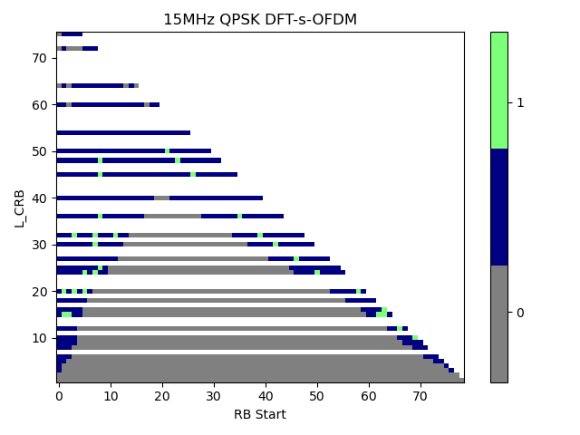
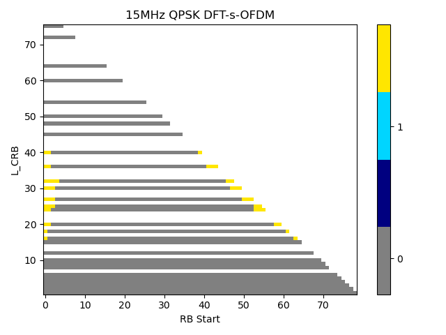
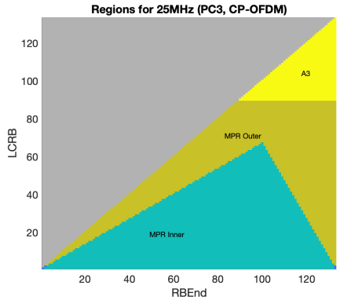
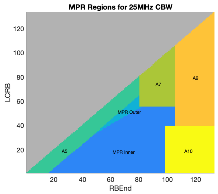

######## Annex A (normative): Measurement channels

A.1 General
===========

TBD

A.2 UL reference measurement channels
=====================================

A.2.1 General
-------------

TBD

A.2.2 Void
----------

A.2.3 Reference measurement channels for TDD
--------------------------------------------

For UL RMCs defined below, TDD slot pattern defined in Table A.2.3-1
will be used for the requirements requiring at least one sub frame (1ms)
for the measurement period. For other requirements, TDD slot patterns
defined for reference sensitivity tests in Table A.3.3.1-1 will be used.

+-----------+-----------+-----------+-----------+-----------+-----+
| Table     | Value     |           |           |           |     |
| A.2.3-1:  |           |           |           |           |     |
| A         |           |           |           |           |     |
| dditional |           |           |           |           |     |
| reference |           |           |           |           |     |
| channels  |           |           |           |           |     |
| p         |           |           |           |           |     |
| arameters |           |           |           |           |     |
| for       |           |           |           |           |     |
| TDD       |           |           |           |           |     |
| Parameter |           |           |           |           |     |
+===========+===========+===========+===========+===========+=====+
|           | SCS 60    | SCS 120   | SCS 480   | SCS 960   |     |
|           | kHz (µ=2) | kHz (µ=3) | kHz (µ=5) | kHz (µ=6) |     |
+-----------+-----------+-----------+-----------+-----------+-----+
| TDD Slot  | DDDSUUUU  | 7DS8U     | 31DS32U   | 63DS64U   |     |
| Conf      |           |           |           |           |     |
| iguration |           |           |           |           |     |
| pattern   |           |           |           |           |     |
| (Note 1)  |           |           |           |           |     |
+-----------+-----------+-----------+-----------+-----------+-----+
| Special   | S         | S=12D+2G  | S=2D+12G  | S=2D+12G  |     |
| Slot      | =4D+6G+4U |           |           |           |     |
| Conf      |           |           |           |           |     |
| iguration |           |           |           |           |     |
| (Note 2)  |           |           |           |           |     |
+-----------+-----------+-----------+-----------+-----------+-----+
| *         | 60 kHz    | 120 kHz   | 480 kHz   | 960 kHz   |     |
| reference |           |           |           |           |     |
| Subcarrie |           |           |           |           |     |
| rSpacing* |           |           |           |           |     |
+-----------+-----------+-----------+-----------+-----------+-----+
| UL-DL     | *dl-      | 2 ms      | 2 ms      | 2 ms      | 2ms |
| conf      | UL-Transm |           |           |           |     |
| iguration | issionPer |           |           |           |     |
|           | iodicity* |           |           |           |     |
+-----------+-----------+-----------+-----------+-----------+-----+
|           | *         | 3         | 7         | 31        | 63  |
|           | nrofDownl |           |           |           |     |
|           | inkSlots* |           |           |           |     |
+-----------+-----------+-----------+-----------+-----------+-----+
|           | *nr       | 4         | 12        | 2         | 2   |
|           | ofDownlin |           |           |           |     |
|           | kSymbols* |           |           |           |     |
+-----------+-----------+-----------+-----------+-----------+-----+
|           | *nrofUp   | 4         | 8         | 32        | 64  |
|           | linkSlot* |           |           |           |     |
+-----------+-----------+-----------+-----------+-----------+-----+
|           | *         | 4         | 0         | 0         | 0   |
|           | nrofUplin |           |           |           |     |
|           | kSymbols* |           |           |           |     |
+-----------+-----------+-----------+-----------+-----------+-----+
| *Indexes  | mod(slot  | mod(slot  | mod(slot  | mod(slot  |     |
| of active | index,    | index,    | index,    | index,    |     |
| UL slots* | 40) =     | 80) =     | 320) =    | 640) =    |     |
|           | {3        | {7        | {288      | {576      |     |
|           | 6,...,39} | 2,...,79} | ,...,319} | ,...,639} |     |
+-----------+-----------+-----------+-----------+-----------+-----+
| *Indexes  | mod(slot  | mod(slot  |           |           |     |
| of active | index,    | index,    |           |           |     |
| UL slots  | 40) =     | 80) =     |           |           |     |
| for UL    | {1        | {         |           |           |     |
| Gap test* | 2,...,15, | 24,...,31 |           |           |     |
|           | 3         | ,7        |           |           |     |
|           | 6,...,39} | 2,...,79} |           |           |     |
+-----------+-----------+-----------+-----------+-----------+-----+
| *Indexes  | mod(slot  | mod(slot  |           |           |     |
| of the UL | inde      | index,    |           |           |     |
| slots for | x,40)={7, | 80) =     |           |           |     |
| UL Gap    | 28}       | {15,56}   |           |           |     |
| when UL   |           |           |           |           |     |
| gap       |           |           |           |           |     |
| pattern   |           |           |           |           |     |
| conf      |           |           |           |           |     |
| iguration |           |           |           |           |     |
| 3 (IE     |           |           |           |           |     |
| UL-       |           |           |           |           |     |
| GapFR2-Co |           |           |           |           |     |
| nfig-r17) |           |           |           |           |     |
| is        |           |           |           |           |     |
| co        |           |           |           |           |     |
| nfigured* |           |           |           |           |     |
+-----------+-----------+-----------+-----------+-----------+-----+
| *Indexes  | mod(slot  | mod(slot  |           |           |     |
| of the UL | index,    | index,    |           |           |     |
| slots for | 160)={20, | 320) =    |           |           |     |
| UL Gap    | 21,       | {8, ...   |           |           |     |
| when UL   | 22,23,    | ,15}      |           |           |     |
| gap       | 28,       |           |           |           |     |
| pattern   | 29,30,31} |           |           |           |     |
| conf      |           |           |           |           |     |
| iguration |           |           |           |           |     |
| 1 (IE     |           |           |           |           |     |
| UL-       |           |           |           |           |     |
| GapFR2-Co |           |           |           |           |     |
| nfig-r17) |           |           |           |           |     |
| is        |           |           |           |           |     |
| co        |           |           |           |           |     |
| nfigured* |           |           |           |           |     |
+-----------+-----------+-----------+-----------+-----------+-----+
| NOTE 1: D |           |           |           |           |     |
| denotes a |           |           |           |           |     |
| slot with |           |           |           |           |     |
| all DL    |           |           |           |           |     |
| symbols;  |           |           |           |           |     |
| S denotes |           |           |           |           |     |
| a slot    |           |           |           |           |     |
| with a    |           |           |           |           |     |
| mix of    |           |           |           |           |     |
| DL, UL    |           |           |           |           |     |
| and guard |           |           |           |           |     |
| symbols;  |           |           |           |           |     |
| U denotes |           |           |           |           |     |
| a slot    |           |           |           |           |     |
| with all  |           |           |           |           |     |
| UL        |           |           |           |           |     |
| symbols.  |           |           |           |           |     |
| The field |           |           |           |           |     |
| is for    |           |           |           |           |     |
| inf       |           |           |           |           |     |
| ormation. |           |           |           |           |     |
|           |           |           |           |           |     |
| NOTE 2:   |           |           |           |           |     |
| D, G, U   |           |           |           |           |     |
| denote    |           |           |           |           |     |
| DL, guard |           |           |           |           |     |
| and UL    |           |           |           |           |     |
| symbols,  |           |           |           |           |     |
| resp      |           |           |           |           |     |
| ectively. |           |           |           |           |     |
| The field |           |           |           |           |     |
| is for    |           |           |           |           |     |
| inf       |           |           |           |           |     |
| ormation. |           |           |           |           |     |
+-----------+-----------+-----------+-----------+-----------+-----+

### A.2.3.1 DFT-s-OFDM Pi/2-BPSK

Table A.2.3.1-1: Reference Channels for DFT-s-OFDM pi/2-BPSK

<table>
<thead>
<tr class="header">
<th>Parameter</th>
<th>Allocated resource blocks (LCRB)</th>
<th>DFT-s-OFDM Symbols per slot (Note 1)</th>
<th>Modulation</th>
<th>MCS Index (Note 2)</th>
<th>Payload size</th>
<th>Transport block CRC</th>
<th>LDPC Base Graph</th>
<th>Number of code blocks per slot (Note 3)</th>
<th>Total number of bits per slot</th>
<th>Total modulated symbols per slot</th>
</tr>
</thead>
<tbody>
<tr class="odd">
<td>Unit</td>
<td> </td>
<td> </td>
<td> </td>
<td> </td>
<td>Bits</td>
<td>Bits</td>
<td> </td>
<td> </td>
<td>Bits</td>
<td> </td>
</tr>
<tr class="even">
<td> </td>
<td>1</td>
<td>11</td>
<td>pi/2 BPSK</td>
<td>0</td>
<td>24</td>
<td>16</td>
<td>2</td>
<td>1</td>
<td>132</td>
<td>132</td>
</tr>
<tr class="odd">
<td> </td>
<td>16</td>
<td>11</td>
<td>pi/2 BPSK</td>
<td>0</td>
<td>504</td>
<td>16</td>
<td>2</td>
<td>1</td>
<td>2112</td>
<td>2112</td>
</tr>
<tr class="even">
<td> </td>
<td>32</td>
<td>11</td>
<td>pi/2 BPSK</td>
<td>0</td>
<td>1032</td>
<td>16</td>
<td>2</td>
<td>1</td>
<td>4224</td>
<td>4224</td>
</tr>
<tr class="odd">
<td> </td>
<td>64</td>
<td>11</td>
<td>pi/2 BPSK</td>
<td>0</td>
<td>2024</td>
<td>16</td>
<td>2</td>
<td>1</td>
<td>8448</td>
<td>8448</td>
</tr>
<tr class="even">
<td> </td>
<td>128</td>
<td>11</td>
<td>pi/2 BPSK</td>
<td>0</td>
<td>3976</td>
<td>24</td>
<td>2</td>
<td>2</td>
<td>16896</td>
<td>16896</td>
</tr>
<tr class="odd">
<td> </td>
<td>256</td>
<td>11</td>
<td>pi/2 BPSK</td>
<td>0</td>
<td>7944</td>
<td>24</td>
<td>2</td>
<td>3</td>
<td>33792</td>
<td>33792</td>
</tr>
<tr class="even">
<td>
NOTE 1: PUSCH mapping Type-A and single-symbol DM-RS configuration Type-1 with 2 additional DM-RS symbols, such that the DM-RS positions are set to symbols 2, 7, 11. DMRS is [TDM'ed] with PUSCH data. DM-RS symbols are not counted.

NOTE 2: MCS Index is based on MCS table 6.1.4.1-1 defined in 38.214.

NOTE 3: If more than one Code Block is present, an additional CRC sequence of L = 24 Bits is attached to each Code Block (otherwise L = 0 Bit)

NOTE 4: Indexes of active UL slots are given by Table A.2.3-1 with TDD UL-DL configuration specified in A2.3 for the requirements requiring at least one sub frame (1ms) for the measurement period. For other requirements, indexes of active UL slots are given by the slots satisfying mod(slot index+1, 5) = 0 with TDD UL-DL configuration specified in A.3.3.1.

NOTE 5: The RMCs apply to all channel bandwidth where LCRB ≤ NRB.
</td>
<td></td>
<td></td>
<td></td>
<td></td>
<td></td>
<td></td>
<td></td>
<td></td>
<td></td>
<td></td>
</tr>
</tbody>
</table>

Table A.2.3.1-2: Void

### A.2.3.2 DFT-s-OFDM QPSK

Table A.2.3.2-1: Reference Channels for DFT-s-OFDM QPSK

<table>
<thead>
<tr class="header">
<th>Parameter</th>
<th>Allocated resource blocks (LCRB)</th>
<th>DFT-s-OFDM Symbols per slot (Note 1)</th>
<th>Modulation</th>
<th>MCS Index (Note 2)</th>
<th>Payload size</th>
<th>Transport block CRC</th>
<th>LDPC Base Graph</th>
<th>Number of code blocks per slot (Note 3)</th>
<th>Total number of bits per slot</th>
<th>Total modulated symbols per slot</th>
</tr>
</thead>
<tbody>
<tr class="odd">
<td>Unit</td>
<td> </td>
<td> </td>
<td> </td>
<td> </td>
<td>Bits</td>
<td>Bits</td>
<td> </td>
<td> </td>
<td>Bits</td>
<td> </td>
</tr>
<tr class="even">
<td> </td>
<td>1</td>
<td>11</td>
<td>QPSK</td>
<td>2</td>
<td>48</td>
<td>16</td>
<td>2</td>
<td>1</td>
<td>264</td>
<td>132</td>
</tr>
<tr class="odd">
<td> </td>
<td>16</td>
<td>11</td>
<td>QPSK</td>
<td>2</td>
<td>808</td>
<td>16</td>
<td>2</td>
<td>1</td>
<td>4224</td>
<td>2112</td>
</tr>
<tr class="even">
<td> </td>
<td>20</td>
<td>11</td>
<td>QPSK</td>
<td>2</td>
<td>1032</td>
<td>16</td>
<td>2</td>
<td>1</td>
<td>5280</td>
<td>2640</td>
</tr>
<tr class="odd">
<td> </td>
<td>32</td>
<td>11</td>
<td>QPSK</td>
<td>2</td>
<td>1608</td>
<td>16</td>
<td>2</td>
<td>1</td>
<td>8448</td>
<td>4224</td>
</tr>
<tr class="even">
<td> </td>
<td>64</td>
<td>11</td>
<td>QPSK</td>
<td>2</td>
<td>3240</td>
<td>16</td>
<td>2</td>
<td>1</td>
<td>16896</td>
<td>8448</td>
</tr>
<tr class="odd">
<td> </td>
<td>128</td>
<td>11</td>
<td>QPSK</td>
<td>2</td>
<td>6408</td>
<td>24</td>
<td>2</td>
<td>2</td>
<td>33792</td>
<td>16896</td>
</tr>
<tr class="even">
<td> </td>
<td>256</td>
<td>11</td>
<td>QPSK</td>
<td>2</td>
<td>12808</td>
<td>24</td>
<td>2</td>
<td>4</td>
<td>67584</td>
<td>33792</td>
</tr>
<tr class="odd">
<td>
NOTE 1: PUSCH mapping Type-A and single-symbol DM-RS configuration Type-1 with 2 additional DM-RS symbols, such that the DM-RS positions are set to symbols 2, 7, 11. DMRS is [TDM'ed] with PUSCH data. DM-RS symbols are not counted.

NOTE 2: MCS Index is based on MCS table 6.1.4.1-1 defined in 38.214.

NOTE 3: If more than one Code Block is present, an additional CRC sequence of L = 24 Bits is attached to each Code Block (otherwise L = 0 Bit)

NOTE 4: Indexes of active UL slots are given by Table A.2.3-1 with TDD UL-DL configuration specified in A2.3 for the requirements requiring at least one sub frame (1ms) for the measurement period. For other requirements, indexes of active UL slots are given by the slots satisfying mod(slot index+1, 5) = 0 with TDD UL-DL configuration specified in A.3.3.1.

NOTE 5: The RMCs apply to all channel bandwidth where LCRB ≤ NRB.
</td>
<td></td>
<td></td>
<td></td>
<td></td>
<td></td>
<td></td>
<td></td>
<td></td>
<td></td>
<td></td>
</tr>
</tbody>
</table>

Table A.2.3.2-2: Void

### A.2.3.3 DFT-s-OFDM 16QAM

Table A.2.3.3-1: Reference Channels for DFT-s-OFDM 16QAM

<table>
<thead>
<tr class="header">
<th>Parameter</th>
<th>Allocated resource blocks (LCRB)</th>
<th>DFT-s-OFDM Symbols per slot (Note 1)</th>
<th>Modulation</th>
<th>MCS Index (Note 2)</th>
<th>Payload size</th>
<th>Transport block CRC</th>
<th>LDPC Base Graph</th>
<th>Number of code blocks per slot (Note 3)</th>
<th>Total number of bits per slot</th>
<th>Total modulated symbols per slot</th>
</tr>
</thead>
<tbody>
<tr class="odd">
<td>Unit</td>
<td> </td>
<td> </td>
<td> </td>
<td> </td>
<td>Bits</td>
<td>Bits</td>
<td> </td>
<td> </td>
<td>Bits</td>
<td> </td>
</tr>
<tr class="even">
<td> </td>
<td>1</td>
<td>11</td>
<td>16QAM</td>
<td>10</td>
<td>176</td>
<td>16</td>
<td>2</td>
<td>1</td>
<td>528</td>
<td>132</td>
</tr>
<tr class="odd">
<td> </td>
<td>16</td>
<td>11</td>
<td>16QAM</td>
<td>10</td>
<td>2792</td>
<td>16</td>
<td>2</td>
<td>1</td>
<td>8448</td>
<td>2112</td>
</tr>
<tr class="even">
<td> </td>
<td>32</td>
<td>11</td>
<td>16QAM</td>
<td>10</td>
<td>5632</td>
<td>24</td>
<td>1</td>
<td>1</td>
<td>16896</td>
<td>4224</td>
</tr>
<tr class="odd">
<td> </td>
<td>64</td>
<td>11</td>
<td>16QAM</td>
<td>10</td>
<td>11272</td>
<td>24</td>
<td>1</td>
<td>2</td>
<td>33792</td>
<td>8448</td>
</tr>
<tr class="even">
<td> </td>
<td>128</td>
<td>11</td>
<td>16QAM</td>
<td>10</td>
<td>22536</td>
<td>24</td>
<td>1</td>
<td>3</td>
<td>67584</td>
<td>16896</td>
</tr>
<tr class="odd">
<td> </td>
<td>256</td>
<td>11</td>
<td>16QAM</td>
<td>10</td>
<td>45096</td>
<td>24</td>
<td>1</td>
<td>6</td>
<td>135168</td>
<td>33792</td>
</tr>
<tr class="even">
<td>
NOTE 1: PUSCH mapping Type-A and single-symbol DM-RS configuration Type-1 with 2 additional DM-RS symbols, such that the DM-RS positions are set to symbols 2, 7, 11. DMRS is [TDM'ed] with PUSCH data. DM-RS symbols are not counted.

NOTE 2: MCS Index is based on MCS table 6.1.4.1-1 defined in 38.214.

NOTE 3: If more than one Code Block is present, an additional CRC sequence of L = 24 Bits is attached to each Code Block (otherwise L = 0 Bit)

NOTE 4: Indexes of active UL slots are given by Table A.2.3-1 with TDD UL-DL configuration specified in A2.3 for the requirements requiring at least one sub frame (1ms) for the measurement period. For other requirements, indexes of active UL slots are given by the slots satisfying mod(slot index+1, 5) = 0 with TDD UL-DL configuration specified in A.3.3.1.

NOTE 5: The RMCs apply to all channel bandwidth where LCRB ≤ NRB.
</td>
<td></td>
<td></td>
<td></td>
<td></td>
<td></td>
<td></td>
<td></td>
<td></td>
<td></td>
<td></td>
</tr>
</tbody>
</table>

Table A.2.3.3-2: Void

### A.2.3.4 DFT-s-OFDM 64QAM

Table A.2.3.4-1: Reference Channels for DFT-s-OFDM 64QAM

<table>
<thead>
<tr class="header">
<th>Parameter</th>
<th>Allocated resource blocks (LCRB)</th>
<th>DFT-s-OFDM Symbols per slot (Note 1)</th>
<th>Modulation</th>
<th>MCS Index (Note 2)</th>
<th>Payload size</th>
<th>Transport block CRC</th>
<th>LDPC Base Graph</th>
<th>Number of code blocks per slot (Note 3)</th>
<th>Total number of bits per slot</th>
<th>Total modulated symbols per slot</th>
</tr>
</thead>
<tbody>
<tr class="odd">
<td>Unit</td>
<td> </td>
<td> </td>
<td> </td>
<td> </td>
<td>Bits</td>
<td>Bits</td>
<td> </td>
<td> </td>
<td>Bits</td>
<td> </td>
</tr>
<tr class="even">
<td> </td>
<td>1</td>
<td>11</td>
<td>64QAM</td>
<td>18</td>
<td>408</td>
<td>16</td>
<td>2</td>
<td>1</td>
<td>792</td>
<td>132</td>
</tr>
<tr class="odd">
<td> </td>
<td>16</td>
<td>11</td>
<td>64QAM</td>
<td>18</td>
<td>6400</td>
<td>24</td>
<td>1</td>
<td>1</td>
<td>12672</td>
<td>2112</td>
</tr>
<tr class="even">
<td> </td>
<td>32</td>
<td>11</td>
<td>64QAM</td>
<td>18</td>
<td>12808</td>
<td>24</td>
<td>1</td>
<td>2</td>
<td>25344</td>
<td>4224</td>
</tr>
<tr class="odd">
<td> </td>
<td>64</td>
<td>11</td>
<td>64QAM</td>
<td>18</td>
<td>25608</td>
<td>24</td>
<td>1</td>
<td>4</td>
<td>50688</td>
<td>8448</td>
</tr>
<tr class="even">
<td> </td>
<td>128</td>
<td>11</td>
<td>64QAM</td>
<td>18</td>
<td>51216</td>
<td>24</td>
<td>1</td>
<td>7</td>
<td>101376</td>
<td>16896</td>
</tr>
<tr class="odd">
<td> </td>
<td>256</td>
<td>11</td>
<td>64QAM</td>
<td>18</td>
<td>102416</td>
<td>24</td>
<td>1</td>
<td>13</td>
<td>202752</td>
<td>33792</td>
</tr>
<tr class="even">
<td>
NOTE 1: PUSCH mapping Type-A and single-symbol DM-RS configuration Type-1 with 2 additional DM-RS symbols, such that the DM-RS positions are set to symbols 2, 7, 11. DMRS is [TDM'ed] with PUSCH data. DM-RS symbols are not counted.

NOTE 2: MCS Index is based on MCS table 6.1.4.1-1 defined in 38.214.

NOTE 3: If more than one Code Block is present, an additional CRC sequence of L = 24 Bits is attached to each Code Block (otherwise L = 0 Bit)

NOTE 4: Indexes of active UL slots are given by Table A.2.3-1 with TDD UL-DL configuration specified in A2.3 for the requirements requiring at least one sub frame (1ms) for the measurement period. For other requirements, indexes of active UL slots are given by the slots satisfying mod(slot index+1, 5) = 0 with TDD UL-DL configuration specified in A.3.3.1.

NOTE 5: The RMCs apply to all channel bandwidth where LCRB ≤ NRB.
</td>
<td></td>
<td></td>
<td></td>
<td></td>
<td></td>
<td></td>
<td></td>
<td></td>
<td></td>
<td></td>
</tr>
</tbody>
</table>

Table A.2.3.4-2: Void

### A.2.3.5 CP-OFDM QPSK

Table A.2.3.5-1: Reference Channels for CP-OFDM QPSK

<table>
<thead>
<tr class="header">
<th>Parameter</th>
<th>Allocated resource blocks (LCRB)</th>
<th>DFT-s-OFDM Symbols per slot (Note 1)</th>
<th>Modulation</th>
<th>MCS Index (Note 2)</th>
<th>Payload size</th>
<th>Transport block CRC</th>
<th>LDPC Base Graph</th>
<th>Number of code blocks per slot (Note 3)</th>
<th>Total number of bits per slot</th>
<th>Total modulated symbols per slot</th>
</tr>
</thead>
<tbody>
<tr class="odd">
<td>Unit</td>
<td> </td>
<td> </td>
<td> </td>
<td> </td>
<td>Bits</td>
<td>Bits</td>
<td> </td>
<td> </td>
<td>Bits</td>
<td> </td>
</tr>
<tr class="even">
<td> </td>
<td>1</td>
<td>11</td>
<td>QPSK</td>
<td>2</td>
<td>48</td>
<td>16</td>
<td>2</td>
<td>1</td>
<td>264</td>
<td>132</td>
</tr>
<tr class="odd">
<td> </td>
<td>16</td>
<td>11</td>
<td>QPSK</td>
<td>2</td>
<td>808</td>
<td>16</td>
<td>2</td>
<td>1</td>
<td>4224</td>
<td>2112</td>
</tr>
<tr class="even">
<td> </td>
<td>32</td>
<td>11</td>
<td>QPSK</td>
<td>2</td>
<td>1608</td>
<td>16</td>
<td>2</td>
<td>1</td>
<td>8448</td>
<td>4224</td>
</tr>
<tr class="odd">
<td> </td>
<td>33</td>
<td>11</td>
<td>QPSK</td>
<td>2</td>
<td>1672</td>
<td>16</td>
<td>2</td>
<td>1</td>
<td>8712</td>
<td>4356</td>
</tr>
<tr class="even">
<td> </td>
<td>66</td>
<td>11</td>
<td>QPSK</td>
<td>2</td>
<td>3368</td>
<td>16</td>
<td>2</td>
<td>1</td>
<td>17424</td>
<td>8712</td>
</tr>
<tr class="odd">
<td> </td>
<td>132</td>
<td>11</td>
<td>QPSK</td>
<td>2</td>
<td>6536</td>
<td>24</td>
<td>2</td>
<td>2</td>
<td>34848</td>
<td>17424</td>
</tr>
<tr class="even">
<td></td>
<td>264</td>
<td>11</td>
<td>QPSK</td>
<td>2</td>
<td>13064</td>
<td>24</td>
<td>2</td>
<td>4</td>
<td>69696</td>
<td>34848</td>
</tr>
<tr class="odd">
<td>
NOTE 1: PUSCH mapping Type-A and single-symbol DM-RS configuration Type-1 with 2 additional DM-RS symbols, such that the DM-RS positions are set to symbols 2, 7, 11. DMRS is [TDM'ed] with PUSCH data. DM-RS symbols are not counted.

NOTE 2: MCS Index is based on MCS table 5.1.3.1-1 defined in 38.214.

NOTE 3: If more than one Code Block is present, an additional CRC sequence of L = 24 Bits is attached to each Code Block (otherwise L = 0 Bit)

NOTE 4: Indexes of active UL slots are given by Table A.2.3-1 with TDD UL-DL configuration specified in A2.3 for the requirements requiring at least one sub frame (1ms) for the measurement period. For other requirements, indexes of active UL slots are given by the slots satisfying mod(slot index+1, 5) = 0 with TDD UL-DL configuration specified in A.3.3.1.

NOTE 5: The RMCs apply to all channel bandwidth where LCRB ≤ NRB.
</td>
<td></td>
<td></td>
<td></td>
<td></td>
<td></td>
<td></td>
<td></td>
<td></td>
<td></td>
<td></td>
</tr>
</tbody>
</table>

Table A.2.3.5-2: Void

### A.2.3.6 CP-OFDM 16QAM

Table A.2.3.6-1: Reference Channels for CP-OFDM 16QAM

<table>
<thead>
<tr class="header">
<th>Parameter</th>
<th>Allocated resource blocks (LCRB)</th>
<th>DFT-s-OFDM Symbols per slot (Note 1)</th>
<th>Modulation</th>
<th>MCS Index (Note 2)</th>
<th>Payload size</th>
<th>Transport block CRC</th>
<th>LDPC Base Graph</th>
<th>Number of code blocks per slot (Note 3)</th>
<th>Total number of bits per slot</th>
<th>Total modulated symbols per slot</th>
</tr>
</thead>
<tbody>
<tr class="odd">
<td>Unit</td>
<td> </td>
<td> </td>
<td> </td>
<td> </td>
<td>Bits</td>
<td>Bits</td>
<td> </td>
<td> </td>
<td>Bits</td>
<td> </td>
</tr>
<tr class="even">
<td> </td>
<td>1</td>
<td>11</td>
<td>16QAM</td>
<td>10</td>
<td>176</td>
<td>16</td>
<td>2</td>
<td>1</td>
<td>528</td>
<td>132</td>
</tr>
<tr class="odd">
<td> </td>
<td>16</td>
<td>11</td>
<td>16QAM</td>
<td>10</td>
<td>2792</td>
<td>16</td>
<td>2</td>
<td>1</td>
<td>8448</td>
<td>2112</td>
</tr>
<tr class="even">
<td> </td>
<td>32</td>
<td>11</td>
<td>16QAM</td>
<td>10</td>
<td>5632</td>
<td>24</td>
<td>1</td>
<td>1</td>
<td>16896</td>
<td>4224</td>
</tr>
<tr class="odd">
<td> </td>
<td>33</td>
<td>11</td>
<td>16QAM</td>
<td>10</td>
<td>5760</td>
<td>24</td>
<td>1</td>
<td>1</td>
<td>17424</td>
<td>4356</td>
</tr>
<tr class="even">
<td> </td>
<td>66</td>
<td>11</td>
<td>16QAM</td>
<td>10</td>
<td>11528</td>
<td>24</td>
<td>1</td>
<td>2</td>
<td>34848</td>
<td>8712</td>
</tr>
<tr class="odd">
<td> </td>
<td>132</td>
<td>11</td>
<td>16QAM</td>
<td>10</td>
<td>23040</td>
<td>24</td>
<td>1</td>
<td>3</td>
<td>69696</td>
<td>17424</td>
</tr>
<tr class="even">
<td></td>
<td>264</td>
<td>11</td>
<td>16QAM</td>
<td>10</td>
<td>46104</td>
<td>24</td>
<td>1</td>
<td>6</td>
<td>139392</td>
<td>34848</td>
</tr>
<tr class="odd">
<td>
NOTE 1: PUSCH mapping Type-A and single-symbol DM-RS configuration Type-1 with 2 additional DM-RS symbols, such that the DM-RS positions are set to symbols 2, 7, 11. DMRS is [TDM'ed] with PUSCH data. DM-RS symbols are not counted.

NOTE 2: MCS Index is based on MCS table 5.1.3.1-1 defined in 38.214.

NOTE 3: If more than one Code Block is present, an additional CRC sequence of L = 24 Bits is attached to each Code Block (otherwise L = 0 Bit)

NOTE 4: Indexes of active UL slots are given by Table A.2.3-1 with TDD UL-DL configuration specified in A2.3 for the requirements requiring at least one sub frame (1ms) for the measurement period. For other requirements, indexes of active UL slots are given by the slots satisfying mod(slot index+1, 5) = 0 with TDD UL-DL configuration specified in A.3.3.1.

NOTE 5: The RMCs apply to all channel bandwidth where LCRB ≤ NRB.
</td>
<td></td>
<td></td>
<td></td>
<td></td>
<td></td>
<td></td>
<td></td>
<td></td>
<td></td>
<td></td>
</tr>
</tbody>
</table>

Table A.2.3.6-2: Void

### A.2.3.7 CP-OFDM 64QAM

Table A.2.3.7-1: Reference Channels for CP-OFDM 64QAM

<table>
<thead>
<tr class="header">
<th>Parameter</th>
<th>Allocated resource blocks (LCRB)</th>
<th>DFT-s-OFDM Symbols per slot (Note 1)</th>
<th>Modulation</th>
<th>MCS Index (Note 2)</th>
<th>Payload size</th>
<th>Transport block CRC</th>
<th>LDPC Base Graph</th>
<th>Number of code blocks per slot (Note 3)</th>
<th>Total number of bits per slot</th>
<th>Total modulated symbols per slot</th>
</tr>
</thead>
<tbody>
<tr class="odd">
<td>Unit</td>
<td> </td>
<td> </td>
<td> </td>
<td> </td>
<td>Bits</td>
<td>Bits</td>
<td> </td>
<td> </td>
<td>Bits</td>
<td> </td>
</tr>
<tr class="even">
<td> </td>
<td>1</td>
<td>11</td>
<td>64QAM</td>
<td>19</td>
<td>408</td>
<td>16</td>
<td>2</td>
<td>1</td>
<td>792</td>
<td>132</td>
</tr>
<tr class="odd">
<td> </td>
<td>16</td>
<td>11</td>
<td>64QAM</td>
<td>19</td>
<td>6400</td>
<td>24</td>
<td>1</td>
<td>1</td>
<td>12672</td>
<td>2112</td>
</tr>
<tr class="even">
<td> </td>
<td>32</td>
<td>11</td>
<td>64QAM</td>
<td>19</td>
<td>12808</td>
<td>24</td>
<td>1</td>
<td>2</td>
<td>25344</td>
<td>4224</td>
</tr>
<tr class="odd">
<td> </td>
<td>33</td>
<td>11</td>
<td>64QAM</td>
<td>19</td>
<td>13064</td>
<td>24</td>
<td>1</td>
<td>2</td>
<td>26136</td>
<td>4356</td>
</tr>
<tr class="even">
<td> </td>
<td>66</td>
<td>11</td>
<td>64QAM</td>
<td>19</td>
<td>26120</td>
<td>24</td>
<td>1</td>
<td>4</td>
<td>52272</td>
<td>8712</td>
</tr>
<tr class="odd">
<td> </td>
<td>132</td>
<td>11</td>
<td>64QAM</td>
<td>19</td>
<td>53288</td>
<td>24</td>
<td>1</td>
<td>7</td>
<td>104544</td>
<td>17424</td>
</tr>
<tr class="even">
<td></td>
<td>264</td>
<td>11</td>
<td>64QAM</td>
<td>19</td>
<td>106576</td>
<td>24</td>
<td>1</td>
<td>13</td>
<td>209088</td>
<td>34848</td>
</tr>
<tr class="odd">
<td>
NOTE 1: PUSCH mapping Type-A and single-symbol DM-RS configuration Type-1 with 2 additional DM-RS symbols, such that the DM-RS positions are set to symbols 2, 7, 11. DMRS is [TDM'ed] with PUSCH data. DM-RS symbols are not counted.

NOTE 2: MCS Index is based on MCS table 5.1.3.1-1 defined in 38.214.

NOTE 3: If more than one Code Block is present, an additional CRC sequence of L = 24 Bits is attached to each Code Block (otherwise L = 0 Bit)

NOTE 4: Indexes of active UL slots are given by Table A.2.3-1 with TDD UL-DL configuration specified in A2.3 for the requirements requiring at least one sub frame (1ms) for the measurement period. For other requirements, indexes of active UL slots are given by the slots satisfying mod(slot index+1, 5) = 0 with TDD UL-DL configuration specified in A.3.3.1.

NOTE 5: The RMCs apply to all channel bandwidth where LCRB ≤ NRB.
</td>
<td></td>
<td></td>
<td></td>
<td></td>
<td></td>
<td></td>
<td></td>
<td></td>
<td></td>
<td></td>
</tr>
</tbody>
</table>

> Table A.2.3.7-2: Void

A.3 DL reference measurement channels
=====================================

A.3.1 General
-------------

Unless otherwise stated, Tables A.3.3.2-1 and A.3.3.2-2 are applicable
for measurements of the Receiver Characteristics (clause 7).

Unless otherwise stated, Tables A.3.3.2-1 and A.3.3.2-2 also apply for
the modulated interferer used in Clauses 7.5 and 7.6 with test specific
bandwidths.

CSI-RS configuration parameter defined in A.3.1-2 is used for verifying
the beam correspondence requirement, 2 slots of CSI-RS shall be provided
at each test grid point. The DL channel shall be configured for zero
power on all tones except those used by CSI-RS in slots containing
CSI-RS for beam refinement, and the DL and UL channel sizes shall be the
same during verification.

Table A.3.1-1: Test parameters

+----------------+----------------+----------------+----------------+
| Parameter      | Unit           | Value          |                |
+================+================+================+================+
| CORESET        |                | Full BW        |                |
| frequency      |                |                |                |
| domain         |                |                |                |
| allocation     |                |                |                |
+----------------+----------------+----------------+----------------+
| CORESET time   |                | 2 OFDM symbols |                |
| domain         |                | at the begin   |                |
| allocation     |                | of each slot   |                |
+----------------+----------------+----------------+----------------+
| PDSCH mapping  |                | Type A         |                |
| type           |                |                |                |
+----------------+----------------+----------------+----------------+
| PDSCH start    |                | 2              |                |
| symbol index   |                |                |                |
| (S)            |                |                |                |
+----------------+----------------+----------------+----------------+
| Number of      |                | 12             |                |
| consecutive    |                |                |                |
| PDSCH symbols  |                |                |                |
| (L)            |                |                |                |
+----------------+----------------+----------------+----------------+
| PDSCH PRB      | PRBs           | 2              |                |
| bundling       |                |                |                |
+----------------+----------------+----------------+----------------+
| Dynamic PRB    |                | false          |                |
| bundling       |                |                |                |
+----------------+----------------+----------------+----------------+
| MCS table for  |                | 64QAM          |                |
| TBS            |                |                |                |
| determination  |                |                |                |
+----------------+----------------+----------------+----------------+
| Overhead value |                | 0              |                |
| for TBS        |                |                |                |
| determination  |                |                |                |
+----------------+----------------+----------------+----------------+
| First DMRS     |                | 2              |                |
| position for   |                |                |                |
| Type A PDSCH   |                |                |                |
| mapping        |                |                |                |
+----------------+----------------+----------------+----------------+
| DMRS type      |                | Type 1         |                |
+----------------+----------------+----------------+----------------+
| Number of      |                | 2              |                |
| additional     |                |                |                |
| DMRS           |                |                |                |
+----------------+----------------+----------------+----------------+
| FDM between    |                | Disable        |                |
| DMRS and PDSCH |                |                |                |
+----------------+----------------+----------------+----------------+
| CSI‑RS for     | First          |                | 0 for CSI-RS   |
| tracking       | subcarrier     |                | resource 1,2   |
|                | index in the   |                |                |
|                | PRB used for   |                |                |
|                | CSI-RS (k0)    |                |                |
+----------------+----------------+----------------+----------------+
|                | OFDM symbols   |                | l0 = 8 for     |
|                | in the PRB     |                | CSI-RS         |
|                | used for       |                | resource 1     |
|                | CSI‑RS         |                |                |
|                |                |                | l0 = 12 for    |
|                |                |                | CSI-RS         |
|                |                |                | resource 2     |
+----------------+----------------+----------------+----------------+
|                | Number of      |                | 1 for CSI-RS   |
|                | CSI-RS ports   |                | resource 1,2   |
+----------------+----------------+----------------+----------------+
|                | CDM Type       |                | \'No CDM\' for |
|                |                |                | CSI-RS         |
|                |                |                | resource 1,2   |
+----------------+----------------+----------------+----------------+
|                | Density (ρ)    |                | 3 for CSI-RS   |
|                |                |                | resource 1,2   |
+----------------+----------------+----------------+----------------+
|                | CSI‑RS         | Slots          | 60 kHz SCS: 80 |
|                | periodicity    |                | for CSI-RS     |
|                |                |                | resources 1    |
|                |                |                | and 2          |
|                |                |                |                |
|                |                |                | 120 kHz SCS:   |
|                |                |                | 160 for CSI-RS |
|                |                |                | resources 1    |
|                |                |                | and 2          |
+----------------+----------------+----------------+----------------+
|                | CSI‑RS offset  | Slots          | 60 kHz SCS: 40 |
|                |                |                | for CSI-RS     |
|                |                |                | resources 1    |
|                |                |                | and 2          |
|                |                |                |                |
|                |                |                | 120kHz SCS: 80 |
|                |                |                | for CSI-RS     |
|                |                |                | resources 1    |
|                |                |                | and 2          |
+----------------+----------------+----------------+----------------+
|                | Frequency      |                | Start PRB 0    |
|                | Occupation     |                |                |
|                |                |                | Number of PRB  |
|                |                |                | = BWP size     |
+----------------+----------------+----------------+----------------+
|                | QCL info       |                | TCI state \#0  |
+----------------+----------------+----------------+----------------+
| PTRS           |                | PTRS is not    |                |
| configuration  |                | configured     |                |
+----------------+----------------+----------------+----------------+

Table A.3.1-2: CSI-RS parameters

+-----------------------------+---------------------------------+
| Resource Type               | aperiodic                       |
+=============================+=================================+
| Resource Set Config         |                                 |
+-----------------------------+---------------------------------+
| repetition                  | on                              |
+-----------------------------+---------------------------------+
| aperiodicTriggeringOffset   | Depending on UE capability      |
+-----------------------------+---------------------------------+
| **Resource Config**         |                                 |
+-----------------------------+---------------------------------+
| nzp-CSI-RS-ResourceId       | 30 for resource \#0             |
+-----------------------------+---------------------------------+
|                             | 31 for resource \#1             |
+-----------------------------+---------------------------------+
|                             | 32 for resource \#2             |
+-----------------------------+---------------------------------+
|                             | 33 for resource \#3             |
+-----------------------------+---------------------------------+
|                             | 34 for resource \#4             |
+-----------------------------+---------------------------------+
|                             | 35 for resource \#5             |
+-----------------------------+---------------------------------+
|                             | 36 for resource \#6             |
+-----------------------------+---------------------------------+
|                             | 37 for resource \#7             |
+-----------------------------+---------------------------------+
| powerControlOffset          | 0                               |
+-----------------------------+---------------------------------+
| powerControlOffsetSS        | db0                             |
+-----------------------------+---------------------------------+
| nrofPorts                   | 1                               |
+-----------------------------+---------------------------------+
| firstOFDMSymbolInTimeDomain | 6 for resource \#0              |
+-----------------------------+---------------------------------+
|                             | 7 for resource \#1              |
+-----------------------------+---------------------------------+
|                             | 8 for resource \#2              |
+-----------------------------+---------------------------------+
|                             | 9 for resource \#3              |
+-----------------------------+---------------------------------+
|                             | 10 for resource \#4             |
+-----------------------------+---------------------------------+
|                             | 11 for resource \#5             |
+-----------------------------+---------------------------------+
|                             | 12 for resource \#6             |
+-----------------------------+---------------------------------+
|                             | 13 for resource \#7             |
+-----------------------------+---------------------------------+
| cdm-Type                    | noCDM                           |
+-----------------------------+---------------------------------+
| density                     | 3                               |
+-----------------------------+---------------------------------+
| nrofRBs                     | 48 for channel bandwdith≥100MHz |
|                             |                                 |
|                             | 32 for channel bandwidth=50MHz  |
+-----------------------------+---------------------------------+
| qcl-info                    | Type D to SSB                   |
+-----------------------------+---------------------------------+

The CSI-RS configuration parameter defined in Table A.3.1-3 is used for
verifying the beam correspondence requirement. CSI-RS shall be provided
once every 10msec.

Table A.3.1-3: CSI-RS parameters for CSI-RS based beam correspondence

+-----------------------------+---------------------------------------+
| Resource Type               | aperiodic                             |
+=============================+=======================================+
| Resource Set Config         |                                       |
+-----------------------------+---------------------------------------+
| repetition                  | on                                    |
+-----------------------------+---------------------------------------+
| aperiodicTriggeringOffset   | Depending on UE capability            |
+-----------------------------+---------------------------------------+
| Resource Config             |                                       |
+-----------------------------+---------------------------------------+
| nzp-CSI-RS-ResourceId       | 30 for resource \#0                   |
+-----------------------------+---------------------------------------+
|                             | 31 for resource \#1                   |
+-----------------------------+---------------------------------------+
|                             | 32 for resource \#2                   |
+-----------------------------+---------------------------------------+
|                             | 33 for resource \#3                   |
+-----------------------------+---------------------------------------+
|                             | ...                                   |
+-----------------------------+---------------------------------------+
|                             | ...                                   |
+-----------------------------+---------------------------------------+
|                             | ...                                   |
+-----------------------------+---------------------------------------+
|                             | 29+N for resource \#(N-1), where N is |
|                             | *maxNumberRxBeam* in UE capability IE |
|                             | of *MIMO-ParametersPerBand*           |
+-----------------------------+---------------------------------------+
| powerControlOffset          | 0                                     |
+-----------------------------+---------------------------------------+
| powerControlOffsetSS        | db0                                   |
+-----------------------------+---------------------------------------+
| nrofPorts                   | 1                                     |
+-----------------------------+---------------------------------------+
| firstOFDMSymbolInTimeDomain | 6 for resource \#0                    |
+-----------------------------+---------------------------------------+
|                             | 7 for resource \#1                    |
+-----------------------------+---------------------------------------+
|                             | 8 for resource \#2                    |
+-----------------------------+---------------------------------------+
|                             | 9 for resource \#3                    |
+-----------------------------+---------------------------------------+
|                             | ...                                   |
+-----------------------------+---------------------------------------+
|                             | ...                                   |
+-----------------------------+---------------------------------------+
|                             | ...                                   |
+-----------------------------+---------------------------------------+
|                             | 5+N for resource \#(N-1), where       |
|                             | N=*maxNumberRxBeam*-1 in UE           |
|                             | capability IE of                      |
|                             | *MIMO-ParametersPerBand*              |
+-----------------------------+---------------------------------------+
| cdm-Type                    | noCDM                                 |
+-----------------------------+---------------------------------------+
| density                     | 3                                     |
+-----------------------------+---------------------------------------+
| nrofRBs                     | 48 for channel bandwidth≥100MHz       |
|                             |                                       |
|                             | 32 for channel bandwidth=50MHz        |
+-----------------------------+---------------------------------------+
| qcl-info                    | Type D to SSB                         |
+-----------------------------+---------------------------------------+

A.3.2 Void
----------

A.3.3 DL reference measurement channels for TDD
-----------------------------------------------

### A.3.3.1 General

Table A.3.3.1-1: Additional test parameters for TDD

  -----------------------------------------------------------------------------------------------------------------------------------------
  Parameter                  Value                                                                                               
  -------------------------- ------------------------------------------------- ------------------------------------------------- ----------
                             SCS 60 kHz (µ=2)                                  SCS 120 kHz (µ=3)                                 

  UL-DL configuration        *referenceSubcarrierSpacing*                      60 kHz                                            120 kHz

                             *dl-UL-TransmissionPeriodicity*                   1.25 ms                                           0.625 ms

                             *nrofDownlinkSlots*                               3                                                 3

                             *nrofDownlinkSymbols*                             4                                                 10

                             *nrofUplinkSlot*                                  1                                                 1

                             *nrofUplinkSymbols*                               4                                                 2

  Number of HARQ Processes   8                                                 8                                                 

  K1 value                   K1 = 4 if mod(i,5) = 0\                           K1 = 4 if mod(i,5) = 0\                           
                             K1 =3 if mod(i,5) = 1\                            K1 =3 if mod(i,5) = 1\                            
                             K1 =7 if mod(i,5) = 2\                            K1 =7 if mod(i,5) = 2\                            
                             where i is slot index per frame; i = {0,...,39}   where i is slot index per frame; i = {0,...,79}   
  -----------------------------------------------------------------------------------------------------------------------------------------

### A.3.3.2 FRC for receiver requirements for QPSK

Table A.3.3.2-1: Fixed Reference Channel for Receiver Requirements (SCS
60 kHz, TDD)

+--------------------------------+------+---------+---------+---------+
| Parameter                      | Unit | Value   |         |         |
+================================+======+=========+=========+=========+
| Channel bandwidth              | MHz  | 50      | 100     | 200     |
+--------------------------------+------+---------+---------+---------+
| Subcarrier spacing             |      | 2       | 2       | 2       |
| configuration                  |      |         |         |         |
+--------------------------------+------+---------+---------+---------+
| Allocated resource blocks      |      | 66      | 132     | 264     |
+--------------------------------+------+---------+---------+---------+
| Subcarriers per resource block |      | 12      | 12      | 12      |
+--------------------------------+------+---------+---------+---------+
| Allocated slots per Frame      |      | 23 / 24 | 23 / 24 | 23 / 24 |
| (NOTE 7)                       |      |         |         |         |
+--------------------------------+------+---------+---------+---------+
| MCS index                      |      | 4       | 4       | 4       |
+--------------------------------+------+---------+---------+---------+
| Modulation                     |      | QPSK    | QPSK    | QPSK    |
+--------------------------------+------+---------+---------+---------+
| Target Coding Rate             |      | 1/3     | 1/3     | 1/3     |
+--------------------------------+------+---------+---------+---------+
| Maximum number of HARQ         |      | 1       | 1       | 1       |
| transmissions                  |      |         |         |         |
+--------------------------------+------+---------+---------+---------+
| Information Bit Payload per    |      |         |         |         |
| Slot                           |      |         |         |         |
+--------------------------------+------+---------+---------+---------+
| For Slots 0 and Slot i, if     | Bits | N/A     | N/A     | N/A     |
| mod(i, 5) = {3,4} for i from   |      |         |         |         |
| {0,...,79} (NOTE 5)            |      |         |         |         |
+--------------------------------+------+---------+---------+---------+
| For Slot i, if mod(i, 5) =     | Bits | 4224    | 8456    | 16896   |
| {0,1,2} for i from {1,...,79}  |      |         |         |         |
| (NOTE 6)                       |      |         |         |         |
+--------------------------------+------+---------+---------+---------+
| Transport block CRC            | Bits | 24      | 24      | 24      |
+--------------------------------+------+---------+---------+---------+
| LDPC base graph                |      | 1       | 1       | 1       |
+--------------------------------+------+---------+---------+---------+
| Number of Code Blocks per Slot |      |         |         |         |
+--------------------------------+------+---------+---------+---------+
| For Slots 0 and Slot i, if     | CBs  | N/A     | N/A     | N/A     |
| mod(i, 5) = {3,4} for i from   |      |         |         |         |
| {0,...,79} (NOTE 5)            |      |         |         |         |
+--------------------------------+------+---------+---------+---------+
| For Slot i, if mod(i, 5) =     | CBs  | 1       | 2       | 2       |
| {0,1,2} for i from {1,...,79}  |      |         |         |         |
| (NOTE 6)                       |      |         |         |         |
+--------------------------------+------+---------+---------+---------+
| Binary Channel Bits Per Slot   |      |         |         |         |
+--------------------------------+------+---------+---------+---------+
| For Slots 0 and Slot i, if     | Bits | N/A     | N/A     | N/A     |
| mod(i, 5) = {3,4} for i from   |      |         |         |         |
| {0,...,79} (NOTE 5)            |      |         |         |         |
+--------------------------------+------+---------+---------+---------+
| For Slot i, if mod(i, 5) =     | Bits | 14256   | 28512   | 57024   |
| {0,1,2} for i from {1,...,79}  |      |         |         |         |
| (NOTE 6)                       |      |         |         |         |
+--------------------------------+------+---------+---------+---------+
| Max. Throughput averaged over  | Mbps | 10.138  | 20.294  | 40.550  |
| 1 frame                        |      |         |         |         |
|                                |      |         |         |         |
| (NOTE 8)                       |      |         |         |         |
+--------------------------------+------+---------+---------+---------+
| Note 1: Additional parameters  |      |         |         |         |
| are specified in Table A.3.1-1 |      |         |         |         |
| and Table A.3.3.1-1.           |      |         |         |         |
|                                |      |         |         |         |
| Note 2: If more than one Code  |      |         |         |         |
| Block is present, an           |      |         |         |         |
| additional CRC sequence of L = |      |         |         |         |
| 24 Bits is attached to each    |      |         |         |         |
| Code Block (otherwise L = 0    |      |         |         |         |
| Bit).                          |      |         |         |         |
|                                |      |         |         |         |
| Note 3: SS/PBCH block is       |      |         |         |         |
| transmitted in slot 0 with     |      |         |         |         |
| periodicity 20 ms              |      |         |         |         |
|                                |      |         |         |         |
| Note 4: Slot i is slot index   |      |         |         |         |
| per 2 frames                   |      |         |         |         |
|                                |      |         |         |         |
| Note 5: When this DL RMC used  |      |         |         |         |
| together with the UL RMC for   |      |         |         |         |
| the transmitter requirements   |      |         |         |         |
| requiring at least one sub     |      |         |         |         |
| frame (1ms) for the            |      |         |         |         |
| measurement period, Slot i, if |      |         |         |         |
| mod(i, 8) = {3,4,5,6,7} for i  |      |         |         |         |
| from {0,...,79} together with  |      |         |         |         |
| the TDD UL-DL configuration    |      |         |         |         |
| specified in A2.3.             |      |         |         |         |
|                                |      |         |         |         |
| Note 6: When this DL RMC used  |      |         |         |         |
| together with the UL RMC for   |      |         |         |         |
| the transmitter requirements   |      |         |         |         |
| requiring at least one sub     |      |         |         |         |
| frame (1ms) for the            |      |         |         |         |
| measurement period, Slot i, if |      |         |         |         |
| mod(i, 8) = {0,1,2} for i from |      |         |         |         |
| {0,...,79} together with the   |      |         |         |         |
| TDD UL-DL configuration        |      |         |         |         |
| specified in A2.3.             |      |         |         |         |
|                                |      |         |         |         |
| NOTE 7: First number           |      |         |         |         |
| corresponds to the number      |      |         |         |         |
| slots allocated in the first   |      |         |         |         |
| frame of the RMC; second       |      |         |         |         |
| number corresponds to the      |      |         |         |         |
| number slots allocated in the  |      |         |         |         |
| second frame of the RMC.       |      |         |         |         |
|                                |      |         |         |         |
| NOTE 8: Throughput is averaged |      |         |         |         |
| over 2nd frame of RMC.         |      |         |         |         |
+--------------------------------+------+---------+---------+---------+

Table A.3.3.2-2: Fixed Reference Channel for Receiver Requirements (SCS
120 kHz, TDD)

+------------------+------+---------+---------+---------+---------+
| Parameter        | Unit | Value   |         |         |         |
+==================+======+=========+=========+=========+=========+
| Channel          | MHz  | 50      | 100     | 200     | 400     |
| bandwidth        |      |         |         |         |         |
+------------------+------+---------+---------+---------+---------+
| Subcarrier       |      | 3       | 3       | 3       | 3       |
| spacing          |      |         |         |         |         |
| configuration    |      |         |         |         |         |
+------------------+------+---------+---------+---------+---------+
| Allocated        |      | 32      | 66      | 132     | 264     |
| resource blocks  |      |         |         |         |         |
+------------------+------+---------+---------+---------+---------+
| Subcarriers per  |      | 12      | 12      | 12      | 12      |
| resource block   |      |         |         |         |         |
+------------------+------+---------+---------+---------+---------+
| Allocated slots  |      | 47 / 48 | 47 / 48 | 47 / 48 | 47 / 48 |
| per Frame (NOTE  |      |         |         |         |         |
| 7)               |      |         |         |         |         |
+------------------+------+---------+---------+---------+---------+
| MCS index        |      | 4       | 4       | 4       | 4       |
+------------------+------+---------+---------+---------+---------+
| Modulation       |      | QPSK    | QPSK    | QPSK    | QPSK    |
+------------------+------+---------+---------+---------+---------+
| Target Coding    |      | 1/3     | 1/3     | 1/3     | 1/3     |
| Rate             |      |         |         |         |         |
+------------------+------+---------+---------+---------+---------+
| Maximum number   |      | 1       | 1       | 1       | 1       |
| of HARQ          |      |         |         |         |         |
| transmissions    |      |         |         |         |         |
+------------------+------+---------+---------+---------+---------+
| Information Bit  |      |         |         |         |         |
| Payload per Slot |      |         |         |         |         |
+------------------+------+---------+---------+---------+---------+
| For Slots 0 and  | Bits | N/A     | N/A     | N/A     | N/A     |
| Slot i, if       |      |         |         |         |         |
| mod(i, 5) =      |      |         |         |         |         |
| {3,4} for i from |      |         |         |         |         |
| {0,...,159}      |      |         |         |         |         |
| (NOTE 5)         |      |         |         |         |         |
+------------------+------+---------+---------+---------+---------+
| For Slot i, if   | Bits | 2088    | 4224    | 8456    | 16896   |
| mod(i, 5) =      |      |         |         |         |         |
| {0,1,2} for i    |      |         |         |         |         |
| from {1,...,159} |      |         |         |         |         |
| (NOTE 6)         |      |         |         |         |         |
+------------------+------+---------+---------+---------+---------+
| Transport block  | Bits | 16      | 24      | 24      | 24      |
| CRC              |      |         |         |         |         |
+------------------+------+---------+---------+---------+---------+
| LDPC base graph  |      | 2       | 1       | 1       | 1       |
+------------------+------+---------+---------+---------+---------+
| Number of Code   |      |         |         |         |         |
| Blocks per Slot  |      |         |         |         |         |
+------------------+------+---------+---------+---------+---------+
| For Slots 0 and  | CBs  | N/A     | N/A     | N/A     | N/A     |
| Slot i, if       |      |         |         |         |         |
| mod(i, 5) =      |      |         |         |         |         |
| {3,4} for i from |      |         |         |         |         |
| {0,...,159}      |      |         |         |         |         |
| (NOTE 5)         |      |         |         |         |         |
+------------------+------+---------+---------+---------+---------+
| For Slot i, if   | CBs  | 1       | 1       | 2       | 2       |
| mod(i, 5) =      |      |         |         |         |         |
| {0,1,2} for i    |      |         |         |         |         |
| from {1,...,159} |      |         |         |         |         |
| (NOTE 6)         |      |         |         |         |         |
+------------------+------+---------+---------+---------+---------+
| Binary Channel   |      |         |         |         |         |
| Bits Per Slot    |      |         |         |         |         |
+------------------+------+---------+---------+---------+---------+
| For Slots 0 and  | Bits | N/A     | N/A     | N/A     | N/A     |
| Slot i, if       |      |         |         |         |         |
| mod(i, 5) =      |      |         |         |         |         |
| {3,4} for i from |      |         |         |         |         |
| {0,...,159}      |      |         |         |         |         |
| (NOTE 5)         |      |         |         |         |         |
+------------------+------+---------+---------+---------+---------+
| For Slot i, if   | Bits | 6912    | 14256   | 28512   | 57024   |
| mod(i, 5) =      |      |         |         |         |         |
| {0,1,2} for i    |      |         |         |         |         |
| from {1,...,159} |      |         |         |         |         |
| (NOTE 6)         |      |         |         |         |         |
+------------------+------+---------+---------+---------+---------+
| Max. Throughput  | Mbps | 10.022  | 20.275  | 40.589  | 81.101  |
| averaged over 1  |      |         |         |         |         |
| frame            |      |         |         |         |         |
|                  |      |         |         |         |         |
| (NOTE 8)         |      |         |         |         |         |
+------------------+------+---------+---------+---------+---------+
| Note 1:          |      |         |         |         |         |
| Additional       |      |         |         |         |         |
| parameters are   |      |         |         |         |         |
| specified in     |      |         |         |         |         |
| Table A.3.1-1    |      |         |         |         |         |
| and Table        |      |         |         |         |         |
| A.3.3.1-1.       |      |         |         |         |         |
|                  |      |         |         |         |         |
| Note 2: If more  |      |         |         |         |         |
| than one Code    |      |         |         |         |         |
| Block is         |      |         |         |         |         |
| present, an      |      |         |         |         |         |
| additional CRC   |      |         |         |         |         |
| sequence of L =  |      |         |         |         |         |
| 24 Bits is       |      |         |         |         |         |
| attached to each |      |         |         |         |         |
| Code Block       |      |         |         |         |         |
| (otherwise L = 0 |      |         |         |         |         |
| Bit).            |      |         |         |         |         |
|                  |      |         |         |         |         |
| Note 3: SS/PBCH  |      |         |         |         |         |
| block is         |      |         |         |         |         |
| transmitted in   |      |         |         |         |         |
| slot 0 with      |      |         |         |         |         |
| periodicity 20   |      |         |         |         |         |
| ms               |      |         |         |         |         |
|                  |      |         |         |         |         |
| Note 4: Slot i   |      |         |         |         |         |
| is slot index    |      |         |         |         |         |
| per 2 frames     |      |         |         |         |         |
|                  |      |         |         |         |         |
| Note 5: When     |      |         |         |         |         |
| this DL RMC used |      |         |         |         |         |
| together with    |      |         |         |         |         |
| the UL RMC for   |      |         |         |         |         |
| the transmitter  |      |         |         |         |         |
| requirements     |      |         |         |         |         |
| requiring at     |      |         |         |         |         |
| least one sub    |      |         |         |         |         |
| frame (1ms) for  |      |         |         |         |         |
| the measurement  |      |         |         |         |         |
| period, Slot i,  |      |         |         |         |         |
| if mod(i, 16) =  |      |         |         |         |         |
| {7,...,15} for i |      |         |         |         |         |
| from {0,...,159} |      |         |         |         |         |
| together with    |      |         |         |         |         |
| the TDD UL-DL    |      |         |         |         |         |
| configuration    |      |         |         |         |         |
| specified in     |      |         |         |         |         |
| A2.3.            |      |         |         |         |         |
|                  |      |         |         |         |         |
| Note 6: When     |      |         |         |         |         |
| this DL RMC used |      |         |         |         |         |
| together with    |      |         |         |         |         |
| the UL RMC for   |      |         |         |         |         |
| the transmitter  |      |         |         |         |         |
| requirements     |      |         |         |         |         |
| requiring at     |      |         |         |         |         |
| least one sub    |      |         |         |         |         |
| frame (1ms) for  |      |         |         |         |         |
| the measurement  |      |         |         |         |         |
| period, Slot i,  |      |         |         |         |         |
| if mod(i, 16) =  |      |         |         |         |         |
| {0,...,6} for i  |      |         |         |         |         |
| from {0,...,159} |      |         |         |         |         |
| together with    |      |         |         |         |         |
| the TDD UL-DL    |      |         |         |         |         |
| configuration    |      |         |         |         |         |
| specified in     |      |         |         |         |         |
| A2.3.            |      |         |         |         |         |
|                  |      |         |         |         |         |
| NOTE 7: First    |      |         |         |         |         |
| number           |      |         |         |         |         |
| corresponds to   |      |         |         |         |         |
| the number slots |      |         |         |         |         |
| allocated in the |      |         |         |         |         |
| first frame of   |      |         |         |         |         |
| the RMC; second  |      |         |         |         |         |
| number           |      |         |         |         |         |
| corresponds to   |      |         |         |         |         |
| the number slots |      |         |         |         |         |
| allocated in the |      |         |         |         |         |
| second frame of  |      |         |         |         |         |
| the RMC.         |      |         |         |         |         |
|                  |      |         |         |         |         |
| NOTE 8:          |      |         |         |         |         |
| Throughput is    |      |         |         |         |         |
| averaged over    |      |         |         |         |         |
| 2nd frame of     |      |         |         |         |         |
| RMC.             |      |         |         |         |         |
+------------------+------+---------+---------+---------+---------+

### A.3.3.3 FRC for receiver requirements for 16QAM

TBD

### A.3.3.4 FRC for receiver requirements for 64QAM

Table A.3.3.4-1: Fixed Reference Channel for Receiver Requirements (SCS
60 kHz, TDD)

+--------------------------------+------+---------+---------+---------+
| Parameter                      | Unit | Value   |         |         |
+================================+======+=========+=========+=========+
| Channel bandwidth              | MHz  | 50      | 100     | 200     |
+--------------------------------+------+---------+---------+---------+
| Subcarrier spacing             |      | 2       | 2       | 2       |
| configuration                  |      |         |         |         |
+--------------------------------+------+---------+---------+---------+
| Allocated resource blocks      |      | 66      | 132     | 264     |
+--------------------------------+------+---------+---------+---------+
| Subcarriers per resource block |      | 12      | 12      | 12      |
+--------------------------------+------+---------+---------+---------+
| Allocated slots per Frame      |      | 23 / 24 | 23 / 24 | 23 / 24 |
| (NOTE 6)                       |      |         |         |         |
+--------------------------------+------+---------+---------+---------+
| MCS index                      |      | 19      | 19      | 19      |
+--------------------------------+------+---------+---------+---------+
| Modulation                     |      | 64QAM   | 64QAM   | 64QAM   |
+--------------------------------+------+---------+---------+---------+
| Target Coding Rate             |      | 1/2     | 1/2     | 1/2     |
+--------------------------------+------+---------+---------+---------+
| Maximum number of HARQ         |      | 1       | 1       | 1       |
| transmissions                  |      |         |         |         |
+--------------------------------+------+---------+---------+---------+
| Information Bit Payload per    |      |         |         |         |
| Slot                           |      |         |         |         |
+--------------------------------+------+---------+---------+---------+
| For Slots 0 and Slot i, if     | Bits | N/A     | N/A     | N/A     |
| mod(i, 5) = {3,4} for i from   |      |         |         |         |
| {0,...,79}                     |      |         |         |         |
+--------------------------------+------+---------+---------+---------+
| For Slot i, if mod(i, 10) =    | Bits | 20496   | 40976   | 81976   |
| {0,1,2} for i from {1,...,79}  |      |         |         |         |
+--------------------------------+------+---------+---------+---------+
| Transport block CRC            | Bits | 24      | 24      | 24      |
+--------------------------------+------+---------+---------+---------+
| LDPC base graph                |      | 1       | 1       | 1       |
+--------------------------------+------+---------+---------+---------+
| Number of Code Blocks per Slot |      |         |         |         |
+--------------------------------+------+---------+---------+---------+
| For Slots 0 and Slot i, if     | CBs  | N/A     | N/A     | N/A     |
| mod(i, 5) = {3,4} for i from   |      |         |         |         |
| {0,...,79}                     |      |         |         |         |
+--------------------------------+------+---------+---------+---------+
| For Slot i, if mod(i, 10) =    | CBs  | 3       | 5       | 10      |
| {0,1,2} for i from {1,...,79}  |      |         |         |         |
+--------------------------------+------+---------+---------+---------+
| Binary Channel Bits Per Slot   |      |         |         |         |
+--------------------------------+------+---------+---------+---------+
| For Slots 0 and Slot i, if     | Bits | N/A     | N/A     | N/A     |
| mod(i, 5) = {3,4} for i from   |      |         |         |         |
| {0,...,79}                     |      |         |         |         |
+--------------------------------+------+---------+---------+---------+
| For Slot i, if mod(i, 5) =     | Bits | 40392   | 80784   | 161568  |
| {0,1,2} for i from {1,...,79}  |      |         |         |         |
+--------------------------------+------+---------+---------+---------+
| Max. Throughput averaged over  | Mbps | 49.190  | 98.343  | 196.742 |
| 1 frame                        |      |         |         |         |
|                                |      |         |         |         |
| (NOTE 7)                       |      |         |         |         |
+--------------------------------+------+---------+---------+---------+
| Note 1: Additional parameters  |      |         |         |         |
| are specified in Table A.3.1-1 |      |         |         |         |
| and Table A.3.3.1-1.           |      |         |         |         |
|                                |      |         |         |         |
| Note 2: If more than one Code  |      |         |         |         |
| Block is present, an           |      |         |         |         |
| additional CRC sequence of L = |      |         |         |         |
| 24 Bits is attached to each    |      |         |         |         |
| Code Block (otherwise L = 0    |      |         |         |         |
| Bit).                          |      |         |         |         |
|                                |      |         |         |         |
| Note 3: SS/PBCH block is       |      |         |         |         |
| transmitted in slot 0 with     |      |         |         |         |
| periodicity 20 ms              |      |         |         |         |
|                                |      |         |         |         |
| Note 4: Slot i is slot index   |      |         |         |         |
| per 2 frames                   |      |         |         |         |
|                                |      |         |         |         |
| Note 5: PTRS is configured on  |      |         |         |         |
| symbols containing PDSCH with  |      |         |         |         |
| 1 port, per 2PRB in frequency  |      |         |         |         |
| domain, per symbol in time     |      |         |         |         |
| domain. Overhead for TBS       |      |         |         |         |
| calculation is assumed to be   |      |         |         |         |
| 6.                             |      |         |         |         |
|                                |      |         |         |         |
| NOTE 6: First number           |      |         |         |         |
| corresponds to the number      |      |         |         |         |
| slots allocated in the first   |      |         |         |         |
| frame of the RMC; second       |      |         |         |         |
| number corresponds to the      |      |         |         |         |
| number slots allocated in the  |      |         |         |         |
| second frame of the RMC.       |      |         |         |         |
|                                |      |         |         |         |
| NOTE 7: Throughput is averaged |      |         |         |         |
| over 2nd frame of RMC.         |      |         |         |         |
+--------------------------------+------+---------+---------+---------+

Table A.3.3.4-2: Fixed Reference Channel for Receiver Requirements (SCS
120 kHz, TDD)

+-------------------+------+---------+--------+---------+---------+
| Parameter         | Unit | Value   |        |         |         |
+===================+======+=========+========+=========+=========+
| Channel bandwidth | MHz  | 50      | 100    | 200     | 400     |
+-------------------+------+---------+--------+---------+---------+
| Subcarrier        |      | 3       | 3      | 3       | 3       |
| spacing           |      |         |        |         |         |
| configuration     |      |         |        |         |         |
+-------------------+------+---------+--------+---------+---------+
| Allocated         |      | 32      | 66     | 132     | 264     |
| resource blocks   |      |         |        |         |         |
+-------------------+------+---------+--------+---------+---------+
| Subcarriers per   |      | 12      | 12     | 12      | 12      |
| resource block    |      |         |        |         |         |
+-------------------+------+---------+--------+---------+---------+
| Allocated slots   |      | 47 / 48 | 47 /48 | 47 / 48 | 47 / 48 |
| per Frame (NOTE   |      |         |        |         |         |
| 6)                |      |         |        |         |         |
+-------------------+------+---------+--------+---------+---------+
| MCS index         |      | 19      | 19     | 19      | 19      |
+-------------------+------+---------+--------+---------+---------+
| Modulation        |      | 64QAM   | 64QAM  | 64QAM   | 64QAM   |
+-------------------+------+---------+--------+---------+---------+
| Target Coding     |      | 1/2     | 1/2    | 1/2     | 1/2     |
| Rate              |      |         |        |         |         |
+-------------------+------+---------+--------+---------+---------+
| Maximum number of |      | 1       | 1      | 1       | 1       |
| HARQ              |      |         |        |         |         |
| transmissions     |      |         |        |         |         |
+-------------------+------+---------+--------+---------+---------+
| Information Bit   |      |         |        |         |         |
| Payload per Slot  |      |         |        |         |         |
+-------------------+------+---------+--------+---------+---------+
| For Slots 0 and   | Bits | N/A     | N/A    | N/A     | N/A     |
| Slot i, if mod(i, |      |         |        |         |         |
| 5) = {3,4} for i  |      |         |        |         |         |
| from {0,...,159}  |      |         |        |         |         |
+-------------------+------+---------+--------+---------+---------+
| For Slot i, if    | Bits | 9992    | 20496  | 40976   | 81976   |
| mod(i, 5) =       |      |         |        |         |         |
| {0,1,2} for i     |      |         |        |         |         |
| from {1,...,159}  |      |         |        |         |         |
+-------------------+------+---------+--------+---------+---------+
| Transport block   | Bits | 24      | 24     | 24      | 24      |
| CRC               |      |         |        |         |         |
+-------------------+------+---------+--------+---------+---------+
| LDPC base graph   |      | 1       | 1      | 1       | 1       |
+-------------------+------+---------+--------+---------+---------+
| Number of Code    |      |         |        |         |         |
| Blocks per Slot   |      |         |        |         |         |
+-------------------+------+---------+--------+---------+---------+
| For Slots 0 and   | CBs  | N/A     | N/A    | N/A     | N/A     |
| Slot i, if mod(i, |      |         |        |         |         |
| 5) = {3,4} for i  |      |         |        |         |         |
| from {0,...,159}  |      |         |        |         |         |
+-------------------+------+---------+--------+---------+---------+
| For Slot i, if    | CBs  | 2       | 3      | 5       | 10      |
| mod(i, 5) =       |      |         |        |         |         |
| {0,1,2} for i     |      |         |        |         |         |
| from {1,...,159}  |      |         |        |         |         |
+-------------------+------+---------+--------+---------+---------+
| Binary Channel    |      |         |        |         |         |
| Bits Per Slot     |      |         |        |         |         |
+-------------------+------+---------+--------+---------+---------+
| For Slots 0 and   | Bits | N/A     | N/A    | N/A     | N/A     |
| Slot i, if mod(i, |      |         |        |         |         |
| 5) = {3,4} for i  |      |         |        |         |         |
| from {0,...,159}  |      |         |        |         |         |
+-------------------+------+---------+--------+---------+---------+
| For Slot i, if    | Bits | 19584   | 40392  | 80784   | 161568  |
| mod(i, 5) =       |      |         |        |         |         |
| {0,1,2} for i     |      |         |        |         |         |
| from {1,...,159}  |      |         |        |         |         |
+-------------------+------+---------+--------+---------+---------+
| Max. Throughput   | Mbps | 47.962  | 98.381 | 196.685 | 393.485 |
| averaged over 1   |      |         |        |         |         |
| frame             |      |         |        |         |         |
|                   |      |         |        |         |         |
| (NOTE 7)          |      |         |        |         |         |
+-------------------+------+---------+--------+---------+---------+
| Note 1:           |      |         |        |         |         |
| Additional        |      |         |        |         |         |
| parameters are    |      |         |        |         |         |
| specified in      |      |         |        |         |         |
| Table A.3.1-1 and |      |         |        |         |         |
| Table A.3.3.1-1.  |      |         |        |         |         |
|                   |      |         |        |         |         |
| Note 2: If more   |      |         |        |         |         |
| than one Code     |      |         |        |         |         |
| Block is present, |      |         |        |         |         |
| an additional CRC |      |         |        |         |         |
| sequence of L =   |      |         |        |         |         |
| 24 Bits is        |      |         |        |         |         |
| attached to each  |      |         |        |         |         |
| Code Block        |      |         |        |         |         |
| (otherwise L = 0  |      |         |        |         |         |
| Bit).             |      |         |        |         |         |
|                   |      |         |        |         |         |
| Note 3: SS/PBCH   |      |         |        |         |         |
| block is          |      |         |        |         |         |
| transmitted in    |      |         |        |         |         |
| slot with         |      |         |        |         |         |
| periodicity 20 ms |      |         |        |         |         |
|                   |      |         |        |         |         |
| Note 4: Slot i is |      |         |        |         |         |
| slot index per 2  |      |         |        |         |         |
| frames            |      |         |        |         |         |
|                   |      |         |        |         |         |
| Note 5: PTRS is   |      |         |        |         |         |
| configured on     |      |         |        |         |         |
| symbols           |      |         |        |         |         |
| containing PDSCH  |      |         |        |         |         |
| with 1 port, per  |      |         |        |         |         |
| 2PRB in frequency |      |         |        |         |         |
| domain, per       |      |         |        |         |         |
| symbol in time    |      |         |        |         |         |
| domain. Overhead  |      |         |        |         |         |
| for TBS           |      |         |        |         |         |
| calculation is    |      |         |        |         |         |
| assumed to be 6.  |      |         |        |         |         |
|                   |      |         |        |         |         |
| NOTE 6: First     |      |         |        |         |         |
| number            |      |         |        |         |         |
| corresponds to    |      |         |        |         |         |
| the number slots  |      |         |        |         |         |
| allocated in the  |      |         |        |         |         |
| first frame of    |      |         |        |         |         |
| the RMC; second   |      |         |        |         |         |
| number            |      |         |        |         |         |
| corresponds to    |      |         |        |         |         |
| the number slots  |      |         |        |         |         |
| allocated in the  |      |         |        |         |         |
| second frame of   |      |         |        |         |         |
| the RMC.          |      |         |        |         |         |
|                   |      |         |        |         |         |
| NOTE 7:           |      |         |        |         |         |
| Throughput is     |      |         |        |         |         |
| averaged over 2nd |      |         |        |         |         |
| frame of RMC.     |      |         |        |         |         |
+-------------------+------+---------+--------+---------+---------+

### A.3.3.5 FRC for receiver requirements for 256QAM

Table A.3.3.5-1 Fixed Reference Channel for Receiver Requirements (SCS
60 kHz, TDD)

+--------------------------------+------+---------+---------+---------+
| Parameter                      | Unit | Value   |         |         |
+================================+======+=========+=========+=========+
| Channel bandwidth              | MHz  | 50      | 100     | 200     |
+--------------------------------+------+---------+---------+---------+
| Subcarrier spacing             |      | 2       | 2       | 2       |
| configuration                  |      |         |         |         |
+--------------------------------+------+---------+---------+---------+
| Allocated resource blocks      |      | 66      | 132     | 264     |
+--------------------------------+------+---------+---------+---------+
| Subcarriers per resource block |      | 12      | 12      | 12      |
+--------------------------------+------+---------+---------+---------+
| Allocated slots per Frame      |      | 23 / 24 | 23 / 24 | 23 / 24 |
| (NOTE 6)                       |      |         |         |         |
+--------------------------------+------+---------+---------+---------+
| MCS index                      |      | 24      | 24      | 24      |
+--------------------------------+------+---------+---------+---------+
| Modulation                     |      | 256QAM  | 256QAM  | 256QAM  |
+--------------------------------+------+---------+---------+---------+
| Target Coding Rate             |      | 4/5     | 4/5     | 4/5     |
+--------------------------------+------+---------+---------+---------+
| Maximum number of HARQ         |      | 1       | 1       | 1       |
| transmissions                  |      |         |         |         |
+--------------------------------+------+---------+---------+---------+
| Information Bit Payload per    |      |         |         |         |
| Slot                           |      |         |         |         |
+--------------------------------+------+---------+---------+---------+
| For Slots 0 and Slot i, if     | Bits | N/A     | N/A     | N/A     |
| mod(i, 5) = {3,4} for i from   |      |         |         |         |
| {0,...,79}                     |      |         |         |         |
+--------------------------------+------+---------+---------+---------+
| For Slot i, if mod(i, 5) =     | Bits | 44040   | 88064   | 176208  |
| {0,1,2} for i from {1,...,79}  |      |         |         |         |
+--------------------------------+------+---------+---------+---------+
| Transport block CRC            | Bits | 24      | 24      | 24      |
+--------------------------------+------+---------+---------+---------+
| LDPC base graph                |      | 1       | 1       | 1       |
+--------------------------------+------+---------+---------+---------+
| Number of Code Blocks per Slot |      |         |         |         |
+--------------------------------+------+---------+---------+---------+
| For Slots 0 and Slot i, if     | CBs  | N/A     | N/A     | N/A     |
| mod(i, 5) = {3,4} for i from   |      |         |         |         |
| {0,...,79}                     |      |         |         |         |
+--------------------------------+------+---------+---------+---------+
| For Slot i, if mod(i, 5) =     | CBs  | 6       | 11      | 21      |
| {0,1,2} for i from {1,...,79}  |      |         |         |         |
+--------------------------------+------+---------+---------+---------+
| Binary Channel Bits Per Slot   |      |         |         |         |
+--------------------------------+------+---------+---------+---------+
| For Slots 0 and Slot i, if     | Bits | N/A     | N/A     | N/A     |
| mod(i, 5) = {3,4} for i from   |      |         |         |         |
| {0,...,79}                     |      |         |         |         |
+--------------------------------+------+---------+---------+---------+
| For Slot i, if mod(i, 5) =     | Bits | 53856   | 107712  | 215424  |
| {0,1,2} for i from {1,...,79}  |      |         |         |         |
+--------------------------------+------+---------+---------+---------+
| Max. Throughput averaged over  | Mbps | 105.696 | 211.354 | 422.899 |
| 1 frame (NOTE 7)               |      |         |         |         |
+--------------------------------+------+---------+---------+---------+
| NOTE 1: Additional parameters  |      |         |         |         |
| are specified in Table A.3.1-1 |      |         |         |         |
| and Table A.3.3.1-1.           |      |         |         |         |
|                                |      |         |         |         |
| NOTE 2: If more than one Code  |      |         |         |         |
| Block is present, an           |      |         |         |         |
| additional CRC sequence of L = |      |         |         |         |
| 24 Bits is attached to each    |      |         |         |         |
| Code Block (otherwise L = 0    |      |         |         |         |
| Bit).                          |      |         |         |         |
|                                |      |         |         |         |
| NOTE 3: SS/PBCH block is       |      |         |         |         |
| transmitted in slot 0 of each  |      |         |         |         |
| frame                          |      |         |         |         |
|                                |      |         |         |         |
| NOTE 4: Slot i is slot index   |      |         |         |         |
| per 2 frames                   |      |         |         |         |
|                                |      |         |         |         |
| NOTE 5: PTRS is configured on  |      |         |         |         |
| symbols containing PDSCH with  |      |         |         |         |
| 1 port, per 2PRB in frequency  |      |         |         |         |
| domain, per symbol in time     |      |         |         |         |
| domain. Overhead for TBS       |      |         |         |         |
| calculation is assumed to be   |      |         |         |         |
| 6.                             |      |         |         |         |
|                                |      |         |         |         |
| NOTE 6: First number           |      |         |         |         |
| corresponds to the number      |      |         |         |         |
| slots allocated in the first   |      |         |         |         |
| frame of the RMC; second       |      |         |         |         |
| number corresponds to the      |      |         |         |         |
| number slots allocated in the  |      |         |         |         |
| second frame of the RMC.       |      |         |         |         |
|                                |      |         |         |         |
| NOTE 7: Throughput is averaged |      |         |         |         |
| over 2nd frame of RMC.         |      |         |         |         |
+--------------------------------+------+---------+---------+---------+

Table A.3.3.5-2 Fixed Reference Channel for Receiver Requirements (SCS
120 kHz, TDD)

+------------------+------+---------+---------+---------+---------+
| Parameter        | Unit | Value   |         |         |         |
+==================+======+=========+=========+=========+=========+
| Channel          | MHz  | 50      | 100     | 200     | 400     |
| bandwidth        |      |         |         |         |         |
+------------------+------+---------+---------+---------+---------+
| Subcarrier       |      | 3       | 3       | 3       | 3       |
| spacing          |      |         |         |         |         |
| configuration    |      |         |         |         |         |
+------------------+------+---------+---------+---------+---------+
| Allocated        |      | 32      | 66      | 132     | 264     |
| resource blocks  |      |         |         |         |         |
+------------------+------+---------+---------+---------+---------+
| Subcarriers per  |      | 12      | 12      | 12      | 12      |
| resource block   |      |         |         |         |         |
+------------------+------+---------+---------+---------+---------+
| Allocated slots  |      | 47 / 48 | 47 / 48 | 47 / 48 | 47 / 48 |
| per Frame (NOTE  |      |         |         |         |         |
| 6)               |      |         |         |         |         |
+------------------+------+---------+---------+---------+---------+
| MCS index        |      | 24      | 24      | 24      | 24      |
+------------------+------+---------+---------+---------+---------+
| Modulation       |      | 256QAM  | 256QAM  | 256QAM  | 256QAM  |
+------------------+------+---------+---------+---------+---------+
| Target Coding    |      | 4/5     | 4/5     | 4/5     | 4/5     |
| Rate             |      |         |         |         |         |
+------------------+------+---------+---------+---------+---------+
| Maximum number   |      | 1       | 1       | 1       | 1       |
| of HARQ          |      |         |         |         |         |
| transmissions    |      |         |         |         |         |
+------------------+------+---------+---------+---------+---------+
| Information Bit  |      |         |         |         |         |
| Payload per Slot |      |         |         |         |         |
+------------------+------+---------+---------+---------+---------+
| For Slots 0 and  | Bits | N/A     | N/A     | N/A     | N/A     |
| Slot i, if       |      |         |         |         |         |
| mod(i, 5) =      |      |         |         |         |         |
| {3,4} for i from |      |         |         |         |         |
| {0,...,159}      |      |         |         |         |         |
+------------------+------+---------+---------+---------+---------+
| For Slot i, if   | Bits | 21504   | 44040   | 88064   | 176208  |
| mod(i, 5) =      |      |         |         |         |         |
| {0,1,2} for i    |      |         |         |         |         |
| from {1,...,159} |      |         |         |         |         |
+------------------+------+---------+---------+---------+---------+
| Transport block  | Bits | 24      | 24      | 24      | 24      |
| CRC              |      |         |         |         |         |
+------------------+------+---------+---------+---------+---------+
| LDPC base graph  |      | 1       | 1       | 1       | 1       |
+------------------+------+---------+---------+---------+---------+
| Number of Code   |      |         |         |         |         |
| Blocks per Slot  |      |         |         |         |         |
+------------------+------+---------+---------+---------+---------+
| For Slots 0 and  | CBs  | N/A     | N/A     | N/A     | N/A     |
| Slot i, if       |      |         |         |         |         |
| mod(i, 5) =      |      |         |         |         |         |
| {3,4} for i from |      |         |         |         |         |
| {0,...,159}      |      |         |         |         |         |
+------------------+------+---------+---------+---------+---------+
| For Slot i, if   | CBs  | 3       | 6       | 11      | 21      |
| mod(i, 5) =      |      |         |         |         |         |
| {0,1,2} for i    |      |         |         |         |         |
| from {1,...,159} |      |         |         |         |         |
+------------------+------+---------+---------+---------+---------+
| Binary Channel   |      |         |         |         |         |
| Bits Per Slot    |      |         |         |         |         |
+------------------+------+---------+---------+---------+---------+
| For Slots 0 and  | Bits | N/A     | N/A     | N/A     | N/A     |
| Slot i, if       |      |         |         |         |         |
| mod(i, 5) =      |      |         |         |         |         |
| {3,4} for i from |      |         |         |         |         |
| {0,...,159}      |      |         |         |         |         |
+------------------+------+---------+---------+---------+---------+
| For Slot i, if   | Bits | 26112   | 53856   | 107712  | 215424  |
| mod(i, 5) =      |      |         |         |         |         |
| {0,1,2} for i    |      |         |         |         |         |
| from {1,...,159} |      |         |         |         |         |
+------------------+------+---------+---------+---------+---------+
| Max. Throughput  | Mbps | 103.219 | 211.392 | 422.707 | 845.798 |
| averaged over 1  |      |         |         |         |         |
| frame (NOTE 7)   |      |         |         |         |         |
+------------------+------+---------+---------+---------+---------+
| NOTE 1:          |      |         |         |         |         |
| Additional       |      |         |         |         |         |
| parameters are   |      |         |         |         |         |
| specified in     |      |         |         |         |         |
| Table A.3.1-1    |      |         |         |         |         |
| and Table        |      |         |         |         |         |
| A.3.3.1-1.       |      |         |         |         |         |
|                  |      |         |         |         |         |
| NOTE 2: If more  |      |         |         |         |         |
| than one Code    |      |         |         |         |         |
| Block is         |      |         |         |         |         |
| present, an      |      |         |         |         |         |
| additional CRC   |      |         |         |         |         |
| sequence of L =  |      |         |         |         |         |
| 24 Bits is       |      |         |         |         |         |
| attached to each |      |         |         |         |         |
| Code Block       |      |         |         |         |         |
| (otherwise L = 0 |      |         |         |         |         |
| Bit).            |      |         |         |         |         |
|                  |      |         |         |         |         |
| NOTE 3: SS/PBCH  |      |         |         |         |         |
| block is         |      |         |         |         |         |
| transmitted in   |      |         |         |         |         |
| slot 0 of each   |      |         |         |         |         |
| frame            |      |         |         |         |         |
|                  |      |         |         |         |         |
| NOTE 4: Slot i   |      |         |         |         |         |
| is slot index    |      |         |         |         |         |
| per 2 frames     |      |         |         |         |         |
|                  |      |         |         |         |         |
| NOTE 5: PTRS is  |      |         |         |         |         |
| configured on    |      |         |         |         |         |
| symbols          |      |         |         |         |         |
| containing PDSCH |      |         |         |         |         |
| with 1 port, per |      |         |         |         |         |
| 2PRB in          |      |         |         |         |         |
| frequency        |      |         |         |         |         |
| domain, per      |      |         |         |         |         |
| symbol in time   |      |         |         |         |         |
| domain. Overhead |      |         |         |         |         |
| for TBS          |      |         |         |         |         |
| calculation is   |      |         |         |         |         |
| assumed to be 6. |      |         |         |         |         |
|                  |      |         |         |         |         |
| NOTE 6: First    |      |         |         |         |         |
| number           |      |         |         |         |         |
| corresponds to   |      |         |         |         |         |
| the number slots |      |         |         |         |         |
| allocated in the |      |         |         |         |         |
| first frame of   |      |         |         |         |         |
| the RMC; second  |      |         |         |         |         |
| number           |      |         |         |         |         |
| corresponds to   |      |         |         |         |         |
| the number slots |      |         |         |         |         |
| allocated in the |      |         |         |         |         |
| second frame of  |      |         |         |         |         |
| the RMC.         |      |         |         |         |         |
|                  |      |         |         |         |         |
| NOTE 7:          |      |         |         |         |         |
| Throughput is    |      |         |         |         |         |
| averaged over    |      |         |         |         |         |
| 2nd frame of     |      |         |         |         |         |
| RMC.             |      |         |         |         |         |
+------------------+------+---------+---------+---------+---------+

A.4 Void
========

A.5 OFDMA Channel Noise Generator (OCNG)
========================================

A.5.1 OCNG Patterns for FDD
---------------------------

TBD

A.5.2 OCNG Patterns for TDD
---------------------------

### A.5.2.1 OCNG TDD pattern 1: Generic OCNG TDD Pattern for all unused REs

Table A.5.2.1-1: OP.1 TDD: Generic OCNG TDD Pattern for all unused REs

+----------------------+----------------------+----------------------+
| **OCNG               | Control Region\      | Data Region          |
| Distribution**       | (Core Set)           |                      |
|                      |                      |                      |
| **OCNG Parameters**  |                      |                      |
+======================+======================+======================+
| Resources allocated  | All unused REs (Note | All unused REs (Note |
|                      | 1)                   | 2)                   |
+----------------------+----------------------+----------------------+
| Structure            | PDCCH                | PDSCH                |
+----------------------+----------------------+----------------------+
| Content              | Uncorrelated pseudo  | Uncorrelated pseudo  |
|                      | random QPSK          | random QPSK          |
|                      | modulated data       | modulated data       |
+----------------------+----------------------+----------------------+
| Transmission scheme  | Single Tx port       | Spatial multiplexing |
| for multiple         | transmission         | using any precoding  |
|                      |                      | matrix with          |
| antennas ports       |                      | dimensions same as   |
| transmission         |                      | the precoding matrix |
|                      |                      | for PDSCH            |
+----------------------+----------------------+----------------------+
| Subcarrier Spacing   | Same as for RMC      | Same as for RMC      |
|                      | PDCCH in the active  | PDSCH in the active  |
|                      | BWP                  | BWP                  |
+----------------------+----------------------+----------------------+
| Power Level          | Same as for RMC      | Same as for RMC      |
|                      | PDCCH                | PDSCH                |
+----------------------+----------------------+----------------------+
| Note 1: All unused   |                      |                      |
| REs in the active    |                      |                      |
| CORESETS appointed   |                      |                      |
| by the search spaces |                      |                      |
| in use.              |                      |                      |
|                      |                      |                      |
| Note 2: Unused       |                      |                      |
| available REs refer  |                      |                      |
| to REs in PRBs not   |                      |                      |
| allocated for any    |                      |                      |
| physical channels,   |                      |                      |
| CORESETs,            |                      |                      |
| synchronization      |                      |                      |
| signals or reference |                      |                      |
| signals in channel   |                      |                      |
| bandwidth.           |                      |                      |
+----------------------+----------------------+----------------------+

A.6 FR2 RF tests with testability issues not related to Measurement Uncertainty (MU)
====================================================================================

Editor's note: The list of FR2 RF testability issues not related to MU
and listed in the table below is incomplete and ongoing updates.

Table A.6-1: FR2 RF test cases and testability issues not related to MU

+------------+---------------------------+---------------------------+
| Clause     | Requirement               | FR2 RF Testability issue  |
|            |                           | not related to MU         |
+============+===========================+===========================+
| 6.2.2      | UE maximum output power   | How to deal with power    |
|            | reduction                 | classes reusing PC3 MPR   |
|            |                           | requirements, especially  |
|            |                           | those defined from        |
|            |                           | Release 17 and forward,   |
|            |                           | and then the relationship |
|            |                           | with 6.2.2\_1 test is     |
|            |                           | FFS.                      |
+------------+---------------------------+---------------------------+
| 6.2D.1.1   | UE maximum output power - | No test points are        |
|            | EIRP and TRP for UL MIMO  | defined for 2-layer UL    |
|            |                           | MIMO since there is no    |
|            |                           | configuration satisfying  |
|            |                           | MPR=0dB requirements in   |
|            |                           | RAN4.                     |
+------------+---------------------------+---------------------------+
| 6.3.2      | Transmit OFF Power        | Test Procedure aspects    |
|            |                           | for UE indicating         |
|            |                           | *ul-GapFR2-r17* is FFS    |
+------------+---------------------------+---------------------------+
| 6.3.3.1    | PRACH Time Mask           | Further investigation is  |
|            |                           | essential that how does   |
|            |                           | beamforming affect the    |
|            |                           | initial access procedure  |
+------------+---------------------------+---------------------------+
| 6.3D.3.1   | General ON/OFF time mask  | Testability of OFF power  |
|            | for UL MIMO               | needs further study       |
|            |                           |                           |
|            |                           | OTA test procedure for    |
|            |                           | UL-MIMO is still under    |
|            |                           | investigation             |
+------------+---------------------------+---------------------------+
| 6.4.2.3    | In-band emissions         | Testing of the general    |
|            |                           | in-band emission          |
|            |                           | requirement and if yes at |
|            |                           | which UE Tx power level   |
|            |                           | and with which relaxation |
|            |                           | applied to the            |
|            |                           | requirement is FFS.       |
+------------+---------------------------+---------------------------+
| 6.4A.2.2.1 | Carrier leakage for CA    | This test is incomplete   |
|            | (2UL CA)                  | due to lack of RRC        |
|            |                           | framework for LO position |
|            |                           | retrieval                 |
+------------+---------------------------+---------------------------+
| 6.4A.2.2.1 | Carrier leakage for CA    |                           |
|            | (2UL CA)                  |                           |
+------------+---------------------------+---------------------------+
| 6.4A.2.2.2 | Carrier leakage for CA    |                           |
|            | (3UL CA)                  |                           |
+------------+---------------------------+---------------------------+
| 6.4A.2.2.3 | Carrier leakage for CA    |                           |
|            | (4UL CA)                  |                           |
+------------+---------------------------+---------------------------+
| 6.4A.2.2.4 | Carrier leakage for CA    |                           |
|            | (5UL CA)                  |                           |
+------------+---------------------------+---------------------------+
| 6.4A.2.2.5 | Carrier leakage for CA    |                           |
|            | (6UL CA)                  |                           |
+------------+---------------------------+---------------------------+
| 6.4A.2.2.6 | Carrier leakage for CA    |                           |
|            | (7UL CA)                  |                           |
+------------+---------------------------+---------------------------+
| 6.4A.2.2.7 | Carrier leakage for CA    |                           |
|            | (8UL CA)                  |                           |
+------------+---------------------------+---------------------------+
| 6.4A.2.3.1 | In-band emissions for CA  | Testing of the general    |
|            | (2UL CA)                  | in-band emission          |
|            |                           | requirement and if yes at |
|            |                           | which UE Tx power level   |
|            |                           | and with which relaxation |
|            |                           | applied to the            |
|            |                           | requirement is FFS.       |
+------------+---------------------------+---------------------------+
| 6.4A.2.3.2 | In-band emissions for CA  | Testing of the general    |
|            | (3UL CA)                  | in-band emission          |
|            |                           | requirement and if yes at |
|            |                           | which UE Tx power level   |
|            |                           | and with which relaxation |
|            |                           | applied to the            |
|            |                           | requirement is FFS.       |
+------------+---------------------------+---------------------------+
| 6.4A.2.3.3 | In-band emissions for CA  | Testing of the general    |
|            | (4UL CA)                  | in-band emission          |
|            |                           | requirement and if yes at |
|            |                           | which UE Tx power level   |
|            |                           | and with which relaxation |
|            |                           | applied to the            |
|            |                           | requirement is FFS.       |
+------------+---------------------------+---------------------------+
| 6.4A.2.3.4 | In-band emissions for CA  | Testing of the general    |
|            | (5UL CA)                  | in-band emission          |
|            |                           | requirement and if yes at |
|            |                           | which UE Tx power level   |
|            |                           | and with which relaxation |
|            |                           | applied to the            |
|            |                           | requirement is FFS.       |
+------------+---------------------------+---------------------------+
| 6.4A.2.3.5 | In-band emissions for CA  | Testing of the general    |
|            | (6UL CA)                  | in-band emission          |
|            |                           | requirement and if yes at |
|            |                           | which UE Tx power level   |
|            |                           | and with which relaxation |
|            |                           | applied to the            |
|            |                           | requirement is FFS.       |
+------------+---------------------------+---------------------------+
| 6.4A.2.3.6 | In-band emissions for CA  | Testing of the general    |
|            | (7UL CA)                  | in-band emission          |
|            |                           | requirement and if yes at |
|            |                           | which UE Tx power level   |
|            |                           | and with which relaxation |
|            |                           | applied to the            |
|            |                           | requirement is FFS.       |
+------------+---------------------------+---------------------------+
| 6.4A.2.3.7 | In-band emissions for CA  | Testing of the general    |
|            | (8UL CA)                  | in-band emission          |
|            |                           | requirement and if yes at |
|            |                           | which UE Tx power level   |
|            |                           | and with which relaxation |
|            |                           | applied to the            |
|            |                           | requirement is FFS.       |
+------------+---------------------------+---------------------------+
| 6.4.2.5    | EVM spectral flatness for | Whether and, if yes, how  |
|            | pi/2 BPSK modulation      | to test the requirement   |
|            |                           | on shaping filter is FFS. |
+------------+---------------------------+---------------------------+

########  Annex B (normative): Propagation conditions

B.0 No interference
===================

The downlink connection between the System Simulator and the UE is
without Additive White Gaussian Noise, and has no fading or multipath
effects.

########  Annex C (normative): Downlink Physical Channels

C.0 Downlink signal levels
==========================

Editor's Note : Consideration to minimize the required number of
additional FR2 link is under discussion

The downlink power settings in Table C.0-1 is used unless otherwise
specified in a test case.

Table C.0-1: Default Downlink power levels for NR

+---------+---------+---------+---------+---------+---------+---------+
| SCS     |         | Unit    | Channel |         |         |         |
|         |         |         | Ba      |         |         |         |
| (kHz)   |         |         | ndwidth |         |         |         |
+---------+---------+---------+---------+---------+---------+---------+
|         |         |         | 50 MHz  | 100 MHz | 200 MHz | 400 MHz |
+---------+---------+---------+---------+---------+---------+---------+
| 60      | Number  |         | 66      | 132     | 264     | N/A     |
|         | of RBs  |         |         |         |         |         |
+---------+---------+---------+---------+---------+---------+---------+
|         | Channel | dBm     | -70     | -67     | -64     | N/A     |
|         | BW      |         |         |         |         |         |
|         | power   |         |         |         |         |         |
+---------+---------+---------+---------+---------+---------+---------+
| 120     | Number  |         | 32      | 66      | 132     | 264     |
|         | of RBs  |         |         |         |         |         |
+---------+---------+---------+---------+---------+---------+---------+
|         | Channel | dBm     | -70     | -67     | -64     | -61     |
|         | BW      |         |         |         |         |         |
|         | power   |         |         |         |         |         |
+---------+---------+---------+---------+---------+---------+---------+
|         | SS/PBCH | dBm/SCS | -99 for | -99 for | -99 for | -99 for |
|         | SSS     |         | DL SCS= | DL SCS  | DL SCS  | DL SCS  |
|         | EPRE    |         | 60 kHz  | = 60    | = 60    | = 60    |
|         |         |         |         | kHz     | kHz     | kHz     |
|         |         |         | -96 for |         |         |         |
|         |         |         | DL SCS  | -96 for | -96 for | -96 for |
|         |         |         | = 120   | DL SCS  | DL SCS  | DL SCS  |
|         |         |         | kHz     | = 120   | = 120   | = 120   |
|         |         |         |         | kHz     | kHz     | kHz     |
+---------+---------+---------+---------+---------+---------+---------+
| Note 1: |         |         |         |         |         |         |
| The     |         |         |         |         |         |         |
| channel |         |         |         |         |         |         |
| ba      |         |         |         |         |         |         |
| ndwidth |         |         |         |         |         |         |
| powers  |         |         |         |         |         |         |
| are     |         |         |         |         |         |         |
| infor   |         |         |         |         |         |         |
| mative, |         |         |         |         |         |         |
| based   |         |         |         |         |         |         |
| on      |         |         |         |         |         |         |
| \[      |         |         |         |         |         |         |
| -99\]dB |         |         |         |         |         |         |
| m/60kHz |         |         |         |         |         |         |
| SS/PBCH |         |         |         |         |         |         |
| SSS     |         |         |         |         |         |         |
| EPRE,   |         |         |         |         |         |         |
| then    |         |         |         |         |         |         |
| scaled  |         |         |         |         |         |         |
| ac      |         |         |         |         |         |         |
| cording |         |         |         |         |         |         |
| to the  |         |         |         |         |         |         |
| number  |         |         |         |         |         |         |
| of RBs  |         |         |         |         |         |         |
| and     |         |         |         |         |         |         |
| rounded |         |         |         |         |         |         |
| to the  |         |         |         |         |         |         |
| nearest |         |         |         |         |         |         |
| integer |         |         |         |         |         |         |
| dBm     |         |         |         |         |         |         |
| value.  |         |         |         |         |         |         |
| Full RE |         |         |         |         |         |         |
| all     |         |         |         |         |         |         |
| ocation |         |         |         |         |         |         |
| with no |         |         |         |         |         |         |
| boost   |         |         |         |         |         |         |
| or      |         |         |         |         |         |         |
| deboost |         |         |         |         |         |         |
| is      |         |         |         |         |         |         |
| a       |         |         |         |         |         |         |
| ssumed. |         |         |         |         |         |         |
|         |         |         |         |         |         |         |
| Note 2: |         |         |         |         |         |         |
| The     |         |         |         |         |         |         |
| power   |         |         |         |         |         |         |
| level   |         |         |         |         |         |         |
| is      |         |         |         |         |         |         |
| sp      |         |         |         |         |         |         |
| ecified |         |         |         |         |         |         |
| at the  |         |         |         |         |         |         |
| centre  |         |         |         |         |         |         |
| of      |         |         |         |         |         |         |
| quiet   |         |         |         |         |         |         |
| zone.   |         |         |         |         |         |         |
|         |         |         |         |         |         |         |
| Note 3: |         |         |         |         |         |         |
| DL      |         |         |         |         |         |         |
| level   |         |         |         |         |         |         |
| is      |         |         |         |         |         |         |
| applied |         |         |         |         |         |         |
| for any |         |         |         |         |         |         |
| of the  |         |         |         |         |         |         |
| Sub     |         |         |         |         |         |         |
| carrier |         |         |         |         |         |         |
| Spacing |         |         |         |         |         |         |
| config  |         |         |         |         |         |         |
| uration |         |         |         |         |         |         |
| () with |         |         |         |         |         |         |
| the     |         |         |         |         |         |         |
| same    |         |         |         |         |         |         |
| power   |         |         |         |         |         |         |
| s       |         |         |         |         |         |         |
| pectrum |         |         |         |         |         |         |
| density |         |         |         |         |         |         |
| of      |         |         |         |         |         |         |
| \[--    |         |         |         |         |         |         |
| 99\]dBm |         |         |         |         |         |         |
| /60kHz. |         |         |         |         |         |         |
+---------+---------+---------+---------+---------+---------+---------+

The default downlink signal level uncertainty is +/- TBD dB, for any
level specified. If the uncertainty value is critical for the test
purpose, a tighter uncertainty is specified for the related test case in
Annex F.

For TRP measurement, DL signal may be supplied from RSRP based pathloss
compensation link. Downlink signal level using RSRP based pathloss
compensation link is specified in Table C.0-2 or Table C.0-3.

Table C.0-2: Downlink power levels for RSRP based pathloss compensation
link for TRP measurement for n257, n258 and n260

+---------+---------+---------+---------+---------+---------+---------+
| SCS     |         | Unit    | Channel |         |         |         |
|         |         |         | Ba      |         |         |         |
| (kHz)   |         |         | ndwidth |         |         |         |
+---------+---------+---------+---------+---------+---------+---------+
|         |         |         | 50 MHz  | 100 MHz | 200 MHz | 400 MHz |
+---------+---------+---------+---------+---------+---------+---------+
| 60      | Number  |         | 66      | 132     | 264     | N/A     |
|         | of RBs  |         |         |         |         |         |
+---------+---------+---------+---------+---------+---------+---------+
|         | Channel | dBm     | ≥ -87   | ≥ -84   | ≥ -80   | N/A     |
|         | BW      |         |         |         |         |         |
|         | power   |         |         |         |         |         |
+---------+---------+---------+---------+---------+---------+---------+
| 120     | Number  |         | 32      | 66      | 132     | 264     |
|         | of RBs  |         |         |         |         |         |
+---------+---------+---------+---------+---------+---------+---------+
|         | Channel | dBm     | ≥ -87   | ≥ -84   | ≥ -80   | ≥ -77   |
|         | BW      |         |         |         |         |         |
|         | power   |         |         |         |         |         |
+---------+---------+---------+---------+---------+---------+---------+
|         | SS/PBCH | dBm/SCS | ≥       | ≥       | ≥       | ≥       |
|         | SSS     |         | -115.5  | -115.5  | -115.5  | -115.5  |
|         | EPRE    |         | for DL  | for DL  | for DL  | for DL  |
|         |         |         | SCS =   | SCS =   | SCS =   | SCS =   |
|         |         |         | 60 kHz  | 60 kHz  | 60 kHz  | 60 kHz  |
|         |         |         |         |         |         |         |
|         |         |         | ≥       | ≥       | ≥       | ≥       |
|         |         |         | -112.5  | -112.5  | -112.5  | -112.5  |
|         |         |         | for DL  | for DL  | for DL  | for DL  |
|         |         |         | SCS =   | SCS =   | SCS =   | SCS =   |
|         |         |         | 120 kHz | 120 kHz | 120 kHz | 120 kHz |
+---------+---------+---------+---------+---------+---------+---------+
| Note 1: |         |         |         |         |         |         |
| The     |         |         |         |         |         |         |
| channel |         |         |         |         |         |         |
| ba      |         |         |         |         |         |         |
| ndwidth |         |         |         |         |         |         |
| powers  |         |         |         |         |         |         |
| are     |         |         |         |         |         |         |
| infor   |         |         |         |         |         |         |
| mative, |         |         |         |         |         |         |
| based   |         |         |         |         |         |         |
| on      |         |         |         |         |         |         |
| -       |         |         |         |         |         |         |
| 115.5dB |         |         |         |         |         |         |
| m/60kHz |         |         |         |         |         |         |
| SS/PBCH |         |         |         |         |         |         |
| SSS     |         |         |         |         |         |         |
| EPRE,   |         |         |         |         |         |         |
| then    |         |         |         |         |         |         |
| scaled  |         |         |         |         |         |         |
| ac      |         |         |         |         |         |         |
| cording |         |         |         |         |         |         |
| to the  |         |         |         |         |         |         |
| number  |         |         |         |         |         |         |
| of RBs  |         |         |         |         |         |         |
| and     |         |         |         |         |         |         |
| rounded |         |         |         |         |         |         |
| to the  |         |         |         |         |         |         |
| nearest |         |         |         |         |         |         |
| integer |         |         |         |         |         |         |
| dBm     |         |         |         |         |         |         |
| value.  |         |         |         |         |         |         |
| Full RE |         |         |         |         |         |         |
| all     |         |         |         |         |         |         |
| ocation |         |         |         |         |         |         |
| with no |         |         |         |         |         |         |
| boost   |         |         |         |         |         |         |
| or      |         |         |         |         |         |         |
| deboost |         |         |         |         |         |         |
| is      |         |         |         |         |         |         |
| a       |         |         |         |         |         |         |
| ssumed. |         |         |         |         |         |         |
|         |         |         |         |         |         |         |
| Note 2: |         |         |         |         |         |         |
| The     |         |         |         |         |         |         |
| power   |         |         |         |         |         |         |
| level   |         |         |         |         |         |         |
| is      |         |         |         |         |         |         |
| sp      |         |         |         |         |         |         |
| ecified |         |         |         |         |         |         |
| at the  |         |         |         |         |         |         |
| RSRP    |         |         |         |         |         |         |
| re      |         |         |         |         |         |         |
| ference |         |         |         |         |         |         |
| point   |         |         |         |         |         |         |
| as      |         |         |         |         |         |         |
| defined |         |         |         |         |         |         |
| in TS   |         |         |         |         |         |         |
| 38.215  |         |         |         |         |         |         |
| \[24\]. |         |         |         |         |         |         |
|         |         |         |         |         |         |         |
| Note 3: |         |         |         |         |         |         |
| DL      |         |         |         |         |         |         |
| level   |         |         |         |         |         |         |
| is      |         |         |         |         |         |         |
| applied |         |         |         |         |         |         |
| for any |         |         |         |         |         |         |
| of the  |         |         |         |         |         |         |
| Sub     |         |         |         |         |         |         |
| carrier |         |         |         |         |         |         |
| Spacing |         |         |         |         |         |         |
| config  |         |         |         |         |         |         |
| uration |         |         |         |         |         |         |
| () with |         |         |         |         |         |         |
| the     |         |         |         |         |         |         |
| same    |         |         |         |         |         |         |
| power   |         |         |         |         |         |         |
| s       |         |         |         |         |         |         |
| pectrum |         |         |         |         |         |         |
| density |         |         |         |         |         |         |
| of ≥    |         |         |         |         |         |         |
| --115.5 |         |         |         |         |         |         |
| dBm     |         |         |         |         |         |         |
| /60kHz. |         |         |         |         |         |         |
+---------+---------+---------+---------+---------+---------+---------+

Table C.0-3: Downlink power levels for RSRP based pathloss compensation
link for TRP measurement for n261

+---------+---------+---------+---------+---------+---------+---------+
| SCS     |         | Unit    | Channel |         |         |         |
|         |         |         | Ba      |         |         |         |
| (kHz)   |         |         | ndwidth |         |         |         |
+---------+---------+---------+---------+---------+---------+---------+
|         |         |         | 50 MHz  | 100 MHz | 200 MHz | 400 MHz |
+---------+---------+---------+---------+---------+---------+---------+
| 60      | Number  |         | 66      | 132     | 264     | N/A     |
|         | of RBs  |         |         |         |         |         |
+---------+---------+---------+---------+---------+---------+---------+
|         | Channel | dBm     | ≥ -84   | ≥ -81   | ≥ -78   | N/A     |
|         | BW      |         |         |         |         |         |
|         | power   |         |         |         |         |         |
+---------+---------+---------+---------+---------+---------+---------+
| 120     | Number  |         | 32      | 66      | 132     | 264     |
|         | of RBs  |         |         |         |         |         |
+---------+---------+---------+---------+---------+---------+---------+
|         | Channel | dBm     | ≥ -84   | ≥ -81   | ≥ -78   | ≥ -75   |
|         | BW      |         |         |         |         |         |
|         | power   |         |         |         |         |         |
+---------+---------+---------+---------+---------+---------+---------+
|         | SS/PBCH | dBm/SCS | ≥ -113  | ≥ -113  | ≥ -113  | ≥ -113  |
|         | SSS     |         | for DL  | for DL  | for DL  | for DL  |
|         | EPRE    |         | SCS =   | SCS =   | SCS =   | SCS =   |
|         |         |         | 60 kHz  | 60 kHz  | 60 kHz  | 60 kHz  |
|         |         |         |         |         |         |         |
|         |         |         | ≥ -110  | ≥ -110  | ≥ -110  | ≥ -110  |
|         |         |         | for DL  | for DL  | for DL  | for DL  |
|         |         |         | SCS =   | SCS =   | SCS =   | SCS =   |
|         |         |         | 120 kHz | 120 kHz | 120 kHz | 120 kHz |
+---------+---------+---------+---------+---------+---------+---------+
| Note 1: |         |         |         |         |         |         |
| The     |         |         |         |         |         |         |
| channel |         |         |         |         |         |         |
| ba      |         |         |         |         |         |         |
| ndwidth |         |         |         |         |         |         |
| powers  |         |         |         |         |         |         |
| are     |         |         |         |         |         |         |
| infor   |         |         |         |         |         |         |
| mative, |         |         |         |         |         |         |
| based   |         |         |         |         |         |         |
| on      |         |         |         |         |         |         |
| -113dB  |         |         |         |         |         |         |
| m/60kHz |         |         |         |         |         |         |
| SS/PBCH |         |         |         |         |         |         |
| SSS     |         |         |         |         |         |         |
| EPRE,   |         |         |         |         |         |         |
| then    |         |         |         |         |         |         |
| scaled  |         |         |         |         |         |         |
| ac      |         |         |         |         |         |         |
| cording |         |         |         |         |         |         |
| to the  |         |         |         |         |         |         |
| number  |         |         |         |         |         |         |
| of RBs  |         |         |         |         |         |         |
| and     |         |         |         |         |         |         |
| rounded |         |         |         |         |         |         |
| to the  |         |         |         |         |         |         |
| nearest |         |         |         |         |         |         |
| integer |         |         |         |         |         |         |
| dBm     |         |         |         |         |         |         |
| value.  |         |         |         |         |         |         |
| Full RE |         |         |         |         |         |         |
| all     |         |         |         |         |         |         |
| ocation |         |         |         |         |         |         |
| with no |         |         |         |         |         |         |
| boost   |         |         |         |         |         |         |
| or      |         |         |         |         |         |         |
| deboost |         |         |         |         |         |         |
| is      |         |         |         |         |         |         |
| a       |         |         |         |         |         |         |
| ssumed. |         |         |         |         |         |         |
|         |         |         |         |         |         |         |
| Note 2: |         |         |         |         |         |         |
| The     |         |         |         |         |         |         |
| power   |         |         |         |         |         |         |
| level   |         |         |         |         |         |         |
| is      |         |         |         |         |         |         |
| sp      |         |         |         |         |         |         |
| ecified |         |         |         |         |         |         |
| at the  |         |         |         |         |         |         |
| RSRP    |         |         |         |         |         |         |
| re      |         |         |         |         |         |         |
| ference |         |         |         |         |         |         |
| point   |         |         |         |         |         |         |
| as      |         |         |         |         |         |         |
| defined |         |         |         |         |         |         |
| in TS   |         |         |         |         |         |         |
| 38.215  |         |         |         |         |         |         |
| \[24\]. |         |         |         |         |         |         |
|         |         |         |         |         |         |         |
| Note 3: |         |         |         |         |         |         |
| DL      |         |         |         |         |         |         |
| level   |         |         |         |         |         |         |
| is      |         |         |         |         |         |         |
| applied |         |         |         |         |         |         |
| for any |         |         |         |         |         |         |
| of the  |         |         |         |         |         |         |
| Sub     |         |         |         |         |         |         |
| carrier |         |         |         |         |         |         |
| Spacing |         |         |         |         |         |         |
| config  |         |         |         |         |         |         |
| uration |         |         |         |         |         |         |
| () with |         |         |         |         |         |         |
| the     |         |         |         |         |         |         |
| same    |         |         |         |         |         |         |
| power   |         |         |         |         |         |         |
| s       |         |         |         |         |         |         |
| pectrum |         |         |         |         |         |         |
| density |         |         |         |         |         |         |
| of ≥    |         |         |         |         |         |         |
| --113   |         |         |         |         |         |         |
| dBm     |         |         |         |         |         |         |
| /60kHz. |         |         |         |         |         |         |
+---------+---------+---------+---------+---------+---------+---------+

C.1 General
===========

The following clauses describes the downlink Physical Channels that are
transmitted during a connection i.e., when measurements are done.

C.2 Setup
=========

Table C.2-1 describes the downlink Physical Channels that are required
for connection set up.

Table C.2-1: Downlink Physical Channels required for connection set-up

  Physical Channel
  ------------------
  PBCH
  SSS
  PSS
  PDCCH
  PDSCH
  PBCH DMRS
  PDCCH DMRS
  PDSCH DMRS
  CSI-RS
  PTRS

As common PDSCH and PDCCH configuration parameters the parameters in
Table A.3.1-1, C.2-2, C.2-3, and C.2-4 shall be used to bring up the
connection setup for FR1 NR cell.

Table C.2-2: PDSCH and PDCCH configuration

  Parameter                  Unit   Value
  -------------------------- ------ ---------
  Number of HARQ processes          8 (TDD)
  Aggregation level          CCE    4

Table C.2-3: Additional test parameters for TDD for SCS 60 KHz

+--------------------+--------------------+--------------------+----+
| Parameter          | Unit               | UL-DL pattern      |    |
+====================+====================+====================+====+
| TDD Slot           |                    | DDSU               |    |
| Configuration      |                    |                    |    |
| pattern (Note 1)   |                    |                    |    |
+--------------------+--------------------+--------------------+----+
| Special Slot       |                    | 11D+3G+0U          |    |
| Configuration      |                    |                    |    |
| (Note 2)           |                    |                    |    |
+--------------------+--------------------+--------------------+----+
| UL-DL              | *reference         | kHz                | 60 |
| configuration      | SubcarrierSpacing* |                    |    |
| (*tdd-UL-DL-Con    |                    |                    |    |
| figurationCommon*) |                    |                    |    |
+--------------------+--------------------+--------------------+----+
|                    | *dl-UL-Transm      | ms                 | 1  |
|                    | issionPeriodicity* |                    |    |
+--------------------+--------------------+--------------------+----+
|                    | *                  |                    | 2  |
|                    | nrofDownlinkSlots* |                    |    |
+--------------------+--------------------+--------------------+----+
|                    | *nr                |                    | 11 |
|                    | ofDownlinkSymbols* |                    |    |
+--------------------+--------------------+--------------------+----+
|                    | *nrofUplinkSlot*   |                    | 1  |
+--------------------+--------------------+--------------------+----+
|                    | *                  |                    | 0  |
|                    | nrofUplinkSymbols* |                    |    |
+--------------------+--------------------+--------------------+----+
| K1 value\          |                    | K1 = 3 if mod(i,4) |    |
| (PDSCH-to-HARQ     |                    | = 0\               |    |
| -timing-indicator) |                    | K1 = 2 if mod(i,4) |    |
|                    |                    | = 1\               |    |
|                    |                    | K1 = 5 if mod(i,4) |    |
|                    |                    | = 2                |    |
+--------------------+--------------------+--------------------+----+
| Note 1: D denotes  |                    |                    |    |
| a slot with all DL |                    |                    |    |
| symbols; S denotes |                    |                    |    |
| a slot with a mix  |                    |                    |    |
| of DL, UL and      |                    |                    |    |
| guard symbols; U   |                    |                    |    |
| denotes a slot     |                    |                    |    |
| with all UL        |                    |                    |    |
| symbols. The field |                    |                    |    |
| is for             |                    |                    |    |
| information.       |                    |                    |    |
|                    |                    |                    |    |
| Note 2: D, G, U    |                    |                    |    |
| denote DL, guard   |                    |                    |    |
| and UL symbols,    |                    |                    |    |
| respectively. The  |                    |                    |    |
| field is for       |                    |                    |    |
| information.       |                    |                    |    |
|                    |                    |                    |    |
| Note 3: i is the   |                    |                    |    |
| slot index per     |                    |                    |    |
| frame; i =         |                    |                    |    |
| {0,...,39}         |                    |                    |    |
+--------------------+--------------------+--------------------+----+

Table C.2-4: Additional test parameters for TDD for SCS 120 KHz

+-------------------+-------------------+-------------------+-------+
| Parameter         | Unit              | UL-DL pattern     |       |
+===================+===================+===================+=======+
| TDD Slot          |                   | DDDSU             |       |
| Configuration     |                   |                   |       |
| pattern (Note 1)  |                   |                   |       |
+-------------------+-------------------+-------------------+-------+
| Special Slot      |                   | 10D+2G+2U         |       |
| Configuration     |                   |                   |       |
| (Note 2)          |                   |                   |       |
+-------------------+-------------------+-------------------+-------+
| UL-DL             | *referenceS       | kHz               | 120   |
| configuration     | ubcarrierSpacing* |                   |       |
| (*tdd-UL-DL-Conf  |                   |                   |       |
| igurationCommon*) |                   |                   |       |
+-------------------+-------------------+-------------------+-------+
|                   | *dl-UL-Transmi    | ms                | 0.625 |
|                   | ssionPeriodicity* |                   |       |
+-------------------+-------------------+-------------------+-------+
|                   | *n                |                   | 3     |
|                   | rofDownlinkSlots* |                   |       |
+-------------------+-------------------+-------------------+-------+
|                   | *nro              |                   | 10    |
|                   | fDownlinkSymbols* |                   |       |
+-------------------+-------------------+-------------------+-------+
|                   | *nrofUplinkSlot*  |                   | 1     |
+-------------------+-------------------+-------------------+-------+
|                   | *n                |                   | 2     |
|                   | rofUplinkSymbols* |                   |       |
+-------------------+-------------------+-------------------+-------+
| K1 value\         |                   | K1 = \[4\] if     |       |
| (PDSCH-to-HARQ-   |                   | mod(i,5) = 0\     |       |
| timing-indicator) |                   | K1 = \[3\] if     |       |
|                   |                   | mod(i,5) = 1\     |       |
|                   |                   | K1 = \[2\] if     |       |
|                   |                   | mod(i,5) = 2\     |       |
|                   |                   | K1 = \[6\] if     |       |
|                   |                   | mod(i,5) = 3      |       |
+-------------------+-------------------+-------------------+-------+
| Note 1: D denotes |                   |                   |       |
| a slot with all   |                   |                   |       |
| DL symbols; S     |                   |                   |       |
| denotes a slot    |                   |                   |       |
| with a mix of DL, |                   |                   |       |
| UL and guard      |                   |                   |       |
| symbols; U        |                   |                   |       |
| denotes a slot    |                   |                   |       |
| with all UL       |                   |                   |       |
| symbols. The      |                   |                   |       |
| field is for      |                   |                   |       |
| information.      |                   |                   |       |
|                   |                   |                   |       |
| Note 2: D, G, U   |                   |                   |       |
| denote DL, guard  |                   |                   |       |
| and UL symbols,   |                   |                   |       |
| respectively. The |                   |                   |       |
| field is for      |                   |                   |       |
| information.      |                   |                   |       |
|                   |                   |                   |       |
| Note 3: i is the  |                   |                   |       |
| slot index per    |                   |                   |       |
| frame; i =        |                   |                   |       |
| {0,...,79}        |                   |                   |       |
+-------------------+-------------------+-------------------+-------+

C.3 Connection
==============

C.3.0 Measurement of Transmitter Characteristics
------------------------------------------------

Unless otherwise stated, Table C.3.0-1 is applicable for measurements on
the Transmitter Characteristics (clause 6).

Table C.3.0-1: Downlink Physical Channels transmitted during a
connection (TDD)

+---------------------------------------------+------+---------------+
| Parameter                                   | Unit | Value         |
+=============================================+======+===============+
| SSS transmit power                          | W    | Test specific |
+---------------------------------------------+------+---------------+
| EPRE ratio of PSS to SSS                    | dB   | 0             |
+---------------------------------------------+------+---------------+
| EPRE ratio of PBCH to SSS                   | dB   | 0             |
+---------------------------------------------+------+---------------+
| EPRE ratio of PBCH to PBCH DMRS             | dB   | 0             |
+---------------------------------------------+------+---------------+
| EPRE ratio of PDCCH to SSS                  | dB   | 0             |
+---------------------------------------------+------+---------------+
| EPRE ratio of PDCCH to PDCCH DMRS           | dB   | 0             |
+---------------------------------------------+------+---------------+
| EPRE ratio of PDSCH to SSS                  | dB   | 0             |
+---------------------------------------------+------+---------------+
| EPRE ratio of PDSCH to PDSCH DMRS (Note 1)  | dB   | -3            |
+---------------------------------------------+------+---------------+
| EPRE ratio of CSI-RS to SSS                 | dB   | 0             |
+---------------------------------------------+------+---------------+
| EPRE ratio of PTRS to PDSCH                 | dB   | Test specific |
+---------------------------------------------+------+---------------+
| EPRE ratio of OCNG DMRS to SSS              | dB   | 0             |
+---------------------------------------------+------+---------------+
| EPRE ratio of OCNG to OCNG DMRS (Note 1)    | dB   | 0             |
+---------------------------------------------+------+---------------+
| Note 1: No boosting is applied to any of    |      |               |
| the channels except PDSCH DMRS. For PDSCH   |      |               |
| DMRS, 3 dB power boosting is applied        |      |               |
| assuming DMRS Type 1 configuration when     |      |               |
| DMRS and PDSCH are TDM'ed and only half of  |      |               |
| the DMRS REs are occupied.                  |      |               |
|                                             |      |               |
| Note 2: Number of DMRS CDM groups without   |      |               |
| data for PDSCH DMRS configuration for OCNG  |      |               |
| is set to 1.                                |      |               |
+---------------------------------------------+------+---------------+

C.3.1 Measurement of Receiver Characteristics
---------------------------------------------

Unless otherwise stated, Table C.3.1-1 is applicable for measurements on
the Receiver Characteristics (clause 7). For Adjacent channel
selectivity testing, Table C.3.1-2 is applied.

Table C.3.1-1: Downlink Physical Channels transmitted during a
connection (TDD)

+---------------------------------------------+------+---------------+
| Parameter                                   | Unit | Value         |
+=============================================+======+===============+
| SSS transmit power                          | W    | Test specific |
+---------------------------------------------+------+---------------+
| EPRE ratio of PSS to SSS                    | dB   | 0             |
+---------------------------------------------+------+---------------+
| EPRE ratio of PBCH to SSS                   | dB   | 0             |
+---------------------------------------------+------+---------------+
| EPRE ratio of PBCH to PBCH DMRS             | dB   | 0             |
+---------------------------------------------+------+---------------+
| EPRE ratio of PDCCH to SSS                  | dB   | 0             |
+---------------------------------------------+------+---------------+
| EPRE ratio of PDCCH to PDCCH DMRS           | dB   | 0             |
+---------------------------------------------+------+---------------+
| EPRE ratio of PDSCH to SSS                  | dB   | 0             |
+---------------------------------------------+------+---------------+
| EPRE ratio of PDSCH to PDSCH DMRS (Note 1)  | dB   | -3            |
+---------------------------------------------+------+---------------+
| EPRE ratio of CSI-RS to SSS                 | dB   | 0             |
+---------------------------------------------+------+---------------+
| EPRE ratio of PTRS to PDSCH                 | dB   | Test specific |
+---------------------------------------------+------+---------------+
| EPRE ratio of OCNG DMRS to SSS              | dB   | 0             |
+---------------------------------------------+------+---------------+
| EPRE ratio of OCNG to OCNG DMRS (Note 1)    | dB   | 0             |
+---------------------------------------------+------+---------------+
| Note 1: No boosting is applied to any of    |      |               |
| the channels except PDSCH DMRS. For PDSCH   |      |               |
| DMRS, 3 dB power boosting is applied        |      |               |
| assuming DMRS Type 1 configuration when     |      |               |
| DMRS and PDSCH are TDM'ed and only half of  |      |               |
| the DMRS REs are occupied.                  |      |               |
|                                             |      |               |
| Note 2: Number of DMRS CDM groups without   |      |               |
| data for PDSCH DMRS configuration for OCNG  |      |               |
| is set to 1.                                |      |               |
+---------------------------------------------+------+---------------+

Table C.3.1-2: PDCCH Aggregation Level for ACS testing

+-------------------+------+-------+------------------------------+
| Parameter         | Unit | Value | Comment                      |
+===================+======+=======+==============================+
| Aggregation level | CCE  | 4     | CBW=50MHz when SCS=120kHz    |
+-------------------+------+-------+------------------------------+
|                   |      | 8     | CBW=50MHz when SCS=60kHz     |
|                   |      |       |                              |
|                   |      |       | CBW=100MHz when SCS=120kHz   |
+-------------------+------+-------+------------------------------+
|                   |      | 16    | CBW\>100 MHz when SCS=60kHz  |
|                   |      |       |                              |
|                   |      |       | CBW\>100 MHz when SCS=120kHz |
+-------------------+------+-------+------------------------------+

########  Annex D (normative): Characteristics of the interfering signal

D.1 General
===========

Unless otherwise stated, a modulated full bandwidth NR downlink signal,
which equals to channel bandwidth of the wanted signal for Single
Carrier case is used as interfering signals when RF performance
requirements for NR UE receiver are defined. For intra-band contiguous
CA case, a modulated NR downlink signal which equals to the aggregated
channel bandwidth of the wanted signal is used.

D.2 Interference signals
========================

Table D.2-1 describes the modulated interferer for different channel
bandwidth options.

Table D.2-1: Description of modulated NR interferer

                                                                                                                                             Channel bandwidth for Single Carrier   Intra band contiguous CA                       
  ------------------------------------------------------------------------------------------------------------------------------------------ -------------------------------------- -------------------------- --------- --------- -----------------
                                                                                                                                             50 MHz                                 100 MHz                    200 MHz   400 MHz   
  BW~Interferer~                                                                                                                             50 MHz                                 100 MHz                    200 MHz   400MHz    BW~Channel\_CA~
  RB                                                                                                                                         NOTE1                                                                                 
  NOTE 1: The RB configured for interfering signal is the same as maximum RB number defined in Table 5.3.2-1 for each sub-carrier spacing.                                                                                         

########  Annex E (normative): Global In-Channel TX-Test

NOTE: Clauses E.2.2 to E.5.9.3 are descriptions, which assume no power
ramping adjacent to the measurement period.

E.1 General
===========

The global in-channel TX test enables the measurement of all relevant
parameters that describe the in-channel quality of the output signal of
the TX under test in a single measurement process.

The parameters describing the in-channel quality of a transmitter,
however, are not necessarily independent. The algorithm chosen for
description inside this annex places particular emphasis on the
exclusion of all interdependencies among the parameters.

E.2 Signals and results
=======================

E.2.1 Basic principle
---------------------

The process is based on the comparison of the actual **output signal of
the TX under test**, received by an ideal receiver, with a **reference
signal**, that is generated by the measuring equipment and represents an
ideal error free received signal. All signals are represented as
equivalent (generally complex) baseband signals.

The description below uses numbers as examples. These numbers are taken
from TDD with normal CP length and 100 MHz bandwidth with 60 kHz SCS.
The application of the text below, however, is not restricted to this
frame structure and bandwidth.

E.2.2 Output signal of the TX under test
----------------------------------------

The output signal of the TX under test is acquired by the measuring
equipment and stored for further processing. It is sampled at a sampling
rate of 122.88 Mbps. In the time domain it comprises at least 10 uplink
subframes. The measurement period is derived by concatenating the
correct number of individual uplink slots until the correct measurement
period is reached. The output signal is named z(ν). Each slot is
modelled as a signal with the following parameters: demodulated data
content, carrier frequency, amplitude and phase for each subcarrier,
timing, carrier leakage.

NOTE 1: TDD

Since the uplink subframes are not continuous, the *n* slots should be
extracted from more than 1 continuous radio frame where

{width="5.906944444444444in" height="0.5in"}.

E.2.3 Reference signal
----------------------

Two types of reference signal are defined:

The reference signal i~1~(ν) is constructed by the measuring equipment
according to the relevant TX specifications, using the following
parameters: demodulated data content, nominal carrier frequency, nominal
amplitude and phase for each subcarrier, nominal timing, no carrier
leakage. It is represented as a sequence of samples at a sampling rate
of 122.88 Mbps in the time domain.

The reference signal i~2~(ν) is constructed by the measuring equipment
according to the relevant TX specifications, using the following
parameters: restricted data content: nominal reference symbols, (all
modulation symbols for user data symbols are set to 0V), nominal carrier
frequency, nominal amplitude and phase for each applicable subcarrier,
nominal timing, no carrier leakage. It is represented as a sequence of
samples at a sampling rate of 122.88 Mbps in the time domain.

NOTE: The PUCCH is off during the time under test.

E.2.4 Measurement results
-------------------------

The measurement results, achieved by the global in channel TX test are
the following:

\- Carrier Frequency error

\- EVM (Error Vector Magnitude)

\- Carrier leakage

\- Unwanted emissions, falling into non allocated resource blocks.

\- EVM equalizer spectrum flatness

E.2.5 Measurement points
------------------------

The unwanted emission falling into non-allocated RB(s) is calculated
directly after the FFT as described below. In contrast to this, the EVM
for the allocated RB(s) is calculated after the IDFT for DFT-s-OFDM or
after the Tx-Rx chain equalizer for CP-OFDM. The samples after the TX-RX
chain equalizer are used to calculate EVM equalizer spectrum flatness.
Carrier frequency error and carrier leakage is calculated in the block
"RF correction".

In case the parameter 3300 or 3301 is reported from UE via
*txDirectCurrentLocation* IE (as defined in TS 38.331 \[6\]), carrier
leakage measurement in the RF correction block shall be omitted. All
statements from Annex E.3 onwards shall be read assuming that no carrier
leakage has been measured.

{width="6.697916666666667in"
height="1.4652777777777777in"}

Figure E.2.5-1: EVM measurement points

E.3 Signal processing
=====================

E.3.1 Pre FFT minimization process
----------------------------------

Before applying the pre-FFT minimization process, z(ν) and i(ν) are
portioned into *n* pieces, comprising one slot each, where *n* is as
defined in Annex E.2.2.

.

Each slot is processed separately. Sample timing, Carrier frequency and
carrier leakage in z(ν) are jointly varied in order to minimise the
difference between z(ν) and i(ν). Best fit (minimum difference) is
achieved when the RMS difference value between z(ν) and i(ν) is an
absolute minimum.

The carrier frequency variation and the IQ variation are the measurement
results: Carrier Frequency Error and Carrier leakage.

From the acquired samples 10 carrier frequencies can be derived by
averaging frequency errors for every 4 or 8 slots for 60 and 120 kHz
SCS.

From the acquired samples *n* carrier frequencies and *n* carrier
leakages can be derived.

NOTE 1: The minimisation process, to derive carrier leakage and RF error
can be supported by Post FFT operations. However the minimisation
process defined in the pre FFT domain comprises all acquired samples
(i.e. it does not exclude the samples in between the FFT widths and it
does not exclude the bandwidth outside the transmission bandwidth
configuration

NOTE 2: The algorithm would allow deriving Carrier Frequency error and
Sample Frequency error of the TX under test separately. However there
are no requirements for Sample Frequency error. Hence the algorithm
models the RF and the sample frequency commonly (not independently). It
returns one error and does not distinguish between both.

After this process the samples z(ν) are called z^0^(ν).

E.3.2 Timing of the FFT window
------------------------------

The FFT window length is 2048 samples per OFDM symbol. 14 FFTs (28672
samples) cover less than the acquired number of samples (30720 samples).
The position in time for FFT must be determined.

In an ideal signal, the FFT may start at any instant within the cyclic
prefix without causing an error. The TX filter, however, reduces the
window. The EVM requirements shall be met within a window W\<CP. There
are three different instants for FFT:

Centre of the reduced window, called , --W/2 and +W/2.

The timing of the measured signal is determined in the pre FFT domain as
follows, using z^0^(ν) and i~2~(ν) :

1\. The measured signal is delay spread by the TX filter. Hence the
distinct boarders between the OFDM symbols and between Data and CP are
also spread and the timing is not obvious.

2\. In the Reference Signal i~2~(ν) the timing is known.

3\. Correlation between (1.) and (2.) will result in a correlation peak.
The meaning of the correlation peak is approx. the "impulse response" of
the TX filter. The meaning of "impulse response" assumes that the
autocorrelation of the reference signal i~2~(ν) is a Dirac peak and that
the correlation between the reference signal i~2~(ν) and the data in the
measured signal is 0. The correlation peak, (the highest, or in case of
more than one, the earliest) indicates the timing in the measured
signal.

From the acquired samples, *n* timings can be derived.

For all calculations, except EVM, the number of samples in z^0^(ν) is
reduced to 14 blocks of samples, comprising 2048 samples (FFT width) and
starting with in each OFDM symbol including the demodulation reference
signal.

For the EVM calculation the output signal under test is reduced to 28
blocks of samples, comprising 2048 samples (FFT width) and starting with
--W/2 and +W/2 in each OFDM symbol including the demodulation reference
signal.

The number of samples, used for FFT is reduced compared to z^0^(ν). This
subset of samples is called z'(ν).

The timing of the centre with respect to the different CP length in a
slot is as follows: (TDD, normal CP length)

is on T~f~=72 (=CP/2) within the CP of length 144 FFT samples (in OFDM
symbols except 0 and 28 (=$7 \cdot 2^{\mu}$), where symbol 0 is the
first symbol of each subframe) for channel bandwidth of 100 MHz and SCS
= 60 kHz.

is on T~f~=136 (=208-72) within the CP of length 208 FFT samples (in
OFDM symbol 0 and 28 (=$7 \cdot 2^{\mu}$), where symbol 0 is the first
symbol of each subframe) for channel bandwidth of 100 MHz and SCS = 60
kHz.

E.3.3 Post FFT equalisation
---------------------------

Perform 14 FFTs on z'(ν), one for each OFDM symbol in a slot using the
timing , including the demodulation reference symbol. The result is an
array of samples, 14 in the time axis t times 2048 in the frequency axis
f. The samples represent the data symbols (in OFDM-symbol
0,1,3,4,5,6,8,9,10,12,13 in each slot) and demodulation reference
symbols (OFDM symbol 2, 7, 11 in each slot) in the allocated RBs and
inband emissions in the non allocated RBs within the transmission BW.

Only the allocated resource blocks in the frequency domain are used for
equalisation.

The nominal demodulation reference symbols and nominal data symbols are
used to equalize the measured data symbols. (Location for equalization
see Figure E.2.5-1)

NOTE: The nomenclature inside this note is local and not valid outside.

The nominal data symbols are created by a demodulation process. The
location to gain the demodulated data symbols is "EVM" in Figure
E.2.5-1. For CP-OFDM, the process described in Annex E.5 can be applied.
A demodulation process as follows is recommended for DFT-s-OFDM:

1\. Equalize the measured data symbols using the reference symbols for
equalisation. Result: Equalized data symbols

2\. Only for DFT-s-OFDM, iDFT transform the equalized data symbols:
Result: Equalized data symbols

3\. Decide for the nearest constellation point: Result: Nominal data
symbols

4\. Only for DFT-s-OFDM, DFT transform the nominal data symbols: Result:
Nominal data symbols

At this stage we have an array of [M]{.underline}easured
data-[S]{.underline}ymbols and reference-[S]{.underline}ymbols (MS(f,t))

versus an array of [N]{.underline}ominal data-[S]{.underline}ymbols and
reference [S]{.underline}ymbols (NS(f,t))

(complex, the arrays comprise 11 data symbols and 3 demodulation
reference symbol in the time axis and the number of allocated
subcarriers in the frequency axis.)

MS(f,t) and NS(f,t) are processed with a least square (LS) estimator, to
derive one equalizer coefficient per time slot and per allocated
subcarrier. EC(f) is defined as

{width="2.348611111111111in"
height="0.48819444444444443in"}.

With \* denoting complex conjugation.

EC(f) are used to equalize the DFT-coded data symbols. The measured
DFT-coded data and the references symbols are equalized by:

Z'(f,t) = MS(f,t) **^.^** EC(f)

With **^.^** denoting multiplication.

Z'(f,t), restricted to the data symbol (excluding t=2,7,11) is used to
calculate EVM, as described in E.4.1.

EC(f) is used in E.4.4 to calculate EVM equalizer spectral flatness.

NOTE: The post FFT minimisation process is done over 14 symbols (11
DFT-coded data symbols and 3 reference symbols).

The samples of the non allocated resource blocks within the transmission
bandwidth configuration in the post FFT domain are called Y(f,t) (f
covering the non allocated subcarriers within the transmission bandwidth
configuration, t covering the OFDM symbols during 1 slot).

E.4 Derivation of the results
=============================

E.4.1 EVM
---------

For EVM create two sets of Z'(f,t)., according to the timing " --W/2 and
+W/2" using the equalizer coefficients from E.3.3.

Perform the iDFTs on Z'(f,t) in the case of DFT-s-OFDM waveform. The
IDFT-decoding preserves the meaning of t but transforms the variable f
(representing the allocated sub carriers) into another variable g,
covering the same count and representing the demodulated symbols. The
samples in the post IDFT domain are called iZ'(g, t). The equivalent
ideal samples are called iI(g,t). Those samples of Z'(f,t), carrying the
reference symbols (=symbol 2,7,11) are not iDFT processed.

The EVM is the difference between the ideal waveform and the measured
and equalized waveform for the allocated RB(s)

,

where

t covers the count of demodulated symbols with the considered modulation
scheme being active within the measurement period, (i.e. symbol
0,1,3,4,5,6,8,9,10,12,13 in each slot, \|T\|=11)

g covers the count of demodulated symbols with the considered modulation
scheme being active within the allocated bandwidth. (\|G\|=12\* (with:
number of allocated resource blocks)).

are the samples of the signal evaluated for the EVM.

is the ideal signal reconstructed by the measurement equipment, and

is the average power of the ideal signal. For normalized modulation
symbols is equal to 1.

From the acquired samples 2n EVM values can be derived, n values for the
timing --W/2 and n values for the timing +W/2

E.4.2 Averaged EVM
------------------

EVM is averaged over all basic EVM measurements.

The averaging comprises n UL slots

where

for PUCCH, PUSCH.

The averaging is done separately for timing¦ --W/2 and +W/2 leading
to{width="0.4652777777777778in"
height="0.25555555555555554in"} and
{width="0.5in" height="0.25555555555555554in"}

{width="2.1979166666666665in"
height="0.29097222222222224in"} is compared against the test
requirements.

E.4.3 In-band emissions measurement
-----------------------------------

The in-band emissions are a measure of the interference falling into the
non-allocated resources blocks.

Explanatory Note:

The inband emission measurement is only meaningful with allocated RB(s)
next to non-allocated RB. The allocated RB(s) are necessary but not
under test. The non allocated RBs are under test. The RB allocation for
this test is as follows: The allocated RB(s) are at one end of the
channel BW, leaving the other end unallocated. The number of allocated
RB(s) is smaller than half of the number of RBs, available in the
channel BW. This means that the vicinity of the carrier in the centre is
unallocated.

There are 3 types of inband emissions:

1\. General

2\. IQ image

3\. Carrier leakage

*Carrier leakage* are inband emissions next to the carrier.

*IQ image* are inband emissions symmetrically (with respect to the
carrier) on the other side of the allocated RBs.

*General* are applied to all unallocated RBs.

For each evaluated RB, the minimum requirement is calculated as the
higher of *P~RB\ ~*- 30 dB and the power sum of all limit values
(General, IQ Image or Carrier leakage) that apply.

In specific the following combinations:

\- Power (General)

\- Power (General + Carrier leakage)

\- Power (General + IQ Image)

1 and 2 is expressed in terms of power in one non allocated RB under
test, normalized to the average power of an allocated RB (unit dB).

3 is expressed in terms of power in one non allocated RB, normalized to
the power of all allocated RBs. (unit dBc).

This is the reason for two formulas *Emissions ~relative~*.

Create one set of Y(t,f) per slot according to the timing ""

For the non-allocated RBs below the in-band emissions are calculated as
follows

,

where

the upper formula represents the in band emissions below the allocated
frequency block and the lower one the in band emissions above the
allocated frequency block.

is a set of DFT-s-OFDM symbols with the considered modulation scheme
being active within the measurement period,

is the starting frequency offset between the allocated RB and the
measured non-allocated RB (e.g. for the first upper or for the first
lower adjacent RB),

and are the lower and upper edge of the UL transmission BW
configuration,

and are the lower and upper edge of the allocated BW,

is the SCS, and

is the frequency domain signal evaluated for in-band emissions as
defined in clause E.3.3

The allocated RB power per RB and the total allocated RB power are given
by:

{width="5.395138888888889in"
height="0.8256944444444444in"}

The relative in-band emissions, applicable for General and IQ image, are
given by:

{width="6.697916666666667in" height="1.08125in"}

where

is the number of allocated resource blocks,

and

is the frequency domain samples for the allocated bandwidth, as defined
in clause E.3.3.

The relative in-band emissions, applicable for carrier leakage, is given
by:

{width="5.406944444444444in"
height="1.0118055555555556in"}

where RBnextDC means: Resource Block next to the carrier.

This can be one RB or one pair of RBs, depending whether the DC carrier
is inside an RB or in-between two RBs.

Although an exclusion period may be applicable in the time domain, when
evaluating EVM, the inband emissions measurement interval is defined
over one complete slot in the time domain.

From the acquired samples *n* functions for general in band emissions
and IQ image inband emissions can be derived. n values or n pairs of
carrier leakage inband emissions can be derived. They are compared
against different limits.

The in-band emissions are averaged over the *n* samples (equivalent to
10 UL subframes):

E.4.4 EVM equalizer spectrum flatness
-------------------------------------

For EVM equalizer spectrum flatness use EC(f) as defined in E.3.3. Note,
EC(f) represents equalizer coefficient ，f is the allocated subcarriers
within the transmission bandwidth ((\|*F*\|=12\*)

From the acquired samples n functions EC(f) can be derived.

EC(f) is broken down to 2 functions:

Where Range 1 and Range 2 are as defined in Table 6.5.2.4.5-1 for normal
condition and Table 6.5.2.4.5-2 for extreme condition

The following peak to peak ripple is calculated:

,which denote the maximum ripple in Range 1

,which denote the maximum ripple in Range 2

,which denote the maximum ripple between the upper side of Range 1 and
lower side of Range 2

,which denote the maximum ripple between the upper side of Range 2 and
lower side of Range 1

E.4.5 Frequency error and Carrier leakage
-----------------------------------------

See E.3.1.

E.4.6 EVM of Demodulation reference symbols (EVM~DMRS~)
-------------------------------------------------------

For the purpose of EVM ~DMRS~, the steps E.2.2 to E.4.2 are repeated 6
times, constituting 6 EVM ~DMRS~ sub-periods. The only purpose of the
repetition is to cover the longer gross measurement period of EVM ~DMRS~
({width="0.3020833333333333in"
height="0.15138888888888888in"} time slots) and to derive the FFT window
timing per sub-period.

The bigger of the EVM results in one n TS period corresponding to the
timing¦ --W/2 or +W/2 is compared against the limit. (Clause E.4.2) This
timing is re-used for EVM ~DMRS~ in the equivalent EVM ~DMRS~
sub-period.

For EVM the demodulation reference symbols are excluded, while the data
symbols are used. For EVM~DMRS~ the data symbols are excluded, while the
demodulation references symbols are used. This is illustrated in figure
E.4.6-1

Figure E.4.6-1: EVM~DMRS~ measurement points

Re-use the following formula from E.3.3:

Z'(f,t) = MS(f,t) **^.^** EC(f)

To calculate EVM~DMRS~ , the data symbol ( t=0,1,3,4,5,6,8,9,10,12,13)
in Z'(f,t) are excluded and only the reference symbols (t=2,7,11) is
used.

The EVM ~DMRS~ is the difference between the ideal waveform and the
measured and equalized waveform for the allocated RB(s)

,

where

t covers the count of demodulation reference symbols (i.e. symbols
2,7,11 in each slot, so count=3)

f covers the count of demodulation reference symbols within the
allocated bandwidth. (\|F\|=12\* (with: number of allocated resource
blocks)).

are the samples of the signal evaluated for the EVM ~DMRS~

is the ideal signal reconstructed by the measurement equipment, and

is the average power of the ideal signal. For normalized modulation
symbols is equal to 1.

n such results are generated per measurement sub-period.

### E.4.6.1 1^st^ average for EVM ~DMRS~

EVM ~DMRS~ is averaged over all basic EVM ~DMRS~ measurements in one
sub-period

The averaging comprises n UL slots

{width="2.6743055555555557in"
height="0.8138888888888889in"}

The timing is taken from the EVM for the data. 6 of those results are
achieved from the samples. In general the timing is not the same for
each result.

### E.4.6.2 Final average for EVM ~DMRS~

{width="2.9770833333333333in"
height="0.8020833333333334in"}

E.5 EVM and inband emissions for PUCCH
======================================

For the purpose of worst case testing, the PUCCH shall be located on the
edges of the Transmission Bandwidth Configuration (6,15,25,50,75,100
RBs).

The EVM for PUCCH (EVM~PUCCH~) is averaged over *n* slots, where

.

At least *n* TSs shall be transmitted by the UE without power change.
SRS multiplexing shall be avoided during this period. The following
transition periods are applicable: One OFDM symbol on each side of the
slot border (instant of band edge alternation).

The description below is generic in the sense that all 5 PUCCH formats
are covered. Although the number of OFDM symbols in one slot can be
different from 7 (depending on the format, configuration and cyclic
prefix length), the text below uses 7 without excluding the others.

E.5.1 Basic principle
---------------------

The basic principle is the same as described in E.2.1

E.5.2 Output signal of the TX under test
----------------------------------------

The output signal of the TX under test is processed same as described in
E.2.2

E.5.3 Reference signal
----------------------

The reference signal is defined same as in E.2.3. Same as in E.2.3,
i~1~(ν) is the ideal reference for EVM~PUCCH~ and i~2~(ν) is used to
estimate the FFT window timing.

Note PUSCH is off during the PUCCH measurement period.

E.5.4 Measurement results
-------------------------

The measurement results are:

\- EVM~PUCCH~

\- Inband emissions with the sub-results: General in-band emission, IQ
image (according to: 38.101. Annex F.4, Clause starting with: "At this
stage the ....")

E.5.5 Measurement points
------------------------

The measurement points are illustrated in the Figure E.2.5-1.

E.5.6 Pre FFT minimization process
----------------------------------

The pre FFT minimisation process is the same as describes in clause
E.3.1.

NOTE: although an exclusion period for EVM~PUCCH~ is applicable in
E.5.9.1, the pre FFT minimisation process is done over the complete
slot.

RF error, and carrier leakage are necessary for best fit of the measured
signal towards the ideal signal in the pre FFT domain. However they are
not used to compare them against the limits.

E.5.7 Timing of the FFT window
------------------------------

Timing of the FFT window is estimated with the same method as described
in E.3.2.

E.5.8 Post FFT equalisation
---------------------------

The post FFT equalisation is described separately without reference to
E.3.3:

Perform 14 FFTs on z'(ν), one for each OFDM symbol in a slot using the
timing , including the demodulation reference symbol. The result is an
array of samples, 14 in the time axis t times 2048 in the frequency axis
f. The samples represent the OFDM symbols (data and reference symbols)
in the allocated RBs and inband emissions in the non allocated RBs
within the transmission BW.

Only the allocated resource blocks in the frequency domain are used for
equalisation.

The nominal reference symbols and **nominal** OFDM data symbols are used
to equalize the measured data symbols.

Note: (The nomenclature inside this note is local and not valid outside)

The nominal OFDM data symbols are created by a demodulation process. A
demodulation process as follows is recommended:

1\. Equalize the measured OFDM data symbols using the reference symbols
for equalisation. Result: Equalized OFDM data symbols

2\. Decide for the nearest constellation point, however not independent
for each subcarrier in the RB. 12 constellation points are decided
dependent, using the applicable CAZAC sequence. Result: Nominal OFDM
data symbols

At this stage we have an array of [M]{.underline}easured
data-[S]{.underline}ymbols and reference-[S]{.underline}ymbols (MS(f,t))

versus an array of [N]{.underline}ominal data-[S]{.underline}ymbols and
reference [S]{.underline}ymbols (NS(f,t))

The arrays comprise in sum 7 data and reference symbols, depending on
the PUCCH format, in the time axis and the number of allocated
sub-carriers in the frequency axis.

MS(f,t) and NS(f,t) are processed with a least square (LS) estimator, to
derive one equalizer coefficient per time slot and per allocated
subcarrier. EC(f)

With \* denoting complex conjugation.

EC(f) are used to equalize the OFDM data together with the demodulation
reference symbols by:

Z'(f,t) = MS(f,t) **^.^** EC(f)

With **^.^** denoting multiplication.

Z'(f,t) is used to calculate EVM~PUCCH~, as described in E.5.9 1

NOTE: although an exclusion period for EVM~PUCCH~ is applicable in
E.5.9.1, the post FFT minimisation process is done over 7 OFDM symbols.

The samples of the non allocated resource blocks within the transmission
bandwidth configuration in the post FFT domain are called Y(f,t) (f
covering the non allocated subcarriers within the transmission bandwidth
configuration, t covering the OFDM symbols during 1 slot).

E.5.9 Derivation of the results
-------------------------------

### E.5.9.1 EVM~PUCCH~

For EVM~PUCCH~ create two sets of Z'(f,t)., according to the timing "
--W/2 and +W/2" using the equalizer coefficients from E.5.8

The EVM~PUCCH~ is the difference between the ideal waveform and the
measured and equalized waveform for the allocated RB(s)

,

where

the OFDM symbols next to transition boarders (instant of PUCCH frequency
hopping) are excluded:

t covers less than the count of demodulated symbols in the slot (\|T\|=
5)

f covers the count of subcarriers within the allocated bandwidth.
(\|F\|=12)

are the samples of the signal evaluated for the EVM~PUCCH~

is the ideal signal reconstructed by the measurement equipment, and

is the average power of the ideal signal. For normalized modulation
symbols is equal to 1.

From the acquired samples 2*n* EVM~PUCCH~ value can be derived, *n*
values for the timing --W/2 and *n* values for the timing +W/2

### E.5.9.2 Averaged EVM~PUCCH~

EVM~PUCCH~ is averaged over all basic EVM~PUCCH~ measurements

The averaging comprises *n* UL slots

{width="2.7090277777777776in"
height="0.8486111111111111in"}

The averaging is done separately for timing¦ --W/2 and +W/2 leading to
and

is compared against the test requirements.

### E.5.9.3 In-band emissions measurement

The in-band emissions are a measure of the interference falling into the
non-allocated resources blocks

Create one set of Y(t,f) per slot according to the timing ""

For the non-allocated RBs the in-band emissions are calculated as
follows

,

where

the upper formula represents the inband emissions below the allocated
frequency block and the lower one the inband emissions above the
allocated frequency block.

is a set of OFDM symbols in the measurement period,

is the starting frequency offset between the allocated RB and the
measured non-allocated RB (e.g. for the first upper or for the first
lower adjacent RB),

and are the lower and upper edge of the UL system BW,

and are the lower and upper edge of the allocated BW,

is the SCS, and

is the frequency domain signal evaluated for in-band emissions as
defined in the subsection E.5.8

The relative in-band emissions are, given by

where

is the number of allocated RBs,

and is the frequency domain samples for the allocated bandwidth, as
defined in the subsection E.5.8

Although an exclusion period for EVM is applicable in E.5.9.1, the
inband emissions measurement interval is defined over one complete slot
in the time domain.

From the acquired samples *n* functions for inband emissions can be
derived.

The in-band emissions are averaged over the *n* samples (equivalent to
10 UL subframes) with the same PUCCH position to prevent averaging of
allocated and non-allocated RBs due to PUCCH frequency hopping:

Since the PUCCH allocation is always on the upper or lower band-edge,
the opposite of the allocated one represents the IQ image, and the
remaining inner RBs represent the general inband emissions. They are
compared against different limits.

E.5.10 Modified signal under test
---------------------------------

Implicit in the definition of EVM is an assumption that the receiver is
able to compensate a number of transmitter impairments.

The DFT-s-OFDM modulated signals or PRACH signal under test is modified
and, in the case of DFT-s-OFDM modulated signals, decoded according to:

where

is the time domain samples of the signal under test.

The CP-OFDM modulated signals or PUSCH demodulation reference signal or
CP-OFDM modulated signalsunder test is equalised and, in the case of
PUCCH data signal decoded according to:

where

is the time domain samples of the signal under test.

To minimize the error, the signal under test should be modified with
respect to a set of parameters following the procedure explained below.

Notation:

is the sample timing difference between the FFT processing window in
relation to nominal timing of the ideal signal.

is the RF frequency offset.

is the phase response of the TX chain.

is the amplitude response of the TX chain.

In the following represents the middle sample of the EVM window of
length (defined in the next clauses) or the last sample of the first
window half if is even.

The EVM analyser shall

\- detect the start of each slot and estimate and ,

\- determine so that the EVM window of length is centred

\- on the time interval determined by the measured cyclic prefix minus
16κ samples of the considered OFDM symbol for symbol l for subcarrier
spacing configuration µ in a subframe, with l = 0 or l = 7\*2\^µ for
normal CP, i.e. the first 16κ samples of the CP should not be taken into
account for this step. In the determination of the number of excluded
samples, a sampling rate of 1/T~c~ is assumed. If a different sampling
rate is used, the number of excluded samples is scaled linearly.

\- on the measured cyclic prefix of the considered OFDM symbol symbol
for all other symbols for normal CP and for symbol 0 to 11 for extended
CP.

\- on the measured preamble cyclic prefix for the PRACH

To determine the other parameters a sample timing offset equal to is
corrected from the signal under test. The EVM analyser shall then

\- correct the RF frequency offset for each time slot, and

\- apply an FFT of appropriate size. The chosen FFT size shall ensure
that in the case of an ideal signal under test, there is no measured
inter-subcarrier interference.

The carrier leakage shall be removed from the evaluated signal before
calculating the EVM and the in-band emissions; however, the removed
relative carrier leakage power also has to satisfy the applicable
requirement.

At this stage the allocated RBs shall be separated from the
non-allocated RBs. In the case of PUCCH and PUSCH EVM, the signal on the
non-allocated RB(s), , is used to evaluate the in-band emissions.

Moreover, the following procedure applies only to the signal on the
allocated RB(s).

\- In the case of PUCCH and PUSCH, the UL EVM analyzer shall estimate
the TX chain equalizer coefficients and used by the ZF equalizer for all
subcarriers by time averaging at each signal subcarrier of the amplitude
and phase of the reference and data symbols. The time-averaging length
is 1 slot. This process creates an average amplitude and phase for each
signal subcarrier used by the ZF equalizer. The knowledge of data
modulation symbols may be required in this step because the
determination of symbols by demodulation is not reliable before signal
equalization.

\- In the case of PRACH, the UL EVM analyzer shall estimate the TX chain
coefficients and used for phase and amplitude correction and are seleted
so as to minimize the resulting EVM. The TX chain coefficients are not
dependent on frequency, i.e. and . The TX chain coefficient are chosen
independently for each preamble transmission and for each .

At this stage estimates of , , and are available. is one of the
extremities of the window , i.e. can be or , where if is odd and if is
even. The EVM analyser shall then

\- calculate EVM~l~ with set to ,

\- calculate EVM~h~ with set to .

E.6 EVM for PRACH
=================

The description below is generic in the sense that all PRACH formats are
covered. The numbers, used in the text below are taken from PRACH format
B4 without excluding the other formats. The sampling rate for the PUSCH,
122.88 Mbps in the time domain, is re-used for the PRACH. The carrier
spacing of the PUSCH is up to 48 times higher than that of PRACH
depending on the PRACH format and SCS. This results in an oversampling
factor *ovf* of up to 48, when acquiring the time samples for the PRACH.
The pre-FFT algorithms (clauses E.6.6 and E.6.7) use all time samples,
although oversampled. For the FFT the time samples are decimated by the
*ovf*, resulting in the same FFT size as for the other transmit
modulation tests. Decimation requires a decision, which samples are used
and which ones are rejected. The algorithm in E.6.6, Timing of the FFT
window, can also be used to decide about the used samples.

E.6.1 Basic principle
---------------------

The basic principle is the same as described in E.2.1

E.6.2 Output signal of the TX under test
----------------------------------------

The output signal of the TX under test is processed same as described in
E.2.2

The measurement period is different since 2 PRACH preambles are recorded
for long preamble formats as defined in Table 6.3.3.1-1 in \[9\] and 10
preambles are recorded for short preamble formats as defined in Table
6.3.3.1-2 in \[9\].

E.6.3 Reference signal
----------------------

The test description in 6.4.2.1.4.1 is based on non-contention based
access:

\- PRACH configuration index (responsible for Preamble format, System
frame number and subframe number)

\- Preamble ID

\- Preamble power

signalled to the UE, defines the reference signal unambiguously, such
that no demodulation process is necessary to gain the reference signal.

The reference signal i(ν) is constructed by the measuring equipment
according to the relevant TX specifications, using the following
parameters: the applicable Zadoff Chu sequence, nominal carrier
frequency, nominal amplitude and phase for each subcarrier, nominal
timing, no carrier leakage. It is represented as a sequence of samples
at a sampling rate of 122.88 Mbps in the time domain.

E.6.4 Measurement results
-------------------------

The measurement result is:

\- EVMPRACH

E.6.5 Measurement points
------------------------

The measurement points are illustrated in the figure below:

{width="6.290972222222222in" height="1.91875in"}

Figure E.6.5-1: Measurement points

E.6.6 Pre FFT minimization process
----------------------------------

The pre-FFT minimization process is applied to each PRACH preamble
separately. The time period for the pre- FFT minimisation process
includes the complete CP and Zadoff-Chu sequence (in other words, the
power transition period is per definition outside of this time period)
Sample timing, Carrier frequency and carrier leakage in z(ν) are jointly
varied in order to minimise the difference between z(ν) and i(ν). Best
fit (minimum difference) is achieved when the RMS difference value
between z(ν) and i(ν) is an absolute minimum.

After this process the samples z(ν) are called z^0^(ν).

RF error, and carrier leakage are necessary for best fit of the measured
signal towards the ideal signal in the pre FFT domain. However they are
not used to compare them against the limits.

E.6.7 Timing of the FFT window
------------------------------

The FFT window length is 81922*^-^* samples for preamble format B4,
however in the measurement period at least 119362*^-^*samples are taken
where {width="0.6743055555555556in"
height="0.24444444444444444in"}. The position in time for FFT must be
determined.

In an ideal signal, the FFT may start at any instant within the cyclic
prefix without causing an error. The TX filter, however, reduces the
window. The EVM requirements shall be met within a window W\<CP.

The reference instant for the FFT start is the centre of the reduced
window, called ,

EVM is measured at the following two instants: --W/2 and +W/2.

The timing of the measured signal z^0^(ν) with respect to the ideal
signal i(ν) is determined in the pre FFT domain as follows:

Correlation between z^0^(ν) and i(ν) will result in a correlation peak.
The meaning of the correlation peak is approx. the "impulse response" of
the TX filter. The correlation peak, (the highest, or in case of more
than one, the earliest) indicates the timing in the measured signal with
respect to the ideal signal.

W is different for different preamble formats and shown in Table E.6.7-1
for {width="0.6395833333333333in"
height="0.20902777777777778in"} and
{width="1.1277777777777778in"
height="0.25555555555555554in"} where
{width="0.6743055555555556in"
height="0.24444444444444444in"}.

Table E.6.7-1 EVM window length for PRACH formats for
{width="0.6395833333333333in"
height="0.20902777777777778in"}

+-------------+-------------+-------------+-------------+-------------+
| **Preamble  | **Cyclic    | **Nominal   | **EVM       | **Ratio of  |
| format**    | prefix      | FFT         | window      | *W* to      |
|             | length**    | size^1^**   | length *W*  | CP\***      |
|             | {width= |             |             |             |
|             | "0.26736111 |             |             |             |
|             | 11111111in" |             |             |             |
|             | height="0   |             |             |             |
|             | .2555555555 |             |             |             |
|             | 5555554in"} |             |             |             |
+=============+=============+=============+=============+=============+
| A1          | 11522*^-^*  | 81922*^-^*  | 5762*^-^*   | 50.0%       |
+-------------+-------------+-------------+-------------+-------------+
| A2          | 23042*^-^*  | 81922*^-^*  | 17282*^-^*  | 75.0%       |
+-------------+-------------+-------------+-------------+-------------+
| A3          | 34562*^-^*  | 81922*^-^*  | 28802*^-^*  | 83.3%       |
+-------------+-------------+-------------+-------------+-------------+
| B1          | 8642*^-^*   | 81922*^-^*  | 2882*^-^*   | 33.3%       |
+-------------+-------------+-------------+-------------+-------------+
| B2          | 14402*^-^*  | 81922*^-^*  | 8642*^-^*   | 60.0%       |
+-------------+-------------+-------------+-------------+-------------+
| B3          | 20162*^-^*  | 81922*^-^*  | 14402*^-^*  | 71.4%       |
+-------------+-------------+-------------+-------------+-------------+
| B4          | 37442*^-^*  | 81922*^-^*  | 31682*^-^*  | 84.6%       |
+-------------+-------------+-------------+-------------+-------------+
| C0          | 49602*^-^*  | 81922*^-^*  | 43842*^-^*  | 88.4%       |
+-------------+-------------+-------------+-------------+-------------+
| C2          | 81922*^-^*  | 81922*^-^*  | 76162*^-^*  | 93.0%       |
+-------------+-------------+-------------+-------------+-------------+
| Note 1: The |             |             |             |             |
| use of      |             |             |             |             |
| other FFT   |             |             |             |             |
| sizes is    |             |             |             |             |
| possible as |             |             |             |             |
| long as     |             |             |             |             |
| appropriate |             |             |             |             |
| scaling of  |             |             |             |             |
| the window  |             |             |             |             |
| length is   |             |             |             |             |
| applied.    |             |             |             |             |
|             |             |             |             |             |
| Note 2:     |             |             |             |             |
| These       |             |             |             |             |
| percentages |             |             |             |             |
| are         |             |             |             |             |
| i           |             |             |             |             |
| nformative. |             |             |             |             |
+-------------+-------------+-------------+-------------+-------------+

The number of samples, used for FFT is reduced compared to z^0^(ν). This
subset of samples is called z''(ν).

The sample frequency 122.88 MHz is oversampled with respect to the
PRACH-subcarrier spacing of
{width="1.1277777777777778in"
height="0.25555555555555554in"}. EVM is based on 81922*^-^* samples per
PRACH preamble and requires decimation of the time samples by the factor
of {width="0.3951388888888889in"
height="0.12777777777777777in"}. The final number of samples per PRACH
preamble, used for FFT is reduced compared to z^''^(ν) by the same
factor. This subset of samples is called z'(ν).

E.6.8 Post FFT equalisation
---------------------------

Equalisation is not applicable for the PRACH.

E.6.9 Derivation of the results
-------------------------------

### E.6.9.1 EVM~PRACH~

Perform FFT on z'(ν) and i(ν) using the FFT timing --W/2 and +W/2.

For format B4 the first and the repeated preamble sequence are
FFT-converted separately using the standard FFT length of 8192.

The EVM~PRACH~ is the difference between the ideal waveform and the
measured and equalized waveform for the allocated RB(s).

where

t covers the count of demodulated symbols in the slot.

f covers the count of demodulated symbols within the allocated
bandwidth.

are the samples of the signal evaluated for the EVM~PRACH~

is the ideal signal reconstructed by the measurement equipment, and

is the average power of the ideal signal. For normalized modulation
symbols is equal to 1.

From the acquired samples 2*m* EVM~PRACH~ values can be derived, *m*
values for the timing --W/2 and *m* values for the timing +W/2.

### E.6.9.2 Averaged EVM~PRACH~

The PRACH EVM, , is averaged over *m* preamble sequence measurements.

where *m* is the number of recorded preambles as defined in Annex E.6.2.

The averaging is done separately for timing¦ --W/2 and +W/2 leading to
and

is compared against the test requirements.

E.6.10 Modified signal under test
---------------------------------

Same as Annex E.5.10 and applies to EVM measurements on PRACH.

E.6.11 Phase offset measurement for DMRS bundling
-------------------------------------------------

### E.6.11.1 Measurement point

The measurement point for phase offset measurement is defined in Figure
F.8.1-1.

Figure F.8.1-1: Measurement point for phase offset for DMRS bundling

### E.6.11.2 Symbols used

Phase offset is determined based on DMRS REs (3 DMRS symbols per slot)
with the option to use data symbols.

### E.6.11.3 Modified test signal

Same as described in Annex E.5.10 and Annex E.6.10.

### E.6.11.4 Phase offset measurement

The phase offset measurement is based on the phase response of the Tx
chain as derived based on Annex F.4.

The subcarrier at the carrier leakage frequency of the transmitted
signal shall be excluded from the measured subcarriers.

The phase difference
$\mathrm{\Delta}\widetilde{\varphi}\left( f \right)\ $for each measured
subcarrier between a reference timeslot t~ref~ and the measurement
timeslot t~m~ is then calculated as defined below:

$$\mathrm{\Delta}\widetilde{\varphi}\left( f \right) = \ \widetilde{\varphi}\left( t_{m},f \right) - \widetilde{\varphi}(t_{\text{ref}},f)$$

The phase offset between the reference and measurement timeslots are
then calculated as the maximum over the results for all measured
subcarriers as shown below:

$$PhaseOffset = \max_{f}{(\left| \mathrm{\Delta}\widetilde{\varphi}\left( f \right) \right|)}$$

E.6.12 Void
-----------

E.7 EVM for dual transmit polarizations
---------------------------------------

###  E.7.1 General

A zero-forcing (ZF) MIMO receiver architecture is used so that
transmissions by the UE, which are received by the test equipment on two
polarizations, can be demodulated by the test equipment receiver.

{width="6.5375in"
height="3.248611111111111in"}

Figure E.7.1-1: EVM calculation block diagram for 2-Layer UL MIMO

The TE receives signals from 2 different ports on two antenna
polarizations in the test system.

For UL MIMO measurements a MIMO equalization step as described in
section E.7.2 is performed to separate the layers.

For single layer transmissions received on two polarizations the MIMO
equalization step as described in section E.7.2 is replaced by a maximum
ratio combining step as described in section E.7.3.

Each layer is then processed as described in section E.7.4 to receive
the measurement results for each individual layer.

###  E.7.2 MIMO Equalization (UL MIMO transmission)

The MIMO equalization is based only on reference signals (DMRS) without
using any data symbols. For the equalization process all available DMRS
symbols shall be used.

The effective 2x2 channel matrix is estimated using reference signals of
different subcarriers, e.g. in case of DMRS antenna ports 0 and 2. In
case that same subcarriers are used, e.g. DMRS antenna ports 0 and 1, a
channel decomposition is necessary taking advantage of the orthogonal
codes *w~f~* and *w~t~* and assuming identical channel coefficients for
adjacent subcarriers of same CDM group.

Effective channel including the precoding matrix *P* is:

$$\widetilde{H} = HP = \ \begin{bmatrix}
{\widetilde{h}}_{0,0} & {\widetilde{h}}_{0,1} \\
{\widetilde{h}}_{1,0} & {\widetilde{h}}_{1,1} \\
\end{bmatrix}$$

with

$${\widetilde{h}}_{n,\nu} = \frac{y_{n}r_{\nu}^{*}}{{|r_{\nu}|}^{2}}$$

where *y* denotes the received symbol on port index *n* and *r* the
reference signal for layer index *ν*.

Since reference signals of a specific layer are transmitted only on
subcarriers of one CDM group channel, interpolation is needed in order
to obtain channel coefficients for all subcarriers. Channel
interpolation is done using the channel coefficients of active CDM group
in all other CDM groups.

The channel coefficients used to calculate the equalizer coefficients
are obtained after channel smoothing in frequency domain by computing
the moving average of interpolated channel coefficients. The moving
average window size is 7. For subcarriers at or near the edge of
allocation the window size is reduced accordingly.

The ZF equalizer coefficients are calculated as the inverse of the
effective channel matrix, in general:

$G_{\text{ZF}} = {\widetilde{H}}^{- 1}$

###  E.7.3 Maximum Ratio combining (Tx diversity transmission)

The maximum ratio combining is based only on reference signals (DMRS)
without using any data symbols. For the equalization process all
available DMRS symbols shall be used.

The effective 2x1 channel matrix is estimated using reference signals of
different subcarriers. In case of transmit diversity, the effective
channel includes the precoding matrix *P*:

$$\widetilde{H} = HP = \ \begin{bmatrix}
{\widetilde{h}}_{0} \\
{\widetilde{h}}_{1} \\
\end{bmatrix}$$

with

$${\widetilde{h}}_{n} = \frac{y_{n}r^{*}}{{|r|}^{2}}$$

where *y* denotes the received symbol on port index *n* and *r* the
reference signal.

Since reference signals are transmitted only on subcarriers of one CDM
group, channel interpolation is needed in order to obtain channel
coefficients for all subcarriers. Channel interpolation is done using
the channel coefficients of active CDM group in all other CDM groups.

The channel coefficients used to calculate the equalizer coefficients
are obtained after channel smoothing in frequency domain by computing
the moving average of interpolated channel coefficients. The moving
average window size is 7. For subcarriers at or near the edge of
allocation the window size is reduced accordingly.

The ZF equalizer coefficients for maximum ratio combining are calculated
as pseudo inverse of effective channel, in general:

$G_{\text{ZF}} = {\widetilde{H}}^{+} = {({\widetilde{H}}^{H}\widetilde{H})}^{- 1}{\widetilde{H}}^{H}$

###  E.7.4 Layer processing

After performing either the MIMO equalization or maximum ratio combining
as described in section E.7.2 or E.7.3 respectively, each layer is
processed using the existing procedure as defined in Annex E.

Since the channel estimation is calculated only on the DMRS symbols, an
averaging including all 14 symbols of one slot, i.e. data and reference
signals, is needed in order to minimize EVM. The averaging is achieved
by the least square (LS) equalization method described for single layer
in Annex E.3.

*MS(f,t)* and *NS(f,t)* are processed with a LS estimator, to derive one
equalizer coefficient per time slot and per allocated subcarrier.
*EC(f)* is defined for each layer as:

$\text{EC}_{\nu}(f) = \frac{\sum_{t = 0}^{13}{\text{NS}_{\nu}(f,t)^{*}\text{NS}_{\nu}(f,t)}}{\sum_{t = 0}^{13}{MS_{\nu}(f,t)^{*}\text{NS}_{\nu}(f,t)}}$

With \* denoting complex conjugation. *EC(f)* are used to equalize layer
data symbols.

EVM equalizer spectral flatness is derived from equalizer coefficients
for each layer as follows:

$c_{\nu} = \left| \text{EC}_{\nu}(f) \right|\ \sqrt{\left| g_{\nu,0} \right|^{2} + \left| g_{\nu,1} \right|^{2}}$

########  Annex F (normative): Measurement uncertainties and Test Tolerances

F.1 Acceptable uncertainty of Test System (normative)
=====================================================

F.1.0 General
-------------

The maximum acceptable uncertainty of the Test System is specified below
for each test, where appropriate. The Test System shall enable the
stimulus signals in the test case to be adjusted to within the specified
range, and the equipment under test to be measured with an uncertainty
not exceeding the specified values. Care should be taken to ensure that
each conformance test implementation including the OTA chamber aspects
meets the specified measurement uncertainty for each test case by
requiring the test laboratory to maintain a detailed measurement
uncertainty test report showing compliance to all the measurement
uncertainty requirements. The detailed measurement uncertainty report
would contain the justification for each measurement uncertainty
component and its value and distribution. The derivation of these values
is based on the minimum conformance requirements plus relaxation, i.e.,
test tolerance is not to be considered. All ranges and uncertainties are
absolute values, and are valid for a confidence level of 95 %, unless
otherwise stated.

A confidence level of 95 % is the measurement uncertainty tolerance
interval for a specific measurement that contains 95 % of the
performance of a population of test equipment.

The downlink signal uncertainties apply at the defined quiet zone with
the UE properly positioned in the quiet zone. The uplink signal
uncertainties apply at the measurement equipment with the UE positioned
properly in the quiet zone.

F.1.1 Measurement of test environments
--------------------------------------

Editor's note: Various measurement accuracies for UE test environments,
e.g., pressure, relative humidity, DC&AC voltage, vibration, and
vibration frequency, are FFS:

The measurement accuracy of the UE test environments defined in TS
38.508-1 \[5\] subclause 4.1, Test environments shall be

\- Temperature ±4 degrees.

The above values shall apply unless the test environment is otherwise
controlled and the specification for the control of the test environment
specifies the uncertainty for the parameter.

F.1.2 Measurement of transmitter
--------------------------------

Table F.1.2-1: Maximum Test System Uncertainty (MTSU) for transmitter
tests

+----------------------+----------------------+----------------------+
| Sub clause           | Maximum Test System  | Derivation of MTSU   |
|                      | Uncertainty          |                      |
+----------------------+----------------------+----------------------+
| 6.2.1.1 UE maximum   | [PC3]{.underline}    | MTSU = 1.00 x MU     |
| output power (EIRP)  |                      | (from Table B.3-1 in |
|                      | Minimum peak EIRP,   | TR 38.903)           |
|                      | Max EIRP             |                      |
|                      |                      |                      |
|                      | Max Device size ≤ 30 |                      |
|                      | cm                   |                      |
|                      |                      |                      |
|                      | ±5.08 dB (FR2a, NTC  |                      |
|                      | testing)             |                      |
|                      |                      |                      |
|                      | ±5.28 dB (FR2b, NTC  |                      |
|                      | testing)             |                      |
|                      |                      |                      |
|                      | ±6.64 dB (FR2c, NTC  |                      |
|                      | testing)             |                      |
|                      |                      |                      |
|                      | ±5.35 dB (FR2a, ETC  |                      |
|                      | testing)             |                      |
|                      |                      |                      |
|                      | ±5.55 dB (FR2b, ETC  |                      |
|                      | testing)             |                      |
|                      |                      |                      |
|                      | ±6.78 dB (FR2c, ETC  |                      |
|                      | testing)             |                      |
|                      |                      |                      |
|                      | [PC1]{.underline}    |                      |
|                      |                      |                      |
|                      | Minimum peak EIRP,   |                      |
|                      | Max EIRP             |                      |
|                      |                      |                      |
|                      | Max Device size ≤ 30 |                      |
|                      | cm                   |                      |
|                      |                      |                      |
|                      | ±5.33 dB (FR2a, NTC  |                      |
|                      | testing)             |                      |
|                      |                      |                      |
|                      | ±5.40 dB (FR2b, NTC  |                      |
|                      | testing)             |                      |
|                      |                      |                      |
|                      | ±5.60 dB (FR2a, ETC  |                      |
|                      | testing)             |                      |
|                      |                      |                      |
|                      | ±5.67 dB (FR2b, ETC  |                      |
|                      | testing)             |                      |
|                      |                      |                      |
|                      | [PC5]{.underline}    |                      |
|                      |                      |                      |
|                      | Minimum peak EIRP,   |                      |
|                      | Max EIRP             |                      |
|                      |                      |                      |
|                      | Max Device size ≤ 30 |                      |
|                      | cm                   |                      |
|                      |                      |                      |
|                      | ±5.33 dB (FR2a, NTC  |                      |
|                      | testing)             |                      |
|                      |                      |                      |
|                      | ±5.60 dB (FR2a, ETC  |                      |
|                      | testing)             |                      |
|                      |                      |                      |
|                      | [PC6]{.underline}    |                      |
|                      |                      |                      |
|                      | Minimum peak EIRP,   |                      |
|                      | Max EIRP             |                      |
|                      |                      |                      |
|                      | Max Device size ≤ 30 |                      |
|                      | cm                   |                      |
|                      |                      |                      |
|                      | ±5.31 dB (FR2a, NTC  |                      |
|                      | testing)             |                      |
|                      |                      |                      |
|                      | ±5.58 dB (FR2a, ETC  |                      |
|                      | testing)             |                      |
|                      |                      |                      |
|                      | [PC7]{.underline}    |                      |
|                      |                      |                      |
|                      | Minimum peak EIRP,   |                      |
|                      | Max EIRP             |                      |
|                      |                      |                      |
|                      | Max Device size ≤ 30 |                      |
|                      | cm                   |                      |
|                      |                      |                      |
|                      | ±5.08 dB (FR2a, NTC  |                      |
|                      | testing)             |                      |
|                      |                      |                      |
|                      | ±5.35 dB (FR2a, ETC  |                      |
|                      | testing)             |                      |
+----------------------+----------------------+----------------------+
| 6.2.1.1 UE maximum   | *                    | MTSU = 1.00 x MU     |
| output power (TRP)   | *[PC3]{.underline}** | (from Table B.3-2 in |
|                      |                      | TR 38.903)           |
|                      | **Max TRP**          |                      |
|                      |                      |                      |
|                      | Max Device size **≤  |                      |
|                      | 30 cm**              |                      |
|                      |                      |                      |
|                      | ±**4.61 dB (FR2a,    |                      |
|                      | NTC testing)**       |                      |
|                      |                      |                      |
|                      | ±**4.81 dB (FR2b,    |                      |
|                      | NTC testing)**       |                      |
|                      |                      |                      |
|                      | ±6.16 dB **(FR2c,    |                      |
|                      | NTC testing)**       |                      |
|                      |                      |                      |
|                      | ±4.85 **dB (FR2a,    |                      |
|                      | ETC testing)**       |                      |
|                      |                      |                      |
|                      | ±5.07 **dB (FR2b,    |                      |
|                      | ETC testing)**       |                      |
|                      |                      |                      |
|                      | ±6.30 dB **(FR2c,    |                      |
|                      | ETC testing)**       |                      |
|                      |                      |                      |
|                      | *                    |                      |
|                      | *[PC1]{.underline}** |                      |
|                      |                      |                      |
|                      | **Max TRP**          |                      |
|                      |                      |                      |
|                      | **Max Device size ≤  |                      |
|                      | 30 cm**              |                      |
|                      |                      |                      |
|                      | **±4.64 dB (FR2a,    |                      |
|                      | NTC testing)**       |                      |
|                      |                      |                      |
|                      | **±4.78 dB (FR2b,    |                      |
|                      | NTC testing)**       |                      |
|                      |                      |                      |
|                      | **±4.90 dB (FR2a,    |                      |
|                      | ETC testing)**       |                      |
|                      |                      |                      |
|                      | **±5.04 dB (FR2b,    |                      |
|                      | ETC testing)**       |                      |
|                      |                      |                      |
|                      | *                    |                      |
|                      | *[PC5]{.underline}** |                      |
|                      |                      |                      |
|                      | **Max TRP**          |                      |
|                      |                      |                      |
|                      | **Max Device size ≤  |                      |
|                      | 30 cm**              |                      |
|                      |                      |                      |
|                      | **±4.64 dB (FR2a,    |                      |
|                      | NTC testing)**       |                      |
|                      |                      |                      |
|                      | **±4.90 dB (FR2a,    |                      |
|                      | ETC testing)**       |                      |
|                      |                      |                      |
|                      | *                    |                      |
|                      | *[PC6]{.underline}** |                      |
|                      |                      |                      |
|                      | **Max TRP**          |                      |
|                      |                      |                      |
|                      | **Max Device size ≤  |                      |
|                      | 30 cm**              |                      |
|                      |                      |                      |
|                      | **±4.64 dB (FR2a,    |                      |
|                      | NTC testing)**       |                      |
|                      |                      |                      |
|                      | **±4.90 dB (FR2a,    |                      |
|                      | ETC testing)**       |                      |
|                      |                      |                      |
|                      | *                    |                      |
|                      | *[PC7]{.underline}** |                      |
|                      |                      |                      |
|                      | **Max TRP**          |                      |
|                      |                      |                      |
|                      | Max Device size **≤  |                      |
|                      | 30 cm**              |                      |
|                      |                      |                      |
|                      | ±**4.61 dB (FR2a,    |                      |
|                      | NTC testing)**       |                      |
|                      |                      |                      |
|                      | ±4.85 **dB (FR2a,    |                      |
|                      | ETC testing)**       |                      |
+----------------------+----------------------+----------------------+
| 6.2.1.1\_1 UE        | **[Same as           |                      |
| maximum output power | 6.                   |                      |
| -- EIRP (Rel-16 and  | 2.1.1]{.underline}** |                      |
| forward)             |                      |                      |
+----------------------+----------------------+----------------------+
| 6.2.1.2 UE maximum   | *                    | MTSU = 1.00 x MU     |
| output power         | *[PC3]{.underline}** | (from Table B.3-3 in |
| (Spherical coverage) |                      | TR 38.903)           |
|                      | Max Device size **≤  |                      |
|                      | 30 cm**              |                      |
|                      |                      |                      |
|                      | ±**4.78 dB (FR2a)**  |                      |
|                      |                      |                      |
|                      | ±**5.38 dB (FR2b)**  |                      |
|                      |                      |                      |
|                      | ±**6.84 dB (FR2c)**  |                      |
|                      |                      |                      |
|                      | *                    |                      |
|                      | *[PC1]{.underline}** |                      |
|                      |                      |                      |
|                      | **Max Device size ≤  |                      |
|                      | 30 cm**              |                      |
|                      |                      |                      |
|                      | ±**4.69 dB (FR2a)**  |                      |
|                      |                      |                      |
|                      | ±**4.84 dB (FR2b)**  |                      |
|                      |                      |                      |
|                      | *                    |                      |
|                      | *[PC5]{.underline}** |                      |
|                      |                      |                      |
|                      | **Max Device size ≤  |                      |
|                      | 30 cm**              |                      |
|                      |                      |                      |
|                      | ±**4.69 dB (FR2a)**  |                      |
|                      |                      |                      |
|                      | *                    |                      |
|                      | *[PC7]{.underline}** |                      |
|                      |                      |                      |
|                      | Max Device size **≤  |                      |
|                      | 30 cm**              |                      |
|                      |                      |                      |
|                      | ±**4.78 dB (FR2a)**  |                      |
+----------------------+----------------------+----------------------+
| 6.2.1.2\_1 UE        | **[Same as           |                      |
| maximum output power | 6.                   |                      |
| -- Spherical         | 2.1.2]{.underline}** |                      |
| coverage (Rel16 and  |                      |                      |
| forward)             |                      |                      |
+----------------------+----------------------+----------------------+
| 6.2.2 UE maximum     | *                    | MTSU = 1.00 x MU     |
| output power         | *[PC3]{.underline}** | (from Table B.4-1 in |
| reduction            |                      | TR 38.903)           |
|                      | Max Device size **≤  |                      |
|                      | 30 cm**              |                      |
|                      |                      |                      |
|                      | ±**5.11 dB (FR2a,    |                      |
|                      | NTC testing)**       |                      |
|                      |                      |                      |
|                      | ±**5.29 dB (FR2b,    |                      |
|                      | NTC testing)**       |                      |
|                      |                      |                      |
|                      | ±**6.89 dB (FR2c,    |                      |
|                      | NTC testing)**       |                      |
|                      |                      |                      |
|                      | ±5.38 dB (FR2a, ETC  |                      |
|                      | testing)             |                      |
|                      |                      |                      |
|                      | ±5.56 dB (FR2b, ETC  |                      |
|                      | testing)             |                      |
|                      |                      |                      |
|                      | ±7.03 dB (FR2c, ETC  |                      |
|                      | testing)             |                      |
|                      |                      |                      |
|                      | PC1                  |                      |
|                      |                      |                      |
|                      | Max Device size ≤ 30 |                      |
|                      | cm                   |                      |
|                      |                      |                      |
|                      | ±5.33 dB (FR2a, NTC  |                      |
|                      | testing)             |                      |
|                      |                      |                      |
|                      | ±5.50 dB (FR2b, NTC  |                      |
|                      | testing)             |                      |
|                      |                      |                      |
|                      | ±5.60 dB (FR2a, ETC  |                      |
|                      | testing)             |                      |
|                      |                      |                      |
|                      | ±5.77 dB (FR2b, ETC  |                      |
|                      | testing)             |                      |
|                      |                      |                      |
|                      | [PC5]{.underline}    |                      |
|                      |                      |                      |
|                      | Max Device size ≤ 30 |                      |
|                      | cm                   |                      |
|                      |                      |                      |
|                      | ±5.33 dB (FR2a, NTC  |                      |
|                      | testing)             |                      |
|                      |                      |                      |
|                      | ±5.60 dB (FR2a, ETC  |                      |
|                      | testing)             |                      |
|                      |                      |                      |
|                      | [PC6]{.underline}    |                      |
|                      |                      |                      |
|                      | Max Device size ≤ 30 |                      |
|                      | cm                   |                      |
|                      |                      |                      |
|                      | ±5.31 dB (FR2a, NTC  |                      |
|                      | testing)             |                      |
|                      |                      |                      |
|                      | ±5.58 dB (FR2a, ETC  |                      |
|                      | testing)             |                      |
|                      |                      |                      |
|                      | *                    |                      |
|                      | *[PC7]{.underline}** |                      |
|                      |                      |                      |
|                      | Max Device size **≤  |                      |
|                      | 30 cm**              |                      |
|                      |                      |                      |
|                      | ±**5.11 dB (FR2a,    |                      |
|                      | NTC testing)**       |                      |
|                      |                      |                      |
|                      | ±5.38 dB (FR2a, ETC  |                      |
|                      | testing)             |                      |
+----------------------+----------------------+----------------------+
| 6.2.2\_1 UE maximum  | **[Same as 6.2.2 for | MTSU = 1.00 x MU     |
| output power         | FR2a, FR2b,          | (from Table B.4-1 in |
| reduction            | FR2c]{.underline}**  | TR 38.903)           |
| enhancements         |                      |                      |
|                      | *                    |                      |
|                      | *[PC3]{.underline}** |                      |
|                      |                      |                      |
|                      | **[Max Device size ≤ |                      |
|                      | 30 cm]{.underline}** |                      |
+----------------------+----------------------+----------------------+
| 6.2.3 UE maximum     | **[Same as           |                      |
| output power with    | 6.2.2]{.underline}** |                      |
| additional           |                      |                      |
| requirements         |                      |                      |
+----------------------+----------------------+----------------------+
| 6.2.4 Configured     | TBD                  |                      |
| transmitted power    |                      |                      |
+----------------------+----------------------+----------------------+
| 6.2.4\_1 Configured  | **Same as 6.2.1.1**  |                      |
| transmitted power    |                      |                      |
| with Power Boost     |                      |                      |
+----------------------+----------------------+----------------------+
| 6.2.5 UE Maximum     | *                    | MTSU = 1.00 x MU in  |
| Output Power -- EIRP | *[PC3]{.underline}** | TR 38.903            |
| with UL Gaps         |                      |                      |
|                      | Max Device size **≤  |                      |
|                      | 30 cm**              |                      |
|                      |                      |                      |
|                      | **                   |                      |
|                      | P~UMAX,f,c\_GAP\_ON~ |                      |
|                      | -                    |                      |
|                      | P~UM                 |                      |
|                      | AX,f,c\_GAP\_OFF:~** |                      |
|                      |                      |                      |
|                      | > ±1.7 **dB (FR2a &  |                      |
|                      | > FR2b, NTC          |                      |
|                      | > testing)**         |                      |
|                      | >                    |                      |
|                      | > \[±1.7 **dB\]      |                      |
|                      | > (FR2a & FR2b, ETC  |                      |
|                      | > testing)**         |                      |
|                      |                      |                      |
|                      | *                    |                      |
|                      | *EIRP~meas\_peak:~** |                      |
|                      |                      |                      |
|                      | > ±**5.11 dB (FR2a,  |                      |
|                      | > NTC testing)**     |                      |
|                      | >                    |                      |
|                      | > ±**5.29 dB (FR2b,  |                      |
|                      | > NTC testing)**     |                      |
|                      | >                    |                      |
|                      | > ±5.38 dB (FR2a,    |                      |
|                      | > ETC testing)       |                      |
|                      | >                    |                      |
|                      | > ±5.56 dB (FR2b,    |                      |
|                      | > ETC testing)       |                      |
|                      |                      |                      |
|                      | *                    |                      |
|                      | *[PC1]{.underline}** |                      |
|                      |                      |                      |
|                      | Max Device size **≤  |                      |
|                      | 30 cm**              |                      |
|                      |                      |                      |
|                      | **                   |                      |
|                      | P~UMAX,f,c\_GAP\_ON~ |                      |
|                      | -                    |                      |
|                      | P~UM                 |                      |
|                      | AX,f,c\_GAP\_OFF:~** |                      |
|                      |                      |                      |
|                      | > TBD **(FR2a &      |                      |
|                      | > FR2b, NTC          |                      |
|                      | > testing)**         |                      |
|                      | >                    |                      |
|                      | > TBD **(FR2a &      |                      |
|                      | > FR2b, ETC          |                      |
|                      | > testing)**         |                      |
|                      |                      |                      |
|                      | *                    |                      |
|                      | *EIRP~meas\_peak:~** |                      |
|                      |                      |                      |
|                      | > ±5.33 dB (FR2a,    |                      |
|                      | > NTC testing)       |                      |
|                      | >                    |                      |
|                      | > ±5.50 dB (FR2b,    |                      |
|                      | > NTC testing)       |                      |
|                      | >                    |                      |
|                      | > ±5.60 dB (FR2a,    |                      |
|                      | > ETC testing)       |                      |
|                      |                      |                      |
|                      | ±5.77 dB (FR2b, ETC  |                      |
|                      | testing)             |                      |
+----------------------+----------------------+----------------------+
| 6.2A.1.1.1 UE        | [Intra-band          |                      |
| maximum output power | contiguous           |                      |
| - EIRP and TRP for   | CA]{.underline}      |                      |
| CA (2UL CA)          |                      |                      |
|                      | Maximum aggregated   |                      |
|                      | BW **≤** 400MHz      |                      |
|                      |                      |                      |
|                      | Same as 6.2.1        |                      |
|                      |                      |                      |
|                      | Maximum aggregated   |                      |
|                      | BW **\>** 400MHz     |                      |
|                      |                      |                      |
|                      | TBD                  |                      |
|                      |                      |                      |
|                      | [Intra-band          |                      |
|                      | non-contiguous,      |                      |
|                      | Inter-band           |                      |
|                      | CA]{.underline}      |                      |
|                      |                      |                      |
|                      | TBD                  |                      |
+----------------------+----------------------+----------------------+
| 6.2A.1.1.2 UE        | [Intra-band          |                      |
| maximum output power | contiguous           |                      |
| - EIRP and TRP for   | CA]{.underline}      |                      |
| CA (3UL CA)          |                      |                      |
|                      | Maximum aggregated   |                      |
|                      | BW **≤** 400MHz      |                      |
|                      |                      |                      |
|                      | Same as 6.2.1        |                      |
|                      |                      |                      |
|                      | Maximum aggregated   |                      |
|                      | BW **\>** 400MHz     |                      |
|                      |                      |                      |
|                      | TBD                  |                      |
|                      |                      |                      |
|                      | [Intra-band          |                      |
|                      | non-contiguous,      |                      |
|                      | Inter-band           |                      |
|                      | CA]{.underline}      |                      |
|                      |                      |                      |
|                      | TBD                  |                      |
+----------------------+----------------------+----------------------+
| 6.2A.1.1.3 UE        | [Intra-band          |                      |
| maximum output power | contiguous           |                      |
| - EIRP and TRP for   | CA]{.underline}      |                      |
| CA (4UL CA)          |                      |                      |
|                      | Maximum aggregated   |                      |
|                      | BW **≤** 400MHz      |                      |
|                      |                      |                      |
|                      | Same as 6.2.1        |                      |
|                      |                      |                      |
|                      | Maximum aggregated   |                      |
|                      | BW **\>** 400MHz     |                      |
|                      |                      |                      |
|                      | TBD                  |                      |
|                      |                      |                      |
|                      | [Intra-band          |                      |
|                      | non-contiguous,      |                      |
|                      | Inter-band           |                      |
|                      | CA]{.underline}      |                      |
|                      |                      |                      |
|                      | TBD                  |                      |
+----------------------+----------------------+----------------------+
| 6.2A.1.1.4 UE        | [Intra-band          |                      |
| maximum output power | contiguous           |                      |
| - EIRP and TRP for   | CA]{.underline}      |                      |
| CA (5UL CA)          |                      |                      |
|                      | [TBD]{.underline}    |                      |
+----------------------+----------------------+----------------------+
| 6.2A.1.1.5 UE        | [Intra-band          |                      |
| maximum output power | contiguous           |                      |
| - EIRP and TRP for   | CA]{.underline}      |                      |
| CA (6UL CA)          |                      |                      |
|                      | [TBD]{.underline}    |                      |
+----------------------+----------------------+----------------------+
| 6.2A.1.1.6 UE        | [Intra-band          |                      |
| maximum output power | contiguous           |                      |
| - EIRP and TRP for   | CA]{.underline}      |                      |
| CA (7UL CA)          |                      |                      |
|                      | [TBD]{.underline}    |                      |
+----------------------+----------------------+----------------------+
| 6.2A.1.1.7 UE        | [Intra-band          |                      |
| maximum output power | contiguous           |                      |
| - EIRP and TRP for   | CA]{.underline}      |                      |
| CA (8UL CA)          |                      |                      |
|                      | [TBD]{.underline}    |                      |
+----------------------+----------------------+----------------------+
| 6.2A.1.2.1 Spherical | [Intra-band          |                      |
| coverage for CA (2UL | contiguous           |                      |
| CA)                  | CA]{.underline}      |                      |
|                      |                      |                      |
|                      | Maximum aggregated   |                      |
|                      | BW **≤** 400MHz      |                      |
|                      |                      |                      |
|                      | [Same as             |                      |
|                      | 6.2.1.2]{.underline} |                      |
|                      |                      |                      |
|                      | Maximum aggregated   |                      |
|                      | BW **\>** 400MHz     |                      |
|                      |                      |                      |
|                      | TBD                  |                      |
|                      |                      |                      |
|                      | [Intra-band          |                      |
|                      | non-contiguous,      |                      |
|                      | Inter-band           |                      |
|                      | CA]{.underline}      |                      |
|                      |                      |                      |
|                      | TBD                  |                      |
+----------------------+----------------------+----------------------+
| 6.2A.1.2.2 Spherical | [Intra-band          |                      |
| coverage for CA (3UL | contiguous           |                      |
| CA)                  | CA]{.underline}      |                      |
|                      |                      |                      |
|                      | Maximum aggregated   |                      |
|                      | BW **≤** 400MHz      |                      |
|                      |                      |                      |
|                      | [Same as             |                      |
|                      | 6.2.1.2]{.underline} |                      |
|                      |                      |                      |
|                      | Maximum aggregated   |                      |
|                      | BW **\>** 400MHz     |                      |
|                      |                      |                      |
|                      | TBD                  |                      |
|                      |                      |                      |
|                      | [Intra-band          |                      |
|                      | non-contiguous,      |                      |
|                      | Inter-band           |                      |
|                      | CA]{.underline}      |                      |
|                      |                      |                      |
|                      | TBD                  |                      |
+----------------------+----------------------+----------------------+
| 6.2A.1.2.3 Spherical | [Intra-band          |                      |
| coverage for CA (4UL | contiguous           |                      |
| CA)                  | CA]{.underline}      |                      |
|                      |                      |                      |
|                      | Maximum aggregated   |                      |
|                      | BW **≤** 400MHz      |                      |
|                      |                      |                      |
|                      | [Same as             |                      |
|                      | 6.2.1.2]{.underline} |                      |
|                      |                      |                      |
|                      | Maximum aggregated   |                      |
|                      | BW **\>** 400MHz     |                      |
|                      |                      |                      |
|                      | TBD                  |                      |
|                      |                      |                      |
|                      | [Intra-band          |                      |
|                      | non-contiguous,      |                      |
|                      | Inter-band           |                      |
|                      | CA]{.underline}      |                      |
|                      |                      |                      |
|                      | TBD                  |                      |
+----------------------+----------------------+----------------------+
| 6.2A.1.2.4 Spherical | [Intra-band          |                      |
| coverage for CA (5UL | contiguous           |                      |
| CA)                  | CA]{.underline}      |                      |
|                      |                      |                      |
|                      | [TBD]{.underline}    |                      |
+----------------------+----------------------+----------------------+
| 6.2A.1.2.5 Spherical | [Intra-band          |                      |
| coverage for CA (6UL | contiguous           |                      |
| CA)                  | CA]{.underline}      |                      |
|                      |                      |                      |
|                      | [TBD]{.underline}    |                      |
+----------------------+----------------------+----------------------+
| 6.2A.1.2.6 Spherical | [Intra-band          |                      |
| coverage for CA (7UL | contiguous           |                      |
| CA)                  | CA]{.underline}      |                      |
|                      |                      |                      |
|                      | [TBD]{.underline}    |                      |
+----------------------+----------------------+----------------------+
| 6.2A.1.2.7 Spherical | [Intra-band          |                      |
| coverage for CA (8UL | contiguous           |                      |
| CA)                  | CA]{.underline}      |                      |
|                      |                      |                      |
|                      | [TBD]{.underline}    |                      |
+----------------------+----------------------+----------------------+
| 6.2A.2.1 UE maximum  | [Intra-band          | MTSU = 1.00 x MU     |
| output power         | contiguous           | (from Table B.4-1 in |
| reduction for CA     | CA]{.underline}      | TR 38.903)           |
| (2UL CA)             |                      |                      |
|                      | [Maximum aggregated  |                      |
|                      | BW ≤                 |                      |
|                      | 400MHz]{.underline}  |                      |
|                      |                      |                      |
|                      | [Same as             |                      |
|                      | 6.2.2]{.underline}   |                      |
|                      |                      |                      |
|                      | [Maximum aggregated  |                      |
|                      | BW \>                |                      |
|                      | 400MHz]{.underline}  |                      |
|                      |                      |                      |
|                      | [TBD]{.underline}    |                      |
|                      |                      |                      |
|                      | [Intra-band          |                      |
|                      | non-contiguous,      |                      |
|                      | Inter-band           |                      |
|                      | CA]{.underline}      |                      |
|                      |                      |                      |
|                      | [TBD]{.underline}    |                      |
+----------------------+----------------------+----------------------+
| 6.2A.2.2 UE maximum  | [Intra-band          |                      |
| output power         | contiguous           |                      |
| reduction for CA     | CA]{.underline}      |                      |
| (3UL CA)             |                      |                      |
|                      | [Maximum aggregated  |                      |
|                      | BW ≤                 |                      |
|                      | 400MHz]{.underline}  |                      |
|                      |                      |                      |
|                      | [Same as             |                      |
|                      | 6.2.2]{.underline}   |                      |
|                      |                      |                      |
|                      | [Maximum aggregated  |                      |
|                      | BW \>                |                      |
|                      | 400MHz]{.underline}  |                      |
|                      |                      |                      |
|                      | [TBD]{.underline}    |                      |
|                      |                      |                      |
|                      | [Intra-band          |                      |
|                      | non-contiguous,      |                      |
|                      | Inter-band           |                      |
|                      | CA]{.underline}      |                      |
|                      |                      |                      |
|                      | [TBD]{.underline}    |                      |
+----------------------+----------------------+----------------------+
| 6.2A.2.3 UE maximum  | [Intra-band          |                      |
| output power         | contiguous           |                      |
| reduction for CA     | CA]{.underline}      |                      |
| (4UL CA)             |                      |                      |
|                      | [Maximum aggregated  |                      |
|                      | BW ≤                 |                      |
|                      | 400MHz]{.underline}  |                      |
|                      |                      |                      |
|                      | [Same as             |                      |
|                      | 6.2.2]{.underline}   |                      |
|                      |                      |                      |
|                      | [Maximum aggregated  |                      |
|                      | BW \>                |                      |
|                      | 400MHz]{.underline}  |                      |
|                      |                      |                      |
|                      | [TBD]{.underline}    |                      |
|                      |                      |                      |
|                      | [Intra-band          |                      |
|                      | non-contiguous,      |                      |
|                      | Inter-band           |                      |
|                      | CA]{.underline}      |                      |
|                      |                      |                      |
|                      | [TBD]{.underline}    |                      |
+----------------------+----------------------+----------------------+
| 6.2A.2.4 UE maximum  | [Intra-band          |                      |
| output power         | contiguous           |                      |
| reduction for CA     | CA]{.underline}      |                      |
| (5UL CA)             |                      |                      |
|                      | [TBD]{.underline}    |                      |
+----------------------+----------------------+----------------------+
| 6.2A.2.5 UE maximum  | [Intra-band          |                      |
| output power         | contiguous           |                      |
| reduction for CA     | CA]{.underline}      |                      |
| (6UL CA)             |                      |                      |
|                      | [TBD]{.underline}    |                      |
+----------------------+----------------------+----------------------+
| 6.2A.2.6 UE maximum  | [Intra-band          |                      |
| output power         | contiguous           |                      |
| reduction for CA     | CA]{.underline}      |                      |
| (7UL CA)             |                      |                      |
|                      | [TBD]{.underline}    |                      |
+----------------------+----------------------+----------------------+
| 6.2A.2.7 UE maximum  | [Intra-band          |                      |
| output power         | contiguous           |                      |
| reduction for CA     | CA]{.underline}      |                      |
| (8UL CA)             |                      |                      |
|                      | [TBD]{.underline}    |                      |
+----------------------+----------------------+----------------------+
| 6.2A.3.1 UE maximum  | [Intra-band          |                      |
| output power with    | contiguous           |                      |
| additional           | CA]{.underline}      |                      |
| requirements for CA  |                      |                      |
| (2UL CA)             | [Maximum aggregated  |                      |
|                      | BW ≤                 |                      |
|                      | 400MHz]{.underline}  |                      |
|                      |                      |                      |
|                      | [Same as             |                      |
|                      | 6.2.3]{.underline}   |                      |
|                      |                      |                      |
|                      | [Maximum aggregated  |                      |
|                      | BW \>                |                      |
|                      | 400MHz]{.underline}  |                      |
|                      |                      |                      |
|                      | [TBD]{.underline}    |                      |
|                      |                      |                      |
|                      | [Intra-band          |                      |
|                      | non-contiguous,      |                      |
|                      | Inter-band           |                      |
|                      | CA]{.underline}      |                      |
|                      |                      |                      |
|                      | [TBD]{.underline}    |                      |
+----------------------+----------------------+----------------------+
| 6.2A.3.2 UE maximum  | [Intra-band          |                      |
| output power with    | contiguous           |                      |
| additional           | CA]{.underline}      |                      |
| requirements for CA  |                      |                      |
| (3UL CA)             | [Maximum aggregated  |                      |
|                      | BW ≤                 |                      |
|                      | 400MHz]{.underline}  |                      |
|                      |                      |                      |
|                      | [Same as             |                      |
|                      | 6.2.3]{.underline}   |                      |
|                      |                      |                      |
|                      | [Maximum aggregated  |                      |
|                      | BW \>                |                      |
|                      | 400MHz]{.underline}  |                      |
|                      |                      |                      |
|                      | [TBD]{.underline}    |                      |
|                      |                      |                      |
|                      | [Intra-band          |                      |
|                      | non-contiguous,      |                      |
|                      | Inter-band           |                      |
|                      | CA]{.underline}      |                      |
|                      |                      |                      |
|                      | [TBD]{.underline}    |                      |
+----------------------+----------------------+----------------------+
| 6.2A.3.3 UE maximum  | [Intra-band          |                      |
| output power with    | contiguous           |                      |
| additional           | CA]{.underline}      |                      |
| requirements for CA  |                      |                      |
| (4UL CA)             | [Maximum aggregated  |                      |
|                      | BW ≤                 |                      |
|                      | 400MHz]{.underline}  |                      |
|                      |                      |                      |
|                      | [Same as             |                      |
|                      | 6.2.3]{.underline}   |                      |
|                      |                      |                      |
|                      | [Maximum aggregated  |                      |
|                      | BW \>                |                      |
|                      | 400MHz]{.underline}  |                      |
|                      |                      |                      |
|                      | [TBD]{.underline}    |                      |
|                      |                      |                      |
|                      | [Intra-band          |                      |
|                      | non-contiguous,      |                      |
|                      | Inter-band           |                      |
|                      | CA]{.underline}      |                      |
|                      |                      |                      |
|                      | [TBD]{.underline}    |                      |
+----------------------+----------------------+----------------------+
| 6.2D.1.1 UE maximum  | Same as 6.2.1.1      |                      |
| output power (EIRP)  | (EIRP)               |                      |
| for UL MIMO          |                      |                      |
+----------------------+----------------------+----------------------+
| 6.2D.1.1 UE maximum  | Same as 6.2.1.1      |                      |
| output power (TRP)   | (TRP)                |                      |
| for UL MIMO          |                      |                      |
+----------------------+----------------------+----------------------+
| 6.2D.1.2 UE maximum  | Same as 6.2.1.2      |                      |
| output power         |                      |                      |
| (Spherical coverage) |                      |                      |
| for UL MIMO          |                      |                      |
+----------------------+----------------------+----------------------+
| 6.2D.2 UE maximum    | Same as 6.2.2        |                      |
| output power         |                      |                      |
| reduction for UL     |                      |                      |
| MIMO                 |                      |                      |
+----------------------+----------------------+----------------------+
| 6.2D.3 UE maximum    | Same as 6.2.3        |                      |
| output power with    |                      |                      |
| additional           |                      |                      |
| requirements for UL  |                      |                      |
| MIMO                 |                      |                      |
+----------------------+----------------------+----------------------+
| 6.3.1 Minimum output | *                    | MTSU = 1.00 x MU     |
| power                | *[PC1]{.underline}** | (from Table B.7-1 in |
|                      |                      | TR 38.903)           |
|                      | **Minimum peak EIRP, |                      |
|                      | Max EIRP**           |                      |
|                      |                      |                      |
|                      | Max Device size **≤  |                      |
|                      | 30 cm**              |                      |
|                      |                      |                      |
|                      | ±5.66 dB **(FR2a,    |                      |
|                      | NTC testing)**       |                      |
|                      |                      |                      |
|                      | ±5.96 **dB (FR2b,    |                      |
|                      | NTC testing)**       |                      |
|                      |                      |                      |
|                      | ±**5.92 dB (FR2a,    |                      |
|                      | ETC testing)**       |                      |
|                      |                      |                      |
|                      | ±**6.22 dB (FR2b,    |                      |
|                      | ETC testing)**       |                      |
|                      |                      |                      |
|                      | *                    |                      |
|                      | *[PC3]{.underline}** |                      |
|                      |                      |                      |
|                      | **Minimum peak EIRP, |                      |
|                      | Max EIRP**           |                      |
|                      |                      |                      |
|                      | Max Device size **≤  |                      |
|                      | 30 cm**              |                      |
|                      |                      |                      |
|                      | ±6.15 **dB (FR2a &   |                      |
|                      | FR2b, NTC testing)** |                      |
|                      |                      |                      |
|                      | ±7.34 **dB** (FR2c,  |                      |
|                      | NTC testing)         |                      |
|                      |                      |                      |
|                      | ±**6.41 dB (FR2a &   |                      |
|                      | FR2b, ETC testing)** |                      |
|                      |                      |                      |
|                      | ±7.48 **dB (FR2c,    |                      |
|                      | ETC testing)**       |                      |
|                      |                      |                      |
|                      | *                    |                      |
|                      | *[PC5]{.underline}** |                      |
|                      |                      |                      |
|                      | **Minimum peak EIRP, |                      |
|                      | Max EIRP**           |                      |
|                      |                      |                      |
|                      | Max Device size **≤  |                      |
|                      | 30 cm**              |                      |
|                      |                      |                      |
|                      | ±6.36 dB **(FR2a,    |                      |
|                      | NTC testing)**       |                      |
|                      |                      |                      |
|                      | ±**6.62 dB (FR2a,    |                      |
|                      | ETC testing)**       |                      |
|                      |                      |                      |
|                      | *                    |                      |
|                      | *[PC6]{.underline}** |                      |
|                      |                      |                      |
|                      | **Minimum peak EIRP, |                      |
|                      | Max EIRP**           |                      |
|                      |                      |                      |
|                      | Max Device size **≤  |                      |
|                      | 30 cm**              |                      |
|                      |                      |                      |
|                      | ±6.35 dB **(FR2a,    |                      |
|                      | NTC testing)**       |                      |
|                      |                      |                      |
|                      | ±**6.61 dB (FR2a,    |                      |
|                      | ETC testing)**       |                      |
|                      |                      |                      |
|                      | *                    |                      |
|                      | *[PC7]{.underline}** |                      |
|                      |                      |                      |
|                      | **Minimum peak EIRP, |                      |
|                      | Max EIRP**           |                      |
|                      |                      |                      |
|                      | Max Device size **≤  |                      |
|                      | 30 cm**              |                      |
|                      |                      |                      |
|                      | ±6.15 **dB (FR2a,    |                      |
|                      | NTC testing)**       |                      |
|                      |                      |                      |
|                      | ±**6.41 dB (FR2a,    |                      |
|                      | ETC testing)**       |                      |
+----------------------+----------------------+----------------------+
| 6.3.2 Transmit OFF   | [PC3:]{.underline}   | MTSU = 1.00 x MU     |
| power                |                      | (from Table B.8-1 in |
|                      | Max Device size ≤ 30 | TR 38.903)           |
|                      | cm                   |                      |
|                      |                      |                      |
|                      | ±5.67 dB (FR2a)      |                      |
|                      |                      |                      |
|                      | ±5.67 dB (FR2b)      |                      |
|                      |                      |                      |
|                      | ±6.86 dB (FR2c)      |                      |
|                      |                      |                      |
|                      | [PC1:]{.underline}   |                      |
|                      |                      |                      |
|                      | Max Device size ≤ 30 |                      |
|                      | cm                   |                      |
|                      |                      |                      |
|                      | ±5.67 dB (FR2a)      |                      |
|                      |                      |                      |
|                      | ±5.67 dB (FR2b)      |                      |
|                      |                      |                      |
|                      | [PC5,                |                      |
|                      | PC6]{.underline}:    |                      |
|                      |                      |                      |
|                      | Max Device size ≤ 30 |                      |
|                      | cm                   |                      |
|                      |                      |                      |
|                      | ±5.67 dB (FR2a)      |                      |
+----------------------+----------------------+----------------------+
| 6.3.3.2 General      | ON power:            |                      |
| ON/OFF time mask     |                      |                      |
|                      | Same as 6.2.1.1      |                      |
|                      | (EIRP) for the       |                      |
|                      | respective power     |                      |
|                      | class                |                      |
|                      |                      |                      |
|                      | OFF power:           |                      |
|                      |                      |                      |
|                      | Same as 6.3.1 for    |                      |
|                      | the respective power |                      |
|                      | class                |                      |
+----------------------+----------------------+----------------------+
| 6.3.3.4 PRACH time   | [PC3:]{.underline}   |                      |
| mask                 |                      |                      |
|                      | PRACH power:         |                      |
|                      |                      |                      |
|                      | TBD                  |                      |
|                      |                      |                      |
|                      | OFF power:           |                      |
|                      |                      |                      |
|                      | Max Device size **≤  |                      |
|                      | 30 cm**              |                      |
|                      |                      |                      |
|                      | ±6.15 **dB (FR2a &   |                      |
|                      | FR2b**, NTC          |                      |
|                      | testing**)**         |                      |
|                      |                      |                      |
|                      | ±6.41 dB (FR2a &     |                      |
|                      | FR2b, ETC testing)   |                      |
+----------------------+----------------------+----------------------+
| 6.3.3.6 SRS time     | TBD                  |                      |
| mask                 |                      |                      |
+----------------------+----------------------+----------------------+
| 6.3.4.2 Absolute     | *                    | MTSU = SQRT (UL Meas |
| power tolerance      | *[PC3]{.underline}** | Uncer^2^ + DL Meas   |
|                      |                      | Uncer^2^)            |
|                      | **Max Device size ≤  |                      |
|                      | 30 cm**              | UL Meas Uncer: Same  |
|                      |                      | as 6.3.1             |
|                      | ±8.16 dB (FR2a &     |                      |
|                      | FR2b, NTC testing)   | DL Meas Uncer: Same  |
|                      |                      | as 7.3.2             |
|                      | ±8.52 dB (FR2a &     |                      |
|                      | FR2b, ETC testing)   |                      |
+----------------------+----------------------+----------------------+
| 6.3.4.3 Relative     | *                    | MTSU = 1.00 x MU     |
| power tolerance      | *[PC3]{.underline}** | (from Table          |
|                      |                      | B.9a.2.2-2 in TR     |
|                      | Max Device size **≤  | 38.903)              |
|                      | 30 cm**              |                      |
|                      |                      |                      |
|                      | \[±1.7 **dB\]        |                      |
|                      | (FR2a)**             |                      |
|                      |                      |                      |
|                      | \[±1.7 **dB\]        |                      |
|                      | (FR2b)**             |                      |
+----------------------+----------------------+----------------------+
| 6.3.4.4 Aggregate    | *                    | MTSU = 1.00 x MU     |
| power tolerance      | *[PC3]{.underline}** | (from Table          |
|                      |                      | B.9a.3.2-2 in TR     |
|                      | Max Device size **≤  | 38.903)              |
|                      | 30 cm**              |                      |
|                      |                      |                      |
|                      | ±1.4 **dB (FR2a)**   |                      |
|                      |                      |                      |
|                      | ±1.4 **dB (FR2b)**   |                      |
+----------------------+----------------------+----------------------+
| 6.3A.1.1 Minimum     | For UL CA aggregated |                      |
| output power for CA  | BW ≤ 800 MHz:        |                      |
| (2UL CA)             |                      |                      |
|                      | > Same as 6.3.1 for  |                      |
|                      | > each CC            |                      |
|                      |                      |                      |
|                      | For UL CA aggregated |                      |
|                      | BW \> 800 MHz:       |                      |
|                      |                      |                      |
|                      | TBD                  |                      |
+----------------------+----------------------+----------------------+
| 6.3A.1.2 Minimum     | For UL CA aggregated |                      |
| output power for CA  | BW ≤ 800 MHz:        |                      |
| (3UL CA)             |                      |                      |
|                      | > Same as 6.3.1 for  |                      |
|                      | > each CC            |                      |
|                      |                      |                      |
|                      | For UL CA aggregated |                      |
|                      | BW \> 800 MHz:       |                      |
|                      |                      |                      |
|                      | TBD                  |                      |
+----------------------+----------------------+----------------------+
| 6.3A.1.3 Minimum     | For UL CA aggregated |                      |
| output power for CA  | BW ≤ 800 MHz:        |                      |
| (4UL CA)             |                      |                      |
|                      | > Same as 6.3.1 for  |                      |
|                      | > each CC            |                      |
|                      |                      |                      |
|                      | For UL CA aggregated |                      |
|                      | BW \> 800 MHz:       |                      |
|                      |                      |                      |
|                      | TBD                  |                      |
+----------------------+----------------------+----------------------+
| 6.3A.1.4 Minimum     | For UL CA aggregated |                      |
| output power for CA  | BW ≤ 800 MHz:        |                      |
| (5UL CA)             |                      |                      |
|                      | > Same as 6.3.1 for  |                      |
|                      | > each CC            |                      |
|                      |                      |                      |
|                      | For UL CA aggregated |                      |
|                      | BW \> 800 MHz:       |                      |
|                      |                      |                      |
|                      | TBD                  |                      |
+----------------------+----------------------+----------------------+
| 6.3A.1.5 Minimum     | For UL CA aggregated |                      |
| output power for CA  | BW ≤ 800 MHz:        |                      |
| (6UL CA)             |                      |                      |
|                      | > Same as 6.3.1 for  |                      |
|                      | > each CC            |                      |
|                      |                      |                      |
|                      | For UL CA aggregated |                      |
|                      | BW \> 800 MHz:       |                      |
|                      |                      |                      |
|                      | TBD                  |                      |
+----------------------+----------------------+----------------------+
| 6.3A.1.6 Minimum     | For UL CA aggregated |                      |
| output power for CA  | BW ≤ 800 MHz:        |                      |
| (7UL CA)             |                      |                      |
|                      | > Same as 6.3.1 for  |                      |
|                      | > each CC            |                      |
|                      |                      |                      |
|                      | For UL CA aggregated |                      |
|                      | BW \> 800 MHz:       |                      |
|                      |                      |                      |
|                      | TBD                  |                      |
+----------------------+----------------------+----------------------+
| 6.3A.1.7 Minimum     | For UL CA aggregated |                      |
| output power for CA  | BW ≤ 800 MHz:        |                      |
| (8UL CA)             |                      |                      |
|                      | > Same as 6.3.1 for  |                      |
|                      | > each CC            |                      |
|                      |                      |                      |
|                      | For UL CA aggregated |                      |
|                      | BW \> 800 MHz:       |                      |
|                      |                      |                      |
|                      | TBD                  |                      |
+----------------------+----------------------+----------------------+
| 6.3A.3.1.1 General   | [Intra-band          |                      |
| ON/OFF time mask for | contiguous           |                      |
| CA (2UL CA)          | CA]{.underline}      |                      |
|                      |                      |                      |
|                      | Maximum aggregated   |                      |
|                      | BW **≤** 400MHz      |                      |
|                      |                      |                      |
|                      | Same as 6.3.3.2      |                      |
|                      |                      |                      |
|                      | Maximum aggregated   |                      |
|                      | BW **\>** 400MHz     |                      |
|                      |                      |                      |
|                      | TBD                  |                      |
|                      |                      |                      |
|                      | [Intra-band          |                      |
|                      | non-contiguous,      |                      |
|                      | Inter-band           |                      |
|                      | CA]{.underline}      |                      |
|                      |                      |                      |
|                      | TBD                  |                      |
+----------------------+----------------------+----------------------+
| 6.3A.3.1.2 General   | [Intra-band          |                      |
| ON/OFF time mask for | contiguous           |                      |
| CA (3UL CA)          | CA]{.underline}      |                      |
|                      |                      |                      |
|                      | Maximum aggregated   |                      |
|                      | BW **≤** 400MHz      |                      |
|                      |                      |                      |
|                      | Same as 6.3.3.2      |                      |
|                      |                      |                      |
|                      | Maximum aggregated   |                      |
|                      | BW **\>** 400MHz     |                      |
|                      |                      |                      |
|                      | TBD                  |                      |
|                      |                      |                      |
|                      | [Intra-band          |                      |
|                      | non-contiguous,      |                      |
|                      | Inter-band           |                      |
|                      | CA]{.underline}      |                      |
|                      |                      |                      |
|                      | TBD                  |                      |
+----------------------+----------------------+----------------------+
| 6.3A.3.1.3 General   | [Intra-band          |                      |
| ON/OFF time mask for | contiguous           |                      |
| CA (4UL CA)          | CA]{.underline}      |                      |
|                      |                      |                      |
|                      | Maximum aggregated   |                      |
|                      | BW **≤** 400MHz      |                      |
|                      |                      |                      |
|                      | Same as 6.3.3.2      |                      |
|                      |                      |                      |
|                      | Maximum aggregated   |                      |
|                      | BW **\>** 400MHz     |                      |
|                      |                      |                      |
|                      | TBD                  |                      |
|                      |                      |                      |
|                      | [Intra-band          |                      |
|                      | non-contiguous,      |                      |
|                      | Inter-band           |                      |
|                      | CA]{.underline}      |                      |
|                      |                      |                      |
|                      | TBD                  |                      |
+----------------------+----------------------+----------------------+
| 6.3A.3.1.4 General   | [Intra-band          |                      |
| ON/OFF time mask for | contiguous           |                      |
| CA (5UL CA)          | CA]{.underline}      |                      |
|                      |                      |                      |
|                      | TBD                  |                      |
+----------------------+----------------------+----------------------+
| 6.3A.3.1.5 General   | [Intra-band          |                      |
| ON/OFF time mask for | contiguous           |                      |
| CA (6UL CA)          | CA]{.underline}      |                      |
|                      |                      |                      |
|                      | TBD                  |                      |
+----------------------+----------------------+----------------------+
| 6.3A.3.1.6 General   | [Intra-band          |                      |
| ON/OFF time mask for | contiguous           |                      |
| CA (7UL CA)          | CA]{.underline}      |                      |
|                      |                      |                      |
|                      | TBD                  |                      |
+----------------------+----------------------+----------------------+
| 6.3A.3.1.7 General   | [Intra-band          |                      |
| ON/OFF time mask for | contiguous           |                      |
| CA (8UL CA)          | CA]{.underline}      |                      |
|                      |                      |                      |
|                      | TBD                  |                      |
+----------------------+----------------------+----------------------+
| 6.3A.4.2.1 Absolute  | [Intra-band          |                      |
| power tolerance for  | contiguous           |                      |
| CA (2UL CA)          | CA]{.underline}      |                      |
|                      |                      |                      |
|                      | Maximum aggregated   |                      |
|                      | BW **≤** 400MHz      |                      |
|                      |                      |                      |
|                      | Same as 6.3.4.2 for  |                      |
|                      | each CC.             |                      |
|                      |                      |                      |
|                      | Maximum aggregated   |                      |
|                      | BW **\>** 400MHz     |                      |
|                      |                      |                      |
|                      | TBD                  |                      |
|                      |                      |                      |
|                      | [Intra-band          |                      |
|                      | non-contiguous,      |                      |
|                      | Inter-band           |                      |
|                      | CA]{.underline}      |                      |
|                      |                      |                      |
|                      | TBD                  |                      |
+----------------------+----------------------+----------------------+
| 6.3A.4.2.2 Absolute  | [Intra-band          |                      |
| power tolerance for  | contiguous           |                      |
| CA (3UL CA)          | CA]{.underline}      |                      |
|                      |                      |                      |
|                      | Maximum aggregated   |                      |
|                      | BW **≤** 400MHz      |                      |
|                      |                      |                      |
|                      | Same as 6.3.4.2 for  |                      |
|                      | each CC.             |                      |
|                      |                      |                      |
|                      | Maximum aggregated   |                      |
|                      | BW **\>** 400MHz     |                      |
|                      |                      |                      |
|                      | TBD                  |                      |
|                      |                      |                      |
|                      | [Intra-band          |                      |
|                      | non-contiguous,      |                      |
|                      | Inter-band           |                      |
|                      | CA]{.underline}      |                      |
|                      |                      |                      |
|                      | TBD                  |                      |
+----------------------+----------------------+----------------------+
| 6.3A.4.2.3 Absolute  | [Intra-band          |                      |
| power tolerance for  | contiguous           |                      |
| CA (4UL CA)          | CA]{.underline}      |                      |
|                      |                      |                      |
|                      | Maximum aggregated   |                      |
|                      | BW **≤** 400MHz      |                      |
|                      |                      |                      |
|                      | Same as 6.3.4.2 for  |                      |
|                      | each CC.             |                      |
|                      |                      |                      |
|                      | Maximum aggregated   |                      |
|                      | BW **\>** 400MHz     |                      |
|                      |                      |                      |
|                      | TBD                  |                      |
|                      |                      |                      |
|                      | [Intra-band          |                      |
|                      | non-contiguous,      |                      |
|                      | Inter-band           |                      |
|                      | CA]{.underline}      |                      |
|                      |                      |                      |
|                      | TBD                  |                      |
+----------------------+----------------------+----------------------+
| 6.3A.4.2.4 Absolute  | [Intra-band          |                      |
| power tolerance for  | contiguous           |                      |
| CA (5UL CA)          | CA]{.underline}      |                      |
|                      |                      |                      |
|                      | Maximum aggregated   |                      |
|                      | BW **≤** 400MHz      |                      |
|                      |                      |                      |
|                      | Same as 6.3.4.2 for  |                      |
|                      | each CC.             |                      |
|                      |                      |                      |
|                      | Maximum aggregated   |                      |
|                      | BW **\>** 400MHz     |                      |
|                      |                      |                      |
|                      | TBD                  |                      |
|                      |                      |                      |
|                      | [Intra-band          |                      |
|                      | non-contiguous,      |                      |
|                      | Inter-band           |                      |
|                      | CA]{.underline}      |                      |
|                      |                      |                      |
|                      | TBD                  |                      |
+----------------------+----------------------+----------------------+
| 6.3A.4.2.5 Absolute  | [Intra-band          |                      |
| power tolerance for  | contiguous           |                      |
| CA (6UL CA)          | CA]{.underline}      |                      |
|                      |                      |                      |
|                      | Maximum aggregated   |                      |
|                      | BW **≤** 400MHz      |                      |
|                      |                      |                      |
|                      | Same as 6.3.4.2 for  |                      |
|                      | each CC.             |                      |
|                      |                      |                      |
|                      | Maximum aggregated   |                      |
|                      | BW **\>** 400MHz     |                      |
|                      |                      |                      |
|                      | TBD                  |                      |
|                      |                      |                      |
|                      | [Intra-band          |                      |
|                      | non-contiguous,      |                      |
|                      | Inter-band           |                      |
|                      | CA]{.underline}      |                      |
|                      |                      |                      |
|                      | TBD                  |                      |
+----------------------+----------------------+----------------------+
| 6.3A.4.2.6 Absolute  | [Intra-band          |                      |
| power tolerance for  | contiguous           |                      |
| CA (7UL CA)          | CA]{.underline}      |                      |
|                      |                      |                      |
|                      | Maximum aggregated   |                      |
|                      | BW **≤** 400MHz      |                      |
|                      |                      |                      |
|                      | Same as 6.3.4.2 for  |                      |
|                      | each CC.             |                      |
|                      |                      |                      |
|                      | Maximum aggregated   |                      |
|                      | BW **\>** 400MHz     |                      |
|                      |                      |                      |
|                      | TBD                  |                      |
|                      |                      |                      |
|                      | [Intra-band          |                      |
|                      | non-contiguous,      |                      |
|                      | Inter-band           |                      |
|                      | CA]{.underline}      |                      |
|                      |                      |                      |
|                      | TBD                  |                      |
+----------------------+----------------------+----------------------+
| 6.3A.4.2.7 Absolute  | [Intra-band          |                      |
| power tolerance for  | contiguous           |                      |
| CA (8UL CA)          | CA]{.underline}      |                      |
|                      |                      |                      |
|                      | Maximum aggregated   |                      |
|                      | BW **≤** 400MHz      |                      |
|                      |                      |                      |
|                      | Same as 6.3.4.2 for  |                      |
|                      | each CC.             |                      |
|                      |                      |                      |
|                      | Maximum aggregated   |                      |
|                      | BW **\>** 400MHz     |                      |
|                      |                      |                      |
|                      | TBD                  |                      |
|                      |                      |                      |
|                      | [Intra-band          |                      |
|                      | non-contiguous,      |                      |
|                      | Inter-band           |                      |
|                      | CA]{.underline}      |                      |
|                      |                      |                      |
|                      | TBD                  |                      |
+----------------------+----------------------+----------------------+
| 6.3A.4.3.1 Relative  | [Intra-band          |                      |
| power tolerance for  | contiguous           |                      |
| CA (2UL CA)          | CA]{.underline}      |                      |
|                      |                      |                      |
|                      | Maximum aggregated   |                      |
|                      | BW **≤** 400MHz      |                      |
|                      |                      |                      |
|                      | TBD                  |                      |
|                      |                      |                      |
|                      | Maximum aggregated   |                      |
|                      | BW **\>** 400MHz     |                      |
|                      |                      |                      |
|                      | TBD                  |                      |
|                      |                      |                      |
|                      | [Intra-band          |                      |
|                      | non-contiguous,      |                      |
|                      | Inter-band           |                      |
|                      | CA]{.underline}      |                      |
|                      |                      |                      |
|                      | TBD                  |                      |
+----------------------+----------------------+----------------------+
| 6.3A.4.3.2 Relative  | [Intra-band          |                      |
| power tolerance for  | contiguous           |                      |
| CA (3UL CA)          | CA]{.underline}      |                      |
|                      |                      |                      |
|                      | Maximum aggregated   |                      |
|                      | BW **≤** 400MHz      |                      |
|                      |                      |                      |
|                      | TBD                  |                      |
|                      |                      |                      |
|                      | Maximum aggregated   |                      |
|                      | BW **\>** 400MHz     |                      |
|                      |                      |                      |
|                      | TBD                  |                      |
|                      |                      |                      |
|                      | [Intra-band          |                      |
|                      | non-contiguous,      |                      |
|                      | Inter-band           |                      |
|                      | CA]{.underline}      |                      |
|                      |                      |                      |
|                      | TBD                  |                      |
+----------------------+----------------------+----------------------+
| 6.3A.4.3.3 Relative  | [Intra-band          |                      |
| power tolerance for  | contiguous           |                      |
| CA (4UL CA)          | CA]{.underline}      |                      |
|                      |                      |                      |
|                      | Maximum aggregated   |                      |
|                      | BW **≤** 400MHz      |                      |
|                      |                      |                      |
|                      | TBD                  |                      |
|                      |                      |                      |
|                      | Maximum aggregated   |                      |
|                      | BW **\>** 400MHz     |                      |
|                      |                      |                      |
|                      | TBD                  |                      |
|                      |                      |                      |
|                      | [Intra-band          |                      |
|                      | non-contiguous,      |                      |
|                      | Inter-band           |                      |
|                      | CA]{.underline}      |                      |
|                      |                      |                      |
|                      | TBD                  |                      |
+----------------------+----------------------+----------------------+
| 6.3A.4.3.4 Relative  | [Intra-band          |                      |
| power tolerance for  | contiguous           |                      |
| CA (5UL CA)          | CA]{.underline}      |                      |
|                      |                      |                      |
|                      | TBD                  |                      |
+----------------------+----------------------+----------------------+
| 6.3A.4.3.5 Relative  | [Intra-band          |                      |
| power tolerance for  | contiguous           |                      |
| CA (6UL CA)          | CA]{.underline}      |                      |
|                      |                      |                      |
|                      | TBD                  |                      |
+----------------------+----------------------+----------------------+
| 6.3A.4.3.6 Relative  | [Intra-band          |                      |
| power tolerance for  | contiguous           |                      |
| CA (7UL CA)          | CA]{.underline}      |                      |
|                      |                      |                      |
|                      | TBD                  |                      |
+----------------------+----------------------+----------------------+
| 6.3A.4.3.7 Relative  | [Intra-band          |                      |
| power tolerance for  | contiguous           |                      |
| CA (8UL CA)          | CA]{.underline}      |                      |
|                      |                      |                      |
|                      | TBD                  |                      |
+----------------------+----------------------+----------------------+
| 6.3A.4.4.1 Aggregate | [Intra-band          |                      |
| power tolerance for  | contiguous           |                      |
| CA (2UL CA)          | CA]{.underline}      |                      |
|                      |                      |                      |
|                      | Maximum aggregated   |                      |
|                      | BW **≤** 400MHz      |                      |
|                      |                      |                      |
|                      | Same as 6.3.4.4 for  |                      |
|                      | each CC.             |                      |
|                      |                      |                      |
|                      | Maximum aggregated   |                      |
|                      | BW **\>** 400MHz     |                      |
|                      |                      |                      |
|                      | TBD                  |                      |
|                      |                      |                      |
|                      | [Intra-band          |                      |
|                      | non-contiguous,      |                      |
|                      | Inter-band           |                      |
|                      | CA]{.underline}      |                      |
|                      |                      |                      |
|                      | TBD                  |                      |
+----------------------+----------------------+----------------------+
| 6.3A.4.4.2 Aggregate | [Intra-band          |                      |
| power tolerance for  | contiguous           |                      |
| CA (3UL CA)          | CA]{.underline}      |                      |
|                      |                      |                      |
|                      | Maximum aggregated   |                      |
|                      | BW **≤** 400MHz      |                      |
|                      |                      |                      |
|                      | Same as 6.3.4.4 for  |                      |
|                      | each CC.             |                      |
|                      |                      |                      |
|                      | Maximum aggregated   |                      |
|                      | BW **\>** 400MHz     |                      |
|                      |                      |                      |
|                      | TBD                  |                      |
|                      |                      |                      |
|                      | [Intra-band          |                      |
|                      | non-contiguous,      |                      |
|                      | Inter-band           |                      |
|                      | CA]{.underline}      |                      |
|                      |                      |                      |
|                      | TBD                  |                      |
+----------------------+----------------------+----------------------+
| 6.3A.4.4.3 Aggregate | [Intra-band          |                      |
| power tolerance for  | contiguous           |                      |
| CA (4UL CA)          | CA]{.underline}      |                      |
|                      |                      |                      |
|                      | Maximum aggregated   |                      |
|                      | BW **≤** 400MHz      |                      |
|                      |                      |                      |
|                      | Same as 6.3.4.4 for  |                      |
|                      | each CC.             |                      |
|                      |                      |                      |
|                      | Maximum aggregated   |                      |
|                      | BW **\>** 400MHz     |                      |
|                      |                      |                      |
|                      | TBD                  |                      |
|                      |                      |                      |
|                      | [Intra-band          |                      |
|                      | non-contiguous,      |                      |
|                      | Inter-band           |                      |
|                      | CA]{.underline}      |                      |
|                      |                      |                      |
|                      | TBD                  |                      |
+----------------------+----------------------+----------------------+
| 6.3A.4.4.4 Aggregate | [Intra-band          |                      |
| power tolerance for  | contiguous           |                      |
| CA (5UL CA)          | CA]{.underline}      |                      |
|                      |                      |                      |
|                      | TBD                  |                      |
+----------------------+----------------------+----------------------+
| 6.3A.4.4.5 Aggregate | [Intra-band          |                      |
| power tolerance for  | contiguous           |                      |
| CA (6UL CA)          | CA]{.underline}      |                      |
|                      |                      |                      |
|                      | TBD                  |                      |
+----------------------+----------------------+----------------------+
| 6.3A.4.4.6 Aggregate | [Intra-band          |                      |
| power tolerance for  | contiguous           |                      |
| CA (7UL CA)          | CA]{.underline}      |                      |
|                      |                      |                      |
|                      | TBD                  |                      |
+----------------------+----------------------+----------------------+
| 6.3A.4.4.7 Aggregate | [Intra-band          |                      |
| power tolerance for  | contiguous           |                      |
| CA (8UL CA)          | CA]{.underline}      |                      |
|                      |                      |                      |
|                      | TBD                  |                      |
+----------------------+----------------------+----------------------+
| 6.3D.1 Minimum       | *                    | MTSU = 1.00 x MU     |
| output power for UL  | *[PC1]{.underline}** | (from Table B.7-1 in |
| MIMO                 |                      | TR 38.903)           |
|                      | **Minimum peak EIRP, |                      |
|                      | Max EIRP**           |                      |
|                      |                      |                      |
|                      | Max Device size **≤  |                      |
|                      | 30 cm**              |                      |
|                      |                      |                      |
|                      | ±5.51 dB **(FR2a,    |                      |
|                      | NTC testing)**       |                      |
|                      |                      |                      |
|                      | ±5.66 **dB (FR2b,    |                      |
|                      | NTC testing)**       |                      |
|                      |                      |                      |
|                      | [PC3:]{.underline}   |                      |
|                      |                      |                      |
|                      | **Same as 6.3.1 for  |                      |
|                      | PC3 in NTC**         |                      |
|                      |                      |                      |
|                      | [PC5:]{.underline}   |                      |
|                      |                      |                      |
|                      | Same as 6.3.1 for    |                      |
|                      | PC5 in NTC           |                      |
|                      |                      |                      |
|                      | other PCs: TBD       |                      |
+----------------------+----------------------+----------------------+
| 6.3D.2 Transmit OFF  | [Same as             | [Same as             |
| power for UL MIMO    | 6.3.2]{.underline}   | 6.3.2]{.underline}   |
+----------------------+----------------------+----------------------+
| 6.3D.3.1 General     | PC3:                 | [OFF                 |
| ON/OFF time mask for |                      | Power]{.underline}   |
| UL MIMO              | **[OFF               |                      |
|                      | Power]{.underline}** | MTSU = 1.00 x MU     |
|                      |                      | (from Table B.8-2-4  |
|                      | Max Device size **≤  | in TR 38.903)        |
|                      | 30cm**               |                      |
|                      |                      | [ON                  |
|                      | ± 6.15 **dB (FR2a)** | Power]{.underline}   |
|                      |                      |                      |
|                      | ± 6.15 **dB (FR2b)** | TBD                  |
|                      |                      |                      |
|                      | **[ON                |                      |
|                      | Power]{.underline}** |                      |
|                      |                      |                      |
|                      | Quiet Zone size **≤  |                      |
|                      | 30cm**               |                      |
|                      |                      |                      |
|                      | TBD (FR2a)           |                      |
|                      |                      |                      |
|                      | TBD (FR2b)           |                      |
+----------------------+----------------------+----------------------+
| 6.3D.3.4 SRS time    | PC3:                 | [OFF                 |
| mask for UL MIMO     |                      | Power]{.underline}   |
|                      | **[OFF               |                      |
|                      | Power]{.underline}** | MTSU = 1.00 x MU     |
|                      |                      | (from Table B.8-2-4  |
|                      | Max Device size **≤  | in TR 38.903)        |
|                      | 30cm**               |                      |
|                      |                      | [ON                  |
|                      | ± 6.15 **dB (FR2a)** | Power]{.underline}   |
|                      |                      |                      |
|                      | ± 6.15 **dB (FR2b)** | TBD                  |
|                      |                      |                      |
|                      | **[ON                |                      |
|                      | Power]{.underline}** |                      |
|                      |                      |                      |
|                      | Quiet Zone size **≤  |                      |
|                      | 30cm**               |                      |
|                      |                      |                      |
|                      | TBD (FR2a)           |                      |
|                      |                      |                      |
|                      | TBD (FR2b)           |                      |
+----------------------+----------------------+----------------------+
| 6.4.1 Frequency      | ± 0.01 ppm (NTC &    | MTSU = 1.00 x MU     |
| error                | ETC testing)         | (from B.10.1 and     |
|                      |                      | B.10.2 in TR 38.903) |
+----------------------+----------------------+----------------------+
| 6.4.2.1 Error vector | **PUSCH, PC3,        |                      |
| magnitude            | FR2a:**              |                      |
|                      |                      |                      |
|                      | **As defined in**    |                      |
|                      | Table F.1.2-2.       |                      |
|                      |                      |                      |
|                      | **PUSCH, PC3,        |                      |
|                      | FR2b:**              |                      |
|                      |                      |                      |
|                      | **As defined in      |                      |
|                      | Table** F.1.2-3.     |                      |
|                      |                      |                      |
|                      | PUSCH, PC1, FR2a:    |                      |
|                      |                      |                      |
|                      | 2.48% (BW 50MHz)     |                      |
|                      |                      |                      |
|                      | 3.50% (BW 100MHz)    |                      |
|                      |                      |                      |
|                      | 4.95% (BW 200MHz)    |                      |
|                      |                      |                      |
|                      | 7.00% (BW 400MHz)    |                      |
|                      |                      |                      |
|                      | **PUSCH, PC5, PC6,   |                      |
|                      | FR2a:**              |                      |
|                      |                      |                      |
|                      | **As defined in**    |                      |
|                      | Table F.1.2-4.       |                      |
|                      |                      |                      |
|                      | PUCCH, PC3, FR2a:    |                      |
|                      |                      |                      |
|                      | 3.23% (BW 50MHz)     |                      |
|                      |                      |                      |
|                      | 4.36% (BW 100MHz)    |                      |
|                      |                      |                      |
|                      | 6.17% (BW 200MHz)    |                      |
|                      |                      |                      |
|                      | 9.00% (BW 400MHz)    |                      |
|                      |                      |                      |
|                      | PUCCH, PC3, FR2b:    |                      |
|                      |                      |                      |
|                      | 4.39% (BW 50MHz)     |                      |
|                      |                      |                      |
|                      | 6.05% (BW 100MHz)    |                      |
|                      |                      |                      |
|                      | 8.62% (BW 200MHz)    |                      |
|                      |                      |                      |
|                      | 12.51% (BW 400MHz)   |                      |
|                      |                      |                      |
|                      | PUCCH, PC1, FR2a:    |                      |
|                      |                      |                      |
|                      | 2.96% (BW 50MHz)     |                      |
|                      |                      |                      |
|                      | 4.18% (BW 100MHz)    |                      |
|                      |                      |                      |
|                      | 5.91% (BW 200MHz)    |                      |
|                      |                      |                      |
|                      | 8.29% (BW 400MHz)    |                      |
|                      |                      |                      |
|                      | PUCCH, PC5, PC6,     |                      |
|                      | FR2a:                |                      |
|                      |                      |                      |
|                      | 2.56% (BW 50MHz)     |                      |
|                      |                      |                      |
|                      | 3.63% (BW 100MHz)    |                      |
|                      |                      |                      |
|                      | 5.14% (BW 200MHz)    |                      |
|                      |                      |                      |
|                      | 7.31% (BW 400MHz)    |                      |
|                      |                      |                      |
|                      | PRACH:               |                      |
|                      |                      |                      |
|                      | TBD                  |                      |
+----------------------+----------------------+----------------------+
| 6.4.2.1\_1 Error     | **Same as 6.4.2.1    |                      |
| vector magnitude     | for PUSCH and        |                      |
| with Power Boost     | PUCCH.**             |                      |
+----------------------+----------------------+----------------------+
| 6.4.2.2 Carrier      | *                    | MTSU = 1.00 x MU     |
| leakage              | *[PC3]{.underline}** | (from Table B.11-1   |
|                      |                      | in TR 38.903)        |
|                      | Max Device size **≤  |                      |
|                      | 30 cm**              |                      |
|                      |                      |                      |
|                      | ±5.44 dB (FR2a)      |                      |
|                      |                      |                      |
|                      | ±5.57 dB (FR2b)      |                      |
|                      |                      |                      |
|                      | *                    |                      |
|                      | *[PC7]{.underline}** |                      |
|                      |                      |                      |
|                      | **[Max Device size ≤ |                      |
|                      | 30 cm]{.underline}** |                      |
|                      |                      |                      |
|                      | **[±5.44 dB          |                      |
|                      | (                    |                      |
|                      | FR2a)]{.underline}** |                      |
|                      |                      |                      |
|                      | uplink absolute      |                      |
|                      | power measurement    |                      |
|                      | uncertainty: 6.15 dB |                      |
|                      | **(FR2a & FR2b, NTC  |                      |
|                      | testing)**           |                      |
|                      |                      |                      |
|                      | uplink relative      |                      |
|                      | power measurement    |                      |
|                      | uncertainty: 1.4 dB  |                      |
|                      | **(FR2a & FR2b, NTC  |                      |
|                      | testing)**           |                      |
+----------------------+----------------------+----------------------+
| 6.4.2.3 In-band      | TBD                  |                      |
| emissions            |                      |                      |
+----------------------+----------------------+----------------------+
| 6.4.2.4 EVM          | TBD                  |                      |
| equalizer spectrum   |                      |                      |
| flatness             |                      |                      |
+----------------------+----------------------+----------------------+
| 6.4.2.5 EVM          | TBD                  |                      |
| equalizer spectrum   |                      |                      |
| flatness for BPSK    |                      |                      |
| modulation           |                      |                      |
+----------------------+----------------------+----------------------+
| 6.4A.1.1 Frequency   | [Intra-band          |                      |
| error for CA (2UL    | contiguous           |                      |
| CA)                  | CA]{.underline}      |                      |
|                      |                      |                      |
|                      | Maximum aggregated   |                      |
|                      | BW **≤** 400MHz      |                      |
|                      |                      |                      |
|                      | Same as 6.4.1        |                      |
|                      |                      |                      |
|                      | Maximum aggregated   |                      |
|                      | BW **\>** 400MHz     |                      |
|                      |                      |                      |
|                      | TBD                  |                      |
|                      |                      |                      |
|                      | [Intra-band          |                      |
|                      | non-contiguous,      |                      |
|                      | Inter-band           |                      |
|                      | CA]{.underline}      |                      |
|                      |                      |                      |
|                      | TBD                  |                      |
+----------------------+----------------------+----------------------+
| 6.4A.1.2 Frequency   | [Intra-band          |                      |
| error for CA (3UL    | contiguous           |                      |
| CA)                  | CA]{.underline}      |                      |
|                      |                      |                      |
|                      | Maximum aggregated   |                      |
|                      | BW **≤** 400MHz      |                      |
|                      |                      |                      |
|                      | Same as 6.4.1        |                      |
|                      |                      |                      |
|                      | Maximum aggregated   |                      |
|                      | BW **\>** 400MHz     |                      |
|                      |                      |                      |
|                      | TBD                  |                      |
|                      |                      |                      |
|                      | [Intra-band          |                      |
|                      | non-contiguous,      |                      |
|                      | Inter-band           |                      |
|                      | CA]{.underline}      |                      |
|                      |                      |                      |
|                      | TBD                  |                      |
+----------------------+----------------------+----------------------+
| 6.4A.1.3 Frequency   | [Intra-band          |                      |
| error for CA (4UL    | contiguous           |                      |
| CA)                  | CA]{.underline}      |                      |
|                      |                      |                      |
|                      | Maximum aggregated   |                      |
|                      | BW **≤** 400MHz      |                      |
|                      |                      |                      |
|                      | Same as 6.4.1        |                      |
|                      |                      |                      |
|                      | Maximum aggregated   |                      |
|                      | BW **\>** 400MHz     |                      |
|                      |                      |                      |
|                      | TBD                  |                      |
|                      |                      |                      |
|                      | [Intra-band          |                      |
|                      | non-contiguous,      |                      |
|                      | Inter-band           |                      |
|                      | CA]{.underline}      |                      |
|                      |                      |                      |
|                      | TBD                  |                      |
+----------------------+----------------------+----------------------+
| 6.4A.1.4 Frequency   | [Intra-band          |                      |
| error for CA (5UL    | contiguous           |                      |
| CA)                  | CA]{.underline}      |                      |
|                      |                      |                      |
|                      | TBD                  |                      |
+----------------------+----------------------+----------------------+
| 6.4A.1.5 Frequency   | [Intra-band          |                      |
| error for CA (6UL    | contiguous           |                      |
| CA)                  | CA]{.underline}      |                      |
|                      |                      |                      |
|                      | TBD                  |                      |
+----------------------+----------------------+----------------------+
| 6.4A.1.6 Frequency   | [Intra-band          |                      |
| error for CA (7UL    | contiguous           |                      |
| CA)                  | CA]{.underline}      |                      |
|                      |                      |                      |
|                      | TBD                  |                      |
+----------------------+----------------------+----------------------+
| 6.4A.1.7 Frequency   | [Intra-band          |                      |
| error for CA (8UL    | contiguous           |                      |
| CA)                  | CA]{.underline}      |                      |
|                      |                      |                      |
|                      | TBD                  |                      |
+----------------------+----------------------+----------------------+
| 6.4A.2.1.1 Error     | TBD                  |                      |
| Vector magnitude for |                      |                      |
| CA (2UL CA)          |                      |                      |
+----------------------+----------------------+----------------------+
| 6.4A.2.1.2 Error     | TBD                  |                      |
| Vector magnitude for |                      |                      |
| CA (3UL CA)          |                      |                      |
+----------------------+----------------------+----------------------+
| 6.4A.2.1.3 Error     | TBD                  |                      |
| Vector magnitude for |                      |                      |
| CA (4UL CA)          |                      |                      |
+----------------------+----------------------+----------------------+
| 6.4A.2.1.4 Error     | TBD                  |                      |
| Vector magnitude for |                      |                      |
| CA (5UL CA)          |                      |                      |
+----------------------+----------------------+----------------------+
| 6.4A.2.1.5 Error     | TBD                  |                      |
| Vector magnitude for |                      |                      |
| CA (6UL CA)          |                      |                      |
+----------------------+----------------------+----------------------+
| 6.4A.2.1.6 Error     | TBD                  |                      |
| Vector magnitude for |                      |                      |
| CA (7UL CA)          |                      |                      |
+----------------------+----------------------+----------------------+
| 6.4A.2.1.7 Error     | TBD                  |                      |
| Vector magnitude for |                      |                      |
| CA (8UL CA)          |                      |                      |
+----------------------+----------------------+----------------------+
| 6.4A.2.2.1 Carrier   | [TBD]{.underline}    |                      |
| leakage for CA (2UL  |                      |                      |
| CA)                  |                      |                      |
+----------------------+----------------------+----------------------+
| 6.4A.2.2.2 Carrier   | [TBD]{.underline}    |                      |
| leakage for CA (3UL  |                      |                      |
| CA)                  |                      |                      |
+----------------------+----------------------+----------------------+
| 6.4A.2.2.3 Carrier   | [TBD]{.underline}    |                      |
| leakage for CA (4UL  |                      |                      |
| CA)                  |                      |                      |
+----------------------+----------------------+----------------------+
| 6.4A.2.2.4 Carrier   | [TBD]{.underline}    |                      |
| leakage for CA (5UL  |                      |                      |
| CA)                  |                      |                      |
+----------------------+----------------------+----------------------+
| 6.4A.2.2.5 Carrier   | [TBD]{.underline}    |                      |
| leakage for CA (6UL  |                      |                      |
| CA)                  |                      |                      |
+----------------------+----------------------+----------------------+
| 6.4A.2.2.6 Carrier   | [TBD]{.underline}    |                      |
| leakage for CA (7UL  |                      |                      |
| CA)                  |                      |                      |
+----------------------+----------------------+----------------------+
| 6.4A.2.2.7 Carrier   | [TBD]{.underline}    |                      |
| leakage for CA (8UL  |                      |                      |
| CA)                  |                      |                      |
+----------------------+----------------------+----------------------+
| 6.4A.2.3.1 In-band   | [TBD]{.underline}    |                      |
| emissions for CA     |                      |                      |
| (2UL CA)             |                      |                      |
+----------------------+----------------------+----------------------+
| 6.4A.2.3.2 In-band   | [TBD]{.underline}    |                      |
| emissions for CA     |                      |                      |
| (3UL CA)             |                      |                      |
+----------------------+----------------------+----------------------+
| 6.4A.2.3.3 In-band   | [TBD]{.underline}    |                      |
| emissions for CA     |                      |                      |
| (4UL CA)             |                      |                      |
+----------------------+----------------------+----------------------+
| 6.4A.2.3.4 In-band   | [TBD]{.underline}    |                      |
| emissions for CA     |                      |                      |
| (5UL CA)             |                      |                      |
+----------------------+----------------------+----------------------+
| 6.4A.2.3.5 In-band   | [TBD]{.underline}    |                      |
| emissions for CA     |                      |                      |
| (6UL CA)             |                      |                      |
+----------------------+----------------------+----------------------+
| 6.4A.2.3.6 In-band   | [TBD]{.underline}    |                      |
| emissions for CA     |                      |                      |
| (7UL CA)             |                      |                      |
+----------------------+----------------------+----------------------+
| 6.4A.2.3.7 In-band   | [TBD]{.underline}    |                      |
| emissions for CA     |                      |                      |
| (8UL CA)             |                      |                      |
+----------------------+----------------------+----------------------+
| 6.4D.1 Frequency     | Same as 6.4.1        | Same as 6.4.1        |
| error for UL MIMO    |                      |                      |
+----------------------+----------------------+----------------------+
| 6.5.1 Occupied       | Max Device size **≤  |                      |
| bandwidth            | 30cm**               |                      |
|                      |                      |                      |
|                      | **[PC3 and           |                      |
|                      | PC1:]{.underline}**  |                      |
|                      |                      |                      |
|                      | **FR2a:**            |                      |
|                      |                      |                      |
|                      | ±0.4 \[%CBW\] **(BW  |                      |
|                      | 50MHz)**             |                      |
|                      |                      |                      |
|                      | ±0.4 \[%CBW\] **(BW  |                      |
|                      | 100MHz)**            |                      |
|                      |                      |                      |
|                      | ±1.2 \[%CBW\] **(BW  |                      |
|                      | 200MHz)**            |                      |
|                      |                      |                      |
|                      | ±1.2 \[%CBW\] **(BW  |                      |
|                      | 400MHz)**            |                      |
|                      |                      |                      |
|                      | **FR2b:**            |                      |
|                      |                      |                      |
|                      | ±0.4 \[%CBW\] **(BW  |                      |
|                      | 50MHz)**             |                      |
|                      |                      |                      |
|                      | ±0.4 \[%CBW\] **(BW  |                      |
|                      | 100MHz)**            |                      |
|                      |                      |                      |
|                      | ±1.3 \[%CBW\] **(BW  |                      |
|                      | 200MHz)**            |                      |
|                      |                      |                      |
|                      | ±1.3 \[%CBW\] **(BW  |                      |
|                      | 400MHz)**            |                      |
|                      |                      |                      |
|                      | **                   |                      |
|                      | [PC3:]{.underline}** |                      |
|                      |                      |                      |
|                      | **FR2c:**            |                      |
|                      |                      |                      |
|                      | ±0.65 \[%CBW\] **(BW |                      |
|                      | 50MHz)**             |                      |
|                      |                      |                      |
|                      | ±0.65 \[%CBW\] **(BW |                      |
|                      | 100MHz)**            |                      |
|                      |                      |                      |
|                      | ±1.3 \[%CBW\] **(BW  |                      |
|                      | 200MHz)**            |                      |
|                      |                      |                      |
|                      | ±1.5 \[%CBW\] **(BW  |                      |
|                      | 400MHz)**            |                      |
|                      |                      |                      |
|                      | **[PC5,              |                      |
|                      | PC6:]{.underline}**  |                      |
|                      |                      |                      |
|                      | **FR2a:**            |                      |
|                      |                      |                      |
|                      | ±0.4 \[%CBW\] **(BW  |                      |
|                      | 50MHz)**             |                      |
|                      |                      |                      |
|                      | ±0.4 \[%CBW\] **(BW  |                      |
|                      | 100MHz)**            |                      |
|                      |                      |                      |
|                      | ±1.2 \[%CBW\] **(BW  |                      |
|                      | 200MHz)**            |                      |
|                      |                      |                      |
|                      | ±1.2 \[%CBW\] **(BW  |                      |
|                      | 400MHz)**            |                      |
+----------------------+----------------------+----------------------+
| 6.5.2.1 Spectrum     | PC3                  | MTSU = 1.00 x MU     |
| Emission Mask        |                      | (from Table B.16-1   |
|                      | Max Device size **≤  | in TR 38.903)        |
|                      | 30 cm**              |                      |
|                      |                      |                      |
|                      | ±**5.13 dB (FR2a)**  |                      |
|                      |                      |                      |
|                      | ±**5.51 dB (FR2b)**  |                      |
|                      |                      |                      |
|                      | ±**6.86 dB (FR2c)**  |                      |
|                      |                      |                      |
|                      | **PC1**              |                      |
|                      |                      |                      |
|                      | **Max Device size ≤  |                      |
|                      | 30 cm**              |                      |
|                      |                      |                      |
|                      | **±6.32 dB (FR2a)**  |                      |
|                      |                      |                      |
|                      | **±FFS (FR2b)**      |                      |
|                      |                      |                      |
|                      | PC5, PC6             |                      |
|                      |                      |                      |
|                      | Max Device size **≤  |                      |
|                      | 30 cm**              |                      |
|                      |                      |                      |
|                      | ±**5.13 dB (FR2a)**  |                      |
+----------------------+----------------------+----------------------+
| 6.5.2.1\_1 Spectrum  | Same as 6.5.2.1      |                      |
| Emission Mask with   |                      |                      |
| Power Boost          |                      |                      |
+----------------------+----------------------+----------------------+
| 6.5.2.3 Adjacent     | PC3                  | MTSU = 1.00 x MU     |
| Channel Leakage      |                      | (from Table B.17-1B  |
| Ratio                | Max Device size **≤  | in TR 38.903)        |
|                      | 30cm**               |                      |
|                      |                      |                      |
|                      | **FR2a, NTC & ETC    |                      |
|                      | testing:**           |                      |
|                      |                      |                      |
|                      | ±5.63 **dB (BW ≤     |                      |
|                      | 50MHz)**             |                      |
|                      |                      |                      |
|                      | ±6.09 **dB (50MHz \< |                      |
|                      | BW ≤ 100MHz)**       |                      |
|                      |                      |                      |
|                      | ±6.09 dB **(100MHz   |                      |
|                      | \< BW ≤ 200MHz)**    |                      |
|                      |                      |                      |
|                      | ±6.09 dB **(200MHz   |                      |
|                      | \< BW ≤ 400MHz)**    |                      |
|                      |                      |                      |
|                      | **FR2b, NTC & ETC    |                      |
|                      | testing:**           |                      |
|                      |                      |                      |
|                      | ±6.09 **dB (BW ≤     |                      |
|                      | 50MHz)**             |                      |
|                      |                      |                      |
|                      | ±6.09 **dB (50MHz \< |                      |
|                      | BW ≤ 100MHz)**       |                      |
|                      |                      |                      |
|                      | ±6.09 dB **(100MHz   |                      |
|                      | \< BW ≤ 200MHz)**    |                      |
|                      |                      |                      |
|                      | ±6.09 dB **(200MHz   |                      |
|                      | \< BW ≤ 400MHz)**    |                      |
|                      |                      |                      |
|                      | **FR2c, NTC & ETC    |                      |
|                      | testing:**           |                      |
|                      |                      |                      |
|                      | ±7.75 **dB (BW ≤     |                      |
|                      | 50MHz)**             |                      |
|                      |                      |                      |
|                      | ±7.75 **dB (50MHz \< |                      |
|                      | BW ≤ 100MHz)**       |                      |
|                      |                      |                      |
|                      | ±7.75 dB **(100MHz   |                      |
|                      | \< BW ≤ 200MHz)**    |                      |
|                      |                      |                      |
|                      | ±7.75 dB **(200MHz   |                      |
|                      | \< BW ≤ 400MHz)**    |                      |
|                      |                      |                      |
|                      | PC1                  |                      |
|                      |                      |                      |
|                      | Max Device size ≤    |                      |
|                      | 30cm                 |                      |
|                      |                      |                      |
|                      | FR2a, NTC & ETC      |                      |
|                      | testing:             |                      |
|                      |                      |                      |
|                      | ±6.04 dB (BW ≤       |                      |
|                      | 400MHz)              |                      |
|                      |                      |                      |
|                      | FR2b, NTC & ETC      |                      |
|                      | testing:             |                      |
|                      |                      |                      |
|                      | ±6.04 dB (BW ≤       |                      |
|                      | 400MHz)              |                      |
|                      |                      |                      |
|                      | PC5, PC6             |                      |
|                      |                      |                      |
|                      | Max Device size ≤    |                      |
|                      | 30cm                 |                      |
|                      |                      |                      |
|                      | FR2a, NTC & ETC      |                      |
|                      | testing:             |                      |
|                      |                      |                      |
|                      | ±6.04 dB (BW ≤       |                      |
|                      | 400MHz)              |                      |
+----------------------+----------------------+----------------------+
| 6.5.3.1 Transmitter  | Max Device size **≤  | MTSU = 1.00 x MU     |
| Spurious emissions   | 30 cm**              | (from Table B.18-1   |
|                      |                      | in TR 38.903)        |
|                      | Maximum in-band BW   |                      |
|                      | **≤** 400MHz         |                      |
|                      |                      |                      |
|                      | **PC3:**             |                      |
|                      |                      |                      |
|                      | ±5.29 **dB (6GHz ≤ f |                      |
|                      | \< 12.75GHz)**       |                      |
|                      |                      |                      |
|                      | ±5.25 **dB (12.75GHz |                      |
|                      | ≤ f \< 23.45GHz)**   |                      |
|                      |                      |                      |
|                      | ±5.41 dB **(23.45GHz |                      |
|                      | ≤ f \< 40.8GHz)**    |                      |
|                      |                      |                      |
|                      | ±7.42 dB **(40.8GHz  |                      |
|                      | ≤ f \< 66GHz)**      |                      |
|                      |                      |                      |
|                      | ±7.72 dB **(66GHz ≤  |                      |
|                      | f ≤ 80GHz)**         |                      |
|                      |                      |                      |
|                      | ±8.14 dB **(80GHz \< |                      |
|                      | f ≤ 87GHz)**         |                      |
|                      |                      |                      |
|                      | **PC1:**             |                      |
|                      |                      |                      |
|                      | ±5.28 **dB (6GHz ≤ f |                      |
|                      | \< 12.75GHz)**       |                      |
|                      |                      |                      |
|                      | ±5.91 **dB (12.75GHz |                      |
|                      | ≤ f \< 23.45GHz)**   |                      |
|                      |                      |                      |
|                      | ±6.07 dB **(23.45GHz |                      |
|                      | ≤ f \< 40.8GHz)**    |                      |
|                      |                      |                      |
|                      | ±8.09 dB **(40.8GHz  |                      |
|                      | ≤ f \< 66GHz)**      |                      |
|                      |                      |                      |
|                      | ±7.71 dB **(66GHz ≤  |                      |
|                      | f ≤ 80GHz)**         |                      |
|                      |                      |                      |
|                      | **PC5, PC6:**        |                      |
|                      |                      |                      |
|                      | ±5.28 **dB (6GHz ≤ f |                      |
|                      | \< 12.75GHz)**       |                      |
|                      |                      |                      |
|                      | ±5.24 **dB (12.75GHz |                      |
|                      | ≤ f \< 23.45GHz)**   |                      |
|                      |                      |                      |
|                      | ±5.40 dB **(23.45GHz |                      |
|                      | ≤ f \< 40.8GHz)**    |                      |
|                      |                      |                      |
|                      | ±7.42 dB **(40.8GHz  |                      |
|                      | ≤ f \< 66GHz)**      |                      |
|                      |                      |                      |
|                      | ±7.71 dB **(66GHz ≤  |                      |
|                      | f ≤ 80GHz) (PC5      |                      |
|                      | only)**              |                      |
|                      |                      |                      |
|                      | ±8.13 dB **(80GHz \< |                      |
|                      | f ≤ 87GHz) (PC5      |                      |
|                      | only)**              |                      |
+----------------------+----------------------+----------------------+
| 6.5.3.1\_1           | Same as 6.5.3.1      |                      |
| Transmitter Spurious |                      |                      |
| emissions with Power |                      |                      |
| Boost                |                      |                      |
+----------------------+----------------------+----------------------+
| 6.5.3.2 Spurious     | Max Device size **≤  | MTSU = 1.00 x MU     |
| emission band UE     | 30 cm**              | (from Table B.18-1a  |
| co-existence         |                      | in TR 38.903)        |
|                      | Maximum in-band BW   |                      |
|                      | **≤** 400MHz         |                      |
|                      |                      |                      |
|                      | **PC3:**             |                      |
|                      |                      |                      |
|                      | **Protected band     |                      |
|                      | n260, n261, n257:**  |                      |
|                      |                      |                      |
|                      | ±6.00 dB             |                      |
|                      |                      |                      |
|                      | **Protected          |                      |
|                      | frequency 23.6 GHz ≤ |                      |
|                      | f** ≤ **24.0         |                      |
|                      | GHz:**±6.00 dB       |                      |
|                      |                      |                      |
|                      | Protected frequency  |                      |
|                      | 57 GHz ≤ f ≤ 66GHz:  |                      |
|                      |                      |                      |
|                      | ±8.01 dB             |                      |
|                      |                      |                      |
|                      | Protected frequency  |                      |
|                      | 36 GHz ≤ f ≤ 37GHz:  |                      |
|                      |                      |                      |
|                      | ±6.00 dB             |                      |
|                      |                      |                      |
|                      | PC1:                 |                      |
|                      |                      |                      |
|                      | Protected band n257, |                      |
|                      | n260, n261: ±7.32 dB |                      |
|                      |                      |                      |
|                      | Protected frequency  |                      |
|                      | 23.6 GHz ≤ f ≤ 24.0  |                      |
|                      | GHz:± 7.32 dB        |                      |
|                      |                      |                      |
|                      | Protected frequency  |                      |
|                      | 57 GHz ≤ f ≤ 66      |                      |
|                      | GHz:±8.00 dB         |                      |
|                      |                      |                      |
|                      | PC5, PC6:            |                      |
|                      |                      |                      |
|                      | Protected band n260: |                      |
|                      | ±5.98 dB             |                      |
|                      |                      |                      |
|                      | Protected frequency  |                      |
|                      | 23.6 GHz ≤ f ≤ 24.0  |                      |
|                      | GHz:± 5.98 dB        |                      |
|                      |                      |                      |
|                      | Protected frequency  |                      |
|                      | 57 GHz ≤ f ≤ 66      |                      |
|                      | GHz:±8.00 dB         |                      |
+----------------------+----------------------+----------------------+
| 6.5.3.2\_1 Spurious  | Same as 6.5.3.2      |                      |
| emission band UE     |                      |                      |
| co-existence with    |                      |                      |
| Power Boost          |                      |                      |
+----------------------+----------------------+----------------------+
| 6.5.3.3 Additional   | Max Device size **≤  | MTSU = 1.00 x MU     |
| Spurious emission    | 30 cm**              | (from Table B.18-1b  |
|                      |                      | in TR 38.903)        |
|                      | Maximum in-band BW   |                      |
|                      | **≤** 400MHz         |                      |
|                      |                      |                      |
|                      | **PC3:**             |                      |
|                      |                      |                      |
|                      | ±5.29 **dB (6GHz ≤ f |                      |
|                      | ≤ 12.75GHz),         |                      |
|                      | NS\_202**            |                      |
|                      |                      |                      |
|                      | ±5.84 **dB (12.75GHz |                      |
|                      | \< f ≤ 23.45GHz),    |                      |
|                      | NS\_202**            |                      |
|                      |                      |                      |
|                      | ±6.00 dB **(23.45GHz |                      |
|                      | \< f \< 40.8GHz),    |                      |
|                      | NS\_202, NS\_203**   |                      |
|                      |                      |                      |
|                      | ±8.01 dB **(40.8GHz  |                      |
|                      | ≤ f ≤** 2nd harmonic |                      |
|                      | of the upper         |                      |
|                      | frequency edge of    |                      |
|                      | the UL operating     |                      |
|                      | band**), NS\_202**   |                      |
|                      |                      |                      |
|                      | **PC1:**             |                      |
|                      |                      |                      |
|                      | **±5.28 dB (6GHz ≤ f |                      |
|                      | ≤ 12.75GHz),         |                      |
|                      | NS\_202**            |                      |
|                      |                      |                      |
|                      | **±7.16 dB (12.75GHz |                      |
|                      | \< f ≤ 23.45GHz),    |                      |
|                      | NS\_202**            |                      |
|                      |                      |                      |
|                      | **±7.32 dB (23.45GHz |                      |
|                      | \< f \< 40.8GHz),    |                      |
|                      | NS\_202, NS\_203**   |                      |
|                      |                      |                      |
|                      | **±9.34 dB (40.8GHz  |                      |
|                      | ≤ f ≤ 2nd harmonic   |                      |
|                      | of the upper         |                      |
|                      | frequency edge of    |                      |
|                      | the UL operating     |                      |
|                      | band), NS\_202**     |                      |
|                      |                      |                      |
|                      | **PC5**, PC6**:**    |                      |
|                      |                      |                      |
|                      | **±5.28 dB (6GHz ≤ f |                      |
|                      | ≤ 12.75GHz),         |                      |
|                      | NS\_202**            |                      |
|                      |                      |                      |
|                      | **±5.82 dB (12.75GHz |                      |
|                      | \< f ≤ 23.45GHz),    |                      |
|                      | NS\_202**            |                      |
|                      |                      |                      |
|                      | **±5.98 dB (23.45GHz |                      |
|                      | \< f \< 40.8GHz),    |                      |
|                      | NS\_202, NS\_203**   |                      |
|                      |                      |                      |
|                      | **±8.00 dB (40.8GHz  |                      |
|                      | ≤ f ≤ 2nd harmonic   |                      |
|                      | of the upper         |                      |
|                      | frequency edge of    |                      |
|                      | the UL operating     |                      |
|                      | band), NS\_202**     |                      |
+----------------------+----------------------+----------------------+
| 6.5.3.3\_1           | Same as 6.5.3.3      |                      |
| Additional spurious  |                      |                      |
| emissions with Power |                      |                      |
| Boost                |                      |                      |
+----------------------+----------------------+----------------------+
| 6.5A.1.1 Occupied    | [Intra-band          |                      |
| bandwidth for CA     | contiguous           |                      |
| (2UL CA)             | CA]{.underline}      |                      |
|                      |                      |                      |
|                      | Maximum aggregated   |                      |
|                      | BW **≤** 400MHz      |                      |
|                      |                      |                      |
|                      | Max Device size **≤  |                      |
|                      | 30cm**               |                      |
|                      |                      |                      |
|                      | **PC3:**             |                      |
|                      |                      |                      |
|                      | **FR2a:**            |                      |
|                      |                      |                      |
|                      | TBD                  |                      |
|                      |                      |                      |
|                      | **FR2b:**            |                      |
|                      |                      |                      |
|                      | TBD                  |                      |
|                      |                      |                      |
|                      | **FR2c:**            |                      |
|                      |                      |                      |
|                      | TBD                  |                      |
|                      |                      |                      |
|                      | Maximum aggregated   |                      |
|                      | BW **\>** 400MHz     |                      |
|                      |                      |                      |
|                      | TBD                  |                      |
|                      |                      |                      |
|                      | [Intra-band          |                      |
|                      | non-contiguous,      |                      |
|                      | Inter-band           |                      |
|                      | CA]{.underline}      |                      |
|                      |                      |                      |
|                      | TBD                  |                      |
+----------------------+----------------------+----------------------+
| 6.5A.1.2 Occupied    | [Intra-band          |                      |
| bandwidth for CA     | contiguous           |                      |
| (3UL CA)             | CA]{.underline}      |                      |
|                      |                      |                      |
|                      | Maximum aggregated   |                      |
|                      | BW **≤** 400MHz      |                      |
|                      |                      |                      |
|                      | Same as 6.5A.1.1     |                      |
|                      |                      |                      |
|                      | Maximum aggregated   |                      |
|                      | BW **\>** 400MHz     |                      |
|                      |                      |                      |
|                      | TBD                  |                      |
|                      |                      |                      |
|                      | [Intra-band          |                      |
|                      | non-contiguous,      |                      |
|                      | Inter-band           |                      |
|                      | CA]{.underline}      |                      |
|                      |                      |                      |
|                      | TBD                  |                      |
+----------------------+----------------------+----------------------+
| 6.5A.1.3 Occupied    | [Intra-band          |                      |
| bandwidth for CA     | contiguous           |                      |
| (4UL CA)             | CA]{.underline}      |                      |
|                      |                      |                      |
|                      | Maximum aggregated   |                      |
|                      | BW **≤** 400MHz      |                      |
|                      |                      |                      |
|                      | Same as 6.5A.1.1     |                      |
|                      |                      |                      |
|                      | Maximum aggregated   |                      |
|                      | BW **\>** 400MHz     |                      |
|                      |                      |                      |
|                      | TBD                  |                      |
|                      |                      |                      |
|                      | [Intra-band          |                      |
|                      | non-contiguous,      |                      |
|                      | Inter-band           |                      |
|                      | CA]{.underline}      |                      |
|                      |                      |                      |
|                      | TBD                  |                      |
+----------------------+----------------------+----------------------+
| 6.5A.1.4 Occupied    | [Intra-band          |                      |
| bandwidth for CA     | contiguous           |                      |
| (5UL CA)             | CA]{.underline}      |                      |
|                      |                      |                      |
|                      | Maximum aggregated   |                      |
|                      | BW **≤** 400MHz      |                      |
|                      |                      |                      |
|                      | Same as 6.5A.1.1     |                      |
|                      |                      |                      |
|                      | Maximum aggregated   |                      |
|                      | BW **\>** 400MHz     |                      |
|                      |                      |                      |
|                      | TBD                  |                      |
|                      |                      |                      |
|                      | [Intra-band          |                      |
|                      | non-contiguous,      |                      |
|                      | Inter-band           |                      |
|                      | CA]{.underline}      |                      |
|                      |                      |                      |
|                      | TBD                  |                      |
+----------------------+----------------------+----------------------+
| 6.5A.1.5 Occupied    | [Intra-band          |                      |
| bandwidth for CA     | contiguous           |                      |
| (6UL CA)             | CA]{.underline}      |                      |
|                      |                      |                      |
|                      | Maximum aggregated   |                      |
|                      | BW **≤** 400MHz      |                      |
|                      |                      |                      |
|                      | Same as 6.5A.1.1     |                      |
|                      |                      |                      |
|                      | Maximum aggregated   |                      |
|                      | BW **\>** 400MHz     |                      |
|                      |                      |                      |
|                      | TBD                  |                      |
|                      |                      |                      |
|                      | [Intra-band          |                      |
|                      | non-contiguous,      |                      |
|                      | Inter-band           |                      |
|                      | CA]{.underline}      |                      |
|                      |                      |                      |
|                      | TBD                  |                      |
+----------------------+----------------------+----------------------+
| 6.5A.1.6 Occupied    | [Intra-band          |                      |
| bandwidth for CA     | contiguous           |                      |
| (7UL CA)             | CA]{.underline}      |                      |
|                      |                      |                      |
|                      | Maximum aggregated   |                      |
|                      | BW **≤** 400MHz      |                      |
|                      |                      |                      |
|                      | Same as 6.5A.1.1     |                      |
|                      |                      |                      |
|                      | Maximum aggregated   |                      |
|                      | BW **\>** 400MHz     |                      |
|                      |                      |                      |
|                      | TBD                  |                      |
|                      |                      |                      |
|                      | [Intra-band          |                      |
|                      | non-contiguous,      |                      |
|                      | Inter-band           |                      |
|                      | CA]{.underline}      |                      |
|                      |                      |                      |
|                      | TBD                  |                      |
+----------------------+----------------------+----------------------+
| 6.5A.1.7 Occupied    | [Intra-band          |                      |
| bandwidth for CA     | contiguous           |                      |
| (8UL CA)             | CA]{.underline}      |                      |
|                      |                      |                      |
|                      | Maximum aggregated   |                      |
|                      | BW **≤** 400MHz      |                      |
|                      |                      |                      |
|                      | Same as 6.5A.1.1     |                      |
|                      |                      |                      |
|                      | Maximum aggregated   |                      |
|                      | BW **\>** 400MHz     |                      |
|                      |                      |                      |
|                      | TBD                  |                      |
|                      |                      |                      |
|                      | [Intra-band          |                      |
|                      | non-contiguous,      |                      |
|                      | Inter-band           |                      |
|                      | CA]{.underline}      |                      |
|                      |                      |                      |
|                      | TBD                  |                      |
+----------------------+----------------------+----------------------+
| 6.5A.2.1.1 Spectrum  | [Intra-band          |                      |
| Emission Mask for CA | contiguous           |                      |
| (2UL CA)             | CA]{.underline}      |                      |
|                      |                      |                      |
|                      | Maximum aggregated   |                      |
|                      | BW **≤** 400MHz      |                      |
|                      |                      |                      |
|                      | Same as 6.5.2.1      |                      |
|                      |                      |                      |
|                      | Maximum aggregated   |                      |
|                      | BW **\>** 400MHz     |                      |
|                      |                      |                      |
|                      | TBD                  |                      |
|                      |                      |                      |
|                      | [Intra-band          |                      |
|                      | non-contiguous,      |                      |
|                      | Inter-band           |                      |
|                      | CA]{.underline}      |                      |
|                      |                      |                      |
|                      | TBD                  |                      |
+----------------------+----------------------+----------------------+
| 6.5A.2.1.2 Spectrum  | [Intra-band          |                      |
| Emission Mask for CA | contiguous           |                      |
| (3UL CA)             | CA]{.underline}      |                      |
|                      |                      |                      |
|                      | Maximum aggregated   |                      |
|                      | BW **≤** 400MHz      |                      |
|                      |                      |                      |
|                      | Same as 6.5.2.1      |                      |
|                      |                      |                      |
|                      | Maximum aggregated   |                      |
|                      | BW **\>** 400MHz     |                      |
|                      |                      |                      |
|                      | TBD                  |                      |
|                      |                      |                      |
|                      | [Intra-band          |                      |
|                      | non-contiguous,      |                      |
|                      | Inter-band           |                      |
|                      | CA]{.underline}      |                      |
|                      |                      |                      |
|                      | TBD                  |                      |
+----------------------+----------------------+----------------------+
| 6.5A.2.1.3 Spectrum  | [Intra-band          |                      |
| Emission Mask for CA | contiguous           |                      |
| (4UL CA)             | CA]{.underline}      |                      |
|                      |                      |                      |
|                      | Maximum aggregated   |                      |
|                      | BW **≤** 400MHz      |                      |
|                      |                      |                      |
|                      | Same as 6.5.2.1      |                      |
|                      |                      |                      |
|                      | Maximum aggregated   |                      |
|                      | BW **\>** 400MHz     |                      |
|                      |                      |                      |
|                      | TBD                  |                      |
|                      |                      |                      |
|                      | [Intra-band          |                      |
|                      | non-contiguous,      |                      |
|                      | Inter-band           |                      |
|                      | CA]{.underline}      |                      |
|                      |                      |                      |
|                      | TBD                  |                      |
+----------------------+----------------------+----------------------+
| 6.5A.2.1.4 Spectrum  | TBD                  |                      |
| Emission Mask for CA |                      |                      |
| (5UL CA)             |                      |                      |
+----------------------+----------------------+----------------------+
| 6.5A.2.1.5 Spectrum  | TBD                  |                      |
| Emission Mask for CA |                      |                      |
| (6UL CA)             |                      |                      |
+----------------------+----------------------+----------------------+
| 6.5A.2.1.6 Spectrum  | TBD                  |                      |
| Emission Mask for CA |                      |                      |
| (7UL CA)             |                      |                      |
+----------------------+----------------------+----------------------+
| 6.5A.2.1.7 Spectrum  | TBD                  |                      |
| Emission Mask for CA |                      |                      |
| (8UL CA)             |                      |                      |
+----------------------+----------------------+----------------------+
| 6.5A.2.2.1 Adjacent  | [Intra-band          | MTSU = 1.00 x MU     |
| channel leakage      | contiguous           | (from Table B.17-1B  |
| ratio for CA (2UL    | CA]{.underline}      | in TR 38.309)        |
| CA)                  |                      |                      |
|                      | Maximum aggregated   |                      |
|                      | BW **≤** 400MHz      |                      |
|                      |                      |                      |
|                      | Same as 6.5.2.3      |                      |
|                      |                      |                      |
|                      | Maximum aggregated   |                      |
|                      | BW **\>** 400MHz     |                      |
|                      |                      |                      |
|                      | TBD                  |                      |
|                      |                      |                      |
|                      | [Intra-band          |                      |
|                      | non-contiguous,      |                      |
|                      | Inter-band           |                      |
|                      | CA]{.underline}      |                      |
|                      |                      |                      |
|                      | TBD                  |                      |
+----------------------+----------------------+----------------------+
| 6.5A.2.2.2 Adjacent  | [Intra-band          |                      |
| channel leakage      | contiguous           |                      |
| ratio for CA (3UL    | CA]{.underline}      |                      |
| CA)                  |                      |                      |
|                      | Maximum aggregated   |                      |
|                      | BW **≤** 400MHz      |                      |
|                      |                      |                      |
|                      | Same as 6.5.2.3      |                      |
|                      |                      |                      |
|                      | Maximum aggregated   |                      |
|                      | BW **\>** 400MHz     |                      |
|                      |                      |                      |
|                      | TBD                  |                      |
|                      |                      |                      |
|                      | [Intra-band          |                      |
|                      | non-contiguous,      |                      |
|                      | Inter-band           |                      |
|                      | CA]{.underline}      |                      |
|                      |                      |                      |
|                      | TBD                  |                      |
+----------------------+----------------------+----------------------+
| 6.5A.2.2.3 Adjacent  | [Intra-band          |                      |
| channel leakage      | contiguous           |                      |
| ratio for CA (4UL    | CA]{.underline}      |                      |
| CA)                  |                      |                      |
|                      | Maximum aggregated   |                      |
|                      | BW **≤** 400MHz      |                      |
|                      |                      |                      |
|                      | Same as 6.5.2.3      |                      |
|                      |                      |                      |
|                      | Maximum aggregated   |                      |
|                      | BW **\>** 400MHz     |                      |
|                      |                      |                      |
|                      | TBD                  |                      |
|                      |                      |                      |
|                      | [Intra-band          |                      |
|                      | non-contiguous,      |                      |
|                      | Inter-band           |                      |
|                      | CA]{.underline}      |                      |
|                      |                      |                      |
|                      | TBD                  |                      |
+----------------------+----------------------+----------------------+
| 6.5A.2.2.4 Adjacent  | Intra-band           |                      |
| channel leakage      | contiguous CA        |                      |
| ratio for CA (5UL    |                      |                      |
| CA)                  | 400 MHz \<           |                      |
|                      | aggregated BW ≤ TBD  |                      |
|                      | MHz                  |                      |
|                      |                      |                      |
|                      | Intra-band           |                      |
|                      | non-contiguous CA    |                      |
|                      | TBD                  |                      |
+----------------------+----------------------+----------------------+
| 6.5A.2.2.5 Adjacent  | Intra-band           |                      |
| channel leakage      | contiguous CA        |                      |
| ratio for CA (6UL    |                      |                      |
| CA)                  | 400 MHz \<           |                      |
|                      | aggregated BW ≤ TBD  |                      |
|                      | MHz                  |                      |
|                      |                      |                      |
|                      | Intra-band           |                      |
|                      | non-contiguous CA    |                      |
|                      | TBD                  |                      |
+----------------------+----------------------+----------------------+
| 6.5A.2.2.6 Adjacent  | Intra-band           |                      |
| channel leakage      | contiguous CA        |                      |
| ratio for CA (7UL    |                      |                      |
| CA)                  | 400 MHz \<           |                      |
|                      | aggregated BW ≤ TBD  |                      |
|                      | MHz                  |                      |
|                      |                      |                      |
|                      | Intra-band           |                      |
|                      | non-contiguous CA    |                      |
|                      | TBD                  |                      |
+----------------------+----------------------+----------------------+
| 6.5A.2.2.7 Adjacent  | Intra-band           |                      |
| channel leakage      | contiguous CA        |                      |
| ratio for CA (8UL    |                      |                      |
| CA)                  | 400 MHz \<           |                      |
|                      | aggregated BW ≤ TBD  |                      |
|                      | MHz                  |                      |
|                      |                      |                      |
|                      | Intra-band           |                      |
|                      | non-contiguous CA    |                      |
|                      | TBD                  |                      |
+----------------------+----------------------+----------------------+
| 6.5A.3.1.1           | [Intra-band          |                      |
| Transmitter Spurious | contiguous           |                      |
| emissions for CA     | CA]{.underline}      |                      |
| (2UL CA)             |                      |                      |
|                      | Maximum aggregated   |                      |
|                      | BW **≤** 400MHz      |                      |
|                      |                      |                      |
|                      | Same as 6.5.3.1      |                      |
|                      |                      |                      |
|                      | Maximum aggregated   |                      |
|                      | BW **\>** 400MHz     |                      |
|                      |                      |                      |
|                      | TBD                  |                      |
|                      |                      |                      |
|                      | [Intra-band          |                      |
|                      | non-contiguous,      |                      |
|                      | Inter-band           |                      |
|                      | CA]{.underline}      |                      |
|                      |                      |                      |
|                      | TBD                  |                      |
+----------------------+----------------------+----------------------+
| 6.5A.3.1.2           | [Intra-band          |                      |
| Transmitter Spurious | contiguous           |                      |
| emissions for CA     | CA]{.underline}      |                      |
| (3UL CA)             |                      |                      |
|                      | Maximum aggregated   |                      |
|                      | BW **≤** 400MHz      |                      |
|                      |                      |                      |
|                      | Same as 6.5.3.1      |                      |
|                      |                      |                      |
|                      | Maximum aggregated   |                      |
|                      | BW **\>** 400MHz     |                      |
|                      |                      |                      |
|                      | TBD                  |                      |
|                      |                      |                      |
|                      | [Intra-band          |                      |
|                      | non-contiguous,      |                      |
|                      | Inter-band           |                      |
|                      | CA]{.underline}      |                      |
|                      |                      |                      |
|                      | TBD                  |                      |
+----------------------+----------------------+----------------------+
| 6.5A.3.1.3           | [Intra-band          |                      |
| Transmitter Spurious | contiguous           |                      |
| emissions for CA     | CA]{.underline}      |                      |
| (4UL CA)             |                      |                      |
|                      | Maximum aggregated   |                      |
|                      | BW **≤** 400MHz      |                      |
|                      |                      |                      |
|                      | Same as 6.5.3.1      |                      |
|                      |                      |                      |
|                      | Maximum aggregated   |                      |
|                      | BW **\>** 400MHz     |                      |
|                      |                      |                      |
|                      | TBD                  |                      |
|                      |                      |                      |
|                      | [Intra-band          |                      |
|                      | non-contiguous,      |                      |
|                      | Inter-band           |                      |
|                      | CA]{.underline}      |                      |
|                      |                      |                      |
|                      | TBD                  |                      |
+----------------------+----------------------+----------------------+
| 6.5A.3.1.4           | Intra-band           |                      |
| Transmitter Spurious | contiguous CA        |                      |
| emissions for CA     |                      |                      |
| (5UL CA)             | 400 MHz \<           |                      |
|                      | aggregated BW ≤ TBD  |                      |
|                      | MHz                  |                      |
|                      |                      |                      |
|                      | Intra-band           |                      |
|                      | non-contiguous CA    |                      |
|                      | TBD                  |                      |
+----------------------+----------------------+----------------------+
| 6.5A.3.1.5           | Intra-band           |                      |
| Transmitter Spurious | contiguous CA        |                      |
| emissions for CA     |                      |                      |
| (6UL CA)             | 400 MHz \<           |                      |
|                      | aggregated BW ≤ TBD  |                      |
|                      | MHz                  |                      |
|                      |                      |                      |
|                      | Intra-band           |                      |
|                      | non-contiguous CA    |                      |
|                      | TBD                  |                      |
+----------------------+----------------------+----------------------+
| 6.5A.3.1.6           | Intra-band           |                      |
| Transmitter Spurious | contiguous CA        |                      |
| emissions for CA     |                      |                      |
| (7UL CA)             | 400 MHz \<           |                      |
|                      | aggregated BW ≤ TBD  |                      |
|                      | MHz                  |                      |
|                      |                      |                      |
|                      | Intra-band           |                      |
|                      | non-contiguous CA    |                      |
|                      | TBD                  |                      |
+----------------------+----------------------+----------------------+
| 6.5A.3.1.7           | Intra-band           |                      |
| Transmitter Spurious | contiguous CA        |                      |
| emissions for CA     |                      |                      |
| (8UL CA)             | 400 MHz \<           |                      |
|                      | aggregated BW ≤ TBD  |                      |
|                      | MHz                  |                      |
|                      |                      |                      |
|                      | Intra-band           |                      |
|                      | non-contiguous CA    |                      |
|                      | TBD                  |                      |
+----------------------+----------------------+----------------------+
| 6.5A.3.2.1 Spurious  | [Intra-band          |                      |
| emission band UE     | contiguous           |                      |
| co-existence for CA  | CA]{.underline}      |                      |
| (2UL CA)             |                      |                      |
|                      | Maximum aggregated   |                      |
|                      | BW **≤** 400MHz      |                      |
|                      |                      |                      |
|                      | Same as 6.5.3.2      |                      |
|                      |                      |                      |
|                      | Maximum aggregated   |                      |
|                      | BW **\>** 400MHz     |                      |
|                      |                      |                      |
|                      | TBD                  |                      |
|                      |                      |                      |
|                      | [Intra-band          |                      |
|                      | non-contiguous,      |                      |
|                      | Inter-band           |                      |
|                      | CA]{.underline}      |                      |
|                      |                      |                      |
|                      | TBD                  |                      |
+----------------------+----------------------+----------------------+
| 6.5A.3.2.2 Spurious  | [Intra-band          |                      |
| emission band UE     | contiguous           |                      |
| co-existence for CA  | CA]{.underline}      |                      |
| (3UL CA)             |                      |                      |
|                      | Maximum aggregated   |                      |
|                      | BW **≤** 400MHz      |                      |
|                      |                      |                      |
|                      | Same as 6.5.3.2      |                      |
|                      |                      |                      |
|                      | Maximum aggregated   |                      |
|                      | BW **\>** 400MHz     |                      |
|                      |                      |                      |
|                      | TBD                  |                      |
|                      |                      |                      |
|                      | [Intra-band          |                      |
|                      | non-contiguous,      |                      |
|                      | Inter-band           |                      |
|                      | CA]{.underline}      |                      |
|                      |                      |                      |
|                      | TBD                  |                      |
+----------------------+----------------------+----------------------+
| 6.5A.3.2.3 Spurious  | [Intra-band          |                      |
| emission band UE     | contiguous           |                      |
| co-existence for CA  | CA]{.underline}      |                      |
| (4UL CA)             |                      |                      |
|                      | Maximum aggregated   |                      |
|                      | BW **≤** 400MHz      |                      |
|                      |                      |                      |
|                      | Same as 6.5.3.2      |                      |
|                      |                      |                      |
|                      | Maximum aggregated   |                      |
|                      | BW **\>** 400MHz     |                      |
|                      |                      |                      |
|                      | TBD                  |                      |
|                      |                      |                      |
|                      | [Intra-band          |                      |
|                      | non-contiguous,      |                      |
|                      | Inter-band           |                      |
|                      | CA]{.underline}      |                      |
|                      |                      |                      |
|                      | TBD                  |                      |
+----------------------+----------------------+----------------------+
| 6.5A.3.2.4 Spurious  | TBD                  |                      |
| emission band UE     |                      |                      |
| co-existence for CA  |                      |                      |
| (5UL CA)             |                      |                      |
+----------------------+----------------------+----------------------+
| 6.5A.3.2.5 Spurious  | TBD                  |                      |
| emission band UE     |                      |                      |
| co-existence for CA  |                      |                      |
| (6UL CA)             |                      |                      |
+----------------------+----------------------+----------------------+
| 6.5A.3.2.6 Spurious  | TBD                  |                      |
| emission band UE     |                      |                      |
| co-existence for CA  |                      |                      |
| (7UL CA)             |                      |                      |
+----------------------+----------------------+----------------------+
| 6.5A.3.2.7 Spurious  | TBD                  |                      |
| emission band UE     |                      |                      |
| co-existence for CA  |                      |                      |
| (8UL CA)             |                      |                      |
+----------------------+----------------------+----------------------+
| 6.5A.3.3.1           | Intra-band           |                      |
| Additional spurious  | contiguous CA        |                      |
| emissions for CA     |                      |                      |
| (2UL CA)             | Maximum aggregated   |                      |
|                      | BW ≤ 400MHz          |                      |
|                      |                      |                      |
|                      | Same as 6.5.3.3      |                      |
|                      |                      |                      |
|                      | Maximum aggregated   |                      |
|                      | BW \> 400MHz         |                      |
|                      |                      |                      |
|                      | TBD                  |                      |
|                      |                      |                      |
|                      | Intra-band           |                      |
|                      | non-contiguous,      |                      |
|                      | Inter-band CA        |                      |
|                      |                      |                      |
|                      | TBD                  |                      |
+----------------------+----------------------+----------------------+
| 6.5A.3.3.2           | Intra-band           |                      |
| Additional spurious  | contiguous CA        |                      |
| emissions for CA     |                      |                      |
| (3UL CA)             | Maximum aggregated   |                      |
|                      | BW ≤ 400MHz          |                      |
|                      |                      |                      |
|                      | Same as 6.5.3.3      |                      |
|                      |                      |                      |
|                      | Maximum aggregated   |                      |
|                      | BW \> 400MHz         |                      |
|                      |                      |                      |
|                      | TBD                  |                      |
|                      |                      |                      |
|                      | Intra-band           |                      |
|                      | non-contiguous,      |                      |
|                      | Inter-band CA        |                      |
|                      |                      |                      |
|                      | TBD                  |                      |
+----------------------+----------------------+----------------------+
| 6.5A.3.3.3           | Intra-band           |                      |
| Additional spurious  | contiguous CA        |                      |
| emissions for CA     |                      |                      |
| (4UL CA)             | Maximum aggregated   |                      |
|                      | BW ≤ 400MHz          |                      |
|                      |                      |                      |
|                      | Same as 6.5.3.3      |                      |
|                      |                      |                      |
|                      | Maximum aggregated   |                      |
|                      | BW \> 400MHz         |                      |
|                      |                      |                      |
|                      | TBD                  |                      |
|                      |                      |                      |
|                      | Intra-band           |                      |
|                      | non-contiguous,      |                      |
|                      | Inter-band CA        |                      |
|                      |                      |                      |
|                      | TBD                  |                      |
+----------------------+----------------------+----------------------+
| 6.5A.3.3.4           | TBD                  |                      |
| Additional spurious  |                      |                      |
| emissions for CA     |                      |                      |
| (5UL CA)             |                      |                      |
+----------------------+----------------------+----------------------+
| 6.5A.3.3.5           | TBD                  |                      |
| Additional spurious  |                      |                      |
| emissions for CA     |                      |                      |
| (6UL CA)             |                      |                      |
+----------------------+----------------------+----------------------+
| 6.5A.3.3.6           | TBD                  |                      |
| Additional spurious  |                      |                      |
| emissions for CA     |                      |                      |
| (7UL CA)             |                      |                      |
+----------------------+----------------------+----------------------+
| 6.5A.3.3.7           | TBD                  |                      |
| Additional spurious  |                      |                      |
| emissions for CA     |                      |                      |
| (8UL CA)             |                      |                      |
+----------------------+----------------------+----------------------+
| 6.5D.1 Occupied      | Max Device size **≤  |                      |
| bandwidth for UL     | 30cm**               |                      |
| MIMO                 |                      |                      |
|                      | **                   |                      |
|                      | [PC3:]{.underline}** |                      |
|                      |                      |                      |
|                      | **FR2a:**            |                      |
|                      |                      |                      |
|                      | ±0.4 \[%CBW\] **(BW  |                      |
|                      | 50MHz)**             |                      |
|                      |                      |                      |
|                      | ±0.4 \[%CBW\] **(BW  |                      |
|                      | 100MHz)**            |                      |
|                      |                      |                      |
|                      | ±1.2 \[%CBW\] **(BW  |                      |
|                      | 200MHz)**            |                      |
|                      |                      |                      |
|                      | ±TBD \[%CBW\] **(BW  |                      |
|                      | 400MHz)**            |                      |
|                      |                      |                      |
|                      | **FR2b:**            |                      |
|                      |                      |                      |
|                      | ±0.4 \[%CBW\] **(BW  |                      |
|                      | 50MHz)**             |                      |
|                      |                      |                      |
|                      | ±0.4 \[%CBW\] **(BW  |                      |
|                      | 100MHz)**            |                      |
|                      |                      |                      |
|                      | ±1.3 \[%CBW\] **(BW  |                      |
|                      | 200MHz)**            |                      |
|                      |                      |                      |
|                      | ±TBD \[%CBW\] **(BW  |                      |
|                      | 400MHz)**            |                      |
|                      |                      |                      |
|                      | **                   |                      |
|                      | [PC3:]{.underline}** |                      |
|                      |                      |                      |
|                      | **FR2c:**            |                      |
|                      |                      |                      |
|                      | ±0.65 \[%CBW\] **(BW |                      |
|                      | 50MHz)**             |                      |
|                      |                      |                      |
|                      | ±0.65 \[%CBW\] **(BW |                      |
|                      | 100MHz)**            |                      |
|                      |                      |                      |
|                      | ±TBD \[%CBW\] **(BW  |                      |
|                      | 200MHz)**            |                      |
|                      |                      |                      |
|                      | ±TBD \[%CBW\] **(BW  |                      |
|                      | 400MHz)**            |                      |
+----------------------+----------------------+----------------------+
| 6.5D.2.1 Spectrum    | Same as 6.5.2.1      |                      |
| Emission Mask for UL |                      |                      |
| MIMO                 |                      |                      |
+----------------------+----------------------+----------------------+
| 6.5D.2.2 Adjacent    | Same as 6.5.2.3      |                      |
| channel leakage      |                      |                      |
| ratio for UL MIMO    |                      |                      |
+----------------------+----------------------+----------------------+
| 6.5D.3.1 Transmitter | Same ad 6.5.3.1      |                      |
| Spurious emissions   |                      |                      |
| for UL MIMO          |                      |                      |
+----------------------+----------------------+----------------------+
| 6.5D.3.2 Spurious    | Same ad 6.5.3.2      |                      |
| emission band UE     |                      |                      |
| co-existence for UL  |                      |                      |
| MIMO                 |                      |                      |
+----------------------+----------------------+----------------------+
| 6.5D.3.3 Additional  | Same ad 6.5.3.3      |                      |
| spurious emissions   |                      |                      |
| for UL MIMO          |                      |                      |
+----------------------+----------------------+----------------------+
| 6.6.1 Beam           | *                    | MTSU = 1.00 x MU     |
| correspondence --    | *[PC3]{.underline}** | (from Table          |
| EIRP                 |                      | B.18a.2-2 in TR      |
|                      | Max Device size **≤  | 38.309)              |
|                      | 30 cm**              |                      |
|                      |                      |                      |
|                      | 2.67 **dB (FR2a, NTC |                      |
|                      | testing)**           |                      |
|                      |                      |                      |
|                      | 3.80 **dB (FR2b, NTC |                      |
|                      | testing)**           |                      |
+----------------------+----------------------+----------------------+
| 6.6.2 Enhanced Beam  | Same as 6.6.1        |                      |
| correspondence -     |                      |                      |
| EIRP                 |                      |                      |
+----------------------+----------------------+----------------------+
| NOTE 1: FR2a, FR2b   |                      |                      |
| and FR2c are         |                      |                      |
| specified in Table   |                      |                      |
| 5.1-2.               |                      |                      |
+----------------------+----------------------+----------------------+

Table F.1.2-2: EVM Measurement Uncertainty (MU) for PUSCH, PC3, FR2a
(23.45GHz \<= f \<= 32.125GHz)

  Test ID   Modulation             RB alloc.     50MHz   100MHz   200MHz   400MHz
  --------- ---------------------- ------------- ------- -------- -------- --------
  1         DFT-s-OFDM PI/2 BPSK   Inner\_Full   2.78%   3.85%    5.44%    7.69%
  2         DFT-s-OFDM PI/2 BPSK   Outer\_Full   3.10%   4.16%    5.88%    8.99%
  3         DFT-s-OFDM QPSK        Inner\_Full   2.78%   3.85%    5.44%    7.69%
  4         DFT-s-OFDM QPSK        Outer\_Full   3.10%   4.16%    5.88%    8.99%
  5         DFT-s-OFDM 16 QAM      Inner\_Full   3.31%   4.50%    6.36%    11.21%
  6         DFT-s-OFDM 16 QAM      Outer\_Full   3.60%   4.73%    6.68%    11.21%
  7         DFT-s-OFDM 64 QAM      Inner\_Full   4.26%   5.96%    8.41%    15.84%
  8         DFT-s-OFDM 64 QAM      Outer\_Full   5.01%   7.08%    9.99%    15.84%
  9         CP-OFDM QPSK           Inner\_Full   3.60%   4.73%    6.68%    11.89%
  10        CP-OFDM QPSK           Outer\_Full   3.71%   4.99%    7.07%    11.89%
  11        CP-OFDM 16 QAM         Inner\_Full   4.26%   5.96%    8.41%    15.84%
  12        CP-OFDM 16 QAM         Outer\_Full   4.26%   5.96%    8.41%    15.84%
  13        CP-OFDM 64 QAM         Inner\_Full   6.31%   8.91%    12.59%   21.13%
  14        CP-OFDM 64 QAM         Outer\_Full   6.31%   8.91%    12.59%   21.13%

Table F.1.2-3: EVM Measurement Uncertainty (MU) for PUSCH, PC3, FR2b
(32.125GHz \< f \<= 40.8GHz)

  Test ID   Modulation             RB alloc.     50MHz    100MHz   200MHz   400MHz
  --------- ---------------------- ------------- -------- -------- -------- --------
  1         DFT-s-OFDM PI/2 BPSK   Inner\_Full   3.56%    4.83%    6.91%    9.65%
  2         DFT-s-OFDM PI/2 BPSK   Outer\_Full   4.15%    5.69%    8.11%    12.50%
  3         DFT-s-OFDM QPSK        Inner\_Full   3.56%    4.83%    6.91%    9.65%
  4         DFT-s-OFDM QPSK        Outer\_Full   4.15%    5.69%    8.11%    12.50%
  5         DFT-s-OFDM 16 QAM      Inner\_Full   4.54%    6.26%    8.91%    18.06%
  6         DFT-s-OFDM 16 QAM      Outer\_Full   5.09%    7.19%    10.15%   18.06%
  7         DFT-s-OFDM 64 QAM      Inner\_Full   6.78%    9.58%    13.54%   25.50%
  8         DFT-s-OFDM 64 QAM      Outer\_Full   8.06%    11.38%   16.09%   25.50%
  9         CP-OFDM QPSK           Inner\_Full   5.09%    7.19%    10.15%   19.13%
  10        CP-OFDM QPSK           Outer\_Full   5.39%    7.61%    10.75%   19.13%
  11        CP-OFDM 16 QAM         Inner\_Full   6.78%    9.58%    13.54%   25.50%
  12        CP-OFDM 16 QAM         Outer\_Full   6.78%    9.58%    13.54%   25.50%
  13        CP-OFDM 64 QAM         Inner\_Full   10.14%   14.33%   20.25%   34.01%
  14        CP-OFDM 64 QAM         Outer\_Full   10.14%   14.33%   20.25%   34.01%

Table F.1.2-4: EVM Measurement Uncertainty (MU) for PUSCH, PC5, PC6,
FR2a (23.45GHz \<= f \<= 32.125GHz)

  Test ID   Modulation             RB alloc.     50MHz   100MHz   200MHz   400MHz
  --------- ---------------------- ------------- ------- -------- -------- --------
  1         DFT-s-OFDM PI/2 BPSK   Inner\_Full   2.47%   3.50%    4.95%    7.00%
  2         DFT-s-OFDM PI/2 BPSK   Outer\_Full   2.54%   3.59%    5.08%    7.31%
  3         DFT-s-OFDM QPSK        Inner\_Full   2.47%   3.50%    4.95%    7.00%
  4         DFT-s-OFDM QPSK        Outer\_Full   2.54%   3.59%    5.08%    7.31%
  5         DFT-s-OFDM 16 QAM      Inner\_Full   2.58%   3.65%    5.17%    7.84%
  6         DFT-s-OFDM 16 QAM      Outer\_Full   2.65%   3.74%    5.30%    7.84%
  7         DFT-s-OFDM 64 QAM      Inner\_Full   2.81%   3.97%    5.62%    8.71%
  8         DFT-s-OFDM 64 QAM      Outer\_Full   2.96%   4.18%    5.91%    8.71%
  9         CP-OFDM QPSK           Inner\_Full   2.65%   3.74%    5.30%    7.95%
  10        CP-OFDM QPSK           Outer\_Full   2.67%   3.78%    5.35%    7.95%
  11        CP-OFDM 16 QAM         Inner\_Full   2.81%   3.97%    5.62%    8.71%
  12        CP-OFDM 16 QAM         Outer\_Full   2.81%   3.97%    5.62%    8.71%
  13        CP-OFDM 64 QAM         Inner\_Full   3.23%   4.56%    6.45%    9.91%
  14        CP-OFDM 64 QAM         Outer\_Full   3.23%   4.56%    6.45%    9.91%

F.1.3 Measurement of receiver
-----------------------------

Table F.1.3-1: Maximum Test System Uncertainty (MTSU) for receiver tests

+----------------------+----------------------+----------------------+
| Sub clause           | Maximum Test System  | Derivation of MTSU   |
|                      | Uncertainty          |                      |
+----------------------+----------------------+----------------------+
| 7.3.2 Reference      | [PC3]{.underline}    | MTSU = 1.00 x MU     |
| sensitivity power    |                      | (from Table B.19-1   |
| level                | Max Device size **≤  | in TR 38.903)        |
|                      | 30 cm**              |                      |
|                      |                      |                      |
|                      | ±**5.36 dB (FR2a,    |                      |
|                      | FR2b, NTC testing)** |                      |
|                      |                      |                      |
|                      | ±**6.34 dB (FR2c NTC |                      |
|                      | testing)**           |                      |
|                      |                      |                      |
|                      | ±**5.61 dB (FR2a,    |                      |
|                      | FR2b, ETC testing)** |                      |
|                      |                      |                      |
|                      | ±**6.48 (FR2c ETC    |                      |
|                      | testing)**           |                      |
|                      |                      |                      |
|                      | [PC1]{.underline}    |                      |
|                      |                      |                      |
|                      | Max Device size ≤ 30 |                      |
|                      | cm                   |                      |
|                      |                      |                      |
|                      | ±5.58 dB (FR2a,      |                      |
|                      | FR2b, NTC testing)   |                      |
|                      |                      |                      |
|                      | ±5.83 dB (FR2a,      |                      |
|                      | FR2b, ETC testing)   |                      |
|                      |                      |                      |
|                      | [PC5]{.underline}    |                      |
|                      |                      |                      |
|                      | Max Device size ≤ 30 |                      |
|                      | cm                   |                      |
|                      |                      |                      |
|                      | ±5.58 dB (FR2a, NTC  |                      |
|                      | testing)             |                      |
|                      |                      |                      |
|                      | ±5.83 dB (FR2a, ETC  |                      |
|                      | testing)             |                      |
|                      |                      |                      |
|                      | [PC6]{.underline}    |                      |
|                      |                      |                      |
|                      | Max Device size ≤ 30 |                      |
|                      | cm                   |                      |
|                      |                      |                      |
|                      | ±5.56 dB (FR2a, NTC  |                      |
|                      | testing)             |                      |
|                      |                      |                      |
|                      | ±5.81 dB (FR2a, ETC  |                      |
|                      | testing)             |                      |
|                      |                      |                      |
|                      | [PC7]{.underline}    |                      |
|                      |                      |                      |
|                      | Max Device size **≤  |                      |
|                      | 30 cm**              |                      |
|                      |                      |                      |
|                      | ±**5.36 dB (FR2a,    |                      |
|                      | NTC testing)**       |                      |
|                      |                      |                      |
|                      | ±**5.61 dB (FR2a,    |                      |
|                      | ETC testing)**       |                      |
+----------------------+----------------------+----------------------+
| 7.3.4 EIS spherical  | [PC3]{.underline}    | MTSU = 1.00 x MU     |
| coverage             |                      | (from Table B.19-2   |
|                      | ±5.07 **dB (**Max    | in TR 38.903)        |
|                      | Device size **≤ 30   |                      |
|                      | cm, FR2a, FR2b)**    |                      |
|                      |                      |                      |
|                      | ±**6.04 dB (Max      |                      |
|                      | Device size ≤ 30 cm, |                      |
|                      | FR2c)**              |                      |
|                      |                      |                      |
|                      | [PC1]{.underline}    |                      |
|                      |                      |                      |
|                      | ±5.07 dB (Max Device |                      |
|                      | size ≤ 30 cm, FR2a,  |                      |
|                      | FR2b)                |                      |
|                      |                      |                      |
|                      | [PC5]{.underline}    |                      |
|                      |                      |                      |
|                      | [±5.07 dB (Max       |                      |
|                      | Device size ≤ 30 cm, |                      |
|                      | FR2a)]{.underline}   |                      |
|                      |                      |                      |
|                      | [PC6]{.underline}    |                      |
|                      |                      |                      |
|                      | FFS                  |                      |
|                      |                      |                      |
|                      | [PC7]{.underline}    |                      |
|                      |                      |                      |
|                      | Max Device size **≤  |                      |
|                      | 30 cm**              |                      |
|                      |                      |                      |
|                      | ±5.07 **dB (**Max    |                      |
|                      | Device size **≤ 30   |                      |
|                      | cm, FR2a)**          |                      |
+----------------------+----------------------+----------------------+
| 7.3A.2.1 Reference   | [Intra-band          |                      |
| sensitivity power    | contiguous           |                      |
| level for CA (2DL    | CA]{.underline}      |                      |
| CA)                  |                      |                      |
|                      | Maximum aggregated   |                      |
|                      | BW **≤** 400MHz      |                      |
|                      |                      |                      |
|                      | Same as 7.3.2 for    |                      |
|                      | each component       |                      |
|                      | carrier              |                      |
|                      |                      |                      |
|                      | Maximum aggregated   |                      |
|                      | BW **\>** 400MHz     |                      |
|                      |                      |                      |
|                      | TBD                  |                      |
|                      |                      |                      |
|                      | [Intra-band          |                      |
|                      | non-contiguous,      |                      |
|                      | Inter-band           |                      |
|                      | CA]{.underline}      |                      |
|                      |                      |                      |
|                      | TBD                  |                      |
+----------------------+----------------------+----------------------+
| 7.3A.2.2 Reference   | [Intra-band          |                      |
| sensitivity power    | contiguous           |                      |
| level for CA (3DL    | CA]{.underline}      |                      |
| CA)                  |                      |                      |
|                      | Maximum aggregated   |                      |
|                      | BW **≤** 400MHz      |                      |
|                      |                      |                      |
|                      | Same as 7.3.2 for    |                      |
|                      | each component       |                      |
|                      | carrier              |                      |
|                      |                      |                      |
|                      | Maximum aggregated   |                      |
|                      | BW **\>** 400MHz     |                      |
|                      |                      |                      |
|                      | TBD                  |                      |
|                      |                      |                      |
|                      | [Intra-band          |                      |
|                      | non-contiguous,      |                      |
|                      | Inter-band           |                      |
|                      | CA]{.underline}      |                      |
|                      |                      |                      |
|                      | TBD                  |                      |
+----------------------+----------------------+----------------------+
| 7.3A.2.3 Reference   | [Intra-band          |                      |
| sensitivity power    | contiguous           |                      |
| level for CA (4DL    | CA]{.underline}      |                      |
| CA)                  |                      |                      |
|                      | Maximum aggregated   |                      |
|                      | BW **≤** 400MHz      |                      |
|                      |                      |                      |
|                      | Same as 7.3.2 for    |                      |
|                      | each component       |                      |
|                      | carrier              |                      |
|                      |                      |                      |
|                      | Maximum aggregated   |                      |
|                      | BW **\>** 400MHz     |                      |
|                      |                      |                      |
|                      | TBD                  |                      |
|                      |                      |                      |
|                      | [Intra-band          |                      |
|                      | non-contiguous,      |                      |
|                      | Inter-band           |                      |
|                      | CA]{.underline}      |                      |
|                      |                      |                      |
|                      | TBD                  |                      |
+----------------------+----------------------+----------------------+
| 7.3A.2.4 Reference   | Intra-band           |                      |
| sensitivity power    | contiguous CA        |                      |
| level for CA (5DL    |                      |                      |
| CA)                  | Maximum aggregated   |                      |
|                      | BW ≤ 400MHz          |                      |
|                      |                      |                      |
|                      | Same as 7.3.2 for    |                      |
|                      | each component       |                      |
|                      | carrier              |                      |
|                      |                      |                      |
|                      | Maximum aggregated   |                      |
|                      | BW \> 400MHz         |                      |
|                      |                      |                      |
|                      | TBD                  |                      |
|                      |                      |                      |
|                      | Intra-band           |                      |
|                      | non-contiguous,      |                      |
|                      | Inter-band CA        |                      |
|                      |                      |                      |
|                      | TBD                  |                      |
+----------------------+----------------------+----------------------+
| 7.3A.2.5 Reference   | Intra-band           |                      |
| sensitivity power    | contiguous CA        |                      |
| level for CA (6DL    |                      |                      |
| CA)                  | Maximum aggregated   |                      |
|                      | BW ≤ 400MHz          |                      |
|                      |                      |                      |
|                      | Same as 7.3.2 for    |                      |
|                      | each component       |                      |
|                      | carrier              |                      |
|                      |                      |                      |
|                      | Maximum aggregated   |                      |
|                      | BW \> 400MHz         |                      |
|                      |                      |                      |
|                      | TBD                  |                      |
|                      |                      |                      |
|                      | Intra-band           |                      |
|                      | non-contiguous,      |                      |
|                      | Inter-band CA        |                      |
|                      |                      |                      |
|                      | TBD                  |                      |
+----------------------+----------------------+----------------------+
| 7.3A.2.6 Reference   | Intra-band           |                      |
| sensitivity power    | contiguous CA        |                      |
| level for CA (7DL    |                      |                      |
| CA)                  | Maximum aggregated   |                      |
|                      | BW ≤ 400MHz          |                      |
|                      |                      |                      |
|                      | Same as 7.3.2 for    |                      |
|                      | each component       |                      |
|                      | carrier              |                      |
|                      |                      |                      |
|                      | Maximum aggregated   |                      |
|                      | BW \> 400MHz         |                      |
|                      |                      |                      |
|                      | TBD                  |                      |
|                      |                      |                      |
|                      | Intra-band           |                      |
|                      | non-contiguous,      |                      |
|                      | Inter-band CA        |                      |
|                      |                      |                      |
|                      | TBD                  |                      |
+----------------------+----------------------+----------------------+
| 7.3A.2.7 Reference   | Intra-band           |                      |
| sensitivity power    | contiguous CA        |                      |
| level for CA (8DL    |                      |                      |
| CA)                  | Maximum aggregated   |                      |
|                      | BW ≤ 400MHz          |                      |
|                      |                      |                      |
|                      | Same as 7.3.2 for    |                      |
|                      | each component       |                      |
|                      | carrier              |                      |
|                      |                      |                      |
|                      | Maximum aggregated   |                      |
|                      | BW \> 400MHz         |                      |
|                      |                      |                      |
|                      | TBD                  |                      |
|                      |                      |                      |
|                      | Intra-band           |                      |
|                      | non-contiguous,      |                      |
|                      | Inter-band CA        |                      |
|                      |                      |                      |
|                      | TBD                  |                      |
+----------------------+----------------------+----------------------+
| 7.3A.3.1 EIS         | [TBD]{.underline}    |                      |
| spherical coverage   |                      |                      |
| for CA (2DL CA)      |                      |                      |
+----------------------+----------------------+----------------------+
| 7.3A.3.2 EIS         | [TBD]{.underline}    |                      |
| spherical coverage   |                      |                      |
| for CA (3DL CA)      |                      |                      |
+----------------------+----------------------+----------------------+
| 7.3A.3.3 EIS         | [TBD]{.underline}    |                      |
| spherical coverage   |                      |                      |
| for CA (4DL CA)      |                      |                      |
+----------------------+----------------------+----------------------+
| 7.3A.3.4 EIS         | [TBD]{.underline}    |                      |
| spherical coverage   |                      |                      |
| for CA (5DL CA)      |                      |                      |
+----------------------+----------------------+----------------------+
| 7.3A.3.5 EIS         | [TBD]{.underline}    |                      |
| spherical coverage   |                      |                      |
| for CA (6DL CA)      |                      |                      |
+----------------------+----------------------+----------------------+
| 7.3A.3.6 EIS         | [TBD]{.underline}    |                      |
| spherical coverage   |                      |                      |
| for CA (7DL CA)      |                      |                      |
+----------------------+----------------------+----------------------+
| 7.3A.3.7 EIS         | [TBD]{.underline}    |                      |
| spherical coverage   |                      |                      |
| for CA (8DL CA)      |                      |                      |
+----------------------+----------------------+----------------------+
| 7.4 Maximum input    | TBD                  |                      |
| level                |                      |                      |
+----------------------+----------------------+----------------------+
| 7.4A.1 Maximum input | TBD                  |                      |
| level for CA (2DL    |                      |                      |
| CA)                  |                      |                      |
+----------------------+----------------------+----------------------+
| 7.4A.2 Maximum input | TBD                  |                      |
| level for CA (3DL    |                      |                      |
| CA)                  |                      |                      |
+----------------------+----------------------+----------------------+
| 7.4A.3 Maximum input | TBD                  |                      |
| level for CA (4DL    |                      |                      |
| CA)                  |                      |                      |
+----------------------+----------------------+----------------------+
| 7.4A.4 Maximum input | TBD                  |                      |
| level for CA (5DL    |                      |                      |
| CA)                  |                      |                      |
+----------------------+----------------------+----------------------+
| 7.4A.5 Maximum input | TBD                  |                      |
| level for CA (6DL    |                      |                      |
| CA)                  |                      |                      |
+----------------------+----------------------+----------------------+
| 7.4A.6 Maximum input | TBD                  |                      |
| level for CA (7DL    |                      |                      |
| CA)                  |                      |                      |
+----------------------+----------------------+----------------------+
| 7.4A.7 Maximum input | TBD                  |                      |
| level for CA ((DL    |                      |                      |
| CA)                  |                      |                      |
+----------------------+----------------------+----------------------+
| 7.5 Adjacent channel | [PC3]{.underline}    | MTSU = 1.00 x MU     |
| selectivity          |                      | (from Table B.21-1   |
|                      | ±8.08 **dB (**Max    | in TR 38.903)        |
|                      | Device size **≤ 30   |                      |
|                      | cm, FR2a, FR2b)**    |                      |
|                      |                      |                      |
|                      | ±9.46 **dB (Max      |                      |
|                      | Device size ≤ 30 cm, |                      |
|                      | FR2c)**              |                      |
|                      |                      |                      |
|                      | *                    |                      |
|                      | *[PC1]{.underline}** |                      |
|                      |                      |                      |
|                      | **±8.31 dB (Max      |                      |
|                      | Device size ≤ 30 cm, |                      |
|                      | FR2a, FR2b)**        |                      |
|                      |                      |                      |
|                      | *                    |                      |
|                      | *[PC5]{.underline}** |                      |
|                      |                      |                      |
|                      | **±8.31 dB (Max      |                      |
|                      | Device size ≤ 30 cm, |                      |
|                      | FR2a)**              |                      |
|                      |                      |                      |
|                      | *                    |                      |
|                      | *[PC6]{.underline}** |                      |
|                      |                      |                      |
|                      | **±8.28 dB (Max      |                      |
|                      | Device size ≤ 30 cm, |                      |
|                      | FR2a)**              |                      |
+----------------------+----------------------+----------------------+
| 7.5A.1 Adjacent      | [TBD]{.underline}    |                      |
| channel selectivity  |                      |                      |
| for CA (2UL CA)      |                      |                      |
+----------------------+----------------------+----------------------+
| 7.5A.2 Adjacent      | [TBD]{.underline}    |                      |
| channel selectivity  |                      |                      |
| for CA (3UL CA)      |                      |                      |
+----------------------+----------------------+----------------------+
| 7.5A.3 Adjacent      | [TBD]{.underline}    |                      |
| channel selectivity  |                      |                      |
| for CA (4UL CA)      |                      |                      |
+----------------------+----------------------+----------------------+
| 7.5A.4 Adjacent      | [TBD]{.underline}    |                      |
| channel selectivity  |                      |                      |
| for CA (5UL CA)      |                      |                      |
+----------------------+----------------------+----------------------+
| 7.5A.5 Adjacent      | [TBD]{.underline}    |                      |
| channel selectivity  |                      |                      |
| for CA (6UL CA)      |                      |                      |
+----------------------+----------------------+----------------------+
| 7.5A.6 Adjacent      | [TBD]{.underline}    |                      |
| channel selectivity  |                      |                      |
| for CA (7UL CA)      |                      |                      |
+----------------------+----------------------+----------------------+
| 7.5A.7 Adjacent      | [TBD]{.underline}    |                      |
| channel selectivity  |                      |                      |
| for CA (8UL CA)      |                      |                      |
+----------------------+----------------------+----------------------+
| 7.6.2 In-band        | Same as 7.5          |                      |
| blocking             |                      |                      |
+----------------------+----------------------+----------------------+
| 7.6A.2.1 In-band     | TBD                  |                      |
| blocking for CA (2UL |                      |                      |
| CA)                  |                      |                      |
+----------------------+----------------------+----------------------+
| 7.6A.2.2 In-band     | TBD                  |                      |
| blocking for CA (3UL |                      |                      |
| CA)                  |                      |                      |
+----------------------+----------------------+----------------------+
| 7.6A.2.3 In-band     | TBD                  |                      |
| blocking for CA (4UL |                      |                      |
| CA)                  |                      |                      |
+----------------------+----------------------+----------------------+
| 7.6A.2.4 In-band     | TBD                  |                      |
| blocking for CA (5UL |                      |                      |
| CA)                  |                      |                      |
+----------------------+----------------------+----------------------+
| 7.6A.2.5 In-band     | TBD                  |                      |
| blocking for CA (6UL |                      |                      |
| CA)                  |                      |                      |
+----------------------+----------------------+----------------------+
| 7.6A.2.6 In-band     | TBD                  |                      |
| blocking for CA (7UL |                      |                      |
| CA)                  |                      |                      |
+----------------------+----------------------+----------------------+
| 7.6A.2.7 In-band     | TBD                  |                      |
| blocking for CA (8UL |                      |                      |
| CA)                  |                      |                      |
+----------------------+----------------------+----------------------+
| 7.9 Spurious         | Max Device size ≤ 30 | MTSU = 1.00 x MU     |
| emissions            | cm                   | (from Table B.25-1   |
|                      |                      | in TR 38.903)        |
|                      | Maximum in-band BW ≤ |                      |
|                      | 400MHz               |                      |
|                      |                      |                      |
|                      | PC3:                 |                      |
|                      |                      |                      |
|                      | **For Band n257,     |                      |
|                      | n258,** n259**,      |                      |
|                      | n260, n261:**        |                      |
|                      |                      |                      |
|                      | ±5.64**dB (6GHz ≤ f  |                      |
|                      | \< 12.75GHz)**       |                      |
|                      |                      |                      |
|                      | ±5.60**dB (12.75GHz  |                      |
|                      | ≤ f \< 23.45GHz)**   |                      |
|                      |                      |                      |
|                      | ±6.11dB **(23.45GHz  |                      |
|                      | ≤ f \< 40.8GHz)**    |                      |
|                      |                      |                      |
|                      | ±7.65dB **(40.8GHz ≤ |                      |
|                      | f \< 66GHz)**        |                      |
|                      |                      |                      |
|                      | ±7.95 dB **(66GHz ≤  |                      |
|                      | f ≤ 80GHz)**         |                      |
|                      |                      |                      |
|                      | ±8.31 dB **(80GHz \< |                      |
|                      | f ≤ 87GHz)**         |                      |
|                      |                      |                      |
|                      | PC1:                 |                      |
|                      |                      |                      |
|                      | **For Band n257,     |                      |
|                      | n258, n260, n261:**  |                      |
|                      |                      |                      |
|                      | ±5.63**dB (6GHz ≤ f  |                      |
|                      | \< 12.75GHz)**       |                      |
|                      |                      |                      |
|                      | ±5.59**dB (12.75GHz  |                      |
|                      | ≤ f \< 23.45GHz)**   |                      |
|                      |                      |                      |
|                      | ±6.10dB **(23.45GHz  |                      |
|                      | ≤ f \< 40.8GHz)**    |                      |
|                      |                      |                      |
|                      | ±7.64dB **(40.8GHz ≤ |                      |
|                      | f \< 66GHz)**        |                      |
|                      |                      |                      |
|                      | ±7.95 dB **(66GHz ≤  |                      |
|                      | f ≤ 80GHz)**         |                      |
|                      |                      |                      |
|                      | PC5, PC6:            |                      |
|                      |                      |                      |
|                      | **For Band n257,     |                      |
|                      | n258:**              |                      |
|                      |                      |                      |
|                      | ±5.63**dB (6GHz ≤ f  |                      |
|                      | \< 12.75GHz)**       |                      |
|                      |                      |                      |
|                      | ±5.59**dB (12.75GHz  |                      |
|                      | ≤ f \< 23.45GHz)**   |                      |
|                      |                      |                      |
|                      | ±6.10dB **(23.45GHz  |                      |
|                      | ≤ f \< 40.8GHz)**    |                      |
|                      |                      |                      |
|                      | ±7.64dB **(40.8GHz ≤ |                      |
|                      | f \< 66GHz)**        |                      |
|                      |                      |                      |
|                      | ±7.95 dB **(66GHz ≤  |                      |
|                      | f ≤ 80GHz) (PC5      |                      |
|                      | only)**              |                      |
|                      |                      |                      |
|                      | ±8.31 dB **(80GHz \< |                      |
|                      | f ≤ 87GHz) (PC5      |                      |
|                      | only)**              |                      |
+----------------------+----------------------+----------------------+
| NOTE 1: FR2a, FR2b   |                      |                      |
| and FR2c are         |                      |                      |
| specified in Table   |                      |                      |
| 5.1-2.               |                      |                      |
+----------------------+----------------------+----------------------+

F.2 Interpretation of measurement results (normative)
=====================================================

The actual measurement uncertainty of the Test System for the
measurement of each parameter shall be included in the test report.

The recorded value for the Test System uncertainty shall be, for each
measurement, equal to or lower than the appropriate figure in clause F.1
of the present document.

If the Test System using one of the permitted test methods defined in
TR38.903 \[20\] for a test is known to have a measurement uncertainty
greater than that specified in clause F.1, it is still permitted to use
this apparatus provided that an adjustment is made value as follows:

Any additional uncertainty in the Test System over and above that
specified in clause F.1 shall be used to tighten the Test Requirement,
making the test harder to pass. For some tests, for example receiver
tests, this may require modification of stimulus signals. This procedure
will ensure that a Test System not compliant with clause F.1does not
increase the chance of passing a device under test where that device
would otherwise have failed the test if a Test System compliant with
clause F.1 had been used.

F.3 Test Tolerance and Derivation of Test Requirements (informative)
====================================================================

F.3.1 Measurement of test environments
--------------------------------------

TBD

F.3.2 Measurement of transmitter
--------------------------------

Editor's note: This clause is incomplete. The following aspects are
either missing or not yet determined:

-   Influence of noise is subtracted from MTSU before calculating the TT
    for lower limit Tx test cases.

Table F.3.2-1: Derivation of Test Requirements (Transmitter tests)

+----------------------+----------------------+----------------------+
| Sub clause           | Test Tolerance (TT)  | Formula for test     |
|                      |                      | requirement          |
+----------------------+----------------------+----------------------+
| 6.2.1.1 UE maximum   | *                    | PC3                  |
| output power (EIRP)  | *[PC3]{.underline}** |                      |
|                      |                      | Minimum peak EIRP    |
|                      | **Minimum peak       |                      |
|                      | EIRP**               | TT = 0.60 x          |
|                      |                      | (MTSU~IFF~ - 0.1)    |
|                      | **IFF (**Max Device  | (FR2a)               |
|                      | size **≤ 30 cm)**    |                      |
|                      |                      | TT = 0.60 x          |
|                      | **2.99 dB (FR2a,     | (MTSU~IFF~ - 0.3)    |
|                      | NTC)**               | (FR2b)               |
|                      |                      |                      |
|                      | **2.99 dB (FR2b,     | TT = 0.60 x          |
|                      | NTC)**               | (MTSU~IFF~ - 0.3)    |
|                      |                      | (FR2c)               |
|                      | **3.80 dB (FR2c,     |                      |
|                      | NTC)**               | PC1                  |
|                      |                      |                      |
|                      | **3.15 dB (FR2a,     | Minimum peak EIRP    |
|                      | ETC)**               |                      |
|                      |                      | TT = 0.60 x          |
|                      | **3.15 dB (FR2b,     | (MTSU~IFF~ -- 0.13)  |
|                      | ETC)**               | (FR2a)               |
|                      |                      |                      |
|                      | **3.89 (FR2c, ETC)** | TT = 0.60 x          |
|                      |                      | (MTSU~IFF~ -- 0.20)  |
|                      | *                    | (FR2b)               |
|                      | *[PC1]{.underline}** |                      |
|                      |                      | PC5, PC6             |
|                      | **Minimum peak       |                      |
|                      | EIRP**               | Minimum peak EIRP    |
|                      |                      |                      |
|                      | **IFF (Max Device    | TT = 0.60 x          |
|                      | size ≤ 30 cm)**      | (MTSU~IFF~ -- 0.13)  |
|                      |                      | (FR2a)               |
|                      | **3.12 dB (FR2a,     |                      |
|                      | NTC)**               | PC7                  |
|                      |                      |                      |
|                      | **3.12 dB (FR2b,     | Minimum peak EIRP    |
|                      | NTC)**               |                      |
|                      |                      | TT = 0.60 x          |
|                      | **3.28 dB (FR2a,     | (MTSU~IFF~ - 0.1)    |
|                      | ETC)**               | (FR2a)               |
|                      |                      |                      |
|                      | **3.28 dB (FR2b,     |                      |
|                      | ETC)**               |                      |
|                      |                      |                      |
|                      | *                    |                      |
|                      | *[PC5]{.underline}** |                      |
|                      |                      |                      |
|                      | **Minimum peak       |                      |
|                      | EIRP**               |                      |
|                      |                      |                      |
|                      | **IFF (Max Device    |                      |
|                      | size ≤ 30 cm)**      |                      |
|                      |                      |                      |
|                      | **3.12 dB (FR2a,     |                      |
|                      | NTC)**               |                      |
|                      |                      |                      |
|                      | **3.28 dB (FR2a,     |                      |
|                      | ETC)**               |                      |
|                      |                      |                      |
|                      | **Max EIRP**         |                      |
|                      |                      |                      |
|                      | **0 dB**             |                      |
|                      |                      |                      |
|                      | *                    |                      |
|                      | *[PC6]{.underline}** |                      |
|                      |                      |                      |
|                      | **Minimum peak       |                      |
|                      | EIRP**               |                      |
|                      |                      |                      |
|                      | **IFF (Max Device    |                      |
|                      | size ≤ 30 cm)**      |                      |
|                      |                      |                      |
|                      | **3.11 dB (FR2a,     |                      |
|                      | NTC)**               |                      |
|                      |                      |                      |
|                      | **3.27 dB (FR2a,     |                      |
|                      | ETC)**               |                      |
|                      |                      |                      |
|                      | **Max EIRP**         |                      |
|                      |                      |                      |
|                      | **0 dB**             |                      |
|                      |                      |                      |
|                      | *                    |                      |
|                      | *[PC7]{.underline}** |                      |
|                      |                      |                      |
|                      | **Minimum peak       |                      |
|                      | EIRP**               |                      |
|                      |                      |                      |
|                      | **IFF (**Max Device  |                      |
|                      | size **≤ 30 cm)**    |                      |
|                      |                      |                      |
|                      | **2.99 dB (FR2a,     |                      |
|                      | NTC)**               |                      |
|                      |                      |                      |
|                      | **3.15 dB (FR2a,     |                      |
|                      | ETC)**               |                      |
+----------------------+----------------------+----------------------+
| 6.2.1.1 UE maximum   | *                    | Max TRP              |
| output power (TRP)   | *[PC3]{.underline}** |                      |
|                      |                      | TT = 0.60 x          |
|                      | **Max TRP**          | MTSU~IFF~            |
|                      |                      |                      |
|                      | **IFF (**Max Device  |                      |
|                      | size **≤ 30 cm)**    |                      |
|                      |                      |                      |
|                      | **2.77 dB (FR2a,     |                      |
|                      | NTC)**               |                      |
|                      |                      |                      |
|                      | **2.89 dB (FR2b,     |                      |
|                      | NTC)**               |                      |
|                      |                      |                      |
|                      | **3.70 dB (FR2c,     |                      |
|                      | NTC)**               |                      |
|                      |                      |                      |
|                      | **2.91 dB (FR2a,     |                      |
|                      | ETC)**               |                      |
|                      |                      |                      |
|                      | **3.04 dB (FR2b,     |                      |
|                      | ETC)**               |                      |
|                      |                      |                      |
|                      | **3.78 (FR2c, ETC)** |                      |
|                      |                      |                      |
|                      | *                    |                      |
|                      | *[PC1]{.underline}** |                      |
|                      |                      |                      |
|                      | **Max TRP**          |                      |
|                      |                      |                      |
|                      | **IFF (Max Device    |                      |
|                      | size ≤ 30 cm)**      |                      |
|                      |                      |                      |
|                      | **2.78 dB (FR2a,     |                      |
|                      | NTC)**               |                      |
|                      |                      |                      |
|                      | **2.87 dB (FR2b,     |                      |
|                      | NTC)**               |                      |
|                      |                      |                      |
|                      | **2.94 dB (FR2a,     |                      |
|                      | ETC)**               |                      |
|                      |                      |                      |
|                      | **3.03 dB (FR2b,     |                      |
|                      | ETC)**               |                      |
|                      |                      |                      |
|                      | *                    |                      |
|                      | *[PC5]{.underline}** |                      |
|                      |                      |                      |
|                      | **Max TRP**          |                      |
|                      |                      |                      |
|                      | **IFF (Max Device    |                      |
|                      | size ≤ 30 cm)**      |                      |
|                      |                      |                      |
|                      | **2.78 dB (FR2a,     |                      |
|                      | NTC)**               |                      |
|                      |                      |                      |
|                      | **2.94 dB (FR2a,     |                      |
|                      | ETC)**               |                      |
|                      |                      |                      |
|                      | *                    |                      |
|                      | *[PC6]{.underline}** |                      |
|                      |                      |                      |
|                      | **Max TRP**          |                      |
|                      |                      |                      |
|                      | **IFF (Max Device    |                      |
|                      | size ≤ 30 cm)**      |                      |
|                      |                      |                      |
|                      | **2.78 dB (FR2a,     |                      |
|                      | NTC)**               |                      |
|                      |                      |                      |
|                      | **2.94 dB (FR2a,     |                      |
|                      | ETC)**               |                      |
|                      |                      |                      |
|                      | *                    |                      |
|                      | *[PC7]{.underline}** |                      |
|                      |                      |                      |
|                      | **Max TRP**          |                      |
|                      |                      |                      |
|                      | **IFF (**Max Device  |                      |
|                      | size **≤ 30 cm)**    |                      |
|                      |                      |                      |
|                      | **2.77 dB (FR2a,     |                      |
|                      | NTC)**               |                      |
|                      |                      |                      |
|                      | **2.91 dB (FR2a,     |                      |
|                      | ETC)**               |                      |
+----------------------+----------------------+----------------------+
| 6.2.1.1\_1 UE        | **[Same as           |                      |
| maximum output power | 6.                   |                      |
| -- EIRP (Rel-16 and  | 2.1.1]{.underline}** |                      |
| forward)             |                      |                      |
+----------------------+----------------------+----------------------+
| 6.2.1.2 UE maximum   | *                    | [PC3]{.underline}    |
| output power         | *[PC1]{.underline}** |                      |
| (Spherical coverage) |                      | TT = 0.60 x          |
|                      | **IFF (Max Device    | (MTSU~IFF~ - 0.3)    |
|                      | size ≤ 30 cm)**      | (FR2a)               |
|                      |                      |                      |
|                      | **2.69 dB (FR2a)**   | TT = 0.60 x          |
|                      |                      | (MTSU~IFF~ - 0.9)    |
|                      | **2.69 dB (FR2b)**   | (FR2b)               |
|                      |                      |                      |
|                      | *                    | TT = 0.60 x          |
|                      | *[PC2]{.underline}** | (MTSU~IFF~ -- 1.0)   |
|                      |                      | (FR2c)               |
|                      | **TBD**              |                      |
|                      |                      | PC1                  |
|                      | *                    |                      |
|                      | *[PC3]{.underline}** | TT = 0.60 x          |
|                      |                      | (MTSU~IFF~ - 0.20)   |
|                      | **IFF (**Max Device  | (FR2a)               |
|                      | size **≤ 30 cm)**    |                      |
|                      |                      | TT = 0.60 x          |
|                      | **2.69 dB (FR2a)**   | (MTSU~IFF~ - 0.35)   |
|                      |                      | (FR2b)               |
|                      | **2.69 dB (FR2b)**   |                      |
|                      |                      | PC5                  |
|                      | **3.50 dB (FR2c)**   |                      |
|                      |                      | TT = 0.60 x          |
|                      | *                    | (MTSU~IFF~ - 0.20)   |
|                      | *[PC4]{.underline}** | (FR2a)               |
|                      |                      |                      |
|                      | **TBD**              | [PC7]{.underline}    |
|                      |                      |                      |
|                      | *                    | TT = 0.60 x          |
|                      | *[PC5]{.underline}** | (MTSU~IFF~ - 0.3)    |
|                      |                      | (FR2a)               |
|                      | **IFF (Max Device    |                      |
|                      | size ≤ 30 cm)**      |                      |
|                      |                      |                      |
|                      | **2.69 dB (FR2a)**   |                      |
|                      |                      |                      |
|                      | *                    |                      |
|                      | *[PC7]{.underline}** |                      |
|                      |                      |                      |
|                      | **IFF (**Max Device  |                      |
|                      | size **≤ 30 cm)**    |                      |
|                      |                      |                      |
|                      | **2.69 dB (FR2a)**   |                      |
+----------------------+----------------------+----------------------+
| 6.2.1.2\_1 UE        | **[Same as           |                      |
| maximum output power | 6.                   |                      |
| -- Spherical         | 2.1.2]{.underline}** |                      |
| coverage (Rel16 and  |                      |                      |
| forward)             |                      |                      |
+----------------------+----------------------+----------------------+
| 6.2.2 UE maximum     | *                    | Minimum peak EIRP    |
| output power         | *[PC3]{.underline}** |                      |
| reduction            |                      | PC3                  |
|                      | **Minimum peak       |                      |
|                      | EIRP**               | TT = 0.65 x          |
|                      |                      | (MTSU~IFF~ - 0.13)   |
|                      | **IFF (**Max Device  | (FR2a)               |
|                      | size **≤ 30 cm)**    |                      |
|                      |                      | TT = 0.65 x          |
|                      | **3.24 dB (FR2a,     | (MTSU~IFF~ - 0.31)   |
|                      | NTC)**               | (FR2b)               |
|                      |                      |                      |
|                      | **3.24 dB (FR2b,     | TT = 0.65 x          |
|                      | NTC)**               | (MTSU~IFF~ -- 0.55)  |
|                      |                      | (FR2c)               |
|                      | **4.12 dB (FR2c,     |                      |
|                      | NTC)**               | PC1                  |
|                      |                      |                      |
|                      | 3.41 dB (FR2a, ETC)  | TT = 0.65 x          |
|                      |                      | (MTSU~IFF~ - 0.13)   |
|                      | 3.41 dB (FR2b, ETC)  | (FR2a)               |
|                      |                      |                      |
|                      | 4.21 dB (FR2c, ETC)  | TT = 0.65 x          |
|                      |                      | (MTSU~IFF~ - 0.3)    |
|                      | [PC1]{.underline}    | (FR2b)               |
|                      |                      |                      |
|                      | Minimum peak EIRP    | PC5, PC6             |
|                      |                      |                      |
|                      | IFF (Max Device size | TT = 0.65 x          |
|                      | ≤ 30 cm)             | (MTSU~IFF~ - 0.13)   |
|                      |                      | (FR2a)               |
|                      | 3.38 dB (FR2a, NTC)  |                      |
|                      |                      | PC7                  |
|                      | 3.38 dB (FR2b, NTC)  |                      |
|                      |                      | TT = 0.65 x          |
|                      | 3.56 dB (FR2a, ETC)  | (MTSU~IFF~ - 0.13)   |
|                      |                      | (FR2a                |
|                      | 3.56 dB (FR2b, ETC)  |                      |
|                      |                      |                      |
|                      | [PC5]{.underline}    |                      |
|                      |                      |                      |
|                      | Minimum peak EIRP    |                      |
|                      |                      |                      |
|                      | IFF (Max Device size |                      |
|                      | ≤ 30 cm)             |                      |
|                      |                      |                      |
|                      | 3.38 dB (FR2a, NTC)  |                      |
|                      |                      |                      |
|                      | 3.56 dB (FR2a, ETC)  |                      |
|                      |                      |                      |
|                      | [PC6]{.underline}    |                      |
|                      |                      |                      |
|                      | Minimum peak EIRP    |                      |
|                      |                      |                      |
|                      | IFF (Max Device size |                      |
|                      | ≤ 30 cm)             |                      |
|                      |                      |                      |
|                      | 3.37 dB (FR2a, NTC)  |                      |
|                      |                      |                      |
|                      | 3.54 dB (FR2a, ETC)  |                      |
|                      |                      |                      |
|                      | *                    |                      |
|                      | *[PC7]{.underline}** |                      |
|                      |                      |                      |
|                      | **Minimum peak       |                      |
|                      | EIRP**               |                      |
|                      |                      |                      |
|                      | **IFF (**Max Device  |                      |
|                      | size **≤ 30 cm)**    |                      |
|                      |                      |                      |
|                      | **3.24 dB (FR2a,     |                      |
|                      | NTC)**               |                      |
|                      |                      |                      |
|                      | 3.41 dB (FR2a, ETC)  |                      |
+----------------------+----------------------+----------------------+
| 6.2.2\_1 UE maximum  | **[Same as 6.2.2 for |                      |
| output power         | FR2a,                |                      |
| reduction            | FR2b]{.underline}**  |                      |
| enhancements         |                      |                      |
|                      | *                    |                      |
|                      | *[PC3]{.underline}** |                      |
|                      |                      |                      |
|                      | **[Minimum peak      |                      |
|                      | EIRP]{.underline}**  |                      |
|                      |                      |                      |
|                      | **[IFF (Max Device   |                      |
|                      | size ≤ 30            |                      |
|                      | cm)]{.underline}**   |                      |
|                      |                      |                      |
|                      | **[TBD (FR2c,        |                      |
|                      | NTC)]{.underline}**  |                      |
|                      |                      |                      |
|                      | **[TBD (FR2c,        |                      |
|                      | ETC)]{.underline}**  |                      |
+----------------------+----------------------+----------------------+
| 6.2.3 UE maximum     | Same as 6.2.2        |                      |
| output power with    |                      |                      |
| additional           |                      |                      |
| requirements         |                      |                      |
+----------------------+----------------------+----------------------+
| 6.2.4 Configured     | TBD                  |                      |
| transmitted power    |                      |                      |
+----------------------+----------------------+----------------------+
| 6.2.4\_1 Configured  | **[Same as           |                      |
| transmitted power    | 6.                   |                      |
| with Power Boost     | 2.1.1]{.underline}** |                      |
+----------------------+----------------------+----------------------+
| 6.2.5 UE Maximum     | *                    | *                    |
| Output Power -- EIRP | *[PC3]{.underline}** | *[PC3]{.underline}** |
| with UL Gaps         |                      |                      |
|                      | **IFF (**Max Device  | **IFF (**Max Device  |
|                      | size **≤ 30 cm)**    | size **≤ 30 cm)**    |
|                      |                      |                      |
|                      | **                   | **                   |
|                      | P~UMAX,f,c\_GAP\_ON~ | P~UMAX,f,c\_GAP\_ON~ |
|                      | -                    | -                    |
|                      | P~UM                 | P~UM                 |
|                      | AX,f,c\_GAP\_OFF:~** | AX,f,c\_GAP\_OFF:~** |
|                      |                      |                      |
|                      | > 0.46 **dB (FR2a &  | > TT = 0.65 x        |
|                      | > FR2b, NTC          | > (MTSU~IFF~-1)      |
|                      | > testing)**         | > (FR2a, FR2b)       |
|                      | >                    |                      |
|                      | > \[0.46 **dB\]      | *                    |
|                      | > (FR2a & FR2b, ETC  | *EIRP~meas\_peak~:** |
|                      | > testing)**         |                      |
|                      |                      | > TT = 0.60 x        |
|                      | *                    | > (MTSU~IFF~ - 0.1)  |
|                      | *EIRP~meas\_peak~:** | > (FR2a)             |
|                      |                      | >                    |
|                      | > **2.99 dB (FR2a &  | > TT = 0.60 x        |
|                      | > FR2b, NTC)**       | > (MTSU~IFF~ - 0.3)  |
|                      | >                    | > (FR2b)             |
|                      | > **3.15 dB (FR2a, & | >                    |
|                      | > FR2b, ETC)**       | > TT = 0.60 x        |
|                      | >                    | > (MTSU~IFF~ - 0.3)  |
|                      | > **\[3.37\]dB       | > (FR2c)             |
|                      | > (FR2c, NTC)**      |                      |
|                      | >                    | PC1                  |
|                      | > **TBD (FR2c,       |                      |
|                      | > ETC)**             | **                   |
|                      |                      | P~UMAX,f,c\_GAP\_ON~ |
|                      | *                    | -                    |
|                      | *[PC1]{.underline}** | P~UM                 |
|                      |                      | AX,f,c\_GAP\_OFF:~** |
|                      | **IFF (**Max Device  |                      |
|                      | size **≤ 30 cm)**    | > TT = 0.65 x        |
|                      |                      | >                    |
|                      | **                   | (MTSU~IFF~-influence |
|                      | P~UMAX,f,c\_GAP\_ON~ | > of noise) (FR2a,   |
|                      | -                    | > FR2b)              |
|                      | P~UM                 |                      |
|                      | AX,f,c\_GAP\_OFF:~** | *                    |
|                      |                      | *EIRP~meas\_peak~:** |
|                      | > TBD **(FR2a &      |                      |
|                      | > FR2b, NTC          | > TT = 0.60 x        |
|                      | > testing)**         | > (MTSU~IFF~ --      |
|                      | >                    | > 0.13) (FR2a)       |
|                      | > **TBD dB\] (FR2a & | >                    |
|                      | > FR2b, ETC          | > TT = 0.60 x        |
|                      | > testing)**         | > (MTSU~IFF~ --      |
|                      |                      | > 0.20) (FR2b)       |
|                      | *                    |                      |
|                      | *EIRP~meas\_peak~:** |                      |
|                      |                      |                      |
|                      | > **3.12 dB (FR2a, & |                      |
|                      | > FR2b, NTC)**       |                      |
|                      | >                    |                      |
|                      | > **3.28 dB (FR2a &  |                      |
|                      | > FR2b, ETC)**       |                      |
+----------------------+----------------------+----------------------+
| 6.2A.1.1.1 UE        | [Intra-band          |                      |
| maximum output power | contiguous           |                      |
| - EIRP and TRP for   | CA]{.underline}      |                      |
| CA (2UL CA)          |                      |                      |
|                      | Maximum aggregated   |                      |
|                      | BW **≤** 400MHz      |                      |
|                      |                      |                      |
|                      | Same as 6.2.1        |                      |
|                      |                      |                      |
|                      | Maximum aggregated   |                      |
|                      | BW **\>** 400MHz     |                      |
|                      |                      |                      |
|                      | TBD                  |                      |
|                      |                      |                      |
|                      | [Intra-band          |                      |
|                      | non-con              |                      |
|                      | tiguous]{.underline} |                      |
|                      |                      |                      |
|                      | TBD                  |                      |
+----------------------+----------------------+----------------------+
| 6.2A.1.1.2 UE        | [Intra-band          |                      |
| maximum output power | contiguous           |                      |
| - EIRP and TRP for   | CA]{.underline}      |                      |
| CA (3UL CA)          |                      |                      |
|                      | Maximum aggregated   |                      |
|                      | BW **≤** 400MHz      |                      |
|                      |                      |                      |
|                      | Same as 6.2.1        |                      |
|                      |                      |                      |
|                      | Maximum aggregated   |                      |
|                      | BW **\>** 400MHz     |                      |
|                      |                      |                      |
|                      | TBD                  |                      |
|                      |                      |                      |
|                      | [Intra-band          |                      |
|                      | non-con              |                      |
|                      | tiguous]{.underline} |                      |
|                      |                      |                      |
|                      | TBD                  |                      |
+----------------------+----------------------+----------------------+
| 6.2A.1.1.3 UE        | [Intra-band          |                      |
| maximum output power | contiguous           |                      |
| - EIRP and TRP for   | CA]{.underline}      |                      |
| CA (4UL CA)          |                      |                      |
|                      | Maximum aggregated   |                      |
|                      | BW **≤** 400MHz      |                      |
|                      |                      |                      |
|                      | Same as 6.2.1        |                      |
|                      |                      |                      |
|                      | Maximum aggregated   |                      |
|                      | BW **\>** 400MHz     |                      |
|                      |                      |                      |
|                      | TBD                  |                      |
|                      |                      |                      |
|                      | [Intra-band          |                      |
|                      | non-con              |                      |
|                      | tiguous]{.underline} |                      |
|                      |                      |                      |
|                      | TBD                  |                      |
+----------------------+----------------------+----------------------+
| 6.2A.1.1.4 UE        | [Intra-band          |                      |
| maximum output power | contiguous CA,       |                      |
| - EIRP and TRP for   | Intra-band           |                      |
| CA (5UL CA)          | non-contiguous       |                      |
|                      | CA]{.underline}      |                      |
|                      |                      |                      |
|                      | [TBD]{.underline}    |                      |
+----------------------+----------------------+----------------------+
| 6.2A.1.1.5 UE        | [Intra-band          |                      |
| maximum output power | contiguous CA,       |                      |
| - EIRP and TRP for   | Intra-band           |                      |
| CA (6UL CA)          | non-contiguous       |                      |
|                      | CA]{.underline}      |                      |
|                      |                      |                      |
|                      | [TBD]{.underline}    |                      |
+----------------------+----------------------+----------------------+
| 6.2A.1.1.6 UE        | [Intra-band          |                      |
| maximum output power | contiguous CA,       |                      |
| - EIRP and TRP for   | Intra-band           |                      |
| CA (7UL CA)          | non-contiguous       |                      |
|                      | CA]{.underline}      |                      |
|                      |                      |                      |
|                      | [TBD]{.underline}    |                      |
+----------------------+----------------------+----------------------+
| 6.2A.1.1.7 UE        | [Intra-band          |                      |
| maximum output power | contiguous           |                      |
| - EIRP and TRP for   | CA]{.underline}      |                      |
| CA (8UL CA)          |                      |                      |
|                      | [TBD]{.underline}    |                      |
+----------------------+----------------------+----------------------+
| 6.2A.1.2.1 Spherical | [Intra-band          |                      |
| coverage for CA (2UL | contiguous           |                      |
| CA)                  | CA]{.underline}      |                      |
|                      |                      |                      |
|                      | Maximum aggregated   |                      |
|                      | BW **≤** 400MHz      |                      |
|                      |                      |                      |
|                      | [Same as             |                      |
|                      | 6.2.1.2]{.underline} |                      |
|                      |                      |                      |
|                      | Maximum aggregated   |                      |
|                      | BW **\>** 400MHz     |                      |
|                      |                      |                      |
|                      | TBD                  |                      |
|                      |                      |                      |
|                      | [Intra-band          |                      |
|                      | non-contiguous,      |                      |
|                      | Inter-band           |                      |
|                      | CA]{.underline}      |                      |
|                      |                      |                      |
|                      | TBD                  |                      |
+----------------------+----------------------+----------------------+
| 6.2A.1.2.2 Spherical | Maximum aggregated   |                      |
| coverage for CA (3UL | BW **≤** 400MHz      |                      |
| CA)                  |                      |                      |
|                      | [Same as             |                      |
|                      | 6.2.1.2]{.underline} |                      |
|                      |                      |                      |
|                      | Maximum aggregated   |                      |
|                      | BW **\>** 400MHz     |                      |
|                      |                      |                      |
|                      | TBD                  |                      |
|                      |                      |                      |
|                      | [Intra-band          |                      |
|                      | non-contiguous,      |                      |
|                      | Inter-band           |                      |
|                      | CA]{.underline}      |                      |
|                      |                      |                      |
|                      | TBD                  |                      |
+----------------------+----------------------+----------------------+
| 6.2A.1.2.3 Spherical | [Intra-band          |                      |
| coverage for CA (4UL | contiguous           |                      |
| CA)                  | CA]{.underline}      |                      |
|                      |                      |                      |
|                      | Maximum aggregated   |                      |
|                      | BW **≤** 400MHz      |                      |
|                      |                      |                      |
|                      | [Same as             |                      |
|                      | 6.2.1.2]{.underline} |                      |
|                      |                      |                      |
|                      | Maximum aggregated   |                      |
|                      | BW **\>** 400MHz     |                      |
|                      |                      |                      |
|                      | TBD                  |                      |
|                      |                      |                      |
|                      | [Intra-band          |                      |
|                      | non-contiguous,      |                      |
|                      | Inter-band           |                      |
|                      | CA]{.underline}      |                      |
|                      |                      |                      |
|                      | TBD                  |                      |
+----------------------+----------------------+----------------------+
| 6.2A.1.2.4 Spherical | [Intra-band          |                      |
| coverage for CA (5UL | contiguous           |                      |
| CA)                  | CA]{.underline}      |                      |
|                      |                      |                      |
|                      | [TBD]{.underline}    |                      |
+----------------------+----------------------+----------------------+
| 6.2A.1.2.5 Spherical | [Intra-band          |                      |
| coverage for CA (6UL | contiguous           |                      |
| CA)                  | CA]{.underline}      |                      |
|                      |                      |                      |
|                      | [TBD]{.underline}    |                      |
+----------------------+----------------------+----------------------+
| 6.2A.1.2.6 Spherical | [Intra-band          |                      |
| coverage for CA (7UL | contiguous           |                      |
| CA)                  | CA]{.underline}      |                      |
|                      |                      |                      |
|                      | [TBD]{.underline}    |                      |
+----------------------+----------------------+----------------------+
| 6.2A.1.2.7 Spherical | [Intra-band          |                      |
| coverage for CA (8UL | contiguous           |                      |
| CA)                  | CA]{.underline}      |                      |
|                      |                      |                      |
|                      | [TBD]{.underline}    |                      |
+----------------------+----------------------+----------------------+
| 6.2A.2.1 UE maximum  | [Intra-band          |                      |
| output power         | contiguous           |                      |
| reduction for CA     | CA]{.underline}      |                      |
| (2UL CA)             |                      |                      |
|                      | [Maximum aggregated  |                      |
|                      | BW ≤                 |                      |
|                      | 400MHz]{.underline}  |                      |
|                      |                      |                      |
|                      | [Same as             |                      |
|                      | 6.2.2]{.underline}   |                      |
|                      |                      |                      |
|                      | [Maximum aggregated  |                      |
|                      | BW \>                |                      |
|                      | 400MHz]{.underline}  |                      |
|                      |                      |                      |
|                      | [TBD]{.underline}    |                      |
|                      |                      |                      |
|                      | [Intra-band          |                      |
|                      | non-contiguous,      |                      |
|                      | Inter-band           |                      |
|                      | CA]{.underline}      |                      |
|                      |                      |                      |
|                      | [TBD]{.underline}    |                      |
+----------------------+----------------------+----------------------+
| 6.2A.2.2 UE maximum  | [Intra-band          |                      |
| output power         | contiguous           |                      |
| reduction for CA     | CA]{.underline}      |                      |
| (3UL CA)             |                      |                      |
|                      | [Maximum aggregated  |                      |
|                      | BW ≤                 |                      |
|                      | 400MHz]{.underline}  |                      |
|                      |                      |                      |
|                      | [Same as             |                      |
|                      | 6.2.2]{.underline}   |                      |
|                      |                      |                      |
|                      | [Maximum aggregated  |                      |
|                      | BW \>                |                      |
|                      | 400MHz]{.underline}  |                      |
|                      |                      |                      |
|                      | [TBD]{.underline}    |                      |
|                      |                      |                      |
|                      | [Intra-band          |                      |
|                      | non-contiguous,      |                      |
|                      | Inter-band           |                      |
|                      | CA]{.underline}      |                      |
|                      |                      |                      |
|                      | [TBD]{.underline}    |                      |
+----------------------+----------------------+----------------------+
| 6.2A.2.3 UE maximum  | [Intra-band          |                      |
| output power         | contiguous           |                      |
| reduction for CA     | CA]{.underline}      |                      |
| (4UL CA)             |                      |                      |
|                      | [Maximum aggregated  |                      |
|                      | BW ≤                 |                      |
|                      | 400MHz]{.underline}  |                      |
|                      |                      |                      |
|                      | [Same as             |                      |
|                      | 6.2.2]{.underline}   |                      |
|                      |                      |                      |
|                      | [Maximum aggregated  |                      |
|                      | BW \>                |                      |
|                      | 400MHz]{.underline}  |                      |
|                      |                      |                      |
|                      | [TBD]{.underline}    |                      |
|                      |                      |                      |
|                      | [Intra-band          |                      |
|                      | non-contiguous,      |                      |
|                      | Inter-band           |                      |
|                      | CA]{.underline}      |                      |
|                      |                      |                      |
|                      | [TBD]{.underline}    |                      |
+----------------------+----------------------+----------------------+
| 6.2A.2.4 UE maximum  | [Intra-band          |                      |
| output power         | contiguous           |                      |
| reduction for CA     | CA]{.underline}      |                      |
| (5UL CA)             |                      |                      |
|                      | [TBD]{.underline}    |                      |
+----------------------+----------------------+----------------------+
| 6.2A.2.5 UE maximum  | [Intra-band          |                      |
| output power         | contiguous           |                      |
| reduction for CA     | CA]{.underline}      |                      |
| (6UL CA)             |                      |                      |
|                      | [TBD]{.underline}    |                      |
+----------------------+----------------------+----------------------+
| 6.2A.2.6 UE maximum  | [Intra-band          |                      |
| output power         | contiguous           |                      |
| reduction for CA     | CA]{.underline}      |                      |
| (7UL CA)             |                      |                      |
|                      | [TBD]{.underline}    |                      |
+----------------------+----------------------+----------------------+
| 6.2A.2.7 UE maximum  | [Intra-band          |                      |
| output power         | contiguous           |                      |
| reduction for CA     | CA]{.underline}      |                      |
| (8UL CA)             |                      |                      |
|                      | [TBD]{.underline}    |                      |
+----------------------+----------------------+----------------------+
| 6.2A.3.1 UE maximum  | [Intra-band          |                      |
| output power with    | contiguous           |                      |
| additional           | CA]{.underline}      |                      |
| requirements for CA  |                      |                      |
| (2UL CA)             | [Maximum aggregated  |                      |
|                      | BW ≤                 |                      |
|                      | 400MHz]{.underline}  |                      |
|                      |                      |                      |
|                      | [Same as             |                      |
|                      | 6.2.3]{.underline}   |                      |
|                      |                      |                      |
|                      | [Maximum aggregated  |                      |
|                      | BW \>                |                      |
|                      | 400MHz]{.underline}  |                      |
|                      |                      |                      |
|                      | [TBD]{.underline}    |                      |
|                      |                      |                      |
|                      | [Intra-band          |                      |
|                      | non-contiguous,      |                      |
|                      | Inter-band           |                      |
|                      | CA]{.underline}      |                      |
|                      |                      |                      |
|                      | [TBD]{.underline}    |                      |
+----------------------+----------------------+----------------------+
| 6.2A.3.2 UE maximum  | [Intra-band          |                      |
| output power with    | contiguous           |                      |
| additional           | CA]{.underline}      |                      |
| requirements for CA  |                      |                      |
| (3UL CA)             | [Maximum aggregated  |                      |
|                      | BW ≤                 |                      |
|                      | 400MHz]{.underline}  |                      |
|                      |                      |                      |
|                      | [Same as             |                      |
|                      | 6.2.3]{.underline}   |                      |
|                      |                      |                      |
|                      | [Maximum aggregated  |                      |
|                      | BW \>                |                      |
|                      | 400MHz]{.underline}  |                      |
|                      |                      |                      |
|                      | [TBD]{.underline}    |                      |
|                      |                      |                      |
|                      | [Intra-band          |                      |
|                      | non-contiguous,      |                      |
|                      | Inter-band           |                      |
|                      | CA]{.underline}      |                      |
|                      |                      |                      |
|                      | [TBD]{.underline}    |                      |
+----------------------+----------------------+----------------------+
| 6.2A.3.3 UE maximum  | [Intra-band          |                      |
| output power with    | contiguous           |                      |
| additional           | CA]{.underline}      |                      |
| requirements for CA  |                      |                      |
| (4UL CA)             | [Maximum aggregated  |                      |
|                      | BW ≤                 |                      |
|                      | 400MHz]{.underline}  |                      |
|                      |                      |                      |
|                      | [Same as             |                      |
|                      | 6.2.3]{.underline}   |                      |
|                      |                      |                      |
|                      | [Maximum aggregated  |                      |
|                      | BW \>                |                      |
|                      | 400MHz]{.underline}  |                      |
|                      |                      |                      |
|                      | [TBD]{.underline}    |                      |
|                      |                      |                      |
|                      | [Intra-band          |                      |
|                      | non-contiguous,      |                      |
|                      | Inter-band           |                      |
|                      | CA]{.underline}      |                      |
|                      |                      |                      |
|                      | [TBD]{.underline}    |                      |
+----------------------+----------------------+----------------------+
| 6.2D.1.1 UE maximum  | Same as 6.2.1.1      |                      |
| output power (EIRP)  | (EIRP)               |                      |
| for UL MIMO          |                      |                      |
+----------------------+----------------------+----------------------+
| 6.2D.1.1 UE maximum  | Same as 6.2.1.1      |                      |
| output power (TRP)   | (TRP)                |                      |
| for UL MIMO          |                      |                      |
+----------------------+----------------------+----------------------+
| 6.2D.1.2 UE maximum  | Same as 6.2.1.2      |                      |
| output power         |                      |                      |
| (Spherical coverage) |                      |                      |
| for UL MIMO          |                      |                      |
+----------------------+----------------------+----------------------+
| 6.2D.2 UE maximum    | Same as 6.2.2        |                      |
| output power         |                      |                      |
| reduction for UL     |                      |                      |
| MIMO                 |                      |                      |
+----------------------+----------------------+----------------------+
| 6.2D.3 UE maximum    | Same as 6.2.3        |                      |
| output power with    |                      |                      |
| additional           |                      |                      |
| requirements for UL  |                      |                      |
| MIMO                 |                      |                      |
+----------------------+----------------------+----------------------+
| 6.3.1 Minimum output | *                    | Minimum EIRP         |
| power                | *[PC3]{.underline}** |                      |
|                      |                      | PC3, PC5, PC6, PC7   |
|                      | > **Minimum EIRP**   |                      |
|                      | >                    | TT = max(R, ΔSNR~mr~ |
|                      | > **IFF (**Max       | + 0.65 x (MTSU~IFF~  |
|                      | > Device size **≤ 30 | -- 1.0)) -R          |
|                      | > cm)**              |                      |
|                      | >                    | PC1                  |
|                      | > **NTC**            |                      |
|                      | >                    | TT = ΔSNR~mr~ + 0.65 |
|                      | > **4.21 dB (FR2a 50 | x (MTSU~IFF~ --      |
|                      | > MHz)**             | ΔSNR~mr~)            |
|                      | >                    |                      |
|                      | > **2.52 dB (FR2a    | R: Relaxation needed |
|                      | > 100 MHz)**         | to limit influence   |
|                      | >                    | of TE noise to 1 dB  |
|                      | > **0.66 dB (FR2a    | (specified in clause |
|                      | > 200 MHz)**         | 6.3.1.5)             |
|                      | >                    |                      |
|                      | > **0 dB (FR2a 400   | ΔSNR~mr:~ Systematic |
|                      | > MHz)**             | offset due to noise  |
|                      | >                    | when measuring at    |
|                      | > **1.17 dB (FR2b 50 | minimum requirement  |
|                      | > MHz)**             | level (-13 dBm for   |
|                      | >                    | PC3, 4dBm for PC1,   |
|                      | > **0 dB (FR2b 100   | -6dBm for PC5)       |
|                      | > MHz)**             |                      |
|                      | >                    | ΔSNR~mr~ for PC3:    |
|                      | > **0 dB (FR2b 200   |                      |
|                      | > MHz)**             | FR2a 50 MHz:         |
|                      | >                    | ΔSNR~mr~ = 0.86 dB   |
|                      | > **0 dB (FR2b 400   |                      |
|                      | > MHz)**             | FR2a 100 MHz:        |
|                      | >                    | ΔSNR~mr~ = 1.57 dB   |
|                      | > **1.39 dB (FR2c 50 |                      |
|                      | > MHz)**             | FR2a 200 MHz:        |
|                      | >                    | ΔSNR~mr~ = 2.71 dB   |
|                      | > **0.06 dB (FR2c    |                      |
|                      | > 100 MHz)**         | FR2a 400 MHz:        |
|                      | >                    | ΔSNR~mr~ = 4.35 dB   |
|                      | > **0 dB (FR2c 200   |                      |
|                      | > MHz)**             | FR2b 50 MHz:         |
|                      | >                    | ΔSNR~mr~ = 2.32 dB   |
|                      | > **0 dB (FR2c 400   |                      |
|                      | > MHz)**             | FR2b 100 MHz:        |
|                      | >                    | ΔSNR~mr~ = 3.82 dB   |
|                      | > **ETC**            |                      |
|                      | >                    | FR2b 200 MHz:        |
|                      | > **4.37 dB (FR2a 50 | ΔSNR~mr~ = 5.82 dB   |
|                      | > MHz)**             |                      |
|                      | >                    | FR2b 400 MHz:        |
|                      | > **2.68 dB (FR2a    | ΔSNR~mr~ = 8.21 dB   |
|                      | > 100 MHz)**         |                      |
|                      | >                    | FR2c 50 MHz:         |
|                      | > **0.82 dB (FR2a    | ΔSNR~mr~ = 2.77 dB   |
|                      | > 200 MHz)**         |                      |
|                      | >                    | FR2c 100 MHz:        |
|                      | > **0 dB (FR2a 400   | ΔSNR~mr~ = 4.44 dB   |
|                      | > MHz)**             |                      |
|                      | >                    | FR2c 200 MHz:        |
|                      | > **1.33 dB (FR2b 50 | ΔSNR~mr~ = 6.58 dB   |
|                      | > MHz)**             |                      |
|                      | >                    | FR2c 400 MHz:        |
|                      | > **0 dB (FR2b 100   | ΔSNR~mr~ = 9.07 dB   |
|                      | > MHz)**             |                      |
|                      | >                    | ΔSNR~mr~ for PC1:    |
|                      | > **0 dB (FR2b 200   |                      |
|                      | > MHz)**             | FR2a: ΔSNR~mr~ = 0.3 |
|                      | >                    | dB                   |
|                      | > **0 dB (FR2b 400   |                      |
|                      | > MHz)**             | FR2b: ΔSNR~mr~ = 0.6 |
|                      | >                    | dB                   |
|                      | > **1.48 dB (FR2c 50 |                      |
|                      | > MHz)**             | ΔSNR~mr~ for PC5,    |
|                      | >                    | PC6:                 |
|                      | > **0.15 dB (FR2c    |                      |
|                      | > 100 MHz)**         | FR2a 50 MHz:         |
|                      | >                    | ΔSNR~mr~ = 0.19 dB   |
|                      | > **0 dB (FR2c 200   |                      |
|                      | > MHz)**             | FR2a 100 MHz:        |
|                      | >                    | ΔSNR~mr~ = 0.36 dB   |
|                      | > **0 dB (FR2c 400   |                      |
|                      | > MHz)**             | FR2a 200 MHz:        |
|                      |                      | ΔSNR~mr~ = 0.70 dB   |
|                      | *                    |                      |
|                      | *[PC1]{.underline}** | FR2a 400 MHz:        |
|                      |                      | ΔSNR~mr~ = 1.29 dB   |
|                      | > **Minimum EIRP**   |                      |
|                      | >                    |                      |
|                      | > **IFF (Max Device  |                      |
|                      | > size ≤ 30 cm)**    |                      |
|                      | >                    |                      |
|                      | > **NTC**            |                      |
|                      | >                    |                      |
|                      | > **3.79 dB (FR2a    |                      |
|                      | > \<=400 MHz)**      |                      |
|                      | >                    |                      |
|                      | > **4.09 dB (FR2b    |                      |
|                      | > \<=400 MHz)**      |                      |
|                      | >                    |                      |
|                      | > **ETC**            |                      |
|                      | >                    |                      |
|                      | > **3.95 dB (FR2a    |                      |
|                      | > \<=400 MHz)**      |                      |
|                      | >                    |                      |
|                      | > **4.25 dB (FR2b    |                      |
|                      | > \<=400 MHz)**      |                      |
|                      |                      |                      |
|                      | *                    |                      |
|                      | *[PC5]{.underline}** |                      |
|                      |                      |                      |
|                      | > **Minimum EIRP**   |                      |
|                      | >                    |                      |
|                      | > **IFF (**Max       |                      |
|                      | > Device size **≤ 30 |                      |
|                      | > cm)**              |                      |
|                      | >                    |                      |
|                      | > **NTC**            |                      |
|                      | >                    |                      |
|                      | > **3.67 dB (FR2a 50 |                      |
|                      | > MHz)**             |                      |
|                      | >                    |                      |
|                      | > **3.85 dB (FR2a    |                      |
|                      | > 100 MHz)**         |                      |
|                      | >                    |                      |
|                      | > **4.18 dB (FR2a    |                      |
|                      | > 200 MHz)**         |                      |
|                      | >                    |                      |
|                      | > **3.38 dB (FR2a    |                      |
|                      | > 400 MHz)**         |                      |
|                      | >                    |                      |
|                      | > **ETC**            |                      |
|                      | >                    |                      |
|                      | > **3.84 dB (FR2a 50 |                      |
|                      | > MHz)**             |                      |
|                      | >                    |                      |
|                      | > **4.02 dB (FR2a    |                      |
|                      | > 100 MHz)**         |                      |
|                      | >                    |                      |
|                      | > **4.35 dB (FR2a    |                      |
|                      | > 200 MHz)**         |                      |
|                      | >                    |                      |
|                      | > **3.55 dB (FR2a    |                      |
|                      | > 400 MHz)**         |                      |
|                      |                      |                      |
|                      | *                    |                      |
|                      | *[PC6]{.underline}** |                      |
|                      |                      |                      |
|                      | > **Minimum EIRP**   |                      |
|                      | >                    |                      |
|                      | > **IFF (**Max       |                      |
|                      | > Device size **≤ 30 |                      |
|                      | > cm)**              |                      |
|                      | >                    |                      |
|                      | > **NTC**            |                      |
|                      | >                    |                      |
|                      | > **3.66 dB (FR2a 50 |                      |
|                      | > MHz)**             |                      |
|                      | >                    |                      |
|                      | > **3.84 dB (FR2a    |                      |
|                      | > 100 MHz)**         |                      |
|                      | >                    |                      |
|                      | > **4.17 dB (FR2a    |                      |
|                      | > 200 MHz)**         |                      |
|                      | >                    |                      |
|                      | > **3.37 dB (FR2a    |                      |
|                      | > 400 MHz)**         |                      |
|                      | >                    |                      |
|                      | > **ETC**            |                      |
|                      | >                    |                      |
|                      | > **3.83 dB (FR2a 50 |                      |
|                      | > MHz)**             |                      |
|                      | >                    |                      |
|                      | > **4.01 dB (FR2a    |                      |
|                      | > 100 MHz)**         |                      |
|                      | >                    |                      |
|                      | > **4.34 dB (FR2a    |                      |
|                      | > 200 MHz)**         |                      |
|                      | >                    |                      |
|                      | > **3.54 dB (FR2a    |                      |
|                      | > 400 MHz)**         |                      |
|                      |                      |                      |
|                      | *                    |                      |
|                      | *[PC7]{.underline}** |                      |
|                      |                      |                      |
|                      | > **Minimum EIRP**   |                      |
|                      | >                    |                      |
|                      | > **IFF (**Max       |                      |
|                      | > Device size **≤ 30 |                      |
|                      | > cm)**              |                      |
|                      | >                    |                      |
|                      | > **NTC**            |                      |
|                      | >                    |                      |
|                      | > **4.21 dB (FR2a 50 |                      |
|                      | > MHz)**             |                      |
|                      | >                    |                      |
|                      | > **2.52 dB (FR2a    |                      |
|                      | > 100 MHz)**         |                      |
|                      | >                    |                      |
|                      | > **ETC**            |                      |
|                      | >                    |                      |
|                      | > **4.37 dB (FR2a 50 |                      |
|                      | > MHz)**             |                      |
|                      | >                    |                      |
|                      | > **2.68 dB (FR2a    |                      |
|                      | > 100 MHz)**         |                      |
+----------------------+----------------------+----------------------+
| 6.3.2 Transmit OFF   | 0 dB                 |                      |
| power                |                      |                      |
+----------------------+----------------------+----------------------+
| 6.3.3.2 General      | PC3:                 | **[ON                |
| ON/OFF time mask     |                      | P                    |
|                      | **[ON                | ower:]{.underline}** |
|                      | Power]{.underline}** |                      |
|                      |                      | Same as 6.2.1.1      |
|                      | Same as 6.2.1.1      | (EIRP)               |
|                      | (EIRP)               |                      |
|                      |                      | **[OFF               |
|                      | **[OFF               | P                    |
|                      | Power]{.underline}** | ower:]{.underline}** |
|                      |                      |                      |
|                      | 0 dB                 | Same as 6.3.1        |
+----------------------+----------------------+----------------------+
| 6.3.3.4 PRACH time   | PC3:                 | [ON                  |
| mask                 |                      | Power]{.underline}   |
|                      | **[OFF               |                      |
|                      | Power]{.underline}** | TBD                  |
|                      |                      |                      |
|                      | Max Device size **≤  |                      |
|                      | 30cm**               |                      |
|                      |                      |                      |
|                      | 0 dB                 |                      |
|                      |                      |                      |
|                      | **[ON                |                      |
|                      | Power]{.underline}** |                      |
|                      |                      |                      |
|                      | Max Device size **≤  |                      |
|                      | 30cm**               |                      |
|                      |                      |                      |
|                      | TBD (FR2a)           |                      |
|                      |                      |                      |
|                      | TBD (FR2b)TBD        |                      |
+----------------------+----------------------+----------------------+
| 6.3.4.2 Absolute     | *                    | TT = MTSU            |
| power tolerance      | *[PC3]{.underline}** |                      |
|                      |                      |                      |
|                      | **Max Device size ≤  |                      |
|                      | 30 cm**              |                      |
|                      |                      |                      |
|                      | ±8.16 dB (FR2a &     |                      |
|                      | FR2b, NTC testing)   |                      |
|                      |                      |                      |
|                      | ±8.52 dB (FR2a &     |                      |
|                      | FR2b, ETC testing)   |                      |
+----------------------+----------------------+----------------------+
| 6.3.4.3 Relative     | *                    | PC3                  |
| power tolerance      | *[PC3]{.underline}** |                      |
|                      |                      | TT = 0.65 x          |
|                      | **IFF (**Max Device  | (MTSU~IFF~ -- 1.0)   |
|                      | size **≤ 30 cm)**    | (FR2a)               |
|                      |                      |                      |
|                      | **\[0.46 dB\]        | TT = 0.65 x          |
|                      | (FR2a)**             | (MTSU~IFF~ -- 1.0)   |
|                      |                      | (FR2b)               |
|                      | **\[0.46 dB\]        |                      |
|                      | (FR2b)**             | (assuming a power    |
|                      |                      | step ΔP = 1 dB)      |
+----------------------+----------------------+----------------------+
| 6.3.4.4 Aggregate    | *                    | PC3                  |
| power tolerance      | *[PC3]{.underline}** |                      |
|                      |                      | TT = 0.65 x          |
|                      | **IFF (**Max Device  | (MTSU~IFF~ -- 1.0)   |
|                      | size **≤ 30 cm)**    | (FR2a)               |
|                      |                      |                      |
|                      | **0.26 dB (FR2a)**   | TT = 0.65 x          |
|                      |                      | (MTSU~IFF~ -- 1.0)   |
|                      | **0.26 dB (FR2b)**   | (FR2b)               |
|                      |                      |                      |
|                      |                      | (assuming a power    |
|                      |                      | step ΔP = 1 dB)      |
+----------------------+----------------------+----------------------+
| 6.3A.1.1 Minimum     | For UL CA aggregated |                      |
| output power for CA  | BW ≤ 800 MHz:        |                      |
| (2UL CA)             |                      |                      |
|                      | > Same as 6.3.1      |                      |
|                      |                      |                      |
|                      | For UL CA aggregated |                      |
|                      | BW \> 800 MHz:       |                      |
|                      |                      |                      |
|                      | TBD                  |                      |
+----------------------+----------------------+----------------------+
| 6.3A.1.2 Minimum     | For UL CA aggregated |                      |
| output power for CA  | BW ≤ 800 MHz:        |                      |
| (3UL CA)             |                      |                      |
|                      | > Same as 6.3.1      |                      |
|                      |                      |                      |
|                      | For UL CA aggregated |                      |
|                      | BW \> 800 MHz:       |                      |
|                      |                      |                      |
|                      | TBD                  |                      |
+----------------------+----------------------+----------------------+
| 6.3A.1.3 Minimum     | For UL CA aggregated |                      |
| output power for CA  | BW ≤ 800 MHz:        |                      |
| (4UL CA)             |                      |                      |
|                      | > Same as 6.3.1      |                      |
|                      |                      |                      |
|                      | For UL CA aggregated |                      |
|                      | BW \> 800 MHz:       |                      |
|                      |                      |                      |
|                      | TBD                  |                      |
+----------------------+----------------------+----------------------+
| 6.3A.1.4 Minimum     | For UL CA aggregated |                      |
| output power for CA  | BW ≤ 800 MHz:        |                      |
| (5UL CA)             |                      |                      |
|                      | > Same as 6.3.1      |                      |
|                      |                      |                      |
|                      | For UL CA aggregated |                      |
|                      | BW \> 800 MHz:       |                      |
|                      |                      |                      |
|                      | TBD                  |                      |
+----------------------+----------------------+----------------------+
| 6.3A.1.5 Minimum     | For UL CA aggregated |                      |
| output power for CA  | BW ≤ 800 MHz:        |                      |
| (6UL CA)             |                      |                      |
|                      | > Same as 6.3.1      |                      |
|                      |                      |                      |
|                      | For UL CA aggregated |                      |
|                      | BW \> 800 MHz:       |                      |
|                      |                      |                      |
|                      | TBD                  |                      |
+----------------------+----------------------+----------------------+
| 6.3A.1.6 Minimum     | For UL CA aggregated |                      |
| output power for CA  | BW ≤ 800 MHz:        |                      |
| (7UL CA)             |                      |                      |
|                      | > Same as 6.3.1      |                      |
|                      |                      |                      |
|                      | For UL CA aggregated |                      |
|                      | BW \> 800 MHz:       |                      |
|                      |                      |                      |
|                      | TBD                  |                      |
+----------------------+----------------------+----------------------+
| 6.3A.1.7 Minimum     | For UL CA aggregated |                      |
| output power for CA  | BW ≤ 800 MHz:        |                      |
| (8UL CA)             |                      |                      |
|                      | > Same as 6.3.1      |                      |
|                      |                      |                      |
|                      | For UL CA aggregated |                      |
|                      | BW \> 800 MHz:       |                      |
|                      |                      |                      |
|                      | TBD                  |                      |
+----------------------+----------------------+----------------------+
| 6.3A.3.1.1 General   | [Intra-band          |                      |
| ON/OFF time mask for | contiguous           |                      |
| CA (2UL CA)          | CA]{.underline}      |                      |
|                      |                      |                      |
|                      | Maximum aggregated   |                      |
|                      | BW **≤** 400MHz      |                      |
|                      |                      |                      |
|                      | Same as 6.3.3.2      |                      |
|                      |                      |                      |
|                      | Maximum aggregated   |                      |
|                      | BW **\>** 400MHz     |                      |
|                      |                      |                      |
|                      | TBD                  |                      |
|                      |                      |                      |
|                      | [Intra-band          |                      |
|                      | non-contiguous,      |                      |
|                      | Inter-band           |                      |
|                      | CA]{.underline}      |                      |
|                      |                      |                      |
|                      | TBD                  |                      |
+----------------------+----------------------+----------------------+
| 6.3A.3.1.2 General   | [Intra-band          |                      |
| ON/OFF time mask for | contiguous           |                      |
| CA (3UL CA)          | CA]{.underline}      |                      |
|                      |                      |                      |
|                      | Maximum aggregated   |                      |
|                      | BW **≤** 400MHz      |                      |
|                      |                      |                      |
|                      | Same as 6.3.3.2      |                      |
|                      |                      |                      |
|                      | Maximum aggregated   |                      |
|                      | BW **\>** 400MHz     |                      |
|                      |                      |                      |
|                      | TBD                  |                      |
|                      |                      |                      |
|                      | [Intra-band          |                      |
|                      | non-contiguous,      |                      |
|                      | Inter-band           |                      |
|                      | CA]{.underline}      |                      |
|                      |                      |                      |
|                      | TBD                  |                      |
+----------------------+----------------------+----------------------+
| 6.3A.3.1.3 General   | [Intra-band          |                      |
| ON/OFF time mask for | contiguous           |                      |
| CA (4UL CA)          | CA]{.underline}      |                      |
|                      |                      |                      |
|                      | Maximum aggregated   |                      |
|                      | BW **≤** 400MHz      |                      |
|                      |                      |                      |
|                      | Same as 6.3.3.2      |                      |
|                      |                      |                      |
|                      | Maximum aggregated   |                      |
|                      | BW **\>** 400MHz     |                      |
|                      |                      |                      |
|                      | TBD                  |                      |
|                      |                      |                      |
|                      | [Intra-band          |                      |
|                      | non-contiguous,      |                      |
|                      | Inter-band           |                      |
|                      | CA]{.underline}      |                      |
|                      |                      |                      |
|                      | TBD                  |                      |
+----------------------+----------------------+----------------------+
| 6.3A.3.1.4 General   | [Intra-band          |                      |
| ON/OFF time mask for | contiguous           |                      |
| CA (5UL CA)          | CA]{.underline}      |                      |
|                      |                      |                      |
|                      | TBD                  |                      |
+----------------------+----------------------+----------------------+
| 6.3A.3.1.5 General   | [Intra-band          |                      |
| ON/OFF time mask for | contiguous           |                      |
| CA (6UL CA)          | CA]{.underline}      |                      |
|                      |                      |                      |
|                      | TBD                  |                      |
+----------------------+----------------------+----------------------+
| 6.3A.3.1.6 General   | [Intra-band          |                      |
| ON/OFF time mask for | contiguous           |                      |
| CA (7UL CA)          | CA]{.underline}      |                      |
|                      |                      |                      |
|                      | TBD                  |                      |
+----------------------+----------------------+----------------------+
| 6.3A.3.1.7 General   | [Intra-band          |                      |
| ON/OFF time mask for | contiguous           |                      |
| CA (8UL CA)          | CA]{.underline}      |                      |
|                      |                      |                      |
|                      | TBD                  |                      |
+----------------------+----------------------+----------------------+
| 6.3A.4.2.1 Absolute  | [Intra-band          |                      |
| power tolerance for  | contiguous           |                      |
| CA (2UL CA)          | CA]{.underline}      |                      |
|                      |                      |                      |
|                      | Maximum aggregated   |                      |
|                      | BW **≤** 400MHz      |                      |
|                      |                      |                      |
|                      | Same as 6.3.4.2 for  |                      |
|                      | each CC.             |                      |
|                      |                      |                      |
|                      | Maximum aggregated   |                      |
|                      | BW **\>** 400MHz     |                      |
|                      |                      |                      |
|                      | TBD                  |                      |
|                      |                      |                      |
|                      | [Intra-band          |                      |
|                      | non-contiguous,      |                      |
|                      | Inter-band           |                      |
|                      | CA]{.underline}      |                      |
|                      |                      |                      |
|                      | TBD                  |                      |
+----------------------+----------------------+----------------------+
| 6.3A.4.2.2 Absolute  | [Intra-band          |                      |
| power tolerance for  | contiguous           |                      |
| CA (3UL CA)          | CA]{.underline}      |                      |
|                      |                      |                      |
|                      | Maximum aggregated   |                      |
|                      | BW **≤** 400MHz      |                      |
|                      |                      |                      |
|                      | Same as 6.3.4.2 for  |                      |
|                      | each CC.             |                      |
|                      |                      |                      |
|                      | Maximum aggregated   |                      |
|                      | BW **\>** 400MHz     |                      |
|                      |                      |                      |
|                      | TBD                  |                      |
|                      |                      |                      |
|                      | [Intra-band          |                      |
|                      | non-contiguous,      |                      |
|                      | Inter-band           |                      |
|                      | CA]{.underline}      |                      |
|                      |                      |                      |
|                      | TBD                  |                      |
+----------------------+----------------------+----------------------+
| 6.3A.4.2.3 Absolute  | [Intra-band          |                      |
| power tolerance for  | contiguous           |                      |
| CA (4UL CA)          | CA]{.underline}      |                      |
|                      |                      |                      |
|                      | Maximum aggregated   |                      |
|                      | BW **≤** 400MHz      |                      |
|                      |                      |                      |
|                      | Same as 6.3.4.2 for  |                      |
|                      | each CC.             |                      |
|                      |                      |                      |
|                      | Maximum aggregated   |                      |
|                      | BW **\>** 400MHz     |                      |
|                      |                      |                      |
|                      | TBD                  |                      |
|                      |                      |                      |
|                      | [Intra-band          |                      |
|                      | non-contiguous,      |                      |
|                      | Inter-band           |                      |
|                      | CA]{.underline}      |                      |
|                      |                      |                      |
|                      | TBD                  |                      |
+----------------------+----------------------+----------------------+
| 6.3A.4.2.4 Absolute  | [Intra-band          |                      |
| power tolerance for  | contiguous           |                      |
| CA (5UL CA)          | CA]{.underline}      |                      |
|                      |                      |                      |
|                      | Maximum aggregated   |                      |
|                      | BW **≤** 400MHz      |                      |
|                      |                      |                      |
|                      | Same as 6.3.4.2 for  |                      |
|                      | each CC.             |                      |
|                      |                      |                      |
|                      | Maximum aggregated   |                      |
|                      | BW **\>** 400MHz     |                      |
|                      |                      |                      |
|                      | TBD                  |                      |
|                      |                      |                      |
|                      | [Intra-band          |                      |
|                      | non-contiguous,      |                      |
|                      | Inter-band           |                      |
|                      | CA]{.underline}      |                      |
|                      |                      |                      |
|                      | TBD                  |                      |
+----------------------+----------------------+----------------------+
| 6.3A.4.2.5 Absolute  | [Intra-band          |                      |
| power tolerance for  | contiguous           |                      |
| CA (6UL CA)          | CA]{.underline}      |                      |
|                      |                      |                      |
|                      | Maximum aggregated   |                      |
|                      | BW **≤** 400MHz      |                      |
|                      |                      |                      |
|                      | Same as 6.3.4.2 for  |                      |
|                      | each CC.             |                      |
|                      |                      |                      |
|                      | Maximum aggregated   |                      |
|                      | BW **\>** 400MHz     |                      |
|                      |                      |                      |
|                      | TBD                  |                      |
|                      |                      |                      |
|                      | [Intra-band          |                      |
|                      | non-contiguous,      |                      |
|                      | Inter-band           |                      |
|                      | CA]{.underline}      |                      |
|                      |                      |                      |
|                      | TBD                  |                      |
+----------------------+----------------------+----------------------+
| 6.3A.4.2.6 Absolute  | [Intra-band          |                      |
| power tolerance for  | contiguous           |                      |
| CA (7UL CA)          | CA]{.underline}      |                      |
|                      |                      |                      |
|                      | Maximum aggregated   |                      |
|                      | BW **≤** 400MHz      |                      |
|                      |                      |                      |
|                      | Same as 6.3.4.2 for  |                      |
|                      | each CC.             |                      |
|                      |                      |                      |
|                      | Maximum aggregated   |                      |
|                      | BW **\>** 400MHz     |                      |
|                      |                      |                      |
|                      | TBD                  |                      |
|                      |                      |                      |
|                      | [Intra-band          |                      |
|                      | non-contiguous,      |                      |
|                      | Inter-band           |                      |
|                      | CA]{.underline}      |                      |
|                      |                      |                      |
|                      | TBD                  |                      |
+----------------------+----------------------+----------------------+
| 6.3A.4.2.7 Absolute  | [Intra-band          |                      |
| power tolerance for  | contiguous           |                      |
| CA (8UL CA)          | CA]{.underline}      |                      |
|                      |                      |                      |
|                      | Maximum aggregated   |                      |
|                      | BW **≤** 400MHz      |                      |
|                      |                      |                      |
|                      | Same as 6.3.4.2 for  |                      |
|                      | each CC.             |                      |
|                      |                      |                      |
|                      | Maximum aggregated   |                      |
|                      | BW **\>** 400MHz     |                      |
|                      |                      |                      |
|                      | TBD                  |                      |
|                      |                      |                      |
|                      | [Intra-band          |                      |
|                      | non-contiguous,      |                      |
|                      | Inter-band           |                      |
|                      | CA]{.underline}      |                      |
|                      |                      |                      |
|                      | TBD                  |                      |
+----------------------+----------------------+----------------------+
| 6.3A.4.3.1 Relative  | [Intra-band          |                      |
| power tolerance for  | contiguous           |                      |
| CA (2UL CA)          | CA]{.underline}      |                      |
|                      |                      |                      |
|                      | Maximum aggregated   |                      |
|                      | BW **≤** 400MHz      |                      |
|                      |                      |                      |
|                      | TBD                  |                      |
|                      |                      |                      |
|                      | Maximum aggregated   |                      |
|                      | BW **\>** 400MHz     |                      |
|                      |                      |                      |
|                      | TBD                  |                      |
|                      |                      |                      |
|                      | [Intra-band          |                      |
|                      | non-contiguous,      |                      |
|                      | Inter-band           |                      |
|                      | CA]{.underline}      |                      |
|                      |                      |                      |
|                      | TBD                  |                      |
+----------------------+----------------------+----------------------+
| 6.3A.4.3.2 Relative  | [Intra-band          |                      |
| power tolerance for  | contiguous           |                      |
| CA (3UL CA)          | CA]{.underline}      |                      |
|                      |                      |                      |
|                      | Maximum aggregated   |                      |
|                      | BW **≤** 400MHz      |                      |
|                      |                      |                      |
|                      | TBD                  |                      |
|                      |                      |                      |
|                      | Maximum aggregated   |                      |
|                      | BW **\>** 400MHz     |                      |
|                      |                      |                      |
|                      | TBD                  |                      |
|                      |                      |                      |
|                      | [Intra-band          |                      |
|                      | non-contiguous,      |                      |
|                      | Inter-band           |                      |
|                      | CA]{.underline}      |                      |
|                      |                      |                      |
|                      | TBD                  |                      |
+----------------------+----------------------+----------------------+
| 6.3A.4.3.3 Relative  | [Intra-band          |                      |
| power tolerance for  | contiguous           |                      |
| CA (4UL CA)          | CA]{.underline}      |                      |
|                      |                      |                      |
|                      | Maximum aggregated   |                      |
|                      | BW **≤** 400MHz      |                      |
|                      |                      |                      |
|                      | TBD                  |                      |
|                      |                      |                      |
|                      | Maximum aggregated   |                      |
|                      | BW **\>** 400MHz     |                      |
|                      |                      |                      |
|                      | TBD                  |                      |
|                      |                      |                      |
|                      | [Intra-band          |                      |
|                      | non-contiguous,      |                      |
|                      | Inter-band           |                      |
|                      | CA]{.underline}      |                      |
|                      |                      |                      |
|                      | TBD                  |                      |
+----------------------+----------------------+----------------------+
| 6.3A.4.3.4 Relative  | [Intra-band          |                      |
| power tolerance for  | contiguous           |                      |
| CA (5UL CA)          | CA]{.underline}      |                      |
|                      |                      |                      |
|                      | TBD                  |                      |
+----------------------+----------------------+----------------------+
| 6.3A.4.3.5 Relative  | [Intra-band          |                      |
| power tolerance for  | contiguous           |                      |
| CA (6UL CA)          | CA]{.underline}      |                      |
|                      |                      |                      |
|                      | TBD                  |                      |
+----------------------+----------------------+----------------------+
| 6.3A.4.3.6 Relative  | [Intra-band          |                      |
| power tolerance for  | contiguous           |                      |
| CA (7UL CA)          | CA]{.underline}      |                      |
|                      |                      |                      |
|                      | TBD                  |                      |
+----------------------+----------------------+----------------------+
| 6.3A.4.3.7 Relative  | [Intra-band          |                      |
| power tolerance for  | contiguous           |                      |
| CA (8UL CA)          | CA]{.underline}      |                      |
|                      |                      |                      |
|                      | TBD                  |                      |
+----------------------+----------------------+----------------------+
| 6.3A.4.4.1 Aggregate | [Intra-band          |                      |
| power tolerance for  | contiguous           |                      |
| CA (2UL CA)          | CA]{.underline}      |                      |
|                      |                      |                      |
|                      | Maximum aggregated   |                      |
|                      | BW **≤** 400MHz      |                      |
|                      |                      |                      |
|                      | Same as 6.3.4.4 for  |                      |
|                      | each CC.             |                      |
|                      |                      |                      |
|                      | Maximum aggregated   |                      |
|                      | BW **\>** 400MHz     |                      |
|                      |                      |                      |
|                      | TBD                  |                      |
|                      |                      |                      |
|                      | [Intra-band          |                      |
|                      | non-contiguous,      |                      |
|                      | Inter-band           |                      |
|                      | CA]{.underline}      |                      |
|                      |                      |                      |
|                      | TBD                  |                      |
+----------------------+----------------------+----------------------+
| 6.3A.4.4.2 Aggregate | [Intra-band          |                      |
| power tolerance for  | contiguous           |                      |
| CA (3UL CA)          | CA]{.underline}      |                      |
|                      |                      |                      |
|                      | Maximum aggregated   |                      |
|                      | BW **≤** 400MHz      |                      |
|                      |                      |                      |
|                      | Same as 6.3.4.4 for  |                      |
|                      | each CC.             |                      |
|                      |                      |                      |
|                      | Maximum aggregated   |                      |
|                      | BW **\>** 400MHz     |                      |
|                      |                      |                      |
|                      | TBD                  |                      |
|                      |                      |                      |
|                      | [Intra-band          |                      |
|                      | non-contiguous,      |                      |
|                      | Inter-band           |                      |
|                      | CA]{.underline}      |                      |
|                      |                      |                      |
|                      | TBD                  |                      |
+----------------------+----------------------+----------------------+
| 6.3A.4.4.3 Aggregate | [Intra-band          |                      |
| power tolerance for  | contiguous           |                      |
| CA (4UL CA)          | CA]{.underline}      |                      |
|                      |                      |                      |
|                      | Maximum aggregated   |                      |
|                      | BW **≤** 400MHz      |                      |
|                      |                      |                      |
|                      | Same as 6.3.4.4 for  |                      |
|                      | each CC.             |                      |
|                      |                      |                      |
|                      | Maximum aggregated   |                      |
|                      | BW **\>** 400MHz     |                      |
|                      |                      |                      |
|                      | TBD                  |                      |
|                      |                      |                      |
|                      | [Intra-band          |                      |
|                      | non-contiguous,      |                      |
|                      | Inter-band           |                      |
|                      | CA]{.underline}      |                      |
|                      |                      |                      |
|                      | TBD                  |                      |
+----------------------+----------------------+----------------------+
| 6.3A.4.4.4 Aggregate | [Intra-band          |                      |
| power tolerance for  | contiguous           |                      |
| CA (5UL CA)          | CA]{.underline}      |                      |
|                      |                      |                      |
|                      | TBD                  |                      |
+----------------------+----------------------+----------------------+
| 6.3A.4.4.5 Aggregate | [Intra-band          |                      |
| power tolerance for  | contiguous           |                      |
| CA (6UL CA)          | CA]{.underline}      |                      |
|                      |                      |                      |
|                      | TBD                  |                      |
+----------------------+----------------------+----------------------+
| 6.3A.4.4.6 Aggregate | [Intra-band          |                      |
| power tolerance for  | contiguous           |                      |
| CA (7UL CA)          | CA]{.underline}      |                      |
|                      |                      |                      |
|                      | TBD                  |                      |
+----------------------+----------------------+----------------------+
| 6.3A.4.4.7 Aggregate | [Intra-band          |                      |
| power tolerance for  | contiguous           |                      |
| CA (8UL CA)          | CA]{.underline}      |                      |
|                      |                      |                      |
|                      | TBD                  |                      |
+----------------------+----------------------+----------------------+
| 6.3D.1 Minimum       | PC3:                 | Minimum EIRP         |
| output power for UL  |                      |                      |
| MIMO                 | Minimum EIRP         | PC3                  |
|                      |                      |                      |
|                      | IFF (Max Device size | TT = max(R, ΔSNR~mr~ |
|                      | ≤ 30 cm)             | + 0.65 x (MTSU~IFF~  |
|                      |                      | -- 1.0)) -R          |
|                      | NTC                  |                      |
|                      |                      | R: Relaxation needed |
|                      | 3.80 dB (FR2a 50     | to limit influence   |
|                      | MHz)                 | of TE noise to 1 dB  |
|                      |                      | (specified in clause |
|                      | 4.21 dB (FR2a 100    | 6.3D.1.5)            |
|                      | MHz)                 |                      |
|                      |                      | ΔSNR~mr:~ Systematic |
|                      | 2.52 dB (FR2a 200    | offset due to noise  |
|                      | MHz)                 | when measuring at    |
|                      |                      | minimum requirement  |
|                      | 0.67 dB (FR2a 400    | level (-10 dBm for   |
|                      | MHz)                 | PC3                  |
|                      |                      |                      |
|                      | 3.17 dB (FR2b 50     | ΔSNR~mr~ for PC3:    |
|                      | MHz)                 |                      |
|                      |                      | FR2a 50 MHz:         |
|                      | 1.17 dB (FR2b 100    | ΔSNR~mr~ = 0.45 dB   |
|                      | MHz)                 |                      |
|                      |                      | FR2a 100 MHz:        |
|                      | 0 dB (FR2b 200 MHz)  | ΔSNR~mr~ = 0.86 dB   |
|                      |                      |                      |
|                      | 0 dB (FR2b 400 MHz)  | FR2a 200 MHz:        |
|                      |                      | ΔSNR~mr~ = 1.57 dB   |
|                      | TBD (FR2c)           |                      |
|                      |                      | FR2a 400 MHz:        |
|                      | *                    | ΔSNR~mr~ = 2.72 dB   |
|                      | *[PC1]{.underline}** |                      |
|                      |                      | FR2b 50 MHz:         |
|                      | > **Minimum EIRP**   | ΔSNR~mr~ = 1.32 dB   |
|                      | >                    |                      |
|                      | > **IFF (Max Device  | FR2b 100 MHz:        |
|                      | > size ≤ 30 cm)**    | ΔSNR~mr~ = 2.32 dB   |
|                      | >                    |                      |
|                      | > **NTC**            | FR2b 200 MHz:        |
|                      | >                    | ΔSNR~mr~ = 3.82 dB   |
|                      | > **3.79 dB (FR2a    |                      |
|                      | > \<=400 MHz)**      | FR2b 400 MHz:        |
|                      | >                    | ΔSNR~mr~ = 5.82 dB   |
|                      | > **4.09 dB (FR2b    |                      |
|                      | > \<=400 MHz)**      | PC1                  |
|                      |                      |                      |
|                      | PC5:                 | TT = ΔSNR~mr~ + 0.65 |
|                      |                      | x (MTSU~IFF~ --      |
|                      | Same as 6.3.1 for    | ΔSNR~mr~)            |
|                      | PC5 in NTC           |                      |
|                      |                      | ΔSNR~mr~ for PC1:    |
|                      | Other PCs:           |                      |
|                      |                      | FR2a: ΔSNR~mr~ =     |
|                      | FFS                  | 0.15 dB              |
|                      |                      |                      |
|                      |                      | FR2b: ΔSNR~mr~ =     |
|                      |                      | 0.30 dB              |
+----------------------+----------------------+----------------------+
| 6.3D.2 Transmit OFF  | Same as 6.3.2        |                      |
| power for UL MIMO    |                      |                      |
+----------------------+----------------------+----------------------+
| 6.3D.3.1 General     | PC3:                 | [ON                  |
| ON/OFF time mask for |                      | Power]{.underline}   |
| UL MIMO              | **[OFF               |                      |
|                      | Power]{.underline}** | TBD                  |
|                      |                      |                      |
|                      | Max Device size **≤  |                      |
|                      | 30cm**               |                      |
|                      |                      |                      |
|                      | 0 dB                 |                      |
|                      |                      |                      |
|                      | **[ON                |                      |
|                      | Power]{.underline}** |                      |
|                      |                      |                      |
|                      | Max Device size **≤  |                      |
|                      | 30cm**               |                      |
|                      |                      |                      |
|                      | TBD (FR2a)           |                      |
|                      |                      |                      |
|                      | TBD (FR2b)           |                      |
+----------------------+----------------------+----------------------+
| 6.3D.3.4 SRS time    | PC3:                 | [ON                  |
| mask for UL MIMO     |                      | Power]{.underline}   |
|                      | **[OFF               |                      |
|                      | Power]{.underline}** | TBD                  |
|                      |                      |                      |
|                      | Max Device size **≤  |                      |
|                      | 30cm**               |                      |
|                      |                      |                      |
|                      | 0 dB                 |                      |
|                      |                      |                      |
|                      | **[ON                |                      |
|                      | Power]{.underline}** |                      |
|                      |                      |                      |
|                      | Max Device size **≤  |                      |
|                      | 30cm**               |                      |
|                      |                      |                      |
|                      | TBD (FR2a)           |                      |
|                      |                      |                      |
|                      | TBD (FR2b)           |                      |
+----------------------+----------------------+----------------------+
| 6.4.1 Frequency      | 0.005 ppm (NTC & ETC | TT = 0.5 x MTSU      |
| error                | testing)             |                      |
+----------------------+----------------------+----------------------+
| 6.4.2.1 Error vector | **PUSCH, PC3,        | Minimum requirement  |
| magnitude            | FR2a:**              | + TT                 |
|                      |                      |                      |
|                      | **As defined in**    | EVM\_meas\_Increase  |
|                      | Table 6.4.2.1.5-2.   | = sqrt(Minimum       |
|                      |                      | requirement\^2 +     |
|                      | **PUSCH, PC3,        | MTSU\^2) - Minimum   |
|                      | FR2b:**              | requirement; it is   |
|                      |                      | the increase of      |
|                      | **As defined in**    | measured EVM due to  |
|                      | Table 6.4.2.1.5-3.   | test equipment       |
|                      |                      | uncertainty.         |
|                      | **PUSCH, PC1,        |                      |
|                      | FR2a:**              | EVM\_meas            |
|                      |                      | \_Increase\_Relative |
|                      | **As defined in      | =                    |
|                      | Table 6.4.2.1.5-4.** | EVM\_meas\_Increase  |
|                      |                      | / Minimum            |
|                      | **PUSCH, PC1,        | requirement \[%\]    |
|                      | FR2b:**              |                      |
|                      |                      | If                   |
|                      | **TBD**              | (EVM\_meas           |
|                      |                      | \_Increase\_Relative |
|                      | **PUSCH, PC5, PC6,   | \< 7.5%)             |
|                      | FR2a:**              |                      |
|                      |                      | TT = 0%              |
|                      | **As defined in**    |                      |
|                      | Table 6.4.2.1.5-5.   | Else if (7.5% ≤      |
|                      |                      | EVM\_meas            |
|                      | **[P                 | \_Increase\_Relative |
|                      | UCCH:]{.underline}** | ≤ 50%)               |
|                      |                      |                      |
|                      | **[As defined in     | TT =                 |
|                      | Table                | EVM\_meas\_Increase  |
|                      | 6.4.2.1              |                      |
|                      | .5-6.]{.underline}** | Else                 |
|                      |                      |                      |
|                      | **[P                 | Skip the test as not |
|                      | RACH:]{.underline}** | testable.            |
|                      |                      |                      |
|                      | *                    |                      |
|                      | *[TBD]{.underline}** |                      |
+----------------------+----------------------+----------------------+
| 6.4.2.1\_1 Error     | **Same as 6.4.2.1    |                      |
| vector magnitude     | for PUSCH and        |                      |
| with Power Boost     | PUCCH.**             |                      |
+----------------------+----------------------+----------------------+
| 6.4.2.2 Carrier      | PC3                  | TT = 0.65 x          |
| leakage              |                      | MTSU~IFF~            |
|                      | IFF (Max Device size |                      |
|                      | ≤ 30 cm)             |                      |
|                      |                      |                      |
|                      | FR2a:                |                      |
|                      |                      |                      |
|                      | ±3.54 dB (BW ≤       |                      |
|                      | 400MHz)              |                      |
|                      |                      |                      |
|                      | FR2b:                |                      |
|                      |                      |                      |
|                      | ±3.62 dB (BW ≤       |                      |
|                      | 400MHz)              |                      |
|                      |                      |                      |
|                      | PC7                  |                      |
|                      |                      |                      |
|                      | IFF (Max Device size |                      |
|                      | ≤ 30 cm)             |                      |
|                      |                      |                      |
|                      | FR2a:                |                      |
|                      |                      |                      |
|                      | ±3.54 dB (BW ≤       |                      |
|                      | 100MHz)              |                      |
+----------------------+----------------------+----------------------+
| 6.4.2.3 In-band      | TBD                  |                      |
| emissions            |                      |                      |
+----------------------+----------------------+----------------------+
| 6.4.2.4 EVM          | TBD                  |                      |
| equalizer spectrum   |                      |                      |
| flatness             |                      |                      |
+----------------------+----------------------+----------------------+
| 6.4.2.5 EVM          | TBD                  |                      |
| equalizer spectrum   |                      |                      |
| flatness for BPSK    |                      |                      |
| modulation           |                      |                      |
+----------------------+----------------------+----------------------+
| 6.4A.1.1 Frequency   | [Intra-band          |                      |
| error for CA (2UL    | contiguous           |                      |
| CA)                  | CA]{.underline}      |                      |
|                      |                      |                      |
|                      | Maximum aggregated   |                      |
|                      | BW **≤** 400MHz      |                      |
|                      |                      |                      |
|                      | Same as 6.4.1        |                      |
|                      |                      |                      |
|                      | Maximum aggregated   |                      |
|                      | BW **\>** 400MHz     |                      |
|                      |                      |                      |
|                      | TBD                  |                      |
|                      |                      |                      |
|                      | [Intra-band          |                      |
|                      | non-contiguous,      |                      |
|                      | Inter-band           |                      |
|                      | CA]{.underline}      |                      |
|                      |                      |                      |
|                      | TBD                  |                      |
+----------------------+----------------------+----------------------+
| 6.4A.1.2 Frequency   | [Intra-band          |                      |
| error for CA (3UL    | contiguous           |                      |
| CA)                  | CA]{.underline}      |                      |
|                      |                      |                      |
|                      | Maximum aggregated   |                      |
|                      | BW **≤** 400MHz      |                      |
|                      |                      |                      |
|                      | Same as 6.4.1        |                      |
|                      |                      |                      |
|                      | Maximum aggregated   |                      |
|                      | BW **\>** 400MHz     |                      |
|                      |                      |                      |
|                      | TBD                  |                      |
|                      |                      |                      |
|                      | [Intra-band          |                      |
|                      | non-contiguous,      |                      |
|                      | Inter-band           |                      |
|                      | CA]{.underline}      |                      |
|                      |                      |                      |
|                      | TBD                  |                      |
+----------------------+----------------------+----------------------+
| 6.4A.1.3 Frequency   | [Intra-band          |                      |
| error for CA (4UL    | contiguous           |                      |
| CA)                  | CA]{.underline}      |                      |
|                      |                      |                      |
|                      | Maximum aggregated   |                      |
|                      | BW **≤** 400MHz      |                      |
|                      |                      |                      |
|                      | Same as 6.4.1        |                      |
|                      |                      |                      |
|                      | Maximum aggregated   |                      |
|                      | BW **\>** 400MHz     |                      |
|                      |                      |                      |
|                      | TBD                  |                      |
|                      |                      |                      |
|                      | [Intra-band          |                      |
|                      | non-contiguous,      |                      |
|                      | Inter-band           |                      |
|                      | CA]{.underline}      |                      |
|                      |                      |                      |
|                      | TBD                  |                      |
+----------------------+----------------------+----------------------+
| 6.4A.1.4 Frequency   | [Intra-band          |                      |
| error for CA (5UL    | contiguous           |                      |
| CA)                  | CA]{.underline}      |                      |
|                      |                      |                      |
|                      | TBD                  |                      |
+----------------------+----------------------+----------------------+
| 6.4A.1.5 Frequency   | [Intra-band          |                      |
| error for CA (6UL    | contiguous           |                      |
| CA)                  | CA]{.underline}      |                      |
|                      |                      |                      |
|                      | TBD                  |                      |
+----------------------+----------------------+----------------------+
| 6.4A.1.6 Frequency   | [Intra-band          |                      |
| error for CA (7UL    | contiguous           |                      |
| CA)                  | CA]{.underline}      |                      |
|                      |                      |                      |
|                      | TBD                  |                      |
+----------------------+----------------------+----------------------+
| 6.4A.1.7 Frequency   | [Intra-band          |                      |
| error for CA (8UL    | contiguous           |                      |
| CA)                  | CA]{.underline}      |                      |
|                      |                      |                      |
|                      | TBD                  |                      |
+----------------------+----------------------+----------------------+
| 6.4A.2.1.1 Error     | [TBD]{.underline}    |                      |
| Vector magnitude for |                      |                      |
| CA (2UL CA)          |                      |                      |
+----------------------+----------------------+----------------------+
| 6.4A.2.1.2 Error     | [TBD]{.underline}    |                      |
| Vector magnitude for |                      |                      |
| CA (3UL CA)          |                      |                      |
+----------------------+----------------------+----------------------+
| 6.4A.2.1.3 Error     | [TBD]{.underline}    |                      |
| Vector magnitude for |                      |                      |
| CA (4UL CA)          |                      |                      |
+----------------------+----------------------+----------------------+
| 6.4A.2.1.4 Error     | [TBD]{.underline}    |                      |
| Vector magnitude for |                      |                      |
| CA (5UL CA)          |                      |                      |
+----------------------+----------------------+----------------------+
| 6.4A.2.1.5 Error     | [TBD]{.underline}    |                      |
| Vector magnitude for |                      |                      |
| CA (6UL CA)          |                      |                      |
+----------------------+----------------------+----------------------+
| 6.4A.2.1.6 Error     | [TBD]{.underline}    |                      |
| Vector magnitude for |                      |                      |
| CA (7UL CA)          |                      |                      |
+----------------------+----------------------+----------------------+
| 6.4A.2.1.7 Error     | [TBD]{.underline}    |                      |
| Vector magnitude for |                      |                      |
| CA (8UL CA)          |                      |                      |
+----------------------+----------------------+----------------------+
| 6.4A.2.2.1 Carrier   | [TBD]{.underline}    |                      |
| leakage for CA (2UL  |                      |                      |
| CA)                  |                      |                      |
+----------------------+----------------------+----------------------+
| 6.4A.2.2.2 Carrier   | [TBD]{.underline}    |                      |
| leakage for CA (3UL  |                      |                      |
| CA)                  |                      |                      |
+----------------------+----------------------+----------------------+
| 6.4A.2.2.3 Carrier   | [TBD]{.underline}    |                      |
| leakage for CA (4UL  |                      |                      |
| CA)                  |                      |                      |
+----------------------+----------------------+----------------------+
| 6.4A.2.2.4 Carrier   | [TBD]{.underline}    |                      |
| leakage for CA (5UL  |                      |                      |
| CA)                  |                      |                      |
+----------------------+----------------------+----------------------+
| 6.4A.2.2.5 Carrier   | [TBD]{.underline}    |                      |
| leakage for CA (6UL  |                      |                      |
| CA)                  |                      |                      |
+----------------------+----------------------+----------------------+
| 6.4A.2.2.6 Carrier   | [TBD]{.underline}    |                      |
| leakage for CA (7UL  |                      |                      |
| CA)                  |                      |                      |
+----------------------+----------------------+----------------------+
| 6.4A.2.2.7 Carrier   | [TBD]{.underline}    |                      |
| leakage for CA (8UL  |                      |                      |
| CA)                  |                      |                      |
+----------------------+----------------------+----------------------+
| 6.4A.2.3.1 In-band   | [TBD]{.underline}    |                      |
| emissions for CA     |                      |                      |
| (2UL CA)             |                      |                      |
+----------------------+----------------------+----------------------+
| 6.4A.2.3.2 In-band   | [TBD]{.underline}    |                      |
| emissions for CA     |                      |                      |
| (3UL CA)             |                      |                      |
+----------------------+----------------------+----------------------+
| 6.4A.2.3.3 In-band   | [TBD]{.underline}    |                      |
| emissions for CA     |                      |                      |
| (4UL CA)             |                      |                      |
+----------------------+----------------------+----------------------+
| 6.4A.2.3.4 In-band   | [TBD]{.underline}    |                      |
| emissions for CA     |                      |                      |
| (5UL CA)             |                      |                      |
+----------------------+----------------------+----------------------+
| 6.4A.2.3.5 In-band   | [TBD]{.underline}    |                      |
| emissions for CA     |                      |                      |
| (6UL CA)             |                      |                      |
+----------------------+----------------------+----------------------+
| 6.4A.2.3.6 In-band   | [TBD]{.underline}    |                      |
| emissions for CA     |                      |                      |
| (7UL CA)             |                      |                      |
+----------------------+----------------------+----------------------+
| 6.4A.2.3.7 In-band   | [TBD]{.underline}    |                      |
| emissions for CA     |                      |                      |
| (8UL CA)             |                      |                      |
+----------------------+----------------------+----------------------+
| 6.4D.1 Frequency     | Same as 6.4.1        | Same as 6.4.1        |
| error for UL MIMO    |                      |                      |
+----------------------+----------------------+----------------------+
| 6.5.1 Occupied       | 0 kHz                | Minimum requirement  |
| bandwidth            |                      | + TT                 |
+----------------------+----------------------+----------------------+
| 6.5.2.1 Spectrum     | **PC3**              | TT = 0.65 x          |
| Emission Mask        |                      | MTSU~IFF~            |
|                      | **IFF (**Max Device  |                      |
|                      | size **≤ 30 cm)**    |                      |
|                      |                      |                      |
|                      | **3.33 dB (FR2a)**   |                      |
|                      |                      |                      |
|                      | **3.58 dB (FR2b)**   |                      |
|                      |                      |                      |
|                      | **4.46 dB (FR2c)**   |                      |
|                      |                      |                      |
|                      | **PC1**              |                      |
|                      |                      |                      |
|                      | **IFF (Max Device    |                      |
|                      | size ≤ 30 cm)**      |                      |
|                      |                      |                      |
|                      | **4.11 dB (FR2a)**   |                      |
|                      |                      |                      |
|                      | **FFS dB (FR2b)**    |                      |
|                      |                      |                      |
|                      | **PC5, PC6**         |                      |
|                      |                      |                      |
|                      | **IFF (Max Device    |                      |
|                      | size ≤ 30 cm)**      |                      |
|                      |                      |                      |
|                      | **3.33 dB (FR2a)**   |                      |
+----------------------+----------------------+----------------------+
| 6.5.2.1\_1 Spectrum  | Same as 6.5.2.1      |                      |
| Emission Mask with   |                      |                      |
| Power Boost          |                      |                      |
+----------------------+----------------------+----------------------+
| 6.5.2.3 Adjacent     | **[Absolute          | PC3                  |
| Channel Leakage      | requir               |                      |
| Ratio                | ement]{.underline}** | TT = max(R,          |
|                      |                      | ΔSNR~mr~+0.65 x      |
|                      | **0 dB**             | (MTSU~IFF~-1.0)) -R  |
|                      |                      | + TT due to metric   |
|                      | **[Relative          | change               |
|                      | requir               |                      |
|                      | ement]{.underline}** | TT due to metric     |
|                      |                      | change : 1.0 dB      |
|                      | **PC3**              |                      |
|                      |                      | R: Relaxation needed |
|                      | **IFF (**Max Device  | to limit influence   |
|                      | size **≤ 30 cm)**    | of TE noise to 1 dB  |
|                      |                      | (specified in clause |
|                      | **FR2a:**            | 6.5.2.3.5)           |
|                      |                      |                      |
|                      | **BW ≤ 50MHz:**      | ΔSNR~mr:~ Systematic |
|                      |                      | offset due to noise  |
|                      | **4.10 dB (Test ID   | when measuring ACP   |
|                      | 1-2, 4-5)**          | at minimum           |
|                      |                      | requirement level    |
|                      | **4.08 dB (Test ID   |                      |
|                      | 3, 6)**              | PC1, PC5, PC6        |
|                      |                      |                      |
|                      | **4.15 dB (Test ID   | TT = max(R,          |
|                      | 7-9)**               | ΔSNR~mr~+0.65 x      |
|                      |                      | (MTSU~IFF~-0.95)) -R |
|                      | **4.36 dB (Test ID   | + TT due to metric   |
|                      | 10-12)**             | change               |
|                      |                      |                      |
|                      | **4.17 dB (Test ID   |                      |
|                      | 13-15)**             |                      |
|                      |                      |                      |
|                      | **50MHz \< BW ≤      |                      |
|                      | 100MHz:**            |                      |
|                      |                      |                      |
|                      | **4.49 dB (Test ID   |                      |
|                      | 1-2, 4-5)**          |                      |
|                      |                      |                      |
|                      | **4.45 dB (Test ID   |                      |
|                      | 3, 6)**              |                      |
|                      |                      |                      |
|                      | **4.59 dB (Test ID   |                      |
|                      | 7-9)**               |                      |
|                      |                      |                      |
|                      | **4.98 dB (Test ID   |                      |
|                      | 10-12)**             |                      |
|                      |                      |                      |
|                      | **4.62 dB (Test ID   |                      |
|                      | 13-15)**             |                      |
|                      |                      |                      |
|                      | **100MHz \< BW ≤     |                      |
|                      | 200MHz:**            |                      |
|                      |                      |                      |
|                      | **4.66 dB (Test ID   |                      |
|                      | 1-2, 4-5)**          |                      |
|                      |                      |                      |
|                      | **4.59 dB (Test ID   |                      |
|                      | 3, 6)**              |                      |
|                      |                      |                      |
|                      | **4.85 dB (Test ID   |                      |
|                      | 7-9)**               |                      |
|                      |                      |                      |
|                      | **4.06 dB (Test ID   |                      |
|                      | 10-12)**             |                      |
|                      |                      |                      |
|                      | **4.91 dB (Test ID   |                      |
|                      | 13-15)**             |                      |
|                      |                      |                      |
|                      | **200MHz \< BW ≤     |                      |
|                      | 400MHz:**            |                      |
|                      |                      |                      |
|                      | **5.06 dB (Test ID   |                      |
|                      | 1-6)**               |                      |
|                      |                      |                      |
|                      | **3.34 dB (Test ID   |                      |
|                      | 7-9)**               |                      |
|                      |                      |                      |
|                      | **1.46 dB (Test ID   |                      |
|                      | 10-12)**             |                      |
|                      |                      |                      |
|                      | **2.99 dB (Test ID   |                      |
|                      | 13-15)**             |                      |
|                      |                      |                      |
|                      | **FR2b:**            |                      |
|                      |                      |                      |
|                      | **BW ≤ 50MHz:**      |                      |
|                      |                      |                      |
|                      | **4.48 dB (Test ID   |                      |
|                      | 1-2, 4-5)**          |                      |
|                      |                      |                      |
|                      | **4.45 dB (Test ID   |                      |
|                      | 3, 6)**              |                      |
|                      |                      |                      |
|                      | **4.58 dB (Test ID   |                      |
|                      | 7-9)**               |                      |
|                      |                      |                      |
|                      | **4.97 dB (Test ID   |                      |
|                      | 10-12)**             |                      |
|                      |                      |                      |
|                      | **4.62 dB (Test ID   |                      |
|                      | 13-15)**             |                      |
|                      |                      |                      |
|                      | **50MHz \< BW ≤      |                      |
|                      | 100MHz:**            |                      |
|                      |                      |                      |
|                      | **4.65 dB (Test ID   |                      |
|                      | 1-2, 4-5)**          |                      |
|                      |                      |                      |
|                      | **4.58 dB (Test ID   |                      |
|                      | 3, 6)**              |                      |
|                      |                      |                      |
|                      | **4.84 dB (Test ID   |                      |
|                      | 7-9)**               |                      |
|                      |                      |                      |
|                      | **4.90 dB (Test ID   |                      |
|                      | 13-15)**             |                      |
|                      |                      |                      |
|                      | **100MHz \< BW ≤     |                      |
|                      | 200MHz:**            |                      |
|                      |                      |                      |
|                      | **4.97 dB (Test ID   |                      |
|                      | 1-2, 4-5)**          |                      |
|                      |                      |                      |
|                      | **4.84 dB (Test ID   |                      |
|                      | 3, 6)**              |                      |
|                      |                      |                      |
|                      | **5.31 dB (Test ID   |                      |
|                      | 7-9)**               |                      |
|                      |                      |                      |
|                      | **FR2c:**            |                      |
|                      |                      |                      |
|                      | **BW ≤ 50MHz:**      |                      |
|                      |                      |                      |
|                      | **5.61 dB (Test ID   |                      |
|                      | 1-2, 4-5)**          |                      |
|                      |                      |                      |
|                      | **5.55 dB (Test ID   |                      |
|                      | 3, 6)**              |                      |
|                      |                      |                      |
|                      | **5.79 dB (Test ID   |                      |
|                      | 7-9)**               |                      |
|                      |                      |                      |
|                      | **6.44 dB (Test ID   |                      |
|                      | 10-12)**             |                      |
|                      |                      |                      |
|                      | **5.84 dB (Test ID   |                      |
|                      | 13-15)**             |                      |
|                      |                      |                      |
|                      | **50MHz \< BW ≤      |                      |
|                      | 100MHz:**            |                      |
|                      |                      |                      |
|                      | **5.91 dB (Test ID   |                      |
|                      | 1-2, 4-5)**          |                      |
|                      |                      |                      |
|                      | **5.79 dB (Test ID   |                      |
|                      | 3, 6)**              |                      |
|                      |                      |                      |
|                      | **6.23 dB (Test ID   |                      |
|                      | 7-9)**               |                      |
|                      |                      |                      |
|                      | **6.33 dB (Test ID   |                      |
|                      | 13-15)**             |                      |
|                      |                      |                      |
|                      | **100MHz \< BW ≤     |                      |
|                      | 200MHz:**            |                      |
|                      |                      |                      |
|                      | **6.44 dB (Test ID   |                      |
|                      | 1-2, 4-5)**          |                      |
|                      |                      |                      |
|                      | **6.23 dB (Test ID   |                      |
|                      | 3, 6)**              |                      |
|                      |                      |                      |
|                      | **PC1**              |                      |
|                      |                      |                      |
|                      | **IFF (Max Device    |                      |
|                      | size ≤ 30 cm)**      |                      |
|                      |                      |                      |
|                      | **FR2a:**            |                      |
|                      |                      |                      |
|                      | **±5.26 dB (BW ≤     |                      |
|                      | 400MHz)**            |                      |
|                      |                      |                      |
|                      | **FR2b:**            |                      |
|                      |                      |                      |
|                      | **±5.26 dB (BW ≤     |                      |
|                      | 400MHz)**            |                      |
|                      |                      |                      |
|                      | **PC5, PC6**         |                      |
|                      |                      |                      |
|                      | **IFF (Max Device    |                      |
|                      | size ≤ 30 cm)**      |                      |
|                      |                      |                      |
|                      | **FR2a:**            |                      |
|                      |                      |                      |
|                      | **±5.26 dB (BW ≤     |                      |
|                      | 400MHz)**            |                      |
+----------------------+----------------------+----------------------+
| 6.5.3.1 Transmitter  | **0 dB**             | Minimum requirement  |
| Spurious emissions   |                      | + TT                 |
+----------------------+----------------------+----------------------+
| 6.5.3.1\_1           | Same as 6.5.3.1      |                      |
| Transmitter Spurious |                      |                      |
| emissions with Power |                      |                      |
| Boost                |                      |                      |
+----------------------+----------------------+----------------------+
| 6.5.3.2 Spurious     | **0 dB**             | Minimum requirement  |
| emission band UE     |                      | + TT                 |
| co-existence         |                      |                      |
+----------------------+----------------------+----------------------+
| 6.5.3.2\_1 Spurious  | Same as 6.5.3.2      |                      |
| emission band UE     |                      |                      |
| co-existence with    |                      |                      |
| Power Boost          |                      |                      |
+----------------------+----------------------+----------------------+
| 6.5.3.3 Additional   | **0 dB**             | Minimum requirement  |
| spurious emission    |                      | + TT                 |
+----------------------+----------------------+----------------------+
| 6.5.3.3\_1           | Same as 6.5.3.3      |                      |
| Additional spurious  |                      |                      |
| emissions with Power |                      |                      |
| Boost                |                      |                      |
+----------------------+----------------------+----------------------+
| 6.5A.1.1 Occupied    | [Intra-band          |                      |
| bandwidth for CA     | contiguous           |                      |
| (2UL CA)             | CA]{.underline}      |                      |
|                      |                      |                      |
|                      | Maximum aggregated   |                      |
|                      | BW **≤** 400MHz      |                      |
|                      |                      |                      |
|                      | Same as 6.5.1        |                      |
|                      |                      |                      |
|                      | Maximum aggregated   |                      |
|                      | BW **\>** 400MHz     |                      |
|                      |                      |                      |
|                      | TBD                  |                      |
|                      |                      |                      |
|                      | [Intra-band          |                      |
|                      | non-contiguous,      |                      |
|                      | Inter-band           |                      |
|                      | CA]{.underline}      |                      |
|                      |                      |                      |
|                      | TBD                  |                      |
+----------------------+----------------------+----------------------+
| 6.5A.1.2 Occupied    | [Intra-band          |                      |
| bandwidth for CA     | contiguous           |                      |
| (3UL CA)             | CA]{.underline}      |                      |
|                      |                      |                      |
|                      | Maximum aggregated   |                      |
|                      | BW **≤** 400MHz      |                      |
|                      |                      |                      |
|                      | Same as 6.5.1        |                      |
|                      |                      |                      |
|                      | Maximum aggregated   |                      |
|                      | BW **\>** 400MHz     |                      |
|                      |                      |                      |
|                      | TBD                  |                      |
|                      |                      |                      |
|                      | [Intra-band          |                      |
|                      | non-contiguous,      |                      |
|                      | Inter-band           |                      |
|                      | CA]{.underline}      |                      |
|                      |                      |                      |
|                      | TBD                  |                      |
+----------------------+----------------------+----------------------+
| 6.5A.1.3 Occupied    | [Intra-band          |                      |
| bandwidth for CA     | contiguous           |                      |
| (4UL CA)             | CA]{.underline}      |                      |
|                      |                      |                      |
|                      | Maximum aggregated   |                      |
|                      | BW **≤** 400MHz      |                      |
|                      |                      |                      |
|                      | Same as 6.5.1        |                      |
|                      |                      |                      |
|                      | Maximum aggregated   |                      |
|                      | BW **\>** 400MHz     |                      |
|                      |                      |                      |
|                      | TBD                  |                      |
|                      |                      |                      |
|                      | [Intra-band          |                      |
|                      | non-contiguous,      |                      |
|                      | Inter-band           |                      |
|                      | CA]{.underline}      |                      |
|                      |                      |                      |
|                      | TBD                  |                      |
+----------------------+----------------------+----------------------+
| 6.5A.1.4 Occupied    | TBD                  |                      |
| bandwidth for CA     |                      |                      |
| (5UL CA)             |                      |                      |
+----------------------+----------------------+----------------------+
| 6.5A.1.5 Occupied    | TBD                  |                      |
| bandwidth for CA     |                      |                      |
| (6UL CA)             |                      |                      |
+----------------------+----------------------+----------------------+
| 6.5A.1.6 Occupied    | TBD                  |                      |
| bandwidth for CA     |                      |                      |
| (7UL CA)             |                      |                      |
+----------------------+----------------------+----------------------+
| 6.5A.1.7 Occupied    | TBD                  |                      |
| bandwidth for CA     |                      |                      |
| (8UL CA)             |                      |                      |
+----------------------+----------------------+----------------------+
| 6.5A.2.1.1 Spectrum  | [Intra-band          |                      |
| Emission Mask for CA | contiguous           |                      |
| (2UL CA)             | CA]{.underline}      |                      |
|                      |                      |                      |
|                      | Maximum aggregated   |                      |
|                      | BW **≤** 400MHz      |                      |
|                      |                      |                      |
|                      | Same as 6.5.2.1      |                      |
|                      |                      |                      |
|                      | Maximum aggregated   |                      |
|                      | BW **\>** 400MHz     |                      |
|                      |                      |                      |
|                      | TBD                  |                      |
|                      |                      |                      |
|                      | [Intra-band          |                      |
|                      | non-contiguous,      |                      |
|                      | Inter-band           |                      |
|                      | CA]{.underline}      |                      |
|                      |                      |                      |
|                      | TBD                  |                      |
+----------------------+----------------------+----------------------+
| 6.5A.2.1.2 Spectrum  | [Intra-band          |                      |
| Emission Mask for CA | contiguous           |                      |
| (3UL CA)             | CA]{.underline}      |                      |
|                      |                      |                      |
|                      | Maximum aggregated   |                      |
|                      | BW **≤** 400MHz      |                      |
|                      |                      |                      |
|                      | Same as 6.5.2.1      |                      |
|                      |                      |                      |
|                      | Maximum aggregated   |                      |
|                      | BW **\>** 400MHz     |                      |
|                      |                      |                      |
|                      | TBD                  |                      |
|                      |                      |                      |
|                      | [Intra-band          |                      |
|                      | non-contiguous,      |                      |
|                      | Inter-band           |                      |
|                      | CA]{.underline}      |                      |
|                      |                      |                      |
|                      | TBD                  |                      |
+----------------------+----------------------+----------------------+
| 6.5A.2.1.3 Spectrum  | [Intra-band          |                      |
| Emission Mask for CA | contiguous           |                      |
| (4UL CA)             | CA]{.underline}      |                      |
|                      |                      |                      |
|                      | Maximum aggregated   |                      |
|                      | BW **≤** 400MHz      |                      |
|                      |                      |                      |
|                      | Same as 6.5.2.1      |                      |
|                      |                      |                      |
|                      | Maximum aggregated   |                      |
|                      | BW **\>** 400MHz     |                      |
|                      |                      |                      |
|                      | TBD                  |                      |
|                      |                      |                      |
|                      | [Intra-band          |                      |
|                      | non-contiguous,      |                      |
|                      | Inter-band           |                      |
|                      | CA]{.underline}      |                      |
|                      |                      |                      |
|                      | TBD                  |                      |
+----------------------+----------------------+----------------------+
| 6.5A.2.1.4 Spectrum  | TBD                  |                      |
| Emission Mask for CA |                      |                      |
| (5UL CA)             |                      |                      |
+----------------------+----------------------+----------------------+
| 6.5A.2.1.5 Spectrum  | TBD                  |                      |
| Emission Mask for CA |                      |                      |
| (6UL CA)             |                      |                      |
+----------------------+----------------------+----------------------+
| 6.5A.2.1.6 Spectrum  | TBD                  |                      |
| Emission Mask for CA |                      |                      |
| (7UL CA)             |                      |                      |
+----------------------+----------------------+----------------------+
| 6.5A.2.1.7 Spectrum  | TBD                  |                      |
| Emission Mask for CA |                      |                      |
| (8UL CA)             |                      |                      |
+----------------------+----------------------+----------------------+
| 6.5A.2.2.1 Adjacent  | [Intra-band          | TT = 0.65 x          |
| channel leakage      | contiguous           | MTSU~IFF~ + TT due   |
| ratio for CA (2UL    | CA]{.underline}      | to metric change     |
| CA)                  |                      |                      |
|                      | Maximum aggregated   | TT due to metric     |
|                      | BW **≤** 400MHz      | change : 1.0 dB      |
|                      |                      |                      |
|                      | Same as 6.5.2.3      |                      |
|                      |                      |                      |
|                      | Maximum aggregated   |                      |
|                      | BW **\>** 400MHz     |                      |
|                      |                      |                      |
|                      | TBD                  |                      |
|                      |                      |                      |
|                      | [Intra-band          |                      |
|                      | non-contiguous,      |                      |
|                      | Inter-band           |                      |
|                      | CA]{.underline}      |                      |
|                      |                      |                      |
|                      | TBD                  |                      |
+----------------------+----------------------+----------------------+
| 6.5A.2.2.2 Adjacent  | [Intra-band          | TT = 0.65 x          |
| channel leakage      | contiguous           | MTSU~IFF~ + TT due   |
| ratio for CA (3UL    | CA]{.underline}      | to metric change     |
| CA)                  |                      |                      |
|                      | Maximum aggregated   | TT due to metric     |
|                      | BW **≤** 400MHz      | change : 1.0 dB      |
|                      |                      |                      |
|                      | Same as 6.5.2.3      |                      |
|                      |                      |                      |
|                      | Maximum aggregated   |                      |
|                      | BW **\>** 400MHz     |                      |
|                      |                      |                      |
|                      | TBD                  |                      |
|                      |                      |                      |
|                      | [Intra-band          |                      |
|                      | non-contiguous,      |                      |
|                      | Inter-band           |                      |
|                      | CA]{.underline}      |                      |
|                      |                      |                      |
|                      | TBD                  |                      |
+----------------------+----------------------+----------------------+
| 6.5A.2.2.3 Adjacent  | [Intra-band          | TT = 0.65 x          |
| channel leakage      | contiguous           | MTSU~IFF~ + TT due   |
| ratio for CA (4UL    | CA]{.underline}      | to metric change     |
| CA)                  |                      |                      |
|                      | Maximum aggregated   | TT due to metric     |
|                      | BW **≤** 400MHz      | change : 1.0 dB      |
|                      |                      |                      |
|                      | Same as 6.5.2.3      |                      |
|                      |                      |                      |
|                      | Maximum aggregated   |                      |
|                      | BW **\>** 400MHz     |                      |
|                      |                      |                      |
|                      | TBD                  |                      |
|                      |                      |                      |
|                      | [Intra-band          |                      |
|                      | non-contiguous,      |                      |
|                      | Inter-band           |                      |
|                      | CA]{.underline}      |                      |
|                      |                      |                      |
|                      | TBD                  |                      |
+----------------------+----------------------+----------------------+
| 6.5A.2.2.4 Adjacent  | Intra-band           | TBD                  |
| channel leakage      | contiguous CA        |                      |
| ratio for CA (5UL    |                      |                      |
| CA)                  | 400 MHz \<           |                      |
|                      | aggregated BW ≤ TBD  |                      |
|                      | MHz                  |                      |
|                      |                      |                      |
|                      | Intra-band           |                      |
|                      | non-contiguous CA    |                      |
|                      | TBD                  |                      |
+----------------------+----------------------+----------------------+
| 6.5A.2.2.5 Adjacent  | Intra-band           | TBD                  |
| channel leakage      | contiguous CA        |                      |
| ratio for CA (6UL    |                      |                      |
| CA)                  | 400 MHz \<           |                      |
|                      | aggregated BW ≤ TBD  |                      |
|                      | MHz                  |                      |
|                      |                      |                      |
|                      | Intra-band           |                      |
|                      | non-contiguous CA    |                      |
|                      | TBD                  |                      |
+----------------------+----------------------+----------------------+
| 6.5A.2.2.6 Adjacent  | Intra-band           | TBD                  |
| channel leakage      | contiguous CA        |                      |
| ratio for CA (7UL    |                      |                      |
| CA)                  | 400 MHz \<           |                      |
|                      | aggregated BW ≤ TBD  |                      |
|                      | MHz                  |                      |
|                      |                      |                      |
|                      | Intra-band           |                      |
|                      | non-contiguous CA    |                      |
|                      | TBD                  |                      |
+----------------------+----------------------+----------------------+
| 6.5A.2.2.7 Adjacent  | Intra-band           | TBD                  |
| channel leakage      | contiguous CA        |                      |
| ratio for CA (8UL    |                      |                      |
| CA)                  | 400 MHz \<           |                      |
|                      | aggregated BW ≤ TBD  |                      |
|                      | MHz                  |                      |
|                      |                      |                      |
|                      | Intra-band           |                      |
|                      | non-contiguous CA    |                      |
|                      | TBD                  |                      |
+----------------------+----------------------+----------------------+
| 6.5A.3.1.1           | [Intra-band          |                      |
| Transmitter Spurious | contiguous           |                      |
| emissions for CA     | CA]{.underline}      |                      |
| (2UL CA)             |                      |                      |
|                      | Maximum aggregated   |                      |
|                      | BW **≤** 400MHz      |                      |
|                      |                      |                      |
|                      | Same as 6.5.3.1      |                      |
|                      |                      |                      |
|                      | Maximum aggregated   |                      |
|                      | BW **\>** 400MHz     |                      |
|                      |                      |                      |
|                      | TBD                  |                      |
|                      |                      |                      |
|                      | [Intra-band          |                      |
|                      | non-contiguous,      |                      |
|                      | Inter-band           |                      |
|                      | CA]{.underline}      |                      |
|                      |                      |                      |
|                      | TBD                  |                      |
+----------------------+----------------------+----------------------+
| 6.5A.3.1.2           | [Intra-band          |                      |
| Transmitter Spurious | contiguous           |                      |
| emissions for CA     | CA]{.underline}      |                      |
| (3UL CA)             |                      |                      |
|                      | Maximum aggregated   |                      |
|                      | BW **≤** 400MHz      |                      |
|                      |                      |                      |
|                      | Same as 6.5.3.1      |                      |
|                      |                      |                      |
|                      | Maximum aggregated   |                      |
|                      | BW **\>** 400MHz     |                      |
|                      |                      |                      |
|                      | TBD                  |                      |
|                      |                      |                      |
|                      | [Intra-band          |                      |
|                      | non-contiguous,      |                      |
|                      | Inter-band           |                      |
|                      | CA]{.underline}      |                      |
|                      |                      |                      |
|                      | TBD                  |                      |
+----------------------+----------------------+----------------------+
| 6.5A.3.1.3           | [Intra-band          |                      |
| Transmitter Spurious | contiguous           |                      |
| emissions for CA     | CA]{.underline}      |                      |
| (4UL CA)             |                      |                      |
|                      | Maximum aggregated   |                      |
|                      | BW **≤** 400MHz      |                      |
|                      |                      |                      |
|                      | Same as 6.5.3.1      |                      |
|                      |                      |                      |
|                      | Maximum aggregated   |                      |
|                      | BW **\>** 400MHz     |                      |
|                      |                      |                      |
|                      | TBD                  |                      |
|                      |                      |                      |
|                      | [Intra-band          |                      |
|                      | non-contiguous,      |                      |
|                      | Inter-band           |                      |
|                      | CA]{.underline}      |                      |
|                      |                      |                      |
|                      | TBD                  |                      |
+----------------------+----------------------+----------------------+
| 6.5A.3.1.4           | [Intra-band          | TBD                  |
| Transmitter Spurious | contiguous           |                      |
| emissions for CA     | CA]{.underline}      |                      |
| (5UL CA)             |                      |                      |
|                      | 400 MHz \<           |                      |
|                      | aggregated BW ≤ TBD  |                      |
|                      | MHz                  |                      |
|                      |                      |                      |
|                      | Intra-band           |                      |
|                      | non-contiguous CA    |                      |
|                      | TBD                  |                      |
+----------------------+----------------------+----------------------+
| 6.5A.3.1.5           | [Intra-band          | TBD                  |
| Transmitter Spurious | contiguous           |                      |
| emissions for CA     | CA]{.underline}      |                      |
| (6UL CA)             |                      |                      |
|                      | 400 MHz \<           |                      |
|                      | aggregated BW ≤ TBD  |                      |
|                      | MHz                  |                      |
|                      |                      |                      |
|                      | Intra-band           |                      |
|                      | non-contiguous CA    |                      |
|                      | TBD                  |                      |
+----------------------+----------------------+----------------------+
| 6.5A.3.1.6           | [Intra-band          | TBD                  |
| Transmitter Spurious | contiguous           |                      |
| emissions for CA     | CA]{.underline}      |                      |
| (7UL CA)             |                      |                      |
|                      | 400 MHz \<           |                      |
|                      | aggregated BW ≤ TBD  |                      |
|                      | MHz                  |                      |
|                      |                      |                      |
|                      | Intra-band           |                      |
|                      | non-contiguous CA    |                      |
|                      | TBD                  |                      |
+----------------------+----------------------+----------------------+
| 6.5A.3.1.7           | [Intra-band          | TBD                  |
| Transmitter Spurious | contiguous           |                      |
| emissions for CA     | CA]{.underline}      |                      |
| (8UL CA)             |                      |                      |
|                      | 400 MHz \<           |                      |
|                      | aggregated BW ≤ TBD  |                      |
|                      | MHz                  |                      |
|                      |                      |                      |
|                      | Intra-band           |                      |
|                      | non-contiguous CA    |                      |
|                      | TBD                  |                      |
+----------------------+----------------------+----------------------+
| 6.5A.3.2.1 Spurious  | [Intra-band          |                      |
| emission band UE     | contiguous           |                      |
| co-existence for CA  | CA]{.underline}      |                      |
| (2UL CA)             |                      |                      |
|                      | Maximum aggregated   |                      |
|                      | BW **≤** 400MHz      |                      |
|                      |                      |                      |
|                      | Same as 6.5.3.2      |                      |
|                      |                      |                      |
|                      | Maximum aggregated   |                      |
|                      | BW **\>** 400MHz     |                      |
|                      |                      |                      |
|                      | TBD                  |                      |
|                      |                      |                      |
|                      | [Intra-band          |                      |
|                      | non-contiguous,      |                      |
|                      | Inter-band           |                      |
|                      | CA]{.underline}      |                      |
|                      |                      |                      |
|                      | TBD                  |                      |
+----------------------+----------------------+----------------------+
| 6.5A.3.2.2 Spurious  | [Intra-band          |                      |
| emission band UE     | contiguous           |                      |
| co-existence for CA  | CA]{.underline}      |                      |
| (3UL CA)             |                      |                      |
|                      | Maximum aggregated   |                      |
|                      | BW **≤** 400MHz      |                      |
|                      |                      |                      |
|                      | Same as 6.5.3.2      |                      |
|                      |                      |                      |
|                      | Maximum aggregated   |                      |
|                      | BW **\>** 400MHz     |                      |
|                      |                      |                      |
|                      | TBD                  |                      |
|                      |                      |                      |
|                      | [Intra-band          |                      |
|                      | non-contiguous,      |                      |
|                      | Inter-band           |                      |
|                      | CA]{.underline}      |                      |
|                      |                      |                      |
|                      | TBD                  |                      |
+----------------------+----------------------+----------------------+
| 6.5A.3.2.3 Spurious  | [Intra-band          |                      |
| emission band UE     | contiguous           |                      |
| co-existence for CA  | CA]{.underline}      |                      |
| (4UL CA)             |                      |                      |
|                      | Maximum aggregated   |                      |
|                      | BW **≤** 400MHz      |                      |
|                      |                      |                      |
|                      | Same as 6.5.3.2      |                      |
|                      |                      |                      |
|                      | Maximum aggregated   |                      |
|                      | BW **\>** 400MHz     |                      |
|                      |                      |                      |
|                      | TBD                  |                      |
|                      |                      |                      |
|                      | [Intra-band          |                      |
|                      | non-contiguous,      |                      |
|                      | Inter-band           |                      |
|                      | CA]{.underline}      |                      |
|                      |                      |                      |
|                      | TBD                  |                      |
+----------------------+----------------------+----------------------+
| 6.5A.3.2.4 Spurious  | [Intra-band          | TBD                  |
| emission band UE     | contiguous           |                      |
| co-existence for CA  | CA]{.underline}      |                      |
| (5UL CA)             |                      |                      |
|                      | 400 MHz \<           |                      |
|                      | aggregated BW ≤ TBD  |                      |
|                      | MHz                  |                      |
|                      |                      |                      |
|                      | Intra-band           |                      |
|                      | non-contiguous CA    |                      |
|                      | TBD                  |                      |
+----------------------+----------------------+----------------------+
| 6.5A.3.2.5 Spurious  | [Intra-band          | TBD                  |
| emission band UE     | contiguous           |                      |
| co-existence for CA  | CA]{.underline}      |                      |
| (6UL CA)             |                      |                      |
|                      | 400 MHz \<           |                      |
|                      | aggregated BW ≤ TBD  |                      |
|                      | MHz                  |                      |
|                      |                      |                      |
|                      | Intra-band           |                      |
|                      | non-contiguous CA    |                      |
|                      | TBD                  |                      |
+----------------------+----------------------+----------------------+
| 6.5A.3.2.6 Spurious  | [Intra-band          | TBD                  |
| emission band UE     | contiguous           |                      |
| co-existence for CA  | CA]{.underline}      |                      |
| (7UL CA)             |                      |                      |
|                      | 400 MHz \<           |                      |
|                      | aggregated BW ≤ TBD  |                      |
|                      | MHz                  |                      |
|                      |                      |                      |
|                      | Intra-band           |                      |
|                      | non-contiguous CA    |                      |
|                      | TBD                  |                      |
+----------------------+----------------------+----------------------+
| 6.5A.3.2.7 Spurious  | [Intra-band          | TBD                  |
| emission band UE     | contiguous           |                      |
| co-existence for CA  | CA]{.underline}      |                      |
| (8UL CA)             |                      |                      |
|                      | 400 MHz \<           |                      |
|                      | aggregated BW ≤ TBD  |                      |
|                      | MHz                  |                      |
|                      |                      |                      |
|                      | Intra-band           |                      |
|                      | non-contiguous CA    |                      |
|                      | TBD                  |                      |
+----------------------+----------------------+----------------------+
| 6.5A.3.3.1           | [Intra-band          |                      |
| Additional spurious  | contiguous           |                      |
| emissions for CA     | CA]{.underline}      |                      |
| (2UL CA)             |                      |                      |
|                      | Maximum aggregated   |                      |
|                      | BW **≤** 400MHz      |                      |
|                      |                      |                      |
|                      | Same as 6.5.3.3      |                      |
|                      |                      |                      |
|                      | Maximum aggregated   |                      |
|                      | BW **\>** 400MHz     |                      |
|                      |                      |                      |
|                      | TBD                  |                      |
|                      |                      |                      |
|                      | [Intra-band          |                      |
|                      | non-contiguous,      |                      |
|                      | Inter-band           |                      |
|                      | CA]{.underline}      |                      |
|                      |                      |                      |
|                      | TBD                  |                      |
+----------------------+----------------------+----------------------+
| 6.5A.3.3.2           | [Intra-band          |                      |
| Additional spurious  | contiguous           |                      |
| emissions for CA     | CA]{.underline}      |                      |
| (3UL CA)             |                      |                      |
|                      | Maximum aggregated   |                      |
|                      | BW **≤** 400MHz      |                      |
|                      |                      |                      |
|                      | Same as 6.5.3.3      |                      |
|                      |                      |                      |
|                      | Maximum aggregated   |                      |
|                      | BW **\>** 400MHz     |                      |
|                      |                      |                      |
|                      | TBD                  |                      |
|                      |                      |                      |
|                      | [Intra-band          |                      |
|                      | non-contiguous,      |                      |
|                      | Inter-band           |                      |
|                      | CA]{.underline}      |                      |
|                      |                      |                      |
|                      | TBD                  |                      |
+----------------------+----------------------+----------------------+
| 6.5A.3.3.3           | [Intra-band          |                      |
| Additional spurious  | contiguous           |                      |
| emissions for CA     | CA]{.underline}      |                      |
| (4UL CA)             |                      |                      |
|                      | Maximum aggregated   |                      |
|                      | BW **≤** 400MHz      |                      |
|                      |                      |                      |
|                      | Same as 6.5.3.3      |                      |
|                      |                      |                      |
|                      | Maximum aggregated   |                      |
|                      | BW **\>** 400MHz     |                      |
|                      |                      |                      |
|                      | TBD                  |                      |
|                      |                      |                      |
|                      | [Intra-band          |                      |
|                      | non-contiguous,      |                      |
|                      | Inter-band           |                      |
|                      | CA]{.underline}      |                      |
|                      |                      |                      |
|                      | TBD                  |                      |
+----------------------+----------------------+----------------------+
| 6.5A.3.3.4           | [Intra-band          | TBD                  |
| Additional spurious  | contiguous           |                      |
| emissions for CA     | CA]{.underline}      |                      |
| (5UL CA)             |                      |                      |
|                      | 400 MHz \<           |                      |
|                      | aggregated BW ≤ TBD  |                      |
|                      | MHz                  |                      |
|                      |                      |                      |
|                      | Intra-band           |                      |
|                      | non-contiguous CA    |                      |
|                      | TBD                  |                      |
+----------------------+----------------------+----------------------+
| 6.5A.3.3.5           | [Intra-band          | TBD                  |
| Additional spurious  | contiguous           |                      |
| emissions for CA     | CA]{.underline}      |                      |
| (6UL CA)             |                      |                      |
|                      | 400 MHz \<           |                      |
|                      | aggregated BW ≤ TBD  |                      |
|                      | MHz                  |                      |
|                      |                      |                      |
|                      | Intra-band           |                      |
|                      | non-contiguous CA    |                      |
|                      | TBD                  |                      |
+----------------------+----------------------+----------------------+
| 6.5A.3.3.6           | [Intra-band          | TBD                  |
| Additional spurious  | contiguous           |                      |
| emissions for CA     | CA]{.underline}      |                      |
| (7UL CA)             |                      |                      |
|                      | 400 MHz \<           |                      |
|                      | aggregated BW ≤ TBD  |                      |
|                      | MHz                  |                      |
|                      |                      |                      |
|                      | Intra-band           |                      |
|                      | non-contiguous CA    |                      |
|                      | TBD                  |                      |
+----------------------+----------------------+----------------------+
| 6.5A.3.3.7           | [Intra-band          | TBD                  |
| Additional spurious  | contiguous           |                      |
| emissions for CA     | CA]{.underline}      |                      |
| (8UL CA)             |                      |                      |
|                      | 400 MHz \<           |                      |
|                      | aggregated BW ≤ TBD  |                      |
|                      | MHz                  |                      |
|                      |                      |                      |
|                      | Intra-band           |                      |
|                      | non-contiguous CA    |                      |
|                      | TBD                  |                      |
+----------------------+----------------------+----------------------+
| 6.5D.1 Occupied      | 0 kHz                | Minimum requirement  |
| bandwidth for UL     |                      | + TT                 |
| MIMO                 |                      |                      |
+----------------------+----------------------+----------------------+
| 6.5D.2.1 Spectrum    | [Same as             |                      |
| Emission Mask for UL | 6.5.2.1]{.underline} |                      |
| MIMO                 |                      |                      |
+----------------------+----------------------+----------------------+
| 6.5D.2.2 Adjacent    | [Same as             |                      |
| channel leakage      | 6.5.2.3]{.underline} |                      |
| ratio for UL MIMO    |                      |                      |
+----------------------+----------------------+----------------------+
| 6.5D.3.1 Transmitter | Same ad 6.5.3.1      |                      |
| Spurious emissions   |                      |                      |
| for UL MIMO          |                      |                      |
+----------------------+----------------------+----------------------+
| 6.5D.3.2 Spurious    | Same ad 6.5.3.2      |                      |
| emission band UE     |                      |                      |
| co-existence for UL  |                      |                      |
| MIMO                 |                      |                      |
+----------------------+----------------------+----------------------+
| 6.5D.3.3 Additional  | Same ad 6.5.3.3      |                      |
| spurious emissions   |                      |                      |
| for UL MIMO          |                      |                      |
+----------------------+----------------------+----------------------+
| 6.6.1 Beam           | PC3                  | PC3                  |
| correspondence -     |                      |                      |
| EIRP                 | 1.26 dB (FR2a, FR2b) | TT = 0.60 x          |
|                      |                      | (MTSU~IFF~ -         |
|                      |                      | ΔSNR~mr~)            |
|                      |                      |                      |
|                      |                      | ΔSNR~mr:~ Systematic |
|                      |                      | offset due to noise  |
|                      |                      | when measuring at    |
|                      |                      | minimum requirement  |
|                      |                      | level                |
+----------------------+----------------------+----------------------+
| 6.6.2 Enhanced Beam  | Same as 6.6.1        |                      |
| correspondence -     |                      |                      |
| EIRP                 |                      |                      |
+----------------------+----------------------+----------------------+
| NOTE 1: FR2a, FR2b   |                      |                      |
| and FR2c are         |                      |                      |
| specified in Table   |                      |                      |
| 5.1-2.               |                      |                      |
+----------------------+----------------------+----------------------+

F.3.3 Measurement of receiver
-----------------------------

Table F.3.3-1: Derivation of Test Requirements (Receiver tests)

+----------------------+----------------------+----------------------+
| Sub clause           | Test Tolerance (TT)  | Formula for test     |
|                      |                      | requirement          |
+----------------------+----------------------+----------------------+
| 7.3.2 Reference      | [PC3]{.underline}    | TT = 0.45 x          |
| sensitivity power    |                      | MTSU~IFF~            |
| level                | **IFF (**Max Device  |                      |
|                      | size **≤ 30 cm)**    |                      |
|                      |                      |                      |
|                      | **2.41 dB (FR2a,     |                      |
|                      | FR2b, NTC)**         |                      |
|                      |                      |                      |
|                      | **2.52 dB (FR2a,     |                      |
|                      | FR2b, ETC)**         |                      |
|                      |                      |                      |
|                      | **2.85 dB (FR2c,     |                      |
|                      | NTC)**               |                      |
|                      |                      |                      |
|                      | **2.92 (FR2c, ETC)** |                      |
|                      |                      |                      |
|                      | *                    |                      |
|                      | *[PC1]{.underline}** |                      |
|                      |                      |                      |
|                      | **IFF (Max Device    |                      |
|                      | size ≤ 30 cm)**      |                      |
|                      |                      |                      |
|                      | **2.51 dB (FR2a,     |                      |
|                      | FR2b, NTC)**         |                      |
|                      |                      |                      |
|                      | **2.62 dB (FR2a,     |                      |
|                      | FR2b, ETC)**         |                      |
|                      |                      |                      |
|                      | *                    |                      |
|                      | *[PC5]{.underline}** |                      |
|                      |                      |                      |
|                      | **IFF (Max Device    |                      |
|                      | size ≤ 30 cm)**      |                      |
|                      |                      |                      |
|                      | **2.51 dB (FR2a,     |                      |
|                      | NTC)**               |                      |
|                      |                      |                      |
|                      | **2.62 dB (FR2a,     |                      |
|                      | ETC)**               |                      |
|                      |                      |                      |
|                      | *                    |                      |
|                      | *[PC6]{.underline}** |                      |
|                      |                      |                      |
|                      | **IFF (Max Device    |                      |
|                      | size ≤ 30 cm)**      |                      |
|                      |                      |                      |
|                      | **2.50 dB (FR2a,     |                      |
|                      | NTC)**               |                      |
|                      |                      |                      |
|                      | **2.62 dB (FR2a,     |                      |
|                      | ETC)**               |                      |
|                      |                      |                      |
|                      | [PC7]{.underline}    |                      |
|                      |                      |                      |
|                      | **IFF (**Max Device  |                      |
|                      | size **≤ 30 cm)**    |                      |
|                      |                      |                      |
|                      | **2.41 dB (FR2a,     |                      |
|                      | NTC)**               |                      |
|                      |                      |                      |
|                      | **2.52 dB (FR2a,     |                      |
|                      | ETC)**               |                      |
+----------------------+----------------------+----------------------+
| 7.3.4 EIS spherical  | *                    | TT = 0.45 x          |
| coverage             | *[PC3]{.underline}** | MTSU~IFF~            |
|                      |                      |                      |
|                      | **IFF (**Max Device  |                      |
|                      | size **≤ 30 cm,      |                      |
|                      | FR2a, FR2b)**        |                      |
|                      |                      |                      |
|                      | **2.28 dB**          |                      |
|                      |                      |                      |
|                      | **IFF (Max Device    |                      |
|                      | size ≤ 30 cm,        |                      |
|                      | FR2c)**              |                      |
|                      |                      |                      |
|                      | **2.72 dB**          |                      |
|                      |                      |                      |
|                      | *                    |                      |
|                      | *[PC1]{.underline}** |                      |
|                      |                      |                      |
|                      | **IFF (Max Device    |                      |
|                      | size ≤ 30 cm, FR2a,  |                      |
|                      | FR2b)**              |                      |
|                      |                      |                      |
|                      | **2.28 dB**          |                      |
|                      |                      |                      |
|                      | *                    |                      |
|                      | *[PC5]{.underline}** |                      |
|                      |                      |                      |
|                      | **IFF (Max Device    |                      |
|                      | size ≤ 30 cm,        |                      |
|                      | FR2a)**              |                      |
|                      |                      |                      |
|                      | **2.28 dB**          |                      |
|                      |                      |                      |
|                      | *                    |                      |
|                      | *[PC6]{.underline}** |                      |
|                      |                      |                      |
|                      | **FFS**              |                      |
|                      |                      |                      |
|                      | *                    |                      |
|                      | *[PC7]{.underline}** |                      |
|                      |                      |                      |
|                      | **IFF (**Max Device  |                      |
|                      | size **≤ 30 cm,      |                      |
|                      | FR2a)**              |                      |
|                      |                      |                      |
|                      | **2.28 dB**          |                      |
+----------------------+----------------------+----------------------+
| 7.3A.2.1 Reference   | [Intra-band          |                      |
| sensitivity power    | contiguous           |                      |
| level for CA (2DL    | CA]{.underline}      |                      |
| CA)                  |                      |                      |
|                      | Maximum aggregated   |                      |
|                      | BW **≤** 400MHz      |                      |
|                      |                      |                      |
|                      | Same as 7.3.2 for    |                      |
|                      | each component       |                      |
|                      | carrier              |                      |
|                      |                      |                      |
|                      | Maximum aggregated   |                      |
|                      | BW **\>** 400MHz     |                      |
|                      |                      |                      |
|                      | TBD                  |                      |
|                      |                      |                      |
|                      | [Intra-band          |                      |
|                      | non-contiguous,      |                      |
|                      | Inter-band           |                      |
|                      | CA]{.underline}      |                      |
|                      |                      |                      |
|                      | TBD                  |                      |
+----------------------+----------------------+----------------------+
| 7.3A.2.2 Reference   | [Intra-band          |                      |
| sensitivity power    | contiguous           |                      |
| level for CA (3DL    | CA]{.underline}      |                      |
| CA)                  |                      |                      |
|                      | Maximum aggregated   |                      |
|                      | BW **≤** 400MHz      |                      |
|                      |                      |                      |
|                      | Same as 7.3.2 for    |                      |
|                      | each component       |                      |
|                      | carrier              |                      |
|                      |                      |                      |
|                      | Maximum aggregated   |                      |
|                      | BW **\>** 400MHz     |                      |
|                      |                      |                      |
|                      | TBD                  |                      |
|                      |                      |                      |
|                      | [Intra-band          |                      |
|                      | non-contiguous,      |                      |
|                      | Inter-band           |                      |
|                      | CA]{.underline}      |                      |
|                      |                      |                      |
|                      | TBD                  |                      |
+----------------------+----------------------+----------------------+
| 7.3A.2.3 Reference   | [Intra-band          |                      |
| sensitivity power    | contiguous           |                      |
| level for CA (4DL    | CA]{.underline}      |                      |
| CA)                  |                      |                      |
|                      | Maximum aggregated   |                      |
|                      | BW **≤** 400MHz      |                      |
|                      |                      |                      |
|                      | Same as 7.3.2 for    |                      |
|                      | each component       |                      |
|                      | carrier              |                      |
|                      |                      |                      |
|                      | Maximum aggregated   |                      |
|                      | BW **\>** 400MHz     |                      |
|                      |                      |                      |
|                      | TBD                  |                      |
|                      |                      |                      |
|                      | [Intra-band          |                      |
|                      | non-contiguous,      |                      |
|                      | Inter-band           |                      |
|                      | CA]{.underline}      |                      |
|                      |                      |                      |
|                      | TBD                  |                      |
+----------------------+----------------------+----------------------+
| 7.3A.2.4 Reference   | [Intra-band          |                      |
| sensitivity power    | contiguous           |                      |
| level for CA (5DL    | CA]{.underline}      |                      |
| CA)                  |                      |                      |
|                      | [Maximum aggregated  |                      |
|                      | BW ≤                 |                      |
|                      | 400MHz]{.underline}  |                      |
|                      |                      |                      |
|                      | [Same as 7.3.2 for   |                      |
|                      | each component       |                      |
|                      | carrier]{.underline} |                      |
|                      |                      |                      |
|                      | [Maximum aggregated  |                      |
|                      | BW \>                |                      |
|                      | 400MHz]{.underline}  |                      |
|                      |                      |                      |
|                      | [TBD]{.underline}    |                      |
|                      |                      |                      |
|                      | [Intra-band          |                      |
|                      | non-contiguous,      |                      |
|                      | Inter-band           |                      |
|                      | CA]{.underline}      |                      |
|                      |                      |                      |
|                      | [TBD]{.underline}    |                      |
+----------------------+----------------------+----------------------+
| 7.3A.2.5 Reference   | [Intra-band          |                      |
| sensitivity power    | contiguous           |                      |
| level for CA (6DL    | CA]{.underline}      |                      |
| CA)                  |                      |                      |
|                      | [Maximum aggregated  |                      |
|                      | BW ≤                 |                      |
|                      | 400MHz]{.underline}  |                      |
|                      |                      |                      |
|                      | [Same as 7.3.2 for   |                      |
|                      | each component       |                      |
|                      | carrier]{.underline} |                      |
|                      |                      |                      |
|                      | [Maximum aggregated  |                      |
|                      | BW \>                |                      |
|                      | 400MHz]{.underline}  |                      |
|                      |                      |                      |
|                      | [TBD]{.underline}    |                      |
|                      |                      |                      |
|                      | [Intra-band          |                      |
|                      | non-contiguous,      |                      |
|                      | Inter-band           |                      |
|                      | CA]{.underline}      |                      |
|                      |                      |                      |
|                      | [TBD]{.underline}    |                      |
+----------------------+----------------------+----------------------+
| 7.3A.2.6 Reference   | [Intra-band          |                      |
| sensitivity power    | contiguous           |                      |
| level for CA (7DL    | CA]{.underline}      |                      |
| CA)                  |                      |                      |
|                      | [Maximum aggregated  |                      |
|                      | BW ≤                 |                      |
|                      | 400MHz]{.underline}  |                      |
|                      |                      |                      |
|                      | [Same as 7.3.2 for   |                      |
|                      | each component       |                      |
|                      | carrier]{.underline} |                      |
|                      |                      |                      |
|                      | [Maximum aggregated  |                      |
|                      | BW \>                |                      |
|                      | 400MHz]{.underline}  |                      |
|                      |                      |                      |
|                      | [TBD]{.underline}    |                      |
|                      |                      |                      |
|                      | [Intra-band          |                      |
|                      | non-contiguous,      |                      |
|                      | Inter-band           |                      |
|                      | CA]{.underline}      |                      |
|                      |                      |                      |
|                      | [TBD]{.underline}    |                      |
+----------------------+----------------------+----------------------+
| 7.3A.2.7 Reference   | [Intra-band          |                      |
| sensitivity power    | contiguous           |                      |
| level for CA (8DL    | CA]{.underline}      |                      |
| CA)                  |                      |                      |
|                      | [Maximum aggregated  |                      |
|                      | BW ≤                 |                      |
|                      | 400MHz]{.underline}  |                      |
|                      |                      |                      |
|                      | [Same as 7.3.2 for   |                      |
|                      | each component       |                      |
|                      | carrier]{.underline} |                      |
|                      |                      |                      |
|                      | [Maximum aggregated  |                      |
|                      | BW \>                |                      |
|                      | 400MHz]{.underline}  |                      |
|                      |                      |                      |
|                      | [TBD]{.underline}    |                      |
|                      |                      |                      |
|                      | [Intra-band          |                      |
|                      | non-contiguous,      |                      |
|                      | Inter-band           |                      |
|                      | CA]{.underline}      |                      |
|                      |                      |                      |
|                      | [TBD]{.underline}    |                      |
+----------------------+----------------------+----------------------+
| 7.3A.3.1 EIS         | [TBD]{.underline}    |                      |
| spherical coverage   |                      |                      |
| for CA (2DL CA)      |                      |                      |
+----------------------+----------------------+----------------------+
| 7.3A.3.2 EIS         | [TBD]{.underline}    |                      |
| spherical coverage   |                      |                      |
| for CA (3DL CA)      |                      |                      |
+----------------------+----------------------+----------------------+
| 7.3A.3.3 EIS         | [TBD]{.underline}    |                      |
| spherical coverage   |                      |                      |
| for CA (4DL CA)      |                      |                      |
+----------------------+----------------------+----------------------+
| 7.3A.3.4 EIS         | [TBD]{.underline}    |                      |
| spherical coverage   |                      |                      |
| for CA (5DL CA)      |                      |                      |
+----------------------+----------------------+----------------------+
| 7.3A.3.5 EIS         | [TBD]{.underline}    |                      |
| spherical coverage   |                      |                      |
| for CA (6DL CA)      |                      |                      |
+----------------------+----------------------+----------------------+
| 7.3A.3.6 EIS         | [TBD]{.underline}    |                      |
| spherical coverage   |                      |                      |
| for CA (7DL CA)      |                      |                      |
+----------------------+----------------------+----------------------+
| 7.3A.3.7 EIS         | [TBD]{.underline}    |                      |
| spherical coverage   |                      |                      |
| for CA (8DL CA)      |                      |                      |
+----------------------+----------------------+----------------------+
| 7.4 Maximum input    | *                    |                      |
| level                | *[TBD]{.underline}** |                      |
+----------------------+----------------------+----------------------+
| 7.4A.1 Maximum input | TBD                  |                      |
| level for CA (2DL    |                      |                      |
| CA)                  |                      |                      |
+----------------------+----------------------+----------------------+
| 7.4A.2 Maximum input | TBD                  |                      |
| level for CA (3DL    |                      |                      |
| CA)                  |                      |                      |
+----------------------+----------------------+----------------------+
| 7.4A.3 Maximum input | TBD                  |                      |
| level for CA (4DL    |                      |                      |
| CA)                  |                      |                      |
+----------------------+----------------------+----------------------+
| 7.4A.4 Maximum input | TBD                  |                      |
| level for CA (5DL    |                      |                      |
| CA)                  |                      |                      |
+----------------------+----------------------+----------------------+
| 7.4A.5 Maximum input | TBD                  |                      |
| level for CA (6DL    |                      |                      |
| CA)                  |                      |                      |
+----------------------+----------------------+----------------------+
| 7.4A.6 Maximum input | TBD                  |                      |
| level for CA (7DL    |                      |                      |
| CA)                  |                      |                      |
+----------------------+----------------------+----------------------+
| 7.4A.7 Maximum input | TBD                  |                      |
| level for CA ((DL    |                      |                      |
| CA)                  |                      |                      |
+----------------------+----------------------+----------------------+
| 7.5 Adjacent channel | **[0                 | Wanted signal power  |
| selectivity          | dB]{.underline}**    | + TT                 |
|                      |                      |                      |
|                      |                      | T-put limit          |
|                      |                      | unchanged            |
+----------------------+----------------------+----------------------+
| 7.5A.1 Adjacent      | [TBD]{.underline}    |                      |
| channel selectivity  |                      |                      |
| for CA (2UL CA)      |                      |                      |
+----------------------+----------------------+----------------------+
| 7.5A.2 Adjacent      | [TBD]{.underline}    |                      |
| channel selectivity  |                      |                      |
| for CA (3UL CA)      |                      |                      |
+----------------------+----------------------+----------------------+
| 7.5A.3 Adjacent      | [TBD]{.underline}    |                      |
| channel selectivity  |                      |                      |
| for CA (4UL CA)      |                      |                      |
+----------------------+----------------------+----------------------+
| 7.5A.4 Adjacent      | [TBD]{.underline}    |                      |
| channel selectivity  |                      |                      |
| for CA (5UL CA)      |                      |                      |
+----------------------+----------------------+----------------------+
| 7.5A.5 Adjacent      | [TBD]{.underline}    |                      |
| channel selectivity  |                      |                      |
| for CA (6UL CA)      |                      |                      |
+----------------------+----------------------+----------------------+
| 7.5A.6 Adjacent      | [TBD]{.underline}    |                      |
| channel selectivity  |                      |                      |
| for CA (7UL CA)      |                      |                      |
+----------------------+----------------------+----------------------+
| 7.5A.7 Adjacent      | [TBD]{.underline}    |                      |
| channel selectivity  |                      |                      |
| for CA (8UL CA)      |                      |                      |
+----------------------+----------------------+----------------------+
| 7.6.2 In-band        | **[0                 | Wanted signal power  |
| blocking             | dB]{.underline}**    | + TT                 |
|                      |                      |                      |
|                      |                      | T-put limit          |
|                      |                      | unchanged            |
+----------------------+----------------------+----------------------+
| 7.6A.2.1 In-band     | TBD                  |                      |
| blocking for CA (2UL |                      |                      |
| CA)                  |                      |                      |
+----------------------+----------------------+----------------------+
| 7.6A.2.2 In-band     | TBD                  |                      |
| blocking for CA (3UL |                      |                      |
| CA)                  |                      |                      |
+----------------------+----------------------+----------------------+
| 7.6A.2.3 In-band     | TBD                  |                      |
| blocking for CA (4UL |                      |                      |
| CA)                  |                      |                      |
+----------------------+----------------------+----------------------+
| 7.6A.2.4 In-band     | TBD                  |                      |
| blocking for CA (5UL |                      |                      |
| CA)                  |                      |                      |
+----------------------+----------------------+----------------------+
| 7.6A.2.5 In-band     | TBD                  |                      |
| blocking for CA (6UL |                      |                      |
| CA)                  |                      |                      |
+----------------------+----------------------+----------------------+
| 7.6A.2.6 In-band     | TBD                  |                      |
| blocking for CA (7UL |                      |                      |
| CA)                  |                      |                      |
+----------------------+----------------------+----------------------+
| 7.6A.2.7 In-band     | TBD                  |                      |
| blocking for CA (8UL |                      |                      |
| CA)                  |                      |                      |
+----------------------+----------------------+----------------------+
| 7.9 Spurious         | **[0                 | Minimum requirement  |
| emissions            | dB]{.underline}**    | + TT                 |
|                      |                      |                      |
|                      |                      | T-put limit          |
|                      |                      | unchanged            |
+----------------------+----------------------+----------------------+
| NOTE 1: FR2a, FR2b   |                      |                      |
| and FR2c are         |                      |                      |
| specified in Table   |                      |                      |
| 5.1-2.               |                      |                      |
+----------------------+----------------------+----------------------+

F.4 Uplink power window
=======================

F.4.1 Introduction
------------------

A number of Tx and Rx Test cases set the UE uplink power to be within a
defined window to ensure the test is carried out in the intended
conditions. This clause gives the method for calculating the uplink
power window used in Tx test cases and Rx Test cases.

F.4.2 Setting the power window above a requirement
--------------------------------------------------

The method used to derive the uplink power window for NR FR2 is defined
in TS 38.521-3 \[14\] clause F.4.2.2.

F.4.3 Setting the power window below a requirement
--------------------------------------------------

The method used to derive the uplink power window for NR FR2 is defined
in TS 38.521-3 \[14\] clause F.4.3.2.

F.4.4 Setting the power window centred on a target value
--------------------------------------------------------

The method used to derive the uplink power window for NR FR2 is defined
in TS 38.521-3 \[14\] clause F.4.4.2.

 F.8 FFS
=======

F.9 FFS
=======

F.10 FFS
========

Annex G (normative): Uplink Physical Channels
=============================================

G.0 Uplink Signal Levels
========================

Please refer to Annex G.0 in TS 38.521-1 \[13\].

G.1 General
===========

Please refer to Annex G.1 in TS 38.521-1 \[13\].

G.2 Set-up
==========

Please refer to Annex G.2 in TS 38.521-1 \[13\].

G.3 Connection
==============

Please refer to Annex G.3 in TS 38.521-1 \[13\].

G.3.0 Measurement of Transmitter Characteristics
------------------------------------------------

Please refer to Annex G.3.0 in TS 38.521-1 \[13\].

G.3.1 Measurement of Receiver Characteristics
---------------------------------------------

Please refer to Annex G.3.1 in TS 38.521-1 \[13\].

########  Annex H (normative): Statistical Testing

H.1 General
===========

This annex specifies mapping throughput to error ratio, pass fail limits
and pass fail decision rules that are needed for measuring average
throughput for a duration sufficient to achieve statistical significance
for testing receiver characteristics.

H.2 Statistical testing of receiver characteristics
===================================================

H.2.1 General
-------------

The test of receiver characteristics is twofold.

1\. A signal or a combination of signals is offered to the RX port(s) of
the receiver.

2\. The ability of the receiver to demodulate /decode this signal is
verified by measuring the throughput.

In (2) is the statistical aspect of the test and is treated here.

The minimum requirement for all receiver tests is \>95% of the maximum
throughput.

All receiver tests are performed in static propagation conditions. No
fading conditions are applied.

H.2.2 Mapping throughput to error ratio
---------------------------------------

a\) The measured information bit throughput R is defined as the sum (in
kilobits) of the information bit payloads successfully received during
the test interval, divided by the duration of the test interval (in
seconds).

b\) In measurement practice the UE indicates successfully received
information bit payload by signalling an ACK to the SS.\
If payload is received, but damaged and cannot be decoded, the UE
signals a NACK.

c\) Only the ACK and NACK signals, not the data bits received, are
accessible to the SS.\
The number of bits is known in the SS from knowledge of what payload was
sent.

d\) For the reference measurement channel, applied for testing, the
number of bits is different in different slots, however in a radio frame
it is fixed during one test.

e\) The time in the measurement interval is composed of successfully
received slots (ACK), unsuccessfully received slots (NACK) and no
reception at all (DTX-slots).

f\) DTX-slots may occur regularly according the applicable reference
measurement channel (regDTX).\
In real live networks this is the time when other UEs are served. In TDD
these are the UL and special slots.\
regDTX vary from test to test but are fixed within the test.

g\) Additional DTX-slots occur statistically when the UE is not
responding ACK or NACK where it should. (statDTX)\
This may happen when the UE was not expecting data or decided that the
data were not intended for it.

The pass / fail decision is done by observing the:

\- number of NACKs

\- number of ACKs and

\- number of statDTXs (regDTX is implicitly known to the SS)

The ratio (NACK + statDTX)/(NACK+ statDTX + ACK)is the Error Ratio (ER).
Taking into account the time consumed by the ACK, NACK, and DTX-TTIs
(regular and statistical), ER can be mapped unambiguously to throughput
for any single reference measurement channel test.

H.2.3 Design of the test
------------------------

The test is defined by the following design principles (see clause H.
2.6, Theory....):

1\. The early decision concept is applied.

2\. A second limit is introduced: Bad DUT factor M\>1

3\. To decide the test pass:

Supplier risk is applied based on the Bad DUT quality

To decide the test fail

Customer Risk is applied based on the specified DUT quality

The test is defined by the following parameters:

1\. Limit ER = 0.05 (Throughput limit = 95%)

2\. Bad DUT factor M=1.5 (selectivity)

3\. Confidence level CL = 95% (for specified DUT and Bad DUT-quality)

H.2.4 Numerical definition of the pass fail limits
--------------------------------------------------

Table H.2.4-1: pass fail limits

  ne   ns~p~   ns~f~   ne   ns~p~   ns~f~   ne    ns~p~   ns~f~   ne                    ns~p~   ns~f~
  ---- ------- ------- ---- ------- ------- ----- ------- ------- --------------------- ------- -------
  0    67      NA      37   715     477     74    1290    1093    111                   1847    1739
  1    67      NA      38   731     493     75    1306    1110    112                   1862    1756
  2    95      NA      39   747     509     76    1321    1128    113                   1877    1774
  3    119     NA      40   763     525     77    1336    1145    114                   1891    1792
  4    141     NA      41   779     541     78    1351    1162    115                   1906    1809
  5    162     NA      42   795     557     79    1366    1179    116                   1921    1827
  6    183     NA      43   810     573     80    1382    1197    117                   1936    1845
  7    203     NA      44   826     590     81    1397    1214    118                   1951    1863
  8    222     NA      45   842     606     82    1412    1231    119                   1966    1880
  9    241     67      46   858     622     83    1427    1248    120                   1981    1898
  10   259     80      47   873     639     84    1442    1266    121                   1995    1916
  11   278     92      48   889     655     85    1457    1283    122                   2010    1934
  12   296     105     49   905     672     86    1472    1300    123                   2025    1951
  13   314     118     50   920     688     87    1487    1318    124                   2040    1969
  14   332     131     51   936     705     88    1503    1335    125                   2055    1987
  15   349     145     52   952     721     89    1518    1353    126                   2069    2005
  16   367     159     53   967     738     90    1533    1370    127                   2084    2023
  17   384     173     54   983     755     91    1548    1387    128                   2099    2041
  18   401     187     55   998     771     92    1563    1405    129                   2114    2058
  19   419     201     56   1014    788     93    1578    1422    130                   2128    2076
  20   436     216     57   1029    805     94    1593    1440    131                   2143    2094
  21   453     230     58   1045    822     95    1608    1457    132                   2158    2112
  22   469     245     59   1060    838     96    1623    1475    133                   2173    2130
  23   486     260     60   1076    855     97    1638    1492    134                   2187    2148
  24   503     275     61   1091    872     98    1653    1510    135                   2202    2166
  25   520     290     62   1107    889     99    1668    1527    136                   2217    2183
  26   536     305     63   1122    906     100   1683    1545    137                   2232    2201
  27   553     320     64   1137    923     101   1698    1562    138                   2246    2219
  28   569     335     65   1153    940     102   1713    1580    139                   2261    2237
  29   585     351     66   1168    957     103   1728    1598    140                   2276    2255
  30   602     366     67   1184    974     104   1742    1615    141                   2291    2273
  31   618     382     68   1199    991     105   1757    1633    142                   2305    2291
  32   634     398     69   1214    1008    106   1772    1650    143                   2320    2309
  33   651     413     70   1229    1025    107   1787    1668    144                   2335    2327
  34   667     429     71   1245    1042    108   1802    1686    145                   2349    2345
  35   683     445     72   1260    1059    109   1817    1703    146                   2364    2363
  36   699     461     73   1275    1076    110   1832    1721    \*) note 2 in H.2.5           

NOTE 1: The first column is the number of errors (ne = number of NACK +
statDTX)

NOTE 2: The second column is the number of samples for the pass limit
(ns~p~, ns=Number of Samples= number of NACK + statDTX + ACK)

NOTE 3: The third column is the number of samples for the fail limit
(ns~f~)

NOTE 4: The UE could be decided as early pass/fail when at least 67
samples are received. The ns~f~ is set to NA for ne less than 9.

H.2.5 Pass fail decision rules
------------------------------

The pass fail decision rules apply for a single test, comprising one
component in the test vector. The overall Pass /Fail conditions are
defined in clause H.2.6and H.2A.6

Having observed 0 errors, pass the test at 67+ samples, otherwise
continue

Having observed 1 error, pass the test at 67+ samples, otherwise
continue

Having observed 2 errors, pass the test at 95+ samples, otherwise
continue

Etc. etc.

Having observed 145 errors, pass the test at 2349+ samples, fail the
test at 2345- samples, otherwise continue

Having observed 146 errors, pass the test at 2364+ samples, fail the
test at 2363- samples.

Where x+ means: x or more, x- means x or less

NOTE 1: an ideal DUT passes after 67 samples. The maximum test time is
2364 samples.

NOTE 2: It is allowed to deviate from the early decision concept by
postponing the decision (pass/fail or continue). Postponing the decision
to or beyond the end of Table H.2.4-1 requires a pass fail decision
against the test limit: pass the DUT for ER\<0.0618, otherwise fail.

H.2.6 Theory to derive the pass fail limits (Informative)
---------------------------------------------------------

Editor\'s note: This clause of the Annex H is for information only and
it describes the background theory and information for statistical
testing.

### H.2.6.1 Numerical definition of the pass-fail limits

A statistical test is characterized by test time, selectivity and
confidence level. The outcome of the statistical test is a decision.
This decision may be correct, i.e., DUTs whose throughput is less than
95% maximum throughput being declared to fail, and DUTs whose throughput
is higher or equal to 95% being declared to pass, or in-correct with
oppsite decision. The Confidence Level (CL) describes the probability
that the decision is a correct one. The complement is the wrong decision
probability (risk) D = 1-CL.

As described in H.2.2, the measurement of throughput could be mapped to
ER (Error Ratio). When testing ER, transport blocks or \"samples\" are
observed and the number of correctly and erroneously received blocks are
recorded. For a \"standard\" test, a pre-defined number of samples are
observed, and a pass/fail decision is made based on the number of
observed errors being above/below a threshold. This threshold is based
on the targeted throughput or BLER and the design target CL. There is
always some risk of a statistical variation leading to an incorrect
pass/fail decision. The greater the number of samples that are recorded,
the lower is the risk of such an error. The number of samples that are
observed in a standard test is dimensioned to achieve an acceptable low
risk of error (i.e., an acceptable high confidence level) for DUTs that
just meet the specified limit.

The standard test works well where the target ER level is relatively
high and confidence level relatively low (both are chosen to be on a
comparable order of magnitude). However, for relatively low ER testing
the length of time required for observing sufficient samples to achieve
a 95% confidence level is excessive. In many cases, the DUTs will in
fact have a much lower true ER level than the target ER level, (in which
case, the number of samples needed to achieve high confidence that the
true ER level is lower than the limit is much smaller). On the other
hand, a bad DUT which is expected to fail the requirement might have a
much higher true ER level (in which case, errors occur more frequently
and it can be demonstrated that the DUT is above the target ER limit
with fewer samples).

To avoid long test time, an alternative test method called early
pass/fail is adopted. With the early pass/fail, each time a block error
is encountered, a decision is made on whether the DUT can be
passed/failed with 95% CL or the test needs to continue until another
error is encountered. In the case of very good DUTs, the test can also
be passed, when the number of samples permissible for one error event is
reached and no error event is recorded. Pass/Fail is decided based on
the total number of observed samples and errors, and a statistical
calculation based on an inverse binomial cumulative distribution. The
calculation involves one parameter, one variable and the result:

\- Parameter: d (per step decision probability).

\- Variable: ne (number of observed errors).

\- Result: ns (number of expected samples for pass/fail, depending on
which one is calculated).

The per step decision probability risk, d, expresses the probability of
making an incorrect pass/fail decision in the current step (i.e., for
the current decision coordinate). d is determined by simulation such
that the overall risk of making a wrong decision over all steps of each
test of a large number of tests on a large number of DUTs that exactly
meet the target ER limit is D=5% (and hence the CL 95%).

It should be noted that d is determined separately considering early
pass and early fail testing.

For a marginal DUT (i.e., a DUT almost exactly meeting the target ER
level), the unmodified early pass/early fail approach is unable to
distinguish whether the DUT has just passed or just failed the BLER
(ε→0), and can thus terminate with an \"undecided\" result. To avoid
this undecided result and provide selectivity, a so-called \"bad device
factor\" (M) is introduced into the early pass calculation. This factor
biases the decision towards avoiding failing good DUT.

### H.2.6.2 Simulation to derive the pass-fail limits for testing 95% throughput

As per the description in H.2.2, the 95% throughput measurement is
mapped to ER=0.05, where ER is (NACK + statDTX)/(NACK+ statDTX + ACK).

The binomial distribution and its inverse are used to design the pass
and fail limits. Note that this method is not unique and that other
methods exist.

{width="3.860718503937008in"
height="1.3541666666666667in"}

Where

\- fail(..) is the error ratio for the fail limit.

\- pass(..) is the error ratio for the pass limit.

\- ER is the specified error ratio 5%.

\- ne is the number of bad results. This is the variable in both
equations.

\- M is the Bad DUT factor M=1.5.

\- d~f~ is the wrong decision probability of a single (ne, ns)
co-ordinate for the fail limit.\
It is found by simulation to be d~f~ = 0.006.

\- cl~p~ is the confidence level of a single (ne, ns) co-ordinate for
the pass limit.\
It is found by simulation to be cl~p~ = 0.9945.

\- qnbinom(..): The inverse cumulative function of the negative binomial
distribution.

The simulation works as follows:

\- A large population of limit DUTs with true ER = 0.05 is decided
against the pass and fail limits.

\- cl~p~ and d~f~ are tuned such that CL (95 %) of the population passes
and D (5 %) of the population fails.

\- A population of Bad DUTs with true ER = M\*0.05 is decided against
the same pass and fail limits.

\- cl~p~ and d~f~ are tuned such that CL (95 %) of the population fails
and D (5 %) of the population passes.

\- The number of DUTs decrease during the simulation, as the decided
DUTs leave the population. That number decreases with an approximately
exponential characteristics. After 146 bad results all DUTs of the
population are decided.

NOTE: The exponential decrease of the population is an optimal design
goal for the decision co-ordinates (ne, ns), which can be achieved with
other formulas or methods as well.

########  Annex I:Void

########  Annex J (normative): Test applicability per permitted test method

This annex describes, per test requirement, the permitted test
methodologies as a function of DUT antenna configuration.

Table J-1: Test metric applicability per permitted test method

+-------------+-------------+-------------+-------------+-------------+
| Test Metric | No DUT      | DUT antenna |             |             |
|             | antenna     | co          |             |             |
|             | co          | nfiguration |             |             |
|             | nfiguration | declaration |             |             |
|             | declaration |             |             |             |
+=============+=============+=============+=============+=============+
|             |             | Co          | Co          | Co          |
|             |             | nfiguration | nfiguration | nfiguration |
|             |             | 1           | 2           | 3           |
|             |             |             |             |             |
|             |             | (one        | (More than  | (Any phase  |
|             |             | antenna     | one antenna | coherent    |
|             |             | panel with  | panel D ≤ 5 | antenna     |
|             |             | D ≤ 5 cm    | cm without  | panel of    |
|             |             | active at   | phase       | any size)   |
|             |             | any one     | coherency   |             |
|             |             | time)       | between     |             |
|             |             |             | panels      |             |
|             |             |             | active at   |             |
|             |             |             | any one     |             |
|             |             |             | time)       |             |
+-------------+-------------+-------------+-------------+-------------+
| EIRP, TRP   | IFF,        | DFF, DFF    | DFF, DFF    | IFF,        |
|             | Enhanced    | simp        | simp        | Enhanced    |
|             | IFF,        | lification, | lification, | IFF,        |
|             | DFF+IFF     | IFF,        | IFF,        | DFF+IFF     |
|             | (Note 1)    | Enhanced    | Enhanced    | (Note 1)    |
|             |             | IFF,        | IFF,        |             |
|             |             | DFF+IFF     | DFF+IFF     |             |
|             |             | (Note 2),   | (Note 2),   |             |
|             |             | NFTF        | NFTF        |             |
+-------------+-------------+-------------+-------------+-------------+
| EIS,        | IFF,        | DFF, DFF    | DFF, DFF    | IFF,        |
| Frequency   | Enhanced    | simp        | simp        | Enhanced    |
| Error, EVM, | IFF,        | lification, | lification, | IFF,        |
| Carrier     | DFF+IFF     | IFF,        | IFF,        | DFF+IFF     |
| Leakage,    | (Note 1)    | Enhanced    | Enhanced    | (Note 1)    |
| In-Band     |             | IFF,        | IFF,        |             |
| Emission,   |             | DFF+IFF     | DFF+IFF     |             |
| EVM SF, OBW |             | (Note 2)    | (Note 2)    |             |
+-------------+-------------+-------------+-------------+-------------+
| NOTE: D =   |             |             |             |             |
| DUT         |             |             |             |             |
| radiating   |             |             |             |             |
| aperture    |             |             |             |             |
| declared by |             |             |             |             |
| UE vendor.  |             |             |             |             |
|             |             |             |             |             |
| Note 1:     |             |             |             |             |
| Only the    |             |             |             |             |
| IFF         |             |             |             |             |
| probe(s)    |             |             |             |             |
| are         |             |             |             |             |
| applicable  |             |             |             |             |
|             |             |             |             |             |
| Note 2:     |             |             |             |             |
| Either DFF  |             |             |             |             |
| or IFF      |             |             |             |             |
| probe(s)    |             |             |             |             |
| are         |             |             |             |             |
| applicable  |             |             |             |             |
+-------------+-------------+-------------+-------------+-------------+

########  Annex K (normative): EIRP, TRP, and EIS measurement procedures

Annex K defines the EIRP, TRP, and EIS measurement procedures which
includes Tx and Rx beam peak direction search, spherical coverage
procedures and TRP procedures for the permitted testing methodologies
defined in \[5\].

The default value for BEAM\_SELECT\_WAIT\_TIME = 3 sec for all
applicable Tx and Rx test cases. The BEAM\_SELECT\_WAIT\_TIME represents
a default minimum wait time period required to complete beam selection
process at a single position before start of measurement. For a
particular EUT, if it is known/determined that a lower wait time than
default value is enough to complete beam selection process, then such a
lower value may be used by the Test system to achieve test time
optimization.

K.1 Direct far field (DFF)
==========================

K.1.1 TX beam peak direction search
-----------------------------------

This Tx beam peak search procedure applies to DUTs with and without
support of *beamCorrespondenceWithoutUL-BeamSweeping*. The TX beam peak
direction is found with a 3D EIRP scan (separately for each orthogonal
downlink polarization). The TX beam peak direction search grid points
for this single grid approach are defined in Annex M.2.1. Alternatively,
a coarse and fine grid approach could be used according to the
definition in Annex M.2.2.

The beam peak searches shall be performed for every test frequency range
by default unless the device manufacturer explicitly declares that the
beam peak at the mid test frequency range is applicable for the
remaining (low, high) test frequency ranges. Beam peak search results
cannot be re-used across different bands that do not overlap. Beam peak
search results can be re-used from bands that completely contain the
target bands if explicitly declared with a declaration.

A beam peak search shall be performed for every intra-band contiguous
combination and CA BW class by default unless the device manufacturer
explicitly declares that the beam peak for a reference (frequency band,
CBW) or (frequency band combination, CA BW class) is applicable for a
group of other intra-band contiguous combinations and CA BW classes.

The beam peak searches shall be performed for every modulation by
default unless the device manufacturer explicitly declares that the beam
peak at the QPSK modulation is applicable for the remaining 16QAM and
64QAM modulations.

The beam peak searches shall be performed for every waveform by default
unless the device manufacturer explicitly declares that the beam peak
from one waveform is applicable for the other waveform.

The beam peak searches shall be performed separately for NTC (Normal),
ETC (TL), and ETC (TH).

The beam peak search results from single carrier can be re-used for UL
MIMO testing.

The measurement procedure includes the following steps:

1\) Select any of the three Alignment Options (1, 2, or 3) from Tables
N.2-1 through N.2-7 \[3\] to mount the DUT inside the QZ.

2\) Position the DUT in DUT Orientation 1 from Tables N.2-1 through
N.2-7 \[3\].

3\) Connect the SS (System Simulator) with the DUT through the
measurement antenna with Pol~Link~=θ polarization to form the TX beam
towards the measurement antenna. Allow at least BEAM\_SELECT\_WAIT\_TIME
for the UE TX beam selection to complete.

4\) Send continuously uplink power control \"up\" commands in every
uplink scheduling information to the UE; allow at least 200 msec
starting from the first TPC Command in this step for the UE to reach
P~UMAX~ level. Allow at least BEAM\_SELECT\_WAIT\_TIME for the UE Tx
beam selection to complete.

5\) Through its beam correspondence procedure, DUT refines its TX beam
toward that direction depending on DUT's beam correspondence capability
which shall match OEM declaration:

\- If the DUT's beam correspondence capability
*beamCorrespondenceWithoutUL-BeamSweeping* is supported, then DUT
autonomously chooses the corresponding TX beam for PUSCH transmission
using downlink reference signals to transmit in the direction of the
incoming DL signal, which is based on beam correspondence without
relying on UL beam sweeping;

\- If the DUT's beam correspondence capability
*beamCorrespondenceWithoutUL-BeamSweeping* is not present, then DUT
chooses the TX beam for PUSCH transmission which is based on beam
correspondence with relying on both DL measurements on downlink
reference signals and network-assisted uplink beam sweeping (NOTE 3).

6\) SS activates the UE Beamlock Function (UBF) by performing the
procedure as specified in TS 38.508-1 \[10\] clause 4.9.2 using
condition Tx only.

7\) Measure the mean power P~meas~ (Pol~Meas~=θ, Pol~Link~=θ) of the
modulated signal arriving at the power measurement equipment (such as a
spectrum analyser, power meter, or gNB emulator).

8\) Calculate EIRP (Pol~Meas~=θ, Pol~Link~=θ) by adding the composite
loss of the entire transmission path for utilized signal path,
L~EIRP,θ~, and frequency to the measured power P~meas~(Pol~Meas~=θ,
Pol~Link~=θ).

9\) Measure the mean power P~meas~ (Pol~Meas~=φ, Pol~Link~=θ) of the
modulated signal arriving at the power measurement equipment.

10\) Calculate EIRP (Pol~Meas~=φ, Pol~Link~=θ) by adding the composite
losses of the entire transmission path for utilized signal path,
L~EIRP,φ~, and frequency to the measured power P~meas~ (Pol~Meas~=φ,
Pol~Link~=θ).

11\) Calculate total EIRP(Pol~Link~=θ) = EIRP(Pol~Meas~=θ, Pol~Link~=θ)
+ EIRP(Pol~Meas~=φ, Pol~Link~=θ).

12\) SS deactivates the UE Beamlock Function (UBF) by performing the
procedure as specified in TS 38.508-1 \[10\] clause 4.9.3.

13\) Connect the SS (System Simulator) with the DUT through the
measurement antenna with Pol~Link~=φ polarization to form the TX beam
towards the measurement antenna. Allow at least BEAM\_SELECT\_WAIT\_TIME
for the UE TX beam selection to complete.

14\) Repeat steps 4 through 12 and get the result of total
EIRP(Pol~Link~=φ) = EIRP(Pol~Meas~=θ, Pol~Link~=φ) + EIRP(Pol~Meas~=φ,
Pol~Link~=φ)

15\) Advance to the next grid point and repeat steps 3 through 14 until
measurements within zenith range 0^o^≤θ≤90^o^ have been completed

16\) After the measurements within zenith range 0^o^≤θ≤90^o^ have been
completed and

a\) if the re-positioning concept is applied to the TX test cases,
position the device in DUT Orientation 2 (either Options 1 or 2) from
Tables N.2-1 through N.2-7 \[3\] for the Alignment Option selected in
Step 1. For the TX beam peak search in the second hemisphere, perform
steps 3 through 15 for the range of zenith angles 90^o^\>θ≥0^o^.

b\) if the re-positioning concept is not applied to the TX test cases,
continue steps 3 through 15 for the range of zenith angles
90^o^\<θ≤180^o^

If the beam correspondence capability
*beamCorrespondenceWithoutUL-BeamSweeping* is not present, the above
step 5) can be further clarified as following sub-steps:

5.1) DUT uses downlink reference signals to select proper RX beam and
uses autonomous beam correspondence to select the TX beam.

5.2) SS configures M=8 SRS resources to DUT, with the field
*spatialRelationInfo* omitted and the field *usage* set as
'beamManagement'. In case DUT supports less than 8 SRS resources, SS
configures the number of SRS resources according to the maximum number
of SRS resources indicated by UE capability signalling. Additionally,
for codebook based PUSCH transmission, SS configures a semi-persistent
SRS resource set with the field *usage* as \'codebook\'.

5.3) Based on the TX beam autonomously selected by DUT, DUT chooses TX
beams to transmit SRS-resources configured by SS.

5.4) Based on measurement of the received *beamManagement* SRS, SS
chooses the best SRS beam and, if needed, updates the spatial relation
information between the semi-persistent *codebook* SRS resources and the
SS selected *beamManagement* SRS resource in the activation MAC CE of
the semi-persistent SRS resource. The SS indicates in the SRS Resource
Indicator (SRI) field in the scheduling grant for PUSCH, if present, the
SRS resource within the semi-persistent SRS resource set whose spatial
relation is linked to the best detected SRS beam.

5.5) DUT transmits PUSCH corresponding to the SRS resource indicated by
the SRI.

The TX beam peak direction is where the maximum total component of
EIRP(Pol~Link~=θ) or EIRP(Pol~Link~=φ) is found. Whenever this TX beam
peak direction is used, if the UE does not support
*beamCorrespondenceWithoutUL-BeamSweeping,* the side conditions for
SSB-based and CSI-RS based L1-RSRP measurements are applied as per Table
6.6.1.3.3.1.1-1 and Table 6.6.1.3.3.1.1-2 respectively just before
setting TX beam peak direction.

NOTE 1: Void.

NOTE 2: VOID.

> NOTE 3:
>
> In order to allow the UE to carry out its Rel 15 beam correspondence
> procedure, the side conditions for SSB based and CSI-RS based L1-RSRP
> measurements are configured as per Table 6.6.1.3.3.1.1-1 and Table
> 6.6.1.3.3.1.1-2 respectively.
>
> For Release 16 and forward UEs: unless otherwise stated within the
> test case, the following side conditions are applied for the enhanced
> beam correspondence procedure, depending on the UE capability

a.  If *beamCorrespondenceWithoutUL-BeamSweeping* is NOT supported and
    *beamCorrespondenceSSB-based-r16* is supported: use side conditions
    defined in Table 6.6.1.3.3.1.1-1

b.  If *beamCorrespondenceWithoutUL-BeamSweeping* is NOT supported, and
    *beamCorrespondenceCSI-RS-based-r16* is supported: use side
    conditions defined in Table 6.6.2.3.3-1

c.  If *beamCorrespondenceWithoutUL-BeamSweeping* is NOT supported and
    *beamCorrespondenceSSB-based-r16* and
    *beamCorrespondenceCSI-RS-based-r16 are* supported: use side
    conditions defined in Table 6.6.1.3.3.1.1-1.

d.  If *beamCorrespondenceWithoutUL-BeamSweeping* is NOT supported and
    *beamCorrespondenceSSB-based-r16* and
    *beamCorrespondenceCSI-RS-based-r16 are* NOT supported: use side
    conditions defined in Table 6.6.1.3.3.1.1-1 and Table
    6.6.1.3.3.1.1-2.

e.  *If beamCorrespondenceWithoutUL-BeamSweeping is supported and
    beamCorrespondenceSSB-based-r16 is supported: use side conditions
    defined in Table 6.6.1.3.3.1.1-1*

f.  *If beamCorrespondenceWithoutUL-BeamSweeping is supported, and
    beamCorrespondenceCSI-RS-based-r16 is supported: use side conditions
    defined in Table 6.6.2.3.3-1*

g.  If *beamCorrespondenceWithoutUL-BeamSweeping* is supported and
    *beamCorrespondenceSSB-based-r16* and
    *beamCorrespondenceCSI-RS-based-r16 are* supported: use side
    conditions defined in Table 6.6.1.3.3.1.1-1.

h.  If *beamCorrespondenceWithoutUL-BeamSweeping* is supported and
    *beamCorrespondenceSSB-based-r16* and
    *beamCorrespondenceCSI-RS-based-r16 are* NOT supported: use side
    conditions defined in Table 6.6.1.3.3.1.1-1 and Table
    6.6.1.3.3.1.1-2.

K.1.2 RX beam peak direction search
-----------------------------------

Editor's note: The following aspects are either missing or not yet
determined:

-   The Rx beam peak direction search for intra-band DL CA
    configurations with frequency separations larger than 800 MHz is
    currently FFS.

The RX beam peak direction is found with a 3D EIS scan (separately for
each orthogonal downlink polarization). The RX beam peak direction
search grid points for this single grid approach are defined in Annex
M.2.1. Alternatively, a coarse and fine grid approach could be used
according to the definition in Annex M.2.4.

The beam peak searches shall be performed for every test frequency range
by default unless the device manufacturer explicitly declares that the
beam peak at the mid test frequency range is applicable for the
remaining (low, high) test frequency ranges. Beam peak search results
cannot be re-used across different bands that do not overlap. Beam peak
search results can be re-used from bands that completely contain the
target bands if explicitly declared with a declaration.

A beam peak search shall be performed for every intra-band contiguous
combination and CA BW class by default unless the device manufacturer
explicitly declares that the beam peak for a reference (frequency band,
CBW) or (frequency band combination, CA BW class) is applicable for a
group of other intra-band contiguous combinations and CA BW classes.

The beam peak searches shall be performed for every modulation by
default unless the device manufacturer explicitly declares that the beam
peak at the QPSK modulation is applicable for the remaining 16QAM and
64QAM modulations.

The beam peak searches shall be performed separately for NTC (Normal),
ETC (TL), and ETC (TH).

The single carrier measurement procedure includes the following steps:

1\) Select any of the three Alignment Options (1, 2, or 3) from Tables
N.2-1 through N.2-7 \[3\] to mount the DUT inside the QZ.

2\) Position the DUT in DUT Orientation 1 from Tables N.2-1 through
N.2-7 \[3\].

3\) Connect the SS (System Simulator) with the DUT through the
measurement antenna with Pol~Link~=θ polarization to form the RX beam
towards the DUT. Allow at least BEAM\_SELECT\_WAIT\_TIME for the UE RX
beam selection to complete.

4\) Determine EIS(Pol~Meas~=θ, Pol~Link~=θ) for θ-polarization, i.e., by
sweeping the power level for the θ-polarization, at which the throughput
exceeds the requirements for the specified reference measurement
channel. The downlink power step size shall be no more than 0.2 dB when
the RF power level is near the sensitivity level (coarse and fine
searches are not precluded as long as the fine search is using the 0.2dB
step size near the sensitivity level).

5\) Connect the SS (System Simulator) with the DUT through the
measurement antenna with Pol~Link~=φ polarization to form the RX beam
towards the DUT. Allow at least BEAM\_SELECT\_WAIT\_TIME for the UE RX
beam selection to complete.

6\) Determine EIS(Pol~Meas~=φ, Pol~Link~=φ) for φ-polarization, i.e., by
sweeping the power level for the φ-polarization, at which the throughput
exceeds the requirements for the specified reference measurement
channel. The downlink power step size shall be no more than 0.2 dB when
the RF power level is near the sensitivity level (coarse and fine
searches are not precluded as long as the fine search is using the 0.2dB
step size near the sensitivity level).

7\) Advance to the next grid point and repeat steps 3 through 6 until
measurements within zenith range 0^o^≤θ≤90^o^ have been completed

8\) After the measurements within zenith range 0^o^≤θ≤90^o^ have been
completed and

a\) if the re-positioning concept is applied to the RX test cases,
position the device in DUT Orientation 2 (either Options 1 or 2) from
Tables N.2-1 through N.2-7 \[3\] for the Alignment Option selected in
Step 1. For the RX beam peak search in the second hemisphere, perform
steps 3 through 6 for the range of zenith angles 90^o^\>θ≥0^o^.

b\) If the re-positioning concept is not applied to the RX test cases,
continue steps 3 through 6 for the range of zenith angles
90^o^\<θ≤180^o^

9\) Calculate the resulting "averaged EIS" as:

> averaged EIS = 2\*\[1/EIS(Pol~Meas~=θ, Pol~Link~=θ)
> +1/EIS(Pol~Meas~=φ, Pol~Link~=φ)\]^-1^

The RX beam peak direction is where the minimum "averaged EIS" is found.

Alternatively, the RX beam peak direction for single carrier could be
determined following the procedure described in Annex K.1.11.

For intra-band DL CA configurations with a frequency separation up to
800 MHz, if for single carrier test the Rx beam peak direction has been
found for any frequency within the CA bandwidth, such direction shall be
used. Otherwise, the single carrier measurement procedure is performed
only on the PCC and the RX beam peak direction for the DL CA
configuration is the direction of the PCC Rx beam peak direction.

For intra-band DL CA configurations with a frequency separation up to
800 MHz, if UE vendor provides a Beam Peak Search Declaration with
respect to test frequency range for single CC for a given band, see
38.508-2 \[4\] table A.4.3.9-5, such declaration will also apply to PCC
in DL CA configurations for that band.

For intra-band DL CA configurations with a frequency separation larger
than 800 MHz the beam peak direction search procedure is FFS.

K.1.3 Peak EIRP measurement procedure
-------------------------------------

This section describes EIRP measurement procedure for a chosen Pol~Link~
of θ or φ

The TX beam peak direction is where the maximum total component of EIRP
is found, including the respective polarization of the measurement
antenna used to form the TX beam, according to K.1.1.

The measurement procedure includes the following steps:

1\) Select any of the three Alignment Options (1, 2, or 3) from Tables
N.2-1 through N.2-7 \[3\] to mount the DUT inside the QZ.

2\) If the re-positioning concept is not applied to the TX test cases,
position the device in DUT Orientation 1. If the re-positioning concept
is applied to the TX test cases,

a\) position the device in DUT Orientation 1 from Tables N.2-1 through
N.2-7 \[3\] if the maximum beam peak direction is within zenith angular
range 0^o^≤θ≤90^o^ for the alignment option selected in step 1

b\) position the device in DUT Orientation 2 (either Options 1 or 2)
from Tables N.2-1 through N.2-7 \[3\] if the maximum beam peak direction
is within zenith angular range 90^o^\<θ≤180^o^ for DUT Orientation 1 for
the alignment option selected in step 1.

3\) Connect the SS (System Simulator) with the DUT through the
measurement antenna with polarization reference Pol~Link~ to form the TX
beam towards the TX beam peak direction and respective polarization.
Allow at least BEAM\_SELECT\_WAIT\_TIME for the UE TX beam selection to
complete.

4\) SS activates the UE Beamlock Function (UBF) by performing the
procedure as specified in TS 38.508-1 \[10\] clause 4.9.2 using
condition Tx only.

5\) Measure the mean power P~meas~ (Pol~Meas~=θ, Pol~Link~) of the
modulated signal arriving at the power measurement equipment (such as a
spectrum analyser, power meter, or gNB emulator).

6\) Calculate EIRP(Pol~Meas~=θ, Pol~Link~) by adding the composite loss
of the entire transmission path for utilized signal path, L~EIRP,θ~, and
frequency to the measured power P~meas~ (Pol~Meas~=θ, Pol~Link~).

7\) Measure the mean power P~meas~ (Pol~Meas~=φ, Pol~Link~) of the
modulated signal arriving at the power measurement equipment.

8\) Calculate EIRP(Pol~Meas~=φ, Pol~Link~) by adding the composite
losses of the entire transmission path for utilized signal path,
L~EIRP,φ~ and frequency to the measured power P~meas~ (Pol~Meas~=φ,
Pol~Link~)

9\) Calculate the resulting "total EIRP(Pol~Link~)", for the chosen
Pol~Link~ of θ or φ as follows:

total EIRP (Pol~Link~) = EIRP(Pol~Meas~=θ, Pol~Link~) +
EIRP(Pol~Meas~=φ, Pol~Link~)

10\) SS deactivates the UE Beamlock Function (UBF) by performing the
procedure as specified in TS 38.508-1 \[10\] clause 4.9.3.

K.1.4 Peak EIS measurement procedure
------------------------------------

This section describes EIS measurement procedure. The RX beam peak
direction is where the minimum EIS is found according to K.1.2.

The measurement procedure includes the following steps:

1\) Select any of the three Alignment Options (1, 2, or 3) from Tables
N.2-1 through N.2-7 \[3\] to mount the DUT inside the QZ.

2\) If the re-positioning concept is not applied to the RX test cases,
position the device in DUT Orientation 1. If the re-positioning concept
is applied to the RX test cases

a\) position the device in DUT Orientation 1 from Tables N.2-1 through
N.2-7 \[3\] if the maximum beam peak direction is within zenith angular
range 0^o^≤θ≤90^o^ for the alignment option selected in step 1

b\) position the device in DUT Orientation 2 (either Options 1 or 2)
from Tables N.2-1 through N.2-7 \[3\] if the maximum beam peak direction
is within zenith angular range 90^o^\<θ≤180^o^ for DUT Orientation 1 for
the alignment option selected in step 1.

3\) Connect the SS (System Simulator) with the DUT through the
measurement antenna with Pol~Link~=θ polarization to form the RX beam
towards the RX beam peak direction. Allow at least
BEAM\_SELECT\_WAIT\_TIME for the UE RX beam selection to complete.

4\) Determine EIS(Pol~Meas~=θ, Pol~Link~=θ) for θ-polarization, i.e.,
the power level for the θ-polarization at which the throughput exceeds
the requirements for the specified reference measurement channel. The
downlink power step size shall be no more than 0.2 dB when the RF power
level is near the sensitivity level.

5\) Connect the SS (System Simulator) with the DUT through the
measurement antenna with Pol~Link~=φ polarization to form the RX beam
towards the RX beam peak direction. Allow at least
BEAM\_SELECT\_WAIT\_TIME for the UE RX beam selection to complete.

6\) Determine EIS(Pol~Meas~=φ, Pol~Link~=φ) for φ-polarization, i.e.,
the power level for the φ-polarization at which the throughput exceeds
the requirements for the specified reference measurement channel. The
downlink power step size shall be no more than 0.2 dB when the RF power
level is near the sensitivity level.

7\) Calculate the resulting averaged EIS as:

EIS = 2\*\[1/EIS(Pol~Meas~=θ, Pol~Link~=θ) +1/EIS(Pol~Meas~=φ,
Pol~Link~=φ)\]^-1^

K.1.5 EIRP spherical coverage
-----------------------------

The EIRP results from the TX beam peak search procedures of K.1.1, using
the minimum number of grid points as described in Annex M.2.1 can be
re-used for EIRP spherical coverage.

In case a **coarse beam peak grid is used for TX beam peak search, using
the minimum number of grid points defined in Annex M.3.1.1, the EIRP
results can be re-used for EIRP spherical coverage.**

### K.1.5.0 Tx Spherical Coverage Method

In case a separate test is performed for EIRP spherical coverage, the
procedure as per K.1.1 should be followed using the minimum number of
grid points defined in Annex M.3.1.1 for spherical coverage.

The EIRP~target-CDF~ is then obtained from the Cumulative Distribution
Function (CDF) computed using maximum(EIRP(Pol~Link~=θ),
EIRP(Pol~Link~=φ)) for all grid points. When using constant step size
measurement grids, a theta-dependent correction shall be applied, i.e.,
the PDF probability contribution for each measurement point is scaled by
sin(θ) or the normalized Clenshaw-Curtis weights W(θ)/W(90^o^),
introduced in Section M.4.2.1, to account for the denser grid point
distribution near the poles. In case of Clenshaw-Curtis weights, when
just a single measurement at the poles is performed, the PDF probability
contributions need to be scaled by M\*W(θ)/W(θ=90°) to account for the M
longitudes at those two grid points. When using constant density grids,
these corrections are not needed.

### K.1.5.1 Tx Fast Spherical Coverage Method

#### K.1.5.1.1 Introduction

The Fast Spherical Coverage Method is a test method providing an
optimized test time for Tx spherical coverage measurements. This method
is applicable to constant density and constant step size grid type.
Instead of measuring all grid points as per Annex M, as required by the
test procedure defined in Annex K.1.5, this method requires only a
reduced number of grid points to be measured.

#### K.1.5.1.2 Description

To use this method, apply the following steps

1\) During the EIRP Spherical coverage measurements, calculate the EIRP
result for the grid point as EIRP~spherical~ = Max(EIRP(Pol~Link~= θ),
EIRP(Pol~Link~= ϕ)) starting with N~grid,\ meas,\ PASS~ =0. If the
EIRP~spherical~ value is above the Min EIRP spherical coverage limit
increase N~grid,\ meas,\ PASS~ by 1.

2\) Calculate the percentage of total grid points measured thus far
above the EIRP spherical coverage requirement limit
N~grid,\ meas,\ PASS~ compared to the total number of grid points on the
measurement grid N~grid,total~.

3\) If the percentage calculated in step 2) is equal to or higher than
(100 - n^th^ percentile for EIRP spherical coverage)%, pass the device,
otherwise continue to step 4. If all grid points have been measured,
calculate the CDF for all grid points and pass the UE if the derived
%-tile EIRP in measurement distribution exceeds the requirement.
Otherwise fail the UE.

4\) Advance to the next grid point and repeat the steps until
measurements within zenith range 0º≤ θ ≤\[90\]º have been completed

NOTE 1: For test systems where the device repositioning approach
outlined in Annex N is applied, the grid points of up to a zenith of
\[90\]° are allowed to be measured in the first hemisphere before the
device needs to be placed in the second orientation.

K.1.5.1.3 Measurement uncertainties

Same as when test procedure described in clause K.1.5.0 is used.

K.1.6 EIS spherical coverage
----------------------------

The EIS results from the RX beam peak search procedures of K.1.2, using
the minimum number of grid points as described in Annex M.2.2 can be
re-used for EIS spherical coverage.

In case a **coarse beam peak grid is used for RX beam peak search with
an EIS metric, using the minimum number of grid points defined in Annex
M.3.2.1, the EIS results can be re-used for EIS spherical coverage.**

### K.1.6.0 Rx Spherical Coverage Method

In case a separate test is performed for spherical coverage, the
procedure K.1.2 should be followed using the minimum number of grid
points defined in Annex M.3.2.1 for spherical coverage.

The EIS~target-CDF~ is then obtained from the Cumulative Distribution
Function (CDF) computed using averaged EIS for all grid points. When
using constant step size measurement grids, a theta-dependent correction
shall be applied, i.e., the PDF probability contribution for each
measurement point is scaled by sin(θ) or the normalized Clenshaw-Curtis
weights W(θ)/W(90^o^), introduced in Section M.4.2.1, to account for the
denser grid point distribution near the poles. In case of
Clenshaw-Curtis weights, when just a single measurement at the poles is
performed, the PDF probability contributions need to be scaled by
M\*W(θ)/W(θ=90°) to account for the M longitudes at those two grid
points. When using constant density grids, these corrections are not
needed.

### K.1.6.1 Rx Fast Spherical Coverage Method

#### K.1.6.1.1 Introduction

Same as Annex K.1.5.1.2 except that this sub-clause is applicable to Rx
measurements in Annex K.1.6.

#### K.1.6.1.2 Description

To use this method, apply the following steps

1\) During the EIS Spherical coverage measurements, calculate the
averaged EIS as: EIS = 2\*\[1/EIS(Pol~Meas~= θ Pol~Link~= θ)
+1/EIS(Pol~Meas~= ϕ Pol~Link~= ϕ)\]^-1^ at each grid point starting with
N~grid,\ meas,\ PASS~ =0. If the EIS value is below the EIS spherical
coverage limit increase N~grid,\ meas,\ PASS~ by 1.

2\) Calculate the percentage of total grid points measured thus far
above the EIS spherical coverage requirement limit N~grid,\ meas,\ PASS~
compared to the total number of grid points on the measurement grid
N~grid,total~.

3\) If the percentage calculated in step 2) is equal to or higher than
(100 - n^th^ percentile for EIS spherical coverage)%, pass the device,
otherwise continue to step 4. If all grid points have been measured,
calculate the CCDF for all grid points and pass the UE if the derived
%-tile EIS in measurement distribution exceeds the requirement.
Otherwise fail the UE.

4\) Advance to the next grid point and repeat the steps until
measurements within zenith range 0º≤ θ ≤\[90\]º have been completed.

NOTE 1: Same as NOTE 1 in Annex K.1.5.1.2.

K.1.6.1.3 Measurement uncertainties

Same as when test procedure described in clause K.1.6.0 is used.

K.1.7 TRP measurement procedure
-------------------------------

The minimum number of measurement points for TRP measurement grid is
outlined in Annex M.4.

The measurement procedure includes the following steps:

1\) Select any of the three Alignment Options (1, 2, or 3) from Tables
N.2-1 through N.2-7 \[3\] to mount the DUT inside the QZ.

2\) If the re-positioning concept is not applied to the TX test cases,
position the device in DUT Orientation 1. If the re-positioning concept
is applied to the TX test cases

a\) position the device in DUT Orientation 1 from Tables N.2-1 through
N.2-7 \[3\] if the maximum beam peak direction is within zenith angular
range 0^o^≤θ≤90^o^ for the alignment option selected in step 1

b\) Position de device in DUT Orientation 2 (either Options 1 or 2) from
Tables N.2-1 through N.2-7 \[3\] if the maximum beam peak direction is
within zenith angular range 90^o^\<θ≤180^o^ for DUT Orientation 1 for
the alignment option selected in step 1.

3\) Connect the SS with the DUT through the measurement antenna with
desired polarization reference Pol~Link~ to form the TX beam towards the
desired TX beam direction and respective polarization. Allow at least
BEAM\_SELECT\_WAIT\_TIME for the UE TX beam selection to complete.

4\) SS activates the UE Beamlock Function (UBF) by performing the
procedure as specified in TS 38.508-1 \[10\] clause 4.9.2 using
condition Tx only.

5\) For each measurement grid point, measure P~meas~(Pol~Meas~=θ,
Pol~Link~) and P~meas~(Pol~Meas~=φ, Pol~Link~). The angle between the
measurement antenna and the DUT (θ~Meas~, φ~Meas~) is achieved by
rotating the measurement antenna and the DUT (based on system
architecture).

6\) Calculate EIRP(Pol~Meas~=θ, Pol~Link~) and EIRP(Pol~Meas~=φ,
Pol~Link~) by adding the composite loss of the entire transmission path
for utilized signal paths, L~EIRP,θ~, L~EIRP,φ~ and frequency to the
respective measured powers P~meas~.

7\) The TRP value for the uniform measurement grid is calculated using
the TRP integration approaches outlined in Annex M.4.2. The TRP value
for the constant density grid is calculated using the TRP integration
formula in Annex M.4.3.

8\) SS deactivates the UE Beamlock Function (UBF) by performing the
procedure as specified in TS 38.508-1 \[10\] clause 4.9.3.

K.1.8 Blocking measurement procedure
------------------------------------

The RX beam peak direction is where the minimum EIS is found according
to K.1.2.

The measurement procedure includes the following steps:

1\) Select any of the three Alignment Options (1, 2, or 3) from Tables
N.2-1 through N.2-7 to mount the DUT inside the QZ.

2\) If the re-positioning concept is not applied to the RX test cases,
position the device in DUT Orientation 1. If the re-positioning concept
is applied to the RX test cases

a\) position the device in DUT Orientation 1 from Tables N.2-1 through
N.2-7 \[3\] if the maximum beam peak direction is within zenith angular
range 0^o^≤θ≤90^o^ for the alignment option selected in step 1

b\) position the device in DUT Orientation 2 (either Options 1 or 2)
from Tables N.2-1 through N.2-7 \[3\] if the maximum beam peak direction
is within zenith angular range 90^o^\<θ≤180^o^ for DUT Orientation 1 for
the alignment option selected in step 1.

3\) Establish a connection between the DUT and the SS with the downlink
signal applied to the θ-polarization of the measurement antenna

4\) Position the UE so that the beam is formed towards the measurement
antenna in the RX beam peak direction.

5\) Apply a signal with the specified reference measurement channel on
the θ-polarization, setting the power level of the signal 3dB below the
level stated in the requirement.

6\) Apply the blocking signal with the same polarization and coming from
the same direction as the downlink signal. Set the power level of the
blocking signal 3dB below the level stated in the requirement.

7\) Measure the throughput of the downlink signal on the θ-polarization.

8\) Switch the downlink and blocking signal to the φ-polarization of the
measurement antenna.

9\) Repeat steps 3 to 7 on the φ-polarization.

10\) Compare the results for both the θ-polarization and φ-polarization
against the requirement. If both results meet the requirements, pass the
UE.

K.1.9 Beam Correspondence tolerance procedure
---------------------------------------------

This beam correspondence tolerance procedure applies to the DUT with
beam correspondence capability
*beamCorrespondenceWithoutUL-BeamSweeping* not present (which shall
match OEM declaration), such that DUT relies on uplink beam sweeping to
fulfil the minimum peak EIRP and spherical coverage requirements.

The measurement procedure includes the following steps for each of the
points in the grid:

1\) Follow the test procedures specified in subclause K.1.5 with uplink
beam sweeping disabled, obtain total EIRP~1~(Pol~Link~=θ) and total
EIRP~1~(Pol~Link~=φ). EIRP~1~ is calculated by EIRP~1~ =
maximum(EIRP~1~(Pol~Link~=θ), EIRP~1~(Pol~Link~=φ)).

2\) Follow the test procedures specified in subclause K.1.5, with uplink
beam sweeping enabled (SS does not configure the *spatialRelationInfo*
to DUT) during DUT TX beam refinement, obtain total EIRP~2~(Pol~Link~=θ)
and total EIRP~2~(Pol~Link~=φ). EIRP~2~ is calculated by EIRP~2~ =
maximum(EIRP~2~(Pol~Link~=θ), EIRP~2~(Pol~Link~=φ)).

3\) Calculate the ΔEIRP~BC~ = EIRP~2~ -- EIRP~1~.

The ΔEIRP~target-CDF~ is then obtained from the Cumulative Distribution
Function (CDF) computed using ΔEIRP~BC~ for each of all top N^th^
percentile of the EIRP~2~ measurement points in the grid. When using
constant step size measurement grids, a theta-dependent correction shall
be applied, i.e., the PDF probability contribution for each measurement
point is scaled by sin(θ) or the normalized Clenshaw-Curtis weights
W(θ)/W(90^o^), introduced in Section M.4.2.1.

NOTE: ΔEIRP~BC~ is introduced for beam correspondence tolerance based on
two EIRP measurements (EIRP~1~ and EIRP~2~). EIRP~1~ is the measured
total EIRP based on the beam which DUT chooses autonomously
(corresponding beam) to transmit in the direction of the incoming DL
signal, which is based on beam correspondence without relying on UL beam
sweeping. EIRP~2~ is the measured total EIRP based on the beam yielding
highest EIRP in a given direction, which is based on beam correspondence
with relying on UL beam sweeping. ΔEIRP~BC~ shall be calculated over the
link angles spanning a subset of the spherical coverage grid points
which are corresponding to the top N^th^ percentile of the EIRP~2~
measurement points in the grid, where the value of N is according to
EIRP spherical coverage requirement of DUT's power class defined in TS
38.101-2 \[3\] clause 6.2.1, e.g., N=50 for power class 3 DUT.

K.1.11 RSRP(B) based RX beam peak search
----------------------------------------

Editor's Note: This clause is incomplete. The following aspects are not
determined.

-   Feasibility and Applicability of this RSRP-B based Rx beam peak
    search is FFS

-   Additional analysis of side conditions to be applied is FFS

-   Analysis of MU impact is FFS

-   Additional optimization of the method for use in scenarios such as
    Carrier Aggregation and EN-DC is still FFS

RSRP(B)-based RX beam peak search approach is applicable to find the
beam peak, the beam peak search time can be reduced significantly.

### K.1.11.1 Test procedure

The RX beam peak direction is found with a 3D RSRP(B) scan (separately
for each orthogonal downlink polarization). The RX beam peak direction
is where the maximum total component of RSRP is found. The RX beam peak
direction search grid points for this single grid approach are defined
in Annex M,2.

The measurement procedure includes the following steps:

1\) Select any of the three Alignment Options (1, 2, or 3) from Tables
N.2-1 through N.2-3 \[3\] to mount the DUT inside the QZ.

2\) Position the DUT in DUT Orientation 1 or 2 from Tables N.2-1 through
N.2-3 \[3\].

3\) Connect the SS (System Simulator) with the DUT through the
measurement antenna with Pol~Link~=θ polarization to form the RX beam
towards the measurement antenna.

4\) Adjust the DL power of the SS to obtain the NR DL signal level as
per Table C.0-1 at the centre of QZ. Determine RSRP or RSRPBs (one per
receiver branch) at Pol~Meas~=Pol~Link~=θ condition reported by UE.

5\) Connect the SS (System Simulator) with the DUT through the
measurement antenna with Pol~Link~=φ polarization to form the RX beam
towards the measurement antenna.

6\) Set the same DL power as the one in step 4. Determine RSRP or RSRPBs
(one per receiver branch) at Pol~Meas~=Pol~Link~=φ condition reported by
UE.

7\) Advance to the next grid point and repeat steps 3 through 6 until
measurements within the full 3D scan have been completed.

8\) Data processing the linear sum of four reported RSRPBs. How to
calculate the reported RSRPs is FFS.

To guarantee RSRP(B) accuracy, SNR side condition configuration can
refer to the minimum SSB\_RP specified for beam correspondence defined
in Table K.1.11-1 (from TS 38.101-2 \[3\] Table 6.6.4.3.1-1):

Table K.1.11.1-1: Conditions for SSB based L1-RSRP measurements for beam
correspondence

+-----------------+-----------------+-----------------+------------+
| Angle of        | NR operating    | Minimum SSB\_RP | SSB Ês/Iot |
| arrival         | bands           | ^Note\ 2^       |            |
+=================+=================+=================+============+
|                 |                 | dBm / SCS~SSB~  | dB         |
+-----------------+-----------------+-----------------+------------+
|                 |                 | SCS~SSB~ = 120  |            |
|                 |                 | kHz             |            |
+-----------------+-----------------+-----------------+------------+
| All angles      | n257            | -96.2           | ≥6         |
| **^Note\ 1^**   |                 |                 |            |
+-----------------+-----------------+-----------------+------------+
|                 | n258            | -96.2           |            |
+-----------------+-----------------+-----------------+------------+
|                 | n259            | -90.7           |            |
+-----------------+-----------------+-----------------+------------+
|                 | n260            | -91.9           |            |
+-----------------+-----------------+-----------------+------------+
|                 | n261            | -96.2           |            |
+-----------------+-----------------+-----------------+------------+
|                 | n262            | -88.5           |            |
+-----------------+-----------------+-----------------+------------+
| NOTE 1: For UEs |                 |                 |            |
| that support    |                 |                 |            |
| multiple FR2    |                 |                 |            |
| bands, the      |                 |                 |            |
| Minimum SSB\_RP |                 |                 |            |
| values for all  |                 |                 |            |
| angles are      |                 |                 |            |
| increased by    |                 |                 |            |
| ∆MB~S,n~*, the* |                 |                 |            |
| UE multi-band   |                 |                 |            |
| relaxation      |                 |                 |            |
| factor *in dB   |                 |                 |            |
| specified in*   |                 |                 |            |
| clause 6.2.1.   |                 |                 |            |
|                 |                 |                 |            |
| NOTE 2: Values  |                 |                 |            |
| specified at    |                 |                 |            |
| the radiated    |                 |                 |            |
| requirements    |                 |                 |            |
| reference point |                 |                 |            |
| to give minimum |                 |                 |            |
| SSB Ês/Iot,     |                 |                 |            |
| with no applied |                 |                 |            |
| noise.          |                 |                 |            |
+-----------------+-----------------+-----------------+------------+

K.1.12 Enhanced test method for EIRP measurements 
-------------------------------------------------

Editor's Note: This clause is incomplete. The following aspects are not
determined.

-   Applicability of this enhanced method is FFS

-   Additional analysis of how this method can be used within existing
    tests is FFS

-   Additional optimization of the method for use in scenarios such as
    Carrier Aggregation and EN-DC is still FFS

Transmitted Matrix Precoding Indicator (TPMI) is the basis of codebook
based transmission enabling multi-port antenna transmission. TPMI method
is identified as applicable method to enhance EIRP measurement, which is
able to activate dual polarization transmission in EIRP measurement. The
applicability of this method is defined in Clause K.1.12.1.

For FR2 UEs support the TPMI method, the precoding matrix $W$ is given
by Table K.1.12-1 (same as Table 6.3.1.5-1 in TS 38.211 \[9\]). 2Tx TPMI
index 2-5 can force UE single-layer transmission using two antenna
ports. Among them, only TPMI index 2 is selected for EIRP measurement.

Table K.1.12-1-1: Precoding matrix $\mathbf{W}$ for single-layer
transmission using two antenna ports

  TPMI index   $$\mathbf{W}\mathbf{                                                                                                                                                                                                                     
               }$$                                                                                                                                                                                                                                      
  ------------ ------------------------------------- ------------------------------------- ------------------------------------- ------------------------------------- ------------------------------------- ------------------------------------- ---- ----
  0 -- 5       $$\frac{1}{\sqrt{2}}\begin{bmatrix}   $$\frac{1}{\sqrt{2}}\begin{bmatrix}   $$\frac{1}{\sqrt{2}}\begin{bmatrix}   $$\frac{1}{\sqrt{2}}\begin{bmatrix}   $$\frac{1}{\sqrt{2}}\begin{bmatrix}   $$\frac{1}{\sqrt{2}}\begin{bmatrix}   \-   \-
               1 \\                                  0 \\                                  1 \\                                  1 \\                                  1 \\                                  1 \\                                       
               0 \\                                  1 \\                                  1 \\                                   - 1 \\                               j \\                                   - j \\                                    
               \end{bmatrix}$$                       \end{bmatrix}$$                       \end{bmatrix}$$                       \end{bmatrix}$$                       \end{bmatrix}$$                       \end{bmatrix}$$                            

The permitted test methods (i.e. DFF, IFF and NFTF) in \[5\] are all
applicable for TPMI method with the additional procedure that the UE
should be configured with TPMI index and working at single-layer
transmission using two antenna ports, before performing EIRP-based test
procedures in Clause 5.2.1.3 in TR38.810 \[5\].:

\- Peak EIRP Measurement Procedure

\- TRP Measurement Procedure

\- TX Beam Peak direction search and EIRP Spherical Coverage

#### K.1.12.1 Applicability of TPMI side condition method

TPMI is applicable for one layer transmission with multi-port antenna.
In FR2, dual polarization can be regarded as dual antenna ports, so it
is natural to activate dual polarization transmission with TPMI side
condition in EIRP measurement procedure. However, for TPMI supporting
dual antenna ports, the number of SRS ports (*nrofSRS-Ports*) is
configured as 2 for both one layer transmission with 'full power
transmission' and two layers transmission with regular UL MIMO, as
specified in clause 6.1 of TS 38.101-2 \[3\]:

+----------------------------------------------------------------------+
| For a UE that supports \'UL full power transmission\' and is         |
| configured to transmit a single layer with *nrofSRS-Ports* = 2, the  |
| requirements for UL MIMO operation apply only when it is configured  |
| for any of its declared full power modes in IE                       |
| *FullPowerTransmission-r16* (as defined in TS 38.331\[19\]).         |
|                                                                      |
| For a UE configured to transmit 2 layers, transmitter requirements   |
| for UL MIMO operation apply when the UE transmits on 2 ports on the  |
| same CDM group. The UE may use higher MPR values outside this        |
| limitation.                                                          |
+----------------------------------------------------------------------+

Thus, TPMI method is applicable for the following FR2 UEs:

\- Rel-15 Coherent UE (UE capability *pusch-TransCoherence* =
*fullCoherent* with network configuration *codebookSubset=
FullyAndPartialAndNonCoherent*).

\- Rel-16 and onwards Coherent UE (UE capability *pusch-TransCoherence*
= *fullCoherent* with network configuration *codebookSubset=
FullyAndPartialAndNonCoherent*).

\- Rel-16 and onwards UE supporting UL full power transmission mode1 (UE
capability *ul-FullPwrMode1-r16= supported* with network configuration
*ul-FullPowerTransmission* = *fullpowerMode1*).

Other UEs are not applicable for TPMI based test method.

#### K.1.12.2 TPMI side condition method Measurement uncertainties impact

TPMI side condition method has no impact on measurement uncertainties.

K.2 Direct far field (DFF) simplification
=========================================

K.2.1 TX beam peak direction search
-----------------------------------

Same measurement procedure as in clause K.1.1.

K.2.2 RX beam peak direction search
-----------------------------------

Same measurement procedure as in clause K.1.2.

K.2.3 Peak EIRP measurement procedure
-------------------------------------

Same measurement procedure as in clause K.1.3.

K.2.4 Peak EIS measurement procedure
------------------------------------

Same measurement procedure as in clause K.1.4.

K.2.5 EIRP spherical coverage
-----------------------------

Same measurement procedure as in clause K.1.5.

K.2.6 EIS spherical coverage
----------------------------

Same measurement procedure as in clause K.1.6.

K.2.7 TRP measurement procedure
-------------------------------

Same measurement procedure as in clause K.1.7.

K.2.8 Blocking measurement procedure
------------------------------------

Same measurement procedure as in clause K.1.8.

K.3 Indirect far field (IFF)
============================

K.3.1 TX beam peak direction search
-----------------------------------

Same measurement procedure as in clause K.1.1.

K.3.2 RX beam peak direction search
-----------------------------------

Same measurement procedure as in clause K.1.2.

K.3.3 Peak EIRP measurement procedure
-------------------------------------

Same measurement procedure as in clause K.1.3.

K.3.4 Peak EIS measurement procedure
------------------------------------

Same measurement procedure as in clause K.1.4.

K.3.5 EIRP spherical coverage
-----------------------------

Same measurement procedure as in clause K.1.5.

K.3.6 EIS spherical coverage
----------------------------

Same measurement procedure as in clause K.1.6.

K.3.7 TRP measurement procedure
-------------------------------

Same measurement procedure as in clause K.1.7.

K.3.8 Blocking measurement procedure
------------------------------------

Same measurement procedure as in clause K.1.8.

K.4 Near field to far field transform (NFTF)
============================================

K.4.1 TX beam peak direction search
-----------------------------------

The TX beam peak direction is found with a 3D EIRP scan (separately for
each orthogonal polarization) with a grid that is TBD. The TX beam peak
direction is where the maximum total component of EIRP is found.

FFS

K.4.2 RX beam peak direction search
-----------------------------------

Not applicable for NFTF method.

K.4.3 Peak EIRP measurement procedure
-------------------------------------

1\) Connect the SS (System Simulator) to the DUT through the measurement
antenna with polarization reference Pol~Meas~ to form the TX beam
towards the previously determined TX beam peak direction and respective
polarization.

2\) Lock the beam toward that direction for the entire duration of the
test.

3\) Perform a 3D pattern measurement (amplitude and phase) with the DUT
sending a modulated signal.

4\) Determine the EIRP for both polarization towards the TX beam peak
direction by using a Near Field to Far Field transform.

5\) Calculate total EIRP = EIRP~θ~ + EIRP~φ~

K.4.4 Peak EIS measurement procedure
------------------------------------

Not applicable for NFTF method.

K.4.5 EIRP spherical coverage
-----------------------------

Same measurement procedure as in clause K.1.5.

K.4.6 EIS spherical coverage
----------------------------

Not applicable for NFTF method.

K.4.7 TRP measurement procedure
-------------------------------

The minimum number of measurement points for TRP measurement grid is
outlined in Annex M.4.

The measurement procedure includes the following steps:

1\) Connect the SS to the DUT through the measurement antenna with
polarization reference Pol~Meas~ to form the TX beam towards the
previously determined TX beam peak direction and respective
polarization.

> 2\) Lock the beam toward that direction for the entire duration of the
> test.
>
> 3\) Perform a 3D pattern measurement (amplitude and phase) with the
> DUT sending a modulated signal.

4\) For each measurement point on the grid, determine the EIRP for both
polarization by using a Near Field to Far Field transform.

> 5\) The TRP value for the constant step size measurement grids are
> calculated using the TRP integration approaches outlined in Annex
> M.4.2. The TRP value for the constant density grid is calculated using
> the TRP integration formula in Annex M.4.3.

K.4.8 Blocking measurement procedure
------------------------------------

Not applicable for NFTF method.

########  Annex L (normative): Void

######## Annex M:(normative) Measurement grids

This appendix describes the assumptions and definition of the minimum
number of measurement grid points for various grid types. Further
details can be found in \[5\].

A total of three measurement grids are considered:

\- Beam Peak Search Grid: using this grid, the TX and RX beam peak
direction will be determined. 3D EIRP scans are used to determine the TX
beam peak direction and 3D Throughput/RSRP/EIS scans for RX beam peak
directions.

\- Spherical Coverage Grid: using this grid, the CDF of the EIRP/EIS
distribution in 3D is calculated to determine the spherical coverage
performance.

\- TRP Measurement Grid: using this grid, the total power radiated by
the DUT in the TX beam peak direction is determined by integrating the
EIRP measurements taken on the sampling grid.

M.1 Grid Types
==============

Two different measurement grid types are considered:

\- The constant step size grid type has the azimuth and elevation angles
uniformly distributed as in the examples illustrated in Figures M.1-1 in
2D and M.1-2 in 3D.

{width="5.0in" height="2.8722222222222222in"}

Figure M.1-1: Distribution of measurement grid points in 2D for a
constant step size grid with ∆θ=∆φ=15^o^ (266 unique measurement points)

{width="4.477083333333334in"
height="4.115972222222222in"}

Figure M.1-2: Distribution of measurement grid points in 3D for a
constant step size grid with ∆θ=∆φ=15^o^ (266 unique measurement points)

\- Constant density grid types have measurement points that are evenly
distributed on the surface of the sphere with a constant density as in
the example illustrated in Figures M.1-3 in 2D and M.1-4 in 3D.

{width="5.0in" height="2.8722222222222222in"}

Figure M.1-3: Distribution of measurement grid points in 2D for a
constant density grid with 266 unique measurement points

{width="4.511805555555555in" height="4.1625in"}

Figure M.1-4: Distribution of measurement grid points in 3D for a
constant density grid type with 266 unique measurement points

M.2 Beam Peak Search Grid
=========================

Editor's note: Other implementations are not precluded as far as the
respective analysis are presented and included in this TS

M.2.1 UE Power classes
----------------------

### M.2.1.1 Power class 1 devices

The antenna array assumptions for the MU simulations are outlined in
Table M.2.1.1-0 and M.2.1.1-0a for PC1.

Table M.2.1.1-0: Single Antenna Element Radiation Pattern for PC1 and
PC5

  Antenna element horizontal radiation pattern            $$A_{E,H}\left( \phi \right) = - \min\left\lbrack 12\left( \frac{\phi}{\phi_{3dB}} \right)^{2},A_{m} \right\rbrack\text{dB}
                                                          $$
  ------------------------------------------------------- ---------------------------------------------------------------------------------------------------------------------------------
  Horizontal half-power beamwidth of single element       $\phi_{3dB} = 90{^\circ}$
  Antenna element vertical radiation pattern              $$A_{E,V}\left( \theta \right) = - \min\left\lbrack 12\left( \frac{\theta - 90}{\theta_{3dB}} \right)^{2},SLA_{v} \right\rbrack
                                                          $$
  Vertical half-power beamwidth of single array element   $$\theta_{3dB} = 90{^\circ}$$
  Array element radiation pattern                         
  Element gain without antenna losses                     G~E,max~ = 5 dBi

Table M.2.1.1-0a: Composite Antenna Array Radiation Pattern for PC1 and
PC5

+----------------------------------+----------------------------------+
| Composite array radiation        | the super position vector is     |
| pattern in dB                    | given by:                        |
|                                  |                                  |
|                                  | the weighting is given by:       |
+==================================+==================================+
| Antenna array configuration      | 12 x 12 (default), 6 x 6         |
| (Row×Column)                     | (optional for PC5)               |
+----------------------------------+----------------------------------+
| Horizontal radiating element     | d~h~/λ = 0.5                     |
| spacing                          |                                  |
+----------------------------------+----------------------------------+
| Vertical radiating element       | d~v~/λ = 0.5                     |
| spacing                          |                                  |
+----------------------------------+----------------------------------+

In order to make a reasonable trade-off with measurement uncertainties,
it is recommended to use for beam peak search the following measurement
grids leading to a systematic error of "Beam Peak Search" of 0.7 dB:

\- Constant density grid (using the charged particle implementation)
with at least 3000 grid points.

\- Constant step size grid with at least 4902 grid points, corresponding
to an angular step size of 3.6º.

For better measurement uncertainties, finer measurement grids as shown
in Table M.2.1.1-1 may be used. Choice of grids among these 2 types of
grids is up to test system implementation.

Table M.2.1.1-1: Minimum number of unique grid points for sample
systematic errors

  Systematic Error of 'Beam Peak Search': Offset from Beam Peak at which CDF is 5%   Minimum Number of Unique Grid Points for Constant Step Size Grid   Minimum Number of Unique Grid Points for Constant Density Grid
  ---------------------------------------------------------------------------------- ------------------------------------------------------------------ ----------------------------------------------------------------
  0.3dB                                                                              10226 (2.5^o^ step size)                                           7000
  0.4dB                                                                              N/A                                                                5000
  0.5dB                                                                              7082 (3^o^step size)                                               4500
  0.6dB                                                                              N/A                                                                3500
  0.7dB                                                                              4902 (3.6^o^ step size)                                            3000

### M.2.1.2 Power class 2 devices

TBD

### M.2.1.3 Power class 3 devices

The antenna array assumptions for the MU simulations are outlined in
Table M.2.1.3-0 and M.2.1.3-0a for PC3.

Table M.2.1.3-0: Single Antenna Element Radiation Pattern for PC3

  Antenna element horizontal radiation pattern            , A~m~ =30 dB
  ------------------------------------------------------- -----------------------------------------------------------------------------------
  Horizontal half-power beamwidth of single element       260° for 8 x 2 antenna array configuration, 90° for other optional configurations
  Antenna element vertical radiation pattern              , SLAv =30 dB
  Vertical half-power beamwidth of single array element   130º for 8 x 2 antenna array configuration, 90° for other optional configurations
  Array element radiation pattern                         
  Element gain without antenna losses                     G~E,max~ = 1.5 dBi

Table M.2.1.3-0a: Composite Antenna Array Radiation Pattern for PC3

+----------------------------------+----------------------------------+
| Composite array radiation        | the super position vector is     |
| pattern in dB                    | given by:                        |
|                                  |                                  |
|                                  | the weighting is given by:       |
+==================================+==================================+
| Antenna array configuration      | 8 x 2 (default), 4 x 2           |
| (Row×Column)                     | (optional), 6 x 2 (optional)     |
+----------------------------------+----------------------------------+
| Horizontal radiating element     | 0.5                              |
| spacing d~h~/λ                   |                                  |
+----------------------------------+----------------------------------+
| Vertical radiating element       | 0.5                              |
| spacing d~v~/λ                   |                                  |
+----------------------------------+----------------------------------+

In order to make a reasonable trade-off between measurement
uncertainties, at least 800(constant density grid with charged particle
implementation) or 1106 (constant step size grid) measurement grid
points shall be used for beam peak search procedures. For better
measurement uncertainties, finer measurement grids as shown below may be
used. Choice of grids among these 2 types of grids is up to test system
implementation.

Table M.2.1.3-1: Minimum number of unique grid points for sample
systematic errors (non-sparse antenna arrays)

  Systematic Error of 'Beam Peak Search': Offset from Beam Peak at which CDF is 5%   Minimum Number of Unique Grid Points for Constant Step Size Grid   Minimum Number of Unique Grid Points for Constant Density Grid (charged particle implementation)
  ---------------------------------------------------------------------------------- ------------------------------------------------------------------ --------------------------------------------------------------------------------------------------
  0.2dB                                                                              2522 (5^o^ step size)                                              2000
  0.3dB                                                                              1742 (6^o^ step size)                                              1500
  0.4dB                                                                              N/A                                                                1000
  0.5dB                                                                              1106 (7.5^o^step size)                                             800

Based on an optional vendor declaration with respect to the antenna
array configuration, see Table A.4.3.9-10 of \[11\], devices with an *M*
x *N* (*M* ≥ *N*) configuration with *M* ≤ 4 and *N* ≤ 2 can utilize
either of the following minimum number of grid points with the same
systematic error of 'Beam Peak Search' of 0.5dB for beam peak search
procedures:

\- 310 (constant density grid with charged particle implementation)
measurement grid points.

\- 422 (constant step size grid with ∆θ=∆φ=12.0^o^) measurement grid
points.

Based on an optional vendor declaration with respect to the antenna
array configuration, see Table A.4.3.9-10 of \[11\], devices with an *M*
x *N* (*M* ≥ *N*) configuration with 4 \< *M* ≤ 6 and *N* ≤ 2 can
utilize either of the following minimum number of grid points with the
same systematic error of 'Beam Peak Search' of 0.5dB for beam peak
search procedures:

\- 575 (constant density grid with charged particle implementation)
measurement grid points.

\- 762 (constant step size grid with ∆θ=∆φ=9.0^o^) measurement grid
points.

### M.2.1.4 Power class 4 devices

TBD

### M.2.1.5 Power class 5 devices

The same antenna array assumptions and measurement grids as in Clause
M.2.1.1 apply.

Based on an optional vendor declaration with respect to the antenna
array configuration, see Table A.4.3.9-10a of \[11\], devices with an
*M* x *N* (*M* ≥ *N*) configuration with *M* ≤ 6 and *N* ≤ 6 can utilize
either of the following minimum number of grid points with the same
systematic error of 'Beam Peak Search' of 0.7dB for beam peak search
procedures:

\- Constant density grid (using the charged particle implementation)
with at least 750 grid points.

\- Constant step size grid with at least 1106 grid points, corresponding
to an angular step size of 7.5º.

### M.2.1.6 Power class 6 devices

The same antenna array assumptions and measurement grids as in Clause
M.2.1.1 with an antenna array configuration of 6 x 6 apply.

In order to make a reasonable trade-off with measurement uncertainties,
it is recommended to use for beam peak search the following measurement
grids leading to a systematic error of "Beam Peak Search" of 0.7 dB:

\- Constant density grid (using the charged particle implementation)
with at least 750 grid points.

\- Constant step size grid with at least 1106 grid points, corresponding
to an angular step size of 7.5º.

M.2.2 Coarse and fine measurement grids
---------------------------------------

The baseline beam peak search is based on a single and fine beam peak
search grid to determine the TX/RX beam peak of the DUT in any given
direction. This means that even in sectors where poor EIRP/EIS
performance is observed, a very fine grid is used to search for the
TX/RX beam peak.

An optimized approach, based on an initial coarse search followed by a
subsequent fine search could reduce the number of beam peak search grid
points significantly. The basis for this approach is to use a coarse
grid with fewer number of points than the ones described in section
M.2.1 in the first stage to identify candidate regions that contain the
global beam peak and search for the global beam peak with the fine grid
in the second stage with a minimum number of points described in section
M.2.1.

As an example, Figure M.2.2-1 illustrates the coarse and fine
measurement grid approach applied to TX beam search; while this
illustration is for EIRP, it can easily be extended to RX beam peak
search using EIS.For simplification purposes, 2D coarse and fine
searches are illustrated but the concept can be extended to 3D easily.
The UE is assumed to form a total of six beams in the 2D plane as
illustrated on the left of Figure M.2.2-1. In the centre of Figure
M.2.2-1, the 36 coarse beam peak search grid points in the 2D plane are
illustrated. On the right, the grey dots on the respective antenna
patterns illustrate the measured EIRP values towards each coarse grid
point direction based on the respective beam steering directions. This
illustration shows that the EIRP beam peak of the coarse search,
EIRP~CSBP~, is found to be the peak of the orange beam while the global
TX beam peak (red beam) was not identified due to the coarse sampling of
the grid points.

{width="6.5in" height="2.41875in"}

Figure M.2.2-1: Illustration of the Coarse Search Approach for TX Beam
Peak Search. Left: Antenna Pattern assumptions in 2D, Centre: Coarse
beam peak search grid points/discrete antenna measurement positions,
Right: TX beam EIRP measurements per grid point

The proposed fine search approach is illustrated further in Figure
M.2.2-2. A fine search region starting from the beam peak identified in
the coarse search, EIRP~CSBP~, over a range of ∆~FS~ is used to identify
the regions that need to be investigated more closely with the fine
search algorithm. The fine search range ∆~FS~ is a function of the
angular spacing of the coarse beam peak search grid as well as the beam
width of the reference antenna pattern considered for smartphone UEs.

{width="5.0in" height="2.115972222222222in"}

Figure M.2.2-2: Illustration of the fine beam peak search grid. Left:
identify the measurement grid points that yielded EIRP values within the
fine search region, right: placement of fine beam peak search grid
points

In order to maintain the same MU as the fine beam peak search
measurement grids in Clause M.2.1.3, i.e., 0.5 dB for PC3 UEs, the
minimum ∆~FS~ from Table M.2.2-1 for constant step-size grids and from
Table M.2.2-2 for constant density grids shall be applied to the
coarse&fine search for PC3 UEs. The results presented in these tables
utilize coarse measurement grids that match the spherical coverage grids
from Clause M.3.

Table M.2.2-1: Measurement grid parameters for the constant step-size
coarse&fine beam peak search measurement grids for PC3 UEs with a coarse
grid of ∆θ=∆φ=15° (spherical coverage grid).

+-------------------------------------------------+-----+-----+-----+
| Antenna\                                        | 8x2 | 6x2 | 4x2 |
| Configuration                                   |     |     |     |
|                                                 |     |     |     |
| Grid Parameters                                 |     |     |     |
+=================================================+=====+=====+=====+
| ∆~FS~ \[dB\] with fine grid ∆θ=∆φ=7.5° (Note 1) | 2.5 | 1.5 | 0.5 |
+-------------------------------------------------+-----+-----+-----+
| ∆~FS~ \[dB\] with fine grid ∆θ=∆φ=9° (Note 2)   |     | 1.5 |     |
+-------------------------------------------------+-----+-----+-----+
| ∆~FS~ \[dB\] with fine grid ∆θ=∆φ=12° (Note 2)  |     |     | 0.5 |
+-------------------------------------------------+-----+-----+-----+
| Coarse grid with ∆θ=∆φ \[°\]                    | 15  | 15  | 15  |
+-------------------------------------------------+-----+-----+-----+
| Note 1: Local searches in the "fine search      |     |     |     |
| region" are performed on the 8 fine grid points |     |     |     |
| surrounding each coarse grid point within the   |     |     |     |
| ∆~FS~ region (Figure M.2.2-3).                  |     |     |     |
|                                                 |     |     |     |
| Note 2: Local searches in the "fine search      |     |     |     |
| region" are performed on the fine grid points   |     |     |     |
| surrounding each coarse grid point within the   |     |     |     |
| ∆~FS~ region that are within a conical region   |     |     |     |
| (half angle) of 1.5\*step size of the fine      |     |     |     |
| grid, as illustrated in Figure M.2.2-4.         |     |     |     |
+-------------------------------------------------+-----+-----+-----+

Table M.2.2-2: Measurement grid parameters for the constant-density
coarse&fine beam peak search measurement grids with a coarse grid using
200 unique grid points (spherical coverage grid)

+---------------------------------------------+-------+------+------+
| Antenna\                                    | 8x2   | 6x2  | 4x2  |
| Configuration                               |       |      |      |
|                                             |       |      |      |
| Grid Parameters                             |       |      |      |
+=============================================+=======+======+======+
| ∆~FS~ \[dB\]                                | 3     | 1.5  | 0.5  |
+---------------------------------------------+-------+------+------+
| Number of Unique Grid Points (fine grid)    | 800   | 575  | 310  |
+---------------------------------------------+-------+------+------+
| Number of Unique Grid Points (coarse grid)  | 200   | 200  | 200  |
+---------------------------------------------+-------+------+------+
| Min. Conical Region (Half Angle)            | 11.25 | 13.7 | 19.3 |
| Surrounding Coarse Gird Point to Identify   |       |      |      |
| Fine Grid Points \[°\] (Note 1)             |       |      |      |
+---------------------------------------------+-------+------+------+
| Note 1: Local searches in the "fine search  |       |      |      |
| region" are performed on the fine grid      |       |      |      |
| points surrounding each coarse grid point   |       |      |      |
| within the ∆~FS~ region that are within     |       |      |      |
| tabulated conical region (half angle), as   |       |      |      |
| illustrated in Figure M.2.2-5.              |       |      |      |
+---------------------------------------------+-------+------+------+

When the coarse&fine searches with constant-step size grids are
utilizing step sizes of ∆~coarse~=∆θ~coarse~=∆φ~coarse~ with
∆~coarse~=2∆~fine~, 8 fine grid points are selected for each coarse grid
point within ∆~FS~ as outlined highlighted in Figure M.2.2-3.

For the 6x2 and 4x2 configurations utilizing the spherical coverage grid
with constant step size grids, outlined in Clause M.3, as coarse
measurement grid, the coarse and fine grid step sizes are no longer an
integer multiple of each other. The above approach to select the 8
closest neighbours of the coarse grid point, Figure M.2.2-3, is no
longer applicable. Instead, a different approach shall be applied to
those constant-step size grids as well as all constant-density grids.
Here, the fine grid points surrounding a coarse grid point identified to
be within ∆~FS~ shall be contained within a conical region around that
coarse grid point. This approach is further visualized in Figure M.2.2-4
for the constant step size grids and in Figure M.2.2-5 for the constant
density grids. The half-angle of the cone shall match the values in
Table M.2.2-1 and Table M.2.2-2, respectively, which correspond to
1.5∆~fine~ for the constant step size grids and 1.5\*maximum separation
between a fine grid point and its 6 closest neighbours.

In these figures, red grid points correspond to fine grid points and the
blue points correspond to the coarse grid points. The conical region
around a sample coarse grid point is visualized in yellow, while the
fine grid points within those regions are highlighted in green.

{width="4.4534722222222225in"
height="3.1743055555555557in"}

Figure M.2.2-3: Illustration: Coarse & Fine Constant Step Size Grids
with ∆~coarse~=2∆~fine~ (with ∆=∆θ=∆φ)

{width="2.176388888888889in"
height="1.89375in"}{width="2.176388888888889in"
height="1.89375in"}{width="2.176388888888889in"
height="1.89375in"}

Figure M.2.2-4: Coarse & Fine Constant Step Size Grids for sample PC3
grids, left: 8x2, centre: 6x2, right: 4x2.

{width="2.1743055555555557in"
height="1.898611111111111in"}{width="2.1743055555555557in"
height="1.898611111111111in"}{width="2.1743055555555557in"
height="1.898611111111111in"}

Figure M.2.2-5: Coarse & Fine Constant Density Grids for sample PC3
grids, left: 8x2, centre: 6x2, right: 4x2.

The metric using a coarse & fine grid approach for the TX beam peak
search is EIRP for both grids. For RX beam peak search, the metric is
EIS for coarse grids and for fine grids.

M.3 Spherical Coverage Grid
===========================

> Editor's note: Other implementations are not precluded as far as the
> respective analysis are presented and included in this TS

M.3.1 EIRP spherical coverage
-----------------------------

### M.3.1.1 UE Power classes

#### M.3.1.1.1 Power class 1 devices

The same antenna array assumptions as in Clause M.2.1.1 apply.
Additionally, the following assumptions apply:

\- two antenna arrays integrated inside DUT, one in the front and one in
the back

\- the implementation loss for the antenna near the front is 5dB less
than that for the antenna near the back

\- beam steering assumptions as follows:

\- In the xz plane, 45° beam steering granularity (from 45° to 135°)

\- In the xy plane, 25° beam steering granularity (from -90° to 90°)

In order to make a reasonable trade-off with measurement uncertainties,
it is recommended to use the following recommendation in terms of min.
number of grid points, standard deviation, and mean error for spherical
coverage grids:

\- constant density grid (using the charged particle implementation)
with at least 200 grid points: standard deviation (MU element 'Influence
of spherical coverage grid') of 0.13dB and 0.04dB Mean Error

\- constant step size grid with at least 266 grid points: standard
deviation (MU element 'Influence of spherical coverage grid') of 0.12dB
and 0.06dB Mean Error

For better measurement uncertainties, finer measurement grids as shown
in Tables M.3.1.1.1-1 and M.3.1.1.1-2 may be used. Choice of grids among
these 2 types of grids is up to test system implementation.

There is no need to have the Tx beam peak placed on a measurement grid
point.

For constant step size measurement grids, the CDF analyses require the
PDFs to be scaled by sin(theta) or the normalized Clenshaw-Curtis
weights W(θ)/W(90^o^), introduced in Section M.4.2.1.

Table M.3.1.1.1-1: Statistical results of EIRP~85%CDF~ for the 12x12
antenna array for constant step size measurement grids and the beam peak
oriented in completely random orientations.

  **Step Size \[^o^\]**   **Number of unique grid points**   **Std. Dev \[dB\]**   **\|Mean Error\| \[dB\]**
  ----------------------- ---------------------------------- --------------------- ---------------------------
  12                      422                                0.10                  0.03
  15                      266                                0.12                  0.06
  20                      146                                0.23                  0.05

Table M.3.1.1.1-2: Statistical results of EIRP~85%CDF~ for the 12x12
antenna array for constant density measurement grids and the beam peak
oriented in completely random orientations.

  Number of unique grid points   Std. Dev \[dB\]   \|Mean Error\| \[dB\]
  ------------------------------ ----------------- -----------------------
  150                            0.15              0.06
  175                            0.13              0.04
  200                            0.13              0.04

#### M.3.1.1.2 Power class 2 devices

TBD

#### M.3.1.1.3 Power class 3 devices

The same antenna array assumptions as in Clause M.2.1.3 apply.
Additionally, the following assumptions apply:

\- two antenna arrays integrated inside DUT, one in the front and one in
the back

\- the implementation loss for the antenna near the front is 5dB less
than that for the antenna near the back

\- beam steering assumptions as follows:

\- In the *xz* plane, 45° beam steering granularity (from 45° to 135°)

\- In the *xy* plane, 25° beam steering granularity (from -90° to 90°)

In order to make a reasonable trade-off between measurement
uncertainties, at least 200 (constant density grid with charged particle
implementation) or 266 (constant step size grid) measurement grid points
shall be used for EIRP spherical coverage procedure. For better
measurement uncertainties, finer measurement grids as shown below may be
used. Choice of grids among these 2 types of grids is up to test system
implementation.

There is no need to have the Tx beam peak placed on a measurement grid
point.

For constant step size measurement grids, the CDF analyses require the
PDFs to be scaled by sin(theta) or the normalized Clenshaw-Curtis
weights W(θ)/W(90^o^), introduced in Section M.4.2.1.

Table M.3.1.1.3-1: Statistical results of EIRP50%CDF for the 8x2 antenna
array for constant density measurement grids (with charged particle
implementation) and the beam peak oriented in completely random
orientations errors (non-sparse antenna arrays)

  Number of unique grid points   STD \[dB\]   \|Mean Error\| \[dB\]
  ------------------------------ ------------ -----------------------
  200                            0.11         0.02
  300                            0.08         0.01
  400                            0.07         0.01
  500                            0.06         0.01

Table M.3.1.1.3-2: Statistical results of EIRP50%CDF for the 8x2 antenna
array for constant step size measurement grids and the beam peak
oriented in completely random orientations errors (non-sparse antenna
arrays)

  Step Size \[^o^\]   Number of unique grid points   STD \[dB\]   \|Mean Error\| \[dB\]
  ------------------- ------------------------------ ------------ -----------------------
  9                   762                            0.05         0.00
  10                  614                            0.06         0.00
  12                  422                            0.07         0.01
  15                  266                            0.12         0.01

Based on an optional vendor declaration with respect to the antenna
array configuration, see Table A.4.3.9-10 of \[11\], devices with an *M*
x *N* (*M* ≥ *N*) configuration with *M* ≤ 4 and *N* ≤ 2 can utilize
either of the following minimum number of grid points for spherical
coverage procedures:

\- 180 (constant density grid with charged particle implementation)
measurement grid points with std. deviation of 0.12dB.

\- 266 (constant step size grid with ∆θ=∆φ=15.0^o^) measurement grid
points with std. deviation of 0.11dB.

Based on an optional vendor declaration with respect to the antenna
array configuration, see Table A.4.3.9-10 of \[11\], devices with an *M*
x *N* (*M* ≥ *N*) configuration with 4 \< *M* ≤ 6 and *N* ≤ 2 can
utilize either of the following minimum number of grid points for
spherical coverage procedures:

\- 200 (constant density grid with charged particle implementation)
measurement grid points with std. deviation of 0.14dB.

\- 266 (constant step size grid with ∆θ=∆φ=15.0^o^) measurement grid
points with std. deviation of 0.15dB.

#### M.3.1.1.4 Power class 4 devices

TBD

#### M.3.1.1.5 Power class 5 devices

The same antenna array and integration assumptions and measurement grids
as in Clause M.3.1.1.1 apply.

Based on an optional vendor declaration with respect to the antenna
array configuration, see Table A.4.3.9-10a of \[11\], devices with an
*M* x *N* (*M* ≥ *N*) configuration with *M* ≤ 6 and *N* ≤ 6 can utilize
either of the following minimum number of grid points for spherical
coverage procedures:

\- constant density grid (using the charged particle implementation)
with at least 200 grid points: standard deviation (MU element 'Influence
of spherical coverage grid') of 0.13dB.

\- constant step size grid with at least 266 grid points: standard
deviation (MU element 'Influence of spherical coverage grid') of 0.12dB.

#### M.3.1.1.6 Power class 6 devices

The same antenna array assumptions and measurement grids as in Clause
M.3.1.1.1 with an antenna array configuration of 6 x 6 apply.

In order to make a reasonable trade-off with measurement uncertainties,
it is recommended to use the following recommendation in terms of min.
number of grid points, standard deviation, and mean error for spherical
coverage grids:

\- constant density grid (using the charged particle implementation)
with at least 200 grid points: standard deviation (MU element 'Influence
of spherical coverage grid') of 0.13dB.

\- constant step size grid with at least 266 grid points: standard
deviation (MU element 'Influence of spherical coverage grid') of 0.12dB.

M.3.2 EIS spherical coverage
----------------------------

### M.3.2.1 UE Power classes

#### M.3.2.1.1 Power class 1 devices

The same antenna array and integration assumptions as in Clause M.2.1.1
apply.

In order to make a reasonable trade-off with measurement uncertainties,
it is recommended to use the following recommendation in terms of min.
number of grid points, standard deviation, and mean error for spherical
coverage grids:

\- constant density grid (using the charged particle implementation)
with at least 200 grid points: standard deviation (MU element 'Influence
of spherical coverage grid') of 0.13dB and 0.04dB Mean Error

\- constant step size grid with at least 266 grid points: standard
deviation (MU element 'Influence of spherical coverage grid') of 0.12dB
and 0.06dB Mean Error

\- the MU element 'Systematic error related to EIS spherical coverage'
is the DL step size, i.e., 0.2dB.

Choice of grids among these 2 types of grids is up to test system
implementation.

There is no need to have the Rx beam peak placed on a measurement grid
point.

For constant step size measurement grids, the CCDF analyses require the
PDFs to be scaled by sin(theta) or the normalized Clenshaw-Curtis
weights W(θ)/W(90^o^), introduced in Section M.4.2.1.

#### M.3.2.1.2 Power class 2 devices

TBD

#### M.3.2.1.3 Power class 3 devices

The same antenna array and integration assumptions as in Clause M.2.1.3
apply.

In order to make a reasonable trade-off between measurement
uncertainties, at least 200 (constant density grid with charged particle
implementation) or 266 (constant step size grid) measurement grid points
shall be used for EIS spherical coverage procedure. For better
measurement uncertainties, finer measurement grids as shown below may be
used. Choice of grid(s) among these 2 types of grids is up to test
system implementation.

There is no need to have the Rx beam peak placed on a measurement grid
point.

For constant step size measurement grids, the CCDF analyses require the
PDFs to be scaled by sin(theta) or the normalized Clenshaw-Curtis
weights W(θ)/W(90^o^), introduced in Section M.4.2.1.

Table M.3.2.1.3-1: Statistical results of EIS50%CDF for the 8x2 antenna
array for constant step size measurement grids and the beam peak
oriented in completely random orientations errors (non-sparse antenna
arrays)

  ----------------------------------------------------------------------------------------------------------------------------------------------------------------------------------------------------------------------------------------
                      DL Power Step Size: infinitesimal   DL Power Step Size: 0.1dB   DL Power Step Size: 0.5dB   DL Power Step Size:\                                                                             
                                                                                                                  1dB                                                                                              
  ------------------- ----------------------------------- --------------------------- --------------------------- ---------------------- ----------------------- ------------ ----------------------- ------------ -----------------------
  Step Size \[^o^\]   Number of unique grid points        STD \[dB\]                  \|Mean Error\| \[dB\]       STD \[dB\]             \|Mean Error\| \[dB\]   STD \[dB\]   \|Mean Error\| \[dB\]   STD \[dB\]   \|Mean Error\| \[dB\]

  6.0                 1742                                0.03                        0.00                        0.03                   0.10                    0.03         0.50                    0.02         1.02

  9.0                 762                                 0.05                        0.00                        0.05                   0.10                    0.05         0.50                    0.04         1.02

  10.0                614                                 0.06                        0.00                        0.06                   0.10                    0.06         0.50                    0.05         1.02

  12.0                422                                 0.08                        0.01                        0.07                   0.10                    0.07         0.50                    0.07         1.02

  15.0                266                                 0.12                        0.02                        0.12                   0.10                    0.11         0.50                    0.10         1.02
  ----------------------------------------------------------------------------------------------------------------------------------------------------------------------------------------------------------------------------------------

Table M.3.2.1.3-2: Statistical results of EIS50%CDF for the 8x2 antenna
array for constant density measurement grids (with charged particle
implementation) and the beam peak oriented in completely random
orientations errors (non-sparse antenna arrays)

  ----------------------------------------------------------------------------------------------------------------------------------------------------------------------------------------------------------------------------
                                 DL Power Step Size: infinitesimal   DL Power Step Size: 0.1dB   DL Power Step Size: 0.5dB   DL Power Step Size:\                                                      
                                                                                                                             1dB                                                                       
  ------------------------------ ----------------------------------- --------------------------- --------------------------- ----------------------- ------------ ----------------------- ------------ -----------------------
  Number of unique grid points   STD \[dB\]                          \|Mean Error\| \[dB\]       STD \[dB\]                  \|Mean Error\| \[dB\]   STD \[dB\]   \|Mean Error\| \[dB\]   STD \[dB\]   \|Mean Error\| \[dB\]

  200                            0.10                                0.02                        0.10                        0.10                    0.10         0.50                    0.09         1.01

  300                            0.08                                0.01                        0.08                        0.10                    0.08         0.50                    0.07         1.01

  400                            0.06                                0.01                        0.06                        0.10                    0.06         0.50                    0.05         1.01

  500                            0.06                                0.01                        0.06                        0.10                    0.06         0.50                    0.05         1.01
  ----------------------------------------------------------------------------------------------------------------------------------------------------------------------------------------------------------------------------

Based on an optional vendor declaration with respect to the antenna
array configuration, see Table A.4.3.9-10 of \[11\], devices with an *M*
x *N* (*M* ≥ *N*) configuration with *M* ≤ 4 and *N* ≤ 2 can utilize
either of the following minimum number of grid points for spherical
coverage procedures:

\- 180 (constant density grid with charged particle implementation)
measurement grid points with std. deviation of 0.12dB.

\- 266 (constant step size grid with ∆θ=∆φ=15.0^o^) measurement grid
points with std. deviation of 0.11dB.

Based on an optional vendor declaration with respect to the antenna
array configuration, see Table A.4.3.9-10 of \[11\], devices with an *M*
x *N* (*M* ≥ *N*) configuration with 4 \< *M* ≤ 6 and *N* ≤ 2 can
utilize either of the following minimum number of grid points for
spherical coverage procedures:

\- 200 (constant density grid with charged particle implementation)
measurement grid points with std. deviation of 0.14dB.

\- 266 (constant step size grid with ∆θ=∆φ=15.0^o^) measurement grid
points with std. deviation of 0.15dB.

#### M.3.2.1.4 Power class 4 devices

TBD

#### M.3.2.1.5 Power class 5 devices

The same antenna array and integration assumptions and measurement grids
as in Clause M.3.2.1.1 apply.

Based on an optional vendor declaration with respect to the antenna
array configuration, see Table A.4.3.9-10a of \[11\], devices with an
*M* x *N* (*M* ≥ *N*) configuration with *M* ≤ 6 and *N* ≤ 6 can utilize
either of the following minimum number of grid points for spherical
coverage procedures:

\- constant density grid (using the charged particle implementation)
with at least 200 grid points: standard deviation (MU element 'Influence
of spherical coverage grid') of 0.13dB

\- constant step size grid with at least 266 grid points: standard
deviation (MU element 'Influence of spherical coverage grid') of 0.12dB.

\- the MU element 'Systematic error related to EIS spherical coverage'
is the DL step size, i.e., 0.2dB

#### M.3.2.1.6 Power class 6 devices

The same antenna array assumptions and measurement grids as in Clause
M.3.2.1.1 with an antenna array configuration of 6 x 6 apply.

In order to make a reasonable trade-off with measurement uncertainties,
it is recommended to use the following recommendation in terms of min.
number of grid points, standard deviation, and mean error for spherical
coverage grids:

\- constant density grid (using the charged particle implementation)
with at least 200 grid points: standard deviation (MU element 'Influence
of spherical coverage grid') of 0.13dB

\- constant step size grid with at least 266 grid points: standard
deviation (MU element 'Influence of spherical coverage grid') of 0.12dB.

\- the MU element 'Systematic error related to EIS spherical coverage'
is the DL step size, i.e., 0.2dB

Choice of grids among these 2 types of grids is up to test system
implementation.

There is no need to have the Rx beam peak placed on a measurement grid
point.

For constant step size measurement grids, the CCDF analyses require the
PDFs to be scaled by sin(theta) or the normalized Clenshaw-Curtis
weights W(θ)/W(90^o^), introduced in Section M.4.2.1.

M.4 TRP Measurement Grid
========================

Editor's note: Other implementations are not precluded as far as the
respective analysis are presented and included in this TS

M.4.1 UE Power Classes
----------------------

### M.4.1.1 Power class 1 devices

The same antenna array assumptions as in Clause M.2.1.1 apply.

In order to make a reasonable trade-off between measurement
uncertainties, at least the following number of points shall be included
in the measurement grid for TRP measurements PC1 UEs based on the
assumption that the standard deviation does not exceed 0.25dB. If the
re-positioning concept is not applied to TRP test cases:

> \- 500 measurement grid points for constant density grid -- Charged
> Particle implementation, with standard deviation of 0.25 dB
>
> \- 25 latitudes and 48 longitudes (1106 unique grid points) for
> constant step size grid -- sin (theta) weights integration approach,
> with standard deviation of 0.10dB with the allowance to skip and
> interpolate measurements at the pole at θ=180^o^, see Annex M.4.4
>
> \- 25 latitudes and 48 longitudes (1106 unique grid points) for
> constant step size grid -- Clenshaw Curtis weights integration
> approach, with standard deviation of 0.07dB with the allowance to skip
> and interpolate measurements at the pole at θ=180^o^, see Annex M.4.4

If the re-positioning concept is applied to TRP test cases:

> \- 500 measurement grid points for constant density grid -- Charged
> Particle implementation, with standard deviation of 0.25 dB with the
> allowance to skip and interpolate measurements for θ≥150^o^, see Annex
> M.4.4
>
> \- 25 latitudes and 48 longitudes (1106 unique grid points) for
> constant step size grid -- sin (theta) weights integration approach,
> with standard deviation of 0.09dB with the allowance to skip and
> interpolate measurements for θ≥157.5^o^, see Annex M.4.4
>
> \- 25 latitudes and 48 longitudes (1106 unique grid points) for
> constant step size grid -- Clenshaw-Curtis weights integration
> approach, with standard deviation of 0.03dB with the allowance to skip
> and interpolate measurements for θ≥157.5^o^, see Annex M.4.4
>
> \- 21 latitudes and 40 longitudes (762 unique grid points) for
> constant step size grid -- Clenshaw Curtis weights integration
> approach, with standard deviation of 0.24 dB with the allowance to
> skip and interpolate measurements for θ≥153^o^, see Annex M.4.4

### M.4.1.2 Power class 2 devices

TBD

### M.4.1.3 Power class 3 devices

The same antenna array assumptions as in Clause M.2.1.3 apply.

In order to make a reasonable trade-off between measurement
uncertainties, at least the following number of points should be
included in the measurement grid for TRP measurements for non-sparse
antenna arrays case. If the re-positioning concept is not applied to TRP
test cases:

\- 135 measurement grid points for constant density grid -- Charged
Particle implementation, with standard deviation of 0.23 dB^.^

\- 12 latitudes and 19 longitudes for constant step size grid -- sin
(theta) weights integration approach, with standard deviation of 0.25dB
with the allowance to skip and interpolate measurements at the pole at
θ=180^o^.

\- 12 latitudes and 19 longitudes for constant step size grid --
Clenshaw Curtis weights integration approach, with standard deviation of
0.20 dB with the allowance to skip and interpolate measurements at the
pole at θ=180^o^.

If the re-positioning concept is applied to TRP test cases:

> \- 135 measurement grid points for constant density grid -- Charged
> Particle implementation, with standard deviation of 0.23 dB with the
> allowance to skip and interpolate measurements for θ≥165^o^, see Annex
> M.4.4
>
> \- 150 measurement grid points for constant density grid -- Charged
> Particle implementation, with standard deviation of 0.25 dB with the
> allowance to skip and interpolate measurements for θ≥150^o^, see Annex
> M.4.4
>
> \- 12 latitudes and 19 longitudes for constant step size grid -- sin
> (theta) weights integration approach, with standard deviation of
> 0.25dB with the allowance to skip and interpolate measurements the at
> pole at θ=180^o^, see Annex M.4.4
>
> \- 12 latitudes and 19 longitudes for constant step size grid --
> Clenshaw Curtis weights integration approach, with standard deviation
> of 0.20 dB with the allowance to skip and interpolate measurements the
> at pole at θ=180^o^, see Annex M.4.4
>
> \- 13 latitudes and 24 longitudes for constant step size grid -- sin
> (theta) weights integration approach, with standard deviation of
> 0.21dB with the allowance to skip and interpolate measurements for
> θ≥165^o^, see Annex M.4.4

\- 13 latitudes and 24 longitudes for constant step size grid --
Clenshaw Curtis weights integration approach, with standard deviation of
0.15 dB with the allowance to skip and interpolate measurements for
θ≥165^o^, see Annex M.4.4.

Choice of grid(s) among above 3 types of grids is up to test system
implementation.

Based on an optional vendor declaration with respect to the antenna
array configuration, see Table A.4.3.9-10 of \[11\], devices with an *M*
x *N* (*M* ≥ *N*) configuration with *M* ≤ 4 and *N* ≤ 2 can utilize
either of the following minimum number of grid points for TRP procedures
without the repositioning approach:

\- 50 measurement grid points for constant density grid -- Charged
Particle implementation, with standard deviation of 0.14 dB.

\- 80 measurement grid points for constant density grid -- Charged
Particle implementation, with standard deviation of 0.23 dB^.^ with the
allowance to skip and interpolate measurements for θ≥165^o^, see Annex
M.4.4.

\- 8 latitudes and 14 longitudes (84 unique number of grid points) for
constant step size grid -- sin (theta) weights integration approach,
with standard deviation of 0.25dB with the allowance to skip and
interpolate measurements at the pole at θ=180^o^.

\- 8 latitudes and 14 longitudes (84 unique number of grid points) for
constant step size grid -- Clenshaw Curtis weights integration approach,
with standard deviation of 0.20 dB with the allowance to skip and
interpolate measurements at the pole at θ=180^o^.

Either of the following minimum number of grid points for TRP procedures
apply if the re-positioning is applied:

> \- 50 measurement grid points for constant density grid -- Charged
> Particle implementation, with standard deviation of 0.14 dB with the
> allowance to skip and interpolate measurements for θ≥150^o^, see Annex
> M.4.4.
>
> \- 7 latitudes and 12 longitudes (62 unique number of grid points) for
> constant step size grid -- Clenshaw Curtis weights integration
> approach, with standard deviation of 0.20 dB with the allowance to
> skip and interpolate measurements the at pole at θ=180^o^, see Annex
> M.4.4.
>
> \- 8 latitudes and 14 longitudes (86 unique number of grid points) for
> constant step size grid -- sin (theta) weights integration approach,
> with standard deviation of 0.25dB with the allowance to skip and
> interpolate measurements for θ≥154.29^o^, see Annex M.4.4.
>
> \- 8 latitudes and 14 longitudes (86 unique number of grid points) for
> constant step size grid -- Clenshaw Curtis weights integration
> approach, with standard deviation of 0.09 dB with the allowance to
> skip and interpolate measurements for θ≥128.58^o^, see Annex M.4.4.

Based on an optional vendor declaration with respect to the antenna
array configuration, see Table A.4.3.9-10 of \[11\], devices with an *M*
x *N* (*M* ≥ *N*) configuration with 4 \< *M* ≤ 6 and *N* ≤ 2 can
utilize either of the following minimum number of grid points for TRP
procedures without the repositioning approach:

\- 100 measurement grid points for constant density grid -- Charged
Particle implementation, with standard deviation of 0.13 dB.

\- 10 latitudes and 18 longitudes (∆θ=∆φ=20°, 146 unique grid points)
for constant step size grid -- sin (theta) weights integration approach,
with standard deviation of 0.23dB with the allowance to skip and
interpolate measurements at the pole at θ=180^o^, see Annex M.4.4.

\- 10 latitudes and 16 longitudes (∆θ=20°, ∆φ=22.5°, 130 unique grid
points) for constant step size grid -- Clenshaw Curtis weights
integration approach, with standard deviation of 0.23dB with the
allowance to skip and interpolate measurements at the pole at θ=180^o^,
see Annex M.4.4.

Either of the following minimum number of grid points for TRP procedures
apply if the re-positioning is applied:

> \- 90 measurement grid points for constant density grid -- Charged
> Particle implementation, with standard deviation of 0.21 dB with the
> allowance to skip and interpolate measurements for θ≥150^o^, see Annex
> M.4.4
>
> \- 10 latitudes and 18 longitudes (∆θ=∆φ=20°, 146 unique grid points)
> for constant step size grid -- sin (theta) weights integration
> approach, with standard deviation of 0.23dB with the allowance to skip
> and interpolate measurements θ≥140^o^, see Annex M.4.4
>
> \- 10 latitudes and 16 longitudes (∆θ=20°, ∆φ=22.5°, 122 unique grid
> points) for constant step size grid -- Clenshaw-Curtis weights
> integration approach, with standard deviation of 0.18dB with the
> allowance to skip and interpolate measurements for θ≥140^o^, see Annex
> M.4.4.

Choice of grid(s) among above 3 types of grids is up to test system
implementation.

### M.4.1.4 Power class 4 devices

TBD

### M.4.1.5 Power class 5 devices

The same antenna array assumptions and measurement grids as in Clause
M.4.1.1 apply.

Based on an optional vendor declaration with respect to the antenna
array configuration, see Table A.4.3.9-10a of \[11\], devices with an
*M* x *N* (*M* ≥ *N*) configuration with *M* ≤ 6 and *N* ≤ 6 can utilize
either of the following minimum number of grid points for TRP procedures
without the repositioning approach:

\- 150 measurement grid points for constant density grid -- Charged
Particle implementation, with standard deviation of 0.13 dB

\- 13 latitudes and 24 longitudes (266 unique grid points) for constant
step size grid -- sin (theta) weights integration approach, with
standard deviation of 0.20dB with the allowance to skip and interpolate
measurements at the pole at θ=180°, see Annex M.4.4.

\- 13 latitudes and 24 longitudes (266 unique grid points) for constant
step size grid -- Clenshaw Curtis weights integration approach, with
standard deviation of 0.15dB with the allowance to skip and interpolate
measurements at the pole at θ=180°, see Annex M.4.4.

Either of the following minimum number of grid points for TRP procedures
apply if the re-positioning is applied:

\- 150 measurement grid points for constant density grid -- Charged
Particle implementation, with standard deviation of 0.13 dB with the
allowance to skip and interpolate measurements for θ≥150°, see Annex
M.4.4

\- 13 latitudes and 24 longitudes (266 unique grid points) for constant
step size grid -- sin (theta) weights integration approach, with
standard deviation of 0.19dB with the allowance to skip and interpolate
measurements for θ≥150°, see Annex M.4.4

\- 13 latitudes and 24 longitudes (266 unique grid points) for constant
step size grid -- Clenshaw-Curtis weights integration approach, with
standard deviation of 0.04dB with the allowance to skip and interpolate
measurements for θ≥150°, see Annex M.4.4.

### M.4.1.6 Power class 6 devices

The same antenna array assumptions and measurement grids as in Clause
M.4.1.1 with an antenna array configuration of 6 x 6 apply.

In order to make a reasonable trade-off between measurement
uncertainties, at least the following number of points shall be included
in the measurement grid for TRP measurements PC1 UEs based on the
assumption that the standard deviation does not exceed 0.25dB. If the
re-positioning concept is not applied to TRP test cases:

\- 150 measurement grid points for constant density grid -- Charged
Particle implementation, with standard deviation of 0.13 dB

\- 13 latitudes and 24 longitudes (266 unique grid points) for constant
step size grid -- sin (theta) weights integration approach, with
standard deviation of 0.20dB with the allowance to skip and interpolate
measurements at the pole at θ=180°, see Annex M.4.4.

\- 13 latitudes and 24 longitudes (266 unique grid points) for constant
step size grid -- Clenshaw Curtis weights integration approach, with
standard deviation of 0.15dB with the allowance to skip and interpolate
measurements at the pole at θ=180°, see Annex M.4.4.

Either of the following minimum number of grid points for TRP procedures
apply if the re-positioning is applied:

\- 150 measurement grid points for constant density grid -- Charged
Particle implementation, with standard deviation of 0.13 dB with the
allowance to skip and interpolate measurements for θ≥150°, see Annex
M.4.4

\- 13 latitudes and 24 longitudes (266 unique grid points) for constant
step size grid -- sin (theta) weights integration approach, with
standard deviation of 0.19dB with the allowance to skip and interpolate
measurements for θ≥150°, see Annex M.4.4

\- 13 latitudes and 24 longitudes (266 unique grid points) for constant
step size grid -- Clenshaw-Curtis weights integration approach, with
standard deviation of 0.04dB with the allowance to skip and interpolate
measurements for θ≥150°, see Annex M.4.4.

M.4.2 TRP Integration for Constant Step Size Grid Type
------------------------------------------------------

Different approaches to perform the TRP integration from the respective
EIRP measurements are outlined in the next sub clauses for the constant
step size grid type.

### M.4.2.1 TRP Integration using Weights

In many engineering disciplines, the integral of a function needs to be
solved using numerical integration techniques, commonly referred to as
"quadrature". Here, the approximation of the integral of a function is
usually stated as a weighted sum of function values at specified points
within the domain of integration. The derivation from the closed surface
TRP integral

{width="2.8020833333333335in"
height="0.47708333333333336in"}

to the classical discretized summation equation used for OTA

{width="5.406944444444444in"
height="0.6159722222222223in"}

The weights for this integral are based on the sinθ⋅∆θ weights. More
accurate implementations are based on the Clenshaw-Curtis quadrature
integral approximation based on an expansion of the integrand in terms
of Chebyshev polynomials. This implementation does not ignore the
measurement points at the poles (θ=0^o^ and 180^o^) where sinθ = 0. The
discretized TRP can be expressed as

{width="4.151388888888889in"
height="0.6159722222222223in"}

which the sinθ⋅∆θ weights replaced by a weight function W(θ) and extends
the sum over I to include the poles.  There is no simple closed-form
expression for the Clenshaw-Curtis weights; however, a numerical
straightforward approach is available, i.e.,

{width="6.522916666666666in"
height="0.8486111111111111in"}

with

$$b_{j} = \left\{ \text{\ \ \ \ }\begin{matrix}
1,\ \ 2j = \text{N\ \ \ \ \ \ \ } \\
2,\ \ \text{otherwise} \\
\end{matrix} \right.\ $$

and

$$c_{i} = \left\{ \begin{matrix}
\ \ \ \ 1,\ \ i = 0\ or\ N \\
2,\ \ \text{otherwise} \\
\end{matrix} \right.\ $$

The Clenshaw-Curtis weights are compared to the classical sin θ⋅∆θ
weights in Tables M.4.2.1-1 and M.4.2.1-2 for two different numbers of
latitudes. The TRP measurement grid consists of N+1 latitudes and M
longitudes with

$$\theta_{i} = i\mathrm{\Delta}\theta\ \text{where}\ \mathrm{\Delta}\theta = \frac{\pi}{N}$$

and

$$\phi_{j} = j\mathrm{\Delta}\phi\ \text{where}\ \mathrm{\Delta}\phi = \frac{2\pi}{M}$$

Table M.4.2.1-1: Samples and weights for the classical sin θ⋅∆θ
weighting and Clenshaw-Curtis quadratures with 12 latitudes
(**∆θ=16.4^o^)**

  Classical sinθ⋅∆θ   Clenshaw-Curtis               
  ------------------- ----------------- ----------- ---------
  θ \[deg\]           Weights           θ \[deg\]   Weights
  0                   0                 0           0.008
  16.4                0.08              16.4        0.079
  32.7                0.154             32.7        0.155
  49.1                0.216             49.1        0.216
  65.5                0.26              65.5        0.26
  81.8                0.283             81.8        0.283
  98.2                0.283             98.2        0.283
  114.6               0.26              114.6       0.26
  130.9               0.216             130.9       0.216
  147.3               0.154             147.3       0.155
  163.6               0.08              163.6       0.079
  180                 0                 180         0.008

Table M.4.2.1-2: Samples and weights for the classical sin θ⋅∆θ
weighting and Clenshaw-Curtis quadratures with 13 latitudes
(**∆θ=15^o^)**

  Classical sinθ⋅∆θ   Clenshaw-Curtis               
  ------------------- ----------------- ----------- ---------
  θ \[deg\]           Weights           θ \[deg\]   Weights
  0                   0                 0           0.007
  15                  0.0678            15          0.0661
  30                  0.1309            30          0.1315
  45                  0.1851            45          0.1848
  60                  0.2267            60          0.227
  75                  0.2529            75          0.2527
  90                  0.2618            90          0.262
  105                 0.2529            105         0.2527
  120                 0.2267            120         0.227
  135                 0.1851            135         0.1848
  150                 0.1309            150         0.1315
  165                 0.0678            165         0.0661
  180                 0                 180         0.007

M.4.3 TRP Integration for Constant Density Grid Types
-----------------------------------------------------

For constant density grid types, the TRP integration should ideally take
into account the area of the Voronoi region surrounding each grid point.
Assuming an ideal constant density configuration of the grid points, the
TRP can be approximated using

{width="4.895138888888889in"
height="0.5583333333333333in"}

where N is the number of grid points of the constant density grid type.

M.4.4 Interpolation at or near the Pole
---------------------------------------

As illustrated in Figure M.4.4-1, for systems that either do not allow
measurements at the pole (θ=180^o^), e.g., using distributed-axes
positioners, or systems that have the positioners/support structures
block the radiation towards the pole (θ=180^o^), e.g., combined-axes
positioners, measurements beyond 150^o^ in θ can be skipped and
interpolated instead for measurement grids defined in Annex M.4.1.

{width="6.0in" height="3.4652777777777777in"}

Figure M.4.4-1: Illustration of areas around the pole that either cannot
be reached by the measurement antenna or are blocked by the positioner

M.4.5 TRP Grids for Spurious Emissions
--------------------------------------

The worst antenna array assumptions for the MU simulations are outlined
in Tables M.4.5-1 and M.4.5-2 for PC1, PC3, and PC5 with the antenna
configurations per power class listed in Table M.4.5-2c.

Table M.4.5-1: Single Antenna Element Radiation Pattern for spurious
emission measurements for PC1, PC3, and PC5

  Antenna element horizontal radiation pattern             , A~m~ =25 dB
  -------------------------------------------------------- ------------------
  Horizontal half-power beam width of single element       90^o^
  Antenna element vertical radiation pattern               , SLA~v~ =25 dB
  Vertical half-power beam width of single array element   90^o^
  Array element radiation pattern                          
  Element gain without antenna losses                      G~E,max~ = 5 dBi

Table M.4.5-1a: Void

Table M.4.5-2: Composite Antenna Array Radiation Pattern for spurious
emission measurements for PC1, PC3, and PC5

+----------------------------------+----------------------------------+
| Composite array radiation        | the super position vector is     |
| pattern in dB                    | given by:                        |
|                                  |                                  |
|                                  | the weighting is given by:       |
+==================================+==================================+
| Antenna array configuration      | M x N                            |
| (Row×Column)                     |                                  |
+----------------------------------+----------------------------------+
| Horizontal radiating element     | 1                                |
| spacing, d~h~/λ                  |                                  |
+----------------------------------+----------------------------------+
| Vertical radiating element       | 1                                |
| spacing, d~v~/λ                  |                                  |
+----------------------------------+----------------------------------+

Table M.4.5-2a: Void

Table M.4.5-2c: Antenna Configuration Assumptions for Different Power
Classes

  Power Class                                                                                                                                              M    N
  -------------------------------------------------------------------------------------------------------------------------------------------------------- ---- ----
  PC1                                                                                                                                                      12   12
  PC3                                                                                                                                                      8    2
  PC3 (Alternate)                                                                                                                                          4    2
  PC5                                                                                                                                                      12   12
  PC5 (Alternate)                                                                                                                                          6    6
  Note: The alternate grids are based on an optional vendor declaration, see Table A.4.3.9-10 in \[11\] for PC3 and Table A.4.3.9-10a in \[11\] for PC5.        

The fine TRP measurement grid selection for spurious emissions is up to
test system implementation but shall meet the criteria shown in Table
M.4.5-3 for PC1, PC3, and PC5.

Table M.4.5-3: Fine TRP measurement grid requirement for spurious
emission measurements

+----------+----------+----------+----------+----------+----------+
| Power    | Antenna  | Grid     | Standard | Sy       | Number   |
| Class    | As       | Type     | D        | stematic | of       |
|          | sumption |          | eviation | error    | unique   |
|          |          |          | of MU    | due to   | grid     |
|          |          |          | Element  | TRP      | points   |
|          |          |          | 'I       | calcul   |          |
|          |          |          | nfluence | ation/qu |          |
|          |          |          | of TRP   | adrature |          |
|          |          |          | Meas     |          |          |
|          |          |          | urement' |          |          |
+==========+==========+==========+==========+==========+==========+
| PC1      | 12x12    | Constant | 0.23     | 0dB      | 1600     |
|          |          | Density  |          |          |          |
+----------+----------+----------+----------+----------+----------+
|          |          | Const    | 0.21     | 0dB      | 2522     |
|          |          | ant-Step |          |          | (∆       |
|          |          | Size --  |          |          | θ=∆φ=5°) |
|          |          | sin(θ)   |          |          |          |
+----------+----------+----------+----------+----------+----------+
|          |          | Const    | 0.21     | 0dB      | 2522     |
|          |          | ant-Step |          |          | (∆       |
|          |          | Size --  |          |          | θ=∆φ=5°) |
|          |          | CC       |          |          |          |
+----------+----------+----------+----------+----------+----------+
| PC3      | 8x2      | Constant | 0.29     | 0dB      | 450      |
|          |          | Density  |          |          |          |
+----------+----------+----------+----------+----------+----------+
|          |          | Const    | 0.29     | 0dB      | 614      |
|          |          | ant-Step |          |          | (∆θ      |
|          |          | Size --  |          |          | =∆φ=10°) |
|          |          | sin(θ)   |          |          |          |
+----------+----------+----------+----------+----------+----------+
|          |          | Const    | 0.28     | 0dB      | 614      |
|          |          | ant-Step |          |          | (∆θ      |
|          |          | Size --  |          |          | =∆φ=10°) |
|          |          | CC       |          |          |          |
+----------+----------+----------+----------+----------+----------+
|          | 4x2      | Constant | 0.30     | 0dB      | 125      |
|          | (al      | Density  |          |          |          |
|          | ternate) |          |          |          |          |
+----------+----------+----------+----------+----------+----------+
|          |          | Const    | 0.31     | 0dB      | > 182    |
|          |          | ant-Step |          |          | > (∆θ    |
|          |          | Size --  |          |          | =∆φ=18°) |
|          |          | sin(θ)   |          |          |          |
+----------+----------+----------+----------+----------+----------+
|          |          | Const    | 0.28     | 0dB      | > 182    |
|          |          | ant-Step |          |          | > (∆θ    |
|          |          | Size --  |          |          | =∆φ=18°) |
|          |          | CC       |          |          |          |
+----------+----------+----------+----------+----------+----------+
| PC5      | 12x12    | Constant | 0.23     | 0dB      | > 1600   |
|          |          | Density  |          |          |          |
+----------+----------+----------+----------+----------+----------+
|          |          | Const    | 0.21     | 0dB      | > 2522   |
|          |          | ant-Step |          |          | > (∆     |
|          |          | Size --  |          |          | θ=∆φ=5°) |
|          |          | sin(θ)   |          |          |          |
+----------+----------+----------+----------+----------+----------+
|          |          | Const    | 0.21     | 0dB      | > 2522   |
|          |          | ant-Step |          |          | > (∆     |
|          |          | Size --  |          |          | θ=∆φ=5°) |
|          |          | CC       |          |          |          |
+----------+----------+----------+----------+----------+----------+
|          | 6x6      | Constant | 0.25     | 0dB      | > 400    |
|          | (al      | Density  |          |          |          |
|          | ternate) |          |          |          |          |
+----------+----------+----------+----------+----------+----------+
|          |          | Const    | 0.25     | 0dB      | > 614    |
|          |          | ant-Step |          |          | > (∆θ    |
|          |          | Size --  |          |          | =∆φ=10°) |
|          |          | sin(θ)   |          |          |          |
+----------+----------+----------+----------+----------+----------+
|          |          | Const    | 0.23     | 0dB      | > 614    |
|          |          | ant-Step |          |          | > (∆θ    |
|          |          | Size --  |          |          | =∆φ=10°) |
|          |          | CC       |          |          |          |
+----------+----------+----------+----------+----------+----------+
| Note:    |          |          |          |          |          |
| The      |          |          |          |          |          |
| a        |          |          |          |          |          |
| lternate |          |          |          |          |          |
| grids    |          |          |          |          |          |
| are      |          |          |          |          |          |
| based on |          |          |          |          |          |
| an       |          |          |          |          |          |
| optional |          |          |          |          |          |
| vendor   |          |          |          |          |          |
| decl     |          |          |          |          |          |
| aration, |          |          |          |          |          |
| see      |          |          |          |          |          |
| Table    |          |          |          |          |          |
| A.       |          |          |          |          |          |
| 4.3.9-10 |          |          |          |          |          |
| in       |          |          |          |          |          |
| \[11\]   |          |          |          |          |          |
| for PC3  |          |          |          |          |          |
| and      |          |          |          |          |          |
| Table    |          |          |          |          |          |
| A.4      |          |          |          |          |          |
| .3.9-10a |          |          |          |          |          |
| in       |          |          |          |          |          |
| \[11\]   |          |          |          |          |          |
| for PC5. |          |          |          |          |          |
+----------+----------+----------+----------+----------+----------+

Table M.4.5-3a: Void

For spurious emissions, TRP measurements with measurement antennas
displaced up to 10^o^ from the focal point (based on electrical
switching) in an IFF (based on CATR) test system, alternate TRP
approaches for constant-step size grids are allowed for the coarse and
fine grids:

\- interpolation to the non-offset system coordinate system that allows
the use of Clenshaw-Curtis or classical sin(θ) quadratures

\- use of the advanced Jacobian matrix quadrature approach that uses
triangulations of the sphere

######## Annex N (normative): UE coordinate system

N.1 Reference coordinate system
===============================

This annex defines the measurement coordinate system for the NR UE. The
reference coordinate system as defined in IEEE Std 149 \[27\] is
provided in Figure N.1-1 below while Figure N.1.-2 shows an example DUT
in the default alignment, i.e., the DUT and the reference coordinate
systems are aligned with α = 0^o^ and β = 0^o^ and γ = 0^o^ where α, β,
and γ describe the relative angles between the two coordinate systems.

{width="5.360416666666667in"
height="5.093055555555556in"}

Figure N.1-1: Reference coordinate system

{width="2.6743055555555557in"
height="3.1277777777777778in"}

Figure N.1-2: DUT default alignment of example smartphone UE to
coordinate system

The following aspects are necessary:

\- A basic understanding of the top and bottom of the device is needed
in order to define unambiguous DUT positioning requirements for the
test, e.g., in the drawings used in this annex, the three buttons are on
the bottom of the device (front) and the camera is on the top of the
device (back).

\- An understanding of the origin and alignment the coordinate system
inside the test system i.e. the directions in which the x, y, z -axes
points inside the test chamber is needed in order to define unambiguous
DUT orientation, DUT beam, signal, interference, and measurement angles

N.2 Test conditions and angle definitions
=========================================

Tables N.2-1 through N.2-3 below provides the test conditions and angle
definitions for three permitted device alignment for smartphones and
tablets for the default test condition, DUT orientation 1, and two
different options for each permitted device alignment to re-position the
device for DUT Orientation 2 by figures in Tables N.2-1 through N.2-3.

Table N.2-1: Test conditions and angle definitions for smartphones and
tablets for Alignment Option 1

+-------------+-------------+-------------+-------------+-------------+
| Test        | DUT\        | Link\       | M           | Diagram     |
| condition   | orientation | angle       | easurement\ |             |
|             |             |             | angle       |             |
+=============+=============+=============+=============+=============+
| Free space  | α = 0º;\    | θ~Link;\    | θ~Meas;\    | {width= |
|             |             | Pol~Link~ = | Pol~Meas~ = | "2.01180555 |
|             |             | θ or ~\     | θ or ~\     | 55555556in" |
|             |             | ~ϕ          | ~ϕ          | height="    |
|             |             |             |             | 2.325694444 |
|             |             |             |             | 4444443in"} |
+-------------+-------------+-------------+-------------+-------------+
| Free space  | α = 180º;\  | θ~Link;\    | θ~Meas;\    | {width= |
| (based on   |             |             | Pol~Meas~ = | "1.98819444 |
| re-         |             | Pol~Link~ = | θ or ~\     | 44444444in" |
| positioning |             | θ or ~\     | ~ϕ          | height="    |
| approach)   |             | ~ϕ          |             | 2.325694444 |
|             |             |             |             | 4444443in"} |
+-------------+-------------+-------------+-------------+-------------+
| Free space  | α = 0º;\    | θ~Link;\    | θ~Meas;\    | {width= |
| (based on   |             |             | Pol~Meas~ = | "2.01180555 |
| re-         |             | Pol~Link~ = | θ or ~\     | 55555556in" |
| positioning |             | θ or ~\     | ~ϕ          | height="    |
| approach)   |             | ~ϕ          |             | 2.325694444 |
|             |             |             |             | 4444443in"} |
+-------------+-------------+-------------+-------------+-------------+
| NOTE 1: A   |             |             |             |             |
| p           |             |             |             |             |
| olarization |             |             |             |             |
| reference,  |             |             |             |             |
| as defined  |             |             |             |             |
| in relation |             |             |             |             |
| to the      |             |             |             |             |
| reference   |             |             |             |             |
| coordinate  |             |             |             |             |
| system in   |             |             |             |             |
| N.1-1, is   |             |             |             |             |
| maintained  |             |             |             |             |
| for each    |             |             |             |             |
| signal      |             |             |             |             |
| angle, link |             |             |             |             |
| or          |             |             |             |             |
| interferer  |             |             |             |             |
| angle, and  |             |             |             |             |
| measurement |             |             |             |             |
| angle.      |             |             |             |             |
|             |             |             |             |             |
| NOTE 2: The |             |             |             |             |
| combination |             |             |             |             |
| of          |             |             |             |             |
| rotations   |             |             |             |             |
| is captured |             |             |             |             |
| by matrix   |             |             |             |             |
| M=*R~z~*(   |             |             |             |             |
| γ)•*R~y~*(β |             |             |             |             |
| )•*R~x~*(α) |             |             |             |             |
+-------------+-------------+-------------+-------------+-------------+

Table N.2-2: Test conditions and angle definitions for smartphones and
tablets for Alignment Option 2

+-------------+-------------+-------------+-------------+-------------+
| Test        | DUT\        | Link\       | M           | Diagram     |
| condition   | orientation | angle       | easurement\ |             |
|             |             |             | angle       |             |
+=============+=============+=============+=============+=============+
| Free space  | α = 0º;\    | θ~Link;\    | θ~Meas;\    | {width= |
|             |             |             | Pol~Meas~ = | "2.09305555 |
|             |             | Pol~Link~ = | θ or ~\     | 55555554in" |
|             |             | θ or ~\     | ~ϕ          | height=     |
|             |             | ~ϕ          |             | "1.39513888 |
|             |             |             |             | 8888889in"} |
+-------------+-------------+-------------+-------------+-------------+
| Free space  | α = 180º;\  | θ~Link;\    | θ~Meas;\    | {width= |
| (based on   |             |             | Pol~Meas~ = | "2.09305555 |
| re-         |             | Pol~Link~ = | θ or ~\     | 55555554in" |
| positioning |             | θ or ~\     | ~ϕ          | height=     |
| approach)   |             | ~ϕ          |             | "1.39513888 |
|             |             |             |             | 8888889in"} |
+-------------+-------------+-------------+-------------+-------------+
| Free space  | α = 0º;\    | θ~Link;\    | θ~Meas;\    | {width= |
| (based on   |             |             | Pol~Meas~ = | "2.09305555 |
| re-         |             | Pol~Link~ = | θ or ~\     | 55555554in" |
| positioning |             | θ or ~\     | ~ϕ          | height=     |
| approach)   |             | ~ϕ          |             | "1.39513888 |
|             |             |             |             | 8888889in"} |
+-------------+-------------+-------------+-------------+-------------+
| NOTE 1: A   |             |             |             |             |
| p           |             |             |             |             |
| olarization |             |             |             |             |
| reference,  |             |             |             |             |
| as defined  |             |             |             |             |
| in relation |             |             |             |             |
| to the      |             |             |             |             |
| reference   |             |             |             |             |
| coordinate  |             |             |             |             |
| system in   |             |             |             |             |
| N.1-1, is   |             |             |             |             |
| maintained  |             |             |             |             |
| for each    |             |             |             |             |
| signal      |             |             |             |             |
| angle, link |             |             |             |             |
| or          |             |             |             |             |
| interferer  |             |             |             |             |
| angle, and  |             |             |             |             |
| measurement |             |             |             |             |
| angle.      |             |             |             |             |
|             |             |             |             |             |
| NOTE 2: The |             |             |             |             |
| combination |             |             |             |             |
| of          |             |             |             |             |
| rotations   |             |             |             |             |
| is captured |             |             |             |             |
| by matrix   |             |             |             |             |
| M=*R~z~*(   |             |             |             |             |
| γ)•*R~y~*(β |             |             |             |             |
| )•*R~x~*(α) |             |             |             |             |
+-------------+-------------+-------------+-------------+-------------+

Table N.2-3: Test conditions and angle definitions for smartphones and
tablets for Alignment Option 3

+-------------+-------------+-------------+-------------+-------------+
| Test        | DUT\        | Link\       | M           | Diagram     |
| condition   | orientation | angle       | easurement\ |             |
|             |             |             | angle       |             |
+=============+=============+=============+=============+=============+
| Free space  | α = 90º;\   | θ~Link;\    | θ~Meas;\    | {width= |
|             |             |             | Pol~Meas~ = | "2.30208333 |
|             |             | Pol~Link~ = | θ or ~\     | 33333335in" |
|             |             | θ or ~\     | ~ϕ          | height=     |
|             |             | ~ϕ          |             | "1.60486111 |
|             |             |             |             | 1111111in"} |
+-------------+-------------+-------------+-------------+-------------+
| Free space  | α = -90º;\  | θ~Link;\    | θ~Meas;\    | {width |
| (based on   |             |             | Pol~Meas~ = | ="2.3138888 |
| re-         |             | Pol~Link~ = | θ or ~\     | 88888889in" |
| positioning |             | θ or ~\     | ~ϕ          | height=     |
| approach)   |             | ~ϕ          |             | "1.60486111 |
|             |             |             |             | 1111111in"} |
+-------------+-------------+-------------+-------------+-------------+
| Free space  | α = 90º;\   | θ~Link;\    | θ~Meas;\    | {width= |
| (based on   |             |             | Pol~Meas~ = | "2.30208333 |
| re-         |             | Pol~Link~ = | θ or ~\     | 33333335in" |
| positioning |             | θ or ~\     | ~ϕ          | height=     |
| approach)   |             | ~ϕ          |             | "1.60486111 |
|             |             |             |             | 1111111in"} |
+-------------+-------------+-------------+-------------+-------------+
| NOTE 1: A   |             |             |             |             |
| p           |             |             |             |             |
| olarization |             |             |             |             |
| reference,  |             |             |             |             |
| as defined  |             |             |             |             |
| in relation |             |             |             |             |
| to the      |             |             |             |             |
| reference   |             |             |             |             |
| coordinate  |             |             |             |             |
| system in   |             |             |             |             |
| N.1-1, is   |             |             |             |             |
| maintained  |             |             |             |             |
| for each    |             |             |             |             |
| signal      |             |             |             |             |
| angle, link |             |             |             |             |
| or          |             |             |             |             |
| interferer  |             |             |             |             |
| angle, and  |             |             |             |             |
| measurement |             |             |             |             |
| angle.      |             |             |             |             |
|             |             |             |             |             |
| NOTE 2: The |             |             |             |             |
| combination |             |             |             |             |
| of          |             |             |             |             |
| rotations   |             |             |             |             |
| is captured |             |             |             |             |
| by matrix   |             |             |             |             |
| M=*R~z~*(   |             |             |             |             |
| γ)•*R~y~*(β |             |             |             |             |
| )•*R~x~*(α) |             |             |             |             |
+-------------+-------------+-------------+-------------+-------------+

Table N.2-4 below provides the test conditions and angle definitions for
the permitted device alignment for laptops for the default test
condition, DUT orientation 1, and two different options for each
permitted device alignment to re-position the device for DUT Orientation
2 as outlined in Figures N.3-1 and N.3-2. The display is open at a lid
angle of 110º ± 5º, where lid angle is defined as the angle between the
front of the display to the levelled base, and the full projected volume
is centred inside the test volume.

Table N.2-4: Test conditions and angle definitions for laptops

+-------------+-------------+-------------+-------------+-------------+
| **Test      | **DUT\      | **Link\     | **M         | **Diagram** |
| condition** | or          | angle**     | easurement\ |             |
|             | ientation** |             | angle**     |             |
+=============+=============+=============+=============+=============+
| Free space  | α = 0º;\    | θ~Link;\    | θ~Meas;\    | {width |
| Orientation |             | with        | with        | ="2.7673611 |
| (default)   |             | p           | p           | 11111111in" |
|             |             | olarization | olarization | height="    |
|             |             | reference   | reference\  | 1.767361111 |
|             |             |             | Pol~Meas~ = | 1111112in"} |
|             |             | Pol~Link~ = | θ or ~\     |             |
|             |             | θ or ~\     | ~ϕ          |             |
|             |             | ~ϕ          |             |             |
+-------------+-------------+-------------+-------------+-------------+
| Free space  | α = 180º;\  | θ~Link;\    | θ~Meas;\    | {width= |
| Orientation |             | with        | with        | "2.25555555 |
| 2 -- Option |             | p           | p           | 55555555in" |
| 1           |             | olarization | olarization | height="    |
|             |             | reference   | reference\  | 1.767361111 |
| (based on   |             |             | Pol~Meas~ = | 1111112in"} |
| re-         |             | Pol~Link~ = | θ or ~\     |             |
| positioning |             | θ or ~\     | ~ϕ          |             |
| approach)   |             | ~ϕ          |             |             |
+-------------+-------------+-------------+-------------+-------------+
| Free space  | α = 0º;\    | θ~Link;\    | θ~Meas;\    | {width= |
| Orientation |             | with        | with        | "2.17430555 |
| 2 -- Option |             | p           | p           | 55555557in" |
| 2           |             | olarization | olarization | height="    |
|             |             | reference   | reference\  | 1.767361111 |
| (based on   |             |             | Pol~Meas~ = | 1111112in"} |
| re-         |             | Pol~Link~ = | θ or ~\     |             |
| positioning |             | θ or ~\     | ~ϕ          |             |
| approach)   |             | ~ϕ          |             |             |
+-------------+-------------+-------------+-------------+-------------+
| NOTE 1: A   |             |             |             |             |
| p           |             |             |             |             |
| olarization |             |             |             |             |
| reference,  |             |             |             |             |
| as defined  |             |             |             |             |
| in relation |             |             |             |             |
| to the      |             |             |             |             |
| reference   |             |             |             |             |
| coordinate  |             |             |             |             |
| system in   |             |             |             |             |
| N.1-1, is   |             |             |             |             |
| maintained  |             |             |             |             |
| for each    |             |             |             |             |
| signal      |             |             |             |             |
| angle, link |             |             |             |             |
| or          |             |             |             |             |
| interferer  |             |             |             |             |
| angle, and  |             |             |             |             |
| measurement |             |             |             |             |
| angle.      |             |             |             |             |
|             |             |             |             |             |
| NOTE 2: The |             |             |             |             |
| combination |             |             |             |             |
| of          |             |             |             |             |
| rotations   |             |             |             |             |
| is captured |             |             |             |             |
| by matrix   |             |             |             |             |
| M=*R~z~*(   |             |             |             |             |
| γ)•*R~y~*(β |             |             |             |             |
| )•*R~x~*(α) |             |             |             |             |
+-------------+-------------+-------------+-------------+-------------+

Tables N.2-5 through N.2-7 below provides the test conditions and angle
definitions for the three permitted device alignment options for Fixed
Wireless Access (FWA) for the default test condition, DUT orientation 1,
and two different options for each permitted device alignment to
re-position the device for DUT Orientation 2 as outlined in Figures
N.3-1 and N.3-2. Due to changes in DUT orientations α, β, and γ for the
alignment options for FWA proposed in Tables N.2-6 through N.2-7 when
compared to those in Tables N.2-2 through N.2-3, new alignment options,
i.e., Options 4 and 5, were introduced.

Table N.2-5: Test conditions and angle definitions for FWA for Alignment
Option 1

+-------------+-------------+-------------+-------------+-------------+
| **Test      | **DUT\      | **Link\     | **M         | **Diagram** |
| condition** | or          | angle**     | easurement\ |             |
|             | ientation** |             | angle**     |             |
+=============+=============+=============+=============+=============+
| Free space  | α = 0º;\    | θ~Link;\    | θ~Meas;\    | {width= |
| Orientation |             | with        | with        | "1.97708333 |
| 1 (default) |             | p           | p           | 33333333in" |
|             |             | olarization | olarization | height="    |
|             |             | reference   | reference\  | 1.569444444 |
|             |             |             | Pol~Meas~ = | 4444444in"} |
|             |             | Pol~Link~ = | θ or ~\     |             |
|             |             | θ or ~\     | ~ϕ          |             |
|             |             | ~ϕ          |             |             |
+-------------+-------------+-------------+-------------+-------------+
| Free space  | α = 180º;\  | θ~Link;\    | θ~Meas;\    | {wi |
| Orientation |             | with        | with        | dth="2.0in" |
| 2 -- Option |             | p           | p           | height="    |
| 1           |             | olarization | olarization | 1.569444444 |
|             |             | reference   | reference\  | 4444444in"} |
| (based on   |             |             | Pol~Meas~ = |             |
| re-         |             | Pol~Link~ = | θ or ~\     |             |
| positioning |             | θ or ~\     | ~ϕ          |             |
| approach)   |             | ~ϕ          |             |             |
+-------------+-------------+-------------+-------------+-------------+
| Free space  | α = 0º;\    | θ~Link;\    | θ~Meas;\    | {wi |
| Orientation |             | with        | with        | dth="2.0in" |
| 2 -- Option |             | p           | p           | height="    |
| 2           |             | olarization | olarization | 1.569444444 |
|             |             | reference   | reference\  | 4444444in"} |
| (based on   |             |             | Pol~Meas~ = |             |
| re-         |             | Pol~Link~ = | θ or ~\     |             |
| positioning |             | θ or ~\     | ~ϕ          |             |
| approach)   |             | ~ϕ          |             |             |
+-------------+-------------+-------------+-------------+-------------+
| NOTE 1: A   |             |             |             |             |
| p           |             |             |             |             |
| olarization |             |             |             |             |
| reference,  |             |             |             |             |
| as defined  |             |             |             |             |
| in relation |             |             |             |             |
| to the      |             |             |             |             |
| reference   |             |             |             |             |
| coordinate  |             |             |             |             |
| system in   |             |             |             |             |
| N.1-1, is   |             |             |             |             |
| maintained  |             |             |             |             |
| for each    |             |             |             |             |
| signal      |             |             |             |             |
| angle, link |             |             |             |             |
| or          |             |             |             |             |
| interferer  |             |             |             |             |
| angle, and  |             |             |             |             |
| measurement |             |             |             |             |
| angle.      |             |             |             |             |
|             |             |             |             |             |
| NOTE 2: The |             |             |             |             |
| combination |             |             |             |             |
| of          |             |             |             |             |
| rotations   |             |             |             |             |
| is captured |             |             |             |             |
| by matrix   |             |             |             |             |
| M=*R~z~*(   |             |             |             |             |
| γ)•*R~y~*(β |             |             |             |             |
| )•*R~x~*(α) |             |             |             |             |
+-------------+-------------+-------------+-------------+-------------+

Table N.2-6: Test conditions and angle definitions for FWA for Alignment
Option 4

+-------------+-------------+-------------+-------------+-------------+
| Test        | DUT\        | Link\       | M           | Diagram     |
| condition   | orientation | angle       | easurement\ |             |
|             |             |             | angle       |             |
+=============+=============+=============+=============+=============+
| Free space  | α = 90º;\   | θ~Link~;\   | θ~Meas~;\   | {width |
| Orientation |             | with        | with        | ="2.3138888 |
| 1 (default) |             | p           | p           | 88888889in" |
|             |             | olarization | olarization | height="    |
|             |             | reference   | reference\  | 1.465277777 |
|             |             |             | Pol~Meas~ = | 7777777in"} |
|             |             | Pol~Link~ = | θ or\       |             |
|             |             | θ or\       | ϕ           |             |
|             |             | ϕ           |             |             |
+-------------+-------------+-------------+-------------+-------------+
| Free space  | α = -90º;\  | θ~Link;\    | θ~Meas;\    | {width |
| Orientation |             | with        | with        | ="2.3486111 |
| 2 -- Option |             | p           | p           | 11111111in" |
| 1           |             | olarization | olarization | height="    |
|             |             | reference   | reference\  | 1.465277777 |
| (based on   |             |             | Pol~Meas~ = | 7777777in"} |
| re-         |             | Pol~Link~ = | θ or ~\     |             |
| positioning |             | θ or ~\     | ~ϕ          |             |
| approach)   |             | ~ϕ          |             |             |
+-------------+-------------+-------------+-------------+-------------+
| Free space  | α = -90º;\  | θLink;\     | θMeas;\     | {width |
| Orientation |             | with        | with        | ="2.3138888 |
| 2 -- Option |             | p           | p           | 88888889in" |
| 2           |             | olarization | olarization | height="    |
|             |             | reference   | reference\  | 1.465277777 |
| (based on   |             |             | PolMeas = θ | 7777777in"} |
| re-         |             | PolLink = θ | or\         |             |
| positioning |             | or\         | ϕ           |             |
| approach)   |             | ϕ           |             |             |
+-------------+-------------+-------------+-------------+-------------+
| NOTE 1: A   |             |             |             |             |
| p           |             |             |             |             |
| olarization |             |             |             |             |
| reference,  |             |             |             |             |
| as defined  |             |             |             |             |
| in relation |             |             |             |             |
| to the      |             |             |             |             |
| reference   |             |             |             |             |
| coordinate  |             |             |             |             |
| system in   |             |             |             |             |
| N.1-1, is   |             |             |             |             |
| maintained  |             |             |             |             |
| for each    |             |             |             |             |
| signal      |             |             |             |             |
| angle, link |             |             |             |             |
| or          |             |             |             |             |
| interferer  |             |             |             |             |
| angle, and  |             |             |             |             |
| measurement |             |             |             |             |
| angle.      |             |             |             |             |
|             |             |             |             |             |
| NOTE 2: The |             |             |             |             |
| combination |             |             |             |             |
| of          |             |             |             |             |
| rotations   |             |             |             |             |
| is captured |             |             |             |             |
| by matrix   |             |             |             |             |
| M=*R~z~*(   |             |             |             |             |
| γ)•*R~y~*(β |             |             |             |             |
| )•*R~x~*(α) |             |             |             |             |
+-------------+-------------+-------------+-------------+-------------+

Table N.2-7: Test conditions and angle definitions for FWA for Alignment
Option 5

+-------------+-------------+-------------+-------------+-------------+
| Test        | DUT\        | Link\       | M           | Diagram     |
| condition   | orientation | angle       | easurement\ |             |
|             |             |             | angle       |             |
+=============+=============+=============+=============+=============+
| Free space  | α = 0º;\    | θ~Link;\    | θ~Meas;\    | {width= |
| Orientation |             | with        | with        | "1.51180555 |
| 1 (default) |             | p           | p           | 55555556in" |
|             |             | olarization | olarization | height="    |
|             |             | reference   | reference\  | 2.325694444 |
|             |             |             | Pol~Meas~ = | 4444443in"} |
|             |             | Pol~Link~ = | θ or ~\     |             |
|             |             | θ or ~\     | ~ϕ          |             |
|             |             | ~ϕ          |             |             |
+-------------+-------------+-------------+-------------+-------------+
| Free space  | α = 180º;\  | θ~Link;\    | θ~Meas;\    | {width= |
| Orientation |             | with        | with        | "1.61597222 |
| 2 -- Option |             | p           | p           | 22222221in" |
| 1           |             | olarization | olarization | height="    |
|             |             | reference   | reference\  | 2.325694444 |
| (based on   |             |             | Pol~Meas~ = | 4444443in"} |
| re-         |             | Pol~Link~ = | θ or ~\     |             |
| positioning |             | θ or ~\     | ~ϕ          |             |
| approach)   |             | ~ϕ          |             |             |
+-------------+-------------+-------------+-------------+-------------+
| Free space  | α = 0º;\    | θ~Link;\    | θ~Meas;\    | {width= |
| Orientation |             | with        | with        | "1.56944444 |
| 2 -- Option |             | p           | p           | 44444444in" |
| 2           |             | olarization | olarization | height="    |
|             |             | reference   | reference\  | 2.325694444 |
| (based on   |             |             | Pol~Meas~ = | 4444443in"} |
| re-         |             | Pol~Link~ = | θ or ~\     |             |
| positioning |             | θ or ~\     | ~ϕ          |             |
| approach)   |             | ~ϕ          |             |             |
+-------------+-------------+-------------+-------------+-------------+
| NOTE 1: A   |             |             |             |             |
| p           |             |             |             |             |
| olarization |             |             |             |             |
| reference,  |             |             |             |             |
| as defined  |             |             |             |             |
| in relation |             |             |             |             |
| to the      |             |             |             |             |
| reference   |             |             |             |             |
| coordinate  |             |             |             |             |
| system in   |             |             |             |             |
| N.1-1, is   |             |             |             |             |
| maintained  |             |             |             |             |
| for each    |             |             |             |             |
| signal      |             |             |             |             |
| angle, link |             |             |             |             |
| or          |             |             |             |             |
| interferer  |             |             |             |             |
| angle, and  |             |             |             |             |
| measurement |             |             |             |             |
| angle.      |             |             |             |             |
|             |             |             |             |             |
| NOTE 2: The |             |             |             |             |
| combination |             |             |             |             |
| of          |             |             |             |             |
| rotations   |             |             |             |             |
| is captured |             |             |             |             |
| by matrix   |             |             |             |             |
| M=*R~z~*(   |             |             |             |             |
| γ)•*R~y~*(β |             |             |             |             |
| )•*R~x~*(α) |             |             |             |             |
+-------------+-------------+-------------+-------------+-------------+

Table N.2-8 through N.2-10 provides the test conditions and angle
definitions for twelve permitted device orientations for the initial
test condition for simultaneous reception from multiple directions. The
DUT orientation to be tested is chosen from Table N.2-8, Table N.2-9 and
Table N.2-10 by UE vendor declaration.

Table N.2-8: Test conditions and angle definitions for Alignment Option
1

+------------------------+-----------------+------------------------+
| Test condition         | DUT orientation | Diagram                |
+========================+=================+========================+
| Orientation 1          | α = 0º;\        | {width= |
|                        |                 | "1.9368143044619424in" |
|                        |                 | height="               |
|                        |                 | 2.2440944881889764in"} |
+------------------------+-----------------+------------------------+
| Orientation 1          | α = 0º;\        | {width= |
|                        |                 | "1.9368143044619424in" |
|                        |                 | height="               |
|                        |                 | 2.2440944881889764in"} |
+------------------------+-----------------+------------------------+
| Orientation 2          | α = 180º;\      | {width= |
|                        |                 | "1.9368143044619424in" |
|                        |                 | height="               |
|                        |                 | 2.2440944881889764in"} |
+------------------------+-----------------+------------------------+
| Orientation 2          | α = 0º;\        | {width= |
|                        |                 | "1.9368143044619424in" |
|                        |                 | height="               |
|                        |                 | 2.2440944881889764in"} |
+------------------------+-----------------+------------------------+
| NOTE 1: The            |                 |                        |
| combination of         |                 |                        |
| rotations is captured  |                 |                        |
| by matrix              |                 |                        |
| M=*R~z~*(              |                 |                        |
| γ)•*R~y~*(β)•*R~x~*(α) |                 |                        |
+------------------------+-----------------+------------------------+

Table N.2-9: Test conditions and angle definitions for Alignment Option
2

+------------------------+-----------------+------------------------+
| Test condition         | DUT orientation | Diagram                |
+========================+=================+========================+
| Orientation 1          | α = 0º;\        | {width= |
|                        |                 | "2.1653543307086616in" |
|                        |                 | height="               |
|                        |                 | 1.4253423009623798in"} |
+------------------------+-----------------+------------------------+
| Orientation 1          | α = 0º;\        | {width= |
|                        |                 | "2.1653543307086616in" |
|                        |                 | height="               |
|                        |                 | 1.4253423009623798in"} |
+------------------------+-----------------+------------------------+
| Orientation 2          | α = 180º;\      | {width= |
|                        |                 | "2.1653543307086616in" |
|                        |                 | height="               |
|                        |                 | 1.4253423009623798in"} |
+------------------------+-----------------+------------------------+
| Orientation 2          | α = 0º;\        | {width= |
|                        |                 | "2.1653543307086616in" |
|                        |                 | height="               |
|                        |                 | 1.4253423009623798in"} |
+------------------------+-----------------+------------------------+
| NOTE 1: The            |                 |                        |
| combination of         |                 |                        |
| rotations is captured  |                 |                        |
| by matrix              |                 |                        |
| M=*R~z~*(              |                 |                        |
| γ)•*R~y~*(β)•*R~x~*(α) |                 |                        |
+------------------------+-----------------+------------------------+

Table N.2-10: Test conditions and angle definitions for Alignment Option
3

+------------------------+-----------------+------------------------+
| Test condition         | DUT orientation | Diagram                |
+========================+=================+========================+
| Orientation 1          | α = 90º;\       | {width |
|                        |                 | ="2.322834645669291in" |
|                        |                 | height="               |
|                        |                 | 1.5914304461942257in"} |
+------------------------+-----------------+------------------------+
| Orientation 1          | α = 90º;\       | {width |
|                        |                 | ="2.322834645669291in" |
|                        |                 | height="               |
|                        |                 | 1.5914304461942257in"} |
+------------------------+-----------------+------------------------+
| Orientation 2          | α = -90º;\      | {width |
|                        |                 | ="2.322834645669291in" |
|                        |                 | height="               |
|                        |                 | 1.5914304461942257in"} |
+------------------------+-----------------+------------------------+
| Orientation 2          | α = 90º;\       | {width |
|                        |                 | ="2.322834645669291in" |
|                        |                 | height="               |
|                        |                 | 1.5914304461942257in"} |
+------------------------+-----------------+------------------------+
| NOTE 1: The            |                 |                        |
| combination of         |                 |                        |
| rotations is captured  |                 |                        |
| by matrix              |                 |                        |
| M=*R~z~*(              |                 |                        |
| γ)•*R~y~*(β)•*R~x~*(α) |                 |                        |
+------------------------+-----------------+------------------------+

For each UE requirement and test case, each of the parameters in Table
J.2-1 through J.2-10 need to be recorded, such that DUT positioning, DUT
beam direction, and angles of the signal, link/interferer, and
measurement are specified in terms of the fixed coordinate system.

Due to the non-commutative nature of rotations, the order of rotations
is important and needs to be defined when multiple DUT orientations are
tested.

The rotations around the x, y, and z axes can be defined with the
following rotation matrices

{width="2.1979166666666665in" height="1.0in"}

{width="2.2444444444444445in" height="1.0in"}

and

{width="2.1277777777777778in" height="1.0in"}.

with the respective angles of rotation, *α*, *β*, *γ,* and

{width="0.9069444444444444in" height="1.0in"}

Additionally, any translation of the DUT can be defined with the
translation matrix

{width="1.8840277777777779in" height="1.0in"}

with offsets t~x~, t~y~, t~z~ in x, y, and z, respectively and with

{width="0.8840277777777777in" height="1.0in"}

The combination of rotations and translation is captured by the
multiplication of rotation and translation matrices.

For instance, the matrix M

$$\ M = T\left( t_{x},t_{y},t_{z} \right) \cdot R_{z}\left( \gamma \right) \cdot R_{y}\left( \beta \right) \cdot R_{x}\left( \alpha \right)$$

describes an initial rotation of the DUT around the x axis with angle
* α*, a subsequent rotation around the y axis with angle *β*, and a
final rotation around the z axis with angle *γ*. After those rotations,
the DUT is translated by t~x~, t~y~, t~z~ in x, y, and z, respectively.

N.3 DUT positioning guidelines
==============================

Near-field coupling effects between the antenna and the
pedestals/positioners/fixtures generally cause increased signal ripples.
Re-positioning the DUT by directing the beam peak away from those areas
can reduce the effect of signal ripple on EIRP/EIS measurements. Figure
N.3-1 and N.3-2 illustrate how to reposition the DUT in distributed axes
and combined axes system, when the beam peak is directed to the DUTs
upper hemisphere (DUT orientation 1) or the DUTs lower hemisphere (DUT
orientation 2). While these figures are examples of different
positioning systems and other implementations are not precluded, the
relative orientation of the coordinate system with respect to the
antennas/reflectors and the axes of rotation shall apply to any
measurement setup.

{width="4.534722222222222in"
height="2.953472222222222in"}

Figure N.3-1: DUT re-positioning for an example of distributed-axes
system

{width="6.686111111111111in"
height="2.58125in"}

Figure N.3-2: DUT re-positioning for an example of combined-axes system

For EIRP/EIS measurements, re-positioning the DUT makes sure the
pedestal is not obstructing the beam path and that the pedestal is not
in closer proximity to the measurement antenna/reflector than the DUT.
For TRP measurements, re-positioning the DUT makes sure that the beam
peak direction is not obstructed by the pedestal and the pedestal is in
the measurement path only when measuring the back-hemisphere. No
re-positioning during the TRP measurement is required.

The radiating portions of the device have to be fully enclosed within
the quiet zone, but the non-radiating portions of the device can be
located/placed outside the quiet zone if a vendor declaration with
positioning reference points and the minimum QZ required to contain all
active antennas within the quiet zone (per band) is provided. This
grey-box testing approach where the declared reference point is aligned
with the centre of the QZ is further illustrated in Figure N.3-3.

{width="3.7555555555555555in" height="5.0in"}

Figure N.3-3: Grey-box test approach

In the absence of a vendor declaration, the geometric centre of the DUT
shall be aligned with the centre of the QZ and the DUT shall be fully
contained within the QZ. This black-box testing approach is further
illustrated in Figure N.3-4.

{width="4.197916666666667in"
height="4.313888888888889in"}

Figure N.3-4: Black-box test approach

######## Annex O: Quality of the quiet zone validation

O.1 General
-----------

This annex describes the procedures for validating the quality of the
quiet zone for the permitted far-field methods outlined in Annex B.2.2
(DFF), B.2.3 (simplified DFF), and in B.2.4 (IFF based on CATR) in
\[10\]. Annex O.2 focuses on the procedure for in-band and OOB test
cases while Annex O.3 focuses on the procedure for spurious emissions
test cases. These procedures are applicable to PC1 and PC3 UEs.

The quality of quiet zone validation shall be repeated when the
RF/propagation conditions inside the chamber have changed, e.g., the
chamber has been disassembled and reassembled, portions of the absorber
been replaced, measurement antennas/probes been replaced, positioning
system been replaced, etc.

O.2 Procedure to characterize the quality of the quiet zone for in-band/OOB for the permitted far field methods
---------------------------------------------------------------------------------------------------------------

This procedure is mandatory before the test system is commissioned for
certification tests and characterizes the quiet zone performance of the
anechoic chamber, specifically the effect of reflections within the
anechoic chamber including any positioners and support structures.
Additionally, it includes the effect of offsetting the directive antenna
array inside a DUT from the centre of the quiet zone, i.e., the centre
of rotation of the DUT and measurement antenna positioning systems as
well as the directivity MU, i.e., the variation of antenna gains in the
different direct line-of-sight links.

The quiet zone is illustrated in Figure O.2-1 which includes the
definitions of centre of quiet zone range, i.e., the geometric centre of
the positioning systems, and the range length, i.e., the distance
between the centre of the quiet zone and the aperture of the measurement
antenna.

{width="5.0in" height="2.2909722222222224in"}

Figure O.2-1: Quiet Zone Illustration

The outcome of the procedures can be used to predict the

\- variation of the TRP measurements, spherical surface integrals of
EIRP/EIS, when the DUT is placed anywhere within the quiet zone and with
the beam formed in any arbitrary direction inside the chamber

\- variation of the EIRP/EIS measurements when the DUT is placed
anywhere within the quiet zone and with the beam formed in any arbitrary
direction inside the chamber

The reference coordinate system defined in Annex N applies to this
procedure.

### O.2.1 Equipment used

The reference antenna under test (AUT) that is placed at various
locations within the quiet zone shall be a directive antenna with
similar properties of typical antenna arrays integrated in DUTs. The
characteristics in terms of Directivity and Half Power Beamwidth (HPBW)
of the reference AUT are shown in Figure O.2.1-1, O.2.1-2, and O.2.1-3.

{width="6.674305555555556in"
height="2.9770833333333333in"}

Figure O.2.1-1: Directivity mask

Figure O.2.1-2: 2xHPBW-E mask

{width="6.651388888888889in"
height="3.1743055555555557in"}

Figure O.2.1-3: 2xHPBW-H mask

AUT shall be symmetric on E and H planes.

The above masks for the reference antenna are met based on antenna
vendors' calibration report.

For the measurement, a combination of signal generator and spectrum
analyser or a network analyser can be used. The multi-port (with three
ports) network analyser is most suitable to reduce test time as both
polarizations of the measurement antenna can be measured simultaneously,
and multiple frequencies can be measured in a sweep.

### O.2.2 Test frequencies

The frequencies to be used to characterize the quality of the quiet zone
are 23.45 GHz, 32.125 GHz, 40.8 GHz, 44.3 GHz, and 49 GHz. The quiet
zone validation analysis is performed for each frequency individually.

### O.2.3 Reference measurements

The quality of the quiet measurements for integrated RF parameters such
as TRP shall use 3D pattern measurements of the reference antenna
patterns as they most closely resemble the 3D/spherical surface
measurements/integrals of EIRP or EIS. Therefore, the quality of the
quiet zone measurements for TRP metrics shall be based on efficiency
measurements. On the other hand, the quality of the quiet zone
measurements for single-directional EIRP and EIS metrics shall be based
on gain measurements of the direct line-of-sight link between the
reference AUT and the measurement antenna.

The grid types for the TRP measurements shall match those outlined in
M.1. Considering the reference AUT is assumed to have similar properties
of typical antenna arrays integrated in DUTs, see Clause O.2.1, the TRP
measurement grids used for the QoQZ validation shall meet the minimum
number of grids points as defined for Power Class 3 devices in Clause
M.4.1.3 with the default TRP measurement grids, i.e., not those based on
the optional vendor declaration.

### O.2.4 Size of the quiet zone

The size of the quiet zone within which the variations of measurements
are evaluated depends on the size of the DUT. For smartphones, the quiet
zone shall be considered a sphere with radius of R=10cm. For larger
smartphones and tablet type devices, the quiet zone shall be considered
a sphere with radius of R=15cm. For even larger device, e.g., larger
tablets and laptops, quiet zones of radius *R*=20cm and *R*=27.5cm shall
be considered. Alternate quiet zone sizes can be defined for even larger
DUTs.

The quality of quiet zone procedure for systems supporting multiple
quiet zone sizes can be performed for the largest quiet zone radius only
and the results can be applied to the smaller quiet zone radii if the
same chamber components affecting QoQZ, i.e., reflector, feed probes,
etc, are used. Performing separate sets of quality of quiet zone
measurements for different radii is not precluded.

### O.2.5 Reference AUT positions

The reference AUT shall be positioned in a total of 7 different
reference positions, shown in Figure O.2.5.1-1 and O.2.5.2-1

While position 1, P1, is the centre of the quiet zone, the remaining
positions, 2 through 7, are off-centre positions each displaced by the
radius of the quiet zone, R. The coordinates of the respective test
points are shown in Table O.2.5-1.

Table O.2.5-1: Reference AUT Measurement Coordinates

  Position   *x*    *y*    *z*
  ---------- ------ ------ ------
  P1         0      0      0
  P2         *R*    0      0
  P3         *-R*   0      0
  P4         0      *R*    0
  P5         0      *-R*   0
  P6         0      0      *R*
  P7         0      0      *-R*

For quiet zones exceeding 30cm in diameter, i.e., *R*=20cm and
*R*=27.5cm, an alternate set of reference points can be selected for the
quality of quiet zone evaluation, summarized in Table O.2.5-2

Table O.2.5-2: Alternate Reference AUT Measurement Coordinates for
*R*=20cm and *R*=27.5cm Quiet Zones

  Position                                                                                                                                                                                                                                                                                            *x*    *y*    *z*
  --------------------------------------------------------------------------------------------------------------------------------------------------------------------------------------------------------------------------------------------------------------------------------------------------- ------ ------ ---------
  P1                                                                                                                                                                                                                                                                                                  0      0      0
  P2                                                                                                                                                                                                                                                                                                  *R*    *0*    *0*
  P3                                                                                                                                                                                                                                                                                                  *-R*   *0*    *0*
  P4                                                                                                                                                                                                                                                                                                  *0*    *R*    *0*
  P5                                                                                                                                                                                                                                                                                                  *0*    *-R*   *0*
  P6                                                                                                                                                                                                                                                                                                  *0*    *0*    *z~6~*
  P7                                                                                                                                                                                                                                                                                                  0      0      *-z~7~*
  Note: *z*~6~ and *z*~7~ are the maximum declared DUT heights in ±z defined in the chamber specification and are bound to a minimum of 15cm. The DUT antennas (grey-box approach)/the DUT (black box approach) cannot extend past these heights within the QZ (in z) when installed in the system.                 

### O.2.5.1 Distributed-axes system

The reference AUT shall be positioned in a total of 7 different
reference positions, shown in Figure O.2.5.1-1.

{width="4.5in" height="2.115972222222222in"}

Figure O.2.5.1-1: Reference AUT Measurement Positions for
distributed-axes system

The reference AUT positions inside a typical distributed-axes system are
shown in Figure O.2.5.1-2.

{width="4.0in" height="3.0229166666666667in"}

Figure O.2.5.1-2: Reference AUT Measurement Positions for
distributed-axes system

### O.2.5.2 Combined-axes system

The reference AUT shall be positioned in a total of 7 different
reference positions, shown in Figure O.2.5.2-1.

{width="5.58125in"
height="2.615972222222222in"}

Figure O.2.5.2-1: Reference AUT Measurement Positions for combined-axes
system

The reference AUT positions inside a typical combined-axes system are
shown in Figure O.2.5.2-2.

{width="5.406944444444444in" height="2.8375in"}

Figure O.2.5.2-2: Reference AUT Measurement Positions for combined-axes
system

### O.2.6 Reference AUT orientations

As different areas within the chamber could yield variations in the
field uniformity inside the quiet zone caused by reflections, it is
important to characterize the electromagnetic fields with the reference
antennas uniformly illuminating the anechoic chamber.

### O.2.6.1 Distributed-axes system

In order to keep the quality of the quiet zone characterization
manageable in terms of test times, it is suggested to perform the
reference measurements for the reference AUT placed at the 7 antenna
positions with the antenna rotated around the y axis with 5 different
angles *β*, i.e., *β* = 0^o^, 45^o^, 90^o^, 135^o^, and 180^o^, and
rotated around the z axis with 8 different *γ * = 0^o^, 45^o^, 90^o^,
135^o^, 180^o^, 225^o^, 270^o^, and 315^o^. A graphical illustration of
the some sample reference AUT orientations is shown in Figure O.2.6.1-1
with a reference AUT placed at position 6, P6, for reference antenna
polarization *γ*~pol~ = 0^o^; Figure O.2.6.1-2 illustrates the reference
AUT orientations for the reference polarization *γ*~pol~ = 90^o^.

The matrix operation for the rotations and translation is defined as

for the distributed-axes system.

{width="6.697916666666667in"
height="3.2555555555555555in"}

Figure O.2.6.1-1: Sample reference AUT orientations for position 6, P6
for reference antenna polarization γ~pol~ = 0^o^

{width="6.697916666666667in"
height="3.220833333333333in"}

Figure O.2.6.1-2: Sample reference AUT orientations for position 6, P6,
for reference antenna polarization γ~pol~ = 90^o^

When facing the z-axis, *β* = 0^o^ and *β* = 180^o^, the antenna does
not need to be evaluated for the 8 different rotations around the z
axis. A single orientation is sufficient since those orientations are
unique. Due to the pedestal, distributed-axes systems are not able to
measure towards the *β* =180^o^ direction; for those systems, the
reference measurements at this reference AUT orientation can be skipped.

If the device re-positioning approach outlined in Annex N is adopted for
the EIRP/EIS/TRP based conformance test cases, the quality of quiet zone
analysis is sufficient only for *β * = 0^o^, 45^o^, 90^o^~.~

The positioner relative coordinates/orientations with respect to the
measurement antenna/reflector in the initial position shall remain the
same for each reference antenna orientation, e.g., in the sample
distributed-axes system shown in Figure O.2.5.1-2 the reference antenna
shall be pointed towards the positioner for *β* = 135^o^ for the initial
position of (θ,φ) of (0,0).

### O.2.6.2 Combined-axes system

In order to keep the quality of the quiet zone characterization
manageable in terms of test times, it is suggested to perform the
reference measurements for the reference AUT placed at the 7 antenna
positions with the antenna rotated around the x axis with 5 different
angles α, i.e., α = -90^o^, -45^o^, 0^o^, 45^o^, and 90^o^ and rotated
around the y axis with 8 different angles *β* = 0^o^, 45^o^, 90^o^,
135^o^, 180^o^, 225^o^, 270^o^, and 315^o^. A graphical illustration of
some sample reference AUT orientations is shown in Figure O.2.6.2-1 with
a reference AUT placed at position 4, P4, for reference antenna
polarization *γ*~pol~ = 0^o^; Figure O.2.6.2-2 illustrates the reference
AUT orientations for the reference polarization *γ*~pol~ = 90^o^.

The matrix operation for the rotations and translation is defined as

for the combined-axes system.

{width="6.6625in"
height="3.3722222222222222in"}

Figure O.2.6.2-1: Sample reference AUT orientations for position 4, P4,
for reference antenna polarization γ~pol~ = 0^o^

{width="6.674305555555556in" height="3.3375in"}

Figure O.2.6.2-2: Sample reference AUT orientations for position 4, P4,
for reference antenna polarization γ~pol~ = 90^o^

When facing the y axis, *α* = 90^o^ and *α* = -90^o^, the antenna does
not need to be evaluated for the 8 different rotations around the y
axis. A single rotation is sufficient since those orientations are
unique. Due to the pedestal of the 2-axis positioner, combined-axes
systems are not able to measure towards the *β* = 180^o^ direction; for
those systems, the reference measurements at this reference AUT
orientation can be skipped.

If the device re-positioning approach outlined in Annex N is adopted for
all EIRP/EIS/TRP based conformance test cases, the quality of quiet zone
analysis is sufficient only for *β * = 0^o^, 45^o^, 90^o^, 270^o^, and
315^o^~.~

The positioner relative coordinates/orientations with respect to the
measurement antenna/reflector shall remain the same for each reference
antenna orientation, e.g., in the sample combined-axes system shown in
O.2.5.2-2 the reference antenna shall be pointed towards the positioner
for *β* = 135^o^ and 225^o^ for the initial position of (θ,φ) of (0,0).

O.2.7 Quality of quiet zone measurement uncertainty calculations for TRP
------------------------------------------------------------------------

The combined MU element related to the quality of the quiet zone for TRP
and offset between UE antenna array and centre of quiet zone is the
standard deviation of the various efficiency measurement results that
are based on the 7 different reference AUT positions, the respective
reference AUT orientations, and the two reference AUT polarization
orientations.

O.2.8 Quality of quiet zone measurement uncertainty for EIRP/EIS
----------------------------------------------------------------

The MU for the quality of the quiet zone for EIRP/EIS includes the
additional MU element of the directivity of the DUT and measurement
antennas as shown in Figure O.2.9-1. The EIRP/EIS measurements are
taking the peak gains of the respective antennas into account with the
reference AUT placed in the centre of the quiet zone. Once the antenna
is displaced in directions other than the measurement antenna, the
direct line-of-sight link is taking reduced antenna gains into account.
The type of reference AUT should therefore have similar pattern
properties as typical UE antennas. For systems with very large range
lengths, the directivity MU will be insignificant.

The combined MU element related to the quality of the quiet zone for
EIRP/EIS, offset between UE antenna array and centre of quiet zone, and
directivity is the standard deviation of the single-point gain
measurement results that are based on the 7 different reference AUT
positions, the respective reference AUT orientations, and the two
reference AUT polarization orientations.

{width="5.569444444444445in"
height="2.604861111111111in"}

Figure O.2.9-1: Illustration of the Directivity MU Element

O.3 Procedure to characterize the spurious emissions quality of the quiet zone for the permitted far field methods
------------------------------------------------------------------------------------------------------------------

This procedure is mandatory before the spurious emissions test system is
commissioned for certification tests and characterizes the quiet zone
performance of the anechoic chamber, specifically the effect of
reflections within the anechoic chamber including any positioners and
support structures. Additionally, it includes the effect of offsetting
the directive antenna array inside a DUT from the centre of the quiet
zone, i.e., the centre of rotation of the DUT and measurement antenna
positioning systems.

The quiet zone is illustrated in Figure O.2-1 which includes the
definitions of centre of quiet zone range, i.e., the geometric centre of
the positioning systems, and the range length, i.e., the distance
between the centre of the quiet zone and the aperture of the measurement
antenna.

The outcome of the procedures can be used to predict the variation of
the TRP measurements, spherical surface integrals of EIRP, when the DUT
is placed anywhere within the quiet zone and with the beam formed in any
arbitrary direction inside the chamber

The reference coordinate system defined in Annex N applies to this
procedure.

### O.3.1 Equipment used

The reference antenna under test (AUT) that is placed at various
locations within the quiet zone shall be a directive antenna with a
half-power beam width (HPBW) of ≥ 20^o^ in E-Plane and H-Plane. The
HPBWs met based on antenna vendors' calibration report or datasheet.

For the measurement, a combination of signal generator and spectrum
analyser or a network analyser can be used. The multi-port (with three
ports) network analyser is most suitable to reduce test time as both
polarizations of the measurement antenna can be measured simultaneously,
and multiple frequencies can be measured in a sweep.

### O.3.2 Test frequencies

Editor Note: Another test frequency of \[TBD\] GHz will be added as soon
as FR2 bands \>49 GHz are introduced.

The frequencies to characterize the quality of the quiet zone shall be
6, 12.75, 23.45, 40.8, 49.0, 66, 80, and 87 GHz. The quiet zone
validation analysis is performed for each frequency individually.

The measurements from the 23.45, 40.8, and 49.0 GHz in-band QoQZ
validation can be re-used provided that the reference antenna position
and orientation as well as the measurement frequency and measurement
antenna are identical in both cases.

### O.3.3 Reference measurements

The spurious emissions quality of the quiet zone measurements shall use
3D pattern measurements of the reference antenna patterns as they most
closely resemble the 3D/spherical surface measurements/integrals of
EIRP. Therefore, the quality of the quiet zone measurements for TRP
metrics shall be based on efficiency measurements.

The grid types for the TRP measurements shall meet the 0.25 dB maximum
standard uncertainty. The min number of grid points for the two grid
types are:

> \- 192 grid points for the constant step-size measurement grids

\- 100 grid points for the constant density measurement grids (charged
particle implementation)

### O.3.4 Size of the quiet zone

The size of the quiet zone within which the variations of measurements
are evaluated depends on the size of the DUT. For smartphones, the quiet
zone shall be considered a sphere with radius of R=10cm. For larger
smartphones and tablet type devices, the quiet zone shall be considered
a sphere with radius of R=15cm. Alternate quiet zone sizes can be
defined for even larger DUTs.

The quality of quiet zone procedure for systems supporting larger quiet
zone sizes can be performed for the largest quiet zone radius only and
the results can be applied to the smaller quiet zone radius. Performing
separate sets of quality of quiet zone measurements for different radii
is not precluded.

### O.3.5 Reference AUT positions

The reference AUT shall be positioned in a total of 7 different
reference positions, shown in Figure O.2.5.1-1 and O.2.5.2-1

While position 1, P1, is the centre of the quiet zone, the remaining
positions, 2 through 7, are off-centre positions each displaced by the
radius of the quiet zone, *R*. The coordinates of the respective test
points are shown in Table O.2.5-1.

### O.3.5.1 Distributed-axes system

The reference AUT shall be positioned in a total of 7 different
reference positions, shown in Figure O.2.5.1-1 for distributed-axes
systems.

The reference AUT positions inside a typical distributed-axes system are
shown in Figure O.2.5.1-2.

### O.3.5.2 Combined-axes system

The reference AUT shall be positioned in a total of 7 different
reference positions, shown in Figure O.2.5.2-1 for combined-axes
systems.

The reference AUT positions inside a typical combined-axes system are
shown in Figure O.2.5.2-2.

### O.3.6 Reference AUT orientations

As different areas within the chamber could yield variations in the
field uniformity inside the quiet zone caused by reflections, it is
important to characterize the electromagnetic fields with the reference
antennas uniformly illuminating the anechoic chamber. However, in order
to keep the spurious emissions quality of the quiet zone
characterization manageable in terms of test time, the number of
orientations for the spurious emissions quality of quiet zone validation
is limited when compared to the number of orientations for the in-band
quality of quiet zone validation.

### O.3.6.1 Distributed-axes system

The reference measurements for the reference AUT placed at the 7 antenna
positions shall be rotated around the *y* axis with 2 different angles
*β*, i.e., *β* = 0^o^ and 180^o^ and fixed *γ* = 0^o^. A graphical
illustration of the reference AUT orientations is shown in Figure
O.3.6.1-1 with a reference AUT placed at position 6, P6, for reference
antenna polarization *γ*~pol~ = 0^o^; Figure O.3.6.1-2 illustrates the
reference AUT orientations for the reference polarization *γ*~pol~ =
90^o^.

The matrix operation for the rotations and translation is defined as

for the distributed-axes system. The matrices are defined in Annex J.2
of TS 38.101-2.

{width="2.1743055555555557in"
height="2.5in"}{width="2.395138888888889in"
height="2.5in"}

Figure O.3.6.1-1: Reference AUT orientations for position 6, P6 for
reference antenna\
polarization γ~pol~ = 0^o^

{width="2.5in"
height="2.5in"}{width="2.5in" height="2.5in"}

Figure O.3.6.1-2: Reference AUT orientations for position 6, P6, for
reference antenna\
polarization γ~pol~ = 90^o^

If the device re-positioning approach is adopted for the spurious
emissions test cases, i.e., two hemispheres are measured separately
which involves the DUT, while connected to the gNB emulator, to be
rotated by 180^o^ around its axis halfway through the test, the quality
of quiet zone analysis is sufficient only for *β * = 0^o^.

The positioner relative coordinates/orientations with respect to the
measurement antenna/reflector in the initial position shall remain the
same for each reference antenna orientation, e.g., in the sample
distributed-axes system shown in Figure O.2.5.1-2 the reference antenna
shall be pointed at the positioner for *β* = 180^o^ for the initial
position of (θ,φ) of (0,0).

### O.3.6.2 Combined-axes system

The reference measurements for the reference AUT placed at the 7 antenna
positions shall be rotated around the *x* axis with 2 different angles
β, i.e., β = 0^o^ and 180^o^ and fixed *α* = 0^o^. A graphical
illustration of the sample reference AUT orientations is shown in Figure
O.3.6.2-1 with a reference AUT placed at position 4, P4, for reference
antenna polarization *γ*~pol~ = 0^o^; Figure O.3.6.2-2 illustrates the
reference AUT orientations for the reference polarization *γ*~pol~ =
90^o^.

The matrix operation for the rotations and translation is defined as

for the combined-axes system. The matrices are defined in Annex J.2 of
TS 38.101-2.

{width="5.011805555555555in"
height="1.895138888888889in"}

Figure O.3.6.2-1: Reference AUT orientations for position 4, P4, for
reference antenna\
polarization γ~pol~ = 0^o^.

{width="5.0in" height="1.7090277777777778in"}

Figure O.3.6.2-2: Reference AUT orientations for position 4, P4, for
reference antenna\
polarization γ~pol~ = 90^o^

If the device re-positioning approach is adopted for the spurious
emissions test cases, i.e., two hemispheres are measured separately
which involves the DUT, while connected to the gNB emulator, to be
rotated by 180^o^ around its axis halfway through the test, the quality
of quiet zone analysis is sufficient only for β = 0^o^~.~

The positioner relative coordinates/orientations with respect to the
measurement antenna/reflector shall remain the same for each reference
antenna orientation, e.g., in the sample combined-axes system shown in
O.2.5.2-2 the reference antenna shall be pointed at the positioner for
*β* = 180^o^ for the initial position of (θ,φ) of (0,0).

O.3.7 Quality of quiet zone measurement uncertainty calculations for TRP
------------------------------------------------------------------------

The combined MU element related to the spurious emissions quality of the
quiet zone for TRP and offset between UE antenna array and centre of
quiet zone is the standard deviation of the various efficiency
measurement results that are based on the 7 different reference AUT
positions, the respective reference AUT orientations, and the two
reference AUT polarization orientations.

######## Annex P (normative): Modified MPR behaviour

P.1 Indication of modified MPR behaviour
========================================

This annex contains the definitions of the bits in the field
*modifiedMPR-Behavior* indicated per supported NR band in the IE
*RF-Parameters* \[19\] by a UE supporting an MPR or A-MPR modified in a
given version of this specification. A modified MPR or A-MPR behaviour
can apply to a supported NR band in stand-alone operation (including CA
and NN-DC operation) or in non-standalone operation with the said NR
band as part of an EN-DC or NE-DC band combination. Moreover, the bits
in the field can explicitly indicate NS value(s) supported by a UE.

NOTE 1: In the present release, the *modifiedMPR-Behavior* is indicated
\[19\] by an 8-bit bitmap per supported NR band.

Table P.1-1: Definitions of the bits in the field *modifiedMPRbehavior
(Release 15)*

+---------+------------------+------------------+------------------+
| NR Band | Index of field   | Definition       | Notes            |
|         |                  |                  |                  |
|         | (bit number)     | (description of  |                  |
|         |                  | the supported    |                  |
|         |                  | functionality if |                  |
|         |                  | indicator set to |                  |
|         |                  | one)             |                  |
+=========+==================+==================+==================+
| n257    | 0 (leftmost bit) | \- FR2 power     | \- This bit may  |
|         |                  | class 3 MPR as   | be set to 1 by a |
|         |                  | defined in       | UE supporting    |
|         |                  | clause 6.2.2.3   | n257             |
|         |                  | of 38.101-2      |                  |
|         |                  | v16.2.0          |                  |
+---------+------------------+------------------+------------------+
|         | 0 (leftmost bit) | \- FR2 power     | \- This bit may  |
|         |                  | class 3 MPR as   | be set to 1 by a |
|         |                  | defined in       | UE supporting    |
|         |                  | clause 6.2.2.3   | n258             |
|         |                  | of 38.101-2      |                  |
|         |                  | v16.2.0          |                  |
+---------+------------------+------------------+------------------+
| n258    | 1                | Void             |                  |
+---------+------------------+------------------+------------------+
|         | 2                | \- NS\_203 as    | \- This bit      |
|         |                  | defined in       | shall be set to  |
|         |                  | clause 6.5.3.2.4 | 1 by a UE        |
|         |                  | or both NS\_203  | supporting n258  |
|         |                  | and CA\_NS\_203  | or both n258 and |
|         |                  | as defined in    | CA\_n258         |
|         |                  | clause           |                  |
|         |                  | 6.5A.3.2.4 of    |                  |
|         |                  | 38.101-2         |                  |
|         |                  | v15.12.0         |                  |
+---------+------------------+------------------+------------------+
| n260    | 0 (leftmost bit) | \- FR2 power     | \- This bit may  |
|         |                  | class 3 MPR as   | be set to 1 by a |
|         |                  | defined in       | UE supporting    |
|         |                  | clause 6.2.2.3   | n260             |
|         |                  | of 38.101-2      |                  |
|         |                  | v16.2.0          |                  |
+---------+------------------+------------------+------------------+
| n261    | 0 (leftmost bit) | \- FR2 power     | \- This bit may  |
|         |                  | class 3 MPR as   | be set to 1 by a |
|         |                  | defined in       | UE supporting    |
|         |                  | clause 6.2.2.3   | n261             |
|         |                  | of 38.101-2      |                  |
|         |                  | v16.2.0          |                  |
+---------+------------------+------------------+------------------+

Table P.1-1b: Definitions of the bits in the field *modifiedMPRbehavior
(Release 16)*

+---------+------------------+------------------+------------------+
| NR Band | Index of field   | Definition       | Notes            |
|         |                  |                  |                  |
|         | (bit number)     | (description of  |                  |
|         |                  | the supported    |                  |
|         |                  | functionality if |                  |
|         |                  | indicator set to |                  |
|         |                  | one)             |                  |
+=========+==================+==================+==================+
| n257    | 0 (leftmost bit) | \- FR2 power     | \- This bit may  |
|         |                  | class 3 MPR as   | be set to 1 by a |
|         |                  | defined in       | UE supporting    |
|         |                  | clause 6.2.2.3   | n257             |
|         |                  | of 38.101-2      |                  |
|         |                  | v16.2.0 onwards  |                  |
+---------+------------------+------------------+------------------+
| n258    | 0 (leftmost bit) | \- FR2 power     | \- This bit may  |
|         |                  | class 3 MPR as   | be set to 1 by a |
|         |                  | defined in       | UE supporting    |
|         |                  | clause 6.2.2.3   | n258             |
|         |                  | of 38.101-2      |                  |
|         |                  | v16.2.0 onwards  |                  |
+---------+------------------+------------------+------------------+
|         | 1                | Void             |                  |
+---------+------------------+------------------+------------------+
|         | 2                | \- NS\_203 as    | \- This bit      |
|         |                  | defined in       | shall be set to  |
|         |                  | clause 6.5.3.2.4 | 1 by a UE        |
|         |                  | or both NS\_203  | supporting n258  |
|         |                  | and CA\_NS\_203  | or both n258 and |
|         |                  | as defined in    | CA\_n258         |
|         |                  | clause           |                  |
|         |                  | 6.5A.3.2.4 of    |                  |
|         |                  | 38.101-2         |                  |
|         |                  | v15.12.0         |                  |
+---------+------------------+------------------+------------------+
| n260    | 0 (leftmost bit) | \- FR2 power     | \- This bit may  |
|         |                  | class 3 MPR as   | be set to 1 by a |
|         |                  | defined in       | UE supporting    |
|         |                  | clause 6.2.2.3   | n260             |
|         |                  | of 38.101-2      |                  |
|         |                  | v16.2.0 onwards  |                  |
+---------+------------------+------------------+------------------+
| n261    | 0 (leftmost bit) | \- FR2 power     | \- This bit may  |
|         |                  | class 3 MPR as   | be set to 1 by a |
|         |                  | defined in       | UE supporting    |
|         |                  | clause 6.2.2.3   | n261             |
|         |                  | of 38.101-2      |                  |
|         |                  | v16.2.0 onwards  |                  |
+---------+------------------+------------------+------------------+

Table P.1-1c: Definitions of the bits in the field *modifiedMPRbehavior
(Release 17 and forward)*

+---------+------------------+------------------+------------------+
| NR Band | Index of field   | Definition       | Notes            |
|         |                  |                  |                  |
|         | (bit number)     | (description of  |                  |
|         |                  | the supported    |                  |
|         |                  | functionality if |                  |
|         |                  | indicator set to |                  |
|         |                  | one)             |                  |
+=========+==================+==================+==================+
| n257    | 0 (leftmost bit) | \- FR2 power     | \- This bit      |
|         |                  | class 3 MPR as   | shall be set to  |
|         |                  | defined in       | 1 by a UE        |
|         |                  | clause 6.2.2.3   | supporting n257  |
|         |                  | of 38.101-2      |                  |
+---------+------------------+------------------+------------------+
| n258    | 0 (leftmost bit) | \- FR2 power     | \- This bit      |
|         |                  | class 3 MPR as   | shall be set to  |
|         |                  | defined in       | 1 by a UE        |
|         |                  | clause 6.2.2.3   | supporting n258  |
|         |                  | of 38.101-2      |                  |
+---------+------------------+------------------+------------------+
|         | 1                | Void             |                  |
+---------+------------------+------------------+------------------+
|         | 2                | \- NS\_203 as    | \- This bit      |
|         |                  | defined in       | shall be set to  |
|         |                  | clause 6.5.3.2.4 | 1 by a UE        |
|         |                  | or both NS\_203  | supporting n258  |
|         |                  | and CA\_NS\_203  | or both n258 and |
|         |                  | as defined in    | CA\_n258         |
|         |                  | clause           |                  |
|         |                  | 6.5A.3.2.4 of    |                  |
|         |                  | 38.101-2         |                  |
|         |                  | v15.12.0         |                  |
+---------+------------------+------------------+------------------+
| n260    | 0 (leftmost bit) | \- FR2 power     | \- This bit      |
|         |                  | class 3 MPR as   | shall be set to  |
|         |                  | defined in       | 1 by a UE        |
|         |                  | clause 6.2.2.3   | supporting n260  |
|         |                  | of 38.101-2      |                  |
+---------+------------------+------------------+------------------+
| n261    | 0 (leftmost bit) | \- FR2 power     | \- This bit      |
|         |                  | class 3 MPR as   | shall be set to  |
|         |                  | defined in       | 1 by a UE        |
|         |                  | clause 6.2.2.3   | supporting n261  |
|         |                  | of 38.101-2      |                  |
+---------+------------------+------------------+------------------+

######## Annex Q (normative):

Difference of relative phase and power errors

Q.0 General
===========

This annex gives further information needed for understanding and
implementing 6.4D.4. The following terms should be understood as
follows:

\- Relative phase error: refers to the phase difference between signals
at different antenna ports, which should be ideally 0. It should be
understood as for a slot i.e. (slot) relative phase. It is calculated
based on DMRS symbols of that slot or on SRS symbols.

\- Difference of relative phase error: refers to the difference between
the relative phase error determined per slot and the relative phase
error determined based on the SRS transmitted.

Q.1 Measurement Point
=====================

Figure Q.1-1 shows the measurement point for the difference of relative
phase and power errors. To separate signals from the two transmitters,
it is necessary for the test equipment to perform joint demodulation by
inverting the 2x2 composite channel ('HGW') resulting from DUT precoding
'W' and antenna virtualization 'G' and OTA channel between DUT and test
equipment 'H'. Post processing refers to the calculation of the
phase/power errors, the averaging of phase and power errors per RB per
slot per channel port and the calculation of difference between relative
phases.

{width="6.69375in"
height="2.598611111111111in"}

Figure Q.1-1 - Measurement point for difference of relative phase/power
error for UL coherent MIMO

Q.2 Relative Phase Error Measurement
====================================

Here are listed the different aspects that may lead to different
interpretations.

Q.2.1 Symbols used
------------------

Phase error is determined based on DMRS REs (DMRS mapping type A with 3
DMRS symbols per slot, the REs corresponding to the odd subcarriers and
DMRS symbols are non-allocated for data or DMRS) and SRS REs (with 4 SRS
symbols in the SRS slot, same SRS resource mapping is used for
non-codebook-based and codebook-based precoding).

For the DMRS and SRS to occupy identical SCs and maximize their
frequency density, DMRS configuration type 1 and SRS comb2 configuration
are used.

UL RMC described in Annex A.2 is used.

Q.2.2 CFO (carrier frequency offset) correction
-----------------------------------------------

The TE performs a CFO correction on a slot-by-slot basis using a common
frequency correction at the two uplink layers.

Q.2.3 Steps of the measurement method
-------------------------------------

Below are detailed the steps necessary to obtain the maximum difference
of relative phase error during the 20ms time window.

1\. Determination for each subcarrier and at each antenna port, the SRS
relative phase error based on the last SRS transmitted on Ant1 and Ant2,
that relative phase error serves as a reference for the calculation of
the difference of relative phase error for each slot inside the 20 ms
time window.

\- The output is the "SRS relative phase error" vector for the last SRS
transmitted:
$\left\lbrack 1 \times number\_ of\_ subcarriers \right\rbrack$.

2\. Calculation for the last SRS transmitted, for each RB of the SRS
relative phase errors based on the arithmetic mean of the subcarrier SRS
relative phase errors determined in previous step.

\- The output is the "SRS relative phase error" vector for the last SRS
transmitted: $\left\lbrack 1 \times number\_ of\_ RBs \right\rbrack$.

3\. CFO correction on slot-by-slot basis using a common frequency
correction for both antenna ports.

4\. Determination for each subcarrier and at each antenna, the phase
over the slot being analyzed. The phase is extracted from the channel
estimate derived from the 3 DMRS symbols of the slot using the LSE
technique.

\- The output is one vector of dimension
$\left\lbrack 1 \times number\_ of\_ subcarriers \right\rbrack$ for each
antenna port.

5\. Calculation for a slot for each subcarrier of the relative phase
error (difference between the vectors determined in the previous step).

\- The output is subcarrier relative phase errors of a slot:
$\left\lbrack 1 \times number\_ of\_ subcarriers \right\rbrack$.

6\. Calculation for a slot, for each RB of the relative phase errors
based on the arithmetic mean of the subcarrier relative phase errors
determined in previous step.

\- The output is a "slot relative phase error" vector for a
slot:$\ \left\lbrack 1 \times number\_ of\_ RBs \right\rbrack$.

7\. Calculation for a slot of the difference of relative phase errors
based on the "SRS relative phase error" (reference) determined in step 2
and the "slot relative phase error" determined in previous step.

\- The output is a "difference of relative phase error" vector for a
slot:$\ \left\lbrack 1 \times number\_ of\_ RBs \right\rbrack$.

8\. Calculation for a slot of the arithmetic mean value of the
"difference of relative phase error" vector determined in previous step,
this value corresponds to an RB.

\- The output is a "difference of relative phase error" value for a
slot: $\left\lbrack 1 \times 1 \right\rbrack.$

9\. Perform for each slot of the 20ms time window, steps 3 to 8.

\- The output is a "difference of relative phase error" vector:
$\left\lbrack 1 \times number\_ of\_ slots \right\rbrack$.

10\. Calculation of the maximum value of the "difference of relative
phase error".

\- The output is the "difference of relative phase error" that should be
verified as complying with the 40° maximum allowable difference of
relative phase error requirement:
$\left\lbrack 1 \times 1 \right\rbrack$.

########  Annex R (informative): Change history

  -------------------- --------------------- --------------------------------------------------------------------------------------------------------------------- ---------- --------- --------- --------------------------------------------------------------------------------------------------------------------------------------------------------------- -----------------
  **Change history**                                                                                                                                                                                                                                                                                                                                              
  **Date**             **Meeting**           **TDoc**                                                                                                              **CR**     **Rev**   **Cat**   **Subject/Comment**                                                                                                                                             **New version**
  2017-08              RAN5 \#76             R5-174709                                                                                                             \-         \-        \-        Draft skeleton                                                                                                                                                  0.0.1
  2018-01              RAN5\#1-5G-NR Adhoc   R5-180002                                                                                                             \-         \-        \-        Add references                                                                                                                                                  0.1.0
  2018-01              RAN5\#1-5G-NR Adhoc   R5-180103                                                                                                             \-         \-        \-        Add definitions, symbols and abbreviations                                                                                                                      0.1.0
  2018-01              RAN5\#1-5G-NR Adhoc   R5-180104                                                                                                             \-         \-        \-        Introduction of Operating bands and Channel arrangement                                                                                                         0.1.0
  2018-01              RAN5\#1-5G-NR Adhoc   R5-180094                                                                                                             \-         \-        \-        Introduction of new test case 6.3.2 Transmit OFF power                                                                                                          0.1.0
  2018-01              RAN5\#1-5G-NR Adhoc   R5-180095                                                                                                             \-         \-        \-        TP to add skeleton of 6.5.1 Occupied bandwidth to 38.521-2                                                                                                      0.1.0
  2018-01              RAN5\#1-5G-NR Adhoc   R5-180096                                                                                                             \-         \-        \-        TP to add skeleton of 6.5.2.1 SEM to 38.521-2                                                                                                                   0.1.0
  2018-01              RAN5\#1-5G-NR Adhoc   R5-180097                                                                                                             \-         \-        \-        TP to add skeleton of 6.5.2.3 ACLR to 38.521-2                                                                                                                  0.1.0
  2018-03              RAN5 \#78             R5-181508                                                                                                             \-         \-        \-        Updated 38.521-2 to extend Annex with additional testing information                                                                                            0.2.0
  2018-03              RAN5 \#78             R5-181680                                                                                                             \-         \-        \-        TP to skeleton of 7.6.1 Inband blocking to 38.521-2                                                                                                             0.2.0
  2018-03              RAN5 \#78             R5-181681                                                                                                             \-         \-        \-        5G-NR: Text Proposal to add spurious emissions test case to 38.521-2                                                                                            0.2.0
  2018-04              RAN5\#2-5G-NR Adhoc   R5-181978                                                                                                             \-         \-        \-        Update TS 38.521-2 further to align with the latest TS 38.101-2 spec structure.                                                                                 0.3.1
  2018-04              RAN5\#2-5G-NR Adhoc   R5-182027                                                                                                             \-         \-        \-        5G-NR Text Proposal to update spurious emissions test case to 38.521-2                                                                                          0.4.0
  2018-04              RAN5\#2-5G-NR Adhoc   [R5-182041](file:///C:\Users\user\Users\user\AppData\TDoc\Inbox\Tdoc\R5-181795.zip)                                   \-         \-        \-        5G-NR Text Proposal to add REFSENS test case to 38.521-2                                                                                                        0.4.0
  2018-04              RAN5\#2-5G-NR Adhoc   [R5-182009](file:///C:\Users\user\Users\user\AppData\TDoc\Inbox\Tdoc\R5-181795r1.zip)                                 \-         \-        \-        General section updated to 38.521-2                                                                                                                             0.4.0
  2018-04              RAN5\#2-5G-NR Adhoc   R5-182048                                                                                                             \-         \-        \-        Addition of FR2 test case 6.3.1 Minimum Output Power                                                                                                            0.4.0
  2018-04              RAN5\#2-5G-NR Adhoc   [R5-182049](file:///C:\Users\user\Users\user\AppData\TDoc\Inbox\Tdoc\R5-181827.zip)                                   \-         \-        \-        Addition of FR2 test case 6.3.3.2 General ON/OFF time mask                                                                                                      0.4.0
  2018-04              RAN5\#2-5G-NR Adhoc   R5-181839                                                                                                             \-         \-        \-        Definitions and abbreviations updated to 38.521-2                                                                                                               0.4.0
  2018-04              RAN5\#2-5G-NR Adhoc   [R5-181840](file:///C:\Users\user\Users\user\AppData\TDoc\Inbox\Tdoc\R5-181834.zip)                                   \-         \-        \-        Operating bands and Channel arrangement updated to 38.521-2                                                                                                     0.4.0
  2018-04              RAN5\#2-5G-NR Adhoc   [R5-182008](file:///C:\Users\user\Users\user\AppData\TDoc\Inbox\Tdoc\R5-181834r1.zip)                                 \-         \-        \-        Introduction of new test case 7.4 Maximum input level                                                                                                           0.4.0
  2018-04              RAN5\#2-5G-NR Adhoc   [R5-182010](file:///C:\Users\user\Users\user\AppData\TDoc\Inbox\Tdoc\R5-181834r2.zip)                                 \-         \-        \-        Common uplink configuration table for Tx test cases for TS 38.521-2 non-CA                                                                                      0.4.0
  2018-04              RAN5\#2-5G-NR Adhoc   [R5-182011](file:///C:\Users\user\Users\user\AppData\TDoc\Inbox\Tdoc\R5-182048.zip)                                   \-         \-        \-        TP for 6.5.1 Occupied Bandwidth in TS 38.521-2                                                                                                                  0.4.0
  2018-04              RAN5\#2-5G-NR Adhoc   [R5-182029](file:///C:\Users\user\Users\user\AppData\TDoc\Inbox\Tdoc\R5-181835.zip)                                   \-         \-        \-        TP for 6.5.2.1 Spectrum Emission Mask in TS 38.521-2                                                                                                            0.4.0
  2018-04              RAN5\#2-5G-NR Adhoc   [R5-182031](file:///C:\Users\user\Users\user\AppData\TDoc\Inbox\Tdoc\R5-181835r1.zip)                                 \-         \-        \-        TP for 6.5.2.3 Adjacent Channel Leakage Ratio in TS 38.521-2                                                                                                    0.4.0
  2018-04              RAN5\#2-5G-NR Adhoc   [R5-182043](file:///C:\Users\user\Users\user\AppData\TDoc\Inbox\Tdoc\R5-181835r2.zip)                                 \-         \-        \-        TP for 7.6.2 InBand Blocking in TS 38.521-2                                                                                                                     0.4.0
  2018-04              RAN5\#2-5G-NR Adhoc   [R5-182046](file:///C:\Users\user\Users\user\AppData\TDoc\Inbox\Tdoc\R5-182049.zip)                                   \-         \-        \-        TP for 7.5 Adjacent channel selectivity in TS 38.521-2                                                                                                          0.4.0
  2018-04              RAN5\#2-5G-NR Adhoc   [R5-18](file:///C:\Users\user\AppData\Local\RAN5%232-5G-NR%20Adhoc%201804_Taiwan\TDoc\Inbox\Tdoc\R5-182049.zip)1844   \-         \-        \-        Add Annex G (normative): Measurement uncertainties and Test Tolerances                                                                                          0.4.0
  2018-04              RAN5\#2-5G-NR Adhoc   [R5-18](file:///C:\Users\user\AppData\Local\RAN5%232-5G-NR%20Adhoc%201804_Taiwan\TDoc\Inbox\Tdoc\R5-182049.zip)1844   \-         \-        \-        Add clause 4.4 Test point analysis                                                                                                                              0.4.0
  2018-05              RAN5 \#79             [R5-183908](file:///C:\Users\user\AppData\TDOC\meeting_handling\Tdoc\R5-183908.zip)                                   \-         \-        \-        Introduction of New FR2 test case 6.3.3.4 PRACH time mask                                                                                                       0.5.0
  2018-05              RAN5 \#79             [R5-182769](file:///C:\Users\user\AppData\TDOC\meeting_handling\Tdoc\R5-182769.zip)                                   \-         \-        \-        General section updated to 38.521-2                                                                                                                             0.5.0
  2018-05              RAN5 \#79             [R5-183914](file:///C:\Users\user\AppData\TDOC\meeting_handling\Tdoc\R5-183914.zip)                                   \-         \-        \-        TP for FR2 spurious test procedure (38.521-2)                                                                                                                   0.5.0
  2018-05              RAN5 \#79             [R5-183925](file:///C:\Users\user\AppData\TDOC\meeting_handling\Tdoc\R5-183925.zip)                                   \-         \-        \-        Update of Refsens test procedure for FR2                                                                                                                        0.5.0
  2018-05              RAN5 \#79             [R5-182883](file:///C:\Users\user\AppData\TDOC\meeting_handling\Tdoc\R5-182883.zip)                                   \-         \-        \-        Definitions, symbols and abbreviations updated to 38.521-2                                                                                                      0.5.0
  2018-05              RAN5 \#79             [R5-182884](file:///C:\Users\user\AppData\TDOC\meeting_handling\Tdoc\R5-182884.zip)                                   \-         \-        \-        Operating bands and Channel arrangement updated to 38.521-2                                                                                                     0.5.0
  2018-05              RAN5 \#79             [R5-182890](file:///C:\Users\user\AppData\TDOC\meeting_handling\Tdoc\R5-182890.zip)                                   \-         \-        \-        Update minimum conformance requirements and test requirement for 6.3.2 Transmit OFF power                                                                       0.5.0
  2018-05              RAN5 \#79             [R5-183926](file:///C:\Users\user\AppData\TDOC\meeting_handling\Tdoc\R5-183926.zip)                                   \-         \-        \-        Annex for test case applicability per permitted test method                                                                                                     0.5.0
  2018-05              RAN5 \#79             [R5-183712](file:///C:\Users\user\AppData\TDOC\meeting_handling\Tdoc\R5-183712.zip)                                   \-         \-        \-        Corrections annexes for EIRP and TRP metric definition                                                                                                          0.5.0
  2018-05              RAN5 \#79             [R5-183927](file:///C:\Users\user\AppData\TDOC\meeting_handling\Tdoc\R5-183927.zip)                                   \-         \-        \-        Clean up TBD from Occupied Bandwidth, SEM and ACLR test cases                                                                                                   0.5.0
  2018-05              RAN5 \#79             [R5-183928](file:///C:\Users\user\AppData\TDOC\meeting_handling\Tdoc\R5-183928.zip)                                   \-         \-        \-        Clean up TBD from ACS and Inband Blocking test cases                                                                                                            0.5.0
  2018-05              RAN5 \#79             R5-183948                                                                                                             \-         \-        \-        Statistical Testing Annex for 38.521-2                                                                                                                          0.5.0
  2018-08              RAN5 \#80             R5-185348                                                                                                             \-         \-        \-        Correction to FR2 Spurious TC and introduction of TRP measurement grid requirement                                                                              1.0.0
  2018-08              RAN5 \#80             R5-185350                                                                                                             \-         \-        \-        Addition of Frequency Error test case to TS 38.521-2                                                                                                            1.0.0
  2018-08              RAN5 \#80             R5-185490                                                                                                             \-         \-        \-        FR2\_TxSpurious\_TestConfig\_38.521-2                                                                                                                           1.0.0
  2018-08              RAN5 \#80             R5-185562                                                                                                             \-         \-        \-        FR2\_StoreTxRxBeamPeakCoordinates\_38.521-2                                                                                                                     1.0.0
  2018-08              RAN5 \#80             [R5-184742](file:///C:\Users\user\AppData\Roaming\Foxmail7\Temp-7924-20180826082027\Attach\Tdoc\R5-184742.zip)        \-         \-        \-        Update of FR2 test case 6.3.1                                                                                                                                   1.0.0
  2018-08              RAN5 \#80             [R5-184743](file:///C:\Users\user\AppData\Roaming\Foxmail7\Temp-7924-20180826082027\Attach\Tdoc\R5-184743.zip)        \-         \-        \-        Update of FR2 test case 6.3.3.2                                                                                                                                 1.0.0
  2018-08              RAN5 \#80             [R5-184856](file:///C:\Users\user\AppData\Roaming\Foxmail7\Temp-7924-20180826082027\Attach\Tdoc\R5-184856.zip)        \-         \-        \-        General sections updated to 38.521-2                                                                                                                            1.0.0
  2018-08              RAN5 \#80             R5-185519                                                                                                             \-         \-        \-        Updates of FR2 TRx MU and TT in Annex                                                                                                                           1.0.0
  2018-08              RAN5 \#80             R5-185555                                                                                                             \-         \-        \-        FR2\_UE\_BeamlockInvoke\_38.521-2                                                                                                                               1.0.0
  2018-08              RAN5 \#80             R5-185191                                                                                                             \-         \-        \-        Update to Occupied Bandwidth, SEM and ACLR test cases in TS 38.521-2                                                                                            1.0.0
  2018-08              RAN5 \#80             R5-185192                                                                                                             \-         \-        \-        Update to ACS and inband blocking test cases in TS 38.521-2                                                                                                     1.0.0
  2018-08              RAN5 \#80             R5-185187                                                                                                             \-         \-        \-        FR2\_RefSens\_TestConfig\_38.521-2                                                                                                                              1.0.0
  2018-08              RAN5 \#80             R5-185188                                                                                                             \-         \-        \-        DL and UL RMC updated for FR2 tests                                                                                                                             1.0.0
  2018-08              RAN5 \#80             R5-185189                                                                                                             \-         \-        \-        Downlink physical channel updated for FR2 tests                                                                                                                 1.0.0
  2018-08              RAN5 \#80             R5-185190                                                                                                             \-         \-        \-        OCNG Patterns updated for FR2 tests                                                                                                                             1.0.0
  2018-08              RAN5 \#80             R5-185194                                                                                                             \-         \-        \-        Update to Test frequencies for SEM in TS 38.521-2                                                                                                               1.0.0
  2018-08              RAN5 \#80             R5-185196                                                                                                             \-         \-        \-        Addition of Carrier Leakage test case to TS 38.521-2                                                                                                            1.0.0
  2018-08              RAN5 \#80             R5-185193                                                                                                             \-         \-        \-        Addition of Annex Global In-Channel TX-Test to 38.521-2                                                                                                         1.0.0
  2018-08              RAN5 \#80             R5-185197                                                                                                             \-         \-        \-        Introduction of maximum output power test cases                                                                                                                 1.0.0
  2018-08              RAN5 \#80             R5-185195                                                                                                             \-         \-        \-        Addition of EVM test case to TS 38.521-2                                                                                                                        1.0.0
  2018-09              RAN \#81              \-                                                                                                                    \-         \-        \-        raised to v15.0.0 with editorial changes only                                                                                                                   15.0.0
  2018-12              RAN \#82              R5-186504                                                                                                             0021       \-        F         FR2 RefSens test case updates                                                                                                                                   15.1.0
  2018-12              RAN \#82              R5-186505                                                                                                             0022       \-        F         Update Text on Store Beam Peak Coordinate                                                                                                                       15.1.0
  2018-12              RAN \#82              R5-186510                                                                                                             0023       \-        F         Structure updates to Annex C and G                                                                                                                              15.1.0
  2018-12              RAN \#82              R5-186675                                                                                                             0026       \-        F         Updating test case 6.2.3 maximum output power with additional requirements                                                                                      15.1.0
  2018-12              RAN \#82              R5-187151                                                                                                             0034       \-        F         Updated to Annexes for FR2 tests                                                                                                                                15.1.0
  2018-12              RAN \#82              R5-187152                                                                                                             0035       \-        F         General Information updated for TS38.521-2                                                                                                                      15.1.0
  2018-12              RAN \#82              R5-187561                                                                                                             0042       \-        F         Update to Table 5.3.5-1 in TS 38.521-2                                                                                                                          15.1.0
  2018-12              RAN \#82              R5-187619                                                                                                             0050       \-        F         Update of Section 6.3.3.1 General                                                                                                                               15.1.0
  2018-12              RAN \#82              R5-187838                                                                                                             0045       1         F         Update of transmit signal quality test cases in 38.521-2                                                                                                        15.1.0
  2018-12              RAN \#82              R5-187839                                                                                                             0046       1         F         Addition of In-band Emissions test case to TS 38.521-2                                                                                                          15.1.0
  2018-12              RAN \#82              R5-187840                                                                                                             0047       1         F         Addition of EVM equalizer spectral flatness test cases 6.4.2.4 and 6.4.2.5 to TS 38.521-2                                                                       15.1.0
  2018-12              RAN \#82              R5-187841                                                                                                             0048       1         F         Update of Common Uplink Configuration for FR2                                                                                                                   15.1.0
  2018-12              RAN \#82              R5-187842                                                                                                             0029       1         F         General sections updated to 38.521-2                                                                                                                            15.1.0
  2018-12              RAN \#82              R5-187843                                                                                                             0044       1         F         Update of Global In-channel Tx Test Annex in 38.521-2                                                                                                           15.1.0
  2018-12              RAN \#82              R5-187886                                                                                                             0020       1         F         FR2 Spurious Emission test case updates                                                                                                                         15.1.0
  2018-12              RAN \#82              R5-187912                                                                                                             0038       1         F         Addition of notes to clarify test point selection into general section of TS 38.521-2                                                                           15.1.0
  2018-12              RAN \#82              R5-188037                                                                                                             0032       1         F         Removing the Editor\'s notes of SA messages and procedures for all FR2 test cases                                                                               15.1.0
  2018-12              RAN \#82              R5-188038                                                                                                             0036       1         F         FR2 downlink signal level(38.521-2)                                                                                                                             15.1.0
  2018-12              RAN \#82              R5-188063                                                                                                             0027       1         F         Update of FR2 6.3.2 Transmit OFF power                                                                                                                          15.1.0
  2018-12              RAN \#82              R5-188212                                                                                                             0040       2         F         Updates to maximum output power test cases                                                                                                                      15.1.0
  2018-12              RAN \#82              R5-188213                                                                                                             0028       1         F         Update of FR2 test case 7.4                                                                                                                                     15.1.0
  2018-12              RAN \#82              R5-188214                                                                                                             0025       1         F         Updates of TT in TS 38.521-2 Annex F during RAN5\#81                                                                                                            15.1.0
  2018-12              RAN \#82              R5-188215                                                                                                             0031       1         F         TDD configuration for UE Tx test in FR2                                                                                                                         15.1.0
  2018-12              RAN \#82              R5-188216                                                                                                             0039       1         F         Core alignment CR to capture TS 38.101-2 updates during RAN4\#89                                                                                                15.1.0
  2018-12              RAN \#82              R5-188217                                                                                                             0041       2         F         On measurement grids                                                                                                                                            15.1.0
  2018-12              RAN \#82              R5-188218                                                                                                             0043       1         F         Update to Annex K                                                                                                                                               15.1.0
  2018-12              RAN \#82              RP-182736                                                                                                             0024       2         F         Updates of MU Annex F                                                                                                                                           15.1.0
  2019-03              RAN \#83              R5-191091                                                                                                             0083       \-        F         Updates of TT in TS38.521-2 Annex F during RAN5\#NR4                                                                                                            15.2.0
  2019-03              RAN \#83              R5-191092                                                                                                             0084       \-        F         Editorial correction of core alignment in TS 38.521-2                                                                                                           15.2.0
  2019-03              RAN \#83              R5-191093                                                                                                             0085       \-        F         Editorial cleaning up of test configuration tables in TS 38.521-2                                                                                               15.2.0
  2019-03              RAN \#83              R5-191246                                                                                                             0086       \-        F         Update TRP measurement procedure Annex in TS38.521-2                                                                                                            15.2.0
  2019-03              RAN \#83              R5-191247                                                                                                             0087       \-        F         Update Annex K and Annex M in TS38.521-2                                                                                                                        15.2.0
  2019-03              RAN \#83              R5-191259                                                                                                             0088       \-        F         Update to FR2 test case 6.3.3.4 PRACH time mask                                                                                                                 15.2.0
  2019-03              RAN \#83              R5-191507                                                                                                             0090       \-        F         Shared Risk clarification in TS 38.521-2                                                                                                                        15.2.0
  2019-03              RAN \#83              R5-191609                                                                                                             0093       \-        F         CR to TS 38.521-2 to add text proposal for Annex F.1                                                                                                            15.2.0
  2019-03              RAN \#83              R5-191676                                                                                                             0094       \-        F         Addition of FR2 6.2.4 Configured transmitted power                                                                                                              15.2.0
  2019-03              RAN \#83              R5-191677                                                                                                             0095       \-        F         Update of FR2 6.3.1 Minimum Output Power                                                                                                                        15.2.0
  2019-03              RAN \#83              R5-191679                                                                                                             0096       \-        F         Addition of FR2 6.3.4.2 Absolute power tolerance                                                                                                                15.2.0
  2019-03              RAN \#83              R5-191680                                                                                                             0097       \-        F         Update of FR2 6.3.3.2 General ON/OFF time mask                                                                                                                  15.2.0
  2019-03              RAN \#83              R5-191793                                                                                                             0098       \-        F         Introduction of Minimum output power for 2UL CA                                                                                                                 15.2.0
  2019-03              RAN \#83              R5-191809                                                                                                             0099       \-        F         OBW test procedure update for 38.521-2                                                                                                                          15.2.0
  2019-03              RAN \#83              R5-191812                                                                                                             0100       \-        F         FR2 Spurious Emission test case updates                                                                                                                         15.2.0
  2019-03              RAN \#83              R5-191824                                                                                                             0102       \-        F         Update to Annex K and Annex L                                                                                                                                   15.2.0
  2019-03              RAN \#83              R5-191986                                                                                                             0107       \-        F         Introduction of Annex on Characteristics of the Interfering Signal FR2                                                                                          15.2.0
  2019-03              RAN \#83              R5-192092                                                                                                             0110       \-        F         Test mode and test loop function activation in SA Tx RF test cases in TS 38.521-2                                                                               15.2.0
  2019-03              RAN \#83              R5-192095                                                                                                             0111       \-        F         Test mode and test loop function activation in SA Rx RF test cases in TS 38.521-2                                                                               15.2.0
  2019-03              RAN \#83              R5-192122                                                                                                             0112       \-        F         Update of Global In-channel Tx Test Annex for FR2                                                                                                               15.2.0
  2019-03              RAN \#83              R5-192450                                                                                                             0089       1         F         Update of test case 6.3.4.3, Relative power tolerance in 38.521-2                                                                                               15.2.0
  2019-03              RAN \#83              R5-192451                                                                                                             0082       1         F         Updates of test environment for frequency error                                                                                                                 15.2.0
  2019-03              RAN \#83              R5-192452                                                                                                             0105       1         F         FR2 SA Spurious Emission Coexistence test case                                                                                                                  15.2.0
  2019-03              RAN \#83              R5-192648                                                                                                             0106       1         F         Introduction of Aggregate power tolerance in NR SA FR2                                                                                                          15.2.0
  2019-03              RAN \#83              R5-192649                                                                                                             0117       1         F         CR to add UL RMC for 60kHz SCS in Annex A.2.3                                                                                                                   15.2.0
  2019-03              RAN \#83              R5-192650                                                                                                             0113       1         F         Update of transmit signal quality test cases for FR2                                                                                                            15.2.0
  2019-03              RAN \#83              R5-192651                                                                                                             0114       1         F         Update OBW test case in TS 38.521-2                                                                                                                             15.2.0
  2019-03              RAN \#83              R5-192652                                                                                                             0115       1         F         Update SEM test case in TS 38.521-2                                                                                                                             15.2.0
  2019-03              RAN \#83              R5-192653                                                                                                             0116       1         F         Update ACLR test case in TS 38.521-2                                                                                                                            15.2.0
  2019-03              RAN \#83              R5-192654                                                                                                             0101       1         F         FR2 Reference Sensitivity test case updates                                                                                                                     15.2.0
  2019-03              RAN \#83              R5-192655                                                                                                             0104       1         F         FR2 Reference Sensitivity EIS spherical coverage                                                                                                                15.2.0
  2019-03              RAN \#83              R5-192667                                                                                                             0108       1         F         Update of Annex F.2                                                                                                                                             15.2.0
  2019-03              RAN \#83              R5-192849                                                                                                             0080       2         F         Updates of MU in TS38.521-2 Annex F during RAN5\#82                                                                                                             15.2.0
  2019-03              RAN \#83              R5-192843                                                                                                             0081       2         F         Updates of TT in TS38.521-2 Annex F during RAN5\#82                                                                                                             15.2.0
  2019-03              RAN \#83              R5-192680                                                                                                             0103       1         F         38.521-2 Editor's Note Updates                                                                                                                                  15.2.0
  2019-03              RAN \#83              RP-190746                                                                                                             0118       4         F         Updates to maximum output power test cases                                                                                                                      15.2.0
  2019-03              RAN\#83               \-                                                                                                                    \-         \-        \-        Editorial correction of references to TS 38.508-1 clause 4.6 tables                                                                                             15.2.0
  2019-06              RAN\#84               R5-193541                                                                                                             0137       \-        F         Alignment of scheduling of DL RMC with scheduling of UL RMC                                                                                                     15.3.0
  2019-06              RAN\#84               R5-193552                                                                                                             0138       \-        F         Core alignment of RAN4 pending issues in TS 38.521-2                                                                                                            15.3.0
  2019-06              RAN\#84               R5-193575                                                                                                             0143       \-        F         Correction of 38.521-2 7.4                                                                                                                                      15.3.0
  2019-06              RAN\#84               R5-193749                                                                                                             0151       \-        F         Updates of ACLR test procedure                                                                                                                                  15.3.0
  2019-06              RAN\#84               R5-193820                                                                                                             0152       \-        F         Correction of 38.521-2 clause 2 to 5                                                                                                                            15.3.0
  2019-06              RAN\#84               R5-194009                                                                                                             0153       \-        F         FR2 Reference Sensitivity test case updates                                                                                                                     15.3.0
  2019-06              RAN\#84               R5-194243                                                                                                             0161       \-        F         Addition FR2 blocking measurement procedure in Annex K                                                                                                          15.3.0
  2019-06              RAN\#84               R5-194264                                                                                                             0163       \-        F         Correction to FR2 EIRP test configurations                                                                                                                      15.3.0
  2019-06              RAN\#84               R5-194265                                                                                                             0164       \-        F         Correction to FR2 EIS test configurations                                                                                                                       15.3.0
  2019-06              RAN\#84               R5-194269                                                                                                             0165       \-        F         Update FR2 ACS and Inband blocking test cases                                                                                                                   15.3.0
  2019-06              RAN\#84               R5-194461                                                                                                             0170       \-        F         Update to 6.2.3 A-MPR FR2                                                                                                                                       15.3.0
  2019-06              RAN\#84               R5-194618                                                                                                             0171       \-        F         Update of Global In-channel Tx Test Annex for FR2                                                                                                               15.3.0
  2019-06              RAN\#84               R5-194958                                                                                                             0139       1         F         Updates of MU and TT in TS 38.521-2 Annex F during RAN5\#NR5                                                                                                    15.3.0
  2019-06              RAN\#84               R5-194968                                                                                                             0167       1         F         Update of TC 6.3A.1.1 Minimum output power for 2UL CA                                                                                                           15.3.0
  2019-06              RAN\#84               R5-194969                                                                                                             0166       1         F         Clean up FR2 SA test cases                                                                                                                                      15.3.0
  2019-06              RAN\#84               R5-194970                                                                                                             0160       1         F         Introduction of beam correspondence                                                                                                                             15.3.0
  2019-06              RAN\#84               R5-194971                                                                                                             0162       1         F         Introduction of beam correspondence for CA                                                                                                                      15.3.0
  2019-06              RAN\#84               R5-194976                                                                                                             0173       1         F         Update of Frequency Error Test Case for FR2                                                                                                                     15.3.0
  2019-06              RAN\#84               R5-194977                                                                                                             0175       1         F         Editorial corrections for 6.2.1 UE maximum output power                                                                                                         15.3.0
  2019-06              RAN\#84               R5-195080                                                                                                             0176       \-        F         Update of FR2 ON\_ON time mask test cases                                                                                                                       15.3.0
  2019-06              RAN\#84               R5-195147                                                                                                             0141       1         F         Addition of new SA FR2 RF test case 6.2.2                                                                                                                       15.3.0
  2019-06              RAN\#84               R5-195149                                                                                                             0142       1         F         Correction of 38.521-2 6.3.2                                                                                                                                    15.3.0
  2019-06              RAN\#84               R5-195151                                                                                                             0144       1         F         Introduction of MOP (SA UL CA)                                                                                                                                  15.3.0
  2019-06              RAN\#84               R5-195152                                                                                                             0145       1         F         Introduction of OFF power (SA UL CA)                                                                                                                            15.3.0
  2019-06              RAN\#84               R5-195153                                                                                                             0146       1         F         Introduction of Frequency error (SA UL CA)                                                                                                                      15.3.0
  2019-06              RAN\#84               R5-195154                                                                                                             0148       1         F         Introduction of SEM (SA UL CA)                                                                                                                                  15.3.0
  2019-06              RAN\#84               R5-195155                                                                                                             0149       1         F         Introduction of ACLR (SA UL CA)                                                                                                                                 15.3.0
  2019-06              RAN\#84               R5-195156                                                                                                             0150       1         F         Introduction of General Spurious (SA UL CA)                                                                                                                     15.3.0
  2019-06              RAN\#84               R5-195157                                                                                                             0157       1         F         Introduction of New test case 6.5A.1.1 Occupied bandwidth for CA (2UL CA)                                                                                       15.3.0
  2019-06              RAN\#84               R5-195158                                                                                                             0156       1         F         Update Out of band emission test cases in TS 38.521-2                                                                                                           15.3.0
  2019-06              RAN\#84               R5-195160                                                                                                             0159       1         F         Introduction of SRS time mask for UL-MIMO                                                                                                                       15.3.0
  2019-06              RAN\#84               R5-195404                                                                                                             0172       1         F         Update of transmit signal quality test cases for FR2                                                                                                            15.3.0
  2019-06              RAN\#84               R5-195417                                                                                                             0154       1         F         38.521-2 implementation of FR2 UL demod OTA tests using single pol Rx TE                                                                                        15.3.0
  2019-06              RAN\#84               R5-195432                                                                                                             0168       2         F         Update to 6.2.1.1 UE maximum output power - EIRP and TRP                                                                                                        15.3.0
  2019-06              RAN\#84               R5-195433                                                                                                             0169       2         F         Update to 6.2.1.2 UE maximum output power - Spherical coverage                                                                                                  15.3.0
  2019-06              RAN\#84               R5-195434                                                                                                             0140       1         F         Updates of MU and TT in TS 38.521-2                                                                                                                             15.3.0
  2019-06              RAN\#84               R5-195435                                                                                                             0155       1         F         Core alignment with TS 38.101-2                                                                                                                                 15.3.0
  2019-06              RAN\#84               \-                                                                                                                    \-         \-        \-        Administrative release upgrade to match the release of 3GPP TS 38.508-1 and TS 38.521-1 which were upgraded at RAN\#84 to Rel-16 due to Rel-16 relevant CR(s)   16.0.0
  2019-09              RAN\#85               R5-195695                                                                                                             0178       \-        F         Change of TS 38.521-2 UL CA MOP Minimum conformance requirements                                                                                                16.1.0
  2019-09              RAN\#85               R5-196069                                                                                                             0194       \-        F         Introduction of absolute power tolerance for CA test cases                                                                                                      16.1.0
  2019-09              RAN\#85               R5-196165                                                                                                             0198       \-        F         Correction of wrong spec reference numbers for TS 38.508-1                                                                                                      16.1.0
  2019-09              RAN\#85               R5-196236                                                                                                             0202       \-        F         Correction to test procedure of TC 6.4.2.2 Carrier Leakage                                                                                                      16.1.0
  2019-09              RAN\#85               R5-196240                                                                                                             0206       \-        F         Clarification on EVM test requirement for PUCCH and PRACH                                                                                                       16.1.0
  2019-09              RAN\#85               R5-196427                                                                                                             0208       \-        F         Update of FR2 6.2.4 Configured transmitted power                                                                                                                16.1.0
  2019-09              RAN\#85               R5-196428                                                                                                             0209       \-        F         Update of FR2 6.3.3.2 General ON\_OFF time mask                                                                                                                 16.1.0
  2019-09              RAN\#85               R5-196431                                                                                                             0211       \-        F         Addition of FR2 6.2A.4 Configured transmitted power for 2UL CA                                                                                                  16.1.0
  2019-09              RAN\#85               R5-196433                                                                                                             0213       \-        F         Addition of FR2 6.2D.4 Configured transmitted power for UL MIMO                                                                                                 16.1.0
  2019-09              RAN\#85               R5-196434                                                                                                             0214       \-        F         Addition of FR2 6.3D.1 Minimum output power for UL MIMO                                                                                                         16.1.0
  2019-09              RAN\#85               R5-196594                                                                                                             0220       \-        F         Addition of new test case 6.4A.2.1.2 Error vector magnitude for 3UL CA in FR2                                                                                   16.1.0
  2019-09              RAN\#85               R5-196595                                                                                                             0221       \-        F         Addition of new test case 6.4A.2.1.3 Error vector magnitude for 4UL CA in FR2                                                                                   16.1.0
  2019-09              RAN\#85               R5-196650                                                                                                             0225       \-        F         Update of Minimum conformance requirements and test configurations in TC 6.2.2                                                                                  16.1.0
  2019-09              RAN\#85               R5-196810                                                                                                             0229       \-        F         Update to TRP measurement grid section in TS 38.521-2                                                                                                           16.1.0
  2019-09              RAN\#85               R5-196950                                                                                                             0239       \-        F         Corrections on clause 2 and 3 in 38.521-2                                                                                                                       16.1.0
  2019-09              RAN\#85               R5-197384                                                                                                             0197       1         F         Update UL-MIMO to UL MIMO to align with RAN4 terminology in FR2                                                                                                 16.1.0
  2019-09              RAN\#85               R5-197385                                                                                                             0238       1         F         Update OBW FR2 test case                                                                                                                                        16.1.0
  2019-09              RAN\#85               R5-197386                                                                                                             0200       1         F         Alignment of clause 2 to 5 with the core spec                                                                                                                   16.1.0
  2019-09              RAN\#85               R5-197387                                                                                                             0242       \-        F         Integrating the QoQZ Procedures into 38.521-2                                                                                                                   16.1.0
  2019-09              RAN\#85               R5-197388                                                                                                             0219       1         F         Addition of new test case 6.4A.2.1.1 Error vector magnitude for 2UL CA in FR2                                                                                   16.1.0
  2019-09              RAN\#85               R5-197389                                                                                                             0222       1         F         Update of TC 6.3A.1.1 Minimum output power for 2UL CA                                                                                                           16.1.0
  2019-09              RAN\#85               R5-197390                                                                                                             0223       1         F         Addition of new test case 6.3A.1.2 Minimum output power for 3UL CA in FR2                                                                                       16.1.0
  2019-09              RAN\#85               R5-197391                                                                                                             0224       1         F         Addition of new test case 6.3A.1.3 Minimum output power for 4UL CA in FR2                                                                                       16.1.0
  2019-09              RAN\#85               R5-197392                                                                                                             0227       1         F         Update of Common Uplink Configuration table for PC3                                                                                                             16.1.0
  2019-09              RAN\#85               R5-197393                                                                                                             0212       1         F         Addition of FR2 6.3A.3 ON\_OFF time mask for 2 UL CA                                                                                                            16.1.0
  2019-09              RAN\#85               R5-197394                                                                                                             0215       1         F         Addition of FR2 6.3D.3 General ON\_OFF power for UL MIMO                                                                                                        16.1.0
  2019-09              RAN\#85               R5-197395                                                                                                             0199       1         F         Addition of new Annex N (normative): UE coordinate system                                                                                                       16.1.0
  2019-09              RAN\#85               R5-197500                                                                                                             0231       1         F         Update of Spurious Emissions TRP test procedure                                                                                                                 16.1.0
  2019-09              RAN\#85               R5-197501                                                                                                             0233       1         F         Update of FR2 MUs in TS 38.521-2                                                                                                                                16.1.0
  2019-09              RAN\#85               R5-197503                                                                                                             0230       1         F         Update of TRP measurement grids for spurious emissions                                                                                                          16.1.0
  2019-09              RAN\#85               R5-197529                                                                                                             0180       1         F         New Introduction of TC 6.2A.1.2.1 UE Maximum output power Spherical coverage 2UL CA                                                                             16.1.0
  2019-09              RAN\#85               R5-197530                                                                                                             0181       1         F         New Introduction of TC 6.2A.1.2.2 UE Maximum output power Spherical coverage 3UL CA                                                                             16.1.0
  2019-09              RAN\#85               R5-197531                                                                                                             0182       1         F         New Introduction of TC 6.2A.1.2.3 UE Maximum output power Spherical coverage 4UL CA                                                                             16.1.0
  2019-09              RAN\#85               R5-197532                                                                                                             0183       1         F         New Introduction of TC 6.4A.2.2.1 Carrier leakage 2UL CA                                                                                                        16.1.0
  2019-09              RAN\#85               R5-197533                                                                                                             0184       1         F         New Introduction of TC 6.4A.2.2.2 Carrier leakage 3UL CA                                                                                                        16.1.0
  2019-09              RAN\#85               R5-197534                                                                                                             0185       1         F         New Introduction of TC 6.4A.2.2.3 Carrier leakage 4UL CA                                                                                                        16.1.0
  2019-09              RAN\#85               R5-197535                                                                                                             0189       1         F         Rel-16\_NR\_38.521-2\_Addition of new TC 6.2A.1.1.1                                                                                                             16.1.0
  2019-09              RAN\#85               R5-197536                                                                                                             0193       1         F         Additions to the SRS time mask for UL-MIMO test case                                                                                                            16.1.0
  2019-09              RAN\#85               R5-197537                                                                                                             0195       1         F         Additions to the beam correspondence test case                                                                                                                  16.1.0
  2019-09              RAN\#85               R5-197538                                                                                                             0203       1         F         Correction to RB allocation in 6.2.2 UE maximum output power reduction                                                                                          16.1.0
  2019-09              RAN\#85               R5-197539                                                                                                             0204       1         F         Correction to number of measurements of 6.4.2.3 In-band emissions                                                                                               16.1.0
  2019-09              RAN\#85               R5-197540                                                                                                             0205       1         F         Correction to UBF in transmit modulation quality test cases                                                                                                     16.1.0
  2019-09              RAN\#85               R5-197541                                                                                                             0226       1         F         Update of FR2 A-MPR test case                                                                                                                                   16.1.0
  2019-09              RAN\#85               R5-197543                                                                                                             0190       1         F         Refsens test case updates                                                                                                                                       16.1.0
  2019-09              RAN\#85               R5-197544                                                                                                             0196       1         F         Introduction of beam correspondence to direct far field (DFF)                                                                                                   16.1.0
  2019-09              RAN\#85               R5-197545                                                                                                             0216       1         F         Updated to Annex A for RF FR2 tests                                                                                                                             16.1.0
  2019-09              RAN\#85               R5-197546                                                                                                             0232       1         F         Integrating the Re-Positioning Concept into Annex K                                                                                                             16.1.0
  2019-09              RAN\#85               R5-197614                                                                                                             0191       1         F         Spurious test case updates                                                                                                                                      16.1.0
  2019-09              RAN\#85               R5-197642                                                                                                             0201       1         F         Correction to 6.5.2.1 SEM and 6.5.2.3 ACLR to consider MPR values                                                                                               16.1.0
  2019-09              RAN\#85               R5-197643                                                                                                             0210       2         F         Addition of FR2 6.2A.2 MPR for 2 UL CA                                                                                                                          16.1.0
  2019-09              RAN\#85               R5-197644                                                                                                             0177       2         F         Updates of MU and TT in TS 38.521-2                                                                                                                             16.1.0
  2019-09              RAN\#85               R5-197645                                                                                                             0234       2         F         Addition of the connection setup in TS 38.521-2                                                                                                                 16.1.0
  2019-12              RAN\#86               R5-198072                                                                                                             0247       \-        F         Introduction of 4 New test cases 6.5A.1 Occupied bandwidth for CA                                                                                               16.2.0
  2019-12              RAN\#86               R5-198073                                                                                                             0248       \-        F         Introduction of 4 New test cases 6.5A.2.1 Spectrum Emission Mask for CA                                                                                         16.2.0
  2019-12              RAN\#86               R5-198075                                                                                                             0249       \-        F         Introduction of 4 New test cases 6.5A.2.2 Adjacent channel leakage ratio for CA                                                                                 16.2.0
  2019-12              RAN\#86               R5-198078                                                                                                             0250       \-        F         New Introduction of TC 6.2A.1.2.4 UE maximum output power - Spherical coverage 5UL CA                                                                           16.2.0
  2019-12              RAN\#86               R5-198079                                                                                                             0251       \-        F         New Introduction of TC 6.2A.1.2.5 UE maximum output power - Spherical coverage 6UL CA                                                                           16.2.0
  2019-12              RAN\#86               R5-198080                                                                                                             0252       \-        F         New Introduction of TC 6.2A.1.2.6 UE maximum output power - Spherical coverage 7UL CA                                                                           16.2.0
  2019-12              RAN\#86               R5-198081                                                                                                             0253       \-        F         New Introduction of TC 6.2A.1.2.7 UE maximum output power - Spherical coverage 8UL CA                                                                           16.2.0
  2019-12              RAN\#86               R5-198210                                                                                                             0260       \-        F         Addition of Common Uplink Configuration for PC1 in SA FR2 6.1                                                                                                   16.2.0
  2019-12              RAN\#86               R5-198381                                                                                                             0267       \-        F         Introduction of beam correspondence side conditions                                                                                                             16.2.0
  2019-12              RAN\#86               R5-198385                                                                                                             0269       \-        F         Update of minimum conformance requirements for SA FR2 7.4                                                                                                       16.2.0
  2019-12              RAN\#86               R5-198636                                                                                                             0276       \-        F         General clause updated for FR2 spec                                                                                                                             16.2.0
  2019-12              RAN\#86               R5-198730                                                                                                             0278       \-        F         Correction of test requirements                                                                                                                                 16.2.0
  2019-12              RAN\#86               R5-199086                                                                                                             0262       1         F         CR to 38.521-2 on Measurement Grids for PC1 UEs                                                                                                                 16.2.0
  2019-12              RAN\#86               R5-199087                                                                                                             0243       2         F         Updates of MU and TT in TS 38.521-2                                                                                                                             16.2.0
  2019-12              RAN\#86               R5-199356                                                                                                             0245       1         F         Update of FR2 6.3.3.2 ON-OFF time mask                                                                                                                          16.2.0
  2019-12              RAN\#86               R5-199357                                                                                                             0244       1         F         Update of FR2 6.3.1 minimum output power                                                                                                                        16.2.0
  2019-12              RAN\#86               R5-199358                                                                                                             0263       1         F         CR to 38.521-2 on optimized search procedure for REFSENS                                                                                                        16.2.0
  2019-12              RAN\#86               R5-199359                                                                                                             0264       1         F         CR to 38.521-2 on optimized search procedure for RX Beam Peak Search                                                                                            16.2.0
  2019-12              RAN\#86               R5-199360                                                                                                             0254       1         F         Updating incorrect note in test procedure                                                                                                                       16.2.0
  2019-12              RAN\#86               R5-199361                                                                                                             0256       1         F         Spurious UL MIMO test case updates                                                                                                                              16.2.0
  2019-12              RAN\#86               R5-199373                                                                                                             0265       1         F         Introduction of New TC 6.4A.2.3.1 In-band emissions for 2UL CA                                                                                                  16.2.0
  2019-12              RAN\#86               R5-199374                                                                                                             0266       1         F         Update to test case 6.3.3.4 PRACH time mask in FR2                                                                                                              16.2.0
  2019-12              RAN\#86               R5-199375                                                                                                             0257       1         F         Ref Sens UL MIMO test case updates                                                                                                                              16.2.0
  2019-12              RAN\#86               R5-199376                                                                                                             0258       1         F         Alignment of clause 3 to 5 with the core spec                                                                                                                   16.2.0
  2019-12              RAN\#86               R5-199461                                                                                                             0271       2         F         Further updates to the SRS time mask for UL-MIMO test case                                                                                                      16.2.0
  2019-12              RAN\#86               R5-199473                                                                                                             0282       \-        F         Update to UE maximum output power - Spherical coverage                                                                                                          16.2.0
  2019-12              RAN\#86               R5-199483                                                                                                             0277       1         F         Update of applicability for Spherical coverage and Beam Correspondence test cases                                                                               16.2.0
  2019-12              RAN\#86               R5-199494                                                                                                             0281       1         F         Add section 4.5 Applicability and test coverage rules                                                                                                           16.2.0
  2019-12              RAN\#86               R5-199495                                                                                                             0246       1         F         Update of FR2 6.3.4.2 absolute power tolerance                                                                                                                  16.2.0
  2019-12              RAN\#86               R5-199496                                                                                                             0270       1         F         Further updates to the absolute power tolerance for CA test cases                                                                                               16.2.0
  2019-12              RAN\#86               R5-199504                                                                                                             0259       1         F         Addition of test requirements and update of minimum conformance requirements and test configurations for SA FR2 6.2.2                                           16.2.0
  2019-12              RAN\#86               R5-199548                                                                                                             0268       1         F         Updates to the beam correspondence TC                                                                                                                           16.2.0
  2019-12              RAN\#86               R5-199579                                                                                                             0279       1         F         Update of quality of quiet zone validation procedure                                                                                                            16.2.0
  2019-12              RAN\#86               R5-199586                                                                                                             0275       1         F         Update on FR2 Spurious Test in 38.521-2                                                                                                                         16.2.0
  2020-03              RAN\#87               R5-200319                                                                                                             0288                 F         CR to 38.521-2 on CDF/PDF Scaling Factor                                                                                                                        16.3.0
  2020-03              RAN\#87               R5-200320                                                                                                             0289                 F         CR to 38.521-2: Correction to TRP grid                                                                                                                          16.3.0
  2020-03              RAN\#87               R5-200368                                                                                                             0292                 F         Addition of new test case 6.3A.1.4 Minimum output power for 5UL CA in FR2                                                                                       16.3.0
  2020-03              RAN\#87               R5-200369                                                                                                             0293                 F         Addition of new test case 6.3A.1.5 Minimum output power for 6UL CA in FR2                                                                                       16.3.0
  2020-03              RAN\#87               R5-200372                                                                                                             0294                 F         Addition of new test case 6.3A.1.6 Minimum output power for 7UL CA in FR2                                                                                       16.3.0
  2020-03              RAN\#87               R5-200374                                                                                                             0295                 F         Addition of new test case 6.3A.1.7 Minimum output power for 8UL CA in FR2                                                                                       16.3.0
  2020-03              RAN\#87               R5-200375                                                                                                             0296                 F         Addition of new test case 6.4A.2.1.4 Error vector magnitude for 5UL CA in FR2                                                                                   16.3.0
  2020-03              RAN\#87               R5-200376                                                                                                             0297                 F         Addition of new test case 6.4A.2.1.5 Error vector magnitude for 6UL CA in FR2                                                                                   16.3.0
  2020-03              RAN\#87               R5-200377                                                                                                             0298                 F         Addition of new test case 6.4A.2.1.6 Error vector magnitude for 7UL CA in FR2                                                                                   16.3.0
  2020-03              RAN\#87               R5-200382                                                                                                             0300                 F         Addition of new test case 6.4A.2.1.7 Error vector magnitude for 8UL CA in FR2                                                                                   16.3.0
  2020-03              RAN\#87               R5-200383                                                                                                             0301                 F         Update of test cases for Error vector magnitude for CA in FR2                                                                                                   16.3.0
  2020-03              RAN\#87               R5-200418                                                                                                             0302                 F         Update of Operating bands and Channel arrangement of SA FR2 R15                                                                                                 16.3.0
  2020-03              RAN\#87               R5-200444                                                                                                             0303                 F         Clarification of measurement interval of frequency error in FR2                                                                                                 16.3.0
  2020-03              RAN\#87               R5-200557                                                                                                             0309                 F         Clarify absolute power tolerance for CA TP3                                                                                                                     16.3.0
  2020-03              RAN\#87               R5-200602                                                                                                             0312                 F         Updates to reference sensitivity test case                                                                                                                      16.3.0
  2020-03              RAN\#87               R5-200656                                                                                                             0317                 F         Correction of Editor\'s note of 6.2.2 and 6.3.2 of SA FR2 R15                                                                                                   16.3.0
  2020-03              RAN\#87               R5-201248                                                                                                             0318       1         F         Alignment of Table A.3.1-1 in 38.521-2 to core spec 38.101-2                                                                                                    16.3.0
  2020-03              RAN\#87               R5-200800                                                                                                             0319                 F         Update of Standalone FR2 A-MPR test case                                                                                                                        16.3.0
  2020-03              RAN\#87               R5-200894                                                                                                             0286       1         F         Correction to TC 6.3.4.4 Aggregate power tolerance                                                                                                              16.3.0
  2020-03              RAN\#87               R5-200910                                                                                                             0310       1         F         Beam correspondence TC message contents clarifications                                                                                                          16.3.0
  2020-03              RAN\#87               R5-200911                                                                                                             0285       1         F         Update of Clause 4 in TS 38.521-2                                                                                                                               16.3.0
  2020-03              RAN\#87               R5-200980                                                                                                             0284       1         F         Correction of reference numbers in TS 38.521-2                                                                                                                  16.3.0
  2020-03              RAN\#87               R5-200992                                                                                                             0291       1         F         Updates of MU and TT in TS 38.521-2 for Rel-16                                                                                                                  16.3.0
  2020-03              RAN\#87               R5-201059                                                                                                             0305       1         F         Update of rx beampeak search                                                                                                                                    16.3.0
  2020-03              RAN\#87               R5-201060                                                                                                             0307       1         F         Update of absolute power tolerance for test point 3                                                                                                             16.3.0
  2020-03              RAN\#87               R5-201161                                                                                                             0313       1         F         Updates to test case relative power tolerance 6.3.4.3                                                                                                           16.3.0
  2020-03              RAN\#87               R5-201192                                                                                                             0283       1         F         Updates of MU and TT in TS 38.521-2                                                                                                                             16.3.0
  2020-03              RAN\#87               R5-201244                                                                                                             0311       3         F         Correction of the FR2 RMC slot patterns for MOP test cases                                                                                                      16.3.0
  2020-06              RAN\#88               R5-201328                                                                                                             0321       \-        F         Add n261 to FR2 ACLR requirements                                                                                                                               16.4.0
  2020-06              RAN\#88               R5-201330                                                                                                             0323       \-        F         Update to UBF command implementation for Relative power sub tests                                                                                               16.4.0
  2020-06              RAN\#88               R5-201795                                                                                                             0325       \-        F         Introduction of New TC 6.4A.2.2.4 Carrier leakage for 5UL CA                                                                                                    16.4.0
  2020-06              RAN\#88               R5-201796                                                                                                             0326       \-        F         Introduction of New TC 6.4A.2.2.5 Carrier leakage for 6UL CA                                                                                                    16.4.0
  2020-06              RAN\#88               R5-201797                                                                                                             0327       \-        F         Introduction of New TC 6.4A.2.2.6 Carrier leakage for 7UL CA                                                                                                    16.4.0
  2020-06              RAN\#88               R5-201811                                                                                                             0328       \-        F         Introduction of New TC 6.4A.2.2.7 Carrier leakage for 8UL CA                                                                                                    16.4.0
  2020-06              RAN\#88               R5-201812                                                                                                             0329       \-        F         Introduction of New TC 6.4A.2.3.2 In-band emissions for 3UL CA                                                                                                  16.4.0
  2020-06              RAN\#88               R5-201813                                                                                                             0330       \-        F         Introduction of New TC 6.4A.2.3.3 In-band emissions for 4UL CA                                                                                                  16.4.0
  2020-06              RAN\#88               R5-201814                                                                                                             0331       \-        F         Introduction of New TC 6.4A.2.3.4 In-band emissions for 5UL CA                                                                                                  16.4.0
  2020-06              RAN\#88               R5-201815                                                                                                             0332       \-        F         Introduction of New TC 6.4A.2.3.5 In-band emissions for 6UL CA                                                                                                  16.4.0
  2020-06              RAN\#88               R5-201835                                                                                                             0333       \-        F         Correction of FR2 PUCCH EVM definition                                                                                                                          16.4.0
  2020-06              RAN\#88               R5-201849                                                                                                             0334       \-        F         Updating common uplink allocation for PC1                                                                                                                       16.4.0
  2020-06              RAN\#88               R5-201850                                                                                                             0335       \-        F         Cleaning up references to common uplink configuration                                                                                                           16.4.0
  2020-06              RAN\#88               R5-201851                                                                                                             0336       \-        F         Updating test requirements of 6.2.3 AMPR for NS\_201                                                                                                            16.4.0
  2020-06              RAN\#88               R5-202045                                                                                                             0342       \-        F         Correction of test metric in minimum conformance requirements and some test style in 6.3.2 of SA FR2 R15                                                        16.4.0
  2020-06              RAN\#88               R5-202046                                                                                                             0343       \-        F         Correction of uplink configuration table number in minimum conformance requirements and test requirement table of 7.4 of SA FR2 R15                             16.4.0
  2020-06              RAN\#88               R5-202120                                                                                                             0346       \-        F         CR to 38.521-2 to correct Clenshaw-Curtis Weight Equations                                                                                                      16.4.0
  2020-06              RAN\#88               R5-202122                                                                                                             0348       \-        F         CR to 38.521-2 to clarify the applicability of QoQZ validation                                                                                                  16.4.0
  2020-06              RAN\#88               R5-202135                                                                                                             0354       \-        F         Update to 6 test cases 6.5A.2.1.x Spectrum Emission Mask for 3 to 8 UL CA                                                                                       16.4.0
  2020-06              RAN\#88               R5-202137                                                                                                             0356       \-        F         Update to 6 test cases 6.5A.2.2.x Adjacent channel leakage ratio for 3 to 8 UL CA                                                                               16.4.0
  2020-06              RAN\#88               R5-202447                                                                                                             0367       \-        F         Editorial correction to the test requirement of in-band blocking                                                                                                16.4.0
  2020-06              RAN\#88               R5-202450                                                                                                             0368       \-        F         Correction of Spectrum Emission Mask CA test cases                                                                                                              16.4.0
  2020-06              RAN\#88               R5-202504                                                                                                             0372       \-        F         CR on EVM Window Centre Timing Definition in FR2                                                                                                                16.4.0
  2020-06              RAN\#88               R5-202720                                                                                                             0345       1         F         CR to 38.521-2 to correct Clenshaw-Curtis Weights at the Poles for CDF/CCDF                                                                                     16.4.0
  2020-06              RAN\#88               R5-202722                                                                                                             0364       1         F         Additions to Initial Conditions and Messages for SRS time mask with UL MIMO                                                                                     16.4.0
  2020-06              RAN\#88               R5-202723                                                                                                             0337       1         F         Aligning test procedure for Rx beam peak direction                                                                                                              16.4.0
  2020-06              RAN\#88               R5-202724                                                                                                             0341       1         F         Alignment of section 3 and 5 with core spec of SA FR2 R15                                                                                                       16.4.0
  2020-06              RAN\#88               R5-202808                                                                                                             0365       1         F         Receiver characteristics testing update to 38.521-2                                                                                                             16.4.0
  2020-06              RAN\#88               R5-202824                                                                                                             0351       1         F         Update to test case 6.5A.1.1 Occupied bandwidth for 2UL CA                                                                                                      16.4.0
  2020-06              RAN\#88               R5-202825                                                                                                             0353       1         F         Update to test case 6.5A.2.1.1 Spectrum Emission Mask for 2UL CA                                                                                                16.4.0
  2020-06              RAN\#88               R5-202826                                                                                                             0355       1         F         Update to test case 6.5A.2.2.1 Adjacent channel leakage ratio for 2UL CA                                                                                        16.4.0
  2020-06              RAN\#88               R5-202827                                                                                                             0371       1         F         Update to 6 test cases 6.5A.1.x Occupied bandwidth for 3 to 8 UL CA                                                                                             16.4.0
  2020-06              RAN\#88               R5-202828                                                                                                             0338       1         F         Updating SRS config table in test case 6.3D.3.4                                                                                                                 16.4.0
  2020-06              RAN\#88               R5-202885                                                                                                             0322       1         F         Add NS 202 requirements to FR2 additional spurious emission test case                                                                                           16.4.0
  2020-06              RAN\#88               R5-202893                                                                                                             0349       1         F         Editorial correction of test case 6.5.1 Occupied bandwidth to align with core spec                                                                              16.4.0
  2020-06              RAN\#88               R5-202894                                                                                                             0350       1         F         Editorial correction of Tx test cases for Out of band emission to align with core spec                                                                          16.4.0
  2020-06              RAN\#88               R5-202895                                                                                                             0357       1         F         Clarification of disabling Tx diversity for FR2 UE for SA FR2 testing                                                                                           16.4.0
  2020-06              RAN\#88               R5-202896                                                                                                             0358       1         F         Updates of Test Points of Tx CA test cases                                                                                                                      16.4.0
  2020-06              RAN\#88               R5-202897                                                                                                             0360       1         F         Correction on txDirectCurrentLocation in FR2 SA tests                                                                                                           16.4.0
  2020-06              RAN\#88               R5-202898                                                                                                             0370       1         F         Update on transmit modulation quality test cases                                                                                                                16.4.0
  2020-06              RAN\#88               R5-202899                                                                                                             0361       1         F         Update to SA FR2 Receiver Spurious Emission Test Case                                                                                                           16.4.0
  2020-06              RAN\#88               R5-202943                                                                                                             0363       1         F         CR to 38.521-2: On the order of test steps for output power dynamics test cases                                                                                 16.4.0
  2020-06              RAN\#88               R5-202968                                                                                                             0359       1         F         Core spec alignment of k1 value for RF test cases                                                                                                               16.4.0
  2020-06              RAN\#88               R5-202990                                                                                                             0362       2         F         Updates of FR2 MU and TT in TS 38.521-2                                                                                                                         16.4.0
  2020-06              RAN\#88               R5-203117                                                                                                             0347       2         F         CR to 38.521-2 to properly define Link and Meas Angles                                                                                                          16.4.0
  2020-09              RAN\#89               R5-203292                                                                                                             0373       \-        F         Clarification of Interferer frequency selection in FR2 IBB test case 7.6.2                                                                                      16.5.0
  2020-09              RAN\#89               R5-203875                                                                                                             0392       \-        F         Alignment of general sections with core spec of SA FR2 R15                                                                                                      16.5.0
  2020-09              RAN\#89               R5-203969                                                                                                             0394       \-        F         Updating beam correspondence capability                                                                                                                         16.5.0
  2020-09              RAN\#89               R5-204264                                                                                                             0412       \-        F         Editorial correction of ACLR CA test cases                                                                                                                      16.5.0
  2020-09              RAN\#89               R5-204265                                                                                                             0413       \-        F         Editorial correction of Annex C.3 Connection                                                                                                                    16.5.0
  2020-09              RAN\#89               R5-204266                                                                                                             0414       \-        F         Update of FR2 OBW test case                                                                                                                                     16.5.0
  2020-09              RAN\#89               R5-204713                                                                                                             0382       1         F         Correction to test configuration for Carrier leakage for CA                                                                                                     16.5.0
  2020-09              RAN\#89               R5-204714                                                                                                             0383       1         F         Correction to TC 6.4A.2.3.1 In-band emissions for 2UL CA                                                                                                        16.5.0
  2020-09              RAN\#89               R5-204715                                                                                                             0384       1         F         Correction to test cases 6.4A.2.3.x In-band emissions for 3 to 6 UL CA                                                                                          16.5.0
  2020-09              RAN\#89               R5-204716                                                                                                             0385       1         F         Introduction of New TC 6.4A.2.3.6 In-band emissions for 7UL CA                                                                                                  16.5.0
  2020-09              RAN\#89               R5-204717                                                                                                             0386       1         F         Introduction of New TC 6.4A.2.3.7 In-band emissions for 8UL CA                                                                                                  16.5.0
  2020-09              RAN\#89               R5-204763                                                                                                             0393       1         F         Miscellaneous corrections due to core spec alignment                                                                                                            16.5.0
  2020-09              RAN\#89               R5-204764                                                                                                             0415       1         F         Update of Tx signal quality test cases                                                                                                                          16.5.0
  2020-09              RAN\#89               R5-204765                                                                                                             0395       1         F         Addition of UL power setting for Rx test cases                                                                                                                  16.5.0
  2020-09              RAN\#89               R5-204856                                                                                                             0403       1         F         CR to update MU and TT in 38.521-2                                                                                                                              16.5.0
  2020-09              RAN\#89               R5-204857                                                                                                             0380       1         F         Beam correspondence - SRS configuration corrections in section 6.6.1                                                                                            16.5.0
  2020-09              RAN\#89               R5-204858                                                                                                             0397       1         F         CR to 38.521-2 to update Absolute Power Tolerance for CA on the order of test steps                                                                             16.5.0
  2020-09              RAN\#89               R5-204859                                                                                                             0401       1         F         CR to TS 38.521-2: Correction to MB relaxation minimum requirements                                                                                             16.5.0
  2020-09              RAN\#89               R5-204860                                                                                                             0406       1         F         CR to 38.521-2 to adjust the test step sequences                                                                                                                16.5.0
  2020-09              RAN\#89               R5-204861                                                                                                             0407       1         F         CR to 38.521-2 to allow vendor declarations related to beam peak searches                                                                                       16.5.0
  2020-09              RAN\#89               R5-204862                                                                                                             0408       1         F         CR to 38.521-2 on QoQZ Verification Clarification                                                                                                               16.5.0
  2020-09              RAN\#89               R5-204863                                                                                                             0411       1         F         FR2 Minimum output power MU updates                                                                                                                             16.5.0
  2020-09              RAN\#89               R5-204864                                                                                                             0417       1         F         FR2 EIRP OFF power MU updates                                                                                                                                   16.5.0
  2020-09              RAN\#89               R5-204865                                                                                                             0379       1         F         Beam correspondence - SRS configuration corrections in annex K.1.1                                                                                              16.5.0
  2020-09              RAN\#89               R5-204914                                                                                                             0388       1         F         Updates to test case 6.3.4.3, relative power tolerance                                                                                                          16.5.0
  2020-09              RAN\#89               R5-204915                                                                                                             0398       1         F         CR to 38.521-2 to update Transmit OFF Power                                                                                                                     16.5.0
  2020-09              RAN\#89               R5-204916                                                                                                             0399       1         F         CR to TS 38.521-2: Correction to time mask requirements                                                                                                         16.5.0
  2020-09              RAN\#89               R5-204917                                                                                                             0402       1         F         Clean up complete status for FR2 SA test cases                                                                                                                  16.5.0
  2020-09              RAN\#89               R5-204918                                                                                                             0404       1         F         Update to UE maximum output power for CA                                                                                                                        16.5.0
  2020-09              RAN\#89               R5-204919                                                                                                             0410       1         F         FR2 Minimum output power measurement period definition                                                                                                          16.5.0
  2020-09              RAN\#89               R5-204920                                                                                                             0389       1         F         FR2 RefSens and EIS spherical PC3 MBR table update                                                                                                              16.5.0
  2020-09              RAN\#89               R5-204921                                                                                                             0396       1         F         Addition of modified MPR behaviour                                                                                                                              16.5.0
  2020-09              RAN\#89               R5-204922                                                                                                             0400       1         F         CR to TS 38.521-2: Annex F EIRP OFF Power                                                                                                                       16.5.0
  2020-09              RAN\#89               R5-204923                                                                                                             0409       1         F         CR to TS 38.521-2 on DUT alignment options                                                                                                                      16.5.0
  2020-09              RAN\#89               RP-201671                                                                                                             0418       \-        F         Adding FR2 PDCCH Aggregation Level in Annex C.3                                                                                                                 16.5.0
  2020-12              RAN\#90               R5-205259                                                                                                             0420       \-        F         Addition of new test case 6.4D.3 Time alignment error for UL MIMO in FR2                                                                                        16.6.0
  2020-12              RAN\#90               R5-205260                                                                                                             0421       \-        F         Addition of new test case 6.5D.1 Occupied bandwidth for UL MIMO in FR2                                                                                          16.6.0
  2020-12              RAN\#90               R5-205496                                                                                                             0422       \-        F         Alignment of general sections with core spec                                                                                                                    16.6.0
  2020-12              RAN\#90               R5-205497                                                                                                             0423       \-        F         Correction of minimum conformance requirements for 6.2.2 MPR                                                                                                    16.6.0
  2020-12              RAN\#90               R5-205536                                                                                                             0427       \-        F         Aligning tested subframe numbers with defined RMC in test case 6.3.4.3                                                                                          16.6.0
  2020-12              RAN\#90               R5-205573                                                                                                             0428       \-        F         Adding a new note in test configuration table for ACLR and SEM test case                                                                                        16.6.0
  2020-12              RAN\#90               R5-205711                                                                                                             0431       \-        F         FR2 EIS editor\'s note clean up                                                                                                                                 16.6.0
  2020-12              RAN\#90               R5-205811                                                                                                             0433       \-        F         Correction to Carrier leakage for CA                                                                                                                            16.6.0
  2020-12              RAN\#90               R5-205812                                                                                                             0434       \-        F         Correction to In-band emissions for CA                                                                                                                          16.6.0
  2020-12              RAN\#90               R5-205854                                                                                                             0438       \-        F         Correction of transmission gap for relative power tolerance TC 6.3.4.3                                                                                          16.6.0
  2020-12              RAN\#90               R5-206009                                                                                                             0439       \-        F         Update of in-band emission and carrier leakage test cases                                                                                                       16.6.0
  2020-12              RAN\#90               R5-206206                                                                                                             0448       \-        F         Update of occupied bandwidth test case                                                                                                                          16.6.0
  2020-12              RAN\#90               R5-206210                                                                                                             0449       \-        F         Correction of Annex F for absolute power tolerance for CA                                                                                                       16.6.0
  2020-12              RAN\#90               R5-206644                                                                                                             0437       1         F         Correction of MBW for output power dynamics TCs 6.3.x and ACLR TC 6.5.2.3                                                                                       16.6.0
  2020-12              RAN\#90               R5-206645                                                                                                             0440       1         F         Correction of 6.2.3.3.1 for UE additional maximum power reduction                                                                                               16.6.0
  2020-12              RAN\#90               R5-206646                                                                                                             0419       1         F         Forgotten change extending Table range to N.2-7                                                                                                                 16.6.0
  2020-12              RAN\#90               R5-206647                                                                                                             0430       1         F         CR to update DMRS position in UL RMC for FR2                                                                                                                    16.6.0
  2020-12              RAN\#90               R5-206821                                                                                                             0442       1         F         CR to 38.521-2 on ETC Testing                                                                                                                                   16.6.0
  2020-12              RAN\#90               R5-206822                                                                                                             0445       1         F         Minimum output power updates                                                                                                                                    16.6.0
  2020-12              RAN\#90               R5-206823                                                                                                             0446       1         F         FR2 time masks updates                                                                                                                                          16.6.0
  2020-12              RAN\#90               R5-206824                                                                                                             0443       1         F         Update FR2 TRx MU and TT in 38.521-2                                                                                                                            16.6.0
  2020-12              RAN\#90               R5-206825                                                                                                             0444       1         F         Minimum output power measurement uncertainties and test tolerances                                                                                              16.6.0
  2020-12              RAN\#90               R5-206826                                                                                                             0447       1         F         FR2 Time masks updates                                                                                                                                          16.6.0
  2020-12              RAN\#90               R5-206865                                                                                                             0429       1         F         Update on Test points of FR2 Transmit OFF power for CA                                                                                                          16.6.0
  2020-12              RAN\#90               R5-206866                                                                                                             0432       1         F         Adding NS202 and NS203 to MOP and Spurious                                                                                                                      16.6.0
  2020-12              RAN\#90               R5-206867                                                                                                             0435       1         F         Addition of 6.5D.2.1 Spectrum Emission Mask for UL MIMO in FR2                                                                                                  16.6.0
  2020-12              RAN\#90               R5-206868                                                                                                             0436       1         F         Addition of 6.5D.2.2 Adjacent channel leakage ratio for UL MIMO in FR2                                                                                          16.6.0
  2021-03              RAN\#91               R5-210489                                                                                                             0457       \-        F         Correction of test purpose for 6.3.2 Transmit OFF power                                                                                                         16.7.0
  2021-03              RAN\#91               R5-210490                                                                                                             0458       \-        F         Addition of new test case 6.3D.2 Transmit OFF power for UL MIMO                                                                                                 16.7.0
  2021-03              RAN\#91               R5-210491                                                                                                             0459       \-        F         Correction of test applicability and test description for 7.4 Maximum input level                                                                               16.7.0
  2021-03              RAN\#91               R5-210492                                                                                                             0460       \-        F         Addition of new test cases for 7.4A Maximum input level for CA                                                                                                  16.7.0
  2021-03              RAN\#91               R5-210494                                                                                                             0462       \-        F         Removal of brackets for MU of EIS spherical coverage                                                                                                            16.7.0
  2021-03              RAN\#91               R5-210495                                                                                                             0463       \-        F         Correction of Annex P for Modified MPR behaviour                                                                                                                16.7.0
  2021-03              RAN\#91               R5-210496                                                                                                             0464       \-        F         Correction of definition for EIS                                                                                                                                16.7.0
  2021-03              RAN\#91               R5-210565                                                                                                             0467       \-        F         Update of waveform to be used during Rx peam peak search in Annex K.1.2                                                                                         16.7.0
  2021-03              RAN\#91               R5-210724                                                                                                             0468       \-        F         Omitting of FR2 Rx cases with UL-MIMO on TDD bands                                                                                                              16.7.0
  2021-03              RAN\#91               R5-210729                                                                                                             0471       \-        F         Removing test condition of extreme voltage                                                                                                                      16.7.0
  2021-03              RAN\#91               R5-210731                                                                                                             0473       \-        F         Adding definition of FR2a, FR2b and FR2c in general section                                                                                                     16.7.0
  2021-03              RAN\#91               R5-210732                                                                                                             0474       \-        F         Cleaning up of Annex K                                                                                                                                          16.7.0
  2021-03              RAN\#91               R5-211094                                                                                                             0481       \-        F         Correction to assumption of aggregated channel bandwidth in TC 6.5A.2.2                                                                                         16.7.0
  2021-03              RAN\#91               R5-211097                                                                                                             0484       \-        F         Definition of relaxation value of spurious emissions UE co-existence in TC 6.5.3.2                                                                              16.7.0
  2021-03              RAN\#91               R5-211110                                                                                                             0486       \-        F         Corrections to subclauses in 38.521-2 with appropriate subclause level and heading styles                                                                       16.7.0
  2021-03              RAN\#91               R5-211126                                                                                                             0488       \-        F         Update of 5.5A.2 for corrections to configurations for intra-band non-contiguous CA                                                                             16.7.0
  2021-03              RAN\#91               R5-211683                                                                                                             0456       1         F         Editorial corrections in Occupied bandwidth test procedure                                                                                                      16.7.0
  2021-03              RAN\#91               R5-211684                                                                                                             0465       1         F         FR2 UL CA Frequency error test cases update                                                                                                                     16.7.0
  2021-03              RAN\#91               R5-211685                                                                                                             0469       1         F         Addition of Inner\_partial allocation in general section and a few test cases                                                                                   16.7.0
  2021-03              RAN\#91               R5-211686                                                                                                             0470       1         F         Correction of parameter configuration for open loop power control                                                                                               16.7.0
  2021-03              RAN\#91               R5-211688                                                                                                             0476       1         F         Addition of new test case 6.2A.1.1.4 UE maximum output power - EIRP and TRP for 5UL CA                                                                          16.7.0
  2021-03              RAN\#91               R5-211689                                                                                                             0477       1         F         Addition of new test case 6.2A.1.1.5 UE maximum output power - EIRP and TRP for 6UL CA                                                                          16.7.0
  2021-03              RAN\#91               R5-211690                                                                                                             0478       1         F         Addition of new test case 6.2A.1.1.6 UE maximum output power - EIRP and TRP for 7UL CA                                                                          16.7.0
  2021-03              RAN\#91               R5-211691                                                                                                             0479       1         F         Addition of new test case 6.2A.1.1.7 UE maximum output power - EIRP and TRP for 8UL CA                                                                          16.7.0
  2021-03              RAN\#91               R5-211692                                                                                                             0487       1         F         Corrections to reference figures for transmission bandwidth configuration in FR2                                                                                16.7.0
  2021-03              RAN\#91               R5-211693                                                                                                             0493       1         F         Update of Annex F for test case 7.3.4                                                                                                                           16.7.0
  2021-03              RAN\#91               R5-211863                                                                                                             0466       1         F         FR2 MPR, ACLR and SEM test cases update as per TP analysis update                                                                                               16.7.0
  2021-03              RAN\#91               R5-211864                                                                                                             0472       1         F         Cleaning up of FR2 test specification                                                                                                                           16.7.0
  2021-03              RAN\#91               R5-211865                                                                                                             0475       1         F         Update of TX Test Cases for UL MIMO in FR2                                                                                                                      16.7.0
  2021-03              RAN\#91               R5-211866                                                                                                             0482       1         F         Correction to definition of power control window size in FR2 relative power tolerance in TC 6.3.4.3                                                             16.7.0
  2021-03              RAN\#91               R5-211867                                                                                                             0491       1         F         FR2 Tx additional spurious emission test case updates                                                                                                           16.7.0
  2021-03              RAN\#91               R5-211868                                                                                                             0453       1         F         ACS FR2 test case update                                                                                                                                        16.7.0
  2021-03              RAN\#91               R5-211869                                                                                                             0454       1         F         IBB FR2 test case update                                                                                                                                        16.7.0
  2021-03              RAN\#91               R5-211919                                                                                                             0451       1         F         Introduction of FR2 DL 256QAM                                                                                                                                   16.7.0
  2021-03              RAN\#91               R5-211921                                                                                                             0480       1         F         Correction to ACLR relaxation value in TC 6.5.2.3                                                                                                               16.7.0
  2021-03              RAN\#91               R5-211922                                                                                                             0455       1         F         MU and TT definition for REFSENS FR2 CA test cases                                                                                                              16.7.0
  2021-03              RAN\#91               R5-211923                                                                                                             0485       1         F         Update FR2 MU and TT in 38.521-2                                                                                                                                16.7.0
  2021-03              RAN\#91               R5-211924                                                                                                             0490       1         F         CR to 38.521-2 on PC1 Measurement Grid MUs                                                                                                                      16.7.0
  2021-03              RAN\#91               R5-211925                                                                                                             0492       1         F         Update of ETC MTSU                                                                                                                                              16.7.0
  2021-06              RAN\#92               R5-212225                                                                                                             0496       \-        F         Configured transmitter power for UL power boosting                                                                                                              16.8.0
  2021-06              RAN\#92               R5-212226                                                                                                             0497       \-        F         In-band emissions for UL power boosting                                                                                                                         16.8.0
  2021-06              RAN\#92               R5-212227                                                                                                             0498       \-        F         Output power dynamics for CA                                                                                                                                    16.8.0
  2021-06              RAN\#92               R5-212229                                                                                                             0500       \-        F         Occupied bandwidth for CA                                                                                                                                       16.8.0
  2021-06              RAN\#92               R5-212230                                                                                                             0501       \-        F         Spectrum emission mask for CA                                                                                                                                   16.8.0
  2021-06              RAN\#92               R5-212231                                                                                                             0502       \-        F         Adjacent channel leakage ratio for CA                                                                                                                           16.8.0
  2021-06              RAN\#92               R5-212233                                                                                                             0504       \-        F         Spurious emission band UE co-existence for CA                                                                                                                   16.8.0
  2021-06              RAN\#92               R5-212341                                                                                                             0505       \-        F         FR2 MPR - Test configuration correction                                                                                                                         16.8.0
  2021-06              RAN\#92               R5-212342                                                                                                             0506       \-        F         Removal of requirement for EIRP measurement in the transmitter spurious emission test cases                                                                     16.8.0
  2021-06              RAN\#92               R5-212343                                                                                                             0507       \-        F         Test limits update for MOP spherical coverage test case 6.2.1.2                                                                                                 16.8.0
  2021-06              RAN\#92               R5-212351                                                                                                             0508       \-        F         ACS and IBB - FR2 MU definition in 38.521-2                                                                                                                     16.8.0
  2021-06              RAN\#92               R5-212523                                                                                                             0510       \-        F         Update of the test configuration for 6.5D.1 Occupied Bandwidth for UL MIMO test case                                                                            16.8.0
  2021-06              RAN\#92               R5-212814                                                                                                             0515       \-        F         Updated CA NS 201 202 203 for additional spurious emission                                                                                                      16.8.0
  2021-06              RAN\#92               R5-212815                                                                                                             0516       \-        F         Align CA spurious emission UE coex requirements with core spec                                                                                                  16.8.0
  2021-06              RAN\#92               R5-212829                                                                                                             0519       \-        F         Correction of 7.6 for test of blocking characteristics                                                                                                          16.8.0
  2021-06              RAN\#92               R5-212858                                                                                                             0521       \-        F         Removal of brackets for the Configured transmitted power requirements                                                                                           16.8.0
  2021-06              RAN\#92               R5-212859                                                                                                             0522       \-        F         Removal of test cases in 6.3A.2                                                                                                                                 16.8.0
  2021-06              RAN\#92               R5-212861                                                                                                             0524       \-        F         Correction of definition for bit 1 of modifiedMPRbehavior field of n28                                                                                          16.8.0
  2021-06              RAN\#92               R5-212975                                                                                                             0531       \-        F         Updating H.2.2 for NR SA FR2 testing                                                                                                                            16.8.0
  2021-06              RAN\#92               R5-213309                                                                                                             0545       \-        F         Update of output power dynamic test cases                                                                                                                       16.8.0
  2021-06              RAN\#92               R5-213319                                                                                                             0546       \-        F         Update of Spectrum Emission Mask for UL MIMO test case                                                                                                          16.8.0
  2021-06              RAN\#92               R5-213325                                                                                                             0549       \-        F         Editorial Correction to FR2 frequency sub-group definitions                                                                                                     16.8.0
  2021-06              RAN\#92               R5-213329                                                                                                             0552       \-        F         EIS Requirements update for Rel.16 Inter-band CA                                                                                                                16.8.0
  2021-06              RAN\#92               R5-213333                                                                                                             0555       \-        F         Align MBR requirements table with current core spec                                                                                                             16.8.0
  2021-06              RAN\#92               R5-213836                                                                                                             0511       1         F         Correction of power control in 38.521-2                                                                                                                         16.8.0
  2021-06              RAN\#92               R5-213837                                                                                                             0540       1         F         FR2 Carrier Aggregation Minimum Output power updates                                                                                                            16.8.0
  2021-06              RAN\#92               R5-213838                                                                                                             0548       1         F         Implementation of PCC Prio test procedure updates in UL-CA tests                                                                                                16.8.0
  2021-06              RAN\#92               R5-213839                                                                                                             0535       1         F         CR to 38.521-2 on Optional 4x2 PC3 Antenna Array Configuration                                                                                                  16.8.0
  2021-06              RAN\#92               R5-213840                                                                                                             0536       1         F         CR to 38.521-2 on larger quiet zone with grey-box approach                                                                                                      16.8.0
  2021-06              RAN\#92               R5-213841                                                                                                             0537       1         F         CR to 38.521-2 to clarify BP Searches for NTC and ETC                                                                                                           16.8.0
  2021-06              RAN\#92               R5-213842                                                                                                             0539       1         F         Measurement uncertainties and test tolerances for FR2 Relative and aggregate power tolerance                                                                    16.8.0
  2021-06              RAN\#92               R5-213895                                                                                                             0509       1         F         Update of the test configuration for 6.4A.2.1 EVM CA test cases                                                                                                 16.8.0
  2021-06              RAN\#92               R5-213896                                                                                                             0514       1         F         Update to FR2 test case title in clause 6                                                                                                                       16.8.0
  2021-06              RAN\#92               R5-213897                                                                                                             0518       1         F         Correction of 6.2.3 for mapping of network signalling label                                                                                                     16.8.0
  2021-06              RAN\#92               R5-213898                                                                                                             0523       1         F         Correction of Test applicability of 6.4.2.5                                                                                                                     16.8.0
  2021-06              RAN\#92               R5-213899                                                                                                             0526       1         F         Correction of subclause titles with appropriate styles                                                                                                          16.8.0
  2021-06              RAN\#92               R5-213900                                                                                                             0529       1         F         Editorial correction of AMPR and Additional spurious emission                                                                                                   16.8.0
  2021-06              RAN\#92               R5-213901                                                                                                             0530       1         F         Clean up of CA sub-titles                                                                                                                                       16.8.0
  2021-06              RAN\#92               R5-213902                                                                                                             0541       1         F         Clarifications on UE beamlock function applicability                                                                                                            16.8.0
  2021-06              RAN\#92               R5-213903                                                                                                             0538       1         F         CR to 38.521-2 on Temperature Tolerance for FR2 Testing                                                                                                         16.8.0
  2021-06              RAN\#92               R5-213904                                                                                                             0542       1         F         Annex C: Clarifications to downlink signal levels                                                                                                               16.8.0
  2021-06              RAN\#92               R5-213984                                                                                                             0550       1         F         Add n259 definition in common section                                                                                                                           16.8.0
  2021-06              RAN\#92               R5-214011                                                                                                             0495       1         F         Introduction of FR2 DL 256QAM to Maximum input level for CA                                                                                                     16.8.0
  2021-06              RAN\#92               R5-214028                                                                                                             0503       1         F         Spurious emissions for CA                                                                                                                                       16.8.0
  2021-06              RAN\#92               R5-214029                                                                                                             0551       1         F         Update with Rel16 Beam Correspondence requirements                                                                                                              16.8.0
  2021-06              RAN\#92               R5-214048                                                                                                             0512       1         F         Correction of ON OFF time mask in 38.521-2                                                                                                                      16.8.0
  2021-06              RAN\#92               R5-214049                                                                                                             0525       1         F         Removal of for further study notes about ETC testing                                                                                                            16.8.0
  2021-06              RAN\#92               R5-214050                                                                                                             0554       1         F         Addition of missing clauses for SA FR2 UL-CA scenarios                                                                                                          16.8.0
  2021-06              RAN\#92               R5-214051                                                                                                             0534       1         F         Measurement Uncertainties updates for FR2 Extreme Testing Conditions                                                                                            16.8.0
  2021-06              RAN\#92               R5-214078                                                                                                             0517       1         F         Updated spurious emission CA test configuration table                                                                                                           16.8.0
  2021-06              RAN\#92               R5-214104                                                                                                             0499       1         F         Transmit signal quality for CA                                                                                                                                  16.8.0
  2021-09              RAN\#93               R5-214605                                                                                                             0572       \-        F         Removal of empty cells in the test configuration table                                                                                                          16.9.0
  2021-09              RAN\#93               R5-214606                                                                                                             0573       \-        F         Removal of brackets from the Minimum Conformance Requirements of Reference sensitivity power level for Intra-band non-contiguous CA                             16.9.0
  2021-09              RAN\#93               R5-214608                                                                                                             0575       \-        F         Move the definition of cumulative aggregated channel bandwidth to the Definitions section                                                                       16.9.0
  2021-09              RAN\#93               R5-214910                                                                                                             0582       \-        F         Editorial correction to Reference sensitivity power level for Inter-band CA                                                                                     16.9.0
  2021-09              RAN\#93               R5-214914                                                                                                             0586       \-        F         Transmit ON/OFF time mask test configuration for non-contiguous CA                                                                                              16.9.0
  2021-09              RAN\#93               R5-214915                                                                                                             0587       \-        F         Frequency error for non-contiguous CA                                                                                                                           16.9.0
  2021-09              RAN\#93               R5-215056                                                                                                             0590       \-        F         Update to time mask for FR2 UL-MIMO                                                                                                                             16.9.0
  2021-09              RAN\#93               R5-215329                                                                                                             0598       \-        F         Correction to MU and TT for spurious emission band UE co-existence                                                                                              16.9.0
  2021-09              RAN\#93               R5-215473                                                                                                             0605       \-        F         Clarification of PCC for FR2 DL CA                                                                                                                              16.9.0
  2021-09              RAN\#93               R5-215474                                                                                                             0606       \-        F         Correction of common UL configuration                                                                                                                           16.9.0
  2021-09              RAN\#93               R5-215517                                                                                                             0609       \-        F         Minor correction on UL additional reference channels parameters for TDD 60kHz SCS                                                                               16.9.0
  2021-09              RAN\#93               R5-215583                                                                                                             0618       \-        F         MTSU and TT mapping related to Max Device Size                                                                                                                  16.9.0
  2021-09              RAN\#93               R5-215584                                                                                                             0619       \-        F         MTSU and TT mapping related to Max Device Size                                                                                                                  16.9.0
  2021-09              RAN\#93               R5-215585                                                                                                             0620       \-        F         MTSU and TT mapping related to Max Device Size                                                                                                                  16.9.0
  2021-09              RAN\#93               R5-215618                                                                                                             0622       \-        F         EIS spherical coverage for inter-band CA                                                                                                                        16.9.0
  2021-09              RAN\#93               R5-215636                                                                                                             0628       \-        F         Updates to CSI-RS based beam correspondence minimum requirements                                                                                                16.9.0
  2021-09              RAN\#93               R5-215637                                                                                                             0629       \-        F         Updates to SSB based beam correspondence minimum requirements                                                                                                   16.9.0
  2021-09              RAN\#93               R5-215641                                                                                                             0630       \-        F         Text correction to section clarifying leverage from NSA test coverage                                                                                           16.9.0
  2021-09              RAN\#93               R5-215830                                                                                                             0612       1         F         FR2 SA UL MIMO measurement uncertainties and test tolerances updates                                                                                            16.9.0
  2021-09              RAN\#93               R5-215831                                                                                                             0614       1         F         Editorial correction for Receiver Spurious Emissions Measurement Uncertainty                                                                                    16.9.0
  2021-09              RAN\#93               R5-215848                                                                                                             0558       1         F         Introduction of new clause 6.3A.4.4 and Minimum conformance requirements                                                                                        16.9.0
  2021-09              RAN\#93               R5-215849                                                                                                             0565       1         F         Introduction of new TC 6.3A.4.4.1 Aggregate power tolerance for CA (2UL CA)                                                                                     16.9.0
  2021-09              RAN\#93               R5-215850                                                                                                             0566       1         F         Introduction of new TC 6.3A.4.4.2 Aggregate power tolerance for CA (3UL CA)                                                                                     16.9.0
  2021-09              RAN\#93               R5-215851                                                                                                             0567       1         F         Introduction of new TC 6.3A.4.4.3 Aggregate power tolerance for CA (4UL CA)                                                                                     16.9.0
  2021-09              RAN\#93               R5-215852                                                                                                             0568       1         F         Introduction of new TC 6.3A.4.4.4 Aggregate power tolerance for CA (5UL CA)                                                                                     16.9.0
  2021-09              RAN\#93               R5-215853                                                                                                             0569       1         F         Introduction of new TC 6.3A.4.4.5 Aggregate power tolerance for CA (6UL CA)                                                                                     16.9.0
  2021-09              RAN\#93               R5-215854                                                                                                             0570       1         F         Introduction of new TC 6.3A.4.4.6 Aggregate power tolerance for CA (7UL CA)                                                                                     16.9.0
  2021-09              RAN\#93               R5-215855                                                                                                             0571       1         F         Introduction of new TC 6.3A.4.4.7 Aggregate power tolerance for CA (8UL CA)                                                                                     16.9.0
  2021-09              RAN\#93               R5-215856                                                                                                             0580       1         F         Addition of new test case 6.4D.1 Frequency error for UL MIMO in FR2                                                                                             16.9.0
  2021-09              RAN\#93               R5-215857                                                                                                             0581       1         F         Update of test case 6.4D.3 Time alignment error for UL MIMO in FR2                                                                                              16.9.0
  2021-09              RAN\#93               R5-215858                                                                                                             0591       1         F         Cleaning up the specification skeleton                                                                                                                          16.9.0
  2021-09              RAN\#93               R5-215859                                                                                                             0593       1         F         Editorial corrections for various test cases                                                                                                                    16.9.0
  2021-09              RAN\#93               R5-215860                                                                                                             0595       1         F         Correction of FR2 Carrier Leakage Test Case                                                                                                                     16.9.0
  2021-09              RAN\#93               R5-215861                                                                                                             0599       1         F         Editors note correction to reference sensitivity for CA                                                                                                         16.9.0
  2021-09              RAN\#93               R5-215862                                                                                                             0589       1         F         Update of FR2 UL RMCs                                                                                                                                           16.9.0
  2021-09              RAN\#93               R5-215925                                                                                                             0603       1         F         Correct the abbreviations for network signalling value in 38.521-2                                                                                              16.9.0
  2021-09              RAN\#93               R5-215975                                                                                                             0588       1         F         Transmit modulation quality for non-contiguous CA                                                                                                               16.9.0
  2021-09              RAN\#93               R5-215976                                                                                                             0576       1         F         Update Minimum conformance requirement clause 7.4A.0 for Rel-16 Enhancement                                                                                     16.9.0
  2021-09              RAN\#93               R5-215977                                                                                                             0577       1         F         Addition of clause 7.5A.0 minimum conformance requirement for Rel-16 Enhancement WP                                                                             16.9.0
  2021-09              RAN\#93               R5-215978                                                                                                             0578       1         F         Addition of clause 7.6A.2.0 minimum conformance requirement for Rel-16 Enhancement WP                                                                           16.9.0
  2021-09              RAN\#93               R5-215979                                                                                                             0623       1         F         DL CA BW Enhancement and CA REFSENS                                                                                                                             16.9.0
  2021-09              RAN\#93               R5-215980                                                                                                             0627       1         F         Common clause updates to cover Rel.16 FR2 changes                                                                                                               16.9.0
  2021-09              RAN\#93               R5-216036                                                                                                             0611       1         F         FR2 SA UL MIMO Out-of-band emissions initial conditions updates                                                                                                 16.9.0
  2021-09              RAN\#93               R5-216037                                                                                                             0613       1         F         FR2 SA UL MIMO Maximum Power Reduction update                                                                                                                   16.9.0
  2021-09              RAN\#93               R5-216063                                                                                                             0602       1         F         Update of 5.5A.1 for intra-band contiguous CA configuration table                                                                                               16.9.0
  2021-09              RAN\#93               R5-216081                                                                                                             0626       1         F         Updates to Rel.16 enhanced Beam Correspondence test                                                                                                             16.9.0
  2021-09              RAN\#93               R5-216087                                                                                                             0556       1         F         Update to FR2 minimum output power test case                                                                                                                    16.9.0
  2021-09              RAN\#93               R5-216088                                                                                                             0557       1         F         Update to FR2 ACLR test case                                                                                                                                    16.9.0
  2021-09              RAN\#93               R5-216089                                                                                                             0592       1         F         Add missing LO retrieval step in ULCA carrier leakage test procedure                                                                                            16.9.0
  2021-09              RAN\#93               R5-216090                                                                                                             0594       1         F         FR2 Spur emissions test config table updates and editor notes clean up                                                                                          16.9.0
  2021-09              RAN\#93               R5-216091                                                                                                             0596       1         F         Correction of power control in 38.521-2                                                                                                                         16.9.0
  2021-09              RAN\#93               R5-216092                                                                                                             0625       1         F         38.521-2 CR FR2 ETC MU & TT updates                                                                                                                             16.9.0
  2021-09              RAN\#93               R5-216111                                                                                                             0621       1         F         UE maximum output power for UL-MIMO                                                                                                                             16.9.0
  2021-12              RAN\#94               R5-216546                                                                                                             0631       \-        F         Addition of test configuration for FR2 DL 256QAM to Maximum input level                                                                                         16.10.0
  2021-12              RAN\#94               R5-217092                                                                                                             0636       \-        F         Update Rx beam peak direction search                                                                                                                            16.10.0
  2021-12              RAN\#94               R5-217093                                                                                                             0637       \-        F         Update of Reference Sensitivity Test Cases for CA                                                                                                               16.10.0
  2021-12              RAN\#94               R5-217113                                                                                                             0638       \-        F         FR2 Refsens correction for power class 2                                                                                                                        16.10.0
  2021-12              RAN\#94               R5-217114                                                                                                             0639       \-        F         FR2 EIS spherical coverage correction for power class 2                                                                                                         16.10.0
  2021-12              RAN\#94               R5-217248                                                                                                             0645       \-        F         Correction of note for BEAM\_SELECT\_WAIT\_TIME                                                                                                                 16.10.0
  2021-12              RAN\#94               R5-217249                                                                                                             0646       \-        F         Correction of subclause style, number and position                                                                                                              16.10.0
  2021-12              RAN\#94               R5-217250                                                                                                             0647       \-        F         Correction of Table 6.2.2.4.1-9 for Test Frequency                                                                                                              16.10.0
  2021-12              RAN\#94               R5-217331                                                                                                             0651       \-        F         Correction to test requirements of 6.2D.2 MPR for UL-MIMO                                                                                                       16.10.0
  2021-12              RAN\#94               R5-217333                                                                                                             0653       \-        F         Removing 6.3D.3.4.5 SRS time mask for MIMO                                                                                                                      16.10.0
  2021-12              RAN\#94               R5-217341                                                                                                             0654       \-        F         Correction of 3.2 and 3.3 for symbols and abbreviations                                                                                                         16.10.0
  2021-12              RAN\#94               R5-217419                                                                                                             0658       \-        F         Correction of test configuration table in 6.3.4.2                                                                                                               16.10.0
  2021-12              RAN\#94               R5-217420                                                                                                             0659       \-        F         Correction of aggregate power tolerance                                                                                                                         16.10.0
  2021-12              RAN\#94               R5-217421                                                                                                             0660       \-        F         Correction of core requirement of aggregate power tolerance                                                                                                     16.10.0
  2021-12              RAN\#94               R5-217614                                                                                                             0665       \-        F         Update to FR2 Tx test cases for n260                                                                                                                            16.10.0
  2021-12              RAN\#94               R5-217708                                                                                                             0671       \-        F         FR2 Extreme Temperature Conditions applicability for ACLR                                                                                                       16.10.0
  2021-12              RAN\#94               R5-217709                                                                                                             0672       \-        F         Minimum Output Power Editor notes review                                                                                                                        16.10.0
  2021-12              RAN\#94               R5-217710                                                                                                             0673       \-        F         38.521-2 FR2 Extreme Temperature Conditions applicability for UL-MIMO                                                                                           16.10.0
  2021-12              RAN\#94               R5-218234                                                                                                             0644       1         F         Correction of exception of message contents for DFT-s-OFDM modulation                                                                                           16.10.0
  2021-12              RAN\#94               R5-218235                                                                                                             0650       1         F         Global correction of test cases except those having impact on ETSI EN 301 908 25                                                                                16.10.0
  2021-12              RAN\#94               R5-218236                                                                                                             0652       1         F         Correction to testability statement of 6.5.2.3 ACLR                                                                                                             16.10.0
  2021-12              RAN\#94               R5-218237                                                                                                             0656       1         F         Correction of 6.2.4 for configured transmitted power                                                                                                            16.10.0
  2021-12              RAN\#94               R5-218238                                                                                                             0664       1         F         Correction to FR2 Rx test cases                                                                                                                                 16.10.0
  2021-12              RAN\#94               R5-218239                                                                                                             0669       1         F         Clarification on reference sensitivity power level                                                                                                              16.10.0
  2021-12              RAN\#94               R5-218240                                                                                                             0635       1         F         Handling of fallbacks for FR2 CA                                                                                                                                16.10.0
  2021-12              RAN\#94               R5-218241                                                                                                             0655       1         F         Correction of 4.1 and 4.2 for minimum requirements and test requirements                                                                                        16.10.0
  2021-12              RAN\#94               R5-218366                                                                                                             0678       1         F         Updates to CSI-RS based beam correspondence minimum requirements                                                                                                16.10.0
  2021-12              RAN\#94               R5-218367                                                                                                             0679       1         F         Updates to SSB based beam correspondence minimum requirements                                                                                                   16.10.0
  2021-12              RAN\#94               R5-218368                                                                                                             0633       1         F         MTSUs for Rel-16 RF Enhancement for FR2                                                                                                                         16.10.0
  2021-12              RAN\#94               R5-218369                                                                                                             0634       1         F         TTs for Rel-16 RF Enhancement for FR2                                                                                                                           16.10.0
  2021-12              RAN\#94               R5-218401                                                                                                             0662       1         F         Update of transmit modulation quality test cases                                                                                                                16.10.0
  2021-12              RAN\#94               R5-218407                                                                                                             0670       1         F         38.521-2 Beam correspondence Measurement Uncertainties                                                                                                          16.10.0
  2021-12              RAN\#94               R5-218425                                                                                                             0640       1         F         Spur emissions coex test config update and editor notes clean up                                                                                                16.10.0
  2021-12              RAN\#94               R5-218426                                                                                                             0641       1         F         Clarify DL CC config for UL CA test                                                                                                                             16.10.0
  2021-12              RAN\#94               R5-218427                                                                                                             0642       1         F         Update Minimum Output Power requirement                                                                                                                         16.10.0
  2021-12              RAN\#94               R5-218428                                                                                                             0643       1         F         Alignment of the description for initial set up of downlink and uplink signals                                                                                  16.10.0
  2021-12              RAN\#94               R5-218429                                                                                                             0648       1         F         Correction of test cases having impact on ETSI EN 301 908 25                                                                                                    16.10.0
  2021-12              RAN\#94               R5-218430                                                                                                             0649       1         F         Correction of test configuration for CA test cases                                                                                                              16.10.0
  2021-12              RAN\#94               R5-218431                                                                                                             0667       1         F         Update of test case 6.2.3 A-MPR                                                                                                                                 16.10.0
  2021-12              RAN\#94               R5-218432                                                                                                             0668       1         F         Update of test case 6.5.3.3 A-Spurious                                                                                                                          16.10.0
  2021-12              RAN\#94               R5-218474                                                                                                             0676       1         F         Enhanced Beam Correspondence test updates                                                                                                                       16.10.0
  2021-12              RAN\#94               R5-218475                                                                                                             0677       1         F         Common clause updates to cover Rel.16 FR2 changes                                                                                                               16.10.0
  2021-12              RAN\#94               R5-218484                                                                                                             0675       1         F         Rel.15 Beam Correspondence Updates and clarifications                                                                                                           16.10.0
  2022-03              RAN\#95               R5-220256                                                                                                             0684       \-        F         FR2 Frequency error tests - unify requirements per polarization                                                                                                 16.11.0
  2022-03              RAN\#95               R5-220257                                                                                                             0685       \-        F         Test limit correction in FR2 MPR test case                                                                                                                      16.11.0
  2022-03              RAN\#95               R5-220258                                                                                                             0686       \-        F         RX beam peak direction search procedure update in case of intra-band DL CA                                                                                      16.11.0
  2022-03              RAN\#95               R5-220259                                                                                                             0687       \-        F         Updated reference to FR2 connection diagram in tests using modulated interferer                                                                                 16.11.0
  2022-03              RAN\#95               R5-220274                                                                                                             0688       \-        F         Clarifications on 5G NR connectivity options for RF FR2                                                                                                         16.11.0
  2022-03              RAN\#95               R5-220791                                                                                                             0693       \-        F         Update to 6.2D.1 for ULFPTx                                                                                                                                     16.11.0
  2022-03              RAN\#95               R5-220792                                                                                                             0694       \-        F         Update to 6.2D.2 for ULFPTx                                                                                                                                     16.11.0
  2022-03              RAN\#95               R5-220793                                                                                                             0695       \-        F         Update to 6.2D.4 for ULFPTx                                                                                                                                     16.11.0
  2022-03              RAN\#95               R5-220908                                                                                                             0698       \-        F         Correction to test procedure of 6.4A.1.1                                                                                                                        16.11.0
  2022-03              RAN\#95               R5-221060                                                                                                             0699       \-        F         Update of 6.2A.1 for UE maximum output power                                                                                                                    16.11.0
  2022-03              RAN\#95               R5-221061                                                                                                             0700       \-        F         Update of 6.2.3 for UE maximum output power with additional requirements                                                                                        16.11.0
  2022-03              RAN\#95               R5-221063                                                                                                             0702       \-        F         Update of 6.2A.4 for configured transmitted power for CA                                                                                                        16.11.0
  2022-03              RAN\#95               R5-221111                                                                                                             0704       \-        F         Editorial correction to titles of FR2 test cases                                                                                                                16.11.0
  2022-03              RAN\#95               R5-221112                                                                                                             0705       \-        F         Update to test applicability to FR2 test cases                                                                                                                  16.11.0
  2022-03              RAN\#95               R5-221269                                                                                                             0706       \-        F         Correction of ON OFF time mask test cases for FR2                                                                                                               16.11.0
  2022-03              RAN\#95               R5-221334                                                                                                             0709       \-        F         Removing TP analysis editor note for FR2 Tx spur emission UL MIMO test case                                                                                     16.11.0
  2022-03              RAN\#95               R5-221338                                                                                                             0710       \-        F         Update to Clause 7.6 Blocking Characteristics                                                                                                                   16.11.0
  2022-03              RAN\#95               R5-221341                                                                                                             0712       \-        F         Update to Intra-band non-contiguous CA                                                                                                                          16.11.0
  2022-03              RAN\#95               R5-221354                                                                                                             0716       \-        F         Update reference to intra-band non-contiguous UL-CA FR2 RF tests in Annex                                                                                       16.11.0
  2022-03              RAN\#95               R5-221355                                                                                                             0717       \-        F         Editorial correction in intra-band non-contiguous configurations table                                                                                          16.11.0
  2022-03              RAN\#95               R5-221356                                                                                                             0718       \-        F         Add correct test case structure to Beam Correspondence CA test case                                                                                             16.11.0
  2022-03              RAN\#95               R5-221357                                                                                                             0719       \-        F         Introduce EIS test cases to incorporate Rel.16 inter-band CA                                                                                                    16.11.0
  2022-03              RAN\#95               R5-221657                                                                                                             0707       2         F         38.521-2 Beam correspondence Measurement Uncertainties and test tolerances                                                                                      16.11.0
  2022-03              RAN\#95               R5-221685                                                                                                             0683       1         F         Correction of test config tables of non-CA test cases for consistency with CA test cases on without RB allocation case                                          16.11.0
  2022-03              RAN\#95               R5-221686                                                                                                             0689       1         F         FR2 SA EVM test case update based on MU and TT analysis                                                                                                         16.11.0
  2022-03              RAN\#95               R5-221687                                                                                                             0696       1         F         Correction of general ON OFF time mask                                                                                                                          16.11.0
  2022-03              RAN\#95               R5-221688                                                                                                             0697       1         F         Correction to FR2 absolute power tolerance MU and TT                                                                                                            16.11.0
  2022-03              RAN\#95               R5-221689                                                                                                             0681       1         F         Removal of empty lines in Table 7.3.2.3.2-1 and Table 7.3.2.5-2                                                                                                 16.11.0
  2022-03              RAN\#95               R5-221690                                                                                                             0703       1         F         Correction to PDCCH DCI format for FR2 test cases                                                                                                               16.11.0
  2022-03              RAN\#95               R5-221691                                                                                                             0711       1         F         Update to Clause 7.5 Adjacent channel selectivity                                                                                                               16.11.0
  2022-03              RAN\#95               R5-221692                                                                                                             0682       1         F         Correction of the table title style of Table 5.5A.3-1                                                                                                           16.11.0
  2022-03              RAN\#95               R5-221766                                                                                                             0701       1         F         Update of 6.2A.2 for UE maximum output power reduction for CA                                                                                                   16.11.0
  2022-03              RAN\#95               R5-221792                                                                                                             0708       1         F         ETC for FR2 RF CA                                                                                                                                               16.11.0
  2022-03              RAN\#95               R5-221889                                                                                                             0714       1         F         FR2 Enhanced Beam Correspondence test updates                                                                                                                   16.11.0
  2022-03              RAN\#95               R5-221890                                                                                                             0715       1         F         Minimum Conformance Requirements updates to enhanced beam correspondence                                                                                        16.11.0
  2022-06              RAN\#96               R5-222198                                                                                                             0720       \-        F         Correction of table numbers in 6.2D.2.5                                                                                                                         16.12.0
  2022-06              RAN\#96               R5-222199                                                                                                             0721       \-        F         Correction of Test Environment for UL MIMO MPR test case                                                                                                        16.12.0
  2022-06              RAN\#96               R5-222342                                                                                                             0723       \-        F         Beam peak search - re-positioning formula correction                                                                                                            16.12.0
  2022-06              RAN\#96               R5-222488                                                                                                             0731       \-        F         Editorial correction for Tx test cases                                                                                                                          16.12.0
  2022-06              RAN\#96               R5-222544                                                                                                             0733       \-        F         Update of A-MPR and A-SE test cases                                                                                                                             16.12.0
  2022-06              RAN\#96               R5-222879                                                                                                             0736       \-        F         Update to FR2 6.2.3 A-MPR                                                                                                                                       16.12.0
  2022-06              RAN\#96               R5-223122                                                                                                             0749       \-        F         Addition of FR2 6.2D.3 for ULFPTx                                                                                                                               16.12.0
  2022-06              RAN\#96               R5-223258                                                                                                             0752       \-        F         Correction of FR2 MOP and beam correspondence test cases                                                                                                        16.12.0
  2022-06              RAN\#96               R5-223617                                                                                                             0728       1         F         Update FR2 TRx MU in 38.521-2                                                                                                                                   16.12.0
  2022-06              RAN\#96               R5-223749                                                                                                             0726       1         F         Common Uplink Configuration updates for NR RF requirement enhancements for FR2                                                                                  16.12.0
  2022-06              RAN\#96               R5-223750                                                                                                             0740       1         F         FR2 Enhanced Beam Correspondence test updates                                                                                                                   16.12.0
  2022-06              RAN\#96               R5-223751                                                                                                             0742       1         F         Updates across Spherical Coverage test cases to incorporate Rel.16 requirements                                                                                 16.12.0
  2022-06              RAN\#96               R5-223752                                                                                                             0748       1         F         Test case updates in Max Input Level FR2 CA tests                                                                                                               16.12.0
  2022-06              RAN\#96               R5-223814                                                                                                             0724       1         F         Rel-15 MPR updates                                                                                                                                              16.12.0
  2022-06              RAN\#96               R5-223815                                                                                                             0725       1         F         Common Uplink Configuration updates for Rel-15 FR2                                                                                                              16.12.0
  2022-06              RAN\#96               R5-223816                                                                                                             0732       1         F         Correction to DCI format in signal quality TCs                                                                                                                  16.12.0
  2022-06              RAN\#96               R5-223817                                                                                                             0739       1         F         Implement test function approach to limit Pcell Power in FR2 UL-CA tests                                                                                        16.12.0
  2022-06              RAN\#96               R5-223818                                                                                                             0750       1         F         Correction to 6.2.1.1 for multi-band relaxation factors for PC3 UE                                                                                              16.12.0
  2022-06              RAN\#96               R5-223819                                                                                                             0755       1         F         Clarification on Configured transmitted power                                                                                                                   16.12.0
  2022-06              RAN\#96               R5-223820                                                                                                             0757       1         F         Implementation of FR2 single carrier Tx beam peak applicability for UL MIMO Tx tests                                                                            16.12.0
  2022-06              RAN\#96               R5-223821                                                                                                             0761       1         F         Editorial correction to test requirement of FR2 test cases                                                                                                      16.12.0
  2022-06              RAN\#96               R5-223822                                                                                                             0754       1         F         Clarification on Adjacent channel selectivity                                                                                                                   16.12.0
  2022-06              RAN\#96               R5-223823                                                                                                             0758       1         F         Clarification on In-band blocking                                                                                                                               16.12.0
  2022-06              RAN\#96               R5-223824                                                                                                             0730       1         F         Editorial correction in Annex                                                                                                                                   16.12.0
  2022-06              RAN\#96               R5-223825                                                                                                             0734       1         F         Correction of TRP Measurement Grids                                                                                                                             16.12.0
  2022-06              RAN\#96               R5-223826                                                                                                             0735       1         F         CR on applicability per permitted test method                                                                                                                   16.12.0
  2022-06              RAN\#96               R5-223827                                                                                                             0743       1         F         Correction to FR2 DL RMCs                                                                                                                                       16.12.0
  2022-06              RAN\#96               R5-223828                                                                                                             0744       1         F         Initial introduction of fast spherical coverage test method                                                                                                     16.12.0
  2022-06              RAN\#96               R5-223829                                                                                                             0745       1         F         Initial introduction of RSRP-B based Rx Peak Beam Search                                                                                                        16.12.0
  2022-06              RAN\#96               R5-223830                                                                                                             0746       1         F         Initial introduction of Enhanced EIRP measurement method                                                                                                        16.12.0
  2022-06              RAN\#96               R5-223831                                                                                                             0751       1         F         Correction to A.2.3 and A.3.3 for UL and DL RMCs                                                                                                                16.12.0
  2022-06              RAN\#96               R5-223832                                                                                                             0760       1         F         Clarification on UE Channel bandwidth per operating band for CA                                                                                                 16.12.0
  2022-09              RAN\#97               R5-224247                                                                                                             0772       \-        F         Correction of the SCS value in Table 5.3.5-1 for n259                                                                                                           16.13.0
  2022-09              RAN\#97               R5-224247                                                                                                             0772       \-        F         Correction of the SCS value in Table 5.3.5-1 for n259                                                                                                           16.13.0
  2022-09              RAN\#97               R5-224248                                                                                                             0773       \-        F         Correction of the clause numbers and table numbers in 7.3A.3                                                                                                    16.13.0
  2022-09              RAN\#97               R5-224303                                                                                                             0775       \-        F         PUCCH format correction to test DFT-s-OFDM in FR2                                                                                                               16.13.0
  2022-09              RAN\#97               R5-224305                                                                                                             0777       \-        F         FR2 SA EVM test case update based on TT analysis                                                                                                                16.13.0
  2022-09              RAN\#97               R5-224907                                                                                                             0787       \-        F         Reference sensitivity power level for CA, editor notes update on ETC                                                                                            16.13.0
  2022-09              RAN\#97               R5-225107                                                                                                             0794       \-        F         Update of spurious emissions test cases                                                                                                                         16.13.0
  2022-09              RAN\#97               R5-225205                                                                                                             0797       \-        F         CR to update validation test frequencies and sub-ranges                                                                                                         16.13.0
  2022-09              RAN\#97               R5-225607                                                                                                             0798       1         F         Addition of new test case 6.2.2\_1 for FR2 MPR enhancements                                                                                                     16.13.0
  2022-09              RAN\#97               R5-225658                                                                                                             0762       1         F         New test case addition: 6.2.4\_1 Configured transmitted power with Power Boost                                                                                  16.13.0
  2022-09              RAN\#97               R5-225659                                                                                                             0765       1         F         Enhanced Beam correspondence Measurement Uncertainties and test tolerances                                                                                      16.13.0
  2022-09              RAN\#97               R5-225660                                                                                                             0764       1         F         Measurement uncertainties and test tolerances for test case 6.2.4\_1 Configured transmitted power with Power Boost                                              16.13.0
  2022-09              RAN\#97               R5-225664                                                                                                             0776       1         F         PC1 - MU and TT definition for MOP in 38.521-2                                                                                                                  16.13.0
  2022-09              RAN\#97               R5-225665                                                                                                             0778       1         F         PC1 - MU and TT definition for REFSENS in 38.521-2                                                                                                              16.13.0
  2022-09              RAN\#97               R5-225666                                                                                                             0767       1         F         Updates to Spherical Coverage annexes                                                                                                                           16.13.0
  2022-09              RAN\#97               R5-225667                                                                                                             0780       1         F         Definition of PC1 MU and relaxation                                                                                                                             16.13.0
  2022-09              RAN\#97               R5-225679                                                                                                             0779       1         F         Update of FR2 5 to 8UL CA Test Cases                                                                                                                            16.13.0
  2022-09              RAN\#97               R5-225680                                                                                                             0766       1         F         Updates related to TPMI test methods                                                                                                                            16.13.0
  2022-09              RAN\#97               R5-225719                                                                                                             0774       1         F         Applicable NR-ARFCN correction for n259                                                                                                                         16.13.0
  2022-09              RAN\#97               R5-225743                                                                                                             0763       1         F         In-band emissions minimum conformance requirements update                                                                                                       16.13.0
  2022-09              RAN\#97               R5-225744                                                                                                             0786       1         F         Reference sensitivity power level for CA, update on intra-band non-continuous CA                                                                                16.13.0
  2022-09              RAN\#97               R5-225792                                                                                                             0768       1         F         Tx Fast Spherical Coverage test cases integration                                                                                                               16.13.0
  2022-09              RAN\#97               R5-225793                                                                                                             0771       1         F         FR2 Tx Signal Quality UL MIMO Test Case Updates                                                                                                                 16.13.0
  2022-09              RAN\#97               R5-225794                                                                                                             0795       1         F         Correction of spurious emissions test case                                                                                                                      16.13.0
  2022-09              RAN\#97               R5-225795                                                                                                             0800       1         F         Updated Test points in FR2 CA MPR test case                                                                                                                     16.13.0
  2022-09              RAN\#97               R5-225796                                                                                                             0769       1         F         Rx Fast Spherical Coverage test cases integration                                                                                                               16.13.0
  2022-09              RAN\#97               R5-225797                                                                                                             0785       1         F         Correction to interfere offset in 7.6.2                                                                                                                         16.13.0
  2022-09              RAN\#97               R5-225798                                                                                                             0770       1         F         Annex updates related to RSRP-B Rx Beam peak search                                                                                                             16.13.0
  2022-09              RAN\#97               R5-225843                                                                                                             0796       1         F         Update to FR2 CA MPR test case 6.2A.2.1 to prevent SCell drop by using UE PHR                                                                                   16.13.0
  2022-09              RAN\#97               R5-225844                                                                                                             0799       1         F         Extension of test function approach to limit Pcell Power in some FR2 UL CA tests                                                                                16.13.0
  2022-09              RAN\#97               R5-225845                                                                                                             0784       1         F         Correction to test procedure of minimum output power                                                                                                            16.13.0
  2022-09              RAN\#97               R5-225870                                                                                                             0782       1         F         Correction to EVM measurement point for DFTs-OFDM DM-RS Type 2                                                                                                  16.13.0
  2022-09              RAN\#97               R5-225771                                                                                                             0788       1         F         HST FR2 6.2.3 UE maximum output power with additional requirements                                                                                              17.0.0
  2022-09              RAN\#97               R5-225772                                                                                                             0789       1         F         HST FR2 6.2D.1.1 adding Release-17 FR2 PC6 UE maximum output power for UL MIMO                                                                                  17.0.0
  2022-09              RAN\#97               R5-225773                                                                                                             0790       1         F         HST FR2 6.3.1 adding Release-17 FR2 PC6 Minimum output power                                                                                                    17.0.0
  2022-09              RAN\#97               R5-225774                                                                                                             0791       1         F         HST FR2 6.4.2.2 adding Release-17 FR2 PC6 Carrier leakage                                                                                                       17.0.0
  2022-09              RAN\#97               R5-225775                                                                                                             0792       1         F         HST FR2 6.4.2.3 adding Release-17 FR2 PC6 In-band emissions                                                                                                     17.0.0
  2022-10              RAN\#97               \-                                                                                                                    \-         \-        \-        history table correction concerning the Rel-17 CRs                                                                                                              17.0.1
  2022-12              RAN\#98               R5-225966                                                                                                             0804                 F         Definitions and symbols for further FR2 enhancements                                                                                                            17.1.0
  2022-12              RAN\#98               R5-226838                                                                                                             0830                 F         Clarification on Maximum input and ACS and IBB for FR2 DL intra and inter combinations                                                                          17.1.0
  ~~2022-12~~          ~~RAN\#98~~           ~~R5-227375~~                                                                                                         ~~0859~~             ~~F~~     ~~Editorial clean-up of Pending R15 FR2 CA configs from cl 7 of SA FR2 RF test specification~~                                                                  ~~17.1.0~~
  2022-12              RAN\#98               R5-227762                                                                                                             0841       1         F         TRP measurement addition in test 6.2.1.1\_1                                                                                                                     17.1.0
  2022-12              RAN\#98               R5-227763                                                                                                             0821       1         F         Editorial correction of clause styles and clause numbers in 6.2.2\_1 and 6.2.4\_1                                                                               17.1.0
  2022-12              RAN\#98               R5-227764                                                                                                             0802       1         F         Editorial correction to EIS spherical coverage                                                                                                                  17.1.0
  2022-12              RAN\#98               R5-227765                                                                                                             0822       1         F         Editorial correction for 6.4D.2.1.4                                                                                                                             17.1.0
  2022-12              RAN\#98               R5-227766                                                                                                             0857       1         F         Editorial clean-up of Pending R15 FR2 CA configs from cl 5 of SA FR2 RF test specification                                                                      17.1.0
  2022-12              RAN\#98               R5-227767                                                                                                             0861       1         F         Editorial clean-up of Pending R16 FR2 CA configs from cl 6 of SA FR2 RF test specification                                                                      17.1.0
  2022-12              RAN\#98               R5-227769                                                                                                             0860       1         F         Editorial clean-up of Pending R16 FR2 CA configs from cl 5 of SA FR2 RF test specification                                                                      17.1.0
  2022-12              RAN\#98               R5-227770                                                                                                             0858       1         F         Editorial clean-up of Pending R15 FR2 CA configs from cl 6 of SA FR2 RF test specification                                                                      17.1.0
  2022-12              RAN\#98               R5-227771                                                                                                             0811       1         F         CBW requirement correction for Carrier Leakage FR2 UL CA test cases                                                                                             17.1.0
  2022-12              RAN\#98               R5-227772                                                                                                             0866       1         F         Pending updates to clause 7 of SA FR2 spec related to FR2 RF enhancements in Rel16                                                                              17.1.0
  2022-12              RAN\#98               R5-227773                                                                                                             0856       1         F         Introduce FR2 RF test case for UE phase continuity requirements when UE supports DMRS bundling                                                                  17.1.0
  2022-12              RAN\#98               R5-227774                                                                                                             0855       1         F         Introduce framework for UL-Gaps related Tx Power tests                                                                                                          17.1.0
  2022-12              RAN\#98               R5-227775                                                                                                             0838       1         F         Updates to test 6.2.2\_1 UE maximum output power reduction enhancements                                                                                         17.1.0
  2022-12              RAN\#98               R5-227776                                                                                                             0845       1         F         Updates to PHR configuration                                                                                                                                    17.1.0
  2022-12              RAN\#98               R5-227777                                                                                                             0824       1         F         FR2 Redcap UL configuration and UE type definition                                                                                                              17.1.0
  2022-12              RAN\#98               R5-227782                                                                                                             0803       1         F         Update of Maximum input level for CA                                                                                                                            17.1.0
  2022-12              RAN\#98               R5-227785                                                                                                             0823       1         F         Addition of subclause 7.6.2.0                                                                                                                                   17.1.0
  2022-12              RAN\#98               R5-227819                                                                                                             0836       1         F         Measurement uncertainties and test tolerances for mpr-PowerBoost tests 6.4.2.1\_1, 6.5.2.1\_1, 6.5.3.1\_1, 6.5.3.2\_1 and 6.5.3.3\_1                            17.1.0
  2022-12              RAN\#98               R5-227910                                                                                                             0832       1         F         New test case addition: 6.5.2.1\_1 Spectrum Emission Mask with Power Boost                                                                                      17.1.0
  2022-12              RAN\#98               R5-227911                                                                                                             0831       1         F         New test case addition: 6.4.2.1\_1 Error vector magnitude with Power Boost                                                                                      17.1.0
  2022-12              RAN\#98               R5-227941                                                                                                             0854       1         F         Test procedure update for Reference sensitivity power level for CA (2DL CA) for inter-band DL CA                                                                17.1.0
  2022-12              RAN\#98               R5-227944                                                                                                             0839       1         F         SSB-based and CSI-RS based L1-RSRP measurements side conditions clarifications in test 6.2.1.1                                                                  17.1.0
  2022-12              RAN\#98               R5-227945                                                                                                             0840       1         F         SSB-based and CSI-RS based L1-RSRP measurements side conditions clarifications in test 6.6.1                                                                    17.1.0
  2022-12              RAN\#98               R5-227960                                                                                                             0812       1         F         PC1 - ACLR test case update in 38.521-2                                                                                                                         17.1.0
  2022-12              RAN\#98               R5-227961                                                                                                             0815       1         F         PC1 - MOP test case update in 38.521-2                                                                                                                          17.1.0
  2022-12              RAN\#98               R5-227962                                                                                                             0818       1         F         PC1 - OFF power test case update in 38.521-2                                                                                                                    17.1.0
  2022-12              RAN\#98               R5-227963                                                                                                             0820       1         F         PC1 - SEM test case update in 38.521-2                                                                                                                          17.1.0
  2022-12              RAN\#98               R5-227964                                                                                                             0813       1         F         PC1 - ACS and IBB test case update in 38.521-2                                                                                                                  17.1.0
  2022-12              RAN\#98               R5-227965                                                                                                             0819       1         F         PC1 - REFSENS test case update in 38.521-2                                                                                                                      17.1.0
  2022-12              RAN\#98               R5-227985                                                                                                             0842       1         F         Definition of PC1 MU and TT                                                                                                                                     17.1.0
  2022-12              RAN\#98               R5-227641                                                                                                             0843       2         F         Definition of TRP grids for spurious emissions for PC1                                                                                                          17.1.0
  2022-12              RAN\#98               R5-228031                                                                                                             0844       1         F         Addition of new Annex Q for Difference of relative phase and power errors                                                                                       17.1.0
  2022-12              RAN\#98               R5-228037                                                                                                             0833       1         F         New test case addition: 6.5.3.1\_1 Transmitter Spurious emissions with Power Boost                                                                              17.1.0
  2022-12              RAN\#98               R5-228038                                                                                                             0834       1         F         New test case addition: 6.5.3.2\_1 Spurious emission band UE co-existence with Power Boost                                                                      17.1.0
  2022-12              RAN\#98               R5-228039                                                                                                             0835       1         F         New test case addition: 6.5.3.3\_1 Additional spurious emissions with Power Boost                                                                               17.1.0
  2022-12              RAN\#98               R5-228041                                                                                                             0850       1         F         Updates on EIS spherical coverage for Power Classes 1, 2,3 and 4                                                                                                17.1.0
  2022-12              RAN\#98               R5-228042                                                                                                             0852       1         F         Updates on Reference sensitivity for power class 1, 2 and 3                                                                                                     17.1.0
  2022-12              RAN\#98               R5-228043                                                                                                             0853       1         F         Updates on In-band blocking requirements                                                                                                                        17.1.0
  2023-03              RAN\#99               R5-230214                                                                                                             0879       \-        F         Correction of RB allocation in MPR and ACLR for PC1                                                                                                             17.2.0
  2023-03              RAN\#99               R5-230563                                                                                                             0882       \-        F         Editorial correction for style of clause title in 6.2.4 and 6.2.5                                                                                               17.2.0
  2023-03              RAN\#99               R5-230566                                                                                                             0885       \-        F         Addition of subclause F.1.0                                                                                                                                     17.2.0
  2023-03              RAN\#99               R5-230839                                                                                                             0894       \-        F         Updates on aggregate channel bandwidth EIS relaxation                                                                                                           17.2.0
  2023-03              RAN\#99               R5-230840                                                                                                             0895       \-        F         Updates on Adjacent Channel Selectivity (ACS)                                                                                                                   17.2.0
  2023-03              RAN\#99               R5-230841                                                                                                             0896       \-        F         Updates on diversity characteristics                                                                                                                            17.2.0
  2023-03              RAN\#99               R5-230976                                                                                                             0902       \-        F         Correction to beam correspondence                                                                                                                               17.2.0
  2023-03              RAN\#99               R5-231244                                                                                                             0903       \-        F         Minor updates to UPLF activation in applicable UL CA test procedures                                                                                            17.2.0
  2023-03              RAN\#99               R5-231285                                                                                                             0905       \-        F         Additions to the definition of RedCap UE                                                                                                                        17.2.0
  2023-03              RAN\#99               R5-231303                                                                                                             0907       \-        F         Update of MOP with additional requirements                                                                                                                      17.2.0
  2023-03              RAN\#99               R5-231371                                                                                                             0911       \-        F         Update to FR2 RF phase continuity test                                                                                                                          17.2.0
  2023-03              RAN\#99               R5-231373                                                                                                             0912       \-        F         Updates to FR2 RF test case 6.2.5 for EIRP with UL-Gaps                                                                                                         17.2.0
  2023-03              RAN\#99               R5-231660                                                                                                             0867       1         F         Update of Maximum input level for CA                                                                                                                            17.2.0
  2023-03              RAN\#99               R5-231661                                                                                                             0887       1         F         Correcting reference to BEAM SELECT WAIT TIME definition                                                                                                        17.2.0
  2023-03              RAN\#99               R5-231662                                                                                                             0888       1         F         Correcting reference to BEAM SELECT WAIT TIME definition                                                                                                        17.2.0
  2023-03              RAN\#99               R5-231663                                                                                                             0886       1         F         Correction of Typos in Annex                                                                                                                                    17.2.0
  2023-03              RAN\#99               R5-231664                                                                                                             0889       1         F         Correction of BPS references in SphCov Annex procedures                                                                                                         17.2.0
  2023-03              RAN\#99               R5-231665                                                                                                             0897       1         F         add test case configuration and requirements for 38.521-2 Tx 6.2.3                                                                                              17.2.0
  2023-03              RAN\#99               R5-231666                                                                                                             0898       1         F         add test case configuration and requirements for 38.521-2 Tx 6.2D.1.1                                                                                           17.2.0
  2023-03              RAN\#99               R5-231667                                                                                                             0899       1         F         add test case configuration and requirements for 38.521-2 Tx 6.3.1                                                                                              17.2.0
  2023-03              RAN\#99               R5-231668                                                                                                             0900       1         F         add test case configuration and requirements for 38.521-2 Tx 6.4.2.2                                                                                            17.2.0
  2023-03              RAN\#99               R5-231669                                                                                                             0901       1         F         add test case configuration and requirements for 38.521-2 Tx 6.4.2.3                                                                                            17.2.0
  2023-03              RAN\#99               R5-231775                                                                                                             0876       1         F         PC5 - REFSENS test cases update in 38.521-2                                                                                                                     17.2.0
  2023-03              RAN\#99               R5-231776                                                                                                             0877       1         F         CR on PC5 Measurement Grids                                                                                                                                     17.2.0
  2023-03              RAN\#99               R5-231779                                                                                                             0868       1         F         PC1 - ACLR test case update in 38.521-2                                                                                                                         17.2.0
  2023-03              RAN\#99               R5-231780                                                                                                             0870       1         F         PC1 - MOP test case update in 38.521-2                                                                                                                          17.2.0
  2023-03              RAN\#99               R5-231781                                                                                                             0881       1         F         Update of PC1 MU and TT                                                                                                                                         17.2.0
  2023-03              RAN\#99               R5-231782                                                                                                             0873       1         F         PC1 - REFSENS test cases update in 38.521-2                                                                                                                     17.2.0
  2023-03              RAN\#99               R5-231791                                                                                                             0878       1         F         Definition of PC1 MU and TT                                                                                                                                     17.2.0
  2023-03              RAN\#99               R5-231837                                                                                                             0906       1         F         Corrections on CA MPR definition in FR2                                                                                                                         17.2.0
  2023-03              RAN\#99               R5-231845                                                                                                             0871       1         F         PC1 - MPR test case update in 38.521-2                                                                                                                          17.2.0
  2023-03              RAN\#99               R5-231846                                                                                                             0875       1         F         PC1 - TX spurious test cases update in 38.521-2                                                                                                                 17.2.0
  2023-03              RAN\#99               R5-231852                                                                                                             0910       1         F         Inter-band DL CA updates                                                                                                                                        17.2.0
  2023-03              RAN\#99               R5-231866                                                                                                             0869       1         F         PC1 - Min power test case update in 38.521-2                                                                                                                    17.2.0
  2023-03              RAN\#99               R5-231870                                                                                                             0908       1         F         Update to in-band blocking for CA                                                                                                                               17.2.0
  2023-03              RAN\#99               R5-231873                                                                                                             0893       1         F         Adding FR2 Redcap UE MoP EIRP and TRP test cases                                                                                                                17.2.0
  2023-03              RAN\#99               R5-231881                                                                                                             0891       1         F         Removal of Tx beam peak direction reference in TX spherical coverage test procedure                                                                             17.2.0
  2023-03              RAN\#99               R5-231882                                                                                                             0890       1         F         Removal of Rx beam peak direction reference in RX spherical coverage test procedure                                                                             17.2.0
  2023-03              RAN\#99               R5-231886                                                                                                             0909       1         F         Updates to PHR method to avoid Scell drop                                                                                                                       17.2.0
  2023-03              RAN\#99               R5-231890                                                                                                             0892       1         F         Update to test applicability of MPR                                                                                                                             17.2.0
  2023-03              RAN\#99               R5-231967                                                                                                             0880       1         F         Update of the spurious emissions test cases                                                                                                                     17.2.0
  2023-06              RAN\#100              R5-232170                                                                                                             0918       \-        F         FR2 PC3 - Network Analyzer MU and TT update in 38.521-2                                                                                                         17.3.0
  2023-06              RAN\#100              R5-232356                                                                                                             0919       \-        F         FR2 OBW CA - Test requirements misaligned with minimum requirements                                                                                             17.3.0
  2023-06              RAN\#100              R5-232357                                                                                                             0920       \-        F         1RB allocation increased to accommodate PHR in 2UL CA tests                                                                                                     17.3.0
  2023-06              RAN\#100              R5-232515                                                                                                             0921       \-        F         HST FR2 6.2D.1.2 UE maximum output power - Spherical coverage for UL MIMO                                                                                       17.3.0
  2023-06              RAN\#100              R5-232516                                                                                                             0922       \-        F         HST FR2 6.3D.1 Minimum output power for UL MIMO                                                                                                                 17.3.0
  2023-06              RAN\#100              R5-232617                                                                                                             0924       \-        F         Adding FR2 Redcap Rx RefSens test case                                                                                                                          17.3.0
  2023-06              RAN\#100              R5-232618                                                                                                             0925       \-        F         Adding FR2 Redcap PC7 to Rx Test Config Tables                                                                                                                  17.3.0
  2023-06              RAN\#100              R5-232632                                                                                                             0930       \-        F         Clarification of QoQZ TRP Grids                                                                                                                                 17.3.0
  2023-06              RAN\#100              R5-232634                                                                                                             0931       \-        F         Clarification of Example DUT Coordinate System                                                                                                                  17.3.0
  2023-06              RAN\#100              R5-233024                                                                                                             0936       \-        F         Adding noise impact of PC1 minimum output power in Annex F                                                                                                      17.3.0
  2023-06              RAN\#100              R5-233206                                                                                                             0944       \-        F         Addition to the abbreviations on RedCap for FR2 UE                                                                                                              17.3.0
  2023-06              RAN\#100              R5-233219                                                                                                             0947       \-        F         Corrections on the minimum guardband calculation for FR2                                                                                                        17.3.0
  2023-06              RAN\#100              R5-233225                                                                                                             0949       \-        F         FR2 Spectrum Emission Mask test procedure update                                                                                                                17.3.0
  2023-06              RAN\#100              R5-233527                                                                                                             0940       1         F         Update of Additional Spurious Emissions CA test cases                                                                                                           17.3.0
  2023-06              RAN\#100              R5-233544                                                                                                             0937       1         F         Clarification of spurious emsission testing configuration - Part 2                                                                                              17.3.0
  2023-06              RAN\#100              R5-233551                                                                                                             0950       1         F         Update to FR2 RF phase continuity test                                                                                                                          17.3.0
  2023-06              RAN\#100              R5-233552                                                                                                             0913       1         F         Adding RedCap UE FR2 PC7 Carrier leakage requirement                                                                                                            17.3.0
  2023-06              RAN\#100              R5-233553                                                                                                             0914       1         F         Adding RedCap UE FR2 PC7 In-band emissions requirement                                                                                                          17.3.0
  2023-06              RAN\#100              R5-233554                                                                                                             0939       1         F         Adding side condition of beam correspondence for PC7                                                                                                            17.3.0
  2023-06              RAN\#100              R5-233559                                                                                                             0953       1         F         Updates to FR2 CA EIS Sph Cov tests                                                                                                                             17.3.0
  2023-06              RAN\#100              R5-233560                                                                                                             0952       1         F         Updates to FR2 CA Refsens tests                                                                                                                                 17.3.0
  2023-06              RAN\#100              R5-233561                                                                                                             0954       1         F         Updates to FR2 CA Max Input Level tests                                                                                                                         17.3.0
  2023-06              RAN\#100              R5-233562                                                                                                             0941       1         F         Update of Additional MPR CA test cases                                                                                                                          17.3.0
  2023-06              RAN\#100              R5-233578                                                                                                             0945       1         F         Corrections on test parameters for adjacent channel selectivity for FR2                                                                                         17.3.0
  2023-06              RAN\#100              R5-233579                                                                                                             0946       1         F         Corrections on test parameters for blocking characteristics for FR2                                                                                             17.3.0
  2023-06              RAN\#100              R5-233631                                                                                                             0915       1         F         PC5 - MOP test cases update in 38.521-2                                                                                                                         17.3.0
  2023-06              RAN\#100              R5-233635                                                                                                             0932       1         F         Definition of MU and requirements for FR2c                                                                                                                      17.3.0
  2023-06              RAN\#100              R5-233636                                                                                                             0917       1         F         PC1 - ACS Case 1 and IBB test cases update in 38.521-2                                                                                                          17.3.0
  2023-06              RAN\#100              R5-233637                                                                                                             0928       1         F         Update of SE TRP Offsets                                                                                                                                        17.3.0
  2023-06              RAN\#100              R5-233641                                                                                                             0929       1         F         Update of Fine SE TRP Grids                                                                                                                                     17.3.0
  2023-06              RAN\#100              R5-233702                                                                                                             0927       1         F         Update of SE TRP Offsets                                                                                                                                        17.3.0
  2023-06              RAN\#100              R5-233716                                                                                                             0951       1         F         Updates to FR2 RF test case 6.2.5 for EIRP with UL-Gaps                                                                                                         17.3.0
  2023-06              RAN\#100              R5-233717                                                                                                             0938       1         F         Update to test applicability and side condition of beam correspondence                                                                                          17.3.0
  2023-06              RAN\#100              R5-233718                                                                                                             0926       2         F         Adding FR2 Redcap PC7 to Tx Test Config Tables                                                                                                                  17.3.0
  2023-06              RAN\#100              R5-233719                                                                                                             0923       2         F         Adding FR2 Redcap Rx EIS test case                                                                                                                              17.3.0
  2023-06              RAN\#100              R5-233723                                                                                                             0935       1         F         Addition of Annex Q.2 for Relative Phase Error Measurement                                                                                                      17.3.0
  2023-09              RAN\#101              R5-233981                                                                                                             0961       \-        F         FR2 MU - Absolute power tolerance test update to new Network Analyzer MU value                                                                                  17.4.0
  2023-09              RAN\#101              R5-234228                                                                                                             0962       \-        F         HST FR2 7.3.2 Reference sensitivity power level                                                                                                                 17.4.0
  2023-09              RAN\#101              R5-234896                                                                                                             0974       \-        F         Correction to ACLR TT values for PC3                                                                                                                            17.4.0
  2023-09              RAN\#101              R5-235042                                                                                                             0975       \-        F         Updating FR2 MPR for 2UL CA test case for PC3                                                                                                                   17.4.0
  2023-09              RAN\#101              R5-235097                                                                                                             0979       \-        F         Introduction of CA configurations for n258                                                                                                                      17.4.0
  2023-09              RAN\#101              R5-235144                                                                                                             0980       \-        F         Correction of spurious emission UE co-existence for UL CA                                                                                                       17.4.0
  2023-09              RAN\#101              R5-235150                                                                                                             0981       \-        F         Editorial correction of EVM test case                                                                                                                           17.4.0
  2023-09              RAN\#101              R5-235228                                                                                                             0985       \-        F         Clarification of DC location wording in FR2 Transmit Mod Quality tests                                                                                          17.4.0
  2023-09              RAN\#101              R5-235229                                                                                                             0986       \-        F         Update of FR2 UL MIMO EVM measurement description                                                                                                               17.4.0
  2023-09              RAN\#101              R5-235230                                                                                                             0987       \-        F         Editorial and core spec alignment updates to FR2 Beam Correspondence tests                                                                                      17.4.0
  2023-09              RAN\#101              R5-235667                                                                                                             0963       1         F         HST FR2 7.3.4 EIS spherical coverage                                                                                                                            17.4.0
  2023-09              RAN\#101              R5-235668                                                                                                             0984       1         F         Updates to FR2 RF test case 6.2.5 for EIRP with UL-Gaps                                                                                                         17.4.0
  2023-09              RAN\#101              R5-235669                                                                                                             0971       1         F         Clarification of unwanted emission testing configuration - Part 2                                                                                               17.4.0
  2023-09              RAN\#101              R5-235670                                                                                                             0973       1         F         Update for transition period of spurious TRP measurement grid                                                                                                   17.4.0
  2023-09              RAN\#101              R5-235671                                                                                                             0982       1         F         Update of spurious emissions test cases                                                                                                                         17.4.0
  2023-09              RAN\#101              R5-235746                                                                                                             0959       1         F         PC5 MU - Tx test cases update in 38.521-2                                                                                                                       17.4.0
  2023-09              RAN\#101              R5-235747                                                                                                             0957       1         F         FR2c MU - Tx test cases update in 38.521-2                                                                                                                      17.4.0
  2023-09              RAN\#101              R5-235748                                                                                                             0972       1         F         Update for FR2c MU                                                                                                                                              17.4.0
  2023-09              RAN\#101              R5-235749                                                                                                             0958       1         F         FR2c MU - Rx test cases update in 38.521-2                                                                                                                      17.4.0
  2023-09              RAN\#101              R5-235819                                                                                                             0956       1         F         Addition of test requirement for relative power tolerance inside some TRX test cases                                                                            17.4.0
  2023-09              RAN\#101              R5-235831                                                                                                             0964       1         F         Updates on PUMAX,f,c tolerance                                                                                                                                  17.4.0
  2023-09              RAN\#101              R5-235832                                                                                                             0966       1         F         Updates on PUMAX,f,c tolerance                                                                                                                                  17.4.0
  2023-09              RAN\#101              R5-235833                                                                                                             0976       1         F         Adding new test case UE maximum output power reduction for CA (3UL CA) for PC3                                                                                  17.4.0
  2023-09              RAN\#101              R5-235834                                                                                                             0977       1         F         Adding new test case UE maximum output power reduction for CA (4UL CA) for PC3                                                                                  17.4.0
  2023-09              RAN\#101              R5-235835                                                                                                             0965       1         F         Updates on EIS Relaxation for CA operation by aggregate channel bandwidth                                                                                       17.4.0
  2023-09              RAN\#101              R5-235836                                                                                                             0967       1         F         Updates on In band blocking minimum requirements for intra-band contiguous CA                                                                                   17.4.0
  2023-09              RAN\#101              R5-235837                                                                                                             0968       1         F         Updates on Adjacent channel selectivity                                                                                                                         17.4.0
  2023-09              RAN\#101              R5-235838                                                                                                             0969       1         F         Updates on test parameters for adjacent channel selectivity                                                                                                     17.4.0
  2023-09              RAN\#101              R5-235457                                                                                                             0978       2         F         Updating FR2 MOP for CA test cases                                                                                                                              17.4.0
  2023-09              RAN\#101              R5-235936                                                                                                             0983       1         F         Updates to FR2 RF phase continuity test                                                                                                                         17.4.0
  2023-09              RAN\#101              \-                                                                                                                    \-         \-        \-        Administrative release upgrade to match the release of 3GPP TS 38.521-3 and TS 38.522 which were upgraded at RAN\#101 to Rel-18 due to Rel-18 relevant CR(s)    18.0.0
  2023-12              RAN\#102              R5-236061                                                                                                             0988                 F         PC5 MU - ACS Case 1 and IBB update in 38.521-2                                                                                                                  18.1.0
  2023-12              RAN\#102              R5-236245                                                                                                             0992                 F         Removal of technical content in TS 38.521-2 v17.4.0 and substitution with pointer to the next Release                                                           18.1.0
  2023-12              RAN\#102              R5-236633                                                                                                             0993                 F         Update to FR2 additional spurious emission for CA test cases                                                                                                    18.1.0
  2023-12              RAN\#102              R5-236944                                                                                                             1001                 F         Core spec alignment to 6.2A.3 for FR2 A-MPR for CA                                                                                                              18.1.0
  2023-12              RAN\#102              R5-236945                                                                                                             1002                 F         Corrections to 6.2.3 on UE maximum output power with additional requirements for PC3                                                                            18.1.0
  2023-12              RAN\#102              R5-237133                                                                                                             1007                 F         CR to implement 6x2 Grids                                                                                                                                       18.1.0
  2023-12              RAN\#102              R5-237234                                                                                                             1008                 F         Tx OFF Power test with UL-Gaps                                                                                                                                  18.1.0
  2023-12              RAN\#102              R5-237235                                                                                                             1009                 F         Updates to EIRP test with UL-Gaps                                                                                                                               18.1.0
  2023-12              RAN\#102              R5-237656                                                                                                             1003       1         F         Updating wording of test applicability in FR2 MOP for CA test cases                                                                                             18.1.0
  2023-12              RAN\#102              R5-237657                                                                                                             0996       1         F         Adding TT for FR2 RF test case 6.2.5 EIRP with UL-Gaps                                                                                                          18.1.0
  2023-12              RAN\#102              R5-237658                                                                                                             1013       1         F         Update of FR2 DMRS bundling measurements                                                                                                                        18.1.0
  2023-12              RAN\#102              R5-237659                                                                                                             1012       1         F         Editorial correction for UE orientation illustrations                                                                                                           18.1.0
  2023-12              RAN\#102              R5-237660                                                                                                             0997       1         F         Adding FR2 Redcap UE MPR test case to 6.2.3 for NS\_202 and NS\_203                                                                                             18.1.0
  2023-12              RAN\#102              R5-237661                                                                                                             0998       1         F         Adding test case to 6.3.1 for FR2 PC7 minimum output power                                                                                                      18.1.0
  2023-12              RAN\#102              R5-237662                                                                                                             0999       1         F         Adding test cases to 6.2.2 for FR2 Redcap UE MPR                                                                                                                18.1.0
  2023-12              RAN\#102              R5-237727                                                                                                             0989       1         F         FR2c MU - Tx test cases update in 38.521-2                                                                                                                      18.1.0
  2023-12              RAN\#102              R5-237728                                                                                                             0991       1         F         Defined MU and TT for 6.2D.1.1 and 6.2D.1.2 MOP FR2 UL MIMO tests                                                                                               18.1.0
  2023-12              RAN\#102              R5-237729                                                                                                             0994       1         F         Update for FR2c MU                                                                                                                                              18.1.0
  2023-12              RAN\#102              R5-237730                                                                                                             1014       1         F         Update of MU and TT in FR2 UL MIMO test cases                                                                                                                   18.1.0
  2023-12              RAN\#102              R5-237731                                                                                                             0990       1         F         FR2c MU - Rx test cases update in 38.521-2                                                                                                                      18.1.0
  2023-12              RAN\#102              R5-237898                                                                                                             1004       1         F         Addition of FR2 AMPR for 2UL CA                                                                                                                                 18.1.0
  2023-12              RAN\#102              R5-237899                                                                                                             1005       1         F         Addition of FR2 AMPR for 3UL CA                                                                                                                                 18.1.0
  2023-12              RAN\#102              R5-237900                                                                                                             1006       1         F         Addition of FR2 AMPR for 4UL CA                                                                                                                                 18.1.0
  2023-12              RAN\#102              R5-237944                                                                                                             1010       1         F         Updates to FR2 RF phase continuity test                                                                                                                         18.1.0
  2023-12              RAN\#102              R5-237945                                                                                                             1011       1         F         Updates to Annex for FR2 RF Phase continuity test                                                                                                               18.1.0
  2024-03              RAN\#103              R5-240407                                                                                                             1017       \-        F         FR2 MU - PC1 UL MIMO - Minimum output power test - 38.521-2                                                                                                     18.2.0
  2024-03              RAN\#103              R5-240409                                                                                                             1018       \-        F         Blocking measurement procedure updates in section K.1.8                                                                                                         18.2.0
  2024-03              RAN\#103              R5-240604                                                                                                             1019       \-        F         CR on Coarse&Fine Beam Peak Search Grids                                                                                                                        18.2.0
  2024-03              RAN\#103              R5-240626                                                                                                             1020       \-        F         FR2 DL RMCs - Missing notes update                                                                                                                              18.2.0
  2024-03              RAN\#103              R5-240838                                                                                                             1022       \-        F         Corrections on 6.3.1 for FR2 Redcap UE minimum output power                                                                                                     18.2.0
  2024-03              RAN\#103              R5-240962                                                                                                             1024       \-        F         Update to FR2 ACS TC                                                                                                                                            18.2.0
  2024-03              RAN\#103              R5-241005                                                                                                             1027       \-        F         Update to MU and TT for AMPR for CA test case                                                                                                                   18.2.0
  2024-03              RAN\#103              R5-241107                                                                                                             1029       \-        F         Clarification of test procedure of EIS spherical coverage for inter-band CA                                                                                     18.2.0
  2024-03              RAN\#103              R5-241174                                                                                                             1030       \-        F         Correction to CA A-MPR requirements                                                                                                                             18.2.0
  2024-03              RAN\#103              R5-241343                                                                                                             1031       \-        F         Correction of MPR CA test cases                                                                                                                                 18.2.0
  2024-03              RAN\#103              R5-241353                                                                                                             1032       \-        F         Editorial correction of TT for Minimum Output Power for UL MIMO                                                                                                 18.2.0
  2024-03              RAN\#103              R5-241430                                                                                                             1036       \-        F         Update to FR2 Tx OFF Power test specific to UL-Gaps                                                                                                             18.2.0
  2024-03              RAN\#103              R5-241780                                                                                                             1037       1         F         Updates to FR2 ACS test                                                                                                                                         18.2.0
  2024-03              RAN\#103              R5-241781                                                                                                             1021       1         F         Corrections on 6.2.3 for FR2 Redcap UE MPR test case for NS\_202 and NS\_203                                                                                    18.2.0
  2024-03              RAN\#103              R5-241782                                                                                                             1040       1         F         Addition of CA test for EIRP test with ULGaps                                                                                                                   18.2.0
  2024-03              RAN\#103              R5-241783                                                                                                             1025       1         F         Clarification of trace mode in emission testing\_FR2                                                                                                            18.2.0
  2024-03              RAN\#103              R5-241859                                                                                                             1028       1         F         Update for FR2c MU                                                                                                                                              18.2.0
  2024-03              RAN\#103              R5-241949                                                                                                             1038       1         F         Updates to FR2 RF phase continuity test                                                                                                                         18.2.0
  2024-03              RAN\#103              R5-241950                                                                                                             1039       1         F         Updates to Annex E content and structure                                                                                                                        18.2.0
  2024-03              RAN\#103              R5-241966                                                                                                             1035       1         F         Update to FR2 Tx Power test with UL-Gaps                                                                                                                        18.2.0
  2024-03              RAN\#103              R5-241990                                                                                                             1026       1         F         Adding FR2 test case of SRS time mask                                                                                                                           18.2.0
  2024-03              RAN\#103              R5-242025                                                                                                             1034       1         F         Updates to UE Maximum Output Power - EIRP with UL Gaps test case                                                                                                18.2.0
  2024-03              RAN\#103              R5-242026                                                                                                             1033       1         F         Updates to Annex F for UE Maximum Output Power - EIRP with UL Gaps test case                                                                                    18.2.0
  2024-06              RAN\#104              R5-242260                                                                                                             1041       \-        F         Pending UL MIMO update in 38.521-2                                                                                                                              18.3.0
  2024-06              RAN\#104              R5-242267                                                                                                             1044       \-        F         PC5 FR2 MU - Rx test cases update in 38.521-2                                                                                                                   18.3.0
  2024-06              RAN\#104              R5-243309                                                                                                             1055       \-        F         Clarification of QoQZ Validation Procedure                                                                                                                      18.3.0
  2024-06              RAN\#104              R5-243652                                                                                                             1046       1         F         Additional test case for Enhanced Beam correspondence for PC6                                                                                                   18.3.0
  2024-06              RAN\#104              R5-243660                                                                                                             1053       1         F         Corrections on 6.2.2 and 6.2A.2.0.2 for UE MPR requirements                                                                                                     18.3.0
  2024-06              RAN\#104              R5-243661                                                                                                             1057       1         F         Updates to FR2 RF phase continuity test                                                                                                                         18.3.0
  2024-06              RAN\#104              R5-243662                                                                                                             1054       1         F         Corrections on 7.1 for general description to receiver characteristics                                                                                          18.3.0
  2024-06              RAN\#104              R5-243663                                                                                                             1049       1         F         Clarification of antenna array assumptions for in-band measurement                                                                                              18.3.0
  2024-06              RAN\#104              R5-243664                                                                                                             1050       1         F         Correction to Rx fast spherical coverage method                                                                                                                 18.3.0
  2024-06              RAN\#104              R5-243721                                                                                                             1043       1         F         PC5 FR2 MU - Tx test cases update in 38.521-2                                                                                                                   18.3.0
  2024-06              RAN\#104              R5-243722                                                                                                             1045       1         F         PC5 FR2 MU - Annex F update in 38.521-2                                                                                                                         18.3.0
  2024-06              RAN\#104              R5-243726                                                                                                             1042       1         F         FR2c MU - Tx test cases update in 38.521-2                                                                                                                      18.3.0
  2024-06              RAN\#104              R5-243727                                                                                                             1051       1         F         Update of MU for n259                                                                                                                                           18.3.0
  2024-06              RAN\#104              R5-243830                                                                                                             1052       1         F         Update of MU and TT for CA and UL MIMO                                                                                                                          18.3.0
  2024-06              RAN\#104              R5-243831                                                                                                             1048       1         F         Update for FR2c MU                                                                                                                                              18.3.0
  2024-06              RAN\#104              R5-243841                                                                                                             1047       1         F         Introducing framework for Beam Correspondence during Initial Access in IDLE related Tx Power tests                                                              18.3.0
  2024-09              RAN\#105              R5-244165                                                                                                             1059       \-        F         PC5 FR2 MU - Rx test cases update in 38.521-2                                                                                                                   18.4.0
  2024-09              RAN\#105              R5-244169                                                                                                             1061       \-        F         FR2c MU - MOP-TRP update in 38.521-2                                                                                                                            18.4.0
  2024-09              RAN\#105              R5-244175                                                                                                             1064       \-        F         PC6 FR2 MU - Rx test cases update in 38.521-2                                                                                                                   18.4.0
  2024-09              RAN\#105              R5-244176                                                                                                             1065       \-        F         PC6 FR2 MU - Annex F and M update in 38.521-2                                                                                                                   18.4.0
  2024-09              RAN\#105              R5-244381                                                                                                             1067       \-        F         FR2 UL MIMO - MOP test procedure update                                                                                                                         18.4.0
  2024-09              RAN\#105              R5-244442                                                                                                             1068       \-        F         Correction of SE QoQZ Validation Frequencies                                                                                                                    18.4.0
  2024-09              RAN\#105              R5-244449                                                                                                             1069       \-        F         Clarification of spherical coverage assumptions                                                                                                                 18.4.0
  2024-09              RAN\#105              R5-244686                                                                                                             1075       \-        F         Update of 256QAM minimum conformance requirements in TC6.2.2                                                                                                    18.4.0
  2024-09              RAN\#105              R5-244856                                                                                                             1078       \-        F         Update to 38.521-2 Annex H                                                                                                                                      18.4.0
  2024-09              RAN\#105              R5-245730                                                                                                             1087       1         F         Correction for adding missing information for PC6 in RF Tx part                                                                                                 18.4.0
  2024-09              RAN\#105              R5-245840                                                                                                             1092       1         F         introduction of 2AoA spherical coverage requirement for PC6 UE                                                                                                  18.4.0
  2024-09              RAN\#105              R5-245841                                                                                                             1070       1         F         Update of test case 6.4A.1.4 Frequency Error for NR CA for 5CCs                                                                                                 18.4.0
  2024-09              RAN\#105              R5-245842                                                                                                             1071       1         F         Update of test case 6.4A.1.5 Frequency Error for NR CA for 6CCs                                                                                                 18.4.0
  2024-09              RAN\#105              R5-245843                                                                                                             1072       1         F         Update of test case 6.4A.1.6 Frequency Error for NR CA for 7CCs                                                                                                 18.4.0
  2024-09              RAN\#105              R5-245844                                                                                                             1073       1         F         Update of test case 6.4A.1.7 Frequency Error for NR CA for 8CCs                                                                                                 18.4.0
  2024-09              RAN\#105              R5-245845                                                                                                             1088       1         F         Updates to message contents of FR2 RF phase continuity test                                                                                                     18.4.0
  2024-09              RAN\#105              R5-245849                                                                                                             1083       1         F         Core spec alignment CR to clarify RedCap applicability                                                                                                          18.4.0
  2024-09              RAN\#105              R5-245926                                                                                                             1058       1         F         PC5 FR2 MU - Tx test cases update in 38.521-2                                                                                                                   18.4.0
  2024-09              RAN\#105              R5-245927                                                                                                             1060       1         F         PC5 FR2 MU - Annex F update in 38.521-2                                                                                                                         18.4.0
  2024-09              RAN\#105              R5-245929                                                                                                             1063       1         F         PC6 FR2 MU - Tx test cases update in 38.521-2                                                                                                                   18.4.0
  2024-09              RAN\#105              R5-245946                                                                                                             1076       1         F         Update of FR2c MU                                                                                                                                               18.4.0
  2024-09              RAN\#105              R5-245947                                                                                                             1077       1         F         Update of Transmit OFF power for FR2b                                                                                                                           18.4.0
  2024-09              RAN\#105              R5-245948                                                                                                             1079       1         F         Update of MU and TT for UL MIMO                                                                                                                                 18.4.0
  2024-09              RAN\#105              R5-245984                                                                                                             1080       1         F         Update of FR2 frequency error for UL MIMO test case                                                                                                             18.4.0
  2024-09              RAN\#105              R5-245989                                                                                                             1066       1         F         Modified MPR behaviour correction in 38.521-2                                                                                                                   18.4.0
  2024-09              RAN\#105              R5-245998                                                                                                             1082       1         F         Updates to the Beam Correspondence in RRC\_Inactive and Initial Access test                                                                                     18.4.0
  2024-09              RAN\#105              R5-246026                                                                                                             1085       1         F         Correction of 6.2D2 for adding PC6                                                                                                                              18.4.0
  2024-09              RAN\#105              R5-246030                                                                                                             1084       1         F         Correction to 6.3.4 to adding power class 6                                                                                                                     18.4.0
  2024-09              RAN\#105              R5-246031                                                                                                             1086       1         F         Correction for the General and UE maximum output power for PC6                                                                                                  18.4.0
  2024-12              RAN\#106              R5-246233                                                                                                             1094       \-        F         PC7 FR2 MU - Rx test cases update in 38.521-2                                                                                                                   18.5.0
  2024-12              RAN\#106              R5-246236                                                                                                             1096       \-        F         PC6 FR2 MU - Tx test cases update in 38.521-2                                                                                                                   18.5.0
  2024-12              RAN\#106              R5-246237                                                                                                             1097       \-        F         PC6 FR2 MU - Rx test cases update in 38.521-2                                                                                                                   18.5.0
  2024-12              RAN\#106              R5-246238                                                                                                             1098       \-        F         PC6 FR2 MU - Annex F update in 38.521-2                                                                                                                         18.5.0
  2024-12              RAN\#106              R5-246239                                                                                                             1099       \-        F         PC5 FR2 - Tx 2UL CA test cases update in 38.521-2                                                                                                               18.5.0
  2024-12              RAN\#106              R5-246241                                                                                                             1101       \-        F         PC5 FR2 MU - Annex F update in 38.521-2                                                                                                                         18.5.0
  2024-12              RAN\#106              R5-246244                                                                                                             1103       \-        F         FR2c MU - Annex F update in 38.521-2                                                                                                                            18.5.0
  2024-12              RAN\#106              R5-247500                                                                                                             1121       \-        F         Updates to 2AoA spherical coverage requirement for PC6 UE                                                                                                       18.5.0
  2024-12              RAN\#106              R5-247503                                                                                                             1122       \-        F         introduction of 2AoA spherical coverage requirement for PC3 UEs                                                                                                 18.5.0
  2024-12              RAN\#106              R5-247504                                                                                                             1123       \-        F         Update to Annexes relevant to 2AoA tests                                                                                                                        18.5.0
  2024-12              RAN\#106              R5-247773                                                                                                             1116       1         F         Update to editors note and clause content for multiple Tx test cases                                                                                            18.5.0
  2024-12              RAN\#106              R5-247774                                                                                                             1112       1         F         Update of EVM test cases                                                                                                                                        18.5.0
  2024-12              RAN\#106              R5-247775                                                                                                             1113       1         F         Corrections on applicable maximum BW for Redcap UE                                                                                                              18.5.0
  2024-12              RAN\#106              R5-247776                                                                                                             1117       1         F         Editorial Correction to 6.2D.2                                                                                                                                  18.5.0
  2024-12              RAN\#106              R5-247777                                                                                                             1119       1         F         Cleanup of n262 related content in clause 6 FR2 transmitter tests                                                                                               18.5.0
  2024-12              RAN\#106              R5-247778                                                                                                             1118       1         F         Correction of FR2 ACS test case                                                                                                                                 18.5.0
  2024-12              RAN\#106              R5-247779                                                                                                             1120       1         F         Cleanup of n262 related content in clause 7 FR2 receiver tests                                                                                                  18.5.0
  2024-12              RAN\#106              R5-247782                                                                                                             1108       1         F         Correction of the RB allocation condition                                                                                                                       18.5.0
  2024-12              RAN\#106              R5-247849                                                                                                             1105       1         F         Update to UL-256QAM requirements in 6.2A.2.0.2                                                                                                                  18.5.0
  2024-12              RAN\#106              R5-247852                                                                                                             1100       1         F         PC5 FR2 - Tx UL MIMO test cases update in 38.521-2                                                                                                              18.5.0
  2024-12              RAN\#106              R5-247853                                                                                                             1093       1         F         PC7 FR2 MU - Tx test cases update in 38.521-2                                                                                                                   18.5.0
  2024-12              RAN\#106              R5-247854                                                                                                             1102       1         F         FR2c MU - Tx test cases update in 38.521-2                                                                                                                      18.5.0
  2024-12              RAN\#106              R5-247855                                                                                                             1111       1         F         Update of MU and TT for SISO and UL MIMO                                                                                                                        18.5.0
  2024-12              RAN\#106              R5-247856                                                                                                             1095       1         F         PC7 FR2 MU - Annex F update in 38.521-2                                                                                                                         18.5.0
  2024-12              RAN\#106              R5-247935                                                                                                             1115       1         F         Updates to the Beam Correspondence in RRC\_Inactive and Initial Access test                                                                                     18.5.0
  2024-12              RAN\#106              R5-247944                                                                                                             1104       1         F         Correction to PC5,6 FR2 MBW for Minimum output power                                                                                                            18.5.0
  2024-12              RAN\#106              R5-247971                                                                                                             1106       1         F         Update of General ONOFF time mask for CA (2UL CA)                                                                                                               18.5.0
  2024-12              RAN\#106              R5-247972                                                                                                             1107       1         F         Addition of General ONOFF time mask for CA (3UL CA) & (4UL CA)                                                                                                  18.5.0
  2025-01              RAN\#106              \-                                                                                                                    \-         \-        \-        fixed wrong entries in Table F.3.2-1 for 6.2.1.1 UE maximum output power (TRP)                                                                                  18.5.1
  2025-01              RAN\#106              R5-247856                                                                                                             1095       1         F         fixed a wrong implementation of R5-247856 in Table F.3.2-1 for 6.2.1.1 UE maximum output power (TRP)                                                            18.5.2
  2025-03              RAN\#107              R5-250203                                                                                                             1126       \-        F         FR2 MU - Tx test cases update for PC6 in 38.521-2                                                                                                               18.6.0
  2025-03              RAN\#107              R5-250204                                                                                                             1127       \-        F         FR2 MU - Rx test cases update for PC6 in 38.521-2                                                                                                               18.6.0
  2025-03              RAN\#107              R5-250205                                                                                                             1128       \-        F         FR2 MU - Annex updates for PC6 in 38.521-2                                                                                                                      18.6.0
  2025-03              RAN\#107              R5-250207                                                                                                             1129       \-        F         FR2 MU - Refsens CA test cases definition update for PC1 and PC5                                                                                                18.6.0
  2025-03              RAN\#107              R5-250209                                                                                                             1131       \-        F         FR2 MU - MPR CA test cases definition update for PC1 and PC5                                                                                                    18.6.0
  2025-03              RAN\#107              R5-250302                                                                                                             1134       \-        F         Editorial corrections in test configuration table in FR2 phase continuity test                                                                                  18.6.0
  2025-03              RAN\#107              R5-250938                                                                                                             1136       \-        F         Update of EVM test case for PUCCH                                                                                                                               18.6.0
  2025-03              RAN\#107              R5-250946                                                                                                             1137       \-        F         Correction of statistical testing of receiver characteristics for NR SA FR2                                                                                     18.6.0
  2025-03              RAN\#107              R5-250954                                                                                                             1138       \-        F         Removal of unnecessary applicability note from TC 6.3.2                                                                                                         18.6.0
  2025-03              RAN\#107              R5-251142                                                                                                             1141       \-        F         Correction of ON OFF time mask CA test cases                                                                                                                    18.6.0
  2025-03              RAN\#107              R5-251518                                                                                                             1143       1         F         Updates to 2AoA spherical coverage test                                                                                                                         18.6.0
  2025-03              RAN\#107              R5-251523                                                                                                             1133       1         F         FR2 - Updates for CA NS 202 and NS 203 in 38.521-2                                                                                                              18.6.0
  2025-03              RAN\#107              R5-251553                                                                                                             1139       1         F         Corrections on Ch6 for high speed MeasFlag UE capability for FR2                                                                                                18.6.0
  2025-03              RAN\#107              R5-251554                                                                                                             1140       1         F         Corrections on Ch7 for high speed MeasFlag UE capability for FR2                                                                                                18.6.0
  2025-03              RAN\#107              R5-251574                                                                                                             1130       1         F         FR2 MU - MOP CA test cases definition update for PC1 and PC5                                                                                                    18.6.0
  2025-03              RAN\#107              R5-251575                                                                                                             1132       1         F         FR2 MU - Min power CA test cases definition update for PC1 and PC5                                                                                              18.6.0
  2025-03              RAN\#107              R5-251678                                                                                                             1142       1         F         Addition of FR2 RF testability issue list to specification                                                                                                      18.6.0
  2025-03              RAN\#107              R5-251707                                                                                                             1124       1         F         Correction to Editor Notes of FR2 TCs                                                                                                                           18.6.0
  -------------------- --------------------- --------------------------------------------------------------------------------------------------------------------- ---------- --------- --------- --------------------------------------------------------------------------------------------------------------------------------------------------------------- -----------------
